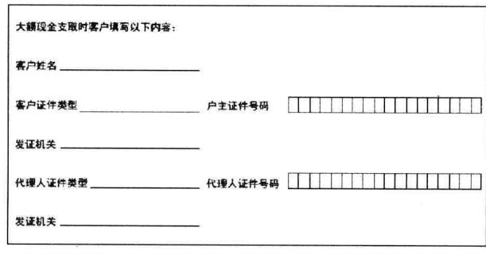
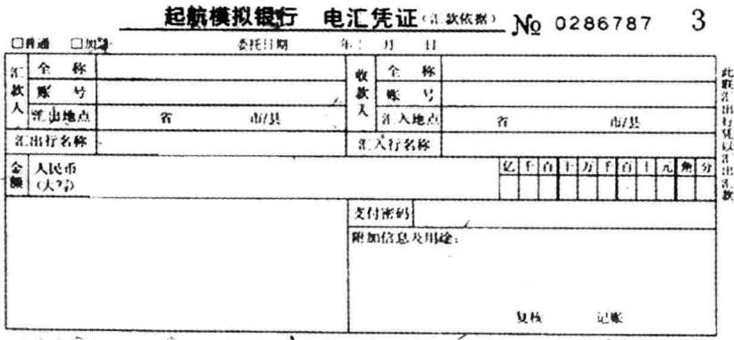

# 商业银行综合柜员柜台业务入门手册

上海起航教育信息咨询有限公司研究院 编著

SHANGYEYINHANGZONGHEGUIYUANGUIIAIYEWURUMENSHOUCE

商业银行新员工培训系列教材

商业银行综合柜员柜台业务入门手册兴 COE起航教育

商业银行新员工培训系列教材

商业银行  
综合柜员柜台业务  
入门手册  
COE

# 中国金融出版社

责任编辑：褚蓬瑜责任校对：刘明责任印制：陈晓川

# 图书在版编目（CIP）数据

商业银行综合柜员柜台业务人门手册（ShangyeYinhang ZongheGuiyuanGuitaiYewuRumenShouce）/上海起航教育信息咨询有限公司研究院编著.一北京：中国金融出版社，2012.4

商业银行新员工培训系列教材ISBN978-7-5049-6314-7

I. $\textcircled{1}$ 商…1 $\mathbb { I } . ( \mathbb { D } \mathbb { E } ^ { \dots }$ ⅢI. $\textcircled{1}$ 商业银行一银行业务V. $\textcircled{1}$ F830.4

中国版本图书馆 $\mathrm { C I P }$ 数据核字（2012）第036445号

# 发行 出版 中国金融出版社

社址北京市丰台区益泽路2号  
市场开发部（010)63266347，63805472，63439533（传真）  
网上书店htp：//www.chinafph.com(010)63286832，63365686（传真）  
读者服务部（010)66070833，62568380  
邮编100071  
经销 新华书店  
印刷 保利达印务有限公司  
尺寸 169毫米 $\times 2 3 9$ 毫米  
印张 8.25  
字数 145千  
版次 2012年4月第1版  
印次2012年4月第1次印刷  
定价23.00元  
ISBN978-7-5049-6314-7/F.5874  
如出现印装错误本社负责调换联系电话(010)63263947

# 本书编委会

主任张琛琳

编委姚淑敏赵慈拉 黄扬华熊燕 李英娜张葵

# 总 序

上海起航教育信息咨询有限公司在长期的教学培训实践中，积累了丰富的银行业人才培训经验，最近组织编写了一套新员工培训系列教材，已经在陆续出版之中。这套教材内容十分广泛，涉及商业银行经营管理和业务产品等诸多方面，包括《商业银行法律原理与制度》、《商业银行综合柜员基本技能入门手册》、《商业银行综合柜员柜台业务入门手册》、《商业银行公文写作》、《商业银行公文例文集》、《银行新员工阳光心态和职业素养》、《银行网点异常情况处理》、《银行新进员工服务礼仪教程》等等，它给银行业员工培训提供了重要教材。这套教材紧紧地联系当前商业银行在改革发展中面临的实际问题，以最前沿的管理视角、最切合基层机构实际的课题、最符合银行员工需要的内容进行编排，力求做到知识性、制度性与实务性相结合，突出了针对性、可操作性和可读性，定将成为一批银行业通用的教材，定会得到银行业员工的喜爱。

银行业人才培训始终是一项最重要、最基础、最迫切的工作，哪家银行都将其作为经营战略的内容，任何时期都不能忽视。尤其当今时代的中国，银行业正处在一个高速发展的时期。据统计数据披露，截至2011年末，我国银行业金融机构境内本外币总资产为113.28万亿元，近十年来呈现出每四年翻一番的增长态势，尤其中小银行的发展速度更快。银行是社会资金的血脉与蓄水池，承载并管理着社会的货币财富，服务于国家经济发展和国民金融需求。商业银行的经营发展，完全建立在国民经济发展与财富实力积累的基础之上。未来在向全面小康社会发展转型的过程中，中国经济发展的良好势头以及强盛的金融需求，依然强劲地推动着中国金融业改革发展。乘经济发展与国民财富快速增长的快车，中国银行业发展的速度依然很快，这个基本的趋势已经成为共识。但是，银行业的这种发展并不只是简单的规模扩张，而是一个伴随着商业银行经营体制转型和制度机制创新变革的过程，是一个全面贯彻科学发展观的过程。因此，新形势下银行员工将面对更高的要求和压力，这既是挑战，更是机会。不仅面临业务工作量增长的压力，而且应当在旧的经营方式被淘汰时，尽快地转变经营理念，学习掌握新的经营方式，提高工作技能和业务素养，跟上改革发展的步伐。这些都依赖于加强职业培训，提高职业素质。

当今中国金融从业人员有三百余万人，商业银行亟待社会提供更好的职业教育培训渠道和教材。从整体上看，社会十分缺乏系统的培训教材，尤其缺乏具有系统性、通用性、实用性的教材，衷心地希望本系列教材能够为广大银行员工提供有益的参考。

# 序

《商业银行综合柜员柜台业务入门手册》循“基础、实用、恰当”的基本思路，针对新员工履职能力的要求，从会计、储蓄、出纳的部分基础理论知识导入，以网点一日操作流程，部分对公、对私业务的处理，凭证填写规范，公章类型及使用保管等实务，导出基础理论知识的运用。全书分“基础篇”、“操作篇”、“实务篇”三大部分共九个章节，力求达到既讲清原理又不求全、不求深；既符合实际工作需要，又为新员工未来进一步提高打下基础的双重目标。

“基础篇”详细讲解与综合柜台基础业务相关的会计、储蓄、出纳的部分基础理论知识。“操作篇”第一章讲解网点营业前准备工作、营业中试轧账、营业终了后结束工作，以及相关基本制度；第二章“对私业务模块”和第三章“对公业务模块”，各举几笔业务实例，逐笔讲解会计、储蓄、出纳基础知识的运用、操作方法、操作流程和相关规定，指出风险点。“实务篇”则讲解了支票等凭证的填写规范，公章的领用、使用、保管的相关规定及部分常用公章的使用范围。每一章后都附有练习与思考，“操作篇”和“实务篇”还安排了一定的训练。

通过学习，使学员在掌握一定理论知识的同时，对综合网点的一日流程、对综合柜员独立完成从业务受理、业务内容与级别判断、账务处理、现金处理到超级别业务请求授权的全过程有一个大概的感性认识。

需要特别指出的是，本书的编写得到了公司科技部的大力支持：李英娜参与了“操作篇”初稿的写作，还协助完成书中所有图片的制作，徐柳燕协助完成公章图样的制作。

赵慈拉老师等同仁对本书编写提出了宝贵的意见，在此表示感谢！

尽管编者在编写过程中力求正确严密，然而由于时间仓促，其中疏漏和错误依然难免，诚请各位读者批评指正，我们的电子邮箱为：research $@$ qihangedu. com。

上海起航教育信息咨询有限公司研究院2012年3月

# 目 录

# 基础篇

# 第一章会计基础知识 3

第一节会计科目  
第二节记账方法  
第三节 会计分录  
第四节 账务组织  
第五节会计凭证 10  
第六节会计账簿 15

# 第二章储蓄基础知识 21

第一节储蓄的政策、原则和概念 22  
第二节储蓄存款种类 23  
第三节储蓄存款利息计算 26  
第四节账户挂失 34  
第五节存款继承 36

# 第三章出纳业务 39

第一节基础知识 40

第二节出纳的主要工作和业务流程 43  
第三节出纳长短款 48  
第四节钱箱和现金登记簿 49

# 第四章人民币银行结算账户 53

第一节个人银行结算账户 54  
第二节法人企业单位基本存款户 56

# 操作篇

# 第一章银行柜员一日业务操作流程 63

第一节营业前的各项准备工作 64  
第二节日间轧账操作处理 67  
第三节日终账务处理及结束工作 68

# 第二章对私业务模块 73

第一节个人银行结算账户开户 74  
第二节农信银现金通存业务 81  
第三节整存整取（存单）提前支取 84  
第四节活期储蓄存款销户业务 88

# 第三章对公业务模块 93

第一节现金支票付款 94  
第二节单位现金存款 96

# 实务篇

# 第一章票据（支票）、结算凭证（电汇凭证）填写规范. 101

第一节票据金额大小写书写规范 102  
第二节支票填写规范 104

第三节汇兑凭证．… 110

# 第二章会计印章… 113

第一节会计印章及其用途 114  
第二节常用会计印章 115

# 参考文献 .120

基础篇

# 第一章 会计基础知识

# 本章要点与学习目标

通过本章的学习，要求学员了解银行会计的会计科目、账务组织，掌握借贷记账法的记账方法、记账规则、平衡公式；了解银行的各类会计凭证和凭证传递的流程，掌握常用凭证的使用及填制规范，掌握空白重要凭证领用、保管规范，了解各类登记簿，掌握账簿记载的规则和错账冲正的方法。

银行会计是会计学科的一个重要分支，是办理和实现银行业务的主要工具，银行会计以货币为主要计量单位，银行会计的对象，是指银行会计反映和监督的内容，即银行能以货币计量的各项业务活动和资金运动。在长期实践中银行会计形成了一系列独特的专门方法：凭证的填制与传递、账户的设置与登记、表单的设置与编制、账务处理与账务核对的程序等。银行会计是综合柜员处理业务的基础工具，了解 熟悉 掌握银行会计基础知识是每个新员工的必修课。

# 第一节 会计科目

# 本节关键词

会计科目表内科目表外科目科目体系

# 一、会计科目

会计科目是对会计对象的具体要素按照不同的特征和资金性质、业务特点、经营管理和核算要求进行分类而确立的会计核算项目。每个项目规定一个专有的名称，如库存现金、单位活期存款、资本公积、辖内往来、中间业务收人等等，据以总括反映银行各项业务和财务活动，也是设置账户、归集和记录各项经济业务的根据。

银行的会计科目分为表内科目和表外科目两大类。表内科目：归属于资产负债表项目的会计科目。表外科目：不归属于资产负债表项目的会计科目。

# 1.表内科目

表内科目分成五大类。

资产类：用于核算现金、贵金属、存放中央银行准备金、应收款项、各种贷款、投资、固定资产、无形资产及其他资产等。余额反映在借方。

负债类：用于核算各项存款、各项应付款项、各项借款、发行债券及

应解汇款等。余额反映在贷方。

所有者权益类：用于核算实收资本、资本公积、盈余公积、本年利润及利润分配。科目余额中，资本部分余额反映在贷方，利润分配科目余额反映在贷方时，表示未分配的利润，反映在借方时，表示尚未弥补的亏损。

资产负债共同类：主要用于核算待清算辖内往来、同城票据清算、银行财务往来等业务。此类科目余额轧差反映，余额在借方属资产性质，余额在贷方属负债性质。

损益类科目：用于核算各项收入、各项支出、营业费用、税金、汇兑损益等。收人类科目余额在贷方，支出类科目余额在借方。

# 2.表外科目

表外科目一般有三类：或有事项类科目、代理业务类科目、备查登记类科目。

重要空白凭证、代保管的有价值品，有价单证等在表外科目的备查类科目核算。

# 二、科目体系

一级科目采用4位数字编码，满足对外公开披露会计信息及了解本行经营状况的需要；二级科目采用6位数字编码；三级科目采用8位数字编码，从不同的角度对二级科目核算的信息进行进一步分类统计，以满足各业务部门的管理需要和有关部门的统计要求。科目代号的首位数字代表该科目在会计报表的归类，如“1010一现金”，科目代号首位数字“1”表示“现金”科目在各类会计报表中归属于资产类。

# 第二节 记账方法

# 本节关键词

单式和复式记账法借贷记账法记账符号记账规则

# 一、单式记账法

单式记账法对发生的每笔经济业务，只在一个会计科目中进行登记，各科目的记录没有直接联系，不要求平衡，不能全面、系统地反映经济业务全貌，不便于对账户记录正确性和完整性的检查。

# 二、复式记账法

复式记账法对发生的每笔业务都要在两个或两个以上相关联的会计科目中以相同金额登记，因此复式记账法的优势明显：

（1）相关科目之间的对应关系清楚明了。（2）完整、系统地反映了经济业务的来龙去脉和业务活动的全过程及结果。（3）对记录的结果可以进行试算平衡，以检查会计记录的正确性，防止差错，保证质量。

# 三、借贷记账法

借贷记账法是一种复式记账法，是世界各国银行通用的记账方法。

1.记账符号：“借”—“贷”

“借”和“贷”对于不同性质的科目表示的含义是不一样的，具体含

# 义见下表：

资产负债表  

<table><tr><td rowspan=1 colspan=1>借方</td><td rowspan=1 colspan=1>贷方</td></tr><tr><td rowspan=1 colspan=1>资产增加</td><td rowspan=1 colspan=1>资产减少</td></tr><tr><td rowspan=1 colspan=1>负债减少</td><td rowspan=1 colspan=1>负债增加</td></tr><tr><td rowspan=1 colspan=1>权益减少</td><td rowspan=1 colspan=1>权益增加</td></tr><tr><td rowspan=1 colspan=1>收益减少</td><td rowspan=1 colspan=1>收益增加</td></tr><tr><td rowspan=1 colspan=1>支出增加</td><td rowspan=1 colspan=1>支出减少</td></tr></table>

2.记账规则、平衡公式

记账规则 $\Rightarrow$ 有借必有贷，借贷必相等记账规则运用到账务记载中应遵循以下原则：

转账业务：先记借方，后记贷方； 先记账，后签回单； 代收他行票据，收妥进账。

现金业务：现金收入先收款，后记账，现金付出先记账，后付款。

平衡公式：

各科目借方发生额合计 $=$ 各科目贷方发生额合计各科目借方余额合计 $=$ 各科目贷方余额合计

3.余额轧计的公式

余额在借方的科目：

今日余额 $=$ 昨日余额 $^ +$ 今日借方发生额-今日贷方发生额余额在贷方的科目：

今日余额 $=$ 昨日余额 $^ +$ 今日贷方发生额-今日借方发生额

# 第三节会计分录

# 本节关键词

会计分录 编制方法

# 一、会计分录

对每一笔经济业务所涉及的科目（账户）名称、应记方向（借方或贷方）和金额的记录，称作会计分录。会计分录由记账方向（借或贷）、科目（账户）名称、金额三个基本要素组成。

·因经济业务的不同，会计分录有多种组合：

一笔经济业务只涉及两个账户，对应的会计分录为一借一贷。如个人持现金开立零存整取储蓄存款账户，会计分录为：

借：现金—柜台营业用现金贷：定期储蓄存款—零存整取储蓄存款—— $\times ~ \times$ 客户

一笔经济业务涉及两个（不含两个）以上账户，对应的会计分录为一借多贷。或一贷多借。如单位定期存款销户，会计分录为：

借：单位定期存款— $\times ~ \times$ 单位借：利息支出—单位定期存款利息支出贷：单位活期存款— $\times ~ \times$ 单位

为了清楚地反映经济业务对应的账户关系，不可把不同经济业务合并在一起，编制多借多贷的会计分录。但在银行业务中，往往会遇到一笔业务涉及多个借方科目和多个贷方科目，必须编制多借多贷的会计分录，才能清楚地反映出该笔经济业务的全貌。如个人跨行汇款，涉及两个借方科目和两个贷方科目，会计分录为：

借：活期储蓄存款—— $\times ~ \times$ 客户借：现金—柜台营业用现金贷：资金清算—跨行资金清算

# 二、会计分录编制方法

1.审核会计凭证，看清金额，分析业务所涉及的账户；

2.分析各账户资金是增加还是减少；

3.确定该笔业务涉及的账户所归属的会计科目；

4.判断该科目在资产负债表中的归类，确定各科目记账方向，应记借方还是应记贷方；

5.按照“有借必有贷，借贷必相等”的原则编制会计分录；

6.编制会计分录时，先借后贷分行编写，借方在上，贷方在下；

7．“借”和“贷”记账符号旁使用冒号，文字、金额数字之间要留有空格，借贷错开，贷方比借方退后两格；

8.一借多贷、一贷多借或多借多贷的会计分录，多方必须分行写，且记账符号、文字、金额应该对齐。

# 第四节 账务组织

# 本节关键词

明细核算综合核算

账务组织包括明细核算和综合核算两部分。明细核算按账户核算，反映各账户资金增减变化及结果的详细情况；综合核算按科目核算，反映各科目资金增减变化及结果的总括情况。明细核算和综合核算都依据同一会计凭证进行。

# 一、明细核算构成和一般流程

分户账 余额表凭证现金收入、付出日记簿

# 二、综合核算构成和一般流程

凭证 科目日结单 总账 日计表

# 三、账务核对

账务核对是防止账务差错保证核算正确的重要措施。通过账务核对，要求做到账账、账款、账实、账证、账表、账折、内外账都相符。

# 第五节 会计凭证

# 本节关键词

会计凭证分类填写规范审核签章凭证的传递与保管重要空白凭证管理

# 一、会计凭证

会计凭证是各项业务和财务活动的原始记录，是办理业务、登记账簿、核对账务和事后考查的重要依据，是明确经济责任、具有法律效力的书面证明。

# 小贴示

银行业务往往牵涉多个部门，一笔业务需要多个有关柜、组、人员的处理，银行的会计凭证作为一种书面记录在业务处理过程中在各经办人或各部门之间传递。因此，银行会计凭证又称作“传票”。

# 二、会计凭证的分类

<table><tr><td rowspan=1 colspan=1>种类</td><td rowspan=1 colspan=1>释义及举例</td></tr><tr><td rowspan=1 colspan=1>原始凭证</td><td rowspan=1 colspan=1>一般是指业务发生时客户所提交的凭证，如现金解款单、个人存取款凭证。</td></tr><tr><td rowspan=1 colspan=1>记账凭证</td><td rowspan=1 colspan=1>根据原始凭证编制具备记账基本要素的凭证。</td></tr><tr><td rowspan=1 colspan=1>基本凭证</td><td rowspan=1 colspan=1>根据合法的原始单证或业务事实编制，凭以记账的凭证。如现金收付凭证、转账借贷凭证等。</td></tr><tr><td rowspan=1 colspan=1>特定凭证</td><td rowspan=1 colspan=1>根据业务需要而制定的各种专用凭证，如委托收款凭证、外汇结汇凭证等。</td></tr><tr><td rowspan=1 colspan=1>个人客户凭证</td><td rowspan=1 colspan=1>个人客户办理业务时所使用的凭证，如存单、存折等。</td></tr><tr><td rowspan=1 colspan=1>单位客户凭证</td><td rowspan=1 colspan=1>单位客户办理业务时所使用的凭证，如银行汇票、业务委托书、信电汇凭证等。</td></tr><tr><td rowspan=1 colspan=1>收费凭证</td><td rowspan=1 colspan=1>在办理业务中需向客户收费的重要空白凭证和一般凭证，如支票、业务委托书、进账单等。</td></tr><tr><td rowspan=1 colspan=1>重要空白凭证</td><td rowspan=1 colspan=1>无面额、经客户或银行填写金额并签章后具有支付能力的凭证，如存单、存折、本票、汇票、单位定期存款证实书等。</td></tr><tr><td rowspan=1 colspan=1>一般凭证</td><td rowspan=1 colspan=1>银行作为记账凭据填用，但不具备支付效力的凭证，如利息清单、进账单等。</td></tr><tr><td rowspan=1 colspan=1>机打凭证</td><td rowspan=1 colspan=1>柜员上机操作后，系统提示打印的凭证，如通用机打凭证等。</td></tr></table>

# 小贴示

原始凭证和记账凭证的划分不是绝对的，如果原始凭证具备了记账凭证的基本要素，可以直接作记账凭证。如存单、支票、进账单、存取款凭证，既是原始凭证又是记账凭证。

# 知识链接

基本凭证主要有：现金收入凭证、现金付出凭证；转账借方凭证、转账贷方凭证；特种转账借方凭证、特种转账贷方凭证；表外科目收入凭证、表外科目付出凭证。

# 三、基本要素

凭证的基本要素是指各种凭证都必须具备的基本内容。会计凭证基本要素有：凭证签发日期，收、付款人的开户行名称，户名，账号，货币符号，大小写金额，借贷方向，款项来源、用途，经济业务摘要及附件张数，会计分录，凭证编号，客户签章，银行业务公章及经办、审核、授权等有关人员签章等。

# 四、填写规范

# 1.基本要求

要素齐全，内容完整，数字准确，字迹清晰，字体规范，不错不漏，不潦草，防止涂改，签章齐全、清晰、端正。

# 2.相关规定

（1）会计凭证必须用蓝黑墨水笔填写，套写凭证必须用蓝黑圆珠笔双面复写或无碳复写纸书写。

（2）各类会计凭证的日期应填写业务发生当天的日期。

（3）原始凭证记载的各项内容不得涂改，若有错误，应由出具单位重开或更正，更正处应加盖出具单位印章，凭证的不可更改项有错误的，应由出具单位重开，不得在原始凭证上更改。

（4）应由客户填写的原始凭证，银行工作人员不得代填。

（5）机制凭证不得手工填制，遇系统故障或不可抗力因素，造成计算机无法打印时，需经业务主管授权后方可采用手工方式填制，主管授权应在凭证上签章，不可口头授权。

（6）会计凭证不得涂改、挖补、刀刮、皮擦，禁止使用涂改液销蚀。

# 五、会计凭证的审核

1.审核的要求

（1）对不真实、不合法的会计凭证不予受理，并及时报告有关负

责人。

（2）对不准确、不完整的会计凭证予以退回，要求其按会计制度规定更正、补充。

（3）确定会计凭证的真实性、合法性、有效性、完整性、正确性，防范支付结算风险。

# 2.审核要点（并未涵盖所有凭证的审核）

（1）客户提交的凭证是否为本行可受理的凭证。

（2）凭证使用是否正确，填写是否规范、字迹有否涂改，基本内容、联数、附件是否完整齐全。

（3）结算凭证是否在有效期内，账号户名是否相符，大小写金额是否一致，货币符号有无漏错，签字、密押、印签等是否真实齐全。

（4）款项来源与用途是否符合有关政策规定。

（5）付款凭证金额是否超过存款余额或贷款限额。

（6）利息、收费、赔偿金、牌价、罚金、滞纳金的计算是否正确。

# 六、会计凭证签章

1.会计凭证签章是银行在会计凭证和会计资料上表明并确认自己真实身份及交易合法性的标识，是银行对内、对外发生债权关系，具有法律效力的重要依据，包括盖章、签名或签名加盖章。

2.会计凭证从编制、审核、记账、复核、监督到装订，各环节经手人必须签章，以示责任。

3.需经内部审批的业务，由审批人员在会计凭证上签章授权，经办员才可凭此上机操作，需经客户确认的事项，必须由客户在会计凭证上签名确认。

4.经计算机处理打印的会计凭证，凭证上打印操作员号和复核操作员号的，可代替经办、复核签章，未打印操作员号的凭证必须签章。

# 七、会计凭证的传递与管理

会计凭证传递的原则：

准确及时、手续严密、先外后内、先急后缓、以客户为中心。

会计凭证传递的作用：实现了事权划分、岗位分离的内部控制制度的要求。

1.凭证传递的有关管理规定

（1）银行内部柜员之间、各网点之间、网点与监督管理部门之间等需传递的会计凭证一律由银行内部传递，并及时登记《凭证交接登记簿》，不得交客户代为传递。

（2）银行内部行处之间凭证传递必须加封或加锁，严密交接手续。

（3）会计凭证必须按业务处理流程传递，不得倒流。

（4）各营业网点营业结束后，当天的会计凭证应于当日或最迟次日送事后监督中心。

（5）联网业务的会计凭证不再回归原开户行，由代理行监督部门集中管理。

(6）经监督部门监督后的会计凭证，必须于次日装订成册，按规定编号加封入库保管。会计凭证的保管年限一般在十年至十五年，由各银行自定。

（7）传递至监督部门或凭证保管部门的会计凭证如需抽换凭证或调阅，必须经过网点会计主管和监督部门或凭证保管部门负责人批准，并与该部门的有关人员共同办理。

（8）客户当时不能取走的回单，应妥善保管，严禁放在柜台上由客户自行翻取。

2.重要空白凭证管理

# 知识链接

重要空白凭证是指无面额的经银行或客户填写金额并签章后即具有支付效力的空白凭证。重要空白凭证主要包括存单、存折、银行卡、汇票、本票、支票、辖内往来报单、对公定期存款开户证实书等。

（1）网点领用重要空白凭证时，应填写“重要空白凭证领用单”加盖预留印鉴，经业务主管签章后向保管部门办理领用手续。原则上网点一次的领用量不得超过1\~2个月的用量。

（2）网点凭证管库员与柜员之间的凭证发放与领用、上缴与收回，必须做到逐份清点，管库员当天发放的凭证柜员当天领用，柜员当天上缴的凭证管库员当天收回；柜员每次的领用量不得超过1周的用量。

（3）网点必须建立“重要空白凭证使用登记簿”，登记簿以一份一元为记账单位。登记簿设立网点总账和分户账，分户账还应按内、外库分别设立管库员内库分户账、柜员外库分户账。按凭证种类详细登记领用、交接、使用、数量等情况，每日结计余额，进行总分核对。

（4）柜员使用重要空白凭证应按凭证号顺序使用，不得跳号使用。

（5）严禁将重要空白凭证移作他用，严禁预先在重要空白凭证上加盖印章备用，属于机打的重要空白凭证因特殊原因需手工填制，必须经业务主管授权。

（6）每日营业结束后，柜员应对重要空白凭证进行账实核对，并交叉复核，确保账实相符。

（7）柜员因工作调动，或因凭证停用等管理需要，须将未用的重要空白凭证及时上缴网点管库员，不得滞留，主管人员进行监交。

（8）网点主管应定时、不定时对网点重要空白凭证库存、柜员库存进行检查、核对，确保账实一致。

# 第六节 会计账簿

# 本节关键词

基本账簿辅助账簿账簿记载规则错账冲正账簿结转

# 一、会计账簿的分类

会计账簿可分为基本账簿和登记簿两大类。

# 1.基本账簿

基本账簿有以下三种。

（1）流水账：指按照业务发生时间先后顺序，逐日、逐笔登记的账簿。如ATM流水账。

（2）分户账：指按账户连续记载每次交易明细的账簿。

依据业务需要设计固定格式账页：  
甲种账用于不计息或余额表计息及银行内部科目账户；乙种账用于在账页上计息的账户；  
丁种账用于逐笔销账的账务记载。

（3）总账：指按会计科目设置，每日按科目日结单登记借贷发生额，并结出余额，按月更换账页的账簿。

# 2.辅助账簿

（1）登记簿

登记簿是明细核算中的一种辅助性账簿，为业务管理需要而设置，起到备忘、控制的作用。记载除了金额以外更加详细的信息。各种登记簿的保管年限由各银行自定，重要的登记簿如挂失登记簿应永久保管。银行目前较常用的登记簿如下表所列。

<table><tr><td rowspan=1 colspan=1>名称</td><td rowspan=1 colspan=1>使用说明</td></tr><tr><td rowspan=1 colspan=1>挂失登记簿</td><td rowspan=1 colspan=1>详细记录受理客户挂失直至处理结束的全过程，每一环节的经办人员都必须在相关栏目按要求登记有关信息和客户确认签名，并签章以明确职责。</td></tr><tr><td rowspan=1 colspan=1>现金库存登记簿</td><td rowspan=1 colspan=1>登记网点每日的现金收付发生额，结计余额；并与网点钱箱现金库存合计数核对相符。</td></tr><tr><td rowspan=1 colspan=1>-重要空白凭证登记簿</td><td rowspan=1 colspan=1>按网点管库员内库、柜员外库分别登记各种重要空白凭证的领用数量、上缴数量，每天的使用数量和库存数量及交接记录。</td></tr></table>

续表

<table><tr><td rowspan=1 colspan=1>名称</td><td rowspan=1 colspan=1>使用说明</td></tr><tr><td rowspan=1 colspan=1>差错（事故）登记簿</td><td rowspan=1 colspan=1>按发生的时间详细记录柜员或自助设备现金长短款及公章、钱箱钥匙遗失、凭证遗失等事故及处理结果。</td></tr><tr><td rowspan=1 colspan=1>印章保管使用登记簿</td><td rowspan=1 colspan=1>各类会计印章的印模及发放、上缴、使用、保管和人员调动时的交接等记录。</td></tr><tr><td rowspan=1 colspan=1>自助设备没收磁卡登记簿</td><td rowspan=1 colspan=1>记录自助设备因各种情况吞没磁卡的日期、卡号、姓名，客户凭本人身份证件领取磁卡时核对无误发还磁卡时，记录日期、摘录证件号码，并请客户签名。</td></tr><tr><td rowspan=1 colspan=1>重要物品交接登记簿</td><td rowspan=1 colspan=1>营业结束后重要空白凭证小钢箱和公章若保管在网点专用保险箱内，每日营业前出库和营业终了后入库均应在登记簿上办理交接，双方签章以明职责。</td></tr><tr><td rowspan=1 colspan=1>网点服务器（终端）运行状况登记簿</td><td rowspan=1 colspan=1>按营业日记录网点服务器开启时间、运行情况、关闭时间，若发生问题应详细记录发生时间、症状、修复时间等，修理人员还应在“重要区域人员出入登记簿”上登记证件及出入时间。</td></tr><tr><td rowspan=1 colspan=1>网点工作日志</td><td rowspan=1 colspan=1>按营业日记录到行、离行时间，早晚逐项安全检查情况、当天上班人员、网点与库房接送款人员的接送款交接、上级相关部门检查情况、突发事件等。</td></tr><tr><td rowspan=1 colspan=1>重要区域人员出人登记簿</td><td rowspan=1 colspan=1>综合网点的现金区域为重要区域，非现金区域工作人员出入该区域都必须在此登记簿登记姓名及出入时间。</td></tr><tr><td rowspan=1 colspan=1>应急业务登记簿</td><td rowspan=1 colspan=1>系统发生故障无法正常营运时，客户急需取款的，经主管授权手工处理的业务必须在此登记簿详细登记客户姓名、账号、金额等基本信息，等系统恢复营运后补记账，并登记处理结果。</td></tr></table>

此外还有如退票登记簿、协助有权机关查询、冻结、扣划登记簿、上门收款、收单登记簿、开户销户登记簿（单位）、待处理抵（质）押品登记簿、查询查复登记簿、有价单证登记簿、人员交接登记簿、会计档案保管登记簿、调阅会计档案登记簿等等。

# (2）余额表

余额表是反映每日营业终了分户账余额的表式，按账户设置，是核对总账和分户账余额及计算利息的重要工具；也是和单位客户进行账务核对的工具。分为计息余额表和一般余额表两种。

# 二、账簿记载规则

1.账簿必须根据合法有效的凭证用蓝黑墨水笔或碳素笔记载。

2.账簿上记载的文字和金额应占全格二分之一，如摘要文字记载不全，可连续在下一行摘要栏记载，其金额应填在最后一行摘要记载的金额栏内。

3.余额结平时应在“借或贷”写“平”，余额以“一0一”表示（“0”写在元位）。

4.账簿记载应做到内容完整、数字准确、字迹清晰、摘要明了；严禁弄虚作假。

5.一切记载均不得涂改、挖补、刀刮、皮擦或用药水销蚀。

6.记载完毕应在记账凭证和账簿加盖私章以明职责。

7.发生跳页的应在空白的账页上加盖“此页空白”戳记和记账员、主管私章。

# 三、错账冲正

# 1.当日的错账冲正

记载发生错误用红笔将错误的文字和数字划线注销（必须使原有字迹仍可辨认），将正确的数字填写在红线上方，并在红线左端加盖私章；写错的数字必须全线划销，不得部分划销（见图1-1-1)；数字未写完就发现错误的，在未写数位以“0”补齐后全数划销（见图1-1-2）。

  
图1-1-1

  
图1-1-2

因传票编制错误而账簿记录发生错误的，重新编制传票按上述方法更正。

# 2.隔天发现的错账冲正

（1）若记账串户，编制同方向红蓝字转账传票冲正，红字传票记入原错误账户，摘要栏注明“冲正 $\times$ 年 $\times$ 月 $\times$ 日错账”，蓝字传票记入正确账户，摘要栏注明“补记 $\times$ 年 $\times$ 月 $\times$ 日账”。

（2）如果金额填制错误，应按照错误金额编制借贷方红字转账传票，将错误金额全数冲销，在原错误传票上注明“已于 $\times$ 年 $\times$ 月 $\times$ 日冲正”字样，然后按正确金额编制借贷方蓝字转账传票补记入账，在摘要栏注明情况。

（3）以上冲正若影响计息积数应调整计息积数。

# 3.跨年度发现的错账冲正

应填制反方向蓝字传票冲正，不得更改决算报表，原错误传票上注明“已于 $\times$ 年 $\times$ 月 $\times$ 日冲正”字样。

4.以上冲正传票均需经会计主管或会计部门负责人审查盖章后方可办理。

5.因错账造成空行的应用红线将空行全线划销，摘要栏注明“空格”字样，左端加盖私章，如下图所示。

6.账页记载错误无法更改时，不得撕毁账页，须经业务主管同意后另换账页记载，经业务主管复核并在错误账页上划交叉红线注销，由经办柜员、业务主管盖章证明，注销的账页另行保管，待装订账页时附在该户账页后备查。

# 四、账簿结转

# 1.分户账满页结转

在满页账页最后一行摘要栏注明“过次页”字样，新账页第一行摘要栏填写“承前页”字样，把余额结转到新账页。

2.总账按月结转，将上月账页的“上年末余额”“自年初累计发生

额”“月末余额”分别过人新账页的相应栏目。

# 3.年度结转

（1）年度终了除分户账按规定可延续使用外，均应更换新账页。在旧账页的最后一行金额下加盖“结转下年”戳记，余额过入新账页；新账页首页首行应记新年1月1日，摘要栏加盖“上年结转”戳记。

（2）销账式丁种账页应将未销账逐笔过入新账页，摘要栏加盖“上年结转”戳记，填写旧账页的发生日期摘要内容并结转余额，旧账页各笔未销账的“销账日期”栏加盖“结转下年”戳记。

（3）结转完毕，应加计新账页余额与该科目总账余额核对一致，确保无误。

# 【练习与思考】

1．借贷记账法与单式记账法有什么不同，它有什么优势，它的记账规则是什么？

2.以下哪些属明细核算范畴？

A.日记表B.分户账C.科目日结单D.余额表E.总账

3.柜员在领人、使用、保管、上缴重要空白凭证时应遵守哪些规定？

# 第二章 储蓄基础知识

# 本章要点与学习目标

储蓄是综合柜台业务的主要业务，储蓄业务的特点是：涉及的客户面很广且不固定、业务笔数多、金额小、业务烦琐、政策性强。因此柜员除了要具备强烈的服务意识和良好的服务态度以外，还需熟练掌握储蓄的基础知识。

通过本章的学习，学员要了解储蓄的相关政策、原则，掌握储蓄的范围，熟悉储蓄的品种，掌握储蓄存款利息计算的方法，对储蓄存款的特殊业务处理，要把握政策、了解处理方法、掌握风险点。

# 第一节储蓄的政策、原则和概念

# 本节关键词

储蓄的政策储蓄的原则储蓄的范围

# 一、储蓄的政策

国家保护个人合法储蓄存款的所有权及其他合法权益，鼓励个人参加储蓄。

《储蓄管理条例》第一章第五条

# 二、储蓄的原则

储蓄机构办理储蓄业务，必须遵循“存款自愿，取款自由，存款有息，为储户保密”的原则。

《储蓄管理条例》第一章第五条

# 三、储蓄的概念（范围）

个人将属于其所有的人民币或外币存入储蓄机构，储蓄机构开具存折或者存单作为凭证，个人凭存折或者存单可以支取存款本金和利息，储蓄机构依照规定支付存款本金和利息的活动。

任何单位和个人不得将公款以个人名义转为储蓄存款。

《储蓄管理条例》第一章第三条

# 第二节 储蓄存款种类

# 本节关键词

活期储蓄存款 整存整取定期储蓄存款 零存整取定期储蓄存款教育储蓄存款 存本取息定期储蓄存款 定活两便储蓄存款 个人通知存款

储蓄存款有很多品种，如活期储蓄存款、整存整取定期储蓄存款、零存整取定期储蓄存款、存本取息储蓄存款、定活两便储蓄存款、个人通知存款等。一般把这些品种归成两大类：活期储蓄存款和定期储蓄存款，也有归成三类或更多的。下面介绍几种常见的储蓄存款品种。

# 一、活期储蓄存款（简称“活期”）

<table><tr><td rowspan=1 colspan=1>类别</td><td rowspan=1 colspan=1>账户物理凭证</td><td rowspan=1 colspan=1>存期</td><td rowspan=1 colspan=1>基本规定</td><td rowspan=1 colspan=1>适用交易</td></tr><tr><td rowspan=1 colspan=1>活期普通户</td><td rowspan=1 colspan=1>存折类</td><td rowspan=1 colspan=1>无</td><td rowspan=1 colspan=1>一元起存，开户后可随时存取；仅限于现金的存取及同名账户转账业务。</td><td rowspan=1 colspan=1>开户、续存、支取、销户、结息、换折、补登折</td></tr><tr><td rowspan=1 colspan=1>个人银行结算账户</td><td rowspan=1 colspan=1>存折类、卡类</td><td rowspan=1 colspan=1>无</td><td rowspan=1 colspan=1>一一元起存，可“0”开户。可办理个人资金的所有结算业务，包括现金收付和转账收付，办理汇兑、定期借记、定期贷记等业务，办理个人理财业务，使用支票、信用卡等信用工具</td><td rowspan=1 colspan=1>开户、续存、支取、销户、结息、换折、补登折</td></tr></table>

# 二、整存整取定期储蓄存款（简称“整整”）

# 小贴示

一张定期存单只能存入一笔存款，销户时收回，一次性使用，定期一本通存折本外币通用，一本存折可存入多笔存款，记录满页可换新折后连续使用。

<table><tr><td>账户物理凭证</td><td>存期</td><td>基本特征</td><td>适用交易</td></tr><tr><td>存单</td><td rowspan="2">三个月、半年、 一年、二年、</td><td rowspan="2">1.五十元起存，本金一次存入。 2.存入时约定存期，存期越长 利率越高，销户时利随本清。</td><td>开户、销户、结息、提 前支取、部分提前支取</td></tr><tr><td>存折（定期一 本通）</td><td>3.可约定转存，到期后按约定 的转存期限无限次自动转存。 4.存款未到期若急需用款可办 理提前支取或部分提前支取， 提前支取的利息按相关规定计 算。</td></tr></table>

# 知识链接

整存整取定期储蓄存款客户办理约定转存的，在存款到期日和转存到期日以外的日期支取存款，均视为提前支取。

未办理约定转存的，存款到期日以后的存期均视为逾期，原存款期内按开户日约定利率计息，逾期部分按支取日挂牌公告的活期利率计息。

# 三、零存整取定期储蓄存款与教育储蓄存款（简称“零整”、“教育”）

<table><tr><td rowspan=1 colspan=1>品种</td><td rowspan=1 colspan=1>账户物理凭证</td><td rowspan=1 colspan=1>期限</td><td rowspan=1 colspan=1>基本规定</td><td rowspan=1 colspan=1>适用交易</td></tr><tr><td rowspan=1 colspan=1>零存整取定期储蓄存款</td><td rowspan=1 colspan=1>存折</td><td rowspan=1 colspan=1>一年、三年、五年</td><td rowspan=1 colspan=1>五元起存，每月存入一次，由客户自定固定存款金额。中途漏存可在次月补存，可办理提前支取，但不可部分提前支取。</td><td rowspan=1 colspan=1>开户、续存、销户、换折、补登折、提前支取</td></tr></table>

续表

<table><tr><td rowspan=1 colspan=1>品种</td><td rowspan=1 colspan=1>账户物理凭证</td><td rowspan=1 colspan=1>期限</td><td rowspan=1 colspan=1>基本规定</td><td rowspan=1 colspan=1>适用交易</td></tr><tr><td rowspan=3 colspan=1>教育储蓄（零存整取定期储蓄存款的衍生产品）</td><td rowspan=3 colspan=1>存折</td><td rowspan=3 colspan=1>一年、三年、六年</td><td rowspan=1 colspan=1>1.适用零存整取的基本规定（账户最高余额一般限定为2万元）。</td><td rowspan=3 colspan=1>开户、续存、销户、换折、补登折、提前支取</td></tr><tr><td rowspan=1 colspan=1>2.存款人为在读学生，一般最高年龄不能超过16周岁。</td></tr><tr><td rowspan=1 colspan=1>3.到期支取本息时若有相关证明可享受利率优惠，按同档次整存整取定期储蓄存款利率计算利息，并免征利息所得税。</td></tr></table>

# 专用名词

月存储额：每月固定存入的金额

首次期数：1

末次期数：一年期—12，三年期—36，五年期—60

# 四、存本取息定期储蓄存款（简称“存本取息”）

<table><tr><td rowspan=1 colspan=1>账户物理凭证</td><td rowspan=1 colspan=1>期限</td><td rowspan=1 colspan=1>基本规定</td><td rowspan=1 colspan=1>适用交易</td></tr><tr><td rowspan=4 colspan=1>存单</td><td rowspan=4 colspan=1>一年、三年、五年</td><td rowspan=1 colspan=1>1.一般五千元起存，由开户银行签发存单。</td><td rowspan=4 colspan=1>开户、取息、销户、提前支取</td></tr><tr><td rowspan=1 colspan=1>2.开户时客户除了需确定存期，还需与开户银行协商确定利息支取周期，可以一个月支取一次，也可以几个月支取一次。</td></tr><tr><td rowspan=1 colspan=1>3.凭存单分期支取利息，本金于期满时一次支取。</td></tr><tr><td rowspan=1 colspan=1>4.提前支取本金，按提前支取利息计算的相关规定计算利息，并扣回多支付的利息。</td></tr></table>

# 五、定活两便储蓄存款（简称“定活两便”，介于活期和定期之间的储蓄品种）

<table><tr><td>账户物理凭证</td><td>基本规定</td><td>适用交易</td></tr><tr><td>存单</td><td>2.凭存单支取本息，利率随存款实际存期</td><td>开户、销户</td></tr></table>

# 六、个人通知存款（简称“通知存款”）

<table><tr><td rowspan=1 colspan=1>账户物理凭证</td><td rowspan=1 colspan=1>基本规定</td><td rowspan=1 colspan=1>适用交易</td></tr><tr><td rowspan=3 colspan=1>存单</td><td rowspan=1 colspan=1>1.个人通知存款的最低起存金额、最低支取金额及账户余额均为5万元，一次存人，可多次支取，支取后留存部分金额低于5万元的予以清户。</td><td rowspan=3 colspan=1>开户、销户、支取通知、支取</td></tr><tr><td rowspan=1 colspan=1>2.支取时提前通知银行，约定取款日期和金额方能支取款项。</td></tr><tr><td rowspan=1 colspan=1>3.不论实际存期多长，按存款人提前通知的期限，划分为1天个人通知存款和7天个人通知存款两个品种。</td></tr></table>

# 第三节 储蓄存款利息计算

# 本节关键词

本金利率利息利率表示方法利率换算公式积数计息法逐笔计息法一般规定活期计息规定整整计息规定定活两便计息规定零整计息规定通知存款计息规定利息所得税

# 一、基本概念

本金：储户存人银行的款项金额，它是利息计算的依据。

利率：一定时期内利息与本金的比率。

储蓄存款利率由中国人民银行拟订，经国务院批准后公布，或者由国务院授权中国人民银行制定、公布。

储蓄机构必须挂牌公告储蓄存款利率，不得擅自变动。

《储蓄管理条例》第四章第二十二条、第二十三条

利息：储蓄机构按约定利率支付给储户的超出本金部分的货币报酬。

# 二、利率表示方式和换算公式

# 1.利率的表示方法

年利率（ $x . \times \times \% )$ ，月利率（ $x . \ x \times \% o )$ ，日利率 $( \times . \times \times \% 0 0 0 )$

2.利率换算公式

日利率 $( x . x \times 9 0 0 0 )$ $=$ 年利率 $( \times . \times \times \% ) \div 3 6 0$ 月利率（ $x . \ x \ x \text{‰}$ $=$ 年利率（ $x . \times \times \%$ ） $\div 1 2$ 日利率（ $\times . \times \times \% 0 0$ ） $=$ 月利率（ $x . \ x \times \% o )$ $\div 3 0$

# 三、利息计算方法

1.积数计息法（适用于活期类存款利息计算）

利息 $=$ 累计计息积数 $\times$ 日利率

其中，累计计息积数 $=$ 计息期计息账户每日余额的累加。

# 2.逐笔计息法

计息期为整年（月）的计息公式：

利息 $=$ 本金 $\times$ 年（月）数 $\times$ 年（月）利率计息期有整年（月），又有零头天数的计息公式：利息 $=$ 本金 $\times$ 年（月）数 $\times$ 年（月）利率 $^ +$ 本金 $\times$ 天数 $\times$ 日利率

# 四、计息的一般规定

1.本金的计息起点为“元”，“元”以下的“角”“分”不计利息。

2.利息金额算至分位，“分”以下四舍五入；分段计算的算至“厘”位，各段利息相加后四舍五入。

3．日期计算“算头不算尾”，即存入日起息，到期日不计息。

4.存期计算采用对年、对月、对日的“年月日同减法”，以支取日减去存入日得出存期。

例如，2009年8月16日存入，2011年6月5日支取。

借 $_ { 1 \to 1 2 }$

借 $_ { 1  3 0 }$

2011年06月05日-2009年08月16日

1年09月19日

或1年零289天

5.一年（不分平年闰年）均按360天计算，一个月（不分大小月）均按30天计算，存款到期月份无对应日的，以到期月份最末一天为到期日。

6.存款到期日为节假日且网点不营业的，可在节假日前一天办理支取，按提前支取手续办理，利息计算视同到期。

# 五、各类储蓄存款的计息规定

1.活期储蓄存款计息规定

（1）活期储蓄存款使用积数计息法计算利息。

（2）按季结息，每季度最后一个月的20日为结息日，结息后的利息并人本金起息。

（3）销户时只需计付账户最后一个结息日以后存期的利息。

活期储蓄存款在存入期间遇有利率调整，按结息日挂牌公告的活期储蓄存款利率计付利息。全部支取活期储蓄存款，按清户日挂牌公告的活期储蓄存款利率计付息。

《储蓄管理条例》第四章第二十七条

# 【计息例题】

<table><tr><td rowspan=1 colspan=1>年</td><td rowspan=1 colspan=1>月</td><td rowspan=1 colspan=1>日</td><td rowspan=1 colspan=1>摘要</td><td rowspan=1 colspan=1>借方(元)</td><td rowspan=1 colspan=1>贷方(元)</td><td rowspan=1 colspan=1>余额(元）</td></tr><tr><td rowspan=1 colspan=1>2011</td><td rowspan=1 colspan=1>3</td><td rowspan=1 colspan=1>21</td><td rowspan=1 colspan=1>开户</td><td rowspan=1 colspan=1></td><td rowspan=1 colspan=1>5000.00</td><td rowspan=1 colspan=1>5000.00</td></tr><tr><td rowspan=1 colspan=1>2011</td><td rowspan=1 colspan=1>3</td><td rowspan=1 colspan=1>25</td><td rowspan=1 colspan=1>存人</td><td rowspan=1 colspan=1></td><td rowspan=1 colspan=1>10 000.00</td><td rowspan=1 colspan=1>15 000.00</td></tr><tr><td rowspan=1 colspan=1>2011</td><td rowspan=1 colspan=1>4</td><td rowspan=1 colspan=1>19</td><td rowspan=1 colspan=1>存人</td><td rowspan=1 colspan=1></td><td rowspan=1 colspan=1>20000.00</td><td rowspan=1 colspan=1>35000.00</td></tr><tr><td rowspan=1 colspan=1>2011</td><td rowspan=1 colspan=1>5</td><td rowspan=1 colspan=1>5</td><td rowspan=1 colspan=1>转定期</td><td rowspan=1 colspan=1>30000.00</td><td rowspan=1 colspan=1></td><td rowspan=1 colspan=1>5000.00</td></tr><tr><td rowspan=1 colspan=1>2011</td><td rowspan=1 colspan=1>5</td><td rowspan=1 colspan=1>17</td><td rowspan=1 colspan=1>存人</td><td rowspan=1 colspan=1></td><td rowspan=1 colspan=1>6000.00</td><td rowspan=1 colspan=1>11 000.00</td></tr><tr><td rowspan=1 colspan=1>2011</td><td rowspan=1 colspan=1>5</td><td rowspan=1 colspan=1>24</td><td rowspan=1 colspan=1>支取</td><td rowspan=1 colspan=1>8000.00</td><td rowspan=1 colspan=1></td><td rowspan=1 colspan=1>3000.00</td></tr><tr><td rowspan=1 colspan=1>2011</td><td rowspan=1 colspan=1>6</td><td rowspan=1 colspan=1>2</td><td rowspan=1 colspan=1>存人</td><td rowspan=1 colspan=1></td><td rowspan=1 colspan=1>10000.00</td><td rowspan=1 colspan=1>13 000.00</td></tr></table>

要求：计算该账户至2011年6月20日的利息并写出会计分录（2011年6月20日的活期存款利率为 $0 . 5 0 \%$ ）。

用“年月日同减法”计算出各段计息天数依次是：4天、24天、16天、12天、7天、8天、18天。

累计计息积数计算：

$5 ~ 0 0 0 \times 4 ~ + ~ 1 5 ~ 0 0 0 ~ \times 2 4 ~ + ~ 3 5 ~ 0 0 0 ~ \times ~ 1 6 ~ + ~ 5 ~ 0 0 0 ~ \times$ $1 2 + 1 1 \ 0 0 0 \times 7 \ + 3 \ 0 0 0 \times 8 \ + 1 3 \ 0 0 0 \times 1 8 \ = \ 1 \ 3 3 5 \ 0 0 0 ($ 元）利息 $= 1 \ 3 3 5 \ 0 0 0 \times ( 0 . 5 0 \% \div 3 6 0 ) \ = 1 8 . 5 4$ （元）

会计分录：

借：利息支出—活期储蓄利息支出 18.54   
贷：活期储蓄存款—客户账 18

# 2.整存整取定期储蓄存款计息规定

（1）整整储蓄存款使用逐笔计息法计算利息，存期内遇有利率调整，按存单开户日挂牌公告的相应的定期储蓄存款利率计付利息。

（2）到期支取：到期支取按开户日或自动转存起息日挂牌公告的相应

档次的定期利率计算利息。

（3）约定转存结息：约定转存的，到期日为结息日，储蓄机构按存单开户日挂牌公告的相应档次的定期利率计算利息，结息后的利息并入本金，下一个存期按结息日挂牌公告的相应档次的定期利率起息。

（4）逾期支取：不约定转存的其超过存期的逾期天数按支取日挂牌公告的活期利率计算利息。

（5）全部提前支取：按支取日挂牌公告的活期储蓄存款利率计付利息；需出示存款人身份证件，委托他人支取的，还需出具被委托人身份证明。

（6）部分提前支取：（证件掌握同上）支取部分按支取日挂牌公告的活期储蓄存款利率计付利息，其余部分按原开户日、原户名、原存期、原利率开具新存单，到期时按原存单开户日挂牌公告的整整存款利率计付利息。

# 【计息例题】

（1）2009年10月30日存入的两年期整整存款，于2011年10月30日到期，若客户于10月31日支取不算过期1天；同理如10月31日存人的，10月30日支取，利息计算视同到期，但需按提前支取手续核验身份证件。

（2）若闰年2月29日存入的一年期整整存款，次年2月28日视同到期。

（3）某客户2008年10月14日存人一年期整整存款2万元，约定转存。2010年11月2日该客户持存单与身份证前来支取存款，请问银行总共应支付多少本息？

利率调整情况：

2008年10月9日一年期整整利率调整为 $3 . 8 7 \%$

2008年12月23日一年期整整利率调整为 $2 . 2 5 \%$

2010年10月19日一年期整整利率调整为 $2 . 5 0 \%$ ，活期利率调整为0 $) . 3 6 \%$ 。

第一次结息日：2009年10月14日  
利息： $2 0 \ 0 0 0 \times 1 \times 3 . 8 7 \% = 7 7 4 . 0 0$ （元）  
第二个存期本金： $2 0 \ 0 0 0 + 7 7 4 = 2 0 \ 7 7 4 . 0 0$ （元）  
第二个存期应执行的利率： $2 . 2 5 \%$   
第二次结息日：2010年10月14日  
利息： $2 0 7 7 4 \times 1 \times 2 . 2 5 \% = 4 6 7 . 4 2$ （元）  
第三个存期本金： $2 0 ~ 7 7 4 + 4 6 7 . 4 2 = 2 1 ~ 2 4 1 . 4 2$ （元）  
第三个存期应执行的利率： $2 . 5 0 \%$

支取时未满第三个存期，提前支取天数计算：

借 $_ { 1  3 0 }$ 2010年11月02日-2010年10月14日18日

利息： $2 1 ~ 2 4 1 \times 1 8 \times ~ ( 0 . 3 6 \% \div 3 6 0 ) = 3 . 8 2$ （元）

本利合计： $2 1 ~ 2 4 1 . 4 2 + 3 . 8 2 = 2 1 ~ 2 4 5 . 2 4$ （元）

会计分录：

借：定期储蓄存款—— $\times ~ \times$ 客户 21 241.42借：利息支出—定期储蓄利息支出 3.82贷：现金—柜台营业用现金 21 245.24

3.定活两便储蓄存款计息规定

（1）定活两便储蓄存款根据实际存期使用逐笔计息法计算利息，利随本清。

（2）存期不满三个月的按支取日挂牌公告的活期利率计付利息。

（3）存期三个月以上（含三个月)，不满半年的，整个存期按支取日定期整存整取三个月存款利率打六折计息。

(4）存期半年以上（含半年)，不满一年的，整个存期按支取日定期整存整取半年期存款利率打六折计息。

(5）存期在一年以上（含一年)，无论存期多长，整个存期一律按支取日定期整存整取一年期利率打六折计息。

# 4.零存整取储蓄存款计息规定

（1）零存整取计息使用积数计息法，按月计算累计计息积数。

（2）提前支取按支取日挂牌公告的活期利率计付利息；支取日当月存储额不计利息，支取日上月的存入日期若大于开户日，则该月的存储额也不计利息。

（3）逾期支取的到期部分按到期支取公式计算，逾期部分按整存整取逾期部分计息方法计算利息。

到期支取计息公式：

月存储额×（首次期数+末次期数）×末次期数2$\times$ （开户日零整年利率 $\div 1 2$ ）

提前支取计息公式：月存储额×（首次期数+末次有效期数）×末次有效期数2$\times$ （支取日活期年利率 $\div 1 2$ ）

# 【计息例题】

月存储额为500元，2011年12月5日支取，假定开户日一年期零存整取存款利率为 $2 , 4 6 \%$ 。

<table><tr><td rowspan=1 colspan=1>年</td><td rowspan=1 colspan=1>月</td><td rowspan=1 colspan=1>日</td><td rowspan=1 colspan=1>借方（元）</td><td rowspan=1 colspan=1>贷方（元）</td><td rowspan=1 colspan=1>余额（元）</td><td rowspan=1 colspan=1>期数</td><td rowspan=1 colspan=1>累计月积数</td></tr><tr><td rowspan=1 colspan=1>2010</td><td rowspan=1 colspan=1>12</td><td rowspan=1 colspan=1>5</td><td rowspan=1 colspan=1></td><td rowspan=1 colspan=1>500</td><td rowspan=1 colspan=1>500</td><td rowspan=1 colspan=1>1</td><td rowspan=1 colspan=1>500</td></tr><tr><td rowspan=1 colspan=1>2011</td><td rowspan=1 colspan=1>1</td><td rowspan=1 colspan=1>10</td><td rowspan=1 colspan=1></td><td rowspan=1 colspan=1>500</td><td rowspan=1 colspan=1>1000</td><td rowspan=1 colspan=1>2</td><td rowspan=1 colspan=1>1500</td></tr><tr><td rowspan=1 colspan=1>2011</td><td rowspan=1 colspan=1>2</td><td rowspan=1 colspan=1>11</td><td rowspan=1 colspan=1></td><td rowspan=1 colspan=1>500</td><td rowspan=1 colspan=1>1500</td><td rowspan=1 colspan=1>3</td><td rowspan=1 colspan=1>3.000</td></tr><tr><td rowspan=1 colspan=1>2011</td><td rowspan=1 colspan=1>3</td><td rowspan=1 colspan=1>15</td><td rowspan=1 colspan=1></td><td rowspan=1 colspan=1>500</td><td rowspan=1 colspan=1>2000</td><td rowspan=1 colspan=1>4</td><td rowspan=1 colspan=1>5000</td></tr><tr><td rowspan=1 colspan=1>2011</td><td rowspan=1 colspan=1>4</td><td rowspan=1 colspan=1>6</td><td rowspan=1 colspan=1></td><td rowspan=1 colspan=1>500</td><td rowspan=1 colspan=1>2500</td><td rowspan=1 colspan=1>5</td><td rowspan=1 colspan=1>7500</td></tr><tr><td rowspan=1 colspan=1>2011</td><td rowspan=1 colspan=1>5</td><td rowspan=1 colspan=1>15</td><td rowspan=1 colspan=1></td><td rowspan=1 colspan=1>500</td><td rowspan=1 colspan=1>3000</td><td rowspan=1 colspan=1>6</td><td rowspan=1 colspan=1>10500</td></tr><tr><td rowspan=1 colspan=1>2011</td><td rowspan=1 colspan=1>6南</td><td rowspan=1 colspan=1>8</td><td rowspan=1 colspan=1></td><td rowspan=1 colspan=1>500</td><td rowspan=1 colspan=1>3500</td><td rowspan=1 colspan=1>7</td><td rowspan=1 colspan=1>14 000</td></tr></table>

续表

<table><tr><td rowspan=1 colspan=1>年</td><td rowspan=1 colspan=1>月</td><td rowspan=1 colspan=1>日</td><td rowspan=1 colspan=1>借方（元）</td><td rowspan=1 colspan=1>贷方（元）</td><td rowspan=1 colspan=1>余额（元）</td><td rowspan=1 colspan=1>期数</td><td rowspan=1 colspan=1>累计月积数</td></tr><tr><td rowspan=1 colspan=1>2011</td><td rowspan=1 colspan=1>7</td><td rowspan=1 colspan=1>1</td><td rowspan=1 colspan=1></td><td rowspan=1 colspan=1>500</td><td rowspan=1 colspan=1>4000</td><td rowspan=1 colspan=1>8</td><td rowspan=1 colspan=1>18000</td></tr><tr><td rowspan=1 colspan=1>2011</td><td rowspan=1 colspan=1>8</td><td rowspan=1 colspan=1>30</td><td rowspan=1 colspan=1></td><td rowspan=1 colspan=1>500</td><td rowspan=1 colspan=1>4500</td><td rowspan=1 colspan=1>9</td><td rowspan=1 colspan=1>22 500</td></tr><tr><td rowspan=1 colspan=1>2011</td><td rowspan=1 colspan=1>9</td><td rowspan=1 colspan=1>19</td><td rowspan=1 colspan=1></td><td rowspan=1 colspan=1>500</td><td rowspan=1 colspan=1>5000</td><td rowspan=1 colspan=1>10</td><td rowspan=1 colspan=1>27500</td></tr><tr><td rowspan=1 colspan=1>2011</td><td rowspan=1 colspan=1>10 ,</td><td rowspan=1 colspan=1>4</td><td rowspan=1 colspan=1></td><td rowspan=1 colspan=1>500</td><td rowspan=1 colspan=1>5500</td><td rowspan=1 colspan=1>11</td><td rowspan=1 colspan=1>33000</td></tr><tr><td rowspan=1 colspan=1>2011</td><td rowspan=1 colspan=1>11</td><td rowspan=1 colspan=1>6</td><td rowspan=1 colspan=1></td><td rowspan=1 colspan=1>500</td><td rowspan=1 colspan=1>6000</td><td rowspan=1 colspan=1>12</td><td rowspan=1 colspan=1>39000</td></tr></table>

应计利息：

$$
5 0 0 \times { \frac { ( 1 + 1 2 ) \times 1 2 } { 2 } } \times ( 2 . 4 6 \% \div 1 2 ) = 7 9 . 9 5
$$

会计分录：

借：定期储蓄存款—零存整取储蓄存款—— $\times ~ \times$ 户6000.00

借：利息支出—定期储蓄利息支出 .79.95 贷：现金—柜台营业用现金 6079.95

5.利息所得税有关规定

# 知识链接

利息税始于1950年，当年颁布的《利息所得税条例》规定，对存款利息征收 $10 \%$ （后降为 $5 \%$ ）的所得税，1959年利息税停征，1999年再次恢复征收。恢复后调整时间及税率如下：

1999年11月1日起恢复征收，税率为 $20 \%$   
2007年8月15日第一次调整，税率为 $5 \%$   
2008年10月9日第二次调整，临时免征。

（1）储蓄机构应在给储户的利息清单上注明已扣款项金额，该利息清单视同完税证明。

（2）对教育储蓄凭相关证明免征利息所得税。

（3）存本取息存款每次付息时不扣税，待销户时一起扣缴。

（4）整存整取约定转存的，结息日储蓄机构应扣缴税款，不得在销户时一起扣缴。

（5）储蓄机构应按当地税务机关的规定准时将所扣税款划至税务机关指定账户。

# 第四节 账户挂失

# 本节关键词

# 口头挂失正式挂失代理挂失挂失业务受理挂失业务处理

# 一、挂失的分类

# 1.口头挂失

储户因种种原因不能办理书面挂失，可采用电话、电报、信函等方式办理口头挂失，口头挂失必须在5天内办理正式挂失手续，否则挂失不再有效。

# 2.正式挂失

正式挂失由存款人持本人身份证件到原开户行办理。填写挂失申请书，提供姓名、存款时间、存款种类、存款金额、住址及账号（账号记不清的储蓄机构可凭存款人身份证件查询）等有关信息，书面向原开户银行正式声明挂失止付。

正式挂失7天后办理补领新存单（折）或支取存款手续。

# 3.代理挂失

存款人若委托他人代为办理挂失，被委托人需出示存款人和被委托人两人的身份证明。

# 二、挂失业务的受理

1.审核申请人证件，确认无误方可受理。根据申请人提供的账户信息，调出账户核对无误，设置挂失代码冻结账户，确认挂失代码已设置妥。将挂失账户的金额或余额告知客户，请客户填写挂失申请书。

2.客户提供的活期存款余额若与经办人查询的余额不符，经办人应立即向申请人明确存款余额，并以经办人设置挂失代码后的余额为挂失金额。

3．客户无法提供账号，经办人查询后必须仔细核对账户信息，以防误挂他人账户或申请人的其他账户而引发经济纠纷。

4.仔细审核申请人填写的挂失申请书的各项内容，据以登记“挂失登记簿”相关栏目，加盖私章并换人复核。

# 小贴示

挂失登记簿在银行各类登记簿中属明细核算中的重要辅助性登记簿，详细记录每一笔挂失业务各环节相关信息及经办人和授权人签章，该登记簿属永久保管的重要会计档案。

5.挂失申请书回单联加盖储蓄专用章交客户凭以办理补领新单（折）或支取手续。

6.编制收费凭证收取挂失手续费，申请书监督联作手续费收费凭证附件。

7．申请书归档联专夹保管。

8.若存款在挂失前或挂失失效后已被他人支取，储蓄机构不负责任。

# 三、挂失业务的处理

1.活期存款和到期的定期存款一律按“结清旧户重开新户”的办法处理。

2.未到期的定期存款结清旧户时不计息，按原户名、原金额、原起息日、原利率开立新户，并在存单空白处加盖“挂失新开”字样戳记。

3.客户要求销户后不续存的，按有关规定计算利息支付现金。

4.编制手工传票代替挂失存单（折）作借方凭证，客户交回的回单联作借方凭证附件。

5.在“挂失登记簿”相关栏目登记处理结果，换人复核后请客户签名确认，并请客户在归档联签名确认，归档联作会计凭证永久保管。

6.现金或新存单（折）交付客户。

# 第五节 存款继承

# 本节关键词

合法继承人我国公民定居海外的华人无合法继承人继承权纠 纷

存款人死亡后存款所有权将发生变化，如何办理过户或支付手续，涉及存款的继承权，必须按相关法律法规慎重处理。存款人死亡后，合法继承人或存单持有人可能告知银行原存款人已死亡，也可能不告知。若合法继承人或存单（折）持有人未告知银行原存款人已死亡，而凭相关身份证件及存单（折）办理过户或支取手续，银行视同正常业务办理，日后发生的存款继承权纠纷银行不负责任。若合法继承人告知银行原存款人已死亡，则根据不同的情况按照下列方法处理。

# 1.合法继承人为我国公民

合法继承人为我国公民并提供死亡证明或存单（折）的，银行凭以冻结存款账户并告知合法继承人到当地公证处（未设公证处的地方向县、市人民法院，下同）申请办理继承权证明，银行凭公证书及合法继承人身份证件办理过户或支付手续。

# 2.合法继承人在国外

（1）凭原存款人死亡证明和经我国驻该国使、领馆认证的亲属关系证明，向我国公证机关申请办理继承权证明书。

（2）继承人按（1）办理有困难的，可由当地侨团、友好社团和爱国侨领、友好人士提供证明，并由我驻所在国使领馆认证后，向我国公证机关申请办理继承权证明书。继承人所在国未与我国建立外交关系的，特殊情况特殊处理。

（3）存款若要汇出国外需按国家外汇管理相关规定办理。

3．原存款人无合法继承人又未留下遗嘱的

银行凭当地公证机关的公证书办理存款的查询、销户，销户时不计算利息；销户后款项上缴国库，收归国有；死亡者为集体所有制职工，款项可归集体所有。

港澳台同胞、在国外的华侨、在我国定居的外国公民、无国籍人士委托银行代为保管的存款、有价单证和贵重物品，原委托人死亡后财物的处理参照上述办法办理。

# 4.继承权发生纠纷

存款的继承权发生纠纷应由当地人民法院判处，银行凭人民法院的判决书、协调书、裁定书办理过户或支付手续。

# 【练习与思考】

以下哪几位客户的业务不可以受理，可以介绍哪种业务解决其问题?

1.客户持某公司签发的支付其稿酬的支票（金额人民币3万元）要求将款项转入其普通活期储蓄账户。

2.客户为某大学的法国留学生，持护照前来要求开立个人银行结算账户，以方便其父母汇学费和生活费。

3.客户为某公司职员，持追讨回的公司销售款20万元，因不方便随身携带要求存人其个人银行结算账户。

4.客户为某初级中学学生，在父母的陪伴下持户口簿前来要求把长辈给的压岁钱开立整存整取定期储蓄存单。

# 第三章 出纳业务

# 本章要点与学习目标

出纳业务是综合柜台业务的基础业务，无论是对公业务的处理还是储蓄业务的处理，都离不开出纳业务。

通过本章的学习，学员应理解出纳的基础知识，掌握人民币整理、清点、兑换的方法和要求；掌握现金收、付的原则和操作流程；掌握出纳长款和短款的处理原则与处理方法；了解钱箱的含义，掌握尾箱领用、使用、保管的相关规定。

# 第一节基础知识

# 本节关键词

出纳库存限额解现领现整点包装兑换

# 一、银行出纳

银行出纳是指商业银行办理现金业务的人员，主要包括柜面出纳、库房出纳、财务出纳，本章所讲的出纳业务只包含柜面出纳的业务。

传统的银行柜面出纳是专指处理公司现金业务的柜面人员；现代商业银行大多实行综合柜员制，出纳是一个大的概念，不仅包括对公司现金业务的处理，而且包括对储蓄现金业务的处理，以及有价单证、贵金属、贵重物品等的保管工作，两者合二为一。

# 知识链接

贵金属、现金（本章所涉及的现金业务指人民币现金业务）

贵金属是指银行在国家允许的范围内买入的黄金、白银等。

现金是指银行经办各项业务过程中收入和付出的货币实物（钞票），包括：库房存放现金、柜台营业用现金、运送中的现金、自助设备占用的现金、财务现金备付金。

现金业务要求操作间隔离，全方位监控；业务的全过程纳入计算机系统核算；严格事权划分，严格凭证、印章管理；大额款项的收入或付出必须换人复核；调入、调出现金必须双人清点、会同装箱；未经复点的款项不得调出、解缴中国人民银行或对外支付。

# 二、出纳业务相关知识

# 1.库存限额

商业银行对每个营业网点维持正常营业所需的现金库存量核定一个合理的额度，这个额度就叫做网点现金的库存限额。

# 2.解现

把高于库存限额或合理库存的现金、剔除的残破币解缴库房，必须双人会同办理。

# 3.领现

现金库存不足或票面不全，向现金库房申请领取现金。

解现和领现均需填写领解现金专用报单，写清大小写金额、所需票面，加盖有权人私章和网点领解现金专用章。上级库房接送库人员送达现金或接走解缴现金时，网点值班人员和上级库房接送库人员必须办理交接手续。

# 4.人民币的整理清点要求

网点营业中收入现金必须进行整理、清点、挑残、反假。未经清点的现金不得对外支付或解缴库房。整点现金要求按流通券、损伤券，分版、分面额分别整点，做到点数准确、残钞挑净、平铺整齐、把捆扎紧、盖章清晰。将不宜或不能再进人流通领域的残破币挑剔后单独解缴。

挑剔的标准是：

（1）纸币票面缺少面积在20平方毫米以上。（2）纸币票面裂口2处以上，长度每处超过5毫米；裂口一处，长度  
超过10毫米。（3）纸币票面有纸质较绵软，起皱较明显，脱色、变色、变形，不能  
保持其票面防伪功能等情形之一。（4）纸币票面污渍、涂写字迹面积超过2平方厘米；或虽不超过2平  
方厘米，但遮盖了防伪特征之一。（5）硬币有穿孔、裂口、变形、磨损、氧化，文字、面额数字、图案

模糊不清等情形。

# 5.人民币的包装要求

解缴库房的现金按流通券、损伤券，分版、分面额分别整理，不同版的主币要分别扎把，并按中国人民银行票币包装规格包扎，即

（1）相同票面的同一版纸币百张扎成把，扎把条加盖经办员、复核员私章；相同票面的纸币满十把用线绳呈双十字扎成捆，线绳打结处粘贴该面额专用封签（注意：封签不要直接粘贴在钞券上，以免污损人民币），封签上注明金额，加盖封包员私章、复核员私章、网点番号章、日期章。

（2）1元和5角的硬币50枚卷成一卷，1角、5分、2分、1分的硬币100枚卷成一卷（或按中国人民银行当地分支机构要求封卷），相同面额的硬币满10卷按3、4、3卷重叠排列成六角形，用线绳捆紧。

捆扎好的钱币装箱时必须双人共同办理，逐捆逐把查验封签后装箱（袋），填制装箱（袋）清单，上锁加封。

（3）损伤币单独封装，封包外要注明“残币”字样，或按中国人民银行当地分支机构要求办理。

# 6.票币兑换

票币兑换指人民币主辅币兑换、残缺损伤币兑换、人民币停用券兑换、旧版人民币兑换、地方币兑换。

（1）人民币主辅币兑换。客户因生活或工作需要，要求将大面额的钞票换成小面额的钞票，银行应尽量满足客户需求予以兑换。个别客户因特殊原因，需要将小面额的钞票换成大面额的钞票，银行可酌情处理。

（2）人民币残缺损伤票币兑换。残缺损伤人民币兑换分全额兑换、半额兑换、不予兑换三种情况，兑换时遵循“先收损伤、残破币，后兑换”的原则。收进的损伤币、残破币需按实际兑换金额加盖“全额”、“半额”、“不予兑换”章。具体掌握的标准：

$\textcircled{1}$ 全额兑换。因长期使用、烟熏、水湿、油浸、虫咬等各种原因而纸质绵软、破烂的完整币；残缺、破烂，残缺部分不到四分之一，且能识别出面额、确认是真币，又无挖割拼凑现象的；纸质较好而缺损不到四分之一的，要进行追查，确认无分割多换的可能；以上三种情况可予以全额兑换。

$\textcircled{2}$ 半额兑换。破烂残缺部分超过四分之一、不到二分之一，但能识别出面额、确认是真币，又无挖割拼凑现象的；纸质较好而缺损超过四分之一、不到二分之一的，要进行追查，确认无分割多换可能的；以上两种情况可予以半额兑换。

$\textcircled{3}$ 不予兑换。破损纸币残留部分不到二分之一的不予兑换，应尽量说服客户收回上缴中国人民银行集中销毁，不宜再回到流通领域。但客户执意要索回的，应归还客户。

# 第二节 出纳的主要工作和业务流程

# 本节关键词

主要工作任务收款业务付款业务

# 一、综合柜员出纳业务主要工作任务

1．依照国家法律、法规办理现金的收付、整点、兑换、反假。

2.根据业务情况和客户需求，及时调节库存，配齐票面。

3.做好现金的供应和回笼工作，做到既保障供应又减少占压，提高经济效益。

4.加强柜面监督，对可疑款项的收支认真审查、严格把关、及时上报，维护财经纪律。

5.宣传爱护人民币，做好防假币、反假币及反破坏人民币的工作。

6.代理出售、保管金银，代理各种债券的发行、兑付、保管工作，代理保管有价物品。

# 二、收款业务操作流程

出纳收款业务应遵循先收款后记账的原则。

操作流程为：收下凭证和现金 审核凭证 清点现金 记账 请客户签名 现金归档 凭证盖章后归档 回单与存折交客户。

1.收下凭证和现金、审核凭证

（1）凭证要素填写是否齐全，账号、户名、金额填写是否清晰、有无涂改，涂改的凭证不可受理，请客户重新填写。

（2）对公客户的现金缴款单，还需审查是否属本网点客户，款项来源是否合理合法，大小写金额是否一致，核打券别明细合计数与凭证大小写金额核对相符。

# 2.清点现金

# 知识链接

收入现金清点按“三先三后”的程序操作，即（1）先卡大数（点捆卡把），后点细数；（2）先点主币，后点辅币；（3）先点大面额票币，后点小面额票币并必须做到“有疑必复，三复两准”。

（1）审核无误，当着客户的面清点现金。按先卡大数（成捆成把券）后点细数的顺序，先点捆卡把，边卡边将金额上算盘（或计算器），并将成捆成把券的券别张数摘录在凭证右上角；再点零头张数，边点边将金额上算盘（若是对公客户现金解款，每点完一种票面需与解款单同券别张数核对一致)；点完零张，算盘上的合计金额与凭证金额核对，无误后方可拆开成捆成把券，用点钞机逐张清点明细识别真伪。

# 小贴示

明细未清点完毕，扎把条、封签放置桌面，待清点无误才可将原扎把条、封签丢弃。

（2）若清点有误，应立即向客户说明（对公客户还应在解款单票面张数栏错误处用红笔注明实际张数，并加盖出纳员私章），登记“客户错款登记簿”，摘录账号、户名、金额、错款金额、处理结果，并请客户签名确认；然后或多退少补或请客户重新填写凭证；客户重新填写凭证的，原凭证作新凭证的附件。

（3）清点过程中要同时进行剔破、剔残，把不符合流通中人民币质量要求的损伤币、残破币挑剔出来单独放置。

# 小贴示

一笔业务的款项未清点完毕，不要将剔除的残破币与柜员钱箱内的完好币交换，以免客户误解或造成差错。清点现金应做到一笔一清，笔笔分清。

（4）清点过程中发现假币当场向客户说明，并请网点业务主管一起，当场在假币上加盖“假币”戳记，开具“假币收缴证明”。若客户要求查验可隔着玻璃向客户说明让其查验，不可将假币交与客户手中。处理完毕征求客户意见，请客户补齐差额或重新填写凭证。

（5）大额现金收入（5万元或10万元，按各行规定执行）需换人复点。

3.记账、签名、盖章等

（1）启用相关交易记账，录入账号、金额等信息，对公业务还需根据款项来源输入相应的现金项目编号，根据画面提示录入各票面张数，打印完毕，请客户在凭证上签名确认打印事项。

# 知识链接

商业银行按中国人民银行的要求将柜面收入的现金分别不同的来源进行分类编号，付出的现金分别不同的用途进行分类编号，营业结束后按编号归类汇总，每周或每月（按中国人民银行当地分支机构要求）上报上级会计主管部门，再由主管部门上报当地人民银行，为国民经济管理部门提供经济信息。如某银行的部分现金项目编号：

101-商品销售收入，102-服务业收入，105-储蓄存款收入，  
202-工资、奖金支出，204-部队存款支出，214一有价证券支出等。

（2）收款凭证加盖“现金清讫章”或“业务清讫章”后归档，整点好的现金区别成捆成把券、零张券、损伤券分别归档，放置尾箱的固定位置。

（3）将回单联和存单折交与客户手中。

（4）若系统没有设置“现金收付日记簿”自动登记的，还需登记“现金收付日记簿”。

会计分录：

借：现金—柜台营业用现金贷： $\times ~ \times$ 存款或 $\times ~ \times$ 储蓄存款或其他相关科目

# 三、付款业务操作流程

出纳付款业务应遵循先记账后付款的原则。

操作流程为：审核凭证 $\to$ 记账 配款 客户签名 盖章 凭证归档 交付款项。

# 1.审核凭证

审核现金付款凭证要素是否齐全、填写是否正确。

账号、户名、金额填写是否清晰、有无涂改，涂改的凭证不可受理，请客户重新填写。

对公客户的现金支票一般已经过会计柜台的审核、验印，出纳人员除了审核凭证的合法有效及背书人栏签章外，主要还应查验审核、验印、记

账的会计人员私章是否加盖齐全清晰可辨；若是大额付款还应查验有权人审批章。对不符合要求或签章不全的应退回会计柜台重新处理。

# 2.记账

凭证审核无误，启用相关交易记账，录人凭证要素，对公业务还需根据款项用途输入相应的现金项目编号。

# 3.配款

按付款凭证金额从大到小依次配款，做到有大不配小，客户有特殊要求的尽量满足客户需求。边配款边上算盘（计数器）加计金额，大票面应在付款凭证右上角摘录票面和所配张数方便日后查找。配款完毕算盘上的金额和凭证金额核对无误，将所配钞券经点钞机逐张清点后，按画面提示依次将实物券别录人操作系统，自复平衡；5万元（含）以上的大额付款，需换人卡把复核。

# 4.客户签名

打印完的凭证，请客户签名确认打印事项，现金支票应请客户出示并摘录身份证件发证机关名称和证件号码。

# 5.盖章归档

凭证加盖业务清讫章（或现金清讫章）后归档。

# 6.交付款项

付款时，应核对取款人姓名，询问并核对取款金额，将回单联、存折交给客户，交付现金时应逐位唱对，并请客户当面点清。

7.若系统没有设置“现金收付日记簿”自动登记的，还需登记“现金收付日记簿”。

会计分录：

借： $\times ~ \times$ 存款或 $\times ~ \times$ 储蓄存款或其他相关科目贷：现金—柜台营业用现金

# 第三节 出纳长短款

# 本节关键词

概念和处理原则长款处理 短款处理

# 一、长短款的概念

长短款是指由于出纳业务现金错款、自助设备错款、事故错款、突发事件现金损失以及其他原因导致的现金溢余和短缺，溢余又称做长款，短缺又称做短款。

# 二、长短款处理原则

发生现金差错，无论金额大小，必须做到长款不寄库，短款不空库，同时积极查找原因。当日未能查明原因的，应将错款金额经审批后转入待处理流动资产损溢科目，并登记“差错（事故）登记簿”。

1.长款处理发生时：

借：现金—柜台营业用现金贷：其他应付款—其他应付款项——出纳长款

查明原因归还客户时：

借：其他应付款—其他应付款项——出纳长款贷：现金—柜台营业用现金

若无法查清，经审批作为收益处理上划至会计主管部门处理时：

借：其他应付款—其他应付款项——出纳长款贷：辖内往来（营业网点）

2.短款处理发生时：

借：其他应收款——其他应收款项——出纳短款贷：现金—柜台营业用现金  
查明原因追回款项或确系无法追回自赔时：  
借：现金—柜台营业用现金贷：其他应收款——其他应收款项——出纳短款  
经审批可予以报损处理上划至会计主管部门处理时：  
借：辖内往来（营业网点）贷：其他应收款——其他应收款项- -出纳短款

# 第四节 钱箱和现金登记簿

# 本节关键词

钱箱的概念钱箱的领用和上缴钱箱管理有关规定现金收付登记簿现金库存登记簿

# 一、钱箱的概念

网点的钱箱分为主钱箱和柜员尾箱两部分，由网点管库员（或称网点出纳主管）管理。管库员使用网点的主钱箱，柜员使用尾箱。每日营业前，管库员发放尾箱，营业终了负责收回，并轧平库存，核对账款。

系统中对应实物钱箱设置虚拟钱箱，实物钱箱和虚拟钱箱的现金库存余额及各票面张数、有价单证余额、代保管的物品必须完全一致。

# 知识链接

实物钱箱是出纳人员办理现金业务存放钞票、有价单证、代保管抵押（质押）物品的金属箱子。

虚拟钱箱，又称电子钱箱，是指在系统中被授权办理现金业务的柜员，进行现金业务处理的虚拟库存现金。

# 二、营业前钱箱的领用

前台综合柜员向网点管库员领实物尾箱  
双方在网点“重要物品交接登记簿”上盖章以示交接  
网点主管授权  
网点管库员使用“领用钱箱”交易领用网点所有虚拟钱箱  
网点管库员使用“发钱箱”交易给前台综合柜员发虚拟尾箱  
前台综合柜员使用“领用钱箱”交易领用虚拟尾箱  
柜员使用“查询钱箱明细”交易与实物尾箱现金等实物一一核对

# 小贴示

未实行柜员空箱上柜的网点，出纳主管营业前向柜员发钱箱时可采用交叉发放的方式，以加强核对和管理；若钱箱次日仍由本人使用的，营业终了钱箱实物必须换人复核。

# 三、营业终了钱箱上缴

# 四、钱箱管理有关规定

1.营业期间，钱箱经管人不得随意离岗，临时离岗做到人离箱锁，随身携带钱箱钥匙。非营业时间及中午休息时，钱箱必须入库或人专用保险箱保管。

2.钱箱经管人不得将钥匙随意乱放，更不得将钥匙随意交与他人代为保管。若钥匙遗失应立即汇报、登记并更换新钥匙。

3.午间和营业终了轧账后，应将实物与虚拟钱箱一一核对，无误后上

锁办理交接人库保管。

4.网点应设置“重要物品交接登记簿”详细记录网点主钱箱和柜员尾箱出人库时间和交接情况。

# 五、现金收付登记簿

现金收付登记簿属明细核算范畴，出纳柜员根据现金业务凭证逐笔登记发生额（有的银行在计算机系统内设置此登记簿，出纳柜员就不需要逐笔登记)，结计余额。营业终了分别加计收付发生额合计数与现金科目日结单借贷发生额核对一致。

# 六、现金库存登记簿

现金库存登记簿属综合核算范畴，每日营业终了根据现金科目日结单登记借贷发生额并结计库存余额。登记簿库存余额与网点钱箱库存余额核对一致。

# 【练习与思考】

1．出纳收付款的原则是什么？2.收入现金清点应做到哪三先哪三后？3．“一笔一清，笔笔分清”的含义是什么？4.柜员的实物钱箱和虚拟钱箱都称做什么，柜员早晚领用和上缴钱箱应做哪些必须做的工作？

# 第四章 人民币银行结算账户

# 本章要点与学习目标

人民币银行结算账户是指银行为存款人开立的办理资金收付结算的人民币活期存款账户。

人民币银行结算账户分单位银行结算账户和个人银行结算账户。单位银行结算账户按用途可分为基本存款户、一般存款户、专用存款户和临时存款户，本章只讲企业法人的单位基本存款户和个人银行结算账户。

通过本章的学习，学员应了解这两种账户的有关基础知识，掌握开户、使用、变更、撤销等业务处理的有关规定。

# 第一节 个人银行结算账户

# 本节关键词

账户开立账户使用账户变更账户撤销

个人银行结算账户是自然人因投资、消费、结算等而开立的可办理支付结算业务的存款账户。

一《人民币银行结算账户管理办法》第二章第十五条

# 一、账户开立

1.申请开户应出示的证件

居住在中国境内16岁以上的中国公民应出具居民身份证或临时身份证，军人、武装警察尚未申领身份证的，可出具军人、武装警察身份证件；居住在中国境内的或境外的中国籍华侨，可出具护照。

居住在中国境内16岁以下的中国公民应由监护人代理，出具监护人的身份证及账户所有人的户口本。

港澳居民，出具港澳居民往来内地通行证；台湾居民出具台湾居民往来大陆通行证或其他有效旅行证件。

外国公民出具护照，或外国人永久居住证（外国边民出入境通行证）。

根据需要，银行还可要求申请人出具户口簿、机动车驾驶执照、护照、社会保障卡等证件以进一步确认存款人身份。

# 2.建立客户信息

首次办理业务的客户，柜员对客户提交的资料审核无误后，建立客户信息档案。录入客户姓名、地址、证件名称、证件号码、发证机关、地址、联系方式、通信地址、邮编等基本信息。持户口本开户的客户证件号码栏录入户口簿上登记的居民身份证号码，港澳台居民需登记所在地区身份证件号码及地区代码；外国公民需登记其本国身份证件号码及国家地区代码。

# 3.设置账户密码

开立个人银行结算账户必须设置账户密码，并可加设预留签章。如申请开立使用个人票据的个人结算账户，必须预留签章，预留签章不得使用原子印章（万次章）并可申请使用支付密码。

# 小贴示

个人根据需要可在多家银行开立多个银行结算账户。

# 二、账户使用及有关规定

1.账户使用

（1）办理个人转账收付和现金存取

下列款项可以转入个人银行结算账户：工资、奖金收入；演出费、稿费等劳务收入；债券、期货、信托等投资的本金和收益；个人债券或产权转让收益；个人贷款转存；证券交易结算资金和期货保证金；继承及赠与款项；保险理赔、保费退还；纳税退还；农、副、矿产品销售收入；境外汇款；其他合法款项。

（2）办理汇兑、定期借记、定期贷记汇兑：异地汇款、异地存取款、跨行汇款。

定期借记：代扣代缴水、电、煤、话等各项公用事业费及保险费、通讯费、各项贷款还款等定期支付的款项。

定期贷记：工资、奖金、养老金、保险养老金等定期收人的款项。

（3）使用支票、信用卡等支付工具（4）办理个人理财业务，购买黄金、国债、基金、理财产品等（5）购汇、结汇和外汇买卖交易

# 2.有关规定

（1）申请人的开户身份证件复印件和开户申请书作为重要会计档案保管，保管年限由各银行自定。

（2）个人持出票人为单位的支票、银行本票、银行汇票向开户银行委托收款或提示付款并把款项转入其银行结算账户且金额超过5万元的，应出具相关的证明、合同或协议，银行应认真审核并留存复印件作为会计档案保管。

（3）银行柜员不得为客户开立匿名账户和假名账户。

# 三、账户变更

个人银行结算账户的账户户名、证件种类、证件号码不得更改。地址、联系方式、手机或电话号码等信息可凭存款人开户证件，填写“个人结算账户更改申请书”向开户银行申请变更。

遗失或更换预留签章、密码，凭个人有效身份证件原件和经本人签名确认的变更申请办理。

# 四、账户撤销

1.存款账户尚有在途未清算资金的、有未归还的贷款、欠息、有未清偿的银行债务的，不得申请撤销个人银行结算账户。

2.办理证券、基金、期货、黄金、外汇等交易的账户需更换新账户或撤销交易后方可撤销个人银行结算账户。

3.存款人填写账户撤销申请书。

4.支票户应交回未使用空白支票，对交回的空白支票银行当面切角或打洞作废；未按规定交回的应出具证明，造成损失的由存款人自行承担。

# 第二节法人企业单位基本存款户

# 本节关键词

开户证明文件开户需填写的凭证账户使用相关规定账户变更账户撤销

# 知识链接

基本存款账户是存款人的主办账户。存款人日常经营活动的资金收付及其工资、奖金和现金的支取，应通过该账户办理。

——《人民币银行结算账户管理办法》第三章第三十三条

# 一、开户所需证明文件

# 小贴示

一个企业只能选择在一家银行开立一个基本存款账户，其账户名称必须与申请开户的证明文件的名称全称相一致。

1.企业法人“营业执照”正本；2.企业法人税务登记证正本；3.企业法人组织机构代码证；4.开户许可证；5.法定代表人身份证件；6.授权他人前来办理开户手续的，还需出示法人“授权书”及代理人身份证件。

# 知识链接

开户许可证是中国人民银行依法准予申请人在银行开立核准类银行结算账户的行政许可证件，是核准类银行结算账户合法性的有效证明。开户许可证上记载下列事项： $\textcircled{1}$ “开户许可证”字样； $\textcircled{2}$ 开户许可证编号； $\textcircled{3}$ 开户核准号； $\textcircled{4}$ 中国人民银行当地分支行账户管理专用章； $\textcircled{5}$ 核准日期； $\textcircled{6}$ 存款人名称； $\textcircled{7}$ 存款人的法定代表人或单位负责人姓名；⑧开户银行名称；9账户性质； $\textcircled{10}$ 账号。

# 二、开户需填写的凭证

1.开立单位银行结算账户申请书；

2.企业客户证书及账户信息表；

3.单位银行结算账户管理协议；

4.印鉴卡。

# 知识链接

印鉴是单位账户支付的依据，印鉴卡是预留印鉴的样本。

预留印鉴至少留一个公章：单位公章或单位财务专用章；一个私章：法人私章或其授权人的私章（需出具法人授权书）。单位也可根据需要预留组合印鉴，但应与开户行约定不同的印章组合所对应的支付权限。

预留公章的名称必须与账户名称保持一致。

预留印鉴的私章不得大于公章，万次章不能作为印鉴。

印鉴卡由存款人注明印鉴启用日期、使用说明，经开户行经办人、业务主管加盖私章后有效。

# 三、账户使用

# 知识链接

存款人开立单位银行结算账户，自正式开立之日起3个工作日后，方可办理付款业务。

——《人民币银行结算账户管理办法》第三章第三十八条

1.单位应按法律、法规使用银行结算账户办理结算业务。

2.单位不得出租、出借银行结算账户，不得利用银行结算账户套取银行信用。

3.单位从结算账户支付给个人的款项，每笔超过5万元的应出具奖励

证明、劳务合同、借款合同、保险公司证明、税收征管证明、农副矿产品购销合同等。

4.单位结算账户支付给个人结算账户的款项应纳税的，应向银行提供完税证明。

5.单位收到银行对账单或对账信息后，应及时核对账务并在规定时间内向银行发出对账回单或确认信息。

# 四、账户变更

1.更改存款人名称，但不改变开户银行及账号的，应在5个工作日内提出书面申请，并提供相关证明。

2.单位法定代表人、住址以及其他开户资料发生变更时，应于5个工作日内通知银行并提供有关证明。

3.银行在接到变更申请后的2个工作日内，将存款人的“变更银行结算账户申请书”、开户许可证以及有关证明文件报送中国人民银行当地分支行。

4.符合变更条件的，中国人民银行当地分支行核准其变更申请，收回原开户许可证，颁发新的开户许可证。不符合变更条件的，中国人民银行当地分支行不核准其变更申请。

# 五、账户撤销

# 知识链接

有下列情形之一的，存款人应向开户银行提出撤销银行结算账户的申请：

（一）被撤并、解散、宣告破产或关闭的；  
（二）注销、被吊销营业执照的；  
（三）因迁址需要变更开户银行的；  
（四）其他原因需要撤销银行结算账户的。

——《人民币银行结算账户管理办法》第四章第四十九条

1.单位因被撤并、解散、宣告破产或关闭的，或因注销、被吊销营业执照而要求撤销基本存款账户的，应先撤销其他结算账户将账户资金转入基本存款账户后，方可办理基本存款账户的撤销。

2.单位未清偿其开户银行债务的，不得申请撤销结算账户。

3.单位撤销结算账户必须与开户银行核对存款余额，交回各种重要空白票据及结算凭证和开户登记证，银行核对无误后方可办理销户手续。

4.单位未按规定交回各种重要空白票据及结算凭证的，应出具有关证明，造成损失的，由单位自行承担。

# 【练习与思考】

1.个人的哪些业务必须使用银行结算账户？

2.单位和个人开立银行结算账户的证明文件、手续、账户有什么不同？

# 操作篇

# 第一章 银行柜员一日业务操作流程

# 本章要点与学习目标

网点对外营业开始前的准备工作、午间休息前的轧账工作、营业终了柜员和网点的轧账工作、日终业务处理、各项交接及安全检查、环境打扫等工作是银行柜员必须了解并掌握的。

通过本章的学习，要求学员了解日前、日中、日终各个环节的处理顺序及其重点，熟悉柜员营业前各项准备工作，掌握轧账的方法，掌握营业终了业务处理程序，掌握库款尾箱、现金、凭证、公章等重要物品领用、使用、上缴的交接手续。

说明：本章所涉及的业务处理均不包括设置在网点的自动存取款机的业务处理。

# 小贴示

“交接”就是一方交出，另一方接收的过程，在银行，这个过程要按规定进行，是银行柜员日常工作中重要的一环。柜员和柜员之间、柜员和主管之间、网点与库房、网点与上级部门之间的款箱、现金、重要空白凭证、有价单证、公章、记账凭证、重要会计机具、钥匙等的领用、上缴、移交都要在有关登记簿上按规定在相关栏目进行记载，双方盖章后交出方才可将物品移交给接收方。交接是银行的基本制度，是银行内控的需要，是落实职责、保障银行信誉、保证资金安全的重要手段。

# 第一节营业前的各项准备工作

为确保日间各项业务顺利进行，需要在营业前提前做好各项准备工作，主要包括安全检查、接库、设备启动、网点签到、柜员上岗准备等工作。

# 【学习目标】

1.了解营业前准备工作的内容，掌握一般流程与方法。

2.熟悉柜员签到及现金、重要空白凭证、公章出库的要求及处理程序。

# 【操作流程】

日初业务操作流程：

安全检查 接库 设备启动 → 网点签到 柜员上岗准备

# 1.安全检查

营业前最重要的工作是安检工作，值班柜员必须提前到达营业网点进行相关安全检查，保证安全设施正常运行。

安全检查操作要点：

（1）双人同时进入营业场所，并立刻撤除夜晚监控自动报警装置。  
（2）检查二道门锁是否完好。  
（3）开启电源，检查报警铃等安全防卫器是否完好、能否正常使用。  
（4）检查监控录像设备是否可以正常使用。  
（5）检查安保人员是否按时、按规定上岗。

2.接库

押运车辆到达网点，值班柜员必须先核实送库员身份，然后送库员将款箱搬进营业大厅，再由值班柜员凭交接清单清点、核实库款箱数目，无误后双人签章确认，办理交接手续。若有不符应及时报告并查实处理。交接手续办理完毕后值班柜员将款箱搬到现金区网点管库员（或称出纳主管）的柜台旁边，必须放置在摄像头监控范围内。

# 知识链接

押运车辆送来的库款箱有两类：一类是营业网点入库保管的款箱，这类库款箱由出纳主管在前一天日终轧账后会同装箱人员上锁、加封，再交押运车送库房入库保管；另一类是领解现专用款箱，若网点申请领用现金，上级库房配齐的款项就存放在这种领解现专用款箱里送达网点。

# 3.设备启动

启动设备，检查设备运行是否正常，若发现异常情况应立即查找原因进行修复，不能修复的应及时与维修人员联系，如果影响正常营业的，需及时上报。

需开启的设备主要包括服务器、与服务器连接的打印机、主终端、多媒体、营业场所内的存（取）款机、监控录像、电子日历牌、利率牌等，

并检查营业大厅凭证台上的凭证是否齐全且摆放整齐有序。

# 4.网点签到

每日营业开始前，一般先要由网点业务主管在主终端进行网点签到，然后才能进行柜员签到操作。

# 5.柜员上岗准备

（1）向出纳主管领取库款实物尾箱，向网点主管领取重要凭证和公章小钢箱（包）。

（2）柜员签到。签到方式一般有指纹签到、权限卡签到和口令牌签到三种。

# 知识链接

若采用指纹签到，直接在签到设备上按指纹即可签到成功。若采用权限卡或口令牌签到，则需要输入柜员个人的柜员号、钱箱号和操作密码。

$\textcircled{1}$ 柜员号：是柜员在一个中心范围内的唯一标识，也是柜员进入业务系统的唯一合法身份，通常由4至6位字符组成，由系统运行中心按营业机构编码分配。

$\textcircled{2}$ 钱箱号：柜员的实物钱箱和虚拟钱箱都称为尾箱。临柜柜员每天营业前向网点出纳主管领用实物尾箱后，还需在操作系统领用一个设有专属编号的虚拟尾箱。

$\textcircled{3}$ 操作密码：业务人员的权限卡由管理部门为其设定初始密码。柜员启用时，应首先使用“修改密码”交易修改初始密码。所有持权限卡的人员每月至少更换一次操作密码，以保证系统及资金安全。

（3）领用虚拟尾箱。进行系统操作，输入交易代码进入“领用尾箱”交易，领自己的虚拟尾箱。

（4）清点尾箱。使用“查询钱箱明细”交易，按券别清点现金与虚拟尾箱各券别明细核对，无误后现金归档。

（5）打印重要空白凭证余额清单。

（6）清点重要空白凭证实物与系统余额核对。

（7）着装整理、工具定位。

$\textcircled{1}$ 着装整理。临柜人员必须着行内统一标志服装上岗。上岗前检查自 身着装并挂好工号牌，做到整洁、端庄、规范。

$\textcircled{2}$ 工具定位。开启点钞机、身份证鉴别仪等设备，公章、信用卡压卡机、红印台、海绵缸、扎把条、算盘等工具放置到位。

# 【活动练习】

（1）观看临柜柜员一日业务操作流程教学示范片。

（2）课后时间到银行营业网点实地观察营业环境，学习柜员的工作礼仪。

# 第二节 日间轧账操作处理

日间轧账也可以叫做“临时轧账”或“试结账”，可以随时进行，以检验账务平衡。午间休息必须进行临时轧账，其他相对空闲时间，柜员可以进行试轧账操作，对原始凭证、记账凭证张数及现金、重要空白凭证余额进行账实核对，以减少日终出现差错的查找时间，提高日终工作效率。主要包括轧打传票、核对发生额、清点现金、超额库存上缴。

# 【学习目标】

掌握日间轧账的处理流程，熟悉清点现金及超额库存上缴的要求及处理程序。

# 【操作流程】

日间轧账操作流程：

轧打传票 清点现金 超额库存上缴

# 【操作要点】

1.轧打传票，结计现金库存余额

打印临时轧账单，按照现金、转账分别整理传票，按照现金收、付，转账（按套整理）借、贷四类分别加计总数（转账借方发生额与贷方发生额必须相符）与临时轧账单各栏发生额核对相符；按“昨日现金库存余额 $^ +$ 今日现金收入（借方）发生额-今日现金付出（贷方）发生额 $=$ 今日现金库存余额”的公式，结计当日即时现金余额。

# 2.清点现金

查询即时现金余额，与结计的余额核对一致，若不一致应复打现金收付传票，确认核打无误，及时报告业务主管，并找到出错原因，及时处理。若余额一致，进人“查询钱箱明细”交易，对照虚拟钱箱现金明细与实物现金的币种、券别张数分别进行明细清点核对。若清点时发现实物现金与虚拟钱箱中的券别张数不一致，应立即对券别差额张数进行调整或按实物现金的券别张数重新录入，以确保虚拟钱箱与实物现金的券别张数一致。

# 3.超额库存上缴

柜员在营业中超过合理需要部分的现金应及时上缴出纳主管。进行现金上缴之前要先进行系统操作，进人现金上缴交易界面，输入上缴金额和券别张数后打印上缴现金明细清单，将清单与现金一起交给出纳主管，并办理交接。

# 第三节 日终账务处理及结束工作

营业结束后，柜员必须进行日终平账、签退、上缴实物尾箱等操作，

网点要进行平账、签退、关闭设备、安全检查、环境整洁等结束工作。

# 【学习目标】

掌握临柜柜员日终账务处理的操作流程与操作方法，能按照业务规程正确操作。

# 【操作流程】

日终账务处理及结束工作流程：

柜员轧账 网点轧账 关闭设备 打扫环境 安保检查 离开网点

# 【操作要点】

1.柜员日终轧账

（1）整理传票。按照现金收入、现金付出，转账（按套整理，同一金额借贷传票为一套）借贷四栏整理传票，分别核打传票合计金额。

(2）整理清点现金和重要空白凭证。整点现金，将超库存部分使用“现金交接”交易上缴出纳主管，并办理实物交接，然后轧计现金库存余额。

（3）打印柜员表内、表外轧账单。

（4）四栏传票合计数与表内轧账单四栏发生额核对相符，现金库存余额与表内轧账单现金余额核对相符。

（5）调出“查询钱箱明细”交易，边按票面清点现金，边与虚拟钱箱相同票面张数、金额核对，将核对完的票面装入尾箱。

（6）调出“上缴钱箱”交易，上缴虚拟尾箱。

（7）根据传票分别统计当天重要空白凭证新开，换折、作废的使用量，与表外轧账单相关栏目发生额核对一致；在“重要空白凭证登记簿”各品种柜员分户账登记发生额，结计余额。

（8）双人会同分品种清点重要空白凭证剩余份数，与表外轧账单各品

种余额核对一致后放人专用小钢箱。

（9）需更换活动日期铅字的公章，更换日期铅字后放入专用袋（箱）。

（10）柜员签退，关闭终端，关闭点钞机。

（11）实物尾箱交至出纳主管并办理交接手续，重要空白凭证小钢箱和公章袋（箱）办理交接后交业务主管。

（12）表内外轧账单、传票交网点会计主管。

2.网点轧账

（1）柜员轧账完毕，网点主管打印网点表内外轧账单，然后将传票、轧账单包入账务封包，移交事后监督。

# 知识链接

若有柜员未轧平账，系统显示“账未平”不允许打印网点轧账单，能打印网点轧账单就表示全网点每个柜员的账都已轧平。

（2）出纳主管与会同人员检查柜员尾箱封签、清点尾箱数目、加计尾 箱和网点主钱箱金额，与网点表内轧账单现金余额核对一致，登记网点 “现金库存登记簿”。

（3）出纳主管将超出网点库存余额的现金，双人会同清点、捆扎、填制解现报单、装入领解现金专用款箱、上锁、加封，将网点库款箱和解现款箱上缴库房。

（4）网点主管清点空白重要凭证小钢箱（袋）、公章袋（箱）与网点“重要物品交接登记簿”核对无误后入保险柜（或专用钢箱）。在网点“重要空白凭证登记簿”各品种总账登记当天网点各种凭证付出合计数，结计余额。

（5）网点签退。

3.关闭设备

（1）关闭服务器、与服务器连接的打印机、主终端、多媒体、营业场所内的存（取）款机、电子日历牌、利率牌等各项设备。

（2）记录工作日志。

（3）押运车到达后，与接库员办理交接，移交库款箱。

# 4.安全检查

检查设备关闭情况，保险柜、钢箱是否上锁，柜台与柜员操作台有无遗留该入库人箱的物品，柜员操作台有没有零星钱款，门窗、水、煤气源关闭，并在工作日记上作检查记录。

# 5.打扫环境

将柜台内外地面、柜台及柜员操作台面打扫干净，器具、宣传材料整理摆放到位，检查客户填写的凭条是否需添加；生活垃圾立即处理不宜留存过夜，以免招致鼠患，纸质的垃圾不能立即处理，应装人专用垃圾袋隔一段时间（一般是一周）再行处理。

# 6.离开网点

开启夜晚监控自动报警装置、切断电源、关门上锁。

# 【练习与思考】

1.什么叫做交接，交接有什么重要性，柜员临柜前都需要办理哪些交接？

2.网点的日终业务主要有哪几项工作？

# 第二章 对私业务模块

# 本章要点与学习目标

本章通过介绍个人银行结算账户开户、农信银异地有折存款、整存整取定期储蓄存款部分提前支取、活期储蓄账户销户四个业务所使用的凭证和处理流程，使学员对银行的凭证和柜台业务的处理有一个初步的感性认识。

# 第一节 个人银行结算账户开户

# 知识链接

客户第一次开户时，系统根据柜员录入的客户姓名、证件种类、证件号码、联系方式、通信地址、邮编等要素建立客户信息，产生客户编号，因此柜员录入时要特别仔细注意核对，以防出现一个客户两个客户编号的现象，影响日后业务开展。

# 【业务引入】

2012年2月28日，储户刘鑫携带身份证和1万元现金到起航模拟银行开立个人银行结算账户。

# 【操作流程】

活期储蓄存款开户操作流程：

# 【操作要点】

1.业务受理

柜员仔细聆听客户的开户要求（即开立何种存款账户、使用何种账户介质及存人现金的数量）。若客户要求开立个人银行结算账户（一般情况下，客户无特别说明而要求开立活期储蓄存款账户的，银行都予以开立个人银行结算账户），应先让客户填写“开立个人银行结算账户申请书”（以下简称申请书）和储蓄存款凭条，然后接收客户的有效身份证件和现金。若代理他人开户，还应接收代理人的身份证件。

# 2.业务判定

（1）审核身份证件

# 知识链接

从2000年4月1日开始，实行个人存款账户实名制。金融机构应按规定进行核对，并登记身份证件上的姓名和号码。个人存款账户实名制所指的有效证件包括居民身份证、有效期内的临时居民身份证、户口簿、军官证、士兵证，外籍储户凭护照、居住证，港、澳、台同胞凭回乡证。

审核客户身份证件是否有效，并确定是否为本人（身份证、户口簿等可以通过身份证联网系统进行核查的，必须进行核查）。代理他人开户的，还需审核代理人证件。

（2）审核凭条

审核客户填写的申请书和储蓄存款凭条内容的完整性和正确性。

下图为个人客户业务申请书（含个人银行结算账户开户申请）、储蓄开户凭条和储蓄存款凭条样张。

# 小贴示

客户申请开立除银行结算账户以外的其他储蓄账户的，使用“储蓄开户凭条”。

  
储蓄开户凭条 Account Application& Deposit Slip

<table><tr><td colspan="2">科目：（贷） Subject:Credit 户名</td><td>年 Year</td><td>月 日 Menth Date 证件类型</td><td colspan="2">证件号码</td></tr><tr><td rowspan="2">e 客户必填 geeep</td><td colspan="2">性别 Name of Account Holder Sex 常住地址 Address of the Account Holder 邮编 币种 Postal code Currency</td><td colspan="4">Type of ID Document Number of ID Document 联系电话 存期</td></tr><tr><td colspan="2">留密 留证 PIN Seal 储种选择： Category of Depost Curent Education 活期一本通口定期一本通□</td><td colspan="4">现钞 现汇 Deposlt Term Cash Forelgn Exchange 存入金额（小写） Amount in flgures 活期口整存整取口零存整取□ 储蓄卡□ Lump.De.&amp; Dr Odd De.&amp; Lump Dr.Savings.Card 教育储蓄口定活两便口通知存款口存本取息□ Savings/Time Call Renewal&amp;int Dr</td></tr><tr><td>p 客户选 E-mai 职业：</td><td colspan="2">拼音/英文名 户籍地/国籍 English Name Nationality 电子邮箱 公务员 教师医生 Profession official 企业行政人员</td><td colspan="2">Current One for all Lump One forall Others Bnking Product SRCB You Are Using 工程师等专业人士 Teacher or Doctor Specialist such as Engineer Entrepreneur 其他</td><td>学历 年收入 Education Annual Eamings 你正在使用的是起航银行金融产品 个体及私营业主</td></tr><tr><td>银行记录 peegitg</td><td colspan="6">EnterpriseManager Others 提示：请客户提交本凭条前认真阅读背面的“客户须知”。</td></tr></table>

会计主管： 授权： 复核： 录入：

# 3.清点现金

柜员收到客户递交的现金后，应先询问客户存款金额，然后在监控探头下和客户视线内的柜台上清点。清点时柜员应手工点一次，再在点钞机上正反清点两次，金额较小时，也可手工清点，但要注意假币的识别，清点完毕再次与客户核对金额。

# 知识链接

现金收款和现金付款都要做到“一笔一清，笔笔分清”。

# 4.复印证件

开户业务必须要留存客户有效身份证件的复印件，代理人开户时还需留存代理人的有效身份证件复印件。

5.开户交易（此例以借记卡为账户介质）

# 知识链接

介质：一种物质存在于另一种物质内部时，后者就是前者的介质；介质的常见形态分为气体、液体、固体。

本章所讲的账户介质是指承载个人银行结算账户的账户信息的物理账户形状和材质。大多数银行在客户申请开立个人银行结算账户时都提供多种账户介质供客户选择，如理财金账户、活期一本通、借记卡、联名卡等，有纸质的存折，也有内嵌芯片或外贴磁条的卡片。客户可根据自己开立账户的目的及需要进行选择。

柜员输人开户交易代码，进入开户界面，选择开户种类、账户介质后，刷借记卡，系统自动读取磁条信息，输入储户姓名、证件类型、证件号码、手机号码、固定电话、邮政编码及通信地址等信息，请客户设置密码（一般要求输入两遍），确认无误后提交，发送主机记账，然后根据系统提示打印申请书。

# 知识链接

普通活期储蓄存款账户开户时，根据客户意愿可以预留密码也可以不预留密码，不预留密码的普通活期储蓄存款账户只能在原开户网点办理现金存取和同户名账户间的转账业务，不得通存通兑，预留密码的普通活期储蓄存款账户可通存通兑。

个人银行结算账户开户时必须预留密码。

# 6.存款交易

柜员输入存款交易代码，进入活期储蓄存款交易界面，划借记卡之后，系统界面自动显示账号、户名等信息，柜员根据系统提示录入第一笔存款金额等信息。

# 7.打印凭证

核对录入信息，无误后提交，然后根据系统提示打印“储蓄存款凭证”。

# 小贴示

若客户选择的账户介质为存折，则还需打印存折。

# 8.客户签字

请客户在申请书、开户凭条、存款凭证上签名确认。

# 9.签章

柜员在申请书留存联和客户联加盖业务专用章，在存款凭证上加盖业务清讫章（或现金清讫章），最后在上述所有凭证上加盖柜员名章。

# 10.收妥现金和凭证

柜员将现金放人钱箱，申请书银行留存联作贷方凭证储蓄存款凭条的附件整理存放。

# 11.送别客户

柜员将身份证件、借记卡、申请书客户联、储蓄存款凭条回单联交给客户后，与之道别。

# 小贴示

操作流程中为什么要先完成“收妥现金和凭证”的操作步骤而后才“送别客户”呢？这是为了防止柜员在把客户的证件、存单（折）、回单交给客户时，误将银行留存的凭证或现金一并带出去，所以需先将银行留存的凭证和现金归档后才可进行“送别客户”的操作步骤。也就是说，临柜业务处理完毕与客户交接前要做到“台面清”，即与客户交接前，柜员工作台上除了操作工具，只有应交给客户的凭证、款项、证件等。

# 【会计分录】

借：现金——柜台营业用现金贷：活期储蓄存款——刘鑫户

10000.00

# 小贴示

风险控制点：

（1）客户提交虚假、过期身份证件及资料。

（2）对客户提交的开户申请书或凭证审核不严密，导致客户资料缺失或不符。

（3）数据录入、维护错误造成凭证与系统留存资料不一致。

（4）对客户提交的假币或变造币审核不严密，造成资金损失。

（5）现金收入过程中清点出错，造成长短款。

（6）大额现金未经复点，可能导致虚存实取或其他隐患。

（7）个人银行结算账户未经审批开户，可能造成洗钱、诈骗等犯罪活动隐患。

（8）经办人员向外签发或伪造虚假存单（折），导致银行信誉受损。

（9）打印存款凭证时，打印内容有严重的错位现象，导致款项纠纷风险。

# 知识链接

# 个人结算账户与储蓄账户的异同

<table><tr><td>共同点</td><td>区别</td></tr><tr><td>（1）均可以存取现金。 （2）存款均可获得利息收入。 （3）均可以和存款人本人名下 的其他储蓄存款账户相互转账。</td><td>（1）《人民币银行结算账户管理办法》实施后，在办理对 外的资金转出或接受外部的资金转人时（包括本人异地账 户汇款），只能通过结算账户办理。 （2）储蓄账户只能办理本人名下的存取款业务和转账， 而不能对他人或其他单位转账，也不能接受他人或其他单 位的资金转入。 （3）一般银行要对小额的储蓄账户收取账户管理费，而 对结算账户不收取账户管理费。</td></tr></table>

# 【活动练习】

请扮演起航模拟银行的现金柜员，完成个人业务模块里的个人银行结算账户开户业务。

# 第二节农信银现金通存业务

# 【业务引入】

2012年3月10日，储户李华持异地农信系统存折到起航模拟银行营业网点存款10万元。

# 【操作流程】

农信银现金通存业务操作流程：

# 【操作要点】

1.业务受理

柜员仔细聆听客户的业务需求，接过客户递交的异地存折、存款凭条（有折续存）或写有存折账号的通存通兑存款凭条（无折续存）及现金。

2.业务判定

经办柜员收到客户提交的存折（或通存通兑存款凭条)，审核存折（或账号）是否为农村信用社系统内的，凭证填写是否正确、有否涂改审核无误后，收取客户现金，并清点现金（大额需换人复点）。

# 3.收费

向客户收取异地通存通兑手续费。

# 4.复印证件

大额现金和转账交易必须要复印客户开户时的有效身份证件。具体金额以各行规定为准。

5.农信银现金通存交易

清点现金无误后，柜员输人交易码，使用“异地存款”交易向异地账户内存人现金。大额存款需经主管授权后方可进行操作。

# 6.打印凭证

系统返回交易成功信息后，柜员打印存折（无折存款略）、通存通兑存款凭条和手续费收费凭证，并核对打印内容。

# 7.请客户签名

凭条打印内容核对无误后，请客户在通存通兑存款凭条和手续费收费凭证上签名确认打印事项。

# 8.签章

核对客户签名之后在存款凭条、手续费收费凭证上加盖“业务清讫章”或“现金清讫章”和柜员私章。

# 9.收妥现金和凭证

柜员将现金放人钱箱，存款凭条和手续费收费凭证按规定归档（大额存款将身份证复印件作存款凭条的附件）。

# 10.送别客户

柜员将客户的存折、身份证、存款凭条回单和手续费收费凭证客户联递交给客户，与客户道别。

# 【会计分录】

借：现金—柜台营业用现金

100 050.00

贷：农信银资金清算

100000.00

贷：手续费收入—异地存款手续费收入

50.00

# 知识链接

在超时未收到任何应答的情况下，系统将自动发出冲正交易，待柜台收到系统自动冲正应答后，柜员可将现金退还客户或重新发起存款业务交易。

# 【活动练习】

请扮演起航模拟银行的综合柜员，完成个人业务模块里的农信银现金

通存业务。

# 第三节 整存整取（存单）提前支取

# 【基础知识复习】

未到期的定期储蓄存款，全部提前支取的，按支取日挂牌公告的活期储蓄存款利率计付利息；部分提前支取的，提前支取的部分按支取日挂牌公告的活期储蓄存款利率计付利息，其余部分到期时按存单开户日挂牌公告的定期储蓄存款利率计付利息。

储户提前支取未到期的定期储蓄存款的，必须持存单和存款人的有效身份证件办理；委托他人支取的，代理人须同时出示存款人和代理人的身份证件。

# 【业务引入】

2012年3月20日，储户孙超持金额1万元的整存整取定期储蓄存单，到起航模拟银行提前支取5000元。

# 【操作流程】

整存整取定期储蓄存款部分提前支取业务操作流程：

# 【操作要点】

1.业务受理

柜员聆听客户口述取款要求，接收客户的储蓄存单和客户的身份证件。代理他人提前支取的，客户须同时提供存款人和代理人的有效身份证件。

# 客户须知

1.存单请安善保管，并保持平衡，人额现金的支付按照中国人民银行的有关规定办理，密码请牢记，切勿泄露。如存单遗失，不论是否到期，都应立即持木人法定身份证明，开提供存单的户名、开户日期、储蓄神类、金额、账号及住址，向原广行中诸挂失。其他事宣《储蓄管理条例》办理通知存款在支取存款时需提前通知开户普业网点，约定支取存款日期和金额。

2.整存整取定期储蓄提前支取时，请提供以下证件内容：

3.存款人姓名： 住址：证件类型： 证件号码：代理取款人姓名： 住址：证件类型： 证件号码：

2.业务判定

（1）审核凭条。柜员审核客户定期存单的真伪，存单是否本行签发。

（2）审核身份证。审核身份证件的有效性，在存单背面摘录存款人及代理人身份证件名称、号码及发证机关名称。

# 3.部提交易

柜员输人交易码，进人整存整取定期储蓄存款部分提前支取交易界面，录人账号、原凭证号、本金、部提金额、证件类型、证件号码和新凭

证号（大额取款需经业务主管授权）。待客户输人密码无误后，系统提示配款操作，配款结束后柜员确认提交。

# 4.打印凭证

柜员根据系统提示，依次打印旧存单、储蓄存款利息清单、存款凭证和新存单。

储蓄存款利息清单   

<table><tr><td colspan="4">年 月 第</td><td colspan="2">1</td><td colspan="2">号</td></tr><tr><td>账号</td><td></td><td>户名</td><td></td><td>种类</td><td></td><td>期限</td><td></td></tr><tr><td>计息本金（积数）</td><td>起息日期</td><td>止息日期</td><td>天数</td><td>利息</td><td>利息金额</td><td>储户签收</td><td rowspan="3">第联作借方凭证</td></tr><tr><td></td><td></td><td></td><td></td><td></td><td></td><td></td></tr><tr><td>利息合计</td><td></td><td>应纳税利息</td><td></td><td></td><td>税率</td><td></td></tr><tr><td>代扣利总税款</td><td></td><td>实付利息</td><td></td><td></td><td>实付本息</td><td>=</td></tr></table>

授权： 复核： 柜员： 出纳：

# 客户须知

1.请仔细确认“银行填写”栏中的姓名、币种、金额、存期、转存等内容是否准确，并在“客户确认栏内“客户签字处亲笔签名，以表示确认银行打印记录正确无误：若为代理人办理的，则签署代理人本人姓名，并须注明“（代）字样，签名要字体清晰，于辨认，不得涂改，签名确认后，请即将凭证交由银行留存。  
2.客户如不使口述存款金额，可直接在客户备注栏金额栏填写或通过银行指定的其他方式告知存款金额。以便银行据以提供服务。  
3.凭印鉴支取的，请在指定位置加盖预留印签。  
4.其他事宜按（储蓄管理条例》办理。

5.客户签字

柜员核对凭证打印结果之后请客户在凭证上签名确认打印事项。

6.签章

旧存单、储蓄存款利息清单、存款凭证上加盖“业务清讫章”（或“现金清讫章”），新存单上加盖“存单折专用章”，并在上述所有凭证上加盖柜员名章。

# 7.收妥凭证

柜员将旧存单、利息清单记账联和存款凭证按规定整理存放。

# 8.复点已配款项

柜员在点钞机正反两遍清点已配款项，并请客户注意察看点钞机显示屏。

# 9.送别客户

与客户唱对取款金额后，将现金、身份证件、新存单、存款凭条回单和利息清单客户联交给客户，与客户道别。

# 【会计分录】

借：定期储蓄存款—整存整取定期储蓄存款—孙超户

10000.00借：利息支出—定期储蓄利息支出 35.59贷：现金—柜台营业用现金 5 035.59贷：定期储蓄存款—整存整取定期储蓄存款——孙超户5000.00

# 小贴示

风险控制点：

（1）未仔细聆听客户需求，导致操作时部提金额录错，引发客户纠纷。（2）未仔细审核取款人证件，导致存款被冒领，造成客户纠纷及银行资金损失。(3）大额取款未复点，造成现金差错。

# 【活动练习】

请扮演起航模拟银行的综合柜员，完成个人业务模块里的个人整存整取定期储蓄存款部提业务。

# 第四节 活期储蓄存款销户业务

# 【基础知识复习】

1.个人银行结算账户尚有在途未清算资金的、有未归还的贷款、欠息、有未清偿的银行债务的，不得申请撤销。2.办理证券、基金、期货、黄金、外汇等交易的账户需更换新账户或撤销交易后方可撤销个人银行结算账户。

# 【业务引入】

2012年2月15日，储户于伟到起航模拟银行要求撤销其活期储蓄存款账户，账户余额2200.00元（假设利息5.62元）。

# 【操作流程】

活期储蓄存款销户业务操作流程：

# 【操作要点】

# 1.业务受理

柜员聆听客户口述业务要求，接收客户的活期储蓄存折、取款凭条。若客户销户本息超过人民币5万元（含）的，还应请客户出示本人有效身份证件，他人代理的还应该出示代理人的身份证件。

# 2.业务判定

柜员审核客户的活期储蓄存折是否为本行签发，取款凭条填写是否正确，如大额取款还应审核证件是否有效，在取款凭条背面相关栏摘录客户证件。

# 3.活期储蓄存款销户交易

输入交易代码，进入个人活期储蓄存款销户交易界面，划存折磁条，界面显示账号、户名、凭证号等信息，柜员录入账户余额，根据系统提示进行配款操作，确认提交。

# 4.打印凭证

根据提示打印利息清单、取款凭条和存折，并核对打印信息。

<table><tr><td rowspan=1 colspan=7>账号                          户名                    秘类            期限</td></tr><tr><td rowspan=1 colspan=1>计息本金积数）</td><td rowspan=1 colspan=1>息日期</td><td rowspan=1 colspan=1>止息日期</td><td rowspan=1 colspan=1>天数</td><td rowspan=1 colspan=1>利息</td><td rowspan=1 colspan=1>利息金额</td><td rowspan=1 colspan=1>储户签收</td></tr><tr><td rowspan=1 colspan=1></td><td rowspan=1 colspan=1></td><td rowspan=1 colspan=1></td><td rowspan=1 colspan=1></td><td rowspan=1 colspan=1></td><td rowspan=1 colspan=1></td><td rowspan=1 colspan=1></td></tr><tr><td rowspan=1 colspan=1>利息会计</td><td rowspan=1 colspan=1></td><td rowspan=1 colspan=1>应税利总</td><td rowspan=1 colspan=2></td><td rowspan=1 colspan=1>税率</td><td rowspan=1 colspan=1></td></tr><tr><td rowspan=1 colspan=1>代扣利息税款</td><td rowspan=1 colspan=1></td><td rowspan=1 colspan=1>实付利息</td><td rowspan=1 colspan=2></td><td rowspan=1 colspan=1>实付本息</td><td rowspan=1 colspan=1></td></tr></table>

<table><tr><td rowspan=5 colspan=1>银行填写</td><td rowspan=5 colspan=3></td><td rowspan=1 colspan=1>户名</td><td rowspan=1 colspan=3></td></tr><tr><td rowspan=1 colspan=1>账号/卡号</td><td rowspan=1 colspan=3></td></tr><tr><td rowspan=1 colspan=1>种类</td><td rowspan=1 colspan=3></td></tr><tr><td rowspan=1 colspan=1>币种</td><td rowspan=1 colspan=1></td><td rowspan=1 colspan=1>炒（汇）</td><td rowspan=1 colspan=1></td></tr><tr><td rowspan=1 colspan=2></td><td rowspan=1 colspan=1></td><td rowspan=1 colspan=1>存期</td><td rowspan=1 colspan=1></td><td rowspan=1 colspan=1>起息日</td><td rowspan=1 colspan=1></td></tr><tr><td rowspan=3 colspan=1>客户确认</td><td rowspan=3 colspan=3>客户确认：银行打印记录正确无误客户签名：</td><td rowspan=1 colspan=1>存款金额：</td><td rowspan=1 colspan=3>元</td></tr><tr><td rowspan=1 colspan=4>手续费：               元</td></tr><tr><td rowspan=1 colspan=4>流水号：</td></tr><tr><td></td><td></td><td rowspan=1 colspan=2></td><td rowspan=1 colspan=4></td></tr></table>

# 客户须知

1.请仔细确认“银行填写”栏中的姓名、币种、金额、存期、转存等内容是否准确，并在“客户确认”栏内“客户签字”处亲笔签名，以表示确认银行打印记录正确无误：若为代理人办理的，则签署代理人本人姓名，并须注明“（代）”字样，签名要字体清晰。易于辨认，不得涂改，签名确认后，请即将凭证交由银行留存，

2.凭印鉴支取时，请在指定位置加预印鉴，

3.大现金支付按照中国人民银行有关规定办理。

4.其他事直按《储蓄管理条例》办理。

5.客户签字

核对打印信息无误后，请客户在取款凭条和利息清单上签名确认。

6.签章

取款凭条、利息清单加盖“业务清讫章”（或“现金清讫章”）和柜员名章。已销户的存折加盖销户戳记后剪角破坏存折磁条加盖附件章作取款凭条附件。

# 7.收妥凭证

利息清单留存联、取款凭条和已销户的存折按规定整理归档。

# 8.复点已配款项

柜员在点钞机上正反两遍复点已配款项，并请客户核对点钞机显示的金额。

# 9.送别客户

柜员与客户唱对金额后，将现金、利息清单客户联和取款凭条回单联递交客户，与客户道别。

# 【会计分录】

借：活期储蓄存款—于伟户

借：利息支出——活期储蓄利息支出 5.62贷：现金—柜台营业用现金 2 205.62

# 知识链接

若此笔业务发生在2008年征收利息所得税期间，则还需扣收利息所得税，按当时的税率，应扣税金为0.28元。会计分录为：

借：活期储蓄存款—于伟户 2200.00借：利息支出一 一活期储蓄存款利息支出 5.62贷：现金 柜台营业用现金 2 205.62借：现金一 柜台营业用现金 0.28贷：利息所得税 0.28

# 小贴示

风险控制点：

大额取款需授权。  
（3）防止差错及内部道德风险。  
（4）凭印鉴支取的，必须认真核验预留印鉴。

# 【练习与思考】

1.请说出个人结算账户与普通活期储蓄账户的不同点。  
2.什么叫做“台面清”，临柜处理业务为什么要做到“台面清”？

# 【活动练习】

请扮演起航模拟银行的综合柜员，完成个人业务模块里的活期储蓄存款销户业务。

# 第三章 对公业务模块

# 本章要点与学习目标

综合柜员柜台业务绝大部分是私人业务，对公业务较少涉及。本章主要介绍两种业务：一是单位解缴现金，二是单位签发的现金支票付款。通过凭证审核、现金清点、配款、付款等操作流程的介绍，使学员了解对公业务与私人业务处理的异同，掌握现金支票审核和处理的方法。

# 第一节现金支票付款

# 知识链接

现金支票不得背书转让，支票的收款人、背书人、取款人必须是同人。

# 小贴示

单位签发的现金支票付款，由会计柜台负责票据审核、验印、记账及大额审批，综合柜台柜员根据已记账的支票支付现金。

# 【业务引入】

持票人持现金支票到出票人开户行办理现金支取业务。

# 【操作流程】

现金支票付款业务操作流程：

持票人   
开户银行 √   
业务受理→业务判定→ 录人交易 配款 打印凭证 柜员盖章收妥凭证 送别客户

# 【操作要点】

1.业务受理

柜员接受会计柜台传递的现金支票和客户号牌或对号单。

# 2.业务判定

综合柜台柜员受理现金支票付款应审查的内容包括：

（1）支票是否已加盖会计柜员验印、记账私章。

(2）审核支票金额和用途是否符合国家现金管理的规定。

（3）大额现金支付是否已经由有权人或有权部门审批。

（4）收款人为个人的现金支票，其收款人名称、背书人签章栏签章是否一致；审核取款人身份证件，在支票背面请取款人签名、摘录证件名称、发证机关、证件号码。

# 3.录人交易

审查现金支票无误后，使用“往来户现金支取”交易，输入账号、币种、凭证种类、现金分析号等内容，录人完毕，将支票小写金额与终端微机显示付款金额核对一致。

# 4.配款

根据终端显示的付款金额从大到小依次配款，同时在相关券别栏录人张数（大额付款需经主管授权并复点现金），根据支票填写的用途选择并输入现金分析号，核对确认录入信息后提交。

# 5.打印凭证

根据系统提示使用“通用机打凭证”打印交易信息（或打印在现金支票背面）。

# 6.柜员盖章

在现金支票上加盖“业务清讫章”（或“现金清讫章”）。

# 7.自复平衡

重新加计所配款项，并将大票面的张数摘录在支票右上角，合计数与支票大写金额核对一致。

# 8.收妥凭证

通用机打凭证作现金支票附件整理归档。

# 9.唱票付款

叫号，收回客户号牌或对号单，号码核对无误后询问取款金额，按所配款项逐位唱票付款，并请客户当面点清。

# 10.送别客户

客户确认钱钞无误后与客户道别。

# 【会计分录】

借：单位活期存款—— $\times ~ \times$ 单位贷：现金—柜台营业用现金

# 【活动练习】

请扮演起航模拟银行的综合柜员，完成个人业务模块里的现金支票付款业务。

# 第二节 单位现金存款

# 【业务引入】

单位客户将销售款项存入其结算账户。

# 【操作流程】

汇兑业务操作流程：

业务受理 业务判定是清点现金 记账 打印凭证 柜员盖章 收现 送别客户 A 否

# 【操作要点】

1.业务受理

柜员聆听客户口述的业务需求，接受客户递交的现金和现金解款单

（或现金存款单）。

# 2.业务判定

审核解款单所填写单位名称、账号，确定属本网点开户的客户。审核凭证填写是否齐全、清晰，有无涂改，涂改的凭证不能受理。款项来源是否符合国家现金管理的有关规定，凭证大小写金额是否一致，加计券别明细合计数，与凭证大小写金额核对无误。

# 3.清点现金

按“三先三后”的操作顺序清点现金、整理现金，清点完毕与解款单金额核对一致，大额存款需经业务主管复点现金。

# 4.记账

使用往来户现金存款交易记账，根据解款凭证录入账号、金额，按照界面提示输入各券别张数，根据款项来源选择并输人现金分析号（大额存款需经业务主管授权）；核对确认录入信息后提交。

# 5.打印凭证

根据系统提示在“通用机打凭证”上打印交易信息。

# 6.柜员盖章

核实打印信息无误后，柜员在“现金解款单”（或现金存款单）上加盖“业务清讫章”（或“现金清讫章”）和柜员私章。

# 7.收妥现金、凭证

现金按照完好券、损伤券分别放置归位，“通用机打凭证”作“现金解款单”（或现金存款单）的附件整理后归档。

# 8.送别客户

“通用机打凭证”客户联加盖业务清讫章（或“现金清讫章”）交给客户，并与客户道别。

# 【会计分录】

借：现金—柜台营业用现金

贷：单位活期存款— $\times ~ \times$ 单位

# 【练习与思考】

1.单位基本存款户开立的数量有什么规定，与个人银行结算账户有什么不同？

2.对公现金收付和对私现金收付在操作上有什么不同？

# 实务篇

# 第一章票据（支票）、结算凭证（电汇凭证）填写规范

# 本章要点与学习目标

通过本章的学习，掌握票据大小写书写规范，掌握支票填写规范，掌握转账支票签发、委托收款、背书转让和现金支票签发、支取等要点。

票据是指支票、银行本票、银行汇票和商业汇票，结算方式指汇兑、托收承付和委托收款，本章只讲支票和汇兑。

# 知识链接

票据和结算凭证是办理支付结算的工具。单位、个人和银行办理支付结算，必须使用按中国人民银行统一规定印制的票据凭证和统一规定的结算凭证。

# 第一节 票据金额大小写书写规范

# 本节关键词

小写数字书写规范中文数字大写规范数量用字数位用字出票日期大写规范

# 一、小写数字书写规范

1234567890

1．数字书写时上方略向右倾，下方略向左倾。书写时占行高的二分之一。

2.“6”上方略出头，“7”和“9”下方略出格。

3．小写数字前必须冠以人民币符号“¥”。

4.角分无金额的应以“0”补齐，不能用“”剔除。

# 二、中文数字大写规范

1.中文大写数字必须是数量用字和数位用字的组合。

2.中文大写数字可用繁体字，但不得自造简化字。

3.大写数字前必须冠以“人民币”字样，且紧接着“人民币”字样填写，不得留有空格。

4.大写金额数字到“元”位的，在“元”后面必须写“整”字，大写金额数字到“角”位的，“角”后面的“整”字可写可不写，大写金额数字到“分”位的，数字后不可写“整”字。

5.数字中间有“0”的，中文大写应写“零”，连续有多个“0”的中文大写可以只写一个“零”；万位、元位是“0”，但仟位、角位不是“0”时，中文大写可以只写一个“零”，也可以不写“零”；角位是“0”、分位不是“0”的，中文大写必须写“零”。

# 小贴示

数量用字：壹、贰（贰）、叁、肆、伍、陆（陸）柒、捌、玖、零。

数位用字：拾、佰、仟、万（萬）亿（億）、元（圃）、角、分、整（正）。

【例题】

<table><tr><td rowspan=1 colspan=1>原始数据</td><td rowspan=1 colspan=1>正确</td><td rowspan=1 colspan=1>错误</td><td rowspan=1 colspan=1>解析</td></tr><tr><td rowspan=1 colspan=1>¥100000.00</td><td rowspan=1 colspan=1>人民币壹拾万元整</td><td rowspan=1 colspan=1>人民币拾万元整</td><td rowspan=1 colspan=1>数位字“拾”前必须使用数量字“壹”</td></tr><tr><td rowspan=1 colspan=1></td><td rowspan=1 colspan=1></td><td rowspan=1 colspan=1>人民币   壹拾万元整</td><td rowspan=1 colspan=1>大写金额数字应紧接“人民币”字样填写，不得留有空格</td></tr><tr><td rowspan=1 colspan=1></td><td rowspan=1 colspan=1></td><td rowspan=1 colspan=1>壹拾万元整</td><td rowspan=1 colspan=1>大写金额前应加填“人民币”字样</td></tr><tr><td rowspan=1 colspan=1></td><td rowspan=1 colspan=1></td><td rowspan=1 colspan=1>人民币壹拾万元</td><td rowspan=1 colspan=1>金额数字到“元”为止的必须在“元”后面写“整”字</td></tr><tr><td rowspan=1 colspan=1>￥402000.81</td><td rowspan=1 colspan=1>人民币肆拾万零贰仟元捌角壹分</td><td rowspan=3 colspan=1></td><td rowspan=3 colspan=1>数字中间连续有几个“0”，万位、元位也是“0”，但仟位、角位不是“0”时，中文大写金额可以只写一个零字，也可以不写零字</td></tr><tr><td rowspan=1 colspan=1></td><td rowspan=1 colspan=1>人民币肆拾万贰仟元零捌角壹分</td></tr><tr><td rowspan=1 colspan=1></td><td rowspan=1 colspan=1>人民币肆拾万贰仟元捌角壹分</td></tr><tr><td rowspan=1 colspan=1>￥764.08</td><td rowspan=1 colspan=1>人民币柒佰陆拾肆元零捌分</td><td rowspan=1 colspan=1>人民币柒佰陆拾肆元捌分</td><td rowspan=1 colspan=1>金额数字角位是“0”而分位不是“0”时，大写金额“元”后面应写“零”字</td></tr></table>

# 三、出票日期中文大写规范

1.1月、2月、10月前面应该加上“零”字，即零壹月 零贰月 零壹拾月

2.1日至9日、10日、20日、30日前面应该加上“零”字，即零壹日 零贰日 零叁日零肆日 零伍日 零陆日零柒日 零捌日 零玖日零壹拾日 零贰拾日 零叁拾日

3.11日至19日、10月至12月前面应该加上“壹”字，即壹拾壹日 壹拾贰日 壹拾叁日壹拾肆日 壹拾伍日 壹拾陆日壹拾柒日 壹拾捌日 壹拾玖日壹拾月 壹拾壹月 壹拾贰月

# 第二节 支票填写规范

# 本节关键词

支票种类支票签发转账支票签发实例委托收款背书实例背书连续实例现金支票实例

# 知识链接

支票是出票人签发的，委托办理支票存款业务的银行在见票时无条件支付确定的金额给收款人或者持票人的票据。

《支付结算办法》第二章第五节第一百一十四条

# 一、支票种类

支票分为现金支票、转账支票和普通支票。现金支票和转账支票的用途从票据的名称上已做了限定。普通支票左上角划双道平行斜线的称做划线支票，划线支票只能转账，不可支取现金；不划线的普通支票既可转账也可支取现金。比较普遍使用的是普通支票。

# 二、支票签发的有关规定

1.签发支票应使用碳素墨水或墨汁填写，必须记载下列事项：

（1）表明“支票”字样；  
（2）无条件支付的委托；  
（3）确定的金额；  
（4）付款人名称；  
（5）出票日期；  
（6）出票人签章。

《支付结算办法》第二章第五节第一百一十八条欠缺记载上列事项之一的，支票无效。

2.支票的付款人为支票上记载的出票人开户银行，使用支付密码的支票还应在支票相应位置填写支付密码等信息。

3.支票的金额、收款人名称，可以由出票人授权补记。未补记前不得背书转让和提示付款。

4.支票的大小写金额必须一致；支票的日期、大小写金额和收付款人名称不能更改，否则支票无效，对于票据上记载的其他事项，原记载人可以更改，但必须由原记载人签章证明。

5.支票的提示付款期自出票之日起10天，到期日遇节假日顺延。

6.出票人预留银行的印鉴是银行审核支票付款的依据，出票人可与银行约定使用支付密码作为支付的条件。出票人不得签发与其预留印签不符或支付密码错误的支票。

7.出票人签发支票的金额不得超过付款时在付款人处实有的存款金额。禁止签发空头支票。

8.签发现金支票，必须符合国家现金管理的规定。

# 知识链接

空头支票是指出票人签发的支票在付款时，其在付款人处的存款账户内的余额小于支票的金额。人民银行对空头支票处以支票金额5%但不低于1000元的罚款，持票人有权要求出票人赔偿支票金额 $2 \%$ 的赔偿金。

# 三、转账支票签发实例

出票日期 代款人名称 明 付款人（行）名称划线支票 支票号码模银行07946483收款人：上海市×x百货公司 出票人账号：XXX-XXX-XX本票财款期殿十天 上 用途购买办公用品 上海市 X X出票人签章 财务专用章 密码框 身 记账 验印无条支9630103358：00800600 支票打码用途 确定的金额出票人签章

# 四、转账支票委托收款实例（以上例转账支票作委托收款）

单位持支票向银行提示委托收款，应作委托收款背书，同时填写进账单。进账单付款人、收款人信息及大小写金额必须与支票一致。提交人向

开户银行提交支票和进账单时还需同时出示本人身份证件，并在支票背面摘录证件号码及发证机关。

# 五、委托收款背书实例

# 知识链接

单位、个人和银行办理支付结算必须遵守下列原则：

恪守信用，履约付款；二、谁的钱进谁的账，由谁支配；三、银行不垫款。

——《支付结算办法》总则第十六条

收款人开户行名称及账号 “委托收款”字样附加信息： B人工海 海x支行背书人浙江聚统华印刷有限公司2005年 委托收款 有限公司 华 （贴粘单处）务专用书人签章 背书人签章0年月7日 年月身份件名称 发证机关72ddd收款人签章提交人签名 背书日期 提交身

# 六、进账单

# 小贴示

进账单第一联是客户回单联，假设此笔业务出票人开户行是中国银行，收款人开户行是中国工商银行，按人民银行支付结算的纪律，收款人开户行需将支票及时提出交换，俟退票时间过收妥头寸后方可入收款人账户。

# 起航模拟银行进账单（间单）1

2012年2月27日出 全上海市公司票 账xxx-XX-xX 账xxxx-x-xxx人 开户银行中行上海象明 开户银行工行工海光111004.（-）2005.7.6万本（25×3） 计象元分 聚据种类 夫要 票据张数 / +万++票据号码 AA000000复楼 记账 开户银行签章

起航模拟银行进账单（贷方凭证）2

2012年2月27日  
出 上海市公司 上通司账号xxx-xxx-xX xx-xx-xx开产银行中行上海 人开户银行工行上海  
蒙元重有分据账数/  
据AAC00000  
备注：复楼 记账

# 起航模拟银行进账单（收账通知）3

2012年月27日  

<table><tr><td rowspan=8 colspan=1>6万本（25×3）</td><td rowspan=3 colspan=1>出票人</td><td rowspan=1 colspan=1>全称</td><td rowspan=1 colspan=3>全称上海市xX公司</td><td rowspan=1 colspan=1>收</td><td rowspan=1 colspan=1>全称</td><td rowspan=1 colspan=12>金称上海市x百货会司</td><td rowspan=8 colspan=1>此联最收款人开户银行文收款人的收知</td></tr><tr><td rowspan=1 colspan=1>账号</td><td rowspan=1 colspan=3>账号xxx-xxx-xx</td><td rowspan=1 colspan=1>款</td><td rowspan=1 colspan=1>账号</td><td rowspan=1 colspan=12>账号xxxX-xxxx-xxxx</td></tr><tr><td rowspan=1 colspan=1>开户银行</td><td rowspan=1 colspan=3>开户银行中行上海X支疗</td><td rowspan=1 colspan=1>人</td><td rowspan=1 colspan=1>开户银行</td><td rowspan=1 colspan=12>开户银行工行上海双支行</td></tr><tr><td rowspan=2 colspan=1></td><td rowspan=2 colspan=7>蒙来元有工分</td><td rowspan=1 colspan=1>亿</td><td rowspan=1 colspan=1>千</td><td rowspan=1 colspan=1>百</td><td rowspan=1 colspan=1>+</td><td rowspan=1 colspan=1>万</td><td rowspan=1 colspan=1>千</td><td rowspan=1 colspan=1>百</td><td rowspan=1 colspan=1></td><td rowspan=1 colspan=1>元</td><td rowspan=1 colspan=1>角</td><td rowspan=1 colspan=1>分</td></tr><tr><td rowspan=1 colspan=1></td><td rowspan=1 colspan=1></td><td rowspan=1 colspan=1></td><td rowspan=1 colspan=1></td><td rowspan=1 colspan=1></td><td rowspan=1 colspan=1></td><td rowspan=1 colspan=1></td><td rowspan=1 colspan=1></td><td rowspan=1 colspan=1>7</td><td rowspan=1 colspan=1></td><td rowspan=1 colspan=1>4</td></tr><tr><td rowspan=1 colspan=2>票据种类</td><td rowspan=1 colspan=1></td><td rowspan=1 colspan=1>票据张数</td><td rowspan=1 colspan=1>，</td><td rowspan=3 colspan=13>收款人开户银行签章</td><td></td></tr><tr><td rowspan=1 colspan=2>票据号码</td><td rowspan=1 colspan=3>票编号码AAcev</td><td></td></tr><tr><td rowspan=1 colspan=5>复核    记账</td><td></td></tr></table>

# 七、现金支票实例

收款人为个人的现金支票，收款人名称、背书人签章和取款人名称应该一致。

# 八、支票转让背书连续实例

下列支票出票日期为2012年1月31日，签发时的收款人是“上海华联超市”，经过两次转让：上海华联超市 上海乳品厂 晨光纸品有限公司，最后的持票人（即收款人）是“晨光纸品有限公司”。

被背书人公章可以是单被背书人公章和背书 位便章，背书人签章必人公章的名称必须一 须是单位公章致，即对角一致支票第一收款人转让时的签章鼓背书人上海线品厂 药书人晨光纸品有限公司新书人中行上海城支行浙江黄华制有限公局2005年制 张 赵兴 限光纸品业 有限公司 李佳 （贴粘单处）财务业务章书人签章 背书人签章 背书人签章2012年2月 日 2012年2月3日 20/2年2月7日身份证件名称： 发证机关：s被背书栏背书栏

# 第三节汇兑凭证

# 本节关键词

汇兑的概念汇兑凭证签发电汇凭证填写实例

# 一、汇兑的概念

汇兑是汇款人委托银行将其款项支付给收款人的结算方式。单位和个人的各种款项的结算，均可使用汇兑结算方式。汇兑分为信汇、电汇两种，由汇款人选择使用。

# 二、签发汇兑凭证必须记载下列事项

1.标明“信汇”或“电汇”的字样；

2.无条件支付的委托；

3.确定的金额；

4．收款人名称，若在银行开立存款账户的，必须记载账号，否则银行不予受理；

5．汇款人名称，若在银行开立存款账户的，必须记载账号，否则银行不予受理；

6.汇入地点、汇人行名称；

7.汇出地点、汇出行名称；

8.委托日期，即汇款人向银行提交汇兑凭证的当日（小写）；

9.汇款人签章。

# 知识链接

汇款人和收款人均为个人，需要在汇入银行支取现金的，应在信、电汇凭证的“汇款金额”大写栏，先填写“现金”字样，后填写汇款金额。

——《支付结算办法》第四章第一百七十三条

# 三、电汇凭证样本

电汇凭证一式三联，必须套写。凭证第一联为回单联，第二联为借方凭证，第三联为发报联，凭以汇出汇款。

#

# 第二章 会计印章

# 本章要点与学习目标

了解会计印章的用途、保管使用的规定，掌握常用会计印章的种类及使用范围。

# 第一节 会计印章及其用途

# 本节关键词

会计印章的概念有关规定部分会计印章的样式和用途

# 一、会计印章的概念

会计印章是银行在办理会计业务过程中，在票据、会计凭证、报表、函件、证实书及其他会计核算资料上加盖的、确认交易合法性的标识印章，是银行对内对外发生权责关系具有法律效力的重要依据。

# 二、各类会计印章领用、使用、保管规定

1.营业网点领用会计专用印章时，实行双人签领制度；领回的印章应及时在“印章保管、使用登记簿”登记，详细记载印章种类、领用日期等。

2.业务主管向柜员颁发印章时必须在“印章交接登记簿”上办理交接登记：加盖公章印模，填写启用日期，柜员应当场核对印章实物和印模，双方在登记簿有关栏签章以示交接。

3.会计印章实行“专人使用、专人保管、专人负责、章证分管”的办法，不得私自授受会计专用印章，严禁业务印章专管人员以外的任何人使用会计专用印章。严禁未办理交接而将印章交他人使用；严禁多人同时使用同一枚（套）印章。

4.会计印章的保管、使用人员因岗位调换或休假等原因而需由他人保管、使用印章时，必须由主管核准并监督授权办理交接；在“印章保管、使用登记簿”注明调离柜员止用日期和接用柜员启用日期。

5.会计人员使用的会计印章必须专匣保管、固定存放、临时离岗，人

离章收。

6.带活动日期的印章，必须在每日营业开始前更换日期，确保与实际工作日期一致。

7.不得错用、串用、提前、过期使用或在无真实会计记录的凭证上使用业务印章。

8.严禁将印章带离营业场所（用于上门服务、上门收款的印章除外）。

9.非营业时间，印章必须入库或入保险箱（柜）保管。

# 第二节 常用会计印章

<table><tr><td rowspan=1 colspan=1>公章样式</td><td rowspan=1 colspan=1>名称及使用说明</td></tr><tr><td rowspan=1 colspan=1>支行业务章（01)</td><td rowspan=1 colspan=1>名称：业务章，用于对外出具存款证明、资信证明书、委托调查报告、协议存款证明、余额对账单、借款人欠息通知单、业务电报、挂失回单、止付通知、证实书、假币收缴凭证及其他需要加盖业务公章的重要单证或报表。该印章按营业机构配备，由业务主管保管。</td></tr><tr><td rowspan=1 colspan=1>银行第起航模拟(01)  乐102019819568结算专用章</td><td rowspan=1 colspan=1>名称：结算专用章，用于托收承付、委托收款及票据贴现等结算业务的相关凭证上。该章按办理对公结算业务的网点配备，由业务主管保管。</td></tr></table>

续表

<table><tr><td rowspan=1 colspan=1>公章样式</td><td rowspan=1 colspan=1>名称及使用说明</td></tr><tr><td rowspan=1 colspan=1>银行第起航模拟学2012.2.1业务清讫章（01）</td><td rowspan=1 colspan=1>名称：业务清讫章，用于网点办理现金、转账业务时，加盖在现金收付款凭证、现金进账回单、现金支票、转账票据、凭证及回单等相关凭证上。该印章按柜员进行配置，通过编号进行区分。</td></tr><tr><td rowspan=1 colspan=1>起航模拟银行第一支行2012.2.1转讫1）</td><td rowspan=1 colspan=1>名称：转讫章，用于网点办理涉及系统外的转账票据、凭证及回单等支付结算业务。该印章可根据业务需要按柜员进行配置，通过编号进行区分。</td></tr><tr><td rowspan=1 colspan=1>限    银行拟剪华2012.2.1现金清讫（1）</td><td rowspan=1 colspan=1>名称：现金清讫章，用于网点办理现金业务时，加盖在现金收付款凭证上、现金进账回单、现金支票等凭证上，该印章按柜员进行配置，通过编号进行区分。</td></tr></table>

# 小贴示

有的银行在柜台现金转账业务所涉及的票据、凭证、函件和涉及客户在柜台处理的各类申请书、账户管理协议、委托书上需加盖的公章都使用“业务清讫章”或“核算用章”，有的银行则区别现金业务和转账业务，分别使用“现金清讫章”及“转讫章”。

续表续表

<table><tr><td rowspan=1 colspan=1>公章样式</td><td rowspan=1 colspan=1>名称及使用说明</td></tr><tr><td rowspan=1 colspan=1>银行第起航模拟武存单折专用章（01）</td><td rowspan=1 colspan=1>名称：存单折专用章，用于对外签发个人存单、存折、债券收据单等有价单证和重要单证。该印章按办理个人金融业务的柜员进行配备，通过编号进行区分。</td></tr><tr><td rowspan=1 colspan=1>起航模拟银行第一支行本票专用章1956-01</td><td rowspan=1 colspan=1>名称：本票专用章，用于网点签发银行本票业务时所涉及的相关凭证上。该印章按营业机构配备，以交换号进行区分，指定专人保管。</td></tr><tr><td rowspan=1 colspan=1>理102019819568汇票专用章</td><td rowspan=1 colspan=1>名称：汇票专用章，用于签发全国银行汇票、银行承兑汇票及承兑商业汇票；办理承兑汇票转贴现和再贴现时的背书等。该印章按办理银行汇票的营业网点配备，由业务主办或业务主管保管。印模卡片视同银行汇票专用章保管。</td></tr><tr><td rowspan=1 colspan=1>批银行第年2012.2.1受理凭证专用章收妥抵用（01）</td><td rowspan=1 colspan=1>名称：受理凭证专用章，用于银行受理客户提交（含本行和他行）而尚未进行转账处理的各种凭证的回单及上门服务凭证等。印章上必须刻有“收妥抵用”字样。该印章按办理相关业务的柜员配备，通过编号进行区分。</td></tr></table>

<table><tr><td rowspan=1 colspan=3>公章样式</td><td rowspan=1 colspan=1>名称及使用说明</td></tr><tr><td rowspan=1 colspan=3>清算   2012.2.1     01</td><td rowspan=1 colspan=1>名称：清算章，用于客户提交的非本行开户的票据委托收款，提出交换托收头寸时加盖在提出的票据上。该印章按办理对公结算业务的网点配备，指定专人保管。</td></tr><tr><td rowspan=2 colspan=3>银行假币</td><td rowspan=2 colspan=1>名称：假币章，加盖在被没收的假币上，该章按网点配置，指定专人负责保管。</td></tr><tr><td rowspan=1 colspan=1>银行</td></tr><tr><td rowspan=3 colspan=3>银行全额</td><td rowspan=3 colspan=1>名称：全额兑换章，加盖在按票面金额全额兑换的残破币上，该章按网点配置，指定专人负责保管。</td></tr><tr><td rowspan=1 colspan=1>银行</td></tr><tr><td rowspan=1 colspan=1>全额</td></tr><tr><td rowspan=3 colspan=3>楼银行半额</td><td rowspan=3 colspan=1>名称：半额兑换章，加盖在按票面金额半额兑换的残破币上，该章按网点配置，指定专人负责保管。</td></tr><tr><td rowspan=1 colspan=1>楼银行</td></tr><tr><td rowspan=1 colspan=1>半额</td></tr></table>

续表  

<table><tr><td rowspan=1 colspan=1>公章样式</td><td rowspan=1 colspan=1>名称及使用说明</td></tr><tr><td rowspan=1 colspan=1>审核人   授权人李艳秋    张晓燕验印人王斌</td><td rowspan=1 colspan=1>此类私章是担任该职责的柜员专用私章，在履行该职责时加盖在凭证指定部位。</td></tr><tr><td rowspan=1 colspan=1>附件注销清户</td><td rowspan=1 colspan=1>这三个章不属于公章范围，是业务便章。附件章加盖在作记账凭证附件的原始凭证上。注销章加盖在因记载错误无法使用的账页上，并在账页上划交叉红线。清户章用于账户销户时，加盖在已销账户的存单折上。</td></tr></table>

# 参考文献

[1]中国人民银行：《支付结算办法》，1997年9月19日。

[2］中国人民银行：《人民币银行结算账户管理办法》，2003年4月10日。

[3］国务院：《储蓄管理条例》，1992年12月11日。