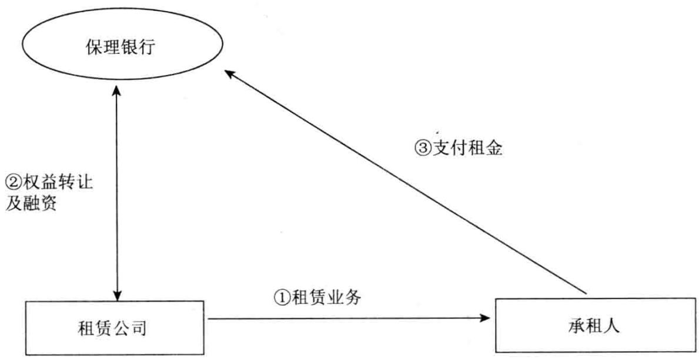

# 保理产品培训

立金银行培训中心教材编写组著

# 行长送给客户经理的最好礼物

$\textcircled { > }$ 提供以应收账款为核心的授信方案$\textcircled { \circ }$ 预付+动产+保理的组合授信方案设计思路$\bullet$ 最前沿票据保理、BT保理新产品解读$\textcircled { \circ }$ 煤炭、施工、电力等行业保理融资案例

设计授信方案首先要考虑如何控制风险，其次就是要考虑如何提高银行收益，两者不可偏废。单纯为了控制风险，而损失了银行收益的方案是失败的方案；单纯为了银行创造收益，而忽视了风险的方案是鲁莽的方案。我们要寻求银行收益和风险的完美组合，形成一种平衡。

融资就是一种资源盘活的“游戏”。应收贴款盘活，将企业远期才能收到的货款即期盘活；

地产未来的现金流盘活。房地产抵押贷款，就是赌房地产开发商开发的项目未来是否会产生源源不断的现金流。其实，所有的银行融资担保手段都像是一种资金盘活游戏，相信企业未来会有足够的现金流偿还银行的前期融资。

必须非常了解客户到底是做什么的，客户拿信贷资金到底做什么，靠什么还款。真正可以控制风险的不是抵押和担保，而是对客户渗透骨髓的了解，能够真正控制客户经营现金流。如果真正了解客户，即使信用贷款，风险也很低，如果不了解客户，抵押率即使只有 $1 1 \div b \cdots a$ ，风险也极大。

本书提供：教练式培训，提供最真实的案例本书将帮助你在最短时间内成为一名优秀的商业银行客户经理激发客户经理生生不息的奋斗精神和创造价值的活力

责任编辑：乔卫兵张梦初封面设计：

定价：45.00元

# 保理产品培训

立金银行培训中心教材编写组 $\textcircled{9}$ 著

# 行长送给客户经理的最好礼物

# 图书在版编目（CIP）数据

银行保理产品培训/立金银行培训中心教材编写组著：  
北京：中国经济出版社，2014.1  
ISBN978-7-5136-2246-2  
I. $\textcircled{1}$ 银…Ⅱ. $\textcircled{1}$ 立…Ⅲ. $\textcircled{1}$ 商业银行—应收账款—培训—教材  
$\mathrm { I V } . \textcircled { 1 } \mathrm { F } 8 3 0 . 3 3$   
中国版本图书馆CIP数据核字（2013）第008426号

责任编辑乔卫兵张梦初责任审读霍宏涛  
责任印制张江虹  
封面设计华子图文设计公司  
出版发行中国经济出版社  
印刷者 北京科信印刷有限公司  
经销者 各地新华书店  
开 本 $7 1 0 \mathrm { { m m } \times 1 0 0 0 \mathrm { { m m } } }$ 1/16  
印 张 18  
字 数 207千字  
版 次 2014年1月第1版  
印 次 2014年1月第1次  
书 号 ISBN978-7-5136-2246-2/G·1961  
定 价45.00元

中国经济出版社网址www.economyph.com社址北京市西城区百万庄北街3号邮编100037本版图书如存在印装质量问题，请与本社发行中心联系调换（联系电话：010-68319116）

版权所有盗版必究（举报电话：010-68359418010-68319282）国家版权局反盗版举报中心（举报电话：12390） 服务热线：010-6834422588386794

# 一个优秀银行客户经理的人生

银行销售为王，做最优秀的客户经理，成就一番事业。以下就是我当客户经理的成长心得，与大家分享。

我毕业于对外经济贸易大学，后进入银行工作。刚进人银行时，虽然辛苦，但是我却并不觉得枯燥，我喜欢这种东奔西跑找客户的生活。我的银行客户经理生涯肯定引发很多人的共鸣，在进人银行第二天就被拉去做营销业务，当时一个资深客户经理对我说任务是要拉到一个亿存款。银行的第一天生活充满兴奋、紧张、恐惧，不知道未来的工作会怎样。在银行工作感觉很辛苦，但是非常充实，每天我都骑着自行车满北京跑，很多小客户如：北京新美美容院、北京大地酒楼等现在看起来不可能拉到存款的客户我也拜访了。

我总结自己经历了四个营销阶段，每个阶段收获不同，但都在一步步成长：

第一个阶段：陌生式拜访。刚开始做客户经理，想拜访什么客户全由自己决定，随意性很大。我一天陌生式拜访的客户最多达到了9个。中午也不休息，整天都在外面跑。当时年轻，也没感觉辛苦，但是效果不好，因为根本不了解客户是做什么业务的，对于大部分客户都是浅尝辄止。这个阶段最大的收获就是锻炼出了胆量。那时候，我像得了职业病，看见别人在交换名片，自己就有种从兜里掏名片的冲动。

那时，我住的附近有个卖空调的电器店，我利用周末去登门拜访。当时

# 银行保理产品培训

在电器行业，银行承兑汇票结算和现款结算一个价。

“要不要全额保证金银行承兑汇票，提货金额一样，利息归你？”

“真的？”

“这个当然了。”

第二个阶段：资料寻找法。通过报纸的广告栏和网络寻找客户，那时我每天注意看《北京青年报》，广告栏经常有企业招人，通过单位招聘信息留下的联系方式寻找客户。我认为能在《北京青年报》登大幅版面招人的企业应该有些实力，而且企业正在招人呢，说明处于向上的势头。这个阶段，虽仍有些盲目，但毕竟成功率提高了些。但是缺点也很明显，有时不了解客户，不了解银行的信贷取向，拓展了一些银行明显不能接受的客户。那时，银行也没有信贷指引什么的，靠自己的感觉居多，但感觉准确的时候并不多。

第三个阶段：案例模仿法。在银行工作半年后，感觉自己很投入、很辛苦，效果却一般。我认真总结发现，关键是自己不了解银行需要什么样的客户，客户找的太盲目，成功率太低。我需要转变营销思路，尝试通过深入研究现有的成功案例来复制营销。我主动向分行的信贷审批部申请，要求去这个部门帮忙工作一个月，协助审查项目。分行当时每个部门都缺人，他们非常愿意接纳我。在分行信贷审批部的那段时间，使我脱胎换骨，我清楚地摸索到了这家银行的风险偏好、客户取向，而且和信贷审批人员搞好了工作关系。在这以后，我的项目成功率有了明显提高，营销了包括中国电子、北京开关、中石油等大客户。

第四个阶段：指引结合案例。有了在分行信贷审批部的工作摸索，我的项目成功率提高了，但是由于客户种类过于繁杂，很难形成自己的营销思路，对于大客户挖潜不够，信贷管理不能精细化，应付的时候居多。而且很多案例难以复制成功，因为最近两年银行的信贷政策相比以往变化大，曾经审批成功的客户，新的同类客户却不一定能批。现在营销时，我都是充分研究本行的授信指引，认真研究产品成功的使用案例，在确定的行业、确定的客户范围内寻找客户，同时力求形成自己的品牌。我不会盲目寻找某一个客户，我先会评估一下，看看银行能否接受这样的客户，我能用什么样的产品与客户建立合作，银行能够得到什么。这个时期是丰收的季节，签下了很多客户，成功率很高，而且在电力、石油行业形成了自己的品牌。品牌最大的好处是能够事半功倍，很多客户是自己主动找我的。

我很感谢工作过的这两家银行，他们都是新兴的股份制商业银行，他们有高效市场化的运作机制，创新进取的信贷文化使他们成为市场竞争的佼佼者，他们给了我智慧。做客户经理的这段经历锻炼了我，让我一直都坚信我是一个对国家、对社会能够做出一定贡献的人。

客户经理的生活带给我很多快乐，让我一直都在进取的状态中生活着，虽然压力很大，但我感到非常充实，我喜欢看见存款的数字不断攀升的感觉，虽然这实际就是个数字。我感觉自己就像一个战士，每天都在不断开疆拓土，创建自己的领地，我喜欢这种东征西讨的生活。我曾经认为自己天生就应该是做客户经理这个职业，虽然现在在总行工作，但是那段金戈铁马的日子仍然刻骨铭心。

我相信：正确的方法，加上勤奋，你一定会成为这个行业的佼佼者。

# 目 录

序

# 第一章保理业务概念

一、保理产品定义… 3  
二、应收账款的定义 4  
三、保理业务和应收账款质押业务法律依据有何不同  
四应收账款对中小企业的信用增级作用  
五、企业短期资产转换图.  
六、保理产品的基本分类· 10  
七、应收债权出售的会计处理 13  
八、应收债权贴现的会计处理… 14  
九、关于以应收债权为基础的出售、融资业务的披露 14  
十、保理受理条件…. 15  
十一、保理产品的风险评价 16  
十二、保理额度管理 17  
十三、资金收付… 17  
十四、保理业务账户开立 18  
十五、长单保理和短单保理 18

# 银行保理产品培训

十六、保理表外业务和保证金 19  
十七、应收账款资金收取. 20  
十八、保理业务报价 20  
十九、保理收取方式 21  
二十、保理业务优势· 21  
二十一、风险防范… 23  
二十二、营销建议… 24  
二十三、银行应收账款类融资回款控制· 26

# 第二章保理业务品种 .35

一、单一保理业务… 37  
二、银行应收账款池融资 42  
三、银行应收账款质押授信业务 62  
四、应收账款保理银票 75  
五、应收账款池质押融资 78  
六、应收账款保理国内信用证 84  
七、应收账款质押商票· 91  
八、应收账款保理信托计划… 96  
九、BT工程项下保理 100  
十、应收租赁款保理 104  
十一、反向保理 115  
十二、应收保理融资 $^ +$ 应付账款融资联动融资 128  
十三、结构性保理 132

# 第三章应收账款融资业务合同文本 139

一、保理服务合同 141

目录

二、国内贸易信用保险项下应收账款买断业务协议 147  
三、应收账款池融资协议. 153  
四、应收账款买断融资协议 164

# 附录

保理业务相关法律 223  
保理业务营销口诀 274  
保理产品适用客户营销对照图 275  
立金银行培训中心名言 276

第一章

# 一、保理产品定义

保理业务是指非现金、非信用证结算方式下，卖方以赊销方式向买方销售货物或提供服务，将依商务合同所产生的应收账款债权转让给银行，由银行提供至少下列两项服务的，称为保理业务：

1.买方信用风险担保；  
2.应收账款预付款融资；  
3.应收账款催收服务；  
4，应收账款管理服务。

保理实际就是在赊销贸易项下，银行从卖方买下代表应收账款的销售发票，先按票面金额的一定比例向企业支付款项，随后向买方索要货款，待收到全部货款后，扣除有关垫款和贴现利息、费用等后，将剩余款项支付给卖方的一项融资业务。

有追索权保理是指银行受让供应商应收账款债权后，如果买方拒绝付款或无力支付，银行有权向供应商追索已经提供的融资，要求其回购应收账款。有追索权保理实际上是银行向卖方企业提供的短期融资业务（一般不超过180天）。

无追索权保理是指银行受让供应商应收账款债权后，即放弃对供应商追索的权利，银行独力承担买方拒绝付款或无力付款的风险。无追索权保理要求应收账款本身没有任何瑕疵和争议，银行仅是承担买方的付款能力风险。因此，银行需要对买方核定付款担保额度，确认买方的付款能力，核

# 银行保理产品培训

定的付款担保额度占用银行对买方的整体授信额度。

# 二、应收账款的定义

应收账款是指权利人因提供一定的货物、服务或设施而获得的要求义务人付款的权利，包括现有的和未来的金钱债权及其产生的收益，但不包括因票据或其他有价证券而产生的付款请求权。

应收账款包括下列权利：

1.销售产生的债权，包括销售货物，供应水、电、气、暖，知识产权的许可使用等；

2.出租产生的债权，包括出租动产或不动产；

3.提供服务产生的债权；

4.公路、桥梁、隧道、渡口等不动产收费权；

5.提供贷款或其他信用产生的债权。

应收账款在中小企业客户极多，由于在商业地位的不平等，中小企业在担当核心企业的供应商的时候，往往是先发货或施工，而后拖延很久后收款，会有大量的应收账款。这类应收账款是银行为中小企业融资的重要风险抓手。

银行买人的应收账款要求：应收账款本身没有任何的交易瑕疵，不存在买卖双方的质量争议问题。

# 三、保理业务和应收账款质押业务法律依据有何不同

1.很多客户经理保理和应收账款质押业务不能区别，其实，这两个产品区别非常大。具体体现在：

(1)保理业务政策依据：合同法支持。

保理业务政策依据在于《合同法》。《合同法》第七十九条规定：债权人可以将合同的权利全部或者部分转让给第三人，但有下列情形之一的除外：

$\textcircled{1}$ 根据合同性质不得转让。

$\textcircled{2}$ 按照当事人约定不得转让。

$\textcircled{3}$ 依照法律规定不得转让。

债权人转让权利的，应当通知债务人。未经通知，该转让对债务人不发生效力。

债权人转让权利的通知不得撤销，但经受让人同意的除外。

根据《合同法》规定，债权可以转让，但是必须通知债务人。所以，操作保理业务，银行从卖方处买入债权应当通知买方。

(2）《物权法》支持。

应收账款质押业务政策依据在于《物权法》《中华人民共和国担保法》，随后中国人民银行出台了《应收账款质押登记办法》《中国人民银行征信中心应收账款质押登记操作规则》对应收账款质押融资业务进行了政策详细解释和规定。

（3）《物权法》对应收账款出质的规定：

债务人或者第三人有权处分的下列权利可以出质：

$\textcircled{1}$ 汇票、支票、本票。

$\textcircled{2}$ 债券、存款单。

$\textcircled{3}$ 仓单、提单。

$\textcircled{4}$ 可以转让的基金份额、股权。

$\textcircled{5}$ 可以转让的注册商标专用权、专利权、著作权等知识产权中的财产权。

$\textcircled{6}$ 应收账款。

$\textcircled{7}$ 法律、行政法规规定可以出质的其他财产权利。

以应收账款出质的，当事人应当订立书面合同。质权自信贷征信机构办理出质登记时设立。

应收账款出质后，不得转让，但经出质人与质权人协商同意的除外。出质人转让应收账款所得的价款，应当向质权人提前清偿债务或者提存。

表1-1应收账款质押与保理区分  

<table><tr><td rowspan=1 colspan=1>应收账款质押</td><td rowspan=1 colspan=1>保理</td></tr><tr><td rowspan=1 colspan=1>遵循《物权法》</td><td rowspan=1 colspan=1>遵循《合同法》</td></tr><tr><td rowspan=1 colspan=1>采取应收账款质押登记方式</td><td rowspan=1 colspan=1>采取应收账款转让通知方式</td></tr><tr><td rowspan=1 colspan=1>多提供银行承兑汇票融资</td><td rowspan=1 colspan=1>多提供贷款融资</td></tr><tr><td rowspan=1 colspan=1>为银行操作短应收账款质押，签发期限较长的银行承兑汇票提供了机会</td><td rowspan=1 colspan=1>银行收费较高，在银行希望提高利润贡献度的时候，可以采取这种操作方式。</td></tr></table>

保理融资与应收账款质押融资并不是两个相互冲突的产品，在营销推荐的时候，应当形成错位竞争的格局，保理融资对应的客户一般都是买卖双方市场地位均等，买方愿意配合卖方的应收账款转让行为；应收账款质押融资一般都是买方的市场地位远远强于卖方，买方根本不会配合任何的应收账款转让手续，银行只能采取登记的办法控制应收账款风险。从银行的简单评价：应收账款保理融资风险相对较小，而应收账款质押融资风险相对较大。

2.金融新产品使用是一个痛苦坚持的过程，你要强迫自己去用，去理解。习惯并达到一个新高度后，新产品就会成为你身体的一部分，你就会成为一代高手。

保理与应收账款质押融资的区别营销：

（1）保理属于应收账款转让行为，如果借款人本身经营状况很一般，根本没有任何的抵押品，现金流状况也很一般，但是就是有一笔非常优质的应收账款，属于企业最值钱的资产，例如中国移动的欠款，这就非常适合办理保理融资。尤其是无追索权保理融资，银行单笔买人应收账款，实现与企业本身经营状况的完整切割。

如果在融资期间，借款人经营破产，由于企业的核心资产一 -应收账款已经转让给银行，银行不会出现任何损失。借款人只能以扣除应收账款的其他资产去偿付员工工资以及国家的税费等。

（2）应收账款质押融资仅属于担保方式，类似抵押和第三方担保，还是要高度与企业的自身经营挂钩，例如：企业经营现金流状况较好，但是缺少合格的担保和抵押品。

如果在融资期间，借款人经营破产，由于企业的核心资产—应收账款仅是质押给银行，银行会出现巨大损失。借款人首先需要以应收账款去偿付员工工资以及国家的税费等。然后才轮到银行的债权，最后是其他债权人的债权。

(3）据《破产法》第一百零九条：对破产人的特定财产享有担保权的权利人，对该特定财产享有优先受偿的权利。

破产清偿顺序：

$\textcircled{1}$ 债权人和债务人互负债务，抵消债务人财产，第四十条规定的除外。

$\textcircled{2}$ 担保债权。

$\textcircled{3}$ 破产财产在优先清偿破产费用和共益债务后，依照下列顺序清偿。

a破产人所欠职工的工资和医疗、伤残补助、抚恤费用，应当划入职工个人账户的基本养老保险、基本医疗保险费用，以及法律、行政法规规定应当支付给职工的补偿金。

b.破产人欠缴的除前项规定以外的社会保险费用和破产人所欠税款。

c.普通破产债权。破产财产不足以清偿同一顺序的清偿要求的，按照比例分配。

破产企业的董事、监事和高级管理人员的工资按照该企业职工的平均工资计算。

在中国，维稳是第一位，但在实际操作中，无一例外都是企业的员工和国家税款清偿在前，银行的债权清偿在后。

# 四、应收账款对中小企业的信用增级作用

应收账款融资属于债项融资。可以适度降低中小企业自身的信用评

级，银行的融资依据在于应收账款本身的质量，而不是中小企业自身的经营资质。简单理解，一个中小供应商持有中国移动通信集团的应收账款，我们看重的是中国移动的付款能力，而非中小供应商自身的信用。

# (一）信用增级的方法

(1)大企业担保增信。

小企业信用得分 $=$ 增信大企业的信用评级 $\times 9 0 \%$

  
图1-1大企业为小企业担保增信示意图

一个小的钢贸客户，信用分值是3分，有特大型地铁公司的应收账款做保理，特大型地铁公司的得分是9分，银行对小钢贸提供保理融资，由于大型地铁公司实力非常强大，在银行的评级可以达到9分，这个小钢贸的分值一下子可以达到8分。

(2)借用大企业信用（应收账款转让增信）。

应收账款转让增信 $70 \%$ 。

小企业信用得分 $=$ 增信大企业的信用评级 $\times 7 0 \%$

  
图1-2小企业借助大企业应收账款转让增信示意图

一个小的钢贸客户，信用分值是3分，有特大型地铁公司的应收账款做保理，特大型地铁公司的得分是9分，银行对小钢贸提供保理融资，这个小钢贸的分值一下子可以达到6.3分。

# 五、企业短期资产转换图

对于中小企业而言，现金、应收票据、应收账款和存货都是企业报表中的资产，这些资产随着企业的经营推进，不断从存货向应收账款迁移；从应收账款向应收票据迁移；从应收票据向现金迁移，周而复始，完成资本的循环，银行的融资得以清偿。如果不按照这个方向迁移，银行的融资就会出现不良。

  
图1-3企业流动资产主要项目迁移示意图

1.资产有迁移的天然规律，从未来货权向现货质押迁移，从现货质押向应收票据迁移，从应收票据向现金迁移。每个都是资产的状态，都可以作为风险控制的依托。越往上迁移，资产质量越好，银行认为越安全。

就如同房地产行业，房地产开发商首先以购买的土地抵押，然后以在

# 银行保理产品培训

建工程抵押，最后以房地产已完工项目抵押。银行提供房地产开发贷款，经营性物业抵押贷款，始终支持房地产开发商的发展。越往后，银行越安全。

资产最终形态一定是向货币转化，流动资产通过转化自己存在的形态不断向货币转化，固定资产也向货币转化，只不过周期非常长，一点一点销蚀自己，向货币转化。从难以流动到越来越好流动。

2.可以将客户拥有的最有价值的资产全部控制在银行，银行牢牢盯住企业的经营行为，通过控制企业的货物流和资金流来控制风险。

3.给企业提供了最灵活的处理安排。企业可以根据自己的经营需要，将合格的资产随时质押给银行，动态管理自身的资产，保证经营采购支付的需要。银行可以牢牢掌控企业最核心的资产。企业在有存货的时候，随时将存货质押给银行；如果销售收到的银行承兑汇票，随时将银行承兑汇票质押给银行，置换存货；如果企业需要销售提取存货，而销售对象又属于银行支持的王牌企业，那么只要企业能够将这笔应收账款质押给银行，就可以无抵押金提货。银行提供给客户最便利的选择。

一个理论：只要能够控制住企业最核心的经营性资产，银行就可以给客户提供一些期限较长的融资，只要客户能够提供给让银行感觉安全的质押物，有了清晰的风险抓手，只要这个抓手适中存在，贷款不一定需要还。

# 六、保理产品的基本分类

# (一)基本分类

1.国内保理（DomesticFactoring）与国际保理（InternationalFactoring）：买卖双方都在中国境内称为国内保理，买卖双方有一方位于境外的保理称为国际保理。与保税区、出口加工区等特殊经济区的企业开展的保理业务也属于国际保理范畴。国际保理又分为出口保理和进口保理。

2.单保理（SingleFactor）与双保理（TwoFactors）：指买卖双方的应收账款皆由一家银行提供服务的，称为单保理，买卖双方应收账款由两家银行提供服务的，称为双保理。

3.有追索权（WithRecourse）与无追索权（WithoutRecourse）保理：无追索权保理是指银行承担买方因信用风险到期不付款的风险；保理预付款项下若银行不承担买方不付款的信用风险则称为有追索权保理。

# (二)无追索权保理融资报表

举例：1000万元应收账款采取无追索权保理融资，融资金额800万元，报表反映格式见表1-2。

表1-2无追索权保理融资报表格式  

<table><tr><td>（增加）货币资金 800万元</td><td></td></tr><tr><td>（扣减）应收账款 1000万元</td><td></td></tr><tr><td>(增加)其他应收款 200万元</td><td></td></tr></table>

# (三)有追索权保理融资报表

举例：1000万元应收账款采取有追索权保理融资，融资金额800万元，报表反映格式为见表1-3。

表1-3有追索权保理融资报表格式  

<table><tr><td>（增加）货币资金 800万元</td><td>（增加）短期借款200万元</td></tr><tr><td>应收账款1000万元</td><td></td></tr></table>

# （四）政策依据

财政部关于印发《关于企业与银行等金融机构之间从事应收债权融资等有关业务会计处理的暂行规定》的通知（2003年5月15日财会[2003]14号）。

1.各省、自治区、直辖市、计划单列市财政厅（局），国务院有关部委，有关企业：

规范企业与银行等金融机构之间进行的融资业务的会计处理，现将《关

# 银行保理产品培训

于企业与银行等金融机构之间从事应收债权融资等有关业务会计处理的暂行规定》印发给你们，请遵照执行。执行中有何问题，请及时反馈我部。

（1)应收债权融资业务的会计处理原则。

企业将其按照销售商品、提供劳务的销售合同所产生的应收债权出售给银行等金融机构，在进行会计核算时，应按照“实质重于形式”的原则，充分考虑交易的经济实质。对于有明确的证据表明有关交易事项满足销售确认条件，如与应收债权有关的风险、报酬实质上已经发生转移等，应按照出售应收债权处理，并确认相关损益。否则，应作为以应收债权为质押取得的借款进行会计处理。

(2)以应收债权为质押取得借款的会计处理。

企业如将其按照销售商品、提供劳务的销售合同所产生的应收债权提供给银行作为其向银行借款的质押，在此情况下，与应收债权有关的风险和报酬并未转移，仍由持有应收债权的企业向客户收款，并由企业自行承担应收债权可能产生的风险，同时企业应定期支付自银行等金融机构借入款项的本息。

2.在以应收债权取得质押借款的情况下，企业应按照实际收到的款项，借记“银行存款”科目，按实际支付的手续费，借记“财务费用”科目，按银行贷款本金并考虑借款期限，贷记“短期借款”等科目。

企业在收到客户偿还的款项时，应借记“现金”、“银行存款”等科目，贷记“应收账款”科目。

企业发生的借款利息及向银行等金融机构偿付借人款项的本息时的会计处理，应按照《企业会计制度》关于借款的相关规定执行。

由于上述与用于质押的应收债权相关的风险和报酬并没有发生实质性变化，企业应根据债务单位的情况，按照《企业会计制度》的规定合理计提用于质押的应收债权的坏账准备。对于发生的与用于质押的应收债权相关的销售退回、销售折让及坏账等，应按照《企业会计制度》及相关会计准则的规

定处理。

企业应设置备查簿，详细记录质押的应收债权的账面金额、质押期限及回款情况等。

# 七、应收债权出售的会计处理

# （一)不附追索权的应收债权出售的会计处理

1.企业将其按照销售商品、提供劳务相关的销售合同所产生的应收债权出售给银行等金融机构，根据企业、债务人及银行之间的协议不附有追索权，即在所售应收债权到期无法收回时，银行等金融机构不能够向出售应收债权的企业进行追偿，所售应收债权的风险完全由银行等金融机构承担的情况下，应按以下规定进行会计处理：企业应按与银行等金融机构达成的协议，按实际收到的款项，借记“银行存款”等科目，按照协议中约定预计将发生的销售退回和销售折让(包括现金折扣，下同)的金额，借记“其他应收款”科目按售出应收债权已提取的坏账准备金额，借记“坏账准备”科目，按照应支付的相关手续费的金额，借记“财务费用”科目，按售出应收债权的账面余额，贷记"应收账款"科目，差额借记"营业外支出一应收债权融资损失”或贷记“营业外收入一应收债权融资收益”科目。

2.企业实际发生的与所售应收债权相关的销售退回及销售折让如果等于原已记入“其他应收款"科目的金额，则应按实际发生的销售退回及销售折让的金额，借记"主营业务收入"（如为现金折扣，应借记“财务费用”科目，下同)等科目，按可冲减的增值税销项税额，借记"应交税金一应交增值税（销项税额)"科目，按原记入“其他应收款"科目的预计销售退回和销售折让金额，贷记“其他应收款"科目；企业实际发生的与所售应收债权相关的销售退回及销售折让与原已计人“其他应收款"科目的金额如有差额，除按上述规定进行会计处理外，对应补付给银行等金融机构的销售退回及销售折让款，通过“其他应付款"或“银行存款”科目核算。对应向银行等金融机构收回的销售退回及销售折让款，通过“其他应收款"或“银行存款"科目核算。

企业上述销售退回或销售折让如属于资产负债表日后事项，应按《企业会计制度》及相关会计准则的规定处理。

# (二)附追索权的应收债权出售的会计处理

企业在出售应收债权的过程中如附有追索权，即在有关应收债权到期无法从债务人处收回时，银行有权力向出售应收债权的企业追偿，或按照协议约定，企业有义务按照约定金额自银行等金融机构回购部分应收债权，应收债权的坏账风险由售出应收债权的企业负担。在这种情况下，应按本规定中关于对以应收债权为质押取得借款的会计处理原则执行。

# 八、应收债权贴现的会计处理

按照企业与银行等金融机构签订的协议，如实质上构成应收债权贴现，其会计处理应比照《企业会计制度》关于应收票据贴现的有关规定进行处理。

# 九、关于以应收债权为基础的出售、融资业务的披露

1.企业如以应收债权为基础进行上述各类出售、融资等业务，应将有关业务的具体情况在会计报表附注中进行披露。具体包括：

（1)与银行等金融机构签订的出售、融资协议的主要内容。(2)所涉及出售、融资业务的应收债权的基本情况，包括其金额、账龄、  
已提取的坏账准备等。（3)以应收债权为基础取得的质押借款的具体情况，如借款金额、利率、  
借款期限、用于质押的应收债权的账面价值等。(4)作为销售确认的应收债权出售交易，对当期净损益的影响金额。（5）已贴现的应收债权的账面金额、贴现收到的金额、贴现期限等。2.明保理（Notification）与暗保理（Non－Notification）：明保理指银行操

作保理业务时通知买方应收账款转让事宜；暗保理则指不通知买方应收账款转让事宜。叙做暗保理业务的申请人应为银行重点目标客户或已有优质授信客户本办法所称应收账款是指卖方依据商务合同履行相关义务后，有权向买方收取的扣除预付款、已付款、佣金、销售折让等后的非信用证贸易项下所有的应收款项净额。

# 十、保理受理条件

1．向银行申请办理保理业务的卖方客户，须具备下列基本条件：

（1)依法登记的境内企（事）业法人，如为其分支机构（不具备法人资格），应当获得总公司授权；(2)在银行开立相应业务本外币结算账户；（3)办理（出口）国际保理须具备出口经营资格；（4）申请保理预付款的卖方普华信用评级需在B3（含）以上；（5）无不良信用记录；（6)无违反国家外汇管理规定的不良记录；（7)银行认为必须满足的其他条件。

2.办理信用风险额度的买方客户须具备下列基本条件：

（1)依法登记的境内企（事）业法人或银行认可法定地址在境外的企事）业法人（在银行取得离岸业务经营权的前提下）；

(3)办理（进口）国际保理须具备进口经营资格；

（5）无违反国家外汇管理规定的不良记录；

3.申请办理保理业务的应收账款应满足以下条件：

（1)具备合法真实的赊销交易背景；

# 银行保理产品培训

(2)卖方已履行了对应商务合同项下的交货义务，并能够提供商业发票、发货单等相应证明；

(3)卖方对申请保理的应收账款未设定任何形式的担保，无权利瑕疵；

(4）债权凭证完整；

（5)应收账款有明确的到期日或可以明确推断出到期日。应收账款无固定到期日的，应由买卖双方协商确定到期日；

(6)应收账款未逾期；

（7)无追索权保理业务标的应收账款的付款人不得是普通消费者；

(8）银行规定的其他条件。

# 十一、保理产品的风险评价

保理产品属于风险相对较小的品种，因为保理融资有着买方的付款作为依托，同时，保理属于企业在经营的完整产业链条中，销售环节未收款的提前实现，已经没有购置、加工制造和销售的环节，因此对银行而言融资风险较小。

  
图1-4保理产品风险评价图

其实，一个A企业向银行提出保理融资，无论下游买家为B大企业或C小企业，只是评价对A企业的融资风险，肯定是在其销售阶段提供融资，风险最低。毕竟，A企业已经完成了生产资料的购买和加工销售，已经不存在制造风险和销售风险了，仅是回款风险，已经很低了。

# 十二、保理额度管理

1.有追索权保理业务纳人对申请融资客户综合授信额度管理，同时需要对买方核定内部授信额度。银行作为卖方银行只提供催收和管理服务的不需要授信。

无追索权保理业务不纳人对申请融资客户综合授信额度管理，仅需要对买方核定专项授信额度，买方必须确认应收账款转让事项。

2.贸易项下保理款融资的融资期限根据合同规定加上合理的收款时间确定，融资期限原则上不超过180天；融资比例原则上不超过单张发票金额的 $80 \%$ 。有追索权保理融资余额不超过银行对申请融资客户核准的融资额度，无追索权保理融资不超过银行对买方核定的付款担保额度。

3.保理预付款融资利率应根据贷款的利率指导价格，结合当地市场情况决定。

4.买方信用风险额度针对不同买家核定，不同买家之间额度不能相互串用。

# 十三、资金收付

客户资金收付。国内保理和出口保理项下客户资金汇划采用点对点的资金直接支付和回款方式，银行不进行统一的汇款资金归集和分配。

1.保理融资的使用：保理融资属于企业的销售回款的提前实现，不属于流动资金贷款范畴，因此，不必按照《贷款新规》控制贷款用途，但是保理融资属于融资的品种，必须执行银监会和《贷款通则》的规定，不能用于炒作股票、期货和房地产投资等。

2.保理回款的要求：保理回款必须是由买家付款而回，而且必须与增值税发票或工程发票笔笔对应，以便银行销账。不可以是由卖方提供一笔资金直接归还保理融资。

# 十四、保理业务账户开立

1.可以开立两类账户：

（1)银行名下的保理专户。应收账款转让通知中明确告知买方，应收账款已经转让给“ $\times \times \times$ 银行”，请汇款至“ $\times \times \times$ 银行保理专户”。这种方式对银行非常安全，属于最应当鼓励的方式，但是可能受到买方的抵制，毕竟买方认为收款人不是卖方了，但是将来卖方会再次索款。

入保理专户的资金在清偿银行预付款融资之后，方可划入卖方结算账户。

(2)卖方名下的专户。保理业务项下办理融资的，银行须为卖方开立户名为“ $\times ~ \times$ 公司银行保理专户”的账户，用于回收应收账款，也可根据需要为卖方开立保证金账户。

.这种方式对银行相对安全，属于最能给卖方和买方接受的方式，但是银行的管理工作必须非常认真，一旦卖方账户收到买方的付款后，必须立即扣划。

2.偿还保理融资时，须将保证金账户资金转入保理专户归还融资本息。

# 十五、长单保理和短单保理

# （一)长单保理

长单保理是指融资期限较长期限的保理融资，通常都是工程和劳务项下的应收账款保理融资，例如公路施工企业、电信设备供应商的应收账款保理融资，这类工程项下的应收账款期限一般都在2年以上。这类工程项下的应收账款可以买入，但是必须为合格应收账款。操作要点：买方也就是业主方必须没有质量对抗条款，就是买方必须完全确认工程质量，放弃争议的权利。

# (二)短单保理

短单保理是指融资期限较短期限的保理融资，通常都是贸易项下的应

收账款保理融资，例如商品买卖合同、短期交易的应收账款保理融资。操作要点：最好销售的是标准化质量的商品，没有质量对抗条款，买方纯粹是出于延长付款账期，降低自身资金压力的角度产生的应收账款。

# 十六、保理表外业务和保证金

1.在短单保理融资项下，可以发放保理表外融资，可视买方、卖方资信及应收账款的质量收取一定比例的保证金。

银行在对卖方办理保理项下的银行承兑汇票、商业承兑汇票、国内信用证时，可以要求卖方交存一定比例的保证金。

保理操作的应收账款的期限最好远远短于银行承兑汇票、商业承兑汇票、国内信用证的期限，这样，银行会有可观的额保证金存款。

理解非常简单，其实应收账款转让就是一种担保方式，和担保、抵押、应收账款质押等没有什么区别，所以，在核定了授信额度后，可以提供表内外的所有授信品种，只不过要注意，提供融资的期限一定要长于应收账款的期限。如果应收账款的期限为12个月，那就不适合提供应收账款转让银行承兑汇票业务了。

  
图1-5应收账款转让流程

2.银行操作表外融资的要点：

表外融资金额（银行承兑汇票、商业承兑汇票、国内信用证） $=$ 应收账款金额 $\times$ 折扣率 $^ +$ 保证金金额

# 十七、应收账款资金收取

银行应加强对保理专户和保证金账户的管理，凡收到划入资金，应立即办理保理融资的偿还手续。一定要防止企业挪用销售回款。

# 十八、保理业务报价

# （一）保理业务报价结构

1.保理费（FactoringCommission）：依照发票金额的一定比率计收。

2.保理单据处理费（HandlingCharge）：依照发票、贷项通知笔数收取。

3.融资利息：依照卖方所使用预付款融资金额、期间按银行执行利率收取。

.4.保理业务申请费：银行应卖方申请为买方核定信用风险额度时收取。

5.其他银行费用包括但不限于结汇、售汇、汇兑等费用。

6.其他费用：根据业务设计架构或操作特性，可与客户协商另行收取的费用，如额度使用费等。

# (二）报价标准

1.保理费率最低收取标准

表1-4保理费用标准分析  

<table><tr><td rowspan=1 colspan=1>类别</td><td rowspan=1 colspan=1>收益</td><td rowspan=1 colspan=1>无追索权（%）</td><td rowspan=1 colspan=1>有追索权（%）</td></tr><tr><td rowspan=2 colspan=1>出口保理</td><td rowspan=1 colspan=1>费率</td><td rowspan=1 colspan=1>0.30</td><td rowspan=1 colspan=1>0.15</td></tr><tr><td rowspan=1 colspan=1>或年化后收益</td><td rowspan=1 colspan=1>2.00</td><td rowspan=1 colspan=1>1.00</td></tr><tr><td rowspan=2 colspan=1>进口保理</td><td rowspan=1 colspan=1>费率</td><td rowspan=1 colspan=1>0.50</td><td rowspan=1 colspan=1>0.15</td></tr><tr><td rowspan=1 colspan=1>或年化后收益</td><td rowspan=1 colspan=1>≥3.00</td><td rowspan=1 colspan=1>≥1.00</td></tr><tr><td rowspan=2 colspan=1>国内保理</td><td rowspan=1 colspan=1>费率</td><td rowspan=1 colspan=1>0.50</td><td rowspan=1 colspan=1>0.25</td></tr><tr><td rowspan=1 colspan=1>或年化后收益</td><td rowspan=1 colspan=1>≥3.00</td><td rowspan=1 colspan=1>≥1.50</td></tr></table>

（1)上述收益为扣除银行成本后的保理费净收益，银行成本是指银行

为落实买方付款的信用风险担保而由买方银行或信用保险公司收取的费用。

（2）上述费率适用于付款期限为90天（含）以内的应收账款，如付款期限超过90天的，原则上按照每增加30天（含）增加 $0 . 1 \%$ 的标准加收费率，不足30天按30天计。

(3）年化后收益计算方式为：费率 $\times 3 6 0 /$ 应收账款天数。

# 2.保理单据处理费：

表1-5保理单据处理费用  

<table><tr><td rowspan=1 colspan=1>类别</td><td rowspan=1 colspan=1>费用</td></tr><tr><td rowspan=1 colspan=1>出口保理</td><td rowspan=1 colspan=1>5~15美元或等值外币/笔</td></tr><tr><td rowspan=1 colspan=1>进口保理</td><td rowspan=1 colspan=1>5~15美元或等值外币/笔</td></tr><tr><td rowspan=1 colspan=1>国内保理</td><td rowspan=1 colspan=1>10~50元人民币/笔</td></tr></table>

3.融资利率：

定价原则遵循收益覆盖风险原则，综合考虑应收账款质量、期限、融资模式等因素。

# 十九、保理收取方式

1.保理费及保理单据处理费：于收到卖方转让时一次性收取。

2.融资利息：可提前一次（前收型)或按月、按季收取，也可在收到应收账款回款时扣收(后收型）。

3.其他费用按业务实际发生情况收取。

4.银行费用收取与支付：由总行统一对外收取或支付。

# 二十、保理业务优势

1．对卖方优势：

(1)盘活自身应收账款。一些中小企业应收账款质量非常好，但是账期

# 银行保理产品培训

较长，影响企业的正常周转。中小企业需要连续经营，如果将应收账款转让成本低于企业获得资金后再次做生意的机会成本，中小企业就完全可以将应收账款转让给银行。

其实，企业的资产内容中的应收票据、应收账款和存货都是一个道理，如果盘活应收账款的成本低于企业获得资金后再次做生意的机会成本，企业就应该盘活这块资产。只不过，盘活应收票据、应收账款和存货的方法不同，盘活应收票据叫贴现、盘活应收账款叫保理、盘活存货叫动产融资。

(2)改善报表。为了一些特殊动机的客户提供了改善报表的工具。客户操作无追索权的保理最大的动机就是去掉应收账款，美化报表，达到上市公司的要求。客户经理在营销该产品的时候，要分清客户的经营阶段，在准备上市前，大部分企业都会有这项需要。

# 2.对银行优势：

（1)银行批量开发中小企业的王牌融资工具。很多中小企业应收账款质量较佳，属于一些非常强势核心企业的供应商，这类中小企业数量众多，应收账款清晰，融资金额较大，非常值得银行深度开发。

(2)银行为一些认为是存在一定风险的卖方提供融资，给了银行更多的风险保障。例如一些中小的药品经销商、中小煤炭经销商、汽车零部件供应商等，这些客户没有担保或抵押，但是普遍依托于大型客户经营，下游的商业伙伴实力非常强大，银行直接给这些中小企业提供融资，没有合适的风险抓手。所以，对这类客户最好的融资就是保理融资，直接以下游实力较强的买方作为风险抓手。

（3）银行优势：获得高额融资利息和手续费收人。无追索权保理，由于银行提供了改善报表和融资两项标准的服务，因此，收费较高。

【点评】

如果中小企业仅仅是为了获得融资，基本不会采用无追索权保理融资这款产品，毕竟无追索权保理融资成本较高，而且中小企业本身不打算上市和改善报表，就是为了融资。很多客户经理在营销的时候，不注意区分无追索权保理和有追索权保理的区别，不区分营销对象的经营阶段，很笼统地介绍这两款产品，营销成功营销这两个产品。就像一个穷人，他兜里就一块钱，他的需求就是为了吃饱肚子，你销售给他馒头即可，你根本不要销售给他面包，虽然面包可以销售出去2块钱，但是对穷人并不适用。

# 二十一、风险防范

1.买方企业的防范：

(1)有追索权的保理虽然能够对卖方追索，但是仍然需要强调对买方的审查。银行提供授信的安全一定程度依靠应收账款能否及时回收。成功的有追索权保理应当是通过买方及时支付货款而最终收回保理的融资，而不是由银行追索卖方。

(2)买方企业的防范。无追索权保理应收账款能否及时回收，关键在于买方的资信。买方必须有强大的付款能力和良好的商业信誉，有能力付款和主观上不会赖账。

2.卖方企业的防范：

(1)卖方企业的选择。必须选择有较强的供货能力、信誉较好的企业。一方面，好的企业在贸易中纠纷很少，保证了保理的安全；另一方面，在有追索权的保理业务中，如果买方付款出现问题，卖方银行可以向卖方追索，防止出现信贷资金损失。

(2)有追索权的保理要求买方将付款直接付至卖方在融资银行开设的

# 银行保理产品培训

保理专户或监管账户中。但是，在实际业务过程中，经常出现买方仍将款项直接付至卖方结算存款账户的情况，要加以注意。出现卖方回款账户回款金额仅限于银行融资的金额，这是不规范的操作。要求应收账款是整体转让，因此卖方应当将应收账款项下全部款项都支付给融资银行，进入保理专户或监管账户管理，融资银行扣除保理融资后，将余款划给申请人。

(3)卖方企业的选择。必须选择有较强的供货能力、信誉较好的企业。因为好的企业在贸易中纠纷很少，保证交易合同的正常履行。

# 3.对应收账款的规定：

(1)严格落实真实的贸易背景。有追随权保理业务必须依托真实交易 背景，交易的自偿性保证保理融资的安全。必须切实落实交易合同、货物运 输发票、相关的产品质量检验合格证书、买方的货物收妥回执等资料。

(2)规范操作中一般要求买方将付款直接付至卖方在融资银行开设的保理专户或监管账户中。但是，在实际业务过程中，经常出现买方仍将款项直接付至卖方结算存款账户的情况，要加以注意。

# 二十二、营销建议

1.保理的目标客户可以根据“供应链”营销思路，以核心客户的上游供应商为营销目标。如以汽车制造商的供应商一汽车配件公司为保理的主要营销对象，将汽车制造商欠配件公司的应收账款进行保理融资。这种借助核心企业突破供应商的营销方法，营销效率要高得多。

2.最近几年，保理业务客户范围不断拓展，典型行业：

（1)医药行业：药品流通企业和医院之间，医院由于非常强势，往往拖欠医疗经销商大量的货款，通常这些应收账款质量较好，账期多在6个月以内，可以买人。

（2）电信行业：电信设备供应商和电信运营商之间，电信运营商非常强势，付款能力较强，可以挑选一部分供货周期较短，不存在质量纠纷可能的

应收账款买入。

3.以买方为核心单保理是围绕核心买方通过反向营销拓展其上游供应商发展保理业务，是扩大银行客户群的有效方式。通过与买方、卖方签订三方协议，保证买方的付款能力，有效保证对卖方融资风险。

（1)业务思路。根据“供应链”营销思路，以优质买方客户为核心，寻找其上游供应商，以占用买方客户的授信方式，解决中小型卖方客户授信主体信用评级相对较低难以取得授信额度的问题，同时通过控制卖方来降低中小企业的融资风险。

(2）紧紧围绕国家经济政策支持的行业、区域、客户和符合供应链上游企业开展营销。在拓展保理业务时，应根据保理业务特点有针对性地选择适合叙做保理业务的行业。适合叙做保理业务的产品及基础交易主要具备如下特点：商品质量标准统一，应收账款形成以商品交付为依据，不易引起争议。主要包括汽车零配件、电子原配件，原材料、钢材、包装材料、药品等；在贸易合同中要注意不存在寄售、安装证明、分期付款、权利保留，禁止转让等条件。

（3）保理业务采用业务方案审批前置于授信额度审批，因此产品经理在配合客户经理对客户营销及产品方案设计阶段的参与十分重要，需与客户确实落实方案设计中所采用风险控制措施，必要时需与买方当面落实相关要求，如对应收账款确认，买方付款方式等；若在授信审批额度批准后变更保理操作方案，操作方案审批及授信审批流程将重新进行，这样会严重影响业务的时效性。

（4)医药保理，医药行业是银行最值得深度拓展的保理业务目标客户群体。银行医药保理覆盖产业链：中游医药流通企业 $^ +$ 三甲医院模式；中游医药流通企业 $^ +$ 医保；中游医药流通企业 $^ +$ 疾控中心。

（5）坚持以医院为营销“抓手”，考虑到三甲医院实力极为强大，可以对三甲医院提供主动批量授信—买方授信额度，银行向医药行业产业链上

# 银行保理产品培训

游企业营销和渗透。

(6)大中型企业。大中型企业由于在产业链中处于相对强势地位，往往成为同业争相营销的对象。银行可根据其基础交易，利用其核心企业的特点，通过稳定上游供应商网络、稳定产品质量、降低财务成本和改善财务报表的角度切入客户。在方案设计上应以大中型企业为风险承载主体运用“ $1 + \mathrm { { N } }$ ”保理模式，保理表外融资和无追索权保理等产品为其提供服务。

(7)中小企业，中小型客户是目前银行保理业务的主要客户群体和收入来源。为配合银行成熟模式项下的对公客户“重心下移”的战略导向，此外，针对中小企业上市前改善报表、上市企业优化报表的需求，银行可为其推荐相应保理产品，

# ：二十三、银行应收账款类融资回款控制

应收账款类融资的特点是具有自偿性，其风险控制的核心是能否控制住应收账款的回款作为融资的第一还款来源。本细则控制措施适用于国内销售/出口销售中采用汇款结算方式由赊销所产生的应收账款，国内、国际保理项下应收账款回款控制有其他规定的，按照保理业务的相关规程办理。

# （一)应收账款回款可以采用的控制措施如下

1.转让。

应收账款转让和质押都是可以采用的控制措施，但是在对买方/付款人的约束力上，转让要大大强于质押，因此银行要尽可能采用应收账款转让的方式来办理融资。

2.国内应收账款转让的生效并不以通知债务人为前提条件，但是未经通知的对债务人无效，国际上大部分国家的法律也有类似的规定，因此银行在与客户办理完应收账款转让手续后，必须通知买方。

# (二)应收账款转让的方式分为全部转让和逐笔转让

1.全部转让指客户对同一买方的应收账款无论融资与否全部转让给 银行。

国内应收账款全部转让，银行在办理首次融资或者之前向买方发送《应收账款债权全部转让通知书》（附件1）。此后原则上客户向买家开立的增值税发票均通过银行发送，发送的增值税发票上打印或者加盖：“本发票所记载之应收账款已转让给银行 分行，请将发票金额付至下述账户：[ ]"的字句或者戳记；如果无法做到在增值税发票上加注文字或戳记，则随发票寄送一份面函，在面函上注明相关增值税发票和应收账款转让给银行的条款。

全部转让适用于同一买方的回款全部在银行结算并且连续办理融资的客户，同一买方的回款全部通过银行，但是客户根据实际需要时不时地在银行办理融资的业务。

2：逐笔转让指客户将用于融资的应收账款逐笔转让给银行。

国内应收账款逐笔转让，银行在受让客户应收账款后，随增值税发票或者单独将《应收账款债权转让通知书》（附件2)发送给买方。

逐笔转让适用于非长期客户的单笔应收账款转让，或者同一买方的回款全部通过银行，客户偶然性地在银行办理融资；同一买方的应收账款，通过多家银行办理回款结算，买方能够按照付款指示的约定进行应收账款回款的业务。

3.银行可以采用的国内应收账款转让通知的方式有两种：“主动送达”和“公证送达”。

（1）主动送达指银行与客户一起或者银行单独将应收账款债权转让的通知（《应收账款债权全部转让通知书》或《应收账款债权转让通知书》）当面交送给买方，并取得买方的回执。买方回执上可以接受的有效印章包括公章、合同专用章和财务专用章。

# 银行保理产品培训

（2）公证送达指通过公证机关来证明银行将应收账款债权转让通知送达买方，公证送达分为“现场公证”和“邮寄公证”，现场公证指公证人员陪同银行人员将转让通知交送给买方，并出具送达公证书；邮寄公证是指公证人员证明银行人员向买方寄送快递的内容及快递已经发出。银行一般采用邮寄公证的方式，邮寄公证需要取得公证机构的送达公证书以及留存邮政快递的收据，必要时通过邮政公司的网页打印邮件的发送及签收记录。采用公证送达方式向买方发送转让通知的，无须取得买方的确认回执。

出口赊销下应收账款转让通知的方式采用国际快递邮寄的方式，转让通知与正本商业发票、运输单据一起寄送，在邮寄运单上邮寄内容栏中注明寄送的转让通知的文件名称。

（3）采用“全部转让”方式进行国内应收账款转让的，首次《应收账款债权全部转让通知书》采用“主动送达”或者“公证送达”方式，后续的加注应收账款转让通知的发票或者相关文件采用普通特快专递邮寄的方式即可。正本发票、正本运输单据等重要单据的寄送，客户需要向银行出具《寄单委托书》，约定银行不承担单据邮寄、传递过程中的延误、遗失、毁损等责任且寄单有关费用由客户承担。

# (三)质押

1.在融资项目中无法做到应收账款转让的，则采用质押的方式，但需要注意的是商务合同中规定禁止应收账款转让的，同样不能办理应收账款质押。

办理应收账款质押可以采用单笔质押也可以采用最高额质押。办理质押需要和客户签署《应收账款质押合同》《应收账款最高额质押合同》和《应收账款质押登记协议》。应收账款质押后必须进行登记公示后才可以优先受偿，因此合同签署后必须在人民银行应收账款质押登记公示系统上进行登记，网址:http://ar.pbccrc.org.cn/，具体操作流程见网站上公布的《应收账款质押登记公示系统操作手册》。

2.质押对应收账款债务人的约束力较弱，因此在办理应收账款质押后，还必须进行应收账款回款账户的锁定，锁定方式如下：

（1)协议锁定。买卖双方与银行签署补充合同、合作协议或者由买方向银行出具银行标准格式的《应收账款债务人确认函》（文本编码：CMBC－WJ-B26)，约定买方付款回笼到银行指定账户。

(2)事实锁定。在买方不愿意配合或者无法配合银行签署回款协议的时候，可以由客户通知买方变更收款账号或者银行向买方发送卖方将应收账款质押给银行并在银行办理融资的情况，请对方配合将款项付到银行指定账号，在发生买方向银行指定账号回款事实后，办理融资。在此方式下的融资要持续考核买方在银行的回款记录是否正常。

# （四)回款账户

1.国内应收账款的回款账户原则上采用专户管理，回款账户为银行保证金账户，如特殊情况只能使用客户的结算账户，客户不能使用网银结算或者授权银行相关人员进行客户网银付款的限制，留存加盖印鉴的空白支票用于回笼款项的划款（户名：应收账款转让情况下为银行—— $\times ~ \times$ 公司应收账款专户，质押情况下为公司名称 _）。

2.考虑到出口业务变更账户的难度，及出口收款的解付环节可以控制，出口应收账款回款账户可以为客户结算账户也可以是保证金账户，在收到回款电文后，由贸易融资审查岗、贸易融资单证中心会同经营单位市场部门进行认定，将款项进行还款或者划人客户的保证金账户。

3.回款方式为商业汇票的特殊规定。国内应收账款的回笼方式如果是商业汇票的，需要签署买卖双方和银行的三方协议或者买方向银行出具确认书，明确将回款的商业汇票直接交付给银行指定人员或者邮寄给银行。

# (五)订单融资的特殊规定

订单融资属于对未来应收账款的融资，最终还款来源还是订单融资的

# 银行保理产品培训

相关回款控制措施：

1.合同/订单上的回款账户为银行，或者将签订补充协议将合同/订单上的变更为银行，或者回款账户经过“事实锁定”。2.办理单笔订单/合同的融资前要求客户向银行转让合同项下权益或者收款权益，并通知买方或者在融资后按照应收账款单笔转让或质押的手续办理。3.办理连续性订单融资时，按照应收账款全部转让的手续办理或者应收账款最高额质押手续。

附件1：

# 应收账款债权全部转让通知书

编号：[ 致：[债务人]

申请人[ 全称]（下称“申请人”）因融资需要，现将与贵方已经即将要订立的全部商务合同项下的全部应收账款以及就应收账款所享有的全部债权转让给银行（下称“银行”）。在银行书面通知贵方终止继续转让之前，申请人与贵方之间目前已经形成的以及未来形成的商务合同项下申请人一方的全部应收账款以及就应收账款所享有的全部债权及债权的从属权利，均转归银行享有。

请贵方向银行履行上述应收账款项下的付款义务，并将应收账款直接付至下述账户：

户名： 银行账号：[开户银行： 银行

贵方将应付款项按时足额付至上述账户即构成对商务合同项下付款义务的履行。

本次应收账款转让以及上述收款账户未经银行事先以加盖公章的书面文件同意不得变更或取消。

特此通知。

（申请人公章）

银行（公章）

签署日期：[ ]年[ ]月 日

# 回 执

申请人[ ]及银行

我方已收到你们于[ ]年[]月[］日签署的编号为[ ]的《应收账款债权全部转让通知书》，现确认同意其内容。

[名称]（章）

[ 年[ 1月[ 日

附件2：

# 应收账款债权转让通知书

编号：[ 致：[债务人]

申请人[ 全称](下称“申请人")因融资需要，拟于[]年[]月[]日,将其与贵方签署的下述商务合同项下应收账款以及就该部分应收账款所享有的全部债权及债权的从属权利等相关权益转让给银行 （下称“银行”）：

<table><tr><td rowspan=1 colspan=1>序号</td><td rowspan=1 colspan=1>商务合同编号与名称</td><td rowspan=1 colspan=1>增值税发票号码</td><td rowspan=1 colspan=1>应收账款账面金额</td><td rowspan=1 colspan=1>付款期限届满日</td><td rowspan=1 colspan=1>备注</td></tr><tr><td rowspan=1 colspan=1>1</td><td rowspan=1 colspan=1></td><td rowspan=1 colspan=1></td><td rowspan=1 colspan=1></td><td rowspan=1 colspan=1></td><td rowspan=1 colspan=1></td></tr><tr><td rowspan=1 colspan=1>2</td><td rowspan=1 colspan=1></td><td rowspan=1 colspan=1></td><td rowspan=1 colspan=1></td><td rowspan=1 colspan=1></td><td rowspan=1 colspan=1></td></tr><tr><td rowspan=1 colspan=1>S 3</td><td rowspan=1 colspan=1></td><td rowspan=1 colspan=1></td><td rowspan=1 colspan=1></td><td rowspan=1 colspan=1></td><td rowspan=1 colspan=1></td></tr><tr><td rowspan=1 colspan=1>…</td><td rowspan=1 colspan=1></td><td rowspan=1 colspan=1></td><td rowspan=1 colspan=1></td><td rowspan=1 colspan=1></td><td rowspan=1 colspan=1></td></tr><tr><td rowspan=1 colspan=1>合计</td><td rowspan=1 colspan=1></td><td rowspan=1 colspan=1></td><td rowspan=1 colspan=1></td><td rowspan=1 colspan=1></td><td rowspan=1 colspan=1></td></tr></table>

金额币种：[]，单位：[]。

请贵方向银行履行上述应收账款项下的付款义务，并将应收账款直接付至下述账户：

户名： 银行  
账号：[ ]  
开户银行： 银行

贵方将应付款项按时足额付至上述账户即构成对商务合同项下付款义务的履行。特此通知。

申请人（公章）银行（公章）

签署日期：[ ]年[ ]月 日

# 回 执

申请人[ ]及银行

我方已收到你们于[ ]年[ ]月[ ］日签署的编号为[ ]的《应收账款债权转让通知书》，现确认同意其内容。

[名称]（章）

[ ]年[ ]月 日

（注：此通知书及回执由申请人、银行和债务人各留存一份）

# 保理业务品种BAO LI YE WU PIN ZHONG

# 一、单一保理业务

# （一）产品定义

单一保理是指在赊销贸易项下，卖方银行从卖方买下代表应收账款销售发票，先按票面金额的一定比例向企业支付款项，随后向买方索要货款，待收到全部货款后，扣除有关垫款和贴现利息、费用等后，将剩余的款项支付给卖方的一项融资业务。

# (二)业务流程

有追索权项下保理业务流程：

1.卖方与买方签订贸易合同，卖方向银行提出叙做保理意向。  
2.银行对卖方的经营情况进行审查，着重分析其执行贸易合同的能力及信誉状况，分析应收账款质量；同时对买方核定授信额度。  
3.银行主动收集买方资料，着重分析其执行贸易合同的付款能力及信誉状况，为其核准信用额度。  
4.银行在综合考虑资金成本、合理利润、相关费用的基础上决定报价。  
5.卖方接受银行报价并签订保理协议后，开始供货并将附有转让条款的发票寄送买方，同时卖方将发票副本交银行。  
6.银行按照不超过发票金额的一定比例进行融资。  
7.买方在发票到期日前付款至银行指定账户。

# 银行保理产品培训

8.如在应收账款到期日，买方没有能在发票到期日前付款至银行指定账户。银行通知卖方回购应收账款。

# （三）如何评价优质应收账款

1.一个重要考量应收账款质量指标：供应商是否是核心企业的不可或缺的供应商，可以不是核心供应商，只要是不可或缺的供应商，就基本不会出现买方拒付风险。例如对饮料制造公司，最核心的供应商应当是原果汁供应商，基本不可替代，包装公司虽然重要性次之，但是，转换成本同样非常高，饮料制造公司不会轻易替换，这样的应收账款质量同样非常好。

2.应收账款必须有明确的账期。

应收账款必须有明确的账期，清晰的写明在具体的日期前付款。有些应收账款没有明确的账期，这类应收账款较难操作保理，质量不高。

3.过往同类型的应收账款付款记录良好。

本次转让给银行的应收账款属于以往频繁发生的应收账款的一笔，以往应收账款的付款记录非常良好。

# （四）营销建议

1.银行营销保理业务应当定位于实力偏弱的核心企业的供应商，这类企业在产业链中明显处于弱势地位，所以会有大量的应收账款，非常适合办理保理融资。

2.银行可以按照一些弱势供应商加上核心制造企业的商业模式的产业链进行营销，首先选准商业模式再营销，方向正确非常重要。

【案例】

# 辽宁省新沈有限公司（保理）

# 一、企业基本概况

辽宁省新沈有限公司，是以销售医药及医疗器械为主的公司，其主要从事国内中成药、化学药制剂、化学原材药、抗生素、生化制品、生物制品及医用电子仪器设备的批发，主要的客户群体是辽宁省内三级甲等医院。

# 二、银行切入点分析

风险分析：

本次业务申请方案为国内有追索权保理池融资业务，无法获得买方确认卖方的应收账款转让，只能采取邮寄通知方式。

但是，由于企业财务指标较好，产品质量、企业信誉及企业经营管理等方面具有较好口碑。企业与买方合作时间长，往年付款记录良好，基本没有长时间拖欠货款情况。银行可通过以下几点确定企业交易背景及真实性，控制风险：

1.通过制定严格执行上述标准保理业务操作方案，可比较有效的加强贸易背景真实性审核并控制资金流，从而降低授信风险。

2.医院的药品采购是由药品生产企业采取主动投标方式，中标后由新特药进行配送，新特药通过省卫生厅网站的辽宁省药品集中采购平台客户端由医院发送的订货预告进行配送。银行可通过整个订货过程确定企业交易真实性，并将销货发票与订货金额进行核对。

3.通过企业与医院定期的应收账款对账单，确定企业交易背景。

4.银行可要求企业在开具发票时将企业在银行开立的账户打印在增值税发票上，以便医院回款至银行监管账户。

表2-1上下游客户及主要结算方式表  

<table><tr><td rowspan=1 colspan=4>供应渠道分析</td></tr><tr><td rowspan=1 colspan=1></td><td rowspan=1 colspan=1>前三名供应商（按金额大小排名）</td><td rowspan=1 colspan=1>金额（万元）</td><td rowspan=1 colspan=1>占全部采购比率（%）</td></tr><tr><td rowspan=1 colspan=1>1</td><td rowspan=1 colspan=1>连云港正大天晴医药有限公司</td><td rowspan=1 colspan=1>2400</td><td rowspan=1 colspan=1></td></tr><tr><td rowspan=1 colspan=1>2</td><td rowspan=1 colspan=1>鲁南新时代医药有限公司</td><td rowspan=1 colspan=1>2200</td><td rowspan=1 colspan=1></td></tr><tr><td rowspan=1 colspan=1>3</td><td rowspan=1 colspan=1>辽宁金胡药业</td><td rowspan=1 colspan=1>1950</td><td rowspan=1 colspan=1></td></tr></table>

供货商连云港正大天晴医药有限公司与企业的结算方式为现款现货，其他两家均采用赊销的方式，赊销期限为2个月

销售渠道分析  

<table><tr><td rowspan=1 colspan=1></td><td rowspan=1 colspan=1>前三名销售商（按金额大小排名）</td><td rowspan=1 colspan=1>金额（万元）</td><td rowspan=1 colspan=1>占全部销售比率（%）</td></tr><tr><td rowspan=1 colspan=1>1</td><td rowspan=1 colspan=1>沈阳军区总医院</td><td rowspan=1 colspan=1>3984</td><td rowspan=1 colspan=1>20</td></tr><tr><td rowspan=1 colspan=1>2</td><td rowspan=1 colspan=1>中国医科大学附属盛京医院</td><td rowspan=1 colspan=1>3599</td><td rowspan=1 colspan=1>18</td></tr><tr><td rowspan=1 colspan=1>3</td><td rowspan=1 colspan=1>辽宁省金秋医院</td><td rowspan=1 colspan=1>1675</td><td rowspan=1 colspan=1>8.7</td></tr><tr><td rowspan=1 colspan=4>企业与各大医药合作期限长，回款稳定，除了盛京医药以外，其余医院均以电汇方式回款，账期一般为1~3个月</td></tr></table>

# 三、银行授信方案

本次银行拟为企业申请保理池融资额度1000万元，在保理池额度足额的条件下，为企业融资最长不超过一年，额度循环使用。

表2-2银行授信方案  

<table><tr><td rowspan=1 colspan=7>授信方案</td></tr><tr><td rowspan=1 colspan=1>额度类型</td><td rowspan=1 colspan=2>公开授信额度</td><td rowspan=1 colspan=1>授信方式</td><td rowspan=1 colspan=3>综合授信额度</td></tr><tr><td rowspan=1 colspan=1>授信额度（万元）</td><td rowspan=1 colspan=2>1000.00</td><td rowspan=1 colspan=1>授信期限（月）</td><td rowspan=1 colspan=3>12</td></tr><tr><td rowspan=1 colspan=1>授信品种</td><td rowspan=1 colspan=1>币种</td><td rowspan=1 colspan=1>币种金额（万元）</td><td rowspan=1 colspan=1>保证金比例（%）</td><td rowspan=1 colspan=1>期限（月）</td><td rowspan=1 colspan=1>利/费率</td><td rowspan=1 colspan=1>是否循环</td></tr><tr><td rowspan=1 colspan=1>国内有追索权保理</td><td rowspan=1 colspan=1>人民币</td><td rowspan=1 colspan=1>1000.00</td><td rowspan=1 colspan=1></td><td rowspan=1 colspan=1>12</td><td rowspan=1 colspan=1>按银行规定执行</td><td rowspan=1 colspan=1>是</td></tr><tr><td rowspan=1 colspan=1>贷款性质</td><td rowspan=1 colspan=1>新增</td><td rowspan=1 colspan=2>本次授信口（万元）</td><td rowspan=1 colspan=1>1000.00</td><td rowspan=1 colspan=1>授信总口（万元）</td><td rowspan=1 colspan=1>1000.00</td></tr><tr><td rowspan=1 colspan=1>担保方式及内容</td><td rowspan=1 colspan=6>信用</td></tr></table>

贸易融资业务方案：

由于企业与医院之间不签订买卖合同，主要是通过省卫生厅的辽宁省药品集中采购平台进行订货预告和货物配送。买方通过客户端向卖方客户端发送订货预告，卖方在接到预告后打印货物交接单，并立即开具增值税发票，于3日内进行配送，买方在收到货物后，在货物交接单上签收并在其客户端进行确认，货物运达后1～3个月内买方的付款。

从企业提供数据得知，企业的应收账款平均时点余额为3595万元，应收账款最低时点余额为3028万元。

根据卖方财务情况及基础交易情况，银行拟为其提供国内有追索权保理池融资产品，方案如下：

业务类型：国内有追索权保理池融资。

协议文本：银行标准文本。

买方：银行主动授信的地方三级甲等医院名单。

销售商品：中成药、化学药制剂、化学原料药、抗生素、生化药品、生物制品（除疫苗）、生物制品(除血液药品）等。

融资比例：合格应收账款的 $80 \%$ 。

融资期限：在保理池额度足额的条件下，为企业融资最长不超过1年，额度循环使用。

融资类型：表内融资、表外融资(银行承兑汇票等)承兑汇票保证金 为 $30 \%$ 。

应收账款转让通知时间、方式：融资前卖方向买方发出《应收账款债权整体转让通知》，通知方式为邮寄。

应收账款转让周期：企业应收账款转让周期为一个月。

买方付款方式：电汇至卖方在银行开立的监管账户。

# 银行保理产品培训

# 【点评】

本案例非常典型，属于药品经销商与医院之间的应收账款保理融资，在医院与药品经销商之间非常典型，药品经销商有大量的应收账款，而医院本身付款能力非常强大，非常适合操作保理融资业务。

# 二、银行应收账款池融资

# （一）应收账款池融资定义

应收账款池融资是指在客户将其销售或其他合法交易所产生的合格应收账款转让或者质押给银行及/或将专用账户质押给银行的前提下，银行根据应收账款池最高余额，给予客户综合的表内外融资并提供应收账款池管理的一种综合融资业务。

  
图2-1应收账款池融资

“资产池”是指专用于应收账款池内应收账款回笼各币种保证金、银行承兑汇票的集合，对资产池内资金及票据的管理是应收账款池融资业务的重要组成部分。

银行很对资产款池给客户提供的融资业务包括本外币贷款、商票贴现、汇票承兑、开立信用证、保函、进出口贸易融资等银行所有的表内外融资品种。

# (二)应收账款池融资特点

应收账款池融资模式是与发票对应融资模式相对而言，即应收账款池融资不根据单笔发票金额及期限设定融资金额及期限，而基于卖方将其对特定买方或所有买方的应收账款整体质押(或转让)给银行，且银行质押（或受让)的应收账款保持稳定余额的情况下，以应收账款的回款为风险保障措施，根据稳定的应收账款余额(最低时点余额），向卖方提供一定比例的融资业务。

而且最新颖的融资是换单操作，就是给申请人一笔融资，只要申请人提供的应收账款金额余额在银行规定的最高额之上，就可以不要求企业还款额，而是不断的更替应收账款余额。

# (三)应收账款池融资优势

1.池融资模式下，如果客户在授信有效期内任何时点均有足额应收账款余额，客户可持续使用融资额度。

2.池融资模式下，融资期限可长于实际交易中的付款期限，原则上可将融资期限设为最长不超过一年的特定期限。

3.池融资模式下，在银行充分了解买卖双方交易的情况下，可简化卖方客户应收账款质押（或转让)手续以及逐笔提供融资申请的相关业务操作手续。

# (四)适合办理应收账款池融资业务的交易应具备特点

1.买卖双方建立长期稳定供货关系，买卖双方合作时间至少在2年以上。

2.买卖双方签订年度供货合同，有明确的年供货安排。

# 银行保理产品培训

3.合同结算方式为赊销付款，付款条件简单明确，不涉及有关安装、调试、验收等复杂条件，有明确的付款到期日。

4.有持续稳定的应收账款形成及持续现金流入，季度性销售情况不明显。

5.买方付款稳定连续，无不良记录。

# (五)办理应收账款池融资需要条件

1.基础交易具备上述适合办理池融资的特点。

2.卖方将其对特定买方或所有买方的应收账款整体质押（或转让）银 行，并在池融资业务存续期间形成的应收账款按约定质押(或转让)给银行。

3.卖方原则上应将增值税发票系统中开户行账号变更为银行保理专户 或保理监管账户。

4.买方付款需付至银行保理专户或卖方在银行开立的监管账号。

5.融资比例原则上不超过 $80 \%$ 。

6.应收账款付款期限原则上不超过120天。

# （六)办理应收账款池融资，需要向银行披露信息

1.买卖双方结算方式及结算周期，确定应收账款付款期限。

2.卖方发货周期，以确定应收账款形成周期以及应收账款质押（或转让)时限，定期转让(一般可按月)或根据买方付款周期转让。

3.买方的付款周期及付款方式，以确定应收账款资金回笼情况。

4.应收账款平均时点余额情况及应收账款最低时点余额。

5.确认卖方可做到针对所有买方或特定买方的应收账款的整体质押（或转让）。

# (七)叙做应收账款池融资应当办理的手续

池融资模式下，卖方需将应收账款整体质押(或转让)银行，因此在业务合作期间，卖方一旦形成应收账款后就需（按约定期限内）办理应收账款质

押(或转让)手续。

其中，办理应收账款转让手续遵循以下原则：

1.卖方在办理池融资业务前，需向买方客户发出《应收账款债权整体转让通知》，通知方式可采用邮寄或买方书面确认的方式，如基础合同中含有禁止转让条款且无法修改合同或签订补充协定的情况下，则必须采用买方书面确认形式。

2.卖方首次转让针对某一特定买方的应收账款时，需提供审核贸易背景真实性的全套单据及材料，如合同、发票、发货证明等文件。

3.卖方针对同一买方的应收账款后续转让时，可仅提交《保理池融资业务申请书》。

4.卖方对应收账款转让方式可采用采取定期（一般为一个月）或根据买方付款周期转让的形式。

# (八)银行发放保理融资要点

首次办理保理融资申请时，卖方需提交全套单据，按照银行规定的相关流程办理。

后续办理保理融资放款比较简单，买方付款归还应收账款后，在应收账款池余额充足的情况下，无须客户提交相关申请及单据，在买方回款的同一天进行保理融资放款，保证了卖方持续稳定的融资余额，这部分收款及放款的操作只是银行内部操作。每次放款后，银行会向卖方提供《应收账款余额变动情况表》。

# (九)买方付款后银行处理

买方付款会直接影响应收账款池余额变化，银行在收到买方付款后会根据买方提供或与卖方确认的付款明细核销相应应收账款，并打印《买方付款明细表》提供给卖方客户参考。

# 银行保理产品培训

# （十）应收账款条件

应收账款应满足以下基本要求：

1．贸易背景真实。

2.贸易合同中不得约定买卖双方可以进行债权债务抵扣。

3.应收账款未对第三方设定任何其他形式的担保。

4.不允许应收账款由第三方支付或支付给第三方。

5.银行应控制应收账款的回款线路和账号。

6.不存在其他影响收款的条件。

7.出口应退未退税款应符合《银行账户托管贷款》及补充规定的要求。

# (十一)申请人条件

1.具有法人资格，以出口应收账款入池办理业务的企业还需要具备进出口经营权。

2.经营期限达一年以上，年销售收入超过8000万元人民币及/或出口量达到1000万美元（含）以上。

3.已在银行开设应收账款池融资业务专用保证金账户、账户（如果客户需要将未收纳入应收账款池管理的情况下），并确保退税账户的唯一性。

4.要求申请人保持连续、稳定的销售收入或出口结算量；以往退税表现良好，无骗税记录。

5.具备合同履约能力和持续经营能力。

6.在银行及其他金融机构无不良信用记录，未被列入税务、海关、外汇局等国家机关通报的黑名单。

7.与买方之间不存在投资、参股或其他关联关系（经授信审批通过的除外）。

8.银行认可的其他条件。

# (十二)付款人条件

采用 $\mathbf { \nabla } [ \mathcal { C } \mathbf { \Psi } ]$ （含国内信用证）结算时，正点单据主要考察开证行的资信情况并纳入代理行额度管理；采用其他结算方式时，办理应收账款池融资业务的应收账款付款人需要满足以下条件之一：

1.与卖方合作一年(含)以上且业务连续、稳定。  
2.国内外知名的大型企业、行业龙头、细分市场领先企业。  
3.银行主动授信客户。  
4.获得银行认可的信用保险公司核准的买方信用限额。  
5.通过银行认可的境内外银行获得买方保理额度。  
6.通过银行认可银行获得买方付款信用风险担保。

# （十三)融资利率、比例、期限及额度使用

办理应收账款池融资前，应结合企业资信情况、经营情况、销售规模、出□结算量、应收账款回款情况、业务的稳定性和连续性、应收账款日均余额、平均退税金额等为客户核定应收账款池融资额度，原则上应收账款池融资额度按照人民币计算。

# （十四)融资期限

应收账款池融资额度的有效期为一年，具体单笔融资期限按照放款形式确定，原则上期限不超过一年，其到期日可以超过融资额度有效期届满日，但不得超过额度有效期届满日的六个月。

# (十五)融资利率、费率

具体单笔融资业务按照银行本外币授信的指导利率确定；办理应收账款池融资业务，银行向客户收取应收账款管理费，管理费原则上按照应收账款池额度不低于千分之二的年费率收取。

# (十六)融资额度的使用

根据应收账款池余额和现金池余额情况，在融资额度的限额内，进行融资额度的循环支用。应收账款产生入池，企业需要融资，自动从应收账款池中提取可用额度，自动使用授信。

# (十七)融资比例系数

融资比例系数指单笔或者某类结算方式的应收账款折算能够融资金额的比例系数。国内应收账款的融资比例系数原则上不超过 $90 \%$ ，各品种出□应收账款的融资比例系数为出口押汇、短险融资、出口发票融资、保理和等单项融资产品中规定的融资比例。

# (十八)相关专业术语

应收账款池余额：指应收账款池内各笔应收账款金额 $\times$ 约定汇率 $\times$ 融 资比例系数 $^ +$ 应退未退 $\times$ 融资比例系数的加总金额。

现金池余额：指应收账款池下应收账款回款各币种保证金账户余额按照约定汇率折算人民币所得、应收账款回笼银行承兑汇票合计金额及/或专用账户余额的加总金额。

使用应收账款池额度办理的单笔融资业务称为具体业务，为办理具体业务收取的保证金称为具体业务保证金。

口融资金额:∑具体业务金额-∑具体业务保证金。

应收账款池融资额度的使用在任何时点上要满足：口融资金额 $\leqslant$ 应收账款池余额 $^ +$ 现金池余额。

放款形式采用外汇贷款的，不得结汇。

放款形式采用出口押汇的，可以结汇，为了简化操作，可以采用相同期限下多笔应收账款集合式押汇发放一笔押汇授信的模式。

# (十九)应收账款回笼

应收账款回笼，如果是现金，必须进入现金池保证金账户，如果是票据（指国内应收账款），商业承兑汇票仍纳入应收账款池管理，银行承兑汇票作为现金等价物经真伪查询后纳入现金池管理。国内应收账款回笼如果是票据方式，必须要求买方将票据直接交给银行或者由银行上门取票。

# (二十)现金池资金支取

银行可主动或者应客户申请划出现金池内应收账款池与现金池合计金额超出口融资金额部分的保证金、银行承兑汇票及/或退税款项。在应收账款池融资业务的单笔具体业务到期时，可以现金池内资金直接还款或将现金池内银票贴现还款。

# (二十一)资产池资金和票据的置换

为了方便客户对外支付的需求，客户可以现金、等额银票置换现金池内的应收账款，也可以应收账款打一定比例的折扣后置换资产池内的银票。

# (二十二)风险控制

1.根据客户的不同情况，该业务项下可以要求客户存入相当于应收账款池融资额度一定比例的初始保证金作为业务的履约担保，一般情况下这一比例原则上不低于应收账款池融资额度的 $10 \%$ ，对于存入初始保证金的客户，可适当提高应收账款融资比例系数，但是初始保证金不纳人现金池计算。初始保证金不作为应收账款池融资业务的必要条件。初始保证金与现金池保证金分户管理。

2.应收账款池业务银行对应收账款的风险控制措施可以为转让也可以为质押，除无追索权保理、无追索权信保应收账款买断等另有约定的应收账款外银行保持对应收账款转让方的追索权。对于保理的应收账款以及应退未退,必须按照银行相关业务的管理规定签署了各项必要协议后，才能予以人池。

# 银行保理产品培训

3.相关风险控制：

（1）对 $\mathrm { L } / \mathrm { C } , \mathrm { D } / \mathrm { P } , \mathrm { D } / \mathrm { A }$ 结算方式的应收账款按照国际惯例和银行管理要求办理寄单手续， $\mathbf { \nabla } _ { \mathbf { L } } / \mathbf { C }$ 项下单据要尽量做到单证相符出单；当采用赊销（O/A)方式交易结算的，结算单据一般应由银行寄往境外，同时要求企业在发票上加注特别条款，列明回款的路线和账号，要求买方将款项汇人银行指定账户；国内应收账款一般要求增值税发票上的开户银行和账户改为银行账户并通过银行寄送给买方；对有信用保险和保理保障的应收账款以及应退未退税款，仍需提供在短险融资、保理融资、账户托管贷款等单项产品中需提供的必要单据。

(2)进行应收账款池的安全性和流动性管理：

$\textcircled{1}$ 安全性管理。

对于人池应收账款应该尽可能选择分散以及单笔金额较小的。对于池内应收账款回款及到账情况要长期进行跟踪，为应收账款额度的调整和续申报提供依据。对于单笔应收账款逾期或者遭到拒付，要及时与客户联系，并给予一定的宽限期，宽限期届满要求客户立即补足合格应收账款或者保证金。对于应收账款出现坏账，其买方列入黑名单，不再接受其作为买方的应收账款。对于发生以下情形之一的，立即停止办理应收账款池融资业务并启动预警机制：

a.申请人的生产经营情况发生较大的不利变化，严重影响其销售的履  
约能力，使其不能按期、按质、按量交货的；或者申请人在银行有应收账款池  
项下敞口授信，但无法在银行形成连续、稳定应收账款的。b.申请人的业务、客户或产品发生重大结构性变化，导致银行暂时无法  
判断买卖双方的收付款记录或暂时无法判断应收账款的真实性。c.买卖双方串通恶意将应收款项不汇人银行指定账户的。d.不经银行书面同意将退税账户从银行变更至他行的。e.申请人向银行隐瞒关于贸易背景、应收账款真实性、货物出运情况、

产品质量瑕疵、应收账款瑕疵及其他重大的严重影响销售回款的情况。

f.产品质量出现不稳定或价格出现较大波动的。

g.应收账款付款人出现重大信用风险的。

h.被税务局证实有不良退税表现或有骗税嫌疑的。

i.应收账款池内发生单笔大额应收账款拒付/逾期或者发生多笔应收账款连续拒付/逾期，造成整个应收账款池业务风险且申请人怠于提供其他风险保障措施的。

j.出现其他对银行债权严重不利或使银行承受较大风险的事项。

$\textcircled{2}$ 流动性管理。

尽可能要求大部分入池应收账款期限在90天以内，以保证应收账款池的流动性和促进申请人在银行的结算周转量；对于超过90天的应收账款，要说服客户通过福费廷、保理项下买断、信保项下买断等措施处理，从应收账款池内扣减相应金额，所得款项直接入现金池；一般情况不接受非信用证、非保理、非信保项下超过120天期限的应收账款入池。

应收账款池融资业务的风险控制更着重于应收账款本身的质量和银行对应收账款回笼资金的可控性；在担保方面，对于基本资质较好的客户可以采用信用方式放款，普通客户提供不足额担保亦可。

$\textcircled{3}$ 贷后管理。

办理应收账款池融资业务后，银行严格应收账款池融资业务的贷后管理，根据融资的余额，保证应收账款池余额不低于银行的最低要求，按期对申请人的销售履约情况、经营管理状况进行检查，对应收账款的连续性和稳定性保持敏感性，对付款人付汇情况进行检查，对情况进行检查。

# （二十三)应收账款池优势

1.银行优势。

（1)银行成为企业的全面财务管家。

企业销售所产生的应收账款会遇到买家众多、金额不等、账期参差、管

理困难、融资手续烦琐等情况。银行推出应收账款池融资，可以实现将银行的融资和对企业的应收账款管理实现无缝对接，为企业提供一揽子解决方案。

（2）为客户供的解决方案 应收账款融资。

客户将全部或者部分应收账款分批次打包转让给银行，银行对应收账款及其回笼资金进行管理，并根据转让应收账款的流量给予客户综合性融资的业务。

医药行业、一般批发零售行业、电子元器件生产等行业发票金额小、数量多、转让频繁、买方众多等特点。

  
图2-2应收账款池融资

2.企业优势。

（1)盘活铺底的应收账款，基本不会影响应收账款回笼资金的使用，无须立即还贷，保证了信贷资金的稳定性。

(2)可以本外币，多种提款方式进行提款，融资方式基本不受限制。

（3)放款手续简便、减少办理多个单位应收账款融资的烦琐手续。

(4)在一定程度上弱化担保条件，正常情况下无须企业提供额外担保，减少企业对外部担保的依赖，降低企业盲目对外担保的风险。

  
图2-3应收账款池业务流程图

# （二十四)应收账款池操作流程

1.客户持续向银行转让合格的应收账款并提交融资的申请。

2.银行根据客户提交的应收账款计算应收账款池余额，按照申请向客 户发放授信。

3.如为出口业务，银行将客户应收账款项下的单据寄至进口商或者进□商的开户银行索汇。

4.应收账款到期日买方/进口商/进口商银行将款项付给银行。

5.银行根据客户的口融资余额、应收账款池余额和现金池余额计算现金池内可以划出的现金额，并将这部分现金划至客户的结算账户。

6.应收账款池项下单笔融资到期，客户向银行还款。

【案例】

# 国内公开有追索权保理池融资

# 一、企业概况

新湖机场有限责任公司是国内干线机场，占地面积463.32公顷，跑道长3400米，宽60米，飞行区面积9.68万平方米，飞行区等级为国际民航组织制定的4E级标准（国际最高标准），可满足波音747-400等大型飞机全载起降要求。其为国内及国际多家航空公司提供相关起降服务、飞机服务等相关的地面服务。新湖机场为银行授信企业，为加强银企合作，进一步发展银行航空业保理融资业务，分行拟定了如下关于新湖机场国际机场有限责任公司保理池融资方案：

# 二、融资主体基本情况

新湖机场有限责任公司，注册资本为200000万元，是国内干线机场，占地面积463.32公顷，跑道长3400米，宽60米，飞行区面积9.68万平方米，飞行区等级为国际民航组织制定的4E级标准（国际最高标准），可满足波音747-400等大型飞机全载起降要求。自2001年起，新湖机场度过了艰苦的市场培育期开始进入快速发展的轨道。

新湖机场有限责任公司是银行的授信客户，也是银行重点客户，一直与银行保持良好的合作关系，目前在银行的授信余额为12000万元，全部为项目融资贷款，此外，银行还为该公司提供信托产品，短期融资券产品及银行承兑汇票贴现等业务，可为银行带来上千万元的年综合收益。该公司资产总额为54.36亿元，负债总额为29.56亿元，实现营业收入5.02亿元，净利润2.03亿元，借款人资产规模较大、长短期财务比率合理，有良好的盈利能力和快速的发展能力，正处于高速发展阶段，偿债能力良好。

# 三、买方基本情况

新湖机场有限责任公司保理池业务项下限业务主体为六家：（1）中国南方航空股份有限公司及其15家子公司；（2）四川航空股份有限公司；（3）中国国际航空股份有限公司；（4）上海吉祥航空股份公司；(5）上海航空股份公司；(6)北京首都航空股份公司。

买方一：中国 $\times ~ \times$ 航空股份有限公司及其15家子公司。

中国南方航空股份有限公司，是中国南方航空集团公司属下航空运输主业公司，总部设在广州，有新疆、北方、北京、深圳、海南、黑龙江、吉林、大连、河南、湖北、湖南、广西、台湾、珠海直升机等14家分公司和厦门航空。

买方二： $\times ~ \times$ 航空股份有限公司。

$\times ~ \times$ 航空股份有限公司，是由 $\times ~ \times$ 航空公司为主联合中国南方航空股份有限公司、上海航空股份有限公司、山东航空股份有限公司、成都银杏餐饮有限公司共同发起设立的跨地区、跨行业、跨所有制、投资主体多元化的股份制航空公司。公司现有员工4827人，其中具有大专以上文化程度的专业技术及管理人员占 $80 \%$ 以上，建立了完整的销售网络、财务管理系统及经营管理体系。公司总部及第一基地在四川成都双流国际机场，第二基地重庆分公司设在重庆江北国际机场。

买方三：××航空股份公司。

上海吉祥航空有限公司（简称“吉祥航空”），系“中国民企百强”企业——均瑶集团的全资控股航空公司，注册资本为3亿元。吉祥航空以上海为主运营基地和维修基地，以上海虹桥国际机场和浦东国际机场为飞行基地，经营范围包括国内航空客货邮运输、商务旅游包机业务，内地至香港、澳门特别行政区和周边国家的航空客货运输业务。

买方四： $\times ~ \times$ 股份公司。

上海航空公司，东航上航联合重组完成后，新东航（截至2009年12

月）的运行资产超过1500亿元，拥有大中型飞机331架，通航点151个。  
通航纽约、洛杉矶、巴黎、法兰克福等全球主要城市。

买方五：北京 $\times \ \times$ 股份公司。

北京 $\times ~ \times$ 航空有限公司是经中国民用航空局及北京市工商行政管理局批准成立的，由海航集团与首旅集团共同出资组建。公司经营范围为：国际、国内商务旅游包机及货运业务；公务机出租飞行、医疗救护飞行（不含诊疗活动）、航空器代管和直升机引航作业业务；保险兼业代理。公司注册地址为北京市顺义区后沙峪镇吉祥工业区5-1号，基地机场为北京首都国际机场，注册资本15亿元。

# 四、买卖双方贸易往来情况

（一)新湖机场与中国南方航空股份有限公司及其15家子公司合作情况

中国南方航空股份有限公司为新湖机场最大的应收账款客户，一直与新湖机场保持良好的合作关系，该航空公司自新湖机场开航以来就与该机场建立合作关系，2010年度双方就地面服务部分交易量的总金额约为13000万元。新湖机场月初以南方航空公司各子公司为单位将原始单据、汇总清单及结算发票等邮寄给买方，南方航空各子公司在收到单据发票经审核后上报至总公司，总公司将全部子公司的费用一次性按月支付给卖方。按照双方合同约定，买方在收到账单起60天内付款结算，由于目前航空公司行业内惯例及企业内部审批流程过长，基本在收到账单后4\~6个月内结算。，所以卖方正常回款周期约为开具结算发票后4\~5个月。如双方账单数据发生误差，双方基本采取电话沟通侍定后将拒付理由书发至新湖机场，直接从当月付款金额扣减，但是这种情况发生频率少且金额较小。目前无超过150天的应收未收款项，回款正常。

# （二） $\times \times$ 机场与 $\times ~ \times$ 航空股份有限公司合作情况

四川航空股份有限公司自成立初期就与新湖机场建立合作关系，

2010年度四川航空公司与新湖机场地面服务部分交易量的总金额约为3700万元，四川航空公司亦是卖方第二大应收账款客户。新湖机场月初向买方邮寄所有账单及结算发票，根据《地勤综合协议》约定，买方应于收到账单及发票后45个工作日内向卖方结算，由于目前国内航空公司的行业内惯例及企业内部审批流程过长，所以卖方回款基本上在收到账单后4\~6个月内。如双方账单数据发生误差，双方基本采取电话沟通侍定后将拒付理由书发至新湖机场，直接从当月付款金额扣减，但是这种情况发生频率少且金额较小。目前买方无超过150天的应收未收款项，回款正常。

# （三)新湖机场与中国国际航空股份有限公司

中国国际航空股份有限公司自新湖机场开航以来就与该机场建立合作关系，目前已成为新湖机场应收账款第三大航空公司，2010年度国际航空与新湖机场地面服务部分交易量的总金额约为3500万元。新湖机场月初向买方邮寄所有账单及结算发票，根据双方约定，买方应于收到账单及发票后45个工作日内向卖方结算，由于目前国内航空公司的行业内惯例及企业内部审批流程过长，所以卖方回款基本上在收到账单后4\~6个月内。

# （四)新湖机场与上海吉祥航空股份公司

上海吉祥航空股份公司自成立初期就与新湖机场建立合作关系，并一直保持良好的业务往来关系，是新湖机场第四大应收账款客户。新湖机场月初向买方邮寄所有账单及结算发票，根据双方合同约定，买方应于收到账单及发票后75个工作日内向卖方结算，由于目前国内航空公司的行业内惯例及企业内部审批流程过长，所以卖方回款基本上在收到账单后4\~6个月内。如双方账单数据发生误差，双方基本采取电话沟通侍定后将拒付理由书发至新湖机场，直接从当月付款金额扣减，但是这种情况发生频率少且金额较小。目前买方无超过150天的应

收未收款项，回款正常。

（五）新湖机场与上海航空股份有限公司

上海航空股份有限公司自新湖机场成立初期就与该机场建立合作关系，并一直保持良好的业务往来关系，是新湖机场第五大应收账款客户。按照上述《地面服务代理协议》协议约定，新湖机场月初向买方邮寄所有账单及结算发票，根据双方合同约定，买方应于收到账单及发票后80个工作日内向卖方结算，由于目前国内航空公司的行业内惯例及企业内部审批流程过长，所以卖方回款基本上在收到账单后4\~6个月内。如双方账单数据发生误差，双方基本采取电话沟通侍定后将拒付理由书发至新湖机场，直接从当月付款金额扣减，但是这种情况发生频率少且金额较小。目前买方无超过150天的应收未收款项，回款正常。

# （六）新湖机场与北京首都航空股份公司

北京首都航空股份公司于2000年初与新湖机场建立合作关系，并一直保持良好的业务往来关系，是新湖机场的关联企业，均隶属于海航集团（将纳入集团客户统一管理）。新湖机场月初向买方邮寄所有账单，根据双方合同约定，买方应于收到账单及发票后45个工作日内向卖方结算，由于目前国内航空公司的行业内惯例及企业内部审批流程过长，所以卖方回款基本上在收到账单后4\~6个月内。如双方账单数据发生误差，双方基本采取电话沟通侍定后将拒付理由书发至新湖机场，直接从当月付款金额扣减，但是这种情况发生频率少且金额较小。目前买方无超过150天的应收未收款项，回款正常。

上述航空公司均与新湖机场国际机场有限责任公司一直保持良好的合作关系，基本能按照行业内惯例在收到发票及账单后4\~5个月内付清相关费用，未发现收到发票及账单后超过5个月的应付未付款项。因新湖机场与所有合作的国内航空公司结算周期均为4\~5个月，且形成的应收账款金额较大，造成企业资金周转困难，故新湖机场国际机场

# 有限责任公司向银行申请办理国内保理融资（保理池融资模式）。

五、应收账款情况

新湖机场国际机场有限责任公司应收账款情况表如下。

表2-3新湖机场国际机场有限责任公司应收账款情况表（单位：万元）  

<table><tr><td rowspan=2 colspan=1>应收账款历史记录</td><td rowspan=1 colspan=1>期限</td><td rowspan=1 colspan=1>上月末</td><td rowspan=1 colspan=1>前2个月末</td><td rowspan=1 colspan=1>前3个月末</td><td rowspan=1 colspan=1>前4个月末</td><td rowspan=1 colspan=1>前5个月个月末</td><td rowspan=1 colspan=1>前6个月个月末</td><td rowspan=1 colspan=1>前7个月末</td><td rowspan=1 colspan=1>前8个月末</td><td rowspan=1 colspan=1>前9个月末</td><td rowspan=1 colspan=1>前10个月个月末</td><td rowspan=1 colspan=1>前11个月个月末</td><td rowspan=1 colspan=1>前12个月末</td></tr><tr><td rowspan=1 colspan=1>应收账款金额</td><td rowspan=1 colspan=1>1803)</td><td rowspan=1 colspan=1>1774</td><td rowspan=1 colspan=1>14260</td><td rowspan=1 colspan=1>10684</td><td rowspan=1 colspan=1>1489)</td><td rowspan=1 colspan=1>13995)</td><td rowspan=1 colspan=1>1458</td><td rowspan=1 colspan=1>14715</td><td rowspan=1 colspan=1>1480</td><td rowspan=1 colspan=1>15319</td><td rowspan=1 colspan=1>1641D</td><td rowspan=1 colspan=1>317039</td></tr></table>

以上数据显示，新湖机场近12个月应收账款平均时点余额人民币15186.83万元，最高时点余额18033万元，最低时点余额10684万元，应收账款余额处于较为稳定的范围。考虑到航空公司应收账款回款比较正常，即每月应收账款最高为18033万元 $+ 4 2 0 5$ 万元（单月新增最高额） $=$ 22238万元，最低为10684万元 $+ 1 5 8$ 万元（单月新增最低额） $= 1 0 8 4 2$ 万元。从业绩来看企业今年的经营业绩比去年增长 $20 \%$ ，预计未来每年将有 $20 \%$ 以上的增长，应收账款最高余额预计将达到22238万元 $\times 1 . 2$ 万元$= 2 6 6 8 5$ 万元。最低预计为10842万元 $\times 1 . 2$ 万元 $= 1 3 0 1 0 . 4 $ 万元。

# 六、保理业务操作方案

保理操作类型：国内公开有追索权保理(保理池融资模式)

1.买方6家：

买方一：中国南方航空股份有限公司及其所有15家子公司。  
买方二：四川航空股份有限公司。  
买方三：中国国际航空股份有限公司。  
买方四：上海吉祥航空股份公司。  
买方五：上海航空股份公司。  
买方六：北京首都航空股份公司。

# 银行保理产品培训

2.应收账款付款期限：一年。

3.拟授信额度：10000万元。

4.融资比例： $80 \%$ Q

5.应收账款转让通知时间：融资前邮寄通知。

6.应收账款转让通知方式：邮寄通知。

7.卖方付款方式及付款途径：电汇监管账户。

8.商业发票送达方式：融资前邮寄通知。

9.手续费费率： $0 . 1 5 \%$ 。

10.利率：按照人行同档同期贷款利率上浮 $10 \%$ 。

# 七、保理操作流程

1.新湖机场国际机场有限责任公司将所有买方合格的应收账款整体转让给银行。

2.由新湖机场国际机场有限责任公司发函通知所有买方更改付款路径，要求其汇款或转账至银行新湖机场国际机场有限责任公司账户，银行将在一定时期内对各买方回款进行监控。

3.在保理业务叙做期间，卖方应在申请保理融资时提交相关合同、 合作协议、发票、收费清单等相关资料。

4.银行在融资前通知买方、通过邮寄方式通知买方。

5.银行按 $80 \%$ 的融资比例为选定买方的应收账款提供融资。

# 八、风险控制措施

1.银行与卖方签署《有追索权国内保理业务协议》，卖方在首次办理应收账款转让时，提交邮寄买方《应收账款债权转让通知书》回执；后续转让时需提交《保理池融资业务申请书》。

2.银行选择买方融资前邮寄通知，以明确应收账款转让事宜和应收账款回款路径，实现对资金流的有效控制，防范业务操作风险。

3.在保理业务叙做期间，卖方应在申请保理融资时提交相关合同、 合作协议、发票、收费清单等相关资料。

4.卖方必须提交相应快邮收据，快邮收据必须加盖邮局业务印章、卖方签章和邮寄日期，并在邮寄内容一栏注明“ $\times ~ \times$ 公司(卖方）与 $\times ~ \times$ 公司（买方） $\times ~ \times$ 合同项下第 $\times \times \times$ 号《商业发票》（载有应收账款债权转让条款）”字样。

5.确认新湖机场国际机场有限责任公司发函通知买方更改付款路径，要求其汇款或转账至银行指定账户。

6.为确保其贸易背景的真实性，在融资放款后进行现场或非现场、定期或不定期抽查；要求客户经理应定期、不定期前往卖方核对发票真实性，若发现卖方制作虚假发票等情况，应立即停止融资并按保理业务相关规定进行相应处理。

7.银行应根据实际情况，定期、不定期的对企业流程、企业内部管理系统数据、付款等过程进行检查，加强过程管理和贷后管理，确保物流和资金流相匹配，防范融资风险。

8.银行强化保理业务过程管理，加强对转让至银行的应收账款的审核，确保为合格的应收账款的整体转让，在融资前后，跟踪买卖双方基础交易情况，密切监控资金流向，如发生到期买方直接付款至卖方的情况，或监管账户回款情况出现异常，银行会立即要求企业提前归还保理融资。买方为国内知名各大航空公司资产规模大、行业内信誉高，双方长期合作期间从未发生逾期欠款，风险可控。

# 【点评】

在航空领域，机场集团公司与各大航空公司之间有大量的应收账款;航油公司与各地航空公司之间有大量的应收账款，银行可以找准这类产业链的行业典型特征，进行营销保理业务。

# 三、银行应收账款质押授信业务

# （一）应收账款质押授信定义

应收账款质押授信业务主要是指银行与授信申请人签署合同，授信申请人将其因交易而发生的应收账款（包括现有的和未来的应收账款债权及其产生的派生收益)质押给银行，由银行对其提供融资的一种授信业务。

# (二)不宜设定质押的应收账款

1.法律法规或规章明确规定不得(或限制)质押的应收账款。

2.医院、学校、公园等带有公益性质的民事主体基于公益而产生的收费权。

# (三)应收账款质押授信业务操作方式

1.申请人将已经发生的一笔或几笔确定的应收账款质押给银行，银行发放单笔贷款或办理银行承兑汇票。

2.申请人将对特定付款人享有的一定期限内发生的全部合格应收账款向银行提供最高额质押担保，银行授予企业一定的循环信用额度，在额度内根据每笔应收账款金额单独提供融资。

3.除提供融资以外，在申请人以应收账款提供最高额质押担保的前提下，银行可向申请人提供综合授信额度，为申请人提供开立银行承兑汇票、商票保贴、开立信用证等贷款以外的表外融资业务。

# （四)应收账款质押授信条件

1.授信申请人一般应为生产型、流通型企业，具备独立法人资格，生产经营稳定，无不良银行信用记录。除符合银行上述基本授信准入政策外，还应符合以下条件：

$\textcircled{1}$ 借款人必须自身经营活动现金流连续、稳定，有不断补充的现金流可

以用来偿还银行贷款。

$\textcircled{2}$ 主业突出、鲜明，产品或服务具备竞争优势，有较稳定或上升的市场份额，行业前景较好。

$\textcircled{3}$ 已与交易对手建立稳固的业务合作关系，合作关系稳定。

$\textcircled{4}$ 承诺将提供质押的应收账款回款指定银行为唯一收款行。

$\textcircled{5}$ 原则上买卖双方交易已达一年以上，已完成并收回货款的交易金额不低于申请额度。

$\textcircled{6}$ 符合银行规定的其他条件。

2.应收账款质押授信业务的应收账款必须是合格的应收账款，是借款人正常、完整、真实履行销售合同取得的债权，并应满足以下条件：

$\textcircled{1}$ 买方为善意购买人，且是信誉良好、具有充分付款能力的大中型企业、公用事业单位及政府机关等。

$\textcircled{2}$ 应收账款贸易背景真实，买卖双方有一定时期或数量的交易记录且合作良好，借款人履约能力已得到买方认可，买方基本能按时付款，不存在长期拖欠现象，以往合同不存在履约纠纷。

$\textcircled{3}$ 借款人已依约全面履行销售方义务，销售合同约定的付款条件、日期明确，已经在销售合同中约定，银行为指定收款银行，或借款人已经书面通知买方，变更银行为收款银行。

$\textcircled{4}$ 双方对应收账款不存在贸易纠纷、反索、抵消等争议。

$\textcircled{5}$ 买卖双方为同一集团内部企业及其他关联性企业的应收账款应证明双方交易的真实性、合理性。

$\textcircled{6}$ 涉及社会公众利益的应收账款不能用于质押，如学校持有对学生的、医院持有对患者的未偿还债权等。

$\textcircled{7}$ 银行不接受客户在同一应收账款上设立多个质权。

$\textcircled{8}$ 符合银行规定的其他条件。

# (五)业务管理

1.应收账款质押授信业务视同一般公司授信业务，其业务审批及额度使用按照银行相关业务操作流程有关规定执行。

2.银行受理企业的应收账款质押授信业务申请，负责审核借款人向银行提交质押应收账款清单、销售合同正本及副本、提单（或发货单）副本或留存联，对应收账款进行确认，同时确认此笔应收账款的回款账号为申请企业在银行开立回款账号。

# （六）应收账款质押种类

应收账款质押贷款分为“单笔贷款”及“额度贷款”两种。

单笔贷款是申请人以其对付款人享有已经发生一笔或几笔确定的应收账款向银行提供质押担保，银行给予申请人单笔贷款的业务。

额度贷款指在授信额度有效期内，授信申请人将针对特定付款人在一定期限内发生的全部合格应收账款向银行提供最高额质押贷款。

# (七)额度贷款额度框算方法

1.银行可根据授信申请人申请出质的应收账款平均余额的汇总情况设置贷款额度，原则上针对单个特定付款人应按照其前12个月的月平均应收账款余额与应收账款质押率的乘积匡算。

2.贷款额度的匡算也可考虑应收账款发生额及周转速度，按以下列公式确定：贷款额度 $=$ 应收账款周转率 $\times$ 月平均应收账款发生额 $\times$ 质押率。

额度匡算方法的选择应充分考虑应收账款的特征及买方付款人的信用情况，本着有利于业务发展及符合银行风险控制要求的原则确定。

# (八)操作规定

1.银行在对申请人及应收账款进行重点调查审核后，可对申请人核准一定金额的应收账款质押贷款额度。在对申请人核定的额度内，银行还可

核定其各付款人可使用的最大额度。

2.应收账款质押项下，若银行能够与付款人核实应收账款的真实性、合法性，取得付款人的书面确认，则可根据付款人信用状况及应收账款质量等条件，适当降低对授信申请人的准人要求。

# (九)抵押率、期限、利率、手续费条件

1.贷款本金依据应收账款价值确定，质押率原则上不高于 $80 \%$ 。应收账款的价值以银行的认定价值为依据。

# 2.贷款期限：

贷款期限届满日应和已经质押的应收账款最终到期日相匹配，贷款期限原则上不超过一年，对某些特定行业的应收账款质押贷款期限可适当放宽。

应收账款质押贷款的利率按照人民银行有关利率政策执行，具体计息根据利率和资金实际使用天数计算。

若银行为客户提供应收账款回款监控及对账等服务，可相应收取一定比率的手续费，手续费率纳入全行中间业务价格管理体系。

# （十）账户管理

1.凡向银行申请应收账款质押贷款的企业，应在银行开立应收账款质押贷款回款专用账户（以下简称“回款专户”）。申请人需与付款人约定，付款人必须将应收账款划付至申请人开立在银行的回款专户。申请人必须保证该账户是用于回收出质应收账款的唯一账户。

2.回款专户为保证金性质账户，付款人划付至该账户内的回款款项应当继续作为申请人对银行的担保；未经银行的审核同意，申请人不得使用、划付该账户内的任何款项。

3.银行应加强对回款专户的管理，凡收到付款人划入资金，银行应立即与申请人进行账务核对。每月月末，对有余额的回款专户，银行均应与申请

# 银行保理产品培训

人进行账务核对。

4.办理应收账款质押业务的银行均应设立专人负责应收账款质押业务核算、控制和登记台账。

# (十一)质押物登记、回款监控及合同文本

1.单笔贷款项下，银行应当就申请人对特定付款人享有的确定的应收账款根据《应收账款质押登记办法》、《应收账款质押登记操作规则》法律规范及银行关于应收账款质押的办理质押登记。质押登记时对应收账款作具体性的描述。

2.额度贷款项下，银行应当就申请人对特定付款人在一定期限内享有的全部合格应收账款根据上述相应规定办理应收账款质押登记。质押登记时对应收账款作概括性描述。根据中国人民银行《应收账款质押登记办法》第十二条的规定，为保证银行权益，银行设定的应收账款质押登记期限为5年，也可按不短于最后一笔融资到期日后一年进行登记。

3.单笔贷款项下，付款人将款项付款至回款专户后，如应收账款质押业务项下银行同意申请人提前还款的，银行可扣收该笔业务相应的融资本金、利息和其他相关费用后，将剩余资金转入申请人结算账户。若银行不同意申请人提前还款的，银行有权按照《应收账款质押合同》中的相关约定，对付款人付至回款专户的款项，继续用作该贷款的质押担保。

（1)额度贷款项下，特定付款人将款项付款至回款专户后，若申请人需提用回款账户资金，则需向银行提出申请并提交经有权审批部门认可的证明材料，确保质押给银行的应收账款价值保持在最低限额以上，否则银行将拒绝申请人支用申请。证明材料包括但不限于： $\textcircled{1}$ 交易合同原件（经证实为原件的复印件)或其他表明销售确已发生的证明。 $\textcircled{2}$ 货运证明或其他表明货物确已发运的单据。 $\textcircled{3}$ 交易发票。 $\textcircled{4}$ 提货单、仓单、质检证明、预付款（定金)证明等。

  
图2-4应收账款质押授信

(2）申请人提交资料。

除授信需要的一般资料外,申请人还需要提供：

$\textcircled{1}$ 证明企业实际销售额的增值税发票、普通发票。  
$\textcircled{2}$ 企业银行往来对账单情况。  
$\textcircled{3}$ 企业纳税的资料，包括完税证明等。  
$\textcircled{4}$ 企业法人代表及主要股东个人的个人授信记录。  
$\textcircled{5}$ 企业法人代表及主要股东的个人品行调查资料。  
$\textcircled{6}$ 以往交易有关的合同等资料。  
$\textcircled{7}$ 以往交易的销售回款凭证等资料。  
$\textcircled{8}$ 质押应收账款清单。  
经办客户经理在收集完毕以上资料后，撰写信贷调查报

(3)业务审核。

接到申请后，重点审查以下内容：

$\textcircled{1}$ 有无一定的资产及经营实力，财务状况是否良好，现金流量是否与报表销售收入相符。

# 银行保理产品培训

$\textcircled{2}$ 应收账款贸易背景是否真实，买卖双方以往的交易合作记录，买方的付款情况与规律，是否存在以往合同纠纷。提交质押的应收账款是否为正常的应收账款，合同付款期限是否合理，有无争议事项。

$\textcircled{3}$ 买卖双方是否存在关联关系，买方对卖方有无其他需要或可以行使抵消权的债权。

$\textcircled{4}$ 卖方在生产实施、技术上是否具备履约能力，其履约能力被买方认可的程度。

$\textcircled{5}$ 卖方经营持续性分析，其保持销售份额的优势所在。

（4）核对应收账款。

销售交易方式下：审核申请人提交质押应收账款清单、销售合同正本及副本、提单（或发货单)副本或留存联，对应收账款进行确认，同时，确认此笔应收账款的回款账号为申请企业在银行开立的回款账号。

银行调查申请人资信状况和以往交易记录后，应派人前往买方所在地现场核实买方资信状况、以往合同履行情况、买方对卖方的评价、今后的合作意向及应收账款真实性。

（5）应收账款质押登记。

客户经理应当及时向人民银行信贷征信机构办理出质登记，并作相应的应收账款的描述。具体操作参考《应收账款质押登记办法》《中国人民银行征信中心应收账款质押登记操作规则》。

(6)放款审核。

经办业务人员按照放款审核规定进行审核，审核通过之后在《借款合同》和《应收账款质押清单》上盖章，经办人员办理具体授信业务。

# （7）质押资料保管。

办理具体授信业务后，买卖双方交易合同正本（注明债权质押给银行 $\times$ ×支行字样）《应收账款质押清单》作为授信质押物入库保管，由业务人员和会计人员（两人或两人以上）对其共同封存入库保管，填写入库单并在入

库单上签字确认。

同时业务经办人员记录申请人已质押应收账款台账，明确记载已质押账款合同、付款方、期限、授信金额等要素。

# (十二)风险控制

1.申请人与其付款人约定以票据方式或其他非现金方式结算的，银行和申请人应当要求付款人将票据交付银行，申请人必须立即向银行申请贴现票据且贴现款项专项用于偿还融资本金、利息和相关费用或将票据背书质押于银行。

在票据质押情况下，应设定一定质押率，以保证质押票据金额可以全部覆盖融资本金、利息和相关费用等，具体业务可参照票据质押贷款等管理规定办理。

2.应收账款质押贷款业务应按采取合同文本：

（1)单笔贷款项下，应签订《借款合同》及《应收账款质押合同》、《应收账款质押登记协议》；

(2)额度贷款项下，应签订《人民币额度借款合同》《应收账款最高额质押合同》《应收账款质押登记协议》；

（3）综合授信下的表外融资业务，应签订《综合授信合同》、《应收账款最高额质押合同》、《应收账款质押登记协议》及相关业务合同。

$\textcircled{1}$ 授信未到期而企业应收账款已收回处理。如果提前于授信到期日收回应收账款，双方可协商将回款存放在保证金账户待授信到期再一并偿还授信或当时直接偿还授信，已收回款项不得由企业挪作他用。

$\textcircled{2}$ 授信到期前通知企业付款。应在授信到期前10个工作日通知借款人准备还款，借款人还款困难的，将《应收账款到期付款通知书》送达付款人，催促付款人按期支付货款。

$\textcircled{3}$ 授信到期的处理。

授信到期，应收账款虽未到期，应收账款项下付款单位已将应收账款支

# 银行保理产品培训

付给申请人，将该资金直接偿还授信。

授信到期，应收账款未到期，申请人结算账户余额足已支付授信本息，扣收申请人账户资金偿还授信。

$\textcircled{4}$ 授信到期未收回处理手续。

授信到期，应要求申请人归还融资，授信到期日至应收账款到期日为宽限期（不长于一个月）在应收账款到期后，借款人未能归还融资，同时付款单位没有将应收账款支付给申请人，银行通知申请人与付款人，要求申请人立即偿还授信，必要时应采取法律手段追收。

# (十三)产品益处

应收账款质押融资可以与保理产品形成互补型融资产品，满足客户的需要。通常而言，应收账款质押融资成本更低，而保理融资成本偏高。

应收账款质押融资操作效率更高，较为便利。应收账款质押融资不需要通知买方，在买方处于较为强势的情况下，应收账款质押授信更加符合卖方的需要。

【案例】

# 萍乡市东方宏祥实业有限公司应收账款质押融资

# 一、行业背景

1.卖方情况介绍。萍乡市东方宏祥实业有限公司，注册资金1000万元，主营业务为电煤贸易，主要为湖南大唐燃料开发有限责任公司等发电企业供应电煤，根据企业与湖南大唐燃料开发有限责任公司签订的TDRL20120101L煤炭购销合同，年供应江西地方煤35万吨，具体以大唐电力的月度供煤计划发运。湖南大唐燃料开发有限责任公司为国内五大发电集团大唐电力的煤炭采购部门，信誉好，合同执行力强。

2.买方介绍。湖南大唐燃料公司是经集团公司湖南分公司批准，负责组织协调集团公司在湘发电企业燃料工作的专门机构，同时也是为股东单位进行燃料组织和服务的经营企业。该公司以确保电力燃料供应为目的，以提供优质服务为宗旨，并兼管投资经营中心煤场、铁路专用线、运输车辆、煤矿开发、洁净煤生产等与电力燃料供应紧密相关的领域。该公司股东由湖南华银电力股份有限公司、耒阳耒能实业有限责任公司、湖南银源投资股份有限公司、湖南冷水江金电电力修造开发总公司和湖南石门华电实业有限责任公司组成。

前五位供应商名单：卖方企业列第5位。

表2-4供应商卖方企业排名表  

<table><tr><td rowspan=1 colspan=1>前五名供应商</td><td rowspan=1 colspan=1>2011年采购金额（万元）</td><td rowspan=1 colspan=1>2011年占全部采购比率（%）</td></tr><tr><td rowspan=1 colspan=1>萍乡市东方宏祥实业有限公司</td><td rowspan=1 colspan=1>8000万元（含税）</td><td rowspan=1 colspan=1>5</td></tr><tr><td rowspan=1 colspan=1>：</td><td rowspan=1 colspan=1>：</td><td rowspan=1 colspan=1>：</td></tr></table>

# 3.合作情况。

萍乡市东方宏祥实业有限公司与湖南大唐燃料开发有限责任公司签订了年供应电煤35万吨，月最低供应电煤2万吨，低于2万吨，按照5元/千卡扣减结算价格，因此萍乡市东方宏祥实业有限公司会在确保月供应2万吨的基础上与大唐电力进行结算，以确保销售价格。根据双方以往的交易记录，萍乡市东方宏祥实业有限公司均能按照合同约定供应电煤，与大唐电力保持良好的合作关系，大唐电力按照合同约定及时支付煤款，履约情况良好。

# 二、授信方案

# (一）授信方案介绍

卖方：国内即期信用证。   
买方：应收账款质押。   
销售商品：电煤。

# 银行保理产品培训

应收账款质押融资额度：1000万元。

业务类型：供应链融资。

卖方协议文本：是否采用银行标准《应收账款质押/转让登记协议》和《委托收款及账户质押协议》：是。

应收账款转让通知方式：卖方融资前通知，买方签署《应收账款债权转让通知书》回执提交银行。

买方付款方式及付款路径：卖方若以电汇付款，则付至卖方在银行开立的监管账户，若以银行承兑汇票方式付款，则要求卖方将银承直接交付至银行，并将贴现资金直接划入监管账户。

融资比例：合格应收账款(发票金额)的 $60 \%$ 。

融资方式：即期国内信用证，同时缴纳 $50 \%$ 保证金）。

保证金：开证金额 $50 \%$ 缴纳保证金。

买方付款期限：

授信期限：1年。

是否在授信期限内循环使用：是。

资金用途：购买原煤。

# (二）供应链安全性分析

萍乡市东方宏祥实业有限公司具备一条20万吨/年的洗煤设备，年洗煤能力达到20万吨，同时在萍乡白源火车站旁有专用货场进行配煤，本地煤与外地优质煤进行搭配符合电煤要求，再将配好的电煤通过火车运送至大唐电力指定的电厂，从企业的设备和原煤供应情况看，公司具备履行年供应35万吨电煤的能力。湖南大唐燃料开发有限责任公司为大唐电力在湖南地区的燃料供应专职机构，公司股东由湖南华银电力股份有限公司、耒阳耒能实业有限责任公司、湖南银源投资股份有限公司、湖南冷水江金电电力修造开发总公司和湖南石门华电实业有限责任公司组成。具备央企背景，资金实力雄厚，履约能力较强。根据双方以往的交易记录，双方均履约情况良好，货款回笼有保障。

# 1．市场价格变动。

萍乡本地低质煤资源丰富，价格相对低廉，通常需要经过选洗后与外地的优质煤进行参配。萍乡周边的攸县、浏阳等地煤炭质量相对较好，能够达到5000大卡左右，煤炭资源也比较丰富，价格基本随着市场行情变化而变化。萍乡市东方宏祥实业有限公司与大唐电力燃料开发有限责任公司签订的合同价格不会锁定，基本以市场行情确定当期价格，因此价格的变化基本上全部传导给下游电厂，中间商影响较小。

# 2.运输成本变化。

东方宏祥的电煤运输基本通过火车运输，运输成本也全部传导给下游电力企业，对企业影响较小。

3.合同质量风险。

根据合同约定，电厂对电煤的具体要求为：热值 $\geqslant 3 8 0 0$ 大卡/千克，$V \mathrm { d a f } \geq 1 2 \%$ ,St. $\mathrm { d } < 1 . 5 \%$ ， $\mathrm { M t } < 8 \%$ 。根据以往的交易看，萍乡本地煤质与攸县等地煤质经过洗配后完全能够达到电煤要求，数量也能满足合同需求，完全能够履约。

4.付款期限。

为了尽可能的保护自身利益，萍乡市东方宏祥实业有限公司一般以供煤达到2万吨为结算周期，以求价格为最高。根据东方宏祥的选配能力，2万吨煤的选配需要22\~25天，加上验收合格及结算时间，时间约为35天。

（1）简述业务流程：

萍乡市东方宏祥实业有限公司与其供应商均在银行开立账户，由萍乡市东方宏祥实业有限公司开出金额2000万元的即期国内信用证给供应商(萍乡市南坑镇湾坡煤矿和萍乡市南坑镇条坡煤矿)购煤，保证金1000万元，保证金期限6个月，供应商收到即期国内信用证后开始备

# 银行保理产品培训

货，完成备货后按要求发货至萍乡市东方宏祥指定的货场，同时将信用证正本单据以及运输单据和发票交付银行，银行根据供应商提供的单据进行审核，核对无误后向萍乡市东方宏祥实业有限公司提示付款，萍乡市东方宏祥实业有限公司向银行申请他行代付，在拟定他行代付条件后银行办理他行代付，代付期限180天，同时扣划代付费用。代付到期时由萍乡市东方宏祥实业有限公司归还代付本金。

（2）收益分析：本次信用证授信预计新增保证金存款1000万元，月均回笼资金1800万元，结算日均存款达到100万元。按照 $1 . 5 \text{‰}$ 开证手续费，1%0的信用证审单费以及 $5 \text{‰}$ 的代付利差收益，预计中间业务收入为20万元。

# （三）风险控制

对买方付款能力的评价：

付款能力有保障，应收账款质押放款时，银行将严格审查应收账款，不为逾期即不合格的应收账款提供融资。

督促卖方签署并向银行提交《应收账款债权转让通知书》。

每次融资前要求提供买卖双方应收账款产生及往来的增值税发票、由客户经理在原件单据上对应收账款质押融资做相应批准。

银行应密切关注应收账款质押监管账户资金情况，确保在授信期间质押监管账户内的资金 $^ +$ 已质押给银行的应收账款金额大于或等于在银行办理应收账款质押授信业务口。

关注公司的经营情况，加强过程管理和贷后检查，认真监控公司的资金用途，督促其按照授信合同约定安排使用资金，避免挤占挪用。若买方出现经营情况恶化或不按照协议书履行义务的，银行将暂停融资。

银行需跟踪卖方经营情况和发货情况，以及买方经营情况及付款情况，发现异常情况，及时采取相应措施。

# 四、应收账款保理银票

# (一）产品定义

保理表外融资业务指银行作为银行与授信客户之间签署保理协议，根据该协议，授信客户将其现在或将来的基于其与买方订立的国内货物销售/服务合同所产生的应收账款转让给银行，并由银行为其提供的银行承兑汇票融资综合金融服务。

这些服务应至少包括下列项目中的一种：银行承兑汇票、销售分户账管理、账款收取和坏账担保。

# (二)操作规定

1.保理银行承兑汇票融资业务项下转让给银行的应收账款付款期限原则上不超过150天，到期日原则上至少早于银行所开立的银行承兑汇票到期日30天。给银行留下足够的存款时间。

2.保理银行承兑汇票融资应专项用于该客户向其上游供应商采购原材料/商品。

3.保理银行承兑汇票融资业务手续费原则上不低于 $5 \text{‰}$ 。

4.保理银行承兑汇票融资授信审批通过后，客户管理部门应与客户签署《综合授信协议》，并签署《有追索权保理业务协议（表外融资）》。如开立银行承兑汇票，需按照银行承兑汇票管理规定逐笔签订《银行承兑汇票协议》。

5.应收账款到期，如买方付款至银行保理专户或卖方监管账户后，相应付款资金应转入相关银行承兑汇票保证金账户直至票据到期兑付；如买方付款采用票据方式支付，相关票据需及时办理贴现入账手续并将相应付款资金应转人相关银行承兑汇票保证金账户直至票据到期兑付。超过授信□部分的资金由客户自由支用。

# （三）产品优势

1.保理表外融资业务项下开立的银行承兑汇票，原则上应缴纳不低于$30 \%$ 的保证金。银行可以获得可观的保证金存款。

2.保理银行承兑汇票成本相对较低，可以极大的降低企业的融资成本，符合企业的利益选择。

# (四)适用客户

适合叙做保理银行承兑汇票融资业务的客户（卖方）及基础交易必须符合叙做保理业务的客户及基础交易的特点和要求，此外应满足下列条件：

1.在细分行业中属于行业领先客户。

2.属于重点合作客户。

3.授信企业(卖方)的采购支付按行业惯例以票据方式付款。

4.授信企业(卖方)的采购付款期限可满足开立银票期限要求。

5.授信企业(卖方)的应收账款期限短于150天。

【案例】

# 广东蓝海能源发展有限公司保理票据融资

# 一、企业基本概况

保理融资申请人：广东蓝海能源发展有限公司设有行政办公室、财务室、业务部等职能部门，各部门分工明细并有具体的部门规章制度，有明确的奖罚制度和业务激励机制。

公司不设股东会、董事会、监事会，设执行董事一人、经理一人、监事一人，均由股东任命。该公司未来几年的发展目标是：进一步扩大主营规模，巩固与各大上下游企业的关系，同时，以投资及合作的形式与神华集团在山西兴建煤矿厂，确保煤源的稳定。同时，借助蓝海海运公司日益壮大的运输力量，最终实现工贸结合，达到年销售煤炭3000万吨，主营收入200亿元以上。

保理融资申请人的供应商：内蒙古蒙东能源集团有限公司是内蒙古自治区重点煤炭企业之一。公司以煤炭生产、经营为主，同时提供铁路延伸服务。公司现有煤矿2座、联营煤矿4座，在萨拉齐拥有万吨环保型煤炭发运站一座，年发运量为5000万吨，铁路专用线全长13.2公里，5线10站台“万吨”直径、直发专用线，蓝海公司2011年共向明华集团采购了238.83万吨的煤炭，主要通过电汇进行结算。

保理融资申请人的下游买家。蓝海公司煤炭销售最大的下游客户是大唐电力集团，双方有多年的合作历史，按季度签订购销合同，给予大唐电力集团150天的赊销期。大唐电力集团与其他下游客户的结算主要视其的资信状况，给予大约一个月的赊销期。煤炭销售的结算方式为电汇、银行承兑汇票、国内信用证。

# 二、银行授信方案

银行为保理融资申请人开立国内信用证、银行承兑汇票。蓝海公司向国内煤炭生产企业采购煤炭，主要采取了国内信用证、银行承兑汇票的方式办理结算，以 $30 \%$ 保证金开立银行承兑汇票、国内信用证。

国内保理。蓝海公司煤炭主要的销售对象是大唐电力集团，应收账款回收有保证。蓝海公司与大唐电力集团的贸易量达到600万吨，占蓝海公司对外销售量的 $3 1 . 5 8 \%$ 。银行将向蓝海公司开展有追索权的国内保理业务，仅限于对大唐电力集团应收账款的权利转让。

本项目国内有追索权保理业务，仅针对大唐电力集团的应收账款作质押。在保理业务中，单笔出账凭借购销合同、大唐电力集团确认的货物交接清单及增值税普通发票放款；银行要求大唐电力集团将货款汇入银行的监管账户或保理专户，风险可控。

# 五、应收账款池质押融资

# （一）产品定义

应收账款池质押融资是指客户将符合中国人民银行规定的，买方拖欠的未来一段时间内连续的应收账款权利质押给银行，银行提供资金融通的一种授信业务形式。

银行可以给客户提供一笔期限较长的融资，如银行承兑汇票或贷款融资，客户以连续的应收账款质押，只要应收账款余额在核定的最低限额之上即可。

# (二）适用对象

1.供应商已与下游企业建立稳固的业务合作关系，合作关系稳定。交易行为连续，可以形成连续的应收账款，且应收账款的平均余额较为稳定。下游企业实力非常强大，有着良好的商业信誉。

2.卖方承诺以银行为主要结算行，提供质押的应收账款回款指定银行为唯一收款行。所涉及的商业交易适合采用应收账款质押授信方式操作。

3.经常出现的领域：超市供应商与超市之间，尤其是超市的核心供应商，如粮食、洗涤用品、饮料、日用品等供应商；药品供应商与超市之间，尤其是常规用品，如感冒药、眼药、肠胃药等；焦炭供应商与钢厂之间，交易较为频繁。

# (三)基本条件

合格应收账款范围及条件：

1.应收账款对应买方属于信誉良好、具有充分付款能力的大型集团企业、公用事业单位及政府机关等。例如特大型的电力公司、电信公司、石油公司等客户。

2.应收账款贸易背景真实，买卖双方有一定时期或数量交易记录且合作良好，卖方履约能力已得到买方认可，买方基本能按时付款，不存在长期拖欠现象，以往合同不存在履约纠纷。

3.卖方已依约全面履行销售方义务，销售合同约定的付款条件、日期明确，已经在销售合同中约定融资为指定收款银行，或卖方已经书面通知买方，变更融资银行为收款银行。

4.买卖双方对应收账款不存在贸易纠纷、反索、抵消等争议。

5.除非能证明双方交易的真实性，买卖双方原则上不得为同一集团内部企业及其他关联性企业。

# （四）产品益处

1.应收账款池质押融资可以与保理产品形成互补型融资产品，满足客户的需要。应收账款池对银行处理一些应收账款单笔金额较小，但是笔数众多，交易频繁的供应商与核心企业的商业模式提供了机会。通过应收账款池融资，可以极大提升银行的服务效率。

2.企业可以实现在银行提供融资后，不断以新发票置换成将到期旧发票要求，保证融资时间延长。

# （五）利率

融资利率一般由银行根据借款企业的资信确定。如果提供银行承兑汇票，银行可以在平均的应收账款池余额金额内提供银行承兑汇票服务。

# （六）业务流程

1.申请人提交资料。

除授信需要的一般资料外，申请人还需要提供：

(1)证明企业实际销售额的增值税发票、普通发票。

(2)企业银行往来对账单情况。

(3）企业纳税的资料，包括完税证明等。

# 银行保理产品培训

(4)企业法人代表及主要股东个人的个人授信记录。  
(5)企业法人代表及主要股东的个人品行调查资料。  
(6)以往交易有关的合同等资料。  
（7）以往交易的销售回款凭证等资料。  
（8）质押应收账款清单。  
经办客户经理在收集完毕以上资料后，撰写信贷调查报告。

# 2.业务审核。

接到申请后，重点审查以下内容：

（1)有无一定的资产及经营实力，财务状况是否良好，现金流量是否与报表销售收人相符。

（2）应收账款贸易背景是否真实，买卖双方以往的交易合作记录，买方的付款情况与规律，是否存在以往合同纠纷。提交质押的应收账款是否为正常的应收账款，合同付款期限是否合理，有无争议事项。

（3）买卖双方是否存在关联关系，买方对卖方有无其他需要或可以行使抵消权的债权。

(4)卖方在生产实施、技术上是否具备履约能力，其履约能力被买方认可的程度。

(5)卖方经营持续性分析，其保持销售份额的优势所在。

# 3.核对应收账款。

销售交易方式下：审核申请人提交质押应收账款清单、销售合同正本及副本、提单(或发货单)副本或留存联，对应收账款进行确认，同时，确认此笔应收账款的回款账号为申请企业在银行开立的回款账号。

银行调查申请人资信状况和以往交易记录后，应派人前往买方所在地现场核实买方资信状况、以往合同履行情况、买方对卖方的评价、今后的合作意向及应收账款真实性。

4.应收账款质押登记。

客户经理应当及时向人民银行信贷征信机构办理出质登记，并作相应的应收账款的描述。具体操作参考《应收账款质押登记办法》、《中国人民银行征信中心应收账款质押登记操作规则》。

# 5.放款审核。

经办业务人员按照放款审核规定进行审核，审核通过之后在《借款合同》和《应收账款质押清单》上盖章，经办人员办理具体授信业务。

# 6.质押资料保管。

办理具体授信业务后，买卖双方交易合同正本（注明债权质押给银行 $\times$ $\times$ 支行字样）、《应收账款质押清单》作为授信质押物入库保管，由业务人员和会计人员（两人或两人以上）对其共同封存入库保管，填写入库单并在入库单上签字确认。

同时业务经办人员记录申请人已质押应收账款台账，明确记载已质押账款合同、付款方、期限、授信金额等要素。

# 7.风险控制。

应收账款（经过质押率后金额） $^ +$ 现金（应收账款已经收回） $\geqslant$ 银行授信。

即企业提供的应收账款余额，加上应收账款已经托收回来的的资金金额，大于银行提供的授信金额即可。

应当给企业开立专户，托收回来的应收账款进人专户，超过银行授信金额的现金，客户可以随时动用。

# 8.发展趋势。

未来应收账款质押融资业务前景非常看好，有较好市场适应性，银行应当给予足够的重视。应收账款质押融资业务将取代保理业务的相当一部分市场份额。

客户经理的营销目标可以定位在优质的特大型制造类企业的供应商。

【案例】

# 广州东魏石油化工有限公司授信方案

# 一、企业基本情况

卖方：广州东魏石油化工有限公司。

广州东魏石油化工有限公司是一家由国家核准经营石油制品批发零售；煤炭批发经营的专业石油公司。经过五年的发展，公司在燃料油贸易及仓储运输等方面取得了可喜的成就。目前公司已建立起以国内外大型石油生产、销售企业为稳定供应商，以珠三角地区大型燃汽轮机发电厂为主要客户的完善的销售网络，在广东燃料油市场中占据了相当大的市场份额，发展前景十分良好。公司在东莞市投资建成有8.5万立方米的燃料油储罐设备及50万吨/年的油品炼制装置。

# 二、银行切入点分析

广州东魏石油化工有限公司下游是深圳钰湖电力有限公司，深圳能源电力有限公司实力非常强大，在当地垄断经营，信誉度较佳，广州东魏石油化工有限公司是商贸类企业，银行可提供以商业承兑汇票为支付对价方式的融资。对广州东魏石油化工有限公司的应收账款提供商业承兑汇票保贴，在商业承兑汇票期间，应收账款得到付款，可以以应收账款收到的资金填满商业承兑汇票敞口。所以对广州元星石油化工有限公司提供保理融资。如果，深圳能源电力有限公司支付银行承兑汇票，银行应当派员与广州东魏石油化工有限公司一同领取银行承兑汇票，并及时办理贴现，封闭商业承兑汇票的敞口风险。

# 三、银行授信方案

业务类型：国内有追索权保理。

协议文本：银行标准《国内有追索权保理业务协议》。

批复到期日：卖方授信额度到期日。  
预申请额度：5000万元。  
销售商品：燃料油。  
买方：深圳能源电力有限公司。  
融资比例： $90 \%$ 。  
付款期限及条件：提货后90天。  
应收账款通知时间：融资前通知。  
应收账款通知方式：买方确认《应收账款债权转让通知书》回执。  
买方付款方式：电汇保理专户。

# 四、风险控制

1.卖方在叙做保理业务时，需提交符合操作方案要求签订的基础交易合同《燃料油供应合同》。

2.银行需要求买卖双方与银行签订《应收账款转让三方协议》； 《应收账款转让三方协议》格式内容需经银行审批后方可签署。

3.银行应要求卖方在首次向银行转让应收账款前向买方发出《应收账款债权转让通知书》，并取得买方确认回执。

4.银行应要求卖方根据基础交易合同确定付款期限，并将付款期限和到期日明确显示在银行标准格式的《商业发票》上。

5.买方付款必须直接付银行保理专户，如发生到期后买方直接付款至卖方的情况，应立即暂停融资。

6.银行应严格执行信审会的有关决议并落实相关授信条件，在额度内为该公司办理保理业务。

7.严格按照银行有关保理业务操作的相关规定处理具体业务，认真审核单据，确保交易的真实性。

8.转让给银行的应收账款必须为合格的应收账款，严禁为逾期及不合格的应收账款叙做保理业务并提供融资；应收账款如果在合同中

# 银行保理产品培训

已经过了付款期，这样的应收账款拒绝接受。

# 【点评】

广州东魏石油化工有限公司该案例具有较好的典型性，大部分燃料油批发企业的销售模式基本相同，电力公司的上游有煤炭经销商和燃料油批发商，电力公司与上游煤炭经销商和燃料油批发商结算有着非常清晰的账期，结算付款记录正常，非常适合操作保理融资。对燃料油批发商的营销应当注意提供商业承兑汇票保贴业务。

# 六、应收账款保理国内信用证

# (一)产品定义

保理国内信用证融资指银行作为银行与授信客户之间签署保理协议，根据该协议，授信客户将其现在或将来的基于其与买方订立的国内货物销售/服务合同所产生的应收账款转让给银行，并由银行为其提供的国内信用证融资等的综合金融服务。

这些服务应至少包括下列项目中的一种：国内信用证、销售分户账管理、账款收取和坏账担保。

# (二)操作规定

保理国内信用证融资业务项下转让给银行的应收账款付款期限原则上不超过150天，到期日原则上至少早于银行所开立的国内信用证到期日30天。

保理国内信用证融资应专项用于该客户向其上游供应商采购原材料/商品。

保理国内信用证融资保理业务手续费原则上不低于 $5 \text{‰}$ 。

保理国内信用证融资授信审批通过后，客户管理部门应与客户签署《综合授信协议》，并签署《有追索权保理业务协议（表外融资）》；如开立国内信用证，需按照银国内信用证管理规定逐笔签订《银行承兑汇票协议》。

应收账款到期，如买方付款至银行保理专户或卖方监管账户后，相应付款资金转人相关国内信用证保证金账户直至信用证到期兑付；如买方付款采用票据方式支付，相关票据需及时办理贴现人账手续并将相应付款资金转入相关国内信用证保证金账户直至国内信用证到期兑付。超过授信口部分的资金贷记客户账户。

# （三）产品优势

1.保理表外融资业务项下开立的国内信用证，原则上应缴纳不低于 $30 \%$ 的保证金。

2.银行可以获得可观的保证金存款。银行利用为企业签发较长期限国内信用证，而应收账款期限较短的期限错配的优势，创造出可观的存款。

# （四）适用客户

适合叙做保理表外融资业务的客户及基础交易必须符合叙做保理业务的客户及基础交易的特点和要求，此外应满足下列条件：

1.授信企业的采购支付按行业惯例以国内信用证方式付款；

2.授信企业的采购付款期限可满足开立国内信用证期限要求。

【案例】

# 云南金虎铜业股份有限公司授信方案

# 一、企业基本情况

卖方：云南金虎铜业股份有限公司。

云南金虎铜业股份有限公司主体生产经营性资产部分。原云南冶炼厂是国家第一个5年计划中156项重点建设项目之一，当时国家投资1.34亿，形成了年产电铜6万吨、硫酸9万吨的生产能力。

买方：云南金虎营销有限公司。

云南金虎营销有限公司坐落在环境优美的云南省昆明市西山区，主要经营有色金属材料、矿产品加工及销售，注册资金为30万元，员工人数约为83名。

# 二、银行切入点分析

云南金虎铜业股份有限公司下游是有着较强的付款能力的云南金虎营销有限公司，云南金虎铜业营销有限公司有雄厚的资金实力，信誉较佳。云南金虎铜业股份有限公司是制造类企业，银行可以提供以银行承兑汇票为支付对价方式的融资，因此对云南金虎铜业股份有限公司提供保理融资。云南金虎铜业股份有限公司上游是当地的中小废铜收购企业，银行为云南金虎铜业股份有限公司签发银行承兑汇票，用于向中小废铜收购企业支付。为了提高银行的收益率，可以要求中小废铜收购企业配比一定比例的保证金存款。如1000万元的应收账款质押，要求客户额外存入500万元定期存单，签发1500万元银行承兑汇票。考虑到上游中小废铜收购企业数量较多，可以对1500万元银行承兑汇票额度分多笔开立小金额银票。

# 三、银行授信方案

额 度：7000万元。  
业务类型：公开型有追索权保理。  
买 方：云南金虎铜业营销有限公司。  
付款期限：90天以内（根据贸易合同期限确定）。  
业务协议：银行标准《有追索权保理业务协议》。  
融资比例： $80 \%$ 。

# 四、风险控制

1.银行应严格执行信审会有关决议并落实相关授信条件，在额度内为该公司办理保理业务。

2.严格按照银行有关保理业务操作的相关规定处理具体业务，认真审核单据，确保交易的真实性。

3.转让给银行的应收账款必须为合格的应收账款，严禁为逾期及不合格的应收账款叙做保理业务并提供融资。

4.根据基础交易合同确定付款期限，并将付款期限和到期日明确显示在银行标准格式的商业发票上。

5.银行应确保卖方将其对买方在保理协议有效期内发生的全部应收账款整体转让给买方；银行应切实落实应收账款债权整体转让通知事宜；银行需在取得买方客户确认的应收账款转让通知书回执后方可为卖方客户叙做融资业务。

6.买方付款须以同城结算方式付至银行保理专户，如发生到期后买方直接付款至卖方的情况，应立即停止融资，待买方书面保证付款至银行保理专户后再融资。

7.银行应强化过程管理。跟踪企业基础交易和资信情况，做好应收账款的催收和管理工作，密切监控资金流向，加强对直接收款率的考核，严控间接还款，保证款项的安全收回。

# 银行保理产品培训

# 【点评】

云南金虎铜业股份有限公司具有较好的典型性，大部分铜业、铝业等有色金属生产企业的销售模式与云南金虎铜业股份有限公司基本相同，银行客户经理可以将本案例的融资方案复制到本地的药品供应商中，尤其是云南、江西、内蒙古、陕西、广西、甘肃等有色金属大省要高度重视该业务模式。

【案例】

# 山西晋西焦化有限公司授信方案

# 一、企业基本情况

卖方：山西晋西焦化有限公司。

山西晋西焦化有限公司是一个集采煤、洗煤、炼焦、化产、发电和铁运为一体的环保综合性中港合资企业。公司注册资金为16000万元，占地600余亩，年产焦炭42万吨。一期工程全部投产运营，总投资2.3亿元。已形成年产焦炭42万吨，年产焦油约2万余吨，煤气约12000万立方米/年。同时配套建设了一条总长度为3000米的铁路专用线。年销售收入5亿多元。年可创税收8000万元。

买方：山西 $\times ~ \times$ 贸易有限责任公司、唐山××钢铁有限公司、唐山$\times ~ \times$ 钢铁（集团）有限公司。

山西 $\times ~ \times$ 贸易有限责任公司在国内有分公司七个，在北京、青岛、深圳、上海设有办事处，海外分别在新西兰、德国、澳大利亚设有公司。公司总部有五个业务部，经营范围包括矿产品、焦炭、金属材料、五金、化工产品等。

唐山 $\times ~ \times$ 钢铁有限公司对原唐山市钢铁厂（唐山市属中一型企业）整体买断而组建的民营企业。传承三十年丰厚的人文底蕴，融合全新的管理机制，公司现已发展成集烧结、制氧、炼铁、炼钢、中宽带为一体，具有年产钢120万吨、中宽带80万吨生产能力的河北省地方重点钢铁骨干企业。

唐山 $\times ~ \times$ 钢铁(集团)有限公司是以钢铁为主业，兼营矿业、贸易等产业的大型综合性钢铁联合企业，拥有员工4800余人，总资产30亿元，年产钢300万吨，2008年实现销售收入80亿元、利税5亿元。

# 二、银行切入点分析

  
图2-5产业链分析图

山西晋西焦化有限公司下游客户大多是焦炭、化工、钢铁类企业，而下游的山西××贸易有限责任公司、唐山××钢铁有限公司、唐山××钢铁（集团）有限公司是非常强大的大型企业，有较强的经济实力，付款能力强，商业信誉较佳。山西安德焦化有限公司是制造类企业，银行可以提供以银行贷款为支付对价方式的融资，因此对山西 $\times ~ \times$ 焦化有限公司提供保理融资。

# 三、银行授信方案

业务类型：国内有追索权国内信用证保理。

协议文本：银行标准《国内有追索权保理业务协议》。

批复到期日：卖方授信额度到期日。

销售商品：焦炭。

买 方1：山西 $\times ~ \times$ 贸易有限责任公司。买方付款方式：电汇保理专户。

付款期限及条件：120天（以具体合同为准）。  
应收账款通知方式：买方回执。

买 方2：唐山××钢铁有限公司。买方付款方式：银行承兑汇票。付款期限及条件：90天（以具体合同为准）。应收账款通知方式：邮寄。

买 方3：唐山××钢铁(集团)有限公司。买方付款方式：银行承兑汇票。付款期限及条件：90天（以具体合同为准）。应收账款通知方式：邮寄。

融资比例： $80 \%$ 。

应收账款通知时间：融资前通知。

# 四、风险控制

1.银行应要求卖方将其针对上述买方的全部应收账款整体转让给银行。

2.卖方办理应收账款转让时，针对买方1，应提交买方签署的《商业发票》回执；首次办理时，还应提交买方签署的《应收账款债权转让通知书》回执。

3.针对买方2和买方3，应提交《商业发票》及相应快邮收据；首次办理时，还应提交《应收账款债权转让通知书》及相应快邮收据。

4.银行应要求卖方根据基础交易合同确定付款期限，并将付款期限和到期日明确显示在银行标准格式的《商业发票》上。

5.银行应严格执行信审会的有关决议并落实相关授信条件，在额度内为该公司办理保理业务。

6.严格按照银行有关保理业务操作的相关规定处理具体业务，认真审核单据，确保交易的真实性。

7．转让给银行的应收账款必须为合格的应收账款，严禁为逾期及不合格的应收账款叙做保理业务并提供融资。

8.卖方在办理融资时除按规定提交单据外，针对买方还需提供买方签章确认的《收货通知书》；还需提供轨道衡重单和铁路大票。

9.银行应密切跟踪买方付款情况，如买方采用电汇方式支付贷款，但未付至监管账户的；或者买方采用银行承兑汇票方式支付贷款，但卖方未及时在银行办理贴现并归还保理融资的，应立即暂停对卖方融资。

# 【点评】

山西晋西焦化有限公司该案例具有较好的的典型性，大部分采煤、洗煤等综合型生产企业的基本销售模式山西××焦化有限公司相同,尤其是在中国的山西、内蒙古、河北、山东、陕西、甘肃等地焦化企业数量众多，这些焦化企业资金量较大，非常适合银行拓展。焦化企业虽然受到国家限制较多,但是作为钢铁企业不可或缺的一环,经营情况有确定的保证。

# 七、应收账款质押商票

# （一）产品定义

应收账款质押商票指银行与授信客户之间签署应收账款质押协议，根据该协议,授信客户将其现在或将来的基于其与买方订立的国内货物销售/服务合同所产生的应收账款质押给银行，并由银行为其提供商票融资的一种供应链融资业务。

# (二)操作规定

应收账款质押商票融资项下质押给银行的应收账款付款期限原则上不超过150天，到期日原则上至少早于银行所开立的商票到期日30天。

# 银行保理产品培训

应收账款质押商票业务应专项用于该客户向其上游供应商采购原材料/商品。

应收账款质押商票业务授信审批通过后，客户管理部门应与客户签署《综合授信协议》，并签署《有追索权保理业务协议（表外融资）》。

应收账款到期，如买方付款至银行监管账户后，相应付款资金应转人相关保证金账户直至票据到期兑付；如买方付款采用票据方式支付，相关票据需及时办理贴现人账手续并将相应付款资金应转入相关保证金账户直至到期兑付。超过授信口部分的资金贷记客户账户。

应收账款期限应当不超过8折。

# （三）产品优势

1.应收账款质押商票业务，原则上企业应缴纳不低于 $30 \%$ 的保证金。银行可以吸收可观的保证金存款。

  
图2-6商业承兑汇票金额

2.企业办理商票期限较长，而应收账款期限较短，银行可以获得可观的存款回报。

3.企业签发商票成本远远低于签发银行承兑汇票，大幅降低企业财务费用。

# （四）营销建议

银行可以重点营销商业承兑汇票业务，说服应收账款的授信企业接受商业承兑汇票的融资方式，银行可以对授信企业的上游供应商提供商业承兑汇票保贴服务或保押换开银行承兑汇票业务，从而促使上游供应商接受商业承兑汇票，因为银行提供了变现承诺。

# (五)适用客户

适合叙做应收账款质押商票业务的客户及基础交易必须符合叙做基础交易的特点和要求，此外应满足下列条件：

1.授信企业在产业链中处于强势地位，对上游可以采购商票业务方式付款。

2.应收账款的期限短于应收账款质押商票业务期限。

【案例】

# 中国鼎新铁路物资天津公司授信方案

# 一、中国鼎新铁路物资天津公司授信方案

# (一)企业基本情况

卖方：中国鼎新铁路物资天津公司。

中国鼎新铁路物资天津公司隶属于中国铁路物资总公司，集购销为一体的综合性商贸流通企业，地处环渤海经济圈，历史悠久，是中国最早的铁路材料供应处。是铁道部在华北地区的关键物资供应中心和天津地区知名的大型商贸流通企业。具备向铁路供应柴油、润滑油脂等铁路集采专供产品资格，拥有进出口和煤炭经营权。公司下设油品、综合、资产三个经营部；原材、进出口、无锡、太原、广州、哈尔滨和滨海七个分公司；资产总额近14亿元，年销售收入50亿元以上。

买方：天马钢管有限责任公司。

天马钢管有限责任公司是一座专业生产无缝钢管的现代化大型冶金企业，是目前我国最大的石油管材生产基地。原设计能力为年产优质钢60万吨、无缝钢管50万吨，其中石油套管35万吨。公司始建于1989年，是国家“八五”重点建设项目，1993年进入试生产，天津钢管公司的建成、投产、达产，加速了石油套管国产化的进程，公司产品已覆盖全国24个陆地及部分海上油田，石油套管的国内市场占有率达到 $50 \%$ 以上。并且，主要产品出口到美国、中东、欧洲等40个国家和地区。

# (二)银行切入点分析

中国鼎新铁路物资天津公司下游是天津钢管有限责任公司，该下游公司是实力非常强大的大型企业，在产业链中处于强势地位，付款能力强，信誉较佳。中国 $\times ~ \times$ 铁路物资天津公司是贸易类企业，日常支付需要大量的银行承兑汇票，银行可以提供以银行承兑汇票为支付对价方式的保理融资。银行承兑汇票可以有效降低该公司的融资成本。对中国 $\times ~ \times$ 铁路物资天津公司的应收账款提供银行承兑汇票，在银行承兑汇票期间，应收账款得到付款，可以应收账款收到的资金填满银行承兑汇票敞口。因此对中国 $\times ~ \times$ 铁路物资天津公司提供保理融资。

# 二、银行授信方案

买方：天马钢管有限责任公司。

额度：卖方融资额度1亿万元，买方担保额度1亿万元。

业务类型：公开型无追索权保理。

付款期限：90天（按合同规定）。

费率： $0 . 3 \%$ 。

业务协议：银行标准《无追索权保理业务协议》、《应收账款转让三

方协议》。

融资比例： $80 \%$ 。

# 三、风险控制

1.银行应严格执行信审会的有关决议并落实相关授信条件，在额度内为该公司办理保理业务；转让给银行的应收账款必须为合格的应收账款，严禁为逾期及不合格的应收账款叙做保理业务并提供融资。

2.卖方客户向银行申请融资时，还需提交下列单据原件：

(1)基础交易合同。

(2)地磅单。

(3)检验判定书。

(4)入库单。

(5)增值税发票。

(6)运输单据。

(7)银行派专人将《应收账款转让通知书》和银行标准格式的《商业发票》送交买方，当面进行应收账款债权转让确认，并取回应收账款债权转让通知书回执。

(8)银行需在取得买方客户确认的应收账款转让通知书回执后方可为卖方客户叙做融资业务。

(9)发票到期前两周时，银行派专人向买方客户送交《中国 $\times ~ \times$ 银行已转让应收账款到期提示通知书》，提醒并督促客户备款支付。一经发现异常，应立即停止融资，向银行汇报并采取相应防范措施。

（10)确保买方向银行直接付款，银行派专人从买方客户领取支票，将款项付至银行保理专户。

(11)密切跟踪企业基础交易情况，建立专门档案进行管理，切实做好应收账款的催收和管理工作。

# 银行保理产品培训

# 【点评】

中国鼎新铁路物资天津公司具有较好的典型性，大部分钢厂的上游客户—铁矿石经销商、焦炭经销商、废铁经销商都可以按照以上思路营销。各地钢厂上游供应商与钢厂的结算模式与本案例基本相同，银行客户经理可以将本案例的融资方案复制到本地的铁路物资贸易企业中。钢铁行业属于典型的资金密集型行业，属于国民经济大行业中的上游生产资料行业，带动的相关产业众多，钢铁厂商上游配套企业众多，上下游企业之间交易的标的物质量稳定，出现纠纷的可能性较小，非常适合操作保理融资。

# 八、应收账款保理信托计划

# （一）产品定义

保理应收账款保理信托计划是指在赊销贸易项下，银行从卖方买下应收账款，然后采取打包销售的方式销售给信托公司，通过信托方式将银行买入的应收账款出表的一种特殊融资方式。

# (二)业务优势

1.可以实现快速银行买人的应收账款保理业务转出银行的资产负债表。

银行操作保理表内融资，属于银行的信贷业务，占用银行的风险资产。由于银行自身的风险资产有限，不可能大量操作保理业务。所以，通过信托转让的方式，为银行的表内的保理风险资产出表建立一个通道。为银行源源不断的操作应收账款保理业务腾出空间。

2.可以降低应收账款对风险资产的消耗，银行借助信托通道很自然的将信贷资产出表。通常BT工程项下应收账款金额达，期限长，对银行风险资产消耗极大。

  
图2-8应收账款保证信托计划

3.保理资产操作信托融资的优势分析。

保理对应的信贷资产操作信托计划具备天然的优势，因为保理本身就属于债权的买入，这笔债权本身就已经完成的通知买方的义务，根据《合同法》规定，债权转让并没有规定是否可以无限次转让，而卖方将信贷资产转让给银行后，银行可以自然转让给信托公司，随后信托公司再次转让给投资者，实现彻底出表的操作。

# 4.定价建议。

银行买人保理资产，可以采取较高的定价，例如 $8 \%$ ；银行借路信托公司的成本约在 $0 . 2 \%$ ，银行可以采取 $5 , 8 \%$ 的价格销售给投资者，银行可以坐收$2 \%$ ，中间业务收入极高。

【案例】

# 银行江苏省国信建工集团有限公司保理资产信托计划

# 一、企业基本概况

江苏省国信建工集团有限公司公司经50多年的发展，现拥有6个控股子公司，29个专业性或区域分公司及三个工程处。分布在全国20个省、市、自治区，并先后进入科威特、俄罗斯、新加坡、约旦、印度尼西亚、中国香港等国家和地区施工，在国内外承建了一大批有影响的“高、大、难、新”工程。成为独立承担各类房屋建筑、机电设备安装及建筑装饰装修等工程施工的总承包企业。具有房屋建筑工程施工总承包一级、机电设备安装工程专业承包一级资质，兼具钢结构工程、起重设备安装工程、建筑装修装饰工程专业承包二级资质，高耸构筑物工程专业承包三级资质。1998年公司通过IS09002质量体系认证；1999年公司获得对外经济合作经营资格；2003年公司通过质量/环境/职业健康一体化认证。近10余年来，企业获得“鲁班金像奖”7项，国家装饰工程奖和国优奖各1项，省级优质工程68项，国家级新技术示范工程2项，国家级QC活动小组成果奖2项，省级工法4项。

50多年来，公司综合实力不断增强，现已成为独立承接各类工程施工的国内有较高知名度的综合性施工总承包企业。公司先后被授予“中国500家最大经营规模建筑业企业”、“江苏省建筑安装企业综合经济实力50强”、“江苏省最佳企业”、“江苏省质量管理先进单位”、“全国建筑业全面质量管理金屋奖”等称号，是江苏省“重合同、守信用”企业、AAA资信企业。

# 二、银行授信方案

在江苏省国信建工集团有限公司将其因承建扬州经济开发区管理委员会建设项目（以下简称“开发区项目”）而产生的合格应收账款转让给 $\times ~ \times$ 银行的前提下，向江苏省国信建工集团有限公司提供比例不高于当期应收账款（合同结算总价的 $30 \%$ ）的 $80 \%$ ，期限不超过一年的应收账款融资。

1.合格应收账款的认定：

合格应收账款均由“开发区项目”项下产生，付款期限在一年以内，项目已建设完成，验收合格，并由北京希地环球建设工程顾问有限公司江苏分公司出具的《工程造价咨询报告书》列明工程结算审定造价。

2.办理应收账款融资业务时，应审核以下文件：

（1）立项批复；(2)建筑业发票；（3）工程项目委托建设合同；(4)工程竣工验收证明；(5）北京希地环球建设工程顾问有限公司江苏分公司出具的《工程造价咨询报告书》；(6)扬州经济开发区管理委员会确认的银行格式的《应收账款债权转让通知书》和《商业发票》；(7）扬州经济开发区管理委员会出具的付款计划；(8）扬州经济开发区管理委员会向扬州经济开发区财政局报送的工程项目付款预算书（预算书中应明确将银行提供融资的扬州经济开发区管理委员会对江苏省 $\times ~ \times$ 集团有限公司支付的工程项目及相关工程款纳入2009年开发区的财政预算）和扬州经济开发区财政局的复函（复函中应明确具体项目名称、金额、付款日期、收款人及账号、收款银行等内容）；

(9)《应收账款融资业务申请书》。

银行在办理应收账款融资时需认真审核应收账款的合格性，必须符合该业务项下对合格应收账款的要求，严禁对不符合要求的应收账款进行融资。

银行为江苏省 $\times ~ \times$ 集团有限公司开立监管账户，性质为其他保证金，作为财政拨款的收款账户，该账户管理需按照保理业务监管账户管理要求执行。

银行需严格监控扬州经济开发区财政局资金拨付情况，到期财政局办理资金划转至银行为江苏省国信建工集团有限公司开立的监管账户后，银行应及时办理归还融资手续。

银行应按照中国人民银行的相关规定向申请人收取应收账款融资利息，并向申请人收取一定比例的管理手续费。

该方案有效期以江苏省 $\times ~ \times$ 集团有限公司的授信额度到期日为准。

3.应收账款出表信托计划：

银行将买入江苏省国信建工集团有限公司2年期的5亿元应收账款采取信托计划出表方式转出。

定价策略：银行买入江苏省国信建工集团有限公司应收账款定价为 $8 \%$ ，信托公司通道费为 $0 . 2 \%$ ，银行扣收 $1 \%$ ，发行信托计划 $6 , 8 \%$ ，期限2年。

4.对银行的价值：

5亿元应收账款顺利出表，实现不占用任何银行的信贷规模买入应收账款资产，银行保理表外化处理。

# 九、BT工程项下保理

# (一)产品定义

BT工程项下保理业务是指BT工程项下，施工企业以BT方式承揽政府工程，并将依BT施工合同所产生的应收账款债权转让给银行，由银行提供

应收账款融资的一种保理业务。

BT工程项下保理业务实际就是在BT工程项下，银行从施工企业买下应收账款，先按BT工程项下金额的一定比例向施工企业支付款项，随后向业主单位(政府机构)索要货款，待收到全部工程款后，扣除有关垫款和贴现利息、费用等后，将剩余款项支付给卖方的一项融资业务。

BT工程项下保理是指银行受让施工企业应收账款债权后，如果买方拒绝付款或无力支付，银行有权向施工企业追索已经提供的融资，要求其回购应收账款。有追索权BT工程项下保理保理实际上是卖方银行向施工企业提供的长期融资业务（一般不超过180天）。

# （二）产品优势

1.可以通过给BT工程项下保理业务产品维护和营销大量的财政类客户，尤其是政府融资平台和BT工程项下的施工企业。BT工程项下保理业务等于是间接的给政府融资平台提供了融资，降低了政府的财政支出压力。

2.可以给银行贡献极高的中间业务手续费收入和保理融资收入。由于BT工程项下保理业务均是政府融资背景的项目，政府项目普遍具有融资期限长、标的金额大、利润率较高的特点，银行可以采取较高的保理融资定价。

# （三)适用对象

承接政府项目的BT工程项下施工企业。各地有着大量承揽政府BT工程项的施工企业，这类项目普遍存在于管网、场馆、公路、桥梁等政府工程领域。

这类项目的施工企业一般都是特大型施工企业，例如中国铁建有限公司、中国铁工有限公司、北京建工有限公司等。

# 银行保理产品培训

# （四）风险控制

1.必须确认BT工程项下应收账款的质量，必须有业主与对工程质量确认的书面函件。

2.必须有政府财政出具安慰函，确认政府会安排预算资金支付本次的应收账款，只保证银行融资后，有明确还款来源对应。

# （五）营销建议

1.银行可以采取反向营销的思路，首先应收各地方的政府融资平台，由地方政府融资平台向银行推荐承揽政府工程的施工企业，这种营销思路，较容易获得政府的配合，银行的融资风险也相对较小。

2.银行可以要求地方政府配套存入一定存款。作为银行支持当地政府项目的回报。

【案例】

# 安徽建工工程有限公司应收账款融资

# 一、方案内容

安徽建工工程有限公司，是具备房屋建筑工程施工总承包一级资质、市政公用工程施工总承包一级资质、钢结构工程专业承包一级资质、机电设备安装工程专业承包一级资质、建筑装修装饰工程专业承包一级资质的新型建筑施工企业，经营范围包括房屋建筑工程施工，市政公用工程施工，建筑装修装饰工程施工，建筑材料生产、销售，钢结构加工与安装，房地产开发等，注册资本1.5亿伍千万圆整，拥有各类施工机械设备1500余台套，年施工能力达30亿元。

# 二、银行授信方案

针对安徽建工工程有限公司所承建的南岗科技园路网项目项下的合格应收账款提供融资比例为不超过合格应收账款 $90 \%$ ，期限为三年期的应收账款融资，合芜城创建设投资有限公司以合芜高新技术产业开发区财政的财政拨款到期支付作为还款来源；收取一定的应收账款管理费。

# (一)业务要求

1.合格应收账款的认定：

合格应收账款均由安徽建工工程有限公司受合芜城创建设投资有限公司代建项目项下产生，相关工程项目必须经当地政府部门批复立项，且项目已经竣工并审结，由合芜高新技术产业开发区财政局确认按还款计划进行资金拨付。

2.办理应收账款融资业务需要提交的文件：

（1）工程立项批复文件；

(2)项目招标文件及中标通知书；

(3)建设工程施工合同、BT合同；

（4）竣工验收证书；

（5）安徽建工工程有限公司、合芜城创建设投资有限公司和合芜高新技术产业开发区财政局三方签署的《确认函》（需列明具体项目名称、金额、到期日、收款银行及账号并明确工程项下款项的拨付计划已列入年度财政预算）；

(6)《中长期应收账款融资业务申请书》。

3.其他业务要求：

(1)银行在办理业务前须确认安徽建工工程有限公司具有所拟转让给银行应收账款的全部相关权益和应收账款融资主体资格。

(2)银行在办理应收账款融资时需认真审核安徽建工工程有限公司应收账款的合格性，必须符合该业务项下对合格应收账款的要求，严禁对不符合要求的应收账款进行融资。

(3)银行需制定并落实具体措施，严格监控合芜高新技术产业开发区财政还款情况，合芜高新技术产业开发区财政局按还款计划将款项拨付至合芜城创建设投资有限公司后，合芜城创建设投资有限公司应立即将款项付至安徽建工工程有限公司在银行开立的监管账户，银行应及时办理归还本金手续。

(4)银行应加强该业务的过程管理，密切注意安徽建工工程有限公司的运营状况、合芜城创建设投资有限公司的政策风险、关注合芜高新技术产业开发区财政局拨付资金到账情况，发生异常情况及时报告相关风控部门；同时应要求安徽建工工程有限公司在银行保留一定的存款日均余额，一旦发生违约情况，银行应立即进行反转让，追索银行融资款项。

(5)银行应按照中国人民银行的相关规定向安徽建工工程有限公司收取应收账款融资利息，并向其收取一定比例的管理手续费。

(6)银行应落实银行融资项下应收账款权益。

(7)该方案有效期以安徽建工工程有限公司的授信额度到期日为准。

备注：

该业务中应收账款的直接还款来源为合芜城创建设投资有限公司，财政资金需通过该公司拨付，需关注有关资金挪用风险。

# 十、应收租赁款保理

# (一)应收租赁款保理定义

租赁保理业务是指在出租人与承租人形成租赁关系的前提下，出租人将其对承租人应收租金转让给保理银行的一种保理融资业务。

租赁保理业务，银行买人的标的物为应收租赁款；应收账款保理业务，银行买入的标的物为应收账款。

# (二)租赁保理分类

1.有追索权租赁保理。

银行买入出租人持有的长期应收租赁款，如果承租人未按期支付租金时，银行有权对租赁公司进行追索，对应收租赁款进行反转让。

# 2.无追索权租凭保理。

承租人未按期支付租金时，银行不得对租赁公司追索，只能向承租人追偿。在这种情况下，对租赁公司而言是“表外融资”。大部分租赁公司希望银行操作无追索权应收租赁款保理融资。

# (三)租赁保理业务产品背景

法规依据：2005年8月25日银监发[2005]60号《中国银监会关于调整金融租赁公司业务范围的通知》中—增加“向商业银行转让应收租赁款”业务的条款），保理银行为出租人提供综合性金融服务，包括融资、应收账款管理、应收账款催收和信用风险担保等。

租赁保理的实质是租金作为应收账款进行保理，满足了租金期限、金额可调的业务特点，突破了一般应收账款对应产品固定付款条件的限制，是现代商业银行的金融业务创新。在无追索的条件下，银行对租赁公司的应收租金保理是“表外融资”。

# (四)租赁保理产品功能

1.租赁保理的功能。

(1)解决租赁公司和承租客户资金来源问题：租赁公司通过银行保理对应收租金提前一次性收取，解决资金难题，不受承租人付款资金约束。通常租赁公司自有资金规模有限，都需要借助银行的力量，完成租赁资产的流动，满足其不断操作新租赁业务的需求。

# 银行保理产品培训

(2）扩大生产厂家和租赁公司业务规模：无追索权保理改善租赁公司资产负债表，解决资本充足率问题，租赁公司可依托客户优势实现小平台、大业务。同时承租客户可取得租赁优惠。

(3）协助应收账款管理和催收工作：银行介人，规范出租人和承租人双方债权债务关系的执行。

2.租赁保理与银行贷款的比较。

（1)对租赁公司：保理第一还款人是承租人，融资额大于贷款；无追索条件下，不计人租赁公司报表。

（2）对承租人：对租赁公司作保理不计人承租人报表，承租人承担还款责任但不增加负债。在财务结构及成本支出，保理均优于贷款。

# (五)租赁保理的不同操作模式

.1．对"已形成租金"保理融资即“先付款,后保理”。

  
图2-9已形成租金保理融资

在此模式中，租赁公司先支付购货款项，然后在银行对已形成的租金进行保理，用以解决“承租人（如中国电信、国家电网等公司）实力强大供货商弱小”租赁交易架构中的“收款”问题。

2.对“拟形成租金”的保理融资，即“先保理，后付款”

在此模式中，租赁当事人之间已形成附带条件的法律形式关系，但租赁公司尚未支付货款。即租赁公司与供货商（强大）已形成合同购买关系，租赁公司与承租人已形成合同租赁关系，供货人已承诺提供回购担保，租赁公司一但支付货款，随即获得租金收益权。银行认可上述法律关系，并对“即将形成的租金”视同"已形成租金”进行先期保理，但要求租赁公司按照“封闭运行”的规则，在获得租赁保理款项的“同时”支付给供货商，以确保银行通过先期受让所获得的租金收益权的事实存在。此模式用以解决“供货商强大（如美国通用公司、海尔公司)而承租人弱小”的租赁交易架构中的“付款”问题，是租赁公司的优质租赁项目获得银行资金支持的一种重要融资方式。

  
图2-10拟形成租金保理融资

# (六)租赁保理适用对象

1.金融租赁公司。

建信金融租赁股份有限公司、华融金融租赁股份有限公司、 $\times ~ \times$ 金融租赁股份有限公司、兴业金融租赁有限责任公司、交银金融租赁有限责任公司。

# 银行保理产品培训

特点：在于资金优势非常明显，往往可以操作一些巨型项目，如地铁项目、船舶项目、飞机项目、铁路项目。

2.专业租赁公司。

远东国际租赁有限公司、天津渤海租赁有限公司、河北省金融租赁有限公司、安徽兴泰租赁有限公司、仲利国际租赁有限公司、重庆银海融资租赁有限公司。

特点：在于专业优势非常明显，往往可以操作一些特定行业项目，如印刷设备项目、医疗设备项目、教学设备项目、汽车租赁项目等。

# 3.集团内租赁公司。

柳工融资租赁有限公司、江苏徐工工程机械租赁有限公司、中国北车集团租赁有限责任公司、山推租赁有限公司厦门海翼融资租赁有限公司、昆仑金融租赁有限责任公司。

特点：在于集团资源优势非常明显，往往可以操作一些非常优质的项目，这类项目，银行很难介入，而租赁公司凭借自身与集团内成员单位的血缘优势，可以很顺利的切入。如如地铁项目、船舶项目、飞机项目、铁路项目。如昆仑金融租赁有限责任公司为中石油集团控制下的租赁公司，中石油内部的租赁项目基本都有该公司完成，通常，中石油是各家银行的黄金客户，非常难以营销，最好的方式是通过昆仑金融租赁有限责任公司间接进入中石油的信贷市场。

【案例】

# 厦门瓯海融资租赁有限公司保理表外融资

# 一、瓯海租赁情况

厦门瓯海融资租赁有限公司融资租赁合同总额在15亿元以上，实现利息收入5300万元以上，净利润1000万元以上，力争融资租赁合同总额在25亿元以上，实现利息收入7500万元以上，净利润2000万元以上，并开展除 $\times ~ \times$ 股份产品以外的其他融资租赁业务。

上半年公司通过融资租赁方式销售 $\times ~ \times$ 机械2472台，合同总额9.44亿元，融资总额7.58亿元，实现营业收入3486万元，净利润1420万元。上半年挖掘机、路面机械高值租赁物占比比上年有所提高，挖掘机合同总额占比为 $43 \%$ 。截至上半年公司有9亿元应收融资租赁租金，其中6亿元以上为一年内到期可收回的租金。

融资租赁公司的业务处于稳步增长阶段，从3月起每月租金收入超6000万元，首付款项超5000万元，提前还款及到期结清款项超过1000万元，各种款项收取金额逐月递增。现金流入主要为融资租赁业务的首付款、保证金、手续费及每月的租赁租金。××融资租赁公司除按时支付到期银行承兑汇票外，尚有三分之一以上的货款可直接支付现金，公司的现金流稳定，支付能力强。截至6月末公司银承敞口5亿元。经营情况良好。

# 二、申请保理表外融资业务方案

$1 , \times \times$ 租赁叙做保理表外融资合理性分析：

厦门瓯海融资租赁有限公司名列银行“总对总”工程机械租赁公司名单，在融资租赁行业中占用一定市场份额，授信评级为AA，属重点合作客户，其控股母公司海翼集团和 $\times ~ \times$ 股份均是总行级重点客户。厦门瓯海融资租赁有限公司主要采用银行承兑汇票（买方贴息)及现金两方式支付货款，且现厦门瓯海融资租赁有限公司存量融资租赁业务均是12个月以内的，有较多的180天内的应收租金。因此，适合叙做保理表外融资业务。

# 2.申请业务方案：

为厦门瓯海融资租赁有限公司增加保理表外融资模式，授信品种

# 银行保理产品培训

为银行承兑汇票(银行承兑汇票保证金率0，原租赁保理方案要求租赁保理融资保证金 $5 \%$ 保持不变），且保理表外融资与保理表内融资产品同时使用，但两者总和仍保持在原授信额度内（总额度3亿元，口2.85亿元）。

保理表外融资业务项下转让给银行应收租金付款期限不超过180天，到期日需早于银行所开立的银行承兑汇票到期日。厦门瓯海融资租赁有限公司转让的应收租金金额按 $7 5 \%$ 融资比例计算后（不含首付款)，仍需涵盖银行承兑汇票票面金额。保理表外融资专项用于向厦门$\times ~ \times$ 机械股份有限公司采购工程机械设备。

保理表外融资业务还款方式仍然保持原保理业务批复，按期支付，厦门瓯海融资租赁有限公司每月28日前(节假日顺延)将由他行代收的承租人租金划至厦门瓯海融资租赁有限公司在银行的监管账户，并出具还款清单。且若相关银行承兑汇票到期日早于当月28日，将要求$\times ~ \times$ 租赁在银行承兑汇票前至少3个工作日内将银行承兑汇票差额先进行补足（如银行承兑汇票到期日为5月15日，由于租金采用按月支付，最后一期租金在5月28日方能入账，为保证银行承兑汇票不垫款，将要求 $\times ~ \times$ 租赁于5月12日前就补足银行承兑汇票差额款项，保证银行授信安全）。

如果厦门瓯海融资租赁有限公司未能按期还款，银行立即从厦门瓯海融资租赁有限公司保证金账户扣划，当日书面通知并要求3日前补足保证金；若承租方连续欠缴租金达三期，银行反转让相关应收租金，并要求厦门瓯海融资租赁有限公司将保证金划至保证金账户；若 $\times \times$ 租赁未履行反转让义务，银行立即要求海翼集团（原机电集团更名）承担回购义务，补足银行保理表外融资相关银行承兑汇票敞口。

3.收益测算分析：

保理手续费 $0 . 1 \%$ ，开票手续费 $0 . 0 5 \%$ 。且保证金是逐月补足，第一个月的应收租金将沉淀5个月，依次递推。

【案例】

# 华信金融租赁股份有限公司授信方案

# 一、企业基本情况

卖方：华信金融租赁股份有限公司。

华信金融租赁股份有限公司是经中国银行业监督管理委员会批准主营融资租赁业务的非银行金融机构。华信金融租赁股份有限公司是国内最早成立的融资租赁公司之一。公司注册资本20亿元，资产总额250.57亿元，净资产26.04亿元，是我国金融租赁行业领先企业之一。

买方：天津钢铁集团有限公司。

天津钢铁集团有限公司是集烧结、炼铁、炼钢、连铸、轧钢、金属制品生产工艺为一体，年产钢750万吨、铁550万吨、钢材700万吨生产能力的大型现代化钢铁联合企业。天钢连续七年路身中国企业500强，名列中国企业500强第143位，中国制造业企业500强第69位，黑色冶金及延压加工业第24位，天津市百强企业排序名列第12位。销售收入达到552.19亿元，连续四年销售收入平均每年增长100亿元以上。

# 二、银行切入点分析

华信金融租赁股份有限公司下游为天津钢铁集团有限公司，天津钢铁集团有限公司是非常强大的大型企业，经济实力雄厚，付款能力较强，商业信誉较佳。 $\times ~ \times$ 金融租赁股份有限公司的股东背景为中国华

# 银行保理产品培训

融资产管理公司，股东背景较好，是银行合作租赁公司的首选目标客户。

三、银行授信方案

业务类型：国内无追索权保理。

协议文本：标准《国内无索权租赁保理业务协议》或者经银行法律合规部审核通过的文本。

批复到期日：出租人授信额度到期日。

租赁物品：冶金生产设备。

供货人：华信金融租赁股份有限公司。

出租人：华信金融租赁股份有限公司。

承租人：天津钢铁集团有限公司。

承租人还款方式：根据《租金偿还计划表》按季电汇至保理专户。  
融资期限：3年。

融资比例：合格应收租金本金的 $100 \%$ （不包含利息）。

保证金比例：不低于融资金额的 $5 \%$ 。

应收账款通知时间：融资前通知。

应收账款通知方式：承租人书面确认《应收租金债权转让通知书》。

业务流程描述：

1.租赁公司与承租人签订《设备购销协议》，从承租人处将设备购回。

2.租赁公司与承租人签订《租赁协议》，将设备租赁给承租人。

3.租赁公司与银行签订协议，将应收租金转让给银行，同时租赁公司母公司提供担保。

4.银行向租赁公司签订授信协议，提供授信资金。

5.承租人向银行支付租金，银行扣划资金归还银行贷款。

# 四、风险控制

1.银行必须严格按照银行保理业务相关规定处理具体业务，对出租人提交的用以办理应收租金融资的相关单据进行细致审核，认真履行交易背景真实性审查职责。

2.出租人正式办理业务前，须与银行签署《国内无追索权租赁保理业务协议》或者经银行法律合规部审核通过的文本；出租人必须在银行开立保证金账户，在申请保理融资时存入不低于融资金额 $5 \%$ 的保证金。

3.为有效控制风险，建议银行要求并监督出租人在正式办理业务前，办妥租赁物品的抵押手续（抵押权人为银行）。

4.银行须要求出租人在正式办理业务前，办妥租赁物品的保险手续，并将保险合同项下的赔款受益权转让给银行。

5.出租人拟转让给银行的应收账款必须为合格应收租金，银行须按照《融资租赁合同》附件中的《租金偿还计划表》进行认真审核，如承租人已开始支付租金，则已支付的租金必须予以剔除，严禁银行为逾期及不合格的应收租金叙做保理业务并提供融资。

6.在正式办理业务前，银行须对本方案内《回租物品转让协议》形式是否能明确租赁物品所有权归属问题，征求银行法律合规部门意见，确保出租人具有对租赁物品的所有权。

7.出租人在办理应收租金转让并申请融资时，须提交以下单据，银行应严格执行信审会的有关决议并落实相关授信条件，在额度内为出租人办理保理业务。

（1)《租赁保理业务申请书》；

(2)出租人购入租赁物品的相关协议，出租人向供货人购买设备的支付凭证；

(3）原供货人购买设备时的购买合同和增值税发票（要求出租人在

# 银行保理产品培训

供货人正本增值税发票背面加盖“此设备已用于华信金融租赁股份有限公司”条章）；

(4）《融资租赁合同》及全部附件；

(5)承租人书面确认的《应收租金债权转让通知书》回执；

(6)经承租人书面确认的《租金偿还计划表》，需列明每期应收租金中的本金和利息构成情况；

（7)由出租人为租赁物品投保的、受益人为银行的有效保险单据；

(8)银行向出租人提供保理融资后，须要求出租人按季向银行提交由出租人开具的抬头为承租人并加盖财务专用章的当期有效应收租金发票；

(9)银行应加强保理融资台账管理，安排专人监督承租人每期还款情况，承租人须按期将应付租金付至银行保理专户；

（10）如承租人未能按期支付租金，银行应于当期租金支付到期日的次日从出租人的保证金账户中扣划相应金额，并于扣划当日书面告知出租人，要求其于次日补足保证金；

（11）出现以下情形时，银行须及时向出租方发送《应收租金反转让通知书》并要求其立即履行通知书中的义务：

$\textcircled{1}$ 出租人未能及时补足保证金；

$\textcircled{2}$ 乙方若有一期租金拖欠达15日以上或出现第二次租金延付；

$\textcircled{3}$ 租赁合同项下发生商业纠纷。

(12)银行须严格履行授信后管理职责，密切关注出租人和承租人的经营情况和财务状况，一旦发现异常情况，应立即采取相应措施，保证银行资金安全。

【点评】

华信金融租赁股份有限公司具有很好的典型性，大部分华信金融租赁股份有限公司销售模式与华信金融租赁股份有限公司基本相同，银行客户经理可总结该案例的基本特点，尝试复制营销到本地相同的企业中。

银行系租赁公司最热衷于操作回购型保理业务，银行系租赁公司由于注册资本巨大，对于信贷业务经验丰富，习惯于操作大项目，一般都大量办理回购式保理业务。银行系租赁公司一般都与非银行操作租赁项目，如华信金融租赁股份有限公司不会与××银行合作应收租赁款保理，而会选择工商银行、建设银行等，免得有关联交易的嫌疑。

# 十一、反向保理

# （一）产品定义

反向保理是以大型企业为核心，在银行为大型企业拟定应付账款担保额度前提下、上游供应商将其对核心企业的应收账款整体转让给银行的前提下，由银行对供应商提供的集贸易融资、应收账款管理及账款收取等服务于一体的综合性金融服务。

反向保理业务准确的说并不是一项具体的产品，而是一种营销思路，找到一个核心企业后，以保理产品为手段，反向保理突破这个核心企业的众多供应商。

# （二）产品优势

1.围绕产业链延伸营销，拓宽与核心企业的合作领域，挖掘核心企业的客户资源，有效介入其上游供应商客户群；通过渗人核心企业的供应链，可

# 银行保理产品培训

以密切和核心企业的关系，最大化挖掘核心企业利润贡献度。

2.增强与供应商的合作，使供应商获得贸易融资、应收账款管理及账款收取等综合性金融服务；银行可以借助核心企业批发营销一批中小的供应商，同时融资风险较小。

# (三)业务要点

反向保理业务采取先审批业务操作方案，后报批授信额度的模式。

反向保理业务的授信额度实行单一额度管理。对核心企业的反向保理付款担保额度，该额度的核定以内部授信为主；在核准的核心企业反向保理付款担保额度内，银行直接核定每个供应商的反向保理融资额度，无须信贷审批部门对供应商进行二次授信审批。

# （四)适用对象

反向保理业务供应商应具备的基本条件：

1.符合国家产业政策要求。

2.信誉良好，无违约记录。

3.具有专业化、大批量生产和模块化供货能力。

4.与核心企业形成长期稳定的供应链关系，或具有向多家制造企业平行供货能力。

通常都是银行营销一个核心企业的整个产业链使用，尤其是例如汽车产业链，汽车零部件供应商与汽车核心厂商之间；药医产业链，药品供应商与医院之间；钢铁产业链，焦炭供应商与钢铁厂商之间等。

# (五)基本条件

反向保理业务特定要求：

1．核心企业与供应商已形成长期、连续、稳定的贸易关系，非单笔交易。

2.核心企业同意放弃对应收账款的争议并与银行签署《应收账款转让 确认协议》。

3.供应商针对该核心企业的应收账款必须全部转让给银行且核心企业对供应商的应收账款整体转让出具书面确认。

4.对供应商的反向保理融资比例原则上不超过发票金额的 $80 \%$ 。

5.对供应商的“ $1 + \mathrm { \mathbf { N } } ^ { \prime \prime }$ 保理融资期限不超过180天。

6.融资到期后，核心企业须将款项直接付至银行保理专户或供应商在银行开立的监管账户。

7.对供应商总体的“反向保理融资额度不超过对核心企业的”反向保理付款担保额度。

8．核心企业应在银行开立一般结算账户。

# （六）营销建议

银行应当从能够给核心企业带来的利益角度来营销核心企业向银行推荐供应商，可以获得两项利益：

1．对于供应商而言是应收账款，对于核心企业就是应付账款。应付账款账期越长越好，银行可以引导：只要核心企业向银行推荐供应商，并确认应付账款，银行对供应商提供融资，这样，核心企业可以获得延长账期的利益。

2.对于供应商而言是应收账款，对于核心企业就是应付账款。应付账款如果不推荐给银行，没有任何利益。银行可以引导：只要核心企业向银行推荐供应商，并确认应付账款，银行对供应商提供融资，这样，核心企业可以获得提取一定的融资安排费的利益。

# (七)业务流程

1.反向保理业务流程。

（1)反向保理业务操作方案的申报，审核。

银行上报反向保理业务操作方案时，须提交下列文件：

$\textcircled{1}$ 《反向保理业务操作方案审批表》；

  
图2-11反向保理示意图

$\textcircled{2}$ 反向保理业务需求及核心企业与供应商合作情况说明。

(2)核心企业出具的《银行反向保理业务供应商名单》。

2.核心企业的基本情况介绍。

(1)核心企业反向保理付款担保额度的上报。

银行将有核心企业的的有关授信资料以及供应商的基本情况资料提交授信审批部门。

$\textcircled{1}$ 《反向保理业务供应商融资额度申请表》；

$\textcircled{2}$ 《反向保理业务供应商情况表》；

$\textcircled{3}$ 核心企业的反向保理付款担保额度批复；

$\textcircled{4}$ 核心企业与供应商的基础交易合同；

$\textcircled{5}$ 供应商提供的《企业应收账款报告》。

(2)反向保理业务协议的签署。

银行与核心企业签署《反向保理业务应收账款转让确认协议》，与供应商签署《银行反向保理金融服务协议》。

（3)反向保理业务提交的单据。供应商获得保理融资前，应当将下列文件及时提交银行：

$\textcircled{1}$ 《反向保理业务申请书》。

$\textcircled{2}$ 基础交易合同。

$\textcircled{3}$ 货物付运证明、提供服务证明或其他表明货物/服务确已发运/完成的文件。

$\textcircled{4}$ 《商业发票》及核心企业对载有银行标准应收账款债权条款的《商业发票》的确认回执，其中应收账款债权转让条款中的应收账款受让方应为银行，收款账户应为银行保理专户或供应商在银行开立的监管账户。回执应由银行业务人员以送达核心企业面签或由核心企业发送传真至银行指定传真的方式取得。

$\textcircled{5}$ 增值税发票或国家规定的其他类型发票。

$\textcircled{6}$ 反向保理操作方案中要求的其他单据。

3.银行对单据的审核，应当对下列项目进行认真审核：

（1)反向保理业务批复中的相关条件是否落实。

(2)审核融资申请书、发货证明、贸易合同、转让通知书回执、商业发票回执和发票等单据是否齐全，相关内容是否相符，并审查单据上客户签章是否与预留印鉴相符。

(3)《商业发票》载明的应收账款到期日与基础交易合同规定是否一致。

(4)银行格式的商业发票中是否载有应收账款债权转让条款，各项要素是否齐全，应收账款是否转让给银行，收款账户是否为银行保理专户或供应商在银行开立的监管账户，是否已注明正确的到期日。

（5）买方是否直接付款至银行保理专户或供应商在银行开立的监管账户。

4.融资核准后，银行在《反向保理业务申请书》上签章确认。

5.核心企业付款。

应收账款到期日核心企业将货款付至银行保理专户或供应商在银行开立的监管账户，并在付款中注明供货商名称及发票号，银行收到款项后应于一个工作日内划转银行保理专户。银行在保理系统中办理相应的供应商融

# 银行保理产品培训

资还款手续，银行在办理融资还款时应首先全额归还银行融资，包括融资本金、利息及相关费用；融资无余额后，余款划入供应商账户。

6.融资逾期的处理。

（1)银行在应收账款到期日后15天仍未收到核心企业的付款，应暂停对相应的供应商办理新的反向保理融资业务并将情况反馈银行。

(2）在应收账款到期日后30天内核心企业仍未付款，也没有提出对供应商产品质量的争议，银行应立即向供应商及银行追索应收账款项下融资，视具体情况决定是否对核心企业反向保理业务的所有供应商停止融资。

（3）供应商自行归还融资的，银行将逾期应收账款反转让给供应商。

# 【点评】

银行喜欢的应收账款最好具备如下特点：

1.账期合理，在一年以内，最好在6个月以内。

2.不存在质量纠纷的可能，最好是标准化产品的销售，比如电力的销售、成品油的销售、标准煤的销售。

适合叙做保理业务的产品及基础交易主要具备如下特点：商品质量标准统一，应收账款的形成以商品交付为依据，不易引起争议。主要包括汽车零配件、电子原配件，原材料、钢材、包装材料、药品等；在贸易合同中要注意不存在寄售、安装证明、分期付款、权利保留，禁止转让等条件。

银行买入的质量较好的应收账款，而且必须是新发生。出售应收账款的卖方的动机应当是想提前收回现金，以便公司的经营周转；或者是因为是上市公司等，想降低应收账款，美化报表。

【案例】

# 山西大连发连锁超市股份有限公“ $1 +  { \mathbf { N } } ^ { \prime \prime }$ 供应链融资

# 一、企业基本概况

山西大连发连锁超市股份有限公司，注册资本为4000万元，是一家以超市大卖场为主营业态，融合社区生鲜超市连锁的大型连锁企业公司。目前，公司在山西、河北、内蒙共拥有53家连锁门店，其中太原46家门店（其中7家加盟店），另在内蒙、介休、文水、榆次等地设有店面，员工7000余人，年销售额22亿余元，是全国连锁百强企业。公司经营范围：食品、副食品、饮料及烟草制品、纺织品、服装及日用品、文化用品、体育用品及器材、普通机械设备、五金交电、电子产品、装饰材料、家具、花卉、化工产品（不含危险品）的批发零售；食品、服装、日用品的加工；餐饮服务；收购农副产品；设计、制作、发布国内招牌、条幅、灯箱、霓虹灯、电子屏、印刷品、展板、橱窗广告；超市管理咨询；物业管理。

  
图2-12产业链标准流程

# 二、银行切入点分析

山西大连发连锁超市股份有限公司自身经营情况良好，行业竞争优势明显，是山西省领先的零售商之一。1997年开业以来，该公司在山西省一直保持着明显的竞争优势，品牌知名度高，本地居民有强烈的认同感，是全国连锁百强企业。

综合收益明显，此次3000万元流资能带动新增3000万元对公存款，同时扩大银行POS机在零售市场的占有率。通过保理买方信用担保额度的支持，可带动 $\times ~ \times$ 上游供货商的存贷款业务，稳定其供应商网络，在风险可控情况下，丰富和完善银行中小企业客户数量及质量。

# 三、银行授信方案

此次申报的6000万元授信额度中，其中3000万元流资额度用于公司每逢节假日期间提前铺货、囤货的资金及支付部分供应商货款。3000万元保理买方信用担保额度，用于大连发上游优质供应商做“ $1 + \mathbf { N }$ ”保理业务。具体授信品种的使用根据客户的需求和银行信贷规模控制情况决定。此次授信担保方式为太原 $\times ~ \times$ 大型综合百货销售有限公司承担连带责任保证。！

表2-5银行授信方案  

<table><tr><td rowspan=1 colspan=7>授信方案</td></tr><tr><td rowspan=1 colspan=1>额度类型</td><td rowspan=1 colspan=2>公开授信额度</td><td rowspan=1 colspan=1>授信方式</td><td rowspan=1 colspan=3>综合授信额度</td></tr><tr><td rowspan=1 colspan=1>授信额度（万元）</td><td rowspan=1 colspan=2>6000.00</td><td rowspan=1 colspan=1>授信期限（月）</td><td rowspan=1 colspan=3>12</td></tr><tr><td rowspan=1 colspan=1>授信品种</td><td rowspan=1 colspan=1>币种</td><td rowspan=1 colspan=1>金额(万元）</td><td rowspan=1 colspan=1>保证金比例（%）</td><td rowspan=1 colspan=1>期限（月）</td><td rowspan=1 colspan=1>用途</td><td rowspan=1 colspan=1>收益</td></tr><tr><td rowspan=1 colspan=1>流动资金贷款</td><td rowspan=1 colspan=1>人民币</td><td rowspan=1 colspan=1>3000.00</td><td rowspan=1 colspan=1>0</td><td rowspan=1 colspan=1>12</td><td rowspan=1 colspan=1></td><td rowspan=1 colspan=1></td></tr><tr><td rowspan=1 colspan=1>保理买方信用担保额度</td><td rowspan=1 colspan=1>人民币</td><td rowspan=1 colspan=1>3000.00</td><td rowspan=1 colspan=1>0</td><td rowspan=1 colspan=1>12</td><td rowspan=1 colspan=1></td><td rowspan=1 colspan=1></td></tr><tr><td rowspan=1 colspan=1>授信性质</td><td rowspan=1 colspan=1>新增</td><td rowspan=1 colspan=2>本次授信口（万元）</td><td rowspan=1 colspan=1>6000.00</td><td rowspan=1 colspan=1></td><td rowspan=1 colspan=1></td></tr><tr><td rowspan=1 colspan=1>担保方式及内容</td><td rowspan=1 colspan=6>保证人：太原大连发大型综合百货销售有限公司</td></tr></table>

贸易融资业务方案：

根据客户报表及日常应付账款情况来看， $\times ~ \times$ 平均每月应付账款为1.2亿元，对上游供货商付款账期为 $7 \sim 6 0$ 天，平均账期40天。一般生鲜类（果蔬、肉、蛋）账期较短，7天以内，占全部应付 $30 \%$ ；百货类一般账期较长，占比约 $20 \%$ ，其余为杂货类，占比近 $50 \%$ ，杂货类账期根据不同客户而定。在山西大连发连锁超市股份有限公司推荐长期合作供应商名单中，现筛选出结算方式、合同条款等符合叙做该业务的上游供应商，并测算额度情况如下：

表2-6上游供应商测算额度情况  

<table><tr><td rowspan=1 colspan=1>供应商名称</td><td rowspan=1 colspan=1>供货种类</td><td rowspan=1 colspan=1>年均供货量（吨）</td><td rowspan=1 colspan=1>账期</td><td rowspan=1 colspan=1>平均应收账款（万元）</td></tr><tr><td rowspan=1 colspan=1>金龙油脂有限公司</td><td rowspan=1 colspan=1>粮油类</td><td rowspan=1 colspan=1>1亿</td><td rowspan=1 colspan=1>40~60天</td><td rowspan=1 colspan=1>1000</td></tr><tr><td rowspan=1 colspan=1>吉百佳商务有限公司</td><td rowspan=1 colspan=1>糖果、糕点类</td><td rowspan=1 colspan=1>7000万</td><td rowspan=1 colspan=1>40~60天</td><td rowspan=1 colspan=1>800</td></tr><tr><td rowspan=1 colspan=1>鑫美可贸易有限公司</td><td rowspan=1 colspan=1>酒水类（汾酒）</td><td rowspan=1 colspan=1>6000万</td><td rowspan=1 colspan=1>40~60天</td><td rowspan=1 colspan=1>700</td></tr><tr><td rowspan=1 colspan=1>运昌商务有限公司</td><td rowspan=1 colspan=1>休闲食品类</td><td rowspan=1 colspan=1>5000万</td><td rowspan=1 colspan=1>60天左右</td><td rowspan=1 colspan=1>800</td></tr><tr><td rowspan=1 colspan=1>英杰盛食品有限公司</td><td rowspan=1 colspan=1>糕点、糖果、饮料</td><td rowspan=1 colspan=1>5000万</td><td rowspan=1 colspan=1>60天左右</td><td rowspan=1 colspan=1>600</td></tr><tr><td rowspan=1 colspan=1>智诚和商贸有限公司</td><td rowspan=1 colspan=1>酒水类</td><td rowspan=1 colspan=1>3000万</td><td rowspan=1 colspan=1>60天</td><td rowspan=1 colspan=1>500</td></tr><tr><td rowspan=1 colspan=1>馨德贸易有限公司</td><td rowspan=1 colspan=1>洗涤化妆品</td><td rowspan=1 colspan=1>3500万</td><td rowspan=1 colspan=1>60天左右</td><td rowspan=1 colspan=1>500</td></tr><tr><td rowspan=1 colspan=1>柏惠商贸有限公司</td><td rowspan=1 colspan=1>建材家居五金</td><td rowspan=1 colspan=1>2500万</td><td rowspan=1 colspan=1>60天左右</td><td rowspan=1 colspan=1>400</td></tr><tr><td rowspan=1 colspan=1>佳美佳贸易有限公司</td><td rowspan=1 colspan=1>副食品</td><td rowspan=1 colspan=1>2000万</td><td rowspan=1 colspan=1>60天左右</td><td rowspan=1 colspan=1>350</td></tr></table>

根据上述测算，山西大连发连锁超市股份有限公司平均应付账款1.2亿元中，有近6000万元账款符合做保理业务，故拟申请3000万元“ $1 + \mathrm { \mathbf { N } } ^ { \prime }$ 保理额度。

【点评】

本授信方案设计极为精妙，大型超市有大量的供应商，超市和供应商之间结算规律频繁，资金往来紧密。银行不是立足于直接给超市提供贷款，而是考虑到超市和供应商之间的资金链条，在由超市提供担保的情况下，银行直接对超市供应商提供融资，由超市负责统一归还的特定融资模式，这种方式，可以有效改善超市的额财务报表，将资金财务成本转嫁给供应商。

【案例】

# 吉大新华中医药大学附属医院( $\mathbf { \omega } ^  \left. \begin{array} { l l } { \mathbf { \omega } ^ { \left. \begin{array} { l } { 1 } + \mathbf { N } \right.} \end{array}  } \end{array} \right.$ 保理融资）

# 一、企业基本概况

吉大新华中医药大学附属医院，是吉林省一所集医疗、教学、科研、保健、康复于一体的综合性医院，是吉林省三级甲等中医院。2008年被确定为国家中医临床研究基地建设单位，是国家药品临床研究基地、国家中医师资格认证基地、国家中医药国际合作基地，全国中医中风急症医疗中心。曾获得全国百佳医院，全国杏林示范中医院；吉林省十佳医院，爱婴医院；省诚信单位，省明码标价示范单位，省物价计量信得过单位，省文明单位及省市精神文明建设先进单位等诸多荣誉称号。

# 二、银行切入点分析

授信优势：

1．医疗行业属于关系国计民生的社会服务行业，长春中医药大学附属医院是依据国家有关规定依法设立的具有独立从医资格的公立医疗单位，是省三级甲等医院，2008年被确定为国家中医临床研究基地建设单位，是国家药品临床研究基地、国家中医师资格认证基地、国家中医药国际合作基地，全国中医中风急症医疗中心。对其授信符合国家法律法规及相关产业政策。

2.吉大新华中医药大学附属医院是省三甲医院之一，是中医医院的行业龙头单位，经营收入稳定，拥有较强的技术力量及医疗特色，具有良好的社会信誉以及较强的市场竞争力，属于银行优先支持的三级甲等医院范畴，对其授信符合总行的信贷政策。

3.本次授信品种为保理买方信用担保额度，将吉大新华中医药大学附属医院作为核心客户（即“1”），将其上游药品供应商作为N，通过医院与供应商之间形成的应收、应付账款为上游中小供应商提供融资渠道，通过此授信方式银行能够掌握供应商与医院交易中使用的相关购货明细、发票以及应收账款明细等材料，判定医院与供应商之间交易背景的真实性，有效提高了银行信贷资产的安全。

4.本次授信业务有可靠、稳定的还款来源。银行采取一次性放款，到期一次性还款的方式，每月银行将督促吉大新华中医药大学附属医院，争取每月将应付给供应商的货款存入银行的保理专户上，沉淀积累一定量的资金，融资到期后一次性偿还银行贷款。这样该院可以按照以往规律正常按时付款，缓解该院的还款压力。

5.吉大新华中医药大学附属医院是银行重点营销的客户，能够为银行带来较高的综合收益。一方面，能够为银行扩大客户群体，增加银行的信贷资源；另一方面，能够为银行带来利息收入和保理费收入，增加了银行的相关收益，同时还能带动银行现金管理、代发工资等相关业务的发展。

# 三、银行授信方案

1.合作方案介绍。

吉大新华中医药大学附属医院是三级甲等中医医院，是银行重点营销的优质事业单位客户，本次授信为叙做授信，授信品种为保理买方信用担保额度。

银行已经与吉大新华中医药大学附属医院及其七家供应商合作了一年的时间，整体合作情况良好，无影响银行信贷资产安全的因素发生，与吉大新华中医药大学附属医院及其七家供应商的合作为银行带来了较高的综合收益，包括授信利息收入、存款收入和保理手续费中间业务收入等。

吉大新华中医药大学附属医院合作方案如下：

单位：万元

表2-7合作方案  

<table><tr><td rowspan=1 colspan=1>经销商名称</td><td rowspan=1 colspan=1>授信额度</td><td rowspan=1 colspan=1>累计授信金额</td><td rowspan=1 colspan=1>授信余额</td><td rowspan=1 colspan=1>营业收入（利息收入和手续费收入）</td></tr><tr><td rowspan=1 colspan=1>北药医药药材站</td><td rowspan=1 colspan=1>300</td><td rowspan=1 colspan=1>324</td><td rowspan=1 colspan=1>130</td><td rowspan=1 colspan=1>3.79</td></tr><tr><td rowspan=1 colspan=1>北药加工有限公司</td><td rowspan=1 colspan=1>500</td><td rowspan=1 colspan=1>810</td><td rowspan=1 colspan=1>470</td><td rowspan=1 colspan=1>9.47</td></tr><tr><td rowspan=1 colspan=1>天药有限公司</td><td rowspan=1 colspan=1>500</td><td rowspan=1 colspan=1>1057</td><td rowspan=1 colspan=1>453</td><td rowspan=1 colspan=1>17.32</td></tr><tr><td rowspan=1 colspan=1>友化药业有限公司</td><td rowspan=1 colspan=1>800</td><td rowspan=1 colspan=1>980</td><td rowspan=1 colspan=1>600</td><td rowspan=1 colspan=1>11. 25</td></tr><tr><td rowspan=1 colspan=1>永话医药有限公司</td><td rowspan=1 colspan=1>200</td><td rowspan=1 colspan=1>300</td><td rowspan=1 colspan=1>154</td><td rowspan=1 colspan=1>4.61</td></tr><tr><td rowspan=1 colspan=1>亚泰医药有限公司</td><td rowspan=1 colspan=1>200</td><td rowspan=1 colspan=1>228</td><td rowspan=1 colspan=1>140</td><td rowspan=1 colspan=1>2.3</td></tr><tr><td rowspan=1 colspan=1>天和科技有限公司</td><td rowspan=1 colspan=1>300</td><td rowspan=1 colspan=1>300</td><td rowspan=1 colspan=1>300</td><td rowspan=1 colspan=1>3.51   </td></tr><tr><td rowspan=1 colspan=1>合计</td><td rowspan=1 colspan=1>2800</td><td rowspan=1 colspan=1>3999</td><td rowspan=1 colspan=1>2247</td><td rowspan=1 colspan=1>52.25</td></tr></table>

授信方式：综合授信额度。  
授信品种：保理买方信用担保额度。  
授信额度：5000万元。  
授信期限：12个月，可循环使用。  
担保方式：信用。

2.具体方案是以吉大新华中医药大学附属医院为核心，在上游供应商将其对中医院的应收账款整体转让给银行的前提下，由银行对供应商提供信贷资金支持、应收账款管理及账款收取等服务于一体的综合性金融服务。该院现有30多家供应商，经过银行深入调查与统计，目前，银行将针对其8家较大的供应商办理此项保理业务。

(1）银行综合收益主要包括两个方面：利息收入和保理手续费收入。银行此次授信利率为基准利率上浮 $10 \%$ 。

(2）保理手续费收入：按照银行保理业务手续费为授信金额的千分之2.5计算，银行的保理手续费收入将达到24万元（保理手续费收入 $=$ 9600万元 $\times 2 . 5 \% o = 2 4$ 万元）。

(3)银行获得总收入 $=$ 利息收入 $^ +$ 保理手续费收 $\lambda = 1 3 0 . 6 6$ 万元。

（4）同时按照银行当前FTP值（6个月的为 $4 . 0 5 \%$ ，3个月的为$3 . 7 \%$ ）,FTP加权值为 $4 . 0 5 \% \times 9 0 \% + 3 . 7 \% \times 1 0 \% = 4 . 0 1 5 \%$ ，银行的税率为 $5 . 5 \%$ ，因此，银行获得利息净收入 $. = 1 6 0 0 \times ( 6 . 6 6 6 \% \times 9 4 . 5 \% .$ 1$4 . 0 1 5 \% ) = 3 6 . 5 5$ 万元，保理手续费净收 $\Lambda = 2 4 \times 9 4 . 5 \% = 2 2 . 6 8$ 万元，合计净收入 $\phantom { - } = 5 9 . 2 3$ 万元。

若将银行此次授信总收入折算成全部由利息收入产生，则相当于相同日均贷款基准利率上浮 $3 4 . 7 6 \%$ 产生的收入。因此，银行此次授信给吉大新华中医药大学附属医院保理买方信用担保额度5000万元，期限为12个月，利率为1年期基准利率上浮 $10 \%$ ，担保方式为信用。

表2-8授信方案  

<table><tr><td rowspan=1 colspan=1>额度类型</td><td rowspan=1 colspan=2>公开授信额度</td><td rowspan=1 colspan=1>授信方式</td><td rowspan=1 colspan=3>综合授信额度</td></tr><tr><td rowspan=1 colspan=1>授信额度（万元）</td><td rowspan=1 colspan=2>5000.00</td><td rowspan=1 colspan=1>授信期限（月）</td><td rowspan=1 colspan=3>12</td></tr><tr><td rowspan=1 colspan=1>授信品种</td><td rowspan=1 colspan=1>币种</td><td rowspan=1 colspan=1>金额（万元）</td><td rowspan=1 colspan=1>保证金比例（%）</td><td rowspan=1 colspan=1>期限（月）</td><td rowspan=1 colspan=1>用途</td><td rowspan=1 colspan=1>收益</td></tr><tr><td rowspan=1 colspan=1>保理买方信用担保额度</td><td rowspan=1 colspan=1>人民币</td><td rowspan=1 colspan=1>5000.00</td><td rowspan=1 colspan=1>0.00</td><td rowspan=1 colspan=1>12</td><td rowspan=1 colspan=1></td><td rowspan=1 colspan=1></td></tr><tr><td rowspan=1 colspan=1>授信性质</td><td rowspan=1 colspan=1>新增</td><td rowspan=1 colspan=2>本次授信口（万元）</td><td rowspan=1 colspan=1>5000.00</td><td rowspan=1 colspan=1></td><td rowspan=1 colspan=1></td></tr><tr><td rowspan=1 colspan=1>担保方式及内容</td><td rowspan=1 colspan=6>信用</td></tr></table>

# 3.贸易融资业务方案：

由于医药行业的特殊性，吉大新华中医药大学附属医院并非按照

# 银行保理产品培训

供应商运送及其库存药品的数量及金额支付货款，而是采用余额管理的财务制度—在每月与供应商对账后，凭中医院盖章的销售明细表，以每月销售余额 $10 \%$ 左右的比例向供应商支付应付账款；经银行测算，其销售及回款周期大约为10个月左右，因此银行给其设定的付款期限最长是300天，对供应商的保理融资最高比例原则上不超过吉大新华中医药大学附属医院提供给银行的 $\{  { { \bf \ddot { \Delta } } } ^ { \dots } 1 +  { \mathbf { N } } ^ { \prime \prime }$ 保理业务项下核心企业应付供应商款项明细表》中对其供应商的应付账款进行确认的金额的 $80 \%$ ，供应商的保理融资用途为采购药品。

银行对核心企业吉大新华中医药大学附属医院的要求：

(1)供应商融资到期后，核心企业须将款项直接付到银行保理专户。

(2)每次办理业务时要求核心企业提供 $\langle \langle \mathbf { \cdots } 1 + \mathbf { N } \mathbf { \cdots }$ 保理业务项下核心企业应付供应商款项明细表》对应收账款转让事宜进行签字盖章确认。

(3)每次办理业务时核心企业须提供盖章确认的采购计划表作为有效的基础交易证明文件，积极配合银行续做保理买方信用担保额度业务。

# 十二、应收保理融资 $^ +$ 应付账款融资联动融资

# (一）产品定义

应收保理融资 $^ +$ 应付账款融资联动融资是指以核心厂商与其上游供应商签订真实原材料供应合同交易为基础，根据供应商的应收账款，银行对供应商提供应收账款融资；在应付账款到期，银行对核心厂商提供应付账款融资，用以封闭置换前期对供应商的应收账款融资的一种交易链融资业务。

# (二)业务流程图

  
图2-13应收账款融资 $^ +$ 应付账款融资联动融资

# (三)适用客户

供应商对于核心厂商非常重要，供应商具备不可替代，核心厂商必须支持供应商。而供应商多为经营困难，现金流出现困难，供应商本身不符合银行的贷款基本条件。

供应商迫切需要铺底流动资金，而且从商务交易角度，核心企业应当支付给供应商一定的预付款或者是到期付款资金，核心企业愿意支持供应商，供应商使用银行保理融资。

# （四）业务流程

业务流程：

1.银行为核心厂商核定综合授信额度，签订《综合授信协议》。2.签订真实原材料供应合同为基础，供应商将商业发票、发运单据及合同等提交交付给银行，向银行申请应收账款保理融资。3.供应商需要通知核心厂商应收账款转让事项，核心厂商以《应付账款明细表》进行批量确认。4.银行对供应商提供保理融资。5.应付账款到期，核心厂商提交合同及发票（可以使用供应商提交的发票及同，由核心厂商盖章确认），银行对核心厂商发放应付账款融资。

# 银行保理产品培训

6.银行封闭划转应付账款融资，资金进入供应商账户后，银行直接扣划用于归还应收账款保理融资。

# （五）营销建议

1.银行可以营销一些相对弱势的核心企业，为这些核心企业核定担保额度，同时对上游供应商办理保理融资，在保理融资到期后，银行对核心企业发放应付账款融资定向归还保理融资。

2.银行可以营销核心企业，将核心企业自己的融资转化为核心企业提供担保，由供应商办理融资。很多核心企业的商业模式，本来需要自己融资。

# （六）产品优势

1.银行可以同步营销应收账款保理融资和应付账款融资，银行可以获得极为可观的中间业务手续费收人和融资利息收入。

2.银行可以借助核心企业营销上游供应商，实现关联营销，突破整个产业链。

【案例】

# 河东大学第一附属医院（应收账款融资 $^ +$ 应付账款融资）

# 一、企业基本概况

河东大学第一附属医院，是集医疗、教学、科研、预防、保健、康复为一体，具有较强救治能力、较高科研水平和国际交流能力的现代化综合性医院之一。医院占地面积581.41亩（含郑东新区医院345亩），总建筑面积2158008平方米，实际开放床位4350张。

# 二、银行切入点分析

银行分析认为，医院上游有大量的药品供应商，医院对药品供应商

处于绝对强势地位，银行可以通过分析医院的应付账款，关联营销上游药品供应商。单纯给医院提供融资，收益较差。

# 三、银行授信方案

此次保理融资中，买方为河东大学第一附属医院，该医院为国内知名三级甲等医院，在同类医院中，拥有很强的综合实力和竞争优势，还款能力强，授信风险小。

此次授信额度拟为河东大学第一附属医院核定9000万元，业务品种为保理买方信用担保额度。用于国药控股河南股份有限公司办理国内有追索权保理业务。期限为5个月。

银行分步骤融资：

首先给国药控股河南股份有限公司办理国内有追索权保理业务，金额9000万元，期限5个月。要求国药控股河南股份有限公司提交保证金5000万元，银行办理银行承兑汇票14000万元。

5个月后，银行对河东大学第一附属医院办理应付账款融资9000万元，融资封闭划拨到国药控股河南股份有限公司用于解付14000万元银行承兑汇票敞口。

银行收益：银行首先可以获得5000万元存款，5个月后，9000万元保证金存款再次存入。

# 【点评】

本案例非常精妙，银行同步提供应收账款融资和应付账款融资但是交易角色为两个主体，分别是供应商和核心企业，通过两次融资成功解决了交易对手方各自的需要，供应商需要提前收回合同款，核心企业需要支付合同款的需要，银行则成功解决了两个主体的资金短缺问题，同时，有效延长了账期。

# 十三结构性保理

# (一)结构性保理定义

以客户特定的现有应收账款或未来应收账款作为风险控制依托，针对客户对上游的预付账款或应付账款融资的支付需要，设计相对封闭的现金流循环，为客户提供相对现金流全封闭的融资的一种供应链融资业务。

# (二)适用客户

1.同时存在应收账款和应付账款的大型企业。这类企业典型的如大型施工企业，针对下游业主方相对弱势，有大量的应收账款，同时针对上游的水泥和建材供应商，又相对强势，有大量的应付账款。

  
图2-14结构性保理示意图

银行就从应收账款人手，提供授信额度，封闭解决应付账款问题，盘活企业的整个经营现金流。

2.存在于供应商 $^ +$ 贸易商 $^ +$ 需求方(强势企业）。

贸易商，需要向上游供应商提前打款订货，而从下游需求方承接了较大金额的订单，贸易商本身实力偏弱，需要银行提供大额资金启动订单。银行评价，只要贸易商履行订单后，就会在远期产生一笔高质量的未来应收账款。可以通过未来的应收账款置换前期的银行融资。

# （三）产品特点

银行牢牢锁定客户某项封闭的交易或特定可以产生的现金流，实现封闭自尝。银行的操作风险较大，需要非常谨慎和熟练。

# （四）产品优势

1.银行优势。

银行可以同步营销核心企业和供应商，实现对交易链多个主体的批量营销，有效扩大银行的客户群体。

实现银行信贷资金的封闭自尝，有效控制银行的授信风险，

2.借款人的优势。

借款人凭借较好的订单就可以获得融资，省去了寻找担保和抵押的烦琐手续，为企业降低的额外的成本。

【案例】

# 大华集团物流有限公司双应收账款质押

# 一、企业基本概况

  
图2-15大华集团物流有限公司结构性保理

大华集团物流有限公司承担中建集团系统内的物资集中采购，该公司注册资本1亿元，年度采购业务量高达30亿元。

# 二、银行授信方案

同意给予大华集团物流有限公司间接融资框架性授信额度5亿元，授信期限一年，以大华集团物流有限公司对中建系统内大型建筑企业

# 银行保理产品培训

的应收账款质押，质押率不超过 $80 \%$ ，债务人须对应收账款进行确认并通过协议、确认函等方式约定回款直接入银行指定账户。用款主体为申请人推荐的上游钢材供应商，授信品种为银行承兑汇票，保证金比例不低于 $30 \%$ ，单笔业务提前2个月补足保证金。对供应商（用款企业）的增信措施可在以下两种方案中选择使用：（1)以用款企业对申请人的应收账款作质押担保，质押率不超过 $80 \%$ ，申请人确认应收账款并通过协议、确认函等方式约定回款直接入银行指定账户；（2）视供应商资质及业务可操作性也可参照购销通业务模式执行，即以协议方式约定供应商保证发货至银行指定仓库，承担发货至收货验收合格之间的阶段担保责任，申请人保证付款到供应商在银行指定唯一回款账户。

授信要求：供应商基本准入标准：与申请人合作关系稳定，信用（含实际控制人）状况良好，成立时间较长，经营情况正常，财务安全，渠道及供货能力有保障；质押应收账款债务人基本准入标准：中建系统内大型建筑企业，资信良好，经营及财务情况正常，付款能力有保障。

【点评】

本案例极为新颖，银行以大华集团物流有限公司的应收账款作为风险控制基础，为其核定间接融资额度，同时根据大华集团物流有限公司对上游有大量拖欠的实际情况，提供应付账款融资，一正一反，非常精巧的融资方案设计。

不创新是等死，创新了，而没有管控能力则是找死。商业银行是经营风险的行业，我们可以创新，但是必须能够管理好和控制好。

商业银行的创新，不是一家公司业务部的事情，必须有信贷部、风险部等的通盘发力。同时，贷后管理必须跟上，贷后管理不是审计部门在事后定期的检查反馈，而是伴随信贷全过程的督导和控制。

【案例】

# 煤炭经销商应收账款质押融资授信方案

# 一、业务情况描述

煤炭经销商向电厂、水泥厂等核心厂商供应煤炭，签订煤炭采购合同，煤炭供应商以核心厂商的应收账款向银行申请应收账款质押融资，核心厂商将货款支付到银行指定的监管账户，煤炭供应商归还银行融资款项。

# （一）一般煤炭供应商与核心厂商业务模式

1.煤炭经销商与煤矿企业或大型煤贸企业签订采购合同，合同中约定煤炭运输方式、运送地点，结算方式可以采用现金结算或银票结算，并支付煤炭采购款。

2.煤炭经销商与下游电厂等核心企业签订销售合同。

3.大型煤贸企业按合同约定直接将煤运至电厂等下游企业。

4.电厂等下游企业收到煤后，进行过磅、化验，出具磅单、化验单，并根据磅单、化验单核算金额，出具结算单，电话通知并把结算单传真至煤炭经销商。

5.煤炭经销商根据结算单开具发票。

6.电厂等下游企业根据合同约定履行付款。

# (二)业务方案

申请人：煤炭经销商。  
授信品种：银票口。  
保证金比例：不低于 $30 \%$ 融资比例：发票实有金额的 $70 \%$ （不超过授信口）。  
担保方式：应收账款质押。

# （三)业务流程

  
图2-16煤炭经销商应收账款质押授信

1.以电厂、水泥厂、化工厂等企业为核心厂商，银行对核心厂商核定间接额度。银行与核心厂商、煤炭经销商三方签订《厂商银合作协议》。

2.煤炭经销商与核心厂商签订购销合同，发出货物并经核心厂商检验合格。

3.核心厂商开具结算单传真或邮寄给银行，银行将结算单留底交付给煤炭经销商。

4.煤炭经销商根据结算单开具发票并交给银行核实，银行核实后将发票邮寄给核心厂商。

上述第三、第四项工作表明银行对应收账款的核实，以及核心厂商对应收账款的确认。

5.银行对煤炭经销商发放应收账款质押融资，用信品种为银票，保证金比例不低于 $30 \%$ 。

6.核心厂商回款至煤炭经销商在银行指定监管账户。

在上述操作模式中，主要是封闭资金回流路径，煤炭经销商承诺用于质押的应收账款必须回笼至在银行开立的账户，并在业务存续期间由银行监管。核心厂商方面出具说明，应收账款回笼至经销商行在银行开立的监管账户。对于每一批次的应收账款对应的物流单据信息，银行将核实原件留存复印件，然后根据结算单据信息核实应收回笼到账情况。

# 二、风险分析

从煤炭经销商签订购销合同，核心厂商开具结算单开始，一系列的结算单传递，增值税发票开具，最终货款的回笼，整个操作环节基本上都有银行专人验证、核实，风险可控。

资金流的控制：核心厂商对于煤炭经销商的应付款承诺回笼至银行账户，能够配合银行工作人员参与对账确认应收款的真实性，并及时回款，配合银行对资金流封闭式管理。

物流、信息流的控制：对贸易环节中的物流信息，企业在邮寄前主动向银行出具铁路运输单据(大票、增值税发票、发运单、质检单等），并复印件方式留存在银行，核心厂商收到运输单据后，核实煤款后，将签字验收后的结算单交与银行，银行能够及时了解物流信息。

资金流、物流、信息流得到了封闭式运作与控制。

# 应收账款融资业务合同文本

YING SHOU ZHANG KUAN RONG ZI YE WUHE TONG WEN BEN

# 一、保理服务合同

本《保理服务合同》（下称“本合同”）由以下双方于[ 1年[]月[]日在[ ]订立。合同编号：第[ 1号

甲方：注册地址：法定代表人/负责人：账号：银行：联络人：电话：

乙方：银行股份有限公司负责人：联络方式：联络人：电话： 传真：

# 前言

兹因甲、乙双方合意订立本合同，由乙方或乙方所洽定的银行为甲方共同提供保理服务，负责处理甲方针对其特定买方的销售货物或提供服务所

# 银行保理产品培训

产生的应收账款，并约定条款如下：

# 第一条定义

（一）银行：以下统称丙方，丙方系指与乙方有合作或契约关系，且同意就甲方对于特定买方的应收账款，于该特定买方所在区域提供保理服务的公司。具体丙方的明细详载于保理额度通知书。

（二)买方：以下统称丁方，丁方系指依销售合同或服务合同或其他种类的基础合同承担付款义务的人。具体丁方的明细详载于保理额度通知书。

（三)应收账款：系指甲方基于销售合同或服务合同或其他种类的基础合同，在其履行合同项下义务后，得向丁方请求于一定时间内给付一定金额的金钱债权。

（四）销售合同或服务合同或其他种类的基础合同：以下统销售合同，系指甲方在正常业务经营中因供应或提供商品或服务或其他产品所签订的合同，但不包括乙方根据本合同规定向甲方书面通知的不为乙方接受的某一或某一类或某一批合同。

# 第二条保理服务内容

作为先决条件的应收账款转让：甲方应将其对于丁方因销售货物或提供服务或其他种类的基础合同所产生的应收账款全部转让给乙方，并同意乙方可另洽由丙方受让该应收账款。

# 第三条应收账款转让方式

（一）甲方的特定买方经甲、乙双方合意而为本合同的特定丁方时，甲方应将其对于该特定丁方所有已发生而尚未受偿的应收账款，填具明细表交给乙方（前述已发生的应收账款是否为本合同信用风险额度效力所及，由甲、乙双方另行协商并签署合同予以确定）。

（二)本合同生效后所签发的发票应记载乙方要求的转让文句，并应将发票复印件连同订单与交运证明交给乙方。

（三)同时，甲方并应签具通知函送达丁方，以使丁方了解应收账款债权转让的情形。通知函的内容以乙方提供者为准，甲方不得擅自变更，但经乙方事先书面同意做出修改和变更者除外。

（四)甲方应于本合同生效后，将其对于特定丁方此后所生的所有应收账款，填具应收账款转让通知书交给乙方，以为应收账款的转让。

# 第四条甲方的义务

（一)除前条规定的文件外，乙、丙方如因行使权利的必要，得请求甲方于三日内交付相关发票副本、收货证明、验收证明或其他相关文件，甲方应于乙方要求的期限内确实履行。

(二)甲方应担保其与丁方间的交易均系以正常且合法方式为之，并已缴纳完毕相关税款。

（三)甲方应担保所转让的各笔应收账款确实存在，且无第三人主张任何权利，同时于转让时无抵消、折扣、质押、设定负担、禁止转让等情形，而为金额确定的应收账款。

（四)甲方承诺就让与的应收账款，非经乙方的书面同意，不得变更或同意变更部分或全部应收账款的付款条件或付款方式，或与丁方达成任何可能损及乙、丙方权益的债务和解。

# 第五条乙方的义务

（一）乙方基于本合同所签署或发出给甲方的任何文件，事后不得以违反公司授权权限、公司章程、附则或其他内部决议等理由提出抗辩。

（二)依本合同履行赔偿责任后，若债权分配后的金额扣除已赔偿金额、成本、费用外尚有余额，乙方仍应负责将该余额返还甲方。

# 第六条间接付款

（一)非经乙方事先书面同意，甲方不得要求丁方付款给甲方、甲方的关系人或代理人。

（二）有间接付款的情形时，甲方应在收款后七（7）日内通知乙方，并填具“间接付款通知书”给乙方，否则甲方应无条件负担将来乙方因追踪该笔

# 银行保理产品培训

账款所发生的一切费用（如电报、电话、传真等）。

（三)有间接付款的情形发生时，或者因任何原因，包括但不限于丁方坚持将有关应收账款支付到甲方时，如甲方收到该应收账款，则该应收账款应作为甲方为乙方信托持有该款项。该款项不属于甲方本身的财产，本条项下的信托是否在相关登记机构进行登记，由乙方决定，相关登记费用由甲方承担。

# 第七条保理收费计算和支付

（一)保理费：乙方向甲方收取的保理费，以甲方转让的应收账款金额（以发票所载金额为准)的一定百分比计收。(二)保理单据处理费：以甲方转让应收账款项下的发票及折让单的笔数计收。(三)上述两项费用的计算方式依特定丁方分别约定，并详载于额度通知书。（四)甲方应于转让应收账款的日支付上述费用。若甲、乙双方另有约定者则依其约定或乙方得自其应支付给甲方之款项中扣抵。

# 第八条商业纠纷

甲方转让的应收账款如发生任何商业纠纷，则就该笔应收账款，乙方无须履行本合同所定的义务。但如有下列情形的一者，则属于有利于甲方的范围，不在此限：

1.在乙方通知该商业纠纷之日起150日内，经甲方与丁方在不损害乙方的权益条件下达成和解，且和解结果中丁方的付款义务系于和解成立日后30日内发生者。

2.在乙方通知商业纠纷之日起30个月内，经丁方所在国家司法机关就该商业纠纷做出有利于甲方之判决或裁决或裁定者（法院诉讼须始于乙方通知商业纠纷之日起150日内），且判决或裁决或裁定结果中丁方之付款义务应于判决成立日后30日内发生者。

# 第九条违约事由及其效果

（一)如有下列任一情形，乙方得不经通知或催告径行解除本合同或对任何特定丁方之应收账款管理合意，乙、丙双方并免除就所受让之应收账款依本合同第二条第（三）、（四）项所承担之义务：

1.甲方于本合同有效期间内另外授权或委托其他公司或机构就同一特定丁方办理相关或类似业务时。

2.甲方违反本合同第三条及第四条所约定义务时。

3.甲方延迟给付各项费用，经乙方书面通知后两周内仍未支付者。

（二)若乙方违反本合同第五条所约定义务，甲方得不经通知或催告，径行终止本合同或对任何特定丁方的应收账款管理合意，并得请求违约金人民币五十万元(50万元)作为对甲方损失的赔偿。

# 第十条法律适用、管辖及争议解决

(一)本合同的签订、生效、履行、解除、解释和纠纷解决等均适用中华人民共和国的法律法规和有关司法解释。

（二）凡因本合同发生的任何争议，甲方和乙方应通过友好协商解决；友好协商不成的，双方均同意以如下第 种方式解决：

1.向 仲裁委员会申请仲裁，适用该仲裁委员会的仲裁规则解决纠纷，该仲裁裁决是终局的，对双方均有约束力。仲裁庭的开庭地点选择在乙方所在地开庭。仲裁费和对方支出的合理的律师费以及仲裁过程中产生的其他费用包括但不限于财产保全费、差旅费、公证认证费、翻译费、评估拍卖费等均由败诉方承担。

2.向乙方所在地的人民法院提起诉讼。诉讼费和对方支出的合理的律师费以及诉讼过程中产生的其他费用包括但不限于财产保全费、差旅费、公证认证费、翻译费、评估拍卖费等均由败诉方承担。

3.其他方式：

# 银行保理产品培训

# 第十一条合同份数和生效

本合同一式二份，甲、乙双方各执一份，具有同等法律效力。

甲方（全称）：

公章：

法定代表人或授权代理人（签字）：

乙方：银行股份有限公司

公章：

负责人或授权代理人（签字）：

# 二、国内贸易信用保险项下应收账款买断业务协议

合同编号：

甲方：银行

乙方（全称）：

乙方因经营需要，拟向甲方申请办理国内贸易信用保险项下应收账款买断业务，甲方同意受理乙方的申请，为保证该业务的顺利进行，依据国家有关法律法规，双方经协商一致，订立本合同。

# 第一条定义

凡本合同中出现以下名词，均按本条对该名词的定义理解：

1.国内贸易信用保险项下应收账款买断业务（以下简称信保买断业务）是指卖方在出运货物并在信保公司（本协议下保险公司指 保险公司）办理了国内贸易信用保险之后，将保险权益连同销售合同项下应收账款债权转让与应收账款买断银行，应收账款买断银行在保单赔付范围内，按照发票面值的一定比例为出口商提供的销售分户账管理、收款服务和无追索权融资等综合性金融服务。

非信用保险公司保险责任或属于信用保险公司免责范围内情况导致应收账款不能回笼或不完全回笼的，应收账款买断银行保留对卖方的追索权。

2. 保险公司：以下简称丙方，该简称仅为方便目的而使用，丙方不是本合同的当事人。

# 银行保理产品培训

3.销售合同买方：以下简称丁方，该简称仅为方便目的而使用，丁方不是本合同的当事人。丁方是指与乙方订有买卖合同或其他合同而成为乙方应收账款债务人的销售合同买方，并且丙方已经对其核准买方授信额度。每个买方的情况可见信保公司提供的《买方授信额度表》或《买方信用限额审批单》。

4.应收账款：是指乙方依照其与丁方的买卖合同或其他合同的规定履行了相关义务后，向丁方请求于一定清偿日给付一定金额的货币债权。

# 第二条信保买断融资内容

1.融资金额：本合同限定最高信保买断融资余额折合（币种及金额大写)为 0

2.合同期限：从 年_ 月 日起至 年月 日止。在此期限内，乙方可在甲方办理应收账款融资业务。每笔应收账款的实际融资期限以该笔融资业务申请书中的甲方审批记录记载为准。

3.融资利率：每笔应收账款的融资利率以该笔融资业务凭证的记载为准。

# 第三条下列条件未满足的，甲方有权不提供本合同项下应收账款融资

1.乙方在甲方处开立 账户。2.乙方按照甲方要求提供有关文件、资料并已按照有关规定办妥与本合同有关的批准、登记及其他法定手续。3.甲、乙、丙三方签订《赔款转让协议》，将国内贸易信用保险赔款权益转让给甲方。4.乙方已就单笔业务向甲方出具《国内贸易信用保险项下应收账款买断融资业务申请书》及其他相关资料，并获得甲方审批同意。

# 第四条应收账款的转让

1.乙方应收账款的债务人在经过甲、乙双方协商一致而成为本合同所指的丁方后，乙方应将其对该丁方的所有已发生而未受清偿的应收账款填写明细表并交付甲方。

2.乙方应在开立给丁方的商业发票上注明付款条件及账款到期日，并将发票的复印本交付甲方。

3.在履行前项义务的同时，乙方应将其与丁方在本合同生效后申请融资的所有应收账款以《应收账款债权全部转让通知书》或者《应收账款债权转让通知书》的形式转让给甲方，通知书的内容及格式应以甲方提供的样本为基础，经双方协商同意，未经甲方书面同意，乙方不得变更其内容与格式。

4.乙方应将甲方要求信保买断的全套单据（增值税发票正本/复印件、运输单据/丁方签收证明、贸易合同中规定的其他单据及经丙方核准的并由其出具的书面材料，包括《买方授信额度表》或《买方信用限额审批单》、《承保情况通知书》《赔款转让协议》等)于出货后但不得晚于应收账款到期日前十天送达甲方。

5.在信保应收账款买断额度有效期间，超过核准信保买断额度的应收账款仍应转让给甲方，并按本合同有关方式操作。但甲方仅在核准的信保买断额度内为乙方办理融资。

6.乙方就应收账款的转让做出如下承诺：

(1)所转让的每笔应收账款均存在真实的贸易背景，应收账款的债权可以转让且甲方为唯一的受让人。

(2)在应收账款转让时，该应收账款之上不存在任何抵消、反索赔、质押、限制权利、禁止转让等情形，并且该应收账款的金额确定。

7.甲乙双方选择如下第 种应收账款转让通知债务人的方式：

（1)乙方在针对某一买方办理第一笔融资之前，向买方发出《应收账款债权全部转让通知书》，通知针对该买方应收账款债权将全部转让给甲方。

# 银行保理产品培训

(2)甲方在发票上打印如下债权转让条款：

“本发票所记载之应收账款已转让给银行 分行，请将发票金额 付至下述账户：[ ]

(3)乙方在本协议项下每一笔融资之前，向买方发出《应收账款债权转 让通知书》，通知买方该笔应收账款债权已经转让给甲方。

# 第五条应收账款的反转让

有下述情况的，乙方必须无条件回购应收账款，偿还甲方利息和相关费用：

应收账款到期未收回或未完全收回，经信用保险公司调查认定，由于乙方未严格履行商务合同项下义务或保险合同项下被保险人义务，或者存在属于信用保险公司除外责任范围内情况而使信用保险公司免于保险责任或降低赔付比例的。

# 第六条乙方权利和义务

1.有权按本合同约定转让应收账款，获得信保买断融资。

2.本合同项下的结算业务均通过乙方在甲方开立的账户办理。乙方不得以任何方式向丁方提供发票以外的收款路径，如未通过发票指定的收汇路径而收到应收账款项下的款项，即发生间接付款，乙方应立即通知甲方并偿还融资本息。发生两次及两次以上间接付款现象的，乙方必须进行整改要求将收款路径修改为甲方账户，整改期间，甲方有权暂停乙方在本协议项下的融资。

# 第七条利息和费用

1.融资利息：以融资金额自融资日起至到期日止依甲、乙双方商定核定 的利率计收，利息计收的具体标准以每笔融资业务凭证的记载为准。

2.应收账款融资手续费：甲方在乙方转让应收账款债权时，一次性收取，并出具收款收据。

3.信保买断融资利息和手续费收入，甲、乙双方协商以人民币计收费用。

4.利息收取方式：可以预收，可以利随本清。

5.对逾期融资，在逾期期间按融资利率上浮 计收。逾期利息计算方法为：逾期未支付的款项 $\times$ 逾期利率 $\times$ 逾期天数。

6.除乙方直接支付信保买断融资的利息和手续费外，甲方有权选择从为乙方收取的账款或甲方提供给乙方的融资金额或乙方的其他收回款项或账户中直接划收。

# 第八条担保

本合同项下乙方对甲方的债务担保方式为 ，担保合同另行签订。若采取最高额担保方式，担保合同编号为

# 第九条争议解决

本合同履行中发生争议，可由各方协商解决，也可按以下第 种方式解决：

1.诉讼。由甲方住所地人民法院管辖。  
2.仲裁。提交 （仲裁机构全称）按其仲裁规则进行仲裁。  
在诉讼或仲裁期间，本合同不涉及争议的条款仍须履行。

# 第十条其他事项

# 第十一条合同的补充

本合同如有未尽事宜，双方可以书面方式进行补充约定，该补充约定将自动成为本合同的组成部分，与本合同具有相等效力。

# 第十二条合同生效

本合同自双方签字并盖章之日起生效。

本合同一式 份，双方各执一份，担保人各一份， 份具有相

# 银行保理产品培训

同的法律效力。

乙方：（签章） 甲方：（签章）

法定代表人或授权代理人

负责人

或授权代理人

签约日期： 年 月 日签约地点：

# 三、应收账款池融资协议

编号：（ ）年 字第 号甲方： （以下简称“客户”）

法定代表人/负责人：

住所或通信地址：

邮编：

传真：

电话：

乙方：银行股份有限公司 （以下简称“银行”）

法定代表人/负责人：

注所：

邮编：

传真：

电话：

为了加强银行与客户在贸易融资业务方面的合作，客户将银行认可的合格应收账款转让/质押给银行，银行凭此为客户提供贸易融资服务。在平等互利、友好协商的基础上，双方就办理应收账款池融资业务的相关事项达成一致，特签订本协议如下：

# 银行保理产品培训

（1)释义。

$\textcircled{1}$ 商务合同：指在本协议履行期内，客户作为卖方与买方已经履行、正在履行及订立的由客户向付款人销售商品及/或服务并收取价款的一系列商业交易合同，并包括该合同的当事方在申请日及该日之前达成的有关修订、补充、协议、承诺、附件等，而无论其名称如何。但如有担保合同，则“商务合同”一词指商务合同及全部担保合同。

$\textcircled{2}$ 付款人：指在商务合同下承担第一顺位付款义务的当事人，当商务合同下以信用证作为结算方式时，付款人为信用证开证行；当商务合同以其他方式进行结算时，付款人应为买方。

$\textcircled{3}$ 应收账款：指客户依商务合同有权或将有权于到期日或之前自付款人处按时取得但截至申请日尚未取得的款项金额及相应的权益，具体而言包括：（A）应收账款账面金额款项；（B）因付款人未按照商务合同的规定按时支付应收账款而依据商务合同产生的违约金、损害赔偿金、补偿金、利息、实现权利的费用等以及其他应付款项；（C)相关的权利和利益(包括但不限于相关担保权益、强制收款权、起诉权、再次转让权等依照任何对申请人、银行或付款人有约束力的法律法规及规章、命令的规定而应由应收账款债权的债权人所享有的权利和利益）。

$\textcircled{4}$ 应收账款池：指为获得本协议下的融资额度，客户将应收账款转让/质押给银行及/或将专用账户质押给银行，该等应收账款及/或应退未退的集合在本协议下称为“应收账款池”。

$\textcircled{5}$ 应收账款池余额：指应收账款池内各笔应收账款金额 $\times$ 约定汇率 $\times$ 融资比例系数加总金额。

$\textcircled{6}$ 融资额度：即“应收账款池融资额度”，基于客户与银行于 年月 日签订的编号为 的《贸易融资主协议》（以下简称  
《贸易融资主协议》），在《贸易融资主协议》所确定的贸易融资额度内，指申  
请人将应收账款池内的应收账款转让给银行及/或将专户质押给银行，银行

因此在本协议下向申请人提供的专用授信额度的最高限额。

(2)额度。

$\textcircled{1}$ 客户在本协议约定的融资额度有效期内可向乙方申请办理信贷业务的信贷额度最高限额为（大写） （小写 ），币种所办理的具体业务品种为 0

$\textcircled{2}$ 融资额度的有效期为 个月，自 年月日起，至 年 月 日止；客户使用融资额度办理具体业务的申请应在上述融资额度有效期内提交给银行，否则银行有权拒绝受理。若依本协议约定银行宣布债务提前到期，其提前到期日即为额度有效期届满之日。

$\textcircled{3}$ 在本协议约定的融资额度有效期限内，客户可在最高可用额度内一次或分次申请使用可用融资额度办理本协议所约定的具体业务。客户每次提交申请和银行要求的材料后，银行依照其当时的信贷管理制度和信贷条件要求进行审核并自主决定是否同意办理，银行审核后同意办理的，客户应按银行的要求，与银行就具体业务签订具体合同、协议及/或其他文件。

$\textcircled{4}$ 银行在本协议下给予客户的融资额度为可循环额度。客户占用的融资额度合计余额(即使用中尚未清偿的额度余额）在有效期限内任何时间均不得超过本协议项下融资额度。在融资额度有效期限内，客户对已完全清偿的融资额度(指已完全清偿与该额度有关的银行全部债权）可再次申请使用，融资额度有效期限内未使用的可用额度在期限届满后自动取消。

(3)应收账款转让/质押及专用账户质押。

$\textcircled{1}$ 自本协议签订之日起，客户将银行认可的合格应收账款（包括本协议签署时已经产生的应收账款及本协议签署后产生的应收账款)转让/质押给银行；作为对价，银行向客户提供融资额度，客户有权按照本协议的约定向银行申请融资。在申请人对银行负有的债务完全偿清之后，银行仍持有的相应应收账款应当同意由客户进行回购或者解除质押；需要就此向付款人

# 银行保理产品培训

发送通知或出具有关证明文件的，银行应给予必要的配合，有关费用由客户承担。

$\textcircled{2}$ 银行认可的应收账款包括：

a.银行审核同意的国内买家的应收账款；

b.通过银行交单的出口信用证、国内信用证以及付款交单（D/P）项下的应收账款；

c.银行认可的其他应收账款。

$\textcircled{3}$ 客户承诺并保证每一笔应收账款均符合以下全部条件：

a.商务合同真实、合法且有效，没有禁止或限制本协议项下的应收账款转让；

b.应收账款基于善意且正常的商业交易而产生，依照中国的有关法律法规和会计准则以及申请人应适用的其他国家/地区的法律和会计准则，应收账款于转让日已经被合法地确认为真实存在且其金额和应收日期以及付款人的付款义务均属正确无误且合法有效；

c.在申请日及转让日，商务合同下未发生任何涉及或不利于应收账款回收的违约、争议、异议或索赔；

d.应收账款的结算全部通过银行进行。

$\textcircled{4}$ 除非客户与银行另有约定，本协议项下客户向银行转让的应收账款，银行保留追索权，在应收账款出现坏账的情况下，客户应当无条件回购该应收账款。

$\textcircled{5}$ 客户将应收账款质押给银行另行签订应收账款质押协议。

$\textcircled{6}$ 客户需与银行签订《账户托管协议》，保证将账户质押给银行。

$\textcircled{7}$ 客户向银行转让应收账款、将应收账款质押给银行、以应退未退向银行申请融资应填写《应收账款/人池申请书》（附件1），并根据银行的要求对申请人池的应收账款签署相应的应收账款转让的协议、文件等。

$\textcircled{8}$ 银行在收到客户的《应收账款/入池申请书》后，审核客户提交的证明应收账款的各种单据、证明文件，在审查合格后向客户出具《应收账款/入池确认书》（附件2），作为应收账款完成转让/质押和接受以未收进行融资的确认。

$\textcircled{9}$ 应收账款池内应收账款、按照《应收账款/人池确认书》中约定的融资 比例系数以及约定汇率折算应收账款池余额，作为银行给予融资额度的 依据。

(4)保证金及专用账户。

$\textcircled{1}$ 为了保证本协议的顺利履行，客户存入相当于本协议融资额度（%）计 （大写）（ 小写）的初始保证金作为履约担保。

$\textcircled{2}$ 在办理本协议项下的具体业务时，客户按照双方签订的具体业务协议的约定存人具体业务保证金。

$\textcircled{3}$ 应收账款池内应收账款收汇或回款，直接进入对应币种的专用保证金账户或者结汇进人专用保证金账户；国内应收账款回笼采用银行承兑汇票形式的，银行承兑汇票由银行直接从买方收取或由买方直接将银行承兑汇票交送/寄送给银行。所有回款所收到的银行承兑汇票、专用保证金账户及退税专用账户的集合即现金池。

$\textcircled{4}$ 客户以初始保证金、具体业务保证金及现金池开立之时和开立以后任何时候收到的所有资金及其利息，设定质押担保，质押担保的主债权范围为银行在本协议项下对客户拥有的全部债权，包括但不限于债权本金、利息、逾期利息、罚息、复利、违约金、损害赔偿金、实现债权的费用（包括但不限于差旅费、律师费、诉讼费等)及其他应付款项。保证金质押期间，客户不得任意支取也不得以设定担保（在本协议下向银行提供的担保除外）、设立信托等任何方式使用或设定第三方权益，客户保证上述保证金不会遭受司法/行政强制措施也不存在任何其他第三方权益，但本协议另有约定的除外。

# 银行保理产品培训

(5)额度使用。

在融资额度范围内，客户应按照其转让的应收账款情况向银行申请办理具体业务，在任意时点上客户在本协议下办理的口融资金额不得超过应收账款池余额与现金池余额之和，即：

口融资金额 $\leqslant$ 应收账款池余额 $^ +$ 现金池余额 (6)应收账款池与现金池管理。

$\textcircled{1}$ 银行定期（口每周口每两周）向客户出具《应收账款池余额表》（附件 3），通知客户应收账款池内应收账款的状态。

$\textcircled{2}$ 银行定期（口每周口每两周)向客户出具《应收账款池融资额度通知 书》，通知客户应收账款池余额、现金池余额以及可用融资额度。

$\textcircled{3}$ 对于信用证结算方式下因存在不符点被付款人拒付的应收账款，托收、赊销方式下因存在商业纠纷被付款人拒付的应收账款，统一称为拒付应收账款；对于应收账款到期仍未收到付款人的付款且付款人未提出任何抗辩理由的应收账款统一称为逾期应收账款；当单笔拒付应收账款及逾期应收账款15日内仍未收到付款人支付的款项，将由银行向客户出具《应收账款拒付/逾期通知书》，从发出通知书当日起，银行从应收账款池内扣减通知书所载应收账款，同时客户应当无条件回购该应收账款，银行与客户另有约定的除外。如此时口融资金额超过应收账款池余额和现金池余额的合计金额，银行给予客户5日宽限期，用于客户向应收账款池内补足银行认可的应收账款，或者向现金池内补足保证金。如逾期未补或未补足的，视为客户违约，银行有权宣布授信额度提前到期，并要求客户提前偿还已使用融资款项。

$\textcircled{4}$ 现金池内资金最大可支取金额 $=$ 应收账款池余额 $^ +$ 现金池余额－□融资金额（最大不超过现金池余额）。

$\textcircled{5}$ 现金池资金还款：单笔具体业务到期，可直接从现金池中扣划资金或者将现金池内银行承兑汇票贴现用于还款。

$\textcircled{6}$ 对于银行就本协议项下应收账款池业务所提供的管理服务收取应收账款池业务管理费， 管理费的收取标准如下： 。

(7）违约。

$\textcircled{1}$ 出现或发生下列任一事件，均构成客户的违约事件：

a.客户违反其在本协议及/或产品协议及/或商务合同项下的任何承诺、保证、义务或责任。

b.商务合同或其任何部分被确认为不存在、无效、被撤销或被解除。

c.发生商业纠纷。

d.应收账款的全部或任何部分被司法或行政机关采取查封、冻结、执行等强制措施（但该等强制措施系银行申请采取的情况除外）。

$\textcircled{2}$ 客户发生本协议项下的违约时，银行有权根据本协议的约定单方决定对客户尚未使用的融资额度进行调整、停止支付该客户尚未使用的融资额度，要求客户承担支付罚息和逾期利息及复利、支付违约金、支付补偿金以及赔偿损失等其他责任。

（8）附则。

$\textcircled{1}$ 依据本协议就每一项具体业务所订立的具体业务合同均为本协议的组成部分，并构成一个协议整体。具体业务合同与本协议不一致时，应以本协议为准，但具体业务合同另有明确约定的除外。

$\textcircled{2}$ 本协议一式两份，银行与客户双方各执一份，其法律效力相同。

$\textcircled{3}$ 本协议于 年 月 日由银行与客户双方在银行所在地签订。

甲方：（公章）

法定代表人/负责人（或其授权代理人）（签字或签章）：

乙方：（公章）

法定代表人/负责人（或其授权代理人）（签字或签章）

附件1

# 应收账款入池申请书

NO:

致： 银行股份有限公司

根据我司与贵行签署的编号为（ _)年 字第号《应收账款池融资协议》：

(1)我司拟将下表所列之应收账款转让/质押给贵行：

<table><tr><td rowspan=1 colspan=1>发票号码</td><td rowspan=1 colspan=1>币种</td><td rowspan=1 colspan=1>金额</td><td rowspan=1 colspan=1>结算方式</td><td rowspan=1 colspan=1>期限</td><td rowspan=1 colspan=1>买方</td><td rowspan=1 colspan=1>备注</td></tr><tr><td rowspan=1 colspan=1></td><td rowspan=1 colspan=1></td><td rowspan=1 colspan=1></td><td rowspan=1 colspan=1></td><td rowspan=1 colspan=1></td><td rowspan=1 colspan=1></td><td rowspan=1 colspan=1></td></tr><tr><td rowspan=1 colspan=1></td><td rowspan=1 colspan=1></td><td rowspan=1 colspan=1></td><td rowspan=1 colspan=1></td><td rowspan=1 colspan=1></td><td rowspan=1 colspan=1></td><td rowspan=1 colspan=1></td></tr><tr><td rowspan=1 colspan=1></td><td rowspan=1 colspan=1></td><td rowspan=1 colspan=1></td><td rowspan=1 colspan=1></td><td rowspan=1 colspan=1></td><td rowspan=1 colspan=1></td><td rowspan=1 colspan=1></td></tr><tr><td rowspan=1 colspan=1></td><td rowspan=1 colspan=1></td><td rowspan=1 colspan=1></td><td rowspan=1 colspan=1></td><td rowspan=1 colspan=1></td><td rowspan=1 colspan=1></td><td rowspan=1 colspan=1></td></tr><tr><td rowspan=1 colspan=1></td><td rowspan=1 colspan=1></td><td rowspan=1 colspan=1></td><td rowspan=1 colspan=1></td><td rowspan=1 colspan=1></td><td rowspan=1 colspan=1></td><td rowspan=1 colspan=1></td></tr><tr><td rowspan=1 colspan=1></td><td rowspan=1 colspan=1></td><td rowspan=1 colspan=1></td><td rowspan=1 colspan=1></td><td rowspan=1 colspan=1></td><td rowspan=1 colspan=1></td><td rowspan=1 colspan=1></td></tr><tr><td rowspan=1 colspan=1></td><td rowspan=1 colspan=1></td><td rowspan=1 colspan=1></td><td rowspan=1 colspan=1></td><td rowspan=1 colspan=1></td><td rowspan=1 colspan=1></td><td rowspan=1 colspan=1></td></tr><tr><td rowspan=1 colspan=1></td><td rowspan=1 colspan=1></td><td rowspan=1 colspan=1></td><td rowspan=1 colspan=1></td><td rowspan=1 colspan=1></td><td rowspan=1 colspan=1></td><td rowspan=1 colspan=1></td></tr><tr><td rowspan=1 colspan=1></td><td rowspan=1 colspan=1></td><td rowspan=1 colspan=1></td><td rowspan=1 colspan=1></td><td rowspan=1 colspan=1></td><td rowspan=1 colspan=1></td><td rowspan=1 colspan=1></td></tr><tr><td rowspan=1 colspan=1></td><td rowspan=1 colspan=1></td><td rowspan=1 colspan=1></td><td rowspan=1 colspan=1></td><td rowspan=1 colspan=1></td><td rowspan=1 colspan=1></td><td rowspan=1 colspan=1></td></tr><tr><td rowspan=1 colspan=1></td><td rowspan=1 colspan=1></td><td rowspan=1 colspan=1></td><td rowspan=1 colspan=1></td><td rowspan=1 colspan=1></td><td rowspan=1 colspan=1></td><td rowspan=1 colspan=1></td></tr><tr><td rowspan=1 colspan=1></td><td rowspan=1 colspan=1></td><td rowspan=1 colspan=1></td><td rowspan=1 colspan=1></td><td rowspan=1 colspan=1></td><td rowspan=1 colspan=1></td><td rowspan=1 colspan=1></td></tr><tr><td rowspan=1 colspan=1></td><td rowspan=1 colspan=1></td><td rowspan=1 colspan=1></td><td rowspan=1 colspan=1></td><td rowspan=1 colspan=1></td><td rowspan=1 colspan=1></td><td rowspan=1 colspan=1></td></tr><tr><td rowspan=1 colspan=1></td><td rowspan=1 colspan=1></td><td rowspan=1 colspan=1></td><td rowspan=1 colspan=1></td><td rowspan=1 colspan=1></td><td rowspan=1 colspan=1></td><td rowspan=1 colspan=1></td></tr><tr><td rowspan=1 colspan=1></td><td rowspan=1 colspan=1></td><td rowspan=1 colspan=1></td><td rowspan=1 colspan=1></td><td rowspan=1 colspan=1></td><td rowspan=1 colspan=1></td><td rowspan=1 colspan=1></td></tr><tr><td rowspan=1 colspan=1></td><td rowspan=1 colspan=1></td><td rowspan=1 colspan=1></td><td rowspan=1 colspan=1></td><td rowspan=1 colspan=1></td><td rowspan=1 colspan=1></td><td rowspan=1 colspan=1></td></tr></table>

(2)我司截止目前经国税局确认的应退未退余额为特向贵行申请将此笔未收退税纳入应收账款池管理。

转让人/申请人年 月 日

# 附件2

# 应收账款/入池确认书

NO:

致：贵司编号为 《应收账款入池申请书》收悉，资确认如下：

(1)同意受让/接收出质下表所列之应收账款。

<table><tr><td rowspan=1 colspan=1>发票号码</td><td rowspan=1 colspan=1>币种</td><td rowspan=1 colspan=1>金额</td><td rowspan=1 colspan=1>买方</td><td rowspan=1 colspan=1>结算方式</td><td rowspan=1 colspan=1>期限</td><td rowspan=1 colspan=1>融资比例系数</td></tr><tr><td rowspan=1 colspan=1></td><td rowspan=1 colspan=1></td><td rowspan=1 colspan=1></td><td rowspan=1 colspan=1></td><td rowspan=1 colspan=1></td><td rowspan=1 colspan=1></td><td rowspan=1 colspan=1></td></tr><tr><td rowspan=1 colspan=1></td><td rowspan=1 colspan=1></td><td rowspan=1 colspan=1></td><td rowspan=1 colspan=1></td><td rowspan=1 colspan=1></td><td rowspan=1 colspan=1></td><td rowspan=1 colspan=1></td></tr><tr><td rowspan=1 colspan=1></td><td rowspan=1 colspan=1></td><td rowspan=1 colspan=1></td><td rowspan=1 colspan=1></td><td rowspan=1 colspan=1></td><td rowspan=1 colspan=1></td><td rowspan=1 colspan=1></td></tr><tr><td rowspan=1 colspan=1></td><td rowspan=1 colspan=1></td><td rowspan=1 colspan=1></td><td rowspan=1 colspan=1></td><td rowspan=1 colspan=1></td><td rowspan=1 colspan=1></td><td rowspan=1 colspan=1></td></tr><tr><td rowspan=1 colspan=1></td><td rowspan=1 colspan=1></td><td rowspan=1 colspan=1></td><td rowspan=1 colspan=1></td><td rowspan=1 colspan=1></td><td rowspan=1 colspan=1></td><td rowspan=1 colspan=1></td></tr><tr><td rowspan=1 colspan=1></td><td rowspan=1 colspan=1></td><td rowspan=1 colspan=1></td><td rowspan=1 colspan=1></td><td rowspan=1 colspan=1></td><td rowspan=1 colspan=1></td><td rowspan=1 colspan=1></td></tr><tr><td rowspan=1 colspan=1></td><td rowspan=1 colspan=1></td><td rowspan=1 colspan=1></td><td rowspan=1 colspan=1></td><td rowspan=1 colspan=1></td><td rowspan=1 colspan=1></td><td rowspan=1 colspan=1></td></tr><tr><td rowspan=1 colspan=1></td><td rowspan=1 colspan=1></td><td rowspan=1 colspan=1></td><td rowspan=1 colspan=1></td><td rowspan=1 colspan=1></td><td rowspan=1 colspan=1></td><td rowspan=1 colspan=1></td></tr><tr><td rowspan=1 colspan=1></td><td rowspan=1 colspan=1></td><td rowspan=1 colspan=1></td><td rowspan=1 colspan=1></td><td rowspan=1 colspan=1></td><td rowspan=1 colspan=1></td><td rowspan=1 colspan=1></td></tr><tr><td rowspan=1 colspan=1></td><td rowspan=1 colspan=1></td><td rowspan=1 colspan=1></td><td rowspan=1 colspan=1></td><td rowspan=1 colspan=1></td><td rowspan=1 colspan=1></td><td rowspan=1 colspan=1></td></tr><tr><td rowspan=1 colspan=1></td><td rowspan=1 colspan=1></td><td rowspan=1 colspan=1></td><td rowspan=1 colspan=1></td><td rowspan=1 colspan=1></td><td rowspan=1 colspan=1></td><td rowspan=1 colspan=1></td></tr><tr><td rowspan=1 colspan=1></td><td rowspan=1 colspan=1></td><td rowspan=1 colspan=1></td><td rowspan=1 colspan=1></td><td rowspan=1 colspan=1></td><td rowspan=1 colspan=1></td><td rowspan=1 colspan=1></td></tr><tr><td rowspan=1 colspan=1></td><td rowspan=1 colspan=1></td><td rowspan=1 colspan=1></td><td rowspan=1 colspan=1></td><td rowspan=1 colspan=1></td><td rowspan=1 colspan=1></td><td rowspan=1 colspan=1></td></tr><tr><td rowspan=1 colspan=1></td><td rowspan=1 colspan=1></td><td rowspan=1 colspan=1></td><td rowspan=1 colspan=1></td><td rowspan=1 colspan=1></td><td rowspan=1 colspan=1></td><td rowspan=1 colspan=1></td></tr></table>

(2）贵司应退未退余额 查实无误，批准纳入应收账款池管理。

受让人/批准人

附件3

# 应收账款池余额表

致：

根据银行与贵司签署的编号为（ ）年 字第 号《应收账款池融资协议》，截至 年 月 日，贵司应收账款池内未收回应收账款明细情况如下：

<table><tr><td rowspan=1 colspan=1>发票号码币种金额</td><td rowspan=1 colspan=1>币种</td><td rowspan=1 colspan=1>金额</td><td rowspan=1 colspan=1>买方</td><td rowspan=1 colspan=1>结算方式</td><td rowspan=1 colspan=1>结算方式距到期日天数</td></tr><tr><td rowspan=1 colspan=1></td><td rowspan=1 colspan=1></td><td rowspan=1 colspan=1></td><td rowspan=1 colspan=1></td><td rowspan=1 colspan=1></td><td rowspan=1 colspan=1></td></tr><tr><td rowspan=1 colspan=1></td><td rowspan=1 colspan=1></td><td rowspan=1 colspan=1></td><td rowspan=1 colspan=1></td><td rowspan=1 colspan=1></td><td rowspan=1 colspan=1></td></tr><tr><td rowspan=1 colspan=1></td><td rowspan=1 colspan=1></td><td rowspan=1 colspan=1></td><td rowspan=1 colspan=1></td><td rowspan=1 colspan=1></td><td rowspan=1 colspan=1></td></tr><tr><td rowspan=1 colspan=1></td><td rowspan=1 colspan=1></td><td rowspan=1 colspan=1></td><td rowspan=1 colspan=1></td><td rowspan=1 colspan=1></td><td rowspan=1 colspan=1></td></tr><tr><td rowspan=1 colspan=1></td><td rowspan=1 colspan=1></td><td rowspan=1 colspan=1></td><td rowspan=1 colspan=1></td><td rowspan=1 colspan=1></td><td rowspan=1 colspan=1></td></tr><tr><td rowspan=1 colspan=1></td><td rowspan=1 colspan=1></td><td rowspan=1 colspan=1></td><td rowspan=1 colspan=1></td><td rowspan=1 colspan=1></td><td rowspan=1 colspan=1></td></tr><tr><td rowspan=1 colspan=1></td><td rowspan=1 colspan=1></td><td rowspan=1 colspan=1></td><td rowspan=1 colspan=1></td><td rowspan=1 colspan=1></td><td rowspan=1 colspan=1></td></tr><tr><td rowspan=1 colspan=1></td><td rowspan=1 colspan=1></td><td rowspan=1 colspan=1></td><td rowspan=1 colspan=1></td><td rowspan=1 colspan=1></td><td rowspan=1 colspan=1></td></tr><tr><td rowspan=1 colspan=1></td><td rowspan=1 colspan=1></td><td rowspan=1 colspan=1></td><td rowspan=1 colspan=1></td><td rowspan=1 colspan=1></td><td rowspan=1 colspan=1></td></tr><tr><td rowspan=1 colspan=1></td><td rowspan=1 colspan=1></td><td rowspan=1 colspan=1></td><td rowspan=1 colspan=1></td><td rowspan=1 colspan=1></td><td rowspan=1 colspan=1></td></tr><tr><td rowspan=1 colspan=1></td><td rowspan=1 colspan=1></td><td rowspan=1 colspan=1></td><td rowspan=1 colspan=1></td><td rowspan=1 colspan=1></td><td rowspan=1 colspan=1></td></tr><tr><td rowspan=1 colspan=1></td><td rowspan=1 colspan=1></td><td rowspan=1 colspan=1></td><td rowspan=1 colspan=1></td><td rowspan=1 colspan=1></td><td rowspan=1 colspan=1></td></tr><tr><td rowspan=1 colspan=1></td><td rowspan=1 colspan=1></td><td rowspan=1 colspan=1></td><td rowspan=1 colspan=1></td><td rowspan=1 colspan=1></td><td rowspan=1 colspan=1></td></tr><tr><td rowspan=1 colspan=1></td><td rowspan=1 colspan=1></td><td rowspan=1 colspan=1></td><td rowspan=1 colspan=1></td><td rowspan=1 colspan=1></td><td rowspan=1 colspan=1></td></tr></table>

请贵公司及时对账，并根据“距到期日天数”及时联系买方付款。

银行股份有限公司

# 四、应收账款买断融资协议

甲方（全称）：

乙方（全称）： 银行

甲方因经营需要，拟向乙方申请办理应收账款买断融资业务，乙方同意受理甲方的融资申请，按规定审核、提供融资。依据国家有关法律法规，双方经协商一致，订立本协议。

# 第一条定义

凡本协议中出现以下名词,均按本条对该名词的定义理解：

1.应收账款买断融资是指甲方在采用赊销向买方销售货物或提供服务时，按照贸易协议规定出运货物或提供服务后，将本协议所载明发票项下应收账款债权转让给乙方，乙方按照发票面值一定比例为甲方提供资金融通，如融资到期日，仅由于买方原因而未履行付款责任，则乙方在发票到期后120天，扣除该发票发生的预付、折让以及其他费用和扣减金额后，向甲方支付已转让而未受清偿的应收账款。

2.买方：以下统称丙方，是指与甲方订有买卖协议、服务协议或其他协议而成为甲方应收账款债务人的买方。

# 第二条服务内容

1.兹因甲、乙双方合意订立本合同，由乙方为甲方提供应收账款买断融资服务，负责处理甲方针对如下特定交易合同(下称“基础买卖合同")项下

所产生的应收账款：

卖方：甲方  
买方（丙方）：  
合同/订单销售货物或提供服务项目：  
合同/订单总金额：  
合同/订单付款条件：  
发票号码：  
发票金额：

2.甲方已按照乙方要求的方式，将上述发票项下应收账款债权转让给乙方。

3.融资：就乙方受让应收账款，乙方应在不超过单笔发票预付比率计算的金额或乙方与甲方所约定的其他金额范围内，根据甲方申请提供保理。在本协议有效期间内预付款融资余额最高不超过（大写）（小写 ）,币种为：。该额度为不可循环额度，对已清偿的额度不得再次使用，每笔预付款的开始使用日期不得超过年 月 日。每笔发票的融资期限和融资利率以该笔买断式融资凭证的记载为准。

# 第三条下列条件未满足的，乙方有权不提供本协议项下服务

1.甲方在乙方处开立 账户。

2.甲方按照乙方要求提供有关文件、资料并已按照有关规定办妥与本融资有关的批准、登记及其他法定手续。

3.办理单笔业务时，甲方已向乙方转让发票项下应收账款，并获得乙方审批同意。

# 第四条应收账款回款约定

乙方以每笔受让发票收回的款项作为预付款融资的还款来源直接清收。如所得款项多于预付款金额、应收利息及银行费用的总额，差额部分可

# 银行保理产品培训

于还款后转入甲方结算账户。

# 第五条应收账款的转让

1.甲方应在开立给丙方的增值税发票的发票联上注明付款条件及账款到期日，并详细记载乙方所要求的债权转让字句（AssignmentClause）或另出具应收账款转让通知书给丙方，以明确表示并通知丙方乙方为该应收账款的唯一受让人及债权人，并将介绍信和贸易项下全套单据（包括但不限于出□货物报关单（出口项下）、出口发票/增值税发票、运输单据、贸易协议及其中规定的其他单据)按以下方式处理：

(3)甲方或与乙方共同提交给丙方。

2.甲方应将乙方要求的债权转让单据，于出货后但不得晚于付款到期日前十日送达乙方。

3.甲方就应收账款的转让承诺如下：

所转让的每笔应收账款均存在真实的贸易背景，应收账款的债权可以转让且乙方为唯一的受让人，丙方对每笔应收账款的付款义务不能提出抗辩，且不存在可以对该应收账款主张任何权利的第三人。

# 第六条利息和费用

1.应收账款买断融资业务利息和手续费收入，以发票计价币种收取，甲、乙双方也可以协商以人民币计收费用，汇率按照收取利息和手续费当天乙方所公布的人民币对该外币的汇率执行。

2.甲方所转让的应收账款一经乙方受让，甲方即有依照本协议和乙方的要求足额给付保理费用的义务，不论该应收账款事后是否发生退货、折让、反转让、抵消等事项。

# 第七条争议解决

本协议履行中发生争议，可由各方协商解决，也可按以下第_种方式

解决：

1.诉讼。由乙方住所地人民法院管辖。

2.仲裁。提交 （仲裁机构全称)按其仲裁规则进行仲裁。

在诉讼或仲裁期间，本协议不涉及争议的条款仍须履行。

第八条其他事项

第九条协议生效

本协议自双方签字和盖章之日起生效。

本协议一式 份，双方各执一份，担保人各一份， 份具有相同的法律效力。

甲方：(签章） 乙方：（签章） 银行 分行

法定代表人

负责人

或授权代理人

或授权代理人

签约日期： 年 月签约地点：

附件1

# 应收账款债权转让三方协议

本《应收账款转让三方协议》（以下简称《三方协议》）于 年月 日，由以下三方签订：

（-） （以下简称卖方），一家依照中国法律设立的公司，其注册地址为 $\times ~ \times$ 经济开发区；

（二） （以下简称买方），一家依照中国法律设立的公司，其注册地址为

（三） $\times ~ \times$ 银行（ 以下简称“ $\times \times$ 银行”），其营业地址为××市 $\times ~ \times$ 大路 _号。

鉴于：

1.买卖双方决定以信用销售方式由卖方向买方销售货物。

2.为稳定买卖双方的供应关系，卖方与 $\times ~ \times$ 银行于 年月 日签订了第 号《有追索权国内保理业务协议(表外融资)》（以下简称《保理业务协议》），卖方将其现在或将来基于与买方订立的基础交易合同所产生的应收账款转给 $\times ~ \times$ 银行， $\times$ ×银行作为银行按照《保理业务协议》的约定向卖方提供综合性国内保理金融服务。经各方充分友好协商，共同签署本协议。

第一条卖方根据与 $\times ~ \times$ 银行签订上述《保理业务协议》，拟将卖方以信用方式向买方销售货物所产生的所有应收账款全部转让给 $\times ~ \times$ 银行，买方只有按照基础交易合同约定并遵照 $\times ~ \times$ 银行的付款指示向$\times ~ \times$ 银行或其指定代理人付款，方可解除其付款责任。

第二条 $\times ~ \times$ 银行委托卖方作为其指定收款代理人。为代理收款之目的，卖方将在 $\times ~ \times$ 银行开立监管账户。在卖方将应收转让给××银行后，买方只有按如下方式付款，方可解除在其应收账款项下的债务。

（1）采用汇款方式付款。

买方须在应收账款到期日将款项付至（更改为如贵公司采取汇款方式付款，请务必在应收账款到期日前将款项汇至如下账户）

或者，将款项付至中国 $\times \quad \times$ 银行指定收款代理人以下账户：

买方须在“汇款用途”栏注明“支付第 $\times ~ \times$ 号发票款”字样。（该段删除）

(2)采用票据方式付款。

买方须于应收账款到期日前3个工作日通知 $\times ~ \times$ 银行（联系人：, ；联系电话： 传真： ），并将能保证兑付的票据交付 $\times ~ \times$ 银行（更改为如贵司采用银行承兑汇票方式付款，则由银行（联系人： ；联系电话： ；传真： ）以派专人共同领取，请贵司将能保证兑付的票据交付指定专人。

买方兹确认并承诺按照上述第 种方式付款。

第一条卖方将应收账款转让给 $\times ~ \times$ 银行后，应立即向买方寄送$\times ~ \times$ 银行格式的《商业发票》，买方对上述《商业发票》核对无误后，由有权签字人签字或加盖有效印章向 $\times ~ \times$ 银行予以确认（签字或签章样本见附件）。

第二条卖方签发的《商业发票》经买方确认后，卖方方可据此向$\times ~ \times$ 银行申请贸易融资。

第三条本协议自各方签字盖章之日起生效，至《保理业务协议》终止之日终止。

# 银行保理产品培训

第四条本协议一式三份，协议三方各执一份，具有同等法律效力。

买方（盖章）

法定代表人或其授权人：

卖方（盖章）

法定代表人或其授权人：

中国 $\times ~ \times$ 银行：

法定代表人或其授权人：

# 商业发票

致： $\times ~ \times$ （买方）

发票编号：

地址： $\times \times$ 市 $\times ~ \times$ 路 $\times ~ \times$ 号

发票日期：

合同/订单号：

启运地： 目的地： 发货日期：

运输方式：海运/空运/铁路运输/公路运输/

<table><tr><td rowspan=1 colspan=1>唛头</td><td rowspan=1 colspan=2>货物描述</td><td rowspan=1 colspan=1>数量</td><td rowspan=1 colspan=2>单价</td><td rowspan=1 colspan=1>总价</td></tr><tr><td rowspan=1 colspan=7>上述货物发货后，我司已向贵司发出下列增值税发票：</td></tr><tr><td rowspan=1 colspan=2>增值税/其他发票编号</td><td rowspan=1 colspan=3>开票日期</td><td rowspan=1 colspan=2>发票金额</td></tr><tr><td rowspan=1 colspan=2></td><td rowspan=1 colspan=3></td><td rowspan=1 colspan=2></td></tr></table>

请贵司于 年 月 日之前（付款到期日）支付上述货款。

应收账款转让声明：

根据我司与 $\times ~ \times$ 银行签署的第 号（更改为于年月 日签订的）《有追索权国内保理业务协议（表外融资）》， $\times ~ \times$ 银行已取代我司成为本发票项下应收账款的合法债权人。贵司只有按照以下方式向 $\times ~ \times$ 银行或其指定收款代理人付款方能解除贵司在发票项下的债务。

1.如贵司采用汇款方式付款，请务必于应收账款到期日将款项付至（如下账户）：

开户行：

账户名称： $\times \ \times$ 银行

账号：

或者，将款项付至 $\times ~ \times$ 银行指定收款代理人以下账户：

开户行：

账户名称： $\times ~ \times$ 公司（代 $\times ~ \times$ 银行收款）

账号：

付款时请务必在“汇款用途”栏注明“支付第 $\times ~ \times$ 号发票款”字样。（该段删除）

2.如贵司采用票据方式付款，请于应收账款到期日前3个工作日通知 $\times ~ \times$ 银行（联系人： $\times ~ \times$ ；联系电话： $\times \times \times \times \times \times$ 传真： $\times \times \times \times$ $\times \times \times \times )$ ，并将能保证兑付的票据交付中国 $\times ~ \times$ 银行长春分（支）行。（更改为则由 $\times ~ \times$ 银行银行（联系人： $\times ~ \times$ ；联系电话： $\times \times \times \times \times \times$ ；传真： $x \times x \times x \times x )$ 以及 $\times \times \times \times$ 公司派专人领取。）

如贵司发现所收到货物/服务存在任何问题，请及时通知我司及中国 $\times ~ \times$ 银行长春分(支)行。（该段删除）

$\times ~ \times$ 银行地址： $\times ~ \times$ 市 $\times ~ \times$ 区 $\times ~ \times$ 路 $\times ~ \times$ 号邮编： $\times \times \times \times$ ××

联系人： $\times ~ \times$ 联系电话： $\times \times \times \times \times \times \times$ 传真： $\times \times \times \times \times$ ×××××

特此通知，并请贵司在本发票上签章确认并邮寄或传真至银行（地址： $\times ~ \times$ 市 $\times ~ \times$ 区 $\times ~ \times$ 路 $\times ~ \times$ 号邮编： $\times \times \times \times$ 传真： $\times \times \times \times \times$ $\times$ 收件人： $\times \times \times \times \times \times )$ ，并传真一份副本至我司。

感谢贵司的大力合作。

公司（卖方）

年 月 日

（签字盖章）

我司确认收到本《商业发票》并将按照本通知要求付款。

公司（买方）

（签字盖章）

年 月 日

# 融资租赁合同

出租人： $\times ~ \times$ 金融租赁股份有限公司

住所：

法定代表人：

电话：

传真：

承租人：

住所：

法定代表人：

电话：

传真：

鉴于：

为实现融资租赁的目的，出租人同意根据承租人对供应商和租赁设备的指定，由出租人向供应商购买租赁设备，再将设备以融资租赁的方式出租给承租人使用。

现根据中华人民共和国相关法律法规，出租人与承租人协商一致，自愿签订本融资租赁合同（以下简称“本合同”）。

第一条合同性质

本合同性质属于中华人民共和国《合同法》第14章所指的“融资租赁合同”，出租人根据承租人对供应商和租赁设备的完全自主选定，向供应商购买租赁设备并出租给承租人使用，承租人向出租

人支付租金及其他应付款项。

第二条租赁设备

本合同所称租赁设备是指本合同项下附件一《租赁设备清单》中列明的设备及其附属设施和装备。

第三条租赁设备的购买与交付

3.1承租人自行选定供应商和租赁设备，而未依赖出租人的技能或根据出租人的指示。承租人直接与供应商商定设备的名称、规格、型号、性能、技术指标、服务和维修、交付、验收等条件，出租人完全根据承租人的上述选择和商定与供应商签订《买卖合同》或《买卖合同权利义务转让协议》（合同编号为： ），向供应商购买设备，承租人对上述供应商和设备的自主选择承担全部责任和风险。

3.2租赁设备的购买价款为《买卖合同》或《买卖合同权利义务转让协议》中约定的设备购买价款，即总金额 元整人民币（小写： ）。此金额仅为概算成本，实际成本以出租人最终实际支付总额为准，包括向供应商所支付的设备购买价款及双方一致同意计入成本的其他费用。如果实际成本超过《买卖合同》或《买卖合同权利义务转让协议》约定的设备购买价款，出租人有权根据本合同约定的租赁利率及租金支付方式相应调整租金。

3.3双方确认，出租人除向供应商支付设备购买价款及出租人因从事融资租赁业务应自行缴纳的税款外，与履行本合同有关的一切其他税款（包括此后国家新开征的税种）、费用全部由承租人承担。

3.4鉴于承租人自主选定供应商与租赁设备，出租人未对设备的任何事项作出明示或默示保证，并将《买卖合同》或《买卖合同权利义务转让协议》中供应商对设备的所有保证或声明在租赁期限内转让给承租人，承租人应自行承担费用执行该等保证或声明。若出租人收回设备，上述供应商保证或声明应自动转归出租人享有。

3.5供应商应直接向承租人履行《买卖合同》或《买卖合同权利义务转让协议》项下的设备交付义务，包括但不限于设备的交付以及与设备相关的证书、技术资料、图纸、清单、报告等文件的交付，同时，供应商的上述交付视为出租人向承租人履行交付义务。

3.6承租人负责接受设备，并应同时签署《租赁设备接受书》（格式详见附件5)交付给出租人。如承租人拒绝接受设备或怠于签署《租赁设备接受书》，并不影响租赁设备向承租人的交付，承租人不能以此为由拒绝履行本合同项下的租金支付义务及其他义务。

3.7承租人不得拒收租赁设备，若因承租人拒收设备给出租人造成的任何损失，均由承租人承担。

第四条租赁设备的质量瑕疵与索赔

4.1鉴于承租人根据自己的需要选定供应商以及租赁设备，自行与供应商商定设备的材料、规格、技术标准、技术服务以及质量保证等技术条款，因此，如供应商交付的租赁设备存在缺陷、瑕疵等任何与《买卖合同》或《买卖合同权利义务转让协议》不符的情况，无论租赁设备是否处于使用过程中，出租人均不承担任何责任。若承租人因此受到任何损失，承租人应直接向供应商进行索赔。

出租人在此将《买卖合同》或《买卖合同权利义务转让协议》项下买受人的权利，包括接受、验收租赁设备的权利、要求供应商提供维修、保养服务的权利、索赔权等转移给承租人。

4.2经承租人要求，出租人应就索赔事宜给予合理协助，因此而产生的一切费用应由承租人承担。若承租人与供应商就索赔事宜达成赔偿协议，该等协议应事先取得出租人的书面同意。同时，双方确认，因上述索赔而产生的全部费用和一切法律后果均由承租人承担，承租人应当将索赔结果及时以书面形式通知出租人。

4.3承租人同意并确认，无论承租人是否依据上述约定向供应商要求索赔，无论该等索赔是否在进行中，也无论承租人是否能够通过该等索赔获得充分赔偿，均不影响本合同效力，亦不影响承租人在本合同项下的租金支付及其他义务。

4.4除本合同第15.1.2条的约定外，出租人对其他不论任何原因造成的供应商不能交付或迟延交付租赁设备均不承担责任，承租人应自行直接向供应商交涉或提出索赔，即使租赁设备不能交付或迟延交付，承租人仍应无条件履行本合同项下各项义务，包括但不限于按期足额支付租金及其他应付款项。

第五条赔偿

5.1承租人占有使用租赁设备期间，对第三人造成的任何财产损失或人身伤害，全部责任均由承租人承担，若出租人因此遭受到任何索赔、诉讼或垫付费用（包括律师费），导致出租人支付任何款项的，承租人应无条件立即给予赔偿。

5.2承租人的上述赔偿义务在本合同被撤销、终止或届满后继续有效。

第六条租赁期限与起租日

6.1本合同有效期限自本合同生效之日起至出租人收到承租人支付的本合同第七条项下所有租金和应付款项之日止；如果承租人在租期届满后选择留购租赁设备或获得租赁设备所有权的，则至出租人出具《所有权转移证书（致承租人）》（格式详见附件9）之日止。

6.2本合同项下的租赁期限自起租日起算，直至附件4《租赁附表》列明的租赁期限届满为止，共计 月。

6.3双方同意，按照下列第项约定确定本合同项下租赁期限的起租日：

（1)承租人收到租赁设备签署《租赁设备接受书》之日，若承租人怠于签署上述《租赁设备接受书》，仍应视该日后的第一个日历日的15日为起租日。

(2)出租人支付完毕《买卖合同》或《买卖合同权利义务转让协议》项下租赁设备购买价款之日后的第一个日历日的15日。

(3)其他。

第七条租金与其他款项

7.1承租人同意并确认按照《租赁附表》的约定按期足额向出租人支付租金，承租人对此不得有任何扣减或抵消，未经出租人事先书面同意，承租人不得提前、迟延支付租金或缩短、延长支付期限。

7.2双方同意并确认，租金具体金额以《租赁附表》中的约定为准。本合同及任何附件项下承租人向出租人支付租金及其他款项的义务是无条件的，承租人须按期足额支付且不得附有任何抵消或反索，并须按照本合同及任何附件项下的每一指示支付。

如果租赁设备实际成本超过《买卖合同》或《买卖合同权利义务转让协议》中约定的租赁设备购买价款，出租人有权根据本合同约定的租赁利率及租金支付方式相应调整租金，并向承租人发出《租金调整通知书》（格式详见附件7），承租人在此承诺，对出租人因实际支付的设备购买价款发生变化而进行的租金调整及调整后的租金数额不提出任何异议，并严格按照《租金调整通知书》的规定按期足额支付租金。

7.3承租人应严格按照《租赁附表》所规定的金额、币种、时间和支付方式向出租人支付租金。出租人在《租赁附表》列明的每期租金付款日前五日向承租人发出《租金支付通知书》（格式详见附件6）。承租人同意在任何情况下均以该通知书中载明的日期、金额等向出租人支付租金，若该等通知书与《租赁附表》所载内容不一致，均以《租金支付通知书》为准。承租人应保证租金按《租金支付通知书》的要求及时到达出租人指定账户，如有延迟应按本合同约定承担相应的违约责任。同时，承租人确认，该等通知书并非承租人支付租金的必要条件，出租人未及时发出《租金支付通知书》，或承租人未能或迟延接到该等通知书，不影响承租人的租金支付责任，承租人仍应按照《租赁附表》约定按期足额支付租金。

若租金支付日为法定节假日，租金应于该租金支付日的前一个营业日支付。付款时发生的包括银行费用在内的其他从属费用均由承租人负担。如出租人变更指定账户，则应以不少于提前十五日书面通知承租人变更后的其他账户。

7.4本合同项下年租赁利率为 （参照同期中国人民银行年期贷款基准利率 浮 $\%$ ）。租赁期限内，如遇中国人民银行贷款基准利率调整时，出租人将对租赁利率作出同方向、同幅度的调整。利率调整日之前各期租金以及利率调整日当期租金金额不变，从下一期租金开始，每期租金均按调整后的数额计收。

对承租人欠付的租金部分，如遇利率上调，则按新的租赁利率做相应调整，如遇利率下调，则按原租赁利率执行。

利率调整时，出租人无需事先征得承租人的同意，但应向承租人发出《租金调整通知书》（格式详见附件7）。承租人在此确认，承租人同意《租金调整通知书》内容并据此向出租人支付租金。若该等《租金调整通知书》与本合同及《租赁附表》或《租金支付通知书》不一致，以该《租金调整通知书》内容为准。

7.5承租人应按照《租赁附表》约定向出租人支付租前息。租前息以出租人按照《买卖合同》或《买卖合同权利义务转让协议》实际支付的租赁设备购买价款为本金，按照 利率计算，具体支付方式如下列第_项的规定：

(1)于起租日一次性支付。

(2)按季支付，每季度末月的十五(15）日为支付日，如起租日不在每季度末月十五(15）日的，则最后一期租前息应在起租日结清。

(3)其他支付方式。

7.6租前息的计算、支付和调整方式为：自出租人支付设备购买款之日至起租日为租前期，承租人应支付租前息。承租人应于起租日将租前息一次性付清，租前息的计算方式为以出租人支付的设备购买款为本金，按照租赁利率及租前期时间计算所得的利息。租前息的调整方式与租金相同。

第八条租赁设备的所有权

8.1承租人确认，出租人是租赁设备的唯一所有权人。承租人不得明示或默示自己为设备所有权人或允许任何使他人合理认为承租人为设备所有权人的事件发生。

8.2承租人应在租赁设备显著位置设置出租人为设备所有权人的标志，并保证其不被移走或对其进行遮盖，以防止侵害出租人对设备所有权的事件发生。如任何第三者由于非出租人原因，对租赁设备主张任何权利而引起的经济、法律纠纷，概由承租人负责，承租人并应承担出租人因此所受到的损失。

为保障出租人所有权，承租人应当按照有关规定要求配合出租人办理租赁设备或租赁交易相关登记。

8.3承租人对租赁设备进行附合、混合或加工等应当取得出租人事先书面同意。经出租人事先书面同意，承租人将租赁设备附和于其他动产、不动产上或对设备进行的任何改装、添加后的任何附加物、零部件、替换件、更新件、附件和辅助件均归出租人所有。

8.4出租人或其授权代理人有权在其认为适当的时候通过合理的方式对租赁设备进行检查、检验以查明设备状况和确信租赁设备获得正常的修理和保养，承租人应当予以配合。该等检查、检验方式包括但不限于出租人或其授权人进行现场检查、检验，或要求承租人定期出具关于设备现状的书面报告，由此产生的任何费用均由承租人承担。所有检查、检验时间应计入租赁期限。

租赁期限内，若出现与本合同或设备有关的人员、财产伤亡事故或其他事故及设备遭受损坏时，承租人应及时通知出租人，若出租人要求，承租人还应向出租人出具书面报告、处理意见及相关材料。

8.5出租人有权在设备上设置抵押等他项权利，本合同效力不受影响。

第九条租赁设备的占有、使用

9.1在租赁期间内，出租人应保证承租人对设备的占有使用，如发生第三人由于出租人原因对设备主张权利而导致承租人无法正常使用设备情况，出租人有义务及时排除该等情况。

9.2承租人应在《租赁附表》规定的地点范围内严格按照设备使用说明书或操作手册使用设备，不得使用不合格人员操作设备，并保证设备处于完好运转状态。承租人应承担因对设备的占有使用而发生的各种费用。

9.3承租人仅按照设备的设计用途及正常商业用途使用设备。

9.4未经出租人事先书面同意，承租人不得：

(1)转让、转租设备或在设备上设置任何抵押等他项权利，或将设备投资给第三人或允许其他任何侵犯或可能侵犯设备所有权的事件发生。

(2)将设备迁离本合同约定的地点或允许他人占有使用设备。

(3)将设备作为承租人承担其民事责任的财产或在发生承租人破产时将设备纳入承租人破产财产范畴。

(4)将设备用于非法用途。

(5）对设备任何增加、拆改、添附等（正常维修保养除外），或改变设备的外观、性能、品质等。

9.5无论承租人是否有权按照本合同约定于租期届满时取得租赁设备所有权，在租赁期间及全部租赁债务清偿完毕前，承租人不得以租赁设备所有人或未来所有人等身份就租赁设备签订任何文件或出具任何承诺或为任何其他处分行为。

第十条租赁设备的保养与维修

10.1承租人应按照良好的商业保养做法对设备及其装置和备件进行良好的保养维修，使之处于有效营运状态。设备保养产生的相关费用由承租人承担，保养所产生的一切良性效果均属于出租人。

10.2在租赁期限内，若发生设备损坏或耗损需要进行修理时，承租人应立即采取措施在合理时间内完成，并承担由此产生的相关费用。若需更换设备零部件时，承租人必须自行承担费用使用同规格、同型号的或为设备而设计的改进型或先进型的零部件代替原部件，以保证该等更换不会降低设备的价值。

10.3因上述维修、维护和保养对设备进行的任何更换、添附或更新的零部件、装置和服务，自动成为设备的组成部分并自动免费

转归出租人所有。

10.4承租人上述维修、维护和保养行为对租赁期间的持续计算、承租人支付义务及本合同履行不发生影响。

第十一条租赁设备的毁损及灭失

11.1承租人确认，自承租人接收设备之日起至承租人在本合同项下的全部责任和义务履行完毕为止，承租人应承担设备毁损或灭失的一切风险，包括但不限于投保范围内的风险或其他未投保风险。若发生该等毁损、灭失情形，承租人在本合同项下的租金支付及其他义务不受任何影响。

11.2如租赁设备因任何原因（该等原因包括但不限于设备遭遇不可抗力、战争)出现毁损，承租人应立即通知出租人，并自行承担费用按照出租人的如下选择之一进行处理。在该等处理期间承租人在本合同项下的各项义务，包括但不限于租金支付义务等不受任何影响：

(1)将设备复原或修理至可完全正常使用之状态。

(2)更换经出租人认可的与租赁设备同等状态、性能和价值的物件。更换后的租赁设备自动免费成为出租人所有的财产，承租人对出租人的所有权不持任何异议，同时保证出租人对该等更换后的租赁设备所享有的权利不受任何其他第三人的影响。承租人并按本合同第八条规定要求标识公示和维护出租人所有权，并承担相关义务及责任。

11.3如出租人依据合理判断认为租赁设备因任何原因（该等原因包括但不限于租赁设备遭遇不可抗力、战争)出现灭失或毁损导致无法从物理上或从经济上修复至正常使用状态时，则出租人有权选择如下方式之一处理：

(1)终止本合同项下租赁，并向承租人发出《终止租赁通知书》（格式详见附件8），要求承租人向出租人支付所有到期未付租金、违约金、未到期租金以及其他本合同项下其他应付款项。承租人应立即按照《终止租赁通知书》中规定的款项一次性全部支付至出租人指定账户。在承租人履行完毕上述款项的支付义务后，承租人在本合同项下的一切义务自动解除。

(2)要求承租人自行承担费用替换与原租赁设备在性能、价值上相同或比原租赁设备先进的设备，该等替换租赁设备自动成为本合同项下的租赁设备，符合本合同项下对租赁设备的任何约定，本合同项下租赁继续进行且承租人在本合同项下的义务不受任何影响。

第十二条保险

12.1承租人应自行承担费用按照如下要求为本合同项下的租赁设备购买一切险：

(1)承租人应当自本合同生效后15日内按照出租人的要求向出租人批准的保险公司投保出租人指定的险种。出租人为唯一受益人。

(2）保险金总额应始终不低于租赁设备的重置成本。该等保险应持续有效，若需续保，承租人应在每次保险到期前15日内办理续保事宜。

(3）就上述11.2(2）替换设备承租人应即时并自付保险费购买保险，出租人为所有权人和唯一受益人。

(4)若租赁期限届满后，承租人未付清全部租金或本合同项下的其他款项，承租人应继续按本条约定为租赁设备投保。

12.2经出租人要求，承租人应立即向出租人提交符合要求的保单以及其产生的保险费收据的副本。

12.3若承租人未能按照本条约定为租赁设备投保或续保，出租人可自行投保或续保，承租人应承担一切费用，并应在该等费用发生后或经出租人要求后(以较早者为准)3日内向出租人一次性支付。

12.4无论任何原因造成没有保险、保险合同无效、被撤销或保险人解除保险合同以及保险金额不足等，致使出租人遭受损失的，承租人承担所有的风险、责任和费用，承租人在本合同项下的租金支付义务及其他义务均不受任何影响。

12.5保险事故发生后，承租人须立即通知保险公司和出租人，并提供一切必要的文件，以保障出租人领取保险金。

12.6出租人领取的保险金应按如下顺序支付如下款项：

(1)在发生本合同第11.2条或第11.3条第(2)项情况下，按如下顺序偿付所有款项：

(a)第11.2条第(1)项、第(2)项或第11.3条第(2）项所需的相关费用；

(b)违约金；

(c)已到期未付租金；

(d)其他应付款项。

(2)在发生本合同第11.3条第(1)项情况下，按照如下顺序偿付第11.3条第（1）项下所有款项：

(a)违约金；  
(b)已到期未付租金；  
(c)全部未到期租金；  
(d)留购价款；  
(e)其他应付款项。

若出租人取得的保险金不足以偿付上述费用和款项，承租人仍有义务对不足部分承担支付义务或向出租人进行赔偿，包括但不限于保险公司拒赔或赔付不足部分。

# 第十三条陈述与保证

13.1出租人作出如下陈述与保证：

(1)出租人是按照中国银行业监督管理委员会发布的《金融租赁公司管理办法》和我国有关的法律和法规，正式组建并有效存续的金融租赁公司，具有签署和履行本合同的资格和能力。

(2)出租人已取得为签署本合同并履行本合同项下义务所需的一切必要权利和批准。

(3)出租人为签署并履行本合同已经采取了一切必要的内部措施，其签署本合同的代表系经正当授权签署本合同并以本合同约束出租人。

(4)租赁设备从供应商购得后将租赁给承租人使用。

(5)出租人对租赁设备的任何状况，包括适用性、是否存在质量瑕疵、是否能为承租人取得盈利等，不作任何陈述和保证。

13.2承租人作出如下陈述与保证：

(1)承租人是按照中国有关的法律和法规，正式组建并有效存续的公司，具有签署和履行本合同的资格和能力。

(2)承租人已取得为签署本合同并履行本合同项下义务所需的一切必要权利和批准。

(3)承租人为签署并履行本合同已经采取了一切必要的内部措施，其签署本合同的代表系经正当授权签署本合同并以本合同约束承租人。

(4)承租人签署本合同或履行其在本合同项下义务的行为均不会与如下规定发生冲突，导致对该等规定的违反或构成不履行该等规定。

$\textcircled{1}$ 截至本合同签署之日适用于承租人的章程或规章的任何规定；

$\textcircled{2}$ 任何法律、法规、规章或任何政府机关或机构的授权或批准；

$\textcircled{3}$ 承租人作为一方当事人或受之约束的任何协议或合同的任何规定。

(5）承租人未依赖出租人而自主选择设备与供应商，将自行承担供应商不履行《买卖合同》或《买卖合同权利义务转让协议》约定的风险。

(6)不论发生何种情况，承租人都将按照《买卖合同》或《买卖合同权利义务转让协议》的约定接收设备，若因承租人不接收设备而给造成出租人的任何损失，由承租人承担。

第十四条担保

14.1经出租人要求，承租人应自行承担费用就承租人在本合同项下租金支付义务和其他义务，向出租人提供符合出租人要求的担保。

14.2承租人委托 为本合同项下承租人义务的保证人，保证人对承租人义务承担连带保证责任，具体内容详见出租人与 签订的《保证合同》。

14.3在本协议有效期内，如果保证人的财务状况显著恶化，出租人有权要求承租人提供其他担保（包括但不限于保证、抵押、质押），原保证人仍应承担保证责任。

14.4 为承租人履行本合同项下承租人的义务提供抵押担保，具体内容详见出租人与 签订的《抵押合同》。

14.5 为承租人履行本合同项下承租人的义务提供质押担保，具体内容详见出租人与 签订的《质押合同》。

14.6其他担保方式。

14.7如承租人未按本合同约定支付部分或全部租金、违约金、留购价款和/或其他应付款项或出现其他违约行为，出租人可以根据情况自行选择行使要求各担保人承担担保责任之权利。

14.8若承租人或担保人信用度下降、担保物价值下降或其他导致出租人需合理保护其权利的事件发生，出租人有权要求承租人提供其他担保作为上述担保的补充或替代上述担保，承租人应立即满足该等要求。

第十五条违约责任

15.1出租人的违约责任

15.1.1本合同有效期内，在承租人或供应商未出现任何违反《买卖合同》或《买卖合同权利义务转让协议》及本合同约定的前提下，出租人无正当理由不按《买卖合同》或《买卖合同权利义务转让协议》约定的时间和数额向供应商支付租赁设备购买价款的，由此引起的供应商对出租人的索赔，由出租人自行承担责任。

15.1.2本合同有效期内，在承租人或供应商未出现任何违反《买卖合同》或《买卖合同权利义务转让协议》及本合同约定的前提下，出租人无正当理由不按《买卖合同》或《买卖合同权利义务转让协议》约定的时间和数额向供应商支付价款，导致供应商延迟交付租赁设备的，或致使本合同无法履行的，出租人应赔偿由此给承租人造成的直接损失。

15.1.3由于出租人原因致使承租人无法正常行使对租赁设备的占有权，承租人可以解除本合同，也可以要求顺延租期。出租人并应赔偿由此给承租人造成的直接损失。

# 15.2承租人的违约责任

15.2.1若承租人未按本合同约定按期足额支付到期租前息，应付租金及其他应付款项，或未能按期偿付出租人代承租人支付的任何费用时，承租人应就逾期未付款项按日万分之五向出租人支付违约金，直至全部付清之日止。

15.2.2承租人未按照本合同第十四条提供担保，出租人有权解除本合同，并有权要求承租人赔偿因此而遭受的全部损失。

15.2.3本合同有效期内，承租人无正当理由而明确向出租人表示其将不履行本合同，或者出租人有确凿的证据证明承租人在本合同履行期限到来时将不履行或不能履行合同，而承租人又未能补充提供必要的履约担保或补充提供的履约担保不足以保证本合同履行的，视为承租人预期违约。

15.2.4当下列情形之一发生时，视为承租人根本违约：

(1)承租人连续期或累计期未按本合同约定向出租人支付租金的；

(2)承租人向出租人在本合同中或与本合同有关文件中作出的任何陈述或保证不真实、不全面；

（3）承租人违反本合同第八条出租人租赁设备所有权关于不得移走、遮盖或不设置所有权人标志，拒绝出租人检查租赁设备或未经出租人书面同意自行对租赁设备进行附合、混合、加工等，经出租人书面通知后15日内仍未采取措施纠正；

（4)承租人违反本合同第九条关于租赁设备占有使用的规定；

（5）承租人违反本合同第十条关于租赁设备保养与维修的规定，经出租人书面通知后15日内仍未采取措施纠正；

(6)承租人未能按照本合同第十二条约定履行投保义务；

(7）出租人合理认为承租人已提供的担保降低或丧失担保信誉或担保能力的，经出租人通知后15日内承租人仍未提供符合出租人要求的担保；

（8)承租人违反本合同其他条款，经出租人书面通知后15日内仍未采取措施纠正；

(9)承租人有其他严重损害租赁设备和出租人合法权益的行为。

15.2.5若承租人发生预期违约或根本违约，出租人除有权按照本合同约定要求承租人承担违约责任、赔偿损失外，还有权采取下列一种或多种救济方式：

(1)提前终止本合同，向承租人追索本合同项下承租人应付的所有到期未付租金、违约金、损害赔偿金、全部未到期租金和其他应付款项，承租人所付款项不足以支付全部欠付款项时，按照费用、违约金、损害赔偿金、租金、留购价款的顺序予以清偿；

(2)提前终止本合同，无须经司法程序即取回或禁止承租人使用租赁设备，并要求承租人赔偿出租人因此而受到的一切损失；

(3)通过司法途径强制承租人履行本合同，并要求承租人赔偿出租人因违约造成的全部损失和费用（包括诉讼费用、仲裁费用、律师费及因清收而发生的其他一切费用等）；

(4)采取法律允许的其他救济方式。

出租人采取上述措施不影响出租人在本合同项下依法享有的其他权利，亦不影响承租人在本合同项下依法应承担的其他义务。

15.2.6若发生上述第15.2.5条第(2）项情况时，承租人应自行承担费用将租赁设备以及所有相关的手册、文件和记录运送至出租人指定地点，并使设备保持本合同规定的状态。若承租人不按照约定向出租人返还租赁设备，出租人（包括出租人委托的代理人）有权直接进入到租赁设备放置地点取回租赁设备。不管是承租人自行返还租赁设备还是出租人自行取回租赁设备，出租人均有权通过销售、再租赁或其他方式处理租赁设备，承租人同意并确认出租人的上述租赁设备处理方式和与所得的处理价款。

对于租赁设备处理价款，出租人有权按如下顺序支付：

(1)出租人因实施取回、转移、保管、修理、处理租赁设备或执行本合同所产生的全部成本（包括律师费）、费用和支出；

(2)承租人应支付的违约金、到期未付租金、全部未到期租金以及出租人因此而遭受的任何损失；

(3)其他任何应付未付款项。

若处理价款不足补偿出租人的上述款项，承租人仍应就不足部分进行赔偿，若有剩余，归承租人所有。

虽然出租人采取前述措施，并不因之免除本合同项下承租人其他义务，且承租人应当承担出租人采取该等措施所支出的相关费用，该等费用包括但不限于评估费、拍卖费、律师费、诉讼（仲裁）费等。

第十六条合同权利的转让、质押与租赁设备的抵押

16.1本合同有效期内，出租人有权将本合同项下出租人的全部或部分权利转让给第三人；有权将本合同项下出租人的全部或部分权利质押给第三人，或将租赁设备抵押给第三人，出租人的上述转让、质押或抵押不得影响承租人在本合同项下的权利和义务。承租人在此确认，出租人转让、质押或抵押行为无须取得承租人书面同意，且前述行为一经发生，出租人仅须立即书面通知承租人，无须届时取得承租人进一步的书面同意，承租人即应放弃其对出租人行使上述权利的对抗权利，并配合出租人上述权利的行使。

16.2未经出租人书面同意，承租人不得转让、质押其在本合同项下的权利和义务。

第十七条重大变故的处理

17.1承租人与任何第三人所签订的任何合同项下发生违约事件或者承租人在其与第三人所签订的任何合同项下未能支付其所欠款项，并且此种情况有可能会严重不利地影响承租人履行其在本合同项下的义务，而承租人又未能补充提供必要的履约担保或补充提供的履约担保不足以保证本合同履行的，出租人有权立即采取本合同第15.2.5条所列的救济措施。

17.2如承租人发生下列情况之一的，须立即通知出租人，出租人可立即通知承租人并要求承租人在合理的期限内恢复履行本合同的能力或者提供适当担保，承租人不能在该时间内恢复履行能力或提供适当担保的，出租人有权立即采取本合同第15.2.5条所列的救济措施：

（1)承租人发生关闭、停业、停产、减资、分立、破产等变更情况或者承租人停止经营任何主要部分的业务，或者承租人提出或者被提出有关破产、歇业等申请等情况，或承租人经济状况发生实质性恶化；

(2)承租人重组、兼并收购、合并、对外担保或转让其所有或实质性资产，且影响到合同债务的正常履行；

(3)租赁设备被冻结、被扣押、被执行、被查封或出现其他影响租赁设备正常运营的情况，并且承租人在此项情形发生后15个工作日内未能消除前述情形；

(4)承租人非正常及违反公平原则出售、转移、出租或以其他方式处理其业务或资产，或者承租人的财产或权利的全部或任何实质部分被没收、扣押、征用、查封、强制执行或被剥夺，导致经营状况严重恶化足以影响承租人履行本合同能力的；

(5)承租人在履行本合同过程中有任何欺诈行为；

(6)承租人发生其他可能影响到合同债务的正常履行的重大事项。

17.3出现本合同17.1、17.2条情形，承租人未立即通知出租人，并不影响出租人自行获知上述情况后立即采取本合同15.2.5条所列措施，但承租人应承担怠于通知出租人而给出租人造成的一切损失的赔偿责任。

17.4承租人的法定地址、法定代表人等发生变化，不影响本合同的履行，但承租人应立即书面通知出租人。

第十八条租赁设备的征用和征收

18.1租赁期限内，如由于国防动员需要等原因导致租赁设备被政府征用，双方可根据政府征用情形对本合同的继续履行、中止或终止进行协商。如协商未能达成一致意见的，本合同将被认为从政府下令征用之时起终止。政府支付的相应补偿及优惠政策属于出租人所有，所有政府补偿应首先用于支付本合同项下承租人应向出租人支付的违约金、到期未付租金、全部未到期租金以及其他应付款项。如政府补偿不足以支付上述款项的，差额部分应由承租人补足。在出租人得到上述所有款项后，设备所有权归承租人所有。

18.2租赁期限内，如由于设备被政府征收，导致出租人丧失对租赁设备的所有权，本合同将被认为从政府下令征收之时起终止。政府支付的相应补偿及优惠政策属于出租人所有，所有政府补偿应首先用于支付本合同项下承租人应向出租人支付的违约金、到期未付租金、全部未到期租金以及其他应付款项。如政府补偿不足以支付上述款项的，差额部分应由承租人补足。

第十九条期满选择

19.1租赁期限届满，在承租人清偿本合同项下所有应付租金以及其他应付款项后，双方约定租赁设备按如下第种方式处理：

(1)以象征性价格1元由承租人留购；

(2)自动归承租人所有；

(3)其他。

19.2承租人履行完毕其在本合同项下所有义务后，如设备改由承租人所有，出租人向承租人出具《所有权转移证书（致承租人)》，承租人获得租赁设备的所有权。出租人对租赁设备不做任何保证。

第二十条信息披露和保守商业秘密

20.1经出租人要求，承租人应及时向出租人提供如下文件的正本：

(1)年度财务报表；

(2)半年度财务报表；

(3)季度财务报表；

(4)会计师事务所出具的年终审计报告。

20.2无论出租人是否要求，承租人在发生重大投资、并购、分立、减资、资产处置以及诉讼（仲裁）、关闭、停业、停产及破产等事宜时，应当在决策确定前或(非由承租人决策、决定的)事项发生后三个工作日内，向出租人书面通报相关情况。

20.3双方承诺：对本合同涉及的有关商业内容包括合同内容、对方按照本合同约定披露的信息等给予充分保密，并保证不以任何形式(文章、讲演、报告或其他任何途径)公开有关内容。

第二十一条不可抗力

21.1发生不可抗力，受不可抗力影响一方应立即书面通知其他方并采取补救措施以减少损失。

21.2不可抗力发生之日起7日内，受不可抗力影响一方应向其他方提供不可抗力详情和损失情况报告及相关证明。

21.3受不可抗力影响一方因该等不可抗力不能履行或迟延履行本合同项下义务的，在不可抗力影响程度内，部分或全部免除责任。但不可抗力并不能免除受影响一方在该等事件发生前根据本合同约定应履行的义务。

21.4不可抗力结束或影响消除后，受不可抗力影响一方应立即通知其他方。各方应在不可抗力结束或其影响消除后继续履行合同义务，合同期限相应延长。

21.5如不可抗力影响持续超过30日致使其中一方无法继续履行合同义务，则任何一方当事人均有权书面通知其他方解除本合同。

21.6因不可抗力造成《买卖合同》在起租日后被解除或终止的，承租人应按照本合同约定向出租人支付到期未付租金、未到期租金中本金部分。如《买卖合同》因不可抗力在起租日前被解除或终止的，承租人应向出租人返还出租人支付的《买卖合同》项下所有款项，并向出租人支付到期租前息。

第二十二条法律适用及争议解决

22.1本合同及本合同项下双方的权利和义务适用中国法律，并按照中国法律解释。

22.2有关本合同的一切争议，出租人、承租人双方应根据本合同约定的内容友好协商解决，如协商不能解决时，应适用下列第条之规定：

(1）任何一方均可向本合同签订地 人民法院提起诉讼；

(2)选择由 进行仲裁；

(3)其他。

第二十三条本合同的生效、变更和终止

23.1双方均仔细阅读了本合同所有条款，而且均已就合同中免除或限制其责任的条款采取合理的方式提请另一方注意，并按照另一方的要求，对有关条款进行了说明。

23.2本合同经出租人、承租人双方法定代表人或授权代理人签字、加盖法人公章后生效。

23.3凡对本合同进行修改、补充或变更，须另行以书面形式作出，并经出租人、承租人双方授权代理人签字盖章后生效，前述的修改、补充或变更应被视为本合同不可分割的组成部分。

23.4双方在此郑重确认，除本合同有约定外，无论出现任何情形，任何一方不得擅自解除或提前终止本合同。

第二十四条本合同附件和份数

24.1本合同附件包括：

附1租赁设备清单附2租赁附表(格式、无正文）

附3租赁物件接受书(格式、无正文）

附4租金支付通知书(格式、无正文）

附5租金调整通知书(格式、无正文)

附6终止租赁通知书(格式、无正文)

附7所有权转移证书(致承租人）（格式、无正文）

24.2本合同正本一式份，出租人执份，承租人执份，

各份具有同等法律效力。

第二十五条通讯

25.1若承租人的住所、法定代表人等发生变化，不影响本合同的执行，但承租人应立即书面通知出租人。

25.2本合同项下须做出的各项通知、要求或其他通讯应以书面形式做出，并发送至有关方的下述地址或电传或传真号码（或该收件人提前10日通知对方的其他地址、电传或传真号码）处：

# 致出租人： $\times ~ \times$ 金融租赁股份有限公司

收件人：

地址：

电传：

传真：

致承租人：

收件人：

地址：

电传：

传真：

25.3在本合同项下按上述地址向有关方发出的任何通知、要求或其他通讯应被视为送达：

(1)如果以信件形式发出，在实际送达相关地址时视为送达；

(2)如果以电传形式发出，在发出并收到确认回执时视为送达；

(3)如果以传真形式发出，在发出时视为送达。

第二十六条签订地点

本合同签订地点为北京市海淀区。

第二十七条 其他约定

（本页为签署页，无正文）

出租人： $\times ~ \times$ 金融租赁股份有限公司 （公章）

法定代表人（或授权代理人）： （签字或盖章）

日期： 年 月 日

承租人：（公章）

法定代表人(或授权代理人）：(签字或盖章）日期： 年 月 日

附1

# 租赁设备清单

序号 设备 名称数量规格 型号 购买价款

1 23 456

合计

出租人： $\times ~ \times$ 金融租赁股份有限公司 （公章）  
法定代表人（或授权代理人）： （签字或盖章）  
日期： 年_ 月 日  
承租人：（公章）  
法定代表人（或授权代理人）：（签字或盖章）  
日期： 年 月 日

# 附2

# 租赁附表

融资租赁合同编号：

租赁设备详见附件“租赁设备清单”

设置地点

起租日 年 月15日

租赁期限租赁期限为 月，还租期共计期，自起租日起算。

租前息

及租金币种：人民币

租前息总额： 元；

租金总额： 元；

租金支付期间：每 支付一次， 付；

每期租金金额： 元共计 期

所有租金及其他应付款项应当支付至出租人如下银行账号：

开户行：

户名：

银行账号：

租金支付表：

如租金付款日为非工作日，租金应于该租金付款日的前一个工作日支付。

租前息付款日：起租日金额 $=$ 放款本金 $\times$ 租赁利率 $/ 3 6 0 \times$ 放款日至起租日。

# 日历天数

租金 付款日 租金金额第1期 年月15日 元第2期 年 月15日 元第3期 年 月15日 元第4期 年 月15日 元第5期 年 月15日 元第6期 年 月15日 元

租金调整方式租赁期限内，如遇中国人民银行贷款基准利率调整时，出租人将对租赁利率作出同方向、同幅度的调整。自租金调整日起，租金按新的租赁利率做相应调整。

对承租人欠付的租金部分，如遇利率上调，则按新的租赁利率做相应调整，如遇利率下调，则按原租赁利率执行。

留购价款人民币 元整。

出租人（公章）： $\times ~ \times$ 金融租赁股份有限公司（公章）

法定代表人（或授权代理人）：（签字或盖章）日期： 年 月 日

承租人（公章）：（公章）

法定代表人（或授权代理人）：（签字或盖章）日期： 年 月 日

附3

# 租赁物件接受书（格式、无正文）

致：金融租赁股份有限公司

本公司兹确认编号为 的《融资租赁合同》项下的全部设备（见融资租赁合同附件“租赁设备清单”）已于 年 月日由供应商 交付给本公司且本公司在该日予以接收。

本公司进一步确认，上述设备质量完好，符合编号为 的《融资租赁合同》的对租赁设备的各项要求。

（承租人公司名称） （公章）

法定代表人（或授权代理人）：（签字或盖章）日期： 年 月 日

附4

# 租金支付通知书

编号

致：

关于：编号为 融资租赁合同及其租赁附表项下第期租金支付事宜

根据我公司和贵公司于 年月日签署的编号为的融资租赁合同及其租赁附表规定，第期租金即将到期，具体内容见下表：

<table><tr><td rowspan=1 colspan=1>期次租金金额（人民币）租金付款日</td></tr><tr><td rowspan=1 colspan=1>第期租金</td></tr><tr><td rowspan=1 colspan=1>请贵公司按上述内容将该期租金按时支付至我司如下账号：</td></tr><tr><td rowspan=1 colspan=1>开户行：</td></tr><tr><td rowspan=1 colspan=1>户名：</td></tr><tr><td rowspan=1 colspan=1>银行账号：</td></tr><tr><td rowspan=1 colspan=1>我公司联系人：</td></tr><tr><td rowspan=1 colspan=1>电话：                                             传真：</td></tr></table>

提请贵公司注意，如贵公司迟延支付，则我公司可根据融资租赁合同约定按逾期未付款项日万分之五收取违约金。

金融租赁股份有限公司：（公章）

法定代表人（或授权代理人）：（签字或盖章）

日期：

# 附5

# 租金调整通知书

编号：

致：

关于：编号为 的融资租赁合同及其租赁附表项下租金调整事项

按照我公司和贵公司于 年月 日签署的编号为 融资租赁合同及其租赁附表，鉴于：

（1）租赁设备实际成本发生变化，根据约定的中国人民银行公布的人民币年期贷款基准利率，我公司特此对上述融资租赁合同及租赁附表项下的租金作以下调整：

调整后租金支付表（略）：

（2）中国人民银行公布的人民币年期贷款基准利率于年 月 日作出调整，调整后的年期贷款基准利率为 。因此，从第期租金开始，我公司特此对上述融资租赁合同及租赁附表项下的租金作以下调整：

调整后租金支付表（略）：

融资租赁合同规定的词语及各项内容适用于本通知书时，具有相同的含义。

金融租赁股份有限公司：（公章）法定代表人（或授权代理人）：（签字或盖章）日期： 年_ 月 日

# 附6

# 终止租赁通知书

致： （承租人名称）

关于：编号为 的融资租赁合同项下终止租赁事项

根据编号为 的融资租赁合同第条规定，我公司决定终止编号为 的融资租赁合同项下租赁事项，贵公司应当在 年 月 日前一次性付清下述款项：

$\textcircled{1}$ 截至 年月 日前全部已到期未付租金，即人民币 和违约金，即人民币

$\textcircled{2}$ 全部未到期租金总额，即人民币

$\textcircled{3}$ 租赁附表规定的留购价款，即人民币

$\textcircled{4}$ 与融资租赁合同相关的 款项，即人民币 。

上述款项合计人民币 ，请贵公司将上述款项按时支付至我公司如下账号：

开户行：

户名：

银行账号：

我公司联系人：

电话：

传真：

提请贵公司注意，如贵公司迟延支付，则我公司可根据融资租赁合同约定按逾期未付款项日万分之五收取违约金。

# 银行保理产品培训

我公司收到上述款项之日，编号为 的融资租赁合同自动终止，贵公司在编号为 的融资租赁合同项下的一切义务自动解除，设备的一切利益将归贵公司所有。

特此通知！

金融租赁股份有限公司：（公章）法定代表人（或授权代理人）：（签字或盖章）日期： 年 月 日

附7

# 所有权转移证书(致承租人）

致： （承租人名称）

关于：编号为 的融资租赁合同项下租赁设备所有权转移事项

截至 年_月日，我公司已收到贵公司支付的编号为

的融资租赁合同项下全部租金及应付款项，并收到贵公司支付的留购价款 元。

自即日起，编号为 的《融资租赁合同》项下租赁设备的所有权转移到贵公司，特此说明。

金融租赁股份有限公司：（公章）

法定代表人（或授权代理人）：（签字或盖章）

日期： 年月日

委托购买合同

（委托承租人）

编号：

金融租赁股份有限公司

委托购买合同

（委托承租人）

甲方（出租人）：金融租赁股份有限公司

住所：

法定代表人：

# 银行保理产品培训

电话：

传真：

乙方（承租人）：

住所：

法定代表人：

电话：

传真：

鉴于：

1.乙方已与 （以下简称“供应商”）签订《采购合同》（合同编号： ，详见附件一），购买 设备。

2.甲方拟与乙方就《采购合同》项下设备（以下简称“设备”）开展融资租赁业务，并将签订《融资租赁合同》。

3.甲方委托乙方购买上述设备，并出租给乙方使用；乙方同意接受上述委托，并承诺承租该设备，按《融资租赁合同》约定向甲方支付租金。

双方本着平等、自愿、诚信、互惠互利的原则，经友好协商，依据《中华人民共和国合同法》和其他相关法律法规，就上述设备委托购买事宜订立本合同，以兹共同遵守：

# 第一条定义

本合同中使用的下列词语，除非合同中另有约定，具有本条所赋予的含义。

1.1《融资租赁合同》指甲方与乙方就本合同项下设备租赁签署的《融资租赁合同》。

1.2“设备”指乙方自主选择确定并由甲方委托乙方购买的、甲方用于履行《融资租赁合同》约定的出租人义务的所有设备及其备件。

1.3“委托购买价款”指因甲方委托乙方购买设备，而应按照本合同约定支付给乙方的购买设备款项。

1.4“质量保证期”指设备交付后，供应商对设备给予免费维修、更换（另有约定的除外），以使其处于正常运转或使用状态的期间。

1.5“不可抗力”指任何不可预见、不能避免并不能克服的事件，包括但不限于地震、台风、水灾、火灾及其他自然灾害、战争、暴乱和同类军事行动、国内动乱、黑工、怠工、疫病、禁运、没收财产、政府发布禁止令或采取其他限制和行动。

# 第二条委托购买标的

2.1本合同项下，甲方委托乙方购买标的为《采购合同》项下设备。

2.2设备及其供应商均系乙方自行选择并确定，并未依赖于甲方的技能或受到甲方任何影响。

2.3甲方根据乙方的该等选择和确定委托乙方与设备供应商签订《采购合同》。

# 第三条委托购买价款及其支付

3.1委托购买价款包括：

（1）乙方在《采购合同》项下已支付的合同价款（以下简称“已支付价款”）；

(2）乙方在《采购合同》项下未支付的合同价款（以下简称“未支付价款”）。

3.2已支付价款视为乙方代甲方向供应商垫付的设备购买价款。甲方应在本合同生效后个工作日内向乙方足额支付上述款项。

乙方应在甲方支付完毕上述款项后5个工作日内向甲方提供以下文件：

(1)供应商向乙方就已支付价款出具的相应正式发票，但该等发票付款人应变更为甲方；

（2）设备交付情况说明。

3.3未支付价款（包括与设备的购买、交付、进口、验收有关的全部费用）由甲方支付给乙方，再由乙方根据《采购合同》约定向供应商支付。关于上述款项支付，乙方应当：

（1）在《采购合同》约定的设备购买价款支付日期前5个工作日内向甲方发出书面支付通知书。该等通知书应包括支付金额、支付款项种类以及支付时间等内容。甲方根据支付通知书列明的支付金额和支付时间向乙方进行支付。

(2）在甲方支付完毕上述款项后5个工作日内，向甲方提供由供应商出具的以甲方为付款人的相应正式发票。

3.4甲方根据支付通知书向乙方支付相应设备购买价款应视为甲方已向供应商支付设备购买价款。届时，甲方有权根据支付通知书相关内容核算《融资租赁合同》项下的相关款项。

# 第四条设备交付及所有权转移

4.1鉴于设备及其供应商系乙方自行选择确定，甲方委托乙方购买且将出租给乙方使用，甲方不承担设备的任何交接义务，包括：

（1）甲方无义务从供应商处接收设备；

（2）甲方无义务在《融资租赁合同》项下向乙方实际交付设备，但应配合乙方进行设备的接收并签署相关文件。

4.2乙方应根据《采购合同》约定直接从供应商处接收设备并办理检验、验收等事宜。

4.3乙方在此确认，乙方从供应商处接收设备，即视为甲方已全面履行其在《融资租赁合同》项下向乙方交付设备义务。

4.4如设备涉及所有权登记及其他登记手续，甲方在办理相关登记手续时，乙方应当给予必要协助，包括但不限于提供因登记所需的应由供应商出具的相关材料和文件。

4.5乙方应告知甲方《采购合同》中约定的设备具体交付日期，甲方

自该交付日即取得设备所有权。

4.6任何情况下，甲方均不承担设备的毁损、灭失风险。

# 第五条设备质量瑕疵与索赔

5.1设备系乙方自行选择确定且将出租给乙方使用，乙方应对上述自主选择和决定承担全部责任。如供应商所交付的设备在品质规格、技术性能和质量、数量等方面不符合《采购合同》约定，或在上述《采购合同》质量保证期内发生质量问题，或不符合乙方的使用目的等，甲方对此不承担任何责任。

5.2非因甲方原因导致供应商迟延履行或履行不当，乙方应直接向供应商索赔。如果法律规定索赔须以甲方名义进行，甲方应同意乙方以其名义进行索赔并提供相应协助，包括但不限于提供并签署索赔所需文件。甲方对乙方因此遭受的任何损失均不承担任何责任，索赔所获全部赔偿归乙方所有。乙方在此确认，在该等情况下，不影响乙方在《融资租赁合同》项下的任何义务，包括但不限于租金及其他应付款项的支付义务。

# 第六条违约责任

合同双方当事人应按约全面履行合同义务，因违反约定而给另一方造成损失的，违约方应向另一方承担全部赔偿责任。

# 第七条本合同与相关合同之间关系

7.1《融资租赁合同》签订后，在《融资租赁合同》约定的起租日前，非因甲方过错导致《采购合同》被解除、撤销或认定无效，则甲方有权立即解除本合同以及《融资租赁合同》，并且无义务继续支付本合同项下的任何款项，也无义务承担《融资租赁合同》项下的任何义务。

本合同解除后，乙方应返还甲方在本合同项下已支付的所有款项，并向甲方支付按照已支付所有款项之计算的赔偿金。乙方在《融资租赁合同》项下已支付的租前息甲方不予退还。

# 银行保理产品培训

7.2《融资租赁合同》签订后，在《融资租赁合同》约定的起租日前，非因甲方过错导致《采购合同》虽未被解除但未能按约、适当履行，乙方在此同意仍按照《融资租赁合同》约定的起租日起租，并按照《融资租赁合同》约定按期足额向甲方支付租金及履行其他合同义务。

7.3《融资租赁合同》签订后，在《融资租赁合同》约定的起租日后，非因甲方过错导致《采购合同》被解除、撤销或认定无效，则甲方有权立即解除本合同以及《融资租赁合同》，并且无义务继续支付本合同项下的任何款项，也无义务承担《融资租赁合同》项下的任何义务。但乙方应根据《融资租赁合同》的约定，向甲方支付到期未付租金、违约金、全部未到期租金中本金部分，并向甲方支付按照全部未到期租金中本金部分之计算的赔偿金。乙方根据《融资租赁合同》已向甲方支付的租前息、租金等款项不予退还。

# 第八条不可抗力

8.1发生不可抗力，受不可抗力影响一方应立即书面通知另一方并采取补救措施以减少损失。

8.2不可抗力发生之日起七日内，受不可抗力影响一方应向另一方提供不可抗力详情和损失情况报告及相关证明。

8.3受不可抗力影响一方因该等不可抗力不能履行或迟延履行本合同项下义务的，在不可抗力影响程度内，部分或全部免除责任。但不可抗力并不能免除受影响一方在该等事件发生前根据本合同约定应履行的义务。

8.4不可抗力结束或影响消除后，受不可抗力影响一方应立即通知另一方。双方应在不可抗力结束或其影响消除后继续履行合同义务，合同期限相应延长。

8.5如不可抗力影响持续超过三十日致使其中一方无法继续履行合同义务，则任何一方当事人均有权书面通知其他方解除本合同。

# 第九条法律适用及争议解决

9.1本合同及本合同项下双方的权利和义务适用中华人民共和国法律，并按照中华人民共和国法律解释。

9.2有关本合同的一切争议，双方应根据本合同约定友好协商解决，如协商不能解决时，应适用下列第条之方式解决：

(1）任何一方均可向本合同签订地 人民法院提起诉讼；

（2）由 进行仲裁；

(3)其他： 。

# 第十条本合同的生效、变更和终止

10.1双方均仔细阅读了本合同所有条款，而且均已就合同中免除或限制其责任的条款采取合理的方式提请另一方注意，并按照其他方的要求，对有关条款进行了说明。

10.2本合同为《融资租赁合同》的附件，于下列条件同时具备时生效：

（1）《融资租赁合同》已生效；

(2)本合同经甲、乙双方法定代表人或授权代理人签字并加盖法人公章后生效。

10.3凡对本合同进行修改、补充或变更，须另行以书面形式作出，并经甲、乙双方法定代表人或授权代理人签字并加盖法人公章后生效，前述修改、补充或变更为本合同不可分割的组成部分。未经另一方书面同意，任何一方不得转让本协议或本协议项下任何权利或义务。

10.4双方在此郑重确认，除本合同有约定外，任何一方不得擅自提前终止本合同。

# 第十一条本合同附件和份数

11.1本合同附件为本合同不可分割的部分，具有与本合同同等的法律效力。

# 银行保理产品培训

11.2本合同附件包括：

附件一：采购合同（略）

附件二：设备清单（略）

附件三：采购合同价款支付清单（略）

11.3本合同正本一式份，双方各执份，各份具有同等法律效力。

# 第十二条通讯

12.1本合同项下须做出的各项通知、要求或其他通讯应以书面形式做出，并发送至有关方的下述地址或电传或传真号码（或该收件人提前_10日通知对方的其他地址、电传或传真号码)处：

致甲方： 金融租赁股份有限公司

收件人：

地址：

电传：

传真：

致乙方：

收件人：

地址：

电传：

传真：

12.2在本合同项下按上述地址向有关方发出的任何通知、要求或其他通讯应被视为送达：

（1)如果以信件形式发出，在实际送达相关地址时视为送达；  
（2）如果以电传形式发出，在发出并收到确认回执时视为送达；  
(3）如果以传真形式发出，在发出时视为送达。

# 第十三条合同签订地点

本合同签订地点为北京 市海淀 区。

# 第十四条 其他约定

甲方：金融租赁股份有限公司 （公章）

法定代表人（或授权代理人）： （签字或盖章）

日期： 年月日

乙方： （公章）

法定代表人（或授权代理人）： （签字或盖章）

日期： 年月日

附件一：采购合同（略）

附件二：设备清单（略）

附件三：采购合同价款支付清单（略）

# 银行保理产品培训

# 附件3

# 保证合同

保证人：

住所：

法定代表人：

电话：

传真：债权人：金融租赁股份有限公司

住所：

法定代表人：

电话：

传真：

鉴于：

债权人作为出租人与承租人 已签订《融资租赁合同》（合同编号为： ，以下简称“主合同”）。为保障主合同的履行，根据承租人的申请，保证人同意就承租人在主合同项下对债权人所负的全部债务提供不可撤销的连带责任保证（以下简称“本保证”）。

为明确保证人、债权人的权利、义务，依照《中华人民共和国担保法》及其他法律、法规的相关规定，经平等协商，保证人和债权人特制定本合同。

# 第一条保证人陈述与保证

1.1保证人是在中华人民共和国合法登记注册的企业法人（法人营业执照号： ），具有提供本保证的资格和能力。

1.2保证人提供本保证符合保证人章程规定的程序，保证人签订本

合同已取得了相应的内部授权和有关主管部门的批准，且已依法办妥一切必要手续。

1.3保证人保证向债权人提供所有与本合同的签订与履行有关的批准文件，并对这些文件的真实性、合法性、完整性负责。

# 第二条主债权

本合同项下保证担保的主债权为主合同项下债权人对承租人享有的全部债权。主合同为本合同不可分割的组成部分。

# 第三条承租人履行债务的期限

承租人履行债务的期限：自 年月日至 年__月日。若依主合同约定债权人宣布债务提前到期，其提前到期日即为债务履行期届满之日。

# 第四条保证方式

4.1保证人确认，本保证为不可撤销的连带责任保证，保证人对主合同项下承租人全部债务承担连带保证责任。

4.2承租人在主合同规定的债务履行期届满没有按期履行或完全履行债务的，债权人有权直接要求保证人承担保证责任。

# 第五条保证范围

5.1保证范围为承租人在主合同项下应向债权人支付的全部租金、违约金、损害赔偿金、债权人为实现债权而支付的各项费用（包括但不限于诉讼费、仲裁费、律师费、差旅费及主合同项下租赁物取回时拍卖、评估等费用）和其他所有承租人应付款项。如遇主合同项下约定的利率变化情况，还应包括因该变化而相应调整的款项。

5.2保证人全面确认主合同，且在此承诺不对其提出任何异议。

# 第六条保证期间

保证期间自本合同生效之日起至主合同履行期限届满之日后两年止。

# 第七条保证责任的承担

7.1发生下列情形之一，债权人无须先行向承租人追偿，即有权直接要求保证人向债权人支付承租人应付债权人的全部款项。

7.1.1承租人未按照主合同规定的期限、金额和币种向债权人支付租金和其他应付款项。

7.1.2承租人违反主合同义务，债权人决定提前终止主合同；

7.1.3主合同履行期间，承租人破产、关闭、停产、合并、转产、重整等情况影响承租人按主合同约定支付租金和其他应付款项。

7.2发生上述情形时，债权人有权向保证人发出支付通知。

7.3在收到债权人发出的要求保证人承担保证责任之支付通知之日起10日内，保证人应无条件向债权人在保证范围内承担全部保证责任。

7.4如保证人未按前款规定的期限履行上述保证责任，应赔偿债权人因此而受到的经济损失。

7.5保证人按《融资租赁合同》中约定的承租人应支付租金所用币种承担保证责任。

7.6保证人已知晓债权人与主合同其他任何担保方（如有）以任何担保方式签订的担保合同，仍自愿按照本合同约定承担保证责任，并承诺在其他担保方式下无论出现何种可能影响债权人的优先受偿权之情形，均不主张在对债权人丧失优先受偿权益的范围内免除保证责任。

# 第八条主合同的变更及债权转让

8.1保证期间，主合同当事人双方协议变更主合同条款，如果增加了保证人的保证责任的，应当事先征得保证人书面同意，否则保证人对增加部分不承担保证责任。

8.2因利率调整而依据主合同约定对租金进行调整的，保证人在此确认仍对调整后的租金承担连带保证责任，无须其另行出具书面同意。

# 第九条对保证人财务监督

9.1保证期间，债权人有权对保证人的资金和财产状况进行监督，有权要求保证人提供其财务报表（资产负债表、损益表、现金流量表等）或其他文件资料，保证人应及时提供。

9.2保证期间，保证人应在每个会计年度结束后90日内向债权人提供年度财务报告。

# 第十条保证的效力

10.1本保证是以债权人及债权人继承人、受让人或其他权利义务继受人为受益人的不可撤销的保证。

10.2本保证是无条件之保证，其效力不受下述事件或其他不应归责于债权人的任何事件的影响：

10.2.1本保证所涉当事人各自名称、住所、章程、法定代表人、经营范围、企业性质的变更；

10.2.2承租人及保证人所涉合并、分立、停业、撤销、解散、破产等；

10.2.3承租人或保证人执行其上级主管部门下达的任何指令和规定，承租人或保证人与任何其他单位签署任何合同、协议和其他文件。

# 第十一条违约责任

保证人违反本合同项下约定，未按期代为清偿到期债务，应向债权人按到期未清偿债务总额日万分之五支付违约金。

# 第十二条法律适用与争议解决

12.1本合同及本合同项下双方的权利和义务适用中华人民共和国法律，并按照中华人民共和国法律解释。

12.2有关本合同的一切争议，双方应根据本合同约定友好协商解决，如协商不能解决时，应适用下列第条之方式解决：

(1）任何一方均可向本合同签订地 人民法院提起诉讼；

（2）由 进行仲裁；

# 银行保理产品培训

(3)其他： 。

# 第十三条通讯

13.1本协议项下须做出的各项通知、要求或其他通讯应以书面形式做出，并发送至有关方的下述地址或电传或传真号码（或该收件人提前10日通知对方的其他地址、电传或传真号码）处：

致债权人： $\times ~ \times$ 金融租赁股份有限公司

收件人：

地址：

电传：

传真：

致保证人：

收件人：

地址：

电传：

传真：

13.2在本协议项下按上述地址向有关方发出的任何通知、要求或其他通讯应被视为送达：

（1）如果以信件形式发出，在实际送达相关地址时视为送达；  
(2)如果以电传形式发出，在发出并收到确认回执时视为送达；  
(3）如果以传真形式发出，在发出时视为送达。

# 第十四条合同签订地点

本合同签订地点为北京市海淀区。

# 第十五条 其他事项

15.1本合同自双方法定代表人或授权代理人签字并加盖公章之日起生效。

15.2本合同正本一式份，保证人执份，债权人执份，

执 份，各份具有同等法律效力。

# 第十六条 其他约定

（本页为签署页，无正文）

保证人： （公章）

法定代表人（或授权代理人）： （签字或盖章）

日期： 年月日

债权人： $\times ~ \times$ 金融租赁股份有限公司（公章）

法定代表人（或授权代理人）： （签字或盖章）

日期： 年月 日

附录 FU LU

# 保理业务相关法律

# 中华人民共和国物权法

(2007年3月16日第十届全国人民代表大会第五次会议通过）

# 第一编总则

第一章基市原则

第一条为了维护国家基本经济制度，维护社会主义市场经济秩序，明确物的归属，发挥物的效用，保护权利人的物权，根据宪法，制定本法。

第二条因物的归属和利用而产生的民事关系，适用本法。

本法所称物，包括不动产和动产。法律规定权利作为物权客体的，依照其规定。

本法所称物权，是指权利人依法对特定的物享有直接支配和排他的权利，包括所有权、用益物权和担保物权。

第三条国家在社会主义初级阶段，坚持公有制为主体、多种所有制经济共同发展的基本经济制度。

国家巩固和发展公有制经济，鼓励、支持和引导非公有制经济的发展。

国家实行社会主义市场经济，保障一切市场主体的平等法律地位和发展权利。

第四条国家、集体、私人的物权和其他权利人的物权受法律保护，任

# 银行保理产品培训

何单位和个人不得侵犯。

第五条物权的种类和内容，由法律规定。

第六条不动产物权的设立、变更、转让和消灭，应当依照法律规定登记。动产物权的设立和转让，应当依照法律规定交付。

第七条物权的取得和行使，应当遵守法律，尊重社会公德，不得损害公共利益和他人合法权益。

第八条其他相关法律对物权另有特别规定的，依照其规定。

# 第二章物权的设立、变更、转让和消灭

# 第一节不动产登记

第九条不动产物权的设立、变更、转让和消灭，经依法登记，发生效力；未经登记，不发生效力，但法律另有规定的除外。

依法属于国家所有的自然资源，所有权可以不登记。

第十条不动产登记，由不动产所在地的登记机构办理。

国家对不动产实行统一登记制度。统一登记的范围、登记机构和登记办法，由法律、行政法规规定。

第十一条当事人申请登记，应当根据不同登记事项提供权属证明和不动产界址、面积等必要材料。

第十二条登记机构应当履行下列职责：

（一)查验申请人提供的权属证明和其他必要材料。  
(二)就有关登记事项询问申请人。  
（三）如实、及时登记有关事项。  
（四)法律、行政法规规定的其他职责。

申请登记的不动产的有关情况需要进一步证明的，登记机构可以要求申请人补充材料，必要时可以实地查看。

第十三条登记机构不得有下列行为：

（一)要求对不动产进行评估。  
（二)以年检等名义进行重复登记。  
(三)超出登记职责范围的其他行为。

第十四条不动产物权的设立、变更、转让和消灭，依照法律规定应当登记的，自记载于不动产登记簿时发生效力。

第十五条当事人之间订立有关设立、变更、转让和消灭不动产物权的合同，除法律另有规定或者合同另有约定外，自合同成立时生效；未办理物权登记的，不影响合同效力。

第十六条不动产登记簿是物权归属和内容的根据。不动产登记簿由登记机构管理。

第十七条不动产权属证书是权利人享有该不动产物权的证明。不动产权属证书记载的事项，应当与不动产登记簿一致；记载不一致的，除有证据证明不动产登记簿确有错误外，以不动产登记簿为准。

第十八条权利人、利害关系人可以申请查询、复制登记资料，登记机构应当提供。

第十九条权利人、利害关系人认为不动产登记簿记载的事项错误的，可以申请更正登记。不动产登记簿记载的权利人书面同意更正或者有证据证明登记确有错误的，登记机构应当予以更正。

不动产登记簿记载的权利人不同意更正的，利害关系人可以申请异议登记。登记机构予以异议登记的，申请人在异议登记之日起十五日内不起诉，异议登记失效。异议登记不当，造成权利人损害的，权利人可以向申请人请求损害赔偿。

第二十条当事人签订买卖房屋或者其他不动产物权的协议，为保障将来实现物权，按照约定可以向登记机构申请预告登记。预告登记后，未经预告登记的权利人同意，处分该不动产的，不发生物权效力。

预告登记后，债权消灭或者自能够进行不动产登记之日起三个月内未

# 银行保理产品培训

申请登记的，预告登记失效。

第二十一条当事人提供虚假材料申请登记，给他人造成损害的，应当承担赔偿责任。

因登记错误，给他人造成损害的，登记机构应当承担赔偿责任。登记机构赔偿后，可以向造成登记错误的人追偿。

第二十二条不动产登记费按件收取，不得按照不动产的面积、体积或者价款的比例收取。具体收费标准由国务院有关部门会同价格主管部门规定。

# 第二节动产交付

第二十三条动产物权的设立和转让，自交付时发生效力，但法律另有规定的除外。

第二十四条船舶、航空器和机动车等物权的设立、变更、转让和消灭，未经登记，不得对抗善意第三人。

第二十五条动产物权设立和转让前，权利人已经依法占有该动产的，物权自法律行为生效时发生效力。

第二十六条动产物权设立和转让前，第三人依法占有该动产的，负有交付义务的人可以通过转让请求第三人返还原物的权利代替交付。

第二十七条动产物权转让时，双方又约定由出让人继续占有该动产的，物权自该约定生效时发生效力。

# 第三节其他规定

第二十八条因人民法院、仲裁委员会的法律文书或者人民政府的征收决定等，导致物权设立、变更、转让或者消灭的，自法律文书或者人民政府的征收决定等生效时发生效力。

第二十九条因继承或者受遗赠取得物权的，自继承或者受遗赠开始时发生效力。

第三十条因合法建造、拆除房屋等事实行为设立或者消灭物权的，自

事实行为成就时发生效力。

第三十一条 依照本法第二十八条至第三十条规定享有不动产物权的，处分该物权时，依照法律规定需要办理登记的，未经登记，不发生物权效力。

# 第三章物权的保护

第三十二条物权受到侵害的，权利人可以通过和解、调解、仲裁、诉讼等途径解决。

第三十三条因物权的归属、内容发生争议的，利害关系人可以请求确认权利。

第三十四条无权占有不动产或者动产的，权利人可以请求返还原物。

第三十五条妨害物权或者可能妨害物权的，权利人可以请求排除妨害或者消除危险。

第三十六条造成不动产或者动产毁损的，权利人可以请求修理、重作、更换或者恢复原状。

第三十七条侵害物权，造成权利人损害的，权利人可以请求损害赔偿，也可以请求承担其他民事责任。

第三十八条本章规定的物权保护方式，可以单独适用，也可以根据权利被侵害的情形合并适用。

侵害物权，除承担民事责任外，违反行政管理规定的，依法承担行政责任；构成犯罪的，依法追究刑事责任。

# 第二编所有权

第四章一般规定

第三十九条所有权人对自己的不动产或者动产，依法享有占有、使用、收益和处分的权利。

第四十条所有权人有权在自己的不动产或者动产上设立用益物权和

# 银行保理产品培训

担保物权。用益物权人、担保物权人行使权利，不得损害所有权人的权益。

第四十一条法律规定专属于国家所有的不动产和动产，任何单位和个人不能取得所有权。

第四十二条为了公共利益的需要，依照法律规定的权限和程序可以征收集体所有的土地和单位、个人的房屋及其他不动产。

征收集体所有的土地，应当依法足额支付土地补偿费、安置补助费、地上附着物和青苗的补偿费等费用，安排被征地农民的社会保障费用，保障被征地农民的生活，维护被征地农民的合法权益。

征收单位、个人的房屋及其他不动产，应当依法给予拆迁补偿，维护被征收人的合法权益；征收个人住宅的，还应当保障被征收人的居住条件。

任何单位和个人不得贪污、挪用、私分、截留、拖欠征收补偿费等费用。

第四十三条国家对耕地实行特殊保护，严格限制农用地转为建设用地，控制建设用地总量。不得违反法律规定的权限和程序征收集体所有的土地。

第四十四条因抢险、救灾等紧急需要，依照法律规定的权限和程序可以征用单位、个人的不动产或者动产。被征用的不动产或者动产使用后，应当返还被征用人。单位、个人的不动产或者动产被征用或者征用后毁损、灭失的，应当给予补偿。

# 第五章国家所有权和集体所有权、私人所有权

第四十五条法律规定属于国家所有的财产，属于国家所有即全民所有。

国有财产由国务院代表国家行使所有权；法律另有规定的，依照其规定。

第四十六条矿藏、水流、海域属于国家所有。

第四十七条城市的土地，属于国家所有。法律规定属于国家所有的

农村和城市郊区的土地，属于国家所有。

第四十八条森林、山岭、草原、荒地、滩涂等自然资源，属于国家所有，但法律规定属于集体所有的除外。

第四十九条法律规定属于国家所有的野生动植物资源，属于国家所有。

第五十条无线电频谱资源属于国家所有。

第五十一条法律规定属于国家所有的文物，属于国家所有。

第五十二条国防资产属于国家所有。

铁路、公路、电力设施、电信设施和油气管道等基础设施，依照法律规定为国家所有的，属于国家所有。

第五十三条国家机关对其直接支配的不动产和动产，享有占有、使用以及依照法律和国务院的有关规定处分的权利。

第五十四条国家举办的事业单位对其直接支配的不动产和动产，享有占有、使用以及依照法律和国务院的有关规定收益、处分的权利。

第五十五条国家出资的企业，由国务院、地方人民政府依照法律、行政法规规定分别代表国家履行出资人职责，享有出资人权益。

第五十六条国家所有的财产受法律保护，禁止任何单位和个人侵占、哄抢、私分、截留、破坏。

第五十七条履行国有财产管理、监督职责的机构及其工作人员，应当依法加强对国有财产的管理、监督，促进国有财产保值增值，防止国有财产损失；滥用职权，玩忽职守，造成国有财产损失的，应当依法承担法律责任。

违反国有财产管理规定，在企业改制、合并分立、关联交易等过程中，低价转让、合谋私分、擅自担保或者以其他方式造成国有财产损失的，应当依法承担法律责任。

第五十八条集体所有的不动产和动产包括：

（一)法律规定属于集体所有的土地和森林、山岭、草原、荒地、滩涂。

# 银行保理产品培训

(二)集体所有的建筑物、生产设施、农田水利设施。  
（三)集体所有的教育、科学、文化、卫生、体育等设。  
（四)集体所有的其他不动产和动产。

第五十九条农民集体所有的不动产和动产，属于本集体成员集体所有。

下列事项应当依照法定程序经本集体成员决定：

（一）土地承包方案以及将土地发包给本集体以外的单位或者个人承包。（二）个别土地承包经营权人之间承包地的调整。（三)土地补偿费等费用的使用、分配办法。（四)集体出资的企业的所有权变动等事项。（五）法律规定的其他事项。

第六十条对于集体所有的土地和森林、山岭、草原、荒地、滩涂等，依照下列规定行使所有权：（一）属于村农民集体所有的，由村集体经济组织或者村民委员会代表集体行使所有权。（二)分别属于村内两个以上农民集体所有的，由村内各该集体经济组织或者村民小组代表集体行使所有权。（三)属于乡镇农民集体所有的，由乡镇集体经济组织代表集体行使所有权。

第六十一条城镇集体所有的不动产和动产，依照法律、行政法规的规定由本集体享有占有、使用、收益和处分的权利。

第六十二条集体经济组织或者村民委员会、村民小组应当依照法律、行政法规以及章程、村规民约向本集体成员公布集体财产的状况。

第六十三条集体所有的财产受法律保护，禁止任何单位和个人侵占、哄抢、私分、破坏。

集体经济组织、村民委员会或者其负责人作出的决定侵害集体成员合法权益的，受侵害的集体成员可以请求人民法院予以撤销。

第六十四条私人对其合法的收入、房屋、生活用品、生产工具、原材料等不动产和动产享有所有权。

第六十五条私人合法的储蓄、投资及其收益受法律保护。

国家依照法律规定保护私人的继承权及其他合法权益。

第六十六条私人的合法财产受法律保护，禁止任何单位和个人侵占、哄抢、破坏。

第六十七条国家、集体和私人依法可以出资设立有限责任公司、股份有限公司或者其他企业。国家、集体和私人所有的不动产或者动产，投到企业的，由出资人按照约定或者出资比例享有资产收益、重大决策以及选择经营管理者等权利并履行义务。

第六十八条企业法人对其不动产和动产依照法律、行政法规以及章程享有占有、使用、收益和处分的权利。

企业法人以外的法人，对其不动产和动产的权利，适用有关法律、行政法规以及章程的规定。

第六十九条社会团体依法所有的不动产和动产，受法律保护。

# 第六章业主的建筑物区分所有权

第七十条业主对建筑物内的住宅、经营性用房等专有部分享有所有权，对专有部分以外的共有部分享有共有和共同管理的权利。

第七十一条业主对其建筑物专有部分享有占有、使用、收益和处分的权利。业主行使权利不得危及建筑物的安全，不得损害其他业主的合法权益。

第七十二条业主对建筑物专有部分以外的共有部分，享有权利，承担义务；不得以放弃权利不履行义务。

# 银行保理产品培训

业主转让建筑物内的住宅、经营性用房，其对共有部分享有的共有和共同管理的权利一并转让。

第七十三条建筑区划内的道路，属于业主共有，但属于城镇公共道路的除外。建筑区划内的绿地，属于业主共有，但属于城镇公共绿地或者明示属于个人的除外。建筑区划内的其他公共场所、公用设施和物业服务用房，属于业主共有。

第七十四条建筑区划内，规划用于停放汽车的车位、车库应当首先满足业主的需要。

建筑区划内，规划用于停放汽车的车位、车库的归属，由当事人通过出售、附赠或者出租等方式约定。

占用业主共有的道路或者其他场地用于停放汽车的车位，属于业主共有。

第七十五条业主可以设立业主大会，选举业主委员会。

地方人民政府有关部门应当对设立业主大会和选举业主委员会给予指导和协助。

第七十六条下列事项由业主共同决定：

（一）制定和修改业主大会议事规则。  
（二)制定和修改建筑物及其附属设施的管理规约。  
（三)选举业主委员会或者更换业主委员会成员。  
（四)选聘和解聘物业服务企业或者其他管理人。  
(五)筹集和使用建筑物及其附属设施的维修资金。  
（六)改建、重建建筑物及其附属设施。  
(七)有关共有和共同管理权利的其他重大事项。

决定前款第五项和第六项规定的事项，应当经专有部分占建筑物总面积三分之二以上的业主且占总人数三分之二以上的业主同意。决定前款其他事项，应当经专有部分占建筑物总面积过半数的业主且占总人数过半数

的业主同意。

第七十七条业主不得违反法律、法规以及管理规约，将住宅改变为经营性用房。业主将住宅改变为经营性用房的，除遵守法律、法规以及管理规约外，应当经有利害关系的业主同意。

第七十八条业主大会或者业主委员会的决定，对业主具有约束力。

业主大会或者业主委员会作出的决定侵害业主合法权益的，受侵害的业主可以请求人民法院予以撤销。

第七十九条建筑物及其附属设施的维修资金，属于业主共有。经业主共同决定，可以用于电梯、水箱等共有部分的维修。维修资金的筹集、使用情况应当公布。

第八十条建筑物及其附属设施的费用分摊、收益分配等事项，有约定的，按照约定；没有约定或者约定不明确的，按照业主专有部分占建筑物总面积的比例确定。

第八十一条业主可以自行管理建筑物及其附属设施，也可以委托物业服务企业或者其他管理人管理。

对建设单位聘请的物业服务企业或者其他管理人，业主有权依法更换。

第八十二条物业服务企业或者其他管理人根据业主的委托管理建筑区划内的建筑物及其附属设施，并接受业主的监督。

第八十三条业主应当遵守法律、法规以及管理规约。

业主大会和业主委员会，对任意弃置垃圾、排放污染物或者噪声、违反规定饲养动物、违章搭建、侵占通道、拒付物业费等损害他人合法权益的行为，有权依照法律、法规以及管理规约，要求行为人停止侵害、消除危险、排除妨害、赔偿损失。业主对侵害自己合法权益的行为，可以依法向人民法院提起诉讼。

# 第七章相邻关系

第八十四条不动产的相邻权利人应当按照有利生产、方便生活、团结

# 银行保理产品培训

互助、公平合理的原则，正确处理相邻关系。

第八十五条法律、法规对处理相邻关系有规定的，依照其规定；法律、法规没有规定的，可以按照当地习惯。

第八十六条不动产权利人应当为相邻权利人用水、排水提供必要的便利。

对自然流水的利用，应当在不动产的相邻权利人之间合理分配。对自然流水的排放，应当尊重自然流向。

第八十七条不动产权利人对相邻权利人因通行等必须利用其土地的，应当提供必要的便利。

第八十八条不动产权利人因建造、修缮建筑物以及铺设电线、电缆、水管、暖气和燃气管线等必须利用相邻土地、建筑物的，该土地、建筑物的权利人应当提供必要的便利。

第八十九条建造建筑物，不得违反国家有关工程建设标准，妨碍相邻建筑物的通风、采光和日照。

第九十条不动产权利人不得违反国家规定弃置固体废物，排放大气污染物、水污染物、噪声、光、电磁波辐射等有害物质。

第九十一条不动产权利人挖掘土地、建造建筑物、铺设管线以及安装设备等，不得危及相邻不动产的安全。

第九十二条不动产权利人因用水、排水、通行、铺设管线等利用相邻不动产的，应当尽量避免对相邻的不动产权利人造成损害；造成损害的，应当给予赔偿。

# 第八章共有

第九十三条不动产或者动产可以由两个以上单位、个人共有。共有包括按份共有和共同共有。

第九十四条按份共有人对共有的不动产或者动产按照其份额享有所

有权。

第九十五条共同共有人对共有的不动产或者动产共同享有所有权。

第九十六条共有人按照约定管理共有的不动产或者动产；没有约定或者约定不明确的，各共有人都有管理的权利和义务。

第九十七条处分共有的不动产或者动产以及对共有的不动产或者动产作重大修缮的，应当经占份额三分之二以上的按份共有人或者全体共同共有人同意，但共有人之间另有约定的除外。

第九十八条对共有物的管理费用以及其他负担，有约定的，按照约定；没有约定或者约定不明确的，按份共有人按照其份额负担，共同共有人共同负担。

第九十九条共有人约定不得分割共有的不动产或者动产，以维持共有关系的，应当按照约定，但共有人有重大理由需要分割的，可以请求分割；没有约定或者约定不明确的，按份共有人可以随时请求分割，共同共有人在共有的基础丧失或者有重大理由需要分割时可以请求分割。因分割对其他共有人造成损害的，应当给予赔偿。

第一百条共有人可以协商确定分割方式。达不成协议，共有的不动产或者动产可以分割并且不会因分割减损价值的，应当对实物予以分割；难以分割或者因分割会减损价值的，应当对折价或者拍卖、变卖取得的价款予以分割。

共有人分割所得的不动产或者动产有瑕疵的，其他共有人应当分担损失。

第一百零一条按份共有人可以转让其享有的共有的不动产或者动产份额。其他共有人在同等条件下享有优先购买的权利。

第一百零二条因共有的不动产或者动产产生的债权债务，在对外关系上，共有人享有连带债权、承担连带债务，但法律另有规定或者第三人知道共有人不具有连带债权债务关系的除外；在共有人内部关系上，除共有人另有约定外，按份共有人按照份额享有债权、承担债务，共同共有人共同享有债权、承担债务。偿还债务超过自己应当承担份额的按份共有人，有权向其他共有人追偿。

第一百零三条共有人对共有的不动产或者动产没有约定为按份共有或者共同共有，或者约定不明确的，除共有人具有家庭关系等外，视为按份共有。

第一百零四条按份共有人对共有的不动产或者动产享有的份额，没有约定或者约定不明确的，按照出资额确定；不能确定出资额的，视为等额享有。

第一百零五条两个以上单位、个人共同享有用益物权、担保物权的，参照本章规定。

# 第九章所有权取得的特别规定

第一百零六条无处分权人将不动产或者动产转让给受让人的，所有权人有权追回；除法律另有规定外，符合下列情形的，受让人取得该不动产或者动产的所有权：

（一)受让人受让该不动产或者动产时是善意的。（二）以合理的价格转让。（三)转让的不动产或者动产依照法律规定应当登记的已经登记，不需要登记的已经交付给受让人

受让人依照前款规定取得不动产或者动产的所有权的，原所有权人有权向无处分权人请求赔偿损失。

当事人善意取得其他物权的，参照前两款规定。

第一百零七条所有权人或者其他权利人有权追回遗失物。该遗失物通过转让被他人占有的，权利人有权向无处分权人请求损害赔偿，或者自知道或者应当知道受让人之日起二年内向受让人请求返还原物，但受让人通过拍卖或者向具有经营资格的经营者购得该遗失物的，权利人请求返还原物时应当支付受让人所付的费用。权利人向受让人支付所付费用后，有权向无处分权人追偿。

第一百零八条善意受让人取得动产后，该动产上的原有权利消灭，但善意受让人在受让时知道或者应当知道该权利的除外。

第一百零九条拾得遗失物，应当返还权利人。拾得人应当及时通知权利人领取，或者送交公安等有关部门。

第一百一十条有关部门收到遗失物，知道权利人的，应当及时通知其领取；不知道的，应当及时发布招领公告。

第一百一十一条拾得人在遗失物送交有关部门前，有关部门在遗失物被领取前，应当妥善保管遗失物。因故意或者重大过失致使遗失物毁损、灭失的，应当承担民事责任。

第一百一十二条权利人领取遗失物时，应当向拾得人或者有关部门支付保管遗失物等支出的必要费用。

权利人悬赏寻找遗失物的，领取遗失物时应当按照承诺履行义务。

拾得人侵占遗失物的，无权请求保管遗失物等支出的费用，也无权请求权利人按照承诺履行义务。

第一百一十三条 遗失物自发布招领公告之日起六个月内无人认领的，归国家所有。

第一百一十四条拾得漂流物、发现埋藏物或者隐藏物的，参照拾得遗失物的有关规定。文物保护法等法律另有规定的，依照其规定。

第一百一十五条主物转让的，从物随主物转让，但当事人另有约定的除外。

第一百一十六条天然孳息，由所有权人取得；既有所有权人又有用益物权人的，由用益物权人取得。当事人另有约定的，按照约定。

法定擎息，当事人有约定的，按照约定取得；没有约定或者约定不明确

# 的，按照交易习惯取得。

# 第三编用益物权

第十章一般规定

第一百一十七条用益物权人对他人所有的不动产或者动产，依法享有占有、使用和收益的权利。

第一百一十八条国家所有或者国家所有由集体使用以及法律规定属于集体所有的自然资源，单位、个人依法可以占有、使用和收益。

第一百一十九条国家实行自然资源有偿使用制度，但法律另有规定的除外。

第一百二十条用益物权人行使权利，应当遵守法律有关保护和合理开发利用资源的规定。所有权人不得干涉用益物权人行使权利。

第一百二十一条因不动产或者动产被征收、征用致使用益物权消灭或者影响用益物权行使的，用益物权人有权依照本法第四十二条、第四十四条的规定获得相应补偿。

第一百二十二条 依法取得的海域使用权受法律保护。

第一百二十三条依法取得的探矿权、采矿权、取水权和使用水域、滩涂从事养殖、捕捞的权利受法律保护。

# 第十一章土地承包经营权

第一百二十四条农村集体经济组织实行家庭承包经营为基础、统分结合的双层经营体制。

农民集体所有和国家所有由农民集体使用的耕地、林地、草地以及其他用于农业的土地，依法实行土地承包经营制度。

第一百二十五条土地承包经营权人依法对其承包经营的耕地、林地、草地等享有占有、使用和收益的权利，有权从事种植业、林业、畜牧业等农业生产。

第一百二十六条 耕地的承包期为三十年。草地的承包期为三十年至五十年。林地的承包期为三十年至七十年；特殊林木的林地承包期，经国务院林业行政主管部门批准可以延长。

前款规定的承包期届满，由土地承包经营权人按照国家有关规定继续承包。

第一百二十七条土地承包经营权自土地承包经营权合同生效时设立。

县级以上地方人民政府应当向土地承包经营权人发放土地承包经营权证、林权证、草原使用权证，并登记造册，确认土地承包经营权。

第一百二十八条土地承包经营权人依照农村土地承包法的规定，有权将土地承包经营权采取转包、互换、转让等方式流转。流转的期限不得超过承包期的剩余期限。未经依法批准，不得将承包地用于非农建设。

第一百二十九条土地承包经营权人将土地承包经营权互换、转让，当事人要求登记的，应当向县级以上地方人民政府申请土地承包经营权变更登记；未经登记，不得对抗善意第三人。

第一百三十条承包期内发包人不得调整承包地。

因自然灾害严重毁损承包地等特殊情形，需要适当调整承包的耕地和草地的，应当依照农村土地承包法等法律规定办理。

第一百三十一条承包期内发包人不得收回承包地。农村土地承包法等法律另有规定的，依照其规定。

第一百三十二条承包地被征收的，土地承包经营权人有权依照本法第四十二条第二款的规定获得相应补偿。

第一百三十三条通过招标、拍卖、公开协商等方式承包荒地等农村土地，依照农村土地承包法等法律和国务院的有关规定，其土地承包经营权可以转让、人股、抵押或者以其他方式流转。

第一百三十四条国家所有的农用地实行承包经营的，参照本法的有

关规定。

# 第十二章建设用地使用权

第一百三十五条建设用地使用权人依法对国家所有的土地享有占有、使用和收益的权利，有权利用该土地建造建筑物、构筑物及其附属设施。

第一百三十六条建设用地使用权可以在土地的地表、地上或者地下分别设立。新设立的建设用地使用权，不得损害已设立的用益物权。

第一百三十七条设立建设用地使用权，可以采取出让或者划拨等方式。

工业、商业、旅游、娱乐和商品住宅等经营性用地以及同一土地有两个以上意向用地者的，应当采取招标、拍卖等公开竞价的方式出让。

严格限制以划拨方式设立建设用地使用权。采取划拨方式的，应当遵守法律、行政法规关于土地用途的规定。

第一百三十八条采取招标、拍卖、协议等出让方式设立建设用地使用权的，当事人应当采取书面形式订立建设用地使用权出让合同。

建设用地使用权出让合同一般包括下列条款：

（一)当事人的名称和住所。  
（二)土地界址、面积等。  
（三)建筑物、构筑物及其附属设施占用的空间。  
（四）土地用途。  
（五）使用期限。  
(六)出让金等费用及其支付方式。  
（七）解决争议的方法。

第一百三十九条设立建设用地使用权的，应当向登记机构申请建设用地使用权登记。建设用地使用权自登记时设立。登记机构应当向建设用地使用权人发放建设用地使用权证书。

第一百四十条建设用地使用权人应当合理利用土地，不得改变土地用途；需要改变土地用途的，应当依法经有关行政主管部门批准。

第一百四十一条建设用地使用权人应当依照法律规定以及合同约定支付出让金等费用。

第一百四十二条建设用地使用权人建造的建筑物、构筑物及其附属设施的所有权属于建设用地使用权人，但有相反证据证明的除外。

第一百四十三条建设用地使用权人有权将建设用地使用权转让、互换、出资、赠与或者抵押，但法律另有规定的除外。

第一百四十四条建设用地使用权转让、互换、出资、赠与或者抵押的，当事人应当采取书面形式订立相应的合同。使用期限由当事人约定，但不得超过建设用地使用权的剩余期限。

第一百四十五条建设用地使用权转让、互换、出资或者赠与的，应当向登记机构申请变更登记。

第一百四十六条建设用地使用权转让、互换、出资或者赠与的，附着于该土地上的建筑物、构筑物及其附属设施一并处分。

第一百四十七条建筑物、构筑物及其附属设施转让、互换、出资或者赠与的，该建筑物、构筑物及其附属设施占用范围内的建设用地使用权一并处分。

第一百四十八条 建设用地使用权期间届满前，因公共利益需要提前收回该土地的，应当依照本法第四十二条的规定对该土地上的房屋及其他不动产给予补偿，并退还相应的出让金。

第一百四十九条住宅建设用地使用权期间届满的，自动续期。

非住宅建设用地使用权期间届满后的续期，依照法律规定办理。该土地上的房屋及其他不动产的归属，有约定的，按照约定；没有约定或者约定不明确的，依照法律、行政法规的规定办理。

第一百五十条建设用地使用权消灭的，出让人应当及时办理注销登

# 银行保理产品培训

记。登记机构应当收回建设用地使用权证书。

第一百五十一条集体所有的土地作为建设用地的，应当依照土地管理法等法律规定办理。

# 第十三章宅基地使用权

第一百五十二条宅基地使用权人依法对集体所有的土地享有占有和使用的权利，有权依法利用该土地建造住宅及其附属设施。

第一百五十三条宅基地使用权的取得、行使和转让，适用土地管理法等法律和国家有关规定。

第一百五十四条宅基地因自然灾害等原因灭失的，宅基地使用权消灭。对失去宅基地的村民，应当重新分配宅基地。

第一百五十五条已经登记的宅基地使用权转让或者消灭的，应当及时办理变更登记或者注销登记。

# 第十四章地役权

第一百五十六条地役权人有权按照合同约定，利用他人的不动产，以提高自己的不动产的效益。

前款所称他人的不动产为供役地，自己的不动产为需役地。

第一百五十七条设立地役权，当事人应当采取书面形式订立地役权合同。

地役权合同一般包括下列条款：

（一)当事人的姓名或者名称和住所。  
(二)供役地和需役地的位置。  
（三）利用目的和方法。  
（四)利用期限。  
(五)费用及其支付方式。

（六）解决争议的方法。

第一百五十八条地役权自地役权合同生效时设立。当事人要求登记的，可以向登记机构申请地役权登记；未经登记，不得对抗善意第三人。

第一百五十九条供役地权利人应当按照合同约定，允许地役权人利用其土地，不得妨害地役权人行使权利。

第一百六十条地役权人应当按照合同约定的利用目的和方法利用供役地，尽量减少对供役地权利人物权的限制。

第一百六十一条地役权的期限由当事人约定，但不得超过土地承包经营权、建设用地使用权等用益物权的剩余期限。

第一百六十二条土地所有权人享有地役权或者负担地役权的，设立土地承包经营权、宅基地使用权时，该土地承包经营权人、宅基地使用权人继续享有或者负担已设立的地役权。

第一百六十三条土地上已设立土地承包经营权、建设用地使用权、宅基地使用权等权利的，未经用益物权人同意，土地所有权人不得设立地役权。

第一百六十四条地役权不得单独转让。土地承包经营权、建设用地使用权等转让的，地役权一并转让，但合同另有约定的除外。

第一百六十五条地役权不得单独抵押。土地承包经营权、建设用地使用权等抵押的，在实现抵押权时，地役权一并转让。

第一百六十六条需役地以及需役地上的土地承包经营权、建设用地使用权部分转让时，转让部分涉及地役权的，受让人同时享有地役权。

第一百六十七条供役地以及供役地上的土地承包经营权、建设用地使用权部分转让时，转让部分涉及地役权的，地役权对受让人具有约束力。

第一百六十八条地役权人有下列情形之一的，供役地权利人有权解除地役权合同，地役权消灭：

(一)违反法律规定或者合同约定，滥用地役权。

（二）有偿利用供役地，约定的付款期间届满后在合理期限内经两次催告未支付费用。

第一百六十九条已经登记的地役权变更、转让或者消灭的，应当及时办理变更登记或者注销登记。

# 第四编担保物权

第十五章一般规定

第一百七十条担保物权人在债务人不履行到期债务或者发生当事人约定的实现担保物权的情形，依法享有就担保财产优先受偿的权利，但法律另有规定的除外。

第一百七十一条债权人在借贷、买卖等民事活动中，为保障实现其债权，需要担保的，可以依照本法和其他法律的规定设立担保物权。

第三人为债务人向债权人提供担保的，可以要求债务人提供反担保。反担保适用本法和其他法律的规定。

第一百七十二条设立担保物权，应当依照本法和其他法律的规定订立担保合同。担保合同是主债权债务合同的从合同。主债权债务合同无效，担保合同无效，但法律另有规定的除外。

担保合同被确认无效后，债务人、担保人、债权人有过错的，应当根据其过错各自承担相应的民事责任。

第一百七十三条担保物权的担保范围包括主债权及其利息、违约金、损害赔偿金、保管担保财产和实现担保物权的费用。当事人另有约定的，按照约定。

第一百七十四条担保期间，担保财产毁损、灭失或者被征收等，担保物权人可以就获得的保险金、赔偿金或者补偿金等优先受偿。被担保债权的履行期未届满的，也可以提存该保险金、赔偿金或者补偿金等。

第一百七十五条第三人提供担保，未经其书面同意，债权人允许债务人转移全部或者部分债务的，担保人不再承担相应的担保责任。

第一百七十六条被担保的债权既有物的担保又有人的担保的，债务人不履行到期债务或者发生当事人约定的实现担保物权的情形，债权人应当按照约定实现债权；没有约定或者约定不明确，债务人自己提供物的担保的，债权人应当先就该物的担保实现债权；第三人提供物的担保的，债权人可以就物的担保实现债权，也可以要求保证人承担保证责任。提供担保的第三人承担担保责任后，有权向债务人追偿。

第一百七十七条有下列情形之一的，担保物权消灭：

（一）主债权消灭。   
(二)担保物权实现。   
(三)债权人放弃担保物权。   
（四）法律规定担保物权消灭的其他情形。

第一百七十八条担保法与本法的规定不一致的,适用本法。

# 第十六章抵押权

# 第一节一般抵押权

第一百七十九条为担保债务的履行，债务人或者第三人不转移财产的占有，将该财产抵押给债权人的，债务人不履行到期债务或者发生当事人约定的实现抵押权的情形，债权人有权就该财产优先受偿。

前款规定的债务人或者第三人为抵押人，债权人为抵押权人，提供担保的财产为抵押财产。

第一百八十条债务人或者第三人有权处分的下列财产可以抵押：

（一)建筑物和其他土地附着物；  
（二）建设用地使用权；  
（三)以招标、拍卖、公开协商等方式取得的荒地等土地承包经营权；  
（四)生产设备、原材料、半成品、产品；  
（五)正在建造的建筑物、船舶、航空器；

# 银行保理产品培训

（六)交通运输工具；

（七)法律、行政法规未禁止抵押的其他财产。

抵押人可以将前款所列财产一并抵押。

第一百八十一条经当事人书面协议，企业、个体工商户、农业生产经营者可以将现有的以及将有的生产设备、原材料、半成品、产品抵押，债务人不履行到期债务或者发生当事人约定的实现抵押权的情形，债权人有权就实现抵押权时的动产优先受偿。

第一百八十二条以建筑物抵押的，该建筑物占用范围内的建设用地使用权一并抵押。以建设用地使用权抵押的，该土地上的建筑物一并抵押。

抵押人未依照前款规定一并抵押的，未抵押的财产视为一并抵押。

第一百八十三条乡镇、村企业的建设用地使用权不得单独抵押。以乡镇、村企业的厂房等建筑物抵押的，其占用范围内的建设用地使用权一并抵押。

第一百八十四条下列财产不得抵押：

（一）土地所有权。（二)耕地、宅基地、自留地、自留山等集体所有的土地使用权，但法律规  
定可以抵押的除外。（三）学校、幼儿园、医院等以公益为目的的事业单位、社会团体的教育  
设施、医疗卫生设施和其他社会公益设施。（四）所有权、使用权不明或者有争议的财产。（五）依法被查封、扣押、监管的财产。（六）法律、行政法规规定不得抵押的其他财产。

第一百八十五条设立抵押权，当事人应当采取书面形式订立抵押合同。

抵押合同一般包括下列条款：

# （一）被担保债权的种类和数额。

(二)债务人履行债务的期限。

（三)抵押财产的名称、数量、质量、状况、所在地、所有权归属或者使用权归属。（四）担保的范围。

第一百八十六条 抵押权人在债务履行期届满前，不得与抵押人约定债务人不履行到期债务时抵押财产归债权人所有。

第一百八十七条 以本法第一百八十条第一款第一项至第三项规定的财产或者第五项规定的正在建造的建筑物抵押的，应当办理抵押登记。抵押权自登记时设立。

第一百八十八条以本法第一百八十条第一款第四项、第六项规定的财产或者第五项规定的正在建造的船舶、航空器抵押的，抵押权自抵押合同生效时设立；未经登记，不得对抗善意第三人。

第一百八十九条企业、个体工商户、农业生产经营者以本法第一百八十一条规定的动产抵押的，应当向抵押人住所地的工商行政管理部门办理登记。抵押权自抵押合同生效时设立；未经登记，不得对抗善意第三人。

依照本法第一百八十一条规定抵押的，不得对抗正常经营活动中已支付合理价款并取得抵押财产的买受人。

第一百九十条订立抵押合同前抵押财产已出租的，原租赁关系不受该抵押权的影响。抵押权设立后抵押财产出租的，该租赁关系不得对抗已登记的抵押权。

第一百九十一条抵押期间，抵押人经抵押权人同意转让抵押财产的，应当将转让所得的价款向抵押权人提前清偿债务或者提存。转让的价款超过债权数额的部分归抵押人所有，不足部分由债务人清偿。

抵押期间，抵押人未经抵押权人同意，不得转让抵押财产，但受让人代为清偿债务消灭抵押权的除外。

第一百九十二条抵押权不得与债权分离而单独转让或者作为其他债权的担保。债权转让的，担保该债权的抵押权一并转让，但法律另有规定或者当事人另有约定的除外。

第一百九十三条抵押人的行为足以使抵押财产价值减少的，抵押权人有权要求抵押人停止其行为。抵押财产价值减少的，抵押权人有权要求恢复抵押财产的价值，或者提供与减少的价值相应的担保。抵押人不恢复抵押财产的价值也不提供担保的，抵押权人有权要求债务人提前清偿债务。

第一百九十四条抵押权人可以放弃抵押权或者抵押权的顺位。抵押权人与抵押人可以协议变更抵押权顺位以及被担保的债权数额等内容，但抵押权的变更，未经其他抵押权人书面同意，不得对其他抵押权人产生不利影响。

债务人以自己的财产设定抵押，抵押权人放弃该抵押权、抵押权顺位或者变更抵押权的，其他担保人在抵押权人丧失优先受偿权益的范围内免除担保责任，但其他担保人承诺仍然提供担保的除外。

第一百九十五条债务人不履行到期债务或者发生当事人约定的实现抵押权的情形，抵押权人可以与抵押人协议以抵押财产折价或者以拍卖、变卖该抵押财产所得的价款优先受偿。协议损害其他债权人利益的，其他债权人可以在知道或者应当知道撤销事由之日起一年内请求人民法院撤销该协议。

抵押权人与抵押人未就抵押权实现方式达成协议的，抵押权人可以请求人民法院拍卖、变卖抵押财产。

抵押财产折价或者变卖的，应当参照市场价格。

第一百九十六条依照本法第一百八十一条规定设定抵押的，抵押财产自下列情形之一发生时确定：

(一)债务履行期届满，债权未实现。  
(二)抵押人被宣告破产或者被撤销。  
(三)当事人约定的实现抵押权的情形。

（四)严重影响债权实现的其他情形。

第一百九十七条债务人不履行到期债务或者发生当事人约定的实现抵押权的情形，致使抵押财产被人民法院依法扣押的，自扣押之日起抵押权人有权收取该抵押财产的天然擎息或者法定擎息，但抵押权人未通知应当清偿法定孳息的义务人的除外。

前款规定的擎息应当先充抵收取擎息的费用。

第一百九十八条抵押财产折价或者拍卖、变卖后，其价款超过债权数额的部分归抵押人所有，不足部分由债务人清偿。

第一百九十九条同一财产向两个以上债权人抵押的，拍卖、变卖抵押财产所得的价款依照下列规定清偿：

（一）抵押权已登记的，按照登记的先后顺序清偿；顺序相同的，按照债权比例清偿；

（二)抵押权已登记的先于未登记的受偿；

(三)抵押权未登记的，按照债权比例清偿。

第二百条建设用地使用权抵押后，该土地上新增的建筑物不属于抵押财产。该建设用地使用权实现抵押权时，应当将该土地上新增的建筑物与建设用地使用权一并处分，但新增建筑物所得的价款，抵押权人无权优先受偿。

第二百零一条依照本法第一百八十条第一款第三项规定的土地承包经营权抵押的，或者依照本法第一百八十三条规定以乡镇、村企业的厂房等建筑物占用范围内的建设用地使用权一并抵押的，实现抵押权后，未经法定程序，不得改变土地所有权的性质和土地用途。

第二百零二条抵押权人应当在主债权诉讼时效期间行使抵押权；未行使的，人民法院不予保护。

# 第二节最高额抵押权

第二百零三条为担保债务的履行，债务人或者第三人对一定期间内

# 银行保理产品培训

将要连续发生的债权提供担保财产的，债务人不履行到期债务或者发生当事人约定的实现抵押权的情形，抵押权人有权在最高债权额限度内就该担保财产优先受偿。

最高额抵押权设立前已经存在的债权，经当事人同意，可以转入最高额抵押担保的债权范围。

第二百零四条最高额抵押担保的债权确定前，部分债权转让的，最高额抵押权不得转让，但当事人另有约定的除外。

第二百零五条最高额抵押担保的债权确定前，抵押权人与抵押人可以通过协议变更债权确定的期间、债权范围以及最高债权额，但变更的内容不得对其他抵押权人产生不利影响。

第二百零六条有下列情形之一的,抵押权人的债权确定：

（一）约定的债权确定期间届满。(二)没有约定债权确定期间或者约定不明确，抵押权人或者抵押人自最高额抵押权设立之日起满二年后请求确定债权。（三)新的债权不可能发生。（四）抵押财产被查封、扣押。（五)债务人、抵押人被宣告破产或者被撤销。（六）法律规定债权确定的其他情形。

第二百零七条最高额抵押权除适用本节规定外，适用本章第一节一般抵押权的规定。

# 第十七章质权

# 第一节动产质权

第二百零八条为担保债务的履行，债务人或者第三人将其动产出质给债权人占有的，债务人不履行到期债务或者发生当事人约定的实现质权的情形，债权人有权就该动产优先受偿。

前款规定的债务人或者第三人为出质人，债权人为质权人，交付的动产为质押财产。

第二百零九条法律、行政法规禁止转让的动产不得出质。

第二百一十条设立质权，当事人应当采取书面形式订立质权合同。

质权合同一般包括下列条款：

(一)被担保债权的种类和数额。  
（二）债务人履行债务的期限。  
(三)质押财产的名称、数量、质量、状况。  
（四）担保的范围。  
（五)质押财产交付的时间。

第二百一十一条质权人在债务履行期届满前，不得与出质人约定债务人不履行到期债务时质押财产归债权人所有。

第二百一十二条质权自出质人交付质押财产时设立。

第二百一十三条质权人有权收取质押财产的擎息，但合同另有约定的除外。

前款规定的擎息应当先充抵收取擎息的费用。

第二百一十四条质权人在质权存续期间，未经出质人同意，擅自使用、处分质押财产，给出质人造成损害的，应当承担赔偿责任。

第二百一十五条质权人负有妥善保管质押财产的义务；因保管不善致使质押财产毁损、灭失的，应当承担赔偿责任。

质权人的行为可能使质押财产毁损、灭失的，出质人可以要求质权人将质押财产提存，或者要求提前清偿债务并返还质押财产。

第二百一十六条因不能归责于质权人的事由可能使质押财产毁损或者价值明显减少，足以危害质权人权利的，质权人有权要求出质人提供相应的担保；出质人不提供的，质权人可以拍卖、变卖质押财产，并与出质人通过协议将拍卖、变卖所得的价款提前清偿债务或者提存。

第二百一十七条质权人在质权存续期间，未经出质人同意转质，造成质押财产毁损、灭失的，应当向出质人承担赔偿责任。

第二百一十八条质权人可以放弃质权。债务人以自己的财产出质，质权人放弃该质权的，其他担保人在质权人丧失优先受偿权益的范围内免除担保责任，但其他担保人承诺仍然提供担保的除外。

第二百一十九条债务人履行债务或者出质人提前清偿所担保的债权的，质权人应当返还质押财产。

债务人不履行到期债务或者发生当事人约定的实现质权的情形，质权人可以与出质人协议以质押财产折价，也可以就拍卖、变卖质押财产所得的价款优先受偿。

质押财产折价或者变卖的，应当参照市场价格。

第二百二十条出质人可以请求质权人在债务履行期届满后及时行使质权；质权人不行使的，出质人可以请求人民法院拍卖、变卖质押财产。

出质人请求质权人及时行使质权，因质权人怠于行使权利造成损害的，由质权人承担赔偿责任。

第二百二十一条质押财产折价或者拍卖、变卖后，其价款超过债权数额的部分归出质人所有，不足部分由债务人清偿。

第二百二十二条出质人与质权人可以协议设立最高额质权。

最高额质权除适用本节有关规定外，参照本法第十六章第二节最高额抵押权的规定。

# 第二节权利质权

第二百二十三条债务人或者第三人有权处分的下列权利可以出质：

（一）汇票、支票、本票。  
(二)债券、存款单。  
（三）仓单、提单。  
（四)可以转让的基金份额、股权。

(五)可以转让的注册商标专用权、专利权、著作权等知识产权中的财产权。（六）应收账款。(七)法律、行政法规规定可以出质的其他财产权利。

第二百二十四条以汇票、支票、本票、债券、存款单、仓单、提单出质的,当事人应当订立书面合同。质权自权利凭证交付质权人时设立；没有权利凭证的，质权自有关部门办理出质登记时设立。

第二百二十五条汇票、支票、本票、债券、存款单、仓单、提单的兑现日期或者提货日期先于主债权到期的，质权人可以兑现或者提货，并与出质人协议将兑现的价款或者提取的货物提前清偿债务或者提存。

第二百二十六条以基金份额、股权出质的，当事人应当订立书面合同。以基金份额、证券登记结算机构登记的股权出质的，质权自证券登记结算机构办理出质登记时设立；以其他股权出质的，质权自工商行政管理部门办理出质登记时设立。

基金份额、股权出质后，不得转让，但经出质人与质权人协商同意的除外。出质人转让基金份额、股权所得的价款，应当向质权人提前清偿债务或者提存。

第二百二十七条以注册商标专用权、专利权、著作权等知识产权中的财产权出质的，当事人应当订立书面合同。质权自有关主管部门办理出质登记时设立。

知识产权中的财产权出质后，出质人不得转让或者许可他人使用，但经出质人与质权人协商同意的除外。出质人转让或者许可他人使用出质的知识产权中的财产权所得的价款，应当向质权人提前清偿债务或者提存。

第二百二十八条以应收账款出质的，当事人应当订立书面合同。质权自信贷征信机构办理出质登记时设立。

应收账款出质后，不得转让，但经出质人与质权人协商同意的除外。出

# 银行保理产品培训

质人转让应收账款所得的价款，应当向质权人提前清偿债务或者提存。

第二百二十九条权利质权除适用本节规定外，适用本章第一节动产质权的规定。

# 第十八章留置权

第二百三十条债务人不履行到期债务，债权人可以留置已经合法占有的债务人的动产，并有权就该动产优先受偿。

前款规定的债权人为留置权人，占有的动产为留置财产。

第二百三十一条债权人留置的动产，应当与债权属于同一法律关系，但企业之间留置的除外。

第二百三十二条法律规定或者当事人约定不得留置的动产，不得留置。

第二百三十三条留置财产为可分物的，留置财产的价值应当相当于债务的金额。

第二百三十四条留置权人负有妥善保管留置财产的义务；因保管不善致使留置财产毁损、灭失的，应当承担赔偿责任。

第二百三十五条留置权人有权收取留置财产的孳息。前款规定的孳息应当先充抵收取孳息的费用。

第二百三十六条留置权人与债务人应当约定留置财产后的债务履行期间；没有约定或者约定不明确的，留置权人应当给债务人两个月以上履行债务的期间，但鲜活易腐等不易保管的动产除外。债务人逾期未履行的，留置权人可以与债务人协议以留置财产折价，也可以就拍卖、变卖留置财产所得的价款优先受偿。

留置财产折价或者变卖的，应当参照市场价格。

第二百三十七条 债务人可以请求留置权人在债务履行期届满后行使留置权；留置权人不行使的，债务人可以请求人民法院拍卖、变卖留置财产。

第二百三十八条留置财产折价或者拍卖、变卖后，其价款超过债权数额的部分归债务人所有，不足部分由债务人清偿。

第二百三十九条同一动产上已设立抵押权或者质权，该动产又被留置的，留置权人优先受偿。

第二百四十条留置权人对留置财产丧失占有或者留置权人接受债务人另行提供担保的，留置权消灭。

# 第五编占 有

第十九章占有

第二百四十一条基于合同关系等产生的占有，有关不动产或者动产的使用、收益、违约责任等，按照合同约定；合同没有约定或者约定不明确的，依照有关法律规定。

第二百四十二条占有人因使用占有的不动产或者动产，致使该不动产或者动产受到损害的，恶意占有人应当承担赔偿责任。

第二百四十三条不动产或者动产被占有人占有的，权利人可以请求返还原物及其擎息，但应当支付善意占有人因维护该不动产或者动产支出的必要费用。

第二百四十四条占有的不动产或者动产毁损、灭失，该不动产或者动产的权利人请求赔偿的，占有人应当将因毁损、灭失取得的保险金、赔偿金或者补偿金等返还给权利人；权利人的损害未得到足够弥补的，恶意占有人还应当赔偿损失。

第二百四十五条占有的不动产或者动产被侵占的，占有人有权请求返还原物；对妨害占有的行为，占有人有权请求排除妨害或者消除危险；因侵占或者妨害造成损害的，占有人有权请求损害赔偿。

占有人返还原物的请求权，自侵占发生之日起一年内未行使的，该请求权消灭。

# 附则

第二百四十六条法律、行政法规对不动产统一登记的范围、登记机构和登记办法作出规定前，地方性法规可以依照本法有关规定作出规定。

第二百四十七条本法自2007年10月1日起施行。

# 中华人民共和国合同法

中华人民共和国主席令（九届第15号）

《中华人民共和国合同法》已由中华人民共和国第九届全国人民代表大会第二次会议于1999年3月15日通过，现予公布，自1999年10月1日起施行。

# 总则

第一章一般规定

第一条为了保护合同当事人的合法权益，维护社会经济秩序，促进社会主义现代化建设，制定本法。

第二条本法所称合同是平等主体的自然人、法人、其他组织之间设立、变更、终止民事权利义务关系的协议。婚姻、收养、监护等有关身份关系的协议，适用其他法律的规定。

第三条合同当事人的法律地位平等，一方不得将自己的意志强加给另一方。

第四条当事人依法享有自愿订立合同的权利，任何单位和个人不得非法干预。

第五条当事人应当遵循公平原则确定各方的权利和义务。

第六条当事人行使权利、履行义务应当遵循诚实信用原则。

第七条当事人订立、履行合同，应当遵守法律、行政法规，尊重社会公德，不得扰乱社会经济秩序，损害社会公共利益。

第八条依法成立的合同，对当事人具有法律约束力。当事人应当按照约定履行自己的义务，不得擅自变更或者解除合同。依法成立的合同，受法律保护。

# 第二章合同的订立

第九条当事人订立合同，应当具有相应的民事权利能力和民事行为能力。当事人依法可以委托代理人订立合同。

第十条当事人订立合同，有书面形式、口头形式和其他形式。

法律、行政法规规定采用书面形式的，应当采用书面形式。当事人约定采用书面形式的，应当采用书面形式。

第十一条书面形式是指合同书、信件和数据电文（包括电报、电传、传真、电子数据交换和电子邮件)等可以有形地表现所载内容的形式。

第十二条合同的内容由当事人约定，一般包括以下条款：

（一)当事人的名称或者姓名和住所。  
（二）标的。  
（三）数量。  
（四）质量。  
（五）价款或者报酬。  
（六）履行期限、地点和方式。  
(七)违约责任。  
（八)解决争议的方法。  
当事人可以参照各类合同的示范文本订立合同。

第十三条当事人订立合同，采取要约、承诺方式。

第十四条要约是希望和他人订立合同的意思表示，该意思表示应当符合下列规定：

（一)内容具体确定。

# 银行保理产品培训

(二)表明经受要约人承诺，要约人即受该意思表示约束。

第十五条要约邀请是希望他人向自己发出要约的意思表示。寄送的价目表、拍卖公告、招标公告、招股说明书、商业广告等为要约邀请。商业广告的内容符合要约规定的，视为要约。

第十六条要约到达受要约人时生效。

采用数据电文形式订立合同，收件人指定特定系统接收数据电文的，该数据电文进入该特定系统的时间，视为到达时间；未指定特定系统的，该数据电文进人收件人的任何系统的首次时间，视为到达时间。

第十七条要约可以撤回。撤回要约的通知应当在要约到达受要约人之前或者与要约同时到达受要约人。

第十八条要约可以撤销。撤销要约的通知应当在受要约人发出承诺通知之前到达受要约人。

第十九条有下列情形之一的，要约不得撤销：

（一）要约人确定了承诺期限或者以其他形式明示要约不可撤销。（二)受要约人有理由认为要约是不可撤销的，并已经为履行合同作了准备工作。

第二十条有下列情形之一的，要约失效：

(一)拒绝要约的通知到达要约人。  
(二)要约人依法撤销要约。  
（三)承诺期限届满，受要约人未作出承诺。  
（四)受要约人对要约的内容作出实质性变更。

第二十一条承诺是受要约人同意要约的意思表示。

第二十二条承诺应当以通知的方式作出，但根据交易习惯或者要约表明可以通过行为作出承诺的除外。

第二十三条承诺应当在要约确定的期限内到达要约人。要约没有确定承诺期限的，承诺应当依照下列规定到达：

（一)要约以对话方式作出的，应当即时作出承诺，但当事人另有约定的除外。

(二)要约以非对话方式作出的,承诺应当在合理期限内到达。

第二十四条要约以信件或者电报作出的，承诺期限自信件载明的日期或者电报交发之日开始计算。信件未载明日期的，自投寄该信件的邮戳日期开始计算。要约以电话、传真等快速通讯方式作出的，承诺期限自要约到达受要约人时开始计算。

第二十五条承诺生效时合同成立。

第二十六条承诺通知到达要约人时生效。承诺不需要通知的，根据交易习惯或者要约的要求作出承诺的行为时生效。

采用数据电文形式订立合同的，承诺到达的时间适用本法第十六条第二款的规定。

第二十七条承诺可以撤回。撤回承诺的通知应当在承诺通知到达要约人之前或者与承诺通知同时到达要约人。

第二十八条受要约人超过承诺期限发出承诺的，除要约人及时通知受要约人该承诺有效的以外，为新要约。

第二十九条受要约人在承诺期限内发出承诺，按照通常情形能够及时到达要约人，但因其他原因承诺到达要约人时超过承诺期限的，除要约人及时通知受要约人因承诺超过期限不接受该承诺的以外，该承诺有效。

第三十条承诺的内容应当与要约的内容一致。受要约人对要约的内容作出实质性变更的，为新要约。有关合同标的、数量、质量、价款或者报酬、履行期限、履行地点和方式、违约责任和解决争议方法等的变更，是对要约内容的实质性变更。

第三十一条承诺对要约的内容作出非实质性变更的，除要约人及时表示反对或者要约表明承诺不得对要约的内容作出任何变更的以外，该承诺有效，合同的内容以承诺的内容为准。

# 银行保理产品培训

第三十二条当事人采用合同书形式订立合同的，自双方当事人签字或者盖章时合同成立。

第三十三条当事人采用信件、数据电文等形式订立合同的，可以在合同成立之前要求签订确认书。签订确认书时合同成立。

第三十四条承诺生效的地点为合同成立的地点。

采用数据电文形式订立合同的，收件人的主营业地为合同成立的地点；没有主营业地的，其经常居住地为合同成立的地点。当事人另有约定的，按照其约定。

第三十五条当事人采用合同书形式订立合同的，双方当事人签字或者盖章的地点为合同成立的地点。

第三十六条法律、行政法规规定或者当事人约定采用书面形式订立合同，当事人未采用书面形式但一方已经履行主要义务，对方接受的，该合同成立。

第三十七条采用合同书形式订立合同，在签字或者盖章之前，当事人一方已经履行主要义务，对方接受的，该合同成立。

第三十八条国家根据需要下达指令性任务或者国家订货任务的，有关法人、其他组织之间应当依照有关法律、行政法规规定的权利和义务订立合同。

第三十九条采用格式条款订立合同的，提供格式条款的一方应当遵循公平原则确定当事人之间的权利和义务，并采取合理的方式提请对方注意免除或者限制其责任的条款，按照对方的要求，对该条款予以说明。

格式条款是当事人为了重复使用而预先拟定，并在订立合同时未与对方协商的条款。

第四十条格式条款具有本法第五十二条和第五十三条规定情形的，或者提供格式条款一方免除其责任、加重对方责任、排除对方主要权利的，该条款无效。

第四十一条对格式条款的理解发生争议的，应当按照通常理解予以解释。对格式条款有两种以上解释的，应当作出不利于提供格式条款一方的解释。格式条款和非格式条款不一致的，应当采用非格式条款。

第四十二条当事人在订立合同过程中有下列情形之一，给对方造成损失的，应当承担损害赔偿责任：

（一)假借订立合同，恶意进行磋商  
(二)故意隐瞒与订立合同有关的重要事实或者提供虚假情况  
（三)有其他违背诚实信用原则的行为

第四十三条当事人在订立合同过程中知悉的商业秘密，无论合同是否成立，不得泄露或者不正当地使用。泄露或者不正当地使用该商业秘密给对方造成损失的，应当承担损害赔偿责任。

# 第三章合同的效力

第四十四条依法成立的合同，自成立时生效。法律、行政法规规定应当办理批准、登记等手续生效的，依照其规定。

第四十五条当事人对合同的效力可以约定附条件。附生效条件的合同，自条件成就时生效。附解除条件的合同，自条件成就时失效。

当事人为自己的利益不正当地阻止条件成就的，视为条件已成就；不正当地促成条件成就的，视为条件不成就。

第四十六条当事人对合同的效力可以约定附期限。附生效期限的合同，自期限届至时生效。附终止期限的合同，自期限届满时失效。

第四十七条限制民事行为能力人订立的合同，经法定代理人追认后，该合同有效，但纯获利益的合同或者与其年龄、智力、精神健康状况相适应而订立的合同，不必经法定代理人追认。

相对人可以催告法定代理人在一个月内予以追认。法定代理人未作表示的，视为拒绝追认。合同被追认之前，善意相对人有撤销的权利。撤销应

# 银行保理产品培训

当以通知的方式作出。

第四十八条行为人没有代理权、超越代理权或者代理权终止后以被代理人名义订立的合同，未经被代理人追认，对被代理人不发生效力，由行为人承担责任。

相对人可以催告被代理人在一个月内予以追认。被代理人未作表示的，视为拒绝追认。合同被追认之前，善意相对人有撤销的权利。撤销应当以通知的方式作出。

第四十九条行为人没有代理权、超越代理权或者代理权终止后以被代理人名义订立合同，相对人有理由相信行为人有代理权的，该代理行为有效。

第五十条法人或者其他组织的法定代表人、负责人超越权限订立的合同，除相对人知道或者应当知道其超越权限的以外，该代表行为有效。

第五十一条无处分权的人处分他人财产，经权利人追认或者无处分权的人订立合同后取得处分权的，该合同有效。

第五十二条有下列情形之一的，合同无效：

（一）一方以欺诈、胁迫的手段订立合同，损害国家利益。  
（二)恶意串通，损害国家、集体或者第三人利益。  
（三）以合法形式掩盖非法目的。  
（四）损害社会公共利益。  
（五)违反法律、行政法规的强制性规定。

# 第五十三条合同中的下列免责条款无效：

（一)造成对方人身伤害的。  
（二)因故意或者重大过失造成对方财产损失的。

第五十四条下列合同，当事人一方有权请求人民法院或者仲裁机构变更或者撤销：

（一）因重大误解订立的。

（二)在订立合同时显失公平的一方以欺诈、胁迫的手段或者乘人之危，使对方在违背真实意思的情况下订立的合同，受损害方有权请求人民法院或者仲裁机构变更或者撤销。当事人请求变更的，人民法院或者仲裁机构不得撤销。

第五十五条有下列情形之一的，撤销权消灭：

（一）具有撤销权的当事人自知道或者应当知道撤销事由之日起一年内没有行使撤销权。

（二)具有撤销权的当事人知道撤销事由后明确表示或者以自己的行为放弃撤销权。

第五十六条无效的合同或者被撤销的合同自始没有法律约束力。合同部分无效，不影响其他部分效力的，其他部分仍然有效。

第五十七条合同无效、被撤销或者终止的，不影响合同中独立存在的有关解决争议方法的条款的效力。

第五十八条合同无效或者被撤销后，因该合同取得的财产，应当予以返还；不能返还或者没有必要返还的，应当折价补偿。有过错的一方应当赔偿对方因此所受到的损失，双方都有过错的，应当各自承担相应的责任。

第五十九条当事人恶意串通，损害国家、集体或者第三人利益的，因此取得的财产收归国家所有或者返还集体、第三人。

# 第四章合同的履行

第六十条当事人应当按照约定全面履行自己的义务。

当事人应当遵循诚实信用原则，根据合同的性质、目的和交易习惯履行通知、协助、保密等义务。

第六十一条合同生效后，当事人就质量、价款或者报酬、履行地点等内容没有约定或者约定不明确的，可以协议补充；不能达成补充协议的，按照合同有关条款或者交易习惯确定。

# 银行保理产品培训

第六十二条 当事人就有关合同内容约定不明确，依照本法第六十一条的规定仍不能确定的，适用下列规定：

（一）质量要求不明确的，按照国家标准、行业标准履行；没有国家标准、  
行业标准的，按照通常标准或者符合合同目的的特定标准履行。（二）价款或者报酬不明确的，按照订立合同时履行地的市场价格履行；  
依法应当执行政府定价或者政府指导价的，按照规定履行。（三)履行地点不明确，给付货币的，在接受货币一方所在地履行；交付  
不动产的，在不动产所在地履行；其他标的，在履行义务一方所在地履行。（四)履行期限不明确的，债务人可以随时履行，债权人也可以随时要求  
履行，但应当给对方必要的准备时间。（五)履行方式不明确的，按照有利于实现合同目的的方式履行。（六)履行费用的负担不明确的，由履行义务一方负担。

第六十三条执行政府定价或者政府指导价的，在合同约定的交付期限内政府价格调整时，按照交付时的价格计价。逾期交付标的物的，遇价格上涨时，按照原价格执行；价格下降时，按照新价格执行。逾期提取标的物或者逾期付款的，遇价格上涨时，按照新价格执行；价格下降时，按照原价格执行。

第六十四条当事人约定由债务人向第三人履行债务的，债务人未向第三人履行债务或者履行债务不符合约定，应当向债权人承担违约责任。

第六十五条当事人约定由第三人向债权人履行债务的，第三人不履行债务或者履行债务不符合约定，债务人应当向债权人承担违约责任。

第六十六条当事人互负债务，没有先后履行顺序的，应当同时履行。一方在对方履行之前有权拒绝其履行要求。一方在对方履行债务不符合约定时，有权拒绝其相应的履行要求。

第六十七条当事人互负债务，有先后履行顺序，先履行一方未履行的，后履行一方有权拒绝其履行要求。先履行一方履行债务不符合约定的，后履行一方有权拒绝其相应的履行要求。

第六十八条应当先履行债务的当事人，有确切证据证明对方有下列情形之一的，

可以中止履行：

（一）经营状况严重恶化。(二)转移财产、抽逃资金，以逃避债务。（三)丧失商业信誉。（四)有丧失或者可能丧失履行债务能力的其他情形当事人没有确切证中止履行的，应当承担违约责任。

第六十九条当事人依照本法第六十八条的规定中止履行的，应当及时通知对方。对方提供适当担保时，应当恢复履行。中止履行后，对方在合理期限内未恢复履行能力并且未提供适当担保的，中止履行的一方可以解除合同。

第七十条债权人分立、合并或者变更住所没有通知债务人，致使履行债务发生困难的，债务人可以中止履行或者将标的物提存。

第七十一条债权人可以拒绝债务人提前履行债务，但提前履行不损害债权人利益的除外。债务人提前履行债务给债权人增加的费用，由债务人负担。

第七十二条债权人可以拒绝债务人部分履行债务，但部分履行不损害债权人利益的除外。债务人部分履行债务给债权人增加的费用，由债务人负担。

第七十三条因债务人怠于行使其到期债权，对债权人造成损害的，债权人可以向人民法院请求以自己的名义代位行使债务人的债权，但该债权专属于债务人自身的除外。

代位权的行使范围以债权人的债权为限。债权人行使代位权的必要费用，由债务人负担。

# 银行保理产品培训

第七十四条因债务人放弃其到期债权或者无偿转让财产，对债权人造成损害的，债权人可以请求人民法院撤销债务人的行为。债务人以明显不合理的低价转让财产，对债权人造成损害，并且受让人知道该情形的，债权人也可以请求人民法院撤销债务人的行为。

撤销权的行使范围以债权人的债权为限。债权人行使撤销权的必要费用，由债务人负担。

第七十五条撤销权自债权人知道或者应当知道撤销事由之日起一年内行使。自债务人的行为发生之日起五年内没有行使撤销权的，该撤销权消灭。

第七十六条合同生效后，当事人不得因姓名、名称的变更或者法定代表人、负责人、承办人的变动而不履行合同义务。

# 第五章合同的变更和转让

第七十七条当事人协商一致，可以变更合同。法律、行政法规规定变更合同应当办理批准、登记等手续的，依照其规定。

第七十八条当事人对合同变更的内容约定不明确的，推定为未变更。

第七十九条债权人可以将合同的权利全部或者部分转让给第三人，但有下列情形之一的除外：

(一)根据合同性质不得转让；  
(二)按照当事人约定不得转让；  
(三)依照法律规定不得转让。

第八十条债权人转让权利的，应当通知债务人。未经通知，该转让对债务人不发生效力。债权人转让权利的通知不得撤销，但经受让人同意的除外。

第八十一条债权人转让权利的，受让人取得与债权有关的从权利，但该从权利专属于债权人自身的除外。

第八十二条债务人接到债权转让通知后，债务人对让与人的抗辩，可以向受让人主张。

第八十三条债务人接到债权转让通知时，债务人对让与人享有债权，并且债务人的债权先于转让的债权到期或者同时到期的，债务人可以向受让人主张抵消。

第八十四条债务人将合同的义务全部或者部分转移给第三人的，应当经债权人同意。

第八十五条债务人转移义务的，新债务人可以主张原债务人对债权人的抗辩。

第八十六条债务人转移义务的，新债务人应当承担与主债务有关的从债务，但该从债务专属于原债务人自身的除外。

第八十七条法律、行政法规规定转让权利或者转移义务应当办理批准、登记等手续的，依照其规定。

第八十八条当事人一方经对方同意，可以将自己在合同中的权利和义务一并转让给第三人。

第八十九条权利和义务一并转让的，适用本法第七十九条、第八十一条至第八十三条、第八十五条至第八十七条的规定。

第九十条当事人订立合同后合并的，由合并后的法人或者其他组织行使合同权利，履行合同义务。当事人订立合同后分立的，除债权人和债务人另有约定的以外，由分立的法人或者其他组织对合同的权利和义务享有连带债权，承担连带债务。

# 第六章合同的权利义务终止

第九十一条有下列情形之一的，合同的权利义务终止：

（一）债务已经按照约定履行；  
（二）合同解除；

# 银行保理产品培训

（三）债务相互抵消；  
（四)债务人依法将标的物提存；  
（五)债权人免除债务；  
（六)债权债务同归于一人；  
（七)法律规定或者当事人约定终止的其他情形。

第九十二条合同的权利义务终止后，当事人应当遵循诚实信用原则，根据交易习惯履行通知、协助、保密等义务。

第九十三条当事人协商一致，可以解除合同。

当事人可以约定一方解除合同的条件。解除合同的条件成就时，解除权人可以解除合同。

第九十四条有下列情形之一的，当事人可以解除合同：

（一)因不可抗力致使不能实现合同目的；（二)在履行期限届满之前，当事人一方明确表示或者以自己的行为表  
明不履行主要债务；（三)当事人一方迟延履行主要债务，经催告后在合理期限内仍未履行；（四）当事人一方迟延履行债务或者有其他违约行为致使不能实现合同  
目的；（五）法律规定的其他情形。

第九十五条法律规定或者当事人约定解除权行使期限，期限届满当事人不行使的，该权利消灭。

法律没有规定或者当事人没有约定解除权行使期限，经对方催告后在合理期限内不行使的，该权利消灭。

第九十六条当事人一方依照本法第九十三条第二款、第九十四条的规定主张解除合同的，应当通知对方。合同自通知到达对方时解除。对方有异议的，可以请求人民法院或者仲裁机构确认解除合同的效力。法律、行政法规规定解除合同应当办理批准、登记等手续的，依照其规定。

第九十七条合同解除后，尚未履行的，终止履行；已经履行的，根据履行情况和合同性质，当事人可以要求恢复原状、采取其他补救措施，并有权要求赔偿损失。

第九十八条合同的权利义务终止，不影响合同中结算和清理条款的效力。

第九十九条当事人互负到期债务，该债务的标的物种类、品质相同的，任何一方可以将自己的债务与对方的债务抵消，但依照法律规定或者按照合同性质不得抵消的除外。

当事人主张抵消的，应当通知对方。通知自到达对方时生效。抵消不得附条件或者附期限。

第一百条当事人互负债务，标的物种类、品质不相同的，经双方协商一致，也可以抵消。

第一百零一条有下列情形之一，难以履行债务的，债务人可以将标的物提存：

（一）债权人无正当理由拒绝受领；  
（二）债权人下落不明；  
（三)债权人死亡未确定继承人或者丧失民事行为能力未确定监护人；  
（四）法律规定的其他情形。

标的物不适于提存或者提存费用过高的，债务人依法可以拍卖或者变卖标的物，提存所得的价款。

第一百零二条标的物提存后，除债权人下落不明的以外，债务人应当及时通知债权人或者债权人的继承人、监护人。

第一百零三条标的物提存后，毁损、灭失的风险由债权人承担。提存期间，标的物的孳息归债权人所有。提存费用由债权人负担。

第一百零四条债权人可以随时领取提存物，但债权人对债务人负有到期债务的，

# 银行保理产品培训

在债权人未履行债务或者提供担保之前，提存部门根据债务人的要求应当拒绝其领取提存物。

债权人领取提存物的权利，自提存之日起五年内不行使而消灭，提存物扣除提存费用后归国家所有。

第一百零五条债权人免除债务人部分或者全部债务的，合同的权利义务部分或者全部终止。

第一百零六条债权和债务同归于一人的，合同的权利义务终止，但涉及第三人利益的除外。

# 第七章违约责任

第一百零七条当事人一方不履行合同义务或者履行合同义务不符合约定的，应当承担继续履行、采取补救措施或者赔偿损失等违约责任。

第一百零八条当事人一方明确表示或者以自己的行为表明不履行合同义务的，对方可以在履行期限届满之前要求其承担违约责任。

第一百零九条当事人一方未支付价款或者报酬的，对方可以要求其支付价款或者报酬。

第一百一十条当事人一方不履行非金钱债务或者履行非金钱债务不符合约定的，对方可以要求履行，但有下列情形之一的除外：

（一)法律上或者事实上不能履行；  
（二)债务的标的不适于强制履行或者履行费用过高；  
(三)债权人在合理期限内未要求履行。

第一百一十一条质量不符合约定的，应当按照当事人的约定承担违约责任。对违约责任没有约定或者约定不明确，依照本法第六十一条的规定仍不能确定的，受损害方根据标的的性质以及损失的大小，可以合理选择要求对方承担修理、更换、重作、退货、减少价款或者报酬等违约责任。

第一百一十二条 当事人一方不履行合同义务或者履行合同义务不符合约定的，在履行义务或者采取补救措施后，对方还有其他损失的，应当赔偿损失。

第一百一十三条当事人一方不履行合同义务或者履行合同义务不符合约定，给对方造成损失的，损失赔偿额应当相当于因违约所造成的损失，包括合同履行后可以获得的利益，但不得超过违反合同一方订立合同时预见到或者应当预见到的因违反合同可能造成的损失。

经营者对消费者提供商品或者服务有欺诈行为的，依照《中华人民共和国消费者权益保护法》的规定承担损害赔偿责任。

第一百一十四条当事人可以约定一方违约时应当根据违约情况向对方支付一定数额的违约金，也可以约定因违约产生的损失赔偿额的计算方法。

约定的违约金低于造成的损失的，当事人可以请求人民法院或者仲裁机构予以增加；约定的违约金过分高于造成的损失的，当事人可以请求人民法院或者仲裁机构予以适当减少。

当事人就迟延履行约定违约金的，违约方支付违约金后，还应当履行债务。

第一百一十五条当事人可以依照《中华人民共和国担保法》约定一方向对方给付定金作为债权的担保。债务人履行债务后，定金应当抵作价款或者收回。给付定金的一方不履行约定的债务的，无权要求返还定金；收受定金的一方不履行约定的债务的，应当双倍返还定金。

第一百一十六条当事人既约定违约金，又约定定金的，一方违约时，对方可以选择适用违约金或者定金条款。

第一百一十七条因不可抗力不能履行合同的，根据不可抗力的影响，部分或者全部免除责任，但法律另有规定的除外。当事人迟延履行后发生不可抗力的，不能免除责任。

本法所称不可抗力，是指不能预见、不能避免并不能克服的客观情况。

第一百一十八条当事人一方因不可抗力不能履行合同的，应当及时通知对方，以减轻可能给对方造成的损失，并应当在合理期限内提供证明。

第一百一十九条当事人一方违约后，对方应当采取适当措施防止损失的扩大；没有采取适当措施致使损失扩大的，不得就扩大的损失要求赔偿。

当事人因防止损失扩大而支出的合理费用，由违约方承担。

第一百二十条当事人双方都违反合同的，应当各自承担相应的责任。

第一百二十一条当事人一方因第三人的原因造成违约的，应当向对方承担违约责任。当事人一方和第三人之间的纠纷，依照法律规定或者按照约定解决。

第一百二十二条因当事人一方的违约行为，侵害对方人身、财产权益的，受损害方有权选择依照本法要求其承担违约责任或者依照其他法律要求其承担侵权责任。

# 第八章其他规定

第一百二十三条其他法律对合同另有规定的，依照其规定。

第一百二十四条本法分则或者其他法律没有明文规定的合同，适用本法总则的规定，并可以参照本法分则或者其他法律最相类似的规定。

第一百二十五条当事人对合同条款的理解有争议的，应当按照合同所使用的词句、合同的有关条款、合同的目的、交易习惯以及诚实信用原则，确定该条款的真实意思。

合同文本采用两种以上文字订立并约定具有同等效力的，对各文本使用的词句推定具有相同含义。各文本使用的词句不一致的，应当根据合同的目的予以解释。

第一百二十六条涉外合同的当事人可以选择处理合同争议所适用的法律，但法律另有规定的除外。涉外合同的当事人没有选择的，适用与合同

有最密切联系的国家的法律。

在中华人民共和国境内履行的中外合资经营企业合同、中外合作经营企业合同、中外合作勘探开发自然资源合同，适用中华人民共和国法律。

第一百二十七条工商行政管理部门和其他有关行政主管部门在各自的职权范围内，依照法律、行政法规的规定，对利用合同危害国家利益、社会公共利益的违法行为，负责监督处理；构成犯罪的，依法追究刑事责任。

第一百二十八条 当事人可以通过和解或者调解解决合同争议。

当事人不愿和解、调解或者和解、调解不成的，可以根据仲裁协议向仲裁机构申请仲裁。涉外合同的当事人可以根据仲裁协议向中国仲裁机构或者其他仲裁机构申请仲裁。当事人没有订立仲裁协议或者仲裁协议无效的，可以向人民法院起诉。当事人应当履行发生法律效力的判决、仲裁裁决、调解书；拒不履行的，对方可以请求人民法院执行。

第一百二十九条因国际货物买卖合同和技术进出口合同争议提起诉讼或者申请仲裁的期限为四年，自当事人知道或者应当知道其权利受到侵害之日起计算。因其他合同争议提起诉讼或者申请仲裁的期限，依照有关法律的规定。

# 分则

第九章买卖合同

第一百三十条买卖合同是出卖人转移标的物的所有权于买受人，买受人支付价款的合同。

第一百三十一条买卖合同的内容除依照本法第十二条的规定以外，还可以包括包装方式、检验标准和方法、结算方式、合同使用的文字及其效力等条款。

第一百三十二条出卖的标的物，应当属于出卖人所有或者出卖人有权处分。法律、行政法规禁止或者限制转让的标的物，依照其规定。

# 保理业务营销 $\pmb { \alpha }$ 诀

无追保理美报表有追保理做融资保理票据拉存款租赁保理做渠道保理信托省规模有追保理看卖方无追保理看买方

保理好 收益高 手续费 控风险回购式 本体强 卖断式 下游强选行业 选客户 找倚靠 做上游倚电网 做电源 倚公路 做施工倚医院 做药商 倚电信 做设备倚车厂 做零配 倚钢厂 做铁焦

保理产品适用客户营销对照图  

<table><tr><td rowspan=1 colspan=1>[有应收账款的企业]</td><td rowspan=1 colspan=1>[有应付账款的企业]</td></tr><tr><td rowspan=1 colspan=1>汽车零部件</td><td rowspan=1 colspan=1>汽车厂商</td></tr><tr><td rowspan=1 colspan=1>铁矿石、焦炭、球团</td><td rowspan=1 colspan=1>钢铁厂商</td></tr><tr><td rowspan=1 colspan=1>药品经销商</td><td rowspan=1 colspan=1>大型医院</td></tr><tr><td rowspan=1 colspan=1>钢贸、建材供应商</td><td rowspan=1 colspan=1>大型施工企业</td></tr><tr><td rowspan=1 colspan=1>施工企业</td><td rowspan=1 colspan=1>开发商、城投公司</td></tr><tr><td rowspan=1 colspan=1>电信设备企业</td><td rowspan=1 colspan=1>电信运营公司</td></tr><tr><td rowspan=1 colspan=1>钢管、物资供应商</td><td rowspan=1 colspan=1>石油公司</td></tr><tr><td rowspan=1 colspan=1>电表、电缆企业</td><td rowspan=1 colspan=1>电网公司</td></tr><tr><td rowspan=1 colspan=1>钢铁、仪表</td><td rowspan=1 colspan=1>造船企业</td></tr><tr><td rowspan=1 colspan=1>航油企业</td><td rowspan=1 colspan=1>航空公司</td></tr><tr><td rowspan=1 colspan=1>出版社</td><td rowspan=1 colspan=1>新华书店</td></tr><tr><td rowspan=1 colspan=1>小型家电供应商</td><td rowspan=1 colspan=1>大型家电连锁企业</td></tr><tr><td rowspan=1 colspan=1>煤炭经销商</td><td rowspan=1 colspan=1>发电企业</td></tr><tr><td rowspan=1 colspan=1>包装企业</td><td rowspan=1 colspan=1>白酒等酿酒企业</td></tr><tr><td rowspan=1 colspan=1>原料药企业</td><td rowspan=1 colspan=1>大型制药企业</td></tr><tr><td rowspan=1 colspan=1>广告公司</td><td rowspan=1 colspan=1>大型客户</td></tr><tr><td rowspan=1 colspan=1>银行为以上各方提供保理融资</td><td rowspan=1 colspan=1>银行为以上各方的强大付款能力作为依托</td></tr></table>

# 立金银行培训中心名言

1.做保理业务必须确认应收账款的期限，是高质量的应收账款，应收账款不怕长，就怕不确定。只要确定，就很好运作和做好资金筹措。

2.一个好的银行客户经理，首先应该熟悉自己的产品，找出银行产品的亮点，找到客户需要和银行产品功能的契合点，然后把银行产品的功能全面展示出来。产品需要由我们的客户来定义，我们更需要在实践中去把握产品背后隐藏的东西，让客户感觉到这个产品对客户非常适用，客户就会选择我们的产品。

3.胜兵先胜而后求战，败兵先战而后求胜。善用兵者，修道而保法，故能为胜败之政。

4.世界上最遥远的距离不是天涯和海角，而是存款大户就站在你面前，你却不知道如何让他存款。

5.在这个多变的职业世界里，你也许不会永远属于一个领导，永远属于一个岗位，这个世界变化是永恒的，不变是相对的。你要锻炼自己的能力，提高自己的价值，你要能够四海为家。

6.有时候并不是“机会面前，人人平等”，个人奋斗制胜。在浩瀚的生命之岸，你应该自豪地告诉世界，你追求过，你奋斗过，你为了自己的人生从来没有放弃过希望，从来没有停止过拼搏。而这个造就了万物的世界也将自豪而欣慰地回答你：只要奋斗不息，人生终将辉煌。

7.银行客户经理光有奋斗精神是不够的，还需要脚踏实地一步一步去做。要先分析自己的现状，分析自己现在处于什么位置，到底具备什么样的能力，到底能有哪些客户，这些客户需要什么产品。你给自己定了目标，你还要知道怎么样去实现这个目标，树立具体目标和脚踏实地地去做同等

重要。

8.不让生活留下遗憾和后悔，我们应该尽可能地抓住一切改变生活的机会。客户经理岗位就如同给了我们一个斧子，究竟在大山上能够砍下什么全看我们自己的努力了，你要知道哪里有客户，知道如何营销，千万不要让这几年光阴过去了，你却没有任何的变化，一生蹉跎岁月。

Document generated by Anna's Archive around 2023-2024 as part of the DuXiu collection (https://annas-blog.org/duxiu-exclusive.html).

Imageshavebeen losseslyembedded.InformationabouttheoriginalfilecanbefoundinPDFatachments.Some stats (more inthe PDF attachments):

"before_pdg2pic_conversion":{ "filename":"MTM1MjcwNzQuemlw", "filename_decoded":"13527074.zip", "filesize": 39652915, "md5": "35db7fb3a012c71d7a28f1e193c23f2d", "header_md5":"52c8207f003f0bff22fde00695acfdde", "sha1": "42a09a9c71dad9fe26170d5fedc8be850daef3e2", "sha256": "1d776c48995cd162e4c3ec3f769835a69e6d334f2cde58fb8ecfde555c4f367b", "crc32": 3134008389, "zip_password": "", "uncompressed_size": 51113037, "pdg_dir_name": "\u00ed\u2562\u2565\u00b0\u2568\u2568\u2592\u00fa\u2514\u03c6\u259:   
564\u2561\u00ed\u2556_13527074", "pdg_main_pages_found":277, "pdg_main_pages_max": 277, "total_pages": 287, "total_pixels": 1159832588   
}，   
"after_pdg2pic_conversion":{ "filename":"MTM1MjcwNzQuemlw", "filename_decoded": "13527074.zip", "filesize": 39711712, "md5": "ad8087263f5290fdb2f3dd34b5928ac6", "header_md5": "dc26b8d3d9f026783b0e4b1108fbcc0a", "sha1": "145c8f09a48e23f5d906034c354e28cca2efe7b3", "sha256": "0f60233fc486aa52f7638ac224504ec5b868263702a52dfb3801b9fa83e5d05b", "crc32": 3714738287, "zip_password": "", "uncompressed_size": 51108096, "pdg_dir_name":"", "pdg_main_pages_found": 277, "pdg_main_pages_max": 277, "total_pages": 287, "total_pixels": 1428550580   
}，   
"pdf_generation_missing_pages": false