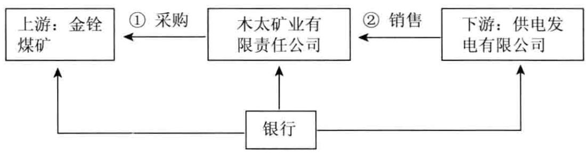
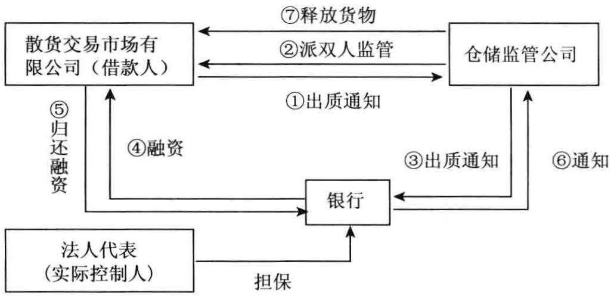
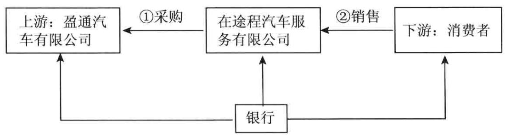

客户经理宝典·励志照亮人生学习产品成就优秀客户经理

# 银行 对公授信方案案例培训8

立金银行培训中心教材编写组◎著行长送给客户经理的最好礼物·客户经理设计授信方案工具书案例多：近百个授信产品经典案例思路新：国内信用证融资、多产品融资等最新思路分析透：详细分析各类型授信方案要点

银行一旦发生风险，需要具备极强的处置能力，而不是一味地挑选毫无风险的客户，通常这类业务利润也极低。银行驾驭和处置风险的能力，将是未来的核心竞争力。

立金培训中心重点推广最新授信产品  
最新电子票据\电子票据替代贷款/电子票据买方付息/电子置换  
商票保押商票保贴商票质押贷款/先票后贷商票贷款组合授信  
小微企业授信商票小微企业使用商票技巧小微企业使用商票替代贷款策略  
商票保付\企业签发商票保函业务\银行定价商票对银行保证金贡献  
第三方保兑商票集团公司对成员单位商票保兑大型民营集团的商票承兑  
担保公司商票保兑小贷公司商票保兑保理公司商票保兑  
票据收益权买断业务银企票据互换抵消业务  
无固定期限委托贷款培训银行最新报合业务\委托贷款

本书提供教练式培训，将帮助你在最短时间内成为一名优秀的商业银行客户经理激发客户经理生生不息的奋斗精神和创造价值的活力

# 银行对公授信方案案例培训

常州大字藏书

立金银行培训中心教材编写组 $\textcircled{9}$ 著

# 北京

# 图书在版编目（CIP）数据

银行对公授信方案案例培训.8/立金银行培训中心教材编写组著：  
北京：中国经济出版社，2015.1  
ISBN978-7-5136-2766-5  
1. $\textcircled{1}$ 银…Ⅱ. $\textcircled{1}$ 立…Ⅲ. $\textcircled{1}$ 银行业务—贷款管理—职工培训一教材IⅣ. $\textcircled{1}$ F830.51  
中国版本图书馆CIP数据核字（2014）第097647号  
责任编辑乔卫兵崔清北  
责任审读贺静  
责任印制 马小宾  
封面设计 华子设计  
出版发行中国经济出版社  
印刷者 北京嘉业印刷厂  
经销者 各地新华书店  
开 本 $7 1 0 \mathrm { { m m } \times 1 0 0 0 \mathrm { { m m } } }$ 1/16  
印 张25.75  
字 数376千字  
版 次2015年1月第1版  
印 次2015年1月第1次  
定 价48.00元  
广告经营许可证京西工商广字第8179号

中国经济出版社网址www.economyph.com社址北京市西城区百万庄北街3号邮编100037本版图书如存在印装质量问题，请与本社发行中心联系调换（联系电话：010-68330607）

# 左手控风险，右手抓业务，纵横四海

立金银行培训中心一直在做商业银行客户经理培训。凭我做客户经理和培训多年的经验，我深刻体会，客户经理的任务很艰巨，每一位成功的客户经理都是不简单的人，客户经理作为一个银行最小的经营实体，工作机动性极大。没有人告诉你客户在哪里，没有人给你设计授信方案，没有人给你指挥方向，你要给自己找出方向，自己给自己指导设计授信方案。

# 一、既要了解企业，又要了解银行

客户经理对待工作必须足够深人细致，对要营销的客户要有足够了解，成为企业融资方面的专家，了解企业真实经营状况，了解企业融资的目的，能够对企业融资提出合理的融资方案；对银行各类产品要非常精通，成为一流的银行产品专家，所有的授信方案结构清楚。对所有授信产品理解透彻，能够灵活运用。只有这样才能准确把握客户真实需求，精准地设计银行授信方案。设计授信方案风险控制足够扎实，真正能够满足客户的需要。

# 二、金融创新决定未来

这是一个金融创新层出不穷的时代，客户对银行要求越来越高，从事银行客户经理工作，既要有银行信贷业务的基础，又要有专业知识技能，还要有敏锐的市场意识。金融创新一日千里，过去的知识储备已经远远不能满足业务需要。票据、国内证、保理、保函、供应链融资、交易融资、资金撮合等新业务让人眼花缭乱，很多客户甚至比银行更懂银行产品，如果你不能时时更新自己的知识结构，很快就会落伍。银行必须清醒地认识到自己的不足，更加谦虚、更加紧迫地加强学习。

# 三、沟通上要“勤”“诚”

做商业银行信贷，需要与客户打交道，需要与银行的信贷审批打交道。银企之间、银行内部之间、上下级之间沟通显得尤为重要。既要维护客户的利益，让客户认同银行的授信方案，帮助客户做成事，取得客户的信任；又必须顾全银行的内部大局，多提高银行的收益，绝不放松风险条件。要求客户经理必须具备强大的沟通能力。

有时候，公司业务和信贷审批又是一对矛盾。在面对矛盾时一定要避免感情用事，多冷静分析、换位思考。在商业银行从事客户经理工作，是个需要各方支持的岗位，必须获得信贷审批、风险控制、贸易融资、票据中心等部门的支持。很多客户经理都在说，银行的审批标准太严。其实，人必须懂得换位思考，要很成熟，不可一味抱怨。如果让你担当审批人员的职责，你很可能审批标准更严，还不如审批人员呢。

# 目 录

【案例1】 供应商供应链融资授信方案安民肝胆病医院…

【案例2】承兑担保授信方案五淮机动力有限公司…

【案例3】 出口打包信贷融资授信方案农务产品资料有限责任公司 8

【案例4】 新校区建设信贷融资授信方案益华中药大学… 11

【案例5】 贸易链融资授信方案江北丰物资贸易有限公司 16

【案例6】商票保贴授信方案金成物资有限公司 21

【案例7】 买方信贷授信方案久心机械股份有限公司 26

【案例8】土地抵押担保融资授信方案拓明公司 32

银行对公授信2 方案案例培训 $\textcircled{8}$

【案例9】资金总承包商授信方案-蓝天威集团股份有限公司 35

【案例10】汽车营销 $^ +$ 非保兑仓网络项下业务授信方案茂华汽车贸易公司.… 39

【案例11】 国内证开证授信方案一木太矿业有限责任公司 41

【案例12】6换9商票保押贷款批量授信方案-京源工业股份有限公司… 45

【案例13】 房产抵押 $^ +$ 发票融资授信方案宜能石化有限公司… 51

【案例14】 上下游整体授信方案福生海洋工程有限公司 59

【案例15】 综合授信方案华中宜仁医学院附属医院… 63

【案例16】保理业务 $^ +$ 银关授信方案达兴纸业有限公司… 66

【案例17】 商业承兑汇票保贴业务授信方案-锦轴对外贸易股份有限公司… 70

【案例18】 并购贷款授信方案华金润股份有限公司… 73

【案例19】担保付款授信方案-锦华国际物流集团股份有限公司… 77

# 【案例20】 租赁授信方案

海西融资租赁有限公司 80

# 【案例21】 财政专户质押授信方案

铁道建设投资集团有限公司… 85

【案例22】 有追索保理封闭支付租金授信方案达莱国际融资租赁有限公司 88

【案例23】国内证购置租赁物授信方案立新融资租赁有限公司 100

【案例24】 供应链融资综合授信方案工筑钢铁集团有限公司 104

【案例25】全产业链授信方案山益重型装备有限公司 110

【案例26】 销售金融网综合授信方案华发水泥有限责任公司 115

【案例27】 原料采购 $^ +$ 商票贴现自偿性融资授信方案元红能源有限公司… 119

【案例28】商品采购 $^ +$ 反向保兑仓授信方案中立空调工程有限公司 123

【案例29】 商商银授信方案滇红物资贸易有限公司 126

# 【案例30】 集团综合授信额度授信方案

银宜集团有限公司 131

【案例31】厂商发货阶段性担保 $^ +$ 控货质押授信方案一东重矿业有限公司… 133

【案例32】大额授信换取控制现金流授信方案—广西化工有限公司… 138

【案例33】采购 $^ +$ 风险资产占用减半授信方案重交打捞局… 143

【案例34】 $1 + \Nu$ 有追索权保理项下买方信用担保授信方案河北钢制股份有限公司 146

【案例35】 订单融资授信方案禹州市水泥有限公司 149

【案例36】 进口整体授信方案玉华石油有限公司 155

【案例37】客户“ $1 + \Nu$ ”综合开发授信方案诚能（集团）控股公司… 159

【案例38】批量授信经营授信方案工筑钢铁集团有限公司 162

【案例39】 综合授信融资方案军达电器有限公司 172

【案例40】 供应链融资授信方案一营固动力股份有限公司 176

【案例41】担保加盟店 $^ +$ 保兑仓授信方案嘉荣超市有限公司 181

【案例42】住房按揭贷款阶段性担保授信方案海江投资总公司 185

【案例43】 集团统一保兑商业承兑汇票授信方案一宣铁集团有限责任公司 190

【案例44】 超市供应商融资授信方案一顺康食品 193

【案例45】供应商整体开发授信方案一临建工程总承包有限公司 198

【案例46】订单融资授信方案升宜产汽车销售服务有限公司 201

【案例47】集团母公司担保授信方案一冶轧钢铁集团有限公司 204

【案例48】 短应收账款换长银行承兑汇票授信方案富源煤业有限责任公司… 207

【案例49】 应收账款回收授信方案华德煤业有限责任公司 211

【案例50】 银行承兑汇票授信方案光英实业集团有限公司 216

【案例51】上下游一体化授信方案三峡岩通涂镀板股份有限公司 221

【案例52】 商贷通授信方案克森家居有限公司 225

银行对公授信6 方案案例培训 $\textcircled{8}$

【案例53】酒窖下游经销商授信方案—广元商贸有限公司.… 227

【案例54】 保兑仓经销商授信方案一东锦煤炭有限公司 232

【案例55】 银行承兑汇票拆分授信方案-和信家用电器有限公司 236

【案例56】 供应链融资授信方案津道建设集团有限公司 · 238

【案例57】 推荐客户案例授信方案散货交易市场有限公司 242

# 【案例58】 持续营销授信方案

城投市建建设发展有限公司 249

【案例59】 房产抵押授信方案一圣业贸易有限公司… 252

【案例60】批量开发商户授信方案物资大楼股份有限公司 256

【案例61】 财政应收账款保理授信方案土地储备中心… 261

【案例62】 保兑仓非网络内汽车经销商授信方案—在途程汽车服务有限公司… 266

【案例63】 银票 $^ +$ 付款保函授信方案一海坝建设发展有限公司 269

【案例64】未来货权项下预付款融资授信方案鑫钢股份有限公司 272

【案例65】保兑仓授信方案菱宇有限公司 278

【案例66】贷款意向承诺函授信方案一直机产业投资有限公司 280

【案例67】上下游一体化授信方案—思忆食品有限公司 283

【案例68】反向保兑仓授信方案-平贵钢铁有限公司 286

【案例69】 流动资金担保授信方案焦湾粮库有限责任公司 291

【案例70】资金总承包商授信方案栋华汽车集团有限公司 295

【案例71】铁矿石货押授信方案劲锐物产有限公司 300

【案例72】采购授信方案西延食品有限公司 320

【案例73】 货押业务授信方案齐星汽车销售服务有限公司 323

【案例74】 资金总承包商授信方案案例志精传动设备制造集团有限公司 328

【案例75】 船舶抵押授信方案恒达船务有限公司… 332

【案例76】 资金总承包商授信方案-衡东能源集团有限责任公司… 335

【案例77】 “采矿权质押 $^ +$ 信托”融资授信方案湾田集团公司… 340

【案例78】核心企业应收账款保理授信方案美奥凯菱电器有限责任公司 345

【案例79】 应收账款融资授信方案达意煤炭经销有限公司… 348

【案例80】集团统一授信方案煤业化工集团有限责任公司 350

【案例81】 资金总承包商授信方案福欣科技股份有限公司 353

【案例82】 延伸金融服务授信方案浩民投资管理有限公司 359

【案例83】 并购融资授信方案一萃华… 365

【案例84】 票据业务融资授信方案-丹普制冷压缩机股份有限公司 368

【案例85】批量开发授信方案一易家家居用品超市… 373

# 【案例86】 技术开发授信方案

睿佳风能技术有限公司 377

【案例87】 营销金融模式授信方案金城煤矿业集团有限责任公司 383

【案例88】 国内信用证 $^ +$ 未来货权质押授信方案保特国际物流有限公司… 390

【案例1]

# 供应商供应链融资授信方案—安民肝胆病医院

若银行本次能与该院进行保理买方信用担保额度的实际操作，银行争取将其锁定的医院应付账款按月支付到银行保理专户上，从而缓解融资到期后一次性付款压力。

# 一、企业基本概况

安民肝胆病医院，注册资金8591万元，经费来源差额补贴，业务范围包括传染病科、肝病专科、内科、外科、妇产科、儿科、肿瘤科、病理科、感染科、疾病基础与临床研究等。安民肝胆病医院总占地面积42000平方米，总建筑面积48000平方米，编制床位680张，实际开放床位760张，拥有卫生技术人员近400人，高级职称专业技术人员77人。

  
图1产业链流程

# 二、银行授信方案

表1银行授信方案设计  

<table><tr><td rowspan=1 colspan=1>额度类型</td><td rowspan=1 colspan=2>公开授信额度</td><td rowspan=1 colspan=1>授信方式</td><td rowspan=1 colspan=2>授信方式</td><td rowspan=1 colspan=2>综合授信额度</td></tr><tr><td rowspan=1 colspan=1>授信额度（万元）</td><td rowspan=1 colspan=2>1650</td><td rowspan=1 colspan=1>授信期限（月）</td><td rowspan=1 colspan=4>12</td></tr><tr><td rowspan=1 colspan=1>授信品种</td><td rowspan=1 colspan=1>币种</td><td rowspan=1 colspan=1>金额（万元）</td><td rowspan=1 colspan=1>保证金比例（%）</td><td rowspan=1 colspan=1>期限（月）</td><td rowspan=1 colspan=2>用途</td><td rowspan=1 colspan=1>收益</td></tr><tr><td rowspan=1 colspan=1>保理买方信用担保额度</td><td rowspan=1 colspan=1>人民币</td><td rowspan=1 colspan=1>1650</td><td rowspan=1 colspan=1>0</td><td rowspan=1 colspan=1>12</td><td rowspan=1 colspan=2></td><td rowspan=1 colspan=1></td></tr><tr><td rowspan=1 colspan=1>性质</td><td rowspan=1 colspan=1>新增</td><td rowspan=1 colspan=2>本次授信口（万元）</td><td rowspan=1 colspan=1>1650</td><td rowspan=1 colspan=2>授信总□（万元）</td><td rowspan=1 colspan=1>1650</td></tr><tr><td rowspan=1 colspan=1>担保方式及内容</td><td rowspan=1 colspan=7>信用</td></tr></table>

担保方式由银行为其提供信用授信。

本次授信品种是“ $1 + \Nu$ ”保理授信业务，将对安民肝胆病医院上游较大的4户供应商进行融资，通过对上游供应商融资，有效介人其上游供应商客户群，从而带来在银行办理资金结算业务，拓宽银行中小企业客户群体范围，带动网银业务、代发业务等一系列对公、对私金融服务业务发展；同时，银行将向安民肝胆病医院提供银等金融服务。

对核心企业要求：

1.在银行开立一般结算账户；

2.对供应商融资到期后，核心企业须将款项直接付到银行保理专户；

3.要求核心企业与银行签订制式的《“ $\mathrm { ~  ~ \omega ~ } _ { 1 } + \mathrm { ~  ~ N ~ }$ ”保理业务应收账款转让确认协议》，并在本次保理融资业务中将在银行制式的 $\because 1 + \mathrm { N } ^ { \prime }$ ”保理业务应付供应商账款明细表》上盖章书面确认，积极配合银行续做“ $1 + \mathrm { N }$ ”保理业务。

根据安民肝胆病医院与其上游供应商的应收账款实际结算金额与周期提款，该院以经营回笼资金按照付款特点和规律，每月正常付款存人保理监管账户，从而逐月归还贷款。主要收入来源为财政拨款、医疗收入、药品收入，其中医疗和药品收人，主要来源于门诊收入和住院收入，医院除了现金收入外，省、市医保收入约占 $60 \%$ ，而医保收入返还给医院（一般为1\~3个月）和医院的对外支付存在时间上的差异，因此吉林省安民肝胆病医院在银行授信期间，可根据其资金实际情况，调整支付银行保理账户应付账款付款频率，从而缓解和调整该院付款压力。

该院展望前景较好，具有可持续发展能力，其经营状况稳定，市场竞争力不断提高，同时具备一定的还款能力。银行通过与该院合作保理买方信用担保额度，争取将其锁定的医院应付账款按月支付到银行保理专户上，从而缓解融资到期后一次性付款压力，同时继续关注吉林省安民肝胆病医院财务状况及密切关注医改政策的动向，及时调整授信方案。

# 【点评】

$\textcircled{1}$ 政策优势。

医疗行业属于国计民生的社会服务行业，是国民经济建设中的重要环节。近几年，随着国家及对医改工作的高度重视，及基本实现全民医保、方便群众就医结算、提高公立医院的服务质量和运行效率等相应政策的出台，较大地降低了患者的医疗成本，提升了患者的满意度，极大地促进了医疗机构就诊人数的增加，综合收益不断增长。借着医改政策优势，吉林省医疗机构自身经营水平将提升一个新的台阶。

$\textcircled{2}$ 第一还款来源有所保障。

安民肝胆病医院是依据国家有关规定，依法设立的具有独立从业资格的公立医疗单位，系三甲专科医院，拥有较好的技术力量和医疗特色，医院经营收入较为稳定。近年来随着公众生活质量的不断提高，医改政策的推进与实施，医疗机构的收入正向着稳步上升的趋势发展。同时该院与上游多家药商保持着长年良好合作关系，建立了一套较为完备的采购、回款体系，药商依托医院的稳定回款不断壮大，银行即是以药商转让在医院的应收账款为切入点，以医院的稳定回款作为银行的第一还款来源，核心企业良好的信誉和履约能力，从而降低了授信融资偿还的风险。

$\textcircled{3}$ 快速扩展中小企业客户数。

中小企业可提供的担保品少，尤其是医院上游供应商，融资难问题更是凸显出来，银行的“ $1 + \mathrm { N }$ ”保理业务模式，是药商迅速解决融资难的有效途径之一，吸引了很多中小企业客户群体，既快速扩展了银行中小企业客户数，又增加了银行信贷资源。

$\textcircled{4}$ 衍生产品的拉动，实现综合收益最大化。

此项业务的开展，除能够为银行带来利息收入和保理费收入，增加银行相关收益外，同时还能带动银行网银、信用卡、代发工资等其他业务的发展，以此实现银行综合收益最大化。

虽然该院存在上述不确定性因素，但鉴于授信主体（安民肝胆病医院）所属行业发展前景良好，其经营收入较为稳定，第一还款来源保障性较好，银行拟同意为安民肝胆病医院提供保理买方信用担保额度；授信额度为1650万元；授信期限为12个月，可循环使用；利率为执行基准利率上浮$1 5 \%$ ；担保方式为信用。

具体用信人为上游药品供应商，在1650万元保理付款担保额度内，银行为药品供应商办理银行承兑汇票，要求药品供应商至少交存 $30 \%$ 保证金，口部分占用1650万元授信额度。

银行通过为安民肝胆病医院提供保理买方付款担保额度，具体用信人为药品供应商，可以有效防止信贷资金被挪用。而且，银行可以借助安民肝胆病医院关联营销众多的供应商资源。

【案例2】

# 承兑担保授信方案—五淮机动力有限公司

对贴现业务项下贸易背景真实性严格把关，客户一定要提供足额增值税票及真实贸易合同，严格按照银行信贷操作规程办理业务，防范业务操作风险。

# 一、企业基本概况

五淮机动力有限公司，注册资本为10012万元。主要从事内燃机开发和制造，有80多年生产内燃机的历史和经验，是国家大型二类企业，中国500家最大机械工业企业之一。

表1供应渠道与销售渠道分析  

<table><tr><td rowspan=1 colspan=4>供应渠道分析</td></tr><tr><td rowspan=1 colspan=1></td><td rowspan=1 colspan=1>前三名供应商（按金额大小排名）</td><td rowspan=1 colspan=1>金额（万元）</td><td rowspan=1 colspan=1>占全部采购比率（%）</td></tr><tr><td rowspan=1 colspan=1>1</td><td rowspan=1 colspan=1>盈通五淮汽车股份有限公司</td><td rowspan=1 colspan=1>64338.23</td><td rowspan=1 colspan=1>22.4</td></tr><tr><td rowspan=1 colspan=1>2</td><td rowspan=1 colspan=1>云鸿变速器公司</td><td rowspan=1 colspan=1>37352.22</td><td rowspan=1 colspan=1>13</td></tr><tr><td rowspan=1 colspan=1>3</td><td rowspan=1 colspan=1>重庆鸿速分公司</td><td rowspan=1 colspan=1>24689.75</td><td rowspan=1 colspan=1>8.6</td></tr><tr><td rowspan=1 colspan=4>盈通五淮汽车股份有限公司供应电喷件，结算方式为抵扣货款，其他两家生产变速器。公司与其供应商保持长期稳定的供货关系，采用银行承兑汇票结算，付款期为55~75天。</td></tr></table>

续表  

<table><tr><td rowspan=1 colspan=4>销售渠道分析</td></tr><tr><td rowspan=1 colspan=1></td><td rowspan=1 colspan=1>前三名销售商（按金额大小排名）</td><td rowspan=1 colspan=1>金额（万元）</td><td rowspan=1 colspan=1>占全部销售比率（%）</td></tr><tr><td rowspan=1 colspan=1>1</td><td rowspan=1 colspan=1>盈通五淮汽车股份有限公司</td><td rowspan=1 colspan=1>235356.89</td><td rowspan=1 colspan=1>63.98</td></tr><tr><td rowspan=1 colspan=1>2</td><td rowspan=1 colspan=1>海怀商务有限公司</td><td rowspan=1 colspan=1>31052.29</td><td rowspan=1 colspan=1>8.44</td></tr><tr><td rowspan=1 colspan=1>3</td><td rowspan=1 colspan=1>北田奥福汽车厂</td><td rowspan=1 colspan=1>14881.83</td><td rowspan=1 colspan=1>4.05</td></tr><tr><td rowspan=1 colspan=4>企业生产的发动机长期供给盈通五淮汽车股份有限公司，双方签订稳定的销售合同，结算方式为开票后60天支付银行承兑汇票。企业为了降低对盈通五淮的依赖程度，不断拓展新的市场，为海怀商务汽车有限公司研制了新型发动机，销售额较2012年上升了18741万元，销售占比2012年上升了4.49%。付款方式为开票后60天内付款。福田汽车股份有限公司诸城奥铃汽车厂为开票金额减除90元万铺底后下月付款。</td></tr></table>

五淮机生产的发动机 $90 \%$ 是定向销售给盈通五淮有限公司，近年盈通五淮公司生产微型车115万台，其中向五淮机采购48万台，占比 $4 1 . 7 3 \%$ 。2012年盈通五淮计划生产130万台，作为盈通五淮最大供应商的五淮机，产品销售获得了稳定的增长。五淮机动力有限公司实现销售收入36.93亿元，净利润0.68亿元。截至2013年10月，企业总资产26.46亿元，销售收入31.23亿元，净利润0.81亿元，公司具有较强的规模优势。

# 二、银行授信方案

表2银行授信方案设计  

<table><tr><td rowspan=1 colspan=1>额度类型</td><td rowspan=1 colspan=2>公开授信额度</td><td rowspan=1 colspan=1>授信方式</td><td rowspan=1 colspan=3>综合授信额度</td></tr><tr><td rowspan=1 colspan=1>授信额度（万元）</td><td rowspan=1 colspan=2>20000</td><td rowspan=1 colspan=1>授信期限（月）</td><td rowspan=1 colspan=3>12</td></tr><tr><td rowspan=1 colspan=1>授信品种</td><td rowspan=1 colspan=1>币种</td><td rowspan=1 colspan=1>金额（万元）</td><td rowspan=1 colspan=1>保证金比例（%）</td><td rowspan=1 colspan=1>期限（月）</td><td rowspan=1 colspan=1>用途</td><td rowspan=1 colspan=1>收益</td></tr><tr><td rowspan=1 colspan=1>银行承兑汇票</td><td rowspan=1 colspan=1>人民币</td><td rowspan=1 colspan=1>20000</td><td rowspan=1 colspan=1>0</td><td rowspan=1 colspan=1>12</td><td rowspan=1 colspan=1>向上游企业支付货款</td><td rowspan=1 colspan=1>银行可以要求较高比例的保证金，银行吸收可观的保证金存款</td></tr><tr><td rowspan=1 colspan=1>授信性质</td><td rowspan=1 colspan=1>新增</td><td rowspan=1 colspan=2>本次授信口(万元）</td><td rowspan=1 colspan=1>20000</td><td rowspan=1 colspan=1></td><td rowspan=1 colspan=1></td></tr><tr><td rowspan=1 colspan=1>担保方式及内容</td><td rowspan=1 colspan=6>企业承诺将不低于50%的结算流水依托在本银行</td></tr></table>

通过以上分析，银行同意给予该公司内部授信额度20000万元人民币，

授信品种为银行承兑汇票，按银行规定串用，期限1年。

# 【点评】

1.行业结算大量使用银行承兑汇票，票据使用占到整个行业结算的$90 \%$ 以上。通过不断地循环使用银行承兑汇票额度，可以多倍使用银行的授信额度。

2.就相关风险隐患，提出具体的防范措施：

$\textcircled{1}$ 对银行承兑汇票票面要素真实性严格按照规定进行审核；

$\textcircled{2}$ 对贴现业务项下贸易背景真实性严格把关，客户一定要提供足额增值税票及真实贸易合同；

$\textcircled{3}$ 严格按照银行信贷操作规程办理业务，防范业务操作风险；

$\textcircled{4}$ 了解客户交易双方具有真实贸易背景，客户一定要提供真实贸易合同；

$\textcircled{5}$ 要求客户在银行账户上存放足量资金，以备银承到期兑付。

【案例3】

# 出口打包信贷融资授信方案—农务产品资料有限责任公司

管理层有着丰富的经营管理经验和良好的经营业绩，具有较强的市场应变能力和抗风险能力，企业发展前景广阔，发展趋势良好，在第一还款来源违约的情况下有偿还银行贷款的能力。

# 一、企业基本概况

# （一）基本介绍

农务产品资料有限责任公司，注册资金5000万元。负责全省农资商品的购销，计划经济时期，省农资公司作为省内农资商品的唯一经营单位，全省各地市、区县的农资公司、供销社都统一按照计划指标向省农资公司采购，公司在全省范围内具有绝对的垄断和控制权。

【案例3】

出口打包信贷融资授信方案—农务产品资料有限责任公司

# （二）上下游客户及主要结算方式

表1上下游客户及主要结算方式  

<table><tr><td rowspan=1 colspan=4>供应渠道分析</td></tr><tr><td rowspan=1 colspan=1></td><td rowspan=1 colspan=1>前三名供应商（按金额大小排名）</td><td rowspan=1 colspan=1>金额（万元）</td><td rowspan=1 colspan=1>占全部采购比率（%）</td></tr><tr><td rowspan=1 colspan=1>1</td><td rowspan=1 colspan=1>云国化工有限公司</td><td rowspan=1 colspan=1>10362</td><td rowspan=1 colspan=1>8.26</td></tr><tr><td rowspan=1 colspan=1>2</td><td rowspan=1 colspan=1>中国农务产品资料集团公司</td><td rowspan=1 colspan=1>8210</td><td rowspan=1 colspan=1>7.09</td></tr><tr><td rowspan=1 colspan=1>3</td><td rowspan=1 colspan=1>齐鲁第一化肥有限公司</td><td rowspan=1 colspan=1>2530</td><td rowspan=1 colspan=1>3.15</td></tr></table>

在供应商方面，主要供应商有：云国化工有限公司、中国农务产品资料集团公司、齐鲁第一化肥有限公司、山东省农务产品资料日照有限公司、瓮福集团有限责任公司等国内大型化肥厂商和贸易厂商。该公司本着互惠互利，信誉第一的经营原则，同国内名牌化肥厂家建立了稳定、高效益的合作关系，与阳煤集团齐鲁第一化肥有限公司签订了买断全部产品的合作协议（即全部包销，齐鲁一化无销售权），以低于市场价的价格买入，从而降低成本。已取得了湖北黄麦岭化工集团、五台尿素厂、红磷化工集团等30多家大中型化肥生产厂家在的总代理、总经销权，取得瓮福集团有限责任公司的区域经销权等。

国内采购和销售周转期方面，国内采购均采用银行承兑汇票或现金方式，公司业务部门独立核算，具有完全采购决策权，由业务部门确定采购计划后，提前报财务部门列资金计划，然后向国内大型化肥厂商和贸易厂商进行采购，采购、销售周期为45天左右。国外方面，采购采用信用证付款方式，贸易流程：与外商谈判签销售合同—对方开证—公司收到信用证后备货—到期装船向银行交单一—对方收到提单汇款结汇。公司全部是单证业务，没有非单证业务。

销售渠道分析

该公司在销售渠道上，采取上联厂家，下接县、乡、镇的批发模式，集中进货，分区域销售，减少中间环节，销售网络遍布全省，拥有3800多个代理商，其中，10个为控股子公司，其他均为合作方式，以统一批发价直接批发给代理商，采取先付款后提货的方式，加大了进销差价，提高了利润率。

在产品供货和销售上，公司的营销系统上联中农公司、全国知名品牌化肥厂家，下联各县供销社农资销售网络和30余家加盟连锁公司，3800家加盟连锁店，农资配送中心44处的省内销售网络体系，不断的扩大销售网络，建立了覆盖全省、辐射全国的农资商品销售体系，形成了以“一级物流主导，二级物流辅助，基层加盟店零售”为基本格局的省内销售网络体系，极大地提升了公司为农服务的能力和水平。

  
图1产业链流程

# 二、银行授信方案

表2银行授信方案设计  

<table><tr><td rowspan=1 colspan=1>额度类型</td><td rowspan=1 colspan=2>公开授信额度</td><td rowspan=1 colspan=1>授信方式</td><td rowspan=1 colspan=3>综合授信额度</td></tr><tr><td rowspan=1 colspan=1>授信额度（万元）</td><td rowspan=1 colspan=2>15000</td><td rowspan=1 colspan=1>授信期限（月）</td><td rowspan=1 colspan=3>12</td></tr><tr><td rowspan=1 colspan=1>授信品种</td><td rowspan=1 colspan=1>币种</td><td rowspan=1 colspan=1>金额（万元）</td><td rowspan=1 colspan=1>保证金比例（%）</td><td rowspan=1 colspan=1>期限（月）</td><td rowspan=1 colspan=1>用途</td><td rowspan=1 colspan=1>收益</td></tr><tr><td rowspan=1 colspan=1>（1）打包贷款</td><td rowspan=1 colspan=1>人民币</td><td rowspan=1 colspan=1>5000</td><td rowspan=1 colspan=1>0</td><td rowspan=1 colspan=1>12</td><td rowspan=1 colspan=1>按照贸易顺序，营销出口打包贷款，出口押汇等产品</td><td rowspan=1 colspan=1>最大化挖掘客户的综合价值贡献度</td></tr><tr><td rowspan=1 colspan=1>(2）银行承兑汇票人民币</td><td rowspan=1 colspan=1></td><td rowspan=1 colspan=1>10000</td><td rowspan=1 colspan=1>50</td><td rowspan=1 colspan=1>12</td><td rowspan=1 colspan=1>向上游企业支付货款</td><td rowspan=1 colspan=1>银行可以要求较高比例的保证金，银行吸收可观的保证金存款</td></tr><tr><td rowspan=1 colspan=1>性质</td><td rowspan=1 colspan=1>新增</td><td rowspan=1 colspan=2>本次授信口（万元）</td><td rowspan=1 colspan=1>10000</td><td rowspan=1 colspan=1>授信总□（万元）</td><td rowspan=1 colspan=1>10000</td></tr></table>

【点评】

该公司秉承自身点多面广和几十年专业经营的优势，管理规范，运行正常，注重企业信誉，经营规模较大，资产的流动性较强，资产负债率相对于本省同行业而言较低，经营活动产生的现金流量充足，财务状况良，资产较为优良，管理层有着丰富的经营管理经验和良好的经营业绩，具有较强的市场应变能力和抗风险能力，企业发展前景广阔，发展趋势良好，在第一还款来源违约的情况下有偿还银行贷款的能力。

拟通过本次授信，与该公司更好地建立好银企合作关系，吸引该公司更多的结算业务归集银行，实现良好的综合收益。打包贷款属于商业银行的国际贸易融资业务，有利于商业银行拉动负债业务。

【案例4】

# 新校区建设信贷融资授信方案益华中药大学

银行除能获得贷款收益外，还将与益华中药大学开展更加广泛的合作：

（1）代收学费。

(2)为方便该客户的资金使用，银行计划为其提供企业网上银行服务。

（3)计划向该院教职员工办理银行信用卡、借记卡，并向其推荐银行个人理财产品，以及推荐银行消费信贷产品。

# 一、企业基本概况

益华中药大学，现有温江校区（非临床类）、十二桥校区（临床类）、高新区校区、人南校区、汪家拐校区五个校区，占地总面积约1908亩。学校是一所以中医药学科为主，兼有理、工、管、文、农、教等多学科相关专业交叉渗透、协调发展的中药大学。

# 二、银行授信方案

表1银行授信方案设计  

<table><tr><td rowspan=1 colspan=1>额度类型</td><td rowspan=1 colspan=2>内部授信额度</td><td rowspan=1 colspan=1>授信方式</td><td rowspan=1 colspan=3>单笔单批额度</td></tr><tr><td rowspan=1 colspan=1>授信额度（万元）</td><td rowspan=1 colspan=2>5000</td><td rowspan=1 colspan=1>授信期限（月）</td><td rowspan=1 colspan=3>36</td></tr><tr><td rowspan=1 colspan=1>授信品种</td><td rowspan=1 colspan=1>币种</td><td rowspan=1 colspan=1>金额（万元）</td><td rowspan=1 colspan=1>保证金比例（%）</td><td rowspan=1 colspan=1>期限（月）</td><td rowspan=1 colspan=1>用途</td><td rowspan=1 colspan=1>收益</td></tr><tr><td rowspan=1 colspan=1>流动资金贷款</td><td rowspan=1 colspan=1>人民币</td><td rowspan=1 colspan=1>5000</td><td rowspan=1 colspan=1>0</td><td rowspan=1 colspan=1>36</td><td rowspan=1 colspan=1>用于企业的一般性周转</td><td rowspan=1 colspan=1>银行可以获得可观的利息收入</td></tr><tr><td rowspan=1 colspan=1>授信性质</td><td rowspan=1 colspan=1>新增</td><td rowspan=1 colspan=2>本次授信口（万元）</td><td rowspan=1 colspan=1>5000</td><td rowspan=1 colspan=1></td><td rowspan=1 colspan=1></td></tr><tr><td rowspan=1 colspan=1>担保方式及内容</td><td rowspan=1 colspan=6>财政拨付专户质押(将财政应拨付该公司账户的财政资金划人银行指定账户）</td></tr><tr><td rowspan=1 colspan=7>完善法律文本的签署</td></tr></table>

  
图1融资流程

近年该校准备继续投资2亿元，继续进行一期第3阶段新校区建设，已在发改委立项的项目共4项：3万平方米的学生宿舍、2个国家级重点实验室、食堂、游泳池。主要建设资金由学校自筹5000万元，其余资金采用银行项目贷款的形式解决。

因此，该校基础建设所需资金缺口在2亿元左右，资金来源：

1.学校每年自筹5000万元左右；2.采用银行贷款融资1.5亿元；3.学校暂存及代管款项3亿元左右，作为该校可滚动占用的资金，是该校基建资金来源的可靠补充。

由于该校新校区建设还将持续，学校一方面需要中、长期项目建设贷款，另一方面由于学校自筹部分资金用于新校区建设，造成流动资金相对紧张；截至去年3月底该校贷款共计65282万元，其中：中长期贷款44400万元，短期流动资金贷款14000万元。为了维持学校正常开支，该校向银行借款人民币综合授信5000万元，品种为流动资金贷款，期限三年，利率按规定利率执行，主要用于学校流动资金周转需要。

还款来源：

1.预算内节余和预算外收入

（1)财政拨款收入为1.22亿元，由于学校各方面的快速发展，也会使财政拨款稳步增加，去年财政拨款已下拨1.35亿元；

(2)教育事业收入1.53亿元，较前年增加 $3 5 \%$ ，主要是温江校区规模和生源的增加。随着该校新校区建设陆续进行，办学条件将进一步得到改善，学生住宿收费的增加，招生规模的稳定增长，教育事业收入将逐年递增（温江校区在校学生8000人，今年在校学生人数为11000人，明年预计15000人，校区建设完成后能达到学生20000人）。预计通过生源的增加，学校今后几年的教育事业收人分别将会增加1500万元、3500万元、6000万元。

2.土地置换收人。根据学校的统筹安排及发展规划，学校将重点发展温江校区（非临床类)以及十二桥校区（临床类），拟将人南校区、汪家拐校区土地整体出售。

担保方式：

学校已同六家银行展开合作，授信银行考虑企业的实际风险情况，担保方式均采用信用方式，故银行此次授信上报，担保方式为信用。

综上，益华中药大学在全国中医药学院中具有特色的地位，系省属重点高校，属于银行信贷政策支持对象，该学校收人稳定，规模逐渐扩大后财政拨款稳定增长，教育事业收入也随之增长，且可变现土地价值高。因此，银行拟同意上报中医大学综合授信5000万元，期限3年，利率基准，贷款用于该校流动资金周转需要。

# 【点评】

$\textcircled{1}$ 优势：

1)根据该校近年来的整体情况看，该校处于良性持续发展时期，各银行对其支持较大，银行以资金作为其补充，授信风险基本可控，与效益较为匹配。

2）学校为省属重点院校，近年来获得的财政拨款稳定，2013年已达到12429万元，2014年预计超过13500万元，未来几年内将呈继续上升的增长形势。此外，由于教学规模的增加以及校区的整合，学校生源的规模还会增长，教育事业收入会逐年增加。

3)此笔贷款为中期贷款，利于银行有稳定的利息收入。

4)学校有可变现土地储备，变现价值高，银行授信风险可控。

$\textcircled{2}$ 劣势：学院银行贷款余额较大。这是由于学院近年来进行的基础建设造成负债增长较快所致，但学院整体收入情况趋好，随着学校基础建设设施逐步完善，生源的增加，教育事业收入也会随之增长，财务状况将会有较大改观。而且银行本次拟发放的贷款3年分次还清，对学校还款压力有一定的缓冲，风险相对较小。

$\textcircled{3}$ 将实现的效益。

银行除能获得贷款收益外，还将与成都益华中药大学开展更加广泛的合作：

1)代收学费。

2)为方便该客户的资金使用，银行计划为其提供企业网上银行服务。

3)计划向该院教职员工办理银行信用卡、借记卡，并向其推荐银行个人理财产品，以及推荐银行消费信贷产品。

# 【文本】

# 承诺函

银行：

根据贵行与我司于 年 月 日签订的合同编号为第 号的《贷款协议》，贵行已经向我司发放 万元贷款。为了保证贵行的利益，特作如下承诺：

我司将确保从省市两级财政获得财政教育专项补贴资金（万元)汇入我司在贵行开立的指定账户，账户名称 ，账号 。

公司年月日

客户经理要建立自已的商业模式。“未来银行间竞争将是商业模式竞争，未来客户经理竞争也是商业模式竞争。”“为什么你的企业在赚钱，但成长的空间似乎到了极限？”模式就是定位好你希望服务的客户群体，找到他们需求核心点，你的产品、服务、架构的设计、组织机构的运行都服务于这确定需要，客户经理要以最佳路径、最快速度去满足这类客户群体的需要，这就是商业模式。

【案例5】

# 贸易链融资授信方案-江北丰物资贸易有限公司

银行从贸易链入手，借款人得到了融资，由于长期存在钢贸关系，借款人的保证也是可以得到保障的，所以对企业和银行来说都是多方得益，并且风险较低的合作方案。

# 一、企业基本概况

# （一）基本介绍

江北丰物资贸易有限公司，注册资金500万元，是一家从事建筑材料、钢材等产品的销售，企业运行模式简单，作为保钢集团和江阴长达在宁波的代理商，主要销售这两家的罗纹钢等建材产品。保钢集团和江阴长达产品以良好的性价比，在国内钢材市场占有较大份额。保钢集团和江阴长达产品在受到普遍欢迎，销售势头良好，泰丰2012年完成销售达到2亿元。此规模在当地物资公司中属于中小钢铁贸易企业，符合银行中小企业发展和贸易链产品运用的营销指引原则。

# （二)上下游客户及主要结算方式

表1上下游客户及主要结算方式  

<table><tr><td rowspan=1 colspan=4>供应渠道分析</td></tr><tr><td rowspan=1 colspan=1></td><td rowspan=1 colspan=1>前三名供应商（按金额大小排名）</td><td rowspan=1 colspan=1>金额（万元）</td><td rowspan=1 colspan=1>占全部采购比率（%）</td></tr><tr><td rowspan=1 colspan=1>1</td><td rowspan=1 colspan=1>保钢集团有限公司</td><td rowspan=1 colspan=1>56220</td><td rowspan=1 colspan=1>40</td></tr><tr><td rowspan=1 colspan=1>2</td><td rowspan=1 colspan=1>江阴长达有限公司</td><td rowspan=1 colspan=1>72100</td><td rowspan=1 colspan=1>60</td></tr></table>

供应商总体评价从供货质量价格、供货稳定性、付款条件等方面对供应商进行描述。

企业作为保钢集团、长达的代理商，专业经营这两家的罗纹钢等建筑产品。保钢集团作为全国最大的大型钢产品生产基地，其产品质量可靠，泰丰和这两家供应商合作多年，供货稳定。企业采取银行承兑汇票与保钢集团、长达进行付款，属于付款提货的方式。

<table><tr><td rowspan=1 colspan=4>销售渠道分析</td></tr><tr><td rowspan=1 colspan=1></td><td rowspan=1 colspan=1>前三名销售商（按金额大小排名）</td><td rowspan=1 colspan=1>金额(万元）</td><td rowspan=1 colspan=1>占全部销售比率（%）</td></tr><tr><td rowspan=1 colspan=1>1</td><td rowspan=1 colspan=1>广天日越有限公司</td><td rowspan=1 colspan=1>35600</td><td rowspan=1 colspan=1>23</td></tr><tr><td rowspan=1 colspan=1>2</td><td rowspan=1 colspan=1>华丰建设有限公司</td><td rowspan=1 colspan=1>32100</td><td rowspan=1 colspan=1>20</td></tr><tr><td rowspan=1 colspan=1>3</td><td rowspan=1 colspan=1>中安建设集团有限公司</td><td rowspan=1 colspan=1>21006</td><td rowspan=1 colspan=1>16</td></tr></table>

销售商总体评价从销售价格、稳定性、付款条件等方面对销售商进行描述。

由于保钢集团、长达产品的良好性能，企业代理的产品在宁波很受欢迎，每年的销售额都很稳定，泰丰基本都采取款到发货的方式进行结算，部分长期合作老客户具有一定比例的赊销，销售价格根据市场价格来定。企业销售的对象主要是贰级经销商和大型施工企业。

此次银行上报的授信方案为申请银行承兑汇票2000万， $5 0 \%$ 保证金，另外 $50 \%$ 采取中安建设集团股份有限公司开立的商业汇票质押，同时中安建设集团股份有限公司提供担保的方式。该授信方式的优点在于把授信与企业的实际贸易紧密联系在一起。

  
图1产业链流程

# 二、银行授信方案

表2银行授信方案设计  

<table><tr><td rowspan=1 colspan=1>额度类型</td><td rowspan=1 colspan=2>公开授信额度</td><td rowspan=1 colspan=1>授信方式</td><td rowspan=1 colspan=3>综合授信额度</td></tr><tr><td rowspan=1 colspan=1>授信额度（万元）</td><td rowspan=1 colspan=2>2000</td><td rowspan=1 colspan=1>授信期限（月）</td><td rowspan=1 colspan=3>12</td></tr><tr><td rowspan=1 colspan=1>授信品种</td><td rowspan=1 colspan=1>币种</td><td rowspan=1 colspan=1>金额（万元）</td><td rowspan=1 colspan=1>保证金比例(%)</td><td rowspan=1 colspan=1>期限（月）</td><td rowspan=1 colspan=1>用途</td><td rowspan=1 colspan=1>收益</td></tr><tr><td rowspan=1 colspan=1>银行承兑汇票</td><td rowspan=1 colspan=1>人民币</td><td rowspan=1 colspan=1>2000</td><td rowspan=1 colspan=1>50</td><td rowspan=1 colspan=1>12</td><td rowspan=1 colspan=1>向上游企业支付货款</td><td rowspan=1 colspan=1>银行可以要求较高比例的保证金，银行吸收可观的保证金存款</td></tr><tr><td rowspan=1 colspan=1>性质</td><td rowspan=1 colspan=1>新增</td><td rowspan=1 colspan=2>本次授信口(万元）</td><td rowspan=1 colspan=1>1000</td><td rowspan=1 colspan=1>授信总口（万元）</td><td rowspan=1 colspan=1>1000</td></tr><tr><td rowspan=1 colspan=1>担保方式及内容</td><td rowspan=1 colspan=6>保证人：中安建设集团股份有限公司提供的商业承兑汇票质押</td></tr></table>

  
图2商业承兑汇票保押流程

中安建设集团股份有限公司为北斗丰物资贸易有限公司做担保，银行从贸易链入手，借款人得到了融资，由于长期存在钢贸关系，借款人的保证也是可以得到保障的，所以对企业和银行来说都是多方得益，并且风险较低的合作方案。

要得到银行授信资金，就需要与中安建设集团有真实的贸易，有效的监控银行信贷资金。另外此授信方案依托的是中安建设集团，中安建设集团之所以愿意给泰丰担保是因为泰丰有向其赊销钢材，中安建设集团作为应付账款，本来就有还款给泰丰的义务。借助银行的贸易链平台，对泰丰来讲提前回收应收账款，保持了良好现金流，对中安建设集团来说能在银行规范的操作中实现赊销。

企业授信的主要用途是用来向保钢集团、长达购买建筑材料，随着企业的规模不断扩大，企业需要扩大进货量。所以此次特向银行申请2000万元的银行承兑汇票额度：2000万元额度采取 $50 \%$ 保证金的方式，另外 $50 \%$ 采取市中安建设集团股份有限公司开立的商业汇票质押，同时中安建设集团股份有限公司提供商业承兑汇票担保的方式，中安建设集团股份有限公司实力强，禾太丰有良好的上下游产品供应关系，完全有能力为借款人担保。

# 【点评】

银行授信方案从产业链入手，精心设计，对借款人来讲提前回收商业承兑汇票应收账款，保持了良好现金流，对中安建设集团来说能在银行规范的操作中实现赊销，双方都能得益。而银行又可以在真实的贸易背景下有效控制信贷风险。

中安建设集团股份有限公司完全有能力为宁波江北斗丰物资贸易有限公司进行担保，况且两家企业拥有较长时间的贸易合作，形成稳固的贸易链，所以对银行信贷业务的风险又进一步降低和保障。

企业销售稳定，和上游供应商关系良好，长期合作，企业在银行授信少，和上游钢厂可用票据结算，合作一年来给银行带来了一定量的存款。企业各项财务指标良好，此次授信由中安建设集团股份有限公司担保，担保企业实力强大，况且银行授信方案从产业链入手，有效控制信贷风险。本次授信的风险点主要是关注好企业的资金流向，企业业务单一，结算简单，所以借款给泰丰对银行效益可观，风险可控，是银行理想的合作伙伴。

# 【文本】

# 商业承兑汇票授信额度申请书

编号：

银行：

1.我公司向贵行申请办理 （金额） （期限）商业承兑汇票质押贷款业务。我公司保证该商业承兑汇票具有真实、合法的贸易背景。

2.我公司将按照存入 万元的存款，办理 个月存单质押，存单作为办理贵行提供贷款的担保。

特此申请。

公司

（签字盖章）

年月日

# 【案例6】

# 商票保贴授信方案金成物资有限公司

企业销售模式以现金交易，仅极少数老客户和优质客户允许部分金额赊销，整体应收账款控制非常好。从财务报表中的应收账款额度就能体现这一点。这样的交易模式使得金晟在收款方面不会有坏账产生，很好地保护了企业的经营成果。

# 一、企业基本概况

# （一）基本介绍

金成物资有限公司，注册资金1200万元，从事建筑材料、钢材等产品的销售，企业运行模式简单，作为砂钢集团在宁波和舟山一级代理，主要销售砂钢集团的建材、优线、热卷板等产品。主要利用砂钢集团强大的后台，与砂钢集团建立价格保障机制，当市场价格较低时，砂钢进行价格补贴。这样企业规避了市场价格波动的风险。企业作为砂钢集团宁波、舟山一级代理，经营砂钢的全部产品，产品规格、品种齐全。

# （二）上下游客户及主要结算方式

表1上下游客户及主要结算方式  

<table><tr><td rowspan=1 colspan=4>销售渠道分析</td></tr><tr><td rowspan=1 colspan=1></td><td rowspan=1 colspan=1>前三名供应商（按金额大小排名）</td><td rowspan=1 colspan=1>金额（万元）</td><td rowspan=1 colspan=1>占全部采购比率（%）</td></tr><tr><td rowspan=1 colspan=1>1</td><td rowspan=1 colspan=1>砂钢集团有限公司</td><td rowspan=1 colspan=1>92000</td><td rowspan=1 colspan=1>40</td></tr><tr><td rowspan=1 colspan=1>2</td><td rowspan=1 colspan=1>敬业钢铁有限公司</td><td rowspan=1 colspan=1>46000</td><td rowspan=1 colspan=1>20</td></tr><tr><td rowspan=1 colspan=1>3</td><td rowspan=1 colspan=1>西城钢铁有限公司</td><td rowspan=1 colspan=1>34500</td><td rowspan=1 colspan=1>15</td></tr></table>

企业作为砂钢集团宁波、舟山的代理商，专业经营砂钢集团的热卷板，优线产品和建筑产品。砂钢集团作为全国大型钢产品生产基地，其产品质量可靠，金晟和砂钢集团合作多年，供货稳定。企业采取银行承兑汇票与砂钢集团进行付款，属于付款提货的方式。另外企业与西延钢铁、日照钢铁等也建立了良好稳健的商业合作关系。

<table><tr><td rowspan=1 colspan=1></td><td rowspan=1 colspan=1>前三名销售商（按金额大小排名）</td><td rowspan=1 colspan=1>金额（万元）</td><td rowspan=1 colspan=1>占全部销售比率（%）</td></tr><tr><td rowspan=1 colspan=1>1</td><td rowspan=1 colspan=1>耀纲建设集团有限公司</td><td rowspan=1 colspan=1>18400</td><td rowspan=1 colspan=1>8</td></tr><tr><td rowspan=1 colspan=1>2</td><td rowspan=1 colspan=1>佳祝建设有限公司</td><td rowspan=1 colspan=1>16100</td><td rowspan=1 colspan=1>7</td></tr><tr><td rowspan=1 colspan=1>3</td><td rowspan=1 colspan=1>永宏紧固件有限公司</td><td rowspan=1 colspan=1>11500</td><td rowspan=1 colspan=1>5</td></tr></table>

由于砂钢集团产品的良好性能，企业代理砂钢的产品在宁波很受欢迎，每年的销售额都有较大额度的增加，企业销售的对象主要是贰级经销商和大型施工企业。付款方式以现金交易为主，仅极少数老客户、优质客户有部分赊销，但数额很小。企业经营稳定，以现金交易把企业收款风险降到最低。

# （三）担保人总体评价

耀纲建设集团股份有限公司正在发展成为以建筑为主体业务，其他业务多元发展的集团公司，近几年公司的效益都在逐步提高，赢利能力明显强于同类别企业。规模也在逐渐扩大，地区范围上的清晰定位和市场开拓，使得2012年企业的发展再次保持了良好态势。

企业近年来的财务健康稳定，各项财务指标显示企业的财务运作良好。企业的法人代表在建筑行业人缘广，行业经验丰富，管理能力强。企业有稳定且素质较高的管理团队，开拓、接单能力强，业务发展有良好的保障，后续发展空间大。

  
图1产业链流程

# 二、银行授信方案

表2银行授信方案设计  

<table><tr><td rowspan=1 colspan=1>额度类型</td><td rowspan=1 colspan=2>公开授信额度</td><td rowspan=1 colspan=1>授信方式</td><td rowspan=1 colspan=3>综合授信额度</td></tr><tr><td rowspan=1 colspan=1>授信额度（万元）</td><td rowspan=1 colspan=2>4500</td><td rowspan=1 colspan=1>授信期限（月）</td><td rowspan=1 colspan=3>12</td></tr><tr><td rowspan=1 colspan=1>授信品种</td><td rowspan=1 colspan=1>币种</td><td rowspan=1 colspan=1>金额（万元）</td><td rowspan=1 colspan=1>保证金比例（%）</td><td rowspan=1 colspan=1>期限（月）</td><td rowspan=1 colspan=1>用途</td><td rowspan=1 colspan=1>收益</td></tr><tr><td rowspan=1 colspan=1>（1）流动资金贷款</td><td rowspan=1 colspan=1>人民币</td><td rowspan=1 colspan=1>2500</td><td rowspan=1 colspan=1></td><td rowspan=1 colspan=1>12</td><td rowspan=1 colspan=1>用于企业的一般性周转</td><td rowspan=1 colspan=1>银行可以获得可观的利息收入</td></tr><tr><td rowspan=1 colspan=1>(2）商业承兑汇票贴现（直贴）</td><td rowspan=1 colspan=1>人民币</td><td rowspan=1 colspan=2>2000</td><td rowspan=1 colspan=1>12</td><td rowspan=1 colspan=1>向上游采购付款</td><td rowspan=1 colspan=1>银行可以借助借款人关联营销上游供应商，银行获得可观的中小企业客户资源，并通过商业承兑汇票的结算，锁定借款人与供应商之间的资金结算流</td></tr><tr><td rowspan=1 colspan=1>性质</td><td rowspan=1 colspan=1>新增</td><td rowspan=1 colspan=2>本次授信口（万元）</td><td rowspan=1 colspan=1>4500</td><td rowspan=1 colspan=1>授信总□（万元）</td><td rowspan=1 colspan=1>4500</td></tr></table>

商票贴现指定由宁波市耀纲建设集团股份有限公司出票，并提供连带责任保证，担保单位是宁波当地优质施工单位。

此次授信额度申请4500万元额度，其中2000万元商票贴现，指定由耀纲建设集团股份有限公司出票，并提供连带责任保证，担保单位是当地优质施工单位，综合实力强，完全有能力分别为金晟提供2000万元担保。另外2500万元流贷额度企业提供一套个人别墅作抵押，评估价值1005万元。银行认为，基于企业良好的信誉及现款交易的习惯，企业用款主要是去钢厂买钢材，和下游交易很少赊销，避免应收账款的坏账，所以给予该企业4500万元额度风险可控。

银行与该客户合作多年，对客户了解较深入，认为金成是值得合作的优质钢贸企业，在其他银行加大力度支持的背景下，银行希望能在抵押项下的额度略微扩大，保持与其他银行一定的竞争力，避免被边缘化。

# 【点评】

$\textcircled{1}$ 该企业是个非常有实力的建材、钢材经销商，自身抗风险能力强，从业时间长达近20年。在业界有着很高的市场认可度和美誉度，银行在与企业的合作中逐步挖掘出其他一些优质钢贸企业进行授信合作，可以说金成给银行在钢贸企业领域的营销起到一定的指引作用。由于该客户的良好业绩，各家银行对其支持力度非常大，导致银行与其合作深入不甚理想。银行希望借助此次授信，进入企业合作银行的核心层面，加强合作。

$\textcircled{2}$ 风险控制。

此次授信银行认为有以下几方面值得总结：

1)授信主体经营良好，赢利能力强，利用与砂钢及其他钢厂良好的上下游贸易关系，在宁波当地钢材贸易市场上占有了一定的市场份额，赢得了市场的认可。作为砂钢全国销售商体系中最大的一家，在宁波地区销售砂钢产品具有一定地区垄断优势。

2)企业销售模式以现金交易，仅极少数老客户和优质客户允许部分金额赊销，整体应收账款控制非常好。从财务报表中的应收账款额度就能体现这一点。这样的交易模式使得金晟在收款方面不会有坏账产生，很好的保护了企业的经营成果。

3)企业经营模式单一，除了进行钢材贸易，没有进行其他产业投资，在银行给予大量授信的前提下也本分的致力于主业的发展。企业经营思路是“稳”字当先，注重企业形象和企业信誉度。

4）此次授信额度申请4500万元额度，其中2000万元商票贴现指定由宁波市耀纲建设集团股份有限公司出票，并提供连带责任保证，担保单位是宁波当地优质施工单位，综合实力强，完全有能力分别为金晟提供2000万元担保。另外2500万元流贷额度企业提供了一套个人别墅作抵押，评估价值1005万元。

5)银行设计授信方案的时候采取灵活处理方式，采取由授信申请人提供下游大型施工企业签发商业承兑汇票贴现方式出账，银行授信风险可控，风险较低。很多中小企业有应收账款，银行可以积极引导这些中小企业的下游对其签发商业承兑汇票，采取商业承兑汇票贴现方式，而非应收账款质押贷款方式，这样，可以有效降低银行的融资风险。

【案例7】

# 买方信贷授信方案—久心机械股份有限公司

根据国内数控机床业的发展，该公司的前景是非常不错的。企业处于良性上升通道。该公司各项指标符合银行担保条件，能在第一还款来源违约的情况下及时偿还银行贷款。

# 一、企业基本概况

# （一）基本介绍

久心机械股份有限公司，注册资本2000万元，专业经营进出口高端机床，代理德国德马吉、意大利飞迪亚、日本牧野等精密大型数控加工中心的代理业务，主要产品为数控龙门铣床，数控镗床，数控车床，数控磨床，五面体龙门加工中心，五轴加工中心等。

# （二）上下游及主要结算方式

表1上下游及主要结算方式  

<table><tr><td rowspan=1 colspan=4>供应渠道分析</td></tr><tr><td rowspan=1 colspan=1></td><td rowspan=1 colspan=1>前三名供应商（按金额大小排名）</td><td rowspan=1 colspan=1>金额（万元）</td><td rowspan=1 colspan=1>占全部采购比率（%）</td></tr><tr><td rowspan=1 colspan=1>1</td><td rowspan=1 colspan=1>台湾高风工业股份有限公司</td><td rowspan=1 colspan=1>68230</td><td rowspan=1 colspan=1>20.3</td></tr></table>

续表

<table><tr><td rowspan=1 colspan=4>供应渠道分析</td></tr><tr><td rowspan=1 colspan=1>2</td><td rowspan=1 colspan=1>台湾远东工业股份有限公司</td><td rowspan=1 colspan=1>43210</td><td rowspan=1 colspan=1>10.23</td></tr><tr><td rowspan=1 colspan=1>3</td><td rowspan=1 colspan=1>高风机械工业（昆山）有限公司</td><td rowspan=1 colspan=1>23150</td><td rowspan=1 colspan=1>9.20</td></tr><tr><td rowspan=1 colspan=4>久心主要经营德国德马吉、意大利飞迪亚、日本牧野等品牌，公司依靠久心机械的基础已于各家供应商打下良好的合作基础，供应商货源稳定，供货及时，付款方式基本上为信用证支付货款，有时用现汇美元结算。久心公司的供应商主要为台湾高风工业股份有限公司、台湾远东工业股份有限公司、高风机械工业（昆山)有限公司等，货源稳定，供货及时，与供应商合作关系良好，合作都有6年以上，与高风公司的付款方式基本上为信用证支付货款，有时用现汇美元结算。</td></tr><tr><td rowspan=1 colspan=4>销售渠道分析</td></tr><tr><td rowspan=1 colspan=1></td><td rowspan=1 colspan=1>前三名销售商（按金额大小排名）</td><td rowspan=1 colspan=1>金额（万元）</td><td rowspan=1 colspan=1>占全部销售比率（%）</td></tr><tr><td rowspan=1 colspan=1>1</td><td rowspan=1 colspan=1>升非机械制造有限公司</td><td rowspan=1 colspan=1>102650</td><td rowspan=1 colspan=1>9.56</td></tr><tr><td rowspan=1 colspan=1>2</td><td rowspan=1 colspan=1>全力机械模具有限公司</td><td rowspan=1 colspan=1>92360</td><td rowspan=1 colspan=1>8.35</td></tr><tr><td rowspan=1 colspan=4>公司销售商主要是华东地区对数控设备加工精密度要求非常高的中小型企业，像升非机械制造有限公司是全球第二大、中国最大的陆用勘油器材一射孔弹的专业设备生产商；全力机械模具有限公司是象山第二大机械模具公司，也是宁波地区唯一一家铁道部指定铁道产品供应商。因为久心公司的设备深受这些销售商的青睐和好评，每年的采购量也很大，久心公司与他们的结算方式为开证90~180天。</td></tr></table>

  
图1产业链流程

# 二、银行授信方案

表2银行授信方案设计  

<table><tr><td rowspan=1 colspan=1>额度类型</td><td rowspan=1 colspan=2>公开授信额度</td><td rowspan=1 colspan=1>授信方式</td><td rowspan=1 colspan=3>综合授信额度</td></tr><tr><td rowspan=1 colspan=1>授信额度（万元）</td><td rowspan=1 colspan=2>5000</td><td rowspan=1 colspan=1>授信期限（月）</td><td rowspan=1 colspan=3>12</td></tr><tr><td rowspan=1 colspan=1>授信品种</td><td rowspan=1 colspan=1>币种</td><td rowspan=1 colspan=1>金额（万元）</td><td rowspan=1 colspan=1>保证金比例（%）</td><td rowspan=1 colspan=1>期限（月）</td><td rowspan=1 colspan=1>用途</td><td rowspan=1 colspan=1>收益</td></tr><tr><td rowspan=1 colspan=1>(1)流动资金贷款</td><td rowspan=1 colspan=1>人民币</td><td rowspan=1 colspan=1>2000</td><td rowspan=1 colspan=1></td><td rowspan=1 colspan=1>12</td><td rowspan=1 colspan=1>用于企业的一般性周转</td><td rowspan=1 colspan=1>银行可以获得可观的利息收人</td></tr></table>

# 续表

<table><tr><td rowspan=1 colspan=1>授信品种</td><td rowspan=1 colspan=1>币种</td><td rowspan=1 colspan=1>金额（万元）</td><td rowspan=1 colspan=1>保证金比例（%）</td><td rowspan=1 colspan=1>期限（月）</td><td rowspan=1 colspan=1>用途</td><td rowspan=1 colspan=1>收益</td></tr><tr><td rowspan=1 colspan=1>(2）进口开证授信</td><td rowspan=1 colspan=1>人民币</td><td rowspan=1 colspan=1>1000</td><td rowspan=1 colspan=1>10</td><td rowspan=1 colspan=1>12</td><td rowspan=1 colspan=1>向上游企业支付货款</td><td rowspan=1 colspan=1>银行可以获得可观的保证金存款，进口信用证手续费和押汇利息。同时，由于进口信用证锁定解付功能，会给银行封闭带来可观的结算现金流</td></tr><tr><td rowspan=1 colspan=1>(2）一般授信担保人民币</td><td rowspan=1 colspan=1></td><td rowspan=1 colspan=1>2000</td><td rowspan=1 colspan=1></td><td rowspan=1 colspan=1>12</td><td rowspan=1 colspan=1>用于为下游买方信贷提供担保</td><td rowspan=1 colspan=1>银行可以获得大量的下游经销商资源</td></tr><tr><td rowspan=1 colspan=1>性质</td><td rowspan=1 colspan=1>新增</td><td rowspan=1 colspan=2>本次授信口（万元）</td><td rowspan=1 colspan=1>4900</td><td rowspan=1 colspan=1>授信总口（万元）</td><td rowspan=1 colspan=1>4900</td></tr><tr><td rowspan=1 colspan=1>担保方式及内容</td><td rowspan=1 colspan=6>保证人：久心机械有限公司；抵押物名称：博优机械有限公司厂房；抵押物名称：博优机械有限公司厂房土地。</td></tr></table>

  
图2买方信贷流程

授信品种流动资金贷款2000万元，进口开证授信1000万元，一般授信担保2000万元。担保方式：由博优机械有限公司位于象山经济开发区的厂房土地抵押2000万元；久心机械有限公司提供连带责任担保3000万元。

久心机械股份有限公司为新建企业，为扩大企业规模，企业资金需求扩大，此次向银行申请5000万元授信额度。2000万元流动资金贷款为博优机械有限公司位于象山经济开发区的厂房抵押，1000万元开证，2000万元一般授信担保由久心机械有限公司提供连带责任保证担保。

# 【点评】

鉴于该公司多年来与银行合作，从未出现不良信息记录，并且为上述两个银行创造了较好的收益，因此成为宁海众多银行营销的对象。而看中久心公司完善的内部管理，中高端的客户资源群和久心公司对下游企业非常严谨的考察体系以及对业务风险的把握力度，与久心公司开展设备按揭贷款近6年，没有出现一笔逾期或不良贷款，同时也取得了较高的收益回报和存款，也开拓了该类高端客户市场，为其银行提供大量的优质客户。

而这些银行的蜂拥营销也正是久心公司自身实力的展示，也足以说明其为一个成长型的优质客户，是非常让银行认可的。而企业本身经营正常，初具规模，销售也逐年增加，同时拥有较高的盈利能力和偿债能力，该公司有非常完善的内部组织结构和管理体系，自身对风险的把握较到位。根据国内数控机床业的发展，该公司的前景是非常不错的。企业处于良性上升通道。该公司各项指标符合银行担保条件，能在第一还款来源违约的情况下及时偿还银行贷款。

由于久心机械股份有限公司本身属于优质企业，银行降低了贷款的比重，而是大量提供买方信贷，借助申请人开发下游企业，银行收益明显增加。

# 【文本】

# 银行买方信贷协议

协议号： 号甲方： 银行地址：  
电话：

法定代表人或授权委托人：

乙地电 方： 话：

法定代表人：

第一条产品销售金融服务内容

1.金融服务内容

甲方根据 推荐，同意在符合国家法律、法规并满足乙方授信条件下，向乙方提供金额最高不超过 元的贷款额度。在乙方满足甲方授信条件情况下，甲方向乙方提供的贷款额度以双方签订的《借款合同》约定为准。

第二条合作流程及双方的权利义务

2.在主办单位将乙方购买的产品发运货物并货到现场后60日内，乙方应办理该产品的相应抵押手续。

3.甲方经审查认为乙方满足贷款条件的，应当与甲方签订《借款合同》并向乙方发放贷款。按揭贷款资金实行封闭运作，最终收款人为西安陕动力股份有限公司。乙方应将贷款专项用于支付 产品买卖合同项下的货款。乙方授权甲方将乙方结算账户内贷款资金直接划入主办单位在中国 $\times ~ \times$ 银行开立的结算账户，用于支付透平机械产品买卖合同项下剩余货款。

4.乙方应严格按照与甲方签订的借款合同之约定清偿贷款本息。（具体贷款金额、还款方式、还款期限等事项遵照甲、乙双方签订的借款合同执行。）

5.乙方发生未按借款合同约定清偿贷款本息的，自乙方违约之日起日内，违约事件未得以排除的，甲方有权直接宣布合同提前到期并要求乙方提前偿还全部贷款本息。

6.乙方承诺：若乙方未按照本协议第3条第5项的约定履行义务，或乙方在还款期限内出现未能按时、足额归还甲方贷款本息或贷款最后到期仍未能足额归还甲方贷款本息时，乙方应立即向主办单位或其他第三方出售该透平机械产品（即从主办单位购入并抵押给甲方的透平机械产品），所得价款用于偿还贷款本息。当实际交易价款不低于乙方拖欠贷款本息时，透平机械产品买方（主办单位或其他出价更高方）可以直接向乙方支付货款进行交易，而无须另行签订交易合同，乙方对此无任何异议。

甲方： 乙方： （公章或合同专用章） （公章或合同专用章） 法定代表人（签字） 负责人（签字） （或授权代理人） （或授权代理人） 签订日期： 年 月 日

银行客户经理要客观分析项目风险，有一说一，有二说二。在授信报告中表述客观风险，既不刻意回避，也不夸大。不要去分析基本不会发生的风险，客户经理应该分析有可能发生的一切风险，寻找抓手，把风险降到最低。

【案例8】

# 土地抵押担保融资授信方案拓明公司

这是一个典型的建设贷款项目，由于银行信贷人员在专业技术领域相对缺乏专业判断能力，在押品主要为项目预期建成后的土地、厂房、设备的情况下，如何来确认技术的可实施性，以及通过方案设计来缓释敞口风险呢？以下这个授信方案为我们的建设项目评价提供了一个有益的解决思路。

# 一、企业基本概况

# (一)企业基本概况

拓明公司，是从事铬铁冶炼的企业，旷汇公司对该企业增资，旷汇是中国最大的有色金属进出口商，通过和旷汇公司的深入交流，评审认为明拓公司可看作是旷汇铬铁产品的定点加工企业，同时，企业为降低设备造价，将非核心部件国产化，国内设备制造商技术实力较强。该项目在第二次上会时通过。

# （二）项目优势

1.该新型技术为国际大型铬铁工厂的主流技术，较国内技术领先，在产品成本上具有较大的优势。项目效益测算十分可观，投资回收期在五年以内。

2.拓明公司是我国最大的铬铁生产企业，其行业地位得到市场认可。

3.国内最大的铬矿原料供应商旷汇公司以及知名PE机构高盛投资基金均参股该企业。

# 二、银行授信方案

项目总投资从8.2亿元降低至6.14亿元，企业自有资金比例增加，贷款总金额从4亿元降低至2.4亿元。

项目贷款的提款条件中设计逐步释放口条款，根据抵押情况的进度和大股东的增资进程来放款，避免集中的口风险。

要求母公司旷汇公司向银行出具安慰函，确保其未来原料供应的稳定性和及时向其增资，补充资本实力。

如考虑到建设风险和完工风险，不考虑新投项目的现金流还款可能，仅以存量的20万吨标准铬铁产能（实际产量18万吨计算），净利润和折旧计算，在4年贷期内，也可偿还银行授信口的 $50 \%$ ，剩余 $50 \%$ 散口可以由变现能力较好的土地抵押品来提供覆盖。

# 【点评】

这是一个典型的建设贷款项目，由于银行信贷人员在专业技术领域相对缺乏专业判断能力，在押品主要为项目预期建成后的土地、厂房、设备的情况下，如何来确认技术的可实施性，以及通过方案设计来缓释敞口风险呢？以下这个授信方案为银行的建设项目评价提供了一个有益的解决思路。

$\textcircled{1}$ 项目贷款评价中的技术专业问题需要通过深入的行业调查来检验。

为验证项目的技术实施可行性，评审员会同项目经理，走访了国际上已成熟实施该技术路线的生产厂家，并对与项目有关的设计单位、设备提供方、原料提供方进行了深入的调查走访。该案例展示了从风险不确定到风险逐步锁定的过程，体现了开展高风险业务需要的专研务实的评审风格。

$\textcircled{2}$ 逐步释放敞口是项目贷款方案评审的重要策略。

由于项目投建过程中的不确定性因素较多，主要的押品往往是完工后的土地厂房设备，并且价值也是随着建设工程的进展在不断变化，因此，除了一般项目贷款的评审策略外，根据企业自有资本金的注入情况、押品的不断抵押增值过程，逐步释放授信敞口，是银行在操作存在较大违约概率的项目贷款时，降低违约损失率的一个重要评审策略。

【案例9】

# 资金总承包商授信方案蓝天威集团股份有限公司

银行信贷额度投放及腾挪的难度很大，加上蓝威集团提供的拟合作项目销售前景十分紧俏，一旦开盘将在短时间内去化大半，并可回笼大量必须接受监管的预售资金，这对银行难以一步到位的信贷资金造成很大压力，使银行传统开发贷款方案毫无吸引力可言。

# 一、企业基本概况

# （一）基本介绍

蓝天威集团股份有限公司，注册资本30000万元，是一家专业房地产股份制企业。蓝天威集团较早地进人了绿色科技地产这一细分市场，积累了开发节能绿色环保小区的经验和能力，在同业中具有市场先发优势，已成为该领域的代表企业和领跑者。蓝天威集团开发的首个科技住宅项目一南京蓝威国际街区，项目整合多项世界先进的建筑相关技术，达到高舒适度、低耗能的居住要求，是“节能、环保、健康、舒适”的绿色科技住宅项目。

# （二)主要业务模式、特点

1.运营能力：蓝天威集团经营风格稳健，注重充分调研、科学决策、谨慎投资，聚焦差异化战略下的区域扩张策略。同时，集团采取快速开发、快速销售、适度溢价、品牌培育的经营策略，成效显著。蓝天威集团连续三年合同销售金额稳定在45亿\~50亿元（2013年三季度末合同销售金额已达40亿元），未受房地产行业调控明显影响，足见集团具有较强的运营管理能力，其所开发的绿色科技住宅产品具有较强的差异化竞争力。

2.产品特点：蓝天威集团为其产品着力赋予“蓝威"绿色人居、节能环保的高端品牌内涵。其所开发的绿色科技住宅，以健康和舒适度（恒温、恒湿、恒氧、低噪)为核心目标(用户现阶段最重视也最易接受的概念，品牌差异化的主要表现），大规模应用较成熟和高性价比的绿色建筑技术，辅以精装修和节能减排概念。其技术实力在国内首屈一指，加以商业化推广和稳定的项目依托，区域品牌深入人心，发展速度极快。由于类似定位楼盘在国内数量有限，蓝威集团销售渠道通畅，近年来保持了项目开盘一年内平均 $70 \%$ 以上的高去化率，令业界瞩目。

# （三）客户开发的组织推动

在对蓝天威集团的营销和服务过程中，银行经历了以下几个阶段：

1.借力打力，取长补短

针对蓝天威集团的开发和销售特点，银行及时调整思路，积极引进外部资源，通过精心设计方案和努力撮合推动，在一个月内完成了项目公司、信托公司和银行三方合作方案的审批和条件落实工作，赶在项目开盘以前为项目公司实现了一次性融资。在信托公司授权下银行取得了该项目信托资金和预售资金监管资格，从而锁定了近5亿元的项目现金流存款，项目顺利结清后，银行又收取了560万元托管费用，在没有投入信贷资金的情况下收获了丰厚的经济利益。

# 2.资源整合，做大蛋糕

首次合作成功后，银行打开了与蓝天威集团的合作局面，并与之就两个具体开发项目进行授信合作，至今已投入信贷资金4.2亿元，沉淀存款约3亿元。尽管成效喜人，但合作规模和占比仍偏小，与银行设想建立的战略合作关系仍有较大差距。

# （四）客户开发进展、取得收益

借助上述业务的开展，蓝天威集团与银行的合作以点带面、全面开花，规模显著扩大，在不到一年的时间内，双方合作从无到有，从小到大，现业务规模已达14.7亿元（其中7.5亿元不占用银行信贷资源），存款日均达2.2亿元，年创利达4000万元以上。

# 二、银行授信方案

# (一)授信方案前期

在蓝天威集团当时27亿元的对外融资中，银行尚无任何份额。其时正处于房地产调控最严厉时期，蓝天威集团的在售项目却持续销售火爆，账面存量现金达17亿元，并无迫切的融资需求。但银行经充分研究，认定蓝天威集团将是银行战略合作对象，并计划用一年左右的时间重点突破，成为该集团的主要合作银行之一。

# （二）总体授信方案

为营销蓝天威集团，银行制定了“三步走”战略：首先，以差异化和定制化的融资类产品打动客户，让客户切实享受到银行所提供融资带来的便利和经济效益，通过给其造成观念上的冲击，使其对银行的合作理念、方案特点和团队效率产生认同感；建立初步合作关系后，针对其扩张需求，通过多种投融资相结合的产品为其提供综合服务，迅速扩大合作规模，进一步加强双方互信互利关系；达到一定合作规模后，通过优化方案，主动管理风险并提供持续性的资金增值服务，以此留住客户，稳固合作关系。

# 【点评】

优质的客户，优良的资产，优异的存贷比，是银行营销蓝威集团的主要成果。然而在这些成果背后，银行并未耗费大量的营销成本和信贷资源，与之相反，银行投入最多的是资源整合的思想，是强强联合的思路，以及借力打力的智慧。具体而言主要包括以下几点：

$\textcircled{1}$ 深入市场，研究客户，选择正确的合作对象后全力营销。蓝威集团不仅已经具备一定的品牌和实力，更拥有差异化竞争优势和健康专业的企业文化，未来成长空间巨大，理应成为银行的战略合作伙伴。只有选择这样的客户，才能在风险可控的前提下提供多样化的金融服务，同时享受客户业绩增长带来的增值收益。

$\textcircled{2}$ 差异化服务体现竞争优势，整合资源撬动外部资本。在信贷额度和传统产品不占优势的情况下，如何将银行信用、监管能力、项目资源、外部资本整合起来为我所用，是银行思考得最多的问题和一直努力的方向。在蓝威集团的案例中这种努力收到了成效。

# 【案例10】

# 汽车营销 $^ +$ 非保兑仓网络项下业务授信方案茂华汽车贸易公司

银行在上半年经过市场调查和逐步探索，推出了非保兑仓网络项下“合格证控管”信贷业务，即银行通过控管经销商的合格证而向经销商提供的一种融资业务，且所融资金只能用于向汽车供应（生产）商购车，授信品种为银行承兑汇票和流动资金贷款，流动资金贷款期限不超过六个月。

# 一、企业基本概况

茂华汽车服务贸易有限公司，是一汽大众在地区唯一的欧太品牌特许经销商。占地8800平方米，地处集汽车贸易、汽车商务、汽车运动、汽车文化以及汽车休闲五大功能于一体的凯马广场，地理位置极为优越，主营一汽欧太品牌汽车销售及售后维修保养服务。该公司在整个地区的汽车销售业绩较为突出：销售欧太汽车983辆，销售额达3.95亿元，销售逐年上升。

# 二、银行授信方案

银行在上半年经过市场调查和逐步探索，推出了非保兑仓网络项下“合格证控管”信贷业务，即银行通过控管经销商的合格证而向经销商提供的一种融资业务，且所融资金只能用于向汽车供应(生产)商购车，授信品种为银行承兑汇票和流动资金贷款，流动资金贷款期限不超过六个月。

非保兑仓网络项下“合格证控管”业务分“先证后款”和“先款后证”两种模式，“先证后款”模式合格证控管率不高于 $80 \%$ ，“先款后证”模式暂对一线汽车品牌经销商，合格证控管率可放宽到 $100 \%$ 。银行对合格证期限、管理方式、出库方式、出库金额等均有明确要求。其他风险控制措施，一是经销商须与银行签订合作协议，明确双方权利和义务，经销商在银行的结算规模；二是由银行直接将经销商开立的银票寄送至汽车供应（生产）商；三是合格证在库期限不能超过六个月，若超六个月则执行强制出库；四是经销商须按融资口办理车辆保险；五是客户经理定期去经销商核查库存车辆，确保所控管的证有车对应，且状况良好。

# 【点评】

汽车经销商属于贸易商群体，这类贸易商资金周转速度较快，对上游采购可以支付银行承兑汇票，利用银行承兑汇票期限和自身资金周转速度之间的时间差，通过不断填满敞口循环开立银行承兑汇票方式，银行可以获得大额的存款。

$\textcircled{1}$ 通过非保兑仓网络项下“合格证控管”模式，银行成功营销了一批实力强大、信誉较好的一线品牌及二线品牌汽车经销商，进而提高了银行在经销商领域的市场地位及知名度。

$\textcircled{2}$ 银行对该公司未能继续使用银行授信的原因进行了深入地分析，结合该公司对上账速度的要求且单车价值较高，提出采取了用保兑仓与相当于未来货权监管相结合的全新合作模式。可以看出，银行当前批量授信经营的推进，不是简单盲目地复制现有批量授信产品，它需要银行在深入研究行业特点的基础上，深入分析每一家客户的经营模式与金融需求，真正制订出“以客户为中心”的批量授信方案。

# 【案例11】国内证开证授信方案一木太矿业有限责任公司

本次与公司合作，可以增加银行的中间业务收入，有可观的保证金存款。银行将争取扩大公司在银行的销售回款，从而观测公司资金流向，防范资金风险。

# 一、企业基本概况

# （一）基本介绍

木太矿业有限责任公司，注册资本2500万元人民币。公司经营业务为煤炭批发经营，实际控制各矿以生产原煤为主，月可供原煤30万～50万吨，全年可供原煤300万～500万吨。

# （二)上下游客户及主要结算方式

表1上下游客户及主要结算方式  

<table><tr><td rowspan=1 colspan=4>供应渠道分析</td></tr><tr><td rowspan=1 colspan=1></td><td rowspan=1 colspan=1>前三名供应商（按金额大小排名）</td><td rowspan=1 colspan=1>金额(万元）</td><td rowspan=1 colspan=1>占全部采购比率（%）</td></tr><tr><td rowspan=1 colspan=1>1</td><td rowspan=1 colspan=1>金全煤矿有限责任公司</td><td rowspan=1 colspan=1>14104.2</td><td rowspan=1 colspan=1>20.38</td></tr></table>

续表  

<table><tr><td rowspan=1 colspan=4>供应渠道分析</td></tr><tr><td rowspan=1 colspan=1></td><td rowspan=1 colspan=1>前三名供应商（按金额大小排名）</td><td rowspan=1 colspan=1>金额（万元）</td><td rowspan=1 colspan=1>占全部采购比率（%）</td></tr><tr><td rowspan=1 colspan=1>2</td><td rowspan=1 colspan=1>维新镇68煤矿有限责任公司</td><td rowspan=1 colspan=1>16045.1</td><td rowspan=1 colspan=1>18.69</td></tr><tr><td rowspan=1 colspan=1>3</td><td rowspan=1 colspan=1>琼兴煤业有限责任公司</td><td rowspan=1 colspan=1>12931.4</td><td rowspan=1 colspan=1>18.69</td></tr><tr><td rowspan=1 colspan=4>上游多为公司实际控制煤矿，同时公司也有部分外购煤炭进行配煤以达到电厂对煤炭发热量等指标的要求。</td></tr><tr><td rowspan=1 colspan=4>销售渠道分析</td></tr><tr><td rowspan=1 colspan=1></td><td rowspan=1 colspan=1>前三名销售商（按金额大小排名）</td><td rowspan=1 colspan=1>金额（万元）</td><td rowspan=1 colspan=1>占全部销售比率（%）</td></tr><tr><td rowspan=1 colspan=1>1</td><td rowspan=1 colspan=1>供电发电有限公司</td><td rowspan=1 colspan=1>15412. 2</td><td rowspan=1 colspan=1>24.17%</td></tr><tr><td rowspan=1 colspan=1>2</td><td rowspan=1 colspan=1>中电福溪电力开发有限公司</td><td rowspan=1 colspan=1>14887.8</td><td rowspan=1 colspan=1>23.35%</td></tr><tr><td rowspan=1 colspan=1>3</td><td rowspan=1 colspan=1>天原集团股份有限公司</td><td rowspan=1 colspan=1>11280.8</td><td rowspan=1 colspan=1>17.69%</td></tr></table>

公司下游企业为四川中电福溪电力开发有限公司、四川供电发电有限公司等大型国有企业，在结算上存在2\~3个月的账期，对企业的流动资金占用较大。

公司属于资源型企业。从公司已掌握的可采煤炭资源储量9445.31万吨并且品位较高，质量较好且公司的所辖煤矿均属于浅煤层、低瓦斯矿；较好的资源优势，为禾太矿业的长足、稳定的可持续发展，奠定了坚实的物质基础。

  
图1产业链流程

# 二、银行授信方案

表2银行授信方案设计  

<table><tr><td rowspan=1 colspan=7>授信方案</td></tr><tr><td rowspan=1 colspan=1>额度类型</td><td rowspan=1 colspan=2>公开授信额度</td><td rowspan=1 colspan=1>授信方式</td><td rowspan=1 colspan=3>综合授信额度</td></tr><tr><td rowspan=1 colspan=1>授信额度（万元）</td><td rowspan=1 colspan=2>25000</td><td rowspan=1 colspan=1>授信期限（月）</td><td rowspan=1 colspan=3>12</td></tr><tr><td rowspan=1 colspan=1>授信品种</td><td rowspan=1 colspan=1>币种</td><td rowspan=1 colspan=1>金额（万元）</td><td rowspan=1 colspan=1>保证金比例（%）</td><td rowspan=1 colspan=1>期限（月）</td><td rowspan=1 colspan=1>用途</td><td rowspan=1 colspan=1>收益</td></tr><tr><td rowspan=1 colspan=1>国内信用证项下开证授信</td><td rowspan=1 colspan=1>人民币</td><td rowspan=1 colspan=1>25000</td><td rowspan=1 colspan=1>20</td><td rowspan=1 colspan=1>12</td><td rowspan=1 colspan=1></td><td rowspan=1 colspan=1></td></tr></table>

续表  

<table><tr><td rowspan=1 colspan=1>授信品种</td><td rowspan=1 colspan=1>币种</td><td rowspan=1 colspan=1>金额（万元）</td><td rowspan=1 colspan=1>金额（万元）保证金比例（%）期限（月）</td><td rowspan=1 colspan=1>期限（月）</td><td rowspan=1 colspan=1>用途</td><td rowspan=1 colspan=1>收益</td></tr><tr><td rowspan=1 colspan=1>性质</td><td rowspan=1 colspan=1>新增</td><td rowspan=1 colspan=2>本次授信口（万元）</td><td rowspan=1 colspan=1>20000</td><td rowspan=1 colspan=1>授信总口（万元）</td><td rowspan=1 colspan=1>20000</td></tr><tr><td rowspan=1 colspan=1>担保方式及内容</td><td rowspan=1 colspan=6>保证人：民强煤业有限公司；保证人：琼兴煤业有限责任公司；质押物名称：金源矿业有限责任公司金钰煤矿采矿权，价值52152.1万元；质押物名称：金源矿业有限责任公司100%非上市股权，20万股，金额11519万元</td></tr></table>

担保方式由民强煤业有限公司、琼兴煤业有限责任公司提供连带责任担保，使用金源矿业有限责任公司金钰煤矿采矿权价值52152.1万元、金源矿业有限责任公司 $100 \%$ 非上市股权，20万股，金额11519万元作为质押担保。

本次授信客户为新客户，授信口2亿元，授信品种为国内证2.5亿元保证金比例 $20 \%$ ，按规定串用，担保方式为应佳华、张晨龙持有的金源矿业有限责任公司 $100 \%$ 价值11519万元的股权质押；金源矿业有限责任公司金钰煤矿采矿权质押；民强煤业有限公司、琼兴煤业有限责任公司以及宜宾市禾太矿业有限责任公司实际控制人应华与其妻子黄娴提供连带责任担保。

银行将要求客户在银行开立结算账户，要求客户将公司结算资金流归集至银行；通过对资金回款现金流的监控控制风险。

# 【点评】

$\textcircled{1}$ 本次授信优势：

1）公司属于资源型企业。从公司已掌握的可采煤炭资源储量9445.31万吨并且品位较高，质量较好且公司的所辖煤矿均属于浅煤层、低瓦斯矿；较好的资源优势，为木太矿业的长足、稳定的可持续发展，奠定了坚实的物质基础。

2)公司高层从事煤炭经营十多年，积累了丰富的管理经验。

3）公司通过近几年致力于市场开发和建设的系列工作，已经建立健全比较稳定和通畅的市场销售网络，市场占有率不断提高，已拥有了稳定的购销网络，已与中电福溪电厂、供电电厂、四川鑫福集团、华电江北电厂、天原集团等多家大、中型企业签订年销售合同。

$\textcircled{2}$ 本次授信劣势：

1)采矿权无法在国土资源局办理质押手续；

2)企业地处宜宾市，距离银行大概3小时车程，贷后管理较为困难且管理成本相对较高。

$\textcircled{3}$ 防范措施：

1)四川、贵州国土资源厅不办理采矿权质押业务，根据银行操作模式及实际市场情况，均采用公正质押来解决，无一例风险发生；

2)银行已在企业形成批量的授信客户，形成了批量授信管理，因此银行已有较为成熟的宜宾地区贷后管理操作模式，同时银行将要求客户在银行开立结算账户，要求客户将公司结算资金流归集至银行；通过对资金回款现金流的监控控制风险。

本次与公司合作，可以增加银行的中间业务收入，有可观的保证金存款。银行将争取扩大公司在银行的销售回款，从而观测公司资金流向，防范资金风险。

客户经理需要客观准确解释项目风险控制安排，不必回避项目的风险。有风险非常正常，银行客户经理需要找到一个风险控制的手段。没有风险的项目轮不到我们。天空下雨极为正常，只要我们找到一把好伞就行了。天空刮风怎么办，只要我们穿上风衣就行了。

【案例12】

# 6换9商票保押贷款批量授信方案京源工业股份有限公司

商票贴现，用于小企业商票融易贷批量授信方案，主要为企业在宁波地区特别是余姚区上游客户提供融资；这将带动银行中小客户业务的发展。

# 一、企业基本概况

# （一）基本介绍

京源工业股份有限公司，公司主营灯具、灯杆的生产，公司从十几年前余姚梁弄地区众多的手工加工厂中脱颖而出，发展成现在全国行业领先的室外灯具生产商，并与行业内其他企业拉开较大的差距。公司拥有从瑞士引进的180D铝压铸机（世界最先进的冷室压铸机），德国的LMT光学测试系统及瑞典的数控折弯机，这保证了公司的产品质量在全国处于绝对领先地位。

# （二）上下游客户及主要结算方式

表1上下游客户及主要结算方式  

<table><tr><td rowspan=1 colspan=4>供应渠道分析</td></tr><tr><td rowspan=1 colspan=1></td><td rowspan=1 colspan=1>前三名供应商（按金额大小排名）</td><td rowspan=1 colspan=1>金额（万元）</td><td rowspan=1 colspan=1>占全部采购比率（%）</td></tr><tr><td rowspan=1 colspan=1>1</td><td rowspan=1 colspan=1>原藤物资有限公司</td><td rowspan=1 colspan=1>24516</td><td rowspan=1 colspan=1>44.07</td></tr><tr><td rowspan=1 colspan=1>2</td><td rowspan=1 colspan=1>胺钢股份有限公司</td><td rowspan=1 colspan=1>11263</td><td rowspan=1 colspan=1>19.92</td></tr><tr><td rowspan=1 colspan=1>3</td><td rowspan=1 colspan=1>呈泰紧固件制造有限公司</td><td rowspan=1 colspan=1>5241</td><td rowspan=1 colspan=1>9.24</td></tr></table>

供应商与公司有着多年良好而又稳定的合作关系，供货质量有保证，且价格相对比较优惠。货到以现金或银行承兑汇票支付，付款期为3个月。

<table><tr><td rowspan=1 colspan=4>销售渠道分析</td></tr><tr><td rowspan=1 colspan=1></td><td rowspan=1 colspan=1>前三名销售商（按金额大小排名）</td><td rowspan=1 colspan=1>金额（万元）</td><td rowspan=1 colspan=1>占全部销售比率（%）</td></tr><tr><td rowspan=1 colspan=1>1</td><td rowspan=1 colspan=1>云恩物资有限责任公司</td><td rowspan=1 colspan=1>8765</td><td rowspan=1 colspan=1>10. 21</td></tr><tr><td rowspan=1 colspan=1>2</td><td rowspan=1 colspan=1>安好电力有限公司</td><td rowspan=1 colspan=1>8214</td><td rowspan=1 colspan=1>9.57</td></tr><tr><td rowspan=1 colspan=1>3</td><td rowspan=1 colspan=1>升阳送变电工程有限公司</td><td rowspan=1 colspan=1>7699</td><td rowspan=1 colspan=1>8.97</td></tr></table>

买方及分销商主要为各个大城市的市政、机关及重点工程配套上去。公司让产品的用户在自己的公司拥有股份，因此公司在各地城市的公共灯具的招标中占尽优势。公司应收账款回收按合同执行，预款较少，货到先付 $30 \%$ 验收合格再付 $30 \%$ ，余款货到3\~6个月付清。

  
图1产业链流程

# 二、银行授信方案

表2银行授信方案设计  

<table><tr><td rowspan=1 colspan=1>额度类型</td><td rowspan=1 colspan=2>公开授信额度</td><td rowspan=1 colspan=1>授信方式</td><td rowspan=1 colspan=3>综合授信额度</td></tr><tr><td rowspan=1 colspan=1>授信额度（万元）</td><td rowspan=1 colspan=2>8500</td><td rowspan=1 colspan=1>授信期限（月）</td><td rowspan=1 colspan=3>12</td></tr><tr><td rowspan=1 colspan=1>授信品种</td><td rowspan=1 colspan=1>币种</td><td rowspan=1 colspan=1>金额（万元）</td><td rowspan=1 colspan=1>保证金比例（%）</td><td rowspan=1 colspan=1>期限（月）</td><td rowspan=1 colspan=1>用途</td><td rowspan=1 colspan=1>收益</td></tr><tr><td rowspan=1 colspan=1>（1）流动资金贷款</td><td rowspan=1 colspan=1>人民币</td><td rowspan=1 colspan=1>6000</td><td rowspan=1 colspan=1></td><td rowspan=1 colspan=1>12</td><td rowspan=1 colspan=1>用于企业的一般性周转</td><td rowspan=1 colspan=1>银行可以获得可观的利息收入</td></tr><tr><td rowspan=1 colspan=1>(2)商业承兑汇票保押贷款</td><td rowspan=1 colspan=1>人民币</td><td rowspan=1 colspan=2>2500</td><td rowspan=1 colspan=1>12</td><td rowspan=1 colspan=1></td><td rowspan=1 colspan=1></td></tr><tr><td rowspan=1 colspan=1>性质</td><td rowspan=1 colspan=1>新增</td><td rowspan=1 colspan=2>本次授信口（万元）</td><td rowspan=1 colspan=1>8500</td><td rowspan=1 colspan=1>授信总口</td><td rowspan=1 colspan=1></td></tr></table>

本次授信的担保方式：京源工业集团有限公司提供连带责任保证，追加实际控制人的连带责任保证，并将企业现有存货、设备、模具等不动产作为抵押。

本次授信：

1.6000万元流动资金贷款，按规则可串用为银行承兑汇票，口为6000万元，主要用于公司的原材料采购及配套设备的购置。

2.2500万元用于商票保押贷款，用于小企业商票融易贷批量授信方案，主要为企业在地区特别是上游客户提供融资；由授信申请人签发商业承兑汇票，由供应商在银行办理商业承兑汇票质押贷款，6个月商业承兑汇票质押发放9个月贷款。

公司及其关联企业在为银行的对公存款在4000万元以上；本次授信提供2500万用于商票贴现，用于小企业商票融易贷批量授信方案，主要为企业在宁波地区特别是余姚区上游客户提供融资；这将带动银行中小客户业务的发展。向公司推荐银行国际结算业务，争取在银行开展一定量的汇款业务和其他国际结算业务；向公司的法人及高管推荐银行特色的本外币理财产品，拉动私人业务的发展，全面提升银行的服务产品多元化特色。

京源工业股份有限公司是京源公司下属最核心生产公司，本次授信申请属于存量授信追加额度申请，授信品种为流动资金贷款，按规则可串用为银行承兑汇票，口为6000万元，主要用于公司的原材料采购及配套设备的购置。

【点评】

综上所述，授信借款人经营情况较好，治理结构合理，管理严格，财务状况较好，其发展前景较好，而且银行与企业的合作时间已长达10年，双方建立了良好的合作关系，鉴于企业的自身经营状况及以往合作表现，调查人员认为该笔贷款风险较小。

同时，银行精巧设计授信方案，通过商业承兑汇票质押换流动资金贷款，并形成6换9的期限错配，会形成可观的存款回报。

【文本】

# 商业承兑汇票及存单质押合同

（示范文本）

编号： 第 号出质人：

身份证号/企业法人注册号：

法定代表人（负责人）： 职务：

住所： 邮政编码：

电话： 传真：

质权人：

法定代表人（负责人）： 职务：住所： 邮政编码：电话： 传真：

鉴于：

为确保质权人与债务人签订的《流动资金贷款合同》（编号：）的履行，出质人全面、慎重地了解以及对担保法律后果的准确认识，自愿为履行主合同项下的债务向债权人提供质押担保。

根据《中华人民共和国合同法》《中华人民共和国物权法》《中华人民共和国担保法》等有关法律、法规和规章，双方经协商一致，签订本合同。

第一条被担保的主债权及最高额

出质人自 年 月 日起至 年月 日止，在质权人处办理约定的流动资金贷款业务，所实际形成的债务的最高本金余额折合人民币（大写） （小写） 。

质押物：

1．以商业承兑汇票提供质押担保。商业承兑汇票号码： 金额：

2.以定期存单提供质押担保。定期存单号码： 金额：。

第二条质押担保的范围

本合同的质押担保范围为：每份主合同项下应承担的全部债务，包括但不限于全部本金、利息（包括正常利息、逾期利息、复利和罚息等）违约金、损害赔偿金和债权人为实现债权及担保权而发生的一切费用（包括但不限于诉讼费、律师费、财产保全费、差旅费、执行费、评估费、拍卖费等）。

第三条出质人承诺

1.出质人是在中华人民共和国正式成立并合法、有效存续的企业法人或组织（或是具有完全民事权利能力和完全民事行为能力的自然人）。出质人拥有合法、充分和绝对的权利签署及履行本合同，其签署及履行本合同所需的全部授权程序（包括内部授权)已经完成。出质人已获得有关本合同及相关文件之订立、有效、履行和执行等所必要的所有授权、同意、批准或许可，并且该等授权、同意、批准或许可是完全合法有效的。作为代表出质人签署本合同及相关文件的签字人，是出质人的有效授权代表，且已获得出质人合法、充分的授权。

2.出质人保证质押财产的产权清晰，不存在任何权属争议、被查封、被扣押、已出租等情况，且出质人依法对质押财产拥有充分、合法、有效的所有

权或处分权。

第四条合同文本份数

本合同一式 份，出质人执 份，质权人执 份，其余 份暂由质权人保存，以交相关部门或人士登记、备案或存档；每份均具有同等法律效力。

# （以下为本合同签字盖章栏，无正文）

出质人： 质权人（公章）：

有权签字人： 有权签字人：

签约日期： 年 月 日签约地点：

# 【案例13】

# 房产抵押 $^ +$ 发票融资授信方案—宜能石化有限公司

发票融资业务是指在汇款结算方式下，买方在完成销售合同规定的交货义务后，向银行提交发票及其他相关单据，提出融资申请，并以应收账款回笼款项作为主要还款来源的短期贸易融资业务。

# 一、企业基本概况

# （一）基本介绍

宜能石化有限公司，注册资本300万元，主要销售#－20、#-10、#0、#5等不同型号的柴油及部分汽油。

# （二）经营情况

宜能石化市场拓展能力较强，在柴油市场产品相对紧俏的情况下，成功与地区大型国有炼油厂建立了稳固的采购关系，2012年年销售柴油5万余吨，销售收入4.3亿元，净利润597万元；2013年，企业又与中石油签订了20万吨柴油的销售合同，预计2014年销售收入超过6亿元。

宜能石化的上游企业主要为金祥化工集团有限责任公司、霖庆股份有限公司、福新港务服务有限公司、北良石化有限公司等。宜能石化与上游炼油厂关系紧密，所销售国标柴油供应、质量标准稳定，其与上游供应商合作情况如下表所示：

# 表1经营情况

单位：万元

<table><tr><td rowspan=1 colspan=1>上游供应商</td><td rowspan=1 colspan=1>主要合作产品</td><td rowspan=1 colspan=1>合作年限</td><td rowspan=1 colspan=1>上年交易额</td><td rowspan=1 colspan=1>结算方式</td></tr><tr><td rowspan=1 colspan=1>金祥化工集团有限责任公司</td><td rowspan=1 colspan=1>柴油</td><td rowspan=1 colspan=1>2年</td><td rowspan=1 colspan=1>22574</td><td rowspan=1 colspan=1>现金</td></tr><tr><td rowspan=1 colspan=1>宝珍石油化工有限公司</td><td rowspan=1 colspan=1>柴油</td><td rowspan=1 colspan=1>4年</td><td rowspan=1 colspan=1>11543</td><td rowspan=1 colspan=1>现金</td></tr><tr><td rowspan=1 colspan=1>福新港务有限公司</td><td rowspan=1 colspan=1>柴油</td><td rowspan=1 colspan=1>3年</td><td rowspan=1 colspan=1>6676</td><td rowspan=1 colspan=1>现金</td></tr><tr><td rowspan=1 colspan=1>霖庆股份有限公司</td><td rowspan=1 colspan=1>柴油</td><td rowspan=1 colspan=1>4年</td><td rowspan=1 colspan=1>5760</td><td rowspan=1 colspan=1>现金</td></tr><tr><td rowspan=1 colspan=1>总计</td><td rowspan=1 colspan=4>46553</td></tr></table>

宜能石化与上游合作企业结算方式主要有两种：

A.宜能石化所经销柴油来自于国有大型炼油厂，均为化工行业的龙头企业，较为强势，并且市场上柴油产品极为紧俏。宜能石化与该类企业结算方式较为单一，即采取先款后货的方式。宜能石化向上游付款后，上游企业安排车皮并将增值税发票寄给宜能石化。B.极少部分产品由宜能石化向地区其他柴油经销公司买人，签订合同后，预付一部分货款，一般为 $5 \%$ 左右，由于合作时间较长，存在一定结算账期，一般不超过10天。

宜能石化下游客户主要以辽宁市场为中心，辐射山东、内蒙古、深圳等省份，直销用户30余家，优良客户占 $9 5 \%$ 以上，长期合作客户20多家，包括深圳空港油料有限公司、辽宁省石油总公司大连保税区分公司、秦皇岛东奥燃料销售有限公司等。宜能石化与下游客户合作情况如下表所示：

# 表2经营情况

单位：万元

<table><tr><td rowspan=1 colspan=1>下游客户</td><td rowspan=1 colspan=1>销售产品</td><td rowspan=1 colspan=1>合作年限</td><td rowspan=1 colspan=1>销售金额</td><td rowspan=1 colspan=1>结算方式</td></tr><tr><td rowspan=1 colspan=1>宝安销售分公司</td><td rowspan=1 colspan=1>柴油</td><td rowspan=1 colspan=1>2年</td><td rowspan=1 colspan=1>27615</td><td rowspan=1 colspan=1>现金</td></tr><tr><td rowspan=1 colspan=1>大保石油销售分公司</td><td rowspan=1 colspan=1>柴油</td><td rowspan=1 colspan=1>2年</td><td rowspan=1 colspan=1>9880</td><td rowspan=1 colspan=1>现金</td></tr></table>

续表

<table><tr><td rowspan=1 colspan=1>下游客户</td><td rowspan=1 colspan=1>销售产品</td><td rowspan=1 colspan=1>合作年限</td><td rowspan=1 colspan=1>销售金额</td><td rowspan=1 colspan=1>结算方式</td></tr><tr><td rowspan=1 colspan=1>宝港燃料油有限责任公司</td><td rowspan=1 colspan=1>柴油</td><td rowspan=1 colspan=1>1年</td><td rowspan=1 colspan=1>5374</td><td rowspan=1 colspan=1>现金</td></tr><tr><td rowspan=1 colspan=1>船舶燃料有限责任公司</td><td rowspan=1 colspan=1>柴油</td><td rowspan=1 colspan=1>3年</td><td rowspan=1 colspan=1>2220</td><td rowspan=1 colspan=1>现金</td></tr><tr><td rowspan=1 colspan=1>总计</td><td rowspan=1 colspan=4>45089</td></tr></table>

宜能石化与下游合作企业的结算方式：由于中石油较为强势，结算采取先货后款方式，即油品交付后10天之内以电汇方式将货款打到宜能石化的指定账户。

# （三）主要财务数据

宜能石化主要财务数据如下表所示：

表3宜能石化主要财务数据  

<table><tr><td rowspan=1 colspan=1></td><td rowspan=1 colspan=1>2008</td><td rowspan=1 colspan=1>2009</td><td rowspan=1 colspan=1>2010</td></tr><tr><td rowspan=1 colspan=1>总资产</td><td rowspan=1 colspan=1>662</td><td rowspan=1 colspan=1>4274</td><td rowspan=1 colspan=1>2275</td></tr><tr><td rowspan=1 colspan=1>货币资金</td><td rowspan=1 colspan=1>81</td><td rowspan=1 colspan=1>50</td><td rowspan=1 colspan=1>43</td></tr><tr><td rowspan=1 colspan=1>应收账款</td><td rowspan=1 colspan=1>211</td><td rowspan=1 colspan=1>2008</td><td rowspan=1 colspan=1>965</td></tr><tr><td rowspan=1 colspan=1>其他应收账款</td><td rowspan=1 colspan=1>54</td><td rowspan=1 colspan=1>0.6</td><td rowspan=1 colspan=1>4</td></tr><tr><td rowspan=1 colspan=1>预付账款</td><td rowspan=1 colspan=1>0</td><td rowspan=1 colspan=1>0</td><td rowspan=1 colspan=1>0</td></tr><tr><td rowspan=1 colspan=1>存货</td><td rowspan=1 colspan=1>259</td><td rowspan=1 colspan=1>2174</td><td rowspan=1 colspan=1>1197</td></tr><tr><td rowspan=1 colspan=1>固定资产净值</td><td rowspan=1 colspan=1>56</td><td rowspan=1 colspan=1>41</td><td rowspan=1 colspan=1>65</td></tr><tr><td rowspan=1 colspan=1>无形资产</td><td rowspan=1 colspan=1>0</td><td rowspan=1 colspan=1>0</td><td rowspan=1 colspan=1>0</td></tr><tr><td rowspan=1 colspan=1>短期借款</td><td rowspan=1 colspan=1>0</td><td rowspan=1 colspan=1>0</td><td rowspan=1 colspan=1>0</td></tr><tr><td rowspan=1 colspan=1>应付账款</td><td rowspan=1 colspan=1>488</td><td rowspan=1 colspan=1>3039</td><td rowspan=1 colspan=1>648</td></tr><tr><td rowspan=1 colspan=1>预收账款</td><td rowspan=1 colspan=1>0</td><td rowspan=1 colspan=1>0</td><td rowspan=1 colspan=1>0</td></tr><tr><td rowspan=1 colspan=1>其他应付款</td><td rowspan=1 colspan=1>147</td><td rowspan=1 colspan=1>985</td><td rowspan=1 colspan=1>520</td></tr><tr><td rowspan=1 colspan=1>负债合计</td><td rowspan=1 colspan=1>639</td><td rowspan=1 colspan=1>4047</td><td rowspan=1 colspan=1>1181</td></tr><tr><td rowspan=1 colspan=1>实收资本</td><td rowspan=1 colspan=1>50</td><td rowspan=1 colspan=1>50</td><td rowspan=1 colspan=1>300</td></tr><tr><td rowspan=1 colspan=1>资本公积</td><td rowspan=1 colspan=1>0</td><td rowspan=1 colspan=1>0</td><td rowspan=1 colspan=1>0</td></tr></table>

# 续表

<table><tr><td rowspan=1 colspan=1></td><td rowspan=1 colspan=1>2008</td><td rowspan=1 colspan=1>2009</td><td rowspan=1 colspan=1>2010</td></tr><tr><td rowspan=1 colspan=1>未分配利润</td><td rowspan=1 colspan=1>-27</td><td rowspan=1 colspan=1>158</td><td rowspan=1 colspan=1>651</td></tr><tr><td rowspan=1 colspan=1>所有者权益合计</td><td rowspan=1 colspan=1>23</td><td rowspan=1 colspan=1>227</td><td rowspan=1 colspan=1>1094</td></tr><tr><td rowspan=1 colspan=1>流动比率</td><td rowspan=1 colspan=1>1.87</td><td rowspan=1 colspan=1>1. 05</td><td rowspan=1 colspan=1>0.95</td></tr><tr><td rowspan=1 colspan=1>速动比率</td><td rowspan=1 colspan=1>0.86</td><td rowspan=1 colspan=1>0.51</td><td rowspan=1 colspan=1>0.54</td></tr><tr><td rowspan=1 colspan=1>资产负债率</td><td rowspan=1 colspan=1>51.9%</td><td rowspan=1 colspan=1>94.7%</td><td rowspan=1 colspan=1>96.5%</td></tr><tr><td rowspan=1 colspan=1>应收账款周转天数</td><td rowspan=1 colspan=1>45</td><td rowspan=1 colspan=1>23</td><td rowspan=1 colspan=1>12</td></tr><tr><td rowspan=1 colspan=1>存货周转天数</td><td rowspan=1 colspan=1>9</td><td rowspan=1 colspan=1>25</td><td rowspan=1 colspan=1>15</td></tr><tr><td rowspan=1 colspan=1>营业收入</td><td rowspan=1 colspan=1>8968</td><td rowspan=1 colspan=1>17639</td><td rowspan=1 colspan=1>43134</td></tr><tr><td rowspan=1 colspan=1>营业成本</td><td rowspan=1 colspan=1>8779</td><td rowspan=1 colspan=1>17240</td><td rowspan=1 colspan=1>41571</td></tr><tr><td rowspan=1 colspan=1>净利润</td><td rowspan=1 colspan=1>-28</td><td rowspan=1 colspan=1>154</td><td rowspan=1 colspan=1>597</td></tr><tr><td rowspan=1 colspan=1>销售利润率</td><td rowspan=1 colspan=1>-0.3%</td><td rowspan=1 colspan=1>1.2%</td><td rowspan=1 colspan=1>1.8%</td></tr><tr><td rowspan=1 colspan=1>销售毛利率</td><td rowspan=1 colspan=1>2.1%</td><td rowspan=1 colspan=1>2.3%</td><td rowspan=1 colspan=1>3.6%</td></tr><tr><td rowspan=1 colspan=1>总资产利润率</td><td rowspan=1 colspan=1>−1.1%</td><td rowspan=1 colspan=1>4.8%</td><td rowspan=1 colspan=1>120.2%</td></tr><tr><td rowspan=1 colspan=1>净资产收益率</td><td rowspan=1 colspan=1>-2.4%</td><td rowspan=1 colspan=1>90.3%</td><td rowspan=1 colspan=1>3460.9%</td></tr></table>

# （四）企业经营财务情况总体评价

从以上数据可看出，企业属典型的轻资产、高负债率、薄利多销的商贸型企业，但企业利用经济复苏时机，加快经营周转，迅速做大经营规模，营业收入增长迅速，未来发展前景看好。

# 二、银行授信方案

# （一）授信开发方案设计

宜能石化系轻资产的油品经销商，有丰富行业经验，财务状况、经营状况正常，资信良好，收款记录正常，与上下游客户之间的贸易背景清晰真实，上下游客户为实力较强的油品生产和经销企业，信誉良好、实力雄厚，双方的信用均为银行认可，且回款可控。因此根据宜能石化的贸易流程及对上下游客户的主要结算方式，银行可采取发票融资模式授信介入，具体业务操作流程图如下所示：

  
图1产业链流程

1.宜能石化与下游中石油宝安销售分公司签订年度采购合同，并要求供货合同项下的回款账号变更为银行，该账户为唯一回款账户，非经银行同意，不得变更。

2.宜能石化向上游炼油企业付款，上游企业确认支付后，开出对应增值税发票并安排铁路车皮（铁路大票收货方指定为中石油宝安销售分公司，目的地为中石油宝安销售分公司相应站点专用铁路线），宜能石化将已付款确认的增值税发票、对应的收货人为中石油宝安销售分公司。

3.银行按照发票融资相关规定，确认宜能石化已经付款，向宜能石化发放流动资金贷款。

4.油品通过铁路直接运输给宜能石化下游，即中石油宝安分公司相应铁路专用线。

5.宜能石化每月向中石油宝安销售分公司提供油品的品种、到站时间和数量清单，方便与中石油宝安销售分公司交付货品。

6.油品到达中石油内蒙古宝安销售分公司相应铁路专用线后，中石油在24小时内对所交付的油品数量和质量进行验收，如24小时未提出异议，则视为中石油同意接受。

7.油品验收合格交付后，宜能石化向中石油内蒙古宝安销售分公司开具增值税发票（含运费）。

8.中石油宝安销售分公司凭宜能石化所开具增值税发票（含运费）将价款在十日内以电汇方式汇入宜能石化在银行开立的专用回款账户，未经银行交易融资监管中心批准，不得办理对外支付。

为进一步防范授信风险对有房产的经销商在发票融资授信模式下，可以其房地产进行抵押担保。

# （二）风险分析及控制措施

# 1.行业风险分析

作为物资流通企业，宜能石化根据下游发票，通过自身经营实力和人脉关系，从上游采购油品后，相应加价后直接销售给下游，以需定货，价格随行就市，价格波动风险完全被转移给下游企业，自身风险相对较低。

# 2.财务风险分析

宜能石化所经营油品为市场上紧俏商品，供不应求，资金周转较快，流动性风险较低。

# 3.法律风险分析

宜能石化产品完全符合国家产业政策法规，借款人依法经营，法律风险较小。

# 4.贸易过程风险分析

宜能石化上游通过铁路将宜能石化采购油品直接运输给中石油内蒙古宝安分公司相应站点铁路专用线，铁路大票锁定收货人与收货地址，人为改变货物收货地可能性较小，并且银行要求第一轮购货交易由宜能石化自筹资金完成，对宜能石化自有资金的要求较高，银行授信风险相对更易控制，

流程风险较小。

5.下游销售回款风险分析

融资金额不超过所质押发票金额的 $80 \%$ ，宜能石化下游中石油宝安分公司实力很强，与宜能石化合作多年，一般在货到10天内即能付款，履约能力很强。银行要求宜能石化和中石油宝安分公司供货合同项下的回款账号变更为银行，该账户为唯一回款账户，不经银行同意，不得变更，风险较小。

# 6.抵质押物风险分析

担保方式为房产抵押 $^ +$ 发票融资（债务人中石油宝安分公司最高额应收账款质押）。

（1）抵押风险分析

房产抵押以宜能石化的房产进行抵押，按银行要求办理好抵押物抵押登记、保险，保险第一收益人为银行，房产抵押物风险可控。

(2)应收账款质押风险分析

办理以中石油宝安销售分公司为债务人的最高额应收账款质押登记，银行为唯一质权人。

# （三）授信终审方案及银行收益情况

宜能石化4000万元额度综合授信用于发放流动资金贷款，产生利息收人；另外银行要求宜能石化将销售给中石油宝安销售分公司的油品回款账户指定为银行，能够产生一定的存款派生。最重要的是，银行通过以点带面对大连地区其他石化经销企业进行批量开发，收益将得到极大提升。

# 【点评】

石油贸易商在炼厂与下游客户间从事油品贸易，交易数额大、利润稳定，但普遍存在轻资产的特点，因此不易获得银行融资支持。如果银行能够介入该行业，谈判地位自然比较高，相应地会带来可观的收益。

本授信方案中，油品作为重要的大宗商品，其间的贸易商往往只需要一部分流动资金就可以将上下游联通起来，通过控制企业的资金及物流，银行的授信风险可控且结算资金可观。银行通过房产抵押 $^ +$ 发票融资的交易融资模式，成功实现了对当地部分处于中游水平的油品经销商的授信介入，既契合了当地经济特色，扩大了客户群体，又提高了综合收益，有效防范了授信风险，还为行业内的客户进行集群开发提供了可资借鉴的商业模式和经验。银行只要牢牢控制物流和资金流就可以。

发票融资业务是指在汇款结算方式下，买方在完成销售合同规定的交货义务后，向银行提交发票及其他相关单据，提出融资申请，并以应收账款回笼款项作为主要还款来源的短期贸易融资业务。

石池贸易商在上游炼油厂与下游客户间从事油品贸易，交易规模大、融资需求旺盛，但因普遍存在轻资产特点不易获得银行融资支持。银行评审人员在摸清行业运营特征的基础上，通过与客户面谈挖掘企业已有的资源如公建及个人房产，加上向客户宣传首次授信时银行的额度将对其信誉提升有很大帮助，增强客户信心，协助银行游说上下游实力强的客户，从而实现借助其资信实力强的上游及下游来为借款人增信，最终拟定了“房产抵押 $^ +$ 发票融资”的业务模式，在业务上实现了突破。

【案例14】

# 上下游整体授信方案一福生海洋工程有限公司

营销要以客户对银行营销人员的认可为前提。俗话说：“话不投机半句多”，在营销过程中，客户对营销人员的认可是最重要的。

# 一、企业基本概况

# （一）基本介绍

福生海洋工程有限公司，是由集团的全资子公司福生海洋工程有限公司绝对控股的大型国有企业。

# （二）股东及注册资本情况如下：

表1股东及注册资本情况  

<table><tr><td rowspan=1 colspan=1>股东名称</td><td rowspan=1 colspan=1>出资金额</td><td rowspan=1 colspan=1>占比</td></tr><tr><td rowspan=1 colspan=1>福生海洋工程（新加坡）有限公司（SCRO）</td><td rowspan=1 colspan=1>335121813</td><td rowspan=1 colspan=1>83.22%</td></tr><tr><td rowspan=1 colspan=1>莱士船业有限公司（莱士）</td><td rowspan=1 colspan=1>51470000</td><td rowspan=1 colspan=1>12.78%</td></tr><tr><td rowspan=1 colspan=1>泰山能源发展有限公司</td><td rowspan=1 colspan=1>16098187</td><td rowspan=1 colspan=1>4%</td></tr></table>

福生主要经营建造钻井平台、各类大型货船、油船、特种船舶以及其他海洋工程船舶、设施、配套设备等。现有职工10000多人，其中工程技术人员1000人，其承建能力得到了中国船级社CCS、美国船级社ABS、英国劳氏船级社LR、德国GL船级社和挪威DNV船级社的普遍认可。该公司是中国最大钻井平台生产基地，中国最大、全球第三大半潜式海洋工程装备建造商。手订单总值达到28亿美元，2013年12月公司资产总额近95亿元，完成销售收入24亿元。该企业凭借其股东的强势背景以及所处行业受国家政策的大力支持，使其在当地银行界处于强势地位，获得各家银行授信额度近200亿元。

# 二、银行授信方案

# （一)企业需求分析

通过对企业上游结算方式的调查，银行发现福生除关键零部件自国外进口外，其余劳务及普通零部件均由国内采购。上年度企业采购总额20亿元，涉及主要国内外供应商500家，应付账款账期在3个月左右。其中，海外主要供货商都是国际知名企业，均要求采用信用证方式结算；而国内采购方面，为保证劳务供应商能够按时完成所承包的工程，必须电汇 $2 0 \% \sim 3 0 \%$ 的现金用于劳务企业每月按时发放工资，剩余应付款项使用银承或商票支付。

参考企业结算方式，针对国外供应商，可考虑嵌入银行汇出汇款押汇、进口开证、进口信用证押汇及同业代付风险参与等产品；针对国内供应商，可考虑嵌入银行流贷、 $. 1 + \Nu$ 保理、银承、商票、国内证等融资方式。

# （二）解决方案

结合福生向国内外供应商付款的结算方式，银行制订了包含多种产品的综合解决方案，以满足易福生及其上下游企业的融资需求。主要包括：

1.国内证。企业对部分上游供应商采取国内证付款方式，银行成功营销介入，同时，依托核心企业，银行还成功营销了其上游供应商在银行办理国内证议付等业务。

2.商票保贴。由于福生规模较大且信用良好，上游供应商能够接受其开立的商票，银行积极营销供应商来银行办理贴现，既解决了供应商的融资问题，又增强了银行与福生的黏合度。

$3 . 1 + \mathrm { N }$ 保理。商票贴现利率持续走高，为满足上游供应商的融资需求，利用易福生的信用优势，银行提出并成功营销易福生上游供应商 $1 + \mathrm { N }$ 保理业务。

4.流贷、银承。由于企业对上游付款方式中包含电汇及银承，如上游部分供应商仅接受电汇的付款方式，使企业对流动资金的需求较为频繁，故银行也适时介人流贷、银承等银行传统产品。

5.进口开证及押汇。针对企业对外采购主要采取信用证结算方式的情况，银行为其办理了进口开证及押汇业务。

6.汇出汇款押汇。针对企业零星尾款需要电汇支付的情况，银行成功嵌入汇出汇款押汇产品，为企业核定专项汇出汇款押汇额度。

7.同业代付风险参与。银行信贷资源有限，同业代付风险参与的推出，能在节约银行信贷资源的同时，为客户争取到低成本代付资金，有效地节省了企业的财务费用，是银企共赢的典型代表。

通过以上产品的成功介人，银行为福生授信12亿元（其中2亿元为保理买方信用担保额度不可串用），实现了质的突破。截至2012年6月末，企业启用授信额度10.5亿元，启用率达到 $8 7 . 5 \%$ ，存款、贷款、国际结算等业务量都有较大提升。

# 【点评】

$\textcircled{1}$ 银行共为福生办理国内证开证共计32笔，金额累计14.53亿元；开立银行承兑汇票107笔，金额共计7.03亿元；办理流贷11笔，金额共计9.9亿元；办理商票保贴1笔，金额120万元；进口开证82笔，累计金额1.296亿元；进口信用证押汇82笔，累计金额1.296亿元；汇出汇款押汇1笔，金额200万元；同业代付风险参与累计办理11笔，金额1.896亿元；办理收付圣业务，金额累计3亿美元。此外还为其上游供应商办理 $1 + \mathrm { N }$ 保理业务，共计开拓易福生上游供应商优质中小企业客户10户，放款13笔，金额共计5500万元。2012年，易福生上游供应商链式融资批量授信方案被银行确定为重点项目。

$\textcircled{2}$ 在营销福生的过程中，银行深刻体会到以下几点：

1)营销要以熟悉客户为根本。了解客户，了解客户需求，了解客户不同阶段的不同需求，一切以解决企业需求为出发点。

2)营销要以熟悉产品为基础。只有真正掌握产品特点，灵活运用银行新老产品去营销客户，才能针对企业实际情况提出有效的解决方案，实现银企“双赢”。

3)营销要以核心企业上下游为重要方向。若核心企业基础投资基本完成，当前资金需求不旺盛，则可以其上下游中小企业为营销突破口，增强与核心企业的黏合度。

4)营销要以客户对银行营销人员的认可为前提。俗话说：“话不投机半句多”，在营销过程中，客户对营销人员的认可是最重要的。福生部分管理层能够做到积极了解银行向其推荐的金融产品，要求银行为其续做，最重要的原因就是对银行营销人员的高度认可。

积小胜为大胜，以时间换空间。做银行信贷业务，不要一味的贪图大户，要营销总能批准授信小户，经年累积下来，批准授信总量仍会很大，而业绩也会惊人。客户经理最值钱的就是时间，所以要倍加珍惜时间，只去营销那些的确能搞定授信的客户，能够批准授信的客户，你就会有惊人存款财富。

# 【案例15】

# 综合授信方案

# 华中宜仁医学院附属医院

增加客户在银行的稳定性，以及相关业务的进一步挖掘；带动上下游企业在银行办理业务为银行带来300万元利润收入和可观的储蓄存款；带动银行国际业务和贸易融资业务的发展，促进中间业务收入。

# 一、企业基本概况

华中宜仁医学院附属医院，是华中宜仁医学院的教学医院。医院是带有一定福利性质的国有公益事业单位。采用企业化管理模式，实行成本核算，采取更接近于企业的财务制度。是一所集医疗教学、科研、陪干为一体的源生代化综合医院，具有100多年的经营历史。该院是卫生部直属的医疗机构，是带有一定福利性质的国有公益事业单位，是华中宜仁医学院的教学医院。

# 二、银行授信方案

# （一）授信方案

本次授信申请总额50000万元。其中商业承兑汇票贴现30000万元，开

立进口信用证5000万元，保理买方信用担保额度10000万元；流动资金贷款5000万元。

进口开证授信主要用于医院及医院的研究机构购买医疗器械以及实验器械、仪器等。

商业承兑汇票贴现业务：为上游供货单位贴现提供授信额度。

表1银行授信方案设计  

<table><tr><td rowspan=1 colspan=1>额度类型</td><td rowspan=1 colspan=2>公开授信额度</td><td rowspan=1 colspan=1>授信方式</td><td rowspan=1 colspan=3>综合授信额度</td></tr><tr><td rowspan=1 colspan=1>授信额度（万元）</td><td rowspan=1 colspan=2>50000</td><td rowspan=1 colspan=1>授信期限（月）</td><td rowspan=1 colspan=3>12</td></tr><tr><td rowspan=1 colspan=1>授信品种</td><td rowspan=1 colspan=1>币种</td><td rowspan=1 colspan=1>金额（万元）</td><td rowspan=1 colspan=1>保证金比例（%）</td><td rowspan=1 colspan=1>期限（月）</td><td rowspan=1 colspan=1>用途</td><td rowspan=1 colspan=1>收益</td></tr><tr><td rowspan=1 colspan=1>（1)进口开证授信人民币</td><td rowspan=1 colspan=1></td><td rowspan=1 colspan=1>5000</td><td rowspan=1 colspan=1></td><td rowspan=1 colspan=1>12</td><td rowspan=1 colspan=1>向上游企业支付货款</td><td rowspan=1 colspan=1>银行可以获得可观的保证金存款，进口信用证手续费和押汇利息。同时，由于进口信用证锁定解付功能，会给银行封闭带来可观的结算现金流</td></tr><tr><td rowspan=1 colspan=1>(2）保理买方信用担保额度</td><td rowspan=1 colspan=1>人民币</td><td rowspan=1 colspan=1>10000</td><td rowspan=1 colspan=1></td><td rowspan=1 colspan=1>12</td><td rowspan=1 colspan=1></td><td rowspan=1 colspan=1></td></tr><tr><td rowspan=1 colspan=1>(3）流动资金贷款</td><td rowspan=1 colspan=1>人民币</td><td rowspan=1 colspan=1>5000</td><td rowspan=1 colspan=1></td><td rowspan=1 colspan=1>12</td><td rowspan=1 colspan=1>用于企业的一般性周转</td><td rowspan=1 colspan=1>银行可以获得可观的利息收人</td></tr><tr><td rowspan=1 colspan=1>(4)商业承兑汇票贴现(直贴）</td><td rowspan=1 colspan=1>人民币</td><td rowspan=1 colspan=1>30000</td><td rowspan=1 colspan=1></td><td rowspan=1 colspan=1>12</td><td rowspan=1 colspan=1></td><td rowspan=1 colspan=1></td></tr><tr><td rowspan=1 colspan=1>性质</td><td rowspan=1 colspan=1>新增</td><td rowspan=1 colspan=2>本次授信口（万元）</td><td rowspan=1 colspan=1>50000</td><td rowspan=1 colspan=1>授信总散口（万元）</td><td rowspan=1 colspan=1>50000</td></tr><tr><td rowspan=1 colspan=1>担保方式及内容</td><td rowspan=1 colspan=6>企业在银行开立收款账户，承诺在银行的结算不低于授信金额的50%</td></tr></table>

# （二）贸易融资业务方案

用于该单位进口医疗设备及医疗研究设备等；保理买方信用担保额度：

为上游药品供应商在银行办理无追索权保理业务提供担保。

# 【点评】

本次授信的优势：

$\textcircled{1}$ 增加客户在银行的稳定性，以及相关业务的进一步挖掘；$\textcircled{2}$ 带动上下游企业在银行办理业务为银行带来300万元利润收入和可观的储蓄存款；$\textcircled{3}$ 带动银行国际业务和贸易融资业务的发展，促进中间业务收入。

【文本】

公司股东会/董事会决议时间： 年 月 日地点：

会议应到股东/董事人数：

实际到会股东/董事人数：

本会议的召开符合《公司法》及本公司章程相关规定，会议形成决议如下：

同意向 股份有限公司申请口综合授信 $\times ~ \times$ 万元口（若为单笔授信此处填写具体业务种类） $\times ~ \times$ 万元。

全体到会股东/董事签字：

$\times \times \times$ 公司（公章）

# 【案例16】

# 保理业务 $^ +$ 银关授信方案—达兴纸业有限公司

本授信方案设计合理，充分考虑企业的经营特点，企业下游销售会产生大量的应收账款，下游是大型的报业公司，银行可以对这个企业提供保理融资。考虑这个企业有大量的进口业务，所以，银行适度提供了一定量的银关保业务。

# 一、企业基本概况

达兴纸业有限公司，是一家中外合资企业，注册资本2.2亿元，均为现金出资，主要生产和销售高档新闻纸。

表1企业基本概况  

<table><tr><td rowspan=1 colspan=4>供应渠道分析</td></tr><tr><td rowspan=1 colspan=1></td><td rowspan=1 colspan=1>前三名供应商（按金额大小排名）</td><td rowspan=1 colspan=1>金额（万元）</td><td rowspan=1 colspan=1>占全部采购比率（%）</td></tr><tr><td rowspan=1 colspan=1>1</td><td rowspan=1 colspan=1>美国中南有限公司</td><td rowspan=1 colspan=1>12367</td><td rowspan=1 colspan=1>35.1</td></tr><tr><td rowspan=1 colspan=1>2</td><td rowspan=1 colspan=1>美国锦辉有限公司</td><td rowspan=1 colspan=1>11790</td><td rowspan=1 colspan=1>33.4</td></tr><tr><td rowspan=1 colspan=1>3</td><td rowspan=1 colspan=1>美国潜力股份有限公司</td><td rowspan=1 colspan=1>7288</td><td rowspan=1 colspan=1>20.7</td></tr></table>

续表

<table><tr><td rowspan=1 colspan=4>供应渠道分析</td></tr><tr><td rowspan=1 colspan=4>上述货源供应商是达兴公司多年合作的老关系户，货源供应质量稳定，价格随行就市，结算方式主要是对外开立信用证或者开立银行承兑汇票，支付5%的定金，货到后款到发货。该企业废纸绝大部分来自美国，美国金融危机发生后，废纸价格急速下降，进口单价约115美元/吨左右，货源供应没有影响。</td></tr><tr><td rowspan=1 colspan=4>销售渠道分析</td></tr><tr><td rowspan=1 colspan=1></td><td rowspan=1 colspan=1>前三名销售商（按金额大小排名）</td><td rowspan=1 colspan=1>金额（万元）</td><td rowspan=1 colspan=1>占全部销售比率（%）</td></tr><tr><td rowspan=1 colspan=1>1</td><td rowspan=1 colspan=1>广城日报</td><td rowspan=1 colspan=1>6612</td><td rowspan=1 colspan=1>14.0</td></tr><tr><td rowspan=1 colspan=1>2</td><td rowspan=1 colspan=1>羊州晚报</td><td rowspan=1 colspan=1>5785</td><td rowspan=1 colspan=1>12.3</td></tr><tr><td rowspan=1 colspan=1>3</td><td rowspan=1 colspan=1>京广日报</td><td rowspan=1 colspan=1>4483</td><td rowspan=1 colspan=1>9.5</td></tr><tr><td rowspan=1 colspan=4>上述销售商是达兴纸业公司合作多年的老客户，需求较为稳定，2008年的平均售价为5500元/吨左右，价格随行就市，付款方式多为货到验收后3个月之内付清款项。该企业产品主要客户有近40家报业，产品销售主要以赊销方式为主，货款回笼时间多在90天之内。</td></tr></table>

# 二、银行授信方案

表2银行授信方案设计  

<table><tr><td rowspan=1 colspan=1>额度类型</td><td rowspan=1 colspan=2>公开授信额度</td><td rowspan=1 colspan=1>授信方式</td><td rowspan=1 colspan=3>综合授信额度</td></tr><tr><td rowspan=1 colspan=1>授信额度（万元）</td><td rowspan=1 colspan=2>4500</td><td rowspan=1 colspan=1>授信期限（月）</td><td rowspan=1 colspan=3>12</td></tr><tr><td rowspan=1 colspan=1>授信品种</td><td rowspan=1 colspan=1>币种</td><td rowspan=1 colspan=1>金额（万元）</td><td rowspan=1 colspan=1>保证金比例（%）</td><td rowspan=1 colspan=1>期限（月）</td><td rowspan=1 colspan=1>用途</td><td rowspan=1 colspan=1>收益</td></tr><tr><td rowspan=1 colspan=1>国内有追索权保理</td><td rowspan=1 colspan=1>人民币</td><td rowspan=1 colspan=1>4500</td><td rowspan=1 colspan=1>0</td><td rowspan=1 colspan=1>12</td><td rowspan=1 colspan=1>帮助企业提前收回销售回款</td><td rowspan=1 colspan=1>银行可以获得保理手续费收入和利息收入</td></tr><tr><td rowspan=1 colspan=1>授信性质</td><td rowspan=1 colspan=1>新增</td><td rowspan=1 colspan=2>本次授信口（万元）</td><td rowspan=1 colspan=1>4500</td><td rowspan=1 colspan=1></td><td rowspan=1 colspan=1></td></tr><tr><td rowspan=1 colspan=1>担保方式及内容</td><td rowspan=1 colspan=6>借款人：佛山市锦达兴纸业有限公司；</td></tr><tr><td rowspan=1 colspan=7>本笔授信总额度为4500万元，授信品种为：1.隐蔽型有追索权保理：4500万元。2.银关保：串用保理业务500万元。3.银关保授信。达兴纸业有限公司生产的主要产品是新闻纸，其生产原材料是废旧报纸，90%左右来自美国、欧洲等地进口，到岸港口为广州黄埔港。该企业新闻纸年生产能力是12万吨，平均每生产1吨新闻纸，需要消耗约1.4吨废旧报纸；年废旧报纸进口总量约18万吨，平均每月约1.5万吨；平均每月进口总额约2000万~2,500万元之间，需缴纳17%的增值税，即月均约缴纳350万~500万元之间的税额。本次申请500万元银关保授信额度，适合该企业月均缴纳进口税额的需求。</td></tr></table>

# （一）授信申请分析

1.授信额度：4500万元  
2.授信品种：（1）国内有追索权保理4500万元  
（2）银关保500万元（串用保理额度）  
3.授信期限：1年  
4.授信利率：按银行规定执行  
5.授信用途：购买生产原材料一废纸和辅助原材料等  
6.担保方式：达兴纸业有限公司提供连带责任担保

# （二）授信优势分析

产品政策优势。达兴纸业有限公司生产的产品为高档新闻纸,属于造纸行业。但是，由于新闻纸主要用于新闻传媒，而我国的新闻传媒主要由国家政府掌控，政策不允许外国企业从事新闻纸的生产和经营，从某种意义上说,政府对新闻纸具有垄断地位，产品需求也较为稳定。

# （三）授信风险分析

1.行业风险分析。达兴纸业有限公司所处的行业是属于造纸行业，造纸行业在银行被列为严格控制类行业，表明造纸行业在整个市场供需上存在着较大的风险因素，整体行业风险系数较大。

2.偿贷风险分析。达兴纸业有限公司生产的新闻纸产品，主要以赊销的方式进行销售，货款回笼一般需要90天左右，流动资金被用户占压时间较长，短期内会给企业流动资金带来较大压力，会给正常偿贷带来一定的风险。

但是，银行给予该企业的授信品种是有追索权保理和银关保，主要是解决企业应收账款被其用户占用时间较长的问题，同时解决企业原材料进口报关和发货的速度问题。在保理业务方案中，银行规定了应收账款的回款线路，货款直接汇进银行规定的保理专户或者保证金监管账户，还贷资金相

对有保障，偿贷的风险也相对较小。

# 【点评】

$\textcircled{1}$ 本授信方案设计合理，充分考虑企业的经营特点，企业下游销售会产生大量的应收账款，下游是大型的报业公司，银行可以对这个企业提供保理融资。考虑这个企业有大量的进口业务，所以，银行适度提供了一定量的银关保业务。

$\textcircled{2}$ 授信收益分析

新授信收益分析。假如银行本次4500万元保理额度授信成功，则除了正常流动资金贷款利息收入之外，中间业务收入将可接近60万元，同时还可以为拓宽银行银关保业务，有效增加银行银关保业务的客户源。

该企业本次申请的4500万元综合授信额度，授信品种为保理业务和银关保，银关保额度串用保理额度，其资金用途均是用于购买生产产品的生产原材料—废纸和产品生产的辅助原材料等，其用途是真实的。

# 【案例17】

# 商业承兑汇票保贴业务授信方案锦轴对外贸易股份有限公司

对供应商处于强势地位，所以可以向上游供应商支付商业承兑汇票，银行可以营销借款人的商业承兑汇票的保贴业务，对于借款人而言，可以最大限度地降低财务费用，降低自身的支付成本。

# 一、企业基本概况

# （一）基本介绍

锦轴对外贸易股份有限公司，总资产36020.3万元，主营化工原料，服装，日用品的进出口。作为地方上从国有单位改制过来的企业，公司一直受到政府的支持，是宁波市重点进出口企业之一，能够享受国家和地方上外贸补贴。

# （二)上下游客户及主要结算方式

表1上下游客户及主要结算方式  

<table><tr><td rowspan=1 colspan=4>供应渠道分析</td></tr><tr><td rowspan=1 colspan=1></td><td rowspan=1 colspan=1>前三名供应商（按金额大小排名）</td><td rowspan=1 colspan=1>金额（万元）</td><td rowspan=1 colspan=1>占全部采购比率（%）</td></tr><tr><td rowspan=1 colspan=1>1</td><td rowspan=1 colspan=1>海生制衣有限公司</td><td rowspan=1 colspan=1>6450</td><td rowspan=1 colspan=1>9</td></tr></table>

续表

<table><tr><td rowspan=1 colspan=4>供应渠道分析</td></tr><tr><td rowspan=1 colspan=1>2</td><td rowspan=1 colspan=1>锦轴哈贝纸制品有限公司</td><td rowspan=1 colspan=1>5000</td><td rowspan=1 colspan=1>2.7</td></tr><tr><td rowspan=1 colspan=1>3</td><td rowspan=1 colspan=1>征联实业发展有限责任公司</td><td rowspan=1 colspan=1>4035</td><td rowspan=1 colspan=1>0.84</td></tr><tr><td rowspan=1 colspan=4>供应商总体评价从供货质量价格、供货稳定性、付款条件等方面对供应商进行描述。</td></tr><tr><td rowspan=1 colspan=4>销售渠道分析</td></tr><tr><td rowspan=1 colspan=1></td><td rowspan=1 colspan=1>前三名销售商（按金额大小排名）</td><td rowspan=1 colspan=1>金额（万元）</td><td rowspan=1 colspan=1>占全部销售比率（%）</td></tr><tr><td rowspan=1 colspan=1>1</td><td rowspan=1 colspan=1>阿璋贸易有限公司</td><td rowspan=1 colspan=1>6800</td><td rowspan=1 colspan=1>7</td></tr><tr><td rowspan=1 colspan=1>2</td><td rowspan=1 colspan=1>西坝国际贸易有限公司</td><td rowspan=1 colspan=1>6300</td><td rowspan=1 colspan=1>6.8</td></tr><tr><td rowspan=1 colspan=1>3</td><td rowspan=1 colspan=1>SUISETEILEUSALTD</td><td rowspan=1 colspan=1>2100</td><td rowspan=1 colspan=1>2.3</td></tr></table>

本次申请授信4500万元：其中1500万元用于本部锦轴对外贸易的进出口开证，按规则串用；其中1000万元用于银关保，宁波关口500万元，上海关口500万元；另外2000万元用于商票贴现，用于小企业商票融易贷批量授信方案，主要为企业在宁波地区特别是锦轴区上游客户提供融资。

该公司在掌握国际、国内市场贸易动态方面有一定优势，加上公司决策者以及销售团队均具有丰富的专业经验。是各家银行（包括国家进出口银行)激烈争夺的优质客户。

此次为企业授信4500万综合授信，其中1500万元进口开证可串用贸易融资项下的各品种、其中1000万是银关保额度以及2000万元商业汇票融资批量授信产品，使企业与银行的关系更紧密，使银行的国际结算量有大增加，同时增加中间业务收入，也展现银行为争取优质客户的竞争优势，提高了银行在当地的知名度和美誉度。

  
图1产业链流程

# 二、银行授信方案

表2银行授信方案设计  

<table><tr><td rowspan=1 colspan=1>额度类型</td><td rowspan=1 colspan=2>公开授信额度</td><td rowspan=1 colspan=1>授信方式</td><td rowspan=1 colspan=3>综合授信额度</td></tr><tr><td rowspan=1 colspan=1>授信额度（万元）</td><td rowspan=1 colspan=2>4500</td><td rowspan=1 colspan=1>授信期限（月）</td><td rowspan=1 colspan=3>12</td></tr><tr><td rowspan=1 colspan=1>授信品种</td><td rowspan=1 colspan=1>币种</td><td rowspan=1 colspan=1>金额（万元）</td><td rowspan=1 colspan=1>保证金比例（%）</td><td rowspan=1 colspan=1>期限（月）</td><td rowspan=1 colspan=1>用途</td><td rowspan=1 colspan=1>收益</td></tr><tr><td rowspan=1 colspan=1>（1）银关保函</td><td rowspan=1 colspan=1>人民币</td><td rowspan=1 colspan=1>1000</td><td rowspan=1 colspan=1></td><td rowspan=1 colspan=1>12</td><td rowspan=1 colspan=1></td><td rowspan=1 colspan=1></td></tr><tr><td rowspan=1 colspan=1>(2)商业承兑汇票贴现(直贴）</td><td rowspan=1 colspan=1>人民币</td><td rowspan=1 colspan=1>2000</td><td rowspan=1 colspan=1></td><td rowspan=1 colspan=1>12</td><td rowspan=1 colspan=1></td><td rowspan=1 colspan=1></td></tr><tr><td rowspan=1 colspan=1>(3)进口开证授信</td><td rowspan=1 colspan=1>人民币</td><td rowspan=1 colspan=1>1500</td><td rowspan=1 colspan=1></td><td rowspan=1 colspan=1>12</td><td rowspan=1 colspan=1>向上游企业支付货款</td><td rowspan=1 colspan=1>银行可以获得可观的保证金存款，进□信用证手续费和押汇利息。同时，由于进口信用证锁定解付功能，会给银行封闭带来可观的结算现金流</td></tr><tr><td rowspan=1 colspan=1>性质</td><td rowspan=1 colspan=1>新增</td><td rowspan=1 colspan=2>本次授信口（万元）</td><td rowspan=1 colspan=1>4500</td><td rowspan=1 colspan=1>授信总口（万元）</td><td rowspan=1 colspan=1>4500</td></tr><tr><td rowspan=1 colspan=1>担保方式及内容</td><td rowspan=1 colspan=6>借款人：甬茂对外贸易有限公司</td></tr></table>

# 【点评】

借款人实力非常强，对供应商处于强势地位，所以可以向上游供应商支付商业承兑汇票，银行可以营销借款人的商业承兑汇票的保贴业务，对于借款人而言，可以最大限度降低财务费用，降低自身的支付成本。

银行收益：银行可以借助借款人关联营销上游供应商，银行获得可观的中小企业客户资源，并通过商业承兑汇票的结算，锁定借款人与供应商之间的资金结算流。

# 【案例18】并购贷款授信方案-华金润股份有限公司

银行对一个大型的民营企业提供了并购贷款，用于收购中小能源物资企业的股权，这类贷款价值极高，属于企业急需的品种。操作得当，会给银行带来非常可观的回报。

# 一、企业基本情况

华金润股份有限公司，年销售收人19亿元，净利润300多万元。华金润股份有限公司已经拥有105万吨/年的焦煤产能，另有90万吨/年产能的煤矿已经达成收购协议，预付定金1.5亿元，还需付款3亿元。为筹集资金进行煤矿收购以达到政府要求，华金润股份有限公司拟定向募集资金6.4亿元。华金润股份有限公司为抢占优质煤矿资源，必须在3月底前完成付款3亿元，但前期的收购使华金润股份有限公司资金极为紧张。华金润股份有限公司急需3亿元进行收购，但定向增发在短期内无法完成。同时股东会决议通过可以以自筹资金或银行贷款进行先期付款，待增发完成后还款。

# 二、银授信方案

# （一）授信方案

给予华金润股份有限公司综合授信3亿元，期限 $1 + 1$ 年，担保方式为：

1.现有2个煤矿采矿权抵押 $^ +$ 拟收购煤矿采矿权抵押，如放款前无法办理抵押手续，需出具股权会决议承诺抵押且不会向第三方抵押，股东决议须公证并由上市公司公告。2.实际控制人个人无限责任担保。3．油品贸易资金1/3在银行指定账户往来，银行进行监控。4.定向增发账户开户在银行。5.拟收购煤矿的煤炭销售资金在银行结算，监控该矿的销售情况。

# （二）涉及产品

主打：高收益并购贷款辅助：流动资金贷款

  
图1产业链流程

【点评】

$\textcircled{1}$ 这个案例属于非常经典的并购贷款的案例，银行对一个大型的民营企业提供了并购贷款，用于收购中小能源物资企业的股权，这类贷款价值极高，属于企业急需的品种。操作得当，会给银行带来非常可观的回报。并购贷款最重要的就是控制并收购资产的交割环节，实现对被收购主体资金流的控制。

$\textcircled{2}$ 在华金润股份有限公司3亿元高收益并购贷款操作完成后，银行又为该公司设计并批复了3年期、5亿元的高收益并购贷款授信方案（方案与首次类似）。在该公司增发成功后，原3亿元授信已经收回，新批复5亿元授信已经成功发放。一次性收取中间业务收入3000万元。

$\textcircled{3}$ 银行收益：

1)贷款利息收入：贷款利率上浮 $30 \%$ ,带来非常可观的利息收入。

2）中间业务收入：收取油品贸易咨询费、融资结构设计费、后续融资顾问费、客户信息费等费用合计2000万元。如1年内不能结清贷款，则追加后续资顾问费1000万元。

3)创造存款：与客户签订协议，将全部定向增发募集的资金由银行监管，该公司后增发6亿元，全部进入银行归集账户。

【文本】

# 付款保函

（受益人）：

鉴于贵方与买方 于 年 月 日签订的编号为 的合同(下称主合同)履行需要，应买方申请，我行特开立以贵方为受益人、金额不超过 （币种） （大写）万元的付款保函：

一、我行保证，买方将在贵方按照主合同的约定交付货物后，向贵方付款。

如果买方未按照主合同的约定向贵方支付全部或部分货款，我行将在收到贵方书面索赔通知及买方具有上述违约事实的书面证明后，以保函金额为限向贵方支付买方未付货款。

二、本保函的担保金额将随买方或我方已支付的金额递减。

三、如果贵方与买方协商变更主合同，应事先征得我行书面认可，否则本保函即行失效。

四、本保函不得转让。我行对除贵方以外的任何组织或个人不承担担保责任。

五、本保函自开立之日起生效，有效期至 （日期）止。书面索赔通知和有关证明文件必须在上述期限内送达我行，否则我行在该保函项下的

责任自动解除。

买方按约履行付款义务、保函超过有效期或我行的担保义务履行完毕，保函即行失效，请将本保函退回我行注销。

银行 （公章）：

负责人（签字）：

年 月 日

立金培训中心言：

对大企业，授而不乐用，比比皆是。

对小企业，授而不能用，而者皆输

授信是站在银行的角度，要求企业尽可能提供安全的担保，找风险抓手。用信是站在企业角度，要求银行提供产品尽可能满足企业的需要，符合企业的经营特点，同时满足银行的利益，否则，可能授信容易，用信较难。

# 【案例19】担保付款授信方案-锦华国际物流集团股份有限公司

银行本次采取母公司锦联投资集团和实际控制人的混合担保方式化解信用风险，通过加强授信后风险管理，对国际物流行业的发展给予相应关注，及时对借款人进行风险监控，确保信贷资产安全。同时加强服务和营销力度，提高银行综合收益水平。

# 一、企业基本概况

# （一）基本介绍

锦华国际物流集团股份有限公司，经营范围为承办海运、空运进出口货物的国际运输代理业务；网络技术服务；国际、国内快递（信件除外）业务；无船承运业务等，公司类型为股份有限公司。拥有外经贸部批准的一级国际货运企业资格和交通部的NOVCC资格，注册资金3亿元，主要业务是为国内外企业提供门到门运输和全方位的物流服务。连续三届荣获“中国十大优秀货代公司”称号。具有健全的国际网络，初步成为全球化经营的具有较大规模的物流企业。公司是中国国际货代协会理事单位和FIATA联系会员，并已经通过了ISO9001质量认证。

# （二）上下游客户及主要结算方式

图1上下游客户及主要结算方式  

<table><tr><td rowspan=1 colspan=4>供应渠道分析</td></tr><tr><td rowspan=1 colspan=1></td><td rowspan=1 colspan=1>前三名供应商（按金额大小排名）</td><td rowspan=1 colspan=1>金额（万元）</td><td rowspan=1 colspan=1>占全部采购比率（%）</td></tr><tr><td rowspan=1 colspan=1>1</td><td rowspan=1 colspan=1>超压船务有限公司</td><td rowspan=1 colspan=1>8573</td><td rowspan=1 colspan=1>1.7</td></tr><tr><td rowspan=1 colspan=1>2</td><td rowspan=1 colspan=1>风力船务代理有限公司</td><td rowspan=1 colspan=1>7721</td><td rowspan=1 colspan=1>1.5</td></tr><tr><td rowspan=1 colspan=1>3</td><td rowspan=1 colspan=1>立茂国际货运代理有限公司</td><td rowspan=1 colspan=1>6249</td><td rowspan=1 colspan=1>1.2</td></tr></table>

此次借款的三家上游企业超压船务有限公司、风力船务代理有限公司、立茂国际货运代理有限公司是今年新发生的业务，但与锦华也都是有着长期的合作，双方有比较稳定的货运关系，大多数时候均以赊销方式进行货运代理。

通过核心企业的经营模式银行可以看出大部分直接客户都有垫付费用，锦华对于每笔订舱业务结账方式分为两种，即票结和月结。票结客户是当次业务发生完毕，当月结账付款；月结客户即当月的业务发生累计到下一个月结账付款，这样就会形成20日左右的应收账款，国内稳定的客户约1000多家，占货量的 $80 \%$ ；零散客户大约为200多家，占货量的 $2 0 \%$ 。对于有着长期合作的优质客户而言，尤其是像上海保钢、康佳集团、松下集团等大客户，锦华根据其特点会要求预付定金或者预付运费 $1 0 \% \sim 2 0 \%$ ，并给予该部分客户最长3个月的赊账期限。

而对于上游船公司而言，通过此次的货物运输合同，银行可以看出大都是20日左右的赊账期。随着锦华不断的发展壮大，业务量也随之加大，与上游20日的赊账期明显缩紧了锦华的现金流，而银行可以通过此次 $1 + \Lambda$ 保理业务为上游提供授信，锦华作为担保，这样不仅可以使上游及时的收到货款，更重要的是解决了锦华的现金流问题，从而可以开拓发展更大的业务市场。

<table><tr><td rowspan=1 colspan=4>销售渠道分析</td></tr><tr><td rowspan=1 colspan=1></td><td rowspan=1 colspan=1>前三名销售商（按金额大小排名）</td><td rowspan=1 colspan=1>金额（万元）</td><td rowspan=1 colspan=1>占全部销售比率（%）</td></tr><tr><td rowspan=1 colspan=1>1</td><td rowspan=1 colspan=1>杰克工贸有限公司</td><td rowspan=1 colspan=1>575</td><td rowspan=1 colspan=1>22</td></tr><tr><td rowspan=1 colspan=1>2</td><td rowspan=1 colspan=1>宏基磁电设备有限公司</td><td rowspan=1 colspan=1>573</td><td rowspan=1 colspan=1>22</td></tr><tr><td rowspan=1 colspan=1>3</td><td rowspan=1 colspan=1>泰尔医疗产品（杭州）有限公司</td><td rowspan=1 colspan=1>521</td><td rowspan=1 colspan=1>20</td></tr><tr><td rowspan=1 colspan=4>下游客户较多，较分散，从而也可以大大控制了应收账款的风险</td></tr></table>

  
图1产业链流程

# 二、银行授信方案

表2银行授信方案设计  

<table><tr><td rowspan=1 colspan=1>额度类型</td><td rowspan=1 colspan=2>公开授信额度</td><td rowspan=1 colspan=1>授信方式</td><td rowspan=1 colspan=3>综合授信额度</td></tr><tr><td rowspan=1 colspan=1>授信额度（万元）</td><td rowspan=1 colspan=2>5600</td><td rowspan=1 colspan=1>授信期限（月）</td><td rowspan=1 colspan=3>6</td></tr><tr><td rowspan=1 colspan=1>授信品种</td><td rowspan=1 colspan=1>币种</td><td rowspan=1 colspan=1>金额（万元）</td><td rowspan=1 colspan=1>保证金比例（%）</td><td rowspan=1 colspan=1>期限（月）</td><td rowspan=1 colspan=1>用途</td><td rowspan=1 colspan=1>收益</td></tr><tr><td rowspan=1 colspan=1>付款担保</td><td rowspan=1 colspan=1>人民币</td><td rowspan=1 colspan=1>5600</td><td rowspan=1 colspan=1></td><td rowspan=1 colspan=1>6</td><td rowspan=1 colspan=1></td><td rowspan=1 colspan=1></td></tr><tr><td rowspan=1 colspan=1>性质</td><td rowspan=1 colspan=1>新增</td><td rowspan=1 colspan=2>本次授信口（万元）</td><td rowspan=1 colspan=1>5600</td><td rowspan=1 colspan=1>授信总口（万元）</td><td rowspan=1 colspan=1>5600</td></tr><tr><td rowspan=1 colspan=1>担保方式及内容</td><td rowspan=1 colspan=6>企业在银行开立收款账户，承诺在银行的结算不低于授信金额的50%</td></tr></table>

由银行作为信用担保。

此次付款担保将由锦华国际物流推荐供应商—船运企业，通过担保方式支付合同应付的船运款。在双方约定完费用，并签署协议，待锦华对费用发生完毕后确认无误，通过货运单据确保此次运输无误，然后收到发票后180天以电汇的方式结算支付，银行要求提供相应经签章的《货物运输委托合同》、货运单据的复印件，费用发生期为2\~3个月。

该核心企业现金流较为充裕，上下游企业较多，通过本笔授信业务拉动，扩大核心企业及此次涉及的上游企业在银行的结算业务及现金管理等电子支付业务。将逐步增加核心企业在银行的日均存款。

# 【点评】

从风险防控这方面来看，银行为供应商进行授信，既可以分散风险，也可以锁定该款去向，大大降低了此次业务的风险。银行此次为企业提供担保额度，为其上游供应商提供融资，担保额度5600万元，担保方式为信用，期限6个月。此次借款的三家上游企业超压船务有限公司、风力船务代理有限公司、立茂国际货运代理有限公司是今年新发生的业务。

根据锦华国际物流、供应商及银行签订协议约定，以企业与供应商签订的货物运输委托合同为基础，各经销商在银行核定的额度内可一次或多次提款，以上游企业提供的最近日期的发票为起始日，期限6个月，到期由核心企业还款。

# 【案例20】

# 租赁授信方案

# 海西融资租赁有限公司

随着融资租赁业务的发展，未来设备金额、应付金额都将增加，短期的资金需求也将不断增加，故本次申请2000万元银行承兑汇汇票额度，用来满足企业需求增长所需。

# 一、企业基本概况

# （一）基本介绍

海西融资租赁有限公司，注册资本壹亿元人民币，由丰资金融控股集团有限公司、丰禾国际控股集团有限公司及丰禾（中国）有限公司具有一定实力的企业合资成立，海西融资租赁公司立足于丰资集团的专业背景，经营范围涵盖融资租赁业务、租赁财产的残值处理及维修及租赁交易咨询等业务。借款人根据代理商调查情况并接合与承租人电话沟通情况决定是否续作融资租赁。若经借款人评审同意续做的将融资款支付给代理商，若承租人连续两期未按时还款，公司有权要求代理商进行债权和实物回购，代理商一个月内未履行回购义务的，公司有权要求厦装回购。通过这一系列风险控制设计，借款人大大降低了承租人违约风险。

# （二）上下游客户及主要结算方式

表1上下游客户及主要结算方式  

<table><tr><td rowspan=1 colspan=4>供应渠道分析</td></tr><tr><td rowspan=1 colspan=1></td><td rowspan=1 colspan=1>前三名供应商（按金额大小排名）</td><td rowspan=1 colspan=1>金额（万元）</td><td rowspan=1 colspan=1>占全部采购比率（%）</td></tr><tr><td rowspan=1 colspan=1></td><td rowspan=1 colspan=1>装载机有限公司</td><td rowspan=1 colspan=1>584</td><td rowspan=1 colspan=1>100</td></tr></table>

借款人的供应商是装载机有限公司，按照其业务模式，借款人与厦装、代理商之间进行三方抹账，由代理商向厦装采购工程机械，寻求终端客户后推荐给借款人，如审核通过办理融资租赁业务，其所欠厦装货款通过三方抹账协议由借款人支付给代理商。

具体业务流程如下：

1.代理商采购设备，或样机。

2.终端客户与代理商签订《融资租赁合同》《委托购买合同》《设备购买合同》，代理商将相关资料提交给借款人。

3.经借款人审核通过后，终端客户向借款人在银行的监管账户支付设备首期款（总价的$20 \%$ ）保证金（总价的 $10 \%$ ）手续费（总价的 $1 \%$ ）保险费（总计的 $0 . 6 \%$ /年，或 $0 . 9 \% / 1 . 5$ 年），总计为设备全款的 $3 1 . 6 \% \sim 3 1 . 9 \%$ ，合计为 $\mathrm { A } _ { \sigma }$

4.借款人确认A已经全数入账后，借款人将设备移交终端客户，同时向代理商支付设备全款，办理设备投保等业务。

<table><tr><td>销售渠道分析</td></tr><tr><td></td></tr></table>

1.融资租赁期限按照客户的需求和客户区分，一般为12个月或者18个月，最长18个月。主要以18个月为主，比例为 $8 6 . 7 \%$ 左右。一般最低首付标准为 $20 \%$ ，保证金为 $10 \%$ ，手续费为 $1 \%$ ，保险费（总计的 $0 . 6 \%$ /年，或 $0 . 9 \% / 1 . 5$ 年），还款方式是承租人自设备交付后的次月25日，每月按期支付本金及利息。

2.企业总体评价

（1）从企业管理层看：借款人管理层金融行业经验丰富，风控意识强烈，还款意愿强。

(2）从企业业务流程及管控措施看：企业通过完善的业务流程（由代理商推荐——风控部审核——签订合同—代理商承担回购责任——支付首付款、保证金等—确认收款—通知代理商发车—按期收取租金及利息等）严格的风险管控制度（代理商的选择、承租人的选择、三级审核流程），严格挑选承租人，同时对承租人进行严格的租后管理，要求代理商配合企业对承租人进行催缴，承担回购责任等，业务风险较小。

综上，企业发展前景良好，主业突出，盈利能力较好，现金流较为充裕，具备良好的第一还款来源。

  
图1产业链流程

# 二、银行授信方案

表2银行授信方案设计  

<table><tr><td rowspan=1 colspan=1>额度类型</td><td rowspan=1 colspan=2>公开授信额度</td><td rowspan=1 colspan=1>授信方式</td><td rowspan=1 colspan=3>综合授信额度</td></tr><tr><td rowspan=1 colspan=1>授信额度（万元）</td><td rowspan=1 colspan=2>2000</td><td rowspan=1 colspan=1>授信期限（月）</td><td rowspan=1 colspan=3>12</td></tr><tr><td rowspan=1 colspan=1>授信品种</td><td rowspan=1 colspan=1>币种</td><td rowspan=1 colspan=1>金额（万元）</td><td rowspan=1 colspan=1>保证金比例（%）</td><td rowspan=1 colspan=1>期限（月）</td><td rowspan=1 colspan=1>用途</td><td rowspan=1 colspan=1>收益</td></tr><tr><td rowspan=1 colspan=1>银行承兑汇票</td><td rowspan=1 colspan=1>人民币</td><td rowspan=1 colspan=1>2000</td><td rowspan=1 colspan=1>30</td><td rowspan=1 colspan=1>12</td><td rowspan=1 colspan=1>向上游企业支付货款</td><td rowspan=1 colspan=1>银行可以要求较高比例的保证金，银行吸收可观的保证金存款</td></tr><tr><td rowspan=1 colspan=1>性质</td><td rowspan=1 colspan=1>新增</td><td rowspan=1 colspan=2>本次授信口（万元）</td><td rowspan=1 colspan=1>1400</td><td rowspan=1 colspan=1>授信总口（万元）</td><td rowspan=1 colspan=1>1400</td></tr><tr><td rowspan=1 colspan=1>担保方式及内容</td><td rowspan=1 colspan=6>担保人：方明；担保人：丰资金融担保有限公司</td></tr></table>

担保方式由丰资金融担保有限公司提供连带责任担保，追加对方明的无限追索权。

随着融资租赁业务的发展，未来设备金额、应付金额都将增加，短期的资金需求也将不断增加，故本次申请2000万元银行承兑汇汇票额度，用来满足企业需求增长所需。

1.根据公司业务发展的需要，借款人本次向银行申请银行承兑额度授信，授信额度为人民币2000万元整，授信口为人民币1400万元整，保证金比例为 $30 \%$ ，按规定串用。贷款用途：企业采购装载机、挖掘机及机器设备。

2.本次授信由丰资金融担保有限公司提供担保，同时为缓释风险，追加以下担保方式：

(1)实际控制人方明提供个人连带责任担保。

借款人现有授信共计5800万元，建行授信5000万元，实际提用3000万元，该授信定向使用于丰资金融中心的装修。 $\times ~ \times$ 银行授信额度800万元，授信品种银承，保证金比率为 $50 \%$ ，与同业相比，银行的授信额度高于 $\times$ 行，同时银行的保证金比率小于 $\times$ 行，可以实现授信额度最大限度的提用。

(2)银行对借款人保证金的设定是根据具体的情况进行的。设定的保证金比例是 $30 \%$ ，而银行除 $30 \%$ 保证金外，还要求丰资金融担保公司存人$10 \%$ 的保证金。同时银行要求客户的后续租金必须按月回笼到银行的监管账户。若按照融资租赁期限为12个月，经过测算，借款人在银行监管账户的日均资金将达到授信金额 $7 5 \%$ 左右；若按照融资租赁期限为18个月，则达到授信金额 $6 3 . 3 5 \%$ 左右，整体收益明显。

风险控制：

1．从风险防范看。

(1)该笔授信需求真实，借款人已储备可观的工程机械项目和机器设备的融资租赁项目，授信获批即可提用。

(2)完备的风险防范制度：融资租赁业务作为一种赊销方式不可避免的会产生一定的逾期率，虽然借款人逾期率为零，达到了借款人的风控目标。不过为了防范风险，借款人制定了严格的风险管控措施：包括如前所述对代理商的选择、对承租人的选择、租前的调查工作、租中严格的三级审核流程、租后的监督工作，业务风险较小。

(3)具体的风险缓释措施。

$\textcircled{1}$ 租赁物保险：尽管为租赁物保险会增加承租人的成本，但基于风险控制方面的考虑，仍然为租赁物保险，保险费用由承租人支付；

$\textcircled{2}$ 代理商回购：代理商提供租赁物回购保证，并提供无息风险保证金30万元；

$\textcircled{3}$ 厂商回购：厦装公司为项目提供厂商回购保证，当代理商违约不履行回购义务时，由厦装公司履行租赁物回购义务；

$\textcircled{4}$ 保证金：承租人在与我司开展融资租赁业务时，除首付款外，还需支付设备总价的 $10 \%$ 的风险保证金；

$\textcircled{5}$ 部分代理商增加其主要负责人的个人连带责任回购担保。

(4)从第二还款来源而言，由丰资金融担保有限公司作为借款人，为该笔授信担保。丰资金融担保公司是厦门市唯一一家注册资金在3亿元的担保公司，厦门市唯一获得国家行政许可的专业融资性担保公司。丰资金融担保公司的业务在迅速发展的同时，依托审慎的经营管理及严格的风险控制，一直保持着“零代偿、零坏账、零诉讼”的良好记录。综上，借款人担保能力强，具备强有力的代偿能力。

2.银行密切关注企业融资租赁业务租赁款回收情况，关注其逾期情况、逾期比例，关注企业的实际经营情况的变化发展，防范企业经营风险。

# 【点评】

银行对借款人保证金的设定是根据具体的情况进行的。设定的保证金比例是 $30 \%$ ，而银行除 $30 \%$ 保证金外，还要求丰资金融担保公司存入 $10 \%$ 的保证金。同时银行要求客户的后续租金必须按月回笼到银行的监管账户。若按照融资租赁期限为12个月，经过测算，借款人在银行监管账户的日均资金将达到授信金额 $7 5 \%$ 左右；若按照融资租赁期限为18个月，则达到授信金额 $6 3 . 3 5 \%$ 左右，整体收益明显。

通过本次授信，进一步密切银行同海西融资租赁公司、丰资金融担保公司合作关系，为进一步开展业务奠定基础。

# 【案例21】

# 财政专户质押授信方案铁道建设投资集团有限公司

银行的信贷资金风险可控，以及每年另有可观的税费返还，各行对该财政拨款及税费返还都已虎视眈眈，竞相提出与该公司合作。银行通过给予该公司授信，预计可争取到部分的财政拨款存款和税费返还。

# 一、企业基本概况

铁道建设投资集团有限公司，持有并经营辽宁省境内由省政府投资或参股的铁道、城际及其他轨道交通及相关国有资产，并代表省政府对省内修建的铁道、城际及其他轨道交通进行融资、投资、建设和管理。该公司注册资本达23亿元人民币，主要从事资产经营；铁道、城际及其他轨道交通项目投资、经营和管理；铁道、城际及其他轨道交通设备的大中修和维修；铁道、城际及其他轨道交通器材。由于该集团公司大部分管理人员均来自原交通集团的管理层，因此省铁投管理模式按原交通集团成功管理模式的基础上加以改进，从近期看，铁投前期投入资金需求大，经济效益不明显，建成通车后维护成本低，现金流充沛，经济效益良好，且从长远目标看，其发展潜力、经济效益都是非常良好的，而且国家已明确加大对铁道建设的投资，在未来5年内，投资总额超过2万亿元。

# 二、银行授信方案

表1银行授信方案设计  

<table><tr><td rowspan=1 colspan=1>额度类型</td><td rowspan=1 colspan=2>内部授信额度</td><td rowspan=1 colspan=1>授信方式</td><td rowspan=1 colspan=3>单笔单批额度</td></tr><tr><td rowspan=1 colspan=1>授信额度（万元）</td><td rowspan=1 colspan=2>760000</td><td rowspan=1 colspan=1>授信期限（月）</td><td rowspan=1 colspan=3>36</td></tr><tr><td rowspan=1 colspan=1>授信品种</td><td rowspan=1 colspan=1>币种</td><td rowspan=1 colspan=1>金额（万元）</td><td rowspan=1 colspan=1>保证金比例（%）</td><td rowspan=1 colspan=1>期限（月）</td><td rowspan=1 colspan=1>用途</td><td rowspan=1 colspan=1>收益</td></tr><tr><td rowspan=1 colspan=1>流动资金贷款</td><td rowspan=1 colspan=1>人民币</td><td rowspan=1 colspan=1>760000</td><td rowspan=1 colspan=1>0</td><td rowspan=1 colspan=1>36</td><td rowspan=1 colspan=1>用于企业的一般性周转</td><td rowspan=1 colspan=1>银行可以获得可观的利息收入</td></tr><tr><td rowspan=1 colspan=1>授信性质</td><td rowspan=1 colspan=1>新增</td><td rowspan=1 colspan=2>本次授信口（万元）</td><td rowspan=1 colspan=1>760000</td><td rowspan=1 colspan=1></td><td rowspan=1 colspan=1></td></tr><tr><td rowspan=1 colspan=1>担保方式及内容</td><td rowspan=1 colspan=6>铁道建设基金专户质押（唯一财政收款专户）</td></tr><tr><td rowspan=1 colspan=7>授信提款期1年，分次提款，分次签署借款合同，每次提款的贷款期限均为3年</td></tr></table>

  
图1信贷流程

该公司在银行共有授信额度78亿元，其中三年期流贷76亿元，已用款10.5亿元，一年期综合授信额度2亿元（为法人透支额度2亿元），用款0.75亿元，授信期限均已到期。为了加大与该公司的合作，银行拟为其续做78亿元的的授信额度，其中76亿元为三年期中期流动资金贷款（涵盖已使用的10.5亿元，额度到期归还后，如在本批复项下有效提款期内，可继续使用），授信提款期1年，分次提款，分次签署借款合同，每次提款的贷款期限均为3年，2亿元为法人透支额度。

# 【点评】

发放的贷款企业主要用于项目过渡性流动资金短缺周转，该公司承诺用其铁道运输等综合经营收入及其他相关的产业所产生的收入归还银行贷款，银行为了控制风险，采取财政收款账户质押方式。对于特大型城投企业，银行应当有意识营销信托计划、投资银行业务，对特大型政府城投背景的公司提供银行表内贷款，是错误的选择。

客户经理要独立思考—一要想寻找未来的好客户，你必须要从充斥市场上的各种声音中冷静下来，独立思考。这是个信息泛滥的时代，信息不是太少而是太多了，你必须要有敏锐洞察力和过滤能力，才能抓住事情关键，不然就会被淹没和迷失方向。作为客户经理，银行将放贷资金交给你就是要你去思考，你要是随波逐流，缺乏独立思考精神，就是没有做到尽职尽责。要不没有找到好客户，要不就是找到客户存在巨大的风险。

# 【案例22】

# 有追索保理封闭支付租金授信方案-达莱国际融资租赁有限公司

银行认为：本次授信，风险是可控的，收益良好，同时应认真做好每笔租金还款台账，与融资租赁公司保持密切沟通。

# 一、企业基本概况

# （一）基本介绍

达莱国际融资租赁有限公司，注册资本金3000万美元，莱达租赁资产规模已经达到42894万元，累计实现未分配利润2827万元，租赁资产涉及生产线投资以及与工程机械厂家的合作，已经与泰重工机械有限公司、开元机器制造有限责任公司、精工汽车制造有限公司、华东建筑机械厂有限公司、富瑞特种装备股份有限公司等厂家建立了长期合作关系，为厂商促销。

融资租赁公司作为类金融机构，与银行业务类似，公司的发展主要在于业务营销和风险控制，以及对市场实践的敏锐把握和融资渠道的畅通。尤其是与机械制造商的长期合作，将给融资租赁公司带来长远的利好。莱达租赁在这些方面均走在了同业的前列。

# （二）上下游客户及主要结算方式

表1上下游客户及主要结算方式  

<table><tr><td rowspan=1 colspan=4>供应渠道分析</td></tr><tr><td rowspan=1 colspan=1></td><td rowspan=1 colspan=1>前三名供应商（按金额大小排名）</td><td rowspan=1 colspan=1>金额（万元）</td><td rowspan=1 colspan=1>占全部采购比率（%）</td></tr><tr><td rowspan=1 colspan=1>1</td><td rowspan=1 colspan=1>双达橡塑机械有限公司</td><td rowspan=1 colspan=1>11042.5</td><td rowspan=1 colspan=1>18</td></tr><tr><td rowspan=1 colspan=1>2</td><td rowspan=1 colspan=1>精功汽车制造有限公司</td><td rowspan=1 colspan=1>15319.3</td><td rowspan=1 colspan=1>25</td></tr><tr><td rowspan=1 colspan=1>3</td><td rowspan=1 colspan=1>华翰航天特种车有限公司</td><td rowspan=1 colspan=1>4740.875</td><td rowspan=1 colspan=1>7</td></tr><tr><td></td><td></td><td></td><td></td></tr><tr><td rowspan=1 colspan=4>销售渠道分析</td></tr><tr><td rowspan=1 colspan=1></td><td rowspan=1 colspan=1>前三名销售商（按金额大小排名）</td><td rowspan=1 colspan=1>金额（万元）</td><td rowspan=1 colspan=1>占全部销售比率（%）</td></tr><tr><td rowspan=1 colspan=1>1</td><td rowspan=1 colspan=1>德宝轮胎有限公司</td><td rowspan=1 colspan=1>7547.96</td><td rowspan=1 colspan=1>12</td></tr><tr><td rowspan=1 colspan=1>2</td><td rowspan=1 colspan=1>东营中宜橡胶有限公司</td><td rowspan=1 colspan=1>5600.52</td><td rowspan=1 colspan=1>9.3</td></tr><tr><td rowspan=1 colspan=1>3</td><td rowspan=1 colspan=1>众玉实业有限公司</td><td rowspan=1 colspan=1>5642.14</td><td rowspan=1 colspan=1>9.4</td></tr></table>

# （三）上游供应商情况

1.双达橡塑机械有限公司，隶属于拥有轮胎、机械、鞋业、服装、热电产业的中国500强企业之一的双达集团，是中国橡胶机械行业国家级高新技术骨干企业。

公司依靠集团优秀的技术团队，确立了全钢、半钢子午胎成型机系列，轮胎定型硫化机系列，大型（钢丝绳）输送带硫化机组系列等主导产品，同时兼顾各种高性能轮胎检测设备，可提供“技术 $^ +$ 装备"模式的半钢乘用子午胎、全钢载重子午胎、斜交胎和各种高强度输送带等大型工程项目的全套服务，并可按照客户要求设计和制作非标专用设备。公司在2012年行业排名居世界第12位，国内第4位，产品远销欧洲、东南亚、美洲、非洲、中东等地区。

2.精功汽车制造有限公司是以中国精功集团为投资主体的大型汽车生产企业。坐落在镇江市丹徒新区上党镇，南临沪宁高速、西临扬溧高速，毗邻312国道，距镇江市区15公里，对外交通十分便利。公司拥有三条装配线、四条焊接线、二条涂装线，同时建立的整车检测体系，全面保障产品的质

量稳定性与产品的一致性。

3.公司是生产特种汽车的国有企业，占地16万平方米，建筑面积4.6万平方米。拥有总资产10亿元，资产负债率 $70 \%$ ，员工总数近1300人，各类专业技术人员400余名。各类加工检测设备500余台套，大型生产线5条。已具备年产各类特种车1000辆的生产能力，通过了2000版ISO9001质量体系认证，其专用特种车的开发、制造能力及生产装备总量均居国内同行业之首。承担着油田、矿山等系统重型专用特种车的科研生产任务，致力于将公司建设成为产品技术先进、质量保障、批产能力强大的国内综合实力一流的特种车科研生产基地。

# （四）下游客户情况

1.德宝轮胎有限公司，注册资本21000万元，是一家集全钢子午轮胎、半钢子午轮胎生产销售及国际贸易于一体的源生代化大型橡胶轮胎企业。

德宝轮胎有限公司，是集全钢子午胎、半钢子午胎研发、生产、销售和国际贸易于一体的大型源生代化轮胎企业，注册资本2.1亿元。

2.东营中宜橡胶有限公司是国内主要从事各种橡胶软管生产的专业公司。公司占地面积55000平方米，年产量位居同行业前列。产品注册商标：“畅流牌”“漓江牌”。产品已通过ISO9001国际质量体系认证。公司生产连体焊接胶管，氧气、乙炔胶管，输(吸)水胶管，空气胶管，吸(排)油胶管，喷（吸）砂管，耐磨胶管，输（吸）油胶管，输（吸）酸（碱）胶管，蒸汽（耐热）胶管，及各种非标特殊规格的橡胶软管。公司产品广泛应用于工业、农业、建筑园林、煤矿化工、石油、冶金、矿山、机械、造船、汽车等行业。

3.众玉实业有限公司是水利水电投资有限公司旗下的国资控股公司，石材龙头企业。主要经营白海棠、紫金玉等40余种大理石的生产、深加工及销售，兼营云南石材网、资本运作、景观设计、建筑建材和油品等八大项目。业务范围涉及荒料、板材的销售，石材异型加工，工程装修和外贸出口等方面。

# （五）担保人总体评价

作为一家集团化管理的资产及投资管理企业，公司在做好投资管理工作的同时，公司本部也开展相关贸易业务，为下属子公司提供更好的服务。通过集团化采购，增加了议价能力，降低了运营成本，同时通过“短流程”的销售模式，将从钢厂批发的钢材直接送往建设工地，减少了中间环节，降低了物流成本，并让利于下游终端客户，增加和扩大了市场份额，提升了公司的市场竞争力。

  
图1产业链流程

# 二、银行授信方案

表2银行授信方案设计  

<table><tr><td rowspan=1 colspan=1>额度类型</td><td rowspan=1 colspan=2>内部授信额度</td><td rowspan=1 colspan=1>授信方式</td><td rowspan=1 colspan=3>单笔单批额度</td></tr><tr><td rowspan=1 colspan=1>授信额度（万元）</td><td rowspan=1 colspan=2>9100</td><td rowspan=1 colspan=1>授信期限（月）</td><td rowspan=1 colspan=3>36</td></tr><tr><td rowspan=1 colspan=1>授信品种</td><td rowspan=1 colspan=1>币种</td><td rowspan=1 colspan=1>金额（万元）</td><td rowspan=1 colspan=1>保证金比例（%）</td><td rowspan=1 colspan=1>期限（月）</td><td rowspan=1 colspan=1>用途</td><td rowspan=1 colspan=1>收益</td></tr><tr><td rowspan=1 colspan=1>国内有追索权保理</td><td rowspan=1 colspan=1>人民币</td><td rowspan=1 colspan=1>9100</td><td rowspan=1 colspan=1></td><td rowspan=1 colspan=1>36</td><td rowspan=1 colspan=1>帮助企业提前收回销售回款</td><td rowspan=1 colspan=1>银行可以获得保理手续费收入和利息收人</td></tr><tr><td rowspan=1 colspan=1>性质</td><td rowspan=1 colspan=1>新增</td><td rowspan=1 colspan=2>本次授信口（万元）</td><td rowspan=1 colspan=1>9100</td><td rowspan=1 colspan=1>授信总口（万元）</td><td rowspan=1 colspan=1>9100</td></tr><tr><td rowspan=1 colspan=1>担保方式及内容</td><td rowspan=1 colspan=6>借款人：达莱控股集团有限公司</td></tr></table>

借款人为新设立融资租赁公司，资本金真实到位，资产质量清晰优良；合作厂商富瑞特种装备股份有限公司是创业板上市公司，经营情况良好，有较强的合同履约和回购担保能力；贷款用途能得到良好监控并确保实贷实付，承租人天富能源集团有限公司主营清洁能源的企业，符合国家产业政策方向，且已经形成了较强规模，现金流充沛。

风险控制：

借款人所从事的融资租赁业务是类金融业务，正处于快速成长期，我国的融资租赁公司分为两类，一是商务部及授权省、市、自治区政府批准的外商投资融资租赁公司和内资试点融资租赁公司，由商务部监管；二是由银监会审批的金融租赁公司，直接列入金融机构行列。借款人属于第一类，因此，在融资渠道上，借款人不能和金融租赁公司相比。但新中国快速发展的经济、融资租赁灵活多变的方式为其生存发展提供了巨大的空间，融资租赁业务发展前景看好。

本次租赁保理用途是向富瑞特种装备股份有限公司采购天然气液化装置成套设备承租给天富能源集团有限公司。富瑞特种装备股份有限公司是2011年6月8日在深圳创业板上市的高新技术企业，成立于2003年8月，现注册资本6700万元（所有者权益高达66868万元）。公司作为一家专业从事LNG产业链成套设备供应科技型企业，现已实现了从LNG液化、运输、储存、LNG汽车加气站。

# 【点评】

承租人和厂商均为异地企业，授信后管理工作量大。

银行认为：本次授信，风险是可控的，收益良好，同时应认真做好每笔租金还款台账，与融资租赁公司保持密切沟通。借助莱达国际融资租赁有限公司这一平台，银行与融资租赁公司之间可以合作开展项目筛选、风险控制及异地授信项目，对银行信贷资产业务的推进有重要意义。很多租赁公司的经营模式非常简单，股东方提供了初始资金后，就开始了滚动操作，不断买入设备，出租，产生应收账款；转卖给银行，再次买入设备、出租，周而复始。

【文本】

# 融资租赁合同

出租人：

住所地：

电话：

邮政编码：

传真：

承租人：

住所地：

电话：

邮政编码：

传真：

合同签订地点：

合同签订日期： 年

出租人与承租人依据《中华人民共和国合同法》及有关法律、法规，经平等协商一致，订立本合同，以资共同遵守。

第一条租赁物

出租人根据承租人的要求，购进（以下简称“租赁物”）并出租给承租人使用。租赁物的名称、规格、型号、数量和使用地点详见本合同附件二：租赁合同附表，该附表为本合同不可分割的组成部分。

第二条租赁物的所有权

租赁物的所有权（此所有权及于从物、从权利及擎息）属于出租人，承租人在租赁期间享有对租赁物的使用权。承租人不得在租赁期内对租赁物进行销售、转让、转租、抵押、质押、投资入股等处分行为，或以其他任何方式侵害租赁物的所有权。

第三条声明和保证出租人在此声明和保证：

1.出租人是依法成立且在租赁期间内合法存在的企业法人，有权签订并履行本合同；

2.出租人签订本合同已得到董事会或企业相应权力机构的同意，符合公司章程和相关规定；

3.出租人进行承包经营、合并、分立、联营、重组、歇业、解散等影响本合同的事项，保证事先书面通知承租人。承租人在此声明和保证：

1)承租人是依法成立且在租赁期间内合法存在的企业法人，有权签订并履行本合同；

2)承租人签订本合同已得到董事会或企业相应权力机构的同意，符合公司章程和相关规定；

3)承租人使用租赁物未超出公司章程和营业执照许可的范围，且用于合法目的；

4)承租人实行承包经营、合并、分立、联营、重组、歇业、解散等影响本合同的事项，保证事先书面通知出租人；

5）承租人签订本合同已取得有关政府部门的许可（如需要），已依法办妥一切必要手续。

第四条租赁期限

租赁期限为 年，即自 年 月 日起至年 月 日止，起租日为 年 月日，该起租日不受租赁物卖方和承租人延迟交货、验收、索赔、退货等因素的影响。

第五条租金

本项目租赁本金总额为人民币 承租人应及时向出租人支付租金，承租人应参照本合同附件二租赁合同附表所规定的金额、期限、方式、币种及一般地按下述规定向出租人支付租金。

承租人保证在租金支付日前五天以电汇或转账方式汇出租金，并提供有效付款单为凭证。支付日为租金实际存入出租人银行账户日。若该到账日为非银行营业日，则存入银行账户日顺延至下一个银行营业日。

本合同或本合同任何附件下将向出租人缴付的所有租金及其他款项必须是无条件的，须足额支付而不附有任何抵销或反索。在任何时候，如果任何适用法律或规定要求承租人对本合同项下的任何支付进行扣减，承租人应向出租人支付一笔额外的款项，以使出租人收到的款项如同未对该项支付作出扣减时应付的金额一样。

本条第一款租金是根据概算成本计算的，如当租赁物起租之时实际成本与概算成本不一致时，以实际成本为准，租金应作相应的变更。出租人对租金的变更应书面通知承租人，承租人承认该等变更，并同意按实际成本确定的租金支付。

第六条租赁利率

本合同项下的租金年利率为

在本合同租赁期内，由于国家调整有关税种、税率及银行利率等原因，出租人有权自国家规定实行改变之日当月起开始变更租金，并以形式如本协议附件四《租金调整支付表》的书面形式通知承租人，承租人承认该等变更，并同意按变更后的租金支付。

第七条手续费

承租人应向出租人支付租赁手续费。租赁手续费为租赁物价款的百分之 。租赁手续费支付方式见本合同附件二：租赁合同附表。

第八条租赁保证金及租赁担保

本合同一经签订，承租人即应向出租人支付 元租赁保证金，作为履行本合同的保证。

前款租赁保证金 （不计/按年利率 $\%$ 计算）利息，在本合同租赁期届满时（全额/连本代息）返还给承租人，或者抵作最后一期租金的全部或一部分。

如承租人违反本合同义务，出租人将从租赁保证金中抵扣承租人应支付给出租人的款项，抵扣后三个工作日内，承租人应及时补足保证金。

承租人提供 担保方式，作为对本合同项下承租人偿还租金的担保。

第九条租赁物的购买

承租人根据自己的需要，自行选择确定出卖人和租赁物。承租人对出卖人的资信负责，对租赁物的名称、商标、规格、型号、质量、数量、技术标准及服务内容、技术保证及价款、交货期限、地点和方式、包装方式、检验标准和方法等有全部的决定权，承租人对其决定自行承担全部责任。

在承租人选定出卖人、租赁物，并确定买卖合同条件后，出租人以买受人的名义与出卖人签订《买卖合同》，购买租赁物，并出租给承租人使用。承租人应在《买卖合同》上签字确认买卖合同中的全部条款。

购买租赁物的价款由出租人支付。有关购买租赁物应交纳的税款和运输费、仓储费、非出租人原因导致的滞纳金等必须支付的费用，由承租人支付。

第十条租赁物的交付与验收

租赁物由出卖人按《买卖合同》约定的交付时间、地点等条件直接向承租人交付。承租人应按照《买卖合同》履行接收、检验租赁物的义务，并在租赁物运抵交货地点后 个工作日内向出租人出具《租赁物接收证书》。承租人收到租赁物，即视为出租人已交付租赁物给承租人，出租人交付租赁物的质量等条件与《买卖合同》相同。如承租人未在上述规定的期限内接收检验租赁物或/及未向出租人出具《租赁物接收证书》，亦视作出租人合格地交付了租赁物。

如买卖合同约定的交付地点非租赁物的使用地点，承租人应自行将租赁物运输至使用地点，并承担运输费、保险费等一切费用。

第十一条租赁期满后租赁物的处理

租赁期间届满后，本合同租赁物采取留购方式处理，即承租人在支付全部租金，并支付人民币元的名义货价后，出租人将租赁物出卖给承租人。名义货价应与最后一期租金一并支付。

全部租金和名义货价按约定付清后，出租人将租赁物的所有权转移给承租人。

第十二条先决条件本合同在满足下列全部先决条件后生效：

【案例22】有追索保理封闭支付租金授信方案 达莱国际融资租赁有限公司 97

1.出租人与出卖人签署了《买卖合同》；

2.出租人已与(担保方)签署了《担保合同》，且该《担保合同》已生效；

3.承租人签署本合同已取得有关政府部门的许可，并已依法办妥一切必要的手续；

4.承租人签署本合同已得到董事会通过。

第十三条违约责任

如果任何一方未履行其于本合同项下的任何义务或如果任何一方在本合同项下的声明或保证不真实或实质上是错误的，该方应被视为违约，应依法承担违约责任。

如承租人不按本合同约定支付租金或者不履行本合同项下其他任何义务，出租人有权采取以下一项或多项措施：

1.要求承租人付清一部分或全部租金（含已到期和未到期的)及其他费用；

2.对迟延支付的租金、保证金及费用，按每日万分之五计收迟延利息；

3.解除本合同，收回租赁物，并要求承租人赔偿损失；

4.要求承租人赔偿损失。

出租人采取前款措施，并不免除承租人在本合同项下的其他义务。

在本合同有效期间内，出租人应当保证承租人对租赁物的占有和使用。出租人非法干预承租人对租赁物的正常使用或者擅自取回租赁物，造成承租人损失的，出租人应承担赔偿责任。

第十四条其他

1.下列合同附件，为本合同不可分割的组成部分，与本合同其他条款具有同等约束力。

(1)租赁申请书；

(2）租赁合同附表；

（3）买卖合同及其附件；

(4）租金支付调整表。

2.如果本合同的某条款或某条款的部分内容在现在或将来成为无效或不可强制执行的，该无效条款或该无效部分并不影响本合同及本合同其他条款或该条款其他内容的有效性或可强制执行性。

3.本合同经双方书面同意可以修改或补充；本合同的任何修改和补充均构成本合同不可分割的组成部分。

4.本合同一式肆份，出租人、承租人双方各执贰份，具有同等法律效力。出租人（盖章）：  
法定代表人或授权代表人（签字）：  
承租人（盖章）：  
法定代表人或授权代表人（签字）：

附件1：

表3租赁合同附表  

<table><tr><td rowspan=1 colspan=1>序号</td><td rowspan=1 colspan=4>合同主要事项</td></tr><tr><td rowspan=3 colspan=1>1</td><td rowspan=1 colspan=1>租赁物名称</td><td rowspan=1 colspan=3></td></tr><tr><td rowspan=1 colspan=1>型号</td><td rowspan=1 colspan=3></td></tr><tr><td rowspan=1 colspan=1>规格</td><td rowspan=1 colspan=1></td><td rowspan=1 colspan=1>数量</td><td rowspan=1 colspan=1></td></tr><tr><td rowspan=1 colspan=1>2</td><td rowspan=1 colspan=1>制造厂商</td><td rowspan=1 colspan=1>卖方</td><td rowspan=1 colspan=1></td><td rowspan=1 colspan=1></td></tr><tr><td rowspan=1 colspan=1>3</td><td rowspan=1 colspan=1>预定交货期</td><td rowspan=1 colspan=3></td></tr><tr><td rowspan=1 colspan=1>4</td><td rowspan=1 colspan=1>交货条件</td><td rowspan=1 colspan=1>卸货港</td><td rowspan=1 colspan=1></td><td rowspan=1 colspan=1></td></tr><tr><td rowspan=1 colspan=1>5</td><td rowspan=1 colspan=1>国内运输方式</td><td rowspan=1 colspan=3></td></tr><tr><td rowspan=1 colspan=1>6</td><td rowspan=1 colspan=1>安装/使用地点</td><td rowspan=1 colspan=3></td></tr><tr><td rowspan=2 colspan=1>7</td><td rowspan=1 colspan=1>租赁期限利率</td><td rowspan=1 colspan=1></td><td rowspan=2 colspan=1>租金支付方式</td><td rowspan=2 colspan=1></td></tr><tr><td rowspan=1 colspan=1>租赁本金总额</td><td rowspan=1 colspan=1></td></tr><tr><td rowspan=4 colspan=1>8</td><td rowspan=4 colspan=1>租金</td><td rowspan=1 colspan=3>第一期：             年             月              日前付              金额：</td></tr><tr><td rowspan=1 colspan=3>第二期：             年              月              日前付              金额：</td></tr><tr><td rowspan=1 colspan=3>第三期：              年             月              日前付              金额：</td></tr><tr><td rowspan=1 colspan=3>第四期：              年             月              日前付              金额：</td></tr><tr><td rowspan=4 colspan=1>9</td><td rowspan=4 colspan=1>提前终止损失金</td><td rowspan=1 colspan=3>第一期：              年             月              日前付              金额：</td></tr><tr><td rowspan=1 colspan=3>第二期：             年             月              日前付              金额：</td></tr><tr><td rowspan=1 colspan=3>第三期：              年              月              日前付              金额：</td></tr><tr><td rowspan=1 colspan=3>第四期：              年              月               日前付              金额：</td></tr></table>

续表

<table><tr><td>10</td><td>租赁保证金（大写）：</td></tr><tr><td>11</td><td>手续费及支付方式：</td></tr><tr><td>12</td><td>名义货价（大写）：</td></tr><tr><td>13</td><td>进口关税、增值税或产品税约计人民币：</td></tr><tr><td>14</td><td>备注： 1.名义货价在租赁期满时与最后一期租金一并支付。 2.手续费和名义货价：手续费和名义货价以概算设备价款为基础进行计算；当实际设备价 款与概算设备价款有出入时，以实际设备价款为准，调整手续费和名义货价金额。 3.此租赁项目发生的银行费用等由出租人垫付，承租人按出租人实际支付的数额付给出 租人。</td></tr><tr><td>15</td><td>其他（如保险费等）：</td></tr></table>

出租人（盖章）： 承租人（盖章）：

# 附件2：

# 租金调整支付表

基于中国政府已对 进行了调整，从原有的 调整到，根据《委托租赁合同》第六条的约定，现将租金支付表进行相应的调整，自 年 月起，将租赁利率从 $\%$ 调整为 $\%$ ，租金按新的利率进行计算，《委托租赁合同》附件二《租金支付表》自该月起废除，承租人按本次调整后的租金支付表支付租金。

出租人盖章：

承租人盖章：

【案例23】

# 国内证购置租赁物授信方案立新融资租赁有限公司

融资租赁业务利润主要来源为租金收入（租息一般高于银行贷款利息），以及产品营销的返利等收入。

# 一、企业基本概况

立新融资租赁有限公司，是一家由上海市商务委员会批准成立的，专注于扶持中国中小企业发展的专业性融资租赁公司。注册资金3000万美元，实到1600万美元。公司股东为境外企业立新国际企业有限公司，由2家境外公司捷顺与联洋共同出资。公司客户群主要针对世界500强企业、国企、任何需要用车的企业及出租车公司。

# 二、银行授信方案

表1银行授信方案设计  

<table><tr><td rowspan=1 colspan=1>额度类型</td><td rowspan=1 colspan=1>内部授信额度</td><td rowspan=1 colspan=1>授信方式</td><td rowspan=1 colspan=1>单笔单批额度</td></tr><tr><td rowspan=1 colspan=1>授信额度（万元）</td><td rowspan=1 colspan=1>1000</td><td rowspan=1 colspan=1>授信期限（月）</td><td rowspan=1 colspan=1>36</td></tr></table>

续表

<table><tr><td rowspan=1 colspan=1>授信品种</td><td rowspan=1 colspan=1>币种</td><td rowspan=1 colspan=1>金额（万元）保证金比例（%）</td><td rowspan=1 colspan=1>金额（万元）保证金比例（%）</td><td rowspan=1 colspan=1>期限（月）</td><td rowspan=1 colspan=1>用途</td><td rowspan=1 colspan=1>收益</td></tr><tr><td rowspan=1 colspan=1>定向支付贷款</td><td rowspan=1 colspan=1>人民币</td><td rowspan=1 colspan=1>1000</td><td rowspan=1 colspan=1>0</td><td rowspan=1 colspan=1>36</td><td rowspan=1 colspan=1>用于企业的一般性周转</td><td rowspan=1 colspan=1>银行可以获得可观的利息收入</td></tr><tr><td rowspan=1 colspan=1>性质</td><td rowspan=1 colspan=1>新增</td><td rowspan=1 colspan=2>本次授信口（万元）</td><td rowspan=1 colspan=1>1000</td><td rowspan=1 colspan=1>授信总口（万元）</td><td rowspan=1 colspan=1>1000</td></tr><tr><td rowspan=1 colspan=1>担保方式及内容</td><td rowspan=1 colspan=6>未来租赁物抵押</td></tr></table>

担保方式由银行为其核定信用授信额度。

本次授信人民币1000万元，期限三年，以佩兴客运服务有限公司出售给借款人的汽车作抵押担保，贷款用于已签租赁项目合同。贷款额根据租赁项目合同中标的全额扣除自筹 $20 \%$ ，贷款期限不长于租赁项目合同期限。借款人和上海佩兴客运服务有限公司在银行开立资金监管账户，租赁资金封闭运作。根据租金回笼习惯，按月还款。

公司在开展融资租赁业务方面，始终把风险控制放在第一位，注重承租人的准人条件、还款能力和信誉，严格把控业务操作流程，以及采取主要的风险控制手段。由于企业成立时间不久，报表显示的各类财务指标一般，但该企业项目储备丰富，资源众多，企业部分项目已在启动中，例如大型外企控股的木业加工制造企业设备租赁业务，成都政府直接拨款的教育项目等。预计今年至明年，该类项目进展将能在报表中有所体现。

银行要求借款人、承租人在银行开立资金监管账户，授信期限内将不低于1000万元赁合同的收入回笼至开立的监管账户，所有提款，回款资金均通过该账户结转，整个流程采用封闭式运作。

融资租赁业务利润主要来源为租金收入（租息一般高于银行贷款利息），以及产品营销的返利等收入。公司在开展融资租赁业务方面，始终把风险控制放在第一位，注重承租人的准人条件、还款能力和信誉，严格把控业务操作流程，以及采取主要的风险控制手段。

# 【点评】

1.优势：

$\textcircled{1}$ 上下游客户资源优势。  
$\textcircled{2}$ 企业高级管理层丰富的管理经验。  
$\textcircled{3}$ 集中优势资源，将专注的领域做大做精。  
$\textcircled{4}$ 资金实力，融资渠道畅通，已有多家银行与其开展业务探讨。

2.劣势：

$\textcircled{1}$ 营业收入中的绝大部分为汽车租赁与木材器械租赁收入，承租人可能受行业系统性风险影响，导致支付租金来源不稳定。

$\textcircled{2}$ 客户的经营规模、资产规模在融资租赁行业内处于中游水平，总体实力一般。

$\textcircled{3}$ 立新融资成立时间较短，没有以往融资数据提供经营情况支持，该笔贷款占公司自有资金有一定的比重。

3.授信中可能存在的风险：

$\textcircled{1}$ 授信资金投放后，借款人开展的融资租赁项目有可能不能落实到项目的风险。

$\textcircled{2}$ 借款主体新成立不久，经营状况及盈利能力等财务状况不十分明显，租金收入是否能覆盖授信金额，第一划款来源是否有保障。

$\textcircled{3}$ 作为的保证担保人的佩兴公司是否能按期还款。

$\textcircled{4}$ 车辆变现能力。

4.风险控制措施

银行要求借款人、承租人在银行开立资金监管账户，授信期限内将不低于1000万元赁合同的收入回笼至开立的监管账户，所有提款、回款资金均通过该账户结转，整个流程采用封闭式运作。

5.本笔授信综合收益：

$\textcircled{1}$ 回笼租金收入在账户沉淀的存款收益。

$\textcircled{2}$ 借款人注册资本3000万美元，实到1600万美元，客户承诺将剩余1400万美元留存至银行。

$\textcircled{3}$ 银行拟给予借款人基准利率 $+ 1 5 \%$ 的贷款利率。

6.相关效益分析：

$\textcircled{1}$ 回笼租金收入在账户沉淀的存款收益。

$\textcircled{2}$ 借款人注册资本3000万美元，实到1600万美元，客户承诺将剩余1400万美元留存至银行。

$\textcircled{3}$ 银行拟给予借款人基准利率 $+ 1 5 \%$ 的贷款利率

银行客户经理要像一个工匠，拿到一个客户后，我们要精心设计授信方案。像一个工匠拿到了一块宝玉，要精心设计，巧妙构思，仔细打磨，按照艺术品的标准来雕刻。授信产品就是我们手中的雕刻刀，我们要最大限度挖掘客户的价值回报。

# 【案例24】

# 供应链融资综合授信方案—工筑钢铁集团有限公司

本授信方案非常精彩，通盘考虑了工筑钢铁集团有限公司的上下游的企业，针对进口部分，银行提供进口开证和银关保业务；针对国内供应商，采取付款担保额度，银行对供应商办理保理融资。

# 一、企业基本概况

# （一）基本介绍

工筑钢铁集团有限公司，形成了铁、钢、材各400万吨的生产能力，职工人数6814人。截至2013年年末，该公司资产规模245.5亿元，销售收入213.32亿元；利润总额5.56亿元，实现净利润2.96亿元。

# （二）供应商方面

1.工筑钢铁集团有限公司铁矿主要供应商有3家，即淡水河谷（CVRD）、哈默斯利（HAMERSLEY）、NOBLE，年进口规模6亿美元。

CVDR：该公司系世界第一大铁矿石出口商，地处巴西，该公司与中国所有大型钢铁企业均签有长期合作协议，天钢与CVDR签有为期5年，年供应160万吨巴西铁矿的长期合同，两家公司正在洽谈新增100万吨铁矿供应事宜。

HAMERSLEY：该公司位于澳大利亚，是世界第二大铁矿石出口商力拓(RIOTINO)集团下的最大公司，该公司也同中国境内所有大型钢铁企业建立了长期合作关系，天钢与HAMERSLEY签有为期10年平均供应150万吨铁矿石的购销合同。

NOBLE：该公司位于中国香港，是印度铁矿最大的贸易商，每年向中国内地供应印度铁矿1500万吨，天钢每年与该公司的贸易量均在70万吨以上，此外天钢与该公司在海运方面建立了长期友好的合作关系。

表1  

<table><tr><td rowspan=1 colspan=1>国内主要上游客户：</td><td rowspan=1 colspan=1></td></tr><tr><td rowspan=1 colspan=1>客户名称</td><td rowspan=1 colspan=1>年交易额（单位：万元）</td></tr><tr><td rowspan=1 colspan=1>天铁炼焦化工有限公司</td><td rowspan=1 colspan=1>176836.13</td></tr><tr><td rowspan=1 colspan=1>华勤煤焦化实业有限公司</td><td rowspan=1 colspan=1>145216.57</td></tr><tr><td rowspan=1 colspan=1>冶金集团贸易有限公司</td><td rowspan=1 colspan=1>69216. 11</td></tr><tr><td rowspan=1 colspan=1>润德钢铁贸易有限公司</td><td rowspan=1 colspan=1>56996.24</td></tr><tr><td rowspan=1 colspan=1>立达焦化有限公司</td><td rowspan=1 colspan=1>56321. 68</td></tr><tr><td rowspan=1 colspan=1>市冶金科工贸公司</td><td rowspan=1 colspan=1>32326.78</td></tr><tr><td rowspan=1 colspan=1>芳胜商贸有限公司</td><td rowspan=1 colspan=1>28244.20</td></tr><tr><td rowspan=1 colspan=1>亨运国际贸易有限公司</td><td rowspan=1 colspan=1>25069.28</td></tr></table>

表2  

<table><tr><td rowspan=1 colspan=1>国外主要上游客户：</td><td rowspan=1 colspan=1></td></tr><tr><td rowspan=1 colspan=1>客户名称</td><td rowspan=1 colspan=1>年交易额（单位：万元）</td></tr><tr><td rowspan=1 colspan=1>来宝资源有限公司</td><td rowspan=1 colspan=1>113098.82</td></tr><tr><td rowspan=1 colspan=1>CVRD国际贸易有限公司</td><td rowspan=1 colspan=1>110042</td></tr><tr><td rowspan=1 colspan=1>力拓铁矿公司</td><td rowspan=1 colspan=1>69375.30</td></tr><tr><td rowspan=1 colspan=1>FMG公司</td><td rowspan=1 colspan=1>50881.23</td></tr><tr><td rowspan=1 colspan=1>来宝航运有限公司</td><td rowspan=1 colspan=1>39,832.19</td></tr><tr><td rowspan=1 colspan=1>MAYFAIRHONGKONGLTD</td><td rowspan=1 colspan=1>21144.10</td></tr><tr><td rowspan=1 colspan=1>嘉吉贸易有限公司</td><td rowspan=1 colspan=1>3542. 69</td></tr><tr><td rowspan=1 colspan=1>飞乐公司</td><td rowspan=1 colspan=1>3119.49</td></tr></table>

# 2.销售商分析

从工筑钢铁集团有限公司的发展上看无法有效划分下游经销商的排名，内地经销商有鲁保钢管有限公司、嘉诚钢材有限公司、亨运国际贸易有限公司、仕福商贸有限公司等。此外钢管公司也向天钢采购坯料。企业下游企业相对较多，天钢公司所生产的商品在市场上需求量较大。企业通过提高产品技术附加值等方式获得国家在出口税收上的优惠。中厚板出口地主要为欧洲、美洲和中东地区，开证行全部为世界知名大银行，2009年企业出口受经济危机影响，但仍保持了一定的出口量。国内主要销售中厚板、高线和部分坏料。天钢除了对较大的经销商给予一定账期外，大多数经销商都必须支付现款，同时对于部分市场需求量大的产品还要求经销商交纳保证金方可安排生产、提货。企业销售回款较为稳定。

表3  

<table><tr><td rowspan=1 colspan=2>天津工筑钢铁国内主要下游用户：</td></tr><tr><td rowspan=1 colspan=1>客户名称</td><td rowspan=1 colspan=1>年交易额（单位：万元）</td></tr><tr><td rowspan=1 colspan=1>天保工贸有限公司</td><td rowspan=1 colspan=1>46732</td></tr><tr><td rowspan=1 colspan=1>万顺科工贸有限公司</td><td rowspan=1 colspan=1>55775</td></tr><tr><td rowspan=1 colspan=1>东方华泰商贸有限公司</td><td rowspan=1 colspan=1>40217</td></tr><tr><td rowspan=1 colspan=1>舜业钢铁集团有限公司</td><td rowspan=1 colspan=1>56425</td></tr><tr><td rowspan=1 colspan=1>天大石油管材股份有限公司滁州分公司</td><td rowspan=1 colspan=1>70288</td></tr><tr><td rowspan=1 colspan=1>钢管集团股份有限公司</td><td rowspan=1 colspan=1>48211</td></tr><tr><td rowspan=1 colspan=1>宏润达钢铁贸易有限公司</td><td rowspan=1 colspan=1>33850</td></tr></table>

# 二、银行授信方案

表4银行授信方案设计  

<table><tr><td rowspan=1 colspan=7>授信方案</td></tr><tr><td rowspan=1 colspan=1>额度类型</td><td rowspan=1 colspan=2>公开授信额度</td><td rowspan=1 colspan=1>授信方式</td><td rowspan=1 colspan=3>综合授信额度</td></tr><tr><td rowspan=1 colspan=1>授信额度（万元）</td><td rowspan=1 colspan=2>74000</td><td rowspan=1 colspan=1>授信期限（月）</td><td rowspan=1 colspan=3>12</td></tr><tr><td rowspan=1 colspan=1>授信品种</td><td rowspan=1 colspan=1>币种</td><td rowspan=1 colspan=1>金额（万元）</td><td rowspan=1 colspan=1>保证金比例（%）</td><td rowspan=1 colspan=1>期限（月）</td><td rowspan=1 colspan=1>用途</td><td rowspan=1 colspan=1>收益</td></tr><tr><td rowspan=1 colspan=1>（1）进口开证授信</td><td rowspan=1 colspan=1>人民币</td><td rowspan=1 colspan=1>24000</td><td rowspan=1 colspan=1>10</td><td rowspan=1 colspan=1>12</td><td rowspan=1 colspan=1>向上游企业支付货款</td><td rowspan=1 colspan=1>银行可以获得可观的保证金存款，进口信用证手续费和押汇利息。同时，由于进口信用证锁定解付功能，会给银行封闭带来可观的结算现金流</td></tr><tr><td rowspan=1 colspan=1>（2）银关保</td><td rowspan=1 colspan=1>人民币</td><td rowspan=1 colspan=1>5000</td><td rowspan=1 colspan=1>0</td><td rowspan=1 colspan=1>12</td><td rowspan=1 colspan=1></td><td rowspan=1 colspan=1></td></tr><tr><td rowspan=1 colspan=1>（3）银行承兑汇票</td><td rowspan=1 colspan=1>人民币</td><td rowspan=1 colspan=1>20000</td><td rowspan=1 colspan=1>40</td><td rowspan=1 colspan=1>12</td><td rowspan=1 colspan=1>向上游企业支付货款</td><td rowspan=1 colspan=1>银行可以要求较高比例的保证金，银行吸收可观的保证金存款</td></tr><tr><td rowspan=1 colspan=1>(4）保理买方信用担保额度</td><td rowspan=1 colspan=1>人民币</td><td rowspan=1 colspan=1>25000</td><td rowspan=1 colspan=1>0</td><td rowspan=1 colspan=1>12</td><td rowspan=1 colspan=1></td><td rowspan=1 colspan=1></td></tr><tr><td rowspan=1 colspan=1>授信性质</td><td rowspan=1 colspan=1>新增</td><td rowspan=1 colspan=2>本次授信口（万元）</td><td rowspan=1 colspan=1>63600</td><td rowspan=1 colspan=1></td><td rowspan=1 colspan=1></td></tr><tr><td rowspan=1 colspan=1>担保方式及内容</td><td rowspan=1 colspan=6>企业在银行开立收款账户，承诺在银行的结算不低于授信金额的60%</td></tr></table>

本次授信申请具体授信拟为其申请授信额度7.4亿元，口6.36亿元，授信品种明细如下：

1.银行承兑汇票额度人民币2亿元， $40 \%$ 保证金。授信口1.2亿元，按银行规定串用。

2.进口开证额度2.4亿元，保证金 $10 \%$ 。口2.16亿元全部可串用为进口押汇，国内信用证开证，国内信用证买方押汇，打包贷款。

$3 . 1 + \mathrm { N }$ 有追索权保理额度人民币2.5亿元。

4．银关保人民币5000万元整。

授信品种说明：

由于企业炼钢原料如生铁、钢坏、废钢、炉料等需通过天钢集团的贸易公司进行采购，企业与贸易公司之间结算同样会采取国内信用证的形式。

故此，本次授信申请将2.4亿元进口开证口2.16亿元可串用为国内信用证。本次国内信用证开证收益人申请限定为以下供应商：

1．供应生铁、钢坏、废钢、炉料公司三家：

荣康国际贸易有限公司、恒宏顺工贸科技有限公司、中天地实业发展有限公司。

2.供应焦炭企业五家：

华勤煤焦化实业有限公司、立达焦化有限公司、志阳实业集团于有限公司、宏安焦化科技有限公司和安泰国际贸易有限公司。

（1)进口开证品种包括即期证和远期证，开证口可串用为进口押汇，信用证承兑期加押汇期不超过90天。

(2）国内信用证开证包括即期证和远期证，国内信用证承兑期加押汇期不超过90天。

（3)虽然钢铁出口形势依然不乐观，但出于为2010年作准备的考虑，故此申请将进口开证额度口串用为打包贷款。

(4）" $1 + \mathrm { N }$ ”保理为银行链式融资产品，由于工筑钢铁集团有限公司和上游供应商贸易量加大，故此本次授信申请追加“ $1 + \mathrm { N }$ ”保理额度5000万元，总计人民币2.5亿元。

$1 + \mathrm { N } ^ { \prime }$ ”保理供货商主要包括：冶金集团贸易有限公司、冶金集团商贸有限公司、冶金原材料开发公司、冶金物资交易中心、中晟集团有限公司、经济发展总公司、亨运国际贸易有限公司。供应商在保理付款担保额度内开立银行承兑汇票，需要交存不低于 $50 \%$ 保证金，银行承兑汇票期限6个月。而且，应收账款期限不得超过4个月。

【点评】

本授信方案非常精彩，通盘考虑了工筑钢铁集团有限公司的上下游的企业，针对进口部分，银行提供进口开证和银关保业务；针对国内供应商，采取付款担保额度，银行对供应商办理保理融资。银行提供国内信用证，充分利用国内信用证封闭议付功能，尤其是让授信申请人指定供应商在本行办理议付，有效提高银行的综合收益。

# 【案例25】全产业链授信方案一山益重型装备有限公司

融资后加强授信后风险的控制和管理，及时了解卖方经营情况及买方付款情况，如发现卖方经营出现异常情况或买方逾期未付，间接还款等情况，将暂停对卖方的融资。

# 一、企业基本概况

# （一）基本介绍

山益重型装备有限公司，注册资金29.18亿元人民币，该公司产品主要有综合掘进机械、联合采煤机组、矿用运输车辆等。综合掘进机械包括半煤岩综掘成套装备，全岩综掘成套装备、煤柱回收成套装备、掘锚护成套装备及矿用混凝土泵成套装备；联合采煤机组包括采煤机、液压支架、刮板输送机成套设备；矿用运输车辆产品包括梭车、支架搬运车和运料车等，由于近二年来工程机械市场需求旺盛，山益重型装备的销售迅速增长，公司实现销售收入29亿元，实现利润7.23亿元。

# （二）上下游容户及主要结算方式

表1上下游客户及主要结算方式  

<table><tr><td rowspan=1 colspan=4>供应渠道分析</td></tr><tr><td rowspan=1 colspan=1></td><td rowspan=1 colspan=1>前三名供应商（按金额大小排名）</td><td rowspan=1 colspan=1>金额（万元）</td><td rowspan=1 colspan=1>占全部采购比率（%）</td></tr><tr><td rowspan=1 colspan=1>1</td><td rowspan=1 colspan=1>鞍山钢铁厂</td><td rowspan=1 colspan=1>24000</td><td rowspan=1 colspan=1>7.5</td></tr><tr><td rowspan=1 colspan=1>2</td><td rowspan=1 colspan=1>南方机电股份有限公司</td><td rowspan=1 colspan=1>14000</td><td rowspan=1 colspan=1>6.0</td></tr><tr><td rowspan=1 colspan=1>3</td><td rowspan=1 colspan=1>星钢钢铁有限公司</td><td rowspan=1 colspan=1>10000</td><td rowspan=1 colspan=1>4.5</td></tr><tr><td rowspan=1 colspan=4>对其上游客户的付款方式有全款、部分预付款等方式，全款占总成本的85%，主要为钢材和电机。</td></tr><tr><td rowspan=1 colspan=4>销售渠道分析</td></tr><tr><td rowspan=1 colspan=1></td><td rowspan=1 colspan=1>前三名销售商（按金额大小排名）</td><td rowspan=1 colspan=1>金额（万元）</td><td rowspan=1 colspan=1>占全部销售比率（%）</td></tr><tr><td rowspan=1 colspan=1>1</td><td rowspan=1 colspan=1>中煤第一建设有限公司</td><td rowspan=1 colspan=1>19600</td><td rowspan=1 colspan=1>7.4</td></tr><tr><td rowspan=1 colspan=1>2</td><td rowspan=1 colspan=1>煤电集团有限责任公司</td><td rowspan=1 colspan=1>16100</td><td rowspan=1 colspan=1>6.1</td></tr><tr><td rowspan=1 colspan=1>3</td><td rowspan=1 colspan=1>恒立煤炭设备有限公司</td><td rowspan=1 colspan=1>13700</td><td rowspan=1 colspan=1>5.2</td></tr><tr><td rowspan=1 colspan=4>销售商回款稳定，付款方式按合同约定付款进度付款</td></tr></table>

# 二、银行授信方案

  
图1产业链流程

表2分行授信方案设计  

<table><tr><td rowspan=1 colspan=1>额度类型</td><td rowspan=1 colspan=2>公开授信额度</td><td rowspan=1 colspan=1>授信方式</td><td rowspan=1 colspan=3>综合授信额度</td></tr><tr><td rowspan=1 colspan=1>授信额度（万元）</td><td rowspan=1 colspan=2>120000</td><td rowspan=1 colspan=1>授信期限（月）</td><td rowspan=1 colspan=3>12</td></tr><tr><td rowspan=1 colspan=1>（1)工程机械按揭贷款回购担保</td><td rowspan=1 colspan=1>人民币</td><td rowspan=1 colspan=1>30000</td><td rowspan=1 colspan=1>7</td><td rowspan=1 colspan=1>12</td><td rowspan=1 colspan=1></td><td rowspan=1 colspan=1></td></tr></table>

# 续表

<table><tr><td rowspan=1 colspan=1>授信品种</td><td rowspan=1 colspan=1>币种</td><td rowspan=1 colspan=1>金额（万元）</td><td rowspan=1 colspan=1>保证金比例（%）</td><td rowspan=1 colspan=1>期限（月）</td><td rowspan=1 colspan=1>用途</td><td rowspan=1 colspan=1>收益</td></tr><tr><td rowspan=1 colspan=1>(2）汽车经销商保兑仓回购担保</td><td rowspan=1 colspan=1>人民币</td><td rowspan=1 colspan=1>60000</td><td rowspan=1 colspan=1>7</td><td rowspan=1 colspan=1>12</td><td rowspan=1 colspan=1></td><td rowspan=1 colspan=1></td></tr><tr><td rowspan=1 colspan=1>(3）国内无追索权保理</td><td rowspan=1 colspan=1>人民币</td><td rowspan=1 colspan=1>10000</td><td rowspan=1 colspan=1></td><td rowspan=1 colspan=1>12</td><td rowspan=1 colspan=1></td><td rowspan=1 colspan=1></td></tr><tr><td rowspan=1 colspan=1>（4）流动资金贷款</td><td rowspan=1 colspan=1>人民币</td><td rowspan=1 colspan=1>20000</td><td rowspan=1 colspan=1></td><td rowspan=1 colspan=1>12</td><td rowspan=1 colspan=1>用于企业的一般性周转</td><td rowspan=1 colspan=1>银行可以获得可观的利息收人</td></tr><tr><td rowspan=1 colspan=1>授信性质</td><td rowspan=1 colspan=1>新增</td><td rowspan=1 colspan=2>本次授信口（万元）</td><td rowspan=1 colspan=1>113700</td><td rowspan=1 colspan=1></td><td rowspan=1 colspan=1></td></tr><tr><td rowspan=1 colspan=1>担保方式及内容</td><td rowspan=1 colspan=6>信用</td></tr></table>

山益重型装备有限公司，其采购规模较上年也将有较大的增长，对原材料和零部件的要求将更高，对流动资金的需求将加大，针对其上游客户采用流动资金贷款、国内信用证或进口开证等业务；对其下游客户拟提供国内无追索权保理、商业承兑汇票贴现、工程机械按揭贷款回购担保业务。

贷款用途：银行为其提供国内无追索权保理1亿元；流动资金贷款2亿元（按银行规定可串用其他品种授信业务）；工程机械按揭贷款保兑仓回购担保授信3亿元（其中2亿元为法人按揭回购担保，1亿元为个人按揭回购担保，法人按揭回购和个人按揭回购可相互串用)，按揭贷款比例最高8成、贷款期限最长4年；其他回购担保授信6亿元，用于向终端客户开立银行承兑汇票的回购担保，终端客户开立银承付款时需最少存入 $20 \%$ 保证金，山益重装需按银承口存人回购保证金 $7 \%$ 。

国内无追索权保理融资产品方案：

业务类型：国内无追索权保理；

协议文本：银行标准《国内无追索权保理业务协议书》；

买方：1.中煤第一建设有限公司；2.铁法煤业（集团)有限责任公司；

3.汾西矿业集团有限责任公司；4.焦煤集团国际发展股份有限公司；5.矿业（集团）有限责任公司；6.阳泉煤业（集团）有限责任公司；7.神华煤化股份有限公司；8.平顶山煤业股份有限公司；9.中煤第五建设有限公司；10．山

西煤电贸易有限责任公司。

销售商品：掘进机和采煤机等综采系列产品；

融资比例：合格应收账款的 $80 \%$ 融资期限：180天；

应收账款转让通知时间：融资前通知；

买方付款方式：划款至保理专户。

具体额度情况：

单位：万元

表3企业应收账款及融资情况表  

<table><tr><td rowspan=1 colspan=1>序号</td><td rowspan=1 colspan=1>付款单位</td><td rowspan=1 colspan=1>应收账款额</td><td rowspan=1 colspan=1>融资额</td></tr><tr><td rowspan=1 colspan=1>1</td><td rowspan=1 colspan=1>中煤第一建设有限公司</td><td rowspan=1 colspan=1>5026.80</td><td rowspan=1 colspan=1>4021.44</td></tr><tr><td rowspan=1 colspan=1>2</td><td rowspan=1 colspan=1>铁法煤业（集团）有限责任公司机电设备租赁分公司</td><td rowspan=1 colspan=1>2726.9646</td><td rowspan=1 colspan=1>2181.57</td></tr><tr><td rowspan=1 colspan=1>3</td><td rowspan=1 colspan=1>汾西矿业集团有限责任公司</td><td rowspan=1 colspan=1>1708.9975</td><td rowspan=1 colspan=1>1367.198</td></tr><tr><td rowspan=1 colspan=1>4</td><td rowspan=1 colspan=1>焦煤集团国际发展股份有限公司</td><td rowspan=1 colspan=1>937.959</td><td rowspan=1 colspan=1>750.3672</td></tr><tr><td rowspan=1 colspan=1>5</td><td rowspan=1 colspan=1>淮南矿业（集团)有限责任公司</td><td rowspan=1 colspan=1>1493.80</td><td rowspan=1 colspan=1>1195.04</td></tr><tr><td rowspan=1 colspan=1>6</td><td rowspan=1 colspan=1>阳泉煤业（集团）有限责任公司</td><td rowspan=1 colspan=1>950.58</td><td rowspan=1 colspan=1>760.464</td></tr><tr><td rowspan=1 colspan=1>7</td><td rowspan=1 colspan=1>神华煤化股份有限公司</td><td rowspan=1 colspan=1>1017.9791</td><td rowspan=1 colspan=1>814.38328</td></tr><tr><td rowspan=1 colspan=1>8</td><td rowspan=1 colspan=1>平顶山煤业股份有限公司</td><td rowspan=1 colspan=1>1297</td><td rowspan=1 colspan=1>1037.6</td></tr><tr><td rowspan=1 colspan=1>9</td><td rowspan=1 colspan=1>中煤第五建设有限公司</td><td rowspan=1 colspan=1>1291.2</td><td rowspan=1 colspan=1>1032.96</td></tr><tr><td rowspan=1 colspan=1>10</td><td rowspan=1 colspan=1>西山煤电贸易有限责任公司</td><td rowspan=1 colspan=1>770.859</td><td rowspan=1 colspan=1>616.6872</td></tr><tr><td rowspan=1 colspan=1>合计</td><td rowspan=1 colspan=1></td><td rowspan=1 colspan=1>17222. 14</td><td rowspan=1 colspan=1>13777.71</td></tr></table>

方案风险分析：卖方山益重型装备有限公司是银行的核心客户，公司是以煤矿重型装备产业为核心发展方向，公司是一个集研究开发、生产制造、销售服务为一体的大型综合煤矿机械装备制造企业。公司经营状况良好，成长速度快，在行业内所处地位竞争力强，信誉度较高。企业资产规模大实力雄厚，各项财务指标较好，企业整体抗风险能力较强。

融资后加强授信后风险的控制和管理，及时了解卖方经营情况及买方付款情况，如发现卖方经营出现异常情况或买方逾期未付，间接还款等情况，将暂停对卖方的融资。

# 【点评】

本授信方案充分考虑山益重型装备有限公司的具体经营特点，而不是简单的提供流动资金贷款，银行提供的对经销商的保兑仓融资，适用于其终端销售的按揭贷款（对中小买家），试用期解决应收账款的无追索权保理融资（针对大型买家），整体授信方案设计较为合理。银行收益较高。

$\textcircled{1}$ 优势：

1)该公司作为民营企业，具有强烈的市场意识和与生俱来的市场血统优势。

2)山益集团品牌优势及后盾支持。

3)山益不同于行业的质量文化理念与质量标准。

4)遥遥领先于同行业的创新能力。

5）该公司为客户提供“保姆式”售后服务，并针对客户特点采用“一点一员、一机一策”服务模式，形成了国内领先的服务核心竞争能力。

$\textcircled{2}$ 风险分析及风险防范措施：

1)工程机械受国家宏观政策调整影响较大，国家紧缩银根、放慢基础建设发展速度都将直接影响其销售，按揭贷款也会受到直接影响，可能导致客户还款资金来源不足。

2)山益重型装备有限公司是以煤矿重型装备产业为核心发展方向，将打造一个集研究开发、生产制造、销售服务为一体的大型综合煤矿机械装备制造企业。该公司主导产品具有较强的竞争力，整体经营情况良好。资本结构合理，融资渠道和融资手段日趋多元化。该公司资产规模较大，资产质量较好，盈利能力强，债务负担正常，偿债能力较强。

# 【案例26】销售金融网综合授信方案-华发水泥有限责任公司

考虑到公司较好的发展前景和上市公司的连带责任保证，风险相对可控；收益，按照银行与企业事先达成的合作协议，该笔授信成功后，公司其他相关业务将逐步纳入银行，包括票据托管等，提高该笔授信的综合贡献度。

# 一、企业基本概况

# （一）基本介绍

华发水泥有限责任公司，公司总资产150亿元，在京津唐、湖南、吉林、辽宁、陕西、山西、山东、内蒙古等区域拥有15个新型干法水泥生产基地，是一家以水泥生产为主业，集水泥机械制造、机电设备安装与维修、化学建材、塑料编织、交通运输、工程监理、散装水泥储运和干粉沙浆等新型建材生产为一体的源生代化、生态环保型综合性经济实体，主业产能达4000万吨。

# （二）上下游客户及主要结算方式

表1上下游客户及主要结算方式  

<table><tr><td rowspan=1 colspan=4>供应渠道分析</td></tr><tr><td rowspan=1 colspan=1></td><td rowspan=1 colspan=1>前三名供应商（按金额大小排名）</td><td rowspan=1 colspan=1>金额（万元）</td><td rowspan=1 colspan=1>占全部采购比率（%）</td></tr><tr><td rowspan=1 colspan=1>1</td><td rowspan=1 colspan=1>威贸海上电力燃料有限公司</td><td rowspan=1 colspan=1>9773</td><td rowspan=1 colspan=1>28</td></tr><tr><td rowspan=1 colspan=1>2</td><td rowspan=1 colspan=1>烟台市电业局</td><td rowspan=1 colspan=1>7500</td><td rowspan=1 colspan=1>22</td></tr><tr><td rowspan=1 colspan=1>3</td><td rowspan=1 colspan=1>宣化县世纪兴煤炭经销有限责任公司</td><td rowspan=1 colspan=1>6450</td><td rowspan=1 colspan=1>18</td></tr><tr><td rowspan=1 colspan=4>公司上游主要供应商为包括煤炭、电力、石灰石等，其中，煤炭和电力成本占到总成本60%左右，石灰石等成本占到占到15%左右，人工成本占到23%左右，公司煤炭主要采取招标进行，在质量保障的前提下，价格低者入围，付款方式为货到付款，付款方式为银票80%、现款20%，电力统采用烟台市电业局供电，预付款方式。</td></tr><tr><td rowspan=1 colspan=4>销售渠道分析</td></tr><tr><td rowspan=1 colspan=1></td><td rowspan=1 colspan=1>前三名销售商（按金额大小排名）</td><td rowspan=1 colspan=1>金额(万元）</td><td rowspan=1 colspan=1>占全部销售比率（%）</td></tr><tr><td rowspan=1 colspan=1>1</td><td rowspan=1 colspan=1>三普建材有限公司</td><td rowspan=1 colspan=1>9368</td><td rowspan=1 colspan=1>19.66</td></tr><tr><td rowspan=1 colspan=1>2</td><td rowspan=1 colspan=1>同德散装水泥运输有限公司</td><td rowspan=1 colspan=1>6156</td><td rowspan=1 colspan=1>12. 92</td></tr><tr><td rowspan=1 colspan=1>3</td><td rowspan=1 colspan=1>淑惠建材有限公司</td><td rowspan=1 colspan=1>5942</td><td rowspan=1 colspan=1>12.47</td></tr><tr><td rowspan=1 colspan=4>公司下游客户主要为一些大型的水泥批发商和一些大型基建单位，针对下游客户统一采取预付款方式，包括银承和现款两种方式，但银承付款价格方面较现款支付适当上浮。</td></tr></table>

# 二、银行授信方案

华发水泥有限责任公司，公司拟通过母公司（即上市公司华发水泥）连带责任保证方式向银行申请综合授信20000万元，其中，保理买方担保额度10000万元，流动资金贷款额度5000万元，银行承兑汇票额度5000万元，保证金比例 $30 \%$ ，授信总口18500万元，按银行规定串用规则进行串用，期限一年。借款资金专项用于公司对上游供应商的款项支付。

表2银行授信方案设计  

<table><tr><td rowspan=1 colspan=4>授信方案</td></tr><tr><td rowspan=1 colspan=1>额度类型</td><td rowspan=1 colspan=1>公开授信额度</td><td rowspan=1 colspan=1>授信方式</td><td rowspan=1 colspan=1>综合授信额度</td></tr><tr><td rowspan=1 colspan=1>授信额度（万元）</td><td rowspan=1 colspan=1>20000</td><td rowspan=1 colspan=1>授信期限（月）</td><td rowspan=1 colspan=1>12</td></tr></table>

续表

<table><tr><td rowspan=1 colspan=7>授信方案</td></tr><tr><td rowspan=1 colspan=1>授信品种</td><td rowspan=1 colspan=1>币种</td><td rowspan=1 colspan=1>金额（万元）</td><td rowspan=1 colspan=1>保证金比例（%）</td><td rowspan=1 colspan=1>期限（月）</td><td rowspan=1 colspan=1>用途</td><td rowspan=1 colspan=1>收益</td></tr><tr><td rowspan=1 colspan=1>（1）银行承兑汇票</td><td rowspan=1 colspan=1>人民币</td><td rowspan=1 colspan=1>5000</td><td rowspan=1 colspan=1>30</td><td rowspan=1 colspan=1>12</td><td rowspan=1 colspan=1>向上游企业支付货款</td><td rowspan=1 colspan=1>银行可以要求较高比例的保证金，银行吸收可观的保证金存款</td></tr><tr><td rowspan=1 colspan=1>(2）保理买方信用担保额度</td><td rowspan=1 colspan=1>人民币</td><td rowspan=1 colspan=1>10000</td><td rowspan=1 colspan=1>0</td><td rowspan=1 colspan=1>12</td><td rowspan=1 colspan=1>向上游采购付款</td><td rowspan=1 colspan=1>通过为申请人核定担保额度，银行可以借助申请人关联营销上游供应商，银行可以批发营销较多的供应商</td></tr><tr><td rowspan=1 colspan=1>(3)流动资金贷款人民币</td><td rowspan=1 colspan=1>人民币</td><td rowspan=1 colspan=1>5000</td><td rowspan=1 colspan=1>0</td><td rowspan=1 colspan=1>12</td><td rowspan=1 colspan=1>用于企业的一般性周转</td><td rowspan=1 colspan=1>银行可以获得可观的利息专收入</td></tr><tr><td rowspan=1 colspan=1>性质</td><td rowspan=1 colspan=1>新增</td><td rowspan=1 colspan=2>本次授信口（万元）</td><td rowspan=1 colspan=1>18500</td><td rowspan=1 colspan=1>授信总口（万元）</td><td rowspan=1 colspan=1>18500</td></tr><tr><td rowspan=1 colspan=1>担保方式及内容</td><td rowspan=1 colspan=6>保证人：唐山华发水泥股份有限公司</td></tr><tr><td rowspan=1 colspan=7>由公司授信主体和担保单位分别出示该笔授信的有效决议，并签署相关的合同或协议</td></tr></table>

  
图1产业链流程

贸易融资业务方案：

银行拟为该企业核定 $1 + \mathrm { N }$ 保理额度，将授信公司作为核心企业，对其指定的上游供应商叙做保理业务，上游供应商每月固定时间持有效供应相关材料，到银行进行保理融资，公司承担到期付款责任。通过该授信有效拉动公司上游主要供应商，拓展授信客户群，提高该笔授信的综合贡献度。

# 【点评】

$\textcircled{1}$ 优势与劣势

公司是上市公司华发水泥在山东地区的触角，由于始建时间较短，公司与各银行合作较少，为银行介入降低障碍，同时，上市公司提供连带责任保证，较好的缓释授信风险度；劣势，华发水泥管理方式为总部经济，公司议价能力较强，对银行的综合回报很难与银行授信额度相匹配。

$\textcircled{2}$ 风险与收益

风险主要是授信主体无法按期还款的风险，考虑到公司较好的发展前景和上市公司的连带责任保证，风险相对可控；收益，按照银行与企业事先达成的合作协议，该笔授信成功后，公司其他相关业务将逐步纳入银行，包括票据托管等，提高该笔授信的综合贡献度。

客户经理眼光要足够长远，眼界要足够超前，要敢于率先启动，要能够别辟蹊径。要敢于创新，要找到另一篇蓝海。不要怕竞争，就像苹果手机在诞生的时候，已经是摩托罗拉爱立信的天下，现在呢，整个市场是苹果的天下。

# 【案例27】

# 原料采购 $^ +$ 商票贴现自偿性融资授信方案元红能源有限公司

借款人从事的燃料油贸易属大宗商品交易，受经济周期影响较大，受自有资金限制及经营规模加速扩大影响，资产负债率大幅上升，借款人本身偿债能力下降。由于考察本笔授信的还款来源是下游电厂的付款能力。

# 一、企业基本概况

# （一）基本介绍

元红能源有限公司，注册资金5000万元。经过六年多时间的发展，公司充分发挥自身优势，优化经营，不断加强管理，已建立了自己独有的供销渠道，供销渠道非常稳定，元红能源仍处于发展中阶段，上下游供销渠道还在不断的开拓和巩固，行业地位日益突出，“元红”品牌效应持续上升，已经得到同业的普遍认可。

# （二）主要上游客户

中联油国际贸易有限公司（中石油子公司）、中油销售深圳有限公司、艺标燃料油有限责任公司（中石化全资子公司）、振戎能源有限公司、中石化海南销

售有限公司、南海石油联合服务物资有限公司以及广州华南石化交易中心等。

# （三）主要下游客户

有宝昌电力有限公司、钰湖电力有限公司、福华德电力有限公司、虎门电厂、东莞通明电力有限公司、东莞东城东兴热电有限公司、石油企业集团深圳有限公司以及中国船舶燃料供应广州公司等，元红能源也有从上述上游公司采购燃料油直接供应给上述上游公司的业务，即在上述上游公司之间开展中间业务的情况。

# 二、银行授信方案

表1银行授信方案设计  

<table><tr><td rowspan=1 colspan=7>授信方案</td></tr><tr><td rowspan=1 colspan=1>额度类型</td><td rowspan=1 colspan=2>公开授信额度</td><td rowspan=1 colspan=1>授信方式</td><td rowspan=1 colspan=3>综合授信额度</td></tr><tr><td rowspan=1 colspan=1>授信额度（万元）</td><td rowspan=1 colspan=2>10000</td><td rowspan=1 colspan=1>授信期限（月）</td><td rowspan=1 colspan=3>12</td></tr><tr><td rowspan=1 colspan=1>授信品种</td><td rowspan=1 colspan=1>币种</td><td rowspan=1 colspan=1>金额（万元）</td><td rowspan=1 colspan=1>保证金比例（%）</td><td rowspan=1 colspan=1>期限（月）</td><td rowspan=1 colspan=1>用途</td><td rowspan=1 colspan=1>收益</td></tr><tr><td rowspan=1 colspan=1>商业承兑汇票贴现（直贴）</td><td rowspan=1 colspan=1>人民币</td><td rowspan=1 colspan=1>10000</td><td rowspan=1 colspan=1>0</td><td rowspan=1 colspan=1>12</td><td rowspan=1 colspan=1>用于支付货款</td><td rowspan=1 colspan=1>通过银行为申请人办理商业承兑汇票，银行会关联营销上游供应商在本行办理银行承兑汇票，会给银行带来较为客观的存款</td></tr><tr><td rowspan=1 colspan=1>授信性质</td><td rowspan=1 colspan=1>新增</td><td rowspan=1 colspan=2>本次授信口（万元）</td><td rowspan=1 colspan=1>10000</td><td rowspan=1 colspan=1></td><td rowspan=1 colspan=1></td></tr><tr><td rowspan=1 colspan=1>担保方式及内容</td><td rowspan=1 colspan=6>信用</td></tr></table>

商业承兑汇票贴现额度启用前需落实条件：

1.元红能源有限公司与下游电厂（指订宝昌电力有限公司、钰湖电力有限公司、福华德电力限公司、虎门电厂四家电厂）签订书面的《购销合同》；

2.元红能源有限公司与上述四家电厂签订书面《补充协议》，作为《购销合同》的补充条款，明确将燃料油回款直接支付到元红能源在银行的监管账号上。

实际操作中，元红能源都要给予下游企业3个月左右的赊账期。鉴于上述贸易背景，本次申请的商业承兑汇票贴现额度不仅可以解决企业的融资需求，还能将元红能源和下游企业捆绑起来，有利于防范授信风险，防止银行信贷资金被挪用。

元红能源本次向银行申请综合授信额度3亿元，授信品种主要是商业承兑汇票贴现额度，专项用于宝昌电力有限公司、钰湖电力有限公司、福华德电力有限公司和虎门电厂四家电厂开立的商业承兑汇票贴现，贴现资金由元红能源用于向上游客户采购燃料油，然后供应给这四家电厂，还款来源为电厂上网电费收入。

元红能源与宝昌电力有限公司、钰湖电力有限公司、福华德电力有限公司、虎门电厂这四家电厂合作多年，双方有很深的互信度，并签订了长期供货协议，其中虎门电厂还是元红能源的关联方控股，元红能源明年将计划销售燃料油100万吨。综合考虑，银行同意给予元红能源综合授信额度1亿元人民币，授信品种主要是商业承兑汇票贴现，可见本次授信用途合理、合规、合法，还款来源有保障。

# 【点评】

借款人从事的燃料油贸易属大宗商品交易，受经济周期影响较大，受自有资金限制及经营规模加速扩大影响，资产负债率大幅上升，借款人本身偿债能力下降。由于考察本笔授信的还款来源是下游电厂的付款能力。

$\textcircled{1}$ 优势：

1)元红能源作为广东地区燃料油行业的佼佼者，业务规模大，盈利能力、融资能力以及还债能力都很强，是各大商业银行争相合作的对象，银行曾与其开展多年的低风险业务，为银行带来大量的业务和收益。元红能源在其他商业银行也有很多授信，以往信用记录良好，没有贷款逾期和欠息等不良记录。

2)通过该笔业务地带动，银行可以拓展元红能源的上下游客户资源，为银行带来一定量的优质客户资源。

3)根据《票据法》的规定，商业承兑汇票业务不仅可以追索贴现人，还可以追索开票人，该项业务无形地就让元红能源的下游企业为该笔业务提供了保证担保。

$\textcircled{2}$ 劣势：

元红能源作为民营企业贸易型企业，固定资产很少，没法提供抵押物，缺乏授信的风险缓释措施。

# 【案例28】

# 商品采购 $+$ 反向保兑仓授信方案一中立空调工程有限公司

借款人是比较好的经销商客户，其上游为实力强大的家电总经销商，总经销商愿意对借款人的融资提供回购担保，银行对经销商的融资的风险控制依托在厂商。由于总经销商实力强大，履约能力极强，因此，风险控制手段有力。

# 一、企业基本概况

# （一）基本介绍

中立空调工程有限公司，注册资本人民币500万元，一般经营项目：空调的安装、销售和维修，家用电器产品的销售、安装和维修。

# （二）上下游企业介绍

1.供应商：盛兴中立贸易有限公司作为中立空调在地区的总代理，受到中立的严格管理，盛兴中立贸易有限公司作为中立空调工程有限公司的唯一供应商，双方合作时间长，供货稳定，中立空调作为世界名牌产品，质量可靠，付款方式均为提货付款和预付货款，支付货款的主要方式为六个月期银行承兑汇票（盛兴中立贸易有限公司不向经销商赊欠货款，但对预付货款给予一定的折扣)，货款回笼比较迅速。在整个购货和经销的环节中，由于应收账款少，而预付货款仅付给盛兴中立贸易有限公司，公司存货都为短期持有，销路畅通，流动资产变现快，风险较小。

2.销售商：中立空调工程有限公司经销的商品全部为“中立”牌空调器，其销售价格均参照核心供应商制定的价格，下游的销售渠道均是合作多年的老客户，如星源电器有限公司、旭英商贸有限公司、那科暖通工程有限公司等，均具有较好的稳定性，付款方式均为提货付款和预付货款，支付货款的主要方式为六月期银行承兑汇票和现款，货款回笼比较迅速。

# 二、银行授信方案

表1银行授信方案设计  

<table><tr><td rowspan=1 colspan=1>额度类型</td><td rowspan=1 colspan=2>公开授信额度</td><td rowspan=1 colspan=1>授信方式</td><td rowspan=1 colspan=3>综合授信额度</td></tr><tr><td rowspan=1 colspan=1>授信额度（万元）</td><td rowspan=1 colspan=2>6000</td><td rowspan=1 colspan=1>授信期限（月）</td><td rowspan=1 colspan=3>12</td></tr><tr><td rowspan=1 colspan=1>授信品种</td><td rowspan=1 colspan=1>币种</td><td rowspan=1 colspan=1>金额（万元）</td><td rowspan=1 colspan=1>保证金比例（%）</td><td rowspan=1 colspan=1>期限（月）</td><td rowspan=1 colspan=1>用途</td><td rowspan=1 colspan=1>收益</td></tr><tr><td rowspan=1 colspan=1>银行承兑汇票</td><td rowspan=1 colspan=1>人民币</td><td rowspan=1 colspan=1>6000</td><td rowspan=1 colspan=1>20</td><td rowspan=1 colspan=1>12</td><td rowspan=1 colspan=1>向上游企业支付货款</td><td rowspan=1 colspan=1>银行可以要求较高比例的保证金，银行吸收可观的保证金存款</td></tr><tr><td rowspan=1 colspan=1>性质</td><td rowspan=1 colspan=1>新增</td><td rowspan=1 colspan=2>本次授信口（万元）</td><td rowspan=1 colspan=1>4800</td><td rowspan=1 colspan=1>授信总口（万元）</td><td rowspan=1 colspan=1>4800</td></tr><tr><td rowspan=1 colspan=1>担保方式及内容</td><td rowspan=1 colspan=6>1.盛兴中立贸易有限公司对到期银行承兑汇票口提供不发货退款责任2.加公司法人代表或实际控制人连带责任担保</td></tr></table>

银行给予该公司综合授信额度6000万元， $20 \%$ 保证金，授信品种为银行承兑汇票，期限为1年，授信用途为用于该公司向盛兴中立贸易有限公司购买中立空调及家电（包括晶弘冰箱），担保方式为追加公司法人代表或实际

控制人连带责任担保，盛兴中立贸易有限公司对到期银行承兑汇票口提供不发货退款责任。

# 【点评】

本次授信借款人属于本地客户，所经营的品牌是世界名牌中立空调，作为南京市、扬中市、句容市（不含句容星源卖场）地区总代理，公司的经营管理团队有着丰富的经验，中立品牌是世界名牌，市场占有率最高，具有较高的品牌价值、公司运作时间长，经营管理团队稳定，且公司日常运营受到盛兴公司的严格管理。银行上报授信是采用“反向保兑仓”模式来运作的，与企业的运营特点相匹配，符合银行的授信风险政策，风险可控。

借款人是比较好的经销商客户，其上游为实力强大的家电总经销商，总经销商愿意对借款人的融资提供回购担保，银行对经销商的融资的风险控制依托在厂商。由于总经销商实力强大，履约能力极强，因此，风险控制手段有力。

由于有经销商交存较高比例的保证金，银行可以吸收可观的存款。

# 【案例29】商商银授信方案滇红物资贸易有限公司

商商银业务主要基于上游企业实力，上游企业为浙江省煤炭资源开发有限公司或浙江物产燃料集团有限公司，为浙江物产下属企业，资金实力雄厚，违约风险相对较小。

# 一、企业基本概况

# （一）基本介绍

滇红物资贸易有限公司，企业在近几年发展迅速，公司业绩位居行业前列，是市煤炭行业协会理事单位，是唯一一家连续几年被区贸易局向商务部推荐的优秀企业。企业去年销售已达到4.7亿元，预计2014年以后企业销售总量将达到15亿元，主要客户应诺电力实业集团定购量由上年25万吨增加到100万吨，大际唐新增定购100万吨褐煤，新增客户山煤集团上海销售公司预计100万吨以上，企业将成为煤炭销售主要企业。

# （二）上下游客户

# 1.上游客户

浙江物产下属浙江省煤炭资源开发有限公司或浙江物产燃料集团有限公司混煤、国电燃料有限公司混煤、中能国际集团原煤、神华集团混煤混煤、山煤国际能源集团公司同煤、伊东煤炭运销有限公司蒙煤等，经过多年合作，企业与上游企业建立了良好合作关系，在与伊东煤炭运销有限公司蒙煤业务中，还提供了使用该公司铁路的权利，使企业能够保证运输通畅。

# 2.下游客户

国资企业：浙江物产下属宁经济技术开发区华兴物资有限公司大际唐乌沙山发电有限责任公司等。

热电企业：柏盛热电集团、咸亨热电有限公司、胜利热电有限公司、大和纺织印染服装（集团）有限公司、其其热电有限公司。

印染企业：东龙针纺织印染有限公司、亚光针织印染有限公司、珲达印染有限公司、振大纺织印染有限公司、县吉美印染有限公司、屹男印染有限公司。特钢企业：威尔金属有限公司、华光不锈钢有限公司等。上游企业全部为国有大型企业，企业需全额支付货款，一般在北方港口发货价，由于上游客户的性质保证了煤炭的质量。下游企业按照合同约定，一般到货验收合格后在15\~45天内支付货款。

# 二、银行授信方案

# （一）授信方案

本次申请为贸易融资反向保兑仓项下银行承兑汇票额度10000万元，保证金 $20 \%$ ，上游企业仅限为浙江物产下属浙江省煤炭资源开发有限公司或浙江物产燃料集团有限公司，由银行代理贴现支付货款。

表1银行授信方案设计  

<table><tr><td rowspan=1 colspan=1>额度类型</td><td rowspan=1 colspan=2>公开授信额度</td><td rowspan=1 colspan=1>授信方式</td><td rowspan=1 colspan=3>综合授信额度</td></tr><tr><td rowspan=1 colspan=1>授信额度（万元）</td><td rowspan=1 colspan=2>10000</td><td rowspan=1 colspan=1>授信期限（月）</td><td rowspan=1 colspan=3>12</td></tr><tr><td rowspan=1 colspan=1>授信品种</td><td rowspan=1 colspan=1>币种</td><td rowspan=1 colspan=1>金额（万元）</td><td rowspan=1 colspan=1>保证金比例（%）</td><td rowspan=1 colspan=1>期限（月）</td><td rowspan=1 colspan=1>用途</td><td rowspan=1 colspan=1>收益</td></tr><tr><td rowspan=1 colspan=1>银行承兑汇票</td><td rowspan=1 colspan=1>人民币</td><td rowspan=1 colspan=1>10000</td><td rowspan=1 colspan=1>20</td><td rowspan=1 colspan=1>12</td><td rowspan=1 colspan=1>向上游企业支付货款</td><td rowspan=1 colspan=1>银行可以要求较高比例的保证金，银行吸收可观的保证金存款</td></tr><tr><td rowspan=1 colspan=1>授信性质</td><td rowspan=1 colspan=1>新增</td><td rowspan=1 colspan=2>本次授信口（万元）</td><td rowspan=1 colspan=1>8000</td><td rowspan=1 colspan=1></td><td rowspan=1 colspan=1></td></tr><tr><td rowspan=1 colspan=1>担保方式及内容</td><td rowspan=1 colspan=6>上游核心企业提供退口承诺</td></tr></table>

  
图1产业链流程

滇红物资贸易有限公司，2013年企业销售9.2亿元，预计2014年销售将达到12亿元。

# （二)贸易融资业务方案

授信签订：银票收款人限定为浙江省煤炭资源开发有限公司或浙江物产燃料集团有限公司。银行（丙方）与宁波滇红物资贸易有限公司（甲方）、浙江省煤炭资源开发有限公司（乙方）、签订《银行反向保兑仓业务三方协议》。

1.滇红物资贸易有限公司（甲方）、浙江省煤炭资源开发有限公司或浙江物产燃料集团有限公司（乙方)签订购销合同。

2.授信借款人滇红贸易向银行递交融资授信申请。3.银行为滇红贸易提供8000万元口授信额度（开票不低于 $20 \%$ 保证金）。4.在收到开票保证金前提下，为贸易开出收款人为浙江省煤炭资源开发有限公司或浙江物产燃料集团有限公司的银行承兑汇票。5.乙方收到银票即向银行出具《银行承兑汇票收到确认函》或在银行办理代理贴现（银行与浙江省煤炭资源开发有限公司或浙江物产燃料集团有限公司签订代理贴现协议）。6.根据银行与甲方及乙方签订的《银行反向保兑仓业务三方协议》，货物从乙方发出时必须凭加盖银行预留印鉴及有效签字人《发货通知书》。7.滇红物资贸易有限公司在银行规定的发货期内向银行提交《提货申请书》，并在银行存人相应提货保证金后，煤炭资源开发有限公司或浙江物产燃料集团有限公司以银行出具的《发货通知书》为唯一凭据，向滇红贸易有限公司发放货物，发放的货物价值 $=$ 存入的发货保证金/融资口率。8.如果银行承兑汇票到期前10个工作日，保证金仍未缴足，即滇红贸易有限公司提货总金额低于银行承兑汇票票面金额时（买方未能偿还债务），银行将向煤炭资源开发有限公司或浙江物产燃料集团有限公司书面提出退款要求，浙江省煤炭资源开发有限公司或浙江物产燃料集团有限公司必须在银行书面退款要求的10个工作日内将未发货部份（收到银票金额减去已发货金额)余款退回到滇红贸易有限公司在银行开立的专用账户内。9.当滇红贸易把资金划入保证金账户，补平口后，可以重新开立银票，该额度可以循环使用。

# 【点评】

$\textcircled{1}$ 授信优势：1)企业经营多年，已经具有一定规模，企业负债规模比较合理，同时应收账款质量较好，存货变现能力较强，具有一定盈利能力，具备归还银行授信的能力。2)反向保兑仓业务主要基于上游企业实力，上游企业为煤炭资源开发有限公司或物产燃料集团有限公司，为浙江物产下属企业，资金实力雄厚，违约风险相对较小。授信劣势：企业为一般规模的贸易企业，相对抗风险能力较弱，但多年经营经验以及经营者谨慎经营，较好地规避经营风险。综合以上，虽然授信企业存在规模较小等劣势，但鉴于企业经营情况良好，销售大幅提高，能保持较好的盈利能力，行业经验丰富，以及下游企业的经济实力，授信业务相对风险可控。

$\textcircled{2}$ 借款人是比较好的经销商客户，其上游为实力强大的厂商，厂商愿意对借款人的融资提供回购担保，银行对经销商的融资的风险控制依托在厂商。由于厂商实力强大，履约能力极强，因此，风险控制手段有力。

由于有经销商交存较高比例的保证金，银行可以吸收可观的存款。

冷静做人，理性做事。银行客户经理要冷静做人，见到信贷客户要冷静分析，甄别是否有风险。做信贷业务、撰写授信方案要理性，要客观分析企业的优劣势，要实事求是的设计授信方案。

# 【案例30】

# 集团综合授信额度授信方案-银宜集团有限公司

针对集团公司多元化发展的思路，银行正在积极争取与集团公司达成更全面的合作，为其提供更丰富的产品和更好的服务。

# 一、企业基本概况

银宜集团有限公司，是以房地产开发和资源类工业为支柱产业，拥有40多家子公司，总资产280多亿元，年创利税20多亿元。旗下子公司与银行合作多年，效益良好。针对集团公司多元化发展的思路，银行正在积极争取与集团公司达成更全面的合作，为其提供更丰富的产品和更好的服务。

# 二、银行授信方案

表1银行授信方案设计  

<table><tr><td rowspan=1 colspan=2>集团客户授信限额（万元）</td><td rowspan=1 colspan=2>326136.24</td></tr><tr><td rowspan=1 colspan=1>额度类型</td><td rowspan=1 colspan=1>公开授信额度</td><td rowspan=1 colspan=1>授信方式</td><td rowspan=1 colspan=1>综合授信额度</td></tr><tr><td rowspan=1 colspan=1>授信额度（万元）</td><td rowspan=1 colspan=1>191000</td><td rowspan=1 colspan=1>授信期限（月）</td><td rowspan=1 colspan=1>12</td></tr><tr><td rowspan=1 colspan=1>授信性质</td><td rowspan=1 colspan=1></td><td rowspan=1 colspan=1>本次授信口（万元）</td><td rowspan=1 colspan=1>191000</td></tr></table>

本次申请授信总额度口19.1亿元。其中：

1.银宜进出口有限公司授信11000万元，主要用于进口开证，即期无保证金，远期 $10 \%$ 保证金。可按规则串用各类贸易融资，集团担保。

2.聚雄进出口有限公司授信7429万元，进口开证额度、银关保、银行承兑汇票可按规则串用，集团担保。

3.华侨饭店有限公司5亿元经营性物业贷款，抵押项下。

4.银宜集团公司流动资金贷款4亿元，抵押项下。

5.卓越圣龙工业技术有限公司4000万元流动资金贷款，抵押项下。

6.银宜科技矿冶有限公司2000万元流贷，集团担保。

7.市银宜房地产开发有限公司开发贷4亿元，抵押项下

8.致诚进出口有限公司银票3000万元，集团担保。

9.银宜集团下属子公司其他拟报授信额度33571万元。

  
图1产业链流程

【点评】

本次授信为集团综合授信额度，银行将授信额度提供给银宜集团有限公司（总公司），由银宜集团有限公司推荐子公司向银行申请融资，并根据各子公司的实际情况，分别采取抵押和总公司担保的措施。考虑到银宜集团有限公司在各地有大量的子公司从事房地产开发，固定资产就在异地，所以采取分别抵押，分别授信的思路。

# 【案例31】

# 厂商发货阶段性担保 $^ +$ 控货质押授信方案东重矿业有限公司

从企业销售渠道来看，主要是企业自用，因此铁矿石价格的大幅波动对企业的影响相对较小，企业将根据用料的进度进行采购，同时，企业部分销售给国内实力较强的钢铁企业，销售稳定，销售回款有保证。主要支付方式为现汇或银票，一般不赊账。总体而言，该企业销售渠道稳定，销售对象较为优质。

# 一、企业基本概况

东重矿业有限公司，注册资金4000万元，是由东重冶金材料有限公司迁移更名而来，主要从事铁矿石的进口。该企业是专门从事铁矿石进口的贸易公司。

# 1.供应链融资方案供货方情况

新兴东方进出口有限责任公司主营业务是矿产品和农产品的进出口。公司近年来进口铁矿石业务发展迅猛，在2005年被国家商务部批准为全国有资格经营进口铁矿石的118家企业之一。同时拥有煤炭和军品出口的专营权。

2.供应链融资方案需求方情况该企业的销售渠道主要为：

$\textcircled{1}$ 凯钢制集团顶津重工有限公司及关联公司，销售占比 $45 \%$ 。

凯钢制集团顶津重工年销售80亿元，净利润5亿元，实力较强，能够完全消化该企业的全部销售。

$\textcircled{2}$ 特钢集团，销售占比 $22 \%$ 。

特钢集团有限公司是2008年12月改制而成，注册资本为19550万元，该公司创于1972年，经过几十年的发展，成为全国1000家大型企业集团之一，全国制造业500 强之一、山东省100 强之一、潍坊市十强重点企业之一。

$\textcircled{3}$ 元宝山(怀州)钢铁能源有限公司，销售占比 $10 \%$

元宝山(怀州)钢铁有限公司是主要生产和销售热轧带钢和高速线材。年生产能力轧钢160万吨。企业总资产24亿元，负债6亿元，总收人50亿元，净利润4亿元。

$\textcircled{4}$ 怀州紫山特钢集团新文钢铁有限公司，销售占比 $5 \%$ 0

从企业销售渠道来看，主要是企业自用，因此铁矿石价格的大幅波动对企业的影响相对较小，企业将根据用料的进度进行采购，企业部分销售给国内实力较强的钢铁企业，销售稳定，销售回款有保证。主要支付方式为现汇或银票，一般不赊账。企业销售渠道稳定，销售对象较为优质。

# 二、银行授信方案

# (一）授信方案

表1银行授信方案设计  

<table><tr><td rowspan=1 colspan=1>额度类型</td><td rowspan=1 colspan=1>公开授信额度</td><td rowspan=1 colspan=1>授信方式</td><td rowspan=1 colspan=1>综合授信额度</td></tr><tr><td rowspan=1 colspan=1>授信额度（万元）</td><td rowspan=1 colspan=1>41000</td><td rowspan=1 colspan=1>授信期限（月）</td><td rowspan=1 colspan=1>12</td></tr></table>

续表  

<table><tr><td rowspan=1 colspan=1>授信品种</td><td rowspan=1 colspan=1>币种</td><td rowspan=1 colspan=1>金额（万元）</td><td rowspan=1 colspan=1>保证金比例（%）期限（月）</td><td rowspan=1 colspan=1>期限（月）</td><td rowspan=1 colspan=1>用途</td><td rowspan=1 colspan=1>收益</td></tr><tr><td rowspan=1 colspan=1>(1）银行承兑汇票</td><td rowspan=1 colspan=1>人民币</td><td rowspan=1 colspan=1>37000</td><td rowspan=1 colspan=1>30</td><td rowspan=1 colspan=1>12</td><td rowspan=1 colspan=1>向上游企业支付货款</td><td rowspan=1 colspan=1>银行可以要求较高比例的保证金，银行吸收可观的保证金存款</td></tr><tr><td rowspan=1 colspan=1>(2)流动资金贷款人民币</td><td rowspan=1 colspan=1></td><td rowspan=1 colspan=1>4000</td><td rowspan=1 colspan=1></td><td rowspan=1 colspan=1>12</td><td rowspan=1 colspan=1>用于企业的一般性周转</td><td rowspan=1 colspan=1>银行可以获得可观的利息收入</td></tr><tr><td rowspan=1 colspan=1>授信性质</td><td rowspan=1 colspan=1>新增</td><td rowspan=1 colspan=2>本次授信口（万元）</td><td rowspan=1 colspan=1>29900</td><td rowspan=1 colspan=1></td><td rowspan=1 colspan=1></td></tr><tr><td rowspan=1 colspan=1>担保方式及内容</td><td rowspan=1 colspan=6>保证人：憧凯钢制集团顶津重工股份有限公司</td></tr><tr><td rowspan=1 colspan=7>憧凯钢制集团顶津重工股份有限公司担保4000万元流动资金贷款额度</td></tr></table>

东重矿业有限公司，注册资金4000万元，该企业年实现销售收人9亿元，银行给于该企业41000万元的授信额度，主要用于企业采购铁矿石。其中，贸金供应链项下银票额度37000万元，顶津重工担保项下流动资金贷款额度4000万元。

# （二）业务方案

授信借款人：东重矿业有限公司

授信品种：银行承兑汇票

授信金额：42000万元

授信期限：一年，期限内可循环使用。单笔不超过6个月

授信用途：专项支付新兴东方进出口有限责任公司货款

货物品种：铁矿石等

供货方：仅限于新兴东方进出口有限责任公司

合作协议：经银行法律合规部审核同意的《供应链融资业务合作三方协议》

保证金比例：银票保证金不低于 $30 \%$

发货期：不超过135天

担保方式：交易货物存放于供货方仓库，并且由供货方管理，由上述供货方承担未发货退款责任。

# （三）供应链融资方案业务流程

1．新兴东方进出口有限责任公司、东重矿业有限公司签订购销合同。

2.授信借款人东重矿业有限公司向银行递交供应链融资授信申请，经审查通过后，银行与东重矿业有限公司及新兴东方进出口有限责任公司签订《银行供应链融资业务合作三方协议》。

3.银行为东重矿业有限公司提供42000万元授信额度，银票保证金不低于 $30 \%$ 。

4.在收到保证金前提下，银行为东重矿业有限公司开出收款人为新兴东方进出口有限责任公司的银行承兑汇票。

5.新兴东方进出口有限责任公司收到银票即向银行出具《银行承兑汇票收到确认函》，新兴东方进出口有限公司发货时必须凭加盖银行预留印鉴及有效签字人的《发货通知书》。

6.东重矿业有限公司在银行规定的发货期内向银行提交《提货申请书》，并在银行存人相应提货保证金后，新兴东方进出口有限责任公司以银行出具的《发货通知书》为唯一凭据，向东重矿业有限公司发放货物，发放的货物价值 $=$ 存入的发货保证金/融资口率。

7.如果银行承兑汇票到期前10个工作日，保证金仍未缴足，即东重矿业有限公司向银行缴存保证金总金额低于银行承兑汇票票面金额时（买方未能偿还债务），银行将向新兴东方进出口有限责任公司书面提出退款要求，新兴东方进出口有限责任公司必须在银行书面退款要求的10个工作日内将未发货部分（收到银票金额减去已发货金额）余款退回到东重矿业有限公司在银行开立的专用账户内。

8.当东重矿业有限公司把资金划入保证金账户，补平口后，可以重新

开立银票，该额度可以循环使用。

# 【点评】

东重矿业有限公司是一家具有多年铁矿石贸易的企业，企业管理规范，行业经验丰富，风控能力较强，与该企业授信合作，能给银行带来较好的收益。

优势分析：

1)该企业背靠憧凯钢制集团，以及关联企业顶津重工，能够得到资源和资金的支持，综合实力较强。

2)该企业有别于一般的铁矿石贸易公司，该企业大部分的产品销售给关联公司用于生产，集团内消化比例约 $50 \%$ ，企业能够有效的规避大幅价格波动带来的风险。

3)企业从事该行业多年，积累了一批优质的上下游客户群，能够保证优惠并且有竞争力的购货价格，同时为该企业的销售收入稳定和利润得到保证。

4)企业有自己的铁矿石加工设备，在日照港有独立自成一体的大型监管货场及运输车队，具有进口原矿的分理筛选，及30万吨的储货能力，可提供加工、仓储和运输一条龙的完整铁矿石加工、物流服务，比一般的铁矿石贸易商更加全面及专业。

5）银行通过供应链融资方案，有效的控制了银行授信风险，并且该方案能够给银行带来较好的收益。

6)该企业基本户开立在银行，银行为该企业唯一授信合作银行，建立授信合作关系之后，该企业的全部结算将到银行，能够密切关注企业供销情况，有效的控制风险。银行后续将营销该企业其他银行产品及关联企业的授信。

# 【案例32】

# 大额授信换取控制现金流授信方案—广西化工有限公司

国有银行对优质客户进行区别对待，集中扶持，以大额授信额度取得主动权，掌握借款人经营现金流，从而增加银行整体收益；所以银行也应在控制风险的前提下，对优质客户进行扶植，抢占市场份额，为调整经营结构打好基础。

# 一、企业基本概况

# （一）基本介绍

广西化工有限公司，是一家以烧碱、PVC为主的企业。田石化工业园区为广西自治区A类园区，是百色市“千亿铝产业工程”的配套功能园区；根据政府规划，园区将建设成为西南氯缄基地、化学氧化铝基地、水处理产品基地以及石化新基地等。公司占地面积2000亩，现已有员工800多人，各类专业人才100多人。

# （二）主要上下游客户的分析与评价

1.公司上游主要采购原材料电石、原盐、海盐，以及生产所需的煤、电。

原煤供应商主要有：昆芋经贸有限公司、宁波开发区德然商、贵港市贸易有限公司、广西商贸有限公司、西宁市贸易公司、云南煤化工有限责任公司、广西工贸有限公司、田东县贸易有限公司、安龙县煤炭有限公司、广西工贸公司。

海盐的供应商主要有：中盐进出口有限公司原盐的供应商主要有：湖北有限公司、云南股份有限公司电石的供应商主要有：贵州省电冶、贵州经济开发区电力供应商：广西电网公司

锦盛公司与这些供应商都有长期合作关系，原料供应稳定，一般采用现汇及汇票方式结算，下月月中付上月货款，由供方提供运输。针对今后电力供应紧张的情况，锦盛公司也已自建电站，电力供应基本可以自足。

2.公司下游客户主要有以PVC、烧碱作为主要的销售产品。

PVC主要为终端客户，深圳占销售额的 $2 4 . 6 5 \%$ ，广东科技占销售额的$2 3 . 0 3 \%$ ，联塑终端占销售额的 $1 0 . 8 6 \%$ ，联美占销售额的 $6 . 4 5 \%$ 。

液碱主要为终端客户，广西信发销售额的 $2 2 . 7 6 \%$ ，广西铝业占销售额的 $2 0 . 9 2 \%$ ，中国铝业 $9 . 6 5 \%$ 。

盐酸和液氯虽然销售占比较小，但也有一定的稳定客户群。

该公司销售结算方式一般采取款到发货，由锦盛公司安排运输公司帮助运送到客户处，部分产品如盐酸等则由客户上门自提。

# 二、银行授信方案

表1银行授信方案设计  

<table><tr><td rowspan=1 colspan=8>业务品种细项</td></tr><tr><td rowspan=1 colspan=1>性质</td><td rowspan=1 colspan=2>新增</td><td rowspan=1 colspan=1>本次授信口（万元）</td><td rowspan=1 colspan=1>25000</td><td rowspan=1 colspan=2>授信总口（万元）</td><td rowspan=1 colspan=1>25000</td></tr><tr><td rowspan=1 colspan=3>风险分类</td><td rowspan=1 colspan=1>正常四级</td><td rowspan=1 colspan=2>预计损失金额（万元）</td><td rowspan=1 colspan=2></td></tr><tr><td rowspan=1 colspan=2>担保方式及内容</td><td rowspan=1 colspan=6>1.中宁县铝镁新材料有限公司为杭州集团有限公司转授权广西化工有限公司使用授信口1.1亿元提供连带责任保证担保。2.借款人拥有的土地使用权为杭州集团有限公司本级1.4亿元授信口提供抵押担保。抵押物一：位于杭州市以北地块的土地使用权，土地使用权面积5984.5平方米；抵押物二：位于杭州市临安市南路地块的土地使用权，土地使用权面积12937.5平方米。3.借款人实际控制人提供个人全额连带责任保证担保。以上担保方式共同为本笔授信提供担保，代偿不分先后。</td></tr><tr><td rowspan=1 colspan=2>授信前需落实条件</td><td rowspan=1 colspan=6>1.授信启用前须提供借款人、借款人和抵押人有权机构出具的同意向银行申请该笔授信的相关资料，确保银行债权合法有效。2.按监管部门和银行相关规定办妥抵押物评估、登记、保险等相关手续。</td></tr><tr><td rowspan=1 colspan=2>其他授信要求</td><td rowspan=1 colspan=6>1.要求经办机构加强贷后管理，监控授信资金用途，严格审查每笔业务贸易背景的真实性，严禁银行信贷资金违规流入股市、房市及不符合节能减排标准和前期审批手续不合规的项目，并不得用于股本权益性投资。2.需在保证合同中注明银行抵押权的实现和对借款人的追索不分先后顺序。3.要求本笔授信资金以流动资金贷款发放时，须按照《银行流动资金贷款管理暂行办法》规定执行，资金使用需采取受托支付方式，要求集团本部1.2亿元口以流动资金贷款发放时，限定用于集团统一向宁波开发区德然商贸有限公司、浙江正才贸易有限公司、浙江物产金属集团有限公司采购煤炭、铝矿石、钢材等原材料，要求借款人提款时须提供相应的贸易合同，并将流动资金贷款使用后的增值税发票提供给银行备案，确保流动资金贷款使用的合规性。4.要求其关联企业宁波开发区德然商贸有限公司、浙江贸易有限公司在银行开立监管账户控制贷款用途。5.要求向集团子公司广西化工有限公司转授权以流动资金贷款发放时，限定用于向中盐进出口有限公司、云南煤化工有限公司、广西石材有限公司、广西银山有限公司、西宁市贸易有限公司、宁波开发区德然商贸有限公司、浙江贸易有限公司、云南股份有限公司采购原材料等流动资金周转所需。6.转授权给广西化工有限公司使用授信口1.1亿元追加本次授信两块抵押物提供第二顺位抵押。</td></tr><tr><td rowspan=1 colspan=2>备注</td><td></td><td></td><td></td><td></td><td></td><td></td></tr></table>

# 【点评】

本次授信金额约占其总授信额度中约 $2 . 5 \%$ ，相对处于边缘地位，所以银行如不能与集团公司并行发展的话，极易造成客户流失，这也是银行业在整体国民经济出现变化莫测的前提下，国有银行等对优质客户进行区别对待，集中扶持，以大额授信额度取得主动权，掌握借款人经营现金流，从而增加银行整体收益；所以银行也应在控制风险的前提下，对优质客户进行扶植，抢占市场份额。银行经常建议，对银行看中的客户，应当提供大额授信，牢牢控制企业的经营现金流。

# 【文本】

# 授信额度使用授权委托书

（用于向子公司授权）

银行：

银行与公司于 年 月 日签署了编号为 的《综合授信协议》（以下简称《综合授信协议》），同意按照《综合授信协议》的条款和条件向公司提供金额为元人民币的授信额度（以下简称“授信额度”）。公司以此授权委托书为凭，在此不可撤销地授权公司控股的子公司 （以下简称“子公司”）：

（1)以子公司自身的名义使用授信额度；

（2）与银行具体办理使用授信额度的相关具体信贷手续，包括但不限于就具体信贷业务签订单独的《综合授信协议》或《用信协议》（以下简称《用信协议》）以及相关的其他文件。

对于上述授权，公司在此确认并同意：

1.子公司在本授权委托书有效期内根据本授权委托书的授权以其自身名义与银行签订的相关《用信协议》构成对授信额度的合法有效使用，公司在此承诺将督促子公司履行其在《用信协议》项下的各项承诺和还款义务，并承诺对子公司在相关《用信协议》项下对银行所负的全部债务承担连带偿还义务。

2.如果子公司未能按照相关《用信协议》项下的约定履行还款义务，银行无须首先向子公司提起任何诉讼、仲裁或者采取其他任何措施向子公司实现债权，即可直接要求公司偿还子公司在《用信协议》项下对银行的债务。银行有权从公司在银行开立的任何账户中扣划相应款项抵偿子公司对银行所负的债务，如扣划款项不足清偿子公司对银行所负的债务，银行可采取《用信协议》中约定的以及法律许可的其他任何手段向公司追偿，直至公司偿清《用信协议》项下所有债务为止。

本授权委托书有效期至 年 月 日。本授权委托书有效期的终止不影响公司对本授权委托书有效期内已签署的《用信协议》项下的债务所应承担的连带清偿责任。

授权人：法定代表人：年月 日【案例33】

# 采购 $^ +$ 风险资产占用减半授信方案重交打捞局

由于借款人系财政直接投资的带有公用事业性质类企业，按照银监会有关规定，其贷款风险资产权重可按 $50 \%$ 计算，该因素对银行的贷款额度管理较为有利。

# 一、企业基本概况

重交打捞局，主要承担我国南黄海和东海海区的打捞救助任务。

从事的海上打捞和工程行业由于涉及国防机密和大型特殊设备等因素，基本无人参与竞争，具有较高的垄断性。

表1供应渠道分析  

<table><tr><td rowspan=1 colspan=4>供应渠道分析</td></tr><tr><td rowspan=1 colspan=1></td><td rowspan=1 colspan=1>前三名供应商（按金额大小排名）</td><td rowspan=1 colspan=1>金额（万元）</td><td rowspan=1 colspan=1>占全部采购比率（%）</td></tr><tr><td rowspan=1 colspan=1>1</td><td rowspan=1 colspan=1>中国石油（购买燃料）有限公司</td><td rowspan=1 colspan=1>23000</td><td rowspan=1 colspan=1>35</td></tr><tr><td rowspan=1 colspan=1>2</td><td rowspan=1 colspan=1>中船集团下属船厂（船舶维修)有限公司</td><td rowspan=1 colspan=1>15000</td><td rowspan=1 colspan=1>23</td></tr><tr><td rowspan=1 colspan=4>供应稳定，但价格波动较大。</td></tr></table>

续表

<table><tr><td rowspan=1 colspan=4>销售渠道分析</td></tr><tr><td rowspan=1 colspan=1></td><td rowspan=1 colspan=1>前三名销售商（按金额大小排名）</td><td rowspan=1 colspan=1>金额（万元）</td><td rowspan=1 colspan=1>占全部销售比率（%）</td></tr><tr><td rowspan=1 colspan=1>1</td><td rowspan=1 colspan=1>英国石油公司等外国石油公司</td><td rowspan=1 colspan=1>35000</td><td rowspan=1 colspan=1>35</td></tr><tr><td rowspan=1 colspan=1>2</td><td rowspan=1 colspan=1>中国海洋石油股份有限公司</td><td rowspan=1 colspan=1>15000</td><td rowspan=1 colspan=1>15</td></tr><tr><td rowspan=1 colspan=4>销售稳步提高，付款条件较好。</td></tr></table>

# 二、银行授信方案

借款人为银行长期客户，以往多年合作良好，向银行申请授信额度8000万元，用于借款人船舶设备维修、保养（约9000万）和购买船舶所需燃料8000吨左右（大约13000万元)等流动资金需要。根据调查，借款人12年上述项目支出约2.9亿元，13年随着经营的扩大和原材料的涨价，预计上述项目支出约3.2亿元，除自有资金外，特申请部分银行借款予以解决。

借款人在银行另有1亿元十年期项目贷款额度，已签订正式银团贷款合同，由于借款人自有资金和国家拨款相对充足，向银团提款2亿元。

表2银行授信方案设计  

<table><tr><td rowspan=1 colspan=1>额度类型</td><td rowspan=1 colspan=2>公开授信额度</td><td rowspan=1 colspan=1>授信方式</td><td rowspan=1 colspan=3>综合授信额度</td></tr><tr><td rowspan=1 colspan=1>授信额度(万元)</td><td rowspan=1 colspan=2>20000</td><td rowspan=1 colspan=1>授信期限（月）</td><td rowspan=1 colspan=3>12</td></tr><tr><td rowspan=1 colspan=1>授信品种</td><td rowspan=1 colspan=1>币种</td><td rowspan=1 colspan=1>金额（万元）</td><td rowspan=1 colspan=1>保证金比例（%）</td><td rowspan=1 colspan=1>期限（月）</td><td rowspan=1 colspan=1>用途</td><td rowspan=1 colspan=1>收益</td></tr><tr><td rowspan=1 colspan=1>流动资金贷款</td><td rowspan=1 colspan=1>人民币</td><td rowspan=1 colspan=1>20000</td><td rowspan=1 colspan=1>0</td><td rowspan=1 colspan=1>12</td><td rowspan=1 colspan=1>用于企业的一般性周转</td><td rowspan=1 colspan=1>银行可以获得可观的利息收入</td></tr><tr><td rowspan=1 colspan=1>授信性质</td><td rowspan=1 colspan=1>新增</td><td rowspan=1 colspan=2>本次授信口（万元）</td><td rowspan=1 colspan=1>20000</td><td rowspan=1 colspan=1></td><td rowspan=1 colspan=1></td></tr><tr><td rowspan=1 colspan=1>担保方式及内容</td><td rowspan=1 colspan=6>信用</td></tr></table>

# 【点评】

由于借款人系财政直接投资的带有公用事业性质类企业，按照银监会有关规定，其贷款风险资产权重可按 $50 \%$ 计算，该因素对银行的贷款额度管

理较为有利。

1)授信借款人，行业垄断优势明显。2)借款人业务同时具有公益打捞和商业打捞性质，每年有交通部补贴。3)借款人改制后经营情况良好，收入和利润均有较大幅度增长，经营性现金流稳定。4)借款人与银行合作多年，信用记录良好。

# 【案例34】

# $\mathbf { 1 } + \mathbf { N }$ 有追索权保理项下买方信用担保授信方案河北钢制股份有限公司

偿债压力较大的风险：近几年，随着公司发展战略的实施，技改项目的投资规模迅速扩大，公司主要通过自身积累和银行贷款解决资金短缺问题，借款规模增长较快，加上原材料成本增加，国内市场供大于求，国际市场出口难度加大，造成企业盈利水平降低。

# 一、企业基本概况

# （一）基本介绍

河北钢制股份有限公司，是由三家上市公司强强联合、通过证券市场吸收合并组建的特大型钢铁企业，河北钢制股份总股本106.19亿股，总资产和营业收人均超过1000亿元，是国内钢铁类钢铁上市公司之一。

# （二）上下游客户及主要结算方式

表1上下游客户及主要结算方式  

<table><tr><td rowspan=1 colspan=4>供应渠道分析</td></tr><tr><td rowspan=1 colspan=1></td><td rowspan=1 colspan=1>前三名供应商（按金额大小排名）</td><td rowspan=1 colspan=1>金额（万元）</td><td rowspan=1 colspan=1>占全部采购比率（%）</td></tr><tr><td rowspan=1 colspan=1>1</td><td rowspan=1 colspan=1>怀州钢铁集团有限责任公司</td><td rowspan=1 colspan=1>1533776</td><td rowspan=1 colspan=1>34.8</td></tr></table>

续表

<table><tr><td rowspan=1 colspan=1></td><td rowspan=1 colspan=1>前三名供应商（按金额大小排名）</td><td rowspan=1 colspan=1>金额（万元）</td><td rowspan=1 colspan=1>占全部采购比率（%）</td></tr><tr><td rowspan=1 colspan=1>2</td><td rowspan=1 colspan=1>河北钢制股份有限公司</td><td rowspan=1 colspan=1>1170259</td><td rowspan=1 colspan=1>26.6</td></tr><tr><td rowspan=1 colspan=1>3</td><td rowspan=1 colspan=1>山西焦煤</td><td rowspan=1 colspan=1>324215</td><td rowspan=1 colspan=1>7.6</td></tr><tr><td rowspan=1 colspan=4>该公司供货商主要为邯钢集团、河钢集团，其他供应商大部分为国有企业如山西焦煤，实力较强且均有着长期、稳定的合作关系，货物质量有保障，结算方式为现汇或银承。</td></tr><tr><td rowspan=1 colspan=4>销售渠道分析</td></tr><tr><td rowspan=1 colspan=1></td><td rowspan=1 colspan=1>前三名销售商（按金额大小排名）</td><td rowspan=1 colspan=1>金额（万元）</td><td rowspan=1 colspan=1>占全部销售比率（%）</td></tr><tr><td rowspan=1 colspan=1>1</td><td rowspan=1 colspan=1>山东股份有限公司</td><td rowspan=1 colspan=1>103438</td><td rowspan=1 colspan=1>2.2</td></tr><tr><td rowspan=1 colspan=1>2</td><td rowspan=1 colspan=1>钢铁有限责任公司</td><td rowspan=1 colspan=1>97591</td><td rowspan=1 colspan=1>2.1</td></tr><tr><td rowspan=1 colspan=1>3</td><td rowspan=1 colspan=1>潍坊市物资有限公司</td><td rowspan=1 colspan=1>71330</td><td rowspan=1 colspan=1>1.5</td></tr><tr><td rowspan=1 colspan=4>销售商为常年的合作关系，为国内知名的钢材贸易企业，且均是多年合作关系，结算方式为现</td></tr></table>

汇或银承，销路通畅通。

  
图1产业链流程

# 二、银行授信方案

表2银行授信方案设计  

<table><tr><td rowspan=1 colspan=1>额度类型</td><td rowspan=1 colspan=2>公开授信额度</td><td rowspan=1 colspan=1>授信方式</td><td rowspan=1 colspan=3>综合授信额度</td></tr><tr><td rowspan=1 colspan=1>授信额度（万元）</td><td rowspan=1 colspan=2>150000</td><td rowspan=1 colspan=1>授信期限（月）</td><td rowspan=1 colspan=3>12</td></tr><tr><td rowspan=1 colspan=1>授信品种</td><td rowspan=1 colspan=1>币种</td><td rowspan=1 colspan=1>金额（万元）</td><td rowspan=1 colspan=1>保证金比例（%）</td><td rowspan=1 colspan=1>期限（月）</td><td rowspan=1 colspan=1>用途</td><td rowspan=1 colspan=1>收益</td></tr><tr><td rowspan=1 colspan=1>保理买方信用担保额度</td><td rowspan=1 colspan=1>人民币</td><td rowspan=1 colspan=1>150000</td><td rowspan=1 colspan=1></td><td rowspan=1 colspan=1>12</td><td rowspan=1 colspan=1></td><td rowspan=1 colspan=1></td></tr><tr><td rowspan=1 colspan=1>性质</td><td rowspan=1 colspan=1>新增</td><td rowspan=1 colspan=2>本次授信口（万元）</td><td rowspan=1 colspan=1>150000</td><td rowspan=1 colspan=1>授信总□（万元）</td><td rowspan=1 colspan=1>150000</td></tr><tr><td rowspan=1 colspan=1>担保方式及内容</td><td rowspan=1 colspan=6>企业在银行开立收款账户，承诺在银行的结算不低于授信金额的50%</td></tr></table>

  
图2产业链流程

担保方式由银行作为信用担保额度。

$1 . 1 + \mathrm { N }$ 保理主要用于对上游供应商的应收账款提供担保；

2.在河钢怀州分公司确认应付账款的基础上，由上游供应商以应收账款对银行融资；

3.上游供应商操作保理融资，用信方式为银行承兑汇票，交存不低于$10 \%$ 保证金；

4.应收账款期限不超过5个月。该公司供货商主要为邯钢集团、河钢集团，其他供应商大部分为国有企业如山西焦煤，实力较强且均有着长期、稳定的合作关系，货物质量有保障，结算方式为现汇或银承。

# 【点评】

一般与大型钢铁公司合作，大型钢铁公司自身存款量一般，但是会在供应商那里获得非常可观的存款。银行的授信思路应当是给大型钢铁公司核定担保付款额度，对供应商办理银行承兑汇票，通常银行承兑汇票和大型钢铁公司的付款时间差，制造存款。

如果方向是对的，不必急功近利，只要你肯坚持，总会业绩增长的。客房经理是一个慢功夫，需要你有足够的耐心。做事的时候奋不顾身，义无反顾；做事后，心如止水。

# 【案例35】订单融资授信方案—禹州市水泥有限公司

小型水泥制造企业和经销企业不属于银行支持的范围，但是如果可以捆绑一些银行支持的重点企业的信用，以订单融资的方式提供融资，在企业获得订单的金额范围内，银行提供融资，实行一单订单一笔融资，可以有效规避行业风险。

# 一、企业基本情况

禹州市水泥有限公司，公司注册资本15000万元，拥有一条 $5 0 0 0 \mathrm { { t / d } }$ 新型干法水泥熟料、辊压型水泥粉磨生产线和配套余热发电系统，是许昌市的第一条新型干法水泥熟料生产线，年可生产优质水泥熟料180万吨。

公司资产总计5.88亿元，资产负债率为 $6 4 . 8 4 \%$ ，没有短期借款，短期偿债压力较小；长期借款27266万元；实现主营业务收人41399万元，利润总额5042万元，净利润3781万元。

# 二、银行授信方案

# （一）操作方案

银行根据禹州市水泥有限公司中标、供货及结算货款流程，结合禹州市水泥有限公司与中铁四局专河南段项目部签订的《水泥购销合同》的约定，给予水泥公司银行承兑汇票额度3000万元（ $50 \%$ 保证金），期限一年，用于执行以京广铁路客运专线河南有限责任公司为受托付款人的南段项目水泥供货合同，承兑汇票可用于购买原材料款和支付电费，累计开立承兑汇票的口不超过中标总金额，单笔承兑口不超过尚未供应的中标水泥金额。

要求水泥在银行开立资金监管账户，保证银行承兑银行承兑汇票在到期日之前将足额资金汇人该监管账户，并以此作为银行承兑汇票剩余口部分的保证金，且委托银行随时转保证金账户，确保到期支付。该账号为借款人与中铁四局河南段项目部签订的《水泥购销合同》中的唯一收款账户，未经银行同意借款人不能随意变更收款行及账户，并取得京广铁路客运专线河南有限责任公司的货款结算支付部门一计划财务部盖章确认文件。

# （二）授信风险控制分析

1.石武客运专线为国家重点建设项目，属于政府为投资主体的项目，贷款投向符合银行信贷政策，择优支持国家干线铁路、客运专线的授信。

2.借款人在银行开立资金监管账户，作为借款人与买方（招标方）中铁四局石武客专河南段项目部工地材料厂在签订的石武四（2008）swsn054《水泥购销合同》中的唯一收款账户，并取得该合同项下所产生的全部应收账款的受托付款人京广铁路客运专线河南有限责任公司的货款结算支付部门一计划财务部盖章确认，未经银行同意买卖双方和京广铁路客运专线河南有限责任公司（计划财务部)均不能随意变更收款行及账户，以确保货款回入银行，资金封闭运行，第一还款来源稳定。

3.借款人股东承担连带责任保证，母公司管理规范，规模优势突出，整体经营状况较好，股东背景良好。

# 【点评】

小型水泥制造企业和经销企业不属于银行支持的范围，但是如果可以捆绑一些银行支持的重点企业的信用，以订单融资的方式提供融资，在企业获得订单的金额范围内，银行提供融资，实行一单订单一笔融资，可以有效规避行业风险。

$\textcircled{1}$ 通过票据业务为晋金水泥减少贷款利息支出，密切关系，扩大双方合作范围。

$\textcircled{2}$ 通过该模式的操作，可以扩大银行与天瑞集团的范围，为银行争取其子公司的专户在银行开立奠定授信基础，实现银行与该集团关联客户的深度合作，增加新客户业务增长点。进一步增加派生存款，同时也解决了银行授信额度“瓶颈”带来的业务发展停滞问题。天瑞集团晋金水泥、卫辉水泥公司、汝州水泥公司在银行签发票据1.7亿元，均在银行开立结算账户，预计存款达2亿元，银行也获得较高的中间业务收益。

【文本】

# 账户监管协议

甲方： 银行乙方：

为了保障甲方与 （下称主债务人）于 年月 日签订的编号为 借款合同（下称借款合同)项下债权的实现，依据《合同法》《民法通则》及其他有关法律法规，甲、乙双方经平等协商一致，订立本账户监管协议。

# 第一条账户的开立

第1条乙方以下述 作为主债权还款保障的，须就该收入在甲方开立第1.2条规定的存款账户：

A．移动通信收费收入；

银行对公授信52方案案例培训 $\textcircled{8}$ B.供水/供电/供气收费收入；C.有线电视收费收入；D.供热收费收入；E.财政收入：F.其他收入： 。

第2条乙方在甲方或其辖下的

（指定开户行)开立基本存款账户/一般存款账户。账户名称： ，账号： 。双方同意该账户为本协议所称监管账户。

第3条乙方承诺按下述第 条规定的方式接受甲方对其收入实施账户监管：

1.若监管账户为基本存款账户，乙方承诺将其所有收入均存入该账户。若监管账户为一般存款账户，乙方承诺该账户是唯一的收费账户，保证将第1.1条约定的所有收入款项全部存入该收费账户，并承诺在其与相关第三方签订的合同或收费单据中明确，所有款项直接汇人该收费账户。

如果甲方认为有必要，乙方应提供相关第三方的书面承诺，保证将应支付款项汇入监管账户。

2.乙方承诺将其第1.1条所述收入的百分之 存人该监管账户，并根据甲方要求，提供相关第三方关于保证将应支付款项汇人监管账户的书面承诺。

# 第二条账户的日常监管

第4条乙方授权甲方对账户进行日常监管，包括但不限于对监管账户的资金收人和支出情况进行了解和记录，依据本协议对账户资金使用进行限制。

第5条本协议有效期内，监管账户余额在任一时点均不得低于最低存款额，即人民币 万元（如存款为外汇，则按当日牌价换成人民币计算）。

第6条乙方从监管账户的单笔提款数额超过 万元的，须征得甲方书面同意后方可予以办理支付手续。

第7条乙方承诺监管账户余额低于第2.2条约定的最低存款额的，将及时采取措施补足存款差额。在未补足存款差额之前，甲方有权拒绝乙方从该账户提取任何款项。

第8条本协议有效期内，乙方必须保证监管账户资金的月流入量不低于 万元。

如月资金流入量低于本协议约定数额的，甲方有权决定采取下述一种或几种措施：

（一）自下月起提高第2.2条中的最低存款限额，直至月流入量恢复本协议约定数额为止；（二)自下月起降低第2.3条中的单笔提款限额，直至月流入量恢复本协议约定数额为止；（三)停止发放乙方尚未提取的贷款或要求乙方提前归还全部或部分已提取贷款。

# 第三条账户的特殊监管

第9条乙方授权甲方对监管账户进行特殊监管，包括但不限于授权甲方在本协议规定的情形发生后对监管账户资金进行相应的冻结和扣收。

第10条乙方授权甲方在发生下列情形之一时对监管账户资金冻结，直至违约行为得到纠正，并被甲方认可：

（一）乙方违反第1.3条、第2条规定；

（二)主债务人发生借款合同项下的违约。

第11条乙方授权甲方在发生下列情形之一时对监管账户资金冻结，并在主债务人到期未履行或未完全履行相关义务时从监管账户扣收贷款本息及其他应由借款人支付的费用：

（一）借款合同约定的结息日前 天，主债务人没有将应偿还的贷款利息存入相应账户内；

（二)在借款合同规定的贷款偿还（含分期偿还)期限（包括甲方宣布提前到期)前 天，主债务人没有将应还的贷款本金存入相应账户内。

第12条甲方依据第3.3条从监管账户直接扣收相关款项的范围包括

但不限于：借款合同项下全部借款本金、利息、罚息、复利、违约金、赔偿金、实现主债权的费用和所有其他应付费用，直至上述款项全部得到清偿为止。

第13条关于最低存款余额的约定不对甲方依据本条约定扣收贷款本息及其他费用构成任何限制。

# 第四条双方的权利义务

第14条未经甲方书面同意，乙方不得就第1.1条约定的收人与甲方之外的任何银行签订账户监管协议，但本协议采取第1.2条规定的账户监管方式时除外。

第15条甲方有权要求乙方协助避免监管账户及账户内资金受到或可能受到来自任何第三方的侵害，乙方有义务通知并协助甲方避免侵害的发生。

第16条甲方未行使或部分行使或迟延行使本协议项下的任何权利，不构成对该权利或任何其他权利的放弃或变更，也不影响其进一步行使该权利或任何其他权利。

第17条主债务履行期届满借款合同债务人履行债务，或主债权得到清偿的，甲方应及时解除对监管账户的日常监管和特殊监管。

# 第五条附件

第18条本协议附件是本协议不可分割的组成部分，与本协议正文具有同等的法律效力。

第19条本协议的附件包括：

# 第六条附则

第20条本协议正本用中文书写，一式 份，甲、乙双方和 各执一份，具有同等法律效力。

甲方： 银行公章）  
负责人（授权代理人）： （签字）  
乙方： （公章）  
法定代表人（授权代理人）： （签字）  
日期： 年 月 日

# 【案例36】进口整体授信方案一玉华石油有限公司

客户与其上游供应商关系密切，适合使用国内信用证，银行通过国内信用证可以关联营销买卖双方，实现结算资金的体内循环。上游供应商实力偏弱，能够接受国内信用证。

# 一、企业基本概况

玉华石油有限公司，注册资本人民币2亿元，玉华石油在国内，将筹建炼油厂、储备油基地、连锁加油站，从事海洋能源的开发，在能源领域，形成产业链经营；在国外，将对中东、非洲等国家的能源、港口、金融领域进行投资。同时通过能源外交，与中东等能源产地国家建立良好的合作关系，将以实际行动为国家在海外开拓经济实体基地，并长期承担对第三世界国家的物资援外任务。

表1前5大供应商采购和前5大客户销售情况  

<table><tr><td rowspan=1 colspan=4>前5大供应商采购情况</td></tr><tr><td rowspan=1 colspan=1></td><td rowspan=1 colspan=1>公司名称</td><td rowspan=1 colspan=1>采购金额（元）</td><td rowspan=1 colspan=1>结算方式</td></tr><tr><td rowspan=1 colspan=1>1</td><td rowspan=1 colspan=1>中国燃料油销售有限公司</td><td rowspan=1 colspan=1>433982906.40</td><td rowspan=1 colspan=1>转账、电汇、票据</td></tr><tr><td rowspan=1 colspan=1>2</td><td rowspan=1 colspan=1>中国航油集团石油有限公司</td><td rowspan=1 colspan=1>681471346.64</td><td rowspan=1 colspan=1>转账、电汇、票据</td></tr><tr><td rowspan=1 colspan=1>3</td><td rowspan=1 colspan=1>华达化工股份有限公司</td><td rowspan=1 colspan=1>246157868.88</td><td rowspan=1 colspan=1>转账、电汇、票据</td></tr></table>

续表  

<table><tr><td rowspan=1 colspan=1></td><td rowspan=1 colspan=1>公司名称</td><td rowspan=1 colspan=1>采购金额（元)</td><td rowspan=1 colspan=1>结算方式</td></tr><tr><td rowspan=1 colspan=1>4</td><td rowspan=1 colspan=1>中国石油化工股份有限公司茂名分公司</td><td rowspan=1 colspan=1>314837240.40</td><td rowspan=1 colspan=1>转账、电汇、票据</td></tr><tr><td rowspan=1 colspan=1>5</td><td rowspan=1 colspan=1>盘瀚石油化工科技有限公司</td><td rowspan=1 colspan=1>585880320.55</td><td rowspan=1 colspan=1>转账、电汇、票据</td></tr><tr><td rowspan=1 colspan=1></td><td rowspan=1 colspan=1>合计</td><td rowspan=1 colspan=1>2262329682.87</td><td rowspan=1 colspan=1></td></tr><tr><td rowspan=1 colspan=4>前5大客户销售情况</td></tr><tr><td rowspan=1 colspan=1></td><td rowspan=1 colspan=1>公司名称</td><td rowspan=1 colspan=1>销售金额(元)</td><td rowspan=1 colspan=1>结算方式</td></tr><tr><td rowspan=1 colspan=1>1</td><td rowspan=1 colspan=1>华吉石油有限公司</td><td rowspan=1 colspan=1>297811291.82</td><td rowspan=1 colspan=1>转账、电汇、票据</td></tr><tr><td rowspan=1 colspan=1>2</td><td rowspan=1 colspan=1>中国船舶燃料供应有限公司</td><td rowspan=1 colspan=1>396100167.40</td><td rowspan=1 colspan=1>转账、电汇、票据</td></tr><tr><td rowspan=1 colspan=1>3</td><td rowspan=1 colspan=1>晋江市睿金石油化工有限公司</td><td rowspan=1 colspan=1>478391908.04</td><td rowspan=1 colspan=1>转账、电汇、票据</td></tr><tr><td rowspan=1 colspan=1>4</td><td rowspan=1 colspan=1>摩瑞能源贸易（北京）有限公司</td><td rowspan=1 colspan=1>534250578.88</td><td rowspan=1 colspan=1>转账、电汇、票据</td></tr><tr><td rowspan=1 colspan=1>5</td><td rowspan=1 colspan=1>厦门国际经济技术合作公司</td><td rowspan=1 colspan=1>197234609.70</td><td rowspan=1 colspan=1>转账、电汇、票据</td></tr><tr><td rowspan=1 colspan=1></td><td rowspan=1 colspan=1>合计</td><td rowspan=1 colspan=1>1903788555.84</td><td rowspan=1 colspan=1></td></tr></table>

# 二、银行授信方案

此次申请授信总额人民币12000万元，总口额度人民币8400万元，其中：银行承兑汇票额度人民币6000万元，保证金比例 $30 \%$ ，口人民币4200万元；国内信用证开证授信额度人民币6000万元，保证金比例 $30 \%$ ，口人民币4200万元。串用规则：上述品种都可串用进口开证授信额度，保证金比例 $20 \%$ ；其他可按规则串用。担保方式：由借款人原母公司“上海市玉华能源控股有限公司”提供不可撤销连带责任担保，并追加法人代表个人全额连带责任担保，以落实其经营责任。

表2银行授信方案设计  

<table><tr><td rowspan=1 colspan=1>额度类型</td><td rowspan=1 colspan=2>公开授信额度</td><td rowspan=1 colspan=1>授信方式</td><td rowspan=1 colspan=3>综合授信额度</td></tr><tr><td rowspan=1 colspan=1>授信额度（万元）</td><td rowspan=1 colspan=2>12000</td><td rowspan=1 colspan=1>授信期限（月）</td><td rowspan=1 colspan=3>12</td></tr><tr><td rowspan=1 colspan=1>授信品种</td><td rowspan=1 colspan=1>币种</td><td rowspan=1 colspan=1>金额（万元）</td><td rowspan=1 colspan=1>保证金比例（%）</td><td rowspan=1 colspan=1>期限（月）</td><td rowspan=1 colspan=1>用途</td><td rowspan=1 colspan=1>收益</td></tr><tr><td rowspan=1 colspan=1>（1）银行承兑汇票</td><td rowspan=1 colspan=1>人民币</td><td rowspan=1 colspan=1>6000</td><td rowspan=1 colspan=1>30</td><td rowspan=1 colspan=1>12</td><td rowspan=1 colspan=1>向上游企业支付货款</td><td rowspan=1 colspan=1>银行可以要求较高比例的保证金，银行吸收可观的保证金存款</td></tr><tr><td rowspan=1 colspan=1>(2)国内信用证项下开证授信</td><td rowspan=1 colspan=1>人民币</td><td rowspan=1 colspan=1>6000</td><td rowspan=1 colspan=1>30</td><td rowspan=1 colspan=1>12</td><td rowspan=1 colspan=1></td><td rowspan=1 colspan=1></td></tr><tr><td rowspan=1 colspan=1>性质</td><td rowspan=1 colspan=1>新增</td><td rowspan=1 colspan=2>本次授信口（万元）</td><td rowspan=1 colspan=1>8400</td><td rowspan=1 colspan=1>授信总口（万元）</td><td rowspan=1 colspan=1>8400</td></tr><tr><td rowspan=1 colspan=1>担保方式及内容</td><td rowspan=1 colspan=6>保证人：玉华能源控股有限公司</td></tr></table>

# 【点评】

客户与其上游供应商关系密切，适合使用国内信用证，银行通过国内信用证可以关联营销买卖双方，实现结算资金的体内循环。上游供应商实力偏弱，能够接受国内信用证。

$\textcircled{1}$ 劣势方面：

从各方面公开信息渠道反映来看，玉华石油有限公司所在“中国玉华能源有限公司”体系，具有良好的社会声誉，主要控制人及关联企业在能源外交、军政往来、资本市场方面都有诸多利好消息，近年国有银行授信介入及支持力度加大，是石化行业民营企业集团的后起之秀。银行判断借款人基本面长期向好，风险可控；公司自身业务规模较大，未来业务合作潜力较大。

管理层基本稳定，银企配合度提高；从控制风险、增加收益角度出发，后续额度提用将以贸易融资为主，规避关联企业交易。预计可以实现从原来的年日均存款1800万元，提高到年日均存款5000万元以上，增加日常货款回笼；并带动其上游供应商来银行叙做国内证议付业务，增加银行中间业务收入及有效客户数。

$\textcircled{2}$ 银行收益：银行可以获得可观保证金存款，国内信用证手续费和议付利息。由于国内信用证存在天然的自己开证，自己议付的功能，会给银行封闭带来可观的上游供应商资源。

# 【案例37】

# 客户 $^ { 6 6 } \mathbf { 1 } + \mathbf { N } ^ { 9 9 }$ 综合开发授信方案-诚能（集团)控股公司

银行对客户进行定期、专业的培训，能够持续不断地增进银企合作关系，提高客户对产品的认同度，银企在沟通交流中也可以不断弥补缺陷，并发现新的合作机会。

# 一、企业基本概况

诚能(集团)控股公司，凭借省电力集团公司良好股东背景，八年来积极抢占中小水电资源，已成为内中小水电资源的主要开发商。诚能体系正处于高速发展阶段，对新兴金融产品授受度较高。银行基于此特点，通过深入的调研沟通，向企业提供了“一揽子”新兴金融服务方案。

# 二、银行授信方案

# (一）授信方案

银行已成为诚能体系的主办银行，诚能体系在银行的客户数从1户增加至14户，其中授信客户数10户，授信金额从5000万元，增加到29亿元，业务产品也从单一的流动资金贷款发展到项目贷款、票据、信托、融资租赁等。截至去年8月，该体系在银行存款日均41585万元，各项贷款余额144450万元，仅上半年即实现中间业务收人600余万元。另由于银行持续不断新产品营销及专业的客户培训，客户已视银行为主要的业务咨询行，银企互动良好，关系密切。

# （二）涉及产品

主打：票据、信托、融资租赁

辅助：项目贷款

# （三）营销历程

开发策略与方法。

（1)网状开发，以点带面，发散营销。

分部营销以诚能集团本部为核心，通过“ $1 + \mathrm { N } '$ ”的模式，实现了企业的整体开发，“1"即为诚能集团，“N"为诚能控股子公司，以诚能集团内部的资金链为纽带，在母子公司资金往来，子公司之间的采购往来建立了完整的结算网络，从而带动了该体系的整体开发。

（2）谋创新，以新产品营销抢占先机。

诚能体系正处于高速发展阶段，对新兴金融产品接受度较高。银行基于此特点，不断向企业提供包括集团网、票据代理贴现、信托理财、融资租赁、短期融资券、中长期票据等“一揽子”金融服务方案。

通过银行将其5万kW以下装机的三个电站资产打包，向银行租赁公司办理售后回租业务6亿元，有效盘活了企业固定资产，增强了资产流动性；通过旗下集中采购的诚能经贸公司开展的票据业务，降低体系内工程的大宗物资采购成本。持续的新产品营销不但达到了银企共赢的目标，有效增进了银企关系，也极大提升了企业对银行的依赖度。

# 【点评】

$\textcircled{1}$ 在集团客户的营销方面，以总部为线索不断开发体系内企业，建立网状客户群，形成立体营销模式，能够发挥规模和集群效应。

把握客户需求，选择高速发展、对新兴业务接受度高的客户，全方位提供创新服务，能够有效提升银行品牌形象，增强客户对银行的依赖度。

银行对客户进行定期、专业的培训，能够持续不断地增进银企合作关系，提高客户对产品的认同度，银企在沟通交流中也可以不断弥补缺陷，并发现新的合作机会。

$\textcircled{2}$ 抓住内部资金结算流，稳存、增存

诚能体系尚未执行资金集中管理，但体系内资金却时常由集团本部进行调拨。诚能体系在银行开户数14户，其中，银行授信客户10家约点有体系内 $80 \%$ 的资金存量，体系内资金流转也主要集中于该10个户，通过对总部、下属公司的双向信息收集，有效掌控了资金划转信息，形成了体系内资金在银行的封闭流转。在企业对下属控股子公司增资、体系内临时性资金拆借时，银行可有效控制资金流向，形成稳定存款。为止，银行是该体系所有合作金融机构中，合作企业最多、范围最广、产品最丰富的银行。

银行客户经理年轻时无怨，年老时就会无悔。人年轻时无怨，年老时无悔；人做事时无怨，做事后无悔。做银行客户经理要充满大气，这么光明的行业，不要有任何犹豫的抱怨。请年轻的时候奋斗不息，年老时候不要有任何后悔。做信货业务激情澎湃要一往无前，相信自已必可成功，没有任何可以阻挡我们。

# 【案例38】批量授信经营授信方案—工筑钢铁集团有限公司

大型的钢铁公司属于银行非常黄金的客户群体，这类客户自己融资环境宽松，且对上下游都处于强势地位，这类客户不要尝试提供流动资金贷款，而应当考虑提供对上游供应商保理融资，提供国内信用证等方式，解决钢铁企业的避免负债过高等弊端；对下游经销商提供保兑仓融资，促进钢铁企业的产品销售。

# 一、企业基本情况

工筑钢铁集团有限公司，是集烧结、炼铁、炼钢、连铸、轧钢、金属制品生产工艺为一体的大型源生代化钢铁联合企业。实现产钢1100万吨，铁950万吨，钢材和金属制品900万吨。企业资产总额292.27亿元，主营业务收入263.58亿元，资产负债率 $7 8 . 9 3 \%$ ，存货周转天数56天，应付账款周转天数82天，总资产周转率0.98。

公司产品销售绝大多数采用预收款，应收账款较少，只对少数经销商给予一定的赊销账期。

<table><tr><td rowspan=1 colspan=1>预收账款：</td><td rowspan=1 colspan=1>380938</td></tr><tr><td rowspan=1 colspan=1>荣康国际贸易有限公司</td><td rowspan=1 colspan=1>146875</td></tr><tr><td rowspan=1 colspan=1>恒宏顺工贸科技有限公司</td><td rowspan=1 colspan=1>111332</td></tr><tr><td rowspan=1 colspan=1>中天地实业发展有限公司</td><td rowspan=1 colspan=1>51939</td></tr><tr><td rowspan=1 colspan=1>天钢板材有限公司</td><td rowspan=1 colspan=1>17638</td></tr><tr><td rowspan=1 colspan=1>冶金集团商贸有限公司</td><td rowspan=1 colspan=1>10535</td></tr></table>

<table><tr><td rowspan=1 colspan=1>应收账款：</td><td rowspan=1 colspan=1>1601</td></tr><tr><td rowspan=1 colspan=1>EVERRICHINTERNATIONALINVESTMENTLTD.恒兴</td><td rowspan=1 colspan=1>471</td></tr><tr><td rowspan=1 colspan=1>PRIMERESOURCECORP.（盛源）</td><td rowspan=1 colspan=1>374</td></tr><tr><td rowspan=1 colspan=1>HONGKONGGRANDINTERNATIONALCO.</td><td rowspan=1 colspan=1>319</td></tr><tr><td rowspan=1 colspan=1>LG</td><td rowspan=1 colspan=1>314</td></tr><tr><td rowspan=1 colspan=1>NOVOCOMMODITIESLIMITED</td><td rowspan=1 colspan=1>77</td></tr><tr><td rowspan=1 colspan=1>ZHEJIANGFUCHUENCOLTD</td><td rowspan=1 colspan=1>46</td></tr></table>

<table><tr><td rowspan=1 colspan=1>应付账款：</td><td rowspan=1 colspan=1>391791</td></tr><tr><td rowspan=1 colspan=1>荣康国际贸易有限公司</td><td rowspan=1 colspan=1>202307</td></tr><tr><td rowspan=1 colspan=1>冶金集团贸易有限公司</td><td rowspan=1 colspan=1>12129</td></tr><tr><td rowspan=1 colspan=1>华勤煤焦化实业有限公司（新）</td><td rowspan=1 colspan=1>6683</td></tr><tr><td rowspan=1 colspan=1>冶金集团商贸有限公司</td><td rowspan=1 colspan=1>5151</td></tr><tr><td rowspan=1 colspan=1>冶金科工贸公司</td><td rowspan=1 colspan=1>5081</td></tr></table>

<table><tr><td rowspan=1 colspan=1>其他应付款：</td><td rowspan=1 colspan=1>104938</td></tr><tr><td rowspan=1 colspan=1>冶金集团贸易有限公司</td><td rowspan=1 colspan=1>24211</td></tr><tr><td rowspan=1 colspan=1>天钢联合钢铁有限公司</td><td rowspan=1 colspan=1>10000</td></tr><tr><td rowspan=1 colspan=1>天钢往来款</td><td rowspan=1 colspan=1>8397</td></tr><tr><td rowspan=1 colspan=1>天铁</td><td rowspan=1 colspan=1>6000</td></tr><tr><td rowspan=1 colspan=1>钢霞商贸有限公司</td><td rowspan=1 colspan=1>5641</td></tr></table>

# 二、银行授信方案

# （一）上游客户

$1 . 1 + \mathrm { N }$ 保理业务，银行根据企业生产经营的需求拟将保理担保额度由2亿元提高到5亿元。上游供货商包括冶金贸易、冶金商贸、冶金科工贸、瀚通、基建物资、天物金属等企业。（弱势的供应商）

2.国内信用证方面，企业上游客户包括华勤、古县、志阳、荣康等企业，天钢国内信用证业务开展以来，分别向以上客户开立国内信用证，以上企业均在银行叙作过议付业务。国内信用证一般天钢开立3个月远期信用证，国内信用证收益人来银行议付。拟对该业务的国内信用证额度为3.4亿元。（相对强势的供应商）

3.天钢在银行向上游企业瀚通、基建物资、荣康、恒宏顺、中天地等均开过银承结算。银行承兑汇票额度拟由2亿元增至4亿元，保证金比例 $40 \%$ 。（较为强势的供应商）

4.银关保方面，企业在银行银关保额度人民币5000万元，用于日常进出口关税支付。

# （二）下游经销商

鉴于天钢不愿提供回购担保，银行可对该企业下游的经销商实行分类管理，采用不同的模式。

（1)本身实力较强的经销商如：物资集团下属企业及冶金集团下属企业，银行可将该类企业作为另一个核心平台，对其销售的如天钢、马钢、首钢等大型钢材厂商的初级产品提供回购担保，向其下游企业提供融资。根据具体的业务情况也可采用未来货权质押方式。（分层保兑仓）

(2）营销三方或四方保兑仓业务，未来货权等需要进行回购担保的业务品种，并对下游客户继续进行细分，设定名单制授信，银行根据这一名单对这些核心经销商进行直接授信，由厂商提供回购担保，同时简化审批流程，最好由审批制改为报备制，授信品种以买方信贷、法人透支账户、银票、商票、国内证或者保理为主，同时可采取买方付息等方式降低天钢财务成品。

对于非名单内的经销商，在授信时需要其追加抵押担保，或者采取未来货权以及货押等方式。

# 【点评】

大型的钢铁公司属于银行非常黄金的客户群体，这类客户自己融资环境宽松，且对上下游都处于强势地位，这类客户不要尝试提供流动资金贷款，而应当考虑提供对上游供应商保理融资，提供国内信用证等方式，解决钢铁企业的避免负债过高等弊端；对下游经销商提供保兑仓融资，促进钢铁企业的产品销售。

由于各经销商订购产品规格差异较大，造成钢厂回购困难，故此天钢对于保兑仓等业务热情不高。一般都是标准化的基础大路货钢材，厂商愿意提供回购，回购只是对银行而言名义上的概念，真正操作的是调剂销售，主要是厂商在经销商群体范围内调剂。

# 【文本】

# 动产融资阶段性回购协议

买方：

法定代表人/主要负责人：

联系人：

传真：

通讯地址： 邮编：

授信人： $\times ~ \times$ 银行（下称“ $\times ~ \times$ 银行”）

法定代表人/主要负责人：

联系人： 电话：通讯地址： 邮编：

传真：

卖方：

法定代表人/主要负责人：

联系人： 电话： 传真：通讯地址： 邮编：

鉴于：

买方与卖方已经或即将订立以[货物名称 ]（下称“货物”）为合同标的的买卖合同/协议及其附件（无论该等文件的名称如何，以下均称为“购销合同”）；买方与 $\times ~ \times$ 银行已经或即将签订编号为 号的《_》（下称“主合同”）， $\times ~ \times$ 银行同意依照主合同的约定承兑买方开出的以卖方为收款人的汇票/向买方发放专用于购买卖方货物的贷款；为确保$\times ~ \times$ 银行按期足额收到汇票款项/收回款项，实现主合同项下债权，卖方同意承担交货前的风险和责任。

因此，本协议三方经平等自愿友好协商，就有关事宜商定如下条款，承诺信守：

# 第一章合作期限与融资方式

第一条三方在本协议项下的合作期限（也即 $\times ~ \times$ 银行向买方提供融资额度的有效期限）为 ，自 年 月 日至年 月 日。

第二条 $\times ~ \times$ 银行为买方提供的融资可以采用如下方式：

$1 , \times \times$ 银行为买方承兑以卖方为收款人的银行承兑汇票；

$2 . \ \times \ \times$ 银行向买方发放专用于购买卖方货物的贷款；

$3 . \ \times \ \times$ 银行同意的其他方式： 。

第三条若采用第1款所列融资方式：

(1)买方向 $\times ~ \times$ 银行申请承兑时，应当向 $\times ~ \times$ 银行缴存保证金，保证金最低不少于 $\%$ ；

(2）卖方收到银行承兑汇票后，应向 $\times ~ \times$ 银行出具《银行承兑汇票收到确认函》（附件1）；

(3）如因买方的保证金没有到位，导致 $\times ~ \times$ 银行无法承兑汇票，不视为$\times ~ \times$ 银行违约，买方与卖方之间的纠纷与 $\times ~ \times$ 银行无关。

第四条若采用第2款所列融资授信方式：

（1)买方应于融资合同项下放款日前将不少于购销合同项下 $\%$ 的自有资金划人 $\times ~ \times$ 银行指定账户，买方按时将该款项划人 $\times ~ \times$ 银行账户是 $\times ~ \times$ 银行发放贷款的前提条件之一；

（2）买方授权 $\times ~ \times$ 银行直接将所借款项连同买方上述自有资金直接付至卖方的账户（开户行： 账户及账号： ），卖方在收到相关款项后，应出具《收款证明》（附件2）；

(3）如因买方的自有资金没有到位，导致 $\times ~ \times$ 银行无法将款项付至卖方账户，不视为 $\times ~ \times$ 银行违约，买方、卖方之间的纠纷与 $\times ~ \times$ 银行无关。

第五条若采用第3款所列融资方式，则视具体业务按照第1或第2款所列融资方式相应操作模式进行操作或另行约定。

# 第二章凭证交付

第六条若货物出厂时应附有合格证、保修单等销售凭证，则卖方应在收到汇票/款项之时向 $\times ~ \times$ 银行提交该等凭证，并提交相应的承诺函，确保除已提供给 $\times ~ \times$ 银行的上述凭证之外卖方不为任何人士或单位重复出具、挂失或补办上述凭证或出具类似文件，否则卖方应向 $\times ~ \times$ 银行承担相应的赔偿责任； $\times \ \times$ 银行允许买方提货时再把上述凭证交给买方。

# 第三章货物交付

第七条为确保买方履行其对 $\times \times$ 银行的义务与责任，买方承诺将购销合同项下的货物向 $\times ~ \times$ 银行提供质押担保并交由 $\times ~ \times$ 银行认可的[ ]（下称“保管商”）保管，并与 $\times ~ \times$ 银行、保管商签订相应的质押监管协议。

第八条买方与卖方一致同意，将下列条款或事项载入购销合同：收货人（或代收货人）栏填写为 ，货物运输方式栏填写为 ，货物交付地点填写为 ，目的港/站/地栏填写为 。非经 $\times ~ \times$ 银行书面同意，买方与卖方不得改变上述填写内容。否则，买方与卖方对由此给 $\times ~ \times$ 银行造成的损失承担连带赔偿责任。买方与卖方应将已签章的购销合同正本送交一份 $\times ~ \times$ 银行。

第九条卖方在此承诺：货物将于购销合同约定的日期（下称“收货日”，但该日最迟不得晚于该批货物所对应汇票/融资款到期日前[_]天)或该日之前无条件地交付货物，并保证交付的货物将完整齐全且完好无损，保证实际交货的数量和到达目的港/站的货物数量不少于购销合同中约定的数量。

第十条买方应购买所发运货物在运输期间的保险，该保险险种应包括 ，保险的第一受益人为 $\times ~ \times$ 银行，投保方应将保险单和保险权益转让书交与 $\times ~ \times$ 银行保管。

第十一条卖方在代办运输时，在货物发运后应及时向买方与 $\times ~ \times$ 银行发出《发运货物通知书》（附件3）。

第十二条无论由于何种原因（包括但不限于发生不可抗力、保险事故、买方违约等），导致保管商未能按时收到齐全完好的全部货物或者收到的货物存在质量或数量瑕疵，则对于未能按时交付的货物及有瑕疵的货物，卖方应无条件地按货物于购销合同下售出的价格履行支付对应货物价值的应退款项，于收货日直接支付给 $\times ~ \times$ 银行，用于清偿 $\times ~ \times$ 银行对买方的到期债权，上述应退款项不足以清偿买方债务的，卖方无义务继续清偿，汇票/融资款到期后以应退款项及其形成的保证金清偿买方债务后有剩余的， $\times ~ \times$ 银行将剩余部分退还给买方。

第十三条因任何原因，卖方与买方全部或部分终止购销协议，双方应立即通知 $\times ~ \times$ 银行，卖方应当于协议终止日内将终止部分所涉款项退还 $\times$ $\times$ 银行，用于清偿 $\times ~ \times$ 银行对买方的到期债权，无到期债权或清偿后有剩余的，应存入 $\times ~ \times$ 银行指定的保证金账户设定质押以担保买方对 $\times ~ \times$ 银行负有的全部债务。

第十四条采用第1.2.1款所列融资授信方式的，若银行承兑汇票未背书转让，卖方也可将银行承兑汇票直接退还 $\times ~ \times$ 银行，买方对此不持异议。卖方按3.6款规定支付回购价款后，应自行依法向承运人、买方、保险公司或/及保管商等追索货物与损失，并自行与买方进行结算、解决相关问题。

第十五条卖方支付回购价款的义务不受主合同下任何担保（如有）、货物监管(如有)或其他第三方责任(如有)的影响。根据本协议第3.6款的规定卖方应支付回购价款的， $\times ~ \times$ 银行有权随时自行直接扣划卖方在中国 $\times ~ \times$ 银行营业机构开立的账户内的款项，扣划不足的部分卖方仍应支付。

# 第四章融资授信到期

第十六条银行承兑汇票/融资款到期时，如果卖方在本协议项下负有退款责任而没有按时退款， $\times ~ \times$ 银行有权以自己的名义直接向卖方追索上述款项，卖方对此不持异议。买方作为银行承兑汇票申请人/借款人应无条件向 $\times ~ \times$ 银行补足保证金/清偿全部融资款本息。

第十七条银行承兑汇票/融资款到期时，若卖方未将差额款项退还 $\times$ $\times$ 银行且买方未补足保证金致使 $\times ~ \times$ 银行垫款/买方未清偿全部融资款本息致使融资款逾期，则买方应按相应的银行承兑协议/借款合同中约定的罚息利率向 $\times ~ \times$ 银行支付垫款/逾期罚息。

# 第五章附则

第十八条本协议包括正文与下列附件：

（1）附件1：《银行承兑汇票收到确认函》；(2）附件2：《收款证明》；（3）附件3：《发运货物通知书》；（4）本协议双方共同签署并指定为本协议附件的其他文件。上述附件都是本协议的有效组成部分，本协议正文与任何附件不一致时，以附件为准；附件之间不一致时，以较后签署的为准。

第十九条本协议三方在此作出特别约定如下：

1.本协议的效力独立于主合同、购销合同及其他任何协议、合同或承诺，不因后者的无效、被撤销而无效或被撤销。

2.如果由于任何原因使本协议项下的任何条款或内容成为无效或被依法撤销，本协议其他条款或内容的合法性、有效性和可执行性不受影响。

3.本协议各条款的标题仅为阅读方便而设，并不对条款内容的解释构成限制或影响。

4.本协议由三方于[ ]年[ 1月[ ]日在 $\times ~ \times$ 银行所在地订立，自三方的法定代表人/主要负责人或其授权代表签字/盖章并加盖单位公章/合同章后于上述日期生效。

5.本协议正本一式三份，三方各执一份。

各方签署如下：  
买方：  
法定代表人/主要负责人：  
（或授权代表）  
$\times ~ \times$ 银行：  
法定代表人/主要负责人：  
（或授权代表）  
卖方：  
法定代表人/主要负责人：  
（或授权代表）

# 附件1：

银行承兑汇票收到确认函

编号：

$\times ~ \times$ 银行：

作为编号为 《动产融资阶段性回购协议》项下的供应商，我公司已收到由 公司(买方）签发的、贵行承兑的编号为 《购销合同》项下金额合计为（大写） 元的银行承兑汇票共 张，具体明细如下：

12345汇票号码汇票金额出票日期汇票到期日特此确认。

公司（预留印鉴）

有权签字人：年月日

附件2：

# 收款证明

编号：

$\times ~ \times$ 银行：

作为编号为 《动产融资阶段性回购协议》项下的卖方，我公司已收到该协议项下编号为 《购销合同》项下货款金额： （大写）。

特此确认。

公司

（预留印鉴）

有权签字人：年月日

附件3：

# 发运货物通知书

编号：

$\times ~ \times$ 银行：

根据贵行与我公司及公司（买方）签订的编号为 的《动产融资业务阶段性回购协议》及编号为 的《购销合同》约定，我公司已为下列货物办理发货手续，请查收。

<table><tr><td rowspan=1 colspan=7>货物明细</td></tr><tr><td rowspan=1 colspan=1>名称</td><td rowspan=1 colspan=1>规格</td><td rowspan=1 colspan=1>重量</td><td rowspan=1 colspan=1>数量</td><td rowspan=1 colspan=1>金额</td><td rowspan=1 colspan=1>相关凭证号</td><td rowspan=1 colspan=1>备注</td></tr><tr><td rowspan=1 colspan=1></td><td rowspan=1 colspan=1></td><td rowspan=1 colspan=1></td><td rowspan=1 colspan=1></td><td rowspan=1 colspan=1></td><td rowspan=1 colspan=1></td><td rowspan=1 colspan=1></td></tr></table>

（卖方）有权签字人：年月日

# 【案例39】综合授信融资方案—军达电器有限公司

银行承兑汇票到期前，如果银行承兑汇票对应的保证金金额达到$100 \%$ ，则银行承兑汇票到期承兑后，该笔业务正常结束。

# 一、企业基本概况

军达电器有限公司，注册资金500万元，主要负责南昌市及周边地区的家电零售业务，属于本地大型的家电零售企业。

# 二、银行授信方案

# （一）授信方案

表1银行授信方案设计  

<table><tr><td rowspan=1 colspan=1>额度类型</td><td rowspan=1 colspan=2>公开授信额度</td><td rowspan=1 colspan=1>授信方式</td><td rowspan=1 colspan=2>综合授信额度</td></tr><tr><td rowspan=1 colspan=1>总授信额度（万元）</td><td rowspan=1 colspan=2>11000</td><td rowspan=1 colspan=1>期限（月）</td><td rowspan=1 colspan=2>12</td></tr><tr><td rowspan=1 colspan=1>具体授信品种</td><td rowspan=1 colspan=1>授信额度</td><td rowspan=1 colspan=1>保证金比例（%）</td><td rowspan=1 colspan=1>是否循环</td><td rowspan=1 colspan=1>用途</td><td rowspan=1 colspan=1>收益</td></tr><tr><td rowspan=1 colspan=1>（1）银行承兑汇票</td><td rowspan=1 colspan=1>6000</td><td rowspan=1 colspan=1>50</td><td rowspan=1 colspan=1>是</td><td rowspan=1 colspan=1>用于向上游支付家用电器购货款项</td><td rowspan=1 colspan=1>(1)50%保证金存款（2）手续费收人（3）关联营销上游企业办理贴现，可以获得贴现利息收入</td></tr></table>

续表  

<table><tr><td rowspan=1 colspan=1>具体授信品种</td><td rowspan=1 colspan=1>授信额度</td><td rowspan=1 colspan=1>授信额度保证金比例（%）是否循环</td><td rowspan=1 colspan=1>是否循环</td><td rowspan=1 colspan=1>用途</td><td rowspan=1 colspan=1>收益</td></tr><tr><td rowspan=1 colspan=1>（2）保兑仓业务</td><td rowspan=1 colspan=1>5000</td><td rowspan=1 colspan=2>20</td><td rowspan=1 colspan=1>是</td><td rowspan=1 colspan=1>用于向上游友美制冷产品销售有限公司支付购货预付款</td></tr><tr><td rowspan=1 colspan=1>担保方式</td><td rowspan=1 colspan=5>1.银承口部分由友美公司提供连带责任担保；2.保兑仓业务以卖方友美公司对货物进行回购为担保，全程控制货物发运及资金流，以销售回款封闭自偿。银行承兑汇票应由银行直接交付给赣南友美公司。</td></tr><tr><td rowspan=1 colspan=6>所有银行承兑汇票必须3个月填满口，银行为客户循环签发银行承兑汇票。</td></tr></table>

银行针对军达电器有限公司的实际业务需求，拟为其综合授信11000万元，其中6000万元 $50 \%$ 保证金银行承兑汇票业务，由友美制冷产品销售有限公司进行担保，以及5000万元“厂商银”三方保兑仓业务（采用 $20 \%$ 保证金银行承兑汇票为结算方式），签订三方协议书并由友美制冷产品销售有限公司承担回购责任。

1.银行承兑汇票结算模式下保兑仓业务操作流程：

(1)银行批准的授信额度内办理银行承兑汇票

（2）银行承兑汇票签发：军达电器在银行存入不低于申请银行承兑汇票金额 $20 \%$ 保证金，向银行申请办理银行承兑汇票。银行收妥保证金后签发以市军达电器有限公司为出票人，友美制冷产品销售有限公司为收票人的银行承兑汇票，该银行承兑汇票由银行以特快专递的方式传递给友美制冷产品销售有限公司，友美在收到银行承兑汇票后向银行出具《银行承兑汇票收到确认函》。

（3）发货：银行在收妥军达电器缴存的保证金和《提货申请书》后，银行向友美制冷产品销售有限公司出具《发货通知书》，加盖银行公章后用传真的方式传递。友美在收到《发货通知书》的当日向银行出具《发货通知书收到确认函》，加盖公章后传真至银行。友美按三方协议约定向军达电器发送相应货物，军达电器收妥货物后向银行出具《货物收妥告知函》。如此循环，直至保证金账户余额达到银行承兑汇票授信金额，友美制冷产品销售有限公司按约定发送完毕全部货物。

(4)增补保证金：军达电器依照三方协议约定的方式和时限向银行补足开票敞口部分的保证金。银行承兑汇票到期前，如果银行承兑汇票对应的保证金金额达到 $100 \%$ ，则银行承兑汇票到期承兑后，该笔业务正常结束。

(5)退款或回购：军达电器应在银行授信产品约定的期限内缴存保证金封闭口，如在约定的时间保证金仍未缴足，即军达电器未能偿还债务，银行将向江西赣南友美制冷产品销售有限公司追偿，友美须在收到《退款通知书》后10个工作日内履行退款或回购责任。

综上，鉴于军达电器有限公司现有的资产负债结构，以及稳定的上下游关系，可给予该公司6000万元、 $50 \%$ 保证金银行承兑汇票授信，用于公司向其上游厂商经销商采购各类家用电器货物，由友美制冷产品销售有限公司对银承口部分提供担保；以及5000万元 $. 2 0 \%$ 保证金银行承兑汇票保兑仓业务授信额度，用于向友美电器采购家用电器设备（封闭运作），用销售款回笼入账填补口，同时释放口，循环使用授信的模式，并由友美制冷产品销售有限公司提供回购担保。预计综合保证金比例可达 $60 \%$ 左右(按四个月填平口，产生六个月2500万元左右日均存款计），以及手续费等中间业务收入，采用保兑仓业务从而达到厂商银三方共赢的目的。

# 2.整体评估：

（1）友美制冷产品销售有限公司的对外担保及保兑仓项下的承担的退款责任的金额。

(2)友美制冷产品销售有限公司的银行承兑汇票口金额。

(3）友美制冷产品销售有限公司必须在银行办理换票操作，即将1.1亿元银行承兑汇票质押，附加提供0.9亿元的保证金，银行为其办理2亿元的银行承兑汇票，银票由银行直接寄给广东友美。

（4）可以考虑引入监管公司在友美制冷产品销售有限公司仓库控货，确保友美制冷产品销售有限公司有足够的货值。

【点评】

$\textcircled{1}$ 友美制冷产品销售有限公司作为保兑仓项下的核心企业，实力偏弱，不具备担保能力。因此，银行考虑引入监管公司控制友美制冷产品销售有限公司必须有足够的货值。

$\textcircled{2}$ 需求分析：

1)军达电器有限公司上游供货商友美制冷产品销售有限公司，是保兑仓风险控制的核心，经营规模较大，实力较强的家用电器销售类企业，产品质量稳定，销售的友美牌家用电器在家电市场上占有较大份额，在过去两年内与军达电器合作关系紧密，销售合同履约记录良好，无因产品质量或交货期限等问题而与买方产生贸易纠纷。卖方满足银行对企业的一般授信基本条件，信用良好，具备履行回购责任的能力。

2)该公司与其上游友美电器有真实的贸易背景，并且有三方协议为保障，资金封闭运作，属典型的订单融资案例，故可采用订单融资的方式给予授信。

# 【案例40】供应链融资授信方案-营固动力股份有限公司

银行提供按揭贷款担保额度，由营固动力股份有限公司提供担保，银行对购买设备的中小钢厂发放购置设备专项用途贷款。这样，银行可以借助西安营固动力股份有限公司成批量开发中小钢厂。

# 一、企业基本概况

营固动力股份有限公司，借款人主营业务突出，总销售收入中主要来自于主要产品，以2010年为例，借款人实现营业总收入43.5亿元，其中主营业务收入43亿元，其他业务收入4868万元，借款人具有较强的竞争力，产品销售形式较好。

借款人银行贷款余额较小，积极利用银行信用作为支付手段，向供应商支付货款时更多地开出银行承兑汇票，因此银行承兑汇票余额较大，多为零保证金，固定资产的投人主要靠IPO募集资金。

# 二、银行授信方案

# （一）授信方案

表1银行授信方案  

<table><tr><td rowspan=1 colspan=7>银行授信方案设计</td></tr><tr><td rowspan=1 colspan=1>额度类型</td><td rowspan=1 colspan=2>公开授信额度</td><td rowspan=1 colspan=1>授信方式</td><td rowspan=1 colspan=3>综合授信额度</td></tr><tr><td rowspan=1 colspan=1>授信额度（万元）</td><td rowspan=1 colspan=2>114000</td><td rowspan=1 colspan=1>授信期限（月）</td><td rowspan=1 colspan=3>24</td></tr><tr><td rowspan=1 colspan=1>授信品种</td><td rowspan=1 colspan=1>币种</td><td rowspan=1 colspan=1>金额（万元）</td><td rowspan=1 colspan=1>保证金比例（%）</td><td rowspan=1 colspan=1>期限（月）</td><td rowspan=1 colspan=1>用途</td><td rowspan=1 colspan=1>收益</td></tr><tr><td rowspan=1 colspan=1>(1)商业承兑汇票保押</td><td rowspan=1 colspan=1>人民币</td><td rowspan=1 colspan=1>40000</td><td rowspan=1 colspan=1>0</td><td rowspan=1 colspan=1>24</td><td rowspan=1 colspan=1>向上游采购付款</td><td rowspan=1 colspan=1>银行可以借助申请人关联营销上游供应商，银行获得可观的中小企业客户资源，并通过商业承兑汇票的结算，锁定申请人与供应商之间的资金结算流</td></tr><tr><td rowspan=1 colspan=1>(2)其他回购担保</td><td rowspan=1 colspan=1>人民币</td><td rowspan=1 colspan=1>70000</td><td rowspan=1 colspan=1>0</td><td rowspan=1 colspan=1>24</td><td rowspan=1 colspan=1>向下游收取销售回款</td><td rowspan=1 colspan=1>银行给下游经销商提供未来货权质押融资，可以给银行贡献较多的下游客户（如经销商或终端用户）</td></tr><tr><td rowspan=1 colspan=1>(3)进口开证授信人民币</td><td rowspan=1 colspan=1></td><td rowspan=1 colspan=1>2000</td><td rowspan=1 colspan=1></td><td rowspan=1 colspan=1>24</td><td rowspan=1 colspan=1>向上游企业支付货款</td><td rowspan=1 colspan=1>银行可以获得可观的保证金存款，进口信用证手续费和押汇利息。同时，由于进口信用证锁定解付功能，会给银行封闭带来可观的结算现金流</td></tr><tr><td rowspan=1 colspan=1>(4)不合格出口信用证押汇</td><td rowspan=1 colspan=1>人民币</td><td rowspan=1 colspan=1>2000</td><td rowspan=1 colspan=1></td><td rowspan=1 colspan=1>24</td><td rowspan=1 colspan=1></td><td rowspan=1 colspan=1></td></tr><tr><td rowspan=1 colspan=1>授信性质</td><td rowspan=1 colspan=1>新增</td><td rowspan=1 colspan=2>本次授信口（万元）</td><td rowspan=1 colspan=1>114000</td><td rowspan=1 colspan=1></td><td rowspan=1 colspan=1></td></tr><tr><td rowspan=1 colspan=1>担保方式及内容</td><td rowspan=1 colspan=6>信用</td></tr><tr><td rowspan=1 colspan=7>该授信项下流动资金贷款若串用成银行承兑汇票或国内信用证，保证金为零</td></tr></table>

本次授信银行为营固动力股份有限公司提供综合授信11.4亿元，其中法人按揭回购担保额度7亿元，银行承兑汇票4亿元，进口开证授信（即期信用证)2000万元，不合格出口信用证押汇2000万元。由于客户处于较强势地位，客户要求各家银行为其办理银行承兑汇票业务时，零保证金。

# （二）针对法人按揭回购担保额度

银行为核心客户营固动力核定担保额度，营固动力下游设备购买商购买营固设备时，由营固推荐直接领用额度，实行单一额度管理，不需要再上单独报授信，营固动力承担差额回购担保责任。具体方案为：（以下方案已经银行公司部批准）。

银行为核心客户营固动力股份有限公司核定法人按揭回购担保额度，设备购买商由营固动力提供，实行单一额度管理，为营固动力下游设备购买商（借款人)购买营固设备提供融资。营固动力下游企业发生设备买卖需要融资时，直接占用营固在银行的授信，不需要再上报授信额度。

融资额度为扣除设备已付款部分的剩余款项，融资金额一般在设备合同价款的 $60 \%$ 左右。融资期限一般为2年。还款方式为按季等本金还款。

# （三）具体操作流程

1.营固动力股份有限公司与银行每年签订《产品销售服务网络法人按揭贷款业务合作协议》，在合作协议中授信额度内，银行给予下游客户的贷款营固动力承担差额回购担保。

2.营固动力与下游设备购买商发生买卖行为签订采购合同。营固动力向银行推荐符合条件的购买商。营固动力针对每个借款人与银行签订《风机产品按揭贷款申请暨不可撤销回购承诺函》。

3.设备购买商与银行签订从属协议。

4.营固动力在银行开立一般结算账户和保证金账户。设备购买商在银行开立结算账户。

一般结算账户专门用于设备买卖及贷款相关资金的结算。保证金账户用于营固动力在银行存入设备购买商贷款金额 $13 \%$ 的保证金。

设备购买商发生一期逾期事件，银行将先从营固动力保证金账户扣除保证金，剩余款项营固动力将根据银行出具的《回购通知书》中载明的金额，承担差额回购责任，将剩余贷款本息一次性存人借款人在银行开立的账户内，用来归还剩余贷款本息。

5.设备抵押给银行，设备购买保险，保险第一收益人为银行。保险、抵押手续完成后方可放款。

# （四）风险控制措施

1.营固动力股份有限公司经营实力较强，行业地位突出，银行以其作为核心企业对其采购方开展法人按揭业务，为核心企业核定回购担保额度，风险较小。

2.对借款人要求一定的准入条件。设备抵押给银行，抵押手续完成后方可放款。且要求客户针对设备购买保险，银行为第一收益人。

3.要求核心客户存入一定比例的保证金，直到业务结清。

4.营固动力和借款人均在银行开立结算监管账户，银行根据《委托划款扣划授权书》将贷款从设备购买方结算账户直接划至营固在银行开立的账户内，用以支付借款人购买机器设备的货款，专款专用，不得挪用。

5.核心客户承担设备回购担保责任。一旦设备购买商没有及时足额还款，银行首先将营固存入的保证金进行还款，扣除保证金后设备购买商还是没有按时还本息，银行将“回购通知书”送达至营固，营固将根据回购担保责任，把贷款剩余本息存入借款人在银行开立的账户内，用于归还设备购买商在银行的贷款本息。

# 【点评】

营固动力股份有限公司下游主要是中小钢厂，营固动力股份有限公司的产品单体金额较高，下游钢厂一般采取分期付款方式。银行提供按揭贷款担保额度，由营固动力股份有限公司提供担保，银行对购买设备的中小钢厂发放购置设备专项用途贷款。这样，银行可以借助营固动力股份有限公司成批量开发中小钢厂。

针对营固动力股份有限公司的上游供应商，银行引导该公司签发商业承兑汇票，针对上游供应商银行办理商业承兑汇票保押换开银行承兑汇票。

针对该公司的出口和进口，银行适度提供了一部分进口开证和出口信用证押汇融资，提高银行的国际业务收益贡献度。

立金培训中心总结客户经理要销售的是金融服务方案，而不是单一产品。客户经理要像老中医开药方，给客户开药方—授信方案。各种产品就是药材，要根据每个客户不同情况，精心选材。这有点像老中医开药方。老中医开了一幅药，药里面有几十种成分，各种成分之间有一种平衡，如果只看重某一种成分，猛吃这个成分，很有可能适得其反。流动资金贷款就如同人参，不是越多越好。国内证和保理就如同蝎子娱蚣，不是越少越好，看每个客户不同。商票、国内证、保理、银票、流贷等搭配形成一个“药方”最好。

# 【案例41】

# 担保加盟店 $^ +$ 保兑仓授信方案嘉荣超市有限公司

对加盟店提供反担保获得银行授信额度，为了更加优惠的支持加盟店做大做强，加快资金周转，以银行承兑汇票结算，收款人限定为借款人，有利于借款人与加盟店的经营，用途明确合法，符合银行授信付款方式及用途。

# 一、企业基本概况

嘉荣超市有限公司，注册资本人民币600万元。公司经营范围包括：国内贸易及物资供销。物业租赁、物业投资。

表1供应渠道分析  

<table><tr><td rowspan=1 colspan=4>供应渠道分析</td></tr><tr><td rowspan=1 colspan=1></td><td rowspan=1 colspan=1>前三名供应商（按金额大小排名）</td><td rowspan=1 colspan=1>金额（万元）</td><td rowspan=1 colspan=1>占全部采购比率（%）</td></tr><tr><td rowspan=1 colspan=1>1</td><td rowspan=1 colspan=1>澳洁贸易有限公司</td><td rowspan=1 colspan=1>7809.85</td><td rowspan=1 colspan=1>4.98</td></tr><tr><td rowspan=1 colspan=1>2</td><td rowspan=1 colspan=1>市东孚商贸有限公司</td><td rowspan=1 colspan=1>7755. 69</td><td rowspan=1 colspan=1>4.94</td></tr><tr><td rowspan=1 colspan=1>3</td><td rowspan=1 colspan=1>三宝贸易有限公司</td><td rowspan=1 colspan=1>4718.44</td><td rowspan=1 colspan=1>3.01</td></tr></table>

# 续表

<table><tr><td rowspan=1 colspan=1></td><td rowspan=1 colspan=1>前三名供应商（按金额大小排名）</td><td rowspan=1 colspan=1>金额（万元）</td><td rowspan=1 colspan=1>占全部采购比率（%）</td></tr><tr><td rowspan=1 colspan=4>供应渠道分析</td></tr><tr><td rowspan=1 colspan=4>生鲜类：采取每天进货，现款现货，买断制，价格比同类超市和农贸市场低，这也是当地老百姓选择嘉荣超市采购生鲜产品的最主要目的—新鲜、价廉。百货、服装、小家电类：采取定期对账，定期结算的方式，供货商均为各大超市优质供货商，实力雄厚，供货质量稳定。</td></tr><tr><td rowspan=1 colspan=4>销售渠道分析</td></tr><tr><td rowspan=1 colspan=4>借款人以消费者为主，现款现货，每月销售稳定，回款有保障。</td></tr></table>

# 二、银行授信方案

授信方案

表2银行授信方案设计  

<table><tr><td rowspan=1 colspan=1>额度类型</td><td rowspan=1 colspan=2>公开授信额度</td><td rowspan=1 colspan=1>授信方式</td><td rowspan=1 colspan=3>综合授信额度</td></tr><tr><td rowspan=1 colspan=1>授信额度（万元）</td><td rowspan=1 colspan=2>4900</td><td rowspan=1 colspan=1>授信期限（月）</td><td rowspan=1 colspan=3>12</td></tr><tr><td rowspan=1 colspan=1>授信品种</td><td rowspan=1 colspan=1>币种</td><td rowspan=1 colspan=1>金额（万元）</td><td rowspan=1 colspan=1>保证金比例（%）</td><td rowspan=1 colspan=1>期限（月）</td><td rowspan=1 colspan=1>用途</td><td rowspan=1 colspan=1>收益</td></tr><tr><td rowspan=1 colspan=1>一般授信担保</td><td rowspan=1 colspan=1>人民币</td><td rowspan=1 colspan=1>4900</td><td rowspan=1 colspan=1></td><td rowspan=1 colspan=1>12</td><td rowspan=1 colspan=1>用于为下游买方信贷提供担保</td><td rowspan=1 colspan=1>银行可以获得大量的下游经销商资源</td></tr><tr><td rowspan=1 colspan=1>授信性质</td><td rowspan=1 colspan=1>新增</td><td rowspan=1 colspan=2>本次授信口（万元）</td><td rowspan=1 colspan=1>4900</td><td rowspan=1 colspan=1></td><td rowspan=1 colspan=1></td></tr><tr><td rowspan=1 colspan=1>担保方式及内容</td><td rowspan=1 colspan=6>抵押物名称：黄江镇商铺；</td></tr><tr><td rowspan=1 colspan=7>授信品种为：总额度为4900万元综合授信额度，口4900万元，额度期限为1年，对加盟店在银行借款提供连带责任担保额度4900万元，口4900万元，额度用于加盟店向嘉荣超市开立银行承兑汇票，并提供30%活期保证金，单笔银承不超过6个月，期限一年，额度可循环使用，授信额度启用前需办妥担保面签手续。</td></tr></table>

落实授信条件：由借款人法定代表人提供其位于东莞市黄江镇的商铺作为抵押担保。

嘉荣超市一家以超市大卖场为主要经营业态的跨区域、多业态的源生代化零售企业，是东莞本土零售连锁行业龙头企业，随着主营业务量的不断增大，为了保证充足的资金用于运营，拟向银行申请4900万元综合授信额度，敞口4900万元，额度期限为1年，用于一般授信担保，对加盟店在银行借款提供连带责任担保额度4900万元，口4900万元，额度用于加盟店向嘉荣超市开立银行承兑汇票，并提供 $30 \%$ 活期保证金，单笔银承不超过6个月，用于向上嘉荣超市购买商品。根据新增流动资金贷款表测算（见附件），今年企业需新增流动资金贷款-817.3万元，但随着店铺的开立，需要更多的配套资金用于周转，银行授信用途合理。借款人与上游企业大多采电汇或现金结算，银行授信符合借款人的付款方式及用途。

1.对加盟店提供反担保获得银行授信额度，为了更加优惠的支持加盟店做大做强，加快资金周转，以银行承兑汇票结算，收款人限定为借款人，有利于借款人与加盟店的经营，用途明确合法，符合银行授信付款方式及用途。

银行同意给予嘉荣超市4900万元额度，用于一般授信担保，对其加盟店在银行开具的银行承兑汇票提供连带责任保证担保。由于嘉荣超市一直未落实抵押登记及未与加盟商商议好具体的操作模式，故其额度一直未启用。现在条件已成熟，抵押登记手续已办妥，故重新申请启用4900万元授信额度。

2.授信企业在银行信用评级系统为B级（含）以上，并由嘉荣超公司书面推荐并确认。其中生活超市加盟企业注册资本不低于100万元；大型卖场加盟企业注册资本不低于500万元；新建金超市门店地理位置优越，且已完成固定资产投入，具备开业条件；其中生活超市加盟店面积不低于500平方米，固定资产自有资金投资不低于300万元；大型卖场加盟店营业面积不低于5000平方米，固定资产自有资金投资不低于2000万元。

3.单个授信企业总额度不得超过其注册资本，最高不超过500万人民币，授信用途仅限于向嘉荣公司采购货物，品种仅限于银行承兑汇票，保证金比例不低于 $30 \%$ ，期限不超过6个月。

4.批量授信项下授信总敞口由嘉荣公司以其股东名下房地产物业提供抵押担保及嘉荣公司提供连带责任担保保证，同时追加借款人股东及实际控制人无限连带责任担保。

# 【点评】

借款人是比较好的渠道类客户，多采取加盟店模式，借助保兑仓差额退款这款产品，银行可以通过借款人关联营销其众多的加盟店。

借助下游加盟店，客户可以实现表外融资；同时，由于有经销商交存较高比例的保证金，客户可以获得较高的杠杆融资。

$\textcircled{1}$ 优势

借款人在当地的品牌深入民心，多年来以品质及信誉著称，单店销售规模强、盈利能力强，未来几年是借款人加快发展力争成为广东零售龙头企业的关键几年，为配合其快速发展，向银行申请综合授信额度，用于担保其加盟店在银行的授信，具体用途为加盟店向嘉荣公司总店开票购买商品，提供$30 \%$ 保证金，单个加盟店的借款不超过500万元，授信总总口4900万元，且国内大型超市连锁企业经营一般较为稳定，银行授信风险较小，借款人提供了强担保，抵押率 $51 \%$ ，抵押物商铺地理位置优越，市场评估价值高，变现能力强，第二还款来源可靠，通过本次授信银行可以与该公司展开全面合作，包括现金管理、代发工资、理财业务等，为以后拓展业务建立基础。本人同意给予借款人4900万元综合授信额度，由法人代表提供商铺作抵押，抵押率 $51 \%$ 。

下游为个人消费者，现款交易，回款有保障，行业前景看好，市场潜力巨大，能够为银行带来更多的客户源和较好的收益，通过这次授信，银行可以通过Pos业务，进一步增加银行结算业务量及网银交易量，将获得一定的中间业务收入及日均存款2000万元，综合效益良好。

$\textcircled{2}$ 劣势

借款人为大型零食企业，额度主要用于加盟店向借款人采购商品，主要为银行承兑汇票，并提供 $30 \%$ 活期保证金，加盟店大多数都在起步阶段，实力有待进一步验证，但由借款人提供担保，借款人现金流量充足、融资能力强、还款意愿好，只要银行加强贷后管理，风险将得到有效的控制。

银行收益：通过为借款人核定差额退款额度，银行可以借助借款人关联营销下游加盟店，银行可以批发营销较多的加盟店。

# 【案例42】

# 住房按揭贷款阶段性担保授信方案一海江投资总公司

银行为了控制风险，采取向海江投资总公司提供住房按揭贷款阶段性担保额度方式，帮助该公司促进销售，同时缓解了该公司的资金压力。

# 一、企业基本概况

海江投资总公司，是应国家级海江台商投资区的开发建设需要而成立的企业，现注册资本金5.337亿元，总资产26亿元，是国有一类企业，市属28家骨干企业及市政府重点扶持的15家大型国有企业之一。

# 二、银行授信方案

表1银行授信方案设计  

<table><tr><td rowspan=1 colspan=1>额度类型</td><td rowspan=1 colspan=2>公开授信额度</td><td rowspan=1 colspan=1>授信方式</td><td rowspan=1 colspan=3>综合授信额度</td></tr><tr><td rowspan=1 colspan=1>授信额度（万元）</td><td rowspan=1 colspan=2>30000</td><td rowspan=1 colspan=1>授信期限（月）</td><td rowspan=1 colspan=3>12</td></tr><tr><td rowspan=1 colspan=1>授信品种</td><td rowspan=1 colspan=1>币种</td><td rowspan=1 colspan=1>金额（万元）</td><td rowspan=1 colspan=1>保证金比例（%）</td><td rowspan=1 colspan=1>期限（月）</td><td rowspan=1 colspan=1>用途</td><td rowspan=1 colspan=1>收益</td></tr></table>

# 续表

<table><tr><td rowspan=1 colspan=1>授信品种</td><td rowspan=1 colspan=1>币种</td><td rowspan=1 colspan=1>金额（万元）</td><td rowspan=1 colspan=1>保证金比例（%）</td><td rowspan=1 colspan=1>期限（月）</td><td rowspan=1 colspan=1>用途</td><td rowspan=1 colspan=1>收益</td></tr><tr><td rowspan=1 colspan=1>住房按揭贷款阶段性担保</td><td rowspan=1 colspan=1>人民币</td><td rowspan=1 colspan=1>30000</td><td rowspan=1 colspan=1>0</td><td rowspan=1 colspan=1>12</td><td rowspan=1 colspan=1></td><td rowspan=1 colspan=1></td></tr><tr><td rowspan=1 colspan=1>授信性质</td><td rowspan=1 colspan=1>新增</td><td rowspan=1 colspan=2>本次授信口（万元）</td><td rowspan=1 colspan=1>30000</td><td rowspan=1 colspan=1></td><td rowspan=1 colspan=1></td></tr><tr><td rowspan=1 colspan=1>担保方式及内容</td><td rowspan=1 colspan=6>授信申请人需按照担保金额存入不低于5%保证金</td></tr></table>

【点评】

海江投资总公司属于政府控股的房地产开发公司，该公司直接提供开发贷款，政策性风险极大，银行为了控制风险，采取向海江投资总公司提供住房按揭贷款阶段性担保额度方式，帮助该公司促进销售，同时缓解了该公司的资金压力。

$\textcircled{1}$ 本次授信优势在于，银行可以介入天心岛、辉安、天御三个按揭项目，三个项目住宅总面积达35.7万平方米，对银行个贷、利润有很大提升。三个项目由国有大型房地产开发企业开发，品质、运作有保障。劣势在于，房地产市场看淡，开发商融资能力受限，如果资金安排出现问题，项目无法按时完工甚至出现“烂尾”现象，银行将面临风险。

$\textcircled{2}$ 从的情况来看，主要要监测子公司对母公司的资金占用，确保项目资金的及时、足额投入以如期完工。在具体按揭中，要关注借款人的实际还款能力，对信用不良、还款能力不高的客户不予准入。

# 【文本】

# 法人商用房按揭贷款业务回购合作协议

甲方： 银行乙方：

# 第一章总则

第一条为加快乙方商业用房的销售，甲、乙方经友好协商，本着平等互利的原则，就甲方为借款人购买乙方开发的商业用房等信贷业务，并就有关事项达成如下协议，应共同遵守。

第二条乙方同意将甲方作为其商业用房按揭贷款业务的主办银行。

本协议项下操作模式可适用于所有乙方推荐的以银行贷款方式购买乙方商业用房的法人用户。在借款人未按约定偿还甲方贷款时，由乙方承担无条件的回购担保义务。

本协议涉及的关键词作如下释义：

1.商业用房：本协议项下所指的商业用房仅限于乙方开发的商业用房，具体内容以乙方与借款人签订的购买合同为准。

2.商业用房按揭贷款：乙方与商用房购买方签订购销合同后，甲方依据乙方推荐和商用房购买方的申请，经审批同意，贷款给商用房购买方，专项用于商用房购买方向乙方支付购销合同项下货款的信贷业务。

3.借款人：如无特别约定，本协议中所指的借款人即为本协议所称商业用房按揭贷款中的商用房购买方。

第三条本协议项下的贷款总额度为甲方为乙方核定的商业用房按揭贷款专项回购担保额度万元。

第四条本协议所称商业用房贷款相关主体包括：

甲方： 银行

甲方经办行：

乙方（开发商）：

# 第二章业务流程

第五条借款人由于经营需要购买乙方商业用房，由乙方推荐向甲方申请贷款。乙方对借款人情况调查的真实性负全部法律责任。

第六条甲方对乙方提供的借款人贷款全套资料以及双方签订的商业用房购买合同，及时进行审批，授信审批原则上不超过10日。

第七条对于甲方审批同意的贷款申请，借款人支付了足额的首付款到乙方在甲方经办行开立的账户上（以乙方出具的首付款收据为准)后，借款人与甲方经办行签订借款合同、借款人应出具委托划款、扣款授权书等法律文件，同时乙方向甲方出具《商业用房按揭贷款申请暨不可撤销回购担保承诺函》。上述手续履行完毕之后，甲方按《借款合同》发放贷款，并根据借款人的委托划款授权文件将贷款划转至乙方在甲方开立的结算账户。

第八条乙方向甲方出具《商业用房按揭贷款申请暨不可撤销回购担保承诺函》后，乙方可根据具体情况要求借款人提供相应的反担保。

第九条甲方发放贷款后，借款人负责办理以甲方为抵押权人的商业用房抵押登记手续。该抵押权的取得和放弃均不影响乙方对甲方的回购义务。当达到回购条件时甲方有权直接要求乙方承担回购义务，而无须先行向借款人进行追索或先行处置抵押物。

# 附件1：

商业用房按揭贷款申请暨不可撤销回购担保承诺函银行：

我公司特向贵行推荐 （购房主体）在贵行办理商业用房，请贵行及时办理按揭贷款，我公司承诺：对该商业用房按揭贷款提供不可撤销回购担保，一旦发生购房人不能按时还款情形，我公司将及时回购。

公司年月日

# 附件2：

# 逾期客户催收暨回购通知单

公司（开发商）：

银行向 （购房主体），发放了 元按揭贷款，根据按揭贷款协议， （购房主体）应及时还款。 （购房主体）已经在银行逾期，目前拖欠本息 （包括罚息）元。

根据《法人商用房按揭贷款业务回购合作协议》，请贵公司履行回购责任。我公司收款账户，账户名： 账号： 。

银行年月日

# 附件3：

# 贷款本息代偿证明书

银行：

根据贵行向银行签发的《逾期客户催收暨回购通知单》，我公司已经履

行代偿责任，我公司代偿金额。

# 附件4：

# 债权转让通知书

（购房主体）

银行向 （购房主体），发放了 元按揭贷款，根据按  
揭贷款协议， （购房主体）应及时还款。 （购房主体）  
已经在银行逾期。根据《法人商用房按揭贷款业务回购合作协议》，请公司（开发商）已经履行回购责任。

我公司通知，银行对 （购房主体）的 （金额）债权已经转让给公司 （开发商）。

银行年月 日

# 【案例43】

# 集团统一保兑商业承兑汇票授信方案-宣铁集团有限责任公司

宣铁集团已经纳入北凯钢制集团的资金统一管理网络，后续建设资金主要由实际控制人北凯钢制集团负责解决，而北凯钢制集团自身实力雄厚，直接融资和间接融资能力均较强，因此宣铁集团的资金来源有保障。

# 一、企业基本概况

宣铁集团有限责任公司，宣铁是第一批恢复生产的大型冶金企业。计划经济时期，宣铁是华北地区最大的地下黑色冶金矿山和生铁基地。“十一五"以来，宣钢持续推进科技进步和管理创新，加强质量管理，调整产品结构，提升工艺装备水平，逐步走上了科学发展、跨越发展、和谐发展的良性发展轨道。

表1供应渠道分析  

<table><tr><td rowspan=1 colspan=4>供应渠道分析</td></tr><tr><td rowspan=1 colspan=1></td><td rowspan=1 colspan=1>前三名供应商（按金额大小排名）</td><td rowspan=1 colspan=1>金额（万元）</td><td rowspan=1 colspan=1>占全部采购比率（%）</td></tr><tr><td rowspan=1 colspan=1>1</td><td rowspan=1 colspan=1>北凯钢制集团有限公司</td><td rowspan=1 colspan=1>500000</td><td rowspan=1 colspan=1>23</td></tr><tr><td rowspan=1 colspan=1>2</td><td rowspan=1 colspan=1>华能能源交通产业控股有限公司</td><td rowspan=1 colspan=1>120000</td><td rowspan=1 colspan=1>5.56</td></tr><tr><td rowspan=1 colspan=1>3</td><td rowspan=1 colspan=1>z           鑫新经贸有限公司</td><td rowspan=1 colspan=1>80800</td><td rowspan=1 colspan=1>3.74</td></tr><tr><td rowspan=1 colspan=4>该公司使用的焦煤和外粉由北凯钢制集团供销公司统一采购，内粉由宣钢采购。</td></tr></table>

续表  

<table><tr><td rowspan=1 colspan=1></td><td rowspan=1 colspan=1>前三名销售商（按金额大小排名）</td><td rowspan=1 colspan=1>金额(万元）</td><td rowspan=1 colspan=1>占全部销售比率（%）</td></tr><tr><td rowspan=1 colspan=1>1</td><td rowspan=1 colspan=1>旷汇钢铁有限公司</td><td rowspan=1 colspan=1>115619</td><td rowspan=1 colspan=1>5</td></tr><tr><td rowspan=1 colspan=1>2</td><td rowspan=1 colspan=1>信元物资有限公司</td><td rowspan=1 colspan=1>104057</td><td rowspan=1 colspan=1>4.5</td></tr><tr><td rowspan=1 colspan=1>3</td><td rowspan=1 colspan=1>天首永泰钢铁炉料商贸有限公司</td><td rowspan=1 colspan=1>97119.75</td><td rowspan=1 colspan=1>4.2</td></tr><tr><td rowspan=1 colspan=4>宣铁下游经销商主要是规模较大、实力较强的生产企业和批发类贸易企业，主要采用银行承兑汇票和现款结算方式，付款方式以预付款为主，欠款较少。</td></tr></table>

# 二、银行授信方案

表2银行授信方案设计  

<table><tr><td rowspan=1 colspan=1>额度类型</td><td rowspan=1 colspan=2>公开授信额度</td><td rowspan=1 colspan=1>授信方式</td><td rowspan=1 colspan=3>综合授信额度</td></tr><tr><td rowspan=1 colspan=1>授信额度(万元）</td><td rowspan=1 colspan=2>100000</td><td rowspan=1 colspan=1>授信期限（月）</td><td rowspan=1 colspan=3>12</td></tr><tr><td rowspan=1 colspan=1>授信品种</td><td rowspan=1 colspan=1>币种</td><td rowspan=1 colspan=1>金额（万元）</td><td rowspan=1 colspan=1>保证金比例（%）</td><td rowspan=1 colspan=1>期限（月）</td><td rowspan=1 colspan=1>用途</td><td rowspan=1 colspan=1>收益</td></tr><tr><td rowspan=1 colspan=1>集团统一保兑商业承兑汇票</td><td rowspan=1 colspan=1>人民币</td><td rowspan=1 colspan=1>100000</td><td rowspan=1 colspan=1>0</td><td rowspan=1 colspan=1>12</td><td rowspan=1 colspan=1>向下游收取销售回款</td><td rowspan=1 colspan=1>通过为申请人核定商业承兑汇票统一保兑额度，银行可以借助申请人关联营销供应商</td></tr><tr><td rowspan=1 colspan=1>授信性质</td><td rowspan=1 colspan=1>新增</td><td rowspan=1 colspan=2>本次授信口（万元）</td><td rowspan=1 colspan=1>100000</td><td rowspan=1 colspan=1></td><td rowspan=1 colspan=1></td></tr><tr><td rowspan=1 colspan=1>担保方式及内容</td><td rowspan=1 colspan=6>信用</td></tr></table>

宣化钢铁集团有限公司在银行授信额度10亿元，实行统一额度管理，定向切分方式。本次授信额度切分情况如下：

表3  

<table><tr><td rowspan=1 colspan=1>商业承兑汇票签发主体</td><td rowspan=1 colspan=1>商业承兑汇票签发额度（万元）</td></tr><tr><td rowspan=1 colspan=1>（1）龙岩高速线材有限公司</td><td rowspan=1 colspan=1>30000</td></tr><tr><td rowspan=1 colspan=1>(2）宣铁棒材有限责任公司</td><td rowspan=1 colspan=1>30000</td></tr><tr><td rowspan=1 colspan=1>(3）物产金属材料有限公司</td><td rowspan=1 colspan=1>40000</td></tr></table>

本次商业承兑汇票持票人名单如下（依宣化钢铁提供的切分额度推荐函作适度调整）。

表4  

<table><tr><td rowspan=1 colspan=1>名称</td><td rowspan=1 colspan=1>用信方式</td><td rowspan=1 colspan=1>交存保证金比例（%）</td></tr><tr><td rowspan=1 colspan=1>物产金属材料有限公司</td><td rowspan=1 colspan=1>商业承兑汇票换开银行承兑汇票</td><td rowspan=1 colspan=1>50</td></tr><tr><td rowspan=1 colspan=1>龙岩高速线材有限责任公司</td><td rowspan=1 colspan=1>商业承兑汇票换开银行承兑汇票</td><td rowspan=1 colspan=1>30</td></tr><tr><td rowspan=1 colspan=1>宣铁棒材有限责任公司</td><td rowspan=1 colspan=1>商业承兑汇票换开银行承兑汇票</td><td rowspan=1 colspan=1>30</td></tr><tr><td rowspan=1 colspan=1>泽人物资有限公司</td><td rowspan=1 colspan=1>商业承兑汇票换开银行承兑汇票</td><td rowspan=1 colspan=1>30</td></tr><tr><td rowspan=1 colspan=1>峻峰钢材贸易有限公司</td><td rowspan=1 colspan=1>商业承兑汇票换开银行承兑汇票</td><td rowspan=1 colspan=1>30</td></tr><tr><td rowspan=1 colspan=1>经贸有限责任公司</td><td rowspan=1 colspan=1>商业承兑汇票换开银行承兑汇票</td><td rowspan=1 colspan=1>30</td></tr></table>

授信主体的竞争优势主要体现在以下方面：

宣铁集团有限公司实际控制人为北凯钢制集团有限公司，控股比例$100 \%$ 。北凯钢制集团以钢铁为主业，横跨钢铁、资源、制造、金融、物流五大板块，年粗钢产量4478万吨，居国内第一、世界第二；实现营业收入2271亿元，利税80.19亿元，其中利润40.06亿元。

本次授信品种为商业承兑汇票兑付额度，由授信申请人切分给分子公司使用，由供应商在银行办理质押换开银行承兑汇票服务，贸易背景真实性强，并具有封闭性、自偿性的特点，不会存在资金挪用的情况，授信风险可控。

# 【点评】

本授信方案设计非常新颖，银行巧妙的利用集团母公司的强大实力，提供统一授信额度。考虑到具体用款单位都是下属子公司，利用商业承兑汇票的可以第三方保兑的优势，由下属公司签发商业承兑汇票，由集团母公司进行集中保兑。银行即控制了风险，同时，可以挖掘极为可观的存款回报。

# 【案例44】超市供应商融资授信方案—顺康食品

公司的下游客户—超市议价能力较强，在该公司的销售环节，会形成较大量的应收账款，借助借款人下游客户是实力较强的大型企业的优势，所以应当选择提供保理融资，银行借助下游大型企业付款能力较强的优势，控制对借款人的融资风险。

# 一、企业基本概况

顺康食品有限公司，注册资金200万元，年加工销售收入近9000多万元，是内养殖、加工、储存、配送、销售产业链最完善的畜禽无公害标准化加工企业，有标准化养殖、加工技术及配送基础，是国内冰、鲜家禽食品进驻超市的创始人，曾多次受到深圳、广东等权威新闻媒体采访报道。

顺康食品有限公司的融资模式与企业的经营方式及与下游客户的供货关系相匹配，完全符合保理池融资模式。但此业务为创新品种，在风险控制方面应谨慎。但顺康下游企业为沃尔玛、家乐福、华润万佳、好又多等大型连锁超市，且均与顺康合作多年，信用记录良好，还款有保证，风险可控。且买房在银行开立专门用于付款的电汇监管账户，风险容易控制。

主要供应商：温氏食品集团有限公司、天农食品有限公司、泰和乌鸡、山东六和集团有限公司。

主要经销商/代理商：沃尔玛、华润万家、家乐福、惠乐、新一佳、岁宝百货、百佳、佳华、吉之岛、嘉荣、大润发、乐购、易初莲花等260多家商场。

# 表1公司2013年1\~7月各超市平均销售额见下表：

单位：元

<table><tr><td rowspan=1 colspan=1>华润万家</td><td rowspan=1 colspan=1>2341417.745</td><td rowspan=1 colspan=1>国惠康</td><td rowspan=1 colspan=1>186005.5</td></tr><tr><td rowspan=1 colspan=1>沃尔玛</td><td rowspan=1 colspan=1>945225.66</td><td rowspan=1 colspan=1>易初莲花</td><td rowspan=1 colspan=1>134338.9</td></tr><tr><td rowspan=1 colspan=1>百佳</td><td rowspan=1 colspan=1>442303.9</td><td rowspan=1 colspan=1>百佳华</td><td rowspan=1 colspan=1>306480.1</td></tr><tr><td rowspan=1 colspan=1>惠乐</td><td rowspan=1 colspan=1>921963. 32</td><td rowspan=1 colspan=1>岁宝</td><td rowspan=1 colspan=1>122352. 2</td></tr><tr><td rowspan=1 colspan=1>岁宝</td><td rowspan=1 colspan=1>122352. 2</td><td rowspan=1 colspan=1>麦德龙</td><td rowspan=1 colspan=1>71583.16</td></tr><tr><td rowspan=1 colspan=1>新一佳</td><td rowspan=1 colspan=1>492711.7</td><td rowspan=1 colspan=1>韩苑</td><td rowspan=1 colspan=1>18943.25</td></tr><tr><td rowspan=1 colspan=1>家乐福</td><td rowspan=1 colspan=1>1138592. 02</td><td rowspan=1 colspan=1>嘉荣</td><td rowspan=1 colspan=1>482503.5</td></tr><tr><td rowspan=1 colspan=1>好又多</td><td rowspan=1 colspan=1>361442. 2</td><td rowspan=1 colspan=1>乐购</td><td rowspan=1 colspan=1>125009.7</td></tr><tr><td rowspan=1 colspan=1>大润发</td><td rowspan=1 colspan=1>79286.02</td><td rowspan=1 colspan=1></td><td rowspan=1 colspan=1></td></tr></table>

上表显示家顺康月平均销售额合计达820多万元人民币，公司结算方式大多为半月结和月结，应收账款平均时点余额约为1000多万元人民币，最低时间余额约为700万元人民币。公司每月销售商品产生的现金回流量约为800万元，与销售基本匹配。

顺康与下游客户的交易过程及结算方式顺康的销售客户多为各大型连锁超市，其销售模式主要分为两种：

1.直接供货模式：顺康送货给买方，由买方售卖，但商品的广告、促销费用由买方负责，买方对其商品的质量及售前售后的服务提供保证，消费者对买方商品的质量及价格投诉时买方应负责解决。

2.具体流程为：与买方签订销售合同，对买方直接销售冰鲜农产品（冰鲜鸡、鸭等），买方根据合同约定于15～30天后付款，付款时间通常固定为每月某一日或几日。此种模式下，顺康按买方已签收的送货单开具发票，无论产品是否最终销售到终端客户。买方每月/半月于顺康对账，核对无误后到期付款。

3.专柜联营模式：联营，一般是厂商自己出人售卖，交取一部人人员管理费给超市联营。买方出场地，水电，顺康出资金，人员，设备，风险共担，利润分成。买方只关注售价，不关注进价，商品销售后，买方按照合同扣点收取超市营收的利润。

4.具体流程为：与买方签订联营合同，签订合同后顺康按买方要求在超市自设专柜，并派专人负责专柜销售。联营厂商商品进店时不做收货，在进店前先验明质量、规格是否符合标准。商品销售后，每月/半月（或联营合同指定期限）买卖双方核对账务，买方对顺康的销售采取按比例提成的方式结算货款。此种模式下，买方付款金额以顺康专柜实际销售额为依据。

5.顺康与各买方的结算流程主要为：

1)每月于买方要求的固定日期登陆买方对账系统查询并打印对账清单  
2)将买方对账清单与公司内部销售账务核对  
3）核对如有疑问向买方提出  
4)买方核对后通知公司实际结算金额  
5）公司根据已核对的账款开具发票并提交买方  
6)买方按合同约定日期到期付款

# 二、银行授信方案

主要用于采购生产原料，加快企业流动资金周转，扩大企业规模。

表2银行授信方案设计  

<table><tr><td rowspan=1 colspan=1>额度类型</td><td rowspan=1 colspan=2>公开授信额度</td><td rowspan=1 colspan=1>授信方式</td><td rowspan=1 colspan=3>综合授信额度</td></tr><tr><td rowspan=1 colspan=1>授信额度（万元）</td><td rowspan=1 colspan=2>700</td><td rowspan=1 colspan=1>授信期限（月）</td><td rowspan=1 colspan=3>12</td></tr><tr><td rowspan=1 colspan=1>授信品种</td><td rowspan=1 colspan=1>币种</td><td rowspan=1 colspan=1>金额（万元）</td><td rowspan=1 colspan=1>保证金比例（%）</td><td rowspan=1 colspan=1>期限（月）</td><td rowspan=1 colspan=1>用途</td><td rowspan=1 colspan=1>收益</td></tr><tr><td rowspan=1 colspan=1>流动资金贷款</td><td rowspan=1 colspan=1>人民币</td><td rowspan=1 colspan=1>700</td><td rowspan=1 colspan=1>0</td><td rowspan=1 colspan=1>12</td><td rowspan=1 colspan=1>用于企业的一般性周转</td><td rowspan=1 colspan=1>银行可以获得可观的利息收入</td></tr><tr><td rowspan=1 colspan=1>授信性质</td><td rowspan=1 colspan=1>新增</td><td rowspan=1 colspan=2>本次授信口（万元）</td><td rowspan=1 colspan=1>700</td><td rowspan=1 colspan=1></td><td rowspan=1 colspan=1></td></tr><tr><td rowspan=1 colspan=1>担保方式</td><td rowspan=1 colspan=6>国内有追索权保理，将超市回款账户指定我行</td></tr></table>

贸易融资业务方案。

根据顺康与主要买方(大型连锁超市)的交易模式和结算流程，结合公司融资需求，拟定如下保理池融资方案：

卖方：顺康食品有限公司（以下简称“家顺康”）

买方：沃尔玛投资有限公司、润华商业有限公司、嘉荣超市有限公司、百佳超级市场有限公司、国惠康实业发展有限公司、好又多百货商业广场有限公司、家乐福商业有限公司、惠乐商业有限公司、岁宝连锁商业发展有限公司、万家有限公司、新一佳超市有限公司、易初莲花连锁超市有限公司

业务类型：国内有追索权保理池融资协议文本：银行标准协议文本卖方预申请额度：700万元销售商品：冰鲜农副产品融资期限：1年融资比例： $80 \%$ 应收账款通知时间：融资前

应收账款通知方式：邮寄《应收账款债权转让通知书》及《商业发票》，如果合同含有禁止转让条款，需取得买方的《应收账款债权转让通知书》书面确认回执。

整体转让：卖方出具针对特定买方的应收账款整体转让的承诺书

应收账款转让周期：每半月转让一次，即卖方在与银行业务合作期间，一旦对特定买方形成应收账款，于每月初及每月中旬集中将应收账款转让给银行。

融资时提供的单据：首次融资时需提供合同、发票、发货清单、通过买方供应商系统打印的销售清单以及银行规定的其他单据。针对同一买方的应收账款后续转让时，仅提交《保理池融资业务申请书》。

回款账户的监管：电汇保理监管账户

贷后管理：客户经理和产品经理每月进行发票稽核，客户经理按银行贸易金融部每月出具的《买方客户应收账款明细表》列明的结清发票情况与企业对账，保证应收账款的真实性。

  
图1产业链流程

【点评】

公司的下游客户—超市议价能力较强，在该公司的销售环节，会形成较大量的应收账款，借助借款人下游客户是实力较强的大型企业的优势，所以应当选择提供保理融资，银行借助下游大型企业付款能力较强的优势，控制对借款人的融资风险。

# 【案例45】

# 供应商整体开发授信方案临建工程总承包有限公司

经与企业沟通，集团要求企业对银行资源进行整合，本笔授信业务成功，企业计划将陆续结清银行贷款，将资金归集至银行。

# 一、企业基本概况

# （一）基本介绍

临建工程总承包有限公司是国家房屋建筑工程施工总承包特级资质企业。主营房屋建筑工程、市政公用工程、机电安装工程总承包，预拌商品混凝土、钢结构工程专业承包，兼营建筑技术咨询、代理建设工程项目管理业务。

# （二）上下游客户及主要结算方式

表1上下游客户及主要结算方式  

<table><tr><td rowspan=1 colspan=4>供应渠道分析</td></tr><tr><td rowspan=1 colspan=1></td><td rowspan=1 colspan=1>前三名供应商（按金额大小排名）</td><td rowspan=1 colspan=1>金额（万元）</td><td rowspan=1 colspan=1>占全部采购比率（%）</td></tr><tr><td rowspan=1 colspan=1>1</td><td rowspan=1 colspan=1>赛田工贸有限公司</td><td rowspan=1 colspan=1>21800</td><td rowspan=1 colspan=1>14.47</td></tr><tr><td rowspan=1 colspan=1>2</td><td rowspan=1 colspan=1>巨鑫达工贸有限公司</td><td rowspan=1 colspan=1>17300</td><td rowspan=1 colspan=1>11. 47</td></tr></table>

续表

<table><tr><td rowspan=1 colspan=1></td><td rowspan=1 colspan=1>前三名供应商（按金额大小排名）</td><td rowspan=1 colspan=1>金额（万元）</td><td rowspan=1 colspan=1>占全部采购比率（%）</td></tr><tr><td rowspan=1 colspan=1>3</td><td rowspan=1 colspan=1>新区物资供应有限公司</td><td rowspan=1 colspan=1>11200</td><td rowspan=1 colspan=1>7.38</td></tr><tr><td rowspan=1 colspan=4>企业为建筑施工企业，上游主要为工程分包商和原材料供应商企业。企业与主要原材料供应商合作多年，关系稳定。结算方式多为现金及银行承兑汇票，账期一般为3~5个月。企业的工程分包商为与企业合作多年的建筑公司或挂靠民工队，企业与工程分包商的结算主要根据工程形象进度的完成情况和业主的付款进度而定。</td></tr><tr><td rowspan=1 colspan=4>销售渠道分析</td></tr><tr><td rowspan=1 colspan=4>企业所承揽的工程为生产型企业的厂房及附属办公楼、大型事业单位的办公楼及附属设施（公建项目）及部分政府保障型住房、商用房的建设。企业的大部分回款均根据所承揽项目的形象进度完成情况及工程计量单由业主分阶段决算付款，付款方式多为现金。部分款项在工程竣工决算时予以支付，其中平均有5%~8%左右的质保金在工程竣工验收完毕后一年以内支付。</td></tr></table>

# 二、银行授信方案

流动资金贷款1亿元（可按银行规定串用为银行承兑汇票），主要用于该企业购进施工所需原材料。

保理买方信用担保额度5000万元，用于“ $1 + \mathrm { ~ N ~ }$ ”有追索权保理买方担保。

表2银行授信方案设计  

<table><tr><td rowspan=1 colspan=1>额度类型</td><td rowspan=1 colspan=2>公开授信额度</td><td rowspan=1 colspan=1>授信方式</td><td rowspan=1 colspan=3>综合授信额度</td></tr><tr><td rowspan=1 colspan=1>授信额度（万元）</td><td rowspan=1 colspan=2>15000</td><td rowspan=1 colspan=1>授信期限（月）</td><td rowspan=1 colspan=3>12</td></tr><tr><td rowspan=1 colspan=1>授信品种</td><td rowspan=1 colspan=1>币种</td><td rowspan=1 colspan=1>金额（万元）</td><td rowspan=1 colspan=1>保证金比例（%）</td><td rowspan=1 colspan=1>期限（月）</td><td rowspan=1 colspan=1>用途</td><td rowspan=1 colspan=1>收益</td></tr><tr><td rowspan=1 colspan=1>(1)流动资金贷款</td><td rowspan=1 colspan=1>人民币</td><td rowspan=1 colspan=1>10000</td><td rowspan=1 colspan=1></td><td rowspan=1 colspan=1>12</td><td rowspan=1 colspan=1>用于企业的一般性周转</td><td rowspan=1 colspan=1>银行可以获得可观的利息收入</td></tr><tr><td rowspan=1 colspan=1>(2）保理买方信用担保额度</td><td rowspan=1 colspan=1>人民币</td><td rowspan=1 colspan=1>5000</td><td rowspan=1 colspan=1></td><td rowspan=1 colspan=1>12</td><td rowspan=1 colspan=1>向上游采购付款</td><td rowspan=1 colspan=1>通过为申请人核定担保额度，银行可以借助申请人关联营销上游供应商，银行可以批发营销较多的供应商</td></tr></table>

续表【点评】

<table><tr><td rowspan=1 colspan=1>额度类型</td><td rowspan=1 colspan=2>公开授信额度</td><td rowspan=1 colspan=1>授信方式</td><td rowspan=1 colspan=3>综合授信额度</td></tr><tr><td rowspan=1 colspan=1>性质</td><td rowspan=1 colspan=1>新增</td><td rowspan=1 colspan=2>本次授信口（万元）</td><td rowspan=1 colspan=1>15000</td><td rowspan=1 colspan=1>授信总□（万元）</td><td rowspan=1 colspan=1>15000</td></tr><tr><td rowspan=1 colspan=1>担保方式及内容</td><td rowspan=1 colspan=6>保证人：天津市临建集团（控股）有限公司</td></tr><tr><td rowspan=1 colspan=7>1.借款人向银行推荐供应商，并切分保理买方信用担保额度；2.银行对供应商核准授信额度，约定用信方式为银行承兑汇票；3.银行为供应商办理银行承兑汇票，保证金比例不低于50%。</td></tr></table>

借款人临建工程总承包有限公司做为大型建筑工程施工企业，经营历史悠久，品牌优势明显，经营规模较大。长期以来，企业经营活动稳中有升，经营收入稳定，业绩稳定。所处行业正面临前所未有的发展机遇和广阔的市场空间。

借款人临建集团（控股)有限公司属于大型源生代化企业集团，为天津市的经济繁荣和发展做出了较大贡献，经过多年积淀，属于优质企业，发展潜力较大；很明显，对大型施工企业提供授信，如果用信为简单的流动资金贷款，以施工行业需要大量垫付工程款的行业特点分析，银行可以滞留的存款很少，银行收益极低。本次授信方案，银行巧妙利用施工企业对上游钢贸企业处于强势地位的行业规律，为施工企业提供付款担保额度，借助施工企业开发钢贸企业，效果极好。

立金培训中心对每个客户经理的建议，要给自已一个客户营销指引，指引要很细，要有具体的行业和客户，要将本行产品细化到本地行业和客户上，为自已营销规划方向，提供准确的思路。有预算不穷，有指引不乱。有信念不惑，有思路不乱，有产品不惧。

# 【案例46】订单融资授信方案一升宜产汽车销售服务有限公司

公司每年向上游采购汽车，下游时常接一些行业订单，由于行业客户较为强势，资金不能当下回笼，因此公司没有足够资金向上有经销商采购造成资金困难，但下游行业客户大多为政府机关单位信誉较好，所以可以采取订单融资方案对该公司进行融资方案设计。

# 一、企业基本情况

升宜产汽车销售服务有限公司，注册资金200万元，负责销售升宜产汽车的系列车型(帕拉丁、尼桑皮卡、奥丁越野、御轩商务、锐骐皮卡）。建筑面积500平方米，展厅面积300平方米，公司上游供应商河南明升宜产汽车销售有限公司，该公司销售状况良好，与上游合作稳定，上游客户接受银行承兑汇票，下游时常接受一些行业订单。

# 二、银行授信方案

# （一）业务流程

1.签订订单

2.银行根据采购合同,给宜产提供融资

3.宜产在银行开立收款账户

4.汽车封闭运给行业大户

5.行业大户封闭支付给银行

银行根据该公司业务特点向其进行订单融资方案，企业获得融资，同时银行也获得较好的综合收益

# （二）风险控制

信贷资金流封闭，银行提供银行承兑汇票或封闭贷款，直接划拨给升宜产汽车销售有限公司。升宜产汽车销售有限公司应当委托指定的物流公司将发货封闭法运给升宜产汽车销售服务有限公司接到订单的行业大客户。行业大客户将购车款封闭划拨至升宜产汽车销售服务有限公司在银行开立的回款账户。

  
图1产业链流程

【点评】

大型的汽车经销商经常可以拿到一些大额的订单，这些订单的下游为政府机关、大型企业集团等。银行可以对这些汽车经销商营销订单融资

业务。

公司每年向上游采购汽车，下游时常接一些行业订单，由于行业客户较为强势，资金不能当下回笼，因此公司没有足够资金向上有经销商采购造成资金困难，但下游行业客户大多为政府机关单位信誉较好，所以可以采取订单融资方案对该公司进行融资方案设计。

银行提供融资，帮助客户完成订单，解决订单金额较大，而自身资金有限的难题。

该公司没有现有的库存车作为质押，所以不能提供动产融资。

# 【案例47】

# 集团母公司担保授信方案—冶轧钢铁集团有限公司

此笔授信含现有余额。授信启用前须提供借款人和借款人有权机构出具的、与授信内容一致的相关材料，确保银行债权的合法有效。

# 一、企业基本概况

# （一）基本介绍

冶轧钢铁集团有限公司，是一个集烧结、炼铁、炼钢和轧材为一体的国有钢铁企业，由冶金集团有限公司控股 $8 5 . 2 6 \%$ ，冶金集团轧一制钢有限公司参股 $1 4 . 7 4 \%$ 。2010年，轧一集团整体完成钢产量278万吨，钢材产量381万吨。集团实现主营业务收人570亿元，企业实现利润总额4.05亿元。

# （二）上下游客户及主要结算方式

表1上下游客户及主要结算方式  

<table><tr><td rowspan=1 colspan=4>供应渠道分析</td></tr><tr><td rowspan=1 colspan=1></td><td rowspan=1 colspan=1>前三名供应商（按金额大小排名）</td><td rowspan=1 colspan=1>金额（万元）</td><td rowspan=1 colspan=1>占全部采购比率（%）</td></tr><tr><td rowspan=1 colspan=1>1</td><td rowspan=1 colspan=1>钢铁集团华西钢铁有限公司</td><td rowspan=1 colspan=1>223365</td><td rowspan=1 colspan=1>32.5</td></tr></table>

续表  

<table><tr><td rowspan=1 colspan=1></td><td rowspan=1 colspan=1>前三名供应商（按金额大小排名）</td><td rowspan=1 colspan=1>金额（万元）</td><td rowspan=1 colspan=1>占全部采购比率（%）</td></tr><tr><td rowspan=1 colspan=1>2</td><td rowspan=1 colspan=1>物产金属国际贸易有限公司</td><td rowspan=1 colspan=1>84756</td><td rowspan=1 colspan=1>7.26</td></tr><tr><td rowspan=1 colspan=1>3</td><td rowspan=1 colspan=1>中储发展股份有限公司</td><td rowspan=1 colspan=1>73896</td><td rowspan=1 colspan=1>6.2</td></tr><tr><td rowspan=1 colspan=4>企业采购钢坏和焦炭等，以进口为主，2011年度，铁粉港口现货价格较低，集团直接拿现款或者银承在港口收现货。</td></tr><tr><td rowspan=1 colspan=4>销售渠道分析</td></tr><tr><td rowspan=1 colspan=1></td><td rowspan=1 colspan=1>前三名销售商（按金额大小排名）</td><td rowspan=1 colspan=1>金额(万元）</td><td rowspan=1 colspan=1>占全部销售比率（%）</td></tr><tr><td rowspan=1 colspan=1>1</td><td rowspan=1 colspan=1>旷汇钢铁有限公司</td><td rowspan=1 colspan=1>251544</td><td rowspan=1 colspan=1>21.32</td></tr><tr><td rowspan=1 colspan=1>2</td><td rowspan=1 colspan=1>中钢创鑫钢铁有限公司</td><td rowspan=1 colspan=1>134400</td><td rowspan=1 colspan=1>9.46</td></tr><tr><td rowspan=1 colspan=1>3</td><td rowspan=1 colspan=1>新立达钢管有限公司</td><td rowspan=1 colspan=1>71340</td><td rowspan=1 colspan=1>6.45</td></tr><tr><td rowspan=1 colspan=4>现款或银承付全款提货。</td></tr></table>

# 二、银行授信方案

表2银行授信方案设计  

<table><tr><td rowspan=1 colspan=1>额度类型</td><td rowspan=1 colspan=2>公开授信额度</td><td rowspan=1 colspan=1>授信方式</td><td rowspan=1 colspan=3>综合授信额度</td></tr><tr><td rowspan=1 colspan=1>授信额度（万元）</td><td rowspan=1 colspan=2>120000</td><td rowspan=1 colspan=1>期限（月）</td><td rowspan=1 colspan=3>12</td></tr><tr><td rowspan=1 colspan=1>授信品种</td><td rowspan=1 colspan=1>币种</td><td rowspan=1 colspan=1>金额（万元）</td><td rowspan=1 colspan=1>保证金比例（%）</td><td rowspan=1 colspan=1>期限（月）</td><td rowspan=1 colspan=1>用途</td><td rowspan=1 colspan=1>收益</td></tr><tr><td rowspan=1 colspan=1>(1)进口开证授信人民币</td><td rowspan=1 colspan=1></td><td rowspan=1 colspan=1>100000</td><td rowspan=1 colspan=1>20</td><td rowspan=1 colspan=1>12</td><td rowspan=1 colspan=1>向上游企业支付货款</td><td rowspan=1 colspan=1>银行可以获得可观的保证金存款，进口信用证手续费和押汇利息。同时，由于进口信用证锁定解付功能，会给银行封闭带来可观的结算现金流</td></tr><tr><td rowspan=1 colspan=1>(2）流动资金贷款</td><td rowspan=1 colspan=1>人民币</td><td rowspan=1 colspan=1>20000</td><td rowspan=1 colspan=1>0</td><td rowspan=1 colspan=1>12</td><td rowspan=1 colspan=1>用于企业的一般性周转</td><td rowspan=1 colspan=1>银行可以获得可观的利息收入</td></tr><tr><td rowspan=1 colspan=1>授信性质</td><td rowspan=1 colspan=1>新增</td><td rowspan=1 colspan=2>本次授信口（万元）</td><td rowspan=1 colspan=1>100000</td><td rowspan=1 colspan=1></td><td rowspan=1 colspan=1></td></tr><tr><td rowspan=1 colspan=1>担保方式及内容</td><td rowspan=1 colspan=6>由金业集团有限公司提供连带责任保证担保</td></tr></table>

# 续表

<table><tr><td colspan="2">银行授信方案设计</td></tr><tr><td>授信前需 落实条件</td><td>1.此笔授信含现有余额。授信启用前须提供借款人和借款人有权机构出 具的、与授信内容一致的相关材料，确保银行债权的合法有效。 2.进口开证仅限用于开立即期信用证，自提供融资之日起至还款日止的期 限不超过120天。 3.使用流动资金贷款时须按供应链买方融资模式操作，单笔流贷期限不得 超过六个月。 4.流动资金贷款利率执行在一年期基准利率基础上按银行相关规定上浮。 5.流动资金贷款串用为银行承兑汇票时，保证金比例30%；</td></tr></table>

本次申请综合授信额度12亿元，口10亿元。

流动资金贷款额度2亿元，可串用为银行承兑汇票额度， $30 \%$ 保证金，担保方式为金业集团有限公司担保，用于企业采购。

进口信用证额度10亿元， $20 \%$ 保证金，口8亿元，担保方式为金业集团有限公司担保，用于进口铁粉、钢坏等原材料和其他商品进口，其中3亿元按串用规则进行串用。授信额度和敞口以及品种不做任何改变，唯一变更是申请授信额度不做用途限定。

# 【点评】

优势

$\textcircled{1}$ 借款人作为国营企业，依托于金业集团，有利于调动集团内外资源在业务上获得支持；借款人和借款人整体资产和收入规模较大，融资能力较强。

$\textcircled{2}$ 借款人为银行存量客户，与银行合作良好，综合收益贡献度较高。

$\textcircled{3}$ 借款人和借款人均为银行重点客户。

# 【案例48】

# 短应收账款换长银行承兑汇票授信方案富源煤业有限责任公司

公司的下游客户—大型钢厂议价能力较强，在该公司的销售环节，会形成较大量的应收账款，借助借款人下游客户是实力较强的大型企业的优势，所以应当选择提供保理融资，银行借助下游大型企业付款能力较强的优势，控制对借款人的融资风险。

# 一、企业基本概况

富源煤业有限责任公司，注册资金6.3亿元人民币，是一家集金融投资、能源开发、物资流通为一体的能源企业。

# 二、银行授信方案

# （一）授信方案

表1银行授信方案设计  

<table><tr><td rowspan=1 colspan=1>额度类型</td><td rowspan=1 colspan=2>公开授信额度</td><td rowspan=1 colspan=1>授信方式</td><td rowspan=1 colspan=3>综合授信额度</td></tr><tr><td rowspan=1 colspan=1>授信额度（万元）</td><td rowspan=1 colspan=2>15000</td><td rowspan=1 colspan=1>授信期限（月）</td><td rowspan=1 colspan=3>12</td></tr><tr><td rowspan=1 colspan=1>授信品种</td><td rowspan=1 colspan=1>币种</td><td rowspan=1 colspan=1>金额（万元）</td><td rowspan=1 colspan=1>保证金比例（%）</td><td rowspan=1 colspan=1>期限（月）</td><td rowspan=1 colspan=1>用途</td><td rowspan=1 colspan=1>收益</td></tr></table>

续表

<table><tr><td rowspan=1 colspan=1>额度类型</td><td rowspan=1 colspan=2>公开授信额度</td><td rowspan=1 colspan=1>授信方式</td><td rowspan=1 colspan=3>综合授信额度</td></tr><tr><td rowspan=1 colspan=1>国内有追索权保理（长银行承兑汇票）</td><td rowspan=1 colspan=1>人民币</td><td rowspan=1 colspan=1>15000</td><td rowspan=1 colspan=1></td><td rowspan=1 colspan=1>6</td><td rowspan=1 colspan=1>帮助企业提前收回销售回款</td><td rowspan=1 colspan=1>银行可以获得保理手续费收入和利息收入</td></tr><tr><td rowspan=1 colspan=1>授信性质</td><td rowspan=1 colspan=1>新增</td><td rowspan=1 colspan=2>本次授信口（万元）</td><td rowspan=1 colspan=1>15000</td><td rowspan=1 colspan=1></td><td rowspan=1 colspan=1></td></tr><tr><td rowspan=1 colspan=1>担保方式及内容</td><td rowspan=1 colspan=6>砂钢和润能源投资有限公司</td></tr></table>

新增额度测算。

该客户多年合作至今，应收账款及开立发票全部滚动进行，采取集中开票方式，考虑双方进项税等原因，并非每月都有。

该保理额度每笔出账依据每笔销售煤炭合同及发票确定出账金额，保证每笔融资真实的交易背景。额度项下办理银行承兑汇票。用该公司应收账款中砂钢世富钢铁炉料有限责任公司的账款作国内有追索权保理业务，授信用途为用于生产经营中煤炭采购和运销费用。该保理融资额度项下付款期限不超过4个月。

# （二）贸易融资方案

授信品种：公开性国内有追索权保理融资（银行承兑汇票）

卖方：富源煤业有限责任公司

买方：砂钢世富钢铁炉料有限责任公司

融资比例： $80 \%$

融资期限：180天

应收账款转让通知时间：融资前

应收账款转让通知方式：买方确认银行格式《应收账款转让通知书》和邮寄《商业发票》

付款方式及路径：买方电汇至卖方开在银行的监管账户

# （三）风险控制措施

1.富源煤业有限责任公司销售部门通知港口向砂钢世富钢铁炉料有限责任公司发货，货物通过装船下水，双方确认出具销售结算单，银行凭结算单确认货物交付，凭增值税发票日期确认账期。

2.富源煤业有限责任公司将其向砂钢世富钢铁炉料有限责任公司销售煤炭形成的应收账款整体转让给银行，银行为富源煤业有限责任公司核定国内有追索权保理额度。应收账款为合格应收账款，不含预付款、违约金、质保金、其他抵扣金。

3.应收账款采取融资前砂钢世富钢铁炉料有限责任公司确认银行格式的《应收账款债权转让通知书》和邮寄银行标准应收账款债权条款的《商业发票》的通知方式。

4.富源煤业有限责任公司在银行开立监管专户，砂钢世富钢铁炉料有限责任公司将款项直接电汇到该账户。

5.砂钢世富钢铁炉料有限责任公司的主要控股企业为砂钢集团，也是砂钢集团的原材料供应处。

# 【点评】

$\textcircled{1}$ 公司下游客户——大型钢厂议价能力较强，在该公司的销售环节，会形成较大量的应收账款，借助借款人下游客户是实力较强的大型企业的优势，所以应当选择提供保理融资，银行借助下游大型企业付款能力较强的优势，控制对借款人的融资风险。

银行以砂钢世富钢铁炉料有限责任公司在富源煤业有限责任公司的应收账款作有追索权保理业务，砂钢集团是银行的战略合作客户。

富源煤业有限责任公司将其向砂钢世富钢铁炉料有限责任公司销售煤炭形成的应收账款整体转让给银行，并在银行开立监管专户，砂钢世富钢铁炉料有限责任公司将款项直接电汇到该账户，风险可控。

$\textcircled{2}$ 优势：

1)通过合作，企业将成为银行稳定、忠诚的优质客户之一，同时也拓展

了银行同业占比份额；

2）企业在银行取得2亿元授信敞口额度，给银行带来至少1亿元人民币的对公存款；

3)企业与银行公私联动产生的综合收益明显；

4)公司主营业务突出，发展速度较快，与银行的业务合作稳步增长。

$\textcircled{3}$ 劣势：

1)需控制砂钢世富回款至银行监管账户，密切关注账户资金流向；

2）担保方式较弱；

3)该公司为私营企业，股权结构较为简单，企业经营发展好坏与否，和企业领导人的个人决策水平和领导能力密切相关，企业领导人的个人素质将在很大程度上决定企业未来的经营效益。

# 【案例49】

# 应收账款回收授信方案华德煤业有限责任公司

我们经常对每个客户经理说，要把给企业解决融资问题当作一次制造存款的机会。

# 一、企业基本概况

# （一）基本介绍

华德煤业有限责任公司，注册资本1000万元，公司现有员工200余人。公司的主营产品有原煤、烘干煤泥等，总资产为19100万元，净资产11094万元，资产负债率为 $4 2 . 0 6 \%$ 。

# (二)上下游客户及主要结算方式

表1上下游客户及主要结算方式  

<table><tr><td rowspan=1 colspan=4>供应渠道分析</td></tr><tr><td rowspan=1 colspan=1></td><td rowspan=1 colspan=1>前三名供应商（按金额大小排名）</td><td rowspan=1 colspan=1>金额（万元）</td><td rowspan=1 colspan=1>占全部采购比率（%）</td></tr><tr><td rowspan=1 colspan=1>1</td><td rowspan=1 colspan=1>顺达矿产实业有限公司</td><td rowspan=1 colspan=1>17520</td><td rowspan=1 colspan=1>43.8</td></tr><tr><td rowspan=1 colspan=1>2</td><td rowspan=1 colspan=1>瑞峰恒矿产品有限公司</td><td rowspan=1 colspan=1>5280</td><td rowspan=1 colspan=1>13.2</td></tr><tr><td rowspan=1 colspan=1>3</td><td rowspan=1 colspan=1>业肥煤矿</td><td rowspan=1 colspan=1>2040</td><td rowspan=1 colspan=1>5.1</td></tr></table>

续表  

<table><tr><td rowspan=1 colspan=4>供应渠道分析</td></tr><tr><td rowspan=1 colspan=4>华德上游供应商合作时间长，合作关系稳定，无论从供货的数量和供货的质量上看，都比较稳定，无较大的波动，付款稳定，双方合作信用度高。</td></tr><tr><td rowspan=1 colspan=4>销售渠道分析</td></tr><tr><td rowspan=1 colspan=1></td><td rowspan=1 colspan=1>前三名销售商（按金额大小排名）</td><td rowspan=1 colspan=1>金额（万元）</td><td rowspan=1 colspan=1>占全部销售比率（%）</td></tr><tr><td rowspan=1 colspan=1>1</td><td rowspan=1 colspan=1>曲靖发电有限公司</td><td rowspan=1 colspan=1>1279.8340</td><td rowspan=1 colspan=1>58.89</td></tr><tr><td rowspan=1 colspan=1>2</td><td rowspan=1 colspan=1>顶效威龙化工有限公司</td><td rowspan=1 colspan=1>255.7850</td><td rowspan=1 colspan=1>11. 77</td></tr><tr><td rowspan=1 colspan=1>3</td><td rowspan=1 colspan=1>双平衡制造有限公司</td><td rowspan=1 colspan=1>234</td><td rowspan=1 colspan=1>10.77</td></tr><tr><td rowspan=1 colspan=4>华德煤业有限责任公司最大的下游为曲靖发电有限公司，2010年双方交易额达2.1亿元，交易量为72万吨；曲靖发电有限公司全年共计购进电煤500万吨，华德商贸有限责任公司供应量占其五分之一，2011年，双方已签订了2011年的购销合同，全年预计供应电煤量为100万吨，每吨单价为360元每吨，预计交易金额可达3.6亿元。</td></tr></table>

# 二、银行授信方案

此次向银行申请的国内有追索权保理业务，授信金额为1亿元，授信品种为国内有追索权保理业务，融资比例：流动资金贷款（表内）为发票金额的$70 \%$ ，银行承兑汇票及国内信用证(表外)按要求存入 $30 \%$ 保证金，融发票金额的 $100 \%$ ，其下游国投曲靖发电有限公司将其对该公司的全部合格应收账款转让给银行，并在银行开立保理专户。其资金主要用于满足公司生产流通领域流动资金的需求。

表2银行授信方案设计  

<table><tr><td rowspan=1 colspan=1>额度类型</td><td rowspan=1 colspan=2>公开授信额度</td><td rowspan=1 colspan=1>授信方式</td><td rowspan=1 colspan=3>综合授信额度</td></tr><tr><td rowspan=1 colspan=1>授信额度（万元）</td><td rowspan=1 colspan=2>10000</td><td rowspan=1 colspan=1>授信期限（月）</td><td rowspan=1 colspan=3>12</td></tr><tr><td rowspan=1 colspan=1>授信品种</td><td rowspan=1 colspan=1>币种</td><td rowspan=1 colspan=1>金额（万元）</td><td rowspan=1 colspan=1>保证金比例（%）</td><td rowspan=1 colspan=1>期限（月）</td><td rowspan=1 colspan=1>用途</td><td rowspan=1 colspan=1>收益</td></tr><tr><td rowspan=1 colspan=1>国内有追索权保理</td><td rowspan=1 colspan=1>人民币</td><td rowspan=1 colspan=1>10000</td><td rowspan=1 colspan=1>0</td><td rowspan=1 colspan=1>12</td><td rowspan=1 colspan=1></td><td rowspan=1 colspan=1></td></tr><tr><td rowspan=1 colspan=1>授信性质</td><td rowspan=1 colspan=1>新增</td><td rowspan=1 colspan=1>本次授信散口（万元）</td><td rowspan=1 colspan=1>10000</td><td rowspan=1 colspan=1></td><td rowspan=1 colspan=1></td><td rowspan=1 colspan=1></td></tr><tr><td rowspan=1 colspan=1>担保方式及内容</td><td rowspan=1 colspan=6>买方必须提供应收账款转让确认</td></tr></table>

# 【点评】

（1）本案例是银行营销达意煤炭经销有限公司的经典案例，达意煤炭经销有限公司下游围特大型电厂，下游电厂实力非常强大，银行可以将这个达意煤炭经销有限公司与下游大型电厂之间的应收账款作为风险抓手，银行对达意煤炭经销有限公司提供保理融资，同时为了吸收可观的存款，银行可以考虑提供保理银行承兑汇票融资。银行经常对每个客户经理说，要把给企业解决融资问题当作一次制造存款的机会。

(2)优势：借款人属于银行自主营销客户，与其他银行合作关系时间长久，且还款能力强劲，其上游及下游供应链稳定，尤其与下游的合作的企业均为实力强劲的国有电厂企业，付款能力稳定，银行可与该客户合作之后进一步加强与下游企业的联系。扩大银行的业务范围，并通过与企业的合作获得银行的综合收益。

(3)收益分析。

$\textcircled{1}$ 申请额度1亿元，期限一年，循环两次，保证金可沉淀为3000万元定期存款，最高可支持时点存款1亿元。

$\textcircled{2}$ 保理手续费管理费按 $0 . 5 \%$ 的费率收取，一年循环两次，最大可实现收入100万元。

$\textcircled{3}$ 风险防范措施。

1)如买方通过电汇方式支付货款，但未将货款付至卖方在银行开立的监管账户内，或付至其他银行内的，应立即暂停对卖方融资。

2)如买方通过银行承兑汇票支付货款的，要求买方将银行承兑汇票直接寄达支行，由银行客户经理双人签收。同时，并落实买方以银行承兑汇票对卖方进行支付下的风险防范措施。若银行承兑汇票的到期日晚于银行融资到期日，则要求卖方在银行办理银行承兑汇票贴现，且贴现后的资金应直接进入银行保理专户以归还融资。若银行承兑汇票的到期日早于银行融资到期日，则卖方可在银行办理托收，托收资金应直接进入银行保理专户以归还融资；托收前，银行需将银行承兑汇票办理代保管品入库保管，以防范票据丢失、损毁等风险。

3)银行将按照保理业务规定为卖方开立监管账户，并与卖方签订《委托收款及账户质押协议书》，密切监控该账户的资金情况，保证及时归还保理融资款项。

【文本】

# 订单融资三方合作协议

编号：

甲方(买方）：

住所：

法定代表人：

乙方(卖方）：

住所：

法定代表人：

丙方： 银行

住所：

负责人：

鉴于：丙方同意给予乙方订单融资额度人民币［ 万元。该  
额度资金用于乙方的生产性流动资金周转，以保证双方签署的采购协议的  
顺利履行。该融资事项具体见乙、丙双方签订的《综合授信协议》（编号为第号）。

为保证乙方生产经营的顺利进行，及时供货，同时确保丙方的信贷资产安全，经三方协商一致，达成如下协议：

一、乙方在丙方设立监管账户，用于上述采购协议的资金结算，户名：_；账号： ；开户银行：银行 分行支行。

二、甲方承诺从采购协议签订之日起将该协议项下所有结算资金全部划入上述监管账户；乙方承诺该账户为该协议项下销售资金的回款账户，销售资金回款后应用于归还丙方融资款项。乙方同意丙方可直接从资金结算账户扣收融资款项。

三、甲方根据采购协议向乙方要求提货时，甲方须在每笔订单（订单格式须经丙方确认)等提货相关单据文件中注明该提货为银行 《订单融资三方合作协议》项下的提货。乙方在收到甲方在采购协议项下提货通知后必须于两个工作日内报备丙方并向丙方提交订单原件一份，乙方应保证所提交订单的真实性并应无条件配合丙方核实，必要时丙方亦可要求甲方予以配合。

四、丙方有权对上述资金结算账户进行监管，甲方在账款到期后应及时将资金划付到丙方指定账户，归还融资。未经丙方同意，乙方不得动用该账户资金。乙方在丙方授信有效期内，可循环使用上述授信额度。

五、本协议经甲、乙、丙三方法定代表人/负责人或授权签字人签字（或签章）并加盖公章后生效。

六、本协议一式四份，甲方一份、乙方一份、丙方两份，具有同等法律效力。

甲方(买方）：

法定代表人（授权人签字人）： 公章：

乙方(卖方）：

法定代表人（授权人签字人）： 公章：

丙方：银行股份有限公司 分行

负责人：

公章：

签订时间：年月日签订地点：

# 【案例50】银行承兑汇票授信方案一光英实业集团有限公司

该公司的上游客户多是企业公司，上游企业接受票据，在该公司的采购环节，银行可以提供银行承兑汇票满足客户支付需要。将财务费用转嫁给上游供应商。

# 一、企业基本概况

# （一）基本介绍

光英实业集团有限公司，注册资本1亿元，股东为两名自然人，出资方式均为货币资金。

# （二）公司上下游

表1采购情况列表（单位：万吨、万元）  

<table><tr><td rowspan=1 colspan=1>销售品种</td><td rowspan=1 colspan=1>上游客户</td><td rowspan=1 colspan=1>1~12月份采购量</td><td rowspan=1 colspan=1>1~12月份采购金额</td><td rowspan=1 colspan=1>结算方式</td></tr><tr><td rowspan=1 colspan=1>电煤</td><td rowspan=1 colspan=1>达通煤制品有限公司（小计）</td><td rowspan=1 colspan=1>125.71</td><td rowspan=1 colspan=1>76462.03</td><td rowspan=1 colspan=1>现金、电汇、银行承兑汇票</td></tr></table>

续表  

<table><tr><td rowspan=1 colspan=1>销售品种</td><td rowspan=1 colspan=1>上游客户</td><td rowspan=1 colspan=1>1~12月份采购量</td><td rowspan=1 colspan=1>1~12月份采购金额</td><td rowspan=1 colspan=1>结算方式</td></tr><tr><td rowspan=1 colspan=1>电煤</td><td rowspan=1 colspan=1>元顺矿业有限公司（小计）</td><td rowspan=1 colspan=1>110.42</td><td rowspan=1 colspan=1>65861.01</td><td rowspan=1 colspan=1>现金、电汇、银行承兑汇票</td></tr><tr><td rowspan=1 colspan=1>电煤</td><td rowspan=1 colspan=1>煤炭运销集团晋阳周有限公司（小计）</td><td rowspan=1 colspan=1>27.28</td><td rowspan=1 colspan=1>16628.37</td><td rowspan=1 colspan=1>现金、电汇、银行承兑汇票</td></tr><tr><td rowspan=1 colspan=1>电煤</td><td rowspan=1 colspan=1>阳森矿业有限责任公司（小计）</td><td rowspan=1 colspan=1>19.06</td><td rowspan=1 colspan=1>9852.98</td><td rowspan=1 colspan=1>现金、电汇、银行承兑汇票</td></tr><tr><td rowspan=1 colspan=1>电煤</td><td rowspan=1 colspan=1>睿金煤炭经销有限公司（小计）</td><td rowspan=1 colspan=1>18.01</td><td rowspan=1 colspan=1>11438.99</td><td rowspan=1 colspan=1>现金、电汇、银行承兑汇票</td></tr><tr><td rowspan=1 colspan=1>电煤</td><td rowspan=1 colspan=1>联照工贸有限公司（小计）</td><td rowspan=1 colspan=1>15.87</td><td rowspan=1 colspan=1>9245.11</td><td rowspan=1 colspan=1>现金、电汇、银行承兑汇票</td></tr><tr><td rowspan=1 colspan=1>电煤</td><td rowspan=1 colspan=1>旺昌煤业有限公司（小计）</td><td rowspan=1 colspan=1>11. 18</td><td rowspan=1 colspan=1>6287.19</td><td rowspan=1 colspan=1>现金、电汇、银行承兑汇票</td></tr><tr><td rowspan=1 colspan=1>电煤</td><td rowspan=1 colspan=1>昆亚贸易有限责任公司（小计）</td><td rowspan=1 colspan=1>6.12</td><td rowspan=1 colspan=1>2658.44</td><td rowspan=1 colspan=1>现金、电汇、银行承兑汇票</td></tr><tr><td rowspan=1 colspan=1>电煤</td><td rowspan=1 colspan=1>欣桐贸易有限公司（小计）</td><td rowspan=1 colspan=1>5.45</td><td rowspan=1 colspan=1>3000</td><td rowspan=1 colspan=1>现金、电汇、银行承兑汇票</td></tr><tr><td rowspan=1 colspan=1>电煤</td><td rowspan=1 colspan=1>隆立商贸有限公司（小计）</td><td rowspan=1 colspan=1>4.94</td><td rowspan=1 colspan=1>2931.48</td><td rowspan=1 colspan=1>现金、电汇、银行承兑汇票</td></tr></table>

借款人上游客户所供应的煤炭质量优良，资源丰富，并且合作期限较长，可保证煤炭的充足供应。

借款人销售采取办事处的经销模式，下游客户群稳定。

借款人建立了通畅、稳定的销售网络，下游客户主要有府谷县弘光煤焦有限责任公司（同煤集团控股子公司）、匡首巨能热电发展有限公司、黑马集团有限公司、沂源县林能热电公司、滨州乔薇热电有限公司、渭源型煤有限公司、泉林集团热电有限公司、煤炭运销集团忻州分公司等，均保持良好合作关系，销售渠道畅通、稳定。

# 表2销售情况列表（主要下游客户清单）

单位：万吨、万元

<table><tr><td colspan="1" rowspan="1">销售品种</td><td colspan="1" rowspan="1">下游客户</td><td colspan="1" rowspan="1">1~12月份销量</td><td colspan="1" rowspan="1">1~12月份销售金额</td><td colspan="1" rowspan="1">结算方式</td></tr><tr><td colspan="1" rowspan="1">电煤</td><td colspan="1" rowspan="1">县林能热电有限公司</td><td colspan="1" rowspan="1">59.27</td><td colspan="1" rowspan="1">40825.90</td><td colspan="1" rowspan="1">现金、电汇、银行承兑汇票</td></tr><tr><td colspan="1" rowspan="1">电煤</td><td colspan="1" rowspan="1">煤炭运销集团忻州有限公司</td><td colspan="1" rowspan="1">44.10</td><td colspan="1" rowspan="1">29038.06</td><td colspan="1" rowspan="1">现金、电汇、银行承兑汇票</td></tr><tr><td colspan="1" rowspan="1">电煤</td><td colspan="1" rowspan="1">岳山佛硅材料有限公司</td><td colspan="1" rowspan="1">43.17</td><td colspan="1" rowspan="1">29312.31</td><td colspan="1" rowspan="1">现金、电汇、银行承兑汇票</td></tr><tr><td colspan="1" rowspan="1">电煤</td><td colspan="1" rowspan="1">张家口热电有限责任公司</td><td colspan="1" rowspan="1">40.88</td><td colspan="1" rowspan="1">16107.14</td><td colspan="1" rowspan="1">现金、电汇、银行承兑汇票</td></tr><tr><td colspan="1" rowspan="1">电煤</td><td colspan="1" rowspan="1">金达能源有限责任公司</td><td colspan="1" rowspan="1">36.18</td><td colspan="1" rowspan="1">24033.66</td><td colspan="1" rowspan="1">现金、电汇、银行承兑汇票</td></tr><tr><td colspan="1" rowspan="1">电煤</td><td colspan="1" rowspan="1">润波实业有限公司</td><td colspan="1" rowspan="1">32.17</td><td colspan="1" rowspan="1">22349.69</td><td colspan="1" rowspan="1">现金、电汇、银行承兑汇票</td></tr><tr><td colspan="1" rowspan="1">电煤</td><td colspan="1" rowspan="1">巨能热电发展有限公司</td><td colspan="1" rowspan="1">30.03</td><td colspan="1" rowspan="1">19695.69</td><td colspan="1" rowspan="1">现金、电汇、银行承兑汇票</td></tr><tr><td colspan="1" rowspan="1">电煤</td><td colspan="1" rowspan="1">瑭高热电厂</td><td colspan="1" rowspan="1">19.42</td><td colspan="1" rowspan="1">13237.44</td><td colspan="1" rowspan="1">现金、电汇、银行承兑汇票</td></tr><tr><td colspan="1" rowspan="1">电煤</td><td colspan="1" rowspan="1">乔薇热电有限公司</td><td colspan="1" rowspan="1">17.02</td><td colspan="1" rowspan="1">10894.13</td><td colspan="1" rowspan="1">现金、电汇、银行承兑汇票</td></tr><tr><td colspan="1" rowspan="1">电煤</td><td colspan="1" rowspan="1">源型煤有限责任公司</td><td colspan="1" rowspan="1">16.34</td><td colspan="1" rowspan="1">10945.99</td><td colspan="1" rowspan="1">现金、电汇、银行承兑汇票</td></tr></table>

# 二、银行授信方案

表3银行授信方案设计  

<table><tr><td rowspan=1 colspan=1>额度类型</td><td rowspan=1 colspan=2>公开授信额度</td><td rowspan=1 colspan=1>授信方式</td><td rowspan=1 colspan=3>综合授信额度</td></tr><tr><td rowspan=1 colspan=1>授信额度（万元）</td><td rowspan=1 colspan=2>8300</td><td rowspan=1 colspan=1>授信期限（月）</td><td rowspan=1 colspan=3>12</td></tr><tr><td rowspan=1 colspan=1>授信品种</td><td rowspan=1 colspan=1>币种</td><td rowspan=1 colspan=1>金额（万元）</td><td rowspan=1 colspan=1>保证金比例（%）</td><td rowspan=1 colspan=1>期限（月）</td><td rowspan=1 colspan=1>用途</td><td rowspan=1 colspan=1>收益</td></tr><tr><td rowspan=1 colspan=1>银行承兑汇票</td><td rowspan=1 colspan=1>人民币</td><td rowspan=1 colspan=1>8300</td><td rowspan=1 colspan=1>40</td><td rowspan=1 colspan=1>12</td><td rowspan=1 colspan=1>向上游企业支付货款</td><td rowspan=1 colspan=1>银行可以要求较高比例的保证金，银行吸收可观的保证金存款</td></tr><tr><td rowspan=1 colspan=1>授信性质</td><td rowspan=1 colspan=1>授信续做</td><td rowspan=1 colspan=2>本次授信口（万元）</td><td rowspan=1 colspan=1>4980</td><td rowspan=1 colspan=1></td><td rowspan=1 colspan=1></td></tr><tr><td rowspan=1 colspan=1>风险缓释措施及内容</td><td rowspan=1 colspan=6>抵押物名称：出让的工业用地使用权；在签发银行承兑汇票5个月时，企业需将其余60%口填满。</td></tr></table>

该企业在银行授信总额8300万元，授信总口4980万元，其中宜笔为综合授信5000万元银行承兑汇票，保证金比例 $40 \%$ ，担保方式为土地抵押，另一笔为一笔单批3300万元银行承兑汇票，保证金比例 $40 \%$ 。

银行将指定收款人为：达通煤制品有限公司、欣桐贸易有限公司、元顺矿业有限公司。

借款人收到买方有效订单或贸易合同、协议，由银行对授信借款人提供的用于订单项下原材料采购、商品生产及储运等生产经营周转，并以销售回笼款项归还银行融资款项的银行承兑汇票。

该产品融资比例为订单的 $80 \%$ ，融资期限不超过180天，最迟交货期加合理的应收账款期限不超过150天，手续费 $0 . 5 \%$ ，买方指定为：巨能热电发展有限公司，签署银行标准的三方协议。

# 【点评】

$\textcircled{1}$ 管理措施。

本次授信存在的主要风险有：

1)原材料价格。

英光实业公司经营用的主要原材料为煤炭。其原材料市场价格波动较大，该公司已建立了一套应对原料价格变化的机制，可有效降低原材料价格波动对利润产生的负面影响。

2）市场销路。

影响产品销售的因素是多方面的，既与销售产品的自身质量因素有关，也受国内甚至国际经济形势以及市场需求等因素影响。该公司销售的主要以电煤为主，由于国内用电量已开始进入高风期，该公司市场前景较好。

借款人的销售产品完全按照市场价格进货，不存在盲目进、出商品的情况。存货的留存较合理。

$\textcircled{2}$ 缓释风险的措施。

1)及时了解该公司整体的资产经营状况及销售资金回笼情况；根据其实际经营活动，采取严格稳妥、积极有效的实时动态监管。

2)加强对该公司的贷后管理工作，做到专款专用，注意大额资金走向；关注国家产业政策，及时调整客户的授信额度。

3)抵押物位置较好，价值充足，易于变现。出现风险时可变卖抵押物偿还银行贷款。

4)该公司应收款项期限较短、回笼较快、质量较高，一旦出现风险，也可通过代收应收款项所得资金偿还银行贷款。

该公司的上游客户多是企业公司，上游企业接受票据，在该公司的采购环节，银行可以提供银行承兑汇票满足客户支付需要。将财务费用转嫁给上游供应商。

银行收益：银行可以要求较高比例的保证金，银行吸收可观的保证金存款。

客户经理拉存款很辛苦，跟农民很像，但是收获也会很大，看春种秋收。我们要做个兢兢业业的好“农民”。一个好客户经理需要修炼到“不以物喜不以已悲”，要让自已的内心保持清静，只有把“性格”“品位”和“思想”这三重心门打造到一定境界，才能对枯燥乏味的营销坚持下去和抵御住人生中无处不在的诱惑。

【案例51】

# 上下游一体化授信方案—三峡岩通涂镀板股份有限公司

跟踪贷款资金用途，加强销售款按一定比例回笼银行。密切关注该公司经营财务状况和国家政策的变化情况，及时采取相应控制风险措施。

# 一、企业基本概况

# （一）基本介绍

三峡岩通涂镀板股份有限公司，是一家以生产超薄涂镀板为主要产品的大型民营股份制企业。占地近6000亩，项目计划投资200亿元，形成年产1000万吨涂镀板的生产能力，实现年产值700亿元，税收40亿元，新增就业岗位15000人以上，目标是建成全国最大的极薄涂镀板生产企业。

# （二）上下游客户及主要结算方式

表1上下游客户及主要结算方式  

<table><tr><td rowspan=1 colspan=4>供应渠道分析</td></tr><tr><td rowspan=1 colspan=1></td><td rowspan=1 colspan=1>前三名供应商（按金额大小排名）</td><td rowspan=1 colspan=1>金额（万元）</td><td rowspan=1 colspan=1>占全部采购比率（%）</td></tr><tr><td rowspan=1 colspan=1>1</td><td rowspan=1 colspan=1>旷汇钢铁有限责任公司</td><td rowspan=1 colspan=1>53560</td><td rowspan=1 colspan=1>25</td></tr><tr><td rowspan=1 colspan=1>2</td><td rowspan=1 colspan=1>华莱矿产有限责任公司</td><td rowspan=1 colspan=1>45835</td><td rowspan=1 colspan=1>21</td></tr><tr><td rowspan=1 colspan=1>3</td><td rowspan=1 colspan=1>创鑫钢铁有限公司</td><td rowspan=1 colspan=1>36913</td><td rowspan=1 colspan=1>17</td></tr></table>

该公司生产的主要原材料是SPHC材质的热轧板，由于SPHC热轧板属于钢材生产中的半成品，国内大型钢厂都可以生产，不存在原料垄断情况。该公司的规模产能，成为各家钢厂争相供应的对象，在采购方面处于主动地位，其采购价格为钢厂出厂价 $^ +$ 优惠返点。

由于现在钢材市场价格波动较大，该公司为降低市场风险，同时也为有效降低财务成本，该公司在原材料采购方面一般有三种方式：1)供应商托盘到厂区仓库，公司根据生产需要付款提货；2）供应商发货至厂区仓库，公司验收合格后30天付款；3）供应商发货至厂区仓库，公司验收合格后按相应原料款金额，发相应涂镀板成品给供应商销售，以货易货。该公司与中钢集团、中国旷汇、武汉金石物资等企业签订有长期供货合同，不受运输能力影响。

<table><tr><td rowspan=1 colspan=4>销售渠道分析</td></tr><tr><td rowspan=1 colspan=1></td><td rowspan=1 colspan=1>前三名销售商（按金额大小排名）</td><td rowspan=1 colspan=1>金额(万元）</td><td rowspan=1 colspan=1>占全部销售比率（%）</td></tr><tr><td rowspan=1 colspan=1>1</td><td rowspan=1 colspan=1>成兰实业有限公司</td><td rowspan=1 colspan=1>26142</td><td rowspan=1 colspan=1>7</td></tr><tr><td rowspan=1 colspan=1>2</td><td rowspan=1 colspan=1>天华涂镀板销售有限公司</td><td rowspan=1 colspan=1>12411</td><td rowspan=1 colspan=1>3</td></tr><tr><td rowspan=1 colspan=1>3</td><td rowspan=1 colspan=1>创鑫钢铁有限公司</td><td rowspan=1 colspan=1>8887</td><td rowspan=1 colspan=1>2</td></tr></table>

该公司每年底与经销商签订下一年度的销售合同，由于该公司产品生产成本低于同行水平，公司产品质优价廉，市场销售供不应求，具有较强的竞争优势，销售合同签订后，经销商按全年订货量向该公司支付每吨300元的订货信用保证金，结算方式是经销商付全款后45天内发货。

# 二、银行授信方案

表2银行授信方案设计  

<table><tr><td rowspan=1 colspan=1>额度类型</td><td rowspan=1 colspan=2>公开授信额度</td><td rowspan=1 colspan=1>授信方式</td><td rowspan=1 colspan=3>综合授信额度</td></tr><tr><td rowspan=1 colspan=1>授信额度（万元）</td><td rowspan=1 colspan=2>120000</td><td rowspan=1 colspan=1>授信期限（月）</td><td rowspan=1 colspan=3>12</td></tr><tr><td rowspan=1 colspan=1>(1)流动资金贷款</td><td rowspan=1 colspan=1>人民币</td><td rowspan=1 colspan=1>20000</td><td rowspan=1 colspan=1>0</td><td rowspan=1 colspan=1>12</td><td rowspan=1 colspan=1>用于企业的一般性周转</td><td rowspan=1 colspan=1>银行可以获得可观的利息收人</td></tr></table>

续表  

<table><tr><td rowspan=1 colspan=1>授信品种</td><td rowspan=1 colspan=1>币种</td><td rowspan=1 colspan=1>金额（万元）</td><td rowspan=1 colspan=1>保证金比例（%）</td><td rowspan=1 colspan=1>期限（月）</td><td rowspan=1 colspan=1>用途</td><td rowspan=1 colspan=1>收益</td></tr><tr><td rowspan=1 colspan=1>(2）国内信用证项下开证授信</td><td rowspan=1 colspan=1>人民币</td><td rowspan=1 colspan=1>10000</td><td rowspan=1 colspan=1>0</td><td rowspan=1 colspan=1>12</td><td rowspan=1 colspan=1></td><td rowspan=1 colspan=1></td></tr><tr><td rowspan=1 colspan=1>（3）保兑仓回购担保</td><td rowspan=1 colspan=1>人民币</td><td rowspan=1 colspan=1>80000</td><td rowspan=1 colspan=1>0</td><td rowspan=1 colspan=1>12</td><td rowspan=1 colspan=1>向下游收取销售回款</td><td rowspan=1 colspan=1>通过为申请人核定回购担保额度，银行可以借助申请人关联营销下游经销商，银行可以批发营销较多的经销商</td></tr><tr><td rowspan=1 colspan=1>（4)1+N有追索权保理</td><td rowspan=1 colspan=1>人民币</td><td rowspan=1 colspan=1>10000</td><td rowspan=1 colspan=1>0</td><td rowspan=1 colspan=1>12</td><td rowspan=1 colspan=1></td><td rowspan=1 colspan=1></td></tr><tr><td rowspan=1 colspan=1>授信性质</td><td rowspan=1 colspan=1>新增</td><td rowspan=1 colspan=2>本次授信口（万元）</td><td rowspan=1 colspan=1>120000</td><td rowspan=1 colspan=1></td><td rowspan=1 colspan=1></td></tr><tr><td rowspan=1 colspan=1>担保方式及内容</td><td rowspan=1 colspan=6>借款人：湖北江重机械制造有限公司</td></tr><tr><td rowspan=1 colspan=7>该公司流动资金贷款授信额度和国内信用证项下开证授信按银行规定串用、循环；保兑仓回购担保和1+N有追。</td></tr></table>

该公司作为核心客户在银行的授信用途主要是用于购买涂镀板生产过程中的原、辅材料，该公司主要生产原料是SPHC材质的热轧卷板，付款方式是货到验收后60天内付现款和开立国内信用证。

保兑仓回购担保额度主要用于对下游经销商经销该公司产品在银行融资的回购担保和经销商以存放在该公司的订货信用保证金融资担保。

由于该公司的主流供应商在其他银行都采取先款后货的订单融资模式， $1 + \Nu$ 有追索权保理额度主要用于支付该公司零星上游供应商的供货款。

# 【点评】

$\textcircled{1}$ 授信品种优势。该公司此次授信全部是银行支持的贸易融资类产品，其中 $60 \%$ 为上下游客户链式融资产品，符合银行授信政策。

第一还款来源充足，覆盖债务能力较强。

$\textcircled{2}$ 本次授信的劣势。1）本次授信面临省内金融同业的激烈竞争，由于该公司土地及厂房资产将用于长期贷款抵押，与银行一样，采用担保方式。2)国家政策调控导致产品价格波动风险。国家对钢铁行业的调控政策，将考验该公司的原材料成本转嫁能力，不过该公司上下游都有中钢集团、中国旷汇等大公司托盘，钢材行情不好时公司定位于赚取加工生产环节的利润，有较强的抵御价格波动风险的能力。

$\textcircled{3}$ 防范措施。1)跟踪贷款资金用途，加强销售款按一定比例回笼银行。2）密切关注该公司经营财务状况和国家政策的变化情况，及时采取相应控制风险措施。

# 【案例52】商贷通授信方案—克森家居有限公司

银行对克森家居有限公司的担保授信为商户在银行的经营性助业贷款提供了进一步的保障，减小了对商户助业贷款的授信风险。通过商户的五户联保和保证金措施，能够较好的控制风险，并能够给银行的对私业务开展提供良好的契机。

# 一、企业基本概况

克森家居有限公司，注册资金1200万元，是一家主要以实业投资、建材专卖、高端家具、时尚饰品等多种业态为一体的大型家居建材连锁企业，拥有近六家商场，并正在筹建家具馆。

# 二、银行授信方案

表1银行授信方案设计  

<table><tr><td rowspan=1 colspan=1>额度类型</td><td rowspan=1 colspan=2>公开授信额度</td><td rowspan=1 colspan=1>授信方式</td><td rowspan=1 colspan=3>综合授信额度</td></tr><tr><td rowspan=1 colspan=1>授信额度(万元)</td><td rowspan=1 colspan=2>10000</td><td rowspan=1 colspan=1>授信期限（月）</td><td rowspan=1 colspan=3>12</td></tr><tr><td rowspan=1 colspan=1>授信品种</td><td rowspan=1 colspan=1>币种</td><td rowspan=1 colspan=1>金额（万元）</td><td rowspan=1 colspan=1>保证金比例（%）</td><td rowspan=1 colspan=1>期限（月）</td><td rowspan=1 colspan=1>用途</td><td rowspan=1 colspan=1>收益</td></tr></table>

续表  

<table><tr><td rowspan=1 colspan=1>授信品种</td><td rowspan=1 colspan=1>币种</td><td rowspan=1 colspan=1>金额（万元）</td><td rowspan=1 colspan=1>保证金比例（%）</td><td rowspan=1 colspan=1>期限（月）</td><td rowspan=1 colspan=1>用途</td><td rowspan=1 colspan=1>收益</td></tr><tr><td rowspan=1 colspan=1>一般授信担保</td><td rowspan=1 colspan=1>人民币</td><td rowspan=1 colspan=1>10000</td><td rowspan=1 colspan=1></td><td rowspan=1 colspan=1>12</td><td rowspan=1 colspan=1>用于为下游买方信贷提供担保</td><td rowspan=1 colspan=1>银行可以获得大量的下游经销商资源</td></tr><tr><td rowspan=1 colspan=1>授信性质</td><td rowspan=1 colspan=1>新增</td><td rowspan=1 colspan=2>本次授信口（万元）</td><td rowspan=1 colspan=1>10000</td><td rowspan=1 colspan=1></td><td rowspan=1 colspan=1></td></tr><tr><td rowspan=1 colspan=1>担保方式及内容</td><td rowspan=1 colspan=6>信用</td></tr></table>

该业务为授信担保额度，授信用途是克森家居有限公司为在商场经营的商户助业贷款提供授信担保，以及为商户办理小微分期贷款提供授信担保，授信担保额度为1亿元人民币。

根据银行批复的方案，银行为欧克森商户提供经营性助业贷款，单户授信金额不超过250万元，商户以5户为一组构成联保小组进行相互联保，每户提供 $20 \%$ 的保证金。小组内商户作为其他商户授信的第一担保人，克森则提供连带担保责任，如果发生联保组商户不能偿还贷款及其利息的情况，克森承担偿还本息的责任。

采购分期卡作为商户每月给克森交纳租金，授信总额度1000万元，由对公授信额度切割。采购卡所有交易分期为12期，分期手续费 $7 \%$ 。克森家居有限公司为其下游经销商办理采购贷款提供 $10 \%$ 以上保证金，同时承担连带保证责任，如商户出现逾期，银行将从其保证金账户扣除商户欠款且由其向银行赔付商户分期本金及其相关费用。逾期期数大于2期时，克森按逾期借款人催收通知单中规定事项履行担保责任。如到期仍未还款，由其向银行赔付商户分期所余本金及其相关费用。

# 【点评】

银行对克森家居有限公司的担保授信为商户在银行的经营性助业贷款提供了进一步的保障，减小对商户助业贷款的授信风险。通过商户的五户联保和保证金措施，能够较好的控制风险，并能够给银行的对私业务开展提供良好的契机。对红星美凯龙、百安居等大型家装类大型市场，银行提供直接贷款，收益不佳。可以考虑姐这句大型家装类市场，由这些市场提供担保，银行对市场内的商户提供贷款，用于支付租金等。

# 【案例53】

# 酒窖下游经销商授信方案—广元商贸有限公司

借款人按季向银行报送采购、销售及存货情况，通过双方报送情况了解经销商总体经营及销售情况以及各项数据是否真实。如发现数据虚假，将立即要求提前终止授信。

# 一、企业基本概况

# （一）基本介绍

广元商贸有限公司，主要销售一舟酒窖特曲、国窖、头曲等系列产品。在除当地的烟草公司，该经销商是唯一一家直接同一舟酒窖总经销及其代理商采购商品的经销商。公司去年采购一舟酒窖产品约1700万元，今年已签订的合同为特区，金额2000万元，预计2013年总采购3000万元。

# （二）上下游客户及主要结算方式

表1上下游客户及主要结算方式  

<table><tr><td rowspan=1 colspan=4>供应渠道分析</td></tr><tr><td rowspan=1 colspan=1></td><td rowspan=1 colspan=1>前三名供应商（按金额大小排名）</td><td rowspan=1 colspan=1>金额（万元）</td><td rowspan=1 colspan=1>占全部采购比率（%）</td></tr><tr><td rowspan=1 colspan=1>1</td><td rowspan=1 colspan=1>一舟酒窖全旗营销华北酒业股份有限公司</td><td rowspan=1 colspan=1>663</td><td rowspan=1 colspan=1>55</td></tr></table>

续表  

<table><tr><td rowspan=1 colspan=4>续衣</td></tr><tr><td rowspan=1 colspan=4>供应渠道分析</td></tr><tr><td rowspan=1 colspan=1>2</td><td rowspan=1 colspan=1>辉勇酒业有限公司</td><td rowspan=1 colspan=1>239</td><td rowspan=1 colspan=1>20</td></tr><tr><td rowspan=1 colspan=1>3</td><td rowspan=1 colspan=1>一舟酒窖酒业营销有限公司</td><td rowspan=1 colspan=1>163</td><td rowspan=1 colspan=1>14</td></tr><tr><td rowspan=1 colspan=4>借款人上游主要供应商为一舟酒窖全旗营销华北酒业股份有限公司及其代理商，该公司为一舟酒窖销售公司在华北、西北及东北地区的总经销商。借款企业同全旗华北公司的主要采用先付款后发货的方式交易，付款后货到时间一般15天左右，付款方式可为现金或银行承兑汇票，因该企业同全旗华北公司合作多年，而全旗华北公司又为一舟酒窖集团公司的总经销商其信用情况和供货的质量及稳定性较高。</td></tr><tr><td rowspan=1 colspan=4>销售渠道分析</td></tr><tr><td rowspan=1 colspan=1></td><td rowspan=1 colspan=1>前三名销售商（按金额大小排名）</td><td rowspan=1 colspan=1>金额（万元）</td><td rowspan=1 colspan=1>占全部销售比率（%）</td></tr><tr><td rowspan=1 colspan=1>1</td><td rowspan=1 colspan=1>丽莱配送</td><td rowspan=1 colspan=1>300</td><td rowspan=1 colspan=1>15</td></tr><tr><td rowspan=1 colspan=1>2</td><td rowspan=1 colspan=1>联威超市</td><td rowspan=1 colspan=1>230</td><td rowspan=1 colspan=1>12</td></tr><tr><td rowspan=1 colspan=1>3</td><td rowspan=1 colspan=1>国货超市</td><td rowspan=1 colspan=1>160</td><td rowspan=1 colspan=1>8</td></tr><tr><td rowspan=1 colspan=4>借款人下游主要是销售给其分销商及当地的大型超市和酒店。借款人在当地竞争对手较少，代理的品牌也具有一定的优势，因此借款人对其下游的销售商具有一定的“话语权”，通常借款人对下游的交易方式为现款现货，对于有着长期合作关系并且信用较好的商家付款期限最长也不超</td></tr></table>

过7天，因此可保证企业的资金不被长期占用。

# 二、银行授信方案

# (一）授信申请用途

由于该行业在两季度为淡季，三季度和四季度一般为销售高峰，企业希望本次通过银行融资增加其采购量，以便在第三和第四季度实现其全年销售目标。为此银行本次为该企业提供的授信主要是帮助企业增加采购量从而扩大其销售，具体用途仅限于企业向一舟酒窖全旗营销华北酒业股份有限公司支付采购货款。

# （二）授信方案

表2银行授信方案设计  

<table><tr><td rowspan=1 colspan=1>额度类型</td><td rowspan=1 colspan=2>公开授信额度</td><td rowspan=1 colspan=1>授信方式</td><td rowspan=1 colspan=3>综合授信额度</td></tr><tr><td rowspan=1 colspan=1>授信额度（万元）</td><td rowspan=1 colspan=2>425</td><td rowspan=1 colspan=1>授信期限（月）</td><td rowspan=1 colspan=3>12</td></tr><tr><td rowspan=1 colspan=1>授信品种</td><td rowspan=1 colspan=1>币种</td><td rowspan=1 colspan=1>金额（万元）</td><td rowspan=1 colspan=1>保证金比例（%）</td><td rowspan=1 colspan=1>期限（月）</td><td rowspan=1 colspan=1>用途</td><td rowspan=1 colspan=1>收益</td></tr><tr><td rowspan=1 colspan=1>银行承兑汇票</td><td rowspan=1 colspan=1>人民币</td><td rowspan=1 colspan=1>425</td><td rowspan=1 colspan=1>20</td><td rowspan=1 colspan=1>6</td><td rowspan=1 colspan=1>向上游企业支付货款</td><td rowspan=1 colspan=1>银行可以要求较高比例的保证金，银行吸收可观的保证金存款</td></tr><tr><td rowspan=1 colspan=1>授信性质</td><td rowspan=1 colspan=1>新增</td><td rowspan=1 colspan=2>本次授信口（万元）</td><td rowspan=1 colspan=1>340</td><td rowspan=1 colspan=1></td><td rowspan=1 colspan=1></td></tr><tr><td rowspan=1 colspan=1>担保方式及内容</td><td rowspan=1 colspan=6>酒窖全旗营销华北酒业股份有限公司承诺兜底退口</td></tr></table>

根据前期调查了解，益广元商贸有限公司满足“银行关于一舟酒窖全旗公司下游经销商批量授信授信方案”的准人条件。根据公司的需求和经营特点，结合一舟酒窖的销售政策，银行拟给予益广元商贸有限公司综合授信额度425万元，口额度340万元，授信产品为银行承兑汇票，银票保证金比例 $20 \%$ ，银行承兑汇票期限最长不超过6个月，授信资金仅限于企业向一舟酒窖全旗营销华北酒业股份有限公司支付采购货款。

# （三）风险控制措施

本次授信申请为异地授信，为控制授信风险，根据银行关于成都银行白酒行业批量授信解决方案的批复，本笔授信的风险控制措施为：

# 1.日常风险管理。

（1）由一舟酒窖销售公司和一舟酒窖全旗营销华北酒业股份有限公司对该公司出具书面推荐函（推荐函格式及内容按银行规定出具），一舟酒窖全旗营销华北酒业股份有限公司按季度向银行提供经销商的提货和销售情况。借款人按季向银行报送采购、销售及存货情况，通过双方报送情况了解经销商总体经营及销售情况以及各项数据是否真实。如发现数据虚假，将立即要求提前终止授信。

(2)不定期对公司仓库进行现场检查，核实存货价值，验证报表数据的真实性。

2.公司法定代表人股东提供连带责任担保。

3.由一舟酒窖全旗营销华北酒业股份有限公司、益广元商贸有限公司同银行签订“三方协议”，一舟酒窖全旗营销华北酒业股份有限公司自行进行货物监管，由益广元商贸有限公司在承兑汇票到期日前10天存入足额的备付票款，若该经销商未按银行要求存入足额备付款，银行向一舟酒窖全旗营销华北酒业股份有限公司发出退款通知书要求在银行承兑汇票到期前3日将差额款项划入银行指定账户，用于归还银行授信口。

# 【点评】

$\textcircled{1}$ 优势：

1)本次授信背景主要是基于银行同一舟酒窖集团公司签订的“战略合作协议”，通过与该企业的合作有利于加强银行同一舟酒窖集团公司的深入合作。

2)本次授信企业虽不提供强抵押担保，但由一舟酒窖全旗营销华北酒业股份有限公司和借款企业同银行签订三方协议，借款企业到期未还口的由一舟酒窖全旗营销华北酒业股份有限公司偿还，因此本次授信风险可控并可带动银行存款。

3)通过本次合作，有利于银行拓展该行业的业务范围，为银行以后在该领域的营销打下坚实基础。

$\textcircled{2}$ 劣势：授信企业属异地，对银行的贷后管理有一定难度。

$\textcircled{3}$ 措施。

1．日常风险管理。

1)由一舟酒窖销售公司和一舟酒窖全旗营销华北酒业股份有限公司对该公司出具书面推荐函（推荐函格式及内容按银行规定出具），一舟酒窖全旗营销华北酒业股份有限公司按季度向银行提供经销商的提货和销售情况。借款人按季向银行报送采购、销售及存货情况，通过双方报送情况了解经销商总体经营及销售情况以及各项数据是否真实。如发现数据虚假，将立即要求提前终止授信。

2)不定期对公司仓库进行现场检查，核实存货价值，验证报表数据的真实性。

2.公司法定代表人股东提供连带责任担保。

3.由一舟酒窖全旗营销华北酒业股份有限公司、益广元商贸有限公司同银行签订“三方协议”，一舟酒窖全旗营销华北酒业股份有限公司自行进行货物监管，由青岛益广元商贸有限公司在承兑汇票到期日前10天存入足额的备付票款，若该经销商未按银行要求存入足额备付款，银行向一舟酒窖全旗营销华北酒业股份有限公司发出退款通知书要求在银行承兑汇票到期前3日将差额款项划入银行指定账户，用于归还银行授信敞口。

# 【案例54】保兑仓经销商授信方案——东锦煤炭有限公司

首次保证金可以用于第一次提货申请，银行在三方协议中约定，经销商缴存的首次保证金预留 $10 \%$ 至最后一次提货，即经销商在缴存首次保证金时，银行通知元立金属制品有限公司在 $20 \%$ 额度内发货。

# 一、企业基本概况

东锦煤炭有限公司，注册资金700万元。公司经营的主要产品有煤、焦炭、线材、螺纹钢、圆钢等。公司与元立金属制品有限公司扩大钢材业务量后，钢材贸易量急剧上升。

# 二、银行授信方案

# （一）授信方案

银行授信方案设计  

<table><tr><td rowspan=1 colspan=1>额度类型</td><td rowspan=1 colspan=1>公开授信额度</td><td rowspan=1 colspan=1>授信方式</td><td rowspan=1 colspan=1>综合授信额度</td></tr><tr><td rowspan=1 colspan=1>授信额度（万元）</td><td rowspan=1 colspan=1>3430</td><td rowspan=1 colspan=1>授信期限（月）</td><td rowspan=1 colspan=1>12</td></tr></table>

续表  

<table><tr><td rowspan=1 colspan=1>授信品种</td><td rowspan=1 colspan=1>币种</td><td rowspan=1 colspan=1>金额（万元）</td><td rowspan=1 colspan=1>保证金比例（%）期限（月）</td><td rowspan=1 colspan=1>期限（月）</td><td rowspan=1 colspan=1>用途</td><td rowspan=1 colspan=1>收益</td></tr><tr><td rowspan=1 colspan=1>银行承兑汇票</td><td rowspan=1 colspan=1>人民币</td><td rowspan=1 colspan=1>3286</td><td rowspan=1 colspan=1>30</td><td rowspan=1 colspan=1>12</td><td rowspan=1 colspan=1>向上游企业支付货款</td><td rowspan=1 colspan=1>银行可以要求较高比例的保证金，银行吸收可观的保证金存款</td></tr><tr><td rowspan=1 colspan=1>性质</td><td rowspan=1 colspan=1>新增</td><td rowspan=1 colspan=2>本次授信口（万元）</td><td rowspan=1 colspan=1>2400</td><td rowspan=1 colspan=1>授信总口（万元）</td><td rowspan=1 colspan=1>2400</td></tr><tr><td rowspan=1 colspan=1>担保方式及内容</td><td rowspan=1 colspan=6>保证人：元立金属制品有限公司</td></tr></table>

企业此次授信仅用于购买元立钢材。该公司已与元立签订54000吨的钢材销售合同，企业钢材销售占比 $78 \%$ 左右，总销售额22000万元，每月经销元立钢材量4500吨左右。元立金属制品有限公司推荐该企业加人“银行一元立"保兑仓网络，推荐口额度2400万元，追加400万元口，资金支付以银行承兑汇票方式结算。因此企业在银行申请银行承兑汇票3430万元， $30 \%$ 保证金，授信口1995万元。

元立回购担保已批复口4亿元，已使用银行保兑仓授信口3.38亿元。

# （二）融资业务方案

1.元立金属制品有限公司、经销商、银行签订《银行“保兑仓”业务三方协议》并三方互留印鉴，经销商首次在银行保兑仓保证金专户存入银票金额$30 \%$ 保证金（银行开具经销商为付款人、元立金属制品有限公司为收款人的六个月银行承兑汇票)。首次保证金可以用于第一次提货申请，银行在三方协议中约定，经销商缴存的首次保证金预留 $10 \%$ 至最后一次提货，即经销商在缴存首次保证金时，银行通知元立金属制品有限公司在 $20 \%$ 额度内发货。

2.银行开具经销商为付款人、元立金属制品有限公司为收款人的六个月银行承兑汇票，元立金属制品有限公司为收到银行承兑汇票后，出具《银

行承兑汇票收到确认函》。

3.经销商每次提取合同项下的货物时，应向银行提交《申请提货申请书》，并向银行保兑仓保证金专户中缴存与申请提货价值等额的保证金（保证金金额须为钢材单价的整数倍）。银行出具《发货通知书》。如此循环操作，直至银行承兑汇票开出后三方约定的赎货期前，对应的保证金金额达到$100 \%$ ，即银行累计出具的《发货通知书》货款总金额达到银票金额时，待银票到期承兑后，该笔“保兑仓”业务正常结束。

4.三方每月对账1次。若到赎货期前5个工作日，如相应的保证金金额不足 $100 \%$ ，即银行累计出具的《发货通知书》货款总金额不足银行承兑汇票金额时，银行向元立金属制品有限公司有限公司出具《退款通知书》，要求元立金属制品有限公司在收到《退款通知书》后5个工作日内将未发货部分款项缴存至保兑仓保证金专户中，待银票到期承兑后，该笔“保兑仓”业务结束。

# 【点评】

$\textcircled{1}$ 本次授信的优势和劣势；本次授信的优势主要体现在以下方面：

1)该公司在银行申请做保兑仓业务，其额度全部用于开具银行承兑汇票，保证金比例为 $30 \%$ ，预计在银行最高会有2000万左右的资金沉淀，因此银行有较好的相关效益。

2）该公司在银行额度内开具银行承兑汇票全部是用于购买元立金属制品有限公司的钢材，其回购单位元立金属制品有限公司是银行现有的授信客户，便于授信后管理，和控制授信风险。本次授信的劣势：现在正值国家宏观调控阶段，产品价格波动较大，钢贸行业整体利润下降；房地产行业的降温，将对建材需求有一定影响。

$\textcircled{2}$ 依据该公司与元立的销售合同，及银行与元立的合作关系，银行认为在元立同意签署保兑仓三方协议并承担回购担保责任的前提下，本次授信风险可控。保持对该企业授信一方面银行可以巩固元立的合作，为今后依托元立做好上下游客户打下基础，另一方面银行可以增加保证金存款约$1 0 0 0 \sim 2 0 0 0$ 万元，具有良好的综合效益。

银行客户经理在开口向客户提出业务合作方案的时候，一定要声音洪亮，理直气壮。万不可小声小气。现在客户都很精明，会看人下菜碟，会测试你的底线。很喜欢和银行讨价还价和博弈。在定价的问题上，可以适度讨价还价。但在风险控制问题上，没有任何讨价还价的余地，这是底限。

# 【案例55】

# 银行承兑汇票拆分授信方案和信家用电器有限公司

银行将重点关注企业的销售策略，严格按照反向保兑仓业务管理办法和银行贸易金融部货押中心批复的关于对郑州友美制冷产品销售有限公司反向保兑仓方案的批复，严控提货通知单，把控风险。

# 一、企业基本概况

和信家用电器有限公司。注册资本：人民币壹佰万元整。公司类型：有限责任公司（自然人投资或控股）。公司主营友美系冰箱、洗衣机，小天鹅冰箱、洗衣机，友美系小家电等品牌的家用电器。

郑州和信家用电器有限公司在销售活动中，收到大量的银行承兑汇票，在1亿元左右。

# 二、银行授信方案

本次拟授信品种为银行承兑汇票拆分业务，用于企业补充流动资金，购买友美系列的家用电器。

银行承兑汇票拆分业务，需要企业交存不低于 $30 \%$ 的保证金。

# （一）业务模式

企业名称：友美制冷产品销售有限公司；

整体授信额度：1亿；

操作模式：大银行承兑汇票拆分为小银行承兑汇票；

具体用途：银行对和信家用电器有限公司办理银行承兑汇票，限用于向核心企业支付货款。

# （二）操作流程

1.和信家用电器有限公司将大面额银行承兑汇票质押给银行。

2.银行为和信家用电器有限公司办理小面额银行承兑汇票，总金额不超过大面额银行承兑汇票 $+ 3 0 \%$ 保证金。

3.大面额银行承兑汇票到期，托收回来资金定向用于小面额银行承兑汇票的兑付。

【点评】

本授信方案设计非常巧妙，银行以大面额银行承兑汇票拆分为小面额银行承兑汇票，银行可以获得可观的保证金存款。

# 【案例56】供应链融资授信方案津道建设集团有限公司

在适度的流动资金授信基础上，授信方案中增加了保理买方信用担保额度、信用证额度等贸易融资业务品种，在提高综合收益的前提下，更好地通过具有真实贸易背景的贸易融资产品满足企业自身发展的资金需求同时加强对企业授信资金的监督管理，以更好地满足支行业务发展及监管的要求。

# 一、企业基本概况

# （一）基本介绍

津道建设集团有限公司，注册资金20000万元，该公司主业为市政道路工程建设，拥有公路工程施工总承包、市政公用工程总承包、房屋建筑工程总承包、公路路面工程专业承包、桥梁工程专业承包的一级资质，同时取得了城市轨道交通工程资质和国际工程施工资质。

# （二）产业链标准流程图

  
图1产业链流程

表1供应渠道分析  

<table><tr><td rowspan=1 colspan=4>供应渠道分析</td></tr><tr><td rowspan=1 colspan=1></td><td rowspan=1 colspan=1>前三名供应商（按金额大小排名）</td><td rowspan=1 colspan=1>金额（万元）</td><td rowspan=1 colspan=1>占全部采购比率（%）</td></tr><tr><td rowspan=1 colspan=1>1</td><td rowspan=1 colspan=1>城建英融混凝土有限公司</td><td rowspan=1 colspan=1>10000</td><td rowspan=1 colspan=1>7.9</td></tr><tr><td rowspan=1 colspan=1>2</td><td rowspan=1 colspan=1>杨羽园林有限责任公司</td><td rowspan=1 colspan=1>8000</td><td rowspan=1 colspan=1>6.3</td></tr><tr><td rowspan=1 colspan=1>3</td><td rowspan=1 colspan=1>丰城诚信商贸有限公司</td><td rowspan=1 colspan=1>3000</td><td rowspan=1 colspan=1>2.4</td></tr><tr><td rowspan=1 colspan=4>该公司上游供应商主要供应钢材、混凝土等原材料，一般采取现款现货的方式，钢材、混凝土等市场价格非常透明，供应商的毛利率并不高，一般在1%~3%，且与该公司合作时间较长，均在3年以上，合作较为稳定。</td></tr><tr><td rowspan=1 colspan=4>销售渠道分析</td></tr><tr><td rowspan=1 colspan=1></td><td rowspan=1 colspan=1>前三名销售商（按金额大小排名）</td><td rowspan=1 colspan=1>金额（万元）</td><td rowspan=1 colspan=1>占全部销售比率（%）</td></tr><tr><td rowspan=1 colspan=1>1</td><td rowspan=1 colspan=1>阳建集团总承包部</td><td rowspan=1 colspan=1>29854</td><td rowspan=1 colspan=1>7.7</td></tr><tr><td rowspan=1 colspan=1>2</td><td rowspan=1 colspan=1>化安地产有限公司</td><td rowspan=1 colspan=1>26452</td><td rowspan=1 colspan=1>6.8</td></tr><tr><td rowspan=1 colspan=1>3</td><td rowspan=1 colspan=1>道中十六局</td><td rowspan=1 colspan=1>21235</td><td rowspan=1 colspan=1>5.5</td></tr><tr><td rowspan=1 colspan=4>该公司下游主要为大型房地产开发企业以及政府部门，与其结算主要通过总承包、BOT等方式，总承包一般按工程进度，在全部完工后付工程款的90%左右，余下部分作为质保金。BOT则是在项目完成后具有一定时间的经营期限，再此期限内以经营营利的方式获得回款，此种方式一般出现在与政府部门的承包合作上，多为基础设施建设，因此回款有保证。</td></tr></table>

# 二、银行授信方案

本次津道建设集团有限公司向银行申请综合授信25000万元，属追加授信项目，期限一年。其中流动资金贷款3000万元由大志科技集团有限公司提供连带责任保证，其他业务品种担保方式为信用。具体内容如下：

1.保理买方信用担保额度5000万元，可串用为国内信用证额度，保证 金比例 $30 \%$ 。

2.流动资金贷款额度3000万元，可串用为非融资类保函额度。

3.贸易项下保函额度17000万元，免保证金。可串用为国内信用证额度17000万元，保证金比例 $30 \%$ 。

去年该公司预计钢材采购量约为40万吨，合同金额约20亿元，商品混凝土采购约6亿元。

表2银行授信方案设计  

<table><tr><td rowspan=1 colspan=1>额度类型</td><td rowspan=1 colspan=2>公开授信额度</td><td rowspan=1 colspan=1>授信方式</td><td rowspan=1 colspan=3>综合授信额度</td></tr><tr><td rowspan=1 colspan=1>授信额度（万元）</td><td rowspan=1 colspan=2>25000</td><td rowspan=1 colspan=1>授信期限（月）</td><td rowspan=1 colspan=3>12</td></tr><tr><td rowspan=1 colspan=1>授信品种</td><td rowspan=1 colspan=1>币种</td><td rowspan=1 colspan=1>金额（万元）</td><td rowspan=1 colspan=1>保证金比例（%）</td><td rowspan=1 colspan=1>期限（月）</td><td rowspan=1 colspan=1>用途</td><td rowspan=1 colspan=1>收益</td></tr><tr><td rowspan=1 colspan=1>（1）预付款保函</td><td rowspan=1 colspan=1>人民币</td><td rowspan=1 colspan=1>17000</td><td rowspan=1 colspan=1></td><td rowspan=1 colspan=1>12</td><td rowspan=1 colspan=1>用于对满足收益人的合同规定</td><td rowspan=1 colspan=1>企业属于预付款保函的经典客户，银行可以对客户营销预付款保函业务，通过营销预付款保函，帮助企业收回预付款资金，银行可以获得可观的预付款保证金存款</td></tr><tr><td rowspan=1 colspan=1>(2）保理买方信用担保额度</td><td rowspan=1 colspan=1>人民币</td><td rowspan=1 colspan=1>5000</td><td rowspan=1 colspan=1></td><td rowspan=1 colspan=1>12</td><td rowspan=1 colspan=1></td><td rowspan=1 colspan=1></td></tr><tr><td rowspan=1 colspan=1>(3）流动资金贷款人民币</td><td rowspan=1 colspan=1>人民币</td><td rowspan=1 colspan=1>3000</td><td rowspan=1 colspan=1></td><td rowspan=1 colspan=1>12</td><td rowspan=1 colspan=1>用于企业的一般性周</td><td rowspan=1 colspan=1>银行可以获得可观的利息收入</td></tr><tr><td rowspan=1 colspan=1>性质</td><td rowspan=1 colspan=1>新增</td><td rowspan=1 colspan=2>本次授信口（万元）</td><td rowspan=1 colspan=1>25000</td><td rowspan=1 colspan=1>授信总散口（万元）</td><td rowspan=1 colspan=1>25000</td></tr><tr><td rowspan=1 colspan=1>担保方式及内容</td><td rowspan=1 colspan=6>保证人：大志科技集团有限公司</td></tr></table>

津道建设集团有限公司上游客户基本为经营钢材、混凝土等原料的供应商，如宏力展起建材有限公司、嘉华盛和钢铁贸易有限公司、英融混凝土有限公司，在付款时间上大多有4个月左右的账期，该公司总采购额达到约30亿元，预计明年采购额将达到35亿元，因此本次银行为该客户申请1.7亿元保函额度和5000万元 $1 + \mathrm { N }$ 保理担保额度，为企业解决一部分采购资金问题，供应商在拿到银行开出的信用证后如在银行办理议付，还可为银行带来一部分手续费及利息收入。

# 【点评】

授信方案主要是基于该公司所属行业为工程施工类企业，日常资金周转量较大，资金占用多，银行难以对授信企业资金监管的特点。在适度的流动资金授信基础上，授信方案中增加了保理买方信用担保额度、信用证额度等贸易融资业务品种，在提高综合收益的前提下，更好地通过具有真实贸易背景的贸易融资产品满足企业自身发展的资金需求同时加强对企业授信资金的监督管理，以更好地满足支行业务发展及监管的要求。

由于施工企业对钢贸企业处于绝对强势地位，所以，可以将直接付款转化为施工企业对钢贸企业提供担保，银行对钢贸企业提供融资的模式。

# 【案例57】推荐客户案例授信方案—散货交易市场有限公司

银行将在放款前对质押物的品质进行确定，由质检机构进行商检并出具商检报告，以确认质押物的品质并据以核准价格。每次储存货物需向银行提供货物质量检验证明，同时，银行定期进行抽样检验，以保证银行质物的质量。

# 一、企业基本概况

# （一）基本介绍

散货交易市场有限公司，注册资本1500万元，经营资质和主要服务项目：散货交易市场有限责任公司承办煤炭、焦炭、矿石、油品交易市场；代理煤炭、矿石、油品交易；咨询服务；国际货运代理及相关服务；物流仓储及相关服务；监管服务；货物联运及加工配套等。

# 二、银行授信方案

# （一）授信方案

借款人：焦化国际发展有限公司

质物：焦炭、硅锰合金

出质人：焦化国际发展有限公司

业务模式：现货质押

授信品种：流动资金贷款

供货方：铁炼焦化工有限公司、中钢炉料公司、达亿钢铁有限公司、旭阳焦化有限公司、焦化有限公司、阳化有限公司、中化煤化工有限责任公司、充矿国际焦化有限公司等。

货权形式：动产动态

散货物流区t118库，天津港集团有限公司临近二号卡子

监管人：散货交易市场有限公司

监管模式：输出监管

监管合同及厂、商、银合作协议：非标准合同已报批

町市渠道及取值方法：中华商务网，参考客户提供增值税发票与现行的市场价格，采用两者敦低的原则确定质押物价格。

质押率： $70 \%$

赎货期：3个月

回购/担保安排：无

# （二）货押业务方案流程描述

1.仓储公司与借款人及银行签订《三方合作协议》；借款人向仓储公司签发出质通知；

2.仓储公司派双人现场监管货物，并与借款人签订《场地租赁协议》；

3.仓储公司向银行签发出质通知函，声明货物已经被监管，并完成出质手续；

4.银行向借款人提供融资（开出银行承兑汇票或国内信用证、贷款等）；

5.借款人以自有资金规划银行融资，要求提取货物；

6.银行向仓储监管公司发出放货指令；

7.仓储监管公司收到银行的发货指令后，向借款人释放货物。

  
图1产业链流程

借款人以现货质押的方式，向银行提出融资申请。质押货物入库保管，实施隔离，经专业质检机构进行质量检验。由监管方（散货交易市场有限责任公司）向银行签发非标准仓单，监管方按银行要求将质押货物的相关信息登记在仓单上。要求客户提供增值税发票及合同，证实质押物权属。银行参照增值税发票和现行市场价格，根据质押的货物品种，以敦低原则确定价格计算质押物价值并照不超过 $70 \%$ 的质押率给予授信额度。借款人须对质物（焦炭)购买财产综合险，规定银行为第一收益人，对质物（硅锰合金）不要求购买保险。具体出账时，按照银行审批流程进行。出账后，定期核库，要求企业定期对质押给银行的货物进行质检。按照银行规定的赎货期及单笔业务授信期限来操作。

# （三）质押货物情况

# 1.货物描述

（1）品种、规格、等级

焦炭，品质为二级焦炭、粒度规格为10-30MM

硅锰合金：品质6517，粒度规格为10-70MM

(2）生产厂家天铁炼焦化工有限公司、中煤焦化有限公司、旭阳焦化有限公司、阳化有限公司、中化煤化工有限责任公司、充矿国际焦化有限公司等厂家。

(3)物理特性、包装及储藏条件：物理性质稳定，散装，露天堆放。

（4）质量标准：国家标准，由权威质检机构商检后出具的商检报告确认质量。

2.监管人情况（非采用银行合作机构或其指定机构并按标准合同签约时填写）

# 3.监管库情况

(1）仓库类型：第三方仓库

(2）库容（仓储面积）：6.07万平方米(t118库），8.4万平方米（二号路北侧仓库）

（3）经营资质：良好

(4）作业能力：良好

（5）所有权人：丽煤焦化工有限公司（t118库），丽物流有限公司（二号路北侧仓库）

(6)仓库分析：具备良好的散货储存条件，可实现质押物的独立堆放，并可以按照要求承担出入库监管要求。

# （四）风险点及控制措施

1.货物控制：采用流动质押方式。由银行根据授信风险口核定最低库存量，并由散货物流有限责任公司承担监管责任，以保证银行对质押物的有效控制和管理。监管方对货物进行24小时监管。

# 2.质量控制、保险等

银行将在放款前对质押物的品质进行确定，由质检机构进行商检并出

具商检报告，以确认质押物的品质并据以核准价格。每次储存货物需向银行提供货物质量检验证明，同时，银行定期进行抽样检验，以保证银行质物的质量。

要求客户为质押焦炭购买财产综合险。保险期限应覆盖授信额度到期日，以银行为第一收益人，保单正本留存银行。

# 【点评】

该项目授信品种为流动资金贷款，其收益主要体现在：

（1)叙作流动资金贷款，可以增加贸易融资余额；(2)收取一定比例的货押业务管理费；(3)通过信息扩散效应，以适应企业需求的业务操作模式增加货押业务在滨海新区的区域市场占有率。

【文本】

# 浮动抵押合同范本

甲方：

乙方：

鉴于：1.…2.…3.…现甲、乙双方根据《中华人民共和国合同法》《中华人民共和国担保法》《中华人民共和国物权法》等法律法规之规定，就乙方向甲方提供浮动抵押担保事宜签订如下协议，以资共同遵守：

第一条担保方式

乙方承诺以其现有的以及其将有的全部动产（包括但不限于生产设备、原材料、半成品、产品及办公设施等）为甲方提供浮动抵押。

第二条担保范围

本合同项下之担保范围为甲方为借款人向贷款人承担的连带保证范围及甲方因向贷款人履行保证责任、向乙方追索担保责任所产生的一切费用（包括但不限于罚息、利息、损害赔偿金及因追索债务所产生的诉讼费、保全费、律师代理费、拍卖评估费用等）。

第三条甲方权利与义务

1.甲方在因借款人未履行还款义务承担保证责任或出现确定浮动抵押财产范围的情形后，对乙方负有告知义务，应向乙方出具要求其履行担保责任或确定担保物及进行登记的书面通知；

2.甲方有权对乙方的生产经营状况进行监督，并有权要求乙方对产生或可能产生抵押财产价值非正常减少的事项向其书面告知；

3.甲方不得以对乙方财产已设定浮动抵押为由，对抗已向乙方支付合理价款并已实际取得抵押财产的买受人，也不得干扰乙方为正常生产经营需要而处分抵押财产的行为。

第四条乙方权利与义务

1.乙方承诺对本合同项下抵押财产拥有完全所有权和处分权，本合同签订之时，抵押财产不存在其他担保物权、不存在任何权属争议及质量瑕疵；

2.合同签订后，如出现或可能出现导致抵押财产价值减少的任何情形（包括但不下于乙方出现非正常负债、涉及诉讼导致财产保全、产生抵押财产权属争议等)并达到甲乙双方约定的比例时，乙方应向甲方通报，并就抵押财产减少的价值向甲方另行提供担保；

3.乙方非为正常生产经营需要，不得擅自采取企业分立、合并、股权转让、以物抵债等形式变相减少抵押财产价值，如需进行上述行为须经甲方同意并就抵押财产减少的价值向甲方另行提供担保；

4.乙方保证在抵押财产确定后，积极配合甲方实现抵押权，不以任何理由或行为阻挠或干扰甲方为实现抵押权所采取的相应措施；

5.乙方在接到甲方要求乙方履行保证责任的书面通知后日内，向甲方履行付款义务。逾期支付，每日按照甲方主张款项的%o支付违约金并赔偿甲方由此而产生的一切损失。乙方因怠于履行抵押财产的范围确定及登记义务造成甲方损失的，参照前述约定向甲方支付违约金。

第五条抵押财产的确定

本合同第一条确定的浮动抵押财产，自下列情形发生时确定：

1.借款合同履行期限届满，借款人未能如期履行还款义务；

# 银行对公授信248 方案案例培训 $\textcircled{8}$

2.借款人未能按贷款用途使用贷款或将贷款挪作他用；

3.浮动抵押财产价值减少达到贷款合同本金时，乙方未按合同约定向甲方提供与减少价值相当的担保；

4.乙方在日常经营过程中，违背诚实信用、公平交易原则处分浮动抵押财产；

甲方债权实现的其他情形。

第六条抵押财产的登记

本合同生效后，乙方应按下列约定到乙方住所地的工商行政管理部门办理抵押登记：

1.乙方应将合同签订日之前的乙方财产逐一登记造册并于本合同签订之日起日内，对前述抵押财产进行登记；

2.出现本合同第五条约定的抵押物确定情形，乙方应在接到甲方书面 通知后日内，对现有财产登记造册并进行登记。

第七条抵押权的实现

1.实现条件：本合同生效之时抵押权设立。甲方因借款人未履行还款义务承担保证责任或出现本合同第五条约定的情形后，浮动抵押转换为固定抵押，抵押物范围为乙方接到甲方通知时的一切动产。

2.实现方式：甲方应与乙方协商以抵押财产折价或拍卖、变卖抵押财产，甲方对前述方法所得价款优先受偿。

3.实现顺序：浮动抵押优于无担保债权；乙方动产特定为抵押物（浮动抵押转换为固定抵押）之前，存在于乙方动产上的其他担保物权优于浮动抵押，浮动抵押确定后产生的担保物权不得优于浮动抵押进行受偿。

第八条合同生效

本合同壹式叁份，甲、乙双方各持一份，交乙方住所地工商局备案一份。

本合同自双方签字(盖章)时生效。

甲方：

乙方：

日年月日

# 【案例58】持续营销授信方案—城投市建建设发展有限公司

通过财政局全面营销理财、财务顾问、人民币债务保值、承销短期融资券等在内的“一揽子”金融服务，增加中间业务收入，推进代收代付业务的营销，公务员卡的营销，进一步拉动私人业务的发展。

# 一、企业基本情况

城投市建建设发展有限公司，注册资本10.2亿元，是市政府根据国家有关国有企业营运体制改革与建设项目实施法人负责制的要求，以城建国有优质资产为基础组建起来的，从事国有资产营运及城市基础设施建设的国有控股公司。该公司是最主要的政府融资平台，全市约 $50 \%$ 以上得城建类项目由其负责筹资、建设及运营。

# 二、银行授信方案

# （一）应收账款融资保理业务

银行向城投公司推荐了应收账款融资业务，即有追索权的保理业务。

银行向城投公司发放1年期20000万元有追索权保理业务，作为沿江路及应收账款融资资金。。

# （二）资金池

巩固了银行作为城投公司资金池的地位。通过已开展的业务合作和持续营销，城投公司接受了银行资金池的理念，即把在银行开立的账户作为主要往来结算账户：第一，将自有的闲置资金在银行办理对公理财业务；第二，将本计划从银行直接对外支付的资金转经银行形成一定时日的存款沉淀后再流出。

# （三）合作方案

公司开始与银行建立授信关系至今，合作情况良好，先后办理了过桥贷款、固定资产项目贷款、应收账款融资保理等授信业务。通过以上合作，银行在授信业务发展的同时，赢得了当地市政府、市财政和城建类企业的信任和支持，更带动了行政事业单位客户的开户和存款沉淀，获得了很好的综合收益。

1.在发放完第一笔项目贷款后，相应的行政事业单位开户和存款业务取得了突破性进展，温州市财政局、住房公积金中心和社会劳动保险事业管理所等单位陆续在银行开立账户并转人资金。网银结算量大，城投公司已成为银行网银结算大户。

2.城投公司资金链下游的城区土地征整办、房屋拆迁公司、建筑公司在银行开立账户。城投公司在银行的存款时点余额8.99亿元（和贷款余额相等），日均余额7.58亿元，分别比上年增长7.14亿元和6.63亿元。

3.中间业务收入大幅度提高。通过提供财务顾问咨询，已获得财务顾问费收入255万元；通过应收账款融资业务，已获得管理费60万元。银团贷款提款后，作为银团贷款牵头行，在保持正常利息收入的同时增加安排费和承诺费等中间收入，预期获得收益870万元（其中安排费750万元，承诺费120万元）。

【点评】

本案例中给出了如何整体突破政府的思路，沿着正确的营销思路：城投公司——财政局——住市住房公积金管理中心、市社会劳动保险事业管理所、市土地交易储备中心、市柳南区征地拆迁办公室、温州市交通局、市防洪堤管理处—土地征整办、房屋拆迁公司、建筑公司。

银行营销从易到难，步步扩大营销成果。

$\textcircled{1}$ 通过对城投公司营销施工单位业务的上、下游单位，发展材料供应商及设备供应商的链式融资业务。

对该公司的贷款是对市城市建设的支持，可赢得市政府、市财政的信任和支持，加深银政合作。市财政局已在银行已开立有两个专户，温州市住房公积金管理中心、社会劳动保险事业管理所、土地交易储备中心、征地拆迁办公室、市交通局、市防洪堤管理处等多个行政事业单位也陆续在银行开立了账户，存款潜力非常大。

$\textcircled{2}$ 通过市财政局全面营销阳光理财、财务顾问、人民币债务保值、承销短期融资券等在内的“一揽子”金融服务，增加中间业务收入，推进代收代付业务的营销，公务员卡的营销，进一步拉动私人业务的发展。

银行客户经理做业绩不要急功近利，要有长远眼光；交往不要目的性太强，要为人朴实憨厚；不仅要学会做业务，还要学会做人、做品牌、做专家。

# 【案例59】房产抵押授信方案—圣业贸易有限公司

圣业公司对有色金属等产品的销售也一直采用款到发货的结算方式，下游客户 $50 \%$ 是直接用户， $50 \%$ 是通过中间商销售的，公司的资金回笼情况良好。其他应收款项数期按合同约定时间收款。

# 一、企业基本概况

# （一）基本介绍

圣业贸易有限公司，注册资本500万元，公司经营主要产品有铝锭、锌锭、锡锭等有色金属原材料、化工原料及白砂糖等农副产品，其中有色金属在公司每年的销售额中约占 $80 \%$ ，也是该公司的主要盈利产品。该拥有稳定的客户资源，特别是铝锭，是该公司成立至今一直经营的产品，平均提货量为8000吨/月。该公司完成销售收人为9.8亿元，全年实现利润总额2026万元，铝、锡等有色金属产品占总销售额 $98 \%$ 以上，实现净利润1477万元。到2013年7月完成销售收入为7.39亿元。

# (二）主要上下游企业

表1上游企业  

<table><tr><td rowspan=1 colspan=1></td><td rowspan=1 colspan=1>前三名供应商（按金额大小排名）</td><td rowspan=1 colspan=1>金额(万元）</td><td rowspan=1 colspan=1>占全部采购比率（%）</td></tr><tr><td rowspan=1 colspan=1>1</td><td rowspan=1 colspan=1>中越国际贸易有限公司</td><td rowspan=1 colspan=1>79537</td><td rowspan=1 colspan=1>78</td></tr><tr><td rowspan=1 colspan=1>2</td><td rowspan=1 colspan=1>微达期货有限公司</td><td rowspan=1 colspan=1>13545</td><td rowspan=1 colspan=1>13</td></tr><tr><td rowspan=1 colspan=1>3</td><td rowspan=1 colspan=1>新光投资控股有限公司</td><td rowspan=1 colspan=1>8495</td><td rowspan=1 colspan=1>8</td></tr></table>

从上年圣业公司的销售情况来看，圣业公司除上述供应商外，还有湛江明慷贸易有限公司、湛江瑞银贸易有限公司，圣业每年与其签订年度合同，确定每月的货量约在 $1 5 0 0 \sim 3 0 0 0$ 吨不等。根据实际的市场情况进行调配，圣业公司每月采购铝锭的总量约为 $7 0 0 0 \sim 1 0 0 0$ 吨。到今年计划每月采购铝锭量达到 $1 0 0 0 0 \sim 1 3 0 0 0$ 吨。

质量标准： $\mathrm { G B } / \mathrm { T } 1 1 9 6 - 2 0 0 2$ 的国际标准。

交付方式：采用现货或期货交易所注册仓库（上海、无锡、广州等区）标准仓单的方式执行。

交货地点：中储地区仓库或广东南储仓库。【长江以北的购销存储在上海中储，长江以南的购销存储在广东南储】

定价原则：按期货交易所官方网站公布的前一个期货交易日的铝锭加全平均价格为实际结算价格，但在实际价格高于市场价格时或参照实际成交价格由双方另行约定价格。

结算方式：现款或银行承兑汇票，款到提货。

表2下游企业  

<table><tr><td rowspan=1 colspan=1></td><td rowspan=1 colspan=1>前三名销售商（按金额大小排名）</td><td rowspan=1 colspan=1>金额(万元）</td><td rowspan=1 colspan=1>占全部销售比率（%）</td></tr><tr><td rowspan=1 colspan=1>1</td><td rowspan=1 colspan=1>迪阳实业有限公司</td><td rowspan=1 colspan=1>87355</td><td rowspan=1 colspan=1>88.3</td></tr><tr><td rowspan=1 colspan=1>2</td><td rowspan=1 colspan=1>安强集团</td><td rowspan=1 colspan=1>4291</td><td rowspan=1 colspan=1>4.33</td></tr><tr><td rowspan=1 colspan=1>3</td><td rowspan=1 colspan=1>锐和投资发展有限公司</td><td rowspan=1 colspan=1>2870</td><td rowspan=1 colspan=1>2.9</td></tr></table>

付款方式：

采购：铝锭等有色金属原料的采购一般先款后货，或货到付款方式；从成本上考虑，从采购的有色金属一般运往直接用户，而从青海或通过上交所交易在南储提货的采购货物一般运往南储仓库或到直接用户。

销售：圣业公司对有色金属等产品的销售也一直采用款到发货的结算方式，下游客户 $50 \%$ 是直接用户， $50 \%$ 是通过中间商销售的，公司的资金回笼情况良好。其他应收款项数期按合同约定时间收款。圣业公司除了销售有色金属还销售少量钢材，占销售总收入 $5 \%$ 以下，均为先款后货。

# 二、银行授信方案

表3银行授信方案设计  

<table><tr><td rowspan=1 colspan=1>额度类型</td><td rowspan=1 colspan=2>公开授信额度</td><td rowspan=1 colspan=1>授信方式</td><td rowspan=1 colspan=3>综合授信额度</td></tr><tr><td rowspan=1 colspan=1>授信额度(万元)</td><td rowspan=1 colspan=2>11000</td><td rowspan=1 colspan=1>授信期限（月）</td><td rowspan=1 colspan=3>12</td></tr><tr><td rowspan=1 colspan=1>授信品种</td><td rowspan=1 colspan=1>币种</td><td rowspan=1 colspan=1>金额（万元）</td><td rowspan=1 colspan=1>保证金比例（%）</td><td rowspan=1 colspan=1>期限（月）</td><td rowspan=1 colspan=1>用途</td><td rowspan=1 colspan=1>收益</td></tr><tr><td rowspan=1 colspan=1>流动资金贷款</td><td rowspan=1 colspan=1>人民币</td><td rowspan=1 colspan=1>11000</td><td rowspan=1 colspan=1>0</td><td rowspan=1 colspan=1>12</td><td rowspan=1 colspan=1>用于企业的一般性周转</td><td rowspan=1 colspan=1>银行可以获得可观的利息收人</td></tr><tr><td rowspan=1 colspan=1>申请性质</td><td rowspan=1 colspan=1>首次授信</td><td rowspan=1 colspan=2>本次授信口（万元）</td><td rowspan=1 colspan=1>11000</td><td rowspan=1 colspan=1>授信总□（万元）</td><td rowspan=1 colspan=1>11000</td></tr></table>

该借款人本次授信金额为11000万元人民币，授信的用途为企业流动资金周转。本次授信的实际用途是圣业贸易有限公司向其上下游单位购销符合国家标准的铝锭、锡锭、锌锭、铜等有色金属原材料及有色金属产品等，主要为铝锭。本次综合授信额度的担保方式为圣业贸易有限公司用第三方（合作伙伴)润越投资有限公司位于白云区可出让土地做抵押，抵押率 $70 \%$ 。期限为一年。

授信品种为：流动资金贷款，可串用为银行承兑汇票、国内信用证。

授信用途：购买有色金属铝锭、锌锭。

表4  

<table><tr><td rowspan=2 colspan=1></td><td rowspan=1 colspan=1>品种</td><td rowspan=1 colspan=1>单价（元、吨）</td><td rowspan=1 colspan=1>2011年1~7月已完成采购量（吨）</td><td rowspan=1 colspan=1>2012年计划采购量（吨）</td><td rowspan=1 colspan=1>2013年计划采购量（吨）</td></tr><tr><td rowspan=2 colspan=1>铝锭、锌锭</td><td rowspan=2 colspan=1>15000</td><td rowspan=1 colspan=1>54000</td><td rowspan=1 colspan=1>67000</td><td rowspan=1 colspan=1>80000</td></tr><tr><td rowspan=1 colspan=1>合计（亿元）</td><td rowspan=1 colspan=1>8.1</td><td rowspan=1 colspan=1>10</td><td rowspan=1 colspan=1>12</td></tr></table>

【点评】

$\textcircled{1}$ 圣业公司从事有色金属行业多年，上下游企业稳定，中越国际贸易有限公司、迪阳实业有限公司、新光投资控股有限公司都是有色金属行业的龙头企业，回款来源有保证。

$\textcircled{2}$ 本次授信支付方式为受托支付，用于向上游企业采购有色金属，资金流向可控。受托支付对象为中越国际贸易有限公司、微达期货有限公司、新光投资控股有限公司、泰保实业有限公司。银行将定期检查圣业公司与其交易的增值税发票，圣业公司与迪阳公司往来贸易结算款直接在银行结算，方便监控资金流向。

$\textcircled{3}$ 本次授信用第三方提供的可出让的土地作抵押，抵押率为 $70 \%$ ，抵押物足值能覆盖贷款口。

# 【案例60】批量开发商户授信方案—物资大楼股份有限公司

银行对供应商办理商业承兑汇票、银行承兑汇票或贷款。供应商的授信品种到期，借款人支付资金兑付供应商的融资。通过借款人对供应商提供担保，实现提供担保成为一种支付手段。

# 一、企业基本概况

# （一）基本介绍

物资大楼股份有限公司，总股本14467.2万元，以经营百货为主，零批并重，下辖15个商场，经营面积约98000平方米，公司的经济效益连续多年位居全区同行业之首，是规模最大、实力最雄厚的源生代化大型商业上市公司，行业龙头地位十分显著。

# （二）上下游客户及主要结算方式

表1上下游客户及主要结算方式  

<table><tr><td>供应渠道分析</td></tr><tr><td>该公司经营品种繁多，供货渠道多，且大部分为商品的总经销、总代理，质量可靠、供货稳定， 进货环节简单，业务成本低。与供货商大多采用“以销定货”，付款条件优惠，大大降低了经营风 险。由于公司是以商业零售为主的企业，所以无法统计前三名供应商的供货数量。</td></tr><tr><td>销售渠道分析</td></tr><tr><td>公司购物场所分为家电、日用百货、钟表首饰、五金交电、鞋帽、皮具、衣服、超市、特卖场、通信 城等，品种10万多种，买方主要是一般消费者，需求稳定，销售商品主要采用现金交易方式，而采 用赊销方式的大宗商品交易，仅限与一些有良好合作关系、信誉较好的客户，且所占比例不大，而 且付款在一个月内都能完成，商品销售货款回笼快。</td></tr></table>

# 二、银行授信方案

银行要求必须以借款人自有的物资大楼(北楼)第四层及其相对应的土地作为抵押担保。所以此次授信用途合理、可行，授信风险可控。

表2银行授信方案设计  

<table><tr><td rowspan=1 colspan=1>额度类型</td><td rowspan=1 colspan=2>公开授信额度</td><td rowspan=1 colspan=1>授信方式</td><td rowspan=1 colspan=3>综合授信额度</td></tr><tr><td rowspan=1 colspan=1>授信额度（万元）</td><td rowspan=1 colspan=2>3000</td><td rowspan=1 colspan=1>授信期限（月）</td><td rowspan=1 colspan=3>12</td></tr><tr><td rowspan=1 colspan=1>授信品种</td><td rowspan=1 colspan=1>币种</td><td rowspan=1 colspan=1>金额（万元）</td><td rowspan=1 colspan=1>保证金比例（%）</td><td rowspan=1 colspan=1>期限（月）</td><td rowspan=1 colspan=1>用途</td><td rowspan=1 colspan=1>收益</td></tr><tr><td rowspan=1 colspan=1>(1）隐蔽型供应商融资三方协议额度</td><td rowspan=1 colspan=1>人民币</td><td rowspan=1 colspan=1>3000</td><td rowspan=1 colspan=1>0</td><td rowspan=1 colspan=1>12</td><td rowspan=1 colspan=1>用于给供应商办理融资</td><td rowspan=1 colspan=1>可以给银行贡献可观的供应商</td></tr><tr><td rowspan=1 colspan=1>(2）流动资金贷款</td><td rowspan=1 colspan=1>人民币</td><td rowspan=1 colspan=1>3000</td><td rowspan=1 colspan=1>0</td><td rowspan=1 colspan=1>12</td><td rowspan=1 colspan=1>用于企业的一般性周转</td><td rowspan=1 colspan=1>可以给银行贡献可观收益</td></tr><tr><td rowspan=1 colspan=1>授信性质</td><td rowspan=1 colspan=1>新增</td><td rowspan=1 colspan=2>本次授信口（万元）</td><td rowspan=1 colspan=1>3000</td><td rowspan=1 colspan=1></td><td rowspan=1 colspan=1></td></tr><tr><td rowspan=1 colspan=1>担保方式及内容</td><td rowspan=1 colspan=6>抵押物名称：物资大楼（北楼)第四层；抵押物名称：物资大楼（北楼）第四层对应土地。</td></tr></table>

# 【点评】

借款人实力非常强，对供应商处于强势地位，所以可以向银行提供担保，由上游供应商向银行申请综合授信额度，银行对供应商办理商业承兑汇票、银行承兑汇票或贷款。供应商的授信品种到期，借款人支付资金兑付供应商的融资。通过借款人对供应商提供担保，实现提供担保成为一种支付手段。

银行收益：通过为借款人核定担保额度，银行可以借助借款人关联营销上游供应商，银行可以批发营销较多的供应商。

【文本】

合同编号： 年字号

# 抵押合同

抵押人（甲方）：

住所（地址）：

法定代表人：

抵押权人（乙方）：

住所（地址）：

法定代表人（负责人）：

为了确保 年 月 日 （借款人）与本合同乙方签订的 年 字第 号借款合同（以下简称主合同）项下借款人的义务得到切实履行，甲方愿意提供抵押担保。为明确双方的权利、义务，依照我国《合同法》《担保法》及其他有关法律法规，甲乙双方经平等协商一致，订立本合同。

第一条甲方保证及声明

自己是本合同项下抵押物的完全的、有效的、合法的所有者或国家授权的经营管理者；该抵押物不存在所有权或经营管理权方面的争议。

第二条被担保的主债权种类及数额本合同担保的主债权为乙方依据主合同发放的贷款，金额为人民币

万元。

第三条主合同借款人履行债务的期限主合同履行期限为 个月，自 年 月 日起至年 月 日止。如有变更，依主合同之约定。

第四条抵押担保范围

甲方抵押担保的范围包括：主合同项下全部借款本金、利息、复利、罚息、违约金、赔偿金、实现抵押权的费用和所有其他应付的费用。

第五条抵押物

1.抵押物详见《抵押物清单》。

2.《抵押物清单》对抵押物价值的约定，并不作为乙方依本合同第九条对抵押物进行处分的估价依据，也不构成乙方行使抵押权的任何限制。

3.抵押物的相关有效证明和资料由甲、乙双方确认封存后，由甲方交与乙方保管，但法律法规另有规定的除外。

第六条抵押登记

1.法律法规规定或双方约定应当办理抵押登记的，甲乙双方应在本合同签订后15日内到当地有关抵押登记机关办理抵押登记手续。

2.抵押登记事项发生变化，依法需进行变更登记的，甲乙双方应在登记事项变更之日起15日内到有关抵押登记机关办理变更登记手续。

第七条抵押物的占管

1.本合同项下的抵押物由甲方占管。甲方在占管期间应维护抵押物的完好，不得采用非合理方式使用抵押物而使抵押物价值产生减损。乙方有权检查抵押物的使用管理情况。

2.抵押物发生毁损、灭失的，甲方应及时告知乙方，并立即采取措施防止损失扩大，同时应及时向乙方提交有关主管机关出具的发生毁损、灭失的原因证明。

第八条保险

1.本合同签订后15日内，甲方应到有关保险机构办理抵押物的财产保险基本险及附加 险手续；保险期限不短于主合同履行期；保

险金额不低于主合同贷款本息。

2.甲方应在保险单中注明，出险时乙方为第一受益人。保险单中不应有任何限制乙方权益的条款。

3.在本合同有效期内，甲方不得以任何理由中断或撤销保险，如保险中断，乙方有权代为办理保险手续，一切费用由甲方承担。

4.在本合同有效期内，抵押物如发生保险事故，保险赔偿金应当全额作为抵押财产提前向乙方清偿，或经乙方同意用于恢复抵押物的价值。

第九条附件

1.本合同附件是本合同不可分割的组成部分，与本合同正文具有同等法律效力。

2.本合同的附件包括：

附件一：《抵押物清单》（略）

第十一条附则

本合同正本一式三份，甲方、乙方、有关抵押登记机关各执一份，具有同等法律效力。

甲方（公章）： 乙方(公章）：

法定代表人： 法定代表人（或负责人）：

（或委托代理人） （或委托代理人）年 月 日 年 月 日

# 【案例61】

# 财政应收账款保理授信方案一土地储备中心

土地整理中心是最有力的投融资窗口，资本金来源主要是县财政的拨款，在天津市近年经济发展速度和国家确立天津滨海新区大发展战略的背景下，政策风险较低，资金来源稳定可靠，风险可控。该中心财务状况稳定与银行合作良好。融资能力强。该财政保理额度可循环使用。

# 一、企业基本概况

土地整理中心，该单位是唯一的土地一级整理单位，该单位于2012年5月完成增资，增资后资产总值由12亿元上升到19亿元，人民政府及发改委于2012年8月批准土地整理中心收购缝纫机厂等七家企业的土地。

其中：缝纫机厂国有土地面积39990.91平方米  
电力总公司国有土地7152.5平方米  
集中供热工程公司国有土地面积3237平方米  
交通队国有土地面积8996.84平方米  
利和箱包制品有限公司国有土地面积11006.8平方米  
制革有限公司国有土地面积16093.5平方米

针织厂国有土地面积6683.95平方米

上述土地总面积93161.5平方米，项目总投1.3亿元，已分别与上述几家单位签订土地收购协议，并上报政府相关部门批准，该土地在完成整理后在市土地交易中心完成挂牌出让，土地出让金将划拨财政局，县财政将按照审计局审定的土地收购成本1.3亿元分两次，在上述的款项返还之前将形成财政项下的应收账款。并且上述应收账款已经过财政局确认并同意土地整理中心将上述应收账款的债权转让银行办理应收账款融资业务。

上述土地摘牌成交后，项目总投1.3亿元中，将形成6772万元财政项下应收账款，这些应收账款中的6322.3339万元已列入财政资金拨付计划。因此申请财政项下应收账款保理5000万元用于置换土地整理中心向经济技术开发区等单位的暂借款，期限半年。

另外利和箱包、制革、针织厂等土地也将于近期挂牌出让。

# 二、银行授信方案

# （一）基本介绍

本次授信品种为财政应收账款保理业务，口为5000万元期限半年。

表1银行授信方案设计  

<table><tr><td rowspan=1 colspan=1>额度类型</td><td rowspan=1 colspan=2>内部授信额度</td><td rowspan=1 colspan=1>授信方式</td><td rowspan=1 colspan=3>单笔单批额度</td></tr><tr><td rowspan=1 colspan=1>授信额度（万元）</td><td rowspan=1 colspan=2>5000</td><td rowspan=1 colspan=1>授信期限（月）</td><td rowspan=1 colspan=3>6</td></tr><tr><td rowspan=1 colspan=1>授信品种</td><td rowspan=1 colspan=1>币种</td><td rowspan=1 colspan=1>金额（万元）</td><td rowspan=1 colspan=1>保证金比例（%）</td><td rowspan=1 colspan=1>期限（月）</td><td rowspan=1 colspan=1>用途</td><td rowspan=1 colspan=1>收益</td></tr><tr><td rowspan=1 colspan=1>流动资金贷款</td><td rowspan=1 colspan=1>人民币</td><td rowspan=1 colspan=1>5000</td><td rowspan=1 colspan=1>0</td><td rowspan=1 colspan=1>6</td><td rowspan=1 colspan=1>用于企业的一般性周转</td><td rowspan=1 colspan=1>银行可以获得可观的利息收人</td></tr><tr><td rowspan=1 colspan=1>授信性质</td><td rowspan=1 colspan=1>新增</td><td rowspan=1 colspan=2>本次授信口（万元）</td><td rowspan=1 colspan=1>5000</td><td rowspan=1 colspan=1></td><td rowspan=1 colspan=1></td></tr><tr><td rowspan=1 colspan=1>担保方式及内容</td><td rowspan=1 colspan=6>国内有追索权保理</td></tr></table>

# （二）应收账款融资方案设计

银行与中心内和财政部门达成三方合作意向，以财政向土地整理中心拨付的款项做为应收账款，进行应收账款融资业务。这些应收账款是经财政确认的合格项目应拨款项，财政纳入拨款计划并明确还款时间和还款金额。根据以上中心、县财政和银行三方设计了应收账款融资方案：

1.以财政向土地整理中心拨付的款项做为应收账款。2.财政对这部分应收账款进行确认后按照财政拨付日期，保证银行融资资金的按期归还，解决银行贷款集中到期归还的流动性压力。3.银行以公司提供的部分已审结应收账款不高于 $80 \%$ 比例进行短期融资。

为了确保银行信贷资金的安全，推动贸易融资业务的稳健发展，提高贸易融资业务综合收益，优化银行的产品结构和收入结构，银行拟为武城县土地整理中心做财政应收账款融资业务，由武城县财政局按照还款计划按时进行财政资金的拨付，归还银行融资资金的贸易融资业务。

# 【点评】

土地整理中心是武城县最有力的投融资窗口，资本金来源主要是县财政的拨款，在天津市近年经济发展速度和国家确立天津滨海新区大发展战略的背景下，政策风险较低，资金来源稳定可靠，风险可控。该中心财务状况稳定与银行合作良好。融资能力强。该财政保理额度可循环使用。对财政提供保理融资，授信思路非常新颖，可以借鉴。

# 【文本】

# 卖借买还三方合作协议书

甲方： （买方）

乙方： （卖方）

丙方：

（银行方）

为加强甲、乙、丙三方之间互利合作关系，确保甲方和乙方签订的《购销合同》顺利履行，经三方当事人自愿平等协商，达成如下协议，协议各方恪守履行。

协议条款如下：

第一条信用额度及结算方式

丙方为乙方提供银行授信口额度不超过人民币壹亿元整。

第二条业务流程及银行监管

1.根据甲乙双方签订的《购销合同》的相关约定，以乙应当向甲方结算的金额为_万元。

2.乙方应当向甲方支付万元的（首付款、工程结算款、尾款），乙方与丙方协商一致，由甲方向银行申请万元的贷款，乙方确认，贷款到期后，由乙方负责归还。

第三条声明和保证

三方在此声明保证如下：

三方均为依法成立并合法存在的企业法人或金融机构，有权以自己名义、权利和权限从事本协议项下的经营活动，并以自身名义签署和履行本协议。签署本协议所需的有关文件和手续已充分齐备并合法有效。

1.签署本合同是各方自愿的，是自身的意思的真实表示。

2.各方届时将按照诚实信用的原则充分地履行本协议，并在履行本协议时给予他方必要的协助和配合。

第四条违约责任

本协定生效后，任何一方违反本协议的任何约定义务给守约方造成损失，还应赔偿守约方的损失，损失包括但不限于本金、利息、罚息、因追索或索赔产生的全部费用及可以预见的可得利益损失。

第五条协议的解释和争议

凡因履行本协议所发生的或与本协议有关的一切争议、纠纷，双方可协商解决。协商不成的，任何一方可以依法向乙方所在地的人民法院提起诉讼。

第六条合同生效

本协议于三方有权人签字、加盖公章之日起开始生效。

本协议一式三份，每方各执一份，每份均具有同等法律效力。

甲方：

法定代表人或代理人：

地址：

电话：

乙方：

日期：年月日

法定代表人或代理人：

地址：

电话：

丙方：

日期：年月日

法定代表人或代理人：

地址：

电话：

日期：年月日

# 【案例62】

# 保兑仓非网络内汽车经销商授信方案在途程汽车服务有限公司

通过本次授信，可实现单位定期存款1050万元（保证金比例$30 \%$ )和中间业务收入2万元（每循环使用一次额度）。同时，银行将大力营销客户结算现金流，将日常结算款项集中至银行进行，针对客户现有的100多名员工，将直接打包销售银行信用卡、工资代发等零售产品，将针对客户转介绍进一步深挖客户周边资源。

# 一、企业基本概况

# （一）基本介绍

在途程汽车服务有限公司，集整车销售、配件销售、售后服务、信息咨询反馈、保险代理、汽车装饰美容、车辆改装为一体。

# （二）上游供应商情况

主要供应商为盈通汽车有限公司，主要产品为该公司生产的赛弗澜系列车型，也有部分美国盈通整车进口的进口车型，竞价能力对盈通有合同协议价格，对下游消费者有区域指导价格，在区域市场内价格与其他经销商相当，赛弗澜品牌有超过100年的历史，质量在全世界范围内得到认可，公司和盈通汽车有限公司情况的合同时效三年，到期续签，订车须提前付款，款到发车，上游比较强势，付款条件严格，现金支付优先，其他支付方式如承兑汇票及信用证等按比例收取费用。

  
图1产业链流程

# 二、银行授信方案

表1银行授信方案设计  

<table><tr><td rowspan=1 colspan=1>额度类型</td><td rowspan=1 colspan=2>公开授信额度</td><td rowspan=1 colspan=1>授信方式</td><td rowspan=1 colspan=3>综合授信额度</td></tr><tr><td rowspan=1 colspan=1>授信额度（万元）</td><td rowspan=1 colspan=2>3500</td><td rowspan=1 colspan=1>授信期限（月）</td><td rowspan=1 colspan=3>12</td></tr><tr><td rowspan=1 colspan=1>授信品种</td><td rowspan=1 colspan=1>币种</td><td rowspan=1 colspan=1>金额（万元）</td><td rowspan=1 colspan=1>保证金比例（%）</td><td rowspan=1 colspan=1>期限（月）</td><td rowspan=1 colspan=1>用途</td><td rowspan=1 colspan=1>收益</td></tr><tr><td rowspan=1 colspan=1>银行承兑汇票</td><td rowspan=1 colspan=1>人民币</td><td rowspan=1 colspan=1>3500</td><td rowspan=1 colspan=1>30</td><td rowspan=1 colspan=1>12</td><td rowspan=1 colspan=1>向上游企业支付货款</td><td rowspan=1 colspan=1>银行可以要求较高比例的保证金，银行吸收可观的保证金存款</td></tr><tr><td rowspan=1 colspan=1>性质</td><td rowspan=1 colspan=1>新增</td><td rowspan=1 colspan=2>本次授信口（万元）</td><td rowspan=1 colspan=1>2450</td><td rowspan=1 colspan=1>授信总口（万元）</td><td rowspan=1 colspan=1>2450</td></tr><tr><td rowspan=1 colspan=1>担保方式及内容</td><td rowspan=1 colspan=6>保证人：段春义</td></tr></table>

# 【点评】

通过本次授信，可实现单位定期存款1050万元（保证金比例 $30 \%$ ）和中间业务收入2万元（每循环使用一次额度）。同时，银行将大力营销客户结算现金流，将日常结算款项集中至银行进行，针对客户现有的100多名员工，将直接打包销售银行信用卡、工资代发等零售产品，将针对客户转介绍进一

银行对公授信268 方案案例培训8步深挖客户周边资源。

中国的客户经理分3个层次， 初级层次：不会找风险抓手的客户经理、不会提高收益的客户经理 中级层次：只会找风险抓手的客户经理、不会提高收益的客户经理 高级层次：会找风险抓手的客户经理、会提高收益的客户经理

【案例63】

# 银票 $^ +$ 付款保函授信方案海坝建设发展有限公司

银行将作好对该司的贷后管理工作，并及时掌握企业项目承包情况，以及在施工中可能出现的风险，防止以上风险可能对银行授信造成的影响，同时银行本次拟给的2亿元敞口在该公司总授信中占比较小，且银行同业均给予其大额信用授信，可见其融资能力很强。

# 一、企业基本概况

# （一）基本介绍

海坝建设发展有限公司，由程建股份、程建七局、程建三局、程建四局、程建东北设计院、程建上海设计院等共同注资、合力打造，组建成立中国建筑在海西市场注册资本金为10亿元的区域总部“海坝建设发展有限公司”。

# （二)上下游客户及主要结算方式

表1上下游客户及主要结算方式  

<table><tr><td>供应渠道分析</td></tr><tr><td>该公司以ISO9002质量体系为基础，实施购销比价管理的竞标机制，严格筛选供应商，建立稳 定可靠的原材料供应商网络。采取工程项目投标前向供应商询价，中标后组织供应商竞争报价， 工程实施中按进度计划采购等措施，以规避原材料供应价涨跌的风险。各地的供应商与公司有长 期业务往来，供货质量有保证，供货稳定性强，付款条件有利于公司。由于公司在各地均承接项</td></tr><tr><td>目，为方便采购，故大量零散的供应商均分布在工程当地，集中度低，各个供应商供货占比均很小。 销售渠道分析</td></tr><tr><td>该公司下游客户主要是各项目工程的业主，主要是政府机构或实力较强的企业，结算方式主 要根据签定的工程合同约定，根据项目进度进行结算。</td></tr></table>

  
图1产业链流程

# 二、银行授信方案

表2银行授信方案设计  

<table><tr><td rowspan=1 colspan=1>额度类型</td><td rowspan=1 colspan=2>公开授信额度</td><td rowspan=1 colspan=1>授信方式</td><td rowspan=1 colspan=3>综合授信额度</td></tr><tr><td rowspan=1 colspan=1>授信额度（万元）</td><td rowspan=1 colspan=2>22400</td><td rowspan=1 colspan=1>授信期限（月）</td><td rowspan=1 colspan=3>12</td></tr><tr><td rowspan=1 colspan=1>授信品种</td><td rowspan=1 colspan=1>币种</td><td rowspan=1 colspan=1>金额（万元）</td><td rowspan=1 colspan=1>保证金比例（%）</td><td rowspan=1 colspan=1>期限（月）</td><td rowspan=1 colspan=1>用途</td><td rowspan=1 colspan=1>收益</td></tr><tr><td rowspan=1 colspan=1>（1）银行承兑汇票</td><td rowspan=1 colspan=1>人民币</td><td rowspan=1 colspan=1>8000</td><td rowspan=1 colspan=1>30</td><td rowspan=1 colspan=1>12</td><td rowspan=1 colspan=1>向上游企业支付货款</td><td rowspan=1 colspan=1>银行可以要求较高比例的保证金，银行吸收可观的保证金存款</td></tr><tr><td rowspan=1 colspan=1>(2)流动资金贷款人民币</td><td rowspan=1 colspan=1>人民币</td><td rowspan=1 colspan=1>2000</td><td rowspan=1 colspan=1></td><td rowspan=1 colspan=1>12</td><td rowspan=1 colspan=1>用于企业的一般性周转</td><td rowspan=1 colspan=1>银行可以获得可观的利息收入</td></tr></table>

续表  

<table><tr><td rowspan=1 colspan=1>授信品种</td><td rowspan=1 colspan=1>币种</td><td rowspan=1 colspan=1>金额（万元）</td><td rowspan=1 colspan=1>保证金比例（%）</td><td rowspan=1 colspan=1>期限（月）</td><td rowspan=1 colspan=1>用途</td><td rowspan=1 colspan=1>收益</td></tr><tr><td rowspan=1 colspan=1>（3）一般授信担保</td><td rowspan=1 colspan=1>人民币</td><td rowspan=1 colspan=1>12400</td><td rowspan=1 colspan=1></td><td rowspan=1 colspan=1>12</td><td rowspan=1 colspan=1>用于为下游买方信贷提供担保</td><td rowspan=1 colspan=1>银行可以获得大量的下游经销商资源</td></tr><tr><td rowspan=1 colspan=1>性质</td><td rowspan=1 colspan=1>新增</td><td rowspan=1 colspan=2>本次授信口（万元）</td><td rowspan=1 colspan=1>20000</td><td rowspan=1 colspan=1>授信总□（万元）</td><td rowspan=1 colspan=1>20000</td></tr><tr><td rowspan=1 colspan=1>担保方式及内容</td><td rowspan=1 colspan=6>信用</td></tr></table>

银行将作好对该司的贷后管理工作，并及时掌握企业项目承包情况，以及在施工中可能出现的风险，防止以上风险可能对银行授信造成的影响，同时银行本次拟给于的2亿元口在该公司总授信中占比较小，且银行同业均给予其大额信用授信，可见其融资能力很强。

# 【点评】

该公司作为建筑行业的排头兵，生产经营势头保持较好，经营正常，发展有规划，方向明确，有较强的还款能力。财务状况健全，财务管理完善，经济实力雄厚，偿债能力强，经济效益高，信誉良好，综合风险度较低，授信偿还有保障。

银行及时掌握企业项目承包情况，以及在施工中可能出现的风险，防止以上风险可能对银行授信造成的影响，同时银行本次拟给于的2亿元口在该公司总授信中占比较小，且银行同业均给予其大额信用授信，可见其融资能力很强，总体授信风险可控。在业务结算上，银行将与该司保持长期良好合作关系，争取将部分结算资金稳定在银行办理，以达到实时监控企业经营活动的目的，可为银行带来稳定的综合收益。

综上，同意给予该司授信额度2.24亿元，授信敞口2亿元，品种包括：1.银行承兑汇票8000万元，保证金 $30 \%$ ，口5600万元；2.一年期流贷2000万元；3.一般授信担保额度12400万元，用于程建海坝建设发展有限公司供应链金融批量授信项目。授信担保方式为信用，授信用于企业项目建设过程中采购原材料以及支付工程款等。

银行将与该司保持长期良好合作关系，争取将部分结算资金稳定在银行办理，以达到实时监控企业经营活动的目的，可为银行带来稳定的综合收益。

# 【案例64】

# 未来货权项下预付款融资授信方案鑫钢股份有限公司

通过办理保兑仓，得以帮助大型企业扩大销售为利益点。通过这种间接使用授信的规则，将银行提供给强大企业授信额度移植给配套企业使用。这种授信额度的移植，风险度基本相同，而银行获得的综合收益会大幅提升。

# 一、企业基本概况

鑫钢股份有限公司，注册资本19亿元。主要生产经营：生铁、钢锭、钢坏、钢材、大锻件、焦炭、水渣、炼焦化产品及炼钢副产品的生产、销售；以及认定证书范围内的高炉煤气发供电、供热；资格证书范围内经营进出口业务。拥有H型钢、特殊钢、钢带、棒材生产线，具备年生产600万吨钢的能力。

下游企业销售情况。鑫钢股份有限公司下游客户众多，主要以销售钢材为主，钢材销售前10大户每年每户购销钢材10万～30万吨不等，均每月与鑫钢股份有限公司订立销售计划，核定下月提货量，钢材价格随行就市，其余还有60余家年销售可达3万吨以上，这些客户与鑫钢股份有限公司长期合作，购销关系稳定。

具体销售与结算方式。型钢钢材销售模式：每月20日左右由经销商报次月销售计划，鑫钢股份有限公司据此组织生产，次月经销商付款取得提货单，经销商持提货单到鑫钢股份有限公司仓库提货，提货方式多为客户自提。双方结算方式主要为款到提货，货款支付多为银行承兑汇票和现款，比例一般为6:4，根据市场行情随时调整，信用证结算较少。

# 二、银行授信方案

# （一）授信方案

银行以“预付款融资 $^ +$ 库存商品融资”组合方式为钢铁经销商提供融资。经销商与鑫钢股份有限公司签订商品购货合同后，银行与鑫钢股份有限公司、经销商签订三方协议，以购销双方签订的购销合同金额为基础提供供应链融资授信。在经销商交存一定比例保证金后，银行办理银行承兑汇票，并将银行承兑汇票直接付给鑫钢股份有限公司。鑫钢股份有限公司开立提货单，银行委托监管公司会同经销商提取货物，运送到银行指定仓库，同时经销商以货物设定质押。经销商归还贷款提取相应质物直至归还全部债务，银行解除质押，贷款关系终止。通过改变经销商原结算方式，提升了经销商实力，扩大了销售规模，提高了市场占有率；鑫钢股份有限公司能够及时收回资金，加快资金回流，开拓了产品销售市场。

# （二）未来货权项下预付款融资业务分析

未来货权项下预付款融资业务，是指经销商与供货商签订商品购货合同后，银行以购销双方合同项下未来商品货权为质押物向经销商发放的商品融资业务。

主要业务内容为：经销商与供货商签订商品购货合同后，银行与经销商、供货商签订三方协议，以购销双方签订的购销合同金额为基础进行融资授信。在经销商缴存一定比例保证金后，银行发放贷款，并将货款直接付给供货商。供货商开立提货单，银行委托监管公司会同经销商提取货物，运送到银行指定仓库，同时经销商以货物设定质押。经销商归还贷款提取相应质物直至归还全部债务，银行解除质押，贷款关系终止。

  
图1产业链流程

【点评】

通过创新办理未来货权项下预付款融资业务，有力促进了鑫钢银山型钢有限公司型钢的产品销售，进一步密切银行和鑫钢银山型钢有限公司的合作关系：借助此项产品银行可以迅速拓展核心企业下游客户群，带动存贷款、中间业务、网上银行等业务的增长，提高市场份额，不断扩大银行在同业中的占比，为银行众多业务的开展奠定良好基础。

鑫钢股份有限公司公司对付款期限要求严格而且经销商要及时把握市场行情，因此经销商需要更方便、更快捷的融资服务。该方案基于核心企业和大宗商品双重信用，通过综合运用保证金 $^ +$ 全程商品质押监管方式来锁定业务风险。此融资方案的推出，为依托重点客户业务需求创新融资方式提供了有益探索和积极尝试，对密切银企合作、提高市场竞争力发挥了重要作用。

【文本】

# 厂商银合作协议（非质押）

编号：

甲方： （卖方）

乙方： （买方/债务人/出质人）

丙方： 银行（债权人/质权人）

鉴于：

1.乙方拟与或已与甲方签订 （统称“买卖合同”），向甲方采购（以下简称“货物”）；

2.为确保上述买卖合同的履行，乙方与丙方签订编号为： 的《综合授信协议》（以下简称《授信协议》），用于向甲方支付买卖合同项下货款；

3.为确保上述《授信协议》的履行，甲方负责将货物发运（第三方收货人)；为加强银企合作，甲、乙、丙三方在平等自愿、协商一致的基础上，达成协议如下：

第一条在下列先决条件完全满足的情况下，乙方可向丙方申请口发放流动资金贷款口开立银行承兑汇票；丙方审查同意后，将口向乙方发放流动资金贷款，并将贷款资金直接付至甲方指定银行账户口开立以甲方为收款人的银行承兑汇票，并将银行承兑汇票直接交付甲方，作为乙方向甲方支付买卖合同项下的货款：

（1)甲、乙双方签订丙方认可的买卖合同；  
（2)乙丙双方签订《综合授信协议》；  
（3)乙丙双方签订口《流动资金贷款合同》口《银行承兑协议》。

第二条乙方根据本条向丙方所提申请，构成乙方对丙方不可撤销的授权，丙方根据该授权，即可将其根据乙方申请发放的贷款资金（及乙方自筹的相当于货款金额__ $\%$ 的资金）或开立的银行承兑汇票直接付至甲方指定账户或交予甲方，作为乙方向甲方支付买卖合同项下的货款。

第三条如货款采用银行承兑汇票方式支付，甲方收到银行承兑汇票后，应签署附件所列格式之《银行承兑汇票收到确认函》交予丙方。

第四条甲方的退款责任

甲方承诺：收到本协议项下的货款后，在_天内完成买卖合同项下货物的发送。无论何种原因导致甲方未按约定履行或未完全履行买卖合同项下的交货义务，则甲方有义务按照丙方书面通知的要求将已收到但未履行发货义务相应部分的货款(银行承兑汇票或银行贷款)退回给丙方。

第五条甲方声明和承诺

如甲方交付货物不符合买卖合同约定，经协商如乙方不接受货物，甲方将根据本协议第四条向丙方退款。

第六条为本协议第一条之目的，当融资发放方式为贷款时，甲方指定银行账户为：

开户银行：  
户名：  
账号：

当融资发放方式为银行承兑汇票时，汇票的交接方式为：

□甲方指定人员前往银行签收，签收人姓名： ，身份证号码：，联系电话： ，传真机号码：

□丙方直接交付，交付方式为：由银行以形式将票据交付给甲方指定的人员，甲方接收人姓名： ，身份证号码： ，联系电话：_0

上述内容的变更需以书面形式进行。

第七条三方同意安排各自的工作人员对本协议项下货款的收取和货物的交付定期进行核对，甲方指定的人员： 联系方式：_；乙方指定的人员：联系方式： ；丙方指定的人员：联系方式： 。

第八条违约责任

本协议任何一方违反本协议的任何约定义务，给守约方造成的损失，违约方负有赔偿责任。

第九条因本协议发生的争议，各方协商解决；协商不成的，采用下列第（ ）种方式解决：

1.提交丙方所在地有管辖权的法院解决。

2.

第十条本合同一式三份，三方各持一份，均具同等法律效力。

# 甲方

法定代表人或委托代理人签字：

单位公章：

年月日

# 乙方

法定代表人或委托代理人签字：

单位公章：

年月日

丙方

法定代表人或委托代理人签字：

单位公章：年月日

# 附件1：

银行承兑汇票收到确认函

编号：

银行：

作为编号为 《厂商银合作协议》项下的甲方，我公司已收到由 公司（买方）签发、贵行承兑的、金额为元 （大写）的银行承兑汇票，该银行承兑汇票的编号为。

特此确认。

公司（卖方）

（预留印鉴）

有权签字人：年月日

# 【案例65】保兑仓授信方案—菱宇有限公司

本授信方案是银行成功营销意象品牌在地区特大型代理商的成功案例，特大型电子产的代理商通常资金流量极大，而且需要银行承兑汇票，这种特殊的融资需要注定会给银行带来极大的存款回报。

# 一、企业基本概况

菱宇有限公司，注册资金1000万元。总资产30777万元，销售收入31833万元。经过10年的创新经营，借款人以其意象、友美、长虹、LG、ACA等品牌东北区域销售优良业绩、以其国美、家乐福、苏宁等连锁店指定供应商的身份。

# 二、银行授信方案

授信申请的品种：银行承兑汇票，保证金比例 $50 \%$ 。

表1银行授信方案设计  

<table><tr><td rowspan=1 colspan=1>额度类型</td><td rowspan=1 colspan=1>公开授信额度</td><td rowspan=1 colspan=1>授信方式</td><td rowspan=1 colspan=1>综合授信额度</td></tr><tr><td rowspan=1 colspan=1>授信额度（万元）</td><td rowspan=1 colspan=1>7000</td><td rowspan=1 colspan=1>授信期限（月）</td><td rowspan=1 colspan=1>12</td></tr></table>

续表  

<table><tr><td rowspan=1 colspan=1>授信品种</td><td rowspan=1 colspan=1>币种</td><td rowspan=1 colspan=1>金额（万元）</td><td rowspan=1 colspan=1>保证金比例（%）</td><td rowspan=1 colspan=1>期限（月）</td><td rowspan=1 colspan=1>用途</td><td rowspan=1 colspan=1>收益</td></tr><tr><td rowspan=1 colspan=1>银行承兑汇票</td><td rowspan=1 colspan=1>人民币</td><td rowspan=1 colspan=1>7000</td><td rowspan=1 colspan=1>50</td><td rowspan=1 colspan=1>12</td><td rowspan=1 colspan=1>向上游企业支付货款</td><td rowspan=1 colspan=1>银行可以要求较高比例的保证金，银行吸收可观的保证金存款</td></tr><tr><td rowspan=1 colspan=1>授信性质</td><td rowspan=1 colspan=1>新增</td><td rowspan=1 colspan=2>本次授信口（万元）</td><td rowspan=1 colspan=1>3500</td><td rowspan=1 colspan=1></td><td rowspan=1 colspan=1></td></tr><tr><td rowspan=1 colspan=1>担保方式及内容</td><td rowspan=1 colspan=6>保证人：联北有限公司</td></tr></table>

由联北有限公司提供回购保证的授信全额为6000万元，授信口3000万元；保证方式为：银行与联北有限公司签订“保兑仓”三方协议，由联北有限公司提供回购保证；授信具体用途为意象产品的采购和销售。

由企业法人提供个人无限责任保证，授信全额为1000万元，授信口500万元。

【点评】

本收信方案是银行成功营销联北有限公司在沈阳地区特大型代理商的成功案例，特大型电子产的代理商通常资金流量极大，而且需要银行承兑汇票，这种特殊的融资需要注定会给银行带来极大的存款回报。

保兑仓回购借款人为联北有限公司，实力强，是银行评定的AA级客户，社会声誉、市场信誉、经营实力、国际地位显著。

“额度填平”是指在授信后，借款人将销售收入（扣除利润部分）存入银行保证金账户，在最短的时间内，将授信额度的敞口归零，使单笔未到期一般授信业务，变成低风险业务。

至今，全部采用了该模式操作，不仅降低了授信风险，同时极大第提高了对银行的综合回报。最高存款达到近5000万元，同时手续费收入也大大增加。

# 【案例66】贷款意向承诺函授信方案—直机产业投资有限公司

直投行业背景良好，是国家重点支持行业，同时也是“十二五”规划的重点支柱产业，发展前景良好。该企业成为众多银行积极营销的对象，本次授信旨在进一步加强合作，占领营销先机。

# 一、企业基本概况

直机产业投资有限公司，集生产经营和资本运营为一体的产业投资公司。注册资本30亿元人民币，实收资本5.4亿元，现占地2000亩。公司主营业务为投资直机（轻型飞机）及其他航空器整机和相关零部件的研发、制造、销售、维修培训、培训、服务等。

公司还未开展实质性的经营活动，现公司的主要任务是与国际性的先进直机企业、行业协会接触、沟通、合作，引进先进机型、消化技术，在年底生产出样机，后年年前完成投资额50亿元左右，形成2\~3吨的单发、双发3～4个型系列的直机产品，启动盈通飞机项目，实现年产直机 $2 0 \sim 5 0$ 架的生产能力。抢占行业发展先机，初步建立盈通航空产业基地，形成产业发展平台。

  
图1产业链流程

# 二、银行授信方案

表1银行授信方案设计  

<table><tr><td rowspan=1 colspan=1>额度类型</td><td rowspan=1 colspan=2>内部授信额度</td><td rowspan=1 colspan=1>授信方式</td><td rowspan=1 colspan=3>单笔单批额度</td></tr><tr><td rowspan=1 colspan=1>授信额度（万元）</td><td rowspan=1 colspan=2>100000</td><td rowspan=1 colspan=1>授信期限（月）</td><td rowspan=1 colspan=3>12</td></tr><tr><td rowspan=1 colspan=1>授信品种</td><td rowspan=1 colspan=1>币种</td><td rowspan=1 colspan=1>金额(万元）</td><td rowspan=1 colspan=1>保证金比例（%）</td><td rowspan=1 colspan=1>期限（月）</td><td rowspan=1 colspan=1>用途</td><td rowspan=1 colspan=1>收益</td></tr><tr><td rowspan=1 colspan=1>意向性承诺函</td><td rowspan=1 colspan=1>人民币</td><td rowspan=1 colspan=1>100000</td><td rowspan=1 colspan=1></td><td rowspan=1 colspan=1>12</td><td rowspan=1 colspan=1></td><td rowspan=1 colspan=1></td></tr><tr><td rowspan=1 colspan=1>性质</td><td rowspan=1 colspan=1>新增</td><td rowspan=1 colspan=2>本次授信口（万元）</td><td rowspan=1 colspan=1>0</td><td rowspan=1 colspan=1>授信总口（万元）</td><td rowspan=1 colspan=1>0</td></tr><tr><td rowspan=1 colspan=1>担保方式及内容</td><td rowspan=1 colspan=6>信用</td></tr></table>

# 【点评】

直投自成立以来就与银行建立了良好的合作关系，其验资、基本户的开立均在银行，同时使用了银行诸如现金管理、财务POS、代发工资、理财、信托等众多产品，其参与银行粤财信托2.2亿元，日均存款14000万元。本案例中，银行为企业提供贷款承诺函业务。

# 【文本】

银行贷款承诺函

（集团）有限公司：

你公司关于_贷款项目，银行将依据《商业银行法》《贷款通则》等法律以及银行的授信管理规定对项目进行详细的调查评估，在落实以下条件的情况下，银行可提供固定资产贷款万元（人民币）。

# 银行对公授信282 方案案例培训 $\textcircled{8}$

1.该项目的可行性研究报告须经国家有权部门批准；

2.该项目经过银行贷款审批程序后，符合银行发放贷款的各项条件；

3.该笔贷款的有权批准机构为银行总行。

本承诺函只有正本有效，并不得用于向其他金融机构融资或作为信用证件用于他途。

银行 分行年月日

【案例67】

# 上下游一体化授信方案—思忆食品有限公司

本次与公司合作，可以增加银行的中间业务收入，有可观的保证金存款。授信方案为常规的流动资金贷款、银行承兑汇票。在使用过程中，及时了解企业作为核心客户上下游延伸业务的稳定性及规模性，不但便于银行监控资金用途以降低风险，而且通过了解关注供应商的实力，一方面培养中小客户，为未来的保理业务积累客户，另一方面寻找对私业务合作机会。

# 一、企业基本概况

# （一）基本介绍

思忆食品有限公司，合计占地近1000亩，拥有员工1500多人，年生产能力超过50万吨。公司产品涵盖速冻汤圆、速冻水饺、速冻面点、速冻休闲食品、速冻西点、速冻调理制品6大系列、300多个花色品种，主要产品在国内市场占有率达 $20 \%$ 以上。

# （二）上下游客户及主要结算方式

表1上下游客户及主要结算方式  

<table><tr><td rowspan=1 colspan=4>供应渠道分析</td></tr><tr><td rowspan=1 colspan=1></td><td rowspan=1 colspan=1>前三名供应商（按金额大小排名）</td><td rowspan=1 colspan=1>金额(万元）</td><td rowspan=1 colspan=1>占全部采购比率（%）</td></tr><tr><td rowspan=1 colspan=1>1</td><td rowspan=1 colspan=1>政桂粮业有限公司</td><td rowspan=1 colspan=1>25564</td><td rowspan=1 colspan=1>11. 6</td></tr><tr><td rowspan=1 colspan=1>2</td><td rowspan=1 colspan=1>岩雪制粉有限公司</td><td rowspan=1 colspan=1>12106</td><td rowspan=1 colspan=1>5.5</td></tr><tr><td rowspan=1 colspan=1>3</td><td rowspan=1 colspan=1>莲雪粮油农贸有限公司</td><td rowspan=1 colspan=1>9294</td><td rowspan=1 colspan=1>4.2</td></tr><tr><td rowspan=1 colspan=4>以上供应商都是与思忆长期合作的优质供应商，都能够按照公司要求的质量和价格供应所需原物料，在原物料不断上涨的情况下，以上供应商都能在保证原物料质量的前提下，配合公司锁定价格；一般采用银行承兑汇票、电汇、现金等付款方式。</td></tr><tr><td rowspan=1 colspan=4>销售渠道分析</td></tr><tr><td rowspan=1 colspan=1></td><td rowspan=1 colspan=1>前三名销售商（按金额大小排名）</td><td rowspan=1 colspan=1>金额（万元）</td><td rowspan=1 colspan=1>占全部销售比率（%）</td></tr><tr><td rowspan=1 colspan=1>1</td><td rowspan=1 colspan=1>思忆食品有限公司</td><td rowspan=1 colspan=1>17321</td><td rowspan=1 colspan=1>5.31</td></tr><tr><td rowspan=1 colspan=1>2</td><td rowspan=1 colspan=1>思忆创新有限公司</td><td rowspan=1 colspan=1>16753</td><td rowspan=1 colspan=1>5.14</td></tr><tr><td rowspan=1 colspan=1>3</td><td rowspan=1 colspan=1>早点档食品有限公司</td><td rowspan=1 colspan=1>16246</td><td rowspan=1 colspan=1>4.98</td></tr><tr><td rowspan=1 colspan=4>公司根据年销售额的多少，将经销商分为不同的类别分类管理，并给予相应的信用额度，在信用额度内可循环享受公司的产品赊销，同时按照回款的速度和比例发货。账期一般为30~90天不等，以上经销商能够按公司要求的统一价格销售产品，结算方式主要是电汇、现金及银行承兑汇票。</td></tr></table>

# （三）上游供应商情况

该企业有专门的供应商管理部门，在供应商的选择过程中，该企业技术部会全程参与，从产品的生产工艺及流程方面对供应商提出来严格的条件和要求：第一，在供应商的产品质量、价格、交货准时性、提前期和批量等方面有严格的规定；第二，在供应商的选择上，采用实地考查制；主要是对于供应商的业绩、设备管理、质量控制、成本控制、技术开发、用户满意度、交货协议等方面的综合考虑，结合实地考查，而最终确定供应商。

为该企业供应肉类的公司有很多家，主要的肉类供应商有：鹤千肉类产业有限公司、品重食业股份有限公司、冠英商贸有限公司等。

# （四）下游客户情况

公司根据年销售额的多少，将经销商分为不同的类别分类管理，并给予相应的信用额度，在信用额度内可循环享受公司的产品赊销，同时按照回款的速度和比例发货。账期一般为 $3 0 \sim 9 0$ 天不等，以上经销商能够按公司要求的统一价格销售产品，结算方式主要是电汇、现金及银行承兑汇票。

由以上分析可以得出：对该企业授信，银行的风险是可控的，效益与风险是成正比的。

# （一）针对该项目采取的风险防范措施

1.密切关注企业当前的生产和销售市场情况，针对具体情况采取相应的措施，而且确保还款资金来源畅通，贷款到期日在企业的销售旺季，资金充裕。

2.将风险严格控制在第一还款来源上，适当关注担保人情况。

# 【点评】

本次与公司合作，可以增加银行的中间业务收入，有可观的保证金存款。授信方案为常规的流动资金贷款、银行承兑汇票。

银行非常精妙的设计提供担保额度，由思忆食品有限公司对经销商提供担保，银行对经销商提供融资，扩大思忆食品有限公司的销售。

客户经理营销视野转变—从做客户到做产业链：营销视野与营销目标从单个客户，向客户的上下游整条产业链及员工个人延伸，封闭客户、封闭产业链。

# 【案例68】反向保兑仓授信方案—平贵钢铁有限公司

本次授信采“商通银”的模式签订厂、商、银三方协议，且银票口部分由厂家全额回购担保保障，此授信实际启用时操作简便，规避了现货质押的监管问题和频繁盯市补货操作。

# 一、企业基本概况

平贵钢铁有限公司，实际仓储面积约2000平方米。在职员工约50人，具有优秀的工作经验与市场营销经验。

借款人为钢铁实业股份有限公司在广西区域内设立的唯一总代理商，即为钢铁实业股份有限公司生产的“博升”牌钢材在广西区域的独家供应商。

其下游主要客户为华城物资贸易有限公司、达锦物资有限公司等在广西区域的9家一级代理商，借款人不直接对终端客户销售钢材。

# 二、银行授信方案

# （一）授信方案

<table><tr><td rowspan=1 colspan=1>额度类型</td><td rowspan=1 colspan=2>公开授信额度</td><td rowspan=1 colspan=1>授信方式</td><td rowspan=1 colspan=3>综合授信额度</td></tr><tr><td rowspan=1 colspan=1>授信额度（万元）</td><td rowspan=1 colspan=2>30000</td><td rowspan=1 colspan=1>授信期限（月）</td><td rowspan=1 colspan=3>12</td></tr><tr><td rowspan=1 colspan=1>授信品种</td><td rowspan=1 colspan=1>币种</td><td rowspan=1 colspan=1>金额（万元）</td><td rowspan=1 colspan=1>保证金比例（%）</td><td rowspan=1 colspan=1>期限（月）</td><td rowspan=1 colspan=1>用途</td><td rowspan=1 colspan=1>收益</td></tr><tr><td rowspan=1 colspan=1>银行承兑汇票</td><td rowspan=1 colspan=1>人民币</td><td rowspan=1 colspan=1>30000</td><td rowspan=1 colspan=1>0</td><td rowspan=1 colspan=1>12</td><td rowspan=1 colspan=1>向上游企业支付货款</td><td rowspan=1 colspan=1>银行可以要求较高比例的保证金，银行吸收可观的保证金存款</td></tr><tr><td rowspan=1 colspan=1>授信性质</td><td rowspan=1 colspan=1>新增</td><td rowspan=1 colspan=2>本次授信口（万元）</td><td rowspan=1 colspan=1>30000</td><td rowspan=1 colspan=1></td><td rowspan=1 colspan=1></td></tr><tr><td rowspan=1 colspan=1>担保方式及内容</td><td rowspan=1 colspan=6>企业在银行开立收款账户，承诺在银行的结算不低于授信金额的50%</td></tr></table>

# （二）本次授信方案介绍

1.授信额度：综合授信额度3亿元；

2.授信品种：银行承兑汇票，单笔开票期限不超过6个月；

3.担保方式：钢铁实业股份有限公司提供银行承兑汇票口差额退款担保责任 $^ +$ 单笔开立银行承兑汇票时提供票面金额 $40 \%$ 的保证金或如下混合担保方式，钢铁实业股份有限公司提供银行承兑汇票口差额退款担保责任 $^ +$ 单笔开立银行承兑汇票时提供不低于票面金额 $40 \%$ 的个人存单质押。钢铁实业股份有限公司提供银行承兑汇票口差额退款担保责任，具体指：

（1)银行承兑汇票到期前10个工作日，如果银行承兑汇票全额封闭□，即银行累计出具的《发货通知书》货款总金额达到银行承兑汇票票面金额时，则该笔“反向保兑仓”业务正常结束。

(2）银行承兑汇票到期前10个工作日，如果银行承兑汇票没有全额封闭敞口，即银行累计出具的《发货通知书》货款总金额小于银行承兑汇票总金额时，银行向萍钢实业股份有限公司发出《退款通知书》。江西萍钢实业股份有限公司收到《退款通知书》七个工作日内，必须无条件按《退款通知书》的要求将差额款项汇入广西平贵钢铁有限公司在银行开立的保证金账户。

4.口控制：实际用信时必须提供不低于授信金额 $40 \%$ 的保证金或个人存单质押，确保实际风险口不高于授信金额的 $60 \%$ ，总口不超过人民币1.8亿元。

5.授信期限：1年。

6.授信费利率：手续费为票面金额的 $0 . 0 5 \%$ ；风险口费为 $0 . 3 \%$ 。

7.授信用途：向钢铁实业股份有限公司支付货款。

另外，经与客户沟通，银行要求客户按进度回款至银行，具体回款进度为：银票开出后4个月内要求银票保证金金额达到票面金额的 $60 \%$ ，5个月内要求达到 $80 \%$ ，银票到期前15天要求达到 $100 \%$ 。

# （三)贸易融资业务方案

# 1．业务模式

借款人：平贵钢铁有限公司

商品融资方式：反向保兑仓

供货商：钢铁实业股份有限公司

期限：银票到期前10个工作日内需存足保证金

授信品种：银行承兑汇票

初始保证金率： $40 \%$

管理手续费率：最低 $0 . 3 \%$

具体用途：限用于向钢铁实业股份有限公司支付货款

2.要求

（1)业务出账前，银行必须严格审查借款人与供货商签订的购销合同，并与供货商、借款人签订可以保障银行相关权益的三方合作协议，内容至少包括：

$\textcircled{1}$ 供货商发货的唯一依据是银行出具的《提货通知单》。

$\textcircled{2}$ 供货商在按照约定全部交付货物前，对已收到货款但未交付货物部分承担无条件退款责任。

$\textcircled{3}$ 有关合作协议按照银行相关法律事物的规定执行。

(2)银行需做好反向保兑仓业务项下的票据交接管理工作，供应商在收妥票据后须向银行出具收票回执并提交货押中心统一管理。

(3）银行需建立反向保兑仓业务台账管理制度，按经销商、供应商、货物品种、规格、型号、数量等要素建立该笔授信项下的业务台账，并做到及时更新。

(4)提货保证金与提货通知单对应金额的比例为1:1.66，签发提货通知单时要求严格按照先缴纳保证金后签发的原则操作。

# 【点评】

$\textcircled{1}$ 本次授信收益分析

按照上述运营资金需求测算，借款人运营资金一年周转8次，若本次3亿元综合授信额度能够成功获批，借款人一年累计开出银行承兑汇票24亿元，能为银行带来日均保证金存款至少4.8亿元（3亿元 $\times 0 . 4 \times 8$ 次 $/ 1 2 \times 6$ 个月；未含提货保证金），实现风险口费收入约432万元，银票手续费收入120万元。

银行已成功营销借款人“票据池”业务，借款人每季度将提供约3亿元的短期银行承兑汇票在银行质押，转化为半年期国内信用证支付给“萍钢”，届时银行约能沉淀日均存款最少1亿元（以票据到期日与国内信用证到期日相差一个月计算，即是3亿元 $\times 4$ 个季度/12个月）。

$\textcircled{2}$ 授信优势分析

1)本次授信采“商通银”的模式签订厂、商、银三方协议，且银票敞口部分由厂家全额回购担保保障，此授信实际启用时操作简便，规避了现货质押的监管问题和频繁盯市补货操作。

2)本次授信品种采用银行承兑汇票方式，能够满足客户对财务成本的要求。同时，银行承兑汇票开立后收款方确定，避免了资金挪用风险。

3）本次授信可以灵活采取 $40 \%$ 保证金或个人存单质押方式，有利于公私联动和银行对私存款的增长。

# 【案例69】流动资金担保授信方案一焦湾粮库有限责任公司

利用焦湾粮库有限责任公司丰富的粮油购销经验和市场开办方优势，在以后开拓其粮油市场内商户贷款及其他业务的风险防范、化解和处置提供有效保障。

# 一、企业基本概况

# （一）基本介绍

焦湾粮库有限责任公司，企业具备粮食收购资格等行业资质。该公司主要经营东北大米、面粉等粮油购销业务，年均销售粮食6000万斤。具备了很好的市场前景。已建成大米、面粉、油品三个交易区。

# （二）上下游客户及主要结算方式

表1上下游客户及主要结算方式  

<table><tr><td rowspan=1 colspan=4>供应渠道分析</td></tr><tr><td rowspan=1 colspan=1></td><td rowspan=1 colspan=1>前三名供应商（按金额大小排名）</td><td rowspan=1 colspan=1>金额（万元）</td><td rowspan=1 colspan=1>占全部采购比率（%）</td></tr><tr><td rowspan=1 colspan=1>1</td><td rowspan=1 colspan=1>源哒农业科技有限公司</td><td rowspan=1 colspan=1>5605</td><td rowspan=1 colspan=1>40.38</td></tr></table>

续表  

<table><tr><td rowspan=1 colspan=1></td><td rowspan=1 colspan=1>前三名供应商（按金额大小排名）</td><td rowspan=1 colspan=1>金额（万元）</td><td rowspan=1 colspan=1>占全部采购比率（%）</td></tr><tr><td rowspan=1 colspan=1>2</td><td rowspan=1 colspan=1>白丰米业股份有限公司</td><td rowspan=1 colspan=1>3867</td><td rowspan=1 colspan=1>27.86</td></tr><tr><td rowspan=1 colspan=1>3</td><td rowspan=1 colspan=1>华粮米业（绥化）有限公司</td><td rowspan=1 colspan=1>2736</td><td rowspan=1 colspan=1>19.71</td></tr><tr><td rowspan=1 colspan=4>该企业供应商为其长期合作单位，供货商企业规模为中型，并依靠中储粮、华粮等国内大型粮食企业，具有规模及产地优势，质量均能满足国标要求，且包装重量与外包装标注一致，避免了因质量、重量等问题引起的商业纠纷，由于上游供货商货源相对稳定，可保证借款人需货要求。付款条件基本是货款两清，借款人预付80%至100%货款后，供货商将粮食通过铁路运输直接发至借款人铁路专用线，由借款人验质检斤后扣除超标水分减量等付清货款。</td></tr><tr><td rowspan=1 colspan=4>销售渠道分析</td></tr><tr><td rowspan=1 colspan=1></td><td rowspan=1 colspan=1>前三名销售商（按金额大小排名）</td><td rowspan=1 colspan=1>金额(万元）</td><td rowspan=1 colspan=1>占全部销售比率（%）</td></tr><tr><td rowspan=1 colspan=1>1</td><td rowspan=1 colspan=1>立攻商贸有限公司</td><td rowspan=1 colspan=1>3698</td><td rowspan=1 colspan=1>26.12</td></tr><tr><td rowspan=1 colspan=1>2</td><td rowspan=1 colspan=1>粮油收储有限公司</td><td rowspan=1 colspan=1>2965</td><td rowspan=1 colspan=1>20.94</td></tr><tr><td rowspan=1 colspan=1>3</td><td rowspan=1 colspan=1>五农粮油贸易有限公司</td><td rowspan=1 colspan=1>2862</td><td rowspan=1 colspan=1>20.22</td></tr></table>

# （三）上游供应商情况

该企业供应商为其长期合作单位，供货商企业规模为中型，并依靠中储粮、华粮等国内大型粮食企业，具有规模及产地优势，质量均能满足国标要求，且包装重量与外包装标注一致，避免了因质量、重量等问题引起的商业纠纷，由于上游供货商货源相对稳定，可保证借款人需货要求。付款条件基本是货款两清，借款人预付 $80 \%$ 至 $100 \%$ 货款后，供货商将粮食通过铁路运输直接发至借款人铁路专用线，由借款人验质检斤后扣除超标水分减量等付清货款。

# （四）下游客户情况

该企业下游销售商主要集中于省内，通过二家企业辐射兰州大学、西北民族大学等大中专院校的学生食堂供应，以及联威、国芳综超等超市供应，这部分销售量相对稳定，结款随院校及超市分月结算，账期基本在50天以内；省内销售对象主要为甘南、陇南等地区，运输以公路为主，这部分销售商为其长期合作单位，提货量也相对稳定，结款账期基本在90天以内；其余通过一些规模较小的私营粮食企业以及个体经销商、企业福利等形式进行销售，这部分销售主要依靠市场品牌、价格、质量等开展，销量基本每月在200万斤左右，结算为货款两清。

该业务可为银行带来较高的综合收益，除5000万元贷款利息收入外，通过与企业建立信贷关系，在开展对公业务的同时，还可以导人市场300多家商户，开展零售及信用卡等业务。利用焦湾粮库有限责任公司丰富的粮油购销经验和市场开办方优势，在以后开拓其粮油市场内商户贷款及其他业务的风险防范、化解和处置提供有效保障。

  
图1产业链流程

# 二、银行授信方案

表2银行授信方案设计  

<table><tr><td rowspan=1 colspan=1>额度类型</td><td rowspan=1 colspan=2>内部授信额度</td><td rowspan=1 colspan=1>授信方式</td><td rowspan=1 colspan=3>单笔单批额度</td></tr><tr><td rowspan=1 colspan=1>授信额度（万元）</td><td rowspan=1 colspan=2>5000</td><td rowspan=1 colspan=1>授信期限（月）</td><td rowspan=1 colspan=3>12</td></tr><tr><td rowspan=1 colspan=1>授信品种</td><td rowspan=1 colspan=1>币种</td><td rowspan=1 colspan=1>金额（万元）</td><td rowspan=1 colspan=1>保证金比例（%）</td><td rowspan=1 colspan=1>期限（月）</td><td rowspan=1 colspan=1>用途</td><td rowspan=1 colspan=1>收益</td></tr><tr><td rowspan=1 colspan=1>流动资金贷款</td><td rowspan=1 colspan=1>人民币</td><td rowspan=1 colspan=1>5000</td><td rowspan=1 colspan=1></td><td rowspan=1 colspan=1>12</td><td rowspan=1 colspan=1>用于企业的一般性周转</td><td rowspan=1 colspan=1>银行可以获得可观的利息收人</td></tr><tr><td rowspan=1 colspan=1>性质</td><td rowspan=1 colspan=1>新增</td><td rowspan=1 colspan=2>本次授信口（万元）</td><td rowspan=1 colspan=1>5000</td><td rowspan=1 colspan=1>授信总口（万元）</td><td rowspan=1 colspan=1>5000</td></tr><tr><td rowspan=1 colspan=1>担保方式及内容</td><td rowspan=1 colspan=6>信用</td></tr></table>

# 【点评】

（1）该业务可为银行带来较高的综合收益，除5000万元贷款利息收入外，通过与企业建立信贷关系，在开展对公业务的同时，还可以导入市场300

多家商户，开展零售及信用卡等业务。

(2)利用焦湾粮库有限责任公司丰富的粮油购销经验和市场开办方优势，在以后开拓其粮油市场内商户贷款及其他业务的风险防范、化解和处置提供有效保障。

(3）授信风险点及风险控制措施。

$\textcircled{1}$ 信用风险：信用风险主要由于借款人由于各种原因不能按时归还银行贷款，一方面银行在贷款调查时特别对于借款人的信用状况、抵、质押物的价值及借款人的担保能力要严格审查；另一方面银行将做好监督支付，加强对销售资金回笼及质押物的监管。

$\textcircled{2}$ 经营风险：借款人由于经营不善，无法归还银行贷款，针对这一风险，银行将严格履行贷后管理和风险预警的相关规定，按时监控借款人的经营情况，对外担保余额，风险处置情况，如果发现不利于银行的情况时，一方面向银行相关部门及时报告，另一方面采取冻结企业账户等措施及时处置。

$\textcircled{3}$ 市场风险：由于粮食价格出现大幅度下跌导致的风险，银行将与该公司密切合作，由于近几年粮食价格一直处于稳中有升的状态，粮食价格一般情况不会出现大幅下跌情况，并且粮油购销是兰州市焦湾粮库有限责任公司的优势业务，一但市场发生价格大幅下跌的情况，银行也将立即重检方案，采取降低贷款比例等措施予以防范。

1)该业务可为银行带来较高的综合收益，除5000万元贷款利息收入外，通过与企业建立信贷关系，在开展对公业务的同时，还可以导入市场300多家商户，开展零售及信用卡等业务。

2）利用兰州市焦湾粮库有限责任公司丰富的粮油购销经验和市场开办方优势，在以后开拓其粮油市场内商户贷款及其他业务的风险防范、化解和处置提供有效保障。

# 【案例70】资金总承包商授信方案—栋华汽车集团有限公司

由银行部投行团队、银行授信评审部、交通金融事业部总部及分部共同组建项目团队，利用银行专家团队的优势，在充分调查研讨的基础上，多次调整、完善方案，最终形成了针对企业金融需求的整体金融解决方案，使银行在风险可控的基础上，能有效满足华栋集团近年来快速扩张带来的资金需求。

# 一、企业基本概况

# （一）基本介绍

栋华汽车集团有限公司，注册资本34199.98万元。以经营中高端、豪华品牌为主，注重汽车后市场开发的汽车经销商集团。

集团拥有23个品牌授权，60余家4S销售服务店，为规模最大的汽车销售服务商。主要代理：宝马、雷克萨斯、讴歌、路虎、FJ、奔驰、广汽丰田、一汽丰田、广汽本田、东风本田、东风宜产、东风标致、盈通别克、北京源生代、长安福特、盈通赛弗澜、悦达起亚、上海大众斯柯达、东风雪铁龙等中高端主流品牌。截至2013年8月底，栋华集团总资产规模达57亿元，2013年1—8月主营业务收入达63亿元。栋华集团通过十几年的发展，已成为一家专注于乘用车销售服务领域。

# （二）机会分析

为抢占市场、尽可能多地获取高端品牌授权（在汽贸行业内，高端品牌授权被视为稀缺排他性资源），实现集团的迅速扩张，根据上市前达到的市值目标，栋华集团拟新建4S店45家，预计固定资产投资总额27亿元，新增流动资金需求28亿元。

# （三）难点分析

作为一家民营企业，且处于乘用车销售服务行业这个新兴领域，栋华集团历史积累较为有限，若按传统融资渠道和理念，以其现有的资产和收入规模来看，自有资金和自身融资能力很难支撑2\~3年内45家新建店的扩张需求；同时现阶段栋华集团实际控制人不希望进一步稀释股权，不愿通过引进过多的战投资金来弥补自有资金缺口。

# 二、银行授信方案

# （一）授信方案

针对栋华集团的实际情况和总体需求，银行为其提供了“流贷 $^ +$ 信托 $^ +$ 建店融资 $^ +$ 动产融资 $^ +$ 现金管理”的“一揽子”金融服务解决方案：

银行为华栋集团提供中期流贷5.05亿元（用于补充已有4S店流贷资金）项目融资13.95亿元（用于建设中高端4S店项目，含信托计划3亿元）、动产融资额度15亿元（用于向整车厂支付购车款），后续配套提供集团网现金管理服务。（见图1）

  
图1

基于银行提供的整体金融解决方案，在4S店从建设到经营的不同阶段，华栋集团均可根据实际需求获得银行的金融产品及服务支持。（见图2）

  
图2整体金融解决方案

项目建设前期，若栋华集团建设资金存在缺口，可启用信托计划，以信托资金补充部分资金缺口，解决项目贷款发放前的阶段性资金短缺问题；

项目建设期，自有资金到位后，银行根据工程进度发放项目贷款；

项目建成运营后，银行为4S店配套动产融资，用于向整车厂支付购车款；

中长期流动资金贷款额度用于补充现有4S店的日常经营周转需要，以便更多自有资金可用于后续新建店投资；

集团网现金管理服务，帮助集团实现对各地4S店现金流实时管理、统一调配，有利于企业最高效地安排资金使用。

# （二）客户开发的组织推动

本方案涉及19个城市的多家新建4S店，后期的执行及监管工作难度较大，为保障整体金融解决方案的顺利执行，银行公司部、交通金融事业部总部和分部联动，在成立资金总承包商团队的基础上，结合客户自身行业特点，制定了详尽的资金总承包商服务执行及监管方案，这一方面从方案具体实施角度解除了客户的顾虑，能够在深入了解客户需求和市场变化的基础上，及时制定有针对性的金融解决方案，另一方面从贷后监管及风险控制角度也实现了银行对华栋投行项目的操作风险把控。

# （三）开发模式

由于银行的系统性支持，栋华集团得以不必完全依赖自身积累就可以实现快速增长，17家新4S店建设取得了前所未有的快速发展，店面及时落成并投入运营，有力地促进了销售，尤其在当前汽车市场不振的情形下，较好地回避了系统风险。栋华集团新建店面的成熟速度较行业平均水平快$100 \%$ ，新建店面由亏损转入盈利的时间缩短超一半。栋华集团的总体销售规模从2012年的42亿元增长至2013年的60亿元，预计2014年将达到130亿元，公司公允价值从2013年的13亿元增长至的40亿元。

随着栋华集团的发展壮大，银行作为其战略合作伙伴，在持续提供综合金融服务的同时，也将逐渐分享到综合金融服务所带来的收益，包括贷款收益、控制经营资金防范风险的同时所带来的存款收益，以及企业上市成功后部分募集资金归集所带来的存款收益等。

# 【点评】

从前期授信方案设计到贷后监管及风险控制，以投行思想植入资金总承包商服务的全过程。

企业历史积累有限，以其授信申请时的资产和收入规模来看，体量无法支撑快速扩张融资需求。本业务以投行思想植入传统授信和金融产品解决方案，与传统授信看重客户历史积累相比，更关注企业未来发展，将融资方案与企业扩张计划紧密结合，基于对行业、企业竞争力等因素的综合考量，从战略合作者的高度为企业发展提供全程全方位的支持。

同时，坚持贯彻投行项目：“三分贷、七分管”的原则，借鉴投资银行关于投后管理的理念，指派代表列席企业董事会、经营工作会议及其他重大事项会议，及时掌握行业及企业经营信息，为客户提供专业化建议，并定期对授信整体情况进行评价。

# 【案例71】铁矿石货押授信方案—劲锐物产有限公司

对进口铁矿石、进口煤炭、进口原油提供未来货权质押融资是最标准的融资方案，由于这些商品市场需求量巨大，本身打折较为容易处理。而且进口商品单证齐全，运输和货物控管程序规范，非常容易操作。

# 一、企业基本概况

# （一）基本介绍

劲锐物产有限公司，公司注册资本7023万元，资产规模103911万元，销售收入26.64亿元，净利润5665万元。公司属于大型规模企业，企业经营及财务状况良好，银行信用评级A级。是国家商务部批准的拥有自营进出口经营权的外贸企业。公司主要经营铁矿石、铝矿石、镍矿、及木薯干等化工产品。近年来，在公司的主营业务中，铁矿石进口及国内销售已占全部销售收入的 $9 5 \%$ 以上，是全国118家有进口铁矿石资质的企业之一。

# （二)上下游客户及主要结算方式

表1上下游客户及主要结算方式  

<table><tr><td rowspan=1 colspan=4>供应渠道分析</td></tr><tr><td rowspan=1 colspan=1></td><td rowspan=1 colspan=1>前三名供应商（按金额大小排名）</td><td rowspan=1 colspan=1>金额（万元）</td><td rowspan=1 colspan=1>占全部采购比率（%）</td></tr><tr><td rowspan=1 colspan=1>1</td><td rowspan=1 colspan=1>PSONSLTD</td><td rowspan=1 colspan=1>5.5</td><td rowspan=1 colspan=1>24</td></tr><tr><td rowspan=1 colspan=1>2</td><td rowspan=1 colspan=1>NOBLERESOURCESLTD</td><td rowspan=1 colspan=1>4.6</td><td rowspan=1 colspan=1>20</td></tr><tr><td rowspan=1 colspan=1>3</td><td rowspan=1 colspan=1>GBAMINMEIALSLIMIED</td><td rowspan=1 colspan=1>4.6</td><td rowspan=1 colspan=1>20</td></tr></table>

该企业上游主要供货商与借款人都有合作两年以上经历，前三名供应商供货占比 $60 \%$ 以上。在履约记录方面，上游供应商能够按期发货，质量有保证，履约情况较好。企业与供货商之间的合同一般为短期合同，付款方式为即期信用证，付款后交提单。

该公司进口铁矿砂主要来自于印度、澳大利亚、巴西及东南亚各国，长年来由于企业资信良好，付款及时、需求量稳定，与国外供应商建立了较好的合作关系，供货及时，商品质量及价格在同行业中具有一定竞争优势。

销售渠道分析  

<table><tr><td rowspan=1 colspan=4>销售集道分析</td></tr><tr><td rowspan=1 colspan=1></td><td rowspan=1 colspan=1>前三名销售商（按金额大小排名）</td><td rowspan=1 colspan=1>金额（万元）</td><td rowspan=1 colspan=1>占全部销售比率（%）</td></tr><tr><td rowspan=1 colspan=1>1</td><td rowspan=1 colspan=1>新江钢铁有限公司</td><td rowspan=1 colspan=1>4.5</td><td rowspan=1 colspan=1>18</td></tr><tr><td rowspan=1 colspan=1>2</td><td rowspan=1 colspan=1>德芬特钢有限公司</td><td rowspan=1 colspan=1>3.6</td><td rowspan=1 colspan=1>15</td></tr><tr><td rowspan=1 colspan=1>3</td><td rowspan=1 colspan=1>丰邦钢铁集团有限公司</td><td rowspan=1 colspan=1>3.1</td><td rowspan=1 colspan=1>13</td></tr></table>

该公司进口的铁矿砂主要在省内销售，部分销往外地，与新江、德芬特钢、丰邦钢铁、港中强矿产、新金矿业等钢厂及钢铁贸易公司建立了长期、稳定、良好的供货关系，主要买方为合作多年的国内的大、中型钢铁企业，钢铁产量多在100万吨以上，具备较强的经营实力，需求量比较稳定，销售渠道畅通，付款大部分采取预付款方式，货款回笼及时。

1.新江钢铁有限公司，建于2003年6月，2004年4月建成投产，由设计研究院设计，建有国内先进的 $2 \times 5 0 8 \mathrm { m } ^ { 3 }$ 高炉和 $2 \times 6 0 \mathrm { m } ^ { 2 }$ 烧结机等机械设备，占地1270亩，现有职工2000人，总投资8.9亿元，年产生铁130万吨，烧结矿150万吨，年产值30亿元。

2.德芬特钢有限公司，是一家股份制钢铁企业，生产原料资源丰富，具有良好的地理环境、自然环境及巨大的周边市场。

公司拥有炼钢、连铸、轧钢、制氧四大主体车间。主要生产设备有：35吨氧气顶吹转炉、精炼炉、三流R6M弧形方/矩形坏连铸机，520轧机两套，可扎制 $1 6 0 \times 2 2 5$ 矩形坯 $1 5 0 \mathrm m ^ { 2 }$ 以下方坏等主体设备，年产钢坏、特钢、螺纹钢、线材等钢材可达到160万吨。

3.丰邦钢铁有限公司，是2001年在原国有企业基础上，按照源生代企业制度改制组建的有限责任公司，是一家融钢铁冶炼、无缝钢管、机械制造、发电、国际贸易等产业为一体的大型钢铁联合企业，是中国钢铁工业协会成员单位，属全国1000家大型工业企业、全国民营500强企业、河南省百强企业、河南省百户重点企业。

公司占地面积100余万平方米，拥有总资产22.02亿元，其中固定资产13.18亿元，现有员工3000余名，其中各类中高级技术人员260余名。下辖有炼铁厂、炼钢厂、管业公司、制氧厂、动力厂、机修厂、石灰厂等七个专业化生产厂和国际贸易公司、综合利用公司、物资回收公司三个专业化公司，具有年产铁、钢150万吨、高端油井管30万吨的生产能力。

# 二、银行授信方案

# (一）授信方案

表2银行授信方案设计  

<table><tr><td rowspan=1 colspan=1>额度类型</td><td rowspan=1 colspan=2>公开授信额度</td><td rowspan=1 colspan=1>授信方式</td><td rowspan=1 colspan=3>综合授信额度</td></tr><tr><td rowspan=1 colspan=1>授信额度（万元）</td><td rowspan=1 colspan=2>9400</td><td rowspan=1 colspan=1>授信期限（月）</td><td rowspan=1 colspan=3>12</td></tr><tr><td rowspan=1 colspan=1>授信品种</td><td rowspan=1 colspan=1>币种</td><td rowspan=1 colspan=1>金额（万元）</td><td rowspan=1 colspan=1>保证金比例（%）</td><td rowspan=1 colspan=1>期限（月）</td><td rowspan=1 colspan=1>用途</td><td rowspan=1 colspan=1>收益</td></tr><tr><td rowspan=1 colspan=1>进口开证授信</td><td rowspan=1 colspan=1>人民币</td><td rowspan=1 colspan=1>9400</td><td rowspan=1 colspan=1>15</td><td rowspan=1 colspan=1>12</td><td rowspan=1 colspan=1>向上游企业支付货款</td><td rowspan=1 colspan=1>银行可以获得可观的保证金存款，进□信用证手续费和押汇利息。同时，由于进口信用证锁定解付功能，会给银行封闭带来可观的结算现金流</td></tr><tr><td rowspan=1 colspan=1>授信性质</td><td rowspan=1 colspan=1>新增</td><td rowspan=1 colspan=2>本次授信口（万元）</td><td rowspan=1 colspan=1>7990</td><td rowspan=1 colspan=1></td><td rowspan=1 colspan=1></td></tr><tr><td rowspan=1 colspan=1>担保方式及内容</td><td rowspan=1 colspan=6>质押物名称：非标准仓单</td></tr><tr><td rowspan=1 colspan=7>进口开证授信按银行规定串用</td></tr></table>

该公司地处日照，距岚山港很近，交通便利，物流成本优势突出。公司货物主要供应新江钢铁有限公司、德芬特钢有限公司、丰邦钢铁有限公司、中强矿产有限公司、新金矿业有限公司等地方钢铁贸易及冶炼企业，销售渠道稳定、货款回笼及时，资金周转迅速。根据企业经营及发展状况，本次拟为该企业综合授信9400万元，授信品种为未来货权项下进口开证额度9400万元，保证金比例为 $15 \%$ ，可串用为押汇额度。

本次授信用途主要用于企业进口铁矿砂，进口方式为信用证。下游企业主要为地方钢贸及冶炼企业，主要结算方式为现汇及银行承兑汇票。

企业的资金周转缺口在1亿元左右，故在银行申请9400万元，才能总体满足企业开证及押汇需求。因此银行拟采取未来货权质押为担保方式为企业提供9400万元授信开证及押汇额度。为企业申请授信额度9400万元，用于进口信用证及押汇，担保方式为未来货权质押 $+ 1 5 \%$ 保证金。

# （二）贸易融资业务方案

1.货押业务方案流程

  
图1产业链流程

2.未来货权项下的货押业务借款人：劲锐物产有限公司操作模式：未来货权质押质押物：铁矿砂货权形式：提货单、非标准仓单监管方：原钟物流有限公司交货期：信用证开证后一个月内仓库地点：日照港、青岛港、龙口港、天津港、京唐港、连云港

监管模式：静态  
赎货期：120天  
仓库性质：港口  
监管方式：输出监管  
授信品种：信用证开证及押汇  
盯市依据：中华商务网  
建议质押率： $8 5 \%$   
建议保证金率： $15 \%$   
出质价格：采用合同价格与市场价格敦低者  
跌价警戒线： $15 \%$   
建议平仓线： $10 \%$   
具体用途：限用于支付进口货款

# 【点评】

对进口铁矿石、进口煤炭、进口原油提供未来货权质押融资是最标准的融资方案，由于这些商品市场需求量巨大，本身打折较为容易处理。而且进口商品单证齐全，运输和货物控管程序规范，非常容易操作。

优势：

1)货押业务为银行支持产品

2)企业的地理优势；岚山港是专业的铁矿砂进口港口，年进铁矿砂1600万吨，有专业的舶位两个，舶位可停靠20万吨船，并拥有报关委托等功能，港拥有强大的物流运输能力，这为货物的运输提供了便利的条件；而该企业依托日照港，面向全国客户拥有其他地域所不能取代的地域优势。

3）渠道优势：该企业利用港口的优势从事铁矿砂贸易多年，与国外供应商和国内的销售商建立了稳定的贸易关系，进货和销货渠道畅通，周转速度快，具有渠道优势。

【文本】

# 进口货物仓储监管协议

编号：

甲方： 银行（债权人/质权人）  
地址：  
乙方： （债务人/出质人）  
地址：  
丙方： （仓储人/监管人）  
地址：  
鉴于：

1.甲方与乙方于年_月日签署了编号为的（以下简称“主合同”）；

2.甲方于_年_月日根据乙方申请开立了编号为的进口信用证；

3.甲方与乙方于年月日签署了编号为 的质押合  
同（以下简称“质押合同”），乙方同意将编号为的进口信用证项下货物存入  
甲方指定的丙方仓库并将相应仓单质押给甲方，作为乙方在主合同及号信用证项下对甲方所负债务的担保；

4.甲方指定丙方监管质押仓单项下货物。

为确保主合同、质押合同的顺利执行，甲、乙、丙三方在平等自愿、协商一致的基础上，达成协议如下：

# 第一章进口货物通关

第一条委托通关

乙方同意委托丙方办理报关、缴税、检验检疫、提货等货物进口所必需的一切通关手续，丙方同意接受乙方委托为其办理进口货物通关手续。

# 第二条各方义务

1.乙方应按附件所列格式签署《代理报关委托书》、《代理申报检验检疫委托书》、《代理提货委托书》等文件提交丙方，并有义务向丙方提供办理第一条所列事务所必须的一切文件。

乙方应及时向海关缴纳进口货物应交税款。

2.甲方凭乙方签署的《代理报关委托书》等文件直接将信用证项下运输单据及其他通关必须文件交予丙方；乙方无权要求甲方将上述单据和文件交予乙方。

3.丙方应及时办理通关手续，并有义务将海关等主管机关签发的各种文件交予甲方；丙方不得将该等文件直接交予乙方。

丙方办理提货时应认真查验货物；查验货物时，丙方应通知乙方；乙方不到场的，丙方可单独查验；丙方查验货物时，应认真做好各项记录，必要时应当进行拍照、录音、录像。如发现货差货损，丙方应立即通知甲方和乙方，并保存相关证据。如已发生滞期费，丙方应立即通知甲方和乙方。

# 第二章进口货物运输仓储

第三条进口货物运输

乙方同意委托丙方将进口货物自码头运至甲方指定仓库丙方同意接受乙方委托将进口货物运至上述仓库。

第四条进口货物仓储

1.丙方同意对乙方按照甲方指示存人其仓库的进口货物提供仓储服务。

2.乙方应当提供有关货物性质、性能的资料，确保丙方能够以最为适当和有利于货物品质的方式提供仓储服务。

3.货物入库后，丙方应按附件4-4所列格式签发以乙方为存货人的仓单并交予甲方，丙方不得将仓单直接交予乙方；丙方应将进口货物的海运提单编号、品名、规格、数量、外包装存在的瑕疵及其他相关信息按附件4-5所列格式在《仓储物清单》上注明。

4.丙方应当将进口货物单独、分别地进行监管，并在仓储区域内明确标注该等货物由“质权人 银行[ ]分（支）行"委托监管，及货物的海运提单号码、品名、数量和人库时间，以方便识别。该等标识应当一直保持，直至货物被全部提取完毕；并且，丙方应当根据货物的性质提供适宜的仓储条件，以确保仓储货物完好、易于清点和保持包装和标记的完整。

5.丙方应定期检查仓储货物，若发现货物出现异状、临近失效期等问题，应当立即通知甲方，在甲方就此作出处理决定后立即执行。

# 第三章进口货物监管

第五条委托监管

甲方同意委托丙方对质押仓单项下进口货物进行监管，丙方同意接受甲方委托对上述进口货物进行监管。

第六条监管责任

1.丙方对上述进口货物承担如下监管责任：

(1)妥善、谨慎监管进口货物。

(2)接受甲方对仓单的查询，接受甲方对进口货物的检查。

(3)按照甲方签发的提货通知书办理进口货物的提货、出库手续。

(4)不受理乙方就已质押仓单的挂失手续。

（5)未经甲方同意，不得接受乙方对进口货物进行任何形式的处分。

(6)在进口货物出现不利于甲方主合同债权安全的情况时，及时通知甲方。

(7)依照合同法和本协议的约定丙方应当承担的其他义务与责任。

2.丙方监管责任自其提货之日起至甲方通知监管期限届满或仓单项下全部货物被提取完毕之日（以先发生者为准）止。

3.在监管期内，如因丙方原因发生货物短少、受损，丙方应承担损失赔偿责任。此等赔偿款应由丙方支付至甲方指定的账户。

第七条仓单查询

1.丙方有义务接受甲方对仓单的实地查询，并对查询属实的仓单承担真实性、有效性和合法性的责任。甲方查询时，应提交附件4-6所列格式之《仓单查询书》。

2.丙方在核实甲方指定人员的身份后，应所填写附件4－7所列格式之《仓单查复书》一式二份，加盖公章后退还一份给甲方人员，一份自存备查。

第八条背书

1.查询属实的仓单用作乙方向甲方提供的质押担保时，应当办理质押仓单的背书手续。办妥背书手续后，仓单正本交由甲方保存，副本由丙方自存备查。

2.背书手续的式样为：乙方印鉴和丙方印鉴。

乙方的有效印鉴式样为：

丙方的有效印鉴式样为：

第九条仓单项下货物的提货出库手续

1.在仓单质押期间内，提货通知书为甲方许可仓单项下进口货物提货或出仓、出库的唯一凭证，该进口货物的提货与出仓、出库，凭甲方按附件8所列格式签发的提货通知书方可办理；提货具体程序见本条第5项。

仓单项下的进口货物全部提取后，甲方必须将仓单交予丙方注销，不得将仓单，无论是否背书，交予乙方或任何其他第三方。

2.提货通知书的有效签章为甲方公章加甲方指定人员的亲笔签名，公章式样为：

甲方签发提货通知的指定人员为： ，其签字式样为。

3.非甲方指定人员的亲笔签字和上述公章，仓单项下进口货物不得出仓、出库。

4.《仓储物清单》是仓单不可分割的组成部分；仓储货物发生变化时，丙方应立即出具新的《仓储物清单》交予甲方，新《仓储物清单》自动取代之前出具的《仓储物清单》。

若丙方提交的《仓储物清单》与实际不符，甲方有权进行核对并要求丙方作出配合和解释。

5.乙方若需要提取货物，应按下述具体程序进行：

（1)乙方向甲方申请签发提货通知书时，必须按甲方要求事先在甲方存入等于提货价值的 $\%$ 的保证金或提前归还主合同下相应债务或提供与提货价值相当的商品的仓单作为新的质押或符合甲方的其他要求，同时出具提货申请书（附件9）。

补充或追加的保证金，为乙方履行主合同债务的保证金。在主合同到期前，乙方无权动用该保证金。补充或追加保证金的行为，构成甲乙双方对有关质押担保合同或者有关合同中保证金条款的自动修改，无须甲乙双方另行签订有关补充协议或补充合同，也无须乙方的特别授权。

乙方在甲方的保证金账户为：

（2)甲方签发《提货通知书》交予乙方；交付乙方前应先传真给丙方，丙方指定发送该文件的传真机号码为：

（3）丙方在收到《提货通知书》传真件后，应核对有关印章、签字、传真机号码，然后经办人员签字回传甲方指定的传真机，并应与甲方指定人员（电话：）进行电话核实，甲方人员应在收到签字传真件后再签字传丙方指定传真机，丙方可办理放货。

（4)在完成上述手续后，乙方凭甲方签署的《提货通知书》原件向丙方提取货物。

（5)乙方提货后由丙方给予甲方《提货通知书回执》（附件10）

# 第四章费用

第十条报关、检验检疫、提货、运输、仓储和监管费用

1.丙方根据乙方委托办理进口货物报关、检验检疫、提货、运输、仓储和监管等事务总计收取手续费 元人民币。

2.上述费用由乙方支付，乙方不得要求甲方支付。

# 第十一条其他服务与收费

为保证丙方监管下的乙方进口货物处于安全状态，甲方应对丙方日常  
管理及监管的商品进行巡查库检查；并 （每月/每季）向乙方提  
供监管的进口货物仓储状况、库存变化管理、价格浮动变化情况、主要行业  
信息及 等增值服务。服务项目及资料提供方式为第（1.书面资料2.电子邮件3.其他）种方式。

鉴于甲方向乙方提供的以上服务，乙方向甲方支付商品融资业务管理费，收取方式为以下：

1.甲方一次性收取。乙方自本协议生效之日起即予支付元人民币。

2.甲方根据监管业务发生次数收取。乙方每次申请业务时，按约定监管的进口货物总值的 （费率）向甲方支付业务管理费用。

# 第十二条单据交接

甲方为履行本协议项下义务需要将信用证项下单据交予丙方时，甲方、丙方办理相关取单报关手续，同时通知乙方协助甲方办理报关手续。丙方在接获甲方通知后，应于24小时内向甲方索取上述全套单据，并在附件4-10所列格式之《单据交接通知书》的“签收栏”内签章确认。

第十四条法律适用与争议解决本协议适用中华人民共和国法律。

三方在履行本协议时产生的任何争议，首先应友好协商解决，若协商不成需诉讼的，则任何一方均可向甲方所在地法院提起诉讼。

第十五条本合同一式三份，三方各持一份，均具同等法律效力。

甲方（盖章）：

负责人或委托代理人签字：

单位公章：

年月日乙方(盖章)：

法定代表人或委托代理人签字：

单位公章：

年月日丙方(盖章）：

法定代表人或委托代理人签字：

年月日签订于 （分行所在地）

附件1：

# 代理报关委托书

)报托第 号 致： 海关

我单位现委托 （代理单位）代理货物 报关，合同号： 货名： 件数： 毛重：净重： 价值：

我单位保证遵守《中华人民共和国海关法》及国家有关法规，保证所提供的单证与所申报货物相符，对所有申报货物的品名、价格、数量及其他应报各项的真实性、合法性负责，如有违反国家的有关规定和法规或不符之处，由我单位自行负责。

本委托书有效期至本委托项下货物报关、缴税及退税完毕止。

报关委托单位名称：（盖章）

海关注册登记编码：

法定代表人姓名：

经办人：

联系电话：

传真：

# 银行对公授信312 方案案例培训 $\textcircled{8}$

地址：

代理单位名称：（盖章）

海关注册登记编码：

法定代表人姓名：

经办人：

联系电话：

传真：

地址：

日期：年月日

# 附件2：

# 代理申报检验检疫委托书

致：出人境检验检疫局

我单位现委托 （代理单位）向贵局报检下列货物：

一、货物名称： 合同号： 件数：毛（净）重： 商品总值：

二、所提供资料：合同口发票口提单口（请选择）

其他资料：

三、检验检疫费由代理单位代为缴纳。

我单位保证遵守《中华人民共和国进出口商品检验法》《中华人民共和国进出境动植物检疫法》和《中华人民共和国国境卫生检疫法》以及检验检疫法规，保证所提供的单证真实，并与所申报的货物相符。未经检验检疫，保证不擅自将货物调运、销售或使用。如有违反，本公司愿承担一切责任。本委托书有效期至本委托书项下货物检验检疫完毕止。

委托单位（盖章）：

法定代表人：

经办人：

地址：

联系电话：

日期：年月日代理单位（盖章）：

法定代表人：

经办人：

地址：

联系电话：

日期：年月日

附件3：

# 代理提货委托书

致：

我单位现委托 （代理单位）提取编号为 的提单项下货物。请贵司凭全套正本提单放货。

本委托书有效期至本委托书注明提单项下货物提取完毕止。

委托单位（盖章）：

法定代表人：

经办人：

地址：

联系电话：

日期：年月日

代理单位（盖章）：

法定代表人：

经办人：

地址：

联系电话：

日期：年月日

附件4：

# 表3有限公司仓单

出单人： 出单日： 编号：

<table><tr><td rowspan=1 colspan=1>货主名称</td><td rowspan=1 colspan=1></td><td rowspan=1 colspan=1>人库验收单号</td><td rowspan=1 colspan=1></td><td rowspan=1 colspan=1>备注/批注</td></tr><tr><td rowspan=1 colspan=1>品名</td><td rowspan=1 colspan=1></td><td rowspan=1 colspan=1>商标</td><td rowspan=1 colspan=1></td><td rowspan=7 colspan=1></td></tr><tr><td rowspan=1 colspan=1>生产厂(产地）</td><td rowspan=1 colspan=1></td><td rowspan=1 colspan=1>规格、型号</td><td rowspan=1 colspan=1></td></tr><tr><td rowspan=1 colspan=1>吨数</td><td rowspan=1 colspan=1></td><td rowspan=1 colspan=1>台数、件数</td><td rowspan=1 colspan=1></td></tr><tr><td rowspan=1 colspan=1>生产日期</td><td rowspan=1 colspan=1></td><td rowspan=1 colspan=1>提货/出库日期</td><td rowspan=1 colspan=1></td></tr><tr><td rowspan=1 colspan=1>人库日期</td><td rowspan=1 colspan=1></td><td rowspan=1 colspan=1>提货/出库吨数</td><td rowspan=1 colspan=1></td></tr><tr><td rowspan=1 colspan=1>货位号（仓储位号）</td><td rowspan=1 colspan=1></td><td rowspan=1 colspan=1>首期仓储付至</td><td rowspan=1 colspan=1></td></tr><tr><td rowspan=1 colspan=1>仓库地址</td><td rowspan=1 colspan=1></td><td rowspan=1 colspan=1>电话/传真</td><td rowspan=1 colspan=1></td></tr><tr><td rowspan=1 colspan=1>出库/提货记录</td><td rowspan=1 colspan=1></td><td rowspan=1 colspan=1></td><td rowspan=1 colspan=1></td><td rowspan=1 colspan=1></td></tr></table>

制单： 公司盖章：审核： 法定代表人：日期：

背书记录：

<table><tr><td>持单人背书： 经手人：</td><td>持单人背书： 经手人：</td><td>持单人背书： 经手人：</td><td>持单人背书： 经手人：</td></tr><tr><td>出单人确认：</td><td>出单人确认：</td><td>出单人确认：</td><td>出单人确认：</td></tr><tr><td>经手人：</td><td>经手人：</td><td>经手人：</td><td>经手人：</td></tr><tr><td>年月日</td><td>年月日</td><td>年月日</td><td>年月日</td></tr></table>

# 附件5：

# 表4仓储物清单

仓单编号：

<table><tr><td rowspan=1 colspan=1>品名</td><td rowspan=1 colspan=1>商标</td><td rowspan=1 colspan=1>生产厂家|生产日期</td><td rowspan=1 colspan=1>生产厂家|生产日期</td><td rowspan=1 colspan=1>规格</td><td rowspan=1 colspan=1>型号</td><td rowspan=1 colspan=1>单位</td><td rowspan=1 colspan=1>数量</td><td rowspan=1 colspan=1>货位号</td><td rowspan=1 colspan=1>备注</td></tr><tr><td rowspan=1 colspan=1></td><td rowspan=1 colspan=1></td><td rowspan=1 colspan=1></td><td rowspan=1 colspan=1></td><td rowspan=1 colspan=1></td><td rowspan=1 colspan=1></td><td rowspan=1 colspan=1></td><td rowspan=1 colspan=1></td><td rowspan=1 colspan=1></td><td rowspan=1 colspan=1></td></tr><tr><td rowspan=1 colspan=1></td><td rowspan=1 colspan=1></td><td rowspan=1 colspan=1></td><td rowspan=1 colspan=1></td><td rowspan=1 colspan=1></td><td rowspan=1 colspan=1></td><td rowspan=1 colspan=1></td><td rowspan=1 colspan=1></td><td rowspan=1 colspan=1></td><td rowspan=1 colspan=1></td></tr><tr><td rowspan=1 colspan=1></td><td rowspan=1 colspan=1></td><td rowspan=1 colspan=1></td><td rowspan=1 colspan=1></td><td rowspan=1 colspan=1></td><td rowspan=1 colspan=1></td><td rowspan=1 colspan=1></td><td rowspan=1 colspan=1></td><td rowspan=1 colspan=1></td><td rowspan=1 colspan=1></td></tr><tr><td rowspan=1 colspan=1></td><td rowspan=1 colspan=1></td><td rowspan=1 colspan=1></td><td rowspan=1 colspan=1></td><td rowspan=1 colspan=1></td><td rowspan=1 colspan=1></td><td rowspan=1 colspan=1></td><td rowspan=1 colspan=1></td><td rowspan=1 colspan=1></td><td rowspan=1 colspan=1></td></tr><tr><td rowspan=1 colspan=1></td><td rowspan=1 colspan=1></td><td rowspan=1 colspan=1></td><td rowspan=1 colspan=1></td><td rowspan=1 colspan=1></td><td rowspan=1 colspan=1></td><td rowspan=1 colspan=1></td><td rowspan=1 colspan=1></td><td rowspan=1 colspan=1></td><td rowspan=1 colspan=1></td></tr><tr><td rowspan=1 colspan=1></td><td rowspan=1 colspan=1></td><td rowspan=1 colspan=1></td><td rowspan=1 colspan=1></td><td rowspan=1 colspan=1></td><td rowspan=1 colspan=1></td><td rowspan=1 colspan=1></td><td rowspan=1 colspan=1></td><td rowspan=1 colspan=1></td><td rowspan=1 colspan=1></td></tr><tr><td rowspan=1 colspan=1>合计</td><td rowspan=1 colspan=1></td><td rowspan=1 colspan=1></td><td rowspan=1 colspan=1></td><td rowspan=1 colspan=1></td><td rowspan=1 colspan=1></td><td rowspan=1 colspan=1></td><td rowspan=1 colspan=1></td><td rowspan=1 colspan=1></td><td rowspan=1 colspan=1></td></tr></table>

本《仓储物清单》是 仓单不可分割的组成部分，与仓单具有同等法律效力。

制单： 公司盖章：审核： 法定代表人：日期：

附件6：

# 仓单查询书

编号：

致： （监管人）：

兹有我单位 （证件名称： 证件号码：）前来办理存货人为 的下列商品所对应的签发人为 ,签发日期为年月日编号为仓单的查询事宜，请予办理为盼！

<table><tr><td rowspan=1 colspan=1>名称</td><td rowspan=1 colspan=1>规格</td><td rowspan=1 colspan=1>重量</td><td rowspan=1 colspan=1>数量</td><td rowspan=1 colspan=1>生产厂家</td><td rowspan=1 colspan=1>凭证号</td></tr><tr><td rowspan=1 colspan=1></td><td rowspan=1 colspan=1></td><td rowspan=1 colspan=1></td><td rowspan=1 colspan=1></td><td rowspan=1 colspan=1></td><td rowspan=1 colspan=1></td></tr><tr><td rowspan=1 colspan=1></td><td rowspan=1 colspan=1></td><td rowspan=1 colspan=1></td><td rowspan=1 colspan=1></td><td rowspan=1 colspan=1></td><td rowspan=1 colspan=1></td></tr><tr><td rowspan=1 colspan=1></td><td rowspan=1 colspan=1></td><td rowspan=1 colspan=1></td><td rowspan=1 colspan=1></td><td rowspan=1 colspan=1></td><td rowspan=1 colspan=1></td></tr></table>

质权人： 银行 分行年月日

附件7：

# 仓单查复书

编号：

致： 银行 分行

贵行签发的编号为 的《仓单查询书》，我单位业已收到。我单位确认存货人为 ， 签发日期为 年月日编号为 的仓单确由我单位签发，该仓单所对应的下列商品已经存放人我单位，我单位对该仓单的真实性、有效性负责。我单位将严格按照编号为 号仓储监管协议的规定履行占有、保管和监管职责。

<table><tr><td rowspan=1 colspan=1>名称</td><td rowspan=1 colspan=1>规格</td><td rowspan=1 colspan=1>重量</td><td rowspan=1 colspan=1>数量</td><td rowspan=1 colspan=1>生产厂家</td><td rowspan=1 colspan=1>凭证号</td></tr><tr><td rowspan=1 colspan=1></td><td rowspan=1 colspan=1></td><td rowspan=1 colspan=1></td><td rowspan=1 colspan=1></td><td rowspan=1 colspan=1></td><td rowspan=1 colspan=1></td></tr><tr><td rowspan=1 colspan=1></td><td rowspan=1 colspan=1></td><td rowspan=1 colspan=1></td><td rowspan=1 colspan=1></td><td rowspan=1 colspan=1></td><td rowspan=1 colspan=1></td></tr><tr><td rowspan=1 colspan=1></td><td rowspan=1 colspan=1></td><td rowspan=1 colspan=1></td><td rowspan=1 colspan=1></td><td rowspan=1 colspan=1></td><td rowspan=1 colspan=1></td></tr><tr><td rowspan=1 colspan=1></td><td rowspan=1 colspan=1></td><td rowspan=1 colspan=1></td><td rowspan=1 colspan=1></td><td rowspan=1 colspan=1></td><td rowspan=1 colspan=1></td></tr></table>

监管人签章：年月日

# 附件8

# 提货通知书

编号：

致： （监管人）

根据 号《仓储监管协议》的约定，经审查，本行同意 公司前来办理下列货物的提货、出库手续，提货的经办人为 身份证号： 。

请贵公司予以审核并办理以下货物的提货、出仓和出库手续为盼！有关提货费用由 公司支付，提货后贵公司对所提货物的监管责任自行终止。

<table><tr><td rowspan=1 colspan=1>名称</td><td rowspan=1 colspan=1>规格</td><td rowspan=1 colspan=1>重量</td><td rowspan=1 colspan=1>数量</td><td rowspan=1 colspan=1>金额</td><td rowspan=1 colspan=1>凭证号</td><td rowspan=1 colspan=1>备注</td></tr><tr><td rowspan=1 colspan=1></td><td rowspan=1 colspan=1></td><td rowspan=1 colspan=1></td><td rowspan=1 colspan=1></td><td rowspan=1 colspan=1></td><td rowspan=1 colspan=1></td><td rowspan=1 colspan=1></td></tr><tr><td rowspan=1 colspan=1></td><td rowspan=1 colspan=1></td><td rowspan=1 colspan=1></td><td rowspan=1 colspan=1></td><td rowspan=1 colspan=1></td><td rowspan=1 colspan=1></td><td rowspan=1 colspan=1></td></tr><tr><td rowspan=1 colspan=1></td><td rowspan=1 colspan=1></td><td rowspan=1 colspan=1></td><td rowspan=1 colspan=1></td><td rowspan=1 colspan=1></td><td rowspan=1 colspan=1></td><td rowspan=1 colspan=1></td></tr><tr><td rowspan=1 colspan=1></td><td rowspan=1 colspan=1></td><td rowspan=1 colspan=1></td><td rowspan=1 colspan=1></td><td rowspan=1 colspan=1></td><td rowspan=1 colspan=1></td><td rowspan=1 colspan=1></td></tr></table>

中国 $\times ~ \times$ 银行 分行（预留印鉴）

有权人签字：年月日

附件9：

# 提货申请书

No.

致： 银行 分行

根据第 号仓储监管协议的约定，本公司：（在选择项内打“√”）：

□、本公司已将共计 万元的保证金/款项划人本公司在贵行开立的保证金账户 上，该笔保证金作为编号为第 号的 项下债务的质押担保。

□、已归还编号为第 号贷款合同下_万元贷款。

□、已归还编号为第 号银行承兑协议项下万元银行

承兑汇票款项。

□、本公司以本公司持有的号码为： ，出票人为金额为 ，收款人为 的银行承兑汇票作为编号为第号的 项下债务的质押担保。

□、本公司以本公司持有的品名为 ，数量/重量为的货物作为编号为第 号的 项下债务的质押担保，具体内容见相关的质押合同。

# □、其他：

现我单位向贵行申请办理存放于 公司仓库的下列货物的提货、出库手续，提货的清单见下表，请予办理提货手续为盼！

<table><tr><td rowspan=1 colspan=1>名称</td><td rowspan=1 colspan=1>规格</td><td rowspan=1 colspan=1>重量</td><td rowspan=1 colspan=1>数量</td><td rowspan=1 colspan=1>金额</td><td rowspan=1 colspan=1>凭证号</td><td rowspan=1 colspan=1>备注</td></tr><tr><td rowspan=1 colspan=1></td><td rowspan=1 colspan=1></td><td rowspan=1 colspan=1></td><td rowspan=1 colspan=1></td><td rowspan=1 colspan=1></td><td rowspan=1 colspan=1></td><td rowspan=1 colspan=1></td></tr><tr><td rowspan=1 colspan=1></td><td rowspan=1 colspan=1></td><td rowspan=1 colspan=1></td><td rowspan=1 colspan=1></td><td rowspan=1 colspan=1></td><td rowspan=1 colspan=1></td><td rowspan=1 colspan=1></td></tr><tr><td rowspan=1 colspan=1></td><td rowspan=1 colspan=1></td><td rowspan=1 colspan=1></td><td rowspan=1 colspan=1></td><td rowspan=1 colspan=1></td><td rowspan=1 colspan=1></td><td rowspan=1 colspan=1></td></tr><tr><td rowspan=1 colspan=1></td><td rowspan=1 colspan=1></td><td rowspan=1 colspan=1></td><td rowspan=1 colspan=1></td><td rowspan=1 colspan=1></td><td rowspan=1 colspan=1></td><td rowspan=1 colspan=1></td></tr></table>

年月日

附件10：

# 提货通知书（回执）

编号：

致： 银行 分行

根据贵行签发的 号提货通知书和第 号仓储监管协议的约定，本公司已办理 公司以上提货通知书的提货、出库手续（明细见下表）。

<table><tr><td rowspan=1 colspan=1>名称</td><td rowspan=1 colspan=1>规格</td><td rowspan=1 colspan=1>重量</td><td rowspan=1 colspan=1>数量</td><td rowspan=1 colspan=1>金额</td><td rowspan=1 colspan=1>凭证号</td><td rowspan=1 colspan=1>备注</td></tr><tr><td rowspan=1 colspan=1></td><td rowspan=1 colspan=1></td><td rowspan=1 colspan=1></td><td rowspan=1 colspan=1></td><td rowspan=1 colspan=1></td><td rowspan=1 colspan=1></td><td rowspan=1 colspan=1></td></tr><tr><td rowspan=1 colspan=1></td><td rowspan=1 colspan=1></td><td rowspan=1 colspan=1></td><td rowspan=1 colspan=1></td><td rowspan=1 colspan=1></td><td rowspan=1 colspan=1></td><td rowspan=1 colspan=1></td></tr><tr><td rowspan=1 colspan=1></td><td rowspan=1 colspan=1></td><td rowspan=1 colspan=1></td><td rowspan=1 colspan=1></td><td rowspan=1 colspan=1></td><td rowspan=1 colspan=1></td><td rowspan=1 colspan=1></td></tr><tr><td rowspan=1 colspan=1></td><td rowspan=1 colspan=1></td><td rowspan=1 colspan=1></td><td rowspan=1 colspan=1></td><td rowspan=1 colspan=1></td><td rowspan=1 colspan=1></td><td rowspan=1 colspan=1></td></tr></table>

监管人（盖章）：年月日

# 附件11

# 单据交接通知书

编号：

根据《进口货物仓储监管协议》，银行分（支）行现将以下单据及其代表的货权交付给（物流公司），由（物流公司)办理通关、转运及仓储事宜。（物流公司）应在接到本通知之时起24小时之内完成单据的交接手续。

<table><tr><td rowspan=1 colspan=1>索引栏：</td><td></td><td></td><td></td><td></td></tr><tr><td rowspan=1 colspan=1></td><td rowspan=1 colspan=1>提单号：</td><td rowspan=1 colspan=1></td><td rowspan=1 colspan=1></td><td rowspan=1 colspan=1>货物编号：</td></tr><tr><td rowspan=1 colspan=1></td><td rowspan=1 colspan=1>进口合同号码：</td><td rowspan=1 colspan=1></td><td rowspan=1 colspan=1></td><td rowspan=1 colspan=1>金额：</td></tr><tr><td rowspan=1 colspan=1></td><td rowspan=1 colspan=1>AB号码：</td><td rowspan=1 colspan=1></td><td rowspan=1 colspan=1></td><td rowspan=1 colspan=1>AB金额：</td></tr><tr><td rowspan=1 colspan=1></td><td rowspan=1 colspan=1></td><td rowspan=1 colspan=1></td><td rowspan=1 colspan=1></td><td rowspan=1 colspan=1>到期日：</td></tr></table>

单据清单：

<table><tr><td rowspan=1 colspan=1>海运提单</td><td rowspan=1 colspan=1>/</td><td rowspan=1 colspan=1>No.</td><td rowspan=1 colspan=1>发票</td><td rowspan=1 colspan=1>/</td><td rowspan=1 colspan=1>No.</td></tr><tr><td rowspan=1 colspan=1>装箱单</td><td rowspan=1 colspan=1>1</td><td rowspan=1 colspan=1>No.</td><td rowspan=1 colspan=1>质量证明</td><td rowspan=1 colspan=1>/</td><td rowspan=1 colspan=1>No.</td></tr><tr><td rowspan=1 colspan=1>原产地证</td><td rowspan=1 colspan=1>/</td><td rowspan=1 colspan=1>No.</td><td rowspan=1 colspan=1>进口许可证</td><td rowspan=1 colspan=1>/</td><td rowspan=1 colspan=1>No.</td></tr></table>

上述单据如未特别注明均为正本。

单据描述的货物为：

<table><tr><td rowspan=1 colspan=1>品种</td><td rowspan=1 colspan=1>规格</td><td rowspan=1 colspan=1>数量</td><td rowspan=1 colspan=1>包装</td><td rowspan=1 colspan=1>重量</td></tr><tr><td rowspan=1 colspan=1></td><td rowspan=1 colspan=1></td><td rowspan=1 colspan=1></td><td rowspan=1 colspan=1></td><td rowspan=1 colspan=1></td></tr><tr><td rowspan=1 colspan=1></td><td rowspan=1 colspan=1></td><td rowspan=1 colspan=1></td><td rowspan=1 colspan=1></td><td rowspan=1 colspan=1></td></tr><tr><td rowspan=1 colspan=1></td><td rowspan=1 colspan=1></td><td rowspan=1 colspan=1></td><td rowspan=1 colspan=1></td><td rowspan=1 colspan=1></td></tr><tr><td rowspan=1 colspan=1></td><td rowspan=1 colspan=1></td><td rowspan=1 colspan=1></td><td rowspan=1 colspan=1></td><td rowspan=1 colspan=1></td></tr><tr><td rowspan=1 colspan=1></td><td rowspan=1 colspan=1></td><td rowspan=1 colspan=1></td><td rowspan=1 colspan=1></td><td rowspan=1 colspan=1></td></tr></table>

详见上述进口合同项下相关单据。

银行 行（业务公章）

年月日

签收栏

银行：

我司确认收到本通知书所述的各项单据正本，并将按 号《进口货物仓储监管协议》履行相应的通关、转运及仓储等义务。正式出具仓单的时间预计为：年_月_日。

公司 $( \times \times$ 章）

年月 日

# 【案例72】采购授信方案—西延食品有限公司

此案例中用油品经销商做现货质押，突破传统的担保方式，形式新颖，融资灵活，但货押业务在操作过程中很容易出现风险，在操作过程中，非常谨慎，尤其是贷后管理工作不能流于形式。本次授信的优势：本次授信以玉米油为质押物，变现性好，贷款风险小。

# 一、企业基本概况

西延食品有限公司，为国内最大的玉米油专业生产、经营企业。被世界卫生组织将评为最健康的三大油品之一。

表1供应渠道分析  

<table><tr><td rowspan=1 colspan=4>供应渠道分析</td></tr><tr><td rowspan=1 colspan=1></td><td rowspan=1 colspan=1>前三名供应商（按金额大小排名）</td><td rowspan=1 colspan=1>金额（万元）</td><td rowspan=1 colspan=1>占全部采购比率（%）</td></tr><tr><td rowspan=1 colspan=1>1</td><td rowspan=1 colspan=1>西延生化科技有限公司</td><td rowspan=1 colspan=1>17214</td><td rowspan=1 colspan=1>9.82</td></tr><tr><td rowspan=1 colspan=1>2</td><td rowspan=1 colspan=1>西延糖业有限公司</td><td rowspan=1 colspan=1>11453</td><td rowspan=1 colspan=1>6.53</td></tr><tr><td rowspan=1 colspan=1>3</td><td rowspan=1 colspan=1>太盛药业有限公司</td><td rowspan=1 colspan=1>4776</td><td rowspan=1 colspan=1>2.72</td></tr><tr><td rowspan=1 colspan=4>供应商多为企业关联公司，供货价格低、供货质量稳定。付款条件是按月结账，付款账期是1~6个月，多采用商票和现金结算。玉米胚芽价格4000元/吨，毛油价格8000元/吨。</td></tr></table>

续表  

<table><tr><td rowspan=1 colspan=4>销售渠道分析</td></tr><tr><td rowspan=1 colspan=1></td><td rowspan=1 colspan=1>前三名销售商（按金额大小排名）</td><td rowspan=1 colspan=1>金额（万元）</td><td rowspan=1 colspan=1>占全部销售比率（%）</td></tr><tr><td rowspan=1 colspan=1>1</td><td rowspan=1 colspan=1>拓金天油茶科技开发有限公司</td><td rowspan=1 colspan=1>3844</td><td rowspan=1 colspan=1>3.18</td></tr><tr><td rowspan=1 colspan=1>2</td><td rowspan=1 colspan=1>周口占良</td><td rowspan=1 colspan=1>3072</td><td rowspan=1 colspan=1>2.54</td></tr><tr><td rowspan=1 colspan=1></td><td rowspan=1 colspan=1>前三名销售商（按金额大小排名）</td><td rowspan=1 colspan=1>金额（万元）</td><td rowspan=1 colspan=1>占全部销售比率（%）</td></tr><tr><td rowspan=1 colspan=1>3</td><td rowspan=1 colspan=1>瑞涛贸易有限责任公司</td><td rowspan=1 colspan=1>2735</td><td rowspan=1 colspan=1>2.26</td></tr><tr><td rowspan=1 colspan=4>销售商为国内外知名公司，销售价格好，稳定，付款条件是按月结账，多采用汇票的结算方式。玉米散油价格11000元/吨，小包装玉米油14000元/吨。</td></tr></table>

表2销售收益表  

<table><tr><td rowspan=1 colspan=1>产品名称</td><td rowspan=1 colspan=1>销售收入（亿元）</td><td rowspan=1 colspan=1>毛利率（%）</td><td rowspan=1 colspan=1>占总收人比率（%）</td></tr><tr><td rowspan=1 colspan=1>胚芽粕</td><td rowspan=1 colspan=1>1.88</td><td rowspan=1 colspan=1>5.3</td><td rowspan=1 colspan=1>15.97</td></tr><tr><td rowspan=1 colspan=1>散装玉米油</td><td rowspan=1 colspan=1>5.01</td><td rowspan=1 colspan=1>11.77</td><td rowspan=1 colspan=1>43.33</td></tr><tr><td rowspan=1 colspan=1>小包装油</td><td rowspan=1 colspan=1>4.86</td><td rowspan=1 colspan=1>27.36</td><td rowspan=1 colspan=1>41.29</td></tr><tr><td rowspan=1 colspan=1>合计</td><td rowspan=1 colspan=1>11.77</td><td rowspan=1 colspan=1>17.24</td><td rowspan=1 colspan=1>97.9</td></tr></table>

# 二、银行授信方案

# （一）授信方案

企业本次向银行申请流动资金贷款1亿元，用于购买原材料。

表3银行授信方案设计  

<table><tr><td rowspan=1 colspan=1>额度类型</td><td rowspan=1 colspan=2>公开授信额度</td><td rowspan=1 colspan=1>授信方式</td><td rowspan=1 colspan=3>综合授信额度</td></tr><tr><td rowspan=1 colspan=1>授信额度（万元）</td><td rowspan=1 colspan=2>10000</td><td rowspan=1 colspan=1>授信期限（月）</td><td rowspan=1 colspan=3>12</td></tr><tr><td rowspan=1 colspan=1>授信品种</td><td rowspan=1 colspan=1>币种</td><td rowspan=1 colspan=1>金额（万元）</td><td rowspan=1 colspan=1>保证金比例（%）</td><td rowspan=1 colspan=1>期限（月）</td><td rowspan=1 colspan=1>用途</td><td rowspan=1 colspan=1>收益</td></tr><tr><td rowspan=1 colspan=1>流动资金贷款</td><td rowspan=1 colspan=1>人民币</td><td rowspan=1 colspan=1>10000</td><td rowspan=1 colspan=1></td><td rowspan=1 colspan=1>12</td><td rowspan=1 colspan=1>用于企业的一般性周转</td><td rowspan=1 colspan=1>银行可以获得可观的利息收入</td></tr><tr><td rowspan=1 colspan=1>授信性质</td><td rowspan=1 colspan=1>新增</td><td rowspan=1 colspan=2>本次授信口（万元）</td><td rowspan=1 colspan=1>10000</td><td rowspan=1 colspan=1></td><td rowspan=1 colspan=1></td></tr></table>

【点评】

此案例中用油品经销商做现货质押，突破了传统的担保方式，形式新颖，融资灵活，但货押业务在操作过程中很容易出现风险，因此要求客户经理在操作过程中，非常谨慎，尤其是贷后管理工作不能流于形式。本次授信的优势：本次授信以玉米油为质押物，变现性好，贷款风险小。

客户经理要把授信方案从平庸走向卓越。从简单提供标准化金融产品，走向设计综合金融服务方案，通过金融服务方案满足客户需要。那样我们才能更好的营销客户，客户才会依赖我们，离不开我们。

# 【案例73】货押业务授信方案—齐星汽车销售服务有限公司

借款人有大量存货资源，可以引入监管公司对存货进行监管，银行提供动产融资，帮助借款人盘活存货资源。非常适合给借款人不适合提供银行承兑汇票，因为奔驰厂商非常强势，不会接受银行承兑汇票。所以，银行为企业选择用信工具的时候，既要照顾到银行制造存款的目的，同时又要结合企业的经营实际。

# 一、企业基本概况

齐星汽车销售服务有限公司，实现销售收入247亿元。汽车贸易有限公司成立近20年以来发展迅速，销售网络遍布全国，连续多年销售额在25亿元以上。主营销售北京国产梅赛德斯一奔驰品牌汽车、进口梅赛德斯一奔驰品牌汽车及零部件。

齐星销售的奔驰汽车占重庆奔驰汽车销售市场的 $60 \%$ 。2013年1\~9月销售汽车909台，营业收入6.02亿元，10月销售66台，已超额完成厂家对商社齐星660台汽车的销售任务，预计2014年全年销售1200台。

# 二、银行授信方案

现货质押融资图（输出监管）

  
图1产业链流程

# （一）授信方案

借款人：齐星汽车销售服务有限公司

质押物：进口奔驰汽车

出质人：齐星汽车销售服务有限公司

业务模式：现货质押

授信品种：流动资金贷款

供货方：奔驰汽车有限公司 -国产车

梅赛德斯一奔驰汽车销售有限公司 进口车

货权形式：动产

监管人：源生代物流科技股份有限公司成都分公司

监管模式：输出监管

监管合同：标准合同

盯市渠道及取值方法：汽车之家网站http://www.autohome.com.cn/参照借款人进货发票取值

质押率： $70 \%$   
赎货期：90天  
回购/担保安排：无

# （二）货押业务方案流程描述

1.银行与借款人、监管人签订《仓储监管协议》，委托监管人对借款人质押给银行的自有动产一进口奔驰汽车进行输出监管。

2.银行与借款人共同向监管人发出《查询及出质通知书》，监管人按照通知书列明的内容核查借款人交付的货物及现有的库存。核对无误后，监管人接收借款人交付货物时，质物转移占有完成。

3.转移占有完成后，借款人与监管人向银行签发《质物清单（附质押确认回执）》，确认质物的名称、规格、数量、单价、最低价值/最低数量等基本信息。

4.银行按照盯市取值方法确定质物价格后，按照不高于 $70 \%$ 的质押率向借款人发放流动资金贷款。

5.监管人每天以书面或电邮方式向银行报送监管报表，报表内容包括前日仓库的出人库数量、库存结余和库存总价值。

6.仓储期间，因质物市场价格下跌导致质物的价值低于《质物清单（附质押确认回执）》中确定的最低价值时，银行有权对质押物价格进行调整，并向监管人和借款人出具《质物价格确定/调整通知书》，借款人须在接到银行通知之日起5个工作日内通过补足保证金、归还贷款或追加足额质物的方式，将质押率恢复到 $70 \%$ 以内；如果质押率超过 $85 \%$ ，银行有权提前终止合同并直接拍卖或变卖质物，拍卖或变卖所得款项用于归还银行贷款本息。

7.仓储期间，当质物的价值高于确定的最低价值时，借款人就超出的部分可直接向监管人提货。当质物的价值接近或等于质物的最低价值时，监管人通知银行和借款人，若借款人不能保证有质物进库，且要提取货物时应事先向银行提出提货申请，补充保证金或归还贷款后由银行向监管人签发《提货通知书》下调质物最低价值，借款人方可提货。无论是否提货，借款人每次融资后需在规定的赎货期内归还贷款。

# （三）质押货物情况

用于本次货押的质押物全部为进口奔驰汽车，生产厂家为德国奔驰汽车公司；汽车物理特性稳定，仓储条件无特殊要求；进口车以进口货物证明书（即关单)及车辆检验单作为质量标准。

# （四)风险点及控制措施

# 1.货物控制

银行通过控制质押物最低价值来控制货物。银行用借款人实际口除以 $70 \%$ 的质押率确定质物最低价值，并向监管人进行通知确认。仓储期间，当质物价值高于确定的最低价值时，借款人就超出的部分可直接向监管人提货。当质物价值接近或等于质物的最低价值时，监管人通知银行和借款人，若借款人不能保证有质物进库，且要提取货物时应事先向银行提出申请，补充保证金或归还贷款后由银行向监管人签发《提货通知书》下调质物最低价值，借款人方可提货。

监管人除了监管车辆，还需将进口货物证明书（即关单）、车辆检验单及车钥匙交现场监管人员入保险箱保管，凭银行签发的《提货通知书》出库，与质押车辆一并交付给借款人。

# 2.质量控制、保险等

要求借款人为质押车辆办理保险，保险第一收益人为银行。保险期限至少1年，保险金额不低于银行授信要求的质押物总额。

# 【点评】

借款人有大量的存货资源，可以引入监管公司对存货进行监管，银行提供动产融资，帮助借款人盘活存货资源。非常适合给借款人不适合提供银行承兑汇票，因为奔驰厂商非常强势，不会接受银行承兑汇票。所以，银行为企业选择用信工具的时候，既要照顾到银行制造存款的目的，同时又要结合企业的经营实际。

银行拟对齐星核定货押授信额度4000万元，每年按不低于授信总额的$0 . 9 \%$ 收取货押业务管理费，预计可实现中间业务收入36万元。此外，企业在银行开通银联POS，将银行账户作为其销售结算账户，预计可新增存款日均1000万元。

银行可以将高端品牌的奔驰、宝马、奥迪等品牌经销商作为重点的营销目标，这类经销商由于最近混入门槛较高，经营管理规范，厂商对经销商约束力较强，银行授信风险较小。

# 【案例74】

# 资金总承包商授信方案案例志精传动设备制造集团有限公司

银行在志精的开发过程中突破传统的思维模式，在传统授信的基础上，注重提高存款创利和中间业务收入的占比，通过符合企业产业链特点的交易融资和贸易融资方案派生存款，结合信用证和保理业务产生中间业务收入，有效地改善了资产收益结构，对银行大公司业务条线的下一步工作具有一定的启示作用。

# 一、企业基本概况

# （一）基本介绍

志精传动设备制造集团有限公司，是一家以专业生产高速重载齿轮为主的大型企业，名列中国机械工业核心竞争力100强。公司总市值280亿元，销售收入达71.21亿元。公司主要产品有：建材专用齿轮箱、冶金专用齿轮箱、风力发电齿轮箱、铁路机车齿轮箱、石化专用齿轮箱等，产品覆盖建材、冶金、发电、化工、矿山、起重、能源、国防等众多领域，并在国内高速重载齿轮箱和风电齿轮箱等市场上占据绝对优势，多项产品填补国内空白。

# （二）机会分析

志精致力于企业核心竞争力的提升及产业链的打造。银行根据企业的实际情况，一方面结合志精产业链特点，设计包括流贷、银票、商贴、国内信用证、保理、非融资性保函等业务和服务在内的交易融资和贸易融资方案。另一方面可通过投行、发债、信托理财类产品扩大产品组合覆盖面，优化的业务结构，降低银行资本消耗，提高资本收益。

（1）志精的主营业务之一涉及风电行业，由于宏观经济不景气，对风电及风电配套行业的影响较大，银行对此类行业授信审批政策趋严趋紧。

（2）企业信用评级是AA，且在银行已发行了8亿元的短融，按照相关政策，银行暂无法承销增发的短融。

# （三）开发进展

1.上下游企业（江阴方圆，常州金源等)与银行的合作模式初步确定，已达成合作意向的上游企业约3户，下游企业约6户，锁定框架授信额度2亿元，正在收集相关资料。

2.当前企业占银行综合授信5.7亿元，其中1.2亿元为保理，1.05亿元为流贷，其余为信用证、保函和银票，派生存款约11亿元。

3.2013年二季度末，志精在银行各类存款余额11.42亿元，日均10亿元，综合创利172756万元，其中存款创利1182.78万元，贷款创利305.99万元，大额中收305.19万元，风险资产收益率 $2 . 2 \%$ ，已符合银行级资金总承包商有效客户的标准。

# （四）客户开发的组织推动

年初银行组建了资金总承包商项目团队，与优质大型民营企业加大合作力度。银行领导选取了志精作为目标客户之一，由银行行长和分管副行长任团队挂户领导，经营机构负责人任团队营销牵头人，银行公司部总经理和授信评审部总经理分别任产品经理与风险经理，深人了解客户需求，为企业量身定制金融服务内容，帮助企业获得多元化的融资便利。

银行项目团队与企业多次沟通，一方面通过高层营销的方式使客户感受到银行领导层对其的重视；另一方面捆绑企业长期战略，关注企业后期成长能力，开动脑筋，创新解决企业的潜在需求，做企业提出的要求，更要做企业没有提出来的需求，做符合条件的，暂时未达到条件的创造需求去做。

# （五）客户开发进展、取得收益

自2002年银行与客户建立业务合作关系以来，授信金额从2，000万元扩大到的近6亿元，重点产品组合面覆盖了交易融资、贸易金融两个大类产品和五个子类产品。去年客户在银行办理了5.2亿元保理代付、2.5亿元非融资性保函、3.4亿元银票质押贷款、5亿元结构性存款质押开立银票并贴现，1.25亿元结构性存款开立信用证，派生存款近11亿元，代发工资4620万元。

银行在客户合作银行中的地位和作用不断提升，客户与银行的黏合度进一步增强，银企合作向着共贏共存的有利局面发展。

# 二、银行授信方案

1.交易链融资：因企业的行业地位不断增强，其交易链上下游企业亦表达了由银行解决融资需求的意愿。在引荐下，银行接触了其上游的5家供应商，客户均表达了良好的合作意愿。据此，银行拟利用的信用，拓展其上下游客户，按照上游客户与南京志精的合作模式以及自身经营实力，以订单融资或应收账款质押开发，对下游客户则采用无追索保理或国内证项下产品拓展。

2.现金管理：根据南京志精销售政策及结算工具使用特点，积极向企业营销现金管理服务（含票据管家），可以较好地提升集团财务管理水平，提高资金使用效率，利于争取企业销售回笼款。

3.投行业务：企业除做稳做大传统业务外，对LED、煤山机械等产业均有投资，对银行的投行业务有一定需求，正在洽谈跨境银团贷款+境内专项流动资金贷款项目。

# 【点评】

银行在开发过程中突破传统的思维模式，在传统授信的基础上，注重提高存款创利和中间业务收入的占比，通过符合企业产业链特点的交易融资和贸易融资方案派生存款（存款创利1182万元），结合信用证和保理业务产生中间业务收入（中收近1200万元），有效地改善了资产收益结构，对银行大公司业务条线的下一步工作具有一定的启示作用。综合创立达到1727万元，达到了银行级资金总承包商有效客户的标准。

# 【案例75】船舶抵押授信方案一恒达船务有限公司

借款人从业时间较长，经验丰富，发展稳定，拥有船舶数量较多，总运力24万吨，在船运企业中排名前三位。以流动资金贷款支持，满足企业的日常周转需要，流动资金贷款应当采取受托支付方式，由银行直接划付给供应商。

# 一、企业基本概况

# （一）基本介绍

恒达船务有限公司，注册资本1亿元人民币，由两位自然人共同出资成立，是交通部批准的一家从事国内沿海及长江中下游水路运输为主、远洋运输为辅，集国内船舶管理、船货代理、船舶修造为一体的综合性航运企业。

公司拥有和控制散货船、油船、工程船、拖轮等各类船舶近40艘，总运力约24万吨。公司主要从事国内沿海及长江中下游干、散、杂货以及油品运输，主要承接煤炭、钢材、建材、粮食、矿砂、成品油等运输服务。国内各大港□均设有分支机构或业务合作伙伴，业务网络覆盖国内沿海及长江中下游各大港口。

# （二）上下游客户及主要结算方式

表1上下游客户及主要结算方式  

<table><tr><td rowspan=1 colspan=4>供应渠道分析</td></tr><tr><td rowspan=1 colspan=1></td><td rowspan=1 colspan=1>前三名供应商（按金额大小排名）</td><td rowspan=1 colspan=1>金额（万元）</td><td rowspan=1 colspan=1>占全部采购比率（%）</td></tr><tr><td rowspan=1 colspan=4>公司的原材料主要集中在船用燃油上，燃油供应商主要是我国石化系统企业，如中燃公司等。为保证公司燃油供应的相对稳定，公司将保持与主要燃油供应商如中石化广州公司、中长燃分公司等的密切联系，签署长期合同，同时也积极与其他供应商进行意向商洽，从而确保长期稳定的供应渠道，同时加大成本管理力度，促进船舶节能降耗工作，增强抵御市场价格波动风险的能力。</td></tr><tr><td rowspan=1 colspan=4>销售渠道分析</td></tr><tr><td rowspan=1 colspan=1></td><td rowspan=1 colspan=1>前三名销售商（按金额大小排名）</td><td rowspan=1 colspan=1>金额（万元）</td><td rowspan=1 colspan=1>占全部销售比率（%）</td></tr><tr><td rowspan=1 colspan=4>公司市场主要集中在国内沿海及长江中下游地区。公司的主要客户为：1.以马钢、珠钢、砂钢为代表的成品钢材运输。2.以中石油大连公司为代表的成品油运输。3.以国信靖江发电厂为代表的电煤运输。4.以中海油海洋工程技术公司为代表的海洋平台配套的特种船舶服务。公司的客户均为国有大型企业，在业务的稳定性、可持续发展性及运输回款的安全性和及时性方面均有着较为明显的竞争优势。</td></tr></table>

# 二、银行授信方案

本次申请的流动资金贷款额度，3年期，不可循环，按月还款，用于支付营运船舶所需燃油费、码头费、船员工资及日常船舶维护修理等所需资金。还款来源为运费收入。

表2银行授信方案设计  

<table><tr><td rowspan=1 colspan=1>额度类型</td><td rowspan=1 colspan=2>内部授信额度</td><td rowspan=1 colspan=1>授信方式</td><td rowspan=1 colspan=3>单笔单批额度</td></tr><tr><td rowspan=1 colspan=1>授信额度（万元）</td><td rowspan=1 colspan=2>831</td><td rowspan=1 colspan=1>授信期限（月）</td><td rowspan=1 colspan=3>36</td></tr><tr><td rowspan=1 colspan=1>授信品种</td><td rowspan=1 colspan=1>币种</td><td rowspan=1 colspan=1>金额（万元）</td><td rowspan=1 colspan=1>保证金比例（%）</td><td rowspan=1 colspan=1>期限（月）</td><td rowspan=1 colspan=1>用途</td><td rowspan=1 colspan=1>收益</td></tr><tr><td rowspan=1 colspan=1>流动资金贷款</td><td rowspan=1 colspan=1>人民币</td><td rowspan=1 colspan=1>831</td><td rowspan=1 colspan=1>0</td><td rowspan=1 colspan=1>36</td><td rowspan=1 colspan=1>用于企业的一般性周转</td><td rowspan=1 colspan=1>银行可以获得可观的利息收人</td></tr><tr><td rowspan=1 colspan=1>授信性质</td><td rowspan=1 colspan=1>新增</td><td rowspan=1 colspan=2>本次授信口（万元）</td><td rowspan=1 colspan=1>831</td><td rowspan=1 colspan=1></td><td rowspan=1 colspan=1></td></tr><tr><td rowspan=1 colspan=1>担保方式及内容</td><td rowspan=1 colspan=6>抵押物名称：“新源”散货船</td></tr><tr><td rowspan=1 colspan=1>风险分类调整说明</td><td rowspan=1 colspan=6>根据核心定义调整</td></tr><tr><td rowspan=1 colspan=7>追加法人代表个人连带责任保证担保。办妥船舶抵押手续，要求办理船舶保险，确保第一收益人为银行。</td></tr></table>

# 【点评】

$\textcircled{1}$ 优势：

1)借款人从业时间较长，经验丰富，发展稳定，拥有船舶数量较多，总运力24万吨，在南京市船运企业中排名前三位。

2)借款人盈利能力较强，资产负债率低。

3)公司的主要客户为马钢、中海油等大型国有企业，应收账款回收风险小，且大客户的持续拓展能力较强。

4)有船舶抵押，船龄在5年以内，抵押率适中。

$\textcircled{2}$ 劣势：

1)借款人要发展，需要大量资金购置新船，增加运力。

2)燃油价格的变化，会使得公司的运营成本存在较大不确定性，进而影响盈利能力。

# 【案例76】资金总承包商授信方案一衡东能源集团有限责任公司

在盈利模式上，银行全面推进精细化管理、集约化经营，实现有限资本和资源运用的效益最大化，实现高投入产出比及合理的成本收入比。通过投行、交易融资、现金管理等多品种结合，实现了银行注要依靠利差到向多元化综合收益的盈利模式转变。

# 一、企业基本概况

# （一）基本介绍

衡东能源集团有限责任公司，公司成立之初赶上了煤炭市场好转的时机，企业得以逐步发展。但由于煤炭行业资金密集型的特征，涉及项目投入金额大，且下游客户较为强势，引发企业较高的资金周转需求。虽然煤矿项目营利性好，下游客户支付能力较强，但由于企业刚起步，且为民营企业，大多数银行都持观望态度。

# (二）销售市场分析

银行开始进驻鄂尔多斯市场。基于对煤炭行业的专业认识和对企业资源禀赋的认可，去年，银行以流动资金贷款为切入点，并以交易融资等综合授信为衡东集团提供支持，使企业的产能得以释放。随着银行的培育，其他银行协同跟进，衡东能源集团逐步发展壮大，同时成为银行首批民营战略客户和资金总承包商客户目标客户。衡东集团主要经营煤炭生产销售和煤炭深加工，公司所属煤矿、井田主要分布在鄂尔多斯市东胜煤田和准格尔煤田，煤质均为高热值、低灰分、低硫、低磷的不粘煤和优质动力煤，拥有全资、控股、参股煤矿7个。7座煤矿总井田面积61.34平方公里，保有储量4.23亿吨，产能达900万吨。

经过对衡东集团的经营情况和运作模式进行了充分的了解和研究，银行向衡东集团提供“融资 $^ +$ 融智”支持，使企业成为内蒙古鄂尔多斯煤炭资源整合主体之一。银行根据内蒙古自治区出台的兼并重组方案及鄂尔多斯关于兼并重组有关精神，结合地区和企业自身实际情况，帮助企业初步确定了通过兼并重组打造1500万吨级煤炭产业集团的总体构想和思路。随着衡东集团兼并重组的完成，资产规模、资源储量和产能将成级数倍增长，具体规划如下：通过兼并重组新增产能500万吨，最终成为产能1500万吨集煤炭“产—运—销”一体的全产业链超大型煤炭企业集团。

# （三）客户分析

一是基于衡东集团打造成产能1500万吨集“产—运一 一销”一体的全产业链超大型煤炭企业集团的发展战略，服务企业较大规模融资需求，迅速释放企业产能，为企业提供流动资金贷款、综合授信等传统金融服务。

二是基于企业打造成超大型煤炭企业集团的发展战略，服务企业较大规模融资需求，为企业提供并购、信托、融资发债等新型融资服务。

三是基于客户全产业链经营，服务客户煤炭经销网络及相关配套设施建设需求，为企业提供产业链金融服务。

四是针对客户全产业链发展中的集团化管理需求，以及客户销售结算业务特点，为企业提供现金管理、票据管理服务。

五是针对企业治理体制，制定兼并重组方案，理顺产权关系，为下一步

股份制改制和上市提供上市直通车等新型财务顾问服务。

# 1.机会分析

根据国家发改委发布的东北地区振兴规划，中国将构筑一个包括内蒙古东部五盟市在内的东北经济圈，使其成为继长三角、珠三角及环渤海经济圈之后的第四个中国经济快速增长基地。内蒙煤炭资源整合工作已全面展开，此次整合将使鄂尔多斯市煤炭企业的数量由现在的230户缩减为40户以内。作为整合主体，衡东集团将此视为实现跨越式发展的一个难得的历史契机，而银行也紧抓此良机，迅速介人，为客户提供全面资金总承包商服务，实现银企共赢。

# 2.难点分析

受宏观经济约束和信贷规模的制约，银行信贷规模始终处于紧张状态，而整合主体开展并购业务所需的大规模并购贷款存在一定的障碍：

$\textcircled{1}$ 市场并购价格不明朗；并购规模金额较大，需占用大量的资本；贷款额度规模较为紧张。

$\textcircled{2}$ 根据煤炭兼并协议及支付情况现状，从企业签订并购协议到提款之间时间较紧，且涉及金额较大。若条件具备后再发起授信，将无法避免调剂贷款额度、超风险限额业务审批周期长的问题，导致市场机会错失的可能。

$\textcircled{3}$ 众多金融机构在争抢此次整合业务机会，中银国际、银行等多家同业、信托公司已在鄂尔多斯举办了产品推介会，同业竞争、产品竞争激烈。

# $( \varpi )$ 发展现状及其未来发展战略

# 1．贷款承诺先行，契合市场机会

随着煤炭整合进入具体实施阶段，银行迅速抓住衡东集团有意利用内蒙资源整合契机展开兼并重组的有利时机，对企业的需求进行深度发掘和营销，紧跟企业投资战略，积极为企业提供流动资金贷款、并购贷款融资及顾问服务，为其在收购煤矿提供资金及技术支持。

# 2.银信联动融资，满足客户需求

银行设计“基金 $^ +$ 并购贷款”的创新模式介人市场，在当时资金面明显趋紧的大环境下，通过成立“银行能源投资基金”，一方面突破了单纯贷款的融资模式，将并购贷款与非银行业务结合，多手段复合打造“融资 $^ +$ 融智”的具有银行特色的资金总承包商服务品牌；另一方面解决企业的融资需求和自有资金问题，在提高银行议价能力的同时锁定业务。同时，银行以不占用自有资本的形式，在基金发行和管理的环节增加中间业务收入。

# 二、银行授信方案

# (一)授信方案的开发与收益

经过对客户战略发展方向和融资需求的全面理解与分析，银行了解到：衡东能源集团有限责任公司已签订兼并重组协议的主要有3家煤矿，企业需要总资金盘子为55亿元，全部通过现金方式并购，其已准备自有资金13亿元，剩余42亿元需通过多种筹资渠道解决。随即，能源事业部针对企业42亿元资金缺口和建成超大型煤炭企业集团的远景迅速制定兼并重组方案，并为其设计了“一揽子"资金解决方案，包括提供并购贷款等投行融资服务。该项目的年化综合收益率达 $1 3 . 5 \%$ 。

# （二）并购贷款27亿元

基于衡东集团现有资质及现金流情况给予其27亿元并购贷款资金，贷款年利率达 $11 \%$ 。在并购贷款支付过程中，严格按照规程操作，自有资金到位后方发放并购贷款。同时通过开发合作，使客户非常认同银行事业部体制优势和专业化服务能力，使银行成功成为衡东集团的战略主办银行。

# 【点评】

$\textcircled{1}$ 开创能源基金模式，极具推广价值

鄂尔多斯银行能源投资基金是银行所推出的信托基金中最具有代表性和创新性的产品之一，在结构设计、风险控制、客户选择、收益率划分、类别确立等方面进行了一系列结构性安排，在风险得到有效控制的前提下，能够满足不同客户的融资需求和投资需求。该模式可作为非银行融资产品的有力武器，在能源主产区山西、贵州、陕西榆林地区，甚至全行范围内成功复制。

$\textcircled{2}$ 多元化综合收益的盈利模式

在盈利模式上，银行银行全面推进精细化管理、集约化经营，实现有限资本和资源运用的效益最大化，实现高投入产出比及合理的成本收入比。通过投行、交易融资、现金管理等多品种结合，实现了银行主要依靠利差到向多元化综合收益的盈利模式转变。

人是最利已的动物，人为什么结婚，因为害怕孤独；人为什么生子，因为害怕老无所依；人为什么离婚，因为觉得自已一个更好；客户经理营销也是一样，设计方案也是一样，要找到客户最关心利益点。与其说我们销售的是产品。不如说是利益。客户与其购买的产品，不如说是利益。买肯德基，不是因为想吃饭，而是因为饿了。我们出去拉存款，不是因为我们闲得无聊，而是因为需要谋生。

# 【案例77】

# 采矿权质押 $^ +$ 信托”融资授信方案湾田集团公司

银行通过引入外部资金为企业提供支持，授信思路非常新颖，而且可以给银行带来极为可观的中间业务收入。

# 一、企业基本概况

湾田集团公司，旗下现拥有全资或控股子公司8家，总注册资本7亿元。是一家拥有近万名员工的矿业集团，拥有十一矿、四厂，产业遍布于各地，拥有1.5亿吨优质煤炭储备。现有固定资产50多亿元，年产值50多亿元，年利税10亿元，至今累计上缴税费15亿余元。公司成立以来，湾田集团在发展的速度、深度、广度三位一体的立体空间舞动奇迹，逐步形成了以房地产为主营产业的多元化发展战略。公司已先后在衡阳、邵阳、娄底、长沙启动项目投资，几年内总投资将达100亿元以上，年销售收入达到100亿元。

# 二、银行授信方案

银行针对湾田集团业务发展需求，在信贷额度趋紧的情况下，为企业设计"采矿权质押 $^ +$ 信托"融资方案，为企业募集到2亿元的融资，在为企业完成收购业务争取宝贵时机的同时，也使银行获得1080万元中间业务收入。

借款人：湾田集团公司  
质押物：包括煤矿、金矿、盐矿、花冈石矿  
银行定价： $5 \%$ 手续费  
出质人：湾田煤业集团  
授信品种：采矿权质押 $^ +$ 信托  
监管人：国土资源局  
监管模式：输出监管  
监管合同：标准合同  
质押率： $70 \%$   
赎货期：90天

  
图1产业链流程

【点评】

银行通过引入外部资金为企业提供支持，授信思路非常新颖，而且可以给银行带来极为可观的中间业务收入。

湾田集团公司旗下现拥有全资或控股子公司8家，总注册资本7亿元。母公司湾田煤业集团是贵州省最大的民营矿业企业之一，位列贵州省百强企业第55位，由湘籍民营企业家、第八届“全国创业之星”刘印长先生于2003年投资创办，是一家拥有近万名员工的矿业集团，拥有十一矿、四厂，产业遍布于贵州、云南、新疆等省份，其中在贵州、云南等地拥有1.5亿吨优质

煤炭储备。

因此，银行集团业务发展需求，在信贷额度趋紧的情况下，同意为企业设计融资方案并募集到2亿元的融资，在为企业完成收购业务争取宝贵时机的同时，也使银行获得1080万中间业务收入。

附件1：

# 银行信贷证明书（标准格式文本）

编号： 年第号银行名称： 银行

地址：

邮编：

（招标人）：

根据 （申请人）的申请及编号为 的《出具银行信贷证明协议书》，现出具最高限额为 （币种、大写）万元（含）的银行信贷证明，供 （申请人）在 （投标项目）中标后，该项目施工需要时申请使用。

本《银行信贷证明书》的有效期为(大写)：年_月__日至年月日。

银行以本《银行信贷证明书》的形式承诺：在上述有效期内，银行将在不违背《中华人民共和国商业银行法》《贷款通则》等有关法律、法规及银行相关信贷规章办法的前提下，对 （申请人）在上述限额内提出的信贷申请予以满足。同时，银行保证：该银行信贷未包括在银行对其现有信贷余额当中。

本《银行信贷证明书》在出现以下任一情况时自动失效：申请人未通过资格预审、未中标、《银行信贷证明书》有效期届满或银行义务履行完毕。

本《银行信贷证明书》由签开行负责人或授权代理人签发并加盖签开行公章后生效。

签开行：（公章）

负责人：（签字）

（授权代理人）

签发日期：年月 日

# 附件2：

# 募集资金三方监管协议

（范本）

甲方： 公司（以下简称“甲方”）

乙方： 银行（以下简称“乙方”）

丙方： （保荐人）（以下简称“丙方”）

注释：协议甲方是实施募集资金投资项目的法人主体，如果募集资金投资项目由上市公司直接实施，则上市公司为协议甲方，如果由子公司或上市公司控制的其他企业实施，则子公司或上市公司控制的其他企业为协议甲方。

本协议需以深圳证券交易所《中小企业板上市公司募集资金管理细则》以及上市公司制定的募集资金管理制度中相关条款为依据制定。

为规范甲方募集资金管理，保护中小投资者的权益，根据有关法律法规及深圳证券交易所《中小企业板上市公司募集资金管理细则》的规定，甲、乙、丙三方经协商，达成如下协议：

一、甲方已在乙方开设募集资金专项账户（以下简称"专户”)，账号为_， 年 月 日，专户余额为 万元。该专户仅用于甲方 项目、项目募集资金的存储和使用，不得用作其他用途。

甲方以存单方式存放的募集资金 万元（若有），开户日期为 年 月 日，期限个月。甲方承诺上述存单到期后将及时转人本协议规定的募集资金专户进行管理或以存单方式续存，并通知丙方。甲方存单不得质押。

二、甲乙双方应当共同遵守《中华人民共和国票据法》《支付结算办法》《人民币银行结算账户管理办法》等法律、法规、规章。

三、丙方作为甲方的保荐人，应当依据有关规定指定保荐代表人或其他工作人员对甲方募集资金使用情况进行监督。丙方应当依据《中小企业板上市公司募集资金管理细则》以及甲方制定的募集资金管理制度履行其督导职责，并有权采取现场调查、书面问询等方式行使其监督权。甲方和乙方应当配合丙方的调查与查询。丙方每季度对甲方现场调查时应同时检查募集资金专户存储情况。

四、甲方授权丙方指定的保荐代表人 、可以随时到乙方查询、复印甲方专户的资料；乙方应及时、准确、完整地向其提供所需的有关专户的资料。

保荐代表人向乙方查询甲方专户有关情况时应出具本人的合法身份证明；丙方指定的其他工作人员向乙方查询甲方专户有关情况时应出具本人的合法身份证明和单位介绍信。

五、乙方按月（每月 日之前）向甲方出具对账单，并抄送丙方。乙方应保证对账单内容真实、准确、完整。

六、甲方一次或12个月以内累计从专户中支取的金额超过万元（按照孰低原则在1，000万元或募集资金净额的 $5 \%$ 之间确定）的，乙方应及时以传真方式通知丙方，同时提供专户的支出清单。

七、本协议自甲、乙、丙三方法定代表人或其授权代表签署并加盖各自单位公章之日起生效，至专户资金全部支出完毕并依法销户或丙方督导期结束之日（年12月31日）起失效。

八、本协议一式 份，甲、乙、丙三方各持一份，向深圳证券交易所、中国证监会 监管局各报备一份，其余留甲方备用。

# 【案例78】

# 核心企业应收账款保理授信方案-美奥凯菱电器有限责任公司

公司与银行的保理业务合作即将结束，对银行的服务及产品并不满意，如此时银行介入，不仅可以获得保理业务的综合业务收入，还可积极拓展公司其他银行业务；公司信用记录良好，还款意愿强、还款能力有保障。

# 一、企业基本概况

美奥凯菱电器有限责任公司，注册资本2000万元。公司拥有大型注塑设备30余台，一期已形成8000吨的注塑加工能力，年产值达到1.3亿元；进口喷涂流水线一条，年生产500万件；烫金、覆膜设备6台，公司已经具备年产模具300套，能独立开发、设计、加工、装配，形成一条龙生产。

# 二、银行授信方案

# （一）授信方案

本次授信申请国内有追索权保理1200万元，信用方式，口1200万元。

表1银行授信方案设计  

<table><tr><td rowspan=1 colspan=1>额度类型</td><td rowspan=1 colspan=2>公开授信额度</td><td rowspan=1 colspan=1>授信方式</td><td rowspan=1 colspan=3>综合授信额度</td></tr><tr><td rowspan=1 colspan=1>授信额度（万元）</td><td rowspan=1 colspan=2>2400</td><td rowspan=1 colspan=1>授信期限（月）</td><td rowspan=1 colspan=3>12</td></tr><tr><td rowspan=1 colspan=1>授信品种</td><td rowspan=1 colspan=1>币种</td><td rowspan=1 colspan=1>金额（万元）</td><td rowspan=1 colspan=1>保证金比例（%）</td><td rowspan=1 colspan=1>期限（月）</td><td rowspan=1 colspan=1>用途</td><td rowspan=1 colspan=1>收益</td></tr><tr><td rowspan=1 colspan=1>（1）银行承兑汇票</td><td rowspan=1 colspan=1>人民币</td><td rowspan=1 colspan=1>1200</td><td rowspan=1 colspan=1>50</td><td rowspan=1 colspan=1>12</td><td rowspan=1 colspan=1>向上游企业支付货款</td><td rowspan=1 colspan=1>银行可以要求较高比例的保证金，银行吸收可观的保证金存款</td></tr><tr><td rowspan=1 colspan=1>(2）国内有追索权保理</td><td rowspan=1 colspan=1>人民币</td><td rowspan=1 colspan=1>1200</td><td rowspan=1 colspan=1>50</td><td rowspan=1 colspan=1>12</td><td rowspan=1 colspan=1></td><td rowspan=1 colspan=1></td></tr><tr><td rowspan=1 colspan=1>授信性质</td><td rowspan=1 colspan=1>新增</td><td rowspan=1 colspan=2>本次授信口（万元）</td><td rowspan=1 colspan=1>1200</td><td rowspan=1 colspan=1></td><td rowspan=1 colspan=1></td></tr><tr><td rowspan=1 colspan=1>担保方式及内容</td><td rowspan=1 colspan=6>担保方式及内容不串用</td></tr></table>

家电配套行业的结算方式主要为见票后3个月付6个月的银行承兑汇票，账期相对较长。客户主要有美菱、荣事达洗衣设备、六安索伊电器、友美荣事达、华凌，为满足企业采购原材料短期资金周转，减少应收账款，银行拟向其提供国内有追索权保理融资服务，以加深银企合作，提高该客户对银行的综合回报。借款人融资用途为采购原材料。

# （二）贸易融资业务方案

国内有追索权保理。买方：美菱股份有限公司。销售商品：冰箱配套产品。融资比例： $80 \%$ 。融资期限：不超过180天。应收账款转让通知时间：融资前通知。应收账款转让通知方式：买方盖章确认。买方付款方式：开票后3个月付6个月银行承兑汇票。

# 【点评】

1．本次授信优势如下：

$\textcircled{1}$ 公司与主要下游企业如美菱股份有限公司已建立了战略合作关系，其产品销售有较强保障，收入来源可靠；

$\textcircled{2}$ 因家电配套行业的结算方式主要为见票后3个月付6个月的银行承兑汇票，账期相对较长，为实现企业短期资金周转，减少应收账款，拟向其提供有追索权保理融资服务，以加深银企合作，提高该客户对银行的综合回报；且公司与银行的保理业务合作即将结束，对银行的服务及产品并不满意，如此时银行介入，不仅可以获得保理业务的综合业务收入，还可积极拓展公司其他银行业务。

公司信用记录良好，还款意愿强、还款能力有保障。

2.本次授信劣势有：

$\textcircled{1}$ 公司规模较小，整体抗风险能力一般；  
$\textcircled{2}$ 注塑行业整体利润率较低，盈利水平有限；  
$\textcircled{3}$ 本次业务仅限于保理，合作形式比较单薄。

# 【案例79】应收账款融资授信方案—达意煤炭经销有限公司

银行认为，可以以镇政府作为特殊资源，以“应收账款保理”为贷款工具，以“企业联保”为风险防控机制，由政府向银行推荐企业，银行筛选后提供融资。

# 一、企业基本情况

达意煤炭经销有限公司，该公司依托独特的区位和煤炭铁路专用线优势，年煤炭经营额高达20多亿元。由于金融海啸“寒流”冲击，与经济密切相关的煤炭行业首当其冲成了“重灾区”，而作为我国华东、华南煤炭精选运销基地更是雪上加霜，融资难使该镇的许多煤炭运销企业深陷困境。一方面，大电厂、大钢厂拖欠的煤炭货款急剧增多；另一方面，煤厂贷款难、融资难的问题更加突出。

银行一直在寻找进人当地煤炭行业的思路。

# 二、银行授信方案

镇政府认真筛选诚信纳税、生产正常、有足够抗风险能力、有经营规模

和经济实力的企业，推荐给银行。

银行对借款人进行审批，严格审核煤炭供应合同，下游买方的实力信誉等，要求下属客户必须是经营规模较大的火电公司、热力公司等客户。

银行批准后，银行与煤炭经营企业和煤炭采购商之间的三方签订保理合同，并组织4户煤炭经营企业签订联保协议；同时，4户联保企业法定代表人和企业实际控制人夫妻双方一起在所有贷款文件上签字，共同承担无限连带还贷责任。

“达意”公司经镇政府牵线搭桥，依托“政银企”合作平台，从银行支行获得保理融资500万元。

# 【点评】

$\textcircled{1}$ 达意煤炭经销有限公司属于特别的客户群体，连接煤矿和用煤客户，这类煤炭经销商资金流量很大，现金流充沛，如果可以控制资金流，将可以有效提高银行的存款回报。

$\textcircled{2}$ 煤炭行业由于资金量较大，属于上游能源行业，一直是银行非常热衷进入的行业。银行在为当地煤炭企业进行集体“把脉”后认为，煤炭经营企业一没土地、二没设备，很难通过传统的抵押贷款方式获得银行的融资。该地经济有两大优势：下游客户规模大、信誉好，都是全国有名的大电厂、大钢厂和其他大企业；煤炭在本地已经形成产业集群，煤炭经营厂家众多，煤炭堆积如山，企业之间关联度高。在该区域内可以积极发展“应收账款保理”。

$\textcircled{3}$ 银行认为，可以将镇政府作为特殊资源，以“应收账款保理”为贷款工具，以“企业联保”为风险防控机制，由政府向银行推荐企业，银行筛选后提供融资。

# 【案例80】集团统一授信方案-煤业化工集团有限责任公司

银行与该集团客户通过多产品全方位的合作达到了银企共赢，银行综合收益明显，授信风险可控。本次授信将更加深银行与企业的合作，该集团公司统一管理后，国家财政补贴，煤业集团的结算量等都将为银行带来相关的收益，为今后进一步的业务开展打下良好的基础。

# 一、企业基本概况

# （一）基本介绍

煤业化工集团有限责任公司，集团集中全省煤炭、煤化工方面的人才、资、管理和技术等优势资源，现有纳入合并报表范围的全资、控股、参股子公司37家。煤炭总产能5000万吨/年、煤化工产能300万吨/年、电力装机容量近百万千瓦、注册资本增加至人民币100亿元，全部为国有资本。

# （二）风险分析

一是长期计划经济体制遗留下来的问题，使煤炭行业多年来低位运行，投入不足、设备老化、接续紧张，后劲乏力。影响着国有煤矿的可持续性

发展。

二是企业办社会负担沉重，我省四大矿务局所拥有的学校、医院、公安、后勤、社区服务等社会机构，从业人员达2.4万多人，年支出2.1亿元。

三是铁路运输制约。广西省煤炭主要靠陇海线出省，一定程度上制约了煤炭行业的发展。以上问题是原国有大型企业存在的通病，但随着企业集团化发展，经营机制的改变，由原各企业独自经营改制为集团化经营，大大增强了企业在该行业的竞争能力，同时，随着经济体制改革的深入进行，分离企业办社会的工作进程的加快，关闭淘汰落后的生产力以及我省运输条件的改善，特别是国家西部大开发战略的推进，以及国家宏观政策的支持都将为提供了前所未有的发展机遇。

# 二、银行授信方案

表1银行授信方案设计  

<table><tr><td rowspan=1 colspan=2>集团客户授信限额（万元）</td><td rowspan=1 colspan=2>1380000</td></tr><tr><td rowspan=1 colspan=1>额度类型</td><td rowspan=1 colspan=1>内部授信额度</td><td rowspan=1 colspan=1>授信方式</td><td rowspan=1 colspan=1>综合授信额度</td></tr><tr><td rowspan=1 colspan=1>授信额度（万元）</td><td rowspan=1 colspan=1>900000</td><td rowspan=1 colspan=1>授信期限（月）</td><td rowspan=1 colspan=1>12</td></tr><tr><td rowspan=1 colspan=1>授信性质</td><td rowspan=1 colspan=1>综合</td><td rowspan=1 colspan=1>本次授信口（万元）</td><td rowspan=1 colspan=1>900000</td></tr></table>

煤业化工集团有限责任公司集团本部57亿元综合授信。（控股子公司可领用)

子公司钢铁集团有限公司10亿元三年期流动资金贷款，5亿元三年期保理买方信用担保额度。

子公司北元化工有限公司项目融资贷款余额为3亿元。

子公司龙门钢铁有限责任公司10亿元。

龙门钢铁进出口有限责任公司5亿元。

# 【点评】

该集团是银行存量客户，是各家银行重点支持对象，也是银行级重点客户。银行与该集团客户通过多产品全方位的合作达到了银企共赢，银行综合收益明显，授信风险可控。本次授信将更加深银行与企业的合作，该集团公司统一管理后，国家财政补贴，煤业集团的结算量等都将为银行带来相关的收益，为今后进一步的业务开展打下良好的基础。

该集团资产实力雄厚，资产状况较好，呆坏账能够及时处理，财务管理规范。结算中心实行财务统管，采取收支两条线管理方法，对于下属子公司实行零账户余额管理，由集团公司统一计划、安排。大大加强了集团公司的资金管理。

【案例81】

# 资金总承包商授信方案-福欣科技股份有限公司

通过商业银行业务与投资银行业务相结合，为客户提供一站式金融服务，银行已在信托、租赁保理等新兴业务上进行了突破，获取较高收益，也使福欣将结算和集团网业务主要在银行办理。

# 一、企业基本概况

# （一）基本介绍

福欣科技股份有限公司，是一家在注册的股份有限公司，今年末，福欣集团总资产超过200亿元。

1．主营业务、行业竞争力及市场地位福欣科技股份有限公司是典型的双主业公司。主营业务分两大块：

一是金属制品业，从事子午轮胎钢帘线、钢绞线、钢丝绳、钢丝系列产品的制造、销售，该类业务由其母公司本部生产经营，具备年产各类金属丝绳38万吨的能力，广泛用于交通、运输、通讯、航空、航海、电力、煤炭、建筑、石化、农业等国民经济领域，为全国最大的金属制品科研、生产、销售、出口基地。

二是商品房开发和销售，该类业务由其全资子公司福欣惠誉房地产有限公司经营开发，针对具体项目，福欣惠誉房地产有限公司再成立下级公司进行开发。

# 2.主要业务模式、特点

福欣科技的金属制品业坚持产品研发和技术创新工作紧贴市场需求的原则，以创新促调整，加快技术创新步伐和新产品市场化进程。公司在引进消化吸收国外先进技术的同时，加大自主研发力度，2008年全年共完成新产品开发4项，完成技改5项，获2项国家使用新型专利。2009年，获得由科学技术厅、财政厅、国家税务局、地方税务局联合颁发的《高新技术企业证书》，被认定为高新技术企业。

房地产方面，福欣地产项目集中，主要分布“1+8城市圈”及鄂西生态旅游圈。经济的持续向好为房地产市场的平稳发展奠定了稳固的基础；两型社会建设开始给力，“城市圈”进入实际操作阶段，国务院批复为中部中心城市，国家推进“中三角”发展战略等众多利好将有利于房地产市场发展道路更加广阔。

# （二）客户分析

# 1.客户战略解读

随房地产行业的快速发展，房地产开发企业也逐步增强了自身的实力，外地一批有实力的房地产开发企业也进人本区域，武汉房地产市场的行业竞争更加激烈。福欣将继续加强对宏观经济政策的跟踪研究，依据政策导向和市场变化，及时合理地调整产品结构和开发节奏，科学确定项目开发规模和开发周期，积极规避宏观政策调控导致的经营风险。

# 2.机会分析

1)根据福欣金属制品业技术创新发展战略，为加快推进"新增年产3万吨子午轮胎钢帘线后续扩能项目"（2万吨）、多晶硅切割钢丝、电梯钢丝绳等技改、新建项目的建成投产，预计年新增资金需求总额约为3.7亿元，公司

计划通过银行借款和自有资金解决。

2）为减少宏观调控对其地产主业影响，福欣前主要从事政府支持、政策扶持的“城中村和旧城改造”项目。公司获得的“汉阳危改项目”，由于是毛地，拆迁垫资较大，时间越长拆迁成本越高，急需融资解决拆迁巨资垫付问题。

# 3.难点分析

对金属制造主业融资服务支持的难点主要集中在双主业经营带来的项目外风险：

1)如福欣不能适应宏观调控政策的变化，地产主业的损失对公司整体财务健康的不利影响。

2)无论是地产主业还是金融制造主业，原材料供应渠道的顺畅与否、价格的波动都会直接影响到公司整体财务健康。

3)对地产主业的融资服务支持的难点主要集中在项目本身融资的特殊性：

$\textcircled{1}$ “汉阳危改"项目“四证"不全，难以通过开发贷款启动项目拆迁、建设。

$\textcircled{2}$ 涉及地产的授信受到银监会贷款新规及房地产开贷款监管规定的限制。

# 二、银行授信方案

表1银行授信方案设计  

<table><tr><td rowspan=1 colspan=1>额度类型</td><td rowspan=1 colspan=2>公开授信额度</td><td rowspan=1 colspan=1>授信方式</td><td rowspan=1 colspan=3>综合授信额度</td></tr><tr><td rowspan=1 colspan=1>授信额度（万元）</td><td rowspan=1 colspan=2>60000</td><td rowspan=1 colspan=1>授信期限（月）</td><td rowspan=1 colspan=3>32</td></tr><tr><td rowspan=1 colspan=1>授信品种</td><td rowspan=1 colspan=1>币种</td><td rowspan=1 colspan=1>金额（万元）</td><td rowspan=1 colspan=1>保证金比例（%）</td><td rowspan=1 colspan=1>期限（月）</td><td rowspan=1 colspan=1>用途</td><td rowspan=1 colspan=1>收益</td></tr><tr><td rowspan=1 colspan=1>（1）银行承兑汇票</td><td rowspan=1 colspan=1>人民币</td><td rowspan=1 colspan=1>20000</td><td rowspan=1 colspan=1>20</td><td rowspan=1 colspan=1>32</td><td rowspan=1 colspan=1>向上游企业支付货款</td><td rowspan=1 colspan=1>银行可以要求较高比例的保证金，银行吸收可观的保证金存款</td></tr></table>

# 续表

<table><tr><td rowspan=1 colspan=1>授信品种</td><td rowspan=1 colspan=1>币种</td><td rowspan=1 colspan=1>金额（万元）</td><td rowspan=1 colspan=1>保证金比例（%）</td><td rowspan=1 colspan=1>期限（月）</td><td rowspan=1 colspan=1>用途</td><td rowspan=1 colspan=1>收益</td></tr><tr><td rowspan=1 colspan=1>(2）短/中期流动资金贷款</td><td rowspan=1 colspan=1>人民币</td><td rowspan=1 colspan=1>20000</td><td rowspan=1 colspan=1>20</td><td rowspan=1 colspan=1>32</td><td rowspan=1 colspan=1>用于企业的一般性周转</td><td rowspan=1 colspan=1>银行可以获得可观的利息收入</td></tr><tr><td rowspan=1 colspan=1>(3）商票贴现</td><td rowspan=1 colspan=1>人民币</td><td rowspan=1 colspan=1>20000</td><td rowspan=1 colspan=1>30</td><td rowspan=1 colspan=1>32</td><td rowspan=1 colspan=1>用于企业的前期支付经营周转需要</td><td rowspan=1 colspan=1>银行获得可观的中小企业客户资源，并通过商业承兑汇票的结算，锁定申请人与供应商之间的资金结算流</td></tr><tr><td rowspan=1 colspan=1>授信性质</td><td rowspan=1 colspan=1>新增</td><td rowspan=1 colspan=2>本次授信口（万元）</td><td rowspan=1 colspan=1>1200</td><td rowspan=1 colspan=1></td><td rowspan=1 colspan=1></td></tr><tr><td rowspan=1 colspan=1>担保方式及内容</td><td rowspan=1 colspan=6>国内有追索权保理</td></tr></table>

# 1.方案开发

福欣科技股份有限公司与银行有长时间授信业务往来，银企合作关系良好，互为对方战略合作伙伴。公司在银行开户后，次年3月银行即给予其首笔3500万元授信额度。

# 2.开发策略

在传统授信的基础上，通过信托融资、投行并购贷款、现金管理、产业链金融等产品更加深入地与之合作。

# 3.阶段性任务与目标

(1)关注其在各板块的并购机会，开展并购贷款业务。

(2)提供现金管理业务，帮助其实现资金归集。

(3)以福欣科技为核心厂商，对其下游产业链客户进行交易融资业务开发。

(4)尝试与金融租赁公司联系，解决其在各业务板块的融资需求。

（5）为其提供股权信托融资，用于支持其保障性住房项目建设，尝试开展基金产品的合作。

(6)发挥公私联动作用，对其高管进行信用授信。

金融服务方案。

银行对福欣科技的综合金融服务方案。主要包括：

（1)针对金属制造主业创新升级资金需求，给予福欣科技股份有限公司综合授信6亿元，品种为短/中期流动资金贷款（市场利率），银行承兑汇票（保证金比例 $20 \%$ ）和商票贴现，其中中期流动资金贷款不超过3亿元，期限不超过3年，同时满足其金属制品业的流动资金和生产线配套建设需求。

（2)为保障福欣金属制造主业原材料供应渠道顺畅，稳定钢材价格，给予福欣主要上游钢材供应商湖北恒兴利商贸有限公司综合授信1亿元，用于采购钢材并专项供应福欣科技，并以恒兴利商贸对福欣科技应收账款质押担保。

(3)针对地产主业资金需求推出地产股权信托，信托募集资金用于向福欣惠誉汉阳公司增资扩股，以股本金形式用于“汉阳旧城改造项目”建设。该产品方案优势在于所取得资金为股本权益性资金，性质为企业自有资金，一方面可美化公司资产负债表，降低资产负债率，另一方面资金自有属性决定其基本不受银监会贷款新规及房地产开贷款监管规定的限制。

# 【点评】

通过商业银行业务与投资银行相结合，银行已在信托、租赁保理等新兴业务上进行突破，获取较高收益，也使福欣将结算和集团网业务主要在银行办理，银行派生存款峰值超过12亿元，年网银交易量突破百亿元，主办行地位得以加强。客户大部分流水归集银行，在银行存款日均5亿元以上，支用流贷2亿元、银承1亿元，发行短期信托4亿元，中长期地产信托10亿元，关联交易融资授信1亿元，实现中收8000万元。

$\textcircled{1}$ 将传统商行业务和投行投行业务紧密结合，充分运用传统信贷、信托等多渠道融资产品，为客户提供一站式金融服务，持续增加银行主办行地位。

$\textcircled{2}$ 将融资服务切入到客户实际经营需求和过程中，按不同主业特性提供针对性金融服务方案，同时将融资服务向其产业链上下游延伸，帮助客户实现经营目标，极大加强客户关系。

$\textcircled{3}$ 在国家政策及法规允许的范围内，灵活设计金融服务方案，增强银行的市场竞争力。

福欣科技系银行“资金总承包商”民企客产，和大多民营企业一样，在其发展壮大过程中，逐步走上多主业并举发展战咯。银行为该类民企客产提供金融服务时，根据各主业实际情况，按“商行 $^ +$ 投行”模式，有针对性地为客产提供金融服务解决方案，使融资服务更符合企业经营管理目标，同时寻机切入企业经营活动流程，对其上下游产业链客产进行开发，以达到提升客产关系，树立主办行地位，提高综合收益目的。

做个眼光长远的客户经理，经营理念转变—从做产品到做客户：从“做产品、做业务”向“做客户”转变，以客户为中心，量身定做服务方案。客户就是我们最有价值的资产，要学会经营客户。

# 【案例82】延伸金融服务授信方案一浩民投资管理有限公司

本次并购项目所产生的现金流无法在短时间内体现，不能作为银行还款来源。我们没有局限于传统的授信思路，而是从分析项目的可行性、直接还款来源的可靠性、违约代价等多角度分析、判断，并设计出具有操作性的风险控制方案。

# 一、企业基本概况

# （一）基本情况

浩民投资管理有限公司，注册资本5000万元，是惠乐连锁商业集团股份有限公司的控股股东，浩民投资主要从事股权投资业务，唯一的股权投资业务就是控股上市公司—惠乐连锁商业集团股份有限公司，持股比例$4 8 . 7 5 \%$ ，处于相对控股地位。

浩民投资和银行无直接的业务往来，而其控股子公司惠乐集团和银行合作时间较久，惠乐集团在没有上市之前，就和银行有业务往来，包括一些零钞配送、现金管理等。惠乐集团上市后在银行监管募集资金人民币10亿元，合作一年多期间，客户和银行之间无授信业务往来。

# （二）营销历程

无论是上市之前还是上市之后，惠乐集团一直是银行金融部重点营销的客户，经办人员一直在思考如何将客户牢牢绑定在银行，尤其是在惠乐集团上市之后。先前，银行为客户提供的金融服务主要局限于清点其门店的营业款、零钞配送、现金管理等，此类产品属于银行常规产品，较之银行无特别优势,银行所处地位不够稳固。凭借着银行和客户良好的银企关系，在惠乐集团考虑以浩民投资的名义收购一公司股权时，银行即刻获得这一信息，并和客户进行了深入的沟通，了解到并购内容及需求为：浩民投资计划与湖南志成实业有限公司各出资 $50 \%$ 购买惠安有限公司 $100 \%$ 的股权，从而取得惠安有限公司名下位于长沙市一处420亩地块。项目总共收购价5.26亿元，浩民投资和志成实业有限公司已合计投资2.104亿元，第三期并购款1.578亿元原计划由志成实业有限公司支付，但该司未能按期支付进度款，按照之前签订的合作协议，由借款人代为垫付并收取资金占用费（六个月未偿还垫付款及资金占用费，借款人可按比例增加所持惠安有限公司的股权）。故此，借款人需向银行融资1.578亿元用于支付第三期并购款，而剩余第四期并购款1.578亿元浩民投资将用惠乐集团年底分红款支付，则整个并购交易可顺利实施。

# 二、银行授信方案

# （一）授信要点分析

1.浩民投资主要从事股权投资业务，无具体经营业务，收益全部主要来自年度分红，是个有点儿“虚”的公司，从传统评审思维来看，不具备承债能力，没有一家银行给予授信。

其次，分析分红款作为主要还款来源的可行性。按照惠乐集团发展增速，净利润如达到2.5亿元，在提取盈余公积后可分红金额为2.25亿元，而由借款人等三家可收到的税后分红款为1.5187亿元，尚不能完全覆盖银行本息，不考虑利息情况下还款缺口为593万元，较小。

2.从收购项目分析，此次收购行为从合作双方利益考虑完成概率较大，且已经支付了 $40 \%$ 的收购款，股权变更申请也已获商务局批准，各项手续基本完备，违约代价较高。

由于银行发放贷款时为信用方式，设计方案时银行制定相应的控制措施，要求客户在完成股权收购手续后，将所获得的股权的不低于 $50 \%$ ，的比例质押给银行，并根据整个股权收购进程，设计了时限要求：办理股权质押时间最迟为银行贷款发放后第90个自然日，否则银行有权宣布贷款提前到期。另外，为进一步保障银行资金安全，要求借款人向银行出具承诺：

（1)在银行贷款未清偿前，长沙地块不得抵押予银行以外的其他银行或机构；

(2）银行享有给予所收购项目开发贷款的优先权。

该笔业务相关股权质押手续已经办理完毕。

# （二）综合成效

1.改变了以往比较单一的业务合作模式，除零钞配送、现金管理外，匹配了银行授信，增强了客户对银行的依赖度，巩固了银行在客户的一系列合作银行中的地位。

2.有力的保障了惠乐集团在银行的募集资金监管业务，保证了惠乐集团在银行的存款规模，现惠乐集团在银行存款余额为人民币10.6亿元。

3.为银行赢得了更多的业务机会，在该笔业务的审批条件中，客户承诺银行享有该股权对应项目地块的开发贷的优先权，现经办行已就该开发贷事宜同地产事业部同事进行了深人交流，后续跟进中。

4.有效提高了银行的综合收益。

# 【点评】

$\textcircled{1}$ 要善于挖掘客户的需求点。上市公司募集了大笔资金后，直接的融资需求是很少的，但募集资金的用途是有严格限制的，那么企业就会产生一方面坐拥大笔资金，而另一方面某些业务缺乏资金的现象，作为营销人员，要有高度的市场敏感度，发掘出企业的融资需求。

$\textcircled{2}$ 要有评估整体风险的理念。本次并购项目所产生的现金流无法在短时间内体现，不能作为银行还款来源。银行没有局限于传统的授信思路，而是从分析项目的可行性、直接还款来源的可靠性、违约代价等多角度分析、判断，并设计出具有操作性的风险控制方案。

$\textcircled{3}$ 金融市场未来要适应客户多层次、多样化的需求，提供综合服务方案。对于客户需求的发掘，不能仅仅局限于公司本身，它的母公司、子公司等其他关联企业有无融资需求，私人高端客户有无融资需求，理财 $^ +$ 发债综合金融方案是否可满足客户需求。

银行向浩民投资管理有限公司发放一笔并购贷款，金额为人民币15，780万元，期限一年，综合收益率达到 $10 \%$ 。此笔业务的授信主体并非上市公司本身，而是其控股股东，但经办行能深度挖掘客户需求，延伸金融服务，跳出常规授信的思路，以投行业务的模式进行切人，取得了良好的综合收益。

【文本】

# 银行财务顾问协议

甲方：

法定代表人：

地址：

乙方： 银行法定代表人：

地址：

甲方决定在事业收支、项目建设、财务征费管理、资产管理和投、融资等资本运营事项方面聘请乙方作为常年财务顾问，乙方同意担任甲方的常年财务顾问。甲乙双方在“平等自愿、诚实守信、互惠互利、长期合作”的原则基础上，经友好协商，达成以下协议。

# 一、常年财务顾问的服务内容、方式和费用

（一)乙方向甲方提供的服务内容

1.政策法规咨询：及时向甲方传递与之相关的国家政策、法律法规等咨询服务，帮助甲方正确理解与运用。

2.产业、行业信息与业务指南：及时向甲方提供宏观经济、产业发展的最新动态以及行业信息和有关研究报告，并为甲方提供自身运营所涉及的业务指南。

3.财务咨询：为甲方提升财务管理能力、降低财务成本、融资安排等提供财务咨询，推介创新业务品种，为客户资金风险管理和债务管理提供财务咨询。

4.管理咨询：针对甲方的行业背景和发展现状，为甲方可持续发展提供长期战略规划和管理咨询；协助甲方建立健全法人治理结构、完善内部管理。

# （二)财务顾问费用

乙方作为甲方聘请的常年财务顾问，向甲方每年收取财务顾问费用共计人民币 万元整 ，（按年、季、月）支付。支付日为_，付款方式为银行转账。

乙方账号： 户名： 开户银行：

# 二、双方的责任和义务

# （一）甲方的责任与义务

1.配合乙方工作，并为乙方提供必要的便利条件。

2.向乙方提供有关事业收支、项目建设、资产管理和投融资等资本运营方面顾问咨询所需的基本资料和相关信息等，并确保真实、准确、完整。

3.按双方协定及时向乙方支付常年财务顾问费用。

# （二)乙方的责任与义务

1.乙方保证按照本协议的规定全面、及时地履行本协议。

2.乙方承诺不接受任何针对甲方的敌意业务委托，并将尽最大努力维护甲方的利益。

3.乙方谋求与甲方进行长期稳定的业务合作，并承担为甲方保密的义务，未经甲方许可，乙方不得向第三方提供（披露）甲方提交乙方使用的信息、材料与文件。

# 三、协议的效力与违约责任

（一)本协议生效后，除双方商定或不可抗拒的原因外，任何一方不得单方解除本协议。

(二)任何一方不履行本协议规定的义务，均须承担相应的违约责任。

（三)本协议一式肆份，双方各执贰份。未尽事宜，经双方磋商后，可另立补充协议，具有同等法律效力。

（四)本协议自双方签字盖章之日起生效。

(五)本协议有效期年，自年月日起至年月日止，到期后由双方商定是否续约。

甲方(公章）：

乙方（公章）：

法定代表人（或授权人）：

法定代表人（或授权人）：

签约日期： 年月日

# 【案例83】并购融资授信方案萃华

实际控制人对并购贷款出具了担保承诺函，承诺函以承贷主体违约作为触发条款，经银行法律合规部审核，承诺函构成了事实上的担保责任。另要求实际控制人承诺，上市后追加办理所持上市公司股权质押，既满足客户上市需求，又使银行信用敞口时间缩短。

# 一、企业基本概况

萃华，珠宝店，经营历史很长，2013年6月末加盟店已拓展到172家，销售总额13亿元，净利润约8000万元，经营稳定上升，并筹备今年初在A股中小板上市。

萃华拟收购商业中心地带商业地产—皮革大厦，并按照珠宝城重新装修，拟将其建成为东北地区的珠宝批发零售中心。

因并购资金及装修资金缺口，萃华以上市体系外的关联公司（收购皮革大厦主体）向银行申请并购贷款6000万元和装修贷款9000万元，用于购入商厦的收购价款和装修工程所需资金。

# 二、银行授信方案

萃华为一家百年老字号金店，在东北地区市场处于领先地位，经营业绩稳定，正处于上市前期，因需在上市前完成一个并购项目向银行申请并购贷款。项目的主要难点是出于上市规避主业竞争的需求，沈阳萃华不能作为并购主体出现，且不能为申贷主体提供担保，而申贷主体本身并不具备承贷能力。并购项目实际是替拟上市公司未来超募资金储备的收购项目，授信的实际还款来源为沈阳萃华上市后收购该项目的资金。

风险控制方案。

风险控制方案主要解决三个问题：一是控制抵押率；二是与拟上市主体建立联系，设计方案建立项目与拟上市主体的关联；三是合理估测和控制存货跌价损失对企业盈利能力的影响程度。

1.并购贷款为并购总额的 $50 \%$ ，装修贷款为装修总额的 $80 \%$ 。皮革大厦项目整体抵押。

2.实际控制人为拟上市主体的控股股东，要求实际控制人个人担保，一是为了促进拟上市主体的还款意愿，二是如上市成功实际控制人所持股权对授信安全形成有力保障。实际控制人对并购贷款出具了担保承诺函，承诺函以承贷主体违约作为触发条款，经银行法律合规部审核，承诺函构成了事实上的担保责任。另要求实际控制人承诺，上市后追加办理所持上市公司股权质押，既满足客户上市需求，又使银行信用敞口时间缩短。

3.存货跌价损失估测：通过对过去两年金价价格波动幅度的数据，测计存货跌价损失（Var值）为约2500万元，占萃华2010年净利润的 $31 \%$ ，仍在可接受范围内。

# 【点评】

本项目针对客户上市进程中的特殊需求，设计了既能满足客户上市需要，又能实现银行风险控制要求的授信方案争取当地优势客户。银行为其解决了上市进程中的特殊资金需求，为银行后期营销奠定了良好的基础。

本项目中影响借款人经营风险和盈利能力的一个关键因素是金价的波动可能带来的存货损失，由于近年金价上涨过快且波动幅度较大，需要使用定量的方法估测潜在的存货损失对借款人盈利影响的范围，由此项目评审中引入了存货Var值的计算，通过存货量，存货周转时间和金价波动方差计算存货的Var值及其对借款人盈利能力的影响范围，为项目决策提供了数量上的依据。

$\textcircled{1}$ 优势

1)萃华经营稳定，地区性行业龙头企业，在当地市场融资环境较为宽松，银行早期营销中宜直没有合适的切人点，其并购贷款需求为银行开展与其合作提供了一个良好的机会。

2)萃华上市预期较强，已向证监会报送了上市申请材料，银行如给予其融资支持，有利于银行争取其上市后募集资金。

3)借款人提供的皮革大厦位于市区优良地段，且购人价格较市场交易价格偏低，基本能覆盖银行贷款。

$\textcircled{2}$ 劣势

1)萃华在上市进程中，不能直接申请并购贷款和为贷款提供担保，其选择的承贷主体还款能力较差。

2)萃华拟收购的商厦在授信期间租金不足以归还贷款。

3)萃华(拟上市主体)的存货金额约4亿元，均为黄金等贵金属，金价波动造成的存货跌价风险对其盈利能力存在重大影响。

# 【案例84】票据业务融资授信方案—丹普制冷压缩机股份有限公司

营销启示：现实告诉我们，营销工作绝不仅仅是简单的一笔贷款，银行营销的背景是动态的市场竞争环境，是在“买方市场”条件下产生的。要把企业的需求和市场机会变成为有利可图的业务机会，我们就必须对客户所属的整个行业进行分析、对客户经营财务状况和核心竞争能力进行深入彻底的研究，同时结合银行自身的优势制定完善的营销计划，并对营销工作进行有效的组织、管理、控制，这是当前金融脱媒时代对我们营销工作提出的要求。

# 一、企业基本概况

# （一）基本情况

丹普制冷压缩机股份有限公司，公司具有10多年专业从事制冷技术的历史，拥有一批研制、开发、生产的专业技术人才，具有明显的制冷压缩机研发、制造技术优势。

股份主营产品包括R134a系列、R600a系列、R407c系列和R22系列小型全封闭压缩机等10余类50佘个品种，产能400万台/年，是国内 $1 0 0 \mathbb { V }$ 以

下小型压缩机领域龙头企业，在该细分市场的占有率达到 $2 5 \%$ ,在高档饮水机用制冷压缩机市场上的占有率在 $50 \%$ 以上，为国内行业第一。

# （二）营销历程

银行给予丹普公司续授信8000万元，信用方式，由于公司账面货币资金较充裕，上述授信提用率不高，这一时期公司更加关注资金的投向使用如何更加高效，更有利于公司未来的进一步发展，银行利用银行所有的平台为客户提供信息咨询，参与客户一起决策超募资金的使用方案。通过3年多来的密切跟踪和专业化服务，银行获得了公司的高度认可，成为了公司唯一的合作银行。

# （三）授信决策历程

公司财务状况分析。

（1)借款人具有较强的经营能力，净利润基本保持稳定且持续盈利，总资产和净资产规模均呈稳定增长态势。整体看企业经营较稳健，资产负债率较低，主要靠自身积累发展。

(2)资产结构中货币资金占比达到 $32 \%$ ，较为充裕但以保证金为主，应收账款控制较好，存货持续下降，资产流动性较好，负债较低，具备较强的短期偿债能力。

（3)主营业务收入受到金融危机大环境影响后有所下降，但受惠于冰箱产销的逐步回暖，从去年开始销售逐渐恢复。由于在细分市场的强势地位，借款人销售毛利率较高，整体盈利能力较强。

(4)现金流方面，经营现金流量较大且经营现金净流量持续为正，投资现金流出近年来控制较好，因资金较充裕，筹资现金流近年来主要体现为大额流出。

# （四）经营情况及核心竞争力剖析

1.申请入主营产品市场占有率及毛利率较高。

借款人是国内 $1 0 0 \mathrm { W }$ 以下小型压缩机领域龙头企业，在该细分市场的占有率达到 $2 5 \%$ ，在高档饮水机用制冷压缩机市场上的占有率在 $50 \%$ 以上，为国内行业第一，公司自主研发的 $4 0 \mathbb { W }$ 以下微型滑管式小型压缩机为拳头产品，市场占有率 $80 \%$ 。借款人销售收入 $9 9 \%$ 以上来自制冷压缩机收入，其毛利率在 $22 \%$ 左右，具有较高的毛利率。

2.行业整体回暖。

制冷压缩机为冰箱行业的上游中间产品，其行业景气度与冰箱行业保持一致。随着金融危机影响减弱，制冷压缩机下游行业景气度发生转折，呈现稳步增长态势。

3.下游合作关系稳定。

公司产品以销往国内大型冰箱、制冰机、饮水机和除湿机生产厂家为主，与主要购货单位友美，依莱克顿、浪木、新飞等国内大型冰箱制造商长期保持良好贸易关系，司对前五大贸易客户销售量分别是2.1亿元、2.8亿元、2.7亿元、1.4亿元，占当期主营业务收入 $62 \%$ $5 5 \%$ $60 \%$ 和 $54 \%$ 。

4.未来发展前景看好。

公司募投项目投产后，预计年均新增营业收入72600万元，年均新增税后利润5169万元，项目的所得税后财务内部收益率为 $2 3 . 2 7 \%$ ，所得税后投资回收期6.17年，具有良好的盈利能力。

综上，公司财务状况和成长性较好，具备较强盈利能力，货币资金较为充裕，负债率较低，短期具备较强的承债能力。

整体看，经过近两年的跟踪，对丹普股份公司的授信介人条件已初步成熟。

# 二、银行授信方案

# （一）授信方案设计

考虑到授信风险，经与企业多次磋商，最终申报授信额度为6000万元，

以公司自有土地厂房（评估值6740.61万元）及机器设备（评估值2003.88万元)提供抵押，另追加企业法人代表作为授信担保人，并设计了分阶段提用授信的条件。

表2银行授信方案设计  

<table><tr><td rowspan=1 colspan=1>额度类型</td><td rowspan=1 colspan=2>公开授信额度</td><td rowspan=1 colspan=1>授信方式</td><td rowspan=1 colspan=3>综合授信额度</td></tr><tr><td rowspan=1 colspan=1>授信额度（万元）</td><td rowspan=1 colspan=2>6000</td><td rowspan=1 colspan=1>授信期限（月）</td><td rowspan=1 colspan=3>12</td></tr><tr><td rowspan=1 colspan=1>授信品种</td><td rowspan=1 colspan=1>币种</td><td rowspan=1 colspan=1>金额（万元）</td><td rowspan=1 colspan=1>保证金比例（%）</td><td rowspan=1 colspan=1>期限（月）</td><td rowspan=1 colspan=1>用途</td><td rowspan=1 colspan=1>收益</td></tr><tr><td rowspan=1 colspan=1>担保抵押贷款</td><td rowspan=1 colspan=1>人民币</td><td rowspan=1 colspan=1>6000</td><td rowspan=1 colspan=1>100</td><td rowspan=1 colspan=1>12</td><td rowspan=1 colspan=1>用于归还其他银行贷款或企业周转</td><td rowspan=1 colspan=1>银行可以获得较高的贷款利息收人</td></tr><tr><td rowspan=1 colspan=1>授信性质</td><td rowspan=1 colspan=1>新增</td><td rowspan=1 colspan=2>本次授信口（万元）</td><td rowspan=1 colspan=1>6000</td><td rowspan=1 colspan=1></td><td rowspan=1 colspan=1></td></tr><tr><td rowspan=1 colspan=1>担保方式及内容</td><td rowspan=1 colspan=6>抵押物：土地厂房（评估值6740.61万元）及机器设备（评估值2003.88万元）</td></tr></table>

# （二）综合成效

公司成功上市募集资金4.715亿元，募集资金全部归集到银行，并办理验资手续。同时，公司将7名自然人股东和5个法人股东所持公司约1亿股股份全部托管于银行。该公司在银行授信余额6450万元，全部为票据口额度，该公司在银行存款余额3.4亿元。

# 【点评】

$\textcircled{1}$ 营销启示：现实告诉银行，营销工作绝不仅仅是简单的一笔贷款，银行营销的背景是动态的市场竞争环境，是在“买方市场”条件下产生的。要把企业的需求和市场机会变成为有利可图的业务机会，银行就必须对客户所属的整个行业进行分析、对客户经营财务状况和核心竞争能力进行深入彻底的研究，同时结合银行自身的优势制订完善的营销计划，并对营销工作进行有效的组织、管理、控制，这是当前金融脱媒时代对银行营销工作提出的要求。

与客户维持良好的沟通和业务关系显得尤为重要。本案例中，通过客户经理与企业的密切沟通，及时发现客户需求，并根据客户的需求，在不同阶段为其提供不同的金融产品服务，伴随客户成长，上下联动，高效快捷地提供令客户满意的服务，与客户建立牢固、深入的战略合作关系。

$\textcircled{2}$ 抓住机遇。当前资本市场高度发展，带来了巨大的商机。如何在瞬息万变的市场和良莠不齐的企业中发现千里马，需要一双慧眼。而如何练就一双慧眼，则需要抓住当前难得市场机遇，积极转变经营思路，深入挖掘企业的潜在价值，发现银行提供服务的机会和价值。

立金培训中心总结：“人们经常想要改变他人，却少有人愿意改变自已。”孟子曰：“行有不顺，反求诸已。”也是谈到从反省自已来突破，作为银行客户经理更应有这种修为，愿意从自已出发，不断超越自我，突破自我，以身作则，成为部属表率，在运动领域中职业选手也远比业余选手对自已要求更高，这不仅是为了贏得比赛，而是一种人生的态度。

# 【案例85】批量开发授信方案—易家家居用品超市

只有在充分挖掘地方特色的基础上，公私联动，大、中、小微联动，以批量开发为基调，才能更好地为客户服务，做民营、小微、高端客户的银行。

# 一、企业基本概况

# （一）基本介绍

易家家居用品超市，为权威机构认定的商品批发市场，实现地区生产总值493.3亿元，财政总收人69亿元。

结合当地较为活跃的本地经济以及外向型经济特点，形成了较为成熟的家具产销市场。市区主要的家具市场有王宾家具市场、安夷居名品家居市场、易家家具用品超市，具体如下：

表1  

<table><tr><td rowspan=1 colspan=1>市场名称</td><td rowspan=1 colspan=1>经营规模（平方米）</td><td rowspan=1 colspan=1>商户</td></tr><tr><td rowspan=1 colspan=1>王宾家具市场</td><td rowspan=1 colspan=1>24000</td><td rowspan=1 colspan=1>80户</td></tr><tr><td rowspan=1 colspan=1>辉安大厦家具市场</td><td rowspan=1 colspan=1>3000</td><td rowspan=1 colspan=1>15户</td></tr></table>

续表  

<table><tr><td rowspan=1 colspan=1>市场名称</td><td rowspan=1 colspan=1>经营规模（平方米）</td><td rowspan=1 colspan=1>商户</td></tr><tr><td rowspan=1 colspan=1>欧宇家具市场</td><td rowspan=1 colspan=1>160000</td><td rowspan=1 colspan=1>218户</td></tr><tr><td rowspan=1 colspan=1>安夷居名品家居广场</td><td rowspan=1 colspan=1>47000</td><td rowspan=1 colspan=1>154户</td></tr><tr><td rowspan=1 colspan=1>易家家具用品超市（管理方：安夷居家具有限公司，市场管理方的实际控制人：浙江安夷居实业有限公司）</td><td rowspan=1 colspan=1>10000</td><td rowspan=1 colspan=1>80户</td></tr></table>

银行成功营销安夷居实业有限公司，首期获批额度6000万元，今年续增至10000万元，近期审批同意予其综合授信14000万元。随着与安夷居实业合作的深人，近期银行以安夷居实业有限公司为契机，实现了其关联企业安夷居家具有限公司所属市场批量开发商户的商贷通业务，极大地提高了银行授信的综合收益水平。

# （二)安夷居实业有限公司情况

1.企业概况：安夷居实业有限公司，是一家主营家居市场管理、家具、建材、金属材料销售的商贸企业。经营业务主要为分市场管理经营（约占$30 \%$ ）家具建材经销（ $3 5 \%$ ）金属材料销售（ $3 5 \%$ ）三大块，资产总额25192万元，资产负债率 $51 \%$ ，销售75344万元，实际控制子公司包括安夷居家具有限公司、安夷居家具有限公司。

2.与银行合作情况：银行主动营销客户安夷居实业有限公司，首次经华东评审中心审批同意给予安夷居实业有限公司综合授信额度人民币6000万元，而后根据企业业务的增长，华东评审中心终审同意增额至1亿元，去年华东评审中心终审同意增额至1.4亿元。银行与安夷居实业有限公司的合作不断加深。

# （三）安夷居家具有限公司情况介绍

企业概况：安夷居家具有限公司，注册资本3000万元，主营市场管理、家具、家居用品批发、出口等。2013年末总资产16535万元，负债率 $6 1 . 1 6 \%$ ，净资产6423万元，全年销售收人57258万元，利润总额1787万元。

# 二、银行授信方案

# （一）方案及风险控制措施

1.设定商户的准人标准如下：

（1)与核心企业合作3年以上；  
（2)年销售金额在1000万元以上，且季平均应收账款在250万元以上；  
（3）家庭实物净资产在200万元以上。

# 2.担保方式

由核心企业安夷居家具有限公司提供连带责任担保，追加核心企业控股股东朱一山及实际控制人个人连带责任担保，同时核心企业以其掌握的应付经营户款项作为反担保措施。

# 3.限额

根据客户的经营情况和家庭净资产来核定单户额度，单户贷款金额不超过500万元，且不超过其家庭净资产，且不超过其在核心企业上一季度平均应收账款余额的 $80 \%$ ，核心企业对外担保余额（含银行担保）不超过其净资产。

# （二）综合授信方案

银行审批同意给予安夷居家具有限公司供应商集群批量授信人民币5000万元，期限1年，额度项下单笔授信期限最长1年，利率应上浮并符合银行收益要求，由核心企业安夷居家具有限公司提供连带责任担保，同时核心企业以其掌握的应付经营户款项作为反担保措施。

银行已成功开发授信商产16户，授信余额4970万元，利率均上浮并高于平均银行收益要求，形成了良好的经济效益。

  
图1产业链流程

【点评】

供应链融资业务是银行针对中小企业开展业务的主要授信模式之一，批量授信是主流开发方式，因此产业集群、交易市场无疑是良好的天然市场平台。

批量开发的客户群，要达到最大收益，需要做好几点：一是做好市场调研，充分发掘地方经济特色，锁定目标客户群，准确定位目标客户群的市场地位、销售对象、发展前景等方面；二是做好整体开发规划，准确把握目标客户群的金融需求，并综合考虑其带动效应，注意大中小客户一起抓，设计分层次、有针对性的金融服务方案，同时满足不同规模客户群的不同需求；三是做好风险管理方案，分层管理，设定不同的准入标准和风控方案，在提供良好服务的同时，把风险管理放在首位。

只有在充分挖掘地方特色的基础上，公私联动，大、中、小微联动，以批量开发为基调，才能更好地为客户服务，做民营、小微、高端客户的银行。

# 【案例86】技术开发授信方案-睿佳风能技术有限公司

针对上述企业特点，银行为借款人设计了针对流程控制的自偿性授信方案，紧紧依托借款人与下游风电龙头企业稳定的交易往来，凭借下游客户可靠的支付能力，锁定借款人订单项下货款回笼作为还款来源，形成了订单融资模式的授信方案，并且考虑了企业上市成功风险后，按上市阶段给予其不同的授信额度支持。

# 一、企业基本概况

睿佳风能技术有限公司，是一家风机关键部位制造企业，主要生产兆瓦级大型风力发电机组的轮毂、底座、轮轴、齿轮箱体和轴承座等主要零部件。

银行首次给予授信额度1000万元，授信方案为传统的流贷、银票、商票贴现十母公司保证担保模式，由于企业资产规模、销售收入一般，担保方式偏弱，无有效风险控制手段，银行仅给予其500万元授信额度，最终授信无法启用，银企合作中断。

在银行拟上市企业授信推动的契机下，该企业原经办机构和银行风险经理、产品经理共同对企业的经营模式和特点进行了调查分析，注意到：

1.企业为拟上市公司睿佳科技股份有限公司的全资子公司和最核心资产，为成功上市，无法落实非关联公司保证担保，企业名下固定资产也已抵押，有效担保措施难以落实。

2.借款人去年度下游客户结构调整巨大，原国外客户需求下降，出口已向内销转移，经营波动较大，存在一定上市失败风险，完全依赖企业上市成功，控制银行授信风险效果较差。

3.借款人在风电关键零部件制造领域已占据 $4 . 5 \%$ 的市场份额，有一定行业地位，企业已与国内风机龙头企业建立了稳定的业务关系，特别是2012年加大内销占比后已与国电联合签订了1.29亿元、湘电风能签订了1.15亿元的订单合同，下游客户付款能力强但账期长。

4.由于下游客户强势，借款人应收账款负担较重，应收款科目余额多年保持在1亿元左右，周转次数低，企业对新增订单项下原料采购产生资金需求。

针对上述企业特点，银行为借款人设计了针对流程控制的自偿性授信方案，紧紧依托借款人与下游风电龙头企业稳定的交易往来，凭借下游客户可靠的支付能力，锁定借款人订单项下货款回笼作为还款来源，形成了订单融资模式的授信方案，并且考虑了企业上市成功风险后，按上市阶段给予其不同的授信额度支持。

  
图1订单融资标准流程

实际控制人担保：民营企业要实际控制个人股东提供担保，国有企业担保往往为关联企业提供担保。

该授信方案风险控制并未完全依赖于企业上市成功与否和有效担保措施的落实，而是依托企业下游优势客户稳定的支付能力以企业完成订单后的货款回笼偿还企业订单项下采购原料所需的信贷资金，也由于授信的自偿性和授信发放后完善的监管和流程控制措施本次授信额度远高于传统授信方案下可容忍的授信额度。

# 二、银行授信方案

# （一）授信方案

表1银行授信方案设计  

<table><tr><td rowspan=1 colspan=1>额度类型</td><td rowspan=1 colspan=2>公开授信额度</td><td rowspan=1 colspan=1>授信方式</td><td rowspan=1 colspan=3>综合授信额度</td></tr><tr><td rowspan=1 colspan=1>授信额度（万元）</td><td rowspan=1 colspan=2>6000</td><td rowspan=1 colspan=1>授信期限（月）</td><td rowspan=1 colspan=3>12</td></tr><tr><td rowspan=1 colspan=1>授信品种</td><td rowspan=1 colspan=1>币种</td><td rowspan=1 colspan=1>金额（万元）</td><td rowspan=1 colspan=1>保证金比例（%）</td><td rowspan=1 colspan=1>期限（月）</td><td rowspan=1 colspan=1>用途</td><td rowspan=1 colspan=1>收益</td></tr><tr><td rowspan=1 colspan=1>（1）银行承兑汇票</td><td rowspan=1 colspan=1>人民币</td><td rowspan=1 colspan=1>3000</td><td rowspan=1 colspan=1>50</td><td rowspan=1 colspan=1>12</td><td rowspan=1 colspan=1>向上游企业支付货款</td><td rowspan=1 colspan=1>银行可以要求较高比例的保证金，银行吸收可观的保证金存款</td></tr><tr><td rowspan=1 colspan=1>（2）流贷、商票贴现</td><td rowspan=1 colspan=1>人民币</td><td rowspan=1 colspan=1>4000</td><td rowspan=1 colspan=1>40</td><td rowspan=1 colspan=1>12</td><td rowspan=1 colspan=1>用于企业的一般性周转</td><td rowspan=1 colspan=1>银行可以获得可观的利息收入</td></tr><tr><td rowspan=1 colspan=1>(3)国内信用证</td><td rowspan=1 colspan=1>人民币</td><td rowspan=1 colspan=1>1000</td><td rowspan=1 colspan=1>10</td><td rowspan=1 colspan=1>12</td><td rowspan=1 colspan=1>向上游企业支付货款</td><td rowspan=1 colspan=1>银行可以获得可观的保证金存款，国内信用证手续费和议付利息。同时，由于国内信用证存在天然的自己开证，自己议付的功能，会给银行封闭带来可观的上游供应商资源</td></tr></table>

续表  

<table><tr><td rowspan=1 colspan=1>授信品种</td><td rowspan=1 colspan=1>币种</td><td rowspan=1 colspan=1>金额（万元）</td><td rowspan=1 colspan=1>保证金比例（%）期限（月）</td><td rowspan=1 colspan=1>期限（月）</td><td rowspan=1 colspan=1>用途</td><td rowspan=1 colspan=1>收益</td></tr><tr><td rowspan=1 colspan=1>（4）国内信用证买方押汇</td><td rowspan=1 colspan=1>人民币</td><td rowspan=1 colspan=1>1000</td><td rowspan=1 colspan=1>10</td><td rowspan=1 colspan=1>6</td><td rowspan=1 colspan=1>向上游企业支付货款</td><td rowspan=1 colspan=1>银行可以获得可观的保证金存款，国内信用证手续费和议付利息。同时，由于国内信用证存在天然的自己开证，自己议付的功能，会给银行封闭带来可观的上游供应商资源</td></tr><tr><td rowspan=1 colspan=1>授信性质</td><td rowspan=1 colspan=1>新增</td><td rowspan=1 colspan=2>本次授信口（万元）</td><td rowspan=1 colspan=1>6000</td><td rowspan=1 colspan=1></td><td rowspan=1 colspan=1></td></tr><tr><td rowspan=1 colspan=1>担保方式及内容</td><td rowspan=1 colspan=6>由浙江睿佳科技股份有限公司提供连带责任保证担保；由实际控制人提供个人无限责任保证担保</td></tr></table>

同意给予睿佳风能技术有限公司综合授信额度人民币6000万元，期限1年，专项用于订单融资，在睿佳科技股份有限公司上市成功前使用额度不超过3000万元，可使用品种：流贷、商票贴现（利率按银行规定执行），银票（保证金不低于 $50 \%$ ），国内信用证及国内信用证买方押汇/买方代付（其中开证保证金309，信用证期限 $^ +$ 押汇/代付期限不超过6个月），其中流贷额度不超过4000万元。担保方式：由睿佳科技股份有限公司提供连带责任保证担保，同时由实际控制人提供个人无限责任保证担保。

# （二）授信条件

1.授信对应订单为借款人与国电联合动力技术有限公司及其子公司签订的《1.5MW铸件采购框架协议》及其项下具体采购订货单，授信额度不超过订单总额（剔除 $5 \%$ 质保金）的 $50 \%$

2.放款前借款人在银行开立保证金账户并质押给银行，该账产为本授信项下唯一回款账户。

3.借款人与国电所签订的合同上如付款账号更改为银行保证金账户账号，则银行出具的账户确认通知书可采取公正或主动方式送达，如合同上付款账号未能更改，则必须采取主动送达方式送达账户确认通知书，并取得对方盖章回执。同时，账户确认通知书上需明确“如付款方式为银承，请直接通过EMS寄送至"（空白处为银行或经办机构地址)字样。

4.授信订单项下未来全部应收账款质押银行，在银行征信中心的应收账款质押登记公示系统中登记转让选项。

5.放款后客户经理和银行指定风险经理双人每月重点跟踪指定订单履行隋况，分阶段审核业务产生的相关凭证，并将凭证复印件留存银行备案，每月订单执行情况作为贷后管理的重点内容进行落实。

# （三）授信收益

授信方案审批后，银行迅速与企业重新建立授信关系，企业启用授信，当前已使用流贷1000万元，拉动结算沉淀612万元，随着与国电联合框架协议下后续单笔订单的签订，本授信效益将进一步体现。

# 【点评】

授信方案的设计将极大地影响可给予企业授信额度的大小、决定银行银企关系成功与否。该案例中首次毫无个性的授信方案企业仅能获得500万元授信额度并导致客户流失，但经过对企业深度的调查分析，设计出更符合企业经营特征的自偿性授信方案后，不仅银企关系重新得到恢复，借款人获得的授信额度达到一年前批复额度的12倍，银行获得的效益提高、银企合作空间加大。

考虑授信方案必须多角度综合分析风险控制措施。虽然借款人为拟上市企业，但由于经营波动和新能源行业前景不明朗，上市失败可能性较大，银行在授信审批中并非一味分析企业上市成功的可能性，若仅依靠企业上市成功控制风险，实际效果有限。但在分上市阶段分批启用授信额度结合自偿性授信方案下控制风险的效果极大地增强。

交易融资以其自偿性的特征解决了业务发展中的矛盾，但是要注意到，自偿性授信方案更强调全流程的风险控制，订单融资授信方案需要信贷资金的封闭循环运作，放款后风险控制措施相较放款前更为重要，正是由于全流程风险控制措施的介入，才可以在担保措施较弱的情况下保证银行信贷资金的安全。

新能源领域是未来世界经济新增长点之一，也是银行在未来业务拓展的新方向之一，但发展前景不明朗、业务领域不熟悉、受经济波动影响大等因素制约了银行在该领域深入开发。银行通过订单融资模式给予了下面案例中的浙江睿佳风能技术有限公司远高于传统授信的额度——企业获得的授信额度是一年前按传统模式批复额度的12倍，但基于交易融资自偿性的特征，风险仍然可控，银企合作关系得到巩固。

# 【案例87】营销金融模式授信方案金城煤矿业集团有限责任公司

该客户是各家金融机构竞争的焦点，银行在授信规模、产品议价能力等方面处于劣势，不利于收益的最大化。晋煤集团的财务公司实行资金归集政策，对银行的存款业务影响较大。营销晋煤集团这样的大户，营销成本较高。

# 一、企业基本概况

# （一）基本介绍

金城煤矿业集团有限责任公司，公司主业为煤炭开采及下游煤化工产业。煤炭是中国重要的基础能源和原料，煤炭工业作为中国重要的基础产业，在国民经济中具有重要的战略地位。煤化工企业已经成为该公司既煤炭生产主业后的最主要盈利行业。煤炭和煤化工行业占该公司销售的$76 \%$ ，利润的 $89 \%$ 。截至去年底，共有控股子公司55家、分公司和辅业单位25家，业务范围涵盖煤炭、煤化工、煤电、煤气、煤机等多个业务板块。该公司所处的煤炭行业处于成熟行业，煤层气是新兴产业，煤化工属于成熟行业，煤机产业在国内属于高端制造业，电力属于成熟行业。是全国最大的煤层气抽采利用企业，最大的煤化工企业。

# （二）上下游客户及主要结算方式

表1上下游客户及主要结算方式  

<table><tr><td rowspan=1 colspan=4>供应渠道分析</td></tr><tr><td rowspan=1 colspan=1></td><td rowspan=1 colspan=1>前三名供应商（按金额大小排名）</td><td rowspan=1 colspan=1>金额（万元）</td><td rowspan=1 colspan=1>占全部采购比率（%）</td></tr><tr><td rowspan=1 colspan=1>1</td><td rowspan=1 colspan=1>顶津煤机矿业有限公司</td><td rowspan=1 colspan=1>56200</td><td rowspan=1 colspan=1>1.5</td></tr><tr><td rowspan=1 colspan=1>2</td><td rowspan=1 colspan=1>中煤北京煤矿机械有限责任公司</td><td rowspan=1 colspan=1>27650</td><td rowspan=1 colspan=1>0.7</td></tr><tr><td rowspan=1 colspan=1>3</td><td rowspan=1 colspan=1>方达煤矿机械成套设备有限公司</td><td rowspan=1 colspan=1>26720</td><td rowspan=1 colspan=1>0.7</td></tr></table>

该公司的煤炭行业的供应商全部为具有国内知名品牌和专利技术的煤炭机械设备生产企业，质量可靠、货源稳定，该公司也是上述煤机生产企业重要客户，双方均已形成了互信伙伴关系。从付款方式上基本采用先供货，验收合格后再付款的方式。

<table><tr><td rowspan=1 colspan=4>销售渠道分析</td></tr><tr><td rowspan=1 colspan=1></td><td rowspan=1 colspan=1>前三名销售商（按金额大小排名）</td><td rowspan=1 colspan=1>金额(万元）</td><td rowspan=1 colspan=1>占全部销售比率（%）</td></tr><tr><td rowspan=1 colspan=1>1</td><td rowspan=1 colspan=1>承阳电厂一、二期合计</td><td rowspan=1 colspan=1>340483</td><td rowspan=1 colspan=1>8.7</td></tr><tr><td rowspan=1 colspan=1>2</td><td rowspan=1 colspan=1>盛洪建筑工程有限公司</td><td rowspan=1 colspan=1>222687</td><td rowspan=1 colspan=1>5.7</td></tr><tr><td rowspan=1 colspan=1>3</td><td rowspan=1 colspan=1>开元煤电股份有限公司</td><td rowspan=1 colspan=1>188899</td><td rowspan=1 colspan=1>4.83</td></tr></table>

销售情况来看，公司的煤炭产品在化肥煤市场上占重要地位，无烟煤是优质化工用煤，在化工行业具有较强的竞争优势；在电力煤市场上，公司煤炭是优质的低污染燃料，符合低污染无烟煤发电企业的需求。电煤占到公司全部商品煤总量的一半左右。近年来，公司与五大电力公司以及重点电厂分别签署了中长期合作协议，建立煤炭供需企业之间的战略合同关系，共同抵御市场风险。此外，公司的喷吹煤产量居中国前列，是冶金行业重要燃料。公司注重与国内主要大型钢厂（如武钢、马钢等)的战略合作，共同应对市场的变化。总体来看，公司煤炭产品市场争力强，附加值高，消费结构合理。煤化工产品中的化肥已经占有了全国约 $16 \%$ 的市场份额。

由于煤炭资源紧缺，价格一直处于上升期，一般采用款到付货的结算方式。该公司允许内部控股子公司支付 $20 \%$ 的银行承兑汇票。从销售商来说，五大电力公司为主体的客户已经成为其稳定的重要客户，而且其控股的煤化工企业也是其稳定而重要的客户。

  
图1产业链流程

# 二、银行授信方案

# （一）授信方案

表2银行授信方案设计  

<table><tr><td rowspan=1 colspan=1>额度类型</td><td rowspan=1 colspan=2>公开授信额度</td><td rowspan=1 colspan=1>授信方式</td><td rowspan=1 colspan=3>综合授信额度</td></tr><tr><td rowspan=1 colspan=1>授信额度（万元）</td><td rowspan=1 colspan=2>600000</td><td rowspan=1 colspan=1>授信期限（月）</td><td rowspan=1 colspan=3>36</td></tr><tr><td rowspan=1 colspan=1>授信品种</td><td rowspan=1 colspan=1>币种</td><td rowspan=1 colspan=1>金额（万元）</td><td rowspan=1 colspan=1>保证金比例（%）</td><td rowspan=1 colspan=1>期限（月）</td><td rowspan=1 colspan=1>用途</td><td rowspan=1 colspan=1>收益</td></tr><tr><td rowspan=1 colspan=1>（1）流动资金贷款</td><td rowspan=1 colspan=1>人民币</td><td rowspan=1 colspan=1>400000</td><td rowspan=1 colspan=1>0</td><td rowspan=1 colspan=1>36</td><td rowspan=1 colspan=1>用于企业的一般性周转</td><td rowspan=1 colspan=1>银行可以获得可观的利息收人</td></tr><tr><td rowspan=1 colspan=1>（2）银行承兑汇票</td><td rowspan=1 colspan=1>人民币</td><td rowspan=1 colspan=1>150000</td><td rowspan=1 colspan=1></td><td rowspan=1 colspan=1>36</td><td rowspan=1 colspan=1>向上游企业支付货款</td><td rowspan=1 colspan=1>银行可以要求较高比例的保证金，银行吸收可观的保证金存款</td></tr><tr><td rowspan=1 colspan=1>(3)商业承兑汇票贴现（直贴）</td><td rowspan=1 colspan=1>人民币</td><td rowspan=1 colspan=1>50000</td><td rowspan=1 colspan=1></td><td rowspan=1 colspan=1>36</td><td rowspan=1 colspan=1></td><td rowspan=1 colspan=1></td></tr><tr><td rowspan=1 colspan=1>性质</td><td rowspan=1 colspan=1>新增</td><td rowspan=1 colspan=2>本次授信口（万元）</td><td rowspan=1 colspan=1>600000</td><td rowspan=1 colspan=1>授信总口（万元）</td><td rowspan=1 colspan=1>600000</td></tr><tr><td rowspan=1 colspan=1>担保方式及内容</td><td rowspan=1 colspan=6>信用</td></tr></table>

# （二）合作模式

1.本次授信的主要用途为该公司的流动资金需要，具体用途主要为围绕煤集团煤炭、煤层气、煤化工、电力、煤机制造等企业的生产经营及贸易需求。

最近，银行正在与该公司合作，拟出台“煤化联动方案”，主要议题是：银行与煤集团控股的18家煤化工企业进行合作，依托煤集团，支持其煤化工企业购买煤集团的煤炭，拟采用分、子公司领用集团公司授信的方式进行。根据"煤化联动”业务的初步测算，煤集团控股的煤化工企业的煤炭年结算量为181亿元，如果银行对其中 $20 \%$ 资金进行支持，需要资金量为36.2亿元，计划支持额度为30亿元。

与此同时，煤集团正在进行煤炭资源整合，整合完成后，产能将在原有的基础上翻一倍（预计增加煤炭产能5000万吨/年），流动资金缺口巨大，银行争取投入10亿元左右流动资金。

煤集团的电力板块、煤层气板块和煤机板块等正在投入期，需要大量流动资金，银行将对其煤层气板块的流动资金予以10亿元左右的授信支持；对其电力板块和煤机板块分别给予5亿元左右授信支持。

# 【点评】

$\textcircled{1}$ 本次授信的优势与劣势

1)优势

能够带动和撬动煤集团及其分子公司与银行开展深度合作，根据银行的“煤化联动”实施方案，可以带动 $1 0 \sim 1 5$ 户煤化工企业在银行开展业务；如果银行再进一步营销化肥销售企业，可以带动中化化肥、中化国际、安徽辉隆等全国知名农资公司的合作；根据“煤化联动”方案，煤集团将在银行开立销售收入专户，有利与银行营销与煤集团相关的五大电力企业的贸易链融资业务，实现资金的体内循环；银行进一步支持煤集团的煤炭、煤层气、电力等企业的发展，可以再带动10户以上优质客户在银行开户办理业务，经济效益和社会效益均十分明显。特别是对刚成立的晋城银行来说意义重大。

2）劣势

该客户是各家金融机构竞争的焦点，银行在授信规模、产品议价能力等方面处于劣势，不利于收益的最大化。煤集团的财务公司实行资金归集政策，对银行的存款业务影响较大。营销煤集团这样的大户，营销成本较高。

$\textcircled{2}$ 风险规避措施

围绕该公司的贸易链进行融资，以真实贸易背景为融资前提。多采用银行承兑汇票、商业承兑汇票、国内证、保理等短平快产品，少发放中期流动资金贷款。密切关注国家政策对煤炭行业及煤化工行业的政策变化，防止系统性风险。尽量采用分子公司领用集团授信的模式，为每笔授信业务提供双重保险。通过贸易双方均在银行开户的办法规避现金流体外循环风险，重点关注资金的二次周转。

$\textcircled{3}$ 相关效益分析

银企计划实施“煤化联动”工作方案。主要内容为，该公司本部在银行开立销售收入专户，银行对其控股的煤化工企业给予30亿元（具体以银行审批为准)的授信支持，具体用途主要为购买煤集团的煤炭。用信方式以分、子公司领用集团授信模式为主。授信业务的模式为基于贸易背景的国内信用证、贸易链买方融资、银行承兑汇票以及一般流动资金。

# 【文本】

# 银行“银财票据保”业务合同

申请人（财务公司）：

（以下简称“甲方”）

住所：

邮政编码：

法定代表人：

联系人：

电话：

传真：

$\times ~ \times$ 银行：

（以下简称“乙方”）

住所：

邮政编码：

法定代表人：

联系人：

电话：

传真：

为了促进甲乙双方的业务发展，本着平等互利的原则，经友好协商，签署本合同。

第一条乙方为甲方指定的客户办理银行承兑汇票（指定客户在甲方出具的《银行承兑汇票到期付款承诺函》）中明确，甲方在乙方开立同业存款账户和境内同业活期保证金存款账户。同业存款账户为正常的资金往来结算账户。如甲方指定客户开立的银行承兑汇票到期，客户未能及时付款，乙方有权从甲方一切账户中直接扣划相应款项用于兑付上述到期银行承兑汇票。

第二条甲方负责按照有关规定对其指定客户的经营财务状况、资信状况和贸易背景真实性等进行全面审查，确定该客户是否符合银行承兑汇票业务的有关规定，并对审查的真实性负责并承担相应后果。

第三条甲方指定的客户办理银行承兑汇票业务，应指定专人为经办人，向乙方提供内容齐全、无涂改的法人代表或书面授权的委托代理人签字并加盖公章的《银行承兑汇票到期付款承诺函》，同时提供经审查核实的下属资料：

1.由申请人填写的《承兑申请书》《银行承兑汇票承兑合同》；

2.申请人真实、有效的营业执照、组织代码证书及贷款卡复印件；

3.法定代表人身份证明书；

4.交易合同等资料；

5.办理银行承兑汇票需要其他资料。

第四条甲方须在乙方开立存款账户。乙方收到甲方指定客户提交的上述资料后对其完整性进行审核确认，对符合规定的，在指定客户缴存规定比例的保证金后，办理银行承兑汇票业务。

第五条如银行承兑汇票到期，客户存款账户中资金不足以支付该笔银行承兑汇票款项时，乙方可于当日直接扣划甲方在乙方开立的一切账户中相应款项用于支付票款，甲方不提出任何异议。

第六条开具银行承兑汇票收取手续费，乙方收取万分之五手续费。

第七条指定客户与甲方在本协议书规定的业务范围内发生的一切纠纷，乙方均不承担责任。

第八条甲方指定客户开立的银行承兑汇票，占用甲方在乙方的担保授信额度。

第九条本合同自甲方和乙方各自的代表人或授权代理人签字并加盖各自的公章之日起（含该日）生效。本合同生效后，甲方或乙方发生合并或分立或改制的，本合同对合并或分立改制后的全体法人或其他组织同时具有约束力。

第十条本合同正本一式二份，甲方和乙方各执一份，具有同等的法律

效力。

甲方： 乙方：

法定代表人： 负责人：

（或授权代理人） （或授权代理人）

签订日期：年月日 签订日期：年月日

附件1：

银行承兑汇票授信额度切分及到期付款承诺函银行 行

银行为我方 办理的总金额为 万元的，期限为的银行承兑汇票。我单位负责督促客户在汇票到期日将票款存入在银行开立的账户中。如果银行承兑汇票到期，客户存款账户中资金不足时，银行可直接从我单位在银行开立的一切账户中直接扣划相应款项用于票据支付，无须事先通知。

我单位对银行的上述行为无任何异议。如在上述操作过程中，我单位遇到法律纠纷，影响银行保证金账户划款并最终形成银行承兑汇票垫款，我单位对垫款及利息承担连带责任保证。由此形成的我单位与指定客户之间的债权债务，由我单位自行向指定客户主张权利，银行不承担任何责任。

特此承诺。

单位公章（财务公司）：法人代表：年月日

# 【案例88】

# 国内信用证 $^ +$ 未来货权质押授信方案保特国际物流有限公司

本次授信模式为国内信用证授信，虽然为未来货权质押，但实际操作过程中由于信用证议付是在货到并交予银行监控后进行，所以从风险把控上，基本做到了现货付款；另下游款到后银行放货的监控措施也确保了银行资金安全，所以建议支持。

# 一、企业基本概况

# （一）基本介绍

保特国际物流有限公司，注册资本一亿元人民币。

经营范围主要涉及两大业务部分：贸易业务和物流业务。经国家铁道部和山西省政府相关机构批准，保特物流的经营范围：（1)煤炭、焦炭、生铁、钢坏等大宗生产资料的代理采购业务；(2)煤炭、焦炭、生铁、钢坏等大宗生产资料的自营贸易业务；（3）大宗生产资料的仓储业务；(4）大宗生产资料的运输业务；(5）零担、小件的快运业务；(6)集装箱运输定点、班列业务；（7）特种货物的运输业务，普通货物道路运输等。

# （二）上下游客户及主要结算方式

表1上下游客户及主要结算方式  

<table><tr><td rowspan=1 colspan=4>供应渠道分析</td></tr><tr><td rowspan=1 colspan=1></td><td rowspan=1 colspan=1>前三名供应商（按金额大小排名）</td><td rowspan=1 colspan=1>金额（万元）</td><td rowspan=1 colspan=1>占全部采购比率（%）</td></tr><tr><td rowspan=1 colspan=1>1</td><td rowspan=1 colspan=1>鑫源冶炼有限公司</td><td rowspan=1 colspan=1>9291</td><td rowspan=1 colspan=1>7.8</td></tr><tr><td rowspan=1 colspan=1>2</td><td rowspan=1 colspan=1>大洪钢铁集团有限公司</td><td rowspan=1 colspan=1>7211</td><td rowspan=1 colspan=1>6</td></tr><tr><td rowspan=1 colspan=1>3</td><td rowspan=1 colspan=1>珩林国际贸易有限公司</td><td rowspan=1 colspan=1>4723</td><td rowspan=1 colspan=1>4</td></tr><tr><td rowspan=1 colspan=4>公司国内贸易业务的供应商主要集中在侯马及周边地区，大量的铁厂、焦厂为公司业务提供了充足、稳定的货物来源。</td></tr><tr><td rowspan=1 colspan=4>销售渠道分析</td></tr><tr><td rowspan=1 colspan=1></td><td rowspan=1 colspan=1>销售商（按金额大小排名）</td><td rowspan=1 colspan=1>金额（万元）</td><td rowspan=1 colspan=1>占全部销售比率（%）</td></tr><tr><td rowspan=1 colspan=1>1</td><td rowspan=1 colspan=1>凯憧钢制集团有限公司</td><td rowspan=1 colspan=1>19007</td><td rowspan=1 colspan=1>16</td></tr><tr><td rowspan=1 colspan=1>2</td><td rowspan=1 colspan=1>昌源实业投资有限责任公司</td><td rowspan=1 colspan=1>17241</td><td rowspan=1 colspan=1>15</td></tr><tr><td rowspan=1 colspan=1>3</td><td rowspan=1 colspan=1>联实业集团有限公司</td><td rowspan=1 colspan=1>14190</td><td rowspan=1 colspan=1>12</td></tr><tr><td rowspan=1 colspan=4>公司下游客户分布在全国各地，客户相对稳定。公司在现有的客户基础上，也积极拓展新客户，同上海保钢、武汉鄂钢进行合作洽谈，并已达成初步合作意向。结算方式大多为付款提货。</td></tr></table>

  
图1产业链流程

# （三）经营情况及计划

公司实现吞吐量近40万吨，实现销售收入7.6亿元，缴纳税费金额1400万元，税后利润1600万元。营业收入达到12.2亿元，实现利润2224万元，比去年增长 $40 \%$ 。

自营业务情况  

<table><tr><td rowspan=1 colspan=1>品名</td><td rowspan=1 colspan=1>去年末销售（单位：吨）</td><td rowspan=1 colspan=1>今年计划销售（单位：吨）</td></tr><tr><td rowspan=1 colspan=1>生铁</td><td rowspan=1 colspan=1>130216</td><td rowspan=1 colspan=1>210000</td></tr><tr><td rowspan=1 colspan=1>焦炭</td><td rowspan=1 colspan=1>123278</td><td rowspan=1 colspan=1>180000</td></tr><tr><td rowspan=1 colspan=1>钢坯</td><td rowspan=1 colspan=1>211582</td><td rowspan=1 colspan=1>310000</td></tr><tr><td rowspan=1 colspan=1>矿粉</td><td rowspan=1 colspan=1>109211</td><td rowspan=1 colspan=1>160000</td></tr><tr><td rowspan=1 colspan=1>合计</td><td rowspan=1 colspan=1>574287</td><td rowspan=1 colspan=1>860000</td></tr></table>

公司将稳步发展，计划同样实现 $40 \%$ 的增长，营业收入将达到20亿元人民币，实现利润3000万元。其中自营业务计划达到总收入的 $80 \%$ 。

# 二、银行授信方案

# （一）授信方案

<table><tr><td rowspan=1 colspan=7>银行授信方案设计</td></tr><tr><td rowspan=1 colspan=1>额度类型</td><td rowspan=1 colspan=2>公开授信额度</td><td rowspan=1 colspan=1>授信方式</td><td rowspan=1 colspan=3>综合授信额度</td></tr><tr><td rowspan=1 colspan=1>授信额度（万元）</td><td rowspan=1 colspan=2>10000</td><td rowspan=1 colspan=1>授信期限（月）</td><td rowspan=1 colspan=3>12</td></tr><tr><td rowspan=1 colspan=1>授信品种</td><td rowspan=1 colspan=1>币种</td><td rowspan=1 colspan=1>金额（万元）</td><td rowspan=1 colspan=1>保证金比例（%）</td><td rowspan=1 colspan=1>期限（月）</td><td rowspan=1 colspan=1>用途</td><td rowspan=1 colspan=1>收益</td></tr><tr><td rowspan=1 colspan=1>国内信用证项下开证授信</td><td rowspan=1 colspan=1>人民币</td><td rowspan=1 colspan=1>10000</td><td rowspan=1 colspan=1>30</td><td rowspan=1 colspan=1>12</td><td rowspan=1 colspan=1></td><td rowspan=1 colspan=1></td></tr><tr><td rowspan=1 colspan=1>性质</td><td rowspan=1 colspan=1>新增</td><td rowspan=1 colspan=2>本次授信口（万元）</td><td rowspan=1 colspan=1>7000</td><td rowspan=1 colspan=1>授信总口（万元）</td><td rowspan=1 colspan=1>7000</td></tr><tr><td rowspan=1 colspan=1>担保方式及内容</td><td rowspan=1 colspan=6>质押物名称：生铁；</td></tr></table>

担保方式由企业使用生铁作为质押担保。

# （二）授信模式

1.该方案采用动态监管的模式，银行与保特国际物流有限公司、铁路辅业国有资产管理中心签订动产质押仓库监管协议，以生铁为未来货权质押标的物，银行为保特国际物流有限公司开立国内信用证，按照 $70 \%$ 的质押

率，拟为企业申请国内信用证10000万元，保证金 $30 \%$ ，期限不超过6个月，拟授信口7000万元，主要用于企业生铁的采购。

2.银行和保特国际物流有限公司签订《质押合同》，铁路辅业国有资产管理中心和保特国际物流有限公司签订仓库租赁协议，并需进驻园区，对该监管地实施输出监管。

3.公司使用银行授信额度采购生铁，具体授信品种为国内信用证，对方接收信用证后准备货物，并运输货物到该公司站台后银行行委托的监管公司进行实地监管。

4.对方凭借相关交货单据以及合同税票到银行信用证议付；或保特公司凭相关手续在银行进行信用证买方押汇。

5.监管公司太铁方面对该货物全程监管，直至该公司支付货款后依据银行指令放货。

6.在授信期间内，当价格下跌、或者其他原因导致质押率超过 $70 \%$ 时，企业须追加质押物或者补足相应的保证金以确保质押率恢复到 $70 \%$ 以下。

# （三）批量授信核心企业

企业针对铁路物流产业独特的价值链形态，将依托铁路资源，在铁路网节点处快速发展，逐步推进全国铁路网重要节点的布局，形成一个全国性的网络体系，最终产生集聚效应，实现保特物流发展的良性运营模式。

# $( \varpi )$ 银企合作情况

本次授信模式为国内信用证授信，虽然为未来货权质押，但实际操作过程中由于信用证议付是在货到并交予银行监控后进行，所以从风险把控上，基本做到了现货付款；另下游款到后银行放货的监控措施也确保了银行资金安全。所以建议支持。

# 【点评】

企业针对铁路物流产业独特的价值链形态，将依托铁路资源，在铁路网节点处快速发展，逐步推进全国铁路网重要节点的布局，形成一个全国性的网络体系，最终产生集聚效应，实现保特物流发展的良性运营模式。

本次授信模式为国内信用证授信，虽然为未来货权质押，但实际操作过程中由于信用证议付是在货到并交予银行监控后进行，所以从风险把控上，基本做到了现货付款；另下游款到后银行放货的监控措施也确保了银行资金安全。所以建议支持。

竞争优势

1)运营模式

针对铁路物流产业独特的价值链形态，该公司未来运营模式是依托铁路资源，在铁路网节点处快速发展，逐步推进全国铁路网重要节点的布局，形成一个全国性的网络体系，最终产生集聚效应，实现保特物流发展的良性运营模式。

# 2)盈利模式

物流业务通过收入客户的服务费方式获得收入，这是企业的主营业务收入，也是获得其他收入的基础。

国内外贸易业务收入是通过自营和代理两种方式获得，这是保特物流收入的重要组成部分，是保持巨大现金流的来源，也是开展其他业务的资金源泉。

物流金融业务是保特物流未来着力发展的业务，高毛利，是物流增值服务中利润率较高的品种，是支撑保特物流发展的新的利润增长点。

物流配套服务是保特物流的一部分固定收入，通过保税区服务和部分仓储设备的对外租赁等方式获得，企业不承担任何风险，属于保特物流低风险的稳定收入。

正是基于以上分析，保特物流在未来几年必将保持持续、快速、良好的发展势头，必将产生巨大的经济效益和社会效益。

立金培训中心总结，银行客户经理与客户交往的基本原则：我有利，客无利，则客不存；我利大，客利小，则客不久；客我利相当，则客久存，我利久。所以说我们与客户应该是一个互惠互利的关系，那样我们的客户才能长久。

# 立金培训中心名言

1.公开授信，要以内部授信为基础，即对于公开授信客户，要先施行内部授信，在核定的最高综合授信额度内，核定公开授信额度，实施公开授信。

2.商业银行做信贷业务应当坚持“严授信、宽用信”的原则，对授信主体和授信金额严格把关准入条件，严格按程序和权限进行审批；对于经过审批施行公开授信的客户，要简化办贷手续，提高办贷效率，方便客户用信。

3.“授信不做，存款不稳；方案不佳，收益不丰。”给客户不做授信业务，不会有可观的存款；如果设计的授信方案不合适，不会有可观的存款，不可能抓住客户的经营现金流。

4.表外业务做存款，表内业务做利润。通过做表外业务，拉动负债业务，通过做表内信贷业务，提高利润。这是商业银行经营的黄金法则，请牢牢记住。

5.银行就是做菜的，给企业提供组合套餐。客户就是来饭馆的客户，一般来饭馆就会说“我饿了”。“饿了”是客户面对的问题，银行只需要帮助客户解决“饥饿”的问题。至于是提供“大米饭”还是“馒头”，客户通常不会在意，尤其是客户在处于弱势的时候更加如此。银行要根据自身的利益取向来选择销售“大米饭"还是“馒头”。如果我需要的是存款,那么销售银票；如果我需要的是利润，那么销售贷款。银行要争取在解决客户“饥饿”的同时，解决了银行自身的收益问题。毕竟，在商言商，银行也是商业银行，也需要赚钱谋生。

6.商业银行要做综合金融解决方案的提供商和多种金融功能的集成商，只要是客户需要的融资，不管是债权融资还是股本融资，银行全部能够满足。银行不但可以提供自身的资金，还可以将信托、保险、租赁公司等作为银行的渠道，我们自有资金永远不足，将这个世界源源不断的资金引流到

客户需要的土壤中。

7.优秀银行客户经理共同素质：对新业务非常感敏，能够快速接受新业务；极强的判断能力，外部的任何因素是否对自己有用能够快速判断；极强的学习模仿能力，能够很快消化吸收；金融专业意识极强，喜欢与熟悉产业资本和金融资本运作的专家交往；强大的资源整合专家，视外界人和物都可以作为资源，通过再造和重新拼接人脉资源，在资源整合过程中实现银行的营销目标；强大的控制高手，控制与客户的合作节奏。

8.企业违约的本质原因：是利益和成本之间的权衡，如果违约带来的利益大于惩罚成本，那么借款人就会冒违约的风险，毕竟做什么都是一场商业利益游戏。

9.借款人最怕的是违约成本，他会考虑一旦违约，惩罚成本是否可以承担。抵押和担保只是让企业有所忌惮，不敢违约，因为考虑违约后会有极大损失。

10.做商业银行信贷最重要就是找到风险抓手，找风险抓手就是找借款人实际控制人最忌惮的东西的过程，国有企业和民营企业的忌惮点截然不同，国有企业的法人最害怕丢帽子，很多国有企业，在上级单位提供担保的情况下一般不会违约，因为违约成本太高，一旦违约法人将失去官帽子。而民营企业没有官帽子的忌惮，所以，对民营企业贷款，要多考虑采用核心公司股权质押或房产抵押方式。

Document generated by Anna's Archive around 2023-2024 as part of the DuXiu collection (htps://annas-blog.org/duxiu-exclusive.html).

Imageshavebeenlosseslyembedded.InformationabouttheoriginalfilecanbefoundinPDFatachments.Somestats (moreinte PDF attachments):

"filename": "6ZO26KGM5a+55YWs506I5L $^ { + }$ h5pa55qGI5qGI5L6L5Z+56K6tICA4XzEzNzM1NDQ1LnppcA $u = "$   
"filename_decoded":"\u94f6u884c\u5bf9\u516c\u6388\u4fe1\u65b9\u6848\u6848\u4f8b\u57f9\u8bad8_13735445.zip",   
"filesize": 52489408,   
"md5": "c085a09218601d008811defa6bbfa0eb",   
"header_md5":"7292b61f5a156cc0b8456a171bb3149c",   
"sha1": "6260efc11a08c953156a4d882fdf49eb5cd8d682",   
"sha256": "3af02b498e8dce5efcdb12b4598062df8cb1679466102434aca306e80538a777",   
"crc32": 630291755,   
"zip_password": "",   
"uncompressed_size":68150119,   
"pdg_dir_ame":"u2565\u00b\u2568\u2568\u2562\u2558\u2563\u0bdu2569\u250c\u2568\u253c\u2556u255c\u259\u5\2   
91\u2555\u2514\u00b2\u253c\u03b1\u2564\u25618_13735445",   
"pdg_main_pages_found": 396,   
"pdg_main_pages_max": 396,   
"total_pages": 411,   
"total_pixels": 1891703012,   
"pdf_generation_missing_pages":false   
}