# 授信业务法律风险控制培训

立金银行培训中心教材编写组◎著

法律并不是保护公平，而是保护规则

规则是银行做信贷业务坚实的屏障

信贷是银企实现彼此商业利益的工具

# 行长送

的礼物

本书适合商业银行公司业务条线行长、客户经理学习使用

准确把握客户需求，寻求最适宜的合作方式，提供“量体裁衣”式的服务方案

融资与融智相结合，银行要对优质客户提供资金总承包商服务，只要是资金需求，一切好商量。包括项目的资本金和项目建设贷款资金，银行全部解决，银行担当客户资金需要的总承包商。客户为每个客户都提供一揽子金融服务解决方案。

做信贷的最高境界就是看人投人。我们不是看企业而决定投放贷款，而是看准企业的实际控制人而决定投放贷款。做信贷业务，人品是第一位的，抵押和担保仅是辅助的工具。

做客户经理，要懂银行产品，懂银行业务，纯粹靠人情的方式吸收存款，非常艰难。人情总有使用消耗殆尽的一天。

存款不是拉来的，是制造出来的。通过银行的产品组合运用，将产品制造出来，一味的拉存款，非常困难。

本书提供：教练式培训，提供最真实的案例本书将帮助你在最短时间内成为一名优秀的商业银行客户经理激发客户经理生生不息的奋斗精神和创造价值的活力我们通过最详尽的案例培训，帮助您成为最优秀的商业银行客户经理

# 立金图书编撰委员会

主任：  
陈立金云晓晨马翠微李巍  
编写成员：  
许锦鸣索契张的用赵辉  
翟莉王声放邢驿

# 授信业务法律风险控制培训

立金银行培训中心林编写组著

# 行长送

# 礼物

# 图书在版编目（CIP）数据

银行授信业务法律风险控制培训/立金银行培训中心教材编写组著.  
北京：中国经济出版社，2013.1  
ISBN 978 -7 -5136-1752-9  
I.①银…ⅡI.①立…ⅢI.①银行-信贷管理一金融法--基本知识—中国IV.①D922.282中国版本图书馆CIP数据核字（2012）第177797号  
责任编辑 乔卫兵 张梦初 方雷  
责任审读 霍宏涛  
责任印制 石星岳  
封面设计 华子图文设计公司  
出版发行中国经济出版社  
印刷者 北京市昌平区新兴胶印厂  
经销者 各地新华书店  
开 本 $7 1 0 \mathrm { { m m } \times 1 0 0 0 \mathrm { { m m } } }$ 1/16  
印 张 19  
字 数 280千字  
版 次 2013年1月第1版  
印 次 2013年1月第1次  
书 号 ISBN 978-7-5136-1752-9/G·1810  
定 价45.00元

中国经济出版社 网址www.economyph.com杜址北京市西城区百万庄北街3号邮编100037本版图书如存在印装质量问题，请与本社发行中心联系调换(联系电话：010-68319116)

版权所有盗版必究(举报电话：010--68359418010-68319282)国家版权局反盗版举报中心（举报电话：12390） 服务热线：010-6834422588386794

# 做个精通法律的优秀银行人

这已经是立金培训中心出版的第30本教材，以前出版的图书集中在信贷业务产品，讲得多是如何营销信贷产品，信贷产品的卖点、操作技术要点等。我们走到各地讲课，所到之处，学员都听得是热血沸腾。

很多学员经常说，我们是卖发动机的，能不能也卖些刹车片，说的也是，车光快不行，还必须安全。所以才有了本书，一本讲“刹车片”的书。

商业银行如何实现在保证业务快速发展的同时，还有极好的风险控制能力。靠什么？靠的是正确的法律知识的掌握。商业就是经营法律的业务，在法律的边际范围内运作，经营商业银行的信用。

为帮助国内商业银行信贷从业人员尽快掌握信贷相关法律，有效防范授信业务法律风险，充分保障银行授信资产安全，根据现行法律、行政法规和部门规章等规范性文件，结合银行授信业务实际工作，立金银行培训中心组织专家总结了多年来法律审查的工作经验，撰写了本书。本书特点如下：

# 一、立足于银行实际业务讲授法律

本书讲解的法律都是与实际业务高度挂钩的，根据具体业务讲授其所涉及的法律，透彻讲解法律对每项业务的规定及法律的涉及范围等。

银行经济法律最大的价值就在于服务于实际的生活和业务领域，我们研究法律的价值也在于服务于我们的实际信贷业务和经营。

# 二、按照银行的信贷操作讲授法律

本书分为授信前、授信中、授信后法律审查和与授信业务相关犯罪行为的识别与防范四个部分。详细讲授授信前该如何识别企业风险，授信中该如何控制操作风险，授信后的风险控制要点。

信贷风险伴随在银行的每个具体业务操作中，熟悉并掌握法律的规定，做到既能快速拓展业务，同时又能在法律规定的范围内提升效益。

本书适合银行客户经理、风险经理和产品经理在学习中使用。

我们一直这样形容，经营银行就如同剑客在江湖闯荡，需要有高超的技能，要学会在既定的游戏规则范围内纵横驰骋。

陈立金北京

# 目 录

# 第一章授信前法律审查

第一课找到合法借款主体…  
第二课贷款项目合法性审查 34  
第三课 审查授信申请合法性 57  
第四课 审查担保合法性· 63  
第五课 授信合同订立的审查 113  
第六课 授信合同效力审查… 123  
第七课抵押、出质登记的审查 127  
第八课授信法律审查 133

# 第二章授信后法律审查… 139

第一课授信合同的变更与终止· 141  
第二课授信风险法律应对措施 149  
第三课 诉讼时效及保证期间 163  
第四课诉讼审查. 169  
第五课以资抵债的法律审查… 178

# 第三章与授信业务相关的刑事法律.. 187

第一课规范授信操作与防范刑事犯罪 189  
第二课运用刑事手段维护金融安全 194  
第三课客户犯罪的授信风险预警… 202

# 法律风险控制培训

# 第四章工程机械行业金融服务方案 : 211

第一课产业链分析… 213  
第二课 工程机械行业金融服务方案 220  
第三课 核心制造商产品服务方案 223  
第四课 供应商产品服务方案. 226  
第五课 代理商产品服务方案… 234  
第六课 融资租赁公司产品服务方案 239  
第七课终端用户服务方案… 243  
第八课延伸服务模式. 248

# 第五章营销案例篇 2

案例一供应商订单融资案例 253  
案例二供应商应收账款质押融资案例 258  
案例三代理商应收账款质押融资案例 263  
案例四租赁公司保理案例. 266  
案例五代理销售模式下的终端用户融资. 271

# 章授信前法律审查

授信前法律审查是指银行工作人员在受理客户授信申请后，与客户签订授信合同前，对借款人主体、授信申请内容、担保合法性等事项进行分析、识别，提示法律风险并提出有关建议，以保证银行对客户的授信合法有效管理。

我们首先需要甄别合格的借款人，这是控制风险最关键的环节。找到合格的借款人，找到合格的借款理由，找到合法的担保物，这是办理授信业务最基础的条件。

# 第一课Lesson l找到合法借款主体

找到风险适中的借款人，提供正确的信贷品种，这是银行信贷安全的前提。银行的信贷风险防范首先要在做信贷之前就找到合格的借款人，对借款人有着极好的把握。

银行的事后贷后管理只能是将风险的损失降到最低，一旦出了风险，很难避免损失。为什么男孩和女孩在结婚前，首先要谈恋爱，就是要彼此了解,只有了解对方,才能控制风险。

《贷款通则》第17条规定，经工商行政管理机关（或主管机关）核准登记的企(事)业法人、其他经济组织、个体工商户和具有中华人民共和国国籍的具有完全民事行为能力的自然人可以成为借款人。

# 一、借款主体

# (一)借款主体种类

# 1.法人

法人是指具有民事权利能力和民事行为能力，依法独立享有民事权利和承担民事义务的组织。法人可分为企业法人、机关法人、事业单位法人和社会团体法人，而《贷款通则》仅允许企业法人和事业单位法人可以成为借款主体。

实际业务中，取得了贷款卡的机构都可以成为合格的借款主体。

（1)企业法人。企业法人是指具有符合国家规定数额的独立财产，有健全的组织机构、组织章程和固定场所，能够独立承担民事责任,享有民事权利和承担民事义务的经济组织。

企业法人可分为公司法人和非公司法人。

(2)事业单位法人。事业单位法人是指为社会公益目的，由国家机关或者其他组织利用国有资产举办的依法取得法人资格，从事教育、科技、文化、卫生等活动的社会服务组织。

# 2.自然人

自然人作为借款主体应具备两个条件：一是具有中华人民共和国国籍；二是具有完全民事行为能力。法律、行政法规或者部门规章另有规定的,从其规定。

# 3.个体工商户

公民在法律允许的范围内,依法经核准登记,从事工商业活动的为个体工商户。个体工商户可以个人经营，也可以家庭经营。

# 4.农村承包经营户

农村集体经济组织的成员，在法律允许的范围内,按照承包合同规定

从事商品经营的，为农村承包经营户。农村承包经营户可以成为借款主体。农村承包经营户的债务，个人经营的，以个人财产承担;家庭经营的，以家庭财产承担。

# 5.其他经济组织

其他经济组织指依法成立、有一定的组织和财产，但又不具备法人资格的组织，主要包括：依法登记领取营业执照的个人独资企业、合伙企业、联营企业、中外合作经营企业、乡镇(街道、村)办企业等。

【点评】

以上的借款所指均泛指授信，在《贷款通则》中，仅指明了贷款，其实，在银行的实践业务过程中，还有大量的信贷业务，包括银行承兑汇票、国内信用证和银行保函等。

# (二)需要注意特别借款人

(1)居(村)民委员会是居(村)民自我管理、自我教育、自我服务的基层群众性自治组织，只能从事日常办公所需的民事活动，并不领取《营业执照》,不能作为借款主体。

根据《农民专业合作社法》第4条规定，农民专业合作社依照该法登记,取得法人资格。国家鼓励商业性金融机构采取多种形式,为农民专业合作社提供金融服务。因此,农民专业合作社可以成为借款主体。

(2)企业的从属名称。根据《企业名称登记管理规定》第6条规定，企业只准使用一个名称，确有特殊需要的,经省级以上登记主管机关核准,企业可以在规定的范围内使用一个从属名称。根据《企业名称登记管理实施办法》第21条“企业营业执照上只准标明一个企业名称”之规定,从属名称不得开展经营活动。故企业办理借款时应当使用营业执照

# 法律风险控制培训

上登记的名称。

(3)设立(筹建)中的企业不能作为借款主体。《企业法人登记管理条例》和《公司登记管理条例》均规定，未经登记机关核准登记的，不得以企业、公司名义从事经营活动。设立(筹建)中的企业因未经登记机关核准登记，不能作为借款主体。

(4)预先核准的企业名称、企业名称变更的情形。根据《企业名称登记管理实施办法》第35条规定，预先核准的企业名称在有效期内，不得用于经营活动。企业变更名称,在登记机关核准变更登记前，不得使用《企业名称变更核准通知书》上核准变更的企业名称从事经营活动。因此,预先核准的企业名称和企业变更名称在登记机关核准变更登记前，不能作为借款主体的名称使用。

(5)港、澳、台居民及外国人。根据中国人民银行《个人住房贷款管理办法》第5条规定，具有有效居留身份的外国人可以向银行申请个人住房贷款。中国人民银行和银监会联合下发的《汽车贷款管理办法》第9条规定,在中华人民共和国境内连续居住一年以上(含一年)的港、澳、台居民及外国人，可以申请个人汽车贷款。银监会《个人定期存单质押贷款办法》第3条规定，外国人、无国籍人以及港、澳、台居民为借款人的，应在中华人民共和国境内居住满一年并有固定居所和职业。

(6)助学贷款的借款主体。中国人民银行《助学贷款管理办法》第3条规定，助学贷款借款主体为高等学校在读学生（包括专科生、本科生和研究生)或其直系亲属、法定监护人。若在校学生未满十八周岁的，应由其直系亲属或法定监护人承贷。

(7)法人的职能部门不能作为借款主体。实际工作中经常碰到法人以其内设的工程指挥部、项目部、结算中心、行政部等名义向银行申请授信的情况，由于法人的职能部门仅是法人为实现自己的目的，履行自己的职能所设立的内部机构,不具有民事行为能力，不能承担民事责任，不能作为借款主体。但法人的职能部门领取营业执照后成为法人的分支机构,可以作为借款主体。

# 二、法人借款主体审查

# (一)授信应提供的主要法律文件

（1)企业法人营业执照或事业单位法人证书。  
（2）组织机构代码证。  
主体资格(3)贷款卡。  
合法资料(4)税务登记证。  
（5)特殊行业生产经营许可证和有关资质等级证书。  
(6)公司章程、股东(大)会决议或董事会决议。  
(7)企业注册资本(金)验资报告。 行为资格（8)法定代表人及其委托代理人的身份证明文件。 合法资料(9)授权委托书。  
(10)财务报表等资料。 实力证明资料  
(11)需要提供的其他资料。 用途真实资料

# (二)有关法律文件审查要点

审查中应注意有关法律文件是否合法、有效以及有无瑕疵,具体注意事项如下：

(1)核实企业使用的印章与营业执照记载是否相符，如发现企业的印章与营业执照不一致时，应以营业执照的记载为准,并要求企业予以更正；核实法定代表人姓名与营业执照上的记载是否相符，如企业变更法定代表人的，应当到登记机关办理变更登记。注意营业执照及公司章程上记载的经营期限,企业申请借款的期限应当控制在上述有效期限内，超过有效期限的，应要求企业办理合法变更手续。

# 法律风险控制培训

(2)审查企业法人营业执照(事业单位法人登记证书）、税务登记证、组织机构代码证、贷款卡(证)等法律文件是否在有效期限内办理年检手续，上述证照有无被吊销、注销、声明作废等情形。上述文件应为原件，客户经理应当将复印件与原件核对，由企业盖章后,客户经理签字并加盖与原件核对一致的印章后方可作为证明文件。

(3)审查借款人提交的公司章程，主要审查章程是否为原件和最新制定的，章程上有无所有股东的签章。采取募集方式设立的股份有限公司，发起人制定的公司章程是否经创立大会通过。必要时到工商行政管理部门查询核实。

(4)审查公司章程有无借款需经公司董事会或股东(大)会决议的规定，如需经公司董事会或股东(大)会决议同意的，还应注意董事会和股东(大)会会议召集程序和内容的合法性，避免决议因会议召集程序、表决方式或内容违反法律、行政法规或者公司章程，而被认定无效或被股东请求人民法院撤销的情况。

公司章程对借款总额及单项借款数额有限额规定的,公司借款的数额不得超过规定的限额。

(5)审查企业及法定代表人的授权委托书是否真实、有效，授权内容是否明确,企业的签章与营业执照名称是否一致等。

(6)从事特殊行业的企(事)业法人是否持有合法有效的特种经营许可证,对房地产和建筑企业还应审查其是否具有符合相应要求的资质等级证书。

(7)审查法人客户有无上年度及近期的主要纳税凭证，以确认客户经营状况和是否依法纳税等。防止企业不合法经营，或被税务机构罚税。

# (三)企业法人注册资本审查要点

公司法人注册资本是指公司在工商行政管理部门登记的出资额。出资人仅以出资额为限对外承担民事责任。银行应当严格依据验资报告审查公司法人注册资本的真实性，核实其到位情况，出资缴纳方式是否符合法律规定，防止出资人虚假出资和抽逃出资，降低还债能力。企业出资的资本是企业经营的本钱，是企业抵御风险的最坚实的屏障。

【点评】

企业最好注册资本金额较大，但是银行决定贷款的基本依据不是企业的注册资本，而是企业的销售收入以及现金流，尤其是现金流,这是偿还贷款最坚实的基础。

# 1.非公司企业法人

按照《企业法人登记管理条例施行细则》第14条规定，非公司企业法人的最低注册资金为人民币3万元，国家对企业注册资金有专项规定的，按照规定执行。

# 2.有限责任公司

有限责任公司注册资本法定最低限额为人民币3万元。但是，法律、行政法规对有限责任公司注册资本的最低限额有较高规定的，从其规定。

有限责任公司的股东可以分期缴纳出资,但应当符合下列条件：

(1)公司全体股东的首次出资额不得低于注册资本的 $20 \%$ ，也不得低于法定的注册资本最低限额，即人民币3万元,法律、行政法规有较高规定的，从其规定。

(2)股东分期缴纳出资应当符合法定期限的要求，即缴纳首次出资以后，其余部分应自公司成立之日起2年内缴足，投资公司可以在5年内缴足。

一人有限责任公司的注册资本最低限额为人民币10万元，股东应当一次足额缴纳公司章程规定的出资额。一个自然人只能投资设立一个一

# 法律风险控制培训

人有限责任公司。该一人有限责任公司不能投资设立新的一人有限责任公司。

# 3.股份有限公司

（1)股份有限公司注册资本的最低限额为人民币500万元；法律、行政法规对股份有限公司注册资本的最低限额有较高规定的，从其规定。

(2)股份有限公司采取发起方式设立的，注册资本为在公司登记机关登记的全体发起人认购的股本总额。全体发起人的首次出资额不得低于公司注册资本的 $20 \%$ ，其余部分由发起人自公司成立之日起2年内缴足,投资公司可以在5年内缴足。

(3)股份有限公司采取募集方式设立的，注册资本为在公司登记机关依法登记的实收股本总额。以募集方式设立股份有限公司的，发起人认购的股份不得少于公司股份总数的 $35 \%$ ,法律、行政法规另有规定的，从其规定。

# 4.“三资”企业

(1)根据《中外合资经营企业法》及实施条例规定，合营企业的注册资本，是指为设立合营企业在登记管理机构登记的资本总额，应为合营各方认缴的出资额之和。在合营企业的注册资本中,外国合营者的投资比例一般不低于 $25 \%$ 。合营企业在合营期内不得减少其注册资本。因投资总额和生产经营规模等发生变化,确需减少的,须经审批机构批准。合营一方向第三者转让其全部或者部分股权的，须经合营他方同意，且不得比向合营他方转让的条件优惠,合营他方有优先购买权,转让须报审批机构批准,向登记管理机构办理变更登记手续。合营企业注册资本的增加、减少，应当由董事会会议通过,并报审批机构批准,向登记管理机构办理变更登记手续。合营各方的出资证明书（以物料、场地使用权、工业产权、专有技术作为出资的，应包括合营各方签字同意的财产估价清单及其协议文件）、年度会计报表和企业清算的会计报表,应当经中国的注册会

计师验证并出具证明。

根据国家工商行政管理局《关于中外合资经营企业注册资本与投资总额比例的暂行规定》[工商企字(1997)第38号]的规定,外商投资企业的注册资本，应当与生产经营的规模、范围相适应。外商投资企业注册资本与投资总额的比例，应当遵守如下规定：

$\textcircled{1}$ 外商投资企业投资总额在300万美元以下(含300万美元)的，其注册资本至少应占投资总额的7/10。

$\textcircled{2}$ 外商投资企业投资总额在300万美元以上至1000万美元（含1000万美元)的，其注册资本至少应占投资总额的1/2,其中投资总额在420万美元以下的，注册资本不得低于210万美元。

$\textcircled{3}$ 外商投资企业投资总额在1000万美元以上至3000万美元（含3000万美元)的，其注册资本至少应占投资总额的2/5，其中投资总额在1250万美元以下的，注册资本不得低于500万美元。

$\textcircled{4}$ 中外合资经营企业的投资总额在3000万美元以上的，其注册资本至少应占投资总额的1/3,其中投资总额在3600万美元以下的，注册资本不得低于1200万美元。

$\textcircled{5}$ 建设部等下发的《关于规范房地产市场外资准人和管理的意见》〔建住房(2006)171号]第1条规定，外商投资设立房地产企业，投资总额超过1000万美元(含1000万美元)的，注册资本金不得低于投资总额的$50 \%$ 。投资总额低于1000万美元的，注册资本金仍按现行规定执行。

中外合资经营企业增加投资的，其追加的注册资本与增加的投资额的比例,也按上述规定执行；中外合作经营企业、外资企业的注册资本与投资总额比例,参照上述规定执行;香港、澳门及台湾的公司、企业和其他经济组织或者个人投资举办的企业，其注册资本与投资总额的比例适用上述规定。

(2)《中外合作经营企业法》及其实施细则规定,合作企业注册资本，是指为设立合作企业，在工商行政管理机关登记的合作各方认缴的出资额之和。在依法取得中国法人资格的合作企业中，外国合作者的投资一般不低于合作企业注册资本的 $25 \%$ ;在不具有法人资格的合作企业中，外国合作者的投资不得低于中国和外国合作者投资额之和的 $25 \%$ 。合作企业注册资本在合作期限内不得减少。但是，因投资总额和生产经营规模等变化,确需减少的，须经审查批准机关批准。合作各方之间相互转让或者合作一方向合作他方以外的他人转让属于其在合作企业合同中全部或者部分权利的，须经合作他方书面同意，并报审查批准机关（指商务部或者国务院授权部门和省级地方人民政府的外经贸主管部门)批准。

（3)《外资企业法》及其实施细则规定，外资企业的注册资本，是指为设立外资企业在工商行政管理机关登记的资本总额，即外国投资者认缴的全部出资额。外资企业在经营期内不得减少其注册资本。但是，因投资总额和生产经营规模等发生变化，确需减少的，须经审批机关批准；外资企业注册资本的增加、转让,须经审批机关批准,并向工商行政管理机关办理变更登记手续。

外国投资者缴付出资的期限应当在设立外资企业申请书和外资企业章程中载明，外商投资企业股东第一期出资不得少于外国投资者认缴出资额的 $15 \%$ ，并应当在外资企业营业执照签发之日起90天内缴清，最后一期出资应当在营业执照签发之日起3年内缴清,其中投资公司可以在5年内缴足。

外资企业应当在审查批准机关核准的期限内在中国境内投资；逾期不投资的,工商行政管理机关有权吊销营业执照。外国投资者未能在规定的期限内缴付第一期出资的,外资企业批准证书即自动失效;外资企业应当向工商行政管理机关办理注销登记手续,缴销营业执照;不办理注销登记手续和缴销营业执照的,由工商行政管理机关吊销其营业执照,并予以公告。第一期出资后的其他各期的出资,外国投资者应当如期缴付。

无正当理由逾期30天不出资的，按前述规定处理。外国投资者有正当理由要求延期出资的，应当经审批机关同意，并报工商行政管理机关备案。

# 5.企业集团

根据《企业集团登记管理暂行规定》第5条的规定，企业集团的母公司注册资本应当在5000万元人民币以上，且母公司和其子公司的注册资本总和在1亿元人民币以上。

【点评】

一些特殊的借款人包括租赁公司、资产管理公司、信托公司等机构，也可以作为借款主体出现。这类公司规模较大，更适合银行提供大额信贷。

# (四)公司借款主体审查要点

# 1.公司章程

(1)提交银行审查的公司章程应为公司最新的依法登记过的公司章程;章程上有全体股东签名、盖章;章程内容不违反法律、行政法规的规定。根据需要可以要求企业对其所提供的公司章程的合法性、真实性、时效性作出书面承诺。

(2)应重点审查章程对法定代表人权限、公司融资、公司对外担保、对外投资、股权转让、利润分配等可能对银行债权产生影响的规定。

(3)对上市公司的章程,注意按照证监会发布的《上市公司章程指引》进行审查。

【点评】

公司的章程就是一个企业的内部宪法,公司章程必须基于法律和法规基础之上，银行为企业办理信贷业务,既要遵守“国法”，同时又要遵从企业的“家规”。企业的对外担保、企业的有权签字人等，在公司章程上都有明确的规定。

# 2.公司注册资本

(1)注册资本应不低于法律规定的最低限额，法律、行政法规对公司注册资本的最低限额有较高规定的,从其规定。

(2)公司注册资本及实收资本的真实性。主要是通过审查验资机构提供的验资证明，核实实收资本到位情况，防止虚假出资或抽逃出资，并注意核实营业执照中的注册资本与公司章程的规定是否一致。

(3)分期缴纳。按照法律、行政法规和公司章程的规定分期缴纳，对于未按期交纳的，要查明原因,督促公司股东按期缴足资本金。对新介人客户要审核认定已缴纳出资数额，并评估其缴纳剩余出资的能力。未缴足资本金而需要审批贷款的，应在限制性条款中要求公司按期缴纳注册资本作为发放贷款的前提条件。

【点评】

注册资本就是一个企业经营的本钱，是企业抵御风险的基本资源。企业资本金不在多少，必须真实,银行据以判断企业出资者对企业的真实态度，只有股东非常乐意投入的企业才会有较好的发展前景。

# 3.公司出资方式

(1)依据《公司法》第27条规定，股东或发起人可以用货币出资，也可以用实物、知识产权、土地使用权等可以用货币估价并可以依法转让的非货币财产作价出资。同时符合“可以用货币估价”和“可以依法转让”两个条件的非货币财产均可以作价出资，但是,法律、行政法规规定不得作为出资的财产除外。例如，《公司注册资本登记管理规定》第8条规定，股东或者发起人不得以劳务、信用、自然人姓名、商誉、特许经营权或者设定担保的财产等作价出资。

(2)除货币出资外的其他出资可占公司注册资本总额的 $70 \%$ 。审查应注意：

$\textcircled{1}$ 以不动产出资的，应注意审查是否办妥产权转移手续。以土地使用权出资的，必须是出让国有土地使用权或集体建设用地使用权;以房屋出资的，必须产权明晰。

$\textcircled{2}$ 以动产出资的，应审查是否办妥过户或交付手续。

$\textcircled{3}$ 以其他非货币财产出资的(如知识产权、股权、采矿权等),应当进行作价评估，并依法办理转移财产权手续。

(3)以货币出资的，应注意审查：

$\textcircled{1}$ 按照《公司法》第27条的规定，货币出资金额不得低于公司注册资本的 $30 \%$ 0

$\textcircled{2}$ 货币出资应足额存人公司在银行开设的账户。

$\textcircled{3}$ 应有依法设立的验资机构出具的验资证明。

(4)注册资本不同于固定资产投资项目资本金（通常称为“投资项目资本金")。不是直接用于项目建设的非货币财产不能充当投资项目资本金。

# 4.公司对外投资

(1)根据《公司法》第15条的规定，公司可以向其他企业投资，取消了原来“公司累计投资额不得超过本公司净资产 $50 \%$ ”的投资数额规定。但是，除法律另有规定外，不得成为对所投资企业的债务承担连带责任的出资人。

(2)公司向其他企业投资，应依照公司章程的规定，由董事会或者股东会、股东大会决议。公司章程对投资总额及单项投资的数额有限额规定的，应注意投资总额及单项投资的数额不得超过章程规定的限额。

（3)审查对外投资是否影响公司的业务经营及其债务的清偿能力，重点防范公司以合法投资的形式，掏空公司优质资产损害债权人利益的行为，尤其要加强对一人有限责任公司的监管。可采取如下防范措施：

$\textcircled{1}$ 对已投资部分，可要求公司提供股权质押。

$\textcircled{2}$ 限制公司对外投资行为。在贷款前可要求公司修改章程来限定公司的对外投资数额、比例等。

$\textcircled{3}$ 在授信合同中增加“公司的对外投资行为必须征得贷款人书面同意”的约定。

(4)注意审查公司章程对股东会、股东大会、董事会和高管人员在公司对外投资中的职权的规定，银行在办理具体业务中不得受理上述机构和人员的越权事项。

# (五)集团性客户的审查要点

# 1.集团客户的定义与识别

根据银监会发布的《商业银行集团客户授信业务风险管理指引》第3条的规定，集团客户是指具有以下特征的商业银行的企事业法人授信对象：

(1)在股权上或者经营决策上直接或间接控制其他企事业法人或被其他企事业法人控制的。

(2)共同被第三方企事业法人控制的。

(3)主要投资者个人、关键管理人员或与其近亲属(包括三代以内直系亲属关系和二代以内旁系亲属关系)共同直接控制或间接控制的。

(4)存在其他关联关系，可能不按公允价格原则转移资产和利润，商业银行认为应视同集团客户进行授信管理的。

前文提到的“企事业法人"包括除商业银行外的其他金融机构。

银行可根据上述四个特征结合本行授信业务风险管理的实际需要确定单一集团客户的范围。

上述所称“控制”主要是指有权决定企业财务和经营决策，并能从其经营活动中获得利益。实践中，审查人员应当从企业的股权结构、治理结构、关联方关系和关联交易等方面进行分析和识别,准确认定集团客户的主体资格。

# 2.集团客户授信审查应注意的事项

(1)商业银行对集团客户授信应当遵循统一、适度和预警的原则。对集团客户应当实行统一授信管理，合理确定对集团客户的总体授信额度，防止多头授信、过度授信和不适当分配授信额度。集团客户总体最高授信额度的确定，不得超过对其内部单个法人客户设定的最高授信额度之和。

(2)对不具备法人资格的分公司申请用信的，要有其总公司明确的书面授权，并严格控制在其总公司的授权范围内办理授信业务。

(3)当一个集团客户授信需求超过一家银行风险的承受能力时，商业银行应采取组织银团贷款、联合贷款和贷款转让等措施分散风险。超过风险承受能力是指一家商业银行对单一集团客户授信总额超过商业银行资本余额 $15 \%$ 以上或商业银行视为超过其风险承受能力的其他情况。

(4)商业银行在给集团客户授信前，应通过查询贷款卡信息及其他合法途径,充分掌握集团客户的负债信息、关联方信息、对外对内担保信息和诉讼情况等重大事项，防止对集团客户过度授信。对集团客户授信时，应要求提供真实、完整的信息资料，包括集团客户各成员的名称、章程、法定代表人、实际控制人、注册地、注册资本、主营业务、股权结构、高级管理人员情况、财务状况、重大资产项目、担保情况和重要诉讼情况等。

(5)严格控制集团客户的核心资产，防止企业通过关联交易或转移资产逃避银行债务。对于本身不进行生产经营的单纯控股型集团公司，要严格控制信用总量，如对其发放信用,则应以其所持有的上市公司或其他优质子公司的股权进行质押。

(6)商业银行应当建立风险预警机制,对集团客户授信集中风险实行有效监控，防止集团客户通过多头开户、多头借款、多头互保等形式套取银行资金。

# (六)企业法人分支机构作为借款人的审查

企业法人的分支机构不具有法人资格，不能独立承担民事责任。法人分支机构作为授信申请主体时，应当取得企业法人的书面授权。审查中应注意：

(1)审查企业法人分支机构的营业执照和企业法人的授权书,授权应当合法、有效,申请授信金额、用途和期限应在授权范围内。

(2)应当按照法人授信申请主体的有关要求对该企业法人分支机构进行审查。

【点评】

在整个集团中，母公司往往属于管理机构，而子公司属于经营机构，母公司负责管理和控制整个集团的授信额度，而具体的授信申请和使用由子公司来实施,这就需要银行认真审核，子公司向银行申请和使用授信必须得到母公司的书面授权。

# 授权书

银行：

我公司授权

公司向贵行申请授信额度，具体授信品种：

1.流动资金贷款 ；2.银行承兑汇票  
3.商业承兑汇票保贴 ；4.其他 ；

我公司承诺将督促分(子)公司履行其在借款合同项下的各项承诺和还款义务，同时承诺对该公司对贵行所负的债务在以上授权使用额度内承担连带保证责任。

公司年 月 日

# 三、自然人借款主体审查

# （一）自然人借款主体的资格要求

(1)具有中华人民共和国国籍的年满18周岁，或者虽不满18周岁，但以自己劳动收人为主要生活来源，并能维持当地群众一般生活水平，年满16周岁的公民（法律、行政法规和部门规章另有规定的除外）。

(2)精神状况、智力水平正常。

# (二)主体资格证明文件

自然人作为借款人时，应当审查其身份证明。有效身份证明包括居民身份证、户口簿、军官证、警官证、文职干部证、士兵证、护照、港澳台同胞回乡证等符合法律、行政法规以及国家有关规定的身份证件。

银行应对身份证明文件的真实性尽到谨慎的审查义务。具体应审查名称、有效期、发证机关等事项;审查借款人姓名、年龄是否与其有效身份证件上的内容相一致；经常居住地（公民离开住所地最后连续居住一年

以上的地方)与住所(公民的户籍所在地)不一致的,应当提供经常居住地的证明。

# (三)特殊自然人借款主体

1.外国人（包括无国籍人）的贷款资格外国人具备一定条件可以成为借款人,审查时应注意：

(1)根据《外国人入境出境管理法》第14条规定，依照中国法律在中国投资或者同中国的企业、事业单位进行经济、科学技术、文化合作以及其他需要在中国长期居留的外国人，经中国政府主管机关批准，可以获得长期居留或者永久居留资格，长期居留资格一般在1至5年。获得长期居留或者永久居留资格的外国人，可以申请个人住房贷款和个人汽车贷款。

(2)根据《外国人入境出境管理法实施细则》第16条规定，外国人居留证是发给在中国居留1年以上的外籍人员，有效期可签发1至5年，持有外国人居留证的人员，可以申请个人住房抵押贷款和个人汽车贷款。

(3)根据建设部等部门联合下发的《关于规范房地产市场外资准入和管理的意见》规定,在境内工作、学习时间超过1年的境外个人可以购买符合实际需要的自用、自住商品房,不得购买非自用、非自住商品房；在境内工作、学习时间1年以下的境外个人，不得购买商品房。

# 2.香港、澳门居民的贷款资格

(1)港澳同胞享有个人住房贷款主体资格。港澳同胞是香港、澳门居民中的中国公民，即在香港或澳门享有居留权的永久性居民中的中国公民和虽未取得居留权但持有香港、澳门正式居民身份证的中国公民。

(2)香港、澳门永久性居民中的非中国籍居民，由于取得了中华人民共和国特别行政区的永久居留资格,可以申请个人住房贷款。

# 3.台湾居民的贷款资格

根据建设部等部门联合下发的《关于规范房地产市场外资准人和管理的意见》规定，港澳台地区居民和华侨因生活需要，可在境内限购一定面积的自住商品房。实践中应注意：

(1)台湾居民来大陆定居并取得公安机关定居证明的,经申请可以办理个人住房贷款；

(2)台湾居民申请短期来大陆,持有效旅行证件并办理暂住证（居住3个月以上者),在暂住地申请住房贷款的,可以视其是否在大陆有投资等情况发放个人住房抵押贷款。

【点评】

银行通常喜欢对教师、金融业者、政府机关的行政人员、大型垄断企业及外资企业职员、律师、医生等行业的从业者提供贷款，这类借款人的一个共同特点就是职业稳定，收入稳定，不会有大起大落。对于银行而言，很容易判断这些从业者的收入现金流情况。银行非常喜欢的企业有一个共同特点—一现金流稳定。

# 四、个体工商户借款主体的审查

# （一)个体工商户的经营形式

个体工商户个人经营的，其债务以个人财产承担,借款法律文件由个体工商户本人签章确认;家庭经营或者收益的主要部分归家庭享用的，债务以家庭财产承担,借款法律文件应要求参加经营的全体家庭成员（成年人)签章确认,同意共同承担偿还贷款责任。

个体工商户是企业和个人完美合一的借款主体,所以评估个体工商户的借款实力，要综合评价其家庭的整体收人。

很多特大型个体工商户的经营规模远远超过普通的中小企业，例如一些多年经营的粮油个体工商户、酒水个体工商户等，由于向下游销售的时候，下游不需要增值税发票,出于降低税赋的角度,不办理工商企业的营业执照，而是采取个体工商户的执照。

由于这类主体自身性质，个体工商户一般可以做的比较大，但是很难像同类巨型企业一样,可以发展得极大。例如,同样是经营图书的个体工商户，可能一年的销售额也可以达到1000万元，但是永远不可能做到“当当网”的业绩。

# (二)个体工商户的经营证照

审查营业执照、税务登记证和生产经营许可证书等经营证照，注意是否经工商行政管理部门办理年检手续，有无被吊销、注销、声明作废等情形。

个体工商户经营特种行业的,应审查其行业主管行政部门审批证明或特许经营证件,有关证件必须在有效期内。具体应审查：

(1)经营旅店业、刻字业、信托寄卖业和印刷业的，应出具所在地公安机关的审批证明及有权部门核准的从业许可证等。(2)从事机动车船客货运输的，应出具车船牌照、驾驶执照、保险凭证,有权部门核准从事经营运输业的《道路运输经营许可证》、《水路运输许可证》等。(3)从事饮食业、食品加工和销售业的,应出具食品卫生监督机关、质量技术监督部门核发的生产及销售许可证。(4)从事制造和修理简易计量器具、黄金制品零售业、音像出版复制租售业、废旧金属收购业等的，应出具有权部门的许可证、批准文件或者资格证明。

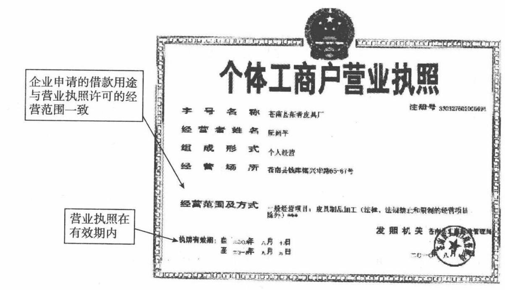  
个体工商户营业制造样本

(5)从事海域水产养殖业、资源开采、工程设计、建筑修缮,药品、烟草销售的，应出具有权部门的许可证、批准文件或者资格证明。

【点评】

个体工商户是一类很独特的商业群体，这类群体中，部分具有多年经销经验的个体工商户往往销售额极大，很多知名品牌的代理商销售额都会超过亿元。例如中粮长城红酒经销商、蒙牛的代理商、李宁品牌的代理商等。会给银行带来非常可观的存款。另外，需要注意的是，个体工商户可以签发银行承兑汇票。

# 五、其他经济组织借款主体审查

其他经济组织作为借款主体时，除应参照企业法人规定予以审查外，对各类借款主体还应根据其不同的法律特征区别审查。

# 法律风险控制培训

# (一)合伙企业的审查

《合伙企业法》第2条规定，合伙企业是指自然人、法人和其他组织依照该法在中国境内设立的普通合伙企业和有限合伙企业。

普通合伙企业由普通合伙人组成,合伙人对合伙企业债务承担无限连带责任。该法对普通合伙人承担责任的形式有特别规定的,从其规定。

有限合伙企业由普通合伙人和有限合伙人组成，普通合伙人对合伙企业债务承担无限连带责任，有限合伙人以其认缴的出资额为限对合伙企业债务承担责任。

合伙企业可以成为借款主体,审查中应注意以下问题：

(1)国有独资公司、国有企业、上市公司以及公益性的事业单位、社会团体不得成为普通合伙人。

(2)普通合伙企业应注意法律规定其名称必须标明“普通合伙"字样,有限合伙企业名称中应当标明“有限合伙"字样。

(3)应当审查合伙协议，了解合伙协议中是否载有对债权人不利的内容。合伙协议应依法由全体合伙人协商一致、以书面形式订立，载明合伙企业法所要求的各种事项,并与工商行政管理部门登记一致。

(4)合伙协议经全体合伙人签名、盖章后方可生效。合伙人按照合伙协议享有权利，履行义务。修改或者补充合伙协议，应当经全体合伙人一致同意;但是，合伙协议另有约定的除外。

(5)合伙人可以用货币、实物、知识产权、土地使用权或者其他财产权利出资，也可以用劳务出资(有限合伙人不得以劳务出资)。以劳务出资的,其评估办法应由全体合伙人协商确定,并在合伙协议中载明。

(6)按照合伙协议的约定或者经全体合伙人决定，合伙企业可以委托一个或者数个合伙人对外代表合伙企业,执行合伙事务。有限合伙企业由普通合伙人执行合伙事务，有限合伙人不执行合伙事务，不得对外代表有限合伙企业。不具有事务执行权的有限合伙人无权代表企业签署授信合同。审查中应注意合伙企业的“代表人"是否有权代表合伙企业。

(7)应注意合伙企业的决议是否有效。合伙人对合伙企业有关事项作出决议,按照合伙协议约定的表决办法办理。合伙协议未约定或者约定不明确的，实行合伙人一人一票并经全体合伙人过半数通过的表决办法。合伙企业法对合伙企业的表决办法另有规定的，从其规定。

(8)为最大限度保全授信资产，审查中应注意合伙人承担责任形式的变化：

①普通合伙人退伙，对基于其退伙前的原因发生的合伙企业债务，承担无限连带责任。

合伙企业营业执照注  
企业务 称 齐岛县汇众制品厂  
执行言伙企业  
事务的合伙人 KA  
经营范园及方武发机关严商行管理二年月日

②有限合伙人退伙，对基于其退伙前的原因发生的有限合伙企业债务,以其退伙时从有限合伙企业中取回的财产承担责任。

③有限合伙人转变为普通合伙人的，对其作为有限合伙人期间有限合伙企业发生的债务承担无限连带责任。

④普通合伙人转变为有限合伙人的，对其作为普通合伙人期间合伙企业发生的债务承担无限连带责任。

# 法律风险控制培训

# (二)个人独资企业审查

个人独资企业，是指依照《个人独资企业法》在中国境内设立，由一个自然人投资，财产为投资人个人所有，投资人以其个人财产对企业债务承担无限责任的经营实体。审查应注意：

(1)法律、行政法规禁止从事营利性活动的人，不得作为投资人申请设立个人独资企业。依目前法律、行政法规规定，不得从事营利性活动的人主要有公务员、军人、法官、检察官等。

(2)个人独资企业不得从事法律、行政法规禁止经营的业务；从事法律、行政法规规定须报经有关部门审批的业务，应当在申请设立登记时提交有关部门的批准文件。

(3)个人独资企业投资人在申请企业设立登记时明确以其家庭共有财产作为个人出资的，应当依法以家庭共有财产对企业债务承担无限责任。在授信实施之前要审查该企业是以个人财产出资还是以家庭财产出资，以家庭财产出资的，其债务以家庭财产承担的，应要求其家庭成员书面确认共同承担偿还贷款责任。

(4)个人独资企业解散后，原投资人对个人独资企业存续期间的债务仍应承担偿还责任，但债权人在5年内未向债务人提出偿债请求的，该

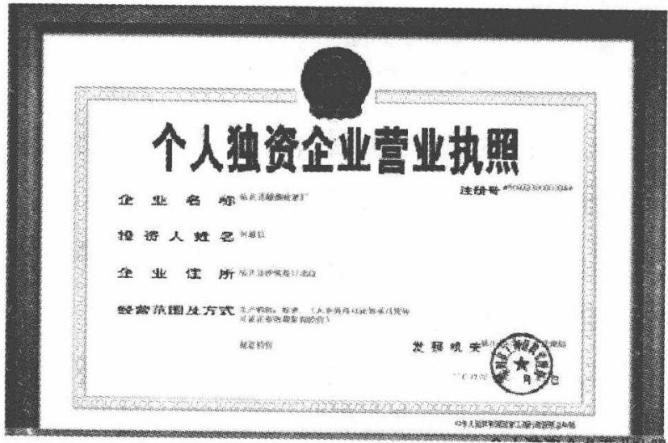

责任消灭。

# (三)联营企业主体审查

《民法通则》规定，联营企业可具体分为法人型联营、合伙型联营和协作型联营三种。

法人型联营企业具备法人资格，以联营企业全部财产对外承担民事责任；企业之间或者企业、事业单位之间联营，共同经营、不具备法人条件的，由联营各方按照出资比例或者协议的约定，以各自所有的或者经营的财产承担民事责任。依照法律的规定或者协议的约定负连带责任的，承担连带责任;企业之间或者企业、事业单位之间联营,按照合同的约定各自独立经营的，它的权利和义务由合同约定，各自承担民事责任。法人型联营企业和合伙型联营企业可以成为借款主体。

审查时应注意审查联营方的主体资格：

(1)根据《最高人民法院关于审理联营合同纠纷案件若干问题的解释》的规定，除企业法人和事业单位法人可以作为联营合同的主体外，个体工商户、农村承包经营户、个人合伙，以及不具备法人资格的私营企业和其他经济组织与企业法人或者事业法人联营的，也可以成为联营合同的主体。

(2)企业法人、事业单位法人的分支机构不具备法人条件,未经法人授权，不得以自己的名义对外签订联营合同；擅自以自已名义对外签订联营合同且未经法人追认的，应当确认无效。

(3)党政机关和隶属党政机关编制序列的事业单位、军事机关、工会、共青团、妇联、文联、科协和各种协会、学会及民主党派等,不能成为联营合同的主体。

# 六、借款主体从事特殊行业的法律审查

从事特殊行业的借款人，应当取得分管行业的有权政府部门的批准

文件或核准颁发的从业许可证,且有关证照应当在有效期内。

# (一)行业特许经营

从事特殊行业经营的申请人应当取得国家有关行政主管部门颁发的有效行业特许经营证明。行业特许经营证明不能存在被吊销、注销或声明作废等情况。

银行在选择企业的时候,借款对象一必须是法律规定的合法借款主体；二必须获得相关行业主管部门的许可。

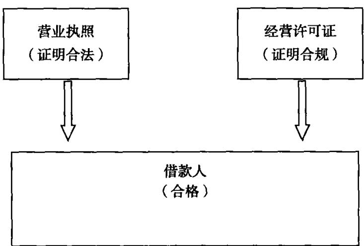

主要特殊行业经营许可证明有：

(1)根据教育部办公厅关于启用《民办学校办学许可证》有关问题的通知，县级以上教育行政部门对国家机构以外的社会组织或者个人，利用非国家财政性经费,面向社会举办的实施学历教育、学前教育、自学考试助学及其他文化教育的民办学校，审批后颁发办学许可证。县级以上劳动和社会保障行政部门对国家机构以外的社会组织或者个人，利用非国家财政性经费，面向社会举办的实施以职业技能为主的职业资格培训、职业技能培训的民办学校，审批后颁发办学许可证,并抄送同级教育行政部门备案。办学许可证为民办学校办学合法证件；根据《中华人民共和国中外合作办学条例》规定,中外合作办学机构应当领取《中外合作办学许可证》。

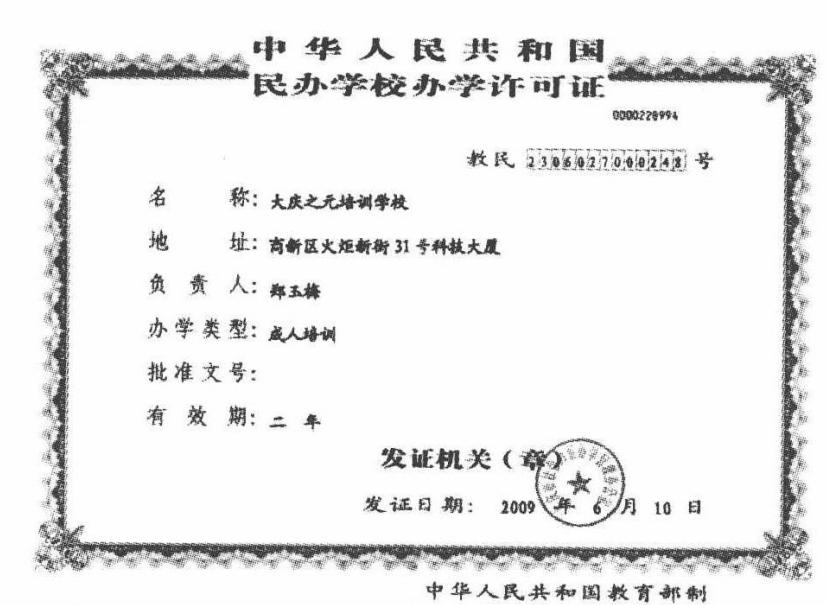

(2)根据《医疗机构管理条例》规定，从事疾病诊断、治疗活动的医院、卫生院、疗养院、门诊部、诊所、卫生所（室）以及急救站等医疗机构，应当持有医疗卫生行政部门核发的《医疗机构执业许可证》。

中华人民共和国  
机构名医疗机构执业许可GLE6  
地址徐州市大马路99号  
诊疗科目 要人ONQIANG LIU麻醉科、医节影像科，医学经验件 登记号79612625-732030031A5262  
有效期限自200年1月8日至201年1月7日 H  
该医疗机构经核准登记医维拥执业许可证徐州最好<516.600x431中华 部 发证机关徐州市里生局发证日期 2008年1月8日

(3)根据《烟草专卖许可证管理办法》第8条规定，公民、法人或者其他组织从事烟草专卖品的生产、批发、零售、进出口等业务的，应当依法向烟草专卖行政主管部门申请领取烟草专卖许可证。烟草专卖许可证，包

# 法律风险控制培训

括烟草专卖生产企业许可证、烟草专卖批发企业许可证、特种烟草专卖经营企业许可证、烟草专卖零售许可证四类。连锁经营企业在申请烟草专卖零售许可证时，应当由各个分店分别向所在地烟草专卖行政主管部门提出申请。外商投资的商业企业或者个体工商户不得从事烟草专卖品批发或者零售业务，不得以特许、吸纳加盟店及其他再投资等形式变相从事烟草专卖品经营业务。

运输卷烟、雪茄烟、烟丝、复烤烟叶、烟叶（包括再造烟叶和烟梗）、卷烟纸、滤嘴棒、烟用丝束、烟草专用机械等烟草专卖品，应当持有烟草专卖品准运证。

(4)根据《药品管理法》的规定，从事药品生产的企业应当取得所在地省级人民政府药品监督管理部门按产品核发的药品生产许可证；批发企业应当取得所在地省级人民政府药品监督管理部门核发的药品经营许可证；零售企业应当取得企业所在地县级以上地方药品监督管理部门核发的药品经营许可证。

中华人民共和国药品生产许可证企业名称：河南兴公司 编号：2b2000133：注册地址：马市T区大路山 生产地址和生产范围：法定代表人：孟从杰企业责人：车为企业类型：石公发证机关：2008 月有效期至 年1月

(5)根据《食盐专营办法》的规定,经营食盐批发业务，必须取得省级人民政府颁发的食盐批发许可证;托运或者自运食盐的单位和个人，应当持有国务院盐业主管机构或者其授权的省级人民政府盐业主管机构核发的食盐准运证。

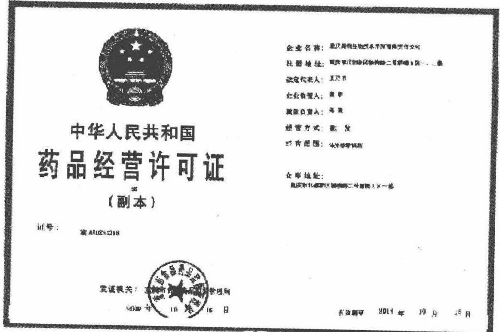

(6)根据《农作物种子生产经营许可证管理办法》第4条的规定，主要农作物商品种子生产实行许可制度。主要农作物杂交种子及其亲本种子、常规种原种种子的生产许可证由生产所在地县级农业行政主管部门审核，省级农业行政主管部门核发。主要农作物常规种的大田用种生产许可证由生产所在地县级以上地方人民政府农业行政主管部门核发。

（7)根据《林木种子生产、经营许可证管理办法》第4条的规定，从事主要林木商品种子生产的单位和个人应当取得林木种子生产许可证，按林木种子生产许可证的规定生产；从事林木种子经营的单位和个人应当取得林木种子经营许可证，按林木种子经营许可证的规定经营。

(8)根据《典当管理办法》第16条的规定，从事典当业的，应当取得商务部颁发的典当经营许可证和公安机关核发的特种行业许可证。

(9)文化部关于实行《文化经营许可证》制度的规定,凡开办文化娱乐、美术品、音像、演出、业余文化艺术培训等文化经营活动,在申请工商登记注册前,必须报经所在县(市)以上(含县市)政府文化行政管理部门审查批准,领取文化经营许可证。

(10)根据《广告经营许可证管理办法》第2条的规定，广播电台、电视台、报刊出版单位,事业单位和法律、行政法规规定应进行广告经营审批登记的单位,经营广告业务，应当取得广告经营许可证。

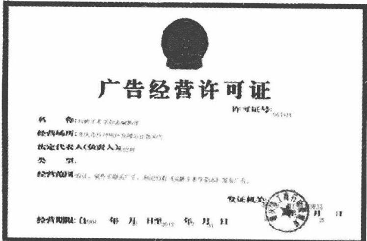

(11)根据《矿产资源开采登记管理办法》第2条的规定，中华人民共和国领域及管辖的其他海域开采矿产资源，应当取得采矿许可证。

中华人民共和国采矿许可证（更本）号：360070008矿权人：有公司 开妥矿种：促用费地址： 开叉方式：大来矿山名称：森西水能配新用互矿 生产规模：10.0万/经济美型：有毒任公司 矿区面积：0.082方有双期：自207至217 矿区范围：（贝科本

(12)煤炭经营企业与煤炭经营资格证。

名称：州养金民医有限公章企业地址：经需方式：从度时资车：万煤炭经营资格证 e 场面粮/地址 10中心计量设路：联单学钟总验设施：高，学制，计量/质验专业人员： 11号1 环保设箱：，效路：1

其他从事特殊行业的,应当取得相应行政主管部门的批准文件或许可证书。

# (二)资质要求

国家对企业实行资质等级管理的，申请人应当取得行业主管部门核准的有效资质等级证书并按核资质等级从事经营活动，不得超越资质等级开展经营活动。企业应当按照规定参加资质等级年审，年审未通过的，不得以原资质等级开展新的经营活动。

# 七、对承包、租赁等特殊经营形式的审查

（1)应全面审查承包协议、租赁协议等法律文件对承包或租赁双方的权利义务约定是否明确，内容有无违反法律强制性规定。综合分析协议中对债务承担、收益分配的约定，选择对银行有利的主体作为借款人。

(2)承包人、承租人可以作为借款主体。如以所承包和租赁企业作为借款主体的，应取得发包方和出租人同意借款的书面意见。

(3)借款期限不能超过承包协议和租赁协议的有效期限。按《全民所有制小型工业企业租赁经营暂行条例》实行租赁经营的,租赁期限为每届3至5年。

# 第二课Lesson 2贷款项目合法性审查

# 一、贷款项目所需批准文件审查

根据银监会《商业银行授信工作尽职指引》规定，项目建设客户应当按国家规定取得以下有效批准文件，且不存在化整为零、越权或变相越权和超授权批准的情形，否则不得提供授信：一是项目批准文件；二是环保批准文件；三是土地批准文件；四是其他按国家规定需具备的批准文件。另外,商业银行还应当审查项目是否符合国家产业政策要求。

# (一)项目批准文件

根据《国务院关于投资体制改革的决定》规定,对于企业不使用政府投资建设的项目，不再实行审批制，区别不同情况实行核准制和备案制。其中,政府仅对重大项目和限制类项目(见《政府核准的投资项目目录》）

进行核准,其他项目无论规模大小,均改为备案制。

我国投资项目批准制度分为审批制、核准制和备案制三种。项目批准文件有所不同。

# 1.审批制项目

各级地方政府采用直接投资(含通过各类投资机构)或以资本金注入方式安排地方各类财政性资金，建设《政府核准的投资项目目录》范围内应由国务院或国务院投资主管部门管理的固定资产投资项目，需由省级投资主管部门报国家发展改革委会同有关部门审批或核报国务院审批。省级投资主管部门,是指省级发展改革委和具有投资管理职能的经委(经贸委)。具有投资管理职能的省级经委(经贸委)应与发展改革委联合报送有关文件。

需上报审批的地方政府投资项目，只需报批项目建议书。国家发展改革委主要从发展建设规划、产业政策以及经济安全等方面进行审查。项目建议书经国家发展改革委批准后，项目单位应当按照国家法律法规和地方政府的有关规定履行其他报批程序。地方政府投资项目申请中央政府投资补助、贴息和转贷的，按照国家发展改革委发布的有关规定报批资金申请报告，也可在向国家发展改革委报批项目建议书时，一并提出申请。

【点评】

政府对关于国计民生、投资金额巨大的项目一般都采取项目审批制，股东方向国家发改委提出“可行性研究报告”，国家发改委会从项目市场需求、可行性、资金等项目进行方方面面的考察。一个重大项目，占用极多土地，消耗大量资金及其他资源，一旦失败,对国家损失极大。

# 2.核准制项目

(1)境内投资项目。根据《企业投资项目核准暂行办法》的规定，国

# 法律风险控制培训

家制订和颁布《政府核准的投资项目目录》，明确实行核准制的投资项目范围，划分各项目核准机关的核准权限，并根据经济运行情况和宏观调控需要适时调整。

对应报项目核准机关核准而未申报的项目，或者虽然申报但未经核准的项目，国土资源、环境保护、城市规划、质量监督、证券监管、外汇管理、安全生产监管、水资源管理、海关等部门不得办理相关手续，金融机构不得发放贷款。

$\textcircled{1}$ 核准程序和要求。企业投资建设实行核准制的项目，应按国家有关要求编制项目申请报告，报送项目核准机关核准,不再经过批准项目建议书、可行性研究报告和开工报告的程序。项目申报单位在向项目核准机关报送申请报告时，需根据国家法律法规的规定附送以下文件：城市规划行政主管部门出具的城市规划意见；国土资源行政主管部门出具的项目用地预审意见;环境保护行政主管部门出具的环境影响评价文件的审批意见;根据有关法律法规应提交的其他文件。

企业投资建设应由地方政府投资主管部门核准的项目，须按照地方政府的有关规定，向相应的项目核准机关提交项目申请报告；国务院有关行业主管部门隶属单位投资建设应由国务院有关行业主管部门核准的项目，可直接向国务院有关行业主管部门提交项目申请报告，并附上项目所在地省级政府投资主管部门的意见;计划单列企业集团和中央管理企业投资建设应由国务院投资主管部门核准的项目，可直接向国务院投资主管部门提交项目申请报告，并附上项目所在地省级政府投资主管部门的意见;其他企业投资建设应由国务院投资主管部门核准的项目，应经项目所在地省级政府投资主管部门初审并提出意见，向国务院投资主管部门报送项目申请报告(省级政府规定具有投资管理职能的经贸委、经委应与发展改革委联合报送);企业投资建设应由国务院核准的项目，应经国务院投资主管部门提出审核意见,向国务院报送项目申请报告。

对同意核准的项目，项目核准机关应向项目申报单位出具项目核准文件，同时抄送相关部门和下级项目核准机关；对不同意核准的项目，应向项目申报单位出具不予核准决定书，说明不予核准的理由，并抄送相关部门和下级项目核准机关。经国务院核准同意的项目，由国务院投资主管部门出具项目核准文件。

项目核准机关，是指《政府核准的投资项目目录》中规定具有企业投资项目核准权限的行政机关。其中，国务院投资主管部门是指国家发展和改革委员会；地方政府投资主管部门,是指地方政府发展改革委（计委)和地方政府规定具有投资管理职能的经贸委（经委）。

$\textcircled{2}$ 核准文件的效力。项目核准文件有效期2年，自发布之日起计算。项目在核准文件有效期内未开工建设的,项目单位应在核准文件有效期届满30日前向原项目核准机关申请延期，原项目核准机关应在核准文件有效期届满前作出是否准予延期的决定。项目在核准文件有效期内未开工建设也未向原项目核准机关申请延期的，原项目核准文件自动失效。

已经核准的项目，如需对项目核准文件所规定的内容进行调整，项目单位应及时以书面形式向原项目核准机关报告。原项目核准机关应根据项目调整的具体情况，出具书面确认意见或要求其重新办理核准手续。

$\textcircled{3}$ 其他要求。项目申请单位以拆分项目、提供虚假材料等不正当手段取得项目核准文件的，项目核准机关应依法撤销对该项目的核准。对于应报政府核准而未申报的项目、虽然申报但未经核准擅自开工建设的项目，以及未按项目核准文件的要求进行建设的项目，一经发现，相应的项目核准机关应立即责令其停止建设，并依法追究有关责任人的法律和行政责任。

(2)境外投资项目。根据《境外投资项目核准暂行管理办法》的规定，境外投资项目的核准是指中华人民共和国境内各类法人（以下称“投资主体"）,及其通过在境外控股的企业或机构,在境外（包括香港特别行政区、澳门特别行政区和台湾地区)进行的投资(含新建、购并、参股、增资、再投资)项目的核准。境外投资项目指投资主体通过投人货币、有价证券、实物、知识产权或技术、股权、债权等资产和权益或提供担保，获得境外所有权、经营管理权及其他相关权益的活动。

$\textcircled{1}$ 需核准项目的范围。国家对境外投资资源开发类和大额用汇类项目实行核准管理。资源开发类项目指在境外投资勘探开发原油、矿山等资源的项目。此类项目中，中方投资额3000万美元及以上的，由国家发展改革委核准，其中中方投资额2亿美元及以上的，由国家发展改革委审核后报国务院核准。大额用汇类项目指在前款所列领域之外中方投资用汇额1000万美元及以上的境外投资项目，此类项目由国家发展改革委核准，其中中方投资用汇额5000万美元及以上的，由国家发展改革委审核后报国务院核准。

中方投资额3000万美元以下的资源开发类和中方投资用汇额1000万美元以下的其他项目，由各省、自治区、直辖市及计划单列市和新疆生产建设兵团等省级发展改革部门核准，项目核准权不得下放。省级发展改革部门应将项目核准文件抄报国家发展改革委。

地方政府按照有关法规对上面所列项目的核准另有规定的，从其规定。

中央管理企业投资的中方投资额3000万美元以下的资源开发类境外投资项目和中方投资用汇额1000万美元以下的其他境外投资项目，由其自主决策并在决策后将相关文件报国家发展改革委备案。国家发展改革委在收到上述备案材料之日起7个工作日内出具备案证明。

前往台湾地区投资的项目和前往未建交国家投资的项目,不分限额，由国家发展改革委核准或经国家发展改革委审核后报国务院核准。

$\textcircled{2}$ 核准程序和要求。按核准权限属于国家发展改革委或国务院核准的项目，由投资主体向注册所在地的省级发展改革部门提出项目申请报告，经省级发展改革部门审核后报国家发展改革委。计划单列企业集团和中央管理企业可直接向国家发展改革委提交项目申请报告。

报送国家发展改革委项目申请报告应附以下文件：公司董事会决议或相关的出资决议；证明中方及合作外方资产、经营和资信情况的文件；银行出具的融资意向书；以有价证券、实物、知识产权或技术、股权、债权等资产权益出资的，按资产权益的评估价值或公允价值核定出资额。应提交具备相应资质的会计师、资产评估机构等中介机构出具的资产评估报告，或其他可证明有关资产权益价值的第三方文件;投标、购并或合资合作项目，中外方签署的意向书或框架协议等文件；境外竞标或收购项目，还应当附在投标或对外正式开展商务活动前，经向国家发展改革委报送书面信息报告后国家发展改革委出具有关确认函件。

国家发展改革委对核准的项目向项目申请人出具书面核准文件；对不予核准的项目，应以书面决定通知项目申请人，说明理由并告知项目申请人享有依法申请行政复议或者提起行政诉讼的权利。

$\textcircled{3}$ 核准文件的效力。投资主体就境外投资项目签署任何具有最终法律约束力的相关文件前，须取得国家发展改革委出具的项目核准文件或备案证明。在核准文件有效期内，投资主体凭国家发展改革委的核准文件,依法办理外汇、海关、出人境管理和税收等相关手续。有效期满后，投资主体办理上述相关手续时，应同时出示国家发展改革委出具的准予延续文件。中央管理企业凭国家发展改革委出具的备案证明,办理上述有关手续。

对未经有权机构核准或备案的境外投资项目，外汇管理、海关、税务等部门不得办理相关手续。投资主体以提供虚假材料等不正当手段取得项目核准文件或备案证明的，国家发展改革委可以撤销对该项目的核准文件或备案证明。

(3)外商投资项目。根据《外商投资项目核准暂行管理办法》规定，外商投资项目是指中外合资、中外合作、外商独资、外商购并境内企业、外商投资企业增资等各类投资项目。香港特别行政区、澳门特别行政区和台湾地区的投资者在祖国大陆举办的投资项目参照该《办法》执行。

$\textcircled{1}$ 需核准项目的范围。以《外商投资产业指导目录》分类为标准，总投资(包括增资额,下同)1亿美元及以上的鼓励类、允许类项目和总投资5000万美元及以上的限制类项目，由国家发改委核准项目申请报告，其中总投资5亿美元及以上的鼓励类、允许类项目和总投资1亿美元及以上的限制类项目由国家发改委对项目申请报告审核后报国务院核准。

总投资1亿美元以下的鼓励类、允许类项目和总投资5000万美元以下的限制类项目由地方发改委核准，其中限制类项目须由省级发改委核准，此类项目的核准权不得下放。地方核准的总投资3000万美元以上的外商投资项目，省级发展改革部门应将项目核准文件抄报国家发展改革委。

地方政府按照有关法规对上款所列项目的核准另有规定的，从其规定。

$\textcircled{2}$ 核准程序和要求。按核准权限属于国家发展改革委和国务院核准的项目，由项目申请人向项目所在地的省级发展改革部门提出项目申请报告，经省级发展改革部门审核后报国家发展改革委。计划单列企业集团和中央管理企业可直接向国家发展改革委提交项目申请报告。

报送国家发展改革委的项目申请报告应附以下文件：中外投资各方的企业注册证（营业执照）、商务登记证及经审计的最新企业财务报表（包括资产负债表、损益表和现金流量表）、开户银行出具的资金信用证明；投资意向书，增资、购并项目的公司董事会决议；银行出具的融资意向书;省级或国家环境保护行政主管部门出具的环境影响评价意见书；省级规划部门出具的规划选址意见书;省级或国家国土资源管理部门出具的项目用地预审意见书；以国有资产或土地使用权出资的,需由有关主管部门出具的确认文件。

国家发展改革委对核准的项目向项目申请人出具书面核准文件；对不予核准的项目，应以书面决定通知项目申请人，说明理由并告知项目申请人享有依法申请行政复议或者提起行政诉讼的权利。

经国家发展改革委核准的项目如出现下列情况之一的，需向国家发展改革委申请变更：建设地点发生变化;投资方或股权发生变化；主要建设内容及主要产品发生变化；总投资超过原核准投资额 $20 \%$ 及以上；有关法律法规和产业政策规定需要变更的其他情况。

$\textcircled{3}$ 核准文件的效力。项目申请人在核准文件有效期内，凭国家发展改革委的核准文件,依法办理土地使用、城市规划、质量监管、安全生产、资源利用、企业设立(变更）、资本项目管理、设备进口及适用税收政策等方面手续。有效期满后，项目申请人办理上述相关手续时，应同时出示国家发展改革委出具的准予延续文件。

未经核准的外商投资项目，土地、城市规划、质量监管、安全生产监管、工商、海关、税务、外汇管理等部门不得办理相关手续。项目申请人以拆分项目或提供虚假材料等不正当手段取得项目核准文件的，国家发展改革委可以撤销对该项目的核准文件。

# 3.备案制项目

对于《政府核准的投资项目目录》以外的企业投资项目，实行备案制。除国家另有规定外，由企业按照属地原则向地方政府投资主管部门备案。备案制的具体实施办法由省级人民政府自行制定。与审批制和核准制相比较，备案制的程序更加简便，内容也更简略。

除不符合法律法规的规定、产业政策禁止发展、需报政府核准或审批的项目外,地方政府投资主管部门应当予以备案；对于不予备案的项目，应当向提交备案的企业说明法规政策依据。

# 法律风险控制培训

环境保护、国土资源、城市规划、建设管理、银行等部门(机构)应按照职能分工，对投资主管部门予以备案的项目依法独立进行审查和办理相关手续，对投资主管部门不予以备案的项目以及应备案而未备案的项目，不应办理相关手续。

已办理备案手续的项目，如果在实施过程中原备案内容发生重大变化,应当重新备案。

对于企业以拆分项目、提供虚假材料等不正当手段取得项目备案文件的，应撤销对该项目的备案;对于未予备案擅自开工建设以及不按备案内容进行建设的项目，一经发现,应责令其停止建设，并依法追究有关单位和责任人的责任。

# (二)环保批准文件

根据《环境保护法》《建设项目环境保护管理条例》等相关法律、行政法规等规范性文件的规定,我国的建设项目实行环境影响评价制度;项目环境保护设施必须坚持“三同时”原则；项目必须遵守污染物排放的相关规定和标准的要求。改建、扩建项目和技术改造项目必须采取措施，治理与该项目有关的原有环境污染和生态破坏。

# 1.建设项目环境影响评价制度

(1)分类管理。根据《建设项目环境保护管理条例》的规定，国家实行建设项目环境影响评价制度，根据建设项目对环境的影响程度，按照下列规定对建设项目的环境保护实行分类管理：

$\textcircled{1}$ 建设项目对环境可能造成重大影响的，应当编制环境影响报告书，对建设项目产生的污染和对环境的影响进行全面、详细的评价；

$\textcircled{2}$ 建设项目对环境可能造成轻度影响的，应当编制环境影响报告表，对建设项目产生的污染和对环境的影响进行分析或者专项评价；

$\textcircled{3}$ 建设项目对环境影响很小,不需要进行环境影响评价的,应当填报

环境影响登记表。

《建设项目环境保护分类管理名录》由国家环境局制订并公布。

(2)报批程序。建设项目环境影响报告书、环境影响报告表或者环境影响登记表(以下统称为“环境影响文件”），由建设单位报有审批权的环境保护行政主管部门审批;建设项目有行业主管部门的，其环境影响报告书或者环境影响报告表应当经行业主管部门预审后，报有审批权的环境保护行政主管部门审批。海岸工程建设项目环境影响报告书或者环境影响报告表，经海洋行政主管部门审核并签署意见后，报环境保护行政主管部门审批。

建设单位应当在建设项目可行性研究阶段报批建设项目环境影响文件;但是,铁路、交通等建设项目,经有审批权的环境保护行政主管部门同意，可以在初步设计完成前报批环境影响报告书或者环境影响报告表。

按照国家有关规定，不需要进行可行性研究的建设项目，建设单位应当在建设项目开工前报批建设项目环境影响文件;其中，需要办理营业执照的,建设单位应当在办理营业执照前报批建设项目环境影响文件。

国务院环境保护行政主管部门负责审批下列建设项目的环境影响文件：

$\textcircled{1}$ 核设施、绝密工程等特殊性质的建设项目。  
$\textcircled{2}$ 跨省、自治区、直辖市行政区域的建设项目。  
$\textcircled{3}$ 国务院审批的或者国务院授权有关部门审批的建设项目。

除此以外的建设项目环境影响文件的审批权限,由省、自治区、直辖市人民政府规定。

建设项目造成跨行政区域环境影响，有关环境保护行政主管部门对环境影响评价结论有争议的，其环境影响报告书或者环境影响报告表由

# 法律风险控制培训

共同上一级环境保护行政主管部门审批。

建设项目环境影响文件经批准后，建设项目的性质、规模、地点或者采用的生产工艺发生重大变化的,建设单位应当重新报批建设项目环境影响文件。

建设项目环境影响报告书、环境影响报告表或者环境影响登记表自批准之日起满5年,建设项目方开工建设的，其环境影响报告书、环境影响报告表或者环境影响登记表应当报原审批机关重新审核。原审批机关应当自收到建设项目环境影响报告书、环境影响报告表或者环境影响登记表之日起10日内，将审核意见书面通知建设单位;逾期未通知的,视为审核同意。

# 2.“三同时”制度

建设项目需要配套建设的环境保护设施,必须与主体工程同时设计、同时施工、同时投产使用。

建设项目的主体工程完工后，需要进行试生产的，其配套建设的环境保护设施必须与主体工程同时投入试运行。建设项目试生产期间，建设单位应当对环境保护设施运行情况和建设项目对环境的影响进行监测。建设项目竣工后，建设单位应当向审批该建设项目环境影响报告书、环境影响报告表或者环境影响登记表的环境保护行政主管部门，申请该建设项目需要配套建设的环境保护设施竣工验收。

环境保护设施竣工验收，应当与主体工程竣工验收同时进行。需要进行试生产的建设项目，建设单位应当自建设项目投人试生产之日起3个月内，向审批该建设项目环境影响文件的环境保护行政主管部门，申请该建设项目需要配套建设的环境保护设施竣工验收。

分期建设、分期投人生产或者使用的建设项目，其相应的环境保护设施应当分期验收。

防治污染的设施不得擅自拆除或者闲置,确有必要拆除或者闲置的，必须征得所在地的环境保护行政主管部门同意。

# 3.污染排放要求

建设产生污染的建设项目，必须遵守污染物排放的国家标准和地方标准；在实施重点污染物排放总量控制的区域内，还必须符合重点污染物排放总量控制的要求。

# 4.相关规定对商业银行的要求

根据《中国人民银行关于贯彻信贷政策与加强环境保护工作有关问题的通知》的规定，商业银行要严格贷款的审批、发放和监督管理，将贷款项目是否落实防治污染及其他公害的设施与主体工程同时设计、同时施工、同时投产的要求,作为贷款的必要条件之一。

（1)在贷款审查时，对于对环境有影响的项目，必须审查项目的环境影响报告书或环境影响报告表是否已经环保部门批准。对没有执行建设项目环境影响报告书(表)审批制度的或环境保护部门不予批准的项目，商业银行一律不准发放贷款。

(2)在固定资产贷款的发放和管理中，对安排用于项目中环保工程的贷款必须专款专用。在项目施工过程中环保工程不符合设计和施工要求的或没有进行环保工程建设的，商业银行将停止贷款支持。

(3)对主体工程已完工而环保工程没有完工或没有进行环保工程建设的项目，在投产运营时，商业银行不提供流动资金贷款。

(4)对下列国家明令禁止、不符合环境保护规定的项目和企业,商业银行不得发放贷款，并收回已发放的贷款：

$\textcircled{1}$ 违背国家产业政策、生产方式落后、严重浪费资源和污染环境的产品生产主要是简易工艺的炼砷、炼汞、炼铅锌、炼硫磺、炼焦、炼金和化工生产以及无证开采有色金属矿、化学矿、煤矿等。

$\textcircled{2}$ 除经环保部门批准以外，生产或经营放射性同位素制品、化学危险品和其他含有在自然环境中不易降解或者能在生物体中蓄积的剧毒污染

# 银行授信业务

# 法律风险控制培训

物以及有致癌、致畸、致突变成分产品的。

$\textcircled{3}$ 未经环保部门批准、污染严重的小钢铁、小有色金属、小铁合金、小化工、小印染、小制革、小电镀、小炼油、小建材和小造纸等。

$\textcircled{4}$ 引进和使用不符合我国环境保护要求的技术和设备的。

(5)对含汞制品、石棉纺织、有色金属冶炼、电镀、制革、纸浆、印染、重污染化工以及其他可能严重污染环境的生产等国家严格限制的行业，必须在做好污染治理和环境保护的前提下经过环境保护部门审查批准后，金融机构对企业提供贷款。

国家环境保护总局、中国人民银行、中国银行业监督管理委员会联合发文《关于落实环保政策法规防范信贷风险的意见》规定，金融机构应依据国家建设项目环境保护管理规定和环保部门通报情况,严格贷款审批、发放和监督管理,对未通过环评审批或者环保设施验收的项目,不得新增任何形式的授信支持。金融机构应依据国家产业政策，对限制和淘汰类新建项目，不得提供信贷支持；对属于限制类的现有生产能力，且国家允许企业在一定期限内采取措施升级的，可按信贷原则继续给予信贷支持；对于淘汰类项目，应停止各类形式的新增授信支持,并采取措施收回已发放的贷款。

金融机构应根据环保部门提供的项目整改信息，结合企业生产实际，合理控制信贷投放。对商业银行违规向环境违法项目贷款的行为,依法予以严肃查处,对造成重大损失的，追究相关机构和责任人责任。

【点评】

目前，国内环保的要求越来越严格。银行在决定信贷前，必须严格核实项目是否获得了环保的核准。

# (三)土地批准文件

# 1.项目建设用地的预审

根据《建设项目用地预审管理办法》规定，建设项目用地预审是指国土资源管理部门在建设项目审批、核准、备案阶段，依法对建设项目涉及的土地利用事项进行的审查。

（1)分级预审制度。建设项目用地实行分级预审：

$\textcircled{1}$ 需人民政府或有批准权的人民政府发展和改革委员会等部门审批的建设项目，由该人民政府的国土资源管理部门预审。

$\textcircled{2}$ 需核准和备案的建设项目，由与核准、备案机关同级的国土资源管理部门预审。

由国土资源部预审的建设项目，国土资源部委托项目所在地的省级国土资源管理部门受理,但建设项目占用规划确定的城市建设用地范围内土地的,委托市级国土资源管理部门受理。受理后，提出初审意见，转报国土资源部。

涉密军事项目和国务院批准的特殊建设项目用地，建设用地单位可直接向国土资源部提出预审申请。

应当由国土资源部负责预审的输电线塔基、钻探井位、通信基站等小面积零星分散建设项目用地，由省级国土资源管理部门预审，并报国土资源部备案。

(2)预审程序和预审意见。需审批的建设项目可行性研究论证时，由土地行政主管部门对建设项目用地有关事项进行审查，提出建设项目用地预审报告;可行性研究报告报批时,必须附具土地行政主管部门出具的建设项目用地预审报告。需核准、备案的建设项目在申请核准、备案前，由建设用地单位提出预审申请。

预审意见是建设项目批准、核准的必备文件,预审意见提出的用地标准和总规模等方面的要求，建设项目初步设计阶段应当充分考虑。建设用地单位应当认真落实预审意见,并在依法申请使用土地时出具落实预审意见的书面材料。建设项目用地预审文件有效期为两年，自批准之日起计算。已经预审的项目,如需对土地用途、建设项目选址等进行重大调整的，应当重新申请预审。

核准或者批准建设项目前，应当完成预审，未经预审或者预审未通过的,不得批准农用地转用、土地征收,不得办理供地手续。

预审用地还应当符合国家供地政策的要求。如必须符合国土资源部、国家发展和改革委员会《关于发布实施限制用地项目目录（2006年本）》和《禁止用地项目目录(2006年本)的通知》规定的要求。

# 2.项目建设用地审批

根据《土地管理法》《土地管理法实施条例》《建设用地审查报批管理办法》的规定，除兴办乡镇企业和村民建设住宅经依法批准使用本集体经济组织农民集体所有的土地的,或者乡(镇)村公共设施和公益事业建设经依法批准使用农民集体所有的土地的除外；任何单位和个人进行建设，需要使用土地的,必须依法申请使用土地利用总体规划确定的城市建设用地范围内的国有建设用地。能源、交通、水利、矿山、军事设施等建设项目确需使用土地利用总体规划确定的城市建设用地范围外的土地，应当按照相关规定予以审批。

具体建设项目需要使用土地的,建设单位应当根据建设项目的总体设计一次申请，办理建设用地审批手续;分期建设的项目，可以根据可行性研究报告确定的方案分期申请建设用地，分期办理建设用地有关审批手续。

(1)项目占用建设用地的情况。

$\textcircled{1}$ 国有建设用地。具体建设项目需要使用土地利用总体规划确定的城市建设用地范围内的国有建设用地的,建设单位应当持法律、行政法规规定的建设项目有关批准文件,向市、县人民政府土地行政主管部门提出建设用地申请，由市、县人民政府土地行政主管部门审查,拟订供地方案，报市、县人民政府批准;需要上级人民政府批准的，应当报上级人民政府批准。

供地方案经批准后,由市、县人民政府向建设单位颁发建设用地批准书。

$\textcircled{2}$ 集体建设用地。建设只占用农民集体所有建设用地的，市、县人民政府土地行政主管部门只需拟订征用土地方案和供地方案。

(2)项目占用农用地的情况。能源、交通、水利、矿山、军事设施等具体建设项目确需使用土地利用总体规划确定的城市建设用地范围外的土地，涉及农用地的，应当办理农用地转用审批手续。

$\textcircled{1}$ 审批程序。建设单位持法律、行政法规规定的建设项目有关批准文件，向市、县人民政府土地行政主管部门提出建设用地申请,由市、县人民政府土地行政主管部门审查，拟订农用地转用方案等相关方案，经市、县人民政府审核同意后，逐级上报有批准权的人民政府批准。农用地转用方案等相关方案经批准后，由市、县人民政府组织实施，向建设单位颁发建设用地批准书。

$\textcircled{2}$ 审批范围和审批机关。省、自治区、直辖市人民政府批准的道路、管线工程和大型基础设施建设项目、国务院批准的建设项目占用土地,涉及农用地转为建设用地的，由国务院批准。

在土地利用总体规划确定的城市和村庄、集镇建设用地规模范围内，为实施该规划而将农用地转为建设用地的，按土地利用年度计划分批次由原批准土地利用总体规划的机关批准。在已批准的农用地转用范围内，具体建设项目用地可以由市、县人民政府批准。

除上述情形以外的建设项目占用土地,涉及农用地转为建设用地的，由省、自治区、直辖市人民政府批准。

征收农用地的,应当先行办理农用地转用审批。征收基本农田、基本农田以外的耕地超过35公顷的、其他土地超过70公顷的，由国务院批准。征收前款规定以外的土地的，由省、自治区、直辖市人民政府批准,并报国务院备案。

(3)项目占有未利用地的情况。具体建设项目需要占用土地利用总体规划确定的国有未利用地的,按照省、自治区、直辖市的规定办理；但是,国家重点建设项目、军事设施和跨省、自治区、直辖市行政区域的建设项目以及国务院规定的其他建设项目用地，应当报国务院批准。

(4)临时使用土地的审批。建设项目施工和地质勘查需要临时使用国有土地或者农民集体所有的土地的，由县级以上人民政府土地行政主管部门批准。其中，在城市规划区内的临时用地，在报批前，应当先经有关城市规划行政主管部门同意。土地使用者应当根据土地权属，与有关土地行政主管部门或者农村集体经济组织、村民委员会签订临时使用土地合同,并按照合同的约定支付临时使用土地补偿费。临时使用土地的使用者应当按照临时使用土地合同约定的用途使用土地，并不得修建永久性建筑物。临时使用土地期限一般不超过2年。

# 3.项目建设用地的使用

有偿使用国有土地的,由市、县人民政府土地行政主管部门与土地使用者签订国有土地有偿使用合同;土地使用者缴纳土地有偿使用费后，依照规定办理土地登记。

划拨使用国有土地的,由市、县人民政府土地行政主管部门向土地使用者核发国有土地划拨决定书,依照规定办理土地登记。

通过招标、拍卖方式提供国有建设用地使用权的，由市、县人民政府土地行政主管部门会同有关部门拟订方案,报市、县人民政府批准后，由市、县人民政府土地行政主管部门组织实施,并与土地使用者签订土地有偿使用合同。土地使用者应当依法申请土地登记。

# 4.其他应当注意的问题

根据《国务院关于加强土地调控有关问题的通知》的规定，禁止通过“以租代征”等方式使用农民集体所有农用地进行非农业建设，擅自扩大建设用地规模。农民集体所有建设用地使用权流转，必须符合规划并严格限定在依法取得的建设用地范围内。未依法办理农用地转用审批，国家机关工作人员批准通过“以租代征”等方式占地建设的，属非法批地行为;单位和个人擅自通过“以租代征”等方式占地建设的，属非法占地行为，都要依法追究有关人员的法律责任。

# （四)国家规定的其他批准文件

# 1.海域使用权的审批权限

(1)下列项目用海，应当报国务院审批：填海50公顷以上的项目用海；围海100公顷以上的项目用海；不改变海域自然属性的用海700公顷以上的项目用海；国家重大建设项目用海；国务院规定的其他项目用海。

(2)填海(围海造地)50公顷以下(不含50公顷)的项目用海，由省、自治区、直辖市人民政府审批，其审批权不得下放。

(3)围海100公顷以下(不含100公顷)的项目用海，由省、自治区、直辖市、设区的市、县（市)人民政府分级审批,分级审批权限由省、自治区、直辖市人民政府按照项目种类、用海面积规定。

(4)700 公顷以下(不含700 公顷)不改变海域自然属性的项目用海，主要由设区的市、县(市)人民政府审批。

# 2.港口深水岸线审批权限

根据交通部《关于发布港口深水岸线标准的公告》规定，港口深水岸线是指适宜建设一定吨级以上泊位的港口岸线，按照所在水域分为沿海港口深水岸线和内河港口深水岸线，分别制定标准。沿海港口深水岸线，是指适宜建设各类型万吨级及以上泊位的沿海港口岸线（含维持其正常

# 法律风险控制培训

运营所需的相关水域和陆域)。沿海港口岸线的范围是指沿海、长江南京长江大桥以下、珠江黄埔以下河段及各入海口门、其他主要入海河流感潮河段等水域内的港口岸线。内河港口深水岸线，是指适宜建设千吨级及以上泊位的内河港口岸线（含维持其正常运营所需的相关水域和陆域）。内河港口岸线是指除沿海港口岸线以外的河流、湖泊、水库等水域内的港口岸线。

使用港口岸线,实行两级审批制度。

由国务院或国家发展和改革委员会审批的港口设施或建设项目，不再单独办理使用港口深水岸线的审批手续。其余港口设施或建设项目使用港口深水岸线的，由各城市(设区的市，下同)港口管理机构征求同级人民政府有关部门和海事部门意见后，向省、自治区、直辖市交通厅、交通委员会或港口管理局提出申请（附必要的项目可行性研究报告和文件、资料，下同)；各省、自治区、直辖市交通厅、交通委员会或港口管理局应对使用港口深水岸线的合理性进行评估,并征求同级发展和改革委员会(计委)的意见后，向交通部提出使用港口深水岸线申请;交通部在进行评估后，会同国家发展和改革委员会审批。

建设港口设施使用非深水岸线的，由各城市港口管理机构征求同级人民政府有关部门和海事部门意见后，向省、自治区、直辖市交通厅、交通委员会或港口管理局提出申请，各省、自治区、直辖市交通厅、交通委员会或港口管理局应对使用港口非深水岸线的合理性进行评估，并征求同级发展和改革委员会(计委)的意见后审批，审批结果报交通部备案。

凡未经批准使用港口岸线的,各级海事管理部门不予核准进行水上水下施工,各级港口管理机构不予许可从事港口经营。

# (五)产业政策

根据国务院《促进产业结构调整暂行规定》的规定，《产业结构调整指导目录》是引导投资方向，政府管理投资项目，制定和实施财税、信贷、土地、进出口等政策的重要依据。《产业结构调整指导目录》由鼓励、限制和淘汰三类目录组成。不属于鼓励类、限制类和淘汰类，且符合国家有关法律、法规和政策规定的，为允许类。允许类不列人《产业结构调整指导目录》。

限制类主要是工艺技术落后，不符合行业准入条件和有关规定，不利于产业结构优化升级，需要督促改造和禁止新建的生产能力、工艺技术、装备及产品。对属于限制类的新建项目，禁止投资。投资管理部门不予审批、核准或备案，各金融机构不得发放贷款,土地管理、城市规划和建设、环境保护、质检、消防、海关、工商等部门不得办理有关手续。凡违反规定进行投融资建设的，要追究有关单位和人员的责任。

淘汰类主要是不符合有关法律法规规定，严重浪费资源、污染环境、不具备安全生产条件,需要淘汰的落后工艺技术、装备及产品。对淘汰类项目，禁止投资。各金融机构应停止各种形式的授信支持，并采取措施收回已发放的贷款；各地区、各部门和有关企业要采取有力措施,按规定限期淘汰。

# 二、项目资本金的法律审查

# (一)项目资本金的定义

投资项目资本金，是指在投资项目总投资中，由投资者认缴的出资额,对投资项目来说是非债务性资金，项目法人不承担这部分资金的任何利息和债务;投资者可按其出资的比例依法享有所有者权益，也可转让其出资,但不得以任何方式抽回。在投资项目总投资中，除项目法人（依托现有企业的扩建及技术改造项目，现有企业法人即为项目法人)从银行或资金市场筹措的债务性资金外,还必须拥有一定比例的资本金。

# 法律风险控制培训

根据《建设部、国家计委、财政部关于严格禁止在工程建设中带资承包的通知》的规定，工程垫资属于国家禁止的行为，因此垫资资金不仅不能列人项目资本金，也不能列人建设资金筹资方案作为自筹资金（外商投资建筑企业依据我国有关规定在境内带资承包的除外）。

# (二)项目资本金制度的适用范围

根据国务院《关于固定资产投资项目试行资本金制度的通知》（国发[1996]35号，下称《试行资本金制度的通知》)的规定，除公益性投资项目不实行资本金制度外，各种经营性投资项目，包括国有单位的基本建设、技术改造、房地产开发项目和集体投资项目，试行资本金制度。外商投资项目（包括外商投资、中外合资、中外合作经营项目)按现行有关法规执行。

# (三)项目资本金的出资范围

投资项目资本金可以用货币出资，也可以用实物、工业产权、非专利技术、土地使用权作价出资。对作为资本金的实物、工业产权、非专利技术、土地使用权,必须经过有资格的资产评估机构依照法律、法规评估作价，不得高估或低估。根据《试行资本金制度的通知》的规定，以工业产权、非专利技术作价出资的比例不得超过投资项目资本金总额的 $20 \%$ ，国家对采用高科技术成果有特别规定的除外。投资者以货币方式认缴资本金的，其资金来源可以是以下几种：

(1)各级人民政府的财政预算内资金、国家批准的各种专项建设基金、“拨改贷"和经营性基本建设基金回收的本息、土地批租收入、国有企业产权转让收人、地方人民政府按国家有关规定收取的各种规费及其他预算外资金。

(2)国家授权的投资机构及企业法人的所有者权益(包括资本金、资本公积金、盈余公积金和未分配利润、股票上市收益资金等）、企业折旧资金以及投资者按照国家规定从资金市场上筹措的资金。

(3)对某些投资回报率稳定、收益可靠的基础设施、基础产业投资项目，以及经济效益好的竞争性投资项目，经国务院批准，可以试行通过发行可转换债券或组建股份制公司发行股票方式筹措资本金。

(4)社会个人合法所有的资金。

(5)国家规定的其他可以用作投资项目资本金的资金。

# (四)项目资本金比例

《贷款通则》规定，申请中期、长期贷款的，新建项目的企业法人所有者权益与项目所需总投资的比例不得低于国家规定的投资项目的资本金比例。

(1)《国务院关于固定资产投资项目试行资本金制度的通知》及《国务院关于调整部分行业固定资产投资项目资本金比例的通知》（国发[2004]13号)规定,钢铁项目资本金比例为 $40 \%$ 及以上；交通运输、煤炭项目、水泥、电解铝、房地产开发项目(不含经济适用房项目)资本金比例为 $3 5 \%$ 及以上；经济适用房项目为 $30 \%$ 及以上;邮电、化肥项目资本金比例为 $25 \%$ 及以上;电力、机电、建材、化工、石油加工、有色、轻工、纺织、商贸及其他行业项目资本金比例为 $20 \%$ 及以上。

(2)根据《国务院办公厅关于加强城市快速轨道交通建设管理的通知》的规定,城轨交通项目的资本金原则上须达到总投资的 $40 \%$ 以上。

(3)投资项目资本金的具体比例,由项目审批单位根据投资项目的经济效益以及银行贷款意愿和评估意见等情况,在审批可行性研究报告时核定。经国务院批准,对个别情况特殊的国家重点建设项目，可以适当降低资本金比例。

# (五)项目资本金制度的特殊要求

(1)投资项目的资本金需一次认缴,并根据批准建设的进度按比例逐年到位。

# 法律风险控制培训

(2)可行性研究报告中应就资本金筹措情况做出详细说明，包括出资方、出资方式、资本金来源及数额、资本金认缴进度等有关内容。

(3)主要使用商业银行贷款的投资项目，投资者应将资本金按分年应到位数量存人其主要贷款银行。有关银行承诺贷款后，要根据投资项目建设进度和资本金到位情况分年发放贷款。

(4)项目资本金只能用于项目建设,不得挪作他用，更不得抽回。将存人银行的资本金挪作他用的，投资者未按规定纠正之前，银行应停止拨付贷款。

(5)对资本金未按照规定进度和数额到位的投资项目，投资管理部门不发给投资许可证,金融部门不予发放贷款。

(6)严禁用银行或非银行金融机构的信贷资金充作建设项目的自筹资金和自有资金。银行和非银行金融机构不得用信贷资金承诺建设项目的自筹资金，出具自筹资金落实的证明。凡是自筹资金不能同步到位的项目，银行和非银行金融机构原计划发放的贷款也要推迟发放。注意自筹资金不能混于自有资金和项目资本金，自有资金也并不等于项目资本金。

【点评】

企业投资建设新项目必须有自有的资本金，就是做生意的本钱，比如：做10元钱的生意，你自已得出3元钱，银行出7元钱，这样的做生意方式，银行认为安全。其实，不只是做项目建设，就是最简单的购买原材料和机器设备等，也需要自有资金。

理解项目资本金非常简单，就如同银行承兑汇票的保证金，保证金就是企业的自有资金，例如，1000万元银行承兑汇票，保证金比例为 $30 \%$ ，企业需要交存300万元保证金，其余700万元敞口，就是银行提供担保帮助企业采购生意的采购资金。300万元保证金就类似做生意的资本金。有了企业自已出资的部分，银行就会觉得放心。

# 第三课Lesson 3审查授信申请合法性

现阶段,对银行的信贷要求越来越严格，不但借款人本身要有实力，借款资格要合法，现在还要求授信的用途合法，而贷款新规甚至规定银行实贷实付，直接将信贷资金划付给收款人。

# 一、授信申请的审查

审查客户提交的授信申请，应注意：

(1)申请内容要具体确定，应当具备用途、数额、期限、担保方式、还款方式等主要内容；申请人为自然人时应签章，申请人为法人时应加盖公章，并由法定代表人或其授权代理人签章。

(2)申请书填写不符合上述规定的,银行不应单方予以更改,应要求客户重新填写。

# 法律风险控制培训

(3)对客户提交借款申请时应一并提交的其他材料的完整性进行审查，因缺乏材料无法进行审查的，应及时通知客户补充,并与客户明确以材料补充完整之日作为银行受理借款申请的日期。

(4)及时审议并答复借款人。银行应当审议借款人的借款申请，并及时答复贷与不贷。根据《贷款通则》第23条规定，短期贷款答复时间不得超过1个月，中期、长期贷款答复时间不得超过6个月，国家另有规定的除外。答复意见应为“同意受理”，而不能填为“同意贷款”。

(5)在特殊信贷业务中，以申请书为信贷业务合同的，银行盖章即为承诺,应审慎出具。

# 二、授信用途审查

授信用途应当具体明确，符合国家产业政策和社会发展规划的要求。银监会《商业银行授信工作尽职指引》第35条规定，不得对以下用途的业务进行授信：

(1)国家明令禁止的产品或项目。(2)违反国家有关规定从事股本权益性投资，以授信作为注册资本金、注册验资和增资扩股。(3)违反国家有关规定从事股票、期货、金融衍生产品等投资。(4)其他违反法律、行政法规、部门规章等规范性文件规定的用途。

如根据《中国人民银行关于进一步加强房地产信贷业务管理的通知》的规定，商业银行不得向房地产开发企业发放用于缴交土地出让金的贷款。

# 三、授信期限的审查

授信期限应根据借款人的生产经营周期、还款能力和贷款人的资金供给能力由借贷双方共同商议后确定，并在借款合同中载明。贷款期限

的审查应注意：

（1)自营贷款期限最长一般不得超过10年,超过10年应当报银监会备案。(2)票据贴现的期限不能超过6个月（贴现期限为从贴现之日起到票据到期日止）。（3）《中国人民银行关于严格控制固定资产贷款的通知》（94银机电15号)第5条规定，严禁用流动资金贷款搞固定资产投资。《国务院办公厅转发发改委等部门<关于加强固定资产投资调控从严控制新开工项目意见的通知>》（国办发[2006]44号)要求，商业银行应加强贷后管理，防止贷款企业擅自变更贷款用途以及短债长用。

【点评】

银行应当根据项目的实际资金周转期限确定银行融资期限，银行融资期限过长，企业可能挪用资金；银行融资期限过短，企业资金周转不过来。

(4)借款人申请借款的期限应当控制在营业执照和公司章程规定的有效期限内，如需超过有效期限的，应要求其办理合法变更手续。

# 四、授信费率的审查

注意审查贷款、承诺、担保等利率、费率、计算方式、支付方式和支付日期等是否符合国家有关规定，是否经有关部门批准或核准，是否符合银行有关制度规定和操作要求。

根据《贷款通则》和中国人民银行《关于人民币贷款利率有关问题的通知》(2003[251])以及《关于调整金融机构存、贷款利率的通知》（2004[251])规定，审查贷款利息和利率要注意：

# 法律风险控制培训

# (一)关于贷款利率的确定

(1)商业银行贷款和政策性银行按商业化管理的贷款,其利率不再实行上限管理，贷款利率下浮幅度不变，即不得低于现行中国人民银行规定的利率下限。

(2)个人住房贷款、优惠贷款及国务院另有规定的贷款，利率不上浮。中国人民银行另有规定的，执行其规定。

（3)贷款展期时，展期期限加上原期限达到新的利率期限档次时，从展期之日起，贷款利息按新的期限档次利率计收。

# (二)关于人民币贷款计息和结息问题

人民币各项贷款(不含个人住房贷款)的计息和结息方式，由借贷双方协商确定。贷款人应按照和借款人约定按期计收或交付利息的方式、方法办理。

# (三)关于在合同期内贷款利率的调整问题

人民币中、长期贷款利率由原来的一年一定,改为由借贷双方按商业原则确定,可在合同期间按月、按季、按年调整,也可采用固定利率的确定方式。

5年期以上档次贷款利率，由金融机构参照中国人民银行公布的5年期以上贷款利率自主确定。

# (四)关于罚息利率的问题

逾期贷款罚息利率在借款合同载明的贷款利率水平上加收 $30 \%$ \~$50 \%$ ；借款人未按合同约定用途使用借款的罚息利率在借款合同载明的贷款利率水平上加收 $5 0 \% \sim 1 0 0 \%$ 。

对逾期或未按合同约定用途使用借款的贷款，从逾期或未按合同约定用途使用贷款之日起,按罚息利率计收利息，直至清偿本息为止。对不能按时支付的利息，按罚息利率计收复利。

# (五)贷款的贴息

根据国家政策，为了促进某些产业和地区经济的发展，有关部门可以对贷款补贴利息。对贴息贷款，各级银行应当根据有关规定严格管理。

# （六)中间业务的费率规定

根据中国银行业监督管理委员会、国家发展和改革委员会发布的《商业银行服务价格管理暂行办法》,商业银行服务价格收费分为政府指导价和市场调节价，审查费率时应注意《办法》中的20条规定基本都是原则性的，商业银行应按照总行制定的实施细则规范收费。

# 五、禁止授信的情形

(1)银监会《商业银行授信工作尽职指引》第35条规定的不得授信的事项。

(2)按照《贷款通则》规定，下列情形不得对借款人发放贷款。

$\textcircled{1}$ 已在一个贷款人同一辖区内的两个或两个以上同级分支机构取得贷款。

$\textcircled{2}$ 借款人向贷款人提供虚假的或者隐瞒重要事实的资产负债表、损益表等。

$\textcircled{3}$ 贷款用于从事股本权益性投资（国家另有规定的除外）。

$\textcircled{4}$ 贷款用于有价证券、期货等方面从事投机经营。

$\textcircled{5}$ 除依法取得经营房地产资格的借款人以外，不得用贷款经营房地产业务；依法取得经营房地产资格的借款人，不得用贷款从事房地产投机。

$\textcircled{6}$ 套取贷款用于借贷牟取非法收入的。

$\textcircled{7}$ 违反国家外汇管理规定的。

$\textcircled{8}$ 建设项目按国家规定应当报有关部门批准而未取得批准文件的。

# 法律风险控制培训

$\textcircled{9}$ 生产经营或投资项目未取得环境保护部门许可的。

$\textcircled{10}$ 在实行承包、租赁、联营、合并(兼并）、合作、分立、产权有偿转让、股份制改造等体制变更过程中，未清偿原有贷款债务、落实原有贷款债务或提供相应担保的。

$\textcircled{1}$ 用于财政性支出的。

(3)打捆贷款。

(4)虚假出资、抽逃出资以及股东未按法律规定或协议约定出资到位的。

(5)借款人发生重大诉讼，可能严重影响其生产经营活动及偿债能力的。

(6)依照法律法规、行政规章不得授予信用的其他情形。

# 第四课Lesson 4审查担保合法性

担保的合法性审查，是指银行依照法律、行政法规和部门规章等规定,审查与授信业务有关的保证、抵押和质押的担保主体及有关内容，确保担保的合法有效。

银行人请牢牢记住：担保仅是一种风险缓释措施，不是企业有了担保物，我们就必须提供授信。首先要找到合格的借款人，在落实借款人是一个优质的经营主体，值得银行支持后，银行再去核实企业的担保措施。

企业在提供担保的时候，会有成本。申请人在借款的时候，会综合评估借款的工具、利率、担保成本等进行整体测算。

按照《担保法》规定，担保分为保证、抵押、质押、留置和定金五种方式,与银行授信业务相关的担保方式主要是保证、抵押和质押三种。

请牢牢记住：质押最为安全,其次是抵押,风险最大的是保证。在担

保的规则上，首先相信自己可以直接控制的质押;其次相信自己可以间接控制的抵押；最不放心的是飘在空中的保证。

三种手段对借款人的控制力度区别在于，质押是立即失去属于自己的财产，非常痛心;抵押是可能失去属于自己的财产，感觉可惜;担保是失去别人的财产，与自己没有太大关系。

<table><tr><td rowspan=1 colspan=1>担保种类</td><td rowspan=1 colspan=1>具体明细</td><td rowspan=1 colspan=1>对银行保障程度</td><td rowspan=1 colspan=1>处置建议</td></tr><tr><td rowspan=1 colspan=1>质押</td><td rowspan=1 colspan=1>存单质押国债质押标准仓单质押非标准仓单质押动产质押</td><td rowspan=1 colspan=1>非常安全，处置较为容易</td><td rowspan=1 colspan=1>一旦借款人违约，立即处理</td></tr><tr><td rowspan=1 colspan=1>抵押</td><td rowspan=1 colspan=1>设备抵押在建工程抵押房产抵押</td><td rowspan=1 colspan=1>较为安全，处置较为麻烦</td><td rowspan=1 colspan=1>一旦借款人违约，立即变卖，而不是拍卖。提前签订好《委托变卖协议》</td></tr><tr><td rowspan=1 colspan=1>保证</td><td rowspan=1 colspan=1>担保公司担保第三方公司担保联保备用信用证担保</td><td rowspan=1 colspan=1>不安全，处置极为烦琐</td><td rowspan=1 colspan=1>一旦借款人违约，立即起诉</td></tr></table>

对于抵押、质押担保的合法性审查，《担保法》与《物权法》规定不一致的，适用《物权法》的有关规定。

# 一、保证担保

保证担保，是指保证人和债权人约定，当债务人不履行债务时，保证人按照约定履行债务或者承担责任的行为。

# （一）保证人的主体资格

保证人应为具有代为清偿债务能力的法人、公民或者依法登记领取营业执照不具有法人资格的个人独资企业、合伙企业、联营企业、中外合作经营企业、乡镇(街道、村办)企业以及从事经营活动的社会团体。下列主体不得作为保证人：

(1)国家机关(经国务院批准为使用外国政府或者国际经济组织贷款进行转贷的除外）。(2)学校、幼儿园、医院等公益为目的的事业单位、社会团体（法律、行政法规另有规定的除外）。(3)企业法人的分支机构和职能部门不得作为保证人，企业法人的分支机构有法人书面授权的,可以在授权范围内提供保证。

# (二)保证人主体资格文件

审查保证人主体资格文件参照借款主体部分的相关规定。

# (三)自然人保证担保的审查要点

(1)保证人是否具有完全民事行为能力。

(2)审查保证人姓名、年龄、住所等是否与其有效身份证件上的内容相一致，住所与经常居住地不一致的,应当提供经常居住地的证明。

(3)保证人已婚的，如以其家庭收入或家庭财产确认其担保能力的，应尽可能要求其配偶同时提供保证担保,以避免追究保证责任时难以分割保证人的财产，降低保证人的代偿能力。

（4)注意下列情形的自然人不能提供保证担保：

$\textcircled{1}$ 有逃废银行债务行为的。

$\textcircled{2}$ 担任有逃废债务行为的公司的法定代表人、董事或高级管理人员，且对公司逃废债行为负有直接责任的。

$\textcircled{3}$ 有嗜赌、吸毒等不良行为的。

# 法律风险控制培训

$\textcircled{4}$ 有刑事犯罪记录的，但过失犯罪除外。

$\textcircled{5}$ 法律、行政法规禁止的其他情形。

# (四)公司作为保证主体的审查要点

公司提供保证担保时，银行应当依照公司法和公司章程的规定，严格审核有关法律文件及其取得程序，尽到谨慎注意义务。

# 1.公司担保的一般审查

(1)审查章程对担保的规定。确认公司为他人提供担保是董事会还是股东会、股东大会的职权范围；审查公司是否出具了相应的董事会或者股东会、股东大会决议；如公司章程对担保的决策机构约定不明的，应当由股东大会作出决议；审查公司章程对担保数额是否规定了限额，如有限额规定，公司只能在限额内对外提供担保。

(2)公司对外提供担保，必须符合公司法和公司章程的相关规定。公司法和公司章程规定公司对外提供担保必须经股东大会作出决议的，董事会应当及时召集股东大会会议，由股东大会就担保事项进行表决。为尽量规避法律风险，在审查中必须严格按公司章程规定执行。

2.公司为股东或者实际控制人提供担保的审查重点

(1)公司为公司股东或者实际控制人提供担保的，必须经股东会或者股东大会决议,不得通过公司章程或其他途径对此项规定予以突破。股东大会表决实行关联股东回避制度。被担保股东或者被担保实际控制人支配的股东，不得参加担保事项的表决，也不得代理其他股东行使表决权。该项表决应由出席会议的其他股东所持表决权的过半数通过。

(2)控股股东是指其出资额占有限责任公司资本总额 $50 \%$ 以上或者其持有的股份占股份有限公司股本总额 $50 \%$ 以上的股东;出资额或者持有股份的比例虽然不足 $50 \%$ ,但依其出资额或者持有的股份所享有的表决权已足以对股东会、股东大会的决议产生重大影响的股东。实际控制人是指虽不是公司的股东，但通过投资关系、协议或者其他安排，能够实际支配公司行为的人。

# 3.上市公司提供担保

(1)《公司法》第122条规定，上市公司在1年内购买、出售重大资产或者担保金额超过公司资产总额 $30 \%$ 的，应当由股东大会作出决议，并经出席会议的股东所持表决权的2/3以上通过。

(2)根据证监会、银监会《关于规范上市公司对外担保行为的通知》（证监发[2005]120号)的规定，审查应注意：

$\textcircled{1}$ 上市公司对外担保必须经董事会或股东大会审议。

$\textcircled{2}$ 上市公司的公司章程应当明确股东大会、董事会审批对外担保的权限及违反审批权限、审议程序的责任追究制度。

$\textcircled{3}$ 由董事会审批的对外担保，必须经出席董事会的2/3以上董事审议同意并作出决议。

$\textcircled{4}$ 董事会表决采用关联董事回避制度。董事与担保事项有关联关系的，不得对该项决议行使表决权，也不得代理其他董事行使表决权。该董事会会议由过半数的无关联关系董事出席即可举行，董事会会议所作决议须经无关联关系董事过半数通过。出席董事会的无关联关系董事人数不足3人的，应将该事项提交股东大会审议。

$\textcircled{5}$ 应当经上市公司股东大会审批的对外担保，由董事会审议通过后，方可提交股东大会审批。这些担保包括(但不限于)：上市公司及其控股子公司的对外担保总额，超过最近一期经审计净资产 $50 \%$ 以后提供的任何担保；为资产负债率超过 $70 \%$ 的担保对象提供的担保；单笔担保额超过最近一期经审计净资产 $10 \%$ 的担保;对股东、实际控制人及其关联方提供的担保。股东大会在审议为股东、实际控制人及其关联方提供的担保议案时,该股东或受该实际控制人支配的股东，不得参与该项表决，该项表决由出席股东大会的其他股东所持表决权的半数以上通过。

# 法律风险控制培训

$\textcircled{6}$ 上市公司董事会或股东大会审议批准的对外担保，必须在中国证监会指定信息披露报刊上及时披露，披露的内容包括董事会或股东大会决议、截止信息披露日上市公司及其控股子公司对外担保总额、上市公司对控股子公司提供担保的总额等。

$\textcircled{7}$ 上市公司在办理贷款担保业务时，应向银行业金融机构提交公司章程、有关该担保事项董事会决议或股东大会决议原件、刊登该担保事项信息的指定报刊等材料。

$\textcircled{8}$ 上市公司控股子公司的对外担保，比照上述规定执行。上市公司控股子公司应在其股东大会作出决议后及时通知上市公司履行有关信息披露义务。

该《通知》要求各银行业金融机构将上市公司对外担保纳入统一授信管理,严格按照有关规定进行审批和管理。

# 4.由国有独资公司保证担保

国有独资公司不设股东会，由国有资产监督管理机构行使股东会职权。国有资产监督管理机构可以授权公司董事会行使股东会的部分职权，决定公司的重大事项。因此，国有独资公司对外担保的，银行应当审查其公司章程及有关授权文件，了解对外担保的权利是否由国有资产监督管理机构授权给公司的董事会行使。如无授权，对外担保应当经国有资产监督管理机构审批。

# (五)保证担保特殊情形

# 1.事业单位法人的保证担保

(1)根据《事业单位登记管理暂行条例》及其实施细则的规定，事业单位是指国家为了社会公益目的，由国家机关举办或者其他组织利用国有资产举办的,从事教育、科研、文化、卫生、体育、新闻出版、广播电视、社会福利、救助减灾、统计调查、技术推广与实验、公用设施管理、物资仓储、监测、勘探与勘察、测绘、检验检测与鉴定、法律服务、资源管理事务、质量技术监督事务、经济监督事务、知识产权事务、公证与认证、信息与咨询、人才交流、就业服务、机关后勤服务等活动的社会服务组织。而根据《担保法》的有关规定，学校、幼儿园、医院等以公益为目的的事业单位不得作为保证人。因此，以公益为目的的事业单位违反法律规定提供担保的，担保合同无效。

(2)根据国土资源部等部门下发的《土地储备管理办法》的规定，土地储备机构应为市、县人民政府批准成立、具有独立的法人资格、隶属于国土资源管理部门、统一承担本行政辖区内土地储备工作的事业单位。土地储备机构应加强资金风险管理，不得以任何形式为第三方提供担保。各类财政性资金依法不得用于土地储备贷款担保。

(3)根据《担保法》司法解释第16条的规定，从事经营活动的事业单位，如无其他导致保证合同无效的情况，其所签订的保证合同应当认定为有效。即认定从事经营活动的事业单位法人可以作为保证人。但由于我国法律和行政法规对事业单位的分类没有明确的规定，从事经营活动的事业单位和公益为目的的事业单位的区分无明确依据,因此，银行在接受从事经营活动的事业单位法人作为保证人时应当慎重。

# 2.合伙企业的保证担保

以合伙企业名义为他人提供担保的,除合伙协议另有约定外，必须经全体合伙人一致同意。

# 3.担保公司的保证担保

(1)根据《中国银行业监督管理委员会办公厅关于银行业金融机构与担保机构开展合作风险提示的通知》（银监办发［2006]145号）的规定,银行业金融机构应当严格审查担保机构的资质，开展合作的担保机构的实收资本应在1亿元人民币以上，且应当是实缴资本。

(2)根据财政部财金(2001)77号《中小企业融资担保机构风险管理

# 法律风险控制培训

暂行办法》第8条规定，担保机构对单个企业提供的担保责任金额最高不得超过担保机构自身实收资本的 $10 \%$ 。担保机构担保责任余额一般不超过担保机构自身实收资本的5倍，最高不得超过10倍。

4.企业集团财务公司的保证担保

企业集团财务公司是指以加强企业集团资金集中管理和提高企业集团资金使用效率为目的，为企业集团成员单位提供财务管理服务的非银行金融机构。根据《企业集团财务公司管理办法》（银监会令2004年第5号)的规定，审查应注意：

(1)企业集团设立财务公司应当报经中国银行业监督管理委员会审查批准。财务公司名称应当经工商登记机关核准，并标明“财务有限公司"或"财务有限责任公司”字样,名称中应包含其所属企业集团的全称或者简称。未经中国银行业监督管理委员会批准,任何单位不得在其名称中使用"财务公司"字样。

(2)企业集团是指在中华人民共和国境内依法登记，以资本为联结纽带、以母子公司为主体、以集团章程为共同行为规范，由母公司、子公司、参股公司及其他成员企业或机构共同组成的企业法人联合体。其成员单位包括母公司及其控股 $51 \%$ 以上的子公司（以下简称“子公司"）；母公司、子公司单独或者共同持股 $20 \%$ 以上的公司，或者持股不足 $20 \%$ 但处于最大股东地位的公司；母公司、子公司下属的事业单位法人或者社会团体法人。

(3)企业集团财务公司只能为该企业集团的成员单位提供贷款担保，不得为成员单位以外的单位和个人提供担保;财务公司分公司不得办理担保业务；财务公司的代表处不得经营业务，无论获授权与否均不得作为担保人。审查确认财务公司是否获准办理担保业务，并要注意财务公司的担保余额不得高于资本总额。

(4)外资投资性公司为其在中国境内的投资企业提供财务管理服务而设立的财务公司如办理担保业务,适用上述规定。

【点评】

大型企业的集团财务公司往往实力非常强大，而且承担集团的资金集中管理职能，基本与集团公司资金部属于一套人马，两套牌子，一旦成功营销财务公司，基本上就等于突破了整个集团财务部。

集团财务公司为了控制整个集团成员单位在银行的授信额度，会向银行申请统一授信额度，然后切分给成员单位使用，为成员单位使用的授信额度提供担保。

# 5.证券公司的保证担保

证券公司是指依照《公司法》和《证券法》规定设立的经营证券业务的有限责任公司或股份有限公司。根据证监会发布的《关于证券公司担保问题的通知》（证监发[2001]69号)的规定，审查中应注意：

(1)证券公司提供的担保额不得超过其净资产的 $20 \%$ ,并必须在会计报表附注和净资本情况的说明中详细披露其担保事项。

(2)综合类证券公司提供贷款担保时，其净资本[净资本 $= \Sigma$ （资产余额 $\times$ 折扣比例）-负债总额-或有负债]应当在2亿元人民币以上。

(3)根据中国证券业协会《关于禁止股票承销业务中融资和变相融资行为的行业公约》（中证协字[2000]20号)的规定，禁止证券公司在股票承销过程中为企业提供贷款担保。

（4)证券公司不得为以买卖股票为目的的客户贷款提供担保。

【点评】

很多证券公司都成立有控制的专业子公司、房地产置业公司等，这些子公司在购置房地产或购置自用电子设备等过程中，可以由证券公司法

# 法律风险控制培训

人提供担保。

# 6.保证人免责常见事由

(1)《担保法》第30条及《担保法》司法解释第40条规定，主合同当事人双方串通，骗取保证人提供保证的；主合同债务人采取欺诈、胁迫等手段，使保证人在违背真实意思的情况下提供保证的，债权人知道或者应当知道欺诈、胁迫事实的，保证人不承担保证责任。

(2)《担保法》司法解释第39条规定，合同当事人双方协议以新贷偿还旧贷，除保证人知道或者应当知道的外，保证人不承担民事责任。新贷与旧贷系同一保证人的，不适用前款的规定。审查中应当注意，借新还旧借款用途应明确写为“借新还旧”，并且贷款银行应当取得新保证人同意为“借新还旧"提供保证的书面文件。抵押或质押方式办理的业务可比照上述要求办理。

(3)除国务院批准为使用外国政府或者国际经济组织贷款进行转贷提供担保外,各级地方政府和部门一律不得直接从事担保业务。在土地储备、城市基础设施等项目贷款中，政府出具的承诺函不是保证担保,其性质只是对第一还款来源的证明文件。因此，对不具备发放信用贷款条件的政府授权类借款主体，应按照有关规定，要求提供担保。

(4)《担保法》司法解释第28条规定，保证人与债权人事先约定仅对特定的债权人承担保证责任或者禁止债权转让的,保证人不再承担保证责任。但根据《最高人民法院关于金融资产管理公司收购、处置银行不良资产有关问题的补充通知》（法[2005]62号)第2条的规定，银行向金融资产管理公司划转不良资产业务的除外。

(5)《担保法》第23条规定，保证期间，债权人许可债务人转让债务的,应当取得保证人书面同意,保证人对未经其同意转让的债务，不再承担保证责任。但是，保证人仍应当对未转让部分的债务承担保证责任。

(6)《担保法》第24条规定，债权人与债务人协议变更主合同的，应当取得保证人书面同意，未经保证人书面同意的，保证人不再承担保证责任。保证合同另有约定的，按照约定执行。《担保法》司法解释第30条又规定,保证期间,债权人与债务人对主合同数量、价款、币种、利率等内容作了变动,未经保证人同意的，如果减轻债务人的债务的，保证人仍应当对变更后的合同承担保证责任;如果加重债务人的债务的，保证人对加重的部分不承担保证责任。

债权人与债务人对主合同履行期限作了变动，未经保证人书面同意的，保证期间为原合同约定的或者法律规定的期间。

债权人与债务人协议变动主合同内容,但并未实际履行的，保证人仍应当承担保证责任。

(7)根据《担保法》第26条的规定，连带责任保证的债权人未在合同约定的保证期间和担保法规定的保证期间内要求保证人承担保证责任的,保证人免除保证责任。

(8)《担保法》司法解释第45条规定，债权人知道或者应当知道债务人破产，既未申报债权也未通知保证人,致使保证人不能预先行使追偿权的,保证人在该债权在破产程序中可能受偿的范围内免除保证责任。

7.注意有下列情形之一的,对外担保合同无效(1)未经国家有关主管部门批准或者登记对外担保的。

(2)未经国家有关主管部门批准或者登记,为境外机构向境内债权人提供担保的。

(3)为外商投资企业注册资本、外商投资企业中的外方投资部分的对外债务提供担保的。

(4)无权经营外汇担保业务的金融机构、无外汇收入的非金融性质的企业法人提供外汇担保的。

(5)主合同变更或者债权人将对外担保合同项下的权利转让,未经担保人同意和国家有关主管部门批准的，担保人不再承担担保责任。但法律、法规另有规定的除外。

# 二、抵押担保

抵押担保，是指为担保债务的履行，债务人或者第三人不转移对抵押财产的占有，将该财产抵押给债权人，债务人不履行到期债务或者发生当事人约定的实现抵押权的情形时，债权人有权就该财产优先受偿。

抵押担保设立后，债权人享有的优先受偿权为抵押权。抵押权不得与债权分离而单独转让或者作为其他债权的担保。债权转让的，担保该债权的抵押权一并转让，但法律另有规定或者当事人另有约定的除外。

# (一)抵押物合法性审查要点

抵押物应当产权明晰，并且是法律、行政法规未禁止抵押的财产。若抵押物为共有，应当经占份额2/3以上的按份共有人或者全体共同共有人同意，但共有人之间另有约定的除外。

1.债务人或者第三人有权处分的下列财产可以用于抵押(1)建筑物和其他土地附着物。

(2)建设用地使用权,但乡镇、村企业的建筑物及其占用范围内的建设用地使用权不得单独抵押,以乡镇、村企业的厂房等建筑物抵押的,其占用范围内的建设用地使用权一并抵押。

(3)以招标、拍卖、公开协商等方式取得的荒地等土地承包经营权。

(4)生产设备、原材料、半成品、成品。  
(5)正在建造的建筑物、船舶、航空器。  
(6)交通运输工具。  
(7)法律、行政法规未禁止抵押的其他财产。  
抵押人可以将上述财产一并抵押。

2.下列财产不得用于抵押（1)根据《物权法》第184条规定不能抵押的财产：

$\textcircled{1}$ 土地所有权。

$\textcircled{2}$ 耕地、宅基地、自留地、自留山等集体所有的土地使用权,但法律规定可以抵押的除外。

$\textcircled{3}$ 学校、幼儿园、医院等以公益为目的的事业单位、社会团体的教育设施、医疗卫生设施和其他社会公益设施。

$\textcircled{4}$ 所有权、使用权不明或者有争议的财产。

$\textcircled{5}$ 依法被查封、扣押、监管的财产。

(2）国家机关的财产。

(3)违法、违章、临时建筑物。

（4)已依法公告列入拆迁范围的房地产。

(5)列入文物保护的建筑物和有重要纪念意义的其他建筑物。

(6)军事设施。

(7)法律、行政法规规定不得抵押的其他财产。

# (二)不同类型抵押物的审查要点

抵押物一般分为动产和不动产。

所谓动产，是指能在空间上移动不会损害其经济价值和用途的抵押物,如原材料、产品和机器设备等,包括钢材、煤炭、石油、铁矿石、木材等。

所谓不动产，是指在性质上不能移动位置，移动后会引起性质、形状改变的抵押物,如土地、房屋以及其他地上定着物等。

# 1.房地产

房地产抵押，是指抵押人以其合法的房地产以不转移占有的方式向抵押权人提供债务履行担保的行为。债务人不履行到期债务或者当事人约定的实现抵押权情形出现时，债权人有权依法以抵押的房地产拍卖所

# 法律风险控制培训

得的价款优先受偿。

由于农村集体建设用地使用权的转让受限制，因此，房地产抵押通常指的是在城市规划区国有土地使用权范围内从事的房地产抵押活动。根据《物权法》和建设部修订的《城市房地产抵押管理办法》的规定，审查中应注意：

(1)抵押人应当合法持有《房屋所有权证》,且与不动产登记簿一致，不存在预告登记和异议登记等情形。

(2)以共有的房地产抵押的，应当经占份额2/3以上的按份共有人或者全体共同共有人同意(但共有人之间另有约定的除外）。

（3）房地产抵押应遵循"地随房走"或“房随地走”的原则,即房屋的所有权和该房屋占用范围内的土地使用权须同时抵押。《物权法》第182条规定“以建筑物抵押的，该建筑物占用范围内的建设用地使用权一并抵押。以建设用地使用权抵押的，该土地上的建筑物一并抵押。抵押人未依照前款规定一并抵押的，未抵押的财产视为一并抵押”。但在房屋和土地使用权权利人不一致时，应分别签订抵押合同,并办理抵押登记手续。

（4)有经营期限的企业以其所有房地产抵押时，所担保债务的履行期限不应当超过该企业的经营期限。

(5)以具有土地使用年限的房地产抵押的，所担保债务的履行期限不得超过土地使用权出让合同规定的使用年限减去已经使用年限后的剩余年限。但住宅建设用地使用权例外，因为住宅建设用地使用权期间届满的,自动续期。

(6)以两宗以上房地产设定同一抵押权的,视为同一抵押房地产。但抵押合同另有约定的除外。

(7)以享受国家优惠政策购买的房地产抵押的，其抵押额以房地产权利人可以处分和收益的份额比例为限。

(8)国有企业、事业单位法人以国家授予其经营管理的房地产抵押的,应当符合国有资产管理的有关规定。

(9)以中外合资企业、合作经营企业和外商独资企业的房地产抵押的,必须经董事会通过，但企业章程另有规定的除外。

(10)预购商品房抵押的，商品房开发项目必须具备“四证”齐全，并取得商品房预售许可证。

(11)关注抵押物的租赁情况，注意订立抵押合同前抵押财产已出租的，原租赁关系不受该抵押权的影响。抵押权设立后抵押财产出租的，该租赁关系不得对抗已登记的抵押权。

（12)约定对抵押房地产保险的，由抵押人为抵押的房地产投保。抵押人应当将保险单移送银行保管。在抵押期间，应约定银行为保险赔偿的第一受益人。

（13)房地产抵押合同签订后，土地上新增的房屋不属于抵押财产，抵押权人无优先受偿权。

(14)银行应当与抵押人在合同中约定,抵押房地产转让或者出租 前,应征得银行同意。

(15)抵押物记载应当具体、完整。以企业房地产整体抵押时，在抵押合同附件房地产抵押清单上不仅应当对房地产的权利人、坐落、面积、权利证书号码、用途等内容具体记载并办理抵押登记,而且应当对作为抵押物的附属设施如围墙,砼地面，机房，油罐,输油、热、气管以及消防设施等作具体记载。

(16)对不动产附属物，应当与房地产同时办理抵押登记并记载于房地产他项权证的附注栏内。切实防止附属物因未登记而导致无效情形的发生。

(17)以企业所有的房屋进行抵押,抵押物应当剔除职工住房及企业开办的学校、医院等财产。

(18)以建筑物及其他地上附着物抵押的,应当办理抵押登记。抵押

# 法律风险控制培训

权自登记时设立。

# 2.在建工程

《物权法》规定，债务人或者第三人有权处分的正在建造的建筑物（下称“在建工程”)可以抵押。

《城市房地产抵押管理办法》第28条规定，在建工程抵押是指抵押人为取得在建工程继续建造资金所需的贷款，以其合法方式取得的土地使用权连同在建工程的投人资产，以不转移占有的方式抵押给贷款银行作为偿还贷款履行担保的行为。

办理在建工程抵押应注意：

(1)开发商已取得“四证”,即国有土地使用证、建设用地规划许可证、建设工程规划许可证和建设工程施工许可证。

(2)开发商已交纳土地出让金。

(3)开发商已投人工程款项的书面证明。

(4)在建工程的施工进度、工程竣工日期、已完成的工作量和工程量。

(5)以在建工程已完工部分抵押的，其土地使用权随之抵押，若抵押的在建工程在抵押期间峻工的，应当在抵押人领取房地产权属证书后，重新办理房地产抵押登记。

(6)以正在建造的建筑物抵押的,应当办理抵押登记,抵押权自登记时设立。

（7)以非城市房产的在建工程抵押时，应注意遵守有关规定,并可参照上述审查要求予以办理。

# 3.建设用地使用权

(1)以出让方式取得的建设用地使用权抵押的，除应由抵押权人进行地价评估或由具有土地估价资格的中介机构评估并经抵押权人认可外,还应当符合法律规定的和出让合同约定的条件。抵押合同约定的终止期限不得超过建设用地使用权出让期限。以出让方式取得土地使用权的单位和个人，应当按土地出让合同约定进行开发,不得擅自更改；土地使用者需要改变土地用途等条件的，应当取得出让方和市、县人民政府城市规划部门同意，签订土地使用权出让合同变更协议或者重新签订土地使用权出让合同,相应调整土地使用权出让金。

(2)以划拨方式取得的建设用地使用权抵押的，应当同时符合下列条件： $\textcircled{1}$ 土地使用者为公司、企业、其他经济组织和个人； $\textcircled{2}$ 领有国有土地使用证； $\textcircled{3}$ 具有地上建筑物、其他附着物的合法产权证明； $\textcircled{4}$ 由抵押人委托具有土地估价资格的中介机构进行地价评估，经具有审批权限的土地管理部门确认并批准抵押； $\textcircled{5}$ 依法办理抵押登记手续。以划拨土地使用权抵押的，抵押权人只有在以抵押标的物折价或者拍卖、变卖所得价款交纳相当于土地出让金的款项后，对剩余部分方可享有优先受偿权。以划拨土地上的建筑物抵押的，核算抵押物价值时应扣减相当于土地出让金的金额。

(3)房地产开发企业应当按照土地使用权出让合同约定的土地用途、动工开发期限开发土地。满2年未动工开发的,国家可以无偿收回土地使用权(因不可抗力或者政府、政府有关部门的行为或者动工开发必需的前期工作造成动工开发迟延的除外）。

(4)国家对土地使用者依法取得的土地使用权，根据社会公共利益的需要，在出让合同约定的使用年限届满前，可以依照法律程序提前收回,并根据土地使用者使用土地的实际年限和开发土地的实际情况给予相应的补偿,对该土地上的房屋及其不动产给予补偿,并退还相应的出让金。在出现上述情形时，对于抵押人从国家获得的补偿，在担保债权的范围内，抵押权人有权优先受偿。

(5)乡(镇）、村企业的建设用地使用权不得单独抵押,以乡（镇）、村企业的厂房等建筑物抵押的,其占用范围内的建设用地使用权应同时抵押。实现抵押权后，未经法定程序，不得改变土地所有权的性质和土地用途。需要转为国有的，同时核定土地使用权出让金额后方可签订抵押合同。根据《国务院关于深化改革严格土地管理的决定》（国发［2004]28号)的规定,在符合规划的前提下,村庄、集镇、建制镇中的农民集体所有建设用地使用权可以依法流转。对集体所有的建设用地使用权抵押，应从严把握。

(6)以通过招标、拍卖、公开协商等方式取得的荒地等土地承包经营权可以抵押。依国土资源部《关于土地使用权抵押登记有关问题的通知》的规定，上述土地承包经营权抵押时应提交集体土地所有者同意抵押的书面证明，由具有土地评估资格的中介机构进行地价评估,经土地管理部门确认后方可办理抵押。

(7)以建设用地使用权和依招标、拍卖、公开协商等方式取得的荒地等土地承包经营权抵押的,应当办理抵押登记,抵押权自登记时设立。

# 4.矿业权

探矿权和采矿权统称为矿业权。矿业权抵押是指矿业权人依照有关法律作为债务人以其拥有的矿业权在不转移占有的前提下，向债权人提供担保的行为。根据《矿产资源法》、《探矿权采矿权转让管理办法》和《矿业权出让转让管理暂行规定》的规定，审查中应注意：

(1)矿业权只能为矿业权人自身债务提供抵押担保。(2)已出租的矿业权不得抵押。(3)矿业权设定抵押时，矿业权人应持抵押合同和矿业权许可证到原发证机关办理登记手续。矿业权抵押解除后20日内，矿业权人应书面告知原发证机关。(4)矿业权人抵押国家出资勘查形成矿产地的矿业权的,应由矿业权人委托具有国务院地质矿产主管部门认定的有矿业权评估资格的评估机构进行矿业权评估。

(5)抵押期限不得超出采矿许可证有效期。《矿产资源开采登记管理办法》第7条规定，大型以上的矿山，采矿许可证有效期最长为30年；中型最长为20年；小型最长为10年。采矿许可证有效期满，需要继续采矿的，采矿权人应在届满的30日前，到登记管理机关办理延续登记手续。逾期不办理的，采矿许可证自行废止。

(6)抵押合同中应约定矿业权许可证被吊销后的补救措施。

# 5.森林资源资产

森林资源资产抵押，是指森林资源资产权利人不转移对森林资源资产的占有，将该资产作为债权担保的行为。可用于抵押的森林资源资产为商品林中的森林、林木和林地使用权。

根据我国《森林法》、《森林法实施条例》和《森林资源资产抵押登记办法(试行)》的规定,审查应注意：

（1)可作为抵押物的森林资源资产为：$\textcircled{1}$ 用材林、经济林、薪炭林。$\textcircled{2}$ 用材林、经济林、薪炭林的林地使用权。$\textcircled{3}$ 用材林、经济林、薪炭林的采伐迹地、火烧迹地的林地使用权。$\textcircled{4}$ 国务院规定的其他森林、林木和林地使用权。(2)森林或林木资产抵押时,其林地使用权须同时抵押，但不得改变林地的属性和用途。（3)下列森林、林木和林地使用权不得抵押：$\textcircled{1}$ 生态公益林。$\textcircled{2}$ 权属不清或存在争议的森林、林木和林地使用权。$\textcircled{3}$ 未经依法办理林权登记而取得林权证的森林、林木和林地使用权（农村居民在其宅基地、自留山种植的林木除外）。$\textcircled{4}$ 属于国防林、名胜古迹、革命纪念地和自然保护区的森林、林木和林地使用权。

# 法律风险控制培训

$\textcircled{5}$ 特种用途林中的母树林、实验林、环境保护林、风景林。

$\textcircled{6}$ 以家庭承包形式取得的集体林地使用权。

$\textcircled{7}$ 国家规定不得抵押的其他森林、林木和林地使用权。

(4)森林资源资产抵押担保的期限,不得超过合同约定的剩余年限；属于农村集体经济组织将其未发包的林地使用权抵押的,最长不得超过70年。

(5)以森林资源资产作抵押，抵押人应当出具县级以上地方人民政府核发的林权证和记载拟抵押森林资源资产的林地类型、坐落位置、“四至"界址、面积、林种、树种、林龄、蓄积等内容的相关资料。

(6)应要求对拟抵押森林资源资产进行评估。抵押人经银行同意可聘请具有森林资源资产评估资质的评估机构和人员对拟作为抵押物的森林资源资产进行评估。

(7)经营国家无偿划拨森林资源资产的单位，以其经营的森林资源资产申请抵押时，应先办理相关的森林、林木出让手续。否则,抵押无效。

# 6.海域使用权

《海域使用管理法》第3条规定，海域属于国家所有，国务院代表国家行使海域所有权。任何单位或者个人不得侵占、买卖或者以其他形式非法转让海域。单位和个人使用海域,必须依法取得海域使用权。海域使用权，是指依法取得的对中华人民共和国内水、领海的水面、水体、海床和底土使用并获得收益的权利。

根据《海域使用管理法》和《海域使用权登记办法》的规定，接受海域使用权抵押时应注意：

(1)审查海域使用权的取得是否合法，主要是审批机关是否有权审批。(2)抵押期限不能超过法定的海域使用权最高期限。按照用途划分，海域使用权的最高期限为：养殖用海15年;拆船用海20年;旅游、娱乐用海25年;盐业、矿业用海30年;公益事业用海40年;港口、修造船厂等建设工程用海50年。

(3)接受海域使用权抵押应要求抵押人提供以下法律文件：海域使用权登记申请表；相关的资信证明材料，包括营业执照及法定代表人证明，个人身份证明；海域使用权证书;海域使用金缴纳凭证等。

(4)以海域使用权抵押的，抵押人和抵押权人应当在抵押合同签订之日起30日内，持抵押合同到原登记机关办理海域使用权抵押登记。

(5)有下列情形之一的，不应接受海域使用权抵押：海域权属争议尚未解决的;海域违法行为尚未处理或正在处理的；依法查封用海设施、构筑物而限制海域使用权的;其他依法暂缓登记的。

(6)注意海域使用权登记册是海域使用权及他项权利的法律依据。

# 7.一般动产

（1)动产办理固定抵押应注意的问题：

$\textcircled{1}$ 抵押人用于抵押的动产权属必须清晰。

$\textcircled{2}$ 担保的范围和被担保债权的种类和数额应当明确，抵押率符合有关规定。

$\textcircled{3}$ 抵押物变现能力较强。

$\textcircled{4}$ 抵押物便于抵押权人监管。

$\textcircled{5}$ 抵押物应当特定化。按照《动产抵押登记办法》（国家工商行政管理总局令第30号)第4条规定,登记申请书应注明抵押物的名称、数量、质量、状况、所在地、所有权归属或者使用权归属等要素。因此，在签订动产抵押合同时应对动产的上述要素作具体约定,若置换或增减抵押物，应及时办理变更登记手续。

$\textcircled{6}$ 抵押物应当办理登记。《物权法》规定，以生产设备、原材料、半成品、成品,交通运输工具,正在建造的船舶、航空器抵押的,抵押权自抵押

# 法律风险控制培训

合同生效时设立;未经登记,不得对抗善意第三人。

（2)动产办理浮动抵押应注意的问题：

《物权法》第181条规定，经当事人书面协议，企业、个体工商户、农业生产经营者可以将现有的以及将有的原材料、半成品、产品、生产设备抵押，债务人不履行到期债务或者发生当事人约定的实现抵押权的情形，债权人有权就约定实现抵押权时的动产优先受偿。

$\textcircled{1}$ 设立浮动抵押的主体限于企业、个体工商户和农业生产经营者。除此以外的事业单位、非从事生产经营的自然人不可以设立浮动抵押。

$\textcircled{2}$ 设立浮动抵押的财产仅限于原材料、半成品、产品、生产设备。除此以外的动产不得设立浮动抵押。需要注意的是，对不动产也不可以设立浮动抵押。

$\textcircled{3}$ 设立浮动抵押要有书面协议，协议一般包括担保债权的种类和数量、债务履行期间、抵押财产的范围、抵押物的登记和实现抵押权的条件等,我国物权法不承认以口头形式订立的浮动抵押的效力。

$\textcircled{4}$ 实现抵押权的条件是债务人不履行到期债务或者发生当事人约定的实现抵押权的事由。

$\textcircled{5}$ 债权人有权就约定实现抵押权时的动产优先受偿。

$\textcircled{6}$ 浮动抵押应当到抵押人住所地的县级工商行政管理部门办理登记。浮动抵押的抵押权自抵押合同生效时设立；未经登记,不得对抗善意第三人。

8.船舶

船舶抵押，是指抵押人以船舶作为债务担保物，在抵押人不履行到期债务或者发生当事人约定的实现抵押权的情形时，抵押权人可以依法拍卖，从卖得的价款中优先受偿。“船舶”系指各类机动、非机动船舶以及其他水上移动装置，但是船舶上装备的救生艇/筏以及长度小于5米的艇/筏除外。

根据《海商法》《船舶登记条例》和《渔业船舶登记办法》的规定，审查应注意：

(1)船舶抵押权的设定、转移和消灭,应当向船舶登记机关登记；未经登记的，不得对抗第三人。港务监督机构是具体实施船舶登记的机关（以下简称“船舶登记机关”）。

（2)对20总吨以上的船舶设定抵押权时，银行和抵押人应当持下列文件到船籍港船舶登记机关申请办理船舶抵押权登记：

$\textcircled{1}$ 双方签字的书面申请。

$\textcircled{2}$ 船舶所有权登记证书或者船舶建造合同。

$\textcircled{3}$ 船舶抵押合同。

$\textcircled{4}$ 船舶共有人就共有船舶设定抵押权时，应当提供2/3以上份额或者约定份额的共有人同意的证明文件。

（3)渔业船舶抵押应注意：

中华人民共和国渔政渔港监督管理局是渔业船舶登记的主管机关（以下简称"主管机关"），地方各级渔港监督机关是负责办理渔业船舶登记的登记机关（以下简称“登记机关”）。

$\textcircled{1} ^ { \ast }$ 渔业船舶”系指从事渔业生产的船舶，以及属于水产系统为渔业生产服务的船舶,包括捕捞船、养殖船、水产运销船、冷藏加工船、油船、供应船、渔业指导船、科研调查船、教学实习船、渔港工程船、拖轮、交通船、驳船、渔政船和渔监船。

$\textcircled{2}$ 渔业船舶所有人或者其授权的人可以设定船舶抵押权。

$\textcircled{3}$ 正在建造中的渔业船舶也可以设定抵押权,但在办理抵押登记时应提供建造中的渔业船舶的建造合同。

$\textcircled{4}$ 渔业船舶共有人就共有渔业船舶设定抵押权时，应当提供2/3以上份额或者约定份额的共有人同意的证明文件。

$\textcircled{5}$ 除合同另有约定外,抵押人应当对被抵押船舶进行保险,未保险

# 法律风险控制培训

的,抵押权人有权对该船舶进行保险,保险费由抵押人负担。

（4)同一船舶可以设定两个以上抵押权，抵押关系实现顺序，以抵押登记的先后为准。

(5)船舶处置清偿顺序：因行使船舶优先权产生的费用 $>$ 船舶优先权 $>$ 船舶留置权 $>$ 船舶抵押权。

(6)以正在建造的船舶抵押的,抵押权自抵押合同生效时设立；未经登记的，不得对抗善意第三人。为确保银行的优先受偿权，应办理抵押登记。

# 9.民用航空器

根据《中华人民共和国民用航空器权利登记条例》的规定，审查民用航空器抵押时应注意以下问题：

（1)中国民用航空总局民用航空器权利登记职能部门（以下简称"登记部门"），负责办理民用航空器权利登记的具体事宜。

(2)办理民用航空器抵押权登记的，民用航空器的抵押权人和抵押人应当提交下列文件或者经核对无误的复印件。

$\textcircled{1}$ 民用航空器国籍登记证书。

$\textcircled{2}$ 民用航空器所有权登记证书或者相应的所有权证明文件。

$\textcircled{3}$ 民用航空器抵押合同。

$\textcircled{4}$ 国务院民用航空主管部门要求提交的其他必要的有关文件。

(3)就两架以上民用航空器设定一项抵押权或者就同一民用航空器设定两项以上抵押权时，民用航空器的抵押权人和抵押人应当就每一架民用航空器或者每一项抵押权分别办理抵押权登记。

(4)以正在建造的航空器抵押的,抵押权自抵押合同生效时设立；未经登记的,不得对抗善意第三人。为确保银行的优先受偿权，应办理抵押登记。

10.机动车

根据2004年4月30日发布的《机动车登记规定》要求，办理抵押登记,应当填写《机动车抵押/注销抵押登记申请表》,持下列证明、凭证，由机动车所有人（抵押人)和抵押权人共同申请：

（1)抵押人和抵押权人的身份证明。  
(2)机动车登记证书。  
(3)抵押人和抵押权人依法订立的主合同和抵押合同。

审查中需注意，抵押人应提交合法有效的权属证明，即机动车登记证书。机动车合格证只是车辆的质量证书，不是权利凭证,车辆合格证保存在银行,可以起到监控车辆经销商以销售收入还贷的作用，但不是合法有效的抵押。

注意不得办理机动车抵押登记的情形有：

（1)抵押人提交的身份证明、机动车登记证书无效的。(2)机动车与该车的档案不一致的。(3)机动车所有人提交的证明、凭证与机动车不符的。(4)机动车未经国家机动车产品主管部门许可生产、销售或者未经  
国家进口机动车主管部门许可进口的。(5)机动车的有关技术数据与国家机动车产品主管部门公告的数据  
不符的。(6)海关监管的机动车未解除监管的。(7)机动车达到国家规定的强制报废标准的。(8)机动车或者机动车档案被人民法院、人民检察院、行政执法部门  
依法查封、扣押的。(9)机动车涉及未处理完毕的道路交通安全违法行为或者交通事  
故的。(10)机动车来历凭证涂改的,或者机动车来历凭证记载的机动车所

# 法律风险控制培训

有人与身份证明不符的。

(11)机动车属于被盗抢的。

以机动车抵押的,抵押权自抵押合同生效时设立;未经登记的,不得 对抗善意第三人。为确保银行的优先受偿权,应办理抵押登记。

# (三)最高额抵押审查要点

最高额抵押是指为担保债务的履行，债务人或者第三人对一定期间内连续发生的债权提供财产担保,债务人不履行到期债务或者发生当事人约定的实现抵押权的情形时，抵押权人有权在最高债权额限度内就该担保财产优先受偿。审查时应注意：

(1)合理确定最高额抵押期间。银行应综合所担保的业务种类、债务人、抵押人资信状况和抵押物状况等多方面因素,在风险可控的前提下确定最高额抵押期间,期间不宜过长。实际办理业务时，应确保债权实际发生日不能超出最高额担保合同约定的债权发生期间。

(2)《担保法》司法解释第83条规定，抵押权人实现最高额抵押权时,如果实际发生的债权余额高于最高限额的,以最高限额为限,超过部分不具有优先受偿的效力。因此,最高额抵押合同的最高限额确定后，在发放信用时,要将本金、利息、罚息、复利、其他实现债权的费用等全部计算在内,并预留出一定的余地,不能仅将本金数额作为最高限额。

(3)最高额抵押合同生效后，如发生抵押物被查封、扣押或者债务人、抵押人被宣告破产以及被撤销情形的,抵押权人的债权确定，银行不应再继续发放贷款。因此,在发放最高额抵押合同项下每一笔具体贷款前,应特别注意对债务人、抵押人和抵押物的现状进行审查。

(4)最高额抵押权设立前已经存在的债权,经当事人同意,可以转人最高额抵押担保的债权范围。

(5)最高额抵押担保的债权确定前,抵押权人与抵押人可以通过协议变更债权确定的期间、债权范围以及最高债权额，但变更的内容不得对其他抵押权人产生不利影响。审查时应注意，若抵押物有其他抵押权人且顺序在后的，不宜对最高额抵押合同的最高限额、最高额抵押期间进行变更。

(6)最高额抵押担保的债权确定前，部分债权转让的,最高额抵押权不得转让，但当事人另有约定的除外。

（7)最高额抵押期间届满后，需要以原抵押物为原主合同当事人之间新发生的债权提供最高额抵押担保的，应重新签订最高额抵押合同，重新办理抵押登记手续。

# (四)抵押应当注意其他问题

(1)注意担保物权优先受偿的例外情形。《物权法》第170条规定担保物权人有权就担保财产优先受偿，但法律另有规定的除外。例外情形指的是一些特别法对担保物权优先受偿权的限制：

$\textcircled{1}$ 建设工程承包人的优先受偿权。《合同法》第286条规定，发包人未按照约定支付价款的，承包人可以催告发包人在合理期限内支付价款。发包人逾期不支付的，除按照建设工程的性质不宜折价、拍卖的以外，承包人可以与发包人协议将该工程折价，也可以申请人民法院将该工程依法拍卖，建设工程的价款就该工程折价或者拍卖的价款优先受偿。

$\textcircled{2}$ 司法费用的优先权。《民用航空法》第21条规定，为了债权人的共同利益，在执行人民法院判决以及拍卖过程中产生的费用，应当从民用航空器拍卖所得价款中先行拨付。

$\textcircled{3}$ 未清偿的职工债权。《企业破产法》第132条规定，破产人在本法公布之日前职工的工资和医疗、伤残补助、抚恤费用，所欠的应当划入职工个人账户的基本养老保险、基本医疗保险费用，以及法律、行政法规规定应当支付给职工的补偿金，以破产财产不足清偿的部分，以设定了担保

# 法律风险控制培训

物权的特定财产优先于该特定财产享有担保权的权利人受偿。

$\textcircled{4}$ 船舶、航空器优先权。《海商法》第21条规定，海事请求人依照本法第22条的规定，向船舶所有人、光船承租人、船舶经营人提出海事请求，对产生该海事请求的船舶具有优先受偿的权利。《民用航空法》第18条规定，债权人依照本法第19条的规定，向民用航空器所有人、承租人提出赔偿请求，对产生该赔偿请求的民用航空器具有优先受偿的权利。

$\textcircled{5}$ 国家税收。《税收征收管理法》第45条规定，税务机关征收税款，税收优先于无担保债权，法律另有规定的除外；纳税人欠缴的税款发生在纳税人以其财产设定抵押、质押或者纳税人的财产被留置之前的，税收应当先于抵押权、质权、留置权执行。

$\textcircled{6}$ 划拨土地使用权出让金。《担保法》第56条规定，拍卖划拨的国有土地使用权所得的价款,在依法缴纳相当于应缴纳的土地使用权出让金的款额后，抵押权人有优先受偿权。

(2)抵押物因附合、混合或者加工使抵押物的所有权为第三人所有的，抵押权的效力及于补偿金；抵押物所有人为附合物、混合物或者加工物的所有人的，抵押权的效力及于附合物、混合物或者加工物;第三人与抵押物所有人为附合物、混合物或者加工物的共有人的,抵押权的效力及于抵押人对共有物享有的份额。

（3）从物的抵押效力。抵押权设定前为抵押物的从物的，抵押权的效力及于抵押物的从物。但是抵押物与其从物分属不同的人所有时，抵押权的效力不及于抵押物的从物。若抵押物存在主从物分离的情形（尤其是动产抵押），应要求抵押人将从物一并抵押，以提高抵押物的变现能力。

(4)被监护人财产抵、质押的效力。《民法通则》第18条规定，监护人应当履行监护职责，保护被监护人的人身、财产及其他合法权益，除为被监护人的利益外，监护人不得处理被监护人的财产。因此，以限制民事行为能力人、无民事行为能力人的财产抵押，除非法定代理人或者监护人能够证明其代理被监护人签订抵押合同的目的是为了被监护人的利益，如为被监护人的学习、治病等，否则该抵押合同可能被人民法院认定无效。

(5)对集团公司与子公司、子公司与子公司之间提供抵押担保的，要认真审查抵押物的权属，抵押人应当是对抵押物依法享有所有权或处分权的企业。集团公司不能以自己的名义将子公司所有的财产向银行作抵押。

(6)物权法允许同一财产向两个以上债权人抵押,抵押的受偿顺序按照《物权法》第199条的规定办理，即抵押权已登记的，按照登记的先后顺序清偿;顺序相同的，按照债权比例清偿;抵押权已登记的先于未登记的受偿;抵押权未登记的，按照债权比例清偿。

（7)关于抵押与买卖的关系。《物权法》规定，抵押期间，抵押人经抵押权人同意转让抵押财产的，应当将转让所得的价款向抵押权人提前清偿债务或者提存。转让的价款超过债权数额的部分归抵押人所有，不足部分由债务人清偿;抵押期间，抵押人未经抵押权人同意，不得转让抵押财产，但受让人代为清偿债务并消灭抵押权的除外。

(8)同一动产上已设立抵押权或者质权,该动产又被留置的,留置权人优先受偿。

(9)以农村集体组织集体财产抵押,涉及村民利益的，须经村民代表大会讨论并表决通过。以集体所有制企业的房地产抵押的,必须经集体所有制企业职工(代表)大会通过，并报其上级主管机关备案。

(10)第三人提供抵押担保，未经其书面同意，债权人允许债务人转移全部或者部分债务的，担保人不再承担相应的担保责任。

(11)担保期间,担保物毁损、灭失或者被征收的,担保物权人可以就获得的保险金、赔偿金或者补偿金等优先受偿。

# 法律风险控制培训

（12)正确处理同一债务中人保与物保并存的关系。

$\textcircled{1}$ 约定优先原则。根据《物权法》第176条的规定，在同一债务中，既有人的保证又有物的担保的，当事人可以对物保和人保的实现顺序在担保合同中进行约定。有约定的，债权人应首先按约定的方式实现债权。如保证人在保证合同中约定仅在抵押物担保的范围之外承担保证责任，则应遵照该约定执行。

$\textcircled{2}$ 没有约定或约定不明的，债权人按以下方式实现债权：债务人自己提供物的担保的，债权人应当先就该物的担保实现债权;第三人提供物的担保的，债权人有选择权，既可以先就物的担保实现债权，也可以先要求保证人承担保证责任。

$\textcircled{3}$ 债权人放弃物的担保时，保证人的责任承担。根据《物权法》第194、第218条的规定，在同一笔债权中，既有保证人又有债务人自己提供物的担保的，如果债权人放弃抵押权、抵押权顺位或者变更抵押权；或者债权人放弃质权的，除非和保证人另有约定，否则，保证人在债权人丧失优先受偿权益的范围内免除担保责任。

(13)外资企业将其财产或者权益对外抵押,须经审批机关批准并向工商行政管理机关备案。

（14)注意防止恶意抵押的发生。《担保法》司法解释第69条规定，债务人有多个普通债权人的,在清偿债务时，债务人与其中一个债权人恶意串通,将其全部或者部分财产抵押给该债权人,因此丧失了履行其他债务的能力，损害了其他债权人的合法权益，受损害的其他债权人可以请求人民法院撤销该抵押行为。实践中应避免此类情形发生。

【点评】

客户经理必须高度重视对担保物权优先受偿权的一些权利，防止出现银行认为抵押和担保已经落实，却不知道有对担保物权优先受偿权存在，可能导致银行对担保物权落空的情况出现。

其实，处理方法很简单，我们不能对抗职工，企业有任何的资产要首先保护企业职工的利益；其次要保护国家的利益，最后才是金融机构的债权利益。

# 三、质押担保

质权分为动产质权和权利质权。

# (一)动产质权合法性审查要点

(1)动产质押的标的物，应当是法律、行政法规未禁止转让的动产。注意以下财产不得出质：

$\textcircled{1}$ 依法禁止流通的或不可转让的财产。

$\textcircled{2}$ 国家机关的财产。

$\textcircled{3}$ 学校、幼儿园、医院等以公益为目的的事业单位、社会团体的教育设施、医疗卫生设施和其他公益设施。

$\textcircled{4}$ 已被采取查封、扣押等强制措施的财产。

$\textcircled{5}$ 所有权不明或有争议的财产。

$\textcircled{6}$ 依法律、行政法规规定不得出质的其他财产。

(2)《担保法》司法解释第85条规定，债务人或者第三人将其金钱以特户、封金、保证金等形式特定化后，移交债权人占有作为债权的担保，债务人不履行债务时，债权人可以该金钱优先受偿。该规定明确了以特户、封金、保证金等形式特定化后的金钱可作为动产用于质押。金钱质押应注意以下问题：

$\textcircled{1}$ 作为质押的标的物应当是特定化的金钱。

$\textcircled{2}$ 出质的特定化的金钱，移交债权银行占有,该账户不再供出质人自

# 法律风险控制培训

由使用。

$\textcircled{3}$ 已被依法冻结的金钱不得用于质押。

（3)除出口退税托管账户贷款最高人民法院司法解释已有规定可以质押外,公司账户一般不能质押。

# (二)权利质权合法性审查要点

物权法对于权利质权采取了较为严格的规定，必须是法律、行政法规规定可以出质的权利方可出质。

（1)债务人或者第三人有权处分的下列权利可以出质：

$\textcircled{1}$ 汇票、本票、支票。

$\textcircled{2}$ 债券、存款单。

$\textcircled{3}$ 仓单、提单。

$\textcircled{4}$ 可以转让的基金份股、股权。

$\textcircled{5}$ 可以转让的注册商标专用权、专利权、著作权等知识产权中的财产权。

$\textcircled{6}$ 应收账款。

$\textcircled{7}$ 法律、行政法规规定可以出质的其他财产权利。

(2)下列权利不能用于质押：

$\textcircled{1}$ 不动产用益物权,如建设用地使用权。

$\textcircled{2}$ 性质上不具有可让与性的权利,如养老金请求权、社会保险金请求权等。

$\textcircled{3}$ 依法不得转让的权利，如股份有限公司成立后，发起人在一定期间内持有的公司股份。

$\textcircled{4}$ 约定不得转让而对方当事人知悉该约定的权利,如注明“不得转让”字样的票据。

$\textcircled{5}$ 已被采取查封、扣押等强制措施的权利。

$\textcircled{6}$ 依照法律、行政法规规定不得出质的其他权利。

【点评】

客户经理要高度重视以上的规定，切实防止将不适合的抵押物抵押给银行，造成了巨大的法律风险。

# (三)不同类型权利质押的审查要点

# 1.基金份额、股权

(1)可以出质的基金份额仅指证券投资基金法中规定的证券投资 基金。

(2)发起人持有的本公司股份，自公司成立之日起一年内不得转让。公司公开发行股份前已发行的股份，自公司股票在证券交易所上市交易之日起一年内不得转让。

(3)公司董事、监事、高级管理人员在任职期间每年转让的股份不得超过其所持有本公司股份总数的 $25 \%$ ；所持本公司股份自公司股票上市交易之日起一年内不得转让。上述人员离职后半年内，不得转让其所持有的本公司股份。公司章程对公司董事、监事、高级管理人员转让其所持有的本公司股份有其他限制性规定的，从其规定。因此,在以上述股份、股票作质押时应注意审查法律规定不得转让的情形和公司章程的限制性规定。

(4)以基金份额、证券登记结算机构登记的股权出质的，质权自向证券登记机构办理出质登记之日时设立；以其他股权出质的，质权自工商行政管理部门办理出质登记时设立。

(5）《最高人民法院关于冻结、拍卖上市公司国有股和社会法人股若干问题的规定》要求,人民法院采取强制执行措施时，如果股权持有人或

# 法律风险控制培训

者所有权人在限期内提供了方便执行的其他财产,应当首先执行其他财产；其他财产不足以清偿债务的，方可执行股权;股权的变现方式只能通过拍卖进行，不得直接将股权执行给债权人。因此,对以上市公司国有股和社会法人股出质的，银行应采取谨慎态度。

(6)国有股东授权代表单位以国有股进行质押的，应当明确资金用途,制订还款计划,经董事会(不设董事会的由总经理办公会)审议决定。质押协议应按照财务隶属关系报省级以上主管财政机关备案。国有股东授权代表单位持有的国有股只限于为本单位及其全资或控股子公司提供质押,用于质押的国有股数量不得超过其所持该上市公司国有股总额的 $50 \%$ 0

(7)公司不得接受本公司的股票作为质押的标的。

# 2.专利权中的财产权

根据中华人民共和国专利局《专利权质押合同登记管理暂行办法》的规定，审查应注意：

(1)出质人必须是合法的专利权人,若一项专利有两个以上的共同专利权人,则出质人为全体专利权人。

(2)用于质押的专利权应当合法存续。存在下列情形的不得质押：专利权被宣告无效、被撤销或者已经终止的;专利权被提出撤销请求或被启动无效宣告程序的;存在专利权属纠纷的；质押期超过专利权有效期的;其他不符合出质条件的。

(3)全民所有制企业以专利权出质的,须经上级主管部门批准。

(4)以专利权出质的,质押合同应向国家知识产权局办理出质登记，质权自国家知识产权局办理出质登记时设立。

# 3.著作权中的财产权

根据《著作权质押合同登记办法》的规定,审查应注意：

(1)出质人应当是合法著作权所有人,著作权归属应无争议。若著作权为两人以上共有的，出质人为全体著作权人。因此，以两人以上合作创作作品出质的，应由共同著作权人签署质押合同。

(2)职务作品不得以个人名义出质。《著作权法》规定，公民为完成法人或者其他组织工作任务所创作的作品是职务作品，著作权由作者享有，但法人或者其他组织有权在其业务范围内优先使用;作品完成两年内，未经单位同意，作者不得许可第三人以与单位使用的相同方式使用该作品；利用法人或者其他组织的物质技术条件创作，并由法人或者其他组织承担责任的工程设计图、产品设计图、地图、计算机软件等职务作品或法律、行政法规规定或者合同约定著作权由法人或者其他组织享有的职务作品，作者享有署名权，著作权的其他权利由法人或者其他组织享有，个人不得以职务作品的财产权出质。

(3)审查著作权的有效期限。公民著作权中的财产权的保护期限为作者终生及其死后50年，截止于作者死亡后第50年的12月31日；如果是合作作品，截止于最后死亡的作者死亡后第50年的12月31日；法人或者其他组织的作品、著作权(署名权除外)的权利保护期为50年,截止于作品首次发表后第50年的12月31日。因此，用于质押的著作权剩余有效期限应当长于贷款期限。

(4)以著作权中的财产权出质的，出质人与质权人应当订立书面合同,质押合同应到国家版权局指定的专门机构进行登记，质权自国家版权局指定的专门机构办理出质登记时设立。

# 4.商标专用权

根据《商标专用权质押登记程序》的规定，审查应注意：

（1)出质商标必须权属明确。

(2)出质人必须是商标专用权的合法所有人。两个以上的自然人、法人或者其他组织可以共同向商标局申请注册同一商标,共同享有和行使该商标专用权。

# 法律风险控制培训

（3)《商标法》规定，注册商标的有效期为10年，自核准注册之日起计算。因此，用于质押的商标专用权，其剩余有效期限应长于贷款的期限。

（4)《商标法》规定，已经注册的商标，违反商标法有关规定的，商标局依法可以撤销。因此，商标权质押存在风险，在质押合同中应约定质押期间商标权被撤销时的救济措施。

(5)以商标专用权出质的，应当订立商标专用权质押书面合同，自质押合同签订之日起20天内，应向国家工商行政管理局商标局办理出质登记,质权自商标局办理出质登记时设立。

【点评】

商标可以出质,但考虑商标的处置周期极长，且价值波动极大，所以银行一定要控制质押率。同时，要考虑该商标是否有虚高估的风险。

# 5.票据

根据《物权法》《票据法》《担保法》司法解释与《最高人民法院关于审理票据纠纷案件若干问题的规定》等的规定。

（1)下列票据不得质押：$\textcircled{1}$ 出票人出票时在票据上载明"不得转让"字样的。  
$\textcircled{2}$ 背书人在票据上载明“不得转让"字样的。  
$\textcircled{3}$ 票据上载明“委托收款"字样的。  
$\textcircled{4}$ 被拒绝承兑、被拒绝付款或者超过付款提示期限的票据。

(2)票据质押手续要规范，必须符合以下三个条件：

$\textcircled{1}$ 票据质押必须采用背书方式。出质人为背书人，质权人为被背书人,出质人作为背书人要签章，否则背书无效。

$\textcircled{2}$ 必须载明“质押”字样。《最高人民法院关于审理票据纠纷案件若干问题的规定》第55条规定"出质人未在汇票、粘单上记载‘质押'字样而另行签订质押合同、质押条款的，不构成票据质押”。最高人民法院关于《担保法》的司法解释第99条规定“以汇票、支票、本票出质，出质人与质权人没有背书记载‘质押'字样，以票据出质对抗善意第三人的，人民法院不予支持”。

$\textcircled{3}$ 必须进行票据的交付。票据是一种完全有价证券,持有票据才能行使票据权利,所以质权人只有持有票据才能最终行使质权。

在实践业务过程中，支票质押基本不具备市场需要，因为支票本身属于极其收款工具,企业收到支票后，可以随时向支票的出售银行提示付款，基本不需要质押变现融资。

而出现最多的是银行承兑汇票和商业承兑汇票质押融资，通过质押，提供银行承兑汇票和商业承兑汇票贴现服务，或者银行承兑汇票拆分业务和商业承兑汇票质押换开银行承兑汇票。

# 6.提单

根据《海商法》的规定，提单是由海上货物运输人签发的、证明承托双方已签订海上货物运输合同、货物由承运人接管或装船，以及承运人据以交付货物的单证。提单是货物的所有权凭证,谁持有提单,谁就有权要求承运人交货。提单出质时应注意：

(1)只有规范的海运提单可以质押,非物权凭证的空运单、运输收据不得质押。(2)记名提单不得转让，不得用于质押；指示提单，经过记名背书或者空白背书转让;不记名提单,无需背书,即可转让。指示提单和不记名提单可以质押。(3)承运人同收货人、提单持有人之间的权利、义务关系，依据提单的规定确定。应认真审查提单,关注提单对相关费用承担的约定，并评估承运人可能行使留置权对质权变现能力的影响。

(4)提单项下的货物须符合有关对担保物要求的规定。

# 法律风险控制培训

（5)提单质押应签订书面质押合同，并由出质人背书交贷款银行保管。质押提单应为全套提单。对不记名提单的权属应尽到审慎的审查义务。

# 7.仓单

根据《合同法》第385条规定，“存货人交付仓储物的，保管人应当给付仓单”。所谓仓单,是指在仓储合同中，仓储保管人在收到仓储物时向存货人签发的表示已经收到一定数量的仓储物，以及保管人愿意向仓单持有人履行交付仓储物义务的法律文书。审查时应注意：

（1)出质人。出质人可以是借款人，也可以是借款人以外的第三人，但不得为保管人。

(2)保管人。保管人应具有仓储资质，有固定的保存货物的仓库，仓储设施符合安全要求，具备相应的仓储能力和仓储管理经验，具有独立法人资格，能够提供符合法律要求的规范仓单，保管人应当在仓单上签字或者盖章。

(3)合作协议。银行应与出质人和保管人签订合作协议，明确三方的权利义务，特别是保管人的违约赔偿责任。为避免保管人在出质人拖欠仓储保管费用时留置仓储物优先受偿而导致质权实现价值受到影响，应尽可能要求保管人在合作协议中明确放弃留置权。

(4)仓单。作为质物的仓单应载明下列内容，其中 $\textcircled { 1 } , \textcircled { 2 } , \textcircled { 4 } , \textcircled { 8 }$ 项为必须载明的内容：

$\textcircled{1}$ 存货人的名称或者姓名和住所。  
$\textcircled{2}$ 仓储物的品种、数量、质量、包装、件数和标记。  
$\textcircled{3}$ 仓储物的损耗标准。  
$\textcircled{4}$ 储存场所。  
$\textcircled{5}$ 储存期间。  
$\textcircled{6}$ 仓储费。  
$\textcircled{7}$ 仓储物已经办理保险的，其保险金额、期间及保险人的名称。  
$\textcircled{8}$ 填发人、填发地和填发日期。

（5)出质仓单项下的仓储物应同时具备下列条件：

$\textcircled{1}$ 所有权明确为出质人所有、没有权属争议的。

$\textcircled{2}$ 不易变质、易保管、易变现和价格相对稳定。

$\textcircled{3}$ 价格明确、便于计量。

$\textcircled{4}$ 符合有关行业标准,符合环保要求。

$\textcircled{5}$ 非易燃、易爆、有毒、有腐蚀性、有放射性等危险品。

$\textcircled{6}$ 仓储物需进行质量检验的，必须由有关质检部门出具质检报告，属于强制保险的必须办理财产保险,并指定贷款银行为第一受益人。

$\textcircled{7}$ 货物来源合法，非走私货物或违禁物品。

$\textcircled{8}$ 符合特定化的要求。

(6)有关文件资料。出质人应提供仓单项下仓储物的购销合同、相关发票及完税证明,仓单项下仓储物为进口商品的,应提供相关进出口批文、批准使用外汇的有效批件及已获海关通关的资料,并注意审查仓储保管合同中是否存在影响质权实现的条款。如果出质人以所购买的货物提供仓单质押的，应要求出质人提供有关购销合同和出质人已经全额支付货款的凭证，并注意审查购销合同中是否存在所有权保留等影响质权实现的条款。

(7)质押手续。普通仓单质押应在仓单上背书记载质押事项。建议要求保管人在质押仓单上签字盖章的同时还要记载“仓单真实、单物相符、权利完整、同意质押"等意思表示，并办理仓单质押公证;以期货标准仓单质押的应在期货交易所的质押登记系统进行质押登记。

（8)为确保质押物足值，防范仓储物价格波动风险，应建立警戒线、补仓线、平仓线管理制度，并在合同中约定借款人没有采取补仓措施时，经办行有权强制处理质押仓储物，处置所得用于清偿所担保的债权。

(9)提单质押转为仓单质押的,要注意防止在办理出人境手续及换发有关物权凭证的过程中出现质押担保的真空期。

（10)如同意出质人更换仓单所对应的仓储物的,应及时更换仓单并重

# 法律风险控制培训

新办理质押手续，避免出现仓单记载与实际货物不一致而导致质押落空。

附1:仓单格式

# 仓 单

No:

<table><tr><td rowspan=1 colspan=2>有效期至        年月     日止</td></tr><tr><td rowspan=1 colspan=1>客户名称：地址:代码：联系人：电话：传真：仓储合同编号：特殊养护要求：人库时间：年月日分割提取：</td><td rowspan=1 colspan=1>储存场所：验收通知单号：储存货位：质量证明文件：产品技术(验收)标准：计量方式：危险品级别：产地：损耗标准：收费标准：包装方式：结算方式：</td></tr><tr><td rowspan=1 colspan=2>仓储物代码/名称/品种/规格/型号等描述/计量单位及数量、质量、包装、保险金额、期限以及保险人的名称/说明/备注</td></tr><tr><td rowspan=1 colspan=2></td></tr><tr><td rowspan=1 colspan=2></td></tr><tr><td rowspan=1 colspan=2></td></tr><tr><td rowspan=1 colspan=2></td></tr><tr><td rowspan=1 colspan=2></td></tr><tr><td rowspan=1 colspan=2></td></tr><tr><td rowspan=1 colspan=2></td></tr><tr><td rowspan=1 colspan=2>说明/备注：</td></tr><tr><td rowspan=1 colspan=1>制单：                         复核：填发地点/日期：             年月     日保管人（章）：                代码：地址：电话：</td><td rowspan=1 colspan=1>背书栏：客户（存货人/出质人）：已质押给                                ，用于担保号                合同项下的债务。保管人（签章）：                年月日</td></tr></table>

# 质押标签

附2：质押标签格式  

<table><tr><td>货主(出质人）</td><td></td></tr><tr><td>质权人</td><td></td></tr></table>

【点评】

三大商票交易所都提供标准仓单质押融资服务，标准仓单由于有极好的流通性，价格稳定，非常适合银行当作质押物。

郑州交易所 主要交易品种：棉花、小麦、白糖  
网址：http://www.czce.com.cn  
大连交易所主要交易品种：黄豆、豆粕、玉米、豆油  
网址:http://www.dce.com. cn  
上海交易所主要交易品种：铜、铝、天胶、燃料油  
网址:http://www.shfe.com.cn

仓单包括标准仓单和非标准仓单。

标注仓单主要由三大商品交易所出具，非标准仓单则由仓储公司和其他的一般商品交易所出具。

# 8.个人人寿保险单

(1)保险单。作为质物的保险单必须是已与经办行建立业务合作关系的保险公司为保险人的、具有现金价值的、在保险单有效期内的人寿保险单。审查中应注意：

# 法律风险控制培训

$\textcircled{1}$ 不得以虚假、无效、失效的保险单质押。

$\textcircled{2}$ 无保底的投资联结类保险单不得用于质押。

$\textcircled{3}$ 根据医疗费用保险合同和意外伤害保险合同签发的保单，不属于人寿保险单,不能质押。

$\textcircled{4}$ 保险单是否存在欠交保险费、已被挂失等瑕疵。

$\textcircled{5}$ 对于某些具有自动以现金价值垫缴保费、分红自动纳入现金价值等衍生功能的保险单，或者对质权人明显不利的保险条款（如某些保险公司规定，一旦借款本息超过保单现金价值，保单将永久失效，或者当投保人存在欺诈或隐瞒的行为时，保险公司不退还现金价值），应在与保险公司的合作协议中作出特殊约定，减少有关条款对银行质权的影响。

(2)业务主体。个人人寿保险单涉及投保人、被保险人和受益人三个主体，保险单现金价值所有权归投保人，保险赔款所有权归受益人，以死亡为保险金给付条件的保险合同,进行质押时必须得到被保险人的书面同意。未指定受益人的必须先指定受益人方可办理。为保证质押权利的完整，投保人、被保险人和受益人必须一致同意一旦借款人不能清偿到期债务，经办行有权办理该保险单的退保手续，并有权以该保单的现金价值优先受偿。

由于被保险人或受益人为无民事行为能力人或限制民事行为能力人时，如果由本人签字，可能被认定为无效或效力待定的民事行为，如果由法定代理人代为签字，可能被认为属于监护人损害被监护人利益的行为而归于无效，存在一定的法律风险，银行应审慎办理被保险人或受益人为无民事行为能力人或限制民事行为能力人的保单质押业务。

(3)质押止付手续。保险人在其确认并加盖公章的书面《保险单质押止付通知书(回执)》或经保险人指令打印的《保险单质押止付通知书（回执)》中必须确认以下事项：

$\textcircled{1}$ 借款人提供的保险单真实有效，且不存在挂失、冻结、止付、欠费或

存在争议；

$\textcircled{2}$ 拟质押的保险单止付时的现金价值。一般情况下，具有储蓄性质的长期人寿保险，投保期已经超过2年且投保人缴费已足2年以上，保险单开始有现金价值，有关保险条款另有规定的除外。一次性缴清(缴）并具有现金价值的特定险种的保险单不受2年的限制；

$\textcircled{3}$ 保险单质押止付登记已生效。

如授信业务发生展期,应及时通知保险公司继续履行止付等义务。

（4)要注意区分以下两种情况下保险公司的义务和责任范围：

$\textcircled{1}$ 因贷款到期未获清偿时经办行直接持保单办理退保手续。此时保险公司承担退还保险单现金价值的义务。

$\textcircled{2}$ 在借款人偿还贷款前因被保险人发生保险事故由保险公司根据约定将保险金提存或用于偿还银行贷款。此时保险公司承担按保单约定支付保险赔偿金的义务。

# 9.个人定期存单

个人定期存单质押贷款(以下统称“存单质押贷款”)是指借款人以未到期的个人定期存单作质押，从商业银行(以下简称"贷款人")取得一定金额的人民币贷款,到期由借款人偿还本息的贷款业务。出质时应当注意：

(1)外国人、无国籍人以及港、澳、台居民为借款人的，应在中华人民共和国境内居住满一年并有固定居所和职业。

(2)能够作为质押品的定期存单包括未到期的整存整取、存本取息和外币定期储蓄存款存单等具有定期存款性质的权利凭证；所有权有争议、已作担保、挂失、失效或被依法止付的存单不得作为质押品。

(3)对于借款人以公开向不特定的自然人、法人和其他组织募集的存单申请质押贷款的，贷款人不得向其发放贷款。

(4)存单质押贷款期限不得超过质押存单的到期日。若为多张存单

# 法律风险控制培训

质押，以距离到期日时间最近者确定贷款期限,分笔发放的贷款除外。贷款人办理展期应当根据借款人资信状况和生产经营实际需要，按审慎管理原则，合理确定贷款展期期限,但累计贷款期限不得超过质押存单的到期日。

(5)以存单作质押申请贷款时，出质人应委托贷款行申请办理存单确认和登记止付手续。凭预留印鉴或密码支取的存单作为质押时，出质人须向发放贷款的银行提供印鉴或密码；以凭有效身份证明支取的存单作为质押时，出质人应转为凭印鉴或密码支取。

(6)存单到期日后于借款到期日的,贷款人可继续保管质押存单，在存单到期日兑现以实现质权,也可以与出质人协商处理。

(7)质押存续期间如出质人死亡，其合法继承人依法办理存款过户和继承手续，并继续履行原出质人签订的质押合同。

# 10.单位定期存单

单位定期存单是指借款人为办理质押贷款而委托贷款人依据开户证实书向接受存款的金融机构申请开具的人民币定期存款权利凭证。出质时应注意：

(1)单位定期存单只能为质押贷款的目的而开立和使用，金融机构开具的单位定期存款开户证实书不得作为质押的权利凭证。

(2)贷款人经审查同意借款人的贷款申请的，应将开户证实书（开户证实书为第三人向借款人提供的，应同时提交第三人同意由借款人为质押贷款目的而使用其开户证实书的协议书)和开具单位定期存单的委托书一并提交给存款行,向存款行申请开具单位定期存单和确认书。贷款人不得接受未经确认的单位定期存单作为贷款的担保。

(3)经确认后的单位定期存单用于贷款质押时,其质押的贷款数额不得超过有关规定的比例要求。

(4)质押存单期限先于贷款期限届满的,贷款人可以提前兑现存单，并与出质人协议将兑现的价款提前清偿借款或向约定的第三人提存，合同另有约定的从其约定。提存的具体办法由各当事人自行协商确定；贷款期限先于质押的单位定期存单期限届满,借款人未履行其债务的，贷款人可以继续保管定期存单，在存单期限届满时兑现用于抵偿贷款本息；也可以与出质人协商处置。

（5）下列存款不得用于质押：$\textcircled{1}$ 社会保险机构管理的社会保险基金。$\textcircled{2}$ 旅行社质量保证金。$\textcircled{3}$ 证券公司客户结算资金。$\textcircled{4}$ 国家机关的国库款、财政经费。$\textcircled{5}$ 由企业再就业服务中心专户管理,用于保障下岗职工基本生活的国有企业下岗职工基本生活保障资金。$\textcircled{6}$ 军队、武警部队的存款。

11.国债

(1)凭证式国债和储蓄国债(电子式)质押。中国人民银行《凭证式国债质押贷款办法》（银发[1999]231号)和《储蓄国债(电子式)质押管理暂行办法》（银发[2006]291号），均明确规定对于1999年以后发行的未到期、所有权无争议、未被挂失或依法止付的凭证式国债和储蓄国债（电子式)可以向其原认购国债银行申请质押贷款。

$\textcircled{1}$ 采取凭证式国债质押的,凭证式国债交贷款人保管，由贷款人出具保管收据。

$\textcircled{2}$ 使用第三人的凭证式国债质押的，需以书面形式征得第三人同意，并同时出示借款人和第三人的有效身份证件。

$\textcircled{3}$ 凭证式国债质押贷款期限由贷款机构和借款人自行商定，但最长不得超过凭证式国债的到期日。如用不同期限的多张凭证式国债出质，以距离到期日最近者确定贷款期限。

# 法律风险控制培训

$\textcircled{4}$ 贷款逾期超过1个月，贷款机构有权处理质押的凭证式国债，抵偿贷款本息，如凭证式国债商未到期,贷款机构可按提前兑付的正常程序办理兑付。

$\textcircled{5}$ 采取储蓄国债(电子式)质押的，储蓄国债的债权由贷款人予以冻结，贷款人同时向借款人出具债权冻结证明。储蓄国债在质押期间所产生的利息随本金一起质押。

(2)债券出质。根据《债券质押业务操作流程(试行)》的规定，可作为债券质押业务质权的债券品种为在中央国债登记结算有限责任公司托管的国债、政策性金融债和中央银行债等，实践中应注意以下问题：

$\textcircled{1}$ 与债券持有者签订质押合同，并办理质押登记。银行间债券交易市场发行的记账式国债在中央国债结算登记有限公司办理质押登记；证券交易所发行的记账式国债在中国证券登记结算有限责任公司办理质押登记。

$\textcircled{2}$ 应通过协议方式要求托管的证券公司承诺和履行监管义务，配合银行控制出质权利，承诺在贷款本息未付清之前，未经质权人银行书面同意，该笔国债不得提前支取，不进行交易，不办理出质人账户内的资金提取、划转、转托管、撤销指定交易、销户等手续,否则将承担赔偿责任。

12.合伙企业中合伙人的财产份额

合伙人以其在合伙企业中的财产份额出质的,须经其他合伙人一致同意。未经其他合伙人一致同意的,其行为无效。

有限合伙人可以将其在有限合伙企业中的财产份额出质;但是,合伙协议另有约定的除外。

# 13.公路收费权

(1)收费公路的权益，包括收费权、广告经营权、服务设施经营权。根据国务院《关于收费公路项目贷款担保问题的批复》的规定，公路建设项目法人可以用收费公路的收费权质押方式向国内银行申请抵押贷款，以省级人民政府批准的收费文件作为公路收费权的权利证书，地市级以上交通主管部门作为公路收费权质押的登记部门。

（2)《担保法》司法解释第97条允许以公路桥梁、公路隧道或者公路渡口等不动产收益权出质。

(3)根据《收费公路管理条例》第22条规定，长度小于1000 米的二车道独立桥梁和隧道，二级公路以及收费时间已超过批准收费期限2/3的收费公路权益中的收费权不得转让，其收费权也不得出质。

（4)经营性公路应由依法成立的公路企业法人作为借款人和出质人。政府还贷公路，应当按照“政事分开”的原则，由依法设立专门的不以营利为目的的法人组织作为借款人和出质人。

(5)收费权质押期限不得超过公路收费年限。政府还贷公路的收费期限最长不得超过15年；国家确定的中西部省、自治区、直辖市的政府还贷公路收费期限，最长不得超过20年;经营性公路的收费期限最长不得超过25年;国家确定的中西部省、自治区、直辖市的经营性公路收费期限,最长不得超过30年。转让政府还贷公路权益中的收费权，可以申请延长收费期限，但延长的期限不得超过5年。转让经营性公路权益中的收费权，不得延长收费期限。

广大银行从业人员一定要常常检验以上的规定,切实防范风险。

14.农村电网建设与改造工程电费收益权

电费收益权，是指电网经营企业，按国家有关规定，经国家有关主管部门批准，以售电收入方式获取一定收益的权利。根据国务院办公厅《关于农村电网建设与改造工程贷款担保和贷款偿还期限问题的复函》（国办函[1999]64号)的规定,农村电网建设与改造工程的电费收益权可以设定质押。

根据国家计委《农村电网建设与改造工程电费收益权质押贷款管理办法》（计基础[2000]198号)的规定,审查中应注意：

# 法律风险控制培训

(1)出质人须出具由国家有关部门批准的电网经营许可证和工商行政管理部门颁发的营业执照。

(2)收费权质押的登记部门为各省(自治区、直辖市)计委(现为发改委）。

(3)农村电网建设与改造工程贷款期限最长不超过20年。农网贷款在贷款人和借款人同意的情况下可以展期，贷款展期只能办理一次，展期后贷款总期限不得超过20年。

(4)地方电力企业为出质人的,须在承贷银行开立基本账户。出质人须与银行签订代收电费协议；出质人未在承贷银行开立基本账户的，应与其基本账户银行、承贷银行共同签订电费划转协议。

# 15.高校学生公寓收费权

中国人民银行、教育部《关于进一步解决学生公寓等高等学校后勤服务设施建设资金问题的若干意见》（银发[2002]220号)的规定，“商业银行要积极开展学生公寓收费权质押信贷业务，应与借款人签订书面质押合同。质押合同必须经省级教育行政部门审批和统一登记，自登记之日起生效”。商业银行据此开办此项质押授信业务的，审查中应注意：

(1)学生公寓收费权的出质及行使以下列条件为前提：一是高等学校应为发放学生公寓收费权质押贷款的商业银行，出具贷款年限内学生公寓月平均人住率不低于 $90 \%$ 的保函，并承担相应的责任;二是要确保入住学生所交纳的费用能够为银行控制。

(2)要充分认识该项权利质押贷款的法律风险。高校学生公寓收费权质押出自中国人民银行和教育部联合下发的通知，在法律效力层次上不属于法律、行政法规，其创设的学生公寓收费权质押的法律效力能否为法院司法实践所确认，尚不能确定。

(3)学校综合收费权质押,现无法律、政策依据。如果学校具备还款能力的，银行可以发放信用贷款，并以综合收费权质押作为还款的补充保

障措施。

# 16.应收账款出质

根据中国人民银行《应收账款质押登记办法》第4条的规定，应收账款是指权利人因提供一定的货物、服务或设施而获得的要求义务人付款的权利，包括现有的和未来的金钱债权及其产生的收益，但不包括因票据或其他有价证券而产生的付款请求权。它包括以下权利：

(1)销售产生的债权,包括销售货物,供应水、电、气、暖,知识产权的许可使用等。

(2)出租产生的债权,包括出租动产或不动产。

(3)提供服务产生的债权。

(4)公路、桥梁、隧道、渡口等不动产收费权。

(5)提供贷款或其他信用产生的债权。

应收账款出质时应注意：

（1)当事人应当订立书面合同。

(2)应收账款出质的，由质权人办理出质登记手续，质权自质权人在中国人民银行征信中心应收账款质押登记公示系统办理出质登记时设立。

(3)应收账款质押初始登记时，用户应当按登记公示系统提示完整填写出质人信息、质权人信息、质押财产信息和登记期限，并以影像格式在“质押财产描述附件”栏目中上传双方签订的《应收账款质押登记协议》,否则,登记无效。

(4)质权人自行确定登记期限，登记期限以年计算，最长不得超过5年。登记期限届满，质押登记失效。在登记期限届满前90日内，质权人可以申请展期。质权人可以多次展期，每次展期期限不得超过5年。

(5)在同一应收账款上设立多个质权的，质权人按照登记的先后顺序行使质权。

# 法律风险控制培训

为稳妥起见，前述第13、14、15项权利出质除按原有规定办理登记外（原登记机关不再办理出质登记的除外），还应当在中国人民银行征信中心应收账款质押登记公示系统办理出质登记。

【点评】

做商业银行信贷业务，担保最怕“担而不保，保而受限”，就是名义上我们的授信是有了担保，但是这个担保其实有巨大的法律缺陷，并没有得到法律的保护；即使有了担保，但是担保的范围和效力远远没有我们想的那么全面。

最经常出现的就是以前很多证券公司提供了交易保证金作为质押，上市公司未经董事会批准擅自对外提供担保，都属于“担而不保”的情形；“保而受限”指的是很多公司以房产、应收账款抵质押给银行，以为银行得到了全额保护,其实不然,这种担保受到很大限制,企业一旦破产，必须首先清偿职工的五险一金，其次是国家的税款，最后才是银行的债权。

授信中的法律审查是指授信业务审批后，对签订授信合同、办理抵押或出质登记和授信业务实施三个环节进行审查，分析、识别、提示法律风险并提出有关建议。审查的目的是确保授信合同主体合格、程序合法合规、形式规范、内容明确、签章(字)真实、手续完善，确保授信合同合法有效。

根据授信业务流程,授信中的法律审查主要包括授信合同的订立、合同效力、抵押和出质登记以及授信实施时的审查四个方面。

第五课Lesson 5

# 授信合同订立的审查

按授信合同签订流程，授信合同订立分为合同签约主体的确定、授信合同文本的选定、签约经办人的资格审查以及合同签章四个部分。

# 一、授信合同签约主体的审查

# (一)银行签约主体

(1)授信合同应当以银行总行或其分支机构的名义签订。未经银行业监督管理机构批准经营授信业务的分支机构和未取得金融许可证和营业执照的各级行资产经营部、其他职能部门以及二级分行营业部、县级支行营业部不能以自己的名义对外签订授信合同。·

(2)银行签约主体要与借款申请书、担保承诺函等授信前期法律文件指向的受理银行主体相一致，与授权或授信审批文件中的经办行相一

# 法律风险控制培训

致。特殊授信业务中，如借款申请书、借款合同、担保合同、承诺函、担保函等银行签约主体不一致时，应由签约各方在授信合同中明确银行各签约主体之间的法律关系。

# (二)客户签约主体

客户签约主体应与授信申请书、担保人的担保承诺函等前期法律文件相一致,与审批文件中的授信申请人和担保人相一致。

# 二、授信合同文本选定

签约主体确定后，应按规定选用授信合同文本。授信合同文本分为制式合同文本和非制式合同，制式合同文本是指总行或一级分行针对某项业务制订的在辖内普遍使用的合同文本，非制式合同是指银行各级机构使用的除制式合同之外的其他合同。选用制式授信合同文本的，因其内容已经确定，只需对合同条款空白划线部分进行填写；不选用制式授信合同文本的，由各行与客户协商制订非制式授信合同。

# (一)授信合同文本的选用

选用授信合同文本时，应当符合以下要求：

(1)根据业务种类、合同文本的使用说明进行选用。(2)有标准类合同文本的，应当选用标准类合同文本。（3)有示范类合同文本的，可以选用示范类合同文本。(4)选用非制式合同的，优先选用银行各机构起草的合同。(5)选用的制式合同文本应为最新公布使用的版本，已经废止的制式合同文本不得选用。

# (二)制式授信合同文本填写

(1)制式授信合同内容应按银行合同管理的相关制度规定进行填写。

(2)制式授信合同文本绝大多数条款为印就条款，只有“其他事项”空白条款等少数条款为手写条款。《合同法》第41条规定，格式条款和非格式条款不一致的，应当采用非格式条款。因此，在填写授信合同“其他事项"等空白条款时，要注意手写条款的效力高于印就条款。修改制式授信合同文本条款内容或在"其他事项”中填写内容，增加银行义务或限制银行权利的，各行在签章前，应当按照银行法律审查的相关制度规定进行法律审查。

（3)根据不同情况,在授信合同中落实有权审批行限制性条件：

$\textcircled{1}$ 审批文件中要求客户（包括担保人)在订立授信合同前履行义务的限制性条件(如借款人项目已得到有权部门审批、项目已取得土地使用权证书等)，应在条件满足后方可订立授信合同，不应写入授信合同“其他事项”条款中。

$\textcircled{2}$ 审批文件中要求客户（包括担保人)在订立授信合同后履行义务的限制性条件(如项目收费要全部归集到银行、项目建成后要以项目固定资产或收费权为银行贷款提供抵、质押担保、在银行贷款未还清前借款人不进行股东分红等），应添加到合同"其他事项”条款中。

$\textcircled{3}$ 审批文件中要求客户（包括担保人)以外的第三人履行义务的限制性条件(如要求借款人股东承诺，在农行贷款未还清前，不得抽回出资，不进行股东分红，等等），应由第三人在授信合同订立前向银行出具书面承诺函或与银行签订协议予以明确，不应写人授信合同中，审批文件另有要求的除外。

$\textcircled{4}$ 审批文件中要求借款人分期还款的限制性条件，在使用《借款合同》时,应在其第一条第4款第(1)项的“发放”和"到期"表中分笔填写，如表中栏目不够可增加附表,作为借款合同的有效组成部分;在使用《固定资产借款合同》时，可在其提款和还款条款中对应填写;不应将分期还款写人“其他事项"条款或由借款人另行向银行出具还款计划。

# 法律风险控制培训

$\textcircled{5}$ 审批文件中银行内部管理上的限制性条件（如提升管理层次等），应由经营行落实，不应写入授信合同中。

# (三)非制式授信合同制订

在特殊情况下，对方当事人提出不使用银行提供合同的，可以与其协商拟订非制式合同,非制式授信合同应当按照银行法律审查的相关制度规定进行法律审查。制订非制式授信合同应当注意以下问题：

# 1.非制式授信合同的形式

(1)非制式授信合同应当采用书面形式，《合同法》第11条规定，书面形式是指合同书、信件和数据电文(包括电报、电传、传真、电子数据交换和电子邮件)等可以有形地表现所载内容的形式。

(2)非制式授信合同通常采用书面形式中的合同书形式。采用电报、电传、电子数据交换和电子邮件形式的,应当符合法律法规、规章、国际惯例和中国银行的有关规定。采用信件、数据电文等形式订立合同的，应当在合同成立之前要求签订确认书。

# 2.非制式授信合同的构成

(1)授信合同主要由授信业务合同和担保合同组成,授信业务合同是主合同,担保合同是从合同,主从合同必须相互衔接。

(2)授信业务前期相关法律文书如借款申请书、担保承诺函、授信合同的清单、借款凭证等附件也为授信合同的有效组成部分,授信合同应与前期法律文书有效衔接。

# 3.非制式授信合同的主要内容

非制式授信合同的内容由银行与客户协商约定，一般包括以下条款：

(1)授信合同名称。合同名称要反映合同的内容,反映当事人之间法律关系。如银行对外开立保函可制订“开立担保函协议”,第三人为银行开立保函提供保证反担保的,可制订"保证反担保合同”。

(2)授信合同编号。可用阿拉伯数字、英文字母、汉字或其组合的方式设计合同编号，便于授信主从合同连接,确定具体授信合同。

(3)当事人的名称或者姓名和住所。

$\textcircled{1}$ 当事人名称可用“甲方”、“乙方”等名称分别代表各方当事人，也可用“借款人”、“承兑申请人”、“保证人"等名称分别代表各方当事人。

$\textcircled{2}$ 当事人名称应当与主体资格证明文件相一致，与合同落款签章相一致；要使用全称，不得简写。

$\textcircled{3}$ 自然人客户以其户籍所在地的居住地为住所，经常居住地与住所不一致的，经常居住地视为住所;法人或其他组织以它的主要办事机构所在地为住所。

(4)标的。为合同当事人双方权利和义务所共同指向的对象。

(5)数量。

$\textcircled{1}$ 标的物的数量要明确,不能使用“一批”、“大量"等不确定性词语。

$\textcircled{2}$ 要标明币种和单位，表明授信额度为“人民币"或其他币种,金额为“元”或“万元”,期限为“日”“月”或“年”。

(6)价款或者报酬。在授信合同中主要为利率条款，也包括客户应向银行支付的费用。价款或者报酬条款要明确，执行政府定价或者政府指导价的授信业务，应按照相关规定确定利率或费用。

(7)履行期限、地点和方式。履行期限、地点和方式要明确具体，避 免使用"及时”、“合理期限"等不确定性词语。

(8)当事人其他权利义务条款。如《商业银行授信工作尽职指引》规定，授信格式合同文本主要条款应包括：

$\textcircled{1}$ 客户必须提供年度财务报告。

$\textcircled{2}$ 客户必须持续保持银行要求的各项财务指标。

$\textcircled{3}$ 未经银行允许，合同期内客户不得因主观原因关闭。

$\textcircled{4}$ 未经银行允许,客户分红不得超过税后净收人的一定比例。

# 法律风险控制培训

$\textcircled{5}$ 客户的资本支出不得超过银行要求的一定数额。

$\textcircled{6}$ 未经银行允许，客户不得出售特定资产（主要指固定资产）。

$\textcircled{7}$ 未经银行同意，客户不得向其他授信人申请授信。

$\textcircled{8}$ 未经银行允许，客户不得更改与其他授信人的债务条款。

$\textcircled{9}$ 未经银行允许,客户不得提前清偿其他长期债务。

$\textcircled{10}$ 未经银行允许，客户不得进行兼并收购等活动；未经银行允许，客户不得为第三方提供额外债务担保；未经银行允许，客户不得向其他债权人或授信人抵押资产。

非制式授信合同中应约定银行有权行使抗辩权拒绝实施授信的情形，应约定银行有权行使抵消权从客户在银行账户中划收相应款项的情形，应约定银行有权提前宣布授信到期的情形或银行有权解除授信合同的条件。另外，授信合同中还应参照“制式授信合同文本填写”要求落实限制性条件和相关法律法规、规范性文件要求。

(9)违约责任。

$\textcircled{1}$ 授信合同中应约定客户违约的情形和对应的违约责任，包括但不限于支付罚息(含逾期利息和挤占挪用罚息）、复利、违约金或损害赔偿金。

$\textcircled{2}$ 授信合同约定的罚息应在中国人民银行规定的范围内，计收复利应按中国人民银行的规定执行。

$\textcircled{3}$ 授信合同中可以约定一方违约时应当根据违约情况向对方支付一定数额的违约金，也可以约定因违约产生的损失赔偿额的计算方法。

(10)解决争议的方法。授信合同中应约定当事人履行合同产生争议的解决方法，主要包括仲裁和诉讼。

$\textcircled{1}$ 仲裁。当事人可以约定，当发生争议协商不成的，可以向仲裁机构申请仲裁。仲裁机构的名称要使用全称，不得简写。授信合同仲裁条款生效后，当事人不得向人民法院提起诉讼。

$\textcircled{2}$ 诉讼。授信合同应约定发生争议由银行住所地人民法院管辖。如授信合同已经公证机关依法赋予强制执行效力，客户不履行时，银行可以向有管辖权的人民法院申请强制执行。

$\textcircled{3}$ 涉外授信合同中可以选择处理授信合同争议所适用的法律，但法律另有规定的除外。

# 三、签约经办人的资格审查

授信合同签订时，银行负责人、客户法定代表人或负责人可亲自签订，也可委托代理人签订，经办人必须具有完全民事行为能力。由授权代理人签订合同时,还应严格审查签约人代理权的真实性和合法性：

(1)审查代理人是否有被代理人的书面授权。授权委托书应当载明代理人的姓名或者名称、公民有效身份证件号码、代理事项、权限和期间，并由委托人签名或盖章。

(2)审查书面授权中代理权限是否明确,是否超过代理期限,代理事项是否超越授权范围。委托书授权不明的，应予以明确。

(3)审查代理权是否已经中止或终止。

(4)客户应当提供经银行核对与原件一致,并由客户盖章的授权代理人有效身份证件的复印件。

(5)银行工作人员应要求单位客户法定代表人当面签署授权委托书,确保授权委托书真实。

(6)代理人应当以被代理人名义订立授信合同,并当面签署合同。

# 四、授信合同签章

授信合同签章关系到合同的效力,审查签章时应当严格把关。

1.对自然人客户签字要求

自然人客户在合同上应当签字,不得仅使用个人印章。自然人（包括单位客户的法定代表人或负责人及其授权代理人)在合同或授权委托

书上签字的，应当当面签署。银行在办理业务时应注意审核自然人签字要与有效身份证件姓名完全一致。

# 2.对单位客户签章要求

单位客户应当使用单位公章，其法定代表人、负责人（或授权代理人)应当当面签字。单位客户要求使用其他专用印章代替单位公章签订合同的,应当预留专用印章印鉴、出具用章说明并加盖单位公章，该专用印章应当含有与其营业执照、事业单位法人证书等主体资格证明文件相一致的单位名称。法定代表人、负责人(授权代理人)要求使用个人名章代替签字的，应当预留个人名章印鉴，并加盖单位公章确认。

# 3.对银行签章要求

银行对外签订授信合同应当加盖本机构公章或其他授信合同专用印章，法定代表人或负责人可以委托授权代理人对外签订合同。

# (四)授信合同签章时应注意的其他问题

(1)授信合同必须先协商一致并填写全部内容后再签章。

(2)签订多页合同或因“其他事项"填写空间不足而需添加的附页，应当由合同各方当事人签章，并加盖骑缝章，骑缝章应为订立合同时所用印章；当事人为自然人的，应当在骑缝处签字。增加附页的,要特别注意附页与授信合同对应条款的衔接。

(3)借款凭证是授信合同的有效组成部分，借款凭证的填写内容与签章应当按照授信合同要求办理，并保持一致。

(4)不得在授信合同或者借款凭证、清单等附件上填写、加盖与合同内容无关的文字、印章等。

# 五、授信合同订立中应注意其他问题

# (一)注意授信合同缔约过失责任

缔约过失责任是指在合同订立过程中,一方因违背其依据诚实信用

原则所应尽的义务，而致另一方的信赖利益损失，则应承担民事责任。在授信合同订立过程中，应注意以下几个问题：

（1)在有权审批行未批准客户授信前，不能先与客户签订担保合同，要求客户先行办理抵押、出质登记。如客户按银行要求提前办理抵押、出质登记而银行未提供信用的，客户将有权要求银行赔偿其损失。

(2)根据《合同法》第42条的规定，在授信合同订立过程中，银行和客户应遵守诚实信用原则,履行通知、协助等义务，如有违反诚实信用原则的行为给对方造成损失的，应当由责任方承担损害赔偿责任。

# (二)注意遵守合同的保密义务

根据《合同法》第43条的规定，银行应注意保守客户商业秘密。对授信业务中知悉的客户商业秘密(包括技术信息和经营信息，如客户名单、货源情报、投标标底、产品配方、制作工艺和方法、财务秘密等），无论是否订立授信合同，均不得对外泄露或者不正当地使用。泄露或者不正当地使用该商业秘密给客户造成损失的,将可能承担损害赔偿责任。

# (三)谨慎出具授信承诺

承诺是银行同意客户授信申请的意思表示,承诺可采取出具承诺函、担保函或签订书面授信合同的方式。实践中应注意以下问题：

(1)银行与客户签订最高额综合授信合同或出具贷款承诺函、信贷证明等行为均具有授信承诺性质，银行负有按承诺函或信贷证明规定签订授信合同的义务。此类业务应从严掌握,按规定权限和程序审批后办理。

(2)银行向客户出具书面有条件贷款承诺函或贷款意向书时，所附条件要明确、表述要严谨，避免形成对客户的贷款承诺。

(3)注意答复与承诺的区别,谨慎作出授信承诺。答复为同意受理授信申请或拒绝受理授信申请。承诺为同意向客户提供授信,授信承诺应在有权审批行审批后作出。

(4)注意授信审批的性质。授信审批仅为有权行对内向下级行表明同意向该客户授信，不属于银行对外向客户的授信承诺。授信审批后，经营行仍应关注客户（包括担保人)状况，关注其行为是否影响授信安全，银行仍可根据客户现实状况、授信条件，决定是否订立授信合同。

(5)注意授信审批前不能逆程序先行签订授信合同，只有在有权审批人已批准授信、限制性条件已全部落实、客户(包括担保人)未发生影响授信安全的情况下方可正式签订授信合同。否则银行以授信合同虽已签订但未经有权审批人审批的抗辩理由得不到法院的支持。

# 第六课Lesson 6授信合同效力审查

《合同法》第44条规定，依法成立的合同，自成立时生效。法律、行政法规规定应当办理批准、登记等手续生效的,依照其规定。授信合同各方当事人签章后，银行还应审查授信合同的效力，是否存在违反法律、行政法规的强制性规定,是否存在授信合同无效、效力待定或可变更、可撤销的情形。发现上述情形的，应当采取各种有效手段予以补救。

# 一、授信合同无效

无效合同，是相对于有效合同而言的，它是指合同虽然已经成立，但因其在内容和形式上违反了法律、行政法规的强制性规定和社会公共利益，因此应确认为无效。

# (一)授信合同无效的情形

根据《合同法》第52条的规定,具有下列情形之一的,合同无效：

# 法律风险控制培训

（1)一方以欺诈、胁迫的手段订立合同,损害国家利益的。  
(2)恶意串通，损害国家、集体或者第三人利益。  
（3)以合法形式掩盖非法目的的。  
(4)损害社会公共利益的。  
(5)违反法律、行政法规的强制性规定的。

最高人民法院《关于适用<中华人民共和国合同法>若干问题的解释（一)》[以下简称"《合同法》司法解释(一)"]第4条规定，确认授信合同无效应当以全国人大及其常委会制定的法律和国务院制定的行政法规为依据,不得以地方性法规、行政规章为依据。

未取得金融许可证和营业执照的银行各职能部门以自己的名义对外签订授信合同的，可能被法院认定银行签约主体不具有对外经营的主体资格，确认授信合同无效；工商行政管理部门或银行业监督管理机构可能以银行签约主体不具有对外经营的主体资格，签订授信合同属无证经营，对银行采取没收违法所得、罚款等行政处罚措施。

# (二)授信合同部分无效的情形

(1)违反《合同法》第200 条的规定，借款合同借款的利息预先在本金中扣除的，该约定无效。借款人应当按照实际借款数额返还借款并计算利息。

(2)违反中国人民银行利率管理规定，借款合同约定利率低于中国人民银行规定的贷款利率下浮标准的，低出部分无效。

《合同法》第56条规定,合同部分无效,不影响其他部分效力的，其他部分仍然有效。

# 二、授信合同效力待定

效力待定的合同是指合同虽然已经成立,但因其不完全符合有关生

效要件的规定，因此其效力能否发生，尚未确定，一般须经有权人表示承认才能生效。授信合同效力待定的情形：

（1)客户为限制民事行为能力人的。

(2)客户签约授权代理人没有代理权、超越代理权或者代理权终止后以客户名义订立授信合同。

（3)客户无处分权处分他人财产。

授信合同效力待定的，银行可以催告有权签约主体在1个月内予以追认。合同被追认之前，如银行属善意则有权撤销授信合同,撤销应当以通知的方式作出。被撤销的合同自始没有法律约束力。

# 三、授信合同可变更、可撤销

可撤销、可变更的合同，是指当事人在订立合同时，因意思表示不真实，法律允许撤销权人通过行使撤销权而使已经生效的合同归于无效。授信合同可变更、可撤销有以下几种情形：

(1)因重大误解订立的授信合同。最高人民法院《关于贯彻执行〈中华人民共和国民法通则>若干问题的意见》第71条规定，行为人因对行为的性质、对方当事人、标的物的品种、质量、规格和数量等的错误认识，使行为的后果与自己的意思相悖，并造成较大损失的，可以认定为重大误解。

(2)订立授信合同时显失公平。最高人民法院《关于贯彻执行<中华人民共和国民法通则>若干问题的意见》第72条规定，一方当事人利用优势或者利用对方没有经验，致使双方的权利义务明显违反公平、等价有偿原则的，可以认定为显失公平。

(3)《合同法》第54条规定，一方以欺诈、胁迫的手段或者乘人之危，使对方在违背真实意思的情况下订立的合同,受损害方有权请求人民法院或者仲裁机构变更或者撤销。

# 法律风险控制培训

被撤销的授信合同自始没有法律约束力。授信合同可变更、可撤销的,应在知道或者应当知道撤销事由之日起1年内行使撤销权,逾期不行使的，撤销权消灭。

# 第七课Lesson 7抵押、出质登记的审查

# 一、抵押、出质登记办理程序

抵押、出质登记办理程序为：签订授信业务合同 签订抵、质押合同 办理抵押、出质登记或交付质物、权利凭证 取得他项权证等权利证书。

最高额抵押和最高额质押另有规定的,从其规定。

办理抵押、出质登记时应注意以下问题：

(1)应当先签订授信业务合同,再签订抵、质押合同并办理抵押、出质登记。但最高额抵押、质押担保可先签订抵押、质押合同,办理抵押、出质登记后再签订授信业务合同。

# 法律风险控制培训

授信业务合同是主合同,抵、质押合同是从属合同。如果企业希望申请的是综合授信额度，可以首先签订综合授信协议，担保和抵押合同对应综合授信协议。

(2)抵押、出质登记等手续必须由银行授信实施人员与抵押人或出质人亲自到相关登记部门(国土局、房管局、工商局、交通局、专利局等）办理,他项权利证明由授信实施人员亲自到相关登记部门领取。不应由银行或抵押人、出质人单方办理，否则抵押人、出质人可能以银行或抵押人、出质人未在相关登记表等法律文件上签章为由，要求撤销抵押、出质登记;抵押人、出质人也有可能伪造他项权利证明、动产抵押登记证等法律文件,造成抵押权和质权未能设立。

(3)以存款单、国债、债券、保单等出质的,应办理相关权利凭证的核 押和止付手续。

(4)质押担保的质物交接应填制“质物交接清单”,银行应与出质人共同签章办理质物交接手续。

(5)借款用途为借新还旧、还旧借新的，即使抵押物、质物或出质权利没有发生变化,也应重新签订抵押、质押合同,办理抵押、出质登记手续，最高额抵押和最高额质押另有规定的除外。

(6)如抵押、出质登记部门要求必须使用其提供的抵押、质押合同文本的,应注意该文本内容与银行制式合同文本内容是否存在冲突;如该文本不利于维护银行权益的，建议在该文本中与客户约定该合同内容与银行、抵押人或出质人已签订的抵押、质押合同(注明编号)不一致的,以银行与抵押人、出质人已签订的抵押、质押合同为准。

# 二、抵押、出质登记部门规定

1.不动产抵押登记部门

《物权法》规定,国家对不动产实行统一登记制度,统一登记的范围、登记机构和登记办法，由法律、行政法规规定。法律、行政法规对不动产统一登记的范围、登记机构和登记办法作出规定前，地方性法规依照物权法有关规定作出规定的,不动产抵押登记部门由地方性法规确定。因此，法律、行政法规以及地方性法规对不动产统一登记予以规定之前，办理不动产抵押登记部门如下：

（1)《担保法》规定，以无地上定着物的建设用地使用权（包括出让、划拨建设用地使用权和以招标、拍卖、公开协商等方式取得的荒地等土地承包经营权)抵押的，为核发土地使用权证书的土地管理部门。

（2）《城市房地产抵押管理办法》规定，以城市房地产（包括正在建造的建筑物)抵押的,为直辖市、市、县人民政府房地产行政主管部门。

（3)《担保法》规定，以乡（镇）、村企业的厂房等建筑物抵押的，为县级以上地方人民政府规定的部门；乡（镇)村企业厂房等建筑物抵押的，其占用范围内的建设用地使用权一并抵押,应到核发土地使用权证书的土地管理部门办理抵押登记手续。

(4)《担保法》规定,以林木抵押的,为县级以上林木主管部门。

(5)《矿业权出让转让管理暂行规定》第57条规定，矿业权设定抵押时，矿业权人应持抵押合同和矿业权许可证到原发证机关办理登记手续。矿业权抵押解除后20日内，矿业权人应书面告知原发证机关。

(6)《海域使用权管理规定》规定，以海域使用权抵押的，为原批准用海的人民政府海洋行政主管部门。

# 2.动产抵押登记部门

（1)《动产抵押登记办法》（国家工商行政管理总局令第30号）第2条规定，企业、个体工商户、农业生产经营者以现有的以及将有的生产设备、原材料、半成品、产品抵押的,应当向抵押人住所地的县级工商行政管理部门办理登记。抵押权自抵押合同生效时设立；未经登记，不得对抗善意第三人。

# 法律风险控制培训

(2)《机动车登记规定》规定,以机动车抵押的，为核发机动车登记证书的公安机关交通管理部门的车辆管理所。

(3)《拖拉机登记规定》规定,以拖拉机抵押的,为核发拖拉机登记证书的农机安全监理机构。

（4)《中华人民共和国船舶登记条例》规定，以船舶抵押的，为核发船舶所有权登记证书的船籍港船舶登记机关。

（5)《中华人民共和国渔业船舶登记办法》规定，以渔业船舶抵押的，为核发渔业船舶所有权登记证书的船籍港渔港监督机关。

(6)《民用航空器权利登记条例》规定,以民用航空器抵押的,为国务院民用航空主管部门。

(7)以其他财产抵押的，可以自愿办理抵押物登记,抵押合同自签订之日起生效。未办理抵押登记的,不得对抗第三人。因此,对《担保法》第42条之外的其他财产抵押的,银行都应要求办理抵押登记,登记部门为抵押人所在地的公证部门。

# (三)权利出质登记部门

(1)以汇票、支票、本票、债券、存款单、仓单、提单出质的,当事人应当订立书面合同。质权自权利凭证交付质权人时设立;没有权利凭证的，质权自有关部门办理出质登记时设立：

$\textcircled{1}$ 中央国债登记结算有限责任公司《债券质押业务操作流程（试行)》规定,政策性银行与全国银行间债券市场成员之间以其在中央国债登记结算有限责任公司托管的国债、政策性金融债、中央银行债等债券质押的,应在中央国债结算登记有限公司办理出质登记。

②《中国证券登记结算有限责任公司证券登记规则》规定，证券交易所上市和已发行拟上市的企业债券、公司债券和记账式国债质押的,应在中国证券登记结算有限责任公司办理出质登记。

$\textcircled{3}$ 根据期货交易管理有关规定，以期货标准仓单质押的，应在期货交易所的质押登记系统进行出质登记。

(2)以基金份额、证券登记结算机构登记的股权出质的，质权自证券登记结算机构办理出质登记时设立；以其他股权出质的，质权自工商行政管理部门办理出质登记时设立。

(3)以专利权中的财产权出质的，质押合同应向国家知识产权局办理出质登记。

（4)以著作权中的财产权出质的，质押合同应到国家版权局指定的专门机构进行登记。

（5)以注册商标专用权出质的，自质押合同签订之日起20天内，应向国家工商行政管理局商标局办理出质登记。

(6)以应收账款出质的,质权自信贷征信机构办理出质登记时设立。

(7)《关于加强境内金融机构外汇担保项下人民币贷款业务管理的通知》规定，外商投资企业以外债项下外汇收人质押的，应当于借款合同签订后15日内到所在地外汇管理局办理外汇质押登记手续。

# 三、抵押、出质登记权证

(1)审查不动产权属证书记载的事项是否与不动产登记簿一致。物权法规定,不动产登记簿是物权归属和内容的根据。不动产权属证书是权利人享有该不动产物权的证明。不动产权属证书记载的事项，应当与不动产登记簿一致;记载不一致的，除有证据证明不动产登记簿确有错误外，以不动产登记簿为准。

(2)审查他项权证或动产抵押登记书的性质，不应将抵押登记办理成所有权或租赁权等其他权利登记。不动产登记簿记载的事项错误的，可以申请更正登记。

(3)建设用地使用权抵押权的合法凭证是土地他项权利证明书，国

# 法律风险控制培训

有土地使用证、集体土地所有证和集体土地使用证不是抵押权的法律凭证。抵押权人扣押土地使用权证作为抵押权利凭证的，抵押无效。

(4)注意他项权证或动产抵押登记书等法律文件中登记内容应与抵、质押合同保持一致。最高人民法院《关于适用<中华人民共和国担保法>若干问题的解释》第61条规定，抵押物登记记载的内容与抵押合同约定的内容不一致的，以登记记载的内容为准。审查中应注意：

$\textcircled{1}$ 他项权证或动产抵押登记书记载的“他项权人”、“所有权人”或“使用权人”、“所有权证号"或"使用权证号”应与抵、质押合同及清单保持一致。

$\textcircled{2}$ 他项权证或动产抵押登记书记载“抵押物范围"或“权利范围”应与抵、质押合同约定的抵押物、质物或质押权利范围保持一致。

$\textcircled{3}$ 他项权证或动产抵押登记书“权利价值”或者“担保范围”的记载,应与当事人同意抵押的抵押物价值一致。被担保的主债权余额，则应当按照银行有关抵押率的规定控制。

(5)审查出质的登记权证的注意事项参照前述规定。

(6)加强抵押、出质登记环节的管理,强化制度约束,确保登记要素齐全,他项权利证书、登记证真实有效。

# 第八课Lesson 8授信法律审查

银行与客户签订授信业务合同和担保合同,并办妥抵押、出质登记手续或质物、权利凭证移交手续后，可办理授信业务实施相关手续。如客户未满足银行实施授信条件的，银行仍有权拒绝实施授信。

# 一、银行拒绝授信情形

(1)同时履行抗辩权行使情形。《合同法》第66条规定，当事人互负债务，没有先后履行顺序的，应当同时履行。一方在对方履行之前有权拒绝其履行要求。一方在对方履行债务不符合约定时,有权拒绝其相应的履行要求。如授信合同约定客户和银行应履行义务，没有先后顺序，客户没有履行的，银行可拒绝授信。

(2)先履行抗辩权行使的情形。《合同法》第67条规定，当事人互负

# 法律风险控制培训

债务，有先后履行顺序，先履行一方未履行的，后履行一方有权拒绝其履行要求。先履行一方履行债务不符合约定的，后履行一方有权拒绝其相应的履行要求。如授信合同约定客户项目资本金应先于银行授信到位并投入使用，客户没有履行的，银行可拒绝授信。

(3)不安抗辩权行使的情形。银行在授信过程中如发现客户有下列情形之一的，可根据《合同法》第68条的规定，中止合同的履行，拒绝实施授信：

$\textcircled{1}$ 经营状况严重恶化的。

$\textcircled{2}$ 转移财产、抽逃资金，以逃避债务的。

$\textcircled{3}$ 丧失商业信誉的。

$\textcircled{4}$ 有丧失或者可能丧失履行债务能力的其他情形。

(4)授信合同解除权行使的情形。《合同法》第94条规定,有下列情形之一的，当事人可以解除合同：

$\textcircled{1}$ 因不可抗力致使不能实现合同目的。

$\textcircled{2}$ 在履行期限届满之前，当事人一方明确表示或者以自己的行为表明不履行主要债务的。

$\textcircled{3}$ 当事人一方迟延履行主要债务，经催告后在合理期限内仍未履行的。

$\textcircled{4}$ 当事人一方迟延履行债务或者有其他违约行为致使不能实现合同目的的。

$\textcircled{5}$ 法律规定的其他情形。

发生上述情形之一的,银行可以解除授信合同,拒绝实施授信。没有发生上述情形，但银行与客户协商一致解除授信合同的，也可以不予授信。

(5)注意制式授信合同约定银行有权拒绝实施授信的情形(包括但不限于)：

$\textcircled{1}$ 客户未在贷款银行处开立账户的。

$\textcircled{2}$ 客户未按照银行要求提供有关文件、资料,未办妥相关手续的。

$\textcircled{3}$ 借款合同项下借款为外汇借款的，客户未按照有关规定办妥与该借款有关的批准、登记及其他法定手续的。

$\textcircled{4}$ 授信合同项下授信有抵押、质押担保的，客户未按银行要求办妥有关登记及(或)保险等法律手续;授信合同项下授信有保证担保的，保证合同未生效的。

$\textcircled{5}$ 分期实施的授信业务，客户已出现违约拒不纠正的。

$\textcircled{6}$ 根据授信合同约定银行有权停止实施授信的其他情形。

# 二、拒绝实施授信时应注意事项

(1)银行行使不安抗辩权时,应有确凿的证据证明发生上述情形。没有确切证据中止履行的，银行可能承担违约责任。

银行依照合同法规定中止履行的,客户提供适当担保时，应当恢复履行。中止履行后，对方在合理期限内未恢复履行能力并且未提供适当担保的，银行可以解除合同。

(2)拒绝实施授信的,要及时书面通知客户,并保留必要的证据。

(3)授信业务合同、担保合同生效后，没有法律规定或合同约定银行有权拒绝实施授信的情形,银行未按照约定的日期、数额提供信用,造成客户损失的,客户有权要求银行赔偿损失。

(4)除授信合同另有约定外,不能因客户名称的变更或者法定代表人、负责人、承办人的变动而不履行授信业务实施的义务。

# 三、借款凭证的审查

借款凭证是借款合同组成部分,借款凭证办理环节应注意以下几个问题：

# 法律风险控制培训

(1)借款凭证由客户部门填制（由柜员直接办理的个人质押贷款除外），并当场监督客户签字、盖章。

(2)借款凭证的大、小写金额必须一致，借款日期不应早于借款合同生效日期，借款人、借款种类、利率、借款用途等，要与借款合同的内容一致。

(3)借款合同记载的借款金额、发放日期、到期日期与借款凭证记载要求一致，如确需与借款合同约定不一致的，应按照合同约定以借款凭证的记载为准。

(4)贷款分笔发放、分笔到期时，每一笔贷款应当对应一份借款凭证；一笔贷款分期还款时，每一期贷款应当对应一份借款凭证。

# 四、授信账务手续审查

(1)坚持谁的钱进谁的账。借款要如实划入借款人的账户。特殊情况需要划入第三人账户或需要从借款人账户划人第三人账户的（如个人购房贷款、个人购车贷款等），应在授信合同中明确约定，并只能划入由合同明确约定第三人的账户。

(2)按授信合同约定用途实施授信。客户改变授信合同约定授信用途的,应拒绝办理。尤其是在分期实施的授信业务中，发现客户有改变或有可能改变授信用途等情形时，应及时要求其纠正，不应继续实施授信。否则可能会被视为对客户变更授信合同予以认可，导致银行不能行使法律规定或合同约定的权利，导致担保人以银行与客户变更授信用途为由拒绝承担担保责任。

【点评】

其实，银行在办理信贷业务的时候，经常遇到客户在申请授信前和申请授信后其经营情况发生天壤之别的变化,在申请授信前，经营状况极好，财务指标优秀；在授信后，企业立即变脸，财务状况急转直下。为了向银行申请授信，经常是“打肿脸充胖子”，东挪西拼现金流，美化财务报表。在得到授信额度后，企业立即还原状态。

所以,银行必须非常小心,对前后变化过大的企业要保留谨慎措施，可以分步发放授信业务，要求企业实贷实付,控制风险。

# 第11章

# 授信后法律审查

授信后法律审查是贷后管理的一项重要内容，其目的在于防范和化解包括信用风险在内的各类风险。根据不同的审查对象，授信后法律审查主要包括对合同变更、授信风险应对措施、诉讼时效和保证期间、诉讼法律审查、以资抵债和呆账核销的法律审查。

# 第一课Lesson 1授信合同的变更与终止

# 一、授信合同的变更

根据《合同法》第77条的规定，当事人协商一致，可以变更合同。授信合同的变更包括主合同变更和从合同变更两类,在银行业务实际操作中，主要体现为借款合同变更和担保合同变更。

# (一)借款合同变更

借款合同变更主要分为主体变更和内容变更两类。

# 1.借款合同主体变更

合同主体变更是指，在原合同内容并不发生变化的情况下，新的主体取代原合同关系的主体或加入原合同关系。合同主体变更主要有债权转让和债务转移及债权债务的概括转让三种形式。一般认为：在借款合同

# 法律风险控制培训

关系中，贷款一旦发放，银行的合同主义务履行完毕，成为单纯的债权人；借款人在取得贷款后，合同主权利得以实现，成为单纯的义务人。因此，在授信后发生合同权利义务的概括转让，也可理解为仅发生单纯的债权转让或债务转移。

(1)债务转移。根据《合同法》第84条的规定，债务转移包括债务的全部转移和部分转移两种情形。全部转移是第三人取代原债务人而承担合同义务，原债务人退出原合同关系并不再承担合同义务；部分转移是第三人加入合同关系，与原债务人共同承担合同义务。共同债务人承担责任的方式可分为连带责任和按份责任。债务人仅发生名称变更或法定代表人、负责人变动，不属于债务人变更，不影响其债务的承担。

银行在办理债务转移相关事宜时应当注意以下事项：

$\textcircled{1}$ 债务转移应当经债权银行同意，否则对银行不发生效力。实践中应注意，银行虽未明示同意，但向第三人请求履行或者接受第三人的履行的，可推定为已经同意。

$\textcircled{2}$ 原债务有担保的，债务转移时应当取得担保人的书面同意，否则债务转移后原担保人不再承担担保责任。

$\textcircled{3}$ 法律、行政法规规定转移债务应当办理批准、登记等手续的，应当按照规定办理。

银行在办理债务转移相关手续时，可由银行、债务人及债务受让人签订三方协议,表明债务人及债务受让人关于债务转移及银行同意上述债务转移的意思表示，并在协议中明确原债务人是否仍承担还款责任；若债务转移后由多个债务人共同承担债务的，应约定各债务人是承担连带责任还是承担按份责任；若约定承担按份责任，还应明确各债务人承担的比例。

在实践中也有通过与债务受让人签订新的借款合同，债务受让人用其在新的借款合同项下取得的贷款归还原债务人所欠银行贷款的方式，达到债务转移的目的。以此种方式操作时应当注意以下事项：

$\textcircled{1}$ 签订的新借款合同中应明确注明借款用途为“落实债务”或“承接债务”。

$\textcircled{2}$ 由于原债权债务关系消灭，担保权利作为从权利也随之消灭，应当与担保人签订新的担保合同并办理相应登记手续。

除债务转移外,银行还应当注意债务人因公司合并、分立而产生债务继受的情况。

《公司法》第175条规定，公司合并的，合并各方的债务，应当由合并后存续的公司或者新设的公司承继。公司应当自作出合并决议之日起10日内通知债权人，并于30日内在报纸上公告。债权人自接到通知书之日起30日内，未接到通知书的自公告之日起45日内，可以要求公司清偿债务或者提供相应的担保。

公司分立的,分立前的债务由分立后的公司承担连带责任。但是，公司在分立前与债权人就债务清偿达成的书面协议另有约定的除外。

银行在授信后管理中，应当按上述法律规定或合同约定向还款义务人进行催收。还款义务人为多人的，应当向全部还款义务人催收。

(2)债权转让。债权转让可分为内部转移和外部转让。

银行债权内部转移一般由于分支机构的撤并或内部分支机构的资产划转引起。为防范风险，同时便于债务人履行债务，在银行因分支机构的撤并或内部资产划转引起债权在分支机构间转移时，应当及时通知债务人并保留相应的书面证明。

债权外部转让主要表现为银行向金融资产管理公司转让不良资产以及银行间的信贷资产转让及回购。针对债权外部转让的情形，银行作为债权出让人应当注意以下事项：

$\textcircled{1}$ 应当与债权受让人签订书面债权转让协议。

$\textcircled{2}$ 应当明确债权不能实现时,债权受让人是否有权向债权让与人

# 法律风险控制培训

追索。

$\textcircled{3}$ 应当将债权转让的事实通知债务人，并取得相应书面证明。根据《最高人民法院关于审理涉及金融资产管理公司收购、管理、处置国有银行不良贷款形成的案件适用法律若干问题的规定》第6条的规定，向金融资产管理公司划转不良资产的，银行可在全国或者省级有影响的报纸上发布债权转让公告或通知。

$\textcircled{4}$ 根据《物权法》第192条的规定，抵押权不得与债权分离而单独转让或者作为其他债权的担保。债权转让的，担保该债权的抵押权一并转让,但法律另有规定或者当事人另有约定的除外。

$\textcircled{5}$ 保证人与原贷款银行事先约定仅对该银行承担保证责任或者禁止债权转让的,债权转让时，保证人不再承担保证责任，但根据《最高人民法院关于金融资产管理公司收购、处置银行不良资产有关问题的补充通知》（法发[2005]62号)第2条的规定，国有商业银行(包括国有控股银行)向金融资产管理公司转让不良贷款,或者金融资产管理公司收购、处置不良贷款的，担保债权同时转让无须征得担保人的同意，担保人仍应在原担保范围内对受让人继续承担担保责任。担保合同中关于合同变更需经担保人同意的约定,对债权人转让债权没有约束力。

$\textcircled{6}$ 转让的债权存在瑕疵的,应向受让人充分说明，否则应当承瑕疵担保责任。

$\textcircled{7}$ 转让债权的通知未经受让人同意不得撤销。

$\textcircled{8}$ 中国人民银行《关于商业银行借款合同项下债权转让有关问题的批复》(银办函[2001]648号)规定，商业银行不得将其债权转让给非金融机构。

# 2.借款合同内容变更

借款合同内容变更是指对借款合同权利义务的变更，主要包括期限、利率、金额、借款用途、争议解决方式等条款的变更。

(1)期限变更。期限变更方式主要包括展期、提前还款以及重新制订还款计划等。

$\textcircled{1}$ 展期。银行办理借款展期应注意审查以下问题：

A.银行同意展期的，应当与借款人签订展期协议。B.应征得担保人书面同意。C.如需变更担保的，银行应与担保人签订新的担保合同，办理相关担保手续，并注意与借款合同之间的衔接。D.应当符合《贷款通则》第12条有关展期期限的规定，即短期贷款展期期限累计不得超过原贷款期限；中期贷款展期期限累计不得超过原贷款期限的一半；长期贷款展期期限累计不得超过3年。

$\textcircled{2}$ 提前还款。债务人提前还款应征得银行的同意，银行同意借款人提前还款的，借款人应按借款合同约定的方式支付利息。

$\textcircled{3}$ 重新制订还款计划。重新制订还款计划是对原还款时间、还款方式等合同内容的变更。在重新制订还款计划时，银行应当注意以下问题：

A.应与借款人签订变更还款时间、还款方式的书面协议,并注意与原借款合同的衔接。B.重新制定还款计划应当征得担保人书面同意。C.如需变更担保的，银行应与担保人签订新的担保合同,办理相关担保手续，并注意与借款合同之间的衔接。

(2)利率变更。利率变更应当遵守利率管理的有关规定，并注意以下事项：

$\textcircled{1}$ 变更利率应与债务人签订书面协议,并注意与原借款合同的衔接。

$\textcircled{2}$ 除国家有关政策调整利率外,银行与借款人协议提高利率加重了债务人的负担,应当征得担保人书面同意。

$\textcircled{3}$ 变更后的利率应当符合现行有关制度规定。

# 法律风险控制培训

(3)金额变更。金额变更分为减少授信额度和增加授信额度。减少信用额度和增加信用额度的,均应与借款人签订书面变更协议。增加信用额度的,银行还应与担保人签订新的担保合同,办理相关担保手续。

(4)借款用途的变更。合同双方协商变更借款用途的,变更后的借款用途应合规合法，并应取得担保人书面同意。

(5)争议解决方式变更。借贷双方应在签订借款合同时明确选择使用仲裁或诉讼方式解决借贷合同纠纷。对于争议解决方式条款，借款双方可以通过补充协议等方式加以变更。在变更该条款时应当注意以下事项：

$\textcircled{1}$ 应当与债务人签订书面的变更协议,并注意与原合同之间的衔接。

$\textcircled{2}$ 原合同中约定争议解决方式为诉讼拟变更为仲裁的，应当与债务人签订书面的仲裁协议,仲裁协议应明确约定仲裁机构、仲裁事项,所选择的仲裁机构对金融纠纷有特殊仲裁规则要求的,应当进一步写明仲裁所适用的规则。

$\textcircled{3}$ 应当注意保持主合同争议解决方式与担保合同争议解决方式的一致性,避免两者选择不同的争议解决方式。

(6)其他条款的变更。结息方式、分期还款中的还款方式等合同其他事项的变更,均需与债务人签订书面的变更协议。

银行在对合同内容进行变更时应注意：按《担保法》司法解释的规定,变更主合同内容未经担保人同意,担保人对加重的债务部分不承担担保责任。因此,如变更后加重担保人负担的,需征得担保人的书面同意。如难以确定相关条款的变更是增加还是减轻担保人负担的，从风险防范的角度出发,也应征得担保人的书面同意。

# (二)担保合同变更

担保合同的变更包括担保人的变更、担保物的变更和担保方式的变更。担保合同的变更应签订新的担保合同,需办理抵(质)押登记的，应当办妥相关登记手续，审查时应注意：

（1)新签订的担保合同与原主合同之间的衔接。

(2)担保物变更，担保能力应不低于原担保;新的担保生效前,原担保物权不应解除。

(3)借款人提供自身物的抵、质押担保与第三人提供物的抵、质押担保同时存在的情况下，若将原第三人提供的抵、质押担保变更为保证担保，除银行与保证人另有约定外,变更后的保证人仅在借款人提供的物的担保以外承担保证责任。

(4)最高额抵押合同的最高限额、债权发生的期间一般不宜变更，如确需变更应首先查明在抵押物上是否有其他抵押权人，抵押物是否被查封、扣押,不存在上述情形的,方可办理变更,并应在变更后对抵押登记进行变更登记。

(5)根据《破产法》的规定,法院受理破产申请前一年内，债务人对没有财产担保的债务提供财产担保的,管理人有权请求法院撤销。因此,债权银行变更担保时，应谨慎操作,避免担保落空。对债务人的借新还旧等贷款,要特别防范因重新办理的财产担保被撤销而由有担保债权变成无担保债权。

# 二、授信合同终止

根据《合同法》规定,有下列情形之一的,合同终止：

(1)债务已经按照约定履行。   
(2)合同解除。   
(3)债务相互抵消。   
(4)债务人依法将标的物提存。   
(5）债权人免除债务。

# 法律风险控制培训

(6)债权债务同归于一人。

(7)法律规定或者当事人约定终止的其他情形。

而合同解除,按《合同法》的规定，可分为三种情况：

(1)当事人协商一致,可以解除合同。

(2)当事人可以约定一方解除合同的条件。解除合同的条件成就时，解除权人可以解除合同。

(3)法定解除。出现《合同法》第94条规定情形的,当事人可以解除合同。

在授信合同终止后,双方还应当按诚实信用原则履行后合同义务：

(1)借贷双方应当保守在合同订立、履行过程中得知的对方商业秘密。

(2)银行应当积极配合担保人解除担保登记相关手续。

(3)借贷合同及担保合同中约定的其他后合同义务。

第二课Lesson 2

# 授信风险法律应对措施

根据《商业银行授信工作尽职指引》提示，授信风险主要包括财务因素风险和非财务因素风险。财务因素风险主要表现在财务状况的异常变化，非财务因素风险包括用信人自身经营管理形成的风险和外部因素给客户造成的风险。依据合同约定或法律规定对债务人出现的风险进行法律应对，是银行控制授信风险的重要手段。

# 一、对借款人违约行为应对措施

对借款人的违约行为，银行要及时行使合同权利，采取必要的措施。按照有关法律法规的规定和合同约定，银行对借款人的违约行为可以采取包括但不限于以下的措施：

(1)向借款人发送书面通知,要求其限期纠正违约行为,并可要求其

# 法律风险控制培训

采取补救措施消除不利影响。

(2)对借款安全产生重大不利影响的，银行可以基于合同法的规定或借款合同的约定,停止发放贷款、提前收回贷款。银行在采取该措施时应当注意：

$\textcircled{1}$ 应有确凿的证据证明借款人已发生足以影响借款安全的不利行为或情形。

$\textcircled{2}$ 提前收回贷款的，应事先向借款人发出贷款提前到期通知书，并要求借款人签收回执,或通过公证送达等方式取得证明借款人已收到该通知的证据。

$\textcircled{3}$ 知悉借款人有改变或有可能改变约定借款用途使用借款的情形时，应及时要求其纠正，不应继续发放贷款。否则可能会被视为对借款用途的协议变更，导致银行不能行使法律规定或合同约定的权利，而担保人可能以银行与借款人变更贷款用途为由拒绝承担担保责任。

(3)借款人经营状况发生变化足以影响贷款人债权实现的，或保证人部分或全部丧失担保能力的，或作为借款担保的抵押物、质物、质押权利价值减损的，银行有权要求借款人落实债务或追加担保。

(4)对借款人未按合同约定用途使用贷款或未按期还款的,对违约使用部分从违约之日起按合同约定加收罚息。

(5)依据法律法规及合同约定对借款人的违约行为进行公开披露。银行应谨慎运用披露手段，防止披露行为不当构成对借款人的侵权。在披露前应特别注意以下问题：

$\textcircled{1}$ 仅限于在借款人未履行还款义务的违约行为发生时进行披露。

$\textcircled{2}$ 所披露的信息应当真实。

$\textcircled{3}$ 所披露的信息仅限于借款人的违约事实，不得加人其他内容,更不能有主观的评论。

(6)借款人有严重违约行为，贷款人决定提前收回贷款时，可同时要求担保人承担担保责任。

(7)采取债权保全措施。

$\textcircled{1}$ 行使代位权。根据《合同法》第73条的规定，债务人怠于行使其到期债权，对债权人造成损害的，债权人可以向人民法院请求以自己的名义代位行使债务人的债权。银行在行使代位权时应注意以下问题：

A．债权人代位权行使的范围应以债权为限，且代位权必须通过诉讼程序行使。B.债权人在行使代位权的过程中应以自己的名义而不能以债务人的名义行使代位权。C．代位权的构成要件。代位权行使的构成要件有如下几点：a.债权人对债务人的债权必须合法、确定。债务人对次债务人的债权也须合法、确定。b.债务人须迟延履行到期债务且怠于行使其到期具有金钱给付内容的债权。《合同法》司法解释(一)规定，合同法规定的债务人怠于行使其到期债权,对债权人造成损害，是指债务人不履行其对债权人的到期债务，又不以诉讼方式或者仲裁方式向次债务人主张其享有的具有金钱给付内容的到期债权，致使债权人的到期债权未能实现。

c.债务人的债权不是专属债务人自身的债权。《合同法》司法解释  
（一)对此作了规定，即对于基于扶养关系、抚养关系、养关系、继承关  
系产生的给付请求权和劳动报酬、退休金、养老金、抚恤金、安置费、人寿  
保险、人身伤害赔偿请求权等权利不能由债权人代位行使。D.债权人提起代位权诉讼的，由被告住所地人民法院管辖。E.次债务人向债权人履行清偿义务，债权人与债务人、债务人与次  
债务人之间相应的债权债务关系即予消灭。$\textcircled{2}$ 行使撤销权。根据《合同法》第74条规定，因债务人放弃其到期

# 法律风险控制培训

债权或者无偿转让财产，对债权人造成损害的，债权人可以请求人民法院撤销债务人的行为。债务人以明显不合理的低价转让财产，对债权人造成损害，并且受让人知道该情形的，债权人也可以请求人民法院撤销债务人的行为。银行在行使撤销权时应注意的问题：

A．债务人有以下情形的，债权人有权要求人民法院予以撤销。a.债务人放弃其到期债权或者无偿转让财产,对债权人造成损  
害的。b.债务人以明显不合理的低价转让财产,对债权人造成损害,并且  
受让人知道该情形的。B.撤销权的行使范围以债权人的债权为限。C.撤销权自债权人知道或者应当知道撤销事由之日起1年内行使。  
自债务人的行为发生之日起5年内没有行使撤销权的，该撤销权消灭。

如果以上措施不足以制止借款人的违约行为或不足以消除对授信资金安全的影响，银行应当及时对债务人采取提起诉讼、申请仲裁或申请支付令等强制收回贷款措施，确保债权实现。

# 二、对担保人违约行为的应对措施

(1)保证人违反保证合同义务，足以影响借款安全的，银行有权按照借款合同的约定停止发放借款、宣布主合同债务提前到期，要求债务人履行债务，同时要求保证人承担保证责任。

$\textcircled{1}$ 根据保证合同约定，保证人不履行保证责任时，银行有权直接从保证人账户中划收相关款项,但法律规定、当事人约定或依账户性质不能扣划的除外。扣划时应当注意：

A．划收之前需向保证人发送《担保人履行责任通知书》,并要求保证人签收回执,或通过公证送达等方式取得证明保证人已收到该通知的证据。

B.如果主合同债务是被宣布提前到期的，在发送担保人履行责任通知书的同时，还应向保证人发送贷款提前到期通知书。

$\textcircled{2}$ 借款有多个保证人，且各保证人之间对债权人承担连带责任的，银行可以要求其中一个保证人，也可以要求全体保证人承担保证责任。

(2)抵押权存续期间，抵押人未经银行同意擅自转让抵押物的，银行有权要求抵押人承担合同约定的赔偿责任，也可依法主张转让行为无效，并行使抵押权。但以《物权法》第188、189条规定财产抵押而未办理登记的，抵押权不得对抗善意第三人。若抵押物被善意第三人买受，由此给银行造成损失的，只能由抵押人承担赔偿责任。抵押物被依法继承或者赠予的，抵押权不受影响。

(3)抵押权存续期间,抵押人的行为足以使抵押物价值减少的，银行有权要求抵押人恢复抵押物的价值或提供抵押权人认可的担保;抵押人拒绝恢复，也不提供抵押权人认可的担保的，银行有权宣布主合同项下债务提前到期,要求债务人履行债务，或者提前行使抵押权。

# 三、债务人逃废银行债务行为应对措施

# (一)利用改制逃废银行债务

对于借款人利用国有企业出售、公司制改造、股份合作制改造、企业兼并，企业承包、租赁、托管等企业改制形式逃废银行债务的行为，银行应依据《公司法》和《最高人民法院关于审理与企业改制相关的民事纠纷案件若干问题的规定》[法释[2003]1号]的规定，维护自身的合法权益。

# 1.企业出售

(1)企业售出后，买受人将所购企业资产纳人本企业或者将所购企业变更为所属分支机构的,所购企业的债务，由买受人承担,银行应向购买方主张债权。

# 法律风险控制培训

(2)企业售出后，买受人将所购企业资产作价入股与他人重新组建新公司，所购企业法人予以注销的,对所购企业出售前的债务，买受人应当以其所有财产，包括在新组建公司中的股权承担民事责任。

(3)企业售出后，购买方将所购企业重新注册为新的企业法人，所购企业法人被注销的，所购企业出售前的债务，应当由新注册的企业法人承担。银行应向新注册企业主张债权。

(4)出售企业时，参照《公司法》的有关规定，出卖人公告通知了银行,银行应及时申报债权。企业售出后，债权银行就出卖人隐瞒或者遗漏的原企业债务起诉购买人的，如银行在公告期内申报了债权，银行应向购买方主张债权；如未申报该债权，则买受人不承担民事责任，银行只能向出卖人主张权利。

(5)以协议转让形式出售企业，企业出售合同未经有审批权的地方人民政府或其授权的职能部门审批的属不生效合同，有权诉请人民法院确认出售合同不生效。

(6)出售企业的行为具有《合同法》第74条规定的情形，债权银行应在法定期限内行使撤销权。

# 2.企业公司制改造

(1)借款人为国有企业，整体改造为国有独资有限责任公司的，原企业的债务，由改造后的有限责任公司承担。银行应向改造后的有限责任公司主张债权。

(2)借款人通过增资扩股或者转让部分产权，实现他人对其的参股，将企业整体改造为有限责任公司或者股份有限公司的，原企业债务由改造后的新设公司承担。银行应向新设公司主张债权。

(3)借款人以其部分财产和相应债务与他人组建新公司，银行对所转移的债务表示认可的，应向新组建的公司主张债权；银行未予认可的，应向原借款人主张债权，原借款人无力偿还债务的，银行有权要求新设公

司在所接收的财产范围内承担连带责任。

(4)借款人以其优质财产与他人组建新公司，而将债务留在原企业，银行除应向原企业债务主张债权外，还有权要求新设公司在所接收的财产范围内承担连带责任。

# 3.企业股份合作制改造

企业职工买断企业产权，将原企业改造为股份合作制的，或企业向其职工转让部分产权，由企业与职工共同组建股份合作制企业的，以及企业通过其职工投资增资扩股，将原企业改造为股份合作制企业的，原企业的债务，由改造后的股份合作制企业承担。

企业在进行股份合作制改造时，参照《公司法》的有关规定，公告通知了债权银行，债权银行就原企业管理人（出资人）、出卖人隐瞒或者遗漏原企业债务起诉股份合作作制企业的，如银行在公告期内申报过该债权，可诉请股份合作制企业承担偿还责任；如债权银行未申报过该债权，银行只能追索原企业资产管理人（出资人）。

# 4.企业兼并

(1)企业吸收合并后，被兼并企业的债务应当由兼并方承担;企业新设合并后，被兼并企业的债务由新设合并后的企业法人承担。

(2)企业进行吸收合并时,参照《公司法》的有关规定，公告通知了债权人的，银行应在公告期内申报债权。对原资产管理人（出资人)隐瞒或遗漏的债务，兼并方在承担民事责任后，可再行向被兼并企业原资产管理人（出资人)追偿。如银行未在公告期内申报过该债权，则兼并方不承担民事责任，银行只能向原资产管理人(出资人)追索。

(3)以收购方式实现对企业控股的,被控股企业的债务，仍由其自行承担。但因控股企业抽逃资金致被兼并企业无力偿还债务的,被控股企业的债务由控股企业承担。

# 法律风险控制培训

# 5.企业分立

(1)债权人向分立后的企业主张债权，企业分立时对原企业的债务承担有约定，并经债权人认可的，按照当事人的约定处理;企业分立时对原企业债务承担没有约定或者约定不明，或者虽然有约定但债权人不予认可的，分立后的企业应当承担连带责任。

(2)分立的企业在承担连带责任后，各分立的企业间对原企业债务承担有约定的，按照约定处理;没有约定或者约定不明的，根据企业分立时的资产比例分担。

# (二)企业破产逃债

银行对于企业的破产逃债行为，应当积极运用法律赋予债权人的权利,维护自身利益。2007年6月1日实施的《企业破产法》适用于所有企业法人，改变了《企业破产法(试行)》只适用于国有企业的状况。

1.企业通过破产逃废银行债务的主要方式

(1)通过设立新的企业将有效资产划转,而债务继续留存原企业，然后对原企业申请破产。

(2)隐匿、转移财产,抽逃资金,虚构债务或者承认不真实的债务。

(3)违规套用、滥用国家关于“优化资本结构试点城市"破产优惠政策,将应当清偿债务的财产用于安置职工等。

# 2.银行针对企业破产逃废债行为的维权措施

(1)向法院申请不予受理或驳回借款人破产申请。

$\textcircled{1}$ 根据《最高人民法院关于审理企业破产案件若干问题的规定》规定，债务人有隐匿、转移财产等行为，为了逃避债务而申请破产的；银行发现债务人有巨额财产下落不明且不能合理解释去向申请破产的，银行应向法院申请不予受理或驳回借款人破产申请；

$\textcircled{2}$ 《企业破产法》第2条规定,企业法人申请破产的条件为不能清偿到期债务，并且资产不足以清偿全部债务或者明显缺乏清偿能力。不符合上述条件的,不应进人破产程序,银行应向法院申请不予受理或驳回借款人破产申请。

(2)请求管理人向人民法院认定企业的逃废债行为无效或者予以撤销,并追回债务人的财产。

$\textcircled{1}$ 《企业破产法》第31条规定,人民法院受理破产申请前1年内，涉及债务人财产的下列行为,管理人有权请求人民法院予以撤销，追回财产：

A.无偿转让财产的。  
B.以明显不合理的价格进行交易的。  
C.对没有财产担保的债务提供财产担保的。  
D.对未到期的债务提前清偿的。  
E.放弃债权的。

$\textcircled{2}$ 《企业破产法》第32条规定，在人民法院受理破产申请前6个月内,债务人已经不能清偿到期债务，并且资产不足以清偿全部债务或者明显缺乏清偿能力,仍对个别债权人进行清偿的,管理人有权请求人民法院予以撤销。个别清偿使债务人财产受益的除外。

$\textcircled{3}$ 《企业破产法》第33条规定，债务人为逃避债务而隐匿、转移财产,虚构债务或者承认不真实债务行为自始无效,管理人有权追回。

由于《企业破产法》第132 条规定,破产人在《企业破产法》公布之日(2006年8月27日)前所欠职工的工资和医疗、伤残补助、抚恤费用，所欠的应当划入职工个人账户的基本养老保险、基本医疗保险费用,以及法律、行政法规规定应当支付给职工的补偿金，以破产财产不足清偿的部分,以设定了担保物权的特定财产优先于该特定财产享有担保权的权利人受偿。因此,债权银行应防范破产人虚构企业职工债权侵害银行的担保债权,对上述债务清偿时应当严格要求按照最高人民法院下列规定

# 法律风险控制培训

办理：

A.《企业破产法》第132条仅适用于企业破产法公布之日前所欠的职工权益,形成于企业破产法公布之日后所欠的职工权益不属本条适用的范畴,该部分职工权益只能从破产企业已经设定担保物权之外的其他财产，或者担保物权人明确放弃行使优先受偿权后的已设定担保物权的财产中受偿。

B.企业破产法公布之日前形成的职工权益，在按照正常清偿顺序无法得到清偿时,才可从已经设定物权担保的财产中受偿。在债务人尚有其他财产可以清偿时，不得先行从已经设定物权担保的财产中清偿。

C.在企业破产法公布之日前所欠的职工权益，依法以设定物权担保的财产进行清偿的情况下，对于企业破产案件中因按照正常清偿顺序无法实现的破产费用、共益债务以及职工的其他权益不得优先于担保物权人受偿。

(3)积极行使申诉权、复议权和异议权。

$\textcircled{1}$ 根据《最高人民法院关于审理企业破产案件若干问题的规定》第38条规定，破产宣告后，债权银行对破产宣告有异议的,可以在人民法院破产宣告之日起10日内，向上一级人民法院申诉；该司法解释第44条又规定,清算组财产分配方案经债权人会议两次讨论未获通过，由人民法院裁定。占无财产担保债权总额半数以上债权的债权人对人民法院的裁定有异议的,可在法院裁定之日起10日内向上一级人民法院申诉。

$\textcircled{2}$ 债权人对人民法院作出的关于债务人财产管理方案、破产财产的变价方案的裁定不服的，债权额占无财产担保的债权总额1/2以上的债权人对人民法院作出的关于破产财产的分配方案裁定不服的，可以自裁定宣布之日起或者收到通知之日起15日内向该人民法院申请复议,但复议期间不停止裁定的执行。

$\textcircled{3}$ 国家"优化资本结构试点城市"破产优惠政策的规定只适用于国务院确定的企业“优化资本结构”试点城市市区内的国有工业企业和试点城市管辖的县(市)内的市属以上(含市属)国有工业企业,不包括试点城市管辖的县(市)属企业。随着国家相关政策的不断调整,凡列人全国国有企业关闭破产总体规划并经全国企业兼并破产和职工再就业领导小组正式下达计划名单实施政策性破产的，可享受上述优惠政策。对不属于上述范围的，不享受相关优惠政策。对法院随意扩大适用上述优惠政策，债权银行应及时向法院提出异议。

# (三)债务人滥用公司法人人格

公司股东滥用公司法人独立地位和股东有限责任逃避债务，严重损害债权人利益的,应当对公司债务承担连带责任。因此对于债务人滥用公司法人独立地位和股东有限责任,严重损害银行利益的，银行应当请求人民法院判令债务人及其股东承担连带责任。

# (四)债务人注册资金不到位

最高人民法院《关于企业开办的企业被撤销或者歇业后民事责任承担问题的批复》对企业注册资金不实的民事责任承担方式进行了明确：

(1)企业开办的企业已经领取了企业法人营业执照,其实际投入的自有资金虽与注册资金不符,但达到了《中华人民共和国企业法人登记管理条例施行细则》第14条第(7)项或者其他有关法规规定的数额,并且具备了企业法人其他条件的,应当认定其具有法人资格,以其财产独立承担民事责任。但如果该企业被撤销或者歇业后,其财产不足以清偿债务的;开办企业应当在该企业实际投人的自有资金与注册资金差额范围内承担民事责任;

(2)企业开办的其他企业虽然领取企业法人营业执照,但实际没有投入自有资金,或投入的自有资金达不到《中华人民共和国企业法人登记管理条例施行细则》第14条第(7)项或其他有关法规规定的数额，或者不具备企业法人其他条件的，应当认定其不具备法人资格，其民事责任由开办该企业的企业法人承担。

对于债务人注册资本不到位的，银行应积极运用上述规定，要求其开办单位承担连带责任。

# (五)债务人减少注册资本

公司减少注册资本，可能会影响其对外偿债能力，银行应关注公司的减资行为是否合法，并要积极行使作为债权人的权利。公司减资，应当符合《公司法》第178条、第180条的规定：

(1)公司减资决议须由股东(大)会会议通过。

(2)公司需要减少注册资本时，应当自作出减少注册决议之日起10内通知债权人，并于30日内在报纸上公告。银行自接到通知书之日起30日内，未接到通知书的自第一次公告之日起45日内，有权要求公司清偿债务或提供相应担保。公司减资后的注册资本额不得低于法定的最低限额。

(3)公司减资后要在公司登记机关办理注册资本变更登记,并提交修改后的公司章程或公司章程修正案。

(六)债务人利用关联交易损害银行债权

(1)关联关系的认定。关联关系是指公司控股股东、实际控制人、董事、监事、高级管理人员与其直接或者间接控制的企业之间的关系，以及可能导致公司利益转移的其他关系。但是，国家控股的企业之间不仅因为其同受国家控股而具有关联关系。

(2)审查公司对关联交易的控制,银行应着重注意以下方面：

$\textcircled{1}$ 公司为公司股东或者实际控制人提供担保的，必须经股东会或者股东大会决议。前款规定的股东或者受前款规定的实际控制人支配的股东，不得参加该事项表决。该项表决由出席会议的其他股东所持表决权的过半数通过。

$\textcircled{2}$ 上市公司董事与董事会会议决议事项所涉及的企业有关联关系的，不得对该项决议行使表决权，也不得代理其他董事行使表决权。该董事会会议由过半数的无关联关系董事出席即可举行，董事会会议所作决议须经无关联关系董事过半数通过。出席董事会的无关联关系董事人数不足三人的，应将该事项提交上市公司股东大会审议。

# 四、其他信贷风险信号的应对措施

为有效防范和充分利用法律手段控制授信风险,当用信人在出现包括但不限于以下行为时，银行有权根据合同约定决定停止发放信用、提前收回已发放信用或采取其他资产保全措施。

(1)财务状况或财务指标发生重大变化,如重大资产的处置、大额资本性支出、资本金大幅减少、资产负债率等财务指标上升或下降过快等。

(2)重大或不正常关联交易。如净资产 $10 \%$ 以上的关联交易；利用与关联方之间的虚假合同，以无实际贸易背景的应收票据、应收账款等债权到银行贴现或质押，套取银行信用等。

(3)生产经营活动中的重大事项。如发生重大经营决策失误,对外进行重大投资，违法经营或因环保、产品质量等问题被政府部门处罚或责令停产整顿等。

(4)出现不良信用记录。如在其他金融机构出现逾期贷款或欠息，欺诈客户或消费者，丧失商业信誉等。

(5)高级管理人员的异常情况。如负责人涉嫌犯罪等。

(6)主要股东、关联企业、母子公司或担保单位等发生重大经营管理变化,如改制、重大关联交易、对外重大投资、对外担保等。

# 法律风险控制培训

具体业务中，银行可以根据用信人的情况，综合分析其风险状况，在合同中约定限制企业行为的条款，如限制财务比率、限制利润分配、限制对外担保等。

# 第三课Lesson 3诉讼时效及保证期间

“劝君莫惜金缕衣，劝君惜取少年时。花开堪折直须折，莫待无花空折枝。”

做商业银行同样应当如此,该起诉的时候,一定要起诉,千万不要等到过了法律诉讼时效再去起诉。

银行应建立有效的诉讼时效与保证期间的管理制度，通过各种有效手段,避免诉讼请求因超过诉讼时效而得不到法院的支持，以及未在保证期间主张权利导致保证人免除保证责任。

# 一、诉讼时效

# 1.诉讼时效的期间及起算

根据《民法通则》第135条的规定,除法律另有规定的以外，权利人

# 法律风险控制培训

向人民法院请求保护民事权利的诉讼时效期间为2年。诉讼时效期间从知道或者应当知道权利被侵害时起计算，但从权利被侵害之日起超过20年的，人民法院不予保护。借贷纠纷中，一般诉讼时效期间为2年,其起算时点因具体情况不同而有所不同：

（1)诉讼时效自借款合同或展期协议约定的到期日次日起算。

(2)银行宣布贷款提前到期的，应自银行确定的到期日的次日起算诉讼时效,银行虽宣布贷款提前到期但未确定具体到期日的，自债务人收到贷款提前到期通知之日的次日起算诉讼时效。

(3)对于分期还款的贷款，其诉讼时效是按期分别起算还是以最后一期贷款到期日的次日共同起算,根据最高人民法院2004年4月6日，针对云南高院的《关于分期履行合同诉讼时效期间应如何计算问题的答复》（法函[2004]22号)的批复：对于分期履行合同的每一期债务发生争议的，诉讼时效期间自该笔债务履行期间届满之日的次日起算。因此,应当认定在借款合同约定分期履行的情况下，实际是将整体的债权分为若干个数额、履行期限,甚至是法律后果互不相同的、相对独立的债权。根据《民法通则》关于诉讼时效自知道或应当知道权利被侵害时计算的规定，应从每笔相对独立的债权履行期限届满时分别起算。尽管该批复是针对云南高院《关于继续性租金债权的诉讼时效期间如何计算的请示》作出的，但对于分期履行的借款合同诉讼时效的起算仍然适用。

(4)保证合同诉讼时效的起算。银行在保证期间内主张了权利，其对保证人权利就不会因超过保证期间而丧失。但对保证人的诉讼时效起算点因保证性质的不同而有不同。一般保证的债权人在保证期间届满前对债务人提起诉讼或者申请仲裁的,从判决或者仲裁裁决生效之日起，开始计算保证合同的诉讼时效。连带责任保证的债权人在保证期间届满前要求保证人承担保证责任的，从债权人要求保证人承担保证责任之日起，开始计算保证合同的诉讼时效。

2.诉讼时效的中断、中止

(1)诉讼时效的中断。诉讼时效因提起诉讼、当事人一方提出要求或者同意履行义务而中断。诉讼时效期间自中断时起重新计算。一般保证中，主债务诉讼时效中断，保证债务诉讼时效中断;连带责任保证中,主债务诉讼时效中断，保证债务诉讼时效不中断。

(2)诉讼时效的中止。我国《民法通则》第139条规定，在诉讼时效期间的最后6个月内，因不可抗力或者其他障碍不能行使请求权的，诉讼时效中止，诉讼时效从中止时效的原因消除之日起继续计算。一般保证和连带责任保证中，主债务诉讼时效中止的,保证债务的诉讼时效同时中止。

为保全诉讼时效，银行在授信后应按有关要求采取向借款人送达催收通知书等方式请求借款人履行，并要求借款人法定代表人或其授权代表在催收通知书上签字并加盖公章。债务人拒绝签收的，可对催收行为进行公证。对于散小且催收难度较大的客户还可采取下列方法催收，一是特快专递催收。最高人民法院在对河北省高级人民法院《关于债权人在保证期间通过邮局以特快专递方式向保证人发出逾期贷款催收通知书,但没有保证人对邮件签收或拒收的证据，能否认定债权人向保证人主张权利的请示》的复函中明确了债权人以特快专递方式进行催收应当认定为债权人向债务人主张权利。但以此方式进行催收应将特快专递邮件存根留存并记载特快专递的内容；二是公证邮寄催收。对下落不明的债务人，银行可采取公证邮寄催收的方式。采取此种方式时，应注意不仅须对邮寄行为进行公证，还应将邮寄催收通知的内容进行公证，邮寄的地址应当是借款人法定送达地址或双方约定的送达地址。

以公告方式送达催收通知以及银行直接从债务人存款账户中扣收贷款本息的方式能否中断时效,实践中尚有争议,银行应谨慎采用。

# 4．超过诉讼时效债权的补救

最高人民法院1997年4月16日通过的《关于超过诉讼时效期间当

# 法律风险控制培训

事人达成的还款协议是否应当受法律保护问题的批复》（法复[1997]4号)认为，超过诉讼时效期间，当事人双方就原债务达成的还款协议，属于新的债权、债务关系，根据《中华人民共和国民法通则》第90条规定的精神，该还款协议应受法律保护。1999年2月16日起施行的最高人民法院《关于超过诉讼时效期间借款人在催款通知单上签字或盖章的法律效力问题的批复》（法释[1999]7号)又规定,根据《中华人民共和国民法通则》第4条、第90条规定的精神，对于超过诉讼时效期间，信用社向借款人发出催收到期贷款通知单,债务人在该通知单上签字或者盖章的，应当视为对原债务的重新确认，该债权债务关系应受法律保护。

因此,对于超过诉讼时效的债权，银行可以通过让债务人在催收通知书上签字或盖章或与债务人达成新的还款协议方式对原债务进行重新确认等方式进行补救。

# 二、保证期间

保证期间是指依照法律规定或保证合同的约定，保证人对履行期届满的主债务承担保证责任的期间。债权人未在保证期间内向保证人主张权利，保证人不再承担保证责任。

# 1.保证期间的确定

根据我国《担保法》及其司法解释的规定,保证期间通过以下方式确定：

(1)保证合同当事人可以约定保证期间,保证期间不因任何事由发生中断、中止、延长的法律后果。

(2)没有约定的,保证期间为主债务履行期届满之日起6个月。保证合同约定的保证期间早于或者等于主债务履行期限的,视为没有约定。

(3)约定不明的,保证期间为主债务履行期届满之日起2年。保证合同约定保证人承担保证责任，直至主债务本息还清时为止等类似内容的,视为约定不明。

(4)最高额保证合同对保证期间没有约定或者约定不明的，如最高额保证合同约定有保证人清偿债务期限的，保证期间为清偿期限届满之日起6个月。没有约定债务清偿期限的，保证期间自最高额保证终止之日或自债权人收到保证人终止保证合同的书面通知到达之日起6个月。

(5)债务人破产的，债权人申报债权后在破产程序中未受清偿的部分，债权人要求保证人承担保证责任的，应当在破产程序终结后6个月内提出。

# 2.保证期间的起算

无论是连带责任保证还是一般保证，保证期间都自主合同的主债务履行期限到期(包括被宣布提前到期)之日起算。主合同对主债务履行期限没有约定或者约定不明的，保证期间自债权人要求债务人履行义务的宽限期届满之日起计算。

# 3．银行向保证人主张权利的方式

债权人在保证期间主张权利的方式在一般保证中表现为对债务人提起诉讼或者申请仲裁，在连带责任保证中表现为向保证人要求承担保证责任。银行在保证期间内应按上述方式向保证人主张权利,避免保证人免除保证责任。

# 4.超过保证期间的补救

最高人民法院《关于人民法院应当如何认定保证人在保证期间届满后又在催款通知书上签字问题的批复》认定，根据《担保法》的规定，保证期间届满债权人未依法向保证人主张保证责任的，保证责任消灭。保证责任消灭后，债权人书面通知保证人要求承担保证责任或者清偿债务，保证人在催款通知书上签字的，人民法院不得认定保证人继续承担保证责

# 法律风险控制培训

任。但是,该催款通知书内容符合《合同法》和《担保法》有关担保合同成立的规定，并经保证人签字认可，能够认定成立新的保证合同的，人民法院应当认定保证人按照新保证合同承担责任。

因此,对于超过保证期间的,银行可以通过让保证人在具备保证合同基本内容的催收通知书等文本中签字，与保证人达成新的保证合同并据以要求其承担保证责任。

# 第四课Lesson 4

# 诉讼审查

诉讼审查是对诉讼、仲裁、申请支付令以及公证强制执行等广义诉讼方式的法律审查。

# 一、诉讼方式

# 1.诉讼

授信合同未就争议解决达成仲裁协议的，银行可以采取向有管辖权的人民法院提起诉讼。诉讼是目前银行的常用手段。

# 2.仲裁

银行与债务人在授信合同中订立的仲裁条款或以其他书面方式在纠纷发生前或者纠纷发生后达成仲裁协议的，当债务人不履行或不完全履行义务时，可以向约定的仲裁机构申请仲裁。

# 法律风险控制培训

# 3．申请支付令

根据《民事诉讼法》第189条规定，债权人请求债务人给付金钱、有价证券，债权人与债务人没有其他债务纠纷的，债权人可以向有管辖权的基层人民法院申请支付令，要求债务人清偿。债务人在自收到支付令之日起15日内不提出异议又不履行支付令的，债权人可以向人民法院申请强制执行。

# 4.申请公证强制执行

对于办理了公正机关依法赋予强制执行效力的授信合同,债务人不履行的，银行可以向有管辖权的人民法院申请执行。

# 二、案件当事人

正确列明案件当事人是赢得诉讼的基础。在起诉前对案件当事人是否列正确进行认真审查，是诉讼审查的重要环节。在授信业务纠纷中，一般情况下银行作为案件原告，借款人及担保人作为被告。审查时应特别注意特殊情形被告主体的确定：

1．涉及改制企业的纠纷

涉及改制企业案件被告的确定,参照企业改制部分相关内容,应当将还款义务人列为被告。

2.涉及企业歇业、被撤销或被吊销营业执照企业的纠纷

(1)企业歇业。

$\textcircled{1}$ 企业歇业后,成立清算组织的,应列清算组为被告。

$\textcircled{2}$ 企业歇业后，被登记主管部门注销登记,但无清算组织负责清理债权债务的，应列负有清算责任的主体为被告。

$\textcircled{3}$ 企业歇业后未注销登记,也无清算组织负责清理债权债务的，应列企业和负有清算之责的主体为共同被告。

(2)企业被撤销。企业法人未经清算即被撤销,有清算组织的,以该清算组织为被告;没有清算组织的，以作出撤销决定的机构为被告。

(3)企业被吊销营业执照。成立清算组织的,应列清算组织为被告；无清算组织负责清理债权债务的，应列负有清算之责的主体为被告。

(4)负有清算之责的主体,应按以下方式确定：$\textcircled{1}$ 国有企业，以上级主管部门为清算主体。  
$\textcircled{2}$ 集体企业，以集体组织为清算主体。  
$\textcircled{3}$ 联营企业，以联营各投资主体为清算主体。  
$\textcircled{4}$ 有限责任公司，以全体股东为清算主体。

$\textcircled{5}$ 股份有限公司，清算组织由董事或者股东大会确定的人员组成。逾期不成立清算组织进行清算的,债权人可以申请人民法院指定有关人员组成清算组织进行清算。

# 3．涉及注册资金不到位企业的纠纷

已经领取了企业法人营业执照的企业，开办单位实际投人资金虽与注册资金不符，但达到了《企业法人登记管理条例施行细则》第14条第(7)项或其他有关法规规定的数额,并且具备企业法人其他条件的，对该企业主张权利时，应列该企业为被告或列该企业与开办单位为共同被告；开办单位实际投人资金未达到《企业法人登记管理条例施行细则》第14条第(7)项或其他有关法规规定的数额,或不具备企业法人其他条件的，应列开办单位为被告或列开办单位与该企业为共同被告。如验资机构提供虚假验资证明的，可同时将验资机构确定为共同被告，要求其在验资不实部分或虚假资金证明金额内承担民事赔偿责任。

# 4.其他特殊情形

(1)债务人为合伙企业的,以合伙企业及其合伙人为共同被告。

(2)债务人为个体工商户的,以营业执照记载的业主为被告,营业执照上记载的业主与实际经营者不一致的，以业主和实际经营者为共同被告。

# 法律风险控制培训

(3)债务人死亡的，以其法定或指定继承人为被告，要求其在接受遗产范围内承担责任，但明确表示放弃继承权的继承人除外。

# 三、诉讼时效、保证期间

诉讼时效和保证期间是债权能否得到法律保护的关键，超过诉讼时效期间起诉的，人民法院虽应予受理,但在查明诉讼时效无终止、中断、延长事由的,将判决驳回诉讼请求；若超过保证期间未主张权利的，保证人的保证责任免除，因此，起诉前，银行应对具体诉讼请求是否超过诉讼时效、在保证期间内是否向保证人主张了权利等问题进行审查，对于超过诉讼时效、保证人保证责任因银行未在保证期间内向其主张权利而免除但确需起诉的，应尽可能采取措施弥补。

《物权法》改变了《担保法》司法解释关于担保权人在诉讼时效结束后2年内仍可行使担保物权的规定，而要求抵押权人应当在主债权诉讼时效期间行使抵押权，未行使抵押权的，人民法院不予保护。因此，授信有抵押担保的，银行应当在主债权诉讼时效内行使抵押权。

# 四、债的保全

银行在诉讼前应认真审查、分析是否可以采取债的保全措施，行使撤销权、代位权(具体可参照第二节“授信风险的法律应对措施"）。如通过审查发现有法定行使上述权利的情形，应及时行使相关权利，保证银行债权得以最大限度地维护。

# 五、证据的收集

证据是人民法院判定诉讼双方权利义务的依据。证据充分与否直接涉及银行主张能否被法院支持及支持的程度。银行在诉讼前应重视对相关证据的收集。证据收集应注意以下问题：

(1)收集证据手段要合法。

(2)收集证据要全面。凡是能够证明案件事实及争议产生的时间、地点、原因、过程、现状及结果的证据都在收集范围之内。对不利于银行的证据也要注意收集，以便在诉讼前进行充分的分析并提出相应对策，防止诉讼中被动。银行借贷纠纷中银行应收集的证据一般应包括以下方面：

$\textcircled{1}$ 证明借贷关系存在的证据，如借款合同、担保合同及附件等。

$\textcircled{2}$ 证明银行已实际履行合同义务的证据，如借款凭证等。

$\textcircled{3}$ 证明诉讼请求未超过诉讼时效及保证期间存续的证据，如催收通知书、还款协议书、要求保证人履行保证责任的书面文件等。

(3)收集证据要及时，客户经理应当在授信业务操作过程中注意对上述证据的归纳收集和保管，以便在客户发生信用风险时银行能够及时提取所需证据，争取在诉讼中取得主动。

(4)在必要时采取证据保全措施。对有可能灭失或以后难以取得的证据,银行应当申请法院采取保全措施。请求人民法院进行证据保全应符合以下条件：

$\textcircled{1}$ 申请保全的证据应能够证明案件的待证事实。$\textcircled{2}$ 申请保全的证据如不采取保全措施,有毁损、灭失或者以后难以取得的可能性。$\textcircled{3}$ 证据保全申请不得迟于举证期限届满前7日提出。

# 六、诉前财产保全的审查

在紧急情况下，不立即采取财产保全措施，合法权利将会受到难以弥补的损害，银行应在起诉前申请人民法院对债务人的财产采取保全措施。采取诉前保全措施，应着重对以下方面进行审查：

（1)诉前财产保全的范围是否符合法律规定。《民事诉讼法》规定，

诉前财产保全的财产范围限于诉讼请求的范围，或者与本案有关的财物。实践中，银行可以申请法院对登记在被申请人名下的不动产、申请人的动产及其他财产权进行保全。

(2)申请保全的财产金额是否过高。申请诉前保全的财产金额过分高于诉讼请求的金额，如果给对方当事人造成损失，可能导致银行承担赔偿责任。

银行在进行诉前财产保全时还应注意，在人民法院采取保全措施15日内银行不起诉的，人民法院将解除财产保全。因此银行在申请诉前保全后，必须在15日内提起诉讼。

# 七、诉讼中应注意的问题

1.仲裁应注意的问题

(1)发生争议采取仲裁的，必须具备在授信合同中有仲裁条款或以其他书面方式是双方纠纷发生前或者纠纷发生后达成的请求仲裁的协议。否则，仲裁委员会不予受理。

(2)仲裁实行一裁终局的制度。裁决作出后，当事人就同一纠纷再申请仲裁或者向人民法院起诉的，仲裁委员会或者人民法院不予受理。

裁决被人民法院依法裁定撤销或者不予执行的，当事人就该纠纷可以根据双方重新达到的仲裁协议申请仲裁，也可以向人民法院起诉。

(3)各仲裁委员会的仲裁规则有所区别,参加仲裁前应当掌握相关仲裁委员会的仲裁规则。

2.申请支付令应注意的问题

（1)申请支付令的条件。按照“民事诉讼法”的规定，申请支付令必须满足以下条件：

$\textcircled{1}$ 债权人与债务人没有其他债务纠纷的。

$\textcircled{2}$ 支付令能够送达债务人的。

(2)申请书应当写明请求给付贷款本息和违约金的数量及所根据的事实、证据。

(3)债务人未在收到支付令之日起15日内清偿债务或者向人民法院提出书面异议的，银行可以向人民法院申请执行。

(4)人民法院收到债务人提出的书面异议后，经法院裁定督促程序终结的，支付令自行失效，银行应当起诉。

# 3.公证强制执行应注意的问题

（1)申请强制执行所依据的公证文书应当依法明确赋予该债权文书具有强制执行效力。

(2)债务人不履行或不完全履行公证机关赋予强制执行效力的债权文书的,银行向原公证机关申请执行证书,执行证书应当注明被执行人、执行标的和申请执行的期限。

(3)银行凭原公证书及执行证书向有管辖权的人民法院申请执行。

# 4.诉讼程序中应注意的问题

(1)起诉要有明确的被告，有具体的诉讼请求和事实、理由，提供相关证据,按时缴纳诉讼费用,参加开庭审理。

(2)按时举证。负有举证责任的当事人应当在法律规定和法院指定的期限内提出证明其主张的相应证据，在举证期限内提交证据材料确有困难的，应在举证期限内向人民法院申请延长举证期限。申请书中应列明具体理由及希望延长的期限。在举证期限内未提交的证据,人民法院一般不组织质证,不作为定案的依据。但若属于“新证据”，当事人可以在法庭上提出。根据《民事诉讼法证据规则》的规定，一审、二审、再审程序中当事人都有权提出新证据：

$\textcircled{1}$ 一审中的新证据包括：当事人在一审举证期限届满后新发现的证据；当事人因客观原因无法在举证期限内提供,经人民法院准许，在延长的期限内仍无法提供的证据。上述新证据,当事人应当在一审开庭前或

# 法律风险控制培训

开庭审理时提出。

$\textcircled{2}$ 二审中的新证据包括：一审庭审结束后新发现的证据；当事人在一审举证期限届满前申请人民法院调查取证未获准许，二审法院经审查认为应当准许并依当事人申请调取的证据。上述证据应当在二审开庭前或开庭审理时提出；二审不需要开庭审理的，应当在人民法院指定的期限内提出。

$\textcircled{3}$ 再审中的新证据指原审庭审结束后新发现的证据。这类证据应当在申请再审时提出。

(3)财产保全。为避免借款人隐匿、转移财产导致判决难以执行，银行在诉讼中可申请法院对当事人的财产或者争议标的物采取保全措施。诉讼中财产保全应在案件受理后，法院尚未作出判决前提出。

(4)银行在处理借贷纠纷的诉讼过程中与对方当事人进行调解，应当注意把握时机,把自己的损失降到最低限度。发现对方借调解恶意拖延诉讼时，应及时做出不再调解的决定，请求人民法院判决。

(5)法院一审判决(含裁定)银行败诉或部分败诉的案件应当进行认真分析，评估有无上诉的必要。对判决不服的应自收到判决之日起15日内上诉,对裁定不服的应自收到裁定之日起10日内上诉。

(6)银行对已生效的败诉案件，如果认为裁判不公，损害了银行的合法权益,应积极提出申诉,争取启动再审程序,维护自己的权益。根据《民事诉讼法》的规定，再审程序可以由当事人申请而启动，可以由人民法院自行决定启动，也可以由人民检察院抗诉启动。银行申请再审应在判决、裁定发生法律效力后2年内提出。

(7)抵押权的简便实现程序。根据物权法的规定，抵押权人与抵押人未就抵押权实现方式达成协议的,抵押权人可以请求人民法院拍卖、变卖抵押财产。本简易程序仅适用于双方对债务履行期届满债权未受清偿的事实没有异议,只是对采用何种方式处理抵押财产达不成一致意见的情形。如双方对债务是否履行以及抵押权是否存在效力瑕疵存有争议，抵押权人仍应采取向人民法院提起诉讼的方式解决。

(8)执行程序。法院判决(裁定)生效后，债务人不履行判决的，银行应在判决确定的履行期限届满之日起6个月（债务人为自然人的为一年)内向法院申请强制执行，如果法律文书规定分期履行的，该期限应分别计算，从规定的每次履行期间的最后一日起计算，而不是从法律文书规定的最后一期履行期间的最后一日起算。具体执行事务，参见《中国银行经济纠纷案件执行工作法律指引》。

# 第五课Lesson 5以资抵债的法律审查

根据财政部《银行抵债资产管理办法》的规定，以物抵债（实践中，以物抵债常表述为以资抵债)是指银行的债权到期，但债务人无法用货币资金偿还债务，或债权虽未到期，但债务人已出现严重经营问题或其他足以严重影响债务人按时足额用货币资金偿还债务，或当债务人完全丧失清偿能力时，担保人也无力以货币资金代为偿还债务，经银行与债务人、担保人或第三人协商同意，或经人民法院、仲裁机构依法裁决，债务人、担保人或第三人以实物资产或财产权利作价抵偿银行债权的行为。以资抵债包括协议抵债和法院裁定抵债。

协议抵债是指银行与债务人、担保人或第三人协商同意，债务人、担保人或第三人以其拥有所有权或处置权的非货币资产作价抵偿债务人所欠银行债务。仲裁程序中的仲裁裁决抵债，诉讼程序、执行程序、破产程序中的和解或接受调解以物抵债按照协议抵债进行管理。

法院裁定抵债是指通过法院强制执行程序，由法院生效裁定确定将债务人、担保人或第三人拥有所有权或处置权的非货币资产作价抵偿所欠银行债务；或者在破产程序中将依法不进行拍卖或者拍卖未成交的非货币资产进行实物分配时，由法院裁定作价抵偿所欠银行债务。

银行以资抵债管理涉及三个阶段，即抵债资产的接收、管理和处置。

# 一、抵债资产的接收

银行接收抵债资产，应当注意以下方面问题：

1．银行可以选择以资抵债的情形

债务人出现以下情况,无力以货币资金偿还银行债权，而且担保人也无力以货币资金代为偿还债务，或者担保人根本无货币支付义务的，银行可选择以资抵债方式实现债权：

(1)生产经营已终止或建设项目处于停、缓建状态。(2)生产经营陷入困境,财务状况日益恶化,处于关、停、并、转状态。（3)已宣告破产，银行有破产分配受偿权的。(4)对债务人的强制执行程序无法执行到现金资产，且执行实物资产或财产权利按司法惯例降价处置仍无法成交的。(5)债务人及担保人出现只有通过以资抵债才能最大限度保全银行债权的其他情况。

# 2.银行不能接收以下资产作为抵债资产

(1)法律规定的禁止流通物。(2)抵债资产欠缴和应缴的各种税收和费用已经接近、等于或者高于该资产价值的。(3)权属不明或有争议的资产。(4)伪劣、变质、残损或储存、保管期限很短的资产。

# 法律风险控制培训

（5)资产已抵押或质押给第三人，且抵押或质押价值没有剩余的。

(6)依法被查封、扣押、监管或者依法被以其他形式限制转让的资产（银行有优先受偿权的资产除外）。

(7)公益性质的生活设施、教育设施、医疗卫生设施等。

(8)法律禁止转让和转让成本高的集体所有土地使用权。

(9)已确定要被征用的土地使用权。

(10)其他无法变现的资产。

根据《最高人民法院关于人民法院民事执行中查封、扣押、冻结财产的规定》第5条规定，人民法院对被执行人下列的财产不得查封、扣押、冻结，此类财产银行不拟作为抵债资产。

$\textcircled{1}$ 被执行人及其所扶养家属生活所必需的衣服、家具、炊具、餐具及其他家庭生活必需的物品。

$\textcircled{2}$ 被执行人及其所扶养家属所必需的生活费用。当地有最低生活保障标准的，必需的生活费用依照该标准确定。

$\textcircled{3}$ 被执行人及其所扶养家属完成义务教育所必需的物品。

$\textcircled{4}$ 未公开的发明或者未发表的著作。

$\textcircled{5}$ 被执行人及其所扶养家属用于身体缺陷所必需的辅助工具、医疗物品。

$\textcircled{6}$ 被执行人所得的勋章及其他荣誉表彰的物品。

$\textcircled{7}$ 根据《中华人民共和国缔结条约程序法》，以中华人民共和国、中华人民共和国政府或者中华人民共和国政府部门名义同外国、国际组织缔结的条约、协定和其他具有条约、协定性质的文件中规定免于查封、扣押、冻结的财产。

$\textcircled{8}$ 法律或者司法解释规定的其他不得查封、扣押、冻结的财产。

上述财产银行一般不拟作为抵债资产，但超出生活必需标准的财产和发生财产变化的（如未公开的发明公开或者未发表的著作发表了）可

作为抵债资产。

划拨的土地使用权原则上不能单独用于抵偿债务，如以该类土地上的房屋抵债的，房屋占用范围内的划拨土地使用权应当一并用于抵偿债务，但应首先取得获有审批权限的人民政府或土地行政管理部门的批准，并在确定抵债金额时扣除按照规定应补交的土地出让金及相关税费。

银行在接收抵债资产前，应当进行实地调查，并到有关主管部门核实，了解资产的产权及实物状况，查明资产是否存在产权上的瑕疵，是否设定了抵押、质押等他项权利，是否拖欠工程款、税款、土地出让金及其他费用,是否涉及其他法律纠纷,是否被司法机关查封、冻结，是否属限制、禁止流通物等情况。并要严格审查与抵债协议是否相符，防止因权属不清、数量或质量与实物不符等引发新的争议。

# 3．抵债资产的价值确定

抵债资产接受法律审查应着重关注定价的程序是否合理，价格是否公允。银行应按财政部《银行抵债资产管理办法》的要求，以下列方式确定抵债资产价值：

(1)协议抵债。

$\textcircled{1}$ 原则上应在具有合法资质的评估机构进行评估确值的基础上，与债务人、担保人或第三人协商确定抵债金额。

$\textcircled{2}$ 评估时，应要求评估机构以公开市场价值标准为原则，确定资产的市场价值,在可能的情况下应要求评估机构提供资产的快速变现价值。

$\textcircled{3}$ 抵债资产欠缴的税费和取得抵债资产支付的相关税费及可以预见的管理处置费用应在确定抵债金额时予以扣除。

(2）法院裁定抵债。

$\textcircled{1}$ 银行在执行程序中接收法院裁定的资产，应要求法院遵循先拍卖后裁定抵债的方式进行。

根据《最高人民法院关于人民法院民事执行中拍卖、变卖财产的规定》要求，人民法院对查封、扣押、冻结的财产进行变价处理时，除法律、司法解释另有规定外，应当首先采取拍卖的方式。第一次拍卖时无人竞买或者竞买人的最高应价低于保留价，到场的申请执行人或者其他执行债权人不申请以该次拍卖所定的保留价抵债的，应当在60日内再行拍卖。对于第二次拍卖仍流拍的动产，人民法院可以将拍卖标的作价交申请执行人或者其他执行债权人抵债。申请执行人或者其他执行债权人拒绝接受或者依法不能交付其抵债的，人民法院应当解除查封、扣押,并将该动产退还被执行人。对于第二次拍卖仍流拍的不动产或者其他财产权，人民法院可以将拍卖标的作价交申请执行人或者其他执行债权人抵债。申请执行人或者其他执行债权人拒绝接受或者依法不能交付其抵债的，应当在60日内进行第三次拍卖。第三次拍卖流拍且申请执行人或者其他执行债权人拒绝接受或者依法不能接受该不动产或者其他财产权抵债的，人民法院应当于第三次拍卖终结之日起7日内发出变卖公告。自公告之日起60日内没有买受人愿意以第三次拍卖的保留价买受该财产，且申请执行人、其他执行债权人仍不表示接受该财产抵债的，应当解除查封、冻结，将该财产退还被执行人，但对该财产可以采取其他执行措施的除外。

$\textcircled{2}$ 确需接收裁定抵债资产时，应以法院、仲裁机构以最后一次的拍卖保留价为基础，公平合理地确定抵债资产的接收价格。

$\textcircled{3}$ 执行程序中的以资抵债的财产，除价值较小或者其价格依照通常方法容易确定的财产外，法院应当委托依法设立并具有相应资质的资产评估机构进行价格评估。

执行程序中以资抵债的资产评估机构的选择应当按以下方式进行：

A．法院委托评估的，评估机构由当事人协商一致后经法院审查确定；协商不成的，从执行法院或者被执行人财产所在地法院确定的评估机构名册中，采取随机的方式确定;银行也可以与被执行人协商通过公开招

标方式确定评估机构。

B.抵债资产属国有资产的，应委托国有资产管理部门认可的具有国有资产评估资格的评估机构进行评估。C.银行认为评估价格不合理的，应当在收到评估报告后10日内以书面形式向执行法院提出异议。如有证据证明评估机构、评估人员不具备相应的评估资质或者评估程序严重违法,银行可以向法院申请重新委托评估。

# 4.办理过户手续及其他确权手续

《物权法》第6条规定：不动产物权的设立、变更、转让和消灭，应当依照法律规定登记。动产物权的设立和转让,应当依照法律规定交付。因此接收抵债资产应及时办理过户登记手续及其他确权手续。

银行依据人民法院、仲裁委员会法律文书接收的不动产作为抵债资产的，虽然按《物权法》第28条规定，物权转让自法律文书生效时发生效力，但按《物权法》第31条规定，应当在处置前依法办理相关过户登记手续或其他确权手续，否则不发生物权效力。而按《商业银行法》等法律的规定,银行接收抵债资产后应当在一定期限内进行处置。因此,对于依据人民法院、仲裁委员会法律文书接收的不动产作为抵债资产的，也应当及时办理过户登记手续。

# 二、抵债资产的管理

银行在管理抵债资产过程中应注意以下问题：

(1)根据抵债资产的自身特点，银行可采取自行保管（分为上收保管和就地保管两类)及委托保管的方式进行管理。如果采取委托保管方式,银行应当与受托人签订抵债资产委托保管合同,明确双方的权利、义务及违约责任。

(2)银行在管理抵债资产过程中应定期对抵债资产分析估价。以便

# 法律风险控制培训

选择变现的有利时机,及时启动处置程序，防止抵债资产搁置造成贬值或流失。

(3)抵债资产接收后原则上不应对外出租，以免影响处置变现。因受客观条件限制，在规定时间内确实无法处置的抵债资产，为避免资产闲置造成更大损失，在租赁关系确不影响资产处置的情况下，可在处置时限内暂时出租。抵债资产出租应签订出租合同,对各方的权利义务予以明确。

# 三、抵债资产的处置

根据《中华人民共和国商业银行法》和财政部《银行抵债资产管理办法》的规定，银行在处置抵债资产时应注意以下问题：

(1)银行应在下列期限内处置抵债资产。$\textcircled{1}$ 不动产和股权应自取得之日起2年内予以处置。$\textcircled{2}$ 除股权外的其他权利应在其有效期内尽快处置，最长不得超过自取得之日起的2年。$\textcircled{3}$ 动产应自取得起1年内予以处置。(2)银行处置抵债资产应坚持公开透明的原则，避免暗箱操作，防范道德风险。(3)银行处置抵债资产应当采取以下方式进行：$\textcircled{1}$ 抵债资产原则上应采用公开拍卖方式进行处置。选择拍卖机构时,要在综合考虑拍卖机构的业绩、管理水平、拍卖经验、客户资源、拍卖机构资信评定结果及合作关系等情况的基础上，择优选用。拍卖抵债金额1000万元(含）以上的单项抵债资产应通过公开招标方式确定拍卖机构。

$\textcircled{2}$ 抵债资产拍卖原则上应采用有保留价拍卖的方式。确定拍卖保留价时，要对资产评估价、同类资产市场价、意向买受人询价、拍卖机构建议拍卖价进行对比分析,考虑当地市场状况、拍卖付款方式及快速变现等因素，合理确定拍卖保留价。

$\textcircled{3}$ 不适于拍卖的，可根据资产的实际情况，采用协议处置、招标处置、打包出售、委托销售等方式变现。采用拍卖方式以外的其他处置方式时，应在选择中介机构和抵债资产买受人的过程中充分引入竞争机制，避免暗箱操作。

(4)银行应当在处置抵债资产时向拍卖行、买受人全面披露资产性 质及瑕疵。

(5)银行在抵债资产处置过程中,要防止侵犯第三人的合法权益（如承租人、房屋共有人等的优先购买权）。

# 第三章

# 与授信业务相关的刑事法律

在银行授信业务中，无论银行还是企业，如果不依法合规操作，将可能触犯刑法，被追究刑事责任。本章针对银行及其授信业务人员在办理授信业务时严重违法违规操作导致的犯罪；借款人为骗取银行信用或逃废银行债务可能采取各种违法手段，而其中一些违法手段已触犯刑法，构成的犯罪；以及客户的其他一些犯罪行为虽与授信业务没有直接关系，但会直接或间接影响其生产经营，降低其偿还授信资金的能力的犯罪行为，进行简要分析。授信中应当充分注意识别和防范授信从业人员及客户的金融犯罪与公司犯罪行为，积极利用各种手段，有效控制授信业务风险。

# 第一课Lesson 1

# 规范授信操作与防范刑事犯罪

我国《刑法》第3章规定金融犯罪，该类犯罪，不仅会形成信贷资金风险，而且会对银行声誉造成难以挽回的损失。因此，银行办理授信业务时一定要坚持依法合规操作，杜绝刑事犯罪。

# 一、违法发放贷款罪

《刑法》第186条规定：银行或者其他金融机构的工作人员违反国家规定发放贷款,数额巨大或者造成重大损失的,处5年以下有期徒刑或者拘役，并处1万元以上10万元以下罚金；数额特别巨大或者造成特别重大损失的，处5年以上有期徒刑，并处2万元以上20万元以下罚金。银行或者其他金融机构的工作人员违反国家规定，向关系人发放贷款的，依照前款的规定从重处罚。原《刑法》“违法向关系人发放贷款罪”已纳入

# 法律风险控制培训

本罪。理解条文规定应注意以下方面：

(1)造成重大损失不是唯一的定罪标准,贷款数额巨大即使没有造成损失，也构成违法发放贷款罪。

（2)违反国家规定向关系人发放贷款即可构成本罪。

根据《商业银行法》第40条规定,关系人是指：

$\textcircled{1}$ 商业银行的董事、监事、高级管理人员、信贷业务人员及其近亲属。

$\textcircled{2}$ 前项所列人员投资或担任高级管理职务的公司、企业和其他经济组织。

$\textcircled{3}$ 前款所指的近亲属包括配偶、父母、子女、兄弟姐妹、祖父母、外祖父母、孙子女、外孙子女。

（3）“违反国家规定”，是指违反全国人民代表大会及其常务委员会制定的法律和决定，国务院制定的行政法规、规定的行政措施、发布的决定和命令。

(4)不仅银行工作人员可能构成本罪，作为单位的银行也可以构成本罪。对单位犯罪的,除对单位判处罚金外，还要对其直接负责的主管人员和其他直接责任人员按照本罪的规定进行处罚。

(5)最高人民法院《全国法院审理金融犯罪案件工作座谈会纪要》对违法发放贷款罪数额和情节的认定。银行或者其他金融机构工作人员违反法律、行政法规规定，向关系人以外的其他人发放贷款，造成50万～100万元以上损失的，可以认定为“造成重大损失”;造成300万～500万元以上损失的，可以认定为"造成特别重大损失”。

(6)无论是“造成重大损失”,还是“造成特别重大损失”，都不是以法律上的观点判断,而是以经济上的观点判断,即通过协商、仲裁、诉讼等可能的回收措施与必要法律手段之后无法收回的本息，才能作为损失。

为避免触犯刑法,银行及其工作人员在授信业务中应合规合法，杜绝下列行为：

(1)依法应对借款人是否符合有关贷款的条件进行审查而不审查。(2)依法应对借款人的信用等级以及借款的安全性、合法性进行调查、评估却不调查、不评估。(3)依法应与借款人签订借款合同而不签订合同。(4)明知申请借款人不符合条件，但为了向其发放贷款，而向贷款有权审批人谎报情节或隐瞒真相。(5)明知借款人不符合条件，但由于人情关系或接受了借款人贿赂及某种利益，利用职权擅自向其发放贷款。(6)违反中国人民银行贷款利率有关规定，擅自提高贷款利率而放松其他条件发放贷款。(7)向关系人发放信用贷款或优于其他贷款人同类贷款条件发放贷款。(8)签订贷款合同时，利用手中职权指使或亲自就一些重要条款如还款期限、还款方式、违约责任不予以明确;超越自己的职权，擅自批准发放贷款等。

# 二、违规出具金融票证罪

《刑法》第188条规定，银行或者其他金融机构的工作人员违反规定，为他人出具信用证或者其他保函、票据、存单、资信证明,情节严重的，处5年以下有期徒刑或者拘役，并处2万元以上20万元以下罚金；数额特别巨大或者造成特别重大损失的，处5年以上有期徒刑，并处5万元以上50万元以下罚金。单位有以上行为的也构成本罪，应对单位判处罚金，并对其直接负责的主管人员和其他直接责任人员依照本罪的规定处罚。理解条文规定应注意以下方面：

(1)本罪不以"造成损失"为必要条件，行为人的行为情节严重或数额特别巨大的即可构成本罪。

# 法律风险控制培训

(2)所谓违反规定，不仅是指违反有关金融法律、行政法规和部门规章,还包括违反银行金融机构内部制定的一些重要业务规则和规章制度。

(3)为他人,包括个人和单位。

按照最高人民检察院、公安部《关于经济犯罪案件追诉标准的规定》（以下简称《追诉标准》），个人违反规定为他人出具金融票证,造成直接经济损失数额在10万元以上，单位违反规定为他人出具金融票证，造成直接经济损失数额在30万元以上的应予追诉。

银行工作人员在办理信用证、保函、资信证明等业务时,应熟知相关规定，严格按照规定操作，避免违规才能避免犯罪。

# 三、对违法票据承兑、付款、保证罪

《刑法》第189条规定，银行或者其他金融机构的工作人员在票据业务中,对违反票据法规定的票据予以承兑、付款或者保证,造成重大损失的,构成对违法票据承兑、付款、保证罪。单位有以上行为也构成本罪,应对单位判处罚金，并对其直接负责的主管人员和其他直接责任人员，依照本罪的规定处罚。

按照《追诉标准》,个人对违反票据法规定的票据予以承兑、付款或者保证,造成直接经济损失数额在50万元以上，单位对违反票据法规定的票据予以承兑、付款或者保证,造成直接经济损失数额在100万元以上的应予追诉。

授信业务审查中应注意承兑、保证、付款的票据是否是违反票据法规定的票据：

(1)票据记载事项违反票据法规定的。  
(2)票据欠缺必要记载事项的。  
(3)超过有效期限或被挂失、止付的票据。  
(4)其他违反票据法规定的票据。

# 四、洗钱罪

《刑法》第191条规定，明知是毒品犯罪、黑社会性质的组织犯罪、恐怖活动犯罪、走私犯罪、贪污贿赂犯罪、破坏金融管理秩序犯罪、金融诈骗犯罪的所得及其产生的收益，为掩饰、隐瞒其来源和性质，有下列行为之一的,构成洗钱罪：

(1)提供资金账户的。  
(2)协助将财产转换为现金、金融票据、有价证券的。  
(3)通过转账或者其他结算方式协助资金转移的。  
(4)协助将资金汇往境外的。  
（5)以其他方法掩饰、隐瞒犯罪所得及其收益的来源和性质的。

《刑法修正案(六)》对洗钱罪的规定进行了修改，扩大了洗钱罪上游犯罪的范围，在原来四种犯罪的基础上，又扩大到了贪污贿赂犯罪、破坏金融管理秩序犯罪、金融诈骗犯罪三类犯罪,具体罪名达到几十种。

关于“明知"的具体认定，一般可以综合行为人的主观认识、接触赃物的时空环境、赃物的种类、数额、赃物交易、运送的方式、方法及行为人的一贯表现等主客观要素具体判断。洗钱罪修改后，加重了银行的审查义务和责任,要求银行工作人员切实提高安全防范意识和防范技能。在授信业务中,严格审查出质大额存单的资金来源,特别是办理票据承兑、贴现业务时，要对票据的真实贸易背景认真审查，防止犯罪分子利用不具有真实商品交易关系的商业汇票进行洗钱。

# 第二课Lesson 2

# 运用刑事手段维护金融安全

在授信业务中，借款人为骗取银行信用或逃废银行债务可能采取各种违法手段，而其中一些违法手段已触犯刑法，构成犯罪。对于这些行为，银行应注意识别,并依法通过各种手段制止犯罪行为，维护银行权益。

# 一、贷款诈骗罪

《刑法》第193条规定，个人以非法占有为目的，以下列手段诈骗银行或者其他金融机构的贷款，数额较大的构成贷款诈骗罪：

(1)编造引进资金、项目等虚假理由的。  
(2)使用虚假的经济合同的。  
(3)使用虚假的证明文件的。  
(4)使用虚假的产权证明作担保或者超出抵押物价值重复担保的。

（5）以其他方法诈骗贷款的。

《全国法院审理金融犯罪案件工作座谈会纪要》规定，通过诈骗的方法非法获取资金，造成数额较大资金不能归还,并具有下列情形之一的，可以认定为具有非法占有的目的：

(1)明知没有归还能力而大量骗取资金的。  
(2)非法获取资金后逃跑的。  
(3)肆意挥霍骗取资金的。  
(4)使用骗取的资金进行违法犯罪活动的。  
(5)抽逃、转移资金、隐匿财产，以逃避返还资金的。  
(6)隐匿、销毁账目，或者搞假破产、假倒闭，以逃避返还资金的。  
(7)其他非法占有资金、拒不返还的行为。

按照《追诉标准》,本罪中的"数额较大"指金额在一万元(含)以上。

构成本罪的主体只能是自然人，单位如实施了贷款诈骗行为的,以合同诈骗罪论处。如果银行工作人员明知借款人存在以上行为而为其贷款的，可构成贷款诈骗罪的共犯。

为识别和防范借款人对银行实施贷款诈骗，银行在办理贷款业务时应当至少从以下几点对借款人进行严格审查：

(1)严格审查借款人的主体资格和贷款用途。(2)对于借款人提供的公章、印鉴等证明材料加以认真核实。(3)对借款人提交的企业财务报表等资信证明文件进行认真审核，必要时可以聘请社会中介机构进行审计核实。(4)对于借款人提供的担保物或者保证人，应当认真核实。

# 二、骗取贷款、票据承兑、金融票证罪

《刑法》第175条规定,以欺骗手段取得银行或者其他金融机构贷款、票据承兑、信用证、保函等,给银行或者其他金融机构造成重大损失或者有其他严重情节的构成骗取贷款、票据承兑、金融票证罪。本罪以行为得逞为犯罪构成要件。

实践中不以非法占有为目的的单位和个人骗用贷款的行为也严重威胁着银行信贷资金的安全，但却不能适用原刑法的贷款诈骗罪进行处罚。为对这种行为加以更有力的打击，保护金融机构资金安全，《刑法修正案（六)》在原《刑法》基础上新增了“骗取贷款、票据承兑、金融票证罪”。

为防范此类犯罪，在贷款业务办理过程中对用信人主体资格、财务状况、担保方式等方面进行严格审查，避免因审查不严造成授信资产损失。在贷后管理中，如果发现用信人有骗取贷款的行为，除采用民事手段（如诉讼等)外，银行还可以采取向公安机关报案，运用刑事手段维护自身合法权益。

# 三、票据诈骗罪、金融凭证诈骗罪

《刑法》第194条规定，犯罪人以下列方式进行金融票据诈骗活动，数额较大的，即构成票据诈骗罪：

(1)明知是伪造、变造的汇票、本票、支票而使用的。(2)明知是作废的汇票、本票、支票而使用的。(3)冒用他人的汇票、本票、支票的。(4)签发空头支票或者与其预留印鉴不符的支票,骗取财物的。(5)汇票、本票的出票人签发无资金保证的汇票、本票或者在出票时作虚假记载，骗取财物的。

使用伪造、变造的委托收款凭证、汇款凭证、银行存单等其他银行结算凭证的构成金融凭证诈骗罪。

按照《追诉标准》,个人进行金融票据、金融凭证诈骗，数额在5000元以上，单位进行金融票据、金融凭证诈骗,数额在10万元以上的应予追诉。

银行应注意按规定对票据、金融凭证进行审查，注意防范票据诈骗、金融凭证诈骗行为，并特别注意对以下犯罪手段进行识别：

(1)通过虚假交易交往、假意洽谈业务等办法套取、伪造开户单位预  
留银行印鉴，骗开银行票据，达到诈骗目的。(2)利用高科技克隆汇票。犯罪分子先获取具有真实交易往来票据  
的票面信息，再利用掌握的高科技手段，根据真汇票伪造内容完全相同的  
假票，实施诈骗。(3)篡改变造票据要素。方法与克隆基本相同，但区别在犯罪分子  
是通过对真实的票据更改金额、收付款人等票面要素的手法进行诈骗。(4)犯罪分子贿赂银行有关经办人员，合谋虚开票据，骗取银行  
资金。(5)利用票据持票人执行制度不够严格或大意,对遗失、被盗的票据  
等进行恶意冒领而实施诈骗。(6)恶意签发空头支票,利用银行把关不严诈骗资金。

# 四、信用证诈骗罪

《刑法》第195条规定，通过以下手段进行信用证诈骗活动的构成信用证诈骗罪：

(1)使用伪造、变造的信用证或者附随的单据、文件的。(2)使用作废的信用证的。(3)骗取信用证的。(4)以其他方法进行信用证诈骗活动的。为识别和防范信用证诈骗，银行在办理信用证业务中，应注意以下方面：(1)做好资信调查工作。银行应对开证申请人的资信进行严格审查,特别应重视其商业信用调查。

# 法律风险控制培训

(2)严格信用证条款内容。银行应要求开证申请人根据基础合同条款填写开证申请书,其内容务必准确、完整。银行应根据开证申请书的要求，订立信用证条款，权利义务必须明确。

(3)提高业务人员素质。信用证诈骗罪是一种智能型犯罪，利用信用证进行诈骗的行为人往往具有信用证支付及相关的金融、海运业务等专业知识。只有具有相当程度的经贸和法律知识以及丰富的实践经验的业务人员，才能对其加以防范和扼制。

# 五、信用卡诈骗罪

《刑法》第196条规定，通过以下手段进行信用卡诈骗活动，数额较大的,构成信用卡诈骗罪：

(1)使用伪造的信用卡，或者使用以虚假的身份证明骗领的信用卡的。(2)使用作废的信用卡的。(3)冒用他人信用卡的。(4)恶意透支的。恶意透支，是指持卡人以非法占有为目的，超过规定限额或者规定期限透支,并且经发卡银行催收后仍不归还的行为。恶意透支行为的犯罪对象是银行授信资金，银行是该犯罪行为的直接受害人。

按照《追诉标准》,本罪中的"数额较大"指 5000元(含)以上。

为防范信用卡犯罪,经办人员必须对信用卡真实性和持卡人有效身份证件进行审查,认真调查信用卡申请人的资信状况,严格把好准人关。

# 六、高利转贷罪

《刑法》第175条规定，以转贷牟利为目的，套取金融机构授信资金高利转贷他人，违法所得数额较大的,构成高利转贷罪。单位也可构成

本罪。

按照《追诉标准》，个人高利转贷，违法所得数额在5万元以上，单位高利转贷，违法所得数额在10万元以上或虽未达到上述数额标准，但因高利转贷，受过行政处罚2次以上，又高利转贷的，应予追诉。

在实际信贷业务中，银行工作人员一定要认真审查借款人的实际借款用途，同时要加强贷后的监测，防止借款人挪用贷款资金。对于借款人的高利转贷行为应尽量通过民事诉讼途径解决。

# 七、虚假破产罪

《刑法》第162条规定，公司、企业通过隐匿财产、承担虚构的债务或者以其他方法转移、处分财产，实施虚假破产，严重损害债权人或者其他人利益的，对其直接负责的主管人员和其他直接责任人员，处5年以下有期徒刑或者拘役，并处或单处2万元以上20万元以下罚金。

本罪属于《刑法修正案(六)》新增加的内容。相关部门还没有出台对罪名的认定，“虚假破产罪”是目前理论上一种较为通行的叫法,也有称为“破产欺诈罪”。

如果债务人以上述方式实施虚假破产，银行应运用刑法的威慢作用，遏制企业恶意破产逃废银行债务的行为，维护银行权益。公司、企业实施本罪的行为除了应承担相应的刑事责任外，商业银行作为债权人还可以行使合同法规定的代位权、撤销权（破产法中对撤销权也有规定），要求代位追偿公司、企业对外债权，撤销公司、企业转移财产、处分财产等损害银行债权的行为。

# 八、妨害清算罪

《刑法》第162条规定,企业进行清算时，隐匿财产,对资产负债表或者财产清单作虚伪记载或者在未清偿债务前分配公司、企业财产，严重损

# 法律风险控制培训

害债权人或者其他人利益的,构成妨害清算罪。本罪在客观方面表现为：

(1)隐匿财产，即采取各种方式隐匿、转移公司、企业的财产。隐匿的既可以是资金，亦可以是机器设备、生产成品等实物。

(2)对资产负债表或财产清单作虚伪记载,或是隐瞒或缩小公司、企业的实际财产数额或多报、高估,用于多抵债务。

(3)在未清偿债务前,分配公司、企业财产。

注意虚假破产罪与妨碍清算罪的区别。如果公司、企业是在清算以前的经济活动中就采取隐匿、转移财产等欺骗手段，搞假破产真逃债，实施虚假破产，严重损害债权人利益的，应以虚假破产罪定罪处罚。如果公司、企业是在被宣告破产后进行清算期间采取隐匿、转移财产等欺骗手段,严重损害债权人利益的，应以妨碍清算罪定罪处罚。

构成本罪的主体只能是自然人，包括清算组的主管人员和其他直接负责人员等,单位不能构成本罪。

按照《追诉标准》,公司、企业进行清算时，隐匿财产，对资产负债表或者财产清单做虚伪记载或者在未清偿债务前分配公司、企业财产,造成债权人或者其他人直接经济损失数额在10万元以上的，应予追诉。

# 九、合同诈骗罪

《刑法》第224条规定，以非法占有为目的，在签订、履行合同过程中以虚构事实或隐瞒真相的方法，骗取对方当事人的财物，数额较大的构成合同诈骗罪。具体表现为：

(1)虚构主体,编造并不存在的公司、单位与他人订立合同的。(2)冒用或盗用他人名义,利用或使用盗窃来的其他单位的介绍信、合同章或盖有公章的空白合同书与他人签订合同的。(3)使用伪造、变造或者作废、无效的票据、介绍信、印章或者其他证明文件的。

(4)隐瞒真相,使用明知不能兑现的票据或者结算凭证作为合同履行担保的。

(5)隐瞒真相,使用明知不符合条件的抵押物、产权证明、债权文书作为合同履行担保的。

(6)使用其他欺骗手段使对方当事人交付款物的。

单位如实施了贷款诈骗行为的,以合同诈骗罪论处;个人实施诈骗，骗取银行贷款的，应以贷款诈骗罪论处。

按照《追诉标准》,本罪中的“数额较大"指金额在5万至20万元以上。

第三课Lesson 3

# 客户犯罪的授信风险预警

除客户直接侵害银行授信资金安全的犯罪行为外，客户的其他一些犯罪行为虽与授信业务没有直接关系,但会直接或间接影响其生产经营，降低其偿还授信资金的能力。对此，银行应作为重大的风险预警信号予以关注。

# 一、生产销售伪劣产品罪

《刑法》第140条规定，生产者、销售者在产品中掺杂、掺假，以假充真，以次充好或者以不合格产品冒充合格产品，销售金额在5万元以上的,构成生产销售伪劣产品罪。理解条文规定应注意以下方面：

(1)本罪主体不仅仅是自然人，单位也可构成，即单位对本罪负刑事责任。

(2)伪劣产品尚未销售的，如果货值达到《刑法》第140条规定的销售金额3倍以上的，以生产销售伪劣产品罪(未遂)定罪处罚。

# 二、走私普通货物、物品罪

《刑法》第153条规定，违反海关法规，非法从事运输、携带、邮寄除毒品、武器、弹药、核材料、伪造的货币、国家禁止出口的文物、黄金、白银和其他贵重金属、珍贵动物及其制品、珍稀植物及其制品、淫秽物品、固体废物以外的其他货物、物品，进出国(边)境，偷逃关税，偷逃应缴税额在5万元以上，或有其他严重情节的行为的,构成走私普通货物、物品罪。对多次走私未经处理的，按照累计走私货物、物品的偷逃应缴税额处罚。

另外《刑法》第154条、第155条还规定,下列走私行为，也构成走私罪：

(1)未经海关许可并且未补缴应缴税额,擅自将批准进口的来料加工、来件装配、补偿贸易的原材料、零件、制成品、设备等保税货物,在境内销售牟利的。

(2)未经海关许可并且未补缴应缴税额，擅自将特定减税、免税进口的货物、物品,在境内销售牟利的。

(3)直接向走私人非法收购国家禁止进口物品的，或者直接向走私人非法收购走私进口的其他货物、物品，数额较大的。

(4)在内海、领海运输、收购、贩卖国家禁止进出口物品的，或者运输、收购、贩卖国家限制进出口货物、物品，数额较大,没有合法证明的。

（5）逃避海关监管将境外固体废物运输进境的。

授信业务中，银行应当特别注意企业是否有未经海关许可并且未补缴应缴税额，擅自将批准进口的来料加工、来件装配、补偿贸易的原材料、零件、制成品、设备等保税货物，在境内销售牟利，或未经海关许可并且未补缴应缴税额,擅自将特定减税、免税进口的货物、物品,在境内销售牟利

的行为。

# 三、虚假出资、抽逃出资罪

《刑法》第159条规定，公司发起人、股东违反公司法的规定未交付货币、实物或者未转移财产权，虚假出资，或者在公司成立后又抽逃其出资,数额巨大、后果严重或者有其他严重情节的,构成虚假出资、抽逃出资罪。

虚假出资、抽逃出资罪,在客观方面具体表现为以下三方面：

(1)违反了《公司法》有关公司发起人、股东出资方式和履行出资义务的规定。

(2)有虚假出资或抽逃出资的下列行为：

$\textcircled{1}$ 违反《公司法》的规定未交付货币、实物或者未转移财产权，虚假出资的：

A．以货币方式出资的有限责任公司股东,未在法定期限内将其认缴的货币足额存入准备设立的有限责任公司在银行开设的临时账户。B.以货币方式缴纳的股份有限公司的发起人，未在法定期限内缴纳其以书面形式认缴全部股款。C.以实物、工业产权、非专利技术或者土地使用权出资的股东、发起人未在法定期限内依法办理其财产权的转移手续。

$\textcircled{2}$ 违反《公司法》规定，在公司成立后又抽逃其出资的。公司的发起人、股东在公司成立后，抽逃出资是公司法明令禁止的行为。但是,要注意将抽逃出资与合法转让出资区别开来。合法转让出资，只是更换股东，其资金仍属公司占用的资本。

(3)必须是数额巨大、后果严重或有其他严重情节。

根据《追诉标准》，公司发起人、股东违反公司法的规定未交付货币、实物或者未转移财产权,虚假出资,或者在公司成立后又抽逃其出资，涉

嫌下列情形之一的，应予追诉：

①虚假出资、抽逃出资,给公司、股东、债权人造成的直接经济损失累计数额在10万元至50万元以上的。

$\textcircled{2}$ 虽未达到上述数额标准，但具有下列情形之一的。

A.致使公司资不抵债或者无法正常经营的。B.公司发起人、股东合谋虚假出资、抽逃出资的。C.因虚假出资、抽逃出资，受过行政处罚2次以上，又虚假出资、抽逃出资的。D.利用虚假出资、抽逃出资所得资金进行违法活动的。

# 四、欺诈发行股票、证券罪

《刑法》第160条规定，在招股说明书、认股书、公司、企业债券募集办法中隐瞒重要事实或者编造重大虚假内容，发行股票或者公司、企业债券,数额巨大、后果严重或者有其他严重情节的,构成欺诈发行股票、证券罪。

根据《追诉标准》,涉嫌下列情形之一的，应予追诉：

（1)发行数额在1000万元以上的。  
(2)伪造政府公文、有效证明文件或者相关凭证、单据的。  
(3)股民、债权人要求清退,无正当理由不予清退的。  
(4)利用非法募集的资金进行违法活动的。  
(5)转移或者隐瞒所募集资金的。  
(6)造成恶劣影响的。

# 五、违规披露、不披露重要信息罪

《刑法》第161条规定，依法负有信息披露义务的公司、企业向股东和社会公众提供虚假的或者隐瞒重要事实的财务会计报告，或者对依法应当披露的其他重要信息不按照规定披露，严重损害股东或者其他人利益，或者有其他严重情节的,对其直接负责的主管人员和其他直接责任人员，处3年以下有期徒刑或者拘役，并处或者单处2万元以上20万元以下罚金。

依法负有信息披露义务的公司、企业，包括依据《公司法》《证券法》《银行业监督管理法》和《证券投资基金法》等法律、行政法规、部门规章规定的具有信息披露义务的股票发行人、上市公司、企业债券上市交易的公司、企业，银行、基金管理人、基金托管人和其他信息披露义务人。

“不按照规定披露”,不仅包括违背法律、法规和国务院证券管理机构的规定搞虚假披露，还包括对所披露的信息有虚假记载、误导性陈述或者重大遗漏等情形。

“依法应当披露的其他重要信息”，不仅包括《公司法》《证券法》《银行业监督管理法》《证券投资基金法》及行政法规对于应当披露的信息事项的规定，而且还包括国务院证券管理机构依照《公司法》《证券法》的授权对信息披露事项的具体规定。

# 六、徇私舞弊低价折股、出售国有资产罪

《刑法》第169条规定，国有公司、企业或者其上级主管部门直接负责的主管人员，徇私舞弊,将国有资产低价折股或者低价出售，致使国家利益遭受重大损失的，构成徇私舞弊低价折股、出售国有资产罪。

本罪在客观上表现为行为人徇私舞弊，将国有资产低价折股或低价出售的行为，授信业务经办、审查人员应注意从以下几个方面进行识别。

(1)所谓违反国家规定，是指违反公司法以及其他国有资产保护法规的规定。(2)徇私舞弊是指本罪行为人为了牟取私利而做违反公司法及国有资产保护法规的事情。

（3)“低价折股或者低价出售国有资产”中的“国有资产”是指国有公司、企业的国有资产，即国家以各种形式对国有公司、企业投资和投资收益形成的财产，以及依据法律、行政法规认定为国有公司、企业的其他国有财产。

(4)按照《追诉标准》的规定，国有公司、企业或者其上级主管部门直接负责的主管人员，徇私舞，将国有资产低价折股或者低价出售，涉嫌下列情形之一的，应予追诉：

$\textcircled{1}$ 造成国家直接经济损失数额在30万元以上的。

$\textcircled{2}$ 致使国有公司、企业停产或者破产的。

$\textcircled{3}$ 造成恶劣影响的。

授信工作中应关注企业的如下行为：

(1)在合资、合营、股份制改造过程中，对相关国有资产不进行资产评估、或者进行了资产评估，但低于所评估资产的实际应有的价值低价折股。

(2)国有资产未按重置价格折股,未计算其增值部分,而是按账面原值折股。

(3)对国有公司、企业的商标、商誉、专利等无形资产未计人国家股。

(4)不经主管部门批准,不经评估机构评估作价，擅自将属于国有公 司、企业的土地、厂房低价出售。

# 七、偷税罪

《刑法》第201条规定，纳税人采取伪造、变造、隐匿、擅自销毁账簿、记账凭证,在账簿上多列支出或者不列、少列收人，经税务机关通知申报而拒不申报或者进行虚假的纳税申报的手段,不缴或者少缴应纳税款，偷税数额占应纳税额的 $10 \%$ 以上并且偷税数额在1万元以上的，或者因偷税被税务机关给予2次行政处罚又偷税的,构成偷税罪。扣缴义务人采

# 法律风险控制培训

取前款所列手段,不缴或者少缴已扣、已收税款，数额占应缴税额的10%以上并且数额在1万元以上的，亦按偷税罪论处。

# 八、骗取出口退税罪

《刑法》第204条规定，故意违反税收法规，采取以假报出口等欺骗手段，骗取国家出口退税款，数额较大的行为构成骗取出口退税罪。

实践中特别是在出口退税账户托管贷款业务中，注意从以下几个方面注意识别骗取出口退税罪：

（1)行为人采取了假报出口等欺骗手段。常见的欺骗手段主要有：$\textcircled{1}$ 串通有出口经营权企业，非法获取出口单证、代理出口业务。$\textcircled{2}$ 串通国内不法生产、销售企业，非法获取虚开、代开的增值税专用发票。$\textcircled{3}$ 串通境内外不法商人与外贸企业非法调汇，从中获取非法利益。$\textcircled{4}$ 采取行贿或欺骗手段，非法获取盖有海关验讫章的出口货物报关单。(2)行为人必须是对其所生产或者经营的商品采取假报出口等欺骗手段。如果不是对其所生产或者经营的商品假报出口，而是通过伪造或者行贿等手段，借出口退税的名义，凭空骗取国家财产的，则不构成本罪，应为诈骗罪。

(3)骗税行为必须是在从事出口业务的过程中实施。如果不是从事出口业务的单位和个人，冒充出口企业,假报出口、伪造、变造或者骗取退税凭证，骗取退税款，则不能构成本罪，属于诈骗行为，数额较大的应定诈骗罪。

(4)以假报出口或者其他欺骗手段,骗取国家出口退税款,数额在一万元以上的，应予追诉。

# 九、虚开增值税专用发票、用于骗取出口退税、抵扣税款发票罪

《刑法》第205条规定，违反国家税收征管和发票管理规定、为他人虚开、为自己虚开、让他人为自己虚开、介绍他人虚开增值税专用发票或者用于骗取出口退税、抵扣税款的其他发票的行为，构成虚开增值税专用发票、用于骗取出口退税、抵扣税款发票罪。

虚开增值税专用发票或者虚开用于骗取出口退税、抵扣税款的其他发票，虚开的税款数额在1万元以上或者致使国家税款被骗数额在5000元以上的，应予追诉。

# 十、背信损害上市公司利益罪

此罪为《刑法修正案(六)》新增罪名。《刑法》第169 条规定，上市公司的董事、监事、高级管理人员违背对公司的忠实义务，利用职务便利，操纵上市公司从事下列行为之一，致使上市公司利益遭受重大损失的,构成损害上市公司利益罪：

(1)无偿向其他单位或者个人提供资金、商品、服务或者其他资  
产的。(2)以明显不公平的条件,提供或者接受资金、商品、服务或者其他  
资产的。(3)向明显不具有清偿能力的单位或者个人提供资金、商品、服务或  
者其他资产的。(4)为明显不具有清偿能力的单位或者个人提供担保,或者无正当  
理由为其他单位或者个人提供担保的。(5)无正当理由放弃债权、承担债务的。(6)采用其他方式损害上市公司利益的。

# 法律风险控制培训

上市公司的控股股东或者实际控制人,指使上市公司董事、监事、高级管理人员实施前款行为的，依照前款的规定处罚。

犯前款罪的上市公司的控股股东或者实际控制人是单位的,对单位判处罚金,并对其直接负责的主管人员和其他直接责任人员，依照第一款的规定处罚。

# 第四章

# 工程机械行业金融服务方案

工程机械是为城乡建设、铁路、公路、港口码头、农田水利、电力、冶金、矿山等各项基本建设工程施工服务的机械；凡是土方工程、石方工程、混凝土工程及各种建筑安装工程在综合机械化施工中，所广泛使用的作业机械设备，统称为工程机械。

工程机械具有品种多、批量大的行业特点，属于技术密集、劳动密集、资本密集型行业。经过50多年的发展，中国工程机械行业已基本形成了一个门类齐全、供销体系完整的系统行业，能生产18大类、4500多种规格、型号各异的产品，按主要用途分类，工程机械大致可分为九个类别。

# 第一课Lesson 1产业链分析

# (一)产业链全貌

围绕核心制造商,工程机械行业可以清晰地划分上下游产业链。包括核心制造商(国外、国内）、供应商(国外、国内）、进出口公司、销售代理商、租赁公司、终端用户，以及为上下游提供配套服务的运输、保险等辅助机构,整个产业链涵盖核心制造商零部件设备供应商选择、管理、设备招投标、采购、付款结算、组织生产、运输、销售等多个环节。

# (二)上游产业链

工程机械上游产业链由设备(模具)产品研发、零部件供应、设备及模具供应和物流运输几个环节构成,其中以零部件供应市场的整体价值最大，并且具有长期、稳定的特点,供应产品重点是钢材、柴油机、底盘、液压件、控制电器等,以上内容构成了核心制造商上游采购成本的主体。

# 银行授信业务法律风险控制培训

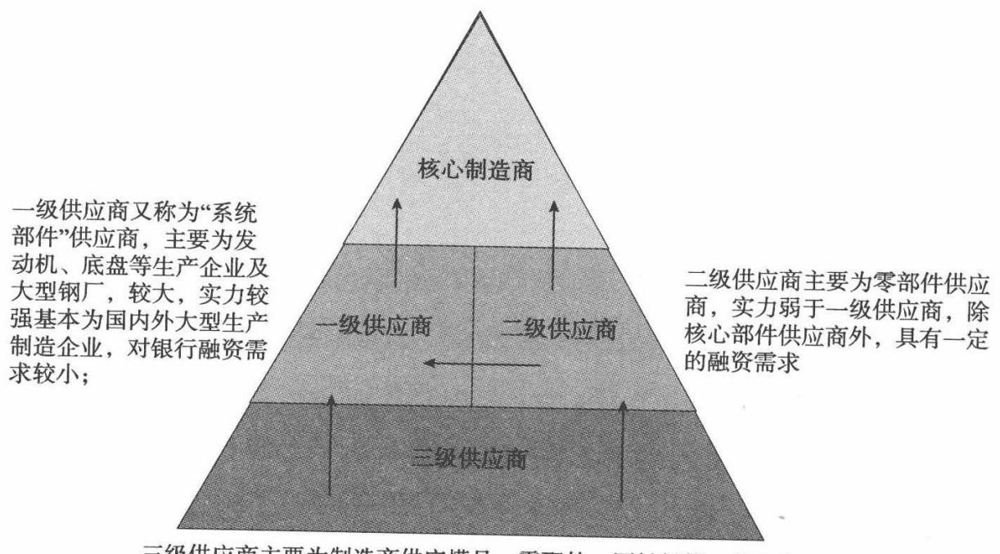

三级供应商主要为制造商供应模具、零配件、原材料等，基本为国内供应商，供应商对其普遍有一定的账期，因此三级供应商普遍具有较强的融资需求

# 工程机械行业产业链图

# 1.供应商体系

据供应商销售规模、供应产品种类、在产业链中所处环节，上游供应商通常分一级、二级、三级，如下图：

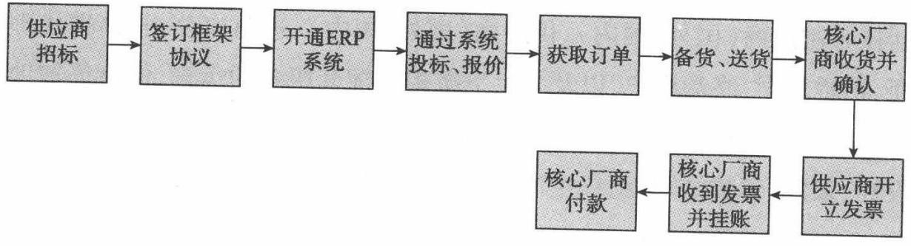  
供应商管理体系

# 2.供应采购(国内)流程

从工程机械国内采购流程来看，分成供应商招标、签订框架协议、开通ERP系统、供应商接受订单、备货送货、开票结算等环节。

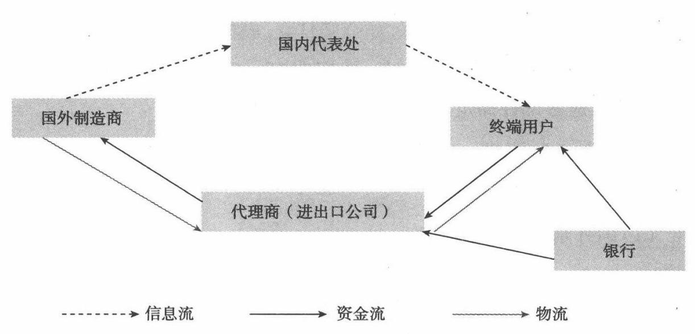  
采购流程图

备注：

(1)目前主要工程机械行业核心制造商要求零部件供应商进行“实时供货”以满足准时生产的要求（但是，多数一级供应商，如为核心厂商提供发动机系统、底盘系统、油缸等核心部件的大型供应商，往往实力强于核心厂商，在零部件供应上只接受预定）。大部分二级、三级供应商送达核心制造商库房的、流水线上的产品的产权还属于供应商，一旦核心制造商装配使用后,产权才发生转移，这称之为"落地结算”。落地结算后，核心制造商要求供应商出具“增值税发票”,并根据发票的出具日期计算付款时间。

(2)工程机械核心制造商同汽车制造商一样,基本都实现了供应商电子化管理,通过供应商管理系统实现对上游供应商的竞标、试样、承接采购订单、收货、结算等功能,如三一集团依靠ERP系统管理国内上千家零部件认证供应商，并通过电子化操作平台实现零部件供应及回款结算的全过程。

# 3.结算及付款方式

目前就工程机械行业而言,具有外资背景的生产企业账期多为 30

天,并以现款方式按月支付到账，如合肥日立、成都神钢、北京现代等。而国内企业如三一、徐工则账期较长，账期在60\~90天、甚至180 天不等，要视具体供应零部件而定，多以银行承兑方式支付。

# （三)产业链下游

1．产业链下游销售流程(1)国外制造商直销模式

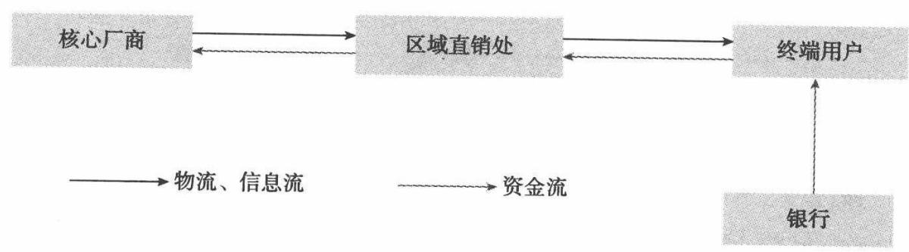  
销售流程图

说明：

①国外制造商通过设在国内的代表处向终端用户提供产品价格、型号、供货时间，或者收集用户个性化改装要求等信息。

②终端用户向代理商(进出口公司)支付不超过10%的采购订金，通过代理商转交国外制造商并排产。

③进出口代理商向国外制造商开立信用证,在开立即期信用证前，代理商根据采购设备的市场风险及终端用户的信用风险，向终端用户再收取一定比例的保证金，保证金比例一般为设备金额的20%；若支付货币的汇率波动较大，进出口代理商将根据终端用户的要求锁定汇率，防范汇率风险。

④设备生产完成后，国外制造商提供出产地证明、发票、装船凭证等单证,向进口代理商申请议付。

③代理商审查相关单证,审查合格后付款,付款资金由终端用户支付,或者进出口代理商进行短期垫付,终端用户采取分期付款或银行按揭方式偿还代理商垫款。

$\textcircled{6}$ 设备运抵港口,由代理商代理终端用户完成相关报关、提货等工作,如果银行提供了融资,终端用户应按银行要求办理抵质押手续。

备注：目前国外制造商全部采用以上直销模式在国内组织销售。

(2)国内制造商(包括合资品牌)直销模式。

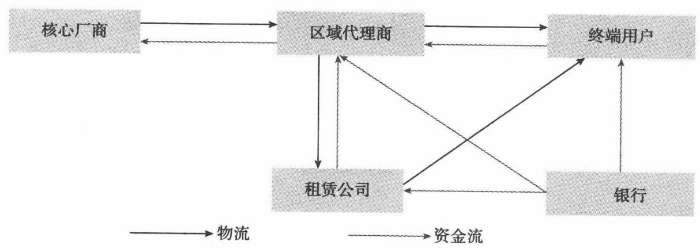  
销售流程图

说明：

①核心制造商在全国各地设立办事处(或称“直销处”）,负责公司产品在当地的直销工作，同时负责品牌宣传、售后服务、重点客户和代理商的管理与维护。

②核心制造商直销产品一般是大型工程机械设备或面向批量采购行为。

③终端用户采取全款、分期付款、银行按揭方式向核心制造商付款。

$\textcircled{4}$ 银行融资主体为终端用户。

(3)代理销售模式。

说明：

①核心制造商根据市场销售计划在全国各区域选取销售代理商，通

# 法律风险控制培训

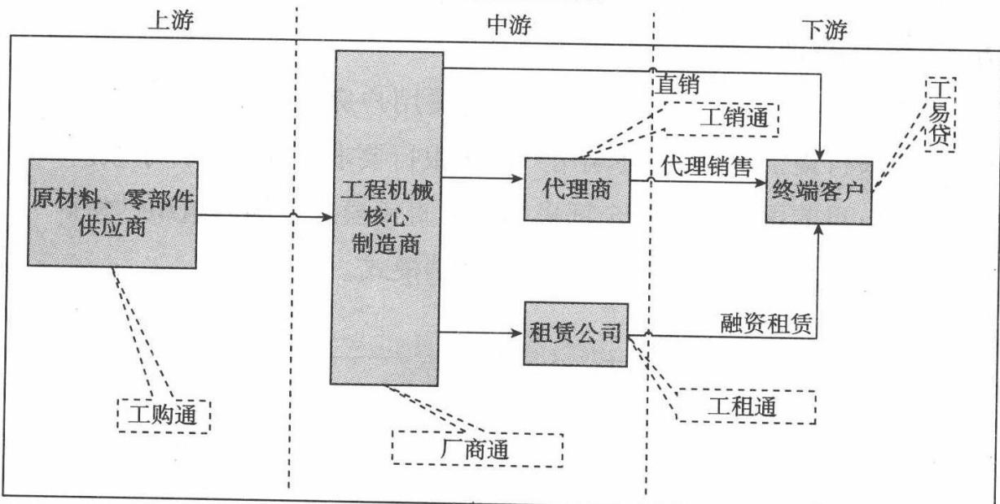  
工程机械行业金融  
销售流程图

过区域代理商向终端客户完成产品销售，其下游包括融资租赁公司及终端用户（企业法人、自然人），目前该销售模式构成了工程机械产品销售的主体。

②终端用户一般支付20%\~30%首付款给代理商/融资租赁公司，另70%\~80%余款由代理商/租赁公司垫付，并向上游制造商进行全款采购。

③代理商完成设备采购并转交终端用户使用,终端用户通过分期、按揭的方式偿还代理商/融资租赁公司垫款，并承担相关的资金费用,终端用户还可以由融资租赁公司租赁设备使用。

④银行提供融资的主体可以是终端用户、融资租赁公司和区域代理商。

# 2.融资销售需求较大

针对终端用户购买设备的偏好进行分析，全款购买的大约占到市场额度的30%，而以分期付款、按揭或租赁方式采购比例达70%。

# （四)产业链价值分布

通过对企业提供银行服务需要支付的营销成本、预期收益、潜在风险等因素的综合测算,零部件供应商和代理销售商环节构成了整个产业链价值分布的主体，且该部分大多是由中小民营企业构成,银行占据强势地位,容易获取谈判主动权,产业集群集中度较高,相应的物权、资金流更易于掌控，便于银行批量开发。

第二课Lesson 2

# 工程机械行业金融服务方案

1.“工程通”产品定义

以工程机械产业内核心制造商、供应商、租赁公司、代理商以及设备终端用户为目标客户，针对产业链条上采购、销售、终端使用等主要交易环节，依托核心制造商付款、回购、渠道管理能力、设备抵押等风险缓释手

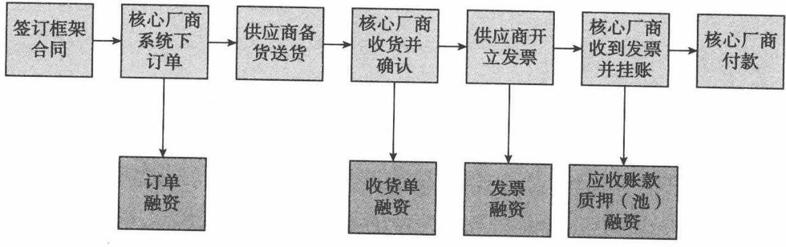  
产品服务方案

段，设计的“一揽子”综合金融解决方案。品种可包括：短期流动资金贷款、银票或国内信用证、进口开证、保理、商票贴现等。

<table><tr><td rowspan=6 colspan=1>工程机械核心制造商</td><td rowspan=3 colspan=1>销售渠道</td><td rowspan=3 colspan=1>销售方式</td><td rowspan=1 colspan=4>工程通产品</td></tr><tr><td rowspan=1 colspan=4>（融资服务对象：供货商、核心制造商、代理商、租赁公司、终端客户）</td></tr><tr><td rowspan=1 colspan=1>上游</td><td rowspan=1 colspan=1>核心制造商</td><td rowspan=1 colspan=1>中游</td><td rowspan=1 colspan=1>下游</td></tr><tr><td rowspan=1 colspan=1>直销</td><td rowspan=1 colspan=1>分期、按揭</td><td rowspan=1 colspan=1>供应商一工购通</td><td rowspan=1 colspan=1>核心制造商一厂商通</td><td rowspan=1 colspan=1>1</td><td rowspan=1 colspan=1>终端用户一工易贷</td></tr><tr><td rowspan=2 colspan=1>代理销售</td><td rowspan=1 colspan=1>分期、按揭</td><td rowspan=1 colspan=1>供应商一工购通</td><td rowspan=1 colspan=1>核心制造商一厂商通</td><td rowspan=1 colspan=1>代理商一工销通</td><td rowspan=1 colspan=1>终端用户一工易贷</td></tr><tr><td rowspan=1 colspan=1>租赁</td><td rowspan=1 colspan=1>供应商一工购通</td><td rowspan=1 colspan=1>核心制造商一厂商通</td><td rowspan=1 colspan=1>租赁公司一工租通</td><td rowspan=1 colspan=1>终端用户一工易贷</td></tr></table>

# 2.核心制造商准入

工程机械产业链金融业务的开展是以行业内核心制造商的优质付款能力及回购担保能力为依托开展的综合开发方案,核心制造商自身的经营、产品的市场认可度、对上下游供应商、代理商的管理能力直接影响整体方案的实施，“工程通"业务实施名单制,对《工程机械核心制造商目标名单》内的核心制造商及上下游客户可进行参照手册产品服务方案发起营销。其他不在名单内的核心制造商应符合以下准人标准：

(1)上年销售总收入不低于20亿。  
(2)资产负债率不超过 $70 \%$ 。  
(3)毛利率不低于 $15 \%$ (4)连续3年赢利。  
(5)具备对供应商完备的管理体系。  
(6)具备相应的担保(回购)及回款能力。

# 法律风险控制培训

# 3.核心制造商分类

<table><tr><td rowspan=1 colspan=1>客户类别</td><td rowspan=1 colspan=1>上年末净资产总额</td></tr><tr><td rowspan=1 colspan=1>A类</td><td rowspan=1 colspan=1>10亿元以上</td></tr><tr><td rowspan=1 colspan=1>B类</td><td rowspan=1 colspan=1>5亿（含）-10亿元</td></tr><tr><td rowspan=1 colspan=1>C类</td><td rowspan=1 colspan=1>3亿~5亿元</td></tr></table>

对符合以下任一条件的工程机械设备核心制造商,均可归为A类：

（1)为世界500 强企业及其一级控股公司。  
(2)为中国500 强企业及其一级控股公司。  
(3)为所在细分行业销售收入排名前10名企业。

# 第三课Lesson 3

# 核心制造商产品服务方案

# (一)产品定义

银行针对工程机械行内的核心制造商推出的融服务方案，重点发挥银行产业链融资服务优势，围绕工程机械核心制造商,针对工程机械产业链条主要环节，设计了一揽子综合金融服务方案,致力于帮助核心制造商拓宽融资渠道、降低融资成本、改善财务效率，提供优质、高效、便捷的产品服务综合解决方案。

# (二)产品综合服务方案

# 1．融资服务

(1)生产线建设融资服务：为核心制造商提供用于扩大生产和技术改造的基建(技改)贷款，可提供包括项目贷款、过桥贷款、多币种中长期组合贷款等金融服务，并可联合银行租赁公司为工程机械生产厂商提供设备融资租赁服务；在项目运营期间，银行还可通过发行各种债券及票据组合，帮助客户置换中长期贷款，优化债务结构，降低财务成本。

(2)国内贸易融资服务：为充分降低核心制造商资金成本，更有效地利用企业自身信用,银行可为其提供各种低成本、高效率的票据业务，包括但不限于票据开立、贴现等服务。主要产品含商业汇票贴现、买方付息票据贴现、无追索票据贴现。

(3)国际贸易融资服务：针对核心制造企业国外采购需求，提供进口押汇、进口应付款融资、提货担保、免保开证、进口保付等国外采购金融服务；针对企业国际化经营需要,提供福费廷、国际保理、出口押汇、出口托收等各类融资服务。

# 2.结算服务

(1)企业网银：银行企业网上银行目前已将大部分柜面业务实现了电子化,并结合网络渠道特点研发各类特色业务产品,包括：信息查询、转账支付、综合理财、开放式基金、网上开证、票据管家、集团服务、零余额、虚拟账户、电子回单、网上对账单、行业信息增值服务等。

(2)票据管家：基本业务包括以代保管为基础的存票、取票、贴现、委托收款、质押项下资产等业务;衍生业务是指在可用额度内办理的存票、取票、贴现、委托收款、资产等业务。

(3)票据置换：核心制造商人将其持有的距票据到期日期限较短的商业汇票向银行办理质押，由银行为其承兑到期日在质押票据到期日之后的银行承兑汇票用于支付，质押票据到期由银行负责委托收款，委托款项作为承兑申请人在银行承兑项下保证金，以备银行承兑票据到期扣款的业务。

# 3.财务顾问

银行利用自身各种资源(人才、信息、技术、网络等)优势为核心制造商筹资、投资及其他各项经营活动提供相应解决方案，以更好实现企业各

项经营目标，提高企业财务效益的咨询、顾问服务。产品包含：企业发展战略顾问、筹(融)资顾问、投资顾问、资产(或债务)重组顾问、资产(或负债)管理顾问、业务整合顾问、经营管理顾问等。

# 4.理财服务

(1)财务成本管理服务：可为企业提供国内保理、动产质押服务和短期融资券主承销服务，以增加融资渠道、改善财务报表、提高资产流动性。

(2)汇率风险管理服务：银行提供多种金融衍生产品及其组合，针对核心制造商海外销售收人，为客户提供未来现金流人与流出的币种、期限相匹配,规避国际贸易、外汇投融资中的汇率和利率风险，锁定资金成本，实现资产保值增值。产品包括远期结售汇、货币掉期、利率掉期等。

(3)对公理财服务：通过发售对公理财产品或开展专户理财计划，集中公司客户的资金，为企业量身定做出不同币种、期限、挂钩标的及目标收益率的理财产品,包括：固定收益类型对公理财产品、浮动收益类型对公理财产品、结构性理财产品等。达到在承受同等风险的条件下，最优投资组合的效果。

# 5.融资租赁

通过银行租赁可为装备制造企业客户提供各类融资租赁服务，以增加融资渠道、均衡税负并调节现金流和财务状况。

# 第四课Lesson 4供应商产品服务方案

# (一)产品定义

以工程机械产业链上核心制造商的付款能力，在零配件(原材料）供应商与工程机械核心制造商签订采购供货协议前提下,针对供货商签订订单、核心制造商收货、供应商开具发票、核心厂商预约付款四个不同交易阶段,动态提供不同成数、不同利率的短期融资业务，具体包括：订单融资、收货收据融资、发票融资、应收账款质押(池)融资等产品。

(1)订单是指能证明企业交易背景的合同、协议、订单,或通过ERP  
系统可佐证的交易信息。(2)收货收据是指供应商在发出货物后，经核心制造商验收合格后，  
出具的收货凭证。(3)发票是指供应商按合同履约后向下游客户开具的发票，主要是

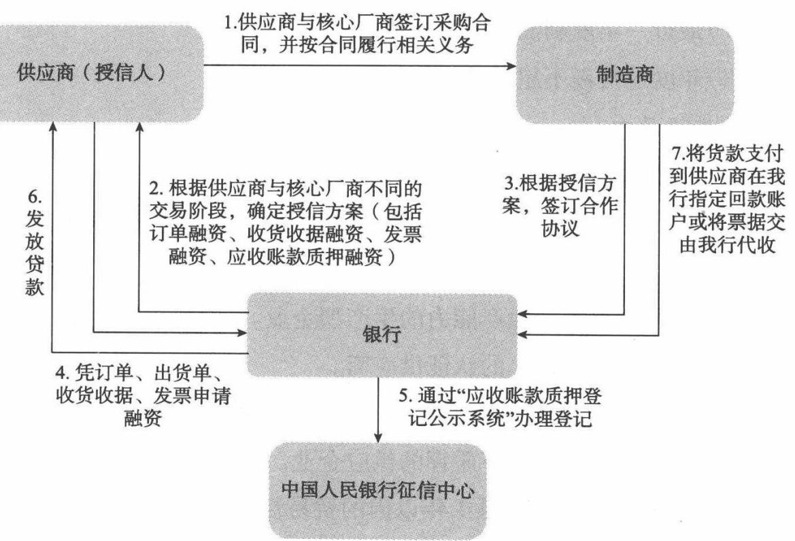

增值税发票。

(4)应收账款是指企业履约提交发票后,已得到制造商的确认应支付的款项。

# (二)供应商准入标准

# 1.准入标准

(1)已与核心制造商签订年度购销合同,或者纳人核心供应商全球采购体系。

(2)以通过核心制造商资质认证的供应商为主,谨慎介人临时供应商。

(3)企业具备一定零部件核心制造技术,且具有一定批量供应竞争优势。

(4)与核心制造商合作年限不少于2年;如是新建企业,其股东方与核心制造商合作年限不低于3年。

(5)单一产品(技术相似)年销售收入不低于1000 万元。

(6)生产型企业资产负债率不高于 $70 \%$ ,贸易型企业不高于 $80 \%$ 。

# 法律风险控制培训

(7)最近一年度利润总额为正值。

(8)年度退货额不超过其供应额的 $5 \%$

2.选择导向

(1)优先选择：

$\textcircled{1}$ 在细分行业内具有一定垄断地位的供应企业或是某具体产品的唯一供应商。

$\textcircled{2}$ 具有自主技术和生产能力的生产型企业。

$\textcircled{3}$ 合作关系3年以上的认证供应商。

$\textcircled{4}$ 年供应规模超过3000万元以上的供应企业。

$\textcircled{5}$ 能够提供抵押或动产质押的供应企业。

(2)谨慎介人：合作关系1年以内的贸易性企业

(3)禁止介人：自身具有不良信用记录的供应企业;当前有重大被诉讼事业的供应企业;实际控制人有超过6个月逾期的个人不良信用记录的供应企业。

国外核心供应商陆续在大陆新投资建厂，是银行业务营销的最佳机会,银行可积极进行低成本资产业务介人，以获得长期产业链合作机会。

(三)模式一：逐笔对应融资(订单融资/收货收据/发票融资/ 应收账款质押融资)

# 1.产品描述

(1)供应商向核心制造商批量提供标准化的产品,或者一次性提供专用性强的工具、设备。

(2)供应商具有可靠的技术和长期经验,被核心制造商纳入了长期采购体系。

(3)核心制造商为了保证采购合同的执行,支付一定比例的预付款，或者按生产进度付款。

(4)以供应商和核心制造商单笔或多笔具体交易为基础，银行凭借供应商提供的与供货合同项下的订单、制造商出具的收货收据、供应商出具的发票(或通过供应商管理系统可确认采购流程信息的有效性），为其提供融资支持。

(5)融资额度一般控制单笔交易的 $( 6 0 \% \sim 9 0 \% )$ ,如有预付款，融资额要扣除预付款。

(6)应收账款回笼后，用于归还银行授信。

# 2.产品特点

(1)核心制造商和零配件供应商有效合同是提供融资的基础条件，并以单笔或多笔具体交易为基础。

(2)融资与产品生产高度结合,与交易相关。

(3)合同执行后核心厂商付款资金是第一还款来源。

# 3.风险管理要点

(1)核心制造商的支付能力是风险考量的主要因素，必要时可对核心制造商"支付能力"核定额度。

(2)须对供应商销售资金回笼的路径进行锁定。

(3)须监督供应商授信资金使用。

(4)融资金额与具体单笔交易相对应。

(5)放款后须加强对供应商生产、供应进度情况的监控。

(6)重视核心制造商的资信情况及资金支付习惯,分别制定“现款支付方式”和"票据支付方式”的监管流程。

# 4.产品操作流程

(1)通过核心制造商收集上游供应商名单,了解核实供应规模的真实性。

(2)审核订单(收货收据/发票/应收账款)真实性、有效性及合理性，核心制造商如有供应链管理系统,可通过系统进行信息核对。

(3)审核供应商申请后,向符合要求的供应商授予授信额度。

# 银行授信业务法律风险控制培训

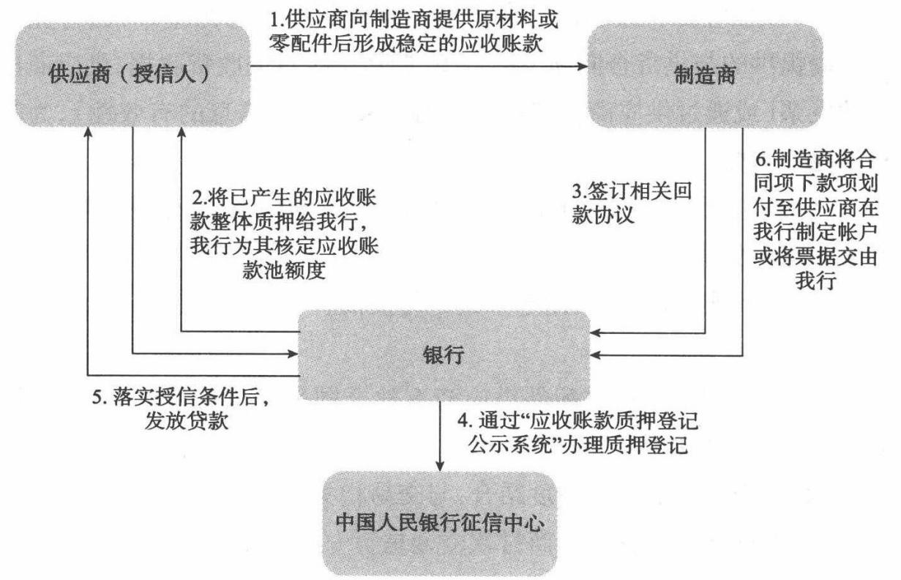  
产品操作流程图

(4)放款前,银行与制造商明确结算资金支付银行指定账户，采取票据支付的应交付(寄送)银行。

（5)业务部门登录“人行应收账款质押登记系统”,办理应收账款质押登记。

(6)授信条件落实后，银行审核放款。

(7)业务部门和交易融资中心须加强对供应商履约情况监督。供应 商出货后,将相关出货单、运输、发票等单据交由银行寄送至制造商。

(8)业务部门和交易融资中心建立使用台账、回款台账,跟踪单笔放款到期情况。

(9)制造商向银行指定账户划付款项或按指定方式向银行交付（寄送)票据。

# (四)模式二：应收账款池融资

# 1.产品描述

(1)供应商向核心制造商的产品供应是一个滚动持续的过程。

(2)供应商在核心制造商形成一个按月度延迟的，一定期间内滚动的应收账款。

(3)银行以此部分应收账款设定质押权并在人民银行征信系统中办理质押登记,为其提供融资支持。

(4)融资额度控制在应收账款的一定比例内。

（5)应收账款回笼后,用于归还银行授信。

2.授信产品特点

（1)以一定期间内滚动的应收账款作为权利质押。

(2)核心厂商付款资金是第一还款来源。

# 3.风险管理要点

(1)核心制造商的支付能力是风险考量的主要因素,必要时可对核心制造商"支付能力”核定额度。

(2)须对供应商销售资金回笼的路径进行锁定。

(3)须监督供应商授信资金使用。

(4)应收账款是按支付账期流动变化的,需要监管融资额度小于应收账款余额。

（5)放款后须加强对供应商生产、供应进度情况的日常监控。

(6)重视核心制造商的资信情况及资金支付习惯，分别制定“现款支付方式”和“票据支付方式”的监管流程。

# 4.产品操作流程

(1)根据核心制造商自主推荐供应商或银行通过供应商名录营销供应商,根据供应商年销售额、月均回款情况、拟提供担保方式初步拟定授

# 银行授信业务

# 法律风险控制培训

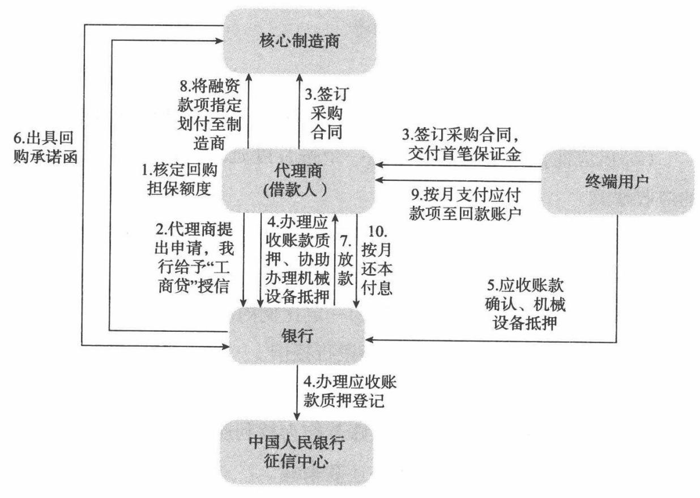  
产品操作流程图

信额度。

(2)银行审核应收账款的真实性(买方如有供应商管理系统，可通过系统进行信息核对）。

(3)供应商进行融资申请，银行根据供应商与核心制造商间上一年度月均应收账款余额,在合理估计核心制造商采购增长及供应商年销售增长情况给予授信额度。

(4)银行与核心制造商明确结算资金支付银行指定账户，采取票据支付的应交付(寄送)银行。

(5)业务部门登录"人行应收账款质押登记系统”，办理应收账款质押登记。

(6)授信条件落实后,银行审核放款。

(7)业务部门和交易融资中心须加强对供应商履约情况监督。供应 商出货后,将相关出货单、运输、发票等单据交由银行寄送至制造商。

(8)制造商向银行指定账户划付款项或按指定方式向银行交付票据,用于偿还应收账款融资授信。

# 第五课Lesson 5代理商产品服务方案

# (一)产品定义

在工程机械代理销售模式下，以代理商作为授信主体，以其销售给下游终端用户机械设备后所形成的应收账款进行质押或转让，可办理工程设备抵押及核心制造商承担回购责任的融资业务。具体可包括应收账款质押、保理等产品。

# (二)代理商准入标准

（1)代理商获得正式代理销售授权证书,为当地区域的一级代理商。

(2)从事该工程机械销售3年以上。

(3)注册资本金500万元以上。

(4)上年销售收入不低于5000万。

(5)上年赢利。

(6)既往履约记录良好。

(7)代理商管理层或股东有过经销及售后服务的成功管理经验，有完善的销售渠道，具备较强的售后服务及维修能力；并有专人分别承担最终用户的信用审查、分期付款的销售款项管理工作。

(8)代理商是民营企业的,其法人代表或最大自然人股东愿意提供连带责任担保。

(9)代理商销售总额位居厂商销售前20名。

# (三)产品模式及操作流程

# 1.产品描述

(1)终端用户与代理商签订采购合同,通过代理商向主机商采购及机械设备。

(2)终端用户设备首付款不低于 $15 \%$ ,对代理商采取分期付款方式。

(3)银行以代理商对终端用户已经形成的应收账款设定质押权或转让,为其提供融资支持。

(4)融资额度控制在应收账款的一定比例内，期限内单笔融资期限一般不长于3年。

(5)办理应收账款对应工程机械设备抵押,可要求核心制造商承担回购责任。

(6)应收账款回笼后，监督代理商归还贷款或者进人保证金专户。

2.授信产品的特点

(1)以代理商和终端用户已经形成的应收账款作为担保。

(2)已形成的应收账款能够覆盖融资额,第一还款来源为终端用户。

(3)一般追加设备抵押及核心制造商回购。

# 3.授信产品的风险要点

(1)关注代理商与终端用户设备交易的真实性。

# 法律风险控制培训

(2)终端用户的支付能力作为第一还款来源,需加强对终端用户经营情况的关注。

(3)如代理商与终端用户就设备质量等相关问题存在纠纷，将影响代理商的按时还款。

4.产品操作流程

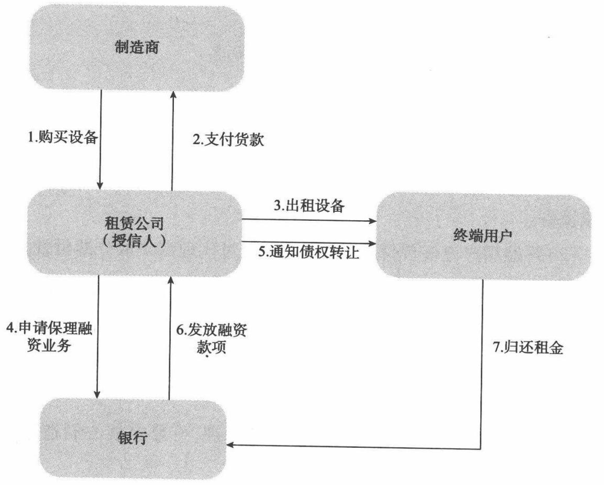  
产品操作流程图

(1)业务部门上报核心制造商资料,银行为核心制造商核定回购担保额度，并签订总对总合作协议。

(2)核心制造商向银行推荐代理商名单。

(3)代理商向银行申请授信，银行审查相关资料后给予其“工销通”授信额度，授信期限一般不超过3年，贷款额不超过工程机械总价款的

$85 \%$ ,按月等额归还本金,按月付息。

(4)代理商与终端用户签订采购合同,终端用户向代理商交付首笔保证金后,代理商向主机商采购机械设备。

(5)代理商应向银行提供以下资料：

$\textcircled{1}$ 代理商提供的分期付款的工程机械买卖合同、和终端用户签订的还款协议确认书、合格证正本复印件、最终用户身份证、户口本、结婚证书（如有）复印件。

$\textcircled{2}$ 终端用户的首付款凭证（一般要求首付款不低于工程机械总价款的 $15 \%$ ）,代理商的保证金缴存凭证。

(6)银行与代理商签订应收账款质押或保理合同,将代理商提供的工程机械买卖合同项下应收账款质押/转让银行,办妥公证和质押登记手续;要求核心厂商回购时应取得制造商的《贷款申请暨不可撤销保购担保承诺函》。

(7)银行与代理商、终端用户签订三方协议,终端用户确认代理商已履行应收账款质押/转让告知义务

(8)代理商将工程机械合格证正本、发票、GPS位图交银行人库保管,办理机械设备抵押登记

(9)代理商办理相关投保财产险、第三者责任险，受益人约定为银行,并将保单正本、保费(一次付清)缴款凭证一并提交银行

(10)以上条件满足后放款,代理商回款专户的首付款和银行授信资金由银行直接付至上游制造商

(11)经办客户经理建立业务台账，详细记录资金支付、合格证和销售发票出入库、每月回款、还本付息等情况。

(12)通过回款专户按月等额还本,按月还息;当回款专户余额不足时，由银行自申请人保证金账户直接扣划。

(13)发生贷款逾期时,保证金账户余额若不足以偿还当期应付的贷

# 法律风险控制培训

款本息,银行启动保购程序,要求制造商回购已售工程机械。

# (四)授信风险因素

(1)系统性风险。批量开发方案下，主要风险是系统性风险。主要风险控制点为厂商、授信申请人的信用,主要风险控制措施应是建立严格的厂商准入标准。

(2)个人信用风险。主要通过厂商、代理商回购、工程机械抵押等组合担保方式控制风险；同时通过GPS控制抵押物的使用,迫使设备购买者及时支付货款或租金。

(3)假交易风险。主要风险控制措施是核查贸易背景真实性，要求提供发票、货运单据;审查交易价格的合理性;监控资金的流向来控制。

(4)个人丢弃抵押物风险。首付太低，就会造成遗弃设备而不还贷款。由于该设备主要用于大型工地从事高消耗、高磨损,易造成设备的破损。工程机械设备从事高损耗的工作，如果贷款融资期限太长，而设备到一年后,超负荷工作的时间相对缩减,维修等费用增加,而取得工程款项较前期大幅度减少，那时如果所欠银行贷款太多，借款人就会抛弃旧机购买新机。

（5)应收账款和抵押工程机械的二次融资风险。主要控制措施是控制工程机械的发票、合格证;并由厂商、代理商出具承诺不得为客户补办合格证。

第六课Lesson 6

# 融资租赁公司产品服务方案

# （一)产品定义

工程租赁保证是指工程机械设备租赁业务机构将尚未到期、分期实现的工程机械产品的应收租金债权转让给银行,银行受让应收租金债权对工程机械租赁业务机构提供的融资业务。

# (二)租赁公司准入标准

# 1.准入标准

鉴于租赁公司自身不从事工程施工,而是以设备租赁为主,所以，租赁公司的准入标准为：

(1)注册年限在2年以上,注册资本在1亿元以上,资产规模在5亿元以上。

(2)具有完善的风险管理体系,包括机构、人员、IT平台和风险控制

# 法律风险控制培训

流程。

(3)资本充足率在 $10 \%$ 以上（关注过度使用资本杠杆的融资租赁公司)。

# 2.选择导向

(1)重点营销具有核心制造厂商资本背景的融资租赁公司,其次是具有工程机械行业融资租赁专业能力的融资租赁公司。

(2)重点营销融资租赁公司所处区域市场内工程量充分，是国家或者省市的重点投资区域。

(3)租赁公司拥有的设备种类齐全,设备之间具有互补或者是协同效应。

(4)本身拥有众多的客户群体,且公司拥有内部完善的设备管理体系和维修保养能力。

# (三)产品模式及操作流程

# 1.产品描述

(1)承租人确定需要购买工程机械设备的型号、价格、技术规格等，并与融资租赁公司签订租赁合同。

(2)承租人交付首付款后，融资租赁公司与核心制造商签订买卖合同,按承租人要求全款购买工程机械设备。

(3)融资租赁公司与承租人签订租赁合同,获得工程机械的使用权。

(4)承租人每月向融资公司支付租金。

(5)租赁公司将融资租赁合同项下未到期应收租金债权转让给银行,采用保理或应收账款质押产品，支付租赁公司一定比例的融资款项。

(6)银行作为租金债权受让(质权)人向承租人收取租金,用于归还融资款项。

# 2.授信产品的特点

(1)融资租赁公司和承租人真实、有效的租赁合同是提供融资的基础条件。

（2)承租人按期支付的租金是第一还款来源。

# 3.风险管理要点

（1）出租人转让给银行的应收租赁债权必须为合格的在收租金，拒绝为逾期及不合格的应收租金作保理融资。

(2)以租赁标设备作抵押的，则应将银行设定为租赁设备保险的第一收益人。

(3)如租赁公司实力不强或采用无追索权保理的，可引人核心制造商就设备进行回购。

(4)因为承租人的按期归还的租金为授信第一还款来源，因此除了关注融资租赁公司自身情况外，还应关注承认人自身的财物和经营情况。

(5)要求承租人按期将应付租金汇至出租方在银行开立保理业务租 金监管账户中。

# 4.操作流程

（1)承租人首先确定需要购买工程机械设备的型号、价格、技术规格等，与融资租赁公司签订租赁合同，向租赁公司交付首付款。

(2)融资租赁公司与核心制造商签订买卖合同,按承租人要求全款购买工程机械设备。

(3)租赁公司向银行申请"工程租赁保证"融资。

(4)银行审核租赁公司与终端用户签订租赁协议、发票及其他相关资料后,根据其应收账款余额,给予其一定"工程租赁保证"业务额度。

(5)银行与租赁公司签订保理服务协议和对应设备的抵押合同，向承租人出具告知书,载明租赁合同项下的“设备向银行抵押”和“租赁费

# 银行授信业务法律风险控制培训

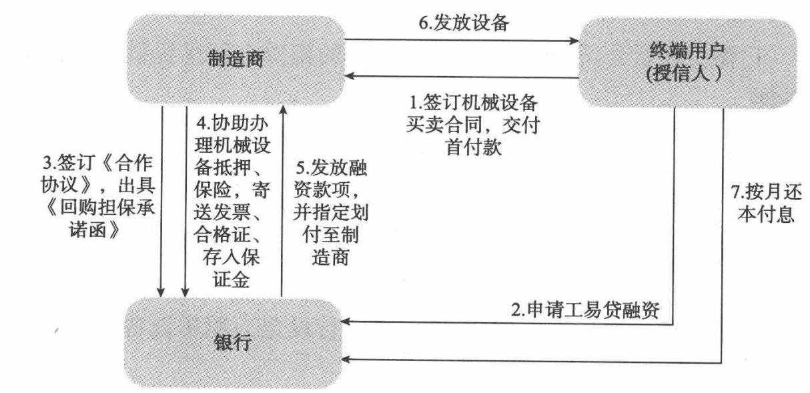  
操作流程图

用受让银行"事项,并取得承租人的回执。

(6)银行会同租赁公司办理设备抵押登记手续。(7)放款中心审核以上放款资料,按一定比例进行放款。(8)承租方按期将应付租金汇至申请人在银行开立的保理监管专户。(9)当承租方连续3期或累计5期或租期到期未能足额支付租金时，银行可向出租方进行追索,或由核心制造商进行回购。

# 第七课Lesson 7终端用户服务方案

# (一)产品定义

终端用户用于在核心制造商或指定代理商处购买工程机械设备，以所购设备作抵押担保,并由与本行合作的核心厂上及代理商提供回购担保的融资业务。

# (二)客户准入标准

(1)经工商行政管理部门核准登记注册，原则上要求成立2年以上（或是实际控制人操作从业时间3年以上），所属行业不属于银行信贷政策禁人类行业。

(2)信用等级为B级以上。

(3)借款人及其法定代表人、主要经营者、主要股东、实际控制人在银行无不良授信；在中国人民银行信贷登记咨询系统和个人征信系统中，

# 法律风险控制培训

无逾期未还贷款本息或不良授信;在税务、工商、海关部门无不良记录。

(4)授信人具有一定的施工项目需求，并能够及时实现资金回笼。

(5)贷款发放前双方已签订工程机械购买合同，并支付了规定的预付款项。

(6)原则上银行不支持借款人购买“第一台设备”进行工程施工。

# (三)产品模式及操作流程

# 1.产品描述

(1)银行向符合准入要求的企业法人发放的用于购买自己生产经营所需工程机械的贷款；

$\textcircled{1}$ 贷款期限不超过3年。

$\textcircled{2}$ 贷款利率在基础利率基础上，上浮不低于 $10 \%$

(2)贷款额度最高不超过设备价值 $80 \%$

(3)可要求制造商或代理商在银行存人一定比例的保证金。

制造商承担"债权回购"或"实物回购"责任，同时也可追加代理商的回购以降低风险。

# 2.风险管理要点

（1）重点了解借款人每月的经营情况,包括承接的工程量、结算情况、固定开支、变动成本、盈利情况等要素。

(2)重点了解工程机械的使用、维修、保养情况,检查该工程机械是否定期进行保养维护。

（3）通过GPS控制系统（如有），监控工程机械设备的运行状态,对于设备处于闲置状态的进行进一步跟踪了解。

(4)对每笔贷款,经营机构建立信贷业务台账，随时登记,对买方的还款情况进行动态监控，及时对到期贷款进行催讨;一旦发现买方还贷不正常的现象，立即采取相应措施。

# 模式一：厂家直销

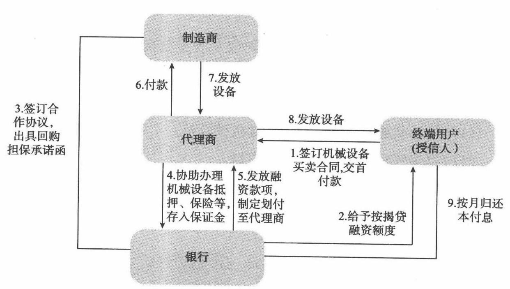

(1)银行与制造商签订工程机械银企合作协议,明确双方合作内容、操作流程等事项。

(2)终端用户与核心制造商签订设备买卖合同,并交付首付款。

(3)终端用户向银行提交贷款所需的申请材料，申请"按揭贷"融资业务。

(4)银行给予终端用户"工易贷”融资额度。

(5)核心制造商将所对机械设备发票送达(或寄达)银行；同时出具工程机械贷款申请暨不可撤销回购担保承诺函及设备的合格证送达（或寄达)银行。并保证向银行提供的产品合格证等厂家证明文件的真实、有效、唯一性。

(6)借款人应以银行为被保险人向保险公司办理特定的险种，并将保险单正本交甲方保存，投保期限应不短于贷款存续期。

(7)核心制造商应协助银行与借款人在放贷款前办妥工程车辆的抵

# 法律风险控制培训

押登记手续和机械设备的抵押公证手续。

(8)核心制造商在银行开立保证金账户，按相关要求存人一定能够 比例保证金。

(9)办理好相关手续后，银行按约定发放贷款至借款人开立的基本账户\一般账户中，并根据借款人的《委托划款扣款授权书》将贷款直接划人核心制造商在银行方开立的一般账户上。

(10)核心制造商向终端用户发放机械设备。

(11)终端用户按月向银行归还本息。

# 模式二：代理销售

终端用户 租赁公司 购 代理商 代理 主机厂A  
1.授予中长期贷款和商票  
可保证互换额度，将商票互  
换与贷款延迟发放协议作为 2.代理商向主机厂出具一年贷款补充协议 5.贷款资金指定支 （或半年）期电子（或纸质）付与代理商；代理商 商票，并由租赁公司签章保证以收到贷款承兑到期4.一年（或半年）后， 商业汇票发放贷款给租赁公司， 3.主机厂向我行申请帖现，帖用于支付延期贷款 现利息由租赁公司承担，银行可放充追索权银行

(1)终端用户与代理商签订设备买卖合同,并交付首付款。

(2)终端用户向银行提交贷款所需的申请材料,申请"工程按揭贷”融资业务。

(3)银行与制造商及代理商签订工程机械银企合作协议,明确双方合作内容、操作流程等事项。

(4)银行给予终端用户“工程按揭贷"融资额度。

(5)代理商将所对机械设备发票送达(或寄达)银行，并出具工程机械贷款申请暨不可撤销回购担保承诺函及设备的合格证送达(或寄达）银行。并保证向银行提供的产品合格证等厂家证明文件的真实、有效、唯一性。

(6)借款人应以银行为被保险人向保险公司办理特定的险种，并将保险单正本交甲方保存，投保期限应不短于贷款存续期。

(7)核心制造商、代理商协助银行与借款人在放贷款前办妥工程车辆的抵押登记手续和机械设备的抵押公证手续。

(8)核心制造商及代理商在银行开立保证金账户,按相关要求存人一定能够比例保证金。

(9)办理好相关手续后，银行按约定发放贷款至借款人开立的基本账户/一般账户中，并根据借款人的委托划款扣款授权书将贷款直接划人代理商在银行方开立的一般账户上。

(10)代理商向核心制造商划付资金。

(11)核心制造商通过代理商向终端客户发放机械设备。

(12)终端用户按月向银行归还本息。

# 第八课Lesson 8延伸服务模式

# 一、商业承兑汇票替代中长期贷款服务方案—“票贷通”

# （一)方案目的

以合同的形式,与工程机械下游销售环节承担销售任务的经销商、大型销售终端、或金融租赁公司达成中长期贷款和商票保证可互换协议，通过对产业链内中长期贷款的票据化、资金流动化,有效实现压缩中长期贷款或者延迟增量中长期贷款指标占用的目的。

# (二)代理商及租赁公司准入标准

# 1.代理商准入标准

(1)代理商获得正式代理销售授权证书,为当地区域的一级代理商。

(2)从事该工程机械销售三年以上。

(3)注册资本金500万元以上；上年销售收入不低于5000 万并且赢利。

(4)代理商既往履约记录良好，经人行信贷登记系统查询无不良贷款余额。

(5)代理商管理层或股东有过经销及售后服务的成功管理经验，有完善的销售渠道，具备较强的售后服务及维修能力；并有专人分别承担最终用户的信用审查、分期付款的销售款项管理工作。

(6)代理商是民营企业的，其法人代表或最大自然人股东愿意提供连带责任担保。

（7）代理商销售总额位居厂商销售前20名；

(8)符合银行授信政策的基本准人条件，不存在银行禁止授信的情况。

# 2.租赁公司准入标准

(1)注册年限在2年以上,注册资本在1亿元以上,资产规模在5亿元以上。

(2)具有完善的风险管理体系,包括机构、人员、IT平台和风险控制流程。

(3)资本充足率在 $10 \%$ 以上。（关注过度使用资本杠杆的融资租赁公司）。

(4)与代理商有合作经历,且合作关系良好、无不良合作记录。

(5)重点营销具有核心制造厂商资本背景的融资租赁公司,其次是具有工程机械行业融资租赁专业能力的融资租赁公司。重点营销融资租赁公司所处区域市场内工程量充分，是国家或者省市的重点投资区域；租赁公司拥有的设备种类齐全，设备之间具有互补或者是协同效应;本身拥有众多的客户群体，且公司拥有内部完善的设备管理体系和维修保养能力。

# 法律风险控制培训

# (三)产品综合服务方案

# 1.产品特点

(1)在传统中长期贷款授信的基础上，授予租赁公司商票可保证互换额度。

(2)将商业承兑汇票业务与信贷业务结合,有效缩短中长期贷款期限。

(3)本产品需要较高的信用指数,适用于合作关系达到一定程度的主机厂、代理商和租赁公司。

(4)操作流程的整个产业链必须完全在银行控制系统内，并高度配合银行指令，这个非常关键。

# 2.产品风险要素

(1)系统性风险。该产品对产业链选择的要求比较高，一是必须为合作多年的产供销合作关系，彼此信任度极高、配合度较强的生产、销售体系；二是整个产业链条必须全密封于银行系统内。这就要求必须在客户准人标准上严格选择。

(2)票贷衔接风险。按规定，贷款是要在商业承兑汇票到期后发放，这就有了一个票贷衔接的时间点问题。

(3)操作风险。相对于传统中长期贷款业务，该项产品交易环节更加复杂,重点规避贷款补充协议的签订、代理商开票、支持主机厂贴现、票据打包销售、延期付款等环节风险，任何环节的缺失,都不足以支持中长期贷款期限缩短、减少中长期额度占用的问题。

# 营销案例篇

# 案例—Case 1供应商订单融资案例

# (一)案例背景

A集团属于老牌国有企业，对产品质量要求较高，因为对合作供应商的要求也相对较高。经过多年的发展积累,逐步与一部分较为优质的供应商形成了稳定合作关系。2010年A集团计划实现产值110亿元～130亿元，预计国内的外部采购订单(不包括集团内部采购供应的关联交易）55亿元,剔除国内大型强势的供应商，符合银行准人标准符合要求的客户获取的订单约15亿元。

# (二)供应商分类

A集团上游供应商分成三类：配套件供应商（或称一级供应商）：这类企业一般都有自己的核心资产,有较强的资金实力和技术力量，生产过程中流动资金占用较大,对核心厂商的年配套供应量在1亿元以上。这些企业一般与银行关系较为紧密，对银行的授信政策较为熟悉，为了满足A集团的快速发展需要和提高自身的市场占比,对资金需求较为旺盛，但对资金价格较为敏感。其中与.B集团合作年限较长、资信状况良好的企业是“工购通”产品重点开发的客户。

一般零部件供应商（二级供应商）：这类企业一般年供应额在1000万元以下，应收账款余额不多，资金实力不是很强，希望加快资金周转速度，对资金价格不是很敏感。

材料供应商(三级供应商)：主要包括金属材料供应商、有色材料供应商、磁性材料供应商。年供应量一般在1000万～5000万元之间，有一定资金实力，一般在他行有少量抵押或者应收账款质押类融资，希望扩大融资金额，加快资金流转，以便做大规模，能接受银行价格水平。

二、三级供应商相对于一级供应商整体实力不强,大多为中小民营企业，对银行融资需求比较强烈，但议价能力并不强，可作为银行重点目标客户群。

# (三)供应厂商结算流程

A集团通过ERP系统对零配件、原材料整个采购过程进行管理，A集团对绝大部分供应商的付款均有3～6个月的账期，同时对配套件生产商还要求有一定铺底资金供其使用。货款结算时，基本上以银行承兑汇票或者商业承兑汇票结算，或者开立银票后代理贴现支付现金给供应商，其贴现融资成本由供应商承担。在A集团以往与上游供应商的贸易过程中，A集团一般都要求供应商给铺底资金 $20 \%$ ，同时采购合同降价 $10 \%$ 。

# (四)授信模式及定价

由于A集团GSP系统数据较为精准，与供应商实际交易情况相符，偏差小,系统界面清晰友好,便于操作检查，系统内体现了三一向供应商

所下的订单情况、订单执行进度、交货进度、开票付款情况等，实际上通过系统完成了对供应商相关数据的核实、对账，完全可作为银行授信依据，银行基于该管理系统对A集团上游供应商实施批量订单融资授信。

订单融资模式项下流动资金贷款原则上不低于基准上浮 $30 \%$ ；银行承兑汇票保证金不低于 $50 \%$ ，国内信用证保证金比例不低于 $20 \%$

# (五)业务操作流程

(1)由申请人提供相关资料（除常规资料外，还应包括已确认的含金额总计在内的订单汇总清单或A集团ERP系统签收的收货清单）,在银行授信获批，办理相关核保手续，签署授信合同等，落实授信条件。

(2)申请人向银行开放A集团ERP系统客户端,银行于额度启用前进行系统核查，核对相关数据。

(3)银行向A集团发送银行和授信申请人共同签发的变更账户通知书,将结算账户变更为银行，并取得相关回执。

(4)申请人在银行开立一般结算账户、保证金账户，购销合同/订单上的回款账户为银行,A集团ERP系统内体现回款账户为银行。

（5)业务部门登陆“人行应收账款质押登记公示系统”，办理应收账款质押登记。

(6)订单融资项下的放款,由申请人提供与A集团签订的供应合同及此次融资项下的订单汇总清单，银行进人A集团ERP系统核实后，审核放款额度，放款。

(7)业务部门和交易融资中心建立额度使用台账、回款台账，跟踪单笔放款到期情况，及时催收。

# (六)授信后监管措施

(1)所有保理及订单融资，申请人均需在“人行应收账款质押登记系统”办理登记公示。

# 法律风险控制培训

(2)申请人向银行开放三一GSP系统客户端，银行于额度启用、每次放款前、贷后检查时进行系统核查,核对相关数据，业务部门经办人员与交易融资中心人员按周查看申请人系统内显示的送货差异、退货、扣款、发票差异、回款账户、供应商评价等情况，关注申请人日常经营及订单执行情况。

(3)订单融资项下业务：交易融资中心于每次走款前核查系统，对申请人订单余额(期初订单金额 $^ +$ 当期新增订单金额－当期已回款金额)与银行授信口进行比对，授信口余额不得高于订单余额的 $70 \%$ ，不足部分以账户保证金补充，超出部分款项申请人方可使用。

(4)单笔订单融资期限与A集团的付款期限匹配,融资到期日设定为付款期后3个月内。

(5)银行资金只能用于申请人企业自身流动资金周转，且只能用于与A集团订单相关的采购,不得挪作他用，银行进行资金流向监控。

(6)订单经过双方同意有可能延期执行，如果订单延期执行，银行贷款还未发放，贷款发放日期顺延；如果贷款已经发放，银行将锁定贷款资金，暂时不得支付,待订单开始执行时才允许支付。

(7)银行按月跟踪订单执行及资金收付情况，一旦发生了融资的订单项下货物交付，形成应收款，需及时办理应收款质押相关手续，如需再办理保理融资，融资款项只能用于归还订单项下发放的融资，此项条件作为后续额度提用的前提条件。

(8)订单项下付款条件、账期、金额发生重大变化需事先征得银行同意,订单减额的按照订单减额部分客户需提前归还相应融资部分。

（9）严格按银行《应收账款类融资回款控制细则》要求进行回款控制。银行定期对回款账户情况进行检查，如发现回款未至银行，银行有权立即收回授信。银票只能由A集团直接交付或寄送给银行指定人员。如银行承兑汇票到期日超过了银行设定的还款日期，可要求申请人贴现

进行还贷。

(10)如A集团采用付款延期,银行为申请人续做已确认的应收账款保理融资来归还对应的订单融资款，或是由申请人自筹资金归还银行融资。

（11)只有当专户上的回款资金超过对应的到期贷款金额本息，经银行审批确认后，申请人才可以使用超过部分资金。

(12)订单融资客户严格执行贷后检查，原则上经营单位不低于每月一次现场检查；银行通过定期走访、客户回访、深度营销等多种方式与核心厂商相关部门保持密切联系，通过核心厂商关注银行授信客户经营情况、产品质量、供应资格等重大变化事项,经营单位将了解的情况通过书面方式反馈给交易融资中心，如有异常及时采取相关措施，书面反馈情况作为申请人后续贷款使用的依据。

# 案例二Case 2供应商应收账款质押融资案例

# (一)案例背景

B集团是我国机械装备工业国有特大型骨干企业，国家120户试点企业之一，已被国家列人关系国家安全及国民经济命脉由中组部直管的39 家重要骨干企业之一。由于B集团的行业龙头及核心地位,各家金融机构均向其提供了大量的授信支持，集团融资环境宽松且自有资金较为充裕，同业竞争激烈,且资金及报表改善等均需求不足，对授信成本要求较高，企业与银行的合作长期处于关系营销的简单维系状态,难以寻觅突破口。

# (二)营销发现

银行通过对B集团的产业链进行详细、深人的调研分析，发现其产业链上游存有大量的配套加工企业且规模及实力参差不齐,部分有较强

的授信需求，可作为银行与企业建立战略型银企合作关系的突破口。

# (三)上游产业链分析及开发思路

上游客户交易量情况：产品为大型成套设备或大型铸锻件，生产周期长，而用户的预付款仅有 $20 \% \sim 3 0 \%$ 。

为缓解资金压力，同时为提高产值,B集团每年大约有 $50 \%$ 以上的加工业务需外协加工企业完成,约20亿元。其产业链上游存在大量的加工配套企业，包括：上游外协机加客户和上游原材料供应商，部分与B集团集团保持着稳定、良好的合作关系。与上游结算方式：采用先货后款、滚动付款方式，先付 $30 \%$ 左右，在6个月内再陆续付清。

上游加工配套企业属于中小企业，缺乏担保及实质性抵质押物，传统模式方式难以获得银行授信支持。因此银行针对批量开发外协机加工及原材料供应客户，以其对B集团的应收账款质押，通过B集团锁定还款来源,封闭运行，控制风险。

# (四)客户准入标准

考虑到银行与B集团合作密切，其上游产业链开发回报较大,同时B集团上游客户规模普遍偏小,故为扩大影响，增加综合回报,进一步做大B集团上游产业链客户，银行拟准人标准如下：

(1)客户准人标准：在B集团推荐名单内，且外协加工或供货合作在2年以上，其中外协加工年产值3000万元以上，贸易企业年销售5000 万元以上，对A集团有稳定的应收账款。

(2)授信品种，可采用综合授信，品种为短期流动资金贷款、银行承兑汇票和商票贴现,不介人中长期资金。

(3)单户授信额度,不高于对B集团年均应收账款的 $80 \%$ 。

(4)担保方式，以对A集团的应收账款质押为主，根据实际情况，追加资产抵押和实际控制人连带责任保证。

# 法律风险控制培训

（5)价格政策，贷款利率原则上浮 $10 \%$ 以上,银承保证金比例不低于$30 \%$ ，商票贴现利率随行就市。

# (五)操作流程

(1)择优选择B集团推荐的上游客户。

(2)每次放款前，银行向B集团书面查询上游客户的应收账款情况，B集团书面确认，同时要求上游客户提供贸易合同、增值税发票明细及近期报表。

(3)上游客户以现有对B集团的应收账款作质押,与银行签订单笔应收账款最高额质押合同,质押率 $80 \%$ 0

（4)因B集团不愿接受银行“应收账款债务人确认函”的制式文本中的相关明确责任的条款，银行通过书面查询及银行、上游客户与B集团签订制定应收账款回款协议来替代银行制式“应收账款债务人确认函”，同样可以达到锁定应收账款，明确责任,控制风险的效果。

(5)银行随时向B集团书面查询上游客户对其应收账款余额情况，保证银行授信口不高于应收账款余额的 $80 \%$ 0

附件1：

# 应收账款查询函(通知联)

B集团股份有限公司：

$\times \times$ 公司为贵公司贸易合作企业，为缓解该公司资金压力，并基于该公司与贵公司有真实贸易背景的前提下，银行为其提供授信额度人民币$\times \times$ 万元，为确保银行授信还款来源，银行依据信贷要求查询该公司财务账，其账面反应截至 $\times \times$ 年 $\times \times$ 月 $\times \times$ 日 $\times \times$ 公司应收贵公司账款 $\times \times$ 万元。

请贵公司核对是否相符,如有不符，请贵公司予以说明；贵公司核对

后，请在加执联上签章,返还银行。

# 银行 $\times \times$ 分行年月日

# 应收账款查询函（回执联）

银行 $\times \times$ 分行：

截至 $\times \times$ 年 $\times \times$ 月 $\times \times \boxdot$ ，我公司财务账面反映应付××公司账款余额为 $\times \times$ 万元，与××公司财务挂账应收我公司账款××万元：

□相符

□不相符，不符的原因是

提示：请在上述相应选项前的“口”标注“√”。

单位签章(公章或预留印鉴)：

年月日

附件2:

# 应收账款回款协议

甲方：B集团股份有限公司  
乙方：外协机加企业或原材料供应企业  
丙方：银行××分行

为加大甲、乙、丙三方的合作力度,缓解甲方对乙方的付款压力，使乙方有充足的流动资金为甲方及时提供配套产品、加工劳务或原材料等贸易合作业务，丙方在甲、乙双方贸易背景真实稳定的基础上，愿为乙方提供授信支持;甲、乙、丙三方共同协商，达成本协议：

1.甲、乙双方确保贸易背景真实、有效。

2.丙方为乙方提供人民币授信额度××万元。

3.自本合同生效之日起，乙方在甲方现有及将来产生的所有应收款

# 法律风险控制培训

项的回款方式如下：

(1)甲方以现金支付乙方账款时：直接将所有账款付至以下回款专用账户，

户名：

账号：

开户行：银行股份有限公司 。

(2)甲方以票据支付乙方账款时：乙方书面授权丙方到甲方领取所有票据，甲方同意予以配合，并将所有票据交付丙方；乙方承诺将该票据质押给丙方，作为其在丙方未到期授信的担保，或将该票据贴现，贴现款存入保证金账户作为其在丙方未到期授信的担保。

4.本协议自三方签字、盖章后生效,至乙方在丙方的授信结清日止;乙方在丙方的授信结清后，丙方将书面通知甲方。

5.本协议一式三份,甲、乙、丙三方各执一份,具有同等法律效力。

甲方： （盖章）法定代表人/主要负责人： (签字或盖章）(或委托代理人） 年月日乙方： （盖章）法定代表人/主要负责人： (签字或盖章）(或委托代理人） 年月日丙方： （盖章）法定代表人/主要负责人： (签字或盖章）(或委托代理人） 年月日

案例三Case 3

# 代理商应收账款质押融资案例

# (一)案例背景

C 公司是国外某知名工程机械品牌在陕西省唯一指定的整机销售及售后服务的代理商，目前该公司已在全省范围内建立并完善了销售网络及售后服务网点,在陕西省工程机械行业中创下了良好的业绩和声誉，市场占有率近几年来始终稳定在 $30 \%$ 左右，是一家整机销售、配件供应及售后服务为一体的专业化公司。

C 公司大部分销售都是采用分期付款方式，债权管理工作量较大，因此C公司采用GPS智能管理系统来进行售后和债权管理。该系统可以提供实时定位、GPS 防拆、锁车、销售管理和样机管理五大功能,为售后服务部门提供车辆故障信息管理、维护及时性控制、维护履历表管理等功能。

# 法律风险控制培训

备注：锁车功能可以根据代理商债权金额及债权风险的大小自定义在未来某一时点对风险客户的挖掘机进行分级别锁车控制，当时点到达，风险没有消除，系统会自动对该机械执行自动锁车。该功能还提供对挖掘机在某一范围内的有效控制，挖掘机超出划定范围即进行自动锁车。

# (二)融资需求

根据C公司历年的销售情况分析，全款购买挖机的用户占到总销售的 $30 \%$ ,剩余的 $70 \%$ 销售均有融资需求。

# (三)授信方案及操作流程

银行给予C公司综合授信额度人民币5000万元，期限1年，品种为中期流动资金贷款，利率执行人民银行同期基准利率上浮 $20 \%$ ,用于申请人向工程机械制造商采购工程机械,以申请人对最终用户的应收账款提供质押担保，质押率不超过 $100 \%$ ,并由工程机械制造商在申请人不能按期还款时对已售工程机械承担回购责任，另追加实际控制人个人无限连带责任保证担保。授信项下单笔业务期限不超过3年，按月归还等额本金，按月付息。

具体操作流程如下：

(1)申请人向银行提供相关资料申请授信，银行审查后给予综合授信。(2)申请人在银行分别开立回款专户和保证金账户后，银行与其签订综合授信合同并追加其实际控制人个人无限连带责任保证（对应综合授信合同），并与申请人和工程机械制造商签订应收账款质押三方协议，启用授信额度。

(3)授信项下单笔业务放款前申请人应提供相关资料,并由客户经理进行审核：

$\textcircled{1}$ 代理商提供的分期付款的工程机械买卖合同、和购买人签订的还款协议确认书、合格证正本、最终用户身份证、户口本、结婚证书（如有）复印件。

$\textcircled{2}$ 购买人的首付款凭证（首付款不低于工程机械总价款的 $15 \%$ ），申请人的保证金缴存凭证（贷款额的 $5 \%$ ）。

(4)签订流动资金借款合同,期限不超过3年,贷款额不超过工程机械总价款的 $85 \%$ ,按月等额归还本金，按月付息。

(5)签订应收账款质押合同（对应单笔业务的借款合同），将申请人提供的工程机械买卖合同项下应收账款质押银行,办妥公证和质押登记手续,并取得工程机械制造商出具的贷款申请暨不可撤销保购担保承诺函。

(6)以上条件满足后放款，将工程机械合格证正本交监控部入库保管；放款后30日内，客户经理负责取回相应销售发票并交监控部入库保管。

(7)申请人回款专户的首付款和银行授信资金由银行直接付至制造商。

(8)经办客户经理建立业务台账,详细记录资金支付、合格证和销售发票出人库、每月回款、还本付息等情况。

(9)通过回款专户按月等额还本，按月还息;当回款专户余额不足时,由银行自申请人保证金账户直接扣划。

(10)如因扣划导致保证金账号余额不足已发放全部应收账款质押 贷款本金余额的 $5 \%$ 时,申请人应在3日内将保证金账户金额补足；若到 期未补足，则终止业务。

(11)发生贷款逾期时，保证金账户余额若不足以偿还当期应付的贷款本息,银行启动保购程序,要求核心制造商回购已售工程机械。

案例四Case 4

# 租赁公司保理案例

# (一)案例背景

D公司属于融资租赁公司，主要目的是为国外某知名集团旗下的工程机械设备的销售提供金融服务。D租赁公司一边向银行融资，一边利用融资款项购买该集团设备租赁给终端承租人并按月收取高于银行利率的租金，扣除借款成本及费用后仍能从中获取合理的商业利润。可见D租赁公司银行融资规模越大，对应的应收租金总额越大，同时实现高额利润回报，单纯依靠自有资金远不能实现为集团旗下的工程机械设备的销售提供金融服务的目的，也不能实现企业利润的内在需求。

其下游终端客户主要情况：

(1)承租人大多为私人或小型施工企业，每笔融资租赁业务的金额较小。

(2)出租人强而承租人弱。(3)租赁期限1～3年不等,承租人按月支付租赁费。(4)每个时点不同的出租人的剩余租赁期不同。(5)随时面临承租人提前全额偿还租赁费，承租人提前获取设备所有权。(6)租赁业务发生的时间具有连续性,金额具有逐步增加性。（7)承租人的租赁应收账款具有稳定性、连续性和确定性。

# (二)授信方案

银行根据设备租赁特点设计：

(1)“租赁合同组合"的放款方式,每次放款金额不超过"租赁合同组合”对应应收账款余额汇总的 $80 \%$ ,以满足出租人将租赁应收账款提前变现的资金需求,同时也解决了银行对众多承租人无法管理的难题;剩余的 $20 \%$ 用于覆盖少量客户逾期支付的风险,即租赁公司以这部分现金流来解决少量客户逾期支付租金的问题。

(2)按月归还贷款,月度归还贷款额度为“租赁合同组合"的当月租赁费汇总额的80%的还款方式，当终端租赁客户提前偿还设备租赁费用时，要求D租赁公司按照放款比例提前归还该笔租赁合同对应的贷款数额。银行贷款余额和“租赁合同组合”租赁应收账款余额始终保持一一对应关系,比例不变。

(3)每月还款路径,由于D租赁公司已经与工商银行签订了租金支付体系的协议,并与该公司计算机系统联网。因此，保持承租人按原有路径通过工行将租金支付到租赁公司，每月还款日前再由租赁公司统一将足额的租金划入银行的结算账户用于偿还当月贷款本息。

(4)担保方式为应收账款质押,并追加办理“租赁合同组合”对应租赁设备抵押。应收账款质押由银行后台人员主动办理登记,并锁定了第

# 法律风险控制培训

一还款来源；“租赁合同组合”对应租赁设备抵押登记具有批量合同一次办妥的优势。

# (三)具体操作流程

(1)银行与D租赁公司签署综合授信合同。

(2)D租赁公司提供与租赁客户签订的真实有效的融资租赁合同，以及租赁物对应的，证明D租赁公司所有权的购买发票，从而形成“租赁合同组合”。

(3)根据"租赁合同组合”，确定融资额度和还款分期情况。如下表所示：

<table><tr><td rowspan=2 colspan=1>序号</td><td rowspan=2 colspan=1>合同编号</td><td rowspan=2 colspan=1>型号</td><td rowspan=2 colspan=1>客户名称</td><td rowspan=2 colspan=1>租赁总额</td><td rowspan=1 colspan=8>融赁费用分期支付情况</td></tr><tr><td rowspan=1 colspan=1>N0.1</td><td rowspan=1 colspan=1>N0.2</td><td rowspan=1 colspan=1>NO.2</td><td rowspan=1 colspan=1>：</td><td rowspan=1 colspan=1>NO.24</td><td rowspan=1 colspan=1>NO.25</td><td rowspan=1 colspan=1>：</td><td rowspan=1 colspan=1>NO.36</td></tr><tr><td rowspan=1 colspan=1>1</td><td rowspan=1 colspan=1>A1</td><td rowspan=1 colspan=1></td><td rowspan=1 colspan=1></td><td rowspan=1 colspan=1>al</td><td rowspan=1 colspan=1>a1/36</td><td rowspan=1 colspan=1>|a1/36</td><td rowspan=1 colspan=1>a1/36</td><td rowspan=1 colspan=1>：</td><td rowspan=1 colspan=1>a1/36</td><td rowspan=1 colspan=1>a1/36</td><td rowspan=1 colspan=1>：</td><td rowspan=1 colspan=1>a1/36</td></tr><tr><td rowspan=1 colspan=1>2</td><td rowspan=1 colspan=1>A2</td><td rowspan=1 colspan=1></td><td rowspan=1 colspan=1></td><td rowspan=1 colspan=1>a2</td><td rowspan=1 colspan=1>a2/24</td><td rowspan=1 colspan=1>a2/24</td><td rowspan=1 colspan=1>a2/24</td><td rowspan=1 colspan=1>：</td><td rowspan=1 colspan=1>a2/24</td><td rowspan=1 colspan=3></td></tr><tr><td rowspan=1 colspan=1>n</td><td rowspan=1 colspan=1>An</td><td rowspan=1 colspan=1></td><td rowspan=1 colspan=1></td><td rowspan=1 colspan=1>an</td><td rowspan=1 colspan=1>[an/36</td><td rowspan=1 colspan=1>an/36</td><td rowspan=1 colspan=1>an/36</td><td rowspan=1 colspan=1>：</td><td rowspan=1 colspan=1>an/36</td><td rowspan=1 colspan=1>an/36</td><td rowspan=1 colspan=1>：</td><td rowspan=1 colspan=1>an/36</td></tr><tr><td rowspan=1 colspan=3>合计</td><td rowspan=1 colspan=1></td><td rowspan=1 colspan=1>M</td><td rowspan=1 colspan=1>N1</td><td rowspan=1 colspan=1>N2</td><td rowspan=1 colspan=1>N3</td><td rowspan=1 colspan=1>：</td><td rowspan=1 colspan=1>N24</td><td rowspan=1 colspan=1>N25</td><td rowspan=1 colspan=1>：</td><td rowspan=1 colspan=1>N36</td></tr></table>

$\textcircled{1}$ 假设在租赁合同签订后的No.1向银行申请融资，则融资额为所有租赁费用的 $80 \%$ ；假设再延后数月融资，则融资额中就剔除前期已收租赁费用，按余额的 $80 \%$ 提供融资。

$\textcircled{2}$ 还款分期按合计的 $\mathbf { N 1 , N 2 } cdots \mathbf { N 3 6 }$ 分别作为按月还款的金额。

(4)根据确定的融资额度和还款分期情况签订借款合同,并签订应收账款质押合同和对应设备的抵押合同。

(5)签订应收账款质押合同和对应设备的抵押合同时，向承租人出具告知书,载明租赁合同项下的“设备向银行抵押”和“租赁费用向银行质押”事项,并取得承租人的回执。

(6)由放款部门在人民银行征信系统办理"租赁合同组合"的应收账款质押登记手续；并会同 $\mathbf { D }$ 租赁公司在工商行政管理局办理设备抵押登记手续。

(7)放款中心审核以上放款资料，以不超过“租赁合同组合”租赁应收账款余额汇总的 $80 \%$ （含）发放单笔贷款；单笔贷款还款方式为按月归还贷款，月度归还贷款额度为“租赁合同组合”的当月租赁费汇总额的 $80 \%$

(8)当终端租赁客户提前偿还设备租赁费用时，要求D租赁公司按照放款比例提前归还该笔租赁合同对应的贷款数额,对应解除质押和抵押登记。

(9)申请单笔放款条件：一是“租赁合同组合"租赁应收账款余额达到人民币5000万元，二是距离上次单笔放款时间半个月内积累的“租赁合同组合”，只要符合任一条件即可申请放款。

(10)放款后，要求D租赁公司每月定期向银行报送“租赁合同组合”汇总情况表(据调查了解，D租赁公司自身有一套完善的内部数据管理软件系统,可以针对银行单笔贷款的“租赁合同组合”进行分组,提供还款时间、还款金额等相关信息）；并承诺同意银行经办人员和贷后管理人员随时查看其GPS系统，了解银行融资项下的租赁设备位置信息、查看装备运转信息、查看机器每日工作情况、查看机器总运转时间，及各个模式下的工作时间等。

# (四)风险及防范措施

如租户不能按时偿付租金，会对银行贷款间接产生风险，对此D租赁公司有一套完善的风险防控体系，主要包括以下措施：

(1)经销商垫付租金。如承租人租金支付逾期，经销商需先行向D租赁公司垫付，在D租赁公司与经销商的合作协议中规定，如承租人租

# 法律风险控制培训

金支付逾期，经销商需先行向D租赁公司垫付。

(2)GPS控制租赁物。利用先进技术控制租赁物为防范承租人在无力支付租金时转移租赁物，以便D租赁公司保障其对租赁物的所有权。D 租赁公司在每一台挖掘机上安装了GPS定位系统和远程锁定装置，一旦出现恶意欠租，租赁公司可以通过GPS定位系统确定租赁物的位置并将其锁定，以便最终执行租赁物的取回。

(3)租赁物无条件保险。D租赁公司要求承租人对租赁物进行保险,对租赁物出现故障和灭失情况时进行保障。

(4)生产厂商有回购义务。D租赁公司生产厂商签订回购协议，一且出现承租人无法支付租金,在经销商收回租赁物后,生产厂商承担租赁物的回购义务，回购款用于支付D租赁公司的租金。

因此经过承租户租金逾期的风险经过层层过滤,转嫁到银行的风险已较小,由于此风险面是由多个承租户以点的形式构成,在极端的状况下,单个点出现风险,D租赁公司也有能力弥补风险偿还银行贷款。

银行风险化解措施：要求D租赁公司每月定期向银行报送“租赁合同组合"汇总还款情况表,同时要求D租赁公司承诺同意银行经办人员和贷后管理人员随时查看其GPS系统，了解银行融资项下的租赁设备位置信息、查看装备运转信息、查看机器每日工作情况、查看机器总运转时间及各个模式下的工作时间等。

案例五Case 5

# 代理销售模式下的终端用户融资

# （一)项目背景

福建F矿业资源开发有限公司(以下简称"F公司")与山西某矿业有限公司就"某煤矿项目"签订了工程施工合同,承接其露天矿山采煤工程,与工程机械制造商在福建地区代理商签订采购合同,拟购买41台挖掘机,以支持其采煤业务发展。

# (二)融资方案

基于福建 $\mathbf { F }$ 矿业资源开发有限公司良好的经营能力,银行也授予其“按揭贷”额度,期限3年,利率基准上浮 $10 \%$ ,并要求综合回报不低于融资额的 $10 \%$

担保方式为：以授信购买的挖掘机41台办理抵押登记；由挖掘机生产商、代理商分别向银行分别出具《工程机械按揭贷款申请暨不可撤销

# 法律风险控制培训

回购担保承诺函》;并追加F公司自然人股东、执行董事连带责任担保。

贷款资金由申请人授权银行直接支付到设备代理商；贷款按月结息、贷款本金按月归还。

设备代理商在银行开立保证金专户，存人不低于贷款发放额 $3 \%$ 的保证金，直到贷款清偿完毕。在F公司出现逾期时，授权银行主动从保证金账户扣划资金归还贷款。保证金扣划后，设备供应商在3个工作日内补足保证金。

# (三)操作流程

(1)银行与F公司签署固定资产贷款借款合同、抵押合同；同时，银行与自然人股东，执行董事签署个人保证合同。

(2)银行与设备制造商及代理销售公司签订工程机械贷款银企合作协议，并分别获得双方出具的工程机械按揭贷款申请暨不可撤销回购担保承诺函。

(3)办理以银行为第一受益人41台抵押设备财产保险和第三者责任险。保险一年一保,到期前1个月内由银行督促企业续保。

(4)在工商行政管理局办理41台挖掘机抵押登记手续。

(5)使用委托支付方式,将贷款资金直接支付与设备代理商。

(6)要求C公司将主要结算账户转到银行,并确保一定的结算额度。

【案例】银团贷款

亚太纸业(广东)有限公司年产45万吨高档文化纸项目银团贷款

A银行与B银行受借款人亚太纸业(广东)有限公司的委托,作为联合牵头行和代理行为借款人组织总金额不超过人民币30亿元（含美元贷款）（大写：叁拾亿元)的银团贷款，特准备以下信息备忘录。

本备忘录中的信息和资料全部是由牵头行根据借款人提供的资料编制的。借款人已经向牵头行确认，其向牵头行提供的资料以及本备忘录在实质上是真实的、完整的、准确的。除非另有说明,牵头行没有独立对备忘录中的资料做说明或评论。牵头行未曾独立地加以审核，也未曾核实本备忘录中的资料是否已包括了所有与本次融资有关的重要情况。牵头行对备忘录的内容的真实性、完整性和准确性不作任何保证，备忘录的制定并不意味着备忘录的内容在今后任何时间都是准确的。

本备忘录不应被视为牵头行就借款人的资信或其他预测提供的唯一基础资料，也不应被理解为牵头行推荐所有收到该备忘录的银行参加本次融资事宜。本备忘录仅供愿意参加银团的银行决策参考，在做出参与银团的决定前，贵行应独立对借款人进行贵行认为参加本次融资事宜所必需的调查和评估。

本备忘录的内容是保密的，在未征得借款人的同意前，不得向任何第三方泄露部分或全部内容，不得复制，也不得用于其他任何目的。

# 第一条贷款的基本条件

# （一）借款人：亚太纸业（广东)有限公司

借款项目：亚太纸业(广东)有限公司年产45万吨高档文化纸项目

借款人申请贷款总金额为折合人民币约30亿元(大写：叁拾亿元）（含美元贷款2.04亿美元)的银团贷款。

# （二）借款用途

建设规模：年产45万吨高档文化纸建设内容：浆料制备车间、造纸车间、加工车间、仓库及生活区等主要生产、生活建筑物，以及配套1万吨级货运码头和5000吨级专用煤码头各一个， $3 0 0 0 0 m ^ { 3 } / \underline { { \mathrm { ~ l ~ } } }$ 日水源泵房一间， $3 0 0 0 0 { \mathrm { m } } ^ { 3 } /$ 日给水处理站一座，$2 5 0 0 0 \mathrm { m } ^ { 3 } / \underline { { \phantom { 3 } } }$ 日废水处理站一座， $2 0 0 \mathbf { m } ^ { 3 } / \underline { { \vphantom { 2 0 0 } } }$ 分压缩空气站一座，按照“以热定电”原则配套自备热电站一座，总建筑面积 $1 9 8 0 0 0 \mathrm { m } ^ { 2 } 。$

# （三）借款期限

本银团贷款的借款期限为12年（含宽限期3年）。

# （四）贷款利率

本银团人民币贷款利率拟按人民银行规定的同期贷款基准利率（目前为 $5 . 9 4 \%$ )计算，按季结息，结息日为3月20日，6月20日，9月20日，12月20日。

美元贷款利率待定。

本银团贷款利率的调整，由借款人、牵头行、代理行和各参加行协商确定。

# (五)还款计划

自首次提款日起第4年开始每半年还款一次，共分18 期还款。

# (六)提款前提条件

(1)项目各项审批手续合规、完备、有效。

(2)项目资本金不少于23799万美元，且资本金先于银团贷款到位。

(3)在授信合同文本中约定： $\textcircled{1}$ 项目如出现超投情况，超投部分由借款人股东自筹解决。 $\textcircled{2}$ 银团贷款人授信的受偿顺序优于借款人的股东及关联企业借款。 $\textcircled{3}$ 借款人在贷款宽限期内不得分红，宽限期以后的任一年度，在借款人经营利润累计已盈利且已按当年还款计划正常还本付息后，方可进行分红。 $\textcircled{4}$ 借款人须定期提供银团贷款人要求的该司执行供浆协议有关情况的相关证明文件。 $\textcircled{5}$ 借款人或其关联企业在本银团贷款期内涉及银行融资违约行为或供浆协议违约行为，即视为本项目贷款违约。

(4)落实权属人为亚太纸业（广东）有限公司、权证号为新国用(2008)第01516号、面积为665,337平方米的土地使用权的抵押登记手续，抵押权人为银团贷款的债权人。

(5)银团授信由 APRIL China Holdings Ltd.、Peak Pulp & Paper Ltd.、Peak Forest Ltd.提供全额连带责任保证担保。

（6)由APINTERNATIONALPTELTD将持有亚太纸业（广东）有限公司 $100 \%$ 股权全部质押给银团。

(7)由亚太纸业(广东)有限公司出具承诺函,承诺项目形成的固定资产在完成产权确权后，即用于银团贷款的抵押,并且协助办理有关抵押．手续。

(8)提供亚太纸业（广东)有限公司与其关联企业签订的长期供浆协议，供浆价格按照亚太纸业（广东)有限公司加权平均销售纸价$60 \%$ 与国际市场木浆价格孰低的原则确定，协议期限须覆盖贷款期限。

(9)保证人放弃先诉抗辩权。

# 第二条借款人及借款项目概况

# (一)借款人

# 1.基本信息

客户名称：亚太纸业(广东)有限公司(下称“亚太纸业”)

法人代表：

成立时间：2002年11月  
注册资本：2.27亿美元  
注册地址：广东省江门市新会双水镇

# 2.法人治理结构分析

(1)股权关系。亚太纸业从事高档文化用纸(不含新闻纸)的生产、加工、销售。该司是由AP 国际私人有限公司（AP International Pte.Ltd.）

$100 \%$ 控股，AP国际私人有限公司是亚太中国的全资子公司，亚太中国是Peak ForestLimited 全资子公司,Peak Forest Limited 是 Asia Pacific Re-sources InternationalLtd(“亚太资源集团")全资子公司，因此亚太纸业实际控制人是亚太资源集团。

亚太资源集团是一家林、浆、纸一体化的综合性大型工业企业，主要生产基地位于印尼和中国，目前在印尼拥有世界规模最大之一的人工纤维种植基地。亚太资源集团是全球领先的纤维、纸浆和纸张生产的大型集团,其浆纸制造工厂已是目前世界最大的同类工厂之一，并且在质量领域和环境管理体系内分别获得了国际ISO9001和ISO14001认证。集团百旺(PaperOne)高端纸品系列产品，均由 $100 \%$ 的再生林木浆制造，并获得ISO9706纸质认证，目前已进入世界50多个国家的市场。

根据浆纸行业顾问公司RISI发表的2007年度世界木浆厂商排名，亚太资源集团为世界第二大硬木商品浆(BHKP)供应商，市场份额为6. $6 \%$ ，销售地区主要为中国、韩国及欧洲，占比分别为 $3 6 \% , 2 4 \%$ 和$13 \%$ 。RISI公司发表的2007年度亚洲非涂布文化书写纸厂商排名中，亚太资源集团为亚洲第四大非涂布文化书写纸(UWF)供应商，市场份额为 $3 \%$ 。

亚太资源集团受新加坡金鹰国际集团(下称"金鹰集团”)的管理，金鹰集团对亚太资源集团的管理采用的是高管派驻方式，无直接股权关系。金鹰集团创立于1967年，总部设在新加坡，是大型跨国集团，现已发展成为亚太地区最重要的工业集团之一，资产超过80亿美元，员工达5万多人，旗下企业和公司的运作遍及新加坡、印尼、中国、香港、菲律宾、马来西亚和巴西。金鹰集团管理的企业主要包括：亚太资源国际有限公司（木浆和纸品）、亚洲种植集团(棕榈油）、太平洋油气集团(油气）、赛得利国际集团(纤维素纤维和特种浆)和百达集团(工程项目总承包）。金鹰集团在中国投资额达30多亿美元，已投入营运的项目包括赛得利(江西）化纤一期、江苏苏州亚太纸品加工厂、山东日照亚太森博浆纸有限公司（一期生产木浆31.5万吨、白卡纸17万吨，以内销为主，前5大销售客户分别：充州天章纸业有限公司（太阳纸业)（浆）占 $2 2 . 4 \%$ ，山东泉林纸业有限责任公司（浆）占 $1 2 . 9 \%$ ，汕头市永嘉有限公司（纸）占 $1 4 . 7 \%$ ，贵州天恩宏浆纸贸易有限公司（纸）占 $1 1 . 8 \%$ ，深圳市京迪纸业有限公司（纸）占 $1 0 . 6 \%$ ;建设中的项目包括江苏(南京)棕榈油加工厂、江苏(如东)LNG接收部、福建厦门东部燃气电厂、赛得利(江西)化纤二期、 $\downarrow 4$ 东日照亚太森博浆100万吨木浆(二期）、亚太纸业等。

# 3.财务评价表现

亚太纸业拟在广东银洲湖纸业基地内筹建45.9万吨高档文化纸项目。该项目已于2003年启动，并已搭建临时厂房安置原纸分切的生产工序生产少量纸品以铺设销售渠道,后曾因该司所属的新加坡金鹰国际集团投资计划调整等原因致项目整体建设有所搁置。本项目正处于建设期,借款人目前实现的主营业务收入全部为原纸分切后对外销售形成的收入，其报表构成较为简单。

# （二)项目

# 1.项目建设背景及必要性

借款人成立于2002年11月21日，是外商独资企业（新加坡AP国际私人有限公司的全资子公司，最终控股公司是新加坡亚太资源国际集团，而最终经营管理人为新加坡金鹰国际集团），注册资本和实收资本为22700 万美元。该司注册地址为广东省江门市新会区双水镇康宁街西4号中心广场二楼,法定代表人为黄春雨,经营范围为生产、加工、销售各类高档文化用纸（不含新闻纸）,经营期限50年。

借款人拟在广东银洲湖纸业基地内筹建45万吨高档文化纸项目。该项目已于2003年启动，并已搭建临时厂房安置原纸分切的生产工序生产少量纸品以铺设销售渠道，后曾因该司所属的新加坡金鹰国际集团投资计划调整等原因导致项目整体建设有所搁置。

2008年，亚太纸业全面重启该项目，2008年5月已全部付清998亩土地的买地款项并于2009年3月取得土地使用权证,在此期间项目公司已完成项目的立项、征地和环评事项，项目审批手续完备。

国务院在《关于当前产业政策要点的决定》中将造纸工业划归基础原材料工业，提出了要依靠政策推进造纸工业科技发展，积极开发新品种。《中国造纸协会关于造纸工业“十一五”发展的意见》中指出：我国造纸工业总体发展目标是通过“十一五”时期的发展，造纸产品有效供给能力基本满足市场需求，产业结构进一步优化，林纸一体化工程建设取得新进展，生产集中度有较大提高，技术装备水平全面升级，污染得到有效治理，水资源和能源等消耗大幅度降低，造纸工业国际竞争力明显增强,构建符合我国国情的现代造纸工业生产体系。我国造纸工业的主要任务中也提到要提高产品质量，优化产品结构，淘汰落后生产工艺设备及产能，提升产品质量和档次；重点开发低定量纸及纸板新产品、含机浆的涂布纸和非涂布纸、液体包装纸板、信息用纸，以及国防、通信、农业及医疗等特种用纸：加大名牌创新力度，实施品牌经营战略。通过产品结构的调整，将中高档产品的比重由现在的 $60 \%$ 提高到$70 \%$ 。

国家发改委2007年发布实施的《造纸产业发展政策》将“符合经济规模的林纸一体化木浆、纸和纸板生产项目”列于第一类(鼓励类）项目。国家发展改革委、科技部、商务部联合发布的《当前优先发展的高技术产业化重点领域指南(2007年度)》中鼓励造纸行业发展清洁生产技术和设备，资源能源节约和替代技术，能量梯级利用技术，零排放技术等。

因此,造纸工业逐渐改变“小而散”的局面,合理地集中企业的财力物力，中外合资或独资建设一批适应市场需求、有竞争力的大型纸业集团，是中国造纸工业发展的必然趋势。

上述可见，项目建设符合国家宏观经济政策、造纸行业的产业政策和区域发展规划。

# 2.项目总投资及其构成

2003年2月，广东省发展计划委员会以粤计工[2003]117号文批复了亚太纸业(广东)有限公司年产45万吨高档文化纸项目的可行性研究报告。2007年1月，国家发改委以发改工业[2007]159号文对本项目进行确认。本项目可行性研究报告编制时间较早，由于汇率、利率以及各方面价格变化较大，技术的进步使原料消耗指标也发生变化,项目建设投入和建成后的实际运行参数都产生较大改变。为保证项目的正常进行，借款人委托原可研编制单位对本项目总投资进行了调整，具体投资明细变化情况见下表：

原可研与可研修改后投资明细变化情况表  

<table><tr><td rowspan=2 colspan=1>序号</td><td rowspan=2 colspan=1>项目</td><td rowspan=1 colspan=3>可研投资额</td><td rowspan=1 colspan=3>可研修改的投资额</td><td rowspan=2 colspan=1>增减</td></tr><tr><td rowspan=1 colspan=1>人民币（万元）</td><td rowspan=1 colspan=1>外币（万美元）</td><td rowspan=1 colspan=1>合计（万元）</td><td rowspan=1 colspan=1>人民币（万元）</td><td rowspan=1 colspan=1>外币（万美元）</td><td rowspan=1 colspan=1>合计（万元）</td></tr><tr><td rowspan=1 colspan=1></td><td rowspan=1 colspan=1>总投资</td><td rowspan=1 colspan=1>149546</td><td rowspan=1 colspan=1>49935</td><td rowspan=1 colspan=1>563008</td><td rowspan=1 colspan=1>162554</td><td rowspan=1 colspan=1>44200</td><td rowspan=1 colspan=1>479277</td><td rowspan=1 colspan=1>- 83731</td></tr><tr><td rowspan=1 colspan=1>1</td><td rowspan=1 colspan=1>建设投资</td><td rowspan=1 colspan=1>133501</td><td rowspan=1 colspan=1>45992</td><td rowspan=1 colspan=1>514315</td><td rowspan=1 colspan=1>152554</td><td rowspan=1 colspan=1>44200</td><td rowspan=1 colspan=1>469277</td><td rowspan=1 colspan=1>- 45038</td></tr><tr><td rowspan=1 colspan=1>1.1</td><td rowspan=1 colspan=1>建筑工程投资</td><td rowspan=1 colspan=1>44867</td><td rowspan=1 colspan=1></td><td rowspan=1 colspan=1>44867</td><td rowspan=1 colspan=1>52078</td><td rowspan=1 colspan=1></td><td rowspan=1 colspan=1>52078</td><td rowspan=1 colspan=1>7211</td></tr><tr><td rowspan=1 colspan=1>1.2</td><td rowspan=1 colspan=1>安装工程投资</td><td rowspan=1 colspan=1>13916</td><td rowspan=1 colspan=1>4303</td><td rowspan=1 colspan=1>49545</td><td rowspan=1 colspan=1>39217</td><td rowspan=1 colspan=1></td><td rowspan=1 colspan=1>39217</td><td rowspan=1 colspan=1>-10328</td></tr><tr><td rowspan=1 colspan=1>1.3</td><td rowspan=1 colspan=1>设备购置投资</td><td rowspan=1 colspan=1>13596</td><td rowspan=1 colspan=1>39938</td><td rowspan=1 colspan=1>344283</td><td rowspan=1 colspan=1>10000</td><td rowspan=1 colspan=1>44200</td><td rowspan=1 colspan=1>326723</td><td rowspan=1 colspan=1>-17560</td></tr><tr><td rowspan=1 colspan=1>1.4</td><td rowspan=1 colspan=1>其他工程和费用</td><td rowspan=1 colspan=1>35147</td><td rowspan=1 colspan=1>851</td><td rowspan=1 colspan=1>42193</td><td rowspan=1 colspan=1>25000</td><td rowspan=1 colspan=1></td><td rowspan=1 colspan=1>25000</td><td rowspan=1 colspan=1>- 17193</td></tr><tr><td rowspan=1 colspan=1>1.5</td><td rowspan=1 colspan=1>不可预见费</td><td rowspan=1 colspan=1>8284</td><td rowspan=1 colspan=1>900</td><td rowspan=1 colspan=1>15736</td><td rowspan=1 colspan=1>5000</td><td rowspan=1 colspan=1></td><td rowspan=1 colspan=1>5000</td><td rowspan=1 colspan=1>-10736</td></tr><tr><td rowspan=1 colspan=1>1.6</td><td rowspan=1 colspan=1>建设期利息</td><td rowspan=1 colspan=1>17691</td><td rowspan=1 colspan=1></td><td rowspan=1 colspan=1>17691</td><td rowspan=1 colspan=1>21259</td><td rowspan=1 colspan=1></td><td rowspan=1 colspan=1>21259</td><td rowspan=1 colspan=1>3568</td></tr><tr><td rowspan=1 colspan=1>2</td><td rowspan=1 colspan=1>流动资金</td><td rowspan=1 colspan=1>16045</td><td rowspan=1 colspan=1>3943</td><td rowspan=1 colspan=1>48693</td><td rowspan=1 colspan=1>10000</td><td rowspan=1 colspan=1></td><td rowspan=1 colspan=1>10000</td><td rowspan=1 colspan=1>-38693</td></tr></table>

# 法律风险控制培训

根据本项目可行性研究报告修改说明，修改后的总投资折合美元约6.8亿元，与发改委批复的总投资67996万美元大致相同，其中主要各项投资额变动的主要原因如下：

$\textcircled{1}$ 其中建筑工程投资（表中序号1.1)从原来的44867万元提高到52078万元，是基于目前的包含在建筑工程当中的钢材，水泥价格以及人工费用相较2003年均有了较大幅度的提高，如钢材和水泥的价格已分别从当时的3100元/吨和320元/吨上涨至目前的4000元/吨与437元/吨。项目核算中采用的员工人平均工资水平也从当时的24000元/年/人上涨至目前的29000元/年/人。

$\textcircled{2}$ 设备购置投资(表中序号1.3)修改后总价款为32.67亿元，其中包括4.42亿元的进口设备款项，以及1亿元人民币的附属设备本地采购款。与原可研数据相比，本地采购款由原来的13596万元降至10000万元，进口设备款由39938万美元提高至目前的44200万美元。进口设备款之所以提高，是因为如下的原因：

A.此次调整是基于亚太集团已与境外设备供应商签署了相关的设备采购合同，原列支于不可预见费用中的900万美元已包含于合同价款。B．原列支于其他工程费用和安装费用中的需以外币支付的金额，亚太集团在设备进口谈判中直接要求设备供应商予以提供，因此在安装工程费用，其他工程和费用总体大幅降低的前提下,增加了一部分设备采购款。

另审慎起见,借款人另外聘请了第三方权威机构对本项目进口设备的价格进行了评估，评估结果与本项目价格大致相同。

$\textcircled{3}$ 安装工程投资费用从原来的49545万元降低至目前的39217万元,是因为部分安装工程由设备供应商直接提供，从而整体降低了安装工程费用。

$\textcircled{4}$ 其他工程和费用原来包括两部分，其中本地工程和费用为35147万元，以美元支付的其他工程和费用为851万美元。目前，美元部分的费用已全部包括在设备采购合同当中，因此不会再发生美元的相关费用。以人民币支付的本地工程费用则从35147降至25000万元。

$\textcircled{5}$ 不可预见费（预备费）由原来15736万降至目前的5000万元，主要是因为其中900万美元的为设备采购预留的不可预见费随着设备采购合同的签署已列支于设备采购费用当中，因此这部分费用应从不可预见费中核减。另外,随着工程开工的临近，部分费用的开支逐渐清晰，因此原以人民币列支的不可预见费用也从8284万元降至5000万元。

$\textcircled{6}$ 建设期利息则按目前的实际贷款利息重新计算。

$\textcircled{7}$ 流动资金由原来48693万元降至目前的10000万元，是参照亚太集团在印尼廖省正在运营的造纸厂目前的应收账款周转天数14天，存货周转天数21天，应付账款周转天数30天作为财务周转率的计算依据，并按照本项目的达产年年销售总额为人民币277740.9万元（年产量45.9万吨 $\yen 6051$ 元/吨），年销售成本为人民币231085.5万元计算，可分别得出平均应收账款人民币10800万元（等于应收账款周转天数14天 $\times$ 年销售总额人民币277740.9万元/360），平均存货人民币13500万元（等于存货周转天数21天 $\times$ 年销售成本人民币231085.5元/360），平均应付账款人民币19300万元（等于应付账款周转天数30天 $\times$ 年销售总额人民币277740.9万元/360）。按照流动资金 $=$ 平均应收账款 $^ +$ 平均存货－平均应付账款计算,可得出流动资金为5000万。考虑到本项目刚投产时，部分财务周转比率可能无法达到集团在印尼廖省生产基地的标准，因此应适当提高对流动资金需要量的预算标准，在计算结果5000万人民币的基础上提高一倍，即以人民币10000万元作为本项目的流动资金预算额。

$\textcircled{8}$ 设备购置投资中，已注入的资本金2.27亿美元按当时注资时汇率折人民币169878万元，其余款项按汇率6.83折算。

综上，本项目可研报告以及可研修改说明均由中国轻工业长沙设计院编制，该公司具备工程咨询甲级资质，在可研编制方面具有较强可信性。根据本项目可研报告审批以及可研修改说明，本次评审总投资采用可研修改说明的数据，即本次评审确认总投资为479277万元。具体如下：

<table><tr><td rowspan=2 colspan=1>项目</td><td rowspan=1 colspan=3>评审总投资</td></tr><tr><td rowspan=1 colspan=1>人民币（万元）</td><td rowspan=1 colspan=1>外币(万美元)</td><td rowspan=1 colspan=1>合计（万元）</td></tr><tr><td rowspan=1 colspan=1>总投资</td><td rowspan=1 colspan=1>162554</td><td rowspan=1 colspan=1>44200</td><td rowspan=1 colspan=1>479277</td></tr><tr><td rowspan=1 colspan=1>建设投资</td><td rowspan=1 colspan=1>152554</td><td rowspan=1 colspan=1>44200</td><td rowspan=1 colspan=1>469277</td></tr><tr><td rowspan=1 colspan=1>建筑工程投资</td><td rowspan=1 colspan=1>52078</td><td rowspan=1 colspan=1></td><td rowspan=1 colspan=1>52078</td></tr><tr><td rowspan=1 colspan=1>安装工程投资</td><td rowspan=1 colspan=1>39217</td><td rowspan=1 colspan=1></td><td rowspan=1 colspan=1>39217</td></tr><tr><td rowspan=1 colspan=1>设备购置投资</td><td rowspan=1 colspan=1>10000</td><td rowspan=1 colspan=1>44200</td><td rowspan=1 colspan=1>326723</td></tr><tr><td rowspan=1 colspan=1>其他工程和费用</td><td rowspan=1 colspan=1>25000</td><td rowspan=1 colspan=1></td><td rowspan=1 colspan=1>25000</td></tr><tr><td rowspan=1 colspan=1>不可预见费</td><td rowspan=1 colspan=1>5000</td><td rowspan=1 colspan=1></td><td rowspan=1 colspan=1>5000</td></tr><tr><td rowspan=1 colspan=1>建设期利息</td><td rowspan=1 colspan=1>21259</td><td rowspan=1 colspan=1></td><td rowspan=1 colspan=1>21259</td></tr><tr><td rowspan=1 colspan=1>流动资金</td><td rowspan=1 colspan=1>10000</td><td rowspan=1 colspan=1></td><td rowspan=1 colspan=1>10000</td></tr></table>

# 3.项目建设地理状况及项目内容

(1)项目区位。项目位于珠江三角洲西南部的江门市新会区双水镇瑞丰工业开发区，坐落在经广东省发展计划委员会“粤发改工[2004]186号”文批复的广东银洲湖纸业基地。该基地毗邻国家一类货运口岸新会港，疏浚后的银洲湖航道可通行万吨巨轮。

厂址离市中心约10公里，距广州市约118公里，距佛山市约70公里，距珠海市约100公里，新会南门一级公路贯通全镇，与广东西部沿海高速公路相衔接；距离广州新白云机场110公里，距珠海机场100公里。

# (2)项目建设内容

项目建设规模及内容情况表  

<table><tr><td rowspan=1 colspan=1>项目名称</td><td rowspan=1 colspan=1>建设规模及内容</td><td rowspan=1 colspan=1>单位造价</td><td rowspan=1 colspan=1>计划工期</td><td rowspan=1 colspan=1>开工时间</td></tr><tr><td rowspan=1 colspan=1>亚太纸业（广东)有限公司年产45万吨高档文化纸项目</td><td rowspan=1 colspan=1>建设规模：年产45万吨高档文化纸建设内容：浆料制备车间、造纸车间、加工车间、仓库及生活区等主要生产、生活建筑物，以及配套1万吨级货运码头和5000吨级专用煤码头各一个，30000m/日水源泵房一间，30000m/日给水处理站一座，25000m/日废水处理站一座，200m/分压缩空气站一座，按照“以热定电”原则配套自备热电站一座，总建筑面积198000m²。</td><td rowspan=1 colspan=1>10442万元/吨</td><td rowspan=1 colspan=1>2009-2011年</td><td rowspan=1 colspan=1>2009年10月</td></tr></table>

# 4.项目建设资金的使用计划和建设进度计划

本项目拟组建的银团总金额折合300000万人民币，其中：美元部分20400万美元、人民币160670万元。

本项目总投资为479280万元，资本金179280万元，占比 $3 7 . 4 1 \%$ ，银行贷款300000万元，占比 $6 2 . 5 9 \%$ 。项目公司注册资本22700万美元，分别按资本金到账日汇率计算累计折合人民币169880万元，目前已经全部验资到位，资本金尚有约9400万元未到位，如下表所示。

单位：万元

项目资金筹措和资金到位计划表  

<table><tr><td rowspan=2 colspan=1>编号</td><td rowspan=2 colspan=1>资金来源</td><td rowspan=2 colspan=1>合计</td><td rowspan=2 colspan=1>占比</td><td rowspan=2 colspan=1>已到位</td><td rowspan=1 colspan=2>未到位</td></tr><tr><td rowspan=1 colspan=1>第1年</td><td rowspan=1 colspan=1>第2年</td></tr><tr><td rowspan=1 colspan=1>二</td><td rowspan=1 colspan=1>总投资</td><td rowspan=1 colspan=1>479277</td><td rowspan=1 colspan=1>100. 00%</td><td rowspan=1 colspan=1>169878</td><td rowspan=1 colspan=1>184700</td><td rowspan=1 colspan=1>124700</td></tr><tr><td rowspan=1 colspan=1>1</td><td rowspan=1 colspan=1>项目资本金</td><td rowspan=1 colspan=1>179277</td><td rowspan=1 colspan=1>37. 41%</td><td rowspan=1 colspan=1>169878</td><td rowspan=1 colspan=1>4700</td><td rowspan=1 colspan=1>4700</td></tr><tr><td rowspan=1 colspan=1>1.1</td><td rowspan=1 colspan=1>自筹资金</td><td rowspan=1 colspan=1>179277</td><td rowspan=1 colspan=1>37.41%</td><td rowspan=1 colspan=1>169878</td><td rowspan=1 colspan=1>4700</td><td rowspan=1 colspan=1>4700</td></tr><tr><td rowspan=1 colspan=1>2</td><td rowspan=1 colspan=1>债务融资</td><td rowspan=1 colspan=1>300000</td><td rowspan=1 colspan=1>62. 59%</td><td rowspan=1 colspan=1>0</td><td rowspan=1 colspan=1>180000</td><td rowspan=1 colspan=1>120000</td></tr><tr><td rowspan=1 colspan=1>2.1</td><td rowspan=1 colspan=1>银行贷款</td><td rowspan=1 colspan=1>300000</td><td rowspan=1 colspan=1>62.59%</td><td rowspan=1 colspan=1>0</td><td rowspan=1 colspan=1>180000</td><td rowspan=1 colspan=1>120000</td></tr></table>

# 法律风险控制培训

# 5.项目建设的配套情况

(1)项目行政许可事项。

$\textcircled{1}$ 规划及审批。本项目已取得由江门市新会区建设局填发的编号为“Y2006032301”的建设用地规划许可证。

$\textcircled{2}$ 项目审核。2003年2月，广东省发展计划委员会以粤计工[2003]117号文批复了亚太纸业（广东)有限公司年产45万吨高档文化纸项目的可行性研究报告。2007年1月，国家发改委以发改工业[2007]159号文对本项目进行确认。

$\textcircled{3}$ 建设用地审批。2008年4月，借款人与江门市国土资源局就上述项用地的出让签订了《国有土地使用权出让合同》,确定土地价格为人民币5.8万元/亩，合同土地款已于5月5日完成支付，该工业用地《建设用地批准书》已由江门市国土资源局颁发，2009年3月已取得土地使用权证。

$\textcircled{4}$ 环评审批。项目环境影响报告书由中国科学院南海海洋研究所编制，广东省环保局于2002年12月31日以“粤环函[2002]881号”文批复了项目环境评估报告。

根据《中华人民共和国环境影响评价法》第24条，“建设项目的环境影响评价文件自批准之日起超过5年，方决定该项目开工建设的，其环境影响评价文件应当报原审批部门重新审核；原审批部门应当自收到建设项目环境影响评价文件之日起10日内，将审核意见书面通知建设单位”。因此,本次评审将落实本项目环评审批的合规性作为合同签订条件。

综上分析,评审认为项目行政许可事项手续基本完备，应跟踪关注本项目环评审批的合规性。

(2)生产建设条件落实情况。

$\textcircled{1}$ 土地征用的落实情况。本项目需用地998亩，目前已经全部落实，并已建成15000 平方米的加工切纸车间。

$\textcircled{2}$ 原、辅料供应的落实情况。该项目的主要原材料为纸浆,根据本项目可行性研究报告修改说明，本项目在实施中可依据亚太集团开发并掌握的专门技术，使长纤维针叶浆的使用率降低到 $5 \%$ 以下（由于量少，可在市场上采购)。因此本项目主要使用阔叶浆,主要由集团内关联公司—山东亚太森博公司(新增100万吨/年木浆项目将在2010年底投产)或印尼公司(木浆产能达280 万吨/年)提供,部分化工原料需要进口，其他辅助材料所需不多，可以从当地市场直接采购解决。亚太纸业拟与其关联企业签订长期供浆协议，关联公司供浆价格按照 $60 \%$ 纸价国际市场与国际市场浆价敦低的原则确定。

$\textcircled{3}$ 配套水、电、汽、燃料条件的落实情况。

供汽方面：本工程总用汽量为129.6t/h,其中0.44MPa蒸汽用量120t/h,1.08MPa,蒸汽用量 $\backepsilon \times \lambda _ { \mathrm { ~ } }$ ，由新建热电站内的一台 $4 1 0 v h$ 锅炉供应，供热有保障。

供电方面：本工程计算有功功率为 $7 2 4 0 0 \mathbf { k } \mathbf { W }$ ，由新建80MW热电站经 $\bf { 1 1 0 k V }$ 降压站降压后封闭供电，电站起动电源由 $1 0 \mathbf k \mathbf V$ 外线供电，或自备柴油发电机，供电有保障。

供水方面：本工程取水水源在厂边潭江银洲湖区域，并自建江边取水泵房，泵送至厂区内给水处理站，本期生产和生活用水总量 $2 8 7 3 2 \mathrm { m } ^ { 3 } / \mathrm { d }$ 本期工程设计给水处理站能力 $3 0 0 0 0 m ^ { 3 } / \mathrm { d } _ { \odot }$

燃煤方面：本工程年耗煤量350000吨，采用汽车、火车和船运输，拟从贵州、湖南、云南、山西等地购进，就其煤质和市场状况而言，燃煤供应有保障。燃煤堆场 $2 2 5 0 0 \mathrm { m } ^ { 2 }$ ，可保证热电站 $2 0 \sim 3 0$ 天的燃煤用量。

综合上述,项目的水、电、汽方面都可落实。

$\textcircled{4}$ 运输条件落实情况。公司周边现有的公路、水路完全可以满足项目运输的需要，水陆交通发达，运输便利。

# 法律风险控制培训

# 6.项目的自筹资金情况

本项目的资本金为179280万元，占总投资 $3 7 . 4 1 \%$ ，截至评审时点，借款人注册资金为2.27亿美元，目前已全部验资到位，分别按资本金到账日汇率计算累计折人民币169880万元。资本金缺口仍有9400万元，该部分资金将先于银团贷款投入使用。因此,评审认为项目资本金基本落实。

7.项目还款资金的来源

本项目还款资金来源完全依靠项目经营所产生的自由现金流偿还贷款本息。

# 8.项目的市场分析

(1)主要产品的市场评审。

$\textcircled{1}$ 产品市场定位分析。亚太纸业广东项目（下称“本项目”)产品未来定位于中国市场尤其是华南市场，而同类企业多处于中部和东部。中国高档文化纸的生产高度集中于少数几家企业，且这些企业大多位于山东或华东地区。对于这些企业而言，向华南或中国西部地区客户提供产品或服务时，成本更高,时间更长。而作为位于华南区域的生产商，本项目的优势在于能够在更短的时间内响应这些客户的需求，并且成本较低。同样对于以华南地区作为出口中转地的生产商而言，本项目也具有同样的优势。本项目通过配套纸品加工生生产线，先期占领市场并打造自已的品牌。亚太集团已在新会和苏州建立起了复印纸的后加工生产线，这些可以使本项目于2010年投产前先期建立起品牌优势并占有一定的市场份额。目前，亚太集团的“百旺”品牌在中国已逐步成为一个市场认知度较高的品牌。

在高档文化纸需求方面，除了年均 $10 \%$ 左右的自然增长(新增需求)外，原先低档的,非木浆原料文化纸的需求将也有一部分会转移至高档文化纸领域。这种需求的转变其中一个重要的原因是政府为了建立环境友好型社会,以及实施更严格的环保标准，导致一些小型的浆纸工厂，包括以草浆为原料的纸品工厂的关闭。而这些企业的产品将会被以纯木浆为原料的高档文化纸所取代(存量一结构性变化)。

本项目产品未来计划进入的目标市场主要包括下列区域：

A.距离本项目1000公里范围的区域包括广东、广西、湖南、海南、江西、福建以及云南、贵州、重庆、湖北、安徽及浙江省的一部分，预计市场规模：350万吨（文化用纸）。

B.距离本项目500公里的区域包括广东、广西以及湖南、江西和海南的一部分以及福建省的一小部分，预计该市场规模;260万吨（文化用纸）。

C.外销市场主要香港(预计市场规模;25.5万吨）、台湾(预计市场规模：44万吨）、日本、韩国和美国及其他。

$\textcircled{2}$ 目标市场预测。

$\textcircled{3}$ 目标市场销售预测。本项目投产后计划在中国市场销售31.2万$m \geq 1$ 年，占每年产量的 $6 9 . 3 \%$ ，其余目标市场销售13.8万吨/年，占年产量的 $3 0 . 7 \%$ ，具体见下表：

单位：吨

<table><tr><td rowspan=1 colspan=1>国家纸种</td><td rowspan=1 colspan=1>卷轴纸</td><td rowspan=1 colspan=1>平张纸</td><td rowspan=1 colspan=1>复印纸</td><td rowspan=1 colspan=1>总计</td><td rowspan=1 colspan=1>占销售总量比例</td></tr><tr><td rowspan=1 colspan=1>中国</td><td rowspan=1 colspan=1>90000</td><td rowspan=1 colspan=1>150000</td><td rowspan=1 colspan=1>72000</td><td rowspan=1 colspan=1>312000</td><td rowspan=1 colspan=1>69. 3%</td></tr><tr><td rowspan=1 colspan=1>日本</td><td rowspan=1 colspan=1>0</td><td rowspan=1 colspan=1>0</td><td rowspan=1 colspan=1>30000</td><td rowspan=1 colspan=1>30000</td><td rowspan=1 colspan=1>6.7%</td></tr><tr><td rowspan=1 colspan=1>韩国</td><td rowspan=1 colspan=1>0</td><td rowspan=1 colspan=1>12000</td><td rowspan=1 colspan=1>18000</td><td rowspan=1 colspan=1>30000</td><td rowspan=1 colspan=1>6.7%</td></tr><tr><td rowspan=1 colspan=1>台湾</td><td rowspan=1 colspan=1>0</td><td rowspan=1 colspan=1>12000</td><td rowspan=1 colspan=1>18000</td><td rowspan=1 colspan=1>30000</td><td rowspan=1 colspan=1>6.7%</td></tr><tr><td rowspan=1 colspan=1>香港</td><td rowspan=1 colspan=1>0</td><td rowspan=1 colspan=1>12000</td><td rowspan=1 colspan=1>24000</td><td rowspan=1 colspan=1>36000</td><td rowspan=1 colspan=1>8%</td></tr><tr><td rowspan=1 colspan=1>美国及其他</td><td rowspan=1 colspan=1>0</td><td rowspan=1 colspan=1></td><td rowspan=1 colspan=1>12000</td><td rowspan=1 colspan=1>12000</td><td rowspan=1 colspan=1>2.6%</td></tr><tr><td rowspan=1 colspan=1>总计</td><td rowspan=1 colspan=1>90000</td><td rowspan=1 colspan=1>186000</td><td rowspan=1 colspan=1>174000</td><td rowspan=1 colspan=1>450000</td><td rowspan=1 colspan=1>100%</td></tr><tr><td rowspan=1 colspan=1>占比</td><td rowspan=1 colspan=1>20%</td><td rowspan=1 colspan=1>41%</td><td rowspan=1 colspan=1>39%</td><td rowspan=1 colspan=1>100%</td><td rowspan=1 colspan=1></td></tr></table>

# 法律风险控制培训

(2)主要原材料(含燃料动力)的市场评审。

$\textcircled{1}$ 原材料来源。该项目的主要原材料为纸浆，根据本项目可行性研究报告修改说明，本项目在实施中可依据亚太集团开发并掌握的专门技术，使长纤维针叶浆的使用率降低到 $5 \%$ 以下（由于量少，可在市场上采购)。因此本项目主要使用阔叶浆，主要由集团内关联公司一山东亚太森博公司(新增100万吨/年木浆项目将在2010年底投产)或印尼公司(木浆产能达280 万吨/年)提供,部分化工原料需要进口，其他辅助材料所需不多，可以从当地市场直接采购解决。填料、胶料等制浆造纸用化工原料由国内市场供应。

$\textcircled{2}$ 原材料的长期供货协议情况。亚太（广东)拟与亚太集团控股的下属木浆生产商及贸易商签订长期供浆协议。长期供浆协议的主要内容如下：

A.定价机制：每吨木浆的加权平均价格不应超过如下两个指标中的较低值。a.以亚太(广东)在上一个日历年度的半年内的每吨纸品销售价格的加权平均单价的 $60 \%$ ；b.用RISI网站上公布的上一个日历年度的半年内阔叶木浆的平均单价,上述所指的阔叶木浆的平均单价特指CIF上海。B.监督机制：由上述定价机制确定的木浆价格每半年将进行一次调整。

亚太(广东)将定期向银团提供正式的财务报告,在这份报告中将提供包括上一个半年度的纸产品销售以及木浆采购方面的详细数据。在这份报告提交给银团后,长期供浆协议下一个半年度的木浆价格才能按上述定价原则进行调整。而在浆价调整前，将仍按上一个半年度的木浆价格执行木浆供应合同,但相关价差可在下一个半年度内予以冲抵。

银团在具体执行监管职责时,可以季度为单位核算出企业本季度采购的木浆的加权平均单价，再与上一个半年度确定的纸价的定价机制比较,即可发现企业是否严格执行了相关木浆定价机制。

$\textcircled{3}$ 借款人对原材料的议价能力。亚洲主要的木浆供应商亚太集团可以向亚太(广东)确保未来生产所需的木浆供应，这也是未来企业持续经营的最大保障。基于此，亚太集团提供的低价木浆可以加强亚太（广东）的市场渗透能力。

另外，在亚太(广东)与亚太集团下属木浆生产商及贸易商签署的供浆协议中，有如下明确条款：

当浆价低于纸价的 $60 \%$ 时，亚太（广东)可在市场上自由采购木浆，而当市场上的浆价高于纸价的 $60 \%$ 时，则亚太（广东)必须按纸价的 $60 \%$ 的固定价格从亚太集团采购木浆。

# 9.项目的财务分析

(1)基础数据。依据造纸行业标准，参考本项目可行性研究报告以及修改说明,将本项目作为一个独立的经济单位进行测算,测算基础数据取值如下：

项目财务分析基础数据表  

<table><tr><td rowspan=1 colspan=1>序号</td><td rowspan=1 colspan=1>项目</td><td rowspan=1 colspan=1>取值</td><td rowspan=1 colspan=1>取值依据</td></tr><tr><td rowspan=1 colspan=1>1</td><td rowspan=1 colspan=1>计算期</td><td rowspan=1 colspan=1>贷款期限内，取值12年。</td><td rowspan=1 colspan=1></td></tr><tr><td rowspan=1 colspan=1>2</td><td rowspan=1 colspan=1>产能利用</td><td rowspan=1 colspan=1>年产45万吨高档文化纸,预计项目运营第一年产能为90%，以后年度为100%。</td><td rowspan=1 colspan=1>可研</td></tr><tr><td rowspan=1 colspan=1>3</td><td rowspan=1 colspan=1>产品销售价格</td><td rowspan=1 colspan=1>886 美元/吨，审慎起见，以后年度不考虑增长</td><td rowspan=1 colspan=1>RISI、Poyry</td></tr><tr><td rowspan=1 colspan=1>4</td><td rowspan=1 colspan=1>税种和税率</td><td rowspan=1 colspan=1>所得税：25%；增值率：17%；城市建设维护税率：7%；教育附加费率：3%。</td><td rowspan=1 colspan=1></td></tr><tr><td rowspan=1 colspan=1>5</td><td rowspan=1 colspan=1>主要原材料、燃料、动力价格及单耗</td><td rowspan=1 colspan=1>原材料：124491万元/年（审慎起见，按纸价的60%取值），单耗为0.747吨；辅料：21502万元/年；燃料及动力：22295万元/年，煤价取637元/吨，吨耗为1吨。</td><td rowspan=1 colspan=1></td></tr></table>

# 银行授信业务法律风险控制培训

续表  

<table><tr><td rowspan=1 colspan=1>序号</td><td rowspan=1 colspan=1>项目</td><td rowspan=1 colspan=1>取值</td><td rowspan=1 colspan=1>取值依据</td></tr><tr><td rowspan=1 colspan=1>6</td><td rowspan=1 colspan=1>人员工资</td><td rowspan=1 colspan=1>生产人员近990人，其中外籍人员5人，约3102万元/年。广东省平均工资水平目前约26000元/年，评审取值29000元/年，以后年度不考虑增长；外籍人员取值7.2万美元/年。</td><td rowspan=1 colspan=1>可研及修改说明</td></tr><tr><td rowspan=1 colspan=1>7</td><td rowspan=1 colspan=1>修理费</td><td rowspan=1 colspan=1>根据可研修改说明取值为3427万元/年。</td><td rowspan=1 colspan=1>可研及修改说明</td></tr><tr><td rowspan=1 colspan=1>8</td><td rowspan=1 colspan=1>其他费用</td><td rowspan=1 colspan=1>根据可研修改说明，主要包括制造费用、管理费用和销售费用。根据同行业近几年情况，取值4590万元/年。</td><td rowspan=1 colspan=1>可研及修改说明</td></tr><tr><td rowspan=1 colspan=1>9</td><td rowspan=1 colspan=1>利率</td><td rowspan=1 colspan=1>美元：六个月LIBOR+300BP执行，评审时点六个月LIBOR为0.93，故按3.93%计算；人民币：执行中国人民银行同期同档利率，目前为5.94%。</td><td rowspan=1 colspan=1>评审时点日利率</td></tr><tr><td rowspan=1 colspan=1>10</td><td rowspan=1 colspan=1>折旧与摊销</td><td rowspan=1 colspan=1>37615万元/年。折旧采用平均年限法，设备按10年折旧，残值为10%，建、构筑物折旧年限20年,残值10%。</td><td rowspan=1 colspan=1>可研</td></tr></table>

(2)项目财务测算结果。本项目税后各项财务指标较好,详见下表：

<table><tr><td rowspan=1 colspan=1>财务评价指标</td><td rowspan=1 colspan=1>结果</td></tr><tr><td rowspan=1 colspan=1>内部收益率(FIRR)</td><td rowspan=1 colspan=1>13. 92%</td></tr><tr><td rowspan=1 colspan=1>财务净现值（万元，i=6.94%）</td><td rowspan=1 colspan=1>193427</td></tr><tr><td rowspan=1 colspan=1>投资回收期(年)</td><td rowspan=1 colspan=1>7.9</td></tr><tr><td rowspan=1 colspan=1>盈亏平衡点(生产能力)</td><td rowspan=1 colspan=1>57. 23%</td></tr><tr><td rowspan=1 colspan=1>销售利润率</td><td rowspan=1 colspan=1>12. 41%</td></tr><tr><td rowspan=1 colspan=1>毛利率</td><td rowspan=1 colspan=1>36.34%</td></tr><tr><td rowspan=1 colspan=1>投资利润率</td><td rowspan=1 colspan=1>7%</td></tr></table>

注：财务净现值中i取值为 $6 . 9 4 \%$ 计,因为造纸行业为黄信号行业。

本项目的所得税后财务内部收益率为 $1 3 . 5 7 \%$ ，高于行业平均水平，

财务净现值远大于零,从这两个指标分析，该项目在经济效益方面可行性较高。同时，该项目静态投资回收期为7.9年，符合同类项目数据。

(3)不确定性分析。

$\textcircled{1}$ 敏感性分析。按单因素考虑影响项目财务效益的关键因素，进行敏感性分析结果如下：

<table><tr><td rowspan=1 colspan=1>序号</td><td rowspan=1 colspan=1>项目</td><td rowspan=1 colspan=1>变动指数</td><td rowspan=1 colspan=1>内部收益率(%)</td><td rowspan=1 colspan=2>投资回收期(年)</td></tr><tr><td rowspan=1 colspan=1></td><td rowspan=1 colspan=1></td><td rowspan=1 colspan=1>正常值</td><td rowspan=1 colspan=1>13. 92%</td><td rowspan=1 colspan=1>7.90</td><td rowspan=1 colspan=1></td></tr><tr><td rowspan=2 colspan=1>1</td><td rowspan=2 colspan=1>项目投资</td><td rowspan=1 colspan=1>增加10%</td><td rowspan=1 colspan=1>12. 09%</td><td rowspan=1 colspan=1>8.13</td><td rowspan=1 colspan=1></td></tr><tr><td rowspan=1 colspan=1>减少10%</td><td rowspan=1 colspan=1>16. 03%</td><td rowspan=1 colspan=1>7. 35</td><td rowspan=1 colspan=1></td></tr><tr><td rowspan=2 colspan=1>2</td><td rowspan=2 colspan=1>经营成本</td><td rowspan=1 colspan=1>增加10%</td><td rowspan=1 colspan=1>11. 10%</td><td rowspan=1 colspan=1>8.26</td><td rowspan=1 colspan=1></td></tr><tr><td rowspan=1 colspan=1>减少10%</td><td rowspan=1 colspan=1>16.59%</td><td rowspan=1 colspan=1>7. 09</td><td rowspan=1 colspan=1></td></tr><tr><td rowspan=2 colspan=1>3</td><td rowspan=2 colspan=1>产品价格</td><td rowspan=1 colspan=1>增加10%</td><td rowspan=1 colspan=1>17.93%</td><td rowspan=1 colspan=1>6.76</td><td rowspan=1 colspan=1></td></tr><tr><td rowspan=1 colspan=1>减少10%</td><td rowspan=1 colspan=1>9.56%</td><td rowspan=1 colspan=1>8.42</td><td rowspan=1 colspan=1></td></tr></table>

从敏感性分析表可知：销售收入对财务内部收益率影响最大，经营成本次之，建设投资相对最不敏感。本次贷款评审已通过建立相应的价格机制限制企业的进浆价格，评审认为本项目具有一定的抗风险能力。

$\textcircled{2}$ 盈亏平衡分析。经测算，项目达产年盈亏平衡点为 $5 7 . 2 3 \%$ ，项目的抗风险能力一般。

# 第三条 担保条件

# (一)保证担保

本项目拟由 APRIL China Holdings Ltd.、Peak Pulp& Paper Ltd.、PeakForest Ltd.分别提供全额连带责任保证担保。

# (二)抵押担保

借款人同意以权属人为亚太纸业(广东)有限公司、权证号为新国用(2008)第01516号、面积为665,337平方米的土地(项目建设用地)以及

该项目在建设过程中已经形成或未来形成的主要固定资产（包括但不限于厂房、设备等)作抵押担保。

# (三)质押担保

本项目拟将APINTERNATIONALPTELTD（新加坡AP国际私人有限公司)持有的借款人 $100 \%$ 股权质押给银团。

# （四)其他

# 1.账户监管

借款人承诺在牵头行或银团指定的代理行开设唯一的本项目收入账户，并就该账户签订账户监管协议,由牵头行或牵头行指定的银团代理行监管该账户，直至牵头行或银团贷款合同项下贷款本息依据贷款合同获得的其他债权全数清偿为止。

# 2.购买保险

借款人按照银团要求购买指定范围和金额的险种，至少应包括建设期内建设工程一切险及项目经营期内的财产险，并指定银团为上述保险的第一受益人。

# 3.权益转让

项目在建期，借款人将进口设备合同的权益转让给牵头行或银团贷款的债权人，但借款人在贷款合同项下出现违约之前(技术性违约除外），供应商和借款人照常履行该进口设备合同，不受债权人的影响。

# 4.经营活动的限制性约定

借款人承诺接受以下经营活动的限制性约定：

(1)亚太(广东)与亚太集团控股的下属木浆生产商及贸易商签订长期供浆协议。长期供浆协议的主要内容如下：

每吨木浆的加权平均价格不应超过如下两个指标中的较低值：

$\textcircled{1}$ 以亚太(广东)在上一个日历年度的半年内的每吨纸品销售价格

的加权平均单价的 $60 \%$ ；

$\textcircled{2}$ 用 RISI网站上公布的上一个日历年度的半年内阔叶木浆的平均单价，上述所指的阔叶木浆的平均单价特指CIF上海。

$\textcircled{3}$ 贷款期间内，未经我行或银团书面同意：

A.借款人不得承借1年以上期限的贷款及发行1年以上期限的  
债券；B.借款人业务活动不得超出其营业执照规定的业务及经营活动。  
如营业执照规定的业务及经营活动范围发生变更，应征得银团同意；C.借款人在贷款宽限期内不得分红，宽限期以后的任一年度，在借  
款人经营利润累计已盈利且已按当年还款计划正常还本付息后，才能进  
行分红；D.借款人不得进行任何形式的股权投资性质的对外投资活动;E.借款人将不与任何公司或人士进行重组、合并；F.借款人及担保人将不得对外担保。

(3)借款人及担保人在贷款期内涉及相关贷款违约的,即视为本项目违约。

(4)项目在建期,借款人将进口设备合同的权益转让给牵头行或银团贷款债权人，但借款人在贷款合同项下出现违约之前(技术性违约除外)，供应商和借款人照常履行该进口设备合同，不受债权人的影响。

(5)项目如出现超投情况,超投部分由股东自筹解决；同时约定我行授信的受偿顺序优于借款人的股东及关联企业借款。

# 5.财务指标的限制性约定

在借款合同文本中与借款人细化设定财务指标等触发性条款，并明确对应相关控制措施的内容。

第四条其他情况

无。

# 立金银行培训中心名言

1.这是一个需要承诺的时代,借款人必须向我们承诺，你如何使用信贷产品，你在使用完毕信贷产品后，在什么时间完成项目的何种程度，而不是撒手不管。

2.“民之为道也，有恒产者有恒心，无恒产者无恒心。苟无恒心，放僻邪侈，无不为已。”(《孟子·滕文公上》）

陈立金解读金融：有一定主营业务的企业，才有一定的道德观念和行为准则,没有一定主营业务的企业，其经营行为很难控制。假若没有主营业务，经营行为就有随意性和投机色彩，一旦失败就会无所顾忌，对这类企业或个人融资风险极大。我们宁可选择一个有主营业务的亏损企业，也不要选择一个看似有利润，但是没有任何主营业务的企业。

3.担保和抵押品仅是风险缓释的手段，我们不是有了担保和抵押就一定要提供授信，首先是找到合格的借款人，借款人一定是一个有能力经营的企业，银行信贷就是企业生产经营最重要的外部资源，只有有能力使用资源的企业，才会最终偿还贷款。

4.银行对企业提供授信,其实就是在玩一场资金接龙的游戏，企业的资金流 $^ +$ 银行提供的信贷资金 $^ +$ 企业后续的资金流，能够形成一个完整的封闭资金流循环，游戏能够玩下去，找不到后续的资金流，游戏就没法

# 玩。企业的资金流包括企业的销售现金流和企业的其他融资资金来源。

5.优秀客户经理的建议：思路清晰远比卖力苦干重要，心态正确远比现实表现重要，选对方向远比努力做事重要，做对的事情远比把事情做对重要，拥有能力远比拥有知识重要。

6.担保覆盖风险，收益覆盖损失，这就是商业银行经营的准则。只要担保可以覆盖风险，就可以做；只要收益可以覆盖损失，就值得做。

7.坚持比聪明更重要，客户经理就是痛苦坚持的行业；这个世界人与人的智商相差无几，最大的区别就在于能否坚持。

8.商业银行的四项核心工具：“贷、票、证、函”，“贷”属于表外工具，“票、证、函”属于表内工具。表内工具做利润,表外工具做存款,请牢牢记住。

9.银行成就一番伟业的唯一途径就是热爱自已的事业，热爱客户经理的岗位。这是一个能给你的生命带来意义、价值和让你感觉充实的职业。只有拥有使命感和目标感才能给生命带来意义和价值。在每周一的早上，你必须利索地爬起来并且对工作日充满期待,我们是企业最需要的人，我们时刻在为企业创造价值。

10.客户经理不要总想着自己也有周末，自己也有固定的上下班时间,这样是做不好客户经理的。要想成为优秀的银行客户经理，生活一定是“朝五晚九”，而不是“朝九晚五”,请牢牢记住,优秀客户经理是拼了命干工作，辛苦熬出来的。

Document generated by Anna's Archive around 2023-2024 as part of the DuXiu collection (https://annas-blog.org/duxiu-exclusive.html).

Imageshave been losseslyembedded.Informationabouttheoriginalfilecanbefound inPDFatachments.Some stats (more inthe PDF attachments):

"filename": "MTMxNjQ0NTIuemlw",   
"filename_decoded": "13164452.zip",   
"filesize":32935483,   
"md5": "8a9a3d17f3659c6a634046bdfb0ebb15",   
"header_md5": "93f4c269f10d6a5455a0c01e5288d23a",   
"sha1": "f183089453d9e1e39825bf54f4e7a935e33540ff,   
"sha256": "56bcd81502e5f1222c005446459694ce7ac5da308b02c8708bb3d93babf656e1",   
"crc32": 1896125649,   
"zip_password":",   
"uncompressed_size": 34704511,   
"pdg_dir_name":"u256\u00b\u2568\u2568\2569\u250c\u2568\u253c\u2565\u256256cu0b\u2556\u00b252c\u2554u255   
6\u03c4\u2567\u2552\u2510\u256a\u2553\u255e\u253c\u03b1\u2564\u2561_13164452",   
"pdg_main_pages_found":295,   
"pdg_main_pages_max":295,   
"total_pages":303,   
"total_pixels": 1504078836,   
"pdf_generation_missing_pages": false   
}