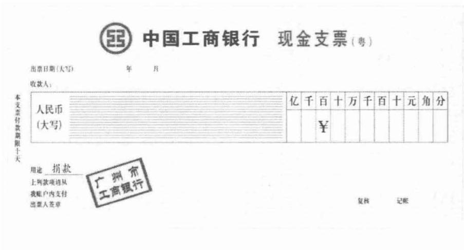
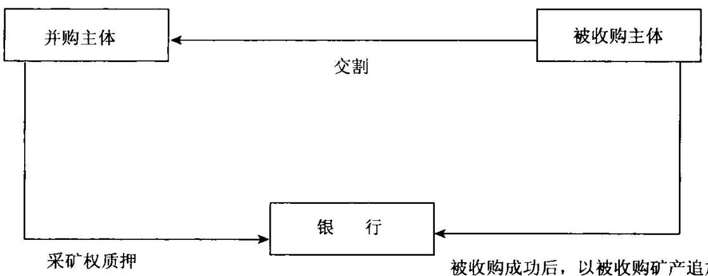

银行新员工培训手册立金银行培训中心教材编写组著银行培训●讲解银行员工需要技能 畅销书●塑造优秀银行员工品牌●提升产品销售营销能力●分析最新各项银行产品

行长送员工最好的礼物本书适合商业银行各条线的员工学习产品使用

# 本书提供教练式培训，提供最真实的实务操作辅导

# 客户经理成才要诀

拉存款放贷款 争第一 要自强 学产品 靠实践找客户 要出门少喝酒 多业务 靠专业 赢尊重品行好 业务精 树品牌 立口碑勤跑腿 感情近 勤学习 成专家 多产品 捆绑销 增收益 稳合作学产品 先票据 后贷款 再贸融 做客户 找关联 一生二 二生四积跬步 至千里 积小流 成江海 谈合作 谋共赢 又做人 又做事用产品 聚人脉广织网 谋大局 遇挫折 更坚强 肯坚持 功业成

# 商业银行生存的根基就是经营信贷，包括四项核心工具：贷、票、证、函

“贷”属于表外工具， “票、证、函”属于表内工具。表内工具做利润，表外工具做存款，请牢牢记住。

进入商业银行，第一时间要学习各项银行产品，成为业务专家。熟练掌握各项最新的银行产品，加上优质的服务态度，客户就会为银行提供源源不断的财富。

本书为银行新员工的工作字典，随时用于工作中的查阅帮助您在最短时间内成为一名优秀的商业银行员工

定价：42.00元

# 银行新员工培训手册

立金银行培训中心教材编写组 $\textcircled{9}$ 著讲解银行员工需要牧能塑造优秀银行贸工品牌提升产品销售营销能力●分析最新各项银行产品

# 图书在版编目（CIP）数据

银行新员工培训手册 $\textcircled{2}$ 立金银行培训中心教材编写组著.  
北京：中国经济出版社，2013.2  
ISBN 978 -7 -5136 -1782 -6  
I. $\textcircled{1}$ 银…Ⅱ. $\textcircled{1}$ 立…ⅢI. $\textcircled{1}$ 银行业务一技术培训—手册 IV. $\textcircled{1}$ F830.4 - 62中国版本图书馆CIP数据核字（2012）第190351号  
·责任编辑 乔卫兵张梦初 方雷  
责任审读霍宏涛  
责任印制 石星岳  
封面设计 华子图文设计公司  
出版发行 中国经济出版社  
印刷者 北京市昌平区新兴胶印厂  
经销者 各地新华书店  
开 本 $7 1 0 \mathrm { m m } \times 1 0 0 0 \mathrm { m m }$ 1/16  
印 张 24.25  
字 数 300千字  
版 次 2013年2月第1版  
印 次 2013年2月第1次  
书 号 ISBN 978-7 -5136-1782-6/G· 1813  
定 价42.00元

中国经济出版社 网址www.economyph.com 社址北京市西城区百万庄北街3号邮编100037本版图书如存在印装质量问题，请与本社发行中心联系调换(联系电话：010-68319116)

代序

# 做一个熊熊燃烧的银行人

“做一个熊熊燃烧的银行人。”“知识改变命运、实力创造价值、激情成就未来。”

大学刚毕业的时候,人和人区别不大，大学毕业10年后，就会有天壤之别。人不用总是埋怨命运，其实，我们每个人的起点都是一样的,后天的努力造成了彼此的不同。

在商业银行更是如此,成功是结果、成长是过程,过程的完美才会有圆满的成功！怎样成为优秀的银行客户经理,必须成为“可燃”的人。

# 一、激情成就未来

做商业银行，成天与大客户打交道，要做一个让客户喜欢的人。我们每天接触的都是财务经理、总经理这样的人物，都是成功的人。这些客户都喜欢什么样的人？肯定是阳光、激情、充满活力的银行人。

要做一个“可燃”的人,要感染我们的客户,要充满激情、浑身都是干劲、工作满怀信心、为人精神矍铄、意气风发，这样才能成为“阳光”的人。

# 二、实力创造价值

在银行这个行业,必须懂行会做,否则只有激情也是空谈。为

此，每个年轻人必须趁年轻多学多做、勤奋务实、自我加压，利用银行平台得到锻炼，逐渐成长。

要努力学习业务，学习银行产品，提高自己的工作能力，提高自身的实力，在这个世界上，实力创造价值。

# 三、知识改变命运

喝大酒、拉关系做存款的时代已经过去。未来的优秀银行人一定是懂业务、懂产品的优秀技术型人才。知识改变命运，请牢牢记住。我本人就是最典型的案例，既没有任何的人脉资源，也不会喝酒，但是懂产品、懂业务，再加上个人的勤奋，结果就轻轻松松搞定了存款。

在这个世界上，客户都希望银行能够帮助他解决问题，帮助他做生意赚钱，而非总是人情维护。

进入银行，只是你进入了正确的行业，未来的发展全靠自己。在这个世界上，你要拥有一个梦想，并为之肩负起崇高的责任，为之付出不懈的努力，就一定能够实现梦想，这样你的“可燃”必然会照亮成功的殿堂！要想获得工作业绩的快速增长，你就必须拥有献身的热情，以此来发展自己的才华。

年轻的银行客户经理们：让自己的激情燃烧起来吧！让我们做“可燃”的人，点燃心中熊熊的烈火，走向银行职场的辉煌！

# 目 录

代序做一个熊熊燃烧的银行人

# 第一篇商业银行公司业务产品

一、流动资金贷款  
二、固定资产贷款  
三、人民币额度贷款 12  
四、备用信用证担保人民币贷款· 14  
五、法人汽车消费贷款. 17  
六、商业汇票贴现… 19  
七、买方信贷… 21  
八、出口信贷… 26  
九、进出口贸易融资 31  
十、外汇汇款·… 33  
十一、境外筹资转贷款 35  
十二、项目融资 38  
十三、银团贷款… 48  
十四、飞机融资… 54  
十五、房地产开发类贷款… 57  
十六、单位购房贷款 65  
十七、银行承兑汇票 71  
十八、商业承兑汇票· 76  
十九、备用信用证. 81  
二十、对外借款担保· 85  
二十一、保证… 86  
二十二、信贷证明… 94  
二十三、出口信用证 98  
二十四、进口信用证 103

# 第二篇公司存款及现金管理类产品 107

一、单位活期存款 109  
二、单位定期存款 110  
三、单位通知存款 113  
四、单位协定存款 116  
五、单位外汇存款 125  
六、现金管理 127  
七、银行汇票 136  
八、现金支票 144  
九、转账支票 146  
十、银行本票 148  
十一、汇兑… 150  
十二、存款证明 152  
十三、单位准贷记卡 153  
十四、专用卡 155  
十五、智能卡 157  
十六、代理彩票资金结算 162  
十七、代理期货结算 · 164  
十八、委托收款 166  
十九、托收承付 172  
二十、代收费… 175  
二十一、代发工资 177  
二十二、代理分销 179  
二十三、出口托收 180  
二十四、进口代收 183  
二十五、财务顾问 184  
二十六、结售汇· 189  
二十七、债券承销 ： 191  
二十八、代客债券买卖 192  
二十九、代客外汇债券买卖 194  
三十、委托资产托管 195  
三十一、产业投资基金托管 198  
三十二、封闭式证券投资基金托管 201  
三十三、开放式证券投资基金托管 203  
三十四、代理工程造价概预结算编制审核 205  
三十五、代理编制工程标底 206  
三十六、代理工程标底审核 207  
三十七、工程造价鉴定 207  
三十八、建设工程招标代理 210  
三十九、工程建设监理 211  
四十、贷款抵押物评估 212  
四十一、房地产价格评估 217  
四十二、社会委托资产评估 218

# 第三篇零售业务产品. 221

一、个人住房贷款 223  
二、个人再交易住房贷款 228  
三、个人商业用房贷款 230  
四、个人住房组合贷款 231  
五、个人住房转让贷款 232  
六、住房基金个人贷款 234  
七、个人汽车消费贷款 236  
八、个人住房装修贷款 238  
九、个人耐用消费品贷款 240  
十、个人消费额度贷款· 242  
十一、个人存单和凭证式国债质押贷款 244  
十二、一般商业性助学贷款 246  
十三、国家助学贷款 248  
十四、活期储蓄存款 250  
十五、定期储蓄存款 251  
十六、定活两便储蓄存款 254  
十七、外币储蓄存款 255  
十八、通知储蓄存款 257  
十九、个人存款证明 258  
二十、个人理财 260  
二十一、个人准贷记卡 262  
二十二、联名卡… 265  
二十三、客户证券保证金服务 268  
二十四、证券业务系统服务 270  
二十五、个人电子汇款 … 287  
二十六、凭证式国债： 290  
二十七、个人债券买卖 : 292

# 第四篇政府服务和政策性业务产品 29

一、住房基金个人贷款 297  
二、公积金个人住房委托贷款 299  
三、住房基金单位贷款 301  
四、委托贷款. 304  
五、单位住房基金委托贷款 306  
六、住房基金个人账户 307  
七、住房基金专门账户 309  
八、代收税款. 312  
九、代理政府客户资金拨付及管理 315  
十、代理归集政府客户资金… 316

# 第五篇金融同业产品 31

一、债券回购 321  
二、同业拆放 323  
三、股票质押贷款 326  
四、外资金融机构人民币借款 333  
五、外资金融机构票据转贴现 334  
六、同业存款… 335  
七、外资金融机构存款 337  
八、代理外资银行签发银行汇票 338  
九、代理政策性银行贷款资金结算 340  
十、黄金交易资金清算…. 341

# New employee

# 银行新员工培训手册 $\textcircled{2}$

十一、代理外资金融机构外汇清算 342  
十二、代理黄金进出口业务 344  
十三、代理非会员金融机构黄金交易业务 345  
十四、代销商业保险… 346  
十五、代收保费… 348  
十六、代理信托计划· 349  
十七、代理签发银行承兑汇票 353  
立金银行培训中心名言 376

# 篇商业银行公司业务产品

商业银行公司业务产品是每个客户经理都必须学会的产品，公司业务是各家银行生存的根基，零售业务在整体银行的规模中所占比例很小，未构成主流的业务品种。

对商业银行的经营产生影响的公司业务品种分为资产业务、负债业务，没有负债业务，就没有资产业务，没有资产业务，就没有利润。负债业务是生存的根基，而资产业务是发展的推动力。

# 一、流动资金贷款

# 【产品介绍】

银行向借款人发放的用于经营周转的流动资金贷款业务。

经国家工商行政管理机关核准登记企事业法人、个体工商户、其他经济组织,在正常生产经营的过程中因耗用或销售而储存各类存货、季节性物资储备等维持生产经营周转需要而发生资金紧缺的情况时，可向银行申请流动资金贷款。

借款人向银行申请流动资金贷款除必须符合《贷款通则》和银行贷款客户的资格条件外,还须具备以下条件：生产经营活动符合国家产业政策；外汇管理政策和银行的信贷政策;生产经营正常，财务制度健全，资金使用合理;拥有法定资本金，有不少于正常流动资金周转需要量 $30 \%$ 的营运资金。

# 【客户定位】

经营效益较好的企事业法人、个体工商户和其他经济组织。

【用途】

流动资金贷款主要用于满足借款人正常生产经营过程中为耗用或销售而储存的各类存货,季节性物资储备等生产经营周转性或临时性的资金需要。借款人不得挤占挪用流动资金贷款用于固定资产投资或其他不符合流动资金贷款用途的活动。

# 【特点】

流动资金贷款期限灵活，能够满足借款人临时性、短期和中期流动资 金的需求。

# 【细分种类】

流动资金贷款按贷款期限分：临时贷款、短期贷款和中期贷款等。

临时贷款：是指期限在3个月（含3个月）以内的流动资金贷款，主要用于企业一次性进货的临时需要和弥补其他季节性的支付资金不足；

短期贷款：是指期限为3个月至1年(不含3个月含1年)的流动资金贷款，主要用于企业正常生产经营周转的资金需求；

中期贷款：是指期限为1年至3年(不含1年含3年)的流动资金贷款，主要用于企业正常生产经营中经常性的周转占用和铺底流动资金贷款。

流动资金贷款根据其不同用途，还包括证券公司其他类贷款，主要包括不动产抵押贷款、存单质押贷款、担保贷款和信用贷款等，用于解决证券公司固定资产购置、营业部装修等公司发展需要。

# 【币种和期限】

流动资金贷款分为人民币和外币两种。其贷款期限主要根据借款人的生产经营周期、还款能力和贷款人的资金实力，由借贷双方协商确定，一般不超过1年,特殊情况最长期限不超过3年(含3年）。

# 【价格】

人民币流动资金贷款价格按照人民银行有关贷款利率管理规定执行。外币流动资金贷款有两种利率可供选择：一种是固定年利率，逢利率调整不予变动；二是浮动利率(可按1个月、3个月、6个月或9个月浮动）。

短期流动资金贷款按借款合同签订日相应档次的法定贷款利率计息，借款合同期内遇利率调整不分段计息。

中期流动资金贷款利率实行一年一定。根据借款合同确定的期限，按借款合同生效日相应档次的法定贷款利率计息，每满一年后，再按当时相应档次的法定贷款利率确定下一年度的利率。

# 【客户流程】

(1)申请。客户向银行提出流动资金贷款申请，应提供的相关资料主要有：营业执照;法人代码证书；法定代表人身份证明；贷款证卡；经财政部门或会计(审计)师事务所核准的前三个年度及上个月财务报表和审计报告(成立不足3年的企业，提交自成立以来的年度和近期报表）；税务部门年检合格的税务登记证明；公司合同或章程；企业董事会（股东会)成员和主要负责人、财务负责人名单和签字样本等；信贷业务由授权委托人办理的，需提供企业法定代表人授权委托书（原件);若客户为有限责任公司、股份有限公司、合资合作公司或承包经营企业，要求提供董事会(股东会)或发包人同意申请信贷业务决议、文件或具有同等法律效力的文件或证明;担保人相关材料;银行要求提供的其他资料。

(2)签订合同。如银行进行调查和审批后认为可行，则客户将与银行签订借款合同和担保合同等法律性文件。如银行认为不可行，则将客户申请材料退还。

(3)落实担保。客户签订借款合同后，需进一步落实第三方保证、抵押、质押等担保。并办理有关担保登记、公证或抵押物保险、质物交存银行等手续。

(4)贷款获取。客户办妥发放贷款前的有关手续，借款合同即生效， 银行即可向借款人发放贷款，借款客户可按照合同规定用途支用贷款。

(5)还款。按用款实际期限，贷款即将到期时，借款客户应该筹集资金以按时归还银行借款。

# 【借款人应具备的基本条件】

(1)恪守信用，有按期还本付息的能力，原应付贷款利息和到期贷款  
已清偿。(2)除自然人外,应当经工商行政管理机关(主管机关)办理年检  
手续。(3)已经开立基本账户或一般存款账户。（4)除国务院规定外,有限责任公司和股份有限公司对外股本权益

性投资累计额不超过净资产的 $50 \%$ (5)资产负债率符合贷款人的要求。

# 【申请所需材料】

书面的贷款申请及董事会同意申请贷款的决议；《公司章程》《营业执照》和法人代表证明；企业财务报表；贷款用途证明资料（如购销合同）；有关担保和抵、质押物资料；《贷款卡》以及银行认为需要提供的其他资料。

# 【业务流程】

(1)提出借款申请。企业向银行提出流动资金贷款申请，并提供企业和办理流程担保主体(若有必要)的相关材料。

(2)签署借款合同和相关担保合同。企业的贷款申请经银行审批通过后，银行与企业需要签订所有相关法律性文件。

（3）按照约定条件落实担保、完善担保手续。根据银行的审批条件和签署的担保合同，如果需要企业提供担保的，则需进一步落实第三方保证、抵押、质押等具体的担保措施，并办妥抵押登记、质押交付（或登记）等有关担保手续，若需办理公证的还需履行公证手续等。

(4)发放贷款。在全部手续办妥后，银行将及时向企业办理贷款发放，企业可以按照事先约定的贷款用途合理支配贷款资金。

【点评】

流动资金贷款是客户经理最应当学习的银行产品，非常适合营销拓展。流动资金贷款受到银行存贷比控制。商业银行赚取利润最主要的来源就是流动资金贷款业务。做流动资金贷款业务最重要的就是找到合格的借款人，并不是有了担保和抵押，银行就一定要发放贷款，而是找到合格的借款人才可以发放贷款。

# 二、固定资产贷款

# 【产品介绍】

经国家工商行政管理机关核准登记的企事业法人,需新建厂房、购买生产设备等进行固定资产投人时，如资金短缺可向银行申请固定资产贷款。

企业固定资产投资活动包括：基本建设、技术改造、开发并生产新产品等活动及相关的房屋购置、工程建设、技术设备购买与安装等。

# 【产品分类】

固定资产贷款按项目性质、企业性质和产品开发生产不同阶段划分，主要有下列几种贷款。

# 1．基本建设贷款

基本建设贷款主要指为经济、科技发展而平地起家的新项目，或为扩大生产能力而在新的地点、依靠新建厂房，增加设备和人员的投资项目，即外延扩大再生产的基本建设项目，对这类项目发放的贷款叫基本建设贷款。基本建设贷款必须严格按照国家基本建设贷款年度计划掌握发放。固定资产高位反弹。

# 2.技术改造贷款

技术改造贷款主要指用于支持现有企事业法人以内涵扩大再生产为主的固定资产投资项目发放的贷款。

# 3.科技开发贷款

科技开发贷款指对科技、教育、医药卫生、农业和工业企业在新产品开发、试制的过程中，为进人中小批量生产需增添的固定资产，在自筹资金不足时而发放的贷款。

# 4．商业网点设施贷款

商业网点设施贷款指对商业、餐饮业、旅游业及工业石油、烟草行业

等扩大网点，改善服务设施、装修等的资金需要而发放的贷款。

# 【发放的对象】

借款人申请银行固定资产贷款，除必须符合《贷款通则》和银行贷款客户的资格条件外，其申请贷款的项目还须具备以下条件：符合国家产业政策和银行信贷政策；具有有权部门批准的项目建议书、可行性研究报告、初步设计、开工报告；资本金比例不得低于 $20 \%$ ；配套资金来源明确并有保证；采用的工艺技术、设备，先进、适用；配套措施落实，所需原材料、燃料、动力有可靠来源，三废治理、环保措施能够落实，项目竣工验收后能正常生产；产品适销对路，在国内外市场上具有竞争能力，经济效益良好，还本付息有可靠的资金来源；新建项目必须实行项目法人责任制等。

【用途】

主要用于固定资产项目的建设、购置、改造及其相应配套设施的建设。

【特点】

固定资产贷款期限长，贷款金额大，能够满足借款人对固定资产项目的固定资产投资和流动资金投资需求。

固定资产贷款与一般短期贷款相比，有如下特点：

(1)贷款期限长。固定资产再生产活动，较一般产品的生产活动，具有体形庞大、生产周期长的特点。因而，固定资产贷款的贷款期限也比一般短期贷款长。

(2)双重计划性。固定资产贷款项目不仅必须是纳人国家固定资产投资计划，并具备建设条件的项目，而且必须受信贷计划确定的固定资产贷款规模的约束。

(3)管理连续性。一般流动资金贷款的监督管理，只限于生产或流通的过程，而固定资产贷款不仅建设过程要管理，而且项目竣工投产后仍

需要管理,直到还清全部本息为止。

# 【关联产品】

项目融资相关产品：如银团贷款、财务顾问和招投标顾问等。

# 【细分种类】

固定资产贷款包括基本建设贷款和技术改造贷款。基本建设贷款是指用于有权机关批准的基本建设项目的中长期贷款,包括重点、大中型和小型项目贷款;技术改造贷款是指用于有权机关批准的技术改造项目的中长期贷款，包括限上和限下技改项目贷款。

# 【币种和期限】

固定资产贷款币种有人民币和外币两种。

【价格】

固定资产贷款对于基本建设贷款：小型项目一般不超过3年,大中型项目一般不超过8年,实际贷款期限根据项目评估结果确定。对于技术改造贷款：限上项目一般为5年,最长不超过6年,限下项目一般为3年，最长不超过5年,实际贷款期限根据项目评估结果确定。

价格按照人民银行有关中长期贷款利率管理的有关规定执行。

固定资产贷款利率执行人民银行发布的中长期贷款利率。利率按借款合同实行一年一定,即从借款合同生效日算起，一次到账或按用款计划分次到账的，均按借款合同生效日确定的利率执行，遇利率调整不变，满1年后根据当时的利率进行调整，执行新的利率。

# 【客户流程】

(1)申请。客户向银行提出借款申请,应提供的相关资料主要有：营业执照;法人代码证书;法定代表人身份证明;贷款证卡;经财政部门或会计(审计)师事务所核准的前三个年度及上个月财务报表和审计报告（成

# New employee银行新员工培训手册 $\textcircled{2}$

立不足3年的企业，提交自成立以来的年度和近期报表)；税务部门年检合格的税务登记证明；公司合同或章程；企业董事会（股东会）成员和主要负责人、财务负责人名单和签字样本等；信贷业务由授权委托人办理的，需提供企业法定代表人授权委托书（原件)；若客户为有限责任公司、股份有限公司、合资合作公司或承包经营企业，要求提供董事会（股东会)或发包人同意申请信贷业务决议、文件或具有同等法律效力的文件或证明。担保人相关材料;客户在申请出具《贷款意向书》前，还应提供：报批的项目建议书和项目提出的有关背景材料。客户在申请出具《贷款承诺书》和申请借款前，应提供：项目建议书及批准文件（原件）；报批的可行性研究报告或已批复的可行性研究报告及批准文件（原件)；项目概算资料（原件或影印件）；前期准备工作完成情况报告；自筹资金和其他建设资金、生产资金筹措方案及其落实资金来源的证明材料（原件）。银行要求提供的其他资料。

(2)签订合同。如银行进行调查和审批后认为可行，则客户将与银行签订借款合同和担保合同等法律性文件。如银行认为不可行，则将企业申请材料退还。

(3)落实担保。客户与银行签订借款合同后，需落实第三方保证、抵押、质押等担保，办理有关担保登记、公证或抵押物保险、质物交存银行等手续。

(4)贷款获取。客户办妥银行发放贷款前的有关手续，借款合同即 生效，银行可向借款人发放贷款，借款人可按合同规定用途支用贷款。

(5)还款。按用款实际期限,贷款即将到期时，借款客户应筹集资金以按时归还银行借款。

# 【受托支付】

(1)贷款人应通过贷款人受托支付或借款人自主支付的方式对贷款资金的支付进行管理与控制。贷款人受托支付是指贷款人根据借款人的提款申请和支付委托，将贷款资金支付给符合合同约定用途的借款人交易对手。借款人自主支付是指贷款人根据借款人的提款申请将贷款资金发放至借款人账户后，由借款人自主支付给符合合同约定用途的借款人交易对手。

(2)单笔金额超过项目总投资 $5 \%$ 或超过500万元人民币的贷款资金支付，应采用贷款人受托支付的方式。采用贷款人受托支付的，贷款人应在贷款资金发放前审核借款人相关交易资料是否符合合同约定条件。贷款人审核同意后，将贷款资金通过借款人账户支付给借款人交易对手，并应做好有关细节的认定记录。

(3)采用借款人自主支付的，贷款人应要求借款人定期汇总报告贷款资金支付情况,并通过账户分析、凭证查验、现场调查等方式核查贷款支付是否符合约定用途。

# 【风险控制】

在贷款发放和支付的过程中，借款人出现以下情形的，贷款人应与借款人协商补充贷款发放和支付条件，或根据合同约定停止贷款资金的发放和支付：

（1)信用状况下降。  
(2)不按合同约定支付贷款资金。  
(3)项目进度落后于资金使用进度。  
(4)违反合同约定，以化整为零的方式规避贷款人受托支付。

固定资产贷款发放和支付过程中，贷款人应确认与拟发放贷款同比例的项目资本金足额到位，并与贷款配套使用。

# 三、人民币额度贷款

# 【产品定义】

客户与银行签订人民币额度贷款合同并确定一借款额度后，可以在该借款合同有效期间内循环使用该借款额度下的贷款金额而无须分次签订借款合同，且贷款期限不受额度有效期的限制，可根据需要与银行协商确定。

# 【适用对象】

人民币额度贷款的服务对象是企（事）业法人。申请人除必须符合《贷款通则》和银行贷款客户的资格条件外，同时还须具备以下条件：生产经营活动符合国家产业政策、外汇管理政策和银行的信贷政策；生产经营正常，财务制度健全，资金使用合理；拥有法定资本金，有不少于正常流动资金周转需要量 $30 \%$ 的营运资金。

# 【用途】

主要适用于借款额度大、频率高的优良客户，同时要约定每次用款的最小金额和最短、最长期限。

# 【特点】

人民币额度贷款在客户用款上有很大的灵活性。一方面在借款额度有效期内，借款人可以对借款额度循环使用，即只要借款人所申请的借款金额与借款人未偿还的借款本金余额之和不超过借款额度，借款人就可以根据需要连续向银行申请借款；另一方面，在额度有效期内发生的单笔借款，其履行期限届满日不受额度有效期间是否届满的限制，且不必每次都与银行签订新的借款合同，简化了贷款程序，保证了用款效率及灵活性。

人民币额度借款可以最大限度降低企业的融资成本，避免了企业信

贷资金与实际经营用款节奏脱节。

# 【关联产品】

流动资金贷款。

# 【币种和期限】

人民币额度贷款的币种为人民币。贷款期限主要根据借款人的生产经营周期、还款能力和贷款人的资金实力，由借贷双方协商确定，一般不超过1年,特殊情况下最长期限不超过3年（含3年）。

# 【价格】

人民币额度贷款价格按照人民银行有关贷款利率管理规定执行，中期贷款执行同期同档次固定资产贷款标准，除利息外不得收取其他任何费用。

额度借款中，每笔借款均视同独立的一笔流动资金贷款，其期限和利率比照流动资金贷款确定，其诉讼时效是按每笔借款单独计算的，诉讼时效的起算点与借款额度有效期间没有必然的联系。

# 【客户流程】

(1)申请。客户向银行提出人民币额度借款申请,按照要求提供相关资料,包括：营业执照;法人代码证书;法定代表人身份证明;贷款证卡；经财政部门或会计(审计)师事务所核准的前三个年度及上个月财务报表和审计报告(成立不足3年的企业，提交自成立以来的年度和近期报表）;税务部门年检合格的税务登记证明；公司合同或章程;企业董事会（股东会)成员和主要负责人、财务负责人名单和签字样本等。信贷业务由授权委托人办理的，需提供企业法定代表人授权委托书（原件)；若客户为有限责任公司、股份有限公司、合资合作公司或承包经营企业，要求提供董事会(股东会)或发包人同意申请信贷业务决议、文件或具有同等法律效力的文件或证明;并提供担保人相关材料以及银行要求提供的其

# New employee银行新员工培训手册 $\textcircled{2}$

他资料。

(2)签订合同。如银行进行调查和审批后认为可行，则客户将与银行签订《人民币额度借款合同》和担保合同等法律性文件。如银行认为不可行，则将客户的申请材料退还。

(3)落实担保。合同签订完毕后，客户需落实第三方保证、抵押、质押等担保，并办理有关担保登记、公证或抵押物保险、质物交存银行等手续。

（4）贷款获取。客户办妥发放贷款前的有关手续，合同即生效，借款客户可随时支用额度借款，但须提前向银行提交《人民币额度借款支用申请书》。银行审核后同意发放贷款的，向客户送达《人民币额度借款提款通知书》,客户凭该通知书办理提款手续，无需再签订单独的借款合同。

（5)还款。按用款实际期限，贷款即将到期时，借款客户应筹集资金以按时归还银行借款。

【点评】

额度给了企业最大的灵活使用的方便，很多企业需要银行的贷款。但是银行的贷款与企业的用款经营时机不对接，企业希望银行首先将贷款批下来，然后由企业根据进度分次、分期进行提款，在企业销售周转回来后，再提前还款，以最大限度地降低成本。

# 四、备用信用证担保人民币贷款

# 【产品定义】

备用信用证担保贷款是指在境外金融机构开立备用信用证提供保证项下，银行向境内外商投资企业发放的人民币贷款。

# 【适用范围】

外商投资企业(三资企业）。

# 【基本规定】

备用信用证是一种特殊形式的信用证，是开证银行对受益人承担一项义务的凭证。开证行保证在开证申请人未能履行其应履行的义务时，受益人只要凭备用信用证的规定向开证行开具汇票，并随附开证申请人未履行义务的声明或证明文件，即可得到开证行的偿付。备用信用证只适用《跟单信用证统一惯例》（500号）的部分条款，现在为UCP600部分条款。在借款人可能无法偿债时，贷款人凭备用信用证主张担保人向贷款人偿债；

# 【产品比较】

与一般信用证相比,备用信用证有以下几个特点。

（1）一般商业信用证仅在受益人提交有关单据证明其已履行基础交易义务时，开证行才支付信用证项下的款项；备用信用证则是在受益人提供单据证明债务人未履行基础交易的义务时，开证行才支付信用证项下的款项。

（2）一般商业信用证开证行愿意按信用证的规定向受益人开出的汇票及单据付款，因为这表明买卖双方的基础交易关系正常进行；备用信用证的开证行则不希望按信用证的规定向受益人开出的汇票及单据付款，因为这表明买卖双方的交易出现了问题。

（3）一般商业信用证,总是货物的进口方为开证申请人,以出口方为受益人；而备用信用证的开证申请人与受益人既可以是进口方也可以是出口方。

# 【产品优势】

备用信用证条款简洁、明了,所有条件均以提供单据的方式满足（即单据化），并遵循国际惯例，不易引起纠纷；因此，备用信用证应用广泛，尤其适用于国际间的业务往来；它由银行提供担保，属于信用级别最高的担保方式之一。以备用信用证(或保函)为担保发放贷款是银行与其他银行合作，向客户尤其是跨国公司客户提供服务的重要产品；通过这项产品，外资及其他银行可延伸其对客户的服务，满足其客户的融资需求，并通过它吸引新的客户。

【用途】

向在华外商投资客户提供融资服务。

# 【特点】

（1）单据化，遵循国际惯例UCP500，不易引起纠纷，尤其适用于国际间的业务往来。(2)由备用信用证(或保函)的开出行提供担保，开证银行承担第一性的付款责任，属于信用级别最高的担保方式之一。

# 【关联产品】

银行接受他行开立的备用信用证(或保函)担保，除了可为客户发放贷款外，还可为客户减免开证保证金、开立银行承兑汇票、出具反担保等。

# 【细分种类】

根据人民币贷款期限，可以分为短期（1年以内，含1年）、中期（1～3年，含3年)和长期(3\~5年，含5年)三类；根据担保方式，可以分为备用信用证担保贷款和保函担保贷款。

# 【币种和期限】

银行接受的备用信用证担保币种主要为美元、港币等可自由兑换的货币,贷款币种为人民币。贷款期限可以分为短期（1年以内，含1年）、中期(1\~3年，含3年)和长期(3～5年,含5年)，备用信用证期限一般

要比贷款期限长15天。

# 【价格】

执行人民银行规定的同档次人民币贷款利率(分行有一定的浮动权限)。

# 【客户流程】

（1)客户向银行提交贷款申请、备用信用证开证行名称、备用信用证  
样本及其他相关材料。(2)银行内部审批通过、收到他行开来的备用信用证正式文本并验  
证其真实性后，与客户签订有关贷款合同。(3)获取和使用银行发放的贷款。(4)按合同期限规定归还银行贷款。

【点评】

备用信用证在营销的时候要高度注意，客户经理要积极营销。一个重要的思路，可以积极营销外资银行，与外资银行合作，由外资银行介绍客户，由于受到存贷比的控制，外资银行本身的人民币资产规模根本不能满足大型外资企业的融资需要，就会将一部分人民币贷款分仓给中资银行，并给中资银行提供担保，因为，外资银行更了解外资企业的经营情况，并且有外资企业母公司的反担保手段，这就是备用信用证人民币贷款业务的机会。

# 五、法人汽车消费贷款

# 【产品定义】

银行法人汽车消费贷款主要是对经有权部门核准登记的企事业法人

提供信贷资金以满足其购车的资金需求。仅对购买指定品牌的国产轿车、客车、货车等汽车提供信贷支持。

# 【用途】

向法人客户在特约经销商处购买汽车提供信贷资金，促进特定品牌汽车的销售。

# 【币种和期限】

法人汽车消费贷款开办的币种仅为人民币。不同品牌车辆的最长贷款期限不同。法人汽车消费贷款期限最长不超过3年（含3年）；所购车辆用于出租营运、汽车租赁、客货运输等经营用途的，最长期限不得超过2年（含2年）。

【价格】

法人汽车消费贷款利率执行人民银行规定的同期贷款利率。贷款期限在1年以内的，按合同利率计息，遇利率调整，利率不变；贷款期限在一年以上的，遇利率调整，在每年1月1日按相应利率档次执行新的贷款利率。贷款利率可按人民银行规定上浮。

# 【客户流程】

（1）申请。客户向银行提出贷款申请，并向银行提供各种相关资料。(2)签订合同。如银行进行调查和审批后认为可行，则客户将与银  
行签订借款合同和担保合同等法律性文件。如银行认为不可行，则将企  
业申请材料退还。(3)落实担保。与银行签订借款合同后，客户需落实第三方保证、抵  
押、质押等担保，并办理有关担保登记、公证或抵押物保险、质物交存银行  
等手续。(4)贷款获取。客户办妥银行发放贷款前的有关手续，合同即生  
效，银行即可向借款人发放贷款，借款客户可按照合同规定用途支用

贷款。

（5)还款。按用款实际期限，贷款即将到期时，借款客户应注意及时筹集资金，按时归还银行借款。

# 六、商业汇票贴现

# 【产品定义】

持商业汇票的企业将商业汇票转让给银行，银行扣除融资利息，将余款支付持票企业的一种融资业务。

商业汇票贴现包括商业承兑汇票贴现和银行承兑汇票贴现。

# 【适用对象】

银行办理商业汇票贴现的对象是经国家工商行政管理机关或主管机关核准登记的企事业法人和其他经济组织。

在销售业务的过程中，收到银行承兑汇票和商业承兑汇票的客户。

# 【基本规定】

申请人应符合以下条件：申请人在贴现银行开立存款账户；与出票人或其前手之间具有真实合法的商品、劳务交易关系；申请贴现的商业汇票合法有效，未注明“不得转让”字样;汇票的承兑人需在本行有同业授信额度。

【用途】

银行办理商业汇票贴现主要用于申请客户短期的资金周转。

# 【细分种类】

按照贴现的票据不同，商业汇票贴现分为商业承兑汇票贴现和银行承兑汇票贴现。

# 【币种和期限】

银行办理的商业汇票贴现的币种仅限于人民币。贴现期限自贴现之

日起至汇票到期日止，最长不超过6个月。

# 【价格】

银行办理商业汇票贴现收取的贴现利息率，按人民银行规定，在公布的再贴现利率基础上加百分点的方式确定。汇票承兑人在异地的，贴现期限及利息的计算应另加3天的划款日期。商业汇票金额扣除贴现利息后即为实付持票人的贴现金额。

贴现利息 $\asymp$ 汇票金额 $\times$ 贴现天数 $\times$ （月贴现率/30天）

实付贴现金额 $=$ 汇票金额一贴现利息

# 【客户流程】

（1)申请。持票人持商业汇票向银行提出申请，同时提交以下材料：银行贴现业务申请书；申请贴现的未到期商业汇票；有效期内的营业执照、贷款卡(贷款证)及年检证明。贴现票据项下的商品、劳务交易合同原件及复印件，以及能够证明票据项下的交易确已履行的凭证，包括与其前手之间的增值税发票和商品发运单据等复印件，或者其他能够证明商业汇票合法持有的证明。若申请人为有限责任公司、股份有限责任公司、合资合作企业或承包企业等，如公司章程有相关规定的应提供有权机构同意申请贴现的决议和授权文件。对持有商业承兑汇票的申请人还需提供有关担保材料。

(2)背书转让。经银行调查审批同意后，客户当场背书转让汇票，并办理相关手续。

(3)使用资金。客户经背书转让后，银行扣除贴现日至汇票到期前一日的贴现利息后将相应的资金划转到客户的存款账户，客户即可使用贴现所得的款项。

【点评】

票据贴现在客户经理的营销过程中意义重大，银行承兑汇票贴现业务由于有承兑行的担保，基本属于低风险业务，一定要高度重视。

现代商业银行，已经从“贴票”转向“押票”，即银行承兑汇票不再为贴现，而是积极地用于办理质押，或者“拆票”，或者“短换长”，银行会有极为可观的存款回报。

# 七、买方信贷

# 【产品定义】

在卖方提供信用增收情况下，银行对买方发放的专项用于向卖方购买机器和设备的一种特定用途贷款。

买方信贷可细分为通信设备买方信贷、工程机械担保贷款等。银行工程机械担保贷款主要是对法人和自然人提供信贷资金以满足其购买工程机械需求,仅对购买指定品牌的挖掘机、装载机、压路机、推土机、吊车等提供信贷支持，具体品牌由工程机械生产厂家所在地分行根据市场需求及银企关系向总行推荐确认。

【用途】

用于满足购买大型设备的资金需要，同时促进大型设备生产企业的销售。

# 【币种和期限】

银行买方信贷开办的币种仅为人民币；不同品牌工程机械的最长贷款期限不同，贷款期限最长不超过3年（含3年）。

# New employee银行新员工培训手册 $\textcircled{2}$

【价格】

买方信贷贷款利率执行人民银行规定的同期贷款利率。工程机械担保贷款利率执行人民银行规定的同期贷款利率，贷款期限在1年以内的，按合同利率计息，遇利率调整，利率不变；贷款期限在1年以上的，遇利率调整，在每年1月1日按相应利率档次执行新的贷款利率。贷款利率可按人民银行规定上浮。

# 【客户流程】

（1)客户协商。买方客户与卖方客户签订购销框架协议并商妥申请银行买方信贷额度。(2)提出申请。卖方客户向银行主办行(卖方客户所在地银行)提交买方信贷需求，买方客户向银行协办行(买方客户所在地银行)提出买方信贷申请。（3)签订协议。卖方客户与银行主办行签订“买方信贷合作协议”，买方、卖方客户及时与经办行(买方客户的开户行)签订三方“买方信贷融资意向性协议”。(4)落实担保。银行审批同意以后，经办行与买方客户签订有关的贷款合同并落实相关担保。(5)放款。经办行根据买方客户的付款指令，将货款资金汇至卖方客户在主办行开立的账户。

【案例】

# 福建海源自动化机械股份有限公司的担保公告

福建海源自动化机械股份有限公司关于2012年度至2013年上半年公司为采用买方信贷结算方式的客户提供担保的公告

本公司及董事会全体成员保证信息披露内容的真实、准确和完整，没有虚假记载、误导性陈述或重大遗漏。

# 一、担保情况概述

公司拟于2012年度至2013年上半年继续与银行（包括但不仅限于福建海峡银行股份有限公司和中国光大银行股份有限公司福州分行）开展买方信贷业务，对部分客户采用设备按揭贷款方式销售产品，公司为客户设备按揭贷款提供连带责任保证担保，并根据客户贷款余额承担保证金质押担保责任。

公司为客户提供的买方信贷保证金担保将实行总余额控制，即自2012年1月1日至2013年6月30日止的任何时点，公司为客户提供的买方信贷业务保证金担保总余额将不超过人民币8000万元整。在上述期间内，在银行审批的买方信贷授信额度下且公司为客户办理买方信贷业务提供的保证金担保总余额不超过人民币8000万元整的情况下，公司可连续、循环地为客户提供买方信贷保证金担保。

2012年4月24日公司第二届董事会第十二次会议审议通过了《关于2012年度至2013年上半年公司为采用买方信贷结算方式的客户提供担保的议案》。公司监事会、独立董事均就该事项发表了明确的同意意见，保荐机构出具了无异议的保荐核查意见。按照《公司章程》的规定，本次为采用买方信贷结算方式的客户提供担保的事项需提请公司股东大会进行审议。

# 二、担保人及被担保人基本情况

(1)担保人主要情况。

公司名称：福建海源自动化机械股份有限公司

注册资本：人民币16000万元

主营业务:建材机械、建材生产、资源再生及综合利用技术、高新技术、新产品开发、比例、伺服液压技术、全自动液压压砖机（涉及审批许可项目的，只允许在审批许可的范围和有效期内从事生产经营)

(2)买方信贷被担保人情况以具体业务实际发生时为准。

# New employee银行新员工培训手册 $\textcircled{2}$

# 三、担保事项具体情况

在银行审批给公司的买方信贷授信额度下，公司客户向银行申请办理设备按揭贷款，并将该款作为向公司购买设备的货款，公司为该客户的上述贷款提供连带责任保证担保，并根据客户贷款余额承担保证金质押担保责任，保证金随客户按期还款而减少。公司担保期限为客户借款期限。

买方信贷担保事项的具体情况以具体业务实际发生时为准。

四、担保收益和风险的评估

买方信贷担保业务的开展有助于公司开拓市场，提高目标客户的合同履约能力，提高货款的回收效率，但同时也存在设备回购的风险，因此公司在提供买方信贷业务担保时要求客户将设备抵押给公司作为反担保。

公司承诺将严格按照《公司章程》和公司《对外担保管理制度》的相关规定为客户提供买方信贷业务担保。

# 五、董事会意见

2012年4月24日公司第二届董事会第十二次会议审议通过了《关于2012年度至2013年上半年公司为采用买方信贷结算方式的客户提供担保的议案》，同时提请股东大会审议并授权董事长全权负责代表本公司洽谈、签署与买方信贷业务提供担保相关的一切法律文件，并负责办理相关事宜，由此所产生的经济、法律责任应按相关担保合同的约定由本公司承担。

六、公司独立董事、监事会、保荐机构意见

(一)独立董事就上述为采用买方信贷结算方式的客户提供担保事宜发表了如下独立意见：

公司因买方信贷业务而形成的对外担保事项已经按照相关法律法规、规范性文件和公司的相关制度履行了相应的决策程序，该等对外担保符合公司正常经营的需要，符合全体股东的利益。我们同意2012年度至

# 2013年上半年公司为采用买方信贷结算方式的客户提供对外担保。

(二)公司监事会就上述为采用买方信贷结算方式的客户提供担保事宜发表了如下意见：

该项担保业务的开展，将为公司优质客户提供资金，以提高目标客户的合同履约能力，将有效地促进和巩固公司与客户之间的合作伙伴关系，符合公司的长远发展利益。上述担保没有违反中国证监会、深圳证券交易所有关上市公司对外担保的相关规定。我们同意2012年度至2013年上半年公司为采用买方信贷结算方式的客户提供担保。

(三)保荐机构就上述为采用买方信贷结算方式的客户提供担保事宜发表了如下意见：

海源机械为采用买方信贷结算方式的客户提供担保事项经海源机械第二届董事会第十二次会议和第二届监事会第八次会议审议通过，经第二届董事会战略委员会第五次会议审议通过，公司独立董事发表了明确的同意意见,并提请2011年度股东大会审议，决策程序符合《公司法》《深圳证券交易所股票上市规则》《公司章程》的有关规定。本保荐机构对海源机械为采用买方信贷结算方式的客户提供担保事项无异议。

七、截至本公告披露日累计对外担保和逾期担保数量

截至2012年4月25日，公司及控股子公司累计对外担保额度和实际担保的金额分别为人民币10000万元和1738.19万元，分别占最近一期经审计净资产的 $9 . 8 5 \%$ 和 $1 . 7 1 \%$ ；逾期担保金额142.50万元，占最近一期经审计净资产的 $0 . 1 4 \%$ 。公司对控股子公司累计担保的额度和实际担保的金额为0万元。

# 八、备查文件

(1)公司第二届董事会第十二次会议决议。

(2)公司第二届监事会第八次会议决议。

(3)公司独立董事关于第二届董事会第十二次会议相关议案的独立

# 银行新员工培训手册 $\textcircled{2}$

意见。

（4）兴业证券股份有限公司《关于福建海源自动化机械股份有限公司为采用买方信贷结算方式客户提供担保的保荐意见》。

特此公告。

福建海源自动化机械股份有限公司董事会二〇一二年四月二十六日

【点评】

买方信贷对于卖方而言，就是银行在帮助卖方企业在销售产品。所以，银行应当积极联系企业的销售部门，从为企业扩大销售的角度来营销企业接受银行的方案。

卖方信贷实质就是将卖方当做核心企业，银行为卖方核定担保额度，银行为买方办理定向用于向卖方采购的贷款，由卖方对银行给买方的贷款提供担保。

# 八、出口信贷

# 【产品定义】

银行为促进本国大量机器设备出口为发放的，推动出口的专项融资。  
出口信贷的主要方式为出口买方信贷和出口卖方信贷。

# 【适用对象】

出口买方信贷的借款人一般是银行认可的进口方银行或其他单位（如进口国的财政部等）。出口卖方信贷的借款人一般是具有法人资格、经国家批准有权经营机电产品出口的出口商和生产企业。出口信贷是国家为支持本国产品出口，采取提供保险、补贴利息等方式,鼓励本国金融机构对本国出口商、外国进口商或进口国的银行提供的优惠贷款，主要用于国外进口商购买本国的船舶、飞机、电站、汽车等成套设备以及其他机电产品。

申请出口买方信贷需符合以下条件：

贸易合同的金额不低于100万美元;出口商品在中国制造的部分，在成套设备和普通机电产品合同中一般应占 $70 \%$ 以上，在船舶贸易合同中一般应占 $50 \%$ 以上;进口商以现汇即期支付的比例,船舶在交船前不低于贸易合同金额的 $20 \%$ ，成套设备和其他机电产品一般不低于贸易合同金额的 $15 \%$ ；贸易合同必须符合贸易双方国家和政府的有关法律规定，获得双方政府或政府主管部门的批准，取得进口国外汇管理部门同意汇出全部贷款本息及费用的文件;贸易合同须按中国保险集团的有关规定办理出口信用保险。

申请出口卖方信贷需符合以下条件：

客户经营管理及财务状况良好，有独立的资产处置权,有履行出口合同的能力,并在银行开立账户；出口项目经济效益好,必须确有偿还外汇贷款的外汇来源及防范汇率风险的措施，换汇成本合理，各项配套条件落实；客户必须提供经银行认可的还款担保；贸易合同的金额原则上在50万美元以上;出口商品在中国制造的部分,在成套设备和普通机电产品合同中一般应占 $70 \%$ 以上,在船舶贸易合同中一般应占 $50 \%$ 以上;进口商以现汇即期支付的比例，船舶在交船前不低于贸易合同金额的 $20 \%$ ，成套设备和其他机电产品一般不低于贸易合同金额的 $15 \%$ ；贸易合同必须符合贸易双方国家和政府的有关法律规定，获得双方政府或政府主管部门的批准;须获得中保集团提供的出口信用保险。客户用其财产进行抵押。

【用途】

出口信贷主要用于促进本国的船舶、飞机、电站、汽车等成套设备以及其他机电产品的出口。

# 【特点】

对于出口信贷，国家将提供保险、补贴利息等优惠条件。

# 【细分种类】

出口信贷的主要方式为出口买方信贷和出口卖方信贷。

出口买方信贷是指在大型机器设备或成套设备贸易中，银行向国外进口商或国外进口商银行提供的用于购买上述设备的信贷支持。

出口卖方信贷是指在大型机器设备与成套设备交易中，为便于出口商以延期收款的方式出售设备，银行向出口商提供的信贷支持。

# 【币种和期限】

银行出口信贷业务开办的币种包括人民币贷款和外币贷款。出口信贷的期限包括建设期在内最长一般不超过10年(包括宽限期）。

# 【价格】

（1)利率：人民币贷款利率根据总行的有关规定确定；外汇贷款利率参照经济合作与发展组织（OECD）的利率水平由借贷双方根据国际资本的市场情况商定，一般为浮动利率 $\mathrm { L I B O R } +$ 价差。

(2）费率：承诺费为贷款总额的 $0 . 1 5 \%$ 左右，按未提贷款余额每半年支付一次；管理费为贷款总额的 $0 . 3 5 \%$ 左右，一次性支付。出口信用保险费率根据国别和项目而不同，一般为保险金额的 $5 \%$ ，保险金额为商务合同额的 $85 \%$ ,船舶为 $80 \%$ 。

# 【客户流程】

出口买方信贷：

(1)申请。在对外投标及签订贸易合同前,出口商向银行提出申请，并提交《出口买方信贷意向书申请函》。客户应向银行提供各种相关资料。主要有：营业执照;法人代码证书;法定代表人身份证明；贷款证卡；经财政部门或会计(审计)师事务所核准的前三个年度及上个月财务报表和审计报告(成立不足3年的企业，提交自成立以来的年度和近期报表）;税务部门年检合格的税务登记证明;公司合同或章程；企业董事会（股东会)成员和主要负责人、财务负责人名单和签字样本等；信贷业务由授权委托人办理的,需提供企业法定代表人授权委托书(原件);若客户为有限责任公司、股份有限公司、合资合作公司或承包经营企业，要求提供董事会(股东会)或发包人同意申请信贷业务决议、文件或具有同等法律效力的文件或证明。担保人相关材料;出口项目概况和经济效益分析；进口商资信情况;银行要求提供的其他资料。

(2)签订协议。银行调查审批后认为可行的，银行对外签约部门负责与有关方面签订贷款协议及相关协议。出口信贷的协议一般包括贷款协议、出口信贷保险协议、利息补偿协议以及银团内部协议。

(3)报批。贷款协议签订后，应报国家外管局批准（贷款协议的所有前提条件满足后，银行通知客户及出口商贷款协议生效，商务合同在贷款协议生效之后生效。原则上，贷款协议须在利息补偿协议、银团内部协议签订和信用保险协议签订后才能生效，而信用保险协议生效是贷款提取的首要前提条件）。

(4)银行发放贷款。与一般贷款不同，买方信贷应先有境外要求提款,再对出口商划款(如为银团贷款,还须通知参加行)，而且一般是分次贷款。

具体程序为:出口商交单—经办行送单——国外借款银行审单、转单—进口商承付——国外借款银行发提款指令——经办行划款。

(5)还款。在提款结束后,客户和出口商应根据银行提供的付息、还款计划表偿还银行本金、利息或(及)利息补偿。

出口卖方信贷：

（1）申请。在对外投标及签订贸易合同前，出口商向银行提出申请，并提交《出口卖方信贷意向书申请函》。客户应向银行提供各种相关资料。主要有：营业执照；法人代码证书；法定代表人身份证明；贷款证卡、经财政部门或会计(审计)师事务所核准的前三个年度及上个月财务报表和审计报告(成立不足3年的企业，提交自成立以来的年度和近期报表）；税务部门年检合格的税务登记证明；公司合同或章程；企业董事会（股东会）成员和主要负责人、财务负责人名单和签字样本等；信贷业务由授权委托人办理的，需提供企业法定代表人授权委托书（原件）；若客户为有限责任公司、股份有限公司、合资合作公司或承包经营企业，要求提供董事会(股东会)或发包人同意申请信贷业务决议、文件或具有同等法律效力的文件或证明。担保人相关材料；出口项目概况和经济效益分析；用款还款计划；项目可行性研究报告，国家有权部门的批复；出口合同的草本及必要的进口批准文件；中保集团的出口信用保险意向书；国外银行的付款担保函或其他付款保证文件；银行要求提供的其他资料。

(2)签订协议。银行调查审批后认为可行的，出口商与银行谈判、签订贷款协议及相关协议。

(3)落实担保手续。合同签订完毕后企业需落实第三方保证、抵押、质押等担保。办理有关担保登记、公证或抵押物保险、质物交存银行等手续。

（4)银行发放贷款。银行按贷款协议的规定逐笔发放贷款。

（5)还款。出口商应按贷款协议的规定按时还本付息。客户借人民币还人民币，借外汇须以同种货币归还。

# 九、进出口贸易融资

# 【产品定义】

进出口贸易融资是为从事进出口贸易的客户提供的融资行为。进出口贸易融资主要包括信托收据贷款、出口议付、信用证打包贷款等品种。进出口贸易融资的对象是在国内正式注册的有权从事进出口贸易的企业。

【用途】

主要满足客户在进行进出口贸易时的短期融资需要。

# 【关联产品】

银行承兑汇票贴现、流动资金贷款。

# 【细分种类】

进出口贸易融资包括：

(1)信用证打包贷款：银行根据借款人的资信情况,将开证行开立的以借款人为受益人的信用证及修改(如有)正本留存，对借款人发放用于该信用证项下备货的贷款。

(2)出口议付：银行根据出口商(信用证受益人)的资信情况，在其提交符合信用证条款的全套单据后，依据开证行的议付委托，将议付金额先行解付给出口商，然后凭单据向开证行索回信用证项下款项短期融资。

(3)出口托收贷款：银行为出口商办理跟单托收业务时,在出口商交单后向其提供的短期融资。

(4)远期信用证汇票贴现及应收款买入：银行根据出口商(信用证受益人)的要求,在开证行对远期议付信用证或承兑信用证项下汇票承兑后，对该汇票进行贴现;或在开证行确认延期付款信用证项下付款到期日后，买入该信用证项下应收款。

(5)信托收据贷款：银行在信用证付款到期日向申请人提供的短期融资。

# 【相关服务】

信用证开证、信用证通知和提货担保。

# 【币种和期限】

进出口贸易融资开办的币种为人民币。一般情况下，各项融资品种的单次使用期限不超过3个月，个别融资品种最长不超过6个月。

合同期限：贸易融资额度合同的有效期原则上为1年。在客户信用等级不变的情况下，贸易融资额度最长可延续使用3年。在合同期限内，客户可支用各项融资品种。在贸易融资额度合同有效期间实际发生的业务，其履行期限届满日不受贸易融资额度合同期限是否届满的限制。

融资品种的单次使用期限：指客户支用银行贸易融资额度时，每笔业务对相应融资品种的单次占用期限。

打包贷款：最长不超过90天。

出口议付：出口议付期限应是合理的寄单索汇期限，对日本、韩国、香港、东南亚、欧洲、北美以及大洋洲，不得超过15天；对西亚、中南美洲、非洲以及其他国家和地区，不得超过25天；如开证行拒付，则出口议付自动到期。

出口托收贷款：最长不超过30天，如收到代收行发来付款人拒付的通知，则出口托收贷款自动到期。

远期信用证汇票贴现及应收款买人：在对开证行授信期限许可的范围内，汇票贴现的期限为从贴现日到银行承兑到期日的期限，应收款买人的期限为从买人日到开证行付款到期日的期限。

信托收据贷款：原则上不得超过90天。

# 【价格】

(1)利率：贸易融资中的贷款、贴现利率按照流动资金贷款利率执

行，垫款及客户不按时偿还的逾期贷款、逾期贷款和各项议付款按逾期贷款利率计息。

(2)费用：为客户开立信用证、办理承兑、担保等业务时，应按规定的费率向客户收取费用，优质客户和银行重点支持的客户可以适当减免收费。

# 【客户流程】

(1)申请。客户向银行信贷经营部门提出申请,并按要求提供各种相关资料。

(2)签订合同。银行经营部门进行调查和审批后认为可行，则客户将与银行签订相关的法律性文件。如银行认为不可行，则将客户申请时交付的材料退还。

(3)落实担保手续。合同签订完毕后，客户需落实第三方保证、抵押、质押等担保。办理有关担保登记、公证或抵押物保险、质物交存银行等手续。

(4)银行发放贷款。客户办妥发放贷款前的有关手续，合同即生效，银行即可向借款客户发放贷款，借款人可按合同规定用途支用贷款。

(5)还款。按用款实际期限,贷款即将到期时，借款客户应筹集资金以按时归还银行借款。

# 十、外汇汇款

# 【产品定义】

外汇汇款是国际结算业务中最基本的结算方式,同时,也是最常用的结算方式之一。

【用途】

国际结算的主要工具之一。汇款方式除用于贸易货款的支付以外，

# 银行新员工培训手册 $\textcircled{2}$

还常用于各种从属费用（如保证金、运费、保险费、佣金、退赔款或罚金等)的支付。除电汇、票汇、信汇等三种方式外，还有其他形式的汇款方式。如旅行支票、旅行信用证、信用卡等。

# 【特点及优势】

特点：

（1)汇款结算方式能迅速、及时地完成款项的划付，比起信用证和托收方式，可以让收款人在最短的时间内得到款项。

(2)手续简便，费用低廉。

(3)建立于商业信用之上的支付方式。相对于信用证和托收方式，风险较大。

优势：

银行的国际业务网络覆盖全国，拥有经验丰富的国际业务专业队伍；遍布全球的代理行网络保证收款人及时、准确地收到款项；先进的SWIFT系统安全、快捷，保证资金及时收付。

# 【关联产品】

信用证：银行信用风险较低，费用较高，一般用于买卖双方相互不太了解的基础之上。

托收：商业信用，相对于汇款方式来说，风险较高，费用较低。多发生在加工/装配贸易以及跨国公司的不同子公司之间的支付。

# 【细分种类】

（1)按汇兑工具分类，分为电汇、信汇和票汇三种不同方式。(2)按汇付货款和运交货物的时间关系分类，分为预付汇款和货到后付款。

# 【相关服务】

咨询、结汇、售汇和外汇买卖等。

# 【币种和期限】

银行承办的汇款业务主要使用美元、英镑、欧元、日元等可自由兑换的货币。

【价格】

包括汇款手续费和其他收人（如汇率差价等）。具体收费标准参见《银行国际结算业务费率表》。

# 【客户流程】

汇出汇款：

(1)签订商务合同并约定以汇款方式结算。(2)申请办理汇出汇款业务。客户将汇款申请书和有关的商业合同（销售合同、索赔协议、佣金协议等）、报关单及相关部门的批件交至银行办理汇出汇款手续。

汇人汇款：

(1)被银行通知有款项汇人。  
(2)办理结汇或其他相关手续。

# 十一、境外筹资转贷款

# 【产品定义】

境外筹资转贷款的对象为中国境内具有独立法人地位的经济实体、被授权的事业单位或政府部门等。其包括两个重要的相互密切联系的业务环节，一是境外筹资，二是境内转贷。转贷银行在境外筹资转贷款业务中扮演极其重要的角色。在境外筹资中转贷银行是对外借款人，直接负责对外借款本息、费用的偿还责任;在境内转贷中，转贷银行是对用款客户的贷款人，有权及时回收转贷款的本息、费用。境外筹资转贷款的条件基本上与固定资产贷款项目的条件一致，但贷款项目必须经国家有权部

门批准并列人我国利用外资计划。

# 【用途】

主要用于国内的基本建设、技术改造及其他类型项目下购买国外资本货物、技术及服务及支付相关的费用。

# 【细分种类】

境外筹资转贷款按转贷银行从境外筹资的来源方式，可以分为政府贷款(包括政府混合贷款）、出口信贷、国际商业贷款(包括发行债券）等。

# 【币种和期限】

境外筹资转贷款的期限包括两层含义：一是指对外协议中境外借款的期限；二是指转贷款协议中对客户转贷款的期限。

境外借款的期限依借款方式而不同。一般而言，政府贷款的期限为10\~30年，其中宽限期也较长，一般为5年左右，长的可达15年；出口信贷的期限通常为5\~15年；商业贷款的期限为5～7年。具体项目的期限取决于项目本身的需要。

转贷款的期限原则上与境外借款的期限保持一致。

# 【价格】

# 1.利率

(1)境外筹资转贷款的利率包括两层含义：一是指对外金融协议中借款的利率；二是指转贷协议中转贷款的利率。

（2)对外金融协议中借款的利率依借款方式而不同。政府贷款的年利率一般为 $2 \% \sim 3 \%$ ，甚至为赠款或无息贷款；出口信贷的利率为固定利率(经济合作与发展组织的商业参考利率：CIRR)或浮动利率(伦敦银行同业拆借利率加利差：LIBOR $^ +$ MARGIN）；商业贷款的利率为浮动利率。

(3)转贷款的利率为境外借款的利率另加银行的转贷利差，对一、二类外国政府贷款项目，转贷利差从 $0 . 1 5 \%$ 到 $0 . 3 0 \%$ 不等（具体依据财政部的有关规定），对三类外国政府贷款项目，银行可以加收转贷利差一般为 $1 \% \sim 1 . 5 \%$ （年费率），但加收的利差和费用之和不得超过 $2 \%$ （年费率）。

# 2.费用

(1)金融协议中规定的费用,主要包括境外律师费、对外协议谈判及签订等发生的有关费用、管理费、承诺费等。其中管理费、承诺费在不同的筹资类型中费率不同，管理费按贷款总额一次收取，承诺费依贷款未提部分按季、半年或每年收取;有些政府贷款勿须这些费用。

(2)转贷的费用除上述有关费用之外，还包括转贷手续费、境内律师费、转贷协议谈判及签订等发生的有关费用。

# 3．逾期利率

对外金融协议中借款的逾期利率由银行与境外金融机构商定，一般为原贷款利率另加 $1 \%$ ；转贷款的逾期利率为金融协议规定的逾期利率再加 $1 \%$ ,或同期现汇贷款利率之 $130 \%$ ,或银行从市场上的筹资成本另加 $2 \%$ 三者之最高。

# 【客户流程】

(1)申请。客户向银行提出贷款申请，并向银行提供各种相关资料。(2)签订合同。如银行进行调查和审批后认为可行，则企业将与银行签订《人民币资金借款合同》和担保合同等法律性文件。如银行认为不可行，则将企业申请时交付的材料退还。(3)落实担保手续。合同签订完毕后企业需落实第三方保证、抵押、质押等担保。办理有关担保登记、公证或抵押物保险、质物交存银行等手续。（4)银行发放贷款。客户办妥发放贷款前的有关手续，合同即生效，银行即可向借款人发放贷款，借款人可按照合同规定用途支用贷款。

# 银行新员工培训手册 $\textcircled{2}$

（5）还款。按用款实际期限，贷款即将到期时，借款人应筹集资金以按时归还银行借款。

# 十二、项目融资

# 【产品定义】

项目融资（ProjectFinance）是指以项目的资产、预期收益或权益作抵押取得的一种无追索权或有限追索权的融资或贷款。

项目融资是为大型建设项目的投资者在项目的不同阶段，即投资决策阶段、融资决策阶段、项目结构设计阶段、合同谈判阶段和项目融资执行阶段中提供的一系列项目融资服务，包括为招投标顾问提供工程造价咨询和协助进行招投标的准备、提供财务顾问服务、组建银团贷款、直接提供融资支持、提供账户行、抵押代理行的服务。

在项目融资中，贷款人对项目发起人没有完全的追索权，要承担较大的风险，因而要求较高的资金回报，收取的费用也较高。项目融资的贷款和担保文件很复杂，并且经常需要对融资结构进行创新，融资时间长。

# 【产品分类】

1.无追索权（No－recourse）的项目融资

无追索权的项目融资也被称为纯粹的项目融资，在这种融资方式下，贷款的还本付息完全依靠项目的经营效益。同时，贷款银行为保障自身的利益必须从该项目拥有的资产取得物权担保。如果该项目由于种种原因未能建成或经营失败，其资产或收益不足以清偿全部的贷款时，贷款银行无权向该项目的主办人追索。

无追索权项目融资在操作规则上具有以下特点：

(1)项目贷款人对项目发起人的其他项目资产没有任何要求权，只

能依靠该项目的现金流量偿还。

(2)项目发起人利用该项目产生的现金流量的能力是项目融资的信用基础。

（3)当项目风险的分配不被项目贷款人所接受时，由第三方当事人提供信用担保将是十分必要的。

(4)该项目融资一般建立在可预见的政治与法律环境和稳定的市场环境基础之上。

# 2.有限追索权(Limited-recourse)项目的融资

除了以贷款项目的经营收益作为还款来源和取得物权担保外，贷款银行还要求有项目实体以外的第三方提供担保。贷款行有权向第三方担保人追索。但担保人承担债务的责任，以他们各自提供的担保金额为限，所以称为有限追索权的项目融资。

项目融资的有限追索性表现在三个方面：

（1)时间的有限性。即一般在项目的建设开发阶段，贷款人有权对项目发起人进行完全追索，而通过“商业完工"标准测试后，项目进入正常运营阶段时，贷款可能就变成无追索性的了。

(2)金额的有限性。如果项目在经营阶段不能产生足额的现金流量，其差额部分可以向项目发起人进行追索。

（3)对象的有限性。贷款人一般只能追索到项目实体。

# 【同其他融资的差别】

项目融资用来保证贷款偿还的依据是项目未来的现金流量和项目本身的资产价值，而非项目投资人自身的资信,具有以下特点：

(1)有限追索或无追索。在其他融资方式中，投资者向金融机构的贷款尽管是用于项目，但是债务人是投资者而不是项目,整个投资者的资产都可能用于提供担保或偿还债务；也就是说债权人对债务有完全的追

# New employee银行新员工培训手册 $\textcircled{2}$

索权，即使项目失败也必须由投资者还贷，因而贷款的风险对金融机构来讲相对较小。而在项目融资中，投资者只承担有限的债务责任，贷款银行一般在贷款的某个特定阶段(如项目的建设期)或特定范围可以对投资者实行追索，而一旦项目达到完工标准，贷款将变成无追索。

无追索权项目融资是指贷款银行对投资者无任何追索权，只能依靠项目所产生的收益作为偿还贷款本金和利息的唯一来源，最早在20 世纪30年代美国得克萨斯油田开发项目中应用。由于贷款银行承担风险较高，审贷程序复杂，效率较低等原因，目前已较少使用。

(2)融资风险分散，担保结构复杂。由于项目融资资金需求量大，风险高，所以往往由多家金融机构参与提供资金，并通过书面协议明确各贷款银行承担风险的程度，一般还会形成结构严谨而复杂的担保体系。

(3)融资比例大，融资成本高。项目融资主要考虑项目未来能否产生足够的现金流量偿还贷款以及项目自身风险等因素，对投资者投人的权益资本金数量没有太多要求，因此绝大部分资金是依靠银行贷款来筹集的，在某些项目中甚至可以做到 $100 \%$ 的融资。

由于项目融资风险高，融资结构、担保体系复杂，参与方较多，因此前期需要做大量协议签署、风险分担、咨询顾问的工作，需要发生各种融资顾问费、成本费、承诺费、律师费等。另外，由于风险的因素，项目融资的利息一般也要高出同等条件抵押贷款的利息，这些都导致项目融资同其他融资方式相比融资成本较高。

(4)实现资产负债表外融资。即项目的债务不表现在股东方公司的资产负债表中。资产负债表外融资对于项目投资者的价值在于使某些财力有限的公司能够从事更多的投资，特别是一个公司在从事超过自身资产规模的投资时，这种融资方式的价值就会充分体现出来。这一点对于规模相对较小的我国矿业集团进行国际矿业开发和资本运作具有重要意义。由于矿业开发项目建设周期和投资回收周期都比较长，如果项目贷款全部反映在投资者公司的资产负债表上，很可能造成资产负债比失衡，影响公司未来的筹资能力。

# 【参与者】

由于项目融资的结构复杂，因此参与融资的利益主体也较传统的融资方式要多。概括起来主要包括以下几种：项目公司、项目投资者、银行等金融机构、项目产品购买者、项目承包工程公司、材料供应商、融资顾问、项目管理公司等。项目公司是直接参与项目建设和管理,并承担债务责任的法律实体。也是组织和协调整个项目开发建设的核心。项目投资者拥有项目公司的全部或部分股权，除提供部分股本资金外，还需要以直接或间接担保的形式为项目公司提供一定的信用支持。金融机构（包括银行、租赁公司、出口信贷机构等)是项目融资资金来源的主要提供者，可以是一两家银行，也可以是由十几家银行组成的银团。项目融资过程中的许多工作需要具有专门技能的人来完成，而大多数的项目投资者不具备这方面的经验和资源,需要聘请专业融资顾问。融资顾问在项目融资中发挥着重要的作用，在一定程度上影响到项目融资的成败。融资顾问通常由投资银行、财务公司或商业银行融资部门来担任。项目产品的购买者在项目融资中发挥着重要的作用。项目的产品销售一般是通过事先与购买者签订的长期销售协议来实现。而这种长期销售协议形成的未来稳定现金流构成银行融资的信用基础。特别是资源性项目的开发受到国际市场需求变化的影响，价格波动较大，能否签订一个稳定的、符合贷款银行要求的产品长期销售协议往往成为项目融资成功实施的关键。

如澳大利亚的阿施顿矿业公司开发的阿盖尔钻石项目，欲采用项目融资的方式筹集资金。由于参与融资的银行认为钻石的市场价格和销售存在风险,融资工作迟迟难以完成,但是当该公司与伦敦信誉良好的钻石销售商签订了长期包销协议之后，阿施顿矿业公司很快就获得了银行的贷款。

# 【应用流程】

项目融资一般要经历融资结构分析、融资谈判和融资执行三个阶段。

# 1.融资结构分析阶段

通过对项目深人而广泛的研究，项目融资顾问协助投资者制定出融资方案，签订相关谅解备忘录，保密协议等，并成立项目公司。

# 2.在融资谈判阶段

融资顾问将代表投资者同银行等金融机构接洽，提供项目资料及融资可行性研究报告。贷款银行经过现场考察、尽职调查及多轮谈判后，将与投资者共同起草融资的有关文件。同时，投资者还需要按照银行的要求签署有关销售协议、担保协议等文件。整个过程需要经过多次的反复谈判和协商，既要在最大限度上保护投资者的利益，又能为贷款银行所接受。

# 3.在融资执行阶段

由于融资银行承担了项目的风险，因此会加大对项目执行过程的监管力度。通常贷款银行会监督项目的进展，并根据融资文件的规定，参与部分项目的决策程序，管理和控制项目的贷款资金投人和现金流量。通过银行的参与，在某种程度上也会帮助项目投资者加强对项目风险的控制和管理，从而使参与各方实现风险共担，利益共享。随着国内资源企业走出去的步伐的加快，项目融资的多元融资和风险分担优势越发显现出来，因此企业有必要尽快了解项目融资的特点、优势，并不断摸索、掌握项目融资的流程和步骤，提高融资能力，为境外矿产资源的顺利开发及自身的迅速发展获取资金保障。

# 【申请条件】

$\textcircled{1}$ 项目本身已经经过政府部门批准立项。 $\textcircled{2}$ 项目可行性研究报告和项目设计预算已经政府有关部门审查批准。 $\textcircled{3}$ 引进国外技术、设备、专利等已经政府经贸部门批准，并办妥了相关手续。 $\textcircled{4}$ 项目产品的技术、设备先进适用,配套完整，有明确的技术保证。 $\textcircled{5}$ 项目的生产规模合理。 $\textcircled{6}$ 项目产品经预测有良好的市场前景和发展潜力，盈利能力较强。 $\textcircled{7}$ 项目投资的成本以及各项费用预测较为合理。 $\textcircled{8}$ 项目生产所需的原材料有稳定的来源,并已经签订供货合同或意向书。 $\textcircled{9}$ 项目建设地点及建设用地已经落实。 $\textcircled{10}$ 项目建设以及生产所需的水、电、通讯等配套设施已经落实。$\textcircled{1}$ 项目有较好的经济效益和社会效益。 $\textcircled { 1 2 }$ 其他与项目有关的建设条件已经落实。

# 【贷款条件】

(1)借款人应是经工商行政管理机关(或主管机关)核准登记注册、具有独立法人资格的企业,其他经济组织和个体工商户。

(2)遵守国家的政策法规和银行的信贷制度,在国家政策允许的范围内生产、经营。

(3)经营管理制度健全，财务状况良好,资产负债率符合银行的要求。

(4)具有固定的生产、经营场地,产品有市场,生产经营有效益,不挤占挪用信贷资金，恪守信用。

(5)在银行或银行的代理机构开立了基本账户或一般存款账户，并领有当地人民银行核发的"贷款证”,经营情况正常,资金运转良好,具有按期偿还贷款本息的能力。

(6)应经过工商部门办理年检手续。

（7)除国务院规定外,有限责任公司和股份有限公司对外股本权益性投资累计额未超过其净资产的 $50 \%$

【用途】

为客户提供在项目融资过程中的一系列服务,包括提供工程造价咨

询、提供财务顾问服务、组建银团贷款、直接提供融资支持、提供账户行、抵押代理行的服务等。

# 【细分种类】

项目融资相关产品包括投招标顾问、财务顾问、银团贷款、抵押代理行服务等。

# 【价格】

（1)作为招投标顾问一般只收取日常成本费。(2)作为财务顾问一般收取日常成本费和成功费。(3)银团贷款收取的费用为：由利息和费用两部分组成。人民币银团贷款价格按照人民银行有关利率管理规定执行，除利息外不得收取其他任何费用；外币银团贷款利率分为固定利率和浮动利率两种，此外外币银团贷款还需收取一些费用，如承诺费、管理费、参加费、代理费和杂费。其中：承诺费按未提款金额的 $0 . 1 2 5 \% \sim 0 . 5 \%$ 计收，管理费按贷款额的$0 . 2 5 \% \sim 0 . 5 \%$ 计收，参加费按贷款额的 $0 . 2 5 \%$ 计收，代理费按贷款额的$0 . 2 5 \% \sim 0 . 5 \%$ 计收。

(4）作为抵押代理行按年收取抵押代理费。

# 【客户流程】

(1)投资决策。项目投资者对项目的行业、技术及市场情况进行分析，初步确定项目的投资结构。在此阶段，客户可以申请银行提供工程造价咨询类的中间业务产品，聘请银行作为招投标顾问，协助进行招投标的准备工作。

(2)融资决策。项目投资者决定为项目开发筹集资金的融资方式。在此期间,可以向银行申请由银行提供财务顾问服务。

(3)项目结构设计。项目投资者针对项目的各种风险，设计项目结构、融资结构及抵押保证结构,分散项目风险，编制和报批可行性研究报告。在此阶段,可以向银行申请由银行提供财务顾问服务。

(4)合同谈判。项目投资者与相关方面进行商务合同谈判，选择合作银行，发出项目融资建议书,组织贷款银团,融资谈判并起草融资法律文件。在此阶段,可以向银行申请由银行为项目组建银团贷款,也可以向银行申请由银行直接提供融资支持。

(5)融资执行。项目投资者与有关各方签署项目融资文件，执行项目投资计划,实施项目风险的控制与管理。在此阶段，可以向银行申请由银行提供账户行、抵押代理行的服务，这些服务包括：为项目公司开立和管理各类账户,代表贷款银团监督公司遵守融资协议的各项规定，管理项目的抵押资产、权益及有关账户；提供存款、汇兑、结算、汇款等产品和服务。

【案例】

# 一个经典的项目融资案例分析

项目背景：广东省沙角火力发电厂1984年签署合资协议,1986年完成中小企业融资安排并动工兴建,1988年投入使用。总装机容量70 万千瓦,总投资为42亿港币。被认为是中国最早的一个有限追索的项目中小企业融资案例，也是事实上在中国第一次使用BOT中小企业融资概念兴建的基础设施项目。

项目中小企业融资结构：

投资结构：采用中外合作经营方式兴建。合资中方为深圳特区电力开发公司(A方)，合资外方是一家在香港注册专门为该项目成立的公司—合和电力(中国)有限公司(B方)。合作期10年。合作期间,B方负责安排提供项目全部的外汇资金,组织注目建设,并且负责经营电厂10 年(合作期)。作为回报,B方获得在扣除项目经营成本、煤炭成本和支付给A方的管理费后百分之百的项目收益。合作期满时,B方将深圳沙角B电厂的资产所有权和控制权无偿转让给A方，退出该项目。

中小企业融资模式：深圳沙角B电厂的资金结构包括股本资金、从属性贷款和项目贷款三种形式：

# 1．股本资金

股本资金/股东从属性贷款(3.0亿港币）3850万美元

人民币延期贷款（5334万人民币）1670万美元

# 2.债务资金

A方的人民币贷款（从属性项目贷款） 9240万美元（2.95亿人民币）

固定利率日元出口信贷(4.96兆亿日元）26140万美元

日本进出口银行：

欧洲日元贷款（105.61亿日元） 5560万美元欧洲贷款(5.86亿港币）7500万美元资金总计 53960万美元

根据合作协议安排，在深圳沙角B电厂项目中，除以上人民币资金之外的全部外汇资金安排由B方负责，项目合资B方—合和电力（中国)有限公司利用项目合资A方提供的信用保证，为项目安排了一个有限追索的项目中小企业融资结构。

3.中小企业融资模式中的信用保证结构

(1)A方的电力购买协议。这是一个具有“提货与付款”性质的协议，规定A方在项目生产期间按照实现规定的价格从项目中购买一个确定的最低数量的发电量，从而排除了项目的主要市场风险。

(2)A方的煤炭供应协议。这是一个具有“供货或付款”性质的合同，规定A方负责按照一个固定的价格提供项目发电所需要的全部煤炭，这个安排实际上排除了项目的能源价格及供应风险以及大部分的生产成本超支风险。

(3)广东省国际信托投资公司为A方的电力购买协议和煤炭供应协议所提供的担保。

(4)广东省政府为上述三项安排素出具的支持信;虽然支持信并不具备法律的约束力，但可作为一种意向性担保，在项目中小企业融资安排中具有相当的分量。

(5)设备供应及工程承包财团所提供的“交钥匙”工程建设合约，以及为其提供担保的银行所安排的履约担保，构成了项目的完工担保，排除了项目中小企业融资贷款银团对项目完工风险的顾虑。

(6)中国人民保险公司安排的项目保险；项目保险是电站项目中小企业融资中不可缺少的一个组成部分，这种保险通常包括对出现资产损害、机械设备故障以及相应发生的损失的保险，在有些情况下也包括对项目不能按期投产情况的保险。

# 4．融资结构简评

(1)作为BOT模式中的建设、经营一方（在我国现阶段有较大一部分为国外投资者),必须是一个有电力工业背景，具有一定资金力量，并且能够被银行金融界接受的公司。

(2)项目必须要有一个具有法律保障的电力购买合约作为支持，这个协议需要具有"提货与付款”或者“无论提货与否均需付款”的性质，按照严格事先规定的价格从项目购买一个最低量的发电量，以保证项目可以创造出足够的现金流量来满足项目贷款银行的要求。

(3)项目必须有一个长期的燃料供应协议,从项目贷款银行的角度，如果燃料是进口的，通常会要求有关当局对外汇支付做出相应安排，如果燃料是由项目所在地政府部门或商业机构负责供应或安排的，则通常会要求政府对燃料供应做出具有“供货或付款”性质的承诺。

(4)根据提供电力购买协议和燃料供应协议的机构的财务状况和背景，有时项目贷款银行会要求更高一级机构某种形式的财务担保或者意

# New employee银行新员工培训手册②

向性担保。

(5)与项目有关的基础设施的安排，包括土地、与土地相连接的公路、燃料传输及贮存系统、水资源供应、电网系统的联结等一系列与项目开发密切相关的问题的出现及其责任，必须要在项目文件中做出明确的规定。

(6)与项目有关的政府批准，包括有关外汇资金、外汇利润汇出、汇率风险等问题，必须在动工前，得到批准和做出相应的安排，否则很难吸引银行加入到项目中小企业融资的贷款银团行列。有时，在BOT中小企业融资期间贷款银团还可能要求对项目现金流量和外户一资金的直接控制。

# 十三、银团贷款

# 【产品定义】

银团贷款由多家银行组成贷款银行，联合提供巨额的信贷资金以支持项目的建设。由于多家银行共同承担一笔贷款，各贷款银行只按各自贷款的比例承担贷款风险，这样可避免资金周转的压力和有效分摊风险。

# 【用途】

提供大额、长期的资金融资。

# 【特点】

(1)筹款金额大，贷款期限长。由于银团贷款是由多家银行组成的，所以它能提供巨额的信贷资金，而不像独家银行贷款那样受自身贷款规模的限制。

(2)分散贷款风险。多家银行共同承担一笔贷款比经一家银行单独承担要稳妥得多，各贷款行只按各自贷款的比例分别承担贷款风险，而且还可以加速各贷款行的资金周转。

(3)利用银团贷款方式筹资,可以避免同业竞争，把利率维持在一定的水平上。

(4)可以提高银行，特别是牵头行和安排行的影响和知名度，同时增强了各贷款银行间的业务合作。

(5)筹资时间较短,费用比较合理。

# 【细分种类】

银团贷款的方式有两种：

(1)直接银团贷款：由银团各成员行委托代理行向借款人发放、收回和统一管理贷款。国际银团贷款以直接银团贷款方式为主。

(2)间接银团贷款：由牵头行直接向借款人发放贷款,然后再由牵头行将参加贷款权（即贷款份额）,分别转售给其他银行，全部的贷款管理及放款、收款由牵头行负责。

# 【币种和期限】

银团贷款开办的币种分为人民币银团贷款和外币银团贷款。银团贷款期限比较灵活,短则3～5年,长则可达 $1 0 \sim 2 0$ 年,通常为7\~10年。在银团贷款的整个贷款期限内又可分为3个阶段，即提款期（AVAILA-BLEPERIOD）、宽限期（GRACEPERIOD)和还款期（REPAYMENTPERI-OD），借款人可合理确定自己的贷款期限。

# 【价格】

贷款价格由利率和费用两部分组成。

(1)利率：主要分为固定利率和浮动利率两种。

$\textcircled{1}$ 固定利率：是借贷双方商定选用的一个利率，一般在签订贷款协议时就固定下来,在整个贷款期限内不变。固定利率如何确定一般要由借贷双方谈判而定。

$\textcircled{2}$ 浮动利率：浮动利率是以伦敦银行同业拆放利率LIBOR为基本利

# New employee

# 银行新员工培训手册 $\textcircled{2}$

率，再加上一定的利差（Margin/Spread）作为银团贷款的风险费用。LI-BOR有1个月、3个月和6个月之分，绝大多数银团贷款均使用6个月浮动的LIBOR作为基本利率。

(2)费用：在国际银团贷款中，借款人除了支付贷款利息以外，还要承担一些费用，如承诺费、管理费、代理费、安排费及杂费等。

$\textcircled{1}$ 承诺费（CommitmentFee）：也称为承担费。借款人在用款期间，对已用金额要支付利息，未提用部分因为银行要准备出一定的资金以备借款人的提款，所以借款人应按未提贷款金额向贷款人支付承诺费，作为贷款人承担贷款责任而受利息损失的补偿。承诺费通常按未提款金额的$0 . 1 2 5 \% \sim 0 . 5 \%$ 计收。

$\textcircled{2}$ 管理费（ManagementFee）：此项费用是借款人向组织银团的牵头行支付的。由于牵头行负责组织银团、起草文件、与借款人谈判等，所以要额外收取一笔贷款管理费，作为提供附加服务的补偿，此项费用一般在$0 . 2 5 \% \sim 0 . 5 \%$ 之间，由借贷双方协商决定。该费用通常在签订贷款协议后的30天内支付。

$\textcircled{3}$ 参加费（ParticipantFee）：参加费按出贷份额在各参加行中按比例分配,参加费一般为 $0 . 2 5 \%$ 。参加贷款金额较大银行的管理费和参加费可稍高于参加贷款较少的银行。

$\textcircled{4}$ 代理费（AgentFee）：是借款人向代理行支付的报酬，作为对代理行在整个贷款期间管理贷款、计算利息、调拨款项等工作的补偿。代理费的收费标准一般在 $0 . 2 5 \% \sim 0 . 5 \%$ 之间，具体根据代理行的工作量大小确定。

$\textcircled{5}$ 杂费：是借款人向牵头银行支付的费用，用于其在组织银团、安排签字仪式等工作时间所作的支出，如通讯费、印刷费、律师费等。

# 【客户流程】

(1)客户申请。借款客户向开户银行信贷经营部门提出银团贷款

申请。

(2)出具委托书。银行进行初步调查和市场测试后若反映良好，则向借款客户发送银团贷款建议书，借款客户应在5日内确认贷款建议书。借款客户接受银团贷款建议后，正式向牵头行出具筹资委托书。借款客户应向银行提供各种相关资料：如借款人营业执照或股东登记注册资料等资格证书、财务报表等,若借款客户申请国际银团贷款,还需随申请书附上政府计划部门关于对外借款的计划指标、外汇管理部门的批准或承诺。

(3)签约。在安排行取得所有参加行对已修改的贷款文件的确认后，印制正式的贷款文件。客户将接到安排行发出的邀请函签署银团贷款合同(协议）。

(4)使用贷款。在手续办理齐全后，代理行将根据规定的时间将款项划入客户的账户，客户即可使用贷款。

(5)还款。客户按照合同、章程及有关法律规定提取各项基金后，将结余的利润和折旧优先偿还贷款合同项下的贷款，每次还款（包括提前还款）、付息和支付费用，客户须在规定日的上午11：00（代理行账户所在地时间)之前,将应支付的款项付到代理行指定的账户，由代理行在当日按比例支付给各贷款人。

# 【案例】

百荣投资控股集团有限公司，原名“恒逸房地产开发有限公司”原股东为：浙江恒逸集团有限公司、三利集团有限公司、北京金集投资有限公司和程文水。2003年9月12日，经北京市工商行政管理局核准，名称变更为现在的“百荣投资控股集团有限公司”，股东变更为中信信托有限责任公司和蒋柏荣。公司的企业法人营业执照已经过年检,证件合法有效，具有独立的法人资格，可独立承担法律责任,具备贷款主体资格。借款人

# 银行新员工培训手册 $\textcircled{2}$

基本情况如下：

注册地址：北京市崇文区永外大街101号

法定代表人：蒋柏荣注册资本：8000万元企业类型：有限责任公司

经营期限：自2001年08月01日至2021年07月31日

经营范围：投资及投资管理；房地产开发；销售商品房；自有房屋的物业管理；承办展览展示活动；出租商业设施；机动车停车服务。

项目优势：

(1)项目所处地理位置较好，周边商业气氛浓厚，目前出租率较高。

(2)项目抵押率不高。

(3)贷款将采用基准上浮利率，贷款收益较高。

项目劣势：

(1)贷款期限较长，易受到宏观经济影响，行业风险加剧，租赁市场存在不确定性。

(2)租户分散，质量不高，租金价格低廉，租期较短，不能完全覆盖银行贷款期限。

(3)项目主体已经投入运营1年以上，此次申请2年宽限期，与经营情况不能完全匹配；每期贷款本息超过贷款期内经营性物业所产生的经营性净现金流 $80 \%$ 比例以上；贷款前期偿还本金较少，加大后期偿付压力。

(4)租金主要在牵头行归集，银行不能时时监控回笼租金，且项目为银团贷款，贷后管理存在一定的难度。

风险防范措施：

(1)密切关注企业经营和财务情况变化，加强同业授信状况变化情况的分析。

(2)加强与银团牵头行、代理行的日常联系工作，确保及时准确地了解企业日常经营管理状况,防范授信风险。

现民生银行发起银团贷款，授信业务品种为经营性物业抵押贷款，共计28亿元，其中民生银行12亿元，兴业银行5亿元，华夏银行2亿元，渤海银行4亿元，光大银行5亿元，银团牵头行是民生银行，期限10年(含2年宽限期）,利率同期基准利率上浮 $5 \%$ ，以商城一期ABC座全部房产作抵押，抵押物评估价值68亿元，并追加借款人股东蒋柏荣提供无限连带责任保证。银团贷款用于置换原有25.1亿元贷款(其中民生17.1亿元，中信信托3亿元，兴业银行5亿元）。

银团贷款剩余2.9亿元用途为：

(1)建造百荣世贸商城一、二期之间的空中连廊。目前工程已经动工,工程总造价1.17亿元,联廊层高31米，长35米，宽7.7米，目前联廊主体钢结构已经完成，后续施工、照明、通风、消防等仍在进行。

(2)地下车位系统改造。为了提高车库使用率,提高收益，需要安装提车收费系统,还要改造停车场，扩建车位等,工程概算3860万元。

(3)摊位调整。为了实现商品相对集中，商城进行摊位调整，涉及供电系统、冷源系统、内装修及通讯等，预计造价2700万元。

(4)楼内、外装修。包括楼体外立面、内部装修、消防系统、监控系统、通风系统升级改造等，预计1.22亿元。

还款来源是百荣世贸商城的物业经营收入。

(1)授信启用前须提供申请人、抵押人、担保人有权机构出具的、与授信内容一致的相关材料,确保银行债权的合法有效。

(2)中国民生银行股份有限公司担任牵头行，其承贷份额原则上不少于银团融资总金额的 $20 \%$ ；分销给其他银团贷款成员的份额原则上不低于 $50 \%$ 。

(3)银团贷款协议签订前由银行法律人员对合同文本进行严格审

# New employee银行新员工培训手册 $\textcircled{2}$

查，银行具体贷款条件不低于中国民生银行股份有限公司出具的《关于邀请参加“百荣世贸商城经营性物业抵押银团贷款项目”的函》所附的《贷款条件清单》和其中所列条件。

授信要求： $\textcircled{1}$ 密切关注企业经营和财务情况变化，加强同业授信状况变化情况的分析； $\textcircled{2}$ 加强与银团牵头行、代理行的日常联系工作，确保及时准确地了解企业日常的经营管理状况，防范授信风险。

# 十四、飞机融资

# 【产品定义】

国内航空公司从国外引进飞机时，国外贷款银行通常要求国内一家一流银行为其提供担保;此外，银行也可采用转贷方式将国外银行的贷款转贷给航空公司。

# 【用途】

为航空公司引进飞机提供融资便利。

# 【特点】

以引进波音飞机为例。若采用融资租赁方式，其中 $85 \%$ 的出口信贷部分为由美国进出口银行提供担保而由美国商业银行提供贷款，银行可以按照要求向美国进出口银行提供反担保,对于另外 $15 \%$ 的商业贷款部分，银行可以直接提供贷款或者向提供该部分贷款的国外商业银行提供担保；若采用转贷方式，则由银行从国外筹集资金并转贷给航空公司。

# 【细分种类】

按照融资方式的不同，分为提供担保和转贷两种方式。

# 【币种和期限】

外币,期限通常在12年左右。

【价格】

对担保方式,按担保余额计收保费，通常在 $0 . 1 \% \sim 0 . 4 \%$ 左右；对转贷方式,按贷款余额计收转贷费,通常在 $0 . 4 \%$ 左右。

# 【客户流程】

(1)项目获国家计委等有关主管部门批准。  
(2)客户向银行提交融资委托书。  
(3)银行评估批准项目。  
(4)银行与客户签署反担保协议或转贷协议。  
(5)客户在银行开设保证金账户或还款专户。

【案例】

# 金鹿航空有限公司授信方案

# 一、企业基本情况

金鹿航空有限公司为海航集团控股公司，注册资金为3亿元人民币，海航集团占股 $9 5 \%$ ，该公司作为全国首家涉足公务机运营的航空公司，自1998年成立以来，近10年的时间，已经发展成为全国乃至亚洲最大的公务机航空公司，占据公务机运营市场份额的 $90 \%$ ,并且还有进一步扩充业务的需求。在我国公务机市场基本处于垄断地位。

自成立以来，该公司经营收入稳步上升，经营效益良好。2004年、2005年、2006年，公司年收入分别为1.64亿元、3.21亿元和4.34亿元，利润总额分别为661万元、1082万元和2374万元。截至2006年12月31日，该公司资产规模达10.25亿元。

# 二、银行授信方案

此笔贷款用于该公司购买豪客900型公务机和湾流IV－SP型公务机。

<table><tr><td rowspan=1 colspan=9>授信方案</td></tr><tr><td rowspan=1 colspan=1>额度类型</td><td rowspan=1 colspan=2>内部授信额度</td><td rowspan=1 colspan=2>授信方式</td><td rowspan=1 colspan=4>单笔单批额度</td></tr><tr><td rowspan=1 colspan=1>授信额度（万元）</td><td rowspan=1 colspan=2>40000.00</td><td rowspan=1 colspan=2>授信期限（月）</td><td rowspan=1 colspan=4>144</td></tr><tr><td rowspan=1 colspan=1>授信品种</td><td rowspan=1 colspan=1>币种</td><td rowspan=1 colspan=1>金额（万元）</td><td rowspan=1 colspan=2>保证金比例</td><td rowspan=1 colspan=1>期限（月）</td><td rowspan=1 colspan=2>利/费率</td><td rowspan=1 colspan=1>是否循环</td></tr><tr><td rowspan=1 colspan=1>基本建设项目的固定资产贷款</td><td rowspan=1 colspan=1>人民币</td><td rowspan=1 colspan=1>40000.00</td><td rowspan=1 colspan=2>0.00</td><td rowspan=1 colspan=1>144</td><td rowspan=1 colspan=2>基准</td><td rowspan=1 colspan=1></td></tr><tr><td rowspan=1 colspan=1>贷款性质</td><td rowspan=1 colspan=1>新增</td><td rowspan=1 colspan=3>本次授信口（万元）</td><td rowspan=1 colspan=1>40000.00</td><td rowspan=1 colspan=2>授信总口（万元）</td><td rowspan=1 colspan=1>40000.00</td></tr><tr><td rowspan=1 colspan=1>担保方式及内容</td><td rowspan=1 colspan=8>保证人：海航集团有限公司；抵押物名称：豪客900飞机、湾流IV-SP飞机。</td></tr><tr><td rowspan=1 colspan=1>授信风险分类</td><td rowspan=1 colspan=3>正常三级</td><td rowspan=1 colspan=3>预计损失金额（万元）</td><td rowspan=1 colspan=2></td></tr><tr><td rowspan=1 colspan=9>贷款仅限用于金鹿航空公司购买豪客900飞机、湾流IV-SP型飞机，且银行在确认其已支付了预付款后再发放贷款。贷款年限12年，宽限期3年，宽限期内该公司按季偿还贷款利息，第四年开始按季等额还本付息。</td></tr></table>

【点评】

企业的固定资产建设投资金额较大，周期较长，在项目建设期有较多的工程款、材料费等支出，这部分支出银行可以提供银行承兑汇票或商业承兑汇票保贴等产品帮助企业完成支付，降低企业的融资成本。

# 十五、房地产开发类贷款

【用途】

银行向开发商发放的专项用于开发项目的土地征用及拆迁补偿、前期工程、基础设施建设、房屋建筑安装以及公共配套设施等发生的费用支出的一种特定贷款。

# 【关联产品】

关联产品有委托性房地产开发贷款。房地产开发类贷款与委托性房地产开发贷款的用途基本相似，主要区别是资金来源不同,前者是银行的自营性资金，后者是委托性资金；另外，二者对借款人、贷款项目的要求和条件有所不同。

# 【细分种类】

房地产开发类贷款包括房地产业流动资金贷款和房地产开发贷款两种。

(1)房地产业流动资金贷款，是银行运用信贷资金向房地产业单位发放的用于其生产经营周转的贷款。

（2)房地产开发贷款，是银行运用信贷资金向房地产开发单位发放的用于其所开发的房地产项目建设的贷款，包括：

$\textcircled{1}$ 住房开发贷款：是银行运用信贷资金向房地产开发单位发放的用于其所开发的住房项目建设的贷款。

$\textcircled{2}$ 商业用房开发贷款：是银行运用信贷资金向房地产开发单位发放的用于其所开发的商业用房项目建设的贷款。

$\textcircled{3}$ 经济适用住房贷款：是银行运用信贷资金向房地产开发单位发放的用于其所开发的经济适用住房项目建设的贷款。

$\textcircled{4}$ 科教文卫单位住房开发贷款：是银行运用信贷资金向科研院校、高

等院校、文化艺术单位、卫生医疗单位或承担上述单位经济适用住房开发建设任务的企业发放的，专门用于上述单位经济适用住房项目建设的贷款。

$\textcircled{5}$ 高等院校学生公寓贷款：是银行运用信贷资金向经国家有关部门批准设立的高等院校及承担高等院校学生公寓建设任务的企业发放的，专门用于高等院校学生公寓开发建设的贷款。

$\textcircled{6}$ 其他房地产开发贷款：是银行运用信贷资金向其他房地产项目的开发建设提供的贷款。

# 【相关服务】

与房地产开发类贷款相关的中间业务，如房地产价格评估、工程造价咨询、房地产咨询、代理房屋保险、代理房地产抵押登记、代理房地产物业收费等。

# 【币种和期限】

房地产业流动资金贷款的期限分为短期和中期两种，其中，短期贷款是指贷款期限在1年以内（含1年)的贷款，包括6个月以内（含6个月）和6个月至1年(含1年)的贷款；中期贷款是指贷款期限在1年以上、3年以下(含3年)的贷款。

房地产开发贷款的期限分为短期和中长期两种，其中，短期贷款是指贷款期限在1年以内(含1年)的贷款，包括6个月以内(含6个月）和6个月至1年(含1年)的贷款；中长期贷款是指贷款期限在1年以上的贷款，包括1至3年(含3年)、3至5年(含5年）、5年以上的贷款。另外，特别规定经济适用房开发贷款最长不超过3年；高等院校学生公寓建设贷款最长不超过10年。

# 【价格】

在人民银行规定的相应期限档次贷款利率的基础上，根据借款人情

况、市场情况等在人民银行规定的浮动范围内确定房地产开发类贷款利率,利率水平和浮动范围随人民银行的调整而调整。

# 【客户流程】

1．贷前咨询

客户申请房地产开发类贷款，除满足银行信贷客户的基本条件外，还需满足以下条件：

(1)借款人条件。

$\textcircled{1}$ 借款人如果为房地产开发企业或具有房地产经营开发资格的企业单位。

A．应具有建设行政主管部门核准的房地产开发企业资质证书或具有承担贷款项目开发建设的资格；B.如接受其他单位委托进行房地产开发建设,还要求与业主单位正式签订房地产开发建设工程合同。另外,如果借款人为承建高等院校学生公寓的企业，还应与业主正式签订公寓收益分配协议。

$\textcircled{2}$ 借款人如果为事业单位的。

A．经主管机关核准登记,具有事业法人资格,取得事业法人登记证;  
B.实行独立核算,有健全的管理机构；  
C.按规定办理年检手续,年检合格;  
D.贷款行规定的其他条件。

$\textcircled{3}$ 如果科教文卫单位经济适用住房贷款是对科教文卫单位发放的信用贷款，除需具备上述条件外,还必须符合以下条件。

A．经调查评估,信用优良、偿还贷款能力强；B.已经开始实施住房销售方案，职工交纳住房首付款的比例在 $20 \%$ 以上，并已专户存储在贷款行；C.住房资金账户在银行开立；

D.与银行签订了合作协议，明确银行为贷款主办行，由银行提供贷款、结算、信用卡、财务顾问等全方位服务；E.贷款行规定应具备的其他条件。

$\textcircled{4}$ 高等院校学生公寓贷款还规定如果借款人为高等院校，应在银行开立公寓租金收人专户。并且如果是对高等院校发放信用贷款，则高等院校除需具备上述条件外，还必须符合以下条件。

A.国家级重点高等院校及具有明显办学特色和较强竞争力的高等  
院校；B.经调查评估，信用优良、偿还贷款能力强；C.学生收费账户在银行开立；D.与银行签订了合作协议，明确银行为贷款主办行，由银行提供贷  
款、结算、信用卡、财务顾问等全方位服务；E.贷款行规定应具备的其他条件。

(2）贷款项目条件。

A.开发项目经过可行性论证，符合当地房地产市场需求，销售前景  
良好；B.开发项目已纳入国家或地方房地产开发建设计划，有关文件完  
整、真实、有效，能够进行实质性开发建设；C.贷款项目工程预算和施工计划符合国家和当地政府的有关规定；D.贷款项目的工程预算投资总额能够满足项目完工前由于通货膨  
胀和不可预见等原因追加预算的需要；E.基础设施、公共设施能及时配套,项目建成后，能及时投人正常  
使用；F.银行贷款前，贷款项目的自有资金投人不少于总投资的 $30 \%$ G.贷款行规定的应具备的其他条件。另外,科教文卫单位经济适用住房开发贷款规定：银行贷款前，借款

人投人贷款项目的自有资金不少于总投资的 $30 \%$ ,或单位职工集资建房集资额达到项目总投资的 $30 \%$ 以上并存入贷款行专户，或住房被本单位职工预订且预付购房款达到 $20 \%$ 以上，并存人贷款行专户；制订了住房销售方案。

高等院校学生公寓建设贷款还规定：已经制定了公寓出租方案，并且公寓出租方案及收益分配的协议已征得其有关管理部门的同意。

# 2.提出申请

客户向银行提出借款申请时,需提交以下资料：

(1)借款申请报告，有限责任公司和股份有限公司的，应同时出具董事会借款决议。

(2)企(事)业法人营业执照、法人代码证。

(3)法定代表人或其授权代理人的证明文件。

(4)公司或单位简介，有限责任公司、股份有限公司、合资合作企业的,必须提供公司成立批文、合同、公司章程。

(5)财政部门或会计(审计)事务所核准或年审通过的申请借款前三个年度的会计报表(主要包括资产负债表、损益表及财务情况说明书）和上一个月的会计报表。

(6)税务部门核准的税务登记证。

（7）人民银行颁发的《贷款卡》或《贷款证》。

（8）自有资金落实的证明文件、资料。

(9)房地产开发企业的资质证明文件。

(10)申请贷款项目的有关材料，主要包括项目建议书、可行性研究报告及批准文件、项目年度投资计划、扩初设计以及批准文件、土地使用权证、建设用地规划许可证、建设工程规划许可证、拆迁许可证、建设工程开工证、商品房销(预)售许可证等。

(11)担保人出具的担保意向书,有限责任公司、股份有限公司、合资合作企业的,需由董事会出具担保意向书。

（12)担保人的与以上第(2）、（3）、（4）、（5）（6）、（7)项内容相同的有关文件。

(13)抵(质)押物权属证明及有处分权人同意抵(质)押的书面文件、贷款行认可的评估机构出具的抵押物估价报告书。

（14)贷款银行要求提供的其他文件资料。

另外，高等院校学生公寓贷款还应提交经有权部门批准的学校招生计划、公寓出租方案及收益使用方案。

# 3.配合银行调查

在银行同意受理申请后，银行经办人员需要对借款人、项目、担保人（物)进行实地走访、调查等，客户应配合银行经办人员，提供真实、准确的信息。

# 4.签订合同，并办理有关事宜

如果银行审批后同意贷款，则借款人与银行签订《借款合同》，并根据担保方式不同，借款人与银行签订《抵押合同》或《质押合同》，或第三方保证人与银行签订《保证合同》《抵押合同》或《质押合同》。如果采用抵押的担保方式，还应根据国家和当地的法律法规，办理抵押登记、保险及其他必须的手续，抵押登记与保险费用由借款人负担，抵押期间保险单正本由银行保管；另外，视实际情况由合同双方办理合同公证。

# 5.贷款发放

客户根据银行经办机构的通知携带有关资料、印鉴到银行会计柜面办理贷款发放和贷转存手续。

# 6.支取款项

客户支取贷款时，应向银行提供《用款计划》及有关的工程建设合同、材料供应合同、设备采购合同等有关文件，经信贷员及其主管审查同意后，方可到会计柜台办理贷款支取。

# 7.贷款归还

客户应严格履行借款合同，按合同约定的还款计划、还款方式偿还贷款本息。客户应在结息日向银行支付到期利息，首次付息日为借款发放后的第一个结息日。对于短期借款，客户根据《借款合同》中所约定的结息方式按月或按季支付到期利息，按月结息的，每月的20日为结息日；按季结息的,每季末月的20日为结息日；对于中长期借款，客户按季支付到期利息。借款人应当按照约定的日期和数额归还借款本金，对于分次还本的,最后一笔贷款清偿时，利随本清;一次性还本的,全部贷款清偿时利随本清。贷款归还后，还款凭证一联交借款人留存。

客户如有特殊情况要求提前归还贷款的，应于贷款到期日前1个月向银行提交《银行提前归还贷款申请书》,经审批同意后方可办理,利率及损失赔偿金等费用按合同或人民银行和银行关于利率及借款人提前归还贷款的规定执行。此外，银行如发现借款人在贷款期间有违法、违约行为,经办行可停止支付借款人尚未使用的贷款，并按合同约定，要求借款人提前归还贷款，并支付利率及损失赔偿金等费用。

客户遇特殊情况不能按期归还贷款，如符合银行贷款展期条件的，应在贷款到期日前1个月，提交《银行借款展期申请书》,并提交相应的材料，经审批同意后，借款人与银行签订《展期还款协议书》,并办理相关事宜。

# 8.合同变更

借款合同需要变更或借款人将借款合同项下的权利、义务转让给他人,必须经借贷双方协商同意,并签订变更协议;在担保期间,必须事先征得担保人的书面同意，如需要办理抵押变更登记的，还应到原抵押部门办理变更抵押登记手续，同时应办理保险等手续。借款人如需变更担保，必须事先征得贷款行同意，才能办理有关变更手续。

# 银行新员工培训手册 $\textcircled{2}$

# 9.贷款结清

贷款全部本息归还后，会计柜台办理贷款销户手续，银行经办人员及时在借款人和保证人贷款卡(证)上进行贷款回收登记，并及时清退抵押物权利凭证或质物。采用抵押担保的，借款人凭贷款行出具的还款凭证，取回房地产权属抵押登记证明文件及保险单正本等，并持贷款银行出具的贷款结清证明到原抵押登记部门办理抵押登记注销手续。采用质押担保的，借款人凭贷款行出具的还款凭证，取回质押的权利凭证等资料，并向银行开具收据或办理签收手续。

# 10.其他

借款人不符合展期条件，且在贷款到期日不能归还贷款的，贷款行将根据合同及有关法律法规追究、处罚借款人的违约行为。

# 【案例】

# 保利房地产(集团)股份有限公司授信方案

# 一、企业基本情况

保利房地产（集团）股份有限公司，注册资本人民币叁拾伍亿壹玖佰柒拾贰万元，法定代表人李彬海，主要经营范围为一级房地产开发、出租其开发的商品房、房屋工程设计、旧楼拆迁、道路与土方工程施工。保利房地产(集团)股份有限公司系由中国保利集团间接控股的主营房地产行业务的核心企业，中国保利集团是1992年经国务院批准成立的国家计划单列企业集团，现为中国169家国有重要骨干企业之一，国务院国有资产监督管理委员会管理的189家中央企业之一，是一家资产规模庞大，资产质量优良，效益良好的特大型国有企业，综合实力强大。

# 二、银行授信方案

<table><tr><td rowspan=1 colspan=9>授信方案</td></tr><tr><td rowspan=1 colspan=1>额度类型</td><td rowspan=1 colspan=2>公开授信额度</td><td rowspan=1 colspan=2>授信方式</td><td rowspan=1 colspan=4>综合授信额度</td></tr><tr><td rowspan=1 colspan=1>授信额度(万元）</td><td rowspan=1 colspan=2>800000.00</td><td rowspan=1 colspan=2>授信期限（月）</td><td rowspan=1 colspan=4>12</td></tr><tr><td rowspan=1 colspan=1>授信品种</td><td rowspan=1 colspan=1>币种</td><td rowspan=1 colspan=1>金额（万元）</td><td rowspan=1 colspan=2>保证金比例</td><td rowspan=1 colspan=1>期限（月）</td><td rowspan=1 colspan=2>利/费率</td><td rowspan=1 colspan=1>是否循环</td></tr><tr><td rowspan=1 colspan=1>6个月商业承兑汇票+封闭资金贷款</td><td rowspan=1 colspan=1>人民币</td><td rowspan=1 colspan=1>800000.000.00</td><td rowspan=1 colspan=2>0.00</td><td rowspan=1 colspan=1>36</td><td rowspan=1 colspan=2>按规定</td><td rowspan=1 colspan=1>是</td></tr><tr><td rowspan=1 colspan=1>贷款性质</td><td rowspan=1 colspan=1>新增</td><td rowspan=1 colspan=3>本次授信口(万元）</td><td rowspan=1 colspan=1>800000.00</td><td rowspan=1 colspan=2>授信总口（万元）</td><td rowspan=1 colspan=1>800000.00</td></tr><tr><td rowspan=1 colspan=1>担保方式及内容</td><td rowspan=1 colspan=8>信用</td></tr><tr><td rowspan=1 colspan=1>授信风险分类</td><td rowspan=1 colspan=3>正常二级</td><td rowspan=1 colspan=3>预计损失金额(万元)</td><td rowspan=1 colspan=2></td></tr><tr><td rowspan=1 colspan=9>授予保利房地产（集团)股份有限公司房地产开发贷款总额度授信人民币80亿元，涵盖银行目前已有存量授信，用于保利房地产集团（股份)有限公司及其下属控股公司在银行分支机构所在地区的住宅项目、商住项目、商业地产项目的开发建设以及经营性物业抵押贷款授信支持，授信期限12个月，额度项下单笔房地产开发贷款期限不超过36个月，单笔商用房开发贷款授信期限不超过60个月，单笔经营性物业抵押贷款期限不超过180个月，担保方式为信用，可循环，不可串用1.本次总额度授信下单笔项目的实际投向应符合银行信贷投向政策，并需在项目资本金符合外部监管机构及银行要求、“四证&quot;齐全、落实相关担保条件、符合银行信贷政策规定的前提下，方可发放贷款。2.必须根据项目具体情况落实相应的担保手续。3．落实相关法律文件的签署。</td></tr></table>

# 十六、单位购房贷款

【用途】

用于支持单位购买住房或商业用房,以解决单位购房资金不足的一种中长期贷款业务。

# New employee银行新员工培训手册②

# 【关联产品】

关联产品有政策性单位购建房贷款。本产品与政策性单位购建房贷款的不同之处在于，一是资金来源不同，前者是银行的自营性资金，后者是委托性资金；二是前者发放的客户对象和所购房屋的种类较多，后者仅对房改单位发放用于其购、建职工住房。

# 【细分种类】

按购房类型可分为单位购买住房贷款和单位购买商业用房贷款两类。每一个细类又可按期限分为短期和中长期两种。

# 【相关服务】

与单位购房贷款相关的中间业务，如房地产价格评估、工程造价咨询、房地产咨询、代理房屋保险、代理房地产抵押登记等。

# 【币种和期限】

人民币。

按期限分为短期贷款和中长期贷款两种。其中，短期贷款是指贷款期限在一年以内(含一年)的贷款，中长期贷款是指贷款期限在一年以上的贷款。

另外,特别规定，单位购房贷款最长年限为5年，且不超过所购买用房的剩余使用年限，同时不超过行政主管部门对该单位核定的经营年限或存续期限。

【价格】

在人民银行规定的相应期限档次贷款利率的基础上，根据借款人情况、市场情况等在人民银行规定的浮动范围内确定单位购房贷款利率，利率水平和浮动范围随人民银行的调整而调整。

# 【客户流程】

# 1.贷前咨询

客户向银行咨询申请办理单位购房贷款应具备的条件。客户申请单位购房贷款，应满足以下条件：

（1)有法人营业执照及法人代码证书或有权部门批准设立的证明文件。

（2）人民银行核发并经过年审的《贷款卡》或《贷款证》。

(3)有健全的管理机构和财务管理制度。

(4)在银行开立基本存款账户或一般存款账户。

(5)具有良好的经营业绩和信誉,能够按时偿还贷款本息。

(6)有合法有效的购房的合同、协议以及贷款行要求提供的其他证明文件。

（7）有购房全部价款 $30 \%$ 以上（含 $30 \%$ )的自筹资金，并保证用于支付所购房的首付款。

（8)能提供贷款行认可的有效担保。

(9)贷款行规定的其他条件。

# 2.提出申请

客户向银行提出借款申请时，需提交以下资料：

(1)借款申请报告，有限责任公司和股份有限公司的，应同时出具董事会借款决议。

(2)营业执照、法人代码证、税务登记证。

(3)法定代表人或其授权代理人的证明文件。

(4)公司或单位简介，有限责任公司、股份有限公司、合资合作企业的,必须提供公司成立批文、合同、公司章程。

(5)财政部门或会计(审计)事务所核准或年审通过的申请借款前三个年度的会计报表(主要包括资产负债表、损益表及财务情况说明书)和上一个月的会计报表。

(6)人民银行颁发的《贷款卡》或《贷款证》。

# 银行新员工培训手册 $\textcircled{2}$

（7）自有资金落实的证明文件、资料。

（8）有关售房单位的材料，包括：商品房销（预）售许可证等或公房出售批文复印件、营业执照复印件、结算账户及账号等。

(9)担保人出具的担保意向书，有限责任公司、股份有限公司、合资合作企业的，需由董事会出具担保意向书。

（10)担保人的与以上第(2）、（3）、（4）、（5）、（6)项内容相同的有关文件。

(11)抵(质)押物权属证明及有处分权人同意抵(质)押的书面文件、贷款行认可的评估机构出具的抵押物估价报告书。

(12)贷款银行要求提供的其他文件资料。

# 3.配合银行调查

在银行同意受理申请后，银行经办人员需要对借款人、担保人（物)等进行实地走访、调查等，客户应配合银行经办人员，提供真实、准确的信息。

# 4.签订合同，并办理有关事宜

单位购房贷款实行抵押、质押、保证等担保方式。贷款行可根据借款人的具体情况，采用一种或同时采用几种贷款担保方式。银行审批同意贷款后，借款人与银行签订《借款合同》，并根据担保方式不同，借款人与银行签订《抵押合同》或《质押合同》，或第三方保证人与银行签订《保证合同》《抵押合同》或《质押合同》。如果采用抵押的担保方式，还应根据国家和当地的法律法规，办理抵押登记、保险及其他必需的手续，抵押登记与保险费用由借款人负担，抵押期间保险单正本由贷款银行保管；另外，视实际情况由合同双方办理合同公证。

另外，如果借款人采用委托扣款方式的，须事先向贷款行提出申请，并签订《委托扣款协议》。

# 5.贷款发放

贷款行同意发放贷款并办妥有关手续后，应按照借款合同约定将款

项直接划入售房人在贷款行开立的存款账户内。

# 6.贷款归还

借款人应严格履行借款合同，按合同约定的还款计划、还款方式偿还贷款本息。借款人可以采取以下方式偿还贷款本息：一是委托扣款方式，即借款人委托银行在其于银行开立的信用卡、储蓄卡、储蓄存折账户或公司卡中直接扣划还款。采用委托扣款方式的，借款人须事先向贷款行提出申请,并签订委托扣款协议。二是柜面还款方式,即借款人直接以现金、支票或信用卡、储蓄卡到贷款行规定的营业柜台还款。

贷款期限在1年(含1年)以内的,实行按月或按季结息，本金采用到期一次偿清的方法;借款期限在1年(含1年)以上的，一般采取按季结息、到期一次还本或按合同分期还本的方式。

贷款期限在1年以内(含1年)的，经贷款行同意，借款人可以提前结清全部贷款（但不得提前部分还本），并按原合同利率按实际使用期限结计利息，同时贷款行将按有关规定计收赔偿金。贷款期限在1年以上的，借款人向贷款行提出提前还款书面申请后，经贷款行同意，可提前部分归还贷款本金或提前结清全部贷款本息，提前归还的部分在以后期限不再计息,此前已计收的贷款利息也不再调整,并且贷款行将按有关规定计收赔偿金。提前清偿全部贷款的，经贷款行同意，根据合同约定期限的利率和贷款余额按照实际占用天数计收利息;调整还款计划的提前部分还本，应有一定的限制额度。超过限额提前还款的，借款人可根据需要调整还款计划,即还款期限不变，分期还款额作相应的调整;低于限额提前还款的不调整还款计划。

借款人在合同履行期间,如不能按照还款计划按期归还贷款,在征得担保人同意后,可向贷款行提出延长借款期限的书面申请,经贷款行批准后,借款人、贷款人、担保人签订延期还款协议,并办理有关手续。抵押物、质押权利、保证人发生变更的,担保人应与贷款行重新签订相应的担

保合同。

借款人申请借款延期只限一次，法人原借款期限与延长期限之和最长不超过5年。原借款期限加上延长期限达到新的利率期限档次时，从延期之日起，贷款按新的利率期限档次计收利息。已计收的利息不再调整。

# 7.合同变更

借款合同需要变更或借款人将借款合同项下的权利、义务转让给他人，必须经借贷双方协商同意，并签订变更协议；在担保期间，必须事先征得担保人的书面同意，如需要办理抵押变更登记的，还应到原抵押部门办理变更抵押登记手续，同时应办理保险等手续。借款人如需变更担保，必须事先征得贷款行同意，才能办理有关的变更手续。

# 8.贷款结清

贷款全部本息归还后，会计柜台办理贷款销户手续，银行经办人员及时在借款人和保证人贷款卡(证)上进行贷款回收登记，并及时清退抵押物权利凭证或质物。采用抵押担保的，借款人凭贷款行出具的还款凭证，取回房地产权属抵押登记证明文件及保险单正本等，并持贷款银行出具的贷款结清证明到原抵押登记部门办理抵押登记注销手续。采用质押担保的，借款人凭贷款行出具的还款凭证，取回质押的权利凭证等资料，并向银行开具收据或办理签收手续。

# 9.其他

借款人无故按借款合同约定及时、足额还款，贷款行将根据合同及有关法律法规追究、处罚借款人的违约行为。

# 【点评】

单位集中购房贷款一般都是效益较好的一些企事业单位的职工，为集中购买房产而提供的服务。例如烟草公司、教育系统职工、电力

公司职工等，在开发商为单位定向开发完毕项目后，集中销售给指定单位的员工，银行可以对这些优质的借款人进行批量发放贷款。

# 十七、银行承兑汇票

# 【产品定义】

银行承兑汇票是企业签发，由银行承兑的一种特定付款的商业汇票。

交易双方签订购销合同，约定购货方可延期付款，以银行承兑汇票支付货款。当商品交易成功后，购货人因资金短缺或资金管理的需要，可签发商业汇票，交由其开户银行承兑，尔后将承兑后的商业汇票用于支付货款。银行承兑汇票以承兑银行为付款人，是一种银行信用为基础的支付工具，因此具有较高的信用度，容易被销货方所接受。对于购货方而言，使用银行承兑汇票无须付现，即完成了货款的支付，等于从承兑银行获得了一笔成本较低的资金，这也就是银行承兑汇票的融资功能；对销货方而言，在银行承兑汇票到期前，也可以通过向银行申请贴现的方式，获得现金。

【用途】

银行承兑汇票主要用于在银行开立存款账户的法人以及其他组织之间，进行真实交易的款项结算。

# 【特点及优势】

特点：

(1)无金额起点限制。

(2)银行是主债务人。

(3)出票人必须在承兑(付款)银行开立存款账户。

# 银行新员工培训手册 $\textcircled{2}$

（4)付款期限最长达6个月。

（5)在汇票有效期内可以贴现。

(6)在汇票有效期内可以背书转让。

(7)银行承兑汇票是一种融资工具，可以有效提高社会资金利用率。

(8)银行承兑汇票是一种支付工具。持票人可持未到期的银行承兑汇票通过背书转让支付货款。

优势：

银行办理银行承兑汇票的机构遍及全国各地，拥有经验丰富的票据业务专业队伍，可以方便快捷地为客户办理银行承兑汇票业务。

# 【关联产品】

商业承兑汇票同银行承兑汇票一样，也是委托付款人在指定日期无条件支付确定的金额给收款人或者持票人的票据。但商业承兑汇票的承兑人是企业，它向销货方提供的信用担保是商业信用。票据到期，由承兑企业承担第一性付款责任。因此，银行承兑汇票比商业承兑汇票的信用度相对较高。

# 【相关服务】

承兑：出票人出票后，向付款人的开户行申请承兑。

贴现：持票人可持未到期的银行承兑汇票向银行申请贴现，提前收取票款。

质押：持票人可持未到期的银行承兑汇票向银行申请质押贷款。

委托收款：银行承兑汇票到期，持票人可持汇票委托其开户银行通过委托收款结算方式向付款人收取票项。

付款：承兑银行到期无条件将票款支付给收款人（或持票人），并向承兑申请人收取票款。

挂失：持票人遗失银行承兑汇票的，可向承兑银行申请挂失。

# 【币种和期限】

银行承兑汇票的提示付款期限自票据到期日起最长不超过10日；银行承兑汇票的权利时效为自到期日起2年。

持票人可在提示付款期内随时向汇票承兑行提示付款。超过提示付款期的银行承兑汇票,持票人开户银行不予受理，但在票据权利时效内，持票人可持有关证明文件向承兑行请求付款。

银行承兑汇票到期不获付款的，持票人自被拒绝付款之日起6个月内可向前手行使追索权。

银行承兑汇票的付款期限最长不得超过6个月。

# 【价格】

申请人办理银行承兑汇票，应向承兑银行交纳承兑金额 $0 . 5 \text{‰}$ 的承兑手续费。

# 【客户流程】

（1)出票。由付款客户签发银行承兑汇票,并加盖预留银行印鉴。（2)提示承兑。银行承兑汇票出票人持汇票向其开户银行申请承兑。(3)交纳手续费。银行受理并同意承兑后，申请客户应向承兑银行  
交纳承兑金额 $0 . 5 \text{‰}$ 的手续费。(4)领取汇票。银行承兑后，申请客户领取已承兑的银行承兑汇票。(5)汇票流通使用。$\textcircled{1}$ 承兑申请客户持银行承兑汇票与收款人办理款项结算，交付汇票  
给收款人。$\textcircled{2}$ 收款人可根据交易的需要,将银行承兑汇票背书转让给其债权人。$\textcircled{3}$ 收款人或持票人可根据需要,持银行承兑汇票向银行申请质押或  
贴现,以获得资金。(6)提示付款。在提示付款期内,收款人或持票人持银行承兑汇票

向开户银行办理委托收款，向承兑银行收取票款。

超过提示付款期的，收款人或持票人的开户行不再受理银行承兑汇票的委托收款，但收款人或持票人可持有关证明文件直接向承兑银行提示付款。

【案例】

# 山东华泰纸业股份有限公司

# 一、企业基本情况

山东华泰纸业股份有限公司，注册资金54864万元，是生产类国家特大型企业，公司法人代表李建华。该公司是于1993年经山东省经济体制改革委员会批准，由原东营市造纸厂作为发起人，采用定向募集方式设立的股份有限公司，其主要股东及投资占比分别为：华泰集团有限公司占比36. $86 \%$ ；社会公众股和内部职工股占比 $6 3 . 1 4 \%$ 。经中国证监会批准，公司于2000年9月28日在上海证券交易所挂牌交易，是山东省造纸行业的第一家上市企业。股票名称为“华泰股份”，代码600308。该公司上市以来，表现出良好的成长性，利润总额逐年增长。

公司经营范围：造纸、非出版物印刷、纸制品及纸料加工、热电、化工产品、机械制造、销售、货物运输。其中主要的新闻纸、文化纸的生产和销售，总产能达160万吨，是国内最大、市场占有率最高的新闻纸生产企业，随着2006年末新项目的建成投产，新闻纸产能可达120万吨，行业龙头地位将得到进一步巩固。公司目前拥有国内先进的生产线18条，并建有4万千瓦热电机组，主导产品有彩色胶印新闻纸、双胶纸、单胶纸、铜版纸、涂布白板纸、书写纸、打字纸、卫生纸等60多个规格品种。产品主要销往山东、北京、河北、天津等20多个省市和亚太地区，其部分产品被许多厂家定为专用纸张，经营业绩连续5年保持高速增长，是造纸行业效益最好的上市公司。

<table><tr><td rowspan=1 colspan=4>供应渠道分析</td></tr><tr><td rowspan=1 colspan=1></td><td rowspan=1 colspan=1>前三名供应商(按金额大小排名)</td><td rowspan=1 colspan=1>金额(万元)</td><td rowspan=1 colspan=1>占全部采购比率%</td></tr><tr><td rowspan=1 colspan=1>1</td><td rowspan=1 colspan=1>AMERICA CHUNGNAM.INCCH(中南公司）</td><td rowspan=1 colspan=1>11496</td><td rowspan=1 colspan=1>4.4</td></tr><tr><td rowspan=1 colspan=1>2</td><td rowspan=1 colspan=1>NEWPORT INTERNATIONAL LLC（世博公司）</td><td rowspan=1 colspan=1>6849</td><td rowspan=1 colspan=1>2.6</td></tr><tr><td rowspan=1 colspan=1>3</td><td rowspan=1 colspan=1>RESOURCEMANAGEMENTCOMPANIES（资源公司）</td><td rowspan=1 colspan=1>3164</td><td rowspan=1 colspan=1>1.2</td></tr><tr><td rowspan=1 colspan=4>供应商合作关系稳定，国外供应商付款一般采取信用证结算。</td></tr><tr><td rowspan=1 colspan=4>销售渠道分析</td></tr><tr><td rowspan=1 colspan=1></td><td rowspan=1 colspan=1>前三名销售商(按金额大小排名)</td><td rowspan=1 colspan=1>金额(万元）</td><td rowspan=1 colspan=1>占全部销售比率%</td></tr><tr><td rowspan=1 colspan=1>1</td><td rowspan=1 colspan=1>广州日报</td><td rowspan=1 colspan=1>23733</td><td rowspan=1 colspan=1>3.1</td></tr><tr><td rowspan=1 colspan=1>2</td><td rowspan=1 colspan=1>印度玛雅香港公司</td><td rowspan=1 colspan=1>16534</td><td rowspan=1 colspan=1>2.1</td></tr><tr><td rowspan=1 colspan=1>3</td><td rowspan=1 colspan=1>北京日报</td><td rowspan=1 colspan=1>16286</td><td rowspan=1 colspan=1>2</td></tr><tr><td rowspan=1 colspan=4>销售商合作稳定，付款采取先付款后发货。</td></tr></table>

# 二、银行授信方案

# 贷款用途

华泰纸业股份公司造纸产能达160万吨，新闻纸生产线120万吨已全部达产,在造纸行业综合实力排名第一位,需要购买大量废纸、木浆等原材料,故向银行申请综合授信2.6亿元，其中银行承兑汇票2.6亿元，$30 \%$ 保证金，授信敞口部分可串用为流动资金贷款，由山东大王集团有限公司提供连带责任担保。

<table><tr><td rowspan=1 colspan=7>授信方案</td></tr><tr><td rowspan=1 colspan=1>额度类型</td><td rowspan=1 colspan=2>公开授信额度</td><td rowspan=1 colspan=1>授信方式</td><td rowspan=1 colspan=3>综合授信额度</td></tr><tr><td rowspan=1 colspan=1>授信额度（万元）</td><td rowspan=1 colspan=2>26000. 00</td><td rowspan=1 colspan=1>授信期限（月）</td><td rowspan=1 colspan=3>12</td></tr><tr><td rowspan=1 colspan=1>授信品种</td><td rowspan=1 colspan=1>币种</td><td rowspan=1 colspan=1>金额（万元）</td><td rowspan=1 colspan=1>保证金比例</td><td rowspan=1 colspan=1>期限（月）</td><td rowspan=1 colspan=1>利/费率</td><td rowspan=1 colspan=1>是否循环</td></tr><tr><td rowspan=1 colspan=1>银行承兑汇票</td><td rowspan=1 colspan=1>人民币</td><td rowspan=1 colspan=1>26000. 00</td><td rowspan=1 colspan=1>30.00</td><td rowspan=1 colspan=1>12</td><td rowspan=1 colspan=1>0.05%</td><td rowspan=1 colspan=1>是</td></tr><tr><td rowspan=1 colspan=1>贷款性质</td><td rowspan=1 colspan=1>新增</td><td rowspan=1 colspan=2>本次授信口（万元）</td><td rowspan=1 colspan=1>18200.00</td><td rowspan=1 colspan=1>授信总口（万元）</td><td rowspan=1 colspan=1>18200. 00</td></tr><tr><td rowspan=1 colspan=1>担保方式及内容</td><td rowspan=1 colspan=6>保证人：山东大王集团有限公司</td></tr><tr><td rowspan=1 colspan=1></td><td rowspan=1 colspan=3></td><td rowspan=1 colspan=1></td><td rowspan=1 colspan=2></td></tr></table>

# New employee

# 银行新员工培训手册 $\textcircled{2}$

【点评】

该公司的上游客户多是企业公司，上游企业接受票据，在该公司的采购环节，银行可以提供银行承兑汇票满足客户的支付需要。可以要求较高比例的保证金，银行吸收可观的保证金存款。

# 十八、商业承兑汇票

# 【产品定义】

由企业签发并进行承兑的一种商业汇票。

交易双方签订购销合同，约定购货方可延期付款，以商业承兑汇票支付货款。当商品交易成功后，购货人因资金短缺或资金管理的需要，可签发商业汇票，交由付款人承兑，然后将承兑后的商业汇票用于支付货款。商业承兑汇票以承兑人为付款人，是一种以商业信用为基础的支付工具。对于购货方而言，使用商业承兑汇票无须付现，即完成了货款的支付，等于从承兑人处获得了一笔成本较低的资金，这也就是商业承兑汇票的融资功能；对销货方而言，在商业承兑汇票到期前，也可通过向银行申请贴现的方式，获得现金。

# 【用途】

商业承兑汇票主要用于在银行开立存款账户的法人以及其他组织之间,真实的交易关系或债权债务关系双方的款项结算。

# 【特点及优势】

特点：

(1)无金额起点的限制。  
（2）付款人为承兑人。（3)出票人可以是收款人，也可以是付款人。  
（4)付款期限最长可达6个月。  
(5)在汇票有效期内可以贴现。  
(6)在汇票有效期内可以背书转让。

优势：

银行机构遍及全国各地，拥有经验丰富的票据业务专业队伍，可以方便快捷地为客户办理商业承兑汇票的委托收款和贴现业务。

# 【关联产品】

银行承兑汇票同商业承兑汇票一样，也是委托付款人在指定日期无条件支付确定的金额给收款人或者持票人的票据。银行承兑汇票的承兑人是银行，它向销货方提供的信用担保是银行信用。

# 【相关服务】

(1)贴现：持票人可持未到期的商业承兑汇票向银行申请贴现,提前收取票款。

(2)质押：持票人可持未到期的商业承兑汇票向银行申请质押贷款。

(3)委托收款：商业承兑汇票到期，持票人可持汇票委托其开户银行通过委托收款结算的方式向付款人收取票项。

# 【币种和期限】

商业承兑汇票的提示付款期限自票据到期日起最长不超过10日；商业承兑汇票的权利时效为自到期日起2年。

持票人可在提示付款期内随时向票据承兑人提示付款。超过提示付款期限的商业承兑汇票,开户银行不予受理持票人的委托收款，但持票人可持有关证明文件,在票据权利时效内，向承兑人请求付款。

商业承兑汇票到期不获付款的,持票人自被拒绝付款之日起6个月内可向前手行使追索权。

# 【客户流程】

1.出票  
由收款人或付款人签发商业承兑汇票。  
2.承兑  
收款人持汇票向付款人申请承兑，或付款人出票并承兑。3.交付汇票  
付款人将承兑后的商业汇票交付给收款人。

# 4.汇票流通使用

（1)收款人可根据交易的需要，将商业承兑汇票背书转让。(2)收款人或持票人可根据需要，持商业承兑汇票向银行申请质押或贴现，以获得资金。

# 5.提示付款

在提示付款期内，收款人或持票人持商业承兑汇票向开户银行办理委托收款，向承兑人提示付款。

超过提示付款期的，收款人或持票人的开户行不再受理商业承兑汇票的委托收款，但收款人或持票人可持有关的证明文件直接向承兑人提示付款。

# 6.承兑人付款

承兑人收到其开户银行转来的委托收款凭证及商业承兑汇票，审核后办理付款或拒绝付款。

# 【案例】

# 大连医科大学附属第二医院授信方案

# 一、企业基本情况

大连医科大学附属第二医院，是一所集医疗、教学、科研于一体的、具有雄厚技术力量和相当规模现代化医疗设备的省级综合性教学医院，从

1994年起至今，连年被卫生部为“三级甲等”医院。医院占地7.29万平方米，建筑面积11.4万平方米，开放床位1256张，年出院病人3.8万人，年手术量万余人次，年门急诊量近100万人次，现有在职职工1358人，其中正高职称152人，副高职称194人，博士48人,博士在读24人，博士生导师15人，硕士生导师113人，硕士249人，归国留学人员近百人，享受国务院特殊津贴专家11人，享受大连市政府特殊津贴13人。拥有16个博士、硕士学位授权点,86名博士生、硕士生导师。截止到2006年末该院已经承担起包括大连医科大学研究生、校本部、分校、成人教育、卫校等5个层次的教学任务，临床医学普通班、外语班、口腔医学、美容医学、医学检验等12个专业的授课、实习和见习任务，14个学科被确定为辽宁省首批住院医师规范化培训基地。

该院拥有现代化医疗设备2000余台（套），其中包括美国GE磁共振、ECT、彩超、美国瓦里安直线加速器、荷兰菲利浦数字减影血管造影机(DSA）、德国西门子多层螺旋CT、人工肾透析机、全自动生化分析仪等大型医疗仪器设备。医院不断开拓医疗市场，扩大资产规模。2003年5月经辽宁省政府批准，兼并大连石化医院，将其更名为大连医科大学附属第二医院北院，为医院的跨越式发展打下了坚实的基础。医院本着强强联合、优势互补的原则，成立了北京同仁大连眼耳鼻喉医院(大连医科大学附属二院耳鼻喉中心）、大连医科大学附属第二医院心理咨询与治疗中心(辽宁省心理危机干预中心），进一步提升了医院的技术实力和品牌效应。

# 二、银行授信方案

# 贷款用途

本次上报综合授信额度共计人民币1.2亿元，其中5000万元流动资金贷款额度用于补充该院的日常资金周转，7000万元商业承兑汇票贴现额度用于补充医院对外采购各类药品及人工关节、人工晶体、介入用材料

等医用高低值耗材的需要。

<table><tr><td rowspan=1 colspan=7>授信方案</td></tr><tr><td rowspan=1 colspan=1>额度类型</td><td rowspan=1 colspan=2>公开授信额度</td><td rowspan=1 colspan=1>授信方式</td><td rowspan=1 colspan=3>综合授信额度</td></tr><tr><td rowspan=1 colspan=1>授信额度（万元）</td><td rowspan=1 colspan=2>12000.00</td><td rowspan=1 colspan=1>授信期限（月）</td><td rowspan=1 colspan=3>6</td></tr><tr><td rowspan=1 colspan=1>授信品种</td><td rowspan=1 colspan=1>币种</td><td rowspan=1 colspan=1>金额（万元）</td><td rowspan=1 colspan=1>保证金比例</td><td rowspan=1 colspan=1>期限（月）</td><td rowspan=1 colspan=1>利/费率</td><td rowspan=1 colspan=1>是否循环</td></tr><tr><td rowspan=1 colspan=1>流动资金贷款</td><td rowspan=1 colspan=1>人民币</td><td rowspan=1 colspan=1>5000.00</td><td rowspan=1 colspan=1>0.00</td><td rowspan=1 colspan=1>12</td><td rowspan=1 colspan=1>按银行规定</td><td rowspan=1 colspan=1>是</td></tr><tr><td rowspan=1 colspan=1>商业承兑汇票贴现（直贴）</td><td rowspan=1 colspan=1>人民币</td><td rowspan=1 colspan=1>7000.00</td><td rowspan=1 colspan=1>0.00</td><td rowspan=1 colspan=1>12</td><td rowspan=1 colspan=1>按银行规定</td><td rowspan=1 colspan=1>是</td></tr><tr><td rowspan=1 colspan=1>贷款性质</td><td rowspan=1 colspan=1>新增</td><td rowspan=1 colspan=2>本次授信口（万元）</td><td rowspan=1 colspan=1>12000.00</td><td rowspan=1 colspan=1>授信总口（万元）</td><td rowspan=1 colspan=1>12000.00</td></tr><tr><td rowspan=1 colspan=1>担保方式及内容</td><td rowspan=1 colspan=6>信用</td></tr><tr><td rowspan=1 colspan=1>授信风险分类</td><td rowspan=1 colspan=3>正常三级</td><td rowspan=1 colspan=1>预计损失金额(万元）</td><td rowspan=1 colspan=2></td></tr></table>

# 贷款分析

（1)申请人实力非常强，对供应商处于强势地位，所以可以向上游供应商支付商业承兑汇票，银行可以营销申请人的商业承兑汇票的保贴业务。

(2)以流动资金贷款支持，满足企业的日常周转需要，流动资金贷款应当采取受托支付方式，由银行直接划付给供应商。

【点评】

票据业务是银行拓展存款的王牌工具，银行承兑汇票和商业承兑汇票由于融资成本低，可以转嫁费用等优势，在营销过程中有着极为重要的作用。不懂得票据业务，很难有很快的存款到来，其实，票据就是为存款而生的一项产品。

# 十九、备用信用证

# 【产品定义】

备用信用证是以融通资金或保证债务等为目的而开立的信用证。备用信用证是一种特殊形式的信用证，是开证银行对受益人承担一项义务的凭证。开证行保证在开证申请人未能履行其应履行的义务时，受益人只要凭备用信用证的规定向开证行开具汇票，并随附开证申请人未履行义务的声明或证明文件，即可得到开证行的偿付。备用信用证只适用《跟单信用证统一惯例》（500号)的部分条款，现在为UCP600部分条款。

从本质上来说，备用信用证就是一种保函，通常用于担保融资、债务的清偿或义务的履行。只要甲方对乙方承担了义务，而乙方认为仅有甲方履行义务的承诺尚不够时，就可通过甲方银行开立备用信用证，向乙方作出承诺。这种承诺是银行保函性质的支付承诺。

备用信用证简称“SBLC"（standbylettersofcredit）又称“担保信用证”，是指不以清偿商品交易的价款为目的，而以贷款融资，或担保债务偿还为目的所开立的信用证。它是集担保、融资、支付及相关服务为一体的多功能金融产品，因其用途广泛及运作灵活，在国际商务中得以普遍应用。但在我国，备用信用证的认知度仍远不及银行保函、商业信用证等传统金融工具。

【用途】

备用信用证的用途十分广泛，无论其如何命名或描述，构成开证行对受益人承担下列责任之一：偿还债务人的借款或预支给债务人的款项；支付由债务人所承担的负债；因为债务人不履行契约而付款。如果开证申请人未能按时履约,受益人可凭备用信用证向开证行开出汇票,并附上申请人未履约或履行其他承诺的说明或证明向开证行索汇。例如,投标保

# New employee银行新员工培训手册 $\textcircled{2}$

函（BidBond）、履约保函（PerformanceBond）、借款保函等有时就采用备用信用证的形式。

在国际贸易中，亦常用到此类信用证。进口商根据买卖双方的合同开立以出口商为受益人的备用信用证，为了使出口商能够按照合同履约，按时发货，进口商就要求出口商在其银行开一张备用信用证，以进口商为该证的受益人。当出口商未能按期交货或履约时，进口商则可凭汇票和出口商未履行其承诺的证明向出口商银行索汇。

# 【特点】

（1)以银行信用为基础，遵循国际商会的“跟单信用证统一惯例”，开证行的付款责任是第一性的。(2)独立与交易合同的自足性契约，其付款承诺可以是有条件的或无条件的。(3)开证行处理的只是信用证所规定的单据，而完全不管基础合约的履行。

# 【关联产品】

保函：和备用信用证相同，属于银行信用。但银行保函可以有从属性保函；而备用信用证一概是独立于交易合同的自足性契约。

# 【相关服务】

咨询：向客户提供相关的咨询。

开立：按客户申请开立备用信用证。

修改：根据需要对已经开立的备用信用证作出修改。

审核及通知来证：接受国外开来备用证(或其修改)并审查核实后通知受益人。

存款、汇款、结售汇和外汇买卖等。

# 【币种和期限】

开立的备用信用证主要使用美元、英镑、欧元、日元等各种可自由兑换的货币。期限根据需要而定。

# 【价格】

开立备用信用证主要有手续费、修改费等;通知备用信用证主要有通知费等。

# 【客户流程】

对开出备用信用证：

(1)决定。客户之间签订商务合同或因某种法律关系等而需要银行保证,因而决定开出备用信用证。

(2)向银行申请。申请人申请开立备用信用证时,应提交下列材料：开立备用信用证申请书;商务合同副本或招标书副本;近期财务报表;反担保或财产抵押书等;营业执照副本（申请人为新客户时);其他应提交的材料。

(3)存人保证金或提供反担保。

(4)发生备用信用证中约定的违约行为处理。

(5)补足保证金，由担保方执行备用信用证。

对接受备用信用证：

(1)到银行领取备用信用证。

(2)出具证明。如果委托人发生备用信用证中约定的违约行为,向担保方出具委托人违约的相关证明文件。

(3)收到备用信用证项下赔偿金额。

【案例】

怡亚通：为受益人的备用信用证提供反担保的公告关于公司为工商银行深圳分行开立以工商银行(亚洲)有限公司为受益人的备用信用证提供反担保的公告

本公司2008年1月18日召开的第二届董事会第六次临时会议，同意为工商银行深圳分行开立以工商银行（亚洲）有限公司（下简称“工银亚洲”)为受益人的备用信用证提供反担保。此备用证的目的用于为工银亚洲向公司下属子公司“联怡(香港)有限公司”（以下简称“联怡”)进行综合授信提供担保，担保金额为8000万人民币或等值1000万美元。担保期限自工银亚洲与联怡签订授信融资协议起两年。

拟申请授信银行及担保金额如下列表：

工商银行（亚洲）有限公司，担保金额为8000万人民币或等值1000万美元。

重要内容提示：

$\bullet$ 申请授信人：联怡（香港）有限公司  
$\bullet$ 本次(反)担保数量及累计为其担保数量  
本次担保数量为8000万元人民币，累计为其担保数量为8000万元。$\bullet$ 本公司累计对外担保总额：73200万元  
●本公司逾期对外担保：0元  
●本次担保需提交股东大会表决

# 一、担保情况概述

由于凭联怡目前的运作及报表情况在香港难以独自获取银行授信，为支持联怡的业务发展，公司特于2007年8月向工商银行深圳分行提出申请：以工行深圳分行2007—2008年度对公司综合授信10亿元人民币额度中的8000万保函额度，申请在工行开立受益人为工银亚洲的备用信用证，以此证作为联怡向工银亚洲申请综合授信的担保。此项业务即通常所说的内保外贷,或者额度切割业务，业务本身符合国家相关法律法规及政策规定，不存在法律障碍。根据“内保外贷”关于开立备用证的规定，公司需就此业务向工行深圳分行提供反担保，签署反担保协议。此证开立后，工银亚洲即可凭此担保给予联怡公司950万美元综合授信额度。

# 二、被担保人基本情况

公司名称：联怡(香港)有限公司

注册地点：香港新界沙田安耀街3号汇达大厦22楼

董事：冯均鸿、范智强、郑德威

成立时间：2004年2月20日

联怡目前注册资本6800万港元，为本公司的下属全资子公司。

截止2007年6月30日，联怡的总资产为3146万元，净资产为564万元，总负债为2582万元，一年内到期的负债为2582万元，资产负债率为 $8 2 . 0 7 \%$

深圳市怡亚通供应链股份有限公司董事会

二〇〇八年一月十八日

# 二十、对外借款担保

# 【产品定义】

国内企业(包括中外合资企业)直接向海外举借中长期外债时，国外贷款人通常要求国内银行提供担保。银行可以为企业提供这种担保，使企业在国际市场上顺利融资。

# 【特点】

银行凭借自身强大的实力及卓著的信誉，为企业从海外直接融资提供担保,并可以赚取可观的担保费。

# 【币种和期限】

外币，通常为中长期。

# 【价格】

按担保余额计收担保费，费率一般在 $1 \%$ 左右。

# 【客户流程】

(1)项目获国家计委等有关主管部门批准。  
(2)客户向银行提交担保委托书。  
(3)银行评估批准项目。  
(4)与银行签署反担保协议。

# 二十一、保证

# 【产品定义】

保证是银行根据申请人的请求，以出具保函的形式，向申请人债权人承诺，当申请人不履行其债务时，由银行按照约定履行债务或承担责任的一项业务。保函作为银行的一种或有负债，银行在该保函项下承担着一种付款的或有义务。在付款类保函项下，只要受益人完成了所规定的义务，担保银行即会面临支付的可能性；而在信用类保函项下，只要申请人出现了违约的行为，就有可能会导致担保银行为履行自己的承诺而做出支付。

【用途】

(1)保证受益人在其履行了合约义务后将肯定能得到其所应得的合同价款的权利。(2)保证申请人履行某种合同义务，并在违约时负责对受益人作出赔偿。

【特点】

（1)保函是作为对他人信用不足的辅助或补充的以银行信用（担保方信用)为基础的信用工具或结算工具。(2)保函项下支付具有“或然性”，这一点不同于跟单信用证,后者在正常情况下必然发生支付。(3)保函有三方基本当事人：担保方、委托人和受益人。保函是银行(担保方)以自身信誉为他人(委托人)债务/责任的偿付/履行而向第三者(受益人)出具的支付/赔偿保证文件。（4)保函的担保方未必负有第一性的付款责任。(5)保函的受益人权益是不允许转让的。(6)具有结算功能或信用功能，在国际贸易结算中，可以作为汇款、托收或跟单信用证的一种补充的结算手段或辅助的信用手段加以综合运用。

# 【关联产品】

备用信用证：与保函相同，属于银行信用。但银行保函可以有从属性保函；而备用信用证一概是独立于交易合同的自足性契约。

# 【细分种类】

按受益人(被保证人)性质分为境内保证(函)和对外保证(函）。境内保证(函)是指保函受益人为境内法人或其他组织的保证。对外保证（函)指保函受益人为中国境外机构或境内外资金融机构的保证。

保函按其具体用途的不同可以分为：投招标保函、履约类保函、付款预付款保函、租赁保函和借款保函等。

（1)承包保证：发挥银行的信誉优势,保证发包方的合法权益。银行利用出具保函的形式,向发包方承诺,当承包人不履行其义务时，由银行按照约定承担保证责任。

# New employee银行新员工培训手册 $\textcircled{2}$

(2)投标保证：保证招投标方的合法权益，促使招投标双方达成合作意向。

(3)工程维修保证：以银行的信用作为担保，使客户双方顺利达成合同。

(4)预收(付)款退款保证：发挥银行的信誉优势，使客户双方达成合同并保证交易(工程)的顺利完成。

(5）保释金保函：银行根据跨国海上运输的客户请求，以出具保释金保函的形式向扣船国法院提供第三方保证。其服务对象是从事跨国海上运输的企业，向扣船国法院承诺，如因被保证人责任造成运输过程中货主或他人损失，被外国法庭扣留船舶后不履行扣船国法院判决交纳保释金的，银行将根据法院的索赔，按照约定承担保证责任。

(6)补偿贸易保函：银行根据设备或技术引进方请求，以出具补偿贸易保函的形式向设备或技术提供方提供第三方保证。补偿贸易保函的服务对象是补偿贸易项下的设备或技术使用企业，为其向设备或技术提供方承诺，当设备或技术引进方在设备或技术引进后的一定时期内没有将以其所生产的成品或其他产品来抵偿所引进的设备或技术的价值，或没有以成品的外销所得的款项支付所引进的设备或技术，而且届时无法或无力作出支付或抵偿行为时，银行将根据设备或技术提供方的要求，按照约定承担保证责任。

(7)分期付款保函：银行根据买方或付款方请求，以出具分期付款保函的形式向卖方或收款方提供第三方保证。分期付款保函的服务对象是经贸活动中的买方或付款方客户，为其向卖方或收款方承诺，当买方或付款方不按期支付货款时。银行将根据卖方或收款方的付款要求，按照约定承担保证责任。

（8)付款保函：银行根据进口方的请求，以出具付款保函的形式向出口方提供第三方保证。付款保函的服务对象是从事进口业务的法人，为其向出口方承诺，如进口方按规定交运有关货物或有关技术资料后，被保证人如不履行全部付款义务，银行将根据出口方的索赔，按照约定承担保证责任。

(9)关税保付保函：银行根据从事进出口业务的客户的请求，以出具关税保付保函的形式向海关提供第三方保证。关税保付保函的服务对象是从事进出口业务的客户,为客户向海关承诺,如被保证人在商贸活动中违反海关的具体规定或要求，银行将根据海关的索赔，按照约定承担保证责任。

(10)借款保函：银行根据借款方请求，以出具借款保函的形式向贷款方提供第三方保证。借款保函的服务对象是借款方客户，为其向贷款方承诺，当借款方不按期向贷款方偿还借款本息时，银行将根据贷款方的付款要求，按照约定承担保证责任。

（11)来料加工及来件装配保函：银行根据进料方或进件方的请求，以出具来料加工及来件装配保函的形式向供料方或供件方提供第三方担保。来料加工及来件装配保函的服务对象是提供来料加工、来件装配服务的加工企业。该保证业务为企业在承包来料加工及来件装配合同中向供料方或供件方提供担保，保证该企业能履行合同约定将成品交付给供料方或供件方，并保证以现汇偿付来料或来件的价款及附加的利息，否则，银行将按照保函约定承担保证责任。

(12)留滞金保函：银行根据商品交易卖方的请求，以出具留滞金保函的形式向商品交易买方提供第三方保证。留滞金保函的服务对象是商品交易的卖方,为其向商品交易的买方承诺，当货到后买方发现品质与合同不符、货物短量或残缺时，卖方如不将买方预支的留滞金退还，银行将根据商品交易买方的要求，按照约定承担保证责任。

(13)延期付款保函：银行根据进口方请求，以出具延期付款保函的形式向出口方提供第三方保证。延期付款保函的服务对象是进口大型设备的法人，为其向出口方承诺，当银行陆续收到国外装船单据达到合同金额一定比例时，在规定时间后开始，把合同金额分成若干等份，每隔若干时间支付一份金额加利息，用若干年付清。

（14)账户透支保函：银行根据承包国外工程的施工企业的请求，以出具账户透支保函的形式向工程所在地银行提供第三方保证。账户透支保函的服务对象是承包国外工程的施工企业，为其向工程所在地银行承诺，当该企业在该银行开立透支账户后规定期限内未能归还透支款项，银行将根据该银行的要求，按照约定承担保证责任。

（15)租赁保函：银行根据承租方请求，以出具租赁保函的形式向出租方提供第三方保证。租赁保函的服务对象是租赁业务的承租方，为其向出租方承诺，当承租方不按期向出租方支付租金时，银行将根据出租方要求，按照保函约定承担保证责任。

# 【相关服务】

保函的开立、修改、国外开来保函的通知、修改的通知、依据国外保函进行融资等。

# 【币种和期限】

币种为人民币和可自由兑换的外国货币，如美元、日元、港币、欧元等。

期限可以根据业务的实际需要商定，但是保函的有效期应准确、明了，尽量避免开立效期开的保函。

# 【价格】

包括开立保函手续费、保函通知费等。

各类保证收费标准如下表所示。

各类保证收费标准  

<table><tr><td rowspan=2 colspan=1>保证类型</td><td rowspan=1 colspan=2>境内保证</td><td rowspan=1 colspan=2>境外保证</td><td rowspan=2 colspan=1>备注</td></tr><tr><td rowspan=1 colspan=1>费率%0</td><td rowspan=1 colspan=1>最低（人民币元）</td><td rowspan=1 colspan=1>费率(%)</td><td rowspan=1 colspan=1>最低（人民币元）</td></tr><tr><td rowspan=1 colspan=1>保释金保函</td><td rowspan=1 colspan=1>2.5</td><td rowspan=1 colspan=1>500</td><td rowspan=1 colspan=1>3</td><td rowspan=1 colspan=1>500</td><td rowspan=15 colspan=1>保证费用按次收取</td></tr><tr><td rowspan=1 colspan=1>补偿贸易保函</td><td rowspan=1 colspan=1>3</td><td rowspan=1 colspan=1>500</td><td rowspan=1 colspan=1>3.5</td><td rowspan=1 colspan=1>500</td></tr><tr><td rowspan=1 colspan=1>承包保证</td><td rowspan=1 colspan=1>2</td><td rowspan=1 colspan=1>500</td><td rowspan=1 colspan=1>2.5</td><td rowspan=1 colspan=1>500</td></tr><tr><td rowspan=1 colspan=1>分期付款保函</td><td rowspan=1 colspan=1>3</td><td rowspan=1 colspan=1>500</td><td rowspan=1 colspan=1>3.5</td><td rowspan=1 colspan=1>500</td></tr><tr><td rowspan=1 colspan=1>付款保函</td><td rowspan=1 colspan=1>3</td><td rowspan=1 colspan=1>500</td><td rowspan=1 colspan=1>3.5</td><td rowspan=1 colspan=1>500</td></tr><tr><td rowspan=1 colspan=1>工程维修保证</td><td rowspan=1 colspan=1>2</td><td rowspan=1 colspan=1>500</td><td rowspan=1 colspan=1>2.5</td><td rowspan=1 colspan=1>500</td></tr><tr><td rowspan=1 colspan=1>关税保付保函</td><td rowspan=1 colspan=1>2.5</td><td rowspan=1 colspan=1>500</td><td rowspan=1 colspan=1>3</td><td rowspan=1 colspan=1>500</td></tr><tr><td rowspan=1 colspan=1>借款保函</td><td rowspan=1 colspan=1>3</td><td rowspan=1 colspan=1>500</td><td rowspan=1 colspan=1>3.5</td><td rowspan=1 colspan=1>500</td></tr><tr><td rowspan=1 colspan=1>来料加工及来件装配保函</td><td rowspan=1 colspan=1>2. 5</td><td rowspan=1 colspan=1>500</td><td rowspan=1 colspan=1>3</td><td rowspan=1 colspan=1>500</td></tr><tr><td rowspan=1 colspan=1>留滞金保函</td><td rowspan=1 colspan=1>2</td><td rowspan=1 colspan=1>500</td><td rowspan=1 colspan=1>3.5</td><td rowspan=1 colspan=1>500</td></tr><tr><td rowspan=1 colspan=1>延期付款保函</td><td rowspan=1 colspan=1>3</td><td rowspan=1 colspan=1>500</td><td rowspan=1 colspan=1>3.5</td><td rowspan=1 colspan=1>500</td></tr><tr><td rowspan=1 colspan=1>预收(付)款退款保证</td><td rowspan=1 colspan=1>2.5</td><td rowspan=1 colspan=1>500</td><td rowspan=1 colspan=1>3</td><td rowspan=1 colspan=1>500</td></tr><tr><td rowspan=1 colspan=1>账户透支保函</td><td rowspan=1 colspan=1>3</td><td rowspan=1 colspan=1>500</td><td rowspan=1 colspan=1>3.5</td><td rowspan=1 colspan=1>500</td></tr><tr><td rowspan=1 colspan=1>租赁保函</td><td rowspan=1 colspan=1>3</td><td rowspan=1 colspan=1>500</td><td rowspan=1 colspan=1>3.5</td><td rowspan=1 colspan=1>500</td></tr><tr><td rowspan=1 colspan=1>投标保证</td><td rowspan=1 colspan=1>2</td><td rowspan=1 colspan=1>500</td><td rowspan=1 colspan=1>2.5</td><td rowspan=1 colspan=1>500</td></tr></table>

说明：1.保证期限在一年以内的，在出具保函时一次性收取费用;保证期限在一年以上的，除在出具保函时收取一次费用外，以后每年按原标准加收一次。

2.保证费用 $=$ 保函金额 $\times$ 费率：保函币种为外币的，按照上述相应费率收取同币种费用，也可以按照收费日银行外汇牌价卖出价折算成人民币收费。

3.修改或换开保函的，已收取的费用不再退还。

4.保函履行期间被保证人和受益人要求终止保函的，已收取的费用不再退还。

# 【客户流程】

1．申请出具保函

客户填写“出具保函申请书”向银行提供相关材料,主要有：被保证事项的经济合同、协议及相关文件资料;对此项保证业务应交存保证金的书面承诺;提交的有关担保材料。同时,客户应注意以下事项：

银行开办保证业务，只向受益人提供保证担保,不提供抵押、质押等其他方式的担保。

# New employee银行新员工培训手册 $\textcircled{2}$

银行不办理下列事项的保证：

（1）违反中华人民共和国法律、法规和社会公共利益的保证。  
（2)企业注册资本及股本性投资的保证。  
(3)以银行分支机构为受益人的保证。  
(4)银行认为不宜办理的其他保证。

银行保证业务的受理对象：同时具备下列（1）\~（5)类条件且具备下列6\~9类条件之一的法人或其他组织，可以向银行提出保证申请：

(1)经依法登记，并领取营业执照。(2)在银行开立账户，资金通过银行结算。(3)生产经营正常、经济效益较好。(4)财务制度健全、营运资金合理。（5）能够向银行交存保证金或提供符合《中华人民共和国担保法》规定的质押、抵押或第三方保证等反担保。

# 2.银行初审

银行审查客户提交的文件、资料的种类是否完整、齐全；审查客户提交的文件、资料以及申请的保证事项是否真实、合法、有效；审查客户是否符合申请条件。

# 3.银行调查评价

银行审查保证事项或保证项下主合同是否真实、合法、有效，有无瑕疵或隐藏的风险。

# 4.签订合同

如银行进行调查和审批后认为可行，则企业与银行签订《出具保函协议书》和反担保合同；如银行认为不可行，则银行将企业申请时交付的材料退还。

# 5.落实反担保

合同签订完毕后企业需交纳保证金或落实第三方保证、抵押、质押等

其他反担保。

# 6.签收保函

客户签收银行出具的保函，以书面形式开具保函的,银行出具保函并交客户签收保函;电开保函的，银行直接电传给通知行。

# 7．履行保函

# 8．保函的修改

保证期间，被保证人和受益人因主合同条款发生变更需要修改保函内容，被保证人、反担保人和受益人共同向银行经办行信贷部门提出书面申请，或者由被保证人和受益人共同向银行经办行信贷部门提出书面申请，银行审批同意后再行修改。

# 9.保函的展期

如客户需要对保函进行展期的，应视同出具新保函,按出具新保函程序办理。

# 10．保函的终止和注销

当保函有效期届满、修改保函、被保证人和受益人要求终止保函、银行替被保证人垫款、上级行不予确认开出保函的有效性时，受益人应退还原保函。

# 11．保函的退还

如果终止时银行未替被担保人垫款，保证金将退还客户,并书面通知反担保人（合同另有约定的除外)，或通过办理有关手续。

# 12.付款

保证期间，若客户出现保函项下违约情形,受益人进行索赔时，客户应立即筹集资金付款。

# 二十二、信贷证明

# 【产品定义】

信贷证明是根据申请人（投标人）的要求，以出具《信贷证明书》的形式，向招标人承诺，当申请人（投标人）中标后，在中标项目实施的过程中，满足申请人（投标人)在《信贷证明书》项下承诺限额内用于该项目正常、合理信用需求的一种表外信贷业务。适用条件和对象：银行开立基本账户或一般存款账户的企事业法人或其他经济组织;信用记录良好，按期偿还贷款本息；具有偿还《银行信贷证明书》项下贷款的可靠资金来源。

# 【币种和期限】

银行现办理人民币、美元和港币信贷证明业务。

《银行信贷证明书》的有效期最长不超过招标书确定的招标项目施工期限。

【价格】

经办行在出具《银行信贷证明书》前向申请人一次性收取手续费。

手续费 $=$ 承诺金额 $\times$ 费率,具体收费标准为：

（1)AAA、AA级客户按照承诺金额的 $0 . 5 \% o \sim 1 \% o$ 收取。

(2)A级以下（含A级）和未评级客户按照承诺金额的 $1 \text{‰}$ 收取。

# 【客户流程】

(1)申请。申请客户向银行申请出具信贷证明时,须填写《银行信贷证明业务申请书》,并按照《银行信贷证明业务申请提交材料清单》提交有关材料。

银行受理信贷证明业务，需要具备：

第一,在银行开立基本账户或一般存款账户；

第二,信用记录良好,按期偿还贷款本息；

第三,具有偿还《银行信贷证明书》项下贷款的可靠资金来源。

(2)银行受理审查、调查、审批。银行对申请人资格条件和提交材料进行初步审查后，对同意受理的，进行调查与评价，并按银行审批程序报批。对不同意受理的，将申请人材料予以退回。

(3)银行出具《银行信贷证明书》。

(4)贷款发放。《银行信贷证明书》项下的贷款需求发生时，申请客户应在《银行信贷证明书》的有效期内提前15个工作日，按照银行对申请信贷品种的有关规定，提交书面申请材料及申请人与项目有关方发生业务往来出现资金短缺的证明文件（如合同、协议、发票、银行对账单等）。

【案例】

# 安建工集团有限公司信贷证明业务

安建工集团有限公司是有着近60年发展历史的国有大型建筑企业，拥有建设部批准的房屋建筑施工总承包特级资质以及国家商务部批准的境外承包工程、劳务经营权和对外援助成套项目施工任务实施企业资格。同时，具有房屋建筑设计甲级、工程咨询甲级、施工监理甲级、建筑产品质量检测甲级以及房地产开发、公路、桥梁、隧道、港口航道、水利水电、市政、机电设备安装、建筑装饰等资质130多项，其中一级资质70多项。集团现有20家子、分公司（其中安徽水利为上市公司），一家事业单位。

公司拥有总资产184亿元，净资产18.5亿元，主营业务范围涵盖各类工程施工总承包、房地产开发及建设项目投资、水利水电资源开发等相关领域。

# 二、银行授信方案

银行提供信贷证明、投标保函及银行承兑汇票。

# 银行新员工培训手册②

<table><tr><td rowspan=1 colspan=6>安建工集团有限公司</td></tr><tr><td rowspan=1 colspan=6>、授信方案</td></tr><tr><td rowspan=1 colspan=1>额度类型</td><td rowspan=1 colspan=2>公开授信额度</td><td rowspan=1 colspan=2>授信方式</td><td rowspan=1 colspan=1>综合授信额度</td></tr><tr><td rowspan=1 colspan=1>总授信额度（万元）</td><td rowspan=1 colspan=2>10000</td><td rowspan=1 colspan=2>期限（月）</td><td rowspan=1 colspan=1>12</td></tr><tr><td rowspan=1 colspan=1>具体授信品种</td><td rowspan=1 colspan=1>在总授信额度中占比</td><td rowspan=1 colspan=1>保证金比例</td><td rowspan=1 colspan=1>是否循环</td><td rowspan=1 colspan=1>用途</td><td rowspan=1 colspan=1>贡献分析</td></tr><tr><td rowspan=1 colspan=1>（1）流动资金贷款</td><td rowspan=1 colspan=1>2000</td><td rowspan=1 colspan=1>00.00</td><td rowspan=1 colspan=1>是</td><td rowspan=1 colspan=1>用于一般性周转，大额支付一定要采用受托支付</td><td rowspan=1 colspan=1>利息收益，根据客户的等级情况适当上浮或下浮</td></tr><tr><td rowspan=1 colspan=1>（2）投标保函、履约保函</td><td rowspan=1 colspan=1>3000</td><td rowspan=1 colspan=1></td><td rowspan=1 colspan=1>是</td><td rowspan=1 colspan=1>投标保函用于项目的投标；履约保函用于中标项目的担保</td><td rowspan=1 colspan=1>（1）保证金存款(2)手续费收入</td></tr><tr><td rowspan=1 colspan=1>（3）有追索权保理</td><td rowspan=1 colspan=1>3000</td><td rowspan=1 colspan=1></td><td rowspan=1 colspan=1>是</td><td rowspan=1 colspan=1>实力较强的业主方拖欠的工程款办理保理</td><td rowspan=1 colspan=1>（1）融资利息收人（2）手续费收人</td></tr><tr><td rowspan=1 colspan=1>（4）信贷证明</td><td rowspan=1 colspan=1>2000</td><td rowspan=1 colspan=1></td><td rowspan=1 colspan=1></td><td rowspan=1 colspan=1>用于项目的投标使用</td><td rowspan=1 colspan=1></td></tr><tr><td rowspan=1 colspan=4>授信总口（万元）</td><td rowspan=1 colspan=2>建议不超过6000</td></tr><tr><td rowspan=1 colspan=6>二、担保方式及内容</td></tr><tr><td rowspan=1 colspan=6>信用</td></tr><tr><td rowspan=1 colspan=6>三、营销思路</td></tr><tr><td rowspan=1 colspan=6>1.授信用途：用于日常周转，如支付水电费、工程款、劳务费等。2.提供的融资工具允许在各产品之间串换使用，例如贷款串用为银票；银票串用为贷款等，提高授信产品使用效率。3.路桥公司保函使用量十分频繁，营销该类客户的首选产品应当是各类银行保函，营销保函一定要盯住企业的招投标履约活动，投标、履约、质量保函接续营销。4.授信的基本思路应当是泛泛的流动资金贷款少，保函品种多些，保理融资多些。这种授信思路很受审批人员欢迎。5.由于授信方案中包括大量的保函、保理，贷款量占比很小，所以总授信量较大，但是整体风险度</td></tr></table>

并不高，风险资产占用较少。

【样本】

# 银行信贷证明书

# 年第号

银行名称：银行地 址：（招标人）

（申请人）

根据 的申请及编号为 的《出具银行信贷证明协议书》，现出具最高限额为 (币种、大写)万元(含)的信贷证明，供 （申请人)在(投标项目）中标后，该项目施工需要时申请

使用。

本《银行信贷证明书》的有效期为(大写）： 年 月日至 年 月 日。

银行以本《银行信贷证明书》的形式承诺：在上述有效期内，银行将在不违背《中华人民共和国商业银行法》《贷款通则》等有关法律、法规及银行相关信贷规章的前提下，对(申请人)在上述限额内提出的信贷申请予以满足，且保证：该银行信贷未包括在银行对其现有信贷余额当中。

本《银行信贷证明书》在出现以下任一情况时自动失效：申请人未通过资格预审、未中标、《银行信贷证明书》有效期届满或银行义务履行完毕。

本《银行信贷证明书》由签开行负责人或授权代理人签发并加盖签开行公章后生效。

签开行：（公章）

负责人：（签字）

（授权代理人）

签发日期： 年 月 日

【点评】

信贷证明在营销施工企业时用处极大，可以与银行保函产品，银行承兑汇票产品形成交叉销售，有效挖掘客户的存款潜力。

# 二十三、出口信用证

# 【产品定义】

出口信用证是为国内出口商提供的一种国际结算工具。在出口商品时，国内出口商可以与国外进口商约定使用信用证结算方式，当国外银行开出信用证，就承担了第一性付款责任，只要出口商按信用证要求提交了正确无误的单据，开证行就必须无条件对出口商付款。由于加人了银行信用，出口商获得了收款保障。当贸易双方互不熟悉时，使用信用证的方式结算，可以促进双方达成交易。

# 【用途】

出口信用证的主要功能是提供结算服务，在出口商备货遇到资金紧缺时也可以申请办理打包贷款，为其提供融资服务。交单时，银行也可视情况为其办理议付。

# 【特点及优势】

特点：

(1)信用证遵循国际通用的格式、处理程序及规范。除非信用证中另有约定，一般信用证条款的解释遵守国际商会《跟单信用证统一惯例》第500号出版物的规定。

(2)信用证一般以商务合同为基础,但一旦开立即独立于相关商务合同,银行只处理单据。只要从单证表面来看,单单一致、单证一致,开证银行就必须付款，除非有充分证据证明存在欺诈。

(3)开证行或保兑行(如有的话)承担第一性付款责任，只要出口商按信用证要求提交单据，开证行或保兑行就必须向其付款。

（4)信用证通常以加押电传或SWIFT方式开出，可以迅速通知受益人。为进出口双方节约时间。

优势：

银行的国际业务网络覆盖全国，拥有经验丰富的国际业务专业队伍；遍布全球的代理行网络保证受益人及时收到信用证;先进的SWIFT系统安全、快捷，保证资金及时收汇。

# 【关联产品】

汇入汇款：收款人如是银行客户，免收手续费。但基于商业信用，风险较高，有可能出现货已发出但收不回货款的可能。对于出口商存在较大的风险。

出口托收：相对于信用证结算方式,手续简便,费用较低,属于商业信用，风险介于汇款和信用证方式之间。

# 【细分种类】

按照国际商会《跟单信用证统一惯例》（1993年修订版)第 500号出版物的规定，信用证划分为四个种类：

1．付款信用证(Payment Documentary Credit）

付款信用证是开证行在信用证中指定一家银行或它自己向受益人凭

# 银行新员工培训手册 $\textcircled{2}$

单付款的信用证。

付款信用证下付款行的付款是终局性的，付款行付款后，则失去向受益人追索的权力。

2.迟期付款信用证（Deferred Payment Documentary Credit）

迟期付款信用证是开证行在信用证中指定一家银行或它自己向受益人凭单迟期付款的信用证。

迟期付款信用证一般不要求出具汇票。因为在许多国家出具汇票时要交纳很高的政府印花税，所以，为了减少费用支出，不出具汇票，只凭商业单据迟期付款。

迟期付款信用证不需要承兑。

3.承兑信用证（Acceptance Documentary Credit）

承兑信用证是开证行在信用证中指定一家银行或它自己承兑受益人出具的远期汇票并承诺到期付款的信用证。

承兑信用证要求出具汇票，信用证中指定的承兑行凭受益人提交的单据承兑汇票并于汇票到期日付款。

4.议付信用证（Negotiation Documentary Credit）

议付信用证是受益人可以凭以向银行交单并要求买单的信用证。

如果信用证规定可以向任何一家银行交单议付，则是非限制性议付信用证，则受益人可以自行选择一家银行作为议付行而不受任何限制。

如果信用证规定该证只能由某家银行议付，则是限制性议付信用证，则受益人只能向该指定银行交单。

除了上述四种信用证外，在实际业务中还会碰到保兑信用证、可转让信用证、循环信用证、背对背信用证、红条款信用证、备用信用证等形式的信用证。

# 【相关服务】

出口信用证业务可以为客户提供下列服务：

（1)来证通知：信用证经开证行开立后，可以经由开证行以外的另一家银行通知给受益人，这家银行就是通知行；该银行通知信用证的行为则构成信用证的通知。

(2)信用证的保兑：开证行以外的另一家银行对信用证的受益人承担付款、迟期付款、承兑或议付的一项确定承诺。

(3)信用证的转通知：如果开证行要求银行将信用证转往国内另外一家银行或第三国的一家银行做通知时，叫做信用证的转通知。

(4）信用证的转让：可转让信用证（Transferable Documentary Cred-its）,是受益人可以要求银行将信用证的全部或一部分转让给另一人使用的信用证。

（5)信用证修改书的通知：凡开来银行的信用证修改书，一般情况下其正本信用证也是通过银行通知的。银行收到修改书后,应在二个工作日内通知受益人。

(6)信用证的撤销：信用证的撤销包括"可撤销信用证”的撤销和“不可撤销信用证"的撤销两部分内容。

(7)寄单索汇：业务人员将单据审核完毕，缮制完出口索汇面函等之后，根据信用证的规定将单据寄往开证行(或偿付行)等,要求偿付行或开证行进行付款或承兑的行为。

(8)议付和贴现：出口商若有资金需求,银行则在寄单索汇之前先垫款买单，向受益人提供短期资金融通。

(9)打包贷款：出口商在装船发货之前，将正本信用证作为抵押品，向银行申请资金融通,以便于组织货源,并根据信用证的要求按期发货、按时向银行交单和收回货款。

# 【币种和期限】

银行开立的信用证主要使用美元、英镑、欧元、日元等各种可自由兑换的货币。期限分为即期、远期两种。即期信用证指开证行收到出口商银行提示的合格单据后，必须在7个工作日内对外付款。远期信用证指在信用证中规定了一个未来的付款期限，可以是见单后30天、60天、90天或某一特定日期对外付款。

# 【价格】

包括开证手续费、其他或有费用（汇率差价、改证费、承兑费、提货担保手续费、保兑费、迟付利息、押汇利息等)。具体收费标准参见《银行国际结算业务费率表》。

# 【客户流程】

（1)签订商务合同并约定以信用证方式结算。(2)收到信用证通知。被通知收到正本信用证。(3)审查信用证内容。审查信用证内容条款，如发现乱码、条款描述  
模糊、歧义或与合同不一致，应立即要求通知行电洽开证行核实、修改和  
确认。(4)出货、制单。组织出货并按照信用证要求制备相应单据，如发  
票、箱单和提单等。(5)提示单据。向指定银行提示单据。(6)修改单证。如发现单单不符，单证不符，应按信用证要求进行  
修改。（7)申请贸易融资。如有资金需求，可向银行申请贸易融资。（8）收妥款项。

# 二十四、进口信用证

# 【产品定义】

进口信用证是银行为国内进口商提供的一种国际结算工具。在进口商品时，如果国内进口商与国外出口商约定使用信用证结算方式,则由它向国内银行提供进口合同等材料，申请开立信用证,国内银行经审批同意后开出信用证。开证行对出口商承担第一付款人的责任，只要出口商按信用证要求向开证行提交了正确无误的单据，开证行就必须无条件地向出口商付款。因此在信用证结算中，出口商的收款有了银行信用的保证，这有利于贸易双方在互不熟悉的情况下减小结算的风险，从而促进国际贸易的发展。

【用途】

进口信用证的主要功能也是提供结算服务,在进口商付款遇到资金紧缺时也可申请办理进口押汇，为其提供融资服务。

# 【关联产品】

汇出汇款：收款人如是银行客户，免收手续费。但基于商业信用，风险较高,有可能出现货已经发出但收不回货款的可能。对于出口商存在较大的风险。

进口托收：相对于信用证结算方式,手续简便,费用较低,属于商业信用,风险介于汇款和信用证方式之间。

# 【相关服务】

进口信用证业务可以为客户提供下列服务：

开证：根据开证申请书为客户开立信用证。

改证：根据客户申请,在不违反相关规定的情况下,为客户提供改证服务。

# 银行新员工培训手册 $\textcircled{2}$

审单：收到国外银行寄来的单据后，利用银行的专业知识进行审核。

拒付：银行发现单据有不符点时，为保护客户利益对外拒付。

付款：如单据正确无误，银行承担第一性付款责任,对外付款。

融资：进口商在付款时，如果资金紧张，银行可以代为垫付，为其融通资金。

# 【币种和期限】

银行开立的信用证主要使用美元、英镑、欧元、日元等各种可自由兑换的货币。期限分为即期、远期两种。即期信用证指开证行收到出口商银行提示的合格单据后，必须在7个工作日内对外付款。远期信用证指在信用证中规定了一个未来的付款期限，可以是见单后30天、60天、90天或某一特定日期对外付款。

【价格】

包括开证手续费、其他或有费用（汇率差价、改证费、承兑费、提货担保手续费、保兑费、迟付利息、押汇利息等）。具体收费标准参见《银行国际结算业务费率表》

# 【客户流程】

（1)申请开证。由经贸委批准的有进出口经营权的企业才能申请开立信用证。

客户申请开立信用证时需提供如下材料：商务合同、开证申请书、开证保证金证明、减免保证金申请或支用授信额度申请。如进口的货物需要批件，需携带相应的许可证或登记证明；如客户申请开立90天以上付款、先支后收或异地付款等外管局要求进行备案的信用证时，需提供外管局开出的进口付汇备案表。新客户还需携带营业执照、经贸委批准其经营进出口的批件、外管局允许其从事外汇买卖的资本项目核准件和在银行的开户回执。

进口商向银行提交开证申请书和银行要求的材料，申请开立信用证。如所需材料齐全，信用证条款正常,从受理到开立信用证通常需1～2天。

(2)改证。如客户需修改信用证,填写改证申请书,银行进行内部审批通过后,对外发出改证通知。如涉及金额、期限等重要条款的修改时，银行会要求客户增存保证金或提供需要的材料,方能对外改证。

(3)付款赎单。银行收到国外银行寄来的单据后,进行审单,如单单 一致、单证一致，则通知客户付款,客户付款赎单。

# 第11篇

# 公司存款及现金管理类产品

商业银行的客户经理拓展存款是我们的天职，商业银行盈利的基本商业模式就是吸收存款，发放贷款，中间赚取息差。

没有存款就没有了生存的基础，所以，要高度熟悉银行吸收存款的基本技能。

吸收存款业务，基本要靠银行的信贷产品推动，靠银行的理财产品来拉动，靠银行的现金管理产品来带动。

纯粹靠人情的方式吸收存款，会非常艰难。

银行重点抓负债业务，方法就是运用合适的产品，如现金管理、贸易融资、第三方存管、表外工具等，发展结算型负债、单边稳定型负债和双边资产负债联动型负债。

# 一、单位活期存款

# 【产品定义】

单位活期存款服务对象包括：企业法人;企业法人内部单独核算的单位;实行财政预算管理的行政机关、事业单位;县级(含县级)以上军队、武警单位;外国驻华机构;社会团体;单位附设的食堂、招待所、幼儿园；外地常设机构;私营企业、个体经济户和承包户。以上单位可将手中多余或暂时闲置的资金存入银行，并按活期存款利率获取利息，需用款时可随时支取。

外地临时机构可以开立临时存款账户。

【用途】

主要为客户提供存款服务及资金结算。

# 【关联产品】

单位定期存款。

# 【细分种类】

单位活期存款实行账户管理,账户种类包括基本存款账户、一般存款账户、临时存款账户和专用存款账户。

# 【币种和期限】

单位活期存款币种为人民币,没有期限限制，一般按结息日按人民银行规定的活期存款利率计息,遇利率调整不分段计息。

# 【价格】

单位人民币活期存款在存期内按人民银行规定的活期存款利率计付利息,遇利率调整分段计息。

# 【客户流程】

1.申请

客户填制开户申请书，提供《企业法人执照》或《营业执照》正本或其他规定的材料，送交盖有存款客户印章的印鉴卡片。开立基本存款账户的，在银行审核同意后，客户还应向人民银行当地分支机构申请核发开户许可证。

# 2.账户使用

开设账户后,客户即可通过账户办理日常转账结算和现金收付业务。

# 【点评】

银行客户经理最应该争取的就是客户的活期存款，活期存款大部分都是企业的结算存款沉淀，一个企业只要是我们银行的信贷客户，就应当争取客户将结算存款沉淀在我们这家银行，只有将主要结算存款放在我们这家银行的客户，才是我们的忠诚客户，才是我们的基本客户群体。通常一个客户带来的存贷比应当在 $30 \%$ 以上。

# 二、单位定期存款

# 【产品定义】

单位定期存款的对象是企业、事业、机关、部队和社会团体等。存款人将一段时期内闲置的资金按约定的存期和利率存人银行，存款到期后支取本息。

【用途】

存款并获得利息收入。

【特点】

单位定期存款的起存金额为1万元,多存不限。单位定期存款（不含大额可转让定期存款)实行账户管理。

单位定期存款不得用于结算,客户不得从定期存款账户中提取现金。

单位定期存款可以全部或部分提前支取,但只能提前支取一次，提前支取部分按照活期存款利率计息。

# 【关联产品】

单位活期存款。

# 【细分种类】

单位定期存款分为三月期定期存款、半年期定期存款和一年期定期存款。

# 【币种和期限】

单位定期存款币种为人民币，期限分为三个月、半年、一年三个档次。

【价格】

单位定期存款在存期内按存人日人民银行规定的定期存款利率计付利息，遇利率调整，不分段计息。

# 【客户流程】

客户在银行办理单位定期存款业务可事先在银行开立存款活期账户，从活期存款户中将资金转人新开立的定期存款账户，也可在银行直接开立定期账户将资金存入。

（1)在银行已开立活期存款账户的客户办理单位定期存款业务的操作程序：客户持开户申请书、经过年检的营业执照正本(或副本）、加盖单位公章、财务专用章、人名章(法定代表人或财务负责人)的预留印鉴、法定代表人授权书等材料，至银行结算柜台申请办理。

(2)未在银行开立活期存款账户的客户办理单位定期存款业务的操

# New employee

# 银行新员工培训手册 $\textcircled{2}$

作程序：客户携开户申请书、经过年检的营业执照正本（或副本）加盖单位公章、财务专用章、人名章（法定代表人或财务负责人）的预留印鉴、法定代表人授权书等材料，并持支票、银行汇票至银行结算柜台申请办理。

# 【点评】

企业在银行办理定期存款的目的大部分都是因为保证金的需要，银行在为企业办理银行承兑汇票、保贴商业承兑汇票、国内信用证的时候，需要企业交存一定比例的保证金，企业为了获得较高的利息会要求存为定期存单。

在实际的银行营销中，大量的是企业提供定期存款作为保证金，银行为企业办理银行承兑汇票。

银行承兑汇票的开立有 $100 \%$ 保证金以及口授信两种方式。

$100 \%$ 保证金大家都能理解，口授信是指申请人不存入或不足额存入保证金，缺口部分通过银行授信方式解决，即银行审查申请人资信，确认申请人的偿还能力无问题后给予授信额度，在额度限额内可以不存入保证金即可开立银承，其实质是和贷款一样的。

银行承兑汇票保证金平均保证金比例大约为 $40 \%$ ，成为拉动存款增长的关键“推手”。“表外承兑汇票开出的比较多，一方面是信贷额度紧张，规避规模控制，另一方面则主要是为了吸收保证金存款，这其中不乏票据空转现象（没有真实的贸易背景，票据反复贴现）。”

企业要开承兑汇票量，一般缴纳 $2 0 \% \sim 1 0 0 \%$ 左右的保证金，因此承兑汇票对银行的单位存款有着直接贡献。

银行会给企业发放一笔贷款，由于贷款不能直接用于保证金，因此企业往往通过集团公司内部转移，再存入银行作为 $100 \%$ 保证金，开出承兑汇票，此后再到市场上贴现，再到其他银行按照 $5 0 \%$ 保证金再开票，再贴现，就可放大资金量。

# 三、单位通知存款

# 【产品定义】

单位通知存款在存入款项时不约定存期，支取时需提前通知银行，约定支取存款日期和金额再行支取。

# 【用途】

存款并更好地获得利息收人。

# 【特点及优势】

期限不确定，临时用款时只需提前几天通知即可支取。

# 【细分种类】

按存款人提前通知的期限长短分为1天通知存款和7天通知存款两种。1天通知存款必须提前1天通知约定支取存款，7天通知存款必须提前7天通知约定支取存款。

# 【币种和期限】

单位通知存款无期限限制。

# 【价格】

单位通知存款的利率由人民银行规定，按照支取时的利率计付利息。

单位通知存款如遇以下情况，按活期存款利率计息：实际存期不足通知期限的，按活期存款利率计息；未提前通知而支取的，支取部分按活期存款利率计息；已办理通知手续而提前支取或逾期支取的，支取部分按活期存款利率计息；支取金额不足或超过约定金额的，不足或超过部分按活期存款利率计息；支取金额不足最低支取金额的（10万元），按活期存款利率计息。通知存款如已办理通知手续而不支取或在通知期限内取消通知的，通知期限内不计息。

单位通知存款部分支取，留存部分高于最低起存金额的（50万元），需重新填写《通知存款开户证实书》，从原开户日计算存期；留存部分低于最低起存金额的予以清户，按清户日挂牌公告的活期存款利率计息。

# 【客户流程】

（1)申请。客户出示当地工商行政管理机关核发的《营业执照》正（副)本或持单位介绍信，在银行开立单位通知存款账户，并预留印鉴。印鉴应包括单位财务专用章或公章以及法定代表人或其授权的代理人的名章和财务人员名章。

(2)通知。客户提款提前通知银行，约定支取存款日期和金额。

(3)支取存款。在约定的支取存款日，客户到银行支取约定金额的存款。

# 【营销建议】

拉存款诀窍：

当股市闭市后，存在股市保证金账户中的资金按活期存款利率付利息，年利为 $0 . 7 2 \%$ 。而转人银行“通知存款”利率分别为一天利率 $1 . 0 8 \%$ 和七天利率 $1 . 6 2 \%$ ，收益率分别高出 $50 \%$ 和 $125 \%$ 0

“通知存款"起存金额个人为5万元,单位为50万元，须一次存入。

股市开市后，只需要通知银行取款的时间，便可以马上将存款取出重新投入股市，非常方便。通知存款虽然总体来说收益有限，但总比活期多一些。

# 【新产品介绍】

# 兴业银行推出“智能通知存款”

兴业银行推出储蓄新品种“智能通知存款”，该品种具有智能选择存期、满七天利滚利和享受活期便利三大优势，可以让客户实现自在理财和收益最大化。

据介绍，“智能通知存款”无需客户提前预设存期，系统将自动根据客户存款时间智能选择最合适的存期类型。如连续存款时间达到或超过七天按“七天通知存款利率”计息，不足七天按“一天通知存款利率”计息，利息收入高于活期存款。

兴业银行有关负责人表示，投资证券、基金、理财产品的人大都希望“鱼和熊掌”能够兼得，既希望卖出投资品种所获的资金能够充分保持流动性和便利性，以满足随时再投资的需求；又希望资金闲置期间能获取高于活期存款的利息收益。兴业银行推出的“智能通知存款”可以满足这些需求。

该负责人表示，客户登记“智能通知存款”后，当活期账户可用资金超过5万元的千元整数倍时会自动转入“智能通知存款”账户，享受通知存款利息收益；同时“智能通知存款”账户资金满7天自动结息一次，银行系统会自动将利息和活期账户可用资金的千元整数倍转入本金再次起息，实现客户资金利滚利。

【点评】

通知存款是营销中非常有效的一种手段，大部分客户经理对通知存款都不熟悉，其实，通知存款已经开办多年。通知存款非常简单，就是企业在使用前，提前7天或者1天通知银行即可。

因此，通知存款会给客户带来较高的收益保证，同时可以应对企业临时的资金使用。

# 四、单位协定存款

# 【产品定义】

单位协定存款服务对象是在银行开立基本存款账户或一般存款账户的法人及其他组织。存款人与银行事先约定基本存款额度，对基本存款账户或一般存款账户中超过该额度的部分按双方约定的协定存款利率进行单独计息，以获得较高的利息收人。

# 【用途】

存款并更好地获得利息收人。

# 【币种和期限】

单位协定存款的期限由客户与银行在《协定存款合同》中约定，最长不超过1年(含1年),到期时任何一方没有提出终止或修改合同,即视为自动延期。

【价格】

单位协定存款基本存款额度以内的存款按结息日人民银行规定的活期存款利率计息，超过基本存款额度的存款按结息日人民银行规定的协定存款利率计息。

# 【客户流程】

（1)存款客户与银行签订《人民币单位协定存款合同》，约定合同期限和基本存款额度。

(2)在当地银行对公营业网点开户。

(3)存款到期支取本息。

【案例】

# 深圳瑞和建筑装饰股份有限公司关于签订

# 募集资金三方监管协议、四方监管协议的公告

深圳瑞和建筑装饰股份有限公司（002620)经中国证券监督管理委员会证监许可[2011]1415号文核准，本公司首次向社会公开发行普通股股票2000万股，采取网下向询价对象配售和网上向社会公众投资者定价发行相结合的方式，每股发行价格为30.00元，共募集资金60000.00万元，扣除发行费用3849.14万元，实际募集资金净额为56150.86万元，其中超募资金33008.44万元。中审国际会计师事务所有限公司对本次公开发行股票的资金到位情况进行了审验，并出具中审国际验字[2011]01020281号《验资报告》。

为规范公司募集资金的管理，保护公众投资者的利益，根据《深圳证券交易所股票上市规则》《中小企业板上市公司规范运作指引》的有关规定，公司于2011年10月20日召开的第一届董事会2011年第四次会议审议通过了《关于拟签订募集资金三方监管协议、四方监管协议的议案》。现公司分别与银行股份有限公司深圳福田支行、北京银行深圳分行、华夏银行股份有限公司深圳天安支行、中国农业银行深圳华侨城支行、太平洋证券股份有限公司签订了《募集资金三方监管协议》；公司、汕尾瑞和产业园发展有限公司（以下简称“瑞和产业园”）、银行股份有限公司深圳福田支行、太平洋证券股份有限公司(以下简称“太平洋证券”)签订了《募集资金四方监管协议》。

具体情况如下：

# 一、募集资金专项账户情况

(1)公司已在银行股份有限公司深圳福田支行辖属的中银花园支行开设募集资金专用账户，账号为745857963265,截止2011年10月25日，

# New employee银行新员工培训手册 $\textcircled{2}$

专户余额为198979053.35元（含专户派生子账户金额）。该专户仅用于公司“瑞和建筑装饰材料综合加工项目”募集资金的存储和使用，不得用作其他用途。公司募集资金在银行股份有限公司深圳福田支行辖属的中银花园支行以人民币协定存款、七天通知存款和定期存款三种方式存放。

协定存款账户下设二个积数，即活期存款积数和协定存款积数，其活期存款基本留存额度为人民币10万元。公司与中国银行股份有限公司深圳福田支行约定，银行系统会在每日日终轧账后，对超过活期存款基本留存额度部分所产生的积数转入协定存款积数中，并单独按协定存款利率计息。协定存款计息等约定详见公司与中国银行股份有限公司深圳福田支行签订的合同号XD201109260000040946《银行股份有限公司人民币单位协定存款合同》。七天通知存款账户和定期存款账户为募集资金专户的派生子账户，七天通知存款账户为771858122738，定期存款账户为770558246865。七天通知存款账户与定期存款账户不能对外支付，不能办理结算，不能进行其他经济活动，存款到期后只能解付至募集资金专户。协定存款、七天通知存款和定期存款的金额，由公司根据自身资金安排通知中国银行股份有限公司深圳福田支行办理。

(2)公司已在北京银行深圳分行开设募集资金专用账户，账号为00392518000120103007958，截止2011年10月25日，专户余额为5110.56万元（含专户派生子账户金额）。该专户仅用于公司“瑞和设计研发中心项目”募集资金的存储和使用，不得用作其他用途。公司专户募集资金以人民币协定存款、七天通知存款两种方式存放。协定存款账户下设二个积数，即活期存款积数和协定存款积数，其活期存款基本留存额度为人民币10万元。公司与北京银行深圳分行约定，银行系统会在每日日终轧账后，对超过活期存款基本留存额度部分所产生的积数转入协定存款积数中，并单独按协定存款利率计息。七天通知存款账户为募集资金专户的派生子账户，账号为00392518000120201019523。七天通知存款账户不能对外支付，不能办理结算，不能进行其他经济活动，存款到期后只能解付至募集资金专户。协定存款和七天通知存款的金额，由公司根据自身资金安排通知北京银行深圳分行办理。

(3)公司已在华夏银行股份有限公司深圳天安支行开设募集资金专用账户，账号为69080180150000156，截止2011年10月25日，专户余额为19832547.27元。该专户仅用于公司“企业信息化建设项目”募集资金的存储和使用，不得用作其他用途。专户募集资金以人民币协定存款方式存放。协定存款账户下设二个积数，即活期存款积数和协定存款积数，其活期存款基本留存额度为人民币10万元。公司与华夏银行股份有限公司深圳天安支行约定，银行系统会在每日日终轧账后，对超过上述活期存款基本留存额度部分所产生的积数转入协定存款积数中，并单独按协定存款利率计息。

(4)公司已在华夏银行股份有限公司深圳天安支行开设募集资金专用账户，账号为10861000000083401，截止2011年10月25日，专户余额为99814375.50元。该专户仅用于公司超募资金的存储和使用，不得用作其他用途。专户募集资金以人民币协定存款方式存放。协定存款账户下设二个积数,即活期存款积数和协定存款积数，其活期存款基本留存额度为人民币10万元。公司与华夏银行股份有限公司深圳天安支行约定，银行系统会在每日日终轧账后，对超过活期存款基本留存额度部分所产生的积数转入协定存款积数中，并单独按协定存款利率计息。

(5)公司已在中国农业银行深圳华侨城支行开设募集资金专用账户，账号为41002900040019563，截止2011年10月25日，专户余额为199999970.00元(含专户派生子账户金额）。该专户仅用于公司超募资金的存储和使用，不得用作其他用途。公司专户募集资金以人民币协定存款、七天通知存款两种方式存放。七天通知存款账户为41002901120001380，该账户是募集资金专户的派生子账户，七天通知存款账户不能对外支付，不能办理结算，不能进行其他经济活动，存款到期后只能解付至募集资金专户。协定存款和七天通知存款的金额，由公司根据自身资金安排通知中国农业银行深圳华侨城支行办理。

(6)瑞和产业园为公司的全资子公司，瑞和产业园已在银行股份有限公司深圳福田支行辖属的中银花园支行开设募集资金专用账户，账号为766658051216，截止2011年10月25日，专户余额为0元（零元）。该专户仅用于公司“瑞和建筑装饰材料综合加工项目”募集资金的存储和使用，不得用作其他用途。专户募集资金以人民币协定存款方式存放。协定存款账户下设二个积数，即活期存款积数和协定存款积数，其活期存款基本留存额度为人民币10万元。公司、瑞和产业园与银行股份有限公司深圳福田支行约定，银行系统会在每日日终轧账后，对超过活期存款基本留存额度部分所产生的积数转入协定存款积数中，并单独按协定存款利率计息。

# 二、相关协议的签署情况

(1)“瑞和建筑装饰材料综合加工项目”由公司在募集资金到位后以增资方式向瑞和产业园进行资金投入。为此，公司、银行股份有限公司深圳福田支行、太平洋证券股份有限公司三方已于2011年10月28日签订了募集资金三方监管协议。

(2)“瑞和设计研发中心项目”由公司在募集资金到位后自行投资并组织实施建设。为此，公司、北京银行深圳分行、太平洋证券股份有限公司三方已于2011年10月28日签订了募集资金三方监管协议。

(3)“企业信息化建设项目”由公司在募集资金到位后自行投资并组织实施建设。为此，公司、华夏银行股份有限公司深圳天安支行、太平洋证券股份有限公司三方已于2011年10月28日签订了募集资金三方监管协议。

(4)超募资金由公司根据《深圳证券交易所股票上市规则》《中小企业板上市公司规范运作指引》的有关规定进行使用和存储。为此，公司、华夏银行股份有限公司深圳天安支行、太平洋证券股份有限公司三方已于2011年10月28日签订了募集资金三方监管协议。

(5)超募资金由公司根据《深圳证券交易所股票上市规则》《中小企业板上市公司规范运作指引》的有关规定进行使用和存储。为此，公司、中国农业银行深圳华侨城支行、太平洋证券股份有限公司三方已于2011年10月28日签订了募集资金三方监管协议。

(6)“瑞和建筑装饰材料综合加工项目”由全资子公司瑞和产业园投资并组织实施。为此，公司、瑞和产业园、银行股份有限公司深圳福田支行、太平洋证券股份有限公司四方已于2011年10月28日签订了募集资金四方监管协议。

# 三、协议的相关条款

(1)公司、瑞和产业园、上述各银行应当共同遵守《中华人民共和国票据法》《支付结算办法》《人民币银行结算账户管理办法》等法律、法规、规章。

(2)太平洋证券作为公司的保荐人，应当依据有关规定指定保荐代表人或其他工作人员对公司募集资金的使用情况进行监督。太平洋证券应当依据《中小企业板上市公司规范运作指引》以及公司、瑞和产业园制订的募集资金管理制度履行其督导职责，并有权采取现场调查、书面问询等方式行使其监督权。公司、瑞和产业园、上述各银行应当配合太平洋证券的调查与查询。太平洋证券每季度对公司、瑞和产业园现场调查时应同时检查募集资金专户的存储情况。

(3)公司、瑞和产业园授权太平洋证券指定的保荐代表人李中、水向东可以随时到上述各银行查询、复印公司、瑞和产业园募集资金专户资料；上述各银行应当及时、准确、完整地向其提供所需的有关募集资金专户的资料。保荐代表人向上述各银行查询公司、瑞和产业园募集资金专户有关情况时应出具本人的合法身份证明；太平洋证券指定的其他工作人员向上述各银行查询公司、瑞和产业园募集资金专户有关情况时应出具本人的合法身份证明和单位介绍信。

(4)上述各银行按月（每月五日之前）向公司、瑞和产业园出具对账单，并抄送太平洋证券。上述各银行应保证对账单的内容真实、准确、完整。

(5)公司、瑞和产业园一次或12个月内累计从募集资金专户中支取的金额超过1000万元或募集资金净额的 $5 \%$ 的，上述各银行应当及时以传真方式通知太平洋证券，同时提供募集资金专户的支出清单。

(6)太平洋证券有权根据有关规定更换指定的保荐代表人。太平洋证券更换保荐代表人的，应将相关证明文件书面通知上述各银行，同时按监管协议的要求向公司、瑞和产业园、上述各银行书面通知更换后的保荐代表人联系方式。更换保荐代表人不影响本协议的效力。

(7)上述各银行连续三次未及时向太平洋证券出具对账单或向太平洋证券通知专户大额支取情况，以及存在未配合太平洋证券调查募集资金专户情形的，公司、瑞和产业园有权单方面终止募集资金三方或四方监管协议并注销募集资金专户。

(8)监管协议自各方法定代表人或其授权代表签署并加盖各自单位的公章之日起生效，至募集资金专户资金全部支出完毕且太平洋证券督导期结束后失效。

特此公告

深圳瑞和建筑装饰股份有限公司董事会

【案例】

# 南宁百货大楼股份有限公司关于签署募集资金专户

# 存储三方监管协议和协定存款合同的公告

本公司董事会及全体董事保证本公告内容不存在任何虚假记载、误导性陈述或者重大遗漏,并对其内容的真实性、准确性和完整性承担个别及连带责任。

南宁百货大楼股份有限公司经中国证券监督管理委员会“证监许可【2011】1228号”文核准，非公开发行人民币普通股（A股）8000万股，发行价格为每股8.32元。本次募集资金净额为人民币64253.49万元。上述募集资金到位情况已于2011年9月30日经四川华信(集团)会计师事务所有限责任公司验证，并出具了川华信验(2011)55号《验资报告》。

# 一、《募集资金专户存储三方监管协议》

协议约定的主要条款如下：

（一)截至2011年9月30日，专户余额为64380万元，该专户仅用于南宁百货募集资金投资项目“南宁百货世贸西城购物中心项目”募集资金的存储和使用，不得用作其他用途。

(二)公司和开户行双方应当共同遵守《中华人民共和国票据法》《支付结算方法》《人民币银行结算账户管理办法》等法律、法规、规章。

(三)西南证券作为公司的保荐人，应当依据有关规定指定保荐代表人或其他工作人员对公司募集资金的使用情况进行监督。西南证券承诺按照《证券发行上市保荐业务管理办法》《上海证券交易所上市公司募集资金管理规定》以及公司制订的募集资金管理制度对公司募集资金管理事项履行保荐职责，进行持续督导工作。西南证券可以采取现场调查、书面问询等方式行使其监督权。公司和开户行应当配合西南证券的调查与查询。西南证券每半年度对公司现场调查时应当同时检查专户存储

情况。

（四）公司授权西南证券指定的保荐代表人何燕、粟建国可以随时到开户行查询、复印公司专户的资料，开户行应当及时、准确、完整地向其提供所需的有关专户的资料。保荐代表人向开户行查询公司专户有关情况时应当出具本人的合法身份证明；西南证券指定的其他工作人员向开户行查询公司专户有关情况时应当出具本人的合法身份证明和单位介绍信。

(五)开户行按月(每月10日前)向公司出具真实、准确、完整的专户对账单，并抄送给西南证券。

（六）公司1次或12个月以内累计从专户支取的金额超过5000万元且达到发行募集资金总额扣除发行费用后的净额（以下简称“募集资金净额”）的 $20 \%$ 的，公司应当及时以传真的方式通知西南证券，同时提供专户的支出清单。

（七)西南证券有权根据有关规定更换指定的保荐代表人。西南证券更换保荐代表人的，应当将相关证明文件书面通知开户行，同时书面通知更换后保荐代表人的联系方式。更换保荐代表人不影响协议的效力。

(八)开户行连续三次未及时向公司出具对账单，以及存在未配合西南证券调查专户情形的，公司可以主动或在西南证券的要求下单方面终止协议并注销募集资金专户。

(九)西南证券发现公司、开户行未按约定履行协议的，应当在知悉有关事实后及时向上海证券交易所书面报告。

（十)协议自公司、开户行、西南证券三方法定代表人或其授权代表签署并加盖各自单位公章之日起生效，至专户资金全部支出完毕并依法销户之日起失效。

# 二、《人民币单位协定存款合同》

为进一步提高公司募集资金的使用效率、合理降低财务费用、增加存储收益，公司与交通银行股份有限公司广西壮族自治区分行签署了《人民币单位协定存款合同》，约定募集资金专项账户作为协定存款账户进行利息结算。合同约定协定存款的最低留存额为人民币50万元，在每个营业日结束时，协定存款账户中超出最低留存额(不包括该最低留存额）的存款余额为协定存款额。协定/活期存款按人民银行公布的相应利率按日计息，按季结算。本合同有效期为一年，自本合同生效之日起算。

特此公告。

南宁百货大楼股份有限公司董事会二〇一一年十月十四日

【点评】

很多公司账面临时有大量的资金，但是公司的经营随时可能动用这些大额资金，就需要银行提供这种类型的协定存款，在保证公司的随时应付支付需要和保证公司资金收益最大化看似两个矛盾的因素中保持一种兼得的平衡。

# 五、单位外汇存款

# 【产品定义】

经国家外汇管理局核准开立外汇账户的企（事）业法人和其他经济组织，当需要将境外资金汇入境内或将境内资金汇出境外以及办理其他存款、转账业务时，可持外汇管理局核准的《开立外汇账户批准书》和营业执照等相关材料，到银行开立外汇账户后办理存款及转账等结算业务。单位外汇存款按账户性质分为经常项目外汇账户和资本项目外汇账户。

# New employee银行新员工培训手册 $\textcircled{2}$

【用途】

办理存款、转账等结算业务。

# 【细分种类】

根据存款期限的不同，单位外汇存款分成外币活期存款、外币7天通知存款和外币定期存款。外币定期存款按照存款数额的大小分为外币小额存款和外币大额存款。外币小额存款是指存款数额在银行业协会确定的大额存款起始金额（现定为300万美元、340万欧元、200万英镑、2300万港元、3亿日元、440万加拿大元、530万瑞士法郎、560万澳大利亚牙或相当于300万美元的其他货币）以下的外币定期存款。外币大额存款是指存款金额在银行业协会确定的外币大额存款起始金额或以上的外币定期存款和外币定活两便存款（此种存款方式只针对个人客户）。

# 【币种和期限】

银行设置并公布大额存款利率的外币币种包括：美元(USD)；英镑（GBP);欧元(EUR)；日元（JPY）；港币（HKD）；加拿大元（CAD）；瑞士法郎（CHF)；澳大利亚元（AUD）。

外汇存款的期限包括活期、七天、一个月、三个月、六个月、一年和两年等七个档次。

# 【价格】

单位外汇存款有外币大额存款和外币小额存款之分。外币大额存款可以分为外币大额定活两便存款（仅针对个人）和外币大额定期存款。外币大额定期存款设固定利率和浮动利率两种方式。在固定利率的方式下，外币大额定期存款设七天、一个月、三个月、六个月、一年和两年等六个期限档次。在浮动利率的方式下，外币大额定期存款设一年和两年等期限档次，浮动方式可按每一个月、三个月、六个月进行浮动。

外币小额存款利率适用于银行业协会公布的利率。

外币活期存款和外币七天通知存款不分大小额,适用银行业协会公布的利率。

# 【客户流程】

1.申请

客户持申请开立外汇账户的申请报告、营业执照或其他批准设立的有效证件和外汇管理局要求提供的其他材料到外汇管理局申请核发《开立外汇账户批准书》。

# 2.开立账户

客户凭外汇管理局核准的《开立外汇账户批准书》和营业执照等相关材料到银行开立外汇账户并预留印鉴。

# 3.资金转移

客户通过外汇账户办理存款和转账等结算业务。

# 4．出具证明

银行向客户出具“单位外汇存款开户证实书”。

# 六、现金管理

# 【产品定义】

银行现金管理综合金融服务方案涵盖流动性管理、投融资管理、风险管理和银企直联等四大类,具体包括收付款管理、集团账户与资金集中管理、集团性企业内部银行管理、跨行现金管理、临时融资管理、企业理财与资金增值、供应链金融服务、现金管理的风险控制方案、企业ERP系统银企直联服务方案等九项服务内容。

银行现金管理还为不同行业的现金管理应用需求提供了量身定做的解决方案,这些行业包括财政集团、综合集团、制造业、服务业、电子商务和财务公司，其中，综合集团现金管理解决方案又细分为烟草、电力、通讯

传媒、高速公路和煤炭五个行业。

# 【产品类型】

# 收款服务

银行根据不同客户的资金运行特点，提供多种方式的收款服务，协助客户迅速回笼资金，减少资金在途时间，提高资金使用效率。

# 1.通存通兑

客户在银行开立结算账户后，可在全国任一综合网点办理异地现金存入、异地转账收付业务。方便企业异地操作，资金实时人账，提高收付款效率。

办理流程：客户向银行营业网点提出申请，签订协议。开通异地通兑需使用支付密码的支付方式。

# 2.委托收款

银行根据收款人委托向付款人收取款项。

适用于需要收取债务款项或公用事业性费用的单位和个人。同城、异地均可办理，没有金额起点的限制。

办理流程：客户向银行营业网点提出申请，并提供相关凭证证明资料，银行审查后，填制委托收款凭证。

# 3.定期代收

银行依据当事各方协议约定，按照收款人提供的应付款账户清单和金额，定期从指定付款人账户批量收款。

单个收款人可同时向多个付款人收款。

办理流程：收款人向银行营业网点提出申请，签订协议，付款人在营业网点办理授权，收款人定期提供付款账户清单和金额。

# 4.协议代收

银行依据当事各方协议约定，接到收款人提交的收款指令后，及时或

批量地从付款人账户划转资金至收款人账户。

付款人可以为单位或者个人，支持单笔或批量收款，资金当日到账。支持多渠道发起，收款人可以授权银行通过柜台发起，也可以通过银企通平台或网上银行发起。

办理流程：收款人在银行开立账户并签订协议,付款人在银行开立账户并提供授权，收款人向银行提交单笔或批量扣款指令。

# 5．个人账户资金归集

银行按协议约定方式将个人账户资金定期或实时归集至收款人账户。收款人可为单位或个人。

归集可由系统按约定条件自动完成，或由收款人通过电子渠道自主发起。节约了客户成本，提高了资金人账的效率。

办理流程：收款人向银行营业网点提出申请,签订协议,付款人在营业网点办理授权。

# 6.上门收(送)单

银行根据协议约定指派工作人员到约定场所为客户取送票据和结算凭证。

适用于票据结算量大的企事业客户。享受银行延伸柜台服务，提高工作效率。

办理流程：客户向银行营业网点提出申请,签订协议。

# 付款服务

银行提供多渠道多种类的支付产品和服务，在提高客户付款效率的同时，协助客户对付款进行更有效的控制,加强风险管理。

# 1．自动汇款服务

银行受理汇款人委托,通过电子化资金汇划结算方式将其款项支付给收款人。

适用于单位和个人的各种款项的结算;既可以办理转账汇款,也可以

办理现金汇款。现金汇款的汇款人和收款人均为个人。支持同城、异地、跨行等多种途径，加急汇款实时到账。

办理流程：汇款人到银行营业网点签发汇兑凭证，提交相关证件，银行受理后，经审查无误并收妥资金后向汇人银行办理汇款，并向汇款人签发汇款回单。

# 2.电子支付

客户通过银行的银企通平台、银企互联平台、银银互联平台以及网上银行等电子渠道，可以便捷地操作自身账户或授权账户办理转账汇款。

支持人民币和外币多个币种。支持预约付款、批量付款等多种方式。支持同城、异地、跨行等多种途径。

办理流程：客户向银行开户网点申请开通银企通平台或网上银行等电子渠道，签订协议，提供账户授权。

# 3.定期代付

银行依据当事各方协议约定，定期从付款人账户扣款，批量支付给指定收款人。如代付保险金、养老金等。

适用于有定期支付款项给众多收款人需求的企事业单位。资金及时安全人账。

办理流程：客户向银行营业网点提出申请，签订协议，提供收款账户、金额等信息，由银行定期将款项划付给收款人。

# 4.代发工资

客户可通过柜台或电子渠道委托银行代发工资，银行从指定账户扣款，批量转账至员工的个人账户，包括存折、借记卡、准贷记卡或公务卡等。

支持同行、他行账户，全国范围内及时到账。

办理流程：客户向开户网点提出申请，确定代发工资账户并签订《代发工资协议》。需要通过电子渠道代发工资的，还需申请开通银企通平

台或网上银行服务。

# 5.费用报销

客户可通过银行提供的各种电子渠道,完成本单位员工日常因公支出的报销业务，报销费用可转人员工个人的农行借记卡、准贷记卡、贷记卡或公务卡等账户。

款项无需落地,直接人账,减少现金使用。

办理流程：客户向开户网点提出申请并签订协议,开通银企通平台或网上银行服务，即可自主办理费用报销业务。

# 6.支票

支票是指客户签发的，委托办理支票存款业务的银行在见票时无条件支付确定的金额给收款人或持票人的票据。

单位和个人在人民银行指定区域的各种款项结算,均可以使用支票，收妥人账。

办理流程：单位和个人需在银行开立可以使用支票的存款账户，并向银行申请购买支票，需要时签发支票。

# 7.银行本票

银行本票是指银行签发，承诺自己在见票时无条件支付确定的金额给收款人或持票人的票据。

单位和个人在人民银行指定区域的各种款项结算，均可以使用本票，本票见票即付，可以背书转让。

办理流程：申请人使用银行本票，应向银行提交申请，并交纳本票金额的款项,交银行签发本票。申请人和收款人均为个人的可申请办理现金本票。

# 8.银行汇票

银行汇票是指出票银行签发的，由其在见票时按照实际结算金额无条件支付给收款人或者持票人的票据。

# New employee银行新员工培训手册 $\textcircled{2}$

单位和个人各种款项结算，均可使用银行汇票。银行系统内签发的银行汇票见票即付，余款自动退回。在汇票有效期内可以背书转让。

办理流程：申请人使用银行汇票，应向银行提交申请，并交纳汇票金额的款项，交银行签发汇票。申请人和收款人均为个人的可申请办理现金汇票。

# 流动性头寸管理

银行提供多种模式的人民币资金池和外币资金池解决方案，帮助客户加强资金集中管理，灵活调度头寸，提高资金的利用效率，降低财务成本，并能为客户量身定制个性化的解决方案。

# 1．账户透支

客户经与银行签订协议，当结算账户可用余额不足支付时，即可在约定期限和额度内，先行透支付款，待账户有收款时随即归还透支。透支额度可循环使用，日间透支只需付少量手续费，隔夜透支才需支付利息。

帮助客户应对暂时资金短缺，解决临时性的支付需要，灵活方便。

办理流程：客户向银行客户经理或营业网点提出申请，经审批后签订对公活期存款账户透支额度合同，约定相关事项。

# 2.自助贷款

客户在与银行签订循环额度贷款合同后，可以通过银行各种电子渠道，在约定的期限和额度内，自助办理提款、还款等业务。

办理流程：客户向银行客户经理或营业网点提出申请，经审批后签订循环额度贷款合同，约定相关事项。

# 3．人民币资金归集

为满足客户加强资金集中管理的需要，银行可按照客户预先设定的资金归集路径和归集条件，由系统自动完成账户间的资金划转。客户可根据自身财务管理的特点构建合适的账户体系，灵活设定归集条件，包括归集周期(按日、按周、按月、指定日期）、归集时点（实时、日终、日间定时）、归集方式(限额、比例、取整、反向、加权平均)等,对成员单位账户实行“零余额"或“目标余额”管理；还可通过银企通平台进行自主归集,满足临时资金调拨的需要。

支持多层级的账户管理体系，可向上归集头寸和向下填补头寸，可按客户要求进行资金内部计价和分配。

办理流程：客户向银行客户经理或营业网点提出业务申请,确定资金集中管理需求,签订现金管理服务协议,成员单位提供相关的授权资料。

# 4．人民币资金池

为满足客户加强资金集中管理的需要，银行可协助客户和其成员单位将资金实时集中，共享使用,在加强集中管理、提高资金利用效率的情况下，并不影响成员单位对资金的使用。集团账户和成员单位子账户之间建立分层级的账务联动关系，收支实时反映。

支持多层级的账户管理体系，可按客户要求进行资金内部计价和分配。对子账户实现零余额管理,并可灵活设定支付控制方式,包括以收定支、统收统支和超额定支等。

办理流程：参照人民币资金归集业务办理流程。

# 5.外币资金池

在现行外汇监管政策的框架内，银行可为客户建立外币资金集中管理体系,实现客户外币资金每日或定期归集，成员单位账户可实行日间透支支付、日终统一清算的模式,最大限度地发挥资金集中的效用,降低财务成本。

办理流程：参照人民币资金归集业务办理流程。

# 6.多级账簿

银行可协助客户对结算账户资金进行分类分层管理,在单一账户下开设多种类、多层级的明细核算账簿,记载收支明细和存款余额等信息,实现账户资金管理精细化。

账簿层级种类不限，可提供查询统计、支付限额控制、账簿分别计价等服务。

办理流程：客户向银行营业网点提交申请,约定相关事项。

# 理财服务

银行为客户提供多样化的投融资服务，协助客户有效管理资金头寸。当客户资金短缺时提供便捷的融资支持，当客户资金富余时，提供丰富的投资品种选择，帮助客户在确保流动性的基础上获取更高的资金收益。

# 人民币存款

按照客户对资金流动性的要求和对风险的可承受力的不同，银行提供了基础性理财服务一一人民币存款业务，主要包括定期存款、通知存款、协定存款、协议存款等产品。

# 1.定期存款

由客户约定期限，到期支付本息的一种存款，分为三个月、半年、一年、二年、三年、五年六个品种。

# 2.通知存款

客户在存人款项时，不约定存期，支取时提前通知银行，享受高于活期存款利息收入的一种存款业务，分为一天通知与七天通知两个品种。

# 3.协定存款

客户与银行签订协议，开立协定存款账户，约定基本存款额度，享受协定存款利率。

# 4.协议存款

保险公司与银行签订协议，约定存款利率和存期等事项，开立协议存款账户，存人存款资金。

办理流程：客户向银行提交开户申请书，提供规定的证件、证明或有关文件，提交盖有存款人签章的印鉴卡片，经开户银行审核同意即可办理。

# 定活通

客户可对活期存款账户预先约定留存限额和转存的存款产品，当账户活期存款的余额超过留存限额的部分达到该存款产品的起存金额时，银行系统自动将超出留存限额的活期存款转存为七天通知存款或定期存款。

兼顾客户日常结算和富余资金理财需求,获得相对较高的收益。

办理流程：客户向银行开户网点提出申请，签订协议,经开户银行审核同意即可办理。

# 【业务特点】

(1)现金管理是一种个性化金融服务。通过客户细分，银行针对不同客户群体提供符合其个性需求的产品和服务渠道,主要目标是帮助客户减少闲置头寸的占用、提高资金的使用效率和降低财务风险。

(2)现金管理是一种综合性、专业化的金融服务，将银行传统的结算业务、投融资业务、账户管理业务等系列金融产品和服务加以组合，为客户提供高质量的专业金融服务。

(3)现金管理是一种现代化金融服务，服务手段高度电子化和自动化,通过通畅、便捷的账务核算系统、资金清算系统和网上银行系统,实现更为有效的企业现金管理。

# 【用途】

为大型公司提供账户现金管理服务。

【优势】

银行机构网点多，资金清算网络系统发达，为该项产品的发展奠定了坚实的基础。

# 【关联产品】

异地资金清算。

# 【币种和期限】

人民币，美元、日元等外币。

【价格】

具体收费标准由经办行与委托客户协商确定。

# 【客户流程】

（1)客户向银行提交客户账户信息共享申请。(2)客户的国外主办行与银行就客户的账户信息共享进行具体磋商。（3）客户的国外主办行与银行签订《客户账户信息共享协议》。

# 【点评】

企业是以盈利为目的的，这是人尽皆知的。当前不乏有一些企业刻意追求高收益、高利润。因此往往会有这样一种错误的思想，认为企业利润显示的数值高就是经营有成效的表现。从而很大一定程度上忽略了利润中所应该体现出来的流动性。作为企业的资金管理者应当要能够充分、正确地界定现金与利润之间的差异。利润并不代表企业自身有充裕的流动资金。流动资金也就是我们俗称的现金流，对于企业的健康发展有着重要的作用。

# 七、银行汇票

# 【产品定义】

银行汇票是汇票的一种,它是银行根据客户的申请，而签发的无条件支付一定的票款给收款人或持票人的书面凭证。

银行汇票不同于商业汇票，它是以银行信用为基础的，出票银行为银行汇票的付款人，系统内分支机构为银行汇票的代理付款人。银行汇票是由银行在见票时无条件付款的，可在全国范围内使用，且结算时可小于出票金额，多余金额可自动退回。

商业汇票包括银行承兑汇票和商业承兑汇票，银行承兑汇票是银行担保的远期付款承诺，商业承兑汇票是企业担保的远期付款承诺。银行为企业办理银行汇票，首先要将企业在银行账户内的全额资金从账户内划转出银行的代付账户，所以，银行不承担任何的风险。

# 【当事人】

银行汇票结算的当事人包括：

（1)出票人。银行汇票结算的出票人是指签发汇票的银行。(2)收款人。收款人是指从银行提取汇票所汇款项的单位和个人。收款人可以是汇款人本身，也可以是与汇款人有商品交易往来或汇款人要与之办理结算的人。(3)付款人。付款人是指负责向收款人支付款项的银行。如果出票人和付款人属于同一个银行，如都是中国工商银行的分支机构，则出票人和付款人实际上为同一个人。如果出票人和付款人不属于同一个银行，而是两个不同银行的分支机构，则出票人和付款人为两个人。

# 【规定】

(1)银行汇票的签发和解付。银行汇票的签发和解付，只能由中国人民银行和商业银行参加“全国联行往来”的银行机构办理。跨系统银行签发的转账银行汇票的解付，应通过同城票据交换将银行汇票和解讫通知提交同城的有关银行审核支付后抵用。省、自治区、直辖市内和跨省、市的经济区域内,按照有关规定办理。在不能签发银行汇票的银行开户的汇款人需要使用银行汇票时，应将款项转交附近能签发银行汇票的

银行办理银行汇票。

(2)银行汇票一律记名。所谓记名是指在汇票中指定某一特定人为收款人，其他任何人都无权领款;但如果指定收款人以背书方式将领款权转让给其指定的收款人，其指定的收款人有领款权。

(3）银行汇票无起点金额限制。银行汇票的汇票金额起点为500元。

(4)银行汇票的付款期为1个月。这里所说的付款期，是指从签发之日起到办理兑付之日止的时期。这里所说的1个月，是指从签发日开始，不论月大月小，统一到下月对应日期止的1个月。比如签发日为3月5日，则付款期到4月5日止。如果到期日遇例假日可以顺延。逾期的汇票，兑付银行将不予办理。

# 【业务流程】

# 1.申请

单位内部供应部门或其他业务部门因业务需要使用银行汇票时，应填写银行汇票请领单，具体说明领用银行汇票的部门、经办人、汇款用途、收款单位名称、开户银行、账号等，由请领人签章，并经单位领导审批同意后，由财务部门具体办理银行汇票手续。凡是要求使用银行汇票办理结算业务的单位，财务部门均应按规定向签发银行提交“银行汇票委托书”，在“银行汇票委托书”上逐项写明汇款人名称和账号、收款人名称和账号、兑付地点、汇款金额、汇款用途(军工产品可免填)等内容，并在“汇款委托书”上加盖汇款人预留银行的印鉴，由银行审查后签发银行汇票。如汇款人未在银行开立存款账户，则可以交存现金办理汇票。汇款人办理银行汇票，能确定收款人的，须详细填明单位、个体经济户名称或个人姓名。确定不了的，应填写汇款人指定人员的姓名。交存现金办理的汇票,需要在汇人银行支取现金的，应在汇票委托书上的“汇款金额”大写栏先填写“现金"字样,然后填写汇款金额。这样，银行可签发现金汇票，以便汇款人在兑付银行支取现金。企事业单位办理的汇票,如需要在兑付银行支取现金的，由兑付银行按照现金管理有关规定审查支付现金。“银行汇票委托书”一式三联，其中第一联是存根,由汇款人留存作为记账传票;第二联是支款凭证，是签发行办理汇票的传出传票;第三联为收人凭证，由签发行作汇出汇款收入传票。如果申请人用现金办理银行汇票，可以注销第二联。

# 2.签发

签发银行受理"银行汇票委托书”，经过验对"银行汇票委托书”内容和印鉴，并在办妥转账或收妥现金之后，即可向汇款人签发转账或支取现金的银行汇票。对个体经济户和个人需要支取现金的，在汇票“汇款金额"栏先填写“现金"字样，然后填写汇款金额，再加盖印章并用压数机压印汇款金额，将汇票和解讫通知交汇款人。

银行汇票的主要内容包括： $\textcircled{1}$ 收款人姓名或单位； $\textcircled{2}$ 汇款人姓名或单位; $\textcircled{3}$ 签发日期（发票日）； $\textcircled{4}$ 汇款金额、实际结算金额、多余金额; $\textcircled{5}$ 汇款用途;银行汇票第二联（正面）； $\textcircled{6}$ 兑付地、兑付行、行号； $\textcircled{7}$ 付款日期。银行汇票一式四联，第一联为卡片，由签发行结清汇票时作汇出汇款付出传票；第二联为银行汇票，与第三联解讫通知一并由汇款人自带，在兑付行兑付汇票后此联作联行往来账付出传票;第三联是解讫通知,在兑付行兑付后随报单寄签发行，由签发行作余款收人传票；第四联是多余款通知，在签发行结清后交汇款人。

【用途】

当交易双方对交易金额事先无法确定或对交易成功与否不能把握时，可使用银行汇票。

# 【特点及优势】

特点:

（1）无金额起点限制。（2)无地域的限制。(3）对申请人没有限制，企业和个人均可使用。（4)可签发现金银行汇票（仅限个人使用）。（5）银行汇票提示付款期为1个月。(6)在提示付款期内，转账银行汇票可以背书转让。(7)现金银行汇票可以挂失。(8)代理付款行见票即付。(9)多余款项可自动入申请人账户。(10)携带方便，银行本票可由持票人自带，根据商品交易成功与否的需要，确定是否将本票交予收款人，做到钱货两清。（11)汇票若未用，在其有效期内可以向出票银行要求办理退款。与其他银行的结算方式相比,银行汇票结算方式具有如下优势：

（1）适用范围广。银行汇票是目前异地结算中较为广泛采用的一种结算方式。这种结算方式不仅适用于在银行开户的单位、个体经济户和个人，而且适用于未在银行开立账户的个体经济户和个人。凡是各单位、个体经济户和个人需要在异地进行商品交易、劳务供应和其他经济活动及债权债务的结算，都可以使用银行汇票。并且银行汇票既可以用于转账结算，也可以支取现金。

(2)票随人走，钱货两清。实行银行汇票结算，购货单位交款，银行开票，票随人走；购货单位购货给票，销售单位验票发货，一手交票，一手交货；银行见票付款，这样可以减少结算环节，缩短结算资金在途时间，方便购销活动。

(3)信用度高，安全可靠。银行汇票是银行在收到汇款人款项后签发的支付凭证，因而具有较高的信誉，银行保证支付,收款人持有票据，可以安全及时地到银行支取款项。而且，银行内部有一套严密的处理程序和防范措施，只要汇款人和银行认真按照汇票结算的规定办理，汇款就能保证安全。一旦汇票丢失，如果确属现金汇票，汇款人可以向银行办理挂失，填明收款单位和个人，银行可以协助防止款项被他人冒领银行汇票。

(4)使用灵活，适应性强。实行银行汇票结算，持票人可以将汇票背书转让给销货单位，也可以通过银行办理分次支取或转让，另外还可以使用信汇、电汇或重新办理汇票转汇款项,因而有利于购货单位在市场上灵活地采购物资。

(5)结算准确,余款自动退回。一般来讲,购货单位很难准确确定具体的购货金额，因而出现汇多用少的情况是不可避免的。在有些情况下，多余款项往往长时间得不到清算从而给购货单位带来不便和损失。而使用银行汇票结算则不会出现这种情况，单位持银行汇票购货，凡在汇票的汇款金额之内的，可根据实际采购金额办理支付,多余款项将由银行自动退回。这样可以有效地防止交易尾欠的发生。

# 【关联产品】

银行本票、汇兑、现金支票、转账支票等结算方式都可以满足客户款项支付的需要。

# 【细分种类】

银行汇票按使用范围的不同可分为全国银行汇票和华东三省一市银行汇票，按付款方式的不同可分为转账银行汇票和现金银行汇票。

# 【相关服务】

(1)出票。银行可根据客户的汇票申请书,办理银行汇票的出票  
手续。(2)验票。根据客户要求,银行发挥专业优势,可对本系统内的银行  
汇票进行真伪识别。(3)查询。对有疑问的银行汇票,代理付款行可通过清算系统方便

快捷地向出票行查询。

（4）付款。在票据的提示付款期内，系统内代理付款行在见票时办理银行汇票的代理付款手续；超过提示付款期，但在票据权利期内的，持票人可持汇票向出票银行主张票据权利。

(5)协助防范。当持票人遗失银行汇票时，可向出票行申请办理协助防范或挂失手续。

# 【币种和期限】

银行汇票的提示付款期限自出票日起1个月；银行汇票的权利时效自出票日起2年。

客户可在提示付款期内随时向代理付款行提示付款。超过1个月提示付款期的银行汇票，代理付款人不予付款，但持票人可持有关证明文件，在票据权利的时效内，向出票行请求付款。

银行汇票到期不获付款的，持票人自被绝付款之日起6个月内可向前手行使追索权。

【价格】

客户办理银行汇票，每笔应向银行交纳手续费1元，邮费普通为0.5元，快件为2.5元。

# 【客户流程】

1.提出申请

客户首先要填写“银行汇票申请书”,并加盖预留印鉴。

# 2.交纳费用

客户在填写申请书的同时，还应填写“业务收费凭证”，向开户银行交纳办理银行汇票的手续费和邮电费。交费的方式可以由客户当时逐笔交纳(现金或转账）、由银行定期汇总扣收。

# 3.审核并领取汇票

申请人对银行签发的汇票要素与申请书所列内容核对无误后，领取汇票。

# 4.汇票流通使用

持银行汇票与收款人办理款项结算,交付汇票给收款人;收款人可根据交易的需要,将汇票背书转让给其债权人。

5.向开户行提示付款

收款人或持票人持银行汇票向开户银行提示付款，收取汇票款项。

【案例】

<table><tr><td rowspan=1 colspan=21>?  中国工商银行                      地名付款期限BA0000000201银行汇票出票日期         年      月     日代理付款行              行号：（大写）</td></tr><tr><td rowspan=1 colspan=21>收款人                                     账号：</td></tr><tr><td rowspan=1 colspan=21>出票金额人民币（大写）</td></tr><tr><td rowspan=2 colspan=11>实际结算金额人民币（大写）</td><td rowspan=1 colspan=1>千</td><td rowspan=1 colspan=1>百</td><td rowspan=1 colspan=1>+</td><td rowspan=1 colspan=1>万</td><td rowspan=1 colspan=1>千</td><td rowspan=1 colspan=1>百</td><td rowspan=1 colspan=1>+</td><td rowspan=1 colspan=1>元</td><td rowspan=1 colspan=1>角</td><td rowspan=1 colspan=1>分</td></tr><tr><td rowspan=1 colspan=1></td><td rowspan=1 colspan=1></td><td rowspan=1 colspan=1></td><td rowspan=1 colspan=1></td><td rowspan=1 colspan=1></td><td rowspan=1 colspan=1></td><td rowspan=1 colspan=1></td><td rowspan=1 colspan=1></td><td rowspan=1 colspan=1></td><td rowspan=1 colspan=1></td></tr><tr><td rowspan=5 colspan=21>申请人：                                   编号：出票行：-              行号：             密码备注：多余金额凭票付款                                    百正万子省元角分出票行盖章                                                          复合       记账</td></tr><tr><td rowspan=1 colspan=10>密码</td><td rowspan=4 colspan=10>复合       记账</td></tr><tr><td rowspan=1 colspan=10>多余金额</td></tr><tr><td rowspan=1 colspan=2></td><td rowspan=1 colspan=1></td><td rowspan=1 colspan=1>万</td><td rowspan=1 colspan=1>子</td><td rowspan=1 colspan=1>百</td><td rowspan=1 colspan=1>T</td><td rowspan=1 colspan=1>元</td><td rowspan=1 colspan=1>角</td><td rowspan=1 colspan=1>分</td></tr><tr><td rowspan=1 colspan=1></td><td rowspan=1 colspan=1></td><td rowspan=1 colspan=1></td><td rowspan=1 colspan=1></td><td rowspan=1 colspan=1></td><td rowspan=1 colspan=1></td><td rowspan=1 colspan=1></td><td rowspan=1 colspan=1></td><td rowspan=1 colspan=1></td><td rowspan=1 colspan=1></td></tr></table>

申请人 ③持往异地 收款人 背书人 背书转让 被背书 持票人 结算 ①申请签发汇票 @出票 ②退回多余款项 ④提示票据 ③代理人付款入账 ④提示票据 代理人付款入账 申请人 出票人 开户银行（持票人 开户银行 付款

# 八、现金支票

# 【产品定义】

客户需要用现金支付经济往来账款时，可签发现金支票，委托开户银行支付现金。支票的出票人，为在经人民银行当地分支行批准办理支票业务的银行机构开立可以使用支票的存款账户的单位和个人。现金支票只能用于支取现金。

【用途】

单位和个人，符合《银行账户管理办法》和《现金管理条例》规定的各种款项，均可以使用现金支票，向开户银行提取现金。现金支票只能在付款人开户行取现。

# 【特点及优势】

特点：

(1)无金额起点的限制。  
(2)能够满足开户单位现金开支的需要。  
(3)现金支票只能支取现金，不得用于转账。  
(4)现金支票不能背书转让。

优势：

银行办理现金支票业务的网点众多，可满足客户对现金不同券别的需要。

# 【关联产品】

银行汇票、银行本票、汇兑、转账支票等结算方式都可以满足客户款项支付的需要,但不能满足开户单位日常现金开支的需要。

# 【相关服务】

(1)现金支付。

(2)挂失止付。现金支票遗失后，客户可以向银行申请挂失止付。

# 【币种和期限】

现金支票的提示付款期为10日；现金支票的权利时效为自出票日起6个月。

持票人可在提示付款期内随时向付款人开户行提示付款。超过提示付款期的支票，付款人开户银行不予受理，但持票人可持有关证明文件，在票据权利的时效内，向出票人请求付款。

【价格】

办理现金支票业务，客户应向银行支付每笔0.6元的手续费。

# 【客户流程】

# 1.签发支票

开户客户签发现金支票,加盖预留银行印鉴。

# 2.提示付款

向开户银行提示付款,领取现金。

# 九、转账支票

# 【产品定义】

客户用于同城交易的各种款项，均可签发转账支票，委托开户银行办理付款手续。支票的出票人，为在经人民银行当地分支行批准办理支票业务的银行机构开立可以使用支票的存款账户的单位和个人。转账支票只能用于转账。

【用途】

当交易双方对交易金额能够确定且收付款双方均在同一票据交换区域内，用于转账支付的各种款项均可使用转账支票。转账支票只能办理转账。

# 【特点及优势】

特点：

(1)无金额起点的限制。

(2)转账支票只能用于转账,不得支取现金。

(3)在提示付款期内，转账支票可以背书转让。

(4)转账支票的收款人名称、金额可以由出票人授权补记，未补记的不得背书转让。

优势：

银行拥有处理票据业务的专业队伍，所有对公营业网点均可办理转账支票业务。

# 【关联产品】

银行汇票、银行本票、汇兑、现金支票等结算方式都可以满足客户款项支付的需要。

# 【相关服务】

转账支付。转账支票能够用于同一票据交换区域内的各种款项的转账支付；

挂失止付。转账支票遗失后，银行可为客户办理挂失止付手续。

# 【币种和期限】

转账支票的提示付款期为10日；转账支票的权利时效为自出票日起六个月。

持票人可在提示付款期内随时委托其开户银行收款或直接向付款行提示付款。超过提示付款期的支票，持票人开户银行不予受理，但在票据权利时效内，持票人可持有关证明文件，向出票人请求付款。

转账支票在票据权利的时效期内不获付款的，持票人自被拒绝付款 之日起六个月内可向前手行使追索权。

# 【价格】

办理转账支票,出票人应向其开户银行交纳每笔0.6元的手续费。

# 【客户流程】

1．出票  
出票客户签发转账支票,并加盖预留银行印鉴。  
2.交付票据  
出票客户将票据交给收款人。  
3.票据流通使用  
收款人或持票人根据交易的需要,将转账支票背书转让。

# 4.委托收款或提示付款

收款人或持票人持转账支票委托开户银行收款或向出票客户开户行提示付款。

# 十、银行本票

# 【产品定义】

银行本票是申请人将款项交给银行，由银行签发本票，承诺自己见票时无条件将款项支付给收款人或持票人的票据。

银行本票是以银行信用为基础的，当交易双方缺乏信用基础，或无法确定交易能否成功时，可选用银行本票。

# 【用途】

银行本票也同银行汇票一样，是由银行在见票时无条件付款的，但只能在同一票据交换区域内使用，且金额具有确定性。

# 【特点及优势】

特点：

（1）无金额起点限制。(2)结算快捷，见票即付。(3)在提示付款期内，转账银行本票在同一票据交换区域内可背书  
转让。(4)携带方便,银行本票可由持票人自带，根据商品交易成功与否的  
需要，确定是否将本票交予收款人，做到钱货两清。（5)本票若未用，在其有效期内可以向出票银行要求办理退款。(6)现金银行本票如遗失，可向银行申请挂失。

优势：

银行的机构网点众多，拥有经验丰富的票据业务专业队伍，可以方便快捷地为客户办理本票业务。

# 【关联产品】

银行汇票、汇兑、支票等结算方式都可以满足客户款项支付的需要。

当交易双方对交易成功与否不能把握时，可使用银行本票两种。

# 【细分种类】

银行本票按金额是否预先确定分为不定额银行本票和定额银行本票。定额银行本票按面额分为一千元、五千元、一万元和五万元。

按付款方式分为转账银行本票和现金银行本票。

# 【相关服务】

（1)出票。根据客户提交的"银行本票申请书”,为客户签发银行本票。  
（2)付款。对客户提示付款的银行本票审核无误后，办理付款手续。  
（3)协助防范。当客户遗失银行本票时，可向出票行申请协助防范。

# 【币种和期限】

银行本票的提示付款期限自出票日起最长不超过2个月；银行本票的权利时效自出票日起2年。

客户可在提示付款期内随时向代理付款行提示付款。超过2个月提示付款期的银行本票,代理付款人不予付款,但在票据权利的时效内，持票人可持有关证明文件，向出票行请求付款。

银行本票到期不获付款的，持票人自被拒绝付款之日起6个月内可向前手行使追索权。

【价格】

客户申请办理银行本票,应向出票银行交纳每笔0.6元的手续费。

# 【客户流程】

1．提出申请  
客户首先要填写"银行本票申请书”,并加盖预留印鉴。  
2.交纳费用  
客户在填写申请书的同时,还应填写“业务收费凭证”,向开户银行

交纳办理银行本票的手续费和邮电费。交费的方式可以由客户当时逐笔交纳（现金或转账）银行定期汇总扣收。

# 3．审核并领取本票

申请人对银行签发的本票要素与申请书所列内容核对无误后，领取本票。

# 4.本票流通使用

持银行本票与收款人办理款项结算，交付本票给收款人；收款人可根据交易的需要，将本票背书转让给其债权人。

# 5.提示付款

收款人或持票人持银行本票向开户银行提示付款,收取本票款项。

# 十一、汇兑

# 【产品定义】

汇兑是使用最为广泛的一种结算方式。因交易的需要，付款人可以使用汇兑方式向收款人主动付款。汇出银行受理汇款人签发的汇兑凭证，及时通过系统内电子汇兑系统办理汇款。汇人银行区分不同的情况，为收款人办理入账手续。

# 【用途】

汇兑结算方式是由汇款人主动付款的，当交易双方相互信任，交易金额也确定时，可使用汇兑结算方式。

# 【特点及优势】

特点：

(1)无金额起点的限制。无论金额大小，均可使用汇兑结算方式。

(2)无地域限制。不分同城(同一票据交换区域)和异地，均可使用汇兑结算方式。

(3)汇入行可办理汇人款项的留行待取。

优势：

银行拥有较为先进的电子汇兑系统，网络遍布全国各地，能够实现客户汇款资金的快速到账。普通汇款24小时内到账，根据客户的特殊要求，加急汇款可在2小时内到账。

# 【关联产品】

银行汇票、银行本票、现金支票、转账支票等结算方式都可以满足客户款项支付的需要。

# 【细分种类】

汇兑分为信汇和电汇两种，可由汇款人根据需要选择使用。银行的电子汇兑系统已经能够实现客户资金在系统内24小时到账。

# 【相关服务】

(1)汇款。为客户办理现金和转账的汇款，既可满足转账的需要，也 可满足现金支取的需要。

(2)留行待取。对收款人为未在银行开户的个人，可办理留行待取业务。

# 【币种和期限】

办理汇兑结算的委托日期，为汇款人向汇出银行提交汇兑凭证的当日。

【价格】

汇划金额在1万元以下(含1万元)每笔5元；

1万元以上至10万元每笔10元；  
10万元以上至50万元每笔15元；  
50万元以上至100万元每笔20元；

100万元以上每笔按汇划金额的万分之零点二交纳，最高不超过200元。

要求在2小时内资金到账的加急即时业务，按上述规定标准加付 $30 \%$ 。

# 【客户流程】

1.委托  
客户填写汇兑凭证并加盖预留印鉴后提交开户银行。  
2.交费  
按汇兑金额的一定比例向开户银行交纳办理汇兑结算的电子汇划费。

【点评】

汇兑是银行服务企业最主要的方式，企业因为经营需要，会有大量的日常收付行为，大部分对外付款都会通过汇兑完成，作为银行客户经理和柜员都必须非常熟悉。

# 十二、存款证明

# 【产品定义】

出具存款证明的服务对象是在银行开立存款账户的公司类客户。经客户申请，银行为客户出具存款证明，证明客户在证明日银行营业终了时的存款情况。银行出具的存款证明只对证明日营业终了时的存款资金真实性负责，对证明日以后被证明人账户内存款发生的变化不负任何责任。

# 【币种和期限】

银行出具的资金存款证明只证明客户在证明日银行营业终了时的存

款情况，包括人民币和外币的存款情况。

# 【价格】

为个人客户开立存款证明每笔收取手续费20元。为公司客户开立存款证明的手续费由银行与客户根据同业收费水平协商确定。

# 【客户流程】

客户根据银行的要求，填写签章的《存款资金证明申请书》提交给开户行信贷经营部门,银行经内部审查验证通过后,客户交纳手续费,银行即为客户出具资金存款证明。

# 十三、单位准贷记卡

# 【产品定义】

单位准贷记卡也称为单位信用卡。在中国大陆依法成立的法人或其他组织可申领单位卡。单位卡持卡人须由申领单位法定代表人（含行政负责人或委托代理人,下同)书面指定，各持卡人交易款项统一计人该单位准贷记卡账户，由单位承担责任。单位可书面申请注销持卡人用卡权利或变更持卡人。

单位准贷记卡只能办理转账、消费业务,不能办理现金存取款业务。单位卡账户的资金只能从其基本存款账户转账存入,不得将销货收入存入单位卡账户。

对申领单位卡的,发卡银行根据申请单位的资信情况核定其总信用额度,各持卡人的个人信用额度由申领单位在总信用额度内确定,发卡银行核批。

【用途】

在银行各分支机构指定柜台办理大额转账、支付结算及小额信贷，在自助银行或ATM享有查询、改密、转账,并可在特约商户购物消费。

# 【关联产品】

个人准贷记卡、储蓄卡、生肖卡。

# 【细分种类】

根据信誉等级，单位准贷记卡可分为金卡和普通卡；按加人国际信用卡组织的不同分为万事达信用卡和VISA信用卡；按卡片是否影印持卡人照片分为彩照卡和非彩照卡。

# 【相关服务】

(1)大额购货转账。可在银行各分支机构指定柜台办理异地大额购  
货转账业务。(2)购物消费。持卡可在全国各地银行特约商户刷卡消费。(3)小额信贷。在账户余额不足时，可使用单位准贷记卡享受短期  
不超过10万元的信贷服务，贷款利息自签单日或银行记账日起，均按日  
息万分之五计算，信贷期限最长不能超过60天。(4)手工压单。持卡进行交易如网络不通时，可经授权后手工压单  
完成相关交易。（5）对账单寄送。发卡行定期向持卡人寄发对账单。

# 【币种和期限】

单位准贷记卡以人民币为货币单位，有效期为两年。

# 【客户流程】

1.申领

填写《银行卡(准贷记卡）申请表》。单位卡申请客户须在声明部分签字并盖章，保证履行章程及有关合约。提交单位营业执照副本、开户许可证、法定代表人或行政负责人任职证明文件、指定持卡人身份证件等并留复印件备查。指定持卡人名单应由客户单位法定代表人（行政负责人)或委托代理人本人签署并加盖单位公章。同时申请附属卡的,须提供附属卡持卡人身份证件并留复印件备查。提交客户单位基本账户最近连续三个月的银行对账单。

# 2．在特约商户POS 机的使用

在特约商户POS 机消费，由商户收银员在POS机上划卡、输入消费金额后持卡客户输入密码,打印消费交易单,持卡客户要对交易金额进行签名确认。

# 3.挂失

单位准贷记卡遗失、被窃,持卡客户可向发卡行申请挂失。挂失分书面挂失和口头挂失两种方式,持卡客户电话挂失的,须在五日内补办书面挂失手续。

# 4.换卡

单位准贷记卡损坏、变形,持卡客户需办理换卡。持卡人换卡时需要提供旧卡和法定身份证件。

# 5.销户

持卡客户在准贷记卡卡片有效期内或到期后销户的，应向发卡银行提出书面销户申请并退回同一账户下所有单位准贷记卡卡片,发卡银行在确认持卡人无应付或未偿款项后为其办理正式销户手续，受理销户申请到办理正式销户手续之间的时间最长不超过45天。持卡人对办理正式销户手续前发生的有效交易负有清偿责任。

# 十四、专用卡

# 【产品定义】

专用卡是银行为客户签发的具有专门用途且仅限于区域性使用，不能消费、取现的电子支付工具。专门用途是指在百货、餐饮、饭店、娱乐行

业以外的用途。

# 【用途】

在银行各分支机构存款、转账、各种代收代付结算。

# 【细分种类】

主要包括政府采购卡、各种代缴费卡等。

# 【相关服务】

存款：持卡可在当地银行联网的储蓄网点存取款。

代收代付：各种代收电话费、煤气费、医疗费、公路费、保险费、税金等。

# 【币种和期限】

专用卡以人民币为货币单位，有效期二至五年。

【价格】

年费、工本费、换卡费、挂失手续费。

# 【客户流程】

1.申领

客户出示法定身份证件；填写《银行专用卡开卡/换卡申请书》并确认有关内容；开户起存金额为人民币1元，多存不限。

# 2.查询

通过银行CALLCENTER或其他电子终端查询。

3.挂失

专用卡遗失、被窃，持卡客户可向发卡行申请挂失。

4.换卡

专用卡损坏、变形，持卡人要及时换卡。持卡人换卡时需提供旧卡和法定身份证件。

# 十五、智能卡

# 【产品定义】

校园IC卡是磁卡/IC卡合二为一的复合卡，磁卡和IC卡均符合人民银行的标准。磁卡具有卡的所有功能,IC卡具有电子钱包功能、通过向学生、教职工发放校园IC卡,可实现学籍、档案、图书借阅、身份识别等校内日常管理和就餐、上机等校内、校外消费,并具有办理存取款、各种代收代付功能。

医保IC卡是银行向参加医疗保险的个人发行的医疗保险账户信息卡。

社保IC卡是银行向参加社会保险的个人发行的社会保险账户信息卡。

加油IC卡是银行向社会发行的具有车辆加油、年检、保险、维修、泊车收费等信息管理和金融服务功能，一般有三种模式：储值加油模式，指用电子存折、电子钱包或专用的预付钱包加油；电子油票模式,指在IC 卡中设置专用钱包用于记录购油的使用情况，该模式可避免油价变动的影响；记账加油模式,IC·卡记录加油情况,主要为单位客户服务。银行应用最为广泛的是电子油票模式。电子油票账户为专用的小额费用支付账户，可实现加油消费、储存油量信息的功能,提供密码保护,允许挂失。电子油票账户的油量信息以金额形式存储，加油时依当日的零售牌价和加油数量从电子油票账户中扣取相应的金额。

代收费IC卡是银行向广大用户提供的用于代理收费的账户信息卡。

交警IC卡是银行向机动车驾驶员发行的具有交通管理和银行金融结算功能的智能卡。交警IC卡由公安交警部门颁发每个机动车驾驶员，记录驾驶员个人身份信息、违章、事故记录信息及年审信息，是除了机动车驾驶证正证、副证以及行车本以外，标志驾驶员身份的又一重要证件。

# 【商标品牌】

卡校园IC卡、卡医保IC卡、卡社保IC卡、卡加油IC卡、卡代收费IC卡、卡交警IC卡。

【用途】

卡校园IC卡应用于学籍、档案、图书借阅、身份识别等校内日常管理和就餐、上机计费等校内、校外消费，并具有办理存取款、各种代收代付功能。

卡医报IC卡应用于医院就诊、治疗、住院及购药的金融结算。

卡社保IC卡应用于社会保险金的金融结算。

卡加油IC卡应用于车辆加油、年检、保险、维修、泊车收费等的金融结算。

卡代收费IC卡应用于出租车、公交车、天然气等代理收费项目的金融结算。

卡交警IC卡应用于交通违法行为的处罚、交通事故的处理、记分、法规培训、审验等管理及相关金融结算服务。

# 【特点及优势】

特点：

（1)安全的可靠性。由于IC卡芯片存储介质的不可仿造性，以及IC卡处理时密钥及认证的一系列安全措施，使得IC卡与传统磁条卡相比，具有较强的安全性。

(2)处理的高效性。由于IC卡芯片中保存了金额信息，因而可以直接脱机扣款消费，无需与主机相连，从而保证了交易处理的高效性，在无需密码的电子钱包消费时，其处理速度甚至超过了现金消费。

(3)交易的脱机性。由于IC卡本身具有储存数据和处理数据的能力，因此能在不与主机进行通讯的情况下进行交易的实时处理，脱机性强。

(4)一卡多功能性。由于卡片本身存储数据能力强、容量大，因而可在一张卡片上开设多个不同钱包或存折，能灵活地满足用户的不同需要。

优势：

银行在遵循人民银行有关金融IC卡技术标准的基础上,较早开发出具有开放性和可拓展性的IC卡应用管理系统,开通了电子存折、电子钱包等通用账户，并成功应用于校园、加油、医疗保险、社会保险、电力收费等领域,具有较强的市场竞争力和技术实力。

# 【关联产品】

各种卡银行卡。

# 【相关服务】

(1)圈存。为方便持卡客户将其在主账户上的资金划转到电子存折或电子钱包中而提供的一种交易。圈存交易必须在金融终端上联机进行并提交密码。

(2)圈提。方便持卡客户将电子存折中的部分或全部资金划回主账户而提供的一种交易。圈提交易必须在金融终端上联机进行并需提交密码。

(3)消费。持卡客户持卡在银行特约商户进行消费结算。

(4)取现。持卡客户持卡在银行提取现金。

(5)挂失、换卡、销户

(6)密码重装。

校园IC卡还可以提供以下服务：

(1)学籍管理。可在新生人学、学期注册的时候办理转账,并向卡片中写人学生的信息和学校信息。

# 银行新员工培训手册 $\textcircled{2}$

(2)餐厅食堂就餐。通过专用的就餐机，方便地从学生的校园卡中扣除饭菜款。

(3)代收代付。银行自动存人学生的各种补贴、奖贷学金和教师的工资。

加油IC卡还可以提供以下服务：

(1)卡预申请。指IC卡柜台管辖部门根据当地业务发展的需要，通过网络向IC卡主机申请预制卡片的业务。

(2)卡登记代码。指在银行受理网点向未登记收费代码的新加油卡中写人石油公司的收费代码，启用该卡电子油票账户的过程。

# 【币种和期限】

智能卡以人民币为货币单位，有效期一至三年，有效期过后必须到银行储蓄所柜台做“卡延期”，否则IC卡将不能正常使用，每一次“卡延期”可延长一年有效期。卡片使用五年后必须办理换卡或销户手续。

# 【价格】

年费：20元；

挂失手续费：40元；

换卡费：40元。

# 【客户流程】

1.申领

出示客户本人有效身份证件，申办单位卡的还须出示法人代表身份证明或授权委托书；填写银行IC卡开户申请书。

# 2.挂失

持卡人遗失IC卡后，客户可亲自或委托他人到原开户网点凭办卡证件办理书面挂失，书面挂失之前和自银行核准书面挂失之时起24小时内发生的主账户、电子存折账户经济损失由持卡人自行负责，电子钱包账户、电子钱包类无密码保护的代收代付账户不受挂失保护。

3.销户

IC 卡销户有两种方式：正常卡销户和非正常卡销户。正常卡销户时账户状态必须正常,芯片信息也必须可读，正常卡销户前,电子钱包账户的芯片余额必须为零,各专用账户也必须满足该账户销户的相关条件，销户时电子存折结清余额以卡片记录的余额信息为准。非正常卡销户是指对遗失卡、芯片损坏卡的销户处理,如是遗失卡要求销户时,持卡客户应先办理挂失手续，挂失满十五天后可以办理。若是芯片损坏要求销户的，可在该卡收回满十五天后办理。

# 4.密码重装

持卡客户若遗忘个人密码,可持卡片和有效证件到发卡地IC卡柜台办理密码重装手续。

加油IC卡还有以下流程：

(1)IC卡延期。IC卡基本有效期设定为一至三年，基本有效期满后持卡客户须到银行受理网点做“卡延期”。

(2)存油(买油）。持卡客户在IC卡受理网点以现金或转账的方式购买石油公司油票,并将油票信息存入到IC卡上的过程。存油后需要开具发票的持卡客户可凭银行的存油回单到石油公司指定地点索取发票。

(3)转油。持卡客户可在银行受理网点上实现单位油票分发，即从单位油票管理卡电子油票账户,将油票转人该单位的一张或多张司机个人卡中。

(4)补交欠款。为方便因加油后扣款或扣除油票信息不成功而被锁的IC 卡,在受理网点进行补交所欠款项或油票而提供的一种交易,补交欠款后，该卡自动解锁。

（5)补油。已办理书面挂失的加油IC卡,在其销户前通过办理该业务将电子油票账户油票余额,全部转到另外一张正常个人加油IC卡的电子油票账户中。

# 十六、代理彩票资金结算

【用途】

代理彩票资金结算业务是银行受彩票发行管理中心的委托，签订《彩票资金结算业务合作协议书》后，负责销售资金的归集、上划、奖金兑付、佣金返还等支付结算业务。

# 【特点】

提供安全、快捷的资金结算、异地汇划、查询查复等功能。

代理彩票资金结算业务的服务对象为各级彩票管理中心及其指定的销售站点，主要有代理体育彩票资金结算和代理福利彩票资金结算两种类型。此项产品具有资金结算安全、便捷的特点，通过建行提供的网点柜台渠道、电话银行以及银彩直联等多种渠道使用该产品。

# 【业务主要包括】

（1)办理彩票管理中心及销售站点的开户业务。  
(2）彩票销售款的代收服务。  
(3)彩票销售款的汇划、清算服务。  
（4)彩票资金的账务核对与信息查询服务。  
（5）彩票中奖人员的奖金兑付服务。  
(6)彩票销售代理人的佣金划付服务。  
（7）彩票公益金财政专户划款服务。  
(8）彩票电子渠道服务。

# 【细分种类】

代理体育彩票资金结算。  
代理福利彩票资金结算。

# 【币种和期限】

人民币，活期。

# 【客户流程】

凡已发行体育彩票或福利彩票的地区，银行分支机构均可代理该项业务。客户办理流程如下：

(1)建立代理关系。彩票发行管理中心与当地银行签署《彩票资金结算业务合作协议书》。

(2）开户。彩票发行中心在银行开立销售资金归集户，彩票投注站点在银行开立缴款账户和佣金账户。

(3）彩票销售资金的归集和上划。

(4)将归集的彩票销售资金在公益金、返奖奖金、发行费之间按规定比例分配并汇划资金。

(5）信息核对与查询。

(6)奖金兑付。

(7）佣金支付。

(8)其他相关的彩票资金结算业务。

【点评】

彩票资金是一块非常大的存款业务，由于资金周转量极大，且非常稳定，非常值得银行高度关注彩票资金。对于银行而言，就一定要关注一些资金源头型的客户，这类客户就类似“抽水机”，将资金源源不断地从下游抽上来。

# 十七、代理期货结算

# 【产品定义】

银行作为期货交易所指定结算银行，根据《期货交易结算协议书》的有关内容，期货交易所及其会员在结算银行开立专用账户，结算银行负责为期货交易所及其会员办理交易日终结算业务和出入金业务。交易所实行无负债结算制度，每日都要进行结算，因此，会员需要每日从总部向三家期货交易所所在地的专用资金账户划拨资金，这就需要凭借结算银行庞大的分支机构网点和相对成熟的资金清算系统办理异地资金汇划业务。

【用途】

是为期货交易所及其会员账户管理、交易日终结算、出入金结算和异地资金划拨的重要手段。

# 【特点】

(1)网络覆盖面广。  
(2)资金汇划安全、快捷、高效。

# 【关联产品】

代理期货结算存款。

# 【细分种类】

（1)账户管理：会员专用资金账户和交易所专用结算账户的日常  
管理。(2)交易日终结算：每日交易结束后，银行负责代理期货交易所和会  
员之间的交易结算。(3)出入金结算：会员因为交易的需要而增加或减少场上资金，从而  
要求将资金在专用资金账户和专用结算账户之间划转，银行负责根据会

员的要求，按照一定的程序增加或扣减账户资金。

(4)会员异地资金汇划：根据会员的要求，银行办理会员资金的异地汇划。

# 【币种和期限】

人民币。

【价格】

办理会员异地资金汇划时，按人民银行《支付结算办法》的有关规定收取汇划手续费和电子汇划费。

# 【客户流程】

（1)账户开立。期货交易所按人民银行要求提供相关材料，在银行开立专用结算账户；会员单位除按人民银行要求提供相关材料外,还需提供与期交所签订《期货交易协议书》,开立专用资金账户。

(2)交易日终结算。交易所将结算数据递交给银行；银行根据交易所提供的数据在会员专用资金账户和交易所专用结算账户之间划转资金；如果会员客户的专用资金账户余额不足，必须及时通知会员补足专用资金账户。

(3)会员出人金结算。会员客户向交易所提出出入金申请;交易所审核同意后，通知银行办理;银行根据会员的要求，按照一定的程序增加或扣减账户资金。

(4)会员异地资金汇划。会员客户向银行提交汇兑凭证；银行办理 异地资金汇划业务。

# 【 $\Leftrightarrow$ 大期货交易所】

期货交易所：是买卖期货合约的场所,是期货市场的核心。它是一种非营利机构,但是它的非营利性仅指交易所本身不进行交易活动,不以盈利为目的不等于不讲利益核算。在这个意义上,交易所还是一个财务独

# 银行新员工培训手册 $\textcircled{2}$

立的营利组织，它在为交易者提供一个公开、公平、公正的交易场所和有效监督服务基础上实现合理的经济利益，包括会员会费收人、交易手续费收入、信息服务收入及其他收入。它所制定的一套制度规则为整个期货市场提供了一种自我管理机制，使得期货交易的“公开、公平、公正”原则得以实现。

（1)上海期货交易所。中国第一家期货交易所深圳有色金属交易所。成立于1990年11月26日，上市交易的有铜、铝、天然橡胶、燃料油、黄金、锌、铅、螺纹钢、线材。

（2)大连商品交易所。成立于1993年2月28日，挂牌交易的品种有玉米、黄大豆1号、黄大豆2号、豆粕、豆油、聚乙烯、棕榈油、焦炭。

（3）郑州商品交易所。成立于1990年10月12日，交易的品种有强筋小麦、普通小麦、PTA、棉花、白糖、菜籽油、早粘稻等期货品种。

（4)中国金融期货交易所。于2006年9月8日在上海成立。交易品种：股指期货。

# 十八、委托收款

# 【产品定义】

单位已承兑的商业汇票、债券、存单等付款人债务证明的款项结算，均可以使用委托收款结算的方式，通过其开户银行向付款人开户银行办理委托收款手续，付款人开户银行接到寄来的委托收款凭证及债务证明，经审查无误后办理付款。委托收款在同城、异地均可以使用。在同城范围内，收款人收取公用事业费或根据国务院的规定，可以使用同城特约委托收款。

# 【委托收款的适用范围】

凡在银行或其他金融机构开立账户的单位和个体经济户的商品交

易，公用事业单位向用户收取水电费、邮电费、煤气费、公房租金等劳务款项以及其他应收款项，无论是在同城还是异地，均可使用委托收款的结算方式。

# 【特点及优势】

特点:

（1）无起点金额限制。无论金额大小,均可办理委托收款。  
（2）无地域限制。同城、异地均可办理委托收款。  
（3）无限定使用对象。企业和个人均可使用。

优势：

银行拥有较为先进的电子汇兑系统,网络遍布全国各地,能够实现客户汇款资金的快速到账。托收的款项在付款人承付后，24小时内可以到账。

# 【关联产品】

托收承付，是由收款人委托银行向异地付款人收取款项，由付款人向银行承认付款的结算方式。

# 【细分种类】

委托收款结算款项的划回方式，分邮寄和电报两种。银行办理委托收款的款项划回,已停止使用邮寄划回的方式,电报划回通过系统内清算系统办理。

委托收款的种类

根据凭证传递方式不同，委托收款可分为委邮(邮寄)和委电（电报划回)两种，由收款人选用。委邮(邮寄)和委电(电报划回)均为一式五联。第一联为回单,由银行盖章后退给收款单位;第二联为收款凭证,收款单位开户银行作收入传票;第三联为支款凭证,付款人开户银行作为付出传票；“委邮"第四联为收账通知，是收款单位开户银行在款项收妥后

# 银行新员工培训手册②

给收款人的收账通知，“委电”第四联为发电报的依据，付款单位开户银行凭此向收款单位开户银行拍发电报；第五联为付款通知，是付款人开户银行给付款单位按期付款的通知。

# 【相关服务】

（1)委托：收款人办理委托收款应向银行提交委托收款凭证及债务证明。

（2）付款：银行接到寄来的委托收款凭证及债务证明，经审查无误后办理付款。

# 【价格】

(1)办理托收承付，应向银行交纳传递凭证的单程邮电费。

（2）付款人承付时，应向开户银行按汇兑结算的标准交纳电子汇划费。具体标准如下：

付款金额在1万元以下(含1万元)每笔5元；

1万元以上至10万元每笔10元；

10万元以上至50万元每笔15元；

50万元以上至100万元每笔20元；

100万元以上每笔按汇划金额的万分之零点二交纳，最高不超过200元。

付款人要求在2小时内资金到账的加急即时业务，按上述规定标准加付 $30 \%$

(3)付款人拒付时，付款人应向开户银行交纳邮寄拒付凭证的邮电费。

# 【客户流程】

(1)委托。收款人办理委托收款应向银行提交委托收款凭证及债务证明。

(2)付款。付款人接到开户银行转来的通知后，书面通知银行付款。付款人审查有关债务证明后，对委托收取的款项需要拒绝付款的，可以办理拒绝付款。

# 【业务流程】

(1)委托收款。

$\textcircled{1}$ 收款人办理委托收款应填写邮划委托收款凭证或电划委托收款凭证并签章。将委托收款凭证和有关的债务证明一起提交银行。 $\textcircled{2}$ 审查委托收款凭证和有关的债务证明是否符合有关规定。 $\textcircled{3}$ 将委托收款凭证和有关的债务证明寄交付款人开户行办理委托收款。

(2）付款。

$\textcircled{1}$ 付款人应于接到通知的3日内书面通知银行付款。付款人未在规定期限内通知银行付款的，视同同意付款，银行应于付款人接到通知日的次日起第4日上午开始营业时，将款项划给收款人。 $\textcircled{2}$ 银行在办理划款时，付款人存款账户不足支付的，应通过被委托银行向收款人发出未付款项通知书。按照有关办法规定，债务证明留存付款人开户银行的,应将其债务证明连同未付款项通知书邮寄被委托银行转交收款人。

(3)拒绝付款。

$\textcircled{1}$ 付款人审查有关债务证明后，对收款人委托收取的款项需要拒绝付款的，可以办理拒绝付款。 $\textcircled{2}$ 以银行为付款人的，应自收到委托收款及债务证明的次日起3日内出具拒绝证明连同有关债务证明、凭证寄给被委托银行，转交收款人。 $\textcircled{3}$ 以单位为付款人的，应在付款人接到通知日的次日起3日内出具拒绝证明,持有债务证明的,应将其送交开户银行。银行将拒绝证明、债务证明和有关凭证一并寄给被委托银行，转交收款人。

# New employee银行新员工培训手册 $\textcircled{2}$

(4)委托收款结算的基本规定。

$\textcircled{1}$ 委托收款结算不受金额起点的限制。 $\textcircled{2}$ 委托。这是指收款人向银行提交委托收款凭证和有关债务证明并办理委托收款手续的行为。委托收款凭证即是如前所述的按规定填写凭证；有关债务证明即是指能够证明付款到期并应向收款人支付一定款项的证明。 $\textcircled{3}$ 付款。这是指银行在接到寄来的委托收款凭证及债务证明并经审查无误后向收款人办理付款的行为。具体而言：A．以银行为付款人的银行应在当日将款项主动支付给收款人；B.以单位为付款人的银行应及时通知付款人按照有关办法规定需要将有关债务证明交给付款人的应交给付款人并签收。付款人应于接到通知的当日书面通知银行付款；如果付款人未在接到通知日的次日起3日内通知银行付款的视同付款人同意付款银行应于付款人接到通知日的次日起第4日上午开始营业时将款项划给收款人。 $\textcircled{4}$ 付款人拒绝付款。付款人审查有关债务证明后对收款人委托收取的款项需要拒绝付款的可以办理拒绝付款。付款人对收款人委托收取的款项需要全部拒绝付款的应在付款期内填制“委托收款结算全部拒绝付款理由书”并加盖银行预留印鉴章连同有关单证送交开户银行，银行不负责审查拒付理由将拒绝付款理由书和有关凭证及单证寄给收款人的开户银行转交收款人。需要部分拒绝付款的应在付款期内出具“委托收款结算部分拒绝付款理由书"并加盖银行预留印鉴章送交开户银行，银行办理部分划款，并将部分拒绝付款理由书寄给收款人开户银行转交收款人。 $\textcircled{5}$ 无款支付的规定。付款人在付款期满日、银行营业终了前如无足够资金支付全部款项即为无款支付。银行于次日上午开始营业时通知付款人将有关单证（单证已作账务处理的付款人可填制“应付款项证明书”)在两天内退回开户银行，银行将有关结算凭证连同单证或应付款项证明单退回收款人开户银行转交收款人。$\textcircled{6}$ 付款人逾期不退回单证的开户银行应按照委托收款的金额自发出通知的第3天起每天处以 $0 . 5 \text{‰}$ 但不低于50元的罚金并暂停付款人委托银行向外办理结算业务直到退回单证时为止。

委甲

委托收款凭证（回单） 1 第号委托日期 年月日 托收号码单位主管： 会计： 复合： 记账：

此联是收款人开户银行给收款人回单  

<table><tr><td rowspan=3 colspan=1>收款人</td><td rowspan=1 colspan=1>全称</td><td rowspan=1 colspan=5></td><td rowspan=1 colspan=1></td><td rowspan=1 colspan=3>全称</td><td rowspan=1 colspan=1></td></tr><tr><td rowspan=1 colspan=1>账号</td><td rowspan=1 colspan=5></td><td rowspan=1 colspan=1>付款人</td><td rowspan=1 colspan=3>账号或地址</td><td rowspan=1 colspan=1></td></tr><tr><td rowspan=1 colspan=1>开户银行</td><td rowspan=1 colspan=2></td><td rowspan=1 colspan=1>行号</td><td rowspan=1 colspan=2></td><td rowspan=1 colspan=1>人</td><td rowspan=1 colspan=3>开户银行</td><td rowspan=1 colspan=1></td></tr><tr><td rowspan=2 colspan=1>委托金额</td><td rowspan=2 colspan=10>人民币（大写）</td><td rowspan=1 colspan=1>千百</td></tr><tr><td rowspan=1 colspan=1></td></tr><tr><td rowspan=1 colspan=1>款项内容</td><td rowspan=1 colspan=2></td><td rowspan=1 colspan=3>委托收款凭据名称</td><td rowspan=1 colspan=4></td><td rowspan=1 colspan=1>附寄单证张数</td><td rowspan=1 colspan=1></td></tr><tr><td rowspan=1 colspan=7>备注：</td><td rowspan=1 colspan=2>法人章</td><td rowspan=1 colspan=2>款项收妥日期年月日</td><td rowspan=1 colspan=1>收款人开户行盖章）银行托收月日</td></tr></table>

# 委托收款凭证（同单） 2 第号

委申

委托日期 年月日 托收号码

此联是收款人开户银行给收款人回单  

<table><tr><td rowspan=3 colspan=1>收款人</td><td rowspan=1 colspan=1>全称</td><td rowspan=1 colspan=5></td><td rowspan=1 colspan=1></td><td rowspan=1 colspan=3>全称</td><td rowspan=1 colspan=1></td></tr><tr><td rowspan=1 colspan=1>账号</td><td rowspan=1 colspan=5></td><td rowspan=1 colspan=1>付款人</td><td rowspan=1 colspan=3>账号或地址</td><td rowspan=1 colspan=1></td></tr><tr><td rowspan=1 colspan=1>开户银行</td><td rowspan=1 colspan=2></td><td rowspan=1 colspan=1>行号</td><td rowspan=1 colspan=2></td><td rowspan=1 colspan=1>人</td><td rowspan=1 colspan=3>开户银行</td><td rowspan=1 colspan=1></td></tr><tr><td rowspan=2 colspan=1>委托金额</td><td rowspan=2 colspan=10>人民币（大写）</td><td rowspan=1 colspan=1>千百</td></tr><tr><td rowspan=1 colspan=1></td></tr><tr><td rowspan=1 colspan=1>款项内容</td><td rowspan=1 colspan=2></td><td rowspan=1 colspan=3>委托收款凭据名称</td><td rowspan=1 colspan=4></td><td rowspan=1 colspan=1>附寄单证张数</td><td rowspan=1 colspan=1></td></tr><tr><td rowspan=1 colspan=7>备注：                              收款单位财务专用量</td><td rowspan=1 colspan=2>法人章</td><td rowspan=1 colspan=2>款项收妥日期年月日</td><td rowspan=1 colspan=1>（收款人开户行盖章）年月日</td></tr></table>

单位主管： 会计： 复合： 记账：

# New employee

# 银行新员工培训手册②

【点评】

委托收款多在于一些事业型的单位，集中委托银行办理各类收款服务，帮助银行收回远期的销售回款。这属于典型的抽水机型的客户，将大量的资金集中清收到总部，会给银行带来非常可观的存款回报。

# 十九、托收承付

# 【产品定义】

商品交易以及因商品交易而产生的劳务供应发生后，收款人通过异地托收承付的方式委托银行向异地的付款人收取相应的款项，付款人收到托收承付的有关单据和凭证后，区分验单付款和验货付款两种不同情况进行承付货款。该结算方式分为托收和承付两个环节。

# 【用途】

托收承付结算方式主要用于国有企业/供销合作社以及经营管理较好，并经开户银行审查同意的城乡集体所有制工业企业的商品交易和由商品交易产生的劳务供应的款项结算。

代销、寄销、赊销商品的款项结算不得办理托收承付结算。

# 【特点及优势】

特点：

(1)确定的起点金额：每笔起点金额为人民币10000元，新华书店系统的每笔起点金额为1000元。

(2)收付款人之间必须签订购销合同。

（3)有验单付款和验货付款两种付款方式供付款人选择。

（4)付款人在规定的条件下可全部拒付或部分拒付。

（5)收款人遭付款人无理拒付时可向其开户银行申请重办托收。

优势：

银行拥有较为先进的电子汇兑系统,网络遍布全国各地，能够实现客户汇款资金的快速到账。托收的款项在付款人承付后，24小时内可以到账。

# 【关联产品】

委托收款，是由收款人委托银行向异地付款人收取款项，由付款人向银行承认付款的结算方式。

委托收款只要出具债务证明，均可办理。但托收承付结算方式的使用单位必须具备下列条件：国有企业、供销合作社以及经营管理较好，并经开户银行审查同意的城乡集体所有制工业企业。

# 【细分种类】

托收承付款项划回的方式，分为邮寄划回和电报划回两种。银行已停止邮寄划回的方式,电报划回通过系统内清算系统办理。

# 【相关服务】

银行系统内客户托收款项的划回,采用系统内电子汇划或人民银行电子联行系统。

# 【币种和期限】

人民币。

# 【价格】

(1)办理托收承付,应向银行交纳传递凭证的单程邮电费。

(2)付款人承付时，应向开户银行按汇兑结算的标准交纳电子汇划费。具体标准如下：

# New employee银行新员工培训手册 $\textcircled{2}$

付款金额在1万元以下（含1万元)每笔5元；

1万元以上至10万元每笔10元；

10万元以上至50万元每笔15元；

50万元以上至100万元每笔20元；

100万元以上每笔按汇划金额的万分之零点二交纳，最高不超过200元。

付款人要求在2小时内资金到账的加急即时业务，按上述规定标准加付 $30 \%$ 。

（3)付款人拒付时，付款人应向开户银行交纳邮寄拒付凭证的邮电费。

# 【客户流程】

1．发出托收

向开户银行提交“托收承付结算凭证”及出示购销合同与发货发票；交纳办理托收承付的邮电费。

# 2.收到托收

第一，审核。对银行通知的"托收承付结算凭证”及随附单证各项要素进行审核。

第二，承付。验单付款的承付期为3天，验货付款的承付期为10天。在承付期内可通知银行付款或办理拒付，承付期满未向银行办理付款或拒付手续的，银行视作同意付款。

付款方式可以根据不同情况分为如下几类：全额付款；提前承付；多承付；逾期付款；部分付款；全部拒付；部分拒付等。

第三，交纳费用。同意付款的，在通知银行付款的同时，向开户银行按汇兑结算的收费标准交纳电子汇划费。

# 二十、代收费

# 【产品定义】

缴费客户于委托单位确定的缴费日期内,在银行联网营业网点通过现金、转账方式实时联网缴费;客户也可以与银行营业网点签订委托代扣协议，由委托网点在约定时间从客户指定的个人账户（个人储蓄账户或卡账户)中扣款缴费；可通过ATM自助缴费;还可以通过电话银行、网上银行等方式缴费，免去客户每月到柜台缴费之烦。

# 【用途】

为委托单位提供收取费用、归集划转资金服务;为缴费客户提供便利。

# 【特点】

代收费可以通过现金方式、卡转账方式、签订委托代扣协议、ATM、电话银行、网上银行等方式实现。缴费方式灵活多样，服务便利。

(1)缴费客户利用银行网络设备优势，可就近通过现金、转账方式交纳有关费用；

(2)客户与银行网点签订委托代扣协议，由委托网点在约定时间从客户指定的个人账户(个人储蓄账户或卡账户)中扣款缴费,客户可每半年到网点一次，补打过去6个月的缴费发票。

（3)客户可通过ATM,按照ATM终端提示自助完成缴费业务。

(4)通过专项签约，客户利用电话银行、网上银行，足不出户即可完成各项缴费业务，在方便之时到网点补打发票即可。

(5)委托单位可避免现金风险，提高工作效率;费用直接归集划转至单位账户,安全、快捷。

# 【关联产品】

储蓄存折、储蓄卡、信用卡、客户服务中心、ATM、电话银行、网上银行

等。产品间为互补关系。

# 【细分种类】

（1)代收公共事业费。包括代收水费、代收电费、代收燃气费、代收有线电视费、代收物业管理费、代收其他公共事业费等。(2)代收通讯费。包括代收固定电话费、代收联通手机话费、代收移动手机话费、代收铁通话费、代收寻呼费等。(3)代收行政事业费。包括代收财政罚没款、代收交通违章罚没款、代收工商管理费、代收技术监督费、代收外管局罚没款等。(4)其他代收费。包括代收出租车司机管理费、代收学费、代收订报费、代收住房公积金、代收房租等。

# 【币种和期限】

人民币。

【价格】

无统一的收费标准。银行经办行可根据代收费总额的一定比例或单笔定额收取手续费。具体收费额度、收费方式由双方协商确定。

# 【客户流程】

(1)建立委托关系。委托单位客户根据需要，与银行签订委托协议。

(2)银行根据委托单位确定的时间、金额收取各项费用。

委托单位服务的客户，根据委托单位的通知，在缴费期限内，到就近或指定的银行营业网点办理缴费业务。

如通过银行代扣，客户须与银行网点签订委托代扣协议，同时应保持签约账户有足额资金以保证代扣业务的正常进行。

（3)接受客户咨询。如有关收取的时间、金额等咨询。

(4)欠费追缴。银行不负责追讨工作,不垫付资金。

# 二十一、代发工资

# 【产品定义】

银行营业机构根据委托单位提供的工资清单,将单位所属在职人员、离退休人员的工资、养老金以转账或现金的方式转人对应个人账户，职工凭账户对应的存折(或卡)到开户网点或实行通存通兑的营业网点、ATM等办理取款。

【用途】

为签约企事业单位及所属在职人员、离退休人员提供代发工资、代发养老金服务。

# 【特点及优势】

代发工资业务可以通过储蓄存折、储蓄卡、个人准贷记卡、个人电子汇款等方式实现,职工可在银行联网营业网点通存通兑,灵活方便;代发单位无需到银行提取现金，避免了提现、运送和保险现金的风险，节省人力、物力，提高工作效率;工资直接到账,安全、快捷。

# 【关联产品】

关联产品主要有：活期储蓄存款、储蓄卡、个人准贷记卡、个人电子汇款等，产品间为互补关系。

# 【细分种类】

代发工资、代发养老金。

# 【相关服务】

使用卡代发工资，客户可以得到以下相关服务：

(1)客户可在银行全国联网的300 多个城市办理通存通兑业务。

(2)可在自助银行、自动取款机（ATM）、自动存款机（CDM)等自助

# 银行新员工培训手册 $\textcircled{2}$

服务区办理自助存取款、缴费、查询等业务。

（3）可在同城或异地通过POS机刷卡购物消费。（4）可利用银行的个人电子汇款办理便捷的快速汇款业务。（5)可得到银行客户服务中心、电话银行、网上银行提供的查询、转账、缴费、网上支付等服务。

# 【币种和期限】

人民币。

【价格】

无统一的收费标准。银行经办行可根据代发工资总额的一定比例或单笔定额收取手续费。具体收费额度、收费方式由双方协商确定。

# 【客户流程】

(1)委托单位与银行营业机构签订委托代理协议。(2)委托单位按银行要求按人填写储蓄存折（储蓄卡、个人准贷记卡、速汇通)等个人账户开户申请书。(3)委托单位在职人员、离退休人员，凭统一发放的个人账户凭证，在委托单位确定的工资发放日后，到开户网点办理取款手续。

客户使用存折可在银行省辖范围内的联网营业网点办理通存通兑业务；使用卡可在全国联网的银行网点、ATM、自助银行办理通兑业务。

【点评】

代发工资会给银行带来非常惊人的银行储蓄卡存款，银行的储蓄存款大幅增加。所以，银行必须高度重视对本行的信贷客户强制性地推广银行代发工资业务。

# 二十二、代理分销

# 【产品定义】

客户可就近在银行营业网点用现金或转账方式（用银行的储蓄存或卡)购买车票、电信卡、上网卡、球票等。

【用途】

为客户提供购票、卡的便利,为代理单位提供安全、快捷的资金归集方式。

【特点】

代理分销业务涉用面广,为人们的日常生活带来极大的便利,利用银行的网络设备优势,即可就近购票、卡;代理分销可直接归集划转至委托单位账户，安全、快捷。

# 【关联产品】

关联产品有：活期储蓄存款、储蓄卡、个人准贷记卡等,产品间为互补关系。

# 【细分种类】

(1)代售火车票、代售飞机票、代售汽车票。  
(2)代售各类电话卡。  
(3)代收上网卡。  
(4)代售球票。  
(5)其他代售业务。

# 【币种和期限】

人民币。

【价格】

无统一的收费标准。银行经办行可根据代收代付总额的一定比例或单笔定额收取手续费。具体的收费额度、收费方式由双方协商确定。

# 【客户流程】

客户采用现金、转账(活期存折或储蓄卡）等方式直接在银行代销网点购买票、卡。

【点评】

银行的物理网点是一个非常有价值的商业业态，非常适合分销一些保管容易，与平时大众生活高度相关的商品，例如演出票、加油卡手机充值卡等。而我们更建议，银行可以代销一些利润率较高的演出票、飞机票等，可以极大地提升银行的中间业务收入。

# 二十三、出口托收

# 【产品定义】

托收是传统的国际结算方式之一，收款人（一般为出口商)根据商务合同的规定将货物发运后，将单据提交给当地的银行(托收行)办理托收。该银行再将单据委托给进口商所在地的银行（代收行），由代收行将托收单据提示给付款人，付款人根据指示向代收行付款或承兑。

在国际贸易中使用较多的是跟单托收，一般分为付款交单和承兑交单，通常分别简称"D/P"和"D/A”。其费用一般介于信用证和汇款结算方式之间。

【用途】

托收是国际结算的主要工具之一。在有些情况下，也可用于客户融资。

# 【特点及优势】

特点：

（1)是一种商业信用,其风险一般介于信用证和汇款结算方式之间。(2)相对于信用证方式,手续较简，费用较低;相对于汇款方式,手续较繁，费用较高。

优势：

银行拥有覆盖全球的业务网络及具有丰富经验并通晓国际惯例的业务人员。

# 【关联产品】

信用证：银行信用,风险较低,费用较高，一般用于买卖双方相互不太了解的基础之上。

汇款：风险较高，费用较低。

# 【细分种类】

按有无附随商业单据,分为跟单托收和光票托收。

按付款期限,分为即期付款交单即D/P、远期付款交单即D/PXXX天和远期承兑交单即D/A。

# 【相关服务】

(1)审核单证：银行只对单据的种类和数量进行核对而不对单据进行审核。

(2)寄单索汇:将全套单据寄往国外代收行索汇。

(3)催收和查询、咨询、外汇买卖、结汇和资金融通等。

# 【币种和期限】

银行承办的出口托收业务主要使用美元、英镑、欧元、日元等各种可自由兑换的货币。

# 【价格】

出口跟单托收手续费：为托收金额的 $0 . 1 \%$ ，最低100元人民币，最高2000元人民币。

出口光票托收手续费：为托收金额的 $0 . 0 6 2 5 \%$ ，最低50元人民币，最高500元人民币。

免付款交单和退单通知收取：100元。

# 【客户流程】

（1)签订商务合同并约定托收结算方式。(2)出口商出货并制单。出口商按照合同规定发运货物并制备相应  
单证，如发票、箱单和提单等。（3)申请办理托收业务。出口商将单据连同出口托收申请书提交给  
银行办理托收。（4）收妥货款。

【案例】

出口商A公司出运货物后委托银行以承兑交单方式向美国进口商B公司收取金额为USD500万的货款，并将出口单据及汇票交与银行。银行按国家外管规定审查出口商业务资格、贸易背景等，并审核出口托收申请书。审查无误后，银行为A公司选择B公司的账户行美一银行为代收行，并向美一银行寄出委托书和全套单据。B公司承兑汇票后，美一银行向银行发来SWIFT承兑电，经审核无误后，银行及时通知A公司。汇票到期后，美一银行借记B公司账户并将款项付至银行。银行确认款项无误后，根据国家外管政策贷记A公司账户。

# 二十四、进口代收

# 【产品定义】

托收是传统的国际结算方式之一，收款人(一般为出口商)根据商务合同的规定将货物发运后，将单据提交给当地的银行(托收行)办理托收。该银行再将单据委托给进口商所在地的银行（代收行），由代收行将托收单据提示给付款人，付款人根据指示向代收行付款或承兑。

从出口商开户行的角度看,该项业务通常被称为出口托收;从进口商开户行的角度看，该项业务通常被称为进口代收。

# 【价格】

进口跟单代收手续费：为托收金额的 $0 . 1 \%$ ,最低100元人民币，最高2000元人民币。

进口光票代收手续费：为托收金额的 $0 . 0 6 2 5 \%$ ,最高500元人民币。

免付款交单收取：100元。

拒付收取：50元。

# 【客户流程】

(1)签订商务合同并约定托收结算方式。  
(2)进口商收到代收行提示单据。

【案例】

银行收到托收行德意志银行寄来的单据及托收委托书，委托银行以D/P方式向进口商A公司代收进口款项500万美元。银行对来单及委托书内容进行审核，核实无误后，通知A公司来单的情况,要求其付款赎单。银行对A公司的付汇资格审核无误后，按国家外管规定为其办理售汇手续。最后，银行按德意志银行的指示对外付款，同时放单给A公司。

# 二十五、财务顾问

# 【产品定义】

财务顾问是指金融中介机构，根据客户的需要，站在客户的角度为客户的投融资、资本运作、资产及债务重组、财务管理、发展战略等活动提供的咨询、分析、方案设计等服务。所提供的大的顾问项目有：投资顾问、融资顾问、资本运作顾问、资产管理与债务管理顾问、企业诊断与发展战略顾问、企业常年财务顾问、政府财务顾问等。

个人、企业、金融同业、政府等客户在从银行获得融资的同时，希望在投资、融资、资本运作等方面获得信息咨询等方面的服务。商业银行在网络、资金、信息、人才等方面的优势可以满足客户多方面的服务需求。

# 【用途】

财务顾问可以应用于客户的融资、改制上市、并购重组、财务管理、资产管理和负债管理等多个领域。

# 【特点及优势】

特点：

（1)以智力服务为主，融资服务为辅。

(2)需要从业者有较为全面的知识结构。

（3)纯粹手续费业务，低风险，不形成银行的或有负债。

优势：

(1)银行的业务网络覆盖全国，具有网络和信息优势。

(2)介人该市场较早，积累了一些经验。银行从1995年开始大胆、成功地探索，先后为全国上百家不同类型的企业和政府部门提供了各类财务顾问服务，得到了客户的广泛好评。

(3)与跨国银行在该领域有长期的合作关系。

# 【细分种类】

根据业务的品种，可以分为融资顾问、投资顾问、改制上市顾问、并购顾问、资产管理顾问、债务管理顾问、现金管理顾问、企业诊断、战略顾问。

根据服务的主体,可以分为个人财务顾问、企业财务顾问、金融同业财务顾问和政府顾问。

# 【相关服务】

财务顾问可以为客户的银团贷款、结构融资、资本运营、资产管理等服务;财务顾问业务往往与搭桥融资紧密结合,满足客户的需求。

# 【价格】

包括财务顾问费、融资安排费等,具体收费可以考虑项目的复杂程度、项目所耗费的劳动量等因素确定。一般可以收月费和成功费两部分。

# 【客户流程】

（1）向银行客户经理提出财务顾问的需求。  
（2）将相关资料提交银行。  
（3）将变化的信息及时反馈给银行。  
（4）获得财务顾问报告。

【案例】

# 并购贷款 $\mathbf { + }$ 财务顾问业务方案

# 案例缘起

银行按照总行战略转型的要求，将民营企业和提高收益水平作为重点战略目标，积极寻找高利润行业中的优质民企作为拓展中间业务收入的重点客户。

银行按照目标客户定位，积极与各地证监局和发改委等部门联系，寻

# New employee银行新员工培训手册 $\textcircled{2}$

找有上市或增发意向的优质民营企业，经过不懈的努力，与山东各地众多优质民企达成了合作意向。其中，泰安鲁润股份有限公司是一家主板上市公司，但主营业务不突出，盈利能力较弱，虽然年销售收入19亿元，但净利润仅300多万。泰安鲁润股份有限公司为提高盈利能力，做大做强主营业务，积极参与山西煤炭资源整合，收购山西年产105万吨的焦煤煤矿（华瀛山西能源投资有限公司）。按照政府要求，作为煤矿重组主体必须在2010年底前达到300万吨产能。目前泰安鲁润股份有限公司已经拥有105万吨/年的焦煤产能，另有90万吨/年产能的煤矿已经达成收购协议，预付定金1.5亿元，还需付款3亿元。为筹集资金进行煤矿收购以达到政府的要求，L公司拟定向募集资金6.4亿元，预计今年6月份增发成功。L公司为抢占优质煤矿资源，必须在3月底前完成付款3亿元，但前期的收购使泰安鲁润股份有限公司资金极为紧张。泰安鲁润股份有限公司急需3亿元进行收购，但定向增发在短期内无法完成。同时股东会决议通过可以以自筹资金或银行贷款进行先期付款，待增发完成后还款。

# 综合收益

授信方案：给予泰安鲁润股份有限公司综合授信3亿元，期限 $1 + 1$ 年，担保方式为： $\textcircled{1}$ 现有2个煤矿采矿权抵押 $+$ 拟收购煤矿采矿权抵押，如放款前无法办理抵押手续，需出具股权会决议承诺抵押且不会向第三方抵押，股东决议须公证并由上市公司公告。 $\textcircled{2}$ 实际控制人个人无限责任担保。 $\textcircled{3}$ 油品贸易资金1/3在银行指定账户往来，银行进行监控。$\textcircled{4}$ 定向增发账户开产在银行。 $\textcircled{5}$ 拟收购煤矿的煤炭销售资金在银行结算，监控该矿的销售情况。

银行收益： $\textcircled{1}$ 贷款利息收入：贷款利率上浮 $30 \%$ ，带来非常可观的利息收入。 $\textcircled{2}$ 中间业务收入：收取油品贸易咨询费、融资结构设计费、后续融资顾问费、客户信息费等费用合计2000万元。如1年内不能结清贷款，则追加后续资顾问费1000万元。 $\textcircled{3}$ 创造存款：与客户签订协议，将全部定向增发募集的资金由银行监管，该公司后增发6亿元，全部进入银行归集账户。

在泰安鲁润股份有限公司3亿元高收益并购贷款操作完成后，银行又为该公司设计并批复了3年期、5亿元的高收益并购贷款授信方案（方案与首次类似)。在该公司增发成功后，原3亿元授信已经收回，新批复5亿元授信已经成功发放。一次性收取中间业务收入3000万元。

# 涉及产品

主打：高收益并购贷款辅助：流动资金贷款

# 营销历程

营销难点： $\textcircled{1}$ 该公司规模实力一般，一般授信在额度和期限均无法满足申请人的需求。 $\textcircled{2}$ 企业由于前期收购资金耗费较大，目前资金较为紧张，不能满足并购贷款自筹资金 $50 \%$ 的条件。特别强势的垄断企业的并购贷款并没有什么技术含量，其实和信用条件下的中长期贷款没有什么区别。只有一些实力偏弱的中型民营企业的并购贷款,技术含量较高，风险较大，环节复杂，要求较高。

成功关键： $\textcircled{1}$ 总行公司部高收益并购贷款通道的建立，使得该项目的运作"峰回路转”，总行公司部派出技术团队与分行共同进行项目的调查和方案设计，对项目的顺利推进起到了巨大的推动作用。 $\textcircled{2}$ 创新是该项目成功的重要保证。在授信的期限安排和担保措施安排等方面均进行了大胆的尝试，在风险控制的前提下保证了项目的顺利推进。

# 案例启迪

一、积极寻找市场机会,行动迅速,百折不挠

在银行这个项目中，是银行对山东省民营企业梳理过程中发现了市场机会,由于申请人实力一般,项目资金需求量大,担保措施弱等因素的

影响下，各家商业银行为该公司运作时均遇到了巨大的困难。银行充分发挥产品优势，在合作中没有被困难吓倒，迅速行动，积极解决，最终在竞争中脱颖而出。

# 二、受益总行政策转型，积极争取总分行技术支持

这个项目正是由于有了总行的政策转型，在总行公司部和银行技术团队的支持下，才“起死回生”的，技术团队在项目的方案设计和项目推动等各个方面均给予了项目巨大的支持，是该项目成功动作的保证。

# 三、积极践行产品创新，量身定做方案

鉴于该授信申请人自身条件一般，银行积极进行方案设计的创新，在授信额度、授信期限、担保措施等方面均进行了一定的创新性的安排，力求在风险控制的前提下量体裁衣，是该项目成功的关键。

【点评】

财务顾问属于银行的高级业务，银行的融智业务活动范围，可以极大提升银行的中间业务收入。

# 二十六、结售汇

# 【产品定义】

结售汇是结汇与售汇的统称，结汇是指境内所有企事业单位、机关和社会团体(外商投资企业除外)取得外汇收入后，按照国家外汇管理条例的规定，必须将规定范围内的外汇收入及时调回境内，按照银行挂牌汇率，全部卖给外汇指定银行，结汇有强制结汇、意愿结汇和限额结汇等多种方式。

强制结汇是指所有外汇必须卖给外汇指定银行，不允许保留外汇。意愿结汇是指外汇收入可以卖给外汇指定银行，也可以开立外汇账户保留，结汇与否由外汇收人所有者自己决定。限额结汇是指外汇收入在国家核定的数额内可不结汇，超过限额的必须卖给外汇指定的银行。

售汇是指境内企事业单位、机关、社会团体和个人因对外支付需用外汇时，可按照国家外汇管理条例规定，持有关证件、文件材料等,用人民币到外汇指定银行购买所需外汇，从用汇单位和个人角度讲，售汇又称购汇。

对境内机构的结售汇是严格区分经常项目与资本项目进行的，凡未经核准可保留现汇的经常项目必须结汇，资本项目除有规定外不得结汇；资本项目的售汇必须凭外汇管理机关的核准件办理。

# 【用途】

实现外币与人民币的转换、满足对外支付和国内支付的需要。

# 【特点及优势】

特点:

主要人民币兑外币中间价每日由人民银行统一制定和公布：能满足对外支付和国内支付的需要。

# 银行新员工培训手册②

优势：

(1)资本雄厚、在国际金融市场享有较高的声誉。  
（2)与全球著名的商业银行和投资银行有密切的联系。  
(3)拥有先进的信息终端，掌握国际市场的最新信息。  
(4)拥有广泛的国内业务网络。  
(5)拥有成熟、先进的交易、分析系统。  
(6)拥有高学历、高素质的专业人员。  
（7)建立了完善的风险监控体系。  
（8)具有丰富外汇资金业务经验。  
(9)具有竞争力的报价。

# 【细分种类】

分为结汇和售汇。

汇率咨询、人民币清算。

# 【币种和期限】

美元、欧元、日元、英镑、澳元、加拿大元、瑞典克朗、挪威克郎、丹麦克郎、新加坡元、瑞士法郎、港币等银行可进行境外清算的币种。根据国家外汇管理局的规定只开办即期结售汇业务。

# 【价格】

在人民银行公布的中间价的基础上，按规定幅度上下浮动作为银行手续费。

# 【客户流程】

1.开户

符合《结汇、售汇及付汇管理规定》的境内企事业单位、机关、社会团

体和个人客户持有效单据均可办理此项业务,但须在银行开立外汇账户、人民币账户。

# 2.委托

填写结售汇申请书,并向银行提交《结汇、售汇及付汇管理规定》要求的有效单据，将外汇收人或购汇人民币划入银行指定账户。

# 3.成交

银行审核无误后，按当日汇率进行外汇与人民币之间的买卖，在起息日进行资金交割。成交后，客户可向银行索取交易确认书。

# 二十七、债券承销

# 【产品定义】

本产品所指债券为国债、政策性金融债等，是银行依靠自身网络在全国区域代理销售债券,或作为主承销商,向其他具备资格的金融机构分销债券，债券发行人按承销金额向银行支付手续费。债券承销通常须通过竞标取得承销额度与价格。

# 【用途】

发行人通过银行的网络可加快发行进度，降低发行成本，确保顺利筹集资金。

# 【特点及优势】

特点:

市场化发行，多种不同程度的市场化发行方式并存；

发行利率、利差或价格由承销商竞标决定。

优势：

银行是人民银行公开市场业务一级交易商,全国银行间债券市场双边报价商,实力雄厚,操作规范；

具备健全的内部管理制度和内控机制，有合格的专门业务人员，具备债券操作方面的专业技术。

# 【关联产品】

债券投资、债券买卖、债券回购。

# 【细分种类】

国债承销、政策性金融债券承销。

# 【币种和期限】

人民币；期限由债券发行人决定。

【价格】

手续费由发行人确定。

# 二十八、代客债券买卖

# 【产品定义】

现阶段其业务内容主要包括为委托人办理债券托管账户开户、销户等手续;办理有关结算手续；在债券利息支付和本金兑付中，为委托人办理相关事宜。

【用途】

为客户投资理财。

# 【特点及优势】

特点：

（1)允许开办此业务的只能为吸收公众存款的金融机构法人。(2)非金融机构法人进人银行间债券市场只能与其结算代理人进行债券交易。(3)金融机构法人可直接与其他市场参与者进行交易，也可逐笔委托其结算代理人与其他市场参与者进行交易。

优势：

银行是人民银行公开市场业务一级交易商，全国银行间债券市场双边报价商，实力雄厚,操作规范；

银行是经人民银行批准的债券代理结算商，在中央国债公司开立甲类账户，可以为符合条件的非金融机构和金融机构提供债券代理结算服务；并具备健全的内部管理制度和内控机制,有合格的专门业务人员，具备债券操作方面的专业技术;

银行是参加柜台交易业务的四大试点银行之一，在柜台交易放开后，可以为普通个人投资者和机构投资者提供债券报价和债券交易业务。

# 【关联产品】

债券交易、债券投资、债券回购。

# 【相关服务】

资金结算、债券结算。

# 【币种和期限】

人民币;期限不定。

【价格】

可收取代理费用。代理结算费用主要包括托管账户维持费、债券结算代理佣金等,托管账户维持费按中央结算公司有关业务规则制定的标准收取;债券结算代理佣金由结算代理人和委托人商定,不超过结算债券面值总额的 $0 . 1 \text{‰}$

# 【客户流程】

(1)与银行签订代理协议及其他相关法律性文件,双方正式达成合作协议。

(2)向银行提供有关开户资料，委托代理人在中央结算公司为其办理债券丙类账户开户手续。

(3)正式开户后，根据有关规定向代理人发送债券交易的书面委托指令。

(4)向代理人查询自身的账户情况，索取对账单；也可直接查询自己账户的余额。

(5)支付代理佣金。

# 二十九、代客外汇债券买卖

# 【产品定义】

该产品的主要目的是为了帮助客户扩展外汇资金的运用途径，提高外汇资金的收益水平。拥有外汇债券业务资格的客户，可以向银行提交申请，与银行进行外汇债券买卖交易。成交后，客户需向银行划转外汇资金，同时，银行以托管方式交付外汇债券。其后，银行可代办利息划转、到期日向发行人兑付债券本息等事宜，并可根据客户的申请，在到期日前为客户卖出债券。

【用途】

外汇资金的保值、增值。

# 【特点及优势】

特点：盈利稳定、流动性强。

银行优势：

（1)交易人员具有丰富的债券投资经验。  
(2)先进的信息行情和分析系统。  
(3)完善的资金、债券清算网络和风险控制系统。  
(4)在国际市场有良好的资信评价。

# 【关联产品】

代客外汇买卖、代客外汇资金管理等。

# 【相关服务】

提供国际外汇市场行情、债市行情,投资组合咨询与设计等。

# 【币种和期限】

美元、欧元、日元、港币等主要经济国家(地区)货币,期限不定。

# 【价格】

在国际市场价格的基础上,根据银行交易头寸、成本情况,计算并向客户报出交易价格。

# 【客户流程】

(1)申请。拥有外汇债券业务资格的客户,向银行提交债券买卖申请书,并随附有关外汇债券业务资格的证明文件。

(2)交易。银行核实上述有关材料，同意接受申请后，双方即签订债券买卖协议,明确委买卖债券的品种、价格、组合、清算等事项，并达成交易。

(3)交割。根据协议规定和银行的成交通知，客户向银行全额划转资金;同时，银行向客户交付相应的债券,并按协议的规定,将该债券托管在银行。其后，每一债券结息日，银行将债券利息付至客户外汇资金账户,并通知客户;债券售出或期满兑付后,亦将所得外汇资金付至客户外汇资金账户。

# 三十、委托资产托管

# 【产品定义】

为了适应广大投资者以资产保值增值为目的,委托专门机构以资产

管理形式进行理财的需要，银行接受资产委托人委托，作为资产托管人，协助资产委托人对委托的全部资产实施安全保管的一种中间业务。

# 【用途】

作为资产托管人为投资人委托资产管理业务提供核算、资金清算、资产估值和审核监督等服务，增加银行托管业务的品种，取得托管费收入。

# 【特点】

(1)资产托管人，是委托资产管理业务运作的参与人，银行具备资产托管人资格，可以通过提供委托资产托管业务服务，利用银行结算手段、结算网络和托管业务管理能力，满足投资人委托资产投资运作的及时、准确、监督等要求，保证委托资产安全。

(2)委托资产由组织机构独立的托管人进行托管，是国际上委托资产管理的通行做法。使委托资产的投资管理运作行为与资产的保管相分离，不仅可以防止委托资产管理人直接侵占、挪用委托资产行为的发生，保证委托资产的独立与完整，资产托管人还可以利用核算、资金清算、监督等手段，监控基金业务运作过程是否违反有关契约和法规。这种委托专业机构进行理财运作，委托商业银行进行资产托管的形式，能够保证投资的资产在更为安全的条件下实现保值增值的目标。

# 【相关服务】

（1)保管资产业务：提供安全保管全部委托资产业务服务，管理委托资产的银行账户、资金账户和股东账户，保证委托资产的银行账户独立于资产管理人和资产托管人以及其他资产账户。

（2)监督运作业务：按照有关法律法规和托管协议的规定，对委托资产业务运作进行审核监督。

(3)核算与估值业务：以资产委托人的名义，为委托资产独立设立会计账册，进行会计核算和资产估值。

(4)资金清算业务：按照管理人的清算指令，办理委托资产的资金清算。

【价格】

根据市场情况、行业通例和本项业务的投人产出评价，在取得效益的条件下与资产委托人商定托管费的计费标准、收取方式,并在有关托管协议或托管合同中明确。

# 【客户流程】

(1)签订协议。资产委托人、资产管理人与银行签订"委托资产托管协议”。

(2)开立账户。资产委托人在银行开设专用银行账户，在中央登记结算机构开设证券账户,在证券营业机构开设交易资金账户；资产管理人在银行开设资产托管专用清算账户。

(3)移交账户资料。资产委托人、资产管理人向银行移交上述账户的印鉴、密码等,签发账户使用授权书（或由银行出具账户保管使用承诺书)。

(4)划转资产。资产委托人向专用银行账户移交、划转协议规定的 委托资产。

（5）日常托管。资产管理人及时、准确地向银行发送清算指令；资产管理人及时、准确地向资产委托人和银行提供委托资产财务状况证券交易资料等;资产管理人定期编制资产管理报告、投资经理报告，送达资产委托人并抄送银行。

(6)协议中止。委托资产托管协议终止时，资产管理人与银行共同对委托资产进行清算估值,出具委托管理资产清算报告,由银行向资产委托人和资产管理人移交有关会计账册、密码、印鉴、法律文件等。

# 三十一、产业投资基金托管

# 【产品定义】

产业投资基金是指银行为托管人，在产业投资基金调研预选、评估决策、项目管理和项目退出四个阶段，为产业投资基金管理人提供资产保管、资金清算、投资监督、股权登记和变更、会计复核、信息披露等托管服务，为产业投资基金的运行风险提供全面的保障。

# 【用途】

通过在基金公司、基金管理公司之外设立基金托管人环节，以形成产业投资基金投资决策运作权与资金调拨权相分离的制衡机制，实现经营与保管分开的原则，最大限度地保护基金投资者的利益，规范资本市场的投资运作，丰富银行基金托管业务品种，增加托管费收入。

# 【特点】

（1)银行开办产业投资基金托管业务，符合市场准入的限制条件：如需经管理部门许可、设有专门的基金托管部、具有高效的清算交割能力以及对商业银行实收资本金最低额度的限制。

(2)产业投资基金托管业务是参照国际惯例进行的，其目的是形成基金公司、管理公司和托管人三者之间相互制衡的风险防范机制，规范产业投资基金运作。

(3)商业银行产业投资基金托管业务涵盖的范围较广，包括基础设施、企业重组和创业投资等多种产业投资基金的托管业务。

产业投资基金是一种主要对未上市企业直接提供资本支持,并从事资本经营与监管的集合投资制度。即通过发行基金股份设立产业投资基金公司，投资收益按投资者的出资股份分享，投资风险由投资者承担。为了适应产业投资基金的发展，基金资产由基金公司委托基金管理人管理，委托基金托管人托管基金资产。银行具备产业投资基金托管人资格，可以提供托管业务服务，可以利用核算、资金清算、监督等手段,监控基金业务运作，协助产业基金公司对委托的全部资产实施安全保管，使产业投资基金资产的管理运作行为与资产的保管相分离,防止委托资产管理人直接侵占、挪用委托资产行为的发生，保证委托资产的独立与完整。这种委托专业机构进行理财运作，委托商业银行进行资产托管的形式，能够保证投资者资产保值增值目标的有效实现。

可以给银行贡献非常可观的存款回报，由于产业基金往往规模巨大，沉淀资金稳定，派生效益较好，会给银行带来极为可观的存款资源。

# 【产业投资基金的主要特点】

第一,投资对象主要为非上市企业。

第二,投资期限通常为3\~7年。

第三,积极参与被投资企业的经营管理。

第四,投资的目的是基于企业的潜在价值,通过投资推动企业发展，并在合适的时机通过各类退出方式实现资本增值收益。产业基金涉及多个当事人，具体包括：基金股东、基金管理人、基金托管人以及会计师、律师等中介服务机构，其中基金管理人是负责基金的具体投资操作和日常管理的机构。

# 【关联产品】

(1)基金所投资企业或项目的开户及结算业务。  
(2)为银行信贷业务的资金投向筛选备选项目。  
(3)项目评估、产业信息分析商品化,增加中间业务服务品种。

# 【细分种类】

根据产业投资基金的种类不同,可分为创业投资基金托管、企业重组投资基金托管和基础设施投资基金托管三类。

# 【相关服务】

（1）资产保管：安全保管全部基金资产。(2)资金清算：执行基金管理人的投资指令，负责办理基金名下的资  
金往来。(3)投资运作监督：按照有关法律和托管协议的规定，监督基金业务  
的运作。(4)会计核算：复核审查基金管理人计算的基金资产净值及基金  
价格。(5)提供报告：出具基金业绩报告。(6)托管协议、基金公司章程规定的其他职责。

# 【币种和期限】

主要币种为人民币,其他可自由兑换的货币也可以被托管。

托管期限根据有关协议商定，一般为10年。

【价格】

基金托管费按基金资产总值的 $0 . 2 5 \%$ 提取，逐日计算并累计，按月支付。

# 【客户流程】

（1)基金委托人（产业投资基金公司）、基金管理人（基金管理公司）与银行签订“产业投资基金托管协议”。(2)基金委托人在银行开立托管基金专用账户。(3)基金委托人将委托基金资产全部划人托管基金专用账户。(4)银行按照基金管理人投资指令办理基金名下的资金往来。(5)基金委托人按协议向银行支付银行托管费。

# 三十二、封闭式证券投资基金托管

# 【产品定义】

为了保障封闭式证券投资基金广大投资者的利益，防止基金资产被挪用，根据国家规定,封闭式证券投资基金一般都要委托基金托管人来保管基金资产。基金托管人由符合国家规定条件，具有一定资产和信用能力的商业银行担任，使基金运作得以贯彻经营与保管分开的原则。基金管理人负责基金的日常投资运作,基金托管人独立开设基金资产账户，依据管理人的投资指令进行清算和交割,保管基金资产，并在有关制度和基金契约规定范围内对基金业务运作进行监督。

【用途】

行使法规和基金契约规定的职责，维护封闭式基金持有人的利益，取得托管费收入。

# 【特点】

封闭式证券投资基金托管业务是银行根据《证券投资基金管理暂行办法》等规定，经有关管理部门批准开办的。银行作为国有商业银行开办封闭式证券基金托管业务，符合市场准人的一定限制条件：如银行具有经营管理机关许可、设有专门的基金托管部、具有高效的清算交割能力以及符合实收资本金最低额度的限制等。

# 【相关服务】

(1)资产保管业务：是指银行安全保管全部基金资产；保存基金的会  
计账册、记录15 年以上。(2)资金清算业务：是指银行执行基金管理人的指令,办理基金资金  
的清算和交割。(3)投资运作监督：是指银行按照国家有关法律、基金契约和托管协

# New employee银行新员工培训手册 $\textcircled{2}$

议的规定，进行基金投资运作的规定比例监督。

(4)会计核算业务：银行为基金资产单独设立专户，独立设置会计账册，进行会计核算工作；复核、审查基金管理人计算的基金资产净值及单位基金净值。

(5)提供报告：银行出具基金业绩报告，提供基金托管情况，并向中国证监会和人民银行报告。

# 【价格】

基金托管费按基金资产净值的 $0 . 2 5 \%$ 提取,逐日计算并累计,按月收取。

# 【客户流程】

# 1．签订基金契约

银行以基金托管人身份与基金发起人、基金管理人（即基金管理公司)就基金的成立、运作等事项进行协商，并签订基金契约。

# 2.签订托管协议

银行与基金管理人签订"封闭式证券投资基金托管协议”。

# 3.开立账户

(1)银行作为基金托管人以基金名义开立银行存款账户。

(2)银行以基金名义在上海、深圳证券交易所分别开立证券账户，同时以基金名义在中央登记结算机构开设国债托管及结算账户。

# 4.划转资金

基金发起人将基金资产全部划人基金在银行开立的存款账户。

# 5．日常投资运作与托管

基金管理人向银行发送投资指令，银行经审核无误后予以执行；进行基金核算和估值；进行投资运作监督。

# 6.协议终止和清算

基金发起人、基金管理人与银行等组成清算小组，共同对基金资产进

行清算估值,出具基金清算报告，银行移交有关基金会计账册、密码、印鉴、法律文件等，共同执行基金资产清算和移交工作。

# 三十三、开放式证券投资基金托管

# 【产品定义】

为了保障开放式证券投资基金广大投资人的利益，防止基金资产被挪用,根据国家规定，开放式证券投资基金一般都要委托基金托管人来保管基金资产。基金托管人由符合国家规定条件，具有一定资产和信用能力的商业银行担任，使开放式基金运作得以贯彻经营与保管分开的原则。基金管理人负责开放式基金的日常投资运作,基金托管人独立开设基金资产账户,依据基金管理人的投资指令进行清算和交割，负责基金资产的保管，并在有关制度和基金契约规定范围内对基金业务的运作进行监督。

【用途】

维护开放式基金持有人的利益，行使法规和基金契约规定的职责，丰富基金托管业务品种,增加银行中间业务收入。

# 【特点】

开放式证券投资基金托管业务是银行根据《证券投资基金管理暂行办法》和《开放式证券投资基金试点办法》等规定,经有关管理部门批准开办的。银行开办开放式证券基金托管业务,符合市场准人的一定限制条件：如银行有经管理部门的许可、设有专门的基金托管部、具有高效的清算交割能力以及符合实收资本金最低额度的限制。

# 【相关服务】

(1)资产保管。指银行安全保管全部基金资产；保存基金的会计账册、记录15 年以上。

# 银行新员工培训手册 $\textcircled{2}$

(2)资金清算。指银行执行基金管理人的指令，办理资金的清算和交割。

(3)投资运作监督。指银行按照有关法律、基金契约和托管协议的规定，进行基金业务相关工作的监督。

(4)会计核算。银行为基金资产单独设立专户，独立设置会计账册，进行会计核算工作；复核、审查基金管理人计算的基金资产净值及单位基金净值。

(5)提供报告。银行出具基金业绩报告，提供基金托管情况,并向中国证监会和人民银行报告。

【价格】

基金托管费按基金资产净值的 $0 . 2 5 \%$ 提取,逐日计算并累计，按月收取。

# 【客户流程】

1.签订基金契约

银行以基金托管人身份与基金发起人、基金管理人（即基金管理公司)就基金的成立、运作等事项进行协商，并签订基金契约。

# 2.签订托管协议

银行与基金管理人签订"开放式证券投资基金托管协议”，承担基金托管人职责，负责保管基金资产。

# 3.开立账户

(1)银行作为基金托管人以基金名义开立银行存款账户。

(2)银行以基金名义在上海、深圳证券交易所分别开立证券账户，同时以基金名义在中央登记结算机构开设国债托管及结算账户。

(3)基金管理公司在银行开设基金销售(代销、直销等)及专用清算账户。

# 4.划转资金

基金发起人将基金资产全部划入基金在银行开立的存款账户。

5．日常基金投资运作与托管业务管理的操作

银行接收基金管理公司发送的投资指令，审核无误后予以执行；进行基金核算和估值;进行投资运作监督。

# 6．协议终止和清算

基金发起人、基金管理公司与银行等组成清算小组，进行基金资产清算估值,出具基金清算报告，由银行移交有关会计账册、密码、印鉴、法律文件等，共同执行基金清算工作。

# 三十四、代理工程造价概预结算编制审核

【用途】

银行通过为客户提供客观、公正的工程造价编制、审查服务，反映真实可靠的工程造价,维护国家、投资者、建设单位、施工单位和其他委托权利者的合法经济利益。

# 【特点及优势】

代理工程造价概预结算编制审核业务，是伴随着银行长期从事固定资产管理和代理财政职能而衍生和发展形成的,独具银行特色和优势，并具有一定的品牌效应。目前中国建设银行开办该业务量较大，中间业务收人较高。

# 【细分种类】

根据审核文件的不同可分为概算编制、审核,预算编、审核,结算编制、审核。

【价格】

产品费率标准：

<table><tr><td rowspan=1 colspan=1>委托代编代审金额</td><td rowspan=1 colspan=1>收费标准（%）</td></tr><tr><td rowspan=1 colspan=1>100万元以下</td><td rowspan=1 colspan=1>3</td></tr><tr><td rowspan=1 colspan=1>101~500万元</td><td rowspan=1 colspan=1>2</td></tr><tr><td rowspan=1 colspan=1>500万元以上</td><td rowspan=1 colspan=1>1.5</td></tr><tr><td rowspan=1 colspan=2>代审项目或者按造价核减额的5%收取</td></tr></table>

# 【客户流程】

首先客户与咨询机构签订《委托协议书》，并提交委托项目的有关资料,咨询机构在协议期限内完成委托项目造价编制、审查后，客户听取咨询机构关于委托项目造价编制、审查情况的通报，代审项目需业主、施工单位、咨询机构三方会谈定案确认，客户获取工程造价编制、审查报告书，并支付咨询服务费。

# 三十五、代理编制工程标底

# 【产品定义】

银行为巩固业务主单位核算编制项目工程底价的一种咨询服务。

【用途】

通过为客户提供工程标底编制服务，合理确定工程标底造价，并为招标人开展评标活动、确定中标单位提供依据。

【价格】

按照编制工程标底造价的 $1 \text{‰}$ 取费。

# 【客户流程】

客户与咨询机构签订《建设工程咨询合同》；并提交委托项目设计图纸、进行技术交底；咨询机构在规定时间内完成委托内容，并移交工程标底编制报告书后，客户支付标底编制服务费。中国建设银行开办该业务。

# 三十六、代理工程标底审核

# 【产品定义】

银行为巩固业主方、投标单位核算审核工程标底价是否合理的一种咨询服务。

【用途】

通过提供工程标底审查服务，反映真实、可靠的工程标底造价，维护投资者、建设单位和施工单位的合法权益。

【价格】

按工程标底造价的 $0 . 5 \text{‰}$ 取费。

# 【客户流程】

建设行政主管部门或客户选择银行承办工程标底审查；

客户提交委托项目有关文件资料；  
客户获得工程标底审核报告书；  
客户支付咨询服务费。中国建设银行开办该业务。

# 三十七、工程造价鉴定

【用途】

银行通过为委托方提供客观、公正的工程造价鉴定服务，反映真实、可靠的工程项目造价，为委托方仲裁纠纷或审理案件、合理确定当事人的合法权利提供依据。

# 【细分种类】

可分为建设工程造价鉴定;装饰、装修及修缮工程造价鉴定；建设工程承包合同纠纷造价鉴定。

【价格】

产品费率标准如下表。

<table><tr><td rowspan=1 colspan=1>委托鉴定造价金额</td><td rowspan=1 colspan=1>鉴定收费标准（%）</td></tr><tr><td rowspan=1 colspan=1>30万元（含30万元）以下</td><td rowspan=1 colspan=1>10</td></tr><tr><td rowspan=1 colspan=1>30万元以上</td><td rowspan=1 colspan=1>5</td></tr><tr><td rowspan=1 colspan=2>注：收费不足500元的，按500元计取。</td></tr></table>

说明：此收费标准是参照北京市物价局、北京市财政局文件而定的批准，各行如有地方标准的，按当地标准执行。

# 【客户流程】

委托方向鉴定机构发出《鉴定委托书》，并提交有关资料，在支付委托鉴定费后，委托方与鉴定机构共同勘察现场，组织有当事人参加的鉴定会，获取由咨询机构出具的《工程造价鉴定报告》。

【案例】

# 造价鉴定

A水泥公司与D建筑公司签订了一份《水泥生产线扩建工程建筑工程承包合同书》，合同约定，由水泥公司提供图纸，建筑公司包工包料，竣工结算；自合同签订并经鉴证生效后，建筑公司先将50万元汇入水泥公司账户作为信用保证金。合同签订后，工程顺利开工，并于1996年9月竣工。1997年7月，建筑公司、水泥公司和银行三方就本工程的决算进行对项，核对了部分工程量，但对工程单价未能达成一致意见，致使三家对项目工作无法继续进行。同年11月3日，经建筑质量监督站审核，该工程被评为合格工程。

由于建筑公司、水泥公司和银行三方对工程单价一直未达成统一，1998年7月，建筑公司向当地法院提起诉讼，请求判令水泥公司支付拖欠的工程款，支付延期付款的违约利息，双倍返还工程定金100万元，并

承担本案的诉讼费用。

在法院诉讼中，法院委托立信投资咨询有限公司对本案工程造价进行鉴定，立信公司根据双方提供的材料单价，于2000年11月作出鉴定结论：确认该项工程总造价为4382263.33元。水泥公司对鉴定结论提出异议，认为鉴定的结论数额偏高。

法院审理中认为，建筑公司与水泥公司签订的《建设工程承包合同书》，内容真实、合法、有效;立信投资咨询有限公司对本案工程总造价再次进行鉴定，程序合法，鉴定结论做到了公正、公平、合理、合法，应予以采用;关于建筑公司所提出的双倍返还工程定金100万元的请求，由于在双方的合同中已明确了50万元为信用保证金，且合同已履行完毕、信用保证金已抵扣，建筑公司将其视为定金，要求双倍返还的理由不能成立，应予以驳回。

最后，法院依据《中华人民共和国民法通则》的有关条款，判决如下：（1)A水泥公司支付建筑公司尚欠的工程款397993.46元，并从1996年9月20日至付清之日止,按银行同期贷款利率计算利息。(2)驳回B建筑公司的其他诉讼请求。案件受理费47525元、鉴定费 30000元，共计77525元，由建筑公司承担70000元，水泥公司承担7525元。

水泥公司对一审判决不服，向高级人民法院上诉称：立信投资咨询有限公司对本案工程造价进行鉴定的结论数额偏高，该鉴定单位采用建筑公司单方提供的工程量计算工程造价，有失公正。请求二审法院查清事实，依法改判扣减相应的工程造价款。

# New employee银行新员工培训手册②

# 【点评】

本案是一起工程款结算纠纷，双方的矛盾焦点主要集中在工程造价鉴定的结论上。由此可见，工程造价鉴定结论在法院审理或仲裁机构受理工作中会起到至关重要的作用。可以说，工程造价鉴定结论是从技术层面上为法院或仲裁机构提供支持，使之能够更好地履行自己的职责，做出公正的判罚和裁决。

通常来说，法院和仲裁机构在处理工程款结算纠纷时，都会委托家具有资深能力的工程造价鉴定机构来做工程造价鉴定。而工程造价鉴定机构必须快速、及时地从专业技术的角度公正、公平、合理、合法地进行造价鉴定，并且在日后的庭审或仲裁中为双方当事人解释其作出的鉴定结论，做到有理、有利、有节。

# 三十八、建设工程招标代理

# 【产品定义】

银行协助招标人完成招标活动所需过程服务的一种中间业务。

【用途】

通过为客户提供优质、高效的招标代理服务，反映真实、可靠的工程造价，提高建设项目的经济效益，维护建设单位、施工单位的合法权益。

# 【细分种类】

根据代理业务范围的不同可分为协助招标人办理项目报建、协助招标人审查投标人资格、代理招标人拟订招标方案、编制招标文件、协助招标人编制工程标底文件、协助招标人组织开标、评标和定标、协助招标人签订工程承包合同、其他与工程招标相关的咨询服务。

【价格】

在国家未颁布统一收费标准之前，视具体代理项目的难易程度、代理范围，在工程代理项目总价的 $3 \text{‰}$ 幅度内，经与委托方协商，确定收费标准。

# 【客户流程】

客户与咨询机构签订《建设工程招标代理合同》;客户提交委托项目有关文件资料；咨询机构在合同期限内完成委托代理内容后，客户向咨询机构支付代理服务费。中国建设银行开办该业务。

# 三十九、工程建设监理

【用途】

银行依据国家法规、法律、规范和标准,批准的设计文件和监理委托合同,通过采取组织措施、技术措施、合同措施、经济措施以及利用信息处理手段,对工程质量、进度、投资目标实施有效控制。

# 【价格】

产品收费标准如下表。

<table><tr><td rowspan=1 colspan=1>工程概(预)算M（万元）</td><td rowspan=1 colspan=1>设计阶段(含设计招标）监理费a（%）</td><td rowspan=1 colspan=1>施工(含施工招标）及保修阶段监理费a（%）</td></tr><tr><td rowspan=1 colspan=1>M &lt;500</td><td rowspan=1 colspan=1>0.20&lt;a</td><td rowspan=1 colspan=1>2.50&lt;a</td></tr><tr><td rowspan=1 colspan=1>500≤M&lt;1000</td><td rowspan=1 colspan=1>0.15&lt;a≤0.20</td><td rowspan=1 colspan=1>2.00 &lt; a≤2.50</td></tr><tr><td rowspan=1 colspan=1>1000≤M&lt;5000</td><td rowspan=1 colspan=1>0.10 &lt;a≤0.15</td><td rowspan=1 colspan=1>1. 40 &lt; a≤2.00</td></tr><tr><td rowspan=1 colspan=1>5000≤M&lt;10000</td><td rowspan=1 colspan=1>0.08&lt;a≤0.10</td><td rowspan=1 colspan=1>1. 20 &lt; a≤1.40</td></tr><tr><td rowspan=1 colspan=1>10000≤M&lt;50000</td><td rowspan=1 colspan=1>0.05&lt;a≤0.08</td><td rowspan=1 colspan=1>0.80&lt;a≤1.20</td></tr><tr><td rowspan=1 colspan=1>50000≤M&lt;100000</td><td rowspan=1 colspan=1>0.03&lt;a≤0.05</td><td rowspan=1 colspan=1>0.60 &lt; a≤0.80</td></tr><tr><td rowspan=1 colspan=1>100000 ≤M</td><td rowspan=1 colspan=1>a≤0.03</td><td rowspan=1 colspan=1>a≤0.60</td></tr></table>

# 【客户流程】

客户与监理单位签订监理委托合同，确定服务内容；监理单位按照监理委托合同的约定提供服务；客户支付工程建设监理费。中国建设银行开办该业务。

# 四十、贷款抵押物评估

【用途】

银行通过运用科学、公正的估价方法，遵循安全性和保守性的原则，确定抵押物客观合理的价格，作为信贷部门确定贷款数额的依据，以有效规避信贷风险，提高资产质量。

【价格】

不动产：

差额定率累进计费。

<table><tr><td rowspan=1 colspan=1>档次</td><td rowspan=1 colspan=1>抵押物价格总额(万元)</td><td rowspan=1 colspan=1>累进计费率（%o）</td></tr><tr><td rowspan=1 colspan=1>1</td><td rowspan=1 colspan=1>100以下（含100）</td><td rowspan=1 colspan=1>5</td></tr><tr><td rowspan=1 colspan=1>2</td><td rowspan=1 colspan=1>101以上至1000</td><td rowspan=1 colspan=1>2.5</td></tr><tr><td rowspan=1 colspan=1>3</td><td rowspan=1 colspan=1>1001以上至2000</td><td rowspan=1 colspan=1>1.5</td></tr><tr><td rowspan=1 colspan=1>4</td><td rowspan=1 colspan=1>2001以上至5000</td><td rowspan=1 colspan=1>0.8</td></tr><tr><td rowspan=1 colspan=1>5</td><td rowspan=1 colspan=1>5001以上至8000</td><td rowspan=1 colspan=1>0.4</td></tr><tr><td rowspan=1 colspan=1>6</td><td rowspan=1 colspan=1>8001以上至10000</td><td rowspan=1 colspan=1>0.2</td></tr><tr><td rowspan=1 colspan=1>7</td><td rowspan=1 colspan=1>10000 以上</td><td rowspan=1 colspan=1>0.1</td></tr></table>

动产：

差额定率累进计费。

<table><tr><td rowspan=1 colspan=1>档次</td><td rowspan=1 colspan=1>抵押物价格总额（万元）</td><td rowspan=1 colspan=1>累进计费率(%o)</td></tr><tr><td rowspan=1 colspan=1>1</td><td rowspan=1 colspan=1>100 以下（含100）</td><td rowspan=1 colspan=1>6</td></tr><tr><td rowspan=1 colspan=1>2</td><td rowspan=1 colspan=1>101以上至1000</td><td rowspan=1 colspan=1>2.5</td></tr><tr><td rowspan=1 colspan=1>3</td><td rowspan=1 colspan=1>1001以上至2000</td><td rowspan=1 colspan=1>1.5</td></tr><tr><td rowspan=1 colspan=1>4</td><td rowspan=1 colspan=1>2001以上至5000</td><td rowspan=1 colspan=1>0.8</td></tr><tr><td rowspan=1 colspan=1>5</td><td rowspan=1 colspan=1>5001以上至8000</td><td rowspan=1 colspan=1>0.4</td></tr><tr><td rowspan=1 colspan=1>6</td><td rowspan=1 colspan=1>8001以上至10000</td><td rowspan=1 colspan=1>0.2</td></tr><tr><td rowspan=1 colspan=1>7</td><td rowspan=1 colspan=1>10000 以上</td><td rowspan=1 colspan=1>0.1</td></tr></table>

# 【客户流程】

贷款管理部门委托银行评估机构对贷款客户的抵押物进行评估，签订《委托评估协议书》,并由贷款客户对抵押物提供有效的证明材料，在评估机构出具《资产评估报告》后,由贷款客户支付评估咨询费。

# 【基本规定】

# 1．货款抵押物评估的有关概念

什么是贷款抵押物评估？可以从三方面理解。第一，评估目的是为抵押资产实现债权担保提供价值依据。第二,评估对象应该是符合抵押条件的资产。第三,评估的最终结果应该是抵押(或清算)价格。抵押是指债务人或者第三人在不转移财产占有权的情况下,将财产作为债权的担保,债备人不履行债务时，债权人有权依照规定以该财产折价或者以拍卖、变卖该财产的价款优先受偿。

贷款抵押物评估的前提条件按贷款发放的时间先后应分为以下三种：

(1)企业拟以抵押方式向银行申请贷款,即评估在贷款之前。评估结果作为银行发放贷款金额的决策依据,抵押物价值不足以抵偿贷款时，银行可以减少贷款额或要求企业提供其他担保,在当前信贷体制改革中，

# 银行新员工培训手册 $\textcircled{2}$

这种评估日益增多。

(2)在贷款未到期，而原评估结果超过了有效期，银行要对抵押物的保管、使用和实际价值不断进行检查，重新评估，当抵押物价值低于借款合同规定的水平时，应要求借款人补充新的抵押物。评估即为银行防范风险的一种方式。

（3)贷款到期，债务人未能按期偿还时，抵押物需在折价或者拍卖、变卖前进行清算评估，即处置抵押物前的定价评估，评估结果应作为抵押物变现的客观公允市价，目前以拍卖方式的评估情况较多。

1．贷款抵押物评估操作中应注意的问题

贷款抵押物的评估除遵守资产评估操作规范外，还应注意其特殊性，主要表现在以下几点：

(1)抵押物的选择。一般而言，银行所希望的是直接得到还款，此外是获得对贷款的可靠还款保证。因此，用作抵押的财产应该是可以在市场上出售的，流动性最好的，以及质量最高的，银行还应能够对抵押财产予以充分的保证。按照风险大小选择抵押物的顺序为：存款、可出售的证券、应收账款、存货、机器设备、建筑物、股份。按照我国担保法的规定，可以作为抵押物的财产为抵押人所拥有的房屋和其他地上定着物；抵押人所有的机器、交通运输工具和其他财产；抵押人依法有权处置的国有土地使用权、房屋和其他地上定着物；抵押人依法有权处置的国有机器、交通运输工具和其他财产；抵押人依法承包并经发包人同意抵押的荒山、荒沟、荒丘、芒滩等荒地的土地使用权；依法可以抵押的其他财产。

(2)评估基准日的确定。资产评估直接以现实存在为资产确认估价和报告的依据，说明当前资产状况，强调客观存在，评估也可以反映未来，但必须以现实状况为基础反映未来，例如有一笔期限为8年的长期贷款，以现在的市场状态评估8年以后的资产价值，不管现在的依据如何充分都很难保证评估结果客观、科学、合理,即使贷款期限1年,1年以后的市场状态也会发生变化，从国家规定评估结果的有效期最长为1年来分析，评估基准日也不应选在贷款到期日。

(3)估价原则。除应遵守评估的基本原则,即替代原则、持续经营原则、公开市场原则外,还应考虑银行保全资产的需要,评估时要采取保守、低价的原则。

（4)估价方法的确定。抵押物的评估应根据前述提到的不同情况采用不同的评估方法。贷款发放前和贷款到期之前，以重置成本法为主，或采用现行市价法，主要是考虑到变现风险即银行的谨慎态度。贷款到期，债务人不能按时还款，需处置抵押物时，应根据抵押物的处置方式是拍卖、折价,还是转让而分别采用清算价格法和现行市价法。收益现值法一般不应采用。

(5)在贷款前和贷款期内，抵押物的评估不应以现行市价为最终结果,因为银行要考虑变现风险和变现费用等问题最终的贷款决策依据是抵押值，计算公式为：

抵押值 $=$ 评估值 $\times$ 抵押率

(6)抵押物评估的结果，只对企业筹措资金的多少和银行决策及银行资产的安全性起作用，不直接影响企业的正常经营运作，所以评估结果不应作为企业调账的依据。这一点不同于其他评估目的，比如合资、合作、股份制改造、企业改制、资产转让等直接关系到企业的权益。

# 3．抵押率的确定

抵押率是指贷款金额与抵押物价值之比，在某种意义上反映了第二还款来源的保障程序。抵押率的确定受许多因素的影响,如抵押物的流动性、市场条件、抵押物类型、贷款期限的长短和通货膨胀等,不同类型的贷款需要不同的抵押物，抵押率也是不尽相同。

抵押率的高低也反映银行对抵押贷款风险所持的态度，抵押率低，说 明银行对抵押贷款采取比较审慎的态度，反之，则说明银行对此采取了较 为宽松的态度。

计算抵押率的公式：抵押率 $=$ 贷款本息总额 $\div$ 抵押资产评估价值，一般情况抵押率控制在 $70 \%$ 以下，在上述公式中，企业申请贷款的本息总额一定，企业提供的抵押物评估值一定，这样抵押率也就被确定。但实际工作中往往抵押物评估值一定，通过确定抵押率求出贷款本息总额或抵押物的抵押价格，从而决定是否足额贷款或要求企业提供其他担保，所以根据对各因素的分析，求出抵押率才具有实际意义。

(1)变现费用：根据各类抵押物的行业规定和交易惯例确定其占评 估值的百分比,其权重占 $10 \%$ 左右。

(2)企业资信程度：我国银行将企业资信分为四类：AAA( $9 0 \sim 1 0 0$ 分） $. \mathbf { A A } ( 8 0 \sim 8 9 $ 分） $. \mathbf { A } ( 7 0 \sim 7 9 $ 分）、BBB(60\~69分),权重占 $5 \%$ 左右。

（3)贷款期限：考虑到时间对抵押物的影响及评估值的有效期规定，以1年为标准，短于1年，取值大于 $100 \%$ ，长于1年，取值小于 $100 \%$ 。权重占 $4 \%$ 左右。

(4)贷款利率：以规定的贷款利率为标准，利率上浮，利息增大，要求抵押物价值要大，百分率应小于 $100 \%$ ,反之，百分率应大于 $100 \%$ 。权重占 $4 \%$ 左右。

(5)抵押物折旧率：按抵押物折旧的规定计算,权重占 $4 \%$ 左右。

(6)抵押物的适用性：按最优最佳适用为标准计算，权重约占 $2 \%$ 。

（7)价格变动因素：根据各行业物价上涨指数计算，权重约为 $3 \%$ 。

# 4.抵押物评估与抵押登记

贷款抵押物评估之后，按照《中华人民共和国担保法》的规定，抵押人和抵押权人签订抵押合同，然后到有关部门办理抵押登记，房屋建筑物到房管部门登记，土地到土地管理部门登记,机械设备到工商行政管理部门登记,交通运输工具到交通运输管理部门登记，评估值作为抵押物价值，具有法律效力。

根据登记部门的要求，抵押物登记前须经具备评估资格的评估机构评估。一方面抵押物评估是办理登记前的必要工作,另一方面通过评估掌握和了解企业的资产状况及企业资产权属证明文件，从而确定抵押物是否具备办理登记的条件，如果不具备，应建议企业更换抵押物。

抵押登记的评估值目前多是按正常的评估值记录,没有考虑抵押风险等因素，笔者认为应以抵押值即抵押价格作为评估价格，而不应以正常的现行市价为登记值。理由为：（1)评估是为了抵押贷款，这一目的决定了最终评估结果应该是抵押价格。（2)评估结果的用户是企业和银行，如果抵押价格合适，贷款就可能落实，双方交易的标准是抵押价格而不是市场价格。（3)抵押价格是在一般评估的基础上考虑安全性而得出的价格，这就体现了为抵押这一特定评估目的，选取一定的参数和计算方法，得出评估结论，所以抵押价格应成为最终评估结果。

# 四十一、房地产价格评估

【用途】

银行通过客观、合理、公正、科学的价格评估，为客户提供各种估价目的,如：房地产转让、租赁、抵押、保险、分割、合并以及房地产纠纷、土地使用权出让和征地、拆迁补偿等的咨询中介服务。

# 【价格】

差额定率累进计费：

<table><tr><td rowspan=1 colspan=1>档次</td><td rowspan=1 colspan=1>房地产价格总额（万元）</td><td rowspan=1 colspan=1>累进计费率（%）</td></tr><tr><td rowspan=1 colspan=1>1</td><td rowspan=1 colspan=1>100以下（含100）</td><td rowspan=1 colspan=1>5</td></tr><tr><td rowspan=1 colspan=1>2</td><td rowspan=1 colspan=1>101以上至1000</td><td rowspan=1 colspan=1>2.5</td></tr><tr><td rowspan=1 colspan=1>3</td><td rowspan=1 colspan=1>1001以上至2000</td><td rowspan=1 colspan=1>1.5</td></tr><tr><td rowspan=1 colspan=1>4</td><td rowspan=1 colspan=1>2001以上至5000</td><td rowspan=1 colspan=1>0.8</td></tr><tr><td rowspan=1 colspan=1>5</td><td rowspan=1 colspan=1>5001以上至8000</td><td rowspan=1 colspan=1>0.4</td></tr><tr><td rowspan=1 colspan=1>6</td><td rowspan=1 colspan=1>8001以上至10000</td><td rowspan=1 colspan=1>0.2</td></tr><tr><td rowspan=1 colspan=1>7</td><td rowspan=1 colspan=1>10000以上</td><td rowspan=1 colspan=1>0.1</td></tr></table>

# 【客户流程】

客户与评估机构签订《委托评估协议书》,并对委托评估房地产提供有 效的证明材料，在评估机构出具《房地产评估报告》后，支付评估咨询费。

# 四十二、社会委托资产评估

【用途】

通过运用科学的评估方法，为客户提供资产转让、企业兼并、企业出售、企业联营、股份经营、中外合资合作、企业清算以及抵押、担保、企业租赁等经济行为的估价服务。

【价格】

差额定率累进计费。

<table><tr><td rowspan=1 colspan=1>档次</td><td rowspan=1 colspan=1>资产总额（万元）</td><td rowspan=1 colspan=1>累进计费率（%）</td></tr><tr><td rowspan=1 colspan=1>1</td><td rowspan=1 colspan=1>100以下（含100）</td><td rowspan=1 colspan=1>6</td></tr><tr><td rowspan=1 colspan=1>2</td><td rowspan=1 colspan=1>101以上至1000</td><td rowspan=1 colspan=1>2.5</td></tr><tr><td rowspan=1 colspan=1>3</td><td rowspan=1 colspan=1>1001以上至2000</td><td rowspan=1 colspan=1>1.5</td></tr><tr><td rowspan=1 colspan=1>4</td><td rowspan=1 colspan=1>2001以上至5000</td><td rowspan=1 colspan=1>0.8</td></tr><tr><td rowspan=1 colspan=1>5</td><td rowspan=1 colspan=1>5001以上至8000</td><td rowspan=1 colspan=1>0.4</td></tr><tr><td rowspan=1 colspan=1>6</td><td rowspan=1 colspan=1>8001以上至10000</td><td rowspan=1 colspan=1>0.2</td></tr><tr><td rowspan=1 colspan=1>7</td><td rowspan=1 colspan=1>10000以上</td><td rowspan=1 colspan=1>0.1</td></tr></table>

# 【客户流程】

客户与评估机构签订《委托评估协议书》，并对委托评估房地产提供各种有效的证明材料，在评估机构出具《资产评估报告》之后，支付评估咨询费。

【点评】

银行作为有公信力的金融机构，在资产评估客户信用方面有着天然的优势，可以充分发挥这点，提升服务的附加值。

# 第三篇

# 零售业务产品

零售业务是商业银行未来非常有前途的业务，对公业务保证现在有饭吃，而零售业务是保证商业银行未来长远有饭吃的业务。

对公业务保证商业银行的生存需要，如我们生活中的粮食蔬菜，保证我们的生存；而零售业务是银行未来发展的业务，如我们生活中的营养品滋补品，保证我们身体营养的需要。

# 一、个人住房贷款

# 【产品定义】

个人住房贷款是指银行向借款人发放的用于购买自用普通住房的贷款。借款人申请个人住房贷款时必须提供担保。目前，个人住房贷款主要有委托贷款、自营贷款和组合贷款三种。

# 【用途】

支持个人在中国大陆境内城镇购买、大修各类型住房，提高个人住房支付能力。

# 【关联产品】

个人商业用房贷款、个人再交易住房贷款、个人住房组合贷款。

# 【细分种类】

（1)按住房交易形态可分为：首次交易住房贷款、再交易住房贷款。(2)按贷款用途可分为：个人购房贷款、个人大修住房贷款。(3)按购买房屋的类型可分为：个人商品住房贷款、个人经济适用住房贷款。(4)按客户身份划分可分为：本地人士个人住房贷款、外地人士个人住房贷款、港澳台、外籍人士个人住房贷款。(5)按贷款方式划分可分为：抵押贷款、保证贷款、质押贷款、抵押加阶段性保证贷款。

# 【相关服务】

房地产中介服务（包括房产评估、业务咨询等）、代理保险、代办抵押登记、代理公证手续。

# 【币种和期限】

币种主要有人民币、港币和美元；贷款期限最长为30年。

【价格】

贷款期限5年以下（含5年）的，贷款年利率为 $4 . 7 7 \%$ ；贷款期限5年以上的，贷款年利率为 $5 . 0 4 \%$

# 【客户流程】

1.贷前咨询

客户向银行咨询有关个人住房贷款种类、贷款对象、贷款条件、贷款额度、期限、利率、还款方式、贷款程序等。

申请个人住房贷款应具备的条件：

（1）有合法的身份：具有完全民事行为能力的中国自然人及在中国大陆有居留权的境外、国外自然人。

（2)有稳定的经济收人，信用良好，有偿还贷款本息的能力。

（3)有合法有效的购买（大修）住房的合同、协议以及贷款银行要求提供的其他证明文件。

（4）有所购（大修）住房全部价款 $20 \%$ 以上的自筹资金，并保证用于支付所购(建造、大修)住房的首付款。

(5)有贷款银行认可的资产进行抵押或质押，或（和）有足够代偿能力的法人、其他经济组织或自然人作为保证人。

(6)贷款银行规定的其他条件。

# 2.提出申请

客户向银行提出借款申请时，需提交以下资料：

（1)个人住房借款申请书。

（2）身份证件原件及复印件（居民身份证、户口簿、军官证、在中国大陆有居留权的境外、国外自然人为护照、探亲证、返乡证等居留证件或其他身份证件）。

(3)经办行认可的有权部门出具的借款人稳定经济收入证明或其他

偿债能力证明资料。

(4)合法的购买(大修)住房合同、协议及相关批准文件。

(5)抵押物或质押权利清单及权属证明文件，有处分权人出具的同 意抵押或质押的证明，贷款银行认可的评估机构出具的抵押物估价报 告书。

(6)保证人出具的同意提供担保的书面承诺及保证人的资信证明。

(7)银行的存款单据、凭证式国债单据等借款人拟提供给贷款银行质押的有价证券。

(8)借款人用于购买(大修)住房的自筹资金的有关证明。

(9)房屋销(预)售许可证或楼盘的房地产权证(现房）（复印件）。

(10)如果借款人的配偶与其共同申请借款,借款申请书上还要填写清楚配偶的有关情况，并出示结婚证和户口簿等。

(11)贷款银行规定的其他文件和资料。

# 3.签订合同

借款申请人在接到银行有关贷款批准的通知后，要到贷款银行签订借款合同及担保合同，并视情况办理公证、抵押登记、保险等相关手续。

# 4．开立账户

选用委托扣除款方式还款的客户需与银行签订委托扣款协议，并在贷款银行指定的营业网点开立还款专用的储蓄存折账户或储蓄卡、信用卡账户。同时，售房人要在贷款银行开立售房结算账户或存款专户。

# 5.支用贷款

经贷款银行同意发放的贷款，办妥有关手续后，贷款银行按照借款合同约定，将贷款直接转人借款人在贷款银行开立的存款账户内，或将贷款一次或分次划入售房人在贷款银行开立的存款账户内。

# 6.按期还款

借款人按借款合同约定的还款计划、还款方式偿还贷款本息。可供

# Newemplo银行新员工培训手册 $\textcircled{2}$

选择的还款方式有委托扣款和柜面还款两种方式。

# 7.贷款结清

贷款结清包括提前结清和正常结清两种。提前结清是指贷款到期日（一次性还本付息类贷款)或贷款最后一期(分期偿还类贷款)前结清贷款；正常结清指在贷款到期日（一次性还本付息类)或贷款最后一期（分期偿还类贷款)结清贷款。如提前结清贷款，借款人须在清偿应付各项款项后，提前10个工作日贷款银行提出提前结清申请。

贷款结清后，借款人从贷款银行领取“贷款结清证明”，取回房地产权属抵押登记证明文件及保险单正本，并持贷款银行出具的“贷款结清证明”到原抵押登记部门办理抵押登记注销手续。

# 8.注意事项

(1)借款人的年龄限制。借款人申请借款时的年龄一般应在18至65周岁之间；借款人已离退休或即将离退休的，贷款期限不应过长，一般男性自然人，其还款年限不能超过65岁；女性自然人，其还款年限不能超过60岁。

(2)还款方法的规定。贷款期限在1年以内（含1年）的，实行到期一次还本付息，利随本清；贷款期限在1年以上的，可选择等额本息、等额本金或累进还款等方法来归还贷款本息。

(3)利率调整。

$\textcircled{1}$ 贷款期间的利率变动按人民银行的规定执行。贷款期限在1年以内（含1年)的，遇法定利率调整，不调整贷款利率，继续执行实行合同利率；贷款期限在1年以上的，遇法定利率调整，于下年1月1日开始,按相应利率档次执行新的利率。

$\textcircled{2}$ 借款合同约定，签订借款合同后与银行发放贷款期间，如遇法定贷款利率调整时，贷款账户开立时执行最新贷款利率。

(4)分期还款计划调整。

$\textcircled{1}$ 在贷款发放后，若贷款利率变化，在下年1月1日进行利率调整，并按当日未到贷款余额、调整后的贷款利率与剩余期限重新计算分期还款额；

$\textcircled{2}$ 提前还款后，提前还款额达到贷款银行规定的额度后，可以选择重新计算分期还款额或不改变分期还款额继续还款。

（5)首期还款。个人住房贷款采取分期还款方式时，一般采取按期计息方式。在放款当期一般并不要求借款人归还借款,而采取于下个结息期归还应还款项。一般将个人住房贷款放款日当期实际天数加计下个结息期为贷款首期。

(6)提前偿还贷款的原则。

$\textcircled{1}$ 提前还款是指借款人具有一定偿还能力时，主动向贷款银行提出部分或全部提前偿还贷款的行为。提前还款应视同借款人违约（即未按合同规定办理)，需要时银行可收取违约金。

$\textcircled{2}$ 提前还款的前提条件：借款人以前贷款不拖欠，且以前欠息、当期利息及违约金已还清;若有拖欠本金、利息及违约金的情况,应先归还拖欠及当期利息。

$\textcircled{3}$ 贷款期限在1年以内(含1年)的,实行到期本息一次性清偿的还款方法。经贷款银行同意，借款人可以提前结清全部贷款，并根据原合同利率按实际使用期限结计利息，但不得提前部分还本。

$\textcircled{4}$ 贷款期限在1年以上的，在借款期内，借款人向银行提出提前还款书面申请后,经贷款银行同意，可提前部分还本或提前清偿全部贷款本息,提前清偿的部分在以后期限不再计息,此前已计收的贷款利息也不再调整。提前清偿全部贷款的,经贷款银行同意,根据合同约定期限的利率和贷款余额按照实际占用天数计收利息。

（7)延长贷款期限的原则。

$\textcircled{1}$ 借款人因某种原因，需要延长贷款还款期限，必须提前20个工作日向贷款银行提交《个人住房借款延长期限申请书》和相关证明。

$\textcircled{2}$ 条件：一是贷款期限尚未到期，二是延长期限前借款人必须先清偿 其应付的贷款利息、本金及违约金。

$\textcircled{3}$ 借款人申请延期只限一次。

$\textcircled{4}$ 原借款期限与延长期限之和最长不超过30年。

(8)委托代理。委托他人还款或签订借款合同的，法律性文书送达受委托人时，即视为送达委托人。

# 【点评】

个人住房贷款是银行最主要的零售信贷业务，可以拉动银行卡业务、银行储蓄业务、个人消费信贷业务等。

# 二、个人再交易住房贷款

# 【产品定义】

个人再交易住房贷款是指银行用信贷资金向在中国大陆境内城镇住房二级市场购买各类型再次交易的住房的自然人发放的贷款，俗称“二手房贷款”。

# 【用途】

支持个人在中国大陆境内城镇住房二级市场购买各类型住房的消费行为。

# 【关联产品】

个人住房贷款、个人商业用房贷款、个人住房组合贷款。

# 【细分种类】

(1)按客户身份划分可分为：本地人士个人再交易住房贷款；外地人士个人再交易住房贷款;港澳台、外籍人士个人再交易住房贷款。（2)按贷款方式划分可分为：抵押贷款，质押贷款，保证贷款。

# 【相关服务】

房产评估、代理保险、代办抵押登记、公证手续。

# 【币种和期限】

币种为人民币，贷款期限最长30 年。

【价格】

贷款期限5年以下(含5年)的，贷款年利率为 $4 . 7 7 \%$ ；贷款期限5年以上的，贷款年利率为 $5 . 0 4 \%$ 。

# 【客户流程】

与前述“个人住房贷款"客户流程基本相同。

（1)在贷前咨询和提出申请时，需要补充的资料：

$\textcircled{1}$ 申请贷款的条件一条：交易房产的产权明晰,可进人房地产市场流通。$\textcircled{2}$ 客户向银行提出借款申请时的资料一条：购买已购上市公房应提供原产权单位允许上市证明及收益分配比例等材料。

(2)在签订借款合同后，需要办理的手续：

$\textcircled{1}$ 办理产权变更手续。借款合同生效后，借款人要根据住房交易合同或协议与售房人办理产权变更手续，将住房所有权转移到借款人名下。$\textcircled{2}$ 办理抵押登记及保险。交易的房屋产权更名过户后，借款人取得新的住房权属证明后，要办理抵押登记、保险及其他必需的手续。

# 三、个人商业用房贷款

# 【产品定义】

个人商业用房贷款是指银行用信贷资金向购买各种类型商业用房的自然人发放的贷款。

# 【用途】

支持个人在中国大陆境内城镇购买商业用房。

# 【关联产品】

个人住房贷款，个人再交易住房贷款。

# 【细分种类】

(1)按客户身份划分可分为：本地人士个人商业用房贷款、外地人士个人商业用房贷款、港澳台、外籍人士个人商业用房贷款。(2)按贷款方式划分可分为：抵押贷款，质押贷款，保证贷款，抵押加阶段性保证贷款。

# 【相关服务】

房产评估、代理保险、代办抵押登记、公证手续。

# 【币种和期限】

币种有人民币、港币、美元，贷款期限最长为10年。

# 【申请贷款应提交的资料】

（1)合法的身份证件复印件（居民身份证、户口簿、军官证、在中国大陆有居留权的境外国外自然人为护照、探亲证、返乡证等居留证件或其他身份证件）。

(2)贷款行认可的借款人偿还能力证明资料。

（3）合法有效的购买商业用房的合同、协议等。  
(4)借款人用于购买商业用房的自筹资金的有关证明。  
(5)贷款行规定的其他文件和资料。

# 四、个人住房组合贷款

# 【产品定义】

银行为个人发放的,组合商用贷款和个人住房公积金做的一种套餐型贷款。

【用途】

支持按时足额缴存住房公积金的职工在中国大陆境内城镇购买各类型住房。

# 【关联产品】

个人住房贷款，个人再交易住房贷款。

# 【细分种类】

按购房类型可分为：个人经济适用房组合贷款、个人普通商品房组合贷款等。

# 【相关服务】

房产评估、代理保险、代办抵押登记、公证手续。

# 【币种和期限】

币种为人民币，贷款期限最长为30 年。

# 【价格】

按照人民银行规定的个人住房贷款利率执行，执行利率情况如下：

（1）自营性个人住房贷款。

贷款期限5年以下(含5年)的,贷款年利率为 $4 . 7 7 \%$ ;

贷款期限5年以上的，贷款年利率为 $5 . 0 4 \%$ 0

(2）公积金个人住房贷款。

贷款期限5年以下（含5年)的，贷款年利率为 $3 . 6 \%$ ；

贷款期限5年以上的，贷款年利率为 $4 . 0 5 \%$ 0

# 【客户流程】

(1)贷款咨询：通过建行网点、电话或网站了解组合贷款中自营性贷款的有关情况和要求；通过公积金中心网站、电话和建行网点等了解公积金贷款的有关情况和要求。

(2)贷款申请：分别向住房资金管理中心和银行分别提出书面贷款申请，并提交有关资料。

(3）签订合同：获得公积金个人住房贷款额度之后，持公积金管理部门出具的《公积金个人住房贷款委托通知单》，向贷款行申请组合贷款（公积金个人住房贷款和自营性个人住房贷款）。客户在接到银行同意贷款的通知后，需与贷款行就公积金个人住房贷款和自营性个人住房贷款分别签订借款合同和担保合同。

(4)贷款发放：公积金中心和建行分别在条件具备时按合同约定发放贷款。

(5）客户还款：客户按合同约定按时还款。

# 五、个人住房转让贷款

【用途】

适应市场需求，解决银行个人住房贷款客户转让房产时偿还贷款的资金来源。即原个人住房贷款的借款人转让房产时无须结清贷款，可待交易完成后，用购房人取得的贷款归还剩余的银行贷款本息。又称“转按揭”。

# 【关联产品】

个人再交易住房贷款。

# 【细分种类】

个人住房转让贷款、个人商业用房转让贷款。

# 【相关服务】

房产评估、代理保险、代办抵押登记、公证手续等。

# 【币种和期限】

币种有人民币、港币、美元，贷款最长为30年（商业用房最长为10年），且不超过所购住房的剩余使用年限。以纯保证方式发放的贷款，贷款期限最长不超过5年。

# 【价格】

贷款期限3至5年(含5年)的，贷款年利率为 $5 . 5 8 \%$ ；贷款期限5至10年(含10年)的，贷款年利率为 $5 . 7 6 \%$

# 【客户流程】

基本同前述“个人住房贷款"客户流程。

（1)需要补充的不同材料有以下几项。

$\textcircled{1}$ 贷前咨询申请个人住房转让贷款应具备的条件：交易房产已取得产权证，可进人房地产市场流通。

$\textcircled{2}$ 客户向银行提出借款申请时，需提交的资料有以下几项。

拟购住房的权属证明文件及房产共有人同意出售的书面声明；

购买已购上市公房应提供原产权单位允许上市证明及收益分配比例等材料；

拟交易房产已出租,需提供租户同意搬迁或购房人同意继续出租的证明材料。

(2)签订借款合同后，需办理的手续有以下几项。

$\textcircled{1}$ 办理产权变更手续。借款合同生效后，借款人要根据住房交易合同或协议与售房人（原借款人）办理产权变更手续，将住房所有权转移到新的借款人名下。

（2)办理抵押登记及保险。交易的房屋产权更名过户后，新的借款人取得新的住房权属证明后，要办理抵押登记、保险及其他必需的手续。

# 六、住房基金个人贷款

# 【产品定义】

银行接受地方住房基金管理中心委托对购房人发放的特定用途贷款。

【用途】

主要用于解决交纳住房公积金的职工个人购买、建造住房资金不足。

# 【关联产品】

政策性委托住房基金。办理委托性担险委托个人住房贷款时，地方住房基金管理中心等必须将委托贷款基金交存银行。

# 【相关服务】

提供代办抵押登记、保险、公证等,办理房地产估价等中介业务服务。

# 【币种和期限】

住房基金个人贷款为人民币业务。贷款期限有短期和中长期。

# 【价格】

按贷款实收利息的 $5 \%$ 收取手续费。

# 【客户流程】

1.签订委托合同

银行与住房基金管理中心签订委托贷款合同，合同中明确贷款对象、用途、期限、利率、手续费、双方的责任和义务等内容。

# 2.受理申请

借款人(必须为按时足额交纳住房公积金的职工)可向当地住房资金管理中心或受托银行提出借款申请，并按要求提供有关资料。住房基金管理中心或受托银行对资料齐备的借款人申请予以受理。

# 3.将资金划入委托贷款基金户

在办理贷款前,住房基金管理中心将资金划入委托贷款基金户。

# 4.贷款审批

住房资金管理中心收到借款人借款申请和资料后，对借款人是否符合贷款条件,其提供的资料是否完整、真实、合法、有效，提供的担保是否合法、安全、可靠等进行审查，并在规定时间内作出是否准予发放贷款的决定。

# 5.贷款发放

借款人凭住房基金管理中心出具的准予贷款决定书到受托银行办理贷款手续。受托银行与借款人签订借款合同和有关担保合同。如采用抵押方式的,借款人应根据要求办理抵(质)押手续。合同生效后填制各类会计凭证，办理贷款划付手续。

# 6.贷款归还

贷款期限在1年以内(含1年)的实行到期一次还本付息,在借款期限内，借款人可提前结清贷款本息，并按合同利率、实际使用年限结计利息,但不得提前部分还本。贷款期限在1年以上的，借款人从发放贷款的次月起,偿还贷款本息。可采取等额本息还款法和等额本金还款法偿还贷款本息。

# 等额本息还款法

每月还款额 $=$ [贷款年金 $\times$ 月利率 $\times \left( 1 + \right.$ 月利率）还款期数 $] \div [ ( 1 +$ 月

利率）还款期数-1]

等额本金还款法 $\simeq$ 贷款本金/还款期数 $^ +$ （贷款本金－累计已还本 金） $\times$ 月利率

借款人可采取委托扣款方式或柜面还款方式偿还贷款本息。借款人如采取委托扣款方式，应与贷款银行签订委托扣款协议。如采取柜面还款方式，可以现金、支票等到贷款银行营业柜台还款。

借款人按期偿还全部贷款本息后，贷款银行出具“贷款结清证明”，以示借款合同及相关的约定解除，可办理抵(质)押等登记手续的注销。

借款人到期无法归还贷款应提前向住房基金管理中心提出展期申请，银行按委托方的审批结果办理展期手续。如贷款发生逾期，收取罚息。

# 7.资金冲减

银行将收回的贷款本金冲转委托贷款基金户，并在利息收妥后划入住房基金管理中心在银行的住房资金增值专户。

# 七、个人汽车消费贷款

# 【产品定义】

个人汽车消费贷款期限一般不超过5年，购车用于经营的，贷款期限不得超过3年。贷款额根据购车款和贷款方式来确定。借款人以可质押的存单、国库券、金融债券、国家重点建设债券作质押，或银行、保险公司提供连带责任保证的，存人银行的首期款不得少于 $20 \%$ ，借款最高限额为购车款的 $80 \%$ ；借款人以所购车辆、房屋、其他地上定着物或依法取得的国有土地使用权作抵押的，存人银行的首期款不得少于 $30 \%$ ，借款最高限额为购车款的 $70 \%$ ；借款人提供第三方连带责任保证保险的，存入银行的首期款不得少于 $40 \%$ ，借款最高限额为购车款的 $60 \%$ 。

# 【用途】

用于帮助借款人在特约汽车商处购买部分品牌汽车。

# 【特点】

（1)可采取保证方式发放，易于控制风险。  
（2）和经销商合作，只对国产品牌汽车发放贷款,有利于保护民族产业。  
(3)可上调利率。

# 【关联产品】

客户可委托银行通过卡、储蓄存折代扣贷款本息，也可通过网上银行等申请贷款、归还贷款。可带动卡、储蓄存款业务、网上银行业务的发展。

# 【相关服务】

（1)放贷：根据《指标通知书》为客户发放贷款。(2)提前还款：根据客户要求,为客户办理提前还款手续。(3)贷款缩期：根据客户要求,在银行批准的情况下缩期，并相应调整贷款还款额、利率等。(4)提醒：到期通知客户付款。

# 【币种和期限】

币种为人民币；贷款期限最长不超过5年。

# 【客户流程】

(1)借款客户向银行提出借款申请,并提交相关资料。$\textcircled{1}$ 借款客户资格。年满18周岁具有完全民事行为能力的中国公民或有偿还能力的法人，在申请贷款期间有不低于银行规定的购车首付款存人银行。

$\textcircled{2}$ 借款客户需提供的材料。汽车消费贷款申请表;借款人有效身份证件的原件和复印件;学生证明材料;借款人能按时还款的收人证明；与银行特约经销商签订的购车合同或协议；以抵押或质押方式申请贷款的借款人，应提供抵押物或质押财产权利凭证清单、权属证明及有权处分人

# New employee银行新员工培训手册 $\textcircled{2}$

（包括财产共有人)同意抵押或质押的证明；由第三方提供的，应出具保证人同意提供提供的书面文件和有关资信证明材料；银行开出的购车首付款证明；银行要求的其他资料等。

(2)银行对借款客户申请资料的真实性、合法性进行调查，并在15个工作日内给予借款申请客户答复。

(3)经银行审批同意贷款的，银行向借款客户介绍贷款额度、期限、利率、还款方式、逾期罚息、质押财产或抵押物的处理方式和有关事项，并与借款客户签订《汽车消费贷款同》，向经销商提供《汽车消费贷款通知书》。

(4）借款客户与银行签订借款合同后，依据《借款合同》,将贷款划转到经销商在银行开立的储蓄存款或卡账户。

# 八、个人住房装修贷款

# 【产品定义】

银行对个人发放的专项用于住房装修的特定用途贷款。

个人住房装修贷款的起点为人民币5000元，最高不得超过人民币15万元。贷款最短期限为半年，最长5年。用于装修房子，如家庭装潢和维修工程的施工款、相关的材料款、厨卫设备等。

# 【特点】

（1)采用担保方式发放贷款，可有效控制风险。

(2)还款方式、结算方式多样，方便客户。

# 【关联产品】

客户可委托银行通过卡、储蓄存折代扣贷款本息，也可通过网上银行等申请贷款、归还贷款。可带动卡、储蓄存款业务、网上银行业务的发展。

# 【相关服务】

(1)放贷：根据《指标通知书》为客户发放贷款。

(2)提前还款：根据客户要求，为客户办理提前还款手续。(3)贷款缩期：根据客户要求,在银行批准的情况下缩期,并相应调整贷款还款额、利率等。(4)提醒：到期通知客户付款。

# 【币种和期限】

币种为人民币。贷款期限为半年至5年。

# 【客户流程】

(1)向银行提出申请，递交相关材料。$\textcircled{1}$ 借款客户资格。年满18周岁至60周岁的具有完全民事行为能力的中国公民。$\textcircled{2}$ 借款客户需提供的材料。有效身份证件的原件和复印件；《银行个人住房装修贷款申请书》;银行认可部门出具的借款人收入证明；与装修企业等签订的《家庭装修工程合同》、《购买家庭装修材料合同》、《购买厨卫设备合同》及家庭装修预算书；以抵押或质押方式申请贷款的借款人,应提供抵押物或质押财产权利凭证清单、权属证明及有权处分人（包括财产共有人)同意抵押或质押的证明;由第三方提供的,应出具保证人同意提供提供的书面文件和有关资信证明材料。

(2)银行收到借款客户的借款申请和相关资料后，对借款人和保证人的资信状况、偿还能力以及资料的真实性、合法性进行调查,并在10 个工作日内给予借款人答复。

(3)经银行审批同意贷款的，银行向借款客户介绍贷款额度、期限、利率、还款方式、逾期罚息、质押财产或抵押物的处理方式和有关事项,并签订《银行个人消费信贷借款合同和担保合同》。

(4)借款客户与银行签订借款合同后，依据《借款合同》,将款项划转到借款客户在银行开立的储蓄存款账户。

# 九、个人耐用消费品贷款

# 【产品定义】

个人耐用消费品贷款是指银行向借款人发放的用于支付其购买耐用消费品的人民币贷款，并且明确规定贷款期限，贷款额度，贷款利率，担保方式和要求。耐用消费品指单价在2000元以上，正常使用寿命在2年以上的家庭耐用商品（住房、汽车除外）。

# 【贷款对象】

（1)年满18周岁至60周岁的具有完全民事行为能力的中国公民。  
（2）有固定的住所。  
(3)有正当职业和稳定的收入来源。  
(4)具有偿还贷款本息的能力。  
(5)银行规定的其他条件。

个人耐用消费品贷款起点不低于人民币3000元（含3000元），最高贷款额度不得超过人民币5万元（含5万元），且不超过所购商品价格总额的 $80 \%$ 。耐用消费品是指正常使用寿命在2年以上的家庭消费品，如家用电器、电脑、家具、健身器材、乐器等物品（不包括汽车、住宅、装修材料）。贷款最短期限为半年，最长期限不超过3年（含3年）。

# 【用途】

借款人可用耐用消费品贷款，购买单件价值在3000元以上或数件累计价值在3000元以上的耐用消费品。

# 【特点及优势】

特点：

(1)采用担保方式发放贷款,可有效控制风险。  
(2)与特约商户联手，刺激消费。

(3)还款方式、结算方式多样，方便客户。

优势：

(1)受理网点多，拥有经验丰富的信贷员； （2)与特约商户联手，商户可根据情况为借款者贴息，增强贷款的吸 引力。

# 【关联产品】

客户可委托银行通过卡、储蓄存折代扣贷款本息，也可通过网上银行等申请贷款、归还贷款。办理个人耐用消费品贷款,可带动卡、储蓄存款业务、网上银行业务的发展。

# 【相关服务】

（1)放贷：根据《指标通知书》为客户发放贷款。(2)提前还款：根据客户要求，为客户办理提前还款手续。(3)贷款缩期：根据客户要求，在银行批准的情况下缩期，并相应调整贷款还款额、利率等。(4)提醒：到期通知客户付款。

# 【币种和期限】

币种为人民币，贷款期限为半年至3年。

# 【客户流程】

(1)借款客户向银行提出借款申请，并提交相关材料。$\textcircled{1}$ 客户资格。年满18周岁至60周岁的具有完全民事行为能力的中  
国公民。$\textcircled{2}$ 借款客户需提供的材料。有效身份证件的原件和复印件；《银行  
个人耐用消费品贷款申请书》;银行认可部门出具的借款人收人证明；银  
行营业网点出具的自付款存款凭证;以抵押或质押方式申请贷款的借款  
人,应提供抵押物或质押财产权利凭证清单、权属证明及有权处分人（包

括财产共有人)同意抵押或质押的证明；由第三方提供的，应出具保证人同意提供提供的书面文件和有关资信证明材料。

(2)银行收到借款客户的借款申请和各项资料后，对借款客户和保证人的资信状况、偿还能力以及资料的真实性、合法性进行调查，并在10个工作日内给予借款人答复。

(3)经银行审批同意贷款的，银行需向借款客户介绍贷款额度、期限、利率、还款方式、逾期罚息、质押财产或抵押物的处理方式和有关事项。借款客户与银行签订《银行个人消费信贷借款合同和担保合同》。

(4)银行以转账方式将贷款连同自付款直接划转到特约商户在银行开立的账户上。

(5)借款客户凭银行出具的“个人（耐用消费品）贷款支付凭证”《银行个人耐用消费品贷款申请书》及个人有效身份证件到特约商户提货。

# 十、个人消费额度贷款

# 【产品定义】

个人消费额度贷款期限最长5年，信用、保证最高额度为60万元；质押额度不超过借款人提供的质押权利票面价值的 $90 \%$ ；抵押额度不超过抵押物评估价值的 $70 \%$ 。

# 【用途】

满足客户消费需要和经营资金周转需要。

# 【特点】

(1)方便客户资金周转，简化客户支用贷款手续。  
(2)额度可循环使用。  
(3)比较灵活。  
（4）可发放信用贷款。

# 【关联产品】

客户可委托银行通过卡、储蓄存折代扣贷款本息，也可通过网上银行等申请贷款、归还贷款。可带动卡、储蓄存款业务、网上银行业务的发展。

# 【相关服务】

（1)放贷：根据《指标通知书》为客户发放贷款。(2)提前还款：根据客户要求，为客户办理提前还款手续。(3)贷款缩期：根据客户要求，在银行批准的情况下缩期,并相应调整贷款还款额、利率等。(4)贷款展期：根据客户要求，在银行批准的情况下办理办理手续。(5)提醒：到期通知客户付款。

# 【币种和期限】

币种为人民币；贷款期限为最长不超过5年。

# 【客户流程】

(1)借款客户向银行提出贷款申请，并提交相关材料。$\textcircled{1}$ 客户资格。年满18周岁具有完全民事行为能力的中国公民。$\textcircled{2}$ 借款客户需提供的材料。个人消费额度贷款申请表;借款人有效身份证件的原件和复印件；借款人能按时还款的收入证明；以抵押或质押方式申请贷款的借款人，应提供抵押物或质押财产权利凭证清单、权属证明及有权处分人(包括财产共有人)同意抵押或质押的证明；由第三方提供的，应出具保证人同意提供提供的书面文件和有关资信证明材料；银行要求的其他资料。

(2)银行收到借款客户的借款申请和各项资料后，借款人申请资料的真实性、合法性进行调查,并在15个工作日内给予借款人答复。

(3)经银行审批同意贷款的，银行向借款人介绍贷款额度、期限、利率、还款方式、逾期罚息、质押财产或抵押物的处理方式和有关事项。借款客户与银行签订《个人消费贷款合同》。

(4)依据《借款合同》，将贷款划转到借款客户在银行开立的储蓄存款或卡账户。

# 十一、个人存单和凭证式国债质押贷款

# 【产品定义】

存单和凭证式国债质押贷款是银行向借款人发放的以人民币或外币定期储蓄存单和凭证式国债质押的担保贷款。

# 【用途】

满足客户消费需要和经营资金周转需要。

# 【特点及优势】

特点：

（1)方便客户资金周转。

(2）手续简便。

(3）办理时间短。

优势：

受理网点多，遍及全国各地，拥有经验丰富的信贷员队伍；先进的网络，结算方便。

# 【关联产品】

客户可委托银行通过卡、储蓄存折代扣贷款本息，也可通过网上银行等申请贷款、归还贷款。可带动卡、储蓄存款业务、网上银行业务的发展。

# 【相关服务】

（1)放贷：根据《指标通知书》为客户发放贷款。

(2)提前还款：根据客户要求,为客户办理提前还款手续。

(3)贷款缩期：根据客户要求，在银行批准的情况下缩期,并相应调整贷款还款额、利率等。

（4)贷款展期：根据客户要求，在银行批准的情况下办理办理手续。

(5)提醒：到期通知客户付款。

# 【币种和期限】

币种为人民币；贷款期限最长不超过5年。

# 【客户流程】

(1)借款客户向银行提出贷款申请，并提交相关材料。$\textcircled{1}$ 客户资格。具有完全民事行为能力的中国公民。$\textcircled{2}$ 借款客户需提供的材料。个人存单和凭证式国债质押贷款申请表；借款人以本人名下的存单和凭证式国债作质押申请贷款的，需提供本人的有效身份证件原件和复印件、本人名下的个人存单和凭证式国债；借款人以非本人名下的存单和凭证式国债作质押申请贷款的,应与存单和凭证式国债所有人或存单、凭证式国债所有人的监护人一同到经办贷款的营业网点办理,同时提供所有人名下的个人存单和凭证式国债及借款人本人、个人存单和凭证式国债所有人的有效身份证件原件和复印件，存单和凭证式国债所有人同意质押的证明;作为质押的未到期存单和凭证式国债,对预留印鉴或密码的存单和凭证式国债，还应提供印鉴或密码的原件和复印件。

(2)银行收到借款人的借款申请和各项资料后，对借款人申请资料的真实性、合法性进行调查。从借款人提出申请到调查完成时间,一般应控制在1个工作日之内。

(3)经银行审查无误后,到开出存单和凭证式国债的营业网点查询、校对，凭贷款冻结回执确认后，填写贷款审批表送审查部门。

(4)银行审批合格后,与借款人签订《质押合同》。

(5)将贷款划转到借款人在银行开立的储蓄存款或卡账户。

# 十二、一般商业性助学贷款

# 【产品定义】

一般商业性助学贷款对正在接受非义务教育的学生的直系亲属或法定监护人发放，用于完成学业的贷款，最低额度2000元，最高10万元。

# 【用途】

支付学杂费、其他与学习有关的费用和生活费。

# 【特点及优势】

特点：

（1)可采取信用、保证方式发放。  
（2)对学生家长发放,易于控制风险。  
(3)办理季节性较强。

优势：

受理网点多，遍及全国各地，拥有经验丰富的信贷员队伍；可下调利率；先进的网络，结算方便。

# 【关联产品】

客户可委托银行通过卡、储蓄存折代扣贷款本息，也可通过网上银行等申请贷款、归还贷款。可带动卡、储蓄存款业务、网上银行业务的发展。

# 【相关服务】

（1)放贷：根据《指标通知书》为客户发放贷款。(2)提前还款：根据客户要求，为客户办理提前还款手续。(3)贷款缩期：根据客户要求，在银行批准的情况下缩期，并相应调整贷款还款额、利率等。

(4)提醒：到期通知客户付款。

# 【币种和期限】

币种为人民币；贷款期限最长不超过5年。

# 【客户流程】

（1）借款客户向银行提出贷款申请，并提交相关材料。

$\textcircled{1}$ 客户资格。受非义务教育的学生的直系亲属或法定监护人，同时为年满18周岁具有完全民事行为能力的中国公民。

$\textcircled{2}$ 借款客户需提供的材料。银行一般商业性助学贷款申请表；借款人有效身份证件的原件和复印件；借款人与受教育人关系的材料；借款人能按时还款的收人证明；以抵押或质押方式申请贷款的借款人，应提供抵押物或质押财产权利凭证清单、权属证明及有权处分人（包括财产共有人）同意抵押或质押的证明；由第三方提供的，应出具保证人同意提供提供的书面文件和有关资信证明材料；银行要求的其他资料。

(2)银行收到借款人的借款申请和各项资料后，对借款人申请资料的真实性、合法性进行调查，并在15个工作日内给予借款人答复。

(3）经银行审批同意贷款的，银行向借款人介绍贷款额度、期限、利率、还款方式、逾期罚息、质押财产或抵押物的处理方式和有关事项，与借款人签订《一般商业性助学贷款合同》。

(4)依据《借款合同》，将贷款划转到借款人在银行开立的储蓄存款或卡账户。

【点评】

商业资助与货款很像项目贷款，学生就是项目借款主体，上大学期间为项目建设期，大学毕业后为项目产生现金流期，产生现金流再归还银行贷款。

# 十三、国家助学贷款

# 【产品定义】

国家助学贷款是由政府主导、财政贴息，银行、教育行政部门与高校共同操作的专门帮助高校贫困家庭学生的银行贷款。借款学生不需要办理贷款担保或抵押，但需要承诺按期还款，并承担相关法律责任。借款学生通过学校向银行申请贷款，用于弥补在校学习期间学费、住宿费和生活费的不足，毕业后分期偿还。

国家助学贷款最低2000元，最高5万元，期限最长不得超过8年。主要为经济确实困难的全日制研究生和本、专科学生发放，用于支付学费和生活费。为减轻贫困生的负担，贷款产生的利息，国家给予一定的贴息。

# 【特点及优势】

特点：

（1)专门对贫困学生发放。  
（2）可展期。  
(3)财政贴息，减轻学生负担。  
(4)办理季节性较强。

优势：

拥有经验丰富的信贷员队伍；可下调利率；先进的网络，结算方便。

# 【关联产品】

客户可委托银行通过卡、储蓄存折代扣贷款本息，也可通过网上银行等申请贷款、归还贷款。可带动卡、储蓄存款业务、网上银行业务的发展。

# 【相关服务】

（1）放贷：根据《指标通知书》为客户发放贷款。

（2)提前还款：根据客户要求，为客户办理提前还款手续。(3)贷款缩期；根据客户要求，在银行批准的情况下缩期，并相应调整贷款还款额、利率等。（4)展期：根据客户要求,为客户办理展期手续。(5)提醒：到期通知客户付款。

# 【币种和期限】

币种为人民币；贷款期限最长不超过8年。

# 【客户流程】

(1)借款客户向银行提出贷款申请,并提交相关材料。$\textcircled{1}$ 客户资格。中华人民共和国（不含香港和澳门特别行政区、台湾地区)高等学校中经济确实困难的全日制研究生和本、专科学生。$\textcircled{2}$ 借款客户需提供的材料。银行国家助学贷款申请表,学校出具初审意见;借款人有效身份证件的原件和复印件；借款人学生证或入学通知书的原件和复印件;借款人同班同学、家长或老师见证人的身份证、学生证或工作证的原件和复印件；银行要求的其他资料。(2)银行收到借款人的借款申请和各项资料后，对借款人申请资料的真实性、合法性进行调查,并在15个工作日内给予借款人答复。(3)经银行审批同意贷款的，银行向借款人介绍贷款额度、期限、利率、还款方式、逾期罚息、质押财产或抵押物的处理方式和有关事项，与借款人签订《国家助学贷款合同》。(4)依据《借款合同》,将学费贷款按学年(期)直接划人借款人所在学校在银行开立的账户上;生活费贷款按月划转到借款人在银行开立的储蓄存款账户。

# 十四、活期储蓄存款

# 【产品定义】

人民币活期储蓄存款是客户使用最多的存款产品。客户由银行发给存折或储蓄卡等存款凭证，凭折或卡存人、支取现金，可以挂失；利息每年结算一次，并人本金起息。起存金额为1元，多存不限。

# 【用途】

客户利用该产品，一方面可以保持资金的适度流动性，享受银行提供的结算、代收代付、自助服务、金融信息等全方位的服务，灵活理财；另一方面还可以得到一定的利息。

# 【特点】

人民币活期储蓄存款流动频繁，手续繁杂，经营成本高、风险大，但它可使银行获得低成本的资金来源，并为银行争取到更多的潜在客户，是银行与储户沟通的纽带。

# 【关联产品】

尚无替代产品。该产品能为银证通、银证转账、代收代付、债券买卖等中间业务开展提供良好基础。

# 【相关服务】

可为客户提供以下服务：开户、续存、柜台取现、ATM取现、POS消费、转账支取、支票支取、汇出汇款、异地托收、约定转存、年度结息、代扣利息税、销户、打印存折、存折补登、储蓄卡交易明细清单的打印、挂失、解挂、冻结、解冻、查询、设密、通存通取、挂失销户、设印鉴、历史明细查询、冲正、更换存折、未登折交易查询、存款过户。

# 【币种和期限】

币种为人民币,期限为活期。

# 【客户流程】

客户持本人身份证件材料到网点办理开户手续，领取存款凭证，设密或设印鉴，可选择是否进行约定转存，然后就可通过各服务渠道享受相关服务。在挂失、修改印鉴等操作环节上需提供身份证件材料。

# 十五、定期储蓄存款

# 【产品定义】

人民币整存整取定期储蓄存款指约定存期、整笔存人、到期一次支取本息的一种储蓄。50元起存，存期分为3个月、6个月、1年、2年、3年、5年。

零存整取定期储蓄存款是为适应客户将零星小额节余款积零成整的需要而设置的存款。能够促进客户积累，计划性强,适应面广，适应各类客户参加存储，尤其适合低收人客户群体生活节余款积零成整的需要。按月存入固定金额，到期一次性支取本息的储蓄存款。

整存零取定期储蓄存款是1000 元起存，本金一次性存人，存期分1年、3年、5年,由营业网点发给存款凭证，凭存款凭证分期支取本金，支取期可约定为1个月、3个月、6个月一次，由客户与营业网点协商确定,期满结清利息。

存本取息定期储蓄存款一般5000元起存，存期分为1年、3年、5年，由营业网点发给存款凭证，到期一次支取本金，利息凭存款凭证分期支取,可以一个月或几个月取息一次，由客户和营业网点协商确定;如果客户需要提前支取本金，则要按定期存款提前支取的规定计算存期内利息，并扣回多支付的利息。

【用途】

整存整取定期储蓄存款的利率随着期限的长短而高低不等，但总高于活期储蓄存款的利率。对于储户而言，它贏利性较高，还可以作为动产抵押品获得银行的贷款；对于银行来说，则是管理简便，风险较小的稳定的资金来源。

零存整取定期储蓄存款能够满足客户将零星小额节余款积零成整的需要。

整存零取定期储蓄存款可满足客户在阶段性小额使用现金的同时获取一定利息的需求。

存本取息定期储蓄存款一般适用于具有大量闲置资金的客户。

# 【特点及优势】

特点：

1.整存整取定期储蓄存款

（1)带来的存款一般期限较长，带有一定的投资性，是银行稳定的资金来源。

(2)要求的存款准备率较低。

(3)手续简便，费用较低，风险性小。

2.零存整取定期储蓄存款

（1)每月固定金额存款，一般5元起存，存期分1年3年、5年。  
(2)存款金额由客户自定。  
(3)每月存人一次，中途如有漏存，应在次月补齐。

3.整存零取定期储蓄存款

(1)本金一次性存入。  
(2)凭存款凭证分期支取本金，支取期由客户与营业网点协商确定。

# 4.存本取息定期储蓄存款

(1)本金一次性存入。(2)利息凭存款凭证分期支取，可以一个月或几个月取息一次，由客

户和营业网点协商确定。

(3)到期还本。

优势：

银行现有遍布全国的25000多个储蓄网点，均提供人民币零存整取定期储蓄存款产品。各网点通存通兑率接近 $100 \%$ 。

# 【关联产品】

各种储蓄存款、凭证式国债质押贷款。

# 【细分种类】

(1)人民币整存整取定期储蓄存款：储户事先约定存期，整笔存人，到期一次支取本息的储蓄存款方式。(2)人民币零存整取定期储蓄存款：逐月存人,约定存期,到期一次支取本息合计的储蓄存款方式。(3)人民币整存零取定期储蓄存款：约定存期，一次存入本金，分期支取固定本金，到期一次性支取利息的储蓄存款方式。(4)人民币存本取息定期储蓄存款：一次存人本金,约定期限、分次支取利息,到期一次支取本金的储蓄存款方式。

# 【相关服务】

可提供以下服务：开户、到期支取、提前支取、部分提前支取、转账、续存、约定转存、自动转存、异地托收、违约处理、计息、代扣利息税、存折补登、支取销户、本行质押、开具存款证明、挂失、解挂、冻结、解冻、查询、设密、通存通取、挂失新开、挂失销户、设印鉴、冲正。

# 【币种和期限】

币种：人民币。

期限：依照具体种类的不同,定期储蓄存款的存期最短3个月、最长5年；

人民币整存整取定期储蓄存款：3个月、6个年、1年、2年、3年和5年。

人民币零存整取定期储蓄存款、人民币整存零取定期储蓄存款、人民币存本取息定期储蓄存款：1年、3年、5年。

# 【客户流程】

提供个人身份证明开户，领取相关凭证，提前支取或到期支取；人民币零存整取定期储蓄存款还可提供续存、逾期支取；人民币整存零取定期储蓄存款分次支取本金。

# 十六、定活两便储蓄存款

# 【产品定义】

定活两便储蓄存款既有定期之利又有活期之便，可在存期较长的情况下按规定获得利息，又可享受活期储蓄支取之便的储蓄形式。客户在存款时，不约定存期，银行根据客户存款的实际存期按规定计息。一般50元起存，由银行发给存单。

# 【用途】

该储蓄品种既有活期储蓄的灵活性，又有定期储蓄的收益，是一种适应性广而且深受广大储户欢迎的储蓄种类。

# 【特点】

（1)存款数额不定，适宜于各种类型的储户。(2)该储蓄产品的凭证只能作为提款凭证，不能代替具有转账和流通功能的支票。(3)利率不定，在基本期限之内提取，按活期储蓄计息，超过基本期限取款的，按实际存期计息。

# 【关联产品】

活期储蓄存款、整存整取定期储蓄存款、零存整取定期储蓄存款、整存零取定期储蓄存款、存本取息定期储蓄存款。

# 【细分种类】

不定额的定活两便储蓄和定额的定活两便储蓄。

# 【相关服务】

可提供以下服务：开户、销户、转账、异地托收、计息、代扣利息税、挂失、解挂、冻结、解冻、查询、设密、通存通取。

# 【币种和期限】

人民币，不约定存期。

# 【价格】

按照人民银行现行规定，定活两便储蓄存款按一年以内整存整取定期储蓄存款同档次利率打六折执行。

# 【客户流程】

开户,设密、存取、转账、异地托收、查询或挂失等,销户。

# 十七、外币储蓄存款

# 【产品定义】

外币储蓄存款有外币活期和整存整取定期两种。外币活期储蓄存款是客户使用日益增多的存款产品。客户由银行发给存折或储蓄卡等存款凭证,凭折或卡支取,可以挂失;利息每年结算一次，并入本金起息。

外币整存整取定期储蓄存款指约定存期、整笔存人、到期一次支取本息的一种外币储蓄。存期分为1个月、3个月、6个月、1年、2年。

【用途】

客户利用该产品，一方面可以保持资金的适度流动性，享受银行提供的结算、自助服务、金融信息等全方位的服务，灵活理财；另一方面可以达到保值增值的目的。银行利用它来获得大量的资金来源。

# 【特点】

外币活期储蓄存款流动频繁，手续繁杂，经营成本高、风险大，但它可使银行获得低成本的外币资金来源，并为银行争取到更多的潜在客户，是银行与储户沟通的纽带。

外币整存整取定期储蓄存款带来的外币存款一般期限较长，带有一定的投资性，是银行稳定的外汇资金来源；该产品要求的存款准备率较低；手续简便，费用较低，风险性小。

# 【关联产品】

尚无替代产品。

外币活期储蓄存款能为银证通、银证转账、个人外汇买卖等中间业务的开展提供良好基础。与外币整存整取定期储蓄存款相关联的是个人存单质押贷款。

# 【相关服务】

可提供以下服务：开户（钞户、汇户）、续存、现金支取、转账支取、支票支取、汇出汇款、约定转存、年度结息、代扣利息税、销户、外币找零、打印存折、存折补登、挂失、解挂、冻结、解冻、查询、设密、通存通取、挂失新开、挂失销户、设印鉴、冲正、密码挂失。

外币整存整取定期储蓄存款还可提供以下服务：到期支取、提前支取、部分提前支取、自动转存、计息、本行质押、开具存款证明等。

# 【币种和期限】

币种主要有港币、美元、英镑、德国马克、法国法郎、荷兰盾、比利时法

郎、日元、加元、澳元、欧元等。外币活期储蓄存款期限为活期。外币整存整取定期储蓄存款期限有1个月、3个月、6个月、1年、2年。

# 【客户流程】

客户持本人身份证件材料到网点办理开户手续，领取存款凭证，设密或设印鉴,然后就可通过各服务渠道享受相关服务。在挂失、修改印鉴等操作环节上需提供身份证件材料。

# 十八、通知储蓄存款

# 【产品定义】

通知储蓄存款主要适用于大额储蓄存款的存入和支取，利率比一般活期储蓄存款的利率要高。对于有大宗收入的储户来说,这是一项具有吸引力的储蓄存款业务。通知存款不论实际存期多长，按客户提前通知的期限长短划分为一天通知存款和七天通知存款两个品种。最低起存金额和最低支取金额都为5万元,客户需一次存入，可以一次或分次支取。

# 【用途】

客户预先通知银行或储蓄机构要支付的存款数额,也就便于银行合理安排调度资金，同时,储户能获得相对活期储蓄存款利率高的回报。

# 【优势】

（1)大部分分行开办了这项业务。  
(2)部分分行将通知存款与银证转账系统整合，方便了客户理财。

# 【关联产品】

各种储蓄存款。

# 【相关服务】

可为客户提供以下服务：开户、通知设定及撤销、部分支取、销户、转

账、异地托收、计息、挂失、代扣利息税、解挂、冻结、解冻、查询、设密、通存通取等。

# 【币种和期限】

人民币。1天、7天。

【价格】

按照人民银行现行规定，1天通知储蓄存款年息 $1 . 0 8 \%$ ；7天通知储蓄存款年息 $1 . 6 2 \%$

# 【客户流程】

客户持本人身份证件材料到网点办理开户手续，领取存款凭证，设密或设印鉴，可选择是否进行约定转存，然后就可通过各服务渠道享受相关服务。在挂失、修改印鉴等操作环节上需提供身份证件材料。

【点评】

通知存款是常被大家通常忽视的一个品种，其实在营销时非常有效，它可以有效吸引有短期闲置资金的客户进行短期理财。

# 十九、个人存款证明

# 【产品定义】

个人存款证明是银行应客户申请为其在银行的存款等资产出具的证明。符合法律规定的银行本外币储蓄存单、存折、银行卡和在银行购买的凭证式国债等个人权利凭证均可办理个人存款证明。已被县级以上司法机关等有权机关冻结止付和因用于质押而被银行冻结止付的个人权利凭证，不能办理个人存款证明。已出具个人存款证明的个人权利凭证，在其止付期内不能作为个人贷款等业务的凭证。

# 【用途】

用于证明申请人在某一时间段内在银行有一定数额储蓄存款或在银行购买了一定数额凭证式国债。用于个人出国留学、开办公司、与人签订商务合同时取得对方信任。

# 【特点】

为境内居民和非居民在某一时间段内在银行的储蓄存款或在银行购·买的凭证式国债所出具的证明,不能流通,不能转让,不能用于质押,不能挂失,不能代替个人权利凭证作为取款、转存、续存、兑付等凭据。

# 【关联产品】

凭证式国债、定期储蓄存款。

# 【相关服务】

接受代理人代办个人存款证明；当用于出具个人存款证明的个人权利凭证止付期届满时，应于止付期届满之日的第2个营业日自动为申请人办理解除止付手续。

# 【币种和期限】

各币种均可办理。期限规定为最短不能少于7天。

【价格】

按每份20元人民币收取手续费。因申请人要求变更存款证明书有效时间,需重新出具存款证明书时，手续费的收取办法视同新办存款证明书处理。

# 【客户流程】

申请人应到原开户营业网点申请办理,并出具申请人或代理人有效身份证件原件、个人权利凭证等资料,填写《银行个人存款证明申请书》。

# 二十、个人理财

# 【产品定义】

利用个人理财中心提供的场所，客户经理整合所有的金融产品、服务形式、服务渠道，为客户特别是优质客户实现其资产的保值和增值提供方便、全面、个性化、一站式服务，实现银行与客户双赢。个人理财业务为所有客户提供服务，但主要服务对象是VIP客户（VIP客户是指能够给银行带来较高利润回报或较高社会效益的大优客户）。

# 【用途】

通过服务方式、渠道的整合，为客户提供个人金融产品组合，帮助或代理客户实现其资产的保值、增值，或为使客户资产保值和增值提供便利、快捷、安全的服务。

# 【特点及优势】

特点：

个人理财业务是一项综合性的个人金融业务，主要进行银行产品的整合、理财咨询的分析、投资方案的设计，以及通过不同服务方式，借用银行相关行业的服务等，对不同客户群体提供个性化、差别化、综合性、一站式服务。

优势：

(1)理财业务全面、快捷。

(2)以客户为中心,强调个性化、差别化。

（3）个人理财中心的建设树立起产品独特形象，建立起竞争优势。

(4)理财中心内引入与个人银行客户相关的机构，提供一站式服务。

# 【关联产品】

该业务涉及银行能够提供的所有个人银行产品及服务。

# 【细分种类】

个人理财可分为现金业务、非现金业务、理财咨询业务。

# 【相关服务】

银行可向客户提供的理财服务的内容主要有：

# 1．对所有客户的理财服务内容

(1)高柜业务：存款、取款、个人电子汇款、债券发行与兑付、代收代付等涉及现金收付的所有个人银行业务。

(2)低柜业务：电话银行,网上银行，银证、银保、银基等各种转账签约,出具存款证明,信用卡申请、即时换卡、存款转账,各种个人贷款申请，委托贷款，外汇买卖，保管箱等不涉及现金收付的所有个人业务。

(3)银行产品及服务推介。

(4)提供各类个人金融业务咨询以及银行最新的业务信息。

# 2.对VIP客户的理财服务内容

（1)为客户办理业务或选用银行产品提供优先服务。

（2)电话、Email预约服务,提供电话、Email方式咨询。

(3)优惠服务。在人民银行及银行政策允许的范围内，制定一些优惠措施，使VIP客户在选用银行产品和服务渠道时享受到特殊的服务。

(4)专项理财服务，包括个人财务分析、产品组合建议、财经资讯服务和财经沙龙。

(5)提醒服务：汇款到账、存款到期、信用卡领卡、贷款放款到账、贷款还本付息等。

(6)亲情服务：不定期开展与VIP客户联谊活动,并提供如节日、生日问候等服务。

(7)单据递送服务：将客户对账单、银行的金融产品宣传资料和活动通知等邮寄客户。

# 【币种和期限】

主要为人民币；

其他涉及外汇买卖币种为美元、日元、港币、英镑、德国马克、法国法郎、瑞士法郎、欧元、加拿大元、澳大利亚元等。

# 【客户流程】

（1)高柜业务。所有客户可到个人理财中心储蓄所专柜办理传统储蓄存款业务，即现金业务。储蓄柜台按照各种业务的原有流程进行办理。

(2)低柜业务。所有客户可到个人理财中心开放式柜台办理非现金业务，包括理财咨询、贷款申请、客户签约、换卡业务等银行开办的所有个人银行业务。所有相关业务按照各业务流程办理。

(3)理财咨询。客户提出理财目标及有关问题，客户经理给予最大限度地解答。

VIP客户可到个人理财中心理财室办理业务申请，包括理财咨询和设计投资计划书等。VIP客户也可到银行设立理财室、理财窗口的场所进行业务申请。

# 二十一、个人准贷记卡

# 【产品定义】

个人准贷记卡也称为个人信用卡，持卡人申办时须先按发卡银行要求交存一定金额的备用金，当备用金账户余额不足支付时，可在发卡银行规定的信用额度内透支。银行个人准贷记卡包括万事达个人卡和VISA个人卡。

具有完全民事行为能力和稳定可靠的经济收人来源的个人可凭有效身份证件申领个人卡主卡。个人除申领主卡外，还可为其配偶或年满16周岁以上的直系亲属申领附属卡。

申领个人准贷记卡须交存备用金，备用金可随时续存，起存金额由发卡银行确定。备用金存款按人民银行规定的活期存款利率计息，并由发卡银行依法代扣利息税。

发卡银行根据申请人的资信情况审批发卡，并有权在认为必要时，要求申请人提供保证人担保或交存一定数量的保证金。发卡银行对获准发卡的持卡人授予信用额度，并将其信用额度书面通知持卡人。

# 【用途】

在银行各分支机构存款、取现、转账、各种代收代付结算及小额信贷，在自助银行或ATM享有24小时服务，并可在特约商户购物消费结算。

# 【关联产品】

储蓄卡、生肖卡、单位准贷记卡。

# 【细分种类】

根据信誉等级，个人准贷记卡可分为金卡和普通卡；按加人国际信用卡组织不同分为万事达信用卡和VISA信用卡;按卡片是否影印持卡人照片分为彩照卡和非彩照卡。

# 【相关服务】

(1)通存通兑：持卡可在全国各地银行指定的储蓄网点存取款。(2)购物消费：持卡可在全国各地银行特约商户刷卡消费。(3)小额信贷：在账户余额不足而急需消费或用款时，可使用个人准  
贷记卡享受短期小额5万元以内的信贷服务，贷款利息自签单日或银行  
记账日起，均按日息万分之五计算，信贷期限最长不能超过60天。(4)手工压单：持卡到储蓄网点及特约商户交易，在网络不通时，各  
储蓄网点及特约商户仍可经授权后手工压单完成相关交易,保证客户及  
时用款和消费。(5)代收代付：代发工资，代收煤气液化气费、医疗费、公路费、保险

费、税金、电话费等。

(6)对账单寄送：发卡行定期向持卡人寄发对账单，便于持卡人了解、核对账户变动情况。

# 【币种和期限】

个人准货记卡以人民币为货币单位，有效期限2年。

# 【客户流程】

# 1.申领

(1)填写《银行卡(个人个人准贷记卡)申请表》。申请人须在声明部分签字，保证履行章程及有关合约。

(2)提交本人有效身份证件（身份证、护照、军官证，下同），并留复印件备查。外籍、港、澳、台人士还须提交其在中国大陆合法居住和工作的证明文件并留复印件。同时申请附属卡的，须提交附属卡持卡人身份证件并留复印件备查。

(3)提交的本人收人证明、纳税证明和缴费证明等，单位卡申请人提交的本单位基本账户最近连续三个月的银行对账单。

# 2.在营业网点的使用

(1)存款：由操作员在磁条读写器上划卡，输入存款金额，打印存款凭条。由持卡人对打印的存款凭条金额进行签字确认。

(2)取款：由操作员在磁条读写器上划卡并由持卡人输人卡密码，输入取款金额，打印取款凭条。由持卡人对打印的取款凭条金额签字确认。

(3)转账：由操作员在磁条读写器上划卡并由持卡人输入卡密码，输入转入的账户账号及转账金额，打印转账凭证，由持卡人对转账凭证的转账金额进行签字确认。

(4)查询：由操作员在磁条读写器上划卡并由持卡人输人卡密码，方可办理账户余额或账户明细等查询。

# 3．在特约商户POS 机的使用

在特约商户POS机消费，由商户收银员在POS上划卡、输入消费金额后持卡人输入密码，打印消费交易单，持卡人要对交易金额进行签名确认。一次消费额超过4万元，需同时出示持卡人有效身份证件。

# 4.挂失

个人准贷记卡遗失、被窃，持卡人可向发卡行申请挂失。挂失分书面挂失和口头挂失两种方式,持卡人电话挂失的,须在5日内补办书面挂失手续。

# 5.换卡

个人准贷记卡损坏、变形,持卡人要办理换卡。持卡人换卡时需提供旧卡和法定身份证件。

# 6.销户

持卡人在个人准贷记卡卡片有效期内或到期后销户的，应向发卡银行提出书面销户申请并退回同一账户下所有个人准贷记卡卡片，发卡银行在确认持卡人无应付或未偿款项后为其办理正式销户手续，受理销户申请到办理正式销户手续之间的时间最长不超过45天。持卡人对办理正式销户手续前发生的有效交易负有清偿责任。

# 二十二、联名卡

# 【产品定义】

联名卡是银行与社会上信誉和经济状况良好的大型企业(集团）或单位联名发行的卡产品。联名卡是卡系列产品之一，具有所依附卡的功能，如联名信用卡具有信用卡的功能。

持卡人可享受由银行和联名单位协议约定联合给持卡人所提供的特殊服务和一定的折扣优惠。

# New employee银行新员工培训手册②

# 【商标品牌】

××卡 $( \times \times$ 一般为联名单位名称）。

【用途】

在银行各分支机构存款、取现、转账、各种代收代付结算，在自助银行或ATM享有24小时服务，并可在特约商户购物消费结算。

# 【特点】

具有所依附卡的功能，如联名信用卡、联名储蓄卡等。

持卡人可享受由银行和联名单位协议约定联合给持卡人所提供的特殊服务和一定的折扣优惠。

# 【关联产品】

各类银行卡产品。

# 【相关服务】

(1)通存通兑：持卡可在全国各地银行指定的储蓄网点存取款。(2)购物消费：持卡可在全国各地银行特约商户刷卡消费。（3)24小时服务：持卡人可全天24小时在银行自动柜员机ATM上办理取款、查询、修改密码等业务。（4)代收代付：代发工资、医疗费、公路费、保险费、税金、电话费等。

# 【币种和期限】

以人民币为货币单位，有效期最长为5年。

# 【价格】

主要有年费、换卡费、挂失手续费、异地交易手续费。其价格由与何种卡联名而定：如果和信用卡联名则同信用卡价格一致，如果和储蓄卡联名则和储蓄卡价格一致。

# 【客户流程】

# 1．申领

(1)填写《银行卡联名卡申请表》。

(2)提交本人有效身份证件(身份证、护照、军官证，下同),并留复印件备查。

# 2.在营业网点的使用

(1)存款：由操作员在磁条读写器上划卡,输入存款金额,打印存款凭条。由持卡人对打印的存款凭条金额进行签字确认。

(2)取款：由操作员在磁条读写器上划卡并由持卡人输入卡密码，输入取款金额，打印取款凭条。由持卡人对打印的取款凭条金额签字确认。

(3)转账：由操作员在磁条读写器上划卡并由持卡人输人卡密码，输人转入的账户账号及转账金额,打印转账凭证,由持卡人对转账凭证的转账金额进行签字确认。

(4)查询：由操作员在磁条读写器上划卡并由持卡人输入卡密码，方可办理账户余额或账户明细等查询。

3.在特约商户POS 机的使用

在特约商户POS 机消费,由商户收银员在POS 机上划卡、输入消费金额后持卡人输人密码,打印消费交易单,持卡人要对交易金额进行签名确认。

# 4.挂失

因卡遗失、被窃，持卡人可向发卡行申请挂失。挂失分书面挂失和口头挂失两种方式,持卡人电话挂失的,须在5日内补办书面挂失手续。

# 5.换卡

卡损坏、变形,持卡人要办理换卡。持卡人换卡时需提供旧卡和法定身份证件。

# 银行新员工培训手册②

# 6.销户

持卡人在卡片有效期内或到期后销户的，应向发卡银行提出书面销户申请。

# 二十三、客户证券保证金服务

# 【产品定义】

客户证券保证金服务业务俗称“银证通”、“存折炒股”，投资人申请客户证券保证金服务业务签约成功后，每次买人证券时，不用先办理资金转账业务，将资金从银行账户转人证券保证金账户，只要直接发出买人委托，所需资金即由银行自动冻结或扣划，并通过证券公司报盘系统完成交易委托，为投资人证券投资提供方便。

# 【用途】

（1)弥补证券公司营业网点不足和分布不合理的问题，减少公司增设网点或调整布局的费用开支，降低成本，加速资金流转，提高运作效率和社会整体资源的利用效率。

(2)简化交易委托流程，为投资人交易委托提供便利。

# 【特点及优势】

特点：

(1)签约手续简便：投资人只要携带身份证、储蓄卡、股东代码卡等   
资料，即可到开办业务的网点办理签约。 (2)减少业务环节：储蓄账户与保证金账户合二为一，买人、卖出证   
券资金自动在期储蓄账户上反映，减少了投资人资金转账的环节。 (3)存取款更方便：银行网点通存通兑，投资人可以就近存取资金。

# 【关联产品】

证券业务系统、银正转账、储蓄存款。

# 【细分种类】

根据签约资金账户和交易币种不同，可以分为A股客户证券保证金服务业务和B股客户证券保证金服务业务。

# 【相关服务】

客户证券保证金可以为投资人提供以下服务：

(1)签约：应投资人申请，为其建立投资人资料、指定活期存款账户与其证券账户的一一对应关系。

(2)证券委托买卖。

(3)查询：包括资金查询、证券查询、成交查询、委托记录查询、行情/信息查询、客户证券/资金明细查询等。

(4)分红派息。

（5）修改交易密码。

(6)证券交割。

(7)资金清算：包括银行内部对账、银证对账以及银行与客户的资金清算、银行与证券公司的资金清算、银行系统内的资金清算等。

(8)统计分析功能。

(9)其他功能:强制改密、更换新储蓄卡、暂停/恢复/撤销其储蓄账户的客户证券保证金服务功能等系统管理功能（主要包括日常管理、账户管理、查询管理、系统管理、报表管理、日终处理等）。

# 【币种和期限】

人民币和外币(美元、港币)；无期限,投资人也可以撤销签约。

【价格】

主要是签约手续费,费率标准由具体经办行与证券公司协商确定。

# 【客户流程】

(1)签约：投资人持身份证、储蓄卡、股东代码卡等资料,到银行联网

储蓄网点办理签约手续。

(2）证券委托买卖：投资人可以通过银行或证券公司的委托系统办理证券委托买卖，包括：买人、卖出、配股、证券发行时的认购和配售、撤单等。

(3）交割确认：投资人可以通过银行或证券公司的委托系统查询证券交易委托确认情况,打印交割单等法律意义上的证券事务，仍到证券公司营业部办理。

(4)查询：客户按规定操作流程进人委托系统，选择查询委托，按照系统提示，可实现资金查询、证券查询、成交查询、委托记录查询、行情/信息查询、客户证券/资金明细查询等。

(5)其他业务委托：投资人还可以办理强制改密、更换新储蓄卡、暂停/恢复/撤销签约等业务。

# 二十四、证券业务系统服务

# 【产品定义】

证券业务系统是银行设立的，集中办理证券的发行、登记注册、存管、交易、结算和资金等业务的综合业务系统。证券业务系统现已开通代理销售开放式基金业务，并将根据市场发展陆续提供记账式债券等其他产品的金融服务。

【用途】

旨在按照现行有关法律法规，为基金、债券等证券的发行人提供代理销售、登记存管等全方位、多元化的定制服务；为客户开户、交易、登记、存管、资金管理等业务提供方便快捷的优质服务。

# 【特点及优势】

特点：

(1)功能齐全。为客户提供开户、开放式基金等金融产品的发行认购、交易、登记存管、权益分配、资金管理等全方位的服务，致力于满足客户多元化的投资理财需求。

(2)直通服务。证券交易从委托、报盘、成交到结算和存管的全过程由系统安全、快捷地自动完成,使客户享受一站式优质金融服务。

(3)安全先进。采用证券交易和结算统一处理模式,交易结算可以实现实时逐笔全额交收。同时，采用先进的技术和安全保障措施,有效保护客户资料和交易数据的安全、完整和准确。

(4)灵活便捷。客户可以灵活方便地办理各种交易委托，随时享受系统内的即时证券信息、行情发布和完备的咨询服务。

优势：充分利用自身现有金融电子网络和网点优势,建立一个集中统一、功能齐全、技术先进、高效安全的系统。

# 【关联产品】

证券资金账户与原城市综合业务网活期账户（个人签约账户为19位储蓄卡、机构签约账户为原城市综合业务网存款账户)签约，办理资金的转人和转出。

# 【相关服务】

(1)客户理财服务。  
(2）质押贷款。

# 【币种和期限】

开通人民币业务，根据市场发展情况将陆续推出外币业务。

# 【价格】

包括开卡手续费、其他或有费用（包括增开/登记证券账户费、非交易过户手续费、换卡手续费、挂失手续费、转托管手续费、证券交易费、证券交易所得税、印花税等）。具体收费标准参见《银行证券业务系统收费

# 一览表》。

# 【客户流程】

1．个人客户操作流程

（1)开户。申请开户是指申请开立银行证券卡账户。开户成功，银行将自动为客户开立证券账户和证券资金账户，并与客户的19位储蓄卡建立对应的转账关系，同时配发银行卡证券卡，用于证券业务交易。如需购买开放式基金，客户须在“开户申请表”中选择“增开证券账户”；购买记账式国债，客户须在“开户申请表”中选择“办理债券柜台交易”。

客户须携带本人法定身份证件（包括：居民身份证、军官证、士兵证、警官证、文职证、外籍护照、港澳台通行证。其中外籍护照、港澳台通行证不可用于开立基金账户），本人银行19位储蓄卡以及当地银行要求提供的其他文件。

$\textcircled{1}$ 客户须按照要求填写“个人证券卡开户/销户申请表”一式两联，连同储蓄卡、本人法定身份证件，交网点经办人员。

$\textcircled{2}$ 按照经办人员提示键入储蓄卡密码，完成转账签约账户设置。

$\textcircled{3}$ 按照经办人员提示键人证券卡密码,完成证券卡密码设置。

$\textcircled{4}$ 完成开户,保管好证券卡及相关单证。

$\textcircled{5}$ 客户须在规定时间内办理开户确认手续（确认开户是否成功），领取“证券业务回单”。

(2)资金转账。

$\textcircled{1}$ 客户须携带证券卡、本人法定身份证件。

$\textcircled{2}$ 按照要求填写“证券资金转账凭证”一式两联，连同证券卡等各种 证明资料交经办人员。

$\textcircled{3}$ 按照经办人员提示键入证券卡密码。

$\textcircled{4}$ 转账手续完成，须保管好证券卡及相关单证。

(3)证券交易。

$\textcircled{1}$ 基金认购/申购。

A．客户须携带证券卡、本人法定身份证件；B.按照要求填写"证券买人(基金认购/申购)委托单”一式两联,连同证券卡等各种证明资料交经办人员；C．按照经办人员提示键人证券卡密码;D.买人手续完成,须保管好证券卡及相关单证;E.客户须在规定时间内办理交割手续,领取"证券清算交割单”。

$\textcircled{2}$ 基金赎回/预约赎回。

A．客户须携带证券卡、本人法定身份证件；B.按照要求填写"证券卖出(基金赎回/预约赎回)委托单”一式两联，连同证券卡等各种证明资料交经办人员；C.按照经办人员提示键人证券卡密码；D.卖出手续完成,须保管好证券卡及相关单证；E.客户须在规定时间内办理交割手续,领取“证券清算交割单”。$\textcircled{3}$ 债券买人。

A．客户须携带证券卡、本人法定身份证件；B.按照要求填写"证券买人(基金认购/申购)委托单”一式两联,连同证券卡等各种证明资料交经办人员；C．按照经办人员提示键人证券卡密码；D.买人手续完成,须保管好证券卡及相关单证;E.客户须在第二个工作日办理交割手续,领取“证券清算交割单”。$\textcircled{4}$ 债券卖出。

A．客户须携带证券卡、本人法定身份证件；B.按照要求填写"证券卖出(基金赎回/预约赎回)委托单”一式两联,连同证券卡等各种证明资料交经办人员；

C.按照经办人员提示键人证券卡密码；  
D.卖出手续完成，须保管好证券卡及相关单证；  
E.客户须在第二个工作日办理交割手续，领取"证券清算交割单”。  
$\textcircled{5}$ 撤单。

A.基金认购申请一经受理，即不能撤销；B.客户须携带证券卡、本人法定身份证件；C.按照要求填写“证券买卖(基金申购/赎回)委托撤销单”一式两联，连同证券卡等各种证明资料交经办人员；D.按照经办人员提示键人证券卡密码；E.撤单手续完成，须保管好证券卡及相关单证。

(4)查询。客户须将证券卡交网点经办人员直接办理查询。根据提示键入证券卡密码，查询成功后，经办人员将直接告知客户查询结果。

（5）客户资料变更。

$\textcircled{1}$ 信息资料变更。

A.客户须携带证券卡、本人法定身份证件，以及当地银行要求提供  
的其他文件；B.按照要求填写“个人信息变更申请表”（只需填列其中需要变更  
的部分)一式两联，连同证券卡等证明资料一并交网点经办人员；C.按照经办人员提示键入证券卡密码；D.变更完成后，须保管好证券卡及相关单证。

$\textcircled{2}$ 更改证券卡密码。客户须在“个人信息变更申请表”中选择“证券卡密码变更”，具体办理流程参照“信息资料变更”。

$\textcircled{3}$ 变更签约账户。

A.客户须携带证券卡、本人法定身份证件、拟签约的本人19位储蓄卡；B.按照要求填写“个人信息变更申请表”一式两联,连同证券卡等

证明资料一并交经办人员；

C．按照经办人员提示键入证券卡密码；D.按照经办人员提示键人拟签约的储蓄卡密码,完成新转账签约账户设置；E.变更完成后，须保管好证券卡及相关单证。

$\textcircled{4}$ 开通/取消单向自动转账。单向自动转账是指客户在进行证券交易时,若证券卡资金账户余额不足，银行提供的自动将不足款项部分从客户的转账签约账户划转到证券资金账户的服务。

具体办理流程客户须参照“信息资料变更”。

(6)设置/取消基金红利自动再投资。红利自动再投资是指为客户提供的将开放式基金红利自动转换为基金单位的服务。

$\textcircled{1}$ 客户须携带证券卡、本人法定身份证件。

$\textcircled{2}$ 按照要求填写“基金红利自动再投资设置/取消申请表”一式两 联,连同证券卡等各种证明资料交经办人员。

$\textcircled{3}$ 按照经办人员提示键人证券卡密码。

$\textcircled{4}$ 设置/取消基金红利自动再投资手续完成,须保管好证券卡及相关单证。

$\textcircled{5}$ 在规定时间内(客户须参阅基金招募说明书或债券发行公告）到柜台办理确认手续（确认设置/取消基金红利自动再投资是否成功），领取“证券业务回单”。

(7)换卡。

$\textcircled{1}$ 客户须携带证券卡、本人法定身份证件。

$\textcircled{2}$ 按照要求填写“证券卡挂失/换卡申请表”一式三联,连同证券卡等证明资料交经办人员。

$\textcircled{3}$ 按照经办人员提示键入证券卡密码。

$\textcircled{4}$ 按照规定缴纳手续费。

$\textcircled{5}$ 办理成功后，须保管好证券卡及相关单证。原证券卡由经办人员 收回。

$\textcircled{6}$ 办理成功后，客户须在规定时间内（具体日期客户须咨询当地银行)携带“证券卡挂失/换卡申请表"第三联、本人法定身份证件到原申请换卡网点领取新卡。

(8)证券特殊业务。

$\textcircled{1}$ 证券卡口头挂失。

A.客户须按照要求填写“证券卡挂失/换卡申请表”一式三联。委托他人办理的，须出示代办人法定身份证件；B.按照经办人员提示键人证券卡密码；C.办理手续完成后，须保管好相关单证；D.在5个工作日内未办理正式挂失，口头挂失将自动失效。

$\textcircled{2}$ 证券卡正式挂失。

A.客户须携带本人法定身份证件。委托他人办理的，还需出示代办  
人的法定身份证件；B.按照要求填写“证券卡挂失/换卡申请表”一式三联,连同各种证  
明资料交经办人员；C.按照经办人员提示键人证券卡密码；D.按照规定缴纳手续费；E.办理手续完成后，须保管好相关单证。

$\textcircled{3}$ 证券卡密码挂失。办理手续客户须参照证券卡正式挂失。

$\textcircled{4}$ 证券卡及证券卡密码同时挂失（双挂）。办理“证券卡及证券卡密码同时挂失”需到指定网点，办理手续客户须参照证券卡正式挂失。

$\textcircled{5}$ 挂失中央国债登记结算有限公司债券账户查询密码。办理手续须参照证券卡正式挂失。

$\textcircled{6}$ 解除挂失。

A．证券卡口头挂失、正式挂失可以办理解除挂失；B.客户须携带证券卡、“证券卡挂失/换卡申请表"第三联、本人法定身份证件到申请挂失的网点办理,连同各种证明资料交经办人员；C．按照经办人员提示键入证券卡密码；D.办理手续完成,须保管好证券卡及相关单证。

$\textcircled{7}$ 证券卡挂失补发。

A．证券卡挂失补发手续需在证券卡正式挂失成功3个工作日（含办  
理当日)后办理；B.客户须携带“证券卡挂失/换卡申请表"第三联、本人法定身份证  
件到申请挂失的网点办理；C．根据经办人员提示键人证券卡密码；D.办理手续完成,客户须领取新证券卡,保管好证券卡及相关单证。$\textcircled{8}$ 密码挂失改密。

A．密码挂失改密手续须在密码正式挂失成功1个工作日后办理;B.客户须携带证券卡、“证券卡挂失/换卡申请表"第三联、本人法定身份证件到申请挂失的网点办理；C.按照经办人员提示设置新的证券卡密码；D.办理手续完成,须保管好证券卡及相关单证。$\textcircled{9}$ 迁出。

A．客户须携带证券卡、本人法定身份证件；B.按照要求填写“迁出/迁入/撤销迁出申请表”一式两联,连同证券卡等各种证明资料交经办人员；C．按照经办人员提示键人证券卡密码;D.办理手续完成,须保管好证券卡及相关单证。

$\textcircled{10}$ 迁入。

A．客户须携带办理迁出时留存的“迁出/迁人/撤销迁出申请表”第二联（客户回执）、证券卡、在迁入地办理的银行19位储蓄卡、本人法定身份证件；

B.按照要求填写“迁出/迁入/撤销迁出申请表”一式两联，连同储蓄卡、证券卡等各种证明资料交经办人员；C.按照经办人员提示键人储蓄卡密码，完成转账签约账户设置；D.按照经办人员提示键入证券卡密码；E.办理手续完成，须保管好证券卡及相关单证。

①撤销迁出。客户须到原迁出网点办理撤销迁出，办理手续须参照 迁人业务。 $\textcircled { 1 2 }$ 非交易过户。

A．客户须携带出让人、受让人双方的证券卡、本人法定身份证件、法律文书等证明文件（对于因出让人死亡等原因不能提供证券卡、证件等情况时，受让人可提供有权部门确认的法律证明书代出让人办理非交易过户的相关手续）；

B.出让人、受让人分别填写“证券非交易过户申请书”一式两联,连  
同证券卡等各种证明资料交经办人员；C.按照经办人员提示键人出让人证券卡密码；D.办理手续完成,出让人、受让人保管好证券卡及相关单证；E.受让人在规定时间内到柜台办理确认手续（确认非交易过户是否  
成功），领取“证券业务回单”。$\textcircled { 1 3 }$ 基金转托管转出/转入。

A．客户须携带证券卡、本人法定身份证件；B.按照要求填写“证券转托管申请表”一式两联,连同证券卡等各种证明资料交经办人员；C.根据经办人员提示键人证券卡密码；D.办理手续完成，须保管好证券卡及相关单证；

E.办理基金转托管转入，还需在规定时间内到柜台办理确认手续（确认基金转托管入是否成功），领取“证券业务回单”。$\textcircled { 1 4 }$ 债券转托管。中央国债登记结算有限公司债券转托管只需办理转出手续。

A．客户须携带证券卡、本人法定身份证件；B.按照要求填写“证券转托管申请表”一式两联,连同证券卡等各种证明资料交经办人员；C．按照经办人员提示键人证券卡密码；D.办理手续完成,须保管好证券卡及相关单证。

(9)销户。客户在办理证券卡销户前，须先将证券卡中除银行相关证券账户以外的其他证券账户取消。

$\textcircled{1}$ 客户须携带证券卡、本人法定身份证件。

$\textcircled{2}$ 按照规定填写“个人证券卡开户/销户申请表”一式两联（客户须将证券资金账户余额填写在“转出金额"栏上），连同证券卡等各种证明资料交经办人员。

$\textcircled{3}$ 按照经办人员提示键人证券卡密码。

销户成功,须保管好相关单证。原证券卡由经办人员收回。

# 2．机构客户操作流程

（1)开户。申请开户是指申请开立银行证券卡。开户成功,银行将自动为客户开立证券账户和证券资金账户，并与客户银行存款账户卡建立对应的转账关系,同时配发银行卡证券卡,用于证券业务交易。如需购买开放式基金,客户须在“开户申请表"中选择“增开证券账户”;购买记账式国债,客户须在"开户申请表"中选择“办理债券柜台交易”。

客户须携带机构活期存款账户的印鉴卡及印鉴、营业执照或事业社团法人证书及复印件、军队或武警开户许可证及复印件、法定代表人身份证件复印件、证券业务授权书、被授权人有效身份证明及复印件、印鉴。

# 银行新员工培训手册 $\textcircled{2}$

开户单位为分支机构的，还需提交法人授权其开户的书面证明。

$\textcircled{1}$ 客户须按照要求填写“机构证券卡开户/销户申请表”一式两联，连同各类证件交网点经办人员。

$\textcircled{2}$ 按照经办人员提示键入证券卡密码，完成证券卡密码设置。

$\textcircled{3}$ 完成开户，请保管好证券卡及相关单证。

$\textcircled{4}$ 客户须在规定时间内（请参阅基金招募说明书或债券发行公告）办理开户确认手续（确认开户是否成功），领取“证券业务回单”。

(2)资金转账。

$\textcircled{1}$ 被授权人携带证券卡、营业执照或事业社团法人证书及复印件、军队或武警开户许可证及复印件、被授权人有效身份证明、印鉴等。开户单位为分支机构的，还需提交法人授权的书面证明。

$\textcircled{2}$ 按照要求填写“证券资金转账凭证”一式两联，连同证券卡等各种 证明资料交经办人员。

$\textcircled{3}$ 按照经办人员提示键入证券卡密码。

$\textcircled{4}$ 转账手续完成，须保管好证券卡及相关单证。

(3)证券交易。

$\textcircled{1}$ 基金认购/申购。

A.客户须携带证券卡、本人法定身份证件；B.按照要求填写"证券买人(基金认购/申购)委托单”一式两联，连同证券卡等各种证明资料交经办人员；C.按照经办人员提示键人证券卡密码；D.买人手续完成,须保管好证券卡及相关单证；E.客户须在规定时间内(请参阅基金招募说明书或债券发行公告）

办理交割手续,领取“证券清算交割单”。

$\textcircled{2}$ 基金赎回/预约赎回。

A.客户须携带证券卡、本人法定身份证件；

B.按照要求填写“证券卖出(基金赎回/预约赎回)委托单”一式两  
联，连同证券卡等各种证明资料交经办人员；C.按照经办人员提示键入证券卡密码；D.卖出手续完成,须保管好证券卡及相关单证；E.客户须在规定时间内(请参阅基金招募说明书或债券发行公告）  
办理交割手续，领取“证券清算交割单”。$\textcircled{3}$ 债券买人。

A．客户须携带证券卡、本人法定身份证件；B.按照要求填写"证券买人(基金认购/申购)委托单”一式两联，连同证券卡等各种证明资料交经办人员；C.按照经办人员提示键入证券卡密码；D.买入手续完成,须保管好证券卡及相关单证；E．客户须在第二个工作日办理交割手续,领取“证券清算交割单”。$\textcircled{4}$ 债券卖出。

A．客户须携带证券卡、本人法定身份证件；B.按照要求填写"证券卖出(基金赎回/预约赎回)委托单”一式两联,连同证券卡等各种证明资料交经办人员；C.按照经办人员提示键入证券卡密码；D.卖出手续完成,须保管好证券卡及相关单证;E.客户须在第二个工作日办理交割手续,领取“证券清算交割单”。

$\textcircled{5}$ 撤单。

A．基金认购申请一经受理,即不能撤销；B.客户须携带证券卡、本人法定身份证件;C.按照要求填写"证券买卖(基金申购/赎回)委托撤销单”一式两联,连同证券卡等各种证明资料交经办人员；D.按照经办人员提示键入证券卡密码；

# 银行新员工培训手册 $\textcircled{2}$

E.撤单手续完成，须保管好证券卡及相关单证。

（4)查询。客户须将证券卡交网点经办人员直接办理查询。根据提示键人证券卡密码，查询成功后，经办人员将直接告知客户查询结果。

(5)客户资料变更。

$\textcircled{1}$ 信息资料变更。

A.被授权人携带证券卡、营业执照或事业社团法人证书及复印件、军  
队或武警开户许可证及复印件、证券业务授权书、被授权人有效身份证明  
及复印件、印鉴。开户单位为分支机构的，还需提交法人授权的书面证明；B.按照要求填写“机构信息变更申请表”（只需填列其中需要变更  
的部分）一式两联，连同证券卡等证明资料一并交网点经办人员；C.按照经办人员提示键人证券卡密码；D.变更完成后，须保管好证券卡及相关单证。

$\textcircled{2}$ 更改证券卡密码。客户须在“机构信息变更申请表”中选择“证券卡密码变更”，具体办理流程参照“信息资料变更”。

$\textcircled{3}$ 变更签约账户。

A．被授权人携带证券卡、拟签约的贵机构活期存款账户的印鉴卡及  
印鉴、营业执照或事业社团法人证书及复印件、军队或武警开户许可证及  
复印件、被授权人有效身份证明及复印件、印鉴。开户单位为分支机构  
的，还需提交法人授权的书面证明；B.按照要求填写“机构信息变更申请表”一式两联，连同证券卡等  
证明资料一并交经办人员；C.按照经办人员提示键人证券卡密码；D.变更完成后，须保管好证券卡及相关单证。

$\textcircled{4}$ 开通/取消单向自动转账（暂不开通）。单向自动转账是指客户在进行证券交易时，若证券卡资金账户余额不足，银行提供的自动将不足款项部分从客户的转账签约账户划转到证券资金账户的服务。

具体办理流程客户须参照“信息资料变更”。

(6)设置/取消基金红利自动再投资。红利自动再投资是指为客户提供的将开放式基金红利自动转换为基金单位的服务。

$\textcircled{1}$ 客户须携带证券卡、本人法定身份证件。

$\textcircled{2}$ 按照要求填写“基金红利自动再投资设置/取消申请表”一式两 联，连同证券卡等各种证明资料交经办人员。

$\textcircled{3}$ 按照经办人员提示键入证券卡密码。

$\textcircled{4}$ 设置/取消基金红利自动再投资手续完成,须保管好证券卡及相关单证。

$\textcircled{5}$ 在规定时间内(客户须参阅基金招募说明书或债券发行公告)到柜台办理确认手续（确认设置/取消基金红利自动再投资是否成功），领取“证券业务回单”。

(7)换卡。

$\textcircled{1}$ 被授权人携带证券卡、营业执照或事业社团法人证书及复印件、军队或武警开户许可证及复印件、被授权人有效身份证明及复印件、印鉴。开户单位为分支机构的，还需提交法人授权的书面证明。

$\textcircled{2}$ 按照要求填写“证券卡挂失/换卡申请表”一式三联,连同证券卡等证明资料交经办人员。

$\textcircled{3}$ 按照经办人员提示键人证券卡密码。

$\textcircled{4}$ 按照规定缴纳手续费。

$\textcircled{5}$ 办理成功后,须保管好证券卡及相关单证。原证券卡由经办人员 收回。

$\textcircled{6}$ 办理成功后,客户须在规定时间内（具体日期客户须咨询当地银行)携带“证券卡挂失/换卡申请表"第三联、本人法定身份证件到原申请换卡网点领取新卡。

(8)证券特殊业务。

# New employee

# 银行新员工培训手册 $\textcircled{2}$

$\textcircled{1}$ 证券卡口头挂失。

A.客户须按照要求填写“证券卡挂失/换卡申请表”一式三联。委托他人办理的，须出示代办人法定身份证件；B.按照经办人员提示键人证券卡密码；C.办理手续完成后，须保管好相关单证；D.在5个工作日内未办理正式挂失，口头挂失将自动失效。

$\textcircled{2}$ 证券卡正式挂失。

A.被授权人携带营业执照或事业社团法人证书及复印件、军队或武警开户许可证及复印件、被授权人有效身份证明及复印件、印鉴等。开户单位为分支机构的，还需提交法人授权的书面证明。委托非被授权人办理的，请代办人出示有效身份证明及复印件；

B.按照要求填写"证券卡挂失/换卡申请表”一式三联，连同各种证明资料交经办人员；C.按照经办人员提示键人证券卡密码；D.按照规定缴纳手续费；E.办理手续完成后，须保管好相关单证。

$\textcircled{3}$ 证券卡密码挂失。办理手续客户须参照证券卡正式挂失。

$\textcircled{4}$ 证券卡及证券卡密码同时挂失（双挂）。办理"证券卡及证券卡密码同时挂失"需到指定网点，办理手续客户须参照证券卡正式挂失。

$\textcircled{5}$ 挂失中央国债登记结算有限公司债券账户查询密码。办理手续须参照证券卡正式挂失。

$\textcircled{6}$ 解除挂失。

A．证券卡口头挂失、正式挂失可以办理解除挂失；B.被授权人携带证券卡、“证券卡挂失/换卡申请表"第三联、营业  
执照或事业社团法人证书及复印件、军队或武警开户许可证及复印件、被  
授权人有效身份证明、印鉴等。开户单位为分支机构的，还需提交法人授

权的书面证明；

C.按照经办人员提示键入证券卡密码;  
D.办理手续完成,须保管好证券卡及相关单证。

$\textcircled{7}$ 证券卡挂失补发。

A．证券卡挂失补发手续需在证券卡正式挂失成功3个工作日（含办  
理当日)后办理；B．被授权人携带"证券卡挂失/换卡申请表"第三联、营业执照或事  
业社团法人证书及复印件、军队或武警开户许可证及复印件、被授权人有  
效身份证明、印鉴等。开户单位为分支机构的,还需提交法人授权的书面  
证明；C．根据经办人员提示键人证券卡密码；D.办理手续完成,客户须领取新证券卡,保管好证券卡及相关单证。$\textcircled{8}$ 密码挂失改密。

A．密码挂失改密手续须在密码正式挂失成功1个工作日后办理；B.被授权人携带"证券卡挂失/换卡申请表"第三联、营业执照或事业社团法人证书及复印件、军队或武警开户许可证及复印件、被授权人有效身份证明、印鉴等。开户单位为分支机构的，还需提交法人授权的书面证明；

C．按照经办人员提示设置新的证券卡密码;  
D.办理手续完成,须保管好证券卡及相关单证。

$\textcircled{9}$ 非交易过户。若机构因组织结构发生变化(如并购)等非交易原因,需要接受或转出持有的证券时,可选择办理此业务。非交易过户请到出让方开户柜台办理。

A．携带机构双方的证券卡、营业执照或事业社团法人证书及复印件、军队或武警开户许可证及复印件、被授权人有效身份证明及复印件、印鉴以及银行要求的其他证明资料等。开户单位为分支机构的,还需提

交法人授权的书面证明；

B.出让方、受让方请分别填写“证券非交易过户申请书”一式两联，连同证券卡等各种证明资料交经办人员；C.按照经办人员提示键入出让人证券卡密码；D.办理手续完成,出让方、受让方保管好证券卡及相关单证；E.在规定时间内(请参阅基金招募说明书或债券发行公告)到柜台办理确认手续（确认非交易过户是否成功)，领取“证券业务回单”。

$\textcircled{10}$ 基金转托管转出/转人。

A.被授权人携带证券卡、营业执照或事业社团法人证书及复印件、军队或武警开户许可证及复印件、被授权人有效身份证明、印鉴等。开户单位为分支机构的，还需提交法人授权的书面证明；B.按照要求填写“证券转托管申请表”一式两联，连同证券卡等各种证明资料交经办人员；C.根据经办人员提示键人证券卡密码；D.办理手续完成，须保管好证券卡及相关单证；E.办理基金转托管转人，还需在规定时间内（参阅基金招募说明书或债券发行公告)到柜台办理确认手续（确认基金转托管人是否成功），领取“证券业务回单”。

$\textcircled{1}$ 债券转托管。中央国债登记结算有限公司债券转托管只需办理转出手续。

A.被授权人携带证券卡、营业执照或事业社团法人证书及复印件、  
军队或武警开户许可证及复印件、被授权人有效身份证明、印鉴等。开户  
单位为分支机构的，还需提交法人授权的书面证明；B.按照要求填写“证券转托管申请表”一式两联，连同证券卡等各  
种证明资料交经办人员；C.按照经办人员提示键人证券卡密码；

D.办理手续完成,须保管好证券卡及相关单证。

(9)销户。客户在办理证券卡销户前，须先将证券卡中除银行相关证券账户以外的其他证券账户取消。

$\textcircled{1}$ 被授权人携带证券卡、营业执照或事业社团法人证书及复印件、军队或武警开户许可证及复印件、被授权人有效身份证明及复印件、印鉴等。开户单位为分支机构的，还需提交法人授权的书面证明。

$\textcircled{2}$ 按照规定填写“机构证券卡开户/销户申请表”一式两联（客户须 将证券资金账户余额填写在“转出金额”栏上）,连同证券卡等各种证明 资料交经办人员。

$\textcircled{3}$ 按照经办人员提示键人证券卡密码。

$\textcircled{4}$ 销户成功,须保管好相关单证。原证券卡由经办人员收回。

# 二十五、个人电子汇款

# 【产品定义】

个人电子汇款可满足不同群体异地汇款的需要。利用银行的个人电子汇款系统，汇款人可在全国银行开办速汇通业务分支机构的联网营业网点和网上银行等自助服务终端办理汇款业务。汇款人需持有现金或储蓄账户，收款人只需持有储蓄账户。凡储蓄账户必须是银行已开办速汇通业务城市行通存通兑活期储蓄存折账户、储蓄卡账户或信用卡账户。

# 【用途】

个人电子汇款是在一定时间内为异地客户提供汇款的一种电子汇划业务，可满足不同客户群体异地汇款的需求。

# 【特点】

个人电子汇款是一种安全、快捷、经济、高效的个人汇款方式,它打破了传统的到邮局汇款的界限,利用银行覆盖全国的城市综合网络，最大限

# 银行新员工培训手册 $\textcircled{2}$

度地为客户提供资金划转的服务。

# 【关联产品】

活期存折、储蓄卡、信用卡。

# 【细分种类】

个人电子汇款根据客户的资金形态和需要可分为现金到账户和账户到账户两种方式。

# 【相关服务】

个人电子汇款可为客户提供下列服务：

（1)汇款人款项可在银行受理后24小时内到账，公休日正常办理（每年5月和10月最后一个周日除外）。

(2)汇款人可选择电子留言功能，留言最多60个汉字。

(3)客户可办理批量汇款业务，申请批量汇款业务的单位必须与银行签订有关协议。

（4)汇款人可到原汇出网点查询汇款是否到账，如汇款未到账，可查询未到账原因。

# 【币种和期限】

仅限于人民币。

汇款24小时之内到账，节假日照常（每年5月和10月的最后一个周日除外）。

# 【价格】

个人电子汇款手续费的收费标准：

（1)5000元以内（含5000元）的汇款，按汇款金额的 $1 \%$ 收取手续费，不足1元的收取1元；5000元以上的汇款，收取50元手续费。

(2）速汇通电子留言按每字0.13元收费标准收取工本费。

(3)办理查询每次收费3元。

# 【客户流程】

（1)汇款人在联网营业网点办理个人电子汇款汇出业务时，应办理如下手续：$\textcircled{1}$ 提交现金或活期储蓄存折或储蓄卡或信用卡。$\textcircled{2}$ 出具本人有效身份证件,代理他人办理此业务的,需同时提供委托人及代理人有效身份证件。$\textcircled{3}$ 填写"速汇通业务申请书”。$\textcircled{4}$ 按规定缴纳汇款手续费。(2)办理批量汇款的手续。$\textcircled{1}$ 提出汇款申请，签订协议，并得到客户业务编号。$\textcircled{2}$ 提供符合格式要求的数据文件和汇款账户。$\textcircled{3}$ 缴纳汇款手续费。（3)办理查询时，汇款人到原汇出网点办理。办理手续有以下几项。$\textcircled{1}$ 汇款人须出示“速汇通业务凭证”客户留存联和本人有效身份证件。$\textcircled{2}$ 代理他人办理此业务的，需同时提供委托人及代理人有效身份证件。$\textcircled{3}$ 填写"速汇通特殊业务申请书”。$\textcircled{4}$ 按规定缴纳查询费用。(4)办理现金解付时，汇款人到原汇出营业网点办理有关手续。$\textcircled{1}$ 汇款人出示原汇款时的本人有效身份证件和原“速汇通业务凭证客户留存联”。$\textcircled{2}$ 汇款人委托他人办理退汇解付手续的,需同时提供代理人、汇款人有效身份证件及原"速汇通业务凭证”客户留存联。

$\textcircled{3}$ 若原“速汇通业务凭证”客户留存联遗失，退汇解付手续只能由汇款人本人办理，汇款人需先办理挂失手续，再办理有关退汇解付手续。

# 二十六、凭证式国债

# 【产品定义】

凭证式国债为记名国债，面向社会公众发行，可以挂失，可以提前兑取和办理质押贷款、出具存款证明书等，但不得更名，不可上市转让。投资人购买的国债自购买之日开始计息，到期一次还本付息，不计复利，逾期不加计利息。投资人需提前变现时，可到原网点或联网网点办理提前兑付。

【用途】

筹集财政资金，支援国家建设，促进经济稳定协调发展。

# 【特点及优势】

（1）风险低，收益稳定。  
（2)免征利息收人所得税。  
(3)利率高于同期定期储蓄存款利率。  
（4）可提前兑取，利息按投资者实际持有天数及相应的利率档次计付。

# 【关联产品】

个人存单和凭证式国债质押贷款、“存款证明书”等。

# 【细分种类】

按期次分为2年期、3年期、5年期。

# 【币种和期限】

凭证式国债发行货币为人民币。其发行期限以2年期、3年期、5年期等中期为主。

【价格】

按面值发售。

对发行人：凭证式国债发行费为包销额的 $6 . 2 \text{‰}$ 对付费为兑付本金的 $3 \text{‰}$ ；对投资人：提前兑取手续费为兑取本金的 $2 \text{‰}$

# 【客户流程】

# 1．凭证式国债发售

购券人持现金或用储蓄卡购买凭证式国债时，由购券人填写“购买债券缴款单”一联，填写姓名、地址、购买金额等,连同现金/储蓄卡、身份证件交经办员。经办员审核缴款单等，清点现金无误后，开具“凭证式国债收款凭证"交与购券人。购券人持转账支票购买凭证式国债时，分两种不同情况办理：(1)购券人在本行开户时，填写“购买债券缴款单”一联,连同转账支票一并交经办员。银行核对购券人名称、开户行、账号、印鉴等无误后，开具“凭证式债券收款凭证”交购券人。（2)购券人在他行开户时,填写“购买债券缴款单”一式两联，连同转账支票一并交经办员。银行审查支票和购券人名称、开户行、账号等无误后，在其中一联缴款单上加盖经办人名章和公章，作为“临时收据”由购券人收执。在事先约定的时间，购券人持“临时收据”到银行开取正式的“凭证式国债收款凭证”。

# 2.凭证式国债兑付

办理兑付现金程序。持券人要求兑取现金时，填制“债券兑付清单”一份,列明姓名、兑付债券本金等,连同“凭证式国债收款凭证”一并交经办人员，经办人员审查无误后根据“凭证式国债收款凭证”和“债权兑付清单"计算利息,兑付现金。

兑付资金转账和转存。持券人要求将债券兑付资金转账存人银行或其他银行时,填制一联"债券兑付清单"（他行开户的填制两份）,列名收款单位、开户银行、账号和本金，连同“凭证式国债收款凭证”一并交经办员。经办员在审查“凭证式国债收款凭证"和"债权兑付清单”无误后，计算出利息和本金总额。在本行转存或转购新债券的，按在本行存款或购买债券处理；转存他行的，由持券人依据债券本息金额填写两联进账单，由银行按同业往来的手续将债券兑付款项和两联进账单一并划转其他开户行，在一份“兑付清单”上加盖业务用章并注明“委托划收回单，不作收款依据"字样，由交券人收执。

# 二十七、个人债券买卖

# 【产品定义】

银行可以提供的服务主要包括：以买卖双边报价、自营方式与投资人进行债券买卖；为投资人开立债券托管账户，办理债券的托管、结算及相关业务；通过营业网点发售债券和代理兑付债券本息；为投资人办理债券质押登记。

【用途】

开拓银行利润增长点，提高中间业务服务水平。

# 【特点及优势】

特点：

柜台交易债券实行两级托管体制。中央结算公司为人民银行指定的债券一级托管人，银行为债券二级托管人；

个人和单位均可通过银行营业网点与银行进行债券买卖，但金融机构不得通过商业银行营业网点买卖债券；

债券报价、交易均通过银行证券业务系统进行。

优势：

(1)银行是人民银行公开市场业务一级交易商，全国银行间债券市

场双边报价商，实力雄厚，操作规范。

(2)经人民银行批准的债券代理结算商，在中央国债公司开立甲类账户，可以为符合条件的非金融机构和金融机构提供债券代理结算服务。

（3)具备健全的内部管理制度和内控机制,有合格的专门业务人员，具备债券操作方面的专业技术。

(4)银行是参加柜台交易业务的四大试点银行之一，在柜台交易放开后,可以为普通个人投资者和机构投资者提供债券报价和债券交易业务。

# 【关联产品】

债券交易、债券承销。

# 【相关服务】

资金结算、债券结算。

# 【币种和期限】

人民币；期限不定。

【价格】

按成交金额收取服务费用。

# 政府服务和政策性业务产品

政府是银行最大的客户，做好政府的服务对银行意义极为重大。银行为政府提供服务的内容主要包括为政府提供存款服务、现金管理服务、资金的收取服务等。

# 一、住房基金个人贷款

【用途】

主要用于解决交纳住房基金个人账户的职工个人购买、建造、大修住房资金不足等问题。

# 【关联产品】

住房基金个人账户存款。是政策性个人住房贷款的主要来源。

# 【细分种类】

从贷款用途分可分为政策性个人购房贷款、政策性个人建房贷款、政策性个人大修住房贷款;根据期限，委托性委托个人住房贷款可分为短期和中长期;根据贷款形态可分为正常、逾期、呆滞、呆账;根据保证方式可分为信用、抵押、担保。

# 【相关服务】

提供代办抵押登记、保险、公证等,办理房地产估价等中介业务服务。

# 【币种和期限】

人民币贷款。期限最长为30 年。

【价格】

政策性个人住房贷款利率5年以下(含5年)按年利率 $4 . 1 4 \%$ 执行；5年以上按年利率 $4 . 5 9 \%$ 执行。

# 【客户流程】

1．提供咨询  
客户向银行咨询申请政策性个人住房贷款应具备的条件。  
2.受理申请  
借款人可向当地住房资金管理中心或受托银行提出借款申请,填写

借款申请书，并按要求提供有关资料。银行对资料齐备的借款人申请予以受理。

# 3.贷款发放

银行与借款人签订借款合同和有关担保合同。如采用抵押方式的，借款人应根据要求办理抵(质)押手续。合同生效后填制各类会计凭证，办理贷款划付手续。

# 4.贷款归还

贷款期限在1年的以内(含1年)的实行到期一次还本付息，在借款期限内，借款人可提前结清贷款本息，并按合同利率、实际使用年限结计利息，但不得提前部分还本。贷款期限在1年以上的，借款人从发放贷款的次月起，偿还贷款本息。可采取等额本息还款法和等额本金还款法偿还贷款本息。

等额本息还款法：

每月还款额 $=$ [贷款年金 $\times$ 月利率 $\times \left( 1 + \right.$ 月利率）还款期数]÷[（ $1 +$ 月利率）还款期数－1]

等额本金还款法：

每月还款额 $\asymp$ 贷款本金/还款期数 $^ +$ （贷款本金－累计已还本金）× 月利率

借款人可采取委托扣款方式或柜面还款方式偿还贷款本息。借款人如采取委托扣款方式，应与贷款行签订委托扣款协议。如采取柜面还款方式，可以以现金、支票等到贷款行营业柜台还款。

借款人按期偿还全部贷款本息后，贷款银行出具“贷款结清证明”，以示借款合同及相关的约定解除，可办理抵（质）押等登记手续的注销。

借款人到期无法归还贷款应提前向经办行提出展期申请，银行根据审批结果办理展期手续。如贷款发生逾期，收取罚息。

# 二、公积金个人住房委托贷款

【用途】

主要用于解决交纳住房基金个人账户的职工个人购买、建造住房资金不足等问题。

# 【关联产品】

政策性委托住房基金。办理委托性委托住房贷款时，地方住房基金管理中心等必须将委托贷款基金交存银行。

# 【细分种类】

根据期限，委托性委托个人住房贷款可分为短期和中长期；根据贷款形态可分为正常、逾期、呆滞、呆账;根据保证方式可分为信用、抵押、担保。

# 【相关服务】

提供代办抵押登记、保险、公证等,办理房地产估价等中介业务服务。

# 【币种和期限】

银行办理的委托性委托个人住房贷款业务为人民币业务。期限有短期和中长期。贷款期限在1年以内(含1年)的为短期委托性委托个人住房贷款。贷款期限在1年以上的为中长期委托性委托个人住房贷款。

【价格】

按贷款实收利息的 $5 \%$ 收取手续费。

# 【客户流程】

# 1.签订委托合同

银行与住房基金管理中心签订委托贷款合同,合同中要明确以下内容。

# 银行新员工培训手册 $\textcircled{2}$

（1）由中心负责贷款的审查和审批。

(2)委托性委托个人住房贷款的风险由资金中心承担。

（3)中心不得强令受托银行违规发放个人住房贷款。

(4)受托银行未按委托贷款合同约定发放贷款形成的风险由银行承担。

# 2.受理申请

借款人（必须为按时足额交纳住房基金个人账户的职工)可向当地住房资金管理中心或受托银行提出借款申请，并按要求提供有关资料。住房基金管理中心或受托银行对资料齐备的借款人申请予以受理。

# 3.将资金划人委托贷款基金户

在办理贷款前，住房基金管理中心将资金划人委托贷款基金户。

# 4.贷款审批

住房资金管理中心收到借款人借款申请和资料后，对借款人是否符合贷款条件，其提供的资料是否完整、真实、合法、有效，提供的担保是否合法、安全、可靠等进行审查，并在规定时间内作出是否准予发放贷款的决定。

# 5.贷款发放

借款人凭住房基金管理中心出具的准予贷款决定书到受托银行办理贷款手续。受托银行与借款人签订借款合同和有关担保合同。如采用抵押方式的，借款人应根据要求办理抵(质)押手续。合同生效后填制各类会计凭证，办理贷款划付手续。

# 6.贷款归还

贷款期限在1年的以内(含1年)的实行到期一次还本付息，在借款期限内，借款人可提前结清贷款本息，并按合同利率、实际使用年限结计利息，但不得提前部分还本。贷款期限在一年以上的，借款人从发放贷款的次月起，偿还贷款本息。可采取等额本息还款法和等额本金还款法偿

还贷款本息。

等额本息还款法：

每月还款额 $=$ [贷款年金 $\times$ 月利率 $\times \left( 1 + \right.$ 月利率)还款期数]÷[ $^ { 1 + }$ 月利率)还款期数－1]

等额本金还款法：

每月还款额 $\asymp$ 贷款本金/还款期数 $^ +$ （贷款本金－累计已还本金）× 月利率

借款人可采取委托扣款方式或柜面还款方式偿还贷款本息。借款人如采取委托扣款方式，应与贷款行签订委托扣款协议。如采取柜面还款方式，可以现金、支票等到贷款行营业柜台还款。

借款人按期偿还全部贷款本息后，贷款银行出具“贷款结清证明”，以示借款合同及相关的约定解除，可办理抵(质)押等登记手续的注销。

借款人到期无法归还贷款应提前向住房基金管理中心提出展期申请,银行按委托方的审批结果办理展期手续。如贷款发生逾期,收取罚息。

# 三、住房基金单位贷款

# 【产品定义】

住房基金单位贷款属于政策性房地产开发贷款，主要用于解决政策性房地产开发建设资金的不足问题。其包括住房基金经济适用房贷款、住房基金其他住房贷款、住房基金房地产开发贷款、住房基金单位购建房贷款、住房基金房管单位贷款、住房基金合作建房贷款、住房基金单位住房贷款等。

住房基金房地产开发贷款,用于开发项目的土地使用及拆迁补偿、前期工程、基础设施建设、房屋建筑安装以及公共配套设施等发生的费用支出。

住房基金单位购建房贷款，主要是解决单位购建房资金不足的问题。

住房基金房管单位贷款，主要用于房管部门所属单位进行房屋维修、危旧房改造。

住房基金合作建房贷款，贷款用于解决各种形式集资建房和住房合作社建房资金的不足问题。

住房基金单位住房贷款，主要用于解决实行房改的单位购买、建造住房资金不足的问题。

# 【关联产品】

政策性房地产开发贷款发放的资金来源包括：职工住房基金个人账户；行政、事业、企业单位住房基金；行政、事业、企业单位收取的住房租赁保证金；行政、事业、企业单位住房补贴;行政、事业、企业单位住房维修基金；城市(县镇)住房基金；地方政府发行住房债券筹集的资金；国际金融组织为地方政府提供的住房贷款资金等。

# 【细分种类】

根据期限，政策性房地产开发贷款可分为短期和中长期；根据贷款形态可分为正常、逾期、呆滞、呆账；根据保证方式可分为信用、抵押、担保。

# 【相关服务】

房产评估、代理保险、代办抵押登记、代理公证手续。

# 【币种和期限】

银行办理的政策性房地产开发贷款业务为人民币业务。期限有短期和中长期。贷款期限在1年以内(含1年)的为短期政策性房地产开发贷款。贷款期限在1年以上的为中长期政策性房地产开发贷款。

# 【价格】

人民银行同档次利率。各类基金委托贷款,银行按贷款实收利息的

$5 \%$ 收取手续费。

# 【客户流程】

1.提出申请

符合贷款条件的单位客户向银行提出借款申请,必须向银行提供一系列证明其符合贷款条件、资信状态良好、具有按期偿还贷款能力的文件和材料。客户提供的证明文件和材料包括：

(1)借款申请书，内容包括借款人的概况、经营管理及财务状况，借款原因、借款用途、金额、期限、贷款方式和还款来源及还款计划等。

(2)工商行政管理部门核发的经年检的营业执照副本或主管机关核准登记证明，税务管理机关核发的税务登记副本。

(3)企(事)业法人代码证书。

(4)合法有效的购房合同、协议或(和)其他批准文件。

（5)抵押物或质押权利清单、权属证明文件，有处分权人出具的同意 抵押或质押的证明,贷款行认可的评估机构出具的抵押物估价报告书。

(6)经会计(审计)师事务所审计的近3年年度财务会计报告及审计报告,申请借款前一期财务会计报表。

(7)保证人出具的同意提供担保的书面承诺及保证人的资信证明，包括保证方的工商行政管理部门核发的经年检的营业执照副本或主管机关核准登记证明，税务管理机关核发的税务登记副本，企(事)业法人代码证书,经会计(审计)师事务所审计的近3年年度财务会计报告及审计报告，申请借款前一期财务会计报表。

(8)借款人用于购买住房的自筹资金的有关证明。

（9)人民银行核发并经过年审的《贷款卡》或《贷款证》。

(10)贷款银行规定的其他文件和资料。

2.签订借款合同

贷款行同意借款客户的借款申请后，与借款人和担保人分别签订借款合同和担保合同。

# 3．办理贷前的有关手续

签订合同后，应根据国家和当地的法律法规,办理抵押登记、保险、合同公正及开户等其他必需的手续。

4.借款客户支取款项

# 5.按期还款

借款客户按季根据银行提供的结息单偿还贷款利息，贷款到期后偿还贷款本金。如到期贷款偿还有困难，借款人提前向贷款行提出展期申请，银行按委托方的审批结果办理展期手续。如贷款发生逾期，收取罚息。

# 6.贷款结清

借款客户从贷款行领取“贷款结清证明”,债权债务关系解除。

# 四、委托贷款

【用途】

委托贷款是帮助政府部门、企事业单位、个人之间调剂资金余缺的工具,即可作为企业进行财务管理的工具,又能帮助政府部门、企事业单位、个人进行资金的管理。

# 【特点及优势】

特点：

委托人不承担任何形式的风险，只收取手续费。

优势：

银行各分支机构均可开展此项业务，不论是否异地、个人均可办理委托贷款。

# 【关联产品】

委托贷款可以作为企业单位现金管理体系的一个重要组成部分，结合用户的整体需求，与客户账户资金的查询和支付结合起来，作为一个整体，提供给客户。

# 【细分种类】

按借款企业的性质可分为煤代油基建基金委托贷款、黄金、白银地勘资金委托贷款;按委托人的不同可分为政府部门委托贷款、企事业单位委托贷款和个人委托贷款。

# 【相关服务】

(1)发放：根据委托人出具的《委托贷款发放通知书》向借款人发放贷款。

(2)监督使用：在贷款使用期间,按照委托人的要求对委托资金的使用情况进行监督。

（3)回收：按照《委托代理协议》，协助贷款的回收并进行相应的账户处理工作。

(4)展期：按照委托人的要求，对按期无法收回的贷款办理展期手续。

利息、本金豁免,债务划转，转资本金：按照委托人的要求，进行相应的账户处理。

# 【币种和期限】

人民币和外币均可办理委托贷款，但银行仅出台了《银行人民币委托贷款业务管理暂行办法》,尚未出台《外币管理暂行管理办法》。

【价格】

收费费率、方式灵活多样,可选择按贷款发放金额、贷款本金或利息

回收金额、贷款余额中的一种或几种的组合收费；可由委托人支付，也可由借款人支付，也可以双方共同支付。

# 【客户流程】

（1)申请。委托人办理委托贷款业务，可向银行提出申请。银行对符合基本条件的，参照《委托贷款协议书》标准文本与委托人进行协商，双方协商一致后可草签《委托贷款协议书》。

(2)签订协议。银行与委托人正式签订《委托贷款协议书》。

(3)委托放款。委托人发出《委托贷款发放通知书》，由银行与借款人（也可连同委托人)签订《委托贷款合同》,办理委托贷款发放手续。

# 五、单位住房基金委托贷款

【用途】

主要用于解决实行房改的单位购买、建造住房资金不足的问题。

# 【关联产品】

政策性委托住房基金。办理政策性委托住房贷款时，地方住房基金管理中心等必须将委托贷款基金交存银行。

# 【细分种类】

根据期限，委托性委托单位住房贷款可分为短期和中长期；根据贷款形态可分为正常、逾期、呆滞、呆账；根据保证方式可分为信用、抵押、担保。

# 【币种和期限】

银行办理的委托性委托单位住房贷款业务为人民币业务，期限有短期和中长期。贷款期限在一年以内(含一年)的为短期委托性委托单位住房贷款，贷款期限在一年以上的为中长期政策性单位住房贷款。

【价格】

按贷款实收利息的 $5 \%$ 收取手续费。

# 【客户流程】

1．签订委托合同

银行与住房基金管理中心签订《委托贷款合同》,合同中明确贷款对象、用途、期限、利率、手续费、双方的责任和义务等。

在办理贷款前，住房基金管理中心将资金划入委托贷款基金户。

# 2.贷款发放

受托银行与借款人签订借款合同和有关担保合同。如采用抵押方式的,借款人应根据要求办理抵(质)押手续。合同生效后填制各类会计凭证,办理贷款划付手续。

# 3.贷款归还

借款人按季根据银行提供的结息单偿还贷款利息，贷款到期后偿还贷款本金。如到期贷款偿还有困难，借款人提前向住房基金管理中心提出展期申请,银行按住房基金管理中心的审批结果办理展期手续。如贷款发生逾期，按人民银行的有关规定收取罚息。

# 六、住房基金个人账户

【用途】

满足客户对实施住房制度改革的需要,建立单位和职工个人住房基金个人账户。

# 【相关服务】

（1)住房基金单位及个人账户的开立。  
(2)住房基金个人账户的交存、支取、转移、封存。  
(3)住房基金单位及个人账户的销户。

# 银行新员工培训手册 $\textcircled{2}$

(4)住房基金单位及个人账户查询。

(5）住房基金个人账户存款证明。

# 【币种和期限】

币种：人民币；

期限：无固定期限。

# 【价格】

由住房资金管理中心支付：

（1)当年缴存部分按人民银行活期存款利率。

(2)往年缴存部分按人民银行定期三个月定期存款利率。

# 【客户流程】

1．单位开立住房基金个人账户

(1)客户持以下开户资料到银行办理开户：单位开户申请书、营业执照复印件或单位成立的批文、法人代码证复印件、银行账户管理卡、住房基金个人账户汇缴清册汇总表、住房基金个人账户汇缴清册。

(2)单位领用填写印鉴卡，并在印鉴卡正面加盖预留银行印鉴，背面加盖单位公章。银行办理完开户后，领回加盖银行业务用公章的印鉴卡存根联。

(3)银行开立完个人账户后，领回银行打印的公积金个人账户核对表一式两份复核，经客户审核无误后，返回银行一联保管，开户后如有新增职工开户，需由单位持住房基金个人账户变更清册到银行办理开户。

# 2.住房基金个人账户的核定、汇缴

单位按月向银行提交住房基金个人账户汇(补)缴书和汇缴住房基金个人账户的票据，如本月单位汇缴人员有变动，则必须提交变更清册，如调整汇缴基数则必须另外提交反映基数调整后的汇缴清册，银行处理完后，取回相应加盖银行印章的回单。

# 3．住房基金个人账户的补缴

单位补缴住房基金个人账户，需向银行提供住房基金个人账户补缴清册,确定职工个人的补交金额。银行办理完后取回相应加盖银行印章的回单。

# 4．住房基金个人账户的支取

单位提交加盖单位预留银行印鉴的住房基金个人账户支取申请书，银行处理完后，取回加盖银行印章的回单及现金或转账票据。销户支取的还应取回加盖银行办讫业务用章的利息清单。

# 5．住房基金个人账户的转移

单位提交加盖单位预留银行印鉴的住房基金个人账户转移通知书，银行处理完毕后取回加盖银行办讫业务用章的回单。

# 6.住房基金个人账户的封存

单位提交住房基金个人账户变更清册。

7．住房基金个人账户基数调整单位提交用于调整基数的住房基金个人账户汇缴清册。

8．住房基金个人账户查询

银行为已开立住房基金个人账户个人账户的职工发放银行储蓄卡，用于职工在ATM上查询公积金情况,同时也受理网上签约职工的公积金查询。

# 9．住房基金个人账户存款证明的出具

如因税务及贷款等方面需要,需由银行出具住房基金个人账户存款证明的,由客户到银行柜台申请开立。

# 七、住房基金专门账户

【用途】

满足城镇住房制度改革要求。

# 【关联产品】

（1）城镇住房基金存款：满足城镇住房制度改革要求住房资金专户存储的需要。

(2)定期住房存款：满足客户政策性住房资金定期存储的需要。

(3)其他住房存款：满足客户各种资金来源形成的住房资金专户存储的需要。

（4)住房保证金存款：减少委托住房贷款委托人风险而要求借款人存人的保证金。

（5）住房维修基金存款：满足客户住房维修基金专户存储的需要。

(6)住房债券资金存款：满足客户对住房债券资金专户存储的需要。

（7)住房租赁保证金存款：满足客户对住房租赁保证金专户存储的需要。

(8)企业住房基金存款：满足企业住房基金专户存储的需要。

(9)行政事业单位住房基金存款：满足行政事业单位住房资金专户存储的需要。

(10)统筹住房资金存款：用于满足住房资金管理中心归集的各项住房资金专户存储的需要，协助住房资金管理中心管理和监督各项住房资金的归集和使用。

# 【相关服务】

为存款客户提供开销账户、转账、结算及查询等金融服务。

# 【币种和期限】

币种：人民币；

期限：除定期住房存款(期限有3个月、6个月、1年、3年、5年以上）外,其余服务品种均为活期。

【价格】

人民银行规定的相应利率。

# 【客户流程】

1.开户

客户填写开户申请书,并提交有关证明文件;客户领用并填写四联式印鉴卡，并在印鉴卡正面加盖预留银行印鉴，背面加盖单位公章;在银行开立账户后取回已填写单位账号及启用日期的印鉴卡副卡。

# 2．存取款、转账结算

客户根据需要填写相应存取款或转账凭证，并加盖预留银行印鉴交银行柜台人员办理,办理结束后从柜台人员领取已加盖银行受讫印章的凭证回单联。

# 3.结计利息

每年3月、6月、9月、12月的20日进行结息后，从银行领取已加盖银行业务用章的利息清单回单联。

# 4.销户

客户与银行核对账目,核对无误后,由客户提出销户申请并经银行会计主管审查同意;客户交回原留存的印鉴卡副卡，现金支票、转账支票等重要空白凭证,若印鉴卡副卡丢失，应出具书面证明,说明原因并经会计主管审核同意，方可销户；银行核对无误后按规定结计利息。客户取回已加盖银行业务用章的利息清单，根据本金与利息合计填写的取款凭证交柜台人员办理取款。

统筹住房资金存款的客户流程为：

# 1.开户

资金中心填写开户申请书,并提交有关证明文件。

由资金中心领用填写印鉴卡,并在印鉴卡正面加盖预留银行印鉴，背

# 银行新员工培训手册 $\textcircled{2}$

面加盖公章。

银行开立统筹住房资金账户和划拨统筹住房资金账户后取加由银行在背面加盖“业务用公章”的印鉴卡。

# 2.资金中心直接存人款项

资金中心提交用于存款的票据和进账单，银行处理完毕后在回单加盖银行受讫业务用章退资金中心。

# 3.受托银行归集划转存入款项

银行在收妥代归集款项并进行账务处理后，通过划转统筹资金账户划人统筹资金存款资金中心相应账户内。

# 4.统筹资金存款的支取

如代归集单位的职工支取，按照公积金有关程序进行处理。

如资金中心支取款项，由资金中心提交加盖预留银行印鉴的付款票据，银行审核无误后，将款项通过结算网络划人收款账户内。

# 5.销户

资金中心与银行核对账目,核对无误后，由住房资金管理中心提交销户申请、银行账号管理卡和代码证复印件交银行审查同意。

资金中心交回原留存的印鉴卡、购证卡、现金支票、转账支票等重要空白凭证,若印鉴卡丢失，应出具书面证明，说明原因并经会计主管审批同意，方可销户。

银行结清本息后，收取款项。

# 八、代收税款

# 【产品定义】

纳税人于税务部门确定的交税日期内,在就近或指定营业网点申报纳税，银行根据税务部门提供的交税清单核收税款，日终，后台业务管理

部门对税款进行归集，并将款项划转至有关账户，会计部门在规定时间根据税务部门的缴款书将款项划缴国库。

# 【用途】

为签约各级税务部门及纳税人提供代收代扣税费、归集划转资金服务。

# 【特点及优势】

特点:

银行各分行代收代扣税款业务开展情况各异，服务方式各不相同，有采用一种方式的,有将多种方式结合使用的。各行采用的服务方式主要有以下几种：

数据磁盘方式与税务局联网实施代收代扣方式，通过电话税务局申报纳税方式，通过银行客户服务中心、电话银行、网上银行自助缴税方式等。

优势：

(1)银行可提供企业纳税人网上纳税方式进行申报纳税。

（2)个体纳税人可使用银行卡通过银行网点或电话银行转账纳税。

(3)通过专项签约，纳税人可通过代扣方式缴税。

(4)税务部门可避免现金风险，提高工作效率;税款直接归集划转至单位账户,安全、快捷。

# 【关联产品】

储蓄卡、信用卡、客户服务中心、网上银行等。产品间为互补关系。

# 【细分种类】

代收地税税款、代收国税税款、代收利息税、代收个体工商税、代收其他税款。

# 【相关服务】

使用银行卡作为纳税账户的纳税人可得到银行提供的相关服务，如：

（1）在银行全国联网城市的联网营业网点通存通兑。（2）可在自助银行、自动取款机（ATM）、自动存款机（CDM）等自助  
服务区办理自助存取款、缴费、查询等业务。（3）可在同城或异地通过pos刷卡购物消费。（4）可利用银行的个人电子汇款办理汇款业务。(5)可得到银行客户服务中心、电话银行、网上银行提供的查询、转  
账、缴费、网上支付等服务。(6)其他服务。

# 【币种和期限】

人民币。

【价格】

无统一收费标准。经办行可根据代收税款总额的一定比例或单笔定额收取手续费。具体收费额度、收费方式由双方协商确定。

# 【客户流程】

（1)纳税人通过银行联网网点或电话税务局进申报纳税，必须与银行网点签署有关代收税协议。

(2)通过网点申报的纳税人，在税务局规定的纳税申报期内，持税务登记证或纳税通知单和银行活期存折或卡到当地银行任一联网网点办理转账缴纳。纳税金额为纳税人当月的实际纳税金额。若客户不知具体金额，前台人员可通过税款查询功能进行查询并告知客户。

(3)通过电话税局申报的纳税人，在银行已签署协议后，将一份协议递交主管税务机关，主管税务局将协议录人电话税局系统，为每个纳税户提供一个电话纳税密码。电话税局的使用方法向当地税务局咨询。纳税人可在规定时间内(各行不同,如有的分行规定在一年内)到当地银行任何联网网点索取完税凭证。完税凭证只打印一次。

（4)通过银行代扣或通过CALLCENTER、网上银行纳税的,需办理专项签约手续。

# 九、代理政府客户资金拨付及管理

# 【产品定义】

代理政府客户资金拨付及管理是根据客户对某项资金拨付和跟踪监控的需求，对客户自身账户以及关联单位账户进行管理监控，并就资金的到位、支用、结余等方面对客户进行信息反馈。

# 【用途】

为政府客户的资金拨付提供渠道和管理的代理。

# 【特点及优势】

特点:

（1）一般根据客户的指令或者代理协议进行资金的拨付。

(2)强调及时性和准确性。

(3)着重信息的反馈。

（4)承担较小风险。

优势：

（1)继承专业银行时期的经验、人才和客户资源优势。

（2)先进完善的资金清算网络。

(3)覆盖全国的网点优势。

# 【细分种类】

根据委托客户的不同,可分为：代理中央财政资金拨付、代理地方财政资金拨付、代理国家机构账户资金拨付、代理三峡移民资金等。

# 【相关服务】

账户管理、资金清算、审核监督、信息反馈。

# 【币种和期限】

主要币种为人民币、美元、港币等。

【价格】

包括手续费等，根据成本效益原则由银行与客户协商确定。

# 【客户流程】

1．采集需求客户提出代理需求,发出招标书。

# 2.评估方案

客户对银行根据需求拟定的代理账户资金拨付实施方案进行评估。

# 3.协议签订

客户经与银行协商，签订代理协议，明确双方的权利义务、收费、违约责任等。

4.发出指令客户根据代理协议及时向银行发出资金拨付及管理指令。

5.信息反馈客户定期接收银行反馈的相关业务信息。

# 6.支付服务费

客户据银行要求以及协议条款，定期支付手续费。

# 十、代理归集政府客户资金

# 【产品定义】

代理归集政府客户资金是指银行利用自身广布的营业网点和先进的

资金清算系统,接受政府机构客户的委托,代理其归集本息上划的一项代理性收付款业务。

【用途】

满足客户某些资金归集的需要,同时保证客户获取相关收益及信息。

# 【特点及优势】

特点:

(1)在代理协议规定的框架下进行资金本息的代收代缴。  
(2)强调及时性。  
(3)着重信息的反馈。  
（4)承担风险较小。  
优势：(1)先进完善的资金清算网络。  
(2)覆盖全国的网点优势。  
(3）良好的客户关系。

# 【细分种类】

可分为：代收代缴财政部国债转贷地方资金本息上划,代收代缴中央主管部门中央预算内基建资金存款利息,代收代缴中央主管部门中央预算内地勘资金存款利息。

# 【相关服务】

账户管理、资金清算、审核监督、信息反馈。

# 【币种和期限】

主要币种为人民币。

【价格】

包括手续费等,根据成本效益原则由银行与客户协商确定。

# 【客户流程】

1.采集需求

客户提出代理需求，发出招标书。

# 2.评估方案

客户评估银行根据需求拟定的本息代收代缴实施方案。

# 3.协议签订

客户经与银行协商，签订代理协议，明确双方的权利义务、收费、违约责任等。

4.发出指令

客户根据代理协议,及时向银行发出本息代收代缴指令。

# 5.信息反馈

客户定期接收银行反馈的相关业务信息。

# 6.支付服务费

客户据银行要求以及协议条款，定期支付手续费。

# 第五篇

# 金融同业产品

金融同业业务越来越受到受到各家银行的重视，同业业务实现商业银行的彼此协作，彼此调剂资金余缺，同时借助其他金融机构完成商业银行单体不能完成的业务。

商业银行是群居动物，如果没有同业的协作，自身单独不能生存。所以，商业银行必须与同业建立良好的合作关系，建立较好的同业渠道。

# 一、债券回购

# 【产品定义】

全国银行间债券市场的回购交易是以国家主权级的债券作为质押品的交易。它安全性高，运作方式灵活，是各商业银行管理流动性，调剂资金头寸余缺的重要工具。回购利率可以说是一种无风险利率，它可以准确反映市场资金成本和短期收益水平，比较真实地反映了中国金融市场的资金供求情况,已成为中央银行制定货币政策、财政部和其他债券发行人制定发行策略以及市场参与者进行资产管理的重要参考指标。

【用途】

资金融人方可通过本产品从银行获得短期资金。银行可通过该产品调节全行备付头寸,减少资金闲置,提高资金使用效率及收益。

# 【特点及优势】

特点：

(1)参与债券回购双方必须遵循《全国银行间债券市场债券回购主协议》各项规定。该协议对回购双方的权利及义务进行了约定,是双方处理纠纷的主要依据。

(2)购双方达成交易意向后，通过全国银行间同业拆借中心债券交易系统进行交谈并确认生成交易成交单。回购交易中，债券的托管、清算、交割由中央国债登记结算有限责任公司进行。

(3)银行作为回购方，通过合同约定，及时发送内容完整的回购结算指令及相关的确认指令，在首次交割日按合同约定的首次资金清算额支付款项,由此在回购期间获得相应的债券质权。在到期交割日,银行按合同约定获得到期资金清算款项。

# New employee银行新员工培训手册 $\textcircled{2}$

(4)我国的债券回购交易属于封闭式回购，回购方（资金融入方）出质的债券在交易期限内处于冻结状态，债券所有权不发生变更。回购方作为质押债券登记所有人在回购期间继续收取出质债券的发行人支付的利息，并在到期交割日按合同约定赎回同品种债券。

优势：

（1)银行是人民银行公开市场业务一级交易商、债券承销市场的一级承销商以及全国银行间债券市场双边报价商，实力雄厚，操作规范。(2)银行已在中央国债公司开立甲类账户是经人民银行批准的债券代理结算商，可以为符合条件的各类金融机构提供债券代理结算服务。(3)银行具备健全的内部管理制度和内控机制，有合格的专门业务人员，具备债券操作方面的专业技术。(4)银行具有雄厚的资金实力，拥有全行统一的资金调拨体制，为市场多变的资金需求提供了保证。

# 【关联产品】

信用拆出、债券交易、债券投资。

# 【细分种类】

债券回购根据种类，细分为债券正回购和债券逆回购。

债券回购根据期限，可细分为1天、7天、14天、21天、1月、3月、6月、9月等主要品种。

# 【币种和期限】

人民币；期限最短1天，最长273天。

# 【价格】

回购双方按照市场价格通过询价后商定。

# 【客户流程】

# 1．询价

通过电话进行询价，回购双方口头达成交易协议。

# 2.成交

(1)根据口头协议,通过上海同业中心交易系统发送债券回购指令。

(2)通过中央债券簿记系统发送债券结算指令，与银行指令匹配后生成相应结算合同。

(3)银行在确认客户质押债券足额之后进行确认指令操作。

# 3.交割

双方成交后，按确定交割日期进行资金结算，客户从银行取得确定金额的融通资金，同时该交易项下的债券暂时被冻结。

# 4.期满清算

债券回购期满,客户足额偿还资金本息后，重新取得其债券的处置权。

# 二、同业拆放

# 【产品定义】

同业拆放是一种信用拆借方式，是银行与其他金融机构之间提供的无担保、无质押的短期资金融通方式，完全凭借金融机构的信用来进行资金交易。信用拆借主要是和商业银行的准备金管理密切相关,商业银行一般将信用拆借与其本身的资产负债比例管理联系起来，通过信用拆借，主要进行资金的流动性管理。

# 【用途】

调节金融机构间的资金头寸。

# 【特点及优势】

特点：

（1）信用拆借市场业务由中国外汇交易中心提供交易系统并负责市场运行的组织和管理。该市场实行自主报价、格式化询价、确认成交的交易方式。

(2)信用拆出包括拆放同业及拆放金融性公司，其中，拆放金融性公司主要是面向经人民银行批准后进入全国银行间拆借市场的证券公司及财务公司等，具体可分为隔日头寸拆借和7日融资拆借。

（3）信用拆借市场实行双边直接清算，自担风险的原则，各会员按照成交通知单向对方全额办理资金清算，资金划付通过交易双方在人民银行的账户进行。清算速度为7天以内品种实行 $\mathrm { ~ T ~ } { + 0 }$ 清算，7天以上品种实行 $\mathbf { T } + 1$ 清算。

优势：

(1)资金实力雄厚。  
（2）有良好的资信。  
(3)高素质的交易人员。  
(4)丰富的资金业务经验。

# 【关联产品】

债券逆回购、债券交易、债券投资。

# 【细分种类】

根据期限，将交易品种主要分为7类：1天、7天(2～7天）、20天(8\~20天）、30天(21\~30天）、60天(31\~60天）、90天(61\~90天）、120天、（91～120天）。需要注意的是：以上7类,主要是为统计上的便利设定，实际上，从1天到120天，任何期限的交易均可。

# 【币种和期限】

人民币；期限1天到120天不等。

【价格】

参照全国同业拆借市场利率，经询价后决定。

# 【客户流程】

1.询价

通过电话向银行进行询价，双方口头达成交易意向。

# 2.成交

客户根据双方口头协议，通过上海同业中心交易系统发送拆人指令，银行进行指令确认后双方成交，打印拆借成交单。

# 3.资金交割

双方确认成交后，从银行取得所拆人资金，期满，向银行足额偿还本息。

# 【点评】

同业拆放业务是商业银行资金获取牟利的重要方式，将自有的资金拆借给同业，不但相较企业贷款而言，风险极低，而且资金交易属于批发业务，营销成本极低。

但是，缺陷也极为明显，同业拆放业务，由于交易对手为商业银行，不会有存款沉淀。

所以，做同业拆放业务最好是直接倒手的资金生意，将资金从同业拆借过来，然后等金额的拆出去，实现自己资金的零占用。

# 三、股票质押贷款

# 【产品定义】

股票质押贷款是指证券公司以自营的股票、证券投资基金券和上市公司可转换债券作质押，从商业银行获得资金的一种贷款方式。股票质押率由贷款人依据被质押的股票质量及借款人的财务和资信状况与借款人商定，但股票质押率最高不能超过 $60 \%$ 。质押率上限的调整由中国人民银行和银行业监督管理委员会决定。

【用途】

贷款资金用于流动资金周转。

# 【特点及优势】

特点：

(1)风险低。对质押股票进行实时严密监控,风险防范、控制措施比较完善。

(2)股票质押贷款为证券公司提供了全新的融资渠道，为货币市场与资本市场的对接打开一个通道，打破了货币市场与资本市场长期分隔的局面。

优势：

（1)为确保质押物的安全保密和头寸的充裕，银行采取由总行直接经营的模式，减少中间环节，提高办理效率，资金保障有力。

(2)银行将给予银行合作的券商包括免费安装系统等全方位的服务。

# 【相关服务】

为客户免费安装股票质押贷款系统。

# 【币种和期限】

股票质押贷款币种为人民币，期限为6个月，且不能展期。

【价格】

包括贷款利息和每次通过银行席位卖出股票时所需交纳的手续费。贷款利息根据《证券公司股票质押贷款管理办法》规定确定,手续费由双方在交易所对交易佣金收费规定基础之上协商确定，一般不超过每次交易额的 $3 . 5 \%$ 。

# 【客户流程】

(1)提出额度申请。(2)签订合同。若申请被接受，与银行签订《银行证券质押人民币额  
度借款合同》。(3)开立保证金账户。在银行总行营业部开立保证金账户。(4)安装系统。由银行派员为客户安装股票质押贷款远程委托交易  
系统，并负责相关费用。(5)双方通过系统进行具体操作。

# 【质押率的计算公式】

质押率 $=$ (贷款本金/质押股票市值） $\times 1 0 0 \%$

质押股票市值 $\underline { { \underline { { \mathbf { \delta \pi } } } } }$ 质押股票数量 $\times$ 前七个交易日股票平均收盘价。

# 【贷款条件】

# 1.贷款人

(1)资本充足率等监管指标符合银行业监督管理委员会的有关规定。

(2)内控机制健全,制定和实施了统一授信制度。

(3)制定了与办理股票质押贷款业务相关的风险控制措施和业务操

作流程。

（4)有专职部门和人员负责经营和管理股票质押贷款业务；股票质押贷款业务流程。

（5)有专门的业务管理信息系统，能同步了解股票市场行情以及上市公司有关重要信息，具备对分类股票分析、研究和确定质押率的能力。

(6)银行业监督管理委员会认为应具备的其他条件。

# 2.借款人

(1)资产具有充足的流动性，且具备还本付息能力。

(2)其自营业务符合中国证券监督管理委员会规定的有关风险控制比率。

(3)已按中国证券监督管理委员会规定提取足额的交易风险准备金。

（4)已按中国证券监督管理委员会规定定期披露资产负债表、净资本计算表：利润表及利润分配表等信息。

(5)最近一年经营中未出现中国证券监督管理委员会认定的重大违规违纪行为或特别风险事项，现任高级管理人员和主要业务人员无中国证券监督管理委员会认定的重大不良记录。

(6)客户交易结算资金经中国证券监督管理委员会认定已实现有效独立存管，未挪用客户交易结算资金。

(7)贷款人要求的其他条件。股票质押贷款期限由借贷双方协商确定，但最长为一年。借款合同到期后，不得展期，新发生的质押贷款按本办法规定重新审查办理。借款人提前还款，须经贷款人同意。

股票质押贷款利率水平及计结息方式按照中国人民银行利率管理规定执行。用于质押贷款的股票应业绩优良、流通股本规模适度、流动性较好。

# 3.贷款人不得接受以下几种股票作为质物

（1)上一年度亏损的上市公司股票。(2)前6个月内股票价格的波动幅度(最高价/最低价)超过 $200 \%$ 的股票。（3）可流通股股份过度集中的股票。(4)证券交易所停牌或除牌的股票。（5)证券交易所特别处理的股票。(6)证券公司持有一家上市公司已发行股份的 $5 \%$ 以上的,该证券公司不得以该种股票质押;但是，证券公司因包销购入售后剩余股票而持有$5 \%$ 以上股份的,不受此限。

# 【贷款程序】

(1)银行收到借款人的股票质押贷款申请后，对借款人的借款用途、资信状况、偿还能力、资料的真实性，以及用做质物的股票的基本情况进行调查核实，并及时对借款人给予答复。

(2)银行对借款人信贷风险和财务承受能力进行审核分析，根据统一授信管理办法，核定借款人的借款限额。

(3)银行对借款人的借款申请审核同意后，根据有关法规与借款人签定质押贷款合同。

(4)银行与借款人签定质押贷款合同后，双方同时在证券登记机构办理出质登记。证券登记机构应向银行出具股票质押登记书面证明。

（5)银行在发放股票质押贷款前，应在证券交易所开设股票质押贷款业务特别席位，专门保管和处分作为质物的股票。

(6)借款人按贷款合同的规定偿还贷款本息。在借款人清偿贷款后，贷款合同自行终止。银行在贷款合同终止的同时办理质押登记注销手续,并将股票质押登记书面证明退还给借款人。（股票质押期间,经银行同意,借款人可以对质押股票进行置换;借款到期前，经银行同意，借款

# New employee银行新员工培训手册 $\textcircled{2}$

人可以委托银行变卖部分或全部质押股票，所得款项用于提前还款；借款到期前，经银行同意，借款人可按照合同约定提前还款。）

# 【申请资料】

(1)企业法人营业执照、法人代码证、法定代表人证明文件。(2）中国人民银行颁发的贷款卡（证）。(3)上月的资产负债表、损益表和净资本计算表及经会计（审计）师事务所审计的上一年度的财务报表（含附注）。（4）由证券登记结算机构出具的质物的权利证明文件。（5)用作质物的股票上市公司的基本情况。(6)银行要求的其他资料。

# 【申办程序】

(1)银行收到借款人的股票质押贷款申请后，对借款人的借款用途、  
资信状况、偿还能力、资料的真实性，以及用做质物的股票的基本情况进  
行调查核实，并及时对借款人给予答复。(2)银行对借款人信贷风险和财务承受能力进行审核分析，根据统  
一授信管理办法，核定借款人的借款限额。(3)银行对借款人的借款申请审核同意后，根据有关法规与借款人  
签订质押贷款合同。(4)银行与借款人签订质押贷款合同后，双方同时在证券登记机构  
办理出质登记。证券登记机构应向银行出具股票质押登记书面证明。（5）银行在发放股票质押贷款前，应在证券交易所开设股票质押贷  
款业务特别席位，专门保管和处分作为质物的股票。(6)借款人按贷款合同的规定偿还贷款本息。在借款人清偿贷款  
后，贷款合同自行终止。银行在贷款合同终止的同时办理质押登记注销  
手续，并将股票质押登记书面证明退还给借款人。股票质押期间，经银行

同意，借款人可以对质押股票进行置换；借款到期前，经银行同意，借款人可以委托银行变卖部分或全部质押股票，所得款项用于提前还款；借款到期前，经银行同意，借款人可按照合同约定提前还款。

# 【贷款风险】

信用风险。一方面,证券行业靠天吃饭,曾经连续三年全行业亏损，证券公司经营困难，盈利和偿债能力大幅下降。借款主体资质的普遍不佳，必然会对银行信贷资金带来较大的潜在信用风险。

市场风险。在证券公司的还款能力出现问题的情况下，银行信贷资金的安全主要靠第二还款来源一质押股票来保障。但是质押股票市值随股票市场的变化而波动，如果质押率设定不合理，特别是当质押股票遇到突发事件连续跌停时,银行难以对巨额质押股票及时平仓，此时，信贷资金面临风险口。

政策风险。主要包括：一是借款人资格的认定风险。修订后的《证券公司股票质押贷款管理办法》中要求借款人应具备七个条件，但囿于银证之间的信息严重不对称，银行难以及时了解和掌握证券公司是否存在挪用客户交易结算资金的行为和重大违规违纪行为。二是质押股票的选择是否符合规定。三是质押率、贷款额度比率以及质押股票的各项比率是否控制在《证券公司股票质押贷款管理办法》规定的比率范围内。

# 【风险防范】

严把券商准人关。借款主体的资质直接决定了银行信贷资金的安全与否。为推进证券公司综合治理工作，中国证监会对证券公司实行了分类监管。根据盈利能力、资产收益率、客户交易结算资金存管等六个标准,将券商依次分为创新试点、规范、风险、淘汰四大类。鉴于此,股票质押贷款应限制在符合贷款条件的创新试点和规范类券商，以创新试点券商为重点。同时,要严格统一授信管理,加强对借款人盈利能力和偿债能

# New employee银行新员工培训手册 $\textcircled{2}$

力的分析与监测，并通过监管部门和报纸、杂志、网络等媒体收集相关信息，实时、动态掌握借款人的经营状况和风险状况。提升管理和操作层次。质押股票的优劣对于保障银行债权至关重要，用于质押的股票应业绩优良、流通股规模适度、流动性较好，贷款人不得接受六种股票作为质物。在实际操作中，证券公司质押给银行的股票往往不是单只股票，而是股票组合。这就需要银行业务人员具备较高的专业水平，熟悉和掌握每只股票的情况。为此，质押股票的审查权应高度集中，以适应审查工作的专业化要求。此外，为提高效率，强化风险控制，质物登记、市值监控及股票平仓等工作也要集中统一办理。

强化技术支持。银行开办股票质押贷款业务，必须有专门的业务管理信息系统。该系统应具有质押股票交易处理、风险监控和业务管理功能，用于股票质押贷款全过程的管理与控制，包括客户资料和贷款合同的管理、质押物管理、交易资金管理、风险控制、贷款发放、贷款收回、股票行情分析、确定质押率等。依托该系统，可以有效实现部分业务环节的自动处理和风险比率的自动控制。

# 【重要属性】

$\textcircled{1}$ 币种：人民币。 $\textcircled{2}$ 期限：贷款期限由借贷双方协商确定，最长为一年。贷款合同到期后，不得展期，新发生的质押贷款按规定重新审查办理。经协商并征得银行同意，借款人可以提前还款。 $\textcircled{3}$ 利率：贷款利率水平及计结息方式按照中国人民银行利率管理规定执行。 $\textcircled{4}$ 质押率：股票质押率（质押率 $\mathbf { \Phi } =$ 贷款本金/质押股票市值 $\times 1 0 0 \%$ ；质押股票市值 $\eqsim$ 质押股票数量 $\times$ 前七个交易日股票平均收盘价）由银行依据被质押的股票质量及借款人的财务和资信状况与借款人商定，但股票质押率最高不能超过 $60 \%$ 。质押率上限的调整由中国人民银行和银行业监督管理委员会决定。 $\textcircled{5}$ 警戒线和平仓线：为控制因股票价格波动带来的风险，特设立警戒线和平仓线。警戒线比例（质押股票市值/贷款本金 $\times 1 0 0 \%$ )最低为 $135 \%$ ；平仓线比例(质押股票市值/贷款本金 $\times 1 0 0 \%$ )最低为 $120 \%$ 。在质押股票市值与贷款本金之比降至警戒线时，银行应要求借款人即时补足因证券价格下跌造成的质押价值缺口。质押股票市值与贷款本金之比降至平仓线以下(含平仓线)的，银行有权无条件处分该质押股票，所得的价款直接用于清偿所担保的银行债权，余款清退给借款人，不足部分由借款人清偿。

# 四、外资金融机构人民币借款

# 【产品定义】

外资金融机构人民币借款是指外资金融机构在华可经营人民币业务的分支机构因自身人民币资金不足或资产与负债期限不匹配等原因向国内商业银行申请的人民币借款。与在国内银行间同业拆借市场上进行的人民币资金拆借相比,外资金融机构人民币借款的期限一般在四个月以上五年以下，并且需要单独签订借款合同或协议。

# 【用途】

为外资金融机构提供短期和中期人民币融资。

# 【特点】

拥有较为充足的人民币资金;形成了一套规范、简洁的业务操作及审批程序,特别是人民币额度借款，只需签署一个总的人民币额度借款合同,单笔提款时仅提交人民币额度借款支用申请书即可,不需再签订单独的借款合同。

# 【细分种类】

按照贷款方式,可以划分为单笔人民币借款和人民币额度借款。

# 【币种和期限】

币种：人民币；

期限：4个月以上5年以下。

【价格】

人民银行同期贷款利率适当下浮。

# 【客户流程】

(1)外资金融机构向银行提交单笔借款申请或额度借款申请。(2)银行内部审批通过后与外资金融机构签署《人民币额度借款合同》或《人民币单笔借款合同》。(3)银行发放借款(如为人民币额度借款，合同项下的单笔提款均应提交《人民币额度借款支用申请书》,银行审核无误后签发《人民币额度借款通知书》,外资金融机构凭该通知办理提款手续，无需再签订单独的借款合同）。

(4)到期归还借款。

# 五、外资金融机构票据转贴现

【用途】

为外资金融机构提供短期人民币资金融通。

# 【特点及优势】

特点：直接承担外资金融机构的信用风险，风险相对较小。

优势：程序规范，操作简便,审批效率高。银行规定在收到外资金融机构转贴现申请材料之日起，在两个工作日内完成申请转贴现票据的审核工作，并将转贴现资金划人申请机构指定的人民币账户。

# 【币种和期限】

币种：人民币；

期限：1年以内。

【价格】

贴现息 $=$ 月转贴现利率 $/ 3 0 \times$ 转贴现天数。

# 【客户流程】

(1)提出合作意向。(2)与银行签署《票据转贴现协议》。(3)办理具体业务。外资金融机构在具体办理转贴现业务时须提供以下材料：$\textcircled{1}$ 《银行转贴现审核表》。$\textcircled{2}$ 加盖申请行在银行转贴现受理部门预留印鉴的转贴现凭证。$\textcircled{3}$ 申请转贴现银行已贴现、背书的商业汇票或银行汇票。$\textcircled{4}$ 贴现申请人与出票人或其前手之间的增值税发票和提货单或商品  
交易合同复印件。$\textcircled{5}$ 如申请转贴现的票据为银行承兑汇票，须提供银行承兑汇票查询  
查复书复印件。$\textcircled{6}$ 申请转贴现票据的贴现凭证复印件。$\textcircled{7}$ 银行要求的其他材料。

# 六、同业存款

# 【产品定义】

同业存款是金融业存放在银行的资金,包括商业银行存款、证券公司存款、非银行金融机构存款、保险公司协议存款、期货结算存款等。

# 【用途】

可用作代理商业银行异地资金清算的结算款项。

# 【关联产品】

代理其他商业银行异地资金清算业务、代理外资金融机构人民币清算。

# 【细分种类】

(1)按存款对象划分，可分为中资商业银行存款和境内外资金融机构存款；按期限划分，可分为定期存款和活期存款；按币种划分，可分为外币存款和人民币存款。

(2)证券公司存款：按照人民银行“券商管股票、银行管资金”的规定为证券公司代理三级资金清算。

(3）保险公司协议存款：是人民银行准许商业银行法人对中资保险公司法人办理的一种可由双方协商确定利率水平的存款品种。统一由银行总行接受保险公司申请。该存款要求存款金额至少达到3000万元，存款期限5年以上（不含5年），其他存款要素可通过双方协商确定，利率不受人民银行挂牌存款利率水平的限制，只需由商业银行向人民银行定期备案。

主要用途：增加保险公司资金运用渠道，确保资金的保值增值；使商业保险公司获得稳定长期的资金来源。

特点及优势：

$\textcircled{1}$ 存款对象确定：中资保险公司法人。$\textcircled{2}$ 大额存款：每笔最低起存金额3000万元人民币。$\textcircled{3}$ 长期存款：存款期限5年以上（不含5年）。$\textcircled{4}$ 存款利率水平、结息付息方式、违约条款等要素不受人民银行挂牌  
存款品种的限制，由双方自由协商确定。(4)期货结算存款：用作期货交易所和期货经纪公司的期货交易结  
算。期货交易所存款，按人民银行规定的单位协定存款利率;期货经纪公

司存款，按人民银行规定的单位活期存款利率；

# 【币种和期限】

币种：美元、日元、港币等各种可自由兑换货币及人民币；

期限：可分为定期存款和活期存款。

# 【价格】

按人民银行同业存款利率计息。

# 【客户流程】

(1)开户时,填写银行开户申请书一式两份,提交人民银行颁发的金融许可证、开户许可证、工商局颁发的营业执照和盖有开户单位印章、法人代表章或授权代理人印章的印鉴卡片，在银行会计柜台或清算中心开户。

(2)销户时,向银行会计柜台或清算中心提出销户申请,填制销户申请书一式两份,办理销户手续,并与开户行核对账务，将尚未使用的空白支票及重要凭证缴还开户行。

# 七、外资金融机构存款

# 【产品定义】

外资金融机构存款是指外资金融机构存放在银行的各类资金的总称，主要包括外资金融机构清算存款、外资银行生息资产存放、境外同业定期存款等。其中,外资银行生息资产存放已形成银行的一项完整、独立的产品品牌。

# 【细分种类】

按存款对象划分，可分为境内外资金融机构存款和境外同业存款；按期限划分，可分为定期存款和活期存款;按币种划分，可分为外币存款和

人民币存款；按存款性质划分，可分为清算存款、生息资产存款、境外同业定期存款等。

# 【相关服务】

外币现钞提取（钞汇折算）。

# 【币种和期限】

币种：美元、日元、港币等各种可自由兑换货币及人民币。

期限可分为定期和活期。

【点评】

银行客户经理可以积极营销外资银行在本行的有效同业存款，同业存款可以作为本行重要的经营头寸资金来源。

# 八、代理外资银行签发银行汇票

# 【产品定义】

银行汇票是一项传统的、使用广泛的银行结算工具。是汇款人将款项交存当地银行、由银行向汇款人签发并由持票人在异地办理转账结算或支取现金的票据。银行汇票签发行必须是经人民银行批准、能够经办人民币业务、有联行行号和能够参加人民银行资金清算的银行。在华外资银行由于受中国国内现行政策的限制，或因在华机构网络和资金的制约，无法为其客户签发银行汇票。银行机构网点多，资金清算方便快捷，通过开办代理外资银行签发银行汇票业务，可以发挥银行在人民币业务方面的优势，增加业务收人，推动银行人民币业务的发展。

【用途】

是在华外资金融机构实现银行汇票业务的重要手段。

# 【特点】

银行作为四大国有商业银行之一，拥有广泛的可办理银行汇票业务的分支机构和营业网点，并且该项业务开办时间较长,形成了一套规范、简洁的业务操作及审批程序。

# 【币种和期限】

币种：人民币；

期限：1个月以内。

【价格】

收费标准为：汇票金额在1万元以下(含1万元)每笔收取5元；汇票金额1万元以上至10万元每笔收取10元；汇票金额50万元至100万元每笔收取20元；100万元以上每笔按汇票金额的 $0 . 0 0 2 \%$ 收取手续费（最高收费200元)及凭证工本费。

# 【客户流程】

(1)向银行提出代理签发银行汇票业务申请。(2)银行经办行对申办行的业务量、效益等进行审查，并报总行审批。(3)与银行经办行就业务细节进行商谈。(4)与银行授权经办行签订协议。(5)在银行经办行开立备用金账户。(6)银行经办行向申办行提供用以签发汇票的专用章、空白银行汇票、电子密押器、压数机等物品。

# 九、代理政策性银行贷款资金结算

【用途】

通过代理政策性银行信贷项目资金的发放与回收结算，支持国家重点项目建设，促进我国机电产品出口。

# 【特点】

利用银行的分支机构网络和强大的结算网络，提高政策性信贷资金的安全性。

# 【细分种类】

代理国家开发银行贷款资金结算；  
代理中国进出口银行贷款资金结算。

# 【币种和期限】

人民币或外币,中长期贷款。

【价格】

代理手续费，具体收费标准执行有关《委托代理协议》的规定。

# 【客户流程】

（1)政策性银行总行与银行总行签署《委托代理协议》。（2）政策性银行确定具体贷款项目的代理经办行。（3)政策性银行与代理经办行、借款企业之间签订具体的《项目委托代理协议》。（4)政策性银行通过在代理行开立的专门的账户发放和回收贷款。(5)政策性银行按协议约定向代理经办行支付代理手续费。

# 十、黄金交易资金清算

# 【产品定义】

银行作为上海黄金交易所指定清算行，根据《上海黄金交易结算业务说明》等规定，负责为黄金交易所及其会员办理交易日终结算业务和资金汇划业务。

【用途】

是为黄金交易所及其会员提供账户管理、资金划拨的重要手段。

# 【优势】

代理金融机构黄金交易资金清算业务依托银行资金清算系统和现有网点，具有以下优势：

(1)网络覆盖面广。

(2)安全性能好,具有国内领先水平的加密措施，防止信息在通讯过程中被截获或破译。

(3)信息反映全面，可以实现客户对信息的实时监控。

(4)资金汇划快捷、高效。

（5)风险防范能力强。

# 【关联产品】

金融机构会员的保证金存款，为银行带来资金沉淀,拓展同业存款来源

# 【细分种类】

（1)账户管理：会员专用资金账户和交易所专用结算账户。  
(2)交易日终结算。  
(3)异地资金汇划。

# New employee银行新员工培训手册②

（4）信息查询。

【价格】

办理异地资金汇划时，按人民银行有关规定收取费用。

# 【客户流程】

（1)客户与银行签订《代理黄金交易清算协议书》。（2)账户开立。金融机构会员按照人民银行和黄金交易所的规定，凭会员代码和交易所文件，在银行开立黄金交易清算专用账户；客户将资金存入该账户并要求向交易所保证金户划款。(3)交易资金清算。$\textcircled{1}$ 每日交易结束后，交易所结算部负责进行交易盈亏、保证金等其他费用的结算。$\textcircled{2}$ 交易结束轧差后，会员净买人黄金为会员应付资金，由交易所将资金从会员保证金账户扣减；会员净卖出黄金为会员应收资金，由交易所转人会员保证金账户；交易日后第一个工作日，交易所将资金划入会员在清算行的清算账户，交易所同时核减会员保证金账户资金。

$\textcircled{3}$ 如果会员的专用清算资金账户余额不足，必须及时通知会员补足 资金账户。

# 十一、代理外资金融机构外汇清算

# 【产品定义】

在境外，外汇资金清算是外资银行服务的强项。而在中国境内，考虑到成本和规模等因素，今后一定时期内，一些外资银行仍将选择中资银行作为其境内代理外汇清算行。对于代理清算行来说，不仅可以获得一定的外汇资金沉淀,还可获得额外的代理清算手续费收入。

【用途】

帮助外资金融机构实现在中国境内的外汇资金清算。

# 【特点】

银行作为四大国有商业银行之一，拥有广泛的分支机构和营业网点；银行结算部的外汇清算中心是联系辖内各分行和境外代理行的纽带和桥梁,其外汇清算业务处理系统作为全行外汇清算业务的处理中心，业务范围包括付款、资金、清算、会计等内容，涉及美元、欧元、港币、日元、英镑等多个币种,通讯手段先进，自动化处理水平高，为代理外汇国内清算提供了坚实的物质和技术基础。

# 【关联产品】

可以为银行带来外汇资金沉淀,增加外资金融机构存款，增加代理清算手续费收入。

# 【币种和期限】

美元、欧元、港币、日元、英镑。

# 【客户流程】

向银行索取并了解《银行代理其他商业银行异地资金清算业务章程》；

提出合作意向;

选择业务开办方案；

与银行签订《代理外币资金清算协议》；

与银行建立SWIFT密押关系；

接受必要的业务培训,领取《代理资金清算业务操作手册》；

在银行开立外币备付金账户,并存入足额备付金。

# 十二、代理黄金进出口业务

# 【产品定义】

银行作为人民银行批准的有黄金进出口资格的黄金交易所会员，为满足市场缺口，平抑需求，根据人民银行的授权，可以在限定数额内从事黄金进出口业务。

【用途】

为金融机构客户提供参与国际黄金市场交易的渠道。

# 【关联产品】

(1)代理费收入。(2)非黄金交易所会员委托银行进行黄金进出口的保证金存款，为银行带来资金沉淀，拓展存款来源。

# 【相关服务】

黄金仓储、运输等。

【价格】

进行代理交易时，按人民银行和上海黄金交易所的有关规定收取费用。

# 【客户流程】

(1)签订协议。在黄金代理交易前，银行须根据人民银行对黄金客户的有关规定与客户签订《黄金代理进出口协议》，明确双方权利、义务以及对保证金的管理要求和黄金处置权等事项。

(2)客户将保证金存人银行指定账户，保证金比例由银行根据国际黄金市场价格波动情况确定。

(3）客户发布指令。

(4)银行根据客户指令完成交易后与客户逐步对交易进行确认。

# 十三、代理非会员金融机构黄金交易业务

# 【产品定义】

银行作为上海黄金交易所的综合类会员，根据上海黄金交易所关于黄金交易所的有关规定，可以根据非会员金融机构的委托，按照其指令为其代理进行黄金场内买卖交易。

【用途】

为非上海黄金交易所会员的金融机构提供场内交易服务。

# 【关联产品】

商业银行存款：非黄金交易所会员的金融机构的交易保证金存款。

# 【相关服务】

黄金仓储、运输等。

【价格】

进行代理黄金交易时，按人民银行和上海黄金交易所的有关规定收取费用。

# 【客户流程】

(1)签订协议。在黄金代理交易前，银行须根据人民银行对黄金客户的有关规定与客户签订《黄金代理交易协议》，明确双方权利、义务以及对保证金的管理要求和黄金处置权等事项。

(2)客户将保证金存人银行指定账户，保证金比例由银行根据黄金市场价格波动情况确定。

(3)客户发布指令。

(4)银行根据客户指令完成交易后与客户逐步对交易进行确认。

# 十四、代销商业保险

# 【产品定义】

银行取得保监会的资格认证后作为兼业保险代理人与保险公司签订委托代理协议，利用自身的销售渠道销售保险产品。客户可以在银行网点进行保险产品咨询，填写投保单，缴纳保费从而完成投保程序。银行在其中扮演代理人的角色，不承担保险责任。

# 【用途】

银行与保险公司合作为客户提供保险服务，满足客户保险需求。

# 【特点】

(1)银行作为保险兼业代理人，在与保险公司签订的委托代理协议范围内代销保险产品，不承担代销产品的保险责任。(2)银行拥有广泛分布的销售网络，为客户投保提供方便，通过银行的结算系统扣划保费更加安全、快捷。(3)通过银行渠道销售保险产品可以实现规模效益，从而大大降低传统的保险分销成本，取得价格优势。(4)银行可以通过此业务向客户提供更丰富的金融服务，充分利用自身的人员、网络资源，实现金融产品的交叉销售。(5)银行的优势是已有的强大分销网络，高素质的从业人员、良好的客户关系和信誉以及先进的科技力量。

# 【关联产品】

代收保险费，代付保险金，保险公司存款,保险公司资金清算。

# 【细分种类】

按照保险产品性质分为人寿险和财产险。人寿险按照缴费方式分为缴、月缴、年缴；按照保险期限分为定期和终身；按照保险责任分为寿险、养老险、健康险、意外险等；按照被保险人分为个人险和团体险；按照保险功能分为传统型保险和创新寿险，后者包括分红寿险、投资连接寿险和万能寿险。财产险按照承保对象不同分为企业财产险、家庭财产险、运输工具险、工程险、货物运输险等，广义的财产险还包括责任保险和保证保险。

# 【相关服务】

（1)向客户介绍保险产品。  
(2)指导客户填写投保单。  
（3）接受客户委托向保险公司自动扣划保险费。

# 【币种和期限】

人民币,保险期限根据具体产品确定。

【价格】

客户支付的保费根据具体产品由保险公司确定，不须向银行支付其他费用。

# 【客户流程】

填写投保单,签订转账授权书，支付保险费，获得正式保险单。

【点评】

代理保险业务是商业银行的传统业务，会给银行带来可观的中间业务收入。而普通的交强险等品种，属于社会大众需要的品种，非常受欢迎，可以满足银行的服务范围。

# 十五、代收保费

# 【产品定义】

代收保费是银行为客户提供的一种主动划款服务，即根据保险公司提供的应向投保人收取的保费清单，在客户的授权下，从客户的指定账户中直接扣收保费，并划付给保险公司。

# 【用途】

主要用于人寿保险的续期保费扣划业务，也可用于其他保险产品的保费扣划服务。

# 【特点及优势】

（1)银行与客户签订委托扣款协议书，由客户指定扣款账户。(2)银行与保险公司签订代收保费协议书，由保险公司定期提供扣费相关数据。(3)采用银行代收保费方式可以保证保费资金的准确、高效、安全运行。

# 【关联产品】

代销商业保险，保险公司资金清算，保险公司存款。

# 【细分种类】

按缴费期限可分为代收泵缴保费和代收期缴保费。

# 【相关服务】

在客户账户余额不足应扣保费金额时向客户发出通知；  
银行为客户提供缴费历史明细对账单。

# 【币种和期限】

人民币。

【价格】

客户不需向银行支付费用，有关汇划业务手续费由保险公司支付，价格标准参照人民银行有关规定。

# 【客户流程】

客户开户，签订委托扣款协议书并指定账户，客户存人相关资金，客户取得缴费凭证。

# 十六、代理信托计划

# 【产品定义】

代理信托计划是指银行接受信托公司的委托，作为信托计划的代理推介银行、代理收付银行、保管银行，在银行的营业网点为投资者提供信托计划的推介、认购、缴款、信托收益分配、到期兑付等一系列服务，并向信托公司收取手续费的一项中间业务。

# 【业务特色】

银行拥有丰富的客户资源、众多的营业网点、便捷的结算手段、健全的规章制度，为信托公司解决销售渠道和客户资源的难题，为本行客户提供丰富的信托产品，为信托产品的成功发行创造积极条件。

【点评】

银行可以将信托公司作为银行的渠道类客户，信托公司理财产品的收益率由于远远高于银行，因此集中了很多的超级富豪。信托的门槛一般在100万元以上。

银行可以将信托公司作为理财产品的生产机构，银行作为代销机构，大幅销售理财产品，通常会给银行带来极多的高资质的理财客户和

中间业务收入。

信托公司不能设立分支机构，因此许多信托公司寄希望于和银行合作，借助银行的销售网点销售信托产品，扩大销售渠道，将市场再度做大。而且按照规定，信托产品不允许做营销广告，和银行合作将扩大信托公司的影响，提升其知名度。

【案例】

# 华融·奈伦集团信托贷款集合资金信托计划推介书

# 一、借款人情况介绍

内蒙古奈伦集团股份有限公司前身为内蒙古奈伦经济贸易总公司，成立于1992年9月30日，2006年8月31日变更为股份有限公司，目前注册资本为13272.7万元，公司位于内蒙古呼和浩特市赛罕区新建东街68号。集团目前下辖15个分子公司，员工2500人，公司已完成股份制改制，治理结构完善。集团公司农牧板块的核心业务为马铃薯淀粉生产加工，目前已建立起种薯研究中心及种薯生产基地，在改良马铃薯品种的同时，提高原材料供应的稳定性，并引进国际先进的淀粉加工生产线，提高马铃薯淀粉加工率，在国内同行业排名第一。集团公司能源化工板块主要项目位于准格尔煤田附近，装置靠近原料产地，属于典型的“坑口”尿素，具有较强的成本优势和资源优势，达产后可实现年产30万吨合成氨，52万吨尿素，副产硫黄0.27万吨，液氩0.73万吨，发电12960万kw/年，投资利润率 $1 7 . 3 1 \%$ ，预计2012年10月开始试生产，未来将成为集团公司新的利润增长点。

# 1．信托计划概况

（1)受托机构：华融国际信托有限责任公司。

(2)产品类型：集合资金信托计划。

(3)信托规模：不超过人民币1.5亿元（以实际募集金额为准，募集满1亿元信托计划可成立）。

（4)信托期限：24个月。

(5)投资门槛：人民币100万元，并按10万元的整数倍增加。

(6)预计投资收益。

A类信托受益权：期限为6个月，300万元 $\leqslant$ 认购金额，规模不超过750 万元，投资者预期年化收益率 $8 \%$ ;

B类信托受益权：期限为12个月，300万元 $\leqslant$ 认购金额，规模不超过750万元，投资者预期年化收益率 $9 \%$ ；

C类信托受益权：期限为18个月，100万元 $\leqslant$ 认购金额，规模不超过750万元，投资者预期年化收益率 $10 \%$ ；

D类信托受益权：期限为24个月，规模不超过12750万元，其中：

D1类信托受益权：100万元 $\leqslant$ 认购金额 $< 3 0 0$ 万元,投资者预期年化收益率 $10 . 5 \%$ ；

D2类信托受益权：300万元 $\leqslant$ 认购金额 $\mathbf { < 8 0 0 }$ 万元,投资者预期年化收益率 $11 \%$ ；

D3类信托受益权：认购金额 $\geqslant 8 0 0$ 万元，投资者预期年化收益率 $1 1 . 5 \%$ ；

E类信托受益权定向机构发行。

(7)收益分配：按季分配，到期兑付本金及剩余收益。

（8)推介期：2012年6月18日—2012年7月18日（根据推介情况，受托人可提前或延后该推介期）。

(9)资金运用：信托资金用于向内蒙古奈伦集团股份有限公司（以下简称“奈伦集团”)发放信托贷款，由其用于收购马铃薯等原材料进行马铃薯淀粉的生产加工及补充企业流动资金。

(10)还款来源：奈伦集团经营性收入及其他收入。

(11)交易结构与交易步骤。

信托资金 信托贷款信托资金 支付本益 华融信托 ? 还款 奈伦集团抵押担保 连带责任保证奈伦农科2000亩土地使用权； 内蒙古奈伦农业科奈伦房地产1474.58平方米房产； 技股份有限公司奈伦房地产19300.92平方米在建工程及所附土地使用权

# 三、信托计划主要特点及风险控制措施

1.理财收益高，流动性强

本信托计划产品期限为2年，投资者预期年化收益率最高或达11. $5 \%$ ，远高于市场上同期信托产品的平均收益率。本信托产品按季度分配收益，满足投资者流动性偏好，并能有效防范企业经营风险。

# 2.借款人主业突出，未来还款能力强

借款人奈伦集团是一家农牧产品加工、能源化工多业并举、多元经营的大型企业集团。集团注册资本13272.7万元，下设15个分子公司，目前已形成农牧产品加工、能源化工和房地产开发为三大主业的发展格局。其中农牧产品板块主要经营马铃薯精制以及变性淀粉、乳制品、肉类的生产加工及销售，目前为国内最大的马铃薯淀粉加工企业，是我国马铃薯淀粉生产行业国家标准制定单位；能源化工板块主要项目达产后可实现年产30万吨合成氨，52万吨尿素，经济效益明显；房地产板块目前已累计开发近200万平方米，所有项目均地处城市黄金地段。

截至2011年底，集团公司资产总额100.07亿元，负债总额52.53亿元，资产负债率 $5 2 . 4 9 \%$ ，全年实现主营业务收入11.87亿元，净利润2.14亿元，经营活动净现金流1.27亿元，销售净利率 $1 8 . 0 4 \%$ ，利息保障倍数6.0。集团公司整体盈利能力较强，现金流有保障，作为本次信托贷款融资主体具有相应的还款能力。

# 3．风控措施完备

(1)内蒙古奈伦农业科技股份有限公司（简称“奈伦农科”)以位于土左旗兵州亥乡大理堡2000亩土地使用权提供抵押担保。内蒙古孚坤地产咨询评估有限责任公司对该土地使用权进行了评估，评估土地总地价为26000万元。

(2)内蒙古奈伦房地产开发有限责任公司(简称“奈伦房地产”)以位于呼和浩特市新城区艺术厅南街1474.58平方米房产提供抵押担保。内蒙古中磊资产评估有限责任公司对该房地产进行了评估，评估值为2085.94万元。

(3)奈伦房地产以位于赛罕区锡林南路和兴园住宅小区精装住宅楼19300.92平方米在建工程及所附土地使用权提供抵押担保。内蒙古中磊资产评估有限责任公司对该在建工程及所附土地使用权进行了评估，评估值为18036.13万元。

(4)奈伦农科为该信托资金提供连带责任保证。

(5)设立资金监管。开设监管账户，对贷款资金的使用事先审核，确保奈伦集团将信托资金用于收购马铃薯等原材料进行马铃薯淀粉的生产加工及补充流动资金。

(6)设立分期还款。信托计划成立满半年、一年、一年半分别偿还750万元。

(7)设置还款归集期。在信托期限满22个月之日，应归集至信托本金的 $5 \%$ ；满23个月之日，应归集至信托本金的 $50 \%$ ；信托到期前第5日，应归集至全部剩余信托本金( $8 5 \%$ )及应付未付利息。

注释：本案例选自华融信托公司网站。

# 十七、代理签发银行承兑汇票

# 【产品定义】

指银行接受城市信用社或农村信用社的委托,为在信用社开户的企

业办理银行承兑汇票业务。

# 【金融产品功能及特点】

功能：能满足信用社、村镇银行为其客户办理银行承兑汇票业务的需要。

特点：弥补了信用社、村镇银行这块空缺，为企业提供了方便。

# 【服务对象及范围】

具备符合银行办理该项业务条件的信用社并且企业需符合经办行要求的条件：

必须是依法从事经营活动的企业法人和其他经济组织；

内部管理制度健全，并能严格执行金融机构各项管理规定，不挤占挪用信贷资金；

在信用社开立基本存款账户或一般存款账户，同时必须在银行经办行开立基本存款账户或一般存款账户。与信用社有真实的委托付款关系，具有支付汇票金额的可靠资金来源；

与收款人有真实合法的商品交易关系。

# 【条件】

申办条件：所有与当地信用社鉴定协议代其办理银行承兑汇票业务的支行以及以上营业机构均可办理。

【点评】

代理同业签发银行承兑汇票，会给银行带来较为丰厚的同业存款，银行会对同业进行批发营销，提升银行的中间业务收入。通常办理代理签发银行承兑汇票， $0 . 0 5 \%$ 的手续费归代理签发银行承兑汇票的银行。

# 附件：重要的银行实际金融服务方案案例

【案例1】

# 河北省龙发米业集团有限公司销售体系融资方案

# 一、入网核心企业简介

基本情况：河北省龙发米业集团有限公司是由河北龙发农业股份有限公司和河北省兴凯湖企业集团有限公司共同发起，于2001年8月27日成立的有限责任公司，在河北省垦区工商行政管理局注册，注册资本5.1亿元，其中：河北龙发农业股份有限公司出资50258万元，占股$9 8 . 5 5 \%$ ，河北省兴凯湖企业集团有限公司出资742万元，占股 $1 . 4 5 \%$ 。该公司是集产加销、科工贸、产学研一体化的国家农业产业化重点龙头企业。

主要经营范围：水稻加工、销售；稻米副产品及副产品的再利用；稻谷、粮油、农副产品的购销、生产经营；稻米相关产品的科研、开发以及生产经营；经营本企业生产科研所需的原辅材料、机械设备、仪器仪表、零配件及相关技术的进出口业务；经营本企业进料加工和“三来一补”业务。

龙发米业集团拥有稻米加工企业51家(其中：制米厂35家,分、子公司16家）、64条稻米加工生产线；根据国家粮食安全战略要求，该集团年生产成米能力已达500万吨/年，目前已启用生产能力约计300万吨/年（足以保证目前市场所需）。分、子公司覆盖东北、河北、陕西、浙江、江苏;销售网络覆盖：东北、华北、华中、华南、长三角等地区，销售终端覆盖国内各大型超市(6236家)及社区零售店万余家。

# 二、核心企业上下游情况

# 1．上游情况

$50 \%$ 左右的原粮是由龙发农业股份下设的16个农场及分公司承担协调农户收购，然后交与米业公司的制米厂，结算方式为现金结算。

$30 \%$ 左右的原粮由龙发米业的制米厂以现金直接收购，然后加工、并可对外直接销售。

$8 \%$ 左右的原粮是由龙发粮食集团代龙发米业收购水稻，并烘干后交与龙发米业，以银行承兑汇票、电汇等方式结算。

大豆及其他杂粮占 $12 \%$ 左右。杂粮的收购分为农户和贸易商两种收购方式，从农户收购主要以现金收购为主，以银行承兑汇票和现款向经销商收购。大豆分为国产大豆和进口大豆，国产大豆收购与杂粮收购相同，进口大豆主要是委托第三方进口，与第三方的结算方式是银行承兑汇票、国内信用证、保函、现金等。

# 2.下游情况

水稻及农副产品销售客户覆盖全国20个省、涉及城市有北京、上海、深圳、广州等，主要的客户为各省内的经销商，与经销商的合作基本都在5年以上，前三名经销商占销售量的 $12 \%$ 。大豆及其他杂粮通过分子公司及合作商户进行销售，结算方式为电汇、银行承兑汇票、信用证等。

米类销售商为：大润发、沃尔玛、家乐福、乐购、麦德龙等近万家超市，其回款主要基本账户的网上银行锁定，自动回款；社区粮油店终端万余家，是先款后货方式。跨国企业集团如雀巢、百威等与龙发米业签订战略合作协议，每年的订货量都在13万吨以上。还有军供粮是协议回款，主要以现金、电汇等方式结算。

# 三、操作方案

对其下游采用单一额度保兑仓业务模式，分为A、B和C三种模式，具体如下：

# （一)保兑仓(厂商非控货差额退款）

# 1.模式特点

在该模式项下，实行单一额度管理，即审批部门对龙发米业核定无条

件回购担保额度后，由总行授权主办行公司业务管理部在该授信额度范围内，根据总行核准的额度审核办法，直接审核确定经销商的授信额度。

# 2．具体流程

(1)龙发米业在银行取得回购担保额度后，向银行提供其推荐的经销商名单及额度切分明细，由主办行河北分行将买方名单及额度切分信息通知相关分行。

(2)银行以分配的额度为上限对经销商进行授信审批。授信品种为银行承兑汇票、国内信用证或流动资金贷款。

(3)经销商在银行取得相应额度后，协办行、龙发米业和经销商签订 三方协议。

(4)协办行向龙发米业付款,龙发米业收到款项后按协议约定直接向经销商发送相应货物，并同时向银行出具《不可撤销回购担保承诺函》,经销商应在到期前补足保证金敞口或偿还银行本息，如到期前10个工作日经销商仍有敞口未补足或本息未偿还的部分，龙发米业见《不可撤销回购担保承诺函》及银行发出的《回购通知书》履行回购责任。

# (二)保兑仓(厂商控货差额退款）

# 1．模式特点

银行向龙发米业推荐的经销商提供授信额度切分定向用于向龙发米业购买货物,并委托龙发米业管控货物,随着经销商缴存保证金、银行向龙发米业发送提货通知，龙发米业仅凭银行的通知对经销商放货。该模式下，以龙发米业对未向经销商销售发运的商品及经销商到期未能补足的敞口对应商品承担退款、回购责任作为担保措施。

# 2．业务流程

该模式按照银行标准三方保兑仓业务模式操作，实行单一额度管理。业务流程按照银行标准的三方保兑仓协议文本中的要求操作。

# (三)反向保兑仓业务

# 1.模式特点

银行针对龙发米业下游经销商中自身有一定经济实力经销商客户提供的预付款商品融资。银行向龙发米业推荐的经销商进行授信，此授信以经销商自身的资信状况作为银行对其授信的主要依据，并以龙发米业的退款承诺或对其销售商品承担回购责任作为银行授信的风险缓释措施。此业务由龙发米业管控货物，随着经销商缴存保证金、银行向龙发米业发送提货通知，龙发米业仅凭银行的通知对经销商放货。

# 2.业务流程

该模式按照银行反向保兑仓业务模式操作，业务流程按照银行标准的反向保兑仓协议文本中的要求操作。

# 四、银行风险控制要点

(1)银行为经销商开立的银行承兑汇票应由客户经理和分行贸易金融部人员共同传递或交付给核心企业，并由核心企业出具收到票据确认函。

(2)上述单一额度非标准保兑仓业务模式中，龙发米业见的退款\回购责任不以实物为前提，仅凭《不可撤销回购担保承诺函》及银行发出的《回购通知书》。

(3)银行业务部门建立保兑仓业务台账管理制度，根据不同的卖方及融资模式完善台账，确保协议项下商品的总量和保证金能有效覆盖风险敞口，并定期与核心企业和经销商对账。

# 五、其他说明事项

针对龙发米业的下游经销商分为三类：

第一类是自身的资信状况较好，能够在银行取得授信的企业，此类客户采用反向保兑仓业务，这样可以不用占用核心企业的授信额度；

第二类是自身的资信状况较好，与龙发米业的合作关系较为紧密且龙发米业可以较好控制的企业，此类客户采用单一额度非标保兑仓业务；

第三类是自身的资信状况无法在银行取得授信的企业，此类客户采用单一额度标准保兑仓业务。

# 银行“保兑仓”业务三方协议

编号：

甲方(卖方）：地址：

法定代表人： 电话：  
开户行：  
账号：  
乙方(买方）：  
地址：  
法定代表人： 电话：  
开户行：_  
账号：

丙方(银行）：_地址：

负责人：_ 电话：

甲、乙、丙三方一致同意合作开展“保兑仓”业务，为明确各方在“保兑仓"业务中权利和义务，经各方自愿平等协商一致订立本合同,以共同遵守。

第一条本协议所用术语含义

“保兑仓”业务：以丙方授信产品为结算工具，甲方对丙方授信口以差额退款承诺作为担保措施，丙方向乙方提供授信定向用于向甲方购买货物，并委托甲方监管货物，随着乙方缴存保证金，甲方根据丙方指示向乙方发送货物一种特定供应链融资业务模式。

保证金：是指在本协议丙方提供对应的授信产品项下，乙方向丙方缴存的用于满足丙方授信条件及封闭丙方授信产品口的资金。

第二条“保兑仓”业务项下的融资

（一)根据乙方申请及乙方提供甲乙双方的《购销合同》及业务贸易背景等资料，经丙方审查通过，丙方为乙方提供下述银行授信产品专项用于购买甲方货款，金额最高不超过人民币万元，期限一年，可循环使用，并与乙方签订《 授信协议》。

□银行承兑汇票口国内信用证口法人账户透支口封闭贷款

# □其他(请具体列明)

（二)乙方向丙方申请的授信产品金额及期限等应由甲方建议并与购销合同的内容相应。

第三条丙方依据甲乙双方的《购销合同》和相应贸易背景材料以及与乙方签订的《 协议》：

□开具申请人为乙方，收款人为甲方的银行承兑汇票，直接交给或通过EMS邮寄给甲方指定专人。甲方收到后，应向丙方出具《 收到确认函》（附2）。

□开立申请人为乙方,受益人为甲方的信用证，直接交给或通过甲方指定银行通知甲方。

□根据乙方指令,将融资款项直接支付给甲方账户，账名：，账号：

开户行： 。

第四条甲方在收到 （授信品种)后三日内，应无条件地向丙方出具《不可撤销担保承诺函》（附3）。

第五条银行授信产品到期

（一)银行授信产品到期前，如果授信产品全额封闭敞口，则该笔“保兑仓”业务正常结束。

(二)银行授信产品到期前10天，如果银行授信产品没有全额封闭口，丙方向甲方发出《不可撤销担保承诺函》和《退款通知书》（附4）。甲方收到《不可撤销担保承诺函》和《退款通知书》10个工作日内，必须无条件按《退款通知书》的要求将差额款项汇入乙方在丙方开立的保证金账户。

如果甲方没有按时退款,乙方作为银行授信产品申请人应无条件向丙方提供资金，封闭银行授信口。银行授信产品到期时，若甲方未将差额款项退还丙方且乙方未提供资金致使丙方在本协议项下所提供的授信出现逾期，则甲方应按日利率向丙方支付罚息，且丙方有权依法处置相应货物。

（三)丙方将以《 登记台账》方式记载融资情况，并定期与甲方核对。

第六条声明和保证

（一)甲方向丙方退还差额款项的责任是独立的，甲方和乙方之间、甲方和丙方之间的任何合同或者争议或任何条款的无效都不影响甲方的退款责任。

(二)甲方声明并保证其向丙方退回差额款项是无条件的，无须丙方先向乙方索偿或丙方先对乙方采取任何法律行动;产品质量、商品价格、交货期限、购销合同等变动不影响甲方无条件退回差额款项的义务。

(三)签署本合同是各方自愿的,是各自真实意思的表示。

（四)各方将按照诚实信用原则履行本合同，并给予本合同各方必需的协助和配合。

第七条违约责任

本合同任何一方违反本合同的任何条款(包括声明和保证条款)均构成本合同项下的违约行为，对于其违约行为给守约方造成损失，应负责赔偿，赔偿损失的范围包括但不限于本金、利息、罚息、可以预见的可得利益及实现债权的所有费用。

第八条其他约定第九条争议解决

本合同项下的和本合同有关的一切争议、纠纷均由各方协商解决，协商不成的，应向 方所在地的有管辖权的人民法院提起诉讼。

第十条合同生效

本合同经各方授权代表签字并加盖公章后生效，有效期限自_年_月_日至年_月日。

第十一条合同文本及附件本合同涉及的附件是合同不可分割的组成部分。

本合同一式 份，每方各执一份，每份具有同等法律效力。

甲方（公章）：

法定代表人（授权代表）：

年 月 日乙方（公章）：

法定代表人（授权代表）：

# 年 月 日

丙方(公章）：

法定代表人（授权代表）：

年 月 日

# 附1预留印鉴证明书

为了保障 公司（卖方）、 公司(买方）和 银行签订的编号为（ ）《银行“保兑仓"业务三方协议》能安全、顺利的执行，各方将指定专人负责联系工作，并在此预留印鉴和签字样本。本业务项下的《 收到确认函》、《不可撤销担保承诺函》《退款通知书》上的印鉴和签字必须与下面预留样本相符方为有效。

<table><tr><td rowspan=1 colspan=1>1.卖方（甲方）：</td><td rowspan=1 colspan=1>2.买方(乙方）：</td></tr><tr><td rowspan=1 colspan=1>印鉴样本：</td><td rowspan=1 colspan=1>印鉴样本：</td></tr><tr><td rowspan=1 colspan=1>3.银行(丙方）：</td><td rowspan=1 colspan=1></td></tr><tr><td rowspan=1 colspan=1>有权签字人签字样本：</td><td rowspan=1 colspan=1>有权签字人签字样本：</td></tr><tr><td rowspan=1 colspan=1>印鉴样本：</td><td rowspan=1 colspan=1></td></tr><tr><td rowspan=1 colspan=1>有权签字人签字样本：</td><td rowspan=1 colspan=1></td></tr></table>

# New employee银行新员工培训手册 $\textcircled{2}$

本预留印鉴证明书一式份，方各执一份，具有同等效力，并据此核对有关业务附件和单据。如任何一方需更改预留印鉴和签字样本，应提前书面通知另外各方。

卖方（甲方） 买方(乙方)

（公章）： （公章）：

法定代表人或授权代表： 法定代表人或授权代表：

年月日

年月日

银行(丙方）

（公章）：

法定代表人或授权代表：

年月日

附2 收到确认函

编号：

银行 分（支）行：

作为编号为 《银行“保兑仓”业务三方协议》项下的卖方，我公司已收到由 公司（买方）签发的银行承兑汇票（划付的采购款项）。

银行承兑汇票有关信息如下：

<table><tr><td rowspan=1 colspan=1>汇票号码</td><td rowspan=1 colspan=1>签发日期</td><td rowspan=1 colspan=1>到期日期</td><td rowspan=1 colspan=1>票面金额</td><td rowspan=1 colspan=1>首次保证金金额</td></tr><tr><td rowspan=1 colspan=1></td><td rowspan=1 colspan=1></td><td rowspan=1 colspan=1></td><td rowspan=1 colspan=1></td><td rowspan=1 colspan=1></td></tr><tr><td rowspan=1 colspan=1></td><td rowspan=1 colspan=1></td><td rowspan=1 colspan=1></td><td rowspan=1 colspan=1></td><td rowspan=1 colspan=1></td></tr></table>

# 资金有关信息如下：

<table><tr><td rowspan=1 colspan=1>金额</td><td rowspan=1 colspan=1>到账日期</td><td rowspan=1 colspan=1>剩余口</td><td rowspan=1 colspan=1>授信总金额</td></tr><tr><td rowspan=1 colspan=1></td><td rowspan=1 colspan=1></td><td rowspan=1 colspan=1></td><td rowspan=1 colspan=1></td></tr><tr><td rowspan=1 colspan=1></td><td rowspan=1 colspan=1></td><td rowspan=1 colspan=1></td><td rowspan=1 colspan=1></td></tr></table>

# 公司(卖方)

# 有权签字人（预留印鉴）：

# 年月日

# 附3不可撤销担保承诺函

编号：

银行

（经销商）于 年月日向贵行申请的以我公司为收款人的(授信品种），金额 万元。

我公司同意按照我公司与贵行签订的编号为 的《银行“保兑仓"业务三方协议》的规定，为此笔融资提供不可撤销的连带责任保证,并同意在收到贵行的《退款通知书》后，按照上述协议的规定，履行无条件回购义务并承担由此造成的法律责任及经济损失。

# 河北省龙发米业集团有限公司法人代表签字(或被授权人）

# 年月日

# 附4退款通知书

公司(卖方）：

根据银行与贵公司及 公司(买方)签订的编号为 的《银行“保兑仓”业务三方协议》约定，银行于 年_月_日为 （经销商)办理的以贵公司为收款人的 （授信品种），金额 万元。

截止到 日， （经销商）仍有元的债务未偿还，请贵公司于收到本通知书后日内将上述未偿还款项付至以下银行账户。

银行名称：户 名：账 号：备 注：

银行

有权签字人（预留印鉴）：

年月日【案例2】

# 红美龙包头商户个人助业贷款

为适应市场发展需要，增强银行个人助业贷款在市场上的竞争力，推动模式化个人助业贷款的发展，促进资产、负债、中间业务交叉销售，银行申请对红美龙包头商场商户开展以包头市中小企业信用担保有限公司提供连带责任保证担保的个人助业贷款业务，该模式下个人助业贷款授信总规模1亿元人民币。现将相关情况及合作方案报告如下：

# 一、红美龙简介

# (一)红美龙概述

红美龙自1986年创业以来，始终以建设温馨、和谐的家园，提升消费者的居家生活品味为己任，连续10年跻身中国民营企业500强前30位。

截至目前，已在北京、上海、天津、南京、长沙、重庆、成都、南昌、合肥、石家庄、沈阳、包头、包头等65个城市开办了80家商场，市场总规模达550 万平方米。2009年销售总额突破313亿元，成为中国家居业的第一品牌。其主要经营中高端红木、陶瓷、卫浴、家纺、建材、家具等的批发和零售。

# (二)红美龙包头商场概述

包头鄞州红美龙商场位于包头鄞州区环城南路与世纪大道交汇处，毗邻包头栎社飞机场、杭甬高速公路、包头火车东站、包头鄞州汽车客运中心等交通要道,交通极其便利;临近万达生活广场，位置显耀。项目总建筑面积15万平方米，总投资6亿元人民币，建成后将成为包头新地标。

包头红美龙商场于2009年开始承建,2011年4月30日开业，截止11月末共销售1.3亿元。商场主楼内有7.7万平方可租面积，目前基本上都已出租，出租率为 $97 \%$ 。商场副楼商铺目前正在出售，准备先招商，然后采取先租约后销售的模式。目前的规划是在副楼的两侧店面引进楼梯一条街,而在正面的一楼开设建材、灯具等类的奢侈品一条街。目前打算引进苏宁电器，现正在商谈中。

包头鄞州红美龙,是一座集家具、建材、家饰、装饰于一体的时尚家居生活体验广场。红美龙采用“全球品牌捆绑”发展的经营模式，与国内外数百个著名品牌厂商建立战略发展关系。

# (三)红美龙包头商场商户情况介绍

红美龙包头商场现有商户近300家，因其采取的“全球品牌捆绑”发展的经营模式，与国内数百个著名品牌厂商建立战略发展关系，因此在红美龙包头商场内基本囊括所有一二线品牌的家装产品，经营商户基本为此类产品在包头地区的总代理。

# 1．商场商户概况

红美龙包头商场共八层，负一楼主要经营橱柜,主要品牌有志邦、欧琳、方太、诗柯尼尼等国际知名橱柜品牌;一楼主要经营洁具，主要品牌有恒洁、圣托玛斯、汉斯格雅、玛等；2.楼主要经营陶瓷，主要品牌有蜜蜂、诺贝尔等；三楼主要经营地板，主要品牌有大自然、金房、富得利等；四楼主要经营现代家具，主要品牌有顾家工艺、红星沙发、澳美、芝华仕等；五、六楼主要经营欧式家具，主要品牌有百强、皇朝、中至信家具、曲美；七楼主要经营红木家具，主要品牌有老周红木、连天红、元亨利红木、万年红等。

# 2.商场商户销售结构

因商场的开业时间较短，商户也是分次进驻商场，各商户之间的销售情况也是参差不齐，商户的销售结构大致如下：

<table><tr><td rowspan=1 colspan=1>商户年均销售额</td><td rowspan=1 colspan=1>销售模式</td><td rowspan=1 colspan=1>商户数</td></tr><tr><td rowspan=1 colspan=1>500万元以上</td><td rowspan=1 colspan=1>直供、批发、零售</td><td rowspan=1 colspan=1>29</td></tr><tr><td rowspan=1 colspan=1>300万元（含）~500万元</td><td rowspan=1 colspan=1>直供、批发、零售</td><td rowspan=1 colspan=1>45</td></tr><tr><td rowspan=1 colspan=1>100万元（含）~300万元</td><td rowspan=1 colspan=1>直供、批发、零售</td><td rowspan=1 colspan=1>82</td></tr><tr><td rowspan=1 colspan=1>50万元（含）~100万元</td><td rowspan=1 colspan=1>直供、批发、零售</td><td rowspan=1 colspan=1>105</td></tr></table>

行业利润基本上保持在 $3 0 \% \sim 4 0 \%$ 之间。

# 3.商场商户结算模式

红美龙包头商场采用商场统一收银结算模式，每周返还销售款于商户的方式进行结算。银行与红美龙于2011年10月首次合作以来，其四楼至七楼的销售返款都在银行进行。银行对各个签约商户的经营状况、经济实力、信誉以及相关情况了解较为客观。但因建材家装行业的特殊性，大部分购买建材及家装产品的客户都是以定金的方式支付部分货款，货到或是安装验收合格后再由商家直接收取尾款或是在商场缴款收银。除此之外商家其他的直供及批发销售渠道也不能在银行清分结算中体现，大致是现金结算约占其销售额的 $50 \%$ 左右，集中收银占 $50 \%$ 左右。大部分商户在包头各大市场也都有门店，红美龙商场的营业收入占商户总收入的 $20 \%$ 左右，另 $80 \%$ 左右收入主要为商户进驻其他卖场收入或批发收入。

# 4.品牌代理情况

红美龙签约商户大部分都为品牌厂家直接推荐，大多为包头地区或者浙江地区的总代理，厂家对代理商有一定的准入门槛，一般对代理商每年均有销售额考核指标，根据代理商完成情况核定下一年度是否签订代理合同，代理合同或协议一般一年一签。

# 5.租赁情况

入驻商户每年与包头澳洋家居购物广场有限公司及红美龙商场签订三方租赁合同，租期一年，租金均价每月85元/平方米，按平均一个店面250平方米计算，商户每年需支付的租金在15\~30万元不等，建材类的按半年预收,家居类的按季度预收。商户只承担水电费用，其余费用包括物业费、管理费、广告宣传费等均由业主方包头澳洋家居购物广场有限公司承担。

包头地区具有代表性的几家家居市场租金情况大致如下：

<table><tr><td rowspan=1 colspan=1>商场</td><td rowspan=1 colspan=1>结算模式</td><td rowspan=1 colspan=1>租金(元/平方米/月)</td><td rowspan=1 colspan=1>商户承担的费用</td></tr><tr><td rowspan=1 colspan=1>第六空间</td><td rowspan=1 colspan=1>商场集中收款</td><td rowspan=1 colspan=1>120</td><td rowspan=1 colspan=1>水、电费</td></tr><tr><td rowspan=1 colspan=1>德克德家</td><td rowspan=1 colspan=1>商场集中收款</td><td rowspan=1 colspan=1>130</td><td rowspan=1 colspan=1>水、电费</td></tr><tr><td rowspan=1 colspan=1>友邦家私</td><td rowspan=1 colspan=1>商场集中收款</td><td rowspan=1 colspan=1>65~75</td><td rowspan=1 colspan=1>水、电费</td></tr><tr><td rowspan=1 colspan=1>红美龙</td><td rowspan=1 colspan=1>商场集中收款</td><td rowspan=1 colspan=1>85</td><td rowspan=1 colspan=1>水、电费</td></tr><tr><td rowspan=1 colspan=1>华康名家私</td><td rowspan=1 colspan=1>商户自行收款</td><td rowspan=1 colspan=1>50~60</td><td rowspan=1 colspan=1>水、电费、物业费、管理费、广告宣传费等</td></tr></table>

与其他几个商场相比：

(1)第六空间定位于高端客户，而德克德家因为处在鄞州万达广场内，因此这两家的租金相对于红美龙及其他商场要高；

(2)友邦家私和红美龙均家私成立年限较早，而商场环境不如红美龙,因而租金也略低于红美龙商场；

(3)华康名家私定位于中低端客户，商场环境相对于其他商场略为简陋一些，市场管理方只收取租金，其他一切费用均由商户承担，虽然租金略低一些，但商户实际租赁成本并不比红美龙低。

由此可见，红美龙的租金水平与其他商场相比并不高。

# 6.客户资金需求

商场内商户的销售模式一般有两种，一种是仓库式销售，主要是建材、陶瓷、洁具、地板、五金、灯具类的经营户，这类商户需要事先屯货，对资金的需求量较大；另一种是订单式销售，主要是家居类的经营户，这类商户一般先收取客户的定金，然后到厂家订货，货到后收取尾款，相对来说对资金需求要略小一些。

建材类的商户一般需要事先屯货，销售了之后立即补货，一般一个月要多次进货，进货次数视销售情况而定，每次进货量在1\~2集装箱车，以年销售额400万元计算，商户的库存周转一般在2\~3个月，需要的运营资金大约在150万元左右；销售额在1000万元以上的，需要的运营资金大约在300万元左右。

家居类的商户商户一般在销售时只收取客户1000元的定金，然后商户到厂家去订货，对于一些高端品牌，就必须在订货时一次性全额付清货款，订货时间在40\~70天左右，到货后，再安排人员上门安装，再向客户收取尾款，一个月一般订2次货，以年销售额400万元计算，商户需要的营运资金大约在120万元左右；对于一些中端品牌，厂方会要求商户在发货前全额付清货款，发货时间一般在 $1 0 \sim 5 0$ 天，到货后，再上门安装，再收取尾款，以年销售额400万元计算，商户需要的营运资金大约在100万元左右。

（四）银行与红美龙包头商场合作情况

(1)红美龙包头商场采用商场统一收银结算模式，每周返还销售款于商户的方式进行结算。银行与红美龙于2011年10月首次合作以来，其四楼至七楼的销售返款都在银行进行。截止12月中旬，银行已为商场返款1300万元。

(2)红美龙包头商场业主方包头澳洋家居购物广场有限公司在银行获得流动资金贷款1亿元，目前已用额度4000万元。

(3)目前包头澳洋家居购物广场有限公司已向银行申请经营性物业抵押贷款6亿元，项目正在审批中。

# 二、红美龙商场模式化授信方案

# (一)借款人条件

(1)必须为红美龙经营的个体工商户、企业主。

(2)借款人应年满25周岁，贷款到期时年龄不超过65周岁且具有完全民事行为能力的自然人。

(3)从事相关行业三年以上。

(4)有稳定的收入和还本付息的能力。

(5)借款人及配偶信用记录良好。

(6)提供贷款人认可的担保方式。

(7)在贷款人处开立结算账户，并同意授权贷款人从约定还款账户中直接扣收贷款本息及应由借款人承担的相关费用。

(8)不得向有下列情况之一的借款人发放贷款。

$\textcircled{1}$ 曾经担任过破产企业法定代表人。

$\textcircled{2}$ 有劳动教养记录,赌博、吸毒等违法行为；

(9)贷款人规定的其他条件。

# (二)用款企业的条件

(1)依法经工商行政管理机关或主管机关核准登记,主营业务突出，成长性好，年销售收入100万元以上，且保持盈利。

(2)能提供企业或控股股东与红美龙签订的租赁协议。

(3)与厂家签订代理合同,并能提供代理合同或相关协议。

(4)商户与商场签订的合同明确商户代理该品牌一年以上。

(5)在贷款人处开立企业法人结算账户，企业必须通过银行结算。

(6)具有按期偿还贷款本息的能力。

(7)信用良好，经营管理规范，近三年未发现重大违规经营事项。

# （三)授信方式及期限

贷款授信方式分为单笔贷款和额度授信。

授信最长期限二年（含），授信项下单笔贷款最长期限不超过一年。额度项下单笔提款由二级审批人根据借款人代发流水逐笔确认。

# (四)担保方式

根据借款人自身基本条件和需求，分别采取以下两种担保方式：

(1)保证担保。对于借款人不能提供本人或第三人房产抵押并愿意支付担保费用的，经包头市中小企业信用担保有限公司资格认可后由其提供连带责任保证担保，并要求担保公司在银行存入不低于担保金额$10 \%$ 的保证金。

(2)对本人或第三人(含自然人、法人)提供房产抵押的，按照产品管理办法的相关规定在分行授权权限内办理。

# (五）贷款用途

只限用于借款人企业生产经营的流动资金需求。

# （六）贷款金额的确定

(1)单一借款人累计授信最低30万元，最高300万元(保证担保）。

(2)贷款额度不超过企业上年销售收入的 $30 \%$ 。

(3)综合考虑借款人经营规模、经营时间、经营类别和品牌知名度等因素情况下，以银行(含银行和它行)流水折算的年销售额的 $50 \%$ 确定最高授信额度。

(4)根据借款人在红美龙商场的清分结算资金流水计算的年销售金额(代发不足一年的按比例折算)的0.8倍确定最高授信金额。

# （七）贷款定价

贷款利率原则上按中国人民银行规定的同期同档次基准利率上浮

$10 \%$ 及以上执行(具体上浮幅度根据市场情况确定）。

(八)还款方式

还款方式包括按月等额/等本、先一至六个月还息后等额/等本、按月还息按季还本、按月还息到期一次还本方式。

三、包头市中小企业信用担保有限公司简介

# (一)担保公司基本情况

包头市中小企业信用担保有限公司成立于2004年4月，是由包头市人民政府批准设立的国有控股、民营参股的融资服务机构，其股东为包头市工贸资产经营有限责任公司占 $6 7 . 0 6 \%$ 、包头科技园区会计核算中心占 $2 3 . 5 3 \%$ 、包头市东方集团有限公司占 $9 . 4 1 \%$ ，专为市中小企业提供融资服务。2007年4月，包头中小企业信用担保公司实行增资，注册资本从4250万元增加到8500万元，2009年4月再增资到1亿，股本结构不变。

自成立以来，坚持社会效益与经济效益相结合，服务企业与控制风险两手抓,服务效益卓著，已累计为200余家企业提供了各类融资服务，累计融资服务发生额已有29.73亿，部分缓解了包头中小企业发展融资难的瓶颈问题;此外,公司已成为国家发展改革委员会担保行业试点单位和免征营业税单位及浙江省信用担保机构规范提升重点企业，并被拟定为省内再担保试点单位。公司与融资机构有着友好的合作关系，已与十六家银行的包头分(支)行签订了全面合作协议，为积极解决中小企业发展融资难提供了有力保障。

公司作为市政府支持包头市中小企业发展、解决中小企业融资难的问题而成立的政府型担保公司之一，其人员主要由具有政府职能的机构派遣,大部分为有多年金融、企业财务经验的工作人员。

# (四)担保公司自身风险控制

(1)贷审会五人投票决定，老总一票否决权。

# New employee

# 银行新员工培训手册 $\textcircled{2}$

(2)无关联担保。

(3)审批严格，目前通过率仅为 $10 \%$ 左右。

(4)重点审查企业老总经营思路、偏好；审查企业产品前景。

(5)加强跟踪银行对借款人审批的偏好。

# 四、风险控制措施

# （一）严格履行贷前调查工作

(1)通过红美龙及相关途径了解借款人的品行、诚信情况，关注实际控制人是否有不良记录及不良嗜好。

(2)重点了解贷款的真实用途；关注借款人经营情况、了解存货的收、发、存，结合借款方的销售记录及银行的回款情况，了解借款人真实的销售规模。

(3)了解抵押物的位置，权属情况，变现能力，评估价值是否公允等相关情况。

(4)严格按照总行的相关管理办法操作。

# (二)贷款用途的真实性及资金的监控

(1)严格执行受托支付的规定，贷款资金通过银行直接支付其交易对手账户，并加强贷后资金的监控，确保贷款用途的真实。

(2)贷款发放后一个月内，要求借款人提供相关支付凭证归入贷款档案。

# （三）强化贷后管理工作

(1)通过企业结算业务在银行的办理，及时了解企业的经营情况。

(2)客户经理按月走访红美龙商场商户，通过商户经营款清分情况了解企业经营情况，并侧面了解借款人企业的经营情况。

(3)按季了解借款人库存变化情况，库存量是否合理，是否存在库存积压等问题。

(4)加强保证金管理,确保保证金不低于担保金额的 $10 \%$ 0

(5)关注项目项下贷款情况，若借款人出现连续二期或累计出现四期以上的逾期情况，银行可按照相关规定要求担保公司履行担保责任，直接从其担保保证金中进行扣划用于归还欠款。

(6)按季走访包头市中小企业信用担保有限公司，关注担保公司经营情况、财务状况，并分析其代偿能力。每月从人行贷款卡查询系统查看担保公司贷款卡信息并与担保公司担保台账相核对。当担保公司出现保证能力下降时，应及时扣收保证金，必要时提前收回贷款。

# 五、综合收益

红美龙包头商场项目贷款不但能为银行带来良好的经济效益和综合效益，而且带来丰富的客户资源。

(1)发放1亿元的个人助业贷款，一年为银行带来至少852.8万的利息收入。

(2)要求担保公司按照不低于保证担保金额的 $10 \%$ 存入保证金，1亿元的担保额度，能为银行带来1000 万的对公存款。

(3)对于向银行申请贷款的借款人，银行要求其个人结算及企业结算必须在银行办理，能为银行带来一定的储蓄及对公存款的沉淀。

(4)通过该授信业务，银行可进一步巩固与企业的合作关系，同时将为银行营销白金信用卡、储蓄理财、支付易等业务带来丰富客户资源，带动各项业务综合发展。

(5)下一步银行重点与红美龙包头商场合作信用卡分期业务，大额分期业务能给银行带来信用卡中间业务收入。

# 六、结论

针对红美龙包头商场的“圈链”模式化个人助业贷款，风险可控，效益显著，并能带动银行迅速打开建材家居市场的金融业务，更加紧密银行与红美龙的合作。特向总行申请开展红美龙包头商户个人助业贷款业务。

# 立金银行培训中心名言

1.严授信，宽用信；严额度，宽品种。对授信主体审查非常严格，对用信主体审查较为宽泛。对额度审查极严，对用信品种审查较为宽松。

2.银行对企业提供授信，其实就是在玩一场资金接龙的游戏。企业的资金流 $^ +$ 银行提供的信贷资金 $+$ 后续企业的资金流，能够形成一个完整的封闭资金流循环，游戏才能玩下去，找不到后续的资金流,游戏就没法玩。企业的资金流包括企业的销售现金流和企业的其他融资资金来源。

3.优秀客户经理的建议：思路清晰远比卖力苦干重要，心态正确远比现实表现重要,选对方向远比努力做事重要,做对的事情远比把事情做对重要,拥有能力远比拥有知识重要。

4.情商比智商更重要，要懂得如何与人打交道。这个世界，人控制着资源，如果你能够将人影响了，资源自然会源源不断地涌来，澎湃无比。

5.智商是帮助你将口袋里的钱数正确，情商是帮助你把钱挣到口袋里。口袋里没钱，你还有什么可以数的？

6．情商是1，在数字的最前面，智商是0，只能在其他数字后面，永远不能当第一位。如果你有一堆的0,但是没有最前面的1,后面的0都是无效的。

7．商业银行的四项核心工具：贷、票、证、函，“贷”属于表外工具，“票、证、函"属于表内工具。表内工具做利润,表外工具做存款,请牢牢记住。

8.其实，银行承兑汇票贴现是一种企业融资的担保方式。企业以收到的银行承兑汇票作为转让的担保方式,背书就是背书转让，一旦到期汇票不能兑付，银行立即行使追索权,要求借款人归还银行提供的贷款，并将银行承兑汇票反转让给申请人。

9.成就一番银行伟业的唯一途径就是热爱自己的事业，热爱客户经理的岗位。这是一个能给你的生命带来意义、价值和让你感觉充实的职业。只有拥有使命感和目标感才能给生命带来意义、价值和充实感。在每周一的早上，你必须利索地爬起来并且对工作日充满期待，我们是企业最需要的人，我们时刻在为企业创造价值。

10．客户经理不要总想着自己也有周末，自己也有准时的上下班时间,这样是做不好客户经理的。要想成为优秀的银行客户经理,生活一定是“朝五晚九”,而不是“朝九晚五”,请牢牢记住,优秀客户经理是辛苦熬出来的。

Document generated by Anna's Archive around 2023-2024 as part of the DuXiu collection (https://annas-blog.org/duxiu-exclusive.html).

Imageshavebeen losselyembedded.InformationabouttheoriginalfilecanbefoundinPDFattachments.Somestats (more inthe PDF attachments):

"filename": "\u94f6\u884c\u65b0\u5458\u5de5\u57f9\u8bad\u624b\u518c_13130961.zip", "filename_decoded": "\u94f6\u884c\u65b0\u5458\u5de5\u57f9\u8bad\u624b\u518c_13130961.zip", "filesize": 94375327, "md5": "e298c5efec0fd3783fa7677f3322774d", "header_md5": "a1576ea62b61e85b710c38b7556cd4ad",   
"sha1": "40928890d6563f19b79d4c97b1426d579fbb97c4", "sha256": "d7b2e7856881c62ed6648bcb16ee2a67fb049d8ec0d9c339caa579a941c9e339", "crc32": 1300499894,   
"zip_password":""   
"uncompressed_size": 109702785, "pdg_dir_name":"\u2565\u00b\u2568\2568\u2568\u252c\u2558\2592\u2563\u0f1\u253c\u03b\u2564\u2561\u2569\u2553\2   
93\u00df_13130961", "pdg_main_pages_found": 377,   
"pdg_main_pages_max": 377, "total_pages": 389, "total_pixels":1993695360,   
"pdf_generation_missing_pages": false   
}