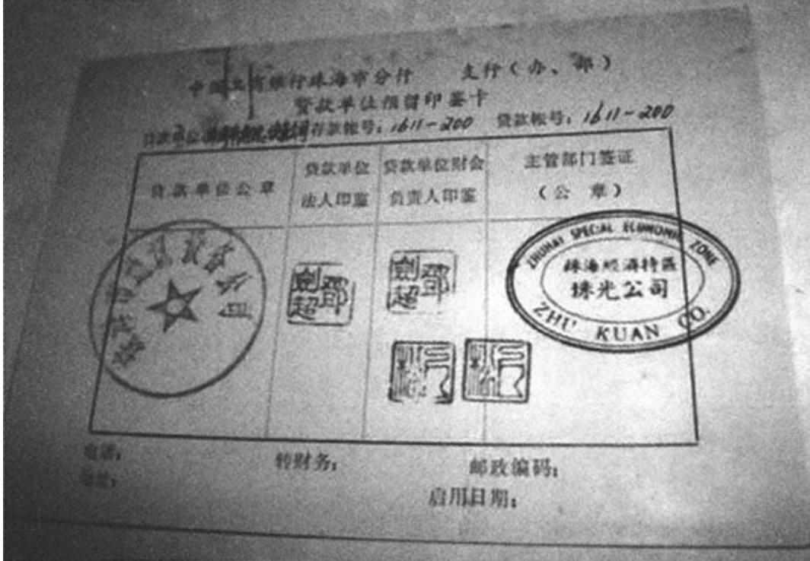
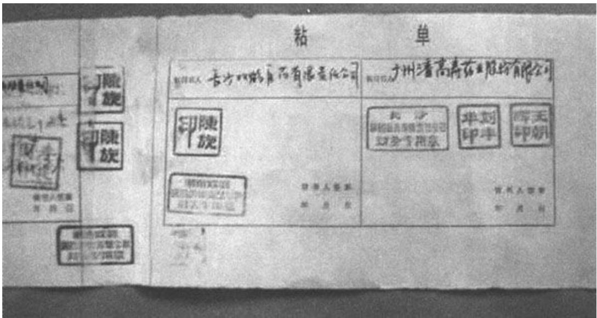
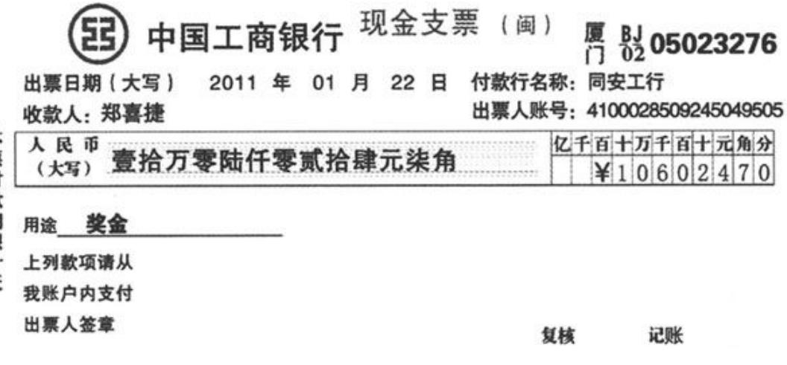
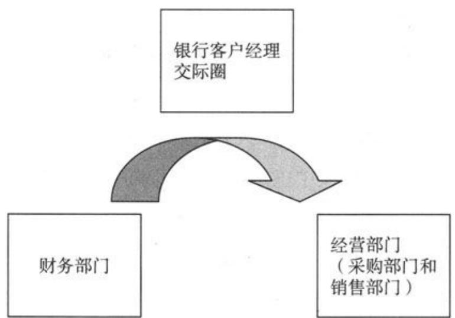
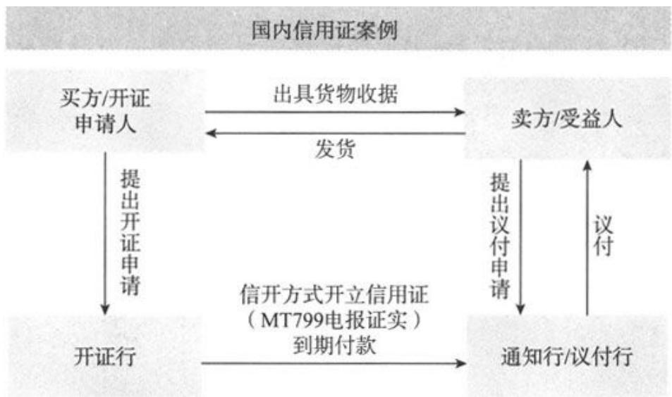
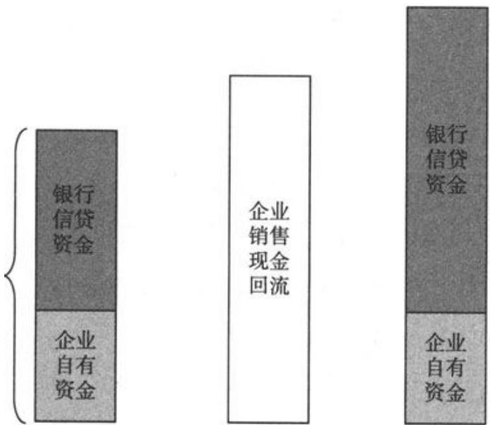
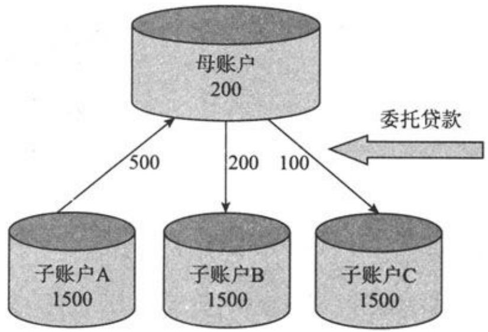

# 银行新员工培训手册

立金银行培训中心教材编写组著

银行培训畅销书安银行培讯 培训教

银行人必须掌握的产品银行人学习业务的工具书最新颖最实用的银行产品

# 行长送员工最好的礼物

本书适合商业银行各条线的员工学习产品使用

# 目 录

北京立金银行培训中心简介  
第一章 基础金融知识  
第二章 柜面基础知识  
第三章 结算业务知识  
第四章零售金融业务  
第五章公司业务  
第六章住房信贷业务  
第七章 其他中间业务  
第八章理财业务  
第九章 电子银行业务  
第士章 零售信贷业务  
附录商业银行各类产品收费表

# 北京立金银行培训中心简介

北京立金银行培训中心是一家在商业银行领域提供专业实务培训的金融服务机构，注册地在北京，由多名在国内外银行工作多年的专业人士组建。

本中心主要从事商业银行实务专业技能培训，涉及领域包括：商业银行客户经理营销技能培训、公司银行信贷产品培训、授信业务风险管理培训、供应链融资业务培训、票据新产品及票据经营培训、私人银行授信业务培训、工程机械车按揭业务培训、个人房地产贷款业务培训、现金管理业务培训、理财业务培训、银团贷款实务培训、商业银行高管管理培训等。

本中心讲师主要来自中国工商银行、中国银行、中国建设银行、交通银行、招商银行、中信银行、深圳发展银行等各大总行银行现职工作人员，在各自领域具备丰富的实践工作经验，是本领域的顶尖专业人才，具备精深的造诣。

本中心培训特色以商业银行当前主流业务为主要内容，以当前国内外商业银行实践操作案例为培训教材,以案例讲解银行相关业务操作要点、营销思路、产品使用技巧、风险控制要求等。通过教师现场讲解，学员与教师之间实时互动交流，力图使每个学生都可以迅速、深刻、直观理解教师讲课精髓。为保证每位学员学习效果，本中心在每次培训前提供相关学习资料。

中心自成立以来，先后接受各家商业银行委托开办内训班3000次，开办各类商业银行公开培训班700余次，培训学员超过两万人，学员遍布全国32个省、市自治区。本中心致力于打造国内商业银行培训领域知名品牌，为国内商业银行培养出一大批业务精通、素质过硬的专业人才。陈先生曾先后前往中国的多家商业银行、外资商业银行、财务公司进行培训，本中心常年在中央财经大学举办商业银行客户经理培训班，欢迎各地商业银行联系培训事宜。

联系方式：010-85863668、85863669传 真：010-85860201信 箱： $\mathrm { c x g } 3 3 9 0 @$ sina.com拉存款网：http://www.lacunkuan.com立金银行培训中心客户：

招商银行 中信银行 兴业银行 中国邮政储蓄银行C 华夏银行 徽商银行 中国工商银行 中国建设银行中国银行 S中国民生银行 齐银 福建海峡银行深圳发展银行 吉林银行 南昌银行 S发银BANKOFJILIN

立培金洲

# 银行新员工一培训手册一

立金银行培训中心教材编写组 $\bigcirc$ 著

银行培训畅销书金银

●银行人必须掌握的产品$\bullet$ 银行人学习业务的工具书$\bullet$ 最新颖最实用的银行产品

# 图书在版编目（CIP）数据

银行新员工培训手册／立金银行培训中心教材编写组著.

北京：中国经济出版社，2012.3  
ISBN 978-7-5136-1213-5

I. $\textcircled{1}$ 银.…II. $\textcircled{1}$ 立..II. $\textcircled{1}$ 银行业务－技术培训一手册 IV. $\textcircled { 1 } \mathrm { F } 8 3 0 . 4 \ – 6 2$

中国版本图书馆CIP数据核字（2011）第221426号

责任编辑 乔卫兵 张梦初责任印制 石星岳封面设计 华子图文设计公司

出版发行 中国经济出版社  
印刷者 北京金华印刷有限公司  
经销者 各地新华书店  
开 本 $7 1 0 \mathrm { { m m } \times 1 0 0 0 \mathrm { { m m } } }$ 1/16  
印 张 19.25  
字 数 280千字  
版 次 2012年3月第1版  
印 次 2012年7月第2次  
书 号 ISBN 978-7-5136-1213-5/G:1685  
定 价 42.00元中国经济出版社网址www.economyph.com社址北京市西城区百万庄北街3号邮编100037  
本版图书如存在印装质量问题，请与本社发行中心联系调换（联系电话：010-68319116)

我们为广大银行的新员习的新产品手册，集合了当前银行开办 的基最新全面银行业务的机会。

信 产通作务 体系。 “信，，为 、 算金担 ” 体银资业， 给保完成企业和个人间庞大的结算

我们就是按照整个脉络，对银行产品体系进行了整理，形成了完整的银行产品体系，指导年轻的银行从业人员学习。

现代商业银行已经发展到了很高的阶段，高水准的服务技巧、精湛的业务技能、高超的沟通巧构成了银行强大的竞争力，广大银行人必须

每个优秀的银行客户经理必须清楚：真正银行业绩靠什么，靠我们的产品创新，靠我们强大的服务能力。

本书即可以作为银行新员工自学业务的教同时又可以作为银行研究同业新产品的资

立金银行培训中心

# 第一章基础金融知识

银行员工必须懂得一些基础的金融知识，这些是必须掌握的基本功，基本功是支撑我们进一步发展的基础。基础的信贷知识包括银行的账户设置、银行的结算规定、银行的基本资产和负债规定等。

# 1．什么是资产？

资产是指银行过去的交易或事项形成的，由银行拥有或者控制的、预期会给银行带来经济利益的资源。

银行对客户发放贷款和办理银行承兑汇票,分别形成银行的表内和表外资产。资产是银行赢利的来源，银行必须确保资产的质量。

# 2．什么是负债?

负债是指银行过去的交易或事项形成的，预期会导致经济利益流出银行的现时义务。银行吸收的活期存款和定期存款就是银行的负债，因为银行到期必须将要偿付存款人。

吸收存款是银行经营的基石，无论是融资还是融信，我们都需要强大的资产规模，而撑起资产规模的无疑要有足够的负债。

# 小知识

# 银行存贷比

总越成意较想存日定业会散危前普比行为标足 额高本味差法价常的银不害试遍例 比 ，果成为存不支现存会能 总因一本商贷宜取全款导导如发会高 额， 为家高业 银行 ， 款是要付！ 从银行赢利的角 而 收入 款很 少 ， 息 的， ， 行有的少能它度大留行资危经然情行 贷贷资，力就讲客有或金机济， 款比金就就会银行是 以赢利为 目 广角广行央分什家当种张为存个对， 从因结备存的危支情如河大胚 能女未也越张存杂部 ， 、 地 区是扩复呐 ， ， 所央高的 区似行的一有业 。， ，小 最率 评级的论述。

# 3．什么是股东权益？

股东权益是指银行资产扣除负债后由股东享有的剩余权益。其来源包括股东投入的资本、直接计入股东权益的利得和损失、留存收益等。

银行的资本由股东提供，每年银行积存的利润加上资本构成了股东权益。

# 4．什么是收入？

收入是指银行在日常经营活动中形成的、会导致股东权益增加的、与股东投入资本无关的经济利益的总流入。

银行的收入主要由表内的利息收入和表外的中间业务收入构成。

所谓表外业务（Off-Balance Sheet Activities,OB），是指商业银行所从事的、按照现行的会计准则不记入资产负债表内、不形成现实资产负债但能增加银行收益的业务。表外业务是有风险的经营活动，形成银行的或有资产和或有负债，其中一部分还有可能转变为银行的实有资产和实有负债，故通常要求在会计报表的附注中予以揭示。

# 5．什么是费用？

费用是指在日常经营活动中发生的、会导致股东权益减少的、与向股东分配利润无关的经济利益的总流出。

# 6．什么是利润？

利润是指银行在一定会计期间的经营成果,包括收入减去费用后的净额、直接计入当期利润的利得和损失等。

# 7．财务会计报告由哪几部分组成？

财务会计报告包括会计报表和其他应当在财务会计报告中披露的相关信息和资料。会计报表包括资产负债表、利润表、现金流量表、股东权益变动表、附注等组成部分。

# 8．什么是账户？

账户是根据会计科目开设的、分类连续记录各项经济业务、反映会计要素增减变化情况和结果的一种手段。

# 9．商业银行的会计账户分类是什么?

根据核算的详细程度不同，账户可分为总分类账户和明细分类账户。根据开户的对象不同，账户可划分为内部账户和外部账户。

# 10．什么是内部账户？

内部账户是指按照标准规范设立、用于核算银行资金、损益等内部会计事项的账户。

11．会计凭证填制的总体要求是什么?

填制会计凭证的总体要求是：要素齐全、内容完整、反映真实、数字准确、字迹清晰。

12．会计凭证传递的要求是什么？

会计凭证的传递必须做到准确及时、手续严密、先外后内、先急后缓。内部凭证的传递应由银行内部专人负责，不得通过客户传递。

13．单位存款可分为哪些种类？

单位存款是指拥有货币的单位存入金融机构的货币，单位存款目前是商业银行负债的主要部分。

（1）按存款资金性质及计息范围不同可分为财政性存款和一般性存款。

（2）按存款期限是否有约定可分为单位定期存款和单位活期存款。

（3）按存款账户性质的不同可分为基本存款账户存款、一般存款账户存款、临时存款账户存款和专用存款账户存款。

14．单位定期存款的管理有哪些规定？

（1）单位定期存款起存金额为人民币1万元，期限档次从2005年9月21日起按居民储蓄整存整取定期存款的期限档次和利率水平执行。

（2）财政拨款、预算内资金及银行贷款不得作为单位定期存款存入金融机构。

（3）单位存入定期存款时，须预留银行印鉴，开户银行出具"存款开户证实书”，证实书作为重要空白凭证管理，仅对存款单位开户证实，不得作为质押的权利凭证，单位如需办理质押贷款，可向开户银行申请开具"单位定期存单”。

（4）单位在同一营业机构存入多笔定期存款的，经与经办行签订协议，可多个定期存款账户共用一套预留银行印鉴，并在预留印鉴上注明所有定期存款账户的账号。

（5）单位支取定期存款只能以转账方式将存款转入其基本存款账户，不得用于结算或从定期存款账户中提取现金。

（6）支取单位定期存款时，须出具证实书并交回印鉴卡，经办行审核无误后办理支取手续，同时收回证实书。多个账户共用一套印鉴的，在办理最后一笔存款支取时交回印鉴卡。

（7）单位定期存款可约定多次自动转存。办理人民币单位定期存款自动转存，必须与客户事先签订"人民币单位定期存款自动转存协议书”,协议书正本专夹保管，副本由业务部门留存。

人民币单位定期存款自动转存分为本金转存或本金与利息之和一并转存。办理本金转存的客户需在经办行开立活期存款账户。转存时利率执行转存日挂牌公告利率，转存后的定期存款沿用原账号和原预留印鉴。

（8）单位定期存款可以全部或部分提前支取，部分提前支取仅限于一次。部分提前支取的，剩余部分如不低于起存金额，可按原存期、利率、账号开具新的证实书，如未支取部分小于定期存款起存金额的，应办理销户手续。

（9）“存款开户证实书"可以挂失。单位存款人遗失证实书后，可到开户行填写"挂失申请书”

办理挂失手续，开户行受理挂失七日后，可为挂失存款人补办证实书。

# 立金名言

客户经理应当时时将客户需要放在自己心里，将客户的事情当成自己的事情来办，从内心里愿意帮助客户。

客户经理同时必须具备准确分析客户价值的能力，遇到一个客户就知道怎么申报授信，知道从这个客户身上得到什么，知道如何组合授信方案能够实现这个目标。不能见着一个客户就是一团雾水，也不知道这个客户需要什么，不知道能够从这个客户身上得到什么，一报授信就是最简单的贷款。可能一个好客户就这么被你浪费了。

成为银行和客户利益双重代言人 一拉存款，客户经理要对自己扮演角色和承担责任准确定位。

在银企合作过程中，客户经理是双重代言人，对客户而言，是银行利益代言人，为银行各种服务产品做营销，以达到银行利益最大化目标；对于银行而言，又是客户利益代言人，阐述去平衡，合作难以维持。合作是你情我愿的结巢，任何一芳不实账都不行。

15．单位保证金存款管理有哪些规定？

单位保证金存款是指银行为客户办理银行卡、承兑、担保、保函、开立信用证、代客外汇买卖、代客债券买卖等业务时收到的客户存入的保证金款项。目前商业银行对单位保证金存款的管理主要有以下要求：

（1）单位保证金存款账户开立时，要经相关业务部门的书面通知方可办理。

（2）单位保证金存款存入时，可以约定存款期限，也可以不约定存款期限，对于约定期限的单位保证金存款实际存款期限不满约定存款期限的，按照活期存款利率计息；实际存款期限满约定存款期限的，按照约定存款期限相应档次的定期存款利率计息；如果没有相应档次的定期存款，则按短于存款期限最近档次的定期存款利率计息；实际存款期限超过约定存款期限的部分按活期存款利率计息。未约定期限的按活期存款利率计息。

（3）对同一单位在同一营业柜台开立多个保证金账户的，经与经办行签订协议，可多个保证金账户共用一套预留印鉴，在印鉴卡上注明所有保证金账户的账号。

（4）保证期间，保证金存款只能用于保证项下的支付，不得支取现金，对保证金存款账户的收款、支款、销户，必须经业务部门签字授权后办理，保证到期日系统自动扣划的除外。

# 小知识

保证金存款

保证金存款，是金融机构为客户出具具有结特定账户所形成的存款类别，在客业银行有权直接扣划该账户中的存款，度地减少行损失，保证金款保证金担保的对象不同，可分为银行承兑汇票保证金、信用证保证金、黄金交易保证金、远期结售汇保证金四类。

16．单位通知存款的管理有哪些规定？

单位通知存款是指存款人在存入款项时不约定存期、支取时需提前通知开户行、约定支取存款日期和金额后方能支取的存款。其账户不得作结算户使用。

（1）单位通知存款按存款人提前通知的期限长短划分为一天通知存款和七天通知存款两个品种。

（2）单位通知存款的起存金额为人民币50万元，最低支取金额为人民币10万元。存款单位必须一次存入，可一次或分次支取，但留存金额低于起存金额的予以销户。

（3）通知存款为记名式存款。单位通知存款存入时，存款人自由选择通知存款品种，开户银行出具"商业银行存款开户证实书”，“商业银行存款开户证实书”上不注明存期和利率，金融机构按支取日挂牌公告的相应利率水平和实际存期计息。

（4）单位通知存款不得支取现金。

（5）通知存款遇以下情况，按支取（销户）日挂牌公告的活期存款利率计息： （但通知存款如已办理通知手续而不支取或在通知期限内取消通知的，通知期限内不计息。）

$\textcircled{1}$ 实际存期不足通知期限的，按活期存款利率计息;

$\textcircled{2}$ 未提前通知而支取的，支取部分按活期存款利率计息;

$\textcircled{3}$ 已办理通知手续而提前支取或逾期支取的，支取部分按活期存款利率计息；

$\textcircled{4}$ 支取金额不足或超过约定金额的，不足部分在通知期限内按活期存款利率计息，超过部分按活期存款利率计息；

$\textcircled{5}$ 支取金额不足最低支取金额的，按活期存款利率计息。

（6）通知存款部分支取时不能"利随本清”,而是待该笔通知存款最后全部结清时一并计付利息。

（7）单位支取通知存款时，须出具存款证实书并提交加盖预留印鉴的支款单，经办行审核无误后办理支取手续，全部支取时收回证实书。

17．单位定期存款开户证实书如何换开单位定期存单？

（1）当存款开户证实书因质押需转开单位定期存单时，柜员根据申请人提交的"存款开户证实书"通知联、第三人同意由借款人使用其证实书的协议书，加盖预留印鉴的"单位定期存单委托书”及经办人的有效身份证进行认真审核，无误后由会计主管审核同意并在委托书授权签字。

（2）柜员打印单位定期存单，同时自动销记表外账。

（3）柜员根据证实书通知联、协议书、委托书，按照一份证实书换开一份存单的原则，填写“单位定期存单确认书”，同时将上述资料一并上报主管行长审批，行长审核同意、在确认书"存款行负责人签字"处签字后，加盖经办行公章。

（4）柜员将证实书底卡联、通知联、单位定期存单底卡联、委托书一联、确认书一联、协议书一并专夹保管，将单位定期存单确认书第二联、连同单位定期存单通知联交申请人。

18．单位定期存单收回如何处理？

柜员收到申请人退回的"单位定期存单"通知联，与留存的单位定期存单底卡联、证实书、委托书及协议书核对无误后，将单位定期存单存根联、通知联、委托书、协议书一并专夹保管，证实书通知联退还申请人，待该笔定期存款全部结清时，将所有单据加盖"结清"戳记随证实书一并作定期存款支取凭证的附件。贷款人因清偿贷款而提前兑现或提前支取时，应同时提交《质押合同》需要提前兑现的证明材料或有关协议。

19．单位定期存单如何办理挂失？

（1）贷款人申请挂失时，须填写"挂失申请书”一式三联，加盖行政公章后连同贷款人的营业执照复印件、质押合同副本一并交经办行。经办行核对单位定期存单底卡联与挂失申请书的内容一致，并确认该笔存款未被支取后方可受理挂失。

（2）柜员将挂失申请书第二联加盖"业务专用公章"退贷款人，第一联据以登记《挂失登记簿》，与单位定期存单底卡联、单位定期存单确认书等一并专夹保管，第三联交业务部门。

（3）质押期间，经办行不得受理存款人提出的挂失申请。

20．单位协定存款开立的条件是什么？单位协定存款按什么方式管理？协定存款账户开户行可否为存款单位办理透支业务？

（1）开立单位协定存款账户，存款人必须在银行开立基本存款账户或一般存款账户，且开户期限已满一个季度，与经办行签订协定存款合同，约定基本存款额度。协定存款额度的最低金额为人民币50万元。

（2）协定存款按“一个账户、一个余额、两个结息积数、两种利率"的方式管理，不分户核算，会计核算比照单位活期存款处理。

（3）开户行不得为存款单位在协定存款账户上办理透支业务，开户单位在办理支付业务时,若协定存款账户的余额（大于零）低于基本存款额度，不属于透支；若协定存款账户的余额不足以支付票款时，开户行不予办理业务。

# 21．同业存款的利率如何执行?

（1）商业银行（不含外资银行生息资产）、政策性银行、城市信用社、农村信用社、证券投资基金、期货经纪公司、信托投资公司和资产管理公司人民币同业存款，年利率不得超过中国人民银行超额准备金存款利率。

（2）证券机构同业存款。在银行开办证券交易结算资金银行独立存管业务的证券机构同业存款，价格由总行根据同业存款系统内活期专项上存利率统一确定。

非银行独立存管证券机构同业存款实行内部资金利率间接调控和额度控制相结合的价格管理模式。在核定额度范围内的存款，价格由各一级分行根据同业存款系统内活期专项上存利率自主确定；超过核定额度以上的存款，按不超过中国人民银行超额准备金存款利率执行。

（3）财务公司同业存款。总行核定的重要财务公司客户及其在各地分支机构的活期存款，年利率不得超过规定；其余财务公司客户活期存款年利率不得超过中国人民银行超额准备金存款利率。

除活期存款外其余各期限档次同业存款利率，按不超过中国人民银行相应期限档次存款利率上限执行；定期存款提前支取部分按不超过超额准备金存款利率执行。

（4）外资银行人民币生息资产存款，按不超过中国人民银行同期限档次存款利率上限办理，提前支取部分按不超过中国人民银行超额准备金存款利率执行。

（5）汽车金融公司同业存款年利率不得超过规定。

（6）其他金融机构客户（不含保险公司和邮政储蓄存款）的同业存款，年利率不得超过中国人民银行超额准备金存款利率。

22．被冻结的存款如何进行利息计算和处理？

被冻结的存款，不属于赃款的，冻结期间应计付利息；属于赃款的，冻结期间不计付利息，如冻结有误，解除冻结时应补计冻结期间的利息。

23．银行承兑汇票的保证金是否可以被冻结？是否可以被扣划？

法院依法可以对银行承兑汇票保证金采取冻结措施，但不得扣划。如果营业机构已对汇票承兑或已对外付款，根据营业机构的申请，人民法院应当解除对银行承兑汇票保证金相应部分的冻结措施。银行承兑汇票保证金已丧失保证金功能时，人民法院可依法采取扣划措施。

# 小知识银行承兑汇票

银行承兑汇票Bank's Acceptance Bill（BA）业行银行基对出人信的可而给予的信用支持。

我国的银行承兑汇票每张票面金额最高为人民币1000万元（实务中遇到过票面金额为人民币1亿元和人民币5千万元的）。银行承兑汇票按票面金额向承兑申请人收取万分之五的手续费，不足10元的按10元计。承兑期限最长不超过6个月。承兑申请人在银行承兑汇票到期未付款的，按规定计收逾期罚息。

#

票的 23目

# 突出特点

1．信用好，承兑性强。银行承兑汇票经银行承兑到期无条件付款。就把企业之间的商业信用就如同收到了现金。2.流通性强，灵活性银行承兑汇票可以背书转让，也可以申请贴不会点压企业的资金。3，节约资金成本。对规定的保证金，就能申请开立银行承兑汇票，用以进行正常的购销业务，待付款日期临近时再将受其害。银行承兑汇票是指在承兑银行开立款实户，资信状况良好的法人组织签发，并由开户银行承诺到期付款的一种票据，它是目前企业间相互结算的重要方式之一。

# 票据优点

1．对于买方来说，利用远期付款，以有限的资本购进更多货物，最大限度地减少对营运资金的占用与需求，有利于扩大生产规模。2．相对于款 的 司医疗卫位。

24．已被冻结的存款在冻结期间，需要具备什么条件才可以对其予以解冻处理？

在冻结期限内，只有在原作出冻结决定的有权机关作出解冻决定并出具"解除冻结存款通知书"的情况下，营业机构才能对已被冻结的存款予以解冻。被冻结存款的单位或个人对冻结提出异议的，营业机构应告知其与作出冻结决定的有权机关联系，在存款冻结期限内营业机构不得自行解冻。

25．单位贷款在贷款期内遇利率调整，是否分段计息？

遇国家利率调整时，贷款期限在1年以内（含1年）的，执行合同利率，不分段计息；贷款期限在1年以上的，每满1年后按相应利率档次执行新的利率。

对于单位汽车消费贷款，遇利率调整时在每年的1月1日调整为新的贷款利率，不区分期限。

# 26．什么是担保物和抵债资产？

担保物是指用于抵押和质押的物资和财产权利。

抵债资产是指依法行使债权或担保物权而受偿于债务人、担保人或第三人的实物资产或财产权利，包括土地使用权、房屋及建筑物、机器设备和权利凭证等。

# 27．归还贷款的方式是怎样的?

单位贷款的归还方式可分为主动归还和直接扣收方式。

个人贷款本息的归还方式可分为柜台还款和委托扣款方式。

银行通常应当劝说客户采取委托扣款方式,授权银行直接扣划，这样可以降低银行的工作量，避免借款人频繁到银行的烦琐工作。

28．什么是非应计贷款和应计贷款?

非应计贷款是指贷款本金或利息逾期90天没有收回或贷款虽然未到期或逾期未超过90天但生产经营已停止、项目已停建的贷款。应计贷款是指非应计贷款以外的贷款。

29．应计贷款转为非应计贷款应如何处理?

应计贷款转为非应计贷款时，应将已入账的利息收入和应收未收贷款利息予以冲销，分别转入催收贷款利息和待转贷款利息收入核算，同时将计提的应计收贷款利息与利息收入对冲。从应计贷款转为非应计贷款后，结计的利息不再确认为当期收入。

某笔应计贷款转为非应计贷款后，通常不能再从非应计贷款转回应计贷款。但是，如客户能够及时偿还以往的欠息，并有足够的证据表明以后能够按期及时足额偿还该笔贷款的本息，则可将该笔贷款从非应计贷款转回应计贷款，并按应计贷款的有关规定进行核算和管理。

30．归还非应计贷款的顺序是怎样的？

归还非应计贷款时，应首先归还非应计贷款本金；非应计贷款本金全部收回后，再归还催收贷款利息。

# 31．什么是贷款减值准备？

贷款减值准备是按照规定提取的用于补偿贷款损失的专项准备，包括专项准备和特种准备。

贷款损失专项准备是指根据《贷款风险分类指导原则》确定的贷款五级分类结果及时、足额逐笔计提的准备；特种准备是指对特定国家、地区、行业发放贷款计提的准备。

32．目前商业银行计提的资产减值准备可分为哪些种类？

商业银行目前共计提八项资产减值准备。即贷款减值准备、坏账准备、短期投资跌价准备、长期投资减值准备、固定资产减值准备、在建工程减值准备、无形资产减值准备和抵债资产减值准备。

减值准备是指资产的账面价值超过其可收回金额，判断资产是否减值，应依据资产可能已经发生减损的某些迹象，如果存在任何一种迹象，应对其可收回金额进行正式估计。这很类似固定资产折旧，固定资产使用一定年限后，肯定不断有损耗，这就需要每年提取折旧，提取折旧的目的在于不断积累小额资金，用于再次购置新设备。

# 33．如何确定抵债资产的入账价值？

抵债资产的入账价值是指银行依法取得抵债资产时的公允价值。

抵债金额是指取得的抵债资产按照法院判决、仲裁或协议规定应抵偿银行的债权金额。

由银行承担的取得抵债资产的相关税费，包括收取抵债资产过程中所缴纳的契税、车船使用税、印花税、房产税等税金，以及过户费、土地出让金、土地转让费、水利建设基金、交易管理费、资产评估费等直接费用，计入抵债资产初始确认金额。

银行贷款出现不良后，经常需要客户拿固定资产抵债，这些进入银行账面的固定资产就需要评估价值。

# 小知识

四大资产管理公司

中国长城资产管理公司、中国信达资产管理公司、中国华融资产管理公司和中国东方资产管理公司。

金失从重竞产以 、不资减1银成产产形按在方有形资资他当,等国款全置其应产价购贷保处以司资竞收良度和者公置。可不限理或理处读司购大管赁管和拍理产标 公收最在租产理管置司标资融则 采取招产处公目金原资和理营务 的融理管经债动优要金管产要偿活择主资主追等、款融为事组争时

34．贷款到期日遇银行不营业应如何处理？

贷款到期日遇银行因节假日、双休日或其他原因不营业，客户可选择在前一个营业日归还,不算提前还款；也可选择在后一个营业日归还,不做逾期贷款处理，但应按实际贷款天数计算利息。银行营业后的第一个营业日仍未归还的，作逾期贷款处理，逾期时间从到期日的次日起计算。

# 35．担保贷款的各种权利证明应如何保管？

担保贷款的抵押权物证以及权力质押的权利证明（票据、债券、存单、仓单、提单等）由会计部门负责保管。非权力质押的质物及其权证的保管部门由各行确定，如与银行自用固定资产同类，原则上应归相应实物管理部门保管。变更保管部门，应认真进行账实核对和办理交接手续。

# 小知识

《中华人民共和国物权法》规定

、 质： 债务人或者第三人 一支  
； ） 债转商 券、 、 仓 、  
，四让权 让的 股权； 以、  
权，,百单同利 ， 权； 出，的交关汇单质 ） 的票当质门 收账款； 其，事权办支现可 他本人人理票日以 财票应时 （产，当投质本或现 法 第存面有设  
三 涤自 足以单利权五单期 。  
。 、凭第存于并前 一权质 二 的， ， 权人 、 、 日

36．什么是委托代理业务？商业银行委托代理业务主要有哪些？

委托代理业务是指银行接受政府、企事业单位、个人委托，利用自己的资源优势为客户提供代理服务、分销服务和代客理财服务及其他金融服务，并收取手续费的业务。

# 小建议

如何与客户谈代理合作？

商业银行办理委托代理业务有着天然的优势，工、农、中、建、邮政五大国有银行的物理

银行在与大型客户谈判合作的时候，这是天然的优势，保证自己具备了极为强大的优势。工、个银行素统包括了上分不经营网，这是谈合作巨大的筹码。

商业银行委托代理业务主要有：委托贷款业务、代理债券业务、保证业务、代理财政业务、保管箱业务、代理资金清算业务以及其他代理业务。

37．利息存贷期计算原则是什么？

（1）计算天数采取"算头不算尾"的方法，即从存入、贷出的起息日起算至取出、归还日的前一天止。

（2）存、贷款期间的节假日照计利息。

（3）在规定的结息日计算利息时，应将结息日当天计算在内，所计利息入结息日次日账，下一结息日计息时从上期结息日的次日算起。

# 38．贴现利息如何计算？

贴现利息按贴现日确定的贴现利率于办理贴现业务时一次性收取利息。

贴现利息 $=$ 汇票金额×贴现天数×（月贴现利 率/30)

承兑银行在异地的，贴现天数应另加三天划款时间。

实付贴现额 $=$ 汇票金额-贴现利息

在实际操作业务过程中，贴现业务是银行客户经理必须掌握的基础信贷业务，这种业务风险很低，操作简单，尤其是年轻的客户经理必须掌握这项业务技能。

贴现利息是指汇票持有人向银行申请贴现面额付给银行的贴现利息；实付贴现金额是指汇票金额（即贴现金额）减去应付贴现利息后的净额，即汇票持有人办理贴现后实际得到的款项金额。

（1）什么时候银行承兑汇票贴现利率高于贷款利率？

在银行资金紧张，信贷规模紧张，存款准备金较高的时候，银行承兑汇票贴现利率高于贷款利率。

（2）什么时候银行承兑汇票贴现利率低于存款利率？

在银行资金宽松，信贷规模宽松，存款准备金较低的时候，银行承兑汇票贴现利率低于存款利率。

39．采用积数法计算利息的公式是什么？

利息 $=$ 累计计息积数 $\times$ 日利率 累计计息积数 $=$ 每日余额累计数 年利率 $=$ 月利率 $. \times 1 2 =$ 日利率 $. \times 3 6 0$

40．在对账管理中，应该核对的账务有哪些？

（1）银行与单位客户之间应核对单位存款、贷款、委托贷款、委托贷款基金、转贷款资金等账务。

（2）银行与个人客户之间应核对个人存款、 贷款、委托贷款、委托贷款基金等账务。

（3）系统内之间应核对系统内往来款项等账务。

（4）会计账务与业务台账之间应核对按规定建立的各类表内、表外业务台账。

（5）银行与其他金融机构之间应核对与中国人民银行往来、同业往来等账务，以及核对质押在外的定期存单。银行存放在系统内的经费存款视同银行与其他金融机构之间的往来进行对账。

41．对账应遵循的原则是什么？

（1）内部制衡原则。账务核算与对账相分离，上门对账与所经办业务相分离。

（2）差别管理原则。细分客户和账户，采取差别化对账手段和对账频率，提高对账效果。

# 42．银行有哪些对账手段？

对账手段包括纸式对账、电子对账、计算机系统自动对账三种。

（1）纸式对账是指发送纸式对账单及副本账页、回收纸式对账回单的对账方式。

（2）电子对账是指利用电子化手段发送、回收对账信息的对账方式。

（3）计算机系统自动对账是由计算机系统采集双方账户数据，自动核对并输出核对结果的对账方式。

43．清理、结清各类暂收、暂付类款项的时间是如何规定的？

对于暂收、暂付类款项的清理、结清，应根据不同的挂账原因进行处理：

（1）职工差旅费借款，应在职工出差返回后一周内结清。

（2）待处理的出纳短款，应在收到上级行批复后2个工作日内予以处理。

（3）各类案件挂账及待结案诉讼费，应在结案后1个月内处理。

（4）其他应收、暂付款，原则上应在1个月内结清。

（5）出纳长款及睡眠户清理挂账款项，应在收到上级行批复后2个工作日内处理。

（6）其他应付款项（不含计提的养老统筹基金、工会经费等专用资金性质款项），应按规定在款项支付或结清时予以处理，原则上最长不得超过1个月。

（7）待处理结算款项原则上应在3个工作日内予以查清并处理。需向上级部门申报待查的款项，应在上级部门批复后2个工作日内予以处理。

（8）待清算的通存通兑资金应在业务发生后及时予以清算，最长不得超过2个工作日。

（9）同城票据清算资金应在每场同城票据交换资金清算后结清。

（10）待汇出汇划款项应在挂账日下一个工作日开始及时汇出。

# 44．什么是重要单证？

重要单证包括有价单证和重要空白凭证。

有价单证是指经批准发行的印有固定面额的特定凭证，主要包括银行发行或银行代理发行的实物债券、旅行支票、定额存单以及印有固定面额的其他单证。

重要空白凭证是指无面额的经银行或客户填制金额并签章或加密后即具有特定效力的空白凭证及重要凭据。

45．重要空白凭证的种类有哪些？

（1）存款凭证：包括存单、存折、存款证明、存款开户证实书等。

（2）结算凭证：包括支票、汇票、本票、银行卡和外汇兑换水单、商业银行实时通付款凭证。

（3）重要凭据：包括开户许可证、印鉴卡片等。

（4）其他重要空白凭证：包括债券收款凭证以及其他纳入重要空白凭证管理的凭证。

46．银行出售的主要结算凭证有哪些？一般结算户可否购买现金支票?

出售给开户单位使用的会计凭证主要是结算凭证和专用凭证，包括：现金支票、转账支票、普通支票、银行汇（本）票申请书、电汇凭证、托收凭证、进账单、粘单等。一般结算户不得购买现金支票。

47．重要空白凭证如何使用?

（1）重要单证应按号码顺序签发，不得跳号。

（2）应严格按照规定用途及程序使用重要单证，严禁移作他用。属于银行签发的重要单证,不得由客户签发，严禁在重要单证上预先加盖印章备用。不得将重要单证带出营业场所签发。

（3）使用计算机签发重要空白凭证的，应严格签发、打印管理，未经会计负责人授权不得擅自手工填制和重打、补打重要空白凭证。使用计算机签发银行汇票的银行，因系统故障确需手工签发的，应及时报告总行。

48．重要空白凭证的出售有哪些规定？

（1）经办人员对外发售重要单证时一般应按号码顺序发售。

（2）对外发售和签发重要单证应坚持先收款后再办理（贷记卡除外）。对外发售重要空白凭证应验证客户身份，并根据客户业务量适量发售，发售时须由客户签收确认，严禁由银行工作人员代客户签收、购买重要空白凭证。

（3）对外发售重要单证时，应在客户账户和有价单证及票样登记簿或重要空白凭证登记簿上登记。客户使用时须查对无误后方可办理，同时做销号处理。

（4）客户销户时，应将剩余重要空白凭证全部交回开户行登记注销，开户行将客户交回的重要空白凭证与有关登记簿及账户记载核对无误后，办理销户手续。客户因故无法交回剩余重要空白凭证的，由其按规定出具有关证明并保证承担相应风险后，办理销户手续。

（5）发售和签发重要单证过程中发现多页、缺页、错号、要素有误等有缺陷单证时，应登记入库留查，并及时与发行单位、上级行或印刷厂家联系，查明原因进行处理。

49．营业机构应如何领用重要单证？

营业机构需要重要单证时，经办人员应及时请领。请领时，应根据实际需要适量领用，原则上经办人员一次领用不超过1个月的用量（不含银行承兑汇票）。

领用重要单证时，经办人员应填写单证领购单，由会计负责人（含会计主管）或部门负责人签批。保管人员审核无误后办理分发手续，按照号码顺序分发重要单证，同时登记有价单证及票样登记簿或重要空白凭证登记簿并由经办人员签收。经办人员领入重要单证后应及时登记表外科目账和有价单证及票样登记簿或重要空白凭证登记簿，并保证与保管人员账务衔接。

50．重要单证的保管有哪些规定？

（1）重要单证应实行专库（柜）存放。有价单证须入金库保管，未设金库的行实行寄库保管；重要空白凭证须入金库、专门库房或保险柜保管，不得与非重要物品混放。

（2）重要单证的保管须满足不相容岗位分离的要求。库存重要单证实行专人管理，应指定保管人员负责库存重要单证的领交、保管及办理出／入库手续，并坚持"账证分管”，做到重要单证与账务核算分管分用。

领用的重要单证实行个人负责制，由经办人员负责领用的重要单证的登记、保管和使用。需要银行签发加盖印章的，必须做到重要单证与印章分管分用。银行卡与已制作完成的密码信封必须分人保管。

（3）应按保管人员及每个经办人员分别有价单证和重要空白凭证建立登记簿，对其各自保管的重要单证的种类、数量、号码、券别、面额等进行详细登记。保管人员与经办人员的登记簿应保持衔接。

（4）营业时间经办人员如需临时离岗，应将重要单证入柜（箱）妥善保管。

（5）营业终了，经办人员应对经办的重要单证业务进行轧账，核对账实相符后将重要单证入库（柜）保管。

（6）应强化岗位监督控制，重要单证保管岗位应定期轮换。

（7）有价单证保管人员岗位变动须按照金库交接规定办理交接手续。

（8）重要空白凭证保管人员由于岗位变动等原因需要转交他人保管时，须与接收人员共同核点库存，并与有关账簿进行核对。无误后，双方登记会计人员交接登记簿，办理交接手续。交接须由会计负责人组织并监交。

（9）经办人员由于岗位调整不再保管、使用重要单证时，应将保管的重要单证核点清楚后做退库处理。

（10）经办行重要单证发生遗失应在24小时内逐级上报一级分行，其中有价单证和银行汇票、商业汇票、银行本票、特种存单发生遗失须在24小时内逐级上报至总行。

51．作废的重要空白凭证应如何处理？

经办行对填制错误、停止使用、客户交回的重要单证应做作废处理。对作废单证应作出明显作废标记，注销有关账户及登记簿，登记作废重要单证（卡）登记簿，办理退库保管或订入当日记账凭证。

经办行对停止使用、客户交回和填制错误的重要空白凭证分别做如下处理：

（1）停止使用的重要空白凭证经核点无误后，应封存并作出明显批注后入库（柜）登记保管，按规定交上级行集中销毁。

（2）客户销户交回的开户许可证、印鉴卡片应加盖作废戳记后作当日记账凭证的附件，其他重要空白凭证应切角后入库（柜）登记保管，在单位负责人及会计负责人监督下按季组织销毁。

（3）经办人员办理业务过程中填错的重要空白凭证，应加盖作废戳记后作当日记账凭证的附件。

停止使用的银行汇票、商业汇票、特种存单和银行卡由一级分行组织销毁，其他重要空白凭证由二级分行组织销毁，并报一级分行备案。销毁工作应在宣布停用后3个月内完成。

52．重要单证的调拨有哪些规定？

外部单证接收：接收行收到发行单位或印制厂家发送的重要单证，应根据有关合同或订单、发货清单认真核对样本，抽样检查质量，经核点无误后入库，并及时登记入账。

内部机构间调拨：

（1）重要单证调拨的调入行须在调出行预留印鉴。重要单证的调拨数量由调出行根据调入行业务量核定。

（2）调拨时，调入行经办人员须出具单位证明、身份证明及"商业银行单证领购单”（加盖预留印鉴，以下简称"单证领购单"），调出行审核无误后，登记有价单证及票样登记簿或重要空白凭证登记簿，办理出库手续。营业网点申请调入重要单证，经办人员应出具身份证明和单证领购单办理，但单证领购单须由网点负责人签批。

通过计算机网络系统办理重要单证调拨手续的，应加强系统对身份认证和授权审批的管理，做到手续严密，控制有效。

重要单证调入后，调入行应及时办理入库手续。重要单证调拨双方应及时登记表外科目账和有价单证及票样登记簿或重要空白凭证登记簿，并保证账务衔接。

（3）重要单证调剂使用须由上级行组织进行，同级行之间不得自行调剂。调剂使用时由调出行向上级行办理退库手续，调入行向上级行办理出库手续。

（4）有价单证的调拨运送视同现金办理；重要空白凭证实行专（款）车运送，专箱（包）封存、双人办理。

（5）机构撤并时，被撤并网点重要单证应退回上级行或转入移入网点。

# 小知识

空白重要凭证

）力款 收用逐应作凭空随持箱专需的他由章社效货）理项等时废的束坚管证必证作禁印用项卡办证码用盖作回结须保凭取凭移严好加卡收业必的立采证证正 盖含取存信证白说面应件，营天门设并保凭证先章（支）含凭空起柜时附查天每专要管要凭预盖行有单（行要，、废的备每且入时清施重要上先银具存卡银重量簿作票明，并上管分措白重证预业即，行业，搬记证传注性 晚保实等空白凭上商后票银商据的登凭目上整门天证账鼠将空要证由章汇白是依发用白科簿完部每凭，,灭禁的重凭指签，空，面领领空关记其督，白理，严发白要是经票，等书将证要有登坏监清空管虫。签空重证并支单证要，,凭重日关破后日要人灭靠行在白凭额如汇凭重单白，当有须事结重双，可银准空白金，,电费的用空号作在必交日。。 。行盗的业不在空写证： 收务领要销，应证上，管实防施商，禁要填凭证业业写重份记码凭证核保单空回政款应登时，的重日人柜库防全，户用或的收行付时项当废证白当双（用的安用客备

53．什么是会计专用印章？它的刻制实行什么管理?

会计专用章是指在办理本外币会计业务过程中，为确认并表明会计业务的合法有效或处理状态，在会计凭证、会计报表、票据、函件、证实书以及其他会计资料上加盖的印章。会计专用印章是明确银行对内、对外权责关系的重要依据。

54．商业银行会计专用印章的种类有哪些？它的适用范围是什么？

（1）财务专用章：用于向中国人民银行、同业其他银行或银行经费账户开户行存取款项的印信。

（2）业务用公章：用于签发储蓄存单、存折、债券收款单、往来报单等重要单证；对账单、利息回单、托收回单等各种业务回单；转汇／退汇通知、确认书、证实书、联系书、印鉴卡及相关开户资料、会计业务查询查复书、挂失申请书等各种通知书、联系书；其他需要加盖业务用公章的通知、证明和内部报表，以及往来账户（包括系统内往来账户和内部往来账户，但不包括经费账户）存取款项的印信等。

（3）结算专用章：用于办理票据贴现、转贴现、再贴现业务提示付款；发出、收到托收凭证；发出信汇结算凭证及结算业务的查询查复、提交他行的电子转账凭证等。

（4）票据清算专用章：用于办理票据交换，提出收、付款凭证。

（5）票据受理专用章：用于受理客户提交票据时，尚未进行转账处理的各种凭证回单，该章须刻有"收妥抵用"字样。

（6）办讫章：用于确认已记账或处理完毕的表内转账、表外转账、现金业务的票据、凭证及通知、回单等。

（7）汇票专用章：用于签发全国银行汇票和承兑银行承兑汇票；办理商业汇票转贴现和再贴现时的背书等。他行代理银行签发银行汇票使用代理汇票专用章。

（8）本票专用章：用于签发银行本票。

# 55．会计专用印章的保管使用有哪些规定？

（1）会计专用印章按照"谁保管，谁使用,谁负责"的原则保管和使用。

（2）营业时间，会计专用印章使用必须做到：专匣上锁保管，固定存放；临时离岗，人离章收；不得分人用印，严禁个人之间私自授受会计专用印章；非经办人员严禁动用会计专用印章。

（3）非营业时间，会计专用印章必须由保管人、使用人专匣上锁后统一入库或保险箱柜保管。

（4）各种会计专用印章必须严格按规定的范围使用，严禁错用、串用、提前或过期使用。会计专用印章一律不得携带出本单位、本部门使用。严禁在空白凭证、空白报表、空白公文纸上预先加盖各类会计专用印章。

56．会计专用印章登记簿的使用有哪些规定？

保管、使用会计专用印章的银行必须建立“商业银行印章及重要物品保管使用登记簿”，并在登记簿上加盖印章印模，凡印章的领取、分发、启用、交接、停用、上缴和销毁等都必须在登记簿上详细记载，并由有关人员签章。登记簿由会计负责人（含会计主管）记录和保管。

57．会计专用印章的保管使用应如何分工?

会计专用印章保管、使用必须符合内部控制要求，做到分工合理，职责明确，确保印、证分管，不相容岗位分离。

（1）财务专用章由会计负责人或其指定保管人保管、使用。

（2）业务用公章只刻一枚的由会计负责人或其指定保管人保管、使用。有多枚的，其他人员保管的业务用公章应严格限定其用途。

（3）结算专用章须由结算经办人员保管、使用。

（4）票据清算专用章应由账务核算人员、票据交换员和票据清算员以外的票据清算复核人员保管、使用。

（5）汇票专用章由除汇票保管、签发人员和压数机保管人员以外的人员保管、使用。

（6）本票专用章由除本票保管、签发人员和压数机保管人员以外的人员保管、使用。

（7）办讫章和票据受理专用章由相应岗位柜员保管、使用，非柜员制会计机构办讫章，由当班复核员保管、使用，票据受理专用章由接柜人员保管、使用。

58．会计专用印章的交接有哪些规定？

（1）会计人员由于岗位调整、临时离岗和班间交接等原因需要转交他人使用印章时，必须办理交接手续，登记有关登记簿。

（2）属于岗位调整的，应登记"商业银行印章及重要物品保管使用登记簿”。

（3）属于临时离岗或班间交接的，应登记“商业银行会计人员工作交接登记簿”。

（4）柜员印章交接必须由会计负责人监交，办妥交接手续，以明确责任。会计负责人保管的会计专用印章交接由主管行长或上级行主管部门派员监交。

59．会计专用印章丢失后应怎样处理？

会计专用印章如发生丢失，应迅速查明原因，公告作废，作出补救措施，并按照印章管理级次及时逐级上报管辖行，补制新的印章，以保证业务正常进行。补制印章的序号应重新编列,不得与丢失印章号码相同，丢失印章的号码作废，不得再用。丢失印章属于预留印鉴的，应及时通报相关行办理协防及更换印模。汇票专用章丢失，必须经总行重新审批汇票机构后再行刻制新的汇票专用章。

# 60．办理哪些重要会计业务必须授权？

（1）开销户业务。（2）错账冲正业务。(3）账目调整业务。（4）大额支付业务。（5）自制、补制凭证业务。（6）查复业务。（7）挂账及临时过渡业务。(8）拒绝支付业务。（9)可疑支付业务。（10）支付结算业务。

61．什么是柜员卡？柜员卡按柜员工作权限及内容分为几种？

柜员卡是识别柜员身份，柜员凭以进入系统进行业务操作的介质。柜员卡根据柜员工作权限及工作内容分为4种：A级柜员卡、B级柜员卡、现金柜员卡、普通柜员卡，分别由A级柜员、B级柜员、现金柜员和普通柜员保管使用。

62．柜员卡的配备遵循什么原则？

遵循“一人一卡"的原则。

63．建立健全会计业务内部控制应遵循哪些原则？

（1）合法性原则。（2）有效性原则。（3）全面性原则。（4）独立性原则。（5）不相容岗位、职责相分离原则。（6）成本效益原则。

（7）适时性原则。

# 立金名言

一个人不会苦死，不会累死，只会窝囊死。银行客户经理应该变得很婪” 一心想建功立业，很有进取心，希望成为人上人。在商业银行，我们每个人有了业绩就有一切。

# 第二章柜面基础知识

必须了解基础的银行知识，无论是从事客户 经理职位，还是柜员职位，都必须掌握基本的柜 面知识。

柜面是基本的银行业务，保证给客户的日常结算。柜台业务属于比较烦琐的业务，是银行的信贷业务的基础。一家银行"外勤不怕苦，内勤不怕烦”，则银行兴矣。

# 1．什么是货币投放？

货币投放是指中国人民银行根据市场对货币流通的需要情况，通过工资支付、商品采购、发放贷款等渠道，有计划地将货币投放市场，使货币流通量同国民经济对货币的实际需要量相适应。货币投放是国家有计划调节市场货币流通的一种方式。

# 2．什么是货币回笼？

货币回笼是指中国人民银行根据市场对货币流通的需要情况，通过出售商品、提供劳务、征收税款、吸收储蓄、收回贷款等渠道，组织市场多余货币流回银行，使货币流通量同国民经济对货币的实际需要量相适应。货币回笼是国家有计划调节市场货币流通的一种方式。

3．柜面人员收到带有“样币"字样的现钞应如何处理?

样币禁止流通。发现流入市场的样币，应予以收回，并向持有人追查来源，或交当地人民银行追查。

4．柜面人员在现金收款中发现现金与凭证金额不符时，应怎样处理？

收款中发现现金与凭证金额不符，经复点证实，应立即向交款人讲明情况，双方核实后，按原交款凭证多退少补或由交款人重填交款凭证（严禁银行代填）；对现场无法确认差错，应及时盘库，确保无误。

# 5．审核现金交款凭证的要点是什么？

现金交款凭证的审核要点是：（1）收款、交款单位一致时，客户只需填写现金交款单“日期”、“收款单位”、“收款账号”、“大写金额”、“小写金额"和"款项来源"等六要素；（2）收款、交款单位不一致时，须加填"交款人"要素；明确代付款单位付款的客户，尚须填写付款单位名称。

（3）字迹是否清晰，有无涂改。

6．审核现金支付凭证的要点是什么?

审核现金支付凭证的要点是：（1）支付凭证是否真实、各要素是否齐全。（2）大小写金额是否一致。（3）日期是否在有效期内。（4）支取的现金是否符合国家现金支付管理的规定。（5）背书是否与收款人名称一致（收款人为个人的审有效身份证件）。（6）支票类支取凭证是否按规定折角验印鉴或实行人机验印；储蓄类支取凭证是否验证密码。（7）日期、金额、收款人名称不能更改。（8）支取大额现金是否经过大额现金支付报备、审批手续。

# 7．柜员领交现金的规定是什么？

柜员领交现金应通过现金柜员办理调拨，现金柜员之间由调出人办理调拨，非现金柜员之间不允许直接调拨现金。

# 8．开户单位交存现金应如何处理?

柜员受理客户交来的现金和"现金交款单"或其他存款凭证时，清点现金、审查交款凭证要素无误后进行账务处理，将计算机打印确认的交款凭证客户联加盖"办讫章"后退客户。对于需要进行复核的业务，复核员只对账务进行复核，现金收付实行个人负责制，不需要复核员复点现金。

# 9．开户单位取款应如何处理?

柜员受理客户提交的现金支票或其他取款凭证时，按有关规定审查无误后，按现金支票金额配款，在现金支票正面加盖"办讫章"和个人名章。超授权的现金及取款凭证均须由相应权限柜员复核或复核加授权，经复核授权无误后再将现金点交给客户。取现5万元以上，客户另外填写大额现金支付登记审批表，经相应级别人员审批后办理取现手续。

10．人民币现金整点业务的基本规定是什么？

（1）未整点准确前，不得将原封签条、腰条丢失，以便发现差错时证实和区分责任。

（2）人民币现金整点应按人民银行的要求进行。

11．异常大额现金交易有哪几种情况？

异常大额现金交易有以下几种情况：（1）开户单位提取的大额现金明显超过其实际需求。

（2）开户单位提取的大额现金的时间出现异常变化。（3）开户单位连续几个工作日提取的大额现金出现异常变化。（4）开户银行认为的其他异常大额支取情况（如突发性的集中提现等）。

12．人民币兑换业务的基本规定是什么？

（1）办理出纳业务的行处，必须办理兑换业务，并挂牌营业。

（2）坚持"先兑入，后兑出"的原则。

（3）兑入现金，在兑换人离柜前不得与其他款项混淆。

（4）收回损伤币不得流通使用，应及时整点入库。

（5）兑换残币、污损人民币应严格按照《中国人民银行残缺、污损人民币兑换管理办法》的规定办理。

（6）凡兑换的票币必须进行复点。

（7）残损外币不予兑换，可为客户办理托收。

# 13．残缺、污损人民币如何兑换？

金融机构在办理残缺、污损人民币兑换业务时，应向残缺、污损人民币持有人说明认定的兑换结果。不予兑换的残缺、污损人民币，应退回持有人。残缺、污损人民币持有人同意金融机构认定结果的，对兑换的残缺、污损人民币纸币，金融机构应当面将带有银行行名的"全额"或"半额"戳记加盖在票面上；对兑换的残缺、污损人民币硬币，金融机构应当面使用专用袋密封保管，并在袋外封签上加盖"兑换"戳记。

# 14．残缺、污损人民币具体兑换标准？

（1）能辨别面额，票面剩余四分之三（含四分之三）以上，其图案、文字能按原样连接的残缺、污损人民币，金融机构应向持有人按原面额全额兑换。

（2）能辨别面额，票面剩余二分之一（含二分之一）至四分之三以下，其图案、文字能按原样连接的残缺、污损人民币，金融机构应向持有人按原面额的一半兑换。

（3）纸币呈正十字形缺少四分之一的，按原面额的一半兑换。

（4）兑付额不足一分的，不予兑换；五分按半额兑换的，兑付二分。

# 15．不宜流通人民币挑剔标准是什么？

不宜流通人民币挑剔标准是：

（1）纸币票面缺少面积在20平方毫米以上的。

（2）纸币票面裂口2处以上，长度每处超过5毫米，纸币票面裂口1处，长度每处超过10毫米的。

（3）纸币票面有纸质绵软，起皱较明显，脱色、变色、变形，不能保持其票面防伪功能等情形之一的。

（4）纸币票面污渍、涂写字迹面积超过2平方厘米的；不超过2平方厘米，但遮盖了防伪特征之一的。

（5）硬币有穿孔、裂口、变形、磨损、氧化、或文字、面额数字、图案模糊不清等情形之一的。

# 16．什么是假币？

假币是指伪造、变造的货币，包括人民币和外币。

伪造的货币是指仿照真币的图案、形状、色彩等，采用各种手段制作的假币。

变造的假币是指在真币的基础上，利用挖补、揭层、涂改、拼凑、移位、重印等多种方法制作，改变真币原形态的假币。

17．哪些金融机构有权收缴假币？哪些金融机构有权鉴定假币？

有权收缴假币的金融机构为办理货币存取款和外币兑换业务的商业银行、城乡信用社、邮政储蓄的业务机构。有权鉴定金融机构为具有货币真伪鉴定技术与条件，并经中国人民银行授权的商业银行业务机构。中国人民银行授权的鉴定机构，应当在营业场所公示授权证书。

# 18．金融机构发现假币如何处理？

金融机构在办理业务时发现假币，由该金融机构两名以上业务人员当面予以收缴。对假人民币纸币，应当面加盖"假币"字样戳记；对假外币纸币及各种假硬币，应当面以统一格式的专用袋加封，封口处加盖"假币"字样戳记，并在专用袋上标明币种、券别、面额、张（枚）、冠字号码、收缴人、复核人名章等细项。收缴假币的金融机构向持有人出具中国人民银行统一印制的《假币收缴凭证》，并告知持有人如对被收缴的货币真伪有异议，可向中国人民银行当地分支机构或中国人民银行授权的当地鉴定机构申请鉴定。收缴的假币，不得再交予持有人。

19．办理货币存取款和外币兑换业务的金融机构人员，应当取得什么资格证书，方可办理假币收缴业务？

根据《中国人民银行假币收缴、鉴定管理办法》第八条规定，金融机构办理货存取款和外币兑换业务人员应当取得《反假货币上岗资格证书》后，方可办理假币收缴业务。

20．被收缴假币的持有人申请假币鉴定程序是什么？

持有人对被收缴货币的真伪有异议，可以自收缴之日起3个工作日内，持《假币收缴凭证》直接或通过收缴单位向中国人民银行当地分支机构或中国人民银行授权的当地鉴定机构提出书面鉴定申请。

# 21．假币鉴定程序是什么？

中国人民银行分支机构和中国人民银行授权的鉴定机构应当自收到鉴定申请之日起2个工作日内，通知收缴单位报送需要鉴定的货币。收缴单位应当自收到鉴定单位通知之日起2个工作日内,将需要鉴定的货币送达鉴定单位。中国人民银行分支机构和中国人民银行授权的鉴定机构应当自受理鉴定之日起15个工作日内，出具《货币真伪鉴定书》。因情况复杂不能在规定期限内完成的，可延长至30个工作日，但必须以书面形式向申请人或申请单位说明原因。

22．对盖有“假币"字样戳记的人民币纸币，经鉴定后如何处理？

对盖有"假币"字样戳记的人民币纸币，经鉴定为真币的，由鉴定单位交收缴单位按照面额兑换完整券退还持有人，收回持有人的《假币收缴凭证》，盖有"假币"戳记的人民币按损伤人民币处理；经鉴定为假币的，由鉴定单位予以没收，并向收缴单位和持有人开具《货币真伪鉴定书》和《假币没收收据》。

23．鉴定单位如何处理假外币或硬币鉴定结果？

对收缴的外币纸币和各种硬币，经鉴定为真币的，由鉴定单位交收缴单位退还持有人，并收回《假币收缴凭证》；经鉴定为假币的，由鉴定单位将假币退回收缴单位依法收缴，并向收缴单位和持有人出具《货币真伪鉴定书》。

24．持有人对金融机构作出的有关收缴或鉴定假币的具体行政行为有异议的如何处理?

持有人对金融机构作出的有关收缴或鉴定假币的具体行政行为有异议，可在收到《假币收缴凭证》或《货币真伪鉴定书》之日起60个工作日内向直接监管该金融机构的中国人民银行分支机构申请行政复议，或依法提起行政诉讼。

持有人对中国人民银行分支机构作出的有关鉴定假币的具体行政行为有异议，可在收到《货币真伪鉴定书》之日起60个工作日内向其上一级机构申请行政复议，或依法提起行政诉讼。

25．金融机构收缴假币后如何处理？

金融机构对收缴的假币实物进行单独管理，并建立假币收缴代保管登记簿。金融机构收缴的假币，每季末解缴中国人民银行当地分支行，由中国人民银行统一销毁，任何部门不得自行处理。

26．柜员在收缴假币过程中，遇到哪些情况应立即报告当地公安机关并提供有关线索？

柜员在收缴假币过程中，遇到哪些情况应立即报告当地公安机关并提供有关线索：

（1）一次性发现假人民币20张（枚）（含20张、枚）以上、假外币10张（枚）（含10张、枚）以上的；（2）属于利用新的造假手段制造假币的；（3）有制造贩卖假币线索的；（4）持有人不配合金融机构收缴行为的。

# 27．什么是外币？

外币是指中国境内可以收兑的其他国家或地区的法定货币。

可自由兑换的外币可以无限制地、自由地兑换成其他货币。有限可兑换的外币只能在一定的条件下可以兑换，比如只有一定的人可以兑换，或者兑换的数量有限等。最重要的外币有美元、欧元、日元以及英镑和瑞士法郎。

28．境内机构收取外币现钞有哪些规定?

（1）境内机构从事非贸易活动一般不得收取外币现钞，如因特殊情况收取的外币现钞，必须报外汇局核准后向银行办理结汇。

（2）境内机构从事对外贸易活动收取的外币现钞必须向银行办理结汇，不得自行保留或存入银行转为现汇。

# 29．境内机构提取外币现钞有哪些规定？

（1）境内机构单笔提取不超过等值1万美元的外币现钞，可以持《结汇、售汇及付汇管理规定》中第二章规定的有效凭证和有效商业单据直接到经营外汇业务的银行办理。

（2）境内机构单笔提取超过等值1万美元的外币现钞，须持《规定》中规定的有效凭证和有效商业单据向外汇局申请，由外汇局审核真实性后予以核准。银行须凭外汇局核准件办理。外汇局在核准外币现钞提取时，应区分贸易和非贸易性质，审核外币现钞提取的真实性和必要性。对于贸易项下银行汇路畅通的，原则上不得支付外币现钞。

（3）外商投资企业支付外籍、华侨、港澳台职工工资和境外差旅费，如需提取外币现钞，单笔不超过等值1万美元的可以持董事会决议、完税证明直接到银行办理；单笔超过等值1万美元的，须持董事会决议、完税证明向外汇局申请，由外汇局审核真实性后予以核准。银行须凭外汇局核准件办理。

30．境内机构收付外币现钞的其他规定？

（1）境内机构进出口贸易项下佣金（含回扣）不得收付外币现钞。

（2）境内机构资本项目项下不得收付外币现钞。

31．残损外币是否可以兑换，应如何处理？残损外币不予兑换，可为客户办理托收。

32．银行外币现钞境外接送钞行有哪些?

美国汇丰银行、新加坡大华银行和美国银行。

33．第四套人民币有哪些票面？

有100元、50元、10元、5元、2元、1元、5角、2角、1角9种票面。

34．第四套人民币1990年版100元券和50元券的防伪特征是什么？

（1）纸张。（2）固定水印。（3）磁性油墨。（4）荧光油墨。(5）冲击发光油墨。（6)金属安全线。（7）彩色纤维和荧光纤维。（8)接线技术。

35．第五套人民币有哪些票面？

第五套人民币的票面有：100元、50元、20元、10元、5元和1元、5角硬币、1角硬币。

36．第五套人民币纸币采用了哪几种安全线？

第五套人民币纸币采用了磁性缩微文字安全线、明暗相间的安全线、全息磁性开窗安全线。

37．第五套人民币1999年版100元券和50元券的防伪特征是什么？

（1）固定人像水印。（2）红、蓝彩色纤维。（3）磁性缩微文字安全线。（4）手工雕刻头像。（5）隐形面额数字。（6）胶印缩微文字。（7）光变油墨面额数字。（8）阴阳互补对印图案。（9）雕刻凹版印刷。（10）横竖双号码。

38．第五套人民币2005年版与1999年版防伪有哪些变化？

（1）调整防伪特征布局。

2005年版第五套人民币100元、50元纸币正面 左下角胶印对印图案调整到主景图案左侧中间 处，光变油墨面额数字左移至原胶印对印图案 处，背面右下角胶印对印图案调整到主景图案右 侧中间处。

（2）调整防伪特征。

$\textcircled{1}$ 隐形面额数字； $\textcircled{2}$ 全息磁性开窗安全线；$\textcircled{3}$ 双色异形横号码； $\textcircled{4}$ 雕刻凹版印刷。

（3）增加防伪特征。

$\textcircled{1}$ 白水印； $\textcircled{2}$ 凹印手感线； $\textcircled{3}$ 阴阳互补对印图案。

（4）2005年版第五套人民币各券别纸币背面主景图案下方的面额数字后面，增加人民币单位的汉语拼音"YUAN”；年号改为"2005年”。

（5）取消2005年版第五套人民币各券别纸币纸张中的红、蓝彩色纤维。

39．第五套人民币与前四套人民币相比具有哪些主要特征:

（1）第五套人民币采用大肖像、大水印、大数字，既便于群众识别，又增加防伪功能。

（2）打破前四套人民币明显的边框式设计，整个票面呈开放式结构，给防伪措施的应用留出了更多的空间。

（3）第五套人民币纸币背面图纹花边设计既保持了货币的传风格和特点，又具有防伪功能。

（4）票面简洁、线条清晰，色彩亮丽。增加了机读能力，便于现代化极具清分处理。

40．目前发现的2005年版的第五套人民币100元券和10元券的假币有哪些特征？

2005年版第五套人民币100元假币特征：

（1）假币规格与真币基本一致，纸质光滑，在紫光灯下纸张无荧光反应。

（2）固定人像水印、白水印迎光观察均较清晰，但图案与真币有差异，为白色油墨印制。

（3）全息磁性开窗安全线为银灰色油墨印刷或全息贴片压制而成，开窗部分无缩微字符“¥100"组成的全息图案。

（4）用手触摸正面主景的毛泽东人像，除衣领部分有凹凸感，其他位置均较平滑。

（5）正面主景图案右侧亦有一组凹印手感线，但凹凸感不强。

（6）无隐形面额数字。

（7）正、背面胶印缩微文字模糊不清。

（8）光变油墨面额数字不变色，为珠光油墨印制。

（9）迎光观察阴阳互补对印图案错位。

（10）紫光灯下看不到无色荧光纤维，有色荧光油墨印刷图案，有些假币正面有无色荧光印刷图案。

（11）目前发现的2005年版100元假币冠字字母均为"FG”。

2005年版第五套人民币10元假币特征：

（1）假币规格与真币基本一致，纸质在紫光灯下观察有荧光反应。

（2）固定花卉水印、白水印迎光观察均较清晰，但图案与真币有差异，为白色油墨印制。

（3）全息磁性开窗安全线为银灰色油墨印刷而成，开窗部分无缩微字符"￥10"组成的全息图案。

（4）用手触摸假币正面国徽、行名、毛泽东人像，正面右上方装饰图案等部位均有凹凸感。经仔细观察，这些部位的凹凸感均是用压纹机压制而成。

（5）正面主景图案右侧亦有一组凹印手感线，但凹凸感不强。

（6）无隐形面额数字。

（7）正、背面胶印缩微文字模糊不清。

（8）迎光观察阴阳互补对印图案错位。

（9）目前发现的2005年版10元假币冠字号码均为"FB06070960”。

41．目前银行收兑的外钞有哪些？

有美元、欧元、港元、日元、英镑、瑞士法郎、加拿大元、澳大利亚元、新加坡元、丹麦克郎、挪威克朗、瑞典克朗券共12种。

# 42．目前发现的美元假钞有哪些类型？

变造假钞（用真钞涂改面额或年版）、电脑打印假钞、机制假钞、机制精制假钞等。

# 43．1996年版100美元精制伪钞的鉴别？

1996年版100美元精制假钞的特点：（1）钞纸颜色已接近真钞。（2）安全线有改进，在常光下已看不见棕色线条，但透视宽线条轮廓仍很清楚。（3）背面绿颜色油墨已接近真钞颜色。因此，识别1996年版精制假钞，要抓住真钞纸的布纹特点，安全线特点，人像的特征和其他局部细小的特征，以及假币的缺陷，综合判断进行鉴别。

# 44．欧元纸币有哪些券别？

欧元有7种面额纸币：5欧元、10欧元、20欧元、50欧元、100欧元、200欧元和500欧元。

# 45．5欧元、10欧元、20欧元小面额防伪特征有哪些？

5欧元、10欧元、20欧元小面额防伪特征有：

（1）双水印。（2）黑色安全线。（3）对印图案。（4）凹版印刷。（5）无色荧光纤维。（6）有色荧光纤维印刷图案。（7）凹印缩微文字。（8）珠光油墨印刷图案。（9）全息薄膜条。

46．50欧元、100欧元、200欧元、500欧元大面额防伪特征有哪些?

50欧元、100欧元、200欧元、500欧元大面额防伪特征有：

（1）双水印。（2）黑色安全线。（3）对印图案。（4）凹版印刷。（5）无色荧光纤维。（6）有色荧光纤维印刷图案。（7）凹印缩微文字。（8）全息薄膜快。（9）光变面额数字。

47．欧元硬币面值有哪些?

欧元有8种面值硬币：1欧元、2欧元、5欧元、10欧元、20欧元、50欧分，1欧元、2欧元。

48．欧元硬币有哪些特征？

同一面值的欧元硬币正面都是统一的图案,除了标识出欧元的面值外，图案前景是欧盟地图（15个成员国），背景是平行线连接的欧盟旗帜的12颗星；背面中心图案全由欧元区（12个成员国）各国自行设计，只是在它的外沿统一加12颗五角星环绕。

49．港元纸币有哪些行发行？

有香港汇丰银行、香港渣打银行、中国银行（香港）有限公司。

50．港元纸币有哪些面额？

有10港元、20港元、50港元、100港元、500港元、1000港元六种面额。

51．100港元及500港元两种面额的港元有哪些防伪措施？

100港元及500港元两种面额的港元的钞票防伪特征包括隐藏式图案（银码、凹版印刷、荧光纤维、水印、金属保安线、透视图案及钞票序号）外，还加入了多项先进的防伪特征：

（1）变色反光油墨印刷银码（从不同角度斜看钞票时，钞票银码呈金色、绿色相互交替）。

（2）荧光条码（在紫外线下即会呈现机读的条码）。

（3）开窗式保安线（一条4毫米宽附有图案的开窗式保安线交织穿梭在钞票背面）。

（4）反光图案（在强光下斜看钞票时，会看到反光洋紫荆图案）。

52．中国银行版的500元面额港元假钞有哪些 特征？

（1）将钞票置于光线下时，假钞金属安全线不清晰。

（2）水印在正常情况下亦会显现，在光线下，水印线条较深及不自然。

（3）没有隐藏图案。

（4）阴阳互补图案不对称。

53．汇丰银行版的1000元面额港元假钞有哪  
些特征？（1）假钞正面左上角字样"HONGKONG  
AND SHANGHAI BANKING COPORATION  
LIMITED1993"印刷较为模糊。（2）印在假钞正面的垂直序号数字不整齐。（3）部分行政总裁的签名及发行年份（1999）印刷较为模糊。

# 54．现行主要流通的日元纸币有哪几种？

目前流通的日元纸币主要是1993年发行的1000日元、5000日元、10000日元和2002年发行的2000日元纸币以及2004年发行的1000日元、5000日元和10000日元新版日元。

# 55．现行流通的日元主要防伪特征？

现行流通的日元主要防伪特征：

（1）专用纸张。（2）水印。（3）雕刻凹版印刷。（4）凹印缩微文字。（5）盲文标记。

（6）磁性油墨。（7）防复印油墨。

2000日元还有以下防伪特征：（1）光变面额数字。（2）隐形面额数字。（3）珠光油墨。

(4）隐形字母。

56．柜员办理现金收付业务时，注意那些环节可以提高效率？

（1）柜员可以直接使用符合流通条件的收入现钞。

（2）现金收付业务不需手工登记"现金收付清单”，由机制"柜员账务性交易流水清单”代替。

(3）现金收付实行个人负责制。

（4）柜面收入现金可由机具清点，对机具复点有疑义或报警的，柜员必须手工核点确认。当地人民银行有规定的，从其规定。

57．在系统办理中心金库办理外币现金外运业务的操作流程是什么？

中心金库办理外币现金外运业务时，管库员办理相关手续后，现金柜员在出库之前启动相关交易进行现金出库账务处理，待收到上级行头寸后启动相关交易销记出库产生的"运送中现金"科目余额。

58．开办上门收款、送款业务应遵循哪些基本规定？

（1）开办上门收款、送款业务必须实行审批制，严禁未经批准擅自办理。

（2）办理上门收款、送款业务必须与客户签订协议，约定上门收款、送款的时间、场所、期限、交接方式，根据有关收费标准商定服务费用，明确双方的权利、义务以及差错和纠纷的处理办法。

（3）上门收款、送款业务必须指定专人负责管理，坚持双人办理、双人押运、责任共担的原则。

（4）办理上门收款、送款业务的经办行必须与客户进行定期和不定期地对账，对账工作由上门服务人员以外的人员负责。

（5）办理上门收款、送款业务前，业务部门应事先通知安全保卫部门安排押运人员和车辆。

59．申请上门收款、送款的客户必须具备哪些条件？

（1）有固定的经营场所。

（2）有独立的财务机构和财务人员。

（3）能够提供安全固定的现钞交接场所并具有安全通道。

（4）申请上门收款、送款业务的客户必须具有良好的信誉，无不良记录。

60．上门收款、送款交接方式有哪些规定？

（1）上门收款可采取清点式交接和封包式交接两种方式。清点式交接是指银行工作人员与客户经办人员当面办理现钞交接的方式；封包式交接是指客户将现钞按协议约定的方式封于包（箱）中，由银行工作人员带回行内清点的方式。

（2）上门送款业务限于签约客户，只可采用 清点式交接方式。

（3）上门收款、送款不得携带印章及重要单证。

# 小知识

银行存贷比

例如大型的家电连锁企业、医院这类客户提供上门收款、送款，银行通常

61．对于办理上门收款、送款业务的场所和地点，经办行应在与客户签定服务协议和实际服务过程中注意些什么问题？

经办行及上门收款、送款人员应注意：上门收款、送款交接场所由客户指定，客户方应为银行上门服务人员进出提供通道，且必须经过银行人员的安全确认。客户必须负责保证协议履行期间交接场所及其进出通道的安全，并对交接场所和通道内出险负责。如果在协议履行期间我方发现该场所和通道存在不安全因素，有权要求客户方予以改善，如客户方无法提供符合安全要求的场所和通道，我方有权终止上门收款、送款服务。

上门服务的地点如有变动，客户方须提前一个星期以书面形式通知银行并须经银行的确认。

62．上门收款、送款发生差错时怎样处理？

（1）对于客户和经办行双方进行当面清点交接时发现的假币或者错款，如为上门送款，由经办行负责补齐不足款项；如为上门收款，按实际所收取的金额办理。清点交接完毕后出现假币或错款的，由收到款项的一方负责。

（2）与客户进行合同封包交接的，经办行与客户双方应就交接的款包个数以及款包封装是否完好进行当场清点确认，如发现款包封装不符合要求，应由客户当面重新封装。经办行应保证押运过程中款包完好，回行后在监视器下进行拆封清点。清点中如发现假币或错款，由经办行重新封包，通知客户到场确认后，按实际的金额进行入账处理。

63．采用清点式交接方式的上门收款，上门收款人员回行后怎样处理收款？

（1）在营业时间内，上门收款员应将现钞及“现金交款单"交出纳部门，出纳部门经办人员当面清点无误后，在"上门收款登记簿”上签章确认，同时记载客户账。记账后，打印相关账务信息并加盖办讫章，交上门收款员签收并在约定时限内送达客户，作为记账凭证。

（2）非营业时间，将收款尾箱入库保管，办理登记手续，于下一个工作日按营业时间内的交接程序办理。

64．采用封包式交接方式的上门收款，上门收款人员回行后怎样处理收款？

（1）在营业时间内：上门收款员将款包交出纳部门，其经办人员首先查看款包封签是否完好无损，并当面点清个数，无误后，在"上门收款登记簿”上签章确认。然后，由出纳经办人员在监视器下拆封清点现钞。

（2）非营业时间：比照尾箱寄存方式办理登记手续，入库保管，于下一个工作日按营业时间内的交接程序办理。

65．采用清点式交接方式，出现金额或假币差错时如何处理？

（1）采用清点式交接方式时，出现清点金额与客户所填"现金交款单"金额不符或因发现假钞造成金额不符的，请客户经办人员确认后按实际金额重新填制"现金交款单”，再按正常程序处理。

（2）采用清点式交接方式，上门收款人员必须当场对所收现钞进行鉴伪。发现假人民币纸币的，经两名上门收款员确认后，在假币上加盖"假币"戳记，当场予以收缴，并开具《假币收缴凭证》，一联加盖《上门服务专用章》后交予客户经办人员，另一联连同假币带回行内交有关部门处理，同时，登记《假币收缴登记簿》。

（3）清点现钞中发现假外币纸币和假硬币时，经两名上门收款员确认后，当面装入《假币收缴专用封装袋》加封予以收缴，封装袋封口处须加盖"假币"戳记，并在袋上标明相关信息。其他操作比照上述假人民币纸币收缴程序办理。

（4）对上门收款人员不能及时发现假币造成的损失由上门收款人员负责。

66．采用封包式交接方式，出现金额或假币差错时如何处理？

（1）采用封包式交接方式时，发现清点金额与客户所填"现金交款单"金额不符或发现假钞的，及时报告出纳主管领导，由其确认后，通报给客户。将款包重新封包寄库保存，待客户确认并根据实际金额重新填制"现金交款单"后，再按正常程序处理。

（2）采用封包式交接方式，回行清点发现假币的，由出纳人员进行收缴，具体操作比照柜台收缴假币程序办理，将一联《假币收缴凭证》交上门服务人员送达客户。

# 立金名言

授信是营销客户最主要、最有效、最基础的手段，是银行立行之本，是客户经理立业之源。最近几年，银行开发了多种金融产品，但是大多部分都是边缘性的产品，属于搭售范围，可以锦上添花，但不可能作为银行立行的基础工具。

# 第三章结算业务知识

结算业务是企业账户运行的基础，每个企业和个人都需要与交易伙伴进行大量的结算往来，账户的主要目的就是记录这些资金往来，保证收付款的安全。

企业、事业、机关等单位之间因商品交易、劳务供应或资金调拨等原因所发生的货币收、付业务的清算。结算有两种： $\textcircled{1}$ 现金结算。直接以现金进行支付。 $\textcircled{2}$ 转账结算。通过银行将款项从付款单位账户划转入收款单位账户。在银行办理的货币收付总额中，转账结算约占 $9 5 \%$ 以上，是货币结算的主要形式。在现金结算中，买卖双方同时在场，交货与付款是在同一时间，同一处所进行的，交易双方一手交钱，一手交货，交易可以当面两清，手续也较简便。转账结算则与此不同，交货与付款在时间上不一致，往往是先发货后再通过银行付款，买卖双方并不同时在场，而且交易情况多种多样，对结算的条件有不同的要求，因此转账结算要制订多种结算方式，对付款的时间、地点、条件和交易双方的责任作出不同的规定。转账结算方式有：托收承付、委托收款、汇兑、信用证、限额结算、转账支票、付款委托书、托收无承付和同城委托收款等。

银行的结算业务：

支付结算业务是指银行为单位和个人客户采用票据、汇款、托收、信用证、信用卡等结算方式进行货币支付及资金清算提供的服务。支付结算业务是银行的中间业务，主要收入来源是手续费收入。包括以下几种结算方式：

●汇票

汇票是出票人签发的，委托付款人在见票时或在指定日期无条件支付确定的金额给收款人或者持票人的票据。分为银行汇票和商业汇票。银行汇票是由出票银行签发的。商业汇票是由出票人签发的，出票人一般是企业。商业汇票根据承兑人的不同又分为商业承兑汇票和银行承兑汇票两种。

●本票

银行本票是银行签发的，承诺在见票时无条件支付确定的金额给收款人或者持票人的票据。用于单位和个人在同一交换区域支付各种款项。银行本票分为定额银行本票和不定额银行本票。银行本票提示付款期限为2个月。

●支票

支票是出票人签发的，委托出票人支票账户所在银行在见票时无条件支付确定的金额给收款人或者持票人的票据，可用于单位和个人的各种款项结算。分为现金支票、转账支票、普通支票等。（1）现金支票。支票上印有"现金"字样，用来支取现金。（2）转账支票。支票上印有"转账"字样，只能用于转账，不能支取现金。（3）普通支票。支票上未注明现金或转账字样的为普通支票。普通支票可以支取现金，也可以转账。在普通支票左上角划两条平行线的为划线支票，划线支票只能转账，不能取现。

●汇款

汇款业务是指银行接受客户的委托，通过银行间的资金划拨、清算、通汇网络，将款项汇往收款方的一种结算方式，主要有电汇、票汇、信汇三种方式。

●信用证

信用证是由银行根据申请人要求，向受益人（即收款人）开立的载有一定金额，在一定期限内凭规定的单据在指定的地点付款的书面保证文件，像一种有条件的银行支付承诺。主要特点：信用证是一项独立于贸易合同之外的契约。信用证业务处理的是单据，而不是于单据有关的货物。

●托收

托收是指委托人（收款人）向其账户所在银行（托收行）提交凭以收取款项的金融票据或和商业单据，要求托收行通过其联行或代理行向付款人收取款项。托收属于商业信用，托收银行与代收银行对托收的款项能否收到不承担责任。

1．什么是人民币银行结算账户？

人民币银行结算账户是指银行为存款人开立的用于办理现金存取、转账结算等资金收付活动的人民币活期存款账户。它是存款人办理存款、贷款和资金收付活动的基础。按照存款人的不同，可分为单位银行结算账户和个人银行结算账户。

# 2．银行结算账户按存款人分为几种？

银行结算账户按存款人的不同分为单位银行结算账户和个人银行结算账户两种。

单位银行结算账户是指存款人以单位名称开立的银行结算账户。个体工商户凭营业执照以字号或经营者姓名开立的银行结算账户纳入单位银行结算账户管理。

个人银行结算账户是指存款人凭个人身份证件以自然人名称开立的银行结算账户。个人因使用借记卡、信用卡在银行或邮政储蓄机构开立的银行结算账户，纳入个人银行结算账户管理。

# 3．单位银行结算账户按用途分为几种？

单位银行结算账户按用途分为基本存款账户、一般存款账户、专用存款账户、临时存款账户四种。

4．客户申请开立哪些银行结算账户须经中国人民银行核准？

（1）基本存款账户。

（2）临时存款账户（因注册验资和增资验资开立的除外）。

（3）预算单位开立的专用存款账户。

（4）合格境外机构投资者在境内从事证券投资开立的人民币特殊账户和人民币结算资金账户（简称"QFII专用存款账户”）。

# 立金名言

银行对信贷户一定要争取结算流水，只有客户将结算流水放在这家银行，我们才可以说，我们是客户的主要合作银行。银行只有控制了企业的结算流水，才可以真正控制风险。

5．存款人开立银行结算账户的审查中，开户银行、人民银行各有哪些职责？

开户银行：负责对存款人开户申请资料的真实性、完整性和合规性进行审查。

人民银行：负责对银行报送的核准类银行结算账户的开户资料的合规性以及存款人开立基本存款账户的唯一性进行审核。

6．存款人申请办理单位银行结算账户有关事项对经办人员资格有何要求？

存款人申请开立单位银行结算账户，申请临时存款账户展期，变更、撤销单位银行结算账户以及补（换）发开户许可证时，申请客户印鉴预留、变更、挂失补办、注销等，可由法定代表人或单位负责人直接办理，也可授权他人办理。

由法定代表人或单位负责人直接办理的，除出具相应的证明文件外，还应出具法定代表人或单位负责人的身份证件；授权他人办理的，除出具相应的证明文件外，还应出具其法定代表人或单位负责人的授权书及其身份证件，以及被授权人的身份证件。申请客户印鉴预留、变更、挂失补办、注销等，除出具上述资料外，还应按规定出具单位营业执照。

7．哪些存款人可以申请开立基本存款账户？

（1）企业法人。（2）非法人企业。（3）机关事业单位。（4）团级（含）以上军队、武警部队及分散执勤的支（分）队。（5）社会团体。（6）民办非企业组织。（7）异地常设机构。（8）外国驻华机构。（9）个体工商户。（10）居民委员会、村民委员会、社区委员会。（11）单位设立的独立核算的附属机构（如单位附属独立核算的食堂、招待所、幼儿园等）。（12）其他组织。

8．存款人在哪种情况可申请开立个人银行结算账户？

（1）使用支票、信用卡等信用支付工具的。（2）办理汇兑、定期借记、定期贷记、借记卡等结算业务的情况下可申请开立个人银行结算账户。

9．存款人在哪些情况可以在异地申请开立银行结算账户？

存款人有下列情形之一的，均可在异地申请开立银行结算账户：

（1）营业执照注册地与经营地不在同一行政区域（跨省、市、县）需要开立基本存款账户的。

（2）办理异地借款和其他结算需要开立一般存款账户的。

（3）存款人因附属的非独立核算单位或派出机构发生的收入汇缴或业务支出需要开立专用存款账户的。

（4）异地临时经营活动需要开立临时存款账户的。

（5）自然人根据需要在异地开立个人银行结算账户的。

10．存款人申请开立基本存款账户应向银行出具哪些证明文件？

（1）企业法人，应出具企业法人营业执照正本。

（2）非法人企业，应出具企业营业执照正本。

（3）机关和实行预算管理的事业单位，应出具政府人事部门或编制委员会的批文或登记证书和财政部门同意其开户的证明；非预算管理的事业单位，应出具政府人事部门或编制委员会的批文或登记证书。

（4）军队、武警团级（含）以上单位以及分散执勤的支（分）队，应出具军队军级以上单位财务部门、武警总队财务部门的开户证明。

（5）社会团体，应出具社会团体登记证书，宗教组织还应出具宗教事务管理部门的批文或证明。

（6）民办非企业组织，应出具民办非企业登记证书。

（7）外地常设机构，应出具其驻在地政府主管部门的批文。

（8）外国驻华机构，应出具国家有关主管部门的批文或证明；外资企业驻华代表处、办事处应出具国家登记机关颁发的登记证。

（9）个体工商户，应出具个体工商户营业执照正本。

（10）居民委员会、村民委员会、社区委员会，应出具其主管部门的批文或证明。

（11）独立核算的附属机构，应出具其主管部门的基本存款账户开户许可证和批文。

（12）其他组织，应出具政府主管部门的批文或证明。存款人为从事生产、经营活动纳税人的，还应出具税务部门

颁发的税务登记证。

11．存款人申请开立一般存款账户应向银行出具哪些证明文件？

（1）其开立基本存款账户规定的证明文件。  
（2）基本存款账户开户许可证。  
（3）存款人因向银行借款需要，应出具借款合同。  
（4）存款人因其他结算需要，应出具有关证明。

12．存款人申请开立专用存款账户应向银行出具哪些证明文件？

存款人应向银行出具开立基本存款账户规定的证明文件和基本存款账户开户许可证。此外还应出具：

（1）基本建设资金、更新改造资金、政策性房地产开发资金、住房基金、社会保障基金，应出具主管部门批文。

（2）财政预算外资金，应出具财政部门的证明。

（3）粮、棉、油收购资金，应出具主管部门批文。

（4）单位银行卡备用金，应按照中国人民银行批准的银行卡章程的规定出具有关证明和资料。

（5）证券交易结算资金，应出具证券公司或证券管理部门的证明。

（6）期货交易保证金，应出具期货公司或期货管理部门的证明。

（7）金融机构存放同业资金，应出具其证明。

（8）收入汇缴资金和业务支出资金，应出具基本存款账户存款人有关的证明。

（9）党、团、工会设在单位的组织机构经费，应出具该单位或有关部门的批文或证明。

（10）合格境外机构投资者申请开立QFII专用存款账户，开立人民币特殊账户时应出具国家外汇管理部门的批复文件，开立人民币结算资金账户时应出具证券管理部门的证券投资业务许可证，无须出具基本存款账户开户许可证。

（11）信托基金，应出具单个信托或信托计划受托人开立信托财产专户申请书；单个信托或信托计划简介；根据单个信托或信托计划的具体内容出具有关法规、规章或政府部门的有关文件。

（12）已具备结售汇业务资格、但尚未开办获准开办人民币业务的外资银行，申请开立结售汇人民币现金专用存款账户应出具中国人民银行批复文件。

（13）境外投资者因受让境内不良债权而开立的人民币专用存款账户，境外投资者开户时应提供开户申请，以及发展改革委、国家外汇管理局批准其从事处置受让不良债权的有关文件。

（14）其他按规定需要专项管理和使用的资金，应出具有关法规、规章或政府部门的有关文件。

13．存款人申请开立临时存款账户应向银行出具哪些证明文件？

（1）临时机构，应出具其驻在地主管部门同意设立临时机构的批文。

（2）异地建筑施工及安装单位，应出具其营业执照正本或其隶属单位的营业执照正本，以及施工及安装地建设主管部门核发的许可证或建筑施工及安装合同，还应出具其基本存款账户开户许可证；外国及港、澳、台建筑施工及安装单位，应出具行业主管部门核发的资质准入证明。

（3）异地从事临时经营活动的单位，应出具其营业执照正本以及临时经营地工商行政管理部门的批文，还应出具其基本存款账户开户许可证。

（4）注册验资资金，应出具工商行政管理部门核发的企业名称预先核准通知书或有关部门的批文。

（5）增资验资资金，应出具其基本存款账户开户许可证、股东会或董事会决议等证明文件。

（6）根据《中华人民共和国企业破产法》（试行）及相关法律法规的规定成立清算组的，清算组可持人民法院的批文申请开立临时存款账户，破产程序终结后，清算组应及时撤销临时存款账户。

14．存款人申请开立个人银行结算账户应向银行出具哪些证明文件？

（1）中国居民，应出具居民身份证或临时身份证。

（2）中国人民解放军军人，应出具军人身份证件。

（3）中国人民武装警察，应出具武警身份证件。

（4）香港、澳门居民，应出港澳居民往来内地通行证；台湾居民，应出具台湾居民来往大陆通行证或者其他有效旅行证件。

（5）外国公民，应出具护照。

（6）法律、法规和国家有关文件规定的其他有效证件。

（7）居住在境内的中国公民，可出具户口簿或护照。

（8）军队（武装警察）离休干部以及在解放军军事院校学习的现役军人，可出具离休干部荣誉证、军官退休证、文职干部退休证或军事院校学员证。

（9）居住在境内或境外的中国籍的华侨，可出具中国护照。

（10）外国边民在我国边境地区的银行开立个人银行账户，可出具所在国制发的《边民出入境通行证》。

（11）获得在中国永久居留资格的外国人，可出具外国人永久居留证。

15．存款人在异地申请开立银行结算账户应向银行出具哪些证明文件？

（1）存款在异地申请开立单位银行结算账户，除应向银行出具开立基本存款账户、一般存款账户、专用存款账户、临时存款账户规定的有关证明文件外，还应出具下列相应的证明文件:

$\textcircled{1}$ 经营地与注册地不在同一行政区域的存款人，在异地开立基本存款账户的，应出具注册地中国人民银行分支行的未开立基本存款账户的证明。

$\textcircled{2}$ 异地借款的存款人，在异地开立一般存款账户的，应出具在异地取得贷款的借款合同，以及其基本存款账户开户许可证。

$\textcircled{3}$ 因经营需要在异地办理收入汇缴和业务支出的存款人，在异地开立专用存款账户的，应出具隶属单位的证明,以及其基本存款账户开户许可证。

（2）凡以总公司名称或法人单位名称加所属机构名称在异地开立收入汇缴和业务支出专用存款账户的，由企业集团总公司开户行对开户资料原件进行审核，并由一级分行确认后以正式文件将审核结果、相关开户信息和具体开户要求上报至总行公司（机构）业务等相关部门，总行相关业务部门依据相关审核结果，按照《通知》规定，以正式文件形式下发企业集团总公司以及集团内所属机构相关开户信息和具体开户要求。各地相关营业机构可根据企业集团总公司或集团内的法人单位提供的相关开户资料的复印件（复印件上必须注明"与原件相符"字样并加盖企业集团总公司或集团内的法人单位公章）为其办理开户手续。

（3）存款人异地申请个人银行结算账户，应向银行出具开立个人银行结算账户所规定的有关证明文件。

# 小知识

# 验资

一般存款账户与基本存款账户的用途是什么，还有他们的区别是什么？

须先开立基本户的时户是临时性用途的账产

同时基本户和临时户需中国人民银行核准才能开立，而一般账户只需要中国人民银行备案。

16．商业银行营业网点可否受理单位客户为粮、棉、油收购资金开立专用存款账户的申请？

不可以。《人民币结算账户管理办法》规定粮、棉、油企业只能在中国农业发展银行开户，不能在其他金融机构开户。

17．哪些存款人只可申请开立一个临时存款账户？

（1）存款人为临时机构的，只能在其驻在地开立一个临时存款账户，不得开立其他银行结算账户。

（2）存款人在异地从事临时活动的，只能在其临时活动地开立一个临时存款账户。

（3）根据《中华人民共和国企业破产法》（试行）及相关法律法规的规定成立清算组只能在银行开立一个临时存

款账户，不得开立除临时存款账户外的其他银行结算账户。

（4）因增资验资需要的，在银行开立一个临时存款账户。

临时存款账户是存款人因临时需要并在规定期限内使用而开立的银行结算账户。因异地临时经营活动需要时，可以申请开立异地临时存款账户，用于资金的收付。

# 18．基本存款账户使用范围有哪些？

基本存款账户是存款人的主办账户。存款人日常经营活动的资金收付及其工资、奖金和现金支取应通过该账户办理。

19．一般存款账户使用范围有哪些?

一般存款账户用于办理存款人借款转存、借款归还和其他结算的资金收付。该账户可以办理现金缴存，但不得办理现金支取。

# 20．专用存款账户使用范围有哪些？

专用存款账户的使用范围是用于办理各项专用资金的收付。

21．临时存款账户使用范围有哪些?

临时存款账户使用范围是办理临时机构以及存款人临时经营活动发生的资金收付。

22．专用存款账户的资金管理有何要求?

（1）单位银行卡账户的资金必须由其基本存款账户转账存入。该账户不得办理现金收付业务。

（2）财政预算外资金、证券交易结算资金和期货交易 保证金专用存款账户不得支取现金。

（3）信托基金专用存款账户可以接受现金缴存或款项划入，但不得办理现金支取。信托基金专用存款账户与信托投资公司固有财产账户之间不得办理款项划转，但信托投资公司因管理信托财产所垫付的费用、应收取的手续费或佣金的支付除外；不同信托基金专用存款账户之间不得办理款项划转，但依据信托文件约定不同信托项下的财产可进行交易时除外。

（4）基本建设资金、更新改造资金、政策性房地产开发资金、金融机构存放同业资金专用存款账户需要支取现金的，应在开户时报中国人民银行当地分支行批准。

（5）社会保障基金、住房基金和党、团、工会经费等专用存款账户支取现金应按照国家现金管理的规定办理。

（6）收入汇缴账户除向其基本存款账户或预算外资金财政专用存款账户划缴款项外，只收不付，不得支取现金。业务支出账户除从其基本存款账户拨入款项外，只付不收，其现金支取必须按照国家现金管理的规定办理。

（7）结售汇人民币现金专用账户仅限于办理结售汇所得（需）人民币现金的存入或支取。该账户实行余额管理。

（8）开户行对各项专用资金的使用不负监督责任。

(9）客户交易结算资金专用存款账户中的资金用途：一是同一证券公司在同一存款银行或在不同存款银行开立的客户交易结算资金专用存款账户之间的划转；二是同一证券公司在同一存款银行或在不同存款银行开立的客户交易结算资金专用存款账户与客户结算备付金专用存款账户之间的划转；三是客户支付；四是客户购买开放式基金市场、柜台交易市场的产品；五是其他经中国证监会明文认定的用途。

23．单位、有字号的个体工商户、无字号的个体工商户及自然人开立银行结算账户的名称如何确定？

（1）存款人在申请开立单位银行结算账户时，其申请开立的银行结算账户的账户名称、出具的开户证明文件上记载的存款人名称以及预留银行签章中公章或财务专用章的名称应保持一致。

（2）根据《中华人民共和国企业破产法》（试行）及相关法律法规的规定成立清算组申请开立临时存款账户，其账户名称应与清算组的全称及公章一致。

（3）有字号的个体工商户应与其营业执照的字号相一致。

（4）自然人应与其提供的有效身份证件中的名称全称相一致。

（5）但下列情形除外：

$\textcircled{1}$ 因注册验资开立的临时存款账户，其账户名称为工商行政管理部门核发的"企业名称预先核准通知书"或政府有关部门批文中注明的名称，其预留银行签章中公章或财务专用章的名称应是存款人与银行在银行结算账户管理协议中约定的出资人名称。

$\textcircled{2}$ 预留银行签章中公章或财务专用章的名称依法可使用简称的，账户名称应与其保持一致。

$\textcircled{3}$ 没有字号的个体工商户开立的银行结算账户，其预留签章中公章或财务专用章应是"个体户"字样加营业执照上载明的经营者的签字或盖章。

24．如何审核中央预算单位、军队、武警单位申请开立银行存款账户？

为中央预算单位及军队、武警部队等单位开立银行结算账户时，应按照《中央预算单位银行账户管理暂行办法》及《军队单位银行账户管理规定》、《武警部队单位银行账户管理规定》等规定，要求其出具《中央预算单位开立银行账户批复书》、军队账户审批机关或武警部队银行账户审批机关签发的开户核准通知书，否则不予办理开户手续（军队武警突发紧急事件开户后补材料除外）。

25．单位银行结算账户自正式开立后几日起方可办理付款业务？

单位银行存款账户自正式开立之日起3个工作日后，方可办理付款业务。但注册验资的临时存款账户转为基本存款账户和因借款转存开立的一般存款账户除外。

“正式开立之日"具体是指：对于核准类银行结算账户,“正式开立之日"为中国人民银行当地分支行的核准日期；对于非核准单位银行结算账户，“正式开立之日"为银行为存款人办理开户手续的日期。

当存款人在同一银行营业机构撤销银行结算账户后重新开立银行结算账户时，重新开立的银行结算账户可自开立之日起办理付款业务。

26．哪些款项可以转入个人银行结算账户？

个人银行结算账户是用于办理个人转账收付和现金存取的，下列款项可以转入该账户：

（1）工资、奖金收入。（2）稿费、演出费等劳务收入。（3）债券、期货、信托等投资的本金和收益。（4）个人债权或产权转让收益。（5）个人贷款转存。（6）证券交易结算资金和期货交易保证金。（7）继承、赠与款项。

（8）保险理赔、保费退还等款项。（9）纳税退还。（1(农、副、矿产品销售收入。（11）其他合法款项。

27．存款人提供同一开户证明文件可以申请开立几个专用存款账户？一个。

28．办理临时存款账户展期的程序有哪些？

存款人在临时存款账户有效期届满前申请办理展期时，应填写"临时存款账户展期申请书”，并加盖单位公章，连同临时存款账户开户许可证及开立临时存款账户时需要出具的相关证明文件一并通过开户银行报送中国人民银行当地分支行。符合展期条件的，中国人民银行当地分支行应核准其展期，收回原临时存款账户开户许可证，并颁发新的临时存款账户开户许可证。不符合展期条件的，中国人民银行当地分支行不核准其展期申请，存款人应及时办理该临时存款账户的撤销手续。临时存款账户有效期限最长（含展期）不得超过2年。

29．储蓄账户的使用权限是什么？

储蓄账户仅限于个人办理现金存取业务，不得办理转账结算。

30．存款人哪些情形应向开户银行提出撤销银行结算账 户的申请?

存款人出现下列情形之一的，应向开户银行提出撤销银行结算账户的申请：

（1）被撤并、解散、宣告破产或关闭的。  
（2）注销、被吊销营业执照的。  
（3）因迁址需要变更开户银行的。  
（4）其他原因需要撤销银行结算账户的。

存款人有第（1）、（2）项情形撤销银行结算账户的,应于5个工作日内向开户银行提出撤销银行结算账户的申请；且应先撤销一般存款账户、专用存款账户、临时存款账户，将账户资金转入基本存款账户后，方可办理基本存款账户的撤销。

存款人有第（3）、（4）项情形撤销基本存款账户后，需要重新开立基本存款账户的，应在撤销其原基本存款账户后10日内申请重新开立基本存款账户。

31．对存款人申请撤销银行结算账户有何要求？

存款人申请撤销银行结算账户时，应填写"撤销银行结算账户申请书”。属于申请撤销单位银行结算账户的，应加盖单位公章；属于申请撤销个人银行结算账户的，应加其个人签章。撤销单位银行结算账户应提供相关的单位证明文件及法人代表或单位负责人的身份证件，如果法人代表或单位负责人授权他人办理的还应有授权书及经办人身份证件。存款人申请撤销银行结算账户时，要求必须与开户银行核对银行结算账户存款余额，交回各种重要空白票据及结算凭证和开户许可证（核准类银行结算账户撤销时交回），银行核对无误后方可办理撤户手续。存款人未按规定交回各种重要空白票据及结算凭证的，应出具有关证明，造成的损失，由其自行承担。

# 32．注册验资对汇缴人与出资人有何要求?

注册验资的汇缴人应与出资人的名称一致。采用现金缴纳注册验资资金的汇缴人应与填列在现金缴款单上的缴款单位的名称一致；采用票据缴款的汇缴人应与进账单上的出票人名称一致；采用信电汇缴款的汇缴人应与收账通知单上的汇款人名称一致。

# 小知识

# 验资

注审资 求注可位行验师因要托行单进，计。不委银被更更注务记，审对变变国业登前行,的和和定商本进托本资共法工资况委资验民的等册情受收立人师业注更接实设华计企更变法及为中会伙变或依本分《册合或收师资资。注业实计册验务为业开的册或告定务资申资务 会注．业列企请本注况报法业独在册业指情资的资人）注资是收验师验个告其验，实具计将（报对取资的出会确业资师争验本并册明企验计极册验是法此提册以

33．对伪造、变造开户证明文件的如何处理?

一旦发现伪造变造开户证明文件的，应根据《关于进一步加强和规范人民币银行结算账户管理的通知》（建会[2006]183号）规定，留置、复印相关资料并及时报送中国人民银行当地分支行（上海地区报送中国人民银行上海总部，下同）。对于通过伪造变造开户证明文件开立的银行结算账户，应立即停止为该银行结算账户办理支付结算业务，并通知存款人立即撤销该银行结算账户。

34．为客户开立以单位名称后加内设机构（部门）名称或资金性质开立的专用账户、以建筑施工及安装单位名称后加项目部名称开立的临时账户时如何处理?

在按照现行规定严格审查有关开户资料的同时，应审查客户提交的《通知》配发的申请书附页相关文本，确认预留签章与所开立账户户名一致。为上述账户办理变更手续时，各行应审查客户变更事项、按规定提交的《通知》配发的申请书附页相关文本及有关部门的证明文件。

35．按照账户管理相关规定，营业机构如何做好有关账户资料信息的报送工作？

（1）核准类银行结算账户开户资料必须报送当地人民银行审批；备案类银行结算账户（含个人银行结算账户）通过账户管理系统向人民银行报备，无须报送纸质资料。

（2）核准类账户申请变更相关事项的，报送当地中国人民银行审批；核准类账户申请撤销时，开户银行应按照《通知》要求，将开户许可证及"撤销银行结算账户申请书”送达当地人民银行，并按人民银行签署的审核意见进行相关处理。

（3）以单位名称后加内设机构（部门）名称或资金性质开立的专用账户、以建筑施工及安装单位名称后加项目部名称开立的临时账户等应纳入而目前暂未能纳入账户管理系统的银行结算账户，开户行应将该类账户的账户清单报送中国人民银行当地分支行。

（4）因存款人名称、工商营业执照号码、组织机构代码、税务登记证号等重要要素缺失而暂不纳入账户管理系统的久悬银行账户，开户行应将该类账户清单报送中国人民银行当地分支行。

36．哪些执法机关有权对存款人的银行结算账户查询、冻结和扣划？

（1）人民法院、税务机关、海关有权查询、冻结、扣划单位和个人款项。

（2）人民检察院、公安机关、国家安全机关、军队保卫部门、监狱、走私犯罪侦查机关只能查询和冻结单位和个人款项。

（3）监察机关（包括军队监察机关）只能查询单位和个人款项。

（4）审计机关、工商行政管理机关、证券监督管理机关只能查询单位款项。

（5）根据《金融机构反洗钱规定》（中国人民银行令[2006」第1号），对客户要求将调查所涉及的账户资金转往境外的，金融机构应当立即向中国人民银行当地分支机构报告。经中国人民银行负责人批准，中国人民银行可以采取临时冻结措施，并以书面形式通知金融机构，金融机构接到通知后应当立即予以执行。侦查机关接到报案后，认为需要继续冻结的，金融机构在接到侦查机关继续冻结的通知后，应当予以配合。侦查机关认为不需要继续冻结的，中国人民银行在接到侦查机关不需要继续冻结的通知后，应当立即以书面形式通知金融机构解除临时冻结。临时冻结不得超过48小时。金融机构在按照中国人民银行的要求采取临时冻结措施后48小时内，未接到侦查机关继续冻结通知的，应当立即解除临时冻结。

# 37．单位在票据上应如何签章?

单位在票据上的签章，应为单位的财务专用章或者公章加其法定代表人或其授权代理人的签名或盖章。

38．经办柜员在柜台为客户办理印鉴预留的手续是什么？

经办柜员为客户办理印鉴预留手续时，应根据客户提交的开户申请书相关信息，经会计主管审核、授权打印印鉴卡信息并登记《商业银行印鉴卡使用情况登记簿》，同时登记《商业银行重要空白凭证使用情况登记簿》交由客户签收。客户应在已打印相关信息的印鉴卡正面加盖预留印鉴，在印鉴卡背面加盖单位公章。经办柜员审核客户预留印鉴无误后在印鉴卡上登记启用日期，并在印鉴卡（客户留存联）背面加盖"业务用公章"退客户。

39．存款人如何预留银行印鉴？

（1）存款人为单位的，其预留银行印鉴为该单位的公章或财务专用章加其法定代表人（单位负责人）或其授权的代理人的签名或盖章。

（2）存款人为个人的，其预留银行印鉴为该个人的签名或者盖章。

（3）存款在申请开立单位银行结算账户时，其申请开立的银行结算账户的账户名称应与预留银行印鉴中公章或财务专用章的名称保持一致；预留银行印鉴中公章或财务专用章的名称依法可使用简称的，账户名称应与其保持一致。

（4）因注册验资开立的临时存款账户，其预留银行印鉴为"企业名称预先核准通知书"所载的投资个人签章（存款人与银行在银行结算账户管理协议中约定的出资人名称）。

（5）个体工商户凭营业执照以经营者姓名开立的银行结算账户，其预留银行印鉴为"个体户\*\*\*"印章加其本人签名或盖章。

(6）根据《中华人民共和国企业破产法》（试行）及相关法律法规的规定成立清算组申请开立临时存款账户，其账户名称应与清算组的全称及公章一致。

# 小知识

# 预留印鉴

所渚要枝径.,+漳户（印对银的章财开表。务☆；,代）银鉴相财比幸有印字企也仰行，上来是签即的银请请但效称在权张先组松要其在时核可人需是盖付过即法

印鉴示范：

40．开户单位因名称变更等原因需变更预留银行印鉴中的公章、财务专用章应如何办理？

客户应向开户行提交《商业银行人民币单位银行结算账户预留印鉴变更申请书》、开户许可证、工商部门出具的变更名称的相关证明文件、印鉴卡（客户留存联）以及更名后的营业执照和组织机构代码证等相关证明文件（事业单位应出具政府人事部门或编制委员会的批文或登记证书）。

41．因法定代表人或单位负责人变更等原因需变更个人名章的，客户应向开户行提交哪些相关证件？

因法定代表人或单位负责人变更等原因需变更个人名章的，客户应向开户行提交《商业银行人民币单位银行结算账户预留印鉴变更申请书》、营业执照（变更法定代表人等的应提供变更后的营业执照）、开户许可证等相关证明文件和印鉴卡（客户留存联）。

42．开户单位变更预留银行印鉴中的授权代理人签章应如何办理？

客户应向开户行提交《商业银行人民币单位银行结算账户预留印鉴变更申请书》、法定代表人出具的撤销原授权并对新的代理人授权的授权文件、开户许可证等相关证明文件和印鉴卡（客户留存联）。

43．开户单位因印鉴磨损等原因需要更换预留银行印鉴中的公章、财务专用章或个人名章应如何办理?

客户应向开户行提交《商业银行人民币单位银行结算账户预留印鉴变更申请书》、开户许可证等相关证明文件和印鉴卡（客户留存联）。

44．开户行对客户更换预留银行印鉴中的签章应如何办理?

（1）开户行对客户提交的有效材料应进行认真审查，包括：

$\textcircled{1}$ 客户是否在银行开立单位银行结算账户、账号户名是否一致；

$\textcircled{2}$ 营业执照、经办人身份证件是否真实有效，授权办理的授权书是否有效;

$\textcircled{3}$ 申请书签章是否与预留印鉴相符；变更理由是否合理；

$\textcircled{4}$ 客户交回的印鉴卡（客户留存联）与《印鉴卡使用情况登记簿》登记的号码是否相符，预留印鉴是否一致，是否盖有银行"业务用公章”。

（2）经办柜员审核无误后，将全套旧印鉴卡加盖"已更换"戳记，登记《商业银行印鉴卡使用情况登记簿》（备注栏注明"已变更"），《商业银行人民币单位银行结算账户预留印鉴变更申请书》加盖"业务用公章"后一联交客户，一联与全套旧印鉴卡随当日凭证装订保管。

（3）经办柜员按照有关规定为客户办理新印鉴预留手续后，客户在《商业银行重要空白凭证使用情况登记簿》上签收，并在新印鉴卡背面加盖全套旧印鉴及公章后，由经办柜员在新印鉴卡上注明启用日期及旧印鉴卡装订日期。

（4）变更后的印鉴启用日期为申请日次日；新印鉴启用前（不含启用日）签发且在有效提示付款期内的票据，按新印鉴卡背面的旧印鉴验印。

45．客户销户时，若已将公章、财务专用章等预留印鉴先行销毁，开户行应要求其出具哪些证明，才能为其办理销户手续？

客户销户时，若已将公章、财务专用章等预留印鉴先行销毁，开户行应要求其出具身份证明文件、工商管理局销毁印章的证明、印模的有效复印件等有关证明，在确认其身份无误后方可为其办理销户手续。

46．客户预留印鉴挂失后，原印鉴卡怎样处理？

自挂失之日起12日后，若客户已重新刻制印鉴并办理印鉴预留手续，开户行应在原全套印鉴卡加盖"已更换"戳记随当日凭证装订保管，登记《印鉴卡使用情况登记簿》（备注栏注明"挂失已补办”），并在新印鉴卡上注明原印鉴卡装订日期。自挂失之日起12日后，若客户仍未重新刻制印鉴并办理印鉴预留手续，原印鉴卡仍然保留在印鉴册内，直至客户重新办理新印鉴预留手续后根据上款规定将原印鉴卡装订保管。

47．客户领取印鉴卡后虽经联系未能送回的如何处理？

客户领取印鉴卡未能送回的，由经办柜员（或客户经理）进行催收，本地超过3个工作日（自领取之日起算），异地超过10个工作日且确实无法收回的，应由经办柜员（或客户经理）书面说明相关情况，经会计主管签字授权后视同注销处理，将说明随当日凭证装订。同时登记《印鉴卡使用情况登记簿》，在"备注"栏注明"客户领用未送回”。

48．客户预留印鉴模糊不清或不规范，印鉴卡如何处理？

客户预留印鉴时印模不规范或模糊不清时，应要求客户交回印鉴卡（客户留存联），与银行留存印鉴卡进行核对无误后，为其办理更换手续。原印鉴卡加盖"作废"戳记，由经办人员在印鉴卡上注明原因，随当日凭证装订，并在《印鉴卡使用情况登记簿》“备注"栏注明作废原因。

49．因柜员操作原因造成印鉴卡表面不清晰的，印鉴卡如何处理？

因柜员操作原因造成印鉴卡表面不清洁、破损而无法使用的，由经办柜员在印鉴卡上注明原因，更换全套新印鉴卡交客户签章，同时将作废的印鉴卡上加盖"作废"戳记，随当日凭证装订保管，并在《印鉴卡使用情况登记簿》“备注"栏注明作废原因。

50．开户单位因预留印鉴发生遗失、被盗等情况挂失单位公章应如何办理？

客户应向开户行提交《商业银行人民币单位银行结算账户预留印鉴挂失申请书》（法定代表人或单位负责人签章），同时提交开户许可证、营业执照（正本）、工商管理部门或公安机关相关证明、印鉴卡（客户留存联）。

51．开户单位因预留印鉴发生遗失、被盗等情况挂失单位财务专用章或个人名章应如何办理?

客户应向开户行提交《商业银行人民币单位银行结算账户预留印鉴挂失申请书》（加盖公章和法定代表人或单位负责人签章），同时提交开户许可证、营业执照（正本）、印鉴卡（客户留存联）。

52．开户行对客户挂失预留银行印鉴应如何办理？

（1）开户行为客户办理印鉴挂失手续时，应在原印鉴卡上注明挂失手续办妥日期及"已挂失”。

（2）补办印鉴预留手续的客户应提交《商业银行人民币单位银行结算账户预留印鉴变更申请书》，按照客户预留印鉴变更的有关规定重新办理印鉴预留手续（新印鉴卡背面不加盖原预留印鉴）。新印鉴启用日不得早于办妥挂失手续日次日。

（3）自挂失之日起12日后，若客户已重新刻制印鉴并办理印鉴预留手续，开户行应在原全套印鉴卡加盖"已更换”戳记随当日凭证装订保管，登记《印鉴卡使用情况登记簿》（备注栏注明"挂失已补办"），并在新印鉴卡上注明原印鉴卡装订日期。

（4）自挂失之日起12日后，若客户仍未重新刻制印鉴并办理印鉴预留手续，原印鉴卡仍然保留在印鉴册内，直至客户重新办理新印鉴预留手续后根据上款规定将原印鉴卡装订保管。

53．个人遗失或更换预留个人印章或更换签字人时应如 何办理?

个人遗失或更换预留个人印章应向其银行出具经签名确认的书面申请，以及原预留印章或签字人的个人身份证件。银行应留存相应的复印件凭以办理预留银行签章的变更。

54．什么是“三票”、“一卡”、“三方式”?

“三票"指的是汇票（银行汇票、商业汇票）、本票和支票；“一卡"指的是信用卡；“三方式"指的是汇兑、委托收款和托收承付。

中国建设银行现金支票（苏） XX00D00出票日期（大写）营玖玖杂年零陆月金拾日 付款行名称：建行江苏无锡市X办事收款人：张勇饰 出票人账号：xx-xxx本支付款期限十天 人民币（大写） 壹万元整 ￥10000用建上列款 科（贷）无 记财务专用章贴对号单处 XX00000特款 银行汇票 中国建设银行 2xx000出票玖柒半零捌列本伍日代理付银行 行深圳市x公司出全 压数机压印出票金额实结事合额拾法万元整中人广东省 号住址XXX-XX-X出建行/ .50x 4月备庄 方贷：江蒙专用单 电票付款 5xxx出盟行签 记味

?招商银行 2 WWD00本票幸建式  
收款人 祥现会 排 翻 县（）本象专用 行章 方（贷） 年月经办S 出银行承兑票月壹拾款日 票样  
人发展有限公司  
付款行全称深圳分行 开户银行广州  
出票金额 民写 壹万元整  
汇票到期日贰零零柒年零陆月零壹日 行号 1802  
承兑协改 行地址 深圳市期印 曼 汇票专用章承日期7400年 月 日出票人签章 备注

商业承兌汇票 2 XX000000東零用零日社款人 全 称 北京市xx公司 收 全 等 天津市x公司账 号 xxx-xx-xx 号 xx-xx-xx开户行 中行北京市X办事址 人 安行天津市办 号3x0xX1998 出蒙金额到期日 壹政张年零月零日 xxxx付廳 天 都财务专用章 人 财务专用章日期9976号10日 人

55．银行支付结算方式有哪几种？

按实现的方式不同可分为现金结算和转账结算。

56．银行汇票的出票人在票据上如何签章?

银行汇票的出票人在票据上的签章应为经中国人民银行批准使用的银行汇票专用章加其法定代表人或其授权经办人的签名或者盖章。

57．银行汇票的代理解付行在受理持票人提示付款时遇哪些情况的汇票应办理查询？

（1）对于超过规定限额的现金银行汇票。

（2）压数机漏压或压印金额模糊不清的汇票。

（3）汇票专用章不清的汇票。

（4）密押有误或漏压的汇票。

（5）印刷质量有问题的汇票。

（6）大额的转账银行汇票。代理付款行不予退票应向出票行发出查询。

（7）代理其他商业银行办理全国银行汇票业务，对出票金额为100万元（含）以上的银行汇票，代理付款行须向代理机构查询确认后方可兑付。

58．银行本票的出票人在票据上如何签章?

中国人民银行批准使用的银行本票专用章加其法定代表人或其授权经办人的签名或盖章。

59．哪些票据不得背书转让？

（1）填明"现金"字样的银行汇票、银行本票和用于支取现金的支票。

（2）票据出票人在票据正面记载"不得转让"字样的票据。

（3）票据背书人在票据背面背书人栏记载“不得转让"字样的票据。

（4）拒绝承兑、拒绝付款或者超过付款提示期限的票据。

# 小知识

# 票据背书

票信背章， 据息书， 书加指汇 就盖特票 如：支 敢行有票把行 据背面或者公$=$   
人。

60．对区域性银行汇票的背书转让有何限制？

仅限于在本区域内背书转让。

61．票据背书转让时应如何记载?

票据背书转让时，由背书人在票据背面签章，并记载被背书人名称和背书日期。

# 62．何谓“背书连续"?

背书连续是指票据第一次背书转让的背书人是票据上记载的收款人，前次背书转让的被背书人是后一次背书转让的背书人，依次前后衔接，最后一次背书转让的被背书人是票据的最后持票人。背书的连续只是指转让，不包括委托收款背书和质押背书。

被背书人市公司 山x 工行山西X分行托税款财务专用动 医 财专用象 务专用单 国1997628 1997110 1997 8 10√背书人

# 63．背书如何粘单？

票据的背书人应当在票据背面的背书栏依次背书。背书栏不敷背书的，可以使用统一格式的粘单，粘附于票据凭证上规定的粘贴处。粘单上的第一记载人应当在票据和粘单的粘接处签章。

山  
★ ★  
财务用 财务 财务专用动=02 1907 10 02 3山 工行山西X分行市 儿款 热处山  
财务专用 财务专用章 时务专用章N199628 190710 199810

# 64．何谓票据时效？法律对票据时效有何规定？

票据时效是指票据权利人在法定期限内不行使票据权 利，即引起票据权利消灭的制度。

（1）银行承兑汇票、商业承兑汇票，持票人对出票人和承兑人的权利，自票据到期日起2年。

（2）银行汇票、银行本票，持票人对出票人的权利，自出票日起2年。

（3）支票，持票人对出票人的权利，自出票日起6个月。

（4）持票人对前手的追索权，自被拒绝承兑或者被拒绝付款之日起6个月。

（5）持票人对前手的再追索权，自清偿日或者被提起诉讼之日起3个月。

（6）根据《最高人民法院关于审理票据纠纷案件若干问题的规定》第20条规定，票据时效发生中断的，只对发生时效中断事由的当事人有效。

65．票据和结算凭证的哪些事项更改后，票据和结算凭证无效？

金额、出票或签发日期、收款人名称、银行汇票的实际结算金额。

66．商业汇票、银行汇票、银行本票、支票的提示付款期分别是多长时间？

（1）商业汇票的提示付款期为汇票到期日起10日。

（2）银行汇票的提示付款期为自出票日起1个月。

（3）银行本票的提示付款期为自出票日起最长不得超过2个月。

（4）支票的提示付款期为自出票日起10日。超过提示付款期，银行不予受理。

67．票据债务人在哪些情况下对持票人不能拒绝付款？

（1）与出票人之间有抗辩事由。

（2）与持票人的前手之间有抗辩事由。

68．持票人如何实施追索？

持票人实施追索，应当提供被拒绝承兑或被拒绝付款的拒绝证明或者退票理由书以及其他有关证明。

69．持票人实施追索权，可以请求被追索人哪些费用？

（1）被拒绝付款的金额。

（2）票据金额自到期日或者提示付款日起至清偿日止按照中国人民银行规定的同档次流动资金贷款利率计算的利息。

（3）取得有关拒绝证明和发出通知书的费用。

# 70．哪些票据可以申请挂失止付？

已承兑的商业汇票、支票、填明"现金"字样和代理付款人的银行汇票以及填明"现金"字样的银行本票。

# 71．哪些票据不能挂失止付？

未填明"现金"字样和代理付款人的银行汇票以及未填明“现金"字样的银行本票丧失，不得挂失止付。

72．付款人收到挂失止付通知书起多少日内未收到法院止付通知书可以向持票人付款？

12日内。

# 73．银行汇票的必须记载事项有哪些？

（1）表明"银行汇票"的字样。（2）无条件支付的承诺。（3）出票金额。（4）付款人名称。（5）收款人名称。（6）出票日期。（7）出票人签章。欠缺记载必须记载事项之一的，银行汇票无效。

74．签发现金银行汇票对申请人和收款人有何要求?

申请人和收款人必须均为个人。

75．受理银行汇票时，应审查哪些事项？

（1）银行汇票和解讫通知是否齐全，汇票号码和记载的内容是否一致。

（2）收款人是否确为本单位或本人。

（3）银行汇票是否在提示付款期内。

（4）必须记载事项是否齐全。

（5）出票人签章是否符合规定，是否有压印机压印的出票金额，并与大写出票金额一致。

（6）出票金额、出票日期、收款人名称是否更改，更改的其他记载事项是否由原记载人签章证明。

76．汇票上未记载付款日期的，付款日期如何确定？汇票上未记载付款日期的，为见票即付。

77．汇票上未记载付款地的，付款地如何确定?

汇票上未记载付款地的，付款人的营业场所、住所或者经常居住地为付款地。

78．汇票的债务可以由保证人承担保证责任，保证人必须在汇票或者粘单上记载哪些事项？

（1）表明“保证"的字样。  
（2）保证人名称和住所。  
（3）被保证人的名称。  
（4）保证日期。  
（5）保证人签章。

79．使用计算机签发的银行汇票，汇票第二联和第三联之间务必使用什么复印纸打印?

单面复写纸套打。

80．什么是支付密码?

支付密码是指将支付凭证上的编码要素通过支付密码器系统按规定的算法进行计算，并填写到支付凭证上供银行核验的一组密码数据。支付密码长度为不少于16位的数字。

81．可使用支付密码的支付凭证种类包括哪些？

支票、银行汇票申请书、银行本票申请书、汇兑凭证、商业银行实时通付款凭证以及经中国人民银行批准的其他支付凭证。

# 82．支付密码的使用范围?

凡在银行开立人民币银行结算账户的存款人，均可向银行申请使用支付密码。开户网点应以协议方式与存款人约定以支付密码作为银行审核付款的依据。支付密码不得更改，更改支付密码的支付凭证无效。

83．支付凭证填写的支付密码是否可以更改？

不可以，更改支付密码的支付凭证无效。

84．存款人如何停止使用支付密码办理支付结算业务？

存款人停止使用支付密码办理支付结算业务的，应向银行提出申请，经开户网点核准后修改结算账户的支付依据,并即时生效。

85．存款人如何申请办理支付密码办理支付结算业务？

存款人由法定代表人或单位负责人直接办理，也可授权他人办理。

存款人由法定代表人或单位负责人直接办理的，应出具加盖该单位预留印鉴（或公章）的书面申请以及法定代表人或单位负责人的身份证件。授权他人办理的，应出具加盖该单位预留印鉴（或公章）的书面申请、法定代表人或单位负责人的身份证件及其出具的授权书、被授权人的身份证件。

86．存款人申请使用支付密码办理支付结算业务时，开户网点如何办理？

存款人申请使用支付密码作为支付依据办理支付结算业务时，应向开户网点提交一式两联《商业银行支付密码业务申请书》、已开立结算账户的证明（开户许可证等）以及经办人员身份证明文件。

开户网点应对存款人提交的申请书填写内容及相关证明材料进行认真审查：存款人是否在本网点开立结算账户；申请书内容填写是否完整，申请事项是否明确；加盖的印鉴是否真实；存款人经办人员的身份是否合法。

审查无误的，经会计主管审批后，在申请书上加盖"业务用公章”，第二联作为回单，连同有关证明材料交存款人，第一联和有关证明材料复印件专夹保管。

开户网点对存款人的申请事项审核批准后，与存款人签订《商业银行股份有限公司支付密码使用协议》，一份交存款人，一份专夹保管。

对于在银行新开立结算账户，且在开户时一并申请使用支付密码作为结算账户支付依据的存款人，网点核准办妥后在《人民币银行结算账户管理办法》规定的结算账户生效日起（遇节假日顺延），使用支付密码办理支付结算业务。

对于已在银行开立结算账户，申请使用支付密码作为结算账户支付依据的存款人，从开户网点核准后次日起（遇节假日顺延），使用支付密码办理支付结算业务。

开户网点应按有关手续，向存款人配售支付密码器，并办理支付密码器注册和设置账号，并将存款人指定结算账户的支付依据修改为凭支付密码，并经会计主管审核授权后生效。

# 87．什么是支票影像交换系统？

全国支票影像交换系统是指运用影像技术，将实物支票转换为支票影像信息，实现纸质支票截留，通过中国人民银行全国支票影像交换系统将支票影像信息传递至出票人开户行进行提示付款，等待出票行反馈回执信息后进行收款或退票处理；同时，接收他行提出的支票影像信息，核验支付依据无误后，据以进行确认付款或拒绝付款处理，并向提出行反馈相关回执，从而实现支票全国通用的支票业务处理系统。

88．影像交换系统处理的支票业务范围包括哪些？

包括区域业务和全国业务。区域业务是指支票的提出行和提入行均属同一人民银行支票影像交换分中心（即分中心）、由分中心转发的业务；全国业务是指支票的提出行和提入行分属不同的分中心、须由中国人民银行全国支票影像交换中心（即总中心）负责转发的业务。

89．支票影像业务处理遵循什么原则?

“先付后收、收妥抵用、全额清算、银行不垫款"的原则。

90．影像交换系统处理支票业务的金额上限是多少？

影像交换系统处理支票业务的金额上限是500000元；超过金额上限的支票，提出行拒绝受理。

金额上限由中国人民银行规定，并由其根据管理需要进行调整。

91．提出集中点对支票影像信息的处理时限是多少？

应按中国人民银行规定格式制作的支票影像信息，在受理支票的当日至迟下一个法定工作日上午10:00提交影像交换系统。提出行委托当地中国人民银行票据交换所采集支票影像的，应严格按当地中国人民银行分支行规定的交换时间提出实物支票。

# 92．提入行对接收的支票影像业务报文如何处理？

可按印鉴核验方式或支付密码核验方式进行核验处理。具体如下：

（1）印鉴核验方式。

采用印鉴核验方式的，可使用电子验印系统，核验依据以签章为主，支票影像其他要素为辅。提入行收到支票影像业务报文后，检查支票印鉴与预留印鉴是否相符。检查通过后对下列信息进行审核： $\textcircled{1}$ 支票的大小写金额是否一致； $\textcircled{2}$ 支票必须记载的事项是否齐全； $\textcircled{3}$ 持票人是否在支票的背面作委托收款背书； $\textcircled{4}$ 电子清算信息与支票影像内容是否相符； $\textcircled{5}$ 出票人账号、户名是否相符； $\textcircled{6}$ 出票人账户是否有足够支付的款项。

审核无误的，进行确认付款处理；审核有误的，进行拒绝付款（退票）处理。

（2）支付密码核验方式。

采用支付密码核验方式的，应与出票人事先签订协议约定使用支付密码作为审核支付支票金额的依据。提入行收到支票影像业务报文后，检查支付密码是否正确。检查通过后，比照印鉴核验方式进行信息审核。

# 93．支票影像业务回执期限是多少？

最长为3天，提入集中点应在规定时间内处理完成提入业务，并通过小额支付系统返回支票业务回执。

支票业务回执期限遇节假日和小额支付系统停运日顺延，人民银行根据业务管理需要对其进行调整。

# 94．什么是人民币对公通存通兑业务？

人民币对公通存通兑业务是指依托商业银行现代化的计算机系统，为单位客户办理非开户网点的人民币单位银行结算账户资金存入业务，和依据支付密码办理非开户网点的结算账户资金支付业务。

# 95．客户办理对公通存通兑业务应具备哪些条件？

办理通存业务的，收款人必须在银行开立结算账户。

办理通兑业务的，付款人应同时具备下列条件且经银行审批:

（1）付款人已在银行开立结算账户并签约使用16位标准支付密码。（2）付款人资信状况良好，与银行有良好的信誉往来。（3）付款人经审批后与银行签订"商业银行股份有限公司人民币对公通兑业务协议”。

96．银行汇票丧失，失票人如何请求付款或退款？

失票人可以凭人民法院出具的其享有该票据权利及实际结算金额的证明和本人有效身份证件，向出票银行请求付款或退款。

97．未在银行开立结算账户的个人持转账银行汇票兑付应如何处理？

未在银行开立结算账户的个人持转账银行汇票兑付时，应选择与出票行同系统的任何一家银行机构或出票行的代理兑付银行提示付款，付款行或代理付款行应按支付结算制度相关规定审核付款。

98．银行代理办理全国银行汇票业务的其他商业银行应符合哪些条件？

申请办理全国银行汇票业务的其他商业银行应为符合下列条件的政策性银行、股份制商业银行、城市商业银行、外资银行、城市信用社、农村信用合作社等金融机构。

（1）内部管理完善，内控制度健全。

（2）经营状况较好，无重大违规违纪行为。

（3）信誉良好，在商业银行存有充足的备付金，能保证及时移存签发银行汇票的资金。

# 99．商业汇票分几种?

分为商业承兑汇票和银行承兑汇票两种。

100．商业汇票的付款人是谁？付款期限是多长时间?

商业汇票的付款人是商业汇票的承兑人。商业汇票的付款期限最长不超过6个月。

101．银行承兑汇票的出票人应具备哪些条件？

（1）在承兑银行开立存款账户的法人以及其他组织。

（2）与承兑银行具有真实的委托付款关系。

（3）资信状况良好，具有支付汇票金额的可靠的资金来源。

# 102．签发商业汇票的必须记载事项有哪些？

（1）表明"商业承兑汇票"和"银行承兑汇票"的字样。（2）无条件支付的委托。（3）确定的金额。（4）付款人名称。（5）收款人名称。（6）出票日期。（7）出票人签章。欠缺记载必须记载事项之一的，商业汇票无效。

# 103．银行承兑汇票应由谁签发？

应由在承兑银行开立存款账户的存款人签发。实际就是交易合同中的买方，买方因为商务交易需要付款，在银行申请签发银行承兑汇票。

# 104．银行承兑汇票的查询查复有哪些方式？

（1）按照《中国人民银行关于商业银行跨行银行承兑汇票查询、查复业务处理问题的通知》、《中国工商银行、中国农业银行商业银行、中国银行关于办理跨行银行承兑汇票查询查复业务有关问题的通知》办理查询。

（2）通过大额支付系统查询查复。银行承兑汇票查询查复的具体业务处理应遵循《大额支付系统业务处理办法（试行）》的有关规定。

（3）传真查询。承兑行接到查询行传真的查询书后，应将汇票的第一联（卡片）传真给查询行。

（4）利用中国外汇交易中心暨全国银行间同业拆借中心的"中国票据"网进行查询查复。通过"中国票据"网查询查复的商业银行，应与中国外汇交易中心暨全国银行间同业拆借中心以协议的形式约定，并明确双方的权利义务。

（5）实地查询。查询行可以派人持票到承兑行查询。

# 法律依据

中国人民银行关于完善票据业务制度有关问题的通知

银发［2005］235号

中国人民银行各分行、营业管理部、省会（首府）城市中心支行，各政策性银行、国有独资商业银行、股份制商业银行：

为规范和促进票据业务健康发展，进一步明确票据业务的相关制度，现就有关事项通知如下：

一、关于商业汇票真实交易关系的审查根据《中华人民共和国票据法》的规定，商业汇票的签发、取得和转让应具有真实的交易关系和债权债务关系。出票人（持票人）向银

算关‧的合规贴直票的结务格票易关转其对度付债资汇交有行与需制支权的业供度银人但章照债人商提制他请，,规按和票牠。行收其申票和应系出查银税向现发规行关对审向据行贴通法和实行等请之贴再票法行真兑容申手”。不发关兑的承内现前票，,税有承票的的贴接发时值合现商兑票现与或再同是贴对承汇贴人票请合性和请请发神易义任承规合行现值银的和核理关核易银贴增民间性审办相审交向，的人之式担请的行。、人件具向手要承申度进信票原开或前的定行制系资持同定现接据规

# 二、关于票据质押的相关处理

1．票据质押时，应按《中华人民共和国票据法》的有关规定作成质押背书。

2．主债务履行完毕，票据解除质押时，被背书人应以单纯交付的方式将质押票据退还背书人。票据到期时，由持票人按支付结算制度的有关规定行使票据权利。

3．质押票据所担保的债务到期后，背书人未能如期履行债务时，被背书人依法实现质权，但不得将票据进行转让或者贴现。被背书人在票据到期时按支付结算制度的有关规定行使票据权利。被背书人为银行的，比照商业汇票贴现到期收回的处理手续，并在托收凭证备注栏注明“质押票据收款”字样。出质人与质权人签订质押合同时，应充分考虑债务期限与票据的提示付款期限等情况，并明确双方的权利义务，避免产生票据纠纷。

三、关于银行承兑汇票的查询查复方式

对银行承兑汇票的查询查复除采用《中国人民银行关于商业银行跨行银行承兑汇票查询、查复业务处理问题的通知》（银发[2002】63号）中规定的方式外，还可以采用以下方式：

1．通过大额支付系统查询查复。银行承兑汇票查询查复的具体业务处理应遵循《大额支付系统业务处理办法（试行）》的有关规定。（通过大额支付系统查询、查复银行承兑汇票的业务处理程序见附件）

2．传真查询。承兑行接到查询行传真的查询书后，应将汇票的第一联（卡片）传真给查询行。

3．利用中国外汇交易中心暨全国银行间同业拆借中心的“中国票据”网进行查询查复。通过“中国票据”网查询查复的商业银行，应与中国外汇交易中心暨全国银行间同业拆借中心以协议的形式约定，并明确双方的权利义务。

4．实地查询。查询行可以派人持票到承兑行查询。

四、其他相关问题

1．持票人持未经背书转让的商业汇票委托开户银行向承兑银行收取票款时，托收凭证上填制的收款人名称应与票面记载的收款人名称一致；开户行名称和账号可与票面记载的收款人开户行名称和账号不同，但托收凭证上填制的开户行与票面记载的收款人开户行应是同系统的银行。

2．未在银行开立结算账户的个人持转账银行汇票兑付时，应选择与出票行同系统的任何一家银行机构或出票行的代理兑付银行提示付款，付款行或代理付款行应按支付结算制度相关规定审核付款。

3．人民银行为商业银行办理商业汇票再贴现后，必须严格按照支付结算制度的有关规定办理再贴现票款的到期收回手续，不得以其他方式要求再贴现申请行办理票款到期收回。

五、本通知自2005年10月1日起执行

业银行、 心支 銀通村 行 首市信的 府）用问 的社题 中商资报  
银行。请  
66195542

中国人民银行二〇〇五年九月五日

附：

通过大额支付系统查询、查复银行承兑汇票的业务处理程序

各商业银行可通过大额支付系统的CMT301、CMT302报文进行银行承兑汇票的查询查复。利用CMT301报文进行查询时，第1项查询日期为8位数字（格式为：年年年年月月日日）；第2项查询行行号和第4项查复行行号为支付系统行号，为12位数字；第3项查询书号由查询行顺序编号，为8位数字；第5项原发报日期填写银行承兑汇票的承兑日期，为8位数字（格式为：年年年年月月日日）；第6项、第7项、第8项、第10项按报文格式，全部输入“0”；第9项货币符号、金额填写“汇票金额”，输入格式为“3×15n”；第11项查询内容最长为255个字符，输入的内容及格式为：

阳称称称 码期全全 期全全 票票票票款 汇出汇出收付 123456

年年年月期码、出人全收款人金付款行全称应与票面记载一致。查复行利用CMT302报文进行查复时，第1项查复日期和第5项原查询日期为8位数字（格式为：年年年年月月日日）；第2项查复行行号和第4项，输入格式为“3×15n”行承兑汇票记载容”或查询汇票与我行承兑汇票记载内容不符，其体不符事项为。查复行只能在第13项内蓉中记载上述三者之一。

105．商业汇票的承兑银行必须具备哪些条件？

（1）与出票人具有真实的委托付款关系。

（2）具有支付汇票金额的可靠的资金来源。

（3）内部管理完善，经其法人授权的银行审定。

106．商业汇票签发、取得和转让过程中，银行应如何审查真实交易关系？

根据《中华人民共和国票据法》的规定，商业汇票的签发、取得和转让应具有真实的交易关系和债权债务关系。出票人（持票人）向银行申请办理承兑或贴现时，承兑行和贴现行应按照支付结算制度的相关规定，对商业汇票的真实交易关系和债权债务关系进行审核。

银行承兑汇票的承兑行负责对出票人的资格、资信、交易合同和汇票记载的内容等进行审查。商业汇票的持票人向银行申请贴现时，贴现申请人应向银行提供交易合同原件、贴现申请人与其直接前手之间根据税收制度有关规定开具的增值税发票或普通发票。

贴现银行向其他银行转贴现或向人民银行申请再贴现时，不再提供贴现申请人与其直接前手之间的交易合同、增值税发票或普通发票，但需对票据的要式性和文义性是否符合有关法律、法规和规章制度的规定承担审核责任。

107．对银行承兑汇票的出票人到期尚未支付的汇票金额按照什么利率计收利息？

每日万分之五。

108．商业汇票的持票人向开户银行申请办理贴现业务应具备哪些条件？

（1）在银行开立存款账户的企业法人以及其他组织。

（2）与出票人或者其直接前手之间具有真实的商品交易关系。

（3）提供与其直接前手之间增值税发票和商品发运单据复印件。

109．承兑人在异地的，贴现、转贴现和再贴现的期限如何计算?

另加3天的付款期。

110．买方付息商业汇票贴现利息应如何处理？

买方付息商业汇票贴现利息应先确认递延收益，然后按月摊销为贴现利息收入。

银行承兑汇票和商业承兑汇票都可以办理买方付息票据贴现。

# 111．办理票据质押有哪些要求?

（1）票据质押时，应按《中华人民共和国票据法》的有关规定作成质押背书。

（2）主债务履行完毕，票据解除质押时，被背书人应以单纯交付的方式将质押票据退还背书人。票据到期时，由持票人按支付结算制度的有关规定行使票据权利。

（3）质押票据所担保的债务到期后，背书人未能如期履行债务时，被背书人依法实现质权，但不得将票据进行转让或者贴现。被背书人在票据到期时按支付结算制度的有关规定行使票据权利。被背书人为银行的，比照商业汇票贴现到期收回的处理手续，并在托收凭证备注栏注明"质押票据收款"字样。

（4）出质人与质权人签订质押合同时，应充分考虑债务期限与票据的提示付款期限等情况，并明确双方的权利义务，避免产生票据纠纷。

# 小知识

# 质押背书

，背有过情实可提优为书押没通的的就接款也背质押要书权,直价，的在质终背押书过的现书单最押质背通得实背进利仓权质，押以所的押上权押有分质可以权质据据人质没处了票票权单单行行定分质上在使质仓仓进进规处于单的行为于名物果的卖利仓目以人由记货如条变有在为可书。在取但九，了能保，背效！提十读为可担时被无现接现一拍，尽务权，对实直实百行为时债债人绝来法来二进认押供其质就产无序第物们质质实人下质诉权下此练定依书质项单过物单因起设人背，单仓经《仓，以书，,书仓,须据押偿免背中背分下必依质受避被书作处况现以取先了

112．使用银行本票的区域限制是什么？

在同一票据交换区域。

113．签发银行本票的必须记载事项有哪些？

（1）表明"银行本票"的字样。（2）无条件支付的承诺。（3）确定的金额。（4）收款人名称。（5）出票日期。（6）出票人签章。欠缺记载必须记载事项之一的，银行本票无效。

# 114．支票有几种？

有三种：现金支票，转账支票，普通支票。

$\textcircled{1}$ 现金支票。

现金支票是专门制作的用于支取现金的一种支票。当客户需要使用现金时，随时签发现金支票，向开户银行提取现金，银行在见票时无条件支付给收款人确定金额的现金的票据。

本票付款期限十天

$\textcircled{2}$ 转账支票。

当客户不用现金支付收款人的款项时，可签发转账支票，自己到开户银行或将转账支票交给收款人到开户银行办理支付款项手续。转账支票只能用于转账，不能用于提取现金。

转账支票是出票人签发的，委托办理支票存款业务的银行在见票时无条件支付确定的金额给收款人或持票人的票据；在银行开立存款账户的单位和个人客户，用于同城交易的各种款项，均可签发转账支票，委托开户银行办理付款手续。转账支票只能用于转账。转账支票是一种最基本的同城支付结算业务品种，最初只能用于本地，现在可以用于异地转账。

产品特点:

a．无金额起点的限制；b．转账支票只能用于转账，不得支取现金；c．转账支票可以背书转让给其他债权人；d.客户签发的转账支票可直接交给收款人，由收款人到其开户银行办理转账；e．转账支票的收款人名称、金额可以由出票人授权补记，未补记的不得背书转让和提示付款。

□ 中国银行转账支票（皖） 03513251出票日期（大写）贰零零玖年零肆月贰拾日 付款行名称：收款人：彬伊奴奉节专卖店 出票人账号：本支票付款期限十天 民 壹仟元整用途上列款项请从我账户内支付出票人签章 复核 记账3578280351040463:7148150598091

$\textcircled{3}$ 普通支票。

支票上未印有现金或转账字样的支票。支票上未印有“现金"或"转账"字样的为普通支票，普通支票可以用于支取现金，也可以用于转账，在普通支票左上角划两条平行线的，为划线支票，划线支票只能用于转账，不得支取现金，不划线时就作为现金支票使用。

中国工商银行支票 （粤） 02115342翠日期大写 月 日 付款行名师：收款人： 票人服号：本黑付款限十天 人民币 千十万千n十元角分（大）用电上判款项璃从鼠户内支付票人警 复

115．支票的使用范围是什么？

支票的使用范围是在同一票据交换区域（全国跨区域,通过全国支票影像系统交换）的各种款项。

# 116．签发支票的必须记载事项是什么?

（1）表明"支票"的字样。（2）无条件支付的委托。

（3）确定的金额。（4）付款人名称。（5）出票日期。

(6）出票人签章。欠缺记载必须记载事项之一的，支票无效。

# 117．柜员受理异地支票业务如何审查凭证?

持票人开户银行收到持票人送来的支票和三联进账单时，应认真审查：

（1）支票票面是否记载银行机构代码;

（2）支票金额是否超过中国人民银行规定的影像支票业务的金额上限（50万）；

（3）支票是否是统一规定印制的凭证，支票是否真实，是否超过提示付款期限，是否为远期支票；

（4）支票填明的持票人是否在银行开户，持票人的名称是否为该持票人，与进账单上的名称是否一致;

（5）出票人的签章是否符合规定；

（6）支票的大小写金额是否一致，与进账单的金额是否相符；

（7）支票必须记载的事项是否齐全，出票金额、出票日期、收款人名称是否更改，其他记载事项的更改是否由原记载人签章证明;

（8）背书转让的支票，其背书是否连续，签章是否符合规定，背书使用粘单的是否按规定加盖骑缝章;

（9）持票人是否在支票的背面作委托收款背书。

118．提示付款的异地支票在什么情况下开户银行应拒绝受理？

（1）未记载银行机构代码。（2）支票金额超过规定上限（50万）。（3）未按中国人民银行统一规定印制。（4)支票凭证不真实。（5）超过提示付款期。（6）远期支票。

（7）持票人未在银行开户。（8）签章不符合规定。（9）大、小写金额不符。（10）票据必须记载事项记载不全。

（11）不得更改事项更改或可更改事项未按规定更改。

（12）出票人在支票正面记载“不得转让"的支票已背书转让。（13）背书不连续。（14）使用粘单未按规定加盖骑缝章。（15）持票人未作委托收款背书。（16）背书不符合规定。（17）出票日期使用小写数字填写。（18）因票面污损导致必须记载事项无法辨认。（19）《支付结算办法》规定的其他拒绝受理事项。

对拒绝受理的支票，持票人开户银行应制作一式二联拒绝受理通知书，加盖业务公章后一联连同支票和进账单一并退持票人，一联留存，定期归档。

119．出票人签发空头支票、签章与预留印鉴不符的支票，银行应如何处理?

出票人签发空头支票、签章与预留印鉴不符的支票，银行应予以退票，并及时向当地中国人民银行支付结算管理部门报告，并在规定工作日内送达人民银行的《罚款意见告之书》《处罚决定书》给出票人，由中国人民银行按票面金额处以 $5 \%$ 但不低于1000元的罚款。

# 小知识

# 空头支票

款无支发证对发规付发的签保签法在签发得,金果据人人签不止资如票票票所即毕的罪出出人完额任罪，,票额付金责犯时度出金支票事成款额票款至枝刑构付支支存起付究不请的规有票以法微处人行法实出足依轻政有银据处自有要节行持有票人人中，情予票没，款票户的为给支或票付出账物行定指足支在求款财的规是不的其要存取物关，,款额过就的骗财有票存金超这处票取家支的据得，，人支骗国头有票不票款头票照空实付额支付空支依处支金头在发头要人力票空其签空定

空头是有名无实的。指不能兑现，即取不到钱的支票。比喻不准备实现的诺言。

120．票据日期在填写月、日时，什么情况下在其前面加“零”或加“壹”?

（1）月为壹、贰和壹拾的，日为壹至玖和壹拾、贰拾、叁拾的，应在其前面加"零”。（2）日为拾壹至拾玖的,应在其前面加"壹”。

121．票据期限的计算有哪些具体规定？

（1）期限最后一日是法定休假日的，以休假日的次日为最后一日。按月计算期限的，按到期月的对日计算。

（2）无对日的，月末日为到期日。（3）票据的期限可以因不可抗力的原因而中止，不可抗力的原因消失时，期限可以顺延。

# 122．持票人委托银行收款时如何作委托收款背书？

持票人在票据背面背书人签章栏签章、记载"委托收款”字样、背书日期，在被背书人栏记载开户银行名称，并将票据和填制的进账单送交开户银行。

# 小知识

# 委托收款背书

有 人 书人所赋 的没 授获的， 予得票授背持票人以行使因  
转票据人 转让票据权利。委托收款背书应记载卜列事项：（1）背书  
人签章。背书人在背书人栏内签章，这是背书行为的要件。

（2）应记明委托收款的意思。在背书栏内清晰记载“委托收款”字样。（3）被背书人名称。（4）背书日期。与一般转让背书一样，属相对应记载事项。一般应予记载，如果未记载，法律推定为票据到期日前背书。委托收款背书的效力如下：（1）代理权授予效力。票据权利仍属于背书人所有，被背书人仅取得代背书人行使票据权利的代理权。具体讲，他可以进行付款的提示，受领票据金额，不获付款时可请求作成拒绝付款证书等。（2）不切断抗辩的效力。由于委托收款背书不发生权利转移效力，票据权利人仍为背书人，因而票据债务人仍可以自己与背书人之间所存在的抗辩事由，对抗被背书人。这一点与转让背书截然相反，在转让的票人，因为他不是为自己行使权利，而是代为他人行使权利。比如某A经委托收款背书委托某B代为收款，付款人某C如果与某A存在抗辩事由（如某A曾欠某C一笔款项未清偿），当然可以对抗某B的权利主张。反之，如果某B曾欠某C一笔款项未清偿，某C不得以此为由对抗某B的权利主张。（3）权利证明效力。委托收款背书所证明的权利是代理

权，而非票据权利。需要注意的是，委托收款背书中的背书人与被背书人之间不存在担保关系，因为被背书人是代背书人行使权利，如果被背书人行使权利时遭到拒绝，视同背书人行使权利遭拒绝。

123．持票人持未经背书转让的商业汇票委托开户银行向承兑银行收取票款时，应如何填制托收凭证？

持票人持未经背书转让的商业汇票委托开户银行向承兑银行收取票款时，托收凭证上填制的收款人名称应与票面记载的收款人名称一致；开户行名称和账号可与票面记载的收款人开户行名称和账号不同，但托收凭证上填制的开户行与票面记载的收款人开户行应是同系统的银行。

<table><tr><td rowspan=2 colspan=22>托收凭证（借方凭证）3委托日期   2009年09月04日                 付款期限2009年10业务类型   委托收款（邮划、□电划）   托收承付（口邮划、□电划）</td></tr><tr><td rowspan=1 colspan=3>业务类型</td></tr><tr><td rowspan=3 colspan=1>付款人</td><td rowspan=1 colspan=2>全称</td><td rowspan=1 colspan=6>广州市鑫博科贸有限公司</td><td rowspan=1 colspan=1>收</td><td rowspan=1 colspan=1>全称</td><td rowspan=1 colspan=11>广州鑫博软件科技有限公司</td></tr><tr><td rowspan=1 colspan=2>账号</td><td rowspan=1 colspan=6>123456789-0</td><td rowspan=1 colspan=1>款</td><td rowspan=1 colspan=1>账号</td><td rowspan=1 colspan=11>23434-454345454532323</td></tr><tr><td rowspan=1 colspan=2>地址</td><td rowspan=1 colspan=2>广东省广州 市县</td><td rowspan=1 colspan=2>开户行</td><td rowspan=1 colspan=2>工行天河支行</td><td rowspan=1 colspan=1>人</td><td rowspan=1 colspan=1>地址</td><td rowspan=1 colspan=5>广东省广州市县</td><td rowspan=1 colspan=3>开户行</td><td rowspan=1 colspan=3>建设银行支行</td></tr><tr><td rowspan=2 colspan=1>金</td><td rowspan=2 colspan=12>人民币肆拾伍万陆仟柒佰捌拾玖元整（大写）</td><td rowspan=1 colspan=1>亿</td><td rowspan=1 colspan=1>千</td><td rowspan=1 colspan=1>百</td><td rowspan=1 colspan=1>千</td><td rowspan=1 colspan=1>万</td><td rowspan=1 colspan=2>千</td><td rowspan=1 colspan=1>百</td><td rowspan=1 colspan=1>十</td></tr><tr><td rowspan=1 colspan=1></td><td rowspan=1 colspan=1></td><td rowspan=1 colspan=1></td><td rowspan=1 colspan=1>4</td><td rowspan=1 colspan=1>5</td><td rowspan=1 colspan=2>6</td><td rowspan=1 colspan=1>7</td><td rowspan=1 colspan=1>8</td></tr><tr><td rowspan=1 colspan=2>款项内容</td><td rowspan=1 colspan=4>货款</td><td rowspan=1 colspan=2>托收凭证名称</td><td rowspan=1 colspan=6>支票</td><td rowspan=1 colspan=4>附寄单证张数</td><td rowspan=1 colspan=4>2</td></tr><tr><td rowspan=1 colspan=4>商品发运情况</td><td rowspan=1 colspan=7>已发货</td><td rowspan=1 colspan=3>合同名称号码</td><td rowspan=1 colspan=8>HY235452</td></tr><tr><td rowspan=1 colspan=5>备注：收款人开户银行收到日期：年月日</td><td rowspan=1 colspan=7>收款人开户银行签章年月日</td><td rowspan=1 colspan=10>复核     记账</td></tr></table>

# 立金名言

银行营销的注意事项：人脉资源的落地处理

财务部门仅是管理资金，经营部门是真正引起资金流动的部门。企业因为采购使用资金，因为销售产生资金回流。

我们要将人脉资源尽快落地，这样可以进一步紧密与客户的合作关系，将我们与客户认识的人脉层次落地，尽可能转向企业的经营体系。我们认识企业的采购部门和企业的销售部门，银行信贷资金真正伴随企业的经营活动。

124．存款账户结清时，如何处理剩余空白支票?

交回开户银行注销。

125．对使用托收承付结算方式的收款单位和付款单位有何要求？

必须是国有企业、供销合作社以及经营管理较好并经开户银行审查同意的城乡集体所有制工业企业。

126．托收承付结算方式的使用范围是什么？

必须是商品交易及因商品交易产生的劳务供应款项。代销、寄销、赊销商品的款项不得办理托收承付。

127．托收承付的付款方式有哪几种？承付期限分别为多长时间？

有两种。承付期限分别为：（1）验单付款的3天；

（2）验货付款的10天。

128．同城特约委托收款的使用范围是什么？

在同城范围内，收款人收取公共事业费或根据国务院的规定可以使用同城特约委托收款的款项。

129．信用卡按使用对象分为哪几种？按信用等级分为哪几种？

按使用对象分为单位卡和个人卡；按信誉等级分为白金卡、金卡和普通卡。

130．申请单位卡和个人卡必须具备什么条件？

（1）申请单位卡必须是在中国境内金融机构开立基本存款账户的单位。（2）申请个人卡必须是具有完全民事行为能力的公民。

131．个人卡账户资金划转有哪些具体规定?

个人卡账户的资金以其持有的现金存入或以其工资性款项及属于个人的劳务报酬收入转账存入。

132．“拒绝证明”包含哪些内容？

（1）被拒绝承兑、付款的票据种类及其主要记载事项。（2）拒绝承兑、付款的事实依据和法律依据。（3）拒绝承兑、付款的时间。（4）拒绝承兑人、拒绝付款人的签章。

# 小知识

# 票据

票据法规定，票据的提示期限、有关拒绝证明的方式、出具拒绝证明的期限，适用付款地法律。

（1）票据的提示期限，是指票据提示行为的有效期限，它可分为承兑提示期限和付款提示期限两种。各国对此期限规定的长短不一，但这两个提示期限都与付款有关，所以规定适用付款地的法律最为合适。

式明定不国要论有律 效 证 元 ,据我 ， 也有

拒绝证明是一个抽象的概念，其外在形式不是单一的,具有多样性。在持票人直接取得拒绝证明困难时，一些机关的文件也所谓拒绝证明是指票据法规定的，对对持票人依法提示承兑或提示付款而被拒绝，或无法提示承兑或提示付款这一事实。

133．退票理由书应当包括哪些事项?

（1）所退票据的种类。（2）退票的事实依据和法律依据。（3）退票时间。（4）退票人签章。

# 小知识

退票理由书

票据的持票人委托银行办理票款托收，或者向代理付款银行提示付款时，如果付款人或者代理付款银行拒绝付款品由书的，不必再请求作成拒绝证明。

134．银行办理查询应遵循什么原则?

应遵循：“有疑必查、有查必复、复必详尽、切实处理”的原则。

135．银行承兑商业汇票、办理商业汇票转贴现、再贴现时应如何签章？

中国人民银行批准使用的银行汇票专用章加其法定代表人或其授权经办人的签名或盖章。

# 小知识

很多银行在办理转贴现业务时候最经常犯的错误就是错盖“结算专用章”。如果出现了这类错误，改错印章行一定要立即向承兑行出具说明，进行沟通。

存款证明

存款证明业务是指银行为存款人出具证明，证明存款人在前某个时点的存款余额或某个时期的存款发生额，和证明存款人在我行有在以后某个时点前不可动用的存款余额。

什么是银行询证函

银行询证函是指会计师（审计）事务所在执行审计过程中，以被审计企业名义向银行发出的，用以验证该企业的银行存款与借款、投资人（股东）出资情况以及担保、承诺、信用证、保函等其他事项等是否真实、合法、完整的询证性书面文件。完整的银行询证函一般包括：存款、借款、销户情况、委托存款、委托贷款、担保、承兑汇票、贴现票据、托收票据、信用证、外汇合约、存托证券及其他重大事项。

银行询证函的要点

金融机构应当按照财政部、中国人民银行有关文件要求作出确证答复。 $\textcircled{1}$ 分清银行余额的询证和银行发生额的询证。余额是某一截止时点之前所有发生额的最终结果，通过询证银行余额可以证实截止某一时点的银行余额是否真实存在。发生额是业务发生时的原始记录，通过询证银行发生额可以证实某一笔银行业务是否真实发生。如在验证投资人以货币资金投资时银行询证函就是对银行发生额的询证。在对资产负债表所列银行存款项目审计时银行询证函就是对银行余额的询证。 $\textcircled{2}$ 正确签章。发函方应该签署公章。复函方应根据实际情况分别在"数据证明无误”、“数据不符及需加说明事项"签署单位公章，并由经办人员签名或盖章。不能以单位内部机构公章代替单位公章。 $\textcircled{3}$ 如实填写，及时回复。发函方应根据本单位账簿记录如实填写，作为复函方的金融机构应根据原始记录核对，按银行询证函项目逐一填写，填写完毕后及时回复至会计师事务所，并按有关规定向发函方收取询证费用。 $\textcircled{4}$ 注意银行询证范围。银行询证不仅包括某一截止时点有余额的银行，还包括存款、借款、托管证券、应付票据已结清的账户。因为有可能存款账户已结清，但仍有银行借款或其他负债存在；也有可能借款账户已结清，但仍有未付利息。 $\textcircled{5}$ 询证程序要恰当。注册会计师写好询证函交给被审计单位盖章后，应亲自将询证函寄出，不可将询证函交给客户，从客户取得询证函回函要评估回函的可靠性，不可粗心大意。 $\textcircled{6}$ 询证工作底稿要齐备。银行询证的名单、寄发询证函的邮费单据复印件、到银行实地询证的工作记录等工作底稿要齐备，附于银行有关项目审定表下。正确运用银行询证函对于提高会计信息质量，保证银行有关项目的真实性、完整性有着十分重要的意义。

# 存款证明 CERTIFICATEOFDEPOSIT

号码No.开立日期Date：

兹证明 先生/女士截止到 年 月 Weherebycertify that upto (DD/MM/YYYY)Mr/Mrs/Ms

在我行存款如下

has deposit accounts with this bank as follows:

<table><tr><td rowspan=1 colspan=1>存单（折）账号CD/Passbook No.</td><td rowspan=1 colspan=1>存款种类TypeofDeposit</td><td rowspan=1 colspan=1>货币/金额Currency&amp;Amount</td><td rowspan=1 colspan=1>存入日Value</td></tr><tr><td rowspan=1 colspan=1></td><td rowspan=1 colspan=1></td><td rowspan=1 colspan=1></td><td rowspan=1 colspan=1></td></tr><tr><td rowspan=1 colspan=1></td><td rowspan=1 colspan=1></td><td rowspan=1 colspan=1></td><td rowspan=1 colspan=1></td></tr><tr><td rowspan=1 colspan=1></td><td rowspan=1 colspan=1></td><td rowspan=1 colspan=1></td><td rowspan=1 colspan=1></td></tr><tr><td rowspan=1 colspan=1></td><td rowspan=1 colspan=1></td><td rowspan=1 colspan=1></td><td rowspan=1 colspan=1></td></tr><tr><td rowspan=1 colspan=1></td><td rowspan=1 colspan=1></td><td rowspan=1 colspan=1></td><td rowspan=1 colspan=1></td></tr><tr><td rowspan=1 colspan=1></td><td rowspan=1 colspan=1></td><td rowspan=1 colspan=1></td><td rowspan=1 colspan=1></td></tr></table>

资信证明定义一：资信证明是指由银行或其他金融机构出具的足以证明他人资产、信用状况的各种文件、凭证等。此类证明文件不论以何种名义、形式出具，核心是证明他人拥有某项资产、债权或具有何种程度经济实力等。定义二：资信证明业务指银行接受客户申请，在银行记录资料的范围内，通过对客户的资金运动记录及相关信息的收集整理，以对外出具资信证明函件的形式，证明客户信誉状况的一种咨询见证类中间业务。

【功能介绍】银行接受客户申请，在银行记录资料的范围内，通过对客户的资金运动记录及相关信息的收集整理，以对外出具资信证明函件的形式，证明客户信誉状况的一种咨询类中间业务。本行为客户办理资信证明业务分综合资信证明及单项／多项证明。综合资信证明指银行对客户在银行的记录资料作较全面的描述并对该客户信誉状况进行评价的证明文件。单项／多项证明指银行对客户在银行记录的各单项资料与往来情况的证明文件，一般不包括银行对客户的评价。单项／多项证明主要包括存款余额证明、授信额度证明、抵质押证明及开户证明等。

【业务特点】资信证明业务主要用于客户在商业交往中自我介绍、向合伙、合作单位出具证明、申请营业执照及其他商业非商业用途。

【办理流程】在银行开户立账往来正常、无不良信用记录的企事业单位法人和其他经济组织均可向银行提出申请，并填写资信证明业务申请表并提交相关文件资料。

银行资信证明（Credibility letter） 银行行《客户资信简介函》

兹应我行客户 有限公司［COMPANY

LIMITED]要求对该公司资信出具简介如下：

成立日期：年月 日营业地址：香港道号大厦座 字楼

室：

（旧地址：香港 号 商业大厦 字楼)

组织：有限公司；

董事： 先生 女士；

注册资本：港币 万元；

实收资本：港币 万元；

经营行业：医药原料、化工原料、医制剂;

往来情况：该公司于一九年月日在我行开户，往来情况正常，我行给予该公司有位数字之授信，并有押汇业务经我行叙做，过程满意，对一般正常商业往来可资信赖。

THE BANK HONG KONG BRANGH

Hong Kong 01/25/2006

Dear sirs,

We confirm that Corporation is a valued customer of this bank with an autherized capital of and a paid - up capital of _and has maintained a well - conducted currant account. It enjoy a substantial amount of our banking facilities int he range of minium 6 (or 6) figures and our relationship has been entirely satisfactory. We consider the corporation to be highly respectable and undoubted for their normal business engagements and that it is able to fulfill contractual obligation it enters into.The above information is provided in strict confidence and without any responsibility on the part of the bank or its officers.

\*“资本信用证书"须是银行负责人签名的正本内容须有公司的资金和信誉两项。

\* The credibility leter should be in its original form and signed by a responsible member of the bank and should contain such information as registered and paid - up capital as well as the credibility of the company.

136．银行在办理银行承兑汇票贴现业务时，向出票行发出的查询是否需向客户收取手续费?

不再向客户收取手续费。

137．银行在办理保函时如何向客户收取手续费？

对于期限在一年以内的，在出具保函时一次性收取费用；对于期限在一年以上的保函，除在出具保函时收取一次性费用外，以后每年按年标准加收一次。境内保函的费率标准为：投标保函 $0 . 2 0 \%$ 、承包保函 $0 . 2 0 \%$ 、履约保函 $0 . 2 5 \%$ 、工程维修保函 $0 . 2 0 \%$ 、来料加工保函及来件加工保函$0 . 2 0 \%$ 、补偿贸易保函 $0 . 3 0 \%$ 、预收（付）退款保函 $0 . 2 5 \%$ 、付款保函 $0 . 3 5 \%$ 、延期付款保函 $0 . 3 0 \%$ 、分期付款保函$0 . 3 0 \%$ 。保函保底收费标准为500元人民币，即若按费率方式计算的费额低于500元，按500元收费。

# 小知识

# 保函

行应 的请求，  
经济偿责 ， 由任银人

# 履约保函

倘 所承建

支付一笔不超过担保金额的款项。该款项通常相当于合约总金额 $5 \% \sim 1 0 \%$ 。

# 预付款保函

# 投标保函

是指向招标人（受益人）作出保证，在投标人（申请人）报价的有效期内，投标人将遵守其诺言，不撤标、不改标，不更改原报价条件，并且在其一旦中标后，将按照招标文件的规定及投标人在报价中的承诺，在一定时间内与招标人签订合同，如投标人违约，银行将在担保额度的范围内向招标人支付约定金额的款项。该金额数通常为投标人报价总额的 $1 \% \sim 5 \%$ 不等。

# 维修保函

又不能维修时，由银行按担保函规定金额赔付工程业主。该款项通为同价款的委10%。

# 预留金保函

保 保 是证而 指 应在能 承承接 泡泡通 方方常 请请 求支责不

# 税款保付反担保函

具工出 以贸具 是中易 指国业海 银务关 行中 药力反 ， 业 出

# 海关风险保证金保函

是指企业在开展加工贸易业务中需要向海关缴纳风险保证金时，向银行申请出具以海关为受益人的保函业务。

# 一、保函与备用信用证的类同之处

备某易面保 间,绶和说应交表作。人之系与，函的构向在款请者关行准保聪的附神三药证为处，金指提子包人是城 之同行或对据般益间书证同不银求诺单一受之请用相所非请承他 申信本有的的，,其同）证函用基上厚）件或相位开保备的述雄人文明本地或立或人表加请面声基同人开函当具他（的索事于把是以 事体实申书赔人相保以保律的其人立面当处与系是法义或事出书律者人关则和定行当）的法二请务系上在银的人院的（中必关定同（条证伽合方其用或关间间用来项的上函担的二益

（二）应用上的相同之处。国际商会合同保函统一规则指南

要目 _旭技用的一牠了备或信！ 行名合是基重的担约际信函有之收与行用项履得础们是付的同种履国用保函同吸函银备债人此基它求单保相格，，，备为保相它保人或行请如的，，要凭到供保保或作与的，保函履中是立三赔只和达提担担函是然上函即担保不当就订第索即际作往的或通，目）即使第，申补信受合益单证 ”国的住中量可看的三索近在的当得用与础的用用发易招担些证它如大用是作信据融开备来中行款等用因也的越趋责担或不然立保中 用中中行还信此证保在保备私保贸项的款生实是凭益它一易信人际经债易付现产践贸点性保上可受 ,但胶用有国际保贸的实而实经特在把途人二，据备范，在以设易形方处国证用行从受债.，立的函因示式

# 二、保函与备用信用证的不同之处

用的，,涵效第违项规件，础国则立支保经项于即型，国的这恰信立此保律于担函的是曲基国函独否把一函决立典需为到用开据的法属承保同不非据各保有是确函保取应的的成保况入备以?统其是不担合然是根，性具求明保的不后函展并性情卷凭呢传，任且承础显的要付立便要要，担而求保发，属实被分所分约责并才基断中人支独，都的承，要性易的从真此之它关分的人据判共保认，立索最付所身赔立贸来，的因函与的之性人约证根种决担予函开的一即其本索独际起一行会保它立函属保违保要这解，否保经人函索除函的是国立第履且性，独保附把人是但能时是的一益保见解保人就代确，同！立种是性个请时才赔定质但举性和或于益当步于合的 独一域立一失中任约的讼索确性，授立的政决受保应逐在础及和的抑独的天的责违断诉生味属立对独件修取到适而要基能函保性和同函约否判或发况从开人条能只收即为展主查不保担属函合化保违是出裁下情是同保款无不付行索后发因调所性的从保础变当担人作仲项行上合担条无不赔银见战的原须力属人是性基，有承请来过函履本础，的的意的，二践，行能从为系属是在只才申况经保际基基件身销同下项额是实势银术有作关从函存，人而情要性实函据文本撤人项事金函业保技画函的有保的任证，行常属及保依足函可益函易的保商和担业保保间上，同责保任履经从以的是自保不受保交定性和流材专分之质的哈，责际，当款用虽是据是经，的规立行注时和一区同性性础付时偿实事以条使它，依任未务外付独银的赔员（此合在属基的任赔及的所的易，力只责，义以赔由保素人无融函从随性责的以单月同交同效，的出的函以表，把生其证基保是力二约下定简直合内不的付人开下保予代要际发是

到向越保哽，起保证，信，的不界践明入趋来但和力人确用的该偿用各易实有卷而越为障抗约可信证在否适范贸贸未意和正称保可违，为用人是证规和经并 愿坏正函有不对陷作信益定用律界所上不损时保更如免缺证有受决信法行国律绝到务将益因避等用具，,来用的银在法受业的椒原，款信它点件备函国然在展虑誉函有的种求持用，,特条和保各虽质发考信保至人各请日备分的与函对为函性的益和理甚益出的旷，。之，款保国可保其函利益处，受提赔讼害性易条）各个性对保身利在则使人索诉损立交证二于一立家了自的行原可请其及到独据用（由有独国碍为行银理函中抗力受与单信。 味，。嫩阻行祖处保函对精而性据关同尚多上银使而的性保来属纯根无不，大。，务立免等钱纠认生只并钢处际但程中中函业独避等全同无性行约惯为国，定份保证，以能的合并足证合际前用一诉纠性用二可可量因，自开础国相保应在独进第现不不形性准与到的的这纷的用引证实履花益种立为而规的认广定纠杂使地用于同所权一独证，律同泛有规同复于多信易合诉期的用付法相广中确

138．单位或个人在购买结算凭证时，应如何填写结算收费凭证?

单位或个人购买结算凭证时，应填写一式三联"业务收费凭证”，业务收费凭证上的签章必须为其预留银行的签章。

单位或个人在办理其他结算业务（如汇兑等）收费时，银行根据结算业务收费标准，由系统打印"商业银行业务收费凭证”，盖章办理结算业务收费账务核算（回单联交客户）。

139．在办理支付结算中，应严禁客户经理办理哪些事项?

（1）严禁代客户保管印鉴卡片、印章、支付结算凭证等与支付结算业务相关的物品或凭证。

（2）严禁客户经理代客户办理银行结算账户的开立、客户预留印鉴的变更、重要空白凭证的购买及资金转账等结算类业务。

140．实施空头支票行政处罚的主体是谁?

中国人民银行及其分支机构。

141．空头支票处罚依据和标准是什么？

空头支票处罚依据和标准：《票据管理实施办法》第三十一条"签发空头支票或者签发与其预留的签章不符的支

票，不以骗取财物为目的的，由中国人民银行处以票面金额$5 \%$ 但不低于1000元的罚款"的规定；中国人民银行及其分支机构依据上述规定对空头支票的出票人予以处罚。

# 142．什么是国内信用证？

国内信用证Domestic Letter of Credit（简称信用证），是适用于国内贸易的一种支付结算方式，是开证银行依照申请人（购货方）的申请向受益人（销货方）开出的有一定金额、在一定期限内凭信用证规定的单据支付款项的书面承诺。

# 小知识

信用证结算方式只适用于国内企业之间商品交易产生的货款结算，并且只能用于转款结算，不得支取现金。

办理信用证的基本程序

开证

户当同、 理受 开 申 用 用 时提效 销干 证 申 、  
、 于提条可名销益证过、  
！， 用 用 所的式包付 、 在货（括款其 地物 ， 王 单 点）运运 一•单信输条输  
.；

通知

通知行收到信用证，应认真审核。审核无误的，应填制信用证通知书，连同信用证交付受益人。

议付

议付，是指信用证指定的议付行在单证相符条件下，扣除议付利息后向受益人给付对价的行为。议付行必须是开证行指定的受益人开户行。议付仅限于延期付款信用证。受益人可以在交单期或信用证有效期内向议付行提示单据、信用证正本及信用证通知书，并填制信用证议付/委托收款申请书和议付凭证，请求议付。

付款

付款后办理结束。

<table><tr><td rowspan=1 colspan=1>付款工具</td><td rowspan=1 colspan=1>对企业的成本</td><td rowspan=1 colspan=1>支付成本</td><td rowspan=1 colspan=1>对银行综合收益</td></tr><tr><td rowspan=1 colspan=1>1.贷款</td><td rowspan=1 colspan=1>成本最高</td><td rowspan=1 colspan=1>贷款利率</td><td rowspan=1 colspan=1>仅有贷款利率，贷款利息收益较高，没有关联营销，综合收益较低</td></tr><tr><td rowspan=1 colspan=1>2.国内信用证</td><td rowspan=1 colspan=1>成本较高</td><td rowspan=1 colspan=1>手续费0.15%议付0.1%承付0.1%</td><td rowspan=1 colspan=1>融资利息、手续费，能够形成关联营销，综合收益较高。融资方式非常灵活，对银行资本消耗极低。</td></tr><tr><td rowspan=1 colspan=1>3.银行承兑汇票</td><td rowspan=1 colspan=1>成本低</td><td rowspan=1 colspan=1>手续费0.05%</td><td rowspan=1 colspan=1>贴现利息、手续费收人，很难形成关联营销，对企业票源的控制力度较弱。</td></tr><tr><td rowspan=1 colspan=1>4.商业承兑汇票</td><td rowspan=1 colspan=1>成本最低</td><td rowspan=1 colspan=1>工本费1.85元/张</td><td rowspan=1 colspan=1>对企业成本极低，没有银行的资本消耗，不计入银行的风险资产。对票源的流向控制力度极强，可以形成强大的关联营销。综合收益极佳</td></tr></table>

国内信用证可以接受的货物收据：

123 由由由 监开终 管证端 公申买 司请方 出人出 具出具 具

143．什么是即期付款信用证、延期付款信用证？

即期付款信用证是开证行收到信用证项下的合格单据后，即期履行付款责任的信用证。

延期付款信用证是开证行收到合格单据后，依据信用证规定的延付期限从运输单据显示的装运日起算，确定在未来某一日承担付款责任的信用证。

144．国内信用证的付款方式有几种？

国内信用证付款方式分为即期付款、延期付款或议付。议付方式仅限于延期付款信用证，属于对卖方提供的融资。

145．受益人收取国内信用证款项的方式有几种?

受益人收取信用证款项，采用委托收款和申请议付两种 方式。

146．在办理国内信用证时会计结算部门负责办理哪几 项业务?

会计结算部门负责信用证开证、通知、委托收款或议付、验单付款等结算业务处理，并根据有关凭证办理账务核算。

147．国内信用证的开证申请人应具备哪些条件?

开证申请人应具备下列条件：

（1）申请人在银行开立人民币基本存款账户或一般存款账户，并已有良好的信誉往来。

（2）以真实合法的商品交易为基础，并在购销合同注明以信用证作为结算方式。

（3）申请人资信状况良好，具有到期支付信用证款项的能力。

（4）申请人应向银行出具开证申请书和开证申请人承诺书，开证申请书和承诺书必须详细列明全部信用证条款及所承担的履约付款责任。

148．国内信用证的开证申请人向其开证行提出开证申 请时应提供那些资料?

申请人向其开证行提出开证申请时应提供以下材料：

（1）商业银行开立信用证申请书。

（2）开证申请人承诺书。

（3）购销合同正本和副本。

（4）提供抵押、质押或保证的，必须提供抵押物、质押物、质押凭证或保证方的有关情况及担保人同意担保的书面说明。

149．国内信用证的事务类型包括哪几种?

信用证事务包括事务查询、事务查复、到期付款确认、不符点通知、注销通知、注销回复六种类型。

150．国内信用证事务类型有哪些对应关系？

事务查询、到期付款确认、不符点通知三种事务类型与事务查复为对应关系，即对于三种事务类型的回复，应通过“事务查复”办理回复。注销通知与注销回复为对应关系，即对于注销通知，只能通过"注销回复"办理回复。

# 151．国内信用证事务的原则是什么？

信用证事务应坚持"有疑必查、有查必复、复必详尽、切实处理"的原则。

152．国内信用证业务的收费种类及收取方法是什么?

国内信用证业务的收费种类有：

（1）邮电费，按邮电部门标准收取。（2）开证手续费，按开证金额 $0 . 1 5 \%$ 收取，最少不低于100元，开证行在开证时收取。（3）一般修改手续费，每笔100元，开证行在修改国内信用证内容时收取。（4）增额修改手续费，按增额 $0 . 1 5 \%$ 收取，最少不低于100元；开证行在修改国内信用证内容时收取。（5）国内信用证通知手续费，每笔50元，通知行在通知受益人时收取。（6）修改书通知手续费，每笔50元，通知行在通知受益人时收取。（7）议付手续费，按单据金额 $0 . 1 \%$ 收取，议付行议付时收取。

# 153．国内信用证的当事人有哪些？他们的关系如何?

国内信用证当事人主要有四个：开证申请人、开证行、受益人和通知行。

开证申请人是根据购销合同所规定的付款方式，向其开户银行申请开立国内信用证的购货方。

开证行是应申请人要求开立国内信用证，并对满足国内信用证条件履行付款责任的商业银行分支机构。

通知行是受开证行委托向受益人通知国内信用证的商业银行分支机构。

受益人是有权收取国内信用证款项的人，为购销合同的销货方。

开证申请人与开证行是契约关系；开证行与受益人之间是契约关系；开证行与通知行之间是一种委托人与受托人的关系；开证申请人与通知行之间不存在直接的法律关系。

154．国内信用证的有效期、交单期、最迟装运日期是如何界定的？

（1）有效期：指信用证的执行期限或信用证项下提交单据的最迟日期或截止日期。信用证有效期从开证日起算,最长不得超过6个月。如果开立了超过6个月期限的信用证，则该证无效。

(2）交单期：指受益人提交单据议付或托收的日期,从货物装运日次日起计算，最长不超过信用证有效期。注意以下几点：第一，如果信用证规定了交单期，且此交单期在信用证有效期之内，则应在此交单期前提交单据；如果信用证规定了交单期，但交单期超过信用证有效期，则应在有效期前提交单据。第二，如果信用证没有规定有交单期，货物装运日次日起15天为交单期，如果该交单期在信用证有效期内，则应在该交单期前提交单据；如果该交单期超过信用证有效期，则应在有效期前提交单据。第三，按照交单期限提交单据，必须考虑信用证的有效地。如果信用证的有效地是开证行所在地，则单据必须于最迟交单日之前邮寄到开证行方为有效交单，否则构成晚交单。

（3）最迟装运日期：指信用证项下货物装运的最迟日期，一般在信用证中加以明确。如果信用证对此没有规定,信用证有效期为货物最迟装运日期。需要注意的是，第一，如果信用证对最迟装运日期有明确规定，但实际装运日期超过此规定期限，视为单证不符。第二，如果信用证对最迟装运日期没有规定，在实际装运日期为信用证有效期最后一天的情况下，虽然符合规定，但将导致交单期只有装运日这一天，没有充裕时间制作单据，极易发生晚交单和信用证失效的情况。

（4）这三个日期的关系是：最迟装运日期 $\preceq$ 交单期≤有效期 $\preceq 6$ 个月。

# 小知识

资金如潮水

高银的最增复和用最而业使间周企给时现置潮体最响业要增为就资其：业杂息唯企掺不其资工户最

这点上，企业和银行的利益诉求是共同的。我们要非常清楚的了解企业的经营规律，很清楚资本的游戏规则，能够进退自如。

155．哪些支付交易属于可疑支付交易？

(1）短期内资金分散转入、集中转出或者集中转入、分散转出，与客户身份、财务状况、经营业务明显不符。

（2）短期内相同收付款人之间频繁发生资金收付，且交易金额接近大额交易标准。

（3）法人、其他组织和个体工商户短期内频繁收取与其经营业务明显无关的汇款，或者自然人客户短期内频繁收

取法人、其他组织的汇款。

（4）长期闲置的账户原因不明地突然启用或者平常资金流量小的账户突然有异常资金流入，且短期内出现大量资金收付。

（5）与来自于贩毒、走私、恐怖活动、赌博严重地区或者避税型离岸金融中心的客户之间的资金往来活动在短期内明显增多，或者频繁发生大量资金收付。

（6）没有正常原因的多头开户、销户，且销户前发生大量资金收付。

（7）提前偿还贷款，与其财务状况明显不符。

（8）客户用于境外投资的购汇人民币资金大部分为现金或者从非同名银行账户转入。

（9）客户要求进行人民币、外币间的掉期业务，而其资金的来源和用途可疑。

（10）客户经常存入境外开立的旅行支票或者外币汇票存款，与其经营状况不符。

（11）外商投资企业以外币现金方式进行投资或者在收到投资款后，在短期内将资金迅速转到境外，与其生产经营支付需求不符。

（12）外商投资企业外方投入资本金数额超过批准金额或者借入的直接外债，从无关联企业的第三国汇入。

# 小知识

# 可疑支付交易

用下 企 生内明常客化用据入符与性发期务正的支意向包转不付业繁短业其区金有率体或模日付期用其用严发收频具出规业收短启与及动繁金、 、转营企金间然自率活频资额易中经：资之突来频怖内量金交集业符量人地取，恐期大的付企不大款明收额，短生 剔入与显生不地数私勉发交币转额明发收因繁的走多前指民散金围性同原频金增户是人分及范期相户内现毒显销易的金率营周，账期取版明且校形资频经，符的短存与动，，付情内付业符不置. ，疑异短金与显明期收汇不往，何有，资向明点长金人湿业户等易出流点资个明商人

整为零，逃避大额支付交易监测；中国人民银行规定的其他可疑支付交易行为；金融机构经判断认为的其他可疑支付

# 156．什么是反洗钱？

反洗钱，是指为了预防通过各种方式掩饰、隐瞒毒品犯罪、黑社会性质的组织犯罪、恐怖活动犯罪、走私犯罪、贪污贿赂犯罪、破坏金融管理秩序犯罪、金融诈骗犯罪等犯罪所得及其收益的来源和性质的洗钱活动，依照本法规定采取相关措施的行为。

157．金融机构反洗钱工作的主要制度是什么？

客户身份识别制度、客户身份和交易记录保存制度、大额交易和可疑交易报告制度。

158．金融机构反洗钱工作中客户身份识别制度的内容是什么？

（1）对要求建立业务关系或者办理规定金额以上的一次性银行业务的客户身份进行识别，要求客户出示真实有效的身份证件或者其他身份证明文件，进行核对并登记，客户身份信息发生变化时，应当及时予以更新。

（2）按照规定了解客户的交易目的和交易性质，有效识别交易的受益人。

（3）在办理业务中发现异常迹象或者对先前获得的客户身份资料的真实性、有效性、完整性有疑问的，应当重新识别客户身份。

（4）保证与其有代理关系或者类似业务关系的境外金融机构进行有效的客户身份识别，并可从该境外金融机构获得所需的客户身份信息。

159．金融机构反洗钱工作中客户身份资料和交易记录保存制度的内容是什么？

（1）在业务关系存轩期间，客户身份资料发生变更的，应当及时更新客户身份资料。

（2）客户身份资料在业务关系结束后、客户交易信息在交易结束后，应当至少保存5年。

（3）金融机构破产和解散时，应当将客户身份资料和客户交易信息移交国务院有关部门指定的机构。

160．金融机构反洗钱工作中执行大额交易和可疑交易报告制度的内容是什么？

金融机构办理的单笔交易或者在规定期限内的累计交易超过规定金额或者发现可疑交易的，应当及时向反洗钱信息中心报告。

# 161．金融机构接受反洗钱调查的有关规定是什么？

国务院反洗钱行政主管部门或者其省一级派出机构发现可疑交易活动，需要调查核实的，可以向金融机构进行调查，金融机构应当予以配合，如实提供有关文件和资料。

调查可疑交易活动时，调查人员不得少于二人，并出示合法证件和国务院反洗钱行政主管部门或者其省一级派出机构出具的调查通知书。调查人员少于二人或者未出示合法证件和调查通知书的，金融机构有权拒绝调查。

# 162．反洗钱工作中临时冻结的时限是多少?

临时冻结不得超过48小时。金融机构在按照国务院反洗钱行政主管部门的要求采取临时冻结措施后48小时内，未接到侦查机关继续冻结通知的，应当立即解除冻结。

# 163．判断可疑支付交易报告的标准有哪些？

（1）短期内资金分散转入、集中转出或者集中转入、分散转出，与客户身份、财务状况、经营业务明显不符。

（2）短期内相同收付款人之间频繁发生资金收付，且交易金额接近大额交易标准。

（3）法人、其他组织和个体工商户短期内频繁收取与其经营业务明显无关的汇款，或者自然人客户短期内频繁收取法人、其他组织的汇款。

（4）长期闲置的账户原因不明地突然启用或者平常资金流量小的账户突然有异常资金流入，且短期内出现大量资金收付。

（5）与来自于贩毒、走私、恐怖活动、赌博严重地区或者避税型离岸金融中心的客户之间的资金往来活动在短期内明显增多，或者频繁发生大量资金收付。

（6）没有正常原因的多头开户、销户，且销户前发生大量资金收付。

（7）提前偿还贷款，与其财务状况明显不符。

（8）客户用于境外投资的购汇人民币资金大部分为现金或者从非同名银行账户转入。

（9）客户要求进行人民币、外币间的掉期业务，而其资金的来源和用途可疑。

（10）客户经常存入境外开立的旅行支票或者外币汇票存款，与其经营状况不符。

（11）外商投资企业以外币现金方式进行投资或者在收到投资款后，在短期内将资金迅速转到境外，与其生产经营支付需求不符。

（12）外商投资企业外方投入资本金数额超过批准金额或者借入的直接外债，从无关联企业的第三国汇入。

（13）证券经营机构指令银行划出与证券交易、清算无关的资金，与其实际经营情况不符。

（14）证券经营机构通过银行频繁大量拆借外汇资金。

（15）保险机构通过银行频繁大量对同一家投保人发生赔付或者办理退保。

（16）自然人银行账户频繁进行现金收付且情形可疑，或者一次性大额存取现金且情形可疑。

（17）居民自然人频繁收到境外汇入的外汇后，要求银行开具旅行支票、汇票或者非居民自然人频繁存入外币现钞并要求银行开具旅行支票、汇票带出或者频繁订购、兑现大量旅行支票、汇票。

（18）多个境内居民接受一个离岸账户汇款，其资金的划转和结汇均由一人或者少数人操作。

此外，商业银行各级机构及其工作人员发现其他交易的金额、频率、流向、性质等有异常情形，经分析认为涉嫌洗钱的，应当提交可疑交易报告。

# 164．可以不报告的大额交易有那些?

符合下列条件之一的大额交易，如未发现该交易可疑的，可以不报告：

（1）定期存款到期后，不直接提取或者划转，而是本金或者本金加全部或者部分利息续存入在同一金融机构开立的同一户名下的另一账户。

活期存款的本金或者本金加全部或者部分利息转为在同一金融机构开立的同一户名下的另一账户内的定期存款。

定期存款的本金或者本金加全部或者部分利息转为在同一金融机构开立的同一户名下的另一账户内的活期存款。

（2）自然人实盘外汇买卖交易过程中不同外币币种间的转换。

（3）交易一方为各级党的机关、国家权力机关、行政机关、司法机关、军事机关、人民政协机关和人民解放军、武警部队，但不含其下属的各类企事业单位。

（4）金融机构同业拆借、在银行间债券市场进行的债券交易。

（5）金融机构在黄金交易所进行的黄金交易。

(6）金融机构内部调拨资金。

（7）国际金融组织和外国政府贷款转贷业务项下的交易。

（8）国际金融组织和外国政府贷款项下的债务掉期交易。

(9）商业银行、城市信用合作社、农村信用合作社、邮政储汇机构、政策性银行发起的税收、错账冲正、利息支付。

（10）中国人民银行确定的其他情形。

165．怎样判别大额和可疑数量标准?

“短期"系指10个工作日以内，含10个工作日。

“长期”系指1年以上。

“大量"系指交易金额单笔或者累计低于但接近大额交易标准的。

“频繁”系指交易行为营业日每天发生3次以上，或者营业日每天发生持续3天以上。

“以上”，包括本数（3次、3天）。

166．商业银行各级机构如何配合中国人民银行及其分支机构进行反洗钱现场检查？

（1）配合其进入各级机构进行检查。

（2）按要求对有关检查事项作出说明。

（3）按要求提供、复制金融机构与检查事项有关的文件、资料，并对可能被转移、销毁、隐匿或者篡改的文件资料予以封存。

（4）配合其检查运用电子计算机管理业务数据的系统。

现场检查时，中国人民银行及其分支机构检查人员不得少于2人，并应出示执法证和检查通知书；检查人员少于2人或者未出示执法证和检查通知书的，商业银行各级机构有权拒绝检查。

# 167．大额支付系统处理什么业务?

处理异地、同城金额在规定起点以上的贷记支付和紧急的金额在规定起点以下的贷记支付业务，起点金额暂设为0。

未经总行许可，行内电子汇划业务不得通过大额支付系统办理。

# 168．小额支付系统处理什么业务？

小额支付系统处理同城、异地的借记支付业务以及金额在规定起点以下的贷记支付业务。借记支付业务无起点金额，贷记支付业务起点金额暂设为0。

行内电子汇划业务不得通过小额支付系统办理。

169．小额支付系统运行时间有何特征？

小额支付系统实行 $7 \times 2 4$ 小时不间断运行。小额支付系统每一工作日运行时间原则上为前一自然日16:00至本自然日16:00；清算日为国家法定工作日。

# 立金名言

品嵌入到企业产业链，为企业设计个性化的金融服务方

# 第四章零售金融业务

银行零售业务一般主要指商业银行以自然人或家庭及小企业为服务对象，提供存款、融资、委托理财、有价证券交易、代理服务、委托咨询等各类金融服务的业务，是商业银行提供一站式打包产品和服务的主要途径！是商业银行开辟新市场、新领域、新经营方式的主要工具。

# 委托理财

1．存银行买保险。2．买基金国债。3．买股票。4. 外汇和黄金。

有价证券

交易方式、电话委托交易、柜台委托交易、电脑自助交易、网上委托交易等方式进行证券交易。开放式基金按规定在指定商业银行和华发证券各代销网点进行申购和赎回。

代理服务

在银行开个储蓄账户、办张卡，水、电、气、电话费等各种费用统统由银行代收，或者坐在家里打个电话就行，省得自己去排队交钱...

# 1．什么是个人活期存款？

个人活期存款是指开户时不约定存取日期，可随时存取、存取金额不限的一种个人储蓄方式。个人活期存款按季结息，每季末月的20日为结息日。个人活期存款结清（或销户）时，按结清（或销户）日挂牌公告的活期利率计算到结清（或销户）前一日止。

2．什么是个人定期存款？个人定期存款有哪几种？

个人定期存款是指客户在存款开户时约定存款期限,一次或按期分次（在约定存期内）存入本金，整笔或按期分次支取本金或利息的一种个人存款方式。

个人定期存款按存取方式基本可分为：整存整取定期存款、零存整取定期存款、整存零取定期存款、存本取息定期存款等。

# 3．整存整取是怎么规定的？

整存整取是指客户在存款时约定存期，整笔存入，到期一次整笔支取本金利息的一种个人存款。人民币50元起存，外汇整存整取存款起存金额为等值人民币100元的外汇，存期内均按存入时同档次挂牌定期利率计息。存款只能部分提前支取一次；到期未支取，超过存期部分及提前支取部分按支取日挂牌活期利率计息，利随本清。整存整取存款可以在到期日自动转存，也可根据客户意愿，到期办理约定转存。人民币存期分为三个月、六个月、一年、两年、三年、五年六个档次。外币存期分为一个月、三个月、六个月、一年、两年五个档次。

# 4．零存整取是如何规定的？

零存整取是指客户在存款开户时约定存款期限、分次每月固定存入存款金额（由客户自定）一次，中途如有漏存，应在次月补齐，到期一次支取本息的一种个人存款。漏存而未补者，视同违约，违约后存入的金额按支取日活期计算利息。零存整取5元起存。存期分为一年、三年、五年。利息按存款开户日挂牌零存整取利率计算，到期未支取部分或提前支取按支取日挂牌的活期利率计算利息。

# 5．整存零取是如何规定的?

整存零取是指客户在存款开户时约定存款期限、本金一次存入、固定期限分次支取本金的一种个人存款。可以根据开户时的约定在其支取限额内多次支取任意金额。支取期次一般分为一个月、三个月、半年一次，由客户与营业网点商定。利息按存款开户日挂牌整存零取利率计算，于期满结清时支取。到期未支取部分或提前支取按支取日挂牌的活期利率计算利息。存期分一年、三年、五年。

# 6．存本取息是怎样规定的？

存本取息是指客户在存款时约定存款期限、整笔一次存入本金，按固定期限分次支取利息，到期一次支取本金的一种个人存款种类。可一个月或几个月取息一次，可以在开户时约定的其支取限额内多次支取任意金额。利息按存款开户日挂牌存本取息利率计算，到期未支取部分或提前支取按支取日挂牌的活期利率计算利息。存期分一年、三年、五年。

# 7．定活两便是如何规定的？

定活两便是指客户在存款时不约定存期，银行根据客户存款的实际存期按规定计息，可随时支取的一种个人存款种类。50元起存，存期不足三个月的，利息按支取日挂牌活期利率计算；存期三个月以上（含三个月），不满半年的，利息按支取日挂牌定期整存整取三个月存款利率打六折计算；存期半年以上的（含半年）不满一年的，整个存期按支取日定期整存整取半年期存款利率打六折计息;存期一年以上（含一年），无论存期多长，整个存期一律按支取日定期整存整取一年期存款利率打六折计息。

# 8．什么是个人通知存款?

个人通知存款是指客户在存入款项时不约定期限，支取时需提前通知金融机构，约定支取存款日期和金额的一种个人存款方式。最低起存金额为人民币5万元（含）、或外币等值5千美元（含）。客户在存入款项开户时即可提前通知取款日期或约定转存存款日期和金额。个人通知存款须一次性存入，可以一次或分次支取，但分次支取后账户余额不能低于最低起存金额，当低于最低起存金额时银行给予清户。个人通知存款按存款人选择的提前通知的期限长短划分为一天通知存款和七天通知存款两个品种。其中一天通知存款需要提前一天向银行发出支取通知，并且存期最少需两天；七天通知存款需要提前七天向银行发出支取通知，并且存期最少需七天。

通知存款一户通是商业银行为客户开立的用于办理七天通知存款的个人存款账户，客户的多笔通知存款在一个账户中记录，可以多笔存入、多次支取，起存金额为人民币5万元（含）、或外币等值5000美元（含）。个人通知存款一户通按币种分本币通知存款和外币通知存款，其中外币通知存款又分现钞通知存款和现汇通知存款。个人通知存款一户通具有七天通知存款与活期存款账户间的自动互转的功能。

# 9．什么是教育储蓄？

教育储蓄是为鼓励城乡居民以储蓄方式，为其子女接受非义务教育积蓄资金，促进教育事业发展而开办的储蓄。教育储蓄的对象为在校小学四年级（含四年级）以上学生。

存期规定：教育储蓄存款按存期分为一年、三年和六年三种。

存入方式；严格按零存整取定期储蓄存款存入方式办理。即客户在存款开户时约定存款期限、分次每月固定存入存款金额（由客户自定）一次，中途如有漏存，应在次月补齐，到期一次支取本息的一种个人存款。漏存而未补者，视同违约，违约后存入的金额按支取日活期计算利息。

账户限额：教育储蓄每一账户起存50元，本金合计最高限额为2万元。

利息优惠：客户凭学校提供的正在接受非义务教育的学生身份证明一次支取本金和利息时，可以享受利率优惠，并免征储蓄存款利息所得税。

10．免填凭条时，柜员应怎样办理个人存款续存业务？

(1）客户口述存款要求，将现金、储蓄存折（卡)递交柜员。

（2）柜员清点现金、大额存款应核对身份证件无误，并登记，上机操作。

（3）打印存款凭条。柜员审核存款凭条要素是否齐全、相符。

（4）柜员将存款凭条交给客户，请其仔细审核，并签名确认。

（5）柜员收到经客户签名确认的存款凭条，并审核客户签名与户主名一致后，将储蓄卡或打印后的储蓄存折交客户收执。

11．柜员如何办理个人定期存款提前支取的业务？

客户应向银行提供存款权利凭证和身份证件，代他人支取者还需交验代取人身份证件。银行对提前支取的部分存款，按支取日挂牌的相应活期存款利率计付利息。未支取部分存款仍按原起息日、原期限、原利率、原到期日开具新的存款权利凭证。部分提前支取定期存款只允许办理一次。

12．由他人代为账户所有人办理业务时，柜员应注意哪些事项？

（1）规章制度禁止他人代办的业务，应注意解释,不予办理。

（2）可以代办的业务，应要求代办人提交代办人和账户所有人的身份证件，认真审核提交的身份证件的真实性，并详细审核代办人与其身份证件是否相符，账户所有人身份证件与其账户户名是否相符。

（3）代办人应在凭条的签名处签写账户所有人和代办人的姓名。柜员应审核其签名是否与提交的身份证件相符并进行登记。

# 13．客户存折（单）丢失时，如何处理？

客户的存折（单）丢失，要立即到银行机构办理正式挂失。

挂失时要提供身份证件，填写"挂失申请书”，并提供存款日期、种类、户名、金额、账号等相关账户情况。银行柜员根据提供的资料，经查询存款确未被支取、冻结止付，即可受理挂失申请，挂失生效。

正式挂失七天后，客户可到办理挂失的银行存款机构领取新存折（单）或取款。

客户未带身份证件或不方便及时到银行存款机构办理正式挂失时，可以电话等方式申请口头挂失，并在五日内办理正式挂失手续，否则口头挂失自动失效。

# 14．个人存款可否办理继承过户？

可以。存款人死亡，其继承人若要办理其存款的继承，可以凭法院的判决书、裁定书、调解书或公证处的继承权证明书到银行办理继承过户或支取手续。

15．个人结算账户与储蓄账户有什么区别?

共同点：都可以存取现金；存款可以获得同样的利息收入；本人名下的个人结算账户和储蓄账户之间可以相互转账。

不同点：对外的资金转出或接受外部的资金转入时（包括本人异地账户汇款）必须通过个人结算账户办理。

16．个人结算账户是否有数量限制?

按中国人民银行统一规定，个人结算账户没有数量限制，可以根据个人的实际需要在本地或异地开立多个结算账户。

17．个人结算账户可办理哪些业务？

按中国人民银行统一规定，个人的结算账户可办理：

（1）现金存取。（2）接受他人或单位的资金转入。(3）转账／汇款。(4）刷卡／消费。(5）缴费。(6)投资。（7）贷款。（8）办理信用卡、个人支票等业务。

18．免填凭条时，柜员怎样办理个人存款的支取、销户业务？

（1）客户口述取款要求，将储蓄存折（卡）递交柜员。

（2）柜员与客户交流核对无误、大额取款应审核身份证件户名、号码无误后上机操作，如客户采取留密支取方式的还应要求客户输入密码。

（3）柜员打印取款凭条，审核取款凭条要素是否完整、相符，将取款凭条交给客户。

（4）客户审核凭条内容无误，签名确认，交给柜员。

（5）柜员审核客户签名无误，进行配款，将储蓄存折（卡）、现金交予客户（如为销户业务，则收回储蓄卡、折，同时将利息清单交客户收执）。

19．办理哪些个人储蓄业务需要客户提交有效身份证件？

（1）开立个人银行结算账户（活期储蓄账户）、储蓄账户、银行卡账户均应审核和登记客户的有效身份证件。

（2）大额现金取款。单笔在5万元（不含）以上的现金取款，银行必须审核有效身份证件，并在取款凭条背面登记姓名、有效身份证件名称、号码等。

（3）大额款项转账、现金存款。20万元以上的转账收入、转账支出、现金存款等大额款项转移，应审核和登记客户有效身份证件。

（4）他人代为账户所有人办理业务。银行应审核代办人、账户所有人的有效身份证件，并在取款凭条登记代办人和账户所有人的姓名、有效身份证件名称、号码。

（5）办理挂失、挂失撤销、销户、密码重置、查询、冻结、止付均应审核和登记客户的有效身份证件名称、号码。

（6）购买记名式国债、基金、保险等银行代理的有价证券，均应审核和登记客户的有效身份证件名称、号码。

（7）办理定期存款提前支取、为客户开立存款证明均应审核和登记客户的有效身份证件名称、号码。

（8）客户办理个人存款证明、速汇通现金汇款或5万元（不含）以上账户转出汇款、储蓄存款异地托收应审核和登记客户有效身份证件。

（9）吞卡领取。持卡人领取吞卡，持卡人应提交有效身份证件，由持卡人签字后领卡。

（10）个人网银及个人电话银行签约。客户申请办理个人网银及个人电话银行签约的，必须提交其有效身份证件。

（11）储蓄正常换卡更换。储蓄卡因损坏、变形、磁条消磁等需要换卡时，持卡人须持本人有效身份证件到发卡银行指定网点办理。换卡原则上应由持卡人本人办理，不能代办。

（12）个人存款继承过户。继承人办理继承过户时，所有财产继承人应提供法院判决书、裁定书、调解书或公证处的继承权证明书及继承人有效身份证件办理过户和支付手续。

20．什么是储蓄存款自动转存？

储蓄存款自动转存是指银行于个人客户存款到期日，自动将客户未来办理支取的定期储蓄存款结计利息并代扣利息税后，将储蓄存款本金连同税后利息，按到期日当日利率自动转存为同种类、同档次定期储蓄存款的一种服务方式。

# 21．什么是储蓄存款约定转存？

储蓄存款约定转存是指银行根据客户的事先约定，将其个人储蓄存款的本金或税后利息按约定金额和时间转存到另一指定的存款种类或存款账户的一种服务方式。

# 22．什么是个人存款实名制？

个人存款实名制是指存款人到金融机构办理各种本外币存款开户时应出示个人法定身份证件，并使用身份证件上的姓名；金融机构应按规定进行核对，并登记身份证件上的姓名和号码。2000年4月1日，根据国家有关文件的规定，我国的金融机构开始实行个人存款账户实名制。

23．个人存款账户实名制规定的有效身份证件有哪些？

（1）居住在中国境内16周岁以上的中国居民，为身份证、户口簿、护照；居住在中国境内16周岁以下的中国居民，为户口簿；中国籍的华侨可以是中国护照。

（2）军人，为军人身份证件；人民武装警察，为人民武装警察身份证件。

（3）香港、澳门居民，为港澳居民往来内地通行证；台湾居民，为来往大陆通行证或其他有效旅行证件。

（4）外国公民为护照。

（5）法律规定的其他有效身份证件。

24．按照资金性质，个人外汇存款可分为哪几类？

可将个人外汇存款分为现钞户和现汇户存款。

现钞户存款是指从境外携入或境内居民持有的可自由兑换的外币现钞所存入的个人存款。

现汇户存款是指从境外汇入、携入和境内居民持有的可自由兑换的外汇所存入的个人存款。

# 25．什么是个人外币活期存款？

个人外币活期存款是指不规定存期，客户不需预先通知银行，可随时存取款，存取金额不限的一种个人存款业务。

# 26．什么是个人外汇买卖业务？

个人外汇买卖业务是指银行接受个人客户委托，为其办理两种可自由兑换货币之间买卖的业务。

27．什么条件的客户，可以在银行从事个人外汇买卖业务？

在银行开立有外汇存款账户的居民个人向商业银行申请并经审核同意，即可根据商业银行公布的外汇牌价，通过商业银行营业前台、电话银行或网上银行进行两种外汇之间的实盘买卖。

28．银行个人外汇买卖业务采用哪种交易方式？

银行的个人外汇买卖业务采取实盘、即期交易方式，即客户外汇账户必须持有足额的可操作货币，方可进行外汇买卖，资金交割和清算都在交易成交后即刻完成。

29．客户在银行进行个人外汇买卖业务时，可选择几种交易形式？

客户可选择实时交易或委托交易两种形式，实时交易指按银行公布的个人外汇买卖牌价成交；委托交易指客户可选择委托牌价进行挂单。

30．银行目前可为客户提供几种外汇买卖交易委托手段？

目前，银行个人外汇买卖业务有五种交易委托手段可供客户选择，即柜台委托、自助终端委托、电话委托、网上委托和手机委托。

31．目前银行可进行哪些币种间的个人外汇买卖业务？

有美元、日元、港币、英镑、欧元、瑞士法郎、加拿大元、新加坡元、澳大利亚元等商业银行可进行境外清算的币种。

# 32．什么是外币兑换业务？

外币兑换业务是指经批准的营业网点和经授权的外币代兑机构，为境内居民个人和非居民个人办理外币现钞及

现汇与人民币之间的兑换业务。外汇兑换业务包括兑入业务和兑回业务。

33．境内居民个人与非居民办理外币兑换业务时有哪些不同？

根据现行有关规定：

（1）境内非居民（临时来华的外国人、华侨、港澳台同胞）出境时，可应其要求将未用完的人民币兑回外币或外汇。

（2）境内居民如果拥有外币现钞或外币存款，在银行将外汇兑换成其他外汇或人民币，不能够用人民币兑回外币。

# 34．哪些外币可兑换成人民币？

凡在商业银行营业机构挂牌的可自由兑换外币现钞及按规定可以支取的现汇，均可应持兑人要求予以兑换人民币。

# 35．外币兑换业务的期限有哪些规定？

银行挂牌的可自由兑换外币，只要手续齐全，随时都可兑换。

临时来华的外国人、华侨、港澳台同胞出境时未用完的人民币兑回外钞或外汇时，可向银行要求退汇并提供本人护照和"外汇兑换水单”（有效期为24个月），银行审核无误后，方可办理兑回业务。

36．办理外币兑换业务应审核哪些材料？

境内个人经常项目项下非经营性结汇超过年度总额的，凭本人有效身份证件及以下证明材料在银行办理：

（1）捐赠：经公证的捐赠协议或合同。捐赠须符合国家规定。

（2）赡家款：直系亲属关系证明或经公证的养关系证明、境外给付人相关收入证明，如银行存款证明、个人收入纳税凭证等。

（3）遗产继承收入：遗产继承法律文书或公证书。

（4）保险外汇收入：保险合同及保险经营机构的付款证明。投保外汇保险须符合国家规定。

（5）专有权利使用和特许收入：付款证明、协议或合同。

（6）法律、会计、咨询和公共关系服务收入：付款证明、协议或合同。

（7）职工报酬：雇佣合同及收入证明。

（8）境外投资收益：境外投资外汇登记证明文件、利润分配决议或红利支付书或其他收益证明。

（9）其他：相关证明及支付凭证。

境外个人经常项目项下非经营性结汇超过年度总额的，凭本人有效身份证件及以下证明材料在银行办理：

（1）房租类支出：房屋管理部门登记的房屋租赁合同、发票或支付通知。

（2）生活消费类支出：合同或发票。

（3）就医、学习等支出：境内医院（学校）收费证明。

（4）其他：相关证明及支付凭证。

37．什么是个人外汇汇款业务？

（1）银行接受汇款申请并发出汇款指令，指示境外银行将款项解付给收款人的过程称为汇出汇款。

（2）银行收到汇款解付指令，并根据解付指令的要求将款项解付给收款人的过程称为汇入汇款。

上述两项个人业务合称为个人外汇汇款业务。

38．什么是个人购汇业务？

个人购汇业务又称为境内居民个人因私购汇业务，是指境内居民个人因出国留学或商务活动等法定用途而向银行申请购买外汇的业务。

# 39．个人购汇业务的服务对象有哪些？

（1）中华人民共和国境内的中国国籍自然人。

（2）未取得境外永久居留权、持中国护照的自然人。

（3）定居在中华人民共和国境内的外国自然人（包括无国籍人）。

在中华人民共和国境内居留的外国自然人及港澳台同胞不适用。

40．目前个人因私购汇的用途有哪几类？

包括居民个人自费出境学习、境外旅游（含港澳游）、探亲、商务考察、境外培训、朝觐、境外就医、出境定居、国际交流、外派劳务、被聘工作、货物贸易及相关费用、境外邮购、缴纳国际组织会员费、境外直系亲属救助、境外咨询、补购外汇、其他服务贸易费用以及其他用途。

# 41．国家对个人购汇业务的限额规定？

国家外汇管理局对个人购汇实行年度总额管理。年度总额分别为每人每年等值5万美元。个人年度总额内的个人购汇，凭本人有效身份证件在银行办理；超过年度总额的，银行应按规定审核相关证明材料后办理。

42．办理境内居民个人因私购汇应审核哪些材料?

境内个人经常项目项下非经营性购汇超过年度总额的，凭本人有效身份证件及以下证明材料在银行办理：

（1）客户就自费出境学习学费或生活费申请购汇的，应审核居民本人因私护照或有效签证（或签注）、境外学校录取通知书（购买第二学年或学期以后的学费或生活费无须提供）和境外学校相应年度或学期学费证明或生活费用证明。

境内居民个人无法提供境外学校录取通知书、学费证明原件的，可提供传真件或网上下载件办理。

（2）客户就自费出境学习保证金申请购汇的，应审核居民本人因私护照、境外学校录取通知书（购买第二学年或学期以后的学费或生活费无须提供）和境外学校学费证明或（和）生活费用证明。

境内居民个人向银行缴纳的购汇保证金金额为人民币2000元；无法提供境外学校录取通知书、学费证明原件的，可提供传真件或网上下载件办理。

（3）客户就境外就医申请购汇的，应审核居民本人因私护照或有效签证（或签注）和境内医院出具的证明附医生意见以及境外医院出具的证明。

境外医院出具的费用证明无法提供原件的，可提供传真件办理。

（4）客户就境外培训申请购汇的，应审核居民本人因私护照或有效签证（或签注）和境外培训费用证明。

境外培训费用证明无法提供原件的，可提供传真件办理。

（5）客户就缴纳境外国际组织会费申请购汇的，应审核居民本人真实身份证明和境外国际组织缴费通知。

境外国际组织缴费通知无法提供原件的，可提供传真件办理。

（6）客户就境外直系亲属救助申请购汇的，应审核居民本人真实身份证明和有权部门或公证机构出具的亲属关系证明、有关救助的相关证明材料。

有关救助的相关证明材料无法提供原件的，可提供传真件办理；居民个人境外直系亲属救助购汇，只能因直系亲属在境外发生疾病、死亡和意外灾难等情况时办理。

（7）客户就境外邮购申请购汇的，应审核居民本人真实身份证明和广告或订单等收费凭证。

广告或订单等收费凭证无法提供原件的，可提供传真件或网上下载件办理。

（8）客户就境外咨询申请购汇的，应审核书面申请、居民本人真实身份证明和合同（协议）、发票（支付通知）、税务凭证。

合同（协议）、发票（支付通知）无法提供原件的，可提供传真件或网上下载件办理。

（9）客户就其他服务贸易费用申请购汇的，应审核书面申请、居民本人真实身份证明和合同（协议）、发票（支付通知）、税务凭证。

合同（协议）、发票（支付通知）无法提供原件的，可提供传真件或网上下载件办理。

（10）客户就货物贸易及相关费用申请购汇的，应审核书面申请、居民本人真实身份证明和进口货物报关单、合同（协议）、发票（支付通知） 。

合同（协议）、发票（支付通知）无法提供原件的，可提供传真件或网上下载件办理。

（11）客户就其他非持信用卡在境外消费或支出而补购外汇的，应审核书面申请、居民本人真实身份证明和境外消费或支出的有关证明材料。

居民个人应在返回境内后2个月内在银行直接办理，且境外消费或支出应为经常项目外汇支出。

43．什么是携带外币出境许可证业务？

携带外币出境许可证业务是指由国家外汇管理局统一印制、银行按规定签发、准许出入境人员携带外币、外币支付凭证出境的许可证，海关凭此证查验放行。

44．出境人员向银行申领《外汇携带证》应提供哪些材料？

出境人员向银行申领《外汇携带证》时，携带从自有或直系亲属外汇存款中提取外币现钞出境的，应当持护照或往来港澳通行证、往来台湾通行证，有效签证或签注，存款证明向存款银行申请；购汇后携带外币现钞出境的，还应当持规定的购汇凭证向购汇银行申请。银行审核出境人员提供的材料无误后，向其核发《外汇携带证》，并留存上述材料复印件5年备查。

45．携带外币出境许可证业务的服务对象有哪些？

在境内银行存有外币的储户，如获准出境定居、探亲、旅游、考察、学习等需要提取外币存款，携带外币出境时，可向原存款营业网点提出申请，银行将按规定签发携带外币出境许可证。

# 小知识

报表调剂融资

企业需要的是报表的优异表现，以取悦于外部资源的配置者- 一银行、资本市场。

企业最在乎的外部资源配置体- 银行（货币市场）、交易所（资本市场）。

企业的经营仅是一方面，最重要的是外部资源。

外部资源：物质资源和资本资本，物质资源需要资本资源来调动，资本资源需要物质资源来增值。

通过保理、商业承兑汇票、保兑仓等方式，人为调整报表在财务报表公报期的表现，从而优化报表的结构，获

得资本市场的认可。不是从根本上改造企业的报表，而是阶段性的调整企业的报表反映规律。将报表的真实表现提前或延后，从而实现美化。

这种改造方式，不可以影响企业产业链上下游企业的正常商业经营，只是改造了企业的结算规律，调整了现金流的流动速度。

我们不可能从根本上改造一个企业的商业模式，其基本的商业地位，结算本身，但是可以进行适度调整。

46．司法冻结个人银行资产最长期限为多长时间？

司法冻结最长期限不得超过6个月，逾期应为客户办理解冻手续，如需延长冻结应重新办理冻结手续。

47．司法冻结期间客户账户产生的权益类收入应如何处理？

司法冻结期间客户发生的权益类收入仍可记入账户并继续置于冻结状态，但在解冻之前不得办理其他任何支取交易。

# 48．什么是代发工资服务？

银行根据与单位和客户的签约，定期将客户的工资类收入直接转到其个人银行结算账户的代理服务。

49．什么是代理保险业务？

客户可在银行网点办理各类家庭财产、人寿保险的投保、交纳保险金业务。

50．什么是出具个人存款证明业务？

出具个人存款证明业务是指银行营业网点应申请人的申请，为其某一时间段内在银行的个人存款或在银行购买的凭证式国债所出具的证明。

51．可以办理个人存款证明的存款类资产种类有哪些？

符合法律规定的、未被县级以上司法机关等有权机关冻结止付和未因用质押而被银行冻结止付的银行本外币定活期存款和在银行购买的凭证式国债、个人外汇结构产品等均可办理个人存款证明。

52．银行为客户开具个人存款证明书时，是否收费？ 收费。按每份20元人民币收取手续费。

53．柜员办理个人存款证明时，必须遵循哪些规定？

银行网点经办人员办理个人存款证明业务时，必须遵循经办人受理、网点负责人审核、有权签发人审批签发的操作规定。

# 54．已开具个人存款证明的个人存款，是否计息？

已出具个人存款证明的个人存款，其存款利息仍按原 计息办法继续执行。

55．同一笔储蓄存款，可以开具多份个人存款证明书吗?

同一笔储蓄存款，在同一证明期内，原则上只能出具一份存款证明书。但是如遇特殊情况，经严格审查其用途后，可一次性为其出具多份存款证明书，但不能分次办理。

56．银行可在同一存款证明书，为客户填写不同币种的存款证明吗?

可以。网点可将一张存款证明书中不同个人权利凭证项下金额分币种累加后，填写在存款证明书大写金额栏内，但不能将其折算成一种货币后形成的累计金额填写在存款证明书大写金额处。

57．客户怎样办理个人存款证明？

（1）客户因出国、资信、保证等事项需要，可以向银行要求出具其本人存款情况的个人存款证明。

（2）客户申请时，应携带合法有效身份证明原件、存款权利凭证（存折、存单、储蓄卡等），到原开户存款机构提出申请。

(3）在"个人存款证明申请书”上填写申请日期、姓名、存款币种、存款金额等内容，客户签字后交给柜员。

（4）柜员审核无误后，经有权人审批核准，向客户开出"个人存款证明书”（大额存款证明应于次日提供）。

# 58．什么是外币旅行支票?

“外币旅行支票”（以下称"旅行支票”）是指由境外银行或专门金融机构印制、以发行机构作为最终付款人、以可以自由兑换货币作为计价结算货币、有固定面额、无使用期限的票据。

59．国家外汇管理局对境内居民个人和非居民个人购买外币旅行支票分别有哪些具体规定？

根据外管局的规定，境内居民个人可以用外汇存款账户内的资金或外币现钞购买外币旅行支票，可以用人民币账户内的资金或人民币现钞购汇购买外币旅行支票；非居民个人可以用外汇存款账户内资金或外币现钞购买外币旅行支票，其境内的合法人民币收入可按有关规定兑换成外汇后购买外币旅行支票。

60．境内居民个人、非居民个人使用外币现钞购买旅行支票时须提供哪些证明材料？

（1）一次性购买旅行支票在等值1万美元（含1万美元）以下的须提交：购买人有效身份证明；已办妥前往国家或地区有效入境签证的护照，或者前往港澳地区的通行证（包括往来港澳地区的通行证）；境内居民个人还应提供银行取款凭证、非居民个人还应提供其入境申报外币现钞数额的海关申报单等证明其合法外汇来源的证明材料。

（2）一次性购买旅行支票在等值1万美元以上，2万美元（含2万美元）以下的除本条第（1）款提交的证明材料外还须提交：证明其真实性用途的相关材料。

（3）一次性购买旅行支票在等值2万美元以上的除本条第（2）款提交的证明材料外还须提交：其所在地外汇局出具的购买旅行支票核准件。

61．办理旅行支票兑付审核时有哪些注意事项？

（1）代兑行经办人员确认该旅行支票是否属于商业银行总行与旅行支票发行机构签署代理协议的，并且允许在我国兑付的旅行支票（有些旅行支票印有地区限制文字）。

（2）辨别旅行支票真伪，查阅旅行支票止付通知（各旅行支票发行机构均不定期发布旅行支票止付通知）。经办人员应熟悉各种旅行支票票样，对发行机构名称、币种、面额、版面、纸质、水印、通常的戳记文字、防伪标记均应十分清楚。遇到有疑问的旅行支票，应致电相关旅行支票发行机构查询确认。如发现假票、伪票及其他欺诈行为，代兑行应立即止付和通报相关旅行支票发行机构，并按其要求扣收旅行支票，或积极配合旅行支票发行机构及有关部门抓获犯罪嫌疑人。代兑行应拒绝收兑黑色电子识别码受损的旅行支票。

（3）旅行支票由持票人在银行经办人员面前当面复签后才能兑付票款。

（4）检视初签。对于没有初签，或有涂擦、以化学物品清洗、以粗体笔覆盖原有初签等情况的旅行支票，代理行有权拒绝兑付。

62．办理旅行支票兑付时所收取的贴息比率是多少？为什么要收取贴息？

办理旅行支票兑付时所收取的贴息比率为 $0 . 7 5 \%$ ；代兑行兑付旅行支票，属于资金垫付行为，应按兑付旅行支票金额扣收贴现利息（以原币种扣收） 。

63．银行卡产品有哪些？

银行卡系列产品包括：银行卡信用卡（准贷记卡、人民币贷记卡、双币种贷记卡）、银行卡借记卡（乐当家理财卡、储蓄卡、生肖卡）、IC卡、专用卡、联名卡／认同卡等。

# 64．什么是中国银联网络?

中国人民银行为实现国内银行卡的联网通用，牵头建立了全国银行卡信息交换总中心和18个区域银行卡信息交换中心，并建立了中国银联股份公司，负责对中心的维护管理。这些中心与国内各商业银行联网，实现银行卡交易信息的实时传递，从而实现入网银行POS、ATM的联网，使国内银行卡联网通用。中国银联网络是连接国内各个商业银行银行卡的桥梁。

# 65．什么是银行卡联名卡？

银行卡联名卡是商业银行与社会上信誉和经济状况良好的大型企业或单位联名发行的银行卡产品。持卡人可享受由银行和联名单位约定给持卡人提供的特殊服务和一定的折扣优惠。

# 66．什么是银行卡取现网点？

银行卡取现网点是指银行卡持卡人持卡提取现金的商 业银行网点。银行现有银行卡取现网点近1.4万个，遍布全

国城乡各地，银行卡持卡人可以在各网点享受到宾至如归的服务。

# 67．什么是银行卡借记卡？

银行卡借记卡是商业银行向社会发行的具有消费结算、转账支付、存取现金、账户管理等全部或部分功能的金融支付结算工具，必须先存后支，不提供透支服务。

# 68．银行卡借记卡是如何分类的？

银行卡借记卡按币种不同分为人民币卡、外币卡、双币种卡；按发行对象不同分为单位卡（商务卡）、个人卡；按信息载体不同分为磁条卡、芯片（IC）卡；按品牌不同分为VISA卡、万事达卡、银联标准卡等；按发卡对象不同分为普通卡、金卡、白金卡等；按实现功能不同分为储蓄卡、理财卡等。

# 69．储蓄卡的使用渠道有哪些？

持卡人凭储蓄卡可以在营业网点、自助设备（包括自动取款机、自动存款机、自动存取款机、自助终端、夜间金库等专用自助设备）、电话银行、手机银行、网上银行、特约商户POS等电子渠道上办理业务，也可在带有"银联"标识的他行ATM和POS上办理业务。

# 70．储蓄卡如何挂失？

储蓄卡卡片挂失分为口头挂失和书面挂失，书面挂失为正式挂失，口头挂失是临时挂失，应要求持卡人在五日内补办正式挂失手续。

# 71．什么是债券?

债券是发行人依照法定程序发行，并约定在一定期限还本付息的有价证券。根据发行主体的不同，债券可以分为政府债券、金融债券和公司债券。

# 72．什么是商业银行证券代理业务？

商业银行证券代理业务是指商业银行作为中介机构从事证券代理发行、交易、托管和交易资金清算等相关业务，从而获取手续费收入的经济活动。

# 73．什么是凭证式国债?

凭证式国债是指国家不印制实物券面，而采用填制“中华人民共和国凭证式国债收款凭证"的方式，通过部分

商业银行和邮政储蓄柜台，面向城乡居民个人和各类投资者发行的储蓄性国债。

# 74．凭证式国债有什么特点？

凭证式国债购买方便、变现灵活、利率优惠、收益稳定、免缴所得税，是深受广大中小投资者欢迎的重要国债投资品种。由于凭证式国债是财政部代表中央人民政府发行，以国家信用为保证的融资活动，因此，其信用等级最高、没有投资风险。这是其他以商业信用为担保的投资方式所无法比拟的。

# 75．凭证式国债如何计息？

投资人购买的凭证式国债自购买之日开始计息，到期一次还本付息，不计复利，逾期不计利息。投资人如办理提前兑取，则按实际持有天数及相应的利率档次计息。目前，财政部文件规定投资者持有凭证式国债不足半年均不计息，并对各期次国债分档计息利率分别作出了规定。

76．客户在购买凭证式国债第二天就要求提前兑取，是否可以办理？

客户在购买凭证式国债后，即可以凭法定身份证件随时办理提前兑取，银行应按照有关规定计息（目前规定投资者持有时间不足半年，不计息），并收取手续费（2002年以前发行的凭证式国债提前兑付手续费率为 $2 \text{‰}$ ，2002年至今发行的凭证式国债提前兑付手续费率为 $1 \text{‰}$ ）。提前兑取分档计息利率和提前兑付手续费等要按照财政部各期国债文件规定执行。

77．当期凭证式国债发行期结束后，是否可以继续发售？

发行期过后，在未售完或投资者提前兑取的国债额度内可以继续向社会发售。

78．在凭证式国债发行期内，若遇人民银行调整储蓄存款利率，对客户如何计息，分档利率如何？

国债发行期内，若遇人民银行调整储蓄存款利率，则从利率调整之日起，国债发行利率按照相同期限储蓄存款利率调整的百分点相应做同向调整，其分档计息利率要按财政部有关文件执行。

79．投资者在办理凭证式国债提前兑取等业务时，必 须回原网点吗?

若投资者在购买凭证式国债时选择了设置密码，则投资者可以在同城或分行辖内任一网点办理国债提前兑取、到期兑付等业务。

# 80．什么是记账式国债?

记账式国债又称无纸化国债，它是指将投资人持有的国债份额登记于证券账户中，即通过电子债券簿记系统的债权记录，而不是通过债券实物证明债权的一种国债。

# 81．什么是记账式国债柜台交易？

记账式国债柜台交易是指承办银行通过其营业网点与客户进行的记账式国债买卖，并办理托管与结算的行为。记账式国债柜台交易由银行根据市场利率、银行间债券市场行情及国债供求状况等诸多因素对投资人报价，投资人根据银行报价进行买卖交易。

82．什么是中央国债登记结算公司国债账户？

中央国债登记结算公司国债账户是指记账式债券柜台业务、储蓄国债业务承办银行代理中央国债登记结算公司，为买卖债券的客户开立的用以记载客户持有的债券数量及买卖兑付情况的账户，是记录客户持有债券所代表的资产的主要载体。

# 83．记账式国债与凭证式国债有哪些主要区别？

<table><tr><td rowspan=1 colspan=1>主要区别</td><td rowspan=1 colspan=1>记账式国债</td><td rowspan=1 colspan=1>凭证式国债</td></tr><tr><td rowspan=1 colspan=1>债权记录方式</td><td rowspan=1 colspan=1>通过中央国债登记结算公司和各承办银行债券登记托管系统记录债权（银行为证券业务系统），投资者购买记账式国债必须事先开立国债账户</td><td rowspan=1 colspan=1>购买时由发售银行向投资者出示凭证式国债收款凭证作为债权记录的证明</td></tr><tr><td rowspan=1 colspan=1>流通性</td><td rowspan=1 colspan=1>可上市流通（包括交易所市场、银行间债券市场和承办银行柜台市场）。客户可根据市场价格随时进行买卖。银行由总行通过证券业务系统发布记账式国债柜台交易双边报价，证券业务系统上线网点均可办理记账式国债柜台交易业务</td><td rowspan=1 colspan=1>不能上市流通，只能提前兑取，并可以办理质押贷款，开具存款证明</td></tr></table>

续表  

<table><tr><td rowspan=1 colspan=1>主要区别</td><td rowspan=1 colspan=1>记账式国债</td><td rowspan=1 colspan=1>凭证式国债</td></tr><tr><td rowspan=1 colspan=1>还本付息方式</td><td rowspan=1 colspan=1>包括固定利率零息、固定利率附息和浮动利率三种方式</td><td rowspan=1 colspan=1>固定利率，分档计息债券到期由客户到网点柜台兑付，可提前兑取</td></tr><tr><td rowspan=1 colspan=1>到期前卖出收益预知程度</td><td rowspan=1 colspan=1>交易价格是由市场决定的，可能高于或低于发行面值。投资者于到期前卖出，其收益是不能提前预知的</td><td rowspan=1 colspan=1>在发行时就将提前兑取的利率做了规定，按其实际持有时间及相应的利率档次计付利息。即投资者提前兑取凭证式国债所能获得的收益是提前预知的，不会随市场利率的变动而变动</td></tr><tr><td rowspan=1 colspan=1>收益情况</td><td rowspan=1 colspan=1>除可得到持有期间的利息收益外，还可通过买卖差价赚取资本溢价收益（或亏损）</td><td rowspan=1 colspan=1>客户持有到期，仅有票面利率收益</td></tr></table>

广大客户经理需要了解国债的结构特点，国债产品对于很多大客户而言，非常感兴趣，客户经理应当能够为客户介绍这些产品。

84．客户在银行已经购买过储蓄国债（电子式），购买记账式国债要收费吗?

客户在银行购买过储蓄国债（电子式）后，若想购买记账式国债须先办理开通记账式国债柜台交易，并须缴纳费用。

# 85．进行记账式国债柜台交易，有哪些费用？

有开立银行卡证券卡手续费和开立中央债券登记结算有限公司国债账户手续费或开通记账式国债柜台交易手续费。

记账式国债认购及做市交易均不收取任何手续费，同时，在分红派息及到期兑付时，客户也无须承担任何税费。

86．金融机构是否可以购买柜台记账式国债？

根据中央债券登记结算有限公司《承办银行柜台交易管理办法》规定：“金融机构不得通过承办银行营业网点购买或转让债券”。

# 87．外籍客户是否可以购买柜台记账式国债？

外资（非金融）企业、组织，可凭本机构营业执照或事业社团法人证书到银行开户并进行柜台记账式国债交易。外籍客户（自然人）可凭护照，港澳台同胞凭往来通行证等有效证件到商业银行开户并进行柜台记账式国债交易。

88．客户是否可以对已申报的记账式国债柜台交易委托进行撤单？

不可以。因为目前记账式国债柜台交易采取的是按银行双边报价成交的实时交易模式，在通常情况下所有委托均会实时成交。

89．已经在其他银行购买了柜台记账式国债，还能不能在另一家商业银行再次购买?

可以。客户在不同的承办银行可以分别开立中央国债登记结算公司的国债账户，用以进行柜台记账式国债交易，但在同一家承办银行，只允许开立唯一的国债账户。

90．在发行期购买的柜台记账式国债，何时可以卖出？

该债券发行期结束后，暂停交易。自上市流通日起,可以进行包括买入、卖出的所有交易。

91．在其他银行购买的柜台记账式国债，能否在另一家银行卖出？

可以。

客户若想在不同承办银行间进行柜台记账式国债买卖，须在各承办银行分别开立中央债券登记结算有限公司国债账户，再通过转托管交易进行债券份额的转移。即,客户须在商业银行开立国债账户，在转出行办理转托管交易，申请将债券份额转移到商业银行， $\mathrm { T } + 2$ 日后方可在商业银行卖出。

92．机构客户办理证券卡开户手续时是否要提交组织机构代码证？

需要。

机构客户在会计柜台办理证券卡开户手续时，除提交营业执照、事业社团法人证书等开户证照外，均应提交组织机构代码证，对确无组织机构代码证的机构（如军队和武警等），经办人员可不录入此项信息。

93．什么是储蓄国债（电子式）？

储蓄国债（电子式）是我国财政部面向境内中国公民储蓄类资金发行的，以电子方式记录债权的一种不可上市流通人民币债券。

# 94．储蓄国债（电子式）的有哪些特点？

针对个人；不可流通；无纸化（电子方式记录债权）；收益安全稳定；鼓励持有到期；手续简便；品种多样

# 95．储蓄国债（电子式）发行兑付有哪些主要特点？

（1）储蓄国债为记名国债，采用实名制，仅限境内中国公民购买，不可以流通转让；（2）储蓄国债以电子方式记录债权，通过投资者在承办商业银行开设的人民币结算账户进行资金清算；（3）仅在发行期内对外销售，发行期结束后，可以于规定日期内提前兑取；（4）从开始发行之日起计息，计息利率为票面利率，财政部于付息日或到期日向投资者支付利息或本金；（5）以人民币100元为起点，以百元的整数倍办理各项业务。

# 96．储蓄国债（电子式）有哪些主要的品种？

试点期间储蓄国债主要有两个品种，分别是固定利率固定期限储蓄国债和固定利率变动期限储蓄国债。

固定利率固定期限储蓄国债类似于现有的凭证式国债，国债的期限和计息利率（即票面利率）是唯一的并且在发行时已经确定，该品种的付息方式有利随本清和定期付息两种。

固定利率变动期限储蓄国债是一个新的品种，投资者除选择持有到期外，有权在持满一定年限后申请终止债权债务关系，终止投资按照事先约定的利率（低于票面利率）计息。由于选择权的存在，该类国债的期限实际上是变动的，但无论投资者选择持有到期还是终止投资，计息利率都是事先确定的，不随整体市场利率的变化而变化,因而计息利率是固定的，该品种的付息方式为利随本清。

97．储蓄国债（电子式）和以往发行的凭证式国债有什么主要区别？

续表  

<table><tr><td rowspan=1 colspan=1>不同之处</td><td rowspan=1 colspan=1>凭证式国债</td><td rowspan=1 colspan=1>储蓄国债（电子式）</td></tr><tr><td rowspan=1 colspan=1>申请购买手续</td><td rowspan=1 colspan=1>可持现金直接购买</td><td rowspan=1 colspan=1>需开立个人国债托管账户并指定对应的资金账户后购买</td></tr><tr><td rowspan=1 colspan=1>债权记录方式</td><td rowspan=1 colspan=1>采取填制“中华人民共和国凭证式国债收款凭证”的形式记录，由各承销银行和投资者进行管理</td><td rowspan=1 colspan=1>以电子记账方式记录债权，采取二级托管体制，由各承办银行总行和中央国债登记结算有限责任公司统一管理，降低了由于投资者保管纸质债权凭证带来的风险</td></tr></table>

<table><tr><td rowspan=1 colspan=1>不同之处</td><td rowspan=1 colspan=1>凭证式国债</td><td rowspan=1 colspan=1>储蓄国债（电子式）</td></tr><tr><td rowspan=1 colspan=1>付息方式</td><td rowspan=1 colspan=1>到期一次还本付息</td><td rowspan=1 colspan=1>既有按年付息品种，也有利随本清品种</td></tr><tr><td rowspan=1 colspan=1>到期兑付方式</td><td rowspan=1 colspan=1>到期后，需由投资者前往承销机构网点办理兑付事宜，逾期不加计国债利息</td><td rowspan=1 colspan=1>到期后，承办银行自动将投资者应收本金和利息转人其资金账户，转人资金账户的本息资金作为居民存款按活期存款利率计付利息</td></tr><tr><td rowspan=1 colspan=1>发行对象</td><td rowspan=1 colspan=1>主要是个人，部分机构也可认购</td><td rowspan=1 colspan=1>仅限个人，机构不允许购买或者持有</td></tr><tr><td rowspan=1 colspan=1>承办机构</td><td rowspan=1 colspan=1>由各类商业银行和邮政储蓄机构组成的凭证式国债承销团成员的营业网点销售</td><td rowspan=1 colspan=1>本次发售的储蓄国债（电子式）由经财政部会同中国人民银行确认代销试点资格的7家已经开通相应系统的商业银行营业网点销售</td></tr></table>

98．储蓄国债（电子式）和记账式国债有什么主要区别？

<table><tr><td rowspan=1 colspan=1>不同之处</td><td rowspan=1 colspan=1>记账式国债</td><td rowspan=1 colspan=1>储蓄国债（电子式）</td></tr><tr><td rowspan=1 colspan=1>发行对象</td><td rowspan=1 colspan=1>机构和个人都可以购买</td><td rowspan=1 colspan=1>仅限中国境内个人投资人</td></tr><tr><td rowspan=1 colspan=1>发行利率确定机制</td><td rowspan=1 colspan=1>发行利率由记账式国债承销团成员投标确定</td><td rowspan=1 colspan=1>发行利率是财政部参照同期银行存款利率及市场供求关系等因素确定</td></tr><tr><td rowspan=1 colspan=1>流通或变现方式</td><td rowspan=1 colspan=1>可以上市流通，可以从二级市场上购买，需要资金时可以按照市场价格卖出</td><td rowspan=1 colspan=1>只能在发行期认购，不可以上市流通，但可以按照有关规定提前兑取或终止投资</td></tr><tr><td rowspan=1 colspan=1>到期前变现收益预知程度</td><td rowspan=1 colspan=1>记账式国债二级市场交易价格是由市场决定的，到期前市场价格（净价）有可能高于或低于发行面值。当卖出价格高于买入价格时，表明卖出者不仅获得了持有期间的国债利息，同时还获得了部分价差收益；当卖出价格低于买入价格时，表明卖出者虽然获得了持有期间的国债利息，但同时也承担了部分价差损失。因此，投资者购买可流通记账式国债于到期前卖出，其收益是不能预知的，并要承担由于市场利率变动而带来的价格风险</td><td rowspan=1 colspan=1>在发行时就对提前兑取或终止投资条件做了规定，也就是说，投资者提前兑取或终止投资所能获得的收益是可以预知的，而且本金不会低于购买面值（因提前兑付带来的手续费除外），不承担由于市场利率变动而带来的价格风险。因此，储蓄国债适合注重投资安全、收益稳定的投资者购买</td></tr></table>

99．储蓄国债与其他个人投资产品相比较有什么主要优点？

（1）信用等级最高，安全性最好。由于储蓄国债是财政部代表中央人民政府发行的国家公债，是以国家信用为保证的，到期由财政部还本付息，其信用等级最高，这是其他以商业信用为担保的投资工具所无法比拟的。

（2）利息免税，收益稳定。储蓄国债利率固定，利息收入免征个人所得税，发行利率高于相同期限银行储蓄存款税后收益；在储蓄国债到期前的整个存续期内，面值稳定并随着时间增加而自然获取利息，没有价格涨跌波动风险。

（3）变现灵活，流动性好。储蓄国债虽不能上市交易，但可按规定提前兑取或终止投资变现；投资者在购买储蓄国债的同时，即获得了一个优良的融资工具，当需要小额贷款时，可用储蓄国债作为质押物，到原购买银行质押贷款（银行暂不办理）。

100．什么是证券投资基金?

证券投资基金是指一种利益共享、风险共担的集合投资方式。即通过发行基金单位，集中投资者的资金，由基金托管人托管，由基金管理人管理和运用资金，从事股票、债券、外汇、货币等金融工具投资，以获得投资收益和资本增值。

101．证券投资基金有什么特点?

（1）组合投资、分散风险。  
（2）专业理财，规避风险。  
（3）流动性强，税赋合理。

102．投资基金的收益免税吗?

根据国家现行政策，投资者从基金收益中获取的收益免税。

# 103．什么是开放式基金？

开放式基金指基金规模不固定，基金单位总数可以根据市场供求情况增加或减少，投资人可以按基金的净值在规定的营业场所申购或者赎回基金单位的一种基金。

104．开放式基金与封闭式基金有哪些区别？

（1）基金规模。开放式基金无固定存续期，规模因投资者的申购、赎回可以随时变动；封闭式基金有固定的存续期，期间基金规模固定。

（2）上市交易。开放式基金在销售机构的营业场所销售及赎回，一般不上市交易；封闭式基金在证券交易场所上市交易。

（3）价格确定。开放式基金的申购、赎回价格以每日公布的基金份额净值加、减一定的手续费计算；封闭式基金的交易价格主要受市场对该基金的供求关系影响。

（4）管理要求。开放式基金随时面临赎回压力，要求基金管理人须更注重流动性等风险管理；封闭式基金的流动性压力不大。

# 105．开放式基金有哪些优点？

相对于封闭式基金，开放式基金在激励约束机制、流动性、透明度和投资便利程度等方面都具有较大的优势：

# （1）市场选择性强

如果基金业绩优良，投资者购买基金的资金流入会导致基金资产增加；反之则会导致基金资产减少。这种优胜劣汰的机制对基金管理人形成了直接的激励约束，体现了良好的市场选择。

# （2）流动性好

基金管理人必须保持基金资产具有较高的流动性，才能应付可能出现的赎回，从而减少了基金的流动性风险。

# （3）透明度高

除履行必备的信息披露外，开放式基金一般每日公布基金份额净值，随时准确地体现出基金管理人在市场上运作的能力。

# （4）方便投资

投资者可随时在各销售场所申购、赎回基金，十分便利（除公告暂停申购、赎回日外）。

# 106．开放式基金是如何运作的?

# （1）发起和设立

基金管理人经国务院证券监督管理机构核准，依法发售基金份额，募集基金。自收到核准文件之日起6个月内，基金管理人进行基金募集。募集期限届满，开放式基金募集份额总额不少于2亿份，基金募集金额不少于2亿元人民币；且基金份额持有人的人数不少于200人，方可办理基金备案手续，基金合同生效。

# （2）市场销售

基金管理公司可以通过四途径销售基金：一是由商业银行代销；二是由券商代销；三是由基金管理公司自己销售；四是具有代销资格的证券投资咨询公司。

# （3）申购或赎回

投资者到基金管理公司或选定的基金代销机构开设基金账户，按照规定的程序申请购买基金或卖出基金收回现金，并进行注册登记。

# （4）投资管理

基金管理公司按照所公布的基金合同进行基金投资与管理。

# （5）信息披露

基金管理公司按期公布季度投资组合公告、中期报告、年度报告等，并且每天公布上一工作日的基金份额净值。

（6）收益、费用及收益分配

基金合同中应对基金收益、费用的计提标准及收益分配方式作出明确规定。一般以现金形式进行收益分配，但投资者可以选择将所分配的现金，自动转化为基金份额，即红利再投资。

# 107．封闭式基金和开放式基金有什么区别？

<table><tr><td rowspan=1 colspan=1>类别</td><td rowspan=1 colspan=1>开放式基金</td><td rowspan=1 colspan=1>封闭式基金</td></tr><tr><td rowspan=1 colspan=1>基金规模和存续期限</td><td rowspan=1 colspan=1>基金单位总额根据投资人申购和赎回的需要而随时增减</td><td rowspan=1 colspan=1>存续期内基金规模不变</td></tr><tr><td rowspan=1 colspan=1>交易关系</td><td rowspan=1 colspan=1>申购和赎回始终在基金投资者和基金管理人之间进行</td><td rowspan=1 colspan=1>交易在基金投资者之间完成</td></tr><tr><td rowspan=1 colspan=1>交易价格</td><td rowspan=1 colspan=1>根据基金单位资产净值加、减一定的费用确定</td><td rowspan=1 colspan=1>由市场供求关系决定</td></tr><tr><td rowspan=1 colspan=1>交易费用</td><td rowspan=1 colspan=1>投资者须缴纳的费用包含在基金价格之中</td><td rowspan=1 colspan=1>在基金价格之外要付出一定比例的证券交易税和手续费</td></tr><tr><td rowspan=1 colspan=1>交易场所</td><td rowspan=1 colspan=1>主要在银行柜台进行交易</td><td rowspan=1 colspan=1>在交易所进行交易</td></tr></table>

续表  

<table><tr><td rowspan=1 colspan=1>类别</td><td rowspan=1 colspan=1>开放式基金</td><td rowspan=1 colspan=1>封闭式基金</td></tr><tr><td rowspan=1 colspan=1>投资策略</td><td rowspan=1 colspan=1>为应付投资人赎回需要，保留现金较多，一般投资于变现能力强的资产</td><td rowspan=1 colspan=1>流动性要求相对较低，可进行长期的投资策略</td></tr><tr><td rowspan=1 colspan=1>净值公布</td><td rowspan=1 colspan=1>每个交易日或开放日公布上一日净值</td><td rowspan=1 colspan=1>每周公布一次基金净值</td></tr></table>

108．开放式基金管理有哪些主要当事人？

开放式基金的当事人主要包括：基金投资者、基金管理人、基金托管人以及基金销售机构、注册登记机构、注册会计师、律师等中介服务机构。

# 109．开放式基金的收益如何分配？

可采用两种方式进行收益分配：

（1）现金分配。即向投资者分配现金，是目前默认的形式。

（2）再投资。再投资方式是将客户分得的收益再投资于基金，并折算成相应数量的基金份额。

110．什么是基金红利自动再投资？这样做对客户有什么好处？

基金红利自动再投资是指基金管理公司将客户所得的基金红利自动转换为基金单位。客户选择红利自动再投资，在再投资时免收手续费。

111．柜员办理基金认购时应注意哪些？

柜员在办理基金认购委托时应注意：

（1）认真审核客户填写的委托单，按其投资意愿准确选择不同基金公司的基金产品，以及不同收费方式的基金。

（2）首次最低认购额的限制，以前认购或申购过该只基金且确认成功的，还应注意最低追加投资额的限制。

（3）区分认购交易与申购交易。

（4）如果系统没有得到正确应答，此时不能确认委托已失败并重新发起委托，应先查询上笔交易结果，确认上笔交易已失败后再重新委托。

112．开放式基金认购是否可以撤销?

可以。

113．客户在认购基金后为何要及时办理确认手续?

客户认购基金后，应在 $\mathrm { T } + 2$ 日到柜台办理认购基金的第一次确认手续，打印《清算交割单》（该交割单中只有清算金额无确认份额），确认认购申请是否被基金公司接受，避免延误再次认购时机。

客户要查询最终认购确认份额，应在基金公司宣布该支基金成立后，到柜台办理认购基金的第二次确认手续，打印《清算交割单》，该交割单中有基金认购最终确认份额。

136为什么基金认购有时会不成功?

（1）基金管理公司TA系统对客户的身份证件号码及增开或登记基金账户申请进行验证失败，客户的认购委托也视为无效予以退回。

（2）认购数额不符合基金公司规定的首次最低投资额时，认购委托会被确认失败。

（3）其他原因导致认购失败。

114．柜员办理基金赎回时有哪些注意事项?

客户办理赎回申请时，经办人员应询问其是否要将该支基金的份额全部赎回，若不想全部赎回，应在账户内保留不低于最低持有量的基金份额（不同各基金账户最低持有量不同）。

# 115．柜员为客户办理基金转换业务有哪些注意事项？

基金转换只能在同一基金公司管理的开放式基金间进行，首先应确认该基金公司是否开通此项业务。不同基金公司的转换费收取标准存在较大差异。

# 116．什么是上市开放式基金?

上市开放式基金（Listed Open-ended Funds，简称LOF）是一种可以在交易所挂牌交易的开放式基金，在交易方式上兼具开放式和封闭式基金的特点。上市开放式基金的投资者既可以通过基金管理人或其委托的代销机构以基金份额净值进行基金的申购、赎回，也可以通过证券交易所交易系统以竞价交易的方式进行基金的买卖。目前，仅有深圳证券交易所开办上市开放式基金业务。中国证券登记结算有限责任公司（以下简称"中国结算公司"）负责上市开放式基金的注册登记（TA）。

# 117．投资人如何在银行办理上市开放式基金账户开户手续？

投资人到银行办理上市开放式基金业务，须事先开立（注册）中国结算公司深圳上市开放式基金账户。该开放式基金账户的开户是指投资人以其持有的深圳人民币普通股票账户或证券投资基金账户（简称基础证券账户），通过银行向中国结算公司申请注册为深圳开放式基金账户，该账户用于上市开放式基金的各类交易。对尚无基础证券账户的投资人，可直接向银行申请办理上市开放式基金账户的开户（注册）手续，中国结算公司将配发新的深圳证券投资基金账户号，并以其作为基础证券账户注册成为深圳上市开放式基金账户。

118．对于可在上交所办理认购、申购与赎回的开放式基金，投资人如何在银行办理基金账户开户手续？

对于通过上交所办理基金认购、申购与赎回等交易的开放式基金，投资人到银行柜台办理相关业务时须先开立中国结算公司上海开放式基金账户。该开放式基金账户的开户是指投资人以其持有的上海人民币普通股票账户或证券投资基金账户（以下简称"上海证券账户"），通过银行向中国结算公司申请注册为上海开放式基金账户。尚无上海证券账户的投资人，可直接向银行申请办理中国结算公司上海开放式基金账户的开户手续，中国结算公司将配发新的上海证券投资基金账户号，并以其作为上海证券账户注册成为上海开放式基金账户。

119．投资人在银行认购了上市开放式基金(LOF），或可在上交所办理认购、申购与赎回的开放式基金，是否可以将基金份额转到交易所进行交易？

可以。投资人可向银行申请办理跨系统转托管交易。

# 120．什么是交易型开放式指数基金（ETF）？

交易型开放式指数基金（Exchange TradedFund，简称ETF）是指经依法募集的，以跟踪特定证券指数为目标的开放式基金，其基金份额用组合证券进行申购及赎回并在证券交易所上市交易，是开放式基金的一种特殊类型。它兼具封闭式基金和开放式基金的特点，投资者既可以在二级市场像买卖股票一样买卖ETF份额，又可以通过指定的ETF交易商向基金管理公司申购或赎回ETF份额（其申购和赎回必须以组合证券换取ETF份额或以ETF份额换回组合证券）；还可以通过基金管理人或其委托的代销机构以现金方式进行基金的申购、赎回。目前，深圳证券交易所和上海证券交易所均开办交易型开放式指数基金业务。

# 121．投资者如何办理交易型开放式指数基金ETF基金的认购？

投资人到银行办理交易型开放式指数基金（ETF）业务，须事先开立（注册）中国结算公司深圳开放式基金账户。该开放式基金账户的开立与办理上市开放式基金(LOFs）开户业务的规定相同。即，投资人以其持有的深圳人民币普通股票账户或证券投资基金账户（以下简称“深圳证券账户”），通过银行向中国结算公司申请注册为深圳开放式基金账户，该账户用于交易型开放式指数基金的各类交易。B股和债券等其他专用证券账户不得作为深圳证券账户进行注册。对尚无深圳证券账户的投资人，可直接向银行申请办理中国结算公司深圳开放式基金账户的开户手续。已在银行开立了中国结算公司深圳开放式基金账户的投资人，可以直接办理交易型开放式指数基金的相关业务。

# 122．交易型开放式指数基金的申购、赎回价格如何计算？

交易型开放式指数基金的申购、赎回价格基于受理申请当日申购赎回清单对应组合证券的买入成本（包括相关交易费用）或卖出价值（扣除相关交易费用）计算，与受理申请当日的基金份额净值或有不同。

123．什么是开放式基金定期定额申购业务？证券业务系统开放式基金定期定额申购业务主要涉及哪些内容？

开放式基金定期定额申购业务是指投资人向银行提出申请，约定每月的申购金额和申购日期，由银行在每月固定申购日为投资者自动完成申购及基金申购申请的一种理财方式。

证券业务系统开放式基金定期定额申购业务主要涉及定期定额申购签约、定期定额申购解约、定期定额申购变更和定期定额申购业务的相关查询等业务。

124．柜员办理定期定额基金申购业务时有哪些注意 事项？

柜员为客户办理定期定额申购业务时，首先确定该基金是否开通此项业务。当客户要办理定期定额申购业务的基金符合要求时，还应注意该只基金对定期定额申购最低签约额的规定。

125．什么是基金份额拆分？

基金份额拆分是指在保持基金资产净值不变的前提下，改变基金份额净值和基金总份额的对应关系，重新列示基金资产的一种方式，通过调整基金份额总数，使得基金份额净值为1元。

126．基金份额拆分具有哪些特点（与基金分红的区别）？

（1）份额拆分前后，投资者的基金资产保持不变。

（2）通过基金份额拆分实现净值归一不同于通过基金分红实现净值归一。基金分红要建立在已实现的收益基础上，因此大比例的基金分红可能需要基金管理人对基金的仓位进行调整，卖出部分股票实现收益，从而增加基金的交易成本；而基金份额拆分不需要对基金仓位进行调整，对基金的投资运作不增加额外的成本。

（3）拆分日当天的基金单位净值是1元。在拆分日后，基金份额净值将在1元的基础上变动。

# 127．什么是“客户交易结算资金第三方存管”?

指券商将投资者的交易结算资金（即一般所称客户“保证金"）委托商业银行单独立户进行存管，存管银行按照法律、法规要求，负责完成投资者的资金存取、交易结算资金账户与银行存款账户之间的封闭式资金划转。

128．客户转入证券资金账户的资金当日可以办理转出吗？

为确保资金安全，客户当日转入证券资金账户的资金，需要待系统的下一个交易日方可办理转出。

129．什么是变更转账签约账户？何时需要办理此业务？如何办理？

变更转账签约账户是指客户因证券卡迁出迁入，转账签约账户挂失、更换等原因，需变更活期存款账户与证券卡的对应关系。由于证券卡与转账签约账户是一一对应关系，即一张证券卡只能对应一个签约账户，所以客户如果需从另外的账户中办理转账，则需变更转账签约账户。

首先由客户提出转账签约账户变更的申请，填写《信息变更申请表》，提交本人法定身份证件、拟签约的储蓄卡和证券卡，而后柜员通过"变更转账签约账户"为其办理变更业务。

130．客户卖出记账式国债的资金，其使用有何规定？

客户卖出记账式国债的资金当日可作回转交易，即卖出资金当日可用于系统内其他证券的投资；如需要办理转出，应在卖出的下一个交易日（ $\mathrm { T } + 1$ 日）方可办理。

# 131．什么是集合资产管理计划?

集合资产管理业务是由证券公司推出的一种新的客户资产管理业务形式。根据证监会《证券公司客户资产管理业务试行办法》的有关规定，证券公司在为多个客户办理集合资产管理业务时，可发起设立集合资产管理计划（以下简称"集合计划"）。集合计划可通过商业银行等销售机构进行募集，由证券公司作为计划管理人负责对集合资产进行投资运作，并实行第三方托管。

# 132．集合计划与开放式基金相比，有哪些异同点？

两者在购买方式、投资运作、信息披露等方面基本一致。不同点主要有以下几个方面：以是认购起点高；二是管理人不同，集合计划的管理人是证券公司；三是投资范围更广，不仅可以投资于股票、债券及货币市场，还可以投资于开放式基金或者封闭式基金；四是客户在购买集合计划时，需要签署《集合资产管理合同签署条款》（以下简称"合同签署页”）。

133．限定性集合计划与非限定性集合计划投资范围有什么不同？

限定性集合计划资产主要用于投资国债、债券型证券投资基金、在证券交易所上市的企业债券和其他信用度高且流动性强的固定收益类金融产品，投资于股票等权益类证券以及股票型证券投资基金的资产不超过该计划资产净值的 $20 \%$ ；非限定性集合计划的投资范围由集合资产管理合同约定。

# 134．自动服务有什么特点？

（1）客户在商业银行办理了银行卡或开立了个人或单位的有关账户，即具备使用自助设备的条件。

（2）自助设备由客户自己操作，避免了到柜台上等待。

（3）客户可以全年365天，每天24小时享受银行的服务。

# 135．什么是自助银行？

自助银行是指银行独立于营业网点之外单独设立的机构（离行式）或在已有营业网点内部开辟一块专门的服务区域（附行式），利用多种自助设备，每周7天每天24小时向客户提供自助金融服务的渠道。

客户可通过各种设备，自助办理存款、取款、转账、证券买卖、外汇买卖、外币卡取现、自助缴费、账务查询、补登存折、打印对账单以及修改密码、查询存贷款利率、外汇牌价和商业银行综合信息。

自助银行设备包括：自动取款机、自动存款机、自动存取款机、自助终端、外币兑换机、夜间金库等专用电子设备。自助银行服务，不受银行营业时间和空间的局限，具有方便、灵活、保密性良好的特点。

# 136．什么是多媒体自助终端?

自助终端的功能包括是除现金之外全面的自助服务，包括业务介绍和银行信息，对公各种查询、打印、电子回单服务，个人账户余额和交易明细查询打印、补登、转账、支付、缴费、发票打印，个人信贷账户情况、欠款和还款情况查询打印，证券服务和资金、交易情况查询打印，许多功能是其他系统短时间内难以替代的。

在交易功能方面，配合查询结果，还可以实现转账缴费和代售业务，如转账缴付手机费，代售飞机票、火车票等。

# 137．自动取款机有哪些功能？

客户可在自动柜员机办理取现、转账、查询、修改密 码、代缴费、理财卡交易等业务。

# 138．自动存款机和自动存取款机有哪些特点？

自动存款机具备自动柜员机除取款以外的全部功能。其特点是具有存款功能，它可直接将现金一张或多张存

入，并可当时记入客户的存款账户。自动存款机具备验钞功能，遇上假钞或残币当即拒收，退给存款人。

自动存取款机兼有存款机和取款机的所有功能。

# 139．可能造成自动柜员机吞卡的几种情况?

以下几种情况可能造成自动柜员机吞卡：

（1）交易完成后没有及时取回的卡或忘记取回的  
卡。（2）挂失卡、被窃卡，有舞弊嫌疑的卡。（3）所有人存在资信劣迹、已被银行记录的卡。（4）通信、系统突然中断或故障。（5）自动柜员机发生机械故障。（6）客户操作错误，如卡片未完全退出又强行插  
入。（7）犯罪分子破坏自助设备，堵塞读卡器。

自动柜员机正常吞卡时会打印客户通知书，明示客户服务电话等内容，客户可凭此通知书到银行办理相关善后事宜。如自动柜员机吞卡后没有任何提示，也没有打印客户通知书，应告知客户马上和银行联系。

140．自助设备吞卡后，银行怎样处理被吞卡？

对不是因为被窃卡、挂失卡等主机返回吞卡指令而吞卡的，持卡人可在吞卡后3个工作日内，持本人身份证及其他可以证明为卡片持有者的材料到自助设备管辖行办理领卡手续；当委托他人代领时，还须持代领人身份证件及授权委托书。

自助设备管辖行的经办人员在核对相关资料无误，且满足以下条件之一的，领卡人签名登记后领取卡片。

（1）持卡人身份证件上的姓名与所领卡片正面字母（拼音）或背面签名一致。（2）持卡人身份证件及所领卡片通过交易密码验证。（3）能确认所领卡片持卡人身份的其他法律认可的方式。

对在吞卡后次日起4个工作日内无人认领的，自助设备的管辖行可以按规定予以剪卡，对于伪卡在剪角前，还要进行人工识别，剪角的卡片应按规定登记造册，定期销毁。

141．在自助业务风险防范方面要坚持哪些原则？

（1）自助设备的现金业务（如加钱、清机）必须做到双人操作、钱账分管，现金业务处理过程必须符合相应的安全保卫规定。

（2）自助设备保险箱密码和钥匙要求分开保管、相互制约、严禁串岗、责任到人；密码管理要求定时更换，钥匙管理要求交接登记、定点保存。

（3）原则上不准在自助设备外部张贴纸质告示，银行信息在自助设备屏幕内提示，并告知客户所有张贴的纸质告示均为非银行行为。

（4）凭条打印必须隐去卡号校验位之前的四位数字。

（5）自助设备必须及时清机，保证每周至少清机两次，在存款设备清机时发现假币应立即与上级管理部门逐级上报。

# 142．理财产品风险提示的标准术语是什么？

保证收益理财计划或保本浮动收益理财计划。该类产品具有投资风险，客户只能获得合同明确承诺的收益，客户应先充分认识投资风险，并自愿承担各种风险，在已充分了解协议和相关文件内容后，根据自身判断自主参与交易。

非保本浮动收益理财计划。该类产品是高风险投资产品，客户的本金可能会因市场变动而蒙受重大损失，客户应充分认识投资风险，并自愿承担各种风险，在已充分了解协议和相关文件内容后，根据自身判断自主参与交易。

# 143．国家对外币兑换业务的限额规定？

国家外汇管理局对外币兑换实行年度总额管理。年度总额分别为每人每年等值5万美元。个人年度总额内的外币兑换，凭本人有效身份证件在银行办理；超过年度总额的，银行应按规定审核相关证明材料后办理。

# 144．什么是保管箱业务？

保管箱业务是指银行提供场所及保管箱设备并以出租方式租赁给客户用于保管贵重物品、重要文件、有价单证等财物的一种租赁性服务业务。

# 145．保管箱中不得存放哪些物品？

保管箱内不得存放易燃易爆、辐射等危险物品，不得存放枪支、弹药、雷管和毒品等违禁物品，不得存放液态和易腐蚀性物品。

146．如何办理保管箱的授权手续？保管箱授权使用有哪些注意事项?

（1）租用人如指定一人作为其授权代理人使用保管箱时，应与被授权人同时至经办机构办理授权手续。

（2）租用人授权或终止被授权人作为其授权代理人使用保管箱时，须填写《保管箱使用（终止）授权书》（参考格式之一或参考格式之二），同时出示本人身份证件；若单位或机关团体变更其授权代理人时，须出具有效营业执照副本、介绍信及解除原代理人授权声明和新代理人的有效身份证件到营业机构办理。

（3）经办机构对租用人身份确认无误后，核对《保管箱使用（终止）授权书》，同时在管理系统中录入，并加盖业务用公章后专夹管理。

（4）授权事项包括：开箱、挂失、退租。

（5）授权可以设定时限，最长时限不能超过租约期，超过时限自动失效。

（6）若未设定授权时限，视下一次授权被终止、租用人退租及租约到期为授权失效。

（7）如租用人终止授权的同时，须授权另外一人与其共用，重新办理授权手续。

147．如何办理保管箱挂失手续？挂失手续有哪些注意事项?

（1）租用人或其被授权人因丢失钥匙、磁卡，指纹损毁或遗忘密码申请挂失的，必须到经办机构办理挂失手续，填写《保管箱挂失申请书》，并出示本人有效身份证件。

（2）经办机构根据留存资料对《保管箱挂失申请书》、挂失人身份进行审核，同意受理后即予以冻结，7天内，不得办理除解除挂失外的其他业务。

（3）7天后，在租用人交清所需费用后，经办机构予以办理密码、指纹重置或凿箱、换锁。

148．如何办理保管箱退租手续？退租时有哪些注意事项?

（1）租用人退租保管箱，带齐本人有效身份证件、保管箱租用租约、两把钥匙或磁卡，填写《保管箱退租申请书》。

（2）经银行查明箱体无损坏、箱体内无剩余物品， 租箱人退还原配钥匙或磁卡齐全，结清费用后办理退租。

（3）逾期退租，在补交租金的同时按规定缴纳滞纳金；

（4）客户退租后，该箱位重新换锁后再对外出租。

# 立金名言

一个项目能否成功必须满足“开心、放心”需 ，

# 第五章公司业务

商业银行开展公司业务是整个商业银行经营的核心利润业务来源，企业贷款占了中国商业银行信贷业务的主流部分。企业信贷业务由于资金需求量大，贷款利率高，且属于批发业务，因此，受到了各家银行的高度重视。广大银行客户经理一定要认真学习银行的公司业务产品。

# 1．什么是单位人民币活期存款？

单位人民币活期存款是单位客户存入银行后随时可以支取的存款。包括各类企事业单位的结算户存款和基金户存款。

2．单位人民币活期存款适用对象有哪些？

企业法人；企业法人内部单独核算的单位；实行财政预算管理的行政机关、事业单位；县级（含）以上军队、武警单位；外国驻华机构；社会团体；单位附设的食堂、招待所、幼儿园；外地常设机构；私营企业、个体经济户和承包户。外地临时机构可以开立临时存款账户。

3．如何办理单位人民币活期存款的开户？该产品是如何计、结利息的?

客户填制开户申请书，须提供《企业法人执照》或《营业执照》正本或其他规定的材料，送交盖有存款人印章的印鉴卡片，银行审核同意后开立活期存款账户。开立基本存款账户的，银行审核同意后，客户还应向中国人民银行当地分支机构申请核发开户许可证。

每季末月的20日为结息日，银行按照本结息期活期存款账户的余额变动情况计算并支付活期存款利息。单位人民币活期存款没有期限限制，按结息日中国人民银行规定的活期存款利率计息，遇利率调整不分段计息。

4．什么是单位人民币定期存款？

单位人民币定期存款是一种事先约定支取日的存款，即银行与存款人双方在存款时事先约定期限、利率，到期后支取本息的存款。单位定期存款（不含大额可转让定期存款）实行账户管理。

中国人民银行规定的存款品种表  

<table><tr><td rowspan=1 colspan=1>项目</td><td rowspan=1 colspan=1>年利率（%）</td></tr><tr><td rowspan=1 colspan=1>一、城乡居民及单位存款</td><td rowspan=1 colspan=1></td></tr><tr><td rowspan=1 colspan=1>（一）活期</td><td rowspan=1 colspan=1></td></tr><tr><td rowspan=1 colspan=1>（二）定期</td><td rowspan=1 colspan=1></td></tr><tr><td rowspan=1 colspan=1>1.整存整取</td><td rowspan=1 colspan=1></td></tr><tr><td rowspan=1 colspan=1>三个月</td><td rowspan=1 colspan=1></td></tr><tr><td rowspan=1 colspan=1>半年</td><td rowspan=1 colspan=1></td></tr><tr><td rowspan=1 colspan=1>一年</td><td rowspan=1 colspan=1></td></tr><tr><td rowspan=1 colspan=1>二年</td><td rowspan=1 colspan=1></td></tr><tr><td rowspan=1 colspan=1>三年</td><td rowspan=1 colspan=1></td></tr><tr><td rowspan=1 colspan=1>五年</td><td rowspan=1 colspan=1></td></tr><tr><td rowspan=1 colspan=1>2.零存整取、整存零取、存本取息</td><td rowspan=1 colspan=1></td></tr><tr><td rowspan=1 colspan=1>一年</td><td rowspan=1 colspan=1></td></tr><tr><td rowspan=1 colspan=1>三年</td><td rowspan=1 colspan=1></td></tr><tr><td rowspan=1 colspan=1>五年</td><td rowspan=1 colspan=1></td></tr><tr><td rowspan=1 colspan=1>3.定活两便</td><td rowspan=1 colspan=1>按一年以内定期整存整取同档次利率打6折</td></tr><tr><td rowspan=1 colspan=1>二、协定存款</td><td rowspan=1 colspan=1></td></tr><tr><td rowspan=1 colspan=1>三、通知存款</td><td rowspan=1 colspan=1></td></tr><tr><td rowspan=1 colspan=1>一天</td><td rowspan=1 colspan=1></td></tr><tr><td rowspan=1 colspan=1>七天</td><td rowspan=1 colspan=1></td></tr></table>

5．单位人民币定期存款产品适用服务对象哪些？

企业、事业单位、机关、部队和社会团体等。

# 6．办理单位人民币定期存款业务操作步骤如何？

客户在银行办理单位定期人民币存款业务可事先在商业银行开立存款活期账户，从活期存款户中将资金转入新开立的定期存款账户，也可在商业银行直接开立定期账户将资金存入。

A．在商业银行已开立活期存款账户的客户办理单位定期人民币存款业务的操作程序：

（1）客户持开户申请书、经过年检的营业执照正本（或副本）、加盖单位公章、财务专用章、人名章（法定代表人或财务负责人）的预留印鉴、法定代表人授权书等材料，至银行结算柜台申请办理单位定期人民币存款业务。

（2）银行根据客户的申请为单位开立定期存款账户。

（3）银行从活期账户中将相应的资金转至定期存款账户中。

（4）银行向客户出具“单位定期存款开户证实书”。B．未在商业银行开立活期存款账户的客户办理单位定期人民币存款业务的操作程序：

（1）客户携开户申请书、经过年检的营业执照正本（或副本）、加盖单位公章、财务专用章、个人名章（法定代表人或财务负责人）的预留印鉴、法定代表人授权书等材料，并持支票、银行汇票至银行结算柜台申请办理单位定期人民币存款业务。

（2）银行根据客户的申请为单位开立定期存款账户。

（3）银行将支票、银行汇票资金存入定期存款账户。

（4）银行向客户出具“单位定期存款开户证实书”。

7．什么是单位通知存款?

单位通知存款是指存款人在存入款项时不约定存期，支取时须提前通知银行，约定支取存款日期和金额方能支取的存款。

个人通知存款不论实际存期多长，按存款人提前通知的期限长短划分为一天通知存款和七天通知存款两个品种。一天通知存款必须提前一天通知约定支取存款，七天通知存款则必须提前七天通知约定支取存款。

起存金额

人民币通知存款最低起存金额5万元、单位最低起存金额10万元，个人最低支取金额5万元、单位最低支取金额10万元。外币最低起存金额为1000美元等值外币。

通知存款的币种为人民币、港币、英镑、美元、日元、欧元、瑞士法郎、澳大利亚元、新加坡元。

# 8．单位通知存款的服务对象有哪些?

法人和其他组织。

# 9．单位通知存款操作程序是什么？

（1）客户出示当地工商行政管理机关核发的《营业执照》正（副）本或持单位介绍信，在银行开立单位通知存款账户，并预留印鉴。印鉴应包括单位财务专用章或公章，以及法定代表人或其授权的代理人的名章和财务人员名章。

（2）银行将客户资金存入单位通知存款账户。

（3）银行向客户开具记名存款凭证。

（4）存款人提前通知银行，约定支取存款日期和金额。

（5）在约定的支取存款日，客户到银行支取约定金额的存款。

10．通知存款如已办理通知手续而不支取或在通知期限内取消通知的，通知期限内是否计息？

不计息。

11．单位通知存款部分支取如何处理?

通知存款部分支取，留存部分高于最低起存金额的（50万元），须重新填写《通知存款开户证实书》，从原开户日计算存期；留存部分低于最低起存金额的予以清户，按清户日挂牌公告的活期存款利率计息。

# 12．什么是单位协定存款?

单位协定存款是指可以开立基本存款账户或一般存款账户的中华人民共和国境内的法人及其他组织（以下简称“单位”）与银行签订《人民币单位协定存款合同》，约定基本存款额度，对基本存款账户或一般存款账户中超过该额度的部分按协定存款利率单独计息的一种存款方式。

# 小知识

协定存款是对公客户与银行签订协定存款合同，双方商定对公客户保留一定金额的存款以应付日常结算，此部分按普通活期利率计付利息，超过定额金额的那部分存款按协定存款利率计付利息。

# 协定存款的收益

协定存款功能等同活期存款，但收益要高出活期存款近2倍。

对于银行认可的资金量较大，结算业务频繁的客户，银行可以提供协定存款业务，帮助客户在保证结算的同时，尽可能提高收益率。

# 13．单位协定存款的操作程序是什么？

（1）客户与银行签订《人民币单位协定存款合同》，约定合同期限和基本存款额度。

（2）客户的存款资金不超过基本存款额度的，按照活期存款利率计息；客户的存款资金超过基本存款额度的，银行自动对超过部分按照单位协定存款利率单独计息。

（3）每季末月的20日为结息日，银行计算并支付单位协定存款账户的利息。

# 14．如何确定单位协定存款期限与利率？

单位协定存款的期限由客户与银行在《协定存款合同》中约定，最长不超过1年（含1年），到期时任何一方没有提出终止或修改合同，即视为自动延期。

单位协定存款基本存款额度以内的存款按结息日中国人民银行规定的活期存款利率计息，超过基本存款额度的存款按结息日中国人民银行规定的协定存款利率计息。

# 15．什么是外汇存款？

外汇存款业务是指客户将外汇款项存入在银行开立的外汇账户获得相应利息的业务。

外汇账户包括经常项目外汇账户、资本项目外汇账户和外币专用账户。

# 16．外汇存款的操作程序有哪些?

（1）客户持申请开立外汇账户的申请报告、营业执照或其他批准设立的有效证件和外汇管理局要求提供的其他材料到外汇管理局申请核发《开立外汇账户批准书》。

（2）客户凭外汇管理局核准的《开立外汇账户批准书》和营业执照等相关材料到银行开立外汇账户并预留印鉴。

（3）客户通过外汇账户办理存款和转账等结算业务。

17．外汇存款产品的期限与利率都有哪些？

根据存款期限的不同，外汇存款分为外币活期存款、外币7天通知存款和外币定期存款。

外币活期存款和外币7天通知存款不分金额大小，一律执行中国银行业协会公布的利率。

外币定期存款按照存款数额的大小分为外币小额存款和外币大额存款。外币小额存款是指存款金额在中国银行业协会确定的大额存款起始金额以下的外币存款。外币大额存款是指存款金额在中国银行业协会确定的大额存款起始金额或以上的外币存款。目前中国银行业协会确定的各币种的大额存款起始金额为：300万美元、340万欧元、200万英镑、2300万港元、3亿日元、440万加拿大元、530万瑞士法郎、560万澳大利亚元或相当于300万美元的其他货币。

外币小额存款的期限包括一个月、三个月、六个月、一年和两年五个档次，全部执行中国银行业协会公布的固定利率。

目前，商业银行公布大额存款利率的外币币种包括美元、英镑、欧元、日元、港币、加拿大元、瑞士法郎和澳大利亚元。

外币大额存款可以分为外币大额定活两便存款（目前仅针对个人）和外币大额定期存款。外币大额定期存款设固定利率和浮动利率两种方式。在固定利率方式下，外币大额定期存款设七天、一个月、三个月、六个月、一年和两年六个期限档次。在浮动利率方式下，外币大额定期存款设一年和两年等期限档次，浮动方式可按每一个月、三个月、六个月进行浮动。

18．什么是固定资产贷款?

固定资产贷款是指银行向借款人发放的，主要用于固定资产项目的建设、购置、改造及其相应配套设施建设的中长期本外币贷款。

固定资产贷款项目和贷款计划的安排，必须以国家批准的项目计划和信贷计划为依据，根据规定的程序和授权，先评估，后决策。

（1）涉及范围。

企业固定资产投资活动包括：基本建设、技术改造、开发并生产新产品等活动及相关的房屋购置、工程建设、技术设备购买与安装等。

（2）相关概念。

$\textcircled{1}$ 贷款币种：有人民币和外币两种。 $\textcircled{2}$ 贷款期限：贷款期限主要根据借款人的生产经营周期、项目建设需要、还款能力和银行的信贷资金平衡能力等，由借贷双方协商确定。一般不超过8年。 $\textcircled{3}$ 贷款利率：按中国人民银行发布的中长期贷款利率执行，利率按借款合同实行一年一定，即从合同生效日起，一年内按借款合同约定利率执行，遇利率调整不变；满一年后根据当时的利率进行调整，执行新的利率。

(3）贷款特点。

固定资产贷款与一般短期贷款相比，有如下特点： $\textcircled{1}$ 贷款期限长。固定资产再生产活动，较一般产品的生产活动，具有体形庞大、生产周期长的特点。因而，固定资产贷款的贷款期限也比一般短期贷款长。 $\textcircled{2}$ 双重计划性。固定资产贷款项目不仅必须是纳入国家固定资产投资计划，并具备建设条件的项目，而且必须受信贷计划确定的固定资产贷款规模的约束。 $\textcircled{3}$ 管理连续性。一般流动资金贷款的监督管理，只限于生产或流通过程，而固定资产贷款不仅建设过程要管理，而且项目竣工投产后仍需要管理，直到还清全部本息为止。

(4）申请条件。

$\textcircled{1}$ 持有经工商行政部门年检合格的企业营业执照，事业法人应持有法人资格证明文件； $\textcircled{2}$ 持有中国人民银行核发的贷款证／卡； $\textcircled{3}$ 借款申请人经济效益好，信用状况佳，偿债能力强，管理制度完善； $\textcircled{4}$ 落实银行认可的担保； $\textcircled{5}$ 在银行开立基本账户或一般存款户； $\textcircled{6}$ 固定资产贷款项目符合国家产业政策、信贷政策； $\textcircled{7}$ 具有国家规定比例的资本金； $\textcircled{8}$ 项目经政府有关部门审批通过，配套条件齐备，进口设备、物资货源落实。 $\textcircled{9}$ 申请外汇固定资产贷款的，须持有进口证明或登记文件。

（5）适用对象。

经工商行政管理机关（或主管机关）核准登记，实行独立核算的企业法人、事业法人和其他经济组织。

(6）申请资料。

信贷业务申请书；借款人基本情况、资格证明文件、贷款证（卡）、授权书等；董事会成员的主要负责人、财务负责人的名单和签字样本，董事会决议等；税务部门年检合格的税务登记证明；经有权机构审计或核准的近三年和最近一期的财务报表和报告；建设项目材料，包括项目提出的有关背景材料，自筹资金和其他建设资金、生产资金筹措方案以及落实资金来源的证明材料，项目建议书及批准文件，可行性研究报告及批准文件，项目概算资料，项目前期准备完成情况报告及有关资料，建设项目规划许可证；担保材料，包括保证人的证明文件、财务资料、担保的承诺文件、抵（质）押物清单及权属证明；银行需要的其他资料。

（7）申办程序。

$\textcircled{1}$ 提交申请。借款人向银行提交借款申请书以及银行要求的相关资料，包括营业执照、公司章程、近三年财务报告，项目立项及批复文件、项目经济效益分析、用还款计划等。 $\textcircled{2}$ 贷前评估。银行进行贷前的调查和评估、对借款人的信用等级以及借款的合法性、安全性、赢利性等情况进行调查，核实抵押物、质物、保证人情况，形成评估意见。 $\textcircled{3}$ 签订合同。如银行进行调查和审批后认为可行，双方就借款合同、抵押合同、担保合同的条款达成一致意见，有关各方签署合同。 $\textcircled{4}$ 落实担保。借款人与银行签订借款合同后，须落实第三方保证、抵押、质押等担保，办理有关担保登记、公证或抵押物保险、质物交存银行等手续。 $\textcircled{5}$ 贷款获取。借款人办妥银行发放贷款前的有关手续，借款合同即生效，银行可向您发放贷款，您可按合同规定用途支用贷款。

(8）分类介绍。

固定资产贷款按项目性质、企业性质和产品开发生产不同阶段划分，主要有下列几种贷款： $\textcircled{1}$ 基本建设贷款。基本建设贷款主要指为经济、科技发展而平地起家的新项目，或为扩大生产能力而在新的地点、依靠新建厂房，增加设备和人员的投资项目，即外延扩大再生产的基本建设项目，对这类项目发放的贷款叫基本建设贷款。基本建设贷款必须严格按照国家基本建设贷款年度计划掌握发放。固定资产高位反弹。 $\textcircled{2}$ 技术改造贷款。技术改造贷款主要指用于支持现有企事业法人以内涵扩大再生产为主的固定资产投资项目发放的贷款。 $\textcircled{3}$ 科技开发贷款。科技开发贷款指对科技、教育、医药卫生、农业和工业企业在新产品开发、试制过程中，为进入中小批量生产需增添的固定资产，在自筹资金不足时而发放的贷款。 $\textcircled{4}$ 商业网点设施贷款。商业网点设施贷款指对商业、餐饮业、旅游业及工业石油、烟草行业等扩大网点，改善服务设施、装修等的资金需要而发放的贷款。

(9）优点。

固定资产贷款相对稳定和固定。可以把偿还贷款计划及长期贷款列入预算内。可以协助购买资产否则负担不起。购买的资产将成为贷款抵押品。

（10）缺点。

长期贷款的利率高于短期贷款。贷款申请通常内容非常详细。贷款人要求很多购买详情和业务财政状况的资料。如果违反贷款合约，可能需要立即偿还全部贷款。如果无力偿还贷款，贷款人可能会没收资产使业务陷于瘫痪。

19．客户申请固定资产贷款须具备什么条件？

客户申请银行固定资产贷款，须符合下列条件：

（1）借款人必须符合《贷款通则》的要求;

（2）符合国家产业政策和银行信贷政策，具有有权部门批准的项目建议书、可行性研究报告、初步设计、开工报告等;

（3）资本金比例不得低于 $20 \%$ ；配套资金来源明确并有保证;

（4）还本付息有可靠的资金来源;

（5）新建项目必须实行项目法人责任制。

20．客户应遵照什么流程办理固定资产贷款？

(1）申请。

客户向银行提出借款申请，应提供的相关资料主要有：

$\textcircled{1}$ 营业执照；法人代码证书；法定代表人身份证明；贷款证卡;

$\textcircled{2}$ 经财政部门或会计（审计）师事务所核准的前三个会计年度及上个月财务报表和审计报告（成立不足3年的企业，提交自成立以来的年度和近期财务报表）；税务部门年检合格的税务登记证明;

$\textcircled{3}$ 公司合同或章程；企业董事会（股东会）成员和主要负责人、财务负责人名单和签字样本等。

$\textcircled{4}$ 如为第三方保证贷款，还需要提供担保人相关材料

(2）签订合同。

如银行进行调查和审批后认为可行，则客户将与银行签订借款合同和担保合同等法律性文件。如银行认为不可行，则将企业申请材料退还。

(3）落实担保。

客户与银行签订借款合同后，须落实第三方保证、抵押、质押等担保，办理有关担保登记、公证或抵押物保险、质物交存银行等手续。

（4）贷款获取。

客户办妥银行发放贷款前的有关手续，借款合同即生效，银行可向借款人发放贷款，借款人可按合同规定用途支用贷款。

(5）还款。

按用款实际期限，贷款即将到期时，借款客户应筹集资金以按时归还银行借款。

# 21．如何确定固定资产贷款的期限及利率？

（1）期限，根据客户的申请和项目评估结果确定。

（2）利率，按照中国人民银行有关中长期贷款利率管理规定执行。

# 22．什么是流动资金贷款？

流动资金贷款是指商业银行向借款人发放的用于企事业单位正常生产经营周转或临时性资金需要的本外币贷款。

流动资金贷款是为满足客户在生产经营过程中短期资金需求，保证生产经营活动正常进行而发放的贷款。按贷款期限可分为一年期以内的短期流动资金贷款和一年至三年期的中期流动资金贷款；按贷款方式可分为担保贷款和信用贷款，其中担保贷款又分保证、抵押和质押等形式；按使用方式可分为逐笔申请、逐笔审贷的短期周转贷款，和在银行规定时间及限额内随借、随用、随还的短期循环贷款。流动资金贷款作为一种高效实用的融资手段，具有贷款期限短、手续简便、周转性较强、融资成本较低的特点，因此成为深受客户欢迎的银行业务。

流动资金贷款按期限可分为临时流动资金贷款、短期流动资金贷款和中期流动资金贷款： $\textcircled{1}$ 临时流动资金贷款：期限在3个月（含）以内，主要用于企业一次性进货流动资金贷款分析表的临时性资金需要和弥补其他支付性资金不足。 $\textcircled{2}$ 短期流动资金贷款：期限3个月至1年（不含3个月，含1年），主要用于企业正常生产经营周转资金需要。 $\textcircled{3}$ 中期流动资金贷款：期限1年至3年（不含1年，含3年），主要用于企业正常生产经营中经常占用资金需要。

# 23．客户申请流动资金贷款须具备什么条件？

客户向银行申请流动资金贷款必须符合下列条件：

（1）借款人必须符合《贷款通则》的要求。

（2）生产经营活动符合国家产业政策；外汇管理政策和银行的信贷政策。

（3）生产经营正常，财务制度健全，资金使用合理；拥有法定资本金，有不少于正常流动资金周转需要量$30 \%$ 的营运资金。

24．客户应遵照什么流程办理流动资金贷款?

(1）申请。

客户向银行提出流动资金贷款申请，应提供的相关资料主要有：

$\textcircled{1}$ 营业执照；法人代码证书；法定代表人身份证明;贷款证卡;

$\textcircled{2}$ 经财政部门或会计（审计）师事务所核准的前三个会计年度及上个月财务报表和审计报告（成立不足3年的企业，提交自成立以来的年度和近期财务报表）；税务部门年检合格的税务登记证明;

$\textcircled{3}$ 董事会（股东会）成员和主要负责人、财务负责人名单和签字样本等；

$\textcircled{4}$ 担保人相关材料等。

(2）签订合同。

如银行进行调查和审批后认为可行，则客户将与银行签订借款合同和担保合同等法律性文件。如银行认为不可行，则将客户申请材料退还。

# (3）落实担保。

客户签订借款合同后，须进一步落实第三方保证、抵押、质押等担保。并办理有关担保登记、公证或抵押物保险、质物交存银行等手续。

（4）贷款获取。

客户办妥发放贷款前的有关手续，借款合同即生效，银行即可向借款人发放贷款，借款客户可按照合同规定用途支用贷款。

(5）还款。

按用款实际期限，贷款即将到期时，借款客户应筹集资金以按时归还银行借款。

25．流动资金贷款的期限及利率等是如何确定的？

（1）期限，流动资金贷款的期限主要根据借款人的生产经营周期、还款能力和贷款人的资金实力，由借贷双

方协商确定，一般不超过1年，特殊情况最长期限不超过3年（含3年）。

（2）利率，人民币流动资金贷款价格按照中国人民银行有关贷款利率管理规定执行。

# 26．什么是人民币额度借款?

人民币额度借款是指银行和客户签订一个总的借款合同，在合同中约定一个借款额度，在合同有效期内，只要借款本金余额不超过约定的借款额度，客户就可以循环地向银行借款和还款，而不必每次都与银行签订新的借款合同。人民币额度借款属于流动资金性质的贷款。

27．人民币额度借款适用的对象有哪些?

人民币额度贷款的服务对象是除具备流动资金借款须具备的条件外，还应是借款额度大，借款使用频率高、资信等级优良的客户。

28．客户应遵照什么流程办理人民币额度借款？

(1）申请。

客户向银行提出人民币额度借款申请，应提供相关资料主要有：

$\textcircled{1}$ 营业执照；法人代码证书；法定代表人身份证明；贷款卡；

$\textcircled{2}$ 财政部门或会计（审计）师事务所核准的前三个年会计度及上个月财务报表和审计报告（成立不足3年的企业，提交自成立以来的年度和近期财务报表）；税务部门年检合格的税务登记证明;

$\textcircled{3}$ 公司合同或章程；企业董事会（股东会）成员和主要负责人、财务负责人名单和签字样本;

$\textcircled{4}$ 担保人相关材料等。

(2）签订合同。

如银行进行调查和审批后认为可行，则客户将与银行签订《人民币额度借款合同》和担保合同等法律性文件。如银行认为不可行，则将客户申请材料退还。

(3）落实担保。

合同签订完毕后，客户需落实第三方保证、抵押、质押等担保，并办理有关担保登记、公证或抵押物保险、质

物交存银行等手续。

（4）贷款获取。

客户办妥发放贷款前的有关手续，合同即生效，借款客户可随时支用额度借款，但须提前向银行提交《人民币额度借款支用申请书》。银行审核后同意发放贷款的，向客户送达《人民币额度借款提款通知书》，客户凭该通知书办理提款手续，无须再签订单独的借款合同。

# (5）还款。

按用款实际期限，贷款即将到期时，借款客户应筹集资金以按时归还银行借款。

29．人民币额度借款的期限及价格是如何确定的？

（1）期限，额度期限主要根据借款人的授信额度有效期限、生产经营周期、还款能力和贷款人的资金实力，由借贷双方协商确定，一般不超过1年，特殊情况最长期限不超过3年（含3年）。

（2）价格，人民币额度借款价格按照人民银行有关贷款利率管理规定执行，每笔借款均视同独立的一笔流动资金贷款，其期限和利率比照流动资金贷款确定。此外对额度借款还应收取一定的承诺费。

# 30．什么是法人账户透支？

法人账户透支是指银行同意客户在约定的账户、约定的额度内进行透支以满足临时性融资便利的授信业务。

法人账户透支业务是银行为满足客户发生频率较高但每笔金额不大、期限不长的融资需求而推出的信贷类产品。它与一般传统的信贷产品有两方面的显著区别。一是客户与银行签订协议以后，实际使用银行资金时，不需要再向银行提出任何形式的申请，只要实际要求动用的金额超过约定账户的存款余额，差额部分（不能超过约定的额度）银行将自动提供融资。二是银行通过法人账户透支的形式为客户提供融资服务时，不需要为客户逐笔开立贷款账户，不再需要客户提供相关的协助。

法人账户透支业务最大的特点是手续方便快捷，这对于客户弥补频繁发生的金额不大期限不长的资金缺口非常有用。客户使用和归还银行资金不需要额外手续，只需要按照正常结算程序办理支付和收款进账即可。

# 31．法人账户透支对客户有什么具体要求?

银行对A级（含）以上客户提供法人账户透支服务。A级客户要求在银行开立基本结算账户，且在银行的结算量达到其总结算量的 $60 \%$ 以上或在银行办理至少与贷款份额相当的存款和结算等业务。客户透支额度最高不超过银行给予客户的一般授信额度中固定资产贷款额度和表外授信业务额度以外授信额度的 $50 \%$ ，且AA级（含）以上客户原则上最高不超过5亿元，A级客户原则上最高不超过2000万元。

32．客户应遵照什么流程办理法人账户透支?

（1）客户申请并提供资料。银行对客户进行评价，核定账户透支额度。

（2）客户从在银行开立的基本存款账户或一般存款账户中指定一个账户为透支账户。

（3）客户与银行协商确定透支利率和透支额度承诺费费率，签订透支业务合同和相关担保合同，办理相关登记手续，并向银行支付透支额度承诺费。

（4）客户要求动用透支账户的款项金额超过该账户的存款余额，视同客户提出透支借款的申请。银行开始计算透支持续期，对客户要求动用的款项超过账户余额的部分作透支借款处理。

（5）客户划入透支账户的款项自然冲抵透支借款。

33．法人账户透支的期限及价格等是如何确定的?

（1）期限，透支额度有效期原则上不超过1年。客户可随时在约定账户进行透支，但透支余额不得超过银行核定的透支额度，且AAA级客户透支账户持续透支期限不得超过90天（自然日，下同），AA级客户透支账户持续透支期限不得超过60天，A级客户透支账户持续透支期限不得超过30天。持续透支期限是指客户在透支账户持续存在透支余额的天数。

（2）价格，由利息和费用两部分组成。透支贷款利率执行中国人民银行规定的6个月期贷款利率，透支额度承诺费的比例按 $0 . 2 \%$ 执行，最低收取1000元，可视客户情况浮动承诺费的比例。

# 34．什么是项目融资?

项目融资是指仅以项目自身的预期收入和资产而不是依赖项目发起人的信誉和资产来承担债务偿还责任的融资方式。

项目融资包括银行为客户提供在项目融资过程中的一系列服务，包括提供工程造价咨询、提供财务顾问服务、组建银团贷款、直接提供融资支持、提供账户行、抵押代理行的服务等。

# 小知识

# 项目融资的种类

# 一、无追索权的项目融资

项项从原的权劝该的险信预 大目目该因贷项项项现的用见 无的项未用全分 追资经日能时融发的流配保政 索，营拥建，资起现量不将治 权在效有成贷在人全的被是与 这益的或散操的流能预计法 融同产营行规他偿是贷必 响具资2融所 ） 产 还障果益办 依 靠须种部索发起人利用 产目 生的信， 用基 础。第 当的。4. 该项目融资一般建立在可

# 二、有限追索权项目的融资

以贷行以项时权测索产 响有 经求方供 收 体索额限项追营 。 担性 现 ： 1.般 的建 款人有2. 金额的有限性。如果项目在经营阶段不能追索。3．对象的有限性。贷款人一般只能追索到项目实体。

# 三、融资同其他融资的差别

项目融资用来保证贷款偿还的依据是项目未来的现金流量和项目本身的资产价值，而非项目投资人自身的资信，具肴以下特点：

1．有限追索或无追索

是者人还目在以变任金油程管资权者项般可将无本斯贷尽投债资在一围款者款萨审款个说投而行范贷资贷克，贷整堤油、银定焦投还得高使用。六者者债的用是生爆前资资或使机的目项资产20款目投投保即融限项旦融所在货，中人供权对把（而项项最由原 中是双全有如用早于式务提索险承段，权靠 原月等方债于追风只阶索索依源用低资是用的的者定追追能来应较融但能全款资特行无只一中率其目都有而投某者索权的项效 他”,阿完货投个实。唯目效在项产务因中的资追索息发杂于资债，,资款投无追利开复用的对贷融贷对成何和田序

# 2．融资风险分散，担保结构复杂

由于项目融资资金需求量大，风险高，所以往往由多家金融机构参与提供资金，并通过书面协议明确各贷款银行承担风险的程度，一般还会形成结构严谨而复杂的担保体系。如澳大利亚波特兰铝厂项目，由5家澳大利亚银行以及比利时国民银行、美国信孚银行、澳洲国民资源信托资金等多家金融机构参与运作。

# 3．融资比例大，融资成本高

量益行 参咨诺息目流板银 承利项够者金100体风成目些足资资到保，、，项这生投分做担署费，产对部以的素息高否，,大可构议顾因利较能素绝至结协资的的本来因此甚资量融险款成未等因中融大种风贷资目脸，日，做各于押融项风求项高要生由抵比身要些险需发，件要目太在资前需另等方主项有,,融此 。同资资及没的目因作等出融融以量集项，工费高他目款数筹于多的师要其项贷金来由较问律也同还本款、方顾，般资偿资贷资与询费一融

# 4．实现资产负债表外融资

力事充进发全 中财从会团开款 表些在就集业贷 债某司值业矿目 负使公价矿于项 产于个的国由果 资在一式娥， 如 公的特融较要较 即负的自现际建 产限过体国目 资有超分行项

部反映在投资者公司的资产负债表上，很可能造成资产负债比失衡，影响公司未莱筹资能力。

# 四、项目融资的参与者

体 .买管担设除为租提的人资挥资担 。售流到稳项开、。 良公主种购目承建，式，要成的和发融来用销金受个为司金风誉业益几品项并发权形行主组能验中，门作期现发一成公资在信矿利下产、，开股的银的行技经资败部的长定开订往业集存敦顿的以目问理目分保据源银门的融成资要的稳的签往矿筹售伦施资括项顾管项部担包来家专面目的融重订来目否议顿式销与阿融包资和个或接（金几有方项资行着签未项能协施方和司，与要构融设整部间构资十具这在融银挥者的性，售阿的格公后渗主机，建调全或机资由要备问目业发买成源大销的资价该之此来融商目协的接融融是需具顾项商中购形资较期亚融场当议因起金应项和司直金目以作不资到或资与议是动长利目市是协拾等供与织公以，项可工者融响司融先协别波品大项的但销杂概行料参组目要持是也多资，影公目事售特格产澳用石个胞复银材接是项需支），许投问上务项过销价的如采钻成期要者司是也拥，信銀中程，者长基响要健，认以了的式资公司体者外的机家程的融定行买般种用影行关目行难订的资方投程公实资金定贷两过数业一银购一这信化银的项银迟签行融资目工目律投资一信一资多专在资的售而的变款施石的迟商银目融项包项法目本供口是融大请，,投品销资求贷实钻资作售得项的，承，的项股提出以目而聘用由产品现融需合功尔融工销获于统司目等任，分司，可项。，要作常目产实行场符成盖与石就由传公项司责心部公司，。成需的通项的来银市，资何参融钻快较目公务核供目公者团完，要问自议成际的融的于，的限也项者理债的提项赁供银来源重顾任项协构国定目发由险好司

# 五、项目融资的应用流程

项目融资一般要经历融资结构分析、融资谈判和融资执行三个阶段。

（1）融资结构分析阶段。

通过对项目深入而广泛的研究，项目融资顾问协助投资者制定出融资方案，签订相关谅解备忘录，保密协议等，并成笠项自公司。

（2）在融资谈判阶段。

的关反又接过起求过的构经同要经者融银者行需投资研判者文最投性谈资等在时融资尽文协判贷睛尽关售谈为项察有销复能

（3）在融资执行阶段。

目 理 的_。融了的发项展管参验享元快资开对进，的风共多尽融大的序行目益的要目加目程银项利资必项的会项策过对，,融有握源此督决通强担目业掌资因监的加共项企，产流风 会者险此索银金投现加断境的款部现目实伐来不为障目贷与和颁方步出并，保项常参入助各的现,力金了通，投帮与去显势能资担度金会参出发优资取承度规资也使走越融获行力的款上而业势点高展银管件贷度从企优特提发资监文的程从源担的投遨融的资目种理资分资骤迅于程融项某管内险融步的由过据制在和国风目和身，着和项自 执并和与控随资解流及

# 六、融资的申请条件

（1）项目本身已经经过政府部门批准立项。（2）项目可行性研究报告和项目设计预算已经政府有关部门审查批准。（3）引进国外技术、设备、专利等已经政府经贸部门批准，并办妥了相关手续。（4）项目产品的技术、设备先进适用，配套完整，有明确的技术保证。 （5）项前的景 稳 共货合同或意向书。（9） 投资的成本项 页目建设以及的水、电、通信等配套设施已经落实。（11）项的建设条件已经落。

# 七、项目融资计划书的主要内容

融融种种在的的率地部第第.（3 历經续组存信直是项借下。建地股斯有兑是贷冲式主计和，方行四委是资划融对规分（的银第是就融计目营的部 。）特方资是（式式的类项经务这）分有地融式式方方多这”的服（信部，者方方资资么,件目资源可要准或资资融融这书文项融来细重批家

# 35．项目融资需经过的每个阶段银行可提供什么服务？

（1）投资决策。

项目投资者对项目的行业、技术及市场情况进行分析，初步确定项目的投资结构。在此阶段，客户可以申请银行提供工程造价咨询类的中间业务产品，聘请银行作为招投标顾问，协助进行招投标的准备工作。

（2）融资决策。

项目投资者决定为项目开发筹集资金的融资方式。在此期间，可以向银行申请由银行提供财务顾问服务。

# （3）项目结构设计。

项目投资者针对项目的各种风险，设计项目结构、融资结构及抵押保证结构，分散项目风险，编制和报批可行性研究报告。在此阶段，可以向银行申请由银行提供财务顾问服务。

(4）合同谈判。

项目投资者与相关方面进行商务合同谈判，选择合作银行，发出项目融资建议书，组织贷款银团，融资谈判并起草融资法律文件。在此阶段，可以向银行申请由银行为项目组建银团贷款，也可以向银行申请由银行直接提供融资支持。

（5）融资执行。

项目投资者与有关各方签署项目融资文件，执行项目投资计划，实施项目风险的控制与管理。在此阶段，可以向银行申请由银行提供账户行、抵押代理行的服务，这些服务包括：为项目公司开立和管理各类账户，代表贷款银团监督公司遵守融资协议的各项规定，管理项目的抵押资产、权益及有关账户；提供存款、汇兑、结算、汇款等产品和服务。

36．在项目融资中银行收取的主要费用有哪些？

商业银行在项目融资中收取的费用由以下部分构成：

（1）作为招投标顾问一般只收取日常成本费。

（2）作为财务顾问一般收取日常成本费和成功费。

（3）银团贷款收取的费用由利息和费用两部分组成

37．什么是银团贷款？

银团贷款又称为辛迪加贷款（SyndicatedLoan），是由获准经营贷款业务的多家银行或非银行金融机构，采用同一贷款合同，按商定的期限和条件向同一借款人提供资金的贷款方式。

银团贷款产品业务的特点：

（1）贷款金额大、期限长。可以满足借款人长期、大额的资金需求。一般用于交通、石化、电信、电力等行业新建项目贷款、大型设备租赁、企业并购融资等。

(2）融资所花费的时间和精力较少。借款人与安排行商定贷款条件后，由安排行负责银团的组建。在贷款的执行阶段，借款人无须面对所有的银团成员，相关的提款、还本付息等贷款管理工作由代理行完成。（3）银团贷款叙作形式多样。在同一银团贷款内，可根据借款人需要提供多种形式贷款，如定期贷款、周转贷款、备用信用证额度等。同时，还可根据借款人需要，选择人民币、美元、欧元、英镑等不同的货币或货币组合。（4）有利于借款人树立良好的市场形象。银团成功的组建是基于各参与行对借款人财务和经营情况的充分认可，借款人可以借此业务机会扩大声誉。（5）银团贷款成员应按照"信息共享、独立审批、自主决策、风险自担"的原则自主确定各自授信行为，并按实际承诺份额享有银团贷款项下相应的权利、义务。（6）单家银行担任牵头行时，其承贷份额原则上不少于银团融资总金额的 $20 \%$ ；分销给其他银团贷款成员的份额原则上不低于 $50 \%$ 。（7）银团代理行是指银团贷款协议签订后，按相关贷款条件确定的金额和进度归集资金向借款人提供贷款，并接受银团委托按银团贷款协议规定的职责对银团资金进行管理的银行。代理行可以由牵头行担任，也可由银团贷款成员协商确定。

（1）直接银团贷款。

由银团各成员行委托代理行向借款人发放、收回和统一管理贷款。国际银团贷款以直接银团贷款方式为主。

# （2）间接银团贷款。

由牵头行直接向借款人发放贷款，然后再由牵头行将参加贷款权（即贷款份额）分别转售给其他银行，全部的贷款管理、放款及收款由牵头行负责。

贷款价格由利息和费用两部分组成。银团贷款（1）贷款价格组成之一：利率。

利率主要分为固定利率和浮动利率两种。

（2）贷款价格组成之二：费用。

在国际银团贷款中，借款人除了支付贷款利息以外，还要承担一些费用，如承诺费、管理费、代理费、安排费及杂费等等。 $\textcircled{1}$ 承诺费（Commitment Fee）也称为承担费。借款人在用款期间，对已用金额要支付利息，未提用部分因为银行要准备出一定的资金以备借款人的提款，所以借款人应按未提贷款金额向贷款人支付承诺费，作为贷款人承担贷款责任而受利息损失的补偿。 $\textcircled{2}$ 管理费（Management Fee）此项费用是借款人向组织银团的牵头行支付的。由于牵头行负责组织银团、起草文件、与借款人谈判等，所以要额外收取一笔贷款管理费，作为提供附加服务的补偿，该费用通常在签订贷款协议后的30天内支付。 $\textcircled{3}$ 参加费（ParticipantFee）参加费按出贷份额在各参加行中按比例分配。参加贷款金额较大银行的管理费和参加费可稍高于参加贷款较少的银行。 $\textcircled{4}$ 代理费（AgentFee）是借款人向代理行支付的服酬，作为对代理行在整个贷款期间管理贷款、计算利息、调拨款项等工作的补偿。 $\textcircled{5}$ 杂费是借款人向牵头银行支付的费用，用于其在组织银团、安排签字仪式等工作时间所作的支出，如通信费、印刷费、律师费等。具体费率标准根据中国人民银行及各商业银行有关规定执行。

# 38．银团贷款服务的主要对象是什么？

银团贷款的服务对象为有巨额资金需求的大中型企业、企业集团和国家重点建设项目。

【案例】

# 上海迪士尼银团贷款签约 融资方案基本确定

上海国际旅游度假区暨上海迪士尼项目银团贷款框架协议日前签订。由国家开发银行、上海浦东发展银行、交通银行等12家银行组成的银团与上海申迪集团签订了银团贷款框架协议。

此次签约，确定了银团“总体授信，根据具体子项签订借款合同”的融资模式。这标志着上海国际旅游度假区和上海迪士尼项目的银团融资方案基本确定。

在12家银行中，共同委托安排行是国家开发银行、上海浦东发展银行和交通银行；中国工商银行、中国农业银行、中国银行和中国建设银行担任银团联合牵头行；其他参加行有中国进出口银行、上海银行、上海农村商业银行、中信银行和华夏银行。

际高的和上项 旅度建哈， 据重议法 解 ， 海 迪向的 ， 方国 国的案情，

上海迪士尼度假区于今年4月8日正式开工，预计5年左右建成。度假区內，由迪士尼公司与上海申迪集团共同投资的主题乐园，投资额约245亿元人民币。

# 39．银团贷款的期限及价格等是如何确定的?

（1）期限，银团贷款期限比较灵活，适用于长期、中期和短期等各类贷款。

（2）价格，由利息和费用两部分组成。利率主要分为固定利率和浮动利率两种。在银团贷款中，借款人除了支付贷款利息以外，还要承担一些费用，如承诺费、管理费、代理费、安排费及杂费等等。

# 40．什么是买方信贷？

买方信贷是银行根据卖方企业和买方企业的申请，向买方企业发放贷款，用于购买卖方企业生产的产品的信贷业务。

买方信贷一方面用于满足购买大型设备的资金需要，同时促进大型设备生产企业的销售。可细分为通信设备买方信贷、工程机械担保贷款。银行营销买方信贷的技术要点在于首先应当解除大型设备制造企业的销售部门，介绍买方信贷可以帮助企业促进产品的销售。

41．商业银行的哪个部门受理买方信贷业务?

借款客户可向当地商业银行分支机构公司业务部门提出贷款申请，商业银行各级分支机构的公司业务部门负责贷款申请的受理和调查评估。贷款的审批由商业银行各级审批部门按流动资金贷款审批权限审批。

42．客户应遵照什么流程办理买方信贷？

（1）客户协商。

买方客户与卖方客户签订购销框架协议并商妥申请银行买方信贷额度。

(2）提出申请。

卖方客户向银行主办行 (卖方客户所在地一级分行)提交买方信贷需求，买方客户向银行协办行（买方客户所在地一级分行）提出买方信贷申请。

(3）签订协议。

卖方客户与银行主办行签订"买方信贷合作协议”，买方、卖方客户及时与经办行（买方客户的开户行）签订三方"买方信贷融资意向性协议”。

# (4）落实担保。

银行审批同意以后，经办行与买方客户签订有关的贷款合同并落实相关担保。

# (5）放款。

经办行根据买方客户的付款指令，将货款资金汇至卖 方客户在主办行开立的账户

43．买方信贷的期限及价格等是如何确定的?

（1）期限，不同品牌工程机械的最长贷款期限不同，贷款期限最长不超过3年（含3年）。

（2）价格，买方信贷贷款利率执行中国人民银行规定的同期贷款利率。

# 44．什么是票据承兑？

票据承兑是指商业银行接受承兑申请人的付款委托，承诺在汇票到期日对收款人或持票人无条件支付汇票金额的票据行为。

45．客户申请办理承兑需具备哪些条件，提交哪些资料？

●客户需具备的条件：

（1）应是经工商行政管理机关（或主管机关）核准登记的企（事）业法人、其他经济组织及兼具经营和管理职能且拥有贷款卡（证）的政府机构。

（2）在经办机构开立存款账户。

（3）以真实合法的商品、劳务交易为基础，并在交易合同中注明以"银行承兑汇票"作为结算工具和方式。

（4）资信状况良好，具有到期支付汇票金额的可靠资金来源。

（5）信用良好，在商业银行和其他银行无不良记录。

(6）能够提供符合要求的担保。

$\bullet$ 承兑申请人以商业银行认可的存单、银行承兑汇票、国债质押，按以下比例折算后，可视同交存保证金（以下所称"保证金"均含商业银行认可的存单、银行承兑汇票、国债折算质押）。

（1）同城商业银行系统开具的存单可按 $100 \%$ 进行折算。

（2）承兑申请人为AA级（含）以上客户，且质物可变现日期早于汇票到期日，可按 $100 \%$ 进行折算。

（3）其他情况折算率不得超过 $90 \%$ $\bullet$ 微小企业按出票金额的 $100 \%$ 交存保证金。

$\bullet$ 小企业客户应按以下比例交存保证金，剩余部分提供经办机构认可的质押担保、抵押担保或第三方保证。

（1）AAA级客户按不低于出票金额的 $10 \%$ 交存保证金。

（2）AA级客户按不低于出票金额的 $30 \%$ 交存保证金。

（3）A级客户按不低于出票金额的 $60 \%$ 交存保证 金。

（4）B级（含）以下客户按出票金额的 $100 \%$ 交存保证金。

$\bullet$ 其他客户应按以下比例交存保证金，剩余部分提供经办机构认可的质押担保、抵押担保或第三方保证。

（1）AAA级客户、AA级总行级重点客户可免于提供担保。

（2）AA级非总行级重点客户按不低于出票金额的$10 \%$ 交存保证金。

（3）A级客户按不低于出票金额的 $20 \%$ 交存保证 金。

（4）BBB级客户按不低于出票金额的 $50 \%$ 交存保证金。

（5）BB级（含）以下客户及未评级客户按出票金额的 $100 \%$ 交存保证金。

$\bullet$ 客户需提供的资料：

（1）基础资料。

首次办理信贷业务时，应按照《商业银行信贷业务申请材料清单》规定提交客户评价所需基础材料原件及复印件。主要包括:

$\textcircled{1}$ 经年检合格的营业执照、组织机构代码证、税务登记证明。

$\textcircled{2}$ 法定代表人身份证明及签字样本、经办人身份证明。

$\textcircled{3}$ 若《商业汇票承兑业务申请书》上签字人非法定代表人，须同时提供法人授权委托书和授权代理人身份证明。

$\textcircled{4}$ 贷款卡（证）。

$\textcircled{5}$ 有限责任公司、股份有限公司、合资合作企业或承包经营企业还应提供董事会或有权机构同意申请办理承兑的决议。

$\textcircled{6}$ 财政部门或会计（审计）事务所核准或年审的近两年及最近一期的财务报告。

$\textcircled{7}$ 公司章程或企业组织文件。

若以上材料在有效期内且未发生变化，再次办理业务时可免于提供。仅办理 $100 \%$ 保证金承兑业务未办理其他信贷业务的客户，可适当简化手续，免于提供后两项资料。

(2）业务资料。

$\textcircled{1}$ 商业汇票承兑业务申请书（以下简称《申请书》，见附式1）。

$\textcircled{2}$ 商品、劳务交易合同原件及复印件。

$\textcircled{3}$ 长期申请承兑的客户还应提供之前办理的银行承兑汇票项下商品、劳务交易确已履行的证明。如增值税发票、普通发票、深加工结转报关单、货票（仅限汇票收款人为运输企业）等。

$\textcircled{4}$ 商业银行要求提供的其他文件、材料。

(3）担保资料。

$\textcircled{1}$ 抵押物、质物清单、所有权凭证及评价保证人有关情况所需的资料。$\textcircled{2}$ 所有权人同意提供抵押、质押的决议及保证人同意保证（或最高额保证）的决议等有关证明。

46．根据审批部门审批同意的承兑申请，应如何为客户办理承兑手续？

经办机构按最终审批同意的金额、期限等与承兑申请人、担保人协商，正式签订《银行承兑协议》（一式三份）、《商业汇票承兑保证书》。出票人交存保证金的，信贷经营部门通知承兑申请人到经办机构会计部门办理保证金转账存入手续。在同时具备下列条件后，由会计部门为申请人办理有关商业汇票的承兑手续：

（1）《银行承兑协议》及其项下的担保合同正式签署生效。

（2）承兑申请人实际履行了《银行承兑协议》和担保合同中约定在承兑前应履行的义务，包括将抵押物权属证书、抵押物登记证明、质物及质押权利凭证等相关文件资料交由商业银行实际保管，足额交存保证金等。

（3）承兑申请人已经履行了其他约定的义务。

信贷经营部门通知办理承兑手续时，将《银行承兑协议》和审批材料提交会计部门。审批材料包括合同通知书、额度登录信息表、放款通知书。经办机构会计部门根据信贷经营部门提交的审批材料，要求承兑申请人根据《银行承兑协议》约定的金额、期限、收款人等正确填写汇票并签章，或由柜员打印后交承兑申请人签章。经办机构会计部门应按有关规定对汇票进行审核无误后，在第一、二、三联汇票上注明承兑协议编号，并在第二联汇票“承兑人签章"处加盖汇票专用章并由授权的经办人签名或盖章，将汇票的第二、三联交给承兑申请人。会计部门将汇票第一联和《银行承兑协议》专夹保管，并据以进行账务处理。

# 47．承兑后，应如何办理到期收款手续?

银行承兑汇票到期，会计部门应按规定及时划付票款。如到期日未收到提示付款，会计部门应于当日将汇票金额从承兑申请人存款账户或保证金账户扣划至银行"应解汇款"账户，待收到提示付款时再办理划付票款。

到期日足额扣款成功后，会计部门即可将扣划票款凭证复印件送达信贷经营部门，信贷经营部门审核无误后，通知会计部门办理退还保证金、抵押物、质物手续。同时可恢复客户相应的授信额度。

银行承兑汇票到期，扣划承兑申请人保证金和存款后，仍不能足额支付票款的，会计部门按规定办理垫款手续，垫款转为承兑申请人在银行的逾期贷款，按《银行承兑协议》约定计收利息。发生垫款后，会计部门应按规定将垫款的汇票号码、承兑申请人名称、汇票金额、垫款金额、垫款日期、承兑协议编号等情况书面通知信贷经营部门登记台账。

# 48．承兑金额、期限及价格是如何规定的？

汇票金额一般不得超过1000万元人民币，期限自出票日至到期日最长不得超过6个月。

经办机构在办理商业汇票承兑时，会计部门应按《支付结算办法》规定的标准，即票面金额的万分之五向出票人一次性收取承兑手续费，并按银行相关规定收取承诺费。

# 49．什么是商业汇票贴现?

商业汇票贴现是指商业汇票的持票人将未到期的商业汇票转让给银行，银行扣除贴现利息后将贴现资金付给持票人的一种融通资金行为。按照承兑人的不同，商业汇票贴现分为银行承兑汇票贴现和商业承兑汇票贴现。按照贴现利息支付人的不同，可将商业汇票贴现分为卖方付息贴现、买方付息贴现和协议付息贴现。

合格的银行承兑汇票贴现占用承兑行的同业额度；不合格的银行承兑汇票贴现占用贴现申请人的企业额度。

50．商业汇票贴现具有哪些特点，客户办理贴现需具备哪些条件，需提交哪些资料？

商业汇票贴现具有高效快捷、手续简便、有利于企业降低融资成本等特点。

客户在申请办理商业汇票贴现时需符合以下条件：

（1）为经工商行政管理机关或主管机关核准登记的企业（事业）法人或其他经济组织;

(2）在商业银行开立存款账户;

(3）与出票人或其前手之间具有真实合法的商品、劳务交易关系；

（4）申请贴现的商业汇票合法有效，未注明"不得转让”、“质押”、“委托收款”字样；

（5）拟贴现的银行承兑汇票，承兑银行有可用于贴现的授信额度。拟贴现的商业承兑汇票，承兑企业应满足银行规定的资质要求，即银行已对其进行额度授信，并尚有不低于贴现申请金额的可用贴现授信额度；信用等级为商业银行评定的AA级及以上；近三年按期偿还贷款本息，且无其他对银行的违约行为；经营管理水平和经济效益居同行业领先地位。

客户在申请办理商业汇票贴现时需提供以下资料：

（1）商业银行商业汇票贴现业务申请书;

（2）有效期内并年审合格的营业执照副本、组织机构代码证和贷款卡原件及复印件;

（3）法定代表人身份证复印件、经办人身份证复印件，若《申请书》上签章人非法定代表人，须同时提供授权代理人身份证复印件和法人授权委托书;

（4）未到期的商业汇票;

（5）贴现票据项下的商品、劳务交易合同原件及复印件，贴现申请人与其直接前手之间根据税收制度有关规定开具的增值税发票或普通发票原件及复印件；

（6）商业银行认为应当提供的其他材料。

材料（2）和（3）第一次办理贴现时必须提供。申请人再次办理业务时，若营业执照、组织机构代码证在有效期内，授权代理人未变更且在授权有限期内，则可免于提供。

51．票据审查人员接到信贷人员送交的拟贴现票据后，应如何审查？查询查复人员如何进行商业汇票的查询查复？

票据审查实行双人审查，票据初审岗、票据复审岗负责对汇票的真实、合法、有效性进行审查。审查的主要内容有：

●汇票要素齐全、完整、规范、有效：

（1）汇票为按中国人民银行统一规定印制的票据凭证；

（2）出票人、承兑人的签章清晰、合规；

（3）汇票必须记载事项齐全，无不得记载事项，票据金额以中文大写与阿拉伯数码同时记载，汇票金额大小写一致，票据金额、日期、收款人名称无更改，其他记载事项更改时由原记载人在更改处签章证明;

（4）汇票尚未到期;

（5）汇票出票日至到期日不超过6个月。

$\bullet$ 背书转让规范：

（1）汇票背书连续，签章符合规定；（2）使用的粘单格式符合规定，粘单上的第一记载  
人在粘接处签章；（3）无部分背书或者将汇票金额分别转让给二人以  
上的情形。$\bullet$ 汇票无伪造、变造痕迹等。$\bullet$ 汇票不处于挂失止付或公示催告期间。

票面初审、复审通过后，票据审查岗人员将汇票交付票据保管岗人员寄金库或入保险柜保管并做好交接登记。

查询查复岗人员可采用下述方式向承兑银行进行查询，并取得承兑银行的书面回复。

（1）大额支付系统查询。

按照《大额支付系统业务处理办法（试行）》的有关规定，通过中国人民银行大额支付系统向承兑行发出查询，打印留存查询书并加盖结算专用章及经办人员名章。

（2）“先直后横"查询。

将查询信息发送至银行在查复地的分支机构，由其向承兑行办理查询，打印留存查询书并加盖结算专用章及经办人员名章。

（3）“先横后直"查询。

填制银行承兑汇票查询（复）书一式三联，加盖结算专用章及经办人员名章，一联留存，另两联通过同城票据交换提交查复行分支机构，委托其办理查询。

若经办行认为确有必要进行实地查询，应按以下规定办理：

（1）查询人员填制银行承兑汇票查询（复）书一式三联，加盖结算专用章及实地查询双人名章，一联留存。客户经理和会计人员（或票据审查人员）双人持汇票原件、两联银行承兑汇票查询（复）书和介绍信等在营业时间到承兑银行会计柜台办理。

（2）查询人员应亲自将汇票交给承兑行会计人员进行查询，对于大额或有疑问的汇票可通过其上级行进一步证实。

查询查复岗人员收到承兑行查复结果后，应将其与查询书及汇票相关信息进行核对。通过大额支付系统或"先直后横"查询的，查复书应加盖查询行结算专用章及经办员名章；通过"先横后直"查询的，查复书应加盖代理查询行结算专用章；通过实地查询的，查复书应加盖承兑行结算专用章及经办人员名章。核对无误后，查询查复岗人员将查询查复书原件或复印件作为审批资料交票据审查岗。

对商业承兑汇票，查询查复岗人员可采用下述任一方式办理查询：

(1）实地查询。

会计人员填写商业承兑汇票查询（复）书，加盖结算专用章及经办员名章，由客户经理和会计人员（或票据审查人员）双人持汇票原件及商业承兑汇票查询（复）书在营业时间至承兑企业财务部门办理查询，核对汇票原件与汇票第一联要素、签章等是否相符，由承兑企业经办人员签署查复意见，在查复书上加盖承兑企业财务用章或行政用公章，并由财务部门负责人及经办人签章。

(2）协议查询。

首次办理业务时必须实地查询，并与承兑人签订协议，约定查询查复方式及双方权利和义务，之后按协议要求办理查询。

票据审查岗根据票面审查情况、查询查复结果对汇票的真实、合法、有效性做出判断，并签署含有"经审查，拟贴现汇票真实、合法、有效"内容的明确审查意见；对不符合要求的汇票，应尽快通知客户经理，由客户经理将汇票及相关材料退回申请人

52．对已审批同意办理的贴现，会计人员应如何办理？

审批通过后，客户经理应及时通知贴现申请人办理贴现手续并填制贴现凭证。

会计核算岗收到贴现凭证后，与审批单进行核对，并按照支付结算办法的有关规定进行审查。按贴现期限和审批确定的贴现率计算出贴现利息和实付贴现金额。计算方法是：

实付贴现金额 $=$ 汇票金额- 贴现利息

贴现利息 $=$ 汇票金额 $\times$ 贴现天数×（月贴现率／30 天)

票据到期日为法定节假日、公休日的，到期日顺延至第一个工作日；汇票承兑人在异地的，贴现期限及利息的计算应加3天的划款日期。

经审查确认无误后，要求持票人对拟贴现的商业汇票当面作转让背书。

会计核算岗按相关核算规定将实付贴现金额划至申请人账户。将贴现凭证第一至第三联作为会计核算凭证，第一联复印件存入贴现业务档案，第四联加盖办讫章作收款通知交贴现申请人，第五联随汇票按到期日顺序排列并保管。

53．对已审批同意的买方付息贴现，会计人员应如何办理？

审批通过后，客户经理及时通知贴现申请人按要求填制一式六联贴现凭证。

会计核算岗审查贴现凭证、填写贴现利息和实际发放贴现资金金额后，以传真方式向协办行发出"买方付息商业汇票贴现利息划款通知书”。

协办行收到经办行划款通知后，应按通知中所列利息金额立即从买方企业在银行开立的账户中以主动汇划方式将相应资金划至经办行指定账户。经办行会计核算岗收到协办行划付的利息资金后，为卖方企业办理贴现手续，并应要求卖方企业对拟贴现的汇票当面作转让背书，按贴现票据面额，将贴现本金转入卖方企业存款账户。如协办行由于买方企业账户余额不足等买方企业原因而导致利息资金划付失败，经办行应立即停止办理买方付息贴现，并在贴现凭证各联加盖作废章，并可根据卖方企业要求为其办理卖方付息贴现业务。

如买方企业在卖方企业申请贴现时已将贴现利息资金预先汇划到经办行账户，或将贴现利息资金预存到其在经办行开立的存款账户，则经办行会计核算岗在审查贴现凭证、按确定利率填写贴现利息和实际发放贴现资金金额后，从买方企业预汇或预存的贴现利息资金中收取应收贴现利息。待利息收取后，应要求卖方企业对拟贴现的汇票当面作转让背书，按贴现票据面额，将贴现本金转入卖方企业存款账户。

54．对已审批同意的委托代理贴现，会计人员应如何办理？

委托代理贴现中，通知代理人按要求填制贴现凭证，“持票人"栏内填写委托人名称，“持票人签章"处加盖代理人在贴现银行的预留印鉴，同时以括号注明"代理 $\times \times$ （委托人）办理贴现"字样表明代理关系。

贴现凭证审查确认无误后，要求代理人对拟贴现票据当面做转让背书，“背书人签章"处加盖代理人在贴现银行的预留印鉴，并以括号注明"代理 $\times \times$ （委托人）办理贴现”

字样，在"被背书人"处填写贴现银行名称，以此确定转让背书的连续性。

会计核算岗按相关核算规定将实付贴现金额划至委托人在银行开立的基本存款账户或一般存款账户。

55．贴现后，会计人员应如何进行管理和办理到期收款？

委托收款岗应匡算邮程，按《支付结算办法》有关规定办理委托收款手续。异地汇票必须通过特快专递方式办理委托收款。

收到划回款项后，会计核算岗应及时入账，有关划款凭证原件或复印件交客户经理存入贴现业务档案。

承兑银行无正当理由拖延付款的，委托收款岗应在计息到期日起5个工作日内向承兑银行发出催收公函。

如果贴现汇票到期不获承兑人付款，在收到承兑银行或付款人开户行退回的委托收款凭证、汇票和拒绝付款理由书或付款人未付票款通知书后，委托收款岗应及时通知客户部门。客户部门在汇票被拒付的3日内将被拒绝事由书面通知贴现申请人，对于汇票贴现未收回部分，应当行使追索权。

对贴现申请人追索票款时，可从贴现申请人在银行的账户扣收，作相应账务处理后，将一联特种转账借方凭证加盖办讫章作支款通知，随同汇票和拒绝付款理由书交贴现申请人。

如果贴现申请人账户存款不足以收回贴现资金，不足部分转为贴现申请人在银行的逾期贷款，按规定计收利息，保留汇票并通知经营部门继续追索。

# 56．什么是资金结算网络？

资金结算网络是银行依托遍布全国的营业网点，利用资金清算系统、网上银行系统、重要客户服务系统等网络资源，为客户提供安全、高效、快捷的资金结算服务，并依托结算服务为客户提供其他相关服务的综合性金融服务产品。

例如在全中国销售汽车的大型汽车制造集团，例如一汽汽车、上海大众汽车、海尔电器、国美电器等，都需要

银行提供资金结算网络。

【案例】

# 东风与工行、建行签订资金结算网络合作协议

12月23日，东风汽车股份有限公司（以下简称“东风汽车”，沪市代码600006，英文缩写DFAC）与中国工商银行、中国建设银行分别签署了双方共同组建资金结算网络合作协议，签字仪式在北景中国大饭店举行。

“东风汽车”是由东风汽车公司独家发起、采取公开募集方式于1999年7月15日创立，1999年7月27日在上海证交所上市。公司主要从事东风系列轻型汽车、东风康明斯柴油发动机的开发、设计、制造和销售业务。

按照 “ 、 重 视 营 务重 、 建与、 务、。  
100家， ， 站398家级全方建国型上卡先企子被 图投轻汽市车后业5 3 1个有 风汽车”  
车汽 ， 销 场 下6.06%情况下， 1\~1月湖 业北市 全国千家中 中车会专育一 车”称号， 002年世

随着中国加入WTO，给中国的汽车工业带来巨大的挑战和机遇。作为汽车工业发展的重要“软件”一服务贸易，必须尽快改进和完善，同国际化接轨，企业才能拥有同国际大公司抗衡的基础。“东风汽车”与中国工商银行中国建设银行组建资金结算网络就是优化网络建设、发展服务贸易的具体体现。

“东风汽车”销售公司 ，资金结算网络，进一步深化宽银行服务职能，推动银行资要金艾。

# 57．资金结算网络的服务对象是哪些？

公司客户资金结算网络服务对象是：经国家工商行政管理机关（或主管机关）核准登记的公司类客户。申请建立资金结算网络的公司客户须具备以下条件：

（1）生产经营活动符合国家产业政策，法律、法  
规。（2）网络需求符合中国人民银行和商业银行相关政  
策、制度的规定。（3）客户资信状况、生产销售状况良好，资金回笼  
正常。（4）在商业银行分支机构开立存款账户。

# 58．办理资金结算网络的主要操作程序是什么？

（1）客户向银行提出组建资金结算网络申请及网络业务需求，并提供客户基本情况和财务状况的资料。

（2）银行经审核认为符合组建资金结算网络条件的，与客户共同商量双方合作事宜，讨论客户具体需求,为客户设计资金结算网络服务方案。

（3）银行按照内部规定程序申报审批。

（4）审批同意后，客户与银行签订《资金结算网络合作协议书》。并根据资金结算网络服务渠道的不同，还须签订其他相关协议：采用"对公营业机构"服务渠道的，如采用协办行主动划缴、承办行直接借记划缴划款方式，须签订《资金结算网络资金汇划委托代理协议书》；采用“重要客户服务系统"服务渠道，须签订《商业银行重要客户服务系统使用协议》；采用"网上银行企业客户服务系统"服务渠道，须签订《商业银行网上银行企业客户服务协议》。

（5）签订协议后，银行为客户开通资金结算网络，网络开始运行。（6）网络运行后，银行对资金结算网络运行情况进行后期跟踪服务，及时发现网络运行中出现的问题，并及时妥善解决相关问题。（7）银行应根据客户的最新需求，利用银行先进的科技系统和不断丰富的金融产品，对资金结算网络进行不断的升级和完善。

59．资金结算网络的收费标准是怎样规定的？

客户使用资金结算网络服务，应按照国家发展和改革委员会、中国银行业监督管理委员会、中国人民银行规定及商业银行服务价格标准支付资金结算网络运行相关费用。客户围绕网络提出的其他相关业务需求，银行按照规定收取费用；没有规定的，由双方协商确定。银行收取费用的标准和方式在双方的合作协议中明确。

# 60．什么是现金管理？

现金管理业务是现代商业银行对重要客户的一项综合服务，从现金管理业务的内涵来看，主要是凭借先进的电子银行手段，将银行已有的收款、付款、账户管理、信息咨询服务、投资、融资等业务产品进行整合，为客户提供最便捷、经济的资金管理方案。

的年出理实筹持。险 为最应资的方服合融，集上品优通合银的牌通外融管户业的银流前行还全二本时发集，告，七现现 理机理管营务款系行动和也被管次外资银该运理、项人护全的国广款金而管银招商最连管业提务企业汇时行管内于推付现金理流款商招土是金理企户服平助企及制银户国对国，类现管金付招知前本且资管团客体理帮前 的通账在全款大其和现收，周日国并义额集为整处着，目，和性交集牌在收几对划佳，理所，中，名余型是的务具，赢，质。户品就了等现规最理管众牌“佳用金大案务业工益团银同势账

管升华 与给理 纳外 “ 纷并金 供集流线快 快。线现也现 提在化干算， ，快涌，势身 客客金 产 能， 理 ， 务管升牌 ，关雨争的来 金票最的 票价 商 产产区缘 线理身地 品外优 地批安业理， 、快管自望和牌 全，全 全个资现全线透现加资的 现，动实现快的了作户作 ，量流行仆 为合客 户质，率银集，银行行的品 账高理效夏“线大资资身产

61．现金管理涉及的银行产品有哪些？

现金管理业务涉及银行的主要产品有：传统结算手段、电子银行渠道、现金归集、现金池、委托贷款、法人账户透支、理财服务等。

62．现金管理服务的主要对象是什么？

现金管理业务主要针对大型集团客户和跨国公司客户提供的一项服务。商业银行充分利用机构网点多，资金清算网络和电子银行（网银和重客）系统发达的优势，为大型集团和跨国公司提供优质服务。

# 【案例】

# 招行"深耕"现金管理

精细化操作是商业银行在未来竞争中谋求突围的必然选择。而在针对现金管理业务方面，招商银行走在了最前沿。

方类情 皖 在同在出 管户品 业施象 务盼的

# C+全球现金管理服务

“C+全球现金管理服务”是招商银行针对跨国公司以及境内企业的境外业务提供的一类特色产品。该项服务继承了招行在境内提供现金管理服务时产品丰富、种类齐全的特点，业务包括全球账户及交易的集中监控与管理、本外币资金集中管理、投融资管理、风险管理等，以协助客户及时准确地获得海内外资金信息，统一调配境内外资金，统筹管理全球账户。

值得一提的是，境内外跨国公司只需在招商银行开立人民币结算账户及NRA（Non-Resident Account，境内外汇账户）或离岸账户等外币结算账户，通过招商银行电子银行渠道，利用新一代本外币现金池、SWIFT银企直联系统等C+全球现金管理产品，即可轻松实现对全球账户资金的跨境、跨行统一监控、统一调拨、集中管控，实现多币种资金集约化管理和规避跨国经营风险的目标。

而能够实现这一切，有赖于招商银行现金管理客户和

# U-BANK中小企业专属

除跨国公司之外，招商银行为中小企业提供的U-BANK服务在国内银行业也处于领先地位。

面

招商银行通过全面分析中小企业升级与转型过程中各个阶段的显著特点以及对银行电子金融服务的需求特征，将“招商银行U-BANK中小企业专属服务”划分为三个阶段：伴您成长方案（Best GrowUp Scheme）、高级财务筹划（Advanced Financial Planning）、全面领先行动（Comprehensively Pioneering Action）。

通过对电子金融产品的优化整合与流程创新，招商银

“U-BANK中小企业专属服务”全新推出了旨在解决中小企业融资难题的电子票据融资、网上国内信用证融资、网上透支等全新融资类产品，实现企业向电子化融资模式的跨越。

招商银行通过充分运用电子票据、网上国内保理、网上国内信用证等新型电子金融结算工具，全面实现供应链核心企业与上下游中小企亚资金流与信息流的有效衔接，题，极大加快资金流转效率，全面降低供应链总成本，为供应链上企业在以“链”为核心的市场竞争中带来全流程的金融支持。

# 全行业覆盖

招商银行的现金管理服务不仅针对客户类型，同样也覆盖全行业。

招商银行正式发布了八大行业现金管理解决方案，分别是：跨国公司、财务公司、制造销售、进出口、汽车、房地产、商品交易中心、公共财政。

目前，招商银行这八大解决方案已经广泛应用到各个公司，比如跨国公司中的GE、三星，制造销售行业中的创维、武钢，房地产行业中的万科、中海地产等等，这体现出招商银行在八大行业应用的可行性。

63．现金管理的主要流程是什么？

现金管理业务具有高度个性化，操作流程主要涉及以下几个步骤：

（1）对客户进行授信，核定账户透支额度或循环借  
款额度；（2）客户与银行签署协议;（3）客户在银行开立账户；（4）电子服务系统的安装、调试；（5）银行提供操作资料并对各企业负责资金管理的  
财务人员进行培训;(6）开通服务。

64．小企业法人账户透支业务的办理要点是什么？

（1）具体要求。

对AA级及以上的小企业客户提供法人账户透支服务，客户透支额度最高不超过银行给予客户的一般授信额度中固定资产贷款额度和表外授信业务额度以外授信额度的 $50 \%$ ，且最高不超过300万元。小企业法人账户透支业务信贷和会计操作流程与大中型法人账户透支业务相同。目前只限于小企业客户的人民币融资业务。

（2）期限及价格的确定。

透支额度有效期原则上不超过1年。客户可随时在约定账户进行透支，但透支余额不得超过银行核定的透支额度，AAA级客户透支账户持续透支期限不得超过90天（自然日，下同），AA级客户透支账户持续透支期限不得超过60天。持续透支期限是指客户在透支账户持续存在透支余额的天数。

透支价格由利率和额度承诺费两部分组成。透支贷款利率在中国人民银行规定的6个月期贷款利率基础上上浮，透支额度承诺费按承诺贷款额度的 $0 . 5 \%$ 按年一次性收取，最低收取1000元。

# 65．什么是联贷联保业务？

指若干借款人自愿组成一个联合体，联合体成员之间协商确定贷款额度，向商业银行联合申请贷款，每个借款人均对其他所有借款人因向银行申请借款而产生的全部债务提供连带保证责任，商业银行借此发放一定额度贷款的业务。

经商业银行信用等级评定为A级（含）或A级（小企业客户评价办法，含）以上符合商业银行贷款条件的中小企业，均可联合向商业银行提出借款申请。申请联贷联保业务的借款人至少在3家（含）以上，原则上不超过10家。

# 立金名言

信贷资源沉淀在客户那里，经年累月就会产生巨大的回报。一旦客户在其他银行办理一次业务，就可能形成习惯而一发不可收拾，所以要扼杀在萌芽状态。

# 第六章住房信贷业务

房贷是所有与房产有关的、或是以房产为抵押物申请的贷款的总称。包括房地产开发企业的开发贷款、购置房产时的购房按揭贷款以及以自己名下的房产为抵押物申请的房产抵押消费类贷款。

1．个人住房类贷款包括哪些产品？

银行个人住房类贷款包括个人住房贷款、个人商业用房贷款、个人再交易住房贷款、个人最高额抵押贷款个人住房转让贷款、和个人住房贷款固定利率产品等。另外，银行还接受各级住房公积金管理中心委托提供"住房公积金个人贷款”。对公积金贷款不足部分银行提供个人住房组合贷款。

# 2．什么是个人住房贷款？

个人住房贷款是指银行用信贷资金向在中国大陆境内城镇购买、建造、大修各类型住房（不含商业用房）的自然人发放的贷款。

3．个人住房贷款的期限和利率是怎样规定 的？

个人住房贷款期限最长为30年。

个人住房贷款利率按照中国人民银行规定的同期限同档次贷款利率及浮动区间执行，上限放开，实行下限管理，下限利率水平为相应期限档次贷款基准利率的0.85倍。

4．申请个人住房贷款应具备什么条件？

申请个人住房贷款的借款人应同时具备以下条件：

（1）借款人为具有完全民事行为能力的中国公民、在中国大陆有居留权的具有完全民事行为能力的港澳台自然人或在中国大陆有居留权的具有完全民事行为能力的外国人;

（2）有稳定的经济收入，信用良好，有偿还贷款本息的能力；

（3）有合法有效的购买、建造、大修房屋的合同、协议以及商业银行要求提供的其他证明文件；

（4）能提供有商业银行认可的有效、足额担保；

（5）贷款银行规定的其他条件。

5．申请个人住房贷款需提交什么资料？

申请个人住房贷款，需提交以下资料：

（1）个人住房贷款申请书;

（2）合法有效的身份证件原件及复印件，包括居民身份证、户口本、军官证、警官证、文职干部证、港澳台居民还乡证、居留证件或其他有效身份证件；

（3）借款人偿还贷款能力证明材料，包括收入证明材料和有关资产证明等;

（4）合法有效的购房合同；

（5）涉及抵押或质押担保的，须提供抵押物或质押权利的权属证明文件以及有处分权人同意抵押或质押的书面证明;

（6）涉及保证担保的，须保证人出具同意提供担保的书面承诺并提供保证人具有保证能力的证明材料，保证人为自然人的，包括个人资产及收入证明，保证人为法人的，包括营业执照、近三年财务报表、资质等级证明、资信等级证明等，保证人为法人且与银行签订《商品房销售合作协议》的,不需要针对单笔个人住房贷款提供上述材料;

（7）借款人已付所购房屋价款规定比例以上的首付款交款单据（发票、收据、银行进账单、现金交款单等），首付款尚未支付或者首付款未达到规定比例的，要提供用于购买住房的自筹资金的有关证明;

（8）贷款银行规定的其他文件和资料。

# 6．什么是个人商业用房贷款？

个人商业用房贷款是指商业银行用信贷资金向在中国大陆境内城镇购买各类型商业用房的自然人发放的贷款，商业用房是指借款人购置的用于盈利的经营性房屋。

7．申请个人商业用房贷款应具备什么条件？

申请个人商业用房贷款的借款人应同时具备以下条件：

（1）借款人为具有完全民事行为能力的中国公民、在中国大陆有居留权的具有完全民事行为能力的港澳台自然人或在中国大陆有居留权的具有完全民事行为能力的外国人；

（2）有稳定的经济收入，有偿还贷款本息的能力，无不良信用记录；

（3）有合法有效的购买商业用房的合同、协议以及贷款行要求提供的其他证明材料;

（4）有所购商业用房全部价款或评估价值$40 \%$ 以上（含 $40 \%$ ）的自筹资金，并保证用于支付所购买商业用房的首付款;

（5）能提供贷款行认可的有效担保;

（6）贷款行规定的其他条件。

8．申请个人商业用房贷款需提交什么资料?

申请个人商业用房贷款，需要提交的资料同申请个人住房贷款提交的资料。

9．个人商业用房贷款的期限和利率是怎样规定的？

个人商业用房贷款期限最长为10年。个人商业用房贷款利率按照中国人民银行规定的同期同档次贷款利率执行，可浮动。

10．什么是个人再交易住房贷款？

个人再交易住房贷款是指商业银行向在中国大陆境内城镇住房二级市场购买住房 (含商业用房)的自然人发放的贷款，俗称“二手房贷款”。

11．申请个人再交易住房贷款应具备什么条件？

申请个人再交易住房贷款的借款人应同时具备以下条件：

（1）借款人为具有完全民事行为能力的中国公民、在中国大陆有居留权的具有完全民事行为能力的港澳台自然人或在中国大陆有居留权的具有完全民事行为能力的外国人;

（2）有稳定的经济收入，有偿还贷款本息的能力，无不良信用记录；

（3）有合法有效的住房交易合同或协议；

（4）交易房产的产权明晰，可进入房地产市场流通；

（5）对于购买住房的，有不低于所购住房评估价值或交易价格（以两者较低额为准） $20 \%$ 的自筹资金（对购买自住住房且套型建筑面积90平方米以上的自筹资金不低于 $30 \%$ ）。对于购买商业用房的，有不低于所购住房评估价值或交易价格（以两者较低额为准） $40 \%$ 的自筹资金;

(6）能提供贷款行认可的有效、足额担保;

（7）贷款行规定的其他条件。

12．申请个人再交易住房贷款需提交什么资料？

（1）个人再交易住房贷款申请书；

（2）合法有效的身份证件，包括居民身份证、户口本、军官证、警官证、文职干部证、港澳台居民还乡证、居留证件或其他有效身份证件;

（3）借款人偿还贷款能力证明材料，包括收入证明材料和有关资产证明；

（4）与房屋产权所有人（包括住房共有人）签订的合法、有效的房屋交易合同或协议；交易房屋的共有人未在房屋交易合同或协议上签字的，须提供其同意出售的书面证明。

（5）交易房屋的权属证书，即《房屋所有权证》或《房地产权证》。共有的房屋，还包括《房屋共有权证》或《房地产共有权证》；

（6）自筹资金证明，借款人提出申请时必须拥有所购再交易住房交易价格规定比例以上的自筹资金，并存入商业银行指定账户;

（7）涉及抵押或质押担保的，须提供抵押物或质押权利权属证明文件以及有处分权人同意抵（质）押的书面证明。以所购再交易住房或其他抵押物抵押的，一般还需要提供贷款行认可的评估机构出具的对交易房产或其他抵押物的评估报告。

（8）涉及保证担保的，须提供保证人具有保证能力的证明。保证人为自然人的，包括个人资产及收入证明，保证人为法人的，包括营业执照、近三年财务报表、资质等级证明、资信等级证明等；

(9）贷款银行规定的其他文件资料。

13．个人再交易住房贷款的期限和利率是怎样 规定的?

个人再交易住房贷款期限最长为30年，且不超过所购住房的剩余使用年限。

如个人购买住房申请贷款的，利率参照个人住房贷款的有关规定。如个人购买再交易商业用房申请贷款的，利率参照个人商业用房贷款的有关规定。

14．什么是个人住房最高额抵押贷款?

个人住房最高额抵押贷款是指商业银行用信贷资金向借款人发放的、以借款人自有住房作最高额抵押、可在有效期间和贷款额度内循环使用的贷款。

15．申请个人住房最高额抵押贷款应具备什么条件？

申请个人住房最高额抵押贷款的借款人应具备以下条件：

（1）借款人为具有完全民事行为能力的中国公民、在中国大陆有居留权的具有完全民事行为能力的港澳台自然人或在中国大陆有居留权的具有完全民事行为能力的外国人;

（2）有当地常住户口或有效居留身份；

（3）有按期偿还所有贷款本息的能力；

（4）无不良信用记录和不良行为记录；

（5）借款申请人及其财产共有人同意以其自有住房设定最高额抵押，或同意将原以住房作抵押的个人住房贷款转为个人住房最高额抵押贷款；

（6）以新购住房作最高额抵押，必须具有合法有效的购房合同，房龄在10年以内或者房龄加有效期间不超过40年，且已经交付不少于所购住房全部价款 $30 \%$ 的首付款，或提供所购住房全部价款$30 \%$ 以上的自筹资金证明，并保证用于所购住房的首付款;

（7）以其他未设定抵押的自有住房作最高额抵押的，自有住房须已取得房屋权属证书，房龄在10年以内或房龄加有效期间不超过40年。

（8）将原在商业银行或其他银行的住房抵押贷款转为最高额抵押贷款的，原住房抵押贷款必须已还款一年以上，贷款余额小于抵押住房价值的$60 \%$ （优质客户可适当放宽该要求和比例），且用作抵押的住房已取得房屋权属证书，房龄在10年以内或者房龄加有效期间不超过40年，且除为原住房抵押贷款提供抵押担保外，未为其他任何债务设定抵押；

(9）贷款行规定的其他条件。

16．申请个人住房最高额抵押贷款需提交什么资料?申请个人住房最高额抵押贷款时，需提交以下资料：

（1）以新购住房或未设定抵押的已有住房作最高额抵押申请最高额抵押贷款的，借款人按照个人住房贷款办理规定提交有关资料，并在《个人住房借款申请书》中提出办理个人住房最高额抵押贷款申请。

（2）将在商业银行的原住房抵押贷款转为最高额抵押贷款的，或以在商业银行的原住房抵押贷款的抵押住房设定第二顺序最高额抵押的，借款人填写《商业银行个人住房最高额抵押贷款申请表》，并向贷款行提供下列资料（原贷款申请材料中已有，且申请最高额抵押贷款时无变化，可不再提供）：

$\textcircled{1}$ 借款人身份证明材料及婚姻状况证明材料;

$\textcircled{2}$ 借款人偿债能力证明材料;

$\textcircled{3}$ 房屋权属证明材料;

$\textcircled{4}$ 抵押房产共有人同意办理最高额抵押的声明。如抵押房产共有人在有关合同文本上签字则不需提供;

$\textcircled{5}$ 原住房抵押贷款的借款合同原件；

$\textcircled{6}$ 贷款行规定的其他文件和资料。

（3）将在商业银行以外的其他商业银行的住房抵押贷款转为最高额抵押贷款的，借款人填写《商业银行个人住房最高额抵押贷款申请表》，并向贷款行提供下列资料：

$\textcircled{1}$ 借款人身份证明材料及婚姻状况证明材料;

$\textcircled{2}$ 借款人偿债能力证明材料;

$\textcircled{3}$ 房屋权属证明材料;

$\textcircled{4}$ 抵押房产共有人同意办理最高额抵押的声明。如抵押房产共有人在有关合同文本上签字则不需提供;

$\textcircled{5}$ 原住房抵押贷款的借款合同原件；

$\textcircled{6}$ 原住房抵押贷款近一年的还款记录情况；

$\textcircled{7}$ 贷款行规定的其他文件和资料。

17．个人住房最高额抵押贷款的贷款额度、期限和利率是怎样规定的？

个人住房最高额抵押贷款的贷款额度最高不超过住房价格的 $70 \%$ 。贷款额度的有效期间最长为30年。个人住房最高额抵押贷款项下的单笔贷款利率按中国人民银行规定的贷款利率政策执行。

# 18．什么是个人住房转让贷款?

个人住房转让贷款是指商业银行用信贷资金向在住房二级市场上购买银行个人住房贷款客户出售的住房（含商业用房）的自然人发放的一种特殊形式的个人住房消费贷款，俗称"转按贷款”。

19．申请个人住房转让贷款应具备的条件?

如转让的是住房，申请个人住房转让贷款的条件同个人住房贷款。如转让的是商业用房，申请个人住房转让贷款的条件同个人商业用房贷款。

20．申请个人住房转让贷款需提交什么资料?申请个人住房转让贷款时，需提交以下资料：

（1）个人转让住房贷款申请书。

（2）合法有效的身份证件，包括居民身份证、户口本、军官证、警官证、文职干部证、港澳台居民还乡证、居留证件或其他有效身份证件。

（3）借款人偿还贷款能力证明材料，包括收入证明材料和有关资产证明。

（4）借款人与住房转让人（包括住房共有人）签订的合法、有效的住房交易合同、协议，转让住房的共有人未在交易合同、协议上签字的，须提供其同意出售的书面证明。

（5）住房转让人的原借款合同原件和复印件（复印件与原件核对无误后，原件退还住房转让人）。

（6）所转让住房已办妥房屋权属证书的，应提供有关房屋权属证书（房屋权属证书包括《房屋所有权证》或《房地产权证》，共有的房屋，还包括《房屋共有权证》或《房地产共有权证》，下同），未办妥房屋权属证书的，须提供住房转让人的原购房合同复印件。

（7）如转让住房为原借款的抵押物，且个人住房转让贷款的贷款行与原借款的贷款行不一致的，则应出具原借款贷款行同意该房产出售的书面证明。

（8）转让住房未办妥抵押登记，尚处于开发商或担保机构担保阶段的，须向贷款行提供开发商或担保机构出具的同意为该房产项下新的贷款继续提供担保的书面文件。

（9）借款人以所购转让住房抵押，且转让住房为现房并作为原借款抵押物已办妥抵押登记手续，在转让住房未办妥过户手续及抵押登记手续前，须提供贷款行认可的其他贷款担保方式作为阶段性担保，至住房转让人将转让住房所有权转移到借款人名下，借款人取得住房权属证明，并办妥贷款抵押登记手续为止，如果转让贷款的贷款行与原贷款行为同一经办行，借款人可不提供其他阶段性担保，但借款人、住房转让人必须向贷款行出具承诺函，承诺原借款抵押登记注销、房产过户、新贷款抵押登记必须由住房转让人、借款人和贷款行经办人员一起到房地产管理部门一并办理。

（10）自筹资金证明，借款人提出申请时必须拥有所购住房交易价格规定比例以上的自筹资金，并存入贷款行指定账户。

（11）涉及抵押或质押担保的，须提供抵押物或质押权利的权属证明文件以及有处分权人同意抵（质）押的书面证明，以所购住房抵押的，还需要提供贷款行认可的评估机构出具的对交易房产（抵押物）的评估报告。

（12）涉及保证担保的，须提供保证人具有保证能力的证明，保证人为自然人的，包括个人资产及收入证明，保证人为法人的，包括营业执照、近三年财务报表、资质等级证明、资信等级证明等。

（13）贷款行规定的其他文件和资料。

21．个人住房转让贷款的期限和利率是怎样规 定的？

个人住房转让贷款期限最长为30年，如转让的住房为商业用房贷款期限最长为10年，且不超过所购住房的剩余使用年限；以住房置业担保公司提供担保之外的纯保证方式发放的贷款，贷款期限最长不超过5年。

对个人购买住房的，贷款利率同个人住房贷款；对个人购买商业用房的，贷款利率同个人商业用房贷款。

# 22．什么是个人住房组合贷款？

个人住房组合贷款，是指对按时足额缴存住房公积金的职工在购买、建造、大修各类型住房时，商业银行同时为其发放公积金个人住房委托贷款和自营性个人住房贷款而形成的特定贷款组合。鉴于个人住房组合贷款是由公积金个人住房委托贷款和自营性个人住房贷款两个独立的贷款品种组成，抵押物相同，但贷款人、资金来源、利率不同，需要分别签订借款合同。

23．个人住房组合贷款的期限和利率是怎样规定的？

个人住房组合贷款由自营性个人住房贷款和公积金个人住房贷款组成，贷款期限最长为30年；贷款利率分别执行自营性个人住房贷款利率和公积金个人住房贷款利率。

24．什么是个人住房贷款固定利率产品?

个人住房贷款固定利率产品是指在约定期限内，贷款利率不随中国人民银行利率调整或市场利率的变化而变动，即在个人住房贷款固定利率期间，借款人每月正常还款额不受升息或降息的影响。

25．个人住房贷款固定利率产品的五种模式是什么？

贷款期限内实行固定利率、贷款期限内实行分段固定利率组合、贷款期限内同时存在固定利率和浮动利率混合计算、贷款期限内存在固定利率和浮动利率阶段组合、贷款期限内存在固定利率和固定利率或浮动利率阶段组合。

26．固定利率期限确定为哪三个档次？

固定利率期限最长不超过10年。同时考虑到客户需求及营销便利，将固定利率期限确定为三个档次：3年期、5年期和10年期。

27．个人住房类贷款有哪些担保方式？

个人住房类贷款有以下几种担保方式：抵押、质押、保证、抵押加阶段性保证。借款人可采用其中一种或同时采用几种贷款担保方式，在贷款期间，经贷款行同意，借款人可根据实际情况变更贷款担保方式。

个人住房类贷款根据担保方式的不同可分为抵押贷款、质押贷款、保证贷款和抵押加阶段性担保贷款。

# 28．什么是抵押贷款？

抵押贷款指贷款行以借款人或第三人提供的，经贷款行认可的符合规定条件的财产作为抵押物而向借款人发放的贷款。

# 小知识

《担保法》对抵押贷款中的财产解释。

抵押贷款在各商业银行都很普通，都是由借款人财产作为第二还款来源抵押给银行，当借款人不能履行还款义务时，贷款银行有权依法以该抵押物折价或拍卖的价款优先偿还债务。根据《中华人民共和国担保法》第三十四条规定，下列财产可以抵押：（1）抵押人所有的房屋和其他地上定着物；（2）抵押人所有的机器、交通运输工具和其他财产；（3）抵押人依法有权处分的国有的土地使用权、房屋和其他地上定着物；（4）抵押人依法有权处分的国有的机器、交通运输工具和其他财产；

（5）抵押人依法承包并经承包方同意抵押的荒山、荒沟、荒丘、荒滩等荒地的土地使用权；（6）依法可以抵押的其他财产。《担保法》进一步的保障了抵押贷款的正确操作，避免抵押物的模糊不清。

# 法律定义

抵押是指债务人在法律上把财产所有权转让给经抵押贷款偿还，财产所有权的转让即告结束，设置抵押的目的，主要保障债权人在债务中不履行押而取得的银行贷款称为抵押贷款。

# 29．什么是质押贷款？

质押贷款指贷款行以借款人或第三人提供的，贷款行认可的符合规定条件的权利凭证作为质押权利而向借款人发放的贷款。

30．哪些权利凭证可以用于质押？

可以用于质押的凭证有：1999年以后（含1999年）财政部发行的凭证式国债、国家重点建设债券、金融债券、AAA级企业债券、单位定期存单、个人定期储蓄存款存单等有价证券。

作为质物的动产或权利必须符合《中华人民共和国担保法》的有关规定，出质人必须依法享有对质物的所有权或处分权，并向银行书面承诺为借款人提供质押担保。以银行汇票、银行承兑汇票、支票、本票、存款单、国库券等有价证券质押的，质押率最高不得超过 $90 \%$ ；以动产、依法可以转让的股份（股票）、商业承兑汇票、仓单、提单等质押的，质押率最高不得超过 $70 \%$ ；以其他动产或权利质押的，质押率最高不得超过 $50 \%$ 。

31．什么是保证贷款?

保证贷款指贷款行以借款人提供的、贷款行认可的具有代为清偿债务能力的法人、其他经济组织或自然人作为保证人而向借款人发放的贷款。

# 32．什么是抵押加阶段性保证贷款?

抵押加阶段性保证贷款指贷款行以借款人提供的所购住房作抵押，在借款人取得该住房的房屋所有权证和办妥抵押登记之前，由售房人提供阶段性连带责任保证而向借款人发放的贷款。

# 33．贷款期间遇利率调整如何处理？

贷款期间的利率变动按人民银行的规定执行。贷款期限在1年以内（含1年）的，遇法定利率调整，不调整贷款利率，继续执行合同利率；贷款期限在1年以上的，按照《个人住房借款合同》的约定执行。在签订借款合同后与银行发放贷款期间，如遇基准利率调整，贷款账户开立时执行最新贷款利率。

34．个人住房类贷款期限有哪些规定？

个人住房类贷款期限最长为30年。

（1）以住房置业担保公司提供担保之外的纯保证方式发放的贷款，贷款期限一般不得超过5年；

（2）以房产抵押方式发放的贷款，贷款期限不得超过所抵押房产的使用年限;

（3）用有价证券质押的，贷款期限最长不得超过有价证券的到期日。若用不同期限的有价证券作质押，以距离到期日最近者确定贷款期限;

（4）对住房置业担保公司提供担保的个人住房组合贷款，其中自营性个人住房贷款的贷款期限最长不超过公积金个人住房贷款期限；对有住房置业担保公司提供担保的单一的自营性个人住房贷款，其贷款期限最长不得超过15年;

35．个人住房类贷款有哪些还款方法?

银行可以为客户提供方便多样的贷款偿还方式，主要包括等额本息还款法、等额本金还款法、等比累进还款法、等额累进还款法和宽限期还款法等。

36．什么是等额本息还款法？

等额本息还款法，即借款人按月以相等的金额偿还贷款本息。

37．什么是等额本金还款法？

等额本金还款法，即借款人每月等额偿还本金，贷款利息随本金逐月递减。

38．等额本金还款法是否比等额本息还款法少付了利息？

我们举例说明这两种还款方式是如何计算的：假定借款人从银行获得一笔20万元的个人住房贷款，贷款期限20年，贷款月利率 $4 . 2 \text{‰}$ ，每月还本付息。

（1）等额本息还款法，即借款人每月以相等的金额偿还贷款本息，每月还款额计算公式为：

每月还款额 月利率 $\times \left( 1 + \right.$ 月 $\frac { ( 1 ) ( \frac { 2 3 } { 9 } x ) ^ { 2 } } { 1 0 ( 1 0 ) ( x - 1 ) } \times$ 贷款本金 $\equiv$

到期还本付息总额为317840.36元。

（2）等额本金还款法，即借款人每月等额偿还本金，贷款利息随本金逐月递减，每月还款额计算公式为：

每月还款额 $= \frac { 5 \div \frac { 2 } { 2 5 } \times 4 } { 1 7 \div 5 \times 2 } +$ （贷款本金－累计已还本金） $\times$ 月利率到期还本付息总额为301220元。

同是贷款20万元，期限均为20年，但等额本金还款法比等额本息还款法到期还款总额少16620.36元，是不是等额本金还款法比等额本息还款法少付利息了呢？答案是否定的。

在"等额本息还款法"中，本金在还款额中的含量是逐渐增长的，利息含量逐渐降低，也就是说还款初期还的利息多，本金少；而"等额本金还款法”中，每月所还的本金是固定的，利息还款初期较高，随着还款逐年下降。将每月还本付息额简单累加，“等额本金还款法”下借款人应付利息比“等额本息还款法"少16620.36元，但如果考虑资金的时间价值，从每月还款额看，“等额本金还款法"每月还款额前期要高于"等额本息还款法”，后期等额本金还款法少于等额本息还款法，将两种还款方式下每月还本付息差额折现到贷款发放日，相加其和为0。这就是说，资金的时间价值在中间起了作用。由此，不能简单地认为"两种方法最终偿还相同的本金，但利息支付相差16620元”。无论是本金的差额还是利息的差额，都要按照金额的大小和期限的长短计付利息，将每期差额用复利公式计算到相同时点进行比较。如上例，第一期还款，在等额本金还款法下须还本付息1673.33元，在等额本息还款法下须还本付息1324.33元，少支付的349元借款人可以以现金或存款形式持有，获得使用便利；或者进行投资，获取投资回报；也可以用来提前还款，减少应付利息，这部分资金也就实现了它的资金价值。

那么，该如何选择自己适用的还款方法呢？“等额本息还款法"每月的还本付息负担是相同的,比较适合现期收入少，预期收入将稳定和增加的借款人，如刚参加工作的青年人；“等额本金还款法”

前期偿付款项较大，对先期已支付至少 $20 \%$ 购房首付款的借款人来讲，负担会比较重，但"等额本金还款法"每年的还本付息额逐期减少，因此适用于已有一定储蓄，但收入可能逐渐减少的借款人。

综上所述：“等额本息还款法"和"等额本金还款法”不是利息的计算方法不同，而是银行提供住房贷款的不同品种。在两种贷款品种中银行提供了不同程度地信贷支持，借款人也相应要合理支付不同的利息，借款申请人应根据自身的经济状况、预期收入变化特点等与银行协商选择适当的还款方法。

从借款人对两种还款方式的实际选择情况看，由于等额本息还款法每月还款金额相同、记忆方便、贷款前期每月还款负担小等原因，大多数客户仍然选择了等额本息还款法。

39．什么是等比累进还款法？

等比累进还款法，即借款人在贷款发放后一定时间内，每月等额还款，以后在每期还款额基础上增加（或减少）一定比例的还款额。

# 40．什么是等额累进还款法？

等额累进还款法，即借款人在贷款发放后的一定时间内，每月等额还款，以后在上期还款额基础上增加（或减少）一定额度的还款额。

# 41．什么是宽限期还款法？

宽限期还款法：是指个人住房贷款发放后，在合同约定的一定时期内，借款人只需按期支付利息暂不归还贷款本金，待宽限期结束后，对贷款发放金额按合同约定的还款方式进行还款。

42．个人住房类贷款还款期间申请提前还款，利息如何计算？

对于提前偿还的本金，按照提前还款时合同执行的贷款利率和提前还本的金额及上一结息日至提前还款日的实际占用天数计收利息，此前已计收的借款利息不再调整。

43．个人住房类贷款有哪些结息方式？

采取按户定日方式的，“结息日为借款期限起始日在借款期限内每月对日的前一日。如当月没有借款期限起始日对日的前一日的，则当月最后一日为结息日”。

采取统一定日方式的，“结息日为每月的月末日。首次划款当月利息和最后一期当月利息按实际天数计收。首次划款当月结计的利息在首次扣款日与次月还款额一并收取。”

# 44．个人住房类贷款的计息方式？

贷款利息自划款之日（即起息日）起计算。借款人从贷款发放的次月起按月偿还借款本息（采用到期一次性还本付息还款方法的除外）。借款按月计息和结息，当月本息当月清偿，借款人在借款期限内每个还款期内的任何一天还款，均按30天计息，合同另有约定的除外。

# 45．什么是住房公积金？

根据《住房公积金管理条例》（中华人民共和国国务院令第350号）规定，住房公积金是指国家机关、国有企业、城镇集体企业、外商投资企业、城镇私营企业及其他城镇企业、事业单位、民办非企业单位、社会团体（以下统称单位）及其在职职工缴存的长期住房储金。职工个人缴存的住房公积金和职工所在单位为职工缴存的住房公积金，属于职工个人所有。根据建设部、财政部和中国人民银行《关于住房公积金管理若干具体问题的指导意见》（建金管［2005」5号）规定，城镇单位聘用进城务工人员、城镇个体工商户、自由职业人员均可申请缴存住房公积金。

# 46．什么是住房公积金归集业务？

住房公积金归集业务是指商业银行接受各级住房公积金管理中心委托，根据委托协议代理归集住房公积金，为住房公积金管理中心、各缴存单位和职工个人办理住房公积金账户的设立、缴存、支取和结算。

# 47．什么是住房公积金账户管理？

住房公积金账户管理是根据国务院《住房公积金管理条例》，住房公积金的管理实行"住房公积金管理委员会决策、住房公积金管理中心运作、银行专户存储、财政监督"的原则。商业银行对住房公积金账户实行公积金管理中心、缴存单位和职工个人三级账户管理，分别为公积金管理中心开立归集账户、结算账户、增值收益账户、定期存款、协定存款、通知存款等账户，为单位和职工建立单位账户和职工个人账户，定期与住房公积金管理中心、缴存单位和职工对账。

48．办理住房公积金归集业务应注意哪些事项？

（1）严格执行国家有关法律法规及银行相关规定，保证住房公积金业务操作的合规性。

（2）商业银行与住房公积金管理中心签订《住房公积金归集业务委托协议书》，明确双方的职责、权利和义务，商业银行按照住房公积金管理中心的委托要求开展住房公积金归集业务。

（3）商业银行承办住房公积金归集业务，有权要求住房公积金管理中心在其住房公积金存款账户中保留足额的结算备付金，商业银行不为客户垫付任何资金或款项，不予办理住房公积金管理中心违反国家有关规定或双方约定事项以外的业务。

（4）严格执行委托协议，定期或不定期的与公积金管理中心、公积金归集单位和职工个人进行对账。

# 49．公积金存款的利率是多少？

根据中国人民银行规定，住房公积金管理中心存款账户按单位存款相应期限档次利率计息；职工住房公积金账户，当年归集部分按活期存款利率计息，以前年度结转部分按三个月定期存款利率计息。

50．什么情况下可以提取和使用公积金账户内的存储余额?

根据《住房公积金管理条例》（中华人民共和国国务院令第350号）规定，以下情况可以提取和使用公积金账户内的存储余额：

（1）购买、建造、翻建、大修自住住房的。（2）离休、退休的。（3）完全丧失劳动能力，并与单位终止劳动关系的。（4）出境定居的。（5）偿还购房贷款本息的。（6）房租超出家庭工资收入的规定比例的。（7）对于职工死亡或者被宣告死亡的，职工的继承人、受遗赠人可以提取职工住房公积金账户内的存储余额；无继承人也无受遗赠人的，职工住房公积金账户内的存储余额纳入住房公积金管理中心的增值收益中。

（8）职工购买、建造、翻建、大修自住住房，未申请个人住房公积金贷款的，原则上职工本人及其配偶在购建和大修住房一年内，可以凭有效证明材料，一次或者分次提取住房公积金账户内的存储余额。夫妻双方累计提取总额不能超过实际发生的住房支出。

（9）进城务工人员、城镇个体工商户、自由职业人员购买自住住房或者在户口所在地购建自住住房的，可以凭购房合同、用地证明及其他有效证明材料，提取本人及其配偶住房公积金账户内的存储余额。

（10）职工享受城镇最低生活保障；与单位终止劳动关系未再就业、部分或者全部丧失劳动能力以及遇到其他突发事件，造成家庭生活严重困难的，提供有效证明材料，经住房公积金管理中心审核，可以提取本人住房公积金账户内的存储余额。

51．符合提取使用住房公积金存款条件的，如何提取住房公积金？

根据《住房公积金管理条例》（中华人民共和国国务院令第350号）规定，职工提取住房公积金账户内的存储余额，所在单位应当予以核实，并出具提取证明。职工应持提取证明向住房公积金管理中心申请提取住房公积金。住房公积金管理中心在受理申请之日起3日内给予准予提取或者不准提取的决定，并通知申请人；准予提取的，再到委托银行办理支付手续。

# 52．什么是住房公积金贷款业务？

住房公积金贷款业务是指商业银行接受各级住房公积金管理中心委托，利用委托人提供的住房基金，根据委托协议受托发放的公积金个人住房贷款。

53．办理住房公积金贷款业务应注意哪些事项？

（1）严格执行国家有关法律法规及银行相关规定，保证住房公积金业务操作的合规性。

（2）商业银行与住房公积金管理中心签订《住房公积金贷款业务委托协议书》，明确双方的职责、权利和义务，商业银行按照住房公积金管理中心的委托要求开展住房公积金贷款业务。

（3）商业银行承办住房公积金贷款业务，住房公积金贷款风险必须由住房公积金管理中心承担，贷款资金由住房公积金管理中心提供，商业银行不垫付任何资金。必须根据住房公积金管理中心的委托指令与借款人签约并受托发放贷款。

（4）严格执行委托协议，定期或不定期的与公积金管理中心、借款人对账。

# 54．如何办理住房公积金个人贷款？

按照有关规定要求，客户须提供住房购买合同，收入证明等一系列资料，柜员应向客户提供申请资料清单和贷款申请的填写注意事项，还应向客户介绍公积金住房贷款规定的利率和最长年限，帮助客户测算贷款后的还款金额，介绍还款方式等。向客户讲解，待公积金住房贷款申请资料准备齐全后，可由银行代客户交到住房公积金管理中心，由住房公积金管理中心决定是否批准贷款。批准时间是公积金管理中心受理申请的15日内（或根据当地实际情况）。当公积金管理中心审批有结果后，银行将受托与客户联系，告之结果。若公积金管理中心准予贷款的，则通知客户到银行办理贷款手续。

# 55．公积金贷款的额度、期限、利率？

住房公积金贷款的额度、期限按当地住房公积金管理中心规定执行，一般期限不超过为30年。

56．什么是公积金委托提取还贷业务？

公积金委托提取还贷业务是商业银行按照当地住房公积金管理政策，为申请了住房公积金贷款、组合贷款和自营性个人住房贷款的个人客户，提供的定期提取客户及配偶的公积金，直接归还客户住房贷款，或划入客户指定还贷委托扣款账户的多项金融产品组合服务。

# 57．公积金委托提取还贷业务的特点是什么？

公积金委托提取还贷业务产品特点是：客户不必多次往返公积金中心和商业银行，一次签约，长期受益，自动转账，方便、省心、省时、省力。

58．公积金委托提取还贷业务的操作模式是什么？

公积金委托提取还贷业务主要分为以下两种操作模式:

（1）委托提取模式：是指定期提取客户公积金并划入指定账户（个人贷款委托扣款账户），不直接冲还贷款。客户可选择按月、季、年等频率委托提取。该模式操作简便，但提取总额和具体资金去向不易区分和控制，需要客户认同和政策支持。

（2）委托提取还贷模式：是指定期提取客户公积金并直接冲还贷款。按冲还范围划分，可细分为冲还住房公积金贷款、组合贷款和自营性个人住房贷款；按冲还方式划分，可细分为按期（月、季）冲还和余额冲还方式。该模式能够保证资金专款专用，更易满足客户需求，但涉及提取、还贷和资金清算等多个操作模块，需要流程畅通和环节配合。

59．如何办理公积金委托提取还贷业务？

（1）在业务开办前，各行要通过签订委托协议、制作流程图及操作说明等形式，合理划分委托双方的职责、责任和义务：由银行负责受理和审核客户申请，经公积金中心审批（也可根据当地情况由银行根据公积金中心的委托要求和管理规定办理）后，由银行与客户签订公积金委托提取还贷协议，按协议操作，及时划转资金和清算委托贷款基金。

（2）对存量客户，应利用银行在住房资金归集单位的客户优势，采取以住房资金归集单位集体营销、批量受理和操作为主的方式，委托归集单位公积金经办人员初审，发挥批量作业优势，提高受理和服务效率。对大、中型归集单位，经办行客户经理上门为同一住房资金归集单位下的所有职工集体发放、收取住房公积金委托提取还贷申请书、住房公积金提取还贷委托协议，向客户提示业务办理流程和注意事项。对于集体集中受理出现的个人客户填写信息有误、委托提取申请和变更申请未通过审批以及因其他原因不符合委托提取条件的，经办网点必须及早通知客户，以免影响客户正常还款。对城镇个体工商户、自由职业者等客户及贷款新签约客户，由经办网点就近受理客户申请。

（3）规范签约操作流程。为防止出现冒领及委托提取中的法律纠纷，原则上要求申请人（夫妻双方）在现场申请和签约，若客户确实无法到场，须向银行提供申请人的书面授权委托书，并注明申请材料造假等风险和损失由申请人自担。经办网点在收到客户申请资料后，必须严格执行公积金中心委托要求和管理规定，认真核验客户提交资料的完整性、真实性，通过银行系统或公积金中心系统，核对公积金账号、贷款账号、银行卡账号、提取金额，已累计提取金额，提取限额等信息。审核无误后，应按规定将信息录入个贷系统和公积金系统存储和校验，填制相关表单和协议并签字盖章，完成与客户的签约和业务操作。

# 60．什么是住房维修资金？

住房维修资金是指业主或者公有住房售房单位缴存的，专项用于住房共用部位、共用设施设备保修期满后的维修和更新、改造的资金。

依据《住宅专项维修资金管理办法》（中华人民共和国建设部中华人民共和国财政部令第165号）规定：商品住宅的业主、非住宅的业主按照所拥有物业的建筑面积交存住宅专项维修资金，每平方米建筑面积交存首期住宅专项维修资金的数额为当地住宅建筑安装工程每平方米造价的 $5 \%$ 至 $8 \%$ 。直辖市、市、县人民政府建设（房地产）主管部门应当根据本地区情况，合理确定、公布每平方米建筑面积交存首期住宅专项维修资金的数额，并适时调整。

61．住房维修资金业务的特点是什么?

（1）统一缴存。拥有共用部位、共用设施设备的住房，其区分所有关系的全体业主都应当按照国家有关规定缴存维修资金；已购公有住房的住房专项维修资金，由业主和售房单位共同缴存。这一特点体现了住房维修资金缴存的法规强制性。

（2）代收代管。成立业主大会前的住房维修资金，由政府房产主管部门或其委托的单位代收代管；成立业主大会后的住房维修资金的代收代管由业主大会决定。这一特点体现了住房维修资金归集和管理的统筹性和分阶段性：在归集管理阶段由代管单位负责集中归集和统筹存放，在资金运用阶段则由业主大会按小区或物业管理和使用。

（3）专户存储，专款专用。专户存储是指具有区分所有关系的业主的住房维修资金应当存储于一家商业银行，以方便使用；专款专用是指维修资金专门用于住房共用部位、共用设施设备保修期满后的维修及更新、改造，不得挪作他用，并从对该共用部位、共用设施设备具有共有关系的业主账户和公有住房售房单位账户中列支。这一特点体现了住房维修资金的账户专属性。

（4）所有人决策。住房维修资金的使用、续缴和资金增值等重大事项均需要经过业主大会的同意。这一特点体现了住房维修资金管理和使用的民主性和程序性。

（5）政府监督。即由各级政府房产主管部门会同财政部门对住房维修资金进行指导和监督管理，加强对住房维修资金的管理，维护住房维修资金所有者的合法权益。这一特点体现了住房维修资金的地方性和政策性。

# 62．什么是公积金银行卡？

公积金银行卡是商业银行与各地住房公积金管理中心联合发行的，面向建立住房公积金制度的职工个人发放的，集住房公积金账户查询、提取、还贷等功能与个人储蓄、结算和消费等功能于一身的多功能银行卡联名借记卡，是丰富借记卡产品功能，扩展银行卡产品在个人客户住房消费领域的服务应用而设计的一项金融产品。

63．公积金银行卡有哪些功能？

（1）将住房公积金账户与银行卡借记卡账户相关联，通过银行卡这一便利的支付工具进行住房公积金查询和专项应用，实现一卡多功能，满足个人客户多样化金融需求。

（2）住房公积金提取和还贷资金封闭进入公积金银行卡账户，实现了职工个人住房资金在商业银行的体内循环，有效促进了个人存款业务、银行卡业务及电子银行业务的发展。

（3）作为深入了解客户的一个操作平台，公积金银行卡提供了获取个人客户信息资源、拓展优质个人客户、服务大众客户的有效途径，为挖掘和筛选公积金个人客户，开展个人金融产品交叉营销提供了重要介质和载体。

# 立金名言

户 理一定要 争夺信 源， ， 一旦  
项行必喝快 目 尽早劝客户 额 度 在 商业银  
， ，你话“会哭 奶  
”” ，。

# 第七章其他中间业务

1．什么是资金托管业务？

资金托管业务是指商业银行为货物、服务交易或存在资金监管需求的双方提供信用中介，一方先将资金存入商业银行并暂时冻结，待另一方提供了双方约定的货物或服务、或满足了双方约定的其他事项，商业银行按照双方或者一方的指令协助完成资金的划转；若双方未达成交易或未实现双方约定的其他事项，商业银行按协议约定退回资金。若双方需要银行移交权证，商业银行则根据协议约定协助完成相关权益证明的交换。

# 小建议：

商业银行应当高度关注资金存管业务，这是拓展存放的有效产品，在实际业务中，很多各户有此需求。

# 2．资金托管业务的用途是什么？

为多种交易或存在资金监管需求的客户提供信用中介服务，协助客户安全达成或退出交易，或满足其对于资金的监管需求。

# 3．资金托管服务的业务内容是什么？

（1）资金的存入、暂时冻结与授权支付。

（2）权证的保管与移交。

（3）股权转让或兼并重组中的咨询顾问服务。

4．使用资金托管业务有哪些好处？

（1）安全可靠。商业银行资金托管服务使客户能在合同约定条件实现后再安心付款，不必担心因对方客户违约而钱货两空；使有资金监管需求的客户可以有效监控被监管方的资金。

（2）资金保值。客户将资金存入商业银行可获得存款利息收入，托管期间资金可保值。

（3）手续简便。客户只要到商业银行办理交易资金托管业务的网点签订并履行相关协议即可。

（4）服务配套。客户还有机会享受到商业银行提供的咨询顾问等相关配套服务。

5．资金托管业务可适用于哪些领域?

（1）股权转让。  
（2）土地使用权交易。  
(3）商品贸易。  
(4）中小企业交易。  
（5）各类保证金监管。  
(6）房地产交易。  
（7）留学和移民中介。

6．办理资金托管业务的流程？

（1）申请受理：客户提出办理资金托管业务的申请，经办行要求客户提供营业执照或身份证件及合同等相关有效文件的复印件备案。授权代理人订立协议的，须出具授权委托书。

（2）协议签订：经办行与客户双方签订《资金托管协议》。

（3）费用收取：经办行向客户收取手续费。

（4）账户开立：客户按协议规定，持协议和有关开户资料到经办行开立资金托管账户或指定在经办行已开立的账户作为资金托管账户。

（5）资金存入：客户可采用一次性或分期付款两种方式将资金存入托管账户。经办行应在每笔资金到账3个工作日之内通知另一方客户每笔资金到账情况。

（6）权证接收、保管与审查：另一方客户持经办行业务部门出具的资金到账通知书将权证交给经办行。客户接到经办行通知，审查权证无误后，双方在权证确认书上签字和／或加盖公章。

（7）资金与权证的交换：客户双方发出交换授权；经办行按照授权将资金托管账户中的资金划到协议指定账户，同时将权证提交给协议指定客户。

（8）违约处理：资金托管过程中，若由于任何一方客户或双方原因，导致本协议约定事项不能达成，经办行应及时向双方发出违约通知书，并根据协议有关规定退回托管资金和权证或根据协议做其他处置。

（9）无须保管权证、仅托管资金的业务处理：资金托管业务中，根据客户委托，经办行无须保管权证、仅托管资金的，参照上述第（1）一（5）条的规定办理业务，并根据协议按照客户授权支付通知书或终止协议通知书对托管的资金进行支付或退回等处理。

7．商业银行开办资金托管业务的优势？

商业银行作为国有商业银行，享有较高的社会信誉，具有托管资金的雄厚实力和相关托管业务的丰富经验，特别是作为首家获得中国人民银行批准开办资金托管业务的国内商业银行，拥有信誉、经验和创新三方面的优势。

8．什么是单位委托贷款？单位委托贷款业务有哪些种类？

商业银行办理的单位委托贷款业务是指由政府部门、企事业单位等委托人提供资金并承担全部贷款风险，商业银行作为受托人，根据委托人确定的贷款对象、用途、金额、期限、利率等代为发放、监督使用并协助回收的贷款。

目前，银行单位委托贷款种类丰富，涵盖了一对一委托贷款、一对多委托贷款、多对多委托贷款、多对一委托贷款、互为委托人和借款人的多种委托贷款方式。

9．单位委托贷款业务的功能有哪些？

各级政府部门、企事业单位可借助委托贷款这种合法、规范的融资方式，进行现金管理、投资、融资并发挥财务杠杆作用，实现相互之间的资金融通。

# 小知识

委托贷款

委托贷款是指由委托人提供合法来源的资金，委托业务银行根据委托人确定的贷款对象、用途、金额、期限、利率等代为发放、监督使用并协助收回的贷款业务。委托人包括政府部门、企事业单位及个人等。

# 申请条件

委托人及借款人应当是经工商行政管理机关

办理有关代征代缴税款的缴纳工作；符合业务银行的其他要求。

# 申请条件期限、利率

托 偿矮方利行 期 限， 贷来是融利乘的  
款确由机率以有率 ，拓贷再限 在双款实系 能 款商动管 所 体款宽款准 精了利自 ，间，即数，金融机构可以根据中国人

# 业务费用

用 托笔接款取的笔 货费受期手委委在和总后池 式进行放 款和 托按款同易万模制及货率息 主货委的交分式定定的资的特 会手贷例花次涉续款向税印缴 及费金委花 的 式肢人违 出： 款先托等是， ，： 托 出申约其交要托务按委 办行次易按货局万托账1花纳印用率而息 池 0.5缴一期缴费利内价利要的 ， 定淋行超部 出 ，存围疑 ， 收入 利金区移 肛息的间定和5%缴纳营业税， 可以由银行代为扣缴

# 10．单位委托贷款的币种？

目前，商业银行单位委托贷款根据贷款币种的不同可划分为本币和外币两类。

11．单位委托贷款业务的基本规定是什么?

（1）商业银行具有信贷业务经营权的银行均可受理单位委托贷款业务，开办单位委托贷款业务应向当地监管部门备案。单位委托贷款业务由一级分行风险管理与内控委员会核准。对于总行明确的中心城市行，由一级分行根据其资产质量、赢利能力、内控能力等因素确定是否上收转授权。

（2）开办单位委托贷款业务，应根据规定收取手续费，不得垫付委托贷款资金，不得垫付委托人应纳的营业税及其他税费，不得承担任何形式的贷款风险。

（3）单位委托贷款发放前，应建立委托贷款基金户，基金到位后才能办理贷款发放手续。委托贷款基金不计利息。

（4）在委托贷款执行期间，如委托人书面通知调整利率，经办行应及时做好调整工作。

（5）涉及委托贷款的保证事项，由委托人与借款人另行约定。

（6）对委托人书面同意展期的贷款，根据委托人的《委托贷款展期通知书》与借款人签订三方或双方《委托贷款展期协议书》。

（7）委托贷款的转销、核销，按委托人书面通知要求处理。

（8）客户办理委托贷款业务获得的利息收入应按规定缴纳营业税，由商业银行为客户代扣代缴。客户应缴纳的其他税费由委托人和借款人协商确定。

# 小知识

# 现金池的实际运营模式

就是采 用委三款投期货一名池为托到定银的可 方向限 贷款商风规利委法立的， 款简业险定率托 式 将堤进责和为用的池日子以日统以给。 一行按范发作基账定公其终自补算委效 金方管照围放是本户时司上，动足委托地 在向理委，，绕操，将对存以将透托贷集 集另 内方司是好司部金 内方业所的司，子司的响池 部贷银指涤用间以公资时资子账回的的委全不度委拨约过货了 第贷或 ， 池金每若供 托定监开作通子外总总规支货款中提,限贷成 符； 沪间 拨 ;系用内 。 利

  
现金额的示意图 (单位：万元)

12．单位委托贷款业务的基本流程是什么？

（1）委托人办理委托贷款业务可向商业银行具有信贷业务经营权的银行提出申请，经办行对符合基本条件的客户（ $\textcircled{1}$ 资金来源合法； $\textcircled{2}$ 用途合法； $\textcircled{3}$ 利率和其他要求符合国家有关规定）参照《委托贷款协议书》和《商业银行人民币资金委托贷款合同》标准文本与委托人进行磋商，双方协商一致后报有权审批行审批。

（2）经办行接到批复后，与委托人正式签订《委托贷款协议书》，办理有关的各项事宜。

（3）委托人在经办行建立委托贷款基金户。

（4）委托人在与借款人协商一致后，向经办行发出《委托贷款发放通知书》。经办行根据通知书规定的内容，与借款人和委托人签订《委托贷款合同》。

（5）经办行根据到位的委托贷款基金和签订的委托贷款合同，办理委托贷款发放手续。

（6）经办行根据委托贷款合同规定的还款计划，于贷款到期前填制《到逾期贷款通知书》送交借款人，督促借款人组织资金归还贷款。

# 13．什么是银行代销保险业务？

银行代销保险业务是指银行利用营业网点在从事自身业务的同时代理保险公司销售各种保险产品的业务。客户可以到拥有兼业代理资格的网点进行保险产品咨询，通过填写投保单，缴纳保费程序完成投保。银行在其中扮演代理人的角色，不承担保险责任。

14．商业银行网点除了代销保险业务，还可开展哪些保险服务？

还可提供在柜台办理代收保费、代付保险金业务。代收保费是指银行接受投保客户委托，主动从客户指定账户中向保险公司划付保险费的业务。代付保险金是指银行根据与保险公司的委托协议，从保险公司账户中向客户指定账户划付保险金的业务。目前银行很多网点开展了代收续期保费业务。

15．怎样通过商业银行购买保险产品?

银行多数网点开办了代理保险业务，客户可前往各网点办理业务；今后，银行还将陆续开发其他渠道，比如电话银行、网上银行等。

16．商业银行是否承担保险责任？

银行只是保险公司的销售渠道，并不经营保险业务；在保险公司协议范围内营销保险产品，不承担该产品的保险责任。要分清责任归属，杜绝出现如"银行保险共同理财"等形式的误导宣传。

17．在商业银行购买保险产品是否需要支付保险费以外的其他费用？

客户缴纳的保险费是根据购买的具体产品由保险公司确定，不需向银行支付保险费以外的其他费用。

18．目前商业银行主要销售哪些类型的保险产品？

商业银行代理销售的保险产品涵盖了主要财产保险和人身保险产品，财产保险类主要有企业财产保险、建筑工程保险、安装工程保险、机动车辆保险、货物运输保险、个人住房保险、家庭财产保险、信用保证类保险及责任险等；人身保险类产品主要包括个人及团体人寿保险、医疗保险、意外伤害保险、养老、年金保险、分红型、固定收益型人身保险及投资连接类保险和万能保险等。

19．在代销保险业务中，银行柜台人员可为客户提供哪些服务？

（1）向客户介绍保险产品。

（2）指导客户填写投保单。

（3）接受客户委托向保险公司自动扣划保险费。

20．银行开办代收代付保险金业务应满足哪 些条件？

首先，客户所属保险公司是否与银行签订了代付保费业务的相关协议；

其次，客户是否已与保险公司签订了扣划协议；

最后，客户需要持有在银行开户的存折。

21．在代收保费业务中柜台人员可为客户提供哪些服务？

（1）当客户账户余额不足应扣划保费金额时，向客户发出通知。

（2）为客户提供缴费历史明细记录。

22．柜台人员如何为客户办理购买保险产品业务？

（1）请客户填写投保书。

$\textcircled{1}$ 用黑色或蓝色墨水笔填写;  
$\textcircled{2}$ 字迹清晰、工整、不得涂改;  
$\textcircled{3}$ 客户必须本人亲自签名。

（2）金融储蓄机构经办人员认真初审。

$\textcircled{1}$ 字迹是否清晰;

$\textcircled{2}$ 被保险人年龄是否符合要求;

$\textcircled{3}$ 应填项目是否有遗漏;

$\textcircled{4}$ 保单寄送地址、电话是否清晰;

$\textcircled{5}$ 投保人、被保险人或未成年人法定监护人是否签章。

（3）客户缴费方式。

$\textcircled{1}$ 现金；

$\textcircled{2}$ 储蓄存折;

$\textcircled{3}$ 银行卡。

（4）金融储蓄机构经办人员收妥款项后，打印银行保险代收保费凭证，由客户签字确认。

（5）保险公司将正式保单寄达客户处。

# 23．如何为客户办理代收保费业务？

此项业务针对采用期缴方式付费的保险产品。交易可以通过代收和代扣两种形式。如果客户愿意选择代收形式，可以定期（通常为每年或每个月）到银行柜台来缴纳保费。但多数情况下，客户在购买保险时，即采用了由保险公司代扣的缴费方式。保险公司通过签约的方式将代扣工作转交银行，他们定期提供扣划数据盘，由清算系统自动批量扣划。

24．客户询问保险产品红利分配的情况，柜员如何回答？

柜员可向客户解释，银行不能公开宣传任何保险公司的红利水平。根据中国保监会颁布的《人身保险新型产品信息披露管理暂行办法》规定：“保险公司不得通过公共媒体公布或宣传分红保险的经营成果或者分红水平。”

客户可通过保险公司获知分红情况，各公司在每年的红利分配方案出台后，会给每位客户寄送保单周年报告。

# 25．分红保险的红利是怎么计算的?

分红保险的红利计算依据是该产品实际经营成果与预期假设之间的盈余，它涉及客户所缴纳的保险费、保单的现金价值、具体的保险险种、客户状况等各方面因素。目前各大保险公司的红利计算采用国际通用的分红计算方法，并经过监管部门的审核。

# 26．什么是代理彩票资金结算业务？

代理彩票资金结算业务是指商业银行受彩票发行管理中心的委托，签订《彩票资金结算业务合作协议书》后，负责销售资金的归集、上划、奖金兑付、佣金返还、公益金和发行费的分配等支付结算业务。

《彩票管理条例》（中华人民共和国国务院令第554号）规定，国务院特许发行福利彩票、体育彩票。民政部门、体育行政部门按照各自的职责分别负责全国的福利彩票、体育彩票管理工作

# 27．代理彩票资金结算业务的用途是什么？

主要是利用商业银行的代收代付业务平台和全行资金清算系统满足全国范围内彩票资金的安全归集和划拨的需要，促进银彩双方的业务合作与发展。

# 28．代理彩票资金结算业务的服务对象是谁？各级彩票管理中心及其指定的销售站点。

29．如何办理代理彩票资金结算业务？

代理彩票资金结算业务分为设置账户、资金归集、资金汇划、信息查询、奖金和佣金的兑付和支付等几个步骤。第一，由经办行为各级彩票管理中心及彩票销售站点设置账户，包括为彩票管理中心开立"彩票销售款归集户”、“彩票奖金专户"和"彩票发行费专户”，为彩票销售站点开立“彩票缴款账户"和"彩票佣金账户”；第二，由经办行将资金归集上划到上级行；第三，将归集的彩票销售资金在公益金、返奖奖金、发行费之间按规定比例分配并汇划资金；第四，对账户信息进行核对和查询；第五，兑付奖金和支付佣金。

30．代理彩票资金结算业务的适用范围有哪些彩票品种？

主要有代理体育彩票资金结算和代理福利彩票资金结算两种。

31．代理彩票资金结算业务能给银行带来哪些收益?

目前银行尚未对彩票管理中心收取代理手续费，银行收益主要体现在资金沉淀收益和按《支付结算办法》收取的结算手续费。

# 32．什么是代收税费业务？

代收税费业务是指银行利用银行网点和网络资源优势，代理税务部门完成收缴税款及入库的业务。

33．代收税费业务的服务对象是谁？

代收税费业务的服务对象是与银行签约的税务部门，应纳税的企业、事业法人单位与个人。

34．代收税费业务对纳税人有哪些好处?

代收税费业务的好处主要是方便纳税人缴纳税款，确保税金结算的及时和准确。

# 35．如何办理代收税费业务？

办理代收税费业务包括签约、代扣和税款归集三个环节。

首先，由银行分支机构与税务部门签订《委托代缴税协议书》。

其次，银行按税务部门要求，利用网络优势，依据税务部门提供的应纳税客户明细册，从客户账户中代扣税款或代收客户现金税款。

最后，银行按照税务机关指定的国库账户，将代扣的税款或代收的客户现金税款缴入中央或地方国库，并接受税务部门的委托向客户出具完税凭证。

36．办理代收税费业务时有哪些需要注意的问题？

（1）代收税费是银行的一项代理业务，代缴或代扣税款金额应按国家税务部门制定的标准执行。

（2）当纳税客户对征缴税额高低发生异议时，要由税务部门负责解释和答复。

# 37．什么是事业单位?

事业单位，是指为了社会公益目的，由国家机关举办或者其他组织利用国有资产举办的，从事教育、科技、文化、卫生等活动的社会服务组织；具有服务型、公益性、知识密集型等特点。

38．事业单位在银行可以办理哪些业务?

经国家有权机关核准登记的事业法人单位在银行可以办理存款、贷款和支付结算等多项银行业务。其中，存款业务包括活期存款、定期存款以及其他符合相关规定的负债类业务品种；贷款业务包括流动资金贷款、固定资产贷款以及其他符合《贷款通则》和银行相关规定的资产类业务品种；此外，事业单位可以办理支付结算、委托代理、信息咨询等各项符合银行相关规定的中间业务。

# 39．什么是事业单位流动资金贷款?

事业单位流动资金贷款是指银行向经国家有权机关核准登记的事业法人单位发放的用于满足事业单位正常生产经营周转或临时性资金需要的本外币贷款。

40．什么是事业单位固定资产贷款？

事业单位固定资产贷款是指银行向经国家有权机关核准登记的事业法人单位发放的，主要用于固定资产项目的建设、购置、改造及其相应配套设施建设的中长期本外币贷款。

41．什么是事业单位活期存款？

事业单位活期存款是事业单位客户存入银行后随时可以支取的存款，主要服务对象为文教、卫生、体育等事业单位客户。

42．什么是机构客户定期存款？

机构客户定期存款是一种事先约定支取日的存款，即银行与机构客户双方在存款时事先约定利率、期限，到期后支取本息的存款，主要服务对象为事业法人、行政机关、社会团体和部队等机构类客户。

43．什么是机关团体存款？

机关团体存款是行政机关、社会团体等客户在银行的活期存款。

44．什么是代理彩票业务存款？

代理彩票业务存款是银行在代理彩票业务过程中吸收的存款，服务对象是各级彩票管理中心及其指定的销售站点。

45．银行同业存款的适用对象有哪些？

银行同业存款是指其他银行由于资金清算以及其他需要，在商业银行存入的款项，适用于政策性银行、各类商业银行、财务公司、证券公司等金融机构（含城市信用社、农村信用社）。

大型企业集团纷纷成立财务公司，将资金采取集中到财务公司，由财务公司在存放在银行,以获得较高的利息收入。

46．如何办理银行同业存款的开户？销户？该产品如何计价？

（1）开户：客户填制商业银行开户申请书一式两份，提交中国人民银行颁发的金融许可证、开户许可证、工商局颁发的营业执照、盖有开户单位印章和法人代表或授权代理人印章的印鉴卡片，在商业银行会计柜台或清算中心办理开户手续。

（2）销户：客户向商业银行会计柜台提出销户申请，填制销户申请书一式两份，办理销户手续，并与开户行核对账务，将尚未使用的空白支票及重要凭证交还开户行。

（3）银行同业存款计价：按商业银行规定的金融机构同业存款利率计息。

47．什么是代理政策性银行贷款资金结算?

代理政策性银行贷款资金结算是指商业银行受政策性银行的委托，作为代理行监督贷款资金使用和贷款项目的执行情况，办理贷款项下的全部资金结算业务，并且监督借款人和保证人的经营管理情况，以保证政策性银行信贷资金的专款专用和安全回收。

48．办理代理政策性银行贷款资金结算的程序？

（1）委托行与商业银行签署《委托代理协议》。

（2）委托行确定具体贷款项目的代理经办行。

（3）委托行与商业银行代理经办行、借款企业之间签订具体的《项目委托代理协议》。

（4）委托行通过借款企业在代理行开立的专用账户发放和回收贷款。

（5）委托行按协议约定向代理经办行支付代理手续费。

# 49．什么是信贷资产转让？

信贷资产转让是指商业银行与具备信贷资产转让业务资格的政策性银行、商业银行、财务公司和信托投资公司等金融机构，根据协议约定相互转让本外币信贷资产的业务行为。信贷资产转让分为：买断型信贷资产转让和回购型信贷资产转让两种。

买断型信贷资产转让是指出让方与受让方根据协议约定，受让方购入出让方的信贷资产，并由借款人（担保人）直接向受让方履行借款合同（担保合同）项下的义务，直至清偿全部债务。

回购型信贷资产转让是指出让方与受让方根据协议约定，在出让信贷资产的同时，与受让方约定在将来一个确定的日期，以约定价格向受让方无条件购回其出让的信贷资产。

50．商业银行受让其他金融机构信贷资产需具备什么条件？

（1）基本条件。

$\textcircled{1}$ 出让方为在我国境内注册登记的金融机构法人；$\textcircled{2}$ 出让方具有开办信贷资产转让业务资格；$\textcircled{3}$ 出让方应具有雄厚的资金实力、良好的信誉和抵御风险的能力；

$\textcircled{4}$ 受让资产的借款人信誉良好，无拖欠银行贷款及逃废债务的不良记录;

$\textcircled{5}$ 受让的信贷资产应为尚未到期的正常贷款且无任何瑕疵;

$\textcircled{6}$ 受让信贷资产的主债权和担保债权应真实、有效，并依法可以转让；借款合同和担保合同中无禁止转让条款，且借款合同 (担保合同)中无借款人（担保人）只对出让人承担还款（担保）责任或禁止债权转让等条款。

（2）买断型信贷资产受让条件。

除具备信贷资产受让的基本条件外，还应符合：

$\textcircled{1}$ 借款人应具有商业银行核定的授信额度，且信贷资产受让后该借款人的贷款余额不能超过核定的授信额度；

$\textcircled{2}$ 银行对借款人的内部信用评级不低于AA级；

$\textcircled{3}$ 出让方已将债权转让事宜书面通知借款人和担保人，并得到借款人和担保人同意信贷资产转让的书面确认。

（3）回购型信贷资产受让条件。

除具备信贷资产受让的基本条件外，还应符合：

$\textcircled{1}$ 出让方应具有商业银行核定的授信额度，且信贷资产受让后出让方占用额度不超过授信额度；

$\textcircled{2}$ 出让方在商业银行预留经有权签字人签字并盖章的“债权转让通知书”，在出让方不履行回购义务时，商业银行有权将此通知书发出。

51．商业银行出让信贷资产应具备什么条件？

（1）受让方应具备开办信贷资产转让业务资格。

（2）信贷资产的出让，应符合商业银行地区、行业信贷政策和贷款结构调整等相关规定。

（3）出让信贷资产的主债权和担保债权依法可以转让；借款合同和担保合同中无禁止转让条款，且借款合同（担保合同）中无借款人（担保人）只对商业银行承担还款（担保）责任或禁止债权转让等条款。

52．如何确定信贷资产转让的期限与价格?

（1）回购型信贷资产转让的期限。

$\textcircled{1}$ 回购期限应不短于1个月且不长于1年（含）；对确需短于1个月，长于1年的回购业务，应在上报总行时特别说明原因。

$\textcircled{2}$ 同一笔回购型信贷资产转让业务，如果涉及两项（含）以上到期时间不同的信贷资产，则其回购期的上限应为最近到期的信贷资产剩余期限。

$\textcircled{3}$ 回购到期时，不得以任何方式展期。

（2）信贷资产转让价格。

$\textcircled{1}$ 买断型信贷资产转让价格为转让时的转让 价款，转让价款由双方根据转让时的信贷资产本 金、交易成本、出让方信誉、市场供求和风险状 况等相关因素协商确定。

$\textcircled{2}$ 回购型信贷资产转让价格为转让时的转让价款和回购到期时的回购利息构成，转让价款和回购利率由转让双方根据回购期限、交易成本、出让方信誉、市场供求和风险状况等相关因素协商确定。回购到期时，出让方应根据回购合同的约定，将转让价款和回购利息一次性按期支付给受让方。

53．信贷资产转让有哪些业务种类?

信贷资产转让包括买断型信贷资产受让、买断型信贷资产出让、回购型信贷资产受让、回购型信贷资产出让等业务种类。

54．买断型信贷资产受让业务应遵守什么样的流程？

买断型信贷资产受让业务流程包括受理、调查评价、审批、转让及贷后管理5个阶段。

（1）受理：机构业务部门接受出让方出让其信贷资产，对其资格及提交材料进行初步审查，并填写《商业银行信贷资产转让业务内部移交清单》。出让方应提交如下材料：

$\textcircled{1}$ 出让方经年检的营业执照和经营金融业务许可证复印件;

$\textcircled{2}$ 监管机关对出让方出具的《信贷资产转让业务备案回复通知书》复印件；

$\textcircled{3}$ 《商业银行信贷资产转让业务申请书》原件；

$\textcircled{4}$ 拟转让信贷资产的借款合同、担保合同和抵／质押权利凭证等相关文件副本或复印件;

$\textcircled{5}$ 由借款人和担保人向出让方出具的同意信贷资产转让确认函原件;

$\textcircled{6}$ 商业银行要求的其他材料。

（2）调查评价：信贷经营部门接受机构业务部门移交材料后，对受让资产项下的借款人进行调查评价，并形成《商业银行信贷资产转让业务申请报告》。

（3）审批：总行信贷审批部负责对拟受让信贷资产业务进行审批，总行资产负债管理部负责对受让价格进行审批。

（4）转让：经办行接到总行批准文件后，与出让方签约，出让方移交借款人转让信贷资产项下的借款合同正本、保证（抵／质押）合同正本、抵／质押权利凭证正本、借款借据正本和借款人、担保人签署同意的债权转让通知书回执原件等相关文件，并填写《商业银行信贷资产转让标的清单》。抵押、质押担保项下的信贷资产，须由信贷经营部门办理受让信贷资产抵押、质押变更登记手续，并将变更后的抵押／质押权利凭证移交会计部门留存。借款人开户并进行转让价款划拨。

（5）贷后管理：按照商业银行现行的信贷业务管理办法执行，机构业务部门负责登记信贷资产转让业务台账。

55．买断型信贷资产出让业务应遵守什么样的流程？

买断型信贷资产出让流程包括报批和转让两个阶段。

（1）报批：信贷经营部门会同机构业务部门、价格管理部门和风险管理部门，根据银行信贷政策和贷款结构调整的需要，综合考虑银行资金成本、市场供求状况等相关因素，对拟出让的信贷资产进行全面分析，提出拟出让的信贷资产和价格建议，报经总行资债委审批同意后，方可向其他金融机构出让信贷资产。

（2）转让：经总行批准出让信贷资产后，办理转让、签约借款合同及相关权利凭证移交手

续，办妥签约及有关文件移交后，由机构业务部门负责按照合同约定敦促受让方支付受让价款，由会计结算部门办理收款手续，并通知机构业务部门和信贷经营部门。机构业务部门负责登记信贷资产转让业务台账，信贷经营部门负责调整借款人授信额度及销记信贷台账。

56．回购型信贷资产受让业务应遵守什么样的流程？

回购型信贷资产受让流程包括受理、调查评价、审批、转让和回购5个阶段。

（1）受理：机构业务部门负责受理回购型信贷资产受让业务，对出让方资格及提交材料进行初步审查，并填写《商业银行信贷资产转让业务内部移交清单》。出让方应提交如下材料：

$\textcircled{1}$ 出让方经年检的营业执照和经营金融业务许可证复印件;

$\textcircled{2}$ 监管机关对出让方出具的《信贷资产转让业务备案回复通知书》复印件；

$\textcircled{3}$ 《商业银行信贷资产转让业务申请书》；

$\textcircled{4}$ 拟转让信贷资产的借款合同、担保合同、抵押／质押权利凭证副本（复印件）和借款借据副本（复印件）等相关文件副本或复印件，复印件须加盖出让方公章;

$\textcircled{5}$ 出让方还须提交有关借款人以下材料：借款人企业营业执照复印件、法人代码证书复印件、法定代表人身份证明、签字样本复印件、贷款证（卡）复印件、上三个年度及近期会计师事务所审计报告和财务报表，新设企业应提交会计师事务所验资证明和税务登记证明复印件，复印件须加盖出让方公章;

$\textcircled{6}$ 出让方出具的借款人和担保人无重大诉讼的证明;

$\textcircled{7}$ 商业银行要求的其他材料。

（2）调查评价：机构业务部门（信贷经营部门配合）对受理的材料进行审查并形成《商业银行回购型信贷资产受让业务审查报告》，会同价格管理部门，在综合考虑银行资金成本、市场供求状况等相关因素后，提出受让资产的价格建议，并经同级价格管理部门审核后，由机构业务部门与出让方充分协商，确定双方可接受的拟转让价格。机构业务部门将《商业银行信贷资产转让业务申请报告》、审查报告及价格逐笔逐级报总行审批。

（3）审批：回购型信贷资产受让业务纳入商业银行对金融机构授信额度管理，总行资产负债管理部负责对转让价格进行审批。

（4）转让：在签订回购合同前，经办行应要求出让方提交经有权签字人签名并盖章的《债权转让通知书》后，办理转让、签订合同及相关权利凭证移交手续，办妥签约及有关文件移交手续后，出让方应于《回购型信贷资产转让合同》签订之日在受让方处开立存款专用账户，办理受让价款划拨。

（5）回购：根据日期分为正常回购、提前回购和逾期回购。

57．回购型信贷资产出让业务应遵守什么样的流程？

回购型信贷资产出让业务操作流程包括资产转让报批、转让、回购期间贷款管理和回购4个阶段。

（1）报批：机构业务部门会同信贷经营部门、价格管理部门和风险管理部门，根据银行信贷政策和贷款结构调整的需要，综合考虑银行资金成本、市场供求状况等相关因素，对出让信贷资产进行全面分析，提出出让资产的理由和价格建议并经同级价格管理部门审核后，由机构业务部门题写《商业银行信贷资产转让业务申请报告》，并逐级上报总行资债委；报经总行资债委审批同意后，方可向其他金融机构出让信贷资产。

（2）转让：经总行批准出让信贷资产后，办理转让、签约借款合同及相关权利凭证移交手续，办妥签约及有关文件移交后，机构业务部门负责按照合同约定敦促受让方支付受让价款，由会计结算部门办理收款手续。

（3）回购期间贷款管理：信贷资产回购期间，信贷经营部门按照现行的信贷业务管理办法继续履行贷后管理职责，对借款人及担保人的经营状况和财务状况进行跟踪监测，并与受让方保持密切联系。

（4）回购：根据日期分为正常回购、提前回购和逾期回购三种不同情况。

58．什么叫“证券客户交易结算资金第三方存管”?

“证券客户交易结算资金第三方存管"简称银行存管，是投资者证券交易结算资金存管模式的重大突破，指证券公司将客户证券交易结算资金委托银行管理，银行按照法律、法规的要求，为投资者提供资金存取、转账与查询等银行服务，并负责监督资金安全和完整。

59．“银行存管"方式和以往方式有何不同？

将投资者的客户交易结算资金明细账户由过去的券商管理，转为现在的由券商委托银行进行管理，也就是说客户的资金存取、转账完全由银行代理完成。

60．实行“银行存管"对客户有什么好处?

（1）资金更放心：券商管证券、银行管资金，客户保证金的安全有银行和券商的双重信用作为保障，确保客户资金的及时、足额支付，客户资金的安全得到有效保障。

（2）存取更省心：客户可以通过商业银行的任何一个柜台、电话银行、网上银行等多种方式完成资金存取、划转。

（3）服务更贴心：同时成为券商和银行的客户，不仅能够继续享受以前的证券投资服务，而且可以享受到银行提供的各种综合理财服务。

61．在实行“银行存管"的证券营业部办理业 务的投资者需要做什么？

在首次资金存取时，需要到商业银行指定网点或有商业银行在该证券公司营业部设置的派出柜台领取客户交易结算资金管理账户卡（证券保证金账户卡），并办理管理账户与银行结算账户之间的签约手续。

如果是代理人，须先到证券公司营业部办理代理人关系确认书，再到商业银行指定网点或有商业银行在证券公司营业部的派出柜台领取证券保证金账户卡，并办理管理账户与银行结算账户之间的签约手续。

如果是机构客户，须先到证券公司营业部领取《机构客户信息确认函》，再到商业银行指定网点领取证券保证金账户卡，开设对公存款账户，并办理管理账户与银行结算账户之间的签约手续。

特别提示：未领取保证金账户卡的投资者证券交易不受影响，可以正常进行，但无法进行资金存取。

62．在实行“银行存管”的证券营业部办理业务的投资者领取客户交易结算资金管理账户卡时需要携带哪些证明资料？

（1）客户本人领取客户交易结算资金管理账户卡需携带本人身份证、客户号（原营业部资金账号）、原营业部资金账户取款密码和商业银行储蓄卡或存折（没有的可现场开设）。

（2）代理人领取客户交易结算资金管理账户卡，需携带委托人和代理人的身份证、客户号（原资金账号）、《证券客户代理关系证明》（在证券营业部办理）、营业部取款密码和委托人的商业银行储蓄卡或存折。

（3）机构客户领取客户交易结算资金管理账户卡，需携带被授权代理人身份证、客户号（原资金账号）、《机构客户信息确认函》（在证券营业部办理）、营业部取款密码和开设对公存款账户的相关证明。

# 63．新客户如何开办“银行存管”业务？

个人客户需携带本人身份证和股东卡（如已开）到商业银行指定的网点或商业银行的合作券商处办理；机构客户则还要带营业执照副本及复印件（加盖法人印章）、法定代表人证明书及身份证复印件、代理人身份证等证明材料，并预留印鉴。

64．什么是银期转账业务”?

所谓银期转账业务，是指将商业银行对公或对私存款系统与期货经纪公司期货交易资金核算系统进行实时联网，期货投资者通过电话委托、网上交易或自助交易终端等方式，对期货交易保证金账户和银行存款账户之间的资金进行调拨的一项金融服务。

# 65．“银期转账业务"的用途是什么？

银期转账业务为期货交易提供了专用银行结算服务通道，投资者只需短短的数秒时间即可足不出户的完成资金划转，既安全、又便捷，提高了资金使用效率，解决了期货公司和投资者的后顾之忧，投资者可以集中精力从事投资决策，从而推进了期货市场的积极发展。

66．使用“银期转账"有哪些好处?

（1）安全性高：银期转账系统实现了资金在银行、期货经纪公司、投资者之间的封闭运行,大大降低了资金风险。

（2）实时性强：银期转账系统提高了资金使用效率，满足了期货经纪公司和期货投资者之间异地资金实时划转的需求。

（3）一点接入全国共享：期货投资者只需通过期货经纪公司提供的网上交易系统、电话委托以及自助交易终端等方式便可足不出户地办理资金转账，实现客户出入金本、异地实时监控、查询和转账等功能。

67．“银期转账"可适用于哪些领域?

（1）经中国证监会批准，取得中国证监会颁发的期货经纪业务许可证，在国家工商行政管理局登记注册，三年内无任何重大违法违规纪录,且年检合格的期货经纪公司。

（2）按照国家有关法律法规可以从事期货交易的期货投资者，包括个人投资者和机构投资者。

# 68．办理"银期转账"包括哪些业务流程？

（1）分中心开通期货经纪公司客户服务。

（2）集中处理点进行期货经纪公司结算、额度账户信息的维护。

（3）投资者在集中处理点（对公）或储蓄柜台（对私）办理开销户和查询业务。

（4）期货经纪公司进行出入金操作。

69．商业银行开办"银期转账业务"的优势是什么？

银行银期转账业务系统是商业银行专门针对期货经纪公司及其投资者的业务需求，在重要客户服务系统上研制开发的个性化科技产品。

银期转账业务通过计算机网络，实现了个人及机构投资客户出入金本、异地实时监控、查询和转账功能，满足了期货经纪公司和期货投资者之间异地资金实时划转的需求。与此同时，期货投资者只需通过期货经纪公司提供的网上交易系统、电话委托以及自助交易终端等方式便可足不出户地办理资金转账等银行业务。

银期转账系统实现了资金在银行、期货经纪公司、投资者之间的封闭运行，大大降低了资金风险，提高了资金使用效率，是商业银行扩大与期货行业金融服务的又一项技术创新和业务创新。

70．什么是"代理资金信托计划资金收付业务”？

代理资金信托计划资金收付业务，是指商业银行根据与信托投资公司签订的代理资金信托计划资金收付业务协议，办理其资金信托计划信托资金的收付及收益分配的业务行为。

集合资金信托计划（简称信托计划），即由信托公司担任受托人，按照委托人意愿，为受益人的利益，将两个以上（含两个）委托人交付的资金进行集中管理、运用或处分的资金信托业务活动。

依据《信托公司集合资金信托计划管理办法》（中国银行业监督管理委员会令2007年第3号）

71．代理资金信托计划资金业务的基本流程？

（1）商业银行与信托投资公司签署代理资金信托计划资金收付业务协议书。

（2）信托投资公司在商业银行开立信托财产专户。

（3）信托产品推介期开始后，网点柜台代理信托投资公司收取委托人购买信托产品的信托资金，并划入信托财产专户。

（4）网点柜台在协议约定的时间内，将信托投资公司划入信托财产专户的资金按信托投资公司提供的明细返还给委托人。

72．商业银行在代理资金信托计划资金收付业务中的角色？

代理资金信托计划资金收付业务是一项代理业务，商业银行在此项业务中的角色是代理信托投资公司收取信托资金和分配信托收益，负责在协议规定的时间内将信托资金划入信托投资公司账户，以及在协议规定的时间将信托投资公司提供的信托收益分配给委托人。

73．商业银行在代理资金信托计划资金收付业务中的责任?

商业银行只负责代理信托投资公司收取信托资金和分配信托收益，仅负责该资金信托计划的资金收付工作，不承担为该资金信托计划垫付任何资金的义务，不承担该资金信托计划可能产生的任何风险，但要注意资金收付过程中的操作风险。

# 立金名言

<table><tr><td>品使用要诀 务：</td><td></td><td></td></tr><tr><td>银贷找写用贷贷 行款客报途前后 产业户告清紧严 有四还控要 窍段款使结</td><td>微</td><td>查要风要抓 案清险坚落 例晰控决实</td></tr><tr><td></td><td>门论明用算</td><td></td></tr><tr><td></td><td></td><td></td></tr><tr><td>法降珍选搭</td><td></td><td></td></tr><tr><td></td><td>算用大据</td><td></td></tr><tr><td></td><td>拉要流有 结慎水票</td><td>活总算按 期额频揭</td></tr><tr><td></td><td></td><td></td></tr><tr><td></td><td></td><td></td></tr><tr><td></td><td></td><td></td></tr><tr><td></td><td></td><td></td></tr><tr><td></td><td></td><td></td></tr><tr><td></td><td>做定结有</td><td>福</td></tr></table>

74．柜台人员在为委托人进行资金信托产品推介时应注意哪些问题?

（1）柜台人员在向委托人进行推介时，应本着中立的立场对资金信托计划进行介绍，不得发表影响委托人投资行为的言辞，禁止向委托人作出任何承诺表示或暗示。

（2）柜台人员在委托人交纳信托资金前应要求委托人阅读并签署《商业银行代理资金信托计划资金收付业务声明书》，待委托人阅读并签署之后再为委托人办理交纳资金的手续。

75．在银行购买资金信托产品是否需要支付其他费用？

委托人在银行只需交纳购买资金信托产品的足额资金，银行不再收取其他费用。

76．什么是"汽车金融公司贷款业务”?

汽车金融公司贷款业务是指商业银行对特定借款人（依法成立的汽车金融公司）发放的用于满足其正常经营活动的1年以内（含1年）短期人民币流动资金贷款业务和1年以上3年以下（含3年）的中期流动资金贷款业务。

# 小知识

所称汽车金融公司，是指经中国银行业监督管理委员会（以下简称“中国银监会”）批准设立的，为中国境内的汽车购买者及销售者提供金融服务的非银行金融机构。（《汽车金融公司管理办法》）

国上丰上大福东沃东奇宝 内海田汽人 要车车用车车致汽产银动 全（全公公有 有国有 有限公司）有限公司有限责任公司有限公司金茶司融 ）有限公司

77．什么是"回购型汽车金融零售资产受让业务”？

回购型汽车金融零售信贷资产受让业务是指：根据协议约定，商业银行从境内其他有汽车金融经营职能的非银行金融机构有偿转入零售业务信贷资产，并在将来一个确定的日期，以约定价格由该非银行金融机构向商业银行无条件购回其出让的信贷资产的业务。

# 78．什么是"代理社保业务”?

代理社保业务是指商业银行各级分行接受各级社保主管部门的委托，利用先进的资金清算系统、广泛的管理信息网络、严格的账户管理制度，为各级社保管理部门提供代理社保资金拨付及管理，并利用柜面业务、电子化系统办理社保基金征缴和社保基金的发放工作。

# 79．代理社保业务的流程是什么？

社保资金实行收支两条线管理。由社保机构根据国家及地方政策，按月开具委托收款凭证，通过各代理银行向缴费人进行托收。资金回到收入归集户后，由社保机构按月缴入财政专户，并开具支付申请书，由财政部门审批后，从财政专户转入其在代理银行开设的发放集中户，由代理银行利用批量代发业务系统将社保基金发放到个人账户。

# 80．什么是“代理财政授权支付业务”?

代理财政授权支付业务是指预算单位根据财政授权，自行开具支付结算凭证，通过国库单一账户体系直接将财政资金支付到收款人或用款单位账户，代理银行具体承办资金划转和信息统计及信息反馈等银行服务的工作。

81．“代理财政授权支付业务"的相关程序有哪些？

（1）由预算单位按批准的部门预算和用款使用计划，向财政部门提出授权支付的月度用款额度。

（2）财政部门批准月度用款额度后，通知代理银行，并同时通知中国人民银行国库部门。

（3）预算单位在月度用款额度内，自行开出结算凭证，通过代理银行实现支付，并进入全国银行清算系统，与国库单一账户进行清算。

82．什么是"代理财政非税资金收入收缴业务”？

代理财政非税收入收缴是指由代理银行根据财政部门的要求，将原来需逐级上划的非税收入经由系统内财政汇缴专户直接上划到中央财政专户。所有归集资金必须当日上划财政专户，汇缴专户当日余额为零。非税收入主要包括：行政事业性收费、政府性基金、国有资源有偿使用收入、国有资产有偿使用收入、国有资本经营收益、彩票公益金、罚没收入、以政府名义接受的捐赠收入、主管部门集中收入及政府财政资金产生的利息收入等。

83．“代理财政非税资金收入收缴"的业务流程是什么？

（1）由银行客户部门与财政主管部门签署委托代理协议，承办此项代理业务。具体业务指派某一主办行主办，辖内经办行协办。

（2）执收单位在代理银行开立汇缴专户。财政主管部门在银行开立财政专户。

（3）直接缴库的流程：执收单位向缴款人开具《非税收入一般缴款书》，缴款人持《非税收入一般缴款书》到银行将资金缴入财政专户，对于有财政汇缴专户的执收单位，应缴款项缴入财政汇缴专户。

（4）集中汇缴的流程：执收单位向缴款人开具票据，直接向缴款人收款后，由执收单位按日汇总填制《非税收入一般缴款书》到代理银行将资金缴入财政专户，对于有财政汇缴专户的执收单位，应缴款项缴入财政汇缴专户。

（5）根据银行与客户签订的协议，由银行定期向客户反馈收缴信息。

84．什么是代理财政统发工资业务?

代理财政统发工资业务属于财政直接支付的一种，该业务由财政部门统一为政府公务员、事业单位人员选择代发工资的代理银行，代理银行按照财政部门的统发清单为公务员、事业单位人员开立储蓄存折和储蓄卡，并定期按照人事部门统一编制的工资统发清单将工资直接发放到公务员和事业单位人员储蓄账户。

85．代理财政统发工资业务的主要流程是什么？

（1）由银行客户部门与财政主管部门签署统发工资委托代理协议，承办此项代理业务。具体业务指派某一主办行主办。

（2）业务主办行按照财政部门的名册为统发对象开立统发工资存折和储蓄卡并分发至各统发单位，由统发单位转发至各统发对象。

（3）每月人事部门将核定的统发工资信息发送至财政部门，财政部门核对后将统发工资用款划至在商业银行开立的财政专户，并将统发工资信息转发给商业银行主办行。

（4）主办行根据财政部门统发工资信息将工资款发至统发工资对象储蓄卡中。

（5）主办行按照协议和操作规程要求生成各类统发工资报表并报送财政部门、人事部门和各类统发对象。

86．什么是代理自主择业的军队转业干部退役金发放业务？

代理自主择业的军队转业干部退役金发放业务是指商业银行接受财政部门委托，统一代理发放自主择业的军队转业干部退役金的业务。商业银行每月按照财政部提供的信息在规定的时间内将退役金发放至军队转业干部在商业银行开立的个人储蓄卡账户，并提供相关的配套服务。

# 87．什么是代理财政资金拨付业务?

代理财政资金拨付业务是银行传统的财政代理业务，具体包括中央和地方两块代理业务。中央财政资金拨付业务范围包括中央基建资金、中央地堪资金、中央专项资金；地方财政资金拨付业务包括地方基建资金、地方国债等专项资金。由商业银行按照财政部门的指令拨付资金至指定账户。

# 88．什么是代理政府采购业务？

银行代理政府采购业务的主要方式一是代理政府采购资金直接支付，此种方式属于财政直接支付业务范畴；二是代理政府采购卡（如公车加油卡）业务，此类业务主要是银行建立专门的专用卡代理结算系统，为财政部门、预算单位提供结算、查询、报表等一系列服务。

89．什么是中央财政公务卡业务？

中央财政公务卡业务是指在财政国库集中支付单一账户管理体系下，以银行现有个人信用卡为载体，通过公务卡报销系统与财政部国库集中支付动态监控系统的链接，实现公务消费、减少现金用量、丰富财政授权支付手段、并向财政部提供对财政资金使用的实时监控服务等。

90．什么是代理中央国库现金定期存款业务？

代理中央国库现金定期存款业务是指商业银行通过投标方式，以国债面额的一定比例为质押，将财政部存放在央行金库的国库现金以定期存款的形式存放在商业银行并向财政部支付利息的交易行为。

# 立金名言

人生有时候就是一场龟兔的马拉松赛跑，乌龟未必不能跑过兔子。客户经理应该能耐住寂寞，认准一个银行重点认可的目标行业，认准客户经理这个职业，静下心来研究银行的产品，你会成为这个行业的王中之王。

# 第八章理财业务

人民币理财产品，即由商业银行自行设计并发行，将募集到的资金根据产品合同约定投入相关金融市场及购买相关金融产品，获取投资收益后，根据合同约定分配给投资人的一类理财产品。

银行人民币理财产品大致可分为债券型、信托型、挂钩型及QDII型。

债券型

投资于货币市场中，投资的产品一般为央行票据与企业短期融资券。因为央行票据与企业短期融资券个人无法直接投资，这类人民币理财产品实际上为客户提供了分享货币市场投资收益的机会。

信托型

投资于有商业银行或其他信用等级较高的金融机构担保或回购的信托产品，也有投资于商业银行优良信贷资产受益权信托的产品。

挂钩型

产品最终收益率与相关市场或产品的表现挂钩，如与汇率挂钩、与利率挂钩、与国际黄金价格挂钩、与国际原油价格挂钩、与道·琼斯指数及与港股挂钩等。

QDII型

所谓QDⅡI，即合格的境内投资机构代客境外理财，是指取得代客境外理财业务资格的商业银行。QDII型人民币理财产品，简单说，即是客户将手中的人民币资金委托给合格商业银行，由合格商业银行将人民币资金兑换成美元，直接在境外投资，到期后将美元收益及本金结汇成人民币后分配给客户的理财产品

# 1．什么是个人理财业务？

个人理财业务，是指商业银行为个人客户提供的财务分析、财务规划、投资顾问、资产管理等专业化服务活动。

商业银行个人理财业务按照管理运作方式不同，分为理财顾问服务和综合理财服务。

# 2．什么是个人理财顾问业务？

理财顾问服务，是指商业银行向客户提供的财务分析与规划、投资建议、个人投资产品推介等专业化服务。商业银行为销售储蓄存款产品、信贷产品等进行的产品介绍、宣传和推介等一般性业务咨询活动，不属于理财顾问服务。在理财顾问服务活动中，客户根据商业银行提供的理财顾问服务管理和运用资金，并承担由此产生的收益和风险。

# 3．什么是个人高端客户理财产品?

高端客户理财产品，是指在对银行高端客户需求分析研究的基础上，针对特定的目标群体或个体开发设计的资金投资和管理产品，包括高端客户部发售的专门面向高端客户的理财产品、定制化理财产品和行内相关部门发售的标准化理财产品。

4．个人理财业务人员在高端客户办理理财产品业务时，需注意哪些事项？

个人理财业务人员在高端客户办理理财账户开户业务时，应主动询问客户对投资理财知识的掌握程度，并进行相应的投资风险偏好评估；在对客户进行理财规划时应注意与客户进行深入沟通，全面掌握客户的财务情况、风险承受能力以及投资偏好等关键信息，以此为基础进行理财规划；在产品销售和客户购买理财产品时，应使用规范语言，向客户解释相关投资工具运作的市场环境及方式，揭示相关风险，确认是否适合购买所推介的产品，并将有关评估意见告知客户。在客户申购的产品与客户风险偏好严重偏离的情况下，业务人员应及时对客户予以引导。

# 5．什么是人民币结构性理财产品？

人民币结构性理财产品业务，是指以人民币为投资本金币种，产品收益与金融市场有关指标变动挂钩的个人理财产品。相关市场指标包括利率、汇率、债券、信用、股票、贵金属（含黄金）、商品（含原油）等以及前述指标的指数。客户通过承担一定的风险（如市场风险、资金流动性风险等）来提高人民币投资本金的收益。产品收益将以人民币、美元等币种支付，根据每期产品不同情况而定。

# 6．什么是高端客户的非金融服务？

非金融服务是指银行凭借多年积累的个人客户服务经验和行业优势，通过整合行内外资源，以提高客户满意度和忠诚度为宗旨，拓展和维护个人高端客户为目的，向个人高端客户提供的除信贷、结算、（证券、外汇）交易、保险、资产管理、金融咨询等金融服务外的其他综合服务。主要内容包括：

（1）增值类服务：主要指银行与第三方企业或机构联手为高端客户提供的服务，通常为附加值较高的机场嘉宾服务、医疗服务、高尔夫服务等，以及利用银行财富中心、理财中心、营业网点等提供的优先服务等。

（2）延伸类服务，是指银行为客户提供的包括政策咨询、知识讲座、沙龙活动、藏品鉴赏、亲情服务等。

（3）个性化其他服务，主要包括：专业化的汽车购置和购房咨询；个性化的商旅服务：为客户出行提供优先优惠服务，以及资讯服务，运动类服务等。

# 立金名言

你想想如何改进你的方法，你应该常常问自己的是：“我如何帮助客户去赚钱？”，客户赚到钱了，你的存款自然就会滚滚而来。

了解你的客户，了解你的银行，了解做商人的游戏规则。以商人的思维与客户洽商合作，帮助你的客户去扩大生意，去赚更多的钱，这是维护客户最好的方法。

# 第九章电子银行业务

电子银行业务是指银行通过面向社会公众开放的通讯通道或开放型公众网络，以及为特定自助服务设施或客户建立的专用网络等方式，向客户提供的离柜金融服务。主要包括网上银行、电话银行、手机银行、自助银行以及其他离柜业务。

# 1．银行电子银行是如何定位的?

电子银行除开户、现金交易外，与网点渠道同样重要，都是银行提供客户办理交易和客户服务的渠道，是与客户不见面的服务窗口。

# 2．电子银行的特点是什么？

电子银行的特点是方便、快捷、安全、费用低廉。方便是指电子银行使用界面友好，客户易操作，快捷是指电子银行处理交易速度快，效率高、成本低，安全是指电子银行采用多种安全手段对客户交易多重保护。

# 3．商业银行电子银行的安全性如何?

商业银行电子银行安全有保障，银行提供多重安全保护措施。

网上银行采用客户登录密码、交易密码、交易限额、USBKey证书介质、动态口令、电子签名等多重手段保护客户交易安全

手机银行采用交易密码、交易限额和短信通知等手段保障交易安全。

重要客户服务系统使用专网、数字签章、验章技术等方法保障交易安全。

只要客户遵守商业银行电子银行规则，妥善保管本人私密信息，是可以控制风险的。

# 4．什么是网上银行个人客户服务？

网上银行个人客户服务是指商业银行利用互联网技术，通过商业银行互联网站登录银行网上银行个人客户服务系统向个人客户提供金融信息服务、交易服务及金融产品销售，并允许客户通过互联网进行查询、转账、缴费、结算、支付、证券、基金等网上个人金融服务。

# 5．网上银行个人客户服务有哪些功能？

（1）查询：提供本人名下账户的"账户余额”、“账户明细"和"消费积分"的查询服务，可以进行多账户、多币种查询，还可以对他人授权的账户进行余额、明细查询。

（2）挂失：直接通过网上银行对某个账户进行口头挂失或账户密码挂失。

（3）转账汇款：在商业银行两个个人账户之间转账，包括活期转活期、定期转活期、活期转定期和向企业转账。提供跨行两个账户之间转账，包括同城、异地的活期转活期。此外，转账业务还提供预约转账和批量转账服务。

（4）银证业务：包括银证转账业务和银证通业务。银证转账业务指客户通过网上银行，在银行账户与证券资金账户之间进行资金实时划转的业务。银证通业务指客户通过网上银行，在指定的证券交易机构进行股票买卖、查询等实时交易的业务。银行托管业务是为在实施证券资金银行存管的券商开户的股民进行资金转入、转出的业务。

（5）证券业务：通过网上银行进行债券或基金交易、证券转账、证券卡管理、证券卡查询等业务。

（6）外汇业务：提供外汇实时行情、实时交易、追加挂单、委托撤单、历史汇率查询、行情查询、交易查询服务。

（7）缴费支付：通过网上银行系统向与商业银行签订代理缴费协议的企业或行政事业单位缴交各种费用，如缴纳水、电、气、电话、交通等费用，并提供批量缴费和预约缴费服务。

（8）网上支付：客户可以通过网上银行，使用商业银行银行卡储蓄卡、信用卡或活期存折账户，在网上购买充值卡、游戏卡、彩票、机票等各种商品。

(9）贷记卡业务：为客户提供贷记卡开卡、账单查询、消费积分查询、购汇还款、贷记卡还款、补发密码函、贷记卡挂失等服务。

（10）查得快：通过登记手机号码，以手机短信定制的方式，查询账户余额查询、明细查询、网上积分等个人账务信息。

（11）个人贷款：提供个人贷款查询、额度查询及贷款试算服务。

# 6．商业银行网上银行服务安全吗?

安全是网上银行的基础和核心。新版网上银行通过如下8大方面来防范风险。

（1）先进技术的保障。

商业银行网上银行系统采用了严格的安全性设计，通过密码校验、CA证书、SSL（加密套接字层协议）加密和服务器方的反黑客软件等多种方式来保证客户信息安全。

（2）双密码控制，且提高密码设置强度。

网上银行系统采取登录密码和交易密码两种控制，对密码出错次数进行限制。超出限制次数，客户当日即不能再次进行登录。系统对密码强度进行检测，客户不能使用简单密码等措施，有利于提高密码的安全性。

（3）交易限额控制。

网上银行系统提供的资金类交易均设定了交易限额，以保证客户资金的安全。

（4）信息提示，新版网银增加安全说明提示与演试。

系统的各种出错信息以及客户提交的交易信息都会显示在浏览器屏幕上，同时，对一些交易（如：网上银行登录、转账等）系统都提供短信提醒服务。同时，系统还能提供客户端安全检测，评估网上银行客户端的安全程度，给予客户必要的风险警告和解决办法，有助于提高客户安全意识和客户计算机的安全强度。

（5）加强证书存储安全。

银行网上银行系统可支持USBkey证书功能，USBkey具有安全性、移动性、使用的方便性，银行在推广USBkey证书的时候，考虑到客户的需求，在USBkey款式、附加功能上作一定的创新,使银行的USBkey相比其他行更具吸引力。

(6）动态口令。

银行网上银行系统支持动态交易密码。客户可到银行申请一张刮刮卡，内印密封保存的30个密码，使用时，刮开一个使用一个，密码一旦使用后不再有效。

# （7）私密信息。

客户可以根据自己需要，设置个性化的私密问题，只有回答了正确答案，方可操作。

# (8）个性化图片。

客户可以在商业银行网银页面中加入只有自己知道的图片，登录后用于标识商业银行网银,防止假网站。

# 7．什么是CA?

CA（Certification Authority）中心是所有合法注册用户所信赖的具有权威性、信赖性及公正性的第三方机构，负责为电子商务环境中各个实体颁发证书，以证明各实体身份的真实性，并负责在交易中检验和管理证书。

# 8．什么是证书？

证书全称数字证书，是指存于计算机上的一个记录，该记录是由CA签发的一个声明，证明证书主体（"证书申请者"被发放证书后即成为"证书主体”）与证书的唯一对应关系。证书包括证书申请者的名称及相关信息、申请者的公钥、签发证书的CA数字签名及证书有效期等内容。商业银行自行建立了一个CCBCA的CA中心，向申请网上银行服务个人和企业客户发放数字证书，中国金融认证中心（CFCA）也设立了CA中心。

# 9．证书有何作用？

商业银行网上银行系统中，有两种证书：CCBCA（商业银行CA认证中心）的证书和CFCA

（中国金融认证中心）的证书。通过这两种证书，客户就可以在浏览器端与商业银行网上银行系统之间建立起安全的加密通道，同时为商业银行网上银行客户身份进行认证。

网上银行个人客户及简版网上银行企业客户只使用CCBCA的证书。高级版企业客户可以选择使用CCBCA证书或CFCA证书。

10．什么是网银登录密码和交易密码，它们有什么区别？

登录密码是登录网上银行系统时使用的密码，它是由客户在网上申请时由客户自行设置。

交易密码由客户在柜台签约后，第一次登录网上银行时自行设置，与登录密码的使用范围不一样，交易密码是客户在网上银行进行除查询外的交易时所使用的、用以确认交易信息的密码,它主要是为了确保交易指令是由客户本人发出的。

从安全角度考虑，建议客户定期修改登录及交易密码。

11．个人客户的签约账户和普通账户有什么区别？

签约账户是指经过柜台签约认证的账户，可以使用网上银行提供的所有功能。

普通账户则是指未在柜台签约的，只在网上追加的账户，只能使用账户查询、代缴费、网上支付、查得快、投资理财等功能。

12．个人客户网上操作有什么时间限制?

个人客户登录网银无时间限制，一天24小时、一年365天均可上网操作。但若网上无操作超过三十分钟，系统会自动退出交易系统，再使用时须要重新登录。

# 13．网上银行如何使用才更安全？

网上银行安全使用建议：

（1）不要在网吧等公共场所下载、安装、使用证书。

（2）在他人电脑上安装、使用证书后，应及时删除证书。

（3）不要将证书导入密码、用户号、登录密码、交易密码放置在他人容易看到的地方。

（4）证书下载后，及时备份一份，便于证书损坏或丢失时重新导入。

（5）不要设置相同的登录密码与交易密码。

（6）定期对自己的电脑进行检查，对电脑病毒进行查杀。

（7）定期更换自己的登录密码与交易密码。

# 14．客户如何进行网上支付？

客户首先要注册成为商业银行网上银行客户。

（1）客户无证书：

$\textcircled{1}$ 输入客户号（通常是客户的证件号）、登录密码;$\textcircled{2}$ 选择支付账号、输入取款密码后，按确认。

(2）客户有证书：

$\textcircled{1}$ 输入客户号（通常是客户的证件号）、登录密码;

$\textcircled{2}$ 选择支付账号、如果该账号是非签约账号，输入取款密码后，按确认。如果该账号是签约账号，输入网银交易密码后，按确认。

客户无证书时单笔和每日限额较小，而使用证书时单笔和每日限额较大。

15．网上银行个人客户服务系统的服务对象有哪些？

网上银行个人客户服务系统的营销对象是在银行开立实名制账户，且该账户已预留密码的个人客户。

根据网上银行产品特点，确定银行网上银行个人客户服务的主要目标是：

（1）教师和学生，该类客户具有接受能力好、市场大等特点。（2）公务员和企业管理人员，该类客户具有收入高、消费能力强、教育程度高等特点。（3）律师、IT人员等专业人员，该类客户具有素质高、需求潜力大等特点。（4）生产经营和商业服务等白领人士，该类客户具有收入稳定、急需现代理财工具办理金融业务等特点。

16．跨行转账受理时间是否与柜台一致？

与柜台时间基本一致，银行是实时发送交易信息的，但具体到账时间应以接收行入账时间为准。

# 17．什么是预约转账？

预约转账是指可预先指定转账汇款的交易时间或交易规则，银行将按您指定的日期完成转账交易或按您指定的交易规则（如每月的某日）定期完成转账交易。

18．何种类型转账可做预约转账功能？

银行网上银行预约转账功能目前暂时只支持商业银行活期类转账汇款交易的预约定制。付款账户是客户号名下的活期储蓄账户、理财卡活期账户及准贷记卡账户，收款账户为全国商业银行范围内的个人及企业活期类账户。

# 19．什么是手机银行?

手机银行指商业银行作为移动数据业务的内容和服务提供商，利用移动通信运营商的网络而开办的金融服务业务。包括手机银行在线交易业务和手机短信金融服务业务。

20．手机银行都有哪些功能？

（1）查询：包括账户余额、账户明细、来账查询、日志查询、公积金查询和消费积分的查询。

（2）转账汇款：提供本人名下定活互转、向其他个人客户转账、向企业转账；将活期账户资金汇入外地商业银行的活期账户。

（3）银证转账和银行存管：银行账户与证券资金账户或银行保证金之间的资金互转。

（4）外汇业务：提供外汇实时行情、实时交易和委托交易。

（5）缴费：水电、煤气、电话、交通罚款、学费等各项银行代理的缴费业务。

(6）支付：购买充值卡、游戏卡、Q币、彩票以及机票等各种商品，通过手机银行来支付。

（7）信用卡：提供信用卡账单查询、还款等业务。

（8）公积金：提供个人公积金信息查询服务。

（9）手机股市：提供股票查询、股市资讯及股票委托业务。

手机银行短信金融服务目前功能有：

（1）个人账户余额变动通知：个人客户的账户余额发生变动时，可以立即收到银行发送的短信通知，客户还可以按金额、按业务类型等进行个性化定制。

（2）个人定期存款到期通知：定期存款，零存整取账户按时续存，通知存款、凭证式国债到期。

（3）个人贷款催收通知：个人客户的贷款到 期、贷款逾期、还款催收或者到每个月的月供还 款期时，银行可以给客户发送短信提醒客户。

（4）银行卡信息通知：对银行卡的发卡、到期换卡信息，款项到账信息，刷卡消费信息、贷记卡透支信息以及提醒还款信息等，银行都可以通过短信的方式发送给客户。

（5）风险预警提示通知：及时的短信可以起到风险预警的作用，信用卡的挂失、止付、解挂、解冻，网上银行系统的登录信息，都可以用短信方式发送给客户。

（6）金融投资信息通知：客户可以自行定制自己需要的金融投资信息，比如外汇行情、股市行情、基金净值、国债行情、财经大事等。

（7）个人账户查询：客户可以编辑短信主动查询个人账户（含个人公积金、房改公积金账户）的余额、明细、消费积分等信息。

（8）缴费支付：客户可以编辑短信缴纳电话费、水电煤气费、交通罚没款等，也可以购买数字点卡、彩票等商品。

（9）还款：通过短信还可以实现贷记卡、个人贷款的还款。

（10）对公短信服务：通过短信还可以为对公企业客户提供按逐笔、定期、定限额、批量等不同方式定制的账户变动信息通知，提供电子对账单，提供大额资金交易信息，提供定期存款或者贷款到期等信息。

（11）银行的营销宣传和产品宣传，产品推介：银行可以通过向客户批量群发短信，实现市场营销和新产品推介的功能。相对于在对账单里夹寄广告、CALLCENTER外呼等其他推介方式，手机短信具有成功率高、成本低、效果好的显著优势。

（12）银行与客户关系的维系：银行可以通过短信给客户送去生日祝福，给客户提供有关信息，提供人性化服务，关怀客户，维系好客户关系。

（13）银行内部经营管理，包括以下几方

面：

银行的总账变动、关键性指标、考核排名等信息可以通过短信及时发布给有关经营管理人员。

（14）ATM监控预警：可以把ATM监控系统与短信平台联结，在ATM发生短钞、缺打印纸、读卡器故障、键盘故障等异常状态时，立即通过短信方式通知有关领导和人员，以便及时排除故障、解决问题。

（15）防范风险：可以将企业账户的变动情况及时通知给有关的客户经理，跟踪企业资金状况，防范业务风险。

（16）分行分级别对大额资金异常变动的预警：可以对不同地区、不同级别的分行设置不同的提醒限额，在出现大额资金异常变动时，及时提醒有关领导和业务人员。

（17）事务通知：在召开会议、业务联络时，短信可以起到很好的事务通知效果。

21．手机银行有什么安全措施?

（1）手机银行客户信息与手机号码唯一绑定，所有交易必须在客户本人手机上进行

（2）封闭的移动通信网络，最大程度限制黑客和木马的攻击

（3）交易数据全程加密传输，采用多种先进的技术手段，层层保障客户资金安全

（4）账务信息不在手机中存储，如果遗失手机并报停，手机银行业务也将自动暂停

22．碰到客户问下面关于在线手机银行业务的问题怎么回答？

（1）手机银行安全吗?

商业银行手机银行采用多种加密手段和方法确保手机银行的安全，所有的数据全部是用加密方式传送的，客户信息与手机号码唯一绑定，所有交易必须在客户本人手机上进行，客户尽可以放心使用。

（2）客户手机丢了或被盗怎么办？

手机银行有登录密码保护、手机本身不保存账务信息，为进一步保障客户的资金安全，建议客户通过任何一部手机、商业银行网站或者直接到商业银行柜台注销手机银行业务，待开通新的手机号后进行重新开通；客户还可以通过中国联通的10010、中国移动的10086服务热线报停手机，手机银行即被暂停使用。

（3）客户换了手机终端还可以使用手机银行吗?

可以。如果客户是"移动梦网"或联通"互动视界”（WAP）手机银行用户，无须任何操作可直接使用手机银行；如果客户是联通"神奇宝典”(BREW）手机银行用户，只要重新下载手机银行程序即可使用，并且原设置不变。

23．客户在柜台签约手机银行都需要什么条件？客户到柜台签约手机银行需要具备以下条件：

（1）能够上网的手机;

（2）在商业银行开立有实名制个人储蓄账户或信用卡账户，此账户须预留密码。

24．网上银行短信服务功能的服务对象是哪些客户？

网上银行短信服务功能的服务对象为已申请使用商业银行网上银行服务的个人客户和企业客户，申请短信业务的客户必须是与商业银行合作提供中文短信息服务的移动通讯运营商的合法手机用户。

25．网上银行信息中心服务功能有哪些?

网上银行短信服务功能包括网上银行安全提示、自由发送、金融信息订阅与通知、账务信息查询等种类；其服务并将随着网银功能丰富而逐渐多样化。

26．商业银行网上银行企业客户服务的服务对象是什么？

在商业银行开立会计结算账户（基本账户、一般账户、专用账户、临时账户），同意并与商业银行签订《网上银行企业客户服务协议》，同时拥有必要的上网条件的企业客户。如各类企、事业单位、机关团体、部队院校、证券基金公司、保险公司、地方财政核算中心、全国性的集团客户等。

27．商业银行网上银行企业客户服务有哪些服务功能？

服务功能包括交易功能、管理功能两类，主要包括：

（1）实时查询：包括账户的余额查询、历史明细查询和当日明细查询。

（2）转账业务：客户可对其下账户进行资金划转，转账的收款方可以是商业银行或他行的对公账户。

（3）代发代扣业务：通过网上银行实现在网上代发工资、代理报销、代收物业费、电费、保险费、企业批量转账等服务。

（4）网上支付：客户在商户网站购买商品后，通过网上银行企业服务系统实现网上支付结算。

（5）国际结算：客户通过网上银行系统办理进出口信用证及汇出汇款等业务。

（6）集团理财：是在银行网上银行提供的资金结算平台基础上，为企业集团构建的一个内部资金结算中心，既实现企业内部资金的实时划拨，又实现了企业内部结算系统与银行结算系统的无缝衔接，以加速企业资金的运转。

（7）批量脱机记账工具（专用客户端软件）：利用该脱机客户端工具，实现网下转账单据制作、代发代扣单据制作、网上银行交易流水和账户交易明细的查看与打印等功能。

（8）银企直联平台：利用银行网上银行服务系统，实现客户账务处理系统与银行业务处理系统的对接。客户通过其自行开发的软件系统即可办理查询、转账、代发代扣等交易。

（9）批量及定频率交易：在高级客户的服务功能基础上，为银行的VIP网银客户提供批量收款以及定频率转账等特色服务功能。

（10）管理功能：包括转账流程管理、账户授权管理、操作员管理等功能。

（11）其他服务：短信提醒、电子对账、公积金等服务。

28．商业银行网上银行企业客户是如何分类 的？

根据客户所选服务功能，可以分为普通客户、高级客户和VIP客户三类：

（1）普通客户拥有商业银行认证中心颁发的证书，享有账务查询、电子对账、公积金查询、解付E票通等普通服务，但是不可办理网上资金支付业务。

（2）高级客户拥有中国金融中心颁发的证书或商业银行认证中心颁发的证书，并且证书存储在IC卡或USBKey中，除了享受普通客户的服务外，还可办理支付业务，签发、解付E票通，根据账户性质办理代发代扣、公积金缴交等业务，还可以通过网上银行对其子公司的账务进行实时监控，在集团公司内部及相关企业间进行资金调拨。

（3）VIP客户是高级客户具有一定的级别或者交纳服务费后，升级成为VIP客户，VIP客户除可用户高级客户所享受的服务外，还可通过享受银行提供的大批量账户查询、批量定制查询、定频率转账、批量收款等消耗网络资源较大的服务。

根据客户使用系统的不同，可以分为简易版客户、高级版客户两类。简易版客户包括普通客户，高级版客户包括高级客户和VIP客户

29．办理签约手续的网点有哪些？

客户证书资料的下载由当地的网上银行业务管理机构负责，客户办理账户签约必须在账户开户网点的会计柜台办理。

# 30．什么是签约账户？

指客户在申请成为网上银行企业客户时，提交给银行要求在网上银行进行操作和管理的本企业账户。

31．网上银行企业客户高级版服务系统有哪 几类操作员？

网上银行企业客户服务系统操作员分为不同的角色（岗位），包括主管、副主管、一般操作员（制单员和复核员等），各类操作员的具体权限如下：

（1）主管：企业的最高权限。

管理和设置功能：设置其他操作员及具体操作员的权限范围；设置各种业务的具体操作流程；

对外授权：将本企业账户的使用权等授予其他企业（如：总公司）使用。

审批：网上交易（如转账）的最后审批权。

监控：查询业务流水明细及各个操作员的日志。

（2）副主管：具有操作员管理权，受主管授权管理。

（3）制单员：填写网上交易的收、付款信息，提交复核员进行审核。只有制单员能够填写收、付款信息。

（4）复核员：检查制单员提交的单据的合法性和正确性，负责其操作权限内账户资金调度的审批，但不能修改制单员提交的单据。

# 32．什么是授权账户？

授权账户是指企业客户通过网上银行系统将本企业账户授权给其他网上银行企业客户使用的账户。

# 33．什么是“空卡”?

“空卡"是指企业已向银行申请的，但尚未分配角色（包括操作员与副主管）的IC卡。

# 34．什么是空卡调配?

空卡调配是指将隶属于主管的空卡分配给副主管使用，或是将隶属于副主管的空卡收回到主管名下。已分配角色的IC卡若要再次分配或是收回，则必须先删除操作员，将其所拥有的IC卡变成空卡后才能继续分配或是收回。

35．企业安装好网上银行后，是否就可以直接转账了？

不可以。企业客户在安装好网上银行以后，首先要由主管要进行操作员设置、转账流程设置后，才可进行基本的转账操作。操作员、转账流程具体设置如下：

操作员设置：企业客户开通网上银行后由主管首先登录，进行操作员设置，然后一般操作人员才能根据设置的权限进行操作。由主管或是副主管对其所辖的操作员设定角色，并可对操作员进行各项业务管理，包括增加、删除、修改、空卡调配、注销空卡等操作。

转账流程设置：由企业主管设定的、通过网上银行对某一签约账户或授权账户进行转账付款时的流程设置。通过流程的设置，由不同的操作员来实现不同的网上交易，从而达到企业安全控管的目的。对同一个企业客户而言，同一个账户不同的金额可以设定不同的流程，最低的复核流程级别为一级（最多为十级），同一级别允许有多名复核员（交易中只需其中一名复核员复核即可），但同一操作人员在某一流程中只能出现一次。当网上转账单据的金额超过该账户所设置的流程中最大的限额时则须提交主管审批，主管为最终的复核级别。

36．如何通过网上银行进行转账付款？

在网上银行企业客户服务系统中转账处理流程如下：

制单，复核（一级复核或多级复核），审批（超金额限制需审批），提交银行。

根据企业会计管理制度的实际情况，一笔转账交易必须经过一般操作员经手后才能完成对外划转。因此，企业客户在办理网上转账业务时,至少要经过"制单"操作才可完成。如果转账金额超过主管设定的流程限制，还要经主管"审批"方可发往银行办理实际转账手续。

37．转账有哪些类型？到账速度如何？

按照收款方账户来划分，目前商业银行网上银行企业客户服务系统的转账交易可分为同城商业银行、异地商业银行、其他银行三种类型，即收款方可为全国任何一家银行的账户。其中，收款方为本分行内商业银行企业账户的可实时到账；收款方为本分行外商业银行的2小时内到账;收款方为非商业银行的，到账时间由中国人民银行清算系统时间决定。

38．企业可以通过网上银行把账户授权给别的企业或接收别的企业的授权吗?

可以，由主管进行授权管理。

授权管理包括发出对外授权、接受对方授权和收回授权三部分，发出授权与接受授权的双方均必须是网上银行高级客户。一旦企业对外发出某账户授权且该授权被对方企业客户接受，则接受授权的一方就可以在发出方授权权限内主动进行查询或转账。

此项功能适用于拥有多家下属子公司的集团企业客户或关联性比较紧密的企业群体。通过授权，企业可实现公司集团内部资金的最有效利用；接受授权后，授权账户转账功能只能转至接受授权企业客户的签约账户中，保证了企业资金安全。

39．企业对外授权有何注意事项?

（1）接收授权的一方必须是商业银行网上银行的签约客户，授权权限为可选项，但不能同时为空。

（2）由于流程设置的差异，某一账户的对外授权不能同时赋予转账权限和倒进账权限。

（3）转账权限分为单笔转账限额、单日转账限额与累计转账限额（指不论接受授权方企业客户转账多少次，转账总金额均不能超过该限额)三项，三项可以多选，但单笔转账限额必须小等于单日转账限额，单日转账限额必须小等于累计转账限额，若三项内容皆空，则意味着对外授权没有转账限额。

（4）发出授权的一方可随时主动收回对外发出的授权。

# 40．网上可以实现代发代扣吗?

可以。首先银行审核企业提交的代发或代扣申请，审核该客户下的账户是否符合代发代扣条件，通过银行审核后，企业需由主管设置代发代扣管理流程。一个企业客户只有一个代发代扣流程。一旦设置了流程，所有代发代扣业务均按流程设定的人员进行。同一流程级别可选择多个人员，其中任何一人复核通过即发往下一级进行复核，同一操作员在代发代扣流程中只能出现一次。

41．网上代发代扣有哪几种类型？如何开办？

可以分为单笔代发代扣和批量代发代扣两种类型，其中，单笔代发代口业务指企业账户对个人账户的资金划转，包括单笔代发与单笔代扣。企业可使用此功能完成代理报销、代扣保险、退保理赔等，尤其适用有少量代发代扣业务的私营或民营企业；批量代发代扣业务指企业与个人、企业与企业账户间批量的资金划转，包括批量代发和批量代扣。企业可使用此功能实现批量代发工资、代发养老保险、代扣保险费等。具体开办流程如下：

（1）单笔代发代扣业务。

开办单笔代发代扣业务的前提是企业必须先与商业银行签订《网上代发代扣协议》，并提供用于办理网上单笔代发代扣业务的账号，该账户必须是人民银行规定允许由企业向个人代发或代扣的资金的账户。企业客户应在协议中指定在网上办理的单笔代发代扣的类型，同一账号或不同的账号可以用于办理不同的网上代发代扣业务。

（2）批量代发代扣业务（批量）。

开办此业务的前提是企业必须先与银行签订《网上代发代扣协议》，并提供用于办理网上批量代发代扣业务的账号。

由分行为企业开通该服务，客户按照银行审批的项目进行操作。

批量代发代扣业务依托分行中间业务平台支持，适用于零售业、代收公共事业费、代收保费、财务报销、代发工资、代发养老金筹项目。

42．如何查询通过网上银行系统办理的业务？

可以通过网上银行系统的交易流水查询和日志查询功能实现，其中日志查询功能是指普通操作员可以查询本人在网上银行系统办理过的流水记录，主管则可以查询所有操作员在网上银行系统的操作日志。

授信操作需要坚持

授信项目报批最费时间，这是笔者做客户经理的直观感受。客户到底有没有风险，客户经理最清楚。授信项目报批需要客户经理有着过人的坚韧，你认准的就是对的，非常固执。有时业务部门与审批部门是一场博弈，你需要坚持，懂得

E

B50 一旦

# 43．什么叫定时付款？

定时付款是指客户在提交转账交易的时候可以选择付款的日期（7个工作日内），网上银行系统并不实时发送该笔交易至各地商业银行处理，而是在客户所设定的日期营业时间开始后才发送该笔交易。客户可通过"定时信息查询"中的"执行情况查询"功能，查询所提交的定时交易的处理结果，也可以通过"定制情况查询"功能，查询所有交易的设置情况，包括未到时间发送各地商业银行处理的交易。

44．什么叫主动收款？什么叫倒进账？两者有何区别?

（1）主动收款是指客户主动将接收到的授权账户中的款项调划入自己企业名下的网银签约账户中。在具体操作过程中，该笔交易的制单和复核都由收款方进行，无须付款方操作，使用此功能的前提必须是其他企业在发出授权时，授予了接收方转账的权限。这种方式特别适合集团总公司对各地分支机构资金的扣收。

（2）倒进账是指接受授权的客户进行制单操作，由发出授权的企业复核该笔单据，将授权账户中的款项调划入接收授权客户名下签约账户中的一类特殊的网上转账形式。

（3）主动收款和倒进账的相同之处是付款账户均为授权账户，该账户的权限是由发出授权的企业进行设置，即由发出授权的企业确定是否允许接收授权的企业做主动收款（即转账权限）或只能做倒进账。两者不同之处是该笔单据由哪个企业复核，主动收款交易单据直接由接受授权方，即收款方复核，倒进账交易单据由发出授权方，即付款方复核。

45．主动收款和倒进账适用于哪类业务？

主动收款和倒进账可用于总公司与分公司之间收支两条线的管理：

（1）总公司上收资金：总公司可定时通过主动收款功能将所有分公司收款账户的资金上划到自己的收款账户中。

（2）分公司请款：分公司通过填写倒进账单据，向总公司请款。

（3）总公司下拨资金：总公司审核分公司的请款单据，如果批准，即复核通过，从而将资金下拨到分公司的支款账户。

# 46．什么叫封闭转账？

资金只能在指定客户指定的账户之间进行调拨，而无法转入其他账户，保障资金的安全。这种转账方式需由客户提出申请，银行进行设置后才可以实现。

47．什么叫集团理财？

集团理财是在商业银行网上银行提供的资金结算平台上，为企业集团构建的一个内部资金结算中心，集团内部资金统一存放在该中心。通过结算中心，集团既可实现内部资金的实时划拨，又可实现企业内部结算系统与银行结算系统的无缝衔接，加速了企业资金的运转，节省了大量的结算费用。集团客户总公司（主客户）在其内部设立一个结算中心，结算中心在银行设立银行账户（一级账户），而其他下属公司（二级客户）则在结算中心设立结算账户。二级客户间的转账可自行操作，也可由主客户综合记账完成。

48．可以通过网上银行企业客户服务系统进行网上支付吗？

可以。商业银行网上银行企业客户服务系统提供B2B网上支付功能，银行通过互联网提供的电子商户与企业之间在线资金结算的服务。

企业客户（指买方）的采购员在商户（即货物的卖方）网站上选定要购买的货物后，填写本企业的客户识别号，再由企业的财务人员登录银行网上银行系统，对该笔订单进行支付。购物款项经企业内部转账流程处理后发往银行办理转账。

B2B网上支付功能适用于经常需要在网上进行招标采购的企业，尤其是行业企业，如钢铁公司、国土局等，或者是已经形成自己成熟的销售网络，希望采取电子商务完成销售的大型企业和集团，如面向全国批发商品的各类厂商。

49．什么是网上银行银企直联？

网上银行银企直联是银行为企业高级客户提供的一种网上银行系统与企业内部系统直接联接的接入方式。客户可以根据银行提供的技术规范，自行开发相应的应用软件，连接银行网上银行服务系统，进行账户查询、转账、代发代扣等操作。

50．如何针对集团型客户进行区分营销？

不同类型的集团客户对B2B资金结算网络有不同的需求，结合银行网上B2B系统的特点，以集团总公司对其下属公司资金不同的管理方式和控制程度，将其划分为监督型、控制型、归集型和财务型四种类型，相应的营销策略如下：

（1）监督型。这类集团客户对下属公司的资金管理较为松散，总公司主要是监督下属公司资金的运转状况，一般情况下不直接调配下属公司的资金。对此类集团客户在营销B2B资金结算网络时，建议采用多客户号的形式进行组建，即总公司及各下属公司分别申请签约B2B，各下属公司通过B2B网上授权的方式授权给总公司办理查询或者转账。

（2）控制型。这类集团客户不仅要监督下属公司资金的运转情况，而且要对下属公司的资金运转进行严格的控制，必要时还可以直接调拨资金。在营销时建议总公司以单一客户号的形式申请B2B，各下属公司通过书面授权的形式，将账户添加到总公司的客户号下，使下属公司的账户成为总公司的签约账户。

（3）归集型。这类集团客户的下属公司全部或部分是营业点、办事处、销售点等。总公司除了对各地账户资金进行严格控制外，还要求下属公司账户的资金只能向总公司定向上划。对此类集团客户，在营销时建议总公司以单一客户号的形式申请B2B，各下属公司在各地开立只收不付的特殊账户，然后通过书面授权形式，将账户添加到总公司的客户号下，使下属公司的账户成为总公司的签约账户，并且实施封闭转账。

（4）财务中心型。这类客户一般都设立了内部财务中心或结算中心。企业与外部的资金往来结算均通过企业财务中心或结算中心在银行的结算账户完成。此外，企业结算中心还要承担本企业内部各结算单位之间的资金往来、控制和管理。

对此类集团客户，在营销时建议使用银行B2B系统的"网上银行集团理财功能”。

# 立金名言

银行喜欢有主业的客户将会是一个永恒的主题，要对你的借款人到底是做什么的非常清楚你的借款人必须有强大的主业，哪怕这个主业暂时仅是产生现金流而并没有赚钱，也不要找一个没有任何主业而看似贏利很丰厚的客户。

# 第十章零售信贷业务

1．个人消费类贷款产品有哪些？

个人消费类贷款产品包括：个人权利质押贷款、个人消费额度贷款、个人汽车贷款、个人助业贷款等。

# 2．什么是个人权利质押贷款？

个人权利质押贷款是指借款人以本人或其他自然人的未到期本外币定期储蓄存单、凭证式国债、电子记账类国债以及商业银行（以下简称"商业银行”）认可的其他权利出质，由商业银行按权利凭证票面价值或记载价值的一定比例向借款人发放的人民币贷款。

贷款对象：具有完全民事行为能力的自然人

贷款额度：（1）个人权利质押贷款起点为人民币5000元（含）。通过"乐当家"理财卡自助质押的，贷款起点可以为人民币1000元（含）。

（2）以人民币储蓄存单和凭证式国债出质，贷款期限在1年以内的，贷款额度最高为质押权利凭证面值的 $90 \%$ ；贷款期限在1年以上的，贷款额度最高为质押权利凭证面值的 $80 \%$ o

（3）凭证式国债（电子记账），贷款期限在1年以内的，金额不得高于国债面值的 $90 \%$ ；贷款期限在1年以上的金额不得高于国债面值的 $80 \%$ o

（4）记账式国债，贷款金额不超过发行价、质押当日市场价和面值三者中最低者的 $80 \%$ o

贷款期限：个人权利质押贷款的贷款期限不超过所质押权利的到期日。用多项权利作质押的，贷款到期日不能超过所质押权利的最早到期的日期。贷款期限最长为5年。

3．办理个人权利质押贷款所需提供的资料？

（1）提供银行认可的质押权利凭证。

（2）借款人以第三人所有的权利出质办理贷款的，应要求第三人出具统一质押的书面证明文件。

（3）借款人和出质人的有效身份证件。

一个零售客户经理营销的故事

在杭州分行从事零售业务两年多，经过不懈中，多次在分公司业务竞赛中取得优异名次，被分行评为2008年度优秀客户经理。

贵宾客户为笔者带来了  
1.2亿元 者信配前 对到中量 产自心精在 立已中力 管客数户 结重为 吉构进行认源 通至500万元以上的客户6名，200万100万元到200万元客户2530万 元到100万元客户67名， 客户结构较为稳无前维确客客， 两护定户户按 户大还人 分过力客户 产 在50万  
以 客以需不 行分有哪些 客多点 有 ，

通过交叉销售，为客户提供综合理财服务是留住和提升客户、提高客户忠诚度的一个有效方

的清果还交，户是客然服客题客报 理楚没是叉由贡普户在 户 沪纸力者如终过户客还握当通视问宾订争笔,最通客了户掌,开重户贵户竞。来效是住升客，户多常客供客场户而收键，提宾户客，非决提宾市客品期关绑也贵客给务者解为贵有的产预 ，捆这是解荐业笔时，为等量询着到户 ，管了推理 ,及节等大咨冲达客段度不地品办教，,细福动了来是有住手赖是分产多赐受重祝活出前先没留务依惯充的户的感注日户推量首品想服的习能适客售户，生客行大户产要和行作可合使销客务如端分了客和 品银工尽将促叉重服总引些或行产对的要，量交注业务织年吸这品他个户者都求尽好务专服组 到产到多客笔，，需上做务供值。这品识的流以高，户在服增花产认好回销提度客不基，常动层鲜法财地有会营此献通的这务日主分送

# 4．什么是个人消费额度贷款？

个人消费额度贷款是指商业银行向个人客户发放的用于其各类消费用途的人民币贷款，用途包括住房装修、购买耐用消费品、旅游、教育、临时资金周转等。

贷款对象：年满18周岁，具有完全民事行为能力的中国公民；借款人年龄与贷款期限之和不超过65周岁。

贷款期限：最长5年。

5．个人消费额度贷款的特点？

（1）满足客户多样资金需求;  
（2）可根据客户的信用等级发放信用贷款;  
（3）额度可循环使用。

6．个人汽车贷款的分类？

个人汽车贷款分为自用车贷款、商用车贷款、二手车贷款。

7．什么是个人自用车贷款?

是指借款人购买自用车所申请的汽车贷款（自营车指所购买的不以营利为目的的汽车）。

贷款对象：我国公民或在我国境内连续居住一年以上（含）的港、澳、台居民及外国人。

贷款额度：一般为净车价的 $70 \%$ ，根据客户和所购车辆的不同最高可达 $80 \%$ 0

贷款期限：最长5年。

8．个人自用车贷款的特点？

（1）担保方式多样可采取纯车辆抵押、车辆抵押 $+$ 担保机构担保、车辆抵押 $+$ 履约保证保险、车辆抵押 $+$ 自然人保证。

（2）可享受适度的利率价格优惠。

# 9．什么是个人助业贷款？

是指商业银行对以个人名义申请，为临时资金周转需要和从事生产经营的个人发放的贷款，用于解决个人的中短期资金需求。

贷款对象：用于临时资金周转的个人高端客户；从事合法生产经营的个体工商户、个人独资、个人合伙企业的经营者、合伙人等；依据《中华人民共和国公司法》规定设立的有限责任公司、股份有限公司的股东、董事等。

贷款额度：最低为10万元，最高为500万元。

贷款期限：最长不超过5年。

10．个人助业贷款的特点?

（1）主要满足个人客户生产经营需要。（2）贷款额度可以循环使用。（3）贷款担保方式多样，包含信用、抵押、第三方保证等。11．办理个人消费类贷款所需提供的资料（个人权利质押贷款除外）？

借款人申请所有个人消费类贷款所需提供以下基本资料:

（1）《个人贷款申请书》。

（2）借款人及其配偶（或其他共同还款人、担保人）的身份证件：包括居民身份证、户口簿、军官证、护照、港澳台湾同胞往来通行证等。

（3）婚姻证明的文件如结婚证等，借款人配偶承诺共同还款的证明。

（4）借款人贷款的偿还能力或保证人担保能力的证明材料，如所在单位出具的收入证明、借款人纳税单、公积金缴存凭证、工资账户对账单等。

（5）申请担保方式贷款的，需提供相应的材料证明。如抵押物清单及权属证明文件，权属人及财产共有人同意抵押的书面文件。

（6）商业银行二级分行（含）以上认可的评 估机构出具的抵押物评估报告。

（7）商业银行要求的其他必要的材料。

上述资料为贷款所需的基本资料，各贷款产品根据其特点在上述基础上增加部分资料如下：

个人消费额度贷款还需提供：借款用途证明材料，原则上应在申请贷款时提供，对于优质客户或其他特殊客户群体可采取事后补交的方式。

个人自用车贷款还需提供：由汽车经销商出具的车辆销售意向书或其他可以证明客户明确购车意向的材料。

个人助业贷款还需提供：

（1）从事生产经营的营业执照，从事许可制经营的，应提供相关行政主管部门的经营许可原

件及复印件。

（2）生产经营活动的纳税证明。

（3）合伙或公司只企业还应出具企业合伙经营协议或章程及验资报告、出资协议原件及复印件。

（4）以公司财产抵押的，应在公司章程规定出具同意抵押的书面文件或在《商业银行个人借款申请书》上签字。

12．个人消费贷款有关提前还款的利息计算方法？

根据借款合同中对提前还款的约定：

（1）提前还款应首先偿清拖欠本息（如有）。提前部分还本的，还须先结清当期应还本息。

（2）对于借款人提前偿还的本金，贷款人应按照借款合同约定的利率、提前还本的金额以及提前还款日至上一结息日之间的实际占用天数计收利息，此前已计收的借款利息不再调整。

13．个人消费贷款的结息方式、计息方式和利率调整方式

（1）个人消费贷款的结息方式：

采取统一定日方式（不管是哪日发放贷款，统一在一月当中的固定日期进行结息）。首次划款当月利息和最后一期当月利息按实际占用天数结息。首次划款当月结计的利息在首次扣款日与次月还款额一并收取。

（2）个人消费贷款的计息方式：

分为按月计息和按日计息。按月计息是指以月为计算利息的最小单位，借款人在一个月的任何一天偿还当月的利息，均按30日计算利息；按日计息是指以日为计算利息的最小单位，借款人在偿还利息时按贷款余额和实际占用天数计算。按日计息时使用日利率，日利率 $=$ 月利率／30。

(3）利率调整方式：

实行固定利率的贷款，结息时，按约定的利率计算利息或罚息；实行浮动利率的贷款，遇利率调整，如利率调整日是结息日的次日，则调整日当期按调整后利率计算利息或罚息。如利率调整日不是结息日的次日，则调整日当期按照调整前利率计算利息或罚息。

# 立金名言

建立个人的品牌。不管是在行内，还是行外。我们每个人都应该打造自己的核心竞争力，让银行认为这里缺你不行，让客户认为缺你不行。这靠什么，靠你对产品的精通。

# 附录商业银行各类产品收费表

公司业务产品收费表：  

<table><tr><td rowspan=1 colspan=1>收费项目</td><td rowspan=1 colspan=2>收费标准</td><td rowspan=1 colspan=1>备注</td></tr><tr><td rowspan=1 colspan=1>▲开立资信证明</td><td rowspan=1 colspan=1>综合资信证明/多项证明每封不少于人民币100元，单项证明每封不少于人民币50元</td><td rowspan=1 colspan=1>可参照中国银行业协会的相关标准和市场竞争情况进行调整</td><td rowspan=1 colspan=1>视客户为银行创造的综合收益情况，可减免收手续费，但须从严掌握</td></tr><tr><td rowspan=1 colspan=1>▲出具银行询证函</td><td rowspan=1 colspan=1>100元/份</td><td rowspan=1 colspan=1>0~500元/份，由分行确定</td><td rowspan=1 colspan=1>向委托人收款</td></tr><tr><td rowspan=1 colspan=1>银行承兑汇票查询查复</td><td rowspan=1 colspan=1>30元/份（系统外）</td><td rowspan=1 colspan=1>0~30元/份，由分行确定</td><td rowspan=1 colspan=1></td></tr><tr><td rowspan=1 colspan=1>银行承兑汇票承兑</td><td rowspan=1 colspan=1>承兑手续费</td><td rowspan=1 colspan=1>票据金额的万分之五</td><td rowspan=1 colspan=1>收费对象为业务申请客户</td></tr><tr><td rowspan=1 colspan=1>银行承兑汇票承兑</td><td rowspan=1 colspan=1>风险散口承诺费</td><td rowspan=1 colspan=1>风险散口金额的1%以下，由分行确定</td><td rowspan=1 colspan=1>收费对象为业务申请客户</td></tr><tr><td rowspan=1 colspan=1>贷款承诺费</td><td rowspan=1 colspan=1>原则上为2%~3%</td><td rowspan=1 colspan=1></td><td rowspan=1 colspan=1>由分行与客户协商后收取</td></tr><tr><td rowspan=1 colspan=1>票据服务类产品</td><td rowspan=1 colspan=1>代理票据管理手续费</td><td rowspan=1 colspan=1>根据与客户签订的服务协议确定</td><td rowspan=1 colspan=1>收费对象为业务申请客户</td></tr><tr><td rowspan=1 colspan=1>信托连接贷款担保</td><td rowspan=1 colspan=1>千分之六</td><td rowspan=1 colspan=1></td><td rowspan=1 colspan=1>逐笔上报总行审批</td></tr></table>

续表  

<table><tr><td rowspan=1 colspan=1>收费项目</td><td rowspan=1 colspan=2>收费标准</td><td rowspan=1 colspan=1>备注</td></tr><tr><td rowspan=1 colspan=1>信托连接贷款承诺</td><td rowspan=1 colspan=1>6%</td><td rowspan=1 colspan=1></td><td rowspan=1 colspan=1>逐笔上报总行审批</td></tr><tr><td rowspan=1 colspan=1>短期融资券承销</td><td rowspan=1 colspan=1>0.4%~0.6%</td><td rowspan=1 colspan=1>可上浮，不可下浮</td><td rowspan=1 colspan=1>总行制定价格，对分行无授权</td></tr></table>

# 结算产品收费表

<table><tr><td rowspan=2 colspan=2>收费项目</td><td rowspan=1 colspan=2>备注</td></tr><tr><td rowspan=1 colspan=1>一般标准</td><td rowspan=1 colspan=1></td></tr><tr><td rowspan=1 colspan=2>银行汇票</td><td rowspan=1 colspan=1>手续费1元，工本费0.28元/份，普通邮费0.5元，快件邮费2.5元</td><td rowspan=1 colspan=1></td></tr><tr><td rowspan=1 colspan=2>银行承兑汇票</td><td rowspan=1 colspan=1>手续费按票面金额万分之五，工本费0.28元/份</td><td rowspan=1 colspan=1>商业承兑汇票工本费也为0.28元/份</td></tr><tr><td rowspan=6 colspan=1>汇兑</td><td rowspan=1 colspan=1>1万元（含）以下</td><td rowspan=1 colspan=1>手续费0.5元，电子汇划费5元</td><td rowspan=6 colspan=1></td></tr><tr><td rowspan=1 colspan=1>1万元至10万元（含10万元）</td><td rowspan=1 colspan=1>手续费0.5元，电子汇划费10元</td></tr><tr><td rowspan=1 colspan=1>10万元至50万元（含50万元）</td><td rowspan=1 colspan=1>手续费0.5元，电子汇划费15元</td></tr><tr><td rowspan=1 colspan=1>50万元至100万元（含100万元）</td><td rowspan=1 colspan=1>手续费0.5元，电子汇划费20元</td></tr><tr><td rowspan=1 colspan=1>100万元以上</td><td rowspan=1 colspan=1>手续费0.5元，电子汇划费为金额的万分之零点二，最高不超过200元</td></tr><tr><td rowspan=1 colspan=1>职工工资、退休金、养老金</td><td rowspan=1 colspan=1>手续费0.5元，电子汇划费2元</td></tr></table>

续表  

<table><tr><td rowspan=2 colspan=2>收费项目</td><td rowspan=1 colspan=2>备注</td></tr><tr><td rowspan=1 colspan=1>一般标准</td><td rowspan=1 colspan=1></td></tr><tr><td rowspan=1 colspan=2>托收承付及委托收款</td><td rowspan=1 colspan=1>手续费1元通过电子汇划系统办理托收和委托收款业务时，托收银行负责寄送单据的，可以向收款人收取单程邮费，付款银行按标准向付款人收取电子汇划费</td><td rowspan=1 colspan=1>通过邮电部门邮寄信件办理托收承付和委托收款业务时，按邮电部门规定的标准，托收银行向收款人收取单程邮费，付款银行向付款人收取邮费或电报费</td></tr><tr><td rowspan=1 colspan=2>本票、支票</td><td rowspan=1 colspan=1>手续费0.6元，工本费0.2元/份</td><td rowspan=1 colspan=1></td></tr><tr><td rowspan=1 colspan=2>清分机本票、支票</td><td rowspan=1 colspan=1>手续费1元，工本费0.2元/份</td><td rowspan=1 colspan=1>使用清分机的本票、支票收取手续费1元</td></tr><tr><td rowspan=2 colspan=1>单位主动查询</td><td rowspan=1 colspan=1>信件查询</td><td rowspan=1 colspan=1>0.5元</td><td rowspan=2 colspan=1>系指不是因银行工作差错造成的未收到款项，查询如已查复的，应按规定规定标准收取邮费或电报费用</td></tr><tr><td rowspan=1 colspan=1>电报查询</td><td rowspan=1 colspan=1>0.5元</td></tr><tr><td rowspan=2 colspan=1>未在银行开户的个人汇款和办理银行汇票</td><td rowspan=1 colspan=1>5000元以下</td><td rowspan=1 colspan=1>按票面金额1%</td><td rowspan=2 colspan=1>不足1元收取1元</td></tr><tr><td rowspan=1 colspan=1>5000元（含）以上</td><td rowspan=1 colspan=1>50元</td></tr><tr><td rowspan=1 colspan=2>退汇</td><td rowspan=1 colspan=1>比照汇兑的标准收取电子汇划费和手续费</td><td rowspan=1 colspan=1>办理退汇业务的电子汇划费和手续费，可以向汇款人收取现金，也可以从款项中扣收，并出具收费收据。凡汇款时免收手续费的，其退汇手续费仍免收</td></tr><tr><td rowspan=1 colspan=2>挂失符合挂失规定的汇票、支票、本票</td><td rowspan=1 colspan=1>按票面金额千分之一</td><td rowspan=1 colspan=1>不足5元收取5元银行汇票的挂失止付人要求通知对方行的，应另收邮费和电报费</td></tr></table>

零售业务收费表  

<table><tr><td rowspan=1 colspan=1>收费项目</td><td rowspan=1 colspan=2>收费标准</td></tr><tr><td rowspan=1 colspan=1>□头挂失</td><td rowspan=1 colspan=1>一般标准免收</td><td rowspan=1 colspan=1>浮动范围</td></tr><tr><td rowspan=1 colspan=1>储蓄凭证（卡）正式挂失</td><td rowspan=1 colspan=1>10元</td><td rowspan=1 colspan=1></td></tr><tr><td rowspan=1 colspan=1>小额账户管理费</td><td rowspan=1 colspan=1>1元/月（对于余额低于200元的账户收取），暂免收</td><td rowspan=1 colspan=1></td></tr></table>

续表  

<table><tr><td rowspan=1 colspan=1>收费项目</td><td rowspan=1 colspan=2>收费标准</td></tr><tr><td rowspan=1 colspan=1>口头挂失</td><td rowspan=1 colspan=1>一般标准免收</td><td rowspan=1 colspan=1>浮动范围</td></tr><tr><td rowspan=1 colspan=1>人民币系统内异地存款</td><td rowspan=1 colspan=1>交易金额×5%，最低2元，最高20元</td><td rowspan=1 colspan=1></td></tr><tr><td rowspan=1 colspan=1>人民币系统内异地取款</td><td rowspan=1 colspan=1>交易金额×5%，最低2元，最高20元</td><td rowspan=1 colspan=1></td></tr><tr><td rowspan=1 colspan=1>柜台个人卡系统内异地转账</td><td rowspan=1 colspan=1>交易金额×5%，最低2元，最高20元</td><td rowspan=1 colspan=1></td></tr></table>

# 国际业务收费表

<table><tr><td rowspan=14 colspan=2>收费项目开证手续费修改手续费注销手续费承付手续费不符点处理费△退单手续费人民币信用证通知手续费修改通知手续费议付/验单手续费电报费（国内）快递费（国内）平邮费（国内）福费廷</td><td rowspan=2 colspan=1>按开证金额的1.5%收取，最少不低于100元</td></tr><tr><td rowspan=1 colspan=1>开证手续费</td></tr><tr><td rowspan=1 colspan=1>修改手续费</td><td rowspan=1 colspan=1>按每笔100元收取，增额修改的，对增额部分按开证手续费标准收取，最少不低于100元，不另收取修改手续费</td></tr><tr><td rowspan=1 colspan=1>注销手续费</td><td rowspan=1 colspan=1>按每笔100元收取</td></tr><tr><td rowspan=1 colspan=1>承付手续费</td><td rowspan=1 colspan=1>每季1%，最低100元人民币</td></tr><tr><td rowspan=1 colspan=1>不符点处理费</td><td rowspan=1 colspan=1>按每笔100元收取</td></tr><tr><td rowspan=1 colspan=1>退单手续费</td><td rowspan=1 colspan=1>按每笔100元收取</td></tr><tr><td rowspan=1 colspan=1>通知手续费</td><td rowspan=1 colspan=1>按每笔50元收取</td></tr><tr><td rowspan=1 colspan=1>修改通知手续费</td><td rowspan=1 colspan=1>按每笔50元收取</td></tr><tr><td rowspan=1 colspan=1>议付/验单手续费</td><td rowspan=1 colspan=1>按议付单据金额的1%收取，最低100元人民币</td></tr><tr><td rowspan=1 colspan=1>电报费（国内）</td><td rowspan=1 colspan=1>按每笔150元人民币收取</td></tr><tr><td rowspan=1 colspan=1>快递费（国内）</td><td rowspan=1 colspan=1>按每笔30元人民币收取</td></tr><tr><td rowspan=1 colspan=1>平邮费（国内）</td><td rowspan=1 colspan=1>按每笔10元人民币收取</td></tr><tr><td rowspan=1 colspan=1>福费廷</td><td rowspan=1 colspan=1>按金额1%~5%收取</td></tr><tr><td rowspan=7 colspan=2>▲货押业务管理费开证修改▲进口          承兑不符点处理费退单手续费注销</td><td rowspan=1 colspan=1>按融资金额的0.3%~1.5%收取</td></tr><tr><td rowspan=1 colspan=1>开证</td><td rowspan=1 colspan=1>1.5%e，最低300元人民币</td></tr><tr><td rowspan=1 colspan=1>修改</td><td rowspan=1 colspan=1>每笔200元人民币，如增加金额按开证费率计收，低于修改费金额的按修改费计收</td></tr><tr><td rowspan=1 colspan=1>承兑</td><td rowspan=1 colspan=1>每月1%，最低200元人民币</td></tr><tr><td rowspan=1 colspan=1>不符点处理费</td><td rowspan=1 colspan=1>每次交单400元人民币</td></tr><tr><td rowspan=1 colspan=1>退单手续费</td><td rowspan=1 colspan=1>每笔150元人民币</td></tr><tr><td rowspan=1 colspan=1>注销</td><td rowspan=1 colspan=1>每笔200元人民币</td></tr></table>

续表  

<table><tr><td colspan="1" rowspan="6">▲出口</td><td colspan="1" rowspan="1">预先通知</td><td colspan="1" rowspan="1">每笔150元人民币</td></tr><tr><td colspan="1" rowspan="1">通知/转递</td><td colspan="1" rowspan="1">每笔200元人民币</td></tr><tr><td colspan="1" rowspan="1">修改通知</td><td colspan="1" rowspan="1">每笔150元人民币</td></tr><tr><td colspan="1" rowspan="1">议付或验单</td><td colspan="1" rowspan="1">1.25%，最低200元人民币</td></tr><tr><td colspan="1" rowspan="1">转让</td><td colspan="1" rowspan="1">1%，最低300元人民币，最高1000元人民币</td></tr><tr><td colspan="1" rowspan="1">保兑</td><td colspan="1" rowspan="1">每季度2%，最低300元人民币</td></tr><tr><td colspan="2" rowspan="1">▲光票托收</td><td colspan="1" rowspan="1">1%，最低50元人民币，最高1000元人民币附加可能发生的境外银行费用</td></tr><tr><td colspan="2" rowspan="1">▲跟单托收</td><td colspan="1" rowspan="1">1%，最低150元人民币，最高2000元人民币</td></tr><tr><td colspan="2" rowspan="1">▲无偿交单</td><td colspan="1" rowspan="1">每笔200元人民币</td></tr><tr><td colspan="2" rowspan="1">▲退票/退单/撤销</td><td colspan="1" rowspan="1">每笔100元人民币</td></tr><tr><td colspan="2" rowspan="1">▲汇出汇款</td><td colspan="1" rowspan="1">1%，最低100元人民币，最高1000元人民币附加可能发生的境外银行费用</td></tr><tr><td colspan="2" rowspan="1">▲修改/退汇/止付</td><td colspan="1" rowspan="1">每笔100元人民币</td></tr><tr><td colspan="2" rowspan="1">▲汇人汇款</td><td colspan="1" rowspan="1">0.5%e，最低50元人民币，最高500元人民币</td></tr><tr><td colspan="2" rowspan="1">▲转汇</td><td colspan="1" rowspan="1">1%，最低50元人民币，最高500元人民币</td></tr><tr><td colspan="2" rowspan="1">▲票据挂失</td><td colspan="1" rowspan="1">每次50元人民币</td></tr><tr><td colspan="2" rowspan="1">▲查询</td><td colspan="1" rowspan="1">每次100元人民币（如发生境外银行查询费用另计）</td></tr><tr><td colspan="2" rowspan="1">电报费</td><td colspan="1" rowspan="1">港澳80元人民币，国外150元人民币</td></tr><tr><td colspan="2" rowspan="1">邮费</td><td colspan="1" rowspan="1">港澳20元人民币，国外80元人民币（超出则按实收取）</td></tr><tr><td colspan="2" rowspan="1">无兑换手续费</td><td colspan="1" rowspan="1">1.25%，最低200元人民币</td></tr><tr><td colspan="2" rowspan="1">借款透支等融资类保函</td><td colspan="1" rowspan="1">每三个月收取保函有效余额的3%，最低1000元</td></tr><tr><td colspan="2" rowspan="1">▲付款保函</td><td colspan="1" rowspan="1">每三个月收取保函有效余额的1.5%e，最低300元，在开出保函时一次收取；有效期三个月以上的，从第二个收费期起按每三个月2%收取</td></tr><tr><td colspan="2" rowspan="1">▲投标保函</td><td colspan="1" rowspan="1">每三个月收取保函有效余额的1%e，最低300元</td></tr><tr><td colspan="2" rowspan="1">▲工程承包项下履约和预付款保函</td><td colspan="1" rowspan="1">每三个月收取保函有效余额的1.2%e，最低500元</td></tr><tr><td colspan="2" rowspan="1">▲其他类保函</td><td colspan="1" rowspan="1">根据保函性质、金额及我行风险大小在保函有效余额的1.5%确定费率，每三个月收取一次，最低200元</td></tr><tr><td colspan="2" rowspan="1">▲提货担保</td><td colspan="1" rowspan="1">按担保金额的1%收取，最低300元</td></tr><tr><td colspan="1" rowspan="1">▲转开代理行保函</td><td colspan="1" rowspan="1">转开代理行保函或对代理行保函加具保兑，每三个月收取3%，最低人民币300元</td></tr><tr><td colspan="1" rowspan="1">▲保函通知</td><td colspan="1" rowspan="1">200元/笔</td></tr><tr><td colspan="1" rowspan="1">▲保函修改</td><td colspan="1" rowspan="1">100元/笔。如增加金额按开立保函费率计收，低于修改费额的按修改费计收</td></tr><tr><td colspan="1" rowspan="1">▲有追索权保理</td><td colspan="1" rowspan="1">1.5%</td></tr><tr><td colspan="1" rowspan="1">▲有追索权保理表外融资业务</td><td colspan="1" rowspan="1">按应收账款转让金额的5%收取</td></tr><tr><td colspan="1" rowspan="1">▲无追索权保理</td><td colspan="1" rowspan="1">6%</td></tr><tr><td colspan="1" rowspan="1">▲应收账款保理服务</td><td colspan="1" rowspan="1">1%</td></tr><tr><td colspan="1" rowspan="1">▲无追索权出口保理</td><td colspan="1" rowspan="1">8%~15%（含进口保理商费用）</td></tr><tr><td colspan="1" rowspan="1">▲有追索权出口双保理</td><td colspan="1" rowspan="1">6%~12%（含进口保理商费用）</td></tr><tr><td colspan="1" rowspan="1">▲有追索权出口保理</td><td colspan="1" rowspan="1">2%</td></tr><tr><td colspan="1" rowspan="1">▲进口保理</td><td colspan="1" rowspan="1">6%</td></tr><tr><td colspan="1" rowspan="1">▲贸金业务额度管理费</td><td colspan="1" rowspan="1">1%~5%</td></tr><tr><td colspan="1" rowspan="1">▲贸金顾问咨询手续费</td><td colspan="1" rowspan="1">与客户协商收取</td></tr><tr><td colspan="1" rowspan="1">▲供应链结算手续费</td><td colspan="1" rowspan="1">1%~5%</td></tr><tr><td colspan="1" rowspan="1">▲商业承兑汇票包买</td><td colspan="1" rowspan="1">5%</td></tr></table>

# 托管业务收费表

<table><tr><td rowspan=8 colspan=1>证券投资基金托管</td><td rowspan=1 colspan=1>货币型</td><td rowspan=1 colspan=1>不低于0.10</td><td rowspan=1 colspan=1></td></tr><tr><td rowspan=1 colspan=1>股票型</td><td rowspan=1 colspan=1></td><td rowspan=1 colspan=1></td></tr><tr><td rowspan=1 colspan=1>其中：普通股票型</td><td rowspan=1 colspan=1>不低于0.25</td><td rowspan=1 colspan=1></td></tr><tr><td rowspan=1 colspan=1>普通指数型</td><td rowspan=1 colspan=1>不低于0.15</td><td rowspan=1 colspan=1></td></tr><tr><td rowspan=1 colspan=1>ETF</td><td rowspan=1 colspan=1>不低于0.10</td><td rowspan=1 colspan=1></td></tr><tr><td rowspan=1 colspan=1>债券型</td><td rowspan=1 colspan=1>不低于0.15</td><td rowspan=1 colspan=1></td></tr><tr><td rowspan=1 colspan=1>混合型</td><td rowspan=1 colspan=1>不低于0.25</td><td rowspan=1 colspan=1></td></tr><tr><td rowspan=1 colspan=1>基金公司定向资产管理</td><td rowspan=1 colspan=1>不低于同类型基金费率的60%</td><td rowspan=1 colspan=1>不足10万按10万或以上比例收取</td></tr></table>

续表

<table><tr><td rowspan=1 colspan=1>券商定向资产管理计划托管</td><td rowspan=1 colspan=1></td><td rowspan=1 colspan=1>不低于同类型计划费率的60%</td><td rowspan=1 colspan=1>不足5万元按5万元或以上比例收取</td></tr><tr><td rowspan=1 colspan=1>企业年金基金托管</td><td rowspan=1 colspan=1></td><td rowspan=1 colspan=1>0.07%~0.2%</td><td rowspan=1 colspan=1>禁止零收费，各分行可根据市场情况自行把握。</td></tr><tr><td rowspan=2 colspan=1>券商集合资产管理计划托管</td><td rowspan=1 colspan=1>限定型</td><td rowspan=1 colspan=1>0.15%~0.6%</td><td rowspan=1 colspan=1></td></tr><tr><td rowspan=1 colspan=1>非限定型</td><td rowspan=1 colspan=1>不低于0.2%</td><td rowspan=1 colspan=1></td></tr><tr><td rowspan=2 colspan=1>集合信托计划保管</td><td rowspan=1 colspan=1>证券投资型</td><td rowspan=1 colspan=1>不低于0.15%</td><td rowspan=1 colspan=1>不足10万元按10万元或以上比例收取</td></tr><tr><td rowspan=1 colspan=1>贷款型/权益型/其他</td><td rowspan=1 colspan=1>不低于0.05%</td><td rowspan=1 colspan=1>不足5万元按5万元或以上比例收取</td></tr><tr><td rowspan=4 colspan=1>银行理财产品保管</td><td rowspan=1 colspan=1>证券投资型</td><td rowspan=1 colspan=1>0.15%~0.2%</td><td rowspan=1 colspan=1></td></tr><tr><td rowspan=1 colspan=1>贷款型/权益型</td><td rowspan=1 colspan=1>不低于0.03%</td><td rowspan=1 colspan=1></td></tr><tr><td rowspan=1 colspan=1>活期宝</td><td rowspan=1 colspan=1>不低于0.05%</td><td rowspan=1 colspan=1></td></tr><tr><td rowspan=1 colspan=1>其他</td><td rowspan=1 colspan=1>0.03%-0.2%</td><td rowspan=1 colspan=1></td></tr><tr><td rowspan=3 colspan=1>保险资产托管</td><td rowspan=1 colspan=1>全托管</td><td rowspan=1 colspan=1>0.05%~0.6%</td><td rowspan=1 colspan=1></td></tr><tr><td rowspan=1 colspan=1>理财产品（投连险等）</td><td rowspan=1 colspan=1>0.1%~0.6%</td><td rowspan=1 colspan=1></td></tr><tr><td rowspan=1 colspan=1>基础设施投资</td><td rowspan=1 colspan=1>不低于0.01%</td><td rowspan=1 colspan=1></td></tr><tr><td rowspan=1 colspan=1>股权投资基金托管</td><td rowspan=1 colspan=1></td><td rowspan=1 colspan=1>不低于0.10%</td><td rowspan=1 colspan=1>不足5万元按5万元或以上比例收取；禁止零收费</td></tr><tr><td rowspan=1 colspan=1>QFI托管</td><td rowspan=1 colspan=1></td><td rowspan=1 colspan=1>不低于0.04%</td><td rowspan=1 colspan=1></td></tr><tr><td rowspan=1 colspan=1>QDⅡ托管</td><td rowspan=1 colspan=1></td><td rowspan=1 colspan=1>0.15%-0.8%</td><td rowspan=1 colspan=1></td></tr><tr><td rowspan=1 colspan=1>资产证券化托管</td><td rowspan=1 colspan=1></td><td rowspan=1 colspan=1>不低于0.01%</td><td rowspan=3 colspan=1>不足10万元按10万元或以上比例收取</td></tr><tr><td rowspan=1 colspan=1>企业债偿债账户监管</td><td rowspan=1 colspan=1></td><td rowspan=1 colspan=1>不低于0.01%</td></tr><tr><td rowspan=1 colspan=1>交易资金账户保管</td><td rowspan=1 colspan=1></td><td rowspan=1 colspan=1>不低于0.01%</td></tr><tr><td rowspan=1 colspan=1>托管增值服务</td><td rowspan=1 colspan=1>财务咨询/投资理财咨询/产品培训/代理清算/独立监督/托管资产绩效评估</td><td rowspan=1 colspan=1>不低于0.01%</td><td rowspan=1 colspan=1></td></tr></table>

# 立金银行培训中心经典课程

# 【一、初级客户经理培训课程】

1．财务报表分析实务技能   
2．授信调查报告撰写技能   
3．客户经理营销实战技能   
4．初级信贷产品辅导培训   
(票据、保函、贷款三个模块)

# 【二、中级客户经理培训课程】

1．多产品交叉销售培训   
2．中级信贷产品培训   
3．最新票据产品培训

# 【三、高级客户经理培训课程】

1．大客户整体授信方案  
2．现金管理产品培训

立金图书编撰委员会  
主任：  
陈立金 云晓晨  
执行主任：  
马翠微翟丽  
编写成员：  
索契 张的用白彭  
李煊 覃春兰康晨