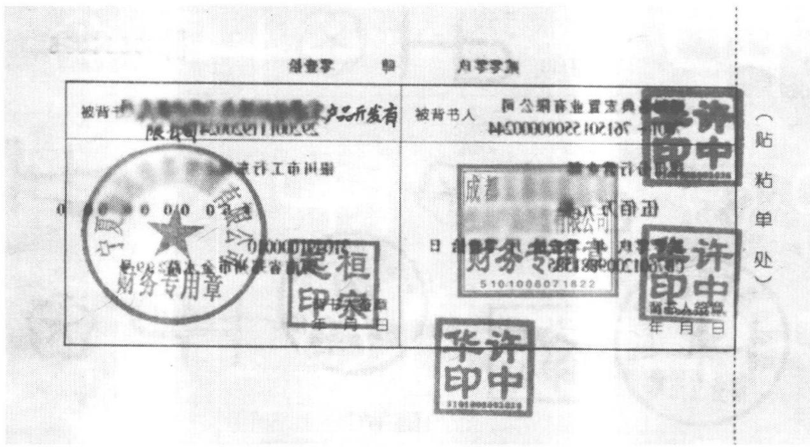

# 银行票据业务操作手册

立金银行培训中心教材编写组著

最全面的票据业务实务操作手册最新最透彻票据业务政策解析●收集各家银行千个一线操作问题

# 行长送客户经理最好的礼物

本书适合商业银行公司业务条线支行行长、票据营销、客户经理学习使用

票据业务操作基本思路：主动经营、减少持有、加速周转、交易获利。实施零信贷资源占用的利润增长模式，从“持票生息”到“交易获利”，实现票据业务多元化的盈利增长格局。

票据是商业银行公司业务的王牌工具，有“贴营销，直贴找客户；转贴腾出规模，转贴找资金。贴，直贴促进转贴。做优质押，质押制造存款。做大

授信不做，存款不稳；方案不佳，收益不丰。不给客户做授信业务，不会有可观的存款；如果设计的授信方案不合适，也不会有可观的存款。

银行办理银行承兑汇票业务就是在自己发钞，在制造货币。请记住：办理银行承兑汇票是吸收存款业务的王牌工具，而办理票据贴现又会带来可观的利息收入，所以，我们说票据全身都是宝。

周转速度快的流通类企业适合使用银行承兑汇票，通过循环使用银票创造存款；周转速度慢的制造类适合使用商业承兑汇票，通过商票创造关联营销机会；周转速度更慢而利润极高的开发商适合办理贷款，提供资金批发信贷创造利润。

本书将帮助你在最短时间内成为一名优秀的商业银行客户经理

集合国内商业银行顶尖票据业务专家心血积累立金培训中心十年教学经验

封面设计：

定价：42.00元

# 票据业务

# 操作手册

立金银行培训中心教材编写组◎著

最全面的票据业务实务操作手册最新最透彻票据业务政策解析●收集各家银行千个一线操作问题

# 行长送客户经理最好的礼物

本书适合商业银行公司业务条线支行行长、票据营销、客户经理学习使用

北京

# 图书在版编目（CIP）数据

银行票据业务操作手册/立金银行培训中心教材编写组著  
北京：中国经济出版社，2013.3  
ISBN978-7-5136-1840-3  
I. $\textcircled{1}$ 银…Ⅱ. $\textcircled{1}$ 立…Ⅲ. $\textcircled{1}$ 商业银行一票据—业务核算—问题解答IV. $\textcircled{1}$ F830.33-44  
中国版本图书馆CIP数据核字（2012）第212974号  
责任编辑 乔卫兵张梦初 方雷  
责任审读 霍宏涛  
责任印制 石星岳  
封面设计华子图文设计公司  
出版发行中国经济出版社  
印刷者 北京市昌平区新兴胶印厂  
经销者各地新华书店  
开 本 $7 1 0 \mathrm { { m m } \times 1 0 0 0 \mathrm { { m m } } }$ 1/16  
印 张 19.25  
字 数 330千字  
版 次 2013年3月第1版  
印 次 2013年3月第1次  
书 号ISBN978-7-5136-1840-3/G·1822  
定 价42.00元

中国经济出版社网址www.economyph.com社址北京市西城区百万庄北街3号邮编100037  
本版图书如存在印装质量问题，请与本社发行中心联系调换（联系电话：010一68319116

版权所有盗版必究（举报电话：010-68359418010-68319282）国家版权局反盗版举报中心（举报电话：12390） 服务热线：010-6834422588386794

# 票据成就经营业绩突出的银行客户经理

立金银行培训中心一直在从事商业银行(公司)信贷业务的培训，票据业务一直是最受欢迎的培训题目。我们在各地培训，基本上一半的时间都是在培训票据。对票据，我们充满感情。

# 一、票据是商业银行赢利的主要工具

票据是商业银行发展业务最锋利的武器，可以给商业银行带来可观的存款、中间业务收人和利息收人，可以说，票据全身都是宝。

我一直说，一家银行不懂得票据非常吃亏。我是一个从小镇出来的人，从小家里很穷，进入银行，我就直接应聘客户经理的岗位，理由很简单，我希望赚钱，客户经理岗位论绩效赚钱，这符合我的期望。10年前我做客户经理的时候，我们支行最早在国内启动票据业务，结果利润指标和存款指标都大幅领先其他支行。而我本人也是票据业务的受益者，大量签发银行承兑汇票使得我的存款大幅增长。到现在，我经常对4岁的女儿说，“乖女儿，感谢票据，家里这一切都是票据给的。”这其中夹杂着我很真挚的感情。而我女儿也非常熟悉票据的口诀，我只要说上句“大客户，我的女儿一定接下句“用商票”。

# 二、票据是企业低成本融资的主要工具

票据最早因支付工具而产生，现代企业对票据的使用范围远远超过支付目的，很多企业利用票据进行融资。而票据业务由于最早实现市场化，融资成本大幅低于贷款。

企业都是趋利的经济组织，融资成本越低越好。而签发银行承兑汇票可以将融资成本有效转嫁给上游客户，而贴现票据成本远远低于贷款，因此，票据在融资市场红了接近20年。这20年，也是成就无数优秀银行人的20年。

# 三、票据业务是对技术要求极高的工具

票据业务始终是一个对技术要求极高，有着较高风险的业务，操作不慎，会给银行造成风险和损失。票据业务操作市场要求较高，票据的签发、承兑、贴现、转贴现、托收的全过程，都有着非常细致的要求。票据业务就像一把锋利无比的利刃，使用得当，会给银行带来巨大利益；使用不当，也会带来巨大的风险。一个刀客的刀锋利固然好，但是刀客自身本领也需要高明，否则，别说抢地盘，还会伤了自己。

商业银行要想稳健发展票据业务，首先必须培养一支精通票据业务、熟悉技术操作的票据业务人才队伍。

立金银行培训中心一直在国内从事票据业务的培训，在多年培训过程中，我们建立了完整的票据业务产品知识体系，通过对实务的整理，我们集合成本教材，以知识问答形式有的放矢地集管理原则、业务流程、操作要点、案例分析于一身，从操作层面解答票据业务风险管理中的实际问题，并将理论与实务紧密结合，对于商业银行经营票据业务具有重要的参考价值和实践意义。

本书具有三个显著的特点：

一是内容新颖。首次全面系统地讲解了最新各类票据产品、票据业务操作方式，从买方付息票据、代理贴现、商票保贴、商票保押、票据池等，到基础票据的操作角度和风险管理角度对票据业务操作过程进行全面的描述，使票据业务从业人员能够迅速了解和掌握业务操作技术要点。

二是结构新颖。按照票据业务的承兑、买人、保管、卖出、托收五个关键环节，一条龙、全方位地阐述票据业务风险管理流程，涵盖票据在商业银行内部从制造到流通、再到最后退出市场的全过程，使得银行人可以全面系统地了解票据业务。

三是通俗易懂。每本书力求将复杂的银行票据业务用最浅显的语言进行精确的表达，这是我们追求的极致。我们采用最浅显的语言，将复杂的票据业务解释得非常清楚，容易理解，便于广大银行从业人员熟悉票据业务、喜欢票据业务、精通票据业务。

本书可以成为票据业务经营和管理人员指导业务操作、加强风险管理的有益指导手册。

祝福天下所有的票据从业人员，让我们共同进步。

陈立金北京

# 目录

代序

# 第一部分 票据业务基础知识

一、商业汇票的定义 3二、国内票据的概念和种类  
三、银行承兑汇票和商业承兑汇票的区别  
四、票据承兑业务、票据贴现业务、票据转贴现  
业务的定义 5五、商业汇票持票人向银行办理贴现业务必须具备的条件 6六、申请票据贴现的单位必须具备的资格 6七、实付贴现金额的计算  
八、贴现和贷款的区别 8九、银行承兑汇票与商业承兑汇票、国内信用证的区别 10十、商业银行票据业务的经营活动过程 10十一、客户在银行办理银行承兑汇票保证金可以提供的理财  
服务及品种·  
十二、银行办理银行承兑汇票保证金理财的业务流程 13十三、票据市场的内容及票据的发行和交易市场的定义 14

# 银行2 票据业务操作手册

十四、票据市场的市场主体…· 15  
十五、以票据资产作为标的物发行理财产品的情况 16  
十六、票据信托计划的流程 17  
十七、银行可以选择合作发行信托计划的机构 19  
十八、票据市场利率体系的内容及确定票据市场交易价格 19  
十九、票据市场最大的做市商 21  
二十、票据市场中的贴现业务主要交易形式 22  
二十一、银行承兑汇票贴现业务所需资料及注意事项 22  
二十二、设立项目经理部施工企业办理贴现需要的手续 24  
二十三、买方付息票据贴现业务营销要点 26  
二十四、票据贴现业务集中处理操作流程 26  
二十五、贴现业务审查的内容及要求· 28  
二十六、中小企业签发的商业承兑汇票办理贴现的风险判断 32  
二十七、对中小企业商业承兑汇票贴现额度的核定 32  
二十八、特大型的垄断客户持一些中小金融机构承兑的  
银行承兑汇票来办理贴现的流程 32  
二十九、商业承兑汇票保贴业务流程及营销 34  
三十、票据池的定义及适用客户群体 38  
三十一、票据池的业务规定 38  
三十二、票据池流程 40  
三十三、票据入池托管 40  
三十四、票据池操作规定 45  
三十五、票据池如何控制风险 47  
三十六、票据池的营销要点 48  
三十七、票据池的产品特点 48  
三十八、票据池中客户可以使用的授信额度 49  
三十九、代理贴现业务的定义及意义 50  
四十、代理贴现业务的法律法规依据 51

目录3

四十一、代理贴现业务的主要风险点及防范措施 51  
四十二、代理贴现业务与传统贴现业务的区别 52  
四十三、办理代理贴现业务票据的范围 53  
四十四、已经办理贴现的票据的赎回 53

# 第二部分 票据业务风险及防范

一、目开目贴票据的规定 57  
二、融资性票据的定义 58  
三、融资性票据的典型形式 58  
四、融资性票据的产生原因 60  
五、票据业务风险的定义及风险 61  
六、票据融资业务经营活动过程的风险管理要点 62  
七、票据承兑业务经营风险的类型及防范要点 63  
八、办理银行承兑业务应遵守的规定 64  
九、办理银行承兑汇票业务的流程 65  
十、通过内部分工加强票据承兑业务的管理 65  
十一、申请承兑业务时，要求承兑申请人提供的资料及流程 66  
十二、受理承兑业务时审查、审批和承兑基本流程 68  
十三、承兑保证金管理的基本要求和主要内容 69  
十四、承兑业务后期管理 70  
十五、票据买入过程存在的风险及防范措施 71  
十六、一些中小农村银行、村镇银行向银行申请办理票据转贴现的  
操作 73  
十七、某一有授信额度的优质客户持未有授信额度的承兑人的票据  
来银行办理贴现时 74  
十八、票据买入过程中进行岗位或部门分工 75

十九、商业银行买入票据的方式及其操作流程 75

# 银行4 票据业务操作手册

二十、办理贴现业务时应审查的资格类文件 76  
二十一、票面要素审查的主要内容及要求 77  
二十二、关于票据签章的有关规定 79  
二十三、票据规范要素：背书 80  
二十四、银行承兑汇票的失误处理 81  
二十五、背书主要包括的几种形式 81  
二十六、背书中常见的错误 83  
二十七、背书审查的主要内容 84  
二十八、票据印刷防伪审查要点及内容 86  
二十九、不应买入的票据 88  
三十、应谨慎买入的票据 89

# 三十一、票据融资业务办理中跟单文件的内容及审查跟单

文件的目的 89

三十二、交易合同审查的要点 89  
三十三、增值税发票的内容 90  
三十四、核实增值税发票真伪的方法 91  
三十五、增值税发票审查要点 93  
三十六、增值税发票和交易合同特例的判定即可以认定存在

真实贸易背景 95三十七、可以辅助判定票据真实贸易背景的手段 96三十八、关联企业的表现特征及要对关联企业申请贴现予以重点

关注的原因 97  
三十九、票据查询的方式 98  
四十、商业银行转贴现买入票据的交易对象 99  
四十一、办理转贴现买入业务时主要审查的资料 105  
四十二、办理转贴现业务时，对资格类文件应如何进行审查 106  
四十三、以回购方式买入票据时，背书的形式及利弊 107  
四十四、办理不背书式回购的回购业务需额外提供的资料 109  
四十五、票据持有期间做好风险管理工作的内容 109  
四十六、商业汇票丧失的定义 109  
四十七、商业汇票丧失后的补救措施 110  
四十八、买入公示催告票据与取得票据权利的关系 114  
四十九、申请公示催告流程 115  
五十、公示催告的受理程序 116  
五十一、公示催告的终结 117  
五十二、转卖时的交易对象选择 117  
五十三、票据转卖过程常见风险及防范要点 118  
五十四、票据转卖操作流程 119  
五十五、卖出回购业务到期后的处理要求 120  
五十六、票据托收工作的主要内容 121  
五十七、票据托收风险的定义及票据托收中常见的

# 风险和防范措施 121

五十八、票据托收的规范操作要求 122五十九、票据托收逾期后常用的救济手段 124六十、逾期赔偿金的定义及逾期赔偿金赔付标准 124六十一、进行逾期赔偿金追索的方案、步骤及各相关

# 部门的职责分工 126

六十二、现行法律规定票据犯罪的定义 128  
六十三、当前票据业务中常见的犯罪活动的特点 128  
六十四、为防止票据犯罪得逞，商业银行应采取的防范措施 130

# 第三部分 票据法律基础知识

一、票据业务遵循的法律法规 135  
二、有关法律法规中对真实贸易背景的要求 136  
三、票据关系主体及其在票据上的存在形式 137  
四、票据行为的概念及类型 139  
五、票据行为的主要特点 141  
六、票据权利的定义 142  
七、取得票据权利的基本条件和取得票据权利的方式 142  
八、票据关系中的善意与恶意 144  
九、票据权利丧失后的保全措施 145  
十、票据权利灭失的情况 146  
十一、票据伪造的内容 148  
十二、票据变造的内容 151  
十三、变造票据具有的效力 152  
十四、我国《票据法》规定汇票必须记载的事项 153  
十五、票据上记载事项的更改方式 153  
十六、票据追索权的定义 154  
十七、行使票据追索权的实质要件 155  
十八、行使票据追索权的形式要件 156  
十九、行使票据追索权 157  
二十、当事人具有票据追索权 158  
二十一、可追索的金额包括的内容 160  
二十二、对追索权的限制条件 160  
二十三、票据付款请求权 161  
二十四、商业汇票逾期定义及逾期责任认定 163  
二十五、有理由逾期和无理由逾期的定义和种类 163  
二十六、逾期付款责任的定义和种类 164  
二十七、银行承兑汇票真假鉴别办法 166

# 第四部分 票据真伪鉴别

一、2010年版银行承兑汇票的防伪特征 173

目录7

二、瑕疵票的判断标准 176  
三、失票救济的程序 178  
四、瑕疵票据识别 179

# 第五部分 票据业务风险案例

一、违规案例 185  
二、伪假票据案例 192  
三、票据诈骗案例(假印鉴诈骗) 196  
四、票据纠纷案例 201

# 附录商业汇票文本

附件1银行商业汇票承兑业务申请书 213  
附件2商业汇票承兑保证书 214  
附件3银行商业汇票承兑抵押合同 215  
附件4银行商业汇票承兑质押合同 218  
附件5银行商业汇票承兑垫款通知书 220  
附件6银行商业承兑汇票贴现业务操作规程(试行)节选 221  
附件7建立票据转贴现关系申请审批书 231  
附件8办理转贴现业务所需资料及要求 231  
附件9票据业务申办委托书 233  
附件10适用外资企业办理放弃追索权的银行承兑汇票贴现234  
附件11银行商业汇票代理贴现总协议 245  
附件12银行商业汇票贴现总协议 250  
附件13银行商业承兑汇票查询确认书… 254  
附件14 $\times \times$ 银行商业汇票代保管协议· 255  
附件15买方付息票据付息承诺函… 258

# 银行8 票据业务操作手册

附件16票据赎回业务协议 259  
附件17银行“公路采购链（供应商）"操作规程 260  
附件18广东省交通集团商业承兑汇票贴现业务 262  
附件19银行 $\times \times$ 交通集团有限公司“公路采购链（供应商）"  
协议…… 263  
附件20 委托代理贴现协议书 265  
附件21 银行商业汇票代理贴现业务三方合作协议 268  
附件22委托代理贴现授权书 271  
附件23银行承兑汇票到期付款承诺函 272  
附件24保兑仓三方业务合作协议书 273  
附件25票据资产委托管理合同 275  
附件26银行“票据池"协议 279  
附件27中国人民银行关于促进商业承兑汇票业务发展的  
指导意见 282  
附件28中国人民银行关于完善票据业务制度有关问题的通知…285  
附件29中国银行业监督管理委员会办公厅关于银行承兑汇票业务  
案件风险提示的通知… 288

# 立金银行培训中心名言 290

# 票据业务基础知识

# 第一部分

练好票据业务基础知识的基本功，将来就可以在票据等类型的公司信贷产品的组合运用中得心应手。就像一个学武之人，练好基本功，将来将各门派武功融会贯通，就会成为一代高手，纵横天下。

# 一、商业汇票的定义

商业汇票是基于合法的商品交易而产生的票据，它是购销人之间根据约期付款的购销合同和商品交易开具的反映债权债务关系并约期清偿的票据。商业汇票可以由收款人签发，也可由付款人签发。依据付款日期的不同，商业汇票分为商业承兑汇票和银行承兑汇票。下图为银行承兑汇票示例图。

银行承兑汇票2 401511378出票日期 贰零零玖 年 肆 月零壹拾日（大写）出票人全称 出蒙人账号 7601-7615015S0000244 VALARWSAN 收款人 账 全 称 号 292001119200247401 2 联农人开户行代上海江场制政公司：2008年 款行全称 郑州分行营业部 开户银行银川市工行东城支行出票金额 伍佰万元整 亿 8到期 月零壹日 010州市金水路299号001000010 翻由周 本票专用章财务专用章 曙 承兑日期 年出人备码 爱核

# 银行票据业务操作手册

# 二、国内票据的概念和种类

票据是指《票据法》所规定的由出票人签发的、约定自己或者委托付款人在见票时或指定的日期向收款人或持票人无条件支付一定金额并可转让的有价证券。

票据包括：汇票、本票和支票。

# 三、银行承兑汇票和商业承兑汇票的区别

银行承兑汇票是由收款人或承兑申请人签发，并由承兑申请人向开户银行申请，经银行审查同意承兑的票据。银行承兑汇票是承兑行的担保行为，属于承兑行表外业务，银行承兑汇票无论是口银行承兑汇票，还是全额保证金银行承兑汇票，到期承兑行都必须承担无条件付款责任。

商业承兑汇票是指由银行以外的付款人承兑的商业汇票。在商业承兑汇票中，所谓的“收款人”“付款人”，是指交易双方当事人而不是汇票当事人。按一般票据规定，商业承兑汇票的出票人应是卖方(交易中的收款人）或买方（交易中的付款人）；承兑人应是买方，付款人应是买方；收款人应是交易中的卖方。在交易活动中，债权人签发向债务人索取票款的汇票，由债务人在票面上注明承认到期付款的“承兑”字样并签章，从而承担付款的责任，债权人同时也获得付款请求权。

商业承兑汇票是企业信用行为，没有任何的银行担保，持票人或者是贴现银行到期向商业承兑汇票的付款人提示付款，是否能够付款，完全看承兑企业自身的实力，可能被拒付。

# 四、票据承兑业务、票据贴现业务、票据转贴现业务的定义

票据承兑是指汇票的付款人承诺负担票据债务的行为。承兑为汇票所独有。汇票的发票人和付款人之间是一种委托关系，发票人签发汇票，并不等于付款人就一定付款，持票人为确定汇票到期时能得到付款，在汇票到期前向付款人进行承兑提示。如果付款人签字承兑，那么他就对汇票的到期付款承担责任，否则持票人有权对其提起诉讼。票据承兑是商业汇票的承兑人在汇票上记载一定事项承诺到期支付票款的票据行为。商业汇票一经银行承兑，承兑银行必须承担到期无条件付款的责任。因此，票据承兑属于银行的一项授信业务。

票据贴现业务对持票人来说，贴现是将未到期的票据卖给银行获得流动性的行为，这样可提前收回垫支于商业信用的资本，而对银行或贴现公司来说，贴现是与商业信用结合的放款业务。是指资金的需求者，将自己手中未到期的商业票据、银行承兑票据或短期债券向银行或要求变成现款，银行收进这些未到期的票据，按票面金额扣除贴现日至到期日的利息后付给现款，到票据到期时再向出票人收款。

票据贴现可以分为三种，分别是贴现、转贴现和再贴现。贴现是指客户(持票人)将没有到期的票据出卖给贴现银行，以便提前取得现款。一般工商企业向银行办理的票据贴现就属于这一种；转贴现是指银行以贴现购得的没有到期的票据向其他商业银行所作的票据转让，转贴现一般是商业银行间相互拆借资金的一种方式；再贴现是指贴现银行持未到期的已贴现汇票向人民银行的贴现，通过转让汇票取得人民银行再贷款的行为。再贴现是中央银行的一种信用业务，是中央银行为执行货币政策而运用的一种货币政策工具。

商业汇票的收款人或被背书人需要资金时，可持未到期的商业承兑汇票或银行承兑汇票并填写贴现凭证，向其开户银行申请贴现。贴现银行需要资金时，可持未到期的承兑汇票向其他银行转贴现，也可以向人民银行申请再贴现。

# 五、商业汇票持票人向银行办理贴现业务必须具备的条件

1.在银行开立存款账户的企业法人以及其他组织。  
2.与出票人或者直接前手具有真实的商业交易关系。  
3.提供与其直接前手之间的增值税发票和商品发运单据复印件。

# 六、申请票据贴现的单位必须具备的资格

申请票据贴现的单位必须是具有法人资格或实行独立核算、在银行开立有基本账户并依法从事经营活动的经济单位。贴现申请人应具有良好的经营状况，具有到期还款能力，贴现申请人持有的票据必须真实，票式填写完整、盖印、压数无误，凭证在有效期内，背书连续完整。贴现申请人在提出票据贴现的同时，应出示贴现票据项下的商品交易合同原件并提供复印件或其他能够证明票据合法性的凭证，同时还应提供能够证明票据项下商品交易确已履行的凭证（如发货单、运输单、提单、增值税发票等复印件）。

中央银行办理再贴现业务的对象是在当地中国人民银行开立存款账户的银行。银行在对商业汇票办理贴现后需要资金时，可以向中国人民银行申请再贴现。

符合条件商业汇票的持票人可持未到期的商业汇票连同贴现凭证向银行申请贴现。贴现银行可持未到期的商业汇票向其他银行转贴现，也可以向中国人民银行申请再贴现。贴现、转贴现和再贴现时，应作成转让背书，并提供贴现申请人与其直接前手之前的增值税发票和商品发运单据复印件。

持票人持未到期的汇票向银行申请贴现时，应根据汇票填制贴现凭证，在第一联上按照规定签章后，连同汇票一并送交银行。银行信贷部门按照信贷办法和支付结算办法的有关规定审查，符合条件的，在贴现凭证“银行审批”栏签注"同意”字样，并由有关人员签章后送交会计部门。

贴现银行向人民银行申请再贴现时，必须持已办理贴现但尚未到期的、要式完整的商业承兑汇票或者银行承兑汇票，填制再贴现凭证，并在汇票上背书，一并送交人民银行。

人民银行审查后，对符合条件的予以再贴现。

# 七、实付贴现金额的计算

会计部门接到作成转让背书的汇票和贴现凭证，按照支付结算办法的有关规定审查无误，贴现凭证的填写与汇票核对相符后，按照支付结算办法有关贴现期限以及贴现利息计算的规定和规定的贴现率计算出贴现利息和实付贴现金额。

其计算办法是：

贴现利息 $=$ 汇票金额 $\times$ 贴现天数 $\times$ （月贴现率÷30天）

实付贴现金额 $=$ 汇票金额一贴现利息贴现银行与承兑银行如果属于异地，贴现天数应当再加上3天。

然后在贴现凭证有关栏目内填上贴现率、贴现利息和实付贴现金额。

第一联贴现凭证作贴现科目借方凭证，第二、三联分别作 $\times \times$ 科目和利息收入科目的贷方凭证，第四联贴现凭证加盖转讫章作收账通知交给持票人，第五联贴现凭证和汇票按到期日顺序排列，专夹保管。贴现、转贴现和再贴现的期限从其贴现之日起至汇票到期日止。实付贴现金额按票面金额扣除贴现日至汇票到期前一日的利息计算。承兑人在异地的，贴现、转贴现和再贴现的期限以及贴现利息的计算应另加3天的划款日期。

贴现、转贴现、再贴现到期，贴现、转贴现、再贴现银行应向付款人（承兑人)收取票款。不获付款的，贴现、转贴现、再贴现银行应向其前手追索票款。贴现、再贴现银行追索票款时可以从申请人的存款账户收取票款。

贴现到期，贴现银行作为持票人，在汇票背面背书栏加盖结算专用章并由授权的经办人员签名或盖章，注明“委托收款”字样，填制委托收款凭证，在"委托收款凭据名称”栏注明“商业承兑汇票”或“银行承兑汇票”及其汇票号码连同汇票向付款人办理收款。对于付款人在异地的，应在汇票到期前，匡算至付款人的邮程，提前办理委托收款。将第五联贴现凭证作第二联委托收款凭证的附件存放。如果贴现银行收到付款人开户银行或承兑银行退回的委托收款凭证、汇票和拒绝付款理由书或付款人未付票款通知书后，贴现银行在追索票据时，对申请贴现的持票人在本行开户的，可从其账户收取。贴现申请人帐户余额不足时，应按照逾期贷款的规定处理。贴现申请人未在本行开立账户的，对已贴现的汇票金额的收取，应按《票据法》的规定向贴现申请人或其他前手进行追索。

已办理再贴现的银行，应于再贴现到期日前在人民银行存款账户内留足资金。再贴现到期日，人民银行从申请再贴现银行存款账户内收取票款。再贴现申请人账户余额不足时，应按逾期贷款的规定处理。

# 八、贴现和贷款的区别

票据贴现和银行发放贷款，都是银行的信贷资产业务，都是为客户融通

资金，但二者之间却有许多差别。

# 1.资金流动性不同

在票据到期时才能向付款人要求付款，但银行如果急需资金，它可以向其他银行办理转贴现和向中央银行申请再贴现，票据贴现资产的流动性极好。但贷款是有期限的，在到期前是不能回收的，银行贷款资产的流动性极差。

# 2.利息收取时间不同

贴现业务中利息的取得是在业务发生时即从票据面额中扣除，是预先扣除利息。而贷款是事后收取利息，它可以在期满时连同本金一同收回，或根据合同规定，定期收取利息。从银行获取收益角度，无疑贴现更符合银行的利益诉求。我们获得利益肯定是越早越好。

# 3.利息率不同

贴现率随行就市，利率变化幅度极大，市场化程度极高。最高的时候，曾经远远的高于贷款利率，达到 $12 \%$ （超过贷款利率2倍）；最低的时候低于存款利率。贴现利率与企业的信用资质无关。

而贷款利率受到人民银行的管制，浮动范围在基准利率的允许空间内，贷款利率同企业的信用等级高度相关，优质企业可以执行基准下浮 $10 \%$ ；而资信较差的企业，利率可以执行基准上浮4倍，差距极大。

一种情况，票据贴现的利率要比贷款的利率低，因为持票人贴现票据的目的是为得到现在资金融通，并非没有这笔资金。如果贴现率太高，则持票人取得融通资金的负担过重，成本过高，贴现业务就不可能发生。

# 4.资金使用范围不同

持票人在贴现了票据以后，就完全拥有了资金的使用权，他可以根据自己的需要使用这笔资金，而不会受到贴现银行限制。借款人在使用贷款时，要受到贷款银行的审查、监督和控制，因为贷款资金的使用情况直接关系到银行能否很好地回收贷款，尤其是《贷款新规》规定，贷款用途受到严格控制。

# 5.债务债权的关系人不同

贴现债务人不是申请贴现的人而是出票人即付款人，遭到拒付时才能向贴现人或背书人追索票款。而贷款的债务人就是申请贷款的人，银行直接与借款人发生债务关系。有时银行也会要求借款人寻找保证人以保证偿还款项，但与贴现业务的关系人相比还是简单得多。

6.资金的规模和期限不同

票据贴现的金额一般不太大，每笔贴现业务的资金规模有限，可以允许部分贴现。票据的期限较短，一般为 $2 \sim 4$ 个月。然而贷款的形式多种多样，期限长短不一，一般规模较大，贷款到期的时候，经银行同意，借款人还可继续贷款。

票据贴现可以使一部分闲散资金拥有者互相利用，共获利益。故贴现在货币市场活动中处于中心地位。票据贴现市场与其他市场相比较，有许多特殊的优点。对银行来说，贴现银行可获得如下利益：利息收益较多；资金收回较快；资金收回较安全等。对于贴现企业，通过贴现可取得短期融通资金。

# 九、银行承兑汇票与商业承兑汇票、国内信用证的区别

银行承兑汇票与商业承兑汇票、国内信用证的区别极大，具体体现在：

<table><tr><td rowspan=1 colspan=1>付款工具</td><td rowspan=1 colspan=1>对企业的成本</td><td rowspan=1 colspan=1>支付成本</td><td rowspan=1 colspan=1>对银行综合收益</td></tr><tr><td rowspan=1 colspan=1>贷款</td><td rowspan=1 colspan=1>成本最高</td><td rowspan=1 colspan=1>贷款利率</td><td rowspan=1 colspan=1>仅有贷款利率，贷款利息收益较高，没有关联营销，综合收益较低</td></tr><tr><td rowspan=1 colspan=1>国内信用证</td><td rowspan=1 colspan=1>成本较高</td><td rowspan=1 colspan=1>手续费0.15%议付0.1%承付0.1%</td><td rowspan=1 colspan=1>融资利息、手续费，能够形成关联营销，综合收益较高。融资方式非常灵活，对银行资本消耗极低</td></tr><tr><td rowspan=1 colspan=1>银行承兑汇票</td><td rowspan=1 colspan=1>成本低</td><td rowspan=1 colspan=1>手续费0.05%</td><td rowspan=1 colspan=1>贴现利息、手续费收人，很难形成关联营销，对企业票源的控制力度较弱</td></tr><tr><td rowspan=1 colspan=1>商业承兑汇票</td><td rowspan=1 colspan=1>成本最低</td><td rowspan=1 colspan=1>工本费1.85元/张</td><td rowspan=1 colspan=1>对企业成本极低，没有银行的资本消耗，不计人银行的风险资产。对票源的流向控制力度极强，可以形成强大的关联营销。综合收益极佳</td></tr></table>

# 十、商业银行票据业务的经营活动过程

商业银行票据业务经营活动大体可分为票据承兑、票据买人、票据保管、票据卖出和票据托收五个过程。这五个过程基本涵盖一张商业票据从诞生到消亡，可能经过的全部过程。

1.票据承兑是指商业银行根据在本行开户客户提出的承兑申请，对客户的资信情况、交易背景情况、担保情况进行审查，决定是否承兑的过程。票据承兑业务一般归类于信贷业务，通过商业银行的承兑，商业信用就转化为银行信用，通常由商业银行的信贷部门负责。

2.票据买人是指商业银行根据持票人的申请，通过对票据承兑人、票据本身、跟单资料及申请人资格的审查，决定是否买进并实施的过程。可分为贴现买入、转贴现买入和买入返售三种形式。

3.票据保管是指商业银行对所买入未到期票据在持有期间的妥善管理过程。票据托收是指商业银行以持有的将到期票据要求承兑人按期承付票款并收回票款的过程。是票据市场的附属业务，都归属于结算业务，由商业银行的会计结算部门负责。

4.票据卖出是指根据自身经营需要及市场价格等情况决定是否卖出并实施的过程。可分为转贴现卖出、卖出回购和再贴现三种形式。票据的买入和卖出都属于票据市场的投融资业务。一般由商业银行的资金营运部门负责。

5.票据托收是指银行按照收款人(也可以是银行自身)委托以其持有的商业汇票向付款人收取款项的过程。主要包括发出托收、收到托收款项、退票拒付及逾期处理和遗失处理四个方面的内容。

# 十一、客户在银行办理银行承兑汇票保证金可以提供的理财服务及品种

银行可以对客户办理银行承兑汇票的保证金提供一定的理财服务，现在经常使用到的就是对保证金购买低风险的理财计划，或者是存人7天通知存款，到期本利滚存。

1．承兑保证金理财是在银行活期承兑保证金存款的基础上开发的衍生产品，具备在保证金存款账户内的定活组合理财功能。承兑保证金在保证银行支付到期承兑款项的同时，可满足客户高于活期存款利息（低于定期存款利息）的保证金财富管理需求。

2.承兑保证金理财适合在银行办理银行承兑汇票业务的战略客户、重点客户及其他符合总行(公司、部)准入标准的重点行业支持客户。

3．账户类型和凭证：承兑保证金存款账户分为活期和定期两种，均为记账式账户，不出具“单位定期存款开户证实书”等定期存款凭证，开户银行只为客户（出票人）出具存人本金和利息的记账凭证及账户对账单。

4.循环理财：客户与银行签订的《银行承兑保证金账户财富管理协议》生效后，自开立活期承兑保证金账户并存人资金之日起，核心系统自动按协议约定方式及约定金额将保证金转为一个或多个定期计息账户进行管理和计息。不足定期计息账户金额部分的存款仍按活期计息。在每个定期账户的到期日之初，银行核心系统将自动按签约存款种类对应的利率及人行的计结息方式结息，并将本金及利息金额分别转人签约客户主账户，如果客户主账户资金仍符合存款协议约定金额，则银行可按当前签约存款种类循环再次进行转存。

5.转存及其计结息规则：承兑保证金账户定、活间资金转换及计息生成方式同银行个人存款“定存宝”业务，具体如下：

（1）客户选择定期计息账户的存期为1天（日计划）、7天（周计划）、3个月、6个月，任选其一，并按央行相应期限存款利率计息。

（2)主账户最低保留余额为0，客户如选择存期为1天、7天时，定期账户起存金额为50万元，且为1万元的整倍数；客户如选择存期为3个月或6个月时，定期账户起存金额为1万元，且为1万元的整倍数。

（3）客户主账户不足以满足支付要求时，核心系统自动从最后存人的定期子账户开始将支取金额和积数逐笔转回活期账户，直到满足支付为止；转回活期的资金待该账户结息时，按结息日挂牌公告的活期存款利率一并结计利息，该定期账户内留存的剩余金额若达到了相应存款种类的起存金额，可继续按原利率计算利息；若不足起存金额则该账户自动清户，剩余本金及积数随支取金额一并转回活期主账户，待主账户结息时，按结息日挂牌公告的活期存款利率一并结计利息。

6.协议变更：在协议有效期内，客户可根据需要变更承兑保证金账户定期账户的存期，办理流程与新增协议相同。变更协议签订后，将在下一次转存定期时按协议变更生效后确定的存期和利率转开定期账户，但对于该客户已经转存为定期账户的保证金存款，仍按原存期、利率计结息。

7．协议终止：客户根据需要，拟解除协议时，可持《终止承兑保证金账户财富管理协议申请书》到签约行办理终止手续，签约行同意终止协议后，客户如有未到期的定期存款子账户本金及计息积数可全部一次性转回保证金活期账户，并在活期账户结息日按照当日挂牌公告的活期存款利率计结利息。

# 十二、银行办理银行承兑汇票保证金理财的业务流程

1.增加或变更类业务：柜员应审核《银行承兑保证金账户理财协议》（以下简称“管理协议”）、要素填写齐全准确、无涂改，甲方（客户）、乙方（银行）均已加盖公章并由法定代表人或授权代理人签章，甲方公章与管理协议中的"承兑申请人”名称一致，如为授权代理人还应出具法定代表人的授权书。分行公司业务管理部已在管理协议上签署审批同意。

2.协议终止业务：柜员应审核《终止承兑保证金账户理财申请书》（以下简称"终止协议”)中保证金账号是否为已签约账号、客户已加盖公章并由法定代表人(或授权代理人)签章，甲方公章与已签约账号户名一致，如为授权代理人还应出具法定代表人的授权书。

3.管理协议或终止协议中“法定代表人"处签章与管理协议中甲方信息栏"法定代表人”不一致时，视为其授权代理人签章，应有注明了授权经办人姓名和身份证件信息的法定代表人授权委托书。

# 十三、票据市场的内容及票据的发行和交易市场的定义

票据市场包括发行和交易两级市场。

票据发行市场是一级市场，在这个市场里，票据作为一种信用凭证诞生，首先实现的是因商品交易关系而产生的支付和企业间的结算。票据发行包括票据签发和承兑。

票据交易市场是二级市场，实现票据的流动、货币政策的传导、市场信息的反馈等功能，是票据流通关系人、投资机构、市场中介机构进行交易的场所。二级市场的票据交易活动包括：

1.背书转让 企业之间

企业作为票据流通关系人因各种对价关系而通过背书方式使票据这种信用凭证代替货币充当交换媒介功能。企业之间的背书转让通常对应一定的商品交易关系或债权债务关系。

2.贴现 企业与商业银行

商业汇票的合法持票人，在商业汇票到期以前为获取票款，由持票人或第三人向金融机构贴付一定的利息后，以背书方式所作的票据转让。对于持票人来说，贴现是以出让票据的形式，提前收回垫支的商业成本。对于贴现银行来说，是买进票据，成为票据的权利人，票据到期，银行可以取得票据所记载金额。

3.转贴现(含回购） 商业银行之间转贴现(含回购)

转贴现是指金融机构为了取得资金，将未到期的已贴现商业汇票再以卖断或回购方式向另一金融机构转让的票据行为，是金融机构间融通资金的一种方式。票据转贴现不仅拓展了票据业务的深度和广度，而且活跃了票据市场，满足了商业银行调整信贷资产结构、调节短期资金、提高资金收益的需要，成为各家商业银行重要的一项资产业务和流动性管理工具。

票据银行（财务公司） 银行（财务公司）

4.再贴现 商业银行与中央银行

再贴现是指将自身持有的已贴现票据出售给中央银行的票据行为。再贴现业务是商业银行进行流动性管理的重要工具，当再贴现利率低于市场资金利率时，再贴现业务还可能成为商业银行获取利差收益的一种途径。

# 十四、票据市场的市场主体

票据市场的市场主体主要有：

1．商业银行

票据市场上最活跃的成分，所占的交易量最大，采用的信用工具最多，对资金供求与利率波动的影响也最大。

2.非银行金融机构

信用社、财务公司、信托公司等。财务公司是当前非常活跃的交易主体，非常值得关注。

3.企业

企业由于临时性和季节性的资金需要，常常通过签发商业承兑汇票、申请银行承兑汇票、贴现等方式在票据市场融资。

# 4.中央银行

中央银行可以通过再贴现吞吐基础货币，调节票据市场供求传导货币政策意图，实现货币政策目标。

# 十五、以票据资产作为标的物发行理财产品的情况

现在很多银行热衷发行票据理财计划，其实，就是将银行的票据贴现资产打包发售掉，出售给投资者，由于票据贴现资产风险极低，而收益高于存款利率，所以通常非常受欢迎。通过发行票据信托计划，银行可以将票据贴现资产移出表外，同时，银行可以发行理财产品，维护高端的理财客户。

通常包括两种类型：

1.银行的增量票据资产直接通过表外资金来贴现。

2.银行存量的票据贴现资产转出表外。

“票据资产”，指银行直贴或转贴现买断的、同时符合票据信托计划风险要求的银行承兑汇票。

办理票据信托计划属于低风险投资工具，会为银行带来可观的理财客户群体，同时为银行释放宝贵的信贷资产规模。

信托公司，为票据资产联结理财资金受托人，必须由经总行同业机构部审核通过、具有相应业务开办资质的信托公司在指定机构开立信托专户。

# 十六、票据信托计划的流程

1.票据资产转让操作规程

(1)系统内票据转贴现。票据信托计划资产转让由指定分行操作时，指定行作为统一出口行与系统内其他行办理转贴现业务时，除以下列明事项，其他操作同系统外转贴现业务规定。

$\textcircled{1}$ 票据计息天数：根据买人行与票面承兑行所在地确认同城异地进行计算；

$\textcircled{2}$ 票面到期日：转卖行转出的票据资产票面到期日需大于拟操作理财产品期满日10日（含）以上；

$\textcircled{3}$ 票面金额：除特殊情况外，转卖行转出的票据资产单张票面金额不得低于50万元；

$\textcircled{4}$ 票面：转卖行转出的票据资产票面需无明显瑕疵，票据背书粘单2张（含）内；

$\textcircled{5}$ 双方对转让的票据资产的后续操作产生的除利息收人外的其他收入的分配，可签订《商业汇票转贴现补充协议》予以明确；

$\textcircled{6}$ 转出行可仅提供转出的票据资产对应的查询查复书复印件和前手贴现(转贴现)凭证，但需对票据的正当取得承担责任；

$\textcircled{7}$ 转出行可不提供《建立转贴现关系申请书》，但需对提供的其他资格文件的真实性承担责任。

(2)理财产品的票据资产转让操作。票据资产转让是指与信托公司进行票据资产转让的操作，操作同转贴现业务规定。

$\textcircled{1}$ 计息天数：按照转让日与票面到期日实际天数计算，可不根据同城异地进行计息天数调整；

$\textcircled{2}$ 信托公司提出委托转让分行对票据资产进行代保管申请的，转让分

行需与信托公司签订《票据资产委托管理合同》；

$\textcircled{3}$ 受托保管的票据资产需严格按照代保管品管理要求进行封包、交接、保管。

2.票据资产对应的票据要求

票据资产对应的票据承兑行应为银行同业授信客户，根据银行同业机 构部授信客户名单实时调整。

# 3.票据资产期限

拟转让票据资产票面到期日承兑行与转出行同城时，票面到期日至少

为理财产品到期日再加上3天；承兑行与转出行为异地时，票面到期日至少为理财产品到期日再加上7天。

# 十七、银行可以选择合作发行信托计划的机构

银行可以和国内的大型信托公司合作票据信托计划，需要向当地的监管部门备案。大型信托公司包括：

北方信托有限责任公司、上海国信有限责任公司、华宝信托有限责任公司、中海信托有限责任公司、华澳信托有限责任公司、中泰信托有限责任公司、安信信托有限责任公司、爱建信托有限责任公司、安徽国元信托有限责任公司、兴业国际信托有限公司、山东省国际信托有限公司、中原信托、百瑞信托、交银国际信托有限公司、方正东亚信托有限公司、武汉国际信托有限公司、银行租赁股份有限公司、广东粤财信托有限公司、东莞信托有限公司、大业信托有限公司、重庆国际信托、新华信托股份有限公司、中铁信托有限责任公司、四川信托有限公司、西藏信托有限公司、甘肃信托有限责任公司、五矿国际信托有限公司、华信信托、厦门国际信托有限公司、平安信托有限责任公司、华润深国投信托有限公司。

# 十八、票据市场利率体系的内容及确定票据市场交易价格

票据市场的利率主要包括：贴现利率、转贴现利率和再贴现利率。

贴现利率是指远期汇票经承兑后，汇票持有人在汇票尚未到期前在贴现市场上转让，受让人用来计算所要扣除的贴现息的利率。或银行购买未到期票据时，用来计算贴现息的利率。

贴现市场利率在一定程度上受到中央银行的管制。根据中国人民银行规定：“贴现利率采取在再贴现利率基础上加百分点的方式生成，而贴现利率上限按照不超过同期贷款利率(含浮动)生成。”从而确定了贴现利率以再贴现利率为下限，以贷款利率为上限的浮动幅度，金融机构在此浮动幅度内拥有自主权。

上海银行间同业拆放利率(ShanghaiInterbank Offered Rate,简称 Shi-bor)，以位于上海的全国银行间同业拆借中心为技术平台计算、发布并命名，是由信用等级较高的银行组成报价团自主报出的人民币同业拆出利率计算确定的算术平均利率，是单利、无担保、批发性利率。目前，对社会公布的Shibor品种包括隔夜、1周、2周、1个月、3个月、6个月、9个月及1年。

Shibor报价银行团现由16家商业银行组成。报价银行是公开市场一级交易商或外汇市场做市商，在中国货币市场上人民币交易相对活跃、信息披露比较充分的银行。中国人民银行成立Shibor工作小组，依据《上海银行间同业拆放利率(Shibor)实施准则》确定和调整报价银行团成员、监督和管理Shibor运行、规范报价行与指定发布人行为。

全国银行间同业拆借中心受权Shibor的报价计算和信息发布。每个交易日根据各报价行的报价，剔除最高、最低各2家报价，对其余报价进行算术平均计算后，得出每一期限品种的Shibor，并于11：30对外发布。

转贴现利率是指商业银行在资金临时不足时，将已经贴现但仍未到期的票据，交给其他商业银行或贴现机构给予贴现时支付的利率。

转贴现利率的市场化程度最高，市场利率主要决定于市场资金和票据的供给程度，利率水平能够通过高效率、自由化的市场及时反映资金供需状况。

同时，票据市场利率与银行间市场利率、备付金利率存在明显的相关性。

银行通常需要观测Shibor的走势，决定市场上转贴现利率的高低及未来发展趋势。

通常，银行的转贴现利率与 $3 \sim 6$ 个月的Shibor高度挂钩。

再贴现率是商业银行将其贴现的未到期票据向中央银行申请再贴现时的预扣利率。再贴现意味着商业银行向中央银行贷款，从而增加了货币投放，直接增加货币供应量。再贴现率的高低不仅直接决定再贴现额的高低，而且会间接影响商业银行的再贴现需求，从而整体影响再贴现规模。

在实际的业务活动中，经常出现贴现利率最高的时候，可以远远超出贷款利率，甚至在1倍以上；贴现利率远远低于存款利率。

再贴现利率是各家银行获得融资的最后通道，基本使用的时候极少；转贴现利率是小银行向大银行获得资金的通道，通常与大银行的信贷资金规模高度挂钩；贴现利率是银行向企业客户提供的融资利率，通常同整个银行体系的信贷规模高度挂钩，信贷规模宽松的时候，贴现利率走低；信贷规模紧张的时候，贴现利率走高。

# 十九、票据市场最大的做市商

国内最大票据做市商属于中国工商银行票据营业部，中国工商银行票据营业部是全国首家经中国人民银行批准的全国性、专业性的票据经营机构，于2000年11月9日在上海成立。中国工商银行票据营业部为中国工商银行总行直属的一级分支机构。票据营业部在北京、天津、重庆、广州、西安、郑州、沈阳七个城市成立了跨区域经营的票据分部，建立了面向全国的以上海总部为龙头，各分部为主干的票据业务营销网络。通过坚持高度集中、统一管理的经营方式，建立了高效运作、管理有序、授权控制的运行机制，发挥了系统内“专业经营、带动发展、调节窗口、研发创新”的职能，开创了票据面向全国、网络营销的专业化、规范化、集约化经营之路。

其他各家银行的转贴现票据的最终流向行一般都是中国工商银行票据

银行 22 票据业务操作手册

营业部。

# 二十、票据市场中的贴现业务主要交易形式

当前票据市场中的主要交易形式分为两种：放弃追索权的贴现（买断）和有追索权的票据贴现（非买断）。

放弃追索权的贴现(买断)是指银行购买申请人持有的未到期商业汇票，到期由银行负责收款的票据行为。在这种交易中，银行为被背书人，申请人为背书人，票据权利从申请人彻底并切割式转移到银行。有这类贴现需要的客户，一般都是除了希望融资，还希望改善财务报表。

有弃追索权的贴现(非买断)是指银行购买申请人持有的未到期商业汇票，银行同时保留对申请人的追索权，到期由银行负责收款，如果收款不回，银行可以向申请人追索的票据行为。在这种交易中，银行为被背书人，申请人为背书人，票据权利从申请人非彻底转移到银行。有这类贴现需要的客户，一般没有希望改善财务报表的需要，纯粹是为了融资需要。

# 二十一、银行承兑汇票贴现业务所需资料及注意事项

1.一般银行承兑汇票贴现业务（1)拟贴现票据原件及正反两面清晰的复印件(一式两份）。

（2）《银行承兑汇票贴现审核表》原件。

(3)贷款卡基本信息查询记录(状态须为正常）

（4）《低风险授信报告暨审批表》原件。

（5）《银行承兑汇票贴现协议》一式三份。

（6)商品交易合同及增值税发票复印件。

(7)经柜台人员验印后的贴现凭证。

（8)贴现申请人经过年检合格的营业执照正本或副本复印件，企业代码证书复印件，法定代表人资格证明及身份证复印件、经办人身份证复印件，贷款卡复印件，公司章程复印件（企业首次办理业务时提供，如遇变更，办理业务时需再次提供）。

2.买方付息贴现业务

买方付息贴现业务除提供一般贴现业务所需资料外，需注意的事项如下：

（1)客户在办理买方付息业务时必须在银行开立买方付息保证金账户，并将买方承担的贴现利息全额转人，同时出具《买方付息承诺函》。

(2)客户须将贴现利息存人经营单位买方付息保证金账户，经营单位收妥后将款项划入分行暂收暂付账户并出具保证金入账通知书。

（3）经营单位柜台人员将买方利息从保证金账户中扣划至票据专柜专用账户中，填写《买方付息贴现利息扣划说明》传真至清算结算中心票据专柜。

# 3.代理贴现业务

代理贴现业务除提供一般贴现业务所需资料外，需注意的事项如下：

（1)代理贴现业务需由贴现申请人、其代理人与银行共同签订《银行商业汇票代理贴现业务三方合作协议》，在协议有效期内每次办理业务均需提供三方合作协议的复印件。

（2）贴现凭证中持票人名称、《银行承兑汇票贴现协议》中贴现申请人名称，应填写委托人名称；贴现凭证、拟贴现的商业承兑汇票背面的背书栏、贴现申请书和贴现合同中需委托人签章的地方，加盖代理人的签章，并在商业汇票背书栏内签注“由 $\times \times$ 代理 $\times \times$ 表明代理关系。

# 4.“先贴后查”业务

# 银行24 票据业务操作手册

“先贴后查”业务除提供一般贴现业务所需资料外，需注意的事项如下：

（1)"先贴后查”业务实行授信额度控制，与其他一般授信业务品种一并纳人统一授信，按照银行一般授信业务操作规程和审批权限进行审批。

(2)在授信额度内办理每笔“先贴后查”业务时，须与贴现申请人签订《“先贴后查”贴现协议》并填写《授信使用审批意见表》。

5.“封闭运转”贴现业务

“封闭运转"贴现业务提供的业务资料同一般贴现业务所需提供的资料。

# 二十二、设立项目经理部施工企业办理贴现需要的手续

在银行的营销实务过程中，经常遇到一些施工企业的项目经理部持银行承兑汇票向银行申请办理贴现。

根据《人民币银行结算账户管理办法》及《人民币银行结算账户管理办法实施细则》的相关规定，建筑安装公司项目经理部因办理临时经营活动，需要开立银行账户时，应经人民银行批准后开立临时存款账户，办理临时经营活动发生的资金收付。银行承兑汇票是一种结算工具，项目经理部可以作为汇票的收款人。

鉴于项目中标协议是由发标方与中标公司签订，收款人应该是中标公司，但是在本业务模式下以项目经理部为收款人，故应在《银行承兑协议》中明确写明汇票收款人为项目经理部，以免发生纠纷。

项目经理部作为贴现申请人在银行办理汇票贴现，需提供法人（中标公司）对其的授权委托书（见附件）及按照银行信贷政策要求中标公司提供的相关文件，并要求中标公司出具同意由项目经理部办理票据贴现、收取贴现款项的董事会决议。

汇票背书使用项目经理部自身的预留印鉴；贴现凭证、贴现协议使用项目经理部公章、预留印鉴；使用中标公司的贷款卡录人贴现信息。

项目经理部在办理贴现业务时，需提供根据税收制度有关规定出具的发票。为项目经理部办理汇票贴现业务，要特别注重贸易背景的真实性和对票据跟单资料的审查，加强对贴现资金流向监控，做到法律手续齐备、风险防范到位。

【文本】

# 授权委托书

委托人：  
法定代表人： 地址：  
受托人： （项目经理部）  
银行 支行（营业部）  
为便利 项目建设的资金使用及管理，我公司对受托人进行如下授权：

1.许可受托人使用我公司的所有法律文本资料，并在上面加盖受托人公章，在银行开户，户名为 。

2.受托人可以使用自己的预留印鉴在银行办理以其为收款人的银行承兑汇票贴现业务，并签署《银行承兑汇票贴现协议》以及相关其他文件。

3.受托人可以使用我公司贷款卡录入相关的贴现信息。

4.在发生银行承兑汇票项下追索情形时，如果受托人未按照与贵行签署《银行承兑汇票贴现协议》的约定履行还款义务，贵行有权从我公司在贵行开立的任何账户中扣划相应款项抵偿受托人对贵行所负的债务，如扣划款项不足抵偿受托人对贵行所负的债务，贵行可采取《银行承兑汇票贴现协议》中约定的以及法律许可的其他任何手段向我公司追偿，直至《银行承兑汇票贴现协议》项下所有债务得到完全清偿为止。

5.本授权委托书自签发之日起生效，有效期至 年月日。

委托人：

（公章）

法定代表人：

年月日

# 二十三、买方付息票据贴现业务营销要点

1.买方付息票据业务针对的客户类群

所有实物买卖的企业，尤其是其中的上市公司及外商投资企业。

特点：这些客户的特点在于公司降低财务成本的压力很大，同时对财务管理的要求非常规范。

# 2.营销重点

（1)降低财务费用一—目前使用贷款的企业。买方付息的承兑汇票支付效果同现金一样，但从融资角度看，成本却比贷款低得多。

(2)规范财务运作——针对目前已经使用承兑汇票的企业，尤其是关联企业。在买方付息票据中，买方所承担的利息支出可以计入财务费用，免缴所得税。而在传统的银行承兑汇票支付中，企业直接内部转移贴现利息，是不能计入财务费用而免征所得税的。

(3)集团理财—针对金额较大的集团采购企业。买方可以根据票据量，采取买方统一商谈贴现率的方式，买方在开立银行承兑汇票时就可以确定将来贴现的价格，便于从容安排财务费用，获得了较优化的集团理财的效果。

# 二十四、票据贴现业务集中处理操作流程

# 1．贴现业务审批

经营单位受理贴现申请人商业汇票贴现业务，对业务资料合法、合规性、真实贸易背景进行初级审查以及有权签批人的初级审批。

(1)经营单位受理贴现申请人贴现业务（贴现申请人上门办理或客户经理双人上门服务)，经办人员应与贴现申请人办理商业汇票交接记录。经营单位营业室双人负责对拟贴现票据的真伪、票面要素、背书进行初级审验，并双人在《银行银行承兑汇票贴现审核表》票面初级审验栏签字；负责对拟贴现企业加盖的印鉴进行验印并签章确认。

(2）经营单位客户经理收集贴现相关业务资料，进行授信调查并录入CECM系统撰写《低风险业务授信调查报告》，双人对商业汇票贴现业务合法、合规性进行初级审查并签署意见，通过后提交有权签批人进行初级审批并签署意见。

$\textcircled{1}$ 一般银行承兑汇票贴现业务，经营单位可先将经初级审验的拟贴现票据及《银行承兑汇票贴现审核表》一同送达票据中心最终审验，由票据中心尽快交票据专柜进行查询。经营单位初级审批工作可在票据查询期间办理。

$\textcircled{2}$ 对于使用"先贴后查”授信额度的贴现业务，经营单位可先进行初级审验和初级审批，通过后将拟办理贴现的商业汇票原件、《银行承兑汇票贴现审核表》及相关业务资料一同送达票据中心办理最终放款审核手续，贴现的商业汇票原件再由票据中心送达票据专柜查询。

$\textcircled{3}$ 对于办理“自开自贴”的贴现业务，经营单位可先进行初级审验和初级审批，通过后将拟办理贴现的商业汇票原件、《银行承兑汇票贴现审核表》及相关业务资料一同送达票据中心，票据中心对拟办理贴现的商业汇票原件最终审验通过后，送达票据专柜查询。

$\textcircled{4}$ 对于办理商业承兑汇票的贴现业务，经营单位可先进行初级审验和初级审批，通过后将拟办理贴现的商业承兑汇票原件、相关业务资料一同送达票据中心，票据中心对拟办理贴现的商业汇票原件最终审验通过后，送达票据专柜查询。

(3)经营单位须当天由双人将拟办理贴现的商业汇票原件送交票据中心进行审验（汇票原件必须由经营单位营业室封包并加盖业务专用章）。对于当天无法送达票据中心的拟办理贴现的商业汇票原件，由经营单位营业室进行专夹保管并存放在营业室保险柜内。

（4）对于拟贴现票据在经营单位的传递、保管环节，经营单位必须在票据中心统一印制的《票据贴现业务内部票据交接登记簿》上双人签字确认。

# 2.放款审核

票据中心与票据专柜对拟查询票据进行交接登记。查询后的商业汇票

原件由票据专柜进行保管。

(1)根据职责分工，票据专柜负责全行拟贴现票据的查询。票据专柜出具的查复书是票据中心放款审核的重要依据之一。

票据中心收到拟贴现票据查复结果后，通知经营单位提交全部业务资料至票据中心，并办理最终放款审核手续。

(2)经营单位负责将贴现凭证、贴现协议中贴现利息及实付金额填写完整，经票据中心审核无误后，贴现凭证经办栏由经营单位的经办人员签字，负责人栏由票据中心有权签字人（总经理或授权委托人）签字；内部划款通知书由票据中心负责填写，按营业部相关权限规定进行有权人签字并加盖部门公章；贴现协议加盖营业部合同专用章及营业部有权签字人名章。

(3)票据中心审核人员将贴现协议、内部划款通知书、信贷业务通知书、贴现凭证及贴现协议送票据专柜进行账务处理，票据专柜出具贴现业务客户回单交票据中心。

（4）经营单位取回客户回单、贴现协议及所有业务资料，三日内将贴现业务核心档案上交票据中心。

(5)票据专柜负责贴现票据到期托收。

# 二十五、贴现业务审查的内容及要求

商业汇票贴现业务放款审核时，经营单位需向营业部票据中心提供的资料及审核要点如下：

1.资格类资料及审查要求

（1）贴现申请人经过年检合格的营业执照正本或副本复印件，企业代码证书复印件（企业首次办理业务时提供，年检通过后，应每年提供一次）；审查要点：判断贴现申请人是否具有真实法人或法人授权经营的资格、营业执照及企业代码证是否已过时效。

（2）贴现申请人法定代表人资格证明及身份证复印件、经办人身份证复印件(企业首次办理业务时提供，如有变动办理业务时需再次提供)；审查要点：法定代表人身份证复印件上姓名与贴现申请书及贴现协议上的签章是否一致。

（3）贴现申请人贷款卡号、密码及查询资料复印件；审查要点：通过《银行信贷系统登记咨询系统》查询企业概况、贷款卡的状态和贴现申请人的情况，贷款卡状态必须有效，对贷款卡无效、被注销、暂停或不能提供者，不能办理贴现业务。

（4）贴现申请人法定授权委托书及被授权人身份证复印件。审查要点：法定授权委托书必须有法定代表人签字、被授权人姓名、单位公章，被授权人姓名必须与被授权人身份证复印件记载的姓名一致。

2.贴现业务类资料及审查要求

(1)商业汇票原件及与原件相一致的清晰的正反面复印件(一式两份)。

$\textcircled{1}$ 票据真伪的审验内容包括：

A.规格： $1 0 0 \mathrm { m m } \times 1 7 5 \mathrm { m m }$ （公差范围： $1 \mathrm { m m } )$ 。B.纸张(以2000版商业汇票为例)：2000年版商业汇票使用90克/平  
方米满版梅花图案和汉语拼音"HP”图案的汇票专用黑白水印纸，纸中含有  
无色荧光纤维和有色纤维，并且具有防涂改功能。C.行徽：用红色荧光油墨印制，在紫外灯光下发橘红色荧光。D.暗记：无色荧光油墨，在紫外灯光下发黄绿色荧光。E.红水线：水溶性红色荧光油墨，正常红水线在紫外灯光下有微弱的红  
色荧光反应，涂改后的红水线表面发生变化。F.号码：2000年新版汇票统一使用组合专用号码，号码用渗透性油墨  
印制，在纸张正面为棕黑色，背面为红色渗透效果。G.微缩文字：为汉语拼音字母"HUIPIAO"组成。

H.汇票印制厂（4家）：

上海证券印制厂 西安印钞厂证券分厂天津市人民印刷厂 保定五四三印刷厂

I.2000年银行承兑汇票的底纹颜色与各商业银行的银行汇票的颜色相同，并印有各行行徽及无色荧光暗记。

$\textcircled{2}$ 票据要素及背书初级审验内容包括：

A.汇票须在有效期内 $( \leqslant 6$ 个月），出票日期、出票人、收款人、金额、汇票到期日、出票人开户银行等要式记载必须完整、规范符合《票据法》要求。B.大小写金额必须一致。C.承兑行的签章真实、齐全，即银行规定使用的汇票专用章及法人代表或授权经办人的签章必须齐全、清晰，汇票专用章上的联行行号与承兑行名称核对相符。D.出票人、背书人签章正确、齐全。E.汇票记有“不得转让”“委托收款”或“质押"字样的票据不能办理贴现。F.出票人全称是否与票据正面出票人签章处签章称谓一致，出票人账号、付款行全称要求填写齐全。G.出票人签章为单位公章或财务专用章及预留银行人名章或签字。H.收款人全称与第一手背书签章一致。收款人账号、收款行名称填写齐全。

I.承兑人签章与汇票归属行一致的汇票专用章及经办人或受权人名章。汇票专用章上的联行行号与承兑行名称核对相符。农业银行汇票的专用章为钢印。没有经办人或受权人签章的票据不得受理。

J.背书必须连续依次衔接、清晰易认，必须全额背书，企业在票据上的背书，必须使用单位公章、财务专用章，背书章必须加盖在背书栏内。背书签章，在粘单齐缝处加盖粘单上第一手背书人全部签章。

(2)商业汇票的最后背书人与其直接前手的交易合同及相关的税务发票复印件，如因商品、劳务及其交易方式的特殊性无法出具增值税发票的，应提供国家税务机关出具的免增值税发票的相关文件、法规规定或单位出具的有效说明，同时提供普通发票复印件。

$\textcircled{1}$ 交易合同的审查要点：

A.交易合同的供需双方应是商业汇票的最后背书人与其直接前手。B.合同签订日期一般早于或等于商业汇票的出票日，其金额应大于或等于商业汇票金额。C.合同是否在有效期内。

D.供需双方印章清晰。

E.合同必须具备合同标的，即商品名称，且商品名称应与税务发票上的商品名称一致。

F.对水、电、煤、油、燃气等公用事业单位持有的商业汇票，如因特殊原因不能提供其与相关企事业单位的商品交易合同，在其出具供应计划（如供电计划)或其他能证明真实贸易背景的材料，并经相关经办人员审核无误后，可以办理贴现业务。

$\textcircled{2}$ 税务发票的审查要点：

A.发票清晰，四联旧版增值税发票应提供一到四联中的其中一联。增值税发票一至四联依次为存根联、发票联、抵扣联和记账联，其中在发票联和抵扣联的发票名称上盖有国家税务总局监制的《全国统一发票监制章》。第五联至第七联复印件因无法定效力，不予接收。

三联新版增值税发票应提供一至三联中的其中一联。新版增值税发票  
一至三联依次为抵扣联、发票联和记帐联，取消存根联。发票内容同旧版。B.发票原则上必须加盖销货方增值税发票专用章或财务专用章，加盖  
单位公章或其他印章的增值税发票无效。C.不得重复使用发票，不同票号的发票密码区应不同。D.发票的总金额必须大于或等于商业汇票金额。

(3)低风险业务授信业务调查暨审批报告。

（4)经营单位营业室初级审验人员签字的《银行承兑汇票贴现审核表》（加盖经营单位会计业务专用章）。

(5)企业法人签字确认书(经营单位营业室验印)。

(6)经贴现企业签章的贴现凭证(经营单位营业室验印)。

(7)经贴现企业签章的贴现申请书(经营单位营业室验印)。

(8)经贴现企业签章的贴现协议，特殊业务品种如买方付息、代理贴现等特殊业务品种应使用总行相关管理规定中提供的协议文本或业务资料（经营单位营业室验印）。

# 二十六、中小企业签发的商业承兑汇票办理贴现的风险判断

大企业或小企业商业承兑汇票风险其实没有区别，只要银行办理商业承兑汇票的贴现，承兑人须经总行或总行授权分行确定并核定承诺商业承兑汇票的贴现授信额度。只要有额度，办理商业承兑汇票贴现风险就可以控制。所以，不是小企业签发商业承兑汇票就不能办理贴现，基本前提是对签发商业承兑汇票的小企业必须有授信额度。

# 二十七、对中小企业商业承兑汇票贴现额度的核定

银行可以以中小企业提供的房产抵押、应收账款质押、联保等方式提供授信额度，让中小企业以签发商业承兑汇票方式用信，而非贷款方式。

对中小企业发放贷款形式的信贷资产流动性很差，而以商业承兑汇票贴现形式发放的贷款流动性就很好，可在需要的时候转贴现出去。

# 二十八、特大型的垄断客户持一些中小金融机构承兑的银行承兑汇票来办理贴现的流程

我们在营销的时候经常见到，一些特大型的垄断企业，例如石油公司、电力公司持一些较小的城商行、农信社的银行承兑汇票来办理贴现，而我们这家银行根本就没有给这些较小的城商行和农信社核定有授信额度，该怎么办呢？

一种特殊贴现就叫"及时贴”,指在贴现申请人的授信额度（含短期流动资金贷款额度或商业承兑汇票贴现额度)内，银行对申请人持有的非授信银行承兑的商业汇票办理贴现的业务。

为了有效控制授信风险，银行买人的票据金额最高不得超过银行为申请人核定授信额度的 $90 \%$ 。

非授信银行是指未能取得银行同业授信额度或已经没有可用授信额度的银行或农信社。

非授信银行承兑汇票贴现业务须纳人银行对贴现申请人统一授信范畴进行管理，各行在做该业务时必须在授信限额内办理贴现业务，占用申请人的授信额度，包括流动资金贷款额度或商业承兑汇票贴现额度。

企业到银行申请办理非授信银行承兑汇票贴现须具备的条件：

在银行开立结算账户的国有特大型企业、跨国公司500强在华投资企业，企业的资信、运营和财务状况较好，有较强的支付能力，与银行有良好的合作前景。

贴现申请人要符合银行法人客户的一般授信条件，在银行已有商业承兑汇票贴现额度或流动资金贷款额度。

贴现资金用途必须符合国家和银行总行新的信贷投向政策规定。

与前手之间存在真实的贸易背景，可以提供和银行承兑汇票相匹配的交易合同、税务发票及有关单据。

企业在银行取得流动资金贷款或商业承兑汇票贴现额度后，向银行申请办理非授信银行承兑汇票贴现时，其受理、报送、审核、审批、发放、到期托收等操作程序和授信银行承兑汇票贴现办理程序相同，但必须提供流动资金贷款额度批复或商业承兑汇票贴现额度批复。

汇票到期遭拒绝付款，银行应立即要求贴现申请人赔偿承兑汇票票面金额，并审查被拒付事由是否合理合法，并与承兑行联系协商解决。

如果拒付理由成立，银行应将被拒事由书面通知贴现申请人，并依法行使追索权。对承兑行故意拖延支付款项，银行可根据《票据法》《支付结算管理办法》等有关规定要求付款人和承兑行依法承担赔偿责任。

收到承兑行的付款后，划付给贴现申请人。

# 二十九、商业承兑汇票保贴业务流程及营销

1.商业汇票保贴业务流程及说明

(1)具体商业承兑汇票业务操作流程。

商业汇票保贴业务是指在银行事先审定的贴现额度内，银行承诺对特定承兑人承兑的商业汇票或特定持有人持有的商业汇票办理贴现的业务，即给予承兑人或持票人保贴额度的一种授信业务。

(2)业务种类。   
买方商业承兑汇票保贴业务；   
银行承兑汇票保贴业务。

(3)业务特点。

$\textcircled{1}$ 加强商业票据的变现能力和流通性。

$\textcircled{2}$ 对承兑人，减少开立银行承兑汇票的费用，节约成本。

$\textcircled{3}$ 对持票人，快速获得资金融通，提高资金使用效率。

在银行核定授信额度内，买方根据贸易合同向卖方直接开出商业承兑汇票，同时向银行申请出具商业汇票保贴函，买方将商业汇票和保贴函一并交给卖方，卖方持商业承兑汇票及保贴函向银行申请贴现。

# 【资料】

☆出票人向贴现行购买商业承兑汇票；

☆签发商业承兑汇票属企业自身贸易结算行为，所以这个环节向贴现行购买商业承兑汇票后，不需银行参与汇票签发行为。

# 2.保贴函

出票人在向供货商开出商票的同时需将商业承兑汇票和《商业承兑汇

票保贴函申请书》同时递交贴现行，向银行申请出具商业汇票保贴函，在获得银行出具的《保贴函》后将商业汇票和保贴函一并交给供货商。

根据集团公司对资金管理、贸易流程、存货控制的需要，银行出具的《保贴函》除列示有关票面信息外，还将包括以下内容：

·附注票据项下货物名称；

·注明票据贴现行的业务联系人及联系电话；

·注明本笔票据的保证贴现条件：即本《保贴函》的保证贴现行为只针对票面上的收款人，不提供对汇票背书转让后的收款人的保证贴现，第二手如收款人将该票据转让，需由银行另行出具《保贴函》。

# 【资料】

☆《商业承兑汇票保贴函申请书》，由贴现行出具格式文本，出票人加盖公章或印鉴章；

☆商业承兑汇票；

☆《保贴函》，银行格式文本，由银行鉴章，向客户出具；

☆贸易合同或代理协议复印件。

3.承兑信息通知

票据贴现行在收到出票人发来的出具保贴函申请后，将出票人的有关票据信息录入系统，并形成报表，于当日（或次日集中）发至集团公司；在深发展银行的网银系统支持信息传送后，集团公司可自行在网上查询及下载信息。

4.贴现。供货商收到出票人支付的商票后，有两种选择：

（1)首次贴现。

供应商先行在贴现行开立账户（异地供货商可以在贴现行开立临时账户），提交有关基础资料。

(2)非首次贴现。

$\textcircled{1}$ 提交贴现申请及贴现资料即贸易合同、贸易项下发票、商业承兑汇票、保贴函，由贴现行对送交资料及企业资信情况进行审查，并对商业承兑汇票的出票人发出《商业承兑汇票查询查复书》；

$\textcircled{2}$ 审查票据及贸易背景真实性后，办理贴现。贴现后资金将转入客户已开账户或指定账户。

# 资料：

☆贸易合同或代理协议；  
☆贸易合同及代理协议项下的发票；  
☆商业承兑汇票原件（背书人签章处签章）；  
☆加盖印鉴章的贴现凭证；  
☆商业承兑汇票贴现申请书（银行提供格式）；  
☆承兑汇票贴现合同（银行格式文本，与贴现人签订，贴现时逐次签订）；  
☆商业承兑汇票贴现额度合同（银行格式文本，与出票人一次签订）。

5.承兑

在票据到期前，贴现行提前将已贴现票据向承兑人提示承兑付款，承兑人需事先将汇票款打人账户以备支付。

贴现业务的利息支付模式介绍：

商业汇票的贴现利息，可以视情况分为以下三种支付方式：全部由出票人承担；部分由出票人承担；全部由供货商承担。

（1)付款人全部承担贴现利息。出票人可向贴现行出具买方付息通知书，贴现行将贴现资金划转到供货商账号上，并根据出票人的买方付息申请，从出票人账户上划转贴现利息金额至供货商账户上。

(2)出票人部分承担贴现利息。出票人部分承担贴现利息时，除将贴现金额划转供货商账户外，还将根据出票人的买方付息申请，将部分贴现利息金额划转至供货商账户。

(3)出票人不负责支付利息。出票人不负责支付利息时，全部由供货商承担贴现利息时，供货商只能得到贴现资金。

# 【说明】

$\textcircled{1}$ 出票人在取得了票据贴现行出具的《保贴函》，将《保贴函》连同汇票交给其供货商后，供货商原则上应与《保贴函》出具行联系办理商票贴现，如有特殊需求，也可以自行选择任何一家深圳发展银行的分支机构办理贴现，该机构办理贴现时需与《保贴函》出具行具体联系，以保证集团公司的商业承兑汇票的流通及使用。

$\textcircled{2}$ 关于商票贴现额度占用问题：商票贴现原则上占用出票人的授信额度，如贴现人在深圳发展银行持有商票贴现额度，在出票人与贴现人协商并达成一致后，贴现行可遵照双方意见选择占用其中一方的额度。但此处涉及一个问题：即如果占用贴现人额度，贴现时，银行将不承诺放弃对贴现人的追索权力。

$\textcircled{3}$ 关于对贴现人追索权的问题：在深发展银行对集团公司的授信额度内，办理贴现，占用集团公司授信额度时，银行可以应贴现人的要求，放弃对贴现人的追偿。

$\textcircled{4}$ 关于商业承兑汇票丢失后的挂失问题：银行不受理出票人或持票人提出的对商业承兑汇票的挂失申请。

简化流程图：

$\textcircled{1}$ 为向银行申请出具商业汇票《保贴函》；  
$\textcircled{2}$ 为向出票人发放《保贴函》；

银行38 票据业务操作手册

$\textcircled{3}$ 为将出票人自己承兑的商业承兑汇票及《保贴函》一起交给供应商；  
$\textcircled{4}$ 为向贴现行提示申请贴现；  
$\textcircled{5}$ 为贴现行发放贴现资金；  
$\textcircled{6}$ 为如出票人承担利息，则从出票人账户划付利息给供应商。

# 三十、票据池的定义及适用客户群体

票据池是一个非常流行的银行产品，非常受欢迎。

随着票据市场与票据业务的不断发展，越来越多的大型集团客户，其集团内持有的票据数量和汇票金额也迅速增大，同时客户对票据的管理难度日益增大，对票据的统一管理、灵活管理的需求越来越急迫。

票据池是指集团公司为统一管理和集约化使用商业票据，将其总部和成员单位持有的商业汇票委托银行代保管，实现集团内票据信息的统一管理，或将其总部和成员单位持有的商业票据质押于银行，形成集团内共享的票据池可用担保额度，用于总部或成员单位签发新的银行承兑汇票并向银行申请承兑。

# 三十一、票据池的业务规定

# 1.票据池协议

客户进行票据池业务办理时需要签订协议，协议中包括了可以使用票据池的成员企业，成员企业可开票额度等设置。

# 2.票据入池托管

银行为客户提供票据的保管业务，保管状态的票据，集团企业可以看到自己和成员企业所有到银行保管的票据信息，成员企业只能看到自己在银行保管的票据信息。

# 3.票据入池质押

银行为客户提供的集团企业与成员企业票据加人共享开票的功能，进

人票据共享开票的功能时，集团企业和成员企业都可以看到处于共享状态的所有票据。

4.开票申请

提供客户以票据池内质押票据为基础进行新开银行承兑汇票提出申请的功能。

5.质押贷款申请

提供客户以票据池为基础，提交质押贷款申请的功能。

6.贴现申请

提供客户以票据池为基础，提交贴现申请的功能。

7.转让申请

提供客户以票据池为基础，提交转让申请的功能。

8.托收

本产品为客户提供的到期票据自动托收的功能。

9.承办行为

承办行为票据池业务主账户所在支行，负责票据池业务的营销管理、业务洽谈、票据池协议的管理维护、票据池操作、票据保管、委托收款以及协调各协办行及客户的日常管理等。

# 10.协办行为

协办行为票据池业务成员单位账户所在支行，负责协助承办行做好营销服务以及票据池操作、票据保管、委托收款等。

# 11．保证金模式

票据池支持集中保证金和分散保证金两种模式，集中保证金模式是指票据池主账户开立唯一一个保证金户的模式，分散保证金模式是指各成员单位按照CIS号在同一地区分别开立保证金户的模式。

# 三十二、票据池流程

客户办业票据 → 客经理入议 协议建立成功 协议信息 发送账户 结构 系统假票、瑕疵票等 香，信息录? 柜员复核提交票据管中请 是 票据信息是 是 票据入库否，假票据， 一致瑕疵票据，公示催告票等 否，信息录入错误→ 提地电请 无 是统 国网银渠道） 可以入池 提交申请到 并确定质→ 系统 押率香提交开票申请 客户提 审核统进否能 是，发送准贷证 主机开票（柜面或网银渠道） 交资料 够开票成功客 香提交质押贷款申请 审核统进否能 是，发送准贷证 主机贷款（网银渠道） 够质押香提交贴现申请 → 核统进能 是，驱动主机记账 主机账务处理（网银渠道） 够贴现成功据 客经理打印委 → 托收成功客户经理根 注销成功，客注销票据池 据客户需求 → 户退出票据池注销票据池 使用功能

# 三十三、票据人池托管

1.票据入池托管

(1)业务流程图。

(2)流程图说明。

$\textcircled{1}$ 客户填写《票据池入池/出池业务申请表》，并将需要托管的票据提交到柜面。

$\textcircled{2}$ 柜员进行验票，对于假票、瑕疵票、要素不完整的票据退回客户，对于真票则通过入池托管申请将票据信息录人。

$\textcircled{3}$ 复核柜员通过入池申请复核交易复核票据信息，录入信息与实物票据核对无误且票据没有被公示催告，则复核通过，并与客户当面将票据装入票据托管专用信封封存。若票据被公示催告，则将该票据退还给客户。

$\textcircled{4}$ 复核通过后，将入池托管申请信息在《票据池入池/出池业务申请表》上打印，并将客户联退还给客户。

2.票据入池质押

（1)业务流程图。

(2)流程图说明。

$\textcircled{1}$ 客户填写《票据池入池/出池业务申请表》，并将需要人池质押的票据提交到柜面。

$\textcircled{2}$ 柜员受理后先对票据进行真伪检验，并向对方行发出查询。

$\textcircled{3}$ 收到对方行的回复确认该票据为真实有效票据后，通过入池质押申请交易申请质押入池。

$\textcircled{4}$ 复核柜员对信息进行复核，录人信息与实物票据核对无误且票据没有被公示催告，则复核通过，若票据被公示催告，则将该票据退还给客户。

$\textcircled{5}$ 复核通过后，人池质押申请信息发送审批。复核柜员将人池申请信息在《票据池入池/出池业务申请表》上打印，并将客户联退还给客户。

# 3．新开票据

(1)业务流程图。

(2）流程图说明。

$\textcircled{1}$ 客户持相关资料到银行申请以票据池质押担保额度开立新的银行承兑汇票。

$\textcircled{2}$ 信贷客户经理受理后，审查客户申请材料，录人银行承兑汇票协议信息，并选择担保方式为票据池担保。

$\textcircled{3}$ 系统判断票据池剩余担保额度是否足够，若不足够则无法开票，由信贷客户经理提示客户追加保证金或提供新的票据入池质押；若额度足够则向主机发送电子准签证。

$\textcircled{4}$ 柜员为客户开票。

4.票据出池

票据池内的票据到期托收的流程与目前现有的票据托收流程大致相同。

(1)业务流程图。

(2)流程图说明。

$\textcircled{1}$ 客户持《票据池入池/出池业务申请表》前来柜台申请票据出池（包括入池托管票据的出池和入池质押票据的出池）。

$\textcircled{2}$ 柜员受理后，根据客户申请，通过票据出池交易，查询出客户需要出池的票据，提交出池申请。

$\textcircled{3}$ 复核柜员复核通过后，系统判断出池的票据状态，若出池的票据的状态是入池托管，则直接出池，将票据出池信息在《票据池入池/出池业务申请表》上打印，并将客户联和出池的票据退还给客户。

$\textcircled{4}$ 若出池的票据状态是人池质押，系统判断该票据出池是否造成票据池担保额度不足，若是则提示该票据不能出池，并由柜员告知客户；若不是，则将该票据出池，并将票据出池信息在《票据池入池/出池业务申请表》上打印，将客户联和出池的票据退还给客户。

5.票据托收

票据池内票据到期托收与现有的票据托收流程大致相同。

# 三十四、票据池操作规定

# 1．入池质押的票据

入池质押的票据必须为银行认定的低风险银行承兑汇票，且不能以本票据池为担保开立的银行承兑汇票，客户必须进行质押背书。低风险银行承兑汇票的认定及其票据最高质押率遵照总行法人客户低风险信贷业务管理规定。

# 2.票据池协议的签订

（1）票据池业务协议必须由分行与客户签订，银行为集团公司客户提供票据池服务时，应取得其现金管理业务主办行。

（2)票据池业务的开办必须在集团总部与银行签订《现金管理（票据池）协议》，成员单位出具协议要求的相关授权文件后办理。授权文件内容应包括（但不限于)成员单位出具的票据可以为集团公司票据池总担保额度提供担保，并承诺一旦质押票据出现瑕疵及时解除质押。

集团总部应在《票据池业务开办（变更、撤销)申请表》上核定各成员单位对票据池担保额度的使用限额。限额控制分为余额和累计额两种方式。余额方式是指成员单位在核定可用额度内签发银行承兑汇票并申请承兑，当该票据到期兑付后自动恢复占用的额度。累计额方式是指成员单位年度内累计使用票据池担保额度签发银行承兑汇票并申请承兑的总额不得超过核定累计额度。

承办行应认真审核客户提交的《票据池业务开办（变更、撤销）申请表》和相关业务资料，及时在法人客户营销管理系统中完成票据池协议的相关操作和审批，将集团总部和成员单位的结算账户设置为票据池账户，并将生效日期、到期日期严格控制在《现金管理(票据池)协议》有效期内。

银行46 票据业务操作手册

3.票据池业务的变更或撤销

(1)票据池主账户的变更或撤销视同为终止票据池业务，票据池主账户的变更和撤销只能在所有成员单位账户撤销或取消成员单位账户设置后方可办理；如票据池尚有人池票据的，承办行不得为票据池主账户办理变更或撤销手续。

(2)集团公司如发生以下情形之一，承办行应停止为其办理票据池业务，同时将具体情况立即上报分行。

$\textcircled{1}$ 不符合本办法规定的开办票据池业务条件。

$\textcircled{2}$ 生产经营出现重大不利因素、财务状况恶化或涉及重大经济纠纷。

$\textcircled{3}$ 票据池主账户被有权机关冻结或扣划。

$\textcircled{4}$ 未履行协议规定义务及出现其他违约行为。

4.票据池提醒信息查询

经办行应安排管户客户经理每日通过法人客户营销管理系统查询票据池提醒信息并按下列情况分别处理：

（1)到期应收票据查询，用于查询票据池内即将到期的应收票据。经办行需根据查询结果及时对到期票据办理托收手续。

(2)到期应付票据查询，用于查询票据池内即将到期应付票据。经办行需根据查询结果提醒集团总部或成员单位及时准备票据款项偿付。

（3)票据公示催告查询，用于查询票据池内被公示催告的票据信息。

5.人池质押票据出现影响票据权利的处理

对于人池质押的票据由于公示催告等原因出现可能影响票据权利等情况，管户客户经理必须当日通知客户进行瑕疵票据的出池处理，如票据出池后，票据池已质押开票额度大于出池后质押额度的情况，必须要求客户先增加入池质押票据或增加保证金，之后才能做出池处理。

6.票据池代保管和质押票据的核对

对于票据池中代保管和质押的票据必须由票据保管网点业务经办人员每日进行账实核对，网点业务负责人每周进行账实核对并做好检查记录，管户客户经理应对票据池中质押票据进行全程跟踪。管户客户经理应每周对经管客户人池质押的票据通过系统进行查询，对于出现入池质押票据发生公示催告等不利情况的必须按照五的要求进行处理。

# 7.票据池质押开票

为防范业务风险，票据池业务按照不低于使用票据池中票据质押开票金额的一定比例存人票据池风险保证资金，并设立专用账户进行管理，具体存人比例及资金使用应按照业务协议要求执行。

对于票据池质押票据的托收划回款项必须设立专用账户管理，其资金使用必须按照业务协议要求执行。

以票据池做担保新开的票据，到期通过客户结算账户资金兑付后，会将占用的票据池额度恢复。

# 8.人池票据的审核

入池代保管的票据银行只负责对票据背书的完整性、合规性进行审验，对票据的真实性不负审验义务，对于协议中约定由银行提供票据真伪鉴定服务的，比照现有票据真伪鉴定的方式方法进行审核。

入池质押的票据比照银行承兑汇票贴现的审核要求进行审核。

# 三十五、票据池如何控制风险

对于申请入池质押的票据，必须为银行认定的低风险银行承兑汇票，且不是以本票据池为担保开立的银行承兑汇票。

为防范业务风险，票据池业务按照不低于使用票据池中票据质押开票金额的一定比例存人票据池风险保证资金，并设立专用账户进行管理，具体存入比例及资金使用应按照业务协议要求执行。

对于票据池质押票据的托收划回款项必须设立专用账户管理，其资金使用必须按照业务协议要求执行。

入池代保管的票据银行只负责对票据背书的完整性、合规性进行审验，对票据的真实性不负审验义务，对于协议中约定由银行提供票据真伪鉴定服务的，比照现有票据真伪鉴定的方式方法进行审核。

# 三十六、票据池的营销要点

票据池适用于于供销关系较为稳定的企业客户、日常频繁采用票据结算的企业客户、拥有大量合作伙伴的中间厂商、行业中具有强势地位的大型企业、现金管理需求强烈的集团企业、异地结算量大的企业。

例如：宝钢集团、包钢集团、鞍钢集团、武钢集团等特大型的钢铁公司。

上海大众汽车、长春一汽汽车集团、广州本田汽车集团等特大型的汽车厂商。

中国神华集团、山西晋煤集团、黑龙江龙煤集团等特大型的煤炭企业。

# 三十七、票据池的产品特点

票据池业务作为一项创新业务，其最主要的核心功能有二：一是各成员公司在加人集团公司签订的票据池后，可以在其开户行所在地申请票据入池质押、入池代保管，各成员公司共享票据池的总担保额度，以票据池总的担保额度为担保向银行申请开出新的银行承兑汇票或申请质押贷款，满足融资需求；二是集团公司可以通过银行柜面、网银、银企互联等渠道查询到各成员公司在票据池内的票据信息，实现对各成员公司在票据池内的票据进行集中、有效监督管理。

本产品为广义的票据综合管理系统的概念，其中客户主动质押背书且符合银行要求的低风险票据将质押入池，其余票据则交银行进行托管。本产品面向集团客户提供服务，支持集团总部统一开票和成员企业在集团分配的额度下自主开票、质押品异地保管等功能，是一个整合性、提供单张票据质押新开票功能的综合性服务产品。

该产品支持票据的动态质押新开，支持票据的化零为整、化整为零，集团公司本部或其财务公司可以借助票据池实现集团内部成员企业票据资源的高度共享。

票据池中票据支持纸质票据和电子票据（电子票据出票暂不支持），纸质票据银企互联发起操作后还需到柜面办理相关手续，电子票据可直接通过银企互联完成全部操作。

# 三十八、票据池中客户可以使用的授信额度

1.若票据池剩余质押担保额度大于或等于该票据托收划回的款项，则将托收款项划转到客户结算账户，系统自动扣减票据池剩余质押担保额度。

2.若票据池剩余质押担保额度小于该票据托收划回的款项，该托收划回的票据不能出池，必须由总公司所在网点追加相应金额的保证金或其他成员公司提供相应额度的票据人池质押，直到票据池剩余质押担保额度大于或等于该票据托收划回的款项后，才能将该票据出池，然后将该票据托收回来的款项划转到持票人结算账户。

对于人池质押的票据，当票据池协议约定的保证金模式为“保证金分散模式”且“自动入账”时，系统判断票据池可担保额度是否足够，如足够则系统自动将款项转入票据对应客户结算账户，若不足则系统自动转人票据对应客户保证金户；并自动核销该票据在票据池托收登记簿中的记录。

对于人池质押的票据，当票据池协议约定的保证金模式为“保证金分散模式”且“不自动入账”时，收款人账户为银行内部户的质押票据收款报文，将款项转到应解汇款指定专用账户，并进行抽卡核销，对标注为票据池票据的委托收款报文，查询交易查询该托收回来的票据所在的票据池剩余质押担保额度，并将其与该票据托收回来的款项相比较：

(1)若票据池剩余质押担保额度大于或等于该票据托收划回的款项，则将托收款项划转到客户结算账户，将该票据出池，系统自动扣减票据池剩余质押担保额度。

(2)若票据池剩余质押担保额度小于该票据托收划回的款项，该托收划回的票据不能出池，必须由总公司所在网点追加相应金额的保证金或其他成员公司提供相应额度的票据人池质押，直到票据池剩余质押担保额度大于或等于该票据托收划回的款项后，将票据出池，然后将该票据托收回来的款项划转到持票人结算账户。

# 三十九、代理贴现业务的定义及意义

在很多地区，很多中小银行都头疼的是，本行签发的银行承兑汇票仅能在本地很小范围内流通，不能出省，而代理贴现就可以解决这个问题。

1.现在很多银行推出“代理贴现”业务，其实很简单

代理贴现业务是指：贴现申请人通过与其代理人、贴现银行签订三方协议，委托其代理人在贴现银行代为办理票据贴现手续，贴现银行审核无误后，直接将贴现款项划付给贴现申请人的贴现业务。

代理人限定在：委托人的直接前手或直接前手的集团公司（目前，很多集团公司都采取资金、票据集中管理模式，因此，通过集团总公司集中系统内所有票据统一向银行申请贴现）。

2.代理贴现业务的意义

票据业务由于利率低、付款有保障，因此，受到了市场的普遍欢迎。但是在实际操作中也存在一些问题限制了票据的流通。

（1)卖方不愿意承担贴现利息，普遍将贴现利息转嫁给买方。

(2）卖方感觉贴现的手续繁琐、所需资料过多，不愿意办理票据的保管、贴现手续，要求买方提供现款结算。

(3)卖方对票据结算与现金结算价格不同，对票据结算商业折扣过少，买方感觉用票据付款不划算。

（4)由于票据都是专人递送，票据金额较小时，票据的传递成本显得过高。

在实际操作中，都是卖方通过种种手段将贴现手续转给买方，并将贴现利息转给买方承担。

针对以上存在的问题，代理贴现业务可以有效地解决以上问题。

3.代理贴现业务的作用

(1)票据所有贴现手续由出票人(或其集团总公司)承担。

(2)票据无须异地传递，减少了票据的传输成本，降低了丢失的可能。

(3)出票人使用票据的付款效果同现款一样，而财务费用将大大降低，同时规范了票据的操作手续。

# 四十、代理贴现业务的法律法规依据

代理贴现业务在现有法律框架范围之内，票据的签章、贴现手续规范。

1.票据的业务基础要求未变。代理贴现业务仍然要求票据必须有真实的贸易背景，贴现的计息方式、查询、背书、托收办理与传统贴现一致。

2.票据业务代理在《票据法》中有法律依据。

（1)票据行为属于民事法律行为，民事法律行为可以代理，票据行为按推理也可以代理。通过签订委托人、代理人、贴现银行三方合作协议方式，明确票据业务的代理关系。

（2)《票据法》第5条第1款规定：“票据当事人可以委托其代理人在票据上签章，并应当在票据上表明其代理关系”。

银行拟在票据的背面注明“由 $\times \times$ 代理 $\times \times$ 公司”表明代理关系。

# 四十一、代理贴现业务的主要风险点及防范措施

1.主要风险点

代理贴现业务在操作过程中，需要特别关注以下风险点。

(1)基础交易的真实性风险。  
(2)票据本身的真实性风险。  
(3)票据格式及本身要素不全等所造成的风险。  
(4)票据本身系采取欺诈、胁迫等非法渠道获得造成的风险。  
（5)出票行对代理贴现业务不认可，产生纠纷的风险。

# 2.风险防范措施

针对上述风险点，银行将从多方面采取必要措施加以防范，在试办业务之前，银行仅对系统内机构承兑的银行承兑汇票或商业承兑汇票办理代理贴现。

（1）针对基础交易真实性风险，银行做出了严格规定：银行保证在承兑汇票前，严格按照《票据法》票据管理实施办法》《支付结算办法》《中国人民银行关于完善票据业务制度有关问题的通知》的要求办理承兑，保证汇票对应的基础交易真实。

(2)贴现时，除提交银行承兑汇票原件以外，还需要提交增值税发票复印件、商业发运单据复印件、商品交易合同复印件；审查部门将严格审核这些复印件与原件是否一致。

(3)针对票据本身的真实性风险，银行规定客户部门在办理票据贴现前，必须将票据交专业票据主办部门进行真实性审核，并核实申请人的签章；同时根据人民银行和银行的内部规定，向承兑行查询该票据的真实性。

（4)为积极防范票据本身格式及要素不全造成的风险，银行明确规定由票据主办部门负责对申请人提交的银行承兑汇票进行严格审核，避免收受不符合规定要求的票据。

(5)如若发生票据基础交易存在欺诈行为，或发生其他法律规定的付款人可以拒绝付款的情形（如以欺诈、偷盗或者胁迫方式取得票据的），则银行将依法向申请人行使追索权。

(6)为防范出票行对代理贴现业务的不认可，产生纠纷的风险。银行在开办业务之初，仅开办银行承兑汇票及商业承兑汇票的代理贴现业务。

# 四十二、代理贴现业务与传统贴现业务的区别

商业汇票代理贴现业务涉及三方当事人：

授权委托人（简称"委托人"）、受托代理人（简称“代理人")和贴现银行。委托人是指商业汇票的持票人，为实质上的贴现申请人，承担享有相应的权利和承担相应的义务。代理人为在中国境内注册，依法从事经营活动的法人。代理人接受委托人的委托，在委托人授权范围内在指定的贴现银行代

理委托人办理贴现业务。

传统贴现业务一般仅涉及两方：

申请人和贴现银行。申请人持票向银行申请贴现，银行在扣除贴现利息后，将贴现款项支付给申请人。

委托代理贴现业务的审查办理要求，除本办法下文规定的以外，其他均同于一般的票据贴现业务。

# 四十三、办理代理贴现业务票据的范围

办理代理贴现业务的商业汇票范围限定在：签发银行承兑汇票的本行银行承兑汇票及符合银行商业承兑汇票贴现要求的商业承兑汇票。例如：中信银行规定，只有中信签发的银行承兑汇票，才予以办理代理贴现。商业承兑汇票不受此规定。

# 四十四、已经办理贴现的票据的赎回

票据赎回业务是指已在银行办理贴现业务客户，在商业汇票到期之前可根据自身资金安排的需要，随时将该票据赎回。银行根据其实际用款天数，将已收取的贴现利息返还客户的一种融资业务。

企业申请并办理贴现。企业提出办理业务申请，在履行完毕查询、辨别手续后，按照贴现规定，签订相关的贴现业务合同，企业将贴现票据背书给银行，银行扣除贴现利息后将余额款项划人客户账户。被背书人栏暂不填写被背书人名称。

银行54 票据业务操作手册

企业申请回购。票据到期之前，客户提交贴现行，并将汇票票面全款金额归还银行，并签订《银行票据赎回业务协议》。

审批并还款退票。经办行审批，确认款项已经收妥，审批同意。会计部 门主动扣收客户归还的资金，并计算从赎回日至汇票到期日已收取的贴现 利息退还客户账户。会计部门办理票据出库，将票据退还客户。

若在票据到期日前10个工作日，客户没有提出回购要求，银行将根据正

# 第二部分

# 票据业务风险及防范

票据业务是一把双刃剑，运用得当，会削铁如泥，锋利无比。运用不当，风险丛生，反而会伤了自己。

# 一、自开自贴票据的规定

自开自贴融资性票据是指一家C银行(通常指支行）为A公司签发银行承兑汇票，票据收款人为B公司，同时，这家C银行同时为B公司办理贴现，而这张票据本身没有任何的贸易背景，这种票据绝对不可以贴现。

如果C银行为A公司签发银行承兑汇票，票据收款人为B公司，而这种银行承兑汇票有着真实的贸易背景，这就不是自开自贴融资性票据，B公司持这张银行承兑汇票向C银行申请贴现，这是允许的。

# 二、融资性票据的定义

融资性票据是指票据持有人通过非贸易的方式取得商业汇票，并以该票据向银行申请贴现套取资金，实现融资目的。融资性票据的目的人可能是出票人，也可以是持票人，但通常都是关联公司。通常都是贴现后资金回流到原来的出票人。

融资性票据贴现后的资金往往被用于投资或偿债。融资性票据的严格定义应该是指该票据的产生缺乏贸易背景，使该票据缺乏自偿性。融资性票据产生于出票环节，而不是转让环节；或者说产生于承兑环节，而不是贴现环节。票据究竟是贸易性的还是融资性的，完全取决于出票时的交易用途，贸易项下的票据，到期时能用商品回笼款来进行自偿；被用作投资或偿债的融资性票据，到期时因缺乏自偿性而给兑付带来不确定性。

# 三、融资性票据的典型形式

一份因真实贸易而产生的票据，即使在之后某个转让环节中成为无贸易的融资性交易（如用于偿债)，银行并为持票人办理了贴现，也不会对承兑银行构成风险或扩大货币投放。因为，此票据是基于真实贸易而产生，通过商品的流通具有自偿性；再则，票据前手与持票人虽属融资性交易，但如由前手向银行贴现(更符合贴现政策，因前手与再前手具有贸易交易)后将资金划转给持票人，与持票人向银行贴现取得资金，从货币投放的角度看，两者是完全等效的。因此，笔者认为转让后的票据不应该存在融资性票据之说。当然下列情况例外，出票人与收款人为关联企业，为借贷交易而签发融资性票据，但因双方无关联交易而无法贴现，收款人遂将票据转让与其有关联交易的子公司，子公司作为持票人并提供合法但与该票据实际并无关联的发票与合同向银行办理了贴现，再将贴现款划转与前手。此类融资性票据看似转让后产生，其实仍在出票环节生成，只是借助于转让环节，实现贴现融资目的。

发生在分公司与母公司间的票据背书转让，母公司持票据向银行申请贴现时，提交的却是分公司与票据前手交易的发票和合同或母公司直接开给分公司票据前手的发票和合同。看似不匹配，但却是真实和合法的，因为分公司不具有法人资格和独立的会计核算，其对外的一切销售交易和票据受让本身就视同为母公司的行为。如果母公司申请贴现时提供的是母公司开给分公司的发票，则是不合理的，因为按照会计准则规定，母公司与分公司之间不存在真实的销售。

融资性票据一定是发生在两个关联企业之间。这是因为，融资性票据的受让本是一种借贷交易，在市场经济日趋完善的今天，很难想象两个无控股关系的企业会以票据受让的形式进行资金借贷，即使确有必要，贷款方也会以借据伴随资金划付的形式进行，以完成法律意义上的给付履行。而在关联企业之间，许多民营企业为谋求融资能力，往往利用控股子公司的关系，将子公司的产品销售给母公司，再由母公司销售给购货方，以此在母公司和子公司各自的独立报表上，造成各自都有自己的资产额和销售额的会计信息假象，以此获得银行重复授信。因此在这类关联企业之间，完全能够提供足够多的、合法的、真实的增值税发票和交易合同，但这些发票和合同与融资性票据的给付却无任何对价关系，所以通过票据贴现必须提供发票和合同等形式要件并不能有效约束融资性票据的产生。

# 四、融资性票据的产生原因

1.与一般贷款相比，银行承兑汇票贴现获取资金的成本低。我国存贷款利率还没有完全市场化，对贷款利率实行最低限制，但贴现和转贴现利率已基本市场化，由市场供求决定。一般情况下，贴现利率比贷款利率低2到3个百分点。这样，加上银行承兑汇票 $0 . 5 \text{‰}$ 的开票手续费，融资性票据获取资金的成本大大低于一般贷款，造成企业从降低融资成本的角度出发，编造贸易背景，获取银行贴现资金。银行承兑汇票贴现资金的使用易于逃避银行及监管部门的监控。由于银行承兑汇票业务主要风险在开票行，融资性票据贴现资金相当于开票行的信贷资金，贴现行通过查询证实了票据的真实性后，贴现资金基本没有风险，一般被视为企业自有资金，贴现行基本不对贴现资金的使用进行监控，尤其是企业在异地他行贴现。这样，融资性票据贴现资金使用很容易逃避银行和监管部门的监控，为企业不受限制地随意使用。

2.银行自身面对竞争采取。在当前市场竞争激烈的情况下，银行为了留住大客户和优质客户，主动为他们开立融资性银行承兑汇票，帮助其降低融资成本。同时，银行在自身资金紧张的情况下，也采取开立银行承兑汇票的办法，帮助客户到其他银行获取贴现资金。

3.银行在没有贷款规模情况下的选择。由于贷款受到存贷比的控制，在吸收存款不力情况下，银行只能通过为企业开立银行承兑汇票方式间接提供融资，企业拿到银行承兑汇票后，自己到市场上办理贴现，拐弯获得融资。

4.票据业务不仅能为银行带来手续费收入和利息收入，还能方便地成为银行调节流动性和控制资产规模的手段。银行在资金宽裕时进行贴现和买入性转贴现，在资金紧张时进行卖出性转贴现或再贴现以获取资金，在获取收益的同时还改善了银行的资产结构。分支行还可以利用贴现和转贴现方便地进行规模控制，以应付上级行的指标考核。另外，由于贴现资产不进人存贷比考核范围，银行便利用贴现和转贴现来突破监管当局的存贷比考核限制，以获取更多的利润。

监管当局在对真实贸易背景控制上缺之比较有效的手段，也客观上导致了融资性票据增多。目前，在对真实贸易背景的审查方面，主动权在银行，监管当局要求银行在开票时要对贸易合同进行检查，事后企业要补备增值税发票，贴现时也要求审查商品贸易合同和增值税发票，开从贸易合同、增值税发票和银行承兑汇票三者的日期和金额之间的对应关系来控制贸易营景的真实性。由于现实贸易结算方式的复杂性，所有这些形式要件即便在真实的情况下，也并不能完全证实一笔银行承兑汇票背后贸易背景的真实性。这样，监管当局对真实贸易背景的要求往住缺之有效的监控制措施。

# 五、票据业务风险的定义及风险

商业银行的票据业务经营风险主要来自五个方面：

1.信用风险

指承兑人付款能力发生问题面使银行遗受损失的风险。银行在办理票据贴现的时候，必须对承兑银行核定同业额度，在额度内操作贴现业务。

# 2.市场风险

指由于市场价格波动面使银行蒙受损失的风险，主要是指利率风险。银行在办理直贴后，持票一段时间后，办理转贴现，出现转贴现利率高于直贴利率的时候，出现风险。

# 3、经营管理风险

指银行业务经营和内部运作的风险，包括决策失误导致的损失、意外事故导致票据权利丧失使银行遭受的损失，业务操作中的技术性差错或不规范操作导致的损失等。

# 4.政策性风险

指违反政策规定办理票据业务而受到监管部门处罚而带来的各种

银行62 票据业务操作手册

损失。

5.金融犯罪风险

指由于票据诈骗或内部人员作案导致损失的风险。

# 六、票据融资业务经营活动过程的风险管理要点

票据融资业务经营活动一般可划分为票据买人、保管、卖出和托收4个过程，其中票据买人过程的风险控制与管理工作最为重要。这主要是源于两方面的原因：

从风险来源方面说，票据买人过程存在的风险因素、风险环节最多，最易发生和出现风险。一是因为买入过程较为复杂，有对企业客户的贴现买入，也有对同业客户的转贴现买人，还有对同业客户的回购买人，不同的买入形式都有不同的操作程序、不同的审查标准和不同的管理要求，而保管、卖出和托收等其他业务过程相对简单，无论怎样买人的票据都用相同的方式来处理。二是买人票据业务涉及的业务部门最多，需要相关部门的协调配合才能保证业务的顺利完成，买人票据过程与市场营销、会计结算、资产保全、资金营运等所有业务部门均发生联系，无论哪个部门、哪个环节出现问题都可能会导致风险的出现。三是买人过程是直接应对行外客户的过程，是票据诈骗犯罪的主要关口，对员工的素质要求较高，员工应时刻保持高度风险意识，稍一放松就可能给犯罪分子可乘之机。

从风险控制方面说，对票据融资业务整体经营而言，买人过程的风险控制，基本属于风险防范的事前控制过程，而其他业务过程的风险防范基本属于事中、事后控制过程。控制了买入过程的风险，基本上也就控制了票据融资业务的风险（当然，这不是说如果买人过程没出现风险，保管、卖出和托收过程不会出风险)，所以对买人业务过程的风险控制管理要重于对其他过程的风险控制管理。

# 七、票据承兑业务经营风险的类型及防范要点

# 1．贸易背景真实性风险

我国监管部门严格规定，银行承兑汇票必须具备真实贸易背景。政策性风险主要是指违反我国相关法律法规的要求，对没有真实贸易背景的商业汇票办理承兑业务，导致承兑汇票贴现后产生的融资资金可能流人股市，扰乱国家正常金融秩序的风险。企业需要的流动资金贷款，就通过贷款方式解决；企业需要的采购付款的票据，就通过银行承兑汇票解决，如果企业需要的贷款通过银行承兑汇票解决，就违反了当初监管部门研发银行承兑汇票这款产品的本义。

商业银行必须对票据的基础关系予以必要的审查，只有符合真实贸易背景、债权债务关系明确的票据才能办理承兑业务。

防范要点：严格承兑申请人的资格审查。对承兑申请人提交资料进行认真审核，包括商品交易合同、增值税发票等跟单资料；工程承包合同、工程劳务发票；税费支付合同、税费支付收据。对以上资料进行细致严谨的审查，确保票据承兑的贸易真实性背景。

# 2.承兑行兑付票据信用风险

信用风险主要指银行对票据承兑后，由于承兑申请人支付能力不足，或因为不愿履行已签订的合约，造成银行到期被迫垫款，资产损失的风险。根据我国《支付结算办法》规定：银行承兑汇票的出票人于汇票到期日未能足额交存票款时，承兑银行应向持票人无条件付款。银行在审查承兑申请时，因为没有把握企业真实的经营状况和资产质量，当企业的货款在汇票期限内不能如期到账，或回款资金不足以支付该笔银行承兑汇票的票款时，必然导致承兑银行垫款；或者承兑银行签开银行承兑汇票后，后期跟踪管理不到位，企业将回笼货款资金挪作他用，或企业经营状况已经发生重大变化而银行没有及时采取相应措施，导致票据到期银行垫款发生。因此，注重承兑申请人的信用状况，是防范银行票据承兑业务经营风险的重要手段。防范要

点：先授信，再承兑。有授信，才用信。

一是加强对银行承兑汇票的授信管理，将承兑余额严格控制在承兑申请人授信额度内，当授信额度不足时，必须收取相应额度的保证金或用易于变现的存单、有价证券和动产、不动产进行质押或抵押；

二是加强对该项业务的审查和跟踪管理，如果有真实的商品交易关系相对应，正常情况下，承兑申请人不会做亏本生意，只要货款按期回笼，支付票款应无大碍；

三是加强对承兑资金账户的封闭管理，防止企业挪用资金，如果交易真实，生意正常，一般来说，销货资金应早于票据付款日到账（否则，该项业务不应用这种结算方式），所以，承兑银行一定要加强账户资金管理，专款专用、严禁挪用。

# 3.票据诈骗风险

票据业务的诈骗风险主要是指犯罪分子以票据为作案工具，通过不法手段骗取银行信用，套取银行资金，造成银行资产损失的风险。承兑申请人通过提供虚假财务报表、虚假担保等形式，骗开银行承兑汇票，再以贴现或票据转让等形式套取银行或他人财物，票据到期后使承兑银行发生垫款。目前，利用票据进行金融诈骗犯罪是银行经营活动中常见的风险，尤其是通过里应外合，内部人与外部人携手作案。因此，加强对票据承兑中的诈骗风险防范也显得十分必要。

防范要点：加强对承兑人的资格审查，对承兑申请人要深入实际，多方调查求证，不能偏听企业一面之词，严把承兑前的审查关；同时加强内控制度建设，防范内部人员与外部人员相互勾结，共同作案。

# 八、办理银行承兑业务应遵守的规定

1.对申请办理承兑业务客户的要求(1)在承兑银行开立存款账户的法人以及其他经济组织。

(2)与承兑银行具有真实的委托付款关系。

(3)资信状况良好，具有支付汇票金额的可靠资金来源。

2.关于真实贸易背景的要求

商业汇票是交易性票据，必须具有真实贸易背景，企业签发、承兑商业汇票和商业银行承兑、贴现企业商业汇票，都必须依法、合理、合规，严禁签发、承兑、贴现不具有贸易背景的商业汇票。

商业银行应进一步完善承兑授权制度和承兑授信业务管理，出票环节要严格把关，切实加强承兑业务审查。办理承兑业务时，必须审查承兑申请人与票据收款人是否具有真实的贸易关系，对不具有贸易背景的商业汇票或不确认具有贸易背景的商业汇票，不得办理承兑。

# 九、办理银行承兑汇票业务的流程

# 十、通过内部分工加强票据承兑业务的管理

为加强银行承兑汇票业务的管理，商业银行内部各有关部门既要各负其责，又要密切协作。

1.计划财务部门负责核定、控制和调整银行承兑汇票总量指标。

银行66 票据业务操作手册

2.信贷部门负责受理客户提出的银行承兑汇票申请并进行调查和审查；办理担保手续；根据审批意见签订承兑协议；承兑后的跟踪检查；清收汇票垫付款项。

3.会计部门负责保管银行承兑汇票空白凭证和汇票专用章；办理银行承兑汇票会计核算手续；保证金管理；及时扣划到期汇票款项；将垫款情况和根据协议扣收情况通知信贷部门。

4.法律部门负责对催收和追偿仍不能支付票款的承兑申请人及保证人依法提起诉讼。

5.统计部门负责及时、准确地统计和报送会计、信贷部门提供的银行承兑汇票的有关数据。

# 十一、申请承兑业务时，要求承兑申请人提供的资料及流程

1.申请办理银行承兑汇票时，承兑申请人应向开户行提交下列资料

（1)银行承兑汇票申请书，主要内容包括汇票金额、期限和用途以及承兑申请人承诺汇票到期无条件兑付票款等。

(2)营业执照或法人执照复印件、法定代表人身份证明。

(3)上年度和当期的资产负债表、损益表和现金流量表。

（4）商品交易合同原件及复印件。

(5)增值税发票原件及复印件。

(6)按规定需要提供担保的，提交保证人有关资料（包括营业执照或法人执照复印件，当期资产负债表、损益表和现金流量表)或抵(质)押物的有关资料（包括权属证明、评估报告等）。

(7)银行要求提供的其他资料。

2.银行承兑汇票开立流程及注意事项

(1)企业提出申请，提供相关材料。

（2)对企业进行评级及授信，具体在系统中操作。

（3)对企业资料进行审核，包括真实性、完整性、合法性、有效性。

注意：合同金额和发票累计金额必须大于（等于）开票金额，发票可以稍晚点提供。

银行68 票据业务操作手册

（4)敞口部分是信用或保证金的，直接向上申请。

口部分是保证方式的，对保证人进行调查、评级和授信按（1）、（2）、（3)点进行。

口部分是抵押方式的，土地或房产的进行评估，并出具报告。

口部分是质押方式的，存单按 $90 \%$ ，其他库存商品按内部评估价$70 \%$ ，股权的按照内部评估价 $70 \%$ 。

(5)向上级提交申请，走审批流程。

（6)同时，信贷员在信贷业务系统进行数据录人，走系统上的审批流程。

（7)签订相关的合同或协议，办理相关的抵押或质押手续。

(8)柜台在综合业务系统进行数据录人和开票工作。

（9）开立汇票，交清算中心盖农村信用社汇票专用章。将汇票移交客户。

(10)事后维护。票据到期前7天，通知企业回足款项，票据到期后，兑付款项。

# 十二、受理承兑业务时审查、审批和承兑基本流程

商业银行受理承兑业务时有关审查、审批和承兑的基本流程如下：

1.审查

承兑时，信贷部门负责受理客户申请，并对承兑申请人的有关情况进行审查。审查内容包括：

（1）承兑申请人的合法资格。

(2)该笔业务是否具有真实的贸易背景。

（3)该笔业务是否控制在授信额度内。

（4）承兑申请人经营情况、财务状况及现金流量。

（5）承兑申请人的信誉状况，近两年是否有不良记录。

（6）对按规定需要提供担保的，审查承兑申请人能够提供足值、有效的担保。

(7)其他需要审查的事项。

2.审批

经初审同意后，信贷部门将《银行承兑汇票申请审批书》申请人提交的材料以及审查报告等按审批权限报有权人审批。

# 3.办理承兑

经审批同意后，信贷部门根据审批意见与承兑申请人及保证人签订《银行承兑协议》和相关的担保合同，对需要办理登记、转移占有或设质背书转让的，应及时办妥有关手续，同时书面通知会计部门，并转交相关资料及其清单。

会计部门收到信贷部门书面通知和相关资料后，对《银行承兑协议》商品交易合同复印件、保证金进账单和汇票中记载的事项是否齐全、出票人的签章是否符合规定以及出票人是否在本行开立存款账户等进行复核，复核无误后向承兑申请人收取保证金和承兑手续费，按照《支付结算办法》规定办理有关承兑手续。会计部门办理承兑后，应于当日将承兑情况准确记入有关科目。客户提供抵（质）押的，应及时登记有关登记簿和表外科目。

# 十三、承兑保证金管理的基本要求和主要内容

办理银行承兑汇票业务，承兑保证金的管理要求是：商业银行应按照客户信用等级收取保证金，信用等级越高，所收取的保证金比例越低，直至免收。

承兑保证金集中管理主要内容是：

1.可根据具体情况确定保证金存放行与承兑行相分离的适当方式，可以采取将保证金由分行会计核算中心存放和管理的方式；也可由分行指定一家管理规范的通汇机构作为保证金集中存放和管理的机构，但该机构不得办理银行承兑汇票业务。

2.保证金实行封闭式专户管理，用于支付到期的银行承兑汇票。严禁发生保证金专户与客户结算户串用、各子账户之间相互挪用等行为，不得提

银行 70 票据业务操作手册 前支取保证金。

3.在分行会计核算中心或指定的通汇机构划转保证金时，应同时提供对应的审批书、承兑协议及保证金进账单。

4.移存、银行承兑汇票到期前3日保证金及利息转回承兑行等资金往来，一律通过辖内银行往来的方式进行划转，不得交客户办理。

5.清算中心应为承兑行分别设置台账。

# 十四、承兑业务后期管理

商业银行做好承兑业务的后期管理主要包括三个环节：

1.检查

银行承兑汇票签发后，承兑行应加强跟踪检查，实行管户信贷员责任制，主要检查可能影响客户到期兑付能力的事项，主要有：

(1)是否按申请用途使用银行承兑汇票。

(2)生产经营和财务状况是否正常。

(3)到期前是否按照承兑协议要求存足兑付款项。

(4)资金流向和销货款归行情况是否正常。

(5）保证人保证资格和保证能力、抵（质）押物权属和价值等有无重大变化。

(6)其他可能影响承兑申请人到期兑付能力的事项。

2.到期

在银行承兑汇票到期前10日，承兑行应通知客户将票款足额存人其账户用以付款。银行承兑汇票到期，客户未足额交存票款的，承兑行收到持票人寄来的委托收款凭证和汇票，经审核无误后，应无条件向付款人付款，并根据承兑协议的约定，从承兑申请人保证金专户和其他存款账户扣款，不足部分由银行垫付。

# 3.逾期垫款处理

承兑银行发生银行承兑汇票垫款后，应采取以下措施：

（1)将银行承兑汇票垫款纳人不良贷款考核范围，制订清收计划，落实清收责任。

(2)垫付款项转人银行承兑汇票垫款有关会计科目，按照有关规定计收利息。

(3)垫付款项向承兑申请人进行催收。

（4）及时处理抵押物、质押物或要求保证人履行担保义务，尽量减少垫款损失。经催收和追偿仍无法收回垫款的，应根据具体情况，及时采取包括诉讼在内的多种手段进行转化处理。

# 十五、票据买人过程存在的风险及防范措施

票据买人过程主要存在的风险有：

1．没有真实贸易背景的票据买入风险

指为没有真实贸易背景的商业汇票办理贴现或转贴现所引致的风险，其性质与承兑时没有真实贸易背景相同。

防范要点：对贴现申请人提交的商品交易合同、增值税发票复印件等票据跟单资料进行严格审查，确保贴现、转贴现建立在真实的商品贸易背景下。必要时，审查商品交易合同和增值税发票原件。

# 2.票据操作风险

一是伪假票风险。在伪假票中，尤其注意的是克隆票。所谓克隆票是指犯罪分子利用高科技手段，在银行或企业已签发、承兑过的真实票据中选择一张或数张进行复制，达到以假乱真的目的，以骗取资金或财物。此类票据可以在一定程度上逃避票据查询，具有隐蔽性、欺骗性强的特点。

防范要点：材质审查，票据的纸质、应有水印的部位是否符合规定；票面花纹构成要细辨；票面要素填写是否正确，是否符合规定，是否有涂改现象等；对签发人要进行多种查询，如电话查询、传真查询等。

二是无效或权利障碍票据风险。无效或权利障碍票据风险是指银行因审查不严买人欠缺票据要素、要素冲突或要素不符合法律规定而不产生法律效力的票据和权利障碍的票据，使得票据权利行使面临风险。

# 3.票据信用风险

因为买人票据有买断和回购两种方式，所以票据买人业务的信用风险也有承兑人信用风险和交易对手信用风险两种。承兑人信甩风险主要来自票据买断业务，包括贴现业务和转贴现业务，因为票据买断后，对持票人来讲，票据承兑人成为第一债务人，所以承兑人的信用情况也就成为持票人能否按期收回票款的最大风险。防范承兑人信用风险的措施就是将承兑入纳入授信管理，将买入该承兑人承兑票据的余额严格控制在对该承兑人的授信额度内，当授信额度不足时，不得买人该承兑人承兑的票据，交易对手信用风险来自票据回购业务，现行的票据回购业务，交易时不对票据进行背书，如果卖出方不按期赎回票据，买人方不能也无法通过行使票据权利及时收回资金，所以能否按期收回资金的风险主要来自交易对手的信用。

防范要点：将交易对手纳人授信管理，将通过回购方式买人的票据余额严格控制在对该交易对手的授信额度内，严禁超授信额度与该交易对手进行回购交易。

银行承兑汇票开立流程及注意事项：

（1）企业提出申请，提供相关材料。

（2）对企业进行评级及授信，具体在系统中操作。

（3）对企业资料进行审核，包括真实性、完整性、合法性、有效性。

注意：合同金额和发票累计金额必须大于（等于）开票金额，发票必须与原件相核对。

同时，由柜台进行汇票的查询查复工作。

（4）向上级提交申请，走审批流程。

（5）同时，信贷员在信贷业务系统进行数据录人，走系统上的审批流程。

（6）签订相关的合同或协议。

（7）柜台收到客户的汇票，并辨别真伪。

（8）在综合业务系统进行贴现。

（9）到期托收。票据到期前7天，进行托收，

# 十六、一些中小农村银行、村镇银行向银行申请办理票据转贴现的操作

一些中小农村银行、村镇银行向银行申请办理票据转贴现，这是可以操作的。但是向银行转入的票据资产的承兑行必须有额度，就是说，中小农村银行、村镇银行向银行转卖的必须是大行的银行承兑汇票（例如，必须是工

行、建行、中信等大行的承兑汇票）。

这主要基于两方面的原因，一是对票据买断业务来讲，承兑人是票据到期后的第一付款人，其他票据背书人虽然也承担被追索的连带责任，但这是在票据到期后向承兑人提示付款后，承兑人合理拒付或无力按期足额支付票款的前提下，持票人才可行使的权力。

二是对票据买断业务来讲，持票人是根据票据的到期日来进行资产负债的期限匹配管理的，如果承兑人无能力付款，将持票人的票款收回寄托存向前手的追索上，持票人不可能在法规规定的票款收回日前收回票款，这将有可能导致持票人的流动性管理发生困难，产生流动性风险。所以，贴现、转贴现等买断业务的信用风险主要取决于承兑人而不是贴现、转贴现申请人的支付能力。

# 十七、某一有授信额度的优质客户持未有授信额度的承兑人的票据来银行办理贴现时

因为申请人在贴现银行有一般授信额度，对贴现银行，因为享有追索权，贴现该票据不存在无法收回票款的风险，虽然可能需要首先向承兑行请求付款，在拒绝后，向申请人行使追索权，最终贴现银行会获得清偿，所以，这类票据还是可以办理贴现。

# 十八、票据买人过程中进行岗位或部门分工

票据买人过程中可按如下岗位进行分工：

1．市场营销岗位

（1)负责市场开拓及维护，并详细告知客户业务所需资料及资料要求，根据市场情况确定利率。目前，票据贴现市场的利率已接近市场化，除不能突破中国人民银行所规定的再贴现利率外，其他均可和银行自由协商。在通常情况下，商业汇票金额越大，银行所给予的利率定价越低。

(2)商业汇票和跟单资料初审、输人交易系统规定的票据台账。

客户经理应在客户在场的情况下进行票据初审，初审完毕应会同客户将票据交会计结算部门复审。

2.资产风险管理岗位

跟单资料双人复审，并对资料的合规性负责。

3．会计结算岗位

（1)客户在场并配备摄录监视系统的情况下，进行商业汇票原件双人审查，并对审查后果负责。

(2)商业汇票原件应在验审完毕当日进库保管。

（3)开户及票据业务会计账务的处理。

# 4.资金营运岗位

保证资金的供应、调度和及时、准确的汇划。

应注意：在交易过程中，除市场营销部客户经理、会计部门审票人员在按规定方式审票的情况下，其他部门员工未经批准，不得接触客户的商业汇票原件。

# 十九、商业银行买人票据的方式及其操作流程

商业银行可以通过贴现方式从企业客户手中买入票据，也可以通过转

贴现方式从同业客户手中买人票据。其操作流程分别是：

1．贴现业务操作流程

（1）市场营销岗位进行申请人资格的审查、票面和跟单资料的初审。

(2)风险审查岗位进行贷款卡审查和资料复查。

(3)会计结算岗位进行票据复审和查询。

(4)市场营销岗位签署贴现协议送有权审批人审批。

(5）会计结算岗位根据贴现凭证和贴现票据核对利息并进行账务处理和人库保管。

(6)将贴现情况登录人行信贷登记系统、资料归档。

2.转贴现买人业务操作流程

(1)市场营销岗位进行申请人资格的审查、票面和跟单资料的初审。

（2)风险审查岗位进行申请人资格的审查、票面和跟单资料的复查。

(3)会计结算岗位进行票据复审。

（4)市场营销岗位签署转贴现协议送有权审批人审批。

(5)资金营运岗位准备头寸，通知会计部门划款。

（6）会计结算岗位根据转贴现凭证和转贴现票据核对利息并进行账务处理和入库保管。

# 二十、办理贴现业务时应审查的资格类文件

办理贴现业务时应审查的资格类文件有：

1.申请人营业执照副本原件或正本复印件、企业代码证复印件（首次办理业务时提供)

要求：判断贴现申请人是否具有真实法人或法人授权经营的资格、营业执照及企业代码证是否已过时效；注册资本与商业汇票、合同金额及财务报表是否相适应。

2.经办人授权申办委托书

要求：经办人授权申办委托书加盖公章及法定代表人私章，代理人已

签章。

3.经办人身份证原件及经办人、法定代表人身份证复印件、经办人工作证(或提供介绍信）

要求：首次办理业务时应提供经办人工作证并复印留存（或提供介绍信），日后在经办人不变的情况下，无须提供，但在档案中应注明工作证留存的交易批次号，在经办人变化的情况下仍应提供。法定代表人身份证复印件上姓名与申办委托书、贴现申请书及贴现协议上的签章一致；经办人身份证姓名与申办委托书一致。

4.贷款卡(原件或复印件)及其密码

要求：通过《银行信贷登记咨询系统》查询企业概况、贷款卡的状态和贴现申请人的情况。贷款卡状态必须有效，对贷款卡无效、被注销、暂停或不能提供者，不得办理贴现业务。

# 二十一、票面要素审查的主要内容及要求

票面要素审查的主要内容和要求是指：

商业汇票正面应有以下7项必须记载的事项：表明“商业承兑汇票”或“银行承兑汇票”字样，无条件支付的委托，确定的金额，付款人名称，收款人名称，出票日期，出票人签章。欠缺记载上列事项之一的，商业汇票无效。

票据是银行、企业等记载经济业务、明确经济责任和凭以记载账务的凭证或证明，因此票面所有的填写必须做到标准化、规范化，要素齐全、数字正确、字迹清晰、不错漏、不潦草、防止涂改、使用规定颜色书写（打印除外）。中文大写金额数字应用正楷书写或行书填写，不得自造简化字，但繁体字可以受理。中文大写金额到元为止的，应在其后写“整”或"正”字，在“角”之后可以不写“整”或“正”字，在“分”之后不写“整”或“正”字。中文大写金额数字前应标明“人民币"字样，大写金额数字应紧接“人民币”字样填写，不得留有空白。阿拉伯小写金额数字前面均应填写人民币符号“￥”。阿拉伯小写金额要认真填写，不得连写分辨不清。阿拉伯小写金额数字中间有“0”的，中文大写应按照汉语语言规律、金额数字构成和防止涂改的要求进行书写。大、小写金额必须同时记载，两者必须一致，两者不一致的票据视为无效票据。商业汇票的出票日应是规范大写，小写的出票日，否则银行不予受理；商业汇票应有明确的到期日，付款期限最长不得超过6个月；商业汇票记载承兑日的，不得早于出票日。

票据的金额、出票或签发日、收款人名称不得更改，更改的票据无效。票据上的其他记载事项，原记载人可以更改，更改时应由原记载人在更改处签章证明。票据出票人在票据正面记载“不得转让”字样的，票据不得转让，其直接后手再背书转让的，出票人对其直接后手的背书人不承担保证责任，对背书人提示付款或委托收款的票据，银行不予受理。

商业汇票出票人的签章，为该单位的财务专用章或者公章加盖其法定代表人或其授权的代理人的签名或者盖章；银行承兑汇票的承兑章应为经中国人民银行批准使用的该银行汇票专用章加其法定代表人或其授权经办人的签名或盖章。

② ④ ①银行承兑汇票出日期贰零零玖年 月零壹拾日 201511378（大写）上 出票人账号 出票人全称 付款行全称 郑州分行营业部 7601-76150155000000244 收 人 开户银银川市工行东城支行 账号 全称 292001119200247401 联农教入开户行托吸善行银方件$\textcircled{6}$ 出票金额 伍佰万元整 亿票到期日 贰零零玖年零查拾月零壹拾日 3049100010200年 承兑 876012009881585 地山 省郑州市金水路299号5财务专用章 + 光周 印曙 承兑日期 年复接? $\textcircled{8}$

银行承兑汇票填写有严格的规范。

双冠头票号，是票据的唯一区别识别码 $\textcircled{1}$ 。一致性要求：出票人 $\textcircled{3}$ 和收款人 $\textcircled{4}$ 的全称填写不能涂改、不能错、漏、多字。

日期及期限：日期必须是大写，出票日期 $\textcircled{2}$ 与到期日 $\textcircled{5}$ 之间的相隔期间不得大于6个月。注意大小月、闰年月的变化。

汇票的面额：出票金额 $\textcircled{6}$ 不得大于1000万元，大小写要一致。

签章一致性：出票人印鉴 $\textcircled{7}$ 是公章或财务专用章并加盖法人章，全称或简繁写必须与出票人 $\textcircled{3}$ 一致。

银行承兑人 $\textcircled{8}$ 必须是汇票专用章，带出票行的行号/有出票行经办人员签章（或签名）。

# 二十二、关于票据签章的有关规定

签章是票据行为的形式要件之一，只有行为人在票据上签了章，票据行为才能产生法律效力。根据票据法和支付结算办法的规定，在票据行为中，出票人签章属于绝对应记载的事项，票据上欠缺有效签章或签章错误的，该票据完全无效。票据上的签章一般是指票据签发时由出票人签章，票据转让时由背书人签章，票据承兑时由承兑人签章，票据保证时由保证人签章，票据代理的由代理人签章，持票人行使票据权利时由持票人签章。《票据法》第七条规定：“票据上的签章，为签名、盖章或者签名加盖章。法人和其他使用票据的单位在票据上的签章，为该法人或者该单位的盖章加其法定代表人或者其授权的代理人的签章。在票据上的签名，应当为该当事人的本名。”

《支付结算办法》第十一条规定：“票据和结算凭证上的签章。为签名、盖章或者签名加盖章。单位、银行在票据上的签章和单位在结算凭证上的签章，为该单位、银行的盖章加其法定代表人或者其授权的代理人的签名或盖章。个人在票据和结算凭证上的签名，应为该个人本名的签章或盖章。”

《支付结算办法》第二十三条规定：“银行承兑商业汇票、办理转贴现、再贴现应为经中国人民银行批准使用的该银行汇票专用章加其法定代表人或其授权经办人的签名或盖章。单位在票据上的签章，应为该单位的财务专用章或者公章加盖其法定代表人或其授权的代理人的签名或者盖章。”

《支付结算办法》第二十四条规定：“出票人在票据上的签章不符合《票据法》票据管理实施办法》和本办法规定的，票据无效；承兑人、保证人在票据上的签章不符合《票据法》《票据管理实施办法》和本办法规定的，其签章无效，但不影响其他符合规定签章的效力；背书人在票据上的签章不符合《票据法》《票据管理实施办法》和本办法规定的，其签章无效，但不影响其前手符合规定签章的效力。”

《支付结算会计核算手续》关于贴现到期收回的处理手续规定：“银行作为持票人，在汇票背面背书栏加盖结算专用章并由授权的经办人员签名或盖章。”

# 二十三、票据规范要素：背书

票据背书：背书是指在票据背面或者粘单上记载有关事项并签章的票 据行为。

粘贴单：票据凭证不能满足背书人记载事项的需要，可以加附粘贴单$\textcircled{1}$ ，黏附于票据凭证上。必须是两栏式，三栏式的粘单已取消使用。

名称一致：粘单的第一背书人 $\textcircled{2}$ 就是票面的收款人，单位名称要完全一致。

骑缝章：粘贴单上的第一记载人 $\textcircled{3}$ ，应当在汇票和粘贴单的粘接处签章（俗称骑缝章)，必须公章在上、私章在下。骑缝章必须是同时加盖在联结的两边。联结部分必须牢固。

背书连续：背书的行为必须连续、所谓连续是：背书处不能空缺，同时一个印鉴不能连续出现在相邻的背书处。印鉴尽量不要侵占下一个背书处的空间。

印鉴清晰：所有的印鉴清晰，完整，要与书写的单位名称完全相符。

# 二十四、银行承兑汇票的失误处理

银行承兑汇票一旦出现失误之处，需要提供说明，明确责任。

1.一般来说，银行承兑汇票的票面失误应由出票行出具证明，承诺不会因此失误到期拒绝承付并盖有银行公章。

2.背书的错误。背书是指在票据背面或者粘单上记载有关事项并签章的票据行为。具体的业务经办中，时常出现背书人签章和记载错误的现象，造成背书不连续，影响票据的流通或持票人正常收款。

3.背书的错误主要体现在以下几个方面：单位签章错误，银行签章错误，被背书人记载错误，背书日期错误,粘单使用错误等。错误发生后，应由相应单位对出票行出具说明，说明上要将票面各要素写清楚，指出问题所在，并明确责任，加盖单位公章、财务专用章、法人章等。

# 二十五、背书主要包括的几种形式

背书是4种票据行为(出票、背书、承兑、保证)中的一种，也是票据流通转让中最重要的形式，运用背书进行票据转让，其手续既严格又简单、既安全又灵活。严格是指一套规定的要式，简单是指简便易行，安全是指一套完善的保障制度，灵活是指背书有多种形式。

银行 82 票据业务操作手册

# 1.完全背书

这是当今票据转让中最常见的正规背书。我国商业汇票在背书上都印有格式，如果凭证不能满足背书人记载需要，可以加附粘单于票据凭证上。我国《票据法》第三十条规定，汇票以背书转让或者以背书将一定的汇票权利授予他人行使时，必须记载被背书人名称。

其他可以任意记载的有：

（1)背书日期。《票据法》第二十九条规定：“背书由背书人签章并记载背书日期。背书未记载日期的，视为在汇票到期日前背书。”

(2)禁止票据转让。背书人书写禁止转让的，一般票据仍可背书转计，只是背书人对于禁止后再由背书取得汇票的人不负责任。完全背书中不得记载的事项有：

$\textcircled{1}$ 背书不得附有条件。背书时附有条件的，所附条件不具有汇票上的效力。

$\textcircled{2}$ 背书上部分转让无效。将汇票金额分别转让给两人以上的背书无效。

# 2.空白背书

转让背书的一种，流通票据背书栏中的被背书人一栏为空白，背书人签章上已作了完整的表述，即加盖了企业公章和企业有权人的署名章，（如果是金融机构之间的交易，应加盖汇票专用章和法定代表人或授权经办人名章)这种现象常称为空白背书。这虽然是一种不规范的背书，但在实际流通中，一般被视为有效背书。但如果在背书栏中签章不全或签章不符合要求，则此种空白背书属无效背书。当银行等金融机构接受贴现或办理托收业务时，需要求申请人或自行将前手的被背书栏逐一填写，使其成为完全背书。

# 3.设质背书

这属于非转让背书的一种，即背书人以票据权利为被背书人设立质权，在背书上写有“质押”或“抵押"字样。这样，被背书人有权代背书人行使权利，并常以按设立抵押权的金额享有票据权利。

# 4.委托收款背书

这也是非转让背书的一种，背书上记载“委托收款"字样的，被背书人有权代背书人行使被委托的汇票权利，但是被背书人不得再以背书转让汇票权利。

# 二十六、背书中常见的错误

背书具有权利转移、权利证明和权利担保的作用，背书的正确与否关系到票据当事人的权利和义务的实现。银行在票据交易过程中，常见的错误背书有：

# 1.瑕疵背书

背书应是连续的，但常见的背书中常有被背书人的书写与背书人的完整署名公章不完全一致，被背书人习惯了简写，如“ $\times \times$ 第一棉纺厂”写成“ $\times \times$ 一棉”，“ $\times \times$ 有限责任股份有限公司”写成“ $\times \times$ 公司”，如确属一个公司，但无法从字面上肯定其一致性。在法院的审理中，一般是从实际出发，可以认定的即认定，不过在办理托收的过程中常常会遭到承兑人的拒付或延付。因此在受理此类背书时，须请简写人附上说明，并得到承兑人同意方可受理。

# 2.断头背书

在票据流通中，能见到的是背书中A、B、C、D的连续背书，但出现了一种情况，如A转让与B,C转让与D,却缺少了B转让与C的背书，此时称为“断头背书”。断头背书是背书不连续的现象，一般被认为只是影响持票人权利和债务人的完责问题。我国《票据法》第三十一条规定：“持票人以背书的连续，证明其汇票权利；非经背书转让而以其他合法方式取得汇票的，依法举证，证明其票据权力。”

# 3.有涂改的背书

背书的涂改有几种可能，其一是背书人在书写过程中不慎写了不规范的字体；其二是写了错别字；其三是对记载的文句涂改或消除。关于涂改背书一般有两种看法，一是认为"涂销的背书视为无记载”，这是常见的国际惯例（见《汇票和本票统一法公约》第十六条)；一是认为涂改人在追索权上不享有完整的权利。

4.禁止背书的背书

出票人在做成背书时，撰写了禁止新的背书的文句，如“不得转让”字样；或者背书上已经记载了“委托收款”字样的，如果被背书人继续背书转让，其背书被认为是无效背书。除此之外，在诸多的票据交易中，还有许多错误的背书，如回购业务中的空白背书，只有背书人签章，无被背书人记载；回购到期后，空白背书后直接加盖托收专用章；无背书人和被背书人为同一人，等等。

# 二十七、背书审查的主要内容

背书审查的主要内容有：

1．区域票据

背书人向规定区域以外的背书人转让区域性票据的，区域外的银行不予受理。区域性银行汇票只限于在同一票据区域内背书转让。

# 2.无效背书

背书附有条件的，所附条件不具有票据上的效力。背书必须全额背书，背书不全或将票据金额的一部分转让的背书或者将票据金额分别转让给2人以上的背书无效。

# 3.不得转让

背书人在票据背面背书人栏记载了“不得转让”字样，对其后手的被背书人不承担保证责任。票据背书人在票据背书人栏记载“不得转让"字样有压线或盖出背书人栏的，可不做退票处理。票据被拒绝承兑、拒绝付款或者超过付款提示期限的，不得背书转让，背书转让的，背书人应当承担票据责任。

# 4.连续性

背书必须连续。以背书转让的票据，背书应当连续；非经背书转让，而以其他合法方式取得票据的，应依法举证，证明其票据权利。票据的背书人应当在票据背面的背书人栏依次背书。第一次背书转让的背书人是票据上记载的收款人，第一背书人印章必须与票据记载的收款人名称一致。前次背书转让的被背书人是后一次背书转让的背书人，依次前后衔接，最后一次背书转让的被背书人是票据的最后持票人。在票据背书过程中，不应出现重复背书，否则视为无效背书。

5.粘单

背书栏不附背书的，可以使用统一格式的粘单，黏附于票据凭证上规定的粘接处。粘单上的第一记载人，应当在票据和粘单的粘接处签章。票据粘单应使用中国人民银行样式粘单，大小与中国人民银行规定的要求一致。

# 粘单

  
$8 \times 1 5 \mathrm { c m }$ （白纸黑油墨）  
说明：背书栏由三栏调整为两栏，增加被背书人栏高度。

# 6.签章

按签章的有关规定进行审查。单位办理转让的签章，为该单位的公章或者财务专用章（或财务专章、财务章）加盖其法定代表人或其授权的代理人的签名或者盖章；使用财务结算专用章或结算财务专用章的，应出具该背书人所在区域人民银行允许使用该印章作为背书用章的有效文件，该人民银行文件应归档保存。银行办理转贴现、再贴现应为经中国人民银行批准

银行86 票据业务操作手册

使用的该银行汇票专用章加其法定代表人或其授权经办人的签名或盖章。

按中国人民银行要求背书章不可使用万次章，如经核实转贴现行所在地人民银行文件允许使用万次印章，该人民银行文件应在审查报告中归档保存，其加盖万次印章的票据可以买入。

所有转让的票据在转让过程中的签章，不能重叠，并且字迹清晰、完整。背书章必须加盖在背书栏内，如不加盖在该栏内，在取得承兑行不因此而拒付的书面承诺或贴现申请人有能力承担追索责任的情况下，可以受理。

# 7.日期

票据背书转让时应记载背书日期。背书未记载日期的，视为在票据到期前背书。票据背书转让日期应按先后顺序，不可颠倒。

# 8.委托收款、质押

持票人委托银行收款或以票据质押的，除按上述条款规定记载背书外，还应在背书人栏记载“委托收款”或“质押”字样。

背书记载“委托收款”字样的，被背书人有权代背书人行使被委托的票据权利。但是，被背书人不得再以背书转让票据权利。

票据背面已做成委托收款背书后，不得更改为转让背书，否则银行不予受理。

# 9.更改

票据的金额、出票或签发日、收款人名称不得更改，更改的票据无效。票据上的其他记载事项，原记载人可以更改，更改时应由原记载人在更改处签章证明。

# 二十八、票据印刷防伪审查要点及内容

票据印刷防伪审查的要点有：

1.印刷

商业汇票印制由中国人民银行总行统一格式、联次、颜色、规格，并且在中国人民银行总行批准的印刷厂印制。目前，票据市场上出现的商业汇票印刷单位主要有：西安印钞厂证券分厂、上海证券印刷厂、西安西超证券印刷有限责任公司、天津人民印刷厂、保定五四三印刷厂5家单位。总的来讲，虽然各个厂家在商业汇票印刷生产过程中执行统一的标准，但是，不同的印刷批次在纸张质量、套色工艺上仍然存在细微的差异。

2.暗记

在商业汇票印刷生产过程中，为了强调其特性和防止被假冒、仿制，使用一些特殊的工艺生产，将一些必须而且只有通过特殊仪器才能看到的标记隐藏在其中，这是反假防伪人员的工作重点。

(1)商业承兑汇票在规定位置有中国人民银行行徽的荧光反应。

(2)银行承兑汇票在印制过程中，在票据规定的位置上印制各家商业银行相应的行徽或者英文字母。

(3)透光审查一—水印。汇票票号在透光照射下，满版为梅花和汉语拼音"HP”水印，商业汇票的票号均以渗透性油墨印制，正面为黑色，字迹清晰、端正，间隙相等；反面为红色(字迹不清）。

(4)长波紫光一一荧光反应。在紫光长波照射下，正面在出票日期栏中“月”“日”二字间，有承兑行行徽标志，呈黄色的荧光反应；满版有不规则分布的短絮物，呈彩色银光反应；大写金额栏处的10条红色防涂改线使用水溶性荧光油墨，呈红色荧光反应。

(5)短波紫光—荧光反应。反面二维识别码在短波光照射下，呈绿色荧光反应。

(6)局部放大—底纹清晰。底纹的细线、细小的汉语拼音字母在放大情况下观察，不应有毛刺或交叉情况。

# 3.手感

纸张专用性一一直接用手去摸、搓、弹被检票据，在汇票号码区域应有明显凹凸感（视具体情况)，汇票纸张有骨质感。

# 二十九、不应买人的票据

不应买入的票据包括：

1.无效票据

（1)欠缺汇票的7个必要事项之一，即缺少汇票字样、无条件支付的委托、确定的金额、付款人名称、收款人名称、出票日期、出票人签章之一的。

(2)票据金额、日期、收款人名称涂改。

(3)票据金额中文大小写不一致。

（4)超过票据权利时效的票据。

(5）伪造、变造的票据。

(6)无民事行为能力人、限制行为能力人所签发的票据。

必须注意：已经背书转让的票据，票据无效不影响其他真实签章的效力。无效票据上的真实签章人仍应承担票据责任。

2.受法律的限制而不应买人的票据(1)背书时注明“不得转让"字样的票据。

(2)质押背书的票据；必须注意：以票据设定质押时，出质人未在票据或粘单上记载“质押”字样而另行签订质押合同、质押条款的，不构成票据质押。

（3)被公示催告的票据。

3.其他不应买人的票据

（1)明知、或应知持票人的票据不以对价或诈骗方式取得，而仍将其买入。这事实上要求金融机构在办理贴现、转贴现时必须依法对票据的跟单资料及交易事实履行谨慎的审查义务，以避免自己因玩忽职守成为恶意持票人。

（2)签章不符规范，如银行在承兑或背书时，有汇票专用章而未用汇票专用章的。

(3)其他有明确规定不得买人的票据。

# 三十、应谨慎买人的票据

对如下票据应从严掌握：

1.签章不清晰。

2.文字书写不符规范。

3．背书不连续，但持票人能够证明票据在实质上的转让是真实合法的，也同样享有票据权利。

4.背书人未在被背书人栏内记载自己名称的票据。这类票据，持票人有权予以补记，但补记仅针对直接前手，对其再前手的补记无效。

5.票据上未记载付款日期、付款地等事项的票据。

6.其他票据瑕疵。

注：对有瑕疵的票据，在瑕疵得到修正，或得到承兑人（付款人）明确的书面承诺不因瑕疵而拒付时，可以买人。

# 三十一、票据融资业务办理中跟单文件的内容及审查跟单文件的目的

跟单文件是指在商业汇票的交易中，银行必须验审的商业汇票复印件、查询查复书、贴现及转贴现凭证、商品交易合同、增值税发票、营业执照等与票据真实贸易背景相对应的文件。在商业汇票的交易过程中，审查商业汇票的跟单文件，确保交易的合法、合规性，能有效防范商业汇票无真实商品交易背景的政策性风险。

# 三十二、交易合同审查的要点

办理银行承兑汇票贴现必须对应真实贸易背景，而依据真实贸易背景的判断依据是交易合同等资料。

交易合同审查的要点如下：

1.交易合同的供需双方应是商业汇票的最后背书人与其直接前手。2.经审查合格的商品交易合同，应将原件复印，同时在复印件正面加盖“已与原件核对无误”贴现审核专用章后，留档保存。3.供需双方印章清晰。4.合同必须具备合同标的，即商品名称，且商品名称应与税务发票上的商品名称一致。5.合同签订日期一般应早于或等于商业汇票的出票日。6.合同无重复使用现象，如重复使用，该合同记载金额应大于或等于累计办理的商业汇票金额。7.如合同载明履约的有效期限，则票据的出票日、税务发票的开票日一般应在其有效期限内。8.如合同记载数量、单价等要素，则其相关记载一般应与税务发票一致。

# 三十三、增值税发票的内容

增值税发票审查要点有：

增值税专用发票是由国家税务总局监制设计印制的，只限于增值税一般纳税人领购使用的，既作为纳税人反映经济活动中的重要会计凭证又是兼记销货方纳税义务和购货方进项税额的合法证明；是增值税计算和管理中重要、决定性的合法的专用发票。

三联：

第一联是记账联（销货方发票联），是销货方的记账凭证，即是销货方作为销售货物的原始凭证，在票面上的“税额”指的是“销项税额”，“金额"指的是销售货物的“不含税金额价格”发票三联是具有复写功能的，一次开具，三联的内容一致。

第二联是抵扣联（购货方用来扣税）。

第三联是发票联（购货方用来记账）。

四联：

第一联是蓝色存根联(销货方留存备查）。

第二联是棕色发票联(购货单位作付款的记账凭证）。

第三联是绿色税款抵扣联（购货方作扣税凭证）。

第四联是黑色记账联(销货方做销售的记账凭证)。

哪些情形需要开具增值税发票？

有下列情形的一般纳税人如已领购使用专用发票，税务机关应收缴其结存的专用发票。一般纳税人销售货物（包括视同销售货物在内）、应税劳务、根据增值税暂行条例实施细则规定应当征收增值税的非应税劳务（以下简称销售应税项目），必须向购买方开具专用发票。

下列情形不得开具专用发票：

1.向消费者销售应税项目。

2.销售免税项目。

3.销售报关出口的货物、在境外销售应税劳务。

4.将货物用于非应税项目。

5.将货物用于集体福利或个人消费。

6．将货物无偿赠送他人。

7.提供非应税劳务（应当征收增值税的除外）、转让无形资产或销售不动产。向小规模纳税人销售应税项目，不得开具专用发票。

# 三十四、核实增值税发票真伪的方法

识别增值税发票真伪，主要从以下四个方面：

首先看是否有“发票监制章”，其形状为椭圆形，上环刻制“全国统一发票监制章”字样，下环刻制“ $\times \times$ 税务局监制”字样，中间刻制国税、地税机关所在地的省、市全称或简称，字体为正楷，印色大红色，套印在发票联的票头中央；其次，看发票的底纹有没有棱形的水印纸，没有棱形水印纸的是假发票；再次，使用发票防伪鉴别仪器，看发票监制章和发票联号码，是否使用了防伪油墨，使用了防伪油墨的，呈现出红色的荧光，没有使用的，在发票防伪鉴别仪器下看不出来；另外要看开具发票的单位与发票上盖的单位章是否一致，如果不一致，则是非法发票。普通发票的特征；从1997年1月1日起，全国更换使用具有统一防伪措施的新版普通发票具有：

1.采用专用水印纸印刷，水印图案为菱形，中间标有“SW"字样，发票联不加印底纹。2.制章和发票号码采用有色荧光油墨套印，印色为大红色，在紫外线照射下为橘红色反应。3.不具备使用水印无碳压感条件的地区，可暂时使用无水印普通无碳压感纸印制的发票联，但发票监制章及发票号码采用有色荧光油墨套印等三个特征。

增值税专用发票特征：

一是在发票联和抵扣联印有水印图案。即有两组4个标准的税微图案组成的环形，中间有正反税字的汉语拼音字母SHUI。将专用发票联和抵扣联背面对光检查，可以看见防水印图案。

二是有红色荧光防伪标记。发票联和抵扣联中票头套印的是全国统一发票监制章，采用红色荧光油墨印刷，在紫外线灯发票鉴别仪照射下呈洋红色反应。

三是有无色荧光防伪标记。即在发票联和抵扣联的中间采用无色荧光油墨套印国家税务总局监制字样和左右两边的花纹图案、用肉眼是看不见的，用紫外线灯发票鉴别仪器照射呈洋或红色荧光反应目前发现的假发票，一类是伪造的，另一类是变造的。伪造的，其纸质、字体、防伪图案、版面印色等均不同于真发票，在其印制的联次、字轨号码或装订顺序上，经常出现混乱和错位现象；变造的发票，是在真发票上采用刮、擦、挖补等手段，更改或增添发票上的有关内容。

增值税防伪税控系统是强化专用发票的防伪功能，避免收取假发票的有力手段。企业从税务机关领购专用发票时，需持由税务机关统一核发的税控IC卡，由税务部门通过企业发行子系统将企业所购发票的起止范围登记在其税控IC卡上，同时有关这些发票的流向信息被登记在企业发行子系统中。这样，税务部门在发票的发放环节便掌握了专用发票使用的重要信息。便于加强控制和管理。

在开票过程中，利用防伪开票子系统提供的加密功能，将发票上的主要信息（包括开票日期、发票代码、发票号、购销双方的税务登记号、金额和税额等)经数据加密形成防伪电子密码(也称"密文”)打印在发票上，同时将用于加密的所有信息逐票录到金税卡的黑匣子中。如需识别一张发票的真伪，可通过数据扫描仪或键盘将发票上的密文输人认证报税子系统，采用字符识别技术将图像转换成数字信息经解密恢复出七项关键参数，再与发票上的相应内容比对，由于防伪增值税专用发票是一票一密，因而比对结果一致则为真票，若不相符即为假票。

新版增值税专用发票升级了防伪密码，密码解析后信息包括了购销双方的企业名称。个别试点地区专用发票密码区还使用二维码的设计。

# 三十五、增值税发票审查要点

1.发票清晰，应提供一到四联中的其中一联。增值税发票一至四联依次为存根联、发票联、抵扣联和记账联，其中在发票联和抵扣联的发票名称上盖有国家税务总局监制的《全国统一发票监制章》。第五联至第七联复印件因无法定效力，不予接收。

2.发票原则上必须加盖销货方增值税发票专用章或财务专用章，加盖单位公章或其他印章的增值税发票无效；发票专用章上的号码应与供货方纳税人识别号一致。

3．发票名称上不带“省、市、自治区"字样，应为“ $\times \times$ 增值税专用发票”。

4.发票的8位数流水号、10位数发票代码应与密码区的流水号、代码号一致，流水号为铅字流水打印。

5.不得重复使用发票,不同票号的发票密码区应不同。

6.发票购销方与交易合同供需方及商业汇票最后背书人关系一致，购销双方单位名称必须使用全称。

7.发票载明的货物名称与所附合同交易的货物名称须一致。

8.发票的总金额必须大于或等于商业汇票金额。

9.发票金额大小写前封顶符为增值税发票专用封顶符。

10.应纳税所得额在10万元以内的，可提供手写发票；有特殊情况则需提供当地税务机关的相关证明文件。

11.开具发票的日期原则上应在交易合同日期之后。

12.发票上的字体一般应为5号宋体字。

13.货号计量单位必须是企业一贯使用的单位。

14.发票购销双方地址，购销双方增值税纳税人税务登记号；销售货物或劳务的名称及货物总金额；增值税税率及税额、发票开具日期等项目要齐全，不得有遗漏；字迹要清晰、不得涂改；印章要齐全规范。

15.如无增值税发票，则需提供国家税务机关出具的免增值税发票的相关文件或有相关法规规定，同时提供普通发票。

16.对于同一企业(银行)当日累计签发5000万元(含)以上的大额商业汇票贴现，应做尽责调查，向税务机关征询确认“该企业纳税情况正常，已经完税(或将要完税)”，核实情况记录于审批表特殊事项说明中，核实人员应签字。

17.经审查合格的税务发票，应将原件复印，同时在复印件正面加盖“已与原件核对无误"审核专用章后，留档保存。

# 三十六、增值税发票和交易合同特例的判定即可以认定存在真实贸易背景

对于下述情况属于增值税发票和交易合同特例的，一般可认定存在真实贸易背景：

1.密码栏没有密码的电脑版增值税发票。按照国家税务总局国税函[2000]237号文件规定，未纳人防伪税控系统管理的企业可以使用普通计算机软件开具电脑版增值税发票，其中，密码栏不打印密码。此种增值税发票可以作为增值税进项税额抵扣凭证，但开具的金额必须在10万元以下。

2.企业提交的发票为普通发票。《中华人民共和国增值税暂行条例》第二十一条规定，属于下列情形之一,需要开具发票的，应当开具普通发票：

(1)向消费者销售货物或者应税劳务的。

(2)销售免税货物的。

(3)小规模纳税人销售货物或者应税劳务的。

另外，可以不开具增值税发票的情况还有：

(1)从事废旧物资经营的一般纳税人收购废旧物资。

(2)用于非应税项目的购进货物或者应税劳务。这主要是《营业税暂行条例》规定的缴纳营业税、补缴增值税的行业提供的劳务，如交通运输业、建筑业、金融保险业、邮电通信业、文化体育业、娱乐业、服务业税目征收范围的劳务，以及转让无形资产、销售不动产和固定资产在建工程等。

3.企业提交的发票是货票。按照税法规定，国有铁路、民用航空、公路和水上运输单位开具的货票，以及从事货物运输的非国有运输单位开具的套印全国统一发票监制章的货票，准予作为抵扣凭证的运费结算单据。对符合上述规定的货票，可以认定具有真实的贸易背景。

4.增值税发票与交易合同的时间关系。在一般的交易中，供销双方先订立交易合同，然后购货人用商业汇票作为支付方式，供货方收到商业汇票后开具增值税发票。时间顺序为交易合同——商业汇票——增值税发票。但在现实交易中，常常出现增值税发票早于商业汇票或交易合同的情况。其原因主要分为以下几种：

（1)企业先发货、开具增值税发票，供货方企业会计处理为应收账款。待取得银行承兑汇票作为货款后申请贴现，这样形成增值税发票日期早于商业汇票的情况。

(2)有些企业由于长期业务往来，建立起了良好的信誉关系，先供货、开具增值税发票，供货到一定阶段后，需方定期以银行承兑汇票方式支付货款，形成增值税发票日期早于商业汇票的情况。

（3）市场对产品的需求形成供不应求时，购货方对原供销合同约定的商品数量需求增加，供货方先供货、开具增值税发票，后双方补签增订部分的供销合同并支付相应款项，形成增值税发票早于交易合同和商业汇票的情况。

5.对水、电、煤、油、燃气等公用事业单位持有的商业汇票，如因特殊原因不能提供其与相关企事业的商品交易合同，在其出具供应计划（如供电计划)或其他能证明真实贸易背景的材料，开经相关经办人员审核无误后，可以办理贴现业务。

# 三十七、可以辅助判定票据真实贸易背景的手段

可以辅助判定票据真实贸易背景的手段有：

1.企业上年度经审计的资产负债表、损益表和即期的资产负债表、损益表，如通过贷款卡在银行信贷登记咨询系统中能查询到该企业上年度的财务报表，视同该报表已符合规定，即贴现申请人只需提供即期的相关报表。

要求：应注意商业汇票的真实贸易背景是否能在相关财务报表中得以反映，审查人员应对相关报表进行逻辑性判断，确认贴现票据量与企业损益表中的“产品销售收入”项目相匹配。一个年度销售收入仅有100万元的小企业，而持1000万元的大面额的银行承兑汇票向银行办理贴现，显然荒唐。

2.如审查过程中有疑问，调查或审查人员可要求客户提供商品货运单复印件、进项发票和进货合同、承兑行出具的审批文件等其他可证明真实贸易背景的资料。

3.经收款人回头背书给出票人，并由出票人申请贴现的商业汇票，具有融资性嫌疑，不得买入；对贴现申请人位于商业汇票第三背书人（含）之后、且其名称与出票人名称一致的票据，应查清其回头背书原因，并辨识其是否合理，在确保真实贸易背景的前提下方可买入，并将调查情况记录并留档保存。

4.国家机关、国家机关授权的事业单位或集团企业内设的资金管理类机构作为贴现申请人申请贴现时，可要求其提供证明其前手与再前手之间具有真实贸易背景的商品交易合同和相关税务发票。加盖公章的书面情况说明，做完整背书后可以买人。

# 三十八、关联企业的表现特征及要对关联企业申请贴现予以重点关注的原因

关联企业一般具有以下特征：

1.同一个集团内在股权上或经营决策上直接或间接控制其他企事业法人或被其他企事业法人控制。

2.共同被第三方企事业法人所控制。

3.主要投资个人、关键管理人员和与其关系密切的家庭成员（包括三代以内直系亲属和二代以内旁系亲属关系)共同直接控制或间接控制的企业。

4.存在其他关联关系，可能不按公允价格或真实贸易原则转移资产和利润；商业银行经对贴现资料审核或从其他途径确认的关联企业签发的商

业汇票，须对其贸易背景严格审核，重点关注，以防止关联企业通过同一法人相互开票，再以贴现形式套取银行资金。

# 三十九、票据查询的方式

银行承兑汇票的查询可采用以下任何一种查询方式：

# 1.大额支付系统查询

通过大额支付系统查询、查复银行承兑汇票的业务处理程序。各商业银行可通过大额支付系统的CMT301、302报文进行银行承兑汇票的查询查复。利用CMT301报文进行查询时，第1项查询日期为8位数字（格式为年年年年月月日日）；第2项查询行行号和第4项查复行行号为支付系统行号，为12位数字；第3项查询书号由查询行顺序编号，为8位数字；第5项原发报日期填写银行承兑汇票的承兑日期，为8位数字（格式为年年年年月月日日）；第6项、第7项、第8项、第10项按报文格式，全部输入“0”；第9项货币符号、金额填写"汇票金额”，输人格式为"3x15n”；第11项查询内容最长为255个字符，输入的内容及格式为：

（1)汇票号码。  
(2)出票日期。  
（3）汇票到期日。  
(4）出票人全称。  
（5）收款人全称。  
（6）付款行全称。

其中，出票日期、汇票到期日为8位数字(格式为年年年年/月月/日日）。汇票号码、出票人全称、收款人全称、付款行全称应与票面记载一致。

查复行利用CMT302报文进行查复时，第1项查复日期和第5项原查询日期为8位数字（格式为年年年年月月日日）；第2项查复行行号和第4项查询行行号为支付系统行号，为12位数字；第3项查复书号由查复行顺序编号，为8位数字；第6项原查询书号由系统自动生成，为8位数字（格式为年年年年月月日日）；第7项到第10项、第12项按报文格式，全部输人“0”；第11项货币符号、金额填写“汇票金额”，输人格式为"3x15n”。第13项查复内容最长为255个字符，输人：

“查询汇票与银行承兑汇票记载内容一致”或“查询汇票与银行承兑汇票记载内容不符，具体不符事项为：…”。

查复行只能在第13项内容中记载上述二者之一。

# 2.网上查询

系统内承兑的汇票通过资金汇划清算系统向承兑行查询。

3.先横后直或先直后横查询

发起查询地设有查复行分支机构的，采用先横后直的方式查询；发起查询地未设有查复行分支机构的，查复地设有查询行分支机构的，可采用先直后横的方式查询。

# 4.实地查询

查询行双人上门查询，请承兑行在查询查复书上加盖结算专用章等证明该行签发了此票据。

# 5．底卡传真查询

对继续办理的票据，传真给承兑行，要求承兑行接到查询的传真件后，将汇票的底卡联传真给查询行，同时仍需按正常的先横后直或先直后横进行查询。

以上任何一种方式查询后，应另行安排人员进行电话复查。

# 四十、商业银行转贴现买人票据的交易对象

经中国人民银行批准，商业银行可以从下列金融机构转贴现买人票据：

1.国有商业银行。中国工商银行、中国农业银行、中国银行、交通银行、中国建设银行。

2.国家政策性银行。国家开发银行、中国进出口银行、中国农业发展银行。

3.全国性股份制商业银行。中信银行、华夏银行、广发银行、深圳发展 银行、招商银行、上海浦东发展银行、兴业银行、民生银行、恒丰银行、浙商银 行、渤海银行。

4.城市商业银行。北京银行、天津银行、沧州银行、承德银行、廊坊银行、秦皇岛商行、河北银行、唐山商行、张家口商行、邢台商行、保定商行、邯郸商行、大同商行、晋商银行、长治商行、晋城商行、晋中商行阳泉商行包商银行、鄂尔多斯银行、内蒙古银行、乌海银行、盛京银行、鞍山商行、抚顺商行、丹东商行、锦州银行、营口银行、阜新银行、辽阳银行、铁岭商行、朝阳银行、葫芦岛银行、吉林银行、哈尔滨银行、龙江银行、上海银行、南京银行、杭州银行、湖州银行、嘉兴银行、宁波银行、绍兴银行、台州商行、温州银行、民泰商行、泰隆商行、徽商银行、福建海峡银行、泉州银行、赣州商行、九江银行、南昌银行、上饶银行、稠州商行、齐鲁银行、齐商银行、枣庄市商业银行、东营市商业银行、潍坊银行、济宁银行、泰山市商业银行、威海市商业银行、日照银行、莱商银行、临商银行、德州银行、洛阳银行、郑州银行、开封市商业银行、南阳市商业银行、三门峡市商业银行、信阳银行、驻马店银行、焦作市商业银行、新乡银行、湖北银行黄石分行、湖北银行荆州分行、汉口银行、湖北银行襄阳分行、湖北银行孝感分行、湖北银行宜昌分行、广州银行、东莞银行、广东南粤银行、广东华兴银行、珠海华润银行、广西北部湾银行、柳州银行、桂林银行、重庆银行、重庆三峡银行、成都银行、自贡市商业银行、攀枝花市商业银行、泸州市商业银行、德阳银行、绵阳市商业银行、乐山市商业银行、南充市商业银行、宜宾市商业银行、凉山州商业银行、遂宁市商业银行、雅安市商业银行、达州市商业银行、贵阳商行、遵义商行、富滇银行、曲靖市商业银行、玉溪市商业银行、兰州银行、青海银行股份有限公司、宁夏银行、昆仑银行股份有限公司、乌鲁木齐商行、大连银行、厦门银行。

5．外国银行在境内经批准经营人民币和票据业务的分支机构。

6.具有独立法人资格的外资商业银行。汇丰银行（中国)有限公司、东亚银行（中国)有限公司、花旗银行（中国)有限公司、渣打银行（中国）有限公司、瑞穗实业银行(中国)有限公司、三井住友银行(中国)有限公司、恒生银行（中国）有限公司、星展银行（中国）有限公司、永亨银行（中国）有限公司、三菱东京日联银行（中国）有限公司、荷兰银行（中国）有限公司、华侨银行（中国)有限公司、摩根士丹利国际银行（中国）有限公司、摩根大通银行（中国)有限公司、友利银行（中国)有限公司、大华中国、南洋商业银行（中国）有限公司、大华银行（中国)有限公司、韩亚银行（中国）有限公司、企业银行（中国)有限公司、德意志银行（中国）有限公司、协和银行、宁波国际银行、华美银行（中国)有限公司、华商银行、华一银行、法国巴黎银行（中国)有限公司、法国兴业银行（中国)有限公司、东方汇理银行（中国)有限公司、厦门国际银行、中信嘉华银行（中国）有限公司、新韩银行（中国）有限公司、大新银行（中国）有限公司、外换银行（中国）有限公司、盘谷银行（中国）有限公司、首都银行（中国)有限公司、正信银行有限公司、通用电气金融财务（中国）有限公司、苏皇中国、澳新中国、南洋商业银行南宁分行、星展银行南宁分行。

7.具有银行承兑汇票承兑资格的信用社。各省市农村信用社。

8.经合法注册经营的财务公司。中国石化财务有限责任公司、中船重工财务有限责任公司、中海石油财务有限责任公司、中国华能财务有限责任公司、中化集团财务有限责任公司、中航工业集团财务有限责任公司、五矿集团财务有限责任公司、国投财务有限公司、航天科技财务有限责任公司、中远财务有限责任公司、中电投财务有限公司、中核财务有限责任公司、 $\times$ $\times$ 集团财务有限公司、中国大唐集团财务有限公司、航天科工财务有限责任公司、神华财务有限公司、国电财务有限公司、兵器财务有限责任公司、中冶集团财务有限责任公司、兵器装备集团财务有限责任公司、海航集团财务有限公司、中粮财务有限责任公司、京能集团财务有限公司、中国航空集团财务有限责任公司、中国电子财务有限责任公司、保利财务有限公司、首都机场集团财务有限公司、国机财务有限责任公司、华联财务有限责任公司、中国化工财务有限公司、通用技术集团财务有限责任公司、北大方正集团财务有限公司、中建财务有限公司、中铝财务有限责任公司、中外运长航财务有限公司、三峡财务有限责任公司、国核财务有限公司、北京汽车集团财务有限公司、大唐电信集团财务有限公司、中国航油集团财务有限公司、天津港财务有限公司、天津渤海集团财务有限责任公司、冀中能源集团财务有限责任公司、新奥财务有限责任公司、开深集团财务有限公司、潞安集团财务有限公司、阳泉煤业集团财务有限责任公司、晋煤集团财务有限公司、山西焦煤集团财务有限责任公司、包钢集团财务有限责任公司、鞍钢集团财务有限责任公司、一汽财务有限公司、吉林森林工业集团财务有限责任公司、东方集团财务有限责任公司、哈尔滨电气集团财务有限责任公司、上海汽车集团财务有限责任公司、上海电气集团财务有限责任公司、中船财务有限责任公司、宝钢集团财务有限责任公司、上海浦东发展集团财务有限责任公司、申能集团财务有限公司、东航集团财务有限责任公司、锦江国际集团财务有限责任公司、中海集团财务有限责任公司、日立（中国）财务有限公司、松下电器（中国）财务有限公司、上海复星高科技集团财务有限公司、国联财务有限责任公司、红豆集团财务有限公司、苏州创元集团财务有限公司、江苏华西集团财务有限公司、沙钢财务有限公司、江苏国信集团财务有限公司、江苏交通控股集团财务有限公司、浙江省能源集团财务有限责任公司、万向财务有限公司、淮南矿业集团财务有限公司、铜陵有色金属集团财务有限公司、马钢集团财务有限公司、紫金矿业集团财务有限公司、福建省能源集团财务有限公司、江西铜业集团财务有限公司、江铃汽车集团财务有限公司、中国重汽财务有限公司、南山集团财务有限公司、充矿集团财务有限公司、中国一拖集团财务有限责任公司、河南煤业化工集团财务有限公司、武汉钢铁集团财务有限责任公司、东风汽车财务有限公司、三江航天集团财务有限责任公司、葛洲坝集团财务有限责任公司、湖北宜化集团财务有限责任公司、湖南华菱钢铁集团财务有限公司、中国南动集团财务有限责任公司、湖南高速集团财务有限公司、南方电网财务有限公司、广东粤电财务有限公司、珠海格力集团财务有限责任公司、中国南航集团财务有限公司03TCL集团财务有限公司、美的集团财务有限公司、海马财务有限公司、重庆化医控股集团财务有限公司、攀钢集团财务有限责任公司东方电气集团财务有限公司、新希望财务有限公司、振华集团财务有限责任公司、云南冶金集团财务有限公司、西电集团财务有限责任公司、酒钢集团财务有限公司、金川集团财务有限公司、大连港集团财务有限公司、宁波港集团财务有限公司、海尔集团财务有限责任公司、海信集团财务有限公司、青岛啤酒财务有限责任公司、中广核财务有限责任公司、深圳能源集团财务有限公司、深圳有色金属财务有限公司、中集集团财务有限公司、中兴通讯集团财务有限公司。

9.村镇银行。崇明长江村镇银行、奉贤浦发村镇银行、松江民生村镇银行、浦东江南村镇银行、浦东建信村镇银行、闵行上银村镇银行、嘉定民生村镇银行、安徽长丰科源村镇银行、安徽凤阳利民村镇银行、安徽桐城江淮村镇银行、安徽当涂新华村镇银行、安徽繁昌建信村镇银行、安徽黄山金桥村镇银行、安徽舒城正兴村镇银行、安徽裕安盛平村镇银行、安徽肥西石银村镇银行、安徽绩溪农银村镇银行、安徽无为徽银村镇银行、安徽铜陵铜源村镇银行、安徽泾县铜源村镇银行、安徽郎溪新华村镇银行、淮南凤台通商村镇银行、安徽庐江惠民村镇银行、安徽含山惠民村镇银行、安徽肥东湖星村镇银行、安徽枞阳泰业村镇银行、安徽休宁大地村镇银行、安徽青阳九华村镇银行、安徽和县新华村镇银行、安徽定远民丰村镇银行、安徽潜山江淮村镇银行、安徽歙县嘉银村镇银行、安徽望江新华村镇银行、安徽宿松民丰村镇银行、安徽五河永泰村镇银行、安徽宿州淮海村镇银行、安徽明光民丰村镇银行、安徽全椒中银富登村镇银行、安徽来安中银富登村镇银行、太湖县小池银燕农村资金互助社、澳洲联邦银行（济源)村镇银行有限责任公司、珠海横琴村镇银行、始兴大众村镇银行、东源泰业村镇银行、中山小榄村镇银行、广东恩平汇丰村镇银行、惠州仲恺东盈村镇银行、广东澄海潮商村镇银行、东莞长安村镇银行、佛山高明顺银村镇银行、三水珠江村镇银行、广州番禺新华村镇银行、德庆华润村镇银行、梅县客家村镇银行、鹤山珠江村镇银行、中山东凤珠江村镇银行、广州增城长江村镇银行、广西融水元宝山村镇银行股份有限公司、广西柳江柳银村镇银行股份有限公司、广西鱼峰信合村镇银行有限责任公司、广西兴安民兴村镇银行股份有限公司、桂林国民村镇银行有限责任公司、灵川深通村镇银行有限责任公司、广西藤县桂银村镇银行股份有限公司、岑溪市北部湾村镇银行有限责任公司、合浦国民村镇银行有限责任公司、东兴国民村镇银行有限责任公司、灵山泰业村镇银行股份有限公司、广西平南桂银村镇银行股份有限公司、广西桂平桂银村镇银行股份有限公司、广西容县桂银村镇银行股份有限公司、广西北流柳银村镇银行股份有限公司、广西兴业柳银村镇银行股份有限公司、广西博白柳银村镇银行股份有限公司、广西陆川柳银村镇银行股份有限公司、平果国民村镇银行有限责任公司、田东北部湾村镇银行有限责任公司、田阳兴阳村镇银行有限责任公司、宜州深通村镇银行有限责任公司、扶绥深通村镇银行有限责任公司、深圳宝安融兴村镇银行、深圳龙岗鼎业村镇银行、深圳福田银座村镇银行、深圳南山宝生村镇银行、深圳宝安桂银村镇银行、深圳龙岗国安村镇银行。

10.农商银行。北京农村商业银行股份有限公司、天津农村商业银行、天津滨海农村商业银行、沧州融信农村商业银行股份有限公司、鄂尔多斯市东胜农村商业银行股份有限公司、吉林九台农村商业银行股份有限公司、长春农村商业银行股份有限公司、上海农商行、无锡农村商业银行、江阴农村商业银行、常熟农村商业银行、张家港农村商业银行、吴江农村商业银行、苏州银行、昆山农村商业银行、太仓农村商业银行、江苏射阳农村商业银行、靖江农村商业银行、赣榆农村商业银行、江南农村商业银行、安徽马鞍山农村商业银行、芜湖扬子农村商业银行、合肥科技农村商业银行、池州九华农村商业银行、安庆独秀农村商业银行、安徽肥西农村商业银行、宣城皖南农村商业银行、淮南淮河农村商业银行、安徽无为农村商业银行、滁州皖东农村商业银行、安徽歙县农村商业银行、淮北农村商业银行、阜阳颖东农村商业银行、安徽南陵农村商业银行、安徽泾县农村商业银行、安徽旌德农村商业银行、安徽潜山农村商业银行、安徽石台农村商业银行、安徽望江农村商业银行、安徽太湖农村商业银行、铜陵皖江农村商业银行、南昌洪都农村商业银行股份有限公司、武汉农村商业银行、广州农村商业银行股份有限公司、佛山顺德农村商业银行股份有限公司、东莞农村商业银行股份有限公司、广东河源农村商业银行股份有限公司、肇庆端州农村商业银行股份有限公司、广东阳东农村商业银行股份有限公司、广东揭阳农村商业银行股份有限公司、广东揭西农村商业银行股份有限公司、广西资源农村商业银行股份有限公司、广西田东农村商业银行股份有限公司、广西融安农村商业银行股份有限公司、广西蒙山农村商业银行股份有限公司、广西田阳农村商业银行股份有限公司、广西恭城农村商业银行股份有限公司、广西龙胜农村商业银行股份有限公司、广西灌阳农村商业银行股份有限公司、广西昭平农村商业银行股份有限公司、广西凌云农村商业银行股份有限公司、重庆农村商业银行、成都农商银行、宁夏黄河农村商业银行股份有限公司、深圳农村商业银行。

其他经中国人民银行许可、总行文件明确的金融机构客户。

# 四十一、办理转贴现买人业务时主要审查的资料

转贴现买入业务应审查的资料有：

1.申请人资格证明

商业银行在与转贴现申请行建立票据业务关系之前，应首先确定该金融机构是否具有办理票据业务的经营范围。转贴现申请行应提供：

（1)营业执照和金融机构营业许可证复印件。营业执照规定的经营范围应包括票据业务，或者转贴现申请人提供上级行出具的经营票据业务的授权证明文件。

(2)授权委托书。

(3）负责人身份证复印件。

（4)经办人工作证、身份证原件和复印件。

(5）上级行授权文件。

2.转贴现资料的提供。包括：

(1)商业汇票原件及正反面复印件。

(2)已办理贴现(或转贴现)凭证复印件，并加盖转讫章或业务公章。

(3)商业汇票查询查复书原件或复印件，并加盖转贴现申请行业务公章。

(4)规定格式的转贴现票据清单。

# 四十二、办理转贴现业务时，对资格类文件应如何进行审查

转贴现业务对资格类文件的审查内容是：

1.申请行营业执照和金融许可证复印件（首次办理业务时提供，年检通过后，应每年提供一次）

要求：从经营范围中审查其是否具有从事贴现(转贴现)业务的资格。

2．总分行(含)出具的授权文件(或授权证实书)

要求：对首次办理业务时提供的时效性授权文件和临时性授权文件，应严格审查上级部门出具的转贴现机构经营票据业务的授权证明文件的真实、合法性。如上级行授权书具有时效性(如一年一授权)，在首次业务办理时提供，在授权书有效期内可以不要求提供，但在以后办理的业务档案中应留存该授权的复印件，并注明原件的档案号。对持无时效性授权文件的，每次均应出具临时性授权文件。时效性授权文件中应包含以下内容：授权书的有效期限、授权人与被授权人名称、授权办理的业务品种、额度。对时效性授权文件，首次应安排双人进行电话复查。对临时性授权文件，每次办理业务时，均应进行电话复查。

交易客户为商业银行总行一级法人，可以不提供授权文件；交易客户为商业银行的一级分行，如不能提供上级行的授权文件，应对其做尽职调查，并将调查结果在审批表特殊情况说明栏内说明。

提供授权文件时，原则上应要求交易对手提供二级分行(含）以上机构授权文件正本，如提供有困难，按以下要求处理：

（1)允许其提供授权文件的复印件，在条件许可的情况下，授权文件复印件上应加盖上级行公章。同时，另行安排双人向该行有关业务管理部门进行电话复查，复查结果记录于审批表特殊情况说明栏内，相关人员应会同签字。

(2)如上级行正本不能留存，在该正本审查无误后，可将正本复印并加注"与原件核对无误"字样后留档，相关人员同时在复印件上签字。

3.经办人授权申办委托书

要求：授权申办委托书加盖公章及负责人私章，代理人已签章。

4.经办人身份证原件及经办人、负责人身份证复印件、经办人工作证（或提供介绍信）

要求：首次办理业务时应提供经办人工作证并复印留存（或提供介绍信)，日后在经办人不变的情况下，无需提供，但在档案中应注明工作证留存的交易批次号，在经办人变化的情况下仍应提供。市场部客户经理审查经办人工作证、介绍信原件，核实经办人是否为申请转贴现金融机构员工，并将介绍信原件、工作证复印件留存于审查报告中。负责人身份证复印件上姓名与申办委托书及转贴现业务合同上的签章一致；经办人身份证姓名与申办委托书一致。

5.对首次发生交易的金融机构，或经审查难以把握其交易合法性的，应按以下要求操作：

（1)对位于同城的交易客户，应安排双人陪同客户到其印章管理部门预留印鉴；客户已提供预留印鉴的，由双人到其印章管理部门进行核实。

(2)对于异地的总行下属各级分支机构，业务部门应安排双人向该行或其上级行的有关业务管理部门就交易情况进行电话复查，其中，一级(不含）以下各行应向其上级行进行电话复查。上述核查材料应建立客户专项档案保管。

# 四十三、以回购方式买人票据时，背书的形式及利

根据《票据法》第二十七条规定“持票人可以将汇票权利转让给他人或者将一定的汇票权利授予他人行使。持票人行使上述权利时，应当背书并交付票据。”目前，商业银行在办理转贴现买断业务时，票据背书均是完整、连续的。而在办理转贴现回购业务时，票据背书是否采取记名背书方式，中国人民银行尚未有统一规定，各银行通常采用的做法有以下3种：

# 1.不背书回购

以不背书方式进行回购交易时，卖出回购方完全持有票据权力，回贿过程中的交易双方均不在票据上再做任何背书，回购交易完成后，仍保持票据原有的背书状态不变。

对买人返售方而言，因无法证明自己持有票据权利，一旦卖出回购方违约，不能按期赎回票据，就存在较大风险，居不利地位。

对卖出回购方而言，因完全持有票据权利，票据回购后仍然保持其良好的流通性，显得较为主动有利。

# 2.空白背书回购

以空白背书方式进行回购交易时，所交易票据为空白背书，即背书栏有卖出回购方签章，被背书人一栏中没有签署买人返售方的名字，交易双方不在票据上再做任何背书即可完成回购交易。

对买入返售方而言，由于所持票据为空白背书票据，一旦发生风险，既可选择不承担任何票据责任，也可选择在被背书栏中填写自己的名称，持有票据权利，行使追索权，因此较为主动。但是，空白背书票据增加了保管风险，如果票据被盗，买入返售方只能自行承担损失。对卖出回购方而言，因无须逐笔票据再做背书，便于大批量的回购业务处理，也利于票据回购以后的流通。

# 3.完全背书回购

以完全背书方式进行回购交易买人票据时，卖出回购方必须将票据完全背书转让给买入返售方，在回购票据时，买人返售方再将票据完全背书转让给卖出回购方。即回购交易双方以“回头背书"方式完成交易过程。

对买入返售方而言，因背书连续完整，并与贴现凭证、转贴现回购合同保持一致，充分证明自己的票据权利，但同时对票据也负有连带责任，导致或有负债产生。在票据回购时，由于必须再做一次背书转让，增加了实际操作的中间环节，不便于大批量的票据回购业务的处理。

对卖出回购方而言，虽然增加了中间背书的操作环节，但自身的票据权利得以保证，业务操作也较为规范有序。但在交易时需要逐笔背书，因此不

利于大批量回购业务的处理。

# 四十四、办理不背书式回购的回购业务需额外提供的资料

有些金融机构之间为融通资金，在回购期问将所持的商业汇票向其他金融机构再次回购，回购到期日早于前一次回购到期日，这样在首次回购到期日之前可能发生多次回购。由于现阶段商业银行回购交易多为不背书式，当发生多次回购后，票据的买入返售方无法从票面上对票据的转让次数、票据的前手做出识别和判断。当卖出回购方未能按期购回票据时，买人返售方则无法以背书的连续证明其汇票权利，向法院提出付款请求权和追索权，从而引发法律纠纷。为证明买人返售方取得汇票的合法性，商业银行办理不背书式回购的回购业务时，应要求其除了提供常规的资料外，还应提供其与前手交易的回购合同、交易清单复印件，从而证明票据转让的连续性，以及买入返售方的票据权利。

# 四十五、票据持有期间做好风险管理工作的内容

票据持有期间主要应从三方面做好风险管理工作：其一是对实物票据及跟单资料的保管管理，具体包括：完善票据保管工作环境设施、健全库房管理工作制度和档案管理制度、严格买人票据的入出库程序等；其二是票据信息管理，具体有人民法院有关票据的公示催告信息收集管理、票据承兑人及具体的承兑机构的信息收集与管理等；其三是对票据资产进行分类，正确反映票据资产的质量。

# 四十六、商业汇票丧失的定义

商业汇票丧失是指商业汇票因焚烧、磨损、污损而完全灭失或因遗弃、

银行110 票据业务操作手册

被盗、被抢等原因而失去商业汇票占有的情况。由于票据权利的行使以权利人持有票据为基础，因此票据丧失后，行使票据权利便失去依据。对票据权利人来说，票据权利不因票据的丧失而丧失，但票据的丧失会产生较大的风险，如票据权利被无权利人冒用等。

商业汇票丧失主要包括两种情况：

# 1.完全灭失

指票据本身受到毁灭性损坏，不能恢复原来的形态，所以也称为绝对灭失。

# 2.相对灭失

指持票人失去商业汇票占有，但票据本身仍然存在，且依然完好无损。

# 四十七、商业汇票丧失后的补救措施

《票据法》对票据的丧失规定有一定的补救方法，以保护权利人的利益。我国《票据法》所规定的补救措施主要有3种，即挂失止付、公示催告、提起诉讼。

# 1.挂失止付

指票据丧失后，失票人填写挂失止付通知书，详细填明挂失止付人名称、票据丧失时间、票据丧失事由、票据种类、票据号码、票据金额、付款人名称、收款人名称、出票日期、付款日期以及挂失止付人联系地址或电话等事项，并由失票人签章，交由票据付款人通知其停止付款的暂行性失票救济行为。

我国《票据法》第十五条规定：“票据丧失，失票人可以及时通知票据的付款人挂失止付，但是，未记载付款人或者无法确定付款人及其代理付款人的票据除外。”《支付结算管理办法》第五十二条规定：“商业汇票的付款地为承兑人所在地。"这里的失票人是指持票人，即票据的最后合法占有人。

根据《支付结算管理办法》第五十条规定，挂失止付通知书的有效期为12天。

# 2.公示催告

指人民法院根据失票人的申请，以公告的方式，通知票据付款人立即停止支付，告知并催促利害关系人在指定的期限内，向人民法院申报权利，如不申报权利，人民法院将依法做出判决，宣告票据无效的程序。所谓失票人的失票行为，是指原持票人所持商业汇票因焚烧、磨损、污损而完全灭失或因遗失、盗窃、抢劫等原因而失去了对商业汇票占有的情况。

# 【文本】

公示催告文本格式：

# 公示催告申请书

申请人(单位）：

住所地：

法定代表人： 联系电话：

申请人于 年 月 日在处因银行承兑汇票遗失，申请公示催告。

该票由 银行 支行（分理处、信用社）于 年 月 日签发，票号码：，金额 元。

付款单位：

开户银行： 账号：

收款单位：

开户银行： 账号：

背书单位：

开户银行： 账号：此致

法院

公示催告是丧失票据的在丧失票据后，申请人民法院宣告票据无效，从而使票据权利与票据相分离，丢失票据的人仍然占有票据权利的一种特殊的诉讼程序。公示催告程序只有申请人，没有对方当事人。其只能是最后持有票据并可以依据主张权利的。申请公示催告的人持有的票据包括汇票、本票、支票，但必须是可以背书转让的。无论是经背书，还是尚未背书，也无论是被盗、被以背书转让的。无论是经背书，还是尚未背书，也无论是被盗窃、被诈骗、自己遗失，还是灭失，只要不是因票据持有人本人的意思而丧失票据的，都可以申请公示催告。其书催告申请书，递交票据支付地基层人民法院。

依据申请人的申请，法院以公告的形式，催告利害关系人在一定期间申报权利，否则法院将作出除权判决，使丧失的票据权利消灭。因此，公示催告是使丧失票据的人恢复票据权利的一种非诉讼性司法程序和票据等有价证券丧失时的救济方法。

申请人在申请公示催告的过程中需要提供以下材料：

（1)公示催告申请书。申请书应写明申请人的基本情况（姓名或名称等）、票据的种类、票面金额、票据号码、出票人、收款人、背书人、支付人、支付账号、票据丢失原因等，并请写明支付银行全称和地址，由申请人签章确认。

（2）申请人主体资格证明材料：

申请人是自然人的需要提供：居民身份证、户口本、护照、港澳同胞回乡证等经与原件核对相符的复印件。

申请人是法人或其他组织的需要提供：

申请人法定代表人（负责人）身份证明书原件，申请人法定代表人（负责人）身份证复印件；营业执照复印件或工商注册登记查询证明；组织机构代码证复印件或组织机构代码查询证明。

（3)申请人是最后持票人和票据支付地证明。最后持票人证明原件一份（要求从出票人开始，由各个前手背书人出具连续的背书证明，证明申请人为该票据最后持有人)提交票据存根或银行挂失止付通知书等证明。

（4）当事人的委托代理材料。

(5)授权委托书原件。授权委托书，分为一般授权或特别授权，建议授权特别委托。

# 3.提起诉讼

按照《票据法》第十五条规定的遗失诉讼的补救办法：

（1)票据丧失后提起的诉讼具有以下特点：在失票人提起诉讼之前，可能已经向付款人发出了挂失止付的通知；此类诉讼的被告既可以是付款人，也可以是出票人、背书人等其他票据债务人；诉讼请求的内容是要求付款人或者其他票据债务人在票据到期日或判决生效后支付或清偿票面金额及相应的利息。

(2)在实务中，一般是指：失票人已经确认票据遗失，并且确认了拾到者，经请求不得归还时，可以直接起诉；失票人已经确认票据被盗，并且确认了被盗者，可以直接起诉；失票人申请公示催告期间，在权利申报期限内，申报人申报权利与申请人主张权利发生争执，申报人或申请人可以向人民法院提起诉讼；在申报权利期间，利害关系人因正当理由不能在判决前向法院申报权利的，应在知道或者应当知道判决公告之日起一年内，向做出判决的法院提起诉讼。

(3)票据诉讼中的注意事项：失票人向法院提起诉讼时，必须提供所丧失票据的有关书面证明，证明内容应包括已丧失票据所记载的内容和持有该票据的事实依据，并提供必要的证据，如商业汇票正反面复印件、贴现凭证原件、前手出具的相关证明等；在普通诉讼中，票据丧失期间的转让行为只要符合相关法律的规定，善意持票人的利益仍受保护；丧失的票据在判决作出之前出现，并被提示付款时，付款人应以票据已被止付为由暂不付款，并迅速通知失票人和法院，法院终结原有的票据遗失诉讼程序。

失票人与提示付款人对票据权利无争议时，由真正的票据债权人持有票据并依法享有票据权利。失票人与提示付款人对票据权利有争议的，任何一方均可向人民法院提起票据权利纠纷诉讼，请求人民法院依法确认。

# 四十八、买人公示催告票据与取得票据权利的关系

票据的公示催告的法律效力影响了票据转让行为的有效性，而判断票据转让行为是否有效，则取决于取得票据权利的时间是在公告期间还是在公告期外。

1.公示催告期外买人票据

我国《最高人民法院关于审理票据纠纷案件若干问题的规定》（最高人民法院法释[2000]32号）明确了两点：

（1)代理付款人在人民法院公示催告公告发布以前按照规定程序善意付款后，承兑人或者付款人以已经公示催告为由拒付代理付款人已经垫付的款项的，人民法院不予支持。

（2)公示催告期届满以后，人民法院作出除权判决以前取得票据权利并据此主张票据权利的，人民法院应当支持。《最高人民法院关于审理票据纠纷案件若干问题的规定》第三十四条：“在公示催告期间，已公示催告的票据质押、贴现，因质押、贴现而接受该票据的持票人主张票据权利的，人民法院不予支持，但公示催告期间届满以后人民法院作出除权判决以前的除外。”

在除权判决之后，该票据被宣告无效，自判决公告之日起，失票人（申请人）有权向付款人请求支付。

2.公示催告期间买人票据

(1)利害关系人。《民事诉讼法》第一百九十五条规定，利害关系人受让行为如果发生在公示催告期间，其转让行为不受《票据法》的保护。但行为的无效，并不意味着利害关系人得不到法律保护，只是不能以《票据法》作为法律支持。已向转让人支付对价的，可以要求对方重新给付票据或以其他方式结算；未向转让人支付对价的，对方可以以此为抗辩理由拒绝履行基本义务，即可拒绝重新给付票据或以其他方式结算。利害关系人对票据丧失是否知情，不是法律是否保护的事实依据；依据我国法律的规定，只要人民法院受理公示催告申请并公示，即认定利害关系人对此知情。

（2）付款人或代理付款人。付款人或者代理付款人收到人民法院发出的止付通知，应当立即停止支付，直至公示催告程序终结。非经发出止付通知的人民法院许可擅自解付的，不得免除票据责任。

# 四十九、申请公示催告流程

申请公示催告的申请人应为因票据完全灭失或失去商业汇票占有的票据权利人。

# 1.申请所需的材料

失票人前往票据付款地法院办理公示催告时，应准备如下材料：

（1）本单位的营业执照（金融机构还须附带金融机构经营许可证复印件)。

(2)加盖公章的介绍信。

（3)加盖公章的《授权委托书》。

（4）加盖公章的《法定代表人身份证明书》。

（5）加盖公章的《公示催告申请书》。

(6)银行承兑汇票正反面复印件及相关的跟单文件。

2．申请的有效期

即向法院提出公示催告申请的有效期。《票据法》规定：“失票人应当在挂失止付后3日内向人民法院申请公示催告；或在票据丧失后，直接向人民法院申请公示催告。”

# 3．申请的对象

即受理法院。必须是申请公示催告的商业汇票的付款人所在地，或承兑人所在地的基层人民法院。

4.申请书须记载的内容

公示催告的申请书上应包括申请人名称、地址、电话、票据种类、票面金额、出票人、持票人、背书人、日期、票号、申请的理由和其他相关事项。

# 五十、公示催告的受理程序

人民法院在接到有效的公示催告申请书后，按照程序判断是否受理；对超过付款提示期间的票据丧失以后，失票人申请公示催告的，人民法院应当依法受理。

# 1.受理的主要工作

（1)人民法院在决定受理符合法定条件的公示催告申请后，向申请单位出具《案件受理通知书》。

(2)人民法院决定受理的同时，通知票据的付款人停止支付，向票据付款人发出《停止支付通知书》。

（3)人民法院在决定受理公示催告申请后的3日内，以文字形式向社会公示，告知并催促利害关系人申报权利。

# 2.受理的有效期

公示催告的有效期由人民法院决定，应当不得少于60日；付款人停止付款的时间从人民法院发出通知时开始，到公示催告程序终结。

# 3.利害关系人

在公示催告期间，利害关系人应向人民法院申报权利；在申报权利时，如果申报人申报的票据权利与失票人（申请人)主张的票据权利发生冲突时，失票人（申请人)或权利甲报人可以另行向人民法院起诉。

# 4.失票人（申请人）

失票人应凭法院的止付通知书到票据付款人(承兑行)办理挂失止付手续，并填写《挂失止付通知书》；请求法院与《人民法院报》联系，并支付刊登“公示催告”费用，收妥发出联系函件和费用寄出收据；留意《人民法院报》刊出公告的日期，做好刊登日公告的收集和复印。

目前，我国基层法院受理的公示催告和做出的除权判决均需通过《人民法院报》公告，公告量较大，从发出到正式刊登公告，须费时数日至1个多月不等，加上公告期间，其实际期限往往超过60日。

# 五十一、公示催告的终结

公示催告通过以下方式可终结：

1.权利申报

人民法院在收到利害关系人权利申报后，即以裁定形式终结公示催告程序，并向申请人和付款人或代理付款人发出通知书。

# 2.提示付款

在公示催告期间票据被提示付款，付款人应以票据已被止付为由暂不付款，并迅速通知失票人和法院，法院终结原有的公示催告程序。

# 3.除权判决

公告期满，并不意味着持票人可以拿到票款；申请人应自公告期满1个月内向法院提交除权判决申请书，由法院做出判决；只有当人民法院对该票据做出除权判决，公示催告程序方可终结；判决仍须经公告15日后生效，生效之日起，申请人有权请求付款人付款。

# 五十二、转卖时的交易对象选择

转卖对手必须符合《中国人民银行关于加强开办银行承兑汇票业务管理的通知》（银发[2001]346号）的规定。即经中国人民银行批准的政策性银行、国有独资商业银行、股份制商业银行、城市商业银行、外资银行、城市信用合作社、村信用合作社县（市)联社及其分支机构。商业银行在自身和交易对象均取得中国人民银行批准的前提下方可办理票据的转贴现业务，并需取得上级行的授权。

银行在选择转卖对象的时候注意：

1．应当尽可能选择异地的金融机构，防止票源被交易对方掌握

2.尽可能多家询价，选择最低的转贴现利率，为本行降低成本

3．尽可能选择建立战略伙伴关系，为自己建立长期的票据转卖通道

# 五十三、票据转卖过程常见风险及防范要点

所谓票据转卖风险是指在票据转卖工作中发生损失的可能性。常见的票据转卖风险及其防范措施主要是：

1.票据丢失、被抢、被骗风险

是指在票据转卖过程中，票据丢失或被抢劫，或由于办事人员粗心大意，警惕性不高，在急于转卖的情况下被骗。防范措施主要有：

(1)票据转卖人员提高安全防范意识，加强对携带票据的保管。

(2)双人卖票，行踪保密。

(3)票据丧失后及时挂失止付。

# 2.掉包风险

指票据转卖过程中，对方单位或职员有意作案，拿假票替换真票的风险。防范措施主要有：

(1)卖票人员严加看管票据，票随人走。

(2)坚持票款两清的原则。

（3)及时甄别退回票据的真伪和回购票据封包的完整情况。

3.价格风险

指由于对利率预测不准，以确定利率卖出后，又有更低利率卖出渠道而造成的损失。防范措施主要有：

（1)加强对供求状况和利率趋势的预测。

(2)建立灵敏的信息网络，在票据转卖过程中掌握主动权。

(3)拓展票据转卖渠道，形成竞价机制。

（4)充分利用各类金融工具的特性，适时转换金融品种。

4.内外勾结作案风险

指有意以高利率卖出，收受贿赂，或谎称票据丢失、被抢，实际把票据拿到他行进行转卖，而把票款据为己有。防范措施主要有：

(1)加强法制教育，提高业务人员法制观念和职业道德观念。

(2)严格授权和审批制度，加强借票环节的安全控制，票据专管员严格按照审批程序行事。

(3)内部控制部门加强内控管理、事后监督和定期检查。

# 五十四、票据转卖操作流程

票据转卖的规范操作流程是：

1.办理票据转卖的前期准备

（1)贴现凭证的第一联复印件。

(2)商业汇票真实性查复书。

(3)商品交易合同复印件。

(4)增值税发票复印件。

（5)根据交易种类确定是否对转卖票据加盖“汇票专用章”及有权人签章。

2.资料的整理和录人

(1)对票据转卖材料进行整理，并办理票据转卖资料交接手续；

(2)按拟转卖票据的票面要素输入有关台账，生成并打印“借票清单”，向会计部门办理借票手续。

（3)生成并打印“票据转卖申请报告单”。

(4)根据所借票据逐笔填写票据转卖凭证。

(5)将拟卖出票据及复印件、票据转卖凭证、票据转卖申请报告单、贴现 凭证第一联复印件、承兑汇票相应的交易合同与增值税发票复印件按顺序 分别归类整理，准备申报。

# 3．审批程序

经办人员在填制好转卖清单后，填写《转卖业务申请审批表》，报有权人审批。

4.资料的申报与办理

(1)填写"票据转卖申请书”一式两份，随归类整理的票据及相关资料送

银行120 票据业务操作手册

交票据购买行。

(2)与购买行经办人员办理交接手续，做出解释。

(3)转卖资料经购买行审查、审批后，写转贴现凭证；并负责对资料的有 关情况计算利息和实付金额。

(4)与购买行签订《转贴现协议书》。

(5)经复核无误后，办理资金人账手续。

(6)购买行不同意受理的票据，由经办人员按照规定带回。

# 五十五、卖出回购业务到期后的处理要求

对卖出回购业务到期后应按如下要求办理：

1.卖出回购到期划款

卖出回购到期日，资金部门根据原交易合同票面汇总金额以及交易方收款账号、户名、开户行开具资金调拨单，经有权人签章后交会计部门办理划款。会计部门收到资金调拨单后签注时间，退还资金部门一联，另一联核对无误后做划款凭证附件。

2.卖出回购取票及还票处理

资金部门一般在回购到期日与交易方办理取票交接手续，取票应双人会同办理，取票回来当天做还票处理，打印两份还票清单，与会计部门办理交接还票手续，会计部门复核确认后留存一份，复核员签名退一份，资金部门做归档处理。如果当日下午超过规定时间取票回单位，可先办理寄库手续，待下一工作日再做还票处理。

# 3.还票复核及会计账务处理

会计部门根据资金部门归还的票据，通过系统进行还票复核，并与卖出回购到期划付款项核对相符。同时，进行相关账务处理。

# 五十六、票据托收工作的主要内容

票据托收工作是指银行按照收款人（也可以是银行自己）委托以其持有的商业汇票向付款人收取款项的过程。其主要工作内容包含四个方面：

# 1.发出托收

这是托收工作的第一方面，也是其中最主要的工作，即为向付款人收取款项而发出的托收指令，规范的“发出托收”能最大化的降低托收风险，确保资金的及时收回。

# 2.收到托收款项

在发出托收后，收到承兑人划来的票据款项，根据款项内容，核对留存的托收凭证，经审查无误后，核对托收卡片。

3.退票拒付及逾期处理

当托收票据遭到承兑人的拒绝支付或者延迟支付时，应主动与承兑人联系，视情况采取重新托收、逾期催收、追索乃至诉讼。

# 4.遗失处理

当托收的票据确已遗失时，及时向风险管理部门报告并提供资产保全的相关资料，并相关的账务处理等工作。

# 五十七、票据托收风险的定义及票据托收中常见的风险和防范措施

票据托收风险就是在以持有的商业汇票向付款人收取款项的过程中出现的，可能导致票款无法收回或延期收回的风险。在票据融资业务中常见的托收风险可分为以下几种：

1.内部工作人员失职造成的风险

其一是未能在规定期限内发出托收而造成的延误收款；其二是需邮寄的票据托收单证送往邮局途中存在的遗失风险；其三是虽然在规定时间内

发出托收，且将托收单证安全送至邮局，但是邮寄地址填写错误以致延误收款。

2.投递过程中的风险

(1)交寄邮局后，在邮递过程中遗失的风险。（2)邮局送达目的地后，交由物业管理或承兑行收发室签收后遗失的风险。（3)邮递过程中，或交由承兑行后，票据被盗窃、掉换的风险。

3.承兑人编造种种借口（如印章模糊、背书字迹不清或不规范、谎称没有按时收到委托收款凭证、汇划线路故障等理由）延迟划付款项或拒绝付款而产生的票据延付风险。

4.缺乏事后跟踪制度，逾期票款没有专人催收或催收不及时，形成长期拖欠。

5．承兑人破产无力偿还票据的风险。

票据托收风险防范的要点是：

1.统一票据托收操作程序和规范票据托收操作的管理，减少因个人失职造成的托收风险，及时采取补救措施化解票据纠纷，尽可能维护自身权益。

2.与邮局签订协议，明确双方的权利和义务，以防范邮递过程中的风险。

3．加强对逾期票据的管理，建立逾期票据监控制度。

4.加强对结算违约机构信息的搜集工作。

# 五十八、票据托收的规范操作要求

票据托收的规范操作可分为异地托收和同城托收两种方式，其要求分别是：

1．异地票据的托收

（1）经办。在票据到期前匡算邮程，提前 $5 \sim 1 0$ 天办理委托收款。票据到期前应做成背书并复印保存：

$\textcircled{1}$ 背书。汇票到期前，由会计部门在汇票背面栏加盖结算专用章和授权的经办人员名章，注明“委托收款”字样，委托收款银行全称。

$\textcircled{2}$ 复印。为了有效证实票据权利，必须在发出托收前将已做成背书的票据进行复印，按发出托收日由专人妥善保管。

$\textcircled{3}$ 编制委托收款凭证。根据已背书、复印的票据编制委托收款凭证。

$\textcircled{4}$ 银行承兑汇票的付款人栏内应填写承兑行名称、账号或地址。

$\textcircled{5}$ 第二联委托收款凭证做成托收卡片，原贴现凭证第五联做附件，卡片专夹保管，第三、四、五联随票据邮寄。

(2)复核。对委托收款凭证各要素与所附票据进行全面复核，第二联委托收款凭证与所附原贴现凭证第五联必须配对相符。托收卡片笔数、金额与表外应收托收款项科目贷方凭证金额相符。

(3)签章。在委托收款第三联凭证上加盖结算专用章。

（4）填写EMS快递信封。

$\textcircled{1}$ 信封封面。寄信单位地址、单位全称、邮编、联系电话；收件人即承兑行地址、全称（如： $\times \times$ 省 $\times \times$ 市 $\times \times$ 路 $\times \times$ 号 $\times \times$ 行会计科，县城及以下不作要求）。

$\textcircled{2}$ 信件内容。委托收款份数。

$\textcircled{3}$ 装入信封前审核。委托收款凭证上的承兑行与信封收件人必须为同一人；委托收款凭证第三联上加盖结算专用章，票据笔数与信封笔数一致；经审核无误后将票据装人信封，轧计信封上笔数与凭证笔数相符，并按日建立笔数统计登记簿。

(5)填写邮件汇总清单(一式两联）。

$\textcircled{1}$ 收件人地址(市、县名称)。

$\textcircled{2}$ 同一地址信件份数。

$\textcircled{3}$ 信件总数与邮件清单核对相符，捆扎。

(6)与邮局交接。会计部门专人与邮局收件人办理书面交接手续，以明确责任。次日，邮局返回信件回单，要当面逐张清点份数，查看是否有邮局印章，并与隔日交接的登记簿记载的份数核对一致，专人专夹保管，以备

银行124 票据业务操作手册

查考。

# 2．同城票据的托收

通过同城交换系统提出托收的，背书复印要求同上，填制进账单，银行承兑汇票付款栏可不填账号，只填承兑行，收妥票款后人账。若通过委托收款托收的，有关要求同异地票据托收，款项划回通过同城交换提回。

# 五十九、票据托收逾期后常用的救济手段

票据托收一旦形成逾期，常用的救济手段有以下几种：

# 1．友好协商

协商得法是最佳的解决方式，但在种种因素的作用下如协商而未决，则会造成损失的进一步扩大。

# 2.追索前手

在票据贴现、转贴现中如与承兑人（行）协商无果的情况下，依《票据法》和合同约定及时向前手追索损失，这是银行维权较好的手段之一。

# 3.诉讼

在前述方法均无效的情况下，诉讼将是银行的最终选择。大多数的票据交易是非清晰，权利方胜诉的概率较高。诉讼的证据准备将是能否胜诉的关键。

# 4.其他方式

票据交易中，当事人一方有银行参与其中的，这在转贴现业务中表现尤为突出，还可以采取如下方式：

（1)向违约银行的上级行反映，请求协助解决。

（2)向当地中国人民银行反映，请求协调解决。

# 六十、逾期赔偿金的定义及逾期赔偿金赔付标准

逾期赔偿金是指承兑人没有合理的抗辩事由而在票据到期日拒绝或延迟付款给持票人造成损失依法所应承担的赔偿金，其性质为直接由法律所确定的带有惩罚性质的违约金。

商业汇票经承兑后，承兑人即成为票据的主债务人，即第一付款责任人，负有到期无条件付款的义务。因此，我国相关法律、法规均对承兑人违背承兑承诺这一行为规定了相应的责任和处罚条款，并确定了一定的赔付标准。该标准主要包括所应确定的利率、天数等计算规则及法律依据。

# 1．赔付利率的确定

《票据法》第一百零六条规定了承兑人逾期付款应承担责任，但如何承担、承担多少责任却未明确。实际操作中，主要依据《支付结算办法》与《违反银行结算制度处罚规定》来确定赔付利率。

（1）以与票据最长期限同期(即6个月）的中国人民银行公布的流动资金贷款利率为基准利率。《支付结算办法》第二百四十一条规定：“银行办理支付结算，因工作差错发生延误，影响客户和他行资金使用的，按中国人民银规定的同档次流动资金贷款利率计付赔偿金。”

（2)日利率万分之五。《违反银行结算制度处罚规定》第十五条规定：“违反银行结算制度，延压、挪用、截留结算资金，影响客户和他行资金使用的，要立即纠正，并按延压的结算金额每天万分之五计付赔偿金。”

# 2．赔付天数的确定

赔付天数应为实际付款日减去应付款日期（商业汇票的到期日）。《票据法》规定付款人应在汇票到期日足额支付汇票金额，因此在票据到期日之后付款，应按日计付逾期赔偿金。在实际操作中，承兑人通常存在这样一些误区：

（1）《支付结算办法》第九十四条规定：“贴现、转贴现和再贴现的期限从其贴现之日起至汇票到期日止。实付贴现金额按票面金额扣除贴现日至汇票到期日前1日的利息计算。承兑人在异地的，贴现、转贴现和再贴现的期限以及贴现利息的计算应另加3天的划款日期。”一些承兑行经常错误的以贴现、转贴现行已多收3天利息为由而迟延付款。实际上，我国流通的票据均为定日付款票据，按《票据法》第五十三条、第五十四条规定，承兑行在到期日前收妥持票人的提示付款凭证的，应在到期日当日足额付款。因此，承兑人于到期日付款是无条件的、是不可推卸的责任。

（2）《支付结算办法》第八十八条规定：“商业汇票的提示付款期限，自汇票到期日起10日。”

因此，有人认为在票据到期日后10日内付款不算逾期付款。这实际上混淆了持票人提示付款与承兑人到期付款的法律概念。《支付结算办法》第八十八条的规定，其目的在于督促票据的持票人在票据到期后及时行使票据权利，结束该票据权利的不确定状态。提示付款权是持票人的权利，与承兑人无关。承兑人到期付款责任与持票人的提示付款权是完全不同的法律概念。

3.逾期追索金额的确定

追索金额为票据本金、到期日至实际付款日止的利息、罚息及催收费用。

# 六十一、进行逾期赔偿金追索的方案、步骤及各相关部门的职责分工

在票据实务中，票据逾期追索工作主要涉及三个部门，即会计结算部门、资产风险管理部门和市场营销部门。在追索过程中，会计部门完成初期工作，资产风险管理部门负责票据逾期追索的主要工作，市场营销部门与客户关系密切，负责协调工作。一般情况下，逾期追索的具体操作如下（以下仅为银行操作实践程序，而非相关法规确定程序，仅供参考）：

# 1．催收工作程序

（1)会计结算部门的工作。当发出托收后，异地票据到期日后5天、同城票据到期日后2天，票款仍未到账，该票据应进人催收程序。

$\textcircled{1}$ 协商。会计结算部门了解承兑行不能按时付款后，先同承兑行协商解决，明确告知因其违反《支付结算办法》等规定，已对持票人造成损失，督促其尽快支付票款本金及逾期赔偿金。同时告知其若不履行法定义务，将

承担民事及行政责任。

$\textcircled{2}$ 公函催收。电话询问之后，以挂号信形式向承兑行发出催收公函，逾期第7日若票款仍未划回，移交资产风险管理部门处理。

$\textcircled{3}$ 会计部门应移交的资料：完整的逾期票据催收情况表；该票据办理委托收款时加盖持票银行结算章的正反面完整复印件；催收公函。

(2)资产风险管理部门的工作。资产风险管理部门可以采取公函催收、电话催收、上门催收。有下列情况之一且赔付金额较大的，资产风险管理部门应派双人上门催收：一是电话询问，对方无付款诚意的；二是发生结算纠纷，电话协商无法解决的；三是逾期天数较长的（一般异地票据逾期20天以上，同城票据逾期15天以上）。上门向承兑行催收票款或逾期赔偿金，应要求承兑行在《催收(赔付)通知书》上签章，或出具拒付理由书。

不论电话催收或上门催收，均可视情况采取下列措施：一是向其上级行反映；二是向当地人民银行反映；三是依法追索，即如果在金融系统内解决不了的，或已形成诉讼纠纷的，通过法律途径解决。

# 2.承兑行拒绝付款的处理

资产风险管理部门应自收到拒绝付款的有关证明3日内，将拒绝事由书面通知贴现申请人，根据双方签订的合同及相关法规规定，直接向贴现申请人追索票款；也可同时向各汇票债务人发出书面通知，根据《票据法》第七十条、《支付结算办法》第四十六条和交易合同的规定，行使追索权，会计结算部门予以配合。

# 3.逾期票据的诉讼

（1）诉讼准备。经电话催收、公函催收、上门催收，承兑行仍无付款诚意的，资产风险管理部门应收集与此票据交易有关的贴现文件、法律文件和已经建立的案卷，进人诉讼准备阶段。

（2)诉讼分析。一是诉讼的必要性分析，确定其他方法的失效；二是诉讼的可行性分析，即诉讼证据的齐全与否，确定诉讼地点、时间和人员；三是出具诉讼建议。

# 六十二、现行法律规定票据犯罪的定义

票据犯罪是指以牟取非法利益或非法占有为目的，以票据为载体所进行的相关犯罪行为。最常见的票据犯罪行为多指伪造、变造金融票证罪和票据诈骗罪。

伪造、变造金融票证罪是指伪造、变造人在使用之意图下伪造、变造金融票证的行为。根据伪造、变造行为对象的不同，有如下4种具体表现形式：

1.伪造、变造汇票、本票、支票等票据

2.伪造、变造委托收款凭证、汇款凭证、银行存单等其他银行结算凭证

3.伪造、变造信用证或者附随的单据、文件

4.伪造信用卡

票据诈骗罪是指以非法占有为目的，进行金融票据诈骗活动数额较大的行为。票据诈骗罪在犯罪表现形式上具有法定性，除法律所列举的如下5种犯罪方法以外，其他行为不构成本罪。

(1)明知是伪造、变造的汇票、本票、支票而使用的。

(2)明知是作废的汇票、本票、支票而使用的。

(3)冒用他人的汇票、本票、支票的。

(4)签发空头支票或者与其预留印鉴不符的支票，骗取财物的。

(5)汇票、本票的出票人签发无资金保证的汇票、本票或在出票时作虚假记载，骗取财物的。

# 六十三、当前票据业务中常见的犯罪活动的特点

票据业务中常发生的犯罪活动有以下几方面的特点：

1.伪造、变造商业汇票呈现出高科技犯罪的趋势。通过高科技手段涂改面额、收款人姓名和日期，通过盗取开户企业资料和票据。伪造身份证和印章进行诈骗。

2.银行内部人员作案比重高，内外勾结作案逐年上升。

3.犯罪分子由单个向团伙发展，异地间相互配合，勾结邮电部门工作人员参与作案。

4.从贴现领域向转贴现领域转移,诈骗金额巨大。

5.利用票据滚动诈骗，进行滚动开票、承兑、贴现、回购，如果资金链不断，很难暴露和发现，危害极大。

# 【案例】

全国首例克隆票据贴现纠纷案终审判决：银行无责

银行某保定分行日前收到河北省高级人民法院终审判决书，判决该行在一起克隆票据贴现纠纷案件中不承担任何责任。

据了解，此案是全国首例因克隆票据贴现引发的纠纷。

2005年4月6日，某公司客户向建行保定分行申请票据贴现业务一笔，金额400万元。汇票到期后，承兑银行以票据系克隆票据为由拒付。该行依据《银行贴现业务申请书》中关于“如汇票被承兑银行拒付，贵行可从我单位任何账户中扣收”的客户声明，扣划该公司存款，收回票款400万元。该公司遂以侵权为由，于2007年9月12日向保定市中级人民法院提起诉讼，请求判令该行退还所扣划款项400万元及利息。

该公司在庭审时辩称，“客户声明”违反合同法第三十九、四十、四十一条的规定，属格式条款不具有法律效力；被告的贴现行为有直接重大过错，依法不能享有票据权利，无权追索。

此案经一、二审两级法院审理后，认定该案所涉申请书的内容，是客户单方承诺的意思表示，不具有合同的性质，不属于格式条款；该行已按规定尽到了票据的审查义务，扣款行为依法有据。

有关专家此间认为，该案两审法院的判决对全国类似案件具有借鉴意义，对促进银行票据贴现业务的健康发展可起到积极作用。

：专家还提醒，根据《中华人民共和国票据法》，“背书人以背书转让

银行130 票据业务操作手册

汇票后，即承担保证其后手所持汇票承兑和付款的责任。背书人在汇票得不到承兑或者付款时，应当向持票人清偿本法第七十条、第七十一条规定的金额和费用。”因此，企业在接受承兑汇票时，应当注意对其前手资信及取得票据情况进行认真调查，谨防克隆票据流入自己的手中。

# 六十四、为防止票据犯罪得逞，商业银行应采取的防范措施

商业银行应采取如下防范措施：

1．提高票据防伪、防诈的科技含量

对同一防范措施应不断变换形式，如暗记样式、押数和公章的字体隔时轮换等，以机器鉴别票据真伪代替肉眼判断，使犯罪分子无可乘之机。

2.建立严密、科学、规范的会计内部控制系统

充分发挥会计部门独立防范风险、检查监督的作用。加强对银行空白承兑汇票的管理，逐步以计算机签发票据代替手工签发，同时，加强会计的检查辅导，将银行承兑汇票业务作为重点业务进行检查，及时堵塞漏洞。

3.加强承兑和贴现前的审查

银行信贷部门必须对承兑申请人的资信情况进行认真、翔实的调查，严格按照程序和权限进行控制。对承兑申请人的购销合同、经营状况、资信情况、支付能力进行认真审查，不符合条件的坚决不予以办理，防止利用虚假、无效合同套取银行信用和银行内部多头承兑、账外承兑等问题的发生。

4.加强防假的宣传培训，提高经办人员的业务素质

商业银行应加强对票据业务从业人员的培训，使之熟练掌握《票据法》《支付结算管理办法》《票据管理实施办法》以及有关业务知识，提高防伪反诈意识，增强识别伪造、变造、克隆票据的能力。

5.建立票据业务经营机构准人制度商业银行应设立票据业务经营机构准人标准，提出开办票据业务的硬件设施、内控制度、人员素质等一些必须满足的基本条件等。只有符合条件并经过上级行批准的机构才有权经营票据业务，从严控制办理票据业务的机构个数，减少风险环节和风险发生点。

# 第三部分

# 票据法律基础知识

做票据创新，就是一个法律游戏，在法律许可的范围内，在既定的游戏规则内，尝试新的游戏玩法。就像在玩游戏时，你“杀怪”玩累了，也可以去玩“植物大战僵尸”

# 一、票据业务遵循的法律法规

我国票据业务发展所遵循的法律法规主要包括：

1.《中华人民共和国票据法》。1996年1月1日正式实施。票据法在票据行为、票据权利的行使、票据义务的履行等方面作了全面、系统的规定，确立了调整票据关系、规范票据活动的各项规则和制度，明确了票据的要式性、无因性、文义性和独立性的基本特点，对票据的出票、背书、承兑、保证、付款、追索等行为进行了明确规定。特别是《票据法》第十条规定票据的签发、取得和转让，应当遵循诚实信用的原则，具有真实的交易关系和债权债务关系。这一原则从根本上限定了我国票据市场中的业务品种范围。

2.《最高人民法院关于审理票据纠纷案件若干问题的规定》。2000年2月24日通过，对人民法院受理票据纠纷案件的若干问题作了具体规定，包括：(1)受理和管辖；(2)票据保全；(3)举证责任；(4)票据权利及抗辩；（5）失票救济；(6)票据效力；(7)票据背书；(8)票据保证；(9）法律适用；(10）法律责任。

3.《票据管理实施办法》。为加强票据活动的管理，保障《票据法》的贯彻实施，促进票据活动的健康发展，中国人民银行根据《票据法》起草了《票据管理实施办法》，自1997年10月1日起施行。《票据管理实施办法》结合我国实际，以票据活动的管理为核心，着重规定票据活动的规则和制度，并对《票据法》未作具体规定的一些主要内容做出具体规定。其主要内容包括：（1)出票人、承兑人和保证人的资格；（2）单位和银行在票据上的签章；

银行136 票据业务操作手册

（3)挂失止付；（4）票据的管理部门为中国人民银行；（5）冻结、止付票据；  
(6)行政处罚；（7）其他规定。

4.《支付结算办法》。中国人民银行根据《票据法》《票据管理实施办法》制定了《支付结算办法》，于1997年9月19日颁布，自12月1日起施行。《支付结算办法》是票据法的重要配套制度，体现了《票据法》《票据管理实施办法》的各项规定，具有较强的实施性和操作性。该办法是从规范支付结算活动角度出发，对票据当事人和关系人在支付结算中的权利和义务进行了明确，强化了支付结算纪律和责任。

5.《商业汇票承兑、贴现与再贴现管理暂行办法》。1997年5月22日颁布，是中国人民银行对票据市场监管的重要依据。其中，最重要的几条原则如下：（1)承兑、贴现、转贴现、再贴现的商业汇票应以真实、合法的商品交易为基础。（2)上述票据活动，应遵循平等、公平、自愿和诚实信用的原则：再贴现应当有利于实现货币政策目标。（3)贴现、再贴现率由中国人民银行制定、发布与调整，转贴现利率由交易双方自主商定。

6.中国人民银行关于完善票据业务制度有关问题的通知（银发[2005]235号）。

# 二、有关法律法规中对真实贸易背景的要求

《票据法》第二十一条规定：“汇票的出票人必须与付款人具有真实的委托付款关系，并且具有支付汇票金额的可靠资金来源。不得签发无对价的汇票用以骗取银行或者其他票据当事人的资金。”这一条款明确规定了汇票的真实性贸易背景要求。对于银行而言，在办理承兑业务时，必须对票据的基础关系予以必要的审查，只有符合真实交易、债权债务关系的票据方可予以承兑。2001年7月，中国人民银行下发《关于切实加强商业汇票承兑贴现和再贴现业务管理的通知》（银发[2001]236号文件）中明确规定：“各金融机构必须严格按照规定条件办理贴现业务，所办理的每笔票据贴现必须要求贴现申请人提交增值税发票、贸易合同复印件等足以证明该票据具有真实贸易背景的书面材料。必要时，贴现银行要查验贴现申请人的增值税发票原件，不具有贸易背影最的商业汇票，不得办理贴现。”这一条款明确了真实贸易背景的具体审查要求，各商业银行对贴现申请人提交的商品交易合同、增值税发票复印件甚至对商品交易合同和增值税发票原件进行严格审查，确保贴现、转贴现建立在真实的商品贸易背景下。最高人民法院《关于审理票据纠纷案件若干问题的规定》第七十五条规定：“依照《票据法》第一百零五条的规定，由于金融机构工作人员在票据业务中玩忽职守，对违反票据法规定的票据予以承兑、付款、贴现或者保证，给当事人造成损失的，由该金融机构与直接责任人员依法承担连带责任。”从司法解释上明确了金融机构在承兑、贴现商业汇票中对真实性贸易背景审查时所应担负的责任。

# 三、票据关系主体及其在票据上的存在形式

票据关系的主体也就是票据当事人，是指在票据法律关系中享有票据权利、承担票据义务的主体。

1.按照票据当事人是否随出票行为出现，可分为基本当事人和非基本当事人

(1)基本当事人。是指随出票行为出现的票据当事人，是构成票据法律关系的必要主体。如果这种主体不完全存在甚至根本不存在，票据法律关系就不能成立。具体表现为汇票出票人、付款人和收款人；本票的出票人、收款人；支票的付款人、收款人、出票人。

(2)非基本当事人。是指不随出票行为，而随其他票据行为出现的票据当事人。他们是在票据做成交付后，通过一定的票据行为进入票据关系而享有一定权利、承担一定义务，如各种票据中的背书人、保证人等。

2.票据当事人在票据上的具体身份

(1)出票人。是指依照法定方式签发票据并交付给收款人，从而创设票据的人。在汇票、支票、本票业务中，出票人都是债务人，是票据关系中的义务主体。汇票出票人在汇票承兑前是主债务人，汇票承兑后，出票人退居为次债务人，承担保证付款的责任。本票是自付证券，出票人就是主债务人；支票无主债务人，出票人处于次债务人地位，支票的付款人是银行，银行不在票据上为任何行为，不是支票的债务人。因此，出票人要承担比一般次债务人更多的责任，除在支票不获付款应负清偿债务外，当持票人因保全手续欠缺而丧失对次债务人享有的追索权时，出票人也不能免除清偿票款的责任。

(2)收款人。是记名票据上最初的持票人，也就是出票人在票据上明确记载的权利人。由于行使票据权利和持有票据是不可分离的，因而现实的收款人就是持票人。收款人因为持有票据，处于债权人地位，可以向付款人要求承兑并在承兑后享有付款请求权。在付款请求权不能实现时，收款人享有向出票人、承兑人、背书人、保证人的追索权。收款人身份只表现在某一时点上，他随票据背书转让后，就由债权人转为背书人身份的债务人。

（3)付款人。是指在汇票和支票中出票人记载的，将来有可能对票据付款的人。汇票的付款人在承兑之前，只处于被提示承兑或被提示付款的地位，持票人或收款人不得强迫付款人付款，在汇票承兑以后，付款人才承担到期付款的责任。本票的付款人就是出票人自己；支票的付款人是接受支付命令的银行或其他金融机构。付款人实现付款后，票据上的一切债务解除。

(4)承兑人。是指在远期汇票上记载一定事项，表示在票据到期时无条件支付票据金额的人。这是汇票中独有的当事人。承兑人身份的取得，是以承兑行为为基础的。一经承兑，承兑人即汇票付款人，承担在汇票到期日支付票款的责任，是汇票的主债务人。

(5)背书人。是指以转让票据权利或授予他人一定的票据权利为目的，并在票据背面签章并将票据交付受让人或被授权人的人。背书人在票据背面签章后，就要对票据负责，所有被背书人都是他的后手；背书人在交付票据给被背书人后，票据权利即由背书人转让给被背书人；背书人对其后手承担担保票据付款和担保票据承兑的责任，在票据不获承兑或不获付款时，应负清偿责任；背书人还应对前手背书的真实性、背书连续性、权利正当性

负责。

(6)保证人。是票据债务人以外的人，对票据的出票、背书、承兑、付款等行为予以保证的人。保证人的作用在于提高债务人的履约能力，使票据更为安全可靠，更有利于票据的流通和转让。保证人由票据债务人之外的人担当，保证人一旦承担保证责任后，就同被保证人负同一责任。被保证的票据到期后，持票人可以向付款人请求付款，也可以向保证人请求付款；保证人不得以任何理由拒绝付款。如果保证人履行了自己的保证责任，偿付了被保证的金额，保证人就可以向被保证人及其前手进行追索。

# 四、票据行为的概念及类型

票据行为是引起票据权利义务关系发生的法律行为，包括出票、背书、承兑、保证四种。

# 1.出票

指汇票、本票、支票的出票人按照票据法规定的记载事项和方式做成票据并交付的一种票据行为。出票是汇票、本票、支票共有的票据行为，是各种票据产生的前提和基础。出票在所有票据行为中是最为关键的环节。因为票据的一切行为均是以出具的票据是否真实、是否合法合规为基础，票据的法律关系、权利、义务都要靠其实现。在票据的出票行为中，“规定的记载事项和方式”是出具的票据是否有效的重要内容。对在票据中应该记载而没有记载或不应记载而记载的事项，在票据法中均认定该票据无效。

# 2.背书

背书行为和票据出票行为相同，是汇票、本票和支票的共有行为。背书是票据权利转移和行使的一个证明。背书主要有3种，即转让背书、委托收款背书和质押背书。转让背书是以转让票据权利为目的的转让方式，具体包括背书交付和单纯交付。我国《票据法》规定，持票人转让票据时必须以背书方式进行，单纯交付不产生票据法上的效力，且背书必须是记名式背书，禁止不记名式背书。在票据转让过程中，转让背书的效力表现在：一是权利转移的效力。背书生效后，被背书人从背书人手中取得票据并享有票据上的一切权利；二是权利证明效力。持票人只要持有背书连续的票据，法律上就推定他为合法的票据权利人。他可以不必证明取得票据的原因，仅凭背书连续即可以行使票据权利：债务人也不必要求他做出取得票据的证明。就可以付款，只要没有恶意或重大过失，债务人对付款必须承担责任。三是权利担保效力。背书生效后，背书人即成为票据上的债务人，必须承担担保承兑和付款的责任。票据的转让背书有两点必须注意，一是背书必须记名；二是背书必须连续。

# 3.承兑

承兑是汇票的特有行为，本票和支票均不存在承兑问题。承兑是指汇票的付款人按照票据法的规定，在汇票上记载一定的事项，以表示其愿意支付汇票金额的票据行为。汇票是由出票人委托付款人付款的委托证券，但出票行为生效后，汇票付款人并不真正成为汇票上的债务人，必须承担付款责任。这就需要设立一种使付款人表示愿意承担付款责任的制度，使收款人或持票人的付款请求权得以落实，这种制度就是汇票的承兑制度。

承兑的程序包括两个基本方面：持票人的提示承兑；付款人的承兑或拒绝承兑。提示承兑是指持票人向付款人出示汇票，请求其承兑的行为。持票人必须在承兑提示期限内提示承兑。《票据法》对定日付款、出票后定期付款的汇票以及见票后定期付款的汇票分别规定了不同的承兑提示期限。付款人对向其提示承兑的汇票，应当自收到汇票之日3日内承泡或拒绝承兑。付款人决定承兑的，应当按照《票据法》规定的记载事项和记载方式在汇票上做成承兑。

《票据法》规定承兑必须记载的事项有：“承兑”字样、承兑人签章、承兑日期。前两项为绝对应记载事项，欠缺记载的，承兑无效。承兑日期为应记载事项，未记载的，承兑仍然有效。承兑记载的位置应在汇票的正面，不得记载在汇票的背面或粘单上。承兑以单纯承兑为原则，付款人承兑时，不得附加任何条件或只对部分金额承兑或改变汇票文义，否则均视为拒绝承兑。

4.保证

保证制度适用于汇票和本票。《票据法》上的保证称为票据保证，是指票据债务人以外的他人，以担保特定债务人履行票据债务为目的而在票据上所为的一种附属票据行为。保证行为生效后，保证人即成为票据上的债务人，必须向被保证人的一切后手承担保证责任。另一方面，保证人与被保证人负有相同的责任。

# 五、票据行为的主要特点

票据行为的记载事项、记载方式以及所引起的法律后果虽然各有不同，但在基本特征上是完全一致的，都具有要式性、无因性、文义性和独立性的特点。

# 1.要式性

各种票据行为都是严格的要式行为，法律对每种行为都规定了必要的方式，如必须记载的事项和记载的位置等。票据行为只有具备了这些法定的方式，才能发生效力。比如《票据法》规定，票据债务人应当按照法定条件在票据上签章，就是要求各种票据行为都必须按照法定记载事项和方法记载于票据上并签章，这体现了票据行为的要式性特征。

# 2.无因性

票据行为只要符合法律规定的形式要件，就发生效力，不受原因关系或资金关系的影响。原因关系或资金关系有无及效力如何，都不影响票据行为的效力。比如《票据法》规定汇票的付款人对汇票进行承兑后，即负有于到期日无条件支付汇票金额的责任，无论他与出票人有无资金关系，或出票人是否在到期日将款项划入银行账户，都不影响承兑行为的效力，付款人不得以资金关系为借口，拒绝向持票人付款。这种规定体现的就是票据行为的无因性。

# 3.文义性

票据行为的内容是以票据上记载的事项为依据的。持票人的票据权利和债务人的票据义务都是按照票据上的记载事项来确定的，不能以票据上

记载事项以外的事实或证据来改变票据上记载的内容。比如《票据法》规定票据债务人在票据上签章的，应当按照票据所记载的事项承担票据责任，就体现了票据行为的文义性特征。

# 4.独立性

票据上有多个票据行为时，如有出票、背书、承兑、保证等行为，各个行为都独立发生效力，互不影响，其中一个行为无效，并不影响其他行为的效力。比如《票据法》规定无民事行为能力人或限制民事行为能力人在票据上签章的，其签章无效，但是不影响其他签章的效力。这些规定体现的就是票据行为的独立性特征。

# 六、票据权利的定义

票据权利是持票人向票据债务人或关系人请求支付票据金额的权利，包括付款请求权和追索权。

# 1.付款请求权

是持票人向付款人或承兑人请求按照票据上记载的金额付款的权利，是第一次权利。付款请求权的作用是使持票人得以向承兑人或者付款人请求支付票据金额。它是票据权利的基本功能。付款请求权的顺利实现，票据的第二次请求权也就不必发生而归于消灭。

# 2.追索权

是持票人在不获承兑或不获付款时，向其前手，包括出票人、背书人或保证人请求偿还票据金额、利息或其他法定费用的权利，是第二次权利。可以说，追索权是补救付款请求权不足的票据权利。但是，追索权与付款请求权是两种独立的权利。追索权的行使并非以恢复和保障付款请求权为目的，而是独立发生功效。

# 七、取得票据权利的基本条件和取得票据权利的方式

票据权利是一种证券权利，与票据具有不可分离性。票据权利的发生以做成票据为必要，票据权利的转让以交付票据为必要，票据权利的取得以取得票据、占有票据为必要。持票人只有取得票据，才能取得并享有票据权利。《票据法》在票据取得方面规定了两个基本条件：一是持票人取得票据时必须是善意的，有恶意或重大过失，不得享有票据权利。比如规定以欺诈、偷盗、胁迫等手段取得票据的，或者明知有前列情形，处于恶意取得票据的，不得享有票据权利；持票人因重大过失取取得不符合本法规定的票据的，不得享有票据权利。二是持票人取得票据时，必须给付对价（对价是指票据双方当事人认可的相对应的代价)无对价取得票据的，不得享有优于其前手的权利。在两个基本条件下，持票人取得票据的方式大致有如下4种：

(1)依出票而取得。出票行为是指“出票人签发票据并将其交付给收款人的票据行为”《票据法》第二十条）。它是创设票据权利的基础，也是使其他票据行为产生效力的必要前提和绝对条件。

但因出票行为取得的票据权利也要受到一定的限制，即在出票人的票据能力欠缺的情况下，出票人不承担票据责任；另外，以偷窃、胁迫、欺诈或其他恶意、重大过失取得票据的，出票人不承担对直接相对人或者取得人的票据责任，但须承担对善意持票人的付款义务。

(2)依转让而取得。根据民法理论，一般的债权都可以转让的方式而取得。票据作为债权的一种也具有此特性，而且票据作为流通证券，其转让较一般债权的转让更方便、灵活。比如转让票据权利无须通知票据义务人，新权利人一般不承受原权利人在权利上的瑕疵等。所以，依转让取得票据权利是最常见的取得方式。

（3)依其他法定事由而取得。根据《票据法》的规定，持票人因税收、继承、赠与、企业分立、合并、企业破产、财产清算等法定事由可以取得票据权利。

（4)善意取得。此处的“善意取得”是指票据受让人依《票据法》所定的票据转让方式，善意的从无处分权人之手取得票据，从而享有票据权利的一种法律制度。从权利取得方式来讲，善意取得应属于“依转让而取得”之列，但其不同于一般的转让取得。

# 八、票据关系中的善意与恶意

票据关系中的善意是指票据受让人依《票据法》所定的票据转让方式，善意的从无处分权人之手取得票据，从而享有票据权利的一种法律制度。善意取得的原则包括：持票人须依照《票据法》规定的票据转让方式取得票据；持票人取得票据必须是善意的，这主要是从持票人的心理状态进行考虑的要件：持票人必须支付了相应对价。

法律规定，票据权利需善意取得的目的在于维护票据的流通性，加强取得人对票据外观的依赖，保证交易安全。因此，《票据法》规定，凡以恶意或重大过失取得票据的，不能享有票据上的权利。其中，“恶意”取得票据，是指持票人以欺诈、偷盗或者胁迫等手段取得票据的，或者明知有前列情形，已知票据出让人无处分或交付票据的权利，或者明知债务人与出票人或者持票人的前手之间在抗辩理由，仍然接受票据。“重大过失取得”是指票据受让人在虽不是明知，但如果稍加注意，就可获知票据出让人是没有处分权的情况下接受票据。

在实际操作中，由于票据属于无因证券，持票人对取得票据和债务人应付票据的原因无举证责任。因此，为了保护票据的流通安全和无因性质，票据的债务人对此举证责任，在债务人出示相关证明以前，法律认定票据的取得均为善意取得。但如果持票人从盗窃者手中出于善意或无重大过失而取得票据，虽然其前手(盗窃者)为恶意取得票据，该持票人仍然可以正常取得票据权利。

# 九、票据权利丧失后的保全措施

票据权利丧失指的是票据关系中的票据权利（包括付款请求权或追索权)的丧失，但并没有丧失票据法的非票据关系的票据权利以及合同法所支持的民事权利，而票据权利消灭是指所有票据权利和民事权利都已经结束。票据权利丧失的保全就是指行使《票据法》中非票据关系的票据权利，即持票人向出票人或承兑人请求偿还额外利益的权利。例如，在《票据法》上，票据权利的行使，需要严格的程序，对行使权力的时间也有严格限制，如没有及时行使和保全票据权利，持票人就有可能因程序的短缺或时效超过而丧失其权利。在类似情况下，票据债务人因免除履行债务而获得额外的资金利益，同时损害了票据债权人的利益。为了增加票据债权人的补救措施，《票据法》规定了利益偿还请求权制度。该权利是一种独立的请求权，这种权利仍基于《票据法》的规定而产生，但它不是以直接请求给付票据金额为目的，而主要是为了弥补持票人在票据权利丧失后的利益。

也正是这个原因，它不能依赖于背书转让，而只能按民法上记名证券的转让方法转让。

利益偿还请求权的享有和行使，应当具备下列条件：票据权利必须是曾经有效存在的；票据权利是因时效超过或保全手续欠缺而已经丧失；因持票人权利丧失而使出票人或承兑人得到了额外的利益，即出票人或承兑人由于出票行为或承兑行为，已经获得了实际利益，但却无需承担相应的票据义务；请求权人必须是持票人，被请求人必须是出票人或承兑人。

在利益偿还请求权行使时：第一步，请求者必须证明权利发生要件的所有事实才能主张权利，如票据的提示、出票人或承兑人取得的利益、票据权利的消灭等，应由持票人负举证责任；第二步，请求者应持有票据并将行使利益偿还请求权的打算在适当期间内通知利益偿还义务人，债务履行时间应以通知日为准计算，如未通知即直接请求偿还利益，该权利仍得以行使，但因此而造成的损害应由持票人赔偿。

在利益偿还请求权行使时，还应注意两点：

（1)偿还的利益不应超过出票人或承兑人所实际获得的利益，所谓偿还就是偿还既得利益。

(2)不限于票面金额为基础，在偿还利益时，可能会涉及一些附加的利益，如果这种附加利益确定是票据金额所引起，也应包含在内；偿还利益是与未支付的票据金额相当的利益，即以票面金额为确定基础，却又不等同于票面金额。

# 十、票据权利灭失的情况

票据权利的消灭是指票据上的付款请求权或因法定事由出现而归于消灭。票据权利的消灭可以分为付款请求权的消灭和追索权的消灭。如果仅仅是付款请求权的消灭，称为票据权利的部分消灭，此时持票人还可以行使追索权以获得票据金额；如果追索权也消灭，称为票据权利的全部消灭。票据权利消灭的事由不同，产生票据权利消灭的情况也不尽相同，主要有下列6种事由及情况：

# 1.付款

它是票据权利消灭最普通、最经常的方式。作为付款人的票据债务人根据票据金额的大小，足额地向票据权利人支付，票据权利人同时将票据交还付款人，票据权利得到实现，全体票据债务人的票据义务解除，票据关系随之消灭。付款行为属于票据权利归于绝对消灭的情形。

# 2.清偿被追索的金额

持票人在不获承兑、付款时，可以向其前手行使追索权，请求支付票面金额、利息以及为追索支付的费用。被追索人清偿全部债务后取得票据，追索人的票据权利得以实现并归于消灭。当偿还人为承兑人（汇票承兑人到期虽拒绝付款但承兑人仍可以作为被迫索对象)或出票人(指未获承兑的汇票或不需承兑的汇票、本票、支票的出票人)时，票据权利全部消灭；如果偿还人为其他人，其在偿还金额取得票据后仍可以继续追索，行使再追索权，此时票据权利为完全消灭，仅是追索人的票据权利得以消灭，偿还人成为新的持票人和追索人，这种情形被称为票据权利的相对消灭。

# 3.时效届满

票据权利是民事权利，也有时效的限制。所谓时效，是指法律规定时间在权利产生、消灭方面的效力。一定时间经过就可取得票据权利的时效，为取得时效；一定时间经过就会消灭权利的时效，为消灭时效；一定时间经过不影响实体权利的消灭，但会导致胜诉机会丧失的时效，为诉讼时效。我国民法规定的时效是诉讼时效，而我国《票据法》第十七条规定的时效则是典型的消灭时效，从“票据权利在下列期限内不行使而消灭”就可读出。持票人在法定时效期间不行使票据权利的，其付款请求权、追索权即丧失。我国《票据法》第十七条关于票据权利时效有下列4种情况：

(1)汇票、本票的持票人对出票人和承兑人的权利为2年，从到期日（远期票据)或出票日(即期票据)起计算。

(2)支票持票人对出票人的权利为6个月，从出票日起计算。

（3)各种票据的持票人对出票人以外其他前手的追索权，为6个月，从被拒绝承兑或被拒绝付款之日起计算。

（4）被追索人对其前手的再追索权为3个月，从清偿之日或被诉之日起计算。

# 4.票据权利的保全手续欠缺

持票人为行使追索权必须进行权利保全，即提示承兑、提示付款并取得拒绝证明。持票人未履保全手续或者保全手续欠缺的，持票人的追索权归于消灭。法律之所以对持票人作这样的约束要求，主要是因为被追索人对票据的流转状态无从得知，无法判断对持票人是否按期提示票据，是否已经丧失追索权。如果不要求持票人举证，被追索人将承担较大风险并由此蒙受损失，而此类损失风险应由持票人来承担。

# 5.票据的毁损

票据是完全的有价证券，票据权利人只有持有票据才能享有并行使票据权利，票据因毁损而不复存在，票据权利失去了存在的载体，持票人的票据权利同时丧失了。例如，票据撕毁、严重磨损等，以至于丧失原有的物质形态，完全不能辨认其必要记载事项。票据权利虽然在这种情况下已经灭失，但"失票人”仍可根据《票据法》规定的失票制度进行自我救济，也可以获得相当于票据金额的利益。但是，失票人获得的利益已不再是原有票据的票据权利了。票据权利因票据损毁而发生消灭的，也被称为票据权利的绝对消灭。

6.票据上记载事项更改或涂销

我国《票据法》第九条规定：“票据金额、日期、收款人名称不得更改，更改的票据无效；同时，票据上的上述内容如果因为涂销导致难以辨认的，票据也属于无效。”我国《票据法》对票据的涂销没有作具体阐述，但可根据票据法原理和票据实务作出相应判断。)该种情况下，持票人无法行使票据权利，票据权利得以消灭。

# 十一、票据伪造的内容

票据伪造是指以行使票据权利义务为目的，假冒他人或者虚构人的名义在票据上签章，伪造票据行为的违法行为。

# 1.票据伪造的种类

由于票据行为可分为基本票据行为（出票)和附属票据行为(背书、承兑和保证)，故票据伪造可分为出票伪造和票据上的签名伪造。前者是指假冒出票人的名义在票据上签章制作票据的行为，又称票据本身的伪造，如在一张空白票据上伪造出票人签章或者盗盖出票人的签章而进行出票；后者是指假冒出票人以外的票据当事人的签名的票据行为，包括伪造背书签章、承兑签章、保证签章。

# 2.票据伪造的构成

(1)主观要件。伪造人必须以行使票据权利义务为目的，如果假冒他人名义在票据上签章不是为了行使票据权利，则不构成票据伪造。伪造人以他人名义伪造票据行为，故意使票据受让人陷于错误认识，支付相应对价，接受伪造票据，其目的是行使票据权利，以伪造票据获得一定利益，而受让人因支付对价或承担保证义务而遭受损失。

(2)客观要件。伪造人有假冒他人签章的行为。所谓假冒，是指伪造人在票据上使用他人签章并没有得到他人授权。关于假冒的方法，可以是模仿他人签名，也可以是伪刻他人的印章，还可以是盗用他人印章或滥用自己手中保管的他人印章等。至于“他人”，可以是票据当事人，也可以是非票据当事人；可以是现实的人，也可以是虚构的人；可以是自然人，也可以是法人。

(3)结构要件。假冒行为符合票据行为的形式要件。伪造行为不具有真实的意思表示，而且行为违法，所以不是真正的票据行为，但该行为满足票据行为的形式要件，即有书面形式、签章和符合《票据法》的款式。我国《票据法》规定了出票、背书、承兑、保证4种票据行为，伪造其中任何一种票据行为，都构成票据伪造；除此之外的其他伪造行为，均不构成票据伪造。

# 3.票据伪造的责任

票据伪造引发出来的责任，涉及被伪造人、伪造人、在伪造票据上真正签章的人以及其他有关人。

（1)被伪造人的责任。被伪造人受到伪造的侵害，成为伪造的对象，并非出于自己的本意，也没有在票据上签名或盖章，所以对伪造的票据不承担任何责任。《票据法》规定，票据当事人设立、行使票据权利或者承担票据责任，须按法定条件在票据上签章，并按照票据所记载事项享有权利和履行义务。可见，票据上的签章是法定行为，由票据当事人作出，然后按票据文义行使权利承担责任。被伪造人在伪造的票据上未做签章，就不是票据当事人，当然没有按照票据文义来承担任何责任的义务。因此，被伪造人可以对抗一切持票人。

伪造的票据是绝对无效的，但以下3种情况应具体分析：

$\textcircled{1}$ 被伪造人承认了伪造人所伪造的票据，将伪造的票据行为视为自己的票据行为。这种情况下，一般作出两点限制，一是被伪造人所承认的票据行为，只能作为新的票据行为从承认之时起发生效力；二是被承认的票据无溯及力。这时，被伪造人的身份已经发生重大变化，变成了票据当事人，承担起了票据债务责任，不再是被伪造人。

$\textcircled{2}$ 票据是属于表见代理行为还是伪造行为，应当加以区别，如果是表见代理，无权代理人和委托代理或授权人之间有一定的特殊关系，不能归于为伪造人和被伪造人的关系，在票据上被使用其名义的人，不是不承担任何责任，而须承担授权人的责任。

$\textcircled{3}$ 由于聘任或委托关系，在任职中发生的冒名票据行为，被冒名人仍应考虑负票据上的责任，它和一般意义上的伪造票据是有区别的。

(2)伪造人的责任。《票据法》第十四条规定：“票据上的记载事项应当真实，不得伪造、变造。伪造、变造票据上的签章和其他记载事项的，应当承担法律责任。"因此，《票据法》是明令禁止伪造票据的。不能因为伪造票据上没有伪造人自己的签名，就不要求伪造者承担票据上的责任。法律规定，伪造人应当承担法律责任，包括民事责任和刑事责任。即持票人可以依照民法的有关规定，请求法院判令伪造人给予相应的经济补偿，同时，如果伪造人的行为构成犯罪，还应承担相应的刑事责任。

(3)真实签章人的责任。票据的伪造使票据行为更为复杂，一张票据常常是多个票据行为，涉及伪造票据的，其中既有一些行为是伪造的，又有一些行为是真正签名盖章，对此，应当遵守行为的独立原则。当一张票据上有多个票据行为时，各个票据行为应当分别独立存在，某个票据行为的无效，不能影响其他票据行为的效力。因此，在无效票据上或者伪造票据上做出票据行为的人，仍然要负票据上的责任，或享有票据上的权利。票据行为的独立性，是确定为票据上真实签章人的票据责任的基础，要予以坚持。《票据法》第十四条规定：“票据上有伪造、变造的签章的，不影响票据上其他真实签章的效力。”

（4）关于其他人的责任。伪造票据的持票人在与被伪造人之间对伪造的票据有争执时，持票人有举证的责任，以求证实此票据为伪造的。被伪造人为了分清与伪造票据的关系，也有一定的举证责任。

4.票据伪造与票据格式伪造的关系

《支付结算办法》对票据格式伪造的效力作出了如下规定：“单位、个人和银行办理支付结算，必须使用按中国人民银行统一规定印制的票据凭证和统一规定的结算凭证。未使用按中国人民银行统一规定印制的票据，票据无效。”也就是说，票据格式的伪造不产生票据效力。票据伪造与票据格式伪造的区别在于：前者是假冒他人名义而为票据行为的一种行为，主要是假冒他人签章；后者是伪造票据的物质形态，主要是假冒票据纸张。两者法律效力不同，票据伪造不一定导致整个票据无效，根据票据行为的独立性原则，真实签章人仍然要负票据责任，票据伪造人要承担民事责任、行政责任或刑事责任。票据格式伪造必然导致整个票据无效，伪造人并不一定承担法律责任。

# 十二、票据变造的内容

票据变造是指没有变更票据文义权限的人，对票据上除签章以外的其他记载事项加以变更的行为。票据变造由以下几方面构成：

1.必须是没有变更权限的人所为的变更行为。《票据法》第九条规定：“票据金额、日期、收款人名称不得更改，更改的票据无效。对票据上的其他记载事项，原记载人可以更改，更改时应当由原记载人签章证明。”除原记载人之外，其他人都是没有变更权限的人。即使原记载人，也应该在票据交付之前变更并且在变更处签章证明，否则也有可能构成变造。

2.变更的事项通常为票据签章之外的其他记载事项，比如变更票据金额、票据付款地、票据到期日等。如果变更签章，则构成票据伪造。如将出票人由甲公司变为乙公司，而乙公司没有授权且一无所知；变更签章也有可能不构成违法，如甲公司将背书人乙公司改写为自己，由甲公司负背书人的责任。严格来说，变更的事项足以导致票据权利义务的变化，方构成票据变造。

3.变更的目的必须是行使票据权利，并使他人蒙受损失，变更者从中获利，如支票持票人变更票据金额后到银行请求付款，使出票人或者银行蒙受损失，本票出票人变更票据到期日致使持票人推迟请求付款的日期或者使持票人的票据权利因时效提前完成而消灭等。

# 十三、变造票据具有的效力

票据变造行为并不导致票据的无效，票据仍然是具有效力的，要根据具体情况分析票据变造的不同效力。按《票据法》的规定，票据变造产生如下效力：

1.凡当事人在变造之前签章的，对原有记载事项负责。即在票据未被变造前，在票据上签章的，要对变造前的票据债务负责。

2.凡当事人在变造之后签章的，对变造后的记载内容负责。这是指票据在变造之后，依然作为有效的票据而被受让人取得，包括变造之后所作的票据行为如背书、承兑、保证等，从而在票据上签章的，就要依照变造后的票据文义负责。因此，它们所做出的票据行为都是将变造后的文义作为自己意思表示的内容，而承担票据责任。这是票据行为独立性的一种体现，虽然几种票据行为都集中在一张票据上，但各个票据行为又是相互独立的，因而依照其签章的前后，对变造前后的票据负不同责任。

3.不能辨别是在票据被变造前或变造后签章的，视同在变造之前签章。这是考虑到在票据上多处签章，并且有些签章的日期不明，因此为了保护票据行为人的合法权益，避免使其受到损害，而将难以辨别的签章视为在变造之前。

4.票据变造人的责任。变造的票据不符合票据真实性的要求，是违法的。因此,变造票据应当承担法律责任，包括民事责任和刑事责任。一是变造人由于其变造行为，而对其他人的合法权益造成损害的，应当承担民事赔偿责任。二是变造人未在票据上签章，不负票据上的责任，但是要承担刑事责任，这也是《票据法》所明确规定的。

最后，对于变造票据，需要证实其是否被变造，何时由何人变造的，只有在对其加以证实后，才能分别确定不同的票据责任。所以，持票人和票据债务人都应当举证，持票人可以提出证据，票据债务人也可以进行反证。比如，持票人以变造后的文义行使权利，票据债务人则主张以票据原有文义承担责任，这就需要举证证实票据是否经过变造，票据上的某一个债务人是在变造前还是在变造后签章的，只有在举证证实后，票据责任才能予以区分。

# 十四、我国《票据法》规定汇票必须记载的事项

《票据法》第二十二条规定：汇票必须记载下列事项：

1.表明“汇票”的字样  
2.无条件支付的委托  
3.确定的金额  
4.付款人名称  
5.收款人名称  
6.出票日期  
7.出票人签章  
汇票上未记载前款规定事项之一的，汇票无效。

# 十五、票据上记载事项的更改方式

更改票据上的记载事项，必须符合《票据法》和《支付结算管理办法》的有关规定。既要符合法定手续，又要由具有法定更改权限的人在原更改处签章证明，才能更改票据上法定可以更改的记载事项。更改票据上的记载事项，必须是票据法规定可以更改的事项。《票据法》第九条规定：“票据金额、日期、收款人名称不得更改，更改的票据无效。”除此三项不得更改的记载事项以外，票据上的其他记载事项，都是可以依法由原记载人更改的。票据更改必须具有更改权，否则更改的票据无效。《票据法》第九条规定：“对票据上的其他记载事项，原记载人可以更改。”一般来说，原记载人的更改分为两种情况：一是在票据做成后、交付之前，出票行为的原记载人可以自行更改自己所作的记载事项；二是在票据做成并且交付之后，所有在票据上签章的人，都会变成票据行为中的原记载人，也就可以依法更改自己填写的某些可以更改的记载事项。但对怎样更改，出票人、收款人和背书人能否反复更改原记载事项，《票据法》并未明确规定。

票据更改时必须由原记载人签章证明。由于票据行为具有要式性、无因性和独立性等特点，更改票据上的记载事项后，按《票据法》《票据管理实施办法》和《支付结算办法》的规定，还必须由原记载人在原更正处签章证明。签章证明是更改后的记载事项产生效力的唯一生效条件，如果缺少签章证明，票据上的文义就可能出现混乱，就不能产生票据更改的效力，并应推定为票据的变造。

# 十六、票据追索权的定义

票据的追索权是指票据到期不能获得付款的，或者票据在到期前未能获得承兑的，或者有其他法定原因的，持票人在做出行使票据权利、保全票据权利行为之后，可以对于其前手(包括出票人、背书人等)请求偿还票据金额以及利息、费用的一种权利。

追索权产生于票据提示付款或者提示承兑遭到拒绝之后，也就是在第一次请求权未能实现后产生的权利，所以也成为票据权利中的第二次权利。这种权利和付款请求权一起构成票据的基本权利。追索权是票据中特有的一种制度，在汇票、本票和支票中都适用。票据中的债务人，无论是出票人、背书人，还是承兑人、保证人，只要在票据上签章的，就要依照在票据上的记载事项，承担担保票据付款或承兑的责任。因此，追索权的行使不得以其直接前手为限，而是对于所有的前手都可以行使。如果在前手中的某一人被追索并且作了清偿之后，他对其前手可以再行使追索，一直追索到出票人为止。

# 十七、行使票据追索权的实质要件

行使票据追索权的条件是行使追索权所必须具备的实质要件，主要包括两个方面：其一，汇票持票人必须为合法的持票人，即持票人在行使权利时必须要以汇票符合《票据法》的规定以及背书连续等要件来证明自己享有票据权利；其二，须有法律规定的、可引起持票人追索权发生的客观原因存在。具体可分为到期追索和期前追索。

# 1.到期追索的原因

第一，票据到期未获得付款。这是票据到期后，持票人向付款人提示付款而未取得票据金额，从而对出票人、背书人以及票据上的债务人行使追索权。票据到期被拒绝付款是行使追索权的一条基本原则，法律另有规定，可以在到期日前行使追索权的除外。

第二，客观上无法实现支付。这主要是进行提示付款时，票据上所载的付款场所不存在、付款人不存在或下落不明而无法进行提示，因而最终导致未获付款。

# 2.期前追索的原因

第一，票据未能获得承兑。这是在票据到期日前行使追索权的一种情况，《票据法》规定票据到期日前被拒绝承兑的，持票人可以行使追索权。这种情况有两种表现：一种是持票人按照指定日付款或者出票后定期付款的票据到期日前向付款人提示承兑的规定而进行提示承兑时，被付款人拒绝。或者是在规定期限内行使提示承兑权利而被拒绝承兑；另一种表现是持票人提示承兑，付款人虽然没有拒绝承兑，但是附有条件，按《票据法》规定，即付款人承兑票据附加条件的，视为拒绝承兑。

第二，承兑人或者付款人死亡、逃匿。这种情况的出现，使得持票人无从作出承兑或付款的提示，因而可以作期前追索。

第三，承兑人或者付款人被依法宣告破产。承兑人或者付款人因为资不抵债等法定原因，被宣告破产，已难以进行正常的业务活动，票据也就难

以正常的获得承兑或付款。

第四，承兑人或者付款人因违法被责令停止业务活动。这是指承兑人或付款人由于违纪行为受到了行政处罚，被勒令停止营业、责令关闭、吊销经营许可证或者营业执照等，同上一项一样，难以对票据进行承兑或者付款。因违法被责令终止业务活动的，其受处罚对象指法人、个人和其他经济组织，只要被指定为承兑人或者付款人的，就可使用这项规定。

# 十八、行使票据追索权的形式要件

持票人向出票人、背书人及票据的其他债务人行使追索权，必须按照票据所规定的程序进行，这种程序是法定程序，是行使追索权必须具备的形式要件。

# 1．提示票据

持票人行使追索权，必须在法定期间内向付款人作出票据提示，请求承兑或付款。一旦提示的票据受到拒绝承兑或付款，持票人就可行使追索权。票据的提示既是行使票据权利的必要行为，又是行使追索权的基本前提。

# 2.做成拒绝证明

所谓拒绝证明，即票据经过提示之后，如未获承兑或者付款的，都应当以一定形式做成拒绝证明，以证实虽然经过提示但是未获得结果。这种拒绝证明，是一种由《票据法》规定的具有法律意义的证明文书，它既证实了持票人在行使票据权利时未获结果的事实，又进而成为行使第二次权利即追索权的一个必要条件。具有了这个条件，可以使拒绝事实明确，行使追索权的程序简明、便捷。因此，《票据法》明确规定，持票人对承兑人或者付款人死亡、逃匿或者其他原因，不能取得拒绝证明的，可以依法取得其他有关证明。拒绝证明应在被拒绝承兑或被拒绝付款之日起10日内做成。拒绝证明按不同种类可分为4种做成方式：

(1)由承兑人或者付款人出具拒绝证明，或者出具退票理由书。未出具拒绝证明或者退票理由书，应当承担由此产生的民事责任。

（2)承兑人或付款人死亡、逃匿或其他原因的，由国家授权机关做成有关证明。

（3）承兑人或者付款人被人民法院依法宣告破产的，由人民法院出具拒绝证明。

（4）承兑人或者付款人因违法被责令终止业务活动的，有关行政主管部门的处罚决定具有拒绝证明的效力。拒绝证明的记载事项在《票据法》上未作具体规定，但根据拒绝证明所起的作用，以及《票据法》有关文件的要求，在拒绝证明上记载的内容包括以下几点： $\textcircled{1}$ 拒绝人和被拒绝人名称； $\textcircled{2}$ 汇票的内容； $\textcircled{3}$ 提示日期； $\textcircled{4}$ 拒绝事由或无从提示的原因； $\textcircled{5}$ 做成日期； $\textcircled{6}$ 公证机关和公证员盖章。

# 十九、行使票据追索权

被拒绝承兑或者被拒绝付款之后，做成拒绝证明，就要通知被追索人，包括出票人、背书人、保证人等，以便于让他们及时知悉追索的事由，做好偿还准备。此项通知也被称为追索通知，或者被称为偿还请求通知，具体程序如下：

# 1.通知的顺序

按《票据法》的规定，应当首先由持票人将拒绝事由通知其前手；其前手收到通知后，就要通知自己的前手，然后就是再前手这样一个一个的往前通知，直到出票人为止，依次通知，顺序清楚，责任明确。也可以采取持票人同时向每个票据债务人发出通知的做法，不分先后，同时通知。

# 2.通知的期间

《票据法》规定，持票人应当自收到拒绝证明之日起3日内通知其前手，而其前手应当在接到通知当日起3日内通知其再前手，他们发出追索通知的期限都是3天，保证通知的效率。

# 3.通知的方式

一是持票人将拒绝事由通知其前手。应当采取书面通知的方法，这样可以使通知的内容具有确定性，有利于明确责任。二是持票人发出书面通知。可采取邮寄的方式。《票据法》规定，在规定期限内将通知按照法定地址或者约定的地址邮寄的，视为已经发出通知，这一规定确定了通知的时间是以发出日期或者邮寄日期为准的。这一点与一些法律上规定的只有送达后才产生效力是不同的。

# 4.未按期通知的后果

持票人或者其前手，未按照法定期限将被拒绝事由发出书面通知的，在《票据法》中作出了两方面规定：一是未按照规定期限通知的，持票人仍可以行使追索权。这是由于持票人关于被拒绝事由的通知固然应当发出，但是这种通知并非是持票人是否享有追索权的前提条件，也不是持票人行使追索权的必要条件，因而，持票人即使不发出拒绝事由的书面通知，仍然可以行使追索权，这是保护持票人合法权益的需要。但是，未按照规定期限发出书面通知的，则要承担一定责任。二是因延期通知其前手或者出票人造成损失的，由没有按照规定期限通知的票据当事人承担由此造成损失的赔偿责任，所赔偿金额以票据金额为限。

以上包含下列几层含义：一是票据当事人应当按照规定期限将票据拒绝事由通知前手或者出票人；二是票据当事人如果未按照规定期限发出书面通知的，并不影响持票人行使追索权；三是未按照期限通知的票据当事人，要对延期通知造成的损失承担赔偿责任；四是汇票当事人所承担的赔偿责任是指已发生的损失、即造成的损失，未给其前手或者出票人造成损失的，不应承担赔偿责任；五是赔偿的金额，以票据金额为限。

# 二十、当事人具有票据追索权

追索权的效力主要涉及享有追索权的人和被追索的人。因为追索既是票据债权人向票据债务人行使票据权利的行为，也是票据债务人向票据债权人履行偿债义务的行为。因此，追索权当事人主要包括两个方面：

1.持票人是享有追索权的主体

这就是说，只有持票人享有了追索权，才会产生追索权的效力，如果持票人不具有追索权，追索权的效力也就无从提起。至于持票人是如何取得票据的，授受票据的原因不予过问，只要是合法的善意取得，票据的债务人是不必追究的。

行使追索权的持票人主要有两种：一是追索权人为票据的最后一个持票人，实际上这个最后持票人是票据唯一债权人，如果他享有了追索权，并予以行使，这就是最初的追索，持票人被称为第一次偿还权利人。二是追索权人为清偿票据债务后的持票人。这就是票据债务人（包括背书人、保证人)已经清偿票据债务，从而持有票据，享有与持票人同样的权利。它所享有的追索权被称为再追索权，其权利人又被称为第二次偿还权利人。

# 2.票据债务人

票据债务人在追索权中属于被追索的一方，负有偿还责任，被称为偿还义务人。包括票据的出票人、背书人、承兑人、保证人，对于持票人承担连带责任。这里的连带责任是指债权人或债务人一方人数为两人以上的，依照法律的规定或者当事人的约定，享有连带权利的每个债权人都有权要求债务人履行义务，履行了义务的人有权要求其他负有连带义务的人偿还应承担的份额。

（1)票据的出票人、背书人、承兑人和保证人，作为负有连带义务的票据债务人，对于持票人所追索的票据金额以及利息、费用，各自都负有全部清偿的义务。

(2)票据债务人对于持票人的追索，无论是对自己一人的，或者包括自己在内数人的，或者是全体的，都应当依照法律规定接受。

(3)票据债务人对于持票人的追索，不应当以先后次序为借口加以推矮，《票据法》规定持票人可以不按照债务人的先后顺序行使追索权。

票据债务人中的一人或者数人，清偿了票据债务之后，在票据债务人之间如何分担债务，按照《民法通则》的规定是负有连带义务的人要偿付应当承担的份额。可以是约定的，也可能是法定的，或者是按照一定的法律原则由票据当事人商定的。

# 二十一、可追索的金额包括的内容

追索金额是指行使追索权时请求支付的金额和费用，也就是追索权的标的，又可以称之为追索权的客体。行使追索权时，有初次追索权和再追索权之分，追索的金额和费用不同，《票据法》所规定的是初次追索的标的，也就是持票人行使追索权时，可以请求被追索人支付的金额和费用主要有下列3项：

1.被拒绝付款的票据金额。这是指被拒绝付款的票据上所记载的金额，因为在《票据法》上未作可以部分付款的规定，不存在部分付款后的部分拒绝问题，如果一张汇票遭到拒绝，则应是其全部金额遭到拒绝。

2.票据金额自到期日或者提示付款日起至清偿日止，按照中国人民银行规定利率计算的利息。

3.取得有关拒绝证明和发出通知的费用。

对第一追索权人已作出清偿并收回票据的当事人行使再追索权时，应请求其他票据债务人支付下列金额和费用：

(1)已清偿的全部金额。

(2)前项金额自清偿日起至再追索清偿日止，按照中国人民银行规定的利率计算的利息。

(3)发出通知书的费用。

# 二十二、对追索权的限制条件

持票人可以有选择的行使追索权，也可以变更被追索人，但是追索权是有限制的。按《票据法》规定，追索权的限制主要体现在以下3点：

1.持票人为出票人的，对其前手无追索权

出票人是票据当事人中的最终债务人，如果出票人在出票之后，票据经过多次转让和受让之后，又为出票人所持有，这时出票人成为持票人。在行

使追索权时，势必追索到出票人自己，所以《票据法》规定，持票人为出票人的，对其前手无追索权，以避免不必要的往返追索。

2.背书人成为持票人后，对其后手无追索权

追索权是持票人对前手行使的权利，背书人在清偿了债务成为持票人后，只能对其前手背书人、出票人以及他们的保证人行使追索权。

# 3.追索权的丧失

是指持票人在法定的或约定的期限内，不行使票据权利，也不作出保全票据权利的行为，致使持票人对于票据债务人的追索权归于丧失。主要情况有：

（1)持票人对票据的出票人和承兑人的权利，在法定期限内不行使，导致票据权利的消灭，从而使票据的追索权归于丧失，其从属于票据权利时效消灭。

(2)持票人对前手的追索权，自被拒绝承兑或者拒绝付款之日起超过6个月不行使，票据权利消灭，追索权随之丧失。

（3)持票人对前手的再追索权，自清偿之日或被提起诉讼之日起3个月内不行使的，其再追索权归于丧失。

（4）汇票的提示承兑，在《票据法》中规定了一定期限。未按照规定期限提示承兑的，持票人丧失对其前手的追索权。

(5)持票人不能出示拒绝证明、退票理由书或者未按照规定期限提供其他合法证明的，丧失对前手的追索权。

需要特别强调的是，持票人在丧失追索权或再追索权后，只是票据权利丧失，但仍享有民事权利即利益偿还请求权。

# 二十三、票据付款请求权

付款请求权是指持票人在规定的提示付款期内，向票据的承兑人或付款人出示票据，请求支付相应数额票据金额的一种权利。该权利的行使人必须是具有合法权益的正当持票人，行使权利的对象是票据的承兑人或付款人。付款请求权行使后其效力主要表现为持票人现实地得到了票据金额并返还票据，承兑人或付款人现实的支付到期票据款项并收回票据，票据关系绝对消灭和完全终止。付款请求权的标的只能是金钱，而非其他物品，如果付款人所给付的是物品，持票人有权拒绝接收；从票面的文义看，票面金额仅限于确定的金额，所以请求支付的是一定数额的金钱。

1.持票人提示付款，必须是向其请求支付票据金额的承兑人或者付款人出示票据。因为请求支付票据款项，只有向承兑人或付款人出示票据，才能行使票据上的权利。

2.提示付款的提示人应当是票据的正当持票人，或者是正当持票人所委托的代理人。如果票据上收款人为两人以上的，可以由全体收款人共同来做提示，也可以由其中的持有票据的一人或数人来做提示。这里所指的收款人为两人以上的，并不是指将票据金额分别转让给两人以上的转让背书，而是将一张票据作为一个整体为两人以上共同持有，而不是将票据分割成独立的几个部分分属于不同的人。

3.提示付款的期间。按照《票据法》规定，提示付款期限分为两种，一种是即期的，称见票即付的票据；另一种是定期的，即定日付款、见票后定期付款的票据。见票即付的票据，自出票日起1个月或2个月内向付款人提示付款；定日付款、出票后定期付款或者见票后定期付款的票据，自到期日起10日内向承兑人提示付款。持票人应当按照法定的期限提示付款，这是提示付款的限定条款。

4.持票人可以通过银行或者通过票据交换提示付款。也就是说票据的持票人委托收款银行或者票据交换系统向付款人提示付款的，其效力视同持票人自己所进行的提示付款。

5.提示付款的地点。我国《票据法》第十六条规定：“持票人对票据债务人行使票据权利，或者保全票据权利，应当在票据当事人的营业场所和营业时间内进行，票据当事人无营业场所的，应当在其住所进行。”

6.票据签收或返还。付款人按照法定程序对持票人作了付款，持票人也已获得付款的，持票人所应履行的义务行为：一是在票据上记载收到票据

金额的字样，同时要作签名、盖章，已证实获得了付款人所支付的票据金额；  
二是持票人要交还已付款的票据，并且这种交还应当与签收同时进行。

# 二十四、商业汇票逾期定义及逾期责任认定

商业汇票逾期是指商业汇票到期后，承兑人未能按时足额付款的行为。商业汇票一经承兑，承兑人即成为票据的主债务人，即第一付款责任人，负有到期无条件付款的义务。票据关系是民事法律关系之一，而民事法律关系的产生、变更和消灭有赖于民事法律主体的诚实与信用，如承兑人或付款人违背承诺未能按期付款，扰乱了票据的正常流通秩序，应当承担由此对持票人造成的损失。

在实际中，商业汇票逾期的原因多种多样，既有承兑人的主观原因，也有客观原因。一般来说，根据票据债务人对票据债权人拒绝履行债务的抗辩事由是否合法(此处指《票据法》)，可以将逾期原因分为有理由逾期与无理由逾期，而逾期责任的认定也必须依赖于逾期原因的认定。

# 二十五、有理由逾期和无理由逾期的定义和种类

根据付款人抗辩事由的合法，可以将逾期分为有理由逾期和无理由逾期。

# 1.有理由逾期

有理由逾期是承兑人基于根据《票据法》等法规所确定的合理抗辩事由而在票据到期日拒绝付款所形成的逾期。这里根据《票据法》所确定的到期拒付的合理抗辩对象及事由列举如下：

(1)不履行约定义务与自己有直接债权债务关系的。

(2)以欺诈、偷盗或者胁迫等手段取得票据的。

(3)明知有欺诈、偷盗或者胁迫等情形，出于恶意取得票据的。

(4)明知债务人与出票人或者持票人的前手之间存在抗辩事由而取得

银行164 票据业务操作手册

票据的。

（5)因重大过失取得不符合《票据法》规定的票据的。  
(6)背书不连续的票据。  
(7)票据因欠缺必要记载事项或法定格式而无效的。  
(8)票据超过票据权利时效。  
(9)其他符合《票据法》规定的抗辩事由。

2.无理由逾期

无理由逾期是指承兑人没有合理的抗辩事由而在票据到期日拒绝或迟延付款所形成的逾期。从票据托收的实践来看，无理由逾期的原因多种多样，在此仅选取一些常见情况列举如下：

(1)以背书中个别不重要文字或印章不清为由。

(2)以背书印章压框或印章盖在框线外为由。

（3)以出票人未及时解人票款为由。

(4)以承兑人资金周转困难为由。

(5)以工作忙或相关经办人员出差为由。

（6）对一些银行在背书中出于商业惯例而形成的单位名称简写，以名称与签章不符为由。

(7)已签收商业汇票，却推说未收到商业汇票，极个别银行甚至会在签收本行承兑的银行承兑汇票后，以故意撕票的方式来达到拖延付款的目的。

（8)以出票人账户被司法机关冻结为由。

(9)以背书中无背书日期为由。

（10)划错账户。

(11)内部票款传递层次较多，汇路过长，增加了票款在途时间。

(12)以背书中无收款人账号为由。

(13)其他无理拒付或拖延付款造成的逾期。

# 二十六、逾期付款责任的定义和种类

逾期付款责任是指承兑人无合法抗辩事由逾期付款所应承担的责任。

逾规付款所要承担的责任主要分为两类，即民事责任和行政责任。

# 1．民事责任

（1）《票据法》一百零六条规定：“票据的付款人故意压票，拖延支付，给持票人造成损失的，依法承担赔偿责任。”

（2)《支付结算办法》第二百四十一条规定：“银行办理支付结算，因工作差错发生延误，影响客户和他行资金使用的，按中国人民银行规定的同档次流动资金贷款利率计付赔偿金。”

（3)《支付结算办法》第二百四十二条规定：“银行违反规定故意压票、退票、拖延支付，受理无理拒付、擅自拒付退票、有款不扣以及不扣、少扣赔偿金，截留挪用结算资金，影响客户和他行资金使用的，要按规定承担赔偿责任。因重大过失错付或被冒领的，要负责资金赔偿。”

（4）《违反银行结算制度处罚规定》第十五条规定：“银行因工作差错，发生结算延误，按存(贷)款利率计付赔偿金；违反银行结算制度，延压、挪用、截留结算资金，影响客户和他行资金使用的，要立即纠正，并按延压结算金额每天万分之五计付赔偿金；因错付发生冒领，造成资金损失的，负责资金赔偿。”

# 2.行政责任

（1)《票据法》第一百零六条规定：“票据的付款人对见票即付或者到期的票据，故意压票，拖延支付的，由金融行政管理部门处以罚款，对直接责任人员给予处分。”

（2)《支付结算办法》第二百四十五条规定：“银行违反规定故意压票、退票、拖延支付，受理无理拒付、擅自拒付退票、有款不扣以及不扣、少扣赔偿金，截留、挪用结算资金的，应按规定承担行政责任。”

（3）《违反银行结算制度处罚规定》第十六条规定：“银行违反银行结算制度，任意压票、退票，截留、挪用结算资金，按结算金额对其处以每天万分之七的罚款。”

（4）《违反银行结算制度处罚规定》第十七条规定：“银行违反规定受理无理拒付、擅自拒付退票和有款不扣拖延付款，以及不扣、少扣赔偿金的，除

按结算金额每天万分之五替付款单位承担赔偿金外，要对其处以2千元到5千元的罚款。”

# 二十七、银行承兑汇票真假鉴别办法

1.银行承兑汇票真假鉴别主要有以下方面(1)规格： $1 0 0 \mathrm { m m } \times 1 7 5 \mathrm { m m }$ 误差 $1 \mathrm { m m } )$ 。

(2)商业汇票是否按统一规定印制的。

（3)承兑银行的代码是否与汇票号码编号中的代码一致。

(4)印刷厂家的代码是否与编号中的代码一致。

（5)印刷厂家的名字是否在规定位置（注意改制前改制后及年份）。

（6）纸张：采用汇票专用水印纸，纸中含有无色、有色荧光纤维，具有防涂改功能。

（7)颜色：票面由黄色、绿色两种颜色组成（四大国有银行稍有差异）。

（8)票面采用彩虹印刷。

(9)票面：有黄色花朵图案和辐射状水波纹图案。

（10）水印图案为兰花。

（11）微缩文字：“银行承兑汇票”下方直线由汉语拼音字母“HUIPIAO”组成。

（12)号码：采用组合专用号码，号码由16位数字组成。前8位代表承兑行行号，后8位用棕黑色渗透性油墨印制，在纸张正面显棕黑色，号码背面有红色渗透效果。

(13)红水线：大写金额的红水线用水容性红色荧光油墨印制，正常的红水线在紫外灯光下有微弱的红色荧光反映，涂改后的红水线发生变化。

（14）二维标识码：汇票背面的二维标识码用墨绿色短波荧光油墨印制，与背面颜色一致。

(15)二维标识码在短波灯光下有微弱的绿色，荧光反映。

(16)荧光纤维：纸中的无色荧光纤维在长波、短波灯光下有荧光反映；

有色纤维只在短波灯光下有荧光反映。

(17）汇票金额：中文大写符合《支付结算办法》的规定；大小写必须一致。

(18)汇票金额、日期和收款人名称不得更改。

(19)汇票其他记载事项的更改应由原记载人签章证明。

（20）出票人的签章：财务专用章或公章加其法定代表人或其授权人的签字或签章。

（21)承兑银行的签章：经中国人民银行批准使用的汇票专用章加其法定代表人或其授权经办人的签名或盖章。

(22)汇票的出票日期至到期日最长不得超过6个月。

(23)汇票必须是可转让的，正面不得记载“不得转让"字样。

（24)汇票上有无记载"已贴现”或“已质押”或"挂失止付"字样。

(25)背书转让的汇票，背书必须连续。

(26)最后一手背书是否为贴现申请人；银行转入买断背书是否为汇票专用章及授权人章。

(27)背书使用粘单，粘单上的第一记载人应当在票据和粘单的粘接处签章。

(28)出票人签章处的日期必须与出票日期一致。

（29）承兑日期填写齐全。

（30）承兑协议编号处要有编号。

2.人工和仪器相结合鉴别银行承兑汇票的五种方法：一查，二听，三摸，四比，五照，实用有效

一查。即通过审查票面的“四性” -清晰性、完整性、准确性、合法性来辨别票据的真伪。

（1)完整性：主要指票据没有破损且各记载要素及签章齐全，达到“两无”，无残缺，指票据无缺角、撕痕或其他损坏。无漏项，指票面各记载要素及背书填写完整、各种签章齐全。

（2)清晰性：主要指票据平整洁净，字迹印章清晰可辨，达到“两无”,即：

无污损，指票面无折痕、水迹、油渍或其他污物。无涂改，指票面各记载要素、签章及背书无涂改痕迹。

(3)准确性：主要指票面各记载要素填写正确，签章符合《票据法》的规定，达到“两无”，即：无错项，指票据的行名、行号、汇票专用章等应准确无误,背书必须连续等。无笔误，指票据大、小写金额应一致，书写规范，签发及支付日期的填写符合要求（月份要求1、2月前加零，日期要求 $1 \sim 9$ 日前加零，10、20、30日前不加零）。

（4)合法性：主要指票据能正常流转和受理，达到“两无”即：无免责，指注有“不得转让”“质押”、“委托收款”字样的票据不得办理贴现。无禁令，指票据应不属于被盗、被骗、遗失范围及公检法禁止流通和公示催告范围。

二听。即通过听抖动汇票纸张发出的声响来辨别票据的真伪。

用手抖动汇票，汇票纸张会发出清脆的响声，能明显感到纸张韧性，而假票 的纸张手感则软、绵、不清脆，而且票面颜色发暗、发污，个别印刷处字迹模糊。

三摸。即通过触摸汇票号码凹凸感来辨别票据的真伪。

汇票号码正、反面分别为棕黑色和红色的渗透性油墨，用手指触摸时有明显的凹凸感，假票的号码则很少使用渗透性油墨，而且用手指触摸时凹凸感不明显。

四比。即借助票面“四种防伪标志”比较来辨别票据的真伪。

（1)纸张防伪：不需借助仪器可看到在汇票表面无规则的分布着色彩纤维；汇票纸张中加人一种化学元素，如用酸、碱性物质进行涂改，汇票则会变色。

(2)油墨防伪：汇票正中大写金额线由荧光水溶线组成，如票据被涂改、变造，此处则会发生变化，线条会消失。

(3)缩微文字：汇票正面“银行承兑汇票”字样的下划线是由汉语拼音“HUIPIAO"的字样组成；

五照。即借助鉴别仪的“四个灯"来辨别票据的真伪。

(1)放大灯：在放大灯下可观测到汇票正面的印刷纹路清晰连续，且纸张无涂改变色痕迹。同时，还可通过子母放大镜的子镜观测到汇票正面清晰连续的缩微文字。

（2）短波灯：在短波灯下可观测到汇票背面的二维标识码在灯下呈淡绿色荧光反应。

（3)长波灯：在条波灯下可以观测到在汇票表面无规则地分布着荧光纤维；汇票正面大写金额线有红色荧光反应；汇票的左上角印有红色的承兑行行徽，呈现橘红色。

（4）水印灯：在水印灯下可以观测到汇票内部兰花图案，安全线埋入纸内处有“PJ"字样，一正一倒，位置固定，方向不固定。

3.2010年版银行承兑汇票鉴别要点

  
2010版银行票据编码规则

（1)票据号码。所有票据的号码调整为16位，分上下两排。上排8位数字所赋信息相对固定，其中前3位为银行机构代码，第4位为预留号（暂定为0),第5、6位为省别地区代码(采用全国行政区划代码前两位，见附件2），第7位为票据种类(1为现金支票，2为转账支票，3为清分机支票，4为银行汇票，5为银行承兑汇票，6为商业承兑汇票，7为非清分机本票，8为清分机本票)，第8位为印制识别码；第二排8位数字为流水号，仍采用现有的渗透性油墨印刷。

<table><tr><td>号码 防伪</td><td>000 号码 银行机构代码</td><td>特殊字体号码 0 00 0 0 预留号省别地区代码票据种类印制识别码 00000000 流水号</td></tr><tr><td colspan="3">1.票据号码调整为16位，分上下两排，上排相对固定，下排为流水号。 2.第四位预留号暂定为“0”。 。 3.第七位票据种类，1为现金支票；2为转账支票；3为清分机支票；4为 银行汇票；5为银行承兑汇票；6为商业承兑汇票；7为非清分机本票；8为 清分机本票。 4.第一排采用特殊防伪油墨印刷；第二排流水号仍采用现有的渗透性油墨 印刷。</td></tr></table>

# 关于新版票据凭证印制标准的调整

(2)统一汇票(含华东三省一市银行汇票)底纹颜色，银行汇票、银行承兑汇票不再按行别分色；汇票主题图案为兰花；银行汇票号码前一律不再冠地名；银行承兑汇票左上角不再加印各行行徽；取消银行汇票、银行承兑汇票左上角无色荧光暗记。

# 票据真伪鉴别

# 第四部分

在这纷纷扰扰，欲真还假，欲假还真，真假难辨的江湖中，你需要一双慧眼，才能从表象中看出实质。

# 一、2010年版银行承兑汇票的防伪特征

2010年版银行承兑汇票的防伪特征主要集中在纸张防伪、油墨防伪、设计印刷防伪等方面。

# 1.纸张防伪

<table><tr><td rowspan=1 colspan=1>类别</td><td rowspan=1 colspan=1>特征简称</td><td rowspan=1 colspan=1>防伪特征</td><td rowspan=1 colspan=1>防伪功能</td><td rowspan=1 colspan=1>鉴别方法</td></tr><tr><td rowspan=2 colspan=1>纸张防伪</td><td rowspan=1 colspan=1>水印</td><td rowspan=1 colspan=1>对着光源，目视检查由于纤维密度不同可见黑包白和白包黑水印图案汇票和本票的水印图案连续不断，并有“PJ”组成的方孔钱图案支票水印由“ZP&quot;和人民币符号组成</td><td rowspan=1 colspan=1>防伪造</td><td rowspan=2 colspan=1>一摸、二看、三鉴别。看了正面看背面，直视看了斜视看，然后对光透视看</td></tr><tr><td rowspan=1 colspan=1>安全线</td><td rowspan=1 colspan=1>带有双面、双方向“PJ&quot;字样的全埋式金属安全线</td><td rowspan=1 colspan=1>防伪造</td></tr></table>

<table><tr><td rowspan=3 colspan=1>纸张防伪</td><td rowspan=1 colspan=1>无色纤维（荧光下显双色）</td><td rowspan=1 colspan=1>自然光下不可见，紫外光下显红蓝双色亮度深浅不一，用针挑可见真实纤维</td><td rowspan=1 colspan=1>防伪造</td><td rowspan=1 colspan=1>一看二挑</td></tr><tr><td rowspan=1 colspan=1>防涂改</td><td rowspan=1 colspan=1>用涂改液涂改可见纸张变色（注：在特定环境下纸张颜色也会改变）</td><td rowspan=1 colspan=1>防变造</td><td rowspan=1 colspan=1>一看有无涂改痕迹二看有无挖补良迹三模有无凹凸感正背均要看</td></tr><tr><td rowspan=1 colspan=1>无荧光纸</td><td rowspan=1 colspan=1>自然光下和普通纸无区别在紫外光下无荧光反应</td><td rowspan=1 colspan=1>防伪造</td><td rowspan=1 colspan=1>鉴别原则：荧光纸可能为假票，无荧光纸不一定是真票</td></tr><tr><td rowspan=1 colspan=4>说明：裱糊票可以揭开完整两张，真票无法揭成完整的两张，只可揭层为小片，且接茬有区别</td><td rowspan=1 colspan=1></td></tr></table>

银行174 票据业务操作手册

2.油墨防伪

<table><tr><td rowspan=3 colspan=1>油墨防伪</td><td rowspan=1 colspan=1>表格黑</td><td rowspan=1 colspan=1>在自然光下显黑色，在中红外检测仪下消色</td><td rowspan=1 colspan=1>防伪造</td><td rowspan=1 colspan=1>使用专用的红外检测仪器进行检测</td></tr><tr><td rowspan=1 colspan=1>有色荧光油墨（支票行徽）</td><td rowspan=1 colspan=1>在自然光下显红色在紫外光下显橘黄色荧光反应</td><td rowspan=1 colspan=1>防伪造</td><td rowspan=2 colspan=1>一看、二鉴别检测设备：紫外灯和鉴别仪检测原则：光错了可能是假票，光对了不一定是真票</td></tr><tr><td rowspan=1 colspan=1>无色荧光墨</td><td rowspan=1 colspan=1>号码处有无色荧光花团，在紫外线下显绿色主题图案在紫外灯下显红色荧光</td><td rowspan=1 colspan=1>防伪造</td></tr></table>

<table><tr><td rowspan=2 colspan=1>油墨防伪</td><td rowspan=1 colspan=1>可溶性荧光水线墨</td><td rowspan=1 colspan=1>在自然光下显红色在紫外光下显示弱橘红色荧光遇水、潮湿颜色、线条会变化与涂改液相遇会发生变化</td><td rowspan=1 colspan=1>防变造</td><td rowspan=1 colspan=1>有无涂改、刮擦和挖补痕迹</td></tr><tr><td rowspan=1 colspan=1>渗透性油墨</td><td rowspan=1 colspan=1>正面棕黑色。背面显淡红色，正背同步（防止制造假象）</td><td rowspan=1 colspan=1>防变造</td><td rowspan=1 colspan=1>变造票看有无刮擦和挖补痕迹伪造票一看二试</td></tr></table>

# 3.设计印刷防伪

<table><tr><td rowspan=3 colspan=1>设计印刷防伪</td><td rowspan=1 colspan=1>底纹设计</td><td rowspan=1 colspan=1>蓝绿双底纹。主题图案更加复杂，防复印防复制功能更强</td><td rowspan=1 colspan=1>防伪造</td><td rowspan=1 colspan=1>底纹是否清晰完整，底纹图案是否正确</td></tr><tr><td rowspan=1 colspan=1>彩虹印刷</td><td rowspan=1 colspan=1>目视检查、图案用连续浓淡渐变色调组成由两种及以上颜色自然过渡，犹如自然界彩虹色渐变</td><td rowspan=1 colspan=1>防伪造</td><td rowspan=1 colspan=1>看纯色区、混色区位置及色相是否正确</td></tr><tr><td rowspan=1 colspan=1>微缩文字</td><td rowspan=1 colspan=1>不同票种的不同部位加有微缩文字。在放大镜下微缩文字清晰可辨</td><td rowspan=1 colspan=1>防伪造</td><td rowspan=1 colspan=1>微缩文字是否清晰完整，字体是否正确</td></tr></table>

2010 年版银行承兑汇票密押正确填写在“密押”右侧的空白处。

1.有关变造票、伪造票、克隆票的特征及鉴别方法

变造票特征及鉴别方法：变造一般通过更改票据局部信息达到诈骗目的（变造看痕迹)，变造重点部位是出票日期、出票金额和票据号码。

<table><tr><td rowspan=1 colspan=1>变造部位</td><td rowspan=1 colspan=1>变造方法</td><td rowspan=1 colspan=1>变造目的</td><td rowspan=1 colspan=1>痕迹</td></tr><tr><td rowspan=1 colspan=1>涂改日期</td><td rowspan=1 colspan=1>涂改法</td><td rowspan=1 colspan=1>无效票改有效票</td><td rowspan=1 colspan=1>会留下变造的痕迹</td></tr><tr><td rowspan=1 colspan=1>涂改金额</td><td rowspan=1 colspan=1>涂改、粘贴法</td><td rowspan=1 colspan=1>改变原物票的金额</td><td rowspan=1 colspan=1>会留下变造的痕迹</td></tr><tr><td rowspan=1 colspan=1>涂改号码</td><td rowspan=1 colspan=1>刀刮、粘贴法</td><td rowspan=1 colspan=1>改变原号码、改变出票地</td><td rowspan=1 colspan=1>会留下变造的痕迹</td></tr><tr><td rowspan=1 colspan=4>注意：所有的变造票据均由真票涂改而成，防伪功能齐全，欺骗性很大，金融风险极大</td></tr></table>

伪造票的特征及鉴别方法：伪造票是全部进行伪造做成假票据（伪造看特征)。

<table><tr><td rowspan=1 colspan=1>伪造方法</td><td rowspan=1 colspan=1>特点</td><td rowspan=1 colspan=1>鉴别</td></tr><tr><td rowspan=1 colspan=1>照相、分色、扫描技术</td><td rowspan=1 colspan=1>·规格、要素和真票相似·水印属于印刷的假水印·假荧光·底纹丢失、损失或模糊不清</td><td rowspan=1 colspan=1>防伪特征没有、不对或不全</td></tr><tr><td rowspan=1 colspan=1>微机仿造</td><td rowspan=1 colspan=1>·图案图形结合部会发生变化·水印属于印刷的假水印·纤维属于印刷的假纤维·假荧光</td><td rowspan=1 colspan=1>防伪特征没有、不对或不全</td></tr><tr><td rowspan=1 colspan=1>彩色复印技术</td><td rowspan=1 colspan=1>·表面颜色、规格、要素和真票相似·底纹及微缩底纹丢失、损失或模糊不清·荧光、水印、纤维印刷痕迹明显</td><td rowspan=1 colspan=1>防伪特征没有、不对或不全</td></tr><tr><td rowspan=1 colspan=1>印刷技术伪造水印、荧光纤维</td><td rowspan=1 colspan=1>·正背面通过印刷等方式伪造水印·荧光纤维均为印刷而成·粘贴毛发，彩色条等伪造纤维·金属线极有可能通过印刷而成</td><td rowspan=1 colspan=1>防伪特征没有、不对或不全</td></tr></table>

克隆票的特征及鉴别方法：克隆票是克隆真票的票面信息，通过变造、伪造的手段制作假票。

<table><tr><td rowspan=1 colspan=1>伪造方法</td><td rowspan=1 colspan=1>特点</td><td rowspan=1 colspan=1>鉴别</td></tr><tr><td rowspan=1 colspan=1>印刷加表糊法</td><td rowspan=1 colspan=1>·纸张的手感、挺度、声音有差异·有时有小的水纹折，尺寸有差异。伪造痕迹明显</td><td rowspan=1 colspan=1>防伪特征没有、不对或不全</td></tr><tr><td rowspan=1 colspan=1>克隆票</td><td rowspan=1 colspan=1>·按照真票进行克隆，一真一假或一真多假。假票先贴，票面和填写内容与真票相似·克隆方式：有伪造克隆和变造克隆·全额保证金出票后克隆·克隆票托收</td><td rowspan=1 colspan=1>变造或伪造的痕迹明显</td></tr></table>

其他作案方法如下。

<table><tr><td rowspan=1 colspan=1>盗窃或骗取真票后变造</td><td rowspan=1 colspan=1>防伪特征齐全有变造痕迹</td><td rowspan=1 colspan=1>加强票据管理</td></tr><tr><td rowspan=1 colspan=1>内外勾结</td><td rowspan=1 colspan=1>内外勾结进行假贴现。企业诈骗</td><td rowspan=1 colspan=1>加强内部管理，提高警惕</td></tr><tr><td rowspan=1 colspan=1>伪造票转让、买卖</td><td rowspan=1 colspan=1>造者不用，用者不造假票买卖，连环骗企业买假进行诈骗</td><td rowspan=1 colspan=1>仔细验票，严格审查</td></tr><tr><td rowspan=1 colspan=1>冒充银行订货人</td><td rowspan=1 colspan=1></td><td rowspan=1 colspan=1>印制厂严格要求银行订货时手续证件齐全</td></tr></table>

# 二、瑕疵票的判断标准

1．微小瑕疵票据

（1)背书章和被背书相符，但背书位置偏离，压框或完全出背书栏框外。(2)背书公章和私章外框重叠。（3)票据正面记载事项或背面被背书栏未使用黑色或蓝黑色。（4)被背书书写不规范，辨认字迹困难，但无明显错字。（5)刻制的被背书人名称印章加盖时字样颠倒。（6)票据正面非必须记载事项存在瑕疵，且未得到承兑行认可。(7)粘单使用不规范。$\textcircled{1}$ 未使用两联式粘单、“背书人签章”字样印制成“被背书人签章”字样或无“背书人签章”字样。$\textcircled{2}$ 粘单未按照标准规格制作，造成骑缝章压框。$\textcircled{3}$ 没印“粘单”字样。$\textcircled{4}$ 印刷“粘贴单”字样。

2．一般瑕疵票据

（1)票据纸张缺乏完整性，缺边、缺角，但不影响票据正反面要素的验审。  
(2)背书章、被背书位置进人相邻栏内超过1/4范围。  
（3)背书印章或骑缝章色浅模糊。  
（4)粘单撕过重粘，但骑缝章与被背书连续且被背书无涂改现象。

（5)同一栏中背书章重复加盖或被背书人名称重复书写。

(6)背书日期不符合逻辑规则，前后不连续或存在涂改现象。

（7)背书章与被背书不连续，票面已由原记载人在更改处签章做更改，但未由相关责任人出具证明。

（8)出具的承诺函不规范。

(9)粘单发生断裂，使用玻璃胶重新粘贴，未由相关责任人出具证明。

（10)票据记载事项为复写纸或机打非黑色或蓝黑色，且未由相关责任人出具证明的。

(11)金融机构背书无汇票专用章，且未由相关责任人出具证明的。

3．重大瑕疵票据

(1)票据有污迹造成正面要素或反面背书难以辨认。

(2)汇票票面有破损或撕裂。

(3)被背书添加或涂改，有错字、漏字、自造字现象。

（4)背书或骑缝漏盖公章或私章。

(5)同一背书人连续重复转让背书。

（6)背书或骑缝章因叠章造成字迹难以辨认，或背书盖章存在模糊不清、缺损。

(7)骑缝章加盖未骑缝，且粘单上的第一记载人和前一手背书人都未出具书面承诺函。

(8)骑缝章与背书人签章有重叠。

（9)背书用章不规范，或银行未使用汇票专用章且责任人未出具承诺函。

(10)第一手背书章与收款人名称不符或被背书人与背书章不符。

(11)被背书人名称简写。

(12)机打式票据因出票人或收款人名称过长，由经办人手写补全，且承兑行未出具书面承诺函。

(13)票据存在其他影响背书连续性的重大瑕疵问题。

4.不合格票据 (1)伪假票据

银行178 票据业务操作手册

（2)无效票据。  
$\textcircled{1}$ 票据要素缺失。  
$\textcircled{2}$ 出票人的签章与出票人名称不一致。  
$\textcircled{3}$ 票据金额、日期、收款人名称书写不规范或有涂改现象。  
$\textcircled{4}$ 票面记载到期日早于出票日。  
$\textcircled{5}$ 大小写金额不一致。  
$\textcircled{6}$ 付款期限长于6个月。  
(3）权利障碍票据。  
$\textcircled{1}$ 票据正面或背书人签章栏注明“不得转让"字样的票据。  
$\textcircled{2}$ 已做成"质押背书"的票据。  
$\textcircled{3}$ 已被人民法院公示催告的票据。  
$\textcircled{4}$ 票据正面加盖承兑银行结算专用章。  
$\textcircled{5}$ 背书栏已记载“委托收款”字样或加盖过银行的结算专用：$\textcircled{6}$ 非付款人承兑的商业承兑汇票。

# 三、失票救济的程序

# 四、瑕疵票据识别

1．瑕疵票据一

# 证明

潍坊市商行寿光支行：

兹有贵行承兑的银行承兑汇票一张：

票号：GB/0101548509

金额：贰拾万元整（ $\$ 1$ ：200000.00元）

出票人：寿光市奥龙化工有限公司

收款人：寿光市海龙制盐有限公司

出票日期：贰零零捌年零肆月壹拾陆日

到期日：贰零零捌年零拾月壹拾陆日

因业务关系，由 $\times \times$ 有限公司转让 $\times \times$ 有限责任公司，由于我公司 $( \times )$ 有限公司)工作人员失误，将被背书人： $\times \times \times \times$ 有限责任公司误写为： $\times \times$ 变性 $\times$ $\times$ 有限责任公司。此笔业务真实有效，若由此引起的经济责任由我公司承担。

$\times \times$ 有限公司二〇〇八年四月十九日

# 【点评】

关注点：明确写出存在的问题。

错误说法：问题写得模糊，比如此张说明有的单位就会写成单位名称错误。

正确说法：实例的证明就很规范，明确写出了具体的错误问题所在。

# 2.瑕疵票据二

民生银行武汉沌口支行：

兹有你行出具银行承兑一张，票号：GA/0101121694，金额为壹拾万元整。出具日期为贰零零捌年零贰月贰拾贰日，出票人： $\times \times$ 车辆有限公司，出票账号：0514014130000451，收款人：十堰 $\times \times$ 科技有限公司，收款人账号：200510577610005，开户：十堰市 $\times \times$ 社，汇票到期日。贰零零捌年零贰月贰拾贰日。我公司在进行背书转让时，由于骑缝章位置盖偏，没过骑缝线，请贵行予以兑付，由此造成的经济业务纠纷由本公司负责承担。

特此证明！

$\times \times$ 装备有限公司2008年4月29日

# 【点评】

关注点：明确写出存在的问题并明确责任。

3.瑕疵票据三

  
证明

兹有银行承兑汇票壹张，出票人全称：宁波 $\times \times$ 有限公司，账号及付款行：81270101302149193鄞州银行集士港支行，收款人全称：浙江 $\times \times$ 有限公司，账号及开户行：818028012008093001中行鄞州支行洞桥分理处，票号：GA/0120009518，出票金额，人民币贰拾万元整，出票日：2008年5月5日，到期日：2008年11月5日。

此汇票由宁波 $\times \times$ 有限公司转让给我公司，我公司在盖骑缝章时， $^ { 6 6 } \times$ $\times$ 有限公司财务专用章”不够清楚，“陈阿伟印”未骑缝，现特出此证明，若有由此引起的纠纷，由我公司负责。

此证！

日期：2008.5.6

# 【点评】

关注点：明确写出存在的两处问题并明确责任。

4.瑕疵票据四

# 证明

许昌市魏都区农信联社：

我公司收到壹张银行承兑汇票，汇票票号：GB一01一02511903，出票人：$\times \times$ 有限公司，收款人： $\times \times$ 再生物资回收有限公司，出票日期：贰零零捌年伍月零捌日，到期日期：贰零零捌年壹拾壹月零捌日，出票行：许昌市魏都区农信联社，汇票金额合计：伍拾万元整。由于我公司工作人员的疏忽，导致背书人私章盖错，我公司对由此引起的全部经济责任负担。

# 第五部分

# 票据业务风险案例

做商业银行，就是一个驾驭风险的游戏，银行在经营风险过程中创造价值，不要一味害怕风险，在江湖中无所作为，一味害怕是最大的风险。

票据是最冷酷的江湖，很多优秀的银行人浸淫其中，“成也票据，败也票据”。很多优秀的银行支行长精通票据业务，存款快速增长。还有很多人为了提高经营业绩，放松了风险防范要求，甚至不惜违规办理业务，导致票据业务的整体风险加大。商业银行必须对此予以高度关注，增强对票据风险及案件的防范意识，严格按政策要求及规范的票据业务操作流程办理业务，进一步提高内控管理水平。本部分将近年来中国票据市场中发生的若干典型案例进行了梳理，归纳成违规、伪假、诈骗及纠纷等四大类，并做以简要评析，供从事票据业务的经营机构及人员借鉴。

# 一、违规案例

这类案例共收集了6个，违规主要集中在两个方面，一是为无真实贸易背景的商业汇票办理承兑和贴现，二是“逆向操作”办理票据业务。违规案的特点是商业银行并无直接的经济损失，这也是违规案屡屡发生的主要原因，但对承兑银行一般都会造成较大的风险，给国家造成损失，且影响恶劣。因此，对违规办理票据业务的行为必须进行处罚，对商业银行自己主观故意违规的行为更要从严、从重处理。违规案的责任主要在于机构负责人，所以，防范这类风险的关键是要加强对机构负责人的教育和监控管理。

1.山西忻州现数亿票据大案，银行员工当资金客

山西某中小家电贸易公司，是一家年销售额仅几十万元的小公司，每年经手的违法票据买卖金额高达数亿。这种票据案件不仅涉及当地许多企业，也包括民生银行、中国银行等在内的多家金融机构的员工。虽然银行涉案员工被捕，但各家银行反应却如出一辙：员工个人行为与银行无关，银行客户和资金也未受到影响。数家银行存在员工充当资金客的乱象。

山西省忻州市定襄县新潮实业有限公司是一家主营家电销售的小公司，年销售额仅几十万元，而每年经手的违法票据买卖竟然高达数亿元，直到其中1.4亿元的票据被别人骗走，已年过50的该公司法人代表陈勇经营10多年的票据买卖才戛然而止。2011年5月，陈勇被当地公安机关以非法经营罪、诈骗罪正式批捕。

忻州市银监分局了解到，在涉及陈勇的票据案发生后，银监分局紧急下发《关于对银行承兑汇票业务合规性进行自查的通知》，要求相关银行重点自查2010年1月1日至2011年3月22日办理的银行承兑汇票、贴现、转贴现业务。自查内容主要为内控制度建设及执行情况、承兑汇票业务的授权与授信和承兑汇票业务的合规性。

其后，忻州银监分局又向当地国有商业银行忻州分行、浦发行忻州支行发出了监管风险提示书，提示各家机构防范票据业务风险；要求核实用款企业的真实情况，认真鉴别票据、印鉴、增值税票的真实性，防止企业虚开银行承兑汇票进行套现、套利；要求提高员工的风险意识、合规守法的自觉性和业务操作能力等。

山西银监局也发文，要求自2011年6月1日起，各银行业金融机构一律不得贴现本机构、本系统承兑的商业汇票，一律暂停办理银行承兑汇票质押贷款业务。山西银监局称，在现场检查中发现，银行业金融机构在办理银行承兑汇票业务时，仍然存在简化手续、放松审核、违规操作等严重问题，相当一部分银行承兑汇票业务脱离商品交易基础，成为企业变相融资和银行信用扩张的主要渠道，这种承兑汇票业务依靠不断地滚动循环承兑维持正常运转，潜伏着很大风险。

# 2.杭州票据客公司

杭州润银投资管理有限公司就被抓获包括林岗等公司高管在内各类人员45名，冻结可疑资金1.65亿元，500万承兑汇票原件一张、作案用电脑50余台，非法贴现的承兑汇票复印件3车，公章386枚，增值税专用发票2箱。涉案金额800多亿元，现36名涉案人员已被刑事拘留。经初步审查，林岗等人对非法从事票据贴现业务的犯罪事实供认不讳。

对31个票据贴现窝点统一行动，共抓获涉案人员254人，冻结涉案账户4个、资金1.6亿余元，查扣用于贴现的承兑汇票107份、票面金额9.4亿余元，以及大量用于开展非法票据贴现业务的账册资料等凭证，初步核查涉案非法经营额达900余亿元，为近年来发现的涉案金额最大的非法票据贴现案件。

本次900余亿元大案的表现方式主要有五种：一是非法买卖银行承兑汇票，涉嫌“非法经营罪”；二是企业为骗取银行信用，向银行提供虚假资料，骗取银行承兑汇票，涉嫌“骗取贷款、票据承兑、金融票证罪”；三是利用“克隆”银行承兑汇票或变造银行承兑汇票进行诈骗，涉嫌“票据诈骗罪”；四是个别银行工作人员出于业绩考核和逐利动机，与相关企业合谋，甚至与不法分子勾结，参与伪造相关手续，非法出具银行承兑汇票，涉嫌“违规出具金融票证罪”和“对违法票据承兑、付款、保证罪”；五是非法经营银行承兑汇票，引发了非法吸收公众存款、发放高利贷等一系列违法犯罪行为。

润银并非个案。

润银总部设于上海，在北京、南京、深圳等地均设有分公司，公司员工有230余人，在事发的萧山区设有三个独立部门，员工60余人。

位于萧山区知稼苑的业务部主要负责向客户收取银行承兑汇票、验票，以及联系支付贴现款；位于萧山区太古广场的财务部，主要负责转账所用的资金账户的开设以及销户等；位于萧山区帝凯大厦的同业部，主要是负责将收进的承兑汇票销售给下家（主要是银行）。三个部门于2007年就开始从事承兑汇票贴现业务，最近该公司每天非法贴现金额在3亿 ${ \sim } 5$ 亿元。

票据贴现属于金融票据支付结算业务，专属于金融机构，未经允许，任何单位与个人不得经营，《刑法修正案（七）》已经将此类“非法从事资金支付结算业务”规定为刑法二百二十五条中的非法经营犯罪行为。非法经营金融业务，定非法经营罪，涉及经营金额三十万元以上或非法所得十万元以上的，量刑五年以上最高十五年。如果有非法集资的行为，则属于非法吸收公众存款罪，一般量刑在三年至十年间。

银根紧缩，在银行不愿放贷的时候，票据融资成了变相的贷款方式。“票据一般最长期限就半年,现在大多数是半年的,三个月和一个月的相对比较少，年化利率才四点多，比贷款的成本低多了。”

然而，随着企业通过承兑汇票转让的融资方式在民间风行，庞大的非法地下承兑汇票交易市场也随之形成。

“票据市场现在全国各地都有，绝非杭州一地。一方面，长三角一带的经济形势比较好，开出来的票据资信也比较好；另一方面，像西部或者东北很多地方因缺乏好的投资渠道，愿意持有这些票，所以不少票贩子就把长三角的票据倒卖到西部或者东北，且叫价比较高。”

“这个事情发生后，对全国的影响还是蛮大的，但我们也不知道接下来带来的影响到底是好是坏，还真是很难说。”上述经侦队人士对记者坦言，“一方面全国确实有很多企业资金紧缺，在银行不愿意贷款的时候需要通过这种方式融资，另一方面一部分人以此为业，反复循环地开票、倒买倒卖、贴现赚取息差，导致银行存、贷规模被无限放大，使政府和监管部门对金融形势造成误判，扰乱金融秩序，而且由于缺乏规范整顿，导致很多违法犯罪行为发生。”

# 【点评】

光票这个事情本身就是不符合票据法规定的，银行开票必须审查过企业的资质背景、贸易合同真实性等相关资料才能出具承兑汇票，即使是收票人拿去下家也应该要附上这些单据，下家对这些单据审核之后才能达成转让，但民间的票据公司一般不会看这些东西，就直接收了。所以光票就很有市场。对于这类票据客公司，银行要高度注意控制。

3.某商业银行"逆向操作”办理贴现业务案例

案情介绍：2003年5月15日，重庆某机电公司到 $\times \times$ 商业银行 $\times \times$ 支行申请3亿元银行承兑汇票贴现，此时该机电公司手中并无正式承兑汇票，但承兑银行、牵涉贸易往来的出票人、背书人等材料齐全，并于贴现前一天在该行所属某支行开立了一般存款账户。 $\times \times$ 商业银行在扣下手续费之后，将2.98亿元贴现资金划人机电公司存款账户。机电公司凭此申请开出2.97亿元银行本票，背书转让给出票人公司，该公司又将2.97亿元贴现资金转人票据的承兑行作为保证金，最终获得了承兑行开具的正式银行承兑汇票，票面仍是3亿元。很快地， $\times \times$ 商业银行终于拿到了相应的真实的银行承兑汇票。 $\times \times$ 商业银行这种“逆向操作”的做法，属于严重违规行为。此外， $\times \times$ 商业银行办理的另一笔5亿元商业承兑汇票贴现，涉及公司是 $\times \times$ 商业银行新人股的大股东之一 $\times \times$ 集团的控股子公司，申请贴现的为该集团公司的关联公司。6月6日该行发生重大变故：有关领导前往该行当场宣布，该行运营出现严重问题，将由有关部门进行检查。会后，公安机关带走了该行行长苑某。

分析： $\times \times$ 商业银行以上问题几乎集目前票据违规操作手法之大全，虽然这些交易尚未给该行带来资金损失，但潜在风险巨大。一是办理无真实贸易背景的银行承兑汇票贴现7.59亿元。其中，对无增值税发票复印件的银行承兑汇票办理贴现1.93亿元；采取更改增值税发票复印件、伪造真实交易背景资料等手段，为9户企业办理银行承兑汇票贴现5.66亿元。二是违反中国人民银行《票据管理实施办法》，对未在该行开立存款账户的13家企业办理银行承兑汇票贴现5.436亿元。三是违反中国人民银行《商业汇票承兑、贴现与再贴现管理暂行办法》未经确认承兑汇票的真实性，办理银行承兑汇票贴现1.7059亿元。四是未按该行章程规定程序审批，为与股东有关联关系的公司办理银行承兑票据贴现，涉及金额4.8亿元。五是操作程序不规范，在没有取得银行承兑汇票所有权的情况下，预先办理贴现资金的划拨，逆程序操作办理银行承兑汇票贴现3.42亿元。

4.多家商业银行违规承兑和贴现案例

案情介绍：2000年4月到2001年1月，A银行 $\times \times$ 分行 $\times \times$ 支行、B银行 $\times \times$ 分行、C银行 $\times \times$ 分行、D银行 $\times \times$ 分行 $\times \times$ 支行4家金融机构，擅自放宽条件，对一些企业签发的无真实贸易背景的23.77亿元商业汇票给予承兑与贴现，致使其中5.1亿元贴现资金违规流人股市。中央银行责成有关金融机构对这4家金融机构及其责任人进行了严肃处理。并对违规分支行的主管行长或副行长分别给予了撤职等相应的处分。

分析：上述4家银行分支机构对无真实贸易背景的商业汇票进行承兑与贴现的行为严重违反了《中华人民共和国票据法》第十条关于“票据的签发、取得和转让，应当遵循诚实信用的原则，具有真实的交易关系和债权债务关系"的规定，以及《金融违法行为处罚办法》第十四条关于“金融机构对违反票据法规定的票据，不得承兑、贴现、付款或者保证”的规定。此后，人民银行印发了《中国人民银行关于切实加强商业汇票承兑贴现和再贴现业务管理的通知》（银发[2001]236号)重申，各商业银行要切实加强管理，防止信贷资金违规流人股市，造成新的信贷风险。这种违规行为尽管可能不会产生直接的经营风险，但严重扰乱了金融市场秩序，有可能引发系统性的信用风险，影响极坏。

5 $. . . \times . . <$ 银行违规经营票据案

案情介绍：2003年5月7日，A银行 $\times \times$ 县支行违反规定，通过开设虚拟账户等办法，在没有真实交易背景、未见到票据的情况下，越权动用4365万元资金，在某“牵线人”的帮助下，和系统外银行叙做票据贴现业务，后由于该“牵线人"涉嫌资金诈骗被拘，支行巨额资金处于巨大的风险之中。后经市分行和总、省行多方协调和督办，才使4365万元资金于5月21日全部追回。

分析：这也是一起典型的违规逆向操作办理贴现业务未遂案，经办行受利益(高额贴现利息收人)驱动，明知这种“逆向操作”贴现方式不符合规定，仍然挺而走险办理。同时，经办行还违反了不得通过“客”公司办理业务的规定，存在诸多风险因素。

6．违规签发银行承兑汇票并收取“监管费”案

案情介绍：A银行 $\times \times$ 支行负责人以 $\times \times$ 支行自办公司的名义与 $\times \times$ 集团有限公司法定代表人蔡某违法签订“监管协议”，商定由蔡某所属公司支付所谓“监管费”，同时A银行 $\times \times$ 支行在开具银行承兑汇票方面为其提供便利。1997年至2002年支行共为蔡某所属公司开具承兑汇票625笔，金额23.85亿元，累计收取“监管费”约600万元。A银行所属某分行利用相同手法收取“监管费”332万元。银行承兑汇票办理中部分利用了广东某集团下属关联公司之间签订的虚假贸易合同，部分使用剪接、拼凑、复印等方法制作了虚假合同。目前，该省公安机关拟将该案中涉嫌的单位和人员移交省检察机关查处。

分析：该案除违规办理无真实交易关系商业汇票的承兑和贴现外，还收取额外的“监管费”，这是以牺牲银行的资产安全为代价的，所以不仅仅是违规，还是犯罪，因此必定要追究涉案人员的刑事责任。

$7 . \times \times$ 公司利用银行承兑汇票融资案

案情介绍：2003年10月9日，某股票被封死在第8个跌停板上。10日，再跌 $6 . 8 2 \%$ ，由崩盘前的16元跌至6.42元。庄家 $\times \times$ 集团资金链断裂，走投无路之际，大量地抛售该股票，以套取现金，导致该股票崩盘。

经查， $\times \times$ 集团于2000年成立，注册资本3.2亿元，葛某出任该集团董事长。同年进入股市，并坐庄该只股票。为了筹集坐庄所需的资金， $\times \times$ 集团成立了上海 $\times \times$ 投资发展有限公司、武汉市 $\times \times$ 投资有限公司、北京 $\times \times$ 投资有限公司和香港 $\times \times$ 国际集团有限公司等4家投资类公司。

1998年葛某出任 $\times \times$ 轮胎集团公司汽车贸易中心总经理。汽车贸易中心法定代表人由 $\times \times$ 轮胎集团总经理黄某兼任，财务总监由 $\times \times$ 轮胎公司财务副经理王某出任。 $\times \times$ 轮胎有限公司与 $\times \times$ 轮胎集团汽车贸易中心签订的“协议书”，比较清晰地解释了汽车贸易中心的盈利模式：通过银行承兑汇票方式，经销 $\times \times$ 汽车或代集团回收其对 $\times \times$ 汽车公司的货款，从而赚取每笔货款的 $1 5 \% \sim 2 0 \%$ 。

1999年8月，葛某在武汉注册成立武汉 $\times \times$ 贸易发展有限公司$\times \times$ 集团的前身，同样从事 $\times \times$ 汽车经销代理。 $\times \times$ 贸易公司注册资本为货币资金1亿元，其中葛某4100万元、王某900万元、周某5000万元。周某原为A银行 $\times \times$ 支行信贷科长。注册资金的来源是，由 $\times \times$ 轮胎集团出面向银行担保，从A银行 $\times \times$ 支行贷款5000万元，最终通过银行承兑汇票方式，从银行划出1亿元资金至武汉。

1999年9月，武汉 $\times \times$ 贸易公司开出一笔5000万元的银行承兑， $\times \times$ 轮胎公司提供了该笔银行承兑汇票所需的一次性担保5000万元。汽车贸易中心则向 $\times \times$ 汽车公司支付了1亿元银行承兑汇票，提取 $\times \times$ 汽车。结果是，汽车贸易中心从 $\times \times$ 汽车公司清理回5000万元 $\times \times$ 轮胎公司货款，获得了600万元的手续费及经销差价。有资料显示，汽车贸易中心与 $\times \times$ 轮胎公司共进行了13笔此类交易，涉及金额4.55亿元。从汽车贸易中心有关账面资料看，其中只有2笔交易共4000万元表明用于“抵车”，而其他仅仅是说“银行承兑”。多笔交易的协议仅仅是利用银行承兑汇票套取资金。2003年初以来， $\times \times$ 集团的资金开始吃紧。9月中旬，银监会彻底查清4大商业银行贷款， $\times \times$ 集团在湖北省A银行和B银行2家银行的8亿元贷款也在清理之列。此后不久，2家债权银行开始向 $\times \times$ 集团催还贷款，而 $\times \times$ 集团的钱基本都投在股市，根本无法抽身。拆借资金，一是时间来不及，二是 $\times \times$ 集团已在外融资甚多，再借几无可能。庄家 $\times \times$ 集团资金链断裂使 $\times \times$ 股票崩盘。

分析： $\times \times$ 集团开出的一系列银行承兑汇票均是集团公司内部虚拟的关联交易和回头背书交易，这些内部交易的频繁度和交易总量远远超过了其实际的生产和销售的规模。如果从银行套取来的资金投资顺利，也许这些票据还可以到期承付；而资金链一旦断裂，大量到期的票据款项能否顺利收回，是否会给银行带来资金损失，将是一个棘手的问题。该案件发生的主要原因在于承兑银行没有严把真实交易关系审查关，在长达4年的时间里，承兑银行不可能不发现承兑的票据是融资性票据，而只是在业务办理时假作不知道罢了。如果提早停止滚动承兑，就会防止巨额不良资产的出现，就不会给银行和国家造成如此严重损失。

# 二、伪假票据案例

这类案例共收集了5个，主要是犯罪分子利用假票据骗取贴现银行资金，手法主要有两种：一种是直接制造假票据；另一种是通过真票据克隆出假票据。前一种如果没有银行内部人员做内应，通过正常的查询查复就可以发现，目前这种诈骗案较少，也难以得逞。后一种如果克隆技术高超，通过常规查询查复则难以鉴别，银行极易形成损失，一般需要核对承兑银行底联方可以鉴别出真伪，因此危害较大。防范措施是加强真实贸易背景审查和贴现企业财务状况审查，发现其犯罪的蛛丝马迹，一般来说，假票据都没有真实交易关系相对应。如发现可疑，应派人实地核对底联。

1.A银行辽宁两支行伪假票据贴现被骗案案情介绍：2003年6月4日，A银行辽宁省某支行办理由盘锦 $\times \times$ 有限公司申请的220万元银行承兑汇票贴现。承兑行为B银行邯郸市某支行，出票人邯郸 $\times \times$ 有限公司，2003年10月16日票据到期。票据到期后贴现行向承兑行提示付款，被承兑行以假票为由拒付。经查，拒付票据与贴现行办理贴现时复印预留的票据样本不符。

2003年9月22日，A银行辽宁省另一支行也办理了由盘锦 $\times \times$ 有限公司申请的银行承兑汇票贴现，金额300万元，承兑行为B银行山东德州某支行，出票人德州 $\times \times$ 建设工程公司，2004年1月15日票据到期。220万元假票案发后，贴现行在业务排查中发现，所持300万元的票据票面多处与承兑行所留签发底联不符，也为假票。目前，犯罪嫌疑人盘锦 $\times \times$ 有限公司经理王某已被刑事拘留，票据贴现款项正在追缴中。

分析：利用伪假票据诈骗资金多见于银行贴现过程中。此案中假票为“克隆票”，通过正常的查询不能发现其真伪，而且为进口高科技设备伪造，科技含量高，很难甄别票据本身的真伪。银行在办理贴现时，要从两方面加以重点防范：一方面要认真审查票据的真实性，在审查票据不确定时要与承兑银行留存底联进行核对，以防被骗；另一方面应比照流动资金贷款的审查要求，审查票据跟单的增值税发票和交易合同的原件，审查企业当期的资产负债表、损益表等财务报表，判断该笔票据交易是否真实，是否与其生产经营规模相适应，查证票据的真实交易背景也有助于我们验证贴现申请人所持有票据的真实性。从票据真实性和交易真实性两个层面防范诈骗行为。

# 2.广东河源伪假票据诈骗大案

案情介绍：2002年广东省河源市中级人民法院公开审理由公安部、最高人民检察院挂牌督办的广东省河源市关某、黄某为首的特大票据诈骗犯罪团伙案。从1998年10月到2000年9月该犯罪团伙伪造了面额达3.9696亿元的银行承兑汇票。这些犯罪团伙以河源为据点，与不法商人、邮局及个别银行工作人员等相互串通勾结，共同作案。他们盗用“A银行河源分行”“B银行河源分行"等单位名义，以河源市A总公司、河源市B贸易公司等名义，伪造交易背景，骗取黑龙江、云南、吉林、山东、福建等省市20多家银行贴现或抵押贷款2.8601亿元，造成8084.6万元的经济损失。犯罪分子相当熟悉银行承兑汇票的内部业务流程（如关某原来就是银行工作人员），并认识和收买了河源有关银行的工作人员，当贴现行派人来河源作贴现前的“实地查询"时，他们冒充银行工作人员在柜台或办公室直接接受贴现行查询人员的查询，在“查复书”上写上“此票由银行开出"字样，并盖上事先已准备好的假印章，造成假象使贴现行查询人认为“汇票”确实是从“银行”开出的。犯罪分子还勾结邮局工作人员，截收贴现银行的查询传真、电报等文件，然后盗用银行的名义回电予以“确认”，每次作案屡屡得手。

分析：银行、邮局和贴现银行的个别工作人员经不起金钱的诱惑，明知是违法犯罪行为仍甘当不法分子的“马前卒”并参与犯罪，这是本案中的假银行承兑汇票诈骗大行其道的一个主要原因，但同时也暴露出受骗银行内部管理上的漏洞。目前银行间的承兑汇票业务实行全国联行制，有资格办理此种业务的银行才能参加《全国银行行名行号本》，并由各银行的总行定期进行发布。河源市有关银行从1998年起已不再具备开展银行承兑汇票承兑资格，各贴现受理银行无须派查询人员去河源银行进行查询，就可确认以河源市有关银行名义发出的承兑汇票根本就是非法假票。显然，全国各银行间的信息沟通亟须进一步加强。

# 3.黄石市 $\times \times$ 支行成功阻截假票案

案情介绍：2003年4月 $\times \times$ 行黄石市A支行办理一笔银行承兑汇票委托查询业务，票据金额为498万元，承兑行为 $\times \times$ 行湖北省B支行，经办人是刘 $\times$ 。经查询，承兑行回复未签发该笔银行承兑汇票，也无刘 $\times$ 此人。经认真验证、鉴别，发现该银行承兑汇票有以下疑点：一是纸张光滑，颜色偏深；二是汇票上的行徽用验票仪检验仿荧光标志不明显，在紫外灯下显得不够透明，颜色偏红偏暗；三是汇票上承兑行加盖的银行汇票专用章与B行系统的银行汇票专用章印模核对，有明显差别，字体稍偏大；四是该票的汇票号码处，用手摸无凹凸感；五是该票背后二维的颜色也有些异常，从而确认该承兑汇票是假票。

分析：这是一种最简单的假造票据案，只要严格按银行的制度规定办理业务就不会给诈骗分子可乘之机。A支行及时通过电子汇划系统明确答复，保护了客户的利益，避免了银行资产的损失。

# 4.甘肃白银假票案

案情介绍：2003年8月，A银行甘肃分行营业部票据中心在受理本系统某分行推荐的800万元贴现票据时，发现票据中有多处瑕疵，与承兑人B银行辽宁 $\times \times$ 支行联系，B行声称没有承兑记录。A银行甘肃分行票据中心在第一时间内报案，并通知有关保卫部门控制住犯罪嫌疑人。据查，5月21日，该犯罪嫌疑人已在该市贴现400万元票据。在20天时间内，陆续提取款项，将贴现款转移。经各方辨别，其假票存在以下虚假之处：一是财务专用章通过扫描合成；二是票据书写字迹前后粗细不连贯。

分析：同上案例一样，只要按章办理业务，有责任心和基本的职业技能，就可以有效防范此类诈骗。经办已经被贴现假票的银行机构显然没有做到这一点，才导致了前期贴现400万元假票据诈骗的得逞。

# 5．甘肃假票堵截案

案情介绍：2003年9月，A银行甘肃省分行票据中心在办理票据贴现时，堵截了一张伪造A银行唐山市分行营业部签发的假票。该票据票面及背书记载均完整，背书章真实。票据中心经办人员在审票时注意到，承兑行汇票专用章上的行号并非是票面上记载的承兑行A银行唐山市分行营业部的行号，而是A银行周口分行营业部的行号，据此，发现该张银行承兑汇票系伪造。

分析：在票据买人工作中，票据审查是一项十分严谨而重要的环节。首先，必须以《票据法》《支付结算办法》《票据管理实施办法》和《最高人民法院关于审理票据纠纷案件若干问题的规定》为依据，认真履行审查职责。严格执行上述4项法规中的有关规定，防止票据审核风险，规范审核标准。其次，可以用一看、二照、三摸的方法对票据的印刷、暗记和手感进行印刷防伪审查。由此也可看出，具备一定的专业技能是对票据业务从业特别是票据审验岗位人员的基本要求之一。

# 三、票据诈骗案例(假印鉴诈骗)

这类案例共收集了6个，严格意义上说，这些案件收作或归类于假印鉴金融诈骗案更为恰当，因为犯罪分子是利用私刻的假印鉴进行诈骗，只是发生在票据业务领域，并非造假票据进行诈骗。这些诈骗案或是利用假印鉴办理担保手续骗取银行的真承兑；或是用假印鉴办理真票据的贴现手续，然后去骗取转贴现银行的转贴现资金。其最显著的特点是真票据、假印鉴，此外还有银行内部的职务犯罪发生，配合作案，危害极大。这种案件发生的根本原因是内控不严，有章不循，再就是用人有误。防范的措施： $\textcircled{1}$ 加强对经办人的资格审查，初次办理业务必须派双人上门核对印鉴，同时，向其上级查询是否有经办授权； $\textcircled{2}$ 通过人民银行汇划系统将转贴现资金划往转贴现申请人所在地人民银行备付金账户； $\textcircled{3}$ 加强真实贸易背景审查，严禁为无真实贸易背景票据办理转贴现、回购； $\textcircled{4}$ 严格按操作流程审批业务，防范内外勾结作案。

# 1.C银行 $\times \times$ 支行1.3亿元票据“被骗”案

案情介绍：2003年初，珠海 $\times \times$ 集团公司开出了金额分别为5000万元和8000万元的两批商业承兑汇票，并由A银行 $\times \times$ 支行出具担保函，B银行 $\times \times$ 支行为这两张商业承兑汇票作贴现。2003年3月31日、4月11日C银行 $\times \times$ 支行与B银行 $\times \times$ 支行办理了这两批商业票据回购的业务，两批共计1.3亿元的商业票据回购到期后，B银行 $\times \times$ 支行逾期未付，C银行$\times \times$ 支行向其催款也无功而返。经查发现，这是一起B银行 $\times \times$ 支行行长黄某进行的金融诈骗，黄某现已投案自首，珠海市公安部门也已按照金融诈骗立案侦查。C银行 $\times \times$ 支行办理票据转贴现而放出的1.3亿元通过 $\times \times$ 市D银行某账户再转人B银行 $\times \times$ 支行行长所指定之账户。

分析：该案件中，只要经办人员责任心强一些，对工作更认真负责一些，就不能不想到，一个管理规范的国有商业银行不可能对涉案企业承兑的商业承兑汇票进行贴现授信，也不可能对一个县级支行转授这么大的业务经办审批权。如果产生这样的怀疑，就会发现其诈骗的蛛丝马迹，不会致使诈骗得逞。C银行 $\times \times$ 支行1.3亿元票据“被骗”案启示：要加强对干部、员工的思想道德建设，防范职工道德风险，提高风险防范意识；要正确处理市场开拓与风险防范的关系，不能因短期的效益追求而降低风险约束，毁灭商业银行稳健经营的根基；要加强对基层单位制度执行情况的检查、协查和自查，并注重检查的效果，避免为过分追求市场份额而产生制度变形和走样；要加强对基层行一把手的监督管理。领导干部要正确处理好权与法、权与规章制度的关系，防止出现以权力树立权威，滥用权力、以权压人的现象；要加强重要印章和空白凭证的管理；要严格商业承兑汇票的转贴现操作，对商票承兑企业的资格限定和上级行有关授权授信文件要有具体要求。

2 $\therefore x x$ 银行3亿元票据承兑诈骗案

案情介绍：A银行上海某支行信贷科长陈某与同伙找到一家大客户，在本支行存了3亿元人民币定期存款。然后，他们瞒着客户伪造了一份保证合同，内容是该客户愿意为其他4家单位开具的汇票提供 $100 \%$ 的担保。陈某私刻该客户印章，并伪造核保手续。2001年9月始，经陈某之手，先后累计开具了2.96亿元的汇票并向银行贴现。陈开具的第一笔汇票到期后，并和同伙提供了足额的资金，让银行顺利对外付款。于是银行开始放松警惕。2002年6月底，大客户在存款到期后，前来银行提取一笔40多万元的资金，但一查账户，发现3亿元资金早已不翼而飞。

分析：从上述情况来看，作案人手段并不高明，但却能够屡屡得逞。主要是因为银行内部规章制度没有得到贯彻，形同虚设，如双人核保制度、柜面核对印鉴制度等都没有认真落实。此外，在业务办理过程中存在以信任代替制度的现象。陈某凭借多年的工作资历和信贷科长的职位，获取了他人的信任。从客户的开发、调查报告的撰写、意见的出具，借款合同和担保合同等文书的制作、核保联系都由自己完成。

3.A公司5000万元离奇票据案

案情介绍：2002年12月福州市某银行支行客户部副总经理李某通过A公司一名财务人员郭某引荐上市公司A公司的5000万元大额存款，并利用职务之便将该笔资金存于该行的保证金账户，同时伪造A公司的公章、印鉴卡、法人签字并预留于该支行。随后李某假冒A公司向该支行申请，分7次给福建B汽车贸易公司开出共5000万元的银行承兑汇票。资金除用于购车外，还用于个人还债、还贷、竞拍夜总会和桑拿城等。2003年6月，该支行在银行承兑汇票到期后，自动扣掉了A公司的5000万元保证金。A公司发现后遂向公安机关报案，称银行违规划走5000万元保证金。现李某和B汽车贸易公司法定代表人黄某被抓获，A公司财务人员郭某失踪。

分析：此案仍然是经办人员责任心不强，同时不按规章制度办理业务，否则诈骗不可能成功。该支行开具5000万元承兑汇票时，在审批书上签章的除了客户部副总经理李某外，还有一位是刚去几个月的“临时工”。这名“临时工”没有经过任何信贷方面的业务培训和银行规章制度教育，却在金额达5000万元的承兑审批书上签字。对于注册资本仅7000万元人民币的A公司拿出5000万元作为保证金，银行也未要求其出具公司董事会的有关决议文件。目前该案已成为公安部的督办案件。

# 4.票据被盗案

案情介绍：2003年8月，山东省A银行所属县支行贴现的7张票据被盗，8月28日申请了公示催告。但之前一天8月27日B银行 $\times \times$ 县支行已买入了5张，共计1270万元的公示催告票据，并经其市分行票据中心转给了省分行票据中心。随即人民银行进行了通报，是A银行 $\times \times$ 县支行内部人员用“克隆”置换的手法将本行已贴现的票据盗出（被盗票据均未做贴现背书),而将“克隆"票据留在本行库房，真实票据流入其他金融机构办理贴现。最后查明结果：2003年4月24日至8月22日， $\times x$ 县诚信物资有限责任公司经理武某利用承兑汇票，采取内外勾结或买通工作人员的方式，诈骗A银行巨款达2070多万元，此案涉及5个基层营业所、6名基层营业所的负责人，尤其是案发后，6名基层所负责人又先后外逃，在社会上造成了恶劣的影响。鉴于A银行 $\times \times$ 县支行票据诈骗案涉及的金额巨大、人员较多、性质严重，A银行总行已追究上级行责任。A银行山东省分行已于近日作出决定，暂停 $\times$ $\times$ 市分行原班子全体成员工作，待案件查清后，视具体情况再做安排。

分析：通过此案可以看出，A银行 $\times \times$ 县支行员工内外勾结，库房管理有章不循，无视上级行文件规定，是导致本案发生的重要原因。银行成为不法企业的钱库，管理严重混乱。因此，有效防范银行员工的道德风险是制止当前金融犯罪的一大切入点。此外，办理贴现时，没有按规定将票据完全背书就人库保管也是导致本案发生的原因之一，如果票据完全背书，即使真票据被盗出，也无法再次办理贴现。

5 $, \times \times$ 银行商业承兑汇票诈骗未遂案

案情介绍：2003年初， $\times \times$ 银行发生一起商业承兑汇票转贴现诈骗银行资金未遂案件。犯罪嫌疑人假冒A银行 $\times \times$ 支行某工作人员名义（该行确有其人），持1.5亿元商业承兑汇票到 $\times \times$ 银行办理转贴现(回购)业务。该批商业承兑汇票票面纸张真实，但票面及背书印章全部为假冒，且十分逼真。承兑及贴现企业确实曾在该A行开户，但已经注销。犯罪嫌疑人到$\times \times$ 银行办理转贴现（回购)业务时，提供的收款账号也是转贴现银行的清算账号。业务办理过程中，由于票据的跟单资料较为模糊，且不够规范，引起了 $\times x$ 银行经办业务人员的注意，提出与转贴现行沟通。犯罪嫌疑人发现情况有变，仓皇逃走。

分析：这起案件中，犯罪嫌疑人虽然作案未遂，但给我们办理商业承兑汇票转贴现业务提出了警示。 $\textcircled{1}$ 空白商业承兑汇票由企业自行购买，签发商业承兑汇票没有额度限制，诈骗人只要加盖承兑和贴现企业公章（该公章或假冒或由企业内部人员私盖)，即可办理贴现，可控性较弱； $\textcircled{2}$ 汇票票面纸张真实，承兑章和背书章私刻或公章私盖，通过票据审查难以发现； $\textcircled{3}$ 商业承兑汇票的查询由承兑企业回复，诈骗人在查询书上加盖公章即可完成，查询查复书表面是真实的； $\textcircled{4}$ 此案未遂，主要原因是票据的跟单资料较为模糊而引起业务人员的注意。在商业承兑汇票转贴现业务中，要求跟单资料的完整性是银行防范风险的基本前提和有效手段，不容忽视。

# 6.穆某涉嫌票据诈骗案

案情介绍：A银行河北 $\times \times$ 支行行长穆某涉嫌参与金融票据诈骗，用私刻、骗盖公章等方式，先后以A银行河北 $\times \times$ 支行名义办理了5批商业承兑汇票转贴现业务，时间从2002年5月20日至2002年12月20日，涉案票据份数36份，金额30620万元（未遂4350万元），诈骗银行资金17270万元。

2002年4月，穆某勾结北京某投资公司范某、天津某贸易公司冷某、河南某公司和中信实业银行的史某，在穆某的办公室填写了9张商业承兑汇票及转贴现(回购)协议，穆用私刻的 $\times \times$ 支行汇票专用章，在9张商业承兑汇票上进行背书，在转贴现协议上加盖了 $\times \times$ 支行的公章和个人名章。汇票付款人为天津某贸易公司，收款人为北京某投资公司，每张金额为1000万元，穆某和史某分别在上面签章。随即，范某和冷某持伪造的9000万元商业承兑汇票在史某所在B银行 $\times \times$ 分行办理了转贴现手续。上述资金分别汇入北京某投资公司和河南某实业发展公司。

2002年6月12日，涉案人员又以相同方式在B银行 $\times \times$ 分行转贴现8000万元，其中，由于害怕罪行败露，均对商业承兑汇票的收、付单位做了更改。

为归还B银行 $\times \times$ 分行9000万元商业承兑汇票转贴现款，由B银行的史某联系了C银行，进行了又一次诈骗活动。2002年10月29日和2002年11月18日，涉案人员用相同的作案手法，分别向C银行转贴现2510万元和6760万元，C银行以银行汇票方式将款项交给穆某，由穆某背书后交给史某，归还了第一笔转贴现款。为归还B银行 $\times \times$ 分行8000万元转贴现款，涉案人员又用相同的作案方式向D银行 $\times \times$ 支行办理转贴现，合计4350万元。2002年12月20日，D银行 $\times \times$ 支行在办理业务前，向A银行 $\times \times$ 分行查询 $\times \times$ 县支行印章和介绍穆某等人前往联系转贴现业务的介绍信真伪。经查，介绍信上的印章是假的， $\times \times$ 县支行未办理此业务，并通知D银行 $\times$ $\times$ 支行速停止办理此业务。穆某票据诈骗案至此案发。

分析：该案得逞的主要原因：一是穆某利用了A银行声誉，致使一些中小商业银行放松了必要的警惕；二是权力和机制的缺陷，使穆某任行长的$\times \times$ 支行一些员工在领导的权威下，丧失了必要的警惕性，在行长的压力下,违规将重要印章交其使用，规章制度流于形式；三是交易对手面对票据市场激烈的竞争，为拓展市场，竞争业务，放松了票据交易风险防范的要求，给票据诈骗犯罪分子作案提供了可乘之机。

# 四、票据纠纷案例

这类案例较多，但本书只选编了有代表性的5例，都是典型的涉及票据无因性原理和票据是否善意取得的案件，对商业银行防范票据业务风险及处理同类纠纷具有启示作用。

# 【案例一】

案情介绍：2003年9月26日， $\times \times$ 票据营业部一起逾期票据涉诉案历经近14个月的诉讼过程，终于赢得了终审判决的胜利。2002年6月17日上海 $\times \times$ 商务咨询有限公司向 $\times \times$ 票据营业部申请办理银行承兑汇票贴现，票据金额为360万元，出票人为浙江 $\times \times$ 聚合物有限公司，收款人为杭州萧山 $\times \times$ 物资有限公司。2002年8月14日票据到期后， $\times \times$ 票据营业部申请付款，承兑银行A银行 $\times \times$ 省分行以贴现人涉嫌诈骗，承兑申请人账户被萧山公安机关冻结为由拒付该笔票据款项。经多方协商无效后，2002年11月5日， $\times \times$ 票据营业部正式向嘉定区人民法院提起以A银行 $\times \times$ 省分行、贴现人、收款人为被告的民事诉讼。2003年4月18日法院一审判决被告A银行 $\times \times$ 省分行以公安机关冻结出票人账户为由而拒付票据款的行为不符合法律规定，要求该行在判决生效后10日内向 $\times \times$ 票据营业部支付票款本金及逾期付款的利息，其他被告承担连带清偿责任等。一审判决后，原审被告不服，以贴现人存在诈骗恶意贴现，贴现行以不能取得票据权利为由，提起上诉。经二审法院认真审理，以充分的事实及相关法律依据，判决“驳回上诉，维持原判”。

分析：从此案中可以看出： $\textcircled{1}$ 票据的无因性决定票据关系一经产生即与基础关系相分离，票据贴现人与收款人之间是否存在有效的买卖关系，属于票据基础关系的范畴，票据付款人不得以与持票人前手之间的基础关系为由拒绝支付票据。 $\textcircled{2}$ 《票据法》第十二条第二款规定：“持票人因重大过失取得不符合本法规定的票据的，不得享有票据权利。”贴现时 $\times \times$ 票据营业部审查了票据跟单的增值税发票与交易合同原件，这些跟单资料均为真实，该票据营业部不存在重大过失或与贴现人恶意串通的情况，并履行了《商业汇票承兑、贴现与再贴现管理暂行办法》第十九条和《支付结算办法》第九十三条贴现的必要审查义务，是票据的善意持有人。 $\textcircled{3}$ 承兑行A银行 $\times \times$ 分行对票据作了承兑即应承担无条件付款责任，出票人保证金账户被冻结不等于承兑人自有资金被冻结，以出票人账户被公安机关冻结为由拒绝付款，没有法律依据。法院判决承兑行承担自票据提示付款之日起至清偿日止的逾期付款利息，对A银行来说教训是深刻的。

# 【案例二】

# 贴现人城区信用社是否享有票据权利

案情简介：2001年6月17日，昌盛公司与安宝公司签订皮革买卖合同，向安宝公司订购服装革，一次付给安宝公司定金承兑汇票100万元。次日，新达公司开出票面金额为100万元的银行承兑汇票，收款人是昌盛公司，由中行A支行承兑。昌盛公司当日取得汇票即用于支付购货定金，并在背书人处签章后交付给安宝公司。6月20日，安宝公司将汇票交付给某原皮中心用于购买猪原皮，但安宝公司未在汇票上作任何签章。原皮中心次日给安宝公司发送了猪原皮。原皮中心将所持的汇票的第一被背书人补记为原皮中心，同时在第二被背书人栏内签章，于6月25日持汇票去其开户银行城区信用社申请贴现，城区信用社委托中行B支行用电报向承兑人A支行查询。A支行于6月28日回电称银行承兑汇票属实。同日，城区信用社为原皮中心办理了汇票贴现手续，将汇票金额100万元扣除利息后，支付给原皮中心。城区信用社于10月15日提示付款时，遭拒付。城区信用社诉至法院。昌盛公司以城区信用社未按人民银行规定审查原皮中心与前手的购销合同、增值税发票等材料，因此未尽到审查义务，属重大过失取得票据，城区信用社不应享有票据权利。

法院认为，城区信用社通过贴现，以背书转让的方式取得的银行承兑汇票，票面记载事项齐全，文义表述清楚，补记内容合法，应属有效汇票。其取得汇票的程序亦不违反法律禁止性规定，城区信用社是汇票的合法持有人，应享有汇票的票据权利。城区信用社在行使付款请求权时，遭承兑人拒付，有权向出票人、背书人、承兑人行使票据追索权。据此，法院判决，原皮中心、昌盛公司、安宝公司、中行A支行支付城区信用社票据金额60万元并承担自汇票到期日至清偿之日的利息，上述各被告间承担连带责任。

分析：本案是一起因银行承兑汇票到期不获付款而引起的持票人行使票据追索权纠纷。从票据的形式要件看，无论是其书面的形式要求，还是票据签章、款式均符合我国《票据法》的规定，各方对此均无异议。本案争议焦点在于：城区信用社是否对其经贴现所持有的银行承兑汇票享有票据权利，城区信用社主张票据追索权依法能否成立。

首先，票据的文义性、无因性是票据的主要特征，已经背书流转的票据的债务人不能以基础关系抗辩善意持票人。理由有二：一是票据的文义性在于票据上的一切权利与义务，必须依照票据上记载的文义而定，文义之外的任何事由、事项均不得作为根据。本案安宝公司虽与昌盛公司、原皮中心之间有交易关系，但由于其未在票据上签章，不是票据当事人，昌盛公司与原皮中心在票据已经背书流通的情况下，均不能以他们之间的交易理由来行使票据抗辩权。

二是票据的无因性是指票据如果具备票据法上的条件，票据权利就成立，至于票据行为赖以发生的原因有效与否，与票据债权的存在无关（直接当事人之间当然可以因原因无效为由抗辩）。最高人民法院《关于审理票据纠纷案件若干问题的规定》（以下简称票据法司法解释)第十四条规定：“票据债务人以《票据法》第十条、第二十一条的规定为由，对业已背书转让的票据的持票人进行抗辩的，人民法院不予支持。”即票据法司法解释将以“真实的交易关系和债权债务关系”作为理由抗辩限定在直接当事人之间针对尚未背书转让流通的票据而行使的情形，即其他票据当事人不能以“是否具有真实的交易关系和债权债务关系”对抗其他票据持有人。本案昌盛公司与城区信用社并非直接前后手的票据当事人，其以城区信用社直接的前手原皮中心与原皮中心的直接前手之间不存在真实的交易关系和债权债务关系作为抗辩理由对抗持票人没有法律依据。

其次，《票据法》规定的重大过失主要应针对票据瑕疵作形式上的审查，贴现银行未按人民银行行政规章的规定尽审查义务，不属重大过失取得票据。

# 【案例三】

虚假原因关系的银行承兑汇票引起的纠纷

案情简介：甲方为骗取乙方银行承兑汇票，向乙方谎称自己有一批货物卖给乙方，双方约定结算方式为银行承兑汇票。合同签订后，乙方（承兑申请人、出票人、票据债务人）签发汇票，并向银行申请，委托银行在汇票到期日支付票据款项，银行（承兑人、付款人、票据主债务人）通过审查同意，并在银行承兑汇票上签章，表示愿意按照票据文义承兑付款。乙方将票据交给甲方后，即要求到甲方货物所在地察看货物，甲方迟迟不告知货物地点，乙方怕上当受骗，即要求银行拒绝向甲方付款。在汇票到期日，甲方(持票人、收款人、票据债权人)持票请求付款人银行付款，银行以持票人甲方恶意取得票据为由，拒付票据款项而引起纠纷。

分析：《票据法》明确规定：“票据的签发、取得和转让，应当遵循诚实信用原则，具体真实的交易关系和债权债务关系，”“票据的取得必须给付对价…以欺诈、偷盗或者胁迫等手段取得票据的不得享有票据权利。”“票据的债务人可以与自己有直接债权债务关系的持票人进行抗辩。”《票据法》规定表明，票据的使用必须建立在真实的交易关系和债权债务关系之上，不得签发无交易关系和债权债务关系的票据，也不得在无交易关系和债权债务关系的情况下取得和转让票据。

由此可以看出，票据的原因关系和票据关系不是绝对分离的，在特定条件下，它们之间既相互影响，又相互牵连。若在持票人甲方与出票人乙方及付款人银行(即直接当事人)之间，可以以原因关系对抗票据关系，原因关系的有效性、合法性会影响票据关系的有效性和合法性。因为出票人乙方签发银行承兑汇票，是持票人甲方设置的骗局，持票人甲方用虚构的买卖合同的形式，骗取银行承兑汇票，依据《民法通则》第五十八条第一款第（三)项之规定：“一方以欺诈的手段，使对方在违背真实意思的情况下，所为的民事行为无效。”由此可以确认，出票人乙方签发银行承兑汇票的原因关系是无效的。付款人可以依据原因关系无效，而对抗持票人甲方进行抗辩，拒绝支付票据款项。反过来讲，甲方与乙方签订买卖合同时，甲方就根本没有给付乙方货物的目的，甲方利用虚假的原因关系，骗取乙方银行承兑汇票，但不给付乙方对价，使乙方应当得到的货物落空。这与诚实信用原则、公平交易原则相悖，付款人银行也可以以此为抗辩，拒绝向持票人甲方支付票据款项。

# 【案例四】

# 抗辩事由的理解与认定 对一起票据纠纷案的

# 法津分析

案情简介：1998年7月1日，白银有色金属公司（以下简称白银有色公司)向N行白银营业部申请签发银行承兑汇票。N行白银营业部经审查白银有色公司提交的购销合同复印件，签发了两张银行承兑汇票，票号分别为VIV04264332、VIV04264334，出票人均为白银有色公司，收款人均为CQ市有色金属总公司（以下简称CQ有色公司），票面金额均为500万元，汇票到期日均为1999年1月1日，其他各项应记载事项齐全。CQ有色公司于当月7日将该两张汇票背书转让给CQ市创意有色金属材料有限公司（以下简称创意公司），该公司又于即日背书转让给CQ市三和物资公司（以下简称三和公司）。三和公司于1998年7月7日向G行大石路分理处提出贴现申请，并提交了其与创意公司之间的购销合同复印件、增值税发票复印件。G行大石路分理处在对上述事项进行审查之后，又就汇票真实性问题向N行白银营业部发出查询电报，在N行白银营业部回电证明该两张汇票真实的情况下，G行大石路分理处办理了相关的贴现手续。但三和公司将汇票背书转让给G行大石路分理处时未在票据上记载背书日期，后补填背书日期为8月6日。同年12月28日，G行大石路分理处以7月7日为三和公司办理贴现取得汇票为由向N行白银营业部提示付款。N行白银营业部以该汇票7月1日才签发，三和公司背书转让汇票给G行大石路分理处是在8月6日，所谓“7月1日申请，7月7日办理贴现”是无对价的恶意取得为由拒绝付款，并向法院提起诉讼，请求判定G行大石路分理处对上述两张汇票不享有票据权利。

分析：在本案中，当事人争议的主要问题是G行大石路分理处是否享有票据权利。

1.关于G行大石路分理处在办理贴现时是否履行审查义务的问题

通过二审质证并经查阅一审卷宗，查明：1998年7月7日，三和公司持本案所涉两张汇票向G行大石路分理处提出贴现申请。根据G行大石路分理处的要求，三和公司提交了其与创意公司之间的购销合同复印件、增值税发票复印件。G行大石路分理处在对上述事项进行审查之后，又就汇票真实性问题向N行白银营业部发出查询电报，在N行白银营业部回电证明该两张汇票真实的情况下，N行大石路分理处向三和公司办理了相关贴现手续，并通过背书转让的方式取得了汇票。

根据中国人民银行颁布的《商业汇票承兑、贴现与再贴现管理暂行办法》第十九条：“持票人申请贴现时，须提交贴现申请书、经其背书的未到期商业汇票、持票人与出票人或其前手之间的增值税发票和商品交易合同复印件。”《支付结算办法》第九十三条对此也有类似规定。由上述规定可见，贴现人在办理贴现时，负有对持票人与出票人或其直接前手之间是否存在真实的商品交易关系进行形式审查的义务。前述查证事实证明，G行大石路分理处已经履行了这一义务。

票据是一种流通证券，正是为了方便其流通并确保流通的安全性，《票据法》第三十一条规定持票人以背书的连续证明其票据权利。三和公司与创意公司之间是否存在有效的买卖关系，这属于票据基础关系的范畴。由于票据具有独立性，票据关系一经产生即与基础关系相分离。因而，持票人（即本案的贴现人）G行大石路分理处只需证明其所持有票据的票据关系合法成立，没有义务对票据的基础关系刨根问底。

N行白银营业部以G行大石路分理处办理贴现时存在重大过失为抗辩事由拒绝付款，其法律依据是《票据法》第十二条第2款的有关规定：“持票人因重大过失取得不符合本法规定的票据的，不得享有票据权利。”对于“重大过失”的理解，相关法律并无明文规定。目前，我国票据理论通说主张，所谓“重大过失”，是指票据受让人在受让时稍加注意就可以得知让与人对票据无处分权而取得票据的情形。对于票据受让人是否有“重大过失”情节的认定，应有严格的限定，且仅应限定在受让人对票据记载事项的审查方面。只要票据受让人对票据交易尽了简单注意，就不能适用《票据法》第十二条第2款的规定。

综上所述，本案所涉票握各项必要记载事项齐全、背书连续，符合《票据法》的有关规定，且持票人已经履行了必要的审查义务，并不存在重大过失，理应享有票据权利。N行白银营业部将基础关系与票据关系混为一谈，以G行大石路分理处系重大过失取得票据为由拒绝履行付款义务，无法律根据。

2.关于贴现行取得票据是否给付对价的问题

《票据法》第十条规定“票据的取得，必须给付对价，即应当给付票据双方当事人认可的相对应的代价”。G行大石路分理处在办理贴现手续时，按中国人民银行规定的贴现率向三和公司签发银行本票。对此，双方达成了合意，应认定G行大石路分理处取得票据给付了对价。（此外，《票据法》第十条第2款只是规定“票据的取得，必须给付对价，即应当给付票据双方当事人认定的相对应的代价。”但对违反规定操作者是否导致票据权利的丧失并未作明确规定。如果票据受让人取得票据而没有给付对价，而其前手已经背书将票据转让给受让人。则其前手可据此在受让人向其主张追索权时加以抗辩，但并不能就此免除付款人的付款义务）。综上，N行白银营业部对贴现申请人和贴现人双方认可的给付对价的方式提出异议，并以此作为拒不付款的理由之一，证据不足，不应支持。

3.票据背书日期与实际贴现日期不一致是否影响持票人的票据权利

票据的文义性是指票据行为的内容完全以文字记载为准，即使文字记载与实际情况不相一致，仍以文字记载为准，不允许票据当事人以票据所载文字以外的证据对票据上的记载作变更或者补充。而贴现是指商业汇票的持票人在汇票到期日前，将票据转让给贴现银行或专门的金融机构，由银行或金融机构从票据金额中扣减按照一定的贴现利率计算的贴现利息后，将余下的金额交付给持票人。《支付结算办法》第九十三条规定，贴现申请人通过背书的方式将票据权利转让给贴现行。由此可见，贴现实质上是一种票据转让。贴现申请人与贴现人的关系表现在票面上是背书人与被背书人的关系。

在本案中，G行大石路分理处办理贴现手续的日期是1998年7月7日，而票据所载的背书日期为8月6日。对此，原审判决以“G行大石路分理处的主张不符合票据文义性的要求”为由判令持票人不享有票据权利。根据《票据法》第二十九条第2款的规定，“背书未记载日期的，视为在汇票到期日前背书”。由此可见，背书日期应属于相对必要记载事项，而非绝对必要记载事项。在实际贴现日期与背书日期不一致的情况下，根据票据的文义性，应以票面所载日期为准来确定票据权利的转让时间。由此，票据上是否记载背书日期抑或背书日期与实际转让票据的日期是否一致，均不影响背书转让的效力。

综上所述，银行承兑汇票的付款人之所以承担付款义务是基于其与承兑申请人的承兑协议。付款人一旦承兑，即对收款人或持票人负有于到期日无条件付款的义务。而付款人作为票据的第一债务人与持票人之间并无直接的基础关系。这就是《票据法》第十三条赖以规定的原因所在。在本案中，G行大石路分理处通过办理贴现手续，以背书转让的方式取得票据，不存在重大过失的情形。原审判决一方面认定票据有效，另一方面又以不符合票据文义性为由判令持票人不享有票据权利，于法无据。由此，最高人民法院依法进行了改判。

# 【案例五】

# YT银行风控失守：支行行长卷款4亿

# 连发三起重大事件

案情简介：2月8日，浙江金华警方透露信息显示，支行长A担任YT银行胜利路支行行长已经有8年之久，从2011年4月到2012年1月，他分多次将所在银行的库存银行承兑汇票取走，涉案金额高达4.36亿余元。

“被他带走的银行承兑汇票，大多数已经提前套现，款项去向不明”。

YT警方关于款项套现问题，也曾做出近似表态。YT市公安部门曾透露，YT某银行支行原行长支行长A涉嫌挪用资金和非法出具金融票证，于1月31日潜逃。支行长A带着存在该支行的4亿多元银行承兑汇票，但其中大部分都已提前套现，目前这笔款项去向不明。

对于具体损失问题，YT银行高管一直以案件尚在调查，未给予明确回复，仅表示该案对YT银行正常运营不会产生太大影响。根据YT银行最新财务数据，截至2011年底，全行资产总额349.93亿元，净资产（所有者权益）32亿元，资本充足率 $1 7 . 4 6 \%$ ，实现拨备前利润5.15亿元，实现账面利润2亿元。

对于YT银行而言，损失并不像高层对外表态这般轻松。“作为银行工作人员，支行长A单独完成将客户的承兑汇票取走套现，几乎是不可能的。”业内人士表示，警方以及监管部门将案件定性为非法使用金融票据，“只有知道详细案情以后，才能知道刘非法使用的具体方式以及涉案人员”。

支行长A携款潜逃案，不是YT银行第一起涉及内部人员非法使用金融票据事件。

YT银行内部人士透露，2004年至2006年间，YT银行YT山支行行长支行长A，收回银行承兑汇票贴现资金不入账，私自账外放款，账外经营资金总额达5亿元。

长期以来，业界普遍认为票据等业务是“低风险”业务，而没有成为风险管理的重点。“国有银行一般很少出现相关问题，但是城商行大规模扩张以后，非法使用票据案频发。”YT一家国有银行高管表示。

支行长A的行为可能有两种操作方式：一是挪用抵押在支行的承兑汇票；二是勾结外部企业，开出承兑汇票来套现资金。作案人套出资金后，一般是拿去放高利贷或者其他投资，等汇票到期之前，把钱收回来填补窟窿，这样就不容易被发现，与保证金被挪用的道理相似。

附件1

# 银行商业汇票承兑业务申请书

编号（ 年)第 号

单位：万元

<table><tr><td rowspan=1 colspan=1>客户全称</td><td rowspan=1 colspan=3></td><td rowspan=1 colspan=1>企业代码</td><td rowspan=1 colspan=1></td></tr><tr><td rowspan=1 colspan=1>贷款证(卡)号</td><td rowspan=1 colspan=1></td><td rowspan=1 colspan=1>基本账户开户行</td><td rowspan=1 colspan=1></td><td rowspan=1 colspan=1>账号</td><td rowspan=1 colspan=1></td></tr><tr><td rowspan=1 colspan=1>所有制性质</td><td rowspan=1 colspan=1></td><td rowspan=1 colspan=1>注册时间</td><td rowspan=1 colspan=1></td><td rowspan=1 colspan=1>注册资本</td><td rowspan=1 colspan=1></td></tr><tr><td rowspan=1 colspan=1>法定代表人</td><td rowspan=1 colspan=1></td><td rowspan=1 colspan=1>电话</td><td rowspan=1 colspan=1></td><td rowspan=1 colspan=1>国籍</td><td rowspan=1 colspan=1></td></tr><tr><td rowspan=1 colspan=1>授权代理人</td><td rowspan=1 colspan=1></td><td rowspan=1 colspan=1>电话</td><td rowspan=1 colspan=1></td><td rowspan=1 colspan=1>国籍</td><td rowspan=1 colspan=1></td></tr><tr><td rowspan=1 colspan=1>财务主管</td><td rowspan=1 colspan=1></td><td rowspan=1 colspan=1>电话</td><td rowspan=1 colspan=1></td><td rowspan=1 colspan=1>传真</td><td rowspan=1 colspan=1></td></tr><tr><td rowspan=1 colspan=1>经营范围</td><td></td><td></td><td></td><td></td><td></td></tr><tr><td rowspan=1 colspan=1>主导产品</td><td></td><td></td><td></td><td></td><td></td></tr><tr><td rowspan=1 colspan=4>截至       年月        日</td><td rowspan=2 colspan=1>是否上市公司</td><td rowspan=2 colspan=1></td></tr><tr><td rowspan=1 colspan=1>总资产（万元）</td><td rowspan=1 colspan=1></td><td rowspan=1 colspan=1>净资产（万元）</td><td rowspan=1 colspan=1></td></tr><tr><td rowspan=1 colspan=1>申请金额(币种、大写）</td><td rowspan=1 colspan=1></td><td rowspan=1 colspan=1>申请期限</td><td rowspan=1 colspan=3>年月日至年月日</td></tr><tr><td rowspan=1 colspan=1>申请原因及用途</td><td rowspan=1 colspan=5></td></tr><tr><td rowspan=1 colspan=1>担保方式</td><td rowspan=1 colspan=5>第三方保证：保证人：□抵押：抵押物：□质押：质物/权利凭证□保证金：金额：</td></tr><tr><td rowspan=1 colspan=1>还款资金来源</td><td rowspan=1 colspan=5></td></tr><tr><td rowspan=1 colspan=6>客户声明：我公司特向贵行申请，并保证按照贵行的要求提供有关资料，按时履约。出票人：（公章）法定代表人（授权代理人）：年月日</td></tr></table>

# 附件2

# 商业汇票承兑保证书

银行 行：

因 （出票人）与贵行签订《银行承兑协议》（编号 ），约定由贵行为出票人签发的金额（大写）为 万元，到期日为年月日，汇票号码为 的商业汇票承兑，我方接受出票人的请求，愿意就贵行为出票人进行上述商业汇票承兑提供如下保证：

1.本保证担保的范围为金额 及手续费用、垫款逾期利息和贵行实现本项担保债权的各项费用。

2.本保证担保的方式为连带责任保证。

3.本保证期间自保证书生效之日起至商业汇票到期日后两年止。

4.在本保证期间内，如出票人未能向贵行足额交存到期票款，使贵行不能对收款人或持票人支付款项时，或者在贵行先行垫付款项，将汇票垫款转为出票人逾期贷款后，可直接向我方索偿，由我方无条件向贵行支付本保证书保证范围内的索赔金额。贵行可直接对我方在贵行开立的任何账户中的存款予以扣划。

5.本保证书效力独立于被担保的《银行承兑协议》及其项下的商业汇票，《银行承兑协议》及其项下的商业汇票无效不影响本保证书的效力。

6．因本保证书发生争议协商解决不成时，由贵行所在地人民法院管辖。

7.本保证书自我方法定代表人（或授权代理人）签字并加盖公章后生效。

保证人：（公章）

法定代表人(或授权代理人）（签字)：

签发日期：年月 日

# 附件3

# 银行商业汇票承兑抵押合同

合同编号：  
抵押人（甲方）：  
住所：  
法定代表人：  
开户金融机构及账号：  
抵押权人（乙方）：银行 行  
住所：

法定代表人(或授权代理人）：

因 （以下简称出票人）与乙方签具编号为 号的《银行承兑协议》（以下简称《协议》)，约定由乙方为出票人签发的金额为 ，期限为 ，汇票号码为__的商业汇票承兑。甲方根据出票人的请求，愿意以甲方有权处分的财产设定抵押，作为乙方进行商业汇票承兑的担保。甲、乙双方根据有关法律规定，经协商一致，约定如下条款：

第一条甲方以“抵押物清单”（附后）所列之财产设定抵押，汇票到期日届至，如出票人未向乙方足额交存票款，甲方同意乙方以折价、拍卖、变卖等方式处置抵押物优先受偿。

第二条甲方保证对抵押物依法享有所有权或处分权。

第三条抵押担保的范围：商业汇票承兑金额（大写） 元及手续费用、计收罚息以及实现抵押权的各项费用（包括律师费、诉讼费、抵押物的折价、拍卖等费用）。

第四条本合同的效力独立于被担保的《协议》及银行承兑汇票，《协议》及其项下的商业汇票无效不影响本合同的效力。

第五条本合同项下有关的评估、保险、鉴定、登记、保管、税费等费用均由甲方承担。

第六条抵押期间，甲方有义务妥善保管抵押物，保持抵押物完好无损，并随时接受乙方的检查。

第七条甲方应办理抵押物在抵押期间的财产保险，保险人及投保险种应得到乙方认可，投保金额不得低于抵押物的净值，保险单必须注明乙方为第一受益人，保险单证由乙方代为保管。

第八条抵押期间，抵押物如发生投保范围的损失，或者因第三人的行为导致抵押物价值减少，保险赔偿金或损害赔偿金应作为担保财产，全部存入乙方指定的账户，抵押期间甲方不得动用。

第九条抵押期间，如果抵押物发生毁损、灭失或其他使抵押物价值减损的情况，甲方应及时恢复抵押物价值，或在三十天内重新提供经乙方认可的、与减少的价值相当的担保。

第十条抵押期间，抵押物造成环境污染或造成其他损害，应由甲方独立承担责任。

第十一条抵押期间，未经乙方书面同意，甲方不得赠与、迁移、出租、转让、再抵押或以其他任何方式处分本合同项下抵押物。

第十二条抵押期间，经乙方书面同意，甲方可以转让抵押物，但转让抵押物所得应优先用于向乙方提前清偿所担保的债权，或作为抵押财产，全部存人乙方指定的账户，抵押期间甲方不得动用。

第十三条发生下列情况之一，乙方有权提前处分抵押物实现抵押权：

1．甲方被宣告破产或被解散；2.甲方违反本合同第七条、第八条、第十条、第十一条、第十二条约定义务或发生其他严重违约行为；3.《协议》履行期间出票人被宣告破产、被解散、擅自变更企业体制致使其不能足额交存票款；4.出票人签发商业汇票无真实合法商品、劳务交易或是利用承兑汇票套取资金；5.出票人卷人或即将卷人重大的诉讼(或仲裁)程序；6．出票人或甲方发生其他足以影响其偿付能力或缺乏偿付诚意的行为等情况。

第十四条甲方因隐瞒抵押物存在共有、争议、被查封、被扣押或已设定抵押权等情况而给乙方造成经济损失的，应向乙方支付与损失价值相当的赔偿金，乙方有权将赔偿金直接与甲方存款账户中的资金予以抵消。

第十五条乙方依法处分抵押物所得的价款，按下列顺序分配：

1.支付处分抵押物所需的费用；  
2.清偿出票人应偿付乙方的款项，包括乙方垫付款项及计收罚息；  
3．支付其他费用。

第十六条其他约定事项：

1.甲方以土地使用权设定抵押的，抵押期间如新增地上建筑物，必须事先经过乙方同意，并且新增部分，也应作为本合同项下的抵押物，办理有关手续。

23

第十七条因本合同发生的关于动产抵押物的争议，经协商不能达成一致意见的，应当向乙方所在地人民法院提起诉讼。

第十八条本合同自“抵押物清单”中的抵押物均办理登记之日起生效。

第十九条本合同应由双方法定代表人（或其授权代理人）签字并加盖公章。

第二十条本合同一式份，甲方份，乙方份。

甲方（公章）： 乙方(公章）：法定代表人（签字）： 法定代表人（签字）：（或授权代理人） （或授权代理人）年月日 年月日

# 附件4

# 银行商业汇票承兑质押合同

合同编号：  
出质人（甲方）：  
住所：  
法定代表人：  
开户金融机构及账号：  
质押权人（乙方）：银行 行  
住所：  
法定代表人(或授权代理人）：

因 （以下简称出票人）与乙方签具编号为 号的《银行承兑协议》（以下简称《协议》），约定由乙方为出票人签发的金额为 ，到期日为年月日，汇票号码为 的商业汇票承兑。甲方根据出票人 的请求，愿意以甲方有权处分的财产设定质押，作为乙方进行商业汇票承兑的担保。甲、乙双方根据有关法律规定，经协商一致，约定如下条款：

第一条甲方以“质押财产清单”（附后)所列之财产设定质押，汇票到期日，如出票人未向乙方足额交存票款，甲方同意乙方依法以折价、拍卖、变卖等方式处置质押财产受偿。

第二条甲方保证对质押财产依法享有所有权或处分权。

第三条甲方应于_年_月_日将质押财产交付乙方占管并同时向乙方支付保管费 元。

第四条质押担保的范围：商业汇票承兑金额（大写） 元、手续费用、计收罚息以及实现质权的各项费用(包括律师费、诉讼费、质押财产的折价、拍卖等费用）。

第五条本合同的效力独立于被担保的《协议》及银行承兑汇票，《协议》及其项下的商业汇票无效不影响本合同的效力。

第六条本合同项下有关的评估、保险、鉴定、登记、保管、税费等费用均由甲方承担。

第七条甲方应办理质押财产在质押期间的财产保险，保险人及投保险种应得到乙方认可，投保金额不得低于质押财产的净值，保险单必须注明乙方为第一受益人，保险单证由乙方代为保管。

第八条质押期间，质押财产如发生投保范围的损失，或者因第三人的行为导致质押财产价值减少，保险赔偿金或损害赔偿金应作为质押财产，全部存人乙方指定的账户，质押期间甲方不得动用。

第九条非因乙方过错，质押财产发生损坏、价值减少或有明显减少的可能时，甲方应根据乙方的要求，在三十天内向乙方提供经乙方认可的、与减少的价值或可能减少的价值相当的担保。

第十条质押期间，经乙方书面同意，甲方可以转让质押财产，但转让质押财产所得的价款应优先用于向乙方提前清偿所担保的债权，或作为质押财产全部存入乙方指定的账户，质押期间甲方不得动用。

第十一条发生下列情况之一，乙方有权提前处分质押财产实现质权：

1.甲方被宣告破产或被解散；2.甲方违反本合同第七条、第八条、第九条约定义务或发生其他严重违约行为；3.《协议》履行期间出票人被宣告破产、被解散、擅自变更企业体制致使其不能足额交存票款；4.出票人签发商业汇票无真实合法商品、劳务交易或是利用承兑汇票套取资金；5.出票人卷人或即将卷入重大的诉讼(或仲裁)程序；6.出票人或甲方发生其他足以影响其偿付能力或缺乏偿付诚意的行为等情况。

第十二条甲方因隐瞒质押财产存在共有、争议、被查封、被扣押或已设定质权等情况而给乙方造成经济损失的，应向乙方支付与损失价值相当的赔偿金，乙方有权将赔偿金直接与甲方存款账户中的资金予以

银行220 票据业务操作手册

抵消。

第十三条乙方依法处分质押财产所得的价款，按下列顺序分配：

1.支付处分质押财产所需的费用；  
2.清偿出票人应付乙方的款项，包括乙方垫付款项及计收罚息；  
3.支付其他费用。

# 第十四条其他约定事项：

12

第十五条因本合同发生的争议，经协商不能达成一致意见的，应当向乙方所在地人民法院提起诉讼。

第十六条本合同签订后自甲方将质押财产交付乙方占管之日起生效。

第十七条本合同应由双方法定代表人(或其授权代理人)签字并加盖公章。

第十八条本合同正本一式份，甲方份，乙方份。

甲方（公章）： 乙方(公章）：法定代表人（签字）： 法定代表人（签字）：（或授权代理人） （或授权代理人）年月日 年月日

# 附件5

# 银行商业汇票承兑垫款通知书

（出票人、担保人）：

兹有 （担保人）担保的 （出票人）签发的号码为的商业汇票已于_年月日由银行垫款，垫款金额为万元。该商业汇票从垫款之日起，银行将按有关规定计收利息。根据 号《银行承兑协议》或根据 (担保人)于年

月_日向银行出具的保证书的规定，请在接到本通知3日内,将垫付票款及相应的利息及时足额交付银行。

承兑银行：公章年月日

附件6

# 银行商业承兑汇票贴现业务操作规程(试行)节选

# 第二章承兑人管理

第六条商票承兑人应当具备以下条件：

1.在银行开立结算账户，产供销关系稳定，资信状况优良，具有可靠的商业信誉；

2.为银行重点营销客户，经营规模和资本实力较强（企业净资产不少于0.5亿元，销售收人不少于1亿元，该项条件达不到要求的需报总行授信部门授信审查并报有权审批人审批）；

3.符合国家产业政策、环保政策和银行信贷政策，所处行业稳定，企业效益良好，有健全的经营管理体系；

4.承兑人未支付或未足额支付商业汇票金额，逾期10个工作日以上的，不得再次办理以其为承兑人的贴现业务。

第七条客户需要银行为其承兑的商业承兑汇票提供贴现服务申请专项授信的，应向其开户行提出申请，并提供以下资料：

1.营业执照、组织机构代码证、税务登记证、贷款卡、法定代表人身份证明等；

2.公司最新的章程、验资报告；

3.近3年年度(经审计)和最近一期的资产负债表、损益表、现金流量表等财务报表(成立不到3年的，提供成立以来的年度和最近一期财务报表)；

4.基本情况说明，包括基本生产经营情况、产供销情况、主要客户关系和结算方式、办理商业承兑汇票业务的主要用途以及商业承兑汇票的计划使用规模等；

5.根据授信审查审批管理办法、在线审批系统管理要求授信审查部门认为必要，有权审批机构要求出具的，包括但不限于授信申请人及保证人的其他资料。

第八条开户行须对客户提出的申请和相关资料进行调查，在此基础上综合分析其资信状况、现金流量、产供销情况以及对商票的需求等，对符合条件的客户合理确定其商票承诺贴现专项授信额度并提出书面申请，逐级报送至有权审批行审批。商票贴现专项授信额度获批的，授信管理行与客户签署《商业承兑汇票业务合作协议》。确因市场竞争或其他特殊原因无法与客户签署《合作协议》的，可说明原因，申请免签《合作协议》，一并报审批行审批。

# 第三章贴现管理

第九条商业承兑汇票持票人申请办理贴现时，应向贴现行提供以下资料：

1.商业承兑汇票贴现申请书（见附件6.1)；2.有效期内并年审合格的营业执照副本、组织机构代码证、税务登记证、贷款卡原件及复印件、法定代表人身份证明等；3．上一年度和当期的财务报表；4.经办人身份证原件及复印件。若《商业承兑汇票贴现申请书》上签章人为非法定代表人，需同时提供授权代理人身份证复印件和法人授权委托书；5.持票人为最后合法持有人且背书连续的未到期商业承兑汇票原件；6.贴现申请人与其直接前手之间的商品、劳务交易合同和根据税收制度有关规定开具的增值税发票或普通发票的复印件；7．银行要求提供的其他资料。（申请人再次办理业务时，若营业执照副本、组织机构代码证、税务登记证和贷款卡在有效期内，则不必重复提供)

第十条贴现行在办理贴现时必须进行查询，并对查询情况逐笔登记。查询内容如下：

1．商业承兑汇票票面要素是否真实、相符；

2.他行是否已办理查询；

3．是否挂失止付或公示催告。

第十一条查询方式应采取实地查询。实地查询时，贴现行须派双人（至少有一名会计人员)与贴现申请人一起赴承兑人所在地向承兑人查询本办法前条所要求查询的内容。贴现申请人不愿前往的，应与其办理交接手续，明确责任。实地查询后，贴现行应取得承兑人财务部门填写并加盖预留银行印鉴的商业承兑汇票查询证实书（见附件6.2）。

第十二条查询完毕后，客户经理应及时通知贴现申请人办理贴现手续。客户经理根据相关要求收集材料，填写商票贴现业务申请审批表（参考格式见附件6.3)报票据贴现业务部门审批。

第十三条票据贴现业务部门审查重点如下：

(一)贴现申请人提交的材料应完整、齐全(二)授信额度批复及授信条件落实情况

1.已核实的商票贴现专项授信额度批复文件复印件；

2.授信条件已落实，营运部门（放款审核中心)已经出具《商业承兑汇票贴现额度启用通知书》。

(三)提交的《商业承兑汇票贴现申请书》内容和形式符合要求

1.单位名称、法定代表人姓名与营业执照一致，若法定代表人一栏为授权代理人签名，授权代理人姓名应与法人授权委托书中的被授权人姓名一致；

2.贴现申请人名称与汇票收款人或最后被背书人名称-一致；

3.加盖的公章清晰，并与营业执照、组织机构代码证及贷款卡上的名称一致。

（四)相关材料真实、合法、有效

1．营业执照、组织机构代码证在有效期内,且通过年检；

2.登录人民银行信贷登记咨询系统查询该企业贷款卡状态和相关信息。

（五)交易背景真实、合法，贴现申请人与其直接前手之间具有真实的交易关系和债权债务关系，具体审查要点与银行承兑汇票贴现业务相同

# (六)票据审查的主要内容

1.汇票要素齐全、完整、规范、有效：

(1)汇票为按中国人民银行统一规定印制的票据凭证；

(2)出票人、承兑人的签章清晰、合规；

(3)汇票必须记载事项齐全，无不得记载事项，汇票金额以中文大写与阿拉伯数码同时记载，汇票金额大小写一致，汇票金额、日期、收款人名称无更改，其他记载事项更改时由原记载人在更改处签章证明；

(4)汇票尚未到期；

(5)汇票出票日至到期日不超过6个月。

2.背书转让规范：

(1)汇票背书连续，签章符合规定；

(2)粘单格式符合规定，粘单上的第一记载人在粘接处签章；

(3)无部分背书或者将汇票金额分别转让给二人以上的情形。

3．汇票无伪造、变造痕迹等；

4．汇票不处于挂失止付或公示催告期间。

第十四条经票据中心初审、复审双人审验无误的商业承兑汇票，送有权审批人审批。

第十五条经审批同意办理贴现的，应与贴现申请人签订《商业承兑汇票贴现协议》见附件6.4，下称"《贴现协议》"，对票据进行相应背书，并将票据、贴现凭证等提交会计部门记账。

第十六条贴现利息计算方法：

贴现利息 $=$ 汇票金额 $\times$ 贴现天数 $\times$ （月贴现率÷30天）

实付贴现金额 $=$ 汇票金额一贴现利息

票据到期日为法定节假日、公休日的，到期日顺延至第一个工作日；汇票承兑人在异地的，贴现期限及利息的计算应加3天的划款日期。

第十七条贴现行划付贴现资金时，要认真审查贴现凭证上的贴现申请人名称与商业承兑汇票持票人名称是否一致，贴现资金必须通过实时清算系统划入《贴现协议》中指定的贴现申请人账户。

# 第六章商票转贴现与再贴现业务

第三十四条商业承兑汇票贴现后，可以办理转贴现与再贴现，转贴现与再贴现业务与银行承兑汇票的转贴现与再贴现业务处理方法相同，包括卖断、卖出回购等交易方式。

# 第七章附则

第三十五条本办法自印发之日起执行，此前有关制度规定与本办法相抵触的，以本办法为准。

附件

6.1商业承兑汇票贴现申请书  
6.2商业承兑汇票查询证实书  
6.3商业承兑汇票贴现业务审批书(参考格式)  
6.4商业承兑汇票贴现协议

# 附件6.1

# 商业承兑汇票贴现申请书

<table><tr><td rowspan=1 colspan=2>申请人全称</td><td rowspan=1 colspan=6></td></tr><tr><td rowspan=1 colspan=2>单位详址</td><td rowspan=1 colspan=6></td></tr><tr><td rowspan=1 colspan=2>经营范围</td><td rowspan=1 colspan=4></td><td rowspan=1 colspan=1>邮政编码</td><td rowspan=1 colspan=1></td></tr><tr><td rowspan=1 colspan=2>注册资本</td><td rowspan=1 colspan=2></td><td rowspan=1 colspan=2>法人代表</td><td rowspan=1 colspan=1></td><td rowspan=1 colspan=1></td></tr><tr><td rowspan=1 colspan=2>营业执照号码</td><td rowspan=1 colspan=2></td><td rowspan=1 colspan=2>组织机构代码</td><td rowspan=1 colspan=1></td><td rowspan=1 colspan=1></td></tr><tr><td rowspan=1 colspan=2>开户银行</td><td rowspan=1 colspan=2></td><td rowspan=1 colspan=2>账号</td><td rowspan=1 colspan=1></td><td rowspan=1 colspan=1></td></tr><tr><td rowspan=1 colspan=2>贷款卡号</td><td rowspan=1 colspan=6></td></tr><tr><td rowspan=11 colspan=1>本次申请贴现汇票</td><td rowspan=1 colspan=2></td><td rowspan=1 colspan=1>票号</td><td rowspan=1 colspan=1>出票日</td><td rowspan=1 colspan=2>到期日</td><td rowspan=1 colspan=1>金额(元）</td></tr><tr><td rowspan=1 colspan=2>1</td><td rowspan=1 colspan=1></td><td rowspan=1 colspan=1></td><td rowspan=1 colspan=2></td><td rowspan=1 colspan=1></td></tr><tr><td rowspan=1 colspan=2>2</td><td rowspan=1 colspan=1></td><td rowspan=1 colspan=1></td><td rowspan=1 colspan=2></td><td rowspan=1 colspan=1></td></tr><tr><td rowspan=1 colspan=2>3</td><td rowspan=1 colspan=1></td><td rowspan=1 colspan=1></td><td rowspan=1 colspan=2></td><td rowspan=1 colspan=1></td></tr><tr><td rowspan=1 colspan=2>4</td><td rowspan=1 colspan=1></td><td rowspan=1 colspan=1></td><td rowspan=1 colspan=2></td><td rowspan=1 colspan=1></td></tr><tr><td rowspan=1 colspan=2>5</td><td rowspan=1 colspan=1></td><td rowspan=1 colspan=1></td><td rowspan=1 colspan=2></td><td rowspan=1 colspan=1></td></tr><tr><td rowspan=1 colspan=2>6</td><td rowspan=1 colspan=1></td><td rowspan=1 colspan=1></td><td rowspan=1 colspan=2></td><td rowspan=1 colspan=1></td></tr><tr><td rowspan=1 colspan=2>7</td><td rowspan=1 colspan=1></td><td rowspan=1 colspan=1></td><td rowspan=1 colspan=2></td><td rowspan=1 colspan=1></td></tr><tr><td rowspan=1 colspan=2>8</td><td rowspan=1 colspan=1></td><td rowspan=1 colspan=1></td><td rowspan=1 colspan=2></td><td rowspan=1 colspan=1></td></tr><tr><td rowspan=1 colspan=2>9</td><td rowspan=1 colspan=1></td><td rowspan=1 colspan=1></td><td rowspan=1 colspan=2></td><td rowspan=1 colspan=1></td></tr><tr><td rowspan=1 colspan=2>10</td><td rowspan=1 colspan=1></td><td rowspan=1 colspan=1></td><td rowspan=1 colspan=2></td><td rowspan=1 colspan=1></td></tr></table>

# 续表

共 张；票面合计金额（小写）：

（大写）：

本次申请票据超过十笔，清单附后。

申请贴现票据为我单位严格依照《票据法》和有关法律法规善意取得，具有真实合法的交易背景和债权债务关系。

贴现申请人（公章）

年 月 日

经办人签名：

身份证号：

电话：

# 附件6.2

# 商业承兑汇票查询证实书

<table><tr><td rowspan=1 colspan=1>汇票号码</td><td rowspan=1 colspan=1></td><td rowspan=1 colspan=1>汇票金额（元）</td><td rowspan=1 colspan=1></td></tr><tr><td rowspan=1 colspan=1>签发日期</td><td rowspan=1 colspan=1></td><td rowspan=1 colspan=1>到期日期</td><td rowspan=1 colspan=1></td></tr><tr><td rowspan=1 colspan=1>承兑人全称</td><td rowspan=1 colspan=1></td><td rowspan=1 colspan=1>承兑人开户行</td><td rowspan=1 colspan=1></td></tr><tr><td rowspan=1 colspan=1>承兑人地址</td><td rowspan=1 colspan=1></td><td rowspan=1 colspan=1>承兑人账号</td><td rowspan=1 colspan=1></td></tr><tr><td rowspan=1 colspan=4>本询证实中容</td></tr></table>

以上票据是否你单位承兑、是否真实合法有效、是否挂失止付？你单位是否收到法院的止付通知书？

查询人签名：

查询行章：

<table><tr><td rowspan=1 colspan=1>查询时间</td><td rowspan=1 colspan=3>年月日         上/下午           时分</td></tr><tr><td rowspan=1 colspan=1>被查询人姓名</td><td rowspan=1 colspan=1></td><td rowspan=1 colspan=1>职务/部门</td><td rowspan=1 colspan=1></td></tr><tr><td rowspan=1 colspan=1>电话号码</td><td rowspan=1 colspan=1></td><td rowspan=1 colspan=1>传真号码</td><td rowspan=1 colspan=1></td></tr><tr><td rowspan=1 colspan=1>电报挂号</td><td rowspan=1 colspan=1></td><td rowspan=1 colspan=1>邮编</td><td rowspan=1 colspan=1></td></tr><tr><td rowspan=1 colspan=4>查询证实结果：</td></tr></table>

# 续表

以上票据是我单位承兑，真实合法有效，未挂失止付，我单位未收到法院的止付通知书。我单位保证到期无条件付款。

被查询人签名：

承兑人章：

# 附件6.3

# 商业承兑汇票贴现业务审批书（参考格式）

年 月 日

<table><tr><td rowspan=4 colspan=1>票据情况</td><td rowspan=1 colspan=2>承兑人：</td></tr><tr><td rowspan=1 colspan=2>收款人：</td></tr><tr><td rowspan=1 colspan=2>票据合计金额                         元张数              张</td></tr><tr><td rowspan=1 colspan=2>申请贴现月利率              %</td></tr><tr><td rowspan=3 colspan=1>贴现申请人</td><td rowspan=1 colspan=1>贴现申请人：</td><td rowspan=1 colspan=1>贷款卡号：</td></tr><tr><td rowspan=1 colspan=1>结算账号：</td><td rowspan=1 colspan=1>客户号：</td></tr><tr><td rowspan=1 colspan=1>企业类型：1制造业2流通业3其他</td><td rowspan=1 colspan=1>是否我行授信客户：1是2否</td></tr><tr><td rowspan=7 colspan=1>专项授信可用额度</td><td rowspan=1 colspan=2>授信对象全称：</td></tr><tr><td rowspan=1 colspan=2>授信批复文号：</td></tr><tr><td rowspan=1 colspan=2>有效期：</td></tr><tr><td rowspan=1 colspan=2>商业承兑汇票贴现额度启用通知书编号：</td></tr><tr><td rowspan=1 colspan=2>商票贴现专项授信额度总金额                                元</td></tr><tr><td rowspan=1 colspan=2>已贴现未到期商票贴现余额合计               元（含已经转贴现卖断未到期金额）</td></tr><tr><td rowspan=1 colspan=2>可用商票贴现专项授信额度                         元</td></tr><tr><td rowspan=3 colspan=1>贴现受理行意见</td><td rowspan=1 colspan=2>受理行名称                          支行（营业部、业务发展部）</td></tr><tr><td rowspan=1 colspan=1>会计对票据及查询的初审：签名：</td><td rowspan=1 colspan=1>客户经理初审：签名：</td></tr><tr><td rowspan=1 colspan=2>负责人意见：签名：</td></tr></table>

# 续表

<table><tr><td rowspan=1 colspan=1>票据中心</td><td rowspan=1 colspan=1>1.票据符合要求；2.查询符合要求；3.贴现申请人符合要求；4.贸易背景审查符合要求；5.可用专项授信额度大于等于本笔业务申请金额；6.同意办理。初审签名：                           复审签名：          有权审批人签名：</td></tr><tr><td rowspan=1 colspan=1>归口部门</td><td rowspan=1 colspan=1>有权审批人签名：</td></tr><tr><td rowspan=1 colspan=1>行长室</td><td rowspan=1 colspan=1>有权审批人签名：</td></tr></table>

附件6.4

# 商业承兑汇票贴现协议

甲方(持票人)：

乙方(银行)：

甲乙双方根据《中华人民共和国票据法》和其他有关法律、法规的规定，本着平等、自愿、诚实信用的原则，经充分协商达成如下条款：

第一条商业承兑汇票金额及份数

(一)甲方背书转让商业承兑汇票(大写） 份，（小写）份，合计票面金额人民币（大写） 元，（小写） 元，向乙方申请办理贴现。

（二）经乙方审核，同意对上述商业承兑汇票（大写） 份，（小写）份，合计票面金额人民币（大写） 元，（小写） 元办理贴现。

(三)本条第一款、第二款所指商业承兑汇票清单详见附页。

第二条贴现利息计算及贴现金额支付

(一)乙方于 年_月_日为本合同第一条所约定的商业承兑汇票办理贴现。

（二）贴现利率为月息 $\text{‰}$ ，贴现利息为人民币（大写）元，（小写） 元。

(三)实付贴现金额为商业承兑汇票票面金额扣除贴现利息，计人民币（大写） 元，（小写） 元。贴现票款由乙方于贴现当日划付，并在合理期间内按双方选择的划款方式将款项汇人甲方指定的银行账户。

甲方指定的银行账户为：

户 名 ；  
开户银行 ；  
账 号 。

第三条甲乙双方的权利与义务

（一）甲方保证：

1.本合同项下票据的取得符合《票据法》及相关法律的规定；商业承兑汇票及其提供的所有资料合法、真实、有效，因不符合上述事项而引起的任何损失概由甲方负责；

2.已对承兑人的经营状况进行调查和评估，并确认承兑人具备承兑商业汇票资格并具按时付款的能力。

(二)甲方承诺在和乙方签署本合同之前，已与承兑人约定，若因邮政特快专递原因造成所托收商业承兑汇票遗失，承兑人仍应将票款按期划付乙方指定账户。若承兑人未按此操作，由甲方支付相应票款及利息，利息计算自商业承兑汇票到期之日起，至票款清偿之日止，利率执行标准为人民银行同档次人民币贷款基准利率 （日利率 ）。

商业承兑汇票遗失的，乙方应及时前往商业承兑汇票载明的承兑人住所地法院办理挂失止付及公示催告相关手续并向承兑人出具票据权利说明书。同时，甲方应协助乙方查明票据遗失原因并提供方便。

（三)如乙方发现所贴现商业承兑汇票为假票、克隆票或有其他票据欺诈行为的，甲方应无条件向乙方退赔已贴现商业承兑汇票的票面金额，乙方无须征得甲方同意，可直接从甲方存款账户扣收票款，对尚未收回部分按人民银行同档次人民币贷款基准利率 （日利率 ）计收利息。

（四)商业承兑汇票到期如承兑人未兑付票款，乙方有权依法直接向甲方及其前手行使追索权，如乙方选择向甲方直接追索，乙方无须征得甲方同意，可直接从甲方存款账户扣收相应票款、利息及其他应付费用，对尚未收回部分按人民银行同档次人民币贷款基准利率 （日利率 ）计收利息。甲方在乙方收妥前述款项后可将票据取回。

第四条补充条款： 。

第五条违约责任

甲乙双方未履行合同规定的义务给对方造成损失的，应予赔偿。

第六条争议的解决方式

对本协议执行中出现的争议，甲、乙双方应协商解决，协商不能达成一致的，应在乙方所在地法院提出诉讼。

第七条合同的生效

本合同正本一式两份，自甲、乙双方法定代表人或其授权代理人签字或盖章并加盖公章之日起生效。双方各执一份，具有同等法律效力。

甲方(持票人）： 乙方(银行）：（盖章） （盖章）法定代表人： 法定代表人：（或委托代理人） （或委托代理人）年月 日 年 月 日

附件7

# 建立票据转贴现关系申请审批书

银行

我单位于_ 年月日经 批准成立。现有实收资本 万元，固定资产 万元。

金融业务许可证号：

地址：

联系人：

联系电话： 行号：

特申请与贵部建立票据合作关系，请贵行予以审查。

申请单位：（公章）

行长：（签名）

年 月 日

附：营业执照、金融业务经营许可证、法人身份证复印件。

附件8

# 办理转贴现业务所需资料及要求

# 一、必备要件：

（1)申请行营业执照和金融机构营业许可证复印件；法定代表人身份证复印件及《建立票据转贴现关系申请审批书》。（仅限于初次办理转贴现的持票人）

（2)经办人授权申办委托书，即《票据业务申办委托书》。（另需加盖公章）

（3)经办人工作证或身份证原件及复印件。

（4)《转贴现申请审批表》一份、《转贴现合同》一式二份。

（5）上级行出具的经营票据业务的授权、额度证明原件。（授权文件、额度证明应由省市级一级分行出具，其内容至少包括有效期限、授权人与被授

权人名称、授权办理的业务品种、额度）

(6)申请转贴现行预留印鉴卡片3张。(须与转贴现凭证印鉴相符)

二、商业汇票的跟单文件要求：（跟单文件需用A4纸或A3纸复印，并按以下顺序装订）

（1)已贴现并经转贴现行完全背书的商业汇票原件及其反正面复印件。

(2)已办理贴现（或转贴现)凭证第一联复印件。（加盖会计部门转讫章）

(3)商业汇票查询(查复)书原件(或复印件)。（加盖转贴现行红色业务用章或公章）

（4)相关税务发票复印件。（要求密码区清晰无误及印章清晰）

(5)商品交易合同复印件。（要求供需双方印章清晰）

(6)为防范风险而需客户提供的其他资料。

# 三、不买人票据的种类

（1)同一机构承兑，同一机构贴现的票据不予买人。“同一机构”是指具体的某一行的营业机构，在同一支行下的分理处或其他下属机构之间相互承兑、贴现的情况视同同一机构。

(2)当天承兑当天贴现的票据，三天内不得转贴现买人。“三天内不得转贴现买人”仅针对当天承兑当天贴现的票据，凡不属于“当天承兑当天贴现"或当天承兑当天贴现、而转贴现（此处的“转贴现”包括回购）时隔三天以上的，可以买入。

（3)对同一企业当日累计签发5000万元以上（含）的大额，且5张以上（含）连号的票据，要求提供其或其前手完税证明及向税务登记部门征询无误的书面材料加盖公章，如不能提供的则不予买入。

（4)对于流入房地产行业和投资行业的票据不予买人。

（5)不买人以下银行以外承兑的票据：中国工商银行、中国农业银行、国家开发银行、中国进出口银行、中国农业发展银行、交通银行、中信实业银行、招商银行、兴业银行、民生银行、华夏银行、浦东发展银行、深圳发展银行、广东发展银行、北京商业银行、南京银行、上海银行。

四、规定格式的转贴现票据清单：（一式三份，需加盖公章及经办人名章）

<table><tr><td rowspan=1 colspan=1>票号</td><td rowspan=1 colspan=1>金额</td><td rowspan=1 colspan=1>出票日</td><td rowspan=1 colspan=1>到期日</td><td rowspan=1 colspan=1>出票人名称</td><td rowspan=1 colspan=1>出票人账号</td><td rowspan=1 colspan=1>出票人开户行行号</td><td rowspan=1 colspan=1>调整天数</td><td rowspan=1 colspan=1>12</td><td rowspan=1 colspan=1>12</td><td rowspan=1 colspan=1>3?</td><td rowspan=1 colspan=1>?</td><td rowspan=1 colspan=1>5?</td><td rowspan=1 colspan=1>6</td></tr><tr><td rowspan=1 colspan=1></td><td rowspan=1 colspan=1></td><td rowspan=1 colspan=1></td><td rowspan=1 colspan=1></td><td rowspan=1 colspan=1></td><td rowspan=1 colspan=1></td><td rowspan=1 colspan=1></td><td rowspan=1 colspan=1></td><td rowspan=1 colspan=1></td><td rowspan=1 colspan=1></td><td rowspan=1 colspan=1></td><td rowspan=1 colspan=1></td><td rowspan=1 colspan=1></td><td rowspan=1 colspan=1></td></tr><tr><td rowspan=1 colspan=1></td><td rowspan=1 colspan=1></td><td rowspan=1 colspan=1></td><td rowspan=1 colspan=1></td><td rowspan=1 colspan=1></td><td rowspan=1 colspan=1></td><td rowspan=1 colspan=1></td><td rowspan=1 colspan=1></td><td rowspan=1 colspan=1></td><td rowspan=1 colspan=1></td><td rowspan=1 colspan=1></td><td rowspan=1 colspan=1></td><td rowspan=1 colspan=1></td><td rowspan=1 colspan=1></td></tr><tr><td rowspan=1 colspan=1></td><td rowspan=1 colspan=1></td><td rowspan=1 colspan=1></td><td rowspan=1 colspan=1></td><td rowspan=1 colspan=1></td><td rowspan=1 colspan=1></td><td rowspan=1 colspan=1></td><td rowspan=1 colspan=1></td><td rowspan=1 colspan=1></td><td rowspan=1 colspan=1></td><td rowspan=1 colspan=1></td><td rowspan=1 colspan=1></td><td rowspan=1 colspan=1></td><td rowspan=1 colspan=1></td></tr><tr><td rowspan=1 colspan=1></td><td rowspan=1 colspan=1></td><td rowspan=1 colspan=1></td><td rowspan=1 colspan=1></td><td rowspan=1 colspan=1></td><td rowspan=1 colspan=1></td><td rowspan=1 colspan=1></td><td rowspan=1 colspan=1></td><td rowspan=1 colspan=1></td><td rowspan=1 colspan=1></td><td rowspan=1 colspan=1></td><td rowspan=1 colspan=1></td><td rowspan=1 colspan=1></td><td rowspan=1 colspan=1></td></tr></table>

五、提供转贴现汇票及跟单资料上用铅笔标注序号。

六、将以后承兑汇票的承兑行按银行行、他行进行分类形成数据两个文件。

附件9

# 票据业务申办委托书

银行：

兹委托 全权向银行 办理（贴现/转贴现）业务，金额为万元，期限从 年月日至 年_月日的事宜。

委托人姓名： 性别：

联系地址：

联系电话：

邮政编码：

身份证号码： （附身份证复印件）

签章：

年 月 日

性别：

代理人姓名：联系地址：联系电话：

邮政编码：身份证号码：

（附身份证复印件）

签章：

年 月 日

附件10

# 适用外资企业办理放弃追索权的银行承兑汇票贴现

Bank Acceptance Bill Discounting Agreement

编号：

No.：

本银行承兑汇票贴现协议（以下简称“本协议”）年月日在中国北京由下列双方签署：

THISBANK ACCEPTANCE DISCOUNTING AGREEMENT（the “Agreement"） is madeon April 30th，2007 in Beijing，the People's Republic of China.

BETWEEN:

邮编：

账号：

（1）Applicant: Legal Address:

Post code:

Authorized Representative:

Fax:

Account Bank:

(referred to herein as the“Settlement Account")

和

And

贴现银行：

（以下简称“贴现行”）

法定地址：

邮编：

法定代表人：

传真：

Discounting Bank:

（the“Discounting Bank"）

Legal Address:

Post code:

Legal Representative:

Fax:

申请人与贴现行各自也称为“一方”。

Each of the Applicant and the Discounting Bank also referred to herein asa“Party”.

鉴于

# WHEREAS

根据有关中国法律法规，贴现行同意对由手机业务部的客户（以下简称“客户”提交作为就货物进行付款的银行承兑汇票予以贴现。

In accordance with relevant Chinese laws and regulations，the Discounting Bank has agreed to discount bank acceptance bills submitted by customers as payment regarding goods.

双方特此达成如下协议：

NOW IT IS AGREED as the follows:

银行承兑汇票

Bank acceptance bills

经对申请人提交的、由客户签发并经承兑银行（以下称“承兑行”，与客户同称为“票据债务人”承兑的汇票（以下简称“该等汇票”，每张汇票分别称为“汇票”)进行审查，贴现行应根据本协议条款对各汇票进行贴现。

After reviewing and checking the bank acceptance bills（the"Drafts”, eachindividuallyreferred toasa“Draft”）submittedbytheApplicantand drawn by the Nokia’s Customer on the accepting bank（the“Accepting Bank,"referred to togetherwith the Nokia's Customer as the“Obligors"), theDiscounting Bank shall discount each Draft in accordance with the terms of this Agreement.

申请人应使用本协议附件1的信件格式或双方另行同意的其他书面格式，向贴现行提供各汇票的详细信息。

The Applicant shall provide details of the Draft to the Discounting Bank in the form of a letter set out in Schedule1 of thisAgreement or another mutually agreed written form.

背书

# Endorsement

申请人应将该等汇票背书转让给贴现行并在背书中记载“不得转让”字样。

The Applicant shall endorse the Drafts to the Discounting Bank and shall include thewords"NON TRANSFERABLE"(不得转让)in such endorsement.

声明与保证

Representation and warranties

申请人欲根据本协议对该等汇票进行贴现，并确认该等汇票的取得是基于真实的、合法的、善意的交易关系（下称“交易”）。申请人保证其根据中华人民共和国法律正式成立并有效存续。申请人提供下列证据证明交易的

存在：

The Applicant intends to discount the Drafts under this Agreement and confirms that the Drafts are received based ona genuine，legitimate and bona fide transactional relationship（a"Transaction").The Applicantrepresents thatit is duly organizedand validly existingunder thelaw of People's Republic of China.The Applicant has provided the followingas evidence of the Transaction:

[贴现行所要求的交易证据列表，如增值税发票、付款条件的摘要等]

[list of Discounting Bank's required evidence of Transaction，e.g.VAT invoices,summary of payment terms，etc]

贴现行已采取全部必要的行动以使其获得订立本协议的授权，且本协议应构成贴现行的合法、有效并具有约束力的义务。签署本协议以及履行贴现行在本协议下的义务均不会与下列冲突、导致违反下列，或构成对下列的违约：贴现行的内部规章制度或类似文件的规定，由对贴现行有管辖权的任何机构或贴现行自己作出的任何规定、制度、授权或审批，或其作为一方或必须遵守任何的义务。

The Discounting Bank has taken all action necessary to authorize it to enterinto this Agreement，and this Agreement shall constitute the legal, valid and binding obligations of the Discounting Bank.Neither the execution of this Agreement，nor the performance of theDiscounting Bank'sobligations hereunder，will conflict with，or result ina breach of,or constitutea defaultunder，any provision of any by-laws or similar documents of the Discounting Bank，or any rule，regulation，authorization or approval made by any body having jurisdiction over the Discounting Bank or by the Discounting Bank itself,or of any obligation to which it isaparty or subject.

贴现与贴现利息

# Discounting and discount interest

贴现行应在汇票由申请人背书之后不晚于一(1)天内将申请人向贴现行提交的汇票的全部票面金额付至申请人的结算账户或申请人不时书面指定的其他账户。

The Discounting Bank shall transfer an amount which is equal to the full face value of a Draft presented by the Applicant to the Discounting Bank，not later than1（one）day after the endorsement of the respective Draft by the Applicant，to the Settlement Account or any other account as notified by Nokia in writing from time to time.

申请人无须对支付该等汇票的贴现所产生的任何贴现利息或其他收费及支出负责。在不损害前述条文的原则下，应由客户根据其与贴现行的安排承担利息和收费。

The Applicant shall not be responsible for paying any discount interest orother fees and expenses in relation to the discounting ofthe Drafts.Without prejudice to the foregoing，the interest and fees shall be borne by Nokia’s Customer in accordance with the arrangements between theDiscounting Bank and the respective Nokia's Customer.

该等汇票一经贴现且金额已经支付给申请人，贴现行即拥有该等汇票下或与该等汇票有关的一切权利与利益。

Once the Drafts are discounted and proceeds have been paid to the Applicant，the Discounting Bank shall be entitled to all rights in and benefits under orin relation to the Drafts.

无追索权

# No recourse

一旦该等汇票背书转让给贴现行，贴现行应无条件地放弃其对申请人就与该等汇票有关的追索权。

The Discounting Bank shall unconditionally forfeit its right of recourse against the Applicant in relation to theDrafts once the Drafts have been endorsed to the Discounting Bank.

若该等汇票在到期日遭到拒付，贴现行对票据债务人享有直接的追

索权。

The Discounting Bank shall have direct recourse against the Obligors if the Drafts are rejected on maturity date.

保密

# Confidentiality

就本协议目的，“保密信息”指由于订立或履行本协议，或与关于本协议的协商、本协议条款、本协议主题(包括但不限于申请人与其客户之间签订的任何供应合同，以及任何有关的发票、收据或税务凭证)，或对方的业务、客户、财务事务，或其他事务有关的，一方得到的全部信息。各方应对保密信息保密，在未获得对方事先同意的情况下不得向任何人透露任何保密信息。各方并应使与其相关或附属于其的任何人，或其代表也遵守本条款，而一方应可将保密信息披露或允许披露给其代表、职员、雇员、法律顾问或其他专业顾问，但仅限于可允许他们行使、促使行使或实施该方在本协议下的任何权利或义务所必需的程度；或由于法律要求，或根据任何法院、裁判机构、具有管辖权的机构或任何适格的政府部门的裁决或命令，必须进行披露。

For the purposes of this Agreement,“Confidential Information"means all informationreceived or obtainedbya Party asaresult of entering into or performing this Agreement or which relates to the negotiations concerning thisAgreement，the provisions of this Agreement，the subject matter of this Agreement （including but not limited to any supply contract between the Applicant and its customers，and any related invoices，receipts or tax documentation)，or the other Party's business，customers or financial or otheraffairs.Each Party shall keep confidential and not disclose to any person any Confidential Information without the prior consent of the other Party.Each Party shall further procure that any person connected to or associated with such Party or its representatives shall abide by the termsof this Clause，provided that a Party may disclose or permit the disclosure of

银行240 票据业务操作手册

Confidential Information to its representatives officers，employees or legal orother professional advisers，to the extent necessary to enableit or them to perform or cause to be performed or to enforce any of its rights or obligationsunder this Agreement；or when required to do so by law or by or pursuant to the rules or any order of any court，tribunal or agency of competent jurisdiction or any competent authority.

管辖法律

# Governing law

本协议应受中华人民共和国法律管辖并据以解释。

This Agreement shall be governed by，and construed in accordance with，the law of People's Republic of China.

仲裁

# Arbitration

任何因本协议，或本协议的解释、违反、终止或有效性所发生的或与之相关的争议、歧义或索赔，应通过协商解决。若一方向其他各方提交要求进行该协商的书面要求，应立即进行该协商。若在该通知日之后30天之内未能解决该争议，经任何一方向其他各方发出通知要求，该争议应提交仲裁。仲裁由位于北京的中国国际经济贸易仲裁委员会（“仲裁委员会”）根据该会仲裁规则(该规则应被认为经引用而作为本条款一部分)进行仲裁。仲裁以中文和英文进行。仲裁庭由三名仲裁员组成。其中由申请人指定一名、贴现行指定一名，第三名由双方指定的两名仲裁员共同指定。若他们未能在20天之内指定第三名仲裁员，第三名仲裁员改由仲裁委员会指定，仲裁委员会应有20天时间进行该指定，从其收到该要求之日起计算。仲裁员在其裁决中应决定费用如何承担，包括但不限于仲裁员费、与仲裁相关所要求的译员和翻译的费用，以及其他由该争议引致的费用。仲裁裁决为终局的，不得上诉。任何有管辖权的法院均可强制执行该裁决。

Anydispute，controversy or claim arising out of or relating to this Agreement，or the interpretation，breach，termination or validity hereof, shall be resolved through consultation. Such consultation shall begin immediatelyafter one Party hereto hasdelivered to each of the other parties hereto a written request for such consultation.If within 30 days following the date on which such notice is given'the dispute cannot be resolved，the dispute shall be submitted to arbitration upon the request of any Party with notice to each of the other parties.Arbitration shall be conducted by the China International Economic and Trade Arbitration Commission("CIETAC")in Beijing in accordance with its rules(which rules are deemed to be incorporated by reference into this clause).The arbitration shall be conducted in Chinese and English.The arbitration shall be handled by a panel of three arbitrators.One member shall be appointed by the Applicant，one member shall beappointed by theDiscounting Bank and the third shall be a person agreed upon by the members appointed by each Party.If they fail to agree on the third arbitrator within 2O days，the third arbitrator shall be appointed by CIETAC，which shallbeallowed 20 days inwhich to appoint the arbitrator，such period to commence from the date of receipt of the request to do so.The arbitrators shall decide in their award the allocation of costs，including without limitation，the arbitrator’s fees，expenses for translators and translations required in connection with the arbitration and all other costs to which the dispute may give rise.The award of the arbitrators shall be final and without appeal.Any competent court may enforce such award.

其他

# Others

本协议于各方法定代表或授权代表正式于下签字并加盖各自公司章之时生效，并对各方及其承继者具有约束力。不论本协议由于任何原因终止，第5、6条仍然继续有效。

(1)This Agreement becomes effective when the legal representatives orauthorized representatives of each Party duly sign below and affix their corporate seal，and shall be binding each Party and such Party's successors.The provisions of Clauses 5 and 6 shall continue notwithstanding any termination of this Agreement for any reason whatsoever.

本协议同时以英文和中文书就两份，两种语言文本具有同等法律效力，若双方对某条款的解释存在任何争议，或两种语言文本所使用的字句有任何差异，应以本协议的英文文本为准。本协议各份具有同等法律地位与效力。申请人与贴现行各自持有本协议的英文与中文文本各一份作为履约证据。

(2)This Agreement shall be executed in both English and Chinese versions，with both language versions having the same legal effect，provided that where there is any dispute between the Parties concerning the construction of a contract term or if there is any discrepancy in the words or sentences used in the different language versions，the English version of this Agreement shall prevail. The Applicant and the Discounting Bank shall each hold one copy of the Agreement as evidence for performance.

签字（signed by）： 公司章（Company Seal）：

（代表申请人Onbehalfof Applicant）日期（date)

签字（Signed by）：公司章（代表贴现行On behalf of Discounting Bank）日期

汇票列表 Schedule 1-List of the Drafts

致贴现行

To the Discounting Bank尊敬的先生/女士：

Dear Sir/Madam

鉴于日由与[]签订的银行承兑汇票贴现协议（下称“贴现协议”），

我方特此请求贵方根据贴现协议对以下表格所列之汇票进行贴现：

Werefer to a bank draft discounting agreement dated[ ]between[ ]and.

We hereby request you to discount theDrafts listed in the following table in accordance with the term of the Discounting Agreement:

<table><tr><td rowspan=1 colspan=1>Beneficiary（受益人）</td><td rowspan=1 colspan=1>Referencenumber（编号）</td><td rowspan=1 colspan=1>Amount（金额）</td><td rowspan=1 colspan=1>DiscountingRate（年贴现率）</td><td rowspan=1 colspan=1>Nokia&#x27;sCustomer（客户）</td><td rowspan=1 colspan=1>AcceptingBank（承兑银行）</td><td rowspan=1 colspan=1>Maturitydate（到期日）</td></tr><tr><td rowspan=1 colspan=1></td><td rowspan=1 colspan=1></td><td rowspan=1 colspan=1></td><td rowspan=1 colspan=1></td><td rowspan=1 colspan=1></td><td rowspan=1 colspan=1></td><td rowspan=1 colspan=1></td></tr></table>

此致

Yours Sincerely

签名： 公司章

代表申请人日期：

Signed by Company Seal(on behalf of the Applicant）

Dated

签名： 公司章代表贴现行

日期：

Signed by Company Seal(on behalf of the Discounting Bank）

Dated【文本】

适用于资金周转速度极快的流通商，这类客户可以采取提供较低比例的保证金，要求提前填满银行承兑汇票口，反复循环签发银行承兑汇票方式，银行可以获得较高比例的存款。

附

# 补充协议

（适用于追加保证金后可循环使用银行承兑汇票额度的恢复）

甲方（原承兑申请人）：乙方(原承兑行）：

甲乙双方于 年月日签订了《银行承兑协议》,协议编号为： 。现因甲方业务需要，双方经平等友好协商，就如下事项达成本补充协议，以资遵守：

一、保证金账号的变更

$\textcircled{1}$ 甲方在乙方处新增加一个保证金账户，账号：

$\textcircled{2}$ 将原《银行承兑协议》项下甲方保证金账户的账号变更为（新账号）；

$\textcircled{3}$ 《银行承兑协议》项下甲方保证金账户保持不变，甲方在乙方处新增加一个保证金账户，原账户和新增加账户内存人的资金共同作为原《银行承兑协议》的保证金。新增账号为 。

# 二、保证金比例的变更

将原《银行承兑协议》项下 的银行承兑汇票新增保证金 万元，保证金比例追加至 $\%$ ，相应地减少占用或不再占用双方签订的 （合同编号）《综合授信协议》/《 汽车销售金融服务网络协议从属协议》中确定的银行承兑汇票授信额度。

本补充协议于 年_月_日签订，经甲乙双方法定代表人（或授权委托人）签章并加盖公章后成立。本补充协议作为原《银行承兑协议》的附件，具有同等法律效力。

甲方(盖章)： 乙方(盖章)：

法定代表人： 法定代表人：

（或委托代理人）： （或委托代理人）：

# 附件11

# 银行商业汇票代理贴现总协议

贴现申请人： 贴现行：银行  
住 所： 住 所：  
邮政编码： 邮政编码：  
法定代表人： 法定代表人/负责人：  
委托代理人： 委托代理人：  
经办人： 经办人：  
电 话： 电 话：  
传 真： 传 真：  
开户银行：  
账 号：

# 第一章总则

贴现申请人因业务经营需要，特向贴现行申请商业汇票贴现。贴现行经审查，同意根据本协议的条款和条件对贴现申请人提交的合格的商业汇票予以贴现。每次办理贴现时，客户需填写《承兑/贴现业务申请登记表》（格式见附件)，记录每张汇票的详细情况。本协议之签订不意味着贴现行对于叙做特定贴现业务有任何承诺，对于贴现申请人提出的各笔贴现申请，贴现行有权自主决定是否叙做。在本协议有效期内，贴现行决定叙做特定贴现业务的，除非双方另有约定，否则双方的权利义务概按本协议之规定予以确定。

在本协议有效期内，本协议对办理的所有贴现业务均具有法律效力，不必逐笔签订贴现协议。本协议使用范围涵盖银行承兑汇票和商业承兑汇票。

# 第二章贴现品种、期限、贴现金额及划付

第一条本协议项下的贴现品种为 （银行承兑汇票/商业承兑汇票)，期限从贴现之日起至商业汇票到期之日止。

银行承兑汇票贴现，贴现行将按照提供给票据承兑银行的授信额度可用余额决定是否办理特定贴现业务。

商业承兑汇票贴现，贴现行将按照提供给承兑人或持票人的授信额度可用余额决定是否办理特定贴现业务。

第二条在本协议有效期内，每笔贴现业务的贴现率以贴现凭证上记载的利率为准。

第三条贴现利息：按贴现日至到期日的前1日计算。

第四条实付贴现金额：按商业汇票的票面金额扣除依本协议第三条规定的贴现利息计算。

第五条贴现行应于贴现日一次性将本协议项下的实付贴现金额全部划入贴现申请人指定账户。

第六条如商业汇票项下的承兑人在异地，贴现期限、贴现利息的计算均另加三天的划款日期，遇节假日顺延。

# 第三章贴现和背书

第八条在签订本协议时，申请人需提供经年审合格的企业法人营业执照(复印件）、授权委托书、财务报表等基础资料。办理每笔贴现业务时，应向贴现行提交经其背书的未到期的商业汇票、贴现申请人与出票人或其直接前手之间与该商业汇票有关的增值税专用发票或普通发票、商品交易或劳务合同、商品发运单据。经贴现行核实无误后，贴现行将按照本协议的规定向贴现申请人贴现并划付第四条规定的实付贴现金额。

第九条贴现时，贴现申请人应真实、有效、完整地完成商业汇票的转让背书行为，贴现申请人背书时不得附加任何条件。

# 第四章贴现申请人的陈述与保证

第十条贴现申请人在此向贴现行作出如下陈述和保证：

1.贴现申请人已仔细阅读并完全理解接受本协议的内容，贴现申请人签署和履行本协议是自愿的，其在本协议项下的全部意思表示真实。  
2.贴现申请人应确保所申请贴现的商业汇票背书的连续性、其前手背书的真实性以及承兑行承兑的真实、完整、无条件。  
3．贴现申请人为签署和进行本协议项下的交易向贴现行提交的增值税专用发票或普通发票、商品交易或劳务合同、商品发运单据以及其他材料等均真实、完整、准确和有效。  
4.本协议项下的商业汇票真实、合法，且有真实、合法的商品交易或劳务作基础。  
5.本协议是合法有效的，对贴现申请人构成具有法律约束力的义务。  
6．贴现申请人没有发生对其履行其在本协议项下义务的能力具有实质不利影响的任何诉讼、仲裁或行政程序。贴现申请人所提交的财务报表真实地反映了其在出具时的财务状况。  
7.贴现申请人保证贴现资金不用于股市、期货、股权等监管部门限制的用途。  
8.贴现申请人未发生或存在本协议项下的任何违约事件。  
9.如贴现行需要，贴现申请人将按照其规定办理相应的担保抵押手续。

第十一条贴现申请人的上述陈述和保证在本协议有效期内须始终保持正确无误，并且贴现申请人将随时按照贴现行的要求提供进一步的有关文件。

# 第五章贴现行的追索

第十二条商业汇票贴现后，在商业汇票到期日前，如遇商业汇票项下的承兑人宣告破产或被责令终止业务活动或在商业汇票到期时遭拒绝付款（包括全部或部分)，贴现行对贴现申请人行使票据追索权时，有权要求贴现申请人支付下列金额及费用：

1.被拒绝付款的汇票票面金额；

2.商业汇票票面金额自到期日起至贴现申请人向贴现行实际清偿日止，按每天万分之 （大写）计收利息，对贴现申请人未能按时支付的该等利息，贴现行有权计收复利；

3．贴现行行使追索权时所支付的费用；

4．赔偿其他经济损失。

第十三条贴现行向贴现申请人追索票款时，可从贴现申请人在贴现行及贴现行系统内开立的账户中直接扣收。

第十四条本协议有效期间，贴现行有权检查贴现申请人的经营活动情况，贴现申请人应予配合并定期向贴现行报送真实的会计报表及生产经营计划。

# 第六章费用的承担和补偿

第十七条一经贴现行要求，贴现申请人应立即向贴现行全额支付和补偿贴现行为行使其在本协议项下的任何权利所发生的所有费用和开支，包括但不限于诉讼费用、律师费、差旅费及实现债权的其他费用。

# 第七章适用法律和争议解决

第二十一条本协议及本协议所涉及的任何事项适用中国法律，并按照中国法律进行解释。

第二十二条贴现申请人和贴现行在履行本协议中如发生纠纷，首先应由双方协商解决；协商不成的，任何一方可向贴现行所在地人民法院起诉。

# 第八章协议的生效、变更和解除

第二十三条本协议经贴现行和贴现申请人双方的法定代表人或其委托代理人签章并加盖公章后生效。本协议附件《承兑/贴现业务申请登记表》格式是本协议的组成部分，申请人在《承兑/贴现业务申请登记表》上使用的有效印鉴为代理人及申请人在银行开立账户时使用的预留印鉴，上述印鉴与代理人及申请人的公章加法定代表人签字具有同等法律效力，并对代理人及申请人具有完全的约束力。

第二十四条本协议生效后，任何一方不得擅自变更或提前解除本协议，如需要变更或解除本协议时，应经双方协商一致，并达成书面协议，书面协议达成之前，本协议条款依然有效。

# 第九章附件、附则

第二十五条用以计算贴现利息及实付贴现金额的贴现凭证为本协议的附件。

第二十六条本协议如有未尽事宜，双方可另行达成书面协议。

第二十七条本协议附件《承兑/贴现业务申请登记表》、贴现凭证及担保抵押协议(如贴现行认为需要)等与本协议共同组成了完整的法律协议文本，具有同等法律效力。

第二十八条 本协议有效期一年，自 年月日起，至年_月日起。

第二十九条本协议一式二份，申请人、贴现行各执一份，本协议于年月日在 签订。

贴现申请人（盖章）：

法定代表人：

（或委托代理人）：

贴现行（盖章）：

法定代表人/负责人：

（或委托代理人）：

# 【文本】

适用于客户与银行一次性签订《贴现合作总协议》，每次操作仅提供交

易合同等资料即可，适用于特大型集团客户使用，这类客户法人使用章及签名较为麻烦。

附件12

# 银行商业汇票贴现总协议

贴现申请人： 贴现行：银行  
住 所： 住 所：  
邮政编码： 邮政编码：  
法定代表人： 法定代表人/负责人：  
委托代理人： 委托代理人：  
经办人： 经办人：  
电 话： 电 话：  
传 真： 传 真：  
开户银行：  
账 号：

# 第一章总则

贴现申请人因业务经营需要，特向贴现行申请商业汇票贴现。贴现行经审查，同意根据本协议的条款和条件对贴现申请人提交的合格的商业汇票予以贴现。每次办理贴现时，客户需填写《承兑/贴现业务申请登记表》（格式见附件)，记录每张汇票的详细情况。本协议之签订不意味着贴现行对于叙做特定贴现业务有任何承诺，对于贴现申请人提出的各笔贴现申请，贴现行有权自主决定是否叙做。在本协议有效期内，贴现行决定叙做特定贴现业务的，除非双方另有约定，否则双方的权利义务概按本协议之规定予以确定。

在本协议有效期内，本协议对办理的所有贴现业务均具有法律效力，不必逐笔签订贴现协议。本协议使用范围涵盖银行承兑汇票和商业承兑汇票。

# 第二章贴现品种、期限、贴现金额及划付

第一条本协议项下的贴现品种为 （银行承兑汇票/商业承

兑汇票),期限从贴现之日起至商业汇票到期之日止。

银行承兑汇票贴现，贴现行将按照提供给票据承兑银行的授信额度可用余额决定是否办理特定贴现业务。

商业承兑汇票贴现，贴现行将按照提供给承兑人或持票人的授信额度可用余额决定是否办理特定贴现业务。

第二条在本协议有效期内，每笔贴现业务的贴现率以贴现凭证上记载的利率为准。

第三条贴现利息：按贴现日至到期日的前1日计算。

第四条实付贴现金额：按商业汇票的票面金额扣除依本协议第三条规定的贴现利息计算。

第五条贴现行应于贴现日一次性将本协议项下的实付贴现金额全部划人贴现申请人指定账户。

第六条如商业汇票项下的承兑人在异地，贴现期限、贴现利息的计算均另加三天的划款日期，遇节假日顺延。

第七条商业汇票一经贴现且实付贴现金额已按上述规定支付给贴现申请人，贴现行即取得汇票项下或与汇票有关的一切权利和利益。

# 第三章贴现和背书

第八条在签订本协议时，申请人需提供经年审合格的企业法人营业执照（复印件）、授权委托书、财务报表等基础资料。办理每笔贴现业务时，应向贴现行提交经其背书的未到期的商业汇票、贴现申请人与出票人或其直接前手之间与该商业汇票有关的增值税专用发票或普通发票、商品交易或劳务合同、商品发运单据。经贴现行核实无误后，贴现行将按照本协议的规定向贴现申请人贴现并划付第四条规定的实付贴现金额。

第九条贴现时，贴现申请人应真实、有效、完整地完成商业汇票的转让背书行为，贴现申请人背书时不得附加任何条件。

# 第四章贴现申请人的陈述与保证

第十条贴现申请人在此向贴现行作出如下陈述和保证：

1.贴现申请人已仔细阅读并完全理解接受本协议的内容，贴现申请人

银行252|票据业务操作手册

签署和履行本协议是自愿的，其在本协议项下的全部意思表示真实。

2.贴现申请人应确保所申请贴现的商业汇票背书的连续性、其前手背书的真实性以及承兑行承兑的真实、完整、无条件。

3.贴现申请人为签署和进行本协议项下的交易向贴现行提交的增值税专用发票或普通发票、商品交易或劳务合同、商品发运单据以及其他材料等均真实、完整、准确和有效。

4.本协议项下的商业汇票真实、合法，且有真实、合法的商品交易或劳务作基础。

5.本协议是合法有效的，对贴现申请人构成具有法律约束力的义务。

6.贴现申请人没有发生对其履行其在本协议项下义务的能力具有实质不利影响的任何诉讼、仲裁或行政程序。贴现申请人所提交的财务报表真实地反映了其在出具时的财务状况。

7．如贴现行需要，贴现申请人将按照其规定办理相应的担保抵押手续。

第十一条贴现申请人的上述陈述和保证在本协议有效期内须始终保持正确无误，并且贴现申请人将随时按照贴现行的要求提供进一步的有关文件。

# 第五章贴现行的追索

第十二条商业汇票贴现后，在商业汇票到期日前，如遇商业汇票项下的承兑人宣告破产或被责令终止业务活动或在商业汇票到期时遭拒绝付款（包括全部或部分），贴现行对贴现申请人行使票据追索权时，有权要求贴现申请人支付下列金额及费用：

1.被拒绝付款的汇票票面金额；

2.商业汇票票面金额自到期日起至贴现申请人向贴现行实际清偿日止，按每天万分之 （大写）计收利息，对贴现申请人未能按时支付的该等利息，贴现行有权计收复利；

3.贴现行行使追索权时所支付的费用；

4．赔偿其他经济损失。

第十三条贴现行向贴现申请人追索票款时，可从贴现申请人在贴现行及贴现行系统内开立的账户中直接扣收。

第十四条本协议有效期间，贴现行有权检查贴现申请人的经营活动情况，贴现申请人应予配合并定期向贴现行报送真实的会计报表及生产经营计划。

# 第六章费用的承担和补偿

第十七条一经贴现行要求，贴现申请人应立即向贴现行全额支付和补偿贴现行为行使其在本协议项下的任何权利所发生的所有费用和开支，包括但不限于诉讼费用、律师费、差旅费及实现债权的其他费用。

# 第七章适用法律和争议解决

第二十一条本协议及本协议所涉及的任何事项适用中国法律，并按照中国法律进行解释。

第二十二条贴现申请人和贴现行在履行本协议中如发生纠纷，首先应由双方协商解决；协商不成的，任何一方可向贴现行所在地人民法院起诉。

# 第八章协议的生效、变更和解除

第二十三条本协议经贴现行和贴现申请人双方的法定代表人或其委托代理人签章并加盖公章后生效。本协议附件《承兑/贴现业务申请登记表》格式是本协议的组成部分，申请人在《承兑/贴现业务申请登记表》上使用的有效印鉴为代理人及申请人在银行开立账户时使用的预留印鉴，上述印鉴与代理人及申请人的公章加法定代表人签字具有同等法律效力，并对代理人及申请人具有完全的约束力。

第二十四条本协议生效后，任何一方不得擅自变更或提前解除本协议，如需要变更或解除本协议时，应经双方协商一致，并达成书面协议，书面协议达成之前，本协议条款依然有效。

# 第九章附件、附则

第二十五条用以计算贴现利息及实付贴现金额的贴现凭证为本协议的附件。

第二十六条本协议如有未尽事宜，双方可另行达成书面协议。

银行254 票据业务操作手册

第二十七条本协议附件《承兑/贴现业务申请登记表》、贴现凭证及担保抵押协议(如贴现行认为需要)等与本协议共同组成了完整的法律协议文本，具有同等法律效力。

第二十八条 本协议有效期一年，自 年月_日起，至年月日起。

第二十九条本协议一式二份，申请人、贴现行各执一份，本协议于年月日在 签订。

贴现申请人（盖章）：

法定代表人：

（或委托代理人）：

贴现行（盖章）：

法定代表人/负责人：

（或委托代理人）：

# 【文本】

适用于客户与银行一次性签订《承兑合作总协议》，每次操作仅提供交易合同等资料即可，适用于特大型集团客户使用，这类客户法人使用章及签名较为麻烦。

附件13

# 银行商业承兑汇票查询确认书

承兑人：

兹有 （贴现申请人或出质人）持下列商业承兑汇票向银行申请办理贴现（或质押），现特派银行员工 、 两人前往贵单位办理查询，证实内容包括下列汇票是否贵单位签发，有无挂失止付，有无他行办理查询，到期能否承兑。请贵单位予以确认。

<table><tr><td rowspan=1 colspan=1>票号</td><td rowspan=1 colspan=1>金额</td><td rowspan=1 colspan=1>付款人名称</td><td rowspan=1 colspan=1>收款人名称</td><td rowspan=1 colspan=1>出票日期</td><td rowspan=1 colspan=1>到期日期</td></tr><tr><td rowspan=1 colspan=1></td><td rowspan=1 colspan=1></td><td rowspan=1 colspan=1></td><td rowspan=1 colspan=1></td><td rowspan=1 colspan=1></td><td rowspan=1 colspan=1></td></tr><tr><td rowspan=1 colspan=1></td><td rowspan=1 colspan=1></td><td rowspan=1 colspan=1></td><td rowspan=1 colspan=1></td><td rowspan=1 colspan=1></td><td rowspan=1 colspan=1></td></tr><tr><td rowspan=1 colspan=1></td><td rowspan=1 colspan=1></td><td rowspan=1 colspan=1></td><td rowspan=1 colspan=1></td><td rowspan=1 colspan=1></td><td rowspan=1 colspan=1></td></tr><tr><td rowspan=1 colspan=1></td><td rowspan=1 colspan=1></td><td rowspan=1 colspan=1></td><td rowspan=1 colspan=1></td><td rowspan=1 colspan=1></td><td rowspan=1 colspan=1></td></tr><tr><td rowspan=1 colspan=1></td><td rowspan=1 colspan=1></td><td rowspan=1 colspan=1></td><td rowspan=1 colspan=1></td><td rowspan=1 colspan=1></td><td rowspan=1 colspan=1></td></tr></table>

查询人：银行 分行（公章）

年月日

查询人：银行 分行

贵行的《银行商业承兑汇票查询确认书》已收悉，现授权我单位财务部门工作人员 负责办理我单位签发的商业承兑汇票的查询确认工作，经以上同志核查汇票留存联，核对票面印鉴，确认上列商业承兑汇票系我单位签发，汇票记载内容一致，印鉴相符，无挂失止付，到期我单位按时承兑。

查询确认人签字： 查询确认人联系电话：

预留银行印鉴：

承兑人： （公章）

年月日附件14

# $\times \times$ 银行商业汇票代保管协议

甲方：

乙方： $\times \times$ 银行

为增进甲乙双方的票据业务合作，保障甲方商业汇票的安全性，促进银企双方的共同发展和长远合作，根据有关法律法规，各方本着自愿、共赢、平等、互利的原则，经充分协商达成如下协议：

# 总则

本协议所称 $\times \times$ 银行商业汇票代保管业务（以下简称“代保管业务”）是

银行 256|票据业务操作手册

指 $\times \times$ 银行为客户代保管商业汇票，并为其提供相关服务的业务。

甲方委托乙方代保管甲方所持有的商业汇票。乙方仅对所代保管的甲方的商业汇票承担保管责任，不对汇票的真实性、合法性负责，不负有到期提示委托收款等其他任何义务。

乙方未经甲方书面同意不得以任何方式对代保管商业汇票进行提取。

甲、乙双方应书面指定专人办理商业汇票代保管业务。任何一方出现人员变动，应及时书面通知对方，通知到达对方后生效。

甲方承诺在同等条件下，在乙方代保管的商业汇票办理贴现、委托收款等业务时，按相关规定优先在乙方办理。

# 第二章基本内容

第六条代保管商业汇票的查询

甲方负责对乙方提交的代保管商业汇票办理查询，查询手续费由乙方自行承担。

第七条代保管商业汇票的存放

甲方负责向乙方提交代保管商业汇票存放单（以下简称“存放单”，一式三份）、纸制明细清单（以下简称“明细清单”，一式二份)及商业汇票原件。

乙方将商业汇票原件与存放单、明细清单内容逐项核对无误后，甲方、乙方双方经办人员同时在场双面复印代保管商业汇票，乙方经办人员在复印件上签字确认后将商业汇票复印件返给甲方。

乙方将商业汇票原件放人商业汇票代保管库进行专项保管。

乙方将其中一份存放单和一份纸制明细清单加盖业务公章全返给甲方。

第八条代保管商业汇票的提取

甲方向乙方提交代保管商业汇票提取单（以下简称“提取单”，一式三份）、纸制明细清单(一式二份)及经乙方经办人员签字的商业汇票复印件。

乙方取出代保管的商业汇票原件，与甲方提交的纸制明细清单及商业汇票复印件逐项核对。

乙方收回甲方保留的原商业汇票复印件。

乙方将提取单、纸制明细清单加盖业务用公章连同代保管商业汇票原件返给甲方。

甲方收到乙方返回的代保管商业汇票后，甲方经办人员应在明细清单（乙方留存联)上注明“已收妥表中所列商业汇票”字样。

乙方每月月初三个工作日内向甲方签发对账单及明细清单，甲方就在收到后三个工作日内将对账单返回乙方。如发现不符双方应及时查明原因。

# 第三章甲方的权利和义务

第十条甲方持有的商业汇票一旦交由乙方保管，乙方相应地应承担该代保管商业汇票的保管责任。

第十一条甲方应按照本协议约定内容提供提取单、存放单及纸制明细清单等资料，甲方应保证提供的资料真实、准确、完整。

第十二条甲方应按照本协议要求办理汇票提取、存放手续，并认可乙方所作的操作的合法性和有效性。

第十三条甲方应保证其为合法的商业汇票持有人，并且有权委托乙方为其代保管商业汇票。

第十四条甲方办理商业汇票提取时应提前一个工作日书面通知乙方。

第十五条甲方应在乙方预留印鉴。甲方在办理存放及提取时，在存放单、提取单及纸制明细清单上均需加盖银行预留印鉴。

# 第四章乙方的权利义务

第十六条乙方负责受理甲方办理代保管业务的申请。

第十七条乙方只对代保管的甲方的商业汇票承担保管责任，不对汇票的真实性、合法性负责。乙方发现代保管的汇票丢失、毁损应及时通知甲方，甲方接到通知后办理有关的挂失和公示催告手续，并尽力采取措施减少损失。

第十八条乙方代保管商业汇票一旦交由甲方持有，则视为乙方交给甲方的商业汇票与甲方交付的商业汇票完全相符，乙方相应地代保管商业汇票责任终止。

第十九条乙方应设专门的代保管库来保管商业汇票。

银行258 票据业务操作手册

第二十条乙方未经甲方同意不得以任何方式对代保管的商业汇票进行提取。

第二十一条乙方有权按照 $\times \times$ 银行有关管理规定向甲方收取代保管费用。具体标准是：收取代保管费用 元。支付方式为 ，乙方从甲方 （账户）扣划。

# 第五章附则

第二十二条本协议有效期一年，自双方法定代表人（负责人）或授权代理人签字并加盖公章之日起生效。本协议有效期满一个月前，如双方均无异议，则本协议有效期自动延续一年，以后依次类推。

第二十三条本协议未尽事宜，由甲、乙双方另行订立补充协议。  
第二十四条本协议一式四份，甲、乙双方各持两份。  
甲方： 乙方：  
法定代表人（负责人）： 法定代表人（负责人）：  
或授权代理人： 或授权代理人：  
公章： 公章：  
年月日 年月日

附件15

# 买方付息票据付息承诺函

银行 支行(营业部）：（必须写明开户行全称）

1.我公司将遵守贵行关于买方付息票据贴现业务方面的管理规定，及时、足额支付我公司签发票据的贴现息。

2.公司付息票据的范围包括

（1）我公司委托贵行承兑的银行承兑汇票，承兑行名称：汇票号码： 。

(2)我公司委托其他银行承兑的银行承兑汇票，承兑行名称：

附录商业汇票文本 259

，汇票号码： 。

(3)我公司承兑的商业承兑汇票，汇票号码为 。

以上承兑汇票的复印件见附件。

贵行无须通知我公司，可以直接从我公司指定的账户对以上票据划款付息。指定账户名称： ，账号： 。如贵行对以上票据的应付贴现息垫款，我公司将承担还款义务。

3.企业预留印鉴：

（企业名称）年月日

附件16

# 票据赎回业务协议

贴现申请人： （以下简称甲方）贴现行：银行 （以下简称乙方）

甲乙双方经友好协商，就贴现的商业汇票赎回事宜达成如下协议，以供双方共同遵照执行。

一、乙方同意并确认甲方 年月 日在乙方贴现的以下商业汇票可办理赎回。

<table><tr><td rowspan=1 colspan=1>汇票号码</td><td rowspan=1 colspan=1>汇票金额</td><td rowspan=1 colspan=1>出票日</td><td rowspan=1 colspan=1>到期日</td></tr><tr><td rowspan=1 colspan=1></td><td rowspan=1 colspan=1></td><td rowspan=1 colspan=1></td><td rowspan=1 colspan=1></td></tr><tr><td rowspan=1 colspan=1></td><td rowspan=1 colspan=1></td><td rowspan=1 colspan=1></td><td rowspan=1 colspan=1></td></tr></table>

二、甲方在办理汇票赎回前，应当提前一个工作日通知乙方。

三、资金划拨：赎回时，甲方应首先将已贴现汇票的票面金额全款划入乙方指定账户。乙方根据已贴现汇票实际贴现日期计收利息，按照贴现协议约定，将从赎回日至汇票到期日的利息退还到甲方账户中，将汇票交还

银行260 票据业务操作手册

甲方。

四、甲方承诺对赎回的票据放弃对乙方的追索权。乙方已经在票据上记载“不得转让”，乙方对甲方的被背书人不承担保证责任。

五、如果甲方在汇票到期日前10个工作日仍没有办理赎回手续，则视为自动放弃赎回权利，乙方有权按照正常程序对该汇票进行托收。

六、本协议是编号为 《银行/商业承兑汇票贴现合同》的补充协议，与原合同具有同等的法律效力。

七、本协议一式 份，甲方 份，乙方 份。

八、本协议自甲乙双方法定代表人或委托代理人签字并加盖公章后生效。

甲方： 乙方：年月日 年月日

附件17

# 银行“公路采购链(供应商）"操作规程

# 第一章总则

根据本行的信贷管理政策，结合交通行业的资金结算特点，特制定《银行“公路采购链(供应商)"操作规程》，以有效指导、推动对交通行业的营销。

# 第二章授信规定

一、合作的交通集团（以下简称交通集团)实力较强、管理规范，内部资金实行集中管理，并已在银行取得商业承兑汇票贴现额度。

二、交通集团与银行签署《银行与 $\times \times$ 交通集团有限公司“公路采购链（供应商）"协议》，在协议中明确授信额度授权给下属企业使用，并对商票兑付承担连带责任。

三、集团财务结算中心（以下简称结算中心）取得交通集团办理贴现业务的书面授权。

# 第三章操作规程

四、交通集团的全资或控股子公司作为出票人，签发商业承兑汇票给收款人，收款人为交通集团系统内的全资或控股子公司（系统内物资采购企业及工程施工企业)及系统外公司(系统外采购企业及工程施工企业）。如收款人是不属于交通集团的全资或控股子公司的系统外公司，出票人、收款人及交通集团财务结算中心三方须签订《委托代理贴现协议书》。协议书中明确结算中心作为贴现申请人，并将协议复印件提供给银行 $\times \times$ 分行。

五、收款人将票据签章背书后连同与出票人之间的有关资料，即物资采购、工程施工合同和税票复印件交予结算中心，并在复印件上加盖收款人公章。

六、结算中心签章背书、提供相关的贴现申请资料（包括贴现协议、贴现凭证等)向银行办理贴现，并代垫贴现利息和费用，银行将贴现资金划入结算中心账户。

七、结算中心通过付款人在中心的账户上扣收代垫的贴现利息和费用；并委托银行将资金转人收款人账户。

八、银行委托结算中心向付款人提示承兑(票据到期10日前）。

九、结算中心将银行的提示承兑付款通知交付款人。

十、付款人委托结算中心付款(按正常委托对外付款手续办理)。

十一、结算中心按付款人委托付款给银行，银行将实物票据交付结算中心。

# 第四章操作规程

十二、严格落实对交通集团的授信条件，监控其授信额度使用情况，在授信额度内办理票据贴现。

十三、结算中心取得交通集团办理贴现业务的书面授权。

十四、出票人、收款人及结算中心三方签订的《委托代理贴现协议书》，银行派专人核对原件，保证协议的真实性、有效性。

十五、出票人、收款人及交通集团财务结算中心均在银行预留印鉴，并由银行专夹保管，办理贴现时双人逐笔核对。

十六、票据实行封闭式管理，收款人不持票。出票人出票后直接将票据交付结算中心，银行陪同集团财务结算中心人员一同到收款人处面签背书。

十七、严格监控资金流向，贴现款项划入财务结算中心账户，再由财务结算中心委托银行划人收款人账户，如非收款人账户，银行拒绝办理划款。

十八、贴现审查严格贸易背景的真实性，严防无对价票据套取银行信贷资金。

二十、该业务建立专门台账，并保证台账内容的准确性，每日与放款中心进行账务核对，并换人用贴现资料复核。

二十一、贴现档案资料装订前对资料的完整性进行检查；建立专人保管制度，每月定期或不定期检查以防遗失；对已人库保管的资料建立人库保管登记簿，对调阅的档案，主管批准后在调阅登记簿上进行登记借出档案种类、份数、返回的时间、人员等。

# 第五章附则

二十二、本规定由总行票据中心负责制定、修改和解释。

二十三、本规定自下发之日起施行。

# 附件18

# 广东省交通集团商业承兑汇票贴现业务

风险控制要点

一、严格落实授信条件，监控其授信额度使用情况，在授信额度内办理票据贴现。

二、集团财务结算中心取得交通集团办理贴现业务的书面授权。

三、出票人、收款人及交通集团财务结算中心三方签订的《委托代理贴现协议书》，银行派专人核对原件，保证协议的真实性、有效性。

四、出票人、收款人及交通集团财务结算中心均在银行预留印鉴，并由银行专夹保管，办理贴现时双人逐笔核对。

五、票据实行封闭式管理，收款人不持票。出票人出票后直接将票据交付集团财务结算中心，银行陪同集团财务结算中心人员一同到收款人处面签背书。

六、严格监控资金流向，贴现款项划入财务结算中心账户，再由财务结算中心委托银行划入收款人账户，如非收款人账户，银行拒绝办理划款。

七、贴现审查严格贸易背景的真实性，严防无对价票据套取银行信贷资金。

八、该业务建立专门台账，并保证台账内容的准确性，每日与放款中心进行账务核对，并换人用贴现资料复核。

九、贴现档案资料装订前对资料的完整性进行检查；建立专人保管制度，每月定期或不定期检查以防遗失；对已入库保管的资料建立人库保管登记簿，对调阅的档案，主管批准后在调阅登记簿上进行登记借出档案种类、份数、返回的时间、人员等。

附件19

银行 $\times \times$ 交通集团有限公司"公路采购链(供应商)"协议

编号：

甲方： $\times \times$ 交通集团有限公司

地址：

法定代表人（负责人）：

电话：

乙方：银行 $\times \times$ 分行

地址：

法定代表人（负责人）：

电话：

为降低公路工程造价，加强甲方对整个集团系统的资金集中管理，甲方所有控股公司及其所属公司的资金纳入甲方下属 $\times \times$ 省交通集团有限公司财务结算中心（以下称“财务结算中心”运作，规范甲方系统内工程、材料等款项的收付行为，甲、乙双方依据《中华人民共和国票据法》《票据管理实施办法》《支付结算办法》等法律法规，本着平等互利、合规合法、加强业务合作的原则，在友好协商的基础上，达成以下条款，共同遵守。

一、甲方同意所属的全资或控股子公司以及甲方下属的全资或控股子公司的控股或参股子公司以商业承兑汇票(下称“商票”)为结算工具支付工

程、材料等有真实交易背景款项。

二、实际贴现申请人(持票人)范围：与甲方下属的全资或控股子公司有真实业务往来的持票人。

三、商票出票人和承兑人：均为甲方下属的全资或控股子公司：，若名单发生变化，则以甲方的书面通知送达乙方具体经办行后的名单为准。

四、贴现银行为乙方(或乙方下属分支机构），乙方下属分支机构办理本协议项下贴现业务时，受本协议管辖，依本协议与甲方确定双方权利义务关系，不需再另行签订相关协议。

五、贴现额度：乙方向甲方提供人民币 元商票贴现额度。

六、贴现利率：按人民银行规定并以每笔具体贴现业务合同（或协议）为准。

七、甲方授权其下属的财务结算中心具体办理商票贴现业务。持票人委托甲方以其财务结算中心的名义向乙方申请办理贴现业务。具体操作为：持票人直接将商票背书转让给乙方。统一由甲方授权其下属的财务结算中心代理持票人办理贴现业务。甲方财务结算中心在商票上记载“代理贴现”并签章。贴现银行并将采取 ，划转贴现资金：

1.根据持票人出具的《贴现资金划款委托书》（见附件二），将贴现资金划入甲方财务结算中心在乙方开立的账户并同时收取贴现利息。

2.将贴现资金划入持票人在乙方开立的结算账户并同时收取贴现利息。

有关具体的贴现合同或协议使用甲方财务结算中心公章，贴现凭证加盖甲方财务结算中心在乙方机构开户的预留银行印鉴。

八、甲方需向乙方提供本协议第三条约定的甲方下属的全资或控股子公司以及甲方下属的全资或控股子公司的控股或参股子公司司名单：甲方需向乙方具体承办本协议项下商票贴现业务的分支机构提供由甲方与持票人、承兑人签订的《委托代理贴现协议书》。根据本协议，甲方只能从事其下属的全资和控股子公司以及甲方下属的全资或控股子公司的控股或参股子

公司所出具商票的代理贴现业务。

九、商票到期的付款：为协助甲方执行财务结算中心的资金收付制度，乙方在商票到期前十天向甲方出具《商业承兑汇票到期承兑付款提示通知书》,甲方财务结算中心应通知商票承兑人，商票到期日前由商票承兑人或甲方财务结算中心将票面金额主动划入乙方指定的账户。乙方在收到票款后，将商票原票交回甲方财务结算中心处理。

十、为保证甲方顺利办理贴现业务，甲方应及时向乙方提供经甲乙双方共同校验和确认的商票有关交易合同及正规发票复印件等人民银行要求提供的有关贴现资料：在有关资料齐全、票面要素审核无误的情况下，乙方及时将贴现资金直接划至甲方财务结算中心在乙方开立的账户；若遇特殊情况，甲、乙双方书面同意的除外。

十一、甲乙双方均可根据自身需要提前终止本协议，但应告知对方，提前终止本协议并不影响过错方承担相应的责任。

十二、乙方在收到本协议第十条所列资料时，应按有关规定进行核对，经核对无误后进行贴现；在这种情况下，甲方承诺对甲方下属财务结算中心作为商票贴现申请代理人所代理贴现的商票兑付承担连带责任。甲方承担责任后可依法向有关责任人进行追索。

十三、本协议项下的与本协议有关的一切争议、纠纷，均由双方协商解决，协商解决不成的，通过诉讼方式解决。

十四、本协议于双方法定代表人或授权代理人签字盖章后生效。

十五、本协议一式肆份，双方各执贰份，本协议有效期 年，有效期满，双方无书面异议的，有效期自动延长一年。

甲方(公章）：

乙方(公章）：

法定代表人或负责人：

法定代表人或负责人：

签订时间：二〇〇年月日 附件20

# 委托代理贴现协议书

甲方： $\times \times$ 交通集团有限公司财务结算中心（贴现申请人）

# 银行266 票据业务操作手册

地址：

法定代表人（负责人）：

电话： $x \times x \times x \times$ 乙方： $x \times x \times x \times$ （付款人）地址： $x \times x \times x \times$

法定代表人（负责人）： $\times \times \times$ 丙方： $x \times x \times x \times$ （收款人）地址： $x \times x \times x \times$   
法定代表人： $\times \times \times$

电话： $x \times x \times x \times$ 电话： $x \times x \times x \times$

为加强 $\times \times$ 交通集团有限公司对整个集团系统的资金集中管理，集团所有控股子公司的资金纳人公司财务结算中心运作，规范交通集团系统工程、材料及应付账款等款项的收付行为，甲、乙、丙三方本着合规合法、加强业务合作的原则，现就有关工程、材料等款项的收付订立协议如下：

一、甲方、丙方同意乙方以商业承兑汇票此种结算工具支付工程、材料等有真实交易背景的款项。

二、乙方出具的商业承兑汇票必须是从甲方处领取的。

三、甲方为商业承兑汇票的贴现申请人。

四、乙方为商业承兑汇票的出票人、承兑人。

五、丙方为商业承兑汇票的收款人。

六、甲方为有效地控制票据业务的风险，根据 $\times \times$ 交通集团有限公司的授权统一办理票据的购买和代理票据贴现，并向乙方收取一定的贴现业务管理费，具体如下：

1.由于 $\times \times$ 交通集团有限公司对甲方和乙方的票据行为承担连带责任，因此授权甲方向乙方或丙方按票面金额收取一定比例的手续费，具体以每笔收费凭证为准，计算公式如下：

商业汇票票面金额 $\times$ 费率 $\times$ 商业汇票的期限÷360

2.如因各种原因银行未能及时发放贴现款项，为保证丙方按时收到票据贴现款项，甲方承诺代垫付贴现资金，但须按银行贴现利率收取资金占用

费，计算公式如下：

商业汇票票面金额 $\times$ 银行同期贷款利率下浮 $10 \% \times$ （银行贴现资金到中心账日期一中心实际支付贴现资金的日期）÷360

3.票据贴现利息由乙方承担，根据甲方与银行签订的《票据合作协议》和贴现合同的约定，甲方代乙方向贴现银行垫付票据贴现利息，再凭银行的有关凭证向乙方收取代垫的贴现利息。

4.甲方直接从乙方在甲方开设的内部账户中扣收代垫的贴现利息、管理费用和资金占用费，并提供银行有关的利息凭证和发票。

七、为严格执行 $\times \times$ 交通集团财务结算中心的资金收付制度，丙方必须委托甲方为贴现申请人，由甲方向银行申请票据贴现，并办理有关手续；贴现资金由贴现银行汇入甲方在贴现银行开设的账户[账号：（见贴现凭证)，户名：$\times \times$ 省交通集团有限公司（财务结算中心）]，再由甲方委托银行汇人丙方指定的账号（开户银行： $x x x x x$ 账号： $x x x x x$ ，户名： $x \times x \times x \times )$ ，如甲方不将贴现资金汇人丙方的账户，贴现银行应拒绝办理有关汇款手续，并及时与丙方联系；如甲方通过主办银行已代付贴现资金给丙方，则甲方凭银行汇款回单通知贴现银行将贴现资金汇人甲方的账户。

八、为保证甲方顺利办理贴现业务，乙方、丙方应及时向甲方提供有关合同及正规发票等银行要求的有关贴现资料；在有关资料齐全的情况下，甲方保证在三个工作日内将贴现资金划至丙方指定的账号；若遇特殊情况，甲、乙、丙三方书面同意的除外。

九、在商业承兑汇票到期前柒天，乙方须有计划地安排好资金以兑付票据。若到期乙方资金不足造成甲方筹措资金兑付的，以 $0 . 5 \text{‰}$ 天处以乙方罚息。

十、本合同项下的和与本合同有关的一切争议、纠纷，均由三方协商解决，协商解决不成的，各方同意由甲方所在地人民法院进行管辖。

十一、本合同于三方法定代表人或被授权人签字并加盖公章后生效。

十二、本合同一式伍份，甲持二份、乙、丙、银行各一份，每份均具有同等法律效力。

银行268 票据业务操作手册甲方(公章）：

法定代表人或负责人：

乙方(公章）：

法定代表人或负责人：

丙方(公章）：

法定代表人或负责人：

协议签订时间： 年月日

# 附件21

银行商业汇票代理贴现业务三方合作协议.

编号：

甲方（代理人）：

地址：

电话：

联系人：

乙方(委托人）：

地址：

电话：

联系人：

丙方（贴现银行）：

地址：

电话：

联系人：

乙方采用商业汇票方式结算货款并为商业汇票的贴现申请人，甲方为乙方指定办理票据贴现手续的代理人，丙方为乙方指定办理票据贴现的银行。甲、乙、丙三方本着互惠互利、平等自愿、诚实信用的原则，在充分协商

基础上达成如下协议。

一、在本协议项下的商业汇票指第 项：

1．商业承兑汇票；

2.银行承兑汇票；

3．商业承兑汇票和银行承兑汇票。

二、乙方委托甲方在委托期限内行使以下代理事项和代理权限：

1.代理乙方向丙方申请商业汇票贴现；

2.代理乙方与丙方确定贴现时间、贴现利率等；

3.以甲方名义在贴现申请书、贴现合同、贴现凭证上签章并按规定注明代理关系，在汇票上进行贴现转让背书签章，并按规定注明代理关系；

4.代理乙方持有票据并在申请贴现时向丙方交付票据；

代理关系的确立以甲方在合同对应的汇票上注明代理乙方的委托代理关系为最终成立条件。

三、代理贴现金额采取以下第 项方式确定：

1.乙方授权甲方在 万元额度内可直接凭票及跟单资料向丙方办理贴现。

2.乙方通过填写《委托代理贴现授权书》进行单笔(批)授权，金额以授权书所载金额为准。

# 四、协议各方承担的义务

# （一）甲方

1.代理乙方填写《贴现申请书》、《商业汇票贴现合同》、贴现凭证，对上述凭证资料签章并按规定注明代理关系；

2.在商业汇票上作为代理方进行贴现转让背书时，在票据和贴现凭证上注明代理关系；

3．提供给丙方的资料真实合法；

如甲方本身为票据当事人，除上述 $1 \sim 3$ 条所规定的义务内，还需承担：

4.甲方为票据出票人或承兑人时，履行票据到期付款责任。

5.甲方为除票据出票人或承兑人以外的其他当事人，即在票据上作为

代理人之外，亦为当事人时，其在票据上背书，依法承担票据连带责任。

# （二）乙方

1．为甲方行使代理权提供所需的所有法律文件；

2.为甲方向丙方代理申请贴现时提供贴现需要的交易合同、发票等相关资料；

3.授权丙方将贴现资金划人其指定的收款账号；

4.确保贴现资金用途的合法性；

5.具有贴现的资格，并保证所提供的贴现资料的真实合法性；

6．承担代理权限范围内行为的法律后果。

# (三)丙方

1．对符合贴现条件的票据办理贴现；

2.根据甲、乙双方的约定及授权扣划贴现利息；

3．根据乙方授权将贴现资金划人指定账户；

五、贴现资金划转

乙方授权丙方将贴现资金划人以下指定收款账号： ，户名： 开户行： 。收款账号需要变更的，乙方应提前告知甲方和丙方。

六、贴现利率确定方式和利息支付方式

（一）甲、乙双方约定本协议项下所有票据代理贴现业务应按以下第项规定的利率确定方式对贴现利率予以确认：

1.乙方全权委托甲方跟丙方协商确认；

2.其他 。

(二)本协议项下所有票据代理贴现业务按以下第_项规定的利息支付方式支付贴现利息：

1.卖方付息

2.买方付息 。

# 七、代理费用

甲、乙双方约定本协议项下代理费用按以下第 项规定收取：

（一)甲方不向乙方收取代理手续费；

(二)甲方向乙方收取代理手续费，费率为每笔贴现票面金额的 。

# 八、其他

1.本协议未尽事项由三方友好协商解决；协商不成的，任何一方均可向丙方所在地人民法院提起诉讼。

2.本合同经三方签字、盖章后即生效，法定代表人授权签章的必须出具 授权委托书。

3.本协议有效期自签署之日起至年月 日止，到期时甲乙双方未提出书面异议并书面告知丙方，丙方同样未提出异议的，则协议有效期顺延一年，代理期限按同样期限顺延。

4.本协议一式三份，甲、方、丙三方各执一份，每份均具有同等法律效力。

甲方单位盖章：

法定代表人或委托代理人签字：

年月日

乙方单位盖章：

法定代表人或委托代理人签字：

年月日

丙方单位盖章：

负责人或委托代理人签字：

年月日

附件22

# 委托代理贴现授权书

银行 分行：

兹委托 全权向你行办理票据贴现业务，金额

万元，票号详见附件清单。

委托单位盖章： 负责人签字： 年 月 日

附件23

# 银行承兑汇票到期付款承诺函

编号：

银行

贵行为我方客户

（企业全称）办理的总金额为 万元（人民币大写），期限 个月的银行承兑汇票，我单位负责督促客户在汇票到期当日将票款存入在贵行开立的账户中。如汇票到期，客户存款账户中资金不足时，贵行可直接从我单位在银行开立的一切账户中直接扣划相应款项用于票据支付，无须事先通知我单位及客户，我单位对贵行的前述行为无任何异议。如在上述操作过程中，我单位及指定客户遇到法律纠纷，影响贵行从保证金账户划款并最终形成的银行承兑汇票垫款，由我单位先行向贵行支付贵行垫款的款项及利息。由此形成的我单位与指定客户之间的债权债务，由我单位自行向指定客户主张权利，贵行不承担任何责任。

特此承诺。单位公章：法人代表：（委托代理人）年月日

# 附件24

# 保兑仓三方业务合作协议书

甲方： $\times \times$ 银行 地址：

主要负责人： 职务：

乙方： 地址：

法定代表人： 职务：

丙方： 地址：

法定代表人：

职务：

为进一步扩大银企双方的业务往来，促进格力空调销售，甲、乙、丙三方在平等互利、友好协商的基础上，就下列条款达成一致，特订立本协议。

第一条甲方同意承兑乙方签发的金额为人民币 的银行承兑汇票，甲、乙双方签订了编号为 的《银行承兑协议》下称《承兑协议》)，期限为自 年月日起至 年月日止。《承兑协议》项下承兑汇票用于支付乙方购买丙方货物应向丙方支付的货款。甲方仅对乙方开出的以丙方为收款人的银行承兑汇票给予承兑。

第二条乙方应于甲方承兑《承兑协议》项下汇票前将丙方签发的、以乙方为收货单位的、货物编号为 的《商品调拨单》（下称《商品调拨单》交甲方收执（甲方的授权人应为该《商品调拨单》上的有权提货人），作为甲方承兑乙方签发的银行承兑汇票的前提。同时甲方将乙方签发并经甲方承兑的、票面金额与《商品调拨单》载明货物金额相当的汇票交与丙方。

乙方应将其销售货款转入其在甲方开立的银行承兑保证金账户，甲方据此在《商品调拨单》所记载的货物金额内审签与乙方进账货款等额的、同意乙方向丙方提货的《提货通知书》（下称《提货通知书》)，同时在《商品调拨单》所载货物总金额内核减相等款项和货物数量，丙方凭甲方审签的《提货通知书》向乙方发货，丙方应将甲方审签后同意乙方提货的《提货通知书》专夹保管作为对账依据。丙方未凭甲方审签的《提货通知书》向乙方供货，不记人丙方提供给甲方控制的《商品调拨单》所记载的货物金额之内。甲方审签方式：在同意乙方提供的《提货通知书》上由其指定专人签字并加盖印章，签字式样及预留印鉴附后。

丙方保证其签发的《商品调拨单》为在丙方仓库提取该调拨单所列货物的唯一有效凭证；甲方持有《商品调拨单》期间也是该调拨单载明货物的当然提货人，但乙方提货仍需按本条前二款规定进行。

丙方保证在甲方收执《商品调拨单》期间，除甲方外，丙方不接受任何其他单位和个人对该调拨单的挂失、更换或补发申请。

乙方还清甲方在《承兑协议》项下垫付汇票款项后，甲方收执的《商品调拨单》退还丙方。

第三条乙方承诺，《承兑协议》项下承兑汇票款项专款专用，专项用于支付丙方的(空调)货款。乙方同时保证因执行本协议而产生的所有销售款项必须回笼至乙方在甲方开立的承兑保证金账户。

第四条合同期间，《承兑协议》项下货物发生任何毁损、灭失均与甲方无关，甲方的债权不受其影响。

第五条甲方有权与丙方核对乙方使用《承兑协议》项下银行承兑汇票从丙方提货的情况（以丙方签发的《商品调拨单》及甲方审签的《提货通知书》为依据)。若汇票到期前五个工作日内，乙方未按《承兑协议》要求将其应付票款足额交存上述保证金账户，甲方即可与丙方核对由丙方签发并由甲方持有的《商品调拨单》与由甲方审签、乙方已交给丙方的《提货通知书》之间货物金额的差额情况。丙方承诺在甲、丙方办理该项货物金额核对手续后，在银行承兑汇票到期日无条件将《商品调拨单》与《提货通知书》之间货物金额的差额所对应的《承兑协议》项下甲方已承兑汇票中乙方应付未付票款退还给甲方，并转入甲方指定的账户内；甲方同时向丙方退还《商品调拨单》。甲方保证在汇票到期日当日予以兑付。

第六条如丙方未履行本协议第五条约定的义务导致甲方因履行本协议及《承兑协议》垫付票款，丙方承担甲方所有的垫款及相关损失。任何一方违反本协议的任何约定义务给守约方造成损失的，应赔偿守约方的损失。

第七条未经甲、乙、丙三方书面协商一致，任何一方不得擅自变更或终止执行本协议，经甲、乙、丙三方书面协商一致，才能修改本协议。甲、乙、丙三方为修改、补充、执行本协议而达成的书面补充协议，均作为本协议的组成部分，与本协议具有同等法律效力。

第八条本协议自三方签字盖章之日起生效，至乙方或丙方还清《承兑协议》项下甲方垫付汇票款项之日止。

第九条在执行本协议过程中如发生纠纷，甲、乙、丙三方首先应友好协商解决；协商不成时，任何一方可向有管辖权的人民法院提起诉讼。

第十条本协议一式三份，甲、乙、丙三方各执一份，各份具有同等法律效力。

甲方(公章） 乙方(公章） 丙方(公章)

有权签字人： 有权签字人： 有权签字人：年月日 年月日 年月日

附件25

# 票据资产委托管理合同

合同编号：

甲方（委托人）： $\times \times$ 信托投资有限公司

住所：

法定代表人：

联系人：

电话：

传真：

乙方（委托管理人）：银行 $\times \times$ 分行

住所：

负责人：

联系人：

联系电话：

传真：

甲乙双方本着友好合作的意愿，签订本合同。本合同由甲方委托乙方作为甲方设立的编号为 的“ $\times \times$ 资金信托”（以下简称“本信托”项下部分票据资产的委托管理人，为甲方提供票据资产管理服务（包括但不限于票据资产项下资金的收付和结算等相关服务）。具体委托管理的票据资产见编号为 的《票据资产(转买、转卖)协议》之附件《票据资产转让清单》。

本票据资产委托管理合同所涉及的相关专有名词释义见编号为的 $\langle \rangle \times \times$ 资金信托合同》第一条。

# 乙方委托管理的内容

1.妥善管理本合同项下的票据资产，并将票据资产及对应的票据一并管理；

2.本产品所指票据资产是指票据资产的转卖方应将与票据资产对应的银行承兑汇票到期收回票款全部支付给转买方的一种债权(请求权）。

3.当乙方收取受让款或兑付款项后，将款项划付至甲方在乙方处开立本信托的信托专户；

4.本合同约定的其他职责。

# 委托管理事项和期限

甲方委托乙方管理票据资产为甲方依照《票据资产(转买、转卖)协议》以本信托对应的信托资金受让的部分票据资产，并将票据资产及对应的票据一并管理。委托管理的票据资产详见《票据资产（转买、转卖）协议》之附件《票据资产转让清单》。

委托管理期限起始日为甲方根据《票据资产(转买、转卖)协议》支付转让价款之日，终止日为甲方因转让本协议项下票据资产而取得票据资产转让价款，或甲方因票据资产所对应的票据到期承兑而取得票据票款，甲方权利实现之日。

# 票据资产交接约定

双方约定本合同项下票据资产的交接采取以下第 种方式：

1.当《票据资产(转买、转卖)协议》项下票据资产转卖方(以下简称票据资产转卖方)向甲方交付当期《票据资产转让清单》时，甲、乙双方按照《票据资产转让清单》对票据资产所对应的票据当面验收并一起签章封存，双方确认无异议后，交由乙方妥善保管。

2.当《票据资产(转买、转卖)协议》项下票据资产转卖方向甲方交付当期《票据资产转让清单》时，乙方负责按照《票据资产转让清单》对票据资产所对应的票据进行核对确认，签章封存，并妥善保管。如乙方发现票据资产与所列清单不符，应及时通知甲方。

# 乙方的义务

1.乙方应当妥善管理票据资产，在《票据资产(转买、转卖)协议》项下票据资产转卖方（以下简称票据资产转卖方）向甲方交付当期《票据资产转让清单》时，乙方应将票据资产所对应的票据单独保管。

2.乙方不得将与票据资产对应的票据交第三人管理，不得使用或者许可第三人使用与票据资产对应的票据。

3．票据资产变现款项的收取

若在本合同项下所有票据均未到期前，甲方按照约定，将票据资产转让给第三方的，则甲方委托乙方向该票据资产受让方收取相应款项。

4.票据资产款项的划付

甲方委托乙方，在收到本合同第四(3)条所述之回收的款项的当日，直接将回收的款项划付至甲方在乙方 处开立本信托的信托专户：

户名： $\times \times$ 信托投资有限公司

开户行：

账号：

银行278 票据业务操作手册

# 费用

经甲乙双方协商同意，甲方愿向乙方支付管理票据资产所产生的费用，费率为本合同项下委托管理的票据资产所对应票据的票面金额的千分之，票面金额以《票据资产(转买、转卖)协议》第一条的约定为准。

管理费于委托管理期限终止日一次性划付至乙方以下账户：

管理费 $=$ 委托管理的票据资产所对应票据的票面金额 $\times$ 费率 $\times$ 实际委托管理天数÷360

户名：银行 $\times \times$ 分行

开户行：银行 $\times \times$ 分行

账号：

# 甲方的权利

甲方有权监督、检查乙方本合同项下义务的履行情况。

# 违约责任

本合同当事人违反本合同的约定，对方有权请求该当事人依照本合同的约定和该当事人做出的承诺和保证履行相应的义务；造成对方损失的，对方有权请求该当事人承担赔偿责任。

# 争议解决

本合同履行过程中发生争议双方应协商解决，协商不成，任何一方可向乙方住所地有管辖权的法院提起诉讼。

# 合同生效

本合同经甲方法定代表人或授权代理人签字并盖公章、乙方负责人或授权代理人签字并盖公章后生效。

本合同一式四份，甲乙双方各执二份，每份具有同等法律效力。

甲方(盖章）： $\times \times$ 信托投资有限公司  
法定代表人或授权代理人（签字）  
乙方（盖章）：银行 $\times \times$ 分行  
负责人或授权代理人（签字）  
签署日期及地点：200年月日于 $\times \times$

附件26

# 银行"票据池”协议

甲方：

乙方：银行

为增进甲乙双方的票据业务合作，保障甲方商业汇票的安全性，促进银企双方的共同发展和长远合作，根据有关法律法规，各方本着自愿、共赢、平等、互利的原则，经充分协商达成如下协议：

# 总 则

本协议所称银行商业汇票代保管业务（以下简称“代保管业务”）是指银行为客户代保管商业汇票，并为其提供相关服务的业务。

甲方委托乙方代保管甲方所持有的商业汇票。乙方仅对所代保管的甲方的商业汇票承担保管责任，不对汇票的真实性、合法性负责，不负有到期提示委托收款等其他任何义务。

乙方未经甲方书面同意不得以任何方式对代保管商业汇票进行提取。

甲、乙双方应书面指定专人办理商业汇票代保管业务。任何一方出现人员变动，应及时书面通知对方，通知到达对方后生效。

甲方承诺在同等条件下，在乙方代保管的商业汇票办理贴现、委托收款等业务时，按相关规定优先在乙方办理。

# 第二章基本内容

第六条代保管商业汇票的查询

甲方负责对乙方提交的代保管商业汇票办理查询，查询手续费由乙方自行承担。

第七条代保管商业汇票的存放

甲方负责向乙方提交代保管商业汇票存放单（以下简称“存放单”，一式三份）、纸制明细清单（以下简称“明细清单”，一式二份)及商业汇票原件。

乙方将商业汇票原件与存放单、明细清单内容逐项核对无误后，甲方、乙方双方经办人员同时在场双面复印代保管商业汇票，乙方经办人员在复

印件上签字确认后将商业汇票复印件返给甲方。

乙方将商业汇票原件放人商业汇票代保管库进行专项保管。

乙方将其中一份存放单和一份纸制明细清单加盖业务公章全返给甲方。

第八条代保管商业汇票的提取

甲方向乙方提交代保管商业汇票提取单（以下简称“提取单”，一式三份）、纸制明细清单（一式二份)及经乙方经办人员签字的商业汇票复印件。

乙方取出代保管的商业汇票原件，与甲方提交的纸制明细清单及商业汇票复印件逐项核对。

乙方收回甲方保留的原商业汇票复印件。

乙方将提取单、纸制明细清单加盖业务用公章连同代保管商业汇票原件返给甲方。

甲方收到乙方返回的代保管商业汇票后，甲方经办人员应在明细清单（乙方留存联)上注明“已收妥表中所列商业汇票”字样。

乙方每月月初三个工作日内向甲方签发对账单及明细清单，甲方就在收到后三个工作日内将对账单返回乙方。如发现不符双方应及时查明原因。

# 第三章甲方的权利和义务

第十条甲方持有的商业汇票一旦交由乙方保管，乙方相应地应承担该代保管商业汇票的保管责任。

第十一条甲方应按照本协议约定内容提供提取单、存放单及纸制明细清单等资料，甲方应保证提供的资料真实、准确、完整。

第十二条甲方应按照本协议要求办理汇票提取、存放手续，并认可乙方所作的操作的合法性和有效性。

第十三条甲方应保证其为合法的商业汇票持有人，并且有权委托乙方为其代保管商业汇票。

第十四条甲方办理商业汇票提取时应提前一个工作日书面通知乙方。

第十五条甲方应在乙方预留印鉴。甲方在办理存放及提取时，在存放单、提取单及纸制明细清单上均需加盖银行预留印鉴。

# 第四章乙方的权利义务

第十六条乙方负责受理甲方办理代保管业务的申请。

第十七条乙方只对代保管的甲方的商业汇票承担保管责任，不对汇票的真实性、合法性负责。乙方发现代保管的汇票丢失、毁损应及时通知甲方，甲方接到通知后办理有关的挂失和公示催告手续，并尽力采取措施减少损失。

第十八条乙方代保管商业汇票一旦交由甲方持有，则视为乙方交给甲方的商业汇票与甲方交付的商业汇票完全相符，乙方相应地代保管商业汇票责任终止。

第十九条乙方应设专门的代保管库来保管商业汇票。

第二十条乙方未经甲方同意不得以任何方式对代保管的商业汇票进行提取。

第二十一条乙方有权按照银行有关管理规定向甲方收取代保管费用。具体标准：收取代保管费用 元。支付方式： ，乙方从甲方 （账户）扣划。

# 第五章附则

第二十二条本协议有效期一年，自双方法定代表人（负责人）或授权代理人签字并加盖公章之日起生效。本协议有效期满一个月前，如双方均无异议，则本协议有效期自动延续一年，以后依次类推。

第二十三条本协议未尽事宜，由甲、乙双方另行订立补充协议。

第二十四条本协议一式四份，甲、乙双方各持两份。

甲方： 乙方：法定代表人（负责人）： 法定代表人（负责人）：或授权代理人： 或授权代理人：

公章：

公章：

年月日 年月日

附件27相关法规：

# 中国人民银行关于促进商业承兑汇票业务发展的指导意见

（银发[2006]385号）

商业承兑汇票是法人以及其他组织签发的，银行以外的付款人承兑的，由付款人在指定日期无条件支付确定的金额给收款人或者持票人的票据。商业承兑汇票是建立在商业信用基础上的信用支付工具，具有权利义务明确、可约期付款、可转让贴现等特点。推广使用商业承兑汇票，有利于丰富企业支付手段，协调企业产供销关系；有利于缓解企业间货款拖欠，维护正常顺畅的商品交易秩序；有利于促进银行信用和企业商业信用的有机结合，缓解中小企业融资难的矛盾；有利于促进商业信用票据化，丰富票据市场工具，促进票据市场发展；有利于建立和完善良好的信用机制，增强社会信用意识，提高社会信用程度。

近年来，我国商业汇票业务获得了快速发展，商业汇票承兑、贴现、转贴现规模不断扩大，对便利企业支付结算、拓宽企业融资渠道、改善商业银行信贷资产质量等发挥了积极作用。但是，商业汇票中银行承兑汇票占比过高、商业承兑汇票占比过低的结构性矛盾比较突出。为进一步提高企业结算效率，调整商业汇票种类结构，引导和鼓励商业信用发展，发挥商业承兑汇票对社会经济发展的促进作用，现提出以下意见。

一、调动各方积极性，建立有效推广商业承兑汇票的良性机制

人民银行要组织商业银行制定推广使用商业承兑汇票的具体实施方案，选择并鼓励一些资信状况良好、产供销关系比较稳定的企业，在商品交易和劳务供应中签发、收受、转让商业承兑汇票；通过重点示范、以点带面，以优质企业和上下游企业之间商业承兑汇票业务的开展,带动其他企业广泛使用商业承兑汇票；要根据国家宏观调控政策和产业发展政策，因地制宜，对信用状况良好的企业签发的商业承兑汇票给予再贴现支持；要创造条件，推动建立便捷的商业承兑汇票业务查询平台，降低商业承兑汇票业务的交易成本；要按照成本、收益和风险对称，有利于调动各方积极性的原则，研究探索促进商业承兑汇票业务发展的合理的价格机制。

商业银行要转变观念，创新商业承兑汇票业务的开展形式，发掘新的利润增长点，实现银企双赢；要继续探索建立票据专营机构，扩展和健全票据专营机构的业务范围，促进票据业务的专业化、集约化经营；大力推广银行信用助推企业商业信用的模式，探索保函业务、票据保证业务与商业承兑汇票业务的结合，采取对商业承兑汇票保证、保贴等形式，提高商业承兑汇票信用保障程度；做好对商业承兑汇票的授信工作，对信用状况良好的企业签发的商业承兑汇票给予贴现支持。

企业可利用商业承兑汇票约期支付的特点，在延付货款时，通过签发商业承兑汇票予以支付。有条件的中小企业可选择信用良好、资金实力雄厚的企业作为商业承兑汇票的保证人，以此增强票据信用，促进中小企业承兑的商业承兑汇票流通。鼓励收款单位在充分了解付款单位信用状况的基础上，接受商业承兑汇票，减少口头信用和挂账信用，提高合同履约率。

二、充分发挥企业信用信息基础数据库的作用，增强企业受理商业承兑汇票的信心

人民银行要研究和推动企业信用信息在商业承兑汇票业务中的使用，加大宣传力度，引导、鼓励商业银行和企业办理商业承兑汇票业务时，依法使用企业信用信息基础数据库，为推广商业承兑汇票提供信用查询支持。要有计划地组织具有社会公信力的中介机构开展企业信用评级，并促使评级结果与银行信用支持相结合。要继续加大企业信用信息的收集力度，扩大信息采集范围，将违规开立使用银行结算账户、违约支付、逃废债务、欠缴税款等信息加以收集并通过适当方式予以披露。

商业银行要加强对客户支付结算信用信息的收集、整理和分析利用，跟踪了解企业签发、承兑和兑付商业承兑汇票的情况，主动向人民银行报送商业承兑汇票承兑人的不良支付信息和其他信用信息。对持票人开户银行、贴现银行的合理查询，商业承兑汇票承兑人的开户银行应予以配合。

鼓励商业承兑汇票的出票人、承兑人进行信用评级，并将评级结果纳入企业信用信息基础数据库，依法接受查询。企业在办理商业承兑汇票业务时，出票人、承兑人要严格遵守“恪守信用、履约付款”的结算原则，及时足额兑付到期商业承兑汇票，以营造良好的企业信用文化，提升自身的品牌和信誉，并以此促进社会信用的好转。

三、建立有效的违约支付惩戒机制，促使商业承兑汇票承兑人付款履约

人民银行要有针对性地采取具体措施，逐步建立辖内商业承兑汇票业务信息档案，做好辖内商业承兑汇票业务的监测与分析工作；建立无理拒付、拖延支付商业承兑汇票的“黑名单”制度，定期向社会通报，增强违约支付的社会关注程度，加大对违约企业的惩戒力度。

商业承兑汇票的付款人对到期的商业承兑汇票故意拖延支付、无理拒付的，人民银行将按照《票据管理实施办法》第三十三条的规定，对其处以每日票据金额 $0 . 0 7 \%$ 的罚款。

对于屡次无理拒付、拖延支付的，商业银行除应停止为其办理商业承兑汇票贴现、保证、保贴等业务外，还可中止办理部分直至全部支付结算业务。

四、做好商业承兑汇票业务风险防控工作，保障商业承兑汇票业务健康发展

人民银行要加强对商业承兑汇票业务的监督管理。及时发布商业承兑汇票业务风险信息，进行必要的风险提示，指导企业正确办理商业承兑汇票业务。

商业银行要加强对商业承兑汇票的风险管理。进行严格的真实贸易背景审查，防止利用商业承兑汇票套取银行贴现资金以及进行其他违法违规活动；完善资格审核程序，对承兑企业和贴现申请企业进行切实的资信、偿债能力调查，对资信和财务状况欠佳的企业要谨慎授信，避免新增不良资产；将商业承兑汇票贴现、保证、保贴业务的授信额度纳入综合授信额度管理，实行总量控制，并根据承兑企业和贴现申请企业的财务、信用和经营等状况适时动态调整。

企业使用商业承兑汇票时，需要掌握商业承兑汇票业务风险防控的基本知识，熟悉商业承兑汇票签发、承兑、背书和贴现的各项规定，准确无误地办理商业承兑汇票业务；严格遵循真实贸易背景要求，杜绝通过关联关系虚构交易套取银行资金。企业承兑商业承兑汇票时，要考虑与本企业的资金实力相称，避免盲目承兑和债务膨胀。企业收受商业承兑汇票时，应注意认真审查票据的真实性和承兑人的资信状况，防范票据风险。

五、加强商业承兑汇票业务宣传和培训，普及商业承兑汇票业务知识

人民银行要组织和协调商业银行，面向社会，采取多种形式，广泛开展商业承兑汇票业务的宣传和培训工作。宣传商业承兑汇票在为企业提供结算便利和融资便利方面的意义和作用，以及对丰富企业支付结算工具、提高企业资金使用效益、提升企业形象和增强企业信用的作用。

商业银行要充分利用银企之间的直接关系，从为客户提供更多、质量更高的支付结算服务出发，通过多种形式加大对企业财务人员的宣传和培训力度，使其熟悉票据业务，特别是商业承兑汇票的基本知识和操作程序；引导企业根据自身经济活动的需要，更多地使用商业承兑汇票；帮助企业财务人员掌握甄别票据真伪的方法和技术，以达到能够正确无误地进行票据业务操作，避免接受假票和瑕疵票据，促进票据流通。

附件28

# 中国人民银行关于完善票据业务制度有关问题的通知

中国人民银行各分行、营业管理部、省会（首府）城市中心支行，各政策性银行、国有独资商业银行、股份制商业银行：

为规范和促进票据业务健康发展，进一步明确票据业务的相关制度，现就有关事项通知如下：

一、关于商业汇票真实交易关系的审查

根据《中华人民共和国票据法》的规定，商业汇票的签发、取得和转让应具有真实的交易关系和债权债务关系。出票人（持票人）向银行申请办理承兑或贴现时，承兑行和贴现行应按照支付结算制度的相关规定，对商业汇票的真实交易关系和债权债务关系进行审核。

银行承兑汇票的承兑行负责对出票人的资格、资信、交易合同和汇票记载的内容等进行审查。商业汇票的持票人向银行申请贴现时，贴现申请人应向银行提供交易合同原件、贴现申请人与其直接前手之间根据税收制度有关规定开具的增值税发票或普通发票。

贴现银行向其他银行转贴现或向人民银行申请再贴现时，不再提供贴现申请人与其直接前手之间的交易合同、增值税发票或普通发票，但需对票据的要式性和文义性是否符合有关法律、法规和规章制度的规定承担审核责任。

# 二、关于票据质押的相关处理

（一)票据质押时，应按《中华人民共和国票据法》的有关规定作成质押背书。

（二)主债务履行完毕，票据解除质押时，被背书人应以单纯交付的方式将质押票据退还背书人。票据到期时，由持票人按支付结算制度的有关规定行使票据权利。

（三)质押票据所担保的债务到期后，背书人未能如期履行债务时，被背书人依法实现质权，但不得将票据进行转让或者贴现。被背书人在票据到期时按支付结算制度的有关规定行使票据权利。被背书人为银行的，比照商业汇票贴现到期收回的处理手续，并在托收凭证备注栏注明“质押票据收款”字样。

出质人与质权人签订质押合同时，应充分考虑债务期限与票据的提示付款期限等情况，并明确双方的权利义务，避免产生票据纠纷。

三、关于银行承兑汇票的查询查复方式

对银行承兑汇票的查询查复除采用《中国人民银行关于商业银行跨行银行承兑汇票查询、查复业务处理问题的通知》银发[2002]63号）中规定的方式外，还可以采用以下方式：

（一)通过大额支付系统查询查复。银行承兑汇票查询查复的具体业务处理应遵循《大额支付系统业务处理办法（试行）》的有关规定。（通过大额支付系统查询、查复银行承兑汇票的业务处理程序见附件）

(二)传真查询。承兑行接到查询行传真的查询书后，应将汇票的第一联（卡片）传真给查询行。

（三)利用中国外汇交易中心暨全国银行间同业拆借中心的“中国票据”网进行查询查复。通过“中国票据”网查询查复的商业银行，应与中国外汇交易中心暨全国银行间同业拆借中心以协议的形式约定，并明确双方的权利义务。

(四)实地查询。查询行可以派人持票到承兑行查询。

# 四、其他相关问题

（一)持票人持未经背书转让的商业汇票委托开户银行向承兑银行收取票款时，托收凭证上填制的收款人名称应与票面记载的收款人名称一致；开户行名称和账号可与票面记载的收款人开户行名称和账号不同，但托收凭证上填制的开户行与票面记载的收款人开户行应是同系统的银行。

（二）未在银行开立结算账户的个人持转账银行汇票兑付时，应选择与出票行同系统的任何一家银行机构或出票行的代理兑付银行提示付款，付款行或代理付款行应按支付结算制度相关规定审核付款。

(三)人民银行为商业银行办理商业汇票再贴现后，必须严格按照支付结算制度的有关规定办理再贴现票款的到期收回手续，不得以其他方式要求再贴现申请行办理票款到期收回。

五、本通知自2005年10月1日起执行。请人民银行各分行、营业管理部、省会(首府)城市中心支行将本通知转发至所在省（自治区、直辖市)的城市商业银行、农村商业银行、农村合作银行、城乡信用社和外资银行。

请各单位将执行情况和执行过程中遇到的问题及时报告人民银行总行。联系人：欧韵君联系电话：010-66195542

中国人民银行二〇〇五年九月五日

附件29

# 中国银行业监督管理委员会办公厅关于银行承兑汇票业务案件风险提示的通知

中国银行业监督管理委员会办公厅关于银行承兑汇票业务案件风险提示的通知

（银监办发[2011]206号）

各银监局，各政策性银行、国有商业银行、股份制商业银行，邮政储蓄银行：

近期，不法分子利用银行承兑汇票进行欺诈活动及伪造变造银行承兑汇票的案件有明显反弹趋势，山西、江苏、河南、深圳等地相继出现了与银行承兑汇票有关的案件风险。为进一步强化银行承兑汇票业务的管理，防范案件风险，现作如下风险提示：

一、各银行业金融机构要充分认识并高度重视银行票据业务中存在的风险隐患，强化制度执行，规范操作流程，加强监督检查，落实责任制，审慎经营，切实防范操作风险。

二、加强对承兑申请人和贴现申请人的资信调查，实现风险关口前移。银行业金融机构要坚决按照“了解你的客户”“了解你客户的业务”的原则，加强客户授信调查工作，严格审核票据申请人资格、贸易背景的真实性及背书流转过程合理性，严防持票人恶意串通套取银行信用。

三、加强对保证金来源真实性、合规性的审核和管理，不得降低业务标准。办理业务过程中，必须确保承兑保证金比例适当且及时足额到位，不得以贷款或贴现资金缴存保证金，不得挪用或提前支取保证金，不得将保证金账户与其他账户串用；保证金未覆盖部分所要求的抵押、质押或第三方保证必须严格落实。

四、加强对贴现资金划付和使用情况的管理。银行业金融机构要加强贴现资金使用情况的追踪检查，对与企业经营范围或合同约定不符合的资金流转行为要采取严格的控制措施，严禁贴现资金直接转回出票人账户；杜绝随身携带票据和印章，凭传真和电话指挥划款，事后补办贴现资料和划款凭证的情况，严禁机构异地办理票据业务。

五、加强票据审验和查询查复环节管理。银行业金融机构要确保票据审验人员的上岗资格和专业能力，严禁以票据查询代替审验，避免出现单人验票情况；规范查询方式和程序，对大额银行承兑汇票必须坚持双人实地查询。

六、加强重要空白凭证和业务印章管理。银行业金融机构要加强对重要空白凭证和业务印章的管理，严格执行出入库、领用、登记、交接、作废和销毁制度，坚持印、押、证分管原则，禁止出现“一人多岗”“审贴不分"的情况，尤其要防范内外勾结、伪造和变造票据、“假作废，真盗用”“大头小尾"等重大风险。

七、进一步加强员工管理，提高从业人员专业技能。银行业金融机构要加强对银行承兑汇票业务从业人员的业务培训，全面提高从业人员对银行承兑汇票真伪及贸易背景资料的识别技能；加强员工职业道德素质考核要求，严禁银行员工作为中间人介绍票据贴现业务从事资金客活动。

八、严肃查处银行承兑汇票业务中的违法违规行为。监管部门要督促银行业金融机构组织力量查处已发票据案件，厘清责任，严肃处理有关责任人员，绝不姑息；对严重违规的机构视情况可停办其票据业务，对管理不力、屡查屡犯的银行业金融机构，除对直接责任人进行严肃处理外，还要追究有关领导的责任。对涉嫌犯罪的，要及时移送司法部门。

九、银行承兑汇票业务是违规操作频发乃至诱发大量案件的重点风险领域，银监会曾就此多次做出风险提示，提出监管要求。鉴于目前的风险态势，银监会将结合深化“银行业内控和案防制度执行年”活动，进一步加大对票据业务的监管和检查力度。各银行业金融机构必须切实加大管理力度，做到令行禁止。银监会和各银监局将依据检查结果和案件风险程度，对违规操作行为甚至诱发案件的机构和人员给予严厉处罚和问责。

请各银监局将本通知转发至辖内银行业金融机构。

# 立金银行培训中心名言

1.信贷资金和信贷资源的供应要与企业经营的现金流匹配，一定要做到两个匹配：一是期限匹配，信贷资金的供应期限和现金流的周转期限匹配；二是金额匹配，企业经营需要的资金与银行提供的融资金额匹配。

银行一味地希望提供短融或者小金额融资都是不对的。

2.设计授信方案的时候，你最好采取倒推的方式，首先目标是这笔授信产生多大金额的存款，然后按照希望产出存款的方式，精心设计授信方案，引导企业用信。存款就是指挥棒，指导我们的方向，以目标反推过程，过程决定结果。

3.对客户经理的告诫：两眼一睁，开始竞争。授信一批，存款到来。每天一睁开眼睛，就知道，我需要拉存款去了，我一定要成功，每天给自己打气。

4。做客户经理要勤奋，要每天熬夜苦干。白天跑客户，晚上写报告。生时何必久睡，死后自会长眠。我们还贪睡什么，还不赶紧去拉存款，去过个轰轰烈烈的人生。

5.人与人大学刚毕业的时候，差别很小，但随着时间推移，差距会很大。为什么？因为这是由不同的奋斗人生决定的。你还不赶紧努力，破釜沉舟，搏他个日出日落；背水一战，拼他个无怨无悔；做个做无怨无悔的客户经理。

6.拉存款虽然艰难，但是有志者自有千方百计；无志者只感千难万难。这个世界对每个人都是公平的，不要去抱怨，抱怨只有让别人对你更加轻视。要挺身而出，要做个行业竞争中的强者。

7.人坚持不懈，虽死犹存；半途而废者，虽存犹灭。不要放弃，只要你肯坚持，信贷项目就会批准，存款就会进来，请相信。

8.意志能使生命继续，奋斗能使人生辉煌。要做个有血性的客户经理，充满狼性，见了客户要像狼一样拼命咬上去，根本不会被甩下来。

9.苦干加巧干，存款有希望。做客户经理要懂得找准本行的信贷脉络，找准能够支持的信贷项目，在设计授信方案的时候，要多动脑筋，尽可能让存款蕴涵在授信方案中。

10.一心向着自己的目标前进的人，整个世界都会给他让路。你要每天对自己大喊：我一定要做最优秀的客户经理，我一定要成功。只要你雄心勃勃，没有什么项目不会被批准，没有存款不进来。

11。人生若没有一段想起来就热泪盈眶的奋斗史，那这一生就算白活。为什么不让自己的人生轰轰烈烈一回？新进入银行的年轻人，还不赶紧去做客户经理，去轰轰烈烈一回吧。

12.只有经过地狱般的磨炼，才能拥有创造天堂的力量；只有流过血的手指，才能弹出世间的绝唱。优秀的客户经理都是经过一番痛苦挣扎熬出来的。

13.客户经理应当养成信任自己的习惯，即使到最危急的关头，也要相信自己的勇敢与毅力，没有什么可以将我们打倒，只要我们自己不屈服，不屈不挠。

14.担保覆盖风险，收益覆盖损失，这就是商业银行经营的准则。只要担保可以覆盖风险，就可以做；只要收益可以覆盖损失，就值得做。

15。商业银行的四项核心工具是“贷、票、证、函”，“贷”属于表外工具，“票、证、函”属于表内工具。表内工具做利润，表外工具做存款，请牢牢记住。

Document generated by Anna's Archive around 2023-2024 as part of the DuXiu collection (htps://annas-blog.org/duxiu-exclusive.html).

Imageshavebelosseslyembedded.Informationabout theoriginalfilecanbefoundinPDFatachments.Some stats (more inthe PDF attachments):

"before_pdg2pic_conversion":{   
"filename":"MTMzMDczMjAuemlw",   
"filename_decoded": "13307320.zip", "filesize": 105334252,   
"md5": "8fbacba8217f0fb48ea29065cc034ccd",   
"header_md5": "73325543cb40ae3cda0dd70c32a20e3d",   
"sha1": "f036fac935f7beb11f4e7e6d144774cada57cc5a",   
"sha256": "898a474014c71e686fd4ebe98e105cabf913e9ede4a2c133a8b4fbbd0d9a3d25",   
"crc32": 2176597681,   
"zip_password": "52gv",   
"uncompressed_size":115350341,   
"pdg_dir_name": "13307320",   
"pdg_main_pages_found":291,   
"pdg_main_pages_max":291,   
"total_pages": 306,   
"total_pixels": 1038129600   
},   
"after_pdg2pic_conversion":{   
"filename":"MTMzMDczMjAuemlw",   
"filename_decoded":"13307320.zip", "filesize": 105449080,   
"md5": "e595c856262a4621dfcd428decd92eb3",   
"header_md5": "5b3f005809eb358498b96a8f43dfefcf",   
"sha1": "0124abaae248ebfd3a4d1926f927bc949077432f",   
"sha256": "16dadbd05720550d546faffa929cf1044d1dfb031bad97fced2b95eab67715a3",   
"crc32": 3897801524,   
"zip_password": "",   
"uncompressed_size":115344549,   
"pdg_dir_name":"",   
"pdg_main_pages_found": 291,   
"pdg_main_pages_max":291,   
"total_pages": 306,   
"total_pixels": 1296016880   
}，   
"pdf_generation_missing_pages": false