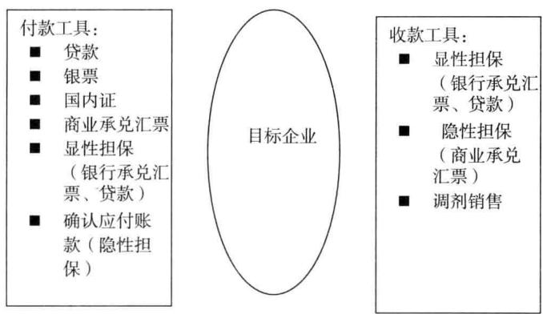
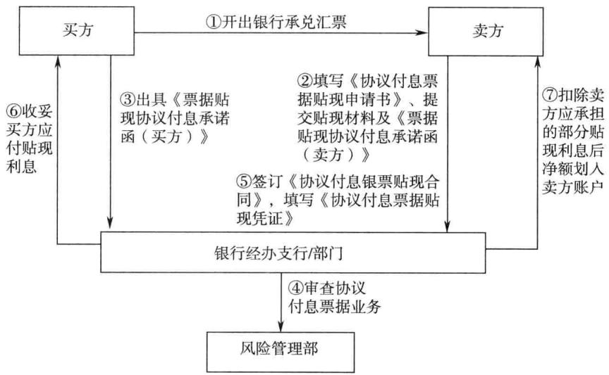

# 银行

# 票据业务营销技巧培训

# 立金银行培训中心著

最前沿的银行票据业务营销思路  
最经典的银行票据业务实务案例  
最详尽的银行票据业务使用理解  
承兑创造存款，贴现贡献利润，票据全身都是宝  
用最短时间成为一名优秀的银行产品经理

# 内顶尖的银行培训机构一立金银行培训中心

# 激发客户经理生生不息的奋斗精神和创造价值的活力

# 客户经理人生言：

每个银行客户经理都应当认真学习银行票据的使用技巧，贷款带不来存款，真正可以带来存款的是银行票据。银行票据最大的优势在于可以让企业的资金运动速度降下来，从而可以滞留在银行，产生存款。

存款是大力营销票据业务的副产品，只要你签发的银行票据量足够大，只要你可以牢牢控制企业的现金流，你的存款自然会很快增长，一味地吸收存款，可能会欲速而不达。

商业银行的四项核心用信工具：“贷、票、证、函”。“贷”属于表内，“票、证、函”属于表外工具，做授信方案不过是这四个工具和担保方式的来回组合。表内工具做利润，表外工具做存款，请牢牢记住。

“贷前先算，算后才做，有赚才放，不赚不做”，这是商业银行经营信贷业务的基本要点，建议每家银行都建立信贷收益测算机制，在申报授信前，要客户经理仔细算算到底这笔信贷业务能够赚多少，有赚才去做。

商业银行经营的规则：表外做中收，表内做营收。先做表外业务，再表内业务。表外业务“抢粮”、表内业务“做饭”。

银行客户经理如同一个厨师，我们要非常高明，要给客户设计出最有营养的套餐。醋是去腥，但太多了酸；姜是提味，但太多了苦；油是提味，但太多了腻。票据的优势是融资成本低，但缺陷是期限太短，所以要使用定向贷款弥补。贷款的优势是使用方便、期限长，缺陷是成本太高。如果可以将贷款和票据有效组合，就可以取短补长，相得益彰。

# 本书将帮助你在最短时间内成为一名优秀的商业银行客户经理和产品经理

本书提供：教练式培训，提供最真实的案例。  
激发客户经理生生不息的奋斗精神和创造价值的活力。

# 银行票据业务营销技巧培训

立金银行培训中心著

责任编辑：肖丽敏责任校对：李俊英责任印制：陈晓川

# 图书在版编目（CIP）数据

银行票据业务营销技巧培训（Yinhang Piaoju Yewu Yingxiao JiqiaoPeixun）/立金银行培训中心著.一北京：中国金融出版社，2013.8（立金银行培训系列丛书）ISBN 978-7-5049-7026-8

I. $\textcircled{1}$ 银…Ⅱ. $\textcircled{1}$ 立…Ⅲ. $\textcircled{1}$ 商业银行—票据—营销—职工培训—教 材Ⅳ. $\textcircled{1}$ F830.33

中国版本图书馆CIP数据核字（2013）第137491号

# 出版 中国金融出版社发行

社址北京市丰台区益泽路2号  
市场开发部（010)63266347，63805472，63439533（传真）  
网上书店http：//www.chinafph.com（010)63286832，63365686（传真）  
读者服务部（010)66070833，6256838  
邮编100071  
经销新华书店  
印刷 北京松源印刷有限公司  
尺寸 169毫米 $\times 2 3 9$ 毫米  
印张 9.5  
字数 154千  
版次 2013年8月第1版  
印次2013年8月第1次印刷  
定价28.00元  
ISBN978-7-5049-7026-8/F.6586

如出现印装错误本社负责调换联系电话（010)63263947

# 序

# 要按照给银行创造最大价值的方式设计授信方案

立金银行培训中心一直在各地培训客户经理。究竟该怎样培养优秀的银行客户经理呢？我作了自己的总结。

要把为客户解决问题当做给银行创造存款和利润的机会。要牢牢把握住，你营销的出发点不能简单地停留在为客户解决他的问题上，要争取在解决客户问题的同时，实现银行争取存款、创造利润的商业目标。

如果一种金融服务方案只给客户解决问题，而不会给银行带来任何的收益，这种授信方案不会获得批准，是失败的授信方案。这个世界上，只有双赢才会有合作，单贏的合作不会持久。

要为客户设计综合授信方案。授信方案的立足点在于—-要让客户按照给银行创造最大价值的方式来组合银行授信产品，形成套餐。授信产品就是工具，我们要使用这个工具来最大限度地挖掘客户的价值。存款就是埋在黄土中的黄金，授信产品就是铲子，我们就是挖金矿的工人，我们要智慧地挖掘黄金。

例如：包头的一个中小客户，有价值1000万元的房产，银行的抵押率为7成，客户需要融资6个月。

原有方式：银行可以提供700万元贷款，这种收益仅有35万元利息。

新方式：银行提供银行承兑汇票，要求客户缴存700万元保证金，然后抵押1000万元的房产，银行提供1400万元的贷款。然后银行营销收款人，办理贴现，获得50万元的利息收入。很明显，第二种方式银行收益更多。

其实，无论是银行承兑汇票还是贷款，对于客户而言，没有区别，通常是你提供哪个，他就使用哪个。这时候，客户经理的角色更像是点菜员，或

者说商场的导购员，要引导客户消费。

贴现利率低的时候，可以大量做银行承兑汇票业务；在贴现利率走高的时候，可以大量做银票质押贷款业务。

这就是我们的简单的总结。这个世界，存款不是拉来的，是设计出来的。要多去做绿色存款，降低酒精含量，提高我们银行人员的技术含量。

衷心祝愿各位银行客户经理职业生涯一帆风顺。

# 目 录

# 第一篇承兑篇

·为什么银行承兑汇票会给银行带来惊人的存款 3  
·什么是银行承兑汇票  
·如何引导企业使用银行承兑汇票 9  
综合授信中如何嵌人银行承兑汇票 10  
·银行承兑汇票业务营销技巧 14  
如何与中小银行、村镇银行建立银行承兑汇票建立合作关系 23  
. 如何引导企业办理全额保证金银行承兑汇票 24  
银行承兑汇票适用客户 26  
银行承兑汇票业务对银行的收益 39  
·申请人办理银行承兑汇票业务条件 40  
如何营销客户使用银行承兑汇票 41  
·如何控制承兑业务的风险 42  
银行承兑汇票的期限确定技巧 43  
制造类企业和流通类企业使用银行承兑汇票的各自要点 44  
. 如何对一些特殊的客户营销银行承兑汇票额度 45  
如何控制银行承兑风险 46  
. 办理银行承兑汇票所需资料 47  
·办理银行承兑汇票业务流程 47  
·如何发现银行承兑汇票的存款机会 48  
·如何控制纯融资性票据 50

# 第二篇贴现篇

·如何筛选、确定票据贴现目标客户 55  
·初次拜访技巧以及如何达成营销 55  
·已办理贴现业务的客户，如何做好深层次维护 57  
·营销与客户的沟通与交流应做好哪些方面 …57  
·没有贴现需求的客户如何切入 58  
·银行开办贴现业务益处 58  
·贴现利率的基本要点 60  
·票据贴现和贷款的营销比较 61  
·贴现业务及几种典型贴现产品 63  
·票据贴现业务的信用风险主要取决于承兑人而不是贴现申请人的  
支付能力· ：71  
·特大型优质客户持小型银行承兑汇票办理贴现的处理技巧 72  
·如何处理一些特大型客户的票据 …72  
·几种没有增值税发票的特殊行业的发票处理 72  
·通常可以办理贴现业务的银行 …78  
·如何处理一些中小银行和村镇银行的银行承兑汇票贴现 .…78  
票据贴现条件 79  
·银行营销贴现业务要点 …·80  
·如何处理没有增值税发票的银行承兑汇票 81  
·客户经理如何掌握最新的票据价格信息 81  
·贴现业务的盈利模式 82  
·支行行长要高度重视贴现业务 82  
·票据业务与贷款的反周期操作策略 82  
·如何解决优质特大型客户持有的小银行承兑票据的贴现 85  
·如何营销小型客户持有的小银行承兑银行承兑汇票 86  
·年轻的客户经理如何迅速开办贴现业务 86  
·办理小微企业信贷业务和票据贴现业务，究竞哪个对银行价值更大87  
·银行承兑汇票适用行业客户对照表 87

# 附 件

附件1：中国银行业票据业务规范 97  
附件2：银行承兑协议 108  
附件3：票据试题… 114  
附件4：经典授信调查报告 123

立金银行培训中心名言 138票据业务口诀 140

# 第一篇

# 承兑篇

# ·为什么银行承兑汇票会给银行带来惊人的存款

做商业银行公司业务，授信产品就是支点，没有支点，根本无法撬动客户；感情就是推力，感情可以把支点不断向前推，扩大合作的效果。有着较好的感情，加上产品的深度合作，可以最大限度地挖掘客户的价值，达到“四两拨千斤”的目的。

过程决定结果，不同的过程决定不同的结果。商业银行销售金融产品要因人而异，周转速度快的流通类企业适合使用银行承兑汇票，通过循环使用银行承兑汇票创造存款；周转速度慢的制造类企业适合使用商业承兑汇票，通过商业承兑汇票创造关联营销机会；周转速度更慢而利润极高的开发商适合办理贷款，提供资金批发信贷创造利润，不可一个模式不变。

银行承兑汇票最大的价值在于可以将客户经营资金流动的速度降下来，从而实现资金的沉淀，而同时保证企业的结算支付用途。如果银行对企业提供贷款，那么根据实贷实付规则，资金很快会被划付给收款人，银行的存款资金就会流失。而如果银行提供的是银行承兑汇票，那么企业的保证金就会滞留在银行，形成数量可观的资金沉淀。

保证金存款通常要求客户在银行办理银行承兑汇票时根据票面金额缴纳一定比例的手续费，一般是信用程度越高的客户，保证金比例越低；信用程度越低的客户，保证金比例越高。

所以，我们给客户经理培训时经常提到“表外业务做存款，表内业务做利润”，就是这个道理。一个客户经理如果想业绩好，一定需要大比例签发银行承兑汇票。

小提示：很多客户经理经办客户的授信总量基本相当，但是存款差距很大，这通常是授信产品使用的区别造成的，银行承兑汇票使用量越大，存款越多。例如，同样给一个中型钢厂—陕西龙门钢铁有限公司申报1亿元的口授信总量：

（1）贷款方式：可能仅能获得1000万元存款沉淀。

（2）2亿元银行承兑汇票，至少可以要 $50 \%$ 保证金，可以获得1亿元存款。

我们曾经给一家城市商业银行做客户经理培训。年轻的女客户经理业绩极为惊人，给吉林的一家钢厂申报了5亿元的授信，要求 $50 \%$ 保证金，吸收存款超过2.5亿元。

# 【案例】 $\times ~ \times$ 纸业（郑州）有限公司授信方案

# 一、企业基本概况

$\times ~ \times$ 纸业（郑州）有限公司经营范围：各类纸张、纸品以及相关原料、机械设备、包装设备等所需原材料，以及器件分割、包装、销售、采购和售后服务等。注册资本为250万美元（全部到位），在河南、山西两省从事销售及市场开拓（2002年8月，在山西太原设立了 $\times ~ \times$ 纸业（郑州）有限公司太原分公司）。自1999年10月成立以来，凭借集团公司整体优势，加大市场开拓展力度，强化内部管理，经营规模逐渐扩大，河南、山西两省的市场份额不断增加。

# 二、银行切入点分析

# （一）本次授信优势

1.授信企业在河南、山西两省的纸类销售市场占比较高，公司经营状况和资产质量良好，经营业绩持续增长，现金管理能力强，第一还款来源充沛。

2.公司所属的 $\times ~ \times$ 集团，产业布局完整、盈利能力较强、财务管理规范、资产整体实力雄厚，集团公司在国内纸类行业整体竞争优势明显。

3.本次授信可以获得中间业务收入、存款收益、国际结算和部分零售业务。

# （二）授信分析和风险缓释措施

1.随着市场经济的发展和人民生活水平的提高，作为经济信息载体的纸类用品的消费量不断增加。该公司作为国内最大造纸集团公司的成员，凭借集团整体的技术、设备、完整的产业链条优势，以及完善的管理制度、品牌竞争和价格优势等，具有较强市场竞争能力，销售收入持续快速增加，盈利能力持续增强，特别是在严格的信用控制之下较高的经营质量，保证公司具有充沛的经营性现金流量，公司具有较强的按期足额还款能力。

2.风险分析以及缓释措施。

（1）汇率风险：纸类纸品的主要原材料为木浆，由于国内森林资源所限，$40 \%$ 的木浆需求来源于进口，大多数来自东南亚、南美洲等，人民币汇率的变化，以及出口国家的环保政策，都可能影响到木浆的价格变化，导致纸品市场价格起伏波动。经过多年的发展， $\times ~ \times$ 集团拥有了完整的产业布局，木浆自给率远高于同行业，加上目前人民币升值的趋势，授信期间内汇率风险较小。

（2） $\times ~ \times$ 集团整体的系统性风险：集团优势犹如一把“双刃剑”，一方面提高公司的竞争力，但是另一方面，诸多偶然因素也会增加，可能会影响到公司的正常经营。最近查询， $\times ~ \times$ 集团与政府建立了良好的沟通关系，多次获得政府和社会的好评，认可度较高。2011年5月，大公国际资信评估有限公司对 $\times ~ \times$ 集团5年期50亿元中期票据的主体信用评级为AA $^ +$ 级。因此，从目前来看， $\times ~ \times$ 集团整体系统性风险较低。

供应渠道分析  

<table><tr><td rowspan=1 colspan=1></td><td rowspan=1 colspan=1>前三名供应商（按金额大小排名）</td><td rowspan=1 colspan=1>金额（万元）</td><td rowspan=1 colspan=1>占全部采购比率（%）</td></tr><tr><td rowspan=1 colspan=1>1</td><td rowspan=1 colspan=1>金东纸业股份有限公司</td><td rowspan=1 colspan=1>19 271.34</td><td rowspan=1 colspan=1>36.07</td></tr><tr><td rowspan=1 colspan=1>2</td><td rowspan=1 colspan=1>金海浆纸业有限公司</td><td rowspan=1 colspan=1>13 524.79</td><td rowspan=1 colspan=1>25.31</td></tr><tr><td rowspan=1 colspan=1>3</td><td rowspan=1 colspan=1>亚洲纸浆业有限公司</td><td rowspan=1 colspan=1>10 197. 63</td><td rowspan=1 colspan=1>19.08</td></tr></table>

该公司供应商均为 $\times ~ \times$ 集团下属的造纸类工厂，造纸行业国内大型企业，产品质量较高，供货及时稳定，因统一集团下属公司付款条件较为宽松。

销售渠道分析  

<table><tr><td rowspan=1 colspan=1></td><td rowspan=1 colspan=1>前三名销售商（按金额大小排名）</td><td rowspan=1 colspan=1>金额（万元）</td><td rowspan=1 colspan=1>占全部销售比率（%）</td></tr><tr><td rowspan=1 colspan=1>1</td><td rowspan=1 colspan=1>郑州新纸工贸有限公司</td><td rowspan=1 colspan=1>6211</td><td rowspan=1 colspan=1>1 11.5</td></tr><tr><td rowspan=1 colspan=1>2</td><td rowspan=1 colspan=1>河南精诚有限公司</td><td rowspan=1 colspan=1>6034</td><td rowspan=1 colspan=1>11. 2</td></tr><tr><td rowspan=1 colspan=1>3</td><td rowspan=1 colspan=1>山西省物资总公司</td><td rowspan=1 colspan=1>5036</td><td rowspan=1 colspan=1>9.3</td></tr></table>

该公司对于经销商均采用月结方式收款，通过独立性较强的信用控制，岗位人员授信期限最长为1个月，对于大型印刷厂最多不会超过3个月。经过多年的经营，与经销商合作状况良好，售价优惠较多，市场销量稳定增长，付款记录良好，信誉度较高。

# 三、银行授信方案

本次授信为首次贷款申请，拟对 $\times ~ \times$ 纸业（郑州）有限公司授信总额度为5000万元，期限为12个月，总口为3250万元；其中银行承兑汇票5000万元，保证金比例为 $3 5 \%$ ，口为3250万元，用于购买各类文化用纸批发销售等。

本次授信由金华纸业（江苏）股份有限公司提供连带责任保证担保。授信品种不可串用，但授信期间内可循环。

授信方案  

<table><tr><td rowspan=1 colspan=1>额度类型</td><td rowspan=1 colspan=2>公开授信额度</td><td rowspan=1 colspan=1>授信方式</td><td rowspan=1 colspan=3>综合授信额度</td></tr><tr><td rowspan=1 colspan=1>授信额度（万元）</td><td rowspan=1 colspan=2>5.000.00</td><td rowspan=1 colspan=1>授信期限（月）</td><td rowspan=1 colspan=3>12</td></tr><tr><td rowspan=1 colspan=1>授信品种</td><td rowspan=1 colspan=1>币种</td><td rowspan=1 colspan=1>金额（万元）</td><td rowspan=1 colspan=1>保证金比例</td><td rowspan=1 colspan=1>期限（月）</td><td rowspan=1 colspan=1>利/费率</td><td rowspan=1 colspan=1>是否循环</td></tr><tr><td rowspan=1 colspan=1>银行承兑汇票</td><td rowspan=1 colspan=1>人民币</td><td rowspan=1 colspan=1>5000.00</td><td rowspan=1 colspan=1>35</td><td rowspan=1 colspan=1>12</td><td rowspan=1 colspan=1>按银行规定费率执行</td><td rowspan=1 colspan=1>是</td></tr><tr><td rowspan=1 colspan=1>贷款性质</td><td rowspan=1 colspan=1>新增</td><td rowspan=1 colspan=2>本次授信口（万元）</td><td rowspan=1 colspan=1>3250.00</td><td rowspan=1 colspan=1>授信总口（万元）</td><td rowspan=1 colspan=1>3250.00</td></tr><tr><td rowspan=1 colspan=1>担保方式及内容</td><td rowspan=1 colspan=6>保证人：金华纸业（江苏）股份有限公司</td></tr></table>

本次拟对 $\times ~ \times$ 纸业（郑州）有限公司授信5000万元，其中银行承兑汇票5000万元，保证金比例为 $3 5 \%$ ，用于购买各类文化用纸批发销售。根据公司业务需求，银行承兑汇票不可以串用其他品种，但在授信期间内可以循环使用。

# 点评】

该公司的上游客户多是企业公司，上游企业接受票据，在该公司的采购环节，银行可以提供银行承兑汇票满足客户支付需要。

银行收益：银行可以要求较高比例的保证金，吸收可观的保证金存款。

# ·什么是银行承兑汇票

票据是具有法律规定的格式，约定由债务人按期无条件支付一定金额，并可以流通的书面付款凭证。

银行承兑汇票就是银行作为担保人，由买方签发给卖方的，有明确到期日的书面付款承诺。

特点：以文字形式将债务的时间、金额、偿付地明确表述，允许流通转让，允许进行债权、债务的冲抵。

商业银行客户经理的实务营销工作中，主要使用到的票据品种是银行承兑汇票和商业承兑汇票及这两种工具的创新品种。

不熟悉银行票据产品，很难营销大客户，很难成为优秀客户经理。我对自己成为优秀客户经理的总结就是，必须精通票据产品。

银行承兑汇票票样：

# 银行承兑汇票

出票日期年月日

（大写）

<table><tr><td rowspan=1 colspan=1>出票人全称</td><td rowspan=1 colspan=1></td><td rowspan=2 colspan=2>收款人</td><td rowspan=1 colspan=3>全称</td><td rowspan=1 colspan=10></td></tr><tr><td rowspan=2 colspan=1>出票人账号</td><td rowspan=2 colspan=1></td><td rowspan=2 colspan=1></td><td rowspan=2 colspan=1></td><td rowspan=2 colspan=3>账号</td><td rowspan=2 colspan=10></td></tr><tr><td rowspan=1 colspan=2></td></tr><tr><td rowspan=1 colspan=1>付款行全称</td><td rowspan=1 colspan=1></td><td rowspan=1 colspan=2></td><td rowspan=1 colspan=3>开户银行</td><td rowspan=1 colspan=10></td></tr><tr><td rowspan=2 colspan=1>出票金额</td><td rowspan=1 colspan=4>人民币</td><td rowspan=1 colspan=1>亿</td><td rowspan=1 colspan=2>千</td><td rowspan=1 colspan=1>百</td><td rowspan=1 colspan=1>+</td><td rowspan=1 colspan=1>万</td><td rowspan=1 colspan=1>千</td><td rowspan=1 colspan=1>百</td><td rowspan=1 colspan=1>+</td><td rowspan=1 colspan=1>元</td><td rowspan=1 colspan=1>角</td><td rowspan=1 colspan=1>分</td></tr><tr><td rowspan=1 colspan=4>（大写）</td><td rowspan=1 colspan=1></td><td rowspan=1 colspan=2></td><td rowspan=1 colspan=1></td><td rowspan=1 colspan=1></td><td rowspan=1 colspan=1></td><td rowspan=1 colspan=1></td><td rowspan=1 colspan=1></td><td rowspan=1 colspan=1></td><td rowspan=1 colspan=1></td><td rowspan=1 colspan=1></td><td rowspan=1 colspan=1></td></tr></table>

续表  

<table><tr><td rowspan=2 colspan=1>汇票到期日（大写）</td><td rowspan=2 colspan=1></td><td rowspan=2 colspan=1>付款行</td><td rowspan=1 colspan=1>行号</td><td rowspan=1 colspan=1></td></tr><tr><td rowspan=2 colspan=1>付款行</td><td rowspan=2 colspan=1>地址</td><td rowspan=2 colspan=1></td></tr><tr><td rowspan=1 colspan=1>承兑协议编号</td><td rowspan=1 colspan=1></td></tr><tr><td rowspan=2 colspan=3>本汇票请你行承兑，到期无条件付款。</td><td rowspan=1 colspan=1>本汇票已经承兑，到期日由本行付款。承兑行签章承兑日期   年  月   日</td><td rowspan=2 colspan=1>复核     记账</td></tr><tr><td rowspan=1 colspan=1>备注：</td></tr></table>

  
银行承兑汇票流转图

银行承兑汇票承兑业务的竞争要点：信用口、办理效率、银行信誉、综合服务水平。

票据贴现的竞争要点：贴现利率、办理效率、授信情况及综合服务水平。

通常客户都希望银行要求的保证金比例越低越好，对于优质的特大型客户，保证金比例甚至可以降低为零。但是银行必须做好控制工作，单纯给客户提供零保证金银行承兑汇票是亏损的。如果首笔保证金比例较低，必须要求客户在银行承兑汇票到期前，提前存满口对应的保证金，这样做银行赚

得会更多。

办理效率非常重要。客户对银行承兑汇票的要求时效非常高，最好的方式是提前给客户核定签发银行承兑汇票额度。在额度内，企业每次办理票据，仅提供交易合同，而无须再要营业执照等资料，就可以签发银行承兑汇票。

银行信誉等级非常重要。大银行签发的银行承兑汇票被市场广泛接受，小银行签发的银行承兑汇票受众面相对较窄。大银行的客户经理多营销承兑业务和票据置换业务，小银行的客户经理多营销票据直贴贴现业务和代理贴现业务。

综合服务水平。银行营销票据产品，必须能够给客户提供较多有附加值的业务，如非贴现票据真伪鉴别、票据利率走势分析、票据综合管理等。一些高端的客户往往对增值服务非常感兴趣。做个头脑不凡的客户经理，懂得宏观经济，懂得票据的综合金融服务方案，懂得通过算账方式为客户演示票据的价值。

# 如何引导企业使用银行承兑汇票

银行客户经理要引导企业使用银行承兑汇票，而不是贷款。

授信额度就是判断企业最大的偿债能力，是对企业经营能力和现金流状况综合评价的结果，银行相信企业在这个金额范围内有足够的清偿能力，控制企业的偿债能力风险。所以，只要是银行做信贷业务，首先必须为借款人核定授信额度，只要给企业核定了授信额度，无论是办理贷款，还是办理银行承兑汇票，对银行的风险一样。由于办理银行承兑汇票可以给银行创造更多的存款，且风险一样，所以可以引导企业办理银行承兑汇票。

授信不产生价值，只有“用信”才会产生价值和回报。授信与风险控制有关，是测算企业的偿债能力，而“用信”在销售银行的信贷产品，信贷产品在使用中创造价值和回报。

设计授信方案的时候，你最好采取倒推的方式，首先目标是这笔授信产生多大金额的存款，然后按照希望产出存款的方式，精心设计授信方案，引导企业用信。存款就是指挥棒，指导我们的方向，以目标反推过程，过程决定结果。

授信工具： “用信”工具：  
（1）房产抵押 （1）贷款  
（2）第三方担保 （2）银行承兑汇票  
（3）权证质押 （3）国内信用证  
（4）动产质押 （4）保贴/保押商业承兑汇票  
（5）联保担保 （5）银行保函  
（6）保理 （6）担保（给上下游）  
（7）保兑仓  
（8）应收账款质押  
（9）土地抵押

1．成本低廉。相对于贷款，承兑汇票仅收取万分之五的手续费，成本低廉。

银行承兑汇票与贷款比较   

<table><tr><td rowspan=1 colspan=1></td><td rowspan=1 colspan=1>银行承兑汇票</td><td rowspan=1 colspan=1>贷款</td></tr><tr><td rowspan=1 colspan=1>融资综合成本</td><td rowspan=1 colspan=1>极低，按票面金额的0.05%收取。</td><td rowspan=1 colspan=1>偏高，按照贷款金额的一定百分比收取。</td></tr><tr><td rowspan=1 colspan=1>资金使用效率</td><td rowspan=1 colspan=1>随用随开，没有资金闲置。</td><td rowspan=1 colspan=1>可能有资金的闲置。</td></tr><tr><td rowspan=1 colspan=1>用途监控</td><td rowspan=1 colspan=1>可以监控资金用途，防止资金挪用。</td><td rowspan=1 colspan=1>很难监控，容易被挪用。</td></tr></table>

银行承兑汇票收费非常低，使得企业可以以极低的成本使用银行信用，因此银行承兑汇票受到了市场的极大追捧。相对于贴现利息，承兑手续费甚至可以忽略不计。

2.期限灵活。相对于贷款的固定期限，承兑汇票可以根据贸易结算需要灵活设定期限，可长可短。

3.相对于贷款，票据与资金结算直接连接，可以有效地监控资金用途，防止企业挪用资金，有利于银行控制风险。

# ·综合授信中如何嵌入银行承兑汇票

我们给企业核定综合授信额度，在综合授信额度中嵌入银行承兑汇票这个产品，要形成流动资金贷款和银行承兑汇票的组合授信方案，形成一个较为均匀的综合授信方案。银行承兑汇票给银行创造存款，流动资金贷款给银行创造利息收入。

银行承兑汇票是一种付款融资工具。

付款融资和销售融资。

针对付款环节，银行精心挑选用信工具，满足企业的付款支付需要。例如，我们的银行承兑汇票和商业承兑汇票都是企业的付款工具，而明显地商业承兑汇票付款成本更低。如果我们可以成功营销买家使用商业承兑汇票付款，那么很容易营销卖家在本行办理商业承兑汇票贴现业务。

针对销售环节，银行精心选择“用信”工具，满足企业的销售回款需要。例如，银行的保兑仓等都是帮助企业扩大销售的工具，企业通过提供连带责任担保或提供退款承诺，给经销商提供融资，可以定向用于向卖家付款，这样可以扩大卖方的销售。

  
付款融资示意图

# 【案例】郑州市大华建筑工程集团有限公司授信方案

# 一、企业基本概况

郑州市大华建筑工程集团有限公司经营范围包括房地产开发、销售及房屋租赁，先后成功开发建设了“市民新村住宅小区”、“商都幸福家园”、“金沙小区”、“中原西路经济适用房”等项目。目前正在运作的开封宋城雅居项目进展顺利，整个项目占地50亩，I期252套房，共计32000平方米，已基本售完；Ⅱ期493套房，共计56000平方米，已售出258套。

# 二、银行切入点分析

# （一）本次授信优势

1.该集团客户是郑州市优质建筑企业，驾驭市场和抗风险能力较强，是银行优质客户。其工程量大且质量较好，主营收入可完全覆盖负债，还款来

源有保障，授信风险能够控制。

2.本次授信品种为基建贷款，不但可以充分掌握企业授信用途，而且有稳定、可观的手续费收入及存款沉淀。

3.通过稳固与公司的长期合作，可利用该公司的优势进行对其上下游客户尤其是开发商的营销，带动票据业务和私人业务。

# （二）本次授信劣势

1.建筑行业受国家宏观经济政策影响较大，属于银行控制行业，而且在相当长的时间内都将维持现有的激烈竞争局面。不过作为河南省为数不多的资质优良的建筑企业，由于公司承接工程质量较好，与各家银行关系良好，且自身技术资金势力较强。同时从河南省和郑州市的实际情况来看，行业发展方向整体向好，目前公司整体经营不错，市场前景较好。

2.一定数量的项目需要公司垫资施工，存在行业经营风险。但从历史长期来看，工程款回收最终是有把握的。

（三）对本次授信的风险是否可控以及效益与风险能否平衡作出明确的判断

本次授信的风险可控：本次授信为新客户的授信，用途明确且符合企业实际需要，风险点较易把握；企业经营情况稳定，信用记录良好，财务状况趋好，自身实力较强，因此风险可控，且效益与风险能够平衡。

# （四）风险防范措施

1.要求企业主要结算通过银行进行，强化对企业的现金流监控，控制住企业 $\times ~ \times$ 还款来源，争取企业的重点客户工程款通过银行收取。

2.严格控制授信用途，确保贸易背景真实。

3.密切关注当地建筑市场变化和企业经营情况的变化，做好风险预警工作，保持与企业的经常性沟通，力求掌握真实有效的信息，以便及时作出判断并采取有效措施。

供应渠道分析  

<table><tr><td rowspan=1 colspan=1></td><td rowspan=1 colspan=1>前三名供应商（按金额大小排名）</td><td rowspan=1 colspan=1>金额（万元）</td><td rowspan=1 colspan=1>占全部采购比率（%）</td></tr><tr><td rowspan=1 colspan=1>1</td><td rowspan=1 colspan=1>郑州商品混凝土有限公司</td><td rowspan=1 colspan=1>12000</td><td rowspan=1 colspan=1>6.22</td></tr><tr><td rowspan=1 colspan=1>2</td><td rowspan=1 colspan=1>郑州鑫宝盛物资站</td><td rowspan=1 colspan=1>11000</td><td rowspan=1 colspan=1>5.71</td></tr><tr><td rowspan=1 colspan=1>3</td><td rowspan=1 colspan=1>河南中业物资有限公司</td><td rowspan=1 colspan=1>8500</td><td rowspan=1 colspan=1>4.41</td></tr></table>

该公司与供应商之间保持着长期稳定的合作关系。公司供应商较为分散，前五大客户分别为郑州商品混凝土有限公司、郑州市鑫宝盛物资站、中业物资有限公司、管城区蓝天物资站、郑州同强混凝土有限公司等。

销售渠道分析  

<table><tr><td rowspan=1 colspan=1></td><td rowspan=1 colspan=1>前三名销售商（按金额大小排名）</td><td rowspan=1 colspan=1>金额（万元）</td><td rowspan=1 colspan=1>占全部销售比率（%）</td></tr><tr><td rowspan=1 colspan=1>1</td><td rowspan=1 colspan=1>百合新地置业有限公司</td><td rowspan=1 colspan=1>70000</td><td rowspan=1 colspan=1>33.73</td></tr><tr><td rowspan=1 colspan=1>2</td><td rowspan=1 colspan=1>丹尼斯百货有限公司</td><td rowspan=1 colspan=1>47000</td><td rowspan=1 colspan=1>22.65</td></tr><tr><td rowspan=1 colspan=1>3</td><td rowspan=1 colspan=1>城建集团投资有限公司</td><td rowspan=1 colspan=1>40811</td><td rowspan=1 colspan=1>19.67</td></tr></table>

由于该企业对建设项目的选择相当谨慎，业主付款能力都较强，如郑州丹尼斯二七商业广场工程、郑州市轨道交通号线一期工程土建施工06标段等。但开发商要求企业垫资建设和拖欠尾款的现象比较普遍，但工程款最终收回是有把握的。

# 三、银行授信方案

郑州市 $\times ~ \times$ 建筑工程集团有限公司新中标项目共18个，合同造价合计108735.85万元，目前在施工的工程量较大，采购资金周转有一定困难。为保证工期、降低生产成本、多储存材料、充分发挥企业的生产能力，该企业特申请15000万元综合授信额度，10000万元的授信口，其中5000万元为流动资金贷款，期限为1年；10000万元的银行承兑汇票， $50 \%$ 的保证金，可循环，按银行规定串用，由河南建设第一集团有限公司承担连带责任保证。

授信方案  

<table><tr><td rowspan=1 colspan=1>额度类型</td><td rowspan=1 colspan=2>公开授信额度</td><td rowspan=1 colspan=1>授信方式</td><td rowspan=1 colspan=3>综合授信额度</td></tr><tr><td rowspan=1 colspan=1>授信额度（万元）</td><td rowspan=1 colspan=2>20000.00</td><td rowspan=1 colspan=1>授信期限（月）</td><td rowspan=1 colspan=3>12</td></tr><tr><td rowspan=1 colspan=1>授信品种</td><td rowspan=1 colspan=1>币种</td><td rowspan=1 colspan=1>金额（万元）</td><td rowspan=1 colspan=1>保证金比例（%）</td><td rowspan=1 colspan=1>期限（月）</td><td rowspan=1 colspan=1>利/费率</td><td rowspan=1 colspan=1>是否循环</td></tr><tr><td rowspan=1 colspan=1>流动资金贷款</td><td rowspan=1 colspan=1>人民币</td><td rowspan=1 colspan=1>10 000.00</td><td rowspan=1 colspan=1></td><td rowspan=1 colspan=1>12</td><td rowspan=1 colspan=1>按银行规定执行</td><td rowspan=1 colspan=1>是</td></tr><tr><td rowspan=1 colspan=1>银行承兑汇票</td><td rowspan=1 colspan=1>人民币</td><td rowspan=1 colspan=1>10000.00</td><td rowspan=1 colspan=1>50</td><td rowspan=1 colspan=1>12</td><td rowspan=1 colspan=1>按银行规定执行</td><td rowspan=1 colspan=1>是</td></tr><tr><td rowspan=1 colspan=1>贷款性质</td><td rowspan=1 colspan=1>新增</td><td rowspan=1 colspan=2>本次授信口（万元）</td><td rowspan=1 colspan=1>15 000.00</td><td rowspan=1 colspan=1>授信总口（万元）</td><td rowspan=1 colspan=1>15 000.00</td></tr><tr><td rowspan=1 colspan=1>担保方式及内容</td><td rowspan=1 colspan=6>保证人：河南省××建筑工程集团有限责任公司</td></tr></table>

# 点评】

1.该公司的上游客户多是企业公司——材料供应商。上游企业接受票据，在该公司的采购环节，银行可以提供银行承兑汇票满足客户支付需要。

银行收益：银行可以要求较高比例的保证金，吸收可观的保证金存款。

2.以流动资金贷款支持，满足企业的日常周转需要。流动资金贷款应当采取受托支付方式，由银行直接划付给供应商。

# ·银行承兑汇票业务营销技巧

银行承兑汇票有自已的营销技巧，一定是找到客户的需要利益点和银行希望的收益点进行深度营销。

第一，从为客户降低费用角度营销客户。

银行承兑汇票的最大价值在于可以帮助客户降低财务费用，银行应当从为企业降低财务成本的角度营销企业使用银行承兑汇票，因为相比于贷款，银行承兑汇票的融资成本大幅降低。

第二，“沉睡”贷款客户的激活。

优质特大型企业集团受到各家银行追捧，如大型电力公司、电信集团、石油集团、高速公路集团等往往在多家银行有非常充裕的闲置贷款额度，任何一家银行想要撬动这些客户使用贷款都不是件容易的事情。就银行创造收益角度而言，与其做没有任何实际意义的关系维护，不如选择票据产品强力切入，激活这些“沉睡”的优质客户，使其回应银行营销活动，而票据产品带来的综合收益可能不比贷款低。应当认真梳理企业的支出，找到可以使用票据的部分，重点营销。企业一旦使用银行承兑汇票，总需要到期解付票据，到时，自然有贷款需求了。

以下是企业最常见的“资金池”。左侧是企业的现金流人项目，包括借

款、票据、分红、预收款，当然，特大型的企业还包括发行债券、股票等。  
右侧是企业常见的现金流出项目，包括还贷、采购、水电费、工资等。

因此，应当从企业现有资金流中找到可以用票据替代的部分。票据最大的好处在于融资成本较低，可以实现融资与支付使用的同步。

# 【点评】

票据融资成本较低，可以为企业节省相当的财务费用，因此，大客户对票据的需求较为迫切，短期贷款融资呈现票据化趋势，优质客户使用票据大量代替流动资金贷款。

目前中国进人了票据的黄金时代，票据使用越来越广泛，通过不断开发票据新产品取得竞争优势已经成为各家银行的共识，通过票据融资可以开拓新客户、稳定老客户、吸收存款。要懂得利用票据可以与传统的信贷工具有效组合的优势，创造交叉销售机会，最大限度地挖掘客户价值。

营销建议：国家电网公司、南方电网公司及其下属电力公司，中国石油天然气集团、中国石油化工集团、中国海洋石油集团及其下属公司，中国移动通信集团、中国联动集团、中国电信集团及其下属公司，中国国航集团、中国南方航空集团、中国东方航空集团等航空公司，铁道部及其下属铁路局，各地交通厅、公路局（注意：政府类客户也可以签发银行承兑汇票）。

# 【案例】北京首都机场集团公司授信方案

某银行北京首都机场支行成功为 $\times ~ \times$ 机场集团公司开立3亿元银行承兑汇票，并办理了该笔汇票的买方付息贴现业务。 $\times ~ \times$ 机场集团公司通过签发买方付息银行承兑汇票支付新航站楼建设及机场设施建设费用。

此次3亿元买方付息贴现业务的成功办理，银行实现了贴现利息收入450万元及中间业务收入15万元。

从表面分析，贷款收益似乎要比办理银行承兑汇票高得多，其实不然。$\times ~ \times$ 机场集团公司实力非常雄厚，资产规模庞大，常规手段很难营销，因而银行使用票据成功突破该公司，并通过银行承兑汇票，成功营销其众多的上游客户，比如施工企业、材料供应商等，这比单纯的贷款强了不止百倍。

不要满足于仅有的利息收入，有了客户，什么都有了，最重要的是扩大自己的基础客户群。

第三，从银行承兑汇票、增值税发票中关联寻找收款人。

以票面收款人为拟营销目标客户，出票人在本行办理银行承兑汇票后，陪同出票人将汇票送交收款人，声明银行可以提供贴现将汇票取回。这种营销方式方向明确、营销思路清楚，实现营销“速战速决”。银行借助企业直接的商品买卖关系实现关联营销比银行陌生式营销容易得多。

每个企业都会有上下游的客户，借助客户的现有产业链进行关联营销，效果要比一个一个陌生营销好很多。

一个最基本的营销规则：本行的银行承兑汇票要最大限度地拿回来，让自己的现有客户为自己营销新客户，现有客户成为我们的义务推销员。

# 【点评】

客户经理申报一笔贴现业务要比贷款容易得多。申请笔贷款项目，需要了解客户、分析报表、组织资料、撰写报告、审批沟通，过程很复杂、很熬人，成功率还不高。而对本行签发的银行承兑汇票办理贴现则容易得多，陪同付款人将票据交给收款人的时候，就可以对收款人声明，本行可以办理贴现，随时将票据变成现金。

第四，从银行承兑汇票、增值税发票中关联寻找出票人。

办理贴现的时候一般都要求客户（增值税发票中的销货单位）提供增值税发票，通常增值税发票里含有付款人（增值税发票中的购货单位）清晰的有价值信息，如名称、地址、电话等。

可以将银行承兑汇票出票人（增值税发票中的购货单位）作为银行信贷目标客户，投入精力进行营销，为其核定银行承兑汇票额度。这在营销学中称为“跟随策略”，这种方式可以提高客户的筛选成功率。

建议客户经理去本行的票据中心，找出所有的贴现票据对应的增值税发票，仔细查看增值税发票的付款人信息，这就是最重要的客户信息源。

# 【点评】

客户经理营销客户最忌盲目，开拓客户的时候，不知道本行能否批准的项目就去盲目营销，结果是劳民伤财，徒劳无功。客户在其他银行办理银行承兑汇票，说明已经经过了其他银行的风险甄别、信贷审核。目前，各家银行信贷政策取向、授信客户评价标准基本趋同，其他银行可以通过的客户，本行通过的机会也会比较大，因此，通常这种方式营销信贷客户成功率会明显提升，不失为一种较好的选择

这种跟随式的营销，要比陌生式的拜访营销准确得多，成功率会提升不少。知道哪些项目可能营销成功，再去投入足够的时间和精力，而不是一味地瞎撞。

在向信贷审批人员解释的时候，可以直接说，该客户在某银行已经获得了多少金额的银行承兑汇票，并有银行承兑汇票复印件作证，这可以极大地提高审批人员对客户的信心。

# 【案例】广西西卫汽车销售服务有限公司授信方案

# 一、企业基本概况

广西西卫汽车销售服务有限公司总部设在柳州，主营整车销售、备件供应、售后维修服务等，目前已建立了比较完善的销售服务体系，营销网络遍布广西各区域，拥有南宁、柳州、桂林等多个汽车4S店，30多个汽车销售服务网点，以及60多家长安汽车连锁服务店，主要代理长安微车、长安轿车、长安铃木、东风风行、沈阳金杯、绵阳金杯等品牌汽车，并严格按照汽车4S店标准模式进行管理，年销汽车4000多辆，连续多年荣获汽车厂家授予的“销售和服务金奖”称号。

# 二、银行切入点分析

银行通过对该企业之前的业务合作往来，主动营销银行承兑汇票业务。该公司的上游供应商提出需要收取现金的模式，银行为该公司推荐了银行承兑汇票（买方付息 $^ +$ 代理贴现业务），指导该公司在银行缴存保证金开立银行承兑汇票，并通过与上游供应商的磋商，签订代理贴现协议。

# 三、银企合作

银行为该公司办理银行承兑汇票（买方付息 $^ +$ 代理贴现）业务，使得该企业获得了融资并降低了财务费用。银行通过办理该项业务，获得了保证金存款、开票手续费、贴现利息等收入。

# 【案例】江苏省公元发电有限公司买方付息票据营销方案

# 一、企业基本概况

江苏省公元发电有限公司是由新加坡 $\times ~ \times$ 电力（私人）有限公司、中国华东电力集团公司、江苏省能源投资总公司成立的中外合资企业，注册资本11.6亿元，主要从事建设和经营电厂及电厂灰渣、余热的综合利用。公司总资产达33.2487亿元，净资产达22.2429亿元，实现主营业务收人12.6亿元，净利润达1.4亿元。

# 二、银行切入点分析

（一）产业链分析

本服务方案针对江苏省公元发电有限公司和其上游供应商提供模式化融资服务。江苏省公元发电有限公司对供货商的付款方式为银行承兑汇票，但其供应商大部分为大型生产企业，较为强势，希望直接拿取现金。银行提供的“买方付息票据贴现业务”可让供应商直接取得现款，故较易为供应商所接受。对江苏省公元发电有限公司而言，相对于贷款，可节省较高的财务费用，同时减少支付压力。银行可通过此业务获得保证金存款沉淀及贴现利息收入。

# （二）银行的授信方案

1.授信介入。该公司为各家银行争相营销的优质客户，但某银行一直未放弃营销。偶然间得知公司将进行股东分红，分红金额高达11亿元，某银行敏锐地感到公司将有融资的需求，并再次进行营销。公司高管被某银行营销人员的执著和主动所打动，表达了同意授信合作的意向。某银行在资料收集完毕后，在总行、分行相关部门的支持下，仅用半个月左右，就为公司成功申请了2.5亿元流动资金贷款额度。

2.关系营销。某银行通过真诚的服务，与公司领导、财务部、计划部等多个职能部门都建立了良好的关系。在他们的支持下，某银行争取到了公司国外股东分红账户的开立和近8000万美元购汇付汇业务。

3.买方付息票据贴现业务跟进。某银行以该公司为核心，与公司上游最大的煤炭供应商一 一江苏金华能源物资有限公司（以下简称金华公司）取得了联系，公司每月向金华公司采购煤炭款项高达8000万元左右。某银行根据$\times ~ \times$ 发电公司节约财务费用的需求，向公司和煤炭供应商金华公司大力推荐买方付息票据贴现业务，并征得他们的同意，办理首笔买方付息票据贴现业务8000万元。通过此业务， $\times ~ \times$ 发电公司节约财务费用；金华公司仍获得8000万元现金；而某银行既获得4000万元承兑保证金和近2000万元贴现资金沉淀，又获得了可观的利息收入，形成了三方共赢的局面。

4.模式复制。某银行还将此业务合作模式推广到省内其他电厂，如池州九华发电、马鞍山万能达发电与燃料供应商江苏电力燃料有限责任公司煤款结算，也取得了很好的效果。

5.买方付息票据贴现业务合作方案。

（1）准入条件：

符合国家产业政策要求；

信誉良好，无违约记录；

具有专业化、大量生产供货的能力；

与核心企业形成长期稳定的供应链关系或具有向多家制造企业平行供货能力；

供应商列入核心企业的信贷名单；

在银行开立一般结算账户。

(2）业务流程：

第一，买方在签发银行承兑汇票的时候，同时签发承诺支付未来贴现利息的承诺函或在承兑协议中增加补充条款，表明票据贴现利息由买方承担。

第二，卖方持商业汇票、贴现需要的增值税发票及合同向银行提出贴现申请。

第三，银行审核商业汇票真实性，并按照审批权限进行审批。审批同意后，客户当场背书转让汇票，并办理相关手续。

第四，银行向买方扣收贴现利息。

第五，银行按票面金额将全款划转到贴现申请人账户。

# 【点评】

大型火力发电企业的采购量较大，主要是煤炭的采购。对于火力发电企业直接提供流动资金贷款，沉淀的存款很小且难以实现关联营销。通过提供买方付息票据捆绑代理贴现就可以实现对煤炭供应商的营销。

$\times ~ \times$ 省增值税专用发票票样

#

<table><tr><td rowspan=1 colspan=4>××省增值税专用发票开票日期：</td></tr><tr><td rowspan=1 colspan=1>购货单位</td><td rowspan=1 colspan=1>名称：纳税人识别号：地址：开户行及账号：</td><td rowspan=1 colspan=1>密码区</td><td rowspan=1 colspan=1></td></tr></table>

续表  

<table><tr><td rowspan=1 colspan=2>货物及应税劳务名称规格型号</td><td rowspan=1 colspan=1></td><td rowspan=1 colspan=1>单位</td><td rowspan=1 colspan=2>数量</td><td rowspan=1 colspan=2>单价</td><td rowspan=1 colspan=1>金额</td><td rowspan=1 colspan=1>税率</td><td rowspan=1 colspan=1>税额</td></tr><tr><td rowspan=1 colspan=3>价税合计（大写）</td><td rowspan=1 colspan=8></td></tr><tr><td rowspan=1 colspan=1>销货单位</td><td rowspan=1 colspan=4>名称：纳税人识别号：地址、电话：开户行及账号：</td><td rowspan=1 colspan=2>备注</td><td rowspan=1 colspan=4></td></tr></table>

收款人： 复核： 开票人： 销货单位：

请仔细观察：多清晰的客户资料。

销货单位信息：名称、地址、电话一清二楚，而且电话、地址肯定非常准确，因为企业一旦信息变更都必须及时告知税务部门。通过贴现申请人提供的增值税发票信息，寻找销货单位非常容易。如果是同城机构，可以委托贴现申请人代为介绍或自己打电话联系营销。

建议客户经理都主动到本行票据中心实习一个月，就是查找本行所有的增值税发票信息，找到所有的购货单位信息，记下电话、地址等，逐个拜访营销。

第六，建立自己的品牌。

在票据方面建立自己的品牌，自然客户滚滚而来。很多大型客户非常迫切地希望了解票据业务，使用票据产品，并通过票据业务改进结算模式、降低融资成本、提高交易效率。银行应当在建立自身品牌方面多下工夫，在客户心目中形成如“贴现快、服务专、品种全”等品牌形象，提高市场知名度。

票据业务是一项技术含量较高的活，非常受客户欢迎，比贷款复杂得多。客户经理如果能够对票据掌握精通，将能够挖掘比较多优秀的客户，尤其是在营销钢铁、煤炭、石油、家电、汽车、有色金属等行业客户中如虎添翼。

客户经理也应主动包装自己，比如在名片上注明：票据专业客户经理，或者在名片背面注明本人可以办理贴现、票易票、商票保贴、买方付息票据等。在多如牛毛的客户经理人海中，客户觉得你明显高出一筹，有较强的专业性。每天在拜访客户前，主动查询本行办理银行承兑汇票的贴现利率，见了客户可以直接报出价格，客户肯定会认为你水平不凡，非常专业。

# 【点评】

贷款比拼不了技术，法人账户透支业务还带些技巧，而票据可以充分展现客户经理的个人才华，如保兑仓、仓单质押、买方付息票据等，需要琢磨适应客户的具体需要，将银行产品与客户的经营进行对接。

第七，新服务模式创造客户。

票据产品属于非常活跃一类的产品，创新非常快，广大银行客户经理必须非常熟悉票据的创新产品，通过有效的产品创新促进票据在体内循环，出票、贴现全部在本行操作办理，在满足优质客户个性化需求的同时，创造链式营销机会，如代理贴现、保兑仓、仓单质押、厂商银等。新产品威力极大，往往先确定一个核心客户，设计金融服务方案，关联营销其上下游企业，核心目的在于一点突破，全线营销，如通过汽车金融服务网络，切入汽车厂商同时，关联营销其众多的经销商、零配件供应企业，达到“事半功倍”的效果。

客户经理必须懂新产品、新业务模式，尤其是各类票据业务创新操作，千万不要就只会简单的放贷款。如果你不是资源型人才，放贷款根本沉淀不了多少存款。单纯地放贷款拉存款是最费体力的工作，很辛苦，而且成效不会很大。

# 【点评】

现在大企业财务部门负责人很喜欢新金融工具，喜欢谈金融创新，喜欢头脑不凡的客户经理。客户经理应当在专业方面多下工夫、塑造自己的个人品牌。有了品牌，事半功倍。

第八，对长期客户提供优惠，培育客户的忠诚度。

银行经常犯这样的错误：很多客户仅是单纯做贴现，做完一两笔贴现后就失去了联系，而自己还在不断拓展新的票据客户。如果客户其结算方式是票据，其长年累月会收到大量的票据，很多客户完全可以通过票据扩大在本行的业务量来沉淀更多的资金。大部分银行缺少对贴现客户的长期跟踪，建议可以建立重点票据资源客户档案，为长期客户提供优惠措施，培育客户的忠诚度。对一年累计贴现余额达到一定金额的客户，可以提供优惠的服务措施，比如规定客户一年累计贴现金额达到1亿元，可以提供非常优惠的1000万元额度的优惠利率贴现、提供500万元员工购房优惠利率贷款、免费安装网上银行等。

只要本行政策允许，尽可能给客户最优惠的贴现利率。做人先于做事，赢得客户的心比仅赚取一点蝇头小利强百倍！

第九，重视提供票据业务综合服务方案。

对于票据大户，很多银行还是提供简单的贴现，这是较低层次的营销方式。对于传统的石油、电力、煤炭、铁路物资、能源等传统贴现大户，办法不多，手段过于单一。目前很多大客户需要的不再是简单的承兑或贴现，而是完整的票据金融服务方案，从原料的购买到销售款项的回收全部票据化。银行的票据服务必须完整地嵌人企业的产、供、销环节，以降低整个产业链条的结算成本。

而且要懂得银行承兑汇票和商业承兑汇票的捆绑、银行承兑汇票和保兑仓的捆绑、银行承兑汇票和法人账户透支业务的捆绑等，形成行业解决方案。

一个很重要的原则：能够使用票据尽量不使用贷款；如果其他银行提供贷款，我们就要提供商业承兑汇票；如果其他银行提供商业承兑汇票，我们就提供商业承兑汇票；如果其他银行提供银行承兑汇票，我们就提供买方付息银行承兑汇票；如果其他银行提供买方付息商业承兑汇票，我们就提供买方付息代理贴现银行承兑汇票。始终高出其他银行一筹。

现代商业银行金融创新的核心就是给客户的资金收益要尽可能高，至少要高于存款利息；给客户融资成本要尽可能低，最好低于贷款利息。

# ·如何与中小银行、村镇银行建立银行承兑汇票建立合作关系

近期，大量的农村信用社等金融机构开办银行承兑汇票业务。由于这些机构的资本实力偏小，在市场影响力较小，这些金融机构签发的银行承兑汇票流通范围较窄，基本只能在本地区流通。出票人签发银行承兑汇票后，收款人一般都不愿意接受。

这些金融机构的银行承兑汇票通常需要大型股份制银行或国有商业银行额外提供加保，大型股份制银行和国有商业银行可以将农村信用社作为重要的同业客户，要求其在本行存入资金作为质押，为其客户办理银行承兑汇票加保业务。

大型银行可以获得惊人的中间业务手续费收入（保证收人）和同业存款。

# ·如何引导企业办理全额保证金银行承兑汇票

全额保证金银行承兑汇票是各家商业银行最热衷开展的业务，会给银行带来非常可观的存款。全额保证金银行承兑汇票最大的好处在于既可以保证企业的用款支付需要，同时银行可以沉淀可观的存款。

全额保证金银行承兑汇票的技巧如下：

# 一、引导企业配比一定的全额保证金银行承兑汇票

本行提供了大额的贷款后，对于民营企业和中小企业，银行议价能力会提高，银行可以要求企业配套办理部分全额保证金银行承兑汇票。可以对企业提一定的要求，例如按照我们提供贷款的 $1 : 0 . 5$ 办理全额保证金银行承兑汇票。为了控制操作风险，一定要企业将销售回款用来办理全额保证金银行承兑汇票，例如对于弱势的民营施工企业、民营地产公司、民营的煤矿等企业。

# 二、他行的贷款转入本行办理部分全额保证金银行承兑汇票

由于很多银行热衷于办理贷款业务，对票据并不熟悉，就可以引导企业将从其他银行贷款得来的资金在本行办理全额保证金银行承兑汇票。很多村镇银行、农村信用社贷款金额极大，但是由于不熟悉银行承兑汇票业务，或者是本身银行承兑汇票流通性较差，所以一些大型银行有更多的介人的机会。

# 三、企业的销售收入或募集资金存入银行办理全额保证金银行承兑汇票

很多行业由于供应商非常弱势，采购方完全可以使用银行承兑汇票办理采购，而企业获得资金的方式为贷款、发债或者上市，银行就可以引导企业办理全额保证金银行承兑汇票用于采购。通常民营企业对全额保证金银行承兑汇票比较敏感，只要客户经理熟悉客户所在行业的商务政策，在商业折扣低于存款利息时，就可以大力营销全额保证金银行承兑汇票。

# 四、通过保兑仓制造全额保证金银行承兑汇票

保兑仓业务即银行为一级经销商（卖方）核定担保额度，由一级经销商为下游二级经销商（买方）切分担保额度，银行对下游二级经销商办理贷款，划转至一级经销商账户冻结，办理全额保证金银行承兑汇票，再次向上游厂商购买货物。

# 五、利用贴现利率低于存款利率的时候办理全额保证金银行承兑汇票套利操作

全额保证金银行承兑汇票主要用于一些对资金价格不敏感行业客户之间的结算，需要银行有意识地去引导企业使用。在贴现利率大幅走低的时期，是全额保证金银行承兑汇票营销的黄金时机。

在贴现利率大幅走低，比如在贴现利率低于存款利率的时候，卖方现款结算和票据结算价格差距很小，全额保证金银行承兑汇票大量出现。这个时候，凡是大量使用银行承兑汇票的行业，银行可以一马平川地营销全额保证

金银行承兑汇票。

通常在经销商客户群体中出现较多的是家电经销商、汽车经销商、煤炭经销商、混凝土经销商、轮胎经销商、粮食经销商、成品油经销商、药品经销商、钢铁经销商、焦炭经销商。

全额保证金业务是最简单的理财顾问业务，当顾问就必须了解企业，而不是仅仅了解银行的产品。所以，营销必须研究客户，清晰地了解企业经营、采购、销售的具体经营情况，设计的服务方案能满足企业的需要，为企业实现真正的价值增值。

# 银行承兑汇票适用客户

银行承兑汇票适用于大部分实务交易的行业，如钢铁、汽车等，这些行业有以下典型的特点：

特点1：

买方处于强势，卖方处于弱势，非常适合使用银行承兑汇票，买方倾向于向卖方支付银行承兑汇票，银行可以向向买方营销口银行承兑汇票业务，向卖方营销银行承兑汇票贴现业务。

特点2：

卖方处于强势，买方处于弱势。如果买方与卖方协作非常紧密，那么这种商业模式也非常适合使用银行承兑汇票。买方融资较为困难，取得贷款的成本极高，那么只能向银行申请银行承兑汇票，可以大幅降低融资成本；卖方通过收取银行承兑汇票业务，支持买方的融资，同时可以扩大自身的产品销售。

# TOP1钢铁

钢铁行业是拓展票据业务最经典的行业，钢厂、上游焦炭企业、废钢企业、下游钢铁经销商，整个行业的结算大量使用票据，钢铁属于使用票据的第一行业。

大型国有钢铁流通企业是银行拓展存款业务非常好的理想客户群体，现金流庞大，是银行营销票据产品的黄金客户。钢铁经销商上游有钢铁厂商、下游有二级经销商，再下游有施工企业、工地等。

典型客户：

中钢集团下属公司（中钢集团天津有限公司、中钢集团辽宁有限公司）、中铁物资集团下属公司（中国铁路物资西安公司、中国铁路物资成都公司）、中国五矿集团下属公司（五矿钢铁、五矿发展）、华中电力物资有限责任公司、上海汽车工业物资有限公司、中船重工物资贸易集团有限公司、北京兵工物资有限公司。

钢铁行业属于典型的资金密集型行业，钢铁经销商在交易活动中使用票据频繁，票源丰富，同时对口银行承兑汇票需求量较大，是银行客户经理拓展敞口银行承兑汇票、全额保证金银行承兑汇票、银行承兑汇票贴现、票据置换的理想客户。拓展钢铁经销商的银行客户经理必须非常熟悉钢铁行业的结算规律及商业运作模式，对钢铁行业有着极其深刻的理解是控制银行授信风险的基础。

【授信方案模板】针对钢铁经销商  
××钢铁经销商  

<table><tr><td rowspan=1 colspan=1>额度类型</td><td rowspan=1 colspan=2>公开授信额度</td><td rowspan=1 colspan=2>授信方式</td><td rowspan=1 colspan=1>综合授信额度</td></tr><tr><td rowspan=1 colspan=1>总授信额度（万元）</td><td rowspan=1 colspan=2>30000</td><td rowspan=1 colspan=2>期限（月）</td><td rowspan=1 colspan=1>12</td></tr><tr><td rowspan=1 colspan=1>具体授信品种</td><td rowspan=1 colspan=1>在总授信额度中占比</td><td rowspan=1 colspan=1>保证金是否比例</td><td rowspan=1 colspan=1>保证金是否循环</td><td rowspan=1 colspan=1>用途</td><td rowspan=1 colspan=1>贡献分析</td></tr><tr><td rowspan=1 colspan=1>（1）银行承兑汇票（买方付息+代理贴现）</td><td rowspan=1 colspan=1>80%</td><td rowspan=1 colspan=1>20%</td><td rowspan=1 colspan=1>是</td><td rowspan=1 colspan=1>用于向强势钢厂采购钢材</td><td rowspan=1 colspan=1>（1）保证金存款。（2）手续费收入。（3）关联营销上游企业办理贴现，可以获得贴现利息收入。</td></tr></table>

续表

<table><tr><td rowspan=1 colspan=1>具体授信品种</td><td rowspan=1 colspan=1>在总授信额度中占比</td><td rowspan=1 colspan=1>保证金是否比例</td><td rowspan=1 colspan=1>保证金是否循环</td><td rowspan=1 colspan=1>用途</td><td rowspan=1 colspan=1>贡献分析</td></tr><tr><td rowspan=1 colspan=1>(2）国内信用证额度</td><td rowspan=1 colspan=1>20%</td><td rowspan=1 colspan=1></td><td rowspan=1 colspan=1>是</td><td rowspan=1 colspan=1>用于向弱势钢厂采购钢材，通常都是民营钢厂或小型的国有钢厂。</td><td rowspan=1 colspan=1>（1）保证金存款。（2）手续费收入。（3）关联营销上游企业办理贴现，可以获得贴现利息收入。</td></tr><tr><td rowspan=1 colspan=1>（3）票据置换（短换长）</td><td rowspan=1 colspan=1>不占用授信额度占比，属于低风险业务。</td><td rowspan=1 colspan=1></td><td rowspan=1 colspan=1>是</td><td rowspan=1 colspan=1>收到二级钢铁经销商支付的银行承兑汇票做票据置换。</td><td rowspan=1 colspan=1>（1）手续费收入。(2）存款。</td></tr><tr><td rowspan=1 colspan=1>（4）票据贴现</td><td rowspan=1 colspan=1>不占用授信额度占比，属于低风险业务。</td><td rowspan=1 colspan=1></td><td rowspan=1 colspan=1>是</td><td rowspan=1 colspan=1>用于快速贴现票据，独立申请的授信额贴现利息收益，贴现度，不占用总授信后的资金沉淀。额度。</td><td rowspan=1 colspan=1>独立申请的授信额贴现利息收益，贴现度，不占用总授信后的资金沉淀。</td></tr><tr><td rowspan=1 colspan=4>授信总口 (万元）</td><td rowspan=1 colspan=2>建议不超过30000</td></tr></table>

1.授信用途：营销钢铁经销商主要思路就是票据，钢铁经销商既是口银行承兑汇票需求方，同时，由于销售的缘故，自身又有大量的票据资源。在钢铁经销商群体中，成功营销票据会有极好的回报。

（1）银行承兑汇票用途：向上游钢铁厂商支付货款，使用银行承兑汇票可以降低企业财务费用。

（2）票据贴现：特大型钢铁贸易商会收到大量的银行承兑汇票，银行可以积极营销办理贴现。

2.钢铁经销商现金流较大，应当配比一定量的全额保证金银行承兑汇票，以提高存款沉淀量。通常，只要能够给钢铁经销商足够大口的银行承兑汇票额度，经销商都会配备一定比例的全额保证金银行承兑汇票。

3.提供的银行承兑汇票额度一定是可以循环使用的，要求经销商签发6个月期限的银行承兑汇票，银行承兑汇票口部分要求客户在较短的时间内（如在3个月左右）填满。通过这种循环使用方式，可以快速积累较大额的存款。

4.钢铁经销商属于典型的票源大户，从下游收到了大量的银行承兑汇票，同时需要向上游客户支付大量银行承兑汇票。对钢铁经销商收到的银行承兑汇票可以采取以下处理方式：

（1）钢铁经销商收到的长银行承兑汇票办理贴现或长票改为短票支出。（2）钢铁经销商收到的短银行承兑汇票置换为长银行承兑汇票，充分利用其对上下游均处于强势地位的特殊优势，将收到的短票置换为长票，在保证支付通畅的同时，给客户提供了较好的理财服务，通过管理票据实现价值增值。5.钢铁经销商的结算大量使用银行承兑汇票，票据使用占到整个行业结算的 $90 \%$ 以上，营销的重要切入点就是票据产品。6.对于参加一些大型项目工程投标的钢铁经销商，如地铁、大桥、重点公路等项目，可以同步营销投标保函、保理等其他类银行产品，提高与客户的紧密度。

# 7.风险控制：

控制信贷资金用途。钢材经销商存人规定的保证金，银行开出特定钢厂为收款人的银行承兑汇票，并将汇票直接给收款人。

# TOP2家电

家电行业大量使用票据，上游家电电子产品、家电制造商、家电经销商，整个行业大量使用票据产品。

大型家电制造企业，如海尔集团、海信集团、美的电器等集团持有的票据都超过百亿元，而家电流通企业现金流非常庞大，是银行拓展口银行承兑汇票非常理想的客户群体，是银行营销票据产品的黄金客户。

家电行业中的格力、美的采取区域总代理的销售模式，这些区域总代理商下游有大量的二级经销商和大卖场。区域总代理商普遍实力非常强大，且现金流量较大，是银行拓展全额保证金银票和口银行承兑汇票的王牌客户。

典型客户：

保定美的制冷产品销售有限公司、南通美的制冷产品销售有限公司、常德美的制冷产品销售有限公司、山西美的制冷产品销售有限公司、东莞美的制冷设备销售有限公司、陕西美的制冷产品销售有限公司、佛山市顺德区美的制冷产品销售有限公司、汕头美的制冷产品销售有限公司、广西美的制冷产品销售有限公司、深圳美的制冷产品销售有限公司、广州美的制冷产品销售有限公司、石家庄美的制冷产品销售有限公司、贵州美的制冷产品销售有限公司、四川成都美的制冷产品销售有限公司、哈尔滨黑吉美的制冷产品销售有限公司、四川川东美的制冷产品销售有限公司、海南美的制冷产品销售有限公司、苏州美的制冷产品销售有限公司、合肥美的制冷产品销售有限公司、唐山美的制冷产品销售有限公司、衡阳美的制冷产品销售有限公司、天津市美的制冷产品销售有限公司、吉林省美的制冷产品销售有限公司、潍坊美的制冷产品销售有限公司、济宁美的制冷产品销售有限公司、温州美的制冷产品销售有限公司、江门市美的制冷产品销售有限公司、无锡美的制冷产品销售有限公司等。

1.大型家电区域总代理商是票据大户，银行应当重点营销口银行承兑汇票，要求客户配比全额保证金银行承兑汇票。大型家电连锁企业现金流非常充沛，可以给银行带来可观的存款。

2.大型区域家电总代理商下游是二级家电经营企业和家电大卖场，在销售活动中收到大量银行承兑汇票。银行可以积极营销银行承兑汇票贴现业务。

家电经销商授信模板  

<table><tr><td rowspan=1 colspan=2>额度类型</td><td rowspan=1 colspan=2>内部授信额度</td><td rowspan=1 colspan=1>授信方式</td><td rowspan=1 colspan=1>综合授信额度</td></tr><tr><td rowspan=1 colspan=2>总授信额度（万元）</td><td rowspan=1 colspan=2>10000</td><td rowspan=1 colspan=1>期限（月）</td><td rowspan=1 colspan=1>12</td></tr><tr><td rowspan=1 colspan=1>授信品种</td><td rowspan=1 colspan=1>币种</td><td rowspan=1 colspan=1>在总授信额度中占比</td><td rowspan=1 colspan=1>保证金比例</td><td rowspan=1 colspan=1>用途</td><td rowspan=1 colspan=1>贡献分析</td></tr><tr><td rowspan=1 colspan=1>（1）银行承兑汇票（买方付息+代理贴人民币现）</td><td rowspan=1 colspan=1></td><td rowspan=1 colspan=1>80%</td><td rowspan=1 colspan=1>10%</td><td rowspan=1 colspan=1>用于向厂商支付货款</td><td rowspan=1 colspan=1>（1）保证金存款。(2）手续费收入。（3）关联营销上游企业办理贴现，可以获得贴现利息收入。</td></tr><tr><td rowspan=1 colspan=1>(2）全额保证金银行承兑汇票</td><td rowspan=1 colspan=1></td><td rowspan=1 colspan=1>不占用授信额度占比，属于低风险业务。</td><td rowspan=1 colspan=1></td><td rowspan=1 colspan=1>按照1:1配比全（1）保证金存款。额保证金银票</td><td rowspan=1 colspan=1>按照1:1配比全（1）保证金存款。(2）手续费收入。</td></tr><tr><td rowspan=1 colspan=1>担保方式及内容</td><td rowspan=1 colspan=5>由家电厂商提供回购担保（保兑仓）</td></tr></table>

3.家电经销行业属于典型的流通企业，现金流较大，是提供全额保证金银行承兑汇票的理想客户。提供一定的口银行承兑汇票额度后，一定要求客户配比全额保证金银票。

4.交叉销售：中小家电经销商属于中小企业，银行与其合作有较强的话语权。授信产品之外，一定要记住交叉销售代发工资、银行卡、网银、理财等其他银行类产品。

5.家电行业的经销商周转较快，可以签发6个月银行承兑汇票，要求经销商在2个月左右填满口。再次循环签发银行承兑汇票，银行可以获得□金额多倍的存款。

# TOP3药品行业

制药行业近年票据使用量节节上升，制药企业收到大量票据，银行可以积极营销银行承兑汇票贴现，药品经销商大量签发银行承兑汇票，银行可以营销口银行承兑汇票。

# 一、典型客户

九州通医药有限公司、北京广仁药店有限公司、江苏百姓缘大药房连锁有限公司、湖南老百姓大药房连锁有限公司、北京嘉事堂连锁药店有限公司、河北神威大药房连锁有限公司、北京同仁堂商业投资发展有限责任公司、河北乐仁堂医药集团股份有限公司、北京市保利堂医药有限公司、北京仁济大药房有限责任公司、北京仁生堂医药有限公司、北京瑞华堂医药有限责任公司等客户。这类客户现金流量庞大，在各个城市都有，非常适合银行拓展。

1.药品经销商向上游客户—药厂采购支付大量使用银行承兑汇票，对口银行承兑汇票需求量较大。药品经销商资金流量较大，周转速度较快，账面留存现金量较大。银行在提供口银行承兑汇票后，可以要求企业配套提供一定比例的全额保证金银行承兑汇票。

2.可以采用关联企业提供担保，银行提供口银行承兑汇票的方式。

这类客户的特点：虽然利润率较低、现金周转速度非常快，银行如果授信产品操作得当，会给银行非常理想的存款回报。银行应当向这类客户要存款，而非要利润。

# 药品经销商授信模板

<table><tr><td rowspan=1 colspan=6>一、授信方案</td></tr><tr><td rowspan=1 colspan=1>额度类型</td><td rowspan=1 colspan=2>公开授信额度</td><td rowspan=1 colspan=2>授信方式</td><td rowspan=1 colspan=1>综合授信额度</td></tr><tr><td rowspan=1 colspan=1>总授信额度（万元）</td><td rowspan=1 colspan=2>2000</td><td rowspan=1 colspan=2>期限（月）</td><td rowspan=1 colspan=1>12</td></tr><tr><td rowspan=1 colspan=1>具体授信品种</td><td rowspan=1 colspan=1>在总授信额度占比</td><td rowspan=1 colspan=1>保证金是否比例循环</td><td rowspan=1 colspan=1>保证金是否比例循环</td><td rowspan=1 colspan=1>用途</td><td rowspan=1 colspan=1>贡献分析</td></tr><tr><td rowspan=1 colspan=1>（1）口银行承兑汇票</td><td rowspan=1 colspan=1>100%</td><td rowspan=1 colspan=1>30%</td><td rowspan=1 colspan=1>是</td><td rowspan=1 colspan=1>用于向药厂支付药品采购货款。</td><td rowspan=1 colspan=1>（1）融资利息收入。(2）手续费收入。</td></tr><tr><td rowspan=1 colspan=1>(2）全额保证金银行承兑汇票</td><td rowspan=1 colspan=1>不占用授信额度占比，属于低风险业务。</td><td rowspan=1 colspan=1>0</td><td rowspan=1 colspan=1>是</td><td rowspan=1 colspan=1>用于向药厂支付药品采购货款。按照口（1）保证金存款。额度1:1配比全额保（2）手续费收入。证金银票。</td><td rowspan=1 colspan=1>采购货款。按照口（1）保证金存款。额度1:1配比全额保（2）手续费收入。</td></tr><tr><td rowspan=1 colspan=4>授信总口（万元）</td><td rowspan=1 colspan=2>建议不超过1400</td></tr><tr><td rowspan=1 colspan=6>二、担保方式及内容</td></tr><tr><td rowspan=1 colspan=6>关联企业提供担保</td></tr></table>

# 二、授信思路讲解

1.授信用途：药品行业的结算大量使用银行承兑汇票，票据使用占到整个行业结算的 $90 \%$ 以上。药品经销商使用银行承兑汇票用于购买医药，使用银行承兑汇票可以降低药品经销商的财务费用。因此，应当在总授信中提供较大金额的口银行承兑汇票。

2.在总授信产品结构中，应当提供较大量的银行承兑汇票，可以要求较高的保证金，吸收可观的保证金存款。尽量减少直接的流动资金贷款占比，甚至流动资金贷款没有。

3.药品经销的流动资金周转通过保理解决，而非流动资金贷款。

4.银行承兑汇票额度要包含至少 $30 \%$ 保证金，银行承兑汇票口部分由药品经销商的关联企业提供连带性责任担保。

# TOP4汽车行业、工程机械行业

汽车行业属于经典的使用票据行业，大型汽车厂商都属于绝对的票据大户，是银行营销票据贴现业务的黄金客户群体。

汽车经销商已使用行业票据多年，各交易主体对票据较为熟悉。在交易计价中，不同期限的票据对应商品的价格折扣不同，应将票据对应的贴息充分考虑进商品的价格内。

营销步骤：可以先向这些客户营销准全额保证金银行承兑汇票，测试这些客户的现金流及经营运作能力；对于符合银行授信标准的，可以尝试营销保兑仓业务，借助厂商的力量给予经销商授信支持；对于其中能够提供合格担保抵押的，可以尝试提供担保抵押口授信。核定的银行承兑汇票额度一定要求客户在较短的时间填满口，循环开立银行承兑汇票，以获得较高的存款回报。

煤炭、化肥这些行业市场竞争相对不是很激烈，有时还要求现款现货；机械则商品交易时间较长，而票据期限较短限制了在这个行业的大量使用。

工程机械车产业链是典型的“ $1 + \mathrm { N }$ ”模式。工程机械车厂商为核心客户，上游有零部件供应商、轮胎供应商、钢铁供应商等客户，下游有工程机械车经销商及终端用户。整个产业链非常完整，上下游客户数量众多，现金流量较大，银行可以交叉销售的产品数量非常多，值得银行深度拓展。

典型客户：

中联重科股份有限公司、中国机械工业集团有限公司、三一集团有限公司、北京现代京城工程机械有限公司、厦门厦工股份有限公司、徐州徐工股份有限公司、小松（中国）有限公司、卡特彼勒（中国）有限公司等。

中联重科股份有限公司  

<table><tr><td rowspan=1 colspan=6>一、授信方案</td></tr><tr><td rowspan=1 colspan=1>额度类型</td><td rowspan=1 colspan=2>公开授信额度</td><td rowspan=1 colspan=2>授信方式</td><td rowspan=1 colspan=1>综合授信额度</td></tr><tr><td rowspan=1 colspan=1>总授信额度（万元）</td><td rowspan=1 colspan=2>1000~2000</td><td rowspan=1 colspan=2>期限（月）</td><td rowspan=1 colspan=1>12</td></tr><tr><td rowspan=1 colspan=1>具体授信品种</td><td rowspan=1 colspan=1>在总授信额度中占比</td><td rowspan=1 colspan=1>保证金是否比例</td><td rowspan=1 colspan=1>保证金是否循环</td><td rowspan=1 colspan=1>用途</td><td rowspan=1 colspan=1>贡献分析</td></tr><tr><td rowspan=1 colspan=1>银行承兑汇票（买方付息+代理贴现）</td><td rowspan=1 colspan=1>60%</td><td rowspan=1 colspan=1>20%</td><td rowspan=1 colspan=1>是</td><td rowspan=1 colspan=1>用于向厂商—支付货款。</td><td rowspan=1 colspan=1>（1）保证金存款。（2）手续费收入。（3）关联营销上游企业办理贴现，可以获得贴现利息收入。</td></tr></table>

续表

二、担保方式及内容

1.保兑仓回购担保（银行为经销商提供银行承兑汇票，由工程机械厂商—提供回购担保，签三方协议）。

2.为其营销到的终端用户提供按揭贷款，由厂商—提供回购担保，经销商提供连带责任保证。

# TOP5煤炭

煤炭行业属于典型的资金密集型行业，煤炭经销商在交易活动中使用票据频繁，票源丰富，同时，对敞口银行承兑汇票需求量较大，是银行客户经理拓展口银行承兑汇票、全额保证金银行承兑汇票、银行承兑汇票贴现、票据置换的理想客户。

煤炭经销商多需要囤煤，淡储旺销，银行可以采取输出监管模式，开展现货质押、未来货权质押融资。

拓展煤炭经销商的银行客户经理必须非常熟悉煤炭行业与电力、钢铁结算规律以及商业运作模式，对煤炭行业有着深刻的理解是控制银行授信风险的最好保障。

典型客户：

浙江物产燃料集团有限公司、郑州煤电物资供销有限公司、宁波市宁电燃料有限公司、烟台市燃料总公司、广州珠江电力燃料有限公司、中国秦发集团、内蒙古富宝源煤业有限责任公司、鄂尔多斯市东源煤电集团等。

某煤业有限责任公司  

<table><tr><td rowspan=1 colspan=5>一、授信方案</td></tr><tr><td rowspan=1 colspan=1>额度类型</td><td rowspan=1 colspan=2>公开授信额度</td><td rowspan=1 colspan=1>授信方式</td><td rowspan=1 colspan=1>综合授信额度</td></tr><tr><td rowspan=1 colspan=1>总授信额度（万元）</td><td rowspan=1 colspan=2>3000~10000</td><td rowspan=1 colspan=1>期限（月）</td><td rowspan=1 colspan=1>12</td></tr><tr><td rowspan=1 colspan=1>具体授信品种</td><td rowspan=1 colspan=1>在总授信额度中占比</td><td rowspan=1 colspan=1>保证金比例</td><td rowspan=1 colspan=1>用途</td><td rowspan=1 colspan=1>贡献分析</td></tr><tr><td rowspan=1 colspan=1>（1）国内公开有权保理</td><td rowspan=1 colspan=1>40%</td><td rowspan=1 colspan=1>00.00</td><td rowspan=1 colspan=1>向大型钢厂供货，对应收账款提供保理融资。</td><td rowspan=1 colspan=1>(1）融资利息收入。(2）手续费收入。</td></tr><tr><td rowspan=1 colspan=1>（2）银行承兑汇票（买方付息+代理贴现）</td><td rowspan=1 colspan=1>60%</td><td rowspan=1 colspan=1>30%</td><td rowspan=1 colspan=1>如果交付票据，由银行直接交付给供应商；如果供应商要现款，可以采用买方付息+代理贴现方式，直接将贴现后现款支付给供应商。</td><td rowspan=1 colspan=1>（1）保证金存款。（2）手续费收入。（3）关联营销上游企业办理贴现，可以获得贴现利息收入。</td></tr><tr><td rowspan=1 colspan=1>（3）票据置换</td><td rowspan=1 colspan=1>不占用授信额度占比，属于低风险业务。</td><td rowspan=1 colspan=1></td><td rowspan=1 colspan=1>给客户提供一定的理财，同时新签发的票据可以用于正常的采购支付。</td><td rowspan=1 colspan=1>（1）手续费收入。(2）存款。</td></tr><tr><td rowspan=1 colspan=3>授信总口（万元）</td><td rowspan=1 colspan=2>建议不超过3000</td></tr><tr><td rowspan=1 colspan=5>二、担保方式</td></tr><tr><td rowspan=1 colspan=5>1.保理融资可以提供信用授信。2.银行承兑汇票需要企业提供采矿权质押或第三方担保。通常需要追加实际控制人的个人无限责任担保。</td></tr></table>

1.煤矿经销商行业属于典型的两端大、中间小的行业，上下游的客户都属于大型企业，而煤矿经销商自身规模实力偏弱。银行应当充分借助煤炭经销商下游客户是实力较强的大型电厂的优势，所以应当选择提供保理融资，并借助下游大型电厂付款能力较强的优势，控制对煤炭经销商的融资风险。

2.交叉销售：煤炭客户属于中小企业，银行与其合作有较强的话语权。除授信产品之外，一定要记住交叉销售代发工资、银行卡、网银、理财等其他银行类产品。

3.煤炭流通行业属于典型的流通企业，现金流较大，是提供全额保证金银行承兑汇票的理想客户。

4.煤炭行业的经销商周转较快，可以签发6个月银行承兑汇票，要求经销商在2个月左右填满口。再次循环签发银行承兑汇票，银行可以获得□金额多倍的存款。

5.客户属于典型的票源大户，从下游电厂收到大量的银行承兑汇票，同时需要向上游客户支付大量银行承兑汇票。将收到的短票置换为长票，在保证支付通畅的同时，给客户提供了较好的理财服务，通过管理票据实现价值增值。

# TOP6石油行业

三大石油公司、整个石油产业链从原油开采、炼化、成品油批发大量使用票据。

成品油批发商是非常好的银行承兑汇票类营销客户群体，资金运作量极大，周转速度较快，对银行授信需要量非常大。

成品油批发企业从中石油、中石化、中海油、其他国内的大型地方炼化企业购买成品油，然后销售给下游的加油站等客户。

1.做票据。成品油批发商资金运作规模普遍较大，是使用口银行承兑汇票主要客户群体。在成品油批发商购进油品环节，需要大量预付款。石油炼化企业在接到预付款后，安排供油计划给成品油批发商。成品油批发商还会收到下游客户大量银行承兑汇票，银行可以积极营销办理贴现。

2.民营企业做货押。民营成品油批发商普遍实力偏弱，自有资金不足，是银行营销油品未来货权质押理想客户。可以以客户未来购进成品油作为质押，银行给批发商提供预付款融资。

3.国有企业做信用。三大石油公司控制国有成品油批发商，实力非常强大，银行可以直接提供信用授信，具体工具为低保证金银行承兑汇票。

4.营销成品油经销商最主要的思路就是票据，成品油经销商既是最大的敞口银行承兑汇票需求方，同时，由于销售的缘故，自身又有大量的票据资源。在成品油经销商群体中，成功使用票据会有极好的回报。

（1）银行承兑汇票用途：向上游成品油厂商支付货款，购买成品油产品，使用银行承兑汇票可以降低企业的财务费用。

（2）票据贴现用途：用于日常周转，如归还其他银行贷款、支付水电费、解付即将到期的银行承兑汇票等。特大型的成品油贸易商普遍有大量的二级经销商或直供客户，销售活动中会收到大量的银行承兑汇票，可以积极营销办理贴现。

5.应当提供较大量的银行承兑汇票，可以要求较高的保证金，吸收可观的存款。

6.成品油经销商现金流较大，应当配比一定量的足额保证金银行承兑汇票，以提高存款沉淀。通常只要能够给成品油经销商足够大的口银行承兑汇票额度，经销商都会配备一定比例的全额保证金银行承兑汇票。

7.提供银行承兑汇票额度可以循环使用。要求经销商签发6个月期限的银行承兑汇票，银行承兑汇票口部分要求客户在较短的时间内（如在3个月左右）填满，通过这种循环使用方式，可以快速积累较大额的存款。

8．成品油经销商属于典型票源大户，从下游收到大量银行承兑汇票，同时需要向上游客户支付银行承兑汇票，可以对成品油经销商收到的银行承兑汇票办理贴现或长票改为短票支出。

9.成品油经销商结算大量使用银行承兑汇票，票据使用占到整个行业结算的 $90 \%$ 以上，营销的重要切入点就是票据产品。

# TOP7有色金属

在国内，有色金属属于大行业，铜业、铝业都属于大行业，铜加工、铝加工企业都属于票据大户。国内的江西铜业集团、云南铜业集团、中国铝业集团、金华铜管集团、辽宁忠旺集团有限公司、海亮铜管集团等客户都属于大户，非常适合营销票据贴现业务，而这些经销商也非常适合营销口银行承兑汇票业务。

# TOP8铁路、电力、电信垄断行业

这些实力非凡的客户是使用商业承兑汇票的黄金客户群体。这些机构实力非常强大，通常不会给银行任何的保证金。这类客户一般都适合使用商业承兑汇票支付，利用自身良好的商业信誉完成支付。这些客户是使用商业承兑汇票的主要客户群体。这些客户普遍实力较强、履约能力较强，因此，这些客户签发的商业承兑汇票在市场接受程度较高。

营销步骤：这些客户实力较强，银行通常能够核定信用类的贷款，可以转向营销，为这些客户提供同样风险度的商业承兑汇票，并借助这些核心客户，营销其上游供应商，同步使用商业承兑汇票贴现，形成关联营销。

# TOP9一些小行业

食品公司、造纸、计算机、电子、一般加工、陶瓷。典型如联想电脑的经销商、神州数码的经销商、佳能耗材的经销商。

寻找客户：如寻找蒙牛公司的网站很容易找到本省的经销商名单，通过本省的经销商，尝试再往下延伸营销，为各级经销商提供银行承兑汇票。其他行业寻找客户的思路基本相同，都是找到大型核心客户的网站，寻找其经销商，沿着经销商营销票据即可。

# TOP 10化肥行业

化肥行业属于使用票据的经典行业，化肥经销商大量使用票据，化肥厂商有票据贴现需求和票据置换业务的机会。

中国的化肥企业众多，包括中化化肥、中国农业生产资料集团、各地农资集团等客户数量庞大，整个行业大量使用票据结算。

# TOP11事业单位

公路局、交通厅、大学、医院、报纸等事业单位使用票据势头较猛，这些行业属于使用票据的新贵，这些年票据使用量逐年上升。这些客户使用票据得益于银行大力营销，多为股份制商业银行出于竞争考虑，大力进行票据营销的结果。这些客户是使用商业承兑汇票的主要客户群体。这些客户普遍实力较强，履约能力较好，因此，这些客户签发的商业承兑汇票在市场上接受程度较高。

例如，公路局的上游客户有施工企业和材料供应商，非常适合公路局使用票据完成支付；大学普遍在搞校园基础设施建设，上游客户有施工企业和钢材供应商、教学设备供应商，可以使用票据支付；医院需要大量采购药品和医疗器械，可以使用票据支付；报纸上游有纸品供应商等，可以使用银行承兑汇票支付。

营销步骤：这些客户实力较强，银行通常能够核定信用类的贷款，可以转向营销，为这些客户提供同样风险度的商业承兑汇票，借助这些核心客户，营销其上游供应商，形成关联营销。

# ·银行承兑汇票业务对银行的收益

# 一、可以给银行贡献数量非常可观的存款

“票行天下，证行天下”。票据可以行走天下，使用票据可以打通客户的产业链，可以给银行贡献源源不断的存款。同样都是给企业核定授信额度后的用信，贷款带不来存款，而银行承兑汇票会带来数量非常可观的存款。

存款不是拉来的，是制造出来的。要通过银行的对公信贷产品组合运用，经过精妙的授信方案设计，将产品制造出来。一味地拉存款，非常困难。

贷款是银行对企业实际投放的信贷资金，是表现在企业资产负债表上的短期借款和表现在贷款卡中的短期借款，是真正的融资对价行为。

银行承兑汇票是银行对企业的实际投放的融信行为，是表现在企业资产负债表上的应付票据表现在贷款卡中的银票融资，是真正的融信对价行为。

# 二、银行可以实现均匀投放信贷

银行贷款投放需要进行信贷申报、信贷审批等复杂的业务流程，而且企业也需要根据项目进度用款，银行很难控制贷款投放的进度，尤其是在年初更是如此。而银行承兑汇票贴现信贷资金投放效率极高，随时可以开展，而且属于企业的流动资金需要，不存在企业根据用款进度进行安排等。银行可以根据贷款的项目营销进度，适度将贴现进行配比，保持贷款均匀投放。

# 三、关联营销买卖双方

银行对客户提供贷款，往往仅有一个客户主体，就是借款人，而流动资金贷款属于单一主体融资范畴。如果银行提供银行承兑汇票，就可以关联营

销买卖双方，为买方办理银行承兑汇票，为卖方办理贴现。所以，我们经常说，银行承兑汇票属于交易融资范畴。

例如，银行为陕西龙门钢铁有限公司办理1亿元银行承兑汇票，陕西龙门钢铁有限公司向上游供应商支付银行承兑汇票，银行就可以关联营销这些供应商在本行办理贴现业务。

给广大客户经理一个建议：本行签发的银行承兑汇票一定要包抄回来。对买方说：我帮您送票。对收款人说：您将银行承兑汇票交给我吧，我给您办理贴现。由于是本行的票，可以立即办理贴现。

【单一贷款流程图】

【银行承兑汇票流程图】

# 四、牢牢控制信贷风险

我们必须了解企业的信贷资金用途，了解企业的真实经营情况。所有银行信贷风险的发生，第一位的原因就是对企业的不了解，信贷资金被挪用。由于银行承兑汇票可以牢牢锁定企业信贷工具的用途，就是用于确定的交易付款，所以可以控制信贷风险。

# ·申请人办理银行承兑汇票业务条件

第一，承兑申请人除具备银行基本信贷政策规定条件外，还必须具备的条件明确如下：

$\textcircled{1}$ 在银行开立存款账户的法人以及其他组织。  
$\textcircled{2}$ 与银行建立有真实的委托付款关系。

$\textcircled{3}$ 资信状况良好，具有支付汇票金额的可靠资金来源。

$\textcircled{4}$ 具有真实、合法的交易关系和债权债务关系，能够提供合法、有效、真实的商品购销合同。

$\textcircled{5}$ 申请办理有授信风险口银行承兑汇票的出票人（承兑申请人），必须符合银行一般风险授信审批和信用评级条件要求，与银行建立信贷关系。

特别说明：个体工商户也可以办理银行承兑汇票，如 $\times ~ \times$ 商行、 $\times ~ \times$ 副食品批发部等机构。

第二，禁止承兑无真实交易背景和债权债务关系的银行承兑汇票，禁止同一笔交易合同重复办理银行承兑汇票并视交易风险程度和企业资信情况限制其转让，禁止对未能提供商品交易合同等商品交易资料、提供过期失效或虚假商品合同的承兑申请人办理银行承兑汇票。对不得转让的汇票要在票面上加盖印章，注明“不得转让”字样。

第三，银行承兑汇票承兑期限和金额必须合理，必须与客户的经营范围和规模相匹配。银行承兑汇票承兑期限最长不超过6个月。承兑汇票金额不得超过申请人销售收入金额和商品交易合同金额。银行作为承兑银行，应按人民银行规定的标准收取手续费。

# 如何营销客户使用银行承兑汇票

由于银行承兑汇票已经被广泛接受，因此交易双方往往不会仔细区别银行承兑汇票和贷款的结算。在商业结算实务中，基本上只要客户经理引导客户使用银行承兑汇票，客户就会接受。

# 一、可以降低财务费用

使用贷款，按照贷款利率计收利息，客户的融资成本极高；而使用银行承兑汇票，成本较低，基本就只是开票手续费，可以为客户大幅降低成本。

# 二、可以将融资成本转嫁给上游客户

如果上游客户属于非强势客户，那么其收款是银行承兑汇票还是现金，

区别不大，银行就可以积极营销借款人（买方）使用银行承兑汇票付款，而非贷款。

# 三、保持现金延缓流出

应付票据是指企业因为商务采购交易支付环节，需要向上游供应商支付的银行承兑汇票。应付票据包括银行承兑汇票和商业承兑汇票。应付票据和银行贷款一样属于企业的刚性负债，对企业的资金流出造成重大影响。

# 如何控制承兑业务的风险

# 一、必须用于有真实贸易背景的

银行承兑汇票以真实的商品交易为基础，银行将信贷资金投放、收回与真实商品销售结算紧密、完美地结合在一起，是银行支付工具、信用工具、结算工具、融资工具完美的结合体。最早汇票的作用在于保证交易履约的安全，是一种保证结算付款的工具。随着市场对票据功能的不断挖掘，票据逐渐承担了融资功能。

银行承兑汇票必须基于真实的贸易背景，属于自偿性票据，即票据用于物资采购，然后以物资的销售回款偿付票据。纯融资性票据没有任何的实际交易背景，单纯为了融通资金，一旦用于高风险的投机，将非常危险。

# 二、必须控制企业办理结算

银行承兑汇票的核心作用在于强制客户在本行做结算，只有将结算依托在本行的客户才是一家银行的基础客户群体。银行营销必须清楚你要什么，以及客户最大价值何在。想要让客户成为本行的基础客户群体，必须想方设法迫使客户在本行做结算。一旦客户将主要结算依托在本行，则授信风险可以得到一定程度的控制，同时便于银行根据客户现金流挖掘客户价值。

因此，建议对大型客户提供一定的授信额度后，可以循序渐进分次开票，强迫客户在本行做结算。法人账户透支业务的核心作用也在于强制客户做结算，效果相对于银行承兑汇票更好。

出票人（持票人）向银行申请办理承兑和贴现时，承兑行和贴现机构应按照支付结算制度的相关规定，对商业汇票的真实交易关系和债权债务关系进行审核。

票据签发、转让必须基于真实的交易关系和债权债务关系。只要交易双方存在真实的交易关系和债权债务关系就可以使用票据，这样工程款项、劳务结算也可以使用票据。

监管部门要求承兑商业汇票必须基于真实的贸易背景，将票据必须对应真实贸易背景的要求前移。这样票据因支付交易而诞生，进入企业之间的结算交易市场，到最终收款人在银行办理贴现，退出企业间结算交易市场，两端都保证基于真实的贸易背景。

# 三、必须落实现有授信额度

银行承兑汇票属于用信的工具，银行控制风险，必须首先给客户核定授信额度，如采取担保和抵押等方式，牢牢控制企业的履约行为。在授信额度范围内办理敞口银行承兑汇票。

# ·银行承兑汇票的期限确定技巧

纸质银行承兑汇票期限自出票日起最长不得超过6个月。

电子银行承兑汇票期限自出票日起最长不得超过12个月。

电子银行承兑汇票非常有优势，期限极长，与12个月流动资金贷款一致，基本可以满足企业的融资需要。

在中国，大部分商品交易基本都会在6个月内完成，所以非常适合使用银行承兑汇票。

我们在为企业办理银行承兑汇票前，应落实企业的资金周转期限，必须在银行承兑汇票期限之内。如果企业的资金回款较早，必须控制进入银行的保证金账户，以备扣划用于兑付银行承兑汇票。银行承兑汇票的期限稍微晚于企业的资金周转期限即可。

例如，企业的经营资金周转期限为3个月，我们可以为企业办理4个月的银行承兑汇票。如果办理6个月的银行承兑汇票，企业就可能将资金挪作他用。

给企业办理银行承兑汇票的期限一定要与企业的经营期限匹配，过长或过短都不合适，风险都大。银行承兑汇票的期限远远超过企业的经营期限，企业可能挪用资金；银行承兑汇票的期限远远短于企业的经营期限，企业资金周转不过来，可能导致兑付银行承兑汇票困难。

# ·制造类企业和流通类企业使用银行承兑汇票的各自要点

# 一、流通类企业使用银行承兑汇票要点

流通类企业特点：资金周转快、使用票据急。

可以充分利用银行承兑汇票期限和企业自身资金周转期限的错配，即银行承兑汇票期限较长，而企业自身周转资金极短，企业的销售回款资金存入银行用于封闭银行承兑汇票口，银行可以制造数量非常惊人的存款。

由于在企业的商务交易结算过程中，一般买方使用银行承兑汇票付款后，资金周转期限在6个月以内，这类交易就非常适合使用银行承兑汇票。买方可以使用销售回款资金用于兑付银行承兑汇票。

这类企业通常包括家电经销商、汽车经销商、煤炭经销商等。

# 二、制造类企业使用银行承兑汇票要点

制造类企业特点：资金周转慢、对上游处于强势。

通常企业自身资金经营周转期限较长，会超过银行承兑汇票期限。这类企业兑付银行承兑汇票的资金通常都是使用流动资金贷款（往往是另一家银行的），或者是企业的部分销售资金，但是企业使用银行承兑汇票的用途为采购原材料或者是支付工程款等。

例如，房地产公司、大型施工企业、大型公路公司、大型钢铁公司、大型电力建设项目等。

银行对这类客户必须提供综合授信额度，在融资总盘子中嵌人一定比例的银行承兑汇票，而万万不可企业的全部融资都为银行承兑汇票。这类企业如果融资全部是银行承兑汇票，会形成短借长用，企业资金周转不过来，造成资金链断裂。

# ·如何对一些特殊的客户营销银行承兑汇票额度

大客户，低比例保证金；小客户，高比例保证金。

只要存在真实贸易背景的交易就可以使用银行承兑汇票。当你竞争不过其他银行的时候，客户在其他银行办理贷款，你就可以推荐使用银行承兑汇票。这种真实的贸易背景可以是实物交易，如买卖钢铁、汽车等，或者是流动状态的煤油、石油、水；也可以是虚拟的劳务或看不见的电力等。

1.水、煤、电、油、燃气等特殊商品销售可以使用银行承兑汇票，这类交易往往无增值税发票，但是需要提供销售合同、供应计划或其他能证明真实贸易背景的资料。

2.购买土地、支付工程款等可以使用银行承兑汇票。这属于真实的商品交易，需要提供土地专用发票或工程发票，我们可以营销开发商使用银行承兑汇票。

3．医疗卫生、机关学校等单位可以使用银行承兑汇票，用于医疗卫生设备、教学设备的采购。

4.支付各类税费，如车船使用税、企业所得税等完全可以使用银行承兑汇票（通常都是买方付息票据，且要放弃对收款人的追索权）。针对政府机构的付款，可以向客户索要政府专用收据。

# 如何控制银行承兑风险

1.必须用于有真实贸易背景的交易。银行必须认真调查企业使用银行承兑汇票的用途，如果企业提出挪用，坚决制止。银行对企业的风险评价是建立在企业的真实贸易背景基础之上，如果企业挪用了资金，用途不再真实，那么银行的风险评价基础就将失去。

2.银行代替企业交票。银行代替企业将银行承兑汇票寄交给票面的收款人，防止出票人私下将银行承兑汇票贴现。很多出票企业自己持票，并不是将票据交付给票面的收款人，而是私下贴现，风险极大。

3.应当严格按照授信审查标准，落实对票据使用企业的授信，在额度内操作票据业务。银行承兑汇票与贷款一样，风险程度相同。万万不可因为是银行承兑汇票，没有实际的资金融资行为，银行就认为风险很小。

4.必须要求客户将票据项下的销售回款通过银行办理，强制客户结算，控制企业的现金流。

5.防止企业操作融资性票据，利用票据套取信贷资金，形成短借长用。

# 【点评】

很多银行通过办理票据、进行贴现，转成保证金存款，再次办理足额保证金银行承兑汇票，反复操作，通过空转票据来虚增银行存款。这是一个非常危险的资金游戏，在不断高筑借款人资金成本后，很容易导致借款人资金链断裂，最终形成银行的损失。

银行经营利润的实现不得以损害企业的正常商业利益为前提。如果企业在支付银行融资利息后，经营利润勉强打平或干脆亏损还拼命借钱，那么银行一定要仔细调查企业背后的动机是什么。

# 办理银行承兑汇票所需资料

办理银行承兑汇票的资料非常简单，主要就是企业基本证明资料、贸易背景及用途资料等。

<table><tr><td>授信所需常规资料</td><td>通常按照一般贷款的需要要求企业提供资料。 1.公司章程和公司组织架构图。 2.经过年检的营业执照正、副本原件及复印件。 3.组织机构代码证、税务登记证原件及复印件。 4.出示贷款卡，并留下贷款卡号和正确的密码。 5.上年末及近期财务会计报告及审计报告。 6.出具授权委托书，法人和经办人身份证原件及复印件。 7.真实有效的贸易合同，且交易商品在企业的经营范围之内。</td></tr><tr><td>用信的资料</td><td>2.抵（质）押合同。</td></tr></table>

# 办理银行承兑汇票业务流程

1.出票人申请办理银行承兑汇票，提供银行要求的授信资料及交易合同资料。2.银行按照内部操作规程进行审批，分别审批出票方的偿债能力和基础交易的真实性。3．审批通过后，出票人交存保证金，并办理相关担保手续。4.出票人与承兑行签订银行承兑协议，出票人签发票据，银行加盖汇票专用章。5.承兑银行将办理好的银行承兑汇票交付给出票人。6.银行承兑汇票到期前，出票人将足以支付汇票金额的资金存入承兑银行。

7.汇票到期，持票人将银行承兑汇票送交其开户银行办理托收。

8.托收银行（持票人的开户银行）将银行承兑汇票和委托收款凭证传递给承兑银行。

9.承兑银行向收款人（持票人开户银行）划转汇票款项。

# ·如何发现银行承兑汇票的存款机会

存款在哪里。

问诸位银行客户经理一个经典的问题，存款在哪里？

很多客户经理最喜欢研究企业的资产负债表，喜欢看企业的银行存款一栏，存款多就很高兴，一心准备去拉存款。

其实，存款不在资产负债表中，而在现金流量表中。资金就是企业做生意的本钱，资金就是资本，资金是喜欢动而不喜欢静的，客户要将资金用于经营周转。我们需要做的就是在保证客户商务经营正常的资金使用需要的时候，尽可能降低资金运动的速度，最好能实现客户资金的周转在一家银行体内循环。

只有现金流量较大的客户才可能有大额的存款，银行要想方设法将客户的存款沉淀下来。

客户经理应当认真研究企业的现金流量表，看看如何能够帮助企业扩大销售现金的回流，延缓采购支付的现金流出。存款是设计出来的，不是拉来的。

通过现金流量表看企业，你能获得的存款将远远超过资产负债表表现出的存款。

# 【案例】福建 $\times ~ \times$ 运输股份有限公司关于使用银行承兑汇票支付募集资金投资项目所需资金的公告

2012年12月13日，福建 $\times ~ \times$ 运输股份有限公司（以下简称公司）召开第四届董事会第八次会议，审议通过了《关于使用银行承兑汇票支付募集资金投资项目所需资金的议案》，同意公司使用银行承兑汇票支付募集资金投资项目所需资金。

# 一、具体流程

1.根据募集资金投资项目相关设备采购及基础设施建设进度，公司将应

付款项等额资金从募集资金专户中转出，并以6个月的银行承兑汇票保证金形式存储在募集资金专户银行。公司从募集资金专户中转出相应款项之后，应及时以书面形式通知保荐机构。

2.募集资金专户银行以该银行承兑汇票保证金开具等额银行承兑汇票，并支付给募集资金投资项目的设备供应商、工程施工方。公司不得将前述银行承兑汇票用于支付与募集资金投资项目无关的事项。

3.6个月到期后，上述银行承兑汇票保证金将直接用于兑付到期的银行承兑汇票资金，保证金产生利息转入募集资金专户。兑付完成后，公司应及时以书面形式通知保荐机构。

4.保荐机构和保荐代表人有权采取现场检查、书面问询等方式对公司使用银行承兑汇票支付募集资金投资项目资金的情况进行监督。公司与募集资金存储银行应当配合保荐机构的调查与查询。

# 二、公司募集资金基本情况

经中国证券监督管理委员会证监许可［2012］562号文核准，公司公开发行人民币普通股（A股）4000万股，发行价为每股人民币10.6元，共募集资金42400万元，扣除发行费用5305.75万元，实际募集资金净额37094.25万元（其中超募资金6522.02万元）。该项募集资金已于2012年6月6日全部到位，并经天职国际会计师事务所有限公司的天职京ZH[2012]1492号《验资报告》审核。

# 三、监事会意见

2012年12月13日，公司第四届监事会召开第四次会议，审议通过了《关于使用银行承兑汇票支付募集资金投资项目所需资金的议案》，同意公司使用银行承兑汇票支付募集资金投资项目所需资金。

监事会认为：公司使用银行承兑汇票支付募集资金投资项目所需资金，能够提高资金使用效率，降低财务成本，符合全体股东的利益。使用银行承兑汇票支付募集资金投资项目所需资金，既不会影响募集资金投资项目的正常实施，也不存在变相改变募集资金投向、损害股东利益的情形，不违反《深圳证券交易所股票上市规则》、《深圳证券交易所中小企业板上市公司规范运作指引》、公司《募集资金管理办法》等关于募集资金使用的相关规定。

# 如何控制纯融资性票据

纯融资性票据：纯融资性票据无确定交易用途，就是为了取得资金融通的票据。票据的交易背景关系根本不存在，或者即使存在也不会履行，只是以此为借口获得承兑以便于融资。

# 一、恶意融资性票据

这种票据融资的目的就是为了借人资金，因此并不十分在意融资成本。

通常承兑、贴现手续完备、跟单资料齐全，但大部分都是假造。

多数情况都是以新签发银行承兑汇票、办理贴现取得资金去承付到期票据方式，拆东墙补西墙。银行信贷资金一旦收紧，企业资金链就可能会中断，风险立显，危害极大。

最早的中国蓝田集团、中国南德集团就是典型的融资性票据。这类融资性票据切勿沾边。初入行的客户经理有时被客户一点存款的小利蒙蔽，卷人融资性票据旋涡，而使银行遭受严重的损失。

典型的行业：一些从事证券、期货、房地产、股权收购投机的投资公司，它们承诺提供一定金额的存款，以套取银行承兑汇票。

# 二、套利性融资性票据

基础交易存在，只是收款人提供的现金交易折扣远远高于票据交易，付款人趋利使然。

套利性融资性票据一—由于基础交易的现金付款折扣远远高于票据付款，因而通过票据套取现金进行付款交易。

典型套利性融资性票据对应交易特征：同一笔交易，收款人提供不同的折扣。

$\textcircled{1}$ 收取银行承兑汇票，商业折扣 $1 \%$ 。

$\textcircled{2}$ 收取现金，商业折扣 $4 \%$ 。

根据趋利规则，付款人会采取先开立银行承兑汇票，然后用贴现方式套

取现金支付商业贷款的做法。

<table><tr><td rowspan=1 colspan=1>贷款方式取得现金支付</td><td rowspan=1 colspan=1>开立银票贴现方式取得现金支付</td></tr><tr><td rowspan=1 colspan=1>贷款利率：5.58%</td><td rowspan=1 colspan=1>贴现利率：3.24%</td></tr><tr><td rowspan=1 colspan=2>交易折扣规定：票据折扣为1%，现金付款折扣为4%。</td></tr><tr><td rowspan=1 colspan=1>贷款方式获得现金支付交易，亏损1.58%。</td><td rowspan=1 colspan=1>贴现方式获得现金支付交易，赚取0.76%。</td></tr></table>

企业的商业趋利取向决定通过票据套取现金来赚取点差支付基础交易，这个点差由卖方提供。

风险评价：这种操作政策性风险极大，是一种典型的资金套利行为，在销售旺季，钢材经销商、电器经销商多采用。

# 【风险控制】

融资性票据对银行而言危害极大，很多不法企业利用银行希望通过发展票据吸收存款的做法，采取提供一定的保证金，套取银行办理银行承兑汇票。部分银行甚至要求企业先承兑、再贴现，然后以贴现资金足额作为保证金再次承兑，反复操作，以滚雪球方式虚增存款。

# 【案例】

北京大地汽车销售有限公司实力一般，某国有商业银行为其核定一定银行承兑汇票额度，规定必须用于向 $\times ~ \times$ 汽车制造商的提货。北京大地汽车销售有限公司是民营企业，公司经营的酒店需要流动资金，因此，该公司伪造了票面收款人为 $\times ~ \times$ 汽车制造商的印章，然后多次背书转让，最后由其控制的另一家企业在某银行办理贴现，套取了现金，其目的就是利用银行承兑汇票容易得到资金融通的特点，知晓银行通常不会也不可能核对票面所有当事人的印鉴，伪造印章套取银行信贷资金。

# 第二篇

# 贴现篇

# 如何筛选、确定票据贴现目标客户

银行可以营销的银行承兑汇票贴现客户有一些共同的特点。

# 一、被强势客户占用资金时间价值的客户会有大量的银行承兑汇票

如钢贸企业、煤炭经销商、水泥经销商等会有大量的银行承兑汇票，这类客户下游是强势的大型施工企业、发电企业等，下游客户会占用上游客户的资金时间价值，会大量地签发银行承兑汇票给这些客户。这些钢贸企业、煤炭经销商、水泥经销商等由于资金非常紧张，迫切需要贴现。

# 二、愿意支持下游客户融资的强势企业也会有大量的银行承兑汇票

如汽车厂商、水泥厂商、钢铁厂商、家电厂商等会有银行承兑汇票。厂商为了支持经销商，扩大自身销售，会接受银行承兑汇票的付款条件。

这类客户下游是经销商群体，普遍属于较为弱势的中小企业，在商业银行贷款成本极高，如果选择银行承兑汇票，成本会大幅下降。而且这些强势厂商的下游为经销商，这些经销商资金周转速度极快，在签发银行承兑汇票期限内，也非常适合使用银行承兑汇票。

# 三、商品交易的上下游客户会有大量的银行承兑汇票

通常银行承兑汇票都存在于真实的商品交易环节，只要是商品交易，而且交易标的物金额极大，一般都会使用银行承兑汇票交易。

# 初次拜访技巧以及如何达成营销

# 一、证明自己的真实身份

客户往往对营销人员的身份心存疑虑，必须立即让客户打消心中的疑虑。

毕竟银行承兑汇票就如同准现金，客户会非常谨慎，一旦将银行承兑汇票交付给欺诈的骗子，会给企业造成巨大的损失。客户往往会对正规的金融机构非常信任，所以，我们要在见客户第一面的时候，立即亮明身份，取得客户的信任。

# 二、立即说出本行贴现融资的优势

通常各家银行等金融机构都在积极营销票据贴现业务，营销的金融机构必须有自己的独特的优势。

首先，最好在贴现效率方面优势明显、速度极快。当天查询，当天填写贴现手续，当天办理贴现，融资上账。

其次，最好在个性化贴现便利度方面优势明显。将客户的企业营业执照、法人代码证、税务登记证、报表等备案，每次企业办理贴现，仅需要提供真实票据即可以办理。

最后，贴现利率有一定的优势。贴现利率在各家银行之间非常透明，随行就市，银行必须提高对市场的敏感度，随时提供相对优惠的利率，尽快与市场对接。

# 三、本行贴现利率不占优势的说辞

如果本行的贴现利率并不占优势，客户经理必须反应极快，还是要说出自己的优势。很多客户对单一银行有依赖，例如，我们营销过的一个民营钢铁生产企业办理贴现始终选择某家全国性股份制商业银行。一家城市商业银行客户经理的营销说法：您仅委托一家银行办理贴现，其实风险很大，因为您的资金规模也会发生变化。一旦这家银行的贴现规模收缩，而您没有提前准备好第二家合作银行，很可能影响您的资金流动。有两家银行合作，也可以比较服务优势，形成竞争。

客户接受了这家城市商业银行的建议，在利率并不占优势的情况下，成功建立了贴现合作关系。

# ·已办理贴现业务的客户，如何做好深层次维护

# 一、随时保持对客户的联系

由于贴现利率各家银行差别较大，客户经常会在各家银行之间进行比较，择低贴现。而各家银行由于资金充裕和紧张也存在时间差，所以，要随时与客户保持联系。必要的时候，建立客户的手机信息库，随时将最优惠的贴现利率报给客户。

# 二、交叉销售口授信业务，提高客户的黏合度

办理贴现业务的客户往往也需要融资，我们应当积极提供贷款、口银行承兑汇票等产品，巩固和客户的关系。例如钢贸企业既是贴现大户，同时又是承兑需求大户，我们既要帮助企业办理贴现，同时也要提供口承兑业务。

# 三、对客户建立积分奖励计划

只要累计贴现达到一定金额，提供给客户一定的优惠。

例如，我们可以这样刺激一个钢铁公司，只要你贴现的总金额超过10亿元，我们可以提供免费安装网上银行、给企业职工定向发行理财产品等服务。通过这种方式，刺激企业不断办理贴现。

# 四、贴现业务与现金管理业务建立交叉销售

贴现办理后，提供了现金给企业，我们要交叉销售现金管理业务，帮助企业管理资金，提供一定的理财服务，这样就可以滞留贴现后的资金。

# ·营销与客户的沟通与交流应做好哪些方面

第一，营销票据贴现业务要表现出专业性，要掌握基本的操作要点、报价技巧等。千万不要与客户一交流，就说外行话，这样会引起客户的反感，而要说专业术语，例如贴现利率、扣息、查票、增值税发票等，让客户信任我们。

第二，不要支支吾吾，要实实在在地给客户报价，让客户感觉到银行客户经理很实在。由于贴现的客户往往是多家银行比较，不但会比较价格，还会比较和哪些客户经理打交道比较舒服，所以，我们要表现得很真诚，表现得非常在乎客户的利益，处处为客户着想，这样客户会更容易接受我们。

第三，掌握同业的贴现报价底牌。有时候，客户会比银行还专业，经常可以说出其他银行的报价和服务，如果我们准备不充分，就会陷入被动。

# 没有贴现需求的客户如何切入

我们经常碰到这样客户——票据结算量很大，但银行承兑汇票只用于付款结算，其余的到期托收，无现金需求。这类客户该如何切入？

其实，方法也非常简单。引导企业办理票据拆分、票据质押等业务，如短票换为长票、长票换为短票等，先和客户搭上关系。

# ·银行开办贴现业务益处

# 一、可以给银行贡献可观的利息收入

贴现业务最直观的贡献就是可观的利息收人，而且是当期实现。我们提供贷款，是企业在贷款到期时一次性还本付息，或者是按季度付息，都是后收利息。而办理贴现业务是提前收到利息。

# 二、可以营销较多的票源大户

贴现业务客户为银行带来较多的票源大户，这些票源大户对银行的意义极为重大，是银行拓展负债业务的主要渠道。

# 三、银行可以深层次营销其他业务

以贴现业务作为合作的契机，银行可以关联营销其他授信产品，深度挖掘客户的价值。与客户通过合作贴现业务，对客户的经营情况，客户的资金量等会有个大概的了解，这可以进一步为我们营销其他融资品种打下基础。

例如，我们曾经营销过北京建工四建有限公司，这个公司在我们这家银行办理了超过2000万元的银行承兑汇票贴现业务。后来，我们发现这个公司经常参加各类工程投标，非常需要投标保函和履约保函，我们随后营销这个客户的投标保函和履约保函，带来的存款量极大，收益非常明显。

# 四、风险极低的资产业务

办理普通贷款，需要复杂的贷后管理工作，而且风险程度还很高，经常出现不良贷款。而办理贴现业务，没有贷后管理工作，风险极低，可以大量节省银行的时间。

# 五、相对于贷款业务，营销速度极快，营销成本极低

银行办理一笔贷款业务，没有1个月根本搞不定。首先需要详细了解企业，而且还必须撰写非常详细的授信调查报告，申报审批部门后，还需要不断沟通。而在现实中，贷款的通过率不会超过 $50 \%$ ，所以失败成本极高，关键是浪费了宝贵的时间。

而银行办理一笔贴现业务，最慢也仅需要2天的时间，无须写复杂的授信报告，根本不需要与审批部门沟通，而且通过率是 $100 \%$ ，基本没有失败成本。

做商业银行公司信贷，关键是将自己的时间都放在确定成功的事情上，而不要放在那些可能成功也可能失败的事情上。我们最不该浪费的就是时间。

# 六、贴现业务同样可以给银行沉淀数量可观的存款

办理贴现业务同样可以给银行贡献非常可观的存款。只要你办理贴现业

务后，还紧紧盯住企业的经营环节，帮助企业锁好日常的结算服务，如办理银行汇票、汇款，让企业的账户开立在本行，多多从本行办理收款业务，形成稳定的结算流水，那么贴现也会带来数量非常可观的存款。

# 贴现利率的基本要点

贴现利息计算公式：

贴现利息 $=$ 汇票金额 $\times$ 贴现月利率（ $\text{‰}$ ） $\div 3 0$ 天 $\times$ 贴现天数实付贴现金额 $=$ 汇票金额-贴现利息

贴现天数指自贴现之日起至商业汇票到期日止（算头不算尾）。如到期日为法定节假日要相应顺延至第一个工作日；如承兑人为异地的，另加三天划款期；到期日为法定节假日同时承兑人为异地的，须在顺延的基础上另加三天划款期。

# 一、贴现利率监管规定

贴现市场利率在一定程度上受到中央银行的管制。人民银行规定“贴现利率采取在再贴现利率基础上加百分点的方式生成，而贴现利率上限按照不超过同期贷款利率（含浮动）生成”，从而确定了贴现利率以再贴现利率为下限，以贷款利率为上限的浮动幅度，金融机构在此浮动幅度内拥有自主权。

# 二、实际市场情况

正常的贴现利率浮动空间：存款利率为下限，贷款利率为上限。

各家银行根据自身的资金头寸情况、贷款规模情况、同业的贴现利率情况来制定贴现利率价格。

说明：在实践中，贴现利率已经实现市场化。当银行信贷规模紧张时候，贴现利率急剧上扬，甚至远远超过贷款利率；当银行信贷规模宽松的时候，贴现利率急剧下跌，甚至低于存款利率。

# 票据贴现和贷款的营销比较

# 一、贴现与贷款的相同点

企业拿到银行承兑汇票后，找银行办理票据的变现有两种方法，第一种方法是贴现，第二种方法就是质押贷款。但是，在操作上截然不同。

1.贴现与贷款同属信贷范畴。按现有规定，贴现与贷款一样，同属信贷范畴，均受人民银行监管并受《贷款通则》规范。如企业在贷款或贴现前都要向人民银行申领贷款卡，发放资金前都要进行必要的审查等。

2.贴现人与贷款人均为金融机构。根据人民银行的规定，贴现人和贷款人必须是经人民银行核准经营的金融机构。我国尚未建立企业或个人利用闲余资金投资票据的正式渠道，但在全国一些地区已出现了民间性质的票据融资市场，对此有关的监管部门应予以重视，合理规范并适度引导。

3.贴现与贷款适用的基本原则相同。贴现与贷款所适用的基本原则是相同的，即应遵循合法、合规性原则，效益性、安全性和流动性原则，平等、自愿、公平和诚实信用原则，公平竞争、密切协作原则。

# 二、贴现与贷款的区别

1.资金融通的期限不同。一般贷款期限短的数个月，长的可达5年以上，而贴现的期限最长不会超过6个月，并且贷款到期可以展期，但贴现不存在展期问题，只有到期不获付款时的追索问题。

在贴现利率走高远远超过贷款利率的时候，银行就可以营销银行承兑汇票质押贷款业务。由于给企业降低了融资成本，可以要求企业的贷款期限长些，银行就可以获得可观的存款回报。

2.款项用途有无约定不同。一般贷款均约定贷款用途，而企业申请贴现，无须就贴现所得款项的用途作出任何承诺或说明，银行也没有这方面的审查义务。

3.利息的收取方式不同。一般贷款的利息都在贷款到期或按约定时期定期收取，通常称为先贷款后收利息。贴现是票据的买人，除了票据到期不获付款而向企业进行追索外，贴现后银行与申请贴现人已无任何关系。所以贴现时，银行可以先行扣收利息。在正常时间段，通常银行承兑汇票贴现利率远远低于贷款利率。

4.当事人不同。一般贷款的当事人为银行、借款人和担保人，贴现的当事人则为银行、贴现申请人和票据上的每一个当事人。

5.手续不同。贷款投放的准备工作较多，手续烦琐，如需经过开户、建立信贷关系、授信、贷前审查、担保人（物）评估等过程。而贴现的手续要比贷款简便，一般只须票据真实，票据的形成及取得合法即可办理贴现。通常，同城银行承兑汇票当天即可以办理贴现，异地大额银行承兑汇票，3天即可以办理贴现。

6.流动性不同。贷款投放后，一般情况下不会发生贷款权利的转移现象。而银行经贴现取得票据权利后，可根据自身的经营状况，将票据权利通过转贴现或再贴现的方式予以转让。因此，票据贴现具有很强的流动性。

7.授信主体不同。贷款的授信主体是以贷款申请人为主，其他担保人为辅；而票据贴现后，第一付款人为承兑人，因此贴现授信主体应以承兑人为主，贴现申请人或其他票据债务人为辅。

8.收贷对象不同。贷款到期，收贷对象以贷款申请人为主，担保人为辅；而贴现票据到期，收贷对象以承兑人为主，其他票据债务人为辅。

9.会计处置与报表处理不同。企业办理贴现后，表现为应收票据的减少，货币资金的增加。卖出票据后，在企业资产负债表不作反映，仅在表外附注栏的“或有事项”中进行说明，即“已贴现商业汇票形成的或有负责金额”，表现为企业的或有负债。而企业在办理贷款后，表现为短期或长期借款增加，货币资金增加，在会计报表上有明确记载。

# ·贴现业务及几种典型贴现产品

# 一、买方付息票据贴现业务

买方付息票据贴现业务是指商业汇票的持有人（卖方）将未到期的商业汇票转让给银行，银行在向买方收取贴付利息后，按票面金额将全款支付给持票人的一种票据贴现业务操作形式。

买方付息票据除了付息人不一样外，其他管理规定同卖方付息票据贴现业务完全一样。

# 小贴士

建议各家银行高度关注财务公司、农村信用社这两块银行承兑汇票市场。财务公司承兑的银行承兑汇票业务量较大，前景非常看好。农村信用社承兑的银行承兑汇票主体都是中小企业，而收款人也多是小型企业，拓展农村信用社承兑的银行承兑汇票贴现业务，为银行拓展中小企业业务提供了一个宽广的市场。

中小企业持农村信用社承兑的银行承兑汇票办理贴现，等于农村信用社为中小企业融资提供了融资担保，风险相对较小。现在各家银行开展中小企业联保贷款等品种，其实更应深入研究农村信用社承兑的银行承兑汇票业务。

# 【业务优势】

1.买方付款的效果同现金付款一样，可以获得较好的商业折扣。卖方在持票后，可以非常迅速、便捷地从银行办理贴现，获得票面全款。

2.可以有效地降低买方的融资成本，相对于贷款融资，买方筹资成本低得多。

3.会计处理更加规范。在传统的卖方付息票据贴现方式下，关联企业之间结算，往往贴现利息仍由买方承担，买方私下将贴现利息转给卖方，而买方付息票据贴现业务则是通过银行扣划贴现利息并出具利息凭证，会计手续规范。买方获得扣息凭证后，可以计人财务费用，在税前扣除。

依据：《中华人民共和国企业所得税暂行条例》所得税准予扣除的项目，与取得收入相关的成本及费用。费用包括纳税人在生产、经营期间，向金融机构借款的利息支出，按实际发生数扣除。

4.操作手续简便。办理贴现的手续非常简便。通常卖方非常强势，不承担票据的贴现利息，同时买卖双方关系密切，卖方愿意支持买方使用票据，从而降低融资成本。

# 【业务操作流程】

1.买方在签发银行承兑汇票（或商业承兑汇票）的时候，同时签发承诺支付未来贴现利息的承诺函或在承兑协议中增加补充条款，表明票据贴现利息由买方承担。

2.卖方持商业汇票，贴现需要的增值税发票及合同向银行（通常是承兑行和承兑行系统内的兄弟行）提出贴现申请。

3.银行审核商业汇票的真实性，并按照审批权限进行审批。审批同意后，客户当场背书转让汇票，并办理相关手续。

4.银行向买方扣收贴现利息。

5.银行按票面金额将全款划转到贴现申请人账户。

# 买方付息票据付息承诺函

银行 支行（营业部）：（必须写明开户行全称）

1.我公司将遵守贵行关于买方付息票据贴现业务方面的管理规定，及时、足额支付我公司签发票据的贴现息。

2.我公司付息票据的范围包括：

（1）我公司委托贵行承兑的银行承兑汇票，承兑行名称：汇票号码：

（2）我公司委托其他银行承兑的银行承兑汇票，承兑行名称：，汇票号码： 。

（3）我公司承兑的商业承兑汇票。汇票的号码： 。

以上承兑汇票的复印件见附件。

贵行无须通知我公司，可以直接从我公司指定的账户对以上票据划款付息。指定账户名称： ，账号： 。如贵行对以上票据的应付贴现息垫款，我公司将承担还款义务。

3.企业预留印鉴：

（企业名称）年月日

# 二、回购式贴现

回购式贴现业务是指已在银行办理贴现业务的客户，在票据到期之前可根据自身资金安排的需要，随时将该票据进行回购，银行根据其实际用款天数，将已收取的剩余时间的贴现利息返还客户的一种票据业务操作形式。

回购式贴现多发生在银行承兑汇票，商业承兑汇票较少。

纸质回购式票据贴现业务背书规定在背书人栏内不注明贴现银行的名称。

电子银行承兑汇票回购式贴现，直接将票据存入贴现申请人账户即可。

1.该业务实际是一种票据贴现的期权业务，银行给予客户一定的权利。在某个确定的日期，客户可以根据自身的资金状况及资金机会成本决定是否办理回购。针对这种期权，目前银行一般不收费，因此，该产品银行一般都是对常规手段不能攻克的高端客户推荐。

2.该业务对银行的票据管理提出了很高的要求。由于票据背书人栏没有任何的记载，贴现银行一旦丢失票据，将无法主张自己对票据的权利。

3.很多优质的大客户资金紧缺存在周期性，很有规律。如大型空调厂商，在2～4月为销售淡季，一般收到大量的银行承兑汇票，现金短缺；而5\~9月为销售旺季，现金回款量非常大，这时又经常在银行有大额的资金沉淀。很多企业对这种现象叫苦不迭，贴现利息损失严重，因此提出了这项产品需求。

# 【目标客户】

适用于具备如下特征的客户：

1.票据使用量较为频繁，收到银行承兑汇票量较大，同时，交付票据较多，有时需要将收到的银行承兑汇票进行阶段性贴现，利用贴现取得的资金兑付即将到期的、自己签发的银行承兑汇票的客户。通常这类客户财务管理方式灵活，有阶段性融资需求。

2.有时在贴现利率较高的时候采用。比如6个月银行承兑汇票，客户在贴现利率高的时候办理2个月回购式贴现。2个月后，如果贴现利率走低，客户回购票据，可以再次办理贴现，降低财务费用；如果贴现利率走高，放弃回购，损失一些承诺费。

此种业务，对于票据业务规模较大，资金经常出现阶段性盈缺的优质大型客户非常适用。利用回购式贴现可以为大型集团客户提供以票据为工具的理财产品。该业务一般结合票据的综合管理、现金管理等业务综合开办。

# 【产品优势】

# （一）对银行益处

1.银行可以获得银行承兑汇票贴现利息收入。银行可以获得客户办理贴现后留下的沉淀存款收益。同时，银行可以获得可观的承诺费收入，这部分

属于中间业务收入。

2.可以作为银行营销高端客户的王牌工具，尤其是对特大型的石油公司、煤炭集团公司等。

# （二）对企业益处

1.相对于贴现，客户可以根据自身的资金状况灵活安排票据贴现期限，减少资金的无效闲置。操作灵活，在资金短缺时，可通过票据贴现融资；在资金宽松时，随时将已贴现票据回购，减少财务费用支出。

2.相对于汇票质押贷款，可以明显降低融资利息。回购式票据贴现业务与票据质押贷款业务有些类似，只是回购式票据贴现执行的是票据贴现利率，汇票质押贷款执行的是贷款利率，两者差距非常明显。

# 三、代理贴现业务

代理贴现是指商业汇票的贴现申请人通过与其代理人、贴现银行签订三方协议，委托其代理人在贴现银行代为办理票据贴现手续，贴现银行审核无误后，直接将贴现款项划付给贴现申请人的一种票据贴现业务形式。

# 【银行承兑汇票代理贴现业务操作程序】

1.委托人、代理人与银行签订票据代理贴现业务三方合作协议（以下简称三方合作协议），明确委托人和代理人的委托一代理关系，指定某银行为银行承兑汇票代理贴现业务的贴现行，确定三方当事人的权利和义务。

2.代理人接受委托人的委托，收集并提交相关贴现资料，向银行申请贴现。银行核实双方委托一代理关系的合法性，审查委托人的相关条件，落实申请材料和银行承兑汇票交易基础的真实性。

3.所提供的贴现资料中，贴现凭证、拟贴现的银行承兑汇票背面的背书栏、贴现申请书和贴现合同中需委托人签章的地方均由代理人签章，并注明“ $\times ~ \times$ 代理 $\times ~ \times$ 公司（委托人名称）贴现”。

4.委托人和代理人根据在三方合作协议中约定的贴现利息支付方式，出具相应的利息扣划授权书、签署相应的业务协议、填写相应的贴现凭证。

5.银行审查银行承兑汇票无误后办理出账，将款项划入委托人指定收款账号。

# 【产品收益】

# （一）对银行益处

1.银行可以有效地封闭票据资源，促进票据的体内循环。在出票的同时，办理票据贴现，银行高效完成操作。

2.银行综合效益较高，在银行承兑汇票方式下，节省了票据的查询、辨识工作，并可以保证票据真实，便利了业务操作。

3.银行可以获得可观的银行承兑汇票保证金存款以及可观的银行承兑汇票中间业务手续费收入。

4.银行可以获得可观的贴现利息收入。

5.在商业承兑汇票代理贴现方式下，从源头上营销付款人，获得风险可控的商业承兑汇票。同时可以扩大商业承兑汇票的接受范围，满足商业承兑汇票付款人的利益要求。

银行将承兑环节和贴现环节的所有收益全部封闭回本行，“从鱼头吃到鱼尾”。

# （二）对客户益处

1.代理贴现业务省去了票据传递过程，有效地降低了买卖双方的商务交易费用，同时防止了可能的丢失，可以有效地减少买卖双方财务人员的工作量。

2.在买方付息票据贴现业务项下，买方代理持票人（卖方）办理贴现，买方可以有效地控制贴现利息成本，同时买方可以获得同现金付款一样的商业折扣。

3.相对于传统的票据传递方式，保证卖方可以迅速拿到现金，提升了工作效率。

4．由超级强势的买方办理众多的卖方代理贴现，卖方可以获得价格优惠。

例如，在 $1 + \Nu$ 产业链模式下，特大型的制造类企业（汽车厂商）代理众多供应商（汽车零部件供应商）办理贴现，由于制造类企业提供贴现的票据金额巨大，供应商可以获得非常低的贴现价格。每个独立的供应商持小票在银行办理贴现，通常价格较高。

# 【目标客户】

买卖双方关系密切，买方属于卖方非常重要的客户，卖方愿意配合买方为降低财务费用采取特殊票据业务操作方式。

从实践经验分析，多发生在以下行业：汽车厂商与经销商，如一汽丰田和经销商、广州本田和经销商；电网公司与电力集团，如国家电网公司和电力集团；电信设备集团与经销商，如手机品牌制造商与经销商。

# 【营销建议】

1.在买方处于弱势地位的情况下，从买方的利益角度出发，将代理贴现业务与买方付息票据贴现业务捆绑营销，两项顶尖产品的结合将为交易中的买方（出票人）提供更大的便利。在买方（出票人）承担贴现利息并代理贴现模式下，买方（出票人）使用票据付款的效果同现款一样，而财务费用将大大降低，该种业务组合对于重视降低财务费用的大型优质客户非常适用。

例如，宝钢集团的经销商和宝钢集团的付款，如果经销商使用银行承兑汇票，一般都是买方付息代理贴现业务。

2.在买方处于强势地位的情况下，从买方的利益角度出发，买方是代理贴现的主发起方，有时候需要刺激买方配合，比如可以给买方提供一定的代理贴现手续费，买方赚到钱后，自然会主动说服卖方配合。

例如，宝钢集团和其供应商之间的结算，如果宝钢集团使用商业承兑汇票付款，要么宝钢支付商业承兑汇票，供应商只能自行找门路贴现；如果宝钢集团代理供应商办理贴现，那么必须给宝钢集团一定的利益，如可以按照票面金额收取一定的代理费，这样宝钢集团才有动力配合银行说服供应商。

# 四、一般贴现业务

卖方付息票据贴现是指商业汇票持票人将未到期的商业汇票转让给银行，银行按票面金额扣除贴现利息后，将余额付给持票人的一种票据业务操作

模式。

# 五、协议付息票据贴现业务

协议付息票据贴现业务是指卖方企业（收款人）在销售商品后，持买方企业（付款人）交付的未到期商业汇票到银行办理贴现，并根据买卖双方协商，分担支付票据贴现利息的一种票据贴现业务形式。

有时，协议付息票据贴现业务又称为买卖双方付息票据贴现业务。

买卖双方合作关系比较紧密且融洽的企事业单位客户之间，根据商务结算条件，双方共同承担一部分贴现利息，通常存在于集团内部成员企业之间的交易结算。

1.客户将银行承兑汇票（或商业承兑汇票）提交贴现银行，同时票据当事人提供各自承担利息比例的承诺函。

2.银行审核商业汇票的真实性，并按照审批权限进行审批。审批同意后，持票人当场背书转让汇票，并办理相关手续。

3.银行在收到非持票人交付票据利息后，将按票面金额扣除贴现利息（包括非持票人承担的贴现利息及持票人应承担的贴现利息）后的余款支付给持票人。

  
贴现利息由买方和卖方协商支付操作流程

# 【营销建议】

1.协议付息票据主要适用于贴现利息的分担。在卖方较为强势仅要短票的情况下，买方签发期限较长的商业汇票，承担部分期限的承兑汇票贴息。

比如根据卖方的销售政策，2个月期限的银行承兑汇票视同现款。由于商品周期较长，买方希望签发6个月期限的银行承兑汇票，买方可以签发协议付息票据，声明该笔银行承兑汇票4个月的贴现利息由买方承担。

2.针对一些关联客户，通过协议付息票据可以分割一张票据的贴现息，调节集团客户关联企业之间的利润。

3.协议付息票据一般都是银行承兑汇票，在签发的时候，买卖双方商议好，并向银行提出分割的比例。

# 票据贴现业务的信用风险主要取决于

# 承兑人而不是贴现申请人的支付能力

所以，无论多小的企业，只要持有的是大型银行承兑的银行承兑汇票，银行为其办理贴现，风险都极低。因为我们提前对这个承兑银行核定有授信额度，对企业办理贴现，并不占用企业的授信额度，而是占用承兑行的授信额度。

主要基于：承兑人是票据到期后的第一付款人，票据背书人承担被追索的连带责任。通常承兑人都是银行（银行承兑汇票）或者是大型的集团企业（商业承兑汇票)，有着较好的信誉，贴现银行将风险的化解依托在承兑人身上。当然，在票据到期后向承兑人提示付款后，承兑人如果存在合理拒付或无力按期足额支付票款的前提下，持票人还可以向申请人追索。通常情况下，贴现业务的信用风险主要取决于承兑人而不是贴现申请人的支付能力。

卖方银行作为贴现银行，首先要核实这张银行承兑汇票是否有足够的可用额度，在额度范围内为卖方（持票人）办理贴现。

# ）特大型优质客户持小型银行

# 承兑汇票办理贴现的处理技巧

虽然承兑人是第一付款人，贴现银行对承兑人无授信额度认同，对该贴现银行来说，尽管因为享有追索权，一旦到期承兑人拒付，可以向贴现申请人追索，票据不存在无法收回票款的风险。如果客户确有融资需求，贴现银行对其有授信额度，可以在占用企业额度的情况下办理贴现。

我们可以占用企业额度的情况下为其办理这张银行承兑汇票贴现，而非占用这张银行承兑汇票的承兑行额度。

为了控制风险，银行需要这个企业出具承诺书，承诺如果这张银行承兑汇票被拒付，企业要回购该张票据。

# 如何处理一些特大型客户的票据

特大型的钢铁厂商、汽车厂商、石化企业、煤矿企业等都是票据大户，这些票据大户往往非常挑剔，银行在营销的时候要高度注意。

大客户通常可能提出的要求：

1.极低的贴现利率，通常远低于市场平均利率。中小银行可以联系总行，要求提供特定专项资金，购入这些大客户的票据，或联系大银行为票据接手银行，买入票据后当日转给大银行，不占用自己的资金头寸和规模。

2.特殊简化操作。办理贴现没有合同或发票。可以要求客户提供年初统一签订的大额采购的专项合同，无须每笔具体合同，同时，客户提交定期签发的大额增值税发票，而无须提交与每笔票据一一对应的发票。有时，可以将特定大客户的要求进行整理，向当地监管部门备案后操作。监管部门要求办理票据贴现时需要提供发票、合同的目的在于防止出现融资性票据，不是为了要合同、发票而要。

# ·几种没有增值税发票的特殊行业的发票处理

# 一、普通发票审核要素

《中华人民共和国增值税暂行条例》第二十一条规定，属于以下情形的，需要开具发票的，应当开具普通发票：

（1）向消费者销售货物或者应税劳务的。

（2）销售免税货物的。

（3）小规模纳税人销售货物或者应税劳务的。

（4）从事废旧物资经营的一般纳税人收购废旧物资。

（5）用于非应税项目的购进货物或者应税劳务。这主要是《营业税暂行条例》规定的缴纳营业税、补缴增值税的行业提供的劳务，如交通运输业、建筑业、金融保险业、邮电通信业、文化体育业、娱乐业、服务业、医疗行业税目征收范围的劳务，以及转让无形资产、销售不动产和固定资产在建工程等。

（6）企业提交的发票是货票。按照税法规定，国有铁路、民用航空、公路和水上运输单位开具的货票，以及从事货物运输的非国有运输单位开具的套印全国统一发票监制章的货票，准予作为抵扣凭证的运费结算单据。对于符合以上规定的货票，可以认定具有真实的贸易背景。

# 二、几种特殊发票

在贴现业务中经常使用到的几种特殊发票，因为这些也可以证明真实贸易背景，所以企业拿这些发票来办理贴现也是可以的。

# 小贴士

监管部门要求企业办理贴现应当提供增值税发票或证明贸易背景的其他发票。记住，不是为了要发票而要发票，要发票的目的是为了证明贸易背景真实。

# （一）施工发票

注：给各位银行客户经理提供一张施工企业专用发票，在实践操作中，如果是施工企业来银行办理贴现，可以使用施工企业的专用发票。施工企业没有增值税发票。施工企业办理为铁路、公路项目施工的结算目前大量使用票据，由施工企业授权的项目经理部在银行办理贴现，贴现使用施工企业法人的贷款卡。

# （二）铁路货票样例

# ××铁路局

计划号码或运输号码货票_联

货物运到期限日 运输凭证：发站至托运人报销用

<table><tr><td rowspan=1 colspan=2>发站</td><td rowspan=1 colspan=1></td><td rowspan=1 colspan=1>到站（局）</td><td rowspan=1 colspan=1></td><td rowspan=1 colspan=1>车种车号</td><td rowspan=1 colspan=1></td><td rowspan=1 colspan=1>货车标重</td><td rowspan=1 colspan=1></td><td rowspan=1 colspan=1>承运人/托运人装车</td></tr><tr><td rowspan=2 colspan=1>托运人</td><td rowspan=1 colspan=1>名称</td><td rowspan=1 colspan=3></td><td rowspan=1 colspan=1>施封号码</td><td rowspan=1 colspan=3></td><td rowspan=1 colspan=1>承运人/托运人装车</td></tr><tr><td rowspan=1 colspan=1>住址</td><td rowspan=1 colspan=1></td><td rowspan=1 colspan=1>电话</td><td rowspan=1 colspan=1></td><td rowspan=1 colspan=1>铁路货车篷布号码</td><td rowspan=1 colspan=4></td></tr><tr><td rowspan=2 colspan=1>收货人</td><td rowspan=1 colspan=1>名称住址</td><td rowspan=1 colspan=3></td><td rowspan=1 colspan=1>集装箱号码</td><td rowspan=1 colspan=4></td></tr><tr><td rowspan=1 colspan=1>名称住址</td><td rowspan=1 colspan=1></td><td rowspan=1 colspan=1>电话</td><td rowspan=1 colspan=1></td><td rowspan=1 colspan=1>经由</td><td rowspan=1 colspan=2></td><td rowspan=1 colspan=1>运价</td><td rowspan=1 colspan=1></td></tr></table>

<table><tr><td rowspan=2 colspan=2>货物名称</td><td rowspan=2 colspan=1>件数</td><td rowspan=2 colspan=1>包装</td><td rowspan=1 colspan=2>货物重量(千克)</td><td rowspan=2 colspan=1>计费重量运价号</td><td rowspan=2 colspan=1>计费重量运价号</td><td rowspan=2 colspan=1>运价率</td><td rowspan=1 colspan=3>现付</td></tr><tr><td rowspan=1 colspan=1>托运人确定承运人确定</td><td rowspan=1 colspan=1>托运人确定承运人确定</td><td rowspan=1 colspan=1>费别</td><td rowspan=1 colspan=2>金额</td></tr><tr><td rowspan=1 colspan=1></td><td rowspan=1 colspan=1></td><td rowspan=1 colspan=1></td><td rowspan=1 colspan=1></td><td rowspan=1 colspan=1></td><td rowspan=1 colspan=1></td><td rowspan=1 colspan=1></td><td rowspan=1 colspan=1></td><td rowspan=1 colspan=1></td><td rowspan=1 colspan=1>运费</td><td rowspan=1 colspan=1></td><td rowspan=1 colspan=1></td></tr><tr><td rowspan=1 colspan=1></td><td rowspan=1 colspan=1></td><td rowspan=1 colspan=1></td><td rowspan=1 colspan=1></td><td rowspan=1 colspan=1></td><td rowspan=1 colspan=1></td><td rowspan=1 colspan=1></td><td rowspan=1 colspan=1></td><td rowspan=1 colspan=1></td><td rowspan=1 colspan=1>装费</td><td rowspan=1 colspan=1></td><td rowspan=1 colspan=1></td></tr><tr><td rowspan=1 colspan=1></td><td rowspan=1 colspan=1></td><td rowspan=1 colspan=1></td><td rowspan=1 colspan=1></td><td rowspan=1 colspan=1></td><td rowspan=1 colspan=1></td><td rowspan=1 colspan=1></td><td rowspan=1 colspan=1></td><td rowspan=1 colspan=1></td><td rowspan=1 colspan=1>取送车费</td><td rowspan=1 colspan=1></td><td rowspan=1 colspan=1></td></tr><tr><td rowspan=1 colspan=1></td><td rowspan=1 colspan=1></td><td rowspan=1 colspan=1></td><td rowspan=1 colspan=1></td><td rowspan=1 colspan=1></td><td rowspan=1 colspan=1></td><td rowspan=1 colspan=1></td><td rowspan=1 colspan=1></td><td rowspan=1 colspan=1></td><td rowspan=1 colspan=1>过秤费</td><td rowspan=1 colspan=1></td><td rowspan=1 colspan=1></td></tr><tr><td rowspan=1 colspan=1></td><td rowspan=1 colspan=1></td><td rowspan=1 colspan=1></td><td rowspan=1 colspan=1></td><td rowspan=1 colspan=1></td><td rowspan=1 colspan=1></td><td rowspan=1 colspan=1></td><td rowspan=1 colspan=1></td><td rowspan=1 colspan=1></td><td rowspan=1 colspan=1></td><td rowspan=1 colspan=1></td><td rowspan=1 colspan=1></td></tr><tr><td rowspan=2 colspan=1>合计</td><td rowspan=2 colspan=1></td><td rowspan=2 colspan=1></td><td rowspan=2 colspan=1></td><td rowspan=2 colspan=1></td><td rowspan=2 colspan=1></td><td rowspan=2 colspan=1></td><td rowspan=2 colspan=1></td><td rowspan=2 colspan=1></td><td rowspan=1 colspan=1></td><td rowspan=1 colspan=1></td><td rowspan=1 colspan=1></td></tr><tr><td rowspan=1 colspan=1></td><td rowspan=1 colspan=1></td><td rowspan=1 colspan=1></td></tr><tr><td rowspan=1 colspan=1>记事</td><td rowspan=1 colspan=8></td><td rowspan=1 colspan=1>合计</td><td rowspan=1 colspan=1></td><td rowspan=1 colspan=1></td></tr></table>

注：在汽车、煤炭等行业交易结算中，发运走铁路线，经常出现卖方分次发货，买家分次结算，在一段时间后统一开发票的情形。这时候，卖方可以先持铁路货票办理贴现，后补增值税发票。使用铁路货票应证明确实存在真实的贸易活动。

# （三）运输企业发票

适用于水上运输、公路运输企业。当这些企业向银行申请贴现时，可以持这种发票来银行办理贴现。水上运输、公路运输企业在提供劳务的过程中收到银行承兑汇票，可以持运输企业发票来银行办理贴现。

# （四）服务企业发票

适合水、电力、燃气等服务型行业的客户使用。当这些企业向银行申请贴现时，可以持这种发票来银行办理贴现。目前，这种发票在水、电力、燃气等行业票据结算中使用量较大，尤其是各大电力公司在向发电企业支付电费的时候大量使用。

在部分地区的电力结算中，也有使用增值税发票的情况。比如我们见过国家电网公司支付中国长江电力公司的电费中，商业承兑汇票就附着增值税发票。

天津市服务行业专用发票代码212000871011 TAVI S VCEID发票号码00000000 发票联 Invoice Numher   
..装 客户名称： 年 月 日 Client YearMonth Day 此发票系天津申地方祝务局印 项目 摘要 数量 单价 金额Amo Item Summary Quantity   
订 金额合计（大写） Amount(Capital） 票 不准信印 备注 本联发票字迹为绿色，大写金额字迹在紫外灯照射下变为红色荧光有效 Remak sshedepioloeeee 单位盖章： 复核 制单： Unit Seal Checked By Issued By

# （五）食品行业发票

发票代码212000871041 天津市饮专用发票 TIANJINSPECIA 发票号码00000000 客户名称： 票联 Invoice um 月 日   
装 Client YearMonth Day 此发票票天津市地方税务局印制，不准信印 品 lem 名（项目） nitiyLni ie 单位 数量单价 万 千 金额Amoml 百十元 角 分 第二联发 Serond copyasinvoice   
线 金额合计（大写） Amount(Capital） 票 备注 本联发票字迹为绿色，大写金额字迹在紫外灯照射下变为红色荧光有效 Remark shedgedeapiilloeee 单位盖章： 复核 制单： Unit Seal Checkel By Issued By

# （六）事业单位收费收据

近些年，很多地方出现了企业向政府缴纳各种税费时使用银行承兑汇票（买方付息 $^ +$ 代理贴现）的情况，这些企业在代理政府机构办理贴现后，将贴现后的全款划付给政府机构。

这些企业办理贴现一般提供政府机构提供的专用收据。

# 通常可以办理贴现业务的银行

# 一、全国性商业银行和政策性银行

中国工商银行、中国农业银行、中国银行、中国建设银行、国家开发银行、中国进出口银行、中国农业发展银行、交通银行、中信银行、中国光大银行、招商银行、兴业银行、中国民生银行、华夏银行、浦发银行、平安银行、广发银行、浙商银行、渤海银行、恒丰银行。

从实践经验分析：目前四大国有商业银行签发银行承兑汇票量有限，倒是股份制商业银行大量签发银行承兑汇票，且增长量极其迅猛。

# 二、地方城市商业银行

北京银行、上海银行、南京银行、宁波银行、大连银行、天津银行、盛京银行、徽商银行、吉林银行、杭州银行、重庆银行、成都银行、宁夏银行、兰州银行等城市商业银行。

最近几年，城市商业银行大量签发银行承兑汇票，是市场票据供应的主力军。

# ·如何处理一些中小银行和

# 村镇银行的银行承兑汇票贴现

立金银行培训中心鼓励各家银行开展对中小银行和村镇银行承兑银行承兑汇票的贴现业务。很多银行热衷于办理联保贷款、动产融资业务，而拒绝中小银行和村镇银行的银行承兑汇票，其实，中小银行和村镇银行的银行承兑汇票的贴现风险远远低于联保贷款、动产融资业务。

银行的营销思路：直接联系这些中小银行和村镇银行的总部，通过收集这些金融机构的公开资料，为这些金融机构核定同业授信额度（如给每个中小银行和村镇银行2亿元左右），建立“总对总”合作关系，承诺为这些机构办理的银行承兑汇票直接办理贴现。这样，银行会获得极丰富的票源。

对中小银行和村镇银行的银行承兑汇票贴现，银行报价极高，收益极为丰厚。

# 票据贴现条件

按政策规定无须开具增值税发票的，如能提供能够证明其贸易背景真实性普通发票的，可以办理商业汇票贴现业务。

1.根据《中华人民共和国增值税暂行条例》第二十一条的规定，属于下列情形之一，需要开具发票的，应当开具普通发票。

（1）销售免税货物的。

（2）小规模纳税人销售货物或者应税劳务的。

2.用于非应税项目的购进货物或者应税劳务。主要是《营业税暂行条例》规定的缴纳营业税、补缴增值税行业提供的劳务，如交通运输业、建筑业、金融保险业、邮电通信业、文化体育业、娱乐业、服务业税目征收范围的劳务，以及转让无形资产、销售不动产和固定资产在建工程等。

3.企业提交的发票是货票。按照税法规定，国有铁路、民用航空、公路和水上运输单位开具的货票，以及从事货物运输的非国有运输单位开具的套印全国统一发票监制章的货票，准予作为抵扣凭证的运费结算单据。

4.对于水、电、煤、油、燃气等公用事业单位持有的商业汇票，如因特殊原因不能提供与其相关企事业单位的商品交易合同，在其出具供应计划（如供电、供水计划）或其他能证明真实贸易背景的材料后，可以办理贴现。

5.对于增值税发票开票日期早于商业汇票或交易合同，如经查实确实存在真实贸易背景和债权债务关系的，可以办理贴现。

（1）企业之间属于长期业务合作关系，先供货、开具增值税发票，供货到一定阶段后，需方定期以银行承兑汇票方式支付货款。

（2）市场产品供不应求时，需方对原购销合同约定的商品数量需求增加，供货方先供货、开具增值税发票，后双方补签增订部分的购销合同并支付相应的款项。

# 银行营销贴现业务要点

# 一、速度要快

办理贴现业务第一要诀就是速度。其实客户也都知道，银行承兑汇票根本就没有风险，而且客户正因为是急需资金，所以才会办理贴现。银行承兑汇票就是准货币，如果客户不着急，肯定会持有到期，到时自然就是现金了，所以，办理贴现业务的第一要诀就是速度要快。每家银行要指定两个人专门负责贴现业务，只要发现了信息源，就要随时出击。

# 二、建立自己的基本客户群

每个客户经理都应当建立自己的贴现客户群，随时掌握票源大户信息，及时为这些客户办理贴现业务，巩固客户关系。

# 三、与客户保持密切的联系

客户办理贴现业务时，要时常向客户提供市场报价信息，以巩固关系；客户虽然还没有办理贴现业务，但还是要与客户保持密切联系，时不时打个电话，说不定你就突然挖掘到了客户的需要。

# 四、建立客户信息库

每个客户经理都要建立自己的分类营销客户群，如哪些客户是重点提供口银行承兑汇票的客户、哪些客户是重点发展贷款的客户、哪些客户是重点发展为贴现的客户、哪些客户重点发展为银行保函业务的客户群等，要建立自己的信息库。

# 五、从企业的报表中发现票源

应收票据是指企业在采用商业汇票结算方式下，因销售产品等收到的商

业汇票。应收票据包括银行承兑汇票和商业承兑汇票。贴现票据到期承兑银行无款支付，贴现银行从企业账上扣除的款项应转入“应收账款”账户核算。

银行营销企业前，可以先观察企业的应收票据栏目，如果应收票据栏目数量较大，一定是银行营销银行承兑汇票贴现或者票据置换的黄金客户群体。

# 如何处理没有增值税发票的银行承兑汇票

没有增值税发票对应的银行承兑汇票也可以变现融资，但是不可以采取贴现的方式，可以采取银行承兑汇票质押贷款的思路。而且，正因为没有发票，所以银行可以定价稍高，即贷款利率稍微高于贴现利率，一般客户也会接受。

·客户经理如何掌握最新的票据价格信息

# 一、多和同业交流

与本行的票据中心、他行的票据人员建立密切的联系，随时掌握最新的信息。

# 二、盯住一些关键的网站

各位客户经理可以从中国票据网找到最新的票据报价信息等内容，或者通过一些专业的QQ群，掌握最新的票据价格信息。

# ）贴现业务的盈利模式

银行处理票据业务的盈利模式与贷款截然不同。贷款获利的方式是持有生息，需要以时间换空间。而办理票据贴现业务的盈利方式是快进快出，交易获利，以速度换空间，而绝非是持有生息。

银行收益 $=$ 直贴利息收入－转贴利息支出

所以，对外报价直贴一定要高些，转贴一定要低些，银行才会有利润空间。

# ·支行行长要高度重视贴现业务

银行承兑汇票贴现可以快速建立本行的融资客户群体。通过办理贷款方式积累客户，需要很长的时间，而且一旦贷款未批，很难与客户再次合作。而办理银行承兑汇票贴现业务较为简单，速度极快，可以为支行快速创造利润。

很多支行行长不懂得票据业务，不重视票据业务，其实，多年来，最终贴现的融资利息收人会远远高于贷款利息收入。

# 票据业务与贷款的反周期操作策略

从票据业务发展实践看，票据业务发展与信贷业务具有明显的关联性，呈现逆向运动的特点。

配合信贷发展整体规划，正确地运用票据业务发展策略，将能有效地促进信贷业务的平稳增长。理解票据的反周期操作有利于客户经理有效地提升业绩。我们每个人就如同汪洋中的一条船，大河滔滔东流去，都应顺势而为才能有所作为，而逆流操作则如顶风行船。

# 一、票据业务反周期操作模式

票据业务反周期操作就是票据业务运作要针对全行信贷投放周期进行相应的反向资金运作。具体就是，在操作上根据全行信贷投人节奏，采取相应的操作策略。

# （一）在信贷投放不足期，加大票据买入和持票力度

每年年初，信贷投放刚刚起步，资金、风险资产规模较为充裕，应采取各种措施，加大票据贴现力度，制定优惠的贴现利率，尽可能多地持有票据，提高资金的利用率。客户经理也应在这个时候大力营销票据直贴业务，这时候票据多，营销容易。而企业尚未开工，贷款需求不大，贷款营销难度较大。在这个时期，要重视票据融资余额的增量，尽量提高票据日均余额，相对淡化票据的周转率。在买人票据规模和买入利率之间，向买人票据规模倾斜，即在价格适当的情况下加大票据的买入。

# （二）在信贷投放加速期限，保持合理票据融资余额

随着各项贷款投放进度的加快以及全年贷款计划的逐步落实，必须提前做好信贷投放旺盛期的预测工作，进行相应策略的调整。客户经理在这个时候应当加大贷款营销力度，注意配套销售票据产品。运用利率杠杆，寻找票据转卖出口等措施。一方面要将票据余额调整到合理水平，另一方面提高票据资产的流动性，为下一步减持做好准备。在这段时期，要重视建立转卖渠道，适当加快票据周转速度。要重视研究转贴现市场，做好转贴价格的未来预测，防范票据利率风险。

# （三）在信贷投放的旺盛期，提高票据资产的流动性

在信贷投放的旺盛期，资金和信贷规模都会出现一定程度的紧张，总行势必以逐步卖出票据为动向，加大票据卖出力度，急速上扬贴现利率，为信贷投放腾出空间。这时候，利率上行，企业普遍不愿意接票，银行也不愿意办理直贴，客户经理应当避免营销票据贴现，多营销票据置换业务，如短换长、长换短、票据质押贷款等，通过票据的复合操作，为来年的存款打下基础。

要做个聪明的客户经理，懂大势，顺势而为。

# 二、票据业务反周期运作

# （一）提高信贷投放的均衡性

信贷投放均衡性差的情况在各级商业银行经营机构中经常出现，突出反映在前几个月贷款规模利用率低，甚至跟上年末“倒挂”，而在经营年度的后期，大量集中发放贷款。这种操作的弊病在于一方面贷款的实际收益与时点增长数不匹配，另一方面也容易出现贷款集中发放，可能“泥沙俱下”，增加了贷款风险的隐患。

票据业务自身的低风险性和高流动性很好地弥补了传统信贷业务的相对不足，成为提高信贷投放进度均衡性的有力工具。由于票据业务操作相对简便，特别是近年来票据转贴现市场的快速发展，使得在短期内大量买卖票据成为可能。在信贷投放不足期，通过票据业务可以迅速提高信贷资产总量，在信贷需求旺盛期又能较为顺畅地进行调控，有力地保证了信贷资产在全行的均衡增长。

# （二）提高资金营运效益

通过票据业务对信贷资产的均衡调节，可以最大限度地降低信贷资金的可能闲置，促进信贷资金运营效率的提高，保证信贷资产日均余额的平稳增长，全行资金的营运收益也随之上升。

# 三、注意要点

（一）把握好票据资产规模扩张与票据资产质量及票据业务应有收益之间的平衡点

由于市场化程度较高，票据业务特别是转贴现业务利率敏感性较强。当采用利率手段时，必须严守一定的限度，防止出现利率倒挂，利率风险凸显。

不可过分让利，导致利率倒挂，使票据业务出现经营性亏损，造成整体效益流失，进而影响票据业务长远发展。而票据持有量的过分膨胀使票据经

营机构在未来可能遭受流动性风险和利率风险。

# （二）必须有准确预测和科学规划

对于信贷投放必须有准确的前瞻预测，并进行科学策划，为票据业务的相应举措提供依据。发展信贷业务最忌规划不足，应尽量避免临时性大量增持票据或减持票据，而导致全行整体利益不必要的流失。客户经理营销必须有较好的规划性，懂得营销的自然规律。

# 如何解决优质特大型客户

# 持有的小银行承兑票据的贴现

优质客户是银行竞争的焦点。经过监管部门批准，大量城市商业银行、农村信用社获准开办银行承兑汇票业务，为市场提供了丰富的票源。一些特别强势的特大型客户往往因为销售缘故收到一些小银行的承兑汇票，大银行通常的方式是将这些票据简单地拒绝，而一些小银行虽然愿意贴现这些低端的票据，但是又很难与这些王牌客户接触。

对这些票据不营销，较为可惜。而优质特大型客户在与银行合作中处于优势地位，优质特大型客户申请贴现时，如果银行对其票据挑三拣四，必然引起优质特大型客户反感。优质客户在票据上签章后，实际上对这些票据提供了连带责任保证，银行可以随时向其追索，风险度等同于银行直接向这些优质客户发放流动资金贷款，因此最终资金风险不大。因为承兑人是第一付款人，承兑人虽没有额度核准，对该银行而言，存在无法按期收回贴现资金的风险，但是因为享有追索权，可以向贴现申请人追索。如果出现承兑人到期拒付而向贴现申请人追索的情形，贴现票据一般情况下迟几天可以收回票款。

优质客户持没有额度的承兑人票据办理贴现的操作思路：

方法一：建议可以考虑由贴现申请人出具承诺函，保证一旦承兑人到期拒付，银行无须采取法律手段向承兑行追索，由贴现申请人立即偿还银行票据本金及相关的费用，在得到客户这样的书面承诺后可以买入票据。

方法二：贴现申请人在银行存人与贴现票据票面等额的全额资金作为质押，银行办理票据贴现，申请人出具承诺函。一旦票据到期被拒付，银行可以直接扣划保证金。

# 如何营销小型客户持有的

# 小银行承兑银行承兑汇票

经常有一些中小企业持有一些小银行承兑汇票。对这类客户，银行应当下大力气营销，这类票据风险很小。看贴现申请人的具体情况，对于一些有明确主业、经营稳定、银行看好的中小企业，应当提供融资。不过，注意不应采取贴现方式，而应当采取以下方式：

1.银行承兑汇票质押贷款。因为本身贴现申请人弱势，再加上承兑行属于小银行，银行为了提高风险对价，应当获得较高的补偿，所以应采取贷款的方式。

2.票据置换业务。因为本身持票人弱势，再加上承兑行属于小银行，银行为了提高收益水平，要求客户额外存人一定比例的保证金，银行提供较大额的银行承兑汇票。

一个很简单的比较：现在很多银行热衷于办理小企业联保贷款，试想三个小企业之间的联保，每家借款100万元，和一个小企业持石家庄银行承兑的100万元的银行承兑汇票办理贴现，究竟哪个风险小？肯定是石家庄银行承兑的银行承兑汇票风险小。

# 年轻的客户经理如何迅速开办贴现业务

# 一、小票入手营销

从小面额银行承兑汇票入手。通常对小面额银行承兑汇票，各家银行都会忽视，尤其是开办贴现业务较久的银行，基本不愿意办理小面额的银行承兑汇票贴现。银行可以抓住这个业务机会，锻炼年轻的客户经理。

# 二、迅速熟悉票据贴现业务报价技巧

银行承兑汇票贴现报价与贷款报价截然不同，贴现报价是随行就市，需

要随时掌握最新的贴现价格，而且贴现利率高度市场化，波动极大。最高时候会高于贷款利率1倍以上，而最低的时候会低于存款利率。

贷款报价则是固定的，在人民银行规定的基准利率基础上上浮一定比例确定，有着明确的下浮空间和上浮空间。

# ·办理小微企业信贷业务和票据贴现业务，

# 究竟哪个对银行价值更大

其实，银行承兑汇票贴现带来的收益远远高于贷款。

银行办理小微企业贷款，贷款利率为 $12 \%$ 的情况下，如果办理100万元的小微企业贷款，半年利息收入为6万元。

银行办理银行承兑汇票贴现，贴现利率为 $5 \%$ 的情况下，如果办理1000万元的银行承兑汇票贴现，银行利息收入为25万元。

也就是说营销一笔1000万元的银承兑汇票贴现和营销一笔100万元的小微企业贷款比较，明显是办理贴现更加容易，而且贴现还没有复杂的贷后管理工作。

# ·银行承兑汇票适用行业客户对照表

<table><tr><td>银行承兑 汇票适用 客户</td><td>1.电力：电力设备，汽车厂商，工程机械厂商，发电公司、电厂、电网、电力设备。 2.交通：汽车厂商、汽车经销商、汽车零部件、工程机械车厂商、工程机械经销商、港 口机械、港口、公路、运输、航空公司、飞机制造、海运、造船、航空公司、铁路局、 铁路机车、铁路设备、轻轨运营公司、飞机维修、公交、出租公司。 3.石油：石油开采、炼化、成品油批发、化工、燃气、石油气。 4.煤炭：煤矿、煤矿机械、煤经销商、焦化企业。 制药、药品经销商。 6.金属：有色金属、钢管、不锈钢、矿业。 7.钢铁：钢厂、钢铁经销商、铁矿石贸易商、焦炭企业。 8.食品：超市、商场、烟厂、食品、酒厂、酒经销、矿泉水。 9.家电制造、家电经销商。 10.建材、水泥、水泥经销商。</td></tr></table>

# 【案例1】贷款 $^ +$ 全额保证金银行承兑汇票

# 新湖 $\times \times$ 树电器有限公司

# 一、企业基本概况

新湖 $\times ~ \times$ 树电器有限公司，注册资金为50万元，住所在新湖道城路中段（城关段）。公司经营范围：销售家用电器、手机、相机。

# 二、银行切入点分析

本次授信的优势：

1.授信投向优势。此次授信为银行贸金商通盈业务，符合银行信贷投向。

2.公司产品垄断经营优势。新湖 $\times ~ \times$ 树作为中国著名品牌，价格、质量具有一定的市场竞争优势，市场前景看好。

3.还款来源优势。该公司主营业务突出，财务状况良好，销售收入持续稳定增长，资产运营效率很高，经营现金流量充沛。银行根据新湖 $\times ~ \times$ 树电器有限公司交付的保证金金额出具提货通知单，该提货通知单为新湖 $\times ~ \times$ 树电器有限公司向郑州美的制冷产品销售有限公司提货的唯一有效凭证，银行是通知供货商发货的唯一权利人。在新湖 $\times ~ \times$ 树电器有限公司提货之前，应首先向银行缴纳与该次提货金额等额的保证金，风险口银行完全可以掌控。

4．相关收益较高，授信成功后可为银行带来不低于日均1000万元的存款及5万元的中间业务收入。

该业务的风险点主要在于操作过程中相关手续的衔接与有关提货通知书等单证的保管，因此应严格按照签订的业务合作协议书进行业务操作，申请综合授信人民币1000万元，根据实际情况使用此授信额度，切实控制风险。另外，要加强与新湖 $\times ~ \times$ 树电器有限公司的沟通，深人了解该公司发展动态，及时向新湖 $\times ~ \times$ 树电器有限公司了解有关情况和相关信息。

操作风险：本次授信采用未来货权质押方式，为了规避出现异常情况而可能给银行信贷资金形成风险，应该加强与新湖 $\times ~ \times$ 树电器有限公司的有效沟通和联系，建立有效的沟通机制，最大限度地避免由于信息不对称给银行信贷资金的安全和流动产生影响。同时，未来货权质押业务严格按照银行有关规定操作，风险基本可以控制在最低限度。

此次授信业务是基于新湖 $\times ~ \times$ 树电器有限公司承担口部分还款责任，授信风险可控，在银行可承受范围之内。

# 三、银行授信方案

此次授信主要为授信保兑仓项下额度，口为1000万元。从银行的流动资金测算来看，企业资金需求量较大，符合银行有关要求和规定。

公司1000万元口额度全部为保兑仓项下额度，全部存人新湖 $\times ~ \times$ 树电器有限公司在银行开立的保证金账户。银行同步为新湖 $\times ~ \times$ 树电器有限公司开立全额保证金银行承兑汇票，用于购买其旗下的系列产品，产品销售淡季必须向厂家预付货款。现在已有多家经销商在银行办理此业务，同时很多家银行均在争抢这一系列上下游优质客户的业务。

授信方案  

<table><tr><td rowspan=1 colspan=1>额度类型</td><td rowspan=1 colspan=2>公开授信额度</td><td rowspan=1 colspan=1>授信方式</td><td rowspan=1 colspan=3>综合授信额度</td></tr><tr><td rowspan=1 colspan=1>授信额度（万元）</td><td rowspan=1 colspan=2>1000.00</td><td rowspan=1 colspan=1>授信期限（月）</td><td rowspan=1 colspan=3>12</td></tr><tr><td rowspan=1 colspan=1>授信品种</td><td rowspan=1 colspan=1>币种</td><td rowspan=1 colspan=1>金额（万元）</td><td rowspan=1 colspan=1>保证金比例</td><td rowspan=1 colspan=1>期限（月）</td><td rowspan=1 colspan=1>利/费率</td><td rowspan=1 colspan=1>是否循环</td></tr><tr><td rowspan=1 colspan=1>流动资金贷款</td><td rowspan=1 colspan=1>人民币</td><td rowspan=1 colspan=1>1000.00</td><td rowspan=1 colspan=1>0</td><td rowspan=1 colspan=1>6</td><td rowspan=1 colspan=1>按银行规定执行</td><td rowspan=1 colspan=1>是</td></tr><tr><td rowspan=1 colspan=1>贷款性质</td><td rowspan=1 colspan=1>新增</td><td rowspan=1 colspan=2>本次授信口（万元）</td><td rowspan=1 colspan=1>1000.00</td><td rowspan=1 colspan=1>授信总口（万元）</td><td rowspan=1 colspan=1>1000.00</td></tr><tr><td rowspan=1 colspan=1>担保方式及内容</td><td rowspan=1 colspan=6>质押物名称：电器</td></tr><tr><td rowspan=1 colspan=1>授信风险分类</td><td rowspan=1 colspan=3>正常六级</td><td rowspan=1 colspan=1>预计损失金额（万元）</td><td rowspan=1 colspan=2></td></tr></table>

# 【案例2】联动 $\times ~ \times$ 通信有限公司

# 一、企业基本概况

联动 $\times ~ \times$ 通信有限公司，注册资金为5亿元，是中国联合网络通信有限公司旗下负责提供终端及业务的定制、采购、销售与服务的全资子公司。其前身是联动 $\times ~ \times$ 通信技术有限公司。随着电信重组，中国联动将CDMA网络出售给中国电信，联动 $\times ~ \times$ 通信技术有限公司及其旗下一半员工也划归中国电信组成现在的天翼电信终端设备有限公司。随后，中国联动又将联动 $\times ~ \times$ 通信技术有限公司的剩余人员进行整合，重新组建了联动集团新的终端公司——联动华凯通信有限公司，后更名为现在的联动 $\times ~ \times$ 通信有限公司。

联动 $\times ~ \times$ 通信有限公司主要负责为中国联动3G业务发展提供WCDMA终端，尤其是战略性产品和“明星产品”的定制、分销与服务；其次是承担中国联动全国统一的标准化产品包（终端 $^ +$ 业务）的定制、分销与服务。主要经营的产品范围为手机、上网卡、上网本及其他无线或有线通信终端产品。

# 二、银行切入点分析

供应渠道分析  

<table><tr><td rowspan=1 colspan=1></td><td rowspan=1 colspan=1>前三名供应商（按金额大小排名）</td><td rowspan=1 colspan=1>金额（万元）</td><td rowspan=1 colspan=1>占全部采购比率（%）</td></tr><tr><td rowspan=1 colspan=1>1</td><td rowspan=1 colspan=1>三星</td><td rowspan=1 colspan=1>3000</td><td rowspan=1 colspan=1>30</td></tr><tr><td rowspan=1 colspan=1>2</td><td rowspan=1 colspan=1>索尼爱立信</td><td rowspan=1 colspan=1>2000</td><td rowspan=1 colspan=1>20</td></tr><tr><td rowspan=1 colspan=1>3</td><td rowspan=1 colspan=1>华为</td><td rowspan=1 colspan=1>1000</td><td rowspan=1 colspan=1>10</td></tr></table>

该公司与供应商之间已经形成了良好的定制服务网络，并且引人多家供应商建立竞争机制，确保了产品供应的稳定性、质量和价格优势。供应商主要有三星、诺基亚、摩托罗拉、LG、索尼爱立信、华为、中兴等，其中三星、诺基亚、摩托罗拉、LG、索尼爱立信主要负责中高端产品的供应，华为、中兴等主要负责低端产品和无线上网卡的供应。在付款条件方面，供应商对该公司采用货到付款方式。

销售渠道分析  

<table><tr><td rowspan=1 colspan=1></td><td rowspan=1 colspan=1>前三名销售商（按金额大小排名）</td><td rowspan=1 colspan=1>金额（万元）</td><td rowspan=1 colspan=1>占全部销售比率（%）</td></tr><tr><td rowspan=1 colspan=1>1</td><td rowspan=1 colspan=1>经销商（苏宁、迪信通、中邮普泰等）</td><td rowspan=1 colspan=1>10.000</td><td rowspan=1 colspan=1>50</td></tr><tr><td rowspan=1 colspan=1>2</td><td rowspan=1 colspan=1>直供商（18000家中国联动自由营业厅）</td><td rowspan=1 colspan=1>5000</td><td rowspan=1 colspan=1>25</td></tr><tr><td rowspan=1 colspan=1>3</td><td rowspan=1 colspan=1>自有网站</td><td rowspan=1 colspan=1>3000</td><td rowspan=1 colspan=1>13</td></tr></table>

该公司已建立了相对稳定、全面、均衡的销售渠道，即18000家中国联动自有营业厅、数万家社会手机零售网点、自有网站，并已逐渐形成了“大直供、小分销”的复合渠道销售模式。对于经销商，该公司采取先款后货的销售模式，目前约占销售收入的 $60 \%$ 。而对于直供商，即联动集团（18000家中国联动自有营业厅）的销售则采取“铺货”模式，即赊销（先货后款)，目前约占销售收入的 $40 \%$ ，但是随着3G业务的逐步推广和发展，该比例在逐渐上升。

目前，联动 $\times ~ \times$ 通信有限公司已在全国31个省、自治区、直辖市以及300个地市级城市设立分支机构，基本覆盖了中国联动现有的18000家自有营业厅及数万家社会手机零售网点的销售渠道，并建立了全新的电子商务销售渠道。随着该公司在加强渠道扁平化和管理精细化方面工作的推进，在重点做好对区域分销客户和直供零售客户的管理和服务工作的同时，逐步提升直供比例，逐渐形成了“大直供、小分销”的复合渠道销售模式。

在供应商方面，该公司先后与三星、诺基亚、摩托罗拉、LG、索尼爱立信、宇龙、华为、中兴等知名厂商开展战略合作，根据中国联动业务发展需要，先后定制和推出了三星 $\mathbb { W } 5 7 9 / 5 7 9 \ +$ 、三星W629、酷派728B等数十款“双网双待”明星产品，且对已推出和即将推出的25款3G手机中的8款优质机型享有专营权，与供应商形成了良好的定制服务网络。

综上可见，该公司已建立了相对稳定、全面、均衡的销售渠道（18000家中国联动自有营业厅、数万家社会手机零售网点、自有网站）。该公司的供应商均为三星、诺基亚、华为等知名厂商，产品供应相对稳定，且该公司是根据WCDMA网络的发展需求向供应商定制产品，并引入多家供应商建立竞争机制，保证了采购产品的质量和价格的优势。通过销售渠道和供应渠道的双向渠道的建立与完善，该公司为中国联动3G终端运作建立了完善的供销渠道和服务支撑平台。

# 三、银行授信方案

授信方案不变，具体为：

■综合授信3亿元。其中，流动资金贷款1亿元，银行承兑汇票2亿元  
■期限：一年  
■利率：按银行规定执行  
■串用：按银行规定串用

授信方案  

<table><tr><td rowspan=1 colspan=1>额度类型</td><td rowspan=1 colspan=2>公开授信额度</td><td rowspan=1 colspan=1>授信方式</td><td rowspan=1 colspan=3>综合授信额度</td></tr><tr><td rowspan=1 colspan=1>授信额度（万元）</td><td rowspan=1 colspan=2>30000.00</td><td rowspan=1 colspan=1>授信期限（月）</td><td rowspan=1 colspan=3>12</td></tr><tr><td rowspan=1 colspan=1>授信品种</td><td rowspan=1 colspan=1>币种</td><td rowspan=1 colspan=1>金额（万元）</td><td rowspan=1 colspan=1>保证金比例</td><td rowspan=1 colspan=1>期限（月）</td><td rowspan=1 colspan=1>利/费率</td><td rowspan=1 colspan=1>是否循环</td></tr><tr><td rowspan=1 colspan=1>流动资金贷款</td><td rowspan=1 colspan=1>人民币</td><td rowspan=1 colspan=1>10000.00</td><td rowspan=1 colspan=1>0.00</td><td rowspan=1 colspan=1>12</td><td rowspan=1 colspan=1>按银行规定执行</td><td rowspan=1 colspan=1>是</td></tr><tr><td rowspan=1 colspan=1>银行承兑汇票</td><td rowspan=1 colspan=1>人民币</td><td rowspan=1 colspan=1>20000.00</td><td rowspan=1 colspan=1>0.00</td><td rowspan=1 colspan=1>12</td><td rowspan=1 colspan=1>按银行规定执行</td><td rowspan=1 colspan=1>是</td></tr><tr><td rowspan=1 colspan=1>贷款性质</td><td rowspan=1 colspan=1>新增</td><td rowspan=1 colspan=2>本次授信口 (万元)</td><td rowspan=1 colspan=1>30000.00</td><td rowspan=1 colspan=1>授信总口（万元）</td><td rowspan=1 colspan=1>30000.00</td></tr><tr><td rowspan=1 colspan=1>担保方式及内容</td><td rowspan=1 colspan=6>信用</td></tr></table>

③

# 【点评】

1.以流动资金贷款支持，满足企业的日常周转需要，流动资金贷款应当采取受托支付方式，由银行直接划付给供应商。

2.该公司的上游客户多是企业公司，上游企业接受票据，在该公司的采购环节，银行可以提供银行承兑汇票满足客户支付需要。

银行收益：银行可以要求较高比例的保证金，吸收可观的保证金存款。

# 【案例3】中国铁路物资 $\times ~ \times$ 有限公司（强势经销商提前填满口）

# 一、企业基本概况

中国铁路物资 $\times ~ \times$ 有限公司隶属于中国铁路物资股份有限公司，注册资金为5721万元。经营范围：金属及金属矿产品的经销（国家规定需专项审批的除外），建材、机械设备、五金电子，电子产品，化工产品（不含危险品及监控化学品），农副产品；酒、食品饮料；废旧物资回收与经营，铁路系统内汽油、煤油、柴油批发；铁路用产品加工定制的技术咨询；仓储，木制品加工；自有仓库租赁；经营进出口业务；润滑油、重油、纸及纸制品、木材，普通货物运输；煤炭及制品销售。

# 二、银行切入点分析

# （一）优势

1.申请人是规范的大型国有企业，有完整的内部控制制度和全面的治理结构的组织架构；高级管理层具有丰富的管理经验和较高的管理水平；领导集体团结稳定，有很强的凝聚力和向心力。

2.申请人的总体盈利能力不强，主要是因为公司负责哈铁路局柴油采购，国家指令价格，盈利较低，公司依靠规模效应。但从公司的实际主营业务销售收入及经营性现金流人来看，公司有支付能力，具备偿还债务的能力。

3.申请人经营及财务状况较好。经CECM系统正式评级，信用等级为AA

级，符合银行公开授信条件。

4.总公司及其下属全资子公司、控股公司已被总行认定为一类集团客户，此笔综合授信业务的风险容易控制。

5.该公司前身是铁道部 $\times ~ \times$ 物资办事处，建于1946年，是历史悠久的大型国有企业，是中国铁路物资总公司在国内的第一家子公司，也是铁路这一垄断部门的流通企业，主要负责 $\times ~ \times$ 铁路局生产物资的采集专供工作。铁路内部有指令性的销售计划，确保了该公司经营的稳定性，是第一还款来源的有力保障。

6.该公司截至2010年年末在银行办理银行承兑汇票24亿元人民币，与银行合作以来信用优良，无不良记录发生。本次授信在控制风险前提下，为公司综合授信2亿元，其中由中国铁路物资总公司提供银行承兑汇票连带责任保证（授信额度为1亿元），其余为信用担保。

7.此笔业务可以为银行带来较高的中间业务收人，同时可以带来一定规模的存款及相关结算业务。

# （二）劣势

1．风险点在于下游最大客户铁路局如果不能及时付款，会导致该公司资金紧张。

2.由于公司以前每年的经营利润除上缴一定比例的所得税后，还要向总公司上缴 $66 \%$ 的利润，因此公司多年无一定的积累，自有资金不充足，主要依靠银行融资（银行承兑汇票）经营业务，导致公司资产负债率高。

3.公司属于贸易行业，特点是利润率低，使公司的盈利能力较低。

综上所述，此笔综合授信业务的风险与银行获利相平衡，且风险可控。

供应渠道分析  

<table><tr><td rowspan=1 colspan=1></td><td rowspan=1 colspan=1>前三名供应商（按金额大小排名）</td><td rowspan=1 colspan=1>金额（万元）</td><td rowspan=1 colspan=1>占全部采购比率（%）</td></tr><tr><td rowspan=1 colspan=1>1</td><td rowspan=1 colspan=1>中石油中铁油品有限公司</td><td rowspan=1 colspan=1>408941</td><td rowspan=1 colspan=1>45</td></tr><tr><td rowspan=1 colspan=1>2</td><td rowspan=1 colspan=1>鸡西北方钢铁有限公司</td><td rowspan=1 colspan=1>181 751</td><td rowspan=1 colspan=1>20</td></tr><tr><td rowspan=1 colspan=1>3</td><td rowspan=1 colspan=1>沈阳东方钢铁有限公司</td><td rowspan=1 colspan=1>45438</td><td rowspan=1 colspan=1>5</td></tr></table>

销售渠道分析  

<table><tr><td rowspan=1 colspan=1></td><td rowspan=1 colspan=1>前三名销售商（按金额大小排名）</td><td rowspan=1 colspan=1>金额（万元）</td><td rowspan=1 colspan=1>占全部销售比率（%）</td></tr><tr><td rowspan=1 colspan=1>1</td><td rowspan=1 colspan=1>××铁路局</td><td rowspan=1 colspan=1>420188</td><td rowspan=1 colspan=1>44</td></tr><tr><td rowspan=1 colspan=1>2</td><td rowspan=1 colspan=1>鸡西北方钢铁有限公司</td><td rowspan=1 colspan=1>105047</td><td rowspan=1 colspan=1>11</td></tr><tr><td rowspan=1 colspan=1>3</td><td rowspan=1 colspan=1>沈阳东方钢铁有限公司</td><td rowspan=1 colspan=1>47749</td><td rowspan=1 colspan=1>5</td></tr></table>

# 三、银行授信方案

银行拟订的综合授信额度及方案。

根据公司的实际情况，银行拟定对其进行综合授信额度为2亿元，中国铁路物资股份有限公司为银行承兑汇票额度提供1亿元的连带责任保证，其余为信用放款，有效期限为1年。2010年该公司在银行开立银行承兑汇票4.5亿元。银行承兑汇票的期限分3个月与6个月两种，平均周转次数达到3.5次，时点授信额度基本占满，授信期间五级分类为正常四级。授信方案为：银行承兑汇票20000万元（风险口18000万元），授信品种可串用，因为有部分厂家可接受信用证等，所以授信品种按银行串用规则使用。

授信方案  

<table><tr><td rowspan=1 colspan=1>额度类型</td><td rowspan=1 colspan=2>公开授信额度</td><td rowspan=1 colspan=1>授信方式</td><td rowspan=1 colspan=3>综合授信额度</td></tr><tr><td rowspan=1 colspan=1>授信额度（万元）</td><td rowspan=1 colspan=2>20.000.00</td><td rowspan=1 colspan=1>授信期限（月）</td><td rowspan=1 colspan=3>12</td></tr><tr><td rowspan=1 colspan=1>授信品种</td><td rowspan=1 colspan=1>币种</td><td rowspan=1 colspan=1>金额（万元）</td><td rowspan=1 colspan=1>保证金比例</td><td rowspan=1 colspan=1>期限（月）</td><td rowspan=1 colspan=1>用途</td><td rowspan=1 colspan=1>收益</td></tr><tr><td rowspan=1 colspan=1>银行承兑汇票</td><td rowspan=1 colspan=1>人民币</td><td rowspan=1 colspan=1>20000.00</td><td rowspan=1 colspan=1>10</td><td rowspan=1 colspan=1>12</td><td rowspan=1 colspan=1></td><td rowspan=1 colspan=1></td></tr><tr><td rowspan=1 colspan=1>授信性质</td><td rowspan=1 colspan=1>新增</td><td rowspan=1 colspan=2>本次授信口（万元）</td><td rowspan=1 colspan=1>18 000.00</td><td rowspan=1 colspan=1></td><td rowspan=1 colspan=1></td></tr><tr><td rowspan=1 colspan=1>担保方式及内容</td><td rowspan=1 colspan=6>保证人：铁路物资股份有限公司</td></tr><tr><td rowspan=1 colspan=7>银行承兑汇票需在开立后3个月内填满口50%，5个月内填满全部口100%。</td></tr></table>

# 【点评】

这些行业的经销商周转较快，可以签发6个月银行承兑汇票，要求经销商在较短时间内填满敞口，再次循环签发银行承兑汇票，银行可以获得敞口金额多倍的存款。

# 附件

N

# 附件1：中国银行业票据业务规范

# 第一章总则

第一条《中国银行业票据业务规范》（以下简称规范）主要依据《中华人民共和国票据法》、《支付结算办法》、《票据管理实施办法》、《商业汇票承兑、贴现与再贴现管理暂行办法》、《商业银行内部控制指引》等商业汇票业务相关法律、法规和规范性文件规定，结合我国票据市场及商业汇票业务实践制定。

第二条本规范遵循“诚信自律、公平竞争、合规经营、共同发展”的市场原则，旨在自觉建立和维护国内商业汇票市场的良好经营秩序和提高金融资源配置效率，促进中国票据市场健康可持续发展。

第三条本规范由中国银行业协会（以下简称中银协）制定，作为中银协各会员单位办理商业汇票承兑、贴现、转贴现、再贴现、回购、到期托收业务以及在票据业务创新和风险控制等方面的基本行为规范。

# 第二章重要术语与定义

第四条基于国内货币市场发展现状，本规范所称票据特指商业汇票。商业汇票是出票人签发的，委托付款人在指定日期无条件支付确定的金额给收款人或者持票人的票据。商业汇票分为银行承兑汇票（以下简称银票）和商业承兑汇票（以下简称商票）。根据制作形式与介质不同，商业汇票包括纸质商业汇票和电子商业汇票两种形态。电子商业汇票是出票人以数据电文形式制作的，委托付款人在指定日期无条件支付确定的金额给收款人或者持票人的票据。

第五条本规范所称票据业务是指以商业汇票为媒介，与信用投放、资金融通以及支付结算等方面相关的金融服务行为。

第六条本规范所称承兑业务特指会员单位作为付款人，承诺在票据到期日向收款人或者持票人支付票面金额的票据行为。

第七条本规范所称贴现业务是指商业汇票的持票人在汇票到期日前，为了取得资金贴付一定利息将票据权利转让给会员单位的票据行为。

第八条本规范所称转贴现业务是指会员单位为了取得资金，将未到期的已贴现商业汇票再以贴现方式向另一金融机构转让的票据行为。

第九条本规范所称回购业务是指会员单位（卖出回购方）将其持有的已经其贴现的票据以不改变票据权利人的方式向其他金融机构（买人返售方）申请贴现，买入返售方按票面金额以双方商定的回购期限和价格扣除回购利息后向卖出回购方给付资金，回购到期后卖出回购方按票面金额向买入返售方购回票据的融资行为。

第十条本规范所称再贴现业务是指会员单位为了取得资金，将未到期的已贴现商业汇票再以贴现方式向中国人民银行转让的票据行为。

第十一条本规范所称到期托收业务是指会员单位以持有票据或委托收款票据向付款人收取款项的票据行为。

第十二条本规范所称票据业务期限。贴现、转贴现和再贴现业务的期限从其贴现之日起至汇票到期日止。实付贴现金额按票面金额扣除贴现日至汇票到期日前一天的利息计算。承兑人在异地的，贴现、转贴现和再贴现的期限等应符合监管部门的相关规定。回购业务的期限从业务交易日起至约定赎回日止。票据到期日或交易约定到期日如遇法定节假日顺延至下一个工作日。

第十三条本规范所称票据业务利率。贴现利率以再贴现利率为下限加点确定，转贴现、回购业务利率由会员单位与交易对手协商确定。再贴现业务利率遵循中国人民银行规定。

# 第三章基本业务规范

# 第一节承兑业务

第十四条承兑业务申请人应为在承兑行开立账户的依法从事经营活动的法人或其他组织。

第十五条承兑行需通过中国人民银行企业征信系统查询承兑申请人信用状况和贷款卡状态是否正常，不应受理贷款卡暂停或不能提供有效贷款卡申请人的承兑业务申请。

第十六条承兑业务申请人应当遵循诚实信用的原则，其与收款人之间应具有真实的交易关系和债权债务关系。各会员单位应认真审查承兑申请人提供的商品或劳务等交易资料的真实性、完整性和有效性（主要是商品或劳务交易合同和税务发票等资料）。

（一）对于不能提供真实、有效的商品或劳务交易合同等资料，无法证明存在真实交易关系和债权债务关系的承兑申请，各会员单位不应受理；

（二）对于提供虽然真实但已超过合同约定有效期或失去法律效力以及提供虚假商品或劳务交易合同等资料的承兑申请，各会员单位不应受理；

（三）对于确实因客观原因无法及时提供商品或劳务交易合同原件（如无交易合同的现货交易等）的申请人，各会员单位在确定其具有真实交易关系并有相关证明资料，且在承兑协议中有相应风险控制条款的情况下，可以受理；

（四）已在同一承兑行办理过承兑业务的申请人，在承兑行规定的期限内或票据到期日前未提交有效的税务发票或其他用以证明交易关系和债权债务关系存在的相关凭据的，承兑行不应受理其新的承兑申请。

第十七条在办理承兑业务时，各会员单位应按中国人民银行规定向申请人收取承兑手续费，口风险管理费可按双方协议执行。

第十八条在办理承兑业务时，各会员单位可根据承兑申请人信用状况收取保证金，对口部分可要求承兑申请人提供承兑行认可的担保。对于收取的保证金，各会员单位应存入专户管理，并审核保证金来源的合理性与合规性。

第十九条接到对本行承兑票据的查询后，各会员单位应及时将被查询票据与本行台账或票据系统信息以及票据底卡联记载的要素进行核对，并最迟在下一个工作日营业结束前予以回复。回复的内容应包括但不限于以下内容：

（一）票号、票面金额、出票日、到期日；  
（二）他行是否已办理过查询；  
（三）有无挂失止付、公示催告或被司法机关冻结等情况。

对于有他行查询的票据，承兑行应在回复中注明他行查询次数及查询行行号。查询行向曾查行发出查询后，曾查行最迟应于收到查询通知后的三个工作日内明确答复票据是否已办理贴现或质押。

为避免已贴入票据被除权判决的情况发生，承兑行应在收到法院止付通知书的两个工作日内通知已查询行，告知公示催告情况。

第二十条票据到期前，承兑行应通知承兑申请人将票款足额存入其账户用以付款。承兑行因工作差错或故意压票、退票、拖延支付，影响持票人资金使用的，应按中国人民银行规定的同期同档次贷款的基准利率向委托收款人计付赔偿金。

第二十一条票据到期，出票人于票据到期日未能足额缴存票款时，承兑行向持票人付款后，对出票人尚未支付的汇票金额应转人逾期贷款核算和管理。

第二十二条会员单位发生票据垫款后，应积极催收和追偿。经催收和追偿仍无法收回垫款的，应根据具体情况采取包括诉讼在内的多种手段进行维权。

第二十三条票据到期后，承兑行在收到持票人寄来的委托收款凭证和银票，经审核确为本行承兑的票据后，除以下情况外，应于票据到期日或票据到期后收到票据当日或最迟次日无条件付款。

（一）票据正面注明“不得转让”而发生背书转让的票据；  
（二）背书不连续且无法提供相关补充证明文件的票据；  
（三）挂失止付期内的票据；  
（四）法院做出除权判决，已无效的票据；  
（五）其他符合《票据法》抗辩事由的票据。

已贴现的票据在托收时，如存在背书个别字迹不规范、印章部分不清晰或存在其他不影响票据效力的瑕疵事项，有关责任人已提供相关证明文件的或直接在票据上有效更正的，不应作为拒付或延迟付款的理由。

第二十四条为提高结算效率，承兑行认为委托收款票据存在影响到期兑付的瑕疵事项的，应在收到委托收款信函后及时与持票人开户行或持票人进行沟通。

# 第二节贴现业务

第二十五条贴现申请人资格审查。除符合监管部门关于持票人申请贴现应具备的条件外，办理贴现的各会员单位还需通过中国人民银行企业征信系统查询贴现申请人的信用状况和贷款卡状态是否正常。各会员单位不应受理贷款卡暂停或不能提供有效贷款卡的申请人的贴现业务申请。

第二十六条票面审验。各会员单位应对拟贴现的票据原件进行审验，确认票据真实，票面要素齐全，背书连续，签章规范。

第二十七条票据查询。票据贴现前，各会员单位应向银票承兑行、商票承兑人或其开户行办理票据查询，查询的内容包括但不限于：

（一）汇票票面要素是否与底卡联要素相符；  
（二）他行是否已向承兑行或承兑人办理过查询；  
（三）有无挂失止付、公示催告或被有关司法机关冻结等。

银票承兑行接到拟贴现会员单位的查询后，应认真核对查询内容并按照“有查必复、复必详尽”的原则回复。商票承兑人开户行应对拟贴现会员单位的商票查询在印鉴核对等方面给予积极配合。

第二十八条跟单资料审查。各会员单位在贴现环节进行交易背景审查的跟单资料包括但不限于：交易合同、税务发票或能够证明交易确已履行的其他有效凭证。对于贴现申请人提供的交易合同、税务发票等经审查不符合规定或者属于虚假交易资料的贴现业务申请，各会员单位不应受理。

第二十九条贴现申请人提供经税务机关认可的增值税发票电子数据的，有条件的会员单位应通过将企业提供的增值税发票电子数据与本单位审核确认的票据贴现数据进行比对等相符性认定，在此基础上进行交易关系真实性审查。

第三十条对于承兑行与贴现行为同一会员单位的同一分支机构且持票人为票面收款人的票据，其贴现跟单资料可以以承兑交易背景审查资料替代。

第三十一条集团客户内设管理机构对集团内部票据进行统一管理并作为贴现申请人向会员单位申请贴现时，会员单位应要求贴现申请人提供其前手与再前手之间的交易背景资料（包括交易合同和相关税务发票等）、贴现申请人加盖公章的书面说明以及转让背书情况。

第三十二条贴现业务利息的支付方式由贴现申请人与办理贴现的会员单位自行协商确定，并在贴现合同中明确约定。

第三十三条各会员单位办理贴现时，应要求贴现申请人将票据背书至本单位，以完成以本单位为被背书人的票据背书。

第三十四条转让背书应至少记载以下事项：

（一）被背书人名称；  
（二）背书人签章。

第三十五条各会员单位办理贴现后，应在两个工作日内通过中国人民银行大额支付系统或其他有效沟通方式或电子系统，将“该票据已由本行贴现”的信息告知承兑行。如本行承兑的票据出现冻结、止付或其他风险事项，承兑行应在知悉相关风险信息的两个工作日内告知贴现行。

# 第三节转贴现业务

第三十六条转贴现业务的交易双方应为经法律法规要求的审批程序设立，获得票据业务经营许可的金融机构。

第三十七条办理转贴现业务的会员单位应对交易对手的资格及交易资料进行审查并建立客户基础档案，审查内容包括但不限于：

（一）有效的营业执照、组织机构代码证、金融许可证复印件并加盖交易对手公章；（二）纸质票据原件、查询查复书复印件；（三）法定代表人或主要负责人身份证复印件，经办人身份证原件和委托书（或介绍信）原件；（四）交易对手以贴现或转贴现方式取得商业汇票时，作为已支付对价证明的贴现凭证或转贴现凭证复印件。

第三十八条各会员单位在办理转贴现业务时，应完成票据背书转让签章。背书要求与贴现相同。

第三十九条各会员单位在办理转贴现业务时，应认真审查双方交易合同，确保双方合同与交易内容一致。

第四节回购（卖出回购、买入返售）业务

第四十条回购业务的交易双方应为经法律法规要求的审批程序设立，获得票据业务经营许可的金融机构。

第四十一条办理回购业务的会员单位应对回购交易对手的资格及交易资料进行审查并建立客户基础档案，审查内容比照转贴现业务执行。

第四十二条办理回购业务的金融机构应在清点查验票据后，由双方共同将相关票据现场封包并存放在买入方处。在回购业务到期日当天，交易双方应同时在场拆包、确认票据无误并在收妥资金后进行实物票据交付。封包可采取封总包或者分项封包等形式，以方便融资需求。双方另有约定的除外。

第四十三条各会员单位在办理回购业务时应认真审查双方交易合同，确保双方合同与交易内容一致。

第四十四条卖出回购方应在回购业务对应票据背面的“被背书人”栏中记载卖出回购方名称。

第四十五条回购业务到期日前，买入返售方和卖出回购方均不应作出除追索、法律保全以及双方协商提前结束回购业务外的其他票据行为，交易双方另有约定的除外。

# 第五节再贴现业务

第四十六条各会员单位向中国人民银行办理再贴现业务，应符合国家产业政策和金融监管的要求。

第四十七条再贴现业务的操作与办理，应执行业务所属地中国人民银行分支机构的相关规定。

# 第六节到期托收业务

第四十八条托收票据在邮递、寄送、传递过程中遗失或毁损的，相关票据的承兑行应本着“友好协商、合作互助”的原则，在发出托收的金融机构提供充分可信的证据与承诺的基础上，协助其尽快收回票款。对于因承兑行的原因遗失或毁损的票据，承兑行应协助合法持票人办理公示催告手续。

第四十九条各金融机构所持票据因出票人或其他非直接前手原因涉及法律诉讼的，票据到期后，承兑行不应以出票人存款账户和保证金账户被司法机关冻结为由，拖延或拒绝履行本行作为第一付款人的承诺付款责任。

第五十条各会员单位收到承兑行退回的汇票及退票理由书、未付票款通知书或拒绝付款证明之一时，应对被拒绝付款的事由进行审查。若为无理退票和拒付的，应联系重新托收；若联系无效的，可向承兑行上级行或中银协反映，请求协调和解决。

第五十一条各会员单位应自收到被拒绝付款的有关证明之日起，在法律规定的有效期内向直接前手及其他前手行使追索权。追索的内容包含拒付的票款、赔付利息及催收费用。追索通知书应直接送达对方签收或以特快专递方式送达对方。

第五十二条收到商票提示付款通知，各会员单位应主动与承兑单位联

系，协助托收行及时收回托收款项。

第五十三条金融机构之间的到期票据代理托收，可以由委托人完成票据托收背书、加盖结算专用章、填写托收凭证，并注明“委托收款”字样，由代理人办理寄发托收信函等托收手续；也可以由委托人在背书人栏内加盖“汇票专用章”，代理人在票据背面“被背书人”栏加盖结算专用章并注明“委托收款”字样后发出托收。代理人负有妥善保管相关票据及相关资料的义务，如因代理人保管不善造成票据及相关资料的遗失、毁损从而导致托收拒付，代理人应对委托方承担相关损失赔偿责任。

代理人与委托人依约定承担《纸质商业汇票登记查询管理办法》中规定的托收信息登记责任。

第五十四条会员单位为非金融机构的一般客户办理的到期票据委托收款，按照《支付结算办法》的有关规定执行。

票据的挂失止付、质押、票据到期前的追索应按照《票据法》、《支付结算办法》和监管部门的有关规定执行。

第五十五条各会员单位办理票据委托收款业务前，应在督促持票人将票据背书事项记载完整后再予以受理。

# 第四章业务创新

第五十六条各会员单位开展票据业务创新时，应按照相关管理部门的有关规定履行报告或审批手续。

第五十七条各会员单位开展票据业务创新，应坚持依法合规的原则，不应以票据业务创新为名违反法律规定或违背有关监管政策要求。

第五十八条各会员单位开展票据业务创新，应坚持公平竞争的原则，不应以排挤竞争对手为目的，进行恶性竞争或其他不正当竞争活动。

第五十九条各会员单位开展票据业务创新前应进行可行性研究，包括但不限于以下内容：

（一）业务创新的内容与客户需求；  
（二）业务创新涉及的法律、法规和政策；  
（三）业务创新的风险特征和应对措施；  
（四）业务创新的成本和收益分析；  
（五）本单位人员和系统资源等配备情况；

（六）开发和实施方案等。

第六十条各会员单位推出票据业务创新产品和服务，应制定与业务相适应的操作规程和内部管理制度，条件成熟的应制定产品手册。

第六十一条各会员单位的产品创新要与本单位风险管理能力相匹配。创新产品正式推出前，各会员单位应制定相应的风险控制体系并对相关人员进行培训，确保业务的合规操作。

第六十二条各会员单位开展票据业务创新，应遵守《2006企业会计准则第23条—金融资产转移》，保护投资人、交易对手和相关金融同业的合法权益，不应以隐瞒风险、虚高收益等欺诈方式推销创新产品。

第六十三条各会员单位推出票据创新产品和服务，应按照《商业银行服务价格管理暂行办法》等规定进行定价和公告。

# 第五章风险控制

第六十四条各会员单位应根据内部控制的要求，构建科学合理的票据业务内部组织体系，不断优化和整合票据业务操作流程，确保票据业务风险控制的有效实施。

第六十五条各会员单位应制定包括机构、人员、计算机系统、客户准人和产品在内的识别、监测、计量和控制票据业务风险的制度、程序和方法。

第六十六条各会员单位应在符合要求的营业场所内办理票据业务，并具备符合重要空白凭证、有价证券等管理要求的安全防范措施和与业务有关的其他设备、设施。

第六十七条各会员单位应逐步建立和推行票据资产质量分类及监测预警机制，客观计量评估票据资产质量的真实状况，及时发现票据资产质量的潜在风险并及时采取防范和化解措施。

第六十八条各会员单位应建立完整的业务档案并妥善保管，在各单位规定的业务和检查期限内，应确保原始记录、合同协议和各种资料的真实性和完整性。

第六十九条各会员单位办理票据承兑业务的风险口金额应控制在承兑申请人授信额度之内；商票贴现金额应控制在承兑人授信额度之内或贴现申请人授信额度之内；商票转贴现金额应控制在承兑人授信额度之内或第一手贴现行授信额度之内；银票贴现、转贴现金额应控制在承兑行授信额度之内；票据买人返售金额应控制在交易对手授信额度之内。与上述授信规则不尽相同的单位，应按照授信额度可计量、风险可控制的原则，制定本单位信用风险控制规范并遵照执行。

第七十条各会员单位应根据本单位经营管理需要和风险控制要求，科学制定市场风险管理措施，防止低价恶性竞争。

第七十一条资金划付风险控制。

（一）各会员单位划付贴现资金时，要认真审查贴现凭证上的贴现申请人名称与票据持票人名称是否一致，贴现资金应直接划入贴现协议中指定的贴现申请人开立在本行的账户。

（二）各会员单位办理票据业务资金划付时，不应使用银行汇票、本票、支票等支付工具划付资金，应防止收款人通过背书转让等方式挪用资金或改变票款资金流向。

（三）各会员单位之间的资金划付应通过中国人民银行规定或认可的支付系统办理。

第七十二条各会员单位之间不应在票据未审验、未交接或未见证的情况下办理转贴现业务和回购业务。

第七十三条各会员单位在办理票据业务时，应做到当日受理的票据当天入库保管，不应将贴现、转贴现或回购买入的票据放入银行内非重要凭证保管场所或非银行场所保管。

第七十四条各会员单位在办理纸票承兑、未用退回、贴现、转贴现、再贴现、质押、质押解除、委托收款、付款、拒付、挂失止付、公示催告、止付解除等业务后，应按要求将相关信息及时录入中国人民银行电子商业汇票系统“纸票登记查询”模块，并确保登记信息的准确性。

商业汇票承兑、贴现、票款收回等相关信息应按照中国人民银行有关规定及时录人中国人民银行征信系统。

第七十五条各会员单位应根据监管部门的要求，结合本单位自身情况，采取有效措施，加强对票据承兑、贴现交易背景的审查工作，履行对承兑申请人、贴现申请人资金进行必要的合理性合规性监督和信息反馈义务。

# 第六章附则

第七十六条各会员单位办理电子商业汇票业务，按照中国人民银行《电子商业汇票业务管理办法》以及电子商业汇票系统的有关规定执行。《电子商业汇票业务管理办法》等规定未能明确的具体细节可比照本规范执行。

第七十七条各会员单位应依据本规范健全和完善内部管理制度，并组织落实。

第七十八条会员单位如有违反本规范的行为，其他会员单位有权向中银协反映；对于情节严重者，中银协可视情况给予警告、通报、暂停或取消会员资格等自律惩戒措施，并以中银协公开网站、信息平台或其他业内交流载体予以公示。对于违反票据业务有关法律、法规及规章的会员单位，中银协可上报至中国人民银行以及中国银行业监督管理委员会处理。

第七十九条本规范经征求各会员单位意见，由中国银行业协会自律工作委员会审议通过，自发布之日起实施。

第八十条本规范由中国银行业协会自律工作委员会负责解释和修订。

# 附件2：银行承兑协议

承兑申请人：承兑行： 银行

# 第一章总则

承兑申请人因商品交易需要，特向承兑行申请商业汇票银行承兑，承兑行经审查，同意根据本协议的条款和条件为承兑申请人办理商业汇票银行承兑业务。

为明确双方当事人的权利、义务，根据《中华人民共和国票据法》等法律、法规的规定，经承兑行和承兑申请人在平等、自愿基础上协商一致，特订立本协议。

# 第二章银行承兑汇票内容

第一条本协议项下的银行承兑汇票的出票人（即承兑申请人）情况如下：

名称：开户行：账 号：

第二条本协议项下银行承兑汇票情况如下：

<table><tr><td rowspan=1 colspan=1>汇票号码</td><td rowspan=1 colspan=1>汇票金额（大写）</td><td rowspan=1 colspan=1>签发日</td><td rowspan=1 colspan=1>到期日</td><td rowspan=1 colspan=1>收款人全称、开户银行、账号</td><td rowspan=1 colspan=1>基础商品交易/劳务合同编号</td></tr><tr><td rowspan=1 colspan=1></td><td rowspan=1 colspan=1></td><td rowspan=1 colspan=1></td><td rowspan=1 colspan=1></td><td rowspan=1 colspan=1></td><td rowspan=1 colspan=1></td></tr><tr><td rowspan=1 colspan=1></td><td rowspan=1 colspan=1></td><td rowspan=1 colspan=1></td><td rowspan=1 colspan=1></td><td rowspan=1 colspan=1></td><td rowspan=1 colspan=1></td></tr><tr><td rowspan=1 colspan=1></td><td rowspan=1 colspan=1></td><td rowspan=1 colspan=1></td><td rowspan=1 colspan=1></td><td rowspan=1 colspan=1></td><td rowspan=1 colspan=1></td></tr><tr><td rowspan=1 colspan=1></td><td rowspan=1 colspan=1></td><td rowspan=1 colspan=1></td><td rowspan=1 colspan=1></td><td rowspan=1 colspan=1></td><td rowspan=1 colspan=1></td></tr><tr><td rowspan=1 colspan=1></td><td rowspan=1 colspan=1></td><td rowspan=1 colspan=1></td><td rowspan=1 colspan=1></td><td rowspan=1 colspan=1></td><td rowspan=1 colspan=1></td></tr><tr><td rowspan=1 colspan=1></td><td rowspan=1 colspan=1></td><td rowspan=1 colspan=1></td><td rowspan=1 colspan=1></td><td rowspan=1 colspan=1></td><td rowspan=1 colspan=1></td></tr><tr><td rowspan=1 colspan=1></td><td rowspan=1 colspan=1></td><td rowspan=1 colspan=1></td><td rowspan=1 colspan=1></td><td rowspan=1 colspan=1></td><td rowspan=1 colspan=1></td></tr></table>

续表  

<table><tr><td rowspan=1 colspan=1>汇票号码</td><td rowspan=1 colspan=1>汇票金额（大写）</td><td rowspan=1 colspan=1>签发日到期日</td><td rowspan=1 colspan=1>签发日到期日</td><td rowspan=1 colspan=1>收款人全称、开户银行、账号</td><td rowspan=1 colspan=1>基础商品交易/劳务合同编号</td></tr><tr><td rowspan=1 colspan=1></td><td rowspan=1 colspan=1></td><td rowspan=1 colspan=1></td><td rowspan=1 colspan=1></td><td rowspan=1 colspan=1></td><td rowspan=1 colspan=1></td></tr><tr><td rowspan=1 colspan=1></td><td rowspan=1 colspan=1></td><td rowspan=1 colspan=1></td><td rowspan=1 colspan=1></td><td rowspan=1 colspan=1></td><td rowspan=1 colspan=1></td></tr><tr><td rowspan=1 colspan=1></td><td rowspan=1 colspan=1></td><td rowspan=1 colspan=1></td><td rowspan=1 colspan=1></td><td rowspan=1 colspan=1></td><td rowspan=1 colspan=1></td></tr><tr><td rowspan=1 colspan=1></td><td rowspan=1 colspan=1></td><td rowspan=1 colspan=1></td><td rowspan=1 colspan=1></td><td rowspan=1 colspan=1></td><td rowspan=1 colspan=1></td></tr></table>

第三条出票人确认其委托承兑行无条件支付上述银行承兑汇票款项。

# 第三章承兑手续费及费率

第四条承兑申请人应按本协议第二条约定的银行承兑汇票票面金额的万分之 （大写），共计（写明币种、金额大写） ，向承兑行支付承兑手续费。

第五条承兑申请人应于本协议第二条列示的银行承兑汇票由承兑行承兑时，向承兑行一次交清承兑手续费。

# 第四章担保

第六条承兑申请人应于承兑行承兑之日向在承兑行处开立的专用账户（账户名： ，账号： ）中存入或汇人金额相当于银行承兑汇票票面金额百分之 （大写）的保证金。在承兑行向持票人付款前，承兑申请人不得支取或动用该保证金。

第七条本协议项下的银行承兑汇票的担保方式为：

由 （保证人）提供连带责任保证担保，《保证合同》编号为 。

由 （抵押人）提供 （抵押物）的抵押担保，《抵押合同》编号为 。

由 （出质人）提供 （质物/出质权利）的质押担保，《质押合同》编号为 。

本协议项下的银行承兑汇票属于 年月日承兑申请人与承兑行签订的编号为 的《综合授信协议》项下的单项业务合同，《综合授信协议》项下的所有担保方式均适用于本协议项下的银行承兑业务。

第八条承兑行与担保人应就具体担保事项签订相应的担保合同。该担保合同独立于本协议，本协议无效不应导致该担保合同无效。

# 第五章承兑申请人的陈述和保证

第九条承兑申请人在此向承兑行作出如下陈述和保证：

1.承兑申请人是一家依照中国法律成立并有效存续的法人实体/其他组织，具有独立的民事行为能力，并享有充分的权力、授权及权利以其全部资产承担民事责任并从事经营活动。

2.承兑申请人具有充分的权力、授权及权利签署本协议及进行本协议项下的交易，并已采取或取得所必要的所有法人行为及其他的行动和同意以授权签署和履行本协议。本协议由承兑申请人的法定代表人或其委托代理人有效签章，并加盖公章。

3.承兑申请人已取得为签署本协议所需的一切政府部门的批准和第三方同意，承兑申请人签署及履行本协议不违反其法人组成文件/批准文件（如有）及其作为一方当事人的任何其他合同或协议。

4.承兑申请人已仔细阅读并完全理解接受本协议的内容，承兑申请人签署和履行本协议是自愿的，其在本协议项下的全部意思表示真实。

5.承兑申请人申请本协议项下的银行承兑汇票是以真实、合法的商品、劳务交易为基础，且本协议第二条所列示的基础交易合同真实有效。

6.承兑申请人如实向承兑行提供信用调查、审查过程中需要的资料，积极配合承兑行的调查和审查。

7.为确保本协议的合法性、有效性或可强制执行性，承兑申请人已完成或将完成所需的所有登记或备案手续。

8.本合同是合法有效的，对承兑申请人构成具有法律约束力的义务。

9.未发生或存在任何违约事件。

承兑申请人的上述陈述和保证在本协议有效期内须始终保持正确无误。

# 第六章承兑申请人的承诺

第十条承兑申请人向承兑行承诺如下：

1．承兑申请人应遵守与本协议有关的一切法律和法规，严格履行和遵守本协议项下的责任和义务。

2.承兑申请人应及时将有关承兑申请人的任何重大事项及可能影响本协议项下责任和义务的履行的任何事件通知承兑行。在承兑行认为该等事件可能影响本协议项下责任和义务的履行时，承兑行可要求承兑申请人提供进一步的、承兑行认可的担保。

3.承兑申请人应立即通知承兑行任何以下事件：

（1）任何违约事件的发生；

（2）任何涉及承兑申请人的诉讼、仲裁或行政程序。

4.承兑申请人将于本协议项下的银行承兑汇票到期前将票款足额存入其在承兑行开立的账户上，由承兑行于银行承兑汇票到期日将该款项支付给持票人。

5．承兑申请人与持票人之间在任何情况下发生和存在的任何纠纷，不构成其拒绝履行本协议项下责任和义务的理由。

6.如果承兑行在银行承兑汇票项下垫付任何款项，该等垫付款项自垫付之日起即转成承兑申请人欠付承兑行的逾期贷款，无须签订其他形式的合同和协议，承兑申请人对该逾期贷款承担还款义务，并须按照本协议约定的逾期罚息利率向承兑行支付利息，直至逾期贷款本息全部清偿为止。如承兑申请人未能支付该等利息，承兑行有权计收复利。

# 第七章违约及救济

第十一条本协议生效后，承兑申请人和承兑行双方均应履行本协议所约定的义务，任何一方不履行或不完全履行本协议所约定义务的，应当承担违约责任。

第十二条下述每一事件及事项均构成承兑申请人在本协议项下的违约事件：

1.承兑申请人在本协议项下所作的陈述、保证或承诺被确认为是不正确的或不真实的，并会影响承兑行的权益，或承兑申请人违反其在本协议项下所作的任何承诺。

2.承兑申请人中止或停止营业或进入破产、清算、歇业或其他类似程序，或承兑申请人被申请破产、清算或被主管部门决定其停业或暂停营业。

3.发生了针对承兑申请人的重大诉讼、仲裁或行政程序。

4.本协议第四章项下的担保无效、被撤销或保证人失去担保能力或抵押

物或质物/出质权利价值减损丧失担保意义或发生其他承兑行认为会影响本协议项下责任和义务的履行的任何事件。

第十三条承兑申请人存在的任何违约行为，导致承兑人依据经验判断承兑人有可能垫付票款或垫付票款后承兑申请人无力还款的，承兑行有权采取以下一种或几种救济手段：

1.从承兑申请人在承兑行或承兑行系统内开立的任何账户划扣等于尚未到期的承兑汇票票面金额的款项，以备到期兑付承兑汇票。

2.将承兑行垫付的任何款项转成对承兑申请人的逾期贷款，并按照日利率万分之 （大写）的逾期罚息利率对承兑申请人计收利息。

3.按本协议第四章的约定依法行使担保权利。

# 第八章其他

第十四条协议双方应当对为签署和履行本协议的目的而了解到的对方有关其债务、财务、生产、经营资料及情况保密，但依法需要披露的情形除外。

第十五条如果在任何时候，本协议的任何条款在任何方面是或变得不合法、无效或不可执行，本协议其他条款的合法性、有效性或可执行性不受任何影响或减损。

第十六条本协议的小标题仅为方便阅读而加人，不得被用于协议的解释或任何其他目的。

第十七条本协议双方互相发出的与本协议有关的通知、要求，应以书面方式作出，发送至本协议首页列出的有关方的地址或传真。任何一方如变更其地址或传真，需及时通知对方。

双方之间的文件往来，如以专人送递，在交付后即被视为送达；如以挂号信方式发送的，在挂号信寄出后3日即被视为送达；如以传真发送，在发出时即被视为送达。但承兑申请人发给承兑行的文件，则需在承兑行实际收到后方可视为送达。

# 第九章适用法律和争议解决

第十八条本协议及本协议所涉及的任何事项适用中国法律，并按照中国法律进行解释。

第十九条承兑申请人和承兑行在履行本协议中发生的争议，首先由双方协商解决。协商不成的，则在承兑行所在地人民法院通过诉讼方式解决。

# 第十章协议的生效、变更和解除

第二十条本协议经承兑申请人和承兑行双方法定代表人（或委托代理人）签章并加盖公章后成立，至本协议第四章约定的条件满足后与担保合同同时生效。

第二十一条本协议生效后，承兑申请人和承兑行任何一方不得擅自变更或提前解除本协议，如需变更或解除本协议时，应经承兑申请人和承兑行双方协商一致，并达成书面协议。书面协议达成之前，不影响本协议条款效力。

# 第十一章附则

第二十二条本协议正本一式 份，承兑申请人 份、承兑行 份，具有同等法律效力。

第二十三条本协议于 年月日 签订。

# 附件3：票据试题

单项选择题：

1.下列不属于我国票据法中票据的选项是（ ）。

A.汇票 B.债券 C.支票 D.本票

2.背书人在背书时记载“不得背书”文句，该记载属于（ ）。

A.必要记载事项 B.不得记载事项C.任意记载事项 D.不具票据效力的记载事项

3.北京某外贸有限责任公司在签章时，其法人名称记载正确的是（ ）。

A.北京飞龙外贸公司 B.北京飞龙外贸有限责任公司C.北京飞龙公司 D.飞龙外贸公司

4.以下选项中不属于票据行为的越权代理的要件的有（）。

A.越权代理行为必须没有瑕疵   
B.票据行为的越权代理必须有票据代理授权   
C.越权代理的行为必须显示于票据   
D.票据行为的越权代理必须已超越票据代理的授权权限

5．A为限制行为能力人，他从出票人处经背书取得票据，再背书转让给B，B将该票据遗失，由C拾到，C伪造了B的签章背书转让给D，D又背书转让，则以下说法正确的是（ ）。

A.A应承担票据责任 B.B应承担票据责任C.C应承担票据责任 D.D应承担票据责任

6.出票人签发的委托付款人在见票时或在指定日期无条件支付确定金额给收款人或持票人的票据为（ ）。

A.支票 B.汇票 C.本票 D.股票

7.下列有关票据关系的说法中，错误的是（ ）。

A.票据关系是基于票据行为产生的B.票据关系是一种独立的债权债务关系C.票据关系以票据基础关系的存在为前提D.票据关系是分离于票据基础关系的无因性法律关系

8.承兑行为发生于（）。

A.本票关系中B.支票关系中C．汇票关系中D.所有票据关系中

9.到期日在汇票中为相对必要记载事项，而在我国的本票和支票中属于（ ）。

A.绝对必要记载事项  
B.相对必要记载事项  
C.记载无效的事项  
D.不具有票据效力但有民法上效力的记载事项

10.关于票据伪造和变造，下列说法中错误的是（ ）。

A.票据伪造是假冒或虚构他人名义为票据行为B.票据伪造主要是伪造签章  
C.票据变造主要是变更签章以外的其他事项D.票据伪造仅指伪造出票

11.持票人对支票出票人的权利消灭时效是（ ）。

A.自到期日到6个月 B.自出票日起6个月C.自到期日起10日 D.自出票日起10日

12.下列可能成为票据利益返还关系中偿还义务人的是（）。

A.背书人 B.承兑人 C.付款人 D.收款人

13.定日付款的汇票，付款人在到期日前付款的，其后果是（）。

A.付款行为无效B.付款行为效力同到期付款C.付款人出于善意向无票据权利的持票人付款的，不必承担再次付款责任D.付款人向无票据权利持票人付款的，不免除其向票据权利人付款的义务

14．甲公司向乙公司签发金额为100万元的商业承兑汇票（ ）。

A．甲公司必须事先在银行有100万元的存款B．甲公司必须在签发汇票后的10日内向银行提供100万元的付款保证金C.只要在汇票到期时甲公司能支付100万元即可D.汇票到期时甲公司存款余额不足支付的，该汇票为空头汇票，汇票效

15．汇票出票人因背书受让票据而成为持票人时（ ）。

A.对前手无追索权  
B.对前手仍可以以被背书人身份享有追索权  
C.票据权利义务关系消灭  
D.不得再背书转让汇票

16．见票后定期付款的汇票，持票人向付款人提示承兑的期限是（）。

A.在汇票到期日前 B.出票日起1个月内 C.出票后6个月内 D.与票据权利消灭时效相同

17.凯尔公司签发一张以大林公司为收款人的银行承兑汇票，不慎将收款人写成太林公司，则（ ）。

A．当大林公司提示付款时，银行可以拒绝付款B.大林公司可以自行改正后请求付款C.经凯尔公司出具证明后，银行应承认大林公司的票据权利D.因票据行为的独立性，如果大林公司背书转让该票据，被背书人享有居权利

18．下列选项中不是汇票的绝对记载事项的是（ ）。

A.付款日期 B.出票日期 C.付款人名称D.收款人名称

19．持票人谢某公司繁忙，要妻子代其向银行提示付款（ ）。

A.其妻子持票即可行使票据权利B.其妻子可以以配偶身份说明自己有代理权，要求银行付款C．谢某应在汇票上记载“委托收款”字样，并表明其妻子为被背书人D.银行可以以必须由本人亲自提示付款为由拒绝向其妻子付款

20.票据抗辩的限制，主要是指票据抗辩中的（），除此之外的其他人不适用。

A.对人抗辩，一般限制在资金关系的当事人之间B.对物抗辩，一般限制在非直接当事人之间C.对物抗辩，一般限制在无票据行为能力人与持票人之间D.对人抗辩，一般限制在直接当事人之间

21.持票人甲公司将面额110万元的汇票背书转让给乙公司，由丙公司充当保证人，汇票未继续转让。后承兑人丁银行查明该汇票金额被人从10万元改为110万元，从而拒绝付款。乙公司向丙公司行使追索权时（）。

A.由于主债务因欺诈无效，从债务也消灭，丙公司保证责任自始不成立  
B.丙公司只需承担该汇票真实数额10万元的保证责任  
C.丙公司仍应承担110万元的保证责任  
D.票据由变造人承担责任，丙公司不需承担责任

22.出票地在日本，背书行为发生在香港，持票人为德国人，付款地在上海。依我国票据法，决定持票人追索权行使期限的法律是（）。

A.日本法 B.中国法 C.德国法 D.香港法

23.甲公司签发支票一份委托丙公司工作人员乙转交给丙公司。以下说法中正确的是（）。

A.支票在送达丙公司时才生效  
B.支票在甲签发后交给乙时即生效  
C.乙与甲公司之间形成票据代理关系  
D.如果乙不慎将支票丢失，乙有权申请挂失止付

24.家宝劳务中心于2002年7月10日签发支票一份，收款人星星劳保商店于2002年7月22日将支票背书转让给丙强工具厂，则（）。

A．只要支票非空头支票，付款银行就必须向丙强工具厂付款B.如果付款银行拒付，丙强工具厂只能向家宝劳务中心行使追索权C.如果付款银行拒付，丙强工具厂可以向家宝劳务中心和星星劳保商店行使追索权D.丙强工具厂不能向家宝劳务中心行使追索权，只能要求星星劳保商店承担票据责任

25.甲商场为向乙公司支付20万元，向丙银行交付20万元申请签发银行汇票。这份汇票的当事人为（ ）。

A.出票人甲商场，付款人丙银行，收款人乙公司B.出票人甲商场，付款人甲商场，收款人乙公司C.出票人丙银行，付款人甲商场，收款人乙公司D.出票人丙银行，付款人丙银行，收款人乙公司

26.甲签发支票一份给乙。因当时合同总价未确定，支票金额未填写。甲与乙商定，金额由乙根据实际发货数量补充填写。后来实际发生的货款为6万元，但乙将金额填为9万元，并将支票转让给丙。则（ ）。

A.乙违反诚信原则填写票据，票据无效

B.乙违反甲之授权填写的金额无效，应按实际发生的货款确定票据金额  
C.乙补充填写后的支票有效  
D.甲可以以乙违反授权为由对丙提出抗辩

27.具有票据行为能力的自然人必须是（ ）。

A.有稳定收人来源的人 B.有清偿债务能力的人C.在银行开设账户的人 D.完全民事行为能力人

28.我国票据法规定，票据上金额大小写不一致时（ ）。

A.以大写金额为准 B.以小写金额为准 C.以两者中金额小者为准 D.票据无效

29.以下说法中正确的是（ ）。

A.甲乙在合同中约定甲以支票向乙付款，甲乙之间存在票据关系B.甲以汇票向乙设定质押，甲乙之间存在票据关系C.甲签发一份支票给乙，乙和付款银行之间存在票据关系D.甲和银行签订承兑协议，甲和银行之间存在票据关系

30.以下事由中属于票据法上物的抗辩的是（ ）。

A.票据未到期 B.持票人以欺诈手段取得票据C.持票人的前手不履行约定义务D.空头支票

31.甲于2001年4月10日签发一份汇票，到期日为2001年10月10日。此汇票的权利消灭时间始于（ ）。

A.2001年10月11日 B.2001年10月21日C.2003年4月11日 D.2003年10月11日

32.以下几种关于票据签章行为的说法中正确的是（ ）。

A.陈某身份证上的姓名为其本名，但其艺名为公众所熟知，在签发票据  
时可以以艺名签章B.甲公司签发的票据上仅盖公司印章，未有其法定代表人或其授权代理  
人的签章，出票有效C.甲公司签发的汇票上盖有公司和其法定代表人的印章，公司和其法定  
代表人为共同签章人，所以他们对票据权利人承担连带责任D.孙某签发票据时既可以盖章，也可以签名，还可以签名加盖章

33.甲乙两公司虚立买卖合同一份，向银行申请银行承兑汇票。银行审查合同和收取保证金后，与甲签订承兑协议，在汇票上签章承兑。乙将汇票背书转让给丙，获取物资一批。甲乙的负责人将物资抛售后携款潜逃。丙向银行提示付款时（ ）。

A.银行应当拒付，理由是甲乙恶意串通损害第三人利益，汇票无效B.银行应当拒付，理由是银行承兑是被欺诈而为的行为，应当撤销C.银行不能对丙拒付，因为丙是善意持票人D.银行应当对丙拒付，因为本案涉嫌犯罪，应当先处理刑事部分

34.甲公司为帮乙公司支付一笔货款，开出支票一份。甲在“用途”一栏填上“代乙付货款”。关于甲的行为的下列说法中正确的是（）。

A.甲的行为不构成票据代理 B.甲的行为属于票据代理，此支票的出票人是甲 C.甲的行为属于票据代理，此支票的出票人是乙 D.甲的行为属于票据代理，但票据责任仍然由甲承担

35.以下属于票据丧失的情形是（ ）。

A.甲将支票交与收款人乙，乙赌气把支票撕毁  
B.甲将支票交与收款人乙，乙故意将之焚毁  
C.票据被盗  
D.甲将汇票背书转让给乙用于购买乙的“发明”，结果上当受骗

36．甲是出票人，乙、丙、丁为依次背书人，戊从丁处取得票据，为持票人。甲在出票时在票面记载“不得转让”字样；丙是限制民事行为能力人。在戊提示付款遭到拒绝后，他可以采用的救济方法是（ ）。

A．因为甲、丙不对票据承担保证责任，戊只能向乙、丁行使追索权B.丙的背书无效，但戊可以向甲、乙、丁行使票据权利，请求支付票面金额C.付款人的拒绝付款没有理由，戊可以向人民法院起诉，判令付款人履行票据义务D.上面说法都不对，因为甲在出票时已在票面记载不得转让，所以乙之后的背书行为都无效，戊不是票据权利人

37.下列有关票据责任的叙述正确的是（）。

A.票据付款人故意压票拖延支付，给当事人造成损失的，主要责任人员除应依法受到金融行政管理部门的处分外，还应承担因此而给持票的造成的损失

B.金融机构的工作人员在票据业务中玩忽职守，给持票人造成重大损失的，应当承担赔偿责任C.付款人与持票人恶意串通，故意使用伪造的票据的，应当依法承担刑事责任D.金融机构工作人员在票据业务玩忽职守，给当事人造成损失的，应当依法追究刑事责任

38.汇票的背书人在汇票上记载“不得转让”字样，其后手再背书转让的，导致的后果是（ ）。

A.汇票因持票人违背背书人的意思而再背书转让无效 B.汇票的原背书人对其后手的背书人不承担保证责任 C.新的持票人的票据权利因“不得转让”的记载而变得毫无意义 D.新的持票人不能以所持汇票向付款人提示付款

39.有关汇票付款人的付款行为，下列说法中错误的是（ ）。

A.持票人在提示付款期限内向付款人提示付款的，付款人应当当日足额付款B.汇票金额为外币的，按照付款日的市场汇价，以人民币支付，汇票当事人不得约定以人民币以外的其他货币偿付汇票金额C.付款人依法足额付款后，全体汇票债务人的责任解除D.付款人及其代理人付款时，应当审查汇票背书的连续，并审查提示付款人的合法身份证明或有效证件。因恶意或重大过失付款的，应当自行承担责任

40.下列情况出现时，不构成持票人行使追索权的条件的是（）。

A.付款人以其与持票人的债务纠纷正在诉讼期间为由，而不予付款时，  
持票人可对其前手行使追索权B.在汇票到期日之前，承兑人或者付款人因违法行为而被责令暂停业务  
活动的C.在汇票到期日前，承兑人或付款人被依法宣告破产的D.在汇票到期日之前，承兑人因为犯罪行为而畏罪潜逃的

41.关于付款日期的表述，下列错误的是（ ）。

A.汇票到期日的记载主要意义在于确定履行义务的期限 B.在汇票的付款到期日之前，付款人有权拒绝付款

C.付款人的迟延付款责任从汇票提示之日开始D.付款人的迟延付款责任从到期日届满之日开始

42.若一张汇票上记载“见票后两个月付款”，这张汇票属于（）。

A.即期汇票 B.定日汇票 C.见票后定期付款的汇票 D.出票后定期付款的汇票

43．因拾遗而取得票据，属于票据的（ ）。

A.原始取得 B.善意取得 C.恶意取得 D.继受取得

44.因超过票据权利时效或者因欠缺记载事项而丧失票据效力的票据，应将与该票据的票据金额相当的利益归还（ ）。

A.出票人 B.持票人 C.承兑人 D.票据资金占有人

45.票据关系是一种（）的债权债务关系。

A.独立的 B.非独立的 C.隐含的 D.连带的

46.一种出票日为1月31日，付款到期日定为出票后1个月，则实际付款到期日应为（ ）。

A.3月3日 B.2月28日C.2月29日D.3月1日

47.承兑人因接受回头背书而成为持票人时（ ）。

A.如果该票据尚未到期，则其对前手背书人来说原则上可以行使期前追  
索权，事实上也能行使期前追索权B.如果该票据尚未到期，则其对前手背书人来说原则上可以行使期前追  
索权，但事实上不能行使追索权C.如果该票据已经到期，则承兑人就能行使票据权利D.无论该票据是否到期，承兑人都能行使票据权利

48.在我国票据法上，根据付款的不同情况，付款人不可能发生的审查义务是（）。

A.形式审查 B.实质审查 C.附带审查 D.内容审查

49.汇票的提示人（）。

A.必须是第一持票人 B.必须是持票人C.必须是依背书取得票据的人D.没有特别限制其资格

50.因重大过失而取得票据的，则（ ）。

A.不得享有优于前手的权利 B.不得享有票据权利 C.属于无偿取得票据 D.属于间接恶意取得票据

# 答案：

1\~10 BCBAD BCCCD   
11\~20 DBDBA BAACD   
21\~30 BBBDA DDDCD   
31\~40 BBDDC ACBBB   
41\~50 DCBBA BBBDB

# 附件4：经典授信调查报告

(2000万元以上）

客户名称：南方建工集团有限公司  
本次授信性质（新增或续贷）：新增  
授信品种：综合授信  
口币别及金额：人民币20000万元  
借款用途：支付工程材料款  
授信期限：2年  
利率（须注明浮动比例)：基准利率上浮 $10 \%$   
保证金比例： $30 \%$ 保证金  
担保方式：南方建工集团装饰工程有限公司担保

# 声 明

本授信调查报告是根据申请人提供和调查中收集的资料，经调查、核实、分析后完成，其中不存在虚假记载、误导性陈述或重大遗漏，本人对报告涉及的数据和材料的真实性、完整性、准确性负全部责任。

主办调查员签名：  
协办调查员签名：日期： 年月日

# 一、申请人基本信息

<table><tr><td rowspan=1 colspan=1>公司名称</td><td rowspan=1 colspan=3>南方建工集团有限公司</td><td rowspan=1 colspan=1>联系电话</td><td rowspan=1 colspan=3></td></tr><tr><td rowspan=1 colspan=1>注册地址</td><td rowspan=1 colspan=3>南京市××路××号</td><td rowspan=1 colspan=1>实际办公地址</td><td rowspan=1 colspan=3>南京市××路××号</td></tr><tr><td rowspan=1 colspan=1></td><td rowspan=1 colspan=3></td><td rowspan=1 colspan=1></td><td rowspan=1 colspan=3></td></tr><tr><td rowspan=1 colspan=1>成立日期</td><td rowspan=1 colspan=2>1990年12月24日</td><td rowspan=1 colspan=1>注册资本（万元）</td><td rowspan=1 colspan=1>34168</td><td rowspan=1 colspan=2>实收资本（万元）</td><td rowspan=1 colspan=1>34168</td></tr><tr><td rowspan=1 colspan=1>注册经营范围</td><td rowspan=1 colspan=7>房屋建筑施工、市政、地基基础、钢结构、装饰装修、设备安装、消防、园林古建，承包境外房屋建筑、建筑装修装饰、机电设备安装工程和境内国际招标工程，上述境外工程所需的设备、材料出口。</td></tr><tr><td rowspan=1 colspan=1>实际主营业务</td><td rowspan=1 colspan=7>房屋建筑施工、市政、地基基础、钢结构、装饰装修、设备安装、消防、园林古建，承包境外房屋建筑、建筑装修装饰、机电设备安装工程和境内国际招标工程，上述境外工程所需的设备、材料出口。</td></tr><tr><td rowspan=1 colspan=1>所属行业及上级主管部门</td><td rowspan=1 colspan=7>无</td></tr><tr><td rowspan=1 colspan=1>主要子公司</td><td rowspan=1 colspan=1>出资金额（万元）</td><td rowspan=1 colspan=2>股权比例（%）</td><td rowspan=1 colspan=2>出资形式</td><td rowspan=1 colspan=2>主营业务</td></tr><tr><td rowspan=1 colspan=1>南方建工设计院有限公司</td><td rowspan=1 colspan=1>4 621</td><td rowspan=1 colspan=2>81.33</td><td rowspan=1 colspan=2>货币</td><td rowspan=1 colspan=2>房屋建筑施工、安装等</td></tr><tr><td rowspan=1 colspan=1>南方建工集团钢结构工程有限公司</td><td rowspan=1 colspan=1>3705</td><td rowspan=1 colspan=2>60.25</td><td rowspan=1 colspan=2>货币</td><td rowspan=1 colspan=2>房屋建筑施工、安装等</td></tr><tr><td rowspan=1 colspan=1>南方建工园林绿化有限公司</td><td rowspan=1 colspan=1>5128.4</td><td rowspan=1 colspan=2>83.64</td><td rowspan=1 colspan=2>货币</td><td rowspan=1 colspan=2>房屋建筑施工、安装等</td></tr><tr><td rowspan=1 colspan=1>北京希诺建筑材料有限公司</td><td rowspan=1 colspan=1>904.8</td><td rowspan=1 colspan=2>54</td><td rowspan=1 colspan=2>货币</td><td rowspan=1 colspan=2>房屋建筑施工、安装等</td></tr></table>

# 二、生产经营情况

# （一）经营发展历史

南方建工集团有限公司成立于1990年，注册资本为34168万元，是大型建筑施工企业。公司具有国家房屋建筑工程施工总承包特级资质和对外工程承包资格。公司主营业务包括房屋建筑施工、市政、地基基础、钢结构、装饰装修、机电设备安装、消防、园林古建等。经国家商务部核准，公司具有对外承包工程经营资格和对外劳务输出经营资格，是一家集建筑施工、房地产开发、建材经营、设备租赁、物业管理为一体的大型地方建筑施工企业。公司积极开拓国内外市场，国内市场遍布全国，国际市场分布在沙特、多哥、安哥拉、新加坡、日本等国家。采取设计施工总承包、施工总承包、专业承包等多种经营承包方式，先后承建了以北京奥林匹克体育运动管理中心英东游泳馆改扩建、对外经济贸易大学图书信息中心、上海世博会委内瑞拉馆、天津武警指挥学院、河北卓达太阳城、济南名士豪庭、广州最高住宅华标涛景湾（三期）、重庆长寿碧桂园、镇江魅力之城、宜家家居、“西北第一高楼”内蒙古海亮·“又一城”为代表的众多总承包工程，还参与了人民大会堂、天安门城楼、毛主席纪念堂、劳动人民文化宫、天安门广场、钓鱼台国宾馆和中国出口商品交易会琶州展馆二期等一批重要的标志性工程的改造装修工程，受到国家和地方政府及业主和合作单位的广泛好评。一大批工程获得“鲁班奖”（国优）及“扬子杯”、“长城杯”、“白玉兰杯”、“泰山杯”等省市优质工程称号。公司现有各类工程技术和经济管理人员2350人，其中高级职称180人，中级职称726人，初级职称130人；一级建造师162人，二级建造师405人。注册资金34168万元，净资产559607.7万元，拥有各类机械设备2100台，生产性固定资产净值17948万元。公司经过改制，更具有生命力、竞争力。公司吸收常州市建筑科学研究院为集团成员企业。2011年该公司主营业务收入达250亿元，利润总额达到11.43亿元，净利润8.57亿元，连续多年被评为江苏省最佳建筑企业，位居江苏省建筑业20强之首，跻身于中国建筑业50强。

# （二）所属行业分析

建筑业是国民经济的重要物质生产部门，它与整个国家经济的发展、人民生活的改善有着密切的关系。2001年以来，中国宏观经济步入新一轮景气周期，与建筑业密切相关的全社会固定资产投资（FAI）总额增速持续在$15 \%$ 以上的高位运行，导致建筑业总产值及利润总额增速也在 $20 \%$ 的高位波动。随着建筑业的快速发展，经过多年的市场整顿、制度建设及有效监管，我国建筑市场正在进入健康的发展轨道，可谓亮点频闪。

未来50年，中国城市化率将提高到 $76 \%$ 以上，城市对整个国民经济的贡献率将达到 $9 5 \%$ 以上。都市圈、城市群、城市带和中心城市的发展预示了中国城市化进程的高速起飞，也预示了建筑业更广阔的市场即将到来。

# （三）经营场所情况

该公司实际经营地址位于南京市 $\times ~ \times$ 路 $\times ~ \times$ 号，属于南京市核心中心地段，距离南京火车站仅5公里。沪宁高速、京沪高铁、运河纵贯南北，城市轨道交通在附近通过，将进一步增强此地的交通优势。

# （四）生产景气情况

南方建工集团有限公司严格按公司法制定公司章程，执行国家规定的会计制度，依法进行会计核算、审计和信息披露，机构设置健全，各部门之间协作良好，主要管理人员管理经验丰富，各项内控制度齐全，治理结构规范。该公司于2002年率先通过ISO9001：2000质量管理体系、ISO14001：2004环境管理体系、GB/T28001—2001职业健康安全管理体系的一体化认证，使企业综合管理水平上了台阶。多年来，公司依靠科技进步、强化管理，坚持“优质高速，信誉至上”的企业宗旨，屡创佳绩，信誉卓著，形成了具有设计、科研、总承包、劳务施工、新材料生产等在内的多元的专业结构，获得多项国家新技术应用示范工程和国家专利，为总承包配套经营、开创出技术创新的新局面，开拓出更为广阔的经营空间，创造出更多的经济效应和社会效益。

（五）主要供应商信息（按供应量大小列举三家）  

<table><tr><td rowspan=1 colspan=1>下游企业</td><td rowspan=1 colspan=1>上游企业</td></tr><tr><td rowspan=1 colspan=1>中国航天科工集团</td><td rowspan=1 colspan=1>上海越乘贸易有限公司</td></tr><tr><td rowspan=1 colspan=1>中铁十八局集团</td><td rowspan=1 colspan=1>上海正禾实业有限公司</td></tr><tr><td rowspan=1 colspan=1>北京同仁堂药店有限公司</td><td rowspan=1 colspan=1>上海金梦实业有限公司</td></tr><tr><td rowspan=1 colspan=1>中国人民解放军陆军学院</td><td rowspan=1 colspan=1>上海冠舜贸易发展有限公司</td></tr><tr><td rowspan=1 colspan=1>上海国际机场股份有限公司</td><td rowspan=1 colspan=1></td></tr><tr><td rowspan=1 colspan=1>北京国际会展中心</td><td rowspan=1 colspan=1></td></tr><tr><td rowspan=1 colspan=1>北京人民大会堂</td><td rowspan=1 colspan=1></td></tr></table>

# （六）销售收入验证情况

1.根据该公司提供的纳税申报表，申报表所显示金额与企业财务报表上所显示的金额基本相符。该公司的报表都是经过专业的会计师事务所审计的，该公司销售情况良好，报表所列金额真实可靠。

2.根据该公司提供的近期主要工程合同苏州橡树湾1A地块施工总承包

合同、苏州橡树湾2B地块施工总承包合同，整个橡树湾项目一共四期，一期、二期已经完工，三期、四期正在施工。近期集团公司与园区建屋集团签订了一份30万平方米的综合商业综合体开发建设施工合同。

# 三、财务情况分析与说明（以前三年及近期报表为分析依据）

单位：万元

<table><tr><td rowspan=1 colspan=2>年份</td><td rowspan=1 colspan=1>2009</td><td rowspan=1 colspan=1>2010</td><td rowspan=1 colspan=1>2011</td><td rowspan=1 colspan=1>2012年6月</td><td rowspan=1 colspan=1>评论（分析主要会计科目的大幅增减情况和存在问题）</td></tr><tr><td rowspan=7 colspan=1>资产、负债和所有者权益</td><td rowspan=1 colspan=1>总资产</td><td rowspan=1 colspan=1>451986.0</td><td rowspan=1 colspan=1>542206.0</td><td rowspan=1 colspan=1>652469.0</td><td rowspan=1 colspan=1>678204.0</td><td rowspan=1 colspan=1></td></tr><tr><td rowspan=1 colspan=1>其中：货币资金</td><td rowspan=1 colspan=1>53111.7</td><td rowspan=1 colspan=1>68245.0</td><td rowspan=1 colspan=1>70236.0</td><td rowspan=1 colspan=1>92 479.0</td><td rowspan=1 colspan=1></td></tr><tr><td rowspan=1 colspan=1>应收账款</td><td rowspan=1 colspan=1>65776.0</td><td rowspan=1 colspan=1>98 645.2</td><td rowspan=1 colspan=1>108340.0</td><td rowspan=1 colspan=1>103489.0</td><td rowspan=1 colspan=1>其中：天津航空机电厂2415.3万元、天津汽车产业基地1245万元、苏州现代纺织基地3154万元、苏州文昌花园1024万元、南京药科大学科技楼1246万元、无锡明日城2154万元。</td></tr><tr><td rowspan=1 colspan=1>预付账款</td><td rowspan=1 colspan=1>96 632.7</td><td rowspan=1 colspan=1>100 654.0</td><td rowspan=1 colspan=1>141265.0</td><td rowspan=1 colspan=1>15840.0</td><td rowspan=1 colspan=1>其中：北京碧桂园银河城1702万元、苏州华润橡树湾754万元、园区科技公司厂房1023万元、工业园区动迁房1506万元、吴江动迁房1866万元、二期员工宿舍1864万元。</td></tr><tr><td rowspan=1 colspan=1>其他应收款</td><td rowspan=1 colspan=1>67179.8</td><td rowspan=1 colspan=1>94489.6</td><td rowspan=1 colspan=1>98542.0</td><td rowspan=1 colspan=1>89160.0</td><td rowspan=1 colspan=1>其中：押金和保证金864.2万元、常州市金榔头建设发展有限公司1721万元、苏州大业机电公司1240万元、江苏建工装饰1562万元。</td></tr><tr><td rowspan=1 colspan=1>存货</td><td rowspan=1 colspan=1>67 809.0</td><td rowspan=1 colspan=1>100254.0</td><td rowspan=1 colspan=1>130846.0</td><td rowspan=1 colspan=1>138169.0</td><td rowspan=1 colspan=1>存货为周转材料、低值易耗品、原材料130846.2万元。</td></tr><tr><td rowspan=1 colspan=1>流动资产</td><td rowspan=1 colspan=1>363014.0</td><td rowspan=1 colspan=1>483743.0</td><td rowspan=1 colspan=1>581901.0</td><td rowspan=1 colspan=1>607239.0</td><td rowspan=1 colspan=1></td></tr></table>

续表  

<table><tr><td rowspan=1 colspan=2>年份</td><td rowspan=1 colspan=1>2009</td><td rowspan=1 colspan=1>2010</td><td rowspan=1 colspan=1>2011</td><td rowspan=1 colspan=1>2012年6月</td><td rowspan=1 colspan=1>评论（分析主要会计科目的大幅增减情况和存在问题）</td></tr><tr><td rowspan=11 colspan=1>资产、负债和所有者权益</td><td rowspan=1 colspan=1>长期投资</td><td rowspan=1 colspan=1>6611.4</td><td rowspan=1 colspan=1>8635.4</td><td rowspan=1 colspan=1>19245.0</td><td rowspan=1 colspan=1>19 245.6</td><td rowspan=1 colspan=1>其中：南方建工设计院有限公司4621万元、南方建工集团装饰工程有限公司461万元、南方建工劳务有限公司2154万元、南方建工园林绿化有限公司5128万元、南方建工集团钢结构有限公司3705万元、南方国立建设发展有限公司1240万元。</td></tr><tr><td rowspan=1 colspan=1>固定资产</td><td rowspan=1 colspan=1>44960.9</td><td rowspan=1 colspan=1>47 972.9</td><td rowspan=1 colspan=1>48 619.0</td><td rowspan=1 colspan=1>49519.0</td><td rowspan=1 colspan=1>房屋建筑物19424万元、机器设备30538万元。</td></tr><tr><td rowspan=1 colspan=1>总负债</td><td rowspan=1 colspan=1>79216.0</td><td rowspan=1 colspan=1>94 879.3</td><td rowspan=1 colspan=1>127827.0</td><td rowspan=1 colspan=1>118 597.0</td><td rowspan=1 colspan=1></td></tr><tr><td rowspan=1 colspan=1>其中：流动负债</td><td rowspan=1 colspan=1>62236.0</td><td rowspan=1 colspan=1>94 774.3</td><td rowspan=1 colspan=1>127 722.0</td><td rowspan=1 colspan=1>118492.0</td><td rowspan=1 colspan=1></td></tr><tr><td rowspan=1 colspan=1>短期借款</td><td rowspan=1 colspan=1>0</td><td rowspan=1 colspan=1>0</td><td rowspan=1 colspan=1>0</td><td rowspan=1 colspan=1>0</td><td rowspan=1 colspan=1></td></tr><tr><td rowspan=1 colspan=1>长期借款</td><td rowspan=1 colspan=1>0</td><td rowspan=1 colspan=1>0</td><td rowspan=1 colspan=1>0</td><td rowspan=1 colspan=1>0</td><td rowspan=1 colspan=1></td></tr><tr><td rowspan=1 colspan=1>应付票据</td><td rowspan=1 colspan=1>0</td><td rowspan=1 colspan=1>12456.8</td><td rowspan=1 colspan=1>23446.0</td><td rowspan=1 colspan=1>24 679.0</td><td rowspan=1 colspan=1></td></tr><tr><td rowspan=1 colspan=1>应付账款</td><td rowspan=1 colspan=1>46232.8</td><td rowspan=1 colspan=1>44236.5</td><td rowspan=1 colspan=1>54239.0</td><td rowspan=1 colspan=1>45180.0</td><td rowspan=1 colspan=1>其中：北京曹胜江部门1521万元、天津庄严部门1540万元、苏州陆岗生部门1648万元、苏州宋晓军部门2184万元、山东王德忠部门2844万元。</td></tr><tr><td rowspan=1 colspan=1>预收账款</td><td rowspan=1 colspan=1>3456.3</td><td rowspan=1 colspan=1>3865.7</td><td rowspan=1 colspan=1>8465.0</td><td rowspan=1 colspan=1>11876.0</td><td rowspan=1 colspan=1>其中：北京空港物流538.4万元、石家庄石化东城697.8万元、上海桃花新村887万元、广州雅置流水线厂房847.2万元。</td></tr><tr><td rowspan=1 colspan=1>其他应付款</td><td rowspan=1 colspan=1>28049.6</td><td rowspan=1 colspan=1>31 597.4</td><td rowspan=1 colspan=1>31236.0</td><td rowspan=1 colspan=1>26901.0</td><td rowspan=1 colspan=1>其中：苏州史益锋部门815.5万元、殷开富部门706万元。</td></tr><tr><td rowspan=1 colspan=1>所有者权益</td><td rowspan=1 colspan=1>336770.0</td><td rowspan=1 colspan=1>447327.0</td><td rowspan=1 colspan=1>524642.0</td><td rowspan=1 colspan=1>559607.0</td><td rowspan=1 colspan=1></td></tr></table>

续表  

<table><tr><td rowspan=1 colspan=2>年份</td><td rowspan=1 colspan=1>2009</td><td rowspan=1 colspan=1>2010</td><td rowspan=1 colspan=1>2011</td><td rowspan=1 colspan=1>2012年6月</td><td rowspan=1 colspan=1>评论（分析主要会计科目的大幅增减情况和存在问题)</td></tr><tr><td rowspan=3 colspan=1>短期偿债能力</td><td rowspan=1 colspan=1>流动比率（%）</td><td rowspan=1 colspan=1>458.8</td><td rowspan=1 colspan=1>510.0</td><td rowspan=1 colspan=1>455.5</td><td rowspan=1 colspan=1>512.4</td><td rowspan=1 colspan=1></td></tr><tr><td rowspan=1 colspan=1>速动比率（%）</td><td rowspan=1 colspan=1>249.0</td><td rowspan=1 colspan=1>298.4</td><td rowspan=1 colspan=1>242.5</td><td rowspan=1 colspan=1>259.6</td><td rowspan=1 colspan=1></td></tr><tr><td rowspan=1 colspan=1>现金比率（%）</td><td rowspan=1 colspan=1>67.00</td><td rowspan=1 colspan=1>72.00</td><td rowspan=1 colspan=1>54.99</td><td rowspan=1 colspan=1>59.78</td><td rowspan=1 colspan=1></td></tr><tr><td rowspan=2 colspan=1>长期偿债能力</td><td rowspan=1 colspan=1>资产负债率（%）</td><td rowspan=1 colspan=1>19.00</td><td rowspan=1 colspan=1>17.49</td><td rowspan=1 colspan=1>19.59</td><td rowspan=1 colspan=1>17.48</td><td rowspan=1 colspan=1></td></tr><tr><td rowspan=1 colspan=1>利息保障倍数</td><td rowspan=1 colspan=1>759.1</td><td rowspan=1 colspan=1>765.4</td><td rowspan=1 colspan=1>342.3</td><td rowspan=1 colspan=1>410.2</td><td rowspan=1 colspan=1></td></tr><tr><td rowspan=15 colspan=1>盈利能力</td><td rowspan=1 colspan=1>销售收入</td><td rowspan=1 colspan=1>1961486</td><td rowspan=1 colspan=1>2123685</td><td rowspan=1 colspan=1>2502168</td><td rowspan=1 colspan=1>1235961</td><td rowspan=1 colspan=1></td></tr><tr><td rowspan=1 colspan=1>利润总额</td><td rowspan=1 colspan=1>128815.4</td><td rowspan=1 colspan=1>151750.9</td><td rowspan=1 colspan=1>114 332.7</td><td rowspan=1 colspan=1>65074.7</td><td rowspan=1 colspan=1></td></tr><tr><td rowspan=1 colspan=1>净利润</td><td rowspan=1 colspan=1>96 611.5</td><td rowspan=1 colspan=1>117634.9</td><td rowspan=1 colspan=1>85749.5</td><td rowspan=1 colspan=1>48806.0</td><td rowspan=1 colspan=1></td></tr><tr><td rowspan=1 colspan=1>资产净利率（%）</td><td rowspan=1 colspan=1>23.20</td><td rowspan=1 colspan=1>21.60</td><td rowspan=1 colspan=1>13.14</td><td rowspan=1 colspan=1>7.19</td><td rowspan=1 colspan=1></td></tr><tr><td rowspan=1 colspan=1>净资产收益率（%）</td><td rowspan=1 colspan=1>28.60</td><td rowspan=1 colspan=1>26.20</td><td rowspan=1 colspan=1>16.34</td><td rowspan=1 colspan=1>8.72</td><td rowspan=1 colspan=1></td></tr><tr><td rowspan=1 colspan=1>销售利润率（%）</td><td rowspan=1 colspan=1>6.56</td><td rowspan=1 colspan=1>7.14</td><td rowspan=1 colspan=1>4.56</td><td rowspan=1 colspan=1>5.26</td><td rowspan=1 colspan=1></td></tr><tr><td rowspan=1 colspan=1>销售毛利润率（%）</td><td rowspan=1 colspan=1>10.35</td><td rowspan=1 colspan=1>10.89</td><td rowspan=1 colspan=1>8.33</td><td rowspan=1 colspan=1>8.98</td><td rowspan=1 colspan=1></td></tr><tr><td rowspan=1 colspan=1>销售净利润率（%）</td><td rowspan=1 colspan=1>4.90</td><td rowspan=1 colspan=1>5.53</td><td rowspan=1 colspan=1>3.42</td><td rowspan=1 colspan=1>3.94</td><td rowspan=1 colspan=1></td></tr><tr><td rowspan=1 colspan=1>成本费用率（%）</td><td rowspan=1 colspan=1>7.30</td><td rowspan=1 colspan=1>8.00</td><td rowspan=1 colspan=1>4.98</td><td rowspan=1 colspan=1>5.75</td><td rowspan=1 colspan=1></td></tr><tr><td rowspan=1 colspan=1>存货周转天数</td><td rowspan=1 colspan=1>55.26</td><td rowspan=1 colspan=1>56.52</td><td rowspan=1 colspan=1>57.04</td><td rowspan=1 colspan=1></td><td rowspan=1 colspan=1></td></tr><tr><td rowspan=1 colspan=1>应付账款周转天数</td><td rowspan=1 colspan=1>20.18</td><td rowspan=1 colspan=1>21.60</td><td rowspan=1 colspan=1>22.86</td><td rowspan=1 colspan=1></td><td rowspan=1 colspan=1></td></tr><tr><td rowspan=1 colspan=1>营业周期</td><td rowspan=1 colspan=1>75.44</td><td rowspan=1 colspan=1>78.12</td><td rowspan=1 colspan=1>79.81</td><td rowspan=1 colspan=1></td><td rowspan=1 colspan=1></td></tr><tr><td rowspan=1 colspan=1>资产周转率（%）</td><td rowspan=1 colspan=1>4.71</td><td rowspan=1 colspan=1>3.91</td><td rowspan=1 colspan=1>3.83</td><td rowspan=1 colspan=1>1.33</td><td rowspan=1 colspan=1></td></tr><tr><td rowspan=1 colspan=1>流动资产周转率（%）</td><td rowspan=1 colspan=1>5.40</td><td rowspan=1 colspan=1>4.39</td><td rowspan=1 colspan=1>4.29</td><td rowspan=1 colspan=1>7.19</td><td rowspan=1 colspan=1></td></tr><tr><td rowspan=1 colspan=1>固定资产周转率（%）</td><td rowspan=1 colspan=1>43.60</td><td rowspan=1 colspan=1>44.26</td><td rowspan=1 colspan=1>51.46</td><td rowspan=1 colspan=1>17.80</td><td rowspan=1 colspan=1></td></tr></table>

截至2012年6月30日当期企业财务报表科目明细分析：

1.现金资产：92479.4万元截至2012年6月，货币资金为92479.4万元，其中一般银行存款89329.4万元，保证金存款3150万元。该公司的应付票据6300万元计入了其他应收款，在应付票据没有显示。主要是下属子公司在用。

续表

# 2.短期投资：无

3.长期投资：19245.68万元

主要包含：南方建工设计院有限公司4621万元、南方建工集团装饰工程有限公司260万元、南方建工集团钢结构有限公司3705万元、南方国立建设发展有限公司1240万元、北京希诺建筑材料有限公司904万元、南方建工劳务有限公司2154万元、南方建工园林绿化有限公司5128万元。

4.应收账款：103489万元

前五大客户明细金额、账龄、被拖欠、坏账等情况分析：

<table><tr><td rowspan=1 colspan=1>对方单位</td><td rowspan=1 colspan=1>金额（万元）</td><td rowspan=1 colspan=1>发生日期</td><td rowspan=1 colspan=1>账龄</td><td rowspan=1 colspan=1>比例（%）</td><td rowspan=1 colspan=1>原因</td></tr><tr><td rowspan=1 colspan=1>天津傲都国际</td><td rowspan=1 colspan=1>3028.54</td><td rowspan=1 colspan=1>2012年1月</td><td rowspan=1 colspan=1>1年以内</td><td rowspan=1 colspan=1>2.92</td><td rowspan=1 colspan=1>工程款</td></tr><tr><td rowspan=1 colspan=1>苏州锦江之星</td><td rowspan=1 colspan=1>3205.84</td><td rowspan=1 colspan=1>2012年2月</td><td rowspan=1 colspan=1>1年以内</td><td rowspan=1 colspan=1>3.09</td><td rowspan=1 colspan=1>工程款</td></tr><tr><td rowspan=1 colspan=1>苏州现代纺织基地</td><td rowspan=1 colspan=1>1948.73</td><td rowspan=1 colspan=1>2012年3月</td><td rowspan=1 colspan=1>1年以内</td><td rowspan=1 colspan=1>1.88</td><td rowspan=1 colspan=1>工程款</td></tr><tr><td rowspan=1 colspan=1>苏州招商小石城</td><td rowspan=1 colspan=1>1320.58</td><td rowspan=1 colspan=1>2012年4月</td><td rowspan=1 colspan=1>1年以内</td><td rowspan=1 colspan=1>1. 27</td><td rowspan=1 colspan=1>工程款</td></tr><tr><td rowspan=1 colspan=1>广州君华香柏广场</td><td rowspan=1 colspan=1>2 947.37</td><td rowspan=1 colspan=1>2012年5月</td><td rowspan=1 colspan=1>1年以内</td><td rowspan=1 colspan=1>2.84</td><td rowspan=1 colspan=1>工程款</td></tr></table>

5.其他应收款：89160.5万元

前五大客户明细金额、账龄、被拖欠、坏账、非正常往来等情况分析：

<table><tr><td rowspan=1 colspan=1>对方单位</td><td rowspan=1 colspan=1>金额 (万元）</td><td rowspan=1 colspan=1>发生日期</td><td rowspan=1 colspan=1>账龄</td><td rowspan=1 colspan=1>比例（%）</td><td rowspan=1 colspan=1>原因</td></tr><tr><td rowspan=1 colspan=1>建工集团设计院</td><td rowspan=1 colspan=1>6125.58</td><td rowspan=1 colspan=1>2012年2月</td><td rowspan=1 colspan=1>1年以内</td><td rowspan=1 colspan=1>6.87</td><td rowspan=1 colspan=1>借款</td></tr><tr><td rowspan=1 colspan=1>装饰工程有限公司</td><td rowspan=1 colspan=1>3034.92</td><td rowspan=1 colspan=1>2012年4月</td><td rowspan=1 colspan=1>1年以内</td><td rowspan=1 colspan=1>3.40</td><td rowspan=1 colspan=1>借款</td></tr></table>

6.应付账款：45180.3万元

<table><tr><td rowspan=1 colspan=1>对方单位</td><td rowspan=1 colspan=1>金额（万元）</td><td rowspan=1 colspan=1>发生日期</td><td rowspan=1 colspan=1>账龄</td><td rowspan=1 colspan=1>比例（%）</td><td rowspan=1 colspan=1>原因</td></tr><tr><td rowspan=1 colspan=1>北京曹胜江部</td><td rowspan=1 colspan=1>1 521.8</td><td rowspan=1 colspan=1>2012年1月</td><td rowspan=1 colspan=1>1年以内</td><td rowspan=1 colspan=1>3.36</td><td rowspan=1 colspan=1>货款</td></tr><tr><td rowspan=1 colspan=1>天津庄严部</td><td rowspan=1 colspan=1>1540.6</td><td rowspan=1 colspan=1>2012年2月</td><td rowspan=1 colspan=1>1年以内</td><td rowspan=1 colspan=1>3.40</td><td rowspan=1 colspan=1>货款</td></tr><tr><td rowspan=1 colspan=1>苏州陆岗生部</td><td rowspan=1 colspan=1>1648</td><td rowspan=1 colspan=1>2012年3月</td><td rowspan=1 colspan=1>1年以内</td><td rowspan=1 colspan=1>3.64</td><td rowspan=1 colspan=1>货款</td></tr><tr><td rowspan=1 colspan=1>石家庄蒋科文部</td><td rowspan=1 colspan=1>1944</td><td rowspan=1 colspan=1>2012年1月</td><td rowspan=1 colspan=1>1年以内</td><td rowspan=1 colspan=1>4.30</td><td rowspan=1 colspan=1>工程款</td></tr><tr><td rowspan=1 colspan=1>无锡吕建民部</td><td rowspan=1 colspan=1>1 670</td><td rowspan=1 colspan=1>2012年2月</td><td rowspan=1 colspan=1>1年以内</td><td rowspan=1 colspan=1>3.69</td><td rowspan=1 colspan=1>货款</td></tr></table>

7.其他应付款：26901.3万元

前五大客户明细金额、账龄分析，是否存在非正常往来：

<table><tr><td rowspan=1 colspan=1>对方单位</td><td rowspan=1 colspan=1>金额（万元）</td><td rowspan=1 colspan=1>发生日期</td><td rowspan=1 colspan=1>账龄</td><td rowspan=1 colspan=1>比例（%）</td><td rowspan=1 colspan=1>原因</td></tr><tr><td rowspan=1 colspan=1>北京汤伟星部</td><td rowspan=1 colspan=1>1024</td><td rowspan=1 colspan=1>2012年4月</td><td rowspan=1 colspan=1>1年以内</td><td rowspan=1 colspan=1>3.86</td><td rowspan=1 colspan=1>工程款</td></tr><tr><td rowspan=1 colspan=1>苏州甘忠利部</td><td rowspan=1 colspan=1>994</td><td rowspan=1 colspan=1>2012年5月</td><td rowspan=1 colspan=1>1年</td><td rowspan=1 colspan=1>3.69</td><td rowspan=1 colspan=1>工程款</td></tr><tr><td rowspan=1 colspan=1>总承包一公司</td><td rowspan=1 colspan=1>1622</td><td rowspan=1 colspan=1>2012年4月</td><td rowspan=1 colspan=1>1年</td><td rowspan=1 colspan=1>6.00</td><td rowspan=1 colspan=1>工程款</td></tr><tr><td rowspan=1 colspan=1>南京史立武部</td><td rowspan=1 colspan=1>1027.6</td><td rowspan=1 colspan=1>2012年3月</td><td rowspan=1 colspan=1>1年以内</td><td rowspan=1 colspan=1>3.81</td><td rowspan=1 colspan=1>工程款</td></tr></table>

续表

<table><tr><td>8.存货：138169万元 周转材料：58724.1万元 低值易耗品：4621.9万元 原材料：74823万元</td></tr><tr><td>9.企业的财务管理政策详细说明：</td></tr><tr><td>该企业主要是实行集团管理，财务管理权下放给下面各家分公司，集团合并报表，每家分公司都有 独立的财务支配权。</td></tr></table>

# 四、抵(质）押情况（无)

# 五、保证人情况

（一）保证人生产经营情况（行业经验、经营产品、生产景气情况等）

南方建工集团装饰工程有限公司作为南方建工集团下属子公司，是一家长期专注于建筑装饰装潢设计与施工的专业企业，并涉及幕墙工程、园林绿化、建筑防水、钢结构等工程施工建设。目前公司具备建筑装修装饰工程专业承包一级资质、建筑装饰工程设计专项甲级资质、建筑幕墙工程专业承包一级资质，以及园林古建筑工程专业承包、建筑防水工程专业承包、钢结构工程专业承包、防腐保温工程专业承包、机电安装工程等专业资质。公司以资质高、涉及广、信誉好、质量优、服务佳等特点在全国同行业中处于领先地位。在该公司全体员工多年的艰苦努力下，公司已经成长为一个成熟的现代化、专业化企业，先后通过了ISO9001：2000（国际质量管理体系认证），ISO14001：2004（国际环境管理体系认证），GB/T28001—2001（国际职业健康安全管理体系认证）等一系列国际认证。经过多年的建设与积累，该公司现有各类工程技术和经济管理人员127人，其中博士1人，硕士以上8人，本科42人；一级建造师8人，二级建造师18人；高级职称9人，中级职称54人。现总计拥有各类施工人员共计3000人，项目管理人员和特殊工种人员持证率达 $100 \%$ ，一线工人持证率超 $9 5 \%$ 。该公司注册资金为3000万元。截至2012年7月，该公司总资产为22097.3万元，总负债为4183.1万元，净资产为17914.2万元，资产负债率为 $1 8 . 9 \%$ ，公司销售额为40610.9万元，预计全年公司销售额为12亿元左右；该公司业务以上海市、江苏省为中心，以长江三角洲地区为依托，并向全国辐射，遍及全国各大、中城市。最近几年来，先后承接了包括奥运工程在内的大批有影响力的项目，并获得全国及地方主管部门颁发的各种奖项，如对外经贸大学图书信息中心装饰获“中国建设工程鲁班奖（国家优质工程）”、北京市建筑“长城杯”金质奖、江苏省“扬子杯”省外工程奖；奥体中心英东游泳馆改造获“全国建筑工程装饰奖”；舟山喜来登绿城大酒店装饰获“中国建设工程鲁班奖（国家优质工程）”、浙江省“钱江杯”；北京会议中心9号楼装饰获北京市建筑长城杯金质奖、江苏省装饰新技术应用示范工程；奥运媒体村装饰获北京市建筑长城杯金质奖、山东省“泰山杯”等。连续多年被评为江苏省最佳建筑装饰工程企业，位居江苏省建筑装饰业之首。

（二）保证人财务情况分析与说明（以前三年及近期报表为分析依据）

单位：万元

<table><tr><td rowspan=1 colspan=2>年份</td><td rowspan=1 colspan=1>2009</td><td rowspan=1 colspan=1>2010</td><td rowspan=1 colspan=1>2011</td><td rowspan=1 colspan=1>2012年7月</td><td rowspan=1 colspan=1>评论（分析主要会计科目的大幅增减情况和存在问题）</td></tr><tr><td rowspan=9 colspan=1>资产、负债和所有者权益</td><td rowspan=1 colspan=1>总资产</td><td rowspan=1 colspan=1>14913.91</td><td rowspan=1 colspan=1>18810.33</td><td rowspan=1 colspan=1>20871.50</td><td rowspan=1 colspan=1>22097.30</td><td rowspan=1 colspan=1></td></tr><tr><td rowspan=1 colspan=1>其中：货币资金</td><td rowspan=1 colspan=1>3105.54</td><td rowspan=1 colspan=1>5245.88</td><td rowspan=1 colspan=1>6523.60</td><td rowspan=1 colspan=1>6892.90</td><td rowspan=1 colspan=1></td></tr><tr><td rowspan=1 colspan=1>应收账款</td><td rowspan=1 colspan=1>476.49</td><td rowspan=1 colspan=1>695.23</td><td rowspan=1 colspan=1>740.30</td><td rowspan=1 colspan=1>989.00</td><td rowspan=1 colspan=1>其中：冠城大厦售楼处装修360万元，盐城城市先锋国际广场室内设计348万元，428工程楼装修76.2万元。</td></tr><tr><td rowspan=1 colspan=1>预付账款</td><td rowspan=1 colspan=1>632.79</td><td rowspan=1 colspan=1>881.84</td><td rowspan=1 colspan=1>965.80</td><td rowspan=1 colspan=1>1002.90</td><td rowspan=1 colspan=1>1</td></tr><tr><td rowspan=1 colspan=1>其他应收款</td><td rowspan=1 colspan=1>579.89</td><td rowspan=1 colspan=1>889.63</td><td rowspan=1 colspan=1>1042.60</td><td rowspan=1 colspan=1>1160.50</td><td rowspan=1 colspan=1>其中：南通市远东电器设备工程有限公司510万元，深圳市裕昌运通发展有限公司100万元，天津市施工队伍交流服务中心300万元。</td></tr><tr><td rowspan=1 colspan=1>存货</td><td rowspan=1 colspan=1>509.06</td><td rowspan=1 colspan=1>954.64</td><td rowspan=1 colspan=1>1046.20</td><td rowspan=1 colspan=1>1269.00</td><td rowspan=1 colspan=1>存货为建筑装饰材料。</td></tr><tr><td rowspan=1 colspan=1>流动资产</td><td rowspan=1 colspan=1>5393.00</td><td rowspan=1 colspan=1>8763.54</td><td rowspan=1 colspan=1>10374.90</td><td rowspan=1 colspan=1>11375.50</td><td rowspan=1 colspan=1></td></tr><tr><td rowspan=1 colspan=1>长期投资</td><td rowspan=1 colspan=1>0</td><td rowspan=1 colspan=1>0</td><td rowspan=1 colspan=1>0</td><td rowspan=1 colspan=1>0</td><td rowspan=1 colspan=1>一</td></tr><tr><td rowspan=1 colspan=1>固定资产</td><td rowspan=1 colspan=1>9453.82</td><td rowspan=1 colspan=1>9950.43</td><td rowspan=1 colspan=1>10394.0010619.30</td><td rowspan=1 colspan=1>10394.0010619.30</td><td rowspan=1 colspan=1>其中，通用设备8560.2万元，运输设备1708.2万元，电子设备352.5万元。</td></tr></table>

续表  

<table><tr><td rowspan=1 colspan=2>年份</td><td rowspan=1 colspan=1>2009</td><td rowspan=1 colspan=1>2010</td><td rowspan=1 colspan=1>2011</td><td rowspan=1 colspan=1>2012年7月</td><td rowspan=1 colspan=1>评论（分析主要会计科目的大幅增减情况和存在问题）</td></tr><tr><td rowspan=9 colspan=1>资产、负债和所有者权益</td><td rowspan=1 colspan=1>总负债</td><td rowspan=1 colspan=1>5086.12</td><td rowspan=1 colspan=1>4932.25</td><td rowspan=1 colspan=1>4485.50</td><td rowspan=1 colspan=1>4183.10</td><td rowspan=1 colspan=1></td></tr><tr><td rowspan=1 colspan=1>其中：流动负债</td><td rowspan=1 colspan=1>5 086.12</td><td rowspan=1 colspan=1>4932.25</td><td rowspan=1 colspan=1>4485.50</td><td rowspan=1 colspan=1>4183.10</td><td rowspan=1 colspan=1></td></tr><tr><td rowspan=1 colspan=1>短期借款</td><td rowspan=1 colspan=1>0</td><td rowspan=1 colspan=1>0</td><td rowspan=1 colspan=1>0</td><td rowspan=1 colspan=1>0</td><td rowspan=1 colspan=1>一</td></tr><tr><td rowspan=1 colspan=1>长期借款</td><td rowspan=1 colspan=1>0</td><td rowspan=1 colspan=1>0</td><td rowspan=1 colspan=1>0</td><td rowspan=1 colspan=1>0</td><td rowspan=1 colspan=1>一</td></tr><tr><td rowspan=1 colspan=1>应付票据</td><td rowspan=1 colspan=1>0</td><td rowspan=1 colspan=1>0</td><td rowspan=1 colspan=1>0</td><td rowspan=1 colspan=1>0</td><td rowspan=1 colspan=1></td></tr><tr><td rowspan=1 colspan=1>应付账款</td><td rowspan=1 colspan=1>2 232.84</td><td rowspan=1 colspan=1>2002.60</td><td rowspan=1 colspan=1>2 239.60</td><td rowspan=1 colspan=1>2180.30</td><td rowspan=1 colspan=1>其中：南京地区685万元，北京地区1394.7万元。</td></tr><tr><td rowspan=1 colspan=1>预收账款</td><td rowspan=1 colspan=1>1456.34</td><td rowspan=1 colspan=1>1265.79</td><td rowspan=1 colspan=1>865.20</td><td rowspan=1 colspan=1>876.20</td><td rowspan=1 colspan=1>其中：南京地区345万元，北京地区520万元，预收单位项目部309.8万元。</td></tr><tr><td rowspan=1 colspan=1>其他应付款</td><td rowspan=1 colspan=1>1049.64</td><td rowspan=1 colspan=1>1 137.48</td><td rowspan=1 colspan=1>836.40</td><td rowspan=1 colspan=1>901.30</td><td rowspan=1 colspan=1>其中：南方建工集团总承包一公司587.4万元，上海添一投资有限公司70万元。</td></tr><tr><td rowspan=1 colspan=1>所有者权益</td><td rowspan=1 colspan=1>9827.80</td><td rowspan=1 colspan=1>13878.07</td><td rowspan=1 colspan=1>16386.00</td><td rowspan=1 colspan=1>17914.20</td><td rowspan=1 colspan=1></td></tr><tr><td rowspan=3 colspan=1>短期偿债能力长期偿债能力</td><td rowspan=1 colspan=1>流动比率（%）</td><td rowspan=1 colspan=1>106.0</td><td rowspan=1 colspan=1>177.0</td><td rowspan=1 colspan=1>231.3</td><td rowspan=1 colspan=1>271.9</td><td rowspan=1 colspan=1></td></tr><tr><td rowspan=1 colspan=1>速动比率（%）</td><td rowspan=1 colspan=1>94.0</td><td rowspan=1 colspan=1>156.0</td><td rowspan=1 colspan=1>185.2</td><td rowspan=1 colspan=1>216.1</td><td rowspan=1 colspan=1></td></tr><tr><td rowspan=1 colspan=1>现金比率（%）</td><td rowspan=1 colspan=1>61.00</td><td rowspan=1 colspan=1>106.00</td><td rowspan=1 colspan=1>54.99</td><td rowspan=1 colspan=1>59.78</td><td rowspan=1 colspan=1></td></tr><tr><td rowspan=2 colspan=1>短期偿债能力长期偿债能力</td><td rowspan=1 colspan=1>资产负债率（%）</td><td rowspan=1 colspan=1>34.10</td><td rowspan=1 colspan=1>26.22</td><td rowspan=1 colspan=1>21.50</td><td rowspan=1 colspan=1>18.90</td><td rowspan=1 colspan=1></td></tr><tr><td rowspan=1 colspan=1>利息保障倍数</td><td rowspan=1 colspan=1>759.1</td><td rowspan=1 colspan=1>765.4</td><td rowspan=1 colspan=1>342.3</td><td rowspan=1 colspan=1>410.2</td><td rowspan=1 colspan=1></td></tr><tr><td rowspan=8 colspan=1>盈利能力</td><td rowspan=1 colspan=1>销售收入</td><td rowspan=1 colspan=1>54120.0</td><td rowspan=1 colspan=1>63446.1</td><td rowspan=1 colspan=1>74608.4</td><td rowspan=1 colspan=1>40 610.9</td><td rowspan=1 colspan=1></td></tr><tr><td rowspan=1 colspan=1>利润总额</td><td rowspan=1 colspan=1>2 673.39</td><td rowspan=1 colspan=1>2 733.71</td><td rowspan=1 colspan=1>3343.90</td><td rowspan=1 colspan=1>14914.20</td><td rowspan=1 colspan=1></td></tr><tr><td rowspan=1 colspan=1>净利润</td><td rowspan=1 colspan=1>2 005.04</td><td rowspan=1 colspan=1>2050.28</td><td rowspan=1 colspan=1>2 507.90</td><td rowspan=1 colspan=1>1528.20</td><td rowspan=1 colspan=1></td></tr><tr><td rowspan=1 colspan=1>资产净利率（%）</td><td rowspan=1 colspan=1>14.19</td><td rowspan=1 colspan=1>12.16</td><td rowspan=1 colspan=1>12.01</td><td rowspan=1 colspan=1>6.90</td><td rowspan=1 colspan=1></td></tr><tr><td rowspan=1 colspan=1>净资产收益率（%）</td><td rowspan=1 colspan=1>22.72</td><td rowspan=1 colspan=1>17.29</td><td rowspan=1 colspan=1>15.30</td><td rowspan=1 colspan=1>8.53</td><td rowspan=1 colspan=1></td></tr><tr><td rowspan=1 colspan=1>销售利润率（%）</td><td rowspan=1 colspan=1>4.94</td><td rowspan=1 colspan=1>7.14</td><td rowspan=1 colspan=1>4.49</td><td rowspan=1 colspan=1>5.00</td><td rowspan=1 colspan=1></td></tr><tr><td rowspan=1 colspan=1>销售毛利润率（%）</td><td rowspan=1 colspan=1>8.84</td><td rowspan=1 colspan=1>10.89</td><td rowspan=1 colspan=1>8.29</td><td rowspan=1 colspan=1>8.64</td><td rowspan=1 colspan=1></td></tr><tr><td rowspan=1 colspan=1>销售净利润率（%）</td><td rowspan=1 colspan=1>3.70</td><td rowspan=1 colspan=1>5.53</td><td rowspan=1 colspan=1>3.36</td><td rowspan=1 colspan=1>3.76</td><td rowspan=1 colspan=1></td></tr></table>

续表  

<table><tr><td rowspan=1 colspan=2>年份</td><td rowspan=1 colspan=1>2009</td><td rowspan=1 colspan=1>2010</td><td rowspan=1 colspan=1>2011</td><td rowspan=1 colspan=1>2012年7月</td><td rowspan=1 colspan=1>评论（分析主要会计科目的大幅增减情况和存在问题）</td></tr><tr><td rowspan=7 colspan=1>盈利能力</td><td rowspan=1 colspan=1>成本费用率（%）</td><td rowspan=1 colspan=1>5.38</td><td rowspan=1 colspan=1>8.00</td><td rowspan=1 colspan=1>4.85</td><td rowspan=1 colspan=1>5.46</td><td rowspan=1 colspan=1></td></tr><tr><td rowspan=1 colspan=1>存货周转天数</td><td rowspan=1 colspan=1>55.26</td><td rowspan=1 colspan=1>56.52</td><td rowspan=1 colspan=1>57.04</td><td rowspan=1 colspan=1></td><td rowspan=1 colspan=1></td></tr><tr><td rowspan=1 colspan=1>应付账款周转天数</td><td rowspan=1 colspan=1>20.18</td><td rowspan=1 colspan=1>21.60</td><td rowspan=1 colspan=1>22.86</td><td rowspan=1 colspan=1></td><td rowspan=1 colspan=1></td></tr><tr><td rowspan=1 colspan=1>营业周期</td><td rowspan=1 colspan=1>75.44</td><td rowspan=1 colspan=1>78.12</td><td rowspan=1 colspan=1>79.81</td><td rowspan=1 colspan=1></td><td rowspan=1 colspan=1></td></tr><tr><td rowspan=1 colspan=1>资产周转率</td><td rowspan=1 colspan=1>4.71</td><td rowspan=1 colspan=1>3.91</td><td rowspan=1 colspan=1>3.83</td><td rowspan=1 colspan=1>1.33</td><td rowspan=1 colspan=1></td></tr><tr><td rowspan=1 colspan=1>流动资产周转率</td><td rowspan=1 colspan=1>5.40</td><td rowspan=1 colspan=1>4.39</td><td rowspan=1 colspan=1>4.29</td><td rowspan=1 colspan=1>7.19</td><td rowspan=1 colspan=1></td></tr><tr><td rowspan=1 colspan=1>固定资产周转率</td><td rowspan=1 colspan=1>43.6</td><td rowspan=1 colspan=1>44.26</td><td rowspan=1 colspan=1>51.46</td><td rowspan=1 colspan=1>17.80</td><td rowspan=1 colspan=1>（</td></tr></table>

截至2012年7月31日当期企业财务报表科目明细分析：

<table><tr><td rowspan=1 colspan=6>1.现金资产：截至2012年7月，货币资金为6892.9万元，其中银行存款为6880万元，现金为12.9万元</td></tr><tr><td rowspan=1 colspan=6>2.短期投资：无</td></tr><tr><td rowspan=1 colspan=6>3.长期投资：无</td></tr><tr><td rowspan=1 colspan=6>4.应收账款：989万元前五大客户明细金额、账龄、被拖欠、坏账等情况分析：</td></tr><tr><td rowspan=1 colspan=1>对方单位</td><td rowspan=1 colspan=1>金额（万元）</td><td rowspan=1 colspan=1>发生日期</td><td rowspan=1 colspan=1>账龄</td><td rowspan=1 colspan=1>比例</td><td rowspan=1 colspan=1>原因</td></tr><tr><td rowspan=1 colspan=1>冠城大厦售楼处装修</td><td rowspan=1 colspan=1>360.0</td><td rowspan=1 colspan=1>2012年6月</td><td rowspan=1 colspan=1>1年以内</td><td rowspan=1 colspan=1>36.4</td><td rowspan=1 colspan=1>工程款</td></tr><tr><td rowspan=1 colspan=1>盐城城市先锋国际广场室内设计</td><td rowspan=1 colspan=1>248.0</td><td rowspan=1 colspan=1>2012年7月</td><td rowspan=1 colspan=1>1年以内</td><td rowspan=1 colspan=1>25.0</td><td rowspan=1 colspan=1>工程款</td></tr><tr><td rowspan=1 colspan=1>航天城428工程楼装修</td><td rowspan=1 colspan=1>76.2</td><td rowspan=1 colspan=1>2012年8月</td><td rowspan=1 colspan=1>1年以内</td><td rowspan=1 colspan=1>7.7</td><td rowspan=1 colspan=1>工程款</td></tr><tr><td rowspan=1 colspan=6>5.其他应收款：1160.5万元前五大客户明细金额、账龄、被拖欠、坏账、非正常往来等情况分析：</td></tr><tr><td rowspan=1 colspan=1>对方单位</td><td rowspan=1 colspan=1>金额（万元）</td><td rowspan=1 colspan=1>发生日期</td><td rowspan=1 colspan=1>账龄</td><td rowspan=1 colspan=1>比例</td><td rowspan=1 colspan=1>原因</td></tr><tr><td rowspan=1 colspan=1>中国航天科技集团</td><td rowspan=1 colspan=1>320</td><td rowspan=1 colspan=1>2012年4月</td><td rowspan=1 colspan=1>1年以内</td><td rowspan=1 colspan=1>27.5</td><td rowspan=1 colspan=1>装修工程款</td></tr><tr><td rowspan=1 colspan=1>中铁十八局集团</td><td rowspan=1 colspan=1>280</td><td rowspan=1 colspan=1>2012年5月</td><td rowspan=1 colspan=1>1年以内</td><td rowspan=1 colspan=1>24.1</td><td rowspan=1 colspan=1>装修工程款</td></tr><tr><td rowspan=1 colspan=1>扬州市文化局</td><td rowspan=1 colspan=1>150</td><td rowspan=1 colspan=1>2012年6月</td><td rowspan=1 colspan=1>1年以内</td><td rowspan=1 colspan=1>12.9</td><td rowspan=1 colspan=1>装修工程款</td></tr><tr><td rowspan=1 colspan=1>中国人民解放军陆军学院</td><td rowspan=1 colspan=1>100</td><td rowspan=1 colspan=1>2012年7月</td><td rowspan=1 colspan=1>1年以内</td><td rowspan=1 colspan=1>8.6</td><td rowspan=1 colspan=1>装修工程款</td></tr></table>

6.应付账款：2180.3万元

7.其他应付款：1160.5万元前五大客户明细金额、账龄分析，是否存在非正常往来：

8.存货：1269万元建筑装饰原材料1269万元

9.企业的财务管理政策详细说明：

该企业主要是实行集团管理，财务管理权下放给下面各家分公司，集团合并报表，每家分公司都有独立的财务支配权。

# 六、综合授信方案

我行拟对南方建工集团有限公司授信2亿元，担保方为南方建工装饰工程有限公司。初步制订以下整体营销方案：

1.银行承兑汇票授信口2100万元， $30 \%$ 保证金，主要用于客户支付材料款，该部分授信用于企业主要客户的付款。

2.流动资金授信2900万元，期限为1年，利率上浮 $10 \%$ ，主要用于企业购买原材料。

3.商业承兑汇票授信口1.5亿元；可用于下游客户在银行办理商业承兑汇票保贴业务，发展供应链融资。

以上授信方案是根据企业的经营模式，以控风险、抓存款、抓客户为目

标初步确定的。授信方案中，基本覆盖了企业对上游强势、中型及弱势三类客户的付款需求，以及企业补充自身流动资金、现金付款等需求。根据不同的客户，企业可自由选择付款方式，达到银企双赢的目的。

# 七、授信用途及还款来源的分析

# （一）授信用途

此次向银行申请授信，主要用于支付工程材料款项。

# （二）授信申请理由

该公司由于今年承接了一些大型的优质建筑项目，导致运营资金不足，特向银行申请授信。

# （三）授信金额合理性分析

经运营资金公式测算：

1.营运资金周转次数 $= 3 6 0 /$ （存货周转天数 $^ +$ 应收账款周转天数－应付账款周转天数 $^ +$ 预付账款周转天数－预收账款周转天数） $= 3 6 0 /$ （ $5 7 . 0 4 \textrm { + }$ $4 5 . 6 3 - 2 2 . 8 6 + 6 3 . 4 9 - 3 . 4 8 ) = 2 . 5 7$ 。

2.营运资金量 $=$ 上年度销售收入 $\times$ （1－上年度销售利润率） $\times$ （ $1 ~ +$ 预计销售收人年增长率）/营运资金周转次数 $= 2 5 ~ 0 2 1 ~ 6 8 4 ~ 5 6 2 . 1 1 \times ~ ( 1 ~ -$ $4 \% ) \times ( 1 - 2 0 \%$ ） $/ 2 . 5 7 = 7 5 0 \ 0 0 0$ （万元）。

3.新增流动资金贷款额度 $= 6 5 1 ~ 9 0 8$ （万元）。

# （四）还款来源及还款计划

第一还款来源：工程回款。该公司主营业务收入稳定，经营状况良好，且该公司主要承接江苏省内的重点项目以及地方政府保障房和廉租房建设，工程款项均可按时回笼，且利润较高，第一还款能力较强。

# 八、风险点及防范措施

南方建工集团有限公司系江苏省建筑行业之首，2011年销售总额达250亿元，集团总资产为67.8亿元，具有较强的经济实力。企业目前经营稳健，发展前景较好。该公司在全国建筑行业中排名前20位，具有较强的影响力和竞争优势。公司资产负债率较低，资产流动性在行业内处于优势，公司销售及收益均有较大幅度上升，资金运作能力强，与银行关系稳定，再融资渠道通畅，能够较好地实施其财务政策并遵守相应的政策规定，建立并形成了独特的优势，未来市场稳定，收益来源可靠，具备较强偿还能力。

严格执行银行贷后管理制度，通过多种渠道定期了解授信申请企业财务和非财务数据。及时掌握企业最新情况，判断市场风险。

关注授信申请企业的行业状况及主要产品的市场波动情况，包括价格、汇率影响、市场前景、政策制度影响等动态情况。对上述信息银行将及时进行风险测评，确保银行信贷资产的安全性。

# 九、综合收益分析

1.南方建工集团有限公司在江苏省建筑行业有着较大的知名度和影响力，能引进较多的上下游企业跟银行发生业务合作关系。

2.通过2亿元额度综合授信业务，能加强银行与南方建工集团的结算往来。

# 十、综合评价和调查结论

同意向申请人提供以下授信，基本要素如下：

<table><tr><td rowspan=1 colspan=3>用信单位名称</td><td rowspan=1 colspan=3>南方建工集团有限公司</td></tr><tr><td rowspan=1 colspan=2>授信品种</td><td rowspan=1 colspan=1>金额（万元）</td><td rowspan=1 colspan=1>利率</td><td rowspan=1 colspan=1>保证金比例</td><td rowspan=1 colspan=1>期限</td></tr><tr><td rowspan=1 colspan=2>集团综合授信</td><td rowspan=1 colspan=1>20000</td><td rowspan=1 colspan=1>基准利率上浮10%</td><td rowspan=1 colspan=1>综合保证金不低于30%</td><td rowspan=1 colspan=1>二年</td></tr><tr><td rowspan=1 colspan=1>信用等级</td><td rowspan=1 colspan=2>还款方式</td><td rowspan=1 colspan=3>担保方式及条件</td></tr><tr><td rowspan=1 colspan=1></td><td rowspan=1 colspan=2>按月还息、到期还本</td><td rowspan=1 colspan=3>南方建筑装饰工程有限公司提供担保</td></tr><tr><td rowspan=1 colspan=6>其他要求：无</td></tr><tr><td rowspan=1 colspan=6>贷款用途：支付工程材料款</td></tr><tr><td rowspan=1 colspan=6>（原则上按受托支付要求说明）综合授信（口）20000万元：其中流动资金贷款2900万元，利率上浮10%，银行承兑汇票2100万元，30%保证金；1.5亿元的商业承兑汇票保贴额度或担保额度。</td></tr></table>

# 立金银行培训中心名言

1.通过业务拉动的存款为双边存款，单纯通过关系拉动的存款为单边存款。单边吸收存款成本极高，而且不稳定；双边方式吸收的存款非常稳定，成本极低。

2.设计授信方案的两个要点：一是如何提供授信是最安全的，尽可能找到合适的风险抓手。二是如何最大限度地提高授信资源的综合回报。有时候，提供授信很容易，提高收益很困难。

3.营销要从客户入手，从满足客户利益角度，营销银行的融资方案。客户只关心银行产品能给他带来哪些利益，这是天经地义的。银行切莫一味地推销自己的产品，却没有换位思考。

4.人生需要做事、做成事，做事才能安身，做成事才能安心。但如何才能做成事？我说，必须洞晓世事。洞晓世间事，才能做成世间事。做银行的客户经理必须洞悉人情世故，同时精通银行授信业务，能够真正解决客户最关心的问题。

5.有关系相当于敲门砖，开门之后还得靠真本事。就像摘苹果，有关系就像别人把你扶上树，你仅能摘最低处的苹果。你还必须学习会攀爬，这样才能采摘整树的苹果，最好的苹果都在顶层。

6.小胜凭智，大胜靠德。真正大额的存款全靠人的智慧，靠正确的处事方式，靠我们的人品。

7.要每天多努力一些，比别人多努力1个小时。比别人早到单位1个小时，去准备今天的信贷资料，准备营销的方案；每天比别人晚睡2个小时，最好晚上不要看电视，多去学习。经年累月，你将成为一名优秀的客户经理。

8.要获得客户的敬意，就要研究一个非常专业的领域。在那个领域中，你是最顶尖的，至少是银行同行的前10名，这样无论任何时候你都有话说、有事情可做。我原来想成为中国商业银行拉存款的前100名，但后来发现根本不可能。所以我就开始研究授信产品，用1年的时间通读研究了全部授信

产品，成为一名授信产品专家。

9.拉存款是实现个人公平最好的方式，如果你没有显赫的身世背景，你想过潇洒而张扬个性的生活而又非常体面，你又不想个人创业那么冒险，又想赚足够多的钱，那么赶紧做客户经理。

# 票据业务口诀

小票据 大业务 动脑筋 收益高做贴现 要合同 索发票 背景真做存款 短变长 做结算 长变短本行票 要抄回 看发票 找买家卖方强 买付息 代理贴 替贷款买方强 用商票 代理贴 做上游看到票 要慎贴 票易票 客户来用银票 或商票 看客户 巧使用超大户 用商票 一般户 用银票商比银 费用低 免资本 控票源银比商 手续费 承担费 保证金开出票 抄回来 做上游 真容易贴票据 看发票 信息全 找下游巧用票 做关联 上下游 收益高看到票 莫溜走 拿回来 即存款三证一卡不可少 按章操作风险小营销提前问利率 贴现行业要牢记