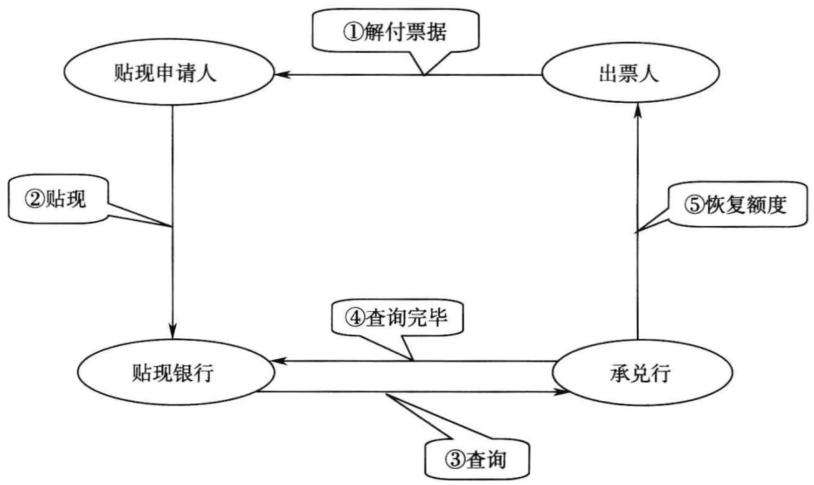
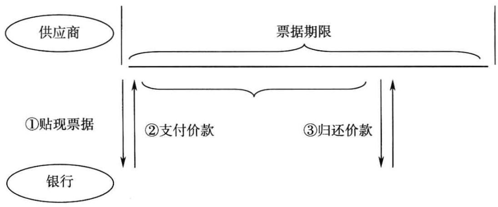
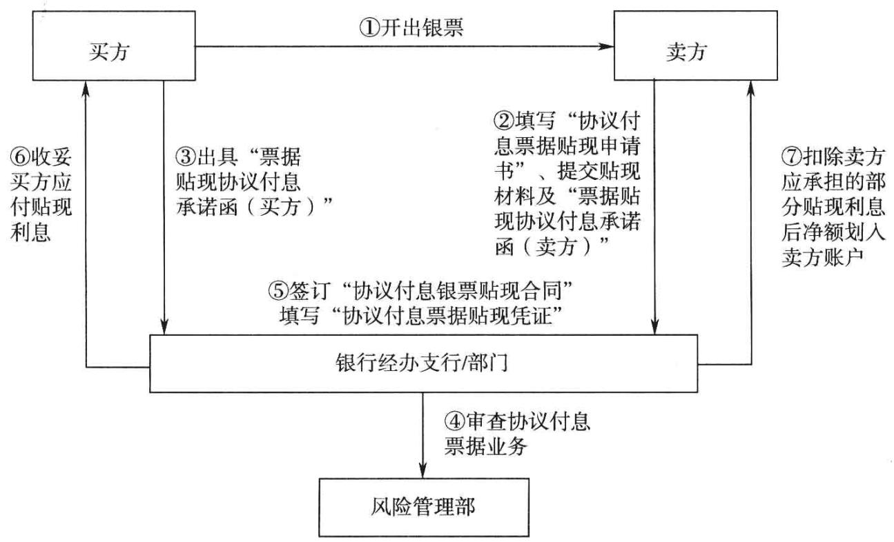
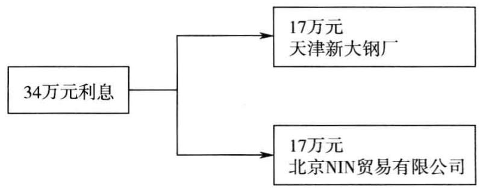
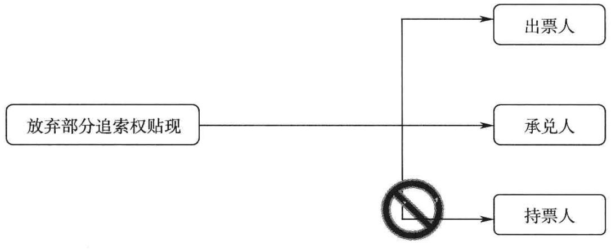

# 票据产品培训

立金银行培训中心著

# 行长送银行客户经理的最好礼物

透彻分析银行承兑汇票营销要点 最详尽的银行票据产品使用说明精心讲解银行承兑汇票使用方法·最翔实的银行票据产品案例解析

# 本书适合商业银行公司业务条线支行行长、客户经理学习使用

国金融出版社

# 授信产品是银行客户经理拓展业务的王牌工具

票据是银行客户经理可以掌控的最锋利的武器在与大企业合作中， “关系营销”只能起到敲门硅作用 实”还取决于银行产品的性能及与时俱

# 银行票据产品

银行承兑汇票代理签发银行承兑汇票全额保证金银行承兑汇票即时贴现准全额保证金银行承兑汇票理财产品质押银行承兑汇票卖方付息票据贴现商业承兑汇票买方付息票据贴现买方付息票据提前解付回购式票据贴现终端买方付息票据贴现 协议付息票据贴现 放弃部分追索权商业汇票贴现商业承兑汇票保贴财务公司保兑商业承兑汇票 财务公司承兑银行承兑汇票银行承兑汇票质押贷款商业承兑汇票质押贷款集团公司保兑商业承兑汇票团开团贴现集团贴现代理贴现票据委托贴现

本书提供教练式培训，提供最真实的案例本书激发客户经理生生不息的奋斗精神和创造价值的活力

本书通过最详尽的培训案例，帮助你在最短时间内成为一名优秀的商业银行客户经理

# 银行票据产品培训

立金银行培训中心著

责任编辑：贾真 责任校对：潘洁 责任印制：丁淮宾

# 图书在版编目（CIP）数据

银行票据产品培训（Yinhang Piaoju Chanpin Peixun）/立金银行培训中心著.—北京：中国金融出版社，2011.6ISBN978-7-5049-5922-5

I. $\textcircled{1}$ 银Ⅱ. $\textcircled{1}$ 立…ⅢI. $\textcircled{1}$ 商业银行—票据—业务核算—-培训—教 材IV. $\textcircled{1}$ F830.33

中国版本图书馆CIP数据核字（2011）第065238号

# 出版行 中国金融出版社

社址北京市丰台区益泽路2号  
市场开发部（010)63266347，63805472，63439533（传真）  
网上书店http：//www.chinafph.com(010)63286832，63365686（传真）  
读者服务部（010)66070833，62568380  
邮编100071  
经销 新华书店  
印刷 保利达印务有限公司  
装订 平阳装订厂  
尺寸 169毫米 $\times 2 3 9$ 毫米  
印张 13.75  
字数 220千  
版次 2011年6月第1版  
印次2011年6月第1次印刷  
定价30.00元  
ISBN978-7-5049-5922-5/F.5482  
如出现印装错误本社负责调换联系电话（010)63263947

# 立金银行培训教材编写委员会

主 编：陈立金  
副主编：云晓晨 马翠微  
编写成员：索利 张的用 赵辉白彭江建伟唐娜李丹严硕翟丽

我们作为商业银行客户经理，怎样能够迅速成长，成为王牌客户经理？

一个最重要的方法：学习授信产品，尤其是票据产品。

票据就如同兵器中的“倚天剑”，没有一种兵器像票据这般锋利，削铁如泥，招式千变万化。宝剑既出，谁与争锋！

谁拥有“倚天剑”，谁就可以笑傲江湖。试问，苍茫大地，谁主沉浮？唯有票据。

得票据者，得天下。

强烈建议：重新审视本银行的票据贴现业务，切忌对客户的票据直接贴现。

票据里到处都是黄金。票据最大的价值在于服务真实的商品贸易，形成结算链条，首尾衔接，绵延不止。切忌直接贴现，将票据生生切断。最好的选择是收到票后全部转为“票易票”，沿着产业链向上游延伸，借助现有客户营销新客户。

善弈者谋势，不善弈者谋子。 9.9

票据营销必须有产业链的意识，银行要深入到产业链中，挖掘银行的价值回报。

看见了那么多的票据被直接贴现掉，真的很痛心！客户经理到处在拉存款，开拓新客户，忙得昏天黑地。殊不知，存款就在这小小的票据里，客户就在这小小的票据里。票据是客户经理拉存款最有效的产品，请牢牢记住。

强烈建议：客户经理必须签发过银行承兑汇票，办理过票据贴现业务，办理过“票易票”业务，哪怕一笔业务根本不赚钱，也应该积极尝试一下，练练手。

# 前 言

# 最应该认真学习的授信产品 票据

“工欲善其事，必先利其器。”银行做客户拓展亦如此。银行的客户经理就是战士，票据则是银行客户经理可以掌控的最锋利的武器。市场就是江湖，战士不精通兵器如何纵横四海。

本书所称票据，仅包括银行承兑汇票和商业承兑汇票，以及这两种基础票据产品的衍生创新品种。这两种基础票据产品就如同“屠龙刀”和“倚天剑”，无比锋利。

立金银行培训中心成立至今，一直在从事客户经理的实务培训工作，我们希望将培训中心办成“黄埔军校”，教会客户经理掌握最新的票据产品、熟悉票据的营销技巧，我们希望为国内的商业银行培训出顶尖高手。

本书是一个成功客户经理使用票据的心路历程。

# 一、精通票据产品你会脱颖而出

我来自内蒙古，大学毕业后进入银行，曾经和大家一样做客户经理。我很清楚做客户经理的酸甜苦辣，客户经理最需要的就是熟悉产品。如果我当年没有熟悉票据产品，就不可能有后来惊人的存款业绩，票据成就客户经理一点都不为过。

本书收录了当前最新流行的票据产品，多达50种，种类非常丰富，既包括单一票据产品，又包括票据与票据的组合运用及票据与其他产品的组合运用。其中，商业承兑汇票保贴、代理签发银行承兑汇票、准全额保证金银行承兑汇票、理财产品质押银行承兑汇票、票据代理贴现、财务公司保兑贴现等都是最新的票据产品，商业银行的客户经理需要非常认真地学习。

# 二、最简洁方式解释票据产品

我在银行的十年，没有人主动教导如何使用票据产品，完全靠自己领悟，而我希望能够给广大的客户经理学习授信产品支招，希望大家少走弯路，在较短时间内掌握票据产品。

本书力图用通俗易懂的语言讲清楚每个银行票据产品的优势、定价、适用对象、营销技巧等，以提高客户经理对票据的理解能力，使客户经理能马上运用于具体的营销工作中。票据是一项实践性很强的产品，越使用越熟练。国内大部分银行都不缺产品，但是普遍存在的问题是缺少培训，尤其缺少非常精通产品、有丰富实战经验讲师的培训。本书由立金银行培训中心的名师呕心沥血完成，全部是教师亲身使用产品的经验总结，会对客户经理有极大帮助。

本书所列的最新产品，我们会给你透彻直观地解释其中的使用奥秘。

# 三、超大规模的案例，最真实的体验

我们将自己使用票据产品的案例整理、总结出来，毫无保留地分享给广大的客户经理。

.案例极其丰富是本书最大的特点。以案例解释票据等产品，包括产品特性、使用技巧、风险控制措施；以案例解释产品对客户的益处，给客户带来诸如降低成本等现实利益；以案例解释产品对银行的价值，包括带来的存款、贷款等收益；以案例示范引申可以进行营销的行业，启发客户经理拓展思路。

本书是目前国内收录票据产品最全、最新颖的一本畅销书。

中国商业银行目前最大的问题是对客户经理基本没有培训，或者培训内容大部分是银行文化等，而且，提供培训的讲师本身并没有实战的经验，对实际营销基本没有帮助。我们希望经过我们的艰苦努力，通过本书及立金银行培训中心的一系列丛书，切实改变这种状况，我们希望客户经理学习我们的教材后，马上就能应用到实践中去开拓存款，不再有“拔剑四顾心茫然”的彷徨。江山如此多娇，我们岂可辜负自己的大好年华。

请马上打开本书，认真阅读，这里将给你展现另一番天地。

对各位客户经理的一个忠告：人和人的差距都是由每天晚上临睡前的3小时你在做什么决定的，我们希望把你培养成为一代精英。请尽可能牺牲部分娱乐时间，每天晚饭后不要看电视，务必认真研习本书，理解其中的精髓。

# 目 录

# 第一篇票据基础知识 1

一、理解票据最简单的方式 3  
二、票据的六个基本特点 8  
三、票据的三个主要功能 12  
四、票据对应哪些基本权利 13  
五、票据客户营销技巧 13  
六、如何灵活地使用票据产品 20  
七、如何控制纯融资性票据 21  
八、票据营销规律. 23  
九、贴现需要增值税发票吗 24  
十、银行承兑汇票风险口承诺费 25  
十一、票据背书… 26  
十二、背书中常见的错误 29  
十三、票据的粘单 30  
十四、什么是票据的前手，什么是票据的后手 31  
十五、银行承兑汇票背书注意事项· 32  
十六、如何判断银行承兑汇票背书是否连续 33  
十七、银行承兑汇票回头背书是否有效 34  
十八、转让票据的基本方式… 34  
十九、票据权利… 35  
二十、辨别银行承兑汇票真假瑕疵五招 36  
二十一、票据业务与贷款的反周期操作策略 38  
二十二、如何形成票据的强大竞争优势 40  
二十三、如何解决优质特大型客户持有的小银行承兑票据的贴现 41  
二十四、如何营销小型客户持有的小银行承兑银行承兑汇票 42  
二十五、票据主要适用的十大行业（TOP10） 43  
二十六、一些票据问题 55  
二十七、票据在会计报表中的反映 57

# 第二篇票据产品 59

一、银行承兑汇票 61  
二、代理签发银行承兑汇票 74  
三、全额保证金银行承兑汇票 77  
四、准全额保证金银行承兑汇票 82  
五、理财产品质押银行承兑汇票 87  
六、商业承兑汇票 90  
七、卖方付息票据贴现： 99  
八、即时贴业务 106  
九、买方付息票据贴现 111  
十、买方付息票据提前解付业务 119  
十一、终端买方付息票据贴现业务 121  
十二、回购式票据贴现业务 124  
十三、协议付息票据贴现 128  
十四、集团贴现 135  
十五、代理贴现 139  
十六、放弃部分追索权商业汇票贴现业务 149  
十七、商业承兑汇票承兑人保贴业务 163  
十八、商业承兑汇票持票人保贴业务 173  
十九、票据委托贴现 176  
二十、银行承兑汇票质押贷款 181  
二十一、商业承兑汇票质押贷款 186  
二十二、财务公司保兑商业承兑汇票 190  
二十三、财务公司承兑银行承兑汇票业务 195  
二十四、集团公司保兑商业承兑汇票 197  
二十五、团开团贴业务… 199

# 特殊票据操作 203

票据业务口诀 206

立金银行培训名言 207

# 第一篇

# 票据基础知识

了解票据、熟悉票据、喜欢票据。

将票据作为自己生命的一部分。

真正掌握票据，你才能在实际的营销活动中得心应手。

一旦熟悉，你就会发现票据的攻击性无与伦比。

票据是客户经理手中最锋利的武器。

# 一、理解票据最简单的方式

# （一）票据

票据是具有法律规定的格式，约定由债务人按期无条件支付一定金额，并可以流通的书面付款凭证。

特点：以文字形式将债务的时间、金额、偿付地明确表述，允许流通转让，允许进行债权债务的冲抵。

商业银行客户经理的实务营销工作中，主要使用到的票据品种是银行承兑汇票和商业承兑汇票及这两种工具的创新品种。银行承兑汇票和商业承兑汇票就如同江湖上的绝代双骄，熠熠生辉。

不熟悉银行票据产品，很难营销大客户，很难成为优秀客户经理。我自己之所以成为优秀客户经理，总结就是：熟悉精通票据产品。

# （二）承兑

承兑是汇票付款人承诺在汇票到期日支付汇票金额的票据行为。

银行在票据上加盖“汇票专用章”即表明银行对票据进行了承兑，向收款人承诺本票到期肯定付款。所以，银行在办理承兑前，必须考察企业的资信情况。

中国四大国有银行的信誉卓著，全球皆知，所以可以出售信用证和银行承兑汇票，信用证可以行遍天下；全国性股份制银行在国内有较好的信誉，所以可以在全国范围内办理银行承兑汇票，并且他们办理的银行承兑汇票可以纵横中国；地方城市商业银行在本地实力尚可，只能办理一些地方银行承兑汇票，赚钱的空间相对小了很多。

汇票到期应当自偿，即以票据对应的商品交易结算获得的资金来清偿票据的债务。银行在审查客户提出的申请时，要求以合法商品交易为基础。同时，必须调查出票人清偿票据债务的能力。切记：汇票是为了保证清偿商品交易项下的债权债务而产生，不可单纯为了资金融通而签发融资性票据。某些规模较小的企业通过签发没有真实贸易背景的票据来套取银行信贷资金，危害极大。

承兑是银行的“融信”活动，是在出售银行良好的信用。银行出售信用赚钱，是成本最低、最赚钱的生意。就如同大导演张艺谋一样，他搞了一个印象系列，自己根本不用出马，打自己的名号就可以赚钱。

# （三）票据流通

票据可以通过背书直接进行转让，无须通知原债务人。转出票据的一方在背书人处签自己的印鉴章，表明自己出让票据权利的意思，同时在被背书人处写明具体的客户名，表明自己希望将该票据权利转让给确定的收款人。票据流通和人民币流通基本相同，但人民币转让可以随意转让，无须签章；银行承兑汇票转让必须签章。

票据可以在全国大范围地流通，银行承兑汇票可以在全国范围内转让，就因为大家都相信承兑行的信誉。

按照《民法》和《合同法》的规定，一般债权转让须通知债务人，如果债权人转让其债权时没有通知债务人，债务人仍应向原债权人清偿债务，债权受让人无权要求债务人清偿债务。而《票据法》明确规定：“转让票据权利无须通知债务人，让与人只需要按照规定的程序，把票据按照合规的背书交给受让人即可。受让人有权要求债务人按照票据规定条件清偿债务，债务人不得以不知转让事宜为由，拒绝受让人提出的清偿债务要求，债务人也不得坚持向原债权人清偿债务。”

为了保障已支付对价而善意取得票据受让人的权益，《票据法》规定：“票据上的权利一经转让，已支付对价而善意取得票据受让人的权利优于让与人的权利，无论是该票据的出票人或让与人，任何前手因与让与人的抗辩理由，一般都不能因以对抗善意受让人。”

票据流通和人民币流通不同的是，人民币在个人之间流通，票据在企业之间流通，但同样纵横四海。

# （四）票面要素

1．“银行承兑汇票”字样。

2.无条件支付的委托。

3.确定的金额。

4.付款人名称。

5.收款人名称。

6.出票日期。

7.出票人签章。

以上7个要素构成票据成立的核心。

签章。出票人制作票据，应当按照法定条件在票据上签章，并按照所记载的事项承担票据责任。《票据法》第七条规定：“票据上的签章，为签名、盖章或者签名加盖章。法人和其他使用票据的单位在票据上的签章，为该法人或者该单位的盖章加其法定代表人或者其授权的代理人的签章。在票据上的签名，应当为该当事人的本名。”票据上的签章，一般适用于：票据签发时，由出票人签章；票据转让时，由背书人签章；票据承兑时，由承兑人签章；票据保证时，由保证人签章；票据代理的，由代理人签章；持票人行使票据权利的，由持票人签章。票据上的签章，可以采取以下方式之一：签名；盖章；签名加盖章。当事人在票据上采取此三种方式之一的，均产生签章的效力。

出票金额。《票据法》第八条规定：票据金额以中文大写和阿拉伯数码同时记载，二者必须一致；二者不一致的，票据无效。支付票据金额是签发和使用票据的唯一目的和最终目的，也是确定债权和债务的重要依据。

对记载事项的要求，《票据法》第九条规定：“票据上的记载事项必须符合本法的规定。票据金额、日期、收款人名称不得更改，更改的票据无效。对票据上的其他记载事项，原记载人可以更改，更改时应当由原记载人签章证明。”该条第一款包含三个方面的含义：一是票据上的各类记载事项必须符合本法从总则到以后各章中规定的有关内容，汇票的绝对记载事项，其内容缺一不可；二是各种记载事项必须按票据法规定的方式或形式予以记载，如票据金额，须同时以中文大写和阿拉伯数码记载等；三是票据上的记载事项应当符合票据法的其他要求。《票据法》第九条第二款、第三款规定了票据记载事项的更改问题，主要是为了维护票据行为要式性，保障票据使用的安全，防止票据的伪造、变造；并且特别规定了一些关键事项不得更改，这些事项是：票据金额、日期、收款人名称。

# （五）票据是一种债务凭证

票据是一种债务凭证。顾名思义，债权人凭票而索，债务人据票而付，实际就如同一张借据。

传统现金结算方式下，“一手交钱、一手交货、钱货两清”，这种方式对买方要求较高，不利于商品交易，属于在不发达经济条件下的结算手段。在现代发达的市场经济条件下，卖方允许买方以票据支付，实际就是允许买方赊欠，提供一张借据或者说欠条先提货，以借据约定远期支付货款的金额、期限。首先产生的票据是商业承兑汇票，后来大家觉得商业信用不好，没有保证，于是，就在借据上又加入银行保证，便有了银行承兑汇票。

票据就是欠条。银行承兑汇票是银行担保项下的欠条，商业承兑汇企业之间直接出具的欠条。

大家注意，银行承兑汇票的7个要素与欠条的要素一模一样。银行承兑汇票7个要素：（1）“银行承兑汇票”字样；（2）无条件支付的委托；（3）确定的金额；（4）付款人名称；（5）收款人名称；（6）出票日期；（7）出票人签章。对照欠条：银行承兑汇票上有明确欠款人名字（付款人名称）、债权人名字（收款人名称），有打借条时间（出票日期），有借款具体金额（票面金额），有出票人签字（出票人签章）。当然为了保证债务确实能够偿还，还要找个担保人。银行承兑汇票方式下，银行作为保证。当然要注明债务人委托银行保证字样（无条件支付的委托），银行以签章方式代替签字。这不就是一张标准的欠条吗，该张借条不凡之处在于有特定法律（《票据法》）保证，可以随时转让，市场非常认可，甚至很多银行成立了票据专营机构，专门从事欠条的买卖业务。

票据自产生以来一波三折，起起伏伏，经历了无数变迁，其功能不断完善，但是它“保证付款”的基本功能却没有任何变化。

简而言之，人民币是中国人民银行对持有人的承诺，你持有多少人民币，国家就欠你多少钱；国债是国家财政部对持有人的承诺，你持有多少国债，国家就欠你多少钱；银行承兑汇票是银行对持有人的承诺，你持有哪家银行承兑的票据，哪家银行就欠你多少钱。

# （六）银行在经营信用

银行就是经营信用的。贷款是相信借款人能够还款，考量银行鉴别借款人的能力、管理能力；接受银行承兑汇票是票面收款人相信办理银行承兑汇票的银行有足够的履约能力，银行在出售自己的信用。总之，银行要么发放贷款赚钱（表内业务，真金白银地动用现金，如流动资金贷款等），要么替别人担保赚钱（表外业务，出售银行的信用，如信用证、银行承兑汇票、保函等）。

最赚钱的企业是靠销售自己的信誉来赚钱的，而绝非靠出苦力。银行吸收存款、发放贷款是赚苦力钱，非常艰难；而银行办理银行承兑汇票赚钱属于银行充分利用自身的品牌和信誉来赚钱，赚得的是智力钱，属于空手套白狼的游戏，通过开银行承兑汇票来拉存款较以贷吸存要容易得多。

银行无信而不立，因而要珍视自己的信用，同时有能力经营信用。当然经营信用是需要基础的，必须有足够的本钱，也就是资本金，人们对银行能够履约的信任是建立在这家银行有强大的资本金的基础上，信任绝不可能建立在空中楼阁之上。

任何一家银行滥用信用的结果最后将是丧失信用，失去银行经营的根基。

银行承兑汇票票样：

# 银行承兑汇票

出票日期 年月日

（大写）

<table><tr><td rowspan=1 colspan=1>出票人全称</td><td rowspan=1 colspan=2></td><td rowspan=1 colspan=1></td><td rowspan=1 colspan=2>全称</td><td rowspan=1 colspan=11></td></tr><tr><td rowspan=1 colspan=1>出票人账号</td><td rowspan=1 colspan=2></td><td rowspan=1 colspan=1>收款人</td><td rowspan=1 colspan=2>账号</td><td rowspan=1 colspan=11></td></tr><tr><td rowspan=1 colspan=1>付款行全称</td><td rowspan=1 colspan=2></td><td rowspan=1 colspan=1></td><td rowspan=1 colspan=2>开户银行</td><td rowspan=1 colspan=11></td></tr><tr><td rowspan=2 colspan=1>出票金额</td><td rowspan=1 colspan=4>人民币</td><td rowspan=1 colspan=1>亿</td><td rowspan=1 colspan=1>千</td><td rowspan=1 colspan=1>百</td><td rowspan=1 colspan=2>+</td><td rowspan=1 colspan=1>万</td><td rowspan=1 colspan=1>千</td><td rowspan=1 colspan=1>百</td><td rowspan=1 colspan=1>+</td><td rowspan=1 colspan=1>元</td><td rowspan=1 colspan=1>角</td><td rowspan=1 colspan=1>分</td></tr><tr><td rowspan=1 colspan=4>（大写）</td><td rowspan=1 colspan=1></td><td rowspan=1 colspan=1></td><td rowspan=1 colspan=1></td><td rowspan=1 colspan=2></td><td rowspan=1 colspan=1></td><td rowspan=1 colspan=1></td><td rowspan=1 colspan=1></td><td rowspan=1 colspan=1></td><td rowspan=1 colspan=1></td><td rowspan=1 colspan=1></td><td rowspan=1 colspan=1></td></tr><tr><td rowspan=1 colspan=1>汇票到期日（大写）</td><td rowspan=1 colspan=2></td><td rowspan=1 colspan=1>付款行</td><td rowspan=1 colspan=1>行号</td><td rowspan=1 colspan=12></td></tr><tr><td rowspan=1 colspan=1>承兑协议编号</td><td rowspan=1 colspan=2></td><td rowspan=1 colspan=1>行</td><td rowspan=1 colspan=1>地址</td><td rowspan=1 colspan=12></td></tr><tr><td rowspan=2 colspan=2>本汇票请你行承兑，到期无条件付款。</td><td rowspan=1 colspan=7>本汇票已经承兑，到期日由本行付款。承兑行签章承兑日期       年月日</td><td rowspan=2 colspan=8>复核          记账</td></tr><tr><td rowspan=1 colspan=7>备注：</td></tr></table>

商业承兑汇票票样：

# 商业承兑汇票

出票日期 年月 日

（大写）

<table><tr><td rowspan=4 colspan=1>付款人</td><td rowspan=1 colspan=1>全称</td><td rowspan=1 colspan=1></td><td rowspan=2 colspan=2>收款人</td><td rowspan=1 colspan=2>全称</td><td rowspan=1 colspan=10></td></tr><tr><td rowspan=2 colspan=1>账号</td><td rowspan=2 colspan=1></td><td rowspan=2 colspan=1>款</td><td rowspan=2 colspan=1></td><td rowspan=2 colspan=2>账号</td><td rowspan=2 colspan=10></td></tr><tr><td rowspan=1 colspan=2></td></tr><tr><td rowspan=1 colspan=1>开户银行</td><td rowspan=1 colspan=1></td><td rowspan=1 colspan=2>人</td><td rowspan=1 colspan=2>开户银行</td><td rowspan=1 colspan=10></td></tr><tr><td rowspan=2 colspan=2>出票金额</td><td rowspan=1 colspan=4>人民币</td><td rowspan=1 colspan=1>亿</td><td rowspan=1 colspan=1>千</td><td rowspan=1 colspan=1>百</td><td rowspan=1 colspan=1>+</td><td rowspan=1 colspan=1>万</td><td rowspan=1 colspan=1>千</td><td rowspan=1 colspan=1>百</td><td rowspan=1 colspan=1>+</td><td rowspan=1 colspan=1>元</td><td rowspan=1 colspan=1>角</td><td rowspan=1 colspan=1>分</td></tr><tr><td rowspan=1 colspan=4>（大写）</td><td rowspan=1 colspan=1></td><td rowspan=1 colspan=1></td><td rowspan=1 colspan=1></td><td rowspan=1 colspan=1></td><td rowspan=1 colspan=1></td><td rowspan=1 colspan=1></td><td rowspan=1 colspan=1></td><td rowspan=1 colspan=1></td><td rowspan=1 colspan=1></td><td rowspan=1 colspan=1></td><td rowspan=1 colspan=1></td></tr><tr><td rowspan=1 colspan=2>汇票到期日（大写）</td><td rowspan=1 colspan=1></td><td rowspan=2 colspan=4>付款人开户行</td><td rowspan=1 colspan=2>行号</td><td rowspan=1 colspan=8></td></tr><tr><td rowspan=1 colspan=2>交易合同号码</td><td rowspan=1 colspan=1></td><td rowspan=1 colspan=2>地址</td><td rowspan=1 colspan=8></td></tr><tr><td rowspan=1 colspan=10>本汇票已经承兑，到期无条件支付票款。承兑人签章承兑日期年月日</td><td rowspan=1 colspan=7>本汇票请予以承兑，于到期日付款。出票人签章</td></tr></table>

# 二、票据的六个基本特点

票据六个基本特点可概括为：因、文、有、权、要、独。

“因”是指票据是无因票据，受让票据的一方无须知道转让票据一方是如何得到票据的；“文”是指票据是文义票据，票据的内容必须在票面上表达得清清楚楚；“有”是指票据是有价证券，必须标明一定的金额；“权”是指票据是设权凭证，对持票人而言是索偿一定金额的权利凭证；“要”是指票据有要式规定，记载哪些内容有明确的规定，不得随意记载；“独”是指票据的出票、背书、承兑、保证等行为相互独立。

票据的这六个特点保证企业之间债务以票据的形式进行有效管理，以文字的形式将债务的时间、金额、偿付地点准确表述，以法律约束保证债务的履行，因而，社会广泛接受这种债务形式。

# （一）票据是无因凭证

票据行为是由信用行为等原因而产生的，设立有因、流通无因，不论其行为有无原因，或其原因是否正当，票据债务人自票据行为完成之日起，即对善意持票人承担支付票据款项的责任。在经济生活中，票据背书、转让十分频繁，若要求持票人了解其前手取得票据的原因，明显过于苛刻。

《票据法》规定：票据债务人不得以自己与出票人或者与持票人前手之间的控辩事由对抗持票人，但是持票人明知存在抗辩事由而取得的票据除外。

接受票据的人无须知道持票人是否是票据的正当持票人，就如同一个人在饭馆进行花钱消费，饭馆无须知道这个人是如何得到这笔钱的，钱的来源是否合法，因为饭馆根本无法确切知晓。试想，如果要求每个收款人在收款时，都必须知道付款人的钱得来是否正当，一定是劳动所得，而不是骗抢得来的，那么整个世界交易结算效率将会大大下降。但是，如果饭馆明明知道付款人是一个通缉犯，钱来路不正而仍然接受，那么饭馆必须承担可能的索赔风险。

# （二）票据是文义凭证

票据当事人的权利及义务等一切事项均以票据上记载的文字为准，不受票据上文字以外事项的影响。票据文义直接决定票据的权利、义务的范围和最高限度。《票据法》第八条规定：票据金额以中文大写和阿拉伯数码同时记载，二者必须一致；二者不一致的，票据无效。同时规定：“票据上记载的事项应当真实，不得伪造、变造，伪造、变造票据上签章和记载事项的，应当承担法律责任。”

D 票据必须是当事人自己真实意思的表示，超出或者干脆变造他人的意思表示，还要其承担票据义务，这明显是与法律相悖的。

# （三）票据是有价凭证

票据上一般需写明一定的货币金额，当债务人向票据权利人履行债务后，应向票据权利人归还票据，没有票据一般不能够主张票据权利。

# （四）票据是设权凭证

票据的设立必须支付对价，也就是基于真实的交易关系和债权债务关系。对价是设立票据的依据。在票据没有背书转让前，如果确有证据证明收款人

没有支付合理的对价，恶意骗取票据的，债务人可以拒绝付款。

《票据法》规定：“票据的取得，必须给付对价，即应当给付票据双方当事人认可的相对应的代价。”“票据债务人可以对不履行约定义务的与自己有直接债权债务关系的持票人进行抗辩。”

在票据没有背书转让前，如果出票人能够提供确凿证据证明票面收款人没有履行贸易合同，那么出票人完全可以拒付票据。

票据债务人可在票据正面标注“不得转让”字样，就是为了保证债务人对后手的抗辩权。

# 【案例】

1996年，轰动一时的沈阳市石油总公司与辽宁省石油煤炭销售公司票据纠纷一案，沈阳石化公司向辽宁石油煤炭销售公司购进柴油，价值384万元，沈阳市石油总公司签发了384万元银行承兑汇票，由 $\times ~ \times$ 银行沈阳分行承兑，沈阳市石油总公司在票据上注明“不得背书转让”，辽宁石油煤炭销售公司将票据质押给 $\times \times$ 银行太原分行办理贷款。银行承兑汇票到期，沈阳市石油总公司要求辽宁石油煤炭销售公司返还汇票，并拒绝支付汇票款项。最终法院判决废除银行承兑汇票，解除了沈阳市石油总公司银行承兑汇票兑付义务。

■我国《票据法》关于出票人在汇票上记载“不得转让”字样的立法精神，旨在维护出票人保留其对直接后手的抗辩权，以保护其票据权利。如果允许不得转让的汇票设定质押，从而发生票据权利转让的事实，将直接损害沈阳市石油总公司对辽宁石油煤炭销售公司的抗辩权及其票据权利。.

从理论上讲，以汇票设定质权，是对票据权利的一种处分行为，首先要求设质人对质物有处分权。不得转让的汇票在法律上有不得转让、限制流通的基本特性，受票人对持有的票据享有其权利，但没有处分权，即转让权，这是便于出票人利用法律赋予的抗辩权，保护自己的合法权益不受侵犯。辽宁石油煤炭销售公司没有履行合同，沈阳石化公司的抗辩理由成立。辽宁石油煤炭销售公司不享有票据权利，也没有对汇票的处分权，因此，辽宁石油煤炭销售公司质押行为无效。

# （五）票据是要式凭证

票据行为是一种严格的书面行为。票据作为债权债务的重要凭证，必须具备规定的形式和内容，并以精确、可靠、完整的文字来表达。票据填写的要素、内容以及票据应载明的种类、金额、收付款单位、日期都有明确的规定，这些就是票据要式。不具备要式的票据无效。票据的签发、承兑、背书、贴现、转让等环节，当事人都必须按照规范背书和签章，其票据行为才能产生法律效力。票据行为的要式性有利于票据的安全流通。

■票据法关于要式的规定，实际上限定了游戏的规则，所有票据的当事人都可以据此清楚地了解到其他当事人表达的意思，知晓自己在其中的权利和义务。尤其票据受让人可以很清楚地看见包括其前手在内的当事人在票据上的意思表示，准确评价票据的风险，作出自己是否接受票据的决策。

最近，很多银行规定，凡是背书人中任意一手为特大型国有企业或四大国有商业银行的商业承兑汇票，就可以买入，就是把握了票据中要式性、无因性的特点规定，只要特大型国有企业或四大国有商业银行在商业承兑汇票上进行了规范的背书签章，就表明其对票据的后手提供了保证付款的义务，银行贴现这样的票据风险可控。

再比如，最近很多银行办理仓单质押贷款，要求将仓单背书转让给银行，这是不对的。背书转让是《票据法》针对票据特有的规定，仓单不属于票据，不可以袭用《票据法》规定，自然也不受《票据法》保护。

# （六）独立性

票据上有多个票据行为时，例如，有出票、背书、承兑、保证等行为，各种行为都独立发生效力，互不影响，其中任何一个行为无效，并不影响其他行为的效力。例如，《票据法》规定无民事行为能力人或者限制民事行为能力人在票据上的签章的，其签章无效，但是不影响其他签章的效力；票据上有伪造的签章的，不影响票据上其他签章的效力。这些规定体现的就是票据行为的独立性特征。

《票据法》第四条规定：“出票人制作票据，应当按照法定条件在票据上签章，并按照所记载的事项承担票据责任。持票人行使票据权利，应当按照法定程序在票据上签章，并出示票据。其他票据债务人在票据上签章的，按照票据所记载的事项承担票据责任。”

# 三、票据的三个主要功能

# （一）结算功能

利用票据进行债权债务的结算来替代现款交易结算和纯赊欠结算，这是票据产生之初的原因，到今天仍然是其最重要的作用。票据上清晰地签注了债务人名称、债权人名称、支付债务的时间和金额，且受到《票据法》的保护。

支票只能在本地结算，以出票企业自身的信誉作保证，收款人收票后可能存在空头的风险；银行汇票在异地结算，靠银行的信誉作保证，收款人不会有任何的空头的风险；银行承兑汇票本地和异地均适合，有银行信誉的保证，只要承兑行不倒闭，收款人不会出现空头的风险；你拿着我承兑的银行承兑汇票，就意味着我将来一定偿付你多少钱。

# （二）融信功能

票据是支付手段和信用手段的有效结合，企业在自有资金不足的情况下，利用票据进行支付结算，其本身就是一种融资方式—“短期资金融通票据化”。企业因为商务支付结算的需要，不采取贷款方式去获得资金进行支付结算，而是采取向银行申请银行承兑汇票方式，“融资”改为“融信”，借银行信用完成商务交易支付。企业借银行信用只需要付出一定成本，就是交给银行一定的银行承兑汇票手续费。你想一想，对银行来说，究竟是出售资金赚钱，还是出售信用赚钱？出售信用可是无本钱的买卖啊！

对商业银行而言，尤其是对股份制商业银行而言，票据是营销高端客户的王牌工具，典型的如中国石油、铁道部、国家电网公司等客户，非常强势，传统的贷款等融资工具很难搞定这些客户。通过创新型的票据融资工具，为客户降低融资成本往往是商业银行成功的选择。

目前，已经有很多大型制造企业通过产业链，以票据为载体进行产业链融资。这些大型企业利用自身强势市场地位，要求：（1）经销商提前交付票据作为预付款，实现借助经销商进行融资的目的；（2）签发商业承兑汇票给供应商，对供应商延迟付款，实现借助供应商融资的目的。

# （三）投资功能

商业银行可以充分利用自身闲置的资金，在市场上大量买人票据，实现闲置资金的投资运用，赚取一定的收益。票据转贴现业务已经成为商业银行低风险状态下资金运用的重要手段之一。目前，很多银行发行票据信托计划也是这个原理，为资金较为充裕的客户提供低风险的理财工具，可以借助票据信托计划维护一批较为高端的客户。

本书中提到的委托贴现业务就是典型的票据理财业务，有闲置资金的客户将资金委托贷款给持票人，获得较高的收益。

现在，我国市场上已经出现熟悉票据的企业在市场上自己私下买入票据，然后直接背书转让给自己的收款人。假如我有足够的资金量，我都想在市场上吃进票据，持有票据的获利可比在银行存款利息高多了。

# 四、票据对应哪些基本权利

票据权利是指持票人向票据债务人请求支付票据金额的权利，它包括付款请求权和追索权。

# （一）付款请求权

付款请求权又称第一次请求权，是指持票人对票据主债务人（如汇票的承兑人）行使请求其支付票据金额的权利。

# （二）追索权

追索权是指因持票人在第一次请求权没有或者无法实现的情况下，对票据的其他付款义务人（如汇票出票人、保证人、背书人等）行使请求偿还票款的权利。也就是说，作为持票人，它首先有权要求票据的主债务人向其偿付票款，如果主债务人没有或无法（如账上无款支付或者破产等）偿付票款时，持票人有权要求其他付款义务人向其偿付票款。

# 五、票据客户营销技巧

# （一）沉睡贷款客户的激活

优质特大型企业集团受到各家银行追捧，如大型电力公司、电信集团、石油集团、高速公路集团等往往在多家银行有非常充裕的闲置贷款额度，任何一家银行想要撬动这些客户使用贷款都不是件容易的事情。就银行创造收益角度而言，与其做没有任何实际意义的关系维护，不如选择票据产品强力切入，激活这些“沉睡”的优质客户，使其回应银行营销活动，而票据产品带来的综合收益可能不比贷款低。银行应当认真梳理企业的支出，找到可以使用票据的部分，重点营销。企业一旦使用银行承兑汇票，总需要银行到期解付票据，到时，自然有贷款需求了。

图1-1是企业最常见的资金池，左侧是企业的现金流入项目，包括借款、票据、分红、预收款，当然特大型的企业还包括发行债券、股票等。右侧是企业常见的现金流出项目，包括还贷、采购、水电费、工资等。

  
图1-1企业资金池

因此，应当从企业现有资金流中找到可以用票据替代的部分，票据最大的好处在于融资成本较低，可以实现融资与支付的同步。

票据融资成本较低，可以为企业节省相当的财务费用，因此，大客户对票据的需求较为迫切，短期贷款融资呈现票据化趋势，优质客户大量使用票据替代流动资金贷款。

目前中国进入了票据的黄金时代，票据使用越来越广泛，通过不断开发票据新产品取得竞争优势已经成为各家银行的共识，通过票据融资可以开拓新客户、稳定老客户、吸收存款。银行客户经理要懂得利用票据可以与传统的信贷工具有效组合的优势，创造交叉销售机会，最大限度地挖掘客户价值。

营销建议：国家电网公司、南方电网公司及其下属电力公司，中国石油天然气集团、中国石油化工集团、中国海洋石油集团及其下属公司，中国移动通信集团、中国联通集团、中国电信集团及其下属公司，中国国航集团、中国南方航空集团、中国东方航空集团等航空公司，铁道部及其下属铁路局，各地交通厅、公路局等，都应把握上述技巧。记住，政府类客户也可以签发银行承兑汇票。

【案例】

# 北京首都机场集团买方付息票据案例载自建行网站

中国建设银行北京首都机场支行成功为首都机场集团公司开立3亿元银行承兑汇票，并办理了该笔汇票的买方付息贴现业务。首都机场集团公司通过签发买方付息银行承兑汇票支付新航站楼建设费用、机场设施费用。

通过此次3亿元买方付息贴现业务的成功办理，建设银行北京市分行实现了贴现利息收入450万元及中间业务收入15万元。

从表面分析，贷款收益似乎要比办理银行承兑汇票高得多，建设银行亏了。其实不然，首都机场集团公司实力非常雄厚，资产规模庞大，常规手段很难营销，建设银行使用票据则成功“突破”该公司。同时，通过银行承兑汇票，又成功营销其众多的上游客户，比如施工企业、材料供应商等，这比单纯的贷款、仅收一点贷款利息获益强得不止百倍。

作为银行客户经理，不要眼中仅有一点利息收入，最重要的是扩大自己的基础客户群。有了客户，什么都有了。

# （二）关联寻找客户

1．从银行承兑汇票、增值税发票关联中寻找收款人。

拟以票面收款人为营销目标客户，出票人在本行办理银行承兑汇票后，陪同出票人将汇票送交收款人，声明银行可以提供贴现将汇票取回。这种营销方式方向非常明确，营销思路清楚，可以实现营销“速战速决”。市场经济中每个企业都会有上下游的客户，银行借助企业直接的商品买卖关系，实现关联营销，要比银行陌生式营销容易得多。银行借助客户的现有产业链进行关联营销，效果要比一个一个陌生营销好很多。

这种票据营销方式的一个最基本的营销规则，就是本行的银行承兑汇票要最大限度从收款人处拿回来，让自己的现有客户为自己营销新客户，使现有客户成为我们的义务推销员。

客户经理申报一笔贴现业务要比贷款容易得多。申请一笔贷款项目，需要了解客户、分析报表、组织资料、撰写报告、审批沟通，过程很复杂、很熬人，成功率还不高。而对本行签发的银行承兑汇票办理贴现，则容易得多，陪同付款人将票据交给收款人的时候，就可以对收款人声明，本行可以办理贴现，随时将票据变成现金，小规模收款人肯定对此非常感激。

这就是“勿以利小而不为”的营销思路，“集腋成裘”的客户战术。这种营销方式，成本小，效率高。

2．从银行承兑汇票、增值税发票关联中寻找出票人。

办理贴现的时候一般都要求客户（增值税发票中的销货单位）提供增值税发票，通常增值税发票里含有付款人（增值税发票中的购货单位）清晰的有价值信息，非常清楚，有准确的名称、有地址、有电话。

客户经理可以将银行承兑汇票出票人（增值税发票中的购货单位）作为银行信贷目标客户，投人精力进行营销，为其核定银行承兑汇票额度。这在营销学中称为“跟随策略”，这种方式可以提高客户的筛选成功率。

建议客户经理去本行的票据中心，找出所有的贴现票据对应的增值税发票，仔细查看增值税发票的付款人信息，这就是最重要的客户信息源。

）客户经理营销客户最忌盲目。开拓客户的时候，如果不知道项目能否被本行批准，就去盲目营销，结果往往徒劳无功，甚至会导致劳民伤财。而客户在其他银行办理过银行承兑汇票，说明他已经经过了其他银行的风险甄别、信贷审核。目前，各家银行信贷政策取向、授信客户评价标准基本趋同，其他银行可以通过的客户，本行通过的机会也会比较大，因此，通常这种方式营销信贷客户成功率会明显提升，不失为一种较好的选择。

这种跟随式的营销，要比陌生式的拜访营销准确得多，成功率会提升不少。客户经理应该先要知道哪些项目可能营销成功，再去投人足够的时间和精力，而不要一味地瞎撞。

客户经理在向信贷审批人员解释的时候，可以直接说，该客户在某银行已经获得了多少金额的银行承兑汇票，并有银行承兑汇票复印件作证，这样可以极大提高审批人员对客户的信心。

$\times ~ \times$ 省增值税专用发票票样：

# ××省增值税专用发票

开票日期：

<table><tr><td rowspan=1 colspan=1>购货单位</td><td rowspan=1 colspan=3>名称：纳税人识别号：地址：开户行及账号：</td><td rowspan=1 colspan=1>密码区</td><td rowspan=1 colspan=7></td></tr><tr><td rowspan=1 colspan=2>货物及应税劳务名称</td><td rowspan=1 colspan=1>规格型号</td><td rowspan=1 colspan=1>单位</td><td rowspan=1 colspan=2>数量</td><td rowspan=1 colspan=2>单价</td><td rowspan=1 colspan=2>金额</td><td rowspan=1 colspan=1>税率</td><td rowspan=1 colspan=1>税额</td></tr><tr><td rowspan=1 colspan=3>价税合计（大写）</td><td rowspan=1 colspan=9></td></tr><tr><td rowspan=1 colspan=1>销货单位</td><td rowspan=1 colspan=6>名称：纳税人识别号：地址、电话：开户行及账号：</td><td rowspan=1 colspan=2>备注</td><td rowspan=1 colspan=3></td></tr></table>

收款人： 复核： 开票人： 销货单位：

请仔细观察：增值税专用发票中具有清晰的客户资料。

销货单位信息：名称、地址、电话一清二楚，而且电话、地址肯定非常准确，因为企业一旦信息变更都必须及时告知税务部门。通过贴现申请人提供的增值税发票信息，寻找销货单位非常容易，如果是同城机构，可以委托贴现申请人代为介绍或自己打电话联系营销。

建议客户经理都主动到本行票据中心实习一个月，就是查找本行所有的增值税发票信息，找到所有的销货单位信息，记下电话、地址等，逐个拜访营销。

# （三）建立自己的品牌

在票据方面建立自己的品牌，客户自然滚滚而来。很多大型客户非常迫切地希望了解票据业务，使用票据产品，并通过票据业务改进结算模式、降低融资成本、提高交易效率。银行应当在建立自身品牌方面多下工夫，在客户心目中形成如“贴现快、服务专、品种全”等品牌形象，提高市场知名度。有了品牌，事半功倍。

票据业务是一项技术含量较高的工作，比贷款复杂得多，非常受客户欢迎，客户经理应该在专业方面多下工夫。客户经理如果能够对票据业务精通掌握，将能够挖掘比较多的优秀客户，尤其是在营销钢铁、煤炭、石油、家电、汽车、有色金属等行业客户中如虎添翼。

客户经理也应主动包装自己，你要把自己当成明星，你要像包装明星一样包装自己，要让自己成为明星级的客户经理，比如在名片上注明：票据专业客户经理，或者在名片背面注明本人可以办理贴现、票易票、商业承兑汇票保贴、买方付息票据等，在多如牛毛的客户经理人海中，客户一眼就能认出你，觉得你明显高出一筹，有较强的专业性。每天在拜访客户前，主动查询本行办理银行承兑汇票的贴现利率，见了客户可以直接报出价格，客户肯定会认为你水平不凡、非常专业。

■贷款比拼不了技术，法人账户透支业务还带些技巧，而票据可以充分展现客户经理的个人才华，如保兑仓、仓单质押、买方付息票据等，需要琢磨适应客户的具体需要，将银行产品与客户的经营进行对接。

# （四）新服务模式创造客户

票据产品属于非常活跃的一类产品，创新非常快，广大银行客户经理必须非常熟悉票据的创新产品。通过有效的产品创新促进票据在体内循环，出票、贴现全部在本行操作办理，在满足优质客户个性化需求的同时，创造链式营销机会，如代理贴现、保兑仓、仓单质押、厂商银等。新产品威力极大，往往先确定一个核心客户，设计金融服务方案，关联营销其上下游企业，核心目的在于一点突破、全线营销，如通过汽车金融服务网络，切入汽车厂商的同时，关联营销其众多的经销商、零配件供应企业，达到“事半功倍”的效果。

客户经理必须懂新产品、新业务模式，尤其是各类票据业务创新操作，千万不要就只会简单地放贷款，如果你不是资源型人才，放贷款根本沉淀不

了多少存款。放贷款拉存款是最费体力的工作，很辛苦，成效却不会很大。  
告诉你一个秘诀，“拉存款的靠票据，做利润的靠贷款”。

■现在大企业财务部门负责人很喜欢新金融工具，喜欢谈金融创新，喜欢头脑不凡的客户经理。客户经理应当在专业方面多下工夫、塑造自己的个人品牌。有了品牌，事半功倍。

# （五）对长期客户提供优惠，培育客户的忠诚度

银行经常犯这样的错误：对很多客户仅是单纯做贴现，做完一两笔贴现后就与他们失去了联系，而自己还在不断拓展新的票据客户。如果客户结算方式是票据，其长年累月会收到大量的票据，客户经理完全可以通过票据扩大很多客户在本行的业务量，沉淀更多资金。大部分银行缺少对贴现客户的长期跟踪，这是一种资源浪费。银行可以建立重点票据资源客户档案，为长期客户提供优惠措施，培育客户的忠诚度。对一年累计贴现余额达到一定金额的客户，可以提供优惠的服务措施，比如，规定客户一年累计贴现金额达到1亿元，可以提供非常优惠的1000万元额度的优惠利率贴现、提供500.万元员工购房优惠利率贷款、免费安装网上银行等。

只要本行政策允许，尽可能给客户最优惠的贴现利率，让客户感激你。做人先于做事，赢得客户心比仅赚取一点蝇头小利的利息强得不止百倍！

# （六）重视提供票据业务综合服务方案

对于票据大户，很多银行只提供简单的贴现，这是较低层次的营销方式。对于石油、电力、煤炭、铁路物资、能源等传统贴现大户，办法不多，手段过于单一。目前很多大客户需要的不再是简单的承兑或贴现，而是完整的票据金融服务方案，从原料的购买到销售款项的回收全部票据化。针对这种需求，银行的票据服务必须完整地嵌人到企业的产、供、销环节，以降低整个产业链条的结算成本。

客户经理要懂得银行承兑汇票和商业承兑汇票的捆绑、银行承兑汇票和保兑仓的捆绑、银行承兑汇票和法人账户透支业务的捆绑等，形成行业解决方案。我们不应当销售标准化票据产品，而应当是提供金融服务方案。

提供这种服务方案，一个很重要的原则是，能够使用票据的尽量不使用贷款；如果其他银行提供贷款，我们就要提供商业承兑汇票；如果其他银行提供银行承兑汇票，我们就提供商业承兑汇票；如果其他银行简单开立银行承兑汇票，我们就提供买方付息银行承兑汇票；如果其他银行提供买方付息银行承兑汇票，我们就提供买方付息代理贴现银行承兑汇票。我们要始终高出其他银行一筹。

现代商业银行的金融创新核心就是：给客户的资金收益要尽可能高，至少要高于存款利息；给客户融资成本要尽可能低，最好低于贷款利息。

# 六、如何灵活地使用票据产品

# 巧妙实现短借长用的票据融资

对于一些特定的大型垄断型客户，在贷款品种中加人票据，可以起到过桥融资的作用，有效降低客户的融资成本。

具体的做法：

相对合理的融资性票据一—有固定用途的票据。票据的交易背景关系存在，只是基础交易时间非常长，有时远远超过票据对应的期限。这种票据融资的目的就是为借人低成本资金，票据承担过桥融资的作用。

这种票据操作方式下，通常承兑、贴现的手续完备，跟单资料齐全。借款人只是将本应长期借用的资金以票据的形式实现短期周转借用。

如大型水力电站建设项目、大型电站建设项目、大型机场建设项目、大型公路建设项目、大型的飞机采购、大型轨道客车采购、大型医疗设备采购等，这些项目产生现金流的时间最长甚至超过10年，本应当借入5～10年中长期项目贷款，但是长期贷款利率偏高；而这些项目的投资主体实力非常强劲，是各家银行追捧的明星级队员，融资渠道非常畅通，加上有已经建成的其他项目可以带来充裕现金流，因此，可以采用票据作为日常采购的支付工具。在融资组合中加入票据的最大作用在于降低客户的融资产品一揽子组合的加权融资成本。

中小银行的客户经理应当秉持如下竞争策略：对于如电力、电信等王牌客户的大型新建项目，大型银行一般提供大额贷款，中小银行应当重点提供票据，通过票据去切大银行的存款蛋糕，中小银行的授信一定要起到“画龙点睛”的作用，能够“四两拨千斤”。

使用相对合理的融资性票据客户通常都是特大型客户，采用这种操作方式的特点：

1.基础交易时间较长，票据结算截取其中一段时间，有接力票据的问题，但政策性风险不大，这种操作方式突破了当初中国人民银行开办银行承兑汇票的初衷。2.由于票据结算与融资功能完美合一，而票据贴现利率相对于贷款利率的绝对优势在于催生客户产生此类需求，是企业“两利选其重、两害取其轻”选择的结果。3.操作上较为麻烦，需要接力出票，需要以企业日常资金池中的资金不断解付汇票，对企业的资金运作能力考验较大，但对于一些超强的垄断型客户，获得源源不断的资金易如反掌，这种操作风险不大。

目前，国内的大型企业非常重视降低财务费用，票据使用量上升很快。银行应当认识到，利用票据贴现利率较低的便利，进行低成本的融资已经成为必然的选择。对于大企业的这些需求，应当重视研究，根据其资金需求特点，提供量体裁衣式的票据融资方案。银行必须注意：这类票据客户必须是实力极强、资金流非常强劲的特大型集团客户。

票据能有今天的发展，实际上是贷款利率受到严格管制的结果，一旦贷款利率市场化，在短期融资券和贷款优惠利率的双重夹击下，票据可能不会有今天这么强大的攻击性。但是，目前或相当长一段时间，我们看不出这种趋势。

# 七、如何控制纯融资性票据

纯融资性票据一无确定交易用途，只是为了取得资金融通的票据。票据的交易背景关系根本不存在，或者即使存在也不会履行，只是以此为借口获得承兑以便于融资。

# （一）恶意融资性票据

这种票据融资目的就是为了借人资金，因此并不十分在意融资成本。

通常承兑、贴现手续完备，跟单资料齐全，但大部分都是假造。

多数情况都是以新签发银行承兑汇票、办理贴现取得资金去承付到期票据，拆东墙补西墙，银行信贷资金一旦收紧，企业资金链就可能会中断，风险立显，危害极大。

最早的中国蓝田集团、中国南德集团、新疆德隆集团就是典型的融资性票据。这类融资性票据切勿沾边，初人行的客户经理有时被客户一点存款的小利蒙蔽，卷入融资性票据旋涡，而使银行遭受严重的损失。

典型的行业：一些从事证券、期货、房地产、股权收购投机的投资公司，客户承诺提供一定金额的存款小利诱惑，而套取银行承兑汇票。

# （二）套利性融资性票据

套利性融资性票据一基础交易存在，由于基础交易的现金付款折扣远远高于票据付款，付款人趋利使然，通过票据套取现金进行付款交易。以下是典型套利性融资性票据对应交易特征。

·同一笔交易，收款人提供不同的折扣：（1）收取银行承兑汇票，商业折扣 $1 \%$ ；（2）收取现金，商业折扣 $4 \%$ 。

根据趋利规则，付款人会采取先开立银行承兑汇票，然后以贴现方式套取现金支付商业货款。

例如，宝钢集团、武钢集团、中石油、中海油、中神华不收取银行承兑汇票，只要现款，经销商为了降低融资费用，采取关联公司签发银行承兑汇票、再贴现方式取得现金。

企业的商业趋利取向决定通过票据套取现金来赚取点差支付基础交易，这个点差由卖方提供。

风险评价：这种操作政策性风险极大，是一种典型的资金套利行为，在销售旺季时期，钢材经销商、电器经销商多采用。

风险控制：融资性票据对银行而言危害极大，很多不法企业利用银行希望通过发展票据吸收存款的做法，采取提供一定的保证金，套取银行承兑汇票；甚至部分银行要求企业先承兑、再贴现，然后以贴现资金足额作为保证金再次承兑，反复操作，滚雪球方式虚增存款。

# 【案例】

北京大地汽车销售有限公司实力一般，某国有商业银行为其核定一定银行承兑汇票额度，规定必须用于向 $\times \ \times$ 汽车制造商的提货，北京大地汽车销售有限公司是民营企业，公司经营的酒店需要流动资金，因此，该公司伪造了票面收款人为 $\times ~ \times$ 汽车制造商的印章，然后多次背书转让，最后由其控制的另一家企业在某银行办理贴现，套取了现金。其目的就是利用银行承兑汇票容易得到资金融通的特点，知晓银行通常不会也不可能核对票面所有当事人的印鉴，伪造印章套取银行信贷资金。

作为一名客户经理，如果你在银行工作30年，正常退休，能够全身而退，你就会非常富裕，真没有必要去冒天大的危险，得不偿失。

# 八、票据营销规律

票据贴现营销切记掌握好节奏，有一定的章法。企业通常都是上半年（尤其是4月以前）进行开工前准备工作，因此商业银行上半年贷款投放困难，下半年企业工程大批量上马，银行顺应企业的工程需要可以大量放款。依据这种规律，银行应当上半年大量做票据，以票据业务保证上半年的信贷投放量；下半年大量做贷款，并根据贷款投放的需要，不断转出持有的票据，为新增贷款腾出空间。票据与贷款捆绑逆向操作，保证全年信贷投放的平稳，不大起大落。

因此，上半年票据贴现利率较低，下半年票据利率呈现走高趋势。客户经理开拓票据业务时，一定要把握这条规律，上半年大力开拓票据客户，有时可以打“价格战”，下半年要有意识地调整工作重心，着力做贷款业务，票据要减少投入。

切记，客户经理只有顺应经济规律才会既满足客户的需要，同时又得到银行的有效资源支持，有所作为，如果“逆流而上”，你会头破血流。

银行也可以向企业提供财务顾问建议：企业在制订销售政策时考虑上半年大量收取票据（因为贴现利率较低，企业损失的财务费用不大），下半年以收取现金为主（贴现利率走高，企业的财务费用损失较大）。客户如果手中有票据，一定要在上半年尽早贴现，变现取得现金，下半年宜采取票据背书转让的结算方式。

# 九、贴现需要增值税发票吗

按政策规定无须开具增值税发票的，如能提供能够证明其贸易背景真实性普通发票的，可以办理商业汇票贴现业务。

1.根据《中华人民共和国增值税暂行条例》第二十一条规定，属于下列情形之一，需要开具发票的，应当开具普通发票：

（1）销售免税货物的。

（2）小规模纳税人销售货物或者应税劳务的。

2.用于非应税项目的购进货物或者应税劳务。主要是《营业税暂行条例》规定的缴纳营业税、补缴增值税行业提供的劳务，如交通运输业、建筑业、金融保险业、邮电通信业、文化体育业、娱乐业、服务业税目征收范围的劳务，以及转让无形资产，销售不动产和固定资产在建工程等。

3.企业提交的发票是货票。按照税法规定，国营铁路、民用航空、公路和水上运输单位开具的货票，以及从事货物运输的非国有运输单位开具的套印全国统一发票监制章的货票，准予作为抵扣凭证的运费结算单据。

4.对于水、电、煤、油、燃气等公用事业单位持有的商业汇票，如特殊原因不能提供与其相关企事业单位的商品交易合同，在其出具供应计划（如供电、供水计划）或其他能证明真实贸易背景的材料后，可以办理贴现。

5.对于增值税发票早于商业汇票或交易合同，如经查实确实存在真实贸易背景和债权债务关系的，可以办理贴现。

（1）企业之间属于长期业务合作关系，先供货、开具增值税发票，供货到一定阶段后，需方定期以银行承兑汇票方式支付货款。

（2）市场对产品需求形成供不应求时，需方对原购销合同约定的商品数量需求增加，供货方先供货、开具增值税发票，后双方补签增订部分的购销合同并支付相应的款项。

在监管部门的很多规定中，要求贴现必须提供增值税发票，这是为了防止银行为企业办理融资性票据。现在很多银行为了要增值税发票而要增值税发票，甚至在贴现的时候拼凑发票，这是违背监管部门的初衷的。

# 十、银行承兑汇票风险口承诺费

一个基本原则是，不可以过于便宜地使用银行担保资源，必须收费。以下是一般的收费规定，仅供参考。

# （一）银行承兑汇票承诺费收费标准

银行承兑汇票承诺费 $=$ （承兑金额-低风险质押物金额 $\times$ 质押率-保证金） $\times$ 费率

承诺费率按签发汇票的期限确定标准。签发的银行承兑汇票半年期限费率暂定为 $1 \%$ ，3个月的费率为 $0 . 5 \%$ ，承兑期限不足3个月的按3个月计收，超过3个月（不含）的按半年计收。

# （二）承诺费减免及下浮

总行级重点客户及使用总行级重点客户授信额度签发银行承兑汇票的，分行可以减免出票人的承诺费，对于出票人使用授信企业的授信额度签发承兑汇票的，分行可按授信企业的授信等级对应的下浮权限对承诺费进行下浮。

# （三）承诺费优惠政策

为保证有真实贸易背景的承兑保证金对存款的支持作用，减少承兑业务占用风险资产，在按授信等级进行差别收费的前提下，对缴纳承兑保证金较高的出票人给予承诺费优惠政策如下：

保证金率大于等于 $70 \%$ 的，在客户授信等级对应优惠权限上再给予 $50 \%$ 的下浮，即优惠承诺费率 $\times 5 0 \%$ 。

保证金率大于等于 $50 \%$ 小于等于 $70 \%$ 的，在客户授信等级对应优惠权限上再给予 $30 \%$ 的下浮，即优惠承诺费率 $\times 7 0 \%$ 。

保证金率大于等于 $30 \%$ 小于 $50 \%$ 的，在客户授信等级对应优惠权限上再给予 $10 \%$ 的下浮，即优惠承诺费率 $\times 9 0 \%$ 。

保证金率小于 $30 \%$ 的，不再下浮。

以上业务为建议，各家银行可以参考制定。

# （四）承兑汇票业务承诺费

保证金在承兑期限内分次缴纳（到期日达到 $100 \%$ ）的保兑仓或类似产品项下的承兑汇票业务的承诺费，收费计算公式如下：

银行承兑汇票承诺费 $=$ 承兑金额 $\times$ （1-保证金率） $\times$ 费率 $\times$ 缴纳保证金期限参数

缴纳保证金期限参数区间为 $0 . 5 \sim 1 . 0$ 。

保证金在小于等于1/6承兑期限内全部缴纳的，参数为0.5。

保证金在大于1/6、小于等于1/3承兑期限内全部缴纳的，参数为0.6。  
保证金在大于1/3、小于等于1/2承兑期限内全部缴纳的，参数为0.7。  
保证金在大于1/2承兑期限内全部缴纳的，参数为1.0。

# 十一、票据背书

# （一）票据具体情况的具体背书

  
图1-2背书分类示意

1.甲单位在银行办理质押，当其主债务履行完毕，银行将质押票据退还甲单位，甲单位再将票据转让给乙单位。

具体的背书应为：

<table><tr><td>被背书人 ××××银行</td><td>被背书人 乙单位名称</td></tr><tr><td>背书人 质押</td><td>背书人</td></tr><tr><td>甲单位财务章（或公章）</td><td>甲单位财务章（或公章）</td></tr><tr><td>及</td><td>及</td></tr><tr><td>法定代表人私章（授权人章）</td><td>法定代表人私章（授权人章）</td></tr><tr><td>×年×月×日</td><td>×年×月×日</td></tr></table>

此时，银行无须在票据上做任何动作，可以直接将票据交付甲方，在票据到期前甲单位可将该票据继续背书转让。

2.甲单位在银行办理质押，当其主债务履行完毕，银行将质押票据退还甲单位，到期前甲单位委托银行收款。

具体的背书应为：

<table><tr><td>被背书人 X×××银行</td><td>被背书人 ××××银行</td></tr><tr><td>背书人 质押</td><td>背书人</td></tr><tr><td>甲单位财务章（或公章）</td><td>委托收款 甲单位财务章（或公章）</td></tr><tr><td>及</td><td>及</td></tr><tr><td>法定代表人私章（授权人章）</td><td>法定代表人私章（授权人章）</td></tr><tr><td>×年×月×日</td><td>×年×月×日</td></tr></table>

此时，银行需在以下背书栏按照委托收款的手续签章，并办理委托收款。

3.甲单位在银行办理质押，质押票据所担保的债务到期后，甲单位未能如期履行债务，银行行使质权。

具体的背书应为：

<table><tr><td>被背书人 ××××银行</td><td>被背书人 ×××银行</td></tr><tr><td>背书人</td><td>背书人</td></tr><tr><td>质押</td><td>委托收款</td></tr><tr><td>甲单位财务章（或公章）</td><td>银行结算专用章</td></tr><tr><td>及 法定代表人私章（授权人章）</td><td>及 授权经办人签名或盖章</td></tr><tr><td>×年×月×日</td><td>×年×月×日</td></tr><tr><td></td><td></td></tr></table>

未经转让的票据必须到同系统行办理托收。因此，在审查质押票据时，如果票面记载的收款人直接在某一银行办理质押，则票面上记载的收款人开户行应为银行同系统的网点，否则质押到期时，该银行将无法行使质权，还需要将票据交回客户，由其在票面记载的网点办理托收后再将款项划付该行，

这有可能会导致资金风险。

# （二）票据背书的四种类型及其更改

如果客户票据背书出现错误需要更改时，根据《票据法》第九条的规定，应由背书人划线签章更改。更改时，该签章应为背书人在背书栏的全部签章，如果客户的印章较大，无法完整加盖，也应在更改处签章，同时附文字说明，并在说明中加盖完整的签章。

1.完全背书，是转让中最常见的正规背书，《票据法》第三十条规定，汇票以背书转让或者以背书将一定的汇票权利授予他人行使时，必须记载被背书人名称，即在持票人背书转让时，除做完整的背书签章外，须在被背书人栏内填写完整的下一手持票人名称的背书。

2.空白背书，是转让背书的一种，票据背书栏中的被背书人一栏为空白，背书人签章上已做了完整的表述，即加盖了企业公章和企业有权人的署名章（如果是金融机构之间的交易，应加盖汇票专用章和法定代表人或授权经办人名章），即在持票人背书转让时，仅做完整的背书签章，未在被背书人栏内填写完整的下一手持票人名称的背书。

3.质押背书，属于非转让背书，即背书人以票据权利为被背书人设立质权，在背书上写有“质押”字样。这样，被背书人有权代背书人行使权利，并可以按设立质押权的金额享有票据权利。

4.委托收款背书，是在背书上记载“委托收款”字样的，被背书人有权代背书人行使被委托的汇票权利，但是被背书人不得再以背书转让汇票权利。

# （三）票据背书时必须记载的事项

票据背书是要式法律行为，必须依法定方式进行，才产生法律效力。根据票据法的规定，票据背书时必须记载的事项有：有关事项、被背书人名称、背书人签章。

1.有关事项，是指背书的具体目的，即在背书时是为了转让票据权利，还是将一定票据权利授予他人行使，或者是设定质押。这些事项必须在票据的背面或者粘单上记载清楚，以明确背书的法律效果。

2.被背书人名称，是指接受背书人对票据权利的转让、授权或者质押并取得票据的人的名称。如前所述，为了使票据流通，所有的经手之人，在票据上都有比较确切的记录，以加强票据流通的安全性，并便于处理一旦发生的纠纷和其他票据转让中的问题。我国的票据实行记名背书的方式，不允许

空白背书。

3.背书人签章，要求背书人必须按规定签章。因为持票人将自己的票据权利转让给他人、授予他人代为行使或者进行质押，只有在背书时签章，才表明是其真实意思，才能发生法律效力。每个背书签章人，都对其后手所持票据的承兑和付款承担责任。同时，对被背书人来讲，票据背书所记载的背书人，是其行使追索权的相对人，最终的持票人和已清偿票据债务的人都可以向票据背面记载的签章人行使追索权或再追索权。此外，只有当背书人与被背书人的签章连续不间断的情况下，持票人才能证明其取得了票据权利。

除上述三项必须记载的事项以外，票据法还要求记载背书日期，以便判断背书行为是完成于到期日前，还是到期日后。因为到期日前的背书才产生票据转让的效力，而到期日后的背书，根据《票据法》关于超过付款提示期限的票据不得背书转让的规定，则不产生票据转让的效力。对于背书没有记载日期的，从保护善意持票人的利益出发，都视为在到期日前进行的背书。

# 十二、背书中常见的错误

背书具有权利转移、权利证明和权利担保的作用，背书的正确与否关系到票据当事人的权利和义务的实现。在票据交易过程中，常见的错误背书及相应处理如下。

# （一）瑕疵背书

背书应当是连续的，但是常见的背书中常有被背书人书写被背书人的完整署名与公章不完全一致，被背书人习惯了简写，如“ $\times ~ \times$ 第一棉纺厂”写成了“××一棉”。在受理此类背书时，须请简写人附上说明，并得到承兑人同意后方可受理。

# （二）断头背书

在票据流通中，能见到是背书中A、B、C、D，但如果出现一种情况，如A转让与B，C转让与D，却缺少B转让与C的背书，即称为断头背书。只需提供其以合法方式转让票据的证明，证明该票据是有效的，银行仍然可以为其办理贴现。

# （三）有涂改的背书

关于涂改背书一般有两种看法，一是认为“涂销的背书视为无记载”，这是常见的国际惯例（见《汇票和本票统一法公约》第十六条）；二是认为涂改人在追索券上不享有完整的权利。有背书涂改的汇票一般不宜办理贴现。

# （四）禁止背书的背书

出票人在做成背书时，撰写了禁止新的背书的文句，如“不得转让”字样；或者背书上已经记载了“委托收款”字样的，如果被背书人继续背书转让，其背书被认为是无效背书。

# 十三、票据的粘单

# （一）粘单的含义

粘单是指在票据凭据不能满足背书人记载事项的需要时，粘附于票据凭证上的专用空白纸张。票据进行多次背书转让，由于票据的背面可用于背书人签章和记载被背书人名称的地方有限，当票据上已经记满而无处可再进行背书记载时，持票人可以将专用的空白纸张粘附于票据上，以弥补票据余白的不足，使其后的持票人可以继续背书转让。这种粘贴于票据上的专用空白纸张，即是粘单。

粘单一旦附于票据上，即是票据的一个组成部分，在该粘单上所作记载就等同于在票据上所作的记载，产生票据上的效力。粘单只能用于记载背书事项，而出票的记载事项和承兑、付款时的有关事项，应当记载于票据的正面，而不能记载于粘单上。

# （二）粘单的使用要求

粘单是为补充票据本身的不足而粘附于票据之上的，为了使粘单与票据本体紧密相连，防止发生分离和撤换，票据法要求粘单上的第一记载人，应当在票据和粘单的粘接处签章，以防止伪造和变造。如果加附粘单后的第一记载人不在票据和粘单的粘接处签章，则所附粘单在其后使用中将视为无效；其他后手持票人对此若不予辨认，就属于重大过失行为。

第一记载人是指第一位使用粘单的背书人。例如，丙接受转让来的票据，是票据的持票人，当丙背书转让票据时，发现票据的背面已经没有记载背书的余地了，这时，丙就应该使用粘单，而且丙是该粘单的第一记载人，并且丙在使用粘单时，必须在票据凭证与粘单的粘接处签章（通常所说的盖骑缝章）。

在粘单上记载的背书，只要符合《票据法》规定的形式条件，即产生背书效力。

# 十四、什么是票据的前手，什么是票据的后手

# （一）前手

在票据关系中，所谓前手，是指在现有的持票人之前曾经持有该票据并在票据上签章的人。

票据具有流通性，在多次背书以后，票据就会实现多次转让，也会出现多个人的签章。前手就是相对于目前持有该票据的人而言的，他是某一个或者某几个进行背书签章的人。

由于前手是在票据上签章的人，他是票据债务人，负有保证持票人能够获得付款的义务。

# （二）后手

在票据关系中，所谓后手，是指在某一个或者某几个持票人之后签章的其他票据债务人。

在票据关系上，后手作为票据债务人之一，对最终的持票人来讲，也负有保证持票人能够获得付款的义务。

前手和后手是相对而言的，某个在票据上签章的人，既可能是前手，也可能是后手。他相对于在其后面签章的票据债务人或持票人而言，是前手；相对于在其前面签章的票据债务人而言，是后手。区分前手与后手，在《票据法》中有着重要的意义。例如，票据法规定，以背书转让的票据，后手应当对其直接前手背书的真实性负责；背书人以背书转让票据后，即承担保证其后手所持票据承兑和付款的责任；持票人为出票人的，对其前手无追索权；持票人为背书人的，对其后手无追索权；等等。

# 十五、银行承兑汇票背书注意事项

1．所有转让银行承兑汇票在背书转让过程中的签章，不能重叠，并且要字迹清晰、完整。

2.银行承兑汇票粘单应使用人民银行样式粘单，大小与人民银行规定的要求相符。

3.票据背书转让使用日期应按先后顺序，不可颠倒。

4.银行承兑汇票背书应使用黑色或蓝黑色钢笔书写。

5.在银行承兑汇票的背书过程中，不应出现重复背书（前后连续两手背书、被背书完全一样)，否则视为无效背书。

6.更改银行承兑汇票票据上的记载事项，必须符合《票据法》和支付结算办法的有关规定。既要符合法定手续，又要由具有法定更改权限的人在原更改处签章证明，才能更改票据上法定允许更改的记载事项。

7.更改银行承兑汇票上的记载事项，必须是《票据法》规定可以更改的事项。《票据法》第九条规定，票据金额、出票日期和收款人名称不得更改；更改这些银行承兑汇票上的记载事项的，该票据无效。除此三项不得更改的记载事项外，票据上的其他记载事项，都是可以依法由原记载人更改的。

8.银行承兑汇票更改者必须具有更改权，否则更改的票据无效。《票据法》规定，票据上记载事项的原记载人有权进行更改。一般来说，原记载人的更改，分为两种情况：其一是在票据做成后、交付之前，出票行为的原记载人可以自行更改自己所做的记载事项；其二是在票据做成并交付之后，所有在票据上签章的人，都会变成票据行为中的原记载人，也就可以依法更改自己填写的某些可以更改的记载事项。但怎样更改，能否反复更改原记载事项，《票据法》并未明确规定。

9.银行承兑汇票更改时必须由原记载人签章证明。

# 十六、如何判断银行承兑汇票背书是否连续

企业在日常的经济活动中，受让承兑汇票时必须对票据的背书是否连续进行认定，这样在办理票据托收、贴现、转让时才能更好地维护自身的票据权利。

对银行承兑汇票背书是否连续的认定，只需从票据背书前后的衔接是否连续而无间断，不必从实质上进行审查判断。《票据法》第五十七条规定：付款人及其他代理付款人付款时，应当审查背书是否连续。此项规定，显然是指形式上的背书连续，而不是实质上的审查判断。根据《票据法》的有关规定，认定背书是否连续需要遵循以下四个基本原则。

1.票据上各项背书必须在形式上是有效的，如果存在因要式欠缺，而导致无效的背书时，首先认定背书为不连续。但是，如背书人为无民事行为能力人或限制民事行为能力人签章背书，或者伪造背书签章而导致背书无效的，并不影响背书的连续性。

2.背书的连续只是指转让背书的连续，并不包括非转让背书在内，如果在背书中存在委托背书或者质押背书的，并不影响背书连续的认定。

3.票据上背书连续的先后顺序必须是连续的，前一手背书中的被背书人，必定是后一手背书的背书人。后一手背书的背书人名称与前一手背书的被背书人的名称必须完全一致。

4.在银行承兑汇票日常实务操作中，后一手被背书人的名称是由前一手背书人记载的，背书人记载被背书人的名称时，有可能会将被背书人的全称书写为简称。因而，前后两手背书栏内的单位名称就可能不完全一致。按照《支付结算办法》第十条规定，公认能够判断为同一人的，即使简称与全称有所差别，也可以认定其背书是连续的，以保障真实票据权利人的合法权益，尽量减少随意退票现象的发生。

由于《支付结算办法》未明确规定规范化简称的定义和标准，为了避免银行陷入票据责任纠纷，中国人民银行曾补充规定：单位、个人和银行签发票据、填写结算凭证时，对于单位的名称应一律记载全称，不得使用简称；银行名称则可以记载简称，但必须是唯一的、确定的简称。

# 十七、银行承兑汇票回头背书是否有效

回头背书是指银行承兑汇票在背书过程中，经过若干手背书，其中一手又回到了承兑人、收款人或背书人手中的背书。回头背书一般被认为不影响票据的正常使用和权利，但有如下几种现象须引起注意。

其一是单纯的一手背书，即承兑人给收款人，付款人又回给了承兑人，从终点又回到了起点。

其二是承兑人、收款人、背书人全部是关联企业。

其三是应该看到在行使追索权时，可追索的对象相对减少。

其四是应该分析一下是否有单纯融资的倾向。

针对回头背书，收受人首先应注意研究其合理性，即回头背书是否合理。

# 十八、转让票据的基本方式

1.持票人可以将票据权利转让给他人或者将一定的票据权利授予他人行使。但是，出票人在票据上记载“不得转让”字样的，该票据不得转让；背书人在票据上记载“不得转让”字样，其后手也不得再背书转让。背书人以背书转让票据后，即承担保证其后手所持票据承兑和付款的责任。背书人在票据得不到承兑或者付款时，应当向持票人清偿《票据法》规定的金额和费用。

2.背书应由背书人签章并记载背书日期。背书未记载日期的，视为在票据到期日前背书。票据以背书转让或者以背书将一定的票据权利授予他人行使时，必须记载被背书人名称。票据凭证不能满足背书人记载事项的需要，可以加附粘单，粘附于票据凭证上。粘单上的第一记载人，应当在票据和粘单的粘接处签章。背书不得附有条件，背书时附有条件的，所附条件不具有票据上的效力。将票据金额的一部分转让的背书或者将票据金额分别转让给二人以上的背书无效。票据被拒绝承兑、被拒绝付款或者超过付款提示期限的，不得背书转让；背书转让的，背书人应当承担票据责任。背书人在票据上记载“不得转让”字样，其后手再背书转让的，原背书人对后手的被背书人不承担保证责任。背书记载“委托收款”字样的，被背书人有权代背书人行使被委托的汇票权利，但是，被背书人不得再以背书转让汇票权利。票据可以设定质押，质押时应当以背书记载“质押”字样；被背书人依法实现其质权时，可以行使票据权利。

3.以背书转让的票据，背书应当连续。持票人以背书的连续，证明其票据权利；非经背书转让，而以其他合法方式取得票据的，依法举证，证明其票据权利。所谓背书连续，是指在票据转让过程中，转让票据的背书人与受让票据的被背书人在票据上的签章依次前后衔接。以背书转让票据，后手应当对其直接前手背书的真实性负责。

4.取得票据。票据的取得，必须给付对价，即应当给付票据双方当事人认可的相对应的代价。因税收、继承、赠与可以依法无偿取得票据的，不受给付对价的限制；但是，所享有的票据权利不得优于其前手的权利。以欺诈、偷盗或者胁迫等手段取得票据的，或者明知有前列情形，出于恶意取得票据的，不得享有票据权利。持票人因重大过失取得不符合《票据法》规定的票据的，也不得享有票据权利。

# 十九、票据权利

# （一）票据权利

票据权利是指持票人对票据债务人请求支付票据金额的权利，包括付款请求权和追索权。

持票人对票据债务人行使票据权利，或者保全票据权利，应当在票据当事人的营业场所和营业时间内进行；票据当事人无营业场所的，应当在其住所进行。

持票人因超过票据权利时效或者因票据记载事项欠缺而丧失票据权利的，仍享有民事权利，可以请求出票人或者承兑人返还其与未支付的票据金额相当的利益。

# （二）票据权利的时效

1.持票人对票据的出票人和承兑人的权利，自票据到期日起2年。见票

即付的汇票、本票，自出票日起2年。

2.持票人对支票出票人的权利，自出票日起6个月。

3.持票人对前手的追索权，自被拒绝承兑或者被拒绝付款之日起6个月。

4.持票人对前手的再追索权，自清偿日或者被提起诉讼之日起3个月。

# （三）票据丧失的处理

1.票据丧失，失票人可以及时通知票据的付款人挂失止付，但是，未记载付款人或者无法确定付款人及其代理付款人的票据除外。

2.为防止失票人将风险转嫁到银行，《支付结算办法》中规定允许挂失止付的票据仅限于记载明确的付款人及代理付款人的票据，包括已承兑的商业汇票、支票、填明“现金”字样和代理付款人的银行汇票以及填明“现金”字样的银行本票，失票人可以将这些通知付款人和代理付款人挂失止付。

3.未填明“现金”字样和代理付款人的银行汇票以及未填明“现金”字样的银行本票丧失，不得挂失止付。

4.付款人或者代理付款收到挂失止付通知前，已经依法向持票人付款的，不再接受挂失。

5.付款人或者代理付款收到挂失止付通知后，查明票据确未付款时，应当立即暂停支付。付款人或者代理付款人自收到挂失止付通知书之日起12日内没收人民法院的止付通知书的，自第13日起，持票人提示付款并依法向持票人付款的，不再承担责任。

6.失票人应当在通知挂失止付后3日内，也可以在票据丧失后，依法向人民法院申请公示催告，或者向人民法院提起诉讼。

# 二十、辨别银行承兑汇票真假瑕疵五招

笔者从长期工作经验中总结出辨别承兑汇票的五种方法：一查，二听，三摸，四比，五照；实用有效。

# （一）一查：通过审查票面的“四性”一清晰性、完整性、准确性、合法性来辨别票据的真伪

1.清晰性：主要指票据平整洁净，字迹印章清晰可辨，达到“两无”，即一无污损，指票面无折痕、水迹、油渍或其他污物；二无涂改，指票面各

记载要素、签章及背书无涂改痕迹。

2.完整性：主要指票据没有破损且各记载要素及签章齐全，达到“两无”，即一无残缺，指票据无缺角、撕痕或其他损坏；二无漏项，指票面各记载要素及背书填写完整、各种签章齐全。

3.准确性：主要指票面各记载要素填写正确，签章符合《票据法》的规定，达到“两无”，即一无错项，指票据的行名、行号、汇票专用章等应准确无误，背书必须连续等；二无笔误，指票据大小写金额应一致，书写规范，签发及支付日期的填写符合要求（月份要求1月、2月前加0，日期要求1～9前加0，10、20、30前加0）。

4.合法性：主要指票据能正常流转和受理，达到“两无”，即一无免责，指注有“不得转让”、“质押”、“委托收款”字样的票据不得办理贴现；二无禁令，指票据应不属于被盗、被骗、遗失范围及公检法禁止流通和公示催告范围。

# （二）二听：通过听抖动汇票纸张发出的声响来辨别票据的真伪

用手抖动汇票，汇票纸张会发出清脆的响声，能明显感到纸张韧性，而假票的纸张手感则软、绵，不清脆，而且票面颜色发暗、发污，个别印刷处字迹模糊。

# （三）三摸：通过触摸汇票号码凹凸感来辨别票据的真伪

汇票号码正面、反面分别为棕黑色和红色的渗透性油墨，用手指触摸时有明显的凹凸，假票的号码则很少使用渗透性油墨，而且用手指触摸时凹凸感不明显。

# （四）四比：借助票面“四种防伪标志”比较来辨别票据的真伪

1．纸张防伪：不需借助仪器可看到在汇票表面无规则地分布着色彩纤维；汇票纸张中加入一种化学元素，如用酸、碱性物质进行涂改，汇票则会变色。

2.油墨防伪：汇票正中大写金额线由荧光水溶线组成，如票据被涂改、变造，此处则会发生变化，线条会消失。

3.缩微文字：汇票正面“银行承兑汇票”字样的下划线是由汉语拼音“HUIPIAO”的字样组成；汇票中间是由汉语拼音“HUIPIAO”字样的缩微文字组成的右斜线，横贯整个票面的宽带区域。

4.印刷防伪：汇票右下角的梅花花心内为小写汉语拼音“H”的字样。注意“H”字母应为空心。

# （五）五照：借助鉴别仪的“四个灯”来辨别票据的真伪

1．放大灯：在放大灯下可观测到汇票正面的印刷纹路清晰连续，且纸张无涂改变色痕迹。同时，还可通过子母放大镜的子镜观测到汇票正面清晰连续的缩微文字。

2.短波灯：在短波灯下可观测到汇票背面的二维标识码在灯下呈淡绿色荧光反应。

3.长波灯：在长波灯下可以观测到在汇票表面无规则地分布着荧光纤维；汇票正面大写金额线有红色荧光反应；汇票的左上角印有红色的承兑行行徽，呈现橘红色；汇票字样右侧有暗记，为各行行徽（如工行为“ICBC”字样），长波灯下呈淡绿色荧光反应。

4.水印灯：在水印灯下可以观测到汇票内部排列着黑白水印相间的小梅花，以及“HP”字样，一正一倒、一阴一阳地进行排列，位置不固定，定向不定位。

# 二十一、票据业务与贷款的反周期操作策略

从票据业务发展实践看，票据业务与信贷业务有明显的关联性。配合信贷发展整体规划，正确地运用票据业务发展策略，将能有效地促进信贷业务的平稳增长。理解票据的反周期操作有助于客户经理有效提升业绩。我们每个人就如同汪洋中的一条船，大河滔滔东流去，顺势而为，借风行船，才能有所作为；逆流操作，如顶风行船。

# （一）票据贴现业务反周期操作模式

票据贴现业务反周期操作概念就是票据业务运作要针对全行信贷投放周期进行相应的反向资金运作。根据全行信贷投款节奏，采取相应的操作策略。

1.在贷款投放不足期，加大票据买人和持票力度。年初，贷款投放刚刚起步，银行资金、风险资产规模较为充裕，应采取各种措施，加大票据买入力度，制定优惠的贴现利率，尽可能多地持有票据，提高资金的利用率。客户经理也应在这个时候大力营销票据直贴业务，这时候票据多，营销容易。而企业尚未开工，贷款需求不大，贷款营销难度较大。在这个时期，要重视票据融资余额的增量，尽量提高票据日均余额，相对淡化票据的周转率。在买入票据规模和买入利率之间，向买入票据规模倾斜，即在价格适当情况下，加大票据的买入。

2.在贷款投放加速期，保持合理票据融资余额。随着各项贷款的投放进度加快、全年度贷款计划的逐步落实，银行必须做好信贷投放旺盛期的提前预测，进行相应策略的调整，通过采取调整贴现规模，运用利率杠杆，寻找票据转卖出口等措施，一方面要将票据余额调整到合理水平，另一方面提高票据资产的流动性，为下一步减持做好准备，在这段时期，要重视建立转卖渠道，适当加快票据周转速度。要重视研究转贴现市场，做好转贴价格的未来预测，防范票据利率风险。客户经理在这个时候应当加大贷款营销力度，注意配套销售票据产品。

3.在贷款投放的旺盛期，提高票据资产的流动性。在贷款投放的旺盛期，资金和信贷规模都会出现一定程度的紧张，总行势必以逐步卖出票据为动向，加大票据卖出力度，贴现利率会急速上扬，为贷款投放腾出空间。这时候，利率上行，企业普遍不愿意接票，银行也不愿意办理直贴，客户经理应当避免营销票据贴现，多营销票据置换业务，如短换长、长换短、票据质押贷款等；通过票据的复合操作，为来年的存款打下基础。

做个聪明的客户经理，掌握大势，顺势而为。

# （二）票据贴现业务反周期操作意义

1.提高信贷投放的均衡性。信贷投放均衡性较差在各级商业银行经营机构中经常出现，突出反映为：在经营年度前1\~3月贷款投放规模巨大，大量集中发放贷款。受到银监会贷款规模控制原因，4\~6月，贷款规模受到有效控制。而到8\~12月，企业贷款需求萎缩，银行为保住来年贷款规模，往往大量买人票据。这种操作的弊病在于：一方面，贷款的实际收益与时点增长数不匹配；另一方面，容易出现贷款集中发放，可能“泥沙俱下”，增加贷款风险的隐患。

票据贴现业务自身的低风险性和高流动性很好地弥补了传统信贷业务的相对不足，成为提高信贷投放进度均衡性的有力工具。由于票据业务操作相对简便，特别是近年来票据转贴现市场的快速发展使得在短期内大量买卖票据成为可能，在贷款投放不足期，通过票据业务可以迅速提高信贷资产总量，在贷款需求旺盛期又能较为顺畅地进行调控，有力地保证信贷资产在全行的均衡增长。

2.提高资金营运效益。通过票据业务对信贷资产的均衡调节，可以最大限度降低信贷资金的可能闲置，促进信贷资金的运营效率大为提高，保证信贷资产日均余额的平稳增长，全行资金的营运收益也随之上升。

# （三）反周期操作注意要点

1.把握好票据资产规模扩张与票据资产质量及票据业务应有收益之间的平衡点：由于市场化程度较高，票据业务，特别是转贴现业务利率敏感性较强。当采用利率手段时，必须严守一定的限度，防止出现利率倒挂、利率风险凸显。

银行在制定直贴利率时，不可过分让利，导致利率倒挂，使票据业务出现经营性亏损，造成整体效益流失，进而影响到票据业务长远发展，而票据持有量的过分膨胀会使票据经营机构在未来可能遭受流动性风险和利率风险。

2.必须有准确预测和科学规划：对于信贷投放必须有准确的前瞻预测，并进行科学策划，为票据业务的相应举措提供依据。发展信贷业务最忌规划不足，应尽量避免出现临时性大量增持票据或减持票据的操作导致被动产生低价买人票据或高价卖出票据的直接亏损，避免由此导致全行整体利益出现不必要的流失。客户经理进行客户营销必须有较好的规划性，懂得票据营销的自然规律。

# 二十二、如何形成票据的强大竞争优势

银行承兑汇票承兑业务的竞争要点：信用口、办理效率、银行信誉、综合服务水平。口越大，效率越高；信誉越好，银行承兑汇票竞争优势越强。

票据贴现的竞争要点：贴现利率、办理效率、授信情况及综合服务水平。贴现率越低，效率越高，票据贴现越有竞争优势。

# （一）对信用口的控制很关键

通常客户都希望银行要求的保证金比例越低越好，对于优质的特大型客户，保证金比例甚至可以降低为零。但是银行必须做好控制手段，单纯给客户提供零保证金银行承兑汇票是会导致亏损的，如果首笔保证金比例较低，必须要求客户在银行承兑汇票到期前，提前存满口对应的保证金，这样做

银行才能保证盈利。

# （二）办理效率非常重要

客户对银行承兑汇票的要求时效非常高，最好的方式是提前给客户核定签发银行承兑汇票额度。在额度内，企业每次办理票据，仅须提供交易合同，而无须再要营业执照等资料，就可以签发银行承兑汇票。

# （三）银行信誉等级非常重要

大型银行签发的银行承兑汇票往往被市场广泛接受，而小银行签发的银行承兑汇票受众面相对较窄。因此，大型银行的客户经理多营销承兑业务和票据置换业务，小银行的客户经理多营销票据直贴贴现业务和代理贴现业务。

# （四）综合服务水平要重视

银行营销票据产品，必须能够给客户提供较多有附加值的业务，例如，非贴现票据真伪鉴别，票据利率走势分析，票据综合管理等服务。一些高端的客户往往对增值服务非常感兴趣。因此，要做个头脑不凡的客户经理，必须懂得宏观经济，懂得票据的综合金融服务方案，懂得通过算账方式为客户演示票据的价值。

# 二十三、如何解决优质特大型客户持有的小银行承兑票据的贴现

优质客户是银行竞争的焦点，最近经过监管部门批准，大量城市商业银行、农村信用社获准开办银行承兑汇票业务，为市场提供了极大的票源。一些特别强势的特大型客户往往因为销售缘故收到一些小银行承兑汇票，如农信社的承兑汇票，大银行通常的方式是对这些票据简单地拒绝，而一些小银行虽然愿意贴现这些低端的票据，但是却很难与这些王牌客户接触。

对这些票据不营销，较为可惜，而且，优质特大型客户与银行合作中处于优势地位，其申请贴现时，如果银行对优质特大型客户票据挑三拣四，必然引起优质特大型客户反感。对这些票据，银行应该受理。首先，优质客户在票据上进行签章后，实际上对这些票据提供了连带责任保证，银行可以随时向其追索，风险度等同于银行直接向这些优质客户发放的流动资金贷款，因此最终资金风险不大。其次，由于承兑人是第一付款人，如果承兑人未有额度核准，对该银行而言，存在无法按期收回贴现资金的风险，但是银行因为享有追索权，可以向贴现申请人追索。如果出现承兑人到期拒付而向贴现申请人追索的情形，贴现票据一般情况下迟几天可以收回票款。

优质客户持未有额度的承兑人票据办理贴现的操作思路：

方法一，由贴现申请人出具承诺函，保证一旦承兑人到期拒付，银行无须采取法律手段向承兑行追索，而由贴现申请人立即偿还银行票据本金及相关的费用。在得到客户的这样的书面承诺后银行可以买入票据。

方法二，由贴现申请人在银行存入与贴现票据票面等额的全额资金作为质押，银行办理票据贴现，贴现申请人出具承诺函，一旦票据到期被拒付，银行可以直接扣划质押金。

# 二十四、如何营销小型客户持有的小银行承兑银行承兑汇票

经常有一些中小型企业持有一些小银行承兑汇票，这类票据风险很小，银行应当下大力气营销这类客户。看贴现申请人的具体情况，对于一些有明确的主业，经营稳定，银行看好的中小企业，应当提供融资。不过要注意：不应采取贴现方式，而应当采取以下方式：

# （一）银行承兑汇票质押贷款

贴现申请人本身处于弱势，再加上承兑行属于小银行，银行为了提高风险对价，应当获得较高的补偿，所以应采取质押贷款的方式。

# （二）票据置换业务

持票人本身处于弱势，再加上承兑行属于小银行，因此银行为了提高收益水平，要求客户额外存入一定比例的保证金，银行提供较大额的银行承兑汇票。如客户持一张100万元某农村信用社承兑的银行承兑汇票来办理质押，银行可以要求额外存人50万元资金存单，为客户签发150万元大银行承兑的银行承兑汇票。

一个很简单的比较，现在很多银行热衷于办理小企业联保贷款，试想三个小企业之间的联保，每家借款100万元，和一个小企业持石家庄农村信用社承兑的100万元的银行承兑汇票办理贴现，究竟哪个风险大？肯定是石家庄农村信用社承兑的银行承兑汇票风险小。

# 二十五、票据主要适用的十大行业（TOP 10)

银行承兑汇票适用行业示范：

# TOP1钢铁

钢铁行业是拓展票据业务最经典的行业，钢厂、上游焦炭企业、废钢企业、下游钢铁经销商，整个行业的结算大量使用票据，钢铁属于使用票据量第一的行业。

大型国有钢铁流通企业是银行拓展存款业务的理想客户群体，这类企业现金流非常庞大，是银行营销票据产品的黄金客户。钢铁经销商上游有钢铁厂商，下游有二级经销商，再下游有施工企业、工地等。

# 【典型客户】

中钢集团下属公司（中钢集团天津有限公司、中钢集团辽宁有限公司），中铁物资集团下属公司（中国铁路物资西安公司、中国铁路物资成都公司），中国五矿集团下属公司（五矿钢铁、五矿发展)，华中电力物资有限责任公司，上海汽车工业物资有限公司，中船重工物资贸易集团有限公司，北京兵工物资有限公司等。

钢铁行业属于典型的资金密集型行业，钢铁经销商在交易活动中使用票据频繁、票源丰富，同时，对敞口银行承兑汇票需求量较大，因此，钢铁经销商是银行客户经理拓展口银行承兑汇票、全额保证金银行承兑汇票、银行承兑汇票贴现、票据置换的理想客户。拓展钢铁经销商的银行客户经理必须非常熟悉钢铁行业的结算规律、商业运作模式。对钢铁行业进行极其深刻的理解是控制银行授信风险的基础。

现举钢铁经销商授信模板一例加以说明：

钢铁经销商授信模板（五矿钢铁有限公司）  

<table><tr><td rowspan=1 colspan=1>额度类型</td><td rowspan=1 colspan=2>公开授信额度</td><td rowspan=1 colspan=2>授信方式</td><td rowspan=1 colspan=1>综合授信额度</td></tr><tr><td rowspan=1 colspan=1>总授信额度（万元）</td><td rowspan=1 colspan=2>30000</td><td rowspan=1 colspan=2>期限（月）2</td><td rowspan=1 colspan=1>12</td></tr><tr><td rowspan=1 colspan=1>具体授信品种</td><td rowspan=1 colspan=1>在总授信额度中占比</td><td rowspan=1 colspan=1>保证金比例</td><td rowspan=1 colspan=1>是否循环</td><td rowspan=1 colspan=1>用途</td><td rowspan=1 colspan=1>贡献分析</td></tr><tr><td rowspan=1 colspan=1>（1）银行承兑汇票（买方付息+代理贴现）</td><td rowspan=1 colspan=1>80%</td><td rowspan=1 colspan=1>20%</td><td rowspan=1 colspan=1>是</td><td rowspan=1 colspan=1>用于向强势钢厂采购钢材</td><td rowspan=1 colspan=1>（1）保证金存款（2）手续费收入（3）关联营销上游企业办理贴现，可以获得贴现利息收入</td></tr><tr><td rowspan=1 colspan=1>（2）国内信用证额度</td><td rowspan=1 colspan=1>20%</td><td rowspan=1 colspan=1></td><td rowspan=1 colspan=1>是</td><td rowspan=1 colspan=1>用于向弱势钢厂采购钢材，通常都是民营钢厂或小型的国有钢厂</td><td rowspan=1 colspan=1>（1）保证金存款（2）手续费收入（3）关联营销上游企业办理贴现，可以获得贴现利息收人</td></tr><tr><td rowspan=1 colspan=1>（3）票据置换（短换长）</td><td rowspan=1 colspan=1>不占用授信额度占比，属于低风险业务</td><td rowspan=1 colspan=1></td><td rowspan=1 colspan=1>是</td><td rowspan=1 colspan=1>收到二级钢铁经销商支付的银行承兑汇票做票据置换</td><td rowspan=1 colspan=1>（1）手续费收入（2）存款</td></tr><tr><td rowspan=1 colspan=1>（4）票据贴现</td><td rowspan=1 colspan=1>不占用授信额度占比，属于低风险业务</td><td rowspan=1 colspan=1></td><td rowspan=1 colspan=1>是</td><td rowspan=1 colspan=1>用于快速贴现票据，独立申请的授信额度，不占用总（2）贴现后的资金沉淀授信额度</td><td rowspan=1 colspan=1>（1）贴现利息收益信额度，不占用总（2）贴现后的资金沉淀</td></tr><tr><td rowspan=1 colspan=4>授信总口（万元）</td><td rowspan=1 colspan=2>建议不超过30000</td></tr><tr><td rowspan=1 colspan=6>担保方式及内容信用</td></tr></table>

1.授信用途：营销钢铁经销商最主要思路就是开展票据业务。钢铁经销商是敞口银行承兑汇票的需求方，同时，由于销售的缘故，钢铁经销商自身又有大量的票据资源，客户经理在钢铁经销商群体中成功营销票据，会有极好的回报。

（1）银行承兑汇票用途：钢铁经销商向上游钢铁厂商支付货款时，使用银行承兑汇票可以降低企业财务费用。

（2）票据贴现：特大型钢铁贸易商会收到大量的银行承兑汇票，银行可以积极对其营销办理贴现。

2.钢铁经销商现金流较大，应当配比一定量的全额保证金银行承兑汇票，以提高存款沉淀。通常，只要银行能够给钢铁经销商足够大口银行承兑汇票额度，经销商都会接受配备一定比例全额保证金银行承兑汇票。

3.提供的银行承兑汇票额度一定是可以循环使用的。如果要求经销商签发6个月期限的银行承兑汇票，银行承兑汇票口部分则要求客户在较短的时间内（如在3个月左右）填满。通过这种循环使用方式，可以快速积累较大额的存款。

4.钢铁经销商属于典型的票源大户，从下游收到了大量的银行承兑汇票，同时需要向上游客户支付大量银行承兑汇票。银行对钢铁经销商收到的银行承兑汇票可以采取以下处理方式。

（1）将钢铁经销商收到的长期银行承兑汇票办理贴现或长票改为短票支出。

（2）将钢铁经销商收到的短期银行承兑汇票置换为长期银行承兑汇票，充分利用其对上下游均处于强势地位的特殊优势，将收到的短票置换为长票，在保证支付通畅的同时，给客户提供较好的理财服务，管理票据实行价值增值。

5.钢铁经销商的结算大量使用银行承兑汇票，票据使用占到整个行业结算的 $90 \%$ 以上，银行对其进行营销的重要切入点就是票据产品。

6.对于参加一些大型项目工程投标的钢铁经销商，如地铁、大桥、重点公路等项目，可以同步营销投标保函、保理等其他类银行产品，提高与客户业务关系的紧密度。

7.风险控制。

（1）控制信贷资金用途。例如，要求钢铁经销商存入规定的保证金，银行开出特定钢厂为收款人的银行承兑汇票，并将汇票直接给收款人。

（2）可以要求钢铁经销商将其熟悉的其他钢铁伙伴介绍给银行，快速扩大银行的钢铁经销商群体。通常，单一的钢铁经销商给银行带来的收益有限，如果能够建立一个庞大的钢铁经销商集群，将给银行带来惊人的回报。

# TOP2家电

家电行业大量使用票据，上游家电电子产品、家电制造商、家电经销商，

整个行业大量使用票据产品。

大型家电制造企业，如海尔集团、海信集团、美的电器等集团持有的票据都超过百亿元，现金流非常庞大，而家电流通企业是银行拓展口银行承兑汇票非常好的理想客户群体，是银行营销票据产品的黄金客户目标，如苏宁电器股份有限公司、国美电器有限公司等在各地的子公司。

家电企业中的格力、美的采取区域总代理的销售模式，这些区域总代理商下游有大量的二级经销商和大卖场，区域总代理商普遍实力非常强大，现金流量较大，是银行拓展全额保证金银行承兑汇票和口银行承兑汇票的王牌客户目标。

# 【典型客户】

保定美的制冷产品销售有限公司、南通美的制冷产品销售有限公司、常德美的制冷产品销售有限公司、山西美的制冷产品销售有限公司、东莞美的制冷设备销售有限公司、陕西美的制冷产品销售有限公司、佛山市顺德区美的制冷产品销售有限公司、汕头美的制冷产品销售有限公司、广西美的制冷产品销售有限公司、深圳美的制冷产品销售有限公司、广州美的制冷产品销售有限公司、石家庄美的制冷产品销售有限公司、贵州美的制冷产品销售有限公司、四川成都美的制冷产品销售有限公司、哈尔滨黑吉美的制冷产品销售有限公司、四川川东美的制冷产品销售有限公司、海南美的制冷产品销售有限公司、苏州美的制冷产品销售有限公司、合肥美的制冷产品销售有限公司、唐山美的制冷产品销售有限公司、衡阳美的制冷产品销售有限公司、天津市美的制冷产品销售有限公司、吉林省美的制冷产品销售有限公司、潍坊美的制冷产品销售有限公司、济宁美的制冷产品销售有限公司、温州美的制冷产品销售有限公司、江门市美的制冷产品销售有限公司、无锡美的制冷产品销售有限公司、北京新兴明珠格力电器有限公司、广西格力电器有限公司等。

1.大型家电区域总代理商是票据大户，针对这类客户，银行应当重点营销敞口银行承兑汇票，要求客户配比全额保证金银行承兑汇票。大型家电连锁企业现金流非常充沛，可以给银行带来可观的存款。

2.大型区域家电总代理商下游是二级家电经营企业和家电大卖场，它们在销售活动中会收到大量银行承兑汇票。针对这类客户，银行可以积极营销银行承兑汇票贴现业务。

家电经销商授信模板  

<table><tr><td rowspan=1 colspan=2>额度类型</td><td rowspan=1 colspan=2>内部授信额度</td><td rowspan=1 colspan=1>授信方式</td><td rowspan=1 colspan=1>综合授信额度</td></tr><tr><td rowspan=1 colspan=2>总授信额度（万元）</td><td rowspan=1 colspan=2>10000</td><td rowspan=1 colspan=1>期限（月）</td><td rowspan=1 colspan=1>12</td></tr><tr><td rowspan=1 colspan=1>授信品种</td><td rowspan=1 colspan=1>币种</td><td rowspan=1 colspan=1>在总授信额度中占比</td><td rowspan=1 colspan=1>保证金比例</td><td rowspan=1 colspan=1>用途</td><td rowspan=1 colspan=1>贡献分析</td></tr><tr><td rowspan=1 colspan=1>（1）银行承兑汇票（买方付息+代理贴现）</td><td rowspan=1 colspan=1>人民币</td><td rowspan=1 colspan=1>80%</td><td rowspan=1 colspan=1>10%4</td><td rowspan=1 colspan=1>用于向厂商支付货款</td><td rowspan=1 colspan=1>（1）保证金存款(2）手续费收人（3）关联营销上游企业办理贴现，可以获得贴现利息收人</td></tr><tr><td rowspan=1 colspan=1>（2）全额保证金银行承兑汇票</td><td rowspan=1 colspan=1></td><td rowspan=1 colspan=1>不在授信额度中占比，属于低风险业务</td><td rowspan=1 colspan=1></td><td rowspan=1 colspan=1>按照1：1配比全额保证金银行承兑汇票</td><td rowspan=1 colspan=1>（1）保证金存款(2）手续费收入</td></tr><tr><td rowspan=1 colspan=1>担保方式及内容</td><td rowspan=1 colspan=5>由家电厂商提供回购担保（保兑仓）</td></tr></table>

3.家电经销行业属于典型的流通企业，现金流较大，是为银行提供全额保证金银行承兑汇票的理想客户。银行为其提供一定的口银行承兑汇票额度后，一定要求客户配比全额保证金银行承兑汇票。

4.交叉销售：中小家电经销商属于中小企业，银行与其合作有较强的话语权，除对其销售授信产品之外，一定要记住交叉销售代发工资、银行卡、网银、理财等其他银行类产品。

5.家电行业的经销商周转较快，可以签发6个月银行承兑汇票，要求经销商在2个月左右填满口，再次循环签发银行承兑汇票，银行可以获得□金额多倍的存款。

# TOP3药品行业

制药行业近年票据使用量节节上升，制药企业收到大量票据，药品经销商大量签发银行承兑汇票。针对这类客户，银行可以积极营销银行承兑汇票贴现。

# 【典型客户】

九州通医药有限公司、北京广仁药店有限公司、安徽百姓缘大药房连锁有限公司、湖南老百姓大药房连锁有限公司、北京嘉事堂连锁药店有限公司、河北神威大药房连锁有限公司、北京同仁堂商业投资发展有限责任公司、河北乐仁堂医药集团股份有限公司、北京市保利堂医药有限公司、北京仁济大药房有限责任公司、北京仁生堂医药有限公司、北京瑞华堂医药有限责任公司等客户，这类客户现金流量非常庞大，在各个城市都有，非常适合银行拓展。

1.药品经销商向上游客户—药厂采购支付大量使用银行承兑汇票，对口银行承兑汇票需求量较大；药品经销商资金流量较大，周转速度较快，账面留存现金量较大。对这类客户，银行在提供敞口银行承兑汇票后，可以要求企业配套提供一定比例的全额保证金银行承兑汇票。

2.可以采用关联企业提供担保，银行提供口银行承兑汇票。

关联企业提供担保类客户的特点：虽然利润率较低，但是，现金周转速度非常快。对这类客户，银行如果授信产品操作得当，会给银行提供非常理想的存款回报。银行应当向这类客户要存款，而非要利润。

药品经销商授信模板（北京金象大药房有限公司）  

<table><tr><td rowspan=1 colspan=6>一、授信方案</td></tr><tr><td rowspan=1 colspan=1>额度类型</td><td rowspan=1 colspan=2>公开授信额度</td><td rowspan=1 colspan=2>授信方式</td><td rowspan=1 colspan=1>综合授信额度</td></tr><tr><td rowspan=1 colspan=1>总授信额度（万元）</td><td rowspan=1 colspan=2>2000</td><td rowspan=1 colspan=2>期限（月）</td><td rowspan=1 colspan=1>12</td></tr><tr><td rowspan=1 colspan=1>具体授信品种</td><td rowspan=1 colspan=1>在总授信额度占比</td><td rowspan=1 colspan=1>保证金比例</td><td rowspan=1 colspan=1>是否循环</td><td rowspan=1 colspan=1>用途</td><td rowspan=1 colspan=1>贡献分析</td></tr><tr><td rowspan=1 colspan=1>（1）口银行承兑汇票</td><td rowspan=1 colspan=1>100%</td><td rowspan=1 colspan=1>30%</td><td rowspan=1 colspan=1>是</td><td rowspan=1 colspan=1>用于向药厂支付药品采购货款</td><td rowspan=1 colspan=1>（1）融资利息收入(2）手续费收入</td></tr><tr><td rowspan=1 colspan=1>(2）全额保证金银行承兑汇票</td><td rowspan=1 colspan=1>不在授信额度中占比，属于低风险业务</td><td rowspan=1 colspan=1>00.00</td><td rowspan=1 colspan=1>是</td><td rowspan=1 colspan=1>用于向药厂支付药品采购货款。按照口额度1:1配比全额保证金银行承兑汇票</td><td rowspan=1 colspan=1>（1）保证金存款（2）手续费收入</td></tr><tr><td rowspan=1 colspan=4>授信总口（万元）</td><td rowspan=1 colspan=2>建议不超过1400</td></tr><tr><td rowspan=1 colspan=6>二、担保方式及内容关联企业提供担保</td></tr></table>

# 【授信思路讲解】

1.授信用途：药品行业的结算大量使用银行承兑汇票，票据使用占到整个行业结算的 $90 \%$ 以上。药品经销商使用银行承兑汇票购买医药，可以降低

药品经销商的财务费用。因此，应当在总授信中，提供较大额度的口银行承兑汇票。

2.在总授信产品结构中，提供较大量的银行承兑汇票时，可以要求较高的保证金，以吸收可观的保证金存款。尽量减少直接的流动资金贷款占比，甚至可以使流动资金贷款为零。

3.药品经销的流动资金周转通过保理来解决，而非通过流动资金贷款来 解决。

4.银行承兑汇票额度要包含至少 $30 \%$ 保证金，银行承兑汇票口部分由药品经销商的关联企业提供连带性责任担保。

# TOP4 汽车行业/工程机械行业

汽车行业属于经典的使用票据行业，大型汽车厂商都属于绝对的票据大户，是银行营销票据贴现业务的黄金客户群体。

其中汽车经销商对银行融资工具主要的需求就是口银行承兑汇票。汽车行业使用票据多年，各交易主体对票据较为熟悉。在交易计价中，不同期限的票据对应商品的价格折扣不同，将票据对应的贴息充分考虑进商品的价格内。

# 【营销步骤】

可以先向这些汽车行业客户营销准全额保证金银行承兑汇票汽车，测试这些客户的现金流，经营运作能力；对于符合银行授信可能的，可以尝试营销保兑仓业务，借助厂商的力量给予经销商授信支持；对于其中能够提供合格担保抵押的，可以尝试提供担保抵押口授信。核定的银行承兑汇票额度一定要求汽车经销商在较短的时间填满口，循环开立银行承兑汇票，以获得较高的存款回报。例如，神龙汽车股份有限公司、一汽大众股份有限公司、吉利汽车控股有限公司等汽车厂商。庞大汽贸股份有限公司、新疆广汇汽车有限公司、浙江物产元通汽车有限公司等经销商。

工程机械车产业链是典型的“ $1 + \mathbf { N }$ ”模式，工程机械车厂商为核心客户，上游有零部件供应商、轮胎供应商、钢铁供应商等客户，下游有工程机械车经销商及终端用户。整个产业链非常完整，上下游客户数量众多，现金流量较大，银行可以交叉销售的产品数量非常多，非常值得银行深度拓展。

# 【典型客户】

中联重科股份有限公司、中国机械工业集团有限公司、三一集团有限公

司、北京现代京城工程机械有限公司、厦门厦工股份有限公司、徐州徐工股份有限公司、小松（中国）有限公司、卡特彼勒（中国）有限公司等。

中联重科股份有限公司  

<table><tr><td rowspan=1 colspan=6>一、授信方案</td></tr><tr><td rowspan=1 colspan=1>额度类型</td><td rowspan=1 colspan=2>公开授信额度</td><td rowspan=1 colspan=2>授信方式</td><td rowspan=1 colspan=1>综合授信额度</td></tr><tr><td rowspan=1 colspan=1>总授信额度（万元）</td><td rowspan=1 colspan=2>1000~2000</td><td rowspan=1 colspan=2>期限（月）</td><td rowspan=1 colspan=1>12</td></tr><tr><td rowspan=1 colspan=1>具体授信品种</td><td rowspan=1 colspan=1>在总授信额度中占比</td><td rowspan=1 colspan=1>保证金比例</td><td rowspan=1 colspan=1>是否循环</td><td rowspan=1 colspan=1>用途</td><td rowspan=1 colspan=1>贡献分析</td></tr><tr><td rowspan=1 colspan=1>银行承兑汇票（买方付息+代理贴现）</td><td rowspan=1 colspan=1>60%</td><td rowspan=1 colspan=1>20%</td><td rowspan=1 colspan=1>是</td><td rowspan=1 colspan=1>用于向厂商—厦门厦工机械股份有限公司支付货款</td><td rowspan=1 colspan=1>（1）保证金存款（2）手续费收入（3）关联营销上游企业办理贴现，可以获得贴现利息收入</td></tr><tr><td rowspan=1 colspan=1>工程机械贷款担保</td><td rowspan=1 colspan=1>40%</td><td rowspan=1 colspan=1></td><td rowspan=1 colspan=1>是</td><td rowspan=1 colspan=1>为其营销到的终端购车用户提供按揭贷款，由厂商——厦门厦工机械股份有限公司提供回购担保，经销商提供连带责任保证</td><td rowspan=1 colspan=1>获得贴现利息收入</td></tr><tr><td rowspan=1 colspan=4>授信总口（万元）</td><td rowspan=1 colspan=2>建议不超过1500</td></tr><tr><td rowspan=1 colspan=6>二、担保方式及内容</td></tr><tr><td rowspan=1 colspan=6>（1）保兑仓回购担保（银行为经销商提供银行承兑汇票，由工程机械厂商—厦门厦工机械股份有限公司提供回购担保，签三方协议）（2）为其营销到的终端用户提供按揭贷款，由厂商一—厦门厦工机械股份有限公司提供回购担保，经销商提供连带责任保证</td></tr></table>

# TOP5煤炭

煤炭行业属于典型的资金密集型行业，煤炭企业持有大量票据资源是营销贴现业务的黄金客户群体，如中国神华集团、内蒙古伊泰煤业集团、山西煤炭运销集团。煤炭经销商在交易活动中使用票据频繁，票源丰富，同时，对口银行承兑汇票需求量较大，是银行客户经理拓展口银行承兑汇票、全额保证金银行承兑汇票、银行承兑汇票贴现、票据置换的理想客户。

煤炭经销商多需要囤煤，淡储旺销，银行可以采取输出监管模式，开展现货质押、未来货权质押融资。

拓展煤炭经销商的银行客户经理必须非常熟悉煤炭行业与电力、钢铁结算规律和商业运作模式，对煤炭行业进行极其深刻的理解是控制银行授信风险的可靠保障。

# 【典型客户】

国有煤炭流通公司：浙江物产燃料集团有限公司、郑州煤电物资供销有限公司、宁波市宁电燃料有限公司、烟台市燃料总公司、广州珠江电力燃料有限公司、中国秦发集团、内蒙古富宝源煤业有限责任公司、鄂尔多斯市东源煤电集团。

某煤业有限责任公司  

<table><tr><td rowspan=1 colspan=5>一、授信方案</td></tr><tr><td rowspan=1 colspan=1>额度类型</td><td rowspan=1 colspan=2>公开授信额度</td><td rowspan=1 colspan=1>授信方式</td><td rowspan=1 colspan=1>综合授信额度</td></tr><tr><td rowspan=1 colspan=1>总授信额度（万元）</td><td rowspan=1 colspan=2>3000~10000</td><td rowspan=1 colspan=1>期限（月）</td><td rowspan=1 colspan=1>12</td></tr><tr><td rowspan=1 colspan=1>具体授信品种</td><td rowspan=1 colspan=1>在总授信额度中占比</td><td rowspan=1 colspan=1>保证金比例</td><td rowspan=1 colspan=1>用途</td><td rowspan=1 colspan=1>贡献分析</td></tr><tr><td rowspan=1 colspan=1>（1）国内公开有权保理</td><td rowspan=1 colspan=1>40%</td><td rowspan=1 colspan=1>00.00</td><td rowspan=1 colspan=1>向大型钢厂供货，对应收账款提供保理融资</td><td rowspan=1 colspan=1>（1）融资利息收入(2）手续费收入</td></tr><tr><td rowspan=1 colspan=1>（2）银行承兑汇票（买方付息+代理贴现）</td><td rowspan=1 colspan=1>60%</td><td rowspan=1 colspan=1>30%</td><td rowspan=1 colspan=1>如果交付票据，由银行直接交付给供应商；如果供应商要现款，可以采用买方付息+代理贴现方式，直接将贴现后现款支付给供应商</td><td rowspan=1 colspan=1>（1）保证金存款(2）手续费收入（3）关联营销上游企业办理贴现，可以获得贴现利息收入</td></tr><tr><td rowspan=1 colspan=1>（3）票据置换</td><td rowspan=1 colspan=1>不在授信额度中占比，属于低风险业务</td><td rowspan=1 colspan=1></td><td rowspan=1 colspan=1>给客户提供一定的理财，同时新签发的票据可以用于正常的采购支付</td><td rowspan=1 colspan=1>(1）手续费收入(2）存款</td></tr><tr><td rowspan=1 colspan=3>授信总口（万元）</td><td rowspan=1 colspan=2>建议不超过3000</td></tr><tr><td rowspan=1 colspan=5>二、担保方式</td></tr><tr><td rowspan=1 colspan=5>（1）保理融资可以提供信用授信（2）银行承兑汇票需要企业提供采矿权质押或第三方担保，通常需要追加实际控制人的个人无限责任担保</td></tr></table>

1.煤矿经销行业处于典型的两端大、中间小的产业链体系的中游，上下游的客户都属于大型企业，而煤矿经销商自身规模实力偏弱。但其下游大型电厂付款能力较强，银行应当充分借助煤炭经销商下游客户是实力较强的大型电厂的优势，选择提供保理融资，控制对煤炭经销商的融资风险。

2.交叉销售：煤炭客户属于中小企业，银行与其合作有较强的话语权，除了对其营销授信产品之外，一定要记住交叉销售代发工资、银行卡、网银、理财等其他银行类产品。

3.煤炭流通行业属于典型的流通企业，现金流较大，是提供全额保证金银行承兑汇票的理想客户。

4.煤炭行业的经销商周转较快，可以签发6个月银行承兑汇票，银行若要求经销商在2个月左右填满口，再次循环签发银行承兑汇票，银行可以获得较口金额多倍的存款。

5．煤炭行业的客户属于典型的票源大户，从下游电厂收到了大量的银行承兑汇票，同时需要向上游客户支付大量银行承兑汇票。银行将收到的短票置换为长票，在保证支付通畅的同时，给客户提供了较好的理财，管理票据实行价值增值。

# TOP6石油行业

三大石油公司，其整个石油产业链从原油开采、炼化到成品油批发均大量使用票据。

成品油批发商是非常好的银行承兑汇票类营销客户群体，资金运作量极大，周转速度较快，对银行授信需要量非常大。

成品油批发企业从中石油、中石化、中海油、其他国内的大型地方炼化企业购买成品油，然后销售给下游的加油站等客户。

# 【营销思路】

1．做票据。成品油批发商普遍资金运作规模较大，是使用口银行承兑汇票主要客户群体。在成品油批发商购进油品环节，需要大量预付款，石油炼化企业只有在接到预付款后，才安排供油计划给成品油批发商。成品油批发商还会收到下游客户大量银行承兑汇票，对此，银行可以积极营销办理贴现。

2.民营企业做质押。民营成品油批发商普遍实力偏弱，自有资金不足，是银行营销油品未来货权质押理想客户。银行可以以客户未来购进的成品油作为质押，给批发商提供预付款融资。

3．国有企业做信用。三大石油公司控制着国有成品油批发商，实力非常强大。对这类客户，银行可以直接提供信用授信，具体工具为低保证金银行承兑汇票。

4.营销成品油经销商最主要的思路就是票据。成品油经销商既是最大的口银行承兑汇票需求方，同时，由于销售的缘故，自身又有大量的票据资源，在成品油经销商群体中，成功使用票据会有极好的回报。

（1）银行承兑汇票用途：成品油经销商向上游成品油厂商支付货款，购买成品油产品，使用银行承兑汇票可以降低企业的财务费用。

（2）票据贴现用途：用于日常周转，如归还其他银行贷款、支付水电费、解付即将到期的银行承兑汇票等。特大型的成品油贸易商普遍有大量的二级经销商或直供客户，销售活动中会收到大量的银行承兑汇票，对这类客户，银行可以积极营销办理贴现。

5.对成品油经销商应当提供较大量的银行承兑汇票，可以要求较高的保证金，吸收可观的存款。

6.成品油经销商现金流较大，应当配比一定量的全额保证金银行承兑汇票，以提高存款沉淀。通常，只要能够给成品油经销商足够大的口银行承兑汇票额度，经销商都会配备一定比例的全额保证金银行承兑汇票。

7.提供银行承兑汇票额度是可以循环使用，要求经销商签发6个月期限的银行承兑汇票，银行承兑汇票口部分要求客户在较短的时间内（如在3个月左右）填满，通过这种循环使用方式，可以快速积累较大额存款。

8.成品油经销商属于典型票源大户，他们从下游收到大量银行承兑汇票，同时需要向上游客户支付银行承兑汇票，银行可以将成品油经销商收到的长期银行承兑汇票办理贴现或长票改为短票支出。

9.成品油经销商结算时大量使用银行承兑汇票，票据使用占到整个行业结算的 $90 \%$ 以上，因此，对这类客户进行营销的重要切人点就是票据产品。

# TOP7有色金属

在国内，有色金属属于大行业，铜业、铝业都属于大行业，铜加工、铝加工企业都属于票据大户。国内的江西铜业集团、云南铜业集团、中国铝业集团、金龙铜管集团、辽宁忠旺集团有限公司、海亮铜管集团等都属于名列前茅的票据大户，非常适合营销票据贴现和票据置换业务。而这些企业的经销商也非常适合营销敞口银行承兑汇票业务。

# TOP8铁路、电力、电信垄断行业

垄断行业企业大都属于实力超级非凡的客户，是使用商业承兑汇票的黄金客户群体。这类客户实力非常强大，通常不会给银行任何保证金，这类客户一般都适合使用商业承兑汇票支付，利用自身良好的商业信誉完成支付。这类客户是使用商业承兑汇票的主要客户群体，普遍实力较强，履约能力较好。因此，这类客户签发的商业承兑汇票被市场接受程度较好。

# 【营销步骤】

这类客户实力较强，银行通常能够核定信用类的贷款，可以转向营销票据，为这些客户提供同样风险度的商业承兑汇票，借助这些核心客户，营销其上游供应商，同步使用商业承兑汇票贴现，形成关联营销，如各地铁路局、国家电网和南方电网在各地的子公司等。

# TOP9一些小行业

食品公司、造纸、计算机、电子、一般加工、陶瓷等。

# 【典型客户】

联想电脑的经销商、神州数码的经销商、佳能耗材的经销商等。

# 【寻找客户】

例如，通过蒙牛公司的网站很容易找到本省的经销商名单，通过本省的经销商，尝试往下延伸营销，为各级经销商提供银行承兑汇票。其他行业寻找客户的思路基本相同，都是找到大型核心客户的网站，寻找其经销商，向经销商营销票据即可。

化肥行业：农资行业属于使用票据的经典行业。中国的化肥企业众多，包括中化化肥、中国农业生产资料集团、各地农资集团等客户数量众多，整个行业大量使用票据结算。化肥经销商大量使用票据、化肥厂商有票据贴现需求和票据置换业务的机会。

# TOP10事业单位

公路局、交通厅、大学、医院、报社等事业单位使用票据势头较猛，这些行业属于使用票据的新贵，近年来票据使用量逐年上升。这些单位使用票据得益于银行的大力营销，多为股份制商业银行出于占据市场份额的考虑，采取使用攻击性极强的票据营销的结果。这些单位是使用商业承兑汇票的主要客户群体。这些客户普遍实力较强，履约能力较好，因此，这些客户签发的商业承兑汇票被市场接受程度较好。

例如，公路局的上游客户有施工企业和材料供应商，公路局非常适合使用票据完成支付；大学普遍在搞校园基础设施建设，上游客户有施工企业和钢材供应商、教学设备供应商，可以使用票据支付；医院需要大量采购药品和医疗器械，可以使用银行承兑汇票或商业承兑汇票支付；报纸上游有纸品供应商等，可以使用银行承兑汇票支付。

# 【营销步骤】

这类客户实力较强，银行通常能够核定信用类的贷款，可以转向营销票据，为这些客户提供同样风险度的商业承兑汇票，借助这些核心客户，营销其上游供应商，形成关联营销。

# 二十六、一些票据问题

# （一）为什么贴现时必须提供增值税发票、合同

《票据法》第二十一条规定，不得签发无对价的汇票用以骗取银行或者其他票据当事人的资金。

最高人民法院《关于审理票据纠纷案件若干问题的规定》：“依照《票据法》第一百零五条的规定，由于金融机构工作人员在票据业务中玩忽职守，对违反《票据法》规定的票据予以承兑、付款、贴现或者保证，给当事人造成损失的，由该金融机构与直接责任人员依法承担连带责任。”

这项规定要求银行在办理贴现业务时，必须尽到审查义务，否则可能要承担因此带来的损失。

这与美国的米兰达规则类似：“你有权利保持沉默，现在你所说的每一句话都将在法庭上作为证据..”1966年的“米兰达强奸案”，米兰达被判有罪后上诉到最高法院，理由是警方没有告知他有保持沉默的权利，而他的供词是迫于压力编造的，美国最高法院最终裁决米兰达的供词在庭审中“不作数”。警方为此懊恼不已。从此，“米兰达警告”诞生，警察在捕捉罪犯时，一定要不厌其烦地反复陈述该规则，做到尽责。

# （二）什么企业可以提供普通发票

企业办理票据贴现的时候，对于一些特殊行业的企业，国家允许免征、缓征或少征增值税的，企业提供普通发票，银行可以为其办理业务。

具体可以查询《中华人民共和国增值税暂行条例实施细则》、《增值税若干具体问题的规定》、《增值税专用发票使用规定》、《农业产品征税范围注释》、《增值税部分货物征税范围注释》等规定。

监管部门出台“贴现必须有真实贸易背景”的规定，是防止虚开银行承兑汇票。银行办理贴现的时候要求贴现申请人必须提供增值税发票，增值税发票是证明票据有真实交易背景的证据。不是为了要增值税发票而要增值税发票，现在很多银行在办理贴现业务的时候，东拼西凑增值税发票，这其实与监管部门的初衷是相违背的。

# （三）提供的查询查复书应加盖提供人的业务专用章或公章

办理转贴现，要求贴现方银行提供贴现凭证和查询查复书，并在查询查复书上加盖公章。

查询查复书的作用有两项，一是对承兑人核实及善意提醒其到期承付的一种必要措施，贴现方银行加盖业务专用章或公章意味着已真实地完成了此项工作；二是表示查询承兑行（承兑人）是否曾经签发此号码的票据。贴现方的转让票据附有查询查复书意味着已确定对方真实地表示承兑这张票据，因此查询查复书是份必要的跟单文件。

# （四）贴现时票据要有背书

客户申请贴现，表示愿意将其持有的票据以偿付利息的方式换取对价的资金，是票据的一种让渡行为，是票据持有人权利的转让。按《票据法》第十条规定，“票据的取得，必须给付对价，即应当给付票据双方当事人认可的相对应的代价”；第三十条规定，“汇票以背书转让或者以背书的汇票权利授予他人行使时，必须记载被背书人名称”。

记载被背书人信息是对银行的保护，表明银行为票据的正当权利人，既可以保证在票据丢失的情况下银行可以随时主张自己的票据权利，同时也防止了银行内部工作人员与外部人员勾结的可能，防止银行内部人员擅自将票据借出，为他人融资提供便利。

# （五）不得转让的票据不能办理贴现

出票人在汇票上记载“不得转让”字样的汇票不得转让，不得转让的票据不能办理贴现。票据贴现行为是一种背书转让行为，票据上记载“不得转让”字样的汇票当然不可以办理贴现。在实践操作中，在汇票上记载“不得转让”字样的汇票银行通常也不接受作为质押。

# 【推荐网站】

为了便于广大银行从业人员了解票据的基本知识，建议从以下网站获取信息：

中国货币网：http：//www.chinamoney.com.cn/

该网站由中国外汇交易中心及全国同业拆借中心主办，是官方较权威的货币资金信息网站，其中有票据论坛专栏。

# 二十七、票据在会计报表中的反映

1．应收票据是指企业在采用商业汇票结算方式下，因销售产品等而收到的商业汇票。核算企业因销售商品、产品、提供劳务等而收到的商业汇票，应收票据包括银行承兑汇票和商业承兑汇票。贴现票据到期承兑银行无款支付、贴现银行从企业账上扣除的款项，应转入“应收账款”账户核算。

银行对企业进行营销前，可以先观察企业的应收票据科目，如果应收票据科目金额数量较大，该类企业一定是银行营销银行承兑汇票贴现或者票据置换的黄金客户群体。

2.应付票据是指企业在商务采购交易支付环节，需要向上游供应商支付的银行承兑汇票。应付票据包括银行承兑汇票和商业承兑汇票，应付票据和银行贷款一样属于企业的刚性负债，对企业的资金流出具有重大影响。如果企业短期借款量较大，可以建议企业适度增加签发银行承兑汇票来替代短期贷款，降低企业的财务费用。

# 第二篇

# 票据产品

票据为现代银行的核心工具，创新千变万化，本篇将重点讲解其中的最新票据产品及相应的创新品种。

单一的银行承兑业务和贴现业务对银行价值贡献度不大，银行必须完善自身的票据产品线，才能形成强大的竞争力。

# 一、银行承兑汇票

银行承兑汇票以真实的商品交易为基础，是银行将信贷资金投放、收回与真实商品销售结算紧密、完美地结合在一起的产物，是银行支付工具、信用工具、结算工具、融资工具完美的结合体。

作为商业银行的客户经理一定要会使用银行承兑汇票，银行承兑汇票功能之强大、适用范围之广，远远超出了其他任何一种银行授信工具。银行承兑汇票可谓是银行兵器榜中的“兵器之王”，傲视群雄。

# 【产品定义】

银行承兑汇票是由在承兑银行开立存款账户的存款人出票，向开户银行申请并经银行审查同意承兑的，保证在指定日期无条件支付确定的金额给收款人或持票人的票据。

对出票人签发的商业汇票进行承兑是银行基于对出票人资信认可而给予的信用支持，或者说银行承兑实际上是一种信用增级服务（中国的王牌企业，如铁道部、中国石油天然气集团、国家电网公司等由于本身实力极其强大，往往直接签发商业承兑汇票)。如果一个企业强势到不会给银行任何保证金的地步，千万别劝这类企业办理银行承兑汇票，而应当是办理商业承兑汇票。

银行承兑企业签发的商业汇票就意味着银行对购货企业承付货款提供了担保。一旦商业汇票到期，购货方无力支付货款，银行必须无条件替企业垫付资金。从这个意义上讲，银行承兑汇票是银行的一种对外担保业务。

『1.汇票最早的作用在于保证交易履约的安全，是一种保证结算付款的工具，随着市场对票据功能的不断挖掘，票据逐渐承担了融资功能。

银行承兑汇票必须基于真实贸易背景，属于自偿性票据，即票据用于物资采购，然后以物资的销售回款偿付票据。纯融资性票据没有任何的实际交易背景，单纯为了获得资金的融通，一旦用于高风险的投机，将非常危险。

2.银行承兑汇票的核心作用在于促使客户在本行做结算，只有将结算依托在本行的客户才是该银行的基础客户群体。银行营销必须清楚自己想要什么，客户的最大价值何在。想要让客户成为本行的基础客户群体，必须想方设法促使客户在本行做结算，一旦客户将主要结算依托在本行，则银行对它的授信风险可以得到一定程度控制，同时便于银行根据客户现金流挖掘客户价值。

因此建议对大型客户提供一定的授信额度后，可以循序渐进分次开票，强迫客户在本行做结算。法人账户透支业务核心作用也在于强制客户做结算，效果相对于银行承兑汇票更好。在实务营销中，银行承兑汇票与法人账户透支业务相互替代。

# 【基本要求】

出票人（持票人）向银行申请办理承兑和贴现时，承兑行和贴现机构应按照支付结算制度的相关规定，对商业汇票的真实交易关系和债权债务关系进行审核。

票据签发、转让必须基于真实的交易关系和债权债务关系。只要交易双方存在真实的交易关系和债权债务关系就可以使用票据，这样工程款项、劳务结算也可以使用票据。

监管部门要求承兑商业汇票必须基于真实贸易背景，将票据必须对应真实贸易背景的要求前移，这样票据因支付交易而诞生，进人企业之间的结算交易市场，到最终收款人在银行办理贴现，退出企业间结算交易市场，两端都保证基于真实贸易背景。

# 【期限】

纸质银行承兑汇票期限自出票日起最长不得超过6个月。

电子银行承兑汇票期限自出票日起最长不得超过12个月。

# 【营销提示】

大客户，需要配备低比例保证金（通常在 $0 \sim 3 0 \%$ ）；小客户，需要配备高比例保证金（通常在 $3 0 \% \sim 1 0 0 \%$ ）。

只要存在真实贸易背景的交易就可以使用银行承兑汇票。当你竞争不过其他银行的时候，客户在其他银行办理贷款，你就可以推荐使用银行承兑汇票。这种真实的贸易背景可以是固体实物交易，如买卖钢铁、汽车等；或者

是流动状态的实物交易，如煤油、石油、水；也可以是虚拟的劳务或看不见的实物，如电力等。

1.水、煤、电、油、燃气等特殊商品销售可以使用银行承兑汇票，但是需要提供销售合同或供应计划或其他能证明真实贸易背景的资料。

2．购买土地、支付工程款等可以使用银行承兑汇票。

3.医疗卫生、机关学校等单位可以使用银行承兑汇票，用于医疗卫生设备、教学设备的采购。

4.支付各类税费，如车船使用税、企业所得税等完全可以使用银行承兑汇票（通常都是买方付息票据，且要放弃对收款人的追索权）。

# 【风险控制】

1．应当严格按照授信审查标准，严格落实对票据使用企业的授信，在额度内操作票据业务。

2.必须要求客户将票据项下的销售回款通过银行办理，强制客户结算，控制企业的现金流。

3.防止企业操作融资性票据，利用票据套取信贷资金，形成短借长用。

很多银行通过办理票据、进行贴现，转成保证金存款，再次办理足额保证金银行承兑汇票，反复操作，通过空转票据来虚增银行存款，这是一个非常危险的资金游戏。在不断高筑借款人资金成本后，很容易导致借款人资金链断裂，最终形成银行的损失。

银行经营利润的实现不得以损害企业的正常商业利益为前提，如果企业在支付给银行融资利息后，经营利润勉强打平或干脆亏损，这样的企业还拼命借钱，那么银行一定要仔细调查该企业背后的目的。

# 【费率】

1.手续费：承兑银行按承兑金额 $0 . 5 \text{‰}$ 收取手续费。

2.风险承担费：按照口金额的一定比例收取，通常为 $0 \sim 1 \%$ 左右。风险承担费的收取比例取决于存款保证金——保证金比例高，风险承担费收取降低；保证金比例低，风险承担费收取提高。

  
图2-1银行承兑汇票流转

看见银行承兑汇票，总是感觉我们银行业很可怜，让客户很廉价地使用我们的信用，才收 $0 . 5 \text{‰}$ 的手续费，简直就是白送。想想，异地汇款还收 $1 \%$ 的手续费呢。签发银行承兑汇票，实际上就是银行在给企业打工，而且是免费长工。

# 【所需资料】

1.有关的商品购销合同、劳务承包合同等，要求合同中约定使用票据进行结算。

2.授信所需常规资料，通常按照一般贷款的需要要求企业提供下列资料：

（1）公司章程和公司组织架构图；  
（2）经过年检的营业执照正、副本原件及复印件；  
（3）组织机构代码证、税务登记证原件及复印件；  
（4）出示贷款卡，并留下贷款卡号和正确的密码；  
（5）上年末及近期财务会计报告及审计报告；  
（6）出具授权委托书，法人和经办人身份证原件及复印件；  
（7）真实有效的贸易合同，且交易商品在企业的经营范围之内；  
（8）抵押或质押物的清单及保证金账户的存款证明；  
（9）抵质押合同；  
（10）承兑申请书；  
（11）承兑协议书；  
（12）银行要求的其他有关资料。

# 【产品优势】

1．成本低廉。相对于贷款，承兑汇票仅收取 $0 . 5 \text{‰}$ 手续费，成本低廉。

表2-1银行承兑汇票与贷款比较   

<table><tr><td rowspan=1 colspan=1></td><td rowspan=1 colspan=1>银行承兑汇票</td><td rowspan=1 colspan=1>贷款</td></tr><tr><td rowspan=1 colspan=1>融资综合成本</td><td rowspan=1 colspan=1>极低，按票面金额的0.5%收取</td><td rowspan=1 colspan=1>偏高，按照贷款金额的一定百分比收取</td></tr><tr><td rowspan=1 colspan=1>资金使用效率</td><td rowspan=1 colspan=1>随用随开，没有资金闲置</td><td rowspan=1 colspan=1>可能有资金的闲置</td></tr><tr><td rowspan=1 colspan=1>用途监控</td><td rowspan=1 colspan=1>可以监控资金用途，防止了资金挪用</td><td rowspan=1 colspan=1>很难监控，容易被挪用</td></tr></table>

银行承兑汇票收费非常低，使得企业可以以极低的成本使用银行信用，因此银行承兑汇票受到了市场的极大追捧。相对于贴现利息，承兑手续费甚至可以忽略不计。

2.期限灵活。相对于贷款的固定期限，承兑汇票可以根据贸易结算需要灵活设定期限，可长可短。

3.相对于贷款，票据与资金结算直接连接，可以有效地监控资金用途，防止企业的资金挪用。

银行承兑汇票虽然属于表外项目，但实质上同贷款一样同比例折算成风险资产并收费，银行承兑资产风险权重等同于贷款，银行承兑的风险收益率应能够覆盖违约风险率，即它的风险收益率应在一般拨备率（ $1 \%$ ）之上，目前银行承兑手续费收费标准明显偏低。

目前，很多银行倾向采取收取风险承担费等进行收益弥补，即在承兑手续费之外收取一定的其他费用，提高银行承兑汇票的综合收益率。当然，收费比率需要根据客户对银行的贡献度以及客户的议价能力来综合确定，通常标准是银行承兑汇票敞口金额的 $0 \sim 1 \%$ 。

# 【业务流程】

1.申请：出票人申请办理银行承兑汇票，提供银行要求的授信资料及交易合同资料。

2.审批：银行按照内部操作规程进行审批，分别审批出票的偿债能力和基础交易的真实性。

3.担保：审批通过后，出票人交存保证金，并办理相关担保手续。

4.承兑：出票人与承兑行签订“银行承兑协议”，出票人签发票据，银行加盖汇票专用章。

.5.交付：承兑银行将办理好的银行承兑汇票交付给出票人。

6.付款：银行承兑汇票到期前，出票人将足以支付汇票金额的资金存人承兑银行。

7.托收：汇票到期，持票人将银行承兑汇票送交其开户银行办理托收。

8.付款：托收银行（持票人的开户银行）将银行承兑汇票和委托收款凭证传递给承兑银行。

9.划转：承兑银行向收款人（持票人开户银行）划转汇票款项。

# 【风险防范】

1.银行承兑汇票必须建立在真实的贸易背景之上，不得签发融资性银行承兑汇票。

2.出票人必须有到期解付银行承兑汇票的能力，根据贸易结算需要及自身的资金运作能力签发票据。

3.银行必须采取严格审批，确信企业到期有足够的资金解付银行承兑汇票，才给予承兑资格。

4.谨防操作风险。银行承兑汇票必须按章操作，现实操作中经常出现逆程序办理承兑、银行贷款转保证金循环承兑等违章操作问题。

5.银行应当严格按照授信审查标准，严格落实对票据使用企业的授信，在额度内操作票据业务。

6.银行必须要求客户将票据项下的销售回款通过银行办理，控制企业的现金流。

7.防止企业操作融资性票据，利用票据套取信贷资金，形成短借长用。

表2-2银行承兑汇票与商业承兑汇票区别  

<table><tr><td>银行承兑汇票</td><td>商业承兑汇票</td></tr><tr><td>（1）中小企业适用，多发生在异地之间的结算，陌（1）大型集团客户适用，且一般在本地区域内 生企业之间、熟悉企业之间都适用 （2）利率较低，一般高于同业拆借利率一定百分 点，明显低于同期贷款利率 （3）票据可以多次跨区域流通</td><td>使用，且多为关联配套企业之间使用 （2）利率较高，一般稍低于贷款利率 （3）一般流通仅限于出票人和收款人之间，很 少出现多次背书转让情况</td></tr></table>

【案例】

# 南京新生电器有限公司票据金融安排

# 一、企业基本情况

南京新生电器有限公司为全国规模较大的家电零售连锁企业，在北京、天津、上海、广州等城市设立28个分公司，拥有包括香港特别行政区在内160余家直营门店和1万多名员工，公司年销售收入超过230亿元。公司的成功之处：“供应链管理专家”将银行承兑汇票的作用发挥到极致；南京新生电器有限公司盈利最大的秘诀：通过银行的无息票据、借货赚钱。

通过分析新生电器的财务费用可以看出，新生电器的财务收入大于财务支出，表明公司流动负债基本都是无息的，相当于占用了供应商货款而得到的无息融资，而且大量在银行办理定期存款，收入了不菲的银行存款利息收入。

新生电器销售利润率约为 $4 \%$ ，来源：（1）厂商的销售返点： $2 \%$ 左右；(2）资金存放银行的定期存款利息收入： $2 \%$ 左右。

■南京新生电器有限公司在与消费者之间进行现金交易同时，延期3\~4个月支付上游供应商货款，这就使得其账面上长期存有大量浮存现金。这一商业模式核心支撑点是南京新生电器有限公司带有垄断特性的渠道资源。

# 二、银行切入点分析

电器行业的毛利率较低，一般不能承受高达 $5 \%$ 以上的贷款利息，因此结算多使用利率较低的银行承兑汇票。对于家电经销企业而言，正确地使用银行工具非常重要。家电经销商一般注册资本较小，而经营规模庞大，现金流非常突出，属于典型的“小马拉大车”，银行对于此类企业若合理设计银行服务方案，能够大量吸收存款。

由于新生电器属于民营企业，信用贷款很难得到批准，银行对于此类企业应当要求提供抵押担保，最大限度控制授信风险。某银行了解到，新生电器同时还开发有一处房地产项目，因此极力劝说公司将该项目抵押给银行，银行提供票据融资。企业归还银行票据融资后，银行会同步解冻抵押项目，不影响该房地产项目的正常销售。

# 三、银企合作情况

某国有银行南京分行提供3500万元银行承兑汇票额度，保证金 $30 \%$ ，口部分由房地产项目作为抵押。南京新生电器有限公司一般签发4个月票据，在20天左右即实现销售回款，用现金补足敞口部分，重新签发票据，在银行的存款沉淀超过8000万元。

1.存款是设计出来的。

通过以上案例的分析，可以看出“存款”是设计出来的，如果银行因为一味地提供授信支持，就要求企业无条件地配合存款，这种做法无疑是低层次的吸存手段。真正高明的做法是从企业的经营资金流动特点出发设计服务模式，去制造客户在银行沉淀资金的机会，既能满足客户的需要，也能达到银行吸收存款的目的，银企双赢。

去看看苏宁电器和国美电器的报表就知道，经营现金流量大的客户，如果成功提供银行承兑汇票，往往会给银行带来惊人的存款。

2.存款在哪里。

问诸位银行客户经理一个经典的问题，存款在哪里？

很多客户经理最喜欢研究企业的资产负债表，喜欢看企业的银行存款一栏，存款多，就很高兴，一心准备去拉存款。

其实，存款不在资产负债表中，而在现金流量表中。资金就是企业做生意的本钱，资金就是资本，资金是喜欢动而不喜欢静的，客户要拿资金用于做生意的周转，保证生意需要是第一位的。我们需要做的就是在保证客户商务经营的正常资金使用需要的同时，尽可能降低资金运动的速度，最好能实现客户做生意的资金周转在我们一家银行体内。

只有现金流量较大的客户才可能有大额的存款，银行要想方设法将这类客户的存款沉淀下来。

客户经理应当认真研究企业的现金流量表，看看如何能够帮助企业扩大销售现金的流入，延缓采购支付的现金流出。存款是设计出来的，不是拉来的。

通过现金流量表看企业，你能获得的存款将远远超过资产负债表。

附件

# 银行承兑协议

承兑申请人：承兑行： 银行

# 第一章总则

承兑申请人因商品交易需要，特向承兑行申请商业汇票银行承兑，承兑行经审查，同意根据本协议的条款和条件为承兑申请人办理商业汇票银行承兑业务。

为明确双方当事人的权利、义务，根据《中华人民共和国票据法》等法律、法规的规定，经承兑行和承兑申请人在平等、自愿基础上协商一致，特订立本协议。

# 第二章银行承兑汇票内容

第一条本协议项下的银行承兑汇票的出票人（即承兑申请人）情况如下：

名称：开户行：账号：

第二条本协议项下银行承兑汇票情况如下：

<table><tr><td rowspan=1 colspan=1>汇票号码</td><td rowspan=1 colspan=1>汇票金额（大写）</td><td rowspan=1 colspan=1>签发日</td><td rowspan=1 colspan=1>到期日</td><td rowspan=1 colspan=1>收款人全称、开户银行、账号</td><td rowspan=1 colspan=1>基础商品交易/劳务合同编号</td></tr><tr><td rowspan=1 colspan=1></td><td rowspan=1 colspan=1></td><td rowspan=1 colspan=1></td><td rowspan=1 colspan=1></td><td rowspan=1 colspan=1></td><td rowspan=1 colspan=1></td></tr><tr><td rowspan=1 colspan=1></td><td rowspan=1 colspan=1></td><td rowspan=1 colspan=1></td><td rowspan=1 colspan=1></td><td rowspan=1 colspan=1></td><td rowspan=1 colspan=1></td></tr><tr><td rowspan=1 colspan=1></td><td rowspan=1 colspan=1></td><td rowspan=1 colspan=1></td><td rowspan=1 colspan=1></td><td rowspan=1 colspan=1></td><td rowspan=1 colspan=1></td></tr><tr><td rowspan=1 colspan=1></td><td rowspan=1 colspan=1></td><td rowspan=1 colspan=1></td><td rowspan=1 colspan=1></td><td rowspan=1 colspan=1></td><td rowspan=1 colspan=1></td></tr><tr><td rowspan=1 colspan=1></td><td rowspan=1 colspan=1></td><td rowspan=1 colspan=1></td><td rowspan=1 colspan=1></td><td rowspan=1 colspan=1></td><td rowspan=1 colspan=1></td></tr><tr><td rowspan=1 colspan=1></td><td rowspan=1 colspan=1></td><td rowspan=1 colspan=1></td><td rowspan=1 colspan=1></td><td rowspan=1 colspan=1></td><td rowspan=1 colspan=1></td></tr><tr><td rowspan=1 colspan=1></td><td rowspan=1 colspan=1></td><td rowspan=1 colspan=1></td><td rowspan=1 colspan=1></td><td rowspan=1 colspan=1></td><td rowspan=1 colspan=1></td></tr><tr><td rowspan=1 colspan=1></td><td rowspan=1 colspan=1></td><td rowspan=1 colspan=1></td><td rowspan=1 colspan=1></td><td rowspan=1 colspan=1></td><td rowspan=1 colspan=1></td></tr><tr><td rowspan=1 colspan=1></td><td rowspan=1 colspan=1></td><td rowspan=1 colspan=1></td><td rowspan=1 colspan=1></td><td rowspan=1 colspan=1></td><td rowspan=1 colspan=1></td></tr><tr><td rowspan=1 colspan=1></td><td rowspan=1 colspan=1></td><td rowspan=1 colspan=1></td><td rowspan=1 colspan=1></td><td rowspan=1 colspan=1></td><td rowspan=1 colspan=1></td></tr><tr><td rowspan=1 colspan=1></td><td rowspan=1 colspan=1></td><td rowspan=1 colspan=1></td><td rowspan=1 colspan=1></td><td rowspan=1 colspan=1></td><td rowspan=1 colspan=1></td></tr></table>

第三条出票人确认其委托承兑行无条件支付上述银行承兑汇票款项。

# 第三章 承兑手续费及费率

第四条承兑申请人应按本协议第二条约定的银行承兑汇票票面金额的万分之 （大写），共计（写明币种、金额大写），向承兑行支付承兑手续费。

第五条承兑申请人应于本协议第二条列示的银行承兑汇票由承兑行承兑时，向承兑行一次交清承兑手续费。

# 第四章担保

第六条承兑申请人应于承兑行承兑之日向在承兑行处开立的专用账户（账户名：_ ，账号： _）中存入或汇入金额相当于银行承兑汇票票面金额百分之 （大写）的保证金。在承兑行向持票人付款前，承兑申请人不得支取或动用该保证金。

第七条本协议项下的银行承兑汇票的担保方式为：

由 （保证人）提供连带责任保证担保，《保证合同》编号为 。

由 （抵押人）提供 （抵押物）的抵押担保，《抵押合同》编号为 。

由 （出质人）提供 （质物/出质权利）的质押担保，《质押合同》编号为 。

本协议项下的银行承兑汇票属于 年 月 日承兑申请人与承兑行签订的编号为 的《综合授信协议》项下的单项业务合同，《综合授信协议》项下的所有担保方式均适用于本协议项下的银行承兑业务。

第八条承兑行与担保人应就具体担保事项签订相应的担保合同。该担保合同独立于本协议，本协议无效不应导致该担保合同无效。

# 第五章 承兑申请人的陈述与保证

第九条承兑申请人在此向承兑行作出如下陈述和保证：

1.承兑申请人是一家依照中国法律成立并有效存续的法人实体/其他组织，具有独立的民事行为能力，并享有充分的权力、授权及权利以其全部资产承担民事责任并从事经营活动。

2.承兑申请人具有充分的权力、授权及权利签署本协议及进行本协议项下的交易，并已采取或取得所必要的所有法人行为及其他的行动和同意以授权签署和履行本协议。本协议由承兑申请人的法定代表人或其委托代理人有效签章，并加盖公章。

3.承兑申请人已取得为签署本协议所需的一切政府部门的批准和第三方同意，承兑申请人签署及履行本协议不违反其法人组成文件/批准文件（如有）及其作为一方当事人的任何其他合同或协议。

4.承兑申请人已仔细阅读并完全理解接受本协议的内容，承兑申请人签署和履行本协议是自愿的，其在本协议项下的全部意思表示真实。

5.承兑申请人申请本协议项下的银行承兑汇票是以真实、合法的商品、劳务交易为基础，且本协议第二条所列示的基础交易合同真实有效。

6.承兑申请人如实向承兑行提供信用调查、审查过程中需要的资料，积极配合承兑行的调查和审查。

7.为确保本协议的合法性、有效性或可强制执行性，承兑申请人已完成或将完成所需的所有登记或备案手续。

8.本合同是合法有效的，对承兑申请人构成具有法律约束力的义务。

9.未发生或存在任何违约事件。

承兑申请人的上述陈述和保证在本协议有效期内须始终保持正确无误。

# 第六章 承兑申请人的承诺

第十条承兑申请人向承兑行承诺如下：

1.承兑申请人应遵守与本协议有关的一切法律和法规，严格履行和遵守本协议项下的责任和义务。

2.承兑申请人应及时将有关承兑申请人的任何重大事项及可能影响本协议项下责任和义务的履行的任何事件通知承兑行。在承兑行认为该等事件可能影响本协议项下责任和义务的履行时，承兑行可要求承兑申请人提供进一步的、承兑行认可的担保。

3.承兑申请人应立即通知承兑行任何以下事件：

（1）任何违约事件的发生；

（2）任何涉及承兑申请人的诉讼、仲裁或行政程序。

4.承兑申请人将于本协议项下的银行承兑汇票到期前将票款足额存入其在承兑行开立的账户上，由承兑行于银行承兑汇票到期日将该款项支付给持票人。

5.承兑申请人与持票人之间在任何情况下发生和存在的任何纠纷，不构成其拒绝履行本协议项下责任和义务的理由。

6.如果承兑行在银行承兑汇票项下垫付任何款项，该等垫付款项自垫付之日起即转成承兑申请人欠付承兑行的逾期贷款，无须签订其他形式的合同和协议，承兑申请人对该逾期贷款承担还款义务，并须按照本协议约定的逾期罚息利率向承兑行支付利息，直至逾期贷款本息全部清偿为止。如承兑申请人未能支付该等利息，承兑行有权计收复利。

# 第七章违约及救济

第十一条本协议生效后，承兑申请人和承兑行双方均应履行本协议所约定的义务，任何一方不履行或不完全履行本协议所约定义务的，应当承担违约责任。

第十二条下述每一事件及事项均构成承兑申请人在本协议项下的违约事件：

1.承兑申请人在本协议项下所作的陈述、保证或承诺被确认为是不正确的或不真实的，并会影响承兑行的权益，或承兑申请人违反其在本协议项下所作的任何承诺。

2.承兑申请人中止或停止营业或进入破产、清算、歇业或其他类似程序，或承兑申请人被申请破产、清算或被主管部门决定其停业或暂停营业。

3.发生了针对承兑申请人的重大诉讼、仲裁或行政程序。

4.本协议第四章项下的担保无效、被撤销或保证人失去担保能力或抵押物或质物/出质权利价值减损丧失担保意义或发生其他承兑行认为会影响本协议项下责任和义务的履行的任何事件。

第十三条承兑申请人存在的任何违约行为，导致承兑人依据经验判断承兑人有可能垫付票款或垫付票款后承兑申请人无力还款的，承兑行有权采取以下一种或几种救济手段：

1.从承兑申请人在承兑行或承兑行系统内开立的任何账户划扣等于尚未

到期的承兑汇票票面金额的款项，以备到期兑付承兑汇票；

2.将承兑行垫付的任何款项转成对承兑申请人的逾期贷款，并按照日利率万分之 （大写）的逾期罚息利率对承兑申请人计收利息；

3.按本协议第四章的约定依法行使担保权利。

# 第八章其他

第十四条协议双方应当对为签署和履行本协议的目的而了解到的对方有关其债务、财务、生产、经营资料及情况保密，但依法需要披露的情形除外。

第十五条如果在任何时候，本协议的任何条款在任何方面是/或变得不合法、无效或不可执行，本协议其他条款的合法性、有效性或可执行性不受任何影响或减损。

第十六条本协议的小标题仅为方便阅读而加入，不得被用于协议的解释或任何其他目的。

第十七条本协议双方互相发出的与本协议有关的通知、要求，应以书面方式作出，发送至本协议首页列出的有关方的地址或传真。任何一方如变更其地址或传真，需及时通知对方。

双方之间的文件往来，如以专人送递，在交付后即被视为送达；如以挂号信方式发送的，在挂号信寄出后3日即被视为送达；如以传真发送，在发出时即被视为送达。但承兑申请人发给承兑行的文件，则需在承兑行实际收到后方可视为送达。

# 第九章适用法律和争议解决

第十八条本协议及本协议所涉及的任何事项适用中国法律，并按照中国法律进行解释。

第十九条承兑申请人和承兑行在履行本协议中发生的争议，首先由双方协商解决。协商不成的，则在承兑行所在地人民法院通过诉讼方式解决。

# 第十章 协议的生效、变更和解除

第二十条本协议经承兑申请人和承兑行双方法定代表人（或委托代理人）签章并加盖公章后成立，至本协议第四章约定的条件满足后与担保合同

同时生效。

第二十一条本协议生效后，承兑申请人和承兑行任何一方不得擅自变更或提前解除本协议，如需变更或解除本协议时，应经承兑申请人和承兑行双方协商一致，并达成书面协议。书面协议达成之前，不影响本协议条款效力。

# 第十一章附则

第二十二条 本协议正本一式 份，承兑申请人 份、承兑行 份，具有同等法律效力。

第二十三条本协议于 年月日于 签订。

# 二、代理签发银行承兑汇票

该业务适用于成立集团结算中心的企业集团。集团结算中心集中管理下属公司的融资、资金调度。下属公司对外签订采购合同，由集团结算中心统一对外支付。

# 【产品定义】

针对成立集团结算中心的集团客户，下属子公司对外签订采购合同，由集团结算中心统一支付模式下，银行为集团结算中心办理银行承兑汇票完成商品采购统一支付的银行票据业务模式。

本业务模式项下，集团结算中心作为银行承兑汇票的出票人，使用集团子公司的采购交易合同。子公司需向银行提交委托集团结算中心对外支付的委托书。

# 【期限】

纸质银行承兑汇票期限自出票日起最长不得超过6个月。

电子银行承兑汇票期限自出票日起最长不得超过12个月。

# 【营销提示】

该业务适用于成立集团结算中心的企业集团。集团结算中心集中管理下属公司的融资、资金调度。

# 【说明】

国内有两类典型的集团公司。

1．总公司统一签订1年期大采购协议，具体由子公司签订采购合同，然后由总公司结算。下属公司对外签订采购合同，由集团结算中心统一对外支付。

典型客户如海尔集团、海信集团、康佳电子、TCL集团、中国华电集团、中国大唐电力集团、中国电力投资集团、中国华能集团、中国国电集团等集团客户就属于这种类型。如各大电力集团统一对外签订年度采购煤炭协议，由集团的下属电厂具体与煤矿签订购煤合同。各家银行本地的特大型集团客户，如本地的大型煤炭集团、大型电力集团等也适用该模式。

2.总公司统一签订销售协议，具体由子公司签订供货合同，然后由总公司收取销售款。

# 【典型客户】

中国再生资源开发有限公司，下属的中国再生资源区域子公司与钢厂对外签订具体的供货合同，然后由钢厂向中国再生资源开发有限公司结算。

# 【风险控制】

1.应当严格资信审查基础贸易标准，严防客户虚开无贸易背景的银行承兑汇票。

2.必须要求集团结算中心在本行办理结算，控制企业的资金流。

3.必须提供文字说明，说明集团结算中心与下属成员单位之间的代理结算关系，必要时，应当持文字说明向当地的监管部门备案。

# 【费率】

1.手续费：承兑银行按承兑金额 $0 . 5 \text{‰}$ 收取手续费。

2.风险承担费：按照口金额的一定比例收取，通常为 $0 \sim 1 \%$ 左右。风险承担费的收取比例取决于存款保证金——保证金比例高，风险承担费收取降低；保证金比例低，风险承担费收取提高。

通常总公司支付相关费用后，自行向子公司收取相关费用。

# 【所需资料】

1.子公司对外签订的有关购销合同、劳务合同等，要求合同中约定使用票据进行结算。

2.子公司授信所需常规资料，通常按照一般贷款的需要要求企业提供资料：

（1）营业执照；  
（2）法人代码证书；  
（3）税务登记证；  
（4）财务报表；  
（5）子公司的贷款卡。  
3．总公司的营业执照等。

# 【产品优势】

1.银行优势。

（1）银行可以将对集团客户的营销收益落地，实现实实在在的利益。

（2）借助集团母公司关联营销其众多的子公司，获得批量营销的效果。

通常一些特大型的集团客户，例如，五大发电集团、三大石油公司，一些地方的特大型钢厂、汽车厂等客户，这些客户总公司对下属公司在银行的信贷业务高度集权管理。这些集团公司母公司实力强大，但是并不负责具体经营，而下属公司虽然经营，需要大量使用授信，但是却没有决策权。银行成功营销母公司后，必须想方设法将授信落地。

2.企业优势。

（1）满足了集团客户对系统内下属公司的资金集中管理需要，防止下属公司的资金管理失控。

（2）可以最大限度利用银行承兑汇票转移资金成本，大幅降低买方财务费用的优势，完成货款支付。

（3）相对于贷款，票据与资金结算直接连接，可以有效地监控资金用途，防止企业的资金挪用。

# 【业务流程】

1.银行为集团结算中心核定银行承兑汇票额度，约定银行承兑汇票出票人为集团结算中心，使用下属公司的“采购合同”。

2.集团各下属子公司对外签订“采购合同”，提交给集团结算中心，集团结算中心统一提交“采购合同”给银行。

3.银行按照内部操作规程进行审批，分别审批，根据每笔“采购合同”，办理银行承兑汇票，银行承兑汇票出票人为集团结算中心。

4.银行承兑汇票到期后，银行扣划集团结算中心账户，统一办理票据兑付。

【案例】

# 广东三新家电有限公司银行承兑汇票代理出票业务

# 一、企业基本情况

广东三新家电有限公司是广东省特大型家电制造企业，公司主营业务是制造大型家电设备，如彩电、冰箱等，年销售额超过262亿元，公司现金流较为充裕。公司有彩电、冰箱、手机、塑料等多个子公司。集团执行下属子公司独立对外进行采购，签订“采购合同”，集团公司结算中心统一支付的方式进行结算。根据家电行业的结算规律，该公司多使用票据。

# 二、银行切入点分析

某股份制银行了解到，广东三新家电有限公司是非常强势的集团客户，常规手段很难营销该公司。该公司希望对资金进行集中管理，下属子公司对外签订合同，集团结算中心统一对外支付，银行可以提供代理出票业务。

# 三、银企合作情况

实务操作：

1.下属子公司对外签订“购销合同”，购进原材料。

2.集团结算中心向银行提交“购销合同”，银行为集团结算中心办理银行承兑汇票。

3.银行承兑汇票到期，银行从集团结算中心统一扣划资金解付票据。

这个世界，特大型的集团客户掌握了巨大现金流，我们要迎合这类客户，对这类客户的需求必须非常熟悉，客户需要什么，我们就研发什么；制度是死的，标准化的产品是死的，客户经理的头脑是活的，我们要根据具体的情况随机应变，懂得灵活使用产品。一成不变地使用产品没有任何出路。

要懂得“因您而变”。

# 三、全额保证金银行承兑汇票

全额保证金银行承兑汇票出现在一些对资金价格不敏感行业客户之间的

结算，需要银行有意识地去引导企业使用。在贴现利率大幅走低的时期，是全额保证金银行承兑汇票营销的黄金时期。

# 【产品定义】

全额保证金银行承兑汇票，是指银行根据客户保证金额度，开具与保证金本金同等金额的银行承兑汇票的一种票据业务形式。

■全额保证金银行承兑汇票出现在一些对资金价格不敏感的行业客户之间，或买方占据一定市场优势情况下的结算，需要银行有意识地引导企业使用。比如，在空调销售淡季，经销商大量出具全额保证金银行承兑汇票用于提货。

# 【目标客户】

通常在经销商客户群体中较多出现：家电经销商、汽车经销商、煤炭经销商、混凝土经销商、轮胎经销商、粮食经销商、成品油经销商、药品经销商、钢铁经销商、焦炭经销商等。

经销商客户群体通常都是因为利益动机，主动签发全额保证金银行承兑汇票，而制造类客户多是因为银行提供贷款等后，要求客户配合办理一部分全额保证金银行承兑汇票。

通常民营企业对全额保证金银行承兑汇票比较敏感，只要客户经理熟悉客户所在行业的商务政策，在商业折扣低于存款利息时，就可以大力营销全额保证金银行承兑汇票。

# 【所需资料】

1.有关的商品购销合同、劳务承包合同等，要求合同中约定使用票据进行结算。

2.授信所需常规资料，通常按照一般贷款的需要要求企业提供资料：

（1）经过年检的营业执照正、副本原件及复印件；  
（2）组织机构代码证、税务登记证原件及复印件；  
（3）出示贷款卡，并留下贷款卡号和正确的密码；  
（4）出具授权委托书，法人和经办人身份证原件及复印件；  
（5）开户证实书及保证金账户的存款证明；  
（6）质押合同；（7）承兑申请书；  
（8）承兑协议书；  
（9）银行要求的其他有关资料。

# 【产品优势】

1.企业优势。

（1）对出票人而言，与现金付款相比，可以得到保证金利息收益，获得一定理财效应，同时保证了商务交易的采购支付。

（2）签发全额保证金银行承兑汇票可以适度撑大企业的规模，有利于中小企业美化报表（很多中小企业在上市前都热衷于扩大规模）。

2.银行优势。

（1）银行吸收存款业务的经典产品，可以给银行贡献可观、稳定的保证金存款。

（2）银行可以获得可观的承兑汇票手续费，提高银行的中间业务收入。

# 【风险防范】

保证金必须是出质人自己可自由支配使用的资金，否则将对银行没有任何保障。银行必须核实客户的资金来源，同时客户必须承诺资金为其自有资金。

# 【营销建议】

1.适用的基础商业交易应具备如下特点：保证金存款利息的收益超过卖方提供的商业折扣幅度，即保证金存款收益可以弥补因采取票据而失去的价格优惠损失。

多数买方属于中小企业，在银行不能获得口银行承兑汇票；卖方在行业内处于弱势地位，为了刺激销售，现款结算和票据结算提供的商业折扣差别很小；买方出于利益动机，选择使用全额保证金银行承兑汇票。

比如，在汽车行业中，全额保证金银行承兑汇票的营销对象应定位在一些相对弱势的汽车品牌的经销商，如比亚迪、长城汽车、吉利汽车等的经销商，而一定要避免营销广州本田、一汽汽车等的经销商。

钢铁行业中，全额保证金银行承兑汇票的营销对象应定位在一些弱势的民营钢铁企业的经销商，如河北敬德钢铁集团、陕西龙门钢铁集团的经销商。

2.在贴现利率大幅走低，比如，在贴现利率低于存款利率的时候，卖方现款结算和票据结算价格差距很小，全额保证金银行承兑汇票大量出现。这

个时候，凡是大量使用银行承兑汇票的行业，银行可以一马平川地营销全额保证金银行承兑汇票。但要防止企业通过虚开没有任何贸易背景的票据，进行套利操作。

# 【基本规定】

保证金存款一般为通知存款或定期存款，且期限与银行承兑汇票的期限保持一致。

如果是1～3个月期限的全额保证金银行承兑汇票，应当办理7天通知存款，且采取滚动存款的方式，为客户提供最高的收益。

如果是3个月期限的全额保证金银行承兑汇票，应当办理3个月定期存款。

3\~6个月期限的全额保证金银行承兑汇票，应当办理3个月定期存款，剩余期限办理7天通知存款，且采取滚动存款的方式，为客户提供最高的收益。

# 【业务流程】

1.客户交存全额资金办理存单或进人保证金账户。

2.客户提交交易采购合同，与银行签订“存单质押协议”、“银行承兑协议”。

3．银行为客户办理全额保证金银行承兑汇票。

4.客户持银行承兑汇票交付收款人。

5．银行承兑汇票到期，银行扣划保证金兑付银行承兑汇票。

  
图2-2全额保证金银行承兑汇票业务流程

【案例】

# 山东新名钢铁贸易公司全额保证金银行承兑汇票

# 一、企业基本情况

山东新名钢铁贸易公司是山东省特大型钢材批发企业，公司主要业务是向本地的二级钢铁经销企业批发钢材，年销售额超过12亿元，公司现金流较为充裕。某股份制银行一直希望能够突破该客户，该公司与钢厂结算一般都是根据钢厂销售政策来选择银行结算工具，在销售旺季，厂家提供折扣较少，该公司选择使用现款结算；在销售淡季，厂家提供折扣较多，该公司使用票据结算。

# 二、银行切入点分析

某股份制银行了解到该公司最近将从山东艺林钢铁集团购进钢材。在12月份，钢厂提供优惠，现金结算提供1个点的折扣，银行承兑汇票提供0.4个点的折扣。在这种方式下，银行客户经理提议，使用足额保证金银行承兑汇票结算，并为客户算账如下：

以1亿元货款结算为例，计算如下：

1.采用足额保证金银行承兑汇票结算，山东新名钢铁贸易公司的收益：

1亿元存款半年获得的收益：

1亿元 $\times ~ 2 . 2 5 \%$ $/ 2 = 1 1 2 . 5$ （万元）（资金收益率 $1 . 1 2 5 \%$ ）

1亿元银行承兑汇票结算获得的商业折扣：

2.采用现金付款方式结算，山东新名钢铁贸易公司的收益：

1亿元现款结算获得的商业折扣：

比较：虽然现金付款较银行承兑汇票结算可以多获得60万元的折扣，但是1亿元存款可以保证客户获得112.5万元的存款利息收益，远远大于60万元的商业折扣。在这种情况下，建议买方使用全额保证金银行承兑汇票结算。

# 三、银企合作情况

山东新名钢铁贸易公司接受了该行的服务方案，在销售淡季共计出票1.6亿元，某股份制银行存款大幅上升，山东新名钢铁贸易公司也获得了不菲的存款利息收益。

■1.全额保证金业务是最简单的理财顾问业务，当顾问就必须了解企业，而不是仅仅了解银行的产品。所以，营销必须研究客户，清晰地了解企业经营、采购、销售的具体经营情况，设计服务方案能切中企业的需要，为企业实现真正的价值增值。

2.全额保证金银行承兑汇票通常存在于以下行业：商品存在季节性销售，在淡季厂商提供价格折扣促销。在这些时候，可以大力营销足额保证金银行承兑汇票业务。如空调进入秋季后，厂商提供打折优惠；某款车准备停产，汽车厂商准备清理库存等，提供一定的优惠；大型钢厂在进入冬季后，钢材进入明显的销售淡季，厂商提供优惠等。在这些时候，厂商提供的现款结算与票据结算的折扣差别很小，如果经销商有资金，不妨采取足额保证金方式签发银行承兑汇票。

3.帮助客户去赚钱，给客户足够的利益，客户会给你十倍，甚至百倍的回报，存款自然会滚滚而来。

客户经理应当主动审视客户的采购协议，看其中的银行产品对接机会，如果购销合同中约定，“买方可以支付银行承兑汇票或现款”，这样的合同都可以使用全额保证金银行承兑汇票。我们要主动帮助客户去发现交易合同中付款的套利机会，引导客户去抓住这些机会。

# 四、准全额保证金银行承兑汇票

准全额保证金银行承兑汇票业务是一种攻击性极强的工具，操作简单，对质押率提出了全新的思路，给客户提供了更有价值的融资方式选择，体现了银行细微的差异化经营策略创造出绝对的竞争优势。

# 【产品定义】

准全额保证金银行承兑汇票是指银行根据客户保证金额度，开具不大于保证金及其未来孳息之和的一种银行承兑汇票业务操作形式。

# 【产生背景】

一些头脑灵活的中小股份制商业银行设计的融资产品，准全额保证金银行承兑汇票业务，是一种攻击性极强的工具。质押操作方式的创新，给企业

提供了更有价值的融资方式选择。

  
图2-3准全额保证金银行承兑汇票示意

# 【业务要点】

1.保证金的实际存款期限与银行承兑汇票期限一致。考虑到活期存款利率存在下调的风险，因此本产品对应的银行承兑汇票期限须超过3个月。

如果汇票期限确定为3个月或6个月，考虑3个月或6个月期限保证金存款产生的孳息。

如果汇票期限超过3个月不足6个月，仅考虑3个月期限保证金存款产生的孳息。

2.保证金金额根据银行承兑汇票金额、期限计算。

保证金计算公式：

保证金金额 $=$ 银行承兑汇票金额／（ $1 +$ 保证金存款期限 $\times$ 保证金存款利率）

3.本业务项下的保证金包括保证金本金及本金未来产生的擎息。

# 【所需资料】

1.有关的商品购销合同、劳务承包合同等，要求合同中约定使用票据进行结算。

2.授信所需常规资料：

（1）公司章程和公司组织架构图；  
（2）经过年检的营业执照正、副本原件及复印件；  
（3）组织机构代码证、税务登记证原件及复印件；  
（4）出示贷款卡，并留下贷款卡号和正确的密码；  
（5）上年末及近期财务会计报告及审计报告；（6）出具授权委托书，法人和经办人身份证原件及复印件；  
（7）真实有效的贸易合同，且交易商品在企业的经营范围之内；  
（8）抵押或质押物的清单及保证金账户的存款证明；  
（9）存单；  
（10）承兑申请书；  
（11）承兑协议书；  
（12）银行要求的其他有关资料。

# 【产品优势】

1.企业优势。

（1）企业仅需要提供相当比例的保证金，就可以签发全额的银行承兑汇票，适度节省资金。

（2）企业可以获得保证金存款利息收益。

买方在向卖方付款100万元的时候，合同如果约定支付现款和银行承兑汇票均可，买方如果仅有98万元的资金，就可以在银行办理100万元的银行承兑汇票，完成100万元的合同款付款，如果支付现金将必须多支付2万元。

2.银行优势。

（1）银行可以获得可观银行承兑汇票手续费。

（2）银行可以获得银行承兑汇票保证金存款收益。

（3）通过票据，可以获得客户稳定结算存款。

该产品为银行营销一些贸易型客户提供了黄金机会。

某客户申请办理100万元银行承兑汇票业务，准全额保证金银行承兑汇票与一般全额保证金银行承兑汇票需要保证金比较。

表2-3准全额保证金银行承兑汇票与一般全额保证金银行承兑汇票比较

<table><tr><td rowspan=1 colspan=1></td><td rowspan=1 colspan=1>准全额保证金银行承兑汇票</td><td rowspan=1 colspan=1>全额保证金银行承兑汇票</td></tr><tr><td rowspan=1 colspan=1>需要保证金</td><td rowspan=1 colspan=1>98%（该金额根据同期限存款利率调整）</td><td rowspan=1 colspan=1>100%</td></tr><tr><td rowspan=1 colspan=1>质押率</td><td rowspan=1 colspan=1>101.1%以上</td><td rowspan=1 colspan=1>100%</td></tr></table>

# 【营销建议】

在贴现利率大幅走低，比如，在贴现利率低于存款利率的时候，卖方现款结算和票据结算价格差距很小，准全额保证金银行承兑汇票大量出现。针对其他银行全额保证金银行承兑汇票，本行可以营销准全额保证金银行承兑汇票。

# 【经典客户】

家电经销商、汽车经销商、煤炭经销商、混凝土经销商、轮胎经销商、煤炭经销商、成品油经销商、药品经销商、钢铁经销商、焦炭经销商。

本行能够操作准全额保证金银行承兑汇票的客户，不要给客户操作全额保证金银行承兑汇票，银行不要在乎 $1 \%$ 的差额存款，尽可能站在客户的利益角度来营销银行票据产品，客户会终生信任我们。

■）可以看出，准全额保证金银行承兑汇票相较一般的全额保证金银行承兑汇票仅是适当提高了质押率，在 $1 \%$ 左右，就是这一点优势，对重视财务费用的民营企业就具备足够的吸引力。推而广之，实际上可以开发出准全额保证金信用证、准全额保证金保函等类似产品，原理一样。

【案例】

# 沈阳新龙贸易有限公司准全额保证金银行承兑汇票

# 一、企业基本情况

沈阳新龙贸易有限公司为辽宁省油脂一级批发商，向省内经销粮油、饲料的二级批发商批发销售粮食油品等。沈阳新龙贸易有限公司年销售收入9872万元，利润93.8万元，该公司原来一直在银行签发全额保证金银行承兑汇票。

# 二、银行切入点分析

某股份制银行了解到该公司在银行办理的全额保证金银行承兑汇票超过1亿元。该公司资产规模偏小，申报敞口授信肯定困难。提供同样的全额保证金银行承兑汇票，作为后来进入的银行很难获得客户认可，该银行决定提供准全额保证金银行承兑汇票。

# 三、银企合作情况

该股份制银行沈阳分行通过提供准全额保证金银行承兑汇票成功介入该公司，目前该公司在该行开立准全额保证金银行承兑汇票2700万元，通过准全额保证金银行承兑汇票便利该公司的采购支付需要。

1．中小民营企业往往对价格、优惠条件非常敏感，一点优势就可能决定客户的选择。与这些客户合作的游戏规则非常简单，在符合国家监管规定的大前提下，打价格战、优惠条件战。对这些客户把握一个原则，在没有资金风险的前提下，出于竞争需要，可以尝试提供适度优惠。对中小银行而言，必须体现出创新优势、机制优势。机制优势并不是费用多，而是创新速度更快。往往很多新业务，从逻辑上认识其风险不大，但就是因为银行决策链条太长，导致一些简单的新业务得不到批准。

通过该产品争取在其他银行签发足额保证金银行承兑汇票的客户，细微的差别创造优势。两家银行竞争，有时候，微微一点点的领先会创造巨大的竞争优势。不需要领先竞争对手一个身位，领先一毫就足够了，你就是冠军。

一个管理学的故事：我只要跑得比你快就好了。

-两个人在森林里遇到了一只大老虎，A就赶紧从背后取下一双更轻便的运动鞋换上，B急死了，骂道：你干吗呢，再换鞋也跑不过老虎啊！A说：我只要跑得比你快就好了。

2.差异化服务产生竞争优势。银行之间竞争激烈，市场的后来者必须提供比现有银行更有竞争力的融资工具、业务组合才可能有获胜的机会，简单地模仿对手是没有出路的。

3.所有的银行创新就是银行出让了更多的利益（如法人账户透支业务、短期融资券业务），承担了更多的风险（如固定利率贷款业务），需要银行有更高超的经营技巧，有更强的风险控制能力。因此，现代商业银行必须提高自己，这是大势所趋。

4.引申操作。如果本行没有准全额保证金银行承兑汇票这款产品，可以要求客户提供一些形式上的担保即可，比如，客户寻找一家很小的关联企业提供担保，银行为其核定50万元担保额度，要求客户必须缴足 $9 9 \%$ 的保证金，启用 $1 \%$ 的敞口额度，这样50万元担保额度可以撬动4950万元的保证金银行承兑汇票。

任何事情都是可以变通的，一种方法不行，还可以用很多别的方法。在银行办理业务一定要合规，但是遵守规定不是要你机械呆板，一项业务明显没有风险，你就需要做出一定的创新。绝对的循规蹈矩、墨守成规难以成大事。

5.推而广之，可以开发出准全额保证金保函、准全额保证金信用证等产品，原理一样。你需要一个聪明的头脑，可以经常举一反三。银行营销就是不断复制成功案例的过程。

# 五、理财产品质押银行承兑汇票

通过理财产品作为质押，可以有效提高客户的资金收益率，该产品适用于资金量较大，希望获得较高收益的客户。

# 【产品定义】

客户购买银行的低风险理财产品，以该理财产品作为质押，银行为客户办理银行承兑汇票的一种银行授信业务形式。

# 【适用客户】

客户资金非常充裕，但是有一定的理财需要，希望获得超过一般存款回报的收益，该类客户日常采购需要大量使用银行承兑汇票。通常是一些较为强势的高端客户，资金量较大，在其他银行办理全额保证金银行承兑汇票。该产品竞争力非常强大，就是为了挖其他银行的墙角。

在实务操作中，针对一些强势的事业单位及外商投资企业较多使用该产品。每个企业都希望使用银行承兑汇票付款来占有上游客户的资金时间价值，希望保证金存款的收益尽可能高。

我们每个人都希望自己在银行的存款利率尽可能高，何况是更加市场化的企业呢？

# 【风险控制】

1.提供质押的理财产品必须是银行认可、风险可以控制的理财产品。这些理财产品到期兑付基本有把握，否则，可能引起连环的风险问题。

2.给客户存入的保证金灵活安排通知存款和定期存款等组合，所有存人的资金全部进人保证金账户封闭操作，切忌与客户的结算资金混淆。

# 【营销建议】

通过该类业务操作，银行可以同步销售理财产品和银行承兑汇票。

相对低风险理财产品通常包括：票据信托计划（以四大国有银行、全国性股份制银行承兑的银行承兑汇票贴现产品作为发行标的物信托计划）；信贷资产转让信托计划（有明确银行回购承诺的信贷资产转让信托计划、有特大型集团客户提供担保的信贷资产转让信托计划)；大型集团客户的资金信托计划（如为中国石化、中国石油、国家电网、中国神华等特大型集团客户募集流动资金而发行的信托计划）等；债券型的开放式基金（如以中央银行票据、国债、大企业公司债、短期融资券、中期票据为核心投资标的物的基金）。

由于该产品可以为客户带来较好的理财效应，通常可以要求客户配比一部分全额保证金银行承兑汇票。

比如，以大型集团客户（如中铁工程集团）的资金信托计划作为理财产品质押签发银行承兑汇票，就如同由这些集团客户对银行承兑汇票额度提供担保，风险相对可控。

# 【产品优势】

1．银行优势。

银行可以同步销售理财产品和票据产品，实现对两个客户主体的交叉销售：帮助资金紧缺的客户顺利销售理财产品，及时获得资金融通；帮助银行承兑汇票申请人提高资金收益率。

2.银行承兑汇票申请人优势。

正常使用银行承兑汇票保证商务交易的支付，同时，可以一定程度提高资金收益率，满足理财需求。

# 【业务流程】

1.银行发售低风险理财产品，客户购买低风险理财产品。银行向客户承诺该理财产品可以作为质押，在银行办理授信。

2.客户以已经购买的低风险理财产品作为质押，银行为其办理银行承兑汇票，用于商务交易的支付。

3.银行承兑汇票到期，两种处理方式：

  
图2-4理财产品质押银行承兑汇票业务流程

（1）客户提供资金解付银行承兑汇票，银行释放冻结的低风险理财产品，客户自由使用理财产品。

（2）低风险理财产品获得兑付，兑付资金进入保证金账户，银行扣划兑付银行承兑汇票。

# 【案例】

# 天津新立石化有限公司理财产品项下银行承兑汇票

# 一、企业基本情况

天津新立石化有限公司注册资本8亿元，年销售规模达到266亿元，为本地中型规模的石化生产企业，公司资金较为充裕。某银行一直希望突破该公司，但是该公司与当地银行合作良好，提出除非某银行能够提供超过存款利率的收益，该公司才会考虑将银行承兑汇票业务转移至该银行。

# 二、银行切入点分析

$\times ~ \times$ 银行了解到：天津新立石化有限公司年签发全额保证金银行承兑汇票量在4.5亿元左右，非常可观。签发银行承兑汇票的期限一般为6个月。

本银行还有天津市基础设施投资有限公司信贷理财产品规模超过30亿元。某银行劝说天津新立石化有限公司购买理财产品，以理财产品作为质押开立银行承兑汇票。

# 三、银企合作情况

银行提供如下服务：

1.银行营销天津新立石化有限公司购买银行理财产品5亿元，理财产品期限为半年。

2.天津新立石化有限公司以5亿元银行理财产品作为质押，签发4.5亿元银行承兑汇票。

3.理财计划到期，资金进入保证金账户监管，银行承兑汇票到期，扣划资金兑付。

■银行如果连自己发售的理财产品都不敢作为质押，那最好不要发售。连自己对这些产品都不放心，还销售给客户，这是最不应该的。“己所不欲，勿施于人。”对于一些资金量较为充沛的客户，可以提供理财产品质押签发银行承兑汇票。

# 六、商业承兑汇票

相对于竞争白热化的银行承兑汇票市场，商业承兑汇票市场属于远未深度挖掘的“荒地”，竞争者甚少，潜力极其巨大。如果一家银行在这方面深度创新，取得先发优势的话，肯定会赚得盆满钵满。

# 【产品定义】

商业承兑汇票是指由付款人或收款人签发，付款人作为承兑人承诺在汇票到期日对收款人或持票人无条件支付汇票金额的票据。

# 【操作要点】

商业承兑汇票一式三联，第一联为卡片，由承兑人（付款单位）留存；第二联为商业承兑汇票，由收款人开户银行随结算凭证寄付款人开户银行作付出传票附件；第三联为存根联，由签发人存查。商业承兑汇票由付款单位承兑。付款单位承兑时，无须填写承兑协议，也不通过银行办理，因而也就无须向银行支付手续费，只需在商业承兑汇票的第二联正面签署“承兑”字样并加盖预留银行的印鉴后，交给收款单位。由收款人签发的商业承兑汇票，应先交付款单位承兑，再交收款单位专类保管。

商业承兑汇票表明，企业自身良好的商誉也可以给企业带来价值，带来切实的利益。比如，中国神华股份有限公司就可以签发商业承兑汇票，且被市场广泛接受。

# 【适用对象】

1．商业承兑汇票是针对大客户使用的产品，多在钢铁、石化、铁道、电力、电信等行业使用，被市场广泛接受的签发客户多是特大型的钢铁集团、大型石油集团、铁道部所属铁路局（公司）、大型电力集团、大型电信集团等客户，而小客户签发的商业承兑汇票很难被市场接受。

在银行开立存款账户、根据购销合同进行商品交易结算并约定以商业承兑汇票作为结算工具的法人或其他经济组织。

商业承兑汇票的付款人（或承兑人）必须是非常强势的企业，履约能力极强，只有这样的商业承兑汇票才会被市场接受。特大型的企业集团和一些企业化运作的特大型事业单位，例如宝山钢铁有限公司、辽宁省交通厅、北京市公路局等可以成为签发商业承兑汇票的客户。

银行客户经理应当启发大型集团企业去签发商业承兑汇票，银行想办法拿回来办理贴现。如果一个客户直接拿商业承兑汇票找银行办理贴现，银行反而要防范其中的风险。

2.中小企业也可以使用商业承兑汇票。对于一些中小型企业，银行在为其核定贷款额度后，这类客户可以串用为保贴商业承兑汇票，要求这些中小企业提供较高比例的保证金，银行为收款人办理商业承兑汇票贴现，银行可以获得较高比例的保证金存款和贴现利息收益。

# 【办理条件】

1.申请人为经工商行政管理部门（或主管机关）核准登记的企（事）业法人或其他经济组织。

2.申请人在银行开立结算账户，与银行有着真实的委托付款关系。

3．贸易双方有真实、合法的商品交易背景。

4.申请人具有到期支付承兑汇票的能力。

# 【产品优势】

1.企业优势。

（1）对于特大型企业，使用商业承兑汇票可以为企业节省财务费用。办理银行承兑汇票需要向银行缴纳 $0 . 5 \text{‰}$ 的承兑汇票手续费，办理商业承兑汇票彻底免费。

（2）企业签发商业承兑汇票，不需要录入贷款卡，企业可以减轻在银行记录过多负债的压力，尤其是上市公司和准备发行短期融资券、中期票据的客户非常适用（企业签发的银行承兑汇票和商业承兑汇票记入资产负债表中应付票据科目）。

（3）商业承兑汇票相对于国内信用证的优势：

其一，相对于国内信用证，商业承兑汇票操作更加简单，商业承兑汇票贴现仅需提供增值税发票、交易合同等资料；而国内信用证需要提供增值税发票、交易合同及发运单据，尤其是对于一些小单子，索要发运单据显得过于复杂。

一个原则，金额较大的交易，可以尝试国内信用证；小金额的交易，尽

可能使用商业承兑汇票。

其二，国内信用证对于货运单据的提交时间较为苛刻，必须在发运后立即提交银行。而在买方较为强势的状况下，一般都是要求售货方先发货（这时候售货方出具发运单据)，在相当长一段时间账期后才开始结算（这时候买方出具增值税发票），商业承兑汇票正好可以满足买方的这种支付模式。国内信用证要求发运单据、增值税发票及合同时间对应，国内信用证对于单据的要求与这类交易不符。

国内信用证大部分出现在关联企业之间，发货后，马上出具增值税发票，卖方可以立即提交所有单据办理议付。

其三，国内信用证不能背书转让，而商业承兑汇票可以很轻松地背书转让，便利收款人。

其四，国内信用证要求信用证的开证人和商务交易合同严格对应，而现在很多特大型集团客户的采购环节，都是施行下属子公司分别签订采购合同，由集团结算中心统一支付的模式，商业承兑汇票代理出票可以解决这一问题，而国内信用证不行。

2.银行优势。

（1）由于银行承兑汇票不是由银行承兑的，所以并不消耗银行的资本。

（2）商业承兑汇票为银行营销一些高端的特大型企业提供了尖端工具，有利于银行业务的拓展。

（3）改善企业融资结构，逐步改变企业过度依赖银行信用、票据风险过度集中于承兑银行的状况。

# 【业务流程】

1.出票人向开户银行购买并签发商业承兑汇票（通常银行仅对在本行获得授信额度的客户出售商业承兑汇票）。

2.付款人在商业承兑汇票记载相关要素，并加盖预留银行印鉴承兑票据。

3．商业承兑汇票到期前，付款人将票款足额交存其开户银行。

4.商业承兑汇票到期前，持票人将商业承兑汇票送交其开户银行办理委托收款。作为收款单位，计算从本单位至付款人开户银行的邮程，在汇票到期前，提前委托银行收款。委托银行收款时，应填写一式五联的“委托收款凭证”，在其中“委托收款凭证名称”栏内注明“商业承兑汇票”字样及汇票号码，在商业承兑汇票第二联背面加盖收款单位公章后，一并送交开户银行。开户银行审查后办理有关收款手续，并将盖章后的“委托收款凭证”第一联退回给收款单位保存。

5.持票人开户银行将商业承兑汇票和委托收款凭证寄送给商业承兑汇票上记载的付款人开户银行。

6.付款人开户银行向持票人开户银行划转商业承兑汇票款项，到期兑付。商业承兑汇票到期，付款单位存款账户无款支付或不足支付时，付款单位开户银行将按规定按照商业承兑汇票的票面金额的 $5 \%$ 收取罚金，不足50元的按50元收取，并通知付款单位送回委托收款凭证及所附商业承兑汇票。付款单位应在接到通知的次日起2天内将委托收款凭证第五联及商业承兑汇票第二联退回开户银行。付款单位开户银行收到付款单位退回的委托收款凭证和商业承兑汇票后，应在其收存的委托收款凭证第三联和第四联“转账原因”栏注明“无款支付”字样并加盖银行业务公章后，一并退回收款单位开户银行转交给收款单位，再由收款单位和付款单位自行协商业承兑汇票款的清偿问题。如果付款单位财务部门已将委托收款凭证第五联及商业承兑汇票第二联做了账务处理因而无法退回时，可以填制一式二联“应付款项证明单”，将其第一联送付款单位开户银行，由其连同其他凭证一并退回收款单位开户银行再转交收款单位。

# 【遗失及注销】

商业承兑汇票遗失或未使用办理注销，不需向银行办理注销手续，而由收付款单位双方自行联系处理。

  
图2-5商业承兑汇票业务流程

# 【收费标准】

客户签发商业承兑汇票，银行仅收取售票工本费，不收取手续费。

# 【注意事项】

1.商业承兑汇票到期一律通过银行传递办理托收。  
2.商业承兑汇票到期日，如付款人账户不足支付时，其开户银行将汇票退给收款人或持票人，并对付款人按票面金额处以一定的罚款。  
3.如果是分期付款的交易，可以一次签发若干张不同到期日的汇票，但不能在一张汇票上分别记载不同的到期日，如果这样记载则汇票无效。  
4.商业承兑汇票提示付款期限自汇票到期日起10天，收款人或持票人超过提示付款期限提示付款的，其开户银行不予受理。  
5.商业承兑汇票可以背书转让和贴现。

# 【营销建议】

1.商业承兑汇票必须依靠承兑人（或付款人）解付汇票，因此营销应定位在实力较强的大型集团公司，其出具的商业承兑汇票方可以办理贴现。一些特别强势的大型企业集团在银行通常签发银行承兑汇票都是免保证金，这些企业在各家银行追捧之下，现在甚至连 $0 . 5 \text{‰}$ 的手续费也不愿意支付给银行了，希望签发商业承兑汇票，这些企业认为自己实力非常强大，履约能力比银行还强大，如中国移动集团、中国石油天然气集团等，注册资本高达2000亿元。

2.银行一般对承兑人核定商业承兑汇票贴现额度，客户签发商业承兑汇票后，银行为持票人办理贴现。商业承兑汇票签发与银行对承兑企业的授信额度“捆绑”在一起，收款企业以能够办理贴现为前提收取商业承兑汇票。

3.商业承兑汇票使用较为活跃的客户主要集中在铁路物资、石化、钢铁、电信、电力等国有垄断行业，在营销的时候应当有意识地在这些领域拓展。

4.银行在授信操作方面应当有一定的突破。对于很难拿到财务报表的特大型垄断行业客户，允许在没有报表的情况下，向这些客户提供商业承兑汇票贴现额度。如中国移动通信股份有限公司属于中国四大电信运营商之一，实力非常强劲，该公司承兑的商业承兑汇票履约风险很小。由于采购频繁，公司大量出具商业承兑汇票。该公司市场地位极高，中小银行不可能拿到该公司的财务报表，按照现有的传统授信操作思路核定对该客户授信额度很困难。这时，需要银行授信审批政策有所突破，允许从公开网站下载的资料或依托评估公司的评估报告核定授信，专项用于该公司承兑的商业承兑汇票贴现业务。

5.银行应当非常重视商业承兑汇票这个市场，切实吃透商业承兑汇票的市场规律。商业承兑汇票一般都是特大型企业承兑，这类客户实力雄厚，经营行为规范，风险不比银行承兑汇票高，同时商业承兑汇票收款人一般都为小型企业，价格承受能力较高，银行办理商业承兑汇票贴现收益较好。相对于已经竞争白热化的银行承兑汇票贴现市场，商业承兑汇票贴现市场属于远未深度挖掘的市场，竞争者甚少，潜力极其巨大。如果一家银行在这方面深度创新，取得先发优势的话，肯定会赚得盆满钵满。

# 【案例】

# 北京新源钢铁有限公司商业承兑汇票

# 一、企业基本情况

北京新源钢铁有限公司为本地的大型钢铁制造厂商，年销售额超过20亿元，年采购焦炭超过3亿元。在银行核定有2亿元综合授信额度，该公司有超过5家焦炭供应商，以往的销售模式都是先货后款，供应商资金压力非常大。随着焦炭市场的走俏，供应商纷纷要求改变支付方式。

# 二、银行切入点分析

某银行经过分析认为：北京新源钢铁有限公司的供应商一般都是焦炭供应商，普遍规模偏小，流动资金紧张，但是行业利润率较高。这些供应商对于新源钢铁非常关键，新源钢铁非常希望银行能够支持这些供应商，确保他们能够正常生产，顺畅供应。但是，新源钢铁不愿意使用银行承兑汇票，因为以往都是先货后款，新源钢铁不愿意承担承兑手续费。经过分析，该银行认为可以选择商业承兑汇票作为突破。

# 三、银企合作情况

北京新源钢铁有限公司向某国有商业银行北京分行推荐其经销商新晋焦炭（北京）有限公司，某国有商业银行北京分行向新晋焦炭（北京）有限公司承诺：北京新源钢铁有限公司承兑的商业承兑汇票保证予以贴现，贴现利率不超过 $4 \%$ 。北京新源钢铁有限公司签发2亿元商业承兑汇票给新晋焦炭（北京）有限公司，新晋焦炭（北京）有限公司收到商业承兑汇票后办理发货，同时向某国有商业银行北京分行办理了票据贴现业务。

1．由于商业信用在社会上还没有被广泛接受，因此，通常商业承兑汇票的流通一般限制在一个区域内，局限于出票人和收款人之间，很少能跨区域背书转让。目前，市场上商业承兑汇票签发量远远小于银行承兑汇票，且流通性较差。

2.商业承兑汇票发展缓慢的一个重要原因在于：银行承兑汇票的手续费过低，银行承兑汇票的手续费仅为 $0 . 5 \text{‰}$ ，相对于贴现利息几乎可以不计。而银行承兑汇票的贴现利息相较商业承兑汇票低很多，使用银行承兑汇票的交易成本相较商业承兑汇票而言低得多，因此，很多具备签发商业承兑汇票资格的企业大量签发银行承兑汇票，导致商业承兑汇票一直发展缓慢。

3.可以建议收款人如下操作：收款人签发商业承兑汇票，由付款人进行承兑。很多特大型制造类客户经常对供应商拖欠货款，但是坏账可能性不大。可以建议由这些供应商签发商业承兑汇票，请特大型制造类客户进行承兑，银行对这些商业承兑汇票进行贴现风险不大。

# 【补充】

可以营销的商业承兑汇票客户示范：

以下客户取自中国人民银行武汉分行营业管理部组织公示的商业承兑汇票客户，其中，很多商业承兑汇票的签发主体非常新颖，很值得各家商业银行学习，引导本地企业签发使用商业承兑汇票，银行为这样的商业承兑汇票贴现，风险可控。

1.大学、研究院所：湖北省化学研究院、武汉顶益食品有限公司、华中科技大学同济医学院附属协和医院、华东科技大学同济医学院附属同济医院、湖北日报社、中冶南方工程技术有限公司、武汉大学、华中师范大学、湖北经济学院、中国船舶重工集团公司第七十一研究所、武汉市中医医院、武汉市第一医院。

可以看出大量的大学、医院在使用商业承兑汇票，重点大学、重点医院都是天之骄子，各家银行的宠儿，通常各家银行虽然对它们提供了大量的贷款，但是通常除了贷款利息，综合回报很差。因为这些客户资金通常都是集中管理，可以在非主办银行贷款，但是贷款得到的资金必须归回主办行管理。可以采用商业承兑汇票的策略，将贷款额度转成商业承兑汇票贴现额度，由这些王牌的大学、医院签发银行保证贴现的商业承兑汇票，通过商业承兑汇票营销这些王牌单位的上游客户，向这些单位的上游企业索取信贷资源的回报。

2.石油类企业：中国石油化工股份有限公司湖北石油分公司、中石化长江燃料有限公司、武汉民生石油液化气有限公司、长江燃料供应总站、武汉经济技术开发区三丰石油商贸有限公司。

石油类企业一向都是资金运作大户，可以营销这些企业使用商业承兑汇票，通常可以取得较好的营销效果。

3.金属流通企业：武汉市金潮金属材料有限公司、武汉人和置业有限公司、武汉工贸有限公司、中国铁路物资武汉公司、湖北兴业钢铁炉料有限责任公司、武汉中西部钢铁交易有限公司。

■金融流通企业签发的商业承兑汇票一般都是银行保证贴现，且由这些流通企业承担贴现利息（即属于买方付息票据），这些企业收款人通常为实力极为强劲的特大型钢铁企业集团。银行通常还需要这些金融流通企业缴存一定的保证金。银行将本来可以办理正常的流动资金贷款转而变成商业承兑汇票保贴，就是希望能够达到既能得到同贷款一样的利率，同时可以得到较高额的存款回报。

4.连锁企业：武汉中百连锁仓储超市有限公司、武汉市汉商集团股份有限公司、武汉中百便民超市连锁有限公司、武汉武商集团股份有限公司、武汉海龙电器有限公司。

连锁企业的上游供应商非常有价值，但是普遍小、散，不好操作，通过银行为这些连锁超市提供保贴的商业承兑汇票，银行可以很容易地营销这些中小供应商。这些中小供应商收到的商业承兑汇票不要直接贴现，而应操作商业承兑汇票质押，再补足部分保证金后签发银行承兑汇票，然后办理买方付息贴现，最大限度挖掘商业承兑汇票的收益潜力。

比如，武汉中百连锁仓储超市有限公司签发一张100万元、6个月的商业承兑汇票给某供应商，可以要求供应商额外补足50万元存单作为质押，银行为供应商办理150万元银行承兑汇票，这样150万元银行承兑汇票买方付息贴现后的收益将远远超过100万元商业承兑汇票贴现收益。

（1）100万元商业承兑汇票贴现收益，贴现利息收益3万元（贴现利率 $6 \%$ ）。

（2）150万元银行承兑汇票收益，存款50万元，贴现利息收益3万元（贴现利率 $4 \%$ ）。

更重要的收获是营销到某供应商的上游客户。综合比较，采取商业承兑汇票质押为银行承兑汇票的明显收益更大。

5.制造企业：国营武昌造船厂、武汉远大制药集团股份有限公司、武汉亚太调味食品有限公司、武汉健民药业集团股份有限公司、武汉百信药品有限公司、武汉新琪安药业有限责任公司、武汉华山人福药业有限责任公司、武汉重冶机械成套设备有限公司、武汉锅炉股份有限公司、武汉船用机械有限责任公司。

6.电信公司：湖北省电信有限公司、武汉电缆集团有限公司、武汉普天通信设备集团有限公司、长飞光纤光缆有限公司、武汉第二电线电缆厂、烽火通信科技股份有限公司。

7.城市公共运输及城投建设企业：武汉市公共交通集团有限责任公司、武汉市天然气有限公司、湖北汉洪东荆河桥梁建设管理有限公司、中建三局建设工程股份有限公司。

城市公共运输企业及城投建设企业普遍属于贷款大户，银行可以提供商业承兑汇票保贴，解决这些客户的融资问题，降低这些客户的融资成本。比如，武汉市公共交通集团有限责任公司购客车车辆可以使用保贴商业承兑汇票。

8.电力企业：国电长源电力发展股份有限公司、葛洲坝股份有限公司、湖北电网有限公司。

电力公司、电网公司实力较强，履约能力较好，银行可以针对电力、电网公司提供保贴商业承兑汇票。

9．烟草企业：武汉烟草集团有限公司、湖北中烟工业有限责任公司。

# 七、卖方付息票据贴现

票据贴现业务属于一项长盛不衰的工具，客户经理营销客户相对简单，比较容易见效，非常值得下大力气研究。

# 【产品定义】

卖方付息票据贴现是指商业汇票持票人将未到期的商业汇票转让给银行，银行按票面金额扣除贴现利息后，将余额付给持票人的一种票据业务操作模式。

■票据贴现业务是各家商业银行比拼资金实力的博弈，大银行完全可以凭借自身雄厚资金实力，大量囤积票据，大打价格战，充分展现王者之风。中小银行要切忌打肿脸充胖子，与大银行正面争夺大量持票，否则可能随时遭遇票据利率风险。中小银行资金实力有限，同时受到贷款规模约束，一旦贷款业务快速增长，票据就需要大量转出，给贷款腾出空间，一旦低买高卖势必出现票据利率风险。

大银行是票据市场的主导，比如，中国工商银行票据营业部制定的贴现利率已经作为市场定价风向标，各家银行一般根据工行的转贴现报价决定自己的对外报价，工行已经事实上左右票据市场利率，这就是实力决定游戏规则。中小银行操作票据贴现业务的正确思路是以大型银行为下家，买入票据后及时转卖给大银行，快进快出，赚取息差。借助大银行的资金，维护、发展自己的客户。

  
图2-6贴现流程

# 【基本要求】

1.通常可以办理贴现业务的银行承兑汇票范围。

（1）全国性商业银行—中国工商银行、中国农业银行、中国银行、中国建设银行、国家开发银行、中国进出口银行、中国农业发展银行、交通银行、中信银行、中国光大银行、招商银行、兴业银行、中国民生银行、华夏银行、上海浦东发展银行、深圳发展银行、广东发展银行、浙商银行、渤海银行、恒丰银行。

据实践经验分析可知，目前四大国有商业银行签发银行承兑汇票量有限，倒是股份制商业银行大量签发银行承兑汇票，且增长量极其迅猛。

（2）地方城市商业银行——北京银行、上海银行、南京银行、宁波银行、大连银行、天津银行、盛京银行、徽商银行、吉林银行、杭州银行、重庆银行、成都银行、宁夏银行、兰州银行等城市商业银行。

最近几年，城市商业银行大量签发银行承兑汇票，成为市场供应票据的主力军。

（3）经总行核定授信额度的其他商业银行、农村信用社——北京农村商业银行、上海农村商业银行、广东农村商业银行等机构。

近期，大量的农村信用社等金融机构开办银行承兑汇票业务。由于这些机构的资本实力偏弱，在市场上影响力较弱，通常需要大型股份制银行或国有商业银行额外提供加保。大型股份制银行和国有商业银行可以将农村信用社作为重要的同业客户，要求其在本行存人资金作为质押，为其客户办理银行承兑汇票加保业务。

2.商业承兑汇票。本行核定授信额度的企业、事业单位承兑人，通常是特大型企业集团签发的商业承兑汇票。

# 【业务要点】

1.对于首次办理贴现业务的客户，需要银行指派双人对贴现企业进行实地调查。

2.办理贴现业务，必须审查该笔贴现业务所涉及的商品交易是否在企业经营范围之内，审核贴现量与企业的经营销售能力是否匹配。经常出现的融资性票据就是票据对应的商品交易合同超出了贴现申请企业的经营范围，如一家经营范围为投资咨询业务的小公司办理钢铁交易项下的银行承兑汇票贴现；一家注册资本仅为50万元的小型贸易公司，报表年销售额不过100万元，办理超过5000万元银行承兑汇票贴现，这些明显都是融资性票据。

3.应当落实贴现资金严格划入与贴现企业名称一致的银行账户，防止经办人欺诈。

4.经收款人回头背书给出票人，并由出票人申请贴现的商业汇票不得买人。

5.对贴现业务商品交易背景的真实性要进行认真审查，特别是对经过逻辑分析确认为关联企业签发的商业汇票进行严格审查，防止融资性票据以贴现形式套取现金。

6.承兑人在异地的，贴现的期限及贴现利息的计算应另加3天的划款日期。

提示：银行可以与客户签订《商业汇票贴现总协议》，1年签订一次总的合作协议，客户每次办理贴现无须每次再签订协议文本。

# 【适用对象】

企业（事业）法人或其他经济组织等票据业务量较大的客户。

# 【业务流程】

1.客户持商业汇票向银行提出贴现申请。2.银行办理票据的查询。银行承兑汇票方式下，采取以下四种方式：（1）人民银行大额支付系统查询。参照《大额支付系统业务处理办法（暂行)》执行，这是最经常使用到的方法，较为安全。（2）网上查询。本行系统内的银行承兑汇票采取通过本行资金汇划系统

向承兑行查询。

（3）实地查询。对于金额较大、初次与银行合作、经常发生票据案件的高风险地区客户持有的票据、高风险地区商业银行承兑的银行承兑汇票由双人完成实地查询，请承兑行在查询（复）书上加盖结算专用章。对于同城票据，应当尽可能实地查询。

（4）底卡传真查询。将票据的复印件传真给承兑行，要求承兑行接到查询的传真件后，将汇票的底卡联传真至查询行。

商业承兑汇票方式下，需要贴现行实地去承兑企业照票（在查询银行承兑汇票过程中，收到的最常见答复“本行确系承兑过号码为 $\times \times \times$ 的银行承兑汇票，真伪自辨”）。

3.银行会计部门再次审核商业汇票的真实性，并由低风险信贷审批部门按照审批权限进行审批。

4.银行审批同意后，客户当场背书转让汇票并办理相关手续。

5.银行根据贴现金额将相应的资金划转到客户的存款账户。

6.汇票到期，银行将银行承兑汇票/商业承兑汇票及委托收款凭证寄送给商业汇票付款人开户行（或承兑行）。

7．商业汇票付款人开户行（或承兑行）向贴现行划转汇票款项。

# 【期限】

贴现期限最长不超过6个月；电子票据贴现期限最长不超过12个月。

# 【利率】

目前执行：贴现利率 $= 3$ 个月 $\mathrm { S H I B O R } +$ 利差。

汇票承兑人在异地的，贴现期限及利息计算应另加3天划款日期。

经过观察，3个月SHIBOR对市场及政策的敏感度极低，反而是隔夜SHI-BOR与贴现利率市场变动基本一致。

贴现利率高度市场化，非常敏感，经常随着宏观货币政策及信贷管理规模的紧松而剧烈变化。制定贴现利率的依据：

1.理论上，贴现利率在存款利率之上、贷款利率之下。实务操作中，在信贷规模极其稀缺的时候，贴现利率会高企，甚至远远超出贷款利率；在信贷规模极其宽松、流动性过剩的时期，贴现利率下行，甚至低于存款利率。

2.根据最近银行间同业拆借市场利率及票据回购利率综合确定，票据贴现利率一般与这两个市场的利率走势呈正相关，并略微高于这两个市场的

利率。

3.根据本地票据市场利率情况制定。由于贴现利率已经市场化，客户对贴现利率敏感度较高，银行制定贴现利率的时候，必须考虑同业的票据贴现利率。

4.根据客户综合贡献度情况制定。综合贡献度越大的客户，定价越低；反之，定价越高。

5.根据风险配比原则制定。实力较强银行承兑的银行承兑汇票的贴现利率要低于实力一般银行出具的银行承兑汇票。

6.遵循内外有别原则。对本行系统内承兑的票据相对提供有一定比较优势的贴现利率，以鼓励客户尽可能在本行系统内出具银行承兑汇票。

# 【贴现金额计算公式】

1.本地票据贴现利息：贴现金额按票面金额扣除贴现日至汇票到期前一 日的贴现利息计算。

贴现金额 $=$ 承兑汇票金额 $\times$ （贴现日至汇票到期前一日） $\times$ 贴现利率/360

2.异地票据贴现利息：贴现金额按票面金额扣除贴现日至汇票到期前一日另加3天的贴现利息计算。

贴现金额 $=$ 承兑汇票金额 $\times$ （贴现日至汇票到期前一日 $+ 3$ 天） $\times$ 贴现 利率/360

# 【所需资料】

1.银行承兑汇票及证明存在真实商品交易的相关文件，如交易合同、增值税发票等。

2.低风险授信所需的常规资料，如企业营业执照、法人代码证书、税务登记证等。

3．出示贷款卡，并留下贷款卡号和正确的密码。

4.上年末及近期财务会计报告及审计报告。

5．出具授权委托书，法人和经办人身份证原件及复印件。

通常不需要提供财务报表、企业年报等资料。

# 【风险防范】

1.贴现申请企业必须能够提供与汇票相关的商品交易合同、增值税发票，保证汇票是基于真实贸易背景。一旦出现银行之间纠纷，这是防范政策性风险的保障关键。

2.必须做好汇票的提前查询工作，确认承兑行曾经承兑过该号码的票据。在查询银行承兑汇票过程中，收到的最常见答复“本行确系承兑过号码为 $\times$ $\times ~ \times$ 的银行承兑汇票，真伪自辨”，这很正常，是当前克隆票频出情况下的无奈选择，这样的查复书可以接受。

3.必须查询承兑行是否具备办理银行承兑的资格。工行、农行、中行、建行，以及部分农村信用社的基层网点，上级行往往限制其办理承兑业务。

4.贴现银行必须为承兑银行核定授信额度，在额度内操作贴现业务。

5.票面要素及真实性必须经过会计人员严格审核，确保汇票无瑕疵及本身真实。

6.做好交叉核实工作。通过对资产负债表应收票据科目、损益表销售收人科目与企业拟贴现票据的金额对比，核实企业提供准备贴现票据的贸易背景的真实性。

# 【业务优势】

1.企业优势。

（1）票据具备非常好的流动性，企业可以根据自身的资金情况，决定是否贴现取得资金，方便企业的财务管理。

（2）能够有效降低资金成本，企业通过票据贴现，可以大量替代流动资金贷款，从而达到降低财务费用的目的。相对于贷款而言，票据融资成本较低，符合企业的利益取向。

（3）对于买方而言，可以在一定程度上转移资金成本（利息支出），占有货币时间价值；对于卖方而言，相对于赊账可以降低坏账风险。

# 2.银行优势。

（1）可以有效锁定资金用途。票据可以有效监控企业信贷资金用途，防止了资金被挪用。

（2）票据天然连接上下游客户，通过票据可以顺理成章地营销产业链条的上游企业，实现链式营销。

（3）有力地调整信贷规模。通常银行操作票据贴现业务的思路是与贷款反向操作，当贷款增长乏力的时候，适当调低贴现价格，大力发展票据业务；当贷款快速增长时候，适当拉高贴现价格，减少乃至抑制票据增长，为贷款增长腾出空间。

# 【营销建议】

1.特大型的票据客户往往非常挑剔，经常在银行现有的标准规定之外提出一些额外要求。对于一些可以简化的工作，建议银行应当考虑简化，这是拓展大客户的需要。因此，总分行两级部门在支行请示类似业务的时候，应当尽可能提供帮助。与大客户合作，大客户占据绝对优势地位，经办的支行更多处于劣势。很多总分行对下级机构提出的变通现有标准操作的请示经常一口回绝，这是不正确的，总分行应当多接触客户，理解支行两头为难的处境，不是原则的问题，不妨退一步。

2.大客户通常可能提出的要求及银行的应对策略。

（1）极低的贴现利率，通常远低于市场平均利率。中小银行可以联系总行，要求提供特定专项资金，购入这些大客户的票据，或联系大银行为票据接手银行，买人票据后当日转给大银行，不占用自己的资金头寸和规模。

（2）特殊简化的操作，办理贴现没有合同或发票，可以要求客户提供年初统一签订的大额采购的专项合同，无须每笔具体合同。同时，要求客户提交定期签发的大额增值税发票，而不需与每笔票据一一对应的发票。有时，可以将特定大客户的要求进行整理，向当地监管部门备案后操作。监管部门要求办理票据贴现需要提供发票、合同的目的在于防止出现融资性票据，不是为了合同、发票而要。

（3）快速的反应操作，通常交票即贴。可以为客户核定一个专项用于贴现的授信额度，同时提前与企业签订协议，约定本银行提供最高额的贴现承诺。企业承诺：一旦出现虚假票据，随时提供等额票据进行替换或以现金补偿银行；银行承诺：见票即贴。大客户通常会配合银行的这些要求。

总之，大客户的要求其实不难满足，关键在于客户经理必须提前做好准备，提出切实的解决方案。不可以简单的将大客户需求直接报送分行、总行，一味等待上级的帮助。同时，切记，对大客户的服务必须保持连续性，绝对不可以朝令夕改。目前国内银行最大的问题在于票据业务政策多变，这样很容易得罪大客户。

# 【案例】

# 杭州西湖钢铁公司票据贴现业务

# 一、企业基本情况

杭州西湖钢铁公司为特大型钢铁联合企业，主营业务为钢铁冶炼、加工，钢材、水渣生产及销售，公司总资产147亿元，主营业务收入54亿元，净利润2亿元。该公司对外采购量较大，每年需要大量签发银行承兑汇票。

# 二、银行切入点分析

该公司财务人员较少，而银行承兑汇票签发量非常大，需要每张填写合同加盖印章，该公司对此苦不堪言。某银行设计，一次签订一份总协议，约定双方的权利义务，以后每笔办理不再单独签订贴现合同，都受总协议的约束，贴现凭证作为协议的附件。这样可以有效地简化该公司的操作手续，提高操作效率。杭州西湖钢铁公司对银行提出的方案非常感兴趣。

# 三、银企合作情况

公司每年收到大量的银行承兑汇票，为了降低财务费用，公司在某国有银行杭州分行办理10亿元的银行承兑汇票贴现。通过办理票据贴现，公司节省大量财务费用。

票据贴现业务属于一项长盛不衰的工具，客户经理营销客户相对简单，比较容易见效，非常值得下大力气学习。笔者当年做客户经理的时候，就是成功使用票据营销了北京的几家钢铁经销商，慢慢地熟悉了票据产品，随后不断掌握其中的窍门，第一次产品使用较为生涩，使用多了就会总结出其中的规律，可以如臂使指，得心应手了。

# 八、即时贴业务

# 【产品定义】

即时贴业务是指持票人将未到期的银行承兑汇票贴现转让给银行，银行在核定的限额内，在票据查询查复确认前，先按票面金额扣除贴现日至汇票

到期前一日的利息后付给票款的一种业务操作形式。

# 【风险防范】

1.银行对票据表面真伪进行严格鉴别，确保票据本身无瑕疵及对应贸易背景真实。贴现申请企业必须承诺：一旦票据经查询不符合本行的贴现规定，比如，票据为假票等有缺陷的票据，企业必须立即提供新票据置换原有票据，或提供现金回购原有票据。

2.必须对高端客户提供该项业务，且与本行往来较为密切、银行较为熟悉的客户办理该业务。一些特大型的企业集团，本身管理规范，信誉较好，基本不会对银行进行欺诈。

3.银行应当根据客户的票据业务量及本身的偿债能力核定办理即时贴的最高授信额度，在额度内操作业务。该额度不可以与其他的授信额度串用。即银行提供给客户的先贴后查额度属于专项授信，不可以用于开立银行承兑汇票或办理保函等，更不可以用做贷款。该额度的风险很小，通常银行可以对持票大户核定金额较大的先贴后查额度。

# 【产品优势】

1．企业优势。

（1）银行采取灵活便捷的方式为客户办理贴现，能够节约时间、简化办理手续、提高操作效率，客户可以及时获得资金融通。

（2）企业能够有效降低资金成本，避免了需要承担银行票据查询等的时间成本，符合企业的利益取向。

# 2.银行优势。

（1）可以营销较多特大型的高端客户，攻击性非常强大，可以有效地提高银行的票据贴现业务竞争力，扩大票源；充分体现快速响应客户需求的优势。

通常一些高端客户对银行办理票据贴现业务的时效要求非常高，要求银行能够快速办理贴现，最好的方式就是提前核定专项用于先贴后查的额度，用于贴现。通常一些高端客户非常守信用，对下游有着强大的控制力和良好的管理能力，他们提供的银行承兑汇票基本不会有瑕疵或者出现假票额情况，一般出现问题票，这些客户也会很守规矩地回购。

（2）银行的贴现利息收益提升较多。由于将贴现票据的时间提前至查询前，银行贴现扣息的时间延长，银行可以获得更多的贴现利息。

特大型客户对票据贴现业务要求时效极高，服务难度较大。银行必须绝对提高服务效率，对于本地的特大型集团客户，可以提供即时贴，保证见票即贴，锁定所有的票源。银行可以适当提高贴现利率，作为风险补偿。针对先贴后查的客户，银行可以适当收取一定手续费。

# 【基本要求】

通常可以办理即时贴业务的银行承兑汇票范围包括全国性商业银行：工行、农行、中行、建行、交行；全国性股份制银行：中信、光大、招商、兴业、民生、华夏、浦发、深发、广发、浙商、渤海；地方城市商业银行：北京、上海、南京、宁波、大连、天津、盛京、徽商、吉林、杭州、重庆、成都、宁夏、兰州等城市商业银行；部分农村信用社。

通常，银行不应对拟办理即时贴业务的票据要求过多，对于特大型的集团客户的票据不可过分挑剔，大银行的承兑汇票和小银行的承兑汇票都可以办理该业务。

# 【适用对象】

票据业务量极大的特大型客户，如大型的钢铁集团、石油化工集团、煤炭集团、汽车集团、家电企业等。这类客户因为销售环节收到大量的银行承兑汇票，而且这些客户的信誉较好，非常适合银行营销先贴后查。

# 【业务流程】

1.银行根据客户的票据业务量及偿债能力核定即时贴业务授信额度。2.客户提交银行承兑汇票，并附增值税发票及贸易合同等贴现所需资料。3.银行审核银行承兑汇票的真实性，并由低风险信贷审批部门按照审批权限进行审批，同时，银行立即办理票据查询。4.银行审批同意后，客户当场背书转让汇票并办理相关手续。银行根据贴现金额将相应的资金划转到客户的存款账户。5.贴现银行收到银行承兑汇票查复书，两种处理手续。（1）符合银行办理贴现规定，查复书进入档案：汇票到期，银行将银行承兑汇票寄送给汇票付款人承兑行；接着，商业汇票付款人承兑行向贴现行划转汇票款项。

恢复客户的即时贴额度，为客户再次办理即时贴业务。

（2）不符合银行办理贴现规定，立即通知客户；企业必须立即提供新票据置换原有票据，或提供贴现款金额回购原有票据。

  
图2-7即时贴业务流程

# 【贴现金额计算公式】

1.本地票据贴现利息：贴现金额按票面金额扣除贴现日至汇票到期前一 日的贴现利息计算。 贴现金额 $=$ 承兑汇票金额 $\times$ （贴现日至汇票到期前一日） $\times$ 贴现利率/360   
2.异地票据贴现利息：贴现金额按票面金额扣除贴现日至汇票到期前一 日另加3天的贴现利息计算。 贴现金额 $=$ 承兑汇票金额 $\times$ （贴现日至汇票到期前一日 $^ { \mathrm { ~ + ~ 3 ~ } }$ 天） $\times$ 贴现利率/360

# 【所需资料】

1.银行承兑汇票及证明存在真实商品交易的相关文件，如交易合同、增值税发票等。

2.低风险授信所需的常规资料，如企业营业执照、法人代码证书、税务登记证等。

通常不需要提供财务报表、企业年报等资料。

3.企业回购或置换票据的承诺函。

# 【营销建议】

1.在钢铁、煤炭、石化、水泥、汽车、电子、电器、金属矿等行业，商业汇票使用非常普遍，客户经理可以在这些行业的相关网站里找到本地企业名录，开发这类客户。

2.营销票据业务要“速战速决”，客户一旦有贴现需求，应当立即办理，切勿拖延。目前，中国商业银行发展贴现业务不是很成熟，经常出现临时的政策变化，这直接决定票据能否办理，如总分行在资金紧张的时候，突然拉高利率；出现一笔大额票据风险，临时停止所有的贴现业务，让具体经办的支行无所适从。因此客户经理在拓展票据业务客户的时候，一定要速战速决，有了贴现业务，尽快完成查询手续，尽快办理贴现。夜长梦必多。

# 【发展趋势】

最近，很多银行办理票据贴现采取先贴后查方式操作票据业务。“先贴后查”银行承兑汇票贴现业务是指持票人将未到期的银行承兑汇票贴现转让给银行，银行在核定的限额内，在票据查询查复确认前，先按票面金额扣除贴现日至汇票到期前一日的利息后付给票款的一种业务操作形式。持票人承诺，如果出现假票，以新票置换或退还贴现资金。

# 【案例】

# 贵州毕节黔新煤炭集团票据即时贴业务

# 一、企业基本情况

贵州毕节黔新煤炭集团为特大型煤炭企业，主营业务为煤炭开采、洗煤、运输、销售等，公司总资产257亿元，主营业务收入154亿元，净利润12亿元。公司为本地龙头客户，票据业务量极大。

# 二、银行切入点分析

某银行准备突破该公司，考虑该公司票源极为丰富，银行准备以票据为突破口。贵州毕节黔新煤炭集团销售中收到很多银行承兑的银行承兑汇票，要求贴现时效较快。某银行设计，提供即时贴业务，为该公司核定5亿元即时贴业务，贵州毕节黔新煤炭集团随时提供票据，银行见票即贴，为了控制风险，银行要求贵州毕节黔新煤炭集团承诺一旦出现假票或瑕疵票据，公司立即回购。贵州毕节黔新煤炭集团对银行提出的方案非常感兴趣。

# 三、银企合作情况

贵州毕节黔新煤炭集团在某银行办理了超过30亿元的银行承兑汇票即时

贴业务。通过办理即时贴业务，公司节省一定量的财务费用，同时提高了资金周转速度。

■纯粹的贴现业务需要比拼价格，但是，我更建议比拼效率。对于明显没有风险的客户，即时贴业务仅仅简化了部分流程，就可以带来巨大竞争优势。当今时代，时间就是金钱。

如果你的贴现利率较高，但是贴现速度比其他银行快很多，同样非常有竞争力。浙江泰隆银行贷款利率高得惊人，但是办理贴现效率极高，同样具备强大的竞争力。

# 九、买方付息票据贴现

买方付息票据的发展潜力非常大，未来发展的相对速度肯定将超过传统的票据贴现业务。买方付息票据与代理贴现、无追索权票据贴现进行捆绑销售，将会受到大客户的追捧。

# 【产品定义】

买方付息票据贴现业务是指商业汇票的持有人（卖方）将未到期的商业汇票转让给银行，银行在向买方收取贴付利息后，按票面金额将全款支付给持票人的一种票据贴现业务操作形式。

买方付息票据除了付息人不一样外，其他管理规定同卖方付息票据贴现业务完全一样。

）1．买方付息票据最早由中国民生银行针对麦当劳公司的需求设计开发，非常成功，民生银行凭买方付息票据业务一战成名，横扫了很多优质的票据客户，受到了市场的追捧。自此，民生银行将自己在票据市场创新能力强的名头打响。

2.传统票据业务更多发挥的是票据的结算作用，保证支付；而买方付息票据实际更多地体现票据融资的作用，签发票据的企业通过买方付息票据大量替代流动资金贷款。

# 【业务优势】

1.企业优势。

（1）买方付款的效果同现金付款一样，可以获得较好的商业折扣，卖方在持票后，可以非常迅速、便捷地从银行办理贴现，获得票面全款。

（2）可以有效降低买方的融资成本，相对于贷款融资，买方筹资成本低得多。

（3）会计处理更加规范。在传统的卖方付息票据贴现方式下，关联企业之间结算，往往贴现利息仍由买方承担，买方私下将贴现利息转给卖方，而买方付息票据贴现业务则是通过银行扣划贴现利息并出具利息凭证，会计手续规范。买方获得扣息凭证后，可以计入财务费用，在税前扣除。

依据《中华人民共和国企业所得税暂行条例》，所得税准予扣除的项目包括与取得收入相关的成本及费用：销售费用、管理费用、财务费用。费用包括：纳税人在生产、经营期间向金融机构借款的利息支出，按实际发生数扣除。

（4）操作手续简便。办理贴现的手续非常简便。

2.银行优势。

（1）银行可以借助买方付息业务关联营销买方和卖方，实现沿产业链纵深营销。

（2）银行承兑汇票买方付息业务模式下，银行可以获得存款、承兑手续费、贴现利息等。

# 【适用对象】

企业（事业）法人或其他经济组织，尤其适合业务合作密切的买卖双方之间。通常卖方非常强势，不承担票据的贴现利息，同时买卖双方关系密切，卖方愿意支持买方使用票据，从而降低融资成本。

通常存在如强势品牌的汽车厂商与汽车经销商之间、特大型的钢铁集团与钢铁经销商之间、发电企业与煤矿企业之间等。

基本规定：买方付息票据可以是本行签发的银行承兑汇票，可以是他行承兑的银行承兑汇票，也可以是商业承兑汇票。最经常出现的是本行自己办理的银行承兑汇票，买方和卖方都在本行开户，直开直贴。

# 【业务流程】

  
图2-8买方付息票据业务操作流程

注：1.买方在签发银行承兑汇票（或商业承兑汇票）的时候，同时签发承诺支付未来贴现  
利息的“承诺函”或在承兑协议中增加补充条款，表明票据贴现利息由买方承担。2.卖方持商业汇票、贴现需要的增值税发票及合同向银行（通常是承兑行和承兑行系  
统内的兄弟行）提出贴现申请。3.银行审核商业汇票真实性，并按照审批权限进行审批，审批同意后，客户当场背书  
转让汇票，并办理相关手续。4.银行向买方扣收贴现利息。5.银行按票面金额将全款划转到贴现申请人账户。

# 【操作要点】

1.买方必须提供由其签章的“买方付息承诺函”，表明由其承担贴现利息［在实际操作中，也有买方、卖方（持票人）、银行签订三方合作协议的情况，这种操作方式更为便利]。2.买方付息贴现的票据可以办理转贴现及再贴现。买方付息的票据在票据上不做任何特殊标注。3.贴现利息也可以由第三方支付，灵活操作。实际上，只要银行可以收到应扣除的利息，无论是谁支付的，就可以将票据全款支付给卖方（持票人）。4.可以是本行银行承兑汇票或他行银行承兑汇票，也可以是企业签发的商业承兑汇票，操作的前提是银行对承兑人核定授信额度。

5．可以是买方第一手签发的票据，也可以是买方收到的票据，在再次背书转让时，向贴现银行承诺自己承担贴现利息（在实际操作中，很多银行不清楚此项规定）。

# 【产品期限与价格】

期限及价格计算同卖方付息票据一样。

# 【营销建议】

1.应当选择具备以下特征的客户：买卖双方合作密切，买方不希望将贴现利息转嫁给卖方或卖方处于强势地位，买方无法转嫁贴现利息，而买方希望通过票据方式尽可能降低财务费用。

2.一般存在于集团客户关联企业之间，尤其是在上下游一体化的集团公司内部，如外商投资企业同时控股的生产商和销售商之间的买卖交易。

3.买方付息票据实际上与企业直接在银行贷款融资很相似，两种业务中，买方（即借款人）都得到银行利息凭证用于做账，只是贴现利息远低于贷款利率，更符合企业的利益选择。

4.在买卖双方的购销合同中通常约定：卖方可以接受银行承兑汇票付款，但是贴现利息由买方承担或者根据一定的利率向买方收取扣息。例如大部分强势钢厂都有这样的销售政策。

# 【注意】

1.买方付息票据可能被利用做套利：如果贴现利率低于同期限定期存款利率（在市场资金面极度宽松，银行信贷增长乏力的时候曾经几度出现过），企业通过空转足额保证金银行承兑汇票，采取买方付息贴现方式套利，银行必须小心。

2.买方付息票据需要银行引导企业去使用，在客户认为贷款利率较高的时候，银行即引导客户使用买方付息票据。

# 【发展趋势】

1.买方付息票据将成为市场的主流票据产品之一，但是它完全取代现有的传统票据贴现业务还为时过早，毕竟传统的票据贴现形式一直是市场的主流业务品种，深入人心，形成了与现金结算并行并被广泛接受的一种结算方式。但是，买方付息票据发展潜力非常大，未来发展相对速度肯定将超过传统的票据贴现业务。

2.买方付息票据贴现业务经常出现买方提前兑付，即指商品交易中的付款方（买方）将由其支付贴现利息、收款方（卖方）已在银行办理贴现的银行承兑汇票或商业承兑汇票在到期日前就申请提前兑付的业务，要求银行将其已支付的利息退还买方。

好处在于：减少企业资金的无效闲置；随时支配资金、提高资金的使用效率。

# 【案例】

# 西安延长炼化有限公司的买方付息票据操作

# 一、企业基本情况

西安延长炼化有限公司为陕西省规模较大的炼化公司，年销售规模超过30亿元，公司大量采购成品油。公司的主要原油供应商是北京新兴石油有限公司。由于公司大量的从银行贷款，取得现金采购原油，因此财务费用一直较高，公司希望降低财务费用。

# 二、银行切入点分析

某银行经过分析后认为，必须采取新的银行工具才能打动客户，因为：一是西安延长炼化有限公司在银行有大量的闲置额度，新加入竞争的银行同样提供贷款融资，没有任何的竞争优势；二是由于北京新兴石油有限公司非常强势，不愿意承担贴现利息，因此不会接受使用传统票据的。经过银行向西安延长炼化有限公司营销，西安延长炼化有限公司说服北京新兴石油有限公司接受买方付息票据。

# 三、银企合作情况

在某银行西安开发区支行开户的西安延长炼化有限公司向原油销售商北京新兴石油有限公司购买价值1000万元的原油，选择使用某银行的买方付息票据尝试。终于，该银行通过买方付息票据成功切入该公司。

延长石油可以采取以下两种方式办理货款支付：

1.传统现金支付方式：西安延长炼化有限公司先向银行借款，金额1000万元，期限6个月，利率 $5 . 0 4 \%$ （以 $5 . 0 4 \%$ 为半年期基准贷款利率），然后以现金方式支付。西安延长炼化有限公司的资金成本为贷款利息25.2万元。

2.买方付息银行承兑汇票方式：西安延长炼化有限公司向北京新兴石油有限公司签发商业承兑汇票1000万元，期限6个月，贴现利率为 $3 . 5 \%$ ，西安延长炼化有限公司的成本为贴现利息，17.5万元。

两种方式比较：西安延长炼化有限公司的成本可以轻松下降7.7万元，有效降低了资金成本，提高了对原油价格波动的承受能力，增强了企业竞争力。

企业选择不同的支付方式，财务费用大相径庭，银行客户经理应当担任企业的财务顾问，辅导、培训企业正确合理使用银行产品，最大限度降低财务费用，合理安排现金流出，控制企业的销售回款风险。客户经理必须认真学习买方付息票据产品，该产品对于特大型客户非常适用。我们帮助客户节省了财务费用，客户就会源源不断地给我们回报。

附件

# 买方付息票据付息承诺函

银行 支行（营业部）：

（必须写明开户行全称）

1.我公司将遵守贵行关于买方付息票据贴现业务方面的管理规定，及时、足额支付我公司签发票据的贴现息。

2.我公司付息票据的范围包括：

（1）我公司委托贵行承兑的银行承兑汇票，承兑行名称： ，汇票号码：

（2）我公司委托其他银行承兑的银行承兑汇票，承兑行名称：汇票号码： 0

（3）我公司承兑的商业承兑汇票。汇票的号码为： 0

以上承兑汇票的复印件见附件。

贵行无须通知我公司，可以直接从我公司指定的账户对以上票据划款付息。指定账户名称： ，账号： _。如贵行对以上票据的应付贴现息垫款，我公司将承担还款义务。

3.企业预留印鉴：

（企业名称）年月日

# 买方付息银行承兑汇票贴现三方合作协议书

贴现付息人（甲方）：

住所： 邮政编码：  
法定代表人（负责人）：  
传真： 电话：  
贴现申请人（乙方）：  
住所： 邮政编码：  
法定代表人（负责人）：  
传真： 电话：  
贴现银行（丙方）：  
住所： 邮政编码：  
法定代表人（负责人）：

传真：

电话：

甲、乙、丙三方根据有关法律法规及规章，经协商一致，签订本协议。

一、甲乙双方分别作为商品交易活动中的买方和卖方，乙方以其通过真实的商品交易从甲方合法取得并持有的银行承兑汇票向丙方贴现，并由甲方向丙方支付贴现利息，丙方按照协议约定将所贴现银行承兑汇票票面金额全额付给乙方。

# 二、甲方的权利与义务

1.确保贴现汇票项下交易真实、合法，并承诺及时、足额支付贴现利息，对由于账户余额不足等甲方原因导致利息未能及时、足额支付而给乙、丙方带来的损失承担完全赔偿责任；

2.甲方承诺至少于乙方申请贴现前一日向丙方预存贴现利息资金，并保证所存资金可以满足丙方在贴现日收取贴现利息的需要。甲方可选择以下两种方式进行：

（1）在乙方申请贴现前，将贴现利息资金汇划至丙方账户（账户号为： / ）。

（2）在丙方开立存款账户（账户号为： ），并于乙方申请贴现前，将贴现利息资金汇划至已开立的账户上。

3.甲方承诺丙方可以从甲方在丙方开立的账户上扣划甲方应向丙方支付

的贴现利息。

# 三、乙方的权利与义务

1.乙方保证向丙方提供的银行承兑汇票均系合法真实的商业交易所得，汇票真实、合法、有效，并且符合丙方贴现汇票的条件。乙方同时保证银行承兑汇票所附的合同、增值税发票等真实、合法、有效。

2.按丙方要求提供贴现业务所需资料，保证资料的真实、合法。

3.在丙方开立存款账户。

4.监督、督促甲方按时、足额向丙方支付贴现利息。

# 四、丙方的权利与义务

1.丙方承诺在申请人资料符合丙方要求、票面要素审核无误的情况下，在最长不超过 个工作日内，向乙方答复审批意见，并在收取甲方贴现利息的前提下，为乙方发放贴现资金。

2.对于甲方预存在丙方的贴现利息资金，丙方承诺，如未批准乙方贴现申请，丙方将根据甲方要求全额退还至甲方指定账户（开户行为：账户号为： ）。

3.对于甲方预存在丙方的贴现利息资金，丙方直接在贴现日按确定贴现利率计算利息进行扣收。

4.对于甲方预存在丙方的贴现利息资金，如丙方正式扣收后，仍有盈余，丙方应根据甲方要求将剩余资金汇划至甲方账户（开户行为： ，账户号为： ）。

5.如贴现资金不能按期回收，根据《票据法》有关规定，丙方向甲方和乙方均可行使追索权。

6.贴现放款后，甲乙双方在该贸易过程中的任何纠纷与丙方无关。

五、本合作协议是建立在现行法律、法规及人民银行贴现与再贴现政策基础上的，若有关法律、法规及政策出现变动，致丙方不得不终止本协议，丙方有权单方面决定提前终止本协议，丙方不承担由此可能对甲方或乙方造成的损失。

六、其他约定事项：

七、未尽事宜，由三方协商解决。如在履行本协议过程中发生争议，应协商解决，协商不成，按以下第种方式解决：

1．向丙方所在地人民法院起诉。

2.提交 仲裁委员会（仲裁地点为 ）按照申请仲裁时该会现行有效的仲裁规则进行仲裁。仲裁裁决是终局的，对双方均有约束力。

八、本协议自甲、乙、丙三方法定代表人（负责人）或授权代理人签字并加盖公章后生效，有效期自年月日至年月日。

九、本协议一式三份，三方各执一份。

甲方（盖章）： 乙方（盖章）：  
法定代表人（或授权代理人） 法定代表人（或授权代理人）  
丙方（盖章）：  
法定代表人（或授权代理人）

# 十、买方付息票据提前解付业务

企业可以灵活安排资金，最大限度提高资金的使用效率。在资金紧张的时候，签发银行承兑汇票，保证商务采购的支付；在资金宽松的时候，提前兑付银行承兑汇票，有效减少企业资金的无效闲置。

# 【产品定义】

买方付息票据贴现提前兑付业务是指商品交易中的付款方（买方）将由其支付贴现利息、收款方（卖方）已在银行办理贴现的银行承兑汇票或商业承兑汇票在到期日前申请提前兑付，银行将向其退还提前兑付天数的利息的业务。

50

买方付息票据贴现提前兑付业务是买方付息票据业务的衍生产品，两项产品捆绑销售，威力巨大，适用于向一些高端客户营销。

# 【业务优势】

企业可以灵活安排资金，最大限度提高资金的使用效率。在资金紧张的时候，签发银行承兑汇票，保证商务采购的支付；在资金宽松的时候，提前兑付银行承兑汇票，有效减少企业资金的无效闲置。

# 【适用对象】

企业（事业）法人或其他经济组织，尤其适合业务合作密切的买卖双方之间。通常卖方非常强势，不承担票据的贴现利息。而买方的资金状况存在明显的周期性，资金紧张时，签发银行承兑汇票；资金宽松时候提前解付银行承兑汇票。

# 【业务流程】

1.买方在签发商业汇票的时候，同时签发承诺支付未来贴现利息的“承诺函”或在承兑协议中增加补充条款，表明票据贴现利息由买方承担。

2.卖方持商业汇票、贴现需要的增值税发票及合同向银行（通常是承兑行和承兑行系统内的兄弟行）提出贴现申请。

3.银行审核商业汇票真实性，并按照审批权限进行审批，审批同意后，客户当场背书转让汇票，并办理相关手续。

4.银行向买方扣收贴现利息。

5.银行按票面金额将全款划转到贴现申请人账户。

6.票据到期前，买方提出提前兑付票据的申请，并向银行缴存足额的资金。

7．银行扣划资金，并向其退还提前兑付天数的利息。

  
图2-9买方付息票据提前解付业务流程

# 【营销建议】

1.应当选择具备以下特征的客户：买方资金实力非常强劲，存在资金的潮汐现象，在淡季时候打款购货；在旺季，大量回笼货款。买方希望最大限度地降低财务费用。

2.该业务操作给银行带来较大工作量，应当向在银行贡献度较大的客户推荐。推荐对象通常是银行常规手段难以攻克的高端客户。

# 【案例】

# 宁波中海油大榭炼化有限公司的买方付息票据提前兑付业务

# 一、企业基本情况

宁波中海油大榭炼化有限公司为宁波市规模较大的炼化公司，年销售规模超过40亿元，公司大量采购成品油。公司的主要原油供应商是中国海洋石油有限公司，公司采购和销售存在巨大的潮汐现象。在每年3～4月份，由于公司大量采购原油，需要大量签发银行承兑汇票，在6\~7月份，大量销售成品油。

# 二、银行切入点分析

某银行经过分析后认为，宁波中海油大榭炼化有限公司为本地的王牌客户，是各家银行竞争的焦点，必须采取新的银行工具才能打动客户。该公司资金管理存在巨大潮汐现象，在每年3～4月份，由于公司大量采购原油，需要大量签发银行承兑汇票，各家银行都愿意为其提供银行承兑汇票额度。在6\~7月份，大量销售成品油，回款量巨大，其在银行的资金闲置较多。

银行为其设计买方付息票据提前兑付业务。

# 三、银企合作情况

1.某银行为宁波中海油大榭炼化有限公司办理1亿元，期限为6个月的买方付息银行承兑汇票，用于其购买原油。银行扣划200万元贴现利息（贴现利率按照 $4 \%$ ）。

2.3个月后，宁波中海油大榭炼化有限公司大量销售成品油，回笼资金量较大，向某银行提出提前兑付票据申请。

3.某银行扣划1亿元资金，将剩余天数的贴现利息100万元退款给宁波中海油大榭炼化有限公司。

# 十一、终端买方付息票据贴现业务

适应特定集团采购客户的经营需要，银行可以实现供应链营销，保证票

据从签发到背书转让（或转开）到贴现整个过程在一家银行机构体内循环。

# 【产品定义】

终端买方付息票据贴现业务是指商务交易中的委托方（终端买方）与受托方签订委托采购合同，受托方对外进行物资采购，委托方签发票据并承担最终票据贴现利息的一项银行业务。

# 【产品优势】

1.银行优势。

适应特定集团采购客户的经营需要，银行可以实现供应链营销，保证票据从签发到背书转让（或转开）到贴现整个过程在一家银行机构体内循环。

# 2.企业优势。

企业通过使用终端买方付息票据贴现，既可以保证使用银行承兑汇票，获得降低融资成本的好处，同时，也保证了产业链的高效运转。

# 【适用对象】

集团化的企业，尤其适合业务合作密切的委托方和受托方之间。

针对一些特殊的集团客户，实行物资集中采购，物资使用方和物资采购方为两家企业主体的采购模式。比如铁道系统，采购铁路机车，铁道部财务司作为最终买家、银行承兑汇票出票人，中国铁路投资公司作为对外的合同签约方。铁道部财务司签发银行承兑汇票后，交付给中国铁路投资公司，中国铁路投资公司在银行办理票易票，新签发的银行承兑汇票。

# 【业务流程】

1.委托方与受托方签订“委托采购合同”，受托方对外签订“商品买卖合同”。

  
图2-10终端买方付息票据贴现业务流程

2.委托方签发商业汇票，收款人为受托方，委托方承诺自已承担贴现利息。

3.受托方收到商业汇票后，直接背书转让给供货商，供货商持票在银行办理贴现，买方支付贴现利息；办理“票易票”，受托方为最终供应商办理代理贴现，委托方承担贴现利息。

# 【产品期限与价格】

期限及价格计算同卖方付息票据一样。

# 【营销建议】

终端买方付息票据贴现业务是银行为特大型产供销一体化的集团客户提供的，服务于整个产业链的整体采购支付解决方案。商业银行客户经理可以模仿本产品，复制到现有客户。

# 【案例】

# 中国华中电力集团终端买方付息票据贴现业务

# 一、企业基本情况

中国华中电力集团为国内规模较大的特大型电力集团，年销售规模超过540亿元，公司大量采购煤炭。公司的煤炭采购模式：中国华中电力集团下属各地电厂委托中国华中煤业集团购买电煤，中国华中煤业集团对外采购电煤。

# 二、银行切入点分析

某银行经过分析后认为，中国华中电力集团为本地的王牌客户，是各家银行竞争的焦点，必须采取新的银行工具才能打动客户。可以由中国华中电力集团下属电厂签发银行承兑汇票，中国华中煤业集团办理票易票，银行代理最终收款人办理贴现，通过这种方式可以为中国华中电力集团大量节省财务费用。

# 三、银企合作情况

1.中国华中电力集团下属电厂与中国华中煤业集团签订“煤炭采购合同”；中国华中煤业集团与内蒙古神东煤炭集团签订“电煤合同”。

2.中国华中电力集团下属电厂签发银行承兑汇票，金额1亿元，期限4个月，收款人中国华中煤业集团。

3.中国华中煤业集团办理票易票，新签发1亿元银行承兑汇票，期限6 个月，收款人内蒙古神东煤炭集团。

# 银行票据产品培训

4.中国华中煤业集团代理内蒙古神东煤炭集团办理买方付息票据贴现，中国华中电力集团下属电厂承担贴现利息，贴现利息200万元。

5.银行将1亿元贴现款支付给内蒙古神东煤炭集团，神东煤炭集团发货。

# 十二、回购式票据贴现业务

此种业务，对于票据业务规模较大、资金经常出现阶段性盈缺的优质大型客户非常适用。利用回购式贴现可以为大型集团客户提供以票据为工具的理财产品。该业务一般结合票据的综合管理、现金管理等业务综合开办。

# 【产品定义】

回购式贴现业务，是指已在银行办理贴现业务的客户，在票据到期之前可根据自身资金安排的需要，随时将该票据进行回购，银行根据其实际用款天数，将已收取的剩余时间的贴现利息返还客户的一种票据业务操作形式。

回购式贴现多发生于银行承兑汇票，商业承兑汇票较少。

纸质回购式票据贴现业务背书规定：在被背书人栏内不注明贴现银行的名称。

电子银行承兑汇票回购式贴现，直接将票据存人贴现申请人账户即可。人民银行在电子票据管理规定中直接规定可以办理回购式贴现，非常方便。

1.该业务实际是一种票据贴现的期权业务，银行给予客户一定的权利，在某个确定的日期，客户可以根据自身的资金状况及资金机会成本决定是否办理回购。对这种期权，目前银行一般不收费，因此，该产品银行一般都是针对常规手段不能攻克的高端客户推荐。

2.该业务对银行的票据管理提出了很高的要求，由于票据被背书人栏没有任何的记载，贴现银行一旦丢失票据，将无法主张自己对票据的权利。

3.很多优质的大客户资金紧缺存在周期性，很有规律，如大型空调厂商，在2\~4月销售淡季，一般收到大量的银行承兑汇票，现金短缺；而在5\~9月销售旺季，现金回款量非常大，这时又经常在银行有大额的资金沉淀，贴现利息损失严重。很多企业对这种现象叫苦不选，因此提出了这项产品需求。

# 【目标客户】

适用于具备如下特征的客户：

1.票据使用量较为频繁，收到银行承兑汇票量较大，同时，交付票据较多，有时需要将收到的银行承兑汇票进行阶段性贴现，利用贴现取得的资金兑付即将到期的、自己签发的银行承兑汇票，通常这类客户财务管理方式灵活，有阶段性融资需求。

2.在贴现利率较高的时候采用，比如6个月银行承兑汇票，客户在贴现利率高的时候办理2个月回购式贴现。2个月后，如果贴现利率走低，客户回购票据，可以再次办理贴现，降低财务费用；如果贴现利率走高，放弃回购，不过是损失掉一些承诺费罢了。

# 【业务流程】

1.客户将银行承兑汇票（或商业承兑汇票）提交贴现银行，同时提供在确定日期回购票据的“承诺函”。

2.银行审核商业汇票的真实性，并按照审批权限进行审批，审批同意后，客户当场背书转让汇票，并办理贴现手续（注意：银行在被背书人栏不做标注）。

3.在约定日期，客户将票面全款退还贴现银行，提出回购商业汇票申请。

4.银行根据客户实际用款天数，将已收取的剩余时间的贴现利息返还客户，并将票据退还给客户，客户当场验票。

  
图2-11回购式贴现业务流程

# 【产品优势】

1．银行优势。

（1）银行可以获得银行承兑汇票贴现利息收人。银行可以获得客户办理贴现后留下的沉淀存款收益。同时，银行可以获得可观的承诺费收入，这部分属于中间业务收入。

（2）可以作为银行营销高端客户的王牌工具，尤其是特大型的石油公司、煤炭集团公司等。

# 2.企业优势。

（1）相对于贴现，客户可以根据自身的资金状况，灵活安排票据贴现期限，减少资金的无效闲置。灵活操作，在资金短缺时，可通过票据贴现融资；在资金宽松时，随时将已贴现票据回购，减少财务费用支出。

（2）相对于汇票质押贷款，可以明显降低融资利息。回购式票据贴现业务与票据质押贷款业务有些类似，只是回购式票据贴现执行的是票据贴现利率，汇票质押贷款执行的是贷款利率，两者差距非常明显。

表2-4汇票质押贷款与回购式贴现业务比较  

<table><tr><td rowspan=1 colspan=1>汇票质押贷款</td><td rowspan=1 colspan=1>回购式贴现业务</td></tr><tr><td rowspan=1 colspan=1>案由：本金1亿元，3个月汇票质押贷款，利案由：本金1亿元，3个月回购式贴现业务，利率5.85%（1）利率：流动资金贷款利率为5.85%（半年期流动资金贷款利率）(2）签订质押合同、流动资金贷款合同（3）利息：约139万元</td><td rowspan=1 colspan=1>案由：本金1亿元，3个月汇票质押贷款，利案由：本金1亿元，3个月回购式贴现业务，利率3.24%（1）贴现利率：3.24%左右（再贴现利率）（2）签订贴现合同（3）利息：81万元</td></tr><tr><td rowspan=1 colspan=2>比较：回购式贴现业务比汇票质押贷款利率低一般2个点左右。1亿元本金，3个月，回购式贴现业务比汇票质押贷款利息低58万元，低41.7%</td></tr></table>

# 【业务要点】

1.该业务仅适用于回购日期与贴现日期在同一年度内的商业汇票。

2.该业务下的票据不可办理转贴现和再贴现，且对银行的流动性管理要求较高，因此贴现利率原则上应高于一般贴现业务利率。银行为客户提供了一定的期权服务，理当获得超过一般贴现业务的风险补偿。

3.其他要求同一般票据贴现业务规定。

50

回购式贴现业务将会受到特大型集团客户的欢迎，成为其票据贴现业务的首选。但是，银行应当在一定金额范围内发展该项业务，同时向客户收取一定的期权费用。没有计划、没有规模控制地发展回购式贴现业务，客户可以随时将已经贴现的票据赎回，将对银行资金头寸管理带来极大困扰。

# 【发展趋势】

回购式贴现业务将会得到迅速发展，将会是银行在未来拓展特大型票据客户的首选银行票据产品。

# 【案例】

# 北京新马汽车有限公司的回购票据安排

# 一、企业基本情况

北京新马汽车有限公司为特大型汽车制造企业，年销售额超过200亿元。产品销售呈现明显的周期性，在销售淡季，鼓励经销商提货，经销商使用银行承兑汇票支付；在销售旺季，经销商使用现金支付。因此，在3月、4月销售淡季，通常收到大量银行承兑汇票，公司办理贴现以取得现金用于周转；在5月、6月销售旺季，公司收到大量现金，而这时又是公司采购淡季，对外支出不多，这种周期性的资金潮汐现象给公司资金的调度管理带来较大困难。

# 二、银行切入点分析

$\times ~ \times$ 银行属于股份制银行，是市场的后来者。该银行经过分析后认为，采取传统的贴现方式和四大银行竞争，利率、资金实力都不占优势，鉴于客户资金存在周期性潮汐的特点， $\times ~ \times$ 银行提出，设计回购式贴现业务，客户可以根据自身的资金状况决定办理贴现与赎回。虽然这样会对本行的资金头寸管理带来困难，但是这也是银行拓展优质客户必须付出的代价。

# 三、银企合作情况

经过研究，银行提供如下方案：

1.给予客户提供贴现便利，客户可以在5亿元总金额内，随时办理贴现。

2.客户必须在办理贴现超过2个月后，且限定在每月月初头3个工作日

内，方可办理同一笔票据的回购。

3.贴现后的款项，原则上应当沉淀一部分在本银行。

最终，该客户在银行办理了3亿元回购式贴现业务，通过回购式贴现业务， $\times ~ \times$ 银行成功切入该公司，成为其主要合作银行之一。

回购式贴现业务应慎重开展，该业务对银行提出了如下能力要求：

1．资金管理要求极高。回购式贴现业务为银行的资金管理提出了极高的要求，因此，通常银行要限定一个办理回购式贴现业务的总规模，同时要求每个客户在确定的日期回购，以便银行安排资金的头寸。回购式贴现业务必须针对高端客户，且必须细致匡算资金头寸。

2.票据管理要求较高。由于回购式贴现票据没有在被背书人栏注明贴现银行名称，因而，一旦票据丢失，将无法保证贴现银行自身的权益。因此，票据务必严格保管，落实各环节的责任，确保票据的安全。

此种业务，对于票据业务规模较大、资金经常出现阶段性盈缺的优质大型客户非常适用。利用回购式贴现可以为大型集团客户提供以票据为工具的理财产品。该业务一般结合票据的综合管理、现金管理等业务综合开办。

# 十三、协议付息票据贴现

在商业交易中，买卖双方的交易地位随着商品的供求关系、双方实力变化而不断转换，这也直接决定了由谁承担票据贴现利息的讨价还价，银行夹在双方交易结算博弈中，作为执行者操作双方的利益分割。

# 【产品定义】

协议付息票据贴现业务是指卖方企业（收款人）在销售商品后，持买方企业（付款人）交付的未到期商业汇票到银行办理贴现，并根据买卖双方协商，分担支付票据贴现利息的一种票据贴现业务形式。

有时，协议付息票据贴现业务又称买卖双方付息票据贴现业务。

# 【目标客户】

买卖双方合作关系比较紧密且融洽的企事业单位客户之间，通常存在于集团内部成员企业之间的交易结算，根据商务结算条件，双方共同承担贴现利息。

在外商投资的制造类企业之间非常适用该产品，外商投资企业通常都是这类架构：有专门的生产型子公司和专门负责销售的子公司，子公司之间存在交易结算关系。例如，松下电器集团在中国的架构，松下电器有超过20家专门的生产型子公司，负责生产；还有松下电器（中国）有限公司，专门负责整个集团产品的销售。

# 【操作流程】

1.客户将银行承兑汇票（或商业承兑汇票）提交贴现银行，同时票据当事人提供各自承担利息比例的承诺函。

2.银行审核商业汇票的真实性，并按照审批权限进行审批，审批同意后，持票人当场背书转让汇票，并办理相关手续。

3.银行在收到非持票人交付票据利息后，将按票面金额扣除贴现利息（包括非持票人承担的贴现利息及持票人应承担的贴现利息）后的余款支付给

  
图2-12贴现利息由买方和卖方协商支付操作流程

持票人。

# 【营销建议】

1.协议付息票据主要适用于贴现利息的分担，在卖方较为强势、卖方仅要短票的情况下，买方签发期限较长的商业汇票，承担部分期限的承兑汇票贴息。

比如按卖方的销售政策，2个月期限的银行承兑汇票视同现款，而买方由于商品周期较长，希望签发6个月期限的银行承兑汇票，买方可以签发协议付息票据，声明该笔银行承兑汇票后4个月的贴现利息由买方承担。

2.对于一些关联客户，通过协议付息票据可以分割一张票据的贴现利息，调节集团客户关联企业之间的利润。

3.协议付息票据一般都是银行承兑汇票，在签发的时候，买卖双方商议好，并向银行提出分割的比例。

# 【业务要点】

1.银行审查买卖双方资信状况及是否存在真实贸易背景，并对商业汇票的真实有效性进行审核后，决定能否受理该业务。

2.该业务项下的商业汇票可以背书转让，办理转贴现和再贴现。

3.其他规定同一般的贴现要求。

# 【产品优势】

1.企业优势。

（1）关联企业之间可以很合理的调剂利润，有利于整个集团的财务费用优化。集团公司根据集团的利益，调剂成员单位的利润，例如，有一家子公司准备上市，这家子公司收到的银行承兑汇票贴现利息，由签发银行承兑汇票的另一家子公司承担，就可以采取这种方式提升子公司的利润。

（2）满足特定商业结算模式下企业的个性化需求，灵活方便，买卖双方 在票据交易中可自行商定各自所承担的票据贴现利息份额。

2.银行优势。

（1）可以获得稳定的贴现利息收入。

（2）可以获得客户办理贴现后留存的沉淀存款收益。

（3）可以同步营销上下游企业，有效扩大银行的客户群体。

【案例】

# 北京NIN贸易有限公司协议付息票据贴现

# 一、企业基本情况

北京NIN贸易有限公司是北京特大型钢铁经销商，公司常年从天津新大钢厂购进钢材，合作关系密切，双方对彼此信任。由于钢铁行业结算特点，在销售旺季一般使用现金，在销售淡季使用银行承兑汇票结算。从降低成本考虑，北京NIN贸易有限公司一直在说服厂商在销售淡、旺季都使用银行承兑汇票结算，但是关于贴现利息承担问题一直是双方矛盾焦点。

# 二、银行切入点分析

某银行经过分析后认为，银行承兑汇票贴现利息可以由双方协商确定。银行负责利息扣划，及出具贴现扣息凭证。经过与北京NIN贸易有限公司营销，对方非常认可。北京NIN贸易有限公司在与天津新大钢厂沟通后，双方一致同意采取该银行的协议付息票据办理结算，根据天津新大钢厂的销售贴息政策，决定双方各自承担贴现息比例。

# 三、银企合作情况

天津新大钢厂收到北京NIN贸易有限公司签发的2000万元银行承兑汇票，期限为6个月，在某国有商业银行北京分行办理贴现，贴现率为 $3 . 4 \%$ 。双方约定，各自承担一半的融资利息17万元。按约定天数，北京NIN贸易有限公司向银行划付17万元贴现利息，银行将1966万元余额票款支付北京$\times ~ \times$ 贸易有限公司。

协议付息票据贴现业务，对于协作紧密，双方共同承担票据结算方式融资利息的合作伙伴非常适用，协议付息票据贴现业务实际是银行作为执行人，调剂了买卖双方的利益分配。

实际上，只要银行可以收到贴现利息，就可以办理买方付息票据、协议付息票据，不要求一定是票据的收款人支付利息。

  
图2-13北京NIN贸易有限公司与天津新大钢厂协议付息票据示意

附件

# 协议付息票据贴现业务协议

编号：

贴现申请人（卖方，简称商业汇票出票人或背书人贴现人：银行（简称甲方）： （买方，简称乙方）： 丙方）：法定代表人（或授权代理法定代表人（或授权代理法定代表人（或授权人）： 人）： 代理人）：住所地： 住所地： 住所地：经办人： 经办人： 经办人：电话： 电话： 电话：传真： 传真： 传真：开户银行： 开户银行： 开户银行：账号： 账号： 账号：

甲方向丙方申请承兑汇票贴现并于年月日向丙方提交书面《贴现申请书》，甲、乙、丙三方经协商达成如下一致条款并愿遵照执行：

第一条贴现的商业汇票（包括银行承兑汇票和商业承兑汇票）内容：

汇票号码：汇票金额：出票人：承兑人：出票日期：

到期日期：

第二条贴现期限：从贴现之日起到商业汇票到期之日止，即从年月日起至年月日止共计天。

第三条实付贴现金额按票面金额扣除贴现日至汇票到期前1日的利息中甲方应承担的利息计算。

第四条贴现率为，在本协议有效期内如遇国家调整利率，本协议项下贴现利率不作调整。

第五条贴现利息（大写）：

第六条如承兑人在异地，贴现期限、贴现利息的计算均应另加三天的划款日期。

第七条利息承担。甲乙双方同意并确认按以下比例分别承担贴现利息：甲方承担贴现利息的__ $\%$ ，乙方承担贴现利息的_ $\%$ ，即甲方承担元，乙方承担元。

第八条甲方陈述并保证：

1.向丙方申请贴现的商业汇票，向丙方提供的增值税专用发票，与乙方之间的商品交易合同、商品发运单以及其他材料是真实的。

2.甲方取得前款所述的商业汇票是合法的，并具有真实合法的商品交易作基础。

第九条甲方的权利和义务

1.甲方申请贴现时应向丙方提交经其背书的未到期的商业汇票，甲方与乙方之间与该商业汇票有关的增值税专用发票、商品交易合同、商品发运单据，并根据丙方要求提交甲方企业设立情况、资信、财务状况等资料。

2.贴现时甲方应真实有效地完成票据转让的背书行为，并不得附加任何条件。

3.甲方应保证所申请贴现的商业汇票背书的连续性和其前手背书的真实性。

第十条乙方陈述并保证：

1.乙方与甲方具有真实的商品交易行为。  
2.乙方保证其交与甲方的商业汇票有效合法。

第十一条乙方的权利义务：

1.应丙方要求向丙方提供企业的设立情况、资信证明、财产状况等资料。

2.乙方应在丙方开立企业账户并存入 元保证金；

3.乙方授权丙方将其承担的贴现利息份额直接借记入其在丙方的结算账户。

第十二条丙方的权利义务：

1.在本协议生效后，丙方应及时将实付贴现金额划入甲方指定的账户。

2.商业汇票贴现后到汇票到期前如遇承兑人宣告破产或被责令终止业务或在汇票到期时拒绝付款（包括全部或部分），丙方对甲方行使追索权时有权要求甲方支付下列金额及其费用：

（1）被拒绝付款的汇票票面金额；(2）汇票票面金额自到期日起至清偿日止，按每天万分之计算利息；（3）丙方行使追索权时所支出的费用，包括诉讼费、交通费、通讯费及律师费等费用；（4）赔偿其他经济损失。

3.丙方向甲方追索票款时，可从甲方在丙方开立的账户中直接收取。

第十三条甲、乙、丙三方在履行本协议中如发生纠纷，应先通过协商解决，协商不成时，任何一方可在丙方所在地法院起诉。

第十四条计算贴现利息及实付贴现金额的贴现凭证为本协议的附件。

第十五条本协议一式份，甲方执份，乙方执份，丙方执份，具有同等法律效力。

第十六条本协议自甲、乙、丙三方法定代表人或其委托代理人签章并加盖公章后生效。

第十七条本协议于年_月日于签订。

甲方（公章） 乙方（公章） 丙方（公章）法定代表人 法定代表人 法定代表人（或委托代理人） （或委托代理人） （或委托代理人）

# 贴现申请书

银行：

我公司因资金周转需要，现将下列商业汇票向贵行申请贴现：  
商业汇票类别：  
汇票号码：  
出票人：承担银行（承兑人）：  
出票日期：  
到期日期：  
我公司拟将贴现资金用于：谨此申请，请审批。

贴现申请人（盖章）法定代表人年月 日

# 十四、集团贴现

集团贴现的营销目标应当是集团客户的集团结算中心，通常只要拿下集团结算中心，整个集团包括所有的分子公司可以全部搞定。

# 【产品定义】

集团贴现业务是指集团成员单位将票据背书转让给集团结算中心，集团结算中心统一向银行申请贴现，银行将贴现后余款划付给集团结算中心的一种票据贴现业务操作形式。

# 【产生背景】

特大型集团客户越来越希望加强对系统内全口径资金的集中管理，现金已经通过网上银行实现资金的集中管理，而票据管理则是选择由集团成员单位将票据背书转让给集团结算中心，由集团结算中心统一掌控，根据整个集团资金盈缺状况，择机贴现。

# 【目标客户】

1.建立结算中心的大型集团客户。办理集团贴现的客户一般应具备如下管理特点：集团成员单位基本都在一个省，集团内部成立结算中心，资金实行全部集中管理（如果是跨省份运作的集团，由于票据异地传递风险较大且成本较高，一般不会接受此种方式）。

2.一般规模较大的制造业集团客户，采取总子公司、总分公司管理模式，下属公司独立对外销售，销售回款多是票据，典型如大型的家电制造商（海信集团）、大型电力设备制造商（哈电集团）、公路开发经营集团（广东交通集团、浙江交通集团）、大型地方石化集团等。

3.集团贴现的营销目标应当是集团客户的集团结算中心，集团结算中心属于非常好的渠道类客户，对整个集团的融资、票据有绝对的管理权，通常只要拿下集团结算中心，整个集团包括所有的分子公司可以全部搞定。

目前，很多民营企业都开始了集团化经营，非常适合使用这类产品。其实，并不是我们上面列示的超大型的国有企业才适合这个产品，一些民营化的本地集团客户，年销售额达到5亿元左右的，也适合这个产品。客户经理在开拓本地的集团化公司时候，应当提供超值的财务顾问服务，在营销银行产品的同时，帮助客户合理设计财务管理架构。

# 【所需资料】

1.子公司与其直接前手有关的商品购销合同、劳务承包合同等，要求合同中约定使用票据进行结算。

.2.授信所需常规资料，通常按照一般贷款的需要要求企业提供资料：

（1）公司章程和公司组织架构图；  
（2）经过年检的营业执照正、副本原件及复印件；  
（3）组织机构代码证、税务登记证原件及复印件；  
（4）出示贷款卡，并留下贷款卡号和正确的密码；  
（5）上年末及近期财务会计报告及审计报告；  
（6）出具授权委托书，法人和经办人身份证原件及复印件；  
（7）集团结算中心与子公司的关系说明；  
（8）银行要求的其他有关资料。

# 【产品优势】

1.企业优势。

（1）该产品可以帮助集团客户集中管理系统内的票据资源，获得批发贴现的优惠利率，最大限度降低贴现成本。

（2）该产品可以便利集团公司对成员单位全口径资金的集约管理，防止资金管理失控（票据属于准货币，集团应强化对票据的集中管理）。

（3）集团系统内票据集中由集团财务结算中心统一管理、操作（集团结算中心集中培养精通票据的人员即可），可以大量节省人力成本。

2.银行优势。

（1）可以获得稳定的贴现利息收入。（2）由于可以贴现的票据量巨大，集团结算中心可以沉淀相当量的存款，银行可以获得稳定的沉淀存款收益。（3）通过集团结算中心可以深人挖掘整个集团庞大的票据资源，而如果对集团的下属公司分别营销，成本太高。

# 【操作流程】

1.成员单位将收到的银行承兑汇票（或商业承兑汇票）背书转让给集团结算中心，同时提供基础商品交易合同、增值税发票等资料。

2.集团结算中心持票向银行申请办理贴现，银行审核商业汇票真实性，并按照审批权限进行审批，审批同意后，集团结算中心当场背书转让汇票，并办理相关手续，提交前手与再前手之间的交易合同、增值税发票等资料。

3.银行在扣收票据利息后，将票面余款支付给集团结算中心，银行提供较优惠的贴现利率。

4.集团结算中心再将贴现余款划付给各集团成员单位。

  
图2-14集团贴现业务流程图

# 【业务要点】

集团企业内设的资金管理类机构作为申请人申请贴现时，可要求其提供证明其前手与再前手之间具有真实贸易背景的商品交易合同和相关税务发票、加盖公章的书面情况说明，做完整背书后可以买入。

书面说明须包含：集团对申请人的授权（或集团公司的批准文件）、申请人业务操作模式、具体职责、资金管理特点、与集团成员单位之间的票据业务操作规定。

# 【案例】

# 青岛海马电器集团集团贴现业务

# 一、企业基本情况

青岛海马电器集团为特大型电器制造企业，实行总子公司管理架构，下设有电视制造公司、空调制造公司、冰箱制造公司等众多个子公司，集团内设结算中心，由集团结算中心统一管理系统内资金。公司资金高度集中管理，下属公司账户实行限额，主要资金全部集中到集团结算中心，由下属公司申报支出项目，集团结算中心集中对外支付，实行集中管理、分别核算的资金管理体制。

青岛海马电器集团成员公司会收到大量银行承兑汇票，公司迫切希望银行能够协助集中管理系统内庞大的票据资源，切实改变以往成员公司各自在银行办理贴现，贴现利率较高及部分公司挪用贴现资金等问题。

# 二、银行切入点分析

银行经过分析认为：集团结算中心对系统内的资金、票据管理具有绝对的权威，若银行一家一家成员单位去营销，效果会很差。如果可以借助集团结算中心，将可以事半功倍。集团结算中心为集团内部的资金管理机构，可以集中系统内的票据资源，集中向银行申请贴现。银行可以提供较为优惠的贴现利率，吸引对方配合。

# 三、银企合作情况

对此，银行推出了集团贴现业务，集团下属公司将票据背书转让给青岛海马电器集团结算中心，青岛海马电器集团结算中心持其前手与再前手之间具有真实贸易背景商品交易合同和相关税务发票、加盖公章的书面情况说明，做完整背书后在银行办理集中贴现业务。

目前，青岛海马电器集团结算中心在该银行办理超过4亿元集团贴现业务，节省了相当的财务费用。

集团客户对系统内资金、票据进行集中管理的趋势越发明显，大型集团客户借助商业银行的网银已经实现将下属企业资金进行集中管理，而票据一直是这些客户集中管理的重点目标，集中管理票据也就实现了集中管理集团内部全口径的现金。

集团贴现就是帮助客户规范化管理全辖的票据资源。

银行的价值就是帮助客户达成商业目标，客户的商业目标实现后，银行想不赚钱都难。营销的最高境界就在于不要过于关注我们自已的利益。

# 十五、代理贴现

通过代理贴现业务，银行可以有效封闭票据资源，促进票据的体内循环。在出票同时，办理票据贴现，银行高效完成操作。银行可以获得保证金存款、中间业务手续费收入及贴现利息收入。

# 【产品定义】

代理贴现是指商业汇票的贴现申请人通过与其代理人、贴现银行签订三方协议，委托其代理人在贴现银行代为办理票据贴现手续，贴现银行审核无误后，直接将贴现款项划付给贴现申请人的一种票据贴现业务形式。

# 【产生背景】

票据由于融资利率低、付款有保障，因而，受到了市场的普遍欢迎。但是在实际操作中也存在一些问题限制了票据的流通。如卖方不愿意承担贴现利息，普遍将贴现利息转嫁给买方；卖方感觉贴现的手续烦琐、所需资料过多，不愿意办理票据的保管、贴现手续，要求买方提供现款结算（卖方通过种种手段将贴现手续转给买方，并将贴现利息转给买方承担）。票据金额较小时，票据传递成本显得过高，这样代理贴现业务应运而生。

# 【法律依据】

1．《民法》支持。票据行为属于民事法律行为，民事法律行为可以代理，票据行为按推理也可以代理，委托人、代理人、贴现银行通过签订“三方合作协议”的方式，明确票据贴现业务的代理关系。

2．《票据法》支持。票据业务代理在《票据法》中有法律依据，《票据法》第五条第一款规定：“票据当事人可以委托其代理人在票据上签章，并应当在票据上表明其代理关系。”

# 【操作规定】

1.票据代理贴现业务代理人限定在下列两者之中：

（1）委托人（收款人）的直接前手，通常是银行承兑汇票的出票人或商业承兑汇票的付款人；

（2）委托人（收款人）的直接前手的集团公司（目前，很多集团公司都采取资金、票据集中管理模式，因此，通过集团总公司集中系统内所有票据统一向银行申请办理贴现）。

除此之外的代理人一般不予接受。

2.办理代理贴现的票据限定在：贴现银行本行系统内兄弟行承兑的银行承兑汇票及商业承兑汇票。

由于在背书上存在特殊情况，可能会被其他银行认为背书不连续，代理贴现的票据难以在银行之间继续流转，因此，不能办理转贴现。各家银行一般都规定，代理贴现业务票据仅限于本行承兑银行承兑汇票以及由本行已经核定授信额度企业承兑的商业承兑汇票。

3.委托人（收款人）是指商业汇票的持票人，为实质上的贴现申请人，承担相应的权利和义务。在贷款卡中贴现信息录人委托人（收款人）名下。

# 【业务流程】

银行承兑汇票代理贴现业务操作程序：

1.委托人、代理人与银行签订“票据代理贴现业务三方合作协议”（以下简称“三方合作协议”），明确委托人和代理人的委托代理关系，指定某银行为银行承兑汇票代理贴现业务的贴现行，确定三方当事人的权利和义务。

2.代理人接受委托人的委托，收集并提交相关贴现资料，向银行申请贴现，银行核实双方委托代理关系的合法性，审查委托人的相关条件，落实申请材料和银行承兑汇票交易基础的真实性。

3.所提供的贴现资料中，贴现凭证、拟贴现的银行承兑汇票背面的背书栏、贴现申请书和贴现合同中需委托人签章的地方均由代理人签章，并注明

$\mathbf { \cdots } \times \mathbf { \cdots } $ 代理 $\times ~ \times$ 公司（委托人名称）贴现”。

4.委托人和代理人根据在“三方合作协议”中约定的贴现利息支付方式，出具相应的利息扣划授权书、签署相应的业务协议、填写相应的贴现凭证。

5.银行审查银行承兑汇票无误后办理出账，将款项划入委托人指定收款账户。

  
图2-15代理贴现流程

商业承兑汇票代理贴现业务操作程序与以上程序基本相同。

# 【产品优势】

1．银行优势。

（1）可以有效的封闭票据资源，促进票据的体内循环。在出票的同时，办理票据贴现，银行高效完成操作。

（2）综合效益较高，在银行承兑汇票方式下，节省了票据的查询、辨识工作，并可以保证票据真实，便利了业务操作。

（3）可以获得可观的银行承兑汇票保证金存款、可观的银行承兑汇票中间业务手续费收入。

（4）可以获得可观的贴现利息收入。

（5）在商业承兑汇票代理贴现方式下，从源头上营销付款人，获得风险可控的商业承兑汇票。同时，可以扩大商业承兑汇票的接受范围，满足商业承兑汇票付款人的利益要求。

银行将承兑环节和贴现环节的所有收益全部封闭回本行，从鱼头吃到 鱼尾。

2.客户优势。

（1）代理贴现业务省去了票据传递过程，有效降低买卖双方的商务交易费用，同时防止了可能的丢失，有效减少买卖双方财务人员的工作量。

（2）在买方付息票据贴现业务项下，买方代理持票人（卖方）办理贴现，买方可以有效地控制贴现利息成本，同时买方可以获得同现金付款一样的商业折扣。

（3）相对于传统的票据传递方式，保证卖方可以迅速拿到现金，提升了工作效率。

（4）由超级强势的买方办理众多的卖方代理贴现，卖方可以获得远远超过自己能够谈得的价格优惠。

例如：在 $1 + \Nu$ 产业链模式下，特大型的制造类企业（汽车厂商）代理众多供应商（汽车零部件供应商）办理贴现，由于制造类企业提供贴现的票据金额巨大，供应商可以获得非常低的贴现价格。每个独立的供应商持小票在银行办理贴现，通常价格较高。

# 【基本规定】

1.委托人、代理人与银行签订“三方合作协议”，明确委托人和代理人的委托代理关系，指定银行为票据代理贴现业务的贴现行，确定三方当事人的权利和义务。“三方合作协议”中应包含委托人授权代理人在一定期限内办理一定金额票据委托代理贴现业务的内容。在约定期限及金额范围内，代理人可直接凭票及有关资料申请办理代理贴现业务。

若“三方合作协议”无相关内容约定，委托人需对每一批（笔）票据进行单独授权，并向代理人出具“委托代理贴现授权书”。贴现银行根据“三方合作协议”及“委托代理贴现授权书”办理贴现业务。

对于提供委托代理贴现授权书的，贴现银行应将委托人发来的传真件与代理人提供的原件进行核对。核对无误后，贴现银行确认委托代理关系成立。

2.代理人以委托人的名义办理贴现业务时，对“票据贴现申请书”中申请人名称、贴现凭证中申请人名称、“票据贴现合同”中客户名称，应填写委托人名称。在贴现凭证、拟贴现商业汇票背面的背书栏、贴现申请书和贴现合同中需委托人签章的地方，加盖代理人自身的签章，并在商业汇票背书栏内签注“由 $\times ~ \times$ 代理 $\times \times \mathbf { \partial }$ 表明代理关系。

3.委托人与代理人在“三方合作协议”中明确代理人是否向委托人收取手续费，手续费及支付方式由双方自行协商确定。

# 【目标客户】

买卖双方关系密切，买方属于卖方非常重要的客户，卖方愿意配合买方为降低财务费用采取的特殊票据业务操作方式。

从实践经验分析，多发生在以下行业：汽车厂商与经销商，如一汽丰田和经销商、广州本田和经销商；电网公司与电力集团，如国家电网公司和电力集团；电信设备集团与经销商，如手机品牌制造商与经销商。

其实，本行签发的银行承兑汇票，本行将贷款额度串用为商业承兑汇票保贴额度的客户都非常适合使用该产品，在这类客户签发票据前，就营销这类客户办理代理贴现。

代理贴现业务非常适合在供应链的营销中，如钢铁“厂商银”、“保兑仓”模式中，汽车“车厂一经销商一银行”网络中、家电三方保兑仓网络中，银行给经销商办理银行承兑汇票，采取代理贴现。

# 【营销建议】

1.在买方处于弱势地位的情况下，从买方的利益角度出发，将代理贴现业务与买方付息票据贴现业务捆绑营销，两项顶尖产品的结合将为交易中的买方（出票人）提供更大的便利，在买方（出票人）承担贴现利息并代理贴现模式下，买方（出票人）使用票据付款的效果同现款一样，而财务费用将大大降低，该种业务组合对于重视降低财务费用的大型优质客户非常适用。

例如，宝钢集团的经销商和宝钢集团的付款，如果经销商使用银行承兑汇票，一般都是买方付息代理贴现业务。

2.在买方处于强势地位的情况下，从买方的利益角度出发，买方是代理贴现的主发起方，有时候，需要刺激买方配合，比如可以给买方提供一定的代理贴现手续费，买方赚到钱后，自然会主动说服卖方配合。

例如，宝钢集团和其供应商之间的结算，如果宝钢集团使用商业承兑汇票付款，那么宝钢支付商业承兑汇票，供应商只能自行找门路贴现；如果宝钢集团代理供应商办理贴现，那么必须给宝钢集团一定的利益，例如可以按照票面金额收取一定的代理费，这样，宝钢集团才有动力配合银行说服供应商。由于宝钢对银行处于强势地位，再加上可以代理其众多的供应商集中在银行办理贴现，汇票金额巨大，通常银行给宝钢的贴现利率远远低于供应商，所以这么做非常划算。

# 【所需资料】

代理人、委托人在银行办理代理贴现业务，需提交以下基本资料：

（1）营业执照副本、企业法人组织机构代码证及公司章程等；（2）法人代表证明书和法人代表身份证，如委托他人办理，提供法人代表授权委托书和法人代表授权代理人身份证，贴现银行留存法定代表人授权书及相应身份证件的复印件；（3）贷款卡和人民银行信贷登记系统记录清单；（4）三方合作协议；（5）拟贴现的已背书的商业汇票；（6）贴现申请书和贴现合同；（7）贴现凭证；（8）商品交易合同；（9）商品交易发票；（10）银行在办理贴现业务时认为需要的其他有关材料。其中，委托人需提供1\~4项资料；代理人需提供1项、2项和5\~10项资料。同一委托人再次办理代理贴现时，仅须代理人提供上述资料。

# 【发展趋势】

代理贴现业务便利买卖双方的结算，降低了交易结算成本，未来发展前景极为看好，只要银行投入大力宣传，该产品很可能取代传统的贴现业务形式。

# 【建议】

凡是本行承兑的银行承兑汇票一定要争取办理代理贴现，将票据封闭锁回。大客户签发的商业承兑汇票一定要争取为其办理代理贴现。

# 【案例】

# 珠海玛丽燃气有限公司买方付息代理贴现票据

# 一、企业基本情况

珠海玛丽燃气有限公司是特大型燃气经营企业，年营业额超过30亿元，公司每年向大连保税区新祥国际贸易有限公司大量购入天然气。为了降低成本，公司希望采取银行承兑汇票方式支付，但是大连保税区新祥国际贸易有限公司一直认为贴现手续过于复杂，不愿意接受票据。

# 二、银行切入点分析

天然气属于紧俏物资，大连保税区新祥国际贸易有限公司不愿意承担贴现业务的烦琐手续。某国有银行珠海支行经过分析后建议：使用“银行承兑汇票 $^ +$ 代理贴现”方式结算，珠海玛丽燃气有限公司承担贴现所需的所有工作，大连保税区新祥国际贸易有限公司收到全额现款后发货，这种操作对现有的商务模式改动很小。经过营销，双方同意接受银行的建议。

# 三、银企合作情况

某国有商业银行珠海分行向珠海玛丽燃气有限公司推荐银行承兑汇票代理贴现业务，由珠海玛丽燃气有限公司签发银行承兑汇票，并通过与大连保税区新祥国际贸易有限公司签订“委托代理贴现协议”，珠海玛丽燃气有限公司代理大连保税区新祥国际贸易有限公司办理票据贴现，买方付息，大连保税区新祥国际贸易有限公司收到票据全款。截至目前，珠海玛丽燃气有限公司在该行签发近3亿元银行承兑汇票，并全部办理代理贴现。

通过代理贴现业务，珠海玛丽燃气有限公司有效降低了财务费用，并获得了与现金结算一样的商业折扣；银行不但有承兑手续费收入，还实现票据的体内循环，获得了较为丰厚的贴现利息收益。

表2-5代理贴现背书示范  

<table><tr><td>珠海玛丽燃气有限公司</td><td></td></tr><tr><td>珠海玛丽燃气有限公司代理大连保税区 新祥国际贸易有限公司贴现</td><td></td></tr></table>

代理贴现业务是一次票据操作的巨大创新，对于提高票据业务的操作效率、降低票据传递的风险、减少企业商务交易结算成本具有非常重要的作用。客户经理应当非常清楚这项业务的操作要求，在实际业务开拓过程中，活学活用。

# 附件

# 商业汇票代理贴现业务三方合作协议

编号：

甲方（代理人）：

地址：

联系人：

乙方（委托人）：

地址：

电话：丙方（贴现银行）：

联系人：

地址：

电话：

联系人：

乙方采用商业汇票方式结算货款并为商业汇票的贴现申请人，甲方为乙方指定办理票据贴现手续的代理人，丙方为乙方指定办理票据贴现的银行。甲、乙、丙三方本着互惠互利、平等自愿、诚实信用的原则，在充分协商基础上达成如下协议：

一、在本协议项下的商业汇票指第 项：

1.商业承兑汇票  
2.银行承兑汇票  
3.商业承兑汇票和银行承兑汇票

二、乙方委托甲方在委托期限内行使以下代理事项和代理权限：

1.代理乙方向丙方申请商业汇票贴现；

2.代理乙方与丙方确定贴现时间、贴现利率等；

3.以甲方名义在贴现申请书、贴现合同、贴现凭证上签章并按规定注明代理关系，在汇票上进行贴现转让背书签章，并按规定注明代理关系；

4.代理乙方持有票据并在申请贴现时向丙方交付票据；

代理关系的确立以甲方在合同对应的汇票上注明代理乙方的委托代理关系为最终成立条件。

三、代理贴现金额采取以下第 项方式确定：

1.乙方授权甲方在 万元额度内可直接凭票及跟单资料向丙方办

理贴现。

2.乙方通过填写“委托代理贴现授权书”进行单笔（批）授权，金额以 授权书所载金额为准。

# 四、协议各方承担的义务

# （一）甲方

1.代理乙方填写“贴现申请书”、“商业汇票贴现合同”、贴现凭证，对上述凭证资料签章并按规定注明代理关系；

2.在商业汇票上作为代理方进行贴现转让背书时，在票据和贴现凭证上注明代理关系；

3.提供给丙方的资料真实合法；

如甲方本身为票据当事人，除上述1～3条所规定的义务外，还需承担：

4.甲方为票据出票人或承兑人时，履行票据到期付款责任。

5.甲方为除票据出票人或承兑人以外的其他当事人，即在票据上作为代理人之外，亦为当事人时，其在票据上背书，依法承担票据连带责任。

# （二）乙方

1.为甲方行使代理权提供所需的所有法律文件；

2.为甲方向丙方代理申请贴现时提供贴现需要的交易合同、发票等相关资料；

3.授权丙方将贴现资金划入其指定的收款账号；

4.确保贴现资金用途的合法性；

5.具有贴现的资格，并保证所提供的贴现资料的真实合法性；

6.承担代理权限范围内行为的法律后果。

# （三）丙方

1.对符合贴现条件的票据办理贴现；

2.根据甲、乙双方的约定及授权扣划贴现利息；

3.根据乙方授权将贴现资金划入指定账户。

# 五、贴现资金划转

乙方授权丙方将贴现资金划入以下指定收款账号： ，户名： ，开户行： 。收款账号需要变更的，乙方应提前告知甲方和丙方。

六、贴现利率确定方式和利息支付方式

（一）甲、乙双方约定本协议项下所有票据代理贴现业务应按以下第

项规定的利率确定方式对贴现利率予以确认：

1.乙方全权委托甲方跟丙方协商确认；  
2.其他 。

（二）本协议项下所有票据代理贴现业务按以下第项规定的利息式支付贴现利息：

1.卖方付息  
2.买方付息 。

# 七、代理费用

甲、乙双方约定本协议项下代理费用按以下第项规定收取：

（一）甲方不向乙方收取代理手续费；（二）甲方向乙方收取代理手续费，费率为每笔贴现票面金额的

# 八、其他

1.本协议未尽事项由三方友好协商解决；协商不成的，任何一方均可向丙方所在地人民法院提起诉讼。

2.本合同经三方签字、盖章后即生效，法定代表人授权签章的必须出具 授权委托书。

3.本协议有效期自签署之日起至 年月日止，到期时甲乙双方未提出书面异议并书面告知丙方，丙方同样未提出异议的，则协议有效期顺延一年，代理期限按同样期限顺延。

4.本协议一式三份，甲、方、丙三方各执一份，每份均具有同等法律效力。

甲方单位盖章：

法定代表人或委托代理人签字：

年 月 日

乙方单位盖章：

法定代表人或委托代理人签字：

年 月 日

丙方单位盖章：

负责人或委托代理人签字：

年 月 日

# 十六、放弃部分追索权商业汇票贴现业务

放弃部分追索权商业汇票贴现业务最大优势在于能降低申请人的应收票据，可以有效地改善其财务状况，营销对象要定位在中外合资企业（尤其是世界500强在华投资企业）、运作规范的上市公司。

# 【产品定义】

银行从持票人手中买人未到期的银行承兑汇票（商业承兑汇票），同时承诺在基础交易真实的情况下，票据发生兑付风险时放弃对贴现申请人（持票人）追索权的一种票据贴现业务形式。

说明：银行有条件地放弃对贴现申请人（持票人）的追索权，如果票据对应的贸易背景存在虚假，则银行有权对票据贴现申请人（持票人）行使追索权。

# 【产品分类】

包括银行承兑汇票放弃部分追索权贴现业务和商业承兑汇票放弃部分追索权贴现业务。

通常在“贴现协议”中加入补充约定：“贴现银行承诺放弃对贴现申请人（持票人）的追索权。”

1.有的大型外商投资企业会提出：

（1）在协议中约定，放弃对贴现申请人（持票人）的追索权；

（2）贴现银行同时需要承诺，已经贴现的票据不再背书转让给其他金融机构。

这些是合理的要求。外资企业非常准确地研究了中国票据的相关法律规定，贴现银行放弃已经贴现票据的转贴现操作，就意味着贴现银行是最后一手持票人，包括贴现银行在内没有任何一家金融机构会对贴现申请人（持票人）行使追索权。

2.放弃部分追索权概念非常准确，仅是放弃对票据贴现申请人的追索权，并没有放弃对其他票据当事人，尤其是出票人、承兑人的追索权，绝对的放弃全部追索权的票据贴现业务并不存在。

# 【操作要点】

放弃部分追索权商业汇票贴现业务占用承兑人的授信额度，不占用贴现申请人的授信额度。所以在商业承兑汇票放弃部分追索权贴现业务项下，承兑企业必须非常强大，能够在银行核定授信额度，贴现申请人实力可以偏弱；在银行承兑汇票放弃部分追索权贴现业务项下，承兑银行必须是大银行，实力偏弱的小银行承兑的银行承兑汇票不可以办理，即使贴现申请人实力超群，比如就算是中国移动集团这样的王牌客户，也不可以办理。

# 【产生背景】

放弃部分追索权的商业汇票贴现业务，是中资银行根据外资企业需求而开发的银行产品。外资企业发现中国商业伙伴很喜欢使用票据，政府也积极创造条件鼓励票据发展，于是慢慢接受了票据作为结算支付手段。但是，由于票据追索权的存在，外资企业普遍担心票据一旦被追索，自己必须提供连带偿还责任，因此希望将风险进行转移。

# 【业务流程】

1.持票人申请办理票据贴现业务，并明确提出银行放弃对本持票人的追索权要求。

2.银行调查承兑人的资信状况，查询票据真伪。

3.在查询票据真实后，贴现银行与持票人商议贴现利率，并签订“票据贴现协议”（在协议中加入补充条款，贴现银行放弃对贴现申请人的追索权），买入申请企业的票据。

4.持票人办理票据的背书转让，银行划转贴现资金。

  
图2-16放弃部分追索权贴现流程

注：银行保留对出票人的追索权和承兑人的付款请求权，放弃对持票人的追索权。

  
图2-17一般贴现追索权贴现流程

注：银行保留对出票人和持票人的追索权，保留对承兑人的付款请求权。

【价格】

1.利率较高。由于银行需要风险补偿，放弃部分追索权银行承兑汇票贴现利率要稍高于一般银行承兑汇票贴现利率；放弃部分追索权商业承兑汇票贴现利率一般参照流动资金贷款利率，金额较大的可以适当优惠。

2.风险承担费补偿。由于银行承担的风险高于直接贴现，因此，银行一般都收取一定比例的风险承担费。

# 【期限】

按照中国人民银行的规定，票据买断期限在6个月以内。

# 【产品优势】

1.银行优势。

（1）可以有效提高银行的收益。相对于直接贴现，放弃追索权的贴现业务，贴现利率要高一些。

（2）可以为银行营销一些外资背景的高端客户提供尖端产品。

2.企业优势。

（1）可以美化企业的财务报表。直接贴现方式，企业报表中并不能将应收票据销掉。而通过办理放弃对贴现申请人的追索权的票据贴现业务，可以将应收票据销掉，直接确认收入实现。

（2）可以降低企业的收款风险。对于一些小银行办理的银行承兑汇票，特大型企业一般担心其风险，尤其是外资企业，一般会选择在银行办理放弃追索权贴现。

（3）操作手续简便，可以有效地降低票据贴现申请人的融资成本。

# 【所需资料】

1.商业汇票及证明真实商品交易的有关资料（如增值税发票、基础交易合同等）。

2.一般授信所需的常规客户基础资料（如营业执照、法人代码证书、贷款卡等）。

# 【营销建议】

1．该产品最大优势在于能降低申请人的应收票据，可以有效地改善其财务状况，因此营销要突出这些特点。

2.营销对象要定位在中外合资企业，尤其是世界500强在华投资企业、运作规范的上市公司。这些企业共同特点就是财务制度较为严格，希望降低票据应收风险。具体为：外商投资企业，包括大型的外资家电制造企业、外资电信设备制造企业、外资建材企业等。

3.特大型的国有企业及国家机关等。国资委监管的中央企业及地方国资委监管的地方大型企业。各类国家行政机关，如有收费职能的税务机构、海关机构、民航管理局等。针对这些客户，放弃部分追索权的票据贴现业务可以和代理贴现及买方付息票据捆绑销售。

# 【与贴现的区别】

1.在票据贴现项下，贴现票据追索对象包括贴现申请人、保证人、中间任何一手背书人。

2.在放弃部分追索权票据贴现项下，追索对象排除贴现申请人（即持票人），仅包括出票人、承兑人，及中间任何一手背书人。

一般贴现业务，银行可以选择任何一手背书人进行追索，包括出票人、承兑人、持票人、贴现申请人；在放弃部分追索权融资项下，银行将放弃对贴现申请人的追索权，追索权的范围受到一定程度的限制。

■放弃部分追索权商业汇票贴现业务实际上就是基于对承兑人的信任，相信承兑人到期一定能够解付商业汇票。就风险控制的着力点而言，银行办理贴现本来的风险控制点就不在贴现申请人，而是在承兑人。因此，开办放弃部分追索权的贴现业务对银行而言，风险增加有限，收益却有一定程度提高，因此很多银行热衷于办理该项业务。

# 【政策规定】

财政部关于印发《关于执行〈企业会计制度〉和有关会计准则有关问题的解答（四）》的通知（2004/5）。

以应收账款等应收债权向银行申请贴现，如协议中约定，在应收债权到期，债务人未能偿还，申请人有责任向银行还款。申请企业应按照以应收债权为质押取得借款的规定处理。

如果在协议中约定，在应收债权到期，债务人未按期归还，申请人不负有任何偿还责任时，应视同应收债权的出售。

企业以应收票据向银行申请贴现，应比照上述规定处理。

根据财政部下发的《关于企业与银行等金融机构之间从事应收债权融资等有关业务会计处理的暂行规定》的通知（财会［2003］14号）文件规定：

应收债权融资业务的会计处理原则企业将其按照销售商品、提供劳务的销售合同所产生的应收债权出售给银行等金融机构，在进行会计核算时，应按照“实质重于形式”的原则，充分考虑交易的经济实质。对于有明确的证据表明有关交易事项满足销售确认条件，如与应收债权有关的风险、报酬实质上已经发生转移等，应按照出售应收债权处理，并确认相关损益。否则，应作为以应收债权为质押取得的借款进行会计处理。

《1．财务部的规定体现了“实质大于形式”的会计核心思想。正是财政部的规定，使得大部分国资委监管的企业有此类业务需求；民营企业对该产品需求可能性不大。

2.随着中国的会计准则与国际接轨，未来放弃部分追索权的票据贴现业务将大行其道，获得迅猛的发展，并在一些特定客户群体内，取代传统的票据贴现业务，成为市场的主流产品。

【案例】

# 苏州美日电子有限公司放弃部分追索权的银行承兑汇票贴现业务

# 一、企业基本情况

苏州美日电子有限公司为中外合资经营企业，为伦敦交易所上市公司，每年收到大量的银行承兑汇票，以前，公司都是在银行办理票据贴现。近期，为了有效改善财务报表，公司希望在银行办理无追索权票据贴现业务。该公司希望贴现银行放弃对他的追索权，同时要求银行承诺不将票据转贴现给其他金融机构。

# 二、银行切入点分析

经过研究后，某银行认为，苏州美日电子有限公司为当地特大型电子公司，每年销售额高达50亿元，业务潜力非常巨大，银行值得为其提供创新性产品；美日电子属于规范经营的企业，遵守中国的金融纪律，不会出现融资性票据。银行提出如下合作方案：

1.银行承诺：在保证基础交易真实的基础上，如果银行承兑汇票到期拒付，贴现银行负责向出票人及承兑行索偿，放弃对甲方的追索权。

2.提高贴现价格。在一般有追索权的贴现利率基础上上浮2个点，作为放弃对其追索权风险承担费用及放弃转贴现需要承担未来票据利率风险的补偿。

3.在贴现协议中补充：“在保证基础交易真实的情况下，本行承诺放弃对贴现人的追索权。”

# 三、银企合作情况

苏州美日电子有限公司在该行办理超过2亿元银行承兑汇票放弃部分追索权贴现业务。

很多国内企业认为银行承兑汇票收款风险很小，根本用不着贴现银行放弃对自己的追索权。而外资企业则认为不然，他们认为只要存在被追索，就蕴涵了风险。

外资企业认为自己应当专注于自身主业，不为任何小利所诱惑，宁可承担一定成本，也要将风险转移出去。外资企业极其谨慎乃至保守的经营理念成就了像通用电气、奔驰汽车等百年老店，这点值得我们很多中资企业认真学习。戴尔电脑（中国）有限公司的财务总监，一个古板的新加坡人曾说：“我们在经营上遵守中国的法律，照章纳税；在财务制度上，我们严格遵守美国本土的法律，绝不逾越。”

# 放弃部分追索权银行承兑汇票贴现协议 Bank Acceptance Bill Discounting Agreement

编号：

本银行承兑汇票贴现协议（以下简称“本协议”）于 $\times \times \times$ 年 $\times ~ \times$ 月 $\times ~ \times$ 日在中国北京由下列双方签署：

THISBANK ACCEPTANCEDISCOUNTING AGREEMENT（the“Agreement"）is made on $\times \times \times \times \times \times \times \times$ in Beijing,the People's Republic of China.

贴现申请人（以下简称“申请人”）：  
法定地址：  
邮编：  
法定代表人：  
传真：  
开户银行：  
账号：  
以下简称“结算账户”。  
与  
BETWEEN:  
Applicant（the“Applicant”）：  
Legal Address:  
Post Code:  
Legal Representative:  
Fax:  
Account Bank:  
Account Number:  
（referred to here in as the“Settlement Account”）

和

And

2.贴现银行（以下简称“贴现行”）：

法定地址：邮编：法定代表人：

传真：

Discounting Bank （the“Discounting Bank”）：

Legal Address:

Post Code:

Legal Representative :

Fax:

Both the Applicant and the Discounting Bank are also each referred to herein as a “Party”

鉴于

WHEREAS

根据有关中国法律法规，贴现行同意对申请人提交的由［ ］（以下简称“出票人”）签发的银行承兑汇票予以贴现。

In accordance with the relevant Chinese laws and regulations,the Discounting Bank hasagreed to discount bank acceptance bills drawn by[name of the Customer]（the “Drawer”）in favor of the Applicant.

双方特此达成如下协议： NOW IT IS AGREED as the follows:

银行承兑汇票

Bank acceptance bills

经对申请人随时提交的由出票人签发并经贴现行核定有授信额度银行承兑的商业汇票（以下简称“该等汇票”，每张汇票分别称为“汇票”）进行审查，贴现行应根据本协议条款对各汇票进行贴现。

申请人应使用本协议附件1的信件格式向贴现行提供各汇票的详细信息。

The bank acceptance bils,which are submitted by the Applicant from time to time, drawn by the Drawer and accepted by the accepting bank to which the Discounting bank hasgiven acredit line，are hereafterreferred to in this Agreement as the “Drafts”,each individually being referred toasa“Draft”．After reviewing and checking the Drafts,the Discounting Bank shall discount each Draft in accordance with the terms of this Agreement.

The Applicant shall provide details of the Draft to the Discounting Bank in the form of a letter set outin Schedule 1 of this Agreement.

背书 Endorsement

申请人应将该等汇票背书转让给贴现行并在背书中记载“不得转让”字样。 The Applicant shall endorse the Drafts to the Discounting Bank and shall include the words“NONTRANSFERABLE”（不得转让）in such endorsement.

# 声明与保证

Representation and warranties

申请人欲根据本协议对该等汇票进行贴现，并确认该等汇票的取得是基于真实的、合法的、善意的交易关系（以下简称“交易”）。申请人保证其根据中华人民共和国法律正式成立并有效存续。申请人提供下列证据证明交易的存在：

TheApplicant intends to discount the Draftsunder this Agreement and confirms that the Draftsare received based ona genuine,legitimate and bona fide transactional relationship（a“Transaction”）.The Applicant represents that it is duly organized and validly existingunder the law of People's Republic of China.The Applicant has to provide the following as the evidence of the Transaction：

（贴现行所要求的交易证据列表，如增值税发票、付款条件的摘要等）

（A list of required evidences of Transaction that the Discounting Bank requires, e.g.VAT invoices，summary of payment terms，etc.）

贴现与贴现利息 Discounting and discount interest

贴现行应将贴现利息从该等汇票的票面金额扣除，并将实付贴现金额付至申请人的结算账户或申请人书面指定的其他账户。实付贴现金额应在各汇票由申请人背书之后不晚于3天内支付。

TheDiscounting Bank shall deduct the discount interest from the face value of the Draftsand transfer the net proceeds to the Settlement Account or other account designated in writing by the Applicant.The net proceeds shall be transferred not later than3days after the endorsement of the respective drafts by the Applicant.

贴现利息应自贴现日至汇票到期日按日计算。附件1中的贴现利率应在每笔 贴现业务发生前由申请人及贴现行共同确认，按每年360天及实际的天数计 算。但是，在任何情况下该贴现利率应不高于中国人民银行公布的再贴现率。 Thediscount interest shall be calculated daily from thediscountingdate to thematuritydatesof the Drafts，on the basis of a 36O-dayyear and the actual number of days elapsed.The discount interest shall be agreed between the Applicant and the Bank inadvaceas of any discountingand shall be evidenced in Schedule1 hereto (theDiscounting Rate）.However，the Discounting Rate shall not in any case be higherthan therediscounting rate published bythePeople's Bank ofChina from time to time.

该等汇票一经贴现且实付贴现金额已经支付给申请人，贴现行即拥有该等汇票下或与该等汇票有关的一切权利与利益。

Once the Drafts are discounted and the net proceeds have been paid to the Applicant，the Discounting Bank shall be entitled to all rights in and benefitsunderor in relation to the Drafts.

# 无追索权

Without recourse

一旦该等汇票背书转让给贴现行，贴现行应无条件地放弃其对申请人就与该等汇票有关的追索权。

The Discounting Bank shall unconditionally forfeit its right of recourse against the Applicant in relation to the Drafts once the Drafts have been endorsed to the Discounting Bank.

若该等汇票在到期日遭到拒付，贴现行对票据债务人享有直接的追索权。

The Discounting Bank shall have direct recourse against the Obligors if the Drafts are rejected on the maturity dates.

# 保密

# Confidentiality

就本协议目的，“保密信息”指由于订立或履行本协议，或与关于本协议的协商、本协议条款、本协议主题（包括但不限于申请人与其客户之间签订的任何供应合同，以及任何有关的发票、收据或税务凭证），或对方的业务、客户、财务事务、或其他事务有关的，一方得到的全部信息。各方应对保密信息保密，在未获得对方事先同意的情况下不得向任何人透露任何保密信息。各方并应使与其相关或附属于其的任何人，或其代表也遵守本条款，而一方应可将保密信息披露或允许披露给其代表、职员、雇员、法律顾问或其他专业顾问，但仅限于可允许他们行使、促使行使或实施该方在本协议下的任何权利或义务所必需的程度；或由于法律要求、或根据任何法院、裁判机构、具有管辖权的机构或任何合格的政府部门的裁决或命令，必须进行披露。

Forthe purposes of this Agreement，“Confidential Information”means all information，which has beenreceived or obtained bya Party as theresult of entering into or performing this Agreement,or which relates to the negotiations concerning this Agreement，the provisions of this Agreement，the subject matter of this Agreement (including but not limited to any supply contract between the Applicant and its customers，and any related invoices，receiptsor tax documentations），or the other Party'sbusiness,customers,or financial or other affairs.Each Party shall keep confidential and shall not disclose to any person any Confidential Information without the prior consent of the other Party.Each Party shall further procure that any person connected toor associated with such Party orits representatives shall abide bythe terms of this Clause，provided that a Party may disclose or permit the disclosureof Confidential Information to its representatives officers,employees,or legal or other professionaladvisers,to the extent necessary to enable it or them to perform or cause to be performed or to enforceany of its rightsor obligationsunder thisAgreement；orwhen required todosobylaw,orby or pursuant to therules or any orderofany court,tribunal or agency of competent jurisdiction or any competent authority.

# 管辖法律

# Governing law

本协议应受中华人民共和国法律管辖并据以解释。

This Agreement shall be governed by，and construed in accordance with,the law of People's Republic of China.

仲裁

# Arbitration

任何因本协议或本协议的解释、违反、终止或有效性所发生的或与之相关的争议、歧义或索赔，应通过协商解决。若一方向其他各方提交要求进行该协商的书面要求，应立即进行该协商。若在该通知日之后30天之内未能解决该争议，经任何一方向其他各方发出通知要求，该争议应提交仲裁。仲裁由位于北京的中国国际经济贸易仲裁委员会（“仲裁委员会”）根据该会仲裁规则（该规则应被认为经引用而作为本条款一部分）进行仲裁。仲裁以中文和英文进行。仲裁庭由三名仲裁员组成。其中由申请人指定一名、贴现行指定一名，第三名由双方指定的两名仲裁员共同指定。若他们未能在20天之内指定第三名仲裁员，第三名仲裁员改由仲裁委员会指定，仲裁委员会应有20天时间进行该指定，从其收到该要求之日起计算。仲裁员在其裁决中应决定费用如何承担，包括但不限于仲裁员费、与仲裁相关所要求的译员和翻译的费用以及其他由该争议引至的费用。仲裁裁决为终局的，不得上诉。任何有管辖权的法院均可强制执行该裁决。

Anydispute,controversy or claimarisingout of or relating to this Agreement,or the interpretation，breach,terminationor validity hereof,shall be resolved through consultation.Such consultation shall begin immediately after one Party hereto has delivered to each of the otherparties heretoa written request for such consultation. If within 3O days following the date on which such notice is given,the dispute cannot be resolved,the dispute shall besubmitted toarbitration upon the request of any Party with notice to each of the other parties. Arbitration shall be conducted by the China International Economic and Trade Arbitration Commission（“CIETAC”）in Beijing in accordance with its rules (which rules are deemed to be incorporated by reference into this clause）.Thearbitration shall be conducted in Chinese and English.The arbitration shall be handled by a panel of three arbitrators.One member shall be appointed by the Applicant,one member shall be appointed by the Discounting Bank and the third shall be a person agreed upon bythe membersappointed byeach Party.If they fail to agree on the third arbitrator within2O days,the third arbitrator shall be appointedby CIETAC,which shall be allowed 2O days （such period to commence from the date of receipt of the request to do so）toappoint the arbitrator.The arbitrators shall decide in their award the allocation of costs,including without limitation，the arbitrators’fees，expenses for translators and translations required in connectionwith the arbitration and all other costs to which the dispute may give rise.The award of the arbitrators shall be final and without appeal. Any competent court may enforce such award.

# 其他

Others

（1）本协议于各方法定代表或授权代表正式签字并加盖各自公司章之时生效，并对各方及其承继者具有约束力。不论本协议由于任何原因终止，第5、第6、第7和第8条仍然继续有效。

（1）This Agreement becomes effctive when the legal representatives or authorized representativesof each Partyduly signbelowandaffixtheir corporateseal,and shallbe binding eachPartyand such Party'ssuccessors.The provisions of Clauses 5,6,7and8shall continuenotwithstanding any termination of this Agreement forany reason whatsoever.

（2）本协议同时以英文和中文书写两份，两种语言文本具有同等法律效力，若双方对某条款的解释存在任何争议，或两种语言文本所使用的字句有任何差异，应以本协议的英文文本为准。本协议各份具有同等法律地位与效力。申请人与贴现行各自持有本协议的英文与中文文本各一份作为履约证据。

(2）This Agreement shall be executed in duplicates of both English and Chinese versions，with both language versions having the same legal effect，provided that where there isany dispute between the Parties concerning the construction of a contract termor if thereisany discrepancy in thewordsor sentencesused in the different language versions,the English version of this Agreement shall prevail.Each of the duplicates shall have the same legal status and effect.The Applicant and the Discounting Bank shall each hold one English and one Chinese copyof the Agreement as evidence for performance.

签字（Signed by）：

公司章（Company Seal）：

签字公司章（代表贴现行）日期

# 汇票列表

# Schedule List of the Drafts

致贴现行 To the Discounting Bank 尊敬的先生/女士： DearSir/Madam:

鉴于［］日由［］与［］签订的银行承兑汇票贴现协议（以下简称“贴现协议”），我方特此请求贵方根据贴现协议对以下表格所列之汇票进行贴现：

Werefer toa bank draft discounting agreementdated[ ]between[ ] and[ ]（the“Discounting Agreement”）.

Wehereby request you to discount the Drafts listed in the following table in accordance with the terms of the Discounting Agreement:

<table><tr><td rowspan=1 colspan=1></td><td rowspan=1 colspan=1>Beneficiary（受益人）</td><td rowspan=1 colspan=1>Referencenumber（编号）</td><td rowspan=1 colspan=1>Amount（金额）</td><td rowspan=1 colspan=1>DiscountingRate p. a.（年贴现率）</td><td rowspan=1 colspan=1>Drawer（出票人）</td><td rowspan=1 colspan=1>AcceptingBank（承兑银行）</td><td rowspan=1 colspan=1>Maturity date（到期日）</td></tr><tr><td rowspan=1 colspan=1>1</td><td rowspan=1 colspan=1></td><td rowspan=1 colspan=1></td><td rowspan=1 colspan=1></td><td rowspan=1 colspan=1></td><td rowspan=1 colspan=1></td><td rowspan=1 colspan=1></td><td rowspan=1 colspan=1></td></tr></table>

公司章

Company Seal

Company Seal

Company Seal

（on behalf of the Discounting Bank） Dated

# 十七、商业承兑汇票承兑人保贴业务

商业承兑汇票保贴业务客户定位在国内实力较强的大型企业集团，一般这些公司非常有实力，银行通常愿意为这些企业签发的商业承兑汇票提供保贴。银行可以与规模较大的财务公司合作，为其核定一定授信额度，利用财务公司与这些成员企业天然的血缘联系，由财务公司承兑这些成员单位签发的商业承兑汇票，银行保证予以贴现。

# 【产品定义】

商业承兑汇票承兑人保贴是指对符合银行授信条件的企业，以书函的形式承诺为其承兑的商业承兑汇票办理贴现，即给予保贴额度的一种授信业务。

申请保贴额度的企业是票据承兑人。

# 【业务种类】

商业承兑汇票承兑人保贴业务指某确定承兑人办理保兑的商业承兑汇票，银行保证在一定金额范围内，随时办理贴现。

商业承兑汇票承兑人保贴业务的承兑人一般属于特大型企业，商业承兑汇票承兑人保贴业务占用的是商业承兑汇票承兑人的授信额度，将来收款人在银行办理贴现，仍占用承兑人的授信额度，不占用收款人额度。

商业承兑汇票承兑人保贴业务属于市场上较为受欢迎的业务，银行应当对特大型的客户主动营销商业承兑汇票保贴业务，或主动将银行承兑汇票转为商业承兑汇票保贴业务。

说明：该类票据，商业承兑汇票的付款人和收款人通常都是非关联企业，很纯粹的商务交易，付款人因为强势，采取商业承兑汇票方式支付给收款人。比如上市公司中的中联重科、山河智能等采取保贴商业承兑汇票支付给零部件供应商。铁道部采取保贴商业承兑汇票支付给铁路施工企业，宝钢集团采取商业承兑汇票支付给辅料供应商。

# 【业务流程】

1.商业承兑汇票付款人申请办理商业承兑汇票保贴业务需求，并提供相关授信资料。2.银行调查商业承兑汇票付款人的资信状况，核定商业承兑汇票贴现额度。3.商业承兑汇票付款人签发商业承兑汇票，银行签发商业承兑汇票收款人为抬头的保贴函（或在商业承兑汇票上加具保贴字样）。

4.商业承兑汇票收款人持商业承兑汇票及保贴函向保贴银行申请办理票

  
图2-18商业承兑汇票保贴业务流程

据的贴现，银行划转贴现资金。

# 【产品优势】

1.企业优势。

（1）客户签发商业承兑汇票，银行仅收取商业承兑汇票工本费，不收取手续费。可以最大限度为客户节省财务费用。这非常符合特大型企业的利益。

（2）加强商业票据的变现能力和流通性。银行对商业承兑汇票加具保贴函，会使得商业承兑汇票的流通性大大提高，基本上可视同于银行承兑汇票。

（3）可为企业节省财务费用。办理银行承兑汇票需向银行缴纳 $0 . 5 \text{‰}$ 承兑汇票手续费，办理商业承兑汇票彻底免费。

（4）企业签发商业承兑汇票，不需要录入贷款卡，企业可以减轻在银行记录过多负债的压力，尤其是上市公司、准备发行短期融资券、中期票据客户非常适用（说明：企业签发的银行承兑汇票和商业承兑汇票均应记入资产负债表中应付票据科目）。

# 2.银行优势。

（1）银行可以借助商业承兑汇票保贴产品，通过现有的大型企业签发的商业承兑汇票，关联营销上游供应商在银行办理贴现。

由于大型企业的上游供应商数量众多，通过商业承兑汇票保贴，会给银行带来数量众多的供应商。

（2）对于特大型的企业集团客户，通过提供商业承兑汇票保贴业务，而非签发银行承兑汇票，可以避免银行资本的占用，降低银行的融信成本。特大型的集团客户在银行办理银行承兑汇票，通常不会给银行任何的保证金存款，办理这样的票据银行通常都是亏损。

# 【所需资料】

持商业承兑汇票的收款人在银行办理贴现，需提供：

1.有关的商品购销合同、劳务承包合同等，要求合同中约定使用商业承兑汇票进行结算。

2.授信所需常规资料，通常按照一般贷款的需要要求企业提供资料：

（1）公司章程和公司组织架构图；

（2）经过年检的营业执照正、副本原件及复印件；

（3）组织机构代码证、税务登记证原件及复印件；

（4）出示贷款卡，并留下贷款卡号和正确的密码；  
（5）出具授权委托书，法人和经办人身份证原件及复印件；  
（6）抵押或质押物的清单及保证金账户的存款证明；  
（7）抵质押合同；  
（8）银行要求的其他有关资料。

# 【营销建议】

商业承兑汇票保贴业务客户定位：

1．国内实力较强的大型企业集团。

一般这些公司非常有实力，银行通常愿意为这些企业签发的商业承兑汇票提供保贴。这些客户需要银行去做启蒙工作，辅导他们去认识商业承兑汇票，使用商业承兑汇票。一旦挖掘出这片处女地，将遍地黄金。

这些强势客户在银行办理银行承兑汇票，不会提供任何的保证金，银行单纯办理银行承兑汇票仅能收取 $0 . 5 \text{‰}$ 的承兑手续费，从经济效益角度测算，银行是亏本的。因此，尽可能营销这类客户使用商业承兑汇票。

2.有节省财务意识的集团客户。

一些管理较为规范的大型贸易企业，企业实力雄厚，履约能力强，例如，特大型的钢铁、石油、化工、电力、煤炭等集团客户。一般这些企业由下属子公司签发商业承兑汇票，集团公司提供保兑。

3．与规模较大的财务公司合作的集团客户。

对于规模较大的财务公司，核定一定授信额度，利用财务公司与集团成员企业天然的血缘联系，由财务公司承兑这些成员单位签发的商业承兑汇票，银行保证予以贴现。

建议：可以从中国财务公司协会网站寻找客户（http：//www.cnafa.org）。

国内排名靠前，且系统内成员单位有大量使用票据的财务公司，如中国华电财务有限公司、中国大唐电力财务有限公司、中国五矿财务有限公司、中粮财务有限公司、海尔财务有限公司、珠海格力财务有限公司、国航集团财务有限公司、南航财务有限公司、海航财务有限公司等客户。

如果成员企业实力不强，签发的商业承兑汇票在市场上不被接受，可以由财务公司保兑，提高商业承兑汇票的信誉度。

【案例】

山东新城钢铁有限公司的商业承兑汇票保贴业务(承兑人保贴）

# 一、企业基本情况

山东新城钢铁有限公司为国家经贸委批准设立的大型工业企业，公司销售额达588亿元，利润总额135亿元。公司经营范围：钢铁冶炼、加工、电力、煤炭、工业气体生产、码头、仓储、运输等与钢铁相关的业务。主要产品包括冷轧产品、热轧板卷、无缝钢管、高速线材和钢坏。公司产品广泛应用于汽车、家电、石油、高档建筑和金属制品等行业。公司连续多年保持着稳定增长势头。该公司在某银行获得10亿元综合授信额度，一直没有启用。

公司所属行业为资金密集型行业，交易频繁、单笔交易额巨大，适宜用票据结算。

# 二、银行切入点分析

该公司上游供应商约有15个，交易金额巨大，属于公司重要合作伙伴。这些客户多是铁矿石供应商、电煤供应商，属于典型的资源型行业，利率承受能力较强，但资金紧张。根据这些特点，某商业银行营销山东新城钢铁有限公司为其上游供应商开立商业承兑汇票，银行愿意提供保贴服务，即保证对其签发的商业承兑汇票予以贴现（因为该公司一直没有启用综合授信额度，可以将综合授信额度转成商业承兑汇票贴现额度使用，该公司信誉较好，可以随时追加额度）。银行表态：愿意对其供应商提供融资支持。山东新城钢铁有限公司接受了银行融资方案。

# 三、银企合作情况

山东新城钢铁有限公司成立采购中心，采用商业承兑汇票结算方式采购原材料。某国有商业银行山东分行经过营销，山东新城钢铁有限公司采购中心同意介绍铁矿石供应商山东广澳有限公司在该行办理贴现业务。银行为山东新城钢铁有限公司核定商业承兑汇票贴现额度，山东新城钢铁有限公司签发商业承兑汇票，银行保证予以贴现。山东广澳有限公司在银行办理商业承兑汇票贴现业务，取得了较好的营销效果。

附件

# 商业承兑汇票保贴申请暨承诺书

编号：

银行：

1.我公司签发并承兑如下商业承兑汇票，兹向贵行申请保贴，我司将按照上述票面金额的_ $\%$ 在贵行存入保证金，作为我公司到期支付的保证，同时我司承诺上述票据具有真实、合法的贸易背景。我司保证在上述票据到期时无条件对持票人进行付款。

汇票有关信息如下：

<table><tr><td rowspan=1 colspan=1>汇票编号</td><td rowspan=1 colspan=1>收款人</td><td rowspan=1 colspan=1>金额（人民币）</td><td rowspan=1 colspan=1>出票日期</td><td rowspan=1 colspan=1>汇票到期日</td></tr><tr><td rowspan=1 colspan=1></td><td rowspan=1 colspan=1></td><td rowspan=1 colspan=1></td><td rowspan=1 colspan=1></td><td rowspan=1 colspan=1></td></tr><tr><td rowspan=1 colspan=1></td><td rowspan=1 colspan=1></td><td rowspan=1 colspan=1></td><td rowspan=1 colspan=1></td><td rowspan=1 colspan=1></td></tr><tr><td rowspan=1 colspan=1></td><td rowspan=1 colspan=1></td><td rowspan=1 colspan=1></td><td rowspan=1 colspan=1></td><td rowspan=1 colspan=1></td></tr><tr><td rowspan=1 colspan=1></td><td rowspan=1 colspan=1></td><td rowspan=1 colspan=1></td><td rowspan=1 colspan=1></td><td rowspan=1 colspan=1></td></tr></table>

2.汇票到期，贵行无须通知我司，可以直接从我司在贵行开立的任意账户对以上票据划款解付票据，我司对以上票据承担无条件还款义务。

3.企业预留印鉴：

特此申请。

公司（签字盖章）年月 日

# 商业承兑汇票贴现协议

贴现申请人：贴现行： 银行

# 总则

贴现申请人因业务经营需要，特向贴现行申请商业承兑汇票贴现。贴现行经审查，同意根据本协议的条款和条件对贴现申请人提交的商业承兑汇票

予以贴现。为明确贴现申请人和贴现行双方当事人的权利、义务，经贴现申请人和贴现行在平等、自愿的基础上协商一致，特订立本协议。

# 第一章 商业承兑汇票内容

第一条本协议项下贴现的商业承兑汇票内容如下：

汇票号码：  
汇票金额：  
出票人—全称：开户行：账号：  
收款人—全称：开户行：账号：  
承兑人—全称：开户行：账号：  
出票日：  
到期日：

基础商品交易/劳务合同编号：

# 第二章贴现期限、贴现金额及划付

第二条本协议项下的贴现期限：从贴现之日起至商业承兑汇票到期之日止，即自 年 月 日起至 年 月日止，共 日。

贴现率为

在本协议有效期内，如遇国家调整基准利率，本协议项下的贴现率不作调整。

第三条贴现利息：按贴现日至商业承兑汇票到期日的前1日计算，合计（大写）人民币 。

第四条实付贴现金额：按商业承兑汇票的票面金额扣除依本协议第四条规定的贴现利息计算，合计（大写）人民币 。

第五条贴现行应于 年月日一次性将本协议项下的实付贴现金额全部划入贴现申请人指定账户。

第六条如商业承兑汇票项下的承兑人在异地，贴现期限、贴现利息的计算均另加三天的划款日期。

第七条商业承兑汇票一经贴现且实付贴现金额已按上述规定支付给贴现申请人，贴现行即取得汇票项下或与商业承兑汇票有关的一切权利和利益。

# 第三章贴现和背书

第八条贴现申请人申请贴现时，应向贴现行提交经其背书的未到期限的商业承兑汇票、贴现申请人与出票人或其直接前手之间与该商业承兑汇票有关的增值税专用发票、商品交易或劳务合同、商品发运单据文件。

第九条贴现时贴现申请人应真实、有效、完整地完成商业承兑汇票的转让背书行为，贴现申请人背书时不得附加任何条件。

# 第四章 贴现申请人的陈述与保证

第十条贴现申请人在此向贴现行作出如下陈述和保证：

1.贴现申请人具有充分的权力、授权及权利签署本协议及进行本协议项下的交易，并已采取或取得所必要的所有法人行为及其他的行动和同意以授权签署和履行本协议。本协议由贴现申请人的法定代表人或其委托代理人有效签章，并加盖公章。

2.贴现申请人已仔细阅读并完全理解接受本协议的内容，贴现申请人签署和履行本协议是自愿的，其在本协议项下的全部意思表示真实。

3.贴现申请人应确保所申请贴现的商业承兑汇票背书的连续性、其前手背书的真实性以及承兑人承兑的真实、完整、无条件。如贴现行要求对所贴现的商业承兑汇票加具保证的，贴现申请人应确保所记载保证事项的真实、完整（包括要求保证人在汇票上记载“保证”字样）。

4.贴现申请人为签署和进行本协议项下的交易向贴现行提交的增值税专用发票、商品交易或劳务合同、商品发运单据以及其他材料等均是真实、完整、准确和有效的。

5.本协议项下的商业承兑汇票是真实、合法的，且有真实、合法的商品交易或劳务作基础。

# 第五章 贴现行的追索

第十一条商业承兑汇票贴现后，在商业承兑汇票到期日前，如遇商业承兑汇票项下的承兑人宣告破产或被责令终止业务活动或在商业承兑汇票到期时未获付款（包括全部或部分），贴现行对贴现申请人行使票据追索权时，有权要求贴现申请人支付下列金额及费用：

（1）被拒绝付款的商业承兑汇票票面金额；

（2）汇票票面金额自到期日起至贴现申请人向贴现行实际清偿日止，按每天万分之 （大写）计收利息，对贴现申请人未能按时支付的该等利息，贴现行有权计收复利；

（3）贴现行行使追索权时所支付的费用；

（4）赔偿其他经济损失。

第十二条贴现行向贴现申请人追索票款及本协议项下其他任何款项时，可从贴现申请人在贴现行及贴现行系统内开立的账户直接扣收。

第十三条本协议有效期间，贴现行有权检查贴现申请人的经营活动情况，贴现申请人应予配合并定期向贴现行报送真实的会计报表及生产经营计划。

# 第六章违约及救济

第十四条本协议生效后，贴现行和贴现申请人均应履行本协议所约定的义务，任何一方不履行或不完全履行本协议约定义务的，应当依法承担违约责任。

第十五条如贴现申请人在本协议项下作出的任何陈述或保证被证明是不真实的、或是具有误导性的，贴现申请人应就因而给贴现行带来的任何损失承担赔偿责任。

# 第七章 费用的承担和补偿

第十六条贴现申请人应当承担贴现行发生的与本协议有关的所有费用支出，包括但不限于律师服务、会计服务、审计、保险、公证、鉴定、评估、登记的费用。一经贴现行要求，贴现申请人即应向贴现行支付。

# 第八章 其他

第十七条本协议双方互相发出与本协议有关的通知、要求，应以书面方式作出，发送至本协议首页列出的有关方的地址或传真。任何一方如变更其地址或传真，需及时通知对方。

双方之间的文件往来，如以专人送递，在交付后即被视为送达；如以挂号信方式发送的，在挂号信寄出后三天即被视为送达；如以传真发送，在发出时即被视为送达。但贴现申请人发给贴现行的文件，则需在贴现行实际收到后方可视为送达。

# 第九章适用法律和争议解决

第十八条本协议及本协议所涉及的任何事项适用中国法律，并按照中国法律进行解释。

第十九条贴现申请人和贴现行在履行本协议中如发生纠纷，首先应由双方协商解决；协商不成的，任何一方可向贴现行所在地人民法院起诉。

# 第十章 协议的生效、变更和解除

第二十条本协议经贴现行和贴现申请人双方的法定代表人或其委托代理人签章并加盖公章后生效。本协议生效后，任何一方不得擅自变更或提前解除本协议，如需要变更或解除本协议时，应经双方协商一致，并达成书面协议，书面协议达成之前，本协议条款依然有效。

# 第十一章附件、附则

第二十一条计算贴现利息及实付贴现金额的贴现凭证为本协议的附件。

第二十二条本协议如有未尽事宜，双方可另行达成书面协议。本协议一式 份，贴现申请人 份、贴现行 份，具有同等法律效力。

第二十三条本协议于 年 月 日在 签订。

法定代表人：（或委托代理人）：贴现行（盖章）法定代表人/负责人：（或委托代理人）：

# 十八、商业承兑汇票持票人保贴业务

# 【产品定义】

商业承兑汇票持票人保贴是指对符合银行授信条件的企业，以书函的形式承诺为其持有的商业承兑汇票办理贴现，即给予保贴额度的一种授信业务。

申请保贴额度的企业是持票人。

# 【业务种类】

商业承兑汇票持票人保贴业务指凡是确定持票人持有的商业承兑汇票，银行保证在一定金额范围内，随时办理贴现。

持票人保贴业务，主要是针对一些中型持票人客户，这类客户因为商务交易大量收到商业承兑汇票，银行为其提供保证贴现的承诺。

商业承兑汇票持票人保贴业务占用商业承兑汇票持票人的授信额度，这种商业承兑汇票的承兑人可以是小型企业，但是持票人应为有一定实力的中型企业，必要时需要持票人提供第三方担保或抵押。

该种业务操作方式下，银行为提高收益水平，一般要求持票人根据票面金额提供一定比例的保证金，通常可以达到商业承兑汇票票面金额的 $50 \%$ 。

说明：该类票据通常都是关联企业直接使用，比如股份公司制造产品，集团公司销售产品；股份公司实力较强，在银行很容易获得授信额度，集团公司经营状况一般，很难获得授信额度；集团公司签发商业承兑汇票，由股份公司在银行办理贴现。集团公司间接地利用了股份公司的良好信誉，获得银行融资支持。比如某酒业集团为销售公司，酒业股份公司为制造企业，集团公司签发商业承兑汇票，股份公司办理贴现。

# 【业务流程】

商业承兑汇票持票人保贴业务流程：

1.商业承兑汇票收款人申请办理商业承兑汇票保贴业务需求，并提供相关授信资料。  
2.银行调查商业承兑汇票收款人的资信状况，核定商业承兑汇票贴现额度，并与收款人签订“商业承兑汇票保贴协议”。  
3.商业承兑汇票付款人签发商业承兑汇票。

4.商业承兑汇票收款人持商业承兑汇票向保贴银行申请办理票据的贴现，银行划转贴现资金。

  
图2-19商业承兑汇票持票人保贴业务流程

# 【产品优势】

银行提供保贴承诺，企业可以放心收进商业承兑汇票，银行为其提供了变现的渠道。

通过提供保贴服务，银行可以牢牢锁定一批中型企业的商业承兑汇票资源，实现供应链营销。对持票人提供保贴，为银行灵活营销商业承兑汇票置换为银行承兑汇票提供机会。

# 【营销建议】

商业承兑汇票持票人保贴业务客户定位：

国内实力一般的关联企业之间。一般这些关联公司有一定的实力，关联公司之间很容易商洽结算模式，银行通常愿意为这些企业持有的商业承兑汇票提供保贴。这些客户需要银行去做启蒙工作，辅导他们去认识商业承兑汇票，使用商业承兑汇票，一旦挖掘出这片处女地，将遍地黄金。

从经济角度测算，营销这类客户使用商业承兑汇票的收益远远超过使用银行承兑汇票。

【案例】

# 四川泸州黄金酒集团有限公司的商业承兑汇票保贴业务(持票人保贴）

# 一、企业基本情况

四川泸州黄金酒股份有限公司为泸州市设立的大型工业企业，公司经营范围：酒类酿造、加工、销售、运输等与酒业相关的业务，公司年销售额达288亿元，利润总额125亿元，四川泸州黄金酒股份有限公司为制造厂商，公司持有“黄金酒”品牌。四川泸州黄金酒股份有限公司的母公司为四川泸州黄金酒集团有限公司，四川泸州黄金酒集团有限公司负责销售黄金酒。黄金酒销量连续多年保持着稳定增长势头。

四川泸州黄金酒股份有限公司经营效益非常好，在银行存款量极大，该公司在某银行获得10亿元综合授信额度一直没有启用。四川泸州黄金酒集团有限公司负担较重，经营效益较差，很难在银行获得授信额度。四川泸州黄金酒集团有限公司由于需要向四川泸州黄金酒股份有限公司支付货款，资金非常紧张。

由于四川泸州黄金酒股份有限公司为上市公司，四川泸州黄金酒集团有限公司不能直接向四川泸州黄金酒股份有限公司借款。

# 二、银行切入点分析

四川泸州黄金酒股份有限公司经营状况较好，不缺钱；四川泸州黄金酒集团有限公司经营状况差，缺钱，银行不敢接触。某银行一直摸索如何突破股份和集团母子公司。采取正常银行授信机制，不可能给四川泸州黄金酒集团有限公司核定授信额度，某银行设计通过商业承兑汇票，巧妙利用股份公司在该银行的授信额度，解决集团公司的资金需求。

# 三、银企合作情况

业务流程：

1.银行为四川泸州黄金酒股份有限公司核定商业承兑汇票贴现额度1亿元，声明四川泸州黄金酒股份有限公司随时可以持商业承兑汇票办理贴现。

2.四川泸州黄金酒集团有限公司向四川泸州黄金酒股份有限公司签发1亿元商业承兑汇票，期限6个月，支付合同价款，买方支付贴现利息。

3.四川泸州黄金酒集团有限公司持商业承兑汇票向银行申请贴现，占用四川泸州黄金酒股份有限公司在某银行的商业承兑汇票贴现额度。

# 十九、票据委托贴现

在银行贴现规模受到控制，或贴现利率高企的时候，该产品非常有市场，通过引入银行体系外资金，不占用银行贷款规模的情况下解决客户的融资。同时，可以有效地维护已有客户，避免了客户关系的断档。

# 【产品定义】

银行撮合委托人和借款人，借款人以符合银行贴现规定的银行承兑汇票作为质押，委托人发放委托贷款给借款人，以银行承兑汇票托收回来的资金作为委托贷款还款资金的一种组合融资方式。

# 【操作规则】

1.委托贷款的期限应当长于银行承兑汇票期限，超出的期限差为银行存款。

<table><tr><td>产品结构</td><td>配套工具</td></tr><tr><td>个月的委托贷款</td><td>比如，6个月的银行承兑汇票，提供7通常委托人需要配套存人一定的配比存款。银行在设计票 据委托贷款的时候，也会考虑银行的存款要求</td></tr></table>

2.银行要严格按照银行承兑汇票贴现的规定，办理票据查询、票据真伪鉴别、贸易背景的审核等，保证票据是符合本行贴现规定的票据。

3.委托人与银行签订“委托贷款合同”、“质押合同”及“票据代保管合同”，委托人委托银行保管银行承兑汇票，并代理委托人办理托收。

4.银行承兑汇票采取质押背书，银行代委托人行使质押权。

5.银行应当积累一定量的有充足银行承兑汇票票源的客户及资金闲置量较大、有理财需要的大户，随时配套搭桥。

# 【产品优势】

1．银行优势。

（1）在不动用自身头寸及贷款规模的情况下，解决持票人的银行承兑汇票融资问题，同时，可以维护一批闲置资金充裕、有理财需要的客户。

（2）对于一些贴现手续不全的持有较大票源的客户，银行提供了另一种贴现的方式。通常中小企业客户很在乎将银行承兑汇票及时贴现取得资金，并不在乎取得资金的方式。

（3）在贴现利率走高的时候，为银行维护银行承兑汇票票源大户提供了一种新的方式。在贴现利率走高的时候，通常都是银行贷款规模紧张的时候，通过委托贴现，表外融资稳定一批客户。

2.企业优势。

（1）持票企业可以及时获得贴现服务，及时解决自身的资金问题。

（2）持票企业的融资利率成本很低。相较直接在银行贴现，委托贴现方式的贴现利率较低。

# 【委托贴现计算】

委托贴现金额 $=$ 商业汇票金额－委托贴现利息

1.本地委托贴现利息：金额按票面金额扣除委托贷款发放日至汇票到期 前一日的委托贴现利息计算。 委托贴现利息 $=$ 商业汇票金额 $\times$ 委托贷款发放日至汇票到期前一日 $\times$ 贴 现利率/360 2.异地委托贴现利息：金额按票面金额扣除委托贷款发放日至汇票到期 前一日另加3天的贴现利息计算。

委托贴现利息 $=$ 承兑汇票金额 $\times$ （委托贷款发放日至汇票到期前一日 $^ +$ 3天） $\times$ 贴现利率/360

# 【业务流程】

1．借款人收到大量的银行承兑汇票，向银行提出融资需求。

2.银行办理银行承兑汇票的真伪鉴别及查询工作，并联络资金较为充裕的委托人。

3.查询银行承兑汇票真实后，借款人交付银行承兑汇票，与银行签订“银行承兑汇票质押合同”，在银行承兑汇票背面完成“质押背书”。委托人

  
图2-20票据委托贴现业务流程

与银行签订“银行承兑汇票委托贴现委托合同”，将资金委托给银行。通常有两种方式：

（1）签订“银行承兑汇票委托贴现委托额度总协议”，即在总协议中明确在1年时间内、一定金额内，按照确定的利率多次办理委托贴现，而无须单笔签订协议。

（2）逐笔签订“银行承兑汇票委托贴现委托协议”。

银行向委托人提供“银行承兑汇票查询查复书”、“银行承兑汇票符合银行贴现声明”，向委托人提供信号，表明该银行承兑汇票票据真实，风险可控。

4.银行与借款人签订“银行承兑汇票委托贴现借款协议”，发放委托贷款，向委托方收取手续费。

5．银行将银行承兑汇票与自行的贴现票据分账保管，按照到期日分别记录。

6.银行承兑汇票到期，银行及时办理银行承兑汇票托收，全部托收资金到账后，将托收回资金划付给委托人，归还委托贷款。及时办理委托贷款销账。

# 【营销建议】

1.在银行贴现规模受到控制，或贴现利率高企的时候，该产品非常有市场，通过引人银行体系外资金，不占用银行贷款规模的情况下解决客户的融资。同时，可以有效地维护已有客户，避免了客户关系的断档。

2.经常有这样一些客户，由于资金量较大，他们既嫌银行的存款利率太低，又不愿意承担过高的风险，因而经常去做新股申购。银行平时就应当注意建立这样资金闲置较多大户的积累，同时，积累一些票源大户（典型的如钢铁公司、汽车公司）。即使在银行可以办理贴现的时候，也应当有意识地撮合这些客户办理一些小额的商业汇票委托贴现，积累业务的经验。一旦贴现利率高企及银行贷款规模受控的时候，银行就大规模操作商业汇票委托贴现业务。

民营企业一般接受该种融资模式。民营煤矿企业、有色企业、钢铁企业、石材企业、建材企业、家电企业等，持有大量的票源。如内蒙古的鄂尔多斯、乌海等地，陕西的神木地区，安徽的淮南、淮北地区，有大量的这类企业，这些企业持有票源量较大，但是往往贴现需要的增值税发票不全，银行可以采取票据委托贴现的方式，引人当地的资金富余的公司，为上述民营企业提供委托贴现产品。

# 【所需资料】

1．贴现银行承兑汇票对应商品购销合同、劳务承包合同等，要求合同约

定使用票据进行结算。

2.授信所需常规资料，通常委托方和借款方按照一般贷款的要求提供如下资料：

（1）公司章程和公司组织架构图；  
（2）经过年检的营业执照正、副本原件及复印件；  
（3）组织机构代码证、税务登记证原件及复印件；  
（4） 借款方贷款卡，并留下贷款卡号和正确的密码；  
（5） 借款方和委托方上年末及近期财务会计报告及审计报告；  
（6）借款方和委托方出具授权委托书，法人和经办人身份证原件及复印件；  
（7）证明委托资金为委托方自有资金的说明；  
（8）银行要求的其他有关资料。

# 【案例】

# 北京东方银行票据委托贴现

# 一、企业基本情况

北京东方银行在北京开拓了较多大型钢铁经销商，这些钢铁经销商普遍票据量较大，资金需求迫切。北京东方银行每月从这些钢铁经销商获得20亿元的票据资源。最近，贴现规模紧张，贴现利率急剧攀升，北京东方银行没有规模买入这些票据。

北京东方银行对公理财业务较为出色，积累了大量的有闲置资金的客户资源。

# 二、银行切入点分析

北京东方银行分析认为：钢铁经销商资金需求旺盛，在各家银行不断寻找融资渠道，一旦本行贴现停止，其他银行定会乘虚而入，将来再次开发这些钢铁经销商将非常困难。因此，某银行设计提供：票据委托贴现。考虑当前贴现利率价格在 $10 \%$ 左右，票据委托贴现定价在 $8 \%$ ，委托贷款手续费定位 $0 . 1 \%$ ，北京钢铁经销商可以大幅降低融资成本。当前，6个月存款利率在$4 \%$ 左右，高达 $8 \%$ 委托贷款收益率应该可以找到资金委托人。票据委托贴现期限可以定位在8个月，银行获取2个月时间差的存款。

# 三、银企合作情况

$\times ~ \times$ 银行提供如下服务：

1.北京东方银行营销本地的几家特大型钢铁经销商，商议票据委托贴现，筹集约5亿元票源，票据期限都在6个月。

2.北京东方银行寻找到一家资金量较大的委托人，可以提供资金5亿元，期限8个月，约定委托贷款利率 $8 \%$ 。

3.几家特大型钢铁经销商将5亿元银行承兑汇票交付银行，银行办理票据真伪鉴别及查询后，同时委托人与银行签订“商业汇票委托贴现委托协议”；钢铁经销商与银行签订“商业汇票委托贴现借款协议”。

4.委托人提供48000万元委托资金，由银行贷款给钢铁经销商。经销商与银行办理5亿元银行承兑汇票的质押手续。

5.6个月后，银行承兑汇票到期，银行将5亿元银行承兑汇票办理托收，收回5亿元资金，存入钢铁经销商在银行的保证金账户。

6.8个月后，银行扣划5亿元资金给委托人。

在很多地区，地下票据贴现业务很发达。一些熟悉票据业务、资金运作量较大又有实际经营业务的企业，多为民营企业，比如大型钢铁经销商、汽车经销商、化肥经销商、炼钢企业等，在市场上买入银行承兑汇票（通常只要审查票据真伪后，不需要上手和再前手之间的合同和发票），然后支付给自己的上游客户。这种操作风险很大，民营企业自行鉴别票据的真伪毕竟不如银行专业，而且这样做票源非常有限。

通过银行办理商业汇票委托贴现业务，银行按照贴现标准查询票据真伪，可以保证委托方资金的安全。银行通过这种标准化的银行产品可以收编民间的票据贴现军团。

银行应当建立自己的专业客户群。第一部分，理财客户群，这类客户有较多的闲置资金，追求低风险下的高收益，可以帮银行完成理财产品销售任务；第二部分，票据客户群，手中持有大量票据，如煤贸企业、钢贸企业，可以帮银行完成贴现任务和利润指标；第三部分，资产业务客户群，如城投企业、高速公路、电厂等，可以帮银行完成利润指标；第四部分，负债业务客户群，如财政、社保，可以开立全额保证金银行承兑汇票，如钢铁、家电经销商等，这样就可以左右逢源，相互补台。

# 二十、银行承兑汇票质押贷款

银行承兑汇票质押贷款融资的期限非常灵活，企业可以根据自身的资金头寸情况，灵活决定融资期限，便利企业的资金运作。

# 【产品定义】

银行承兑汇票质押贷款是指客户以银行承兑汇票作为质押，银行提供短期流动资金贷款的一种授信业务形式。

# 【业务形式】

1.贴现利率低于贷款利率时。

（1）质押为短期融资：长期限银行承兑汇票，比如6个月期限、1000万元银行承兑汇票，客户仅需1个月的资金周转，可以采取银行承兑汇票质押贷款方式，用6个月期银行承兑汇票质押1个月期限流动资金贷款，为企业节省利息支出。

（2）质押为小金额融资：客户持有1000万元、期限6个月银行承兑汇票，客户仅需200万元的融资，如果直接贴现，客户需要承担1000万元银行承兑汇票的贴现利息，可以采取1000万元银行承兑汇票质押，客户获得200万元融资，大幅降低企业的融资费用。

2.贴现利率高于贷款利率时。

（1）质押为长期限贷款：客户持有1000万元、期限6个月银行承兑汇票。如果银行直接提供贴现，利率较高；如果采取银行承兑汇票质押贷款方式，贷款执行基准利率，获得银行提供的8个月的贷款，既可以为客户降低财务费用，同时也可以给银行带来可观的全额保证金存款。

（2）保证金存单质押贷款：客户持有1000万元，期限6个月银行承兑汇票。如果银行直接办理贴现，利率较高；可以要求企业额外存入500万元，6个月足期有效，即1000万元银行承兑汇票 $+ 5 0 0$ 万元存单混合质押，银行提供1350万元贷款，这样可以给企业除低财务费用，给银行带来可观的保证金存款。

# 【客户定位】

收付票据业务量非常频繁的流通型企业，比如钢铁经销商、汽车经销商、煤炭经销商、油品经销商等客户，这些客户对于票据非常熟悉，资金运作频繁，非常适合该类业务。

我们在营销钢铁经销商的时候，出现了这种情况：钢铁经销商在本行签发的银行承兑汇票量非常大，每月都有银行承兑汇票到期，同时这个钢铁经销商因为销售，又收到大量的长期限的银行承兑汇票，而这个钢铁经销商为了节省财务费用，不希望办理长期限的银行承兑汇票贴现。为了兑付这些即将到期的银行承兑汇票，我们当时提供了银行承兑汇票质押贷款，满足客户的临时头寸之需。

这与银行在同业之间，采取国债质押办理同业拆借一样。

还有在贴现利率较高（远远高于贷款）的时候，总行为防止分行擅自降低贴现利率，往往在系统中设置了最低贴现利率，不能突破。这时候就可以采取银行承兑汇票质押贷款方式，为客户提供较低成本的资金。

# 【所需资料】

1.银行承兑汇票原件、查询（查复）书。

2.授信所需常规资料，包括：

（1）公司章程和公司组织架构图；  
（2）经过年检的营业执照正、副本原件及复印件；  
（3）组织机构代码证、税务登记证原件及复印件；  
（4）出示贷款卡，并留下贷款卡号和正确的密码；  
（5）上年末及近期财务会计报告及审计报告；  
（6）出具授权委托书，法人和经办人身份证原件及复印件；  
（7）真实有效的贸易合同，且交易商品在企业的经营范围之内；  
（8）质押协议书、贷款合同；  
（9）银行要求的其他有关资料。

# 【产品定价】

执行中国人民银行规定的6个月贷款利率。考虑银行承兑汇票质押贷款风险很低，银行一般提供较为优惠的贷款利率，比如执行6个月基准下浮 $10 \%$ 。

# 【风险控制】

1.银行承兑汇票质押贷款，客户仍需要提交银行承兑汇票对应的商品购销合同、增值税发票等证明贸易背景的跟单资料。

2.银行仍需要按照贴现的管理规定，严格审核票据本身真伪，办理票据的查询、查复手续，切实控制票据风险。

# 【产品期限】

在贴现利率正常的情况下（贴现利率在存款利率之上，贷款利率之下），银行承兑汇票质押贷款融资期限多远远短于质押的银行承兑汇票期限。用于解决超短期的资金周转需要，比如临时到期的贷款、即将到期的银行承兑汇票等。

在贴现利率非正常情况下（贴现利率在贷款利率之上），银行承兑汇票质押贷款融资期限多长于质押的银行承兑汇票期限。通过这种方式替代贴现，为客户解决融资需要。

# 【业务流程】

1.融资期限短于质押的银行承兑汇票期限业务流程时。

（1）持票人申请办理银行承兑汇票质押贷款业务，并提供相关授信资料，包括：银行承兑汇票、交易合同复印件、增值税发票等；

（2）银行按照贴现的要求审查票据，符合贴现要求的，银行与持票人签订“质押合同”、“流动资金贷款合同”；

（3）持票人交付银行承兑汇票，银行完成“质押背书”，发放流动资金贷款；

（4）贷款到期，持票人归还银行贷款，银行解除质押，归还银行承兑汇票。

  
图2-21融资期限短于质押的银行承兑汇票期限业务流程

2.融资期限长于质押的银行承兑汇票期限业务流程时。

（1）持票人申请办理银行承兑汇票质押贷款业务，并提供相关授信资料，包括银行承兑汇票、交易合同复印件、增值税发票等。

  
提供质押银行承兑汇票期限  
图2-22融资期限长于质押的银行承兑汇票期限业务流程

（2）银行按照贴现的要求审查票据，符合贴现要求的，银行与持票人签订“质押合同”、“流动资金贷款合同”。

（3）持票人交付银行承兑汇票，银行完成“质押背书”，发放流动资金贷款。

（4）银行承兑汇票到期，银行办理托收，托收回的资金存入保证金账户（银行可以根据银行承兑汇票到期日与贷款到期日的时间差决定存款的种类：1天/7天通知存款/3个月定期存款）。

（5）银行贷款到期，银行扣划保证金账户资金，归还银行贷款。

# 【产品优势】

1．企业优势。

（1）融资的期限非常灵活，企业可以根据自身的资金头寸情况，灵活决定融资期限，便利企业的资金运作。

（2）可以最大限度为企业节省财务费用，便利企业降低融资成本。

2.银行优势。

（1）银行灵活的融资品种，在贴现利率走高的时候，有效解决一些对利率要求较为苛刻的客户需要。

（2）通过票据的灵活操作，为银行设计存款提供机会。如果操作短票质押提供长期贷款，银行可以获得可观的保证金存款。

（3）通过该产品，银行可以牢牢掌控企业的全部票源，为客户提供全套的票据解决方案。

# 【营销建议】

1．质押为短期融资。

长期限银行承兑汇票，比如6个月期限、1000万元银行承兑汇票，客户仅需3个月的资金周转，可以采取银行承兑汇票质押贷款方式，用6个月银行承兑汇票质押3个月期限流动资金贷款，为企业节省3个月期限的贴现利息支出。

在贷款到期后，企业以自有资金归还贷款，银行承兑汇票已经改短为3个月，如果上游客户收取短票视同现款，直接支付短银行承兑汇票即可，为客户大幅降低融资成本。

2.质押为小金额融资。

客户持有1000万元、期限6个月的银行承兑汇票，客户仅需200万元的融资，如果直接贴现，客户需要承担1000万元银行承兑汇票的贴现利息，可以采取1000万元银行承兑汇票质押，客户获得200万元融资，大幅降低企业的融资费用。

【案例】

# 北京山城钢铁物资有限公司的银行承兑汇票质押贷款

# 一、企业基本情况

北京山城钢铁物资有限公司为北京市规模较大的钢铁流通企业，注册资本3亿元，公司年销售额达88亿元，利润总额5亿元。公司经营范围：钢铁加工、销售、运输等。公司每年的银行承兑汇票收付量极大。

■公司所属行业为资金密集型行业，交易频繁、单笔交易额巨大，适宜用票据结算。

# 二、银行切入点分析

北京山城钢铁物资有限公司属于流通型企业，自有资金不足，但是缺少合格的抵押担保，向银行直接申请贷款困难。考虑该公司票据量较大的特点，某银行设计提供：票易票方案，即长票可以变短票，短票可以变长票，银行配套提供银行承兑汇票质押贷款，保证该公司资金的灵活调度。

# 三、银企合作情况

北京山城钢铁物资有限公司在某银行大量办理银行承兑汇票质押签发银

行承兑汇票业务。北京山城钢铁物资有限公司不断提供收到的长期限的银行承兑汇票，银行为其灵活办理银行承兑汇票质押贷款，不断用于解付在本行的即将到期的银行承兑汇票。

银行承兑汇票最重要的就是活学活用，切莫一根筋，票据最大价值就在于灵活、多变，可以随意组合，创新使用。请记住，票据绝非仅仅有开立和贴现这两个动作。

# 二十一、商业承兑汇票质押贷款

商业承兑汇票质押贷款融资的期限非常灵活，企业可以根据自身的资金头寸情况，灵活决定融资期限，便利企业的资金运作。

# 【产品定义】

商业承兑汇票质押贷款是指客户以商业承兑汇票作为质押，银行提供短期流动资金贷款的一种授信业务形式。

商业承兑汇票质押贷款可以占用商业承兑汇票承兑人的授信额度或者占用商业承兑汇票持票人的额度。只不过原来采取商业承兑汇票贴现的方式，现在采取商业承兑汇票质押贷款的方式。但是都必须有额度作为依托。

# 【产品种类】

质押为长期限贷款：客户持有1000万元、期限6个月商业承兑汇票，如果银行直接提供贴现，利率较高；如果采取商业承兑汇票质押贷款方式，银行提供8个月的贷款，既可以为客户降低财务费用，同时可以给银行带来可观的全额保证金存款。

# 【客户定位】

收付票据业务量非常频繁的流通型企业，比如钢铁经销商、煤炭经销商、油品经销商、水泥经销商等客户，这些客户对于票据非常熟悉，资金运作频繁，因为下游客户较为强势，在销售环节收到大量的商业承兑汇票，非常适合该类业务。

例如，大型的钢铁经销商下游客户是特大型的施工企业、地铁公司等，下游客户的实力非常强大，会支付一些商业承兑汇票。如果对这些商业承兑汇票直接贴现，利率一般都会执行基准上浮 $20 \%$ 以上；如果采用商业承兑汇票质押贷款，价格可以适度降低。

# 【所需资料】

1．商业承兑汇票原件、查询（查复）书。

2.授信所需常规资料，包括：

（1）公司章程和公司组织架构图；  
（2）经过年检的营业执照正、副本原件及复印件；  
（3）组织机构代码证、税务登记证原件及复印件；  
（4）出示贷款卡，并留下贷款卡号和正确的密码；  
（5）上年末及近期财务会计报告及审计报告；  
（6）出具授权委托书，法人和经办人身份证原件及复印件；  
（7）真实有效的贸易合同，且交易商品在企业的经营范围之内；  
（8）质押协议书、贷款合同；  
（9）银行要求的其他有关资料。

# 【产品定价】

执行中国人民银行规定的6个月贷款利率。考虑商业承兑汇票质押贷款风险很低，银行一般提供较为优惠的贷款利率，比如执行6个月基准下浮 $10 \%$ 。

# 【风险控制】

1.商业承兑汇票质押贷款，客户仍需要提交银行承兑汇票对应的商品购销合同，增值税发票等证明贸易背景的跟单资料。

2.银行仍需要按照贴现的管理规定，严格审核票据本身真伪，办理票据的查询、查复手续，切实控制票据风险。

商业承兑汇票质押为贷款，较商业承兑汇票贴现，仅是变现的方式发生了变化，对票据的风险控制不会有任何的降低。

# 【产品期限】

商业承兑汇票贴现利率一般执行流动资金贷款利率，对于一些较小的客户，甚至利率上浮 $10 \%$ 以上，这时候，可以采取商业承兑汇票质押贷款方式，可以提供较低的贷款利率，例如利率下浮 $10 \%$ ，但是要求贷款期限延长超过商业承兑汇票期限1个月。

# 【业务流程】

1.融资期限短于质押的商业承兑汇票期限业务流程。

（1）持票人申请办理商业承兑汇票质押贷款业务，并提供相关授信资料。包括商业承兑汇票、交易合同复印件、增值税发票等。

（2）银行按照贴现的要求审查票据，符合贴现要求的，银行与持票人签订“质押合同”、“流动资金贷款合同”。

（3）持票人交付商业承兑汇票，银行完成“质押背书”，发放流动资金贷款。

（4）贷款到期，持票人归还银行贷款，银行解除质押，归还商业承兑汇票。

2.融资期限长于质押的商业承兑汇票期限业务流程。

（1）持票人申请办理商业承兑汇票质押贷款业务，并提供相关授信资料。包括商业承兑汇票、交易合同复印件、增值税发票等。

（2）银行按照贴现的要求审查票据，符合贴现要求的，银行与持票人签订“质押合同”、“流动资金贷款合同”。

（3）持票人交付商业承兑汇票，银行完成“质押背书”，发放流动资金贷款。

（4）商业承兑汇票到期，银行办理托收，托收回的资金存入保证金账户（银行可以根据商业承兑汇票到期日与贷款到期日的时间差决定存款的种类：1天/7天通知存款/3个月定期存款）。

（5）银行贷款到期，银行扣划保证金账户资金，归还银行贷款。

# 【产品优势】

1.企业优势。

（1）融资的期限非常灵活，企业可以根据自身的资金头寸情况，灵活决定融资期限，便利企业的资金运作。

（2）可以最大限度为企业节省财务费用，便利企业降低融资成本。

（3）通过该产品，银行可以牢牢掌控企业的全部票源，为客户提供全套的票据解决方案。

# 2.银行优势。

（1）银行灵活的融资品种，在贴现利率走高的时候，有效解决一些对利率要求较为苛刻的客户需要。

（2）通过票据的灵活操作，为银行设计存款提供机会。如果操作短商业承兑汇票质押提供长期贷款，银行可以获得可观的保证金存款。

由于商业承兑汇票本身贴现利率就较高，所以非常适合操作商业承兑汇票质押贷款。

# 【营销建议】

1.质押为短期融资。

长期限商业承兑汇票，比如6个月期限、1000万元商业承兑汇票，客户仅需3个月的资金周转，可以采取商业承兑汇票质押贷款方式，用6个月商业承兑汇票质押3个月期限流动资金贷款，为企业节省3个月期限的贴利息支出。在贷款到期后，企业以自有资金归还贷款，商业承兑汇票已经改短为3个月，可以关联营销短商业承兑汇票置换为长银行承兑汇票，通过这种复合操作，可以给银行贡献非常可观的存款，同时，为客户大幅降低融资成本。

2.质押为小金额融资。

客户持有1000万元、期限6个月的银行承兑汇票，客户仅需200万元的融资，如果直接贴现，客户需要承担1000万元商业承兑汇票的贴现利息，可以采取1000万元商业承兑汇票质押，客户获得200万元融资，大幅降低企业的融资费用。

# 【案例】

# 兰州唐马钢铁物资有限公司的商业承兑汇票质押贷款

# 一、企业基本情况

兰州唐马钢铁物资有限公司为规模较大的钢铁流通企业，注册资本3000万元，公司年销售额达5亿元，利润总额3200万元。公司经营范围：钢铁加工、销售、运输等。该公司下游是兰州地铁集团、兰州高速集团、兰州城建等特大型客户，公司每年收到大量的商业承兑汇票。

# 二、银行切入点分析

兰州唐马钢铁物资有限公司属于流通型企业，自有资金不足，但是缺少合格的抵押担保，向银行直接申请贷款困难。考虑该公司收到大量的商业承兑汇票，这些商业承兑汇票的承兑人都是特大型集团企业，具备强大的实力，某银行设计提供：商业承兑汇票质押贷款，保证该公司资金的灵活调度。

# 三、银企合作情况

兰州唐马钢铁物资有限公司在某银行大量办理商业承兑汇票质押贷款。

兰州唐马钢铁物资有限公司不断收到长期限商业承兑汇票，银行为其灵活办理商业承兑汇票质押贷款，不断用于解付在本行的即将到期的银行承兑汇票。

# 【对商业承兑汇票的认识】

1.商业承兑汇票一般对承兑人核定商业承兑汇票贴现额度，客户签发商业承兑汇票后，银行为持票人办理贴现。商业承兑汇票的签发与银行对企业授信额度“捆绑”在一起，收款企业以能够办理商业承兑汇票贴现为前提接受商业承兑汇票。

2.商业承兑汇票的流动性基本固定在“出票”与“收票”企业之间，很少有企业之间的背书转让，地域流通特征非常明显，造成这一现象的根本原因是支撑商业承兑汇票基础即企业信用还没有被广泛接受。

# 二十二、财务公司保兑商业承兑汇票

通过财务公司保兑商业承兑汇票，银行可以沿着客户的产业链，营销其上游客户，形成客户结算资金在本行体内循环。

# 【产品定义】

财务公司保兑商业承兑汇票是指集团客户的成员单位签发商业承兑汇票，由集团财务公司提供保兑，银行对财务公司保兑的商业承兑汇票办理贴现的一种票据业务形式。

# 【业务类型】

1.财务公司与集团成员单位处于同城的业务操作模式。

成员单位签发商业承兑汇票，财务公司在商业承兑汇票上加盖自己的预留印鉴，对商业承兑汇票加保兑。银行直接对财务公司保兑的商业承兑汇票贴现即可。

营销示范：多在一些汽车集团（如一汽集团、上汽集团）、家电集团（如海尔集团、海信集团）、煤业集团（淮北矿业集团、山西晋煤集团）等客户适用。财务公司具备对成员企业办理商业汇票的承兑资格，所以可以操作本模式。

2.财务公司与集团成员单位处于异地的业务操作模式。

成员单位签发商业承兑汇票，由银行与财务公司及集团成员单位签订“三方合作协议”，财务公司承诺对成员单位签发的商业承兑汇票兑付承担连带责任。财务公司并不在商业承兑汇票上加盖自己的预留印鉴。

该模式有时候亦称财务公司保付业务模式。财务公司可以对成员企业提供担保，所以可以操作本模式。

营销示范：多在一些跨区域经营的石化集团（如中石油、中石化）、电力集团（如五大发电集团）、军工集团（如中国兵器集团、中国兵工集团）等适用。

# 【产品定价】

执行中国人民银行规定的商业承兑汇票贴现利率。

# 【风险控制】

1.挑选实力较强的财务公司，提前对财务公司核定商业承兑汇票贴现总额度，在最高风险承受额度内操作业务。2.严格控制商业承兑汇票贴现风险，客户仍需要提交银行承兑汇票对应的商品购销合同、增值税发票等证明贸易背景的跟单资料。

# 【业务流程】

1．财务公司与集团成员单位处于同城的业务操作模式。

（1）银行为财务公司核定商业承兑汇票贴现额度，由财务公司将商业承兑汇票贴现额度切分给成员单位。

（2）集团成员单位向银行购买空白商业承兑汇票；成员单位与供应商签订“供货合同”，成员单位签发商业承兑汇票，汇票的付款人为集团成员单位，收款人为供应商，承兑人为财务公司。

（3）供应商持财务公司已经承兑的商业承兑汇票向银行申请办理贴现，银行在财务公司商业承兑汇票保贴额度内给予办理商业承兑汇票贴现业务。

（4）票据到期后，财务公司作为承兑人承兑票据。

2.财务公司与集团成员单位处于异地的业务操作模式。

（1）银行为财务公司核定商业承兑汇票贴现额度，由财务公司将商业承兑汇票贴现额度切分给成员单位。

（2）集团成员单位向银行购买空白商业承兑汇票；成员单位与供应商签订“供货合同”，由银行与财务公司及集团成员单位签订“三方合作协议”，财务公司承诺对成员单位签发的商业承兑汇票兑付承担连带责任。成员单位签发商业承兑汇票，汇票的付款人为集团成员单位，收款人为供应商，承兑人为集团成员单位。

（3）供应商持财务公司已经承兑的商业承兑汇票向银行申请办理贴现，银行在财务公司商业承兑汇票保贴额度内给予办理商业承兑汇票贴现业务。

（4）票据到期后，集团成员单位作为承兑人承兑票据。

  
图2-23财务公司保兑商业承兑汇票业务流程

# 【产品优势】

1．银行优势。

（1）银行可以借助财务公司保兑商业承兑汇票营销成员单位庞大的产业链上游供应商，形成客户结算采购资金在本行的体内循环。

（2）为银行营销财务公司提供了工具。通常财务公司都属于非常好的渠道类客户，有大量的存款资源和客户资源，非常适合作为渠道类客户。

# 2.企业优势。

（1）便利集团财务公司行使资金集中管理职能，强化对集团成员单位资金的集中管理，控制成员单位过度融资的风险。

（2）成员单位可以根据自身的经营采购需要，灵活签发商业承兑汇票，便利企业的商务经营活动。

# 【营销建议】

客户定位：

建立财务公司的大型集团客户，如中国电力财务有限责任公司、中国石化财务有限责任公司、神华财务有限责任公司、兵器财务有限责任公司、兵器装备集团财务有限责任公司、中油财务有限责任公司、航天科技财务有限责任公司、五矿集团财务有限责任公司、海航集团财务有限责任公司、中海石油财务有限责任公司、西门子财务服务有限责任公司、中粮财务有限责任公司、中船重工财务有限责任公司、中国华能财务有限责任公司、中远财务有限责任公司、中核财务有限责任公司、航天科工财务有限责任公司、中国华电集团财务有限公司、中国大唐集团财务有限公司、国电财务有限公司、中电投财务有限公司、山西潞安矿业集团财务有限责任公司、天津渤海集团财务有限责任公司、葛洲坝集团财务有限责任公司、东风汽车财务有限公司、东方电气集团财务有限公司、南方电网财务有限公司、攀钢集团财务公司、武汉钢铁集团财务有限责任公司、中冶集团财务有限公司、中国南动集团财务有限责任公司、广东粤电财务有限责任公司、中航第一集团财务有限责任公司、南航集团财务有限公司、珠海格力集团财务有限责任公司、三江航天集团财务有限责任公司、三峡财务有限责任公司、一汽财务有限公司、鞍钢集团财务有限责任公司、京能集团财务有限公司、东北输变电设备集团财务有限责任公司、上海汽车集团财务有限责任公司、中国重汽财务有限公司、锦江国际集团财务有限责任公司、中船财务有限责任公司、西电集团财务有限责任公司、宝钢集团财务有限责任公司、申能集团财务有限公司、中国一拖集团财务有限责任公司、江铃汽车集团财务有限公司、东航集团财务有限责任公司、上海电气集团财务有限责任公司、上海浦东发展集团财务有限责任公司、万向财务有限责任公司、海尔集团财务有限责任公司、浙江能源集团财务有限责任公司、TCL集团财务有限责任公司、湖南华菱钢铁集团财务有限责任公司、天津港财务有限公司、江西铜业集团财务有限责任公司、淮南矿业集团财务有限责任公司、松下电器（中国）财务有限公司、紫金矿业集团财务有限公司。

以上客户都是营销财务公司保兑商业承兑汇票的黄金客户，由于银监会对设立财务公司要求门槛较高，因此，财务公司所依托集团公司普遍经营效益较好，资金流量极大，具备非常好的开发价值。

# 【案例】

# 珠海格新电器集团财务有限公司的保兑商业承兑汇票融资

# 一、企业基本情况

珠海格新电器集团有限公司为规模较大的家电制造企业，注册资本33亿元，公司年销售额达388亿元，利润总额25亿元。公司经营范围：空调制造、销售等。公司有下属成员企业超过20家，公司上游企业多达300多家，包括空调器、压缩机等企业，每年的采购支付量极大。

珠海格新电器集团有限公司全资控股珠海格新电器集团财务有限公司，财务公司注册资本12亿元，行使集团资金的集中管理职能。

# 二、银行切入点分析

珠海格新电器集团有限公司为本地的龙头客户，是各家银行的焦点，通过常规手段很难营销。而珠海格新电器集团财务有限公司行使整个集团的资金集中管理职能，突破珠海格新电器集团有限公司应当首选珠海格新电器集团财务有限公司。

考虑珠海格新电器集团财务有限公司希望更集中地管理整个集团的资金，某银行设计：提供财务公司保兑商业承兑汇票业务，下属成员单位签发商业承兑汇票，由财务公司提供保兑，银行对供应商提供承诺，保证予以贴现。

# 三、银企合作情况

通过对珠海格新电器集团财务有限公司提供财务公司保兑商业承兑汇票，银行成功营销了珠海格新电器集团有限公司下属的空调器公司、设备公司、压缩机公司等6家成员企业，并通过商业承兑汇票营销了珠海格新电器集团有限公司上游超过50家供应商。

银行办理商业承兑汇票贴现超过8亿元，并对供应商办理了超过2亿元的商业承兑汇票转开银行承兑汇票业务，银行吸收存款沉淀超过3亿元。

财务公司是银行非常理想的渠道类客户，通过财务公司可以很顺畅地营销特大型集团客户繁多的成员企业，深度挖掘整个集团的利益。

# 二十三、财务公司承兑银行承兑汇票业务

# 【产品定义】

财务公司承兑银行承兑汇票是指集团客户的成员单位通过网上银行签发电子银行承兑汇票，由集团财务公司提供承兑的一种票据业务形式。

银行承诺对财务公司承兑的银行承兑汇票办理贴现。

# 【业务类型】

营销示范：多适用于管理模式先进、经营前卫的集团财务公司（如五大发电集团财务公司、上海汽车集团财务公司等）。

# 【产品定价】

执行中国人民银行规定的银行承兑汇票贴现利率。

# 【风险控制】

1.挑选实力较强的财务公司，银行提前对财务公司核定同业授信额度，在最高风险承受额度内操作财务公司业务。2.严格控制商业汇票贴现风险，客户仍需要提交银行承兑汇票对应的商品购销合同、增值税发票等证明贸易背景的跟单资料。

# 【业务流程】

1.财务公司为成员单位核定银行承兑汇票额度。  
2.集团成员单位通过网上银行系统签发电子银行承兑汇票，汇票的出票人为集团成员单位，收款人为供应商，承兑人为财务公司。  
3.供应商持财务公司已经承兑的银行承兑汇票向自己的开户银行申请办理贴现，开户银行查询电子银行承兑汇票。  
4.银行为财务公司核定同业额度，专项用于办理财务公司承兑银行承兑汇票的贴现。  
5.银行在给财务公司核定的同业额度范围内，为供应商办理贴现业务。

# 【产品优势】

1.便利集团财务公司行使资金集中管理职能，强化对集团成员单位资金的集中管理，控制成员单位过度融资的风险。财务公司可以收取本来应属银行赚取的承兑手续费收入，使“肥水不流外人田”。

2.成员单位可以根据自身的经营采购需要，灵活签发电子银行承兑汇票，便利企业的商务经营活动。

3.银行可以借助财务公司保兑银行承兑汇票的贴现业务，营销成员单位庞大的产业链上游供应商，形成客户结算采购资金在本行的体内循环。

# 【营销建议】

《电子商业汇票业务管理办法》为财务公司彻底打开了企业集团财务公司办理银行承兑汇票的通道，财务公司可以担当银行的角色，办理银行承兑汇票的承兑业务，彻底为财务公司提供了进一步吸收集团内存款、提高中间业务利润贡献度的机会。

银行应当牢牢抓住财务公司这类客户，借助财务公司关联营销庞大的集团客户资源。

【案例】

中国电力投资集团有限公司的财务公司承兑银行承兑汇票业务

# 一、企业基本情况

中国电力投资集团有限公司为规模较大的法人企业，注册资本133亿元，公司年销售额达1388亿元，利润总额25亿元。公司经营范围：煤炭采掘、发电等。公司有下属成员企业超过20家，下属公司每年需要大量对外采购煤炭等，每年的采购支付量极大。

中国电力投资集团有限公司全资控股中国电力投资财务有限公司，财务公司注册资本12亿元，行使集团资金的集中管理职能。

# 二、银行切入点分析

中国电力投资集团有限公司为本地的龙头客户，是各家银行的焦点，通过常规手段很难营销；而中国电力投资财务有限公司行使整个集团的资金集中管理职能。考虑到中国电力投资财务有限公司已经获得了承兑资格，且下属公司办理银行承兑汇票愿望强烈，某银行设计：提供财务公司保兑银行承兑汇票业务，下属成员单位签发银行承兑汇票，由财务公司提供承兑，银行对供应商提供承诺，保证予以贴现。

# 三、银企合作情况

通过对中国电力投资财务有限公司提供财务公司承兑银行承兑汇票，银行成功营销中国电力投资财务有限公司的收款人—众多的电力设备公司、

煤炭公司，银行办理银行承兑汇票贴现超过8亿元，银行吸收存款沉淀超过3亿元。

财务公司是银行非常理想的渠道类客户，通过财务公司可以很顺畅地营销特大型集团客户繁多的成员企业，深度挖掘整个集团的利益。

# 二十四、集团公司保兑商业承兑汇票

通过集团公司保兑商业承兑汇票，银行可以沿着客户的产业链，营销其上游客户，形成客户结算资金在本行体内循环。

# 【产品定义】

子公司作为商业承兑汇票的付款人，委托其集团公司作为承兑人进行承兑后，向其供应商进行交付，银行在集团公司的授信额度内为供应商办理贴现，票据到期由集团公司扣划子公司资金进行兑付的一种票据业务形式。

# 【业务类型】

1.集团公司与集团成员单位处于同城的业务操作模式。

成员单位签发商业承兑汇票，集团公司在商业承兑汇票上加盖自己的预留印鉴，对商业承兑汇票加保兑。银行直接操作对集团公司保兑的商业承兑汇票贴现即可。

营销示范：多在一些汽车集团（如一汽集团、上汽集团）、家电集团（如海尔集团、海信集团）、煤业集团（淮北矿业集团、山西晋煤集团）等客户适用。

2.集团公司与集团成员单位处于异地的业务操作模式。

成员单位签发商业承兑汇票，由银行与集团公司及集团成员单位签订“三方合作协议”，集团承诺对成员单位签发的商业承兑汇票兑付承担连带责任。集团公司并不在商业承兑汇票上加盖自己的预留印鉴。这种操作方式，等于集团公司对成员单位签发的商业承兑汇票提供了担保。

# 【产品定价】

执行中国人民银行规定的商业承兑汇票贴现利率。

# 【风险控制】

1．挑选实力较强的集团公司，提前对集团公司核定授信额度，在最高风险承受额度内操作集团公司担保的成员单位签发的商业承兑汇票的贴现业务。

2.严格控制商业承兑汇票贴现风险，客户仍需要提交银行承兑汇票对应的商品购销合同，增值税发票等证明贸易背景的跟单资料。

# 【业务流程】

1．银行为集团公司核定商业承兑汇票贴现额度。

2.集团成员单位向银行购买空白商业承兑汇票；成员单位与供应商签订“供货合同”，成员单位签发商业承兑汇票，汇票的付款人为集团成员单位，收款人为供应商，承兑人为集团成员单位。

3.集团公司与银行签订“三方合作协议”，约定以上签发的商业承兑汇票，集团公司提供连带责任保证。

4.供应商持集团公司已经担保的商业承兑汇票向银行申请办理贴现，银行在集团公司商业承兑汇票贴现额度内给予办理商业承兑汇票贴现业务。

5.票据到期后，集团成员单位作为承兑人承兑票据，如果不能到期解付票据，银行直接向集团公司追索。

# 【产品优势】

1.便利集团财务公司行使资金集中管理职能，强化对集团成员单位资金的集中管理，控制成员单位过度融资的风险。2.成员单位可以根据自身的经营采购需要，灵活签发商业承兑汇票，便利企业的商务经营活动。3.子公司可以依托集团公司的扶持，对自身信用进行增级，提高票据对外支付的接受程度，降低融资成本。

# 【案例】

# 浙江交化集团有限公司的保兑商业承兑汇票融资

# 一、企业基本情况

浙江交化集团有限公司为规模较大的能源企业，注册资本23亿元，公司年销售额达188亿元，利润总额15亿元。公司经营范围：发电、能源等。公司有下属成员企业超过10家，公司在经营活动中对外采购量较大，上游企业多达100多家，包括煤矿等企业，每年的采购支付量极大。

# 二、银行切入点分析

浙江交化集团有限公司为本地的龙头客户，是各家银行争夺的焦点，通过常规手段很难营销。而浙江交化集团有限公司总公司行使整个集团的资金集中管理职能，突破集团成员单位应当首选总公司。

考虑浙江交化集团有限公司希望更集中管理整个集团的资金，某银行设计：提供集团公司保兑商业承兑汇票业务，下属成员单位签发商业承兑汇票，由总公司提供保兑，银行对供应商提供承诺，保证予以贴现。

# 三、银企合作情况

通过对浙江交化集团有限公司提供总公司保兑商业承兑汇票，银行成功营销浙江交化集团有限公司下属的北京大华发电有限公司、天津蒙东能源有限公司等3家成员企业，并通过商业承兑汇票营销浙江交化集团有限公司上游超过10家供应商。银行办理商业承兑汇票贴现超过5亿元，银行吸收存款沉淀超过1亿元。

# 二十五、团开团贴业务

# 【产品定义】

子公司A作为商业承兑汇票的出票人，委托其集团公司代理签发商业承兑汇票，而子公司B作为收款人委托其集团公司办理贴现，银行提供给集团公司的授信额度内办理商业承兑汇票贴现，票据到期由集团公司扣划子公司A资金进行兑付的一种票据业务形式。

# 【适用客户】

适用于集团为特大型的企业，集团内上下游一体化经营，下游企业向上游企业支付采购商品的交易。集团公司本部统一管理并控制下属企业之间的结算。

1．五大发电集团：有独立的发电企业和独立的煤炭企业，发电企业向煤炭企业采购煤炭。

2.石化企业集团：有独立的炼化企业和独立的原油经营企业，炼化企业向原油经营企业采购原油。

3.国内已经成立财务公司的民营企业集团客户，这类客户已经实现了集团统一采购、统一资金集中管理的格局。例如国内的联想集团有限公司、万向集团有限公司、吉利汽车集团有限公司、三一重工集团有限公司、沙钢集团有限公司、萍乡钢铁集团有限公司等，这些客户都属于制造类客户，日常采购大量使用票据，且集团公司具备相当的实力，完全具备签发商业承兑汇票的资格。

通过团开团贴，实现“母公司为集团的决策中心、整个集团的结算平台，下属子公司为集团的经营延伸”的商业模式。

# 【产品定价】

执行中国人民银行规定的商业承兑汇票贴现利率。

# 【风险控制】

1.挑选实力较强的集团公司，提前对集团公司核定授信额度，在最高风险承受额度内操作集团公司担保的成员单位签发的商业承兑汇票的贴现业务。2.严格控制商业承兑汇票贴现风险，客户仍需要提交银行承兑汇票对应的商品购销合同，增值税发票等证明贸易背景的跟单资料。

# 【所需资料】

1.作为商业承兑汇票的出票人的集团成员子公司：（1）营业执照；（2）法人代码证书；（3）税务登记证；（4）财务报表；（5）购销合同；（6）委托书（委托集团公司代理签发商业承兑汇票）。2.作为商业承兑汇票的收款人的集团成员子公司：（1）营业执照；（2）法人代码证书；（3）税务登记证；（4）财务报表；（5）委托书（委托集团公司代理贴现商业承兑汇票）。

也可以通过四方协议的方式，替代以上两项委托书。

# 【业务流程】

1.银行为集团公司核定商业承兑汇票贴现额度。2.成员单位A与成员单位B签订“供货合同”，集团公司代理成员单位A签发商业承兑汇票，汇票的付款人为成员单位A，收款人为成员单位B。3.集团公司代理成员单位B向银行申请办理贴现，银行在集团公司商业承兑汇票贴现额度内给予办理商业承兑汇票贴现业务。4.票据到期后，集团成员单位A作为承兑人承兑票据，如果不能到期解付票据，银行直接向集团公司追索。

# 【产品优势】

1.便利集团公司行使资金集中管理职能，强化对集团成员单位资金的集

中管理，控制成员单位过度融资的风险。

2.成员单位可以根据自身的经营采购需要，灵活签发商业承兑汇票，便利企业的商务经营活动。

3.子公司可以依托集团公司的扶持，对自身信用进行增级，提高票据对外支付的接受程度，降低融资成本。

# 【案例】

# 中国电力投资集团团开团贴业务

# 一、企业基本情况

# （一）中电投集团

中国电力投资集团公司注册资本金人民币120亿元；集团营业收入突破千亿大关，达到1012亿元，实现利润31.65亿元；完成发电量2515亿千瓦时、煤炭产量4297万吨、电解铝产量110万吨；可控装机容量6000万千瓦，煤炭产能5015万吨，电解铝产能175.5万吨；清洁能源比例 $30 \%$ ，居五大发电集团首位；资产总额3776亿元，资产分布在全国28个省、自治区、直辖市及港、澳等地区，拥有6家上市公司，拥有24个已建成的 $1 0 0 0  { \mathbf { M } }  { \mathbf { W } }$ 以上的大型电厂。

# （二）内蒙古露天煤业有限公司

内蒙古露天煤业有限公司是中电投蒙东能源集团公司控股子公司，现有煤炭年生产能力3400万吨，是以煤为基础的一体化协调发展的现代大型能源企业。

# （三）中电投财务有限公司

中电投财务有限公司注册资本50亿元，是中国电力投资集团公司的财务管理平台。

# （四）吉林电力

吉电公司注册资本63000万元，公司主要从事电力生产经营，下属浑江和二道江两个发电分公司，拥有发电装机容量85.6万千瓦，占吉林省火电总装机容量的 $1 6 . 4 6 \%$ 。

# 二、银行切入点分析

中电投为电力行业中的龙头企业，是各家银行争夺的焦点客户，通过常规手段很难营销。而中电投财务公司行使整个集团的资金集中管理职能，突

破中电投集团应当首选中电投财务公司。

考虑中电投集团希望更集中管理整个集团的资金，某银行设计：提供集团代理成员单位签发商业承兑汇票业务，并代理下属成员单位办理商业承兑汇票贴现。

# 三、银企合作情况

中电投财务公司开展了“团开团贴”票据融资业务。买方（购煤方）根据与卖方（露天煤业）发生的煤炭购销业务，向中电投集团提出付款申请，委托中电投集团代开商业承兑汇票。卖方（露天煤业）将应收的商业承兑汇票委托中电投集团代为贴现，其中：贴现息由买方（购煤方）承担，贴现款项划入卖方（露天煤业）在中电投财务有限公司开立的账户上。公司委托中电投集团贴现商业承兑汇票最高金额不超过38亿元人民币。

财务公司是银行非常理想的渠道类客户，通过财务公司可以很顺畅的营销特大型集团客户繁多的成员企业，深度挖掘整个集团的利益。

# 特殊票据操作

特殊票据操作模式：高速公路公司使用银行承兑汇票

1.高速公路公司在工程款支付中使用票据是最近出现的现象。在工程劳务结算中，往往单笔票据金额小、期限长、频次多，收票企业普遍议价能力较差。这些高速公路公司是银行可以争取的高收益票据客户群体，但是这些客户往往贴现手续不全，如缺少贷款卡、不能开户等，需要银行协助客户完善手续。

2.本行办理的银行承兑汇票一定要争取由本行办理贴现，本行承兑的票据要比其他银行的票据风险小得多，而且贴现相对于贷款操作容易得多。

目前全国高速公路建设中类似情况很多，普遍存在着高速公路有限公司下设路段指挥部，代理行使管理职能的情况，该方案作为对优质客户提供票据贴现业务差异化服务的一种尝试。

# 【注释】

根据《人民币银行结算账户管理办法》及《人民币银行结算账户管理办法实施细则》相关规定，建筑安装公司项目经理部应经人民银行批准后开立临时存款账户，办理临时经营活动发生的资金收付，项目经理部作为银行承兑汇票收款人。

# 【操作细节】

1.需要由高速公路有限公司提供各路段项目经理部名称资料。

2.需要由中标工程承包公司提供该路段项目经理部为其下属单位的文件。

3.需要由中标工程承包公司提供各路段施工协议；由中标公司对项目经理部出具授权书，内容包括：项目经理部使用中标公司所有法律文本资料在银行开立账户，户名为该路段项目经理部；同意使用项目经理部的公章、财务专用章和项目经理名章作为该账户预留印鉴章。

4.项目经理部使用预留印鉴章在银行办理高速公路有限公司签发银行承

兑汇票贴现业务。

# 【案例】

# 扬州工程建设项目票据贴现业务

# 一、企业基本情况

扬州新元高速公路公司为特大型国有企业，公司总资产147亿元，主营业务收入54亿元，净利润1亿元。该公司每年需要支付金额较大的工程款，公司信誉良好，资金运作能力较强，是各家银行的黄金客户，在各家银行有较多闲置额度。某国有商业银行属于新进入者，虽然签订合作意向协议，但是扬州新元高速公路公司很少提款。扬州新元高速公路公司提出，希望银行能够协助其降低财务费用。

# 二、银行切入点分析

银行经过分析，企业主要资金来源是银行贷款融资；主要资金用途包括：工程款、物资采购、人员开支、水电费、到期银行贷款及利息等。人员开支、水电费、到期银行贷款利息属于特定支出，以现金支付基本不可改变。其中，工程承包款项、劳务款项为公司支出大头，供应商及工程承包商对于收款方式没有严格要求，只是希望能够尽快拿到现金，并且这些客户有较强的价格承受能力。某银行进一步分析认为，该公司每年有大量的通行费收入及上级部门划拨的养路费，因此，主业现金流较为稳定，公司具备较强的解付票据能力。银行设计如下方案：

1.票据支付工程款方案。通过票据可以将部分财务费用转嫁给供应商、工程承包公司，经过认真分析，某银行认为，针对工程建设劳务项目交易，可以使用票据作为结算工具，工程承包公司项目经理部可以办理贴现。

2.授信额度授权使用。扬州新元高速公路公司作为授信主体，可以授权其内设部门——扬州新元高速公路公司工程建设指挥部与银行签署具体“银行承兑汇票承兑合同”。

3.汇票背书使用项目经理部自身预留印鉴；“贴现凭证”、“贴现协议”使用工程承包公司项目经理部公章、预留印鉴；使用中标公司贷款卡录入贴现信息。

# 三、银企合作情况

扬州新元高速公路公司欣然接受该银行设计的金融服务方案，扬州新元高速公路公司运作模式如下：成立杭州新元信马高速公路工程建设指挥部，由指挥部负责对外签署工程劳务合同，及对外采购工程材料（如路灯、隔离障等）。扬州新元高速公路公司指定由指挥部作为银行承兑汇票的出票人，扬州新元高速公路公司授权杭州新元信马高速公路工程建设指挥部使用其在银行的授信额度并提供相应的担保。工程公司项目经理部在办理贴现业务时，提供根据税收制度有关规定出具的发票。杭州新元信马高速公路工程建设指挥部在某国有银行杭州分行签发10亿元的银行承兑汇票，并全部在该行办理贴现。

# 票据业务口诀

<table><tr><td rowspan=1 colspan=1>做存款</td><td rowspan=1 colspan=1>短变长</td><td rowspan=1 colspan=1>做结算</td><td rowspan=1 colspan=1>长变短</td></tr><tr><td rowspan=1 colspan=1>本行票</td><td rowspan=1 colspan=1>要抄回</td><td rowspan=1 colspan=1>看发票</td><td rowspan=1 colspan=1>找买家</td></tr><tr><td rowspan=1 colspan=1>卖方强</td><td rowspan=1 colspan=1>买付息</td><td rowspan=1 colspan=1>代理贴</td><td rowspan=1 colspan=1>替贷款</td></tr><tr><td rowspan=1 colspan=1>买方强</td><td rowspan=1 colspan=1>用商业承兑汇票</td><td rowspan=1 colspan=1>代理贴</td><td rowspan=1 colspan=1>做上游</td></tr><tr><td rowspan=1 colspan=1>看到票</td><td rowspan=1 colspan=1>要慎贴</td><td rowspan=1 colspan=1>票易票</td><td rowspan=1 colspan=1>客户来</td></tr><tr><td rowspan=1 colspan=1>用银行承兑汇票</td><td rowspan=1 colspan=1>或商业承兑汇票</td><td rowspan=1 colspan=1>看客户</td><td rowspan=1 colspan=1>巧使用</td></tr><tr><td rowspan=1 colspan=1>超大户</td><td rowspan=1 colspan=1>用商业承兑汇票</td><td rowspan=1 colspan=1>一般户</td><td rowspan=1 colspan=1>用银行承兑汇票</td></tr><tr><td rowspan=1 colspan=1>商比银</td><td rowspan=1 colspan=1>费用低</td><td rowspan=1 colspan=1>免资本</td><td rowspan=1 colspan=1>控票源</td></tr><tr><td rowspan=1 colspan=1>银比商</td><td rowspan=1 colspan=1>手续费</td><td rowspan=1 colspan=1>承担费</td><td rowspan=1 colspan=1>保证金</td></tr><tr><td rowspan=1 colspan=1>开出票</td><td rowspan=1 colspan=1>抄回来</td><td rowspan=1 colspan=1>做上游</td><td rowspan=1 colspan=1>真容易</td></tr><tr><td rowspan=1 colspan=1>贴票据</td><td rowspan=1 colspan=1>看发票</td><td rowspan=1 colspan=1>信息全</td><td rowspan=1 colspan=1>找下游</td></tr><tr><td rowspan=1 colspan=1>巧用票</td><td rowspan=1 colspan=1>做关联</td><td rowspan=1 colspan=1>上下游</td><td rowspan=1 colspan=1>收益高</td></tr><tr><td rowspan=1 colspan=4>一起大声喊出来，掌握做客户的秘诀。</td></tr></table>

# 立金银行培训名言

1．我们和客户首先是“商业伙伴”，其次才是“江湖兄弟”。

如果你的贷款批不下来，你的银行承兑汇票办不了，就是你喝得人仰马翻，也只是一个人的狂欢，酒杯里的兄弟立即就没了，只留下“悄悄是离别的笙箫，沉默是今晚的康桥”！

2.营销时候选择哪种工具，看客户的生意模式。对于客户而言，授信仅是工具，生意才是目的，如果能够完成生意，具体选择哪种工具，只要成本别太高，别太烦琐，客户都会接受。

3.客户经理真没有必要每个行业都做，做好一个行业足可以让你赚翻了，在任何行业，钻研5年，就会成为这个行业的专家；钻研10年，就会成为这个行业的权威；钻研15年，就可能会成为这个行业的标准！

4.客户经理最大的财富是时间，宁可做10个有确定可能的中型客户，也不要在一个明显不可能的大客户身上耗时耗力；懂得放弃不失为一种明智的选择。

5.做客户经理不可过“弹”。一家银行的信贷文化、风险价值观经多年积累逐年形成，非常坚固；有时是与生俱来的，根本无法改变。就如同喜马拉雅山之巅的冰峰，根本不可能融化。既然你改变不了审批人员，不如顺着他们。

6.即使你的兜里只有一毛钱，已经一天没吃饭了，饿得正肚子发疼，你也要很体面，找个没人的地方，把头发弄干净，在客户面前，表现得像个成功人士，像刚打完高尔夫球回来。

7.建立个人品牌。不管是在行内，还是行外，我们每个人都应该打造自己的核心竞争力，让银行认为这里缺你不行，让客户认为缺你不行。这靠什么，靠你对产品的绝对精通。

8.存款与拜访量成正比。“银行营销就是要制造跟客户面对面、肩并肩地进行接触的机会，以便把商品或服务介绍给客户。”走出去，不要在办公室里待着，去和客户泡在一起，去听听他们在说什么，在想什么，在做什么。和客户成为一样的人，让客户认同你，接受你，愿意和你做生意。

9.不是有了担保和抵押就可以控制风险，真正能够控制风险的关键是对客户经营情况了解得深入骨髓。如客户是做什么的，客户的盈利模式，客户拿我们的信贷资金做什么生意，这单生意能否赚钱，你要用商人的思维来评价。如果换成你，你是否愿意做这笔生意。

10.如果你想要把银行产品卖给某个客户，你就应该尽自己的力量去收集他与你生意有关的情报，不论你推销的是什么银行产品。如果你每天肯花一点时间来了解自己的客户，做好准备，铺平道路，那么，你就不愁没有自己的客户。把收集到的客户资料写在笔记本上，建立起客户档案。按照银企合作的思路，首先考虑是银行的利益，银行希望获得什么，其次是客户的利益，客户需要什么。前半夜想想自己，后半夜想想别人。记住，我们是在给银行打工，为银行赚钱是天经地义的事情，但又不要忘了客户，客户不买账，一切都是空谈。

11．人进入职场，就如身入江湖，必须一往无前，与其像个无名小卒一样落寞地老去，不如奋不顾身杀出一片天地。客户就是“江湖”，授信产品就是“手中剑”，既然选择江湖，就需要仗剑走天涯，杀出一片天地。

12.现代商业银行营销已经从提供单一标准化授信产品，进发为根据企业采购、销售、经营管理等个性特点。将各类授信产品嵌入到企业产业链，为企业设计个性化的金融服务方案，为客户提供切实的价值增值，在服务客户的同时达到获取银行经营利润的目标。

13．商业银行经营的就是风险，不可以一味躲避风险，需要有效地管理风险，为自己设下可以承受的风险容忍度。风险出现有其自身规律，不可能完全规避。无所作为地一味规避是最大的风险。

14.了解你的客户，了解你的银行，了解做商人的游戏规则。以商人的思维与客户洽商合作，帮助你的客户去扩大生意，去赚更多的钱，这是维护客户最好的方法。

15.应当咬定一个行业、咬定一个有潜力的客户拼命拓展，最大限度地挖掘客户的价值，围绕已经搞定的客户，向其上、下游延伸营销。企业在经济社会中生存，总有自己的资金吞吐、收付款对象，客户经理应当摸清企业产业链，进行关联拓展。

16．“银行喜欢有主业的客户”是一个永恒的主题。你的借款人到底是做什么的，要非常清楚。你的借款人必须有强大的主业，哪怕这个主业暂时仅是产生现金流而并没有赚钱，也不要找一个没有任何主业而看似盈利很丰的客户。

17.不要在不可行的观念上打转，一发现某种方法行不通，应立即放弃。把时间浪费在那些不可行的客户、方法上，是不可弥补的损失。

18.在中国，做人比做事更加重要，技巧可以贏得一时，人品可以贏得一生。客户选择的顺序通常是“先人后行”，先接受你这个人，认同你的做事方式、人品、价值观，然后才接受你的银行。人品是你能立足的基本前提。中国还没有一家银行强大到客户就和你合作，因为你是 $\times ~ \times$ 银行。作为客户经理，你要懂得“八分的事情、九分的态度、十分的投入”，“态度决定一切”。

19.要想成为优秀的商业银行客户经理，先要改造你的意识，改造你的人生态度：你必须从思想观念上就是一个伟大的客户经理。成功的客户经理都有必胜的决心，都有强烈的成功欲望！

20.作为客户经理，你一定要做人豪爽，做人有足够的气势。“壮士百战穿金甲，不破楼兰誓不还。”“做人站着就是一座山，倒下也是一道岭、一道沟，倒下的时候，砸得大地尘土飞扬。”

21.在销售中，最关键的是启发客户的消费需求，引发客户的消费欲望，激发客户的购买动力。这对银行同样适用，对于很多的客户需求，需要银行客户经理去启发客户，创造出需求。

Document generated by Anna's Archive around 2023-2024 as part of the DuXiu collection (https://annas-blog.org/duxiu-exclusive.html).

Imageshavebeen losselyembedded.InformationabouttheoriginalfilecanbefoundinPDFattachments.Somestats (moreinthe PDF attachments):

"filename": "MTMzOTQ3ODYuemlw",   
"filename_decoded": "13394786.zip",   
"filesize": 53658993,   
"md5": "356ea8b661dbc183ebed18a31200442a",   
"header_md5": "7dd00e67a1e79ef425a3d1e5a037c007",   
"sha1": "4bf01d9bcef2f9714001696f10479e161abe0f83",   
"sha256": "d8622ca8481de7781040b994e9d6ba86fc40cfe650839e0959a06e996b8c06de",   
"crc32": 4278615668,   
"zip_password": "julian",   
"uncompressed_size": 60454997,   
"pdg_dir_name":   
"\u2565\u00b0\u2568\u2568\u255e\u2592\u255b\u258c\u2593\u00b7\u255e\u2556\u253c\u03b1\u2564\u2561_13394786",   
"pdg_main_pages_found":209,   
"pdg_main_pages_max":209,   
"total_pages": 220,   
"total_pixels": 1105918984,   
"pdf_generation_missing_pages":false   
}