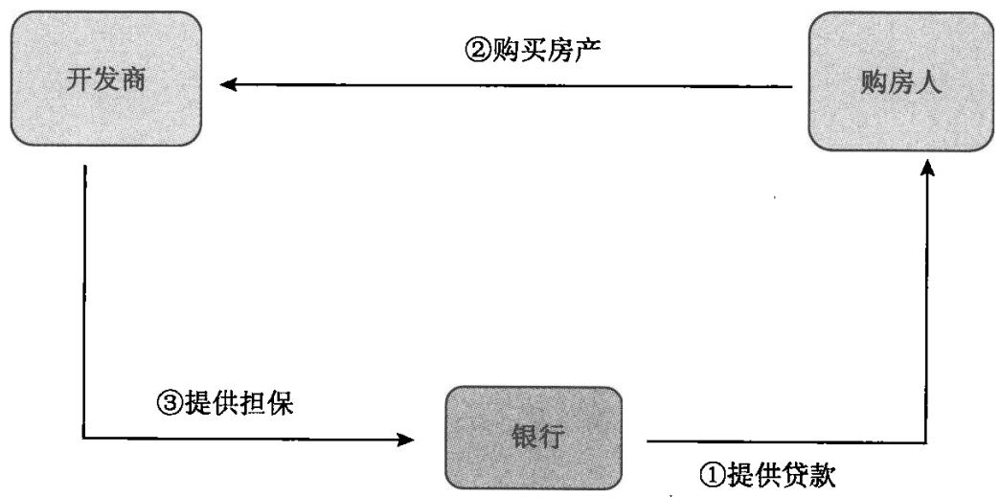
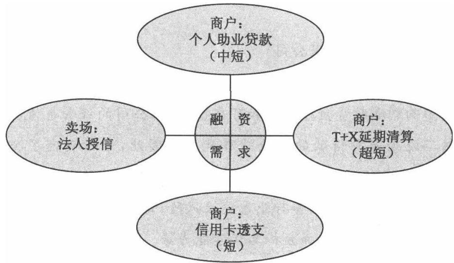
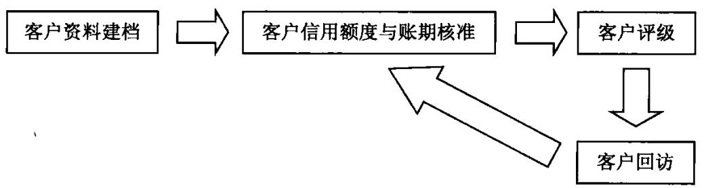
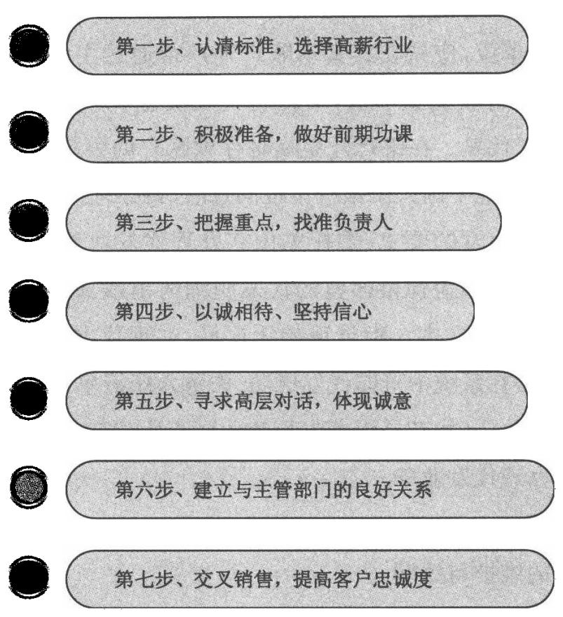

# 零售授信产品培训

立金银行培训中心教材编写组著本书适合商业银行零售业务条线支行行长客户经理学习使用 银行培训最新银行零售授信产品营销要点 最详尽银行零售授信产品使用理解 江东行培训学 畅销书通过案例详细解释零售授信产品·行长送客户经理最好的礼物·对公与对私的组合交叉销售之道

# 无对公业务不富，无零售业务不稳对公业务图现在，零售业务图将来

吸收存款只是副产品，它不应成为唯一的目标，商业银行真正的目标应当是为客户提供高品质的服务，以替客户创造价值。

以对公业务拉动零售业务，以零售业务推动对公业务，扩大对公业务的收益。

本书提供：教练式培训，提供最真实的案例

本书将帮助你在最短时间内成为一名优秀的商业银行客户经理

激发客户经理生生不息的奋斗精神和创造价值的活力

我们通过最详尽的案例培训，帮助您成为最优秀的商业银行客户经理

定价：45.00元

# 零售授信产品培训

# 图书在版编目（CIP）数据

银行零售授信产品培训/立金银行培训中心教材编写组著  
北京：中国经济出版社，2012.1  
ISBN 978 -7 -5136 -0802 -2  
1. $\textcircled{1}$ 银…Ⅱ. $\textcircled{1}$ 立…Ⅲ. $\textcircled{1}$ 商业银行一信贷管理IV. $\textcircled{1}$ F830.33  
中国版本图书馆CIP数据核字（2011）第126345号

责任编辑 乔卫兵张梦初责任印制 石星岳封面设计华子图文设计公司

出版发行 中国经济出版社  
印刷者 北京市昌平区新兴胶印厂  
经销者 各地新华书店  
开 本 $7 1 0 \mathrm { m m } \times 1 0 0 0 \mathrm { m m }$ 1/16  
印 张 21.5  
字 数 305千字  
版 次 2012年1月第1版  
印 次 2012年1月第1次  
书 号 ISBN 978-7 -5136-0802-2/G·1566  
定 价 45.00元

中国经济出版社网址www.economyph.com 社址北京市西城区百万庄北街3号 邮编100037本版图书如存在印装质量问题，请与本社发行中心联系调换(联系电话：010-68319116)

版权所有盗版必究（举报电话：010-68359418010-68319282）服务热线：010-68344225 88386794

# 前 言

# 打造个人品牌做职场"不倒翁”

立金银行培训中心最强项目的客户经理对公授信业务，现在我们准备下大力气发展零售业务课程，为广大银行提供最优秀的商业银行零售授信产品培训。

在开展这个课程的时候，写一些自已的感慨，与大家分享。

# 一、建立客户经理个人品牌

当今时代，一个人的事业已经从做一份工作、追求一个职业，发展到要建立个人品牌。

个人品牌是在银行的工作生存的基本法则。

立金银行培训中心提出：21世纪的工作生存法则就是建立个人品牌。不只是银行、产品需要建立品牌，个人也需要在职场中建立个人品牌。个人品牌就是个人在工作中显示出独特的价值。它就像企业品牌、产品品牌一样，要有知名度，更要有忠诚度。具体而言，个人品牌有以下几个特征：

第一，个人品牌最基本特征是质量保障。这一点跟产品品牌一样。它体现在两方面：一方面是个人业务技能上的高质量，另一方面是人品质量。也就是说既要有才又要有德。一个客户经理，仅仅工作能力强，而道德水平不高，是建立不起来个人品牌的。

建立了个人品牌,就说明你的工作能力和做事态度是有保证的，也一定会为企业创造较大的价值，企业使用这样的人是可以信任和放心的。

第二，个人品牌讲究持久性和可靠性。品牌形成是一个慢慢培养和积累的过程。任何产品或银行的品牌不是自封的，而要经过各方检验、认可才能形成。对个人品牌而言，也不是自封的，而是被大家所公认的。被我们的客户认可，被审批人员，被我们的总分行认可。

第三，个人一旦形成品牌后，他跟职场的关系就会发生根本性变化。像一个企业一样，如果有了品牌，它做任何事就会相对容易一些；同样对客户经理来讲，一旦建立了品牌，工作就会事半功倍。客户会信任你,将业务交付给你。行长会信任你，对你办理的贷款放心，人靠信誉生存，靠别人给我们生存的机会。

# 二、学习银行专业

如何在银行生存呢？学习产品、学习业务，建立较强的工作技能是客户经理个人品牌的核心内容。精深的专业技能是银行客户经理个人品牌建立的重要元素。“个人唯有专精，才能生存。”

上司或行长的角色不是负责监控的权威，而是顾客。我们出售自己的价值给行长，从而获得行长的赏识。

把目光延伸到组织之外，我们看到的是旧式忠诚的消失，那种进入一个组织、一直工作到退休的忠诚。除了政府机构外，并没有多少银行能真正给员工提供30年工作保障。它正被另一种忠诚所取代，旧的组织忠诚是“垂直的忠诚”,对层级机制的忠诚;现在强调的是“水平的忠诚”，对专业的忠诚。客户经理要学习业务，成为所在行业的专家，在本岗位不可或缺。

本书就是希望广大的银行客户经理可以学习到最新的零售业务产品，并能够应用到实践中。

在商业银行，“对公保证我们现在吃饭,零售业务保证我们长远有饭吃”。

# 目 录

前言

# 第一部分 产品篇

第一篇 个人一手房屋贷款 3  
第二篇个人二手房屋贷款 37  
第三篇零售经营性物业抵押贷款 58  
第四篇 营运车辆及机械设备贷款 74  
第五篇个人汽车消费贷款 93  
第六篇 个人综合消费贷款 101  
第七篇消费信贷保证保险项下个人小额信用贷款 107  
第八篇 个人出国金融贷款 115  
第九篇个人质押贷款 126  
第十篇个人实物黄金质押贷款 137  
第十一篇 个人助业贷款 142  
第十二篇个人委托贷款 165  
第十三篇 个人工程机械贷款 173  
第十四篇工程车辆或机械设备异地按揭贷款 187  
第十五篇个人存贷积数挂钩贷款 195

# 银行零售2—授信产品培训

第十六篇个人房屋净值贷款 201  
第十七篇个人住房(商用房)“转按揭"贷款 213  
第十八篇 个人二手房屋贷款交易资金托管 223  
第十九篇优质团体个人购房(过桥)贷款 237  
第二十篇个人保理授信贷款 243  
第二十一篇 个人订单授信贷款 246  
第二十二篇 (卖方)赎楼转按揭贷款· 251  
第二十三篇 个人保兑仓贷款 255  
第二十四篇批量代发业务 271  
第二十五篇 代发薪资贷款 277  
第二十六篇个人动产质押贷款 282  
第二十七篇个人订单贷款 286

# 第二部分 案例篇

案例一汽配城市场优质经营者个人助业贷款 291   
案例二水产品批发市场优质经营者个人助业贷款 300   
案例三茶市场优质经营者个人助业贷款 305   
案例四建材市场优质经营者贷款 313   
案例五农贸市场商户批发贷款…. 323   
案例六钢材市场单循环联保贷款 327

# 第一部分

# 第一部分

# 第一篇

# 个人一手房屋贷款

# 【产品定义】

个人一手房屋贷款是指银行向购买一手房屋的自然人发放的人民币贷款。一手房屋是指首次进人流通领域进行交易房屋，包括一手住房和一手商业用房。

一手房屋贷款是银行最基本的零售业务贷款品种，保证安居乐业的贷款品种，做零售业务的银行客户经理必须掌握其营销技巧。

开发商是非常好的渠道类客户，手中有大量优质客户楼盘信息，尤其是一些高端楼盘开发商，银行应当与高档楼盘开发商多搞联谊活动，通过填写报名表，联系表示可得到一些高端客户信息。

# 【流程图】

# 【产品种类】

(一)住房贷款：指银行向购买住宅、公寓或别墅的自然人发放的贷款。(二)车库(位)贷款：指银行向购买车库(位)的自然人发放的贷款。(三)商业用房贷款：指银行向购买商业用房或商住两用房的自然人发放的贷款。

# 【适用客户】

个人房屋贷款的对象为年满18周岁且具有完全民事行为能力的自然人。

共同借款人则是指两个或两个以上具有完全民事行为能力的自然人以借款人的名义共同与银行建立的一笔借贷关系。

借款人须同时具备下列条件：

(一)具有合法身份，能提供有效身份证件、户籍及婚姻状况证明。港澳台居民及外国自然人应持有有效居留许可证明并符合当地房屋交易管理相关规定。

(二)具有稳定的经济收人,信用良好,有按期偿还贷款本息的能力。

# 银行零售

# 授信产品培训

# 【流程图】

# 【产品种类】

(一)住房贷款：指银行向购买住宅、公寓或别墅的自然人发放的贷款。(二)车库(位)贷款：指银行向购买车库(位)的自然人发放的贷款。(三)商业用房贷款：指银行向购买商业用房或商住两用房的自然人发放的贷款。

# 【适用客户】

个人房屋贷款的对象为年满18周岁且具有完全民事行为能力的自然人。

共同借款人则是指两个或两个以上具有完全民事行为能力的自然人以借款人的名义共同与银行建立的一笔借贷关系。

借款人须同时具备下列条件：

(一)具有合法身份，能提供有效身份证件、户籍及婚姻状况证明。港澳台居民及外国自然人应持有有效居留许可证明并符合当地房屋交易管理相关规定。

(二)具有稳定的经济收人，信用良好,有按期偿还贷款本息的能力。

# 追加担保

(三)具有合法有效的购房合同或协议。（四)具有银行要求的首付款证明。(五)同意在银行开立银行卡或具有结算功能的储蓄存折，并授权银行从约定还款账户中直接扣收贷款本息及应由借款人承担的相关费用。(六)能提供银行认可的有效担保。(七)银行要求的其他条件。

# 【基本规定】

# 一、授信方式分为单笔贷款和额度授信

住房贷款额度

(一)首次利用贷款购买一手普通自住房的借款人，其贷款额度最高不得超过购房合同总价的 $80 \%$ ，购买一手非普通自住房的贷款额度须小于 $80 \%$

(二)贷款金额超过400万元或所购房屋为别墅的，其贷款额度最高不得超过购房合同总价的 $70 \%$ 。特殊情况按照政策例外办理，其贷款最高额度须小于 $80 \%$ 。

(三)对已利用贷款购买住房、又申请购买第二套(含)以上住房的家庭(包括借款人、配偶及未成年子女)，贷款额度最高不得超过购房合同总价的 $60 \%$ □

# 车库(位)贷款额度

(一)车库(位)不超过三个且纳入住房贷款一并办理的可比照住房贷款额度规定执行；

(二)单独申请车库(位)贷款且所购车库(位)在三个以内的，其贷款额度最高不超过车库(位)合同价款的 $70 \%$ ，购买第四个及以上车库(位)时，其贷款额度最高不得超过车库(位)合同价款的 $50 \%$

商业用房贷款额度最高不得超过购房合同总价的 $50 \%$ ，其中，房屋用途为“商住两用房"[按照预(销)售许可证或购房合同或房屋产权证记载的用途确定]的贷款额度最高不得超过 $55 \%$

# 二、贷款期限

银行应在综合考虑借款人的年龄、经济收人状况、还款能力、保证或抵押物状况、房产使用年限等因素的基础上，合理确定贷款期限。共同借款人的贷款期限可按年龄最小的核定。

(一)住房贷款期限最长30年，且贷款期限与借款人年龄之和不得超过70周岁。

(二)纳入住房贷款一并办理的车库(位)贷款期限按照住房贷款期限规定执行，单独申请的车库(位)贷款期限最长10年，且贷款到期时借款人年龄应不超过65周岁。

(三)商业用房贷款期限最长10年，且贷款到期时借款人年龄应不超过65周岁，其中，房屋用途为"商住两用房"的贷款期限按照个人商业用房贷款管理规定执行。

# 三、贷款利率执行浮动利率，由借贷双方协商确定。

(一)浮动利率按照中国人民银行公布的商业性贷款利率相关规定 执行。

贷款期限在1年以内(含)的，执行合同利率，贷款期间不予调整；贷款期限在1年以上的，如遇中国人民银行调整基准利率，则在合同期内按年调整，

即在下一年度的公历1月1日起按相应利率档次执行新的贷款利率。

1．住房贷款依据银行的利率规定执行。各分行应区分普通与非普通、首次利用贷款与非首次利用贷款购房、自住与投资需求严格按照风险定价制定实施细则。

2.纳入住房贷款一并办理的车库(位)贷款，其贷款利率按照住房贷款利率规定执行;单独申请车库(位)贷款的，其贷款利率最低可按照中国人民银行公布的同期同档次贷款基准利率的0.9倍执行。

3.个人商业用房贷款利率按照不低于中国人民银行公布的同期同档次贷款基准利率的1.1倍执行，其中，房屋用途为"商住两用房"的贷款利率按照个人商业用房贷款规定执行。

(二)对借款人未按合同约定用途使用贷款或未按合同约定日期还款的，按照中国人民银行的相关规定计收罚息。

# 四、还款方式

(一)住房贷款还款方式包括等额本息、等额本金、按月还息到期还本、先还息后等额本息或等额本金、等比累进、组合还款等。

(二)商业用房贷款和车库(位)贷款还款方式包括等额本息、等额本金、按月还息到期还本、组合还款法三种方式。

(三)个人住房贷款是指客户取得额度授信前提下，银行通过系统批处理，每日自动将借款人指定的还款账户中活期存款按一定比例用于提前偿还贷款，并于次日将上日所还金额重新发放至所扣账户的个人住房贷款。

# 【贷款担保】

个人房屋贷款实行抵押担保、抵押十阶段性担保或抵押十全程担保和住房置业担保公司全程保证方式。

(一)房屋抵押担保方式，是指以借款人所购房产设定抵押，取得预抵押登记或抵押登记证明文件后发放贷款。

(二)抵押十阶段性担保方式，是指借款人在所购房产的抵押手续未办妥前追加阶段性担保，在符合银行的放款条件后发放贷款。阶段性担保期限从贷款发放之日起，至借款人所购房产办妥正式抵押登记手续，并将《房屋所有权证》复印件(或房产登记部门的房屋产权查询单)和《房屋他项权证》原件交银行收妥之日止，由银行认可的担保人为借款人全部贷款本息提供连带责任保证。

特殊情况下，阶段性担保期限须纳入楼盘项目准人进行审议，按《个人房屋按揭类贷款业务项目额度审批管理办法》的相关流程进行审批，但阶段性担保到期日不得早于办妥预抵押/抵押登记手续。

(三)抵押十全程担保方式，是指借款人以所购房产作抵押，并提供银行认可的担保人对其房屋贷款存续期间的全部贷款本息提供第三方连带责任保证担保。

(四)住房置业担保公司全程保证方式，指由住房置业担保公司为借款人的全部债务提供全程全额第三方连带责任保证担保，借款人将其本人或第三人的合法房产依法向住房置业担保公司进行抵押反担保，贷款合同执行完毕后解除担保。住房置业担保公司须按银行法人客户授信办法核定担保额度。

# 【业务流程】

# 一、楼盘准入

发放个人房屋贷款前须对楼盘进行准人。

优质开发商的楼盘一般都可以办理，对于一些实力偏弱的开发商，可以限定在一些地理位置优越，项目规划较好的项目，在北京、上海、广州等大城市，通常都是20万平方米以上的大型楼盘受欢迎。

楼盘须与银行经办网点在同一城市或同省地级市市区范围内。

# 二、贷款受理

借款人应以书面形式向银行提出申请并提交下列材料：

(一)按银行要求填写完成的《贷款申请暨面谈记录表》。

(二)提供有效身份证件、户籍及婚姻状况证明。港澳台居民及外国自然人应持有有效居留许可证明并符合当地房屋交易管理相关规定。

(三)提供合法有效的购房合同或协议。

(四)提供首付款证明。

(五)提供在银行开立的，具有结算功能的储蓄存折，并授权银行从约定还款账户中直接扣收贷款本息及应由借款人承担的相关费用。

(六)提供银行认可的有效担保。

(七)借款人及其共有人(如有)同意抵押的证明材料。

(八)银行要求提供的其他文件或资料。

# 三、贷款调查

客户经理收集齐全借款人资料后，负责审定资料的完整性、真实性、合法性。客户经理必须面谈借款人，充分了解借款人的基本情况及其贷款用途的真实性。

贷款调查要点包括以下内容：

(一)核实交易背景的真实性，调查商业用房的投资风险。严格核实房产交易真实性;对商业用房贷款，应从商业用房商业氛围、经营前景预测等方面进行调查并撰写单独授信调查报告。所购商业用房应有独立产权，独立式隔间，禁止对非独立隔间的商业用房或以租金返还方式销售的商业用房发放贷款。

(二)调查借款人的还款能力。通过借款人提供的还款来源或资产证明，审核其家庭资产情况；核查借款人偿还贷款本息的能力，要求住房贷款的月房产支出与收人比应控制在 $50 \%$ 以下(含)，月所有债务支出与收入比控制在 $5 5 \%$ 以下(含)，需要在收人比中将配偶、共同借款人的收人计算在内的,也应相应地把其债务一并计入。

(三)核查借款人的信用记录。通过中国人民银行个人信用信息基础数据库、银行个贷系统，查询借款人房贷次数、信用记录和其他负债情况，如借款人在银行的贷款有以下情况之一，且不能提供银行认可的情况说明，则银行不得发放任何贷款。

1．现有贷款状态为逾期；

2.近2年内有连续逾期90天以上不良记录，或累计逾期记录超过6次；

3.信用卡有恶意透支[信用卡账户为非正常状态，且欠款金额在3000

元人民币以上(含）]。

# 四、贷款审查、审批

客户经理经过贷前调查和风险分析，在个贷系统内录入贷款申请信息及《个人贷款业务调查表》,签署明确意见，并须经营单位负责人审核同意后将单笔贷款或授信材料提交零售授信中心审查审批。

# 五、签订借款合同

根据审批意见,通知借款人、担保人面签相关贷款合同和担保合同，并办妥贷款的抵押或预抵押、保证等担保手续。

# 六、办理保险和公证手续

(一)借款人可自愿选择购买“房贷险”。对于以下出险概率较高的房屋，借款人须购买保险，保险单正本及缴费发票(原件或复印件)由银行代为保管。

1．台风、龙卷风高发的沿海地区临海房屋；

2．泥石流高发地区的临山房屋；

3．砖木结构容易发生火灾的房屋；

4.用于储存易燃、易爆等物品的房屋。

(二)借款人为港澳台及外籍人士的，须办理强制执行公证或提供一名贷款行所在地年满18周岁具有完全民事行为能力自然人作为联系人，并在贷款合同中明确约定贷款有关信息在银行送达该联系人时即视同送达借款人。

# 七、放款条件

贷款发放前，客户经理或抵押登记人员须根据审批意见落实相应放款条件。

(一)办妥正式抵押或预抵押登记手续；

(二)取得抵押或预抵押收件收据，并由银行认可的保证人提供阶段性保证或全程保证担保；

(三)办妥购房合同预售备案登记手续或取得预售备案登记回执，并由银行认可的保证人提供阶段性保证或全程保证担保；

(四)凭网签购房合同并由银行认可的保证人提供阶段性保证或全程保证。该放款条件须同时具备以下条件：

1．楼盘品质优良，开发商为经营状况良好的全国百强或当地前十强开发商。

2．仅适用于住房贷款。

3．楼盘中已有他行采取此种模式放款。

4．对于房屋销售的未实现网上联机备案或可网上联机备案但备案控制不完善的地区，安排专人负责全程参与备案手续的办理并监控合同备案状态。

# 八、贷款发放

上述授信条件及相关手续完成后，经营机构将整理完毕授信资料移交分行放款审核中心。分行放款审核中心审核确认相关贷款条件落实后发放贷款，按借款人授权委托书要求，经借款人银行卡或储蓄存折账户划款至合作单位账户。

# 【贷后管理】

# 一、楼盘维护

银行应指定贷后管理人员对人库楼盘状况进行动态维护，采取定期和不定期的方式,对有贷款余额且尚未办妥产权证的项目进行走访，了解以下情况并及时进行人库楼盘信息更新。

(一)了解在建项目的建设进度、销售情况、价格变化和开发商的财务状况。

(二)了解开发商房屋竣工验收、办理大证以及换发小证的流程进展情况。

# (三)了解人库楼盘的价格变动状况。

# 二、抵押品管理

对于采取网签购房合同或取得预售备案登记回执放款的贷款，须按楼盘建立台账，督促相关责任人及时办理购房合同备案、预抵押或抵押登记手续。

# 按揭楼盘现场检查要点及检查方法

# 【风险控制】

# 1．楼盘建设情况

检查要点：楼盘建设情况是否正常。楼盘建设正常是按时交房的保证，如果楼盘不能在合同约定时间内交房，可能导致借款人与开发商纠纷进而影响借款人还款意愿，或开发商为此支付补偿款而形成建设资金紧张的压力从而对房屋建设产生不利影响。

检查方法：实地查看楼盘形象进度是否按计划进行，施工现场开工状况是否正常;约谈售楼处工作人员，了解开发商资金运转状况是否良好，是否出现可能影响楼盘建设的因素或是否可以如期交房。

# 2.楼盘价格情况

检查要点：抵押物价值是否明显降低。楼盘销售过程中会有一定程度的价格浮动，在现场检查时要格外注意价格变动尤其是价格下降的原因。楼盘销售价格下降原因一般有开发商资金链紧张急需资金回笼、新出台政策影响、受市场竞争影响销售量下降等。如果抵押物价值下降幅度较大，则会影响借款人的还款意愿，危及银行资金安全。

检查方法：记录每次现场检查时的楼盘销售价格，查看有无价格明显下降或购房附送大额礼品等变相降价的情况，同时了解周边同档次房产价值变动情况。如果出现价格下降幅度较大的情况则需严密监控借款人的月还款状况，同时观察楼盘开工状况是否良好。

# 3.楼盘销售情况

检查要点：楼盘销售状况是否正常。

检查方法：楼盘现场实地观察销售场面是否冷清，约谈售楼处工作人·员，了解近期楼盘销售情况销售进度，如果销售进度明显放缓,则尤其要注意是否有银行借款人退房的情况。

# 4.楼盘竣工情况

检查要点：楼盘能否按时完工并办理相应产权证明。楼盘竣工验收后应办理楼盘的大产证,继而分割购房人的小产证，及时办理正式的抵押登记

手续，确保银行抵押权人的有效权益。

检查方法：实地跟进开发商办理产权证明的情况，观察是否有同一楼盘办理按揭的其他银行前往楼盘办理房屋分割手续，一旦楼盘具备分割小产证的条件后，需抓紧督促和配合借款人小产证的办理。

# 5.政策例外项目执行情况

检查要点：贷款交易背景是否真实。政策例外项目一般是企/事业（单位)自筹资金建设并在内部销售的住房项目，此类业务重点要看项目背景是否属实、项目立项是否合规、房屋交易是否真实有效。

检查方法：从外观观察楼盘形象建设进度是否符合企/事业(单位)约定的时间计划；咨询附近人员或该单位人员，确定楼盘的真实用途、项目的真实背景；回访该单位房管部门，调查楼盘的分配情况以及银行批复是否严格落实。

# 6．商业环境(主要涉及商用房)

检查要点：写字楼或商铺是否正常运转。由于商用房均为竣工验收后办理按揭，因此已可以看出写字楼或商铺是否已经或着手装修，或其使用状况、进驻情况等。

检查方法：实地查看写字楼或商铺的出租、装修或使用情况，商铺的经营状况是否良好、周边商业氛围是否良好。

# 【营销建议】

个人一手房贷款应当是银行高度鼓励开展的业务，通常开发商对这类产品也较为欢迎。一些较为强势的开发商，通常都会指定银行，一般都是给开发商提供开发贷款的银行封闭办理按揭，所以，银行应当选择一些强势的开发商提供开发加按揭的捆绑销售策略。

# 【风险提示】

1．一手房屋贷款经常出现假按揭品种，危害极大，银行必须高度关注这类业务风险。客户经理切不可以受开发商诱导，合作假按揭贷款，给银行带来巨大的风险。

2.一些区域房价上涨过快的地区,政府推出了限购的政策，这些开发商

经营带来了巨大风险，银行必须高度关注这类现象。

# 依靠个贷新产品，零售业务批发做

-成功营销伟源职工住房贷款案例

银行成功营销伟源创业集团有限公司（以下简称伟源集团）1870名职工个人住房贷款项目，总金额达2.2亿元。此项目是银行首签的“超级大单”,是“零售业务批发做”的又一个经典范例，同时也为“定向直客式"营销模式的推广积累了丰富经验。

# 一、企业基本情况

伟源集团。现拥有9个工业园，总资产245亿元，员工16万余人，是一个集棉业、棉纺、织造、染整、服装、家纺、热电于一体的特大型企业，技术装备居国内一流，生产规模和经济效益居全国同行业首位，是全国制造业企业500强和全国进出口企业百强。销售收入355亿元，净利润15.49亿元，自营出口创汇7.6亿美元，各项指标较往年继续保持快速的增长良好态势。

# 二、银行切入点分析

伟源集团作为银行大户，一直是对私业务重点开发对象。银行曾先后两次成功地为伟源集团在邹魏工业园第二、第三生活区住宅项目的3000名员工办理2.8亿元个人住房按揭贷款。银行在一次走访中了解到，伟源集团员工已发展到16万余人，员工住房紧张矛盾十分突出，为了缓解此矛盾，伟源集团拟建设总面积48万平方米、4000套职工住房的邹平工业园第一生活区，首期筹建约2000套职工住房，总投/资31100万元。

银行得知此信息后给予高度重视，成立专门的营销项目小组，赴伟源集团对项目进行考察，结合前期合作成功经验，在最短时间内，以最快的效率，全面、细致地解决项目合作过程中存在的技术难点，抢先其他商业银行一步，提出完整的营销方案，即通过“职工集资十个人住【案例】经营带来了巨大风险，银行必须高度关注这类现象。

# 【案例】

# 依靠个贷新产品，零售业务批发做

-成功营销伟源职工住房贷款案例

银行成功营销伟源创业集团有限公司（以下简称伟源集团）1870名职工个人住房贷款项目，总金额达2.2亿元。此项目是银行首签的“超级大单”,是“零售业务批发做”的又一个经典范例，同时也为“定向直客式"营销模式的推广积累了丰富经验。

# 一、企业基本情况

伟源集团。现拥有9个工业园，总资产245亿元，员工16万余人，是一个集棉业、棉纺、织造、染整、服装、家纺、热电于一体的特大型企业，技术装备居国内一流，生产规模和经济效益居全国同行业首位，是全国制造业企业500强和全国进出口企业百强。销售收入355亿元，净利润15.49亿元，自营出口创汇7.6亿美元，各项指标较往年继续保持快速的增长良好态势。

# 二、银行切入点分析

伟源集团作为银行大户，一直是对私业务重点开发对象。银行曾先后两次成功地为伟源集团在邹魏工业园第二、第三生活区住宅项目的3000名员工办理2.8亿元个人住房按揭贷款。银行在一次走访中了解到，伟源集团员工已发展到16万余人，员工住房紧张矛盾十分突出，为了缓解此矛盾，伟源集团拟建设总面积48万平方米、4000套职工住房的邹平工业园第一生活区，首期筹建约2000套职工住房，总投/资31100万元。

银行得知此信息后给予高度重视，成立专门的营销项目小组，赴伟源集团对项目进行考察，结合前期合作成功经验，在最短时间内，以最快的效率，全面、细致地解决项目合作过程中存在的技术难点，抢先其他商业银行一步，提出完整的营销方案，即通过“职工集资十个人住房贷款”办法来解决住房建设资金问题。其中职工集资9330万元，职工办理个人住房贷款21770万元。该方案以职工自筹资金、不给企业增加财务负担、资金到位迅速的鲜明特色，为伟源集团所采纳。

银行营销伟源集团项目时，正逢推出固定利率房贷产品。如何将固定利率房贷这项创新产品有机地融入伟源集团项目并说服客户接受，成为银行营销项目小组苦苦思索的问题。经过研究分析，银行从伟源集团项目收款模式上找到突破口。伟源集团项目收款流程：银行与伟源集团签订1870名职工工资代发代扣协议 $\twoheadrightarrow$ 该公司提前一个月将下月职工还款本息总额划付银行 $\twoheadrightarrow$ 银行采取批量代扣模式将资金存入其职工的银行卡 $\twoheadrightarrow$ 待还款日统一扣收。由于批量扣款数额较大，企业希望扣款金额保持稳定，以便企业从容调剂未来营运资金。而固定利率房贷正具有利率固定、还贷期限固定、贷款利息支出固定的特点。客户在约定固定利率期内，不仅不用担心贷款利率的调整变化影响自身的资金安排，而且因为利息支出已经准确测算出来了，也便于家庭合理理财。

银行向伟源集团及其员工深入宣传银行固定利率房贷产品，重点介绍了固定利率产品具有锁定利率波动风险、还款支出固定、从容安排未来资金等优点，最终得到了企业和员工的一致认同，固定利率“超级大单”也水到渠成。

# 三、银企合作情况

伟源集团项目操作模式具有以下几个特点：

1.项目条件比较优越。该房建项目位于邹平县工业园区，距济青高速公路不到10分钟车程，地理位置优越；项目建设总面积24万平方米，户均128平方米，按照工程投入预算31056万元计算，房屋单价约为每平方米1294元，处于邹平地区房价中游水平，房价合理；另外，职工集资约9317万元，约为总房价的 $30 \%$ ，职工贷款约为房价的 $70 \%$ 而且项目已拿到建房所需“四证”，无须银行提供开发贷款支持，因此该项目各方面条件都比较优越。

2.还款来源比较充足。伟源集团此次建房重点解决业务技术骨干人才和夫妻双方均在伟原工作的职工住房问题，其业务技术骨干职工月平均收入约在2000元(双职工的家庭月均收入在4000元左右)，按照贷款116000元，期限7年计算，每月还款本息合计1705元左右，约占双职工家庭月均收入的 $43 \%$ ，偿还能力有保证。

3.担保保障有力。伟源集团为职工个人住房贷款提供全程回购担保，并承诺在办好产权证后及时交予银行办理抵押手续。伟源集团本身具有很强的担保还款能力。另外按照贷款协议规定，伟源集团须在银行开立保证金账户，按不低于贷款额 $7 \%$ 的比例存入保证金。此项规定更进一步控制了风险。

4.流程合理，批量操作。(1)贷款协议规定，在办理完房产预抵押或预售合同备案手续后银行再予以放款，银行为伟源集团职工批量放款后，分期分批将贷款资金划拨到专项建设资金账户。(2)银行与伟源集团签订1870名职工工资代发代扣协议，该公司提前一个月将下月职工还款本息总额划付银行，银行采取批量代扣的模式将资金存入其职工的银行卡，待还款日统一扣收。

# 5.收益预测

通过综合营销，该项目带来了贷款利息收入、对公存款、储蓄存款、发卡量、卡均存款、代发工资等多方面收益，综合效益明显。

(1)2.2亿元七年期稳定的贷款固定利息收入5156万元，比现行的浮动贷款利率增加了53万元的利息收入；

(2)按照与伟源集团约定的用款、还款计划，能够保证3000万元储蓄存款稳定半年以上，约1522万元对公保证金存款的长期存放；

(3)能够带来1870人的代发工资业务，并发放1870张银行卡，卡均存款超过1500元；

(4)在对外支付款项时将开立一定金额的银行承兑汇票，增加了银行中间业务收入；

(5)进一步密切了与伟源集团全面合作关系。

【点评】

“个贷业务批发做”的基础在于持续良好的银企关系。从优秀企业的快速发展中捕捉个贷“商机”，能否从客户角度出发提出满足企业需要的营销方案，是“个贷业务批发做”能否成功的关键。

向创新要效益，必须做到：(1)找到创新业务在营销过程中所能体现的亮点与卖点，并针对客户实际情况予以细化；(2)必须将创新业务有机地融入营销方案，并使客户直接受益。

“定向直客式"营销无须前期开发封闭贷款，因此成本低，见效快。但在实际业务操作中一定要在项目评估的基础上，严格制定保证金管理、抵押登记、收放款流程等操作细则，切实防范操作风险，做到业务发展与风险控制并重。

只有从“银企共赢”的角度来拓展营销，才能最大程度释放优质客户的资源效能，并使银企关系走向持续的良性互动，从而实现银行产品和服务的价值最大化。

“定向直客式"营销是推动银行个贷业务发展的又一重要把手。“定向直客式"营销无须前期开发封闭贷款，成本低，见效快，不仅带来按揭贷款业务，还可以派生银行卡、中间业务、沉淀存款等综合效益。特别是面向客户群大多为优质客户或银行老客户，风险较低且易于控制，因此各分(支)行在通过开发封闭贷款拉动房贷业务同时，也应大力发展“定向直客式”营销。

创新业务必须与营销方案有机融合、必须让客户直接受益才能体现其价值，也只有这样才能达到以创新促营销促发展的目的。具体到某一项新业务是死的，但是将新业务与客户需求结合起来创造出新卖点，新亮点，进而形成具有竞争力的营销方案，却是一门大学问。如何吃透新业务，并结合本地实际将新业务灵活运用于营销实战，是各分(支)行面临的一项重要课题。

# 客户潜力深挖掘，公私联动显威力，

# 住房按揭业务突破性发展

柳州分行个贷业务取得突破性发展，该行个贷余额比年初新增超【案例】速发展中捕捉个贷“商机”，能否从客户角度出发提出满足企业需要的营销方案，是“个贷业务批发做”能否成功的关键。

向创新要效益，必须做到：(1)找到创新业务在营销过程中所能体现的亮点与卖点，并针对客户实际情况予以细化；(2)必须将创新业务有机地融入营销方案，并使客户直接受益。

“定向直客式"营销无须前期开发封闭贷款，因此成本低，见效快。但在实际业务操作中一定要在项目评估的基础上，严格制定保证金管理、抵押登记、收放款流程等操作细则，切实防范操作风险，做到业务发展与风险控制并重。

只有从“银企共赢”的角度来拓展营销，才能最大程度释放优质客户的资源效能，并使银企关系走向持续的良性互动，从而实现银行产品和服务的价值最大化。

“定向直客式"营销是推动银行个贷业务发展的又一重要把手。“定向直客式"营销无须前期开发封闭贷款，成本低，见效快，不仅带来按揭贷款业务，还可以派生银行卡、中间业务、沉淀存款等综合效益。特别是面向客户群大多为优质客户或银行老客户，风险较低且易于控制，因此各分(支)行在通过开发封闭贷款拉动房贷业务同时，也应大力发展“定向直客式”营销。

创新业务必须与营销方案有机融合、必须让客户直接受益才能体现其价值，也只有这样才能达到以创新促营销促发展的目的。具体到某一项新业务是死的，但是将新业务与客户需求结合起来创造出新卖点，新亮点，进而形成具有竞争力的营销方案，却是一门大学问。如何吃透新业务，并结合本地实际将新业务灵活运用于营销实战，是各分(支)行面临的一项重要课题。

# 【案例】

# 客户潜力深挖掘，公私联动显威力，

# 住房按揭业务突破性发展

柳州分行个贷业务取得突破性发展，该行个贷余额比年初新增超

2亿元，余额达到年初的4倍，同时保持不良零余额。个贷发展取得资产规模和质量的双丰收！

取得这样可喜成绩是与住房按揭贷款快速发展分不开的。柳州分行住房按揭贷款三季度末余额净增7503万元，达到年初24倍。其中，分行营业部通过公私联动，成功办理 $^ { 6 6 } \times \times$ 城市广场”项目按揭，贷款投放达183笔，金额6236万元，推动住房按揭贷款规模登上新台阶。

一、开发贷客户深度挖潜，按揭贷业务跟进迅速有力

# (一)看准优质客户，及时跟进按揭业务

$^ { 6 6 } \times \times$ 城市广场"项目是由全国百强房地产开发商开发，在柳州分行筹备期间就积极与开发商取得联系，并成功为其办理开发贷款，迈出了银行公私联动的第一步。

零售业务部主动出击，及时有力地跟进按揭贷款，与对公条线人员共同制订周密的营销方案，强调行动一致性和有效性，积极营销按揭贷款，截至目前，开发贷与按揭贷的比例达到 $1 : 1 . 2 8$ 。

# (二)行领导高度重视，身体力行

在开发商举办的“中国门-中国财富阶层晚宴”、分行与开发商联合举办的“财富周系列活动”银企见面会之 $\yen \star$ 银行专场以及开发商主办分行协办的"CBD财富周”主题活动上，行领导受邀在一系列活动中做精彩演讲，体现银企双方合作高度的提升，对提高合作深度和广度起到重要作用。

# (三)以效率为先，以服务取胜

在按揭贷款推进的过程中，柳州分行也遇到多家银行同台竞技的局面，如何克服银行网点少的劣势，以最快的速度争取客户，是摆在成立不久分行面前亟待解决的问题。

分行一把手亲自带队，个贷经理全力投入，打响了一场争取客户的战役。在分行领导的带领下，个贷经理开展了客户调查，从调查中得知，很多客户反映其他行办理一手房按揭贷款普遍存在服务差、效率低的问题。得到这个信息后，分行决定从“做好服务，讲求效率”的营销方式入手，展开个贷业务的各种营销。

为了把服务做好，个贷经理们秉承“银行在行，服务在心”的理念与客户进行交流与沟通，用灿烂的微笑来拉动与客户间的距离，用专业的知识来解决客户的疑惑，只要客户有需求，就尽可能地上门服务。

为提高效率，个贷经理们相互配合和支持，加班加点整理资料，用最高的效率办完手续，用最快的速度帮客户买到心仪房子。优质的服务，高效的行动，使银行得到客户的一致好评，许多客户纷纷介绍同在$^ { 6 6 } \times \times$ 城市广场”买房的朋友来银行办理贷款。就这样，靠着客户口口相传，银行个贷品牌美名远播，众多购房者慕名前来银行办理个贷业务。

二、个人客户交叉销售，零售业务多姿多彩

$^ { 6 6 } \times \times$ 城市广场"作为最炙手可热的楼盘，是柳州未来最繁华的商业地区之一，购房者大多是高端商务人士、个体经营者和政府的中高层管理者，是消费能力最强的一个群体。零售业务部积极开展各种活动，立体营销个人客户，力求培育一批忠实、活跃、优质的客户群体。

（一)发行联名卡。 $^ { * * } \times \times$ 城市广场”已经形成柳州最大的特惠商圈，银行发行联名卡后，业主和客户在这些特惠商户消费可享受折扣消费，这让持卡人得到更多的实惠和更多的选择，同时也极大地增加银行特惠商户影响力，这是对银行用卡环境的一次巨大改善。

(二)举办促销活动。借助项目新开盘之际，与开发商共同举办回馈业主系列活动之业主“超级乐购汇”活动。此项活动充分发挥了特惠商户的特点，让业主和银行的客户们得到了真正具体的实惠，既加深了业主对银行的认识，又扩大了银行在柳州市的知名度和影响力。

（三)办理代发业务。银行成功取得了开发商员工代发工资资格，为其77名员工，每月代发共计33万元工资，这是该行成立以来办理的首批代发工资业务。

# 三、公私业务互动，综合收益大增

在分行领导和各条线员工的共同努力下，公私业务紧密配合、共同获益：个人住房按揭贷款迅速增长，预计利息收入超过4000万元；中间业务、卡业务批量增加，带来稳定的个人存款和中间业务收入；对公存贷款双升，实现利息收入380万元。

# 【点评】

一手住房按揭贷款业务突破式地快速健康发展给我们带来几点启示：一是“公私联动”是重要的手段，以开发贷带动按揭贷，以零售业务稳固对公业务；二是“立体营销”取得成效，各条线人员充分发挥自身优势，将银行产品有机组合，合力促发展；三是将开发商作为重要的渠道类客户，购买商业房产的客户都是有资金的客户，银行通过借助开发商的力量，批量营销购房客户，为银行积累了较多的高端理财客户。

# 附件：

编号：

# 个人房屋按揭贷款合作协议书

甲方： $\yen 12$ 银行 分行支行

地址：

邮政编码：

主要负责人(或授权代理人)：

电话：

乙方：

地址：

邮政编码：

法定代表人(或授权代理人)：

电话：

为促进 楼盘（坐落： )的房产销售，甲、乙双方根据有关法律、法规、规章,本着“平等互利、相互支持、合作发展"的原则，经友好协商，约定如下条款：

第一条：在符合甲方贷款条件的情况下，甲方同意为购买上述楼盘的借款人(购房人，下称"借款人")提供个人房屋按揭贷款，贷款合作最高额度为万元。其中：单笔个人住房按揭贷款金额最高不超过所购住房全部价款的 $\%$ ，贷款期限最长不超过 年；单笔个人商业用房贷款金额最高不超过所购商业用房全部价款的 $\%$ ,贷款期限最长不超过 年。个人住房公积金贷款额度和期限,按照当地住房公积金管理中心的有关规定执行。

第二条：为确保双方的顺利合作，甲方承诺：

(一)在楼盘按揭总额度之内，对本协议项下符合甲方贷款条件的借款人提供个人房屋贷款业务。

(二)甲方负责收集借款人资信等相关资料，并按内部流程审核批准本协议项下的个人贷款，甲方对借款人申请的贷款有最终决定权。未审核通过的需告知乙方。

(三)甲方与借款人签订的《贷款借据》生效后，应当依据贷款合同约定的划款方式和划款时间将贷款款项划人借款人指定的乙方账户（户名：账号： 开户行： ),如划转款项有变更，甲方须取得乙方书面同意变更的证明。

(四)负责向乙方提供借款人划转贷款资金的有关资料证明。

(五)乙方如因办理借款人房屋产权证而需向甲方借出相关的贷款档案资料,甲方同意安排专人携带相关资料前往房管部门协助乙方办理或由乙方开具授权委托证明，指定乙方单位专人借取并在甲方处造册登记资料清单，并经双方经办人签字、盖章后方可借出。

第三条：为确保双方的顺利合作,乙方承诺：

(一)保证按照国家有关部门批准的条件和要求合法建造并销售房屋，所签订的购房合同都具有真实的交易背景，并按购房合同中约定的期限和条件将房产交付借款人。

(二)同意在售楼部提供必要场所，供甲方受理按揭和摆放宣传资料时使用，并按甲方要求提交本协议项下贷款的有关文件资料。

(三)向甲方所取得的借款人按揭贷款资金，同意首先用于本协议所指的商品房建造，直至竣工验收交付使用，不得挪作他用，并接受甲方对项目资金的监控。

(四)将借款人所持有的购房合同正本、首付房款的收款凭证、房款发票复印件交甲方保管。乙方与借款人修改购房合同必须事先征得甲方的书面同意并将修改后的相关合同或补充协议正本提交甲方保管。

(五)在竣工验收后，应会同借款人尽速向房地产主管部门申领上述房产的产权证，并协助银行办妥正式的抵押手续。乙方如因办理借款人房屋产权证而需向甲方借出相关的贷款档案资料的，所借资料应在 天内全部归还。因任何原因造成借出的贷款档案资料的遗失、损毁，并因此而带来的纠纷和损失，均由乙方负责；乙方为借款人办理产权登记时，向甲方所借资料以及相应换发的正式抵押登记证书。

(六)乙方与借款人之间的任何纠纷(包括但不限于因房屋工程质量瑕疵或交付使用脱期等引发的纠纷)，应当按照借款人与乙方签订的购房合同解决，概与甲方无关。若借款人因前述纠纷与乙方解除购房合同而导致提前终止与甲方的贷款合同，乙方须向甲方承担偿付所有贷款本息及相关费用的连带责任。

(七)甲方在借款人□抵押/□预抵押登记办妥之前发放贷款，从放款之日起，乙方须在 天内携同甲方工作人员前往当地房管部门办理备案手续，并将备案回执交由甲方工作人员收妥；在 天内携同甲方工作人员办妥备案登记手续；在 天内协助甲方办妥抵押/预抵押登记手续。

第四条：乙方同意在借款人贷款期间发生逾期时协助甲方催收。乙方且□同意/□不同意("不同意"栏仅在乙方不提供担保的情况下选取)在甲方为该贷款的抵押/预抵押登记办妥以前，如借款人发生连续逾期三期或累计逾期六期时，对贷款承担连带清偿债务责任。

第五条：乙方为本协议项下所有借款人向甲方申请的个人房屋按揭贷款□提供/□不提供连带保证担保责任，其担保方式为全额不可撤销的连带责任保证，保证范围为各借款人的借款本金及由此产生的借款利息（包括罚息）、违约金、赔偿金及甲方实现债权的费用。此担保为连续的无条件的保证，保证期限为 ：

（一)从本协议项下甲方每笔个人房屋按揭贷款发放之日起至乙方协助甲方收妥借款人所购房产的正式抵押登记手续之日止。

(二)从本协议项下甲方每笔个人房屋按揭贷款发放之日起至借款人归还全部贷款本息之日止。

(三)从本协议项下甲方每笔个人房屋按揭贷款发放之日起至乙方协助甲方收妥借款人所购房产的预抵押登记手续之日止。

第六条：乙方如依据上述第四、五条为借款人承诺或提供保证担保，在承诺或保证期限内，若借款人连续三期或累计六期不按贷款合同的规定按时偿付借款本息及其他相关费用，甲方有权向乙方发出《履行担保责任通知书》要求乙方承担全部连带责任，乙方应在接到甲方的通知书后的一个月内按照通知书中所载明的偿还金额、方式向甲方履行清偿义务。清偿方式包括但不限于：

(一)甲方有权从乙方在甲方处开立的"担保保证金专户"内直接扣收相应的金额，如有不足，甲方可继续向乙方追偿；

(二)由乙方对借款人已购房产进行回购，借款人因此获得的回购款项优先用于支付借款人尚未清偿给甲方的借款本息、违约金、赔偿金及相关费用等。

第七条：乙方在甲方口开立/口不开立“担保保证金专户”。乙方如在甲方开立“担保保证金专户”，则保证在"担保保证金专户”上的资金不少于万元，且不得少于甲方为该协议项下发放全部贷款余额的 $\%$ 。不足部分授权甲方在为借款人发放个人房屋按揭贷款给乙方时按贷款金额的$\%$ 逐笔提取担保保证金，提取部分可视同乙方收到借款人已划转相应房款。乙方"担保保证金专户"内资金专项用于但不限于履行乙方在本协议第五条项下的保证责任。当借款人未按期偿付贷款本金、利息和其他应付款项时，乙方授权甲方可从“担保保证金专户"直接扣收乙方应承担的债务金额，实现甲方在本协议项下的担保权益。

第八条：乙方保证，其在本协议项下向甲方申请房屋按揭贷款合作、与甲方签署本房屋按揭贷款合作协议和为借款人提供连带责任保证的行为，均已得到乙方董事会或其内部相应有关机构的同意，且不违反乙方的公司章程及其他内部规定。

第九条：甲、乙双方应严格遵守上述条款，任何一方对上述任何条款的违反均构成本协议项下的违约，违约方应无条件承担违约责任，包括但不限

于赔偿因该等违约而对对方当事人造成的损失，如支付违约金、赔偿金等。  
赔偿金自违约事情发生之日起计算，按每日收取。

第十条：因本协议发生的争议，应通过协商解决，协商不成时，应向甲方所在地人民法院提起诉讼。在协商或诉讼期间，本协议不涉及争议部分的条款，双方仍须履行。上述规定并不影响甲方就因履行本协议所发生的或与本协议有关的一切争议、纠纷选择在其他任何有管辖权的法院提起诉讼的权利。

第十一条：本协议自甲乙双方法定代表人或授权代理人签字并加盖公章后生效，至乙方依据本协议第四条的规定向甲方提供的保证中最晚到期的保证结束时终止。

第十二条：本协议未尽事宜，按照有关法律规定执行或由当事人各方签订书面补充协议解决。补充协议(如有)应被视为本协议不可分割的组成部分，与本协议具有同等的法律效力。

第十三条：本协议正本一式 份，甲、乙双方 各执一份。

第十四条：本协议于 年 月 日在甲方所在地签订,有效期 月。

甲方： $\yen 12$ 银行 分行 支行 乙方：（公章） （公章）

负责人：(签字) 法定代表人：(签字)（或授权代理人） (或授权代理人）

# 个人住房贷款阶段性担保协议

甲方： $\yen 1$ 银行股份有限公司乙方： 置业有限公司

为了提高对优质客户的服务水平,加速开发商贷款资金回笼，进一步密切银企合作关系，经甲乙双方友好协商，达成以下协议：

第一条甲、乙双方自 年 月 日起至乙方项下所有业务阶段性担保解除为止，就乙方依法开发建设的项目的商品房进行个人住房贷款合作。该协议所覆盖按揭额度为人民币_亿元。

第二条购房人在本协议第一条规定的期间内购买指定项目的商品房，可凭 与乙方签订的房地产买卖合同、首期款发票原件向甲方申请个人住房贷款。

甲方根据自身业务规范，审查购房人的资质，并自主决定是否与借款人签订《个人住房借款(抵押)合同》和发放贷款。

第三条甲方发放贷款时将根据与购房人签订的借款合同后3个工作日内将贷款资金划至乙方指定的结算账户，账户名： ，账号：

第四条乙方对根据本协议的规定向甲方及其所属分支机构申请个人住房贷款的全部借款人所办理的个人住房贷款承担连带责任保证担保，且乙方逐笔出具由甲方认可的就每笔贷款的保证担保书。

第五条乙方保证对每笔贷款承担阶段性担保，担保范围包括但不限于贷款的本金、利息、罚息及甲方收回债权的相关费用;担保期限为每笔贷款放款之日起至房屋预抵押登记手续办理完毕期间的阶段性担保。

第六条乙方在承担保证担保期间，应当办理购房合同的真实有效登记备案手续，并及时将购房合同的登记备案手续转交甲方指定代办机构，积极配合甲方办理预告抵押登记手续。如果乙方未能在二十个工作日内办妥相关手续，乙方应在接到甲方书面通知后五个工作日内日内无条件将甲方发放的该笔贷款的本金、利息和其他相关费用归还甲方。

第七条自甲方贷款发放之日起，至房屋预抵押登记手续办理完毕之前，如出现以下任一情况，甲方有权要求乙方履行担保责任：

1.借款人如中途申请退房，并中止该笔贷款；2.房屋抵押手续因乙方或项目自身问题未能办理；3．非甲方原因未能在合同约定期限内办妥借款人所购房屋预告抵押登记手续；4．乙方为甲方提供的《大连市商品房买卖合同》因各种原因造成虚假、

不合规及错误等情况；

5．乙方自身发生重大变化；  
6.项目出现涉及质量问题等特殊情况；  
7.非甲方原因造成的抵押登记手续未能办理或存在瑕疵；  
8.其他非甲方原因造成的无法及时办理(抵)登记手续的情况。

出现上述情况时，甲方有权要求乙方立即代借款人清偿全部贷款本金、利息、罚息及甲方收回债权的相关费用。

第八条本协议生效后，任何一方不得擅自变更或解除。需要变更和解除本协议时，应经双方协商一致，达成书面协议。

第九条甲、乙双方在履行本协议过程中发生争议的，向甲方所在地的人民法院起诉；

第十条本协议自双方有权签字人签字并加盖单位公章后生效。

第十一条本协议一式四份，具同等效力，甲、乙双方各执两份。

甲方(公章)： 乙方(公章)：

有权签字人： 有权签字人：

年 月 日 年 月 日

# 【风险案例】

个人房屋按揭贷款业务集中性风险案例分析。

个人房屋贷款业务的集中性风险根源在于开发商或中介等第三方法人操作不当甚至违规操作等，集中性风险具有引发原因单一，发生时间集中、风险发生后波及面广、影响范围大、问题突出、化解方案针对性强等特点。个人房屋按揭贷款常见的集中性风险包括竣工风险、物业风险、抵押担保风险、统一经营风险以及假按揭风险等。本次案例分析根据住房贷款和商用房贷款集中性风险的不同特点，分别选择相关代表性案例，其中对于重点案例加人具体风险点的分析；此外，结合两类业务品种共同存在的突出性风险问题，即开发商或中介为融资需要产生假按揭贷款等情况另作分析。希望以下前车之鉴可以帮助业务人员在日后的工作中进一步增强识别和防范风险的能力，在合理控制风险的前提下将个贷业务做大做强。

# 一、住房按揭贷款

目前各银行办理住房按揭贷款的绝大部分业务是用于购买在建期房的贷款，从期房开工建设到现房交付入住，乃至人住后的使用阶段均存在多个风险点，由于住房与借款人的日常生活紧密相关，其风险点也直接影响到借款人的日常生活，如果发生变故将影响到借款人的还款能力和还款意愿，直接关系到银行贷款资产的安全。

# (一)竣工风险导致烂尾楼盘

# 1．贷款基本情况：

某银行办理周禅公寓个人住房贷款52笔，贷款金额总计1105万元。开发商———海南周禅实业有限公司在开发周禅公寓同时还将大部分精力投入开发其他商用房项目，但是其他商用房项目开发情况不佳，导致资金周转不畅，直接牵制到周禅公寓的后期工程无法竣工。经过一年多时间的开发，周禅公寓主体工程已基本完成，但后期装修长期停滞，水电、电梯未安装，仅进行了部分外墙装修。

保全措施：为了要求开发商履行阶段性连带担保责任，分行向法院申请诉前保全，查封了开发商别处一块3000平方米土地；正式诉讼周禅公寓项目，由于借款人较多，法院逐笔判决时间长。该项目房产已经办理期房抵押登记，待法院判决后拟将房产与上述土地联合处置还贷。

# 2.风险点汇总：

风险点1：开发商在开发银行贷款项目同时，在其他长期性项目上也注入大量资金，项目间资金调配相互牵制、高度关联，尤其是当其他投资收益无望时，该项目因后继资金紧缺成为烂尾楼盘。开发商自不量力，投入泛滥,却不能及时回流资金，是周禅项目竣工风险的主要因素。

风险点2：项目在建过程中，开发商的经济实力已经无法保证正常建筑进程，出现多处竣工风险信号，如施工停滞，原规划的后期建筑迟迟不能上马。此时，作为贷款行应立即采取强硬措施保全，但是银行等到房屋交付日期时才发现风险点，没有按照总行要求定期对合作项目进行贷后检查和及时风险预警也是导致后期不良贷款形成以及贷款清收缓慢的重要因素。

风险点 $3 \mathord { \sim } 6$ ：从房屋延期交付一年多时间内，银行虽然一直在积极跟进贷款催收，但是面对开发商屡屡发生的失信行为迟迟没有采取强硬的保全措施，仅仅相信开发商的单方承诺，在一年时间内靠挤压方式要求开发商代偿欠款直至开发商现金流山穷水尽，才运用法律手段保全资产。整体楼盘往往涉及借款人较多，需要逐一诉讼等待判决，这使贷款清收时间延长。

# 3．风险防范要点：

(1)获取一手检查资料，不单纯听信开发商一面之词。对于合作企业项目，必须按季贷后检查，在检查中除查看开发商的财务报表外，还要将重点放在现场项目检查上，包括现场观察项目进度、向建筑商了解项目建设进展、开发商支付工程款情况，要注意获取一手资料，不单纯依靠开发商方面提供的信息。在检查过程中，一旦发现存在重大风险疑点，如项目无法正常进展、拖欠工程款、违反规划建筑、开发商抽离大量人员及设备等异常情况要立即采取果断措施，重新评估开发商资信，对项目前景作出预测，如果经分析认为开发商已经无力完成项目建设，要立即提起诉讼保全，以尽快回收贷款。

(2)注重关联项目的检查跟踪。对银行贷款项目进行检查同时，也要注意调查开发商其他项目建设情况,作为"同出一炉的产品”,其他项目的建设情况在一定程度上恰恰是银行经办项目未来情况的最佳影射。

(3)监控开发商其他债务偿还情况，通过银行征信系统观测开发商的债务还款情况，有助于推断开发商的资金运作状况。

(4)果断采取保全措施。对于集中性风险项目，一旦发生风险，影响面极广，解决问题较单笔贷款更为复杂，所以在发现风险后不能一味姑息，要适时采取强硬措施，抢占回收的最佳时机。

# (二)物业纠纷形成不良贷款

某分行欲办理澳林花园住房按揭贷款，贷款共计200余笔，金额1亿余元，现余额5813万元。该项目定位于当地中高档住宅、整体建设情况较好。业主入住后，开发商过分追求功利，违反前期约定，将原规划拟修建的绿化场地擅自改为住宅建筑；另外，开发商对物业费用定价过高，如车位出租费用明显高于同类楼盘标准等。业主因上述情况与开发商发生纠纷，部分业主受不满情绪影响，拖欠还款导致产生不良住房按揭贷款2000余万元。

风险防范要点：1.贷前调查和贷后管理要注意对开发商及项目进行软、硬全面指标的考查。在选择住房项目时，开发商的资信情况直接影响着个人住房按揭贷款的资产质量。在考查开发商资信情况时，我们往往偏重于其资金实力各项财务指标等硬性条件，此外，对于开发商是否守信，还包括项目人住后，是否履行先期承诺和向业主提供良好服务等软性指标。

2.对于经营时间较长的开发商可以通过其他完工项目运行情况作出判 断,对于初次涉足房地产业的开发商要慎重考查并加强贷后检查频度，提倡 选择具备一定地域知名度的开发商筹建的项目。

# 二、商用房按揭贷款

商用房按揭贷款是发放给用于购买经营性房屋的贷款，目前相关房屋监管部门对商用房竣工验收和投入使用设立严格的验收标准，如果验收不达标，商用房就不能正常使用和经营，还款就可能无法正常履行；同时贷款还款还直接受经营状况的影响，如果经营状况不佳，也无法保证贷款正常偿还。

# (一)消防设施成为商用房验收使用的瓶颈

1．一般性消防标准趋于严格：某分行欲办理珠琳商务大厦项目，共计发放贷款100余笔，金额1亿余元，含部分法人按揭兰华电子城贷款4000余万元(以电子城员工名义贷款)，其余5000余万元为真实性个人商用房按揭贷款。项目于当年封顶使用(未进行竣工验收)，由于开发商资金紧张未能及时进行竣工验收，无法办理产权证明，借款人心存不满。2005年，因兰华电子城贷款4000余万元成为不良银行对其诉讼并申请查封了房产，其他借款人由此开始拖欠还款形成不良，并要求开发商立即办理产权证明。开发商在入住两年后才开始办理竣工验收手续，而当地房管部门已经提高了消防验收标准，开发商早期开发的消防设施建设无法达到新标准要求，从开始整改到验收完成经过近1年时间，完成竣工验收，办理完毕大产权证明。

2．特殊行业消防标准抬高：某分行发放给借款人林民一笔商用房按揭贷款，贷款金额900万元，用于购买一处面积1301平方米，总价为1584万元的商业用房，该商用房建成后拟出租开设浴场，并以收入作为还款来源。因开设浴场对消防设施有更为严格标准，该房产消防设施无法达到开设浴场要求，不能按计划还款，形成不良贷款。

# （二)风险防范要点：

1.选择经济实力雄厚且管理规范的开发商开发项目。根据监管机构要求，商用房必须在竣工验收后方可发放贷款，但是在实际业务操作中，银行间对优质商用房楼盘竞争日益激烈，往往对于在建商用房项目就发放贷款，在商用房竣工验收时消防是否达标成为验收合格较高的标准。经济实力薄弱的开发商由于无足够资金保证消防设施到位，导致不能正常验收，直接影响到贷款的资产质量。

2.贷后检查阶段要密切跟踪项目进展。对于不能按期完工和验收的项目要及时发现风险，尤其是所购商用房将作为特定行业（如洗浴、医药经营等)的经营场所，工商部门对经营场所的环境配备会有更严格的要求，在检查中要特别注意消防建设及其他设施配备是否符合相关规定，以避免验收不成影响还款。

3．严密监控大、小产权证明办理。目前在一些法律环境不完善或安全意识薄弱的地区，仍然存在没有竣工验收就办理交付人住的情况，这部分商用房消防设施并没有经过严格验收，存在极大的风险隐患，一旦发生事故会直接影响经营情况；此外，未通过消防验收等标准的商用房无法取得竣工验收许可，也就不能办理大、小产权证明，无法落实银行的债权担保。因此，对于商用房项目必须严格监控产权办理情况，以避免贷款债权悬空。

# (三)统一经营风险

1.开发商与业主纠纷克扣租金：某分行间对明珠园项目累计发放个人商用房按揭贷款共计14笔，贷款金额1811万元，开发商与借款人约定房产建成后由开发商返租统一经营电子产品业务，借款人凭租金收人还款。在项目建成后，业主因物业收费过高与开发商产生纠纷，拒交物业费，开发商不再支付借款人租金，并将租金挪用其他项目投资，贷款发生多次逾期。

2.经营不善和项目政策环境突变：某分行办理义乌小商品城项目共计304笔，贷款总额4117.3万元。原定由开发商返租统一对外招租经营，销售江浙一带小企业生产的小件商品，借款人以返租款偿还银行贷款。但在项目投入使用时传闻政府要重新规划拆迁，受此影响项目招租情况不好，部分已开业店面生意也不景气，原有的部分承租户陆续退租，项目空置率高，租金收人不足以覆盖贷款月供，该项目曾经转为不良贷款。经多次催收，因开发商在其他地区开办多家义乌小商品城项目经营情况较好，开发商调拨其他资金收入用于偿还银行贷款。

3.开发商整体经济实力薄弱：某分行太阳岛花园项目商用房按揭贷款，共计发放贷款18笔，贷款总额2996万元，购房人大多为外地客户，均委托开发商统一经营。项目位于当地郊县一植物园旅游景点附近，距经办机构位置较远。项目建成后用于销售当地特产如工艺品、海产品等，因开发商经营管理不善，吸引客源不足，经营情况不佳，导致还款困难。此外，开发商刚刚涉足房地产业，其主业是生产制造业，收益不好，无法调拨其他资金还款，贷款已经发生多次逾期。

4.开发商挪用还款资金：某分行办理东大盛世华庭项目商用房按揭贷款111笔，贷款金额9861万元，目前贷款余额6730万元。开发商与借款人在购房之初协定由开发商以返租形式租用房屋统一经营，并用租金收益交还贷款，后由于开发商因其他投资需要，挪用租金收入，导致银行贷款无法偿还，产生不良。(另，该项目以下作为假按揭贷款案例进行详细分析)

5.公司法人变故：某分行办理的大华酒店项目商用房按揭贷款15笔，贷款金额1800万元，形成不良贷款1613万元。该项目为产权分割式酒店，

13位借款人之一是酒店法人，其他借款人委托该人经营酒店并以酒店收入偿还月供，两年间酒店经营较为顺利并可保证正常还款，后该法人突然失踪，酒店因此停业，还款开始逾期并最终形成不良贷款。

（四)统一经营风险防范要点：

1.避免开发商经营风险和信用风险。借款人购房后交予开发商统一经营管理，会使风险点集中在单一开发商身上，一旦发生经营失利或公司变故会直接导致资金紧缺、无款可供;此外，由于开发商直接掌握还款来源，银行对租金收人等还款来源必须监控到位，避免开发商趁机挪用还款资金。

2.避免因统一经营导致大规模贷款产生不良。统一经营的商用房贷款一般数额较大，形成不良贷款损失较高，风险性极高，同时由于借款人仅靠开发商的单一收入还款，在开发商无力还款的情况下，借款人容易发生推脱责任、懈怠还款的问题，给清收造成困难。

# 三、假按揭贷款

假按揭贷款与上述统一经营贷款的一个共同风险点就是还款风险完全集中在开发商、中介等其他第三方法人身上，还款主体与借款主体分离。

假按揭贷款比统一经营贷款风险性质更为严重在于开发商或中介等第三方法人为融资需要，通过虚构个人贷款资料、抬高房价等方式获取银行资金，而实际并未发生真实房产买卖行为且借款主体不真实。住房按揭贷款和商用房按揭贷款均有可能发生假按揭风险。针对银监会近期展开的房地产贷款检查，银行发现了多处假按揭个人贷款。

1．假按揭贷款具备两个主要特征：

(1)购房交易不真实，具体表现为：无真实房产买卖行为、无真实借款主体、首付款实际为开发商、中介或第三方法人支付（针对贷款初期发生的假按揭）；

(2)借款人不承担还款责任，由开发商或第三方法人企业统一代借款人偿还银行贷款本息。（贷款初、后期发生的假按揭)。

2.一些假按揭贷款还具有以下附属特征：

(1)抵押担保在合理时间内未落实；

(2)楼盘价格明显虚高，高于同地段同类楼盘平均价格 $20 \%$ 以上。

开发商或中介一般通过两种方式产生假按揭：一种是在贷款初期直接通过虚设借款主体骗取贷款，另一种是贷款初期借款主体是真实的，确为个人真实性购买房屋，在贷款后期借款人因各种理由退房后，借款人或开发商本应通知银行偿还贷款，但开发商为融资需要，在未履行告知义务且未结清贷款的情况下，由开发商统一代为月供，导致初期的真实贷款在贷后阶段形成借款主体不符。在具体业务办理过程中，业务人员往往因贷款已经发放就忽视了贷后检查，容易使开发商、中介等 第三方法人乘虚而人，在贷后阶段发生假按揭贷款。

假按揭贷款项目一旦开发或销售情况不好，资金回流不畅，开发商陷人资金危机，会导致无法按期月供，同时又因借款人虚设导致无从追索债务，形成不良贷款。以下提供几宗不同情况的案例：

1．通过公司员工贷款融资：某分行办理珠琳商务大厦项目，共计发放贷款100 余笔，金额1亿余元，其中兰华电子城以本单位员工的名义申请贷款4000余万元，首付款及相关费用全部由兰华承担，还款来源为兰华电子城的经营收入，两年后该电子城经营不善，濒于亏损，无法继续偿还贷款，形成不良贷款。

2.通过关联方员工贷款融资：某分行向某开发商—志伟房地产开发有限公司开发的项目发放个人房屋贷款，共计209笔，金额5898.3万元，其中60笔2033万元是以材料供应商员工的名义办理，由企业统一集中还款。

3．融资后将房产重复作担保：太平洋大厦项目住房按揭贷款37笔，金额3800万元，借款人均与开发商存在关联关系，由于当地还未开设房屋预售备案登记，开发商又将银行贷款所购的房产抵押给其他银行申请贷款。因开发商资金紧缺，该项目部分未竣工，难以正常还款，形成不良贷款。

4．贷后阶段挪用退房款融资：某分行办理东华项目商用房按揭贷款111笔，贷款金额9861万元，目前贷款余额6730万元。该项目为商住两用楼盘，开发商与借款人在购房之初协定由开发商以返租形式租用房屋统一经营，并用租金收益交还贷款(★风险点 $\textcircled{1}$ ),但由于项目设计失误，住宅部分未通暖气和煤气，无法出售（★风险点 $\textcircled{2}$ ),银行按揭的底商部分原来确实售出，但因价格高，较同等地段楼盘单价高出约 $30 \%$ （★风险点 $\textcircled{3}$ ),招商情况不好，仅出租部分房屋，开发商无法兑现返租收益等原因，借款人与开发商私下解除了购房行为,开发商退还了客户首付款项，却未退还银行贷款，从法律意义上看，也尚未正式解除借款人和银行之间的贷款行为。分行未跟进要求开发商回购(★风险点 $\textcircled{4}$ )。四年中由开发商一直归还贷款，出租款刚刚可供还款。由于开发商自身资金紧张，虽然项目已经封顶,但无法竣工验收,这部分房产产权证明也无法办理，销售情况一直不能回暖，开发商为盘活项目，与沃尔玛公司达成初步协议，对部分未出售商用房经开发商装修后开立超市。为提升项目的商业气氛，带动销售和出租。开发商调用一切资金包括月供还款筹备装修，使银行贷款形成不良（★风险点 $\textcircled{5}$ ）。

风险点汇总：

$\textcircled{1}$ 统一经营风险。

$\textcircled{2}$ 假按揭贷款多是开发商因资金紧缺且为逃避对公贷款严格的审批程序办理的融资贷款，存在着很高的风险。一方面开发商自身资金的匮乏，项目容易出现瑕疵甚至烂尾风险导致不良发生；另一方面由于无真实借款主体，为以后债务追偿带来很多问题。

$\textcircled{3}$ 开发商因资金短缺，为牟取高额资金虚抬房价，虚增抵押单价，造成贷款抵押贬值。

$\textcircled{4}$ 分行在发现开发商挪用退房资金时，没有及时跟进要求退还房款、及时化解风险，致使在四年时间内风险积累蔓延。

$\textcircled{5}$ 开发商统一还款的重大风险在于极易发生开发商挪用还款资金的情况,本案开发商为了促成与沃尔玛公司的合作，抽调一切资金筹备装修，最终导致不良贷款发生。

风险防范要点：

1．严格执行贷前双人调查和面签制度。银行未对借款人履行面签和身份核实从而使开发商或中介乘虚而人是造成假按揭风险的根源，由于假按揭贷款多发生于急需资金的开发商或中介，这部分法人实体往往经济实力薄弱、抗风险能力差，容易发生资金回流不畅、无法还款的现象。因此针对批量项目办理贷款业务时，必须对借款人进行仔细调查，调查与合作中介或开发商是否存在关联，资信资料是否真实等，以避免出现虚构借款主体的问题。

2.完善预售备案登记手续，必须待办理完毕预售备案登记手续后发放贷款，以保证借款人购房主体的合法性。

3．通过对比权衡考查项目销售情况。开发商或中介为了最大限度地骗取资金，通过虚抬房价获取贷款，我们在对贷款资料审查时，必须根据周边项目销售情况严格考查项目价位，对于房价明显高于同类楼盘的开发项目要提高警惕。

4.贷后检查到位，严密监控还款。针对贷款后期因开发商挪用借款人退房资金形成的假按揭贷款，必须通过严格的贷后检查防范风险。尤其要严格监控还款来源，不能因没有逾期就放松了对还款的监控，假按揭贷款往往通过正常还款等一些“风平浪静”的假象掩盖内在的高风险，一旦风险暴露形成不良贷款后，由于借款主体缺失、开发商或中介担保能力不足给清收带来很多障碍。

5.抵押担保落实到位。假按揭贷款的重大风险还在于抵押担保长期无法得到落实。开发商或中介将房产作为“挡箭牌"获取融资贷款，但往往并不真正分割小产权证明或落实抵押担保，致使银行债权悬空。因此在贷后检查中，一旦发现开发商拖延办理产权证明和抵押手续的现象，必须予以高度重视，检查是否存在假按揭情况，以及时采取积极措施补救以化解风险。

# 第二篇

# 个人二手房屋贷款

# 【产品定义】

个人二手房屋贷款是指银行向购买二手房屋自然人发放的人民币贷款。二手房屋是指已取得房地产行政管理部门颁发的房屋所有权属证明，可在房屋二级市场上进行交易的各类型房屋，包括二手住房和二手商业用房。

二手房屋贷款品种属于个贷常规品种，相对于一手房贷款,二手房屋贷款金额非常稳定，可以保证银行零售贷款业务量的平稳。

# 第二篇

# 个人二手房屋贷款

# 【产品定义】

个人二手房屋贷款是指银行向购买二手房屋自然人发放的人民币贷款。二手房屋是指已取得房地产行政管理部门颁发的房屋所有权属证明，可在房屋二级市场上进行交易的各类型房屋，包括二手住房和二手商业用房。

二手房屋贷款品种属于个贷常规品种，相对于一手房贷款,二手房屋贷款金额非常稳定，可以保证银行零售贷款业务量的平稳。

# 【适用客户】

个人房屋贷款的对象为年满18周岁且具有完全民事行为能力的自然人。

共同借款人则是指两个或两个以上具有完全民事行为能力的自然人以借款人的名义共同与银行建立的一笔借贷关系。

借款人须同时具备下列条件：

1．具有合法身份，能提供有效身份证件、户籍及婚姻状况证明。港澳台居民及外国自然人应持有有效居留许可证明并符合当地房屋交易管理相关规定。

2．具有稳定的经济收人，信用良好，有按期偿还贷款本息的能力。

3．具有合法有效的购房合同或协议。

4．具有银行要求的首付款证明。

5．同意在银行开立银行卡或具有结算功能的储蓄存折，并授权银行从约定还款账户中直接扣收贷款本息及应由借款人承担的相关费用。

6．能提供银行认可的有效担保。

7．银行要求的其他条件。

# 【基本规定】

# 一、授信方式

授信方式分为单笔贷款和额度授信两种。

# 二、贷款额度

# (一)住房贷款额度

1．首次利用贷款购买一手普通自住房的借款人，其贷款额度最高不得超过购房合同总价的 $80 \%$ ,购买一手非普通自住房的贷款额度须小于 $80 \%$

2.贷款金额超400万元或所购房屋为别墅的，其贷款额度最高不得超过购房合同总价的 $60 \%$ 。特殊情况按照政策例外办理，其贷款最高额度须小于 $70 \%$

3．对已利用贷款购买住房、又申请购买第二套(含)以上住房的家庭（包括借款人、配偶及未成年子女)，贷款额度最高不得超过购房合同总价

的 $60 \%$ 。

# (二)车库(位)贷款额度

1.车库(位)不超过三个且纳入住房贷款一并办理的可比照住房贷款额度规定执行；

2.单独申请车库(位)贷款且所购车库(位)在三个以内的，其贷款额度最高不超过车库(位)合同价款的 $70 \%$ ,购买第四个及以上车库(位)时，其贷款额度最高不得超过车库(位)合同价款的 $50 \%$ 。

# (三)商业用房贷款额度

商业用房贷款额度最高不得超过购房合同总价的 $50 \%$ ,其中，房屋用途为"商住两用房"[按照预(销)售许可证或购房合同或房屋产权证记载的用途确定]的贷款额度最高不得超过 $55 \%$ 。

# 三、贷款期限须同时满足下列条件

银行应在综合考虑借款人的年龄、经济收人状况、还款能力、保证或抵押物状况、房产使用年限等因素基础上，合理确定贷款期限。共同借款人贷款期限可按年龄最小的核定。

(一)住房贷款期限最长30年,且贷款期限与借款人年龄之和不得超过70周岁。

(二)纳入住房贷款一并办理的车库(位)贷款期限按照住房贷款期限规定执行，单独申请的车库(位)贷款期限最长10年,且贷款到期时借款人年龄应不超过65周岁。

(三)商业用房贷款期限最长10年，且贷款到期时借款人年龄应不超过65周岁。

(四)贷款期限不得超过抵押房屋所占土地剩余使用年限。

(五)抵押房屋的房龄十贷款期限 ${ \leqslant } 4 5$ 年(特殊情况按照政策例外办理)。

# 四、贷款利率执行浮动利率，由借贷双方协商确定

(一)浮动利率按照中国人民银行公布的商业性贷款利率相关规定 执行。

贷款期限在1年以内(含)的，执行合同利率，贷款期间不予调整；贷款期限在1年以上的，如遇中国人民银行调整基准利率，则在合同期内按年调整，即在下一年度的公历1月1日起按相应利率档次执行新的贷款利率。

1．住房贷款依据银行的利率规定执行。各分行应区分普通与非普通、首次利用贷款与非首次利用贷款购房、自住与投资需求严格按照风险定价制定实施细则。

2.纳人住房贷款一并办理的车库(位)贷款，其贷款利率按照住房贷款利率规定执行;单独申请车库(位)贷款的，其贷款利率最低可按照中国人民银行公布的同期同档次贷款基准利率的0.9倍执行。

3．个人商业用房贷款利率按照不低于中国人民银行公布的同期同档次贷款基准利率的1.1倍执行。

(二)对借款人未按合同约定用途使用贷款或未按合同约定日期还款的，按照中国人民银行的相关规定计收罚息。

# 【还款方式】

(一)住房贷款还款方式包括等额本息、等额本金、按月还息到期还本、先还息后等额本息或等额本金、等比累进、组合还款等。

(二)商业用房贷款和车库(位)贷款还款方式包括等额本息、等额本金、按月还息到期还本、组合还款法三种方式。

# 【贷款担保】

个人二手房屋贷款实行抵押、抵押 $+$ 阶段性保证、抵押 $+$ 资金托管或冻结、抵押十过程控制和住房置业担保公司全程保证担保方式。

(一)房屋抵押担保方式，指借款人以其所购房产设定抵押且在办妥房屋抵押登记手续后发放贷款。

(二)抵押十阶段性保证担保方式，指借款人同意以其所购房产作抵押，银行在抵押手续办妥前先行放款。自贷款发放之日起，至借款人所购房产办妥抵押登记手续,并将《房屋他项权证》原件交银行收妥之日止期间，由银行认可的保证人为借款人提供阶段性连带责任保证担保。

(三)抵押 $+$ 资金托管或冻结担保方式，指借款人同意以其所购房产作抵押，银行在抵押手续办妥前先行放款。自贷款发放之日起，至借款人所购房产办妥抵押登记手续，并将《房屋他项权证》原件交银行收妥之日止期间，由银行对贷款资金托管或贷款资金 $( 10 0 \%$ 保证金)全额冻结担保方式。

贷款资金通过房地产经纪机构或交易保证机构客户交易结算资金专用存款账户托管，须符合建设部和中国人民银行《关于加强房地产经纪管理规范交易结算资金账户有关问题的通知》和地方房地产行政管理部门二手房交易资金托管相关规定要求。

对于地方房地产行政管理部门实行二手房交易资金托管且银行未取得托管银行资格的地区，银行在风险可控情况下可办理"抵押十他行资金托管"担保方式的二手房屋贷款，贷款发放条件按照当地房屋行政管理部门二手房屋交易资金托管有关规定执行。

(四)抵押十过程控制方式，指借款人同意以其所购房产作抵押，银行凭抵押收件收据放款。在取得抵押收件收据至银行办妥抵押登记手续并收妥《房屋他项权证》担保空档期间的贷款风险由银行尽可能采取措施进行过程控制，担保空档期原则上不超过7个工作日，特殊情况最长不得超过15 个工作日。

(五)住房置业担保公司全程保证方式，指由住房置业担保公司为借款人的全部债务提供全程全额第三方连带责任保证担保，借款人将其本人或第三人的合法房产依法向住房置业担保公司进行抵押反担保，贷款合同执行完毕后解除担保。该方式下住房置业担保公司须按总行法人客户授信办法核定担保额度。

# 【贷款流程】

# 一、房屋和渠道准入

银行须按照"先准人后放贷"的原则，在办理个人二手房屋贷款业务前应对所在城市或所辖区域内存量房源进行整体筛选和准人，对业务来源渠道和担保方进行准人。

# (一)房屋准入基本标准

1.产权清晰，具有房屋所有权证且能上市流通，无产权和租赁纠纷，不在市政规划拆迁、司法冻结或封存范围之内。

2．房屋处于银行有营业网点的城市市区范围内，且为区位较好、配套齐全、物业管理规范的中高档社区；商业用房须处于商业氛围浓厚区域、且为独立式隔间。

(二)房屋准入程序。通常由分行零售业务部牵头，结合本地城市区域规划和房地产市场情况，合理确定银行二手房屋贷款支持购买房屋的区域或小区。对于一些年代久远，物业管理较差，交易不活跃的二手房禁止住人。

# 二、贷款受理

(一)借款人应以书面形式向银行提出申请并提交下列材料：

1.按银行要求填写完成的《贷款申请暨面谈记录表》。

2.提供有效身份证件、户籍及婚姻状况证明。港澳台居民及外国自然人应持有有效居留许可证明并符合当地房屋交易管理相关规定。

3．提供合法有效的购房合同或协议。

4．提供首付款证明。

5.提供在银行开立的，具有结算功能的储蓄存折，并授权银行从约定还款账户中直接扣收贷款本息及应由借款人承担的相关费用。

6.提供银行认可的有效担保。

7．借款人及其共有人(如有)同意抵押的证明材料。

8．银行要求提供的其他文件或资料。

(二)卖方原则上应提供如下材料：

1.卖方及配偶(含房屋共有权人)有效身份证件及婚姻状况证明；

2．所售房屋的房屋所有权属证明，有共有权人的，应提供《房屋共有权证》；

3．房屋共有权人同意出售房屋的书面文件；

4．如房屋已出租,须提供承租户放弃优先购买权的书面文件；

5.卖方为企业法人的，须提供有效的《企业法人营业执照》《法人代码证书》、企业最高权力机构同意转让房产的决议等有关文件；

6.采用抵押担保且办妥抵押登记前须对贷款资金(存人卖方账户)冻结的，卖方同意在银行所属分(支)机构开立账户并出具《卖方承诺书》。

对已完成产权过户作为放款条件的贷款申请，卖方可仅提供身份证件(卖方为非自然人的，可仅提供《企业法人营业执照》《法人代码证书》)和房屋所有权证。

# (三)银行要求提供的其他文件或资料。

# 三、贷款调查

(一)客户经理收集齐全借款人资料后，负责审定材料的完整性、真实性、合法性。客户经理须与借款人面谈，原则上应与卖方(含房屋共有权人)面谈或采用其他方式核实，从而充分了解借款人基本情况及其贷款用途真实性。

贷款调查要点包括以下内容：

(一)核实交易背景真实性，调查商业用房投资风险。严格核实房产交易真实性;对商业用房贷款，应从商业用房商业氛围、经营前景预测等方面进行调查并撰写单独授信调查报告。所购商业用房应有独立产权，独立式隔间，禁止对非独立隔间的商业用房或以租金返还方式销售的商业用房发放贷款。

(二)调查借款人还款能力。通过借款人提供的还款来源或资产证明，审核其家庭资产情况；核查借款人偿还贷款本息的能力，要求住房贷款的月房产支出与收入比应控制在 $50 \%$ 以下(含)，月所有债务支出与收人比控制在 $5 5 \%$ 以下(含)，需要在收入比中将配偶、共同借款人的收入计算在内的，也应相应的把其债务一并计人。

(三)核查借款人信用记录。通过中国人民银行个人信用信息基础数据库、银行个贷系统，查询借款人房贷次数、信用记录和其他负债情况，如借款人在银行的贷款有以下情况之一，且不能提供银行认可的情况说明，则银行不得发放任何贷款。

1．现有贷款状态为逾期；

2.近2年内有连续逾期90天以上不良记录，或累计逾期记录超过6次；

3.信用卡有恶意透支[信用卡账户为非正常状态，且欠款金额在3000元人民币以上(含）]。

抵押品调查,包括：抵押房屋现状、房屋用途、房屋权属状况和交易价格调查。

(四)对于商业用房贷款。客户经理应根据借款人购买商业用房用途(出租或经营),对商业用房的商业氛围、经营前景、借款人从业经验等方面有针对性地进行调查并撰写单独授信调查报告。

# 四、抵押房屋评估

客户经理对初步授信审查合格借款人，应组织银行认可评估机构对抵押房屋进行评估并出具评估报告(符合免评估要求的除外)，抵押物价格以该房产交易价或评估价较低者为准。

(一)符合下列条件之一的房屋,可不予评估。

1.贷款额度在400 万元(含)内且不超过本次交易合同总价 $40 \%$

2.房龄在3年(含)以内。

(二)贷款额度在400万元(含)内且房龄在 $3 \mathord { \sim } 1 0$ 年(含)内的房屋，可采取预评估。

(三)如贷款审查、审批人员对属于上述不予评估、预评估范围的房屋价格有异议，则可要求对房屋进行预评估或正式评估。

# 五、贷款审查、审批

客户经理经过贷前调查和风险分析，在个贷系统内录人贷款申请信息及《个人贷款业务调查表》,签署明确意见，并须经营单位负责人审核同意后将单笔贷款或授信材料提交零售授信中心审查审批。

# 六、签订贷款合同、落实放款条件

(一)审批通过后，根据终审批复意见,通知借款人、卖方、担保人当面签订相关贷款合同和担保合同等法律文本，并办理相关手续。

(二)合同签订后，买卖双方应及时办理交易房屋产权转移登记手续，取得产权过户收件收据和房产交易完税凭证后，须将上述单据送交客户经理，由客户经理或分行集中指定产权经办人员在取证日与买方一同或接受借款人的委托直接从房管部门领取借款人名下《房屋所有权证》。采取凭过户收件收据放款的，客户经理或分行集中指定产权经办人员还须参与办理产权过户手续，并直接从房管部门领取产权过户收件收据和房产交易完税凭证，保证交易过户真实。

(三)客户经理应办妥抵押财产的保险、公证等手续。

1.借款人可自愿选择购买"房贷险”。对于以下出险概率较高的房屋，借款人须购买保险，保险单正本及缴费发票(原件或复印件)由银行代为保管。

(1)台风、龙卷风高发的沿海地区临海房屋；

(2)泥石流高发地区的临山房屋；

(3)砖木结构容易发生火灾的房屋；

（4)用于储存易燃、易爆等物品的房屋。

2.借款人为港澳台及外籍人士的，须办理强制执行公证或提供一名贷款行所在地年满18周岁具有完全民事行为能力自然人作为联系人，并在贷款合同中明确约定贷款有关信息在银行送达该联系人时即视同送达借款人。

# 七、放款条件

贷款发放前，客户经理或抵押登记人员须根据审批意见落实相应放款条件。

(一)取得房屋所有权证过户收件收据和房产交易完税凭证(地方房产行政管理部门规定在领取转移登记到借款人名下房屋所有权证环节履行纳税义务的地区除外)；

（二)取得转移登记到借款人名下《房屋所有权证》；  
(三)取得抵押登记收件收据；  
（四)取得房屋他项权证；

对于《房屋所有权证》和《土地使用权证》独立存在且房地产权属登记须分别到房产行政主管部门和土地管理机关办理的区域，分行在土地使用权证的转移登记和抵押登记风险可控情况下，可采取上述任一种放款条件。

抵押十过程控制担保方式的放款条件为：取得抵押登记收件收据。

对于借款人所购房屋上已设定抵押权利，且卖方须以借款人贷款资金赎楼的，分行可采取分次放款方式发放贷款，首次的赎楼资金的放款条件：

1.转按揭房产须为银行区域准入范围内的楼盘且已取得《房屋所有权证》的房产；

2.借款人拟偿还的原个人房屋贷款状态正常，近2年内无连续2个月以上或累计6期逾期的还款记录；

3.转按揭贷款额度不得超过借款人原房屋贷款本金余额；

4.贷款申请时，须提供借款人原借款合同及尚未清偿贷款本息金额的证明；

5.贷款发放可采用下列两种方式：

(1)先放款再抵押。在由银行认可的保证人提供阶段性保证或全程保证担保情况下，银行可先发放新贷款至借款人账户，接受借款人委托，将贷款转入其指定账户，专项用于归还原贷款尚未归还的贷款本金余额，借款人委托银行或银行认可的担保公司办理房产原抵押登记注销手续，银行持《贷款合同》及相关申请资料办理房产抵押登记手续，并及时收妥房屋他项权证。

(2)先抵押后放款。由借款人或银行认可的担保公司先筹措资金将原贷款还清，取得注销抵押登记证明、房屋权属证书(小产证)后，银行持《贷款合同》及相关申请资料办理房屋抵押登记手续，并收妥房屋他项权证后发放贷款。

# 八、贷款发放

上述授信条件及相关手续完成后，经营机构将整理完毕的单笔贷款或授信额度文件及其他资料移交分行放款审核中心。分行放款审核中心审核

确认相关贷款条件落实后启用额度或发放贷款，贷款资金应采用贷款人受托支付方式，按借款人授权委托书要求，经借款人银行卡或储蓄存折账户划款至借款人交易对象账户。

# 【贷后管理】

1．房屋转移登记和抵押登记管理

对于以房产交易过户收件收据或转移登记后借款人名下房产证或抵押登记收件收据为条件放款的，贷款发放后，分行应指定专人督导和监控房产交易转移登记和抵押登记进程，专人办理和收妥房屋他项权证。贷款发放至银行办妥抵押登记、取得房屋他项权证最长应不超过180天。

2.对于商业用房贷款，客户经理须在客户交房后三个月内进行一次现场调查。

# 【点评】

1.个贷业务批发做是营销的正确思路，一单一单做个贷工作量加大，很难做大，通过一些渠道类企业客户，房地产、中介（二手房贷款）、开发商（新房贷款)小商品市场(商户贷款)等。“个贷业务批发做"的基础在于持续良好的银企关系。必须从“银企双赢”的角度来发掘企业客户的合作机会，从优秀企业的快速发展中捕捉个贷“商机”，能否从客户角度出发提出满足企业需要的营销方案，是“个贷业务批发做”能否成功的关键。例如从商品交易市场管理可以支持市场内商户经营，扩大招商力度等，而银行经营商户融洽可以获得可现利息收上。

2.任何个贷营销方案都必须兼顾业务发展与风险控制。银行在设计的贷款风险控制模式严密有效，风险防范措施环环相扣，在项目评估、企业资质评估、担保条款、保证金条款、收放款流程等方面采取了均切实有效的措施，在一定程度上做到了将贷款风险控制在贷款发放之前。

附件：

1.合作协议

2.推荐函

3．按揭贷款承诺书

4．放款通知书

5.卖方承诺书

附件1

# 编号：

# 个人房屋按揭贷款业务合作协议(二手房)

甲方： $\yen \star$ 银行

地址：

邮政编码：

负责人：

联系电话：

乙方：

地址：

注册资金：

邮政编码：

法人代表：

联系电话：

为促进双方业务的健康发展,本着"平等互利、合作发展"的原则，甲、乙双方经友好协商，签订本合作协议。甲、乙双方承诺恪守本协议的各项条款。

第一条本协议所约定的合作范围为由乙方向甲方推荐的符合甲方贷款条件的借款申请人(以下简称"借款人"),因购买二手房屋(含住房和商用房)向甲方申请房屋按揭贷款。甲方按照银行有关个人房屋按揭贷款的规定，经审查合格后，向借款人发放个人住房贷款、组合发放个人住房贷款和个人住房公积金贷款或个人商业用房贷款。

第二条甲方向乙方明确现行的借款人应具备的申请条件，乙方应按甲方要求向甲方推荐借款申请人。在借款人申请借款应具备的条件发生变动时，甲方负责及时通知乙方。

第三条甲、乙双方均可接受客户的贷款申请，并应在合作中在保证买卖双方交易真实性的前提下相互推荐客户。

甲方接受以下人士的贷款申请：

1．具有稳定的职业和收人，信用良好，无不良贷款记录；

2．具有按期偿还贷款本息的能力；

3．具有真实、合法的房屋买卖合同或协议；

4．具有不低于所购房屋合同价款的 $\%$ （适用于住房）、%（商住两用房、） $\%$ (适用于商业用房)的自筹资金，并保证用于所购房屋的首期付款；

5．甲方规定的其他条件。

第四条甲方有权批准或不批准借款人的申请，并应在收到齐全的借款人申请资料的个工作日内，给予乙方是否同意向该借款人贷款的答复。甲方将与同意给予贷款的借款人签订甲方提供格式的贷款合同。

第五条乙方对甲方向借款人发放的二手房贷款业务承担的□阶段性担保□全程担保额度不超过人民币 万元，该额度可循环使用；如本条约定中，乙方对甲方向借款人发放的二手房贷款业务的阶段性担保额度为零，则本协议第八条、第九条、第十条不适用。

第六条甲方根据借款人的委托将贷款按下列第 种方式支付予收款人：

一、直接支付给卖方人，卖房人需在甲方系统内开立账户；

二、根据借款人和卖方人的委托，将贷款资金划人借款人或卖方在甲方系统开立的交易资金托管账户内；

三、乙方同意以乙方名义在甲方开立的“代收房款专户"账户。本账户专项用于存放甲方对借款人发放的贷款。乙方对甲方划人“代收房款专户”的贷款承担监督和管理的责任和义务。在甲方根据有关贷款合同向“代收房款专户"支付贷款前，乙方必须向甲方提供由借款人与卖方共同签署的委托乙方代为收取银行贷款的委托书。无论乙方将资金支付予借款人还是卖方，乙方只有在取得以借款人为房地产权利人的房地产权证正本后，才能将甲方划入“代收房款专户"的资金支付予借款人或房屋卖方。如乙方将资金直接支付予房屋卖方的，则甲方有权监管资金使其支付至“房地产买卖合同"正本中约定的卖方账户。乙方保证对该账户的款项不挪作他用，并积极配合甲方的监管。（本条仅适用于住房置业担保公司，且经甲方有权部门核定授信额度）

四、划入乙方在甲方开立的客户交易结算资金专用存款账户，账户名称为“乙方名称 $+$ 客户交易结算资金"字样，该专用存款账户专门用于存量房交易结算资金的存储和支付，并按买方分别建立子账户。子账户中交易资金的支付条件和具体方式必须与房产交易双方的书面约定及房地产经纪合同中的约定保持一致。

五、划人房地产行政管理机构在银行开立的"存量房交易资金托管专用账户”,该专用账户专门用于存量房交易资金的存储和支付，托管资金不得支取现金。托管资金的支付条件和具体方式按照当地房地产行政管理机构存量房交易资金托管专用账户相关管理规定执行。

第七条对于甲方审批同意且与甲方签订贷款合同的借款人，甲方在具备下列条件中后，将审批同意的贷款金额划入第六条约定的账户。一旦甲方将款项划人上述账户，即视为甲方已经履行了贷款合同中约定的提供贷款的义务。

1．甲方收妥房屋所在地的房产管理部门确认或提供的房屋买卖合同、完税凭证或(和)过户收件收据(单)；

2．甲方收妥房屋所在地的房产管理部门制发的以借款人为房地产权利人的房地产权证；

3．甲方收妥房屋所在地的房产管理部门制发的以甲方为房地产他项权利人的《房地产登记证明一他项权利(抵押)》正本或抵押登记收件收据原件，及房地产权证的复印件；

4．满足相关贷款合同约定的放款条件。

第八条乙方同意并承诺，乙方将作为第三方保证人为所有接受甲方贷款的借款人提供□阶段性连带责任保证，保证期间自本协议项下单笔贷款依照本协议第六条约定和/或借款人《授权委托书》的要求发放至指定账户之日起，至乙方协助甲方和借款人办妥相应房产的抵押登记手续，甲方获得《房地产登记证明一他项权利(抵押)》原件及《房地产权证》复印件之日止；□全程连带责任保证，保证责任的期限自本协议项下单笔贷款合同签署之日起至相应主合同项下贷款履行期届满之日起二年止。

担保范围为该借款人的借款本金、利息（包括罚息）、违约金、赔偿金及甲方实现债权的其他所有费用。

第九条乙方应在甲方开立保证金账户，并同意在按本协议规定办理首笔业务前，在该保证金账户中存放保证金 万元整作为乙方履行连带保证责任的保证金。并且，乙方办理每一单笔业务前，若该保证金账户余额低于乙方应担保之款项金额的 $\%$ 的,乙方应于___天内向甲方补足该差额(保证金最高金额达到 万元后除外)；否则，甲方有权拒绝接受乙方推荐的借款申请直至乙方补足本条约定的保证金差额为止。合作期间内，乙方存放甲方的保证金账户余额必须高于 万元整。当借款人未按期偿付贷款本金、利息和其他应付款项时，乙方授权甲方直接从该账户中扣收，实现其在本协议项下的担保权益。

第十条乙方承诺在单笔贷款发放之日起 天内□协助甲方和借款人办妥相应房地产的过户手续，及甲方获得借款人的《房地产权证》原件；□协助甲方和借款人办妥相应房地产的过户和抵押登记手续，以及甲方获得《房地产登记证明一他项权利(抵押)》原件及《房地产权证》复印件；否则,乙方应向甲方书面解释未履行本条约定的原因，且无条件地授权甲方从乙方在甲方开立的任何账户内将与借款人贷款本息等值资金划入乙方在甲方开立的保证金账户或甲方拒绝接受乙方推荐的借款申请直至乙方履行本条承诺。

第十一条有以下情况之一时，甲方有权拒绝并退回借款申请，由此造成乙方任何方面的损失与甲方无关：

(1)借款申请人提供重要资料的复印件与原件不一致；  
（2)借款申请人提供的资料不真实或无效；  
（3)房屋买卖交易不真实；  
(4)其他损害或将损害甲方利益的情况；  
（5)乙方有违反本协议约定的行为或情况且仍未获得补救或更正；  
(6)借款人不符合甲方贷款条件的。

第十二条当乙方出现以下任何一种情形时，甲方有权解除本协议，并且有权要求乙方继续履行担保责任，或立即对承担担保责任的借款人尚未清偿的全部本息以及相应的罚息、违约金和银行为实现债权的费用承担连带清偿责任或赔偿责任：

1.在任何时间，甲方发现乙方帮助借款人提供虚假、不实或不符合本协议要求之借款申请资料的；  
2.乙方违反本协议第三条的约定，未能确保借款人申请资料齐全、真实、完整和有效的；  
3.乙方不再具备从事房地产中介的资质；  
4.乙方资信严重下降，或涉及严重影响其资产、履约能力的诉讼、仲裁、行政命令、索赔、强制执行、司法保全等；  
5．乙方严重违反其在本协议项下的任一保证、陈述、承诺或任一责任或义务；  
6.其他任何损害或有可能损害甲方利益的情形。

第十三条未经甲方审核同意，乙方不得以甲方名义向借款人收取任何费用。乙方应向借款人明示与购房、贷款有关的所有收费事项的收费标准，不得要求借款人承担不应承担的费用。若因乙方的行为导致甲方受到第三人索赔的，乙方应承担全部责任，如甲方因此需对该等第三人进行赔偿的，乙方应承担全部赔偿责任，及因此对甲方造成的任何损失。

第十四条乙方向甲方保证，乙方是合法成立、有效存续的法人。具有完全的权利和资质经营、从事其营业执照上规定的经营活动以及本协议项下的业务。乙方并承诺，在本协议有效期内将保持该完全的权利和资质。

第十五条本协议未尽事宜，按照有关法律规定执行或由当事人各方签订书面补充协议解决。补充协议(如有)应被视为本协议不可分割的组成部分，与本协议具有同等的法律效力。有关本协议的争议，双方应协商解决，协商不成的，可向甲方所在地的人民法院提起诉讼。

第十六条本协议经双方签字盖章后生效。本协议的有效期为年。但在协议执行期间，若遇监管部门或上级部门的政策调整导致本协议无法履行或合同目的不能实现时，甲方有权在通知乙方后单方面解除本协议，并不承担任何责任。

合作期满后，乙方依照本协议的约定对借款人承担的有关连带责任保证条款不受合作期限限制，继续有效。

第十七条本协议共一式四份,其中正本两份,甲、乙双方各执一份，副本两份备查。

第十八条本协议于 年 月 日在甲方所在地签订。

甲方：(签字并盖章) 乙方：(签字并盖章)负责人： 法定代表人：（或授权代理人） （或授权代理人）年 月 日 年 月 日

附件2

# 推荐函

致： 银行

我公司 作为具有专业资质的二手房买卖中介，特向贵行推荐 （房产名称)的购买人 作为向贵行申请二手房按揭贷款的借款人。我公司已按照贵行的要求收集了借款人现行有效的相关文件，并且，经过我公司的初步审查，我们认为该借款人符合向贵行申请二手房按揭贷款的借款人条件。

我公司对向贵行提交的有关借款人的资料的真实性、有效性、合法性、准确性及时效性负责。

公司名称：授权代表：盖章

# 附件3

# 按揭贷款承诺书

致：

（买方） 先生/女士身份证号：

（卖方）

身份证号或营业执照号：

买方与卖方就买卖位于 市 的(项目名称）（座别及楼号） 达成意向。买方因资金不足向银行申请按  
揭贷款，经银行对买方提出的个人二手房贷款申请审查，认为买方具备向银  
行申请按揭贷款的条件。如买方按照银行要求办理完成下列事项并经银行  
审核无误后，银行同意向买方发放金额为人民币 整(大写)，期限为年，利率为 ，的个人二手房屋贷款。

下列事项指：

□买方、卖方已向房管部门递交上述房屋转让登记申请，并取得房管部门出具的过户收件回执和交易完税凭证(如有)；

□买方与卖方在房管部门办理完毕上述房产的转让手续，买方领取了以其为上述房产权利人的房地产权证;

□买方与银行向房管部门递交上述贷款抵押登记申请，并取得房管部门出具的抵押登记收件回执；

□买方与银行办理完毕以银行为抵押权人的抵押登记及其他必要手续。

□其他：

如买方不能完成银行要求的上述事项导致贷款不能发放的，银行不承担任何责任。

本承诺书自签发之日起 内有效。

此致

银行 行年 月 日

附件4

# 放款通知书

字 年第 号银行 行：

买方 与卖方 之间的房产交易过户手续，已在我公司的协助下完成，如贵行对于买方(借款申请人)的借款申请完成审查，我公司同意贵行发放贷款，从贵行发放按揭贷款之日起，开始为买方(借款人)承担□阶段性连带责任保证，保证期限自贵行发放贷款至借款人指定的账户之日起，至我公司协助贵行和买方(借款人)办妥相应房产的抵押登记手续，贵行取得《房地产登记证明一他项权利(抵押)》原件及《房地产权证》复印件之日止；□全程连带责任保证，保证期限自保证合同签署之日起至主合同项下贷款履行期届满之日起两年止。

在我公司承担担保责任期间内，如借款人在上述贷款发放后_天内没有办妥抵押登记手续，我公司承诺在当月的最后一个工作日之前代为偿还借款人所欠贵行上述贷款余额、利息和罚息及相关费用等；否则，贵行可直接从我公司在贵行开立的保证金专户中（账号： )扣收相应款项。

授权代表(签字):公司(签章）：年 月 日

# 附件5

# 卖方承诺书

承诺人： 先生/女士居民身份证号码：

承诺内容：

我与买方 先生/女士签订《房屋买卖合同》，将位于的房屋售于买方。因买方购买上述房屋，需向银行支行（以下简称贷款银行)申请二手房贷款。我郑重声明：

1.该房产交易真实，完全符合政府可上市交易之规定，并按正常程序办理房产产权转移手续。

2.若贷款银行在办理该房产产权转移手续后向买方发放贷款，并依据买方指令将贷款及购房首付款划人我本人在贵行开立的账户内，则在上述款项进入我本人账户之日起至贷款银行与买方办妥抵押登记手续之日止的期间内，本人授权贵行对该账户予以冻结，无任何异议，并保证不支取和划转账户内的款项。

3.无论因任何原因，导致买方不能在贷款银行认可的时间内取得上述房产的所有权，贷款银行不能取得上述房产的抵押权，我本人在此不可撤销的授权贵行可以直接将已划入我本人账户内的购房首付款及贷款本息予以划出，用于偿还买方在贷款银行的借款。

4．如贷款银行与本人面谈发现存在一定风险或交易真实性存在问题，本人不可撤销的授权贵行可根据贷款银行的书面指令直接将已划入我本人账户内的购房首付款及贷款本息划回原转人账户，用于归还买方和偿还买方在贷款银行的借款。

承诺人（卖方)： （签字）

年 月 日签字见证人：

# 第三篇零售经营性物业抵押贷款

# 【产品定义】

零售经营性物业抵押贷款是指银行向持有经营性物业的借款人发放的，以经营性物业抵押并以该物业租赁收人作为主要还款来源的人民币贷款。借款人包括自然人和个体工商户。

经营性物业是指已竣工验收并投放商业运营，经营管理规范、现金流量充裕、合法租赁且综合收益较好的营业用房和办公用房。

零售经营性物业抵押贷款帮助现有客户在不出售房产的情况下，盘活资产,拿到资金后，用于进一步的商业经营。

经营性物业持有人1

# 第三篇零售经营性物业抵押贷款

# 【产品定义】

零售经营性物业抵押贷款是指银行向持有经营性物业的借款人发放的，以经营性物业抵押并以该物业租赁收人作为主要还款来源的人民币贷款。借款人包括自然人和个体工商户。

经营性物业是指已竣工验收并投放商业运营，经营管理规范、现金流量充裕、合法租赁且综合收益较好的营业用房和办公用房。

零售经营性物业抵押贷款帮助现有客户在不出售房产的情况下，盘活资产,拿到资金后，用于进一步的商业经营。

【点评】  

<table><tr><td rowspan=1 colspan=1>一手房屋贷款：</td><td rowspan=1 colspan=1>个人从开发商手中购买房产</td></tr><tr><td rowspan=1 colspan=1>二手房屋贷款：</td><td rowspan=1 colspan=1>个人从其他有房客户手中购买房产</td></tr><tr><td rowspan=1 colspan=1>零售经营性物业抵押贷款：</td><td rowspan=1 colspan=1>已经有房产的个人，不希望出售房产，而是将房产抵押获得资金</td></tr></table>

# 【适用客户】

年满18周岁、贷款到期时年龄不超过65周岁具有完全民事行为能力的自然人，或中华人民共和国境内，经工商行政管理部门注册的个体工商户。

# 一、借款人需同时具备以下条件

(一)自然人需同时具备的条件

1．具有合法身份,能提供有效身份证件、户籍及婚姻状况证明；

2.借款人信用良好,有按期偿还贷款本息的能力；

3．须为拟抵押经营性物业的所有人,对其拥有的经营性物业有处置权；

4．同意在银行开立租赁收入监管账户(约定还款账户)并授权银行从监管账户中直接扣收贷款本息及应由借款人承担的相关费用;同时，同意银行对其监管账户中不少于两个月的(若按季还款，不少于三个月的;按半年还款，不少于四个月的)还款本息金额进行冻结；

5．银行要求的其他条件。

(二)个体工商户需同时具备的条件

1．具有固定经营场所,能够提供个体工商户营业执照和年检证明；

2.经营管理规范，近几年未发现重大违规经营事项；

3.有中国人民银行贷款卡，资信状况较好，当期无逾期贷款或垫款；

4．同意将其持有的经营性物业抵押给银行；

5.同意在银行开立租赁收人监管账户(约定还款账户)并授权银行从监管账户中直接扣收贷款本息及应由借款人承担的相关费用；同时，同意银行对其监管账户中不少于两个月的(若按季还款，不少于三个月的;按半年还款，不少于四个月的)还款本息金额进行冻结；

6．银行要求的其他条件。

# 二、抵押经营性物业具备的基本条件

# (一)商业营业用房

1．已竣工验收合格，并取得房地产所有权证明；

2.属于成熟大型社区的底商或社区商铺、位置较好的临街商铺；或已经营多年并形成良好的商业氛围的商业街商铺；

3．临街商铺、底商或社区商铺已投人经营时间须在1年以上，商业街商铺投人经营时间须在3年以上；

4．房产为独立间隔式或独栋商铺；

5．房龄不超过25年；

6．优先选择金融机构及电信经营网点、国内外知名连锁品牌等租赁相对稳定的，及经营业态较为稳定，未出现长期空置的商业营业用房；

7.抵押房产须与银行经办网点在按行政区域划分的同一城市内；

8．房产证用途为办公，实际用途为商业的物业底层(不超过三层)视为商业营业用业务处理；

不能叙作土地用途为工矿仓储、土地获取方式为划拨、房产证上用途为厂房的，以及用于洗浴、歌舞等娱乐性质的商业营业用房业务。

优秀的商铺及商业地产项目： $\textcircled{1}$ 银行网点用房； $\textcircled{2}$ 证券营业网点； $\textcircled{3}$ 国美、苏宁等大卖场； $\textcircled{4}$ 沃尔玛、家乐福、物美、百安居、永辉等大超市； $\textcircled{5}$ 麦当劳、肯德基、谭鱼头、俏江南等餐饮。

# (二)办公用房

开办办公用房业务，此类业务仅限于承租人为银行、保险及证券金融机构和电信的经营网点。

1.须已竣工验收合格，取得房地产所有权证明。并投人运营时间1年以上；

2.须位于城市主要商务区，商务气氛浓厚，周边交通便捷，人流、物流及车流充裕；

3．房产为独立间隔式或独栋办公楼；

4.须具有较完善的楼宇办公系统（如电梯、车库、空调等设施的管理）、通讯及网络系统、监控及防盗系统、消防及报警系统及配套物业管理服务体系；

5．房龄不超过15年(含)；

6．办公用房所在项目同一楼号整体年均出租率达 $80 \%$ (含)以上。

优秀的办公用地产： $\textcircled{1}$ 处于核心商务区写字楼，包括整租型，由电力公司、石油公司、银行总分行整租地产； $\textcircled{2}$ 处于核心商务区，采取分担型地产，包括租户为律师行，会计师事务所，文化公司等。

麦当劳、肯德基、网点营业银行部经理网点开发部门持有型物业开发商经营性物业抵押贷款示意图

# 三、贷款用途

归还他行未结清贷款本息，或可提供资金用途证明材料的，且现行法律法规及政策未明确禁止的正常用途。

# 【授信方式】

本贷款授信方式分为单笔贷款和额度授信两类。

# 【授信金额】

1．法人企业的单户贷款金额/授信额度不超过3000万元，3000万元以上由对公业务条线办理；2.房产为商业营业用房的，单笔贷款及授信额度项下所有提用贷款的还款本息均不超过抵押物业预测租金收人总额剔除由借款人(出租人)交纳的物业管理费及营业税后的 $8 5 \%$ ;承租人为优质承租人的，比率最高不超过 $9 5 \%$ 3．房产为办公用房的，单笔贷款及授信额度项下所有提用贷款的还款本息均不超过抵押物业预测租金收入总额剔除由借款人(出租人)交纳的物业管理费用及营业税后的 $80 \%$ ；比率超过 $80 \%$ ,不超过 $85 \%$ 的，应作为政策例外业务处理。

# 【抵押率】

抵押物业价值以评估价值或近3年内购置价格确定，评估机构须选择银行指定的评估公司。抵押率视抵押物业的经营业态稳定情况进行确定。

1．一般房产的抵押率不超过抵押房产价值的 $50 \%$

2．房产为商业营业用房、承租人为优质承租人且房产属于长期租赁且状况较好的，抵押率最高不超过房产价值的 $60 \%$ ；房产为办公用房的，抵押率超过 $50 \%$ ,不超过 $60 \%$ 时，应作为政策例外业务处理。

# 【授信期限】

授信或贷款期限最长不超过12年。授信额度项下单笔贷款的到期日不得超过授信额度的到期日。

# 【贷款利率】

贷款利率按照中国人民银行同期同档次基准利率或上浮一定比例执 行，上浮比例由银行根据市场情况自行确定。

# 【罚息】

对借款人未按合同约定用途使用贷款或未按合同约定日期还款的，银行会按照中国人民银行相关规定计收罚息。

# 【还款方式】

还款方式包括按月(季)等额本息及等额本金、按月还息按季(半年)还本六种(按月还息按半年还款的贷款期限 ${ > } 6$ 个月）。采用按月还息按半年还本的还款方式须满足租金支付频率与还款频率一致且与承租人须签订《三方租金监管协议》。

# 【放款方式】

借款人为自然人的单笔贷款可采取分次提款的方式放款，但须在三年内提完款项。借款人在申请及签订借款合同时须明确分次提款的贷款用途及提款金额，并在贷款审批通过及授信条件落实完毕后，即进行首次提款。

# 【担保方式】

本贷款/授信项下仅采用经营性物业抵押担保方式。

# 【放款条件】

(一)办妥正式抵押登记手续并取得抵押他项权证;如贷款用途中包括置换银行贷款，因置换原因无法及时办妥抵押登记的，银行可为借款人先行发放贷款，将账户封闭管理并进行部分冻结(未冻结部分为归还他行贷款资金)。在办理抵押登记手续期间，只能提用用于置换银行贷款用途的资金，办妥抵押登记手续后，授信额度生效或账户解冻并可提用其他用途的贷款资金。银行应根据银行转按揭贷款业务相关规定，在阶段性担保期间做好风险控制并及时办理抵押登记手续。

(二)须提供贷款用途的相关证明材料。

(三)在授信期限及额度范围内提用单笔贷款，经审查人员审核贷款用途、授信项下其他贷款还款记录正常且符合上文基本规定当中“授信金额及抵押率"规定的即可放款，无须另行审批；如借款人授信项下当前贷款有逾期的或不符合上文基本规定当中“授信金额及抵押率"规定的，则借款人再次提用单笔贷款时，须按正常程序审批。

（四)采取"单笔贷款，分次提款"的放款方式的，审查人员在分次放款前须审核贷款用途相关资料的真实准确性、合法合规性及材料之间的一致性，并签署明确意见。放款审核人员在分次放款前须核对借款合同、提款借据、与审批批复的一致性。

# 【租金监管账户管理】

(一)承租人为非优质的,须签订《三方租金监管协议》,明确承租人将租赁收人按租赁合同约定日期存人借款人在银行开立的监管账户；承租人为优质承租人的，借款人须在贷款合同中明确收到租金10个工作日内存入其在银行的监管账户，若超过规定时限未存人租金的，要及时预警并采取有效措施化解风险。

(二)借款人同意其在银行开立的监管账户中资金部分冻结，冻结金额为两个月(若按季还款，不少于三个月的;按半年还款,不少于四个月的)的还款本息。若借款人不按期还款，银行须在还款日后两个工作日内自行解冻冻结资金并扣收应还款本息及应由借款人承担的相关费用，同时要求借款人在银行成功扣收后10个工作日内将监管账户的冻结资金补足。

# 【业务流程】

# 一、业务受理

借款人应以书面形式向银行提出申请并提交下列材料：

(一)按银行要求填写完成的《贷款申请表》。

(二)依照适用客户当中“借款人需同时具备以下条件"的规定须提供的相关资料。

(三)经营性物业产权证明、租赁协议或合同。

(四)抵押人及其共有人(如有)同意抵押的证明材料。

(五)企业法人除提供上述材料外，还须提供：

1．营业执照、公司章程、组织机构代码证书、验资报告、贷款卡复印件及密码、同意提供贷款及抵押的有效决议；

2.企业法人代表人或被授权人身份证件及查询中国人民银行个人信用信息基础数据库授权书。

(六)银行要求提供的其他书面材料。

# 二、授信调查和抵押物评估

(一)对抵押物业进行现场检查

1．检查抵押物业的基本状况，核清抵押物权属。

2.简要描述和分析抵押物业所处的商业环境和租赁前景。

3.了解承租人资信、经营状况和支付租金能力。防止承租人出现明显的经营困难，无力支付租金，或存在租赁纠纷。

4.要求借款人、非优质承租人签订《三方租金监管协议》;不签订《三方租金监管协议》的，须以正式有效的送达方式通知承租人关于租赁物业的抵押事宜。

5.调查租赁合同的真实性及其中是否存在损害银行利益的条款。订立抵押合同前抵押物业已出租的，原租赁关系不受该抵押权的影响，客户经理须认真调查租金支付方式，防止物业在抵押给银行时，承租人已经一次性向借款人支付长期租金，或者是将租金与出租人对于承租人其他债务进行抵销，导致银行届时无法从租金中获得还款来源及无法处置抵押物。

6．测算贷款期间的物业租赁总收入。

(二)依据借款人提供的材料，核查借款人资信情况

1.通过中国人民银行个人信用信息基础数据库、银行个贷系统，查询借款人信用记录和其他负债情况，如借款人在银行的贷款有以下情况之一的，且不能提供银行认可的情况说明，则银行不得发放任何贷款；

（1)现有贷款状态为逾期；(2)近2年内有连续逾期90天以上不良记录，或累计逾期记录超过6次（由于借款人疏忽所致或有特别合理解释的除外）；(3)信用卡有恶意[信用卡账户为非正常状态，且欠款金额在3000元人民币以上(含)透支的。2.企业法人贷款须大致了解其主要资产、负债和经营状况，并通过中国人民银行贷款卡及个人信用信息基础数据库信息系统查询借款人及企业法定代表人信用情况。如借款人在银行的贷款有以下情况之一时，则银行不得发放任何贷款：

(1)贷款卡内记载借款人当前有逾期贷款信息的；(2)贷款卡近2年内有累积3次逾期记录的（由于借款人临时原因或有  
合理解释的除外）；(3)企业法定代表人有个人不良信用记录(具体要求同借款人为自然人  
的要求)。(三)按基本规定中“授信金额及抵押率"规定对抵押物业进行评估。（四)根据以上调查情况，填写《零售经营性物业抵押贷款调查报告》。

# 三、授信审查、审批

(一)授信审查、审批事宜按照银行相关规定执行。授信项下第一笔用款的申请、调查、审查、审批原则上应与最高授信额度同步进行。

(二)采取“单笔贷款，分次提款"的放款方式的，对于借款人申请涉及两种以上(含)用途的贷款申请，审查审批人员须在审批批复中明确各次提款的贷款用途及相应提款金额。

# 四、开立租金收入监管账户、办理抵押、保险和公证手续

(一)办理抵押和开立租金收人监管账户按本节业务担保中“担保方式”和"放款条件"规定执行

# (二)办理保险和公证手续

1．借款人可自愿选择购买“房贷险”。对于以下出险概率较高的房屋，借款人须购买保险，保险单正本及缴费发票(原件或复印件)由银行代为保管。

(1)台风、龙卷风高发的沿海地区临海房屋；  
(2)泥石流高发地区的临山房屋；  
(3)砖木结构容易发生火灾的房屋；  
(4)用于储存易燃、易爆等物品的房屋。

2.借款人为港澳台及外籍人士的，须办理强制执行公证或提供一名贷款行所在地年满18周岁具有完全民事行为能力自然人作为联系人，并在贷款合同中明确约定贷款有关信息在银行送达该联系人时即视同送达借款人。

# 五、贷款发放

贷款资金应采用贷款人受托支付方式向借款人交易对象支付，但有下列情形之一的,可采取借款人自主支付方式：.

1．借款人无法事先确定具体交易对象且金额不超过30万元人民币的；

2.借款人交易对象不具备条件有效使用非现金结算方式的；

3.贷款资金用于生产经营且金额不超过人民币50万元的；

4．法律法规规定的其他情形的。

# 【贷后管理】

# 一、授信后管理

(一)分行需指定专人进行贷后管理工作。需按月或季度(针对逾期贷款,须按月)对抵押房产进行现场检查，重点查看房产的完整性，租赁的稳定性和承租人的经营状况。

(二)根据借款人提供的租赁协议，监督租赁收入款项的回笼情况，应对每笔业务的租赁收人支付日期和贷款还款日期进行台账登记;对超出租金

支付日期10个工作日不能将租金收人存人监管账户、贷款出现逾期或监管账户冻结资金不足额等情况，要及时调查、及时预警并采取措施化解风险。

# 二、授信额度管理

(一)需指定专人负责经营性物业抵押贷款的授信后额度管理，按月或季度对抵押房产进行现场检查，并监控房地产市场价格的变化，须在两年内对授信额度重新进行核定，因抵押房产损坏或市场价格发生变化等原因导致抵押房产价格和租金价格明显下降，要及时下调或终止授信额度，并向借款人发出《授信额度调整通知书》;

(二)在授信期限内，如贷款出现连续三期以上逾期或其他重大风险情况,银行有权自行下调或终止授信额度，并向借款人发出《授信额度调整通知书》。

# 【风险控制】

经营性物业抵押贷款主要风险点及检查方法。

# 1．抵押登记落实

检查要点：是否已办妥他项权证、记载信息是否与贷款档案一致，是否与房管局登记簿记载一致。本检查项为一次性工作。

检查方法：将他项权证与贷款档案、房管局登记簿比对。

2．抵押物权属及法律状况

检查要点：抵押物权属来源是否合法有效，本检查项为一次性工作；是否存在查封、行政冻结、异议登记等情况。

检查方法：向抵押人索取其获取抵押物所有权的书面材料，判断其所有权来源是否合法有效；定期到房管局核查。

# 3．抵押物物理状况

检查要点：抵押物是否完好无损，周边市政、道路、城市规划等是否发生了不利于抵押物使用和变现的变化。

检查方法：定期通过公开媒体、政府公告、现场查看等方式了解。

# 4．抵押物价值变动

检查要点：抵押物市值是否发生了贬值,贬值后的市值能否覆盖口。

检查方法：定期通过现场走访、电话询价、网络查询等方式了解。

# 5．承租人状况

检查要点：承租人是否发生变化，承租人经营商业是否存在明显衰败的迹象，周边环境(市政、道路、规划变更等)是否对商业活动产生了不利影响。

检查方法：定期通过公开媒体、政府公告、现场查看等方式了解;其中商业经营状况主要依靠现场的人流、物流判断。

# 6．备付金管理状况

检查要点：备付金(冻结资金)是否足额并处于冻结状态。

检查方法：定期通过核心系统查看。

7．租金监管

检查要点：承租人是否按照租赁合同按期将租金支付至监管账户。

检查方法：定期比对租金监管账户和贷款档案。

8.贷款资金支付方式

检查要点：支付方式的选择是否符合银监会及银行关于支付方式的规定。本项检查为一次性工作。

检查方法：通过贷款档案及支付凭证核查。

# 9.资金用途

检查要点：自主支付的贷款资金流向是否与申请用途一致，是否存在流人股市等违规领域的现象。

检查方法：按期通过核心系统、传票、借款人提交的支付凭证、贷款档案等核查。

10.其他授信条件落实情况。

# 苦练内功营销业务，掌握需求科学定价

# 经营性物业抵押贷款收益丰

天津分行江东支行

天津分行江东支行经营性物业抵押贷款的营销工作取得重大突

【案例】

检查方法：定期通过现场走访、电话询价、网络查询等方式了解。

# 5．承租人状况

检查要点：承租人是否发生变化，承租人经营商业是否存在明显衰败的迹象，周边环境(市政、道路、规划变更等)是否对商业活动产生了不利影响。

检查方法：定期通过公开媒体、政府公告、现场查看等方式了解;其中商业经营状况主要依靠现场的人流、物流判断。

# 6．备付金管理状况

检查要点：备付金(冻结资金)是否足额并处于冻结状态。

检查方法：定期通过核心系统查看。

7．租金监管

检查要点：承租人是否按照租赁合同按期将租金支付至监管账户。

检查方法：定期比对租金监管账户和贷款档案。

8.贷款资金支付方式

检查要点：支付方式的选择是否符合银监会及银行关于支付方式的规定。本项检查为一次性工作。

检查方法：通过贷款档案及支付凭证核查。

# 9.资金用途

检查要点：自主支付的贷款资金流向是否与申请用途一致，是否存在流人股市等违规领域的现象。

检查方法：按期通过核心系统、传票、借款人提交的支付凭证、贷款档案等核查。

10.其他授信条件落实情况。

# 【案例】

# 苦练内功营销业务，掌握需求科学定价

# 经营性物业抵押贷款收益丰

天津分行江东支行

天津分行江东支行经营性物业抵押贷款的营销工作取得重大突破，成功营销一笔4000万元的业务，该业务利率水平和综合效益均较高，实现了银行和客户的双赢。

一、场景模拟提高营销能力，集思广益确定营销方案。天津分行江东支行对经营性物业抵押贷款的营销均十分重视，支行行长多次组织客户经理利用每天晚会时间学习产品，对产品的竞争力及营销渠道进行讨论，并模拟场景，全员参加营销实战，最终确定切实可行的营销方案：首先对天津市的重点商圈进行划分，确定目标客户，对客户进行细分并层层筛选，然后以客户为导向，量身开发产品，提供全程服务，诚恳周到之余才能赢得客户。

二、逐户扫街获得有效信息，知己知彼取得银企双贏。在对天津市重点商圈—“鼓楼步行街"进行逐户扫街时，客户经理得知有多处沿街商业用房的业主系同一人，后经多方打听，最终与业主刘先生取得联系，通过接触得知刘先生财力雄厚，名下拥有多处物业，并有融资需求。银行客户经理针对客户情况，向其积极推荐经营性物业抵押贷款，突出产品期限长、还款压力小等优势。起初，刘先生拒绝接受银行融资方案，要求在利率方面给予优惠。为此，银行立即开会讨论，分析刘先生的融资模式和成本，在比较天津本地各商业银行同类产品的基础上为其量身定做新的融资方案。客户经理带着新方案再一次与刘先生取得联系，着重对比该产品与刘先生目前所使用融资产品优越性，在天津银行此类业务给予刘先生基准利率上浮 $1 5 \%$ 的定价基础上，告之刘先生银行认可其生意蓬勃发展、前景广阔，刘先生在金融服务方面将有更高的要求，为了能够长期合作，给予其基准利率上浮$10 \%$ 的定价。客户在听取了客户经理的分析与比较后，欣然接受。

三、交叉销售，客户满意度和综合贡献度双升。在成功办理贷款业务的同时，客户经理在与客户多次接触中了解到，刘先生的公司一直没有注重理财，于是客户经理及时跟进，介绍银行理财、保险等多款产品，并为其量身配置一款50万元保险产品。经过这次全方位的合作，客户对银行在各方面的服务表示非常满意，并表示今后将在储蓄存款、理财产品及贷款融资等方面加深合作。

# 【点评】

经营性物业抵押贷款具有两个业务亮点：一是通过了解客户，分析需求，比较产品进行合理定价，争取到优质客户的同时获得较高利息收入；二是交叉销售做得好，提高了客户使用银行零售产品的数量，增强了客户的稳定性和忠诚度，客户的利润贡献也随之加大，使其从他行客户逐步变成银行的基础客户。

# 市场定位准，服务专业化，小企业主类贷款发展喜人

南昌分行

# 一、案例概述

南昌分行个贷业务发展迅速，该行贷款余额比年初新增近12亿元，其中小企业主和助业贷款净增超2.5亿元，同时该品种贷款的不良余额和不良率实现双降。

# 二、业务发展背景

去年四季度以来，国际、国内经济和金融形势十分严峻，银行个贷业务发展面临着住房市场持续低迷，工程机械市场景气下降的不利局面。

# 三、具体营销措施

面对当时的经济形势和经营压力，南昌分行在零售业务主管行长和风险总监共同主持下，零售条线和风险条线共同研究，明确了重点营销小企业主类贷款的发展策略，确定了重点营销行业和区域，在抵押物选择和服务效率方面也提出了具体要求：

(一)明确营销重点，搭建营销平台，发挥公私业务联动作用

# 1．选择重点营销行业

(1)流通业：拥有特许经营权的经销商、品牌代理商或大型百货公司、市场、超市、卖场的业主；

(2)餐饮业：经营较为稳定的餐饮企业；

【案例】

# 【点评】

经营性物业抵押贷款具有两个业务亮点：一是通过了解客户，分析需求，比较产品进行合理定价，争取到优质客户的同时获得较高利息收入；二是交叉销售做得好，提高了客户使用银行零售产品的数量，增强了客户的稳定性和忠诚度，客户的利润贡献也随之加大，使其从他行客户逐步变成银行的基础客户。

# 【案例】

# 市场定位准，服务专业化，小企业主类贷款发展喜人

南昌分行

# 一、案例概述

南昌分行个贷业务发展迅速，该行贷款余额比年初新增近12亿元，其中小企业主和助业贷款净增超2.5亿元，同时该品种贷款的不良余额和不良率实现双降。

# 二、业务发展背景

去年四季度以来，国际、国内经济和金融形势十分严峻，银行个贷业务发展面临着住房市场持续低迷，工程机械市场景气下降的不利局面。

# 三、具体营销措施

面对当时的经济形势和经营压力，南昌分行在零售业务主管行长和风险总监共同主持下，零售条线和风险条线共同研究，明确了重点营销小企业主类贷款的发展策略，确定了重点营销行业和区域，在抵押物选择和服务效率方面也提出了具体要求：

(一)明确营销重点，搭建营销平台，发挥公私业务联动作用

# 1.选择重点营销行业

(1)流通业：拥有特许经营权的经销商、品牌代理商或大型百货公司、市场、超市、卖场的业主；

(2)餐饮业：经营较为稳定的餐饮企业；

(3)制造业：中型企业进行长期配套生产的上下游企业。

在客户选取方面，合理利用外部信息：与当地优势行业的行业协会、园区管理委员会长期合作，由其推荐信誉良好，诚信合法经营的企业；行业协会公布的行业排名内的单位；税务部门公布的规范纳税企业等。

# 2.确定重点营销区域

（1)重点营销：经营办公场所或抵押物在南昌市区的客户；

(2)适度支持：抵押物在南昌郊县区的客户；与银行有业务合作的企业客户；经营较好，房屋品质较高，变现能力较强的省内异地客户；

(3)一般支持：抵押物在省内异地地级市主城区的客户。

# 3.有选择性地接受抵押物

(1)重点支持：商用房，借款人名下住房，开发区标准厂房加政府担保平台担保的客户；

(2)一般支持：非借款人名下房产。

对无抵押物，只通过核心企业担保的小企业主贷款业务，须上报总行得到认可后再深入营销。

# 4.建立优质高效的营销渠道

实践零售业务批发做，做大小企业主类贷款，做强银行品牌，各行联系 $2 \sim 3$ 家业务资源部门，特别是政府中小企业局、开发区、工商企业协会、各商会、投资公司、核心企业的上下游授信客户、大市场的业主和经营者、置业机构、公开信息和大型会议组织者，也包括原有客户的转介。

(二)提高费用分配标准，通过减免部分评估费、公证费、保险费、抵押登记费等措施减轻客户负担，提高银行产品吸引力

(三)实行新的平行作业标准,提高调查、审查和审批环节效率

1．限时平行作业。分行零售授信管理中心对支行上报的基础资料齐全的贷款项目，1个工作日内反馈初审意见，并约定平行作业时间，平行作业完成后2个工作日内,零售授信管理中心反馈分行终审意见；

2.分层次确定差异化审批流程。贷款金额100万元以下的由支行行长负责平行作业；100万～800万元的由零售管理中心负责平行作业；800万元以上的由分管零售业务行长或风险总监进行，或授权零售管理中心主任平行作业。

(四)做好营销配套工作，加强业务培训和准入考核

# (五)加大宣传营销力度

在报刊、网络平台上发布广告，通过每周一次约为10分钟的电台节目直播，介绍银行个贷业务。在政府、媒体举办的推荐会上与客户面对面地交流，制发宣传单，介绍银行特色产品，以吸引更多的客户群体。

# 四、具体成功个例

银行营业部成绩突出，成功营销了众多优质小企业主类贷款客户，截至7月末共投放73笔，金额1.8亿元，占银行投放的1/3。

1.专业化服务，赢得客户。客户经理苦练内功，业务办理熟练，贷后管理专业，受到客户的一致好评，原有客户纷纷介绍新客户，实现可持续营销；

2.客户目标定位行业化。业务中约 $70 \%$ 为贸易流通行业，客户经理对该行业较为熟悉，工作效率得到提高，客户满意度也随之提高；

3.宣传精准到位。在银行多次在南昌各大报刊、网络平台上发布该类贷款广告的基础上，营业部也先后通过鼓楼区区政府、工商企业协会等众多渠道与小企业主客户接触，通过推荐会的方式，建立沟通平台，通过发放宣传折页、现场解答客户问题等方式让客户了解银行的业务特色，对于有融资需求的客户上门拜访，了解客户具体需求的同时了解其经济实力。

# 五、营销成果

累计投放小企业类贷款211笔，金额5.5亿元，余额5.0亿元，比年初新增2.6亿元。贷款面谈面签，银行行长或银行审查审批、风险总监参与平行作业，查看抵押物，与借款人面谈。

# 【点评】

南昌分行个贷业务，尤其小企业类贷款发展良好主要原因：一是领导班子高度重视，尽早动手开展“市场细分”，确定重点营销群体，并在此基础上积极寻找高效优质的营销渠道；二是建立内部“平行作业操作流程”，高效作业，前后台合力促发展；三是加大广告投放和费用支持力度，提高银行品牌在当地的市场知名度和美誉度。

# 第四篇

# 营运车辆及机械设备贷款

# 【产品定义】

营运车辆贷款和机械设备贷款是指银行向申请购买营运车辆和机械设备的借款人（自然人及法人)发放的，用于购置营运车辆和机械设备的特定用途人民币贷款。

营运车辆及机械设备贷款对于贷款人而言，属于购置生产资料投资，这些营运车辆辆及机械设备可以给借款人带来源源不断的营现金流。购置轿车，则属于消费型贷款，只有现金净流出，我们每个人对自己，甲方就是生产资料投资，我们给自己打工，我们的工资收人就是个人经营现金流。

$\textcircled{1}$ 提供贷款

# 第四篇

# 营运车辆及机械设备贷款

# 【产品定义】

营运车辆贷款和机械设备贷款是指银行向申请购买营运车辆和机械设备的借款人（自然人及法人)发放的，用于购置营运车辆和机械设备的特定用途人民币贷款。

营运车辆及机械设备贷款对于贷款人而言，属于购置生产资料投资，这些营运车辆辆及机械设备可以给借款人带来源源不断的营现金流。购置轿车，则属于消费型贷款，只有现金净流出，我们每个人对自己，甲方就是生产资料投资，我们给自已打工，我们的工资收人就是个人经营现金流。

  
$\textcircled{2}$ 购买车辆设备

营运车辆及机械设备贷款通常有大量的总对总和总对分业务，因为这类贷款中，生产厂商作用巨大，有较大的失策权，银行贷款主要取决于厂商。

# 【产品分类】

包括“总对总"和“总对分”业务。

（一)“总对总"业务是指银行总行与合作企业签订协议，在全国范围内为借款人提供的营运车辆贷款及机械设备贷款业务。业务合作涉及主办行和协办行。

1.“主办行"是指向合作企业提供金融服务的分支机构。

2.“协办行"是指向借款人发放贷款的分支机构。

（二)“总对分"业务是指经银行总行批准，由分行与合作企业签订协议，在银行政辖区内为借款人提供的营运车辆贷款及机械设备贷款业务。

银行总行应当主动参与对工程机械厂商的营销，制定统一的操作规则，为分行办理具体的业务提供便利。

# 【小知识】

“营运车辆"是指可上牌照用于流动作业，带汽车底盘，用于营运的车辆或上国家汽车目录公告的特殊工程车辆。

“机械设备"是指不需上牌照用于非流动作业，为施工、生产服务所装备的各种机械设备。

# 【适用客户】

# 一、贷款对象

年满18周岁、贷款到期时年龄不超过65周岁且具有完全民事行为能力的自然人，或中华人民共和国境内，经工商行政主管部门核准登记注册成立的、注册资金50万元(含)以上的企业法人。

# 二、借款人须同时具备下列条件

(一)自然人须具有合法身份，能提供有效身份证件、户籍(在贷款人本省或地区有常住户口或有效居住证明，异地贷款须提供借款人所在地常住户口或有效居住证明)及婚姻状况证明。港澳台居民及外国自然人应持有有效居留许可证明。

# 追加担保

(二)法人须具有固定经营场所，能提供企业法人营业执照和年检证明。

(三)借款人或法定代表人或主要控股股东须具有1年以上相关从业经验；申请搅拌站设备贷款的借款人须具有2年以上相关从业经验且注册资本不低于400万元。

(四)信用良好，有按期偿还贷款本息的能力。

(五)具有合法有效的营运车辆或机械设备购买合同或协议。

(六)具有银行要求的首付款证明（其中借款人为自然人的， $10 \%$ 的首付款可办理委托贷款，具体按银行相关规定执行）。

(七)同意在银行开立银行卡（法人同意开立结算账户），并同意授权银行从约定还款账户中直接扣收贷款本息并将所贷款项划人合作企业指定账户。

(八)能提供银行认可的有效担保。

(九)银行要求的其他条件。

# 【基本规定】

# 一、贷款额度

(一)营运车辆的贷款金额最高不超过实际成交价格（不含各类附加税、费及保费等）的 $70 \%$ （含）;机械设备贷款金额最高不超过 $80 \%$ （含）。

(二)单一借款人贷款总余额不得超过2000万元(对自然人贷款，单一借款人指夫妻双方)。法人贷款2000万元以上按银行对公程序审批。

# 二、贷款期限

在综合考虑借款人的年龄、经济收入状况、还款能力、抵押物使用年限

等因素的基础上，合理确定贷款期限。贷款期限原则上不超过3年，最长不超过5年。

# 三、贷款利率

(一)贷款利率原则上应按中国人民银行规定的同期同档次贷款利率上浮执行，不得下浮。

贷款期限在1年以内(含)的，执行合同利率，贷款期间不予调整;贷款期限在1年以上的，如遇中国人民银行调整基准利率，在合同期内按年调整，即在下一年度的公历1月1日起按相应利率档次执行新的贷款利率。

(二)借款人在贷款期内持续正常还款，可逐年下调利率上浮幅度，直至按基准利率执行。如借款人在利率下调后发生违约/逾期行为，则恢复原上浮利率，并按照中国人民银行的规定计收罚息。

(三)借款人在银行再次贷款购买营运车辆或机械设备的，且原贷款无连续逾期记录，可适当下调利率上浮幅度，直至按基准利率执行。如借款人在利率下调后发生违约/逾期行为，则恢复原上浮利率，并按照中国人民银行的规定计收罚息。

# 【还款方式】

(一)还款方式包括按月等额、按月等本、先三个月还息后等额/等本还款四种方式。

(二)先三个月还息后等额/等本还款方式仅适用于贷款金额超过60万元且贷款期限在两年(含)以上的贷款。购买拖泵、装载机的贷款不得采用此还款方式。

# 【贷款担保】

贷款担保包括"抵押十回购担保"或“抵押 $+$ 回购担保十备用信用证担保"两种方式。

(一)抵押十回购担保，是指借款人以所购车辆/设备设定抵押，由合作企业及经销商为借款人提供全额回购担保并存人一定比例保证金。

(二)抵押十回购担保十备用信用证担保，是指上述第(一)款担保方式基础上，追加银行认可的银行提供备用信用证担保。

# 【贷款流程】

# 一、合作方准入

发放营运车辆、机械设备贷款前，通常都是外资背景的厂商，例如日立建机、小松机械、卡特机械、沃尔沃机械等。准人基本条件：

(一)合作企业：经营状况良好，原则上注册资金1亿元人民币以上;营运车辆企业年销售额须在5亿元人民币以上，工程机械企业年销售额须在10亿元人民币以上。

(二)经销商：由合作企业推荐，原则上应与协办行在同一行政辖区，注册资金不低于50万元人民币。

# 二、合作方退出

符合以下条件的合作方予以退出。

(一)合作企业：经营不善，财务状况恶化，无回购担保能力，或有蓄意假按揭、无理由拒绝履行回购行为的。

(二)经销商：被合作企业明确取消代理销售资格，或蓄意假按揭、无理由拒绝履行回购、不按约定缴存保证金的。

# 三、担保额度审批

# (一)重点合作企业

总对总重点合作企业于每年年初批量统一完成授信。

(二)非重点合作企业及新营销的合作企业

除重点合作企业之外的现有合作企业及新营销的合作企业，按银行现行的对公授信程序进行申报和审批。

# 【贷款受理】

借款人应以书面形式向银行提出申请并提交下列材料：

（一)按银行要求填写完成的《贷款申请表》；(二)依照本节适用客户中"借款人须同时具备条件"的规定应提供的相  
关资料；(三)须向银行提交已签订的合作经营单位签订的合作经营合同或工程  
施工合同或租赁合同（单笔贷款金额在60万元以下且贷款总余额在120 万

元以下的，客户经理对借款人还款来源的调查报告可替代已签订的工程施工合同或租赁合同);

（四)合作企业和经销商出具的《回购担保承诺函》;(五)企业法人贷款除提供上述资料外，还须提供：1.公司章程、组织机构代码证、验资报告、贷款卡复印件及密码、同意提  
供借款、抵押的有效决议；2.企业法定代表人或被授权人身份证件及查询中国人民银行个人信用  
信息基础数据库信息系统授权书；(六)银行要求提供的其他文件或资料。

# 【贷前调查】

客户经理负责收集借款人资料及审定资料的完整性、真实性、合法性。合作方可协助银行对借款人进行家访，客户经理(至少一人)必须面谈面签借款人，充分了解借款人的基本情况及其贷款用途的真实性。

贷款调查要点包括以下内容：

(一)调查核实交易背景的真实性。重点调查交易的真实背景及借款人购买营运车辆、机械设备的用途；

(二)调查借款人的还款能力。通过借款人提供的还款来源材料，核查借款人偿还贷款本息的能力；

(三)通过中国人民银行个人信用信息基础数据库、银行个贷系统，查询借款人信用记录和其他负债情况，如借款人在银行的贷款有以下情况之一的，且不能提供银行认可的情况说明，则银行不得发放任何贷款。

1．现有贷款状态为逾期；  
2.近2年内有连续逾期90天以上不良记录，或累计逾期记录超过6次（由于借款人一时疏忽所致且有特别合理解释之证明除外)；  
3．信用卡有恶意[信用卡账户为非正常状态，且欠款金额在3000 元人民币以上(含)透支的。(四)企业法人贷款须调查企业主要资产和负债情况，企业经营状况，并通过中国人民银行贷款卡及个人信用信息基础数据库信息系统查询借款人

及企业法定代表人信用情况。如借款人在银行的贷款有以下情况之一的，则银行不得发放任何贷款：

1.贷款卡内记载信息借款人当前有逾期贷款的；  
2.在银行公司业务部门已有对公授信业务，尚未结清的；  
3．企业法定代表人有个人不良记录的。

# 【贷款审查、审批】

(一)客户经理经过贷前调查和风险分析，在个贷系统内录人贷款申请信息及《个人贷款业务调查表》,签署明确意见，并须经经营单位负责人审核同意后提交零售授信中心审查审批；

(二)企业法人贷款，须通过银行个贷系统内"法人按揭贷款打分卡"给借款人打分。

1．借款人分值在60分(含)以上的，按照上述流程审查、审批。

2.借款人分值在60分以下的，原则上不予受理。

# 【签订借款合同】

根据审批意见，通知借款人、担保人面签相关贷款合同和担保合同。在已出具《回购担保承诺函》的情况下，可不再要求合作企业或经销商在相关的担保合同中签章。

# 【办理保险手续】

(一)借款合同签订后，借款人须购买保险。

营运车辆须投保车损险；机械设备须投保"车损险及第三者责任险"或“财产综合险”。具体投保险种按《合作协议》及《从属协议》相关约定执行。

(二)保险金额不低于贷款金额。具体按《合作协议》/《从属协议》约定执行。

(三)保险期限应覆盖贷款期限,借款人可一次性投保,也可按年度投保。

1．按年度投保,放款时需出具第一年保单。次年，协办行须于前次保险到期日前20个工作日内办理续保手续，且必须审核续保保单日期的连续性，避免出现脱保的情况。

2.对于必须在放款之前购买的保险（含按年度投保和一次性投保两种情形)，允许保单生效日早于放款日，但脱保口距贷款到期日不得超过一个月。

(四)与抵押有关的保险第一受益人(或被保险人)须为银行，保险单正本由银行保管，保险费由借款人承担。

(五)按年度投保的借款人，应按约定缴存后续贷款期限的保险保证金。保险保证金账户可以合作方(注明借款人名称)或借款人的名义开立，同时须冻结相应资金。

(六)每家分行合作的财险公司原则不超过5家。具体按同业机构部要求执行。

# 四、办理抵押/公证手续

(一)借款人可自愿选择对《贷款合同》办理强制执行公证手续。

(二)依据具体《合作协议》《从属协议》及合作企业和经销商出具的《回购担保承诺函》的约定，落实抵押登记/抵押公证手续。

(三)通过合作经营模式进行营运的营运车辆或机械设备，在设定抵押时借款人与抵押人名称不一致的，须满足以下要求：

1.在经营合作协议中须明确约定所购营运车辆或机械设备产权所有人为借款人。

2.借款人在申请材料中须提交由合作经营单位出具的使担保有效的法律文件。

3．通过合作经营单位办理抵押登记手续。

4.须要求合作企业、经销商、合作经营单位签署《承诺函》。

# 【放款条件】

贷款发放前，客户经理或抵押登记人员须根据审批意见落实相应放款条件。

(一)取得合作企业出具的《回购担保承诺函》（需主办行传递该承诺函的,可通过传真或内部网站扫描下载的方式传递)。

(二)取得营运车辆的购车发票复印件（工程类车辆需提供原件）、机动

车登记证书(原件)、保险单（原件）、保险发票(复印件）、车辆合格证复印件(工程类车辆无须提供)、车辆行驶证(复印件)等资料；

取得机械设备发票(原件）、合格证(原件）、保险单（原件）、保险发票（复印件)。

(三)如《合作协议》及《回购担保承诺函》约定可先放款后补交发票或后办理/不办理抵押登记/抵押公证的除外。

上述文件除复印件外均须人库保管（合作企业出具且经主办行传递的《回购担保承诺函》，由主办行人库保管）。

# 【贷款发放】

授信条件及相关手续完成后，经营机构将整理完毕的授信资料移交分行放款审核中心。放款审核中心落实相关贷款条件后发放贷款，按借款人授权委托书要求，经借款人银行卡账户划款至合作企业指定的账户。

# 【贷后管理】

# 一、监控管理

对合作方的贷后检查

主办行按对公授信后管理办法，由对公客户经理履行对合作企业的贷后检查，发现风险隐患，在3个工作日内通知零售业务部共同采取防范措施。协办行每季对经销商进行贷后管理，并撰写《经销商贷后检查报告》。

# 二、账务核对

主办行/协办行须于每月月初三个工作日内依据“贷款发放情况明细清单"与相关合作企业/经销商进行对账，发现差异，按银行规定上报调账申请。

# 三、垫款管理

符合以下两种情况，允许合作方垫款，协办行须逐笔做好垫款的台账记工作。

（一)《合作协议》中明确约定,在代理诉讼期内由合作方垫款的。

(二)受国家政策、经济形势、季节等外部因素影响，导致借款人阶段性还款困难，合作企业或经销商向协办行提交扣款申请书的(须明确欲垫款的

借款人名单和当期垫款金额)。垫款扣划方式为：

1．协办行根据借款人实际情况予以认可后，将垫付款项通过合作企业/经销商在主办行/银行开立的一般账户手工划至银行个贷清收及暂挂款专用账户，并按照扣款申请书中所列明细清单进行逾期款项扣划。

2.垫款成功后,借款人自行还款且经合作企业/经销商书面申请要求将款项划回该垫款账户的，协办行凭《贷款合同》中借款人授权，将垫付款项划回至合作方垫款账户。

# 四、保证金账户管理

主办行/协办行须于每月月初3个工作日内核对合作企业/经销商保证金账户余额情况，及时提醒并要求合作企业/经销商按协议约定比例缴存保证金，如发现该保证金账户余额不足，则须督促合作企业/经销商在5个工作日内按比例补足,或经合作企业/经销商书面同意后，由协办行从即将发放的贷款中优先补足保证金。

# 五、逾期贷款及回购管理

(一)对于逾期31天以上(含)的逾期贷款,必须上门催收或送达逾期贷款催收函，并通知经销商/合作企业做好回购准备。

(二)如因特殊情况，借款人在正常偿还贷款本息的前提下，可向银行提出贷款延期申请。经有权审批机构/人同意后，可适当延长贷款期限，但延期后的总贷款期限不得超过相关《合作协议》约定的最高贷款年限。购买拖泵、装载机的贷款期限不得延长。

贷款延期须取得保证人同意延长保证期限的书面意见及抵押人/出质人同意展期的书面证明，同时办理延长抵(质)押登记及保险期限、冻结等手续。

# (三)回购管理

1．协办行如发现合作方连续垫款3期或累计垫款5期，必须要求合作方履行回购。

2.对已达到回购条件的贷款，协办行必须立即向合作方发出《回购通知书》和逾期清单及《授权委托书(诉讼)》,合作方应指定的有代理资格的律师

（以下称"代理人")代理银行提起诉讼或处理强制执行事宜，代理人最长代理时限为两个月。协办行须自授权期满的次日起履行回购担保。

如合作方无代理诉讼要求，则必须于当月完成回购。协办行须做好回购贷款的资金人账、扣划的台账登记工作。

3．如合作方在约定期限内未完成回购行为，则按协议约定由主办行/协办行从回购方保证金账户中扣划回购款项，但扣划前应履行告知义务。

(四)如合作方已代借款人全部清偿贷款本息，协办行在收到相关回购款项后的5个工作日内，向回购方出具《贷款本息代偿证明书》,同时向借款人出具《债权转让通知书》。

# 【风险控制】

工程机械经销商现场检查要点和检查方法。

# 1.经销商经营情况

检查要点：经销商回购担保能力是否出现不利变化。

检查方法：

首先，观察经销商公司室内办公场所，是否出现工作人员大幅调整、工位空置率高、工作人员对银行来访人员漫不经心或有意回避等现象；

其次：观察室外存货存放和交接场所，是否出现存货大幅增加或大幅减少的异常情况；

再次，与经销商主要负责人交流，了解对方与生产商的关系是否出现恶化，了解经销商的经营情况和债权管理情况是否出现变化；

最后，通过查看经销商财务报表，掌握经销商最新的资产、负债、利润和销售量等信息，在财务分析的基础上对公司经营情况进行判断。若无法取得财务报表的，可通过查询在银行按揭贷款的发放金额与同期进行对比，判断经销商的销售状况。对于在银行按揭业务量同比出现大幅下滑的，要尤其重视，详细了解原因。

2．高风险客户信息收集

检查要点：高风险客户指当前状态为逾期二期以上，且近一年内累计逾期次数超过6次的工程机械按揭贷款。该类客户虽然未达到回购条件，但风险问题已经暴露，应在充分搜集客户信息的基础上，对其风险程度进行分析和判断，为采取进一步的风险化解措施提供依据。

检查方法：主要通过查看经销商GPS管理系统、面谈等方式，掌握高风险客户所购工程机械近期开工情况，并结合借款人在银行的还款行为以及还款意愿，判断借款人是否具备持续还款能力，并与经销商协商确定该类贷款的风险化解措施。此外，已达到回购条件而未执行回购的贷款，需通过向经销商咨询等方式，对抵押物价值进行评估。

# 3.行业信息收集

检查要点：行业信息的收集主要是为了对工程机械贷款未来一段时期的发展趋势进行判断，提前采取措施，控制风险。

检查方法：工程机械行业信息的收集重点要关注上游固定资产投资行业的变化，具体包括当地基建投资、房地产投资和采矿业投资方面的信息。

首先可通过当地政府或统计局网站、报纸杂志等公开渠道搜集相关信息，在对上游行业发展动态基本了解的基础上与经销商管理人员进行面谈，了解其对行业现状和发展趋势的判断，进一步掌握市场的第一手材料。为增加经销商提供信息的可靠性，可在走访同类型不同品牌经销商的基础上，对行业发展趋势进行综合判断。

# 4.需求信息收集

对经销商的现场检查也是对按揭渠道资源的维护过程，客户经理应同时获取经销商在业务合作、信息沟通、账户核对等方面的需求，在今后的管理工作中予以优化。

# 以"总对总"业务撬动对公对私业务全面发展

上海北汽福田集团有限公司是交通部在上海唯一的一家公司公路客车厂，已发展为中国企业500强的客车企业，客车行业生产规模最大、工艺技术条件最先进的大型客车生产综合企业。要对上海北汽福田集团有限公司进行全方位营销，面对营销上的空白现状，及同业【案例】险问题已经暴露，应在充分搜集客户信息的基础上，对其风险程度进行分析和判断，为采取进一步的风险化解措施提供依据。

检查方法：主要通过查看经销商GPS管理系统、面谈等方式，掌握高风险客户所购工程机械近期开工情况，并结合借款人在银行的还款行为以及还款意愿，判断借款人是否具备持续还款能力，并与经销商协商确定该类贷款的风险化解措施。此外，已达到回购条件而未执行回购的贷款，需通过向经销商咨询等方式，对抵押物价值进行评估。

# 3.行业信息收集

检查要点：行业信息的收集主要是为了对工程机械贷款未来一段时期的发展趋势进行判断，提前采取措施，控制风险。

检查方法：工程机械行业信息的收集重点要关注上游固定资产投资行业的变化，具体包括当地基建投资、房地产投资和采矿业投资方面的信息。

首先可通过当地政府或统计局网站、报纸杂志等公开渠道搜集相关信息，在对上游行业发展动态基本了解的基础上与经销商管理人员进行面谈，了解其对行业现状和发展趋势的判断，进一步掌握市场的第一手材料。为增加经销商提供信息的可靠性，可在走访同类型不同品牌经销商的基础上，对行业发展趋势进行综合判断。

# 4.需求信息收集

对经销商的现场检查也是对按揭渠道资源的维护过程，客户经理应同时获取经销商在业务合作、信息沟通、账户核对等方面的需求，在今后的管理工作中予以优化。

# 【案例】

# 以"总对总"业务撬动对公对私业务全面发展

上海北汽福田集团有限公司是交通部在上海唯一的一家公司公路客车厂，已发展为中国企业500强的客车企业，客车行业生产规模最大、工艺技术条件最先进的大型客车生产综合企业。要对上海北汽福田集团有限公司进行全方位营销，面对营销上的空白现状，及同业间的激烈竞争。思考用什么样的金融产品才能满足客户需求，密切银企合作，实现收益的最大化。仅靠传统存、贷款、承兑业务支持企业，在激烈市场竞争中，很容易被同行业竞争对手取代，客户对银行忠诚度及依赖度会很低。如何寻找业务合作的切入点将是长远发展之道。

一、因势而变，抓机遇，为企业发展提供新思路

为此，在多次深入企业搞调研，分析了解其中的风险点并探讨防范措施后。银行成功将“总对总”工程机械贷款复制到客车领域。绑定上海北汽福田集团有限公司，向其产业链下游客户进行融资有效带动宇通客车的销售。累计发放个人营运车贷款18.9亿元，余额已达7亿元，关注率仅为 $2 . 5 6 \%$ ，未发生一笔实质性不良贷款。

# 二、做对私，也能撬动对公业务

作为首家针对工程机械和客车行业下游客户在全国范围推出融资业务的银行，银行不仅推动了上海北汽福田集团有限公司项下重工和客车的发展，还赢得了企业的信任。该集团也把银行作为重要的合作伙伴。

1．对公存款的逐年增长。上海北汽福田集团有限公司在银行结算资金往来流量超过130亿元，宇通集团日均存款在5亿元以上，理财4亿元。

2.增加近60家中小企业法人贷款客户，全部开通网上银行业务，在风险基本可控的前提下，贷款利率进行上浮，带来大量利息收入，累计发放宇通客车法人按揭贷款13亿元，若按照3年期、 $6 \%$ 贷款利率测算，贷款利息收入23400万元。

3.银行累计为上海北汽福田集团有限公司开立票据业务近20亿元，实现票据贴现收入500余万元，实现中间业务收入300余万元。

# 三、深挖潜，让客户资源最大化

1.资产业务提升明显。贷款风险可控，利率上浮，收益较高。现 全国累计发放个人按揭贷款24.5亿元，促进银行个人资产业务的 发展。

2.负债业务逐步增加。近四年上海北汽福田集团有限公司累计代发员工各类收入近4亿元，包括：房贴、奖金，车补、员工集资款和每个月3300人的近600万元代发工资，以上批量业务的代发，扩大对私客户群体，拉动理财、定投、三方存管、网银等业务的增长，较好地促进了银行负债业务的增长。

3．中间业务收入稳定。在总、分、支行联动营销下，银行与上海北汽福田集团有限公司推出联名信用卡，审批通过近5000人，通过这部分客户的刷卡消费，可以有效带动银行中间业务收入的增加。目前银行在该集团推出信用卡刷卡购车分期还款活动。

四、真诚合作，谋求多赢的发展

经过不解努力，银行与该集团不仅在工程机械和客车板块有了突飞猛进的发展，与其项下其他子公司也建立了良好的合作。

目前，上海北汽福田集团有限公司现已发展为涵盖了客车、工程机械、零部件、房地产、担保等行业的集团公司。通过公私联动、交叉营销，宇通集团使用银行业务产品近20个，包括：个人按揭贷款、法人按揭贷款、代发工资、法人账户透支、资金结算、企业年金、现金管理平台、银企直联、对公理财、流资贷款、票据业务、联名信用卡、消费贷款等多项产品。经过多年来持续的营销，目前北京北汽福田集团有限公司与银行合作情况良好，对银行认可度高。

# 自主创新，公私联动，打造特色品牌，实现银企双赢

# 一、企业基本情况

西安华钢工程机械(集团)有限公司(以下简称“西安华钢集团")，总资产达22亿元，拥有各类国内外先进设备1000多台套。集团下辖西安华钢建设机械有限公司(日方控股)和陕西西安成功工程机械股份有限公司两大骨干企业，主要产品有自行开发的“成功”系列轮式装载机、液压平地机、振动式压路机，以及引进日本华钢的“KOBELCO”牌全智能液压挖掘机两项产品系列。其中引进的两项产品系列在国内市场份额均接近 $10 \%$ ，市场排名 $5 { \sim } 6$ 位。

代发员工各类收入近4亿元，包括：房贴、奖金，车补、员工集资款和每个月3300人的近600万元代发工资，以上批量业务的代发，扩大对私客户群体，拉动理财、定投、三方存管、网银等业务的增长，较好地促进了银行负债业务的增长。

3．中间业务收入稳定。在总、分、支行联动营销下，银行与上海北汽福田集团有限公司推出联名信用卡，审批通过近5000人，通过这部分客户的刷卡消费，可以有效带动银行中间业务收入的增加。目前银行在该集团推出信用卡刷卡购车分期还款活动。

四、真诚合作，谋求多赢的发展

经过不解努力，银行与该集团不仅在工程机械和客车板块有了突飞猛进的发展，与其项下其他子公司也建立了良好的合作。

目前，上海北汽福田集团有限公司现已发展为涵盖了客车、工程机械、零部件、房地产、担保等行业的集团公司。通过公私联动、交叉营销，宇通集团使用银行业务产品近20个，包括：个人按揭贷款、法人按揭贷款、代发工资、法人账户透支、资金结算、企业年金、现金管理平台、银企直联、对公理财、流资贷款、票据业务、联名信用卡、消费贷款等多项产品。经过多年来持续的营销，目前北京北汽福田集团有限公司与银行合作情况良好，对银行认可度高。

# 【案例】

# 自主创新，公私联动，打造特色品牌，实现银企双赢

# 一、企业基本情况

西安华钢工程机械(集团)有限公司(以下简称“西安华钢集团")，总资产达22亿元，拥有各类国内外先进设备1000多台套。集团下辖西安华钢建设机械有限公司（日方控股)和陕西西安成功工程机械股份有限公司两大骨干企业，主要产品有自行开发的“成功”系列轮式装载机、液压平地机、振动式压路机，以及引进日本华钢的“KOBELCO”牌全智能液压挖掘机两项产品系列。其中引进的两项产品系列在国内市场份额均接近 $10 \%$ ，市场排名 $5 { \sim } 6$ 位。

# 二、银行切入点分析

该企业是一个很有潜力的目标客户。优质企业从来不乏问津，是否能够提出具有创造性的、对企业有吸引力的合作方案并借此切入与公司的整体合作，成为银行攻下这个优质客户的关键。恰在此时，银行了解到，该企业生产的挖掘机、装载机等工程机械产品存在很大的市场消费潜力，很多个人客户有购买工程机械的需要,但客户普遍存在资金不足的困难，不能一次性支付工程机械货款，而当时西安市还没有一家金融机构为个人客户开办工程机械按揭贷款，这是一个全新的业务领域。机遇与挑战并存，分行领导与公司部、私人部相关人员一起了解市场行情,分析业务风险，决定推出一个创新品种—工程机械按揭贷款业务。

银行的“工程机械按揭贷款业务"方案一经抛出，立刻获得厂家的热情回应。但产品创新之路并非一马平川，“工程机械按揭贷款业务”的风险点体现在诸多方面：工程机械行业风险、业务操作风险、客户道德风险等，特别是由于工程机械按揭贷款客户个人素质普遍较低、地区分布偏远，无形中加大了银行的管理成本，而银行人手较少,加上其他不可预料的因素,极有可能出现不可控制的局面。

针对以上的风险点，银行在按揭贷款业务方案上作了周密考虑，在实践中不断完善风险防范措施，以求最大限度地降低风险。最终方案：(1)担保方式为“借款人所购机械设备抵押十厂家连带责任担保十保险公司履约责任保险”；(2)贷款额度最高为合同金额的 $60 \%$ ；(3）贷款期限最长为一年;(4)贷款利率为基准上浮 $10 \%$ ；(5)放款之后，贷款连同客户首付款均以6个月期、 $100 \%$ 保证金质押的银行承兑汇票支付给厂家。经过双方协商，生产厂商接受了银行的方案。

# 三、银企合作情况

经过双方密切合作，银行累计发放工程机械按揭贷款100笔，发放金额5000万元左右。发放贷款已全部收回。共吸收的对公存款保持在9000万元左右，实现贷款利息收入160余万元。此次产品创新尝试使银行和生产厂商均获得了丰厚的回报，而该项产品也对企业的销售发挥了积极的促进作用，厂家借助银行的按揭手段，产品在陕西地区一举打开了市场。此次合作坚定了银行涉足工程机械按揭贷款领域的决心，银企双方由此确定了长期合作的意愿。

工程机械按揭贷款业务的高额回报以及良好的市场发展潜力引起总行的关注与重视，银行向总行汇报了与程都工程机械(集团)业务合作情况，并提出建立工程机械金融网的申请。总行在认真研究基础上，对原有的工程机械按揭贷款业务的担保模式进行创新，摒弃大于利的保险公司履约保证保险，降低借款人成本，并将厂商连带责任担保调整为更规范的厂商回购担保，加入了指定特约经销商，组成全国性的、极富市场竞争力的金融服务网，并形成了全新的“借款人所购机械设备抵押十生产厂家/经销商回购担保十生产厂家/经销商缴存一定比例保证金”的模式。通过将"厂商回购”引入担保模式，做到了风险防范与控制的措施环环相扣，形成了闭环运行的良性风险控制机制。

总行批准给予程都工程机械(集团)有限公司(后变更为西安华钢集团)3亿元工程机械按揭回购担保授信额度，并与西安华钢集团共同签署了《合作协议》,成为银行系统第一个“总对总”工程机械金融网合作项目。银行共办理"西安华钢集团”项下业务720笔，累计发放贷款金额39075万元，业务余额29979万元，不良率为0，大大促进了双方的合作。

鉴于宏观经济调控政策的影响，银行开始谨慎对待“总对总”合作企业新增授信额度申请。为进一步推动与西安华钢集团项目的开展，总行再次创新并推出了“借款人所购机械设备抵押 $+$ 生产厂家/经销商回购担保十生产厂家/经销商缴存一定比例保证金十国际性银行开具 $100 \%$ 备用信用证担保”的担保模式。由于该模式项下的业务已属于低风险业务，且通过《合作协议》对合作各方责任、权利和义务的约定，使银行个贷资产风险降到最低。至此，“总对总”工程机械按揭贷款业务在银行全面、深入地开展起来。

经过总、分行的联合营销和全行上下的共同努力，西安华钢项目与其他“总对总"合作项目一起，形成了银行独具特色的工程机械按揭贷款业务群，“总对总”工程机械按揭贷款业务已经成为银行具有品牌价值和市场竞争力的个贷产品。随着该项业务的快速稳健发展，已累计发放贷款8791笔，累计发放金额55.71亿元，贷款余额31.84亿元(较年初增长6.15亿元)，不良率为0。该业务不仅为银行实现了可观的利息收入，还派生出大量对公存款、银行卡、储蓄存款以及银行承兑汇票贴现业务、外汇结算等综合效益，取得了显著的经济效益和社会效益。

西安华钢集团作为总行私人部筛选出的重点合作伙伴之一，将由总行委派专人进行直接的业务跟踪与协调，对业务开办过程中发现的问题予以及时沟通与解决，将进一步推动此项业务的发展。

至此，银行由对私业务—工程机械按揭贷款业务切入与西安华钢集团的合作，在总行的大力支持与正确引导下，业务逐步演变为整个银行与西安华钢集团的全面合作，大大拓展了营销覆盖面，实现了规模效益的最大化。

该合作项目项下发放贷款金额共计7.94亿元，贷款余额为4.69亿元，其中逾期贷款本金1156.9万元，逾期率 $2 . 4 7 \%$ ,不良率为0。由于工程机械服务于基建工程项目，借款人还款资金主要来源于项目甲方或主承包商支付的工程款项，收入来源虽可靠但往往无法保证及时支付，因而可能造成临时性逾期，这在工程机械按揭市场是比较普遍的现象。由于各地经销商和西安华钢集团均在银行存有保证金，因此在一般违约概率范围内均能满足回购要求。

# (一)对银行的回报

通过“总对总”业务的合作，促进了银行对公、对私业务的全面发展，并由此获得了丰厚的回报，产生了良好的经济效益。主要包括：

1.贷款利息收入稳定。银行在该合作项目项下累计发放了近8亿元的个人贷款，若按照2年期、 $6 \%$ 贷款利率进行测算，利息收入约为5800万元，有力地促进了银行个人资产业务的发展。

2．大量的对公存款沉淀。西安华钢集团在银行存有保证金共计

2.82亿元，西安华钢集团指定的代理商在银行系统内共存有保证金3.59亿元。西安华钢集团 $70 \%$ 的结算资金通过银行，其在银行的结算账户日均存款不低于2亿元。

3.银行承兑汇票贴现业务带来大量利息收入。由于行业销售特点，西安华钢集团销售回款中票据量达到 $80 \%$ ，而收到银行承兑汇票中的大部分在银行办理贴现，在银行办理票据贴现合计达24亿元，实现利息收入3905万元。

4.外汇结售汇业务和外汇存款业务相关收入。由于西安华钢集团的合资公司背景，有大量的进出口贸易结算业务，通过银行结算的结售汇业务达30亿日元，该公司在银行的外汇存款为1.10亿元(折人民币）。

# (二)对企业的回报

相对企业自己分期付款而言，银行按揭是企业首选的销售方式，可为企业带来以下收益。

1．缩短回款周期。银行按揭的平均回款周期66天;分期的回款周期平均150天，按揭相对分期提前84天回款。银行发放按揭贷款共计7.94亿元，以月利率 $0 . 4 3 5 \%$ 计算，至少为企业节约1100万元的可观收益。

2.提高企业风险控制能力。(1)有利于逾期的催收。采用按揭销售方式时，客户的欠款主体是银行而非企业，这样对客户更具有压力，比较有利于客户主动还款。(2)管理的效率和透明度增加。借助银行的按揭管理平台，企业获取数据的效率和准确性大大提高，提升了企业的管理能力，方便企业对客户实施更有针对性的管理措施。

西安华钢项目一方面提高了企业的管理能力、产品市场占有率、风险控制能力和资金利用效率；另一方面也使银行获得了对公、对私业务的双丰收，真正实现了银企共赢。

# 【点评】

（一)必须从“银企双贏”的角度来发掘和留住客户。从客户感兴趣的业务需求切入与之合作，进而对客户进行全方位的开发，以银行的金融产品服

务于客户，最终实现银企共贏。

（二)公私联动、团队协作。西安华钢项目牵动总行、分行领导、公司业务部、私人业务部和各经办支行人员，是全行上下共同努力的结果，是集团作战的结晶，是典型的“公私联动”的案例。以对私业务切入，对私业务带动对公业务发展，而银行与客户的全方位对公业务合作又密切了银企合作关系，对公业务反过来又促进了对私业务的进一步发展。

（三)勇于创新，善于“以小见大"和“推而广之”。无论是金融产品、服务的设计和改进、还是流程管理的革新，注意激发工作细节中的创新灵感，并不断深入思考能否将普通的业务创新向更纵深的行业性、产业性银企合作模式拓展，以最大限度地拓展金融产品服务的营销覆盖面，最大限度地提高金融产品服务的附加值，力求实现产品和服务创新的规模效益最大化。

# 第五篇

# 个人汽车消费贷款

# 【产品定义】

个人汽车消费贷款是指银行向申请购买日常消费使用的一手车的借款人发放的人民币贷款。

一手车：指在交通管理部门首次办理登记注册的机动车辆，由机动车生产厂家或厂家指定经销商直接销售的汽车。

# 【适用客户】

年满18周岁且具有完全民事行为能力的自然人。借款人须同时具备下列条件：

（一)具有合法身份，能提供有效身份证件、户籍及婚姻状况证明；（二)具有稳定的经济收入，信用良好，有按期偿还贷款本息的能力；(三)具有合法有效的购车合同或协议；（四)具有银行要求的首付款证明；(五)在银行开立银行卡或具有结算功能的储蓄存折，并同意授权银行从约定还款账户中直接扣收贷款本息及应由借款人承担的相关费用；（六)能提供银行认可的有效担保；(七)银行要求的其他条件。贷款人、借款人、车辆经销商、保险人须在同一城市。

# 【基本规定】

# 一、贷款额度

个人汽车消费贷款额度最高不超过购车实际成交价格（不含各类附加税、费及保费等)的 $70 \%$ □

# 二、贷款期限

贷款期限最长不超过3年，贷款到期时借款人年龄不超过65周岁。

# 三、贷款利率

(一)贷款利率按照中国人民银行规定的同期同档次基准利率上浮 $10 \%$ 以上的比例执行;综合收益好的优质客户，汽车贷款可采用中国人民银行规定的同期同档次基准利率执行。

贷款期限在1年以内(含)的，遇中国人民银行调整基准利率的，仍实行合同利率，不分段计息；贷款期限在1年以上的，遇中国人民银行调整基准利率的,银行规定在合同期内按年调整，即在下一年度的公历1月1日起按相应利率档次执行新的贷款利率。

# (二)罚息

借款人未按合同约定用途使用贷款或未按合同约定日期还款，贷款人按照中国人民银行的规定计收罚息。

# 四、还款方式

本贷款还款方式包括按月等额、按月等本两种还款方式。

# 五、还款周期

本贷款实行从放款的次月起开始还款。每1个公历月为1个还款期，均按月计收利息。合同约定的还款首期和最后一期按实际占用天数计算利息。

# 【业务担保】

（一)"所购车辆抵押十车辆全险十第三方连带责任保证"的担保方式。其中第三方仅指专业担保公司、汽车厂商、汽车经销商。合作第三方须通过银行对公授信程序核定授信担保额度。

(二)“所购车辆抵押十车辆全险 $+$ 保险公司提供履约保证保险”的担保

方式。合作保险公司须取得银行同业授信额度，履约保证保险条款须经总行法律合规部审核同意。

（三)“所购车辆抵押十车辆全险”的担保方式。采用此种担保方式的贷款，所购汽车实际成交价格（不含各类附加税、费及保费等)应在15万元以上。

# 【业务流程】

# 一、合作方准入

应对合作汽车厂商、经销商、专业担保机构、保险公司，按照银行合作方准入规定完成准人流程。准人的基本条件为：

(一)汽车厂商：经营状况良好，注册资金1亿元人民币以上，年销售额原则上不低于20亿元;在银行合作无不良记录，担保能力强，能如约履行担保义务。

(二)经销商：注册资金不低于1000万元人民币；连续经营不得少于2年。承担连带担保责任的权汽车经销商还应满足：与银行合作无不良记录，担保能力强，能如约履行担保义务。

(三)保险公司：具备保监会批准经营相关险种的批文，二级保险分公司经营的相关险种必须经一级分公司授权；具备较强的赔付能力，出险时能以优质的效率和服务进行理赔。

(四)专业担保公司：须为工商行政管理机构核准登记、年检合格的企业法人；公司经营范围包含个人汽车消费贷款担保业务；注册资本不低于10000万元；具备较强的担保责任履行能力。

# 二、贷款受理

借款人应以书面形式向银行提出申请并提交下列材料：

(一)按银行要求填写完成的《贷款申请表》;

(二)依照适用客户中“借款人须同时具备条件”的规定提供的相关资料；

(三)借款人及其共有人(如有)同意抵押的证明材料；

(四)银行要求提供的其他文件或资料。

# 三、贷前调查

客户经理收集齐全借款人资料后，负责审定资料的完整性、真实性、合法性。客户经理必须面谈借款人，充分了解借款人的基本情况及其贷款用途的真实性。

贷款调查要点包括以下内容：

(一)核实交易背景真实性。对汽车买卖交易真实性进行调查。

(二)调查借款人的还款能力。通过借款人提供的还款来源或资产证明核查借款人偿还贷款本息的能力。

(三)核查借款人的信用记录。通过中国人民银行个人信用信息基础数据库、银行个贷系统，查询借款人房贷次数、信用记录和其他负债情况，如借款人在银行的贷款有以下情况之一的，银行不得发放任何贷款：

1．现有贷款状态为逾期；2.近2年内有连续逾期90 天以上不良记录，或累计逾期记录超过6次；3.信用卡有恶意透支[信用卡账户为非正常状态，且欠款金额在3000元人民币以上(含）。

# 四、贷款审查、审批

客户经理经过贷前调查和风险分析，在个贷系统内录入贷款申请信息及《个人贷款业务调查表》,签署明确意见，并须经经营单位负责人审核同意后提交零售授信中心审查审批。

# 五、合同签订、抵押和保险办理

根据审批意见，通知借款人、担保人面签相关贷款合同和担保合同。

(一)审批通过后，贷款人与借款人、担保人签订相关贷款合同、抵押合同、担保合同。(二)以车辆为抵押的，应按照全车价值购买贷款人指定的车辆全险，包括但不限于车辆损失险、交强险或第三者责任险、全车盗抢险、不计免赔险；(三)投保期限：保险期限应覆盖贷款期限，借款人可一次性投保，也可按年度投保。

1.按年度投保，放款时需出具第一年保单。次年须于前次保险到期日前20个工作日内办理续保手续，且必须审核续保保单日期的连续性，避免出现脱保的情况。

2.对于必须在放款之前购买的保险（含按年度投保和一次性投保两种情形)，允许保单生效日早于放款日，但脱保口距贷款到期日不得超过一个月。

# (四)其他规定

1．与抵押有关的保险第一受益人(或被保险人)须为银行，保险单正本由银行保管。保险费由借款人承担。

2.按年度投保的借款人，应按约定缴存后续贷款期限的保险保证金。保险保证金账户可以合作方(注明借款人名称)或借款人的名义开立，同时须冻结相应资金。

# 六、贷款发放

(一)经营机构根据终审批复意见，办妥担保手续和保险手续，并将相关抵押登记证明交分行放款审核中心审查、人库保管。其中以车辆作为贷款抵押物的应将购车发票（原件）、机动车登记证书（原件)、保险单（除交强险外的原件）、保险发票、购置税完税凭证、行驶证和车辆合格证复印件等有关资料交分行放款审核岗审查;将购车发票、机动车登记证书和保险单等原件人库保管。

(二)经营机构将整理完毕的授信资料移交分行放款审核中心。放款审核中心落实相关贷款条件后发放贷款，按借款人的提款申请和支付委托，经借款人银行卡(或存折)账户划款至指定的借款人交易对象账户。

(三)借款人所购汽车的经销商要求必须先付清全款才开具购车发票的，分行可以在采取贷款资金冻结，或办妥阶段性担保的前提下先放款后补抵押登记手续，车辆抵押登记手续必须在放款后30日内办理完毕，否则银行有权提前收回贷款。

# 【贷后管理】

# 一、保险的贷后管理

(一)对于按年投保的车辆贷款，客户经理须逐户建立保险续保台账，及时督促保险即将到期的借款人按时续保。

(二)如抵押物发生意外损失，应首先和借款人一起要求保险公司理赔，不足部分要求借款人及时提供贷款人认可的其他担保方式。

# 借助“总对总”行销渠道，探索个人汽车消费金融之道人“中硕”合作模式简介及综合收益分析

# 一、企业基本情况

中硕投资担保有限公司一直专注于汽车消费贷款担保业务，经过六年的发展，已形成相对成熟的展业模式和风险管控体系。企业目前注册资金1.35亿元，全国分支机构10余家，与多家商业银行建立了合作关系，累计贷款担保金额超过30亿元，暂无不良信用记录。

# 二、银行切入点分析

# 1.合作模式简介

银行与中硕投资担保有限公司建立个人汽车贷款业务合作，由中硕提供全程连带责任担保，当前担保额度3亿元，其中商用车贷款担保余额不超过总担保余额 $20 \%$ 。具体合作上，我们借鉴了工程机械厂商的“总对总”合作模式，先由总行与中硕总部签订合作框架协议，确定大的合作方针，再由分行与中硕当地分(子)公司签订附属协议，确定具体的操作模式。

# 2.操作流程

由中硕负责业务渠道开拓，从各级汽车经销商获取客户资源。中硕经过担保初审后将符合银行授信条件且承诺给予担保客户推荐到银行，银行根据客户提供资料进行独立贷前调查、审查审批，审批通过后结果反馈至中硕，中硕随即安排客户办理提车手续并向银行发送提【【案例】

# 【贷后管理】

# 一、保险的贷后管理

（一)对于按年投保的车辆贷款，客户经理须逐户建立保险续保台账，及时督促保险即将到期的借款人按时续保。

(二)如抵押物发生意外损失，应首先和借款人一起要求保险公司理赔，不足部分要求借款人及时提供贷款人认可的其他担保方式。

# 【案例】

# 借助"总对总"行销渠道，探索个人汽车消费金融之道人“中硕”合作模式简介及综合收益分析

# 一、企业基本情况

中硕投资担保有限公司一直专注于汽车消费贷款担保业务，经过六年的发展，已形成相对成熟的展业模式和风险管控体系。企业目前注册资金1.35亿元，全国分支机构10余家，与多家商业银行建立了合作关系，累计贷款担保金额超过30亿元，暂无不良信用记录。

# 二、银行切入点分析

# 1.合作模式简介

银行与中硕投资担保有限公司建立个人汽车贷款业务合作，由中硕提供全程连带责任担保，当前担保额度3亿元，其中商用车贷款担保余额不超过总担保余额 $20 \%$ 。具体合作上，我们借鉴了工程机械厂商的“总对总”合作模式，先由总行与中硕总部签订合作框架协议，确定大的合作方针，再由分行与中硕当地分(子)公司签订附属协议，确定具体的操作模式。

# 2.操作流程

由中硕负责业务渠道开拓，从各级汽车经销商获取客户资源。中硕经过担保初审后将符合银行授信条件且承诺给予担保客户推荐到银行，银行根据客户提供资料进行独立贷前调查、审查审批，审批通过后结果反馈至中硕，中硕随即安排客户办理提车手续并向银行发送提车确认函。在落实贷前条件前提下，银行见提车确认函可发放贷款，贷款资金经中硕转至售车经销商账户。中硕负责在贷后30工作日内，落实车辆保险及抵押，并将有关凭证提交银行入档保管。如借款人逾期，中硕负责协助催收，逾期25工作日即由中硕垫款代偿，连续垫款3期则由中硕进行代为清偿并完成债权转移。

# 三、银企合作情况

从综合收益角度可分为：

(1)贷款利息收入。由于业务开办时间的关系，目前累计利息收入137万元。随着贷款利率由基准统一调整至上浮 $10 \%$ ，以及贷款规模的增长，利息收入也会进一步增加。

(2)客户基数增加以及储蓄存款的沉淀。该业务带来的多为新增客户，客户资质有参差，未完全达到中高端客户的定位逾期。通过进一步提高客户筛选标准，可以有效改善客户资质，增加交叉销售机会以及储蓄的沉淀。

(3)其他关联业务收益。例如合作客户的结算、对公存款、员工代发都是可以发展的方向。

四、从“总对总”合作角度对个人车贷业务的几点思考

1．汽车厂商“总对总"合作模式

绝大多数汽车厂商目前是按需定产，市场供需基本平衡，尤其部分热销车型甚至供不应求，加上汽车厂商自身金融公司的缘故，汽车厂商对个人汽车金融服务的需求并不迫切，关键还是从其网络项下经销商寻找突破口。例如银行零售业务还可以切入目前信用卡中心与奔驰、宝马的合作，以获取优质中高端客户为目的，同时为4S店店主匹配相应的助业贷款额度，用于其扩张店面或采购存货，进而提高项目整体综合收益率。

# 2．经销商“总对总”合作模式

随着汽车消费市场的发展，经销商集团的扩展趋势越发明显，经销商作为销售终端，面临的资金压力大，需要快速的资金回笼，因此更需要银行的金融支持。

# 【点评】

银行早期形成巨额不良的汽车消费贷款产生了较多的不良贷款，其中内部原因是：信贷人员风险意识淡薄，缺乏有效的贷前调查和面谈面签，银行风险控制体系尚不健全和完善。外部原因是：信用体系的缺位，抵押长期悬空，违约成本低，由于经销商与借款人串谋出现大量的虚假按揭，最后单纯依靠保险公司履约保证保险的风险转嫁体系全面崩溃。而这些年来，随着银行风险管理水平的不断提高以及市场信用环境的持续改善，上述因素已基本得到有效化解。

# 第六篇

# 个人综合消费贷款

# 【产品定义】

“个人综合消费贷款"是指银行向借款人发放的以个人消费为资金用途 的贷款。

# 【适用客户】

# 一、授信对象

年满18周岁且具有完全民事行为能力的自然人。

# 二、借款人须同时具备的条件

(一)具有合法身份，能提供有效身份证件、户籍及婚姻状况证明；(二)具有稳定的经济收人，信用良好，有按期偿还贷款本息的能力；(三)同意在银行开立银行卡或具有结算功能的储蓄存折，并同意授权银行从约定还款账户中直接扣收贷款本息及应由借款人承担的相关费用；(四)能提供银行认可的有效担保；(五)银行要求的其他条件。

# 【贷款用途】

(一)用于房产、汽车及大额耐用消费品等的购置款项;旅游、装修等大额消费；其他个人合法消费用途的款项。(二)不得用于经营类资金需求(购买商用房含商住两用房)。(三)不得用于股票投资、用做经济实体的注册资本金或其他权益性投资，不得用于任何国家政策、法律、法规所禁止的用途。

单笔贷款个人综合消费贷款额度授信

# 【基本规定】

# 一、授信方式

本贷款授信方式分为单笔贷款和额度授信两类。

# 二、最高授信额度

(一)抵押担保项下最高授信额度的确定

# 1．抵押物价值的确定

凡不需正式评估的抵押物，其价值可按照原有交易价值或评估价值确定，须正式评估的抵押物价值按照评估价值确定。

# 2.抵押率

(1)以住房设定抵押，抵押率最高不得超过 $80 \%$ ,但对于符合以下情况之一的贷款，抵押率最高不得超过 $70 \%$

A．授信额度或贷款总金额大于400万元；  
B.授信额度的 $50 \%$ 以上用于非购买房屋用途。

(2)以商用房设定抵押，抵押率最高不得超过 $60 \%$ 。

(二)保证担保项下最高授信额度不得超过保证人所担保的最高贷款金额。

# 三、贷款金额

单笔贷款金额起点为5000元，最高不得超过2000万元。

# 四、授信及贷款期限

(一)授信期限须同时满足以下条件：

1．授信期限最长为10年；

2.抵押房屋的房龄十授信期限 ${ \leqslant } 4 5$ 年；

3．授信额度到期时借款人年龄不超过65周岁。

(二)单笔贷款期限最长不超过10年，同时授信额度项下单笔贷款的到期日不得超出授信额度的到期日。

# 五、贷款利率

贷款利率原则上按照中国人民银行公布的商业性贷款基准利率或上浮一定比例执行。

贷款期限在1年以内(含)的，执行合同利率，贷款期间不予调整;贷款期限在1年以上的，如遇中国人民银行调整基准利率，则在合同期内按年调整，即在下一年度的公历1月1日起按相应利率档次执行新的贷款利率。

# 六、罚息

如借款人未按合同约定用途使用贷款或未按合同约定日期还款，银行按照中国人民银行的相关规定计收罚息。

七、还款方式

还款方式包括按月等额、按月等本、先还息后按月等额/等本(先还息期限最长为6个月）、按月还息到期一次性还本（仅限于贷款期限不超过1年，贷款金额不超过100万元的贷款)五种还款方式。

# 【贷款担保】

担保方式

（一)房屋抵押：以银行认可的个人住房、商用房设定抵押或最高额抵押提供担保。

（二)保证担保：由银行认可的保证人提供保证或最高额保证进行担保。

(三)信用贷款：经总行零售业务部批准后执行。对银行内部关系人不得发放信用贷款。

（四)以上担保方式的组合。

# 【抵押物评估】

抵押物的评估须由银行指定评估机构办理，银行可接受出具时间不超过一年的评估报告，以及银行指定评估机构出具的对非银行指定评估机构评估报告的价格建议书。

(一)符合下述条件之一的抵押房屋可不予评估：

1.授信额度或贷款总金额不超过400万元且不超过抵押物交易价值或以往评估价值 $40 \%$ 的房屋；

# 2．房龄在3年以内(含)的房屋。

(二)对于房龄在 $3 \mathord { \sim } 1 0$ 年(含)，且抵押物交易价值或以往评估价值不超过400万元的房屋，可免除正式评估，进行预评估。

(三)抵押房屋均须进行正式评估。如贷款审查、审批人员对于属于上 述两种情况的房屋价值有异议，则可要求对房屋进行正式评估。

# 【营销要点】

一次授信，长期使用。  
个人综合消费额度授信期限最长可达10年。

1．额度循环,反复使用在授信期限内,已使用的额度在贷款偿还后即可恢复。

# 2.担保方式多样

可采用质押、抵押、保证担保、“抵押十保证"或信用免担保方式。

# 3．贷款用途多样

可用于出国留学、住房装修、旅游、缴纳税费、大额耐用消费品消费或其他个人或家庭所需消费。

# 华信银行服务方案(滨州医学院)

华信银行华信郴州支行为郴州医学院教职工量身定做了个人综合消费贷款业务，主要内容如下：

# 一、个人综合消费贷款内容介绍

1．服务对象：郴州医学院华信校区正式教职工。

2.利率优惠：享受人行现行基准利率，随人行利率调整按月进行相应调整。

3.授信期限及额度：授信期限为2年,授信额度为教职工年收入$2 { \sim } 3$ 倍，具体额度根据个人信用状况、家庭综合收入情况、负债情况、资产等情况给予10万～30万元额度，并根据客户资信状况进行调整。

4.贷款方式及担保措施：贷款方式为自助方式，贷款期限最长一

【案例】

2．房龄在3年以内(含)的房屋。

(二)对于房龄在 $3 \mathord { \sim } 1 0$ 年(含)，且抵押物交易价值或以往评估价值不超过400万元的房屋，可免除正式评估，进行预评估。

(三)抵押房屋均须进行正式评估。如贷款审查、审批人员对于属于上 述两种情况的房屋价值有异议，则可要求对房屋进行正式评估。

# 【营销要点】

一次授信，长期使用。  
个人综合消费额度授信期限最长可达10年。

1．额度循环,反复使用在授信期限内,已使用的额度在贷款偿还后即可恢复。

# 2.担保方式多样

可采用质押、抵押、保证担保、“抵押十保证"或信用免担保方式。

# 3．贷款用途多样

可用于出国留学、住房装修、旅游、缴纳税费、大额耐用消费品消费或其他个人或家庭所需消费。

# 【案例】

# 华信银行服务方案(滨州医学院)

华信银行华信郴州支行为郴州医学院教职工量身定做了个人综合消费贷款业务，主要内容如下：

# 一、个人综合消费贷款内容介绍

1．服务对象：郴州医学院华信校区正式教职工。

2.利率优惠：享受人行现行基准利率，随人行利率调整按月进行相应调整。

3.授信期限及额度：授信期限为2年,授信额度为教职工年收入$2 { \sim } 3$ 倍，具体额度根据个人信用状况、家庭综合收入情况、负债情况、资产等情况给予10万～30万元额度，并根据客户资信状况进行调整。

4.贷款方式及担保措施：贷款方式为自助方式，贷款期限最长一

年，按月还息，到期还本；保证措施为教职工个人连带责任保证，学校财务部门出具收入证明。

5.用途多样：可用于房屋装修、购买家庭用车、购买家庭耐用品（单价5000元以上、使用寿命两年以上的家用电器、电脑、家具、健身器材、卫生洁具等）、家庭旅游、医疗、教育、购买车位等。

# 二、个人综合消费贷款需要提供的资料

1.借款人及配偶的有效身份证件及复印件十户口簿原件及复印件(首页、索引、户口卡） $+$ 双方的收入证明原件(银行样本)。

2.借款人婚姻状况证明文件(结婚证或证明)原件及复印件。

3.借款人学历、职称原件及复印件。

4.贷款用途证明资料(如装修合同、购车合同、车位合同等)，家庭财力证明(银行卡结算流水、房产证、车辆行驶证等复印件）。

5保证人夫妻提供连带责任担保，提供资料如上一致。

6.如在他行尚有未归还的贷款，请提供贷款账户资料(银行、账号等）。

7.其他银行需要签字的其他资料(注意：所有涉及签字事项需要银行面签）。

# 三、贷款相关注意事项

1.授信期限为2年，授信额度2年内有效，每次贷款期限不超过一年，贷款到期归还后可办理续贷。

2.使用贷款需本人持身份证及华信卡到银行营业网点办理，办理完毕后10个工作日内将资金使用情况的资料提交银行。

3．办理贷款的教职工必须在银行办理个人网上银行及信用卡。

# 【点评】

(1)机遇只垂青于有准备者，创新无止境。（2)“一切以客户为中心”必须贯穿于我们产品、服务的始终。如果从产品、服务的设计开始，就真正想客户所想，急客户所急，我们就有能力击败任何竞争者。（3)只有将业务发展与风险防范完整有机地结合起来，才能真正形成成熟的产品链和业务链。

由一个业务合作的切入点带来了一项业务创新，由一项业务创新最终发展成为一个行业的个贷精品品牌，创新的巨大威力就在于此！

“公私联动”，才能实现银行产品和服务的价值最大化；“银企双赢”，才能最大程度释放优质客户的资源效能并使银企关系走向持续的良性互动。

# 第七篇

# 消费信贷保证保险项下个人小额信用贷款

# 【产品定义】

“个人小额信用贷款"是指银行为符合贷款条件并在财产保险公司购买“个人消费信贷保证保险"的借款人发放的用于个人消费等合法用途的小额贷款,在本业务中，借款人为投保人、银行为被保险人、财产保险公司为承保人。

# 【适用客户】

借款人须同时具备的条件：

(一)年满21周岁且具有完全民事行为能力的自然人，具有合法身份，能提供有效身份证明、居住证明；

(二)具有稳定的经济收人,信用良好,有按期偿还贷款本息的能力；

(三)同意在银行开立银行卡或具有结算功能的储蓄存折，并同意授权银行从约定还款账户中直接扣收贷款本息及应由借款人承担的相关费用；

(四)已在财产保险公司以借款人本人名义购买“个人消费信贷保证保险"并提供保单正本；

(五)提供按银行要求填写的《银行个人小额信用贷款申请表》;

(六)银行要求的其他条件。

银行零售108 授信产品培训

# 【贷款用途】

(一)用于个人消费等合法用途的款项；(二)不得用于股票投资、用做经济实体的注册资本金或其他权益性投资，不得用于任何国家政策、法律、法规所禁止的用途。贷款资金严禁直接或间接转人证券交易账户。

# 【基本规定】

# 一、授信方式及期限

(一)本贷款授信方式为单笔贷款。  
(二)贷款期限最长2年，且须同时满足以下条件：  
1.贷款期限不得超出“个人消费信贷保证保险"所覆盖的期限范围；2.贷款到期时借款人年龄不超过57周岁。

# 二、贷款金额

（一)单笔贷款金额起点为1万元，最高不得超过50万元；  
(二)单笔贷款金额不得超过财产保险公司信用保证保险保障的金额。

# 三、贷款利率

贷款利率按照中国人民银行公布的商业性贷款基准利率执行。

贷款期限在1年以内(含)的，执行合同利率，贷款期间不予调整;贷款期限在1年以上的，如遇中国人民银行调整基准利率，则在合同期内按年调整，

# 【贷款用途】

（一)用于个人消费等合法用途的款项；(二)不得用于股票投资、用做经济实体的注册资本金或其他权益性投资，不得用于任何国家政策、法律、法规所禁止的用途。贷款资金严禁直接或间接转人证券交易账户。

# 【基本规定】

# 一、授信方式及期限

(一)本贷款授信方式为单笔贷款。  
(二)贷款期限最长2年，且须同时满足以下条件：  
1.贷款期限不得超出“个人消费信贷保证保险"所覆盖的期限范围；2.贷款到期时借款人年龄不超过57周岁。

# 二、贷款金额

贷款金额须同时满足以下条件：

(一)单笔贷款金额起点为1万元，最高不得超过50万元；  
(二)单笔贷款金额不得超过财产保险公司信用保证保险保障的金额。

# 三、贷款利率

贷款利率按照中国人民银行公布的商业性贷款基准利率执行。

贷款期限在1年以内(含)的，执行合同利率，贷款期间不予调整;贷款期限在1年以上的，如遇中国人民银行调整基准利率，则在合同期内按年调整，

即在下一年度的公历1月1日起按相应利率档次执行新的贷款利率。

# 四、罚息

如借款人未按合同约定用途使用贷款或未按合同约定日期还款，银行按照中国人民银行的相关规定计收罚息。

# 五、还款方式

本业务仅允许按月“等额还本付息"还款。

# 【业务流程】

# 一、贷款受理

(一)借款人根据财产保险公司要求前期在银行网点开立银行卡或活期一本通(具有结算功能）。

(二)借款人至财产保险公司网点申请“小额信贷”，并填写相关贷款申请资料及《个人消费信贷保证保险投保单》。财产保险公司将征信查询委托单传真至银行，银行客户经理负责查询中国人民银行个人信用信息基础数据库，并将查询结果由客户经理签字后以传真形式发至财产保险公司。

(三)对于已通过银行进行个人征信信息查询的申请客户，银行必须将财产保险公司提交的“征信报告查询授权委托书"原件归档保管。

(四)银行委托财产保险公司按如下要求收集和审核借款人贷款申请资料：

1.按银行要求填写完成的《银行个人小额信用贷款申请表》《个人贷款合同》《贷款借据》并签字确认，并须加印借款人指模；

2.借款人有效身份证明复印件；

3．借款人收人证明(原件)或其他还款来源证明；

4.贷款用途承诺书或贷款用途资料；

5．银行要求提供的其他资料。

# 二、授信调查

（一)财产保险公司协助银行完成前期贷款调查及其内部授信审查后，对于符合贷款条件的，为借款人打印“个人消费信贷保证保险”保单。

(二)由财产保险公司将借款人相关贷款申请信息录人财产保险公司系统，即时通过专线将电子信息(含保费金额信息)传输至银行个贷系统。

(三)客户经理在个贷系统中通过保单号码检索调用财产保险公司通过专线传输的该笔贷款相关信息，并依据该信息对借款人贷款情况进行电话核实，重点围绕以下内容进行核实并填写《银行个人小额信用贷款调查表》：

1．核查借款人提供的身份证明等是否属实；2．贷款用途的真实性。(四)客户经理在个贷系统中签署意见。(五)对于不符合贷款条件或需补充资料的申请，客户经理须当天反馈财产保险公司。

# 三、授信审查、审批

本业务审查审批工作流程比照银行有价单证质押贷款业务流程进行。

# 四、贷款发放

(一)财产保险公司将借款人贷款申请资料、《银行个人小额信用贷款申请表》《个人贷款合同》、《贷款借据》、“个人消费信贷保证保险"保单正本(原件)等资料送交银行客户经理，支行行长在《个人贷款合同》及《贷款借据》中签章，由银行客户经理/财产保险公司人员送交分行放款审核岗。

(二)分行放款审核岗负责审核贷款审批资料的齐全性、个贷系统信息与纸质资料信息的一致性、“个人消费信贷保证保险”保单内容等放款审核资料，审核无误后发放贷款至借款人还款账户。放款审核人员须优先处理本业务，如无特殊情况，贷款电子流在分行放款审核、复核岗停留的总计时间不得超过两个小时。对于审核不符的贷款申请，放款审核岗须当日反馈并将全部贷款资料退回银行。

# (三)贷款资金的划转

贷款发放成功后，个贷系统将按照财产保险公司系统传输信息将“个人消费信贷保证保险”保费从借款人账户即时自动汇划至财产保险公司在银行开立的保费收入账户。

# 五、档案归集

贷款发放后，银行须及时将贷款合同、借据、还款计划书等相关文件传

# 递至保险，由保险返还借款人。

# 【贷后管理】

# 一、贷款偿还

# (一)贷后扣款

1.贷款还款日为放款对应日，如还款当月无对应日则为当月末最后一天。

2.银行在贷款合同约定的还款日，自动从借款人个人还款账户中扣取还款本息。

3.若贷款期限内借款人还款账户发生变更，应在三个工作日内向财产保险公司递交《银行个人小额信用贷款借款人信息变更通知书》。

# (二)还款提醒

贷款到期还款日前2天，系统将自动以短信形式向借款人提供到期还款提醒服务一次。

# 二、提前还款

(一)借款人可提前一次性归还全部剩余贷款本息，不允许部分提前还款。借款人办理提前结清手续须提前一个月向银行提出申请。个人信用保险贷款的提前结清暂不收取违约金。

(二)借款人提前结清贷款后，银行应及时为借款人出具贷款结清证明及保单复印件；同时，个贷系统在日终批量处理时将借款人提前还款信息反馈至财产保险公司。借款人凭贷款结清证明及保单复印件到财产保险公司自行办理退保手续。

# 三、贷款逾期催收及理赔管理

# (一)逾期催收

1．贷款逾期后，财产保险公司受银行委托进行贷款的催收。

2.分行贷后管理岗每日查看贷款相关报表，对于逾期达60日以上贷款提醒银行客户经理准备索赔申请。

# (二)理赔程序

1.个贷系统于贷款逾期的第70天通过专线将《索赔申请书》(电子版)传输至财产保险公司系统即视为银行发起理赔。

2.财产保险公司系统于第 80(遇节假日顺延)日将《理赔确认书》（电子版)传输至个贷系统，即视为财产保险公司已确认保险事故及索赔金额，同意履行保险赔偿责任。

# 3.理赔扣款

(1)贷款逾期第80天(遇节假日顺延)，系统均会自动扣收该笔贷款的全部逾期本息及剩余本金，贷款结清。

(2)系统自动反馈扣款信息至财产保险公司。

(3)贷款逾期第81天(遇节假日顺延)，银行客户经理须通过个贷系统调阅《理赔确认书》,并确认理赔扣款成功后；如发现有未理赔成功的贷款，应在当日将信息反馈至总行产品经理，并立即暂停办理本业务。

# 4.资料移交

银行必须在确认理赔款项到账后一周内，与财产保险公司办理以下全部理赔资料的移交手续，协助财产保险公司实现代位追偿：

（1)保险单复印件；  
(2)贷款合同复印件；  
(3)贷款借据复印件；  
(4)代偿债务确认书正本；  
(5)借款人账户还款记录。

# (三)代位追偿

收讫足额赔款三个工作日内，客户经理向借款人寄发《代偿债务通知书》,告知借款人该贷款已由财产保险公司代为偿还，借款人需向财产保福公司偿还全部代偿款。系统将以“担保人代偿"代码标志向中国人民银行报该笔贷款的还款记录。

# (四)代理委托扣款

理赔成功后，银行负责根据财产保险公司发送的数据从借款人还款账

户扣款，将借款人承诺偿还财产保险公司前期为其理赔的金额从其还款账户中扣划至财产保险公司指定理赔账户。

# 探索银保合作新思路

# -PA小额信用贷款合作模式

# 一、个人消费信贷保证保险产品发展过程

PA财产保险公司信用保证险事业部一直致力于消费信贷业务开展，随着业务的不断发展以及对个人消费信贷领域的不断摸索，“某某信保"在个人消费信贷业务正式推出3年后，向保监会报备“个人消费信贷保证保险”产品，同年3月份获得保监会的批复，成为国内第一家也是唯一一家经营个人消费信贷保证保险产品的保险单位。

二、抓机遇，银行、信保就个人小额信用贷款业务展开合作

PA信保个人消费信贷保证保险产品在全国范围内推广的同时，PA信保总部几位领导与银行总行领导、总行零售业务部在北京进行座谈。经过双方的深切交谈，双方对“中低收入人群”这一客户群体产生了共鸣；同时，为填补银行信用贷款产品的空白，提高银行个人消费信贷产品市场竞争力，会后，双方达成了针对“中低收入人群”提供全方位金融服务产品的一致意见。

“个人小额信用贷款”,是指银行为符合贷款条件并在“PA信保”购买“个人消费信贷保证保险”的借款人发放的用于个人合法消费用途的小额贷款，在本业务中，借款人为投保人、银行为被保险人、财产保险公司为承保人。

四、促进对公业务

PA集团与银行在小额信贷业务合作之前便已建立起了良好的合作关系。个人小额信用贷款合作协议的建立，进一步巩固和促进了双方的合作基础。银监会加大了对银行信贷资金的监管力度。为配合银监会对各行存贷比的监管要求，支持小额信贷业务的持续、稳定发【案例】户扣款，将借款人承诺偿还财产保险公司前期为其理赔的金额从其还款账户中扣划至财产保险公司指定理赔账户。

# 【案例】

# 探索银保合作新思路

# -PA小额信用贷款合作模式

# 一、个人消费信贷保证保险产品发展过程

PA财产保险公司信用保证险事业部一直致力于消费信贷业务开展，随着业务的不断发展以及对个人消费信贷领域的不断摸索，“某某信保"在个人消费信贷业务正式推出3年后，向保监会报备“个人消费信贷保证保险”产品，同年3月份获得保监会的批复，成为国内第一家也是唯一一家经营个人消费信贷保证保险产品的保险单位。

二、抓机遇，银行、信保就个人小额信用贷款业务展开合作

PA信保个人消费信贷保证保险产品在全国范围内推广的同时，PA信保总部几位领导与银行总行领导、总行零售业务部在北京进行座谈。经过双方的深切交谈，双方对“中低收入人群”这一客户群体产生了共鸣；同时，为填补银行信用贷款产品的空白，提高银行个人消费信贷产品市场竞争力，会后，双方达成了针对“中低收入人群”提供全方位金融服务产品的一致意见。

“个人小额信用贷款”,是指银行为符合贷款条件并在“PA信保”购买“个人消费信贷保证保险”的借款人发放的用于个人合法消费用途的小额贷款，在本业务中，借款人为投保人、银行为被保险人、财产保险公司为承保人。

四、促进对公业务

PA集团与银行在小额信贷业务合作之前便已建立起了良好的合作关系。个人小额信用贷款合作协议的建立，进一步巩固和促进了双方的合作基础。银监会加大了对银行信贷资金的监管力度。为配合银监会对各行存贷比的监管要求，支持小额信贷业务的持续、稳定发展，信保根据银行要求，在银行增加了22亿元的协议存款，目前，PA集团在银行的存款总额已达62亿元。

五、深挖掘，充分利用资源，共创银保合作新篇章

# 1.稳定现有业务合作基础

个人小额信用贷款业务，是银行、PA信保在充分互信合作基础上，开创的个人小额信贷业务新模式。该业务的发展不仅为银行带来了可观的综合收益，同时也为银行增加客户量提供了新的渠道和资源。

# 2.充分利用客户资源，树立品牌

申请个人小额信用贷款的客户，虽不是银行重点客户，但作为承接该项业务的承办行，银行有义务为银行客户提供满意、周到的服务；同时，银行因该充分利用小额信用贷款笔数多、客户广的特点，使银行的品牌形象通过我们的客户进行宣传，扩大银行品牌效应，从中赢得更多的客户资源。

# 3.共创银保合作新篇章

银行的工作实质是经营“风险”,小额信用贷款业务让我们看到了“个人消费信贷保证保险产品"在保障银行债权、规避风险方面的重要作用。对于个人贷款而言，良好、健全的风控体系是业务持续健康、快速发展的基础，接下来，银行应该在其他个人贷款领域与PA寻求更广泛的合作，例如：汽车贷款中的所购车辆全限、工程机械贷款中所购工程机械、车辆全限，等等。

# 第八篇

# 个人出国金融贷款

# 【产品定义】

个人出国金融贷款是指银行向借款人发放的，为满足借款人或其近亲属出国留学、境外旅游、移民或其他因消费而产生的境外资金需求所发放的贷款。

银行发放的个人出国金融贷款可以开具存款证明或贷款证明等相关证明,用于证明拟出国人员本人或其近亲属在银行获得贷款。

  
$\textcircled{3}$ 提供存款证明

# 【适用客户】

# 一、贷款对象须同时满足的条件

(一)年满18周岁且具有完全民事行为能力的中国国籍自然人，可以是拟出国人员本人(以下简称"借款人")或其近亲属,其中,拟出国人员如为借

# 第八篇

# 个人出国金融贷款

# 【产品定义】

个人出国金融贷款是指银行向借款人发放的，为满足借款人或其近亲属出国留学、境外旅游、移民或其他因消费而产生的境外资金需求所发放的贷款。

银行发放的个人出国金融贷款可以开具存款证明或贷款证明等相关证明,用于证明拟出国人员本人或其近亲属在银行获得贷款。

# 【适用客户】

# 一、贷款对象须同时满足的条件

(一)年满18周岁且具有完全民事行为能力的中国国籍自然人，可以是拟出国人员本人(以下简称"借款人")或其近亲属，其中，拟出国人员如为借

款人本人，须提供一名共同借款人（对于采用本节基本规定担保方式中的“质押担保和信用方式”的情况除外）。

(二)借款人本人或共同借款人在贷款行所在地有固定住所、稳定工作及收入、具有还款能力且信用良好。

# 【贷款用途】

用于支付借款人或其近亲属在国外留学期间的学杂费、生活费，旅游、移民或其他因消费而产生的境外资金需求，或用于为满足拟出国人员在申请签证过程中，用于开具相关证明所需保证金的贷款。

# 【基本规定】

# 一、担保方式

(一)保证担保：由银行认可的保证人提供担保，按对公授信审批程序核定担保额度。

(二)质押担保：符合银行相关规定。

(三)抵押担保：执行银行相关规定。

（四)信用方式：信用方式仅限于单笔贷款和申请出国保证金贷款、开具存款证明/贷款证明之用，在接到使馆签证或者拒签通知后，借款人须办理提前还款手续，结清全部贷款本息；同时，借款人在贷款发放前必须存人不低于贷款金额 $8 \%$ 的保证金并予以冻结。

# 二、授信方式

借款人须在申请贷款之初确定拟申请的贷款方式是单笔贷款或授信额度，并依据相应规程办理，单笔贷款或授信额度一经生效则不得相互变更。

(一)单笔贷款仅限于申请出国保证金贷款、开具存款证明/贷款证明之用，在接到使馆签证或者拒签通知后，借款人须办理提前还款手续，结清全部贷款本息。

(二)授信额度方式适用于直接用于支付出国留学所需费用、旅游、移民或其他境外消费，或在开立存款证明/贷款证明并获得使馆出具的《签证预审批函》或签证后仍需使用该笔贷款资金的情况。

# 三、最高授信额度及贷款金额

最高授信额度和单笔贷款金额均不得超过100万元。

# 四、授信及单笔贷款期限

授信期限及单笔贷款期限最长不得超过5年，授信额度项下单笔贷款的到期日不得超出授信额度的到期日，且授信额度及单笔贷款到期时借款人年龄不得超过65周岁。

# 五、贷款利率

(一)贷款利率原则上按照中国人民银行相应期限商业性贷款基准利率执行,对于以个人存单或国债质押方式办理的贷款可执行下浮利率，最低至基准利率的0.9倍。

(二)如借款人未按合同约定用途使用贷款或未按合同约定日期还款，按照中国人民银行的相关规定计收罚息。

# 六、还款方式

还款方式包括按月等额、按月等本、先还息后按月等额/等本(先还息期限最长为6个月）、或按月还息到期一次性还本、到期一次还本付息六种，其中，

（一)“按月还息到期一次性还本"须符合以下条件之一：

1.仅限于贷款期限在1年以内的贷款；

2.采用质押担保方式的贷款；

3.采用信用方式的贷款。

（二)“到期一次还本付息"仅限于采用质押担保方式的贷款。

# 【业务流程】

# 一、借款人应提交的材料

(一)按银行要求填写完成的贷款申请表；

(二)借款人身份证明(合法有效的身份证件、户籍证明、婚姻状况证明等)；

(三)借款人收人证明或其他还款来源证明(质押担保除外);

(四)拟出国人员的因私护照；

(五)拟前往的国外学校的录取通知书或入学通知书等相关证明（针对出国留学用途)；

（六)证明借款人与拟留学人员亲属关系的证明；

(七)担保公司同意担保证明(针对保证担保)，有价单证复印件(针对质押担保)；(八)银行要求提供的其他资料。

# 二、授信调查、审查、审批

客户经理经过贷前调查和风险分析，在个贷系统内录人贷款申请信息及《个人贷款业务调查表》,签署明确意见，并须经经营单位负责人审核同意后提交零售授信中心审查审批。

# 三、落实授信条件

(一)根据终审批复意见落实保证、质押等授信条件，借款人签订授信额度合同、贷款合同、贷款借据等相关文件。

(二)无论申请授信额度或单笔贷款，借款人均须在"贷款申请暨面谈记录表"中的"出国金融贷款个人承诺"中承诺"在贷款结清前，拟出国人员境外所需资金的购汇及汇款业务全部在银行办理”，同时勾选“本人需要在贷款发放后立即开立存款证明"或"本人承诺授信项下贷款或单笔贷款均无须开立存款证明”。

# 四、贷款发放

(一)客户经理须要求借款人在贷款发放前明确是否需要开立存款证明，并在"贷款申请暨面谈记录表"中进行勾选。

(二)信用方式的贷款发放前，借款人须存人不低于贷款金额 $8 \%$ 的保证金并在其个人结算账户内予以冻结。

(三)《留学贷款(授信)批准函》不适用于办理单笔贷款时开具。

(四)银行须将贷款资金划入借款人在银行开立的还款账户并立即冻结，或同步开立存款证明(开立存款证明时由系统自动冻结)，银行可根据大使馆的实际需要为借款人出具存款证明和/或贷款证明。

(五)对于以授信额度方式申请的贷款，如拟留学人员获得签证，须按照以下规定办理：

1．须要求借款人将国外所需资金的购汇及汇款业务全部在银行办理，将学费部分通过境外电汇、环球汇票、旅行支票等方式汇出境外，受益人为境外录取

学校或留学人员、出国人员，生活费用可由借款人提取外币现钞或通过境外电汇、环球汇票、旅行支票等方式携出境外，受益人为留学人员、出国人员。

2.在授信有效期及额度范围内提用单笔贷款，经审查人员审核贷款用途及授信项下其他单笔贷款还款记录正常后即可放款，无须另行审批，但须符合以下条件：

(1)借款人须提供贷款用途相关资料，用途不得超出授信申请时的资金用途范围；

(2)通过银行个贷系统查询，如发现借款人在本额度项下其他贷款有不良情况或当前状态为逾期，则银行不得向其发放额度项下剩余贷款；

(3)贷款资金严禁直接或间接转人证券交易账户。

# 五、个人出国金融贷款相关证明开具

(一)贷款审批通过后，银行可应借款人的要求出具《留学贷款(授信)批准函》《留学贷款证明书》或《存款证明》。

《留学贷款(授信)批准函》和《留学贷款证明书》均须由支行行长在《开具个人出国金融贷款相关证明申请审批表》中签署同意意见的前提下开具。

(二)对于同一借款人的同一笔贷款，应根据大使馆的实际需要开具存款证明和/或贷款证明。

# 六、贷款资金解冻和还款

(一)借款人解冻资金和提前还款时应区分不同情况，根据下表要求提供相关证明文件：

<table><tr><td rowspan=1 colspan=1>签证情况</td><td rowspan=1 colspan=2>证明材料要求</td></tr><tr><td rowspan=2 colspan=1>借款人或其近亲属获得签证</td><td rowspan=1 colspan=1>未开立存款证明或存款证明已到期</td><td rowspan=1 colspan=1>贷款合同原件</td></tr><tr><td rowspan=1 colspan=1>存款证明未到期</td><td rowspan=1 colspan=1>存款证明原件、贷款合同原件</td></tr><tr><td rowspan=2 colspan=1>借款人或其近亲属未获得签证</td><td rowspan=1 colspan=1>未开立存款证明或存款证明已到期</td><td rowspan=1 colspan=1>贷款合同原件、护照及拒签证明原件</td></tr><tr><td rowspan=1 colspan=1>存款证明未到期</td><td rowspan=1 colspan=1>存款证明原件、贷款合同原件、护照及拒签证明原件</td></tr></table>

注：1.对于信用担保方式的贷款，借款人申请提前结清贷款时无须提供签证或拒签相关资料。2.如遇第三方单位需要留存存款证明原件时，须先向银行出示原件，银行办毕后在原件上加盖“作废"章并留存复印件后，原件交第三方单位留存。

# (二)贷款资金的解冻和还款

1．对于单笔贷款，资金解冻后必须立即直接用于归还贷款，贷款资金不得由借款人支取或转账。相应贷款的本息必须于资金解冻的当日全部结清。借款人 $8 \%$ 的保证金须在贷款本息全部结清后方可解冻。

2.以授信额度的方式申请的贷款须按照以下规定办理：

(1)如获得签证，须将冻结资金按规定解冻并办理后续提款手续。

(2)如被拒签，须将冻结资金按规定解冻并直接用于归还原有贷款，贷款资金不得由借款人支取或转账。相应贷款的本息必须于资金解冻的当日全部结清，授信额度同步失效。

# 【点评】

出国留学贷款可以给银行贡献非常可观的储蓄存款，银行对借款人发放贷款后，立即冻结，可以给银行带来贷款利息和存款的双重利益。拉存款必须考产品，应当找到准确的抓手，而且必须找到一个渠道，这个渠道可以源源不断地给银行贡献客户。而出国留学中介就是这样理想的抓手。

# 南京分行虹桥支行以出国金融

# 业务带动对公对私业务全面发展

一家地理位置并不优越的支行，用一年的时间使储蓄存款从2.9亿元增长到4.4亿元，增幅 $52 \%$ ！同样还是这家支行，在个人储蓄存款增长面临诸多不利因素影响的情况下，储蓄存款却能连续三年保持稳步增长，最高时达6亿元！不仅储蓄存款增长，同时这家支行用三年的时间使对公存款从6.7亿元增长到了15.7亿元，增幅达 $134 \%!$ 这家支行是南京分行的虹桥支行，全行第一家出国金融中心。

业务大发展的背后必然是其找到了吸引客户、打开市场的成功模式，那这个成功模式是什么？

找出路，町住出国金融市场

虹桥支行是南京分行成立最早的网点之一，但在之前各项业务都【案例】

# (二)贷款资金的解冻和还款

1．对于单笔贷款，资金解冻后必须立即直接用于归还贷款，贷款资金不得由借款人支取或转账。相应贷款的本息必须于资金解冻的当日全部结清。借款人 $8 \%$ 的保证金须在贷款本息全部结清后方可解冻。

2.以授信额度的方式申请的贷款须按照以下规定办理：

(1)如获得签证，须将冻结资金按规定解冻并办理后续提款手续。

(2)如被拒签，须将冻结资金按规定解冻并直接用于归还原有贷款，贷款资金不得由借款人支取或转账。相应贷款的本息必须于资金解冻的当日全部结清，授信额度同步失效。

# 【点评】

出国留学贷款可以给银行贡献非常可观的储蓄存款，银行对借款人发放贷款后，立即冻结，可以给银行带来贷款利息和存款的双重利益。拉存款必须考产品，应当找到准确的抓手，而且必须找到一个渠道，这个渠道可以源源不断地给银行贡献客户。而出国留学中介就是这样理想的抓手。

# 【案例】

# 南京分行虹桥支行以出国金融

# 业务带动对公对私业务全面发展

一家地理位置并不优越的支行，用一年的时间使储蓄存款从2.9亿元增长到4.4亿元，增幅 $52 \%$ ！同样还是这家支行，在个人储蓄存款增长面临诸多不利因素影响的情况下，储蓄存款却能连续三年保持稳步增长，最高时达6亿元！不仅储蓄存款增长，同时这家支行用三年的时间使对公存款从6.7亿元增长到了15.7亿元，增幅达 $134 \%!$ 这家支行是南京分行的虹桥支行，全行第一家出国金融中心。

业务大发展的背后必然是其找到了吸引客户、打开市场的成功模式，那这个成功模式是什么？

找出路，町住出国金融市场

虹桥支行是南京分行成立最早的网点之一，但在之前各项业务都

无多大起色。

为求发展，便要积极寻找出路。支行在对市场做了很多调研与分析后，发现了南京的出国金融市场潜力巨大。随着国家经济的发展和人民生活水平的提高，越来越多的家庭选择将子女送到国外接受教育。而为顺利获取留学签证，父母们大都会提前半年以上的时间，准备好数十万元的存款证明。在盯准市场之后，虹桥支行一方面开始积极申请筹建出国金融中心，另一方面开始与南京诸多留学中介接触，积极储备批量客源。

虹桥支行出国金融中心揭牌，6月开始参与总行与英国使馆文化教育处合作的赴英行前准备会活动，在活动中赢得了第一批50多人的赴英留学生客源。7月成功为第一批赴英留学客户预约开立了巴克莱银行账户。

这批客户中有一位张女士，她的女儿在赴英国留学读高中前在虹桥支行预约开立巴克莱银行学生家庭账户。在接下来的几年时间里，张女士一直在使用这个账户为女儿汇款，而女儿也从一名高中生成长为剑桥生物工程学院的一名大学生。同时，张女士也从最初的一位只办理预约开户、境外汇款等出国金融业务的银行普通客户，成为一名非常认可银行服务和产品的忠实VIP客户。目前，在银行选用的产品多达8种,包括：购汇，汇款，本、外币个人存款，人民币理财，外币理财，基金，国债，信用卡等，综合资产已超百万元。不仅如此，她还介绍了六七位客户到虹桥支行办理出国金融业务，她们现在同样个个都是VIP客户。

特色的预约开立境外银行账户业务和银行独家办理的爱尔兰存款冻结业务，在虹桥支行发展初期为其带来了一批批的客源，而这些客户又口口相传推荐来了更多的客户。到2006年5月，也就是虹桥支行成立出国金融中心的一年后，虹桥支行的个人储蓄存款余额增长了1.5亿元，增幅达 $53 \%$ 。支行第一年新增VIP客户152人，第二年新增270人，第三年已新增153人。

初步尝试便取得不俗的成绩，更坚定虹桥支行依托出国金融带动

业务发展的决心。

抓项目，主攻大型留学中介

市场上哪里是出国留学客户集中的地方？如何才能将零星的出国金融业务变成批量业务？答案就在大型留学中介。

虹桥支行出国金融中心从设立之初，便将与南京市大型留学中介合作作为目标，并不遗余力地开展营销公关。随着出国金融产品日益完善，外部又与英国使馆文化教育处共同推广英国教育，使银行成为境内唯一与英国使馆合作的金融机构，这些都为虹桥支行与留学中介的合作奠定了坚实有利的基础。

虹桥支行从银行独特的产品优势和独家英国教育推广服务入手，转变以往单纯营销留学存款资金的方式为与中介合作为留学客户提供更加完善的服务体系。在营销各个大型留学中介时，支行经理这样说：“学生的存款的确是存在哪个银行都可以，但银行能为去英国的学生在国内开好巴克莱银行账户、能为去澳大利亚的学生在国内就开好澳新银行账户、能为去美国的学生开华美银行账户，还能在学生出国之前安排一场由英国使馆教育官员主讲的专场赴英行前准备会！银行能够提供这么多增值服务，再加上中介的服务，两者结合在一起，将能为留学学生提供更完善的服务！"最终，支行成功地拿到了该中介的业务。

目前，与虹桥支行合作的大型留学中介有五家，包括：澳际留学服务中心、金吉列留学服务中心、马克西姆国际教育集团、嘉成留学服务中心、外交学院国际项目、爱尔兰格里菲斯学院。留学旺季由合作中介带来的批量购汇资金就有上亿元人民币，中间业务收入非常可观，而每年由合作中介带来的存款证明资金都在6000 万元以上，且逐年递增。

局面打开了，市场知名度提高了，还有很多留学中介慕名而来，期望能够合作业务。虹桥支行的中介合作项目规模不断扩大，稳定递增的存款来源，使支行的对私存款稳步增长，同时也很少受到经济形势变化的影响。

做对私业务，也能带动对公业务

在与留学中介的合作中，虹桥支行发现留学中介的中介费收入非常可观。如果能将中介的对公账户也营销到银行，不就能带动对公业务的发展了！

如何营销呢？虹桥支行还是从为学生服务、为中介服务的角度出发。

学生家长的账户开在银行，学生家长的钱存在银行，如果中介的账户也能开在银行，那支付中介费业务不就是从银行的对私柜台到对公柜台吗？这样既可以免去学生家长跑多家银行的麻烦，又帮中介的财务人员减少了大量工作，更为双方都避免了假钞风险和资金在途的风险，这么好的事情何乐而不为呢？

随后，几家合作中介的对公账户顺利转到虹桥支行，合计对公存款最高时达到约2亿元。

留学中介的成功合作模式，使虹桥支行将目标定得更远，要将业务扩展到与留学密切相关的语言培训机构。国内的几大语言培训机构总部均设在上海，南京有最好的学校和最好的老师，这也是有着巨大潜力的市场。

虹桥支行与某大型语言培训机构开展合作，经过营销与公关，该机构目前在支行对公存款1.3亿元；该语言培训机构总经理个人存款在支行达2000万元，其还购买银行2期定向理财产品，合计达1亿元；培训机构总部二百多员工的代发工资业务也在虹桥支行，每月代发额在160 万元以上，一年累计2000万元；此外，还为其员工全部办理银行信用卡，更有半数员工在支行开办第三方存管业务。

这样通过出国金融业务带动对公对私业务齐增长的合作项目，在虹桥支行还有很多。截至目前，虹桥支行对公存款为15.7亿元，较三年前的6.7亿元增长了9亿元，三年增长 $134 \%$ 。

深挖潜，让客户资源最大化

出国金融客户中"蕴藏"着丰富的优质客户资源，如何能将这部分客户资源发挥到最大呢？虹桥支行的答案是：做个有心人。

在多年与留学学生家长接触的过程中，虹桥支行发现很多学生家长都是“非富即贵”，更有一些家长在其单位及公司担任要职，拥有话语权。在中介为其子女完成海外求学申请后，银行的服务其实才刚刚开始。如何将这部分潜在贵宾客户转化为银行实际的VIP客户，虹桥支行有着自己的思路。

首先，要抓大放小，锁定目标客户。每年有几千名留学学生通过支行办理出国金融业务，就支行目前客户经理的数量，不可能为其家长们一一服务。只能通过抓重点的方式，将最有潜力的客户筛选出来。

其次，要周到服务，扩大忠诚客户。有了重点客户，就要认真了解其需要。比如，有的家长希望在出国前给孩子加强英语，虹桥支行就在合作的语言培训机构中为其安排最好的课程、最好的老师；有的家长担心孩子出国后会乱花钱，支行就建议开家庭账户，通过父母账户给子女账户划款;有的家长担心孩子在国外生活遇到困难了，支行就让曾经留学的员工帮助其解决问题。很多家长就是在虹桥支行这种无微不至的周到服务感动下，最终成为了支行的忠实客户。

# 【点评】

支行的业务成长模式靠的是以零售业务的出国金融业务为切入点，依托出国金融的优质客户群，深度挖潜客户及合作渠道资源，通过交叉营销，公私联动，全面带动个人储蓄、中间业务、对公业务发展。为了高速拓展个人储蓄业务，银行正在积极开拓新的出国金融项目，与留学中介、教育集团、外国大使馆等的更多合作项目正在商谈之中。

最后，要契合市场，全面发展业务。作为支行不能仅盯着传统业务，只做常规的对公对私业务；而要契合市场，抓住机遇，了解市场需求，掌握银行创新产品，勇于开拓新的业务。

# 附件：

编号No.:

# 中国银行留学贷款（授信）批准函Approval Letter of Overseas Study Loans

日期DATE:

致： 签证处 TO: Visa Office

关于 （先生/女士）为其（子女/配偶/其他近亲属 ）的留学贷款授信申请已经我行审核并获批准，我行同意对其发放贷款。具体内容明确如下：

The Overseas Study Loan Application from Mr./Ms. for the benefit of his/her (child/spouse/other close relatives -)has been examined and approved. Our bank agrees to extend a loan to him/her under the conditions listed hereunder:

期限为 1.本贷款授信金额为（币种） 月。 （金额） 贷款

The total approved amount is. -(Currency Code). (amount).

The period of the loan is. months.

2.本贷款用途为支付其子女/配偶/其他近亲属 前往 （国家）（学校）就读所而要的学费及生活费等费用。

The purpose of the Ioan is to pay for the tuition fee and living expenses of his/her child/spouse or other close relatives. -at (Education Provider) in (country).

3.一旦我行收到所签发的签证预审通过的通知原件，我行即将上述贷款划人 （先生／女士）在我行开设的个人账户，账号为

On receipt of the original Pre-visa Approval Letter issued by our bank will credit the above-mentioned loan into Mr./Ms. with our bank No.. 's personal account

4.本函有效期至 年 月 日。

This letter is valid until (dd/mm/yyyy)

中国 银行 行China Bank_ Branch有权签发人：Authorized signature and seal:联系电话Tel No.:

# 第九篇

# 个人质押贷款

# 【产品定义】

“个人质押贷款"是指借款人以个人有价单证及实物黄金作为质押物向银行申请的人民币贷款。

所指质押物包括：1．借款人本人或第三人享有合法所有权的贷款人同城机构对外签发的人民币整存整取定期储蓄存单(含银行卡内定期存款及整存整取定期储蓄一本通存折换开的存单，下同)、贷款人代售的财政部2002年以后发行的凭证式国债、与贷款人签订了《保险单质押贷款合作协议书》的保险公司出具的具有现金价值的保单。

2.借款人本人享有合法所有权的贷款人同城机构对外签发的外币整存整取定期储蓄存单、贷款人代售的财政部发行的储蓄国债(电子式)。

# 【贷款对象】

(一)中华人民共和国境内年满18周岁且具有完全民事行为能力的自然人。

(二)外国人以及港、澳、台居民为借款人的，应在中华人民共和国境内居住满一年并有固定住所和职业，且贷款质押物仅限于本人享有合法所有权的本、外币定期储蓄存单、凭证式国债和储蓄国债(电子式)。

# 【借款人必须具备条件】

(一)具有合法身份，能提供有效身份证件。外国人及港澳台居民应持

# 有有效居留许可证明；

（二)具有稳定的经济收人，信用良好，有按期偿还贷款本息的能力；(三)同意在银行开立银行卡或具有结算功能的储蓄存折，并同意授权  
银行从约定还款账户中直接扣收贷款本息及应由借款人承担的相关费用；(四)用以质押的有价单证或实物黄金必须合法、真实、有效，凡所有权  
有争议，已作担保、挂失、无效或者被依法止付的有价单证或实物黄金不得  
作为质押物；(五)已质押的有价单证，无论是否已到期，在贷款未全部还清之前，质  
押物的所有权人或质押物所有人的监护人(以下称“出质人")不得赎回和申  
请挂失止付；(六)如借款人年龄超过65周岁(含)，则借款人与出质人须为同一人；(七)贷款资金不得用于证券投资、权益性投资及其他任何国家政策、法  
律、法规所禁止的用途；(八)银行要求的其他条件。

# 【基本规定】

质押保单的出质须要求投保人与保单受益人同时确认并同意；理财产品质押贷款只限于在借款人购买理财产品的网点办理；储蓄国债质押贷款只限于在借款人购买储蓄国债产品的银行同城网点办理；借款人须在银行办理"个人实物黄金代理"业务。

# (一)贷款额度

除凭证式国债质押贷款、储蓄国债质押(电子式)贷款起点为5000元、理财产品质押贷款起点1万元，个人实物黄金质押贷款起点15万元外，其余个人质押贷款额度起点为人民币1000元。

1．以人民币定期储蓄存款存单、储蓄国债(电子式)或保单作质押的，贷款最高额度不应超过质押物面额或保单现金价值的 $9 5 \%$ （保单现金价值是指经保险公司审核确认申请贷款日保险单的变现金额，下同)。

2.以凭证式国债作质押的，每笔贷款应不超过质押品面额的 $90 \%$ 。

3．以外币定期储蓄存款存单作质押的，贷款最高额度不超过存单累计

面额的 $85 \%$ □

# 4.理财产品贷款额度的规定

(1)以理财产品作质押的

<table><tr><td rowspan=1 colspan=1>理财产品级别</td><td rowspan=1 colspan=1>1星级</td><td rowspan=1 colspan=1>2星级</td><td rowspan=1 colspan=1>3星级</td></tr><tr><td rowspan=1 colspan=1>质押率</td><td rowspan=1 colspan=1>90%</td><td rowspan=1 colspan=1>85%</td><td rowspan=1 colspan=1>70%</td></tr></table>

(2)贷款期限每增加1年(不足1年的，按照1年计),按照质押物面额计算，贷款最高额度减少 $5 \%$ 。

(3)理财产品的级别及相应的质押率由总行业务部门实行动态管理。

5.个人实物黄金质押贷款的质押率最高不超过 $60 \%$ 。

# (二)授信方式和贷款期限

本贷款授信方式分为单笔贷款和贷款额度授信两类。

1．单笔贷款最长期限不超过5年。

贷款期限不得超过质押物的到期日。除到期自动转存的存单外，若有不同期限的多个质押物办理组合贷款，以距离到期日最近者确定贷款期限。理财产品质押贷款到期日不得早于理财产品到期日 $1 { \sim } 3$ 个月。个人实物黄金质押贷款期限最长12个月。

2.“贷款额度授信”指贷款人对借款人提供的质押物进行评定后，授予借款人可在一定期限内，根据合法指定用途向贷款人申请使用的最高贷款金额。在授信额度及授信有效期内，借款人可随时向贷款人申请使用贷款。“贷款额度授信"仅限于存单质押贷款和国债质押贷款。其中：

(1)授信额度不得超过根据质押物的价值及相应质押率测算的最高可  
贷款额；(2)授信额度期限(以批准日期计算)最长不超过3年且不超过质押物的  
到期日；(3)贷款授信额度项下的单笔贷款发放日不得早于授信额度起始日，贷  
款到期日不得超出授信额度的到期日。(4)采用到期一次还本付息(利随本清)还款方式的，期限在一年（不含  
一年)以上，按照上述规定的最高额度，贷款期限每增加1年(不足1年的，按

照1年计),须再减少 $5 \%$ ,储蓄国债(电子式)贷款须再减少 $8 \%$ □

# 3．个人质押贷款展期

除储蓄国债(电子式)个人质押贷款外，其他个人质押贷款可以办理展期，但借款人须在到期日之前3日内提出申请。办理展期之前必须全部清偿所欠利息，并在到期日前办理完毕相应的展期手续。

贷款期限在1年以内的(含)，展期期限不得超过原贷款期限；贷款期限在1年以上的，展期期限累计不得超过原贷款期限的一半。贷款的展期期限加上原期限达到新的利率期限档次时，从展期之日起，贷款利息按新的期限档次利率计收。

# (三)贷款利率

1.按照中国人民银行公布的商业性贷款利率相关规定执行，并根据当地市场竞争情况和贷款人的实际竞争能力上、下浮动一定比例确定。

# 2.罚息

借款人未按合同约定用途使用贷款或未按合同约定日期还款，贷款人按照中国人民银行的规定计收罚息。

# (四)还款方式

本贷款还款方式包括按月等额、按月等本、到期一次还本付息（利随本清)、按月还息到期还本四种。

# (五)还款周期

除到期一次还本付息(利随本清)还款方式外，本贷款实行从放款的次月起开始还款。每1个公历月为1个还款期，均按月计收利息。合同约定的还款首期和最后一期按实际占用天数计算利息。

# 【业务流程】

# 一、贷款的受理

借款人应以书面形式向银行提出申请并提交下列材料：

（一)按银行要求填写完成的《贷款申请书》及《出质人声明》；(二)依照适用客户中“借款人须同时具备条件”的规定提供的相关资料；

# (三)其他材料

1．如存单或凭证式国债的所有权人系未成年人，则借款人须提供未成年人本人的户籍证明原件及复印件、监护人的有效身份证件原件及复印件和能够证明监护关系的法律文书原件以及监护人同意提供质押；

2.如质押物属于第三方，出质人必须同时到场签订质押合同，并提供其有效身份证件原件及复印件；

3．对于保单质押业务，借款人、出质人（投保人、受益人）、被保险人需同时到场，提供保单、各自有效身份证件及其复印件;如系父母为其未成年子女投保，则未成年子女无须到场，但投保人需提供户口簿，以证明其子女的年龄和监护关系；

4.以外币定期储蓄存款存单或外币理财产品作质押的，如贷款金额超过相当于5万美元的人民币，借款申请人须提供其合法外汇收人来源证明；

5.借款人委托他人代办理贷款申请时，除上述相关资料外，还需提供借款人的书面委托证明，同时需持有债权人和代办人的有效身份证件。

(四)银行要求提供的其他材料。

# 二、贷款的调查

贷款人客户经理受理贷款申请后，必须按下列程序进行真实性、合法性审核：

(一)核实借款人与出质人身份证件。(二)出质人是存单和凭证式国债所有人的监护人，或保险单系父母为其未成年子女投保，应审查能够证明监护关系的法律文书，核实其监护关系是否属实。

# (三)核实质押物的真实性：

1．质押物是贷款人同城机构定期存款存单、贷款人发售的凭证式国债、储蓄国债(电子式)或贷款人总行发行的理财产品，由贷款人客户经理填制《个人有价单证确认及冻结通知书》交至柜台，柜台人员按照以下程序核实质押物的真实性。

(1)查询存款是否已存人并且在此之前未提取;查询凭证式国债是否已售出并且在此之前尚未兑付，查询借款人或第三人提交的存款/凭证式国债的密码是否与预留一致；

(2)查询存单、凭证式国债和储蓄国债(电子式)目前的状态，即是否存在挂失、担保、失效、冻结等不符合质押条件的因素，确认质押物的真实性；

(3)理财产品柜台人员对理财产品协议书和说明书/银行理财权利凭证进行核实确认；

(4)如果质押物是贷款人其他分支机构开具存单，贷款人无法独立查实,需书面委托其他机构按以上程序协助查询，受托机构要应以书面形式就查询情况向委托机构予以答复。

2.如质押物是保单的，应按照以下程序核实质押物的真实性：

(1)提供的保单是否为贷款人指定保险公司出具的具有现金价值的保单；

（2)向保险公司发出《质押保险单委托查询止付通知书》一式两联，进行即时查询，查验保单的真实性和现金价值；

(3)保险公司应根据与贷款人签订的合作协议的要求，对质押保单进行核实、登记、计算现金价值，并将结果填写在《质押保险单委托查询止付通知书回执》上，加盖其公章，将第二联返还至贷款人。

# 三、贷款的审查、审批

客户经理经过贷前调查，在个贷系统内录人贷款申请信息，签署明确意见，并须经经营单位负责人审核同意后提交有权人审查审批。

# 四、质押物的冻结止付手续

(一)以贷款人同城机构有价单证质押申请贷款

1．以贷款人同城机构定期存款存单、发售的凭证式国债或储蓄国债（电子式)质押申请贷款。

(1)贷款人客户经理收到质押申请当日，填写《个人有价单证确认及冻结通知书》,送至柜台办理质押物冻结止付手续；如是储蓄国债(电子式)质押贷款的，贷款人同时向借款人出具《债权冻结证明》。

《债权冻结证明》一式三联，办理储蓄国债(电子式)质押止付手续后，第一联柜台专夹保管，第二联柜台交给客户，第三联归入该笔贷款档案保管。

2．以贷款人同城机构“一本通"定期存款质押申请贷款

以"一本通"定期储蓄存款存折中某笔或几笔存款申请个人质押贷款时，经办人员要求借款人从“一本通"存折中转出作为质押物的存款，按原存入日期分别开具相应的定期储蓄存款存单。

# (二)以保单质押申请贷款

保险公司对保单核实无误后，在发出《质押保险单委托查询止付通知书回执》的同时，应立即办理保单冻结和出质登记手续。

(三)作为质押物的存单、银行理财权利凭证/凭证式国债或保单应交由贷款人保管，如客户有需要，贷款人凭代保管品人出库凭证第二联复印件(或传真件，下同)开具《收据》,该收据是借款人办理个人质押贷款的质押收据，不得转让、出借和设置再抵押。

# 五、贷款发放

如贷款审批获得通过，贷款人应根据批复意见，落实相关授信条件。

(一)借款人与贷款人应签订贷款合同，贷款合同自各方当事人签字盖章后正式生效。

（二)对于保单质押贷款，则借款人、出质人（投保人、受益人）、被保险人均应在贷款合同上签字。

(三)如借款人申请的贷款为循环额度贷款，借款人每次申请额度项下的贷款时，参照"贷款的审查、审批"进行在线申请和审批，签署贷款借据。

(四)贷款发放转人借款人在贷款人处开立的具有结算功能的储蓄存款账户或银行卡账户中。

如在初审、复审和终审的任何环节中贷款未获批准，由经办人员退回全部凭证、资料，并办理质押单证出库手续。以保单作质押贷款未获批准的，由贷款人向保险公司出具《银行质押保险单解除止付通知书》,使其办理保单解冻手续。

# 【贷后管理】

# 一、日常监控

(一)至贷款合同规定的还本付息日，借款人还款账户不足以偿付当期应收贷款本息，贷款人应及时向借款人发出"贷款逾期催收通知书”,并通过电话或上门催收，督促借款人及时还款；同时贷款转人逾期管理。

(二)提前还款和逾期贷款管理按照银行的有关规定执行。

# 二、债权保护

(一)质押贷款履行期间，如借款人死亡、被宣告失踪或丧失民事行为能力，贷款人可在行使质押权利后，根据《中华人民共和国继承法》及其他有关法律规定，协助处理有关债务继承问题。

(二)如借款人和/或出质人发生贷款合同/贷款授信额度合同和/或质押合同项下的任一违约事件，贷款人可视情况，根据相关合同的规定采取一种或数种债权保护措施。借款人未按期偿还任何一笔贷款本息满30天的，贷款人应根据有关法律合同约定，处分质押物以清偿未还贷款本息及罚息、违约金和其他应付款项。

贷款人在处置质押物时，可根据质押物的不同,区别情况办理。

(一)以贷款人同城机构对外签发的存单作质押的，如果欠款金额小于存单金额且存单尚未到期，可按欠款金额办理质押物部分提前支取，以偿还贷款本息及罚息。具体做法为：经办人填制《行使质押权通知书》,经支行行长审批，加盖支行行章后，送至柜台办理质押品强制出库手续及扣款手续。

(二)以贷款人同城机构代售的凭证式国债作质押的，逾期超过1个月，贷款机构有权处理质押的凭证式国债，抵偿贷款本息。贷款机构在处理逾期的凭证式国债质押贷款时，如凭证式国债尚未到期，贷款机构可按提前兑付的正常程序办理兑付(提前兑取时，银行按国债票面值收取千分之二的手续费，手续费由借款人承担),在抵偿了贷款本息及罚息后，应将剩余款项退还借款人。

(三)以理财产品作质押的,如果质押物中有客户活期储蓄存折，贷款人只退回客户活期储蓄存折，其他质押物凭证由开户行柜台处理。

理财产品提前终止而贷款尚未到期的，贷款人必须要求借款人提前结清贷款或将其在理财产品项下收回的款项存人其在贷款人处开立的保证金账户作为贷款项下的保证金。

# (四)用保单作质押贷款的

1.若借款人以质押物折价清偿贷款时，贷款人要向保险公司出具《行使质押权通知书》,保险公司依照《行使质押权通知书》办理退保支付保单现金价值手续，以偿还贷款本息及罚息。贷款清偿后，贷款人经办人员办理出库手续，将所质押保险公司保单出库，交保险公司处置。

2.若借款人在贷款尚未还清之前提出退保，借款人应事先向贷款人提出申请。由经办人向保险公司出具《银行个人质押保单退保/赔付还款通知书》,并在收到保险公司支付的还款金额，结清贷款后，贷款人的经办人员办理出库手续，将所质押保险公司保单出库，交保险公司处置。

3.若借款人未按保险合同的规定履行继续缴纳保险费等义务，或者发生保单项下责任范围内的被保险人身故责任事故，由经办人向保险公司出具《银行个人质押保单退保/赔付还款通知书》,并在收到保险公司支付的还款金额，贷款清偿后，贷款人的经办人员办理出库手续，将所质押保险公司保单出库，交保险公司处置。

# (五)用储蓄国债(电子式)质押贷款的

1．如需执行尚未到期的储蓄国债，贷款人可以按提前兑取的正常程序办理兑付，提前兑付可进行一定的利益扣除,并按兑付本金的一定比例收取由借款人承担的手续费，在抵偿了贷款本息及罚息后，应将剩余款项退还借款人。

2.款人按质押贷款合同约定还清贷款本息后，凭债权冻结证明要求贷款人对储蓄国债予以解冻。若借款人将债权冻结证明丢失，可向贷款人申请挂失。

# 抓住机遇、深挖客户、赢取综合收益

青岛分行金谷支行通过存单质押贷款为营销切入点，成功拉动了其他零售产品，全面提升了综合收益。

青岛分行金谷支行在全行个贷规模紧缩的情况下，积极寻找营销途径，通过无风险占用的有价单证质押类贷款，寻找到零售业务发展的新思路。这些不仅为支行创造了最大的贷款收益，也成功派生了储蓄存款近1亿元。

# 一、机智果断、转危为安

青岛分行金谷支行在一次客户走访的过程中，了解到该行VIP客户崔某的一笔3000万元储蓄存款计划支取，用于借给其朋友韩某企业经营。支行行长在了解情况后，果断组织客户经理分析客户需求，寻求解决途径，以避免银行存款的流失。当了解到客户由于存款尚未到期顾虑会损失存款利息后，支行提出“存单质押”的解决方案，并对客户崔某进行了收益的测算，也争得了借款人韩某的同意。最终，以第三方存单质押的方式解决了客户的资金需求，成功保住银行3000万元的储蓄存款。

# 二、发现机遇，准确营销

在留存住储蓄存款后，支行领导班子敏锐地意识到借款客户韩某的潜在营销价值。通过多次的交流与走访，了解到该客户有一处商业房产租赁给我市的一家知名连锁餐饮企业，非常符合银行的经营性物业贷款模式。经过支行的精心策划、努力营销在去年年底为客户韩某成功办理了一笔3000万元的个人经营性物业贷款，用于归还上一笔存单质押贷款。由于个人经营性物业贷款期限长的特点，大大减轻了借款人的还款压力，因此客户对银行的营销方案极为满意，由此与银行建立更为密切的业务合作关系。

# 三、贴心营销，硕果累累

该支行今年通过类似业务营销，发放了7500万元的有价单证质

【案例】

# 抓住机遇、深挖客户、赢取综合收益

青岛分行金谷支行通过存单质押贷款为营销切入点，成功拉动了其他零售产品，全面提升了综合收益。

青岛分行金谷支行在全行个贷规模紧缩的情况下，积极寻找营销途径，通过无风险占用的有价单证质押类贷款，寻找到零售业务发展的新思路。这些不仅为支行创造了最大的贷款收益，也成功派生了储蓄存款近1亿元。

# 一、机智果断、转危为安

青岛分行金谷支行在一次客户走访的过程中，了解到该行VIP客户崔某的一笔3000万元储蓄存款计划支取，用于借给其朋友韩某企业经营。支行行长在了解情况后，果断组织客户经理分析客户需求，寻求解决途径，以避免银行存款的流失。当了解到客户由于存款尚未到期顾虑会损失存款利息后，支行提出“存单质押”的解决方案，并对客户崔某进行了收益的测算，也争得了借款人韩某的同意。最终，以第三方存单质押的方式解决了客户的资金需求，成功保住银行3000万元的储蓄存款。

# 二、发现机遇，准确营销

在留存住储蓄存款后，支行领导班子敏锐地意识到借款客户韩某的潜在营销价值。通过多次的交流与走访，了解到该客户有一处商业房产租赁给我市的一家知名连锁餐饮企业，非常符合银行的经营性物业贷款模式。经过支行的精心策划、努力营销在去年年底为客户韩某成功办理了一笔3000万元的个人经营性物业贷款，用于归还上一笔存单质押贷款。由于个人经营性物业贷款期限长的特点，大大减轻了借款人的还款压力，因此客户对银行的营销方案极为满意，由此与银行建立更为密切的业务合作关系。

# 三、贴心营销，硕果累累

该支行今年通过类似业务营销，发放了7500万元的有价单证质押贷款，直接带动储蓄存款增长1亿元。并积极整合了零售产品资源，最大限度了综合营销的能力。全年仅通过上述营销案例拉动信用卡30余张(客户所在企业员工办理)；理财销售1500万元;代发工资户2户(每月发放金额在60万左右)；企业对公结算账户3户，当前余额2000 万元左右。以上成绩的取得源于支行的领导班子及员工积极开拓工作思路，用丰富的业务知识和积极的工作态度化被动为主动，才取得了这么优异的经营业绩。

# 【点评】

此案例的成功之处在于，分行对业务(客户)能够有敏锐的洞察力及时抓住客户心理发现客户需求，用专业的金融知识和丰富的工作经验去满足客户的需求，并且能积极地持续营销，将客户资源做到最大化的有效利用。

营销一定要能够顺藤摸瓜，借助现有客户的商业关系，关联营销上下游企业，有效扩大银行的客户群体。

不要小瞧银行的每一项产品，每一项产品都有其作用，只有将产品使用要点吃透，将客户的需求吃透，就可以自由组合银行产品，自主从容地营销客户。

# 第十篇

# 个人实物黄金质押贷款

# 【产品定义】

“个人实物黄金质押贷款"指在银行办理"个人实物黄金代理业务"的客户，以其在上海黄金交易所持有的自有实物黄金作为质押物向银行申请的人民币贷款。

# 【适用客户】

购买黄金的客户，这类客户往往有较强的实力，有着较好的理财意识，属于银行的优质客户群体。

# 【基本规定】

# 一、贷款起点及期限

贷款金额起点为人民币15万元，贷款期限最长12个月。

# 二、授信方式及质押额度的计算

授信方式为单笔贷款;质押额度的计算以审批通过时金交所上一交易日质押物挂牌的收盘价为准，质押率不超过 $60 \%$ ,并由总行零售部实行动态管理。

# 三、贷款利率

贷款利率原则上按照中国人民银行公布的商业性贷款基准利率或上浮一定比例执行。

# 四、还款方式

按月等额、按月等本、到期一次还本付息(利随本清）、按月还息到期还本四种。

# 【业务流程】

# 一、贷前调查流程

贷款人客户经理受理贷款申请后，按下列程序审核质物的真实性、合 法性：

1.实借款人身份证件；

2．柜台图形化前端通过"5815库存查询交易"申请查询，主要包括：

(1)查询借款人在上海黄金交易所账户内持有足额要进行质押的黄金；

(2)查询借款人在上海黄金交易所账户内的黄金是否处于已作担保、挂失、无效或者被依法止付的状态；

(3)查询借款人申请个人实物黄金代理交易账户银行借记卡与《银行个人实物黄金质押贷款申请及声明书》上填列一致；

3.查询结果填人在《银行个人黄金质押双方确认书》（以下简称《质押双方确认书》)上。

客户经理在审核后，要求借款人按照金交所质押登记费收费标准，在申请个人实物黄金代理业务交易保证金账户内存够足额质押登记费。

# 二、审批及质押办理流程

1．业务实行在线审批流程；

2.行客户经理：在审批通过后，将《质押双方确认书》通过传真的方式（附后)同时发送金交所和总行零售部，并电话联系总行零售部，确认收到；

3.零售部：在收到《质押双方确认书》后，通过黄金二级交易系统查询借款人账户内是否有足额质押登记费，若不足额，及时通知支行客户经理，待借款人补足后再予申报;若足额，通过黄金二级交易系统将质押登记费冻结，并通过会员服务系统代理质押双方进行质押申报，申报完成后，电话通知金交所，进行申报确认；

4．金交所：受理后，完成质押操作；

5．总行零售部：通过在会员服务系统中查询，确认黄金冻结后，打印出《上海黄金交易所质押登记证明书》(以下简称《黄金出质证明书》)，传真至经办机构。

# 三、放款及质押物管理流程

1.客户经理收到总行零售部传真的《黄金出质证明书》后，确认质押物已办妥冻结手续，代保管品人(出)库管理岗凭客户经理出示的《黄金出质证明书》办理质押品价值账人账，无代保管品人库；

2.放款审核中心负责审批资料的齐全性和一致性审核，贷款发放转入借款人在办理"个人实物黄金代理业务"签约时开立的银行卡账户内。

# 四、解押申报流程

1.客户经理确认借款人已偿还完毕全部贷款本息，填制《银行个人黄金质押贷款结清/解押通知单》(以下简称《贷款结清/解押通知单》)，并经有权审批人审核后签字，传真至总行零售部，申请解除质押；

2.收到申请后，通过会员服务系统向上海黄金交易所发出对质押物的解押申报，并电话通知金交所银行已做解押申报；

3.金交所：根据申报进行解押；

4.通过查询会员服务系统中信息，确认质押物已转回至出质方，通知支行已做解押。

# 五、解冻申报流程

借款人未按期偿还任何一笔贷款本息满30天的，或发生贷款合同项下的任一违约事件，或总行黄金业务产品经理监控黄金价格(以上海黄金交易所每一交易日黄金挂牌的收盘价为准)与审批通过时价格相比跌幅达 $30 \%$ 时，贷款人应根据有关法律及合同约定，按照下述程序进行质物处置：

# 【清算程序】

# 一、质押登记费

登记费收费标准以上海黄金交易所最新发布信息为准，现阶段标准为3元/千克,在进行质押登记时，由上海黄金交易所向质押双方收取。目前向

质权方收取的登记费由总行承担：由总行运营管理部根据金交所出具的质押登记费清单；金交所向借款人收取的质押登记费，由黄金二级交易系统自动清算；

# 二、仓储费

仓储费收费标准以上海黄金交易所最新发布信息为准，现阶段标准为0.6元/千克/天，由系统自动代扣，并向金交所代缴。

代扣程序：个贷系统按照借款人贷款期间实际天数计算出向借款人收取金额，在放款成功后从借款人账户即时自动汇划扣收，转人“应付黄金质押款项仓储费"内；

代缴程序：由运营管理部每月依据金交所提供的仓储费清单，从“应付黄金质押款项仓储费"账户手工转入总行"黄金清算往来"内部账户。

1．黄金价格波动的市场风险问题

鉴于影响黄金价格的因素较多，黄金市场走势的不确定性，黄金价格波动存在一定市场风险。

2.设置黄金价格平仓线，定期关注黄金市场波动情况

银行将及时关注黄金市场波动情况，并与借款人约定黄金价格（以上海黄金交易所每一交易日黄金挂牌的收盘价为准)与质押时价格相比跌幅达$30 \%$ 时，即进行质物处置。

# 华信银行杭州分行上下联动成功

# 办理全省首笔个人黄金质押贷款

银行上下联动，由华信银行杭州分行个金部、结电部及越城支行通力合作成功办理全省首笔个人黄金质押贷款。在业务办理过程中，得到了省分行个金部、结算部、运行部和省分行营业部羊坝头支行的大力支持，使得第一笔个人黄金质押贷款顺利发放，在丰富了银行现有个贷产品的同时也得到了客户的肯定。

个人黄金质押贷款是上级行顺应市场形势推出的一款极具竞争【案例】质权方收取的登记费由总行承担：由总行运营管理部根据金交所出具的质押登记费清单；金交所向借款人收取的质押登记费，由黄金二级交易系统自动清算；

# 二、仓储费

仓储费收费标准以上海黄金交易所最新发布信息为准，现阶段标准为0.6元/千克/天，由系统自动代扣，并向金交所代缴。

代扣程序：个贷系统按照借款人贷款期间实际天数计算出向借款人收取金额，在放款成功后从借款人账户即时自动汇划扣收，转人“应付黄金质押款项仓储费"内；

代缴程序：由运营管理部每月依据金交所提供的仓储费清单，从“应付黄金质押款项仓储费"账户手工转入总行"黄金清算往来"内部账户。

1．黄金价格波动的市场风险问题

鉴于影响黄金价格的因素较多，黄金市场走势的不确定性，黄金价格波动存在一定市场风险。

2.设置黄金价格平仓线,定期关注黄金市场波动情况

银行将及时关注黄金市场波动情况，并与借款人约定黄金价格（以上海黄金交易所每一交易日黄金挂牌的收盘价为准)与质押时价格相比跌幅达$30 \%$ 时，即进行质物处置。

# 【案例】

# 华信银行杭州分行上下联动成功

# 办理全省首笔个人黄金质押贷款

银行上下联动，由华信银行杭州分行个金部、结电部及越城支行通力合作成功办理全省首笔个人黄金质押贷款。在业务办理过程中，得到了省分行个金部、结算部、运行部和省分行营业部羊坝头支行的大力支持，使得第一笔个人黄金质押贷款顺利发放，在丰富了银行现有个贷产品的同时也得到了客户的肯定。

个人黄金质押贷款是上级行顺应市场形势推出的一款极具竞争力的优质产品，可以有效地解决客户既想投资实物黄金又遇资金周转难题的矛盾。个人黄金质押贷款业务的成功受理，将是银行在新形势下互动推进个人贷款产品创新和贵金属业务发展的良好开端。

# 第十一篇

# 个人助业贷款

# 【产品定义】

个人助业贷款指银行发放的，用于补充自然人经营活动所需周转资金的人民币贷款。

# 【适用客户】

# 一、贷款对象

年满22周岁、贷款到期时年龄不超过65周岁且具有完全民事行为能力的自然人。

# 二、借款人及用款企业条件

# (一)借款人

1．具有中华人民共和国国籍(不含港澳台居民)，在银行所辖地有常住户口或其他有效居住证明，有固定住所；

2.在贷款人处开立个人/单位结算账户，同意授权贷款人从约定还款账户中直接扣收贷款本息及应由借款人承担的相关费用；

3.本人及其配偶信用良好；

4．为用款企业法定代表人或占股比例最高的自然人股东，具有三年以上相关行业的从业经验；

5.贷款人规定的其他条件。

# (二)用款企业

1．依法经工商行政管理机关或主管机关核准登记；  
2.在银行所辖地有固定经营场所，原则上连续经营两年(含)以上；  
3．具有按期偿还贷款本息的能力；  
4.信用状况良好，无重大不良信用记录；  
5.经营管理规范，近三年未发现重大违规经营事项。  
6．根据不同客户(群)及其需求设计授信方案和风险控制措施。

# 【重点目标市场】

1.为具有垄断性质的大中型企业提供配套商品或服务的个体工商户集群；2．全国或区域知名度较高的商品交易市场的批发或零售商；3.城市繁华商业街区或成熟购物中心内的品牌代理或经销商；4．与银行有长期业务往来且结算量大、信用好的其他类型客户。5．商品交易市场内的商户(例如粮食交易市场)6．专业交易市场内的批量商户(例如茶叶城、汽配城等)7．知名品牌在某一城市的代理商群体(例如迪斯尼的代理商)

# 【贷款用途】

用于补充借款人经营活动所需周转资金，不得用于股票投资、经济实体注册资本金或其他权益性投资，不得用于国家政策、法律和法规禁止的经营项目和用途，不得办理借新还旧。

# 【基本规定】

# 一、本贷款授信方式分为单笔贷款和额度授信两类

（一)“单笔贷款"指贷款人对符合贷款条件的借款人一次性或分次发放和收回的贷款，贷款期限最长不超过3年。

（二)“额度授信"指贷款人对借款人提供的抵押物进行评定后，授予借款人可在最长3年期限内，根据合法指定用途向贷款人申请使用的最高贷款金额。

1．借款人可在授信有效期及额度范围内提用单笔贷款。提用单笔贷款

时，经审查人员审核贷款用途及还款记录正常后即可放款，无须另行审批；如借款人授信额度项下贷款曾有逾期还款记录，则借款人再次提用单笔贷款时，须按照正常程序审批。

2.授信额度不得超过根据抵押物的价值及相应抵押率测算的最高可贷款金额。

3.授信额度及额度项下单笔贷款期限最长不超过3年，授信额度项下的单笔贷款发放日不得早于授信额度起始日，贷款到期日不得超出授信额度的到期日。

# (三)贷款展期

贷款展期仅能办理一次。原贷款期限在1年(含)以内的，展期期限不能超过原贷款期限；原贷款期限1年以上的，展期期限不能超过原贷款期限的一半。贷款展期后，抵押登记期限应覆盖展期后的授信期限。

# 二、授信额度

单一借款人授信额度为人民币10万(含) $\sim 5 0 0$ 万元(含);授信额度不超过上年度企业销售收入的 $50 \%$ ;授信额度超过人民币30万元的，原则上不超过借款人家庭和用款企业净资产之和。

# 三、贷款定价

(一)贷款利率原则上按中国人民银行规定的同期同档次贷款利率上浮执行，不得下浮。贷款期限在1年以内(含)的，执行合同利率，贷款期间不予调整；贷款期限在1年以上的，如遇基准利率调整，则在合同期内按年调整，即在下一年度的公历1月1日起按相应利率档次执行新的贷款利率。

(二)借款人在贷款期内持续正常还款，可逐年下调利率上浮幅度。如借款人在利率下调后发生违约或逾期行为，则恢复原上浮利率。

(三)如借款人未按合同约定用途使用贷款或未按合同约定还款，按照中国人民银行相关规定计收罚息。

(四)对借款人提前还款可收取违约金，具体标准由分行自行确定。

# 四、还款方式

(一)还款方式包括按月等额、按月等本、先一至六个月还息后等额/等

本还款、按月还息一次还本方式。

（二)采用按月还息、一次还本方式的贷款须同时符合以下条件：

1.贷款期限在1年(含)以内；

2．抵押物仅限于住房和商用房；

3．用款企业具有到期一次还本的现金流。

(三)展期后的贷款仅限于采用按月等额或按月等本的还款方式。

# 【业务担保】

担保方式1：房产抵押十用款企业连带责任保证 $+$ 用款企业法定代表人或控股股东个人连带责任保证十第三方连带责任保证。

(一)以住房作抵押的，授信额度不超过抵押物价值的 $70 \%$ 5

(二)以商住两用房、具有较高流动性和收益性的商用房作抵押的，授信额度不超过抵押物价值的 $60 \%$

(三)以标准厂房作抵押的，授信额度不超过抵押物价值的 $50 \%$ 。

担保方式2：房产抵押十用款企业连带责任保证 $+$ 用款企业法定代表人或控股股东个人连带责任保证十第三方连带责任保证。

# (一)授信金额的规定

授信金额 $=$ 抵押物担保额度十保证担保额度

抵押担保额度 $=$ 抵押物价值 $\times$ 抵押率

1．以住宅作抵押物的，授信金额不超过抵押物价值的 $120 \%$ ，同时抵押率不超过 $70 \%$

2.以别墅、商住两用房、具有较高流动性和收益性的商用房为抵押物的，授信金额不超过抵押物价值的 $100 \%$ ，同时抵押率不超过 $60 \%$ 。

3．本担保方式的抵押物不包括标准厂房。

(二)第三方连带责任保证担保可采用以下一种或一种以上担保方的组合，第三方保证担保可对授信额度全额担保或对抵押担保额度外口额度进行担保。

# 1．专业担保公司提供保证担保

担保公司实缴注册资本金不低于人民币300万元。根据企业实力和经

营状况，对外担保额度不超过其实收资本的10倍，保证金比例不低于担保额度的 $10 \%$ 。

# 2.产业链中核心企业提供保证担保

企业上年销售收人人民币1亿元以上，净利润人民币 500万元以上，资产负债率不超过 $70 \%$ ,对外担保额度不超过其净资产。

# 3．借款人联合保证担保

组成借款人联合保证担保小组(以下简称“联保组")的成员须满足以下条件：

（1)为同一行业内集群商户；

(2)在银行业从业年限5年以上,用款企业成立3年以上；

(3)其家庭和用款企业的净资产之和不低于人民币 200万元；

(4)均无不良记录，具有代偿债务的能力和意愿；

(5)不得为关系人，关系人包括配偶、三代以内直系亲属和二代以内旁系亲属、主要收入来源于同一企业的股东、用款企业间交叉持股或控股及其他可导致财产收入来源相同的关联人；

(6)同一自然人仅限加人一个联保组。

对联保组的规定如下：

（1)自然人自愿组成联保组，每一成员均为联保组中任一成员发生的授信业务提供连带责任担保，任一成员未偿还银行到期债务的，其他成员须代其履行相应义务，且贷款人不得向联保组任一成员再授信；

（2)联保组人数不低于5人，原则上不超过10人；

(3)联保组整体授信额度不超过人民币2000万元，各成员单笔授信金额不超过人民币300万元；

(4)联合担保成员须存入不低于其授信额度 $10 \%$ 的保证金，保证金为所有联合保证成员的授信提供担保；

(5)联保组成员及控制的企业为联保组成员以外的个人或企业提供担保的，须取得联保组全体成员和贷款人书面同意；

(6)联保组全体成员在贷款人处无借款、欠息和担保，经贷款人书面同

意后，方可解散。

(三)本担保方式项下授信业务期限不得超过1年。

担保方式3：第三方连带责任保证

承担连带责任保证担保的第三方保证人须为专业担保公司或产业链中核心企业。这种业务操作模式被称为保兑仓。

担保方式4：承担第三方连带责任保证担保的法人保证人须按银行法人授信业务程序核定保证人担保资格及担保额度。

# 【抵押物的规定】

（一)用于抵押的房产包括自然人及用款企业所有的住房（含别墅）、商用房(商铺须为独立分割式商铺)和标准厂房。

(二)自然人名下房产作为抵押物的，须产权清晰，无法律纠纷，未设定任何抵押，应取得具有有偿出让土地房屋产权证，产权人须为18周岁以上的完全民事行为能力人且贷款到期时抵押人年龄不超过65周岁。

企业名下房产作为抵押物的，须产权清晰，无法律纠纷，未设定任何抵押，并已取得企业名下具有有偿出让土地房屋产权证。

(三)抵押物地理位置良好，价格合理,易于变现。

(四)抵押物房龄不超过25年。

(五)以标准厂房作为抵押物的贷款仅限于上海、天津、南京、杭州、苏州和宁波分行办理。标准厂房须符合如下条件：

1．厂房用于用款企业自主生产经营；

2.市级以上的开发区或工业区内，按照国家标准及行业要求进行统一设计和建设，符合开发区或工业区总体规划，符合安全、消防、环保等相关要求。所在区域内的道路、电力、通讯、给排水及污水处理、办公、仓储、物业管理等配套设施齐全，企业可直接人驻经营；

3．厂房和土地不得分割抵押，保证厂房的完整性和独立性，土地使用权为有偿出让方式取得。

(六)抵押物须地处贷款人管辖地。

（七)企业房产设定抵押的，授信期限不得超过该企业的经营期限。

(八)抵押物有共有权人的，须取得共有人同意抵押的书面资料;抵押物已出租的，须取得承租人声明。

(九)抵押物价值按照法人授信业务程序核定保证人担保资格及担保额度规定执行。

# 【业务流程】

业务受理

借款人应以书面形式向银行提出申请并提交下列材料：

(一)按银行要求填写完成的贷款申请表；

(二)依照"适用客户及贷款用途"中规定须提供的相关资料;

(三)用款企业的企业营业执照、章程、验资报告、组织机构代码、税务登记证、贷款卡、企业一年以上财务报表、个人或企业的主要结算银行往来记录等能够客观反映企业经营状况的资料；对生产经营国家有强制执行标准的产品的，应提供产品质量检验证明;特殊行业应提供相关生产经营许可证明。

(四)符合贷款人规定的购销合同、发票或其他有效用款凭证等贷款用途文件；

(五)用款企业提供房产抵押及连带责任保证担保的，企业须按公司章程的规定出具具备法律效力的股东会或董事会同意提供担保的决议；

(六)承担连带责任保证担保的法人保证人须按照《公司法》规定出具合法有效的股东会决议；

(七)贷款人要求提供的其他材料。

# 【授信调查】

主、协办客户经理须双人现场核实借款人及用款企业提供材料的真实性、完整性、合法性。调查中与借款人面谈的事项,经办部门须做详细记录，经借款人签字确认后存档。贷款调查要点包括以下内容：

# (一)对借款人的调查

1．授信调查按照银行相关规定执行。

2.通过中国人民银行个人信用信息基础数据库、银行个贷系统，查询借款人信用记录和其他负债情况，如借款人在银行的贷款有以下情况之一，且不能提供银行认可的情况说明，则银行不得发放任何贷款。

(1)现有贷款状态为逾期；(2)近2年内有连续逾期90天以上不良记录，或累计逾期记录超过6次（由于借款人一时疏忽所致且有特别合理解释之证明除外)；(3)信用卡有恶意[信用卡账户为非正常状态，且欠款金额在3000元人民币以上(含）透支的。

# (二)对用款企业的调查

1．现场调查企业营业场所并现场检查企业财务资料，包括财务报表、银行对账单、纳税证明以及进出口报关单等。

2.调查企业主要资产和负债情况，企业经营状况，并通过中国人民银行贷款卡、个人信用信息基础数据库信息系统以及银行CECM系统查询借款人及企业法定代表人信用情况。如借款人在银行的贷款有以下情况之一的，则银行不得发放任何贷款：

(1)贷款卡内记载信息有不良信用记录的；(2)在银行已有对公授信业务且尚未结清的，或为银行对公条线退出的低质量客户；（3)法定代表人有个人不良信用记录的(同借款人为自然人的要求）。

# (三)对抵押物的调查

1．现场核实抵押物坐落和基本状况，面见抵押人及抵押物共有权人（如有)，确保抵押物的可抵押性以及抵押物所有权无争议。

2．由银行指定评估机构对抵押物价值进行评估并出具评估报告。以标准厂房作为抵押物的，抵押物价值以三年内的交易价格(如有)和评估价中较低者为准。

# (四)对集群商户的调查

对集群商户的贷款调查包括上述对借款人、用款企业和抵押物的调查以及对商户集群的调查，并形成集群商户授信方案，突出行业特点，明确借款人准入标准、授信额度、授信期限、授信利率、担保方式及风险控制措施。

具体包括但不限于集群的存在和发展的政策背景及当地政府部门的支持力度；集群的行业特点、市场竞争力、经营品种、商业模式、商户及交易规模；市场管理方对商户的管理约束能力，与地区内其他同类市场的比较等。

# (五)对贷款展期的调查

贷款展期应按照上述贷款调查的程序和要求办理，并按流程进行贷款审查、审批。以标准厂房为抵押物的贷款，到期不得办理展期。

# 【授信审查、审批】

授信项下第一笔用款的申请、调查、审查、审批原则上应与最高授信额度同步进行。

客户经理经过贷前调查和风险分析，在个贷系统内录人贷款申请信息及《个人贷款业务调查表》,签署明确意见，并须经经营单位负责人审核同意后提交零售授信中心审查审批。

# 【抵押、保险和公证】

(一)贷款审批通过后，贷款人业务部门根据终审批复意见，通知借款人、担保人签订贷款合同和担保合同。

(二)合同签订后应办妥抵押登记手续。

(三)抵押物为标准厂房的，须要求借款人到贷款人认可的保险公司购买财产保险，保险金额可按照贷款金额或抵押物评估价值购买，保险第一受益人(或被保险人)须为贷款人，保险单正本、保险期内缴费发票(复印件)由贷款人保管，在借款债务存续期间，借款人不得以任何理由中断或撤销保险。对于必须在放款之前购买的保险的（含按年度投保和一次性投保两种情形)，允许保单生效日早于放款日，但脱保口距贷款到期日不得超过一个月。

# 【贷款发放】

落实授信条件，完成上述贷款手续并审核借款人相关交易资料和凭证符合合同约定条件后发放贷款。

# 【贷款支付】

(一)贷款人应按照借款合同约定，通过贷款人受托支付或借款人自主支付的方式对贷款资金的支付进行管理和控制。贷款资金有下列情形之一的，可采取借款人自主支付方式：

1．借款人交易对象不具备条件有效使用非现金结算方式的；2.贷款资金用于生产经营且金额不超过人民币50万元的；3．法律法规规定的其他情形的。(二)采用贷款人受托支付的，借款人应在使用贷款时提出支付申请，并授权贷款人按合同约定方式支付贷款资金。

# 【贷后管理】

(一)应指定人员负责个人助业贷款的授信后风险管理。（二)贷款发放30日内，须核实借款人和担保人已取得贷款合同等资料，并通过账户分析、凭证检验或现场调查等方式检查借款人是否按约定用途使用贷款。

(三)对于正常类贷款，须在放款后至少每半年对用款企业进行贷后检查，并撰写贷后检查报告;对于关注类贷款，须按月进行现场检查，发现回收困难的，立即启动预警程序。

# 【营销建议】个人助业贷款"一圈一链"模式化经营

背景资料

模式内容：根据目标客户(微小企业主及个人经营者)的集群特点，选取地域优势产业，在“一圈一链”即商业圈和产业链中批量开发和管理客户。其中：一圈包括"交易市场”、“超市卖场"和"商业街区（自营)”;一链包括商品“经销代理商”“材料服务供应商"和"生产加工商”。

模式特点：

1.批量作业。客户引入和管理的批量化,模式市场定位为“一圈一链”，对圈链中的集群客户以集约化的方式进行批量开发和管理，降低管理成本，提高风险控制水平;2.规模效应。模式复制的规模效应显著，营销及拓展遵循"优势产业、批量小额"的原则，达到模式的有效复制和推广，真正建立起系统性的、长效的业务推进机制，实现规模效应;3.综合效益。模式引人高端客户可增加个人结算资金流量和资产收益水平，综合效益的带动效果

显著。

模式推广：个人助业贷款“一圈一链"的模式化经营思路和方案自2010年上半年确定以来，得到了分行的积极响应，分行在当地优势产业和优质企业中选择目标客户群，制定客户批量开发策略和授信管理方案，下面就圈式融资中选取案例进行展示。

# 抓住结算现金流，存款风控获双赢

-居然之家商户圈式融资及综合金融解决方案

银行经过充分深入市场调研，在个人助业贷款“一圈一链”选择“超市卖场"商圈模式，以当地居然之家家具建材连锁店为重点突破对象，经过近三个月市场调研和银企洽商，实现了模式的成功对接，即对沈阳居然之家环球家居生活广场有限责任公司经营的“南坪居然之家环球家居广场”签约商户，开展以沈阳某专业担保公司全程连带责任保证担保的个人助业贷款业务。分行以卖场商户个人助业贷款为基础，紧紧抓住卖场商户结算资金流，并针对卖场需求设计全方位的综合金融服务方案。在具有高度市场敏感度和责任感的管理团队带领下，通过批量化营销和模式适用性改造，使分行在市场竞争中迅速处于优势地位。同时，基于现金流的风险管控措施为信贷资金的安全性和流动性提供了有力保障，促进了分行个人助业贷款快速健康发展，也必将带动本模式在更大范围的有效复制和推广。

# 一、尊重市场规律,设计合理有效的融资方案

# 1．三个统一带来的商机

大型卖场由于其对消费者而言具有认知度较高、信任感较强的优势，对于在其卖场经营的商户往往具有强势地位，商户资金结算大多通过卖场统一进行。因此，在掌握了卖场“统一收款”、“统一清分”的结算方式基础上，植入商户“统一贷款”产品，即可实现商户资金管理的三个统一，一方面解决了小型商户的融资难问题，另一方面增强了【案例】

显著。

模式推广：个人助业贷款“一圈一链"的模式化经营思路和方案自2010年上半年确定以来，得到了分行的积极响应，分行在当地优势产业和优质企业中选择目标客户群，制定客户批量开发策略和授信管理方案，下面就圈式融资中选取案例进行展示。

# 【案例】

# 抓住结算现金流，存款风控获双赢

-居然之家商户圈式融资及综合金融解决方案

银行经过充分深入市场调研，在个人助业贷款“一圈一链”选择“超市卖场"商圈模式，以当地居然之家家具建材连锁店为重点突破对象，经过近三个月市场调研和银企洽商，实现了模式的成功对接，即对沈阳居然之家环球家居生活广场有限责任公司经营的“南坪居然之家环球家居广场”签约商户，开展以沈阳某专业担保公司全程连带责任保证担保的个人助业贷款业务。分行以卖场商户个人助业贷款为基础,紧紧抓住卖场商户结算资金流，并针对卖场需求设计全方位的综合金融服务方案。在具有高度市场敏感度和责任感的管理团队带领下，通过批量化营销和模式适用性改造，使分行在市场竞争中迅速处于优势地位。同时，基于现金流的风险管控措施为信贷资金的安全性和流动性提供了有力保障，促进了分行个人助业贷款快速健康发展，也必将带动本模式在更大范围的有效复制和推广。

# 一、尊重市场规律,设计合理有效的融资方案

# 1．三个统一带来的商机

大型卖场由于其对消费者而言具有认知度较高、信任感较强的优势，对于在其卖场经营的商户往往具有强势地位，商户资金结算大多通过卖场统一进行。因此，在掌握了卖场“统一收款”、“统一清分”的结算方式基础上，植入商户“统一贷款”产品，即可实现商户资金管理的三个统一，一方面解决了小型商户的融资难问题，另一方面增强了卖场统一结算的吸引力，更重要的是为银行带来储蓄存款的同时增强了信贷资金的还款保障。

# 2.担保公司引入的必要

目前，太原地区同业与大型家居建材卖场已开展个人经营类贷款的主要包括民生银行和招行银行，她们的操作模式各有侧重，但在风险缓释措施方面往往比较被动，而银行的商户融资方案中引入了担保公司，第三方担保可在一定程度上更好地缓释风险；同时担保公司对商户的管理也往往更加直接和有效。因此，担保公司的加入无疑给予模式一剂强心针，为模式的迅速复制，抢占市场奠定了基础。

# 3.考量销售代发的机制

银行与居然之家在资金结算方面进行初步合作，至今其签约商户在银行代发结算资金一年有余，分行取得卖场内商户经营、特别是销售现金流最鲜活的数据基础。因此,在商户融资方案中重点考量其销售代发的实际现金流情况，并以此为确定其融资额度的重要依据之一。

# 4.全流程风险放控体系

# (1)紧盯第一还款来源

根据卖场统一二次清分的频率(一般为每旬),银行制定了按月监控借款人销售情况,及时发现经营状况变化并采取相应措施的贷后风险防控措施。包括建立借款人代发销售款台账、掌握借款人每月销售返款变化;借款人出现连续二期或累计出现四期以上的逾期情况则要求担保公司履行代偿责任，直接从其保证金中扣划；及时掌握借款人在卖场销售排名等。

# (2)关注卖场及担保公司

卖场整体经营风险直接影响了借款商户的经营持续性，同时很大程度上影响到还款资金稳定性和可靠性，担保公司的经营也直接关系到对第二还款来源借款的风险缓释能力。因此，分行确定了公私联动，跟踪卖场及担保公司经营动态的策略。包括：持续了解卖场整体销售及推广情况，及时预警行业系统性风险；定期走访担保公司，关注其经营情况、财务状况，并分析其代偿能力等。

# 二、需求导向服务，推出综合性的金融服务方案

(一)分析卖场各方需求，对接各类金融产品。

通过深入的市场调研和多轮的银企沟通后，分行确定卖场三大方面的金融需求，使得银行的营销工作更加有的放矢，这三大金融需求包括结算、融资和增值服务需求，再通过每大类的需求细分，对接银行各类金融产品，具体如下：

# (二)根据需求差异性，服务方案要领各有侧重。

1．标准化、快捷性，制胜融资需求

商户融资以中短期的个人助业贷款为主，满足其旺季采购的资金缺口，同时辅助短期的信用卡透支解决临时小额及商户日常消费的资金需求，下一步可以探讨与结算联合运营商合作，开发 $\mathrm { T } + \mathbf { X }$ 延期清算业务，给商户超短期融资开辟新渠道。另外，适度参与卖场法人融资业务，加深与其合作和紧密度。

# 一、销售款项

卖场统一收银（POS）

卖场定期清分（网银）

二、员工工资代发卖场员工薪金（网银）

\*关键点

商户开个人结算账户

POS与MIS系统对接

一、自助银行二、租金代缴增值 三、信用卡促销等商户个人助业贷款结算 短期联运营商合作开展三、卖场法人融资\*关键点商户开个人结算账户POS与MIS系统对接

# 二、需求导向服务，推出综合性的金融服务方案

(一)分析卖场各方需求，对接各类金融产品。

通过深入的市场调研和多轮的银企沟通后，分行确定卖场三大方面的金融需求，使得银行的营销工作更加有的放矢，这三大金融需求包括结算、融资和增值服务需求，再通过每大类的需求细分，对接银行各类金融产品，具体如下：

一、销售款项 一、自助银行  
》卖场统一收银（POS） 、租金代缴  
卖场定期清分（网银） 增值 、信用卡促销等  
二、员工工资 商户个人助业贷款  
$\gtrdot$ 代发卖场员工薪金（网银） 联合运营商合作开展短期融资  
\*关键点 三、卖场法人融资  
》商户开个人结算账户 \*关键点  
POS与MIS系统对接 商户开个人结算账户POS与MIS系统对接

# (二)根据需求差异性，服务方案要领各有侧重。

1.标准化、快捷性，制胜融资需求

商户融资以中短期的个人助业贷款为主，满足其旺季采购的资金缺口，同时辅助短期的信用卡透支解决临时小额及商户日常消费的资金需求，下一步可以探讨与结算联合运营商合作，开发 $\mathrm { T } + \mathbf { X }$ 延期清算业务，给商户超短期融资开辟新渠道。另外，适度参与卖场法人融资业务，加深与其合作和紧密度。

# 2．无缝化、便捷性，对接结算需求

卖场在结算方面可提供POS收单业务，并继续跟进POS与卖场MIS的对接,通过企业网银进行统一结算资金的二期清分，实现在现金流方面与卖场的无缝对接。

# 3．个性化、互利性，提供增值服务

为借款的商户办理“存贷通”，为借款人提供存贷连接产品，提高其账户结余资金收益率；为商户提供统一的租金代付业务;在卖场设立自助设备，更好地为商户、卖场员工和消费者提供存取转款及日常缴费便利。

结算需求 卖场： 卖场： 卖场：POS收单 POS与MIS对接 网银清分

# 2．无缝化、便捷性，对接结算需求

卖场在结算方面可提供POS收单业务，并继续跟进POS与卖场MIS的对接,通过企业网银进行统一结算资金的二期清分，实现在现金流方面与卖场的无缝对接。

# 3．个性化、互利性，提供增值服务

为借款的商户办理“存贷通”，为借款人提供存贷连接产品，提高其账户结余资金收益率；为商户提供统一的租金代付业务;在卖场设立自助设备，更好地为商户、卖场员工和消费者提供存取转款及日常缴费便利。

# 三、管理源于人本，建设高能高效的管理团队

# (一)经办机构强将组团

居然之家项目的经办支行为南坪支行，支行行长和副行长多年从事信贷工作，支行领导班子工作责任心强、管理经验丰富，对中小型企业的运作规律、结算方式、交易特点、风险节点等比较熟悉，将对公业务中成功的操作管理经验运用到对私业务，既实现了公司联动，更有利于风险控制。项目初期由支行行长牵头办理，并带领支行主办客户经理熟悉市场情况，风险要点、操作流程等。

以居然之家为代表的卖场商户圈式融资模式的核心在于：

1.抓现金流。根据借款人销售款代发量考察借款人实际经营情况，销售款由银行统一进行定期代发，还款来源部分锁定。

2.抓经营地。卖场中的经营户一般为品牌代理商，消费者认知度较高,经营户依托超市卖场的集中宣传和促销，销售渠道有所保障，因此借款人的市场竞争能力和抗风险能力相对较强。

3.抓综合效益。制订一揽子综合金融服务方案，满足卖场、商户以至消费者在融资、结算和增值服务三大方面的金融需求，牢牢锁定卖场、掌握商户、吸引消费者。

# 市场定位准，服务专业化，小企业主类贷款发展喜人

苏州分行

# 一、案例概述

苏州分行个贷业务发展迅速，该行贷款余额比年初新增近12亿元，其中小企业主和助业贷款(以下简称"小企业类贷款")贷款净增超2.5亿元，同时该品种贷款的不良余额和不良率实现双降。

# 二、业务发展背景

去年四季度以来，国际、国内经济和金融形势十分严峻，银行个贷业务发展面临着住房市场持续低迷，工程机械市场景气下降的不利

【案例】

# 三、管理源于人本，建设高能高效的管理团队

# (一)经办机构强将组团

居然之家项目的经办支行为南坪支行，支行行长和副行长多年从事信贷工作，支行领导班子工作责任心强、管理经验丰富，对中小型企业的运作规律、结算方式、交易特点、风险节点等比较熟悉，将对公业务中成功的操作管理经验运用到对私业务，既实现了公司联动，更有利于风险控制。项目初期由支行行长牵头办理，并带领支行主办客户经理熟悉市场情况，风险要点、操作流程等。

以居然之家为代表的卖场商户圈式融资模式的核心在于：

1.抓现金流。根据借款人销售款代发量考察借款人实际经营情况，销售款由银行统一进行定期代发，还款来源部分锁定。

2.抓经营地。卖场中的经营户一般为品牌代理商，消费者认知度较高,经营户依托超市卖场的集中宣传和促销，销售渠道有所保障，因此借款人的市场竞争能力和抗风险能力相对较强。

3.抓综合效益。制订一揽子综合金融服务方案，满足卖场、商户以至消费者在融资、结算和增值服务三大方面的金融需求，牢牢锁定卖场、掌握商户、吸引消费者。

# 【案例】

# 市场定位准，服务专业化，小企业主类贷款发展喜人

苏州分行

# 一、案例概述

苏州分行个贷业务发展迅速，该行贷款余额比年初新增近12亿元，其中小企业主和助业贷款(以下简称"小企业类贷款")贷款净增超2.5亿元，同时该品种贷款的不良余额和不良率实现双降。

# 二、业务发展背景

去年四季度以来，国际、国内经济和金融形势十分严峻，银行个贷业务发展面临着住房市场持续低迷，工程机械市场景气下降的不利

局面。

# 三、具体营销措施

面对当时的经济形势和经营压力，苏州分行在零售业务主管行长和风险总监共同主持下，零售条线和风险条线共同研究，明确了重点营销小企业主类贷款的发展策略，确定了重点营销行业和区域，在抵押物选择和服务效率方面也提出了具体要求：

(一)明确营销重点，搭建营销平台，发挥公私业务联动作用。

# 1．选择重点营销行业

(1)流通业：拥有特许经营权的经销商、品牌代理商或大型百货公司、市场、超市、卖场的业主；(2)餐饮业：经营较为稳定的餐饮企业；(3)制造业：中型企业进行长期配套生产的上下游企业。

在客户选取方面，合理利用外部信息：与当地优势行业的行业协会、园区管理委员会长期合作，由其推荐信誉良好，诚信合法经营的企业；行业协会公布的行业排名内的单位；税务部门公布的规范纳税企业等。

# 2.确定重点营销区域

(1)重点营销：经营办公场所或抵押物在苏州市区的客户。

(2)适度支持：抵押物在苏州郊县区的客户；与银行有业务合作的企业客户；经营较好，房屋品质较高，变现能力较强的省内异地客户。

(3)一般支持：抵押物在省内异地地级市主城区的客户。

3.有选择性地接受抵押物

(1)重点支持：商用房，借款人名下住房，开发区标准厂房加政府担保平台担保的客户。

(2)一般支持：非借款人名下房产。

对无抵押物，只通过核心企业担保的小企业主贷款业务，须上报总行得到认可后再深入营销。

# 4．建立优质高效的营销渠道

实践零售业务批发做，做大小企业主类贷款，做强银行品牌，各行联系 $2 \sim 3$ 家业务资源部门，特别是政府中小企业局、开发区、工商企业协会、各商会、投资公司、核心企业的上下游授信客户、大市场的业主和经营者、置业机构、公开信息和大型会议组织者，也包括原有客户的转介。

(二)提高费用分配标准，通过减免部分评估费、公证费、保险费、抵押登记费等措施减少客户负担，提高银行产品吸引力。

(三)实行新的平行作业标准，提高调查、审查和审批环节效率。

1.限时平行作业。分行零售授信管理中心对支行上报的基础资料齐全的贷款项目，1个工作日内反馈初审意见，并约定平行作业时间，平行作业完成后2个工作日内，零售授信管理中心反馈分行终审意见。

2.分层次确定差异化审批流程。贷款金额100万元以下的由支行行长负责平行作业；100万～800万元由零售管理中心负责平行作业;800万元以上由分管零售业务行长或风险总监进行，或授权零售管理中心主任平行作业。

(四)做好营销配套工作，加强业务培训和准入考核。

(五)加大宣传营销力度。

在报刊、网络平台上发布广告，通过每周一次约为10分钟的电台节目直播,介绍银行个贷业务。在政府、媒体举办的推荐会上与客户面对面地交流，制发宣传单，介绍银行特色产品，吸引更多的客户群体。

四、具体成功个例

分行营业部成绩突出，成功营销了众多优质小企业主类贷款客户，截至7月末共投放73笔，金额1.8亿元，占全分行投放的1/3。

1.专业化服务，赢得客户。客户经理苦练内功，业务办理熟练，贷后管理专业，受到客户的一致好评,原有客户纷纷介绍新客户，实现可持续营销。

2.客户目标定位行业化。业务中约 $70 \%$ 为贸易流通行业，客户经理对该行业较为熟悉，工作效率得到提高，客户满意度也随之提高。

3.宣传精准到位。在分行多次在苏州各大报刊、网络平台上发布该类贷款广告的基础上，营业部也先后通过鼓楼区区政府、工商企业协会等众多渠道与小企业主客户接触，通过推荐会的方式，建立沟通平台，通过发放宣传折页、现场解答客户问题等方式让客户了解银行的业务特色，对于有融资需求的客户上门拜访，了解客户具体需求的同时了解其经济实力。

# 五、营销成果

累计投放小企业类贷款211笔，金额5.5亿元，余额5.0亿元，比年初新增2.6亿元。贷款面谈面签，支行行长或分行审查审批、风险总监参与平行作业，查看抵押物，与借款人面谈。

# 【点评】

个贷业务，尤其小企业类贷款发展良好主要原因：一是领导班子高度重视，尽早动手开展“市场细分”，确定重点营销群体，并在此基础上积极寻找高效优质的营销渠道；二是建立内部“平行作业操作流程”，高效作业，前后台合力促发展；三是加大广告投放和费用支持，提高银行在当地的市场知名度和美誉度。

# 小商品交易市场个人助业贷款

# 一、企业基本情况

（一)“广州洪城市场”年销售额近300亿元，是最大的商品集散地,是中国最著名的专业服装批发市场集中的市场之一。洪城商圈总营业面积近200万平方米，洪城市场坐落其中，市场主营服装、鞋帽、针织品、布料、床上用品等14大类、2万余个品种。

1．洪城服装城，总建筑面积12.7万平方米，经营面积10.7万平方米，经营各种类和品牌的精品服装。

2.洪城市场针纺城。总占地1.8万平方米，建筑面积5.8万平方米，营业面积5.25万平方米，拥有档口3000余个。主要经营针纺系列内衣、毛线、箱包、泳具。

【案例】该类贷款广告的基础上，营业部也先后通过鼓楼区区政府、工商企业协会等众多渠道与小企业主客户接触，通过推荐会的方式，建立沟通平台，通过发放宣传折页、现场解答客户问题等方式让客户了解银行的业务特色，对于有融资需求的客户上门拜访，了解客户具体需求的同时了解其经济实力。

# 五、营销成果

累计投放小企业类贷款211笔，金额5.5亿元，余额5.0亿元，比年初新增2.6亿元。贷款面谈面签，支行行长或分行审查审批、风险总监参与平行作业，查看抵押物，与借款人面谈。

# 【点评】

个贷业务，尤其小企业类贷款发展良好主要原因：一是领导班子高度重视，尽早动手开展“市场细分”，确定重点营销群体，并在此基础上积极寻找高效优质的营销渠道；二是建立内部“平行作业操作流程”，高效作业，前后台合力促发展；三是加大广告投放和费用支持，提高银行在当地的市场知名度和美誉度。

# 【案例】

# 小商品交易市场个人助业贷款

# 一、企业基本情况

（一)“广州洪城市场”年销售额近300亿元，是最大的商品集散地,是中国最著名的专业服装批发市场集中的市场之一。洪城商圈总营业面积近200万平方米，洪城市场坐落其中，市场主营服装、鞋帽、针织品、布料、床上用品等14大类、2万余个品种。

1．洪城服装城，总建筑面积12.7万平方米，经营面积10.7万平方米，经营各种类和品牌的精品服装。

2.洪城市场针纺城。总占地1.8万平方米，建筑面积5.8万平方米，营业面积5.25万平方米，拥有档口3000余个。主要经营针纺系列内衣、毛线、箱包、泳具。

3．内衣袜子毛线城，建筑面积7万平方米，进场经营业户达到1946户，主要经营针织品。

4.床品布艺箱包鞋帽城，建筑面积10万平方米，主要经营箱包、鞋帽、家纺等商品，进场经营业主达到3194户。

5.洪城国际小商品城，建筑面积近11万平方米，主要经营小百货，进场经营业主3000户。

洪城市场业户专注其行业时间长，有稳定的上下游企业，完善的销售网络。其中有大部分业户在其行业占据龙头地位，代理知名品牌的区域总代理，涵盖国内大部分服装、鞋帽、床上用品、箱包等品牌，现金流充裕，年销售收入达到500万～1000万元的客户近4000户，1000万元以上的客户达到2000户以上。这些客户有稳定的现金流，同时融资需求较强。

# (二)担保公司 广州恒信担保有限公司情况介绍

广州恒信担保有限公司是由广州恒信投资管理有限公司和广州市财政投资公司共同投资设立，而广州恒信投资管理有限公司和广州市财政投资公司是广州市财政出资成立的全资子公司，具有浓厚的政府背景和专业优势。

公司在中小企业及个人贷款的担保方面处于市场领先地位，管理规范，担保实力较强。保证人注册资金20亿元，目前担保余额约9.76亿元。保证人自成立以来，累计担保金额超过12亿元，经验丰富，信用记录较好，具备较强的担保实力。

# 二、银行切入点分析

银行办理洪城批发市场业主个人助业贷款业务，担保方式主要采取：房产抵押十用款企业连带责任保证十用款企业法定代表人或控股股东个人连带责任保证十自然人联保组连带责任保证。

用款企业连带责任保证十用款企业法定代表人或控股股东个人连带责任保证十广州恒信担保有限公司连带责任保证。参照同业业务办理方式及考虑到竞争需要，银行制订具体业务方案如下：

# (一)担保方式

1．房产抵押十用款企业连带责任保证十用款企业法定代表人或控股股东个人连带责任保证 $+$ 自然人联保组连带责任保证。（联保组成员限定在 $5 \mathord { \sim } 1 0$ 人）

授信金额不超过抵押物价值 $100 \%$ ，由银行认可的评估机构对借款人提供的房产进行评估，抵押率按照银行个人助业贷款相关政策执行。超过抵押物抵押率的部分，由自然人联保组担保。

(1)以住宅作抵押物的，授信金额不超过抵押物价值的 $100 \%$ ，同时抵押率不超过 $70 \%$

(2)以别墅、商住两用房、具有较高流动性和收益性的商用房为抵押物的，授信金额不超过抵押物价值的 $100 \%$ ，同时抵押率不超过$60 \%$ 。超过抵押物抵押率的部分由自然人联保组担保。

2．用款企业连带责任保证 $+$ 用款企业法定代表人或控股股东个人连带责任保证十广州恒信担保有限公司连带责任保证。

由广州恒信担保有限公司对借款人提供全程连带责任担保，单笔担保额度不超过500万元(含)，贷款期限不超过3年(含）。

# (二)客户基本准入标准

由于洪城市场物业(档口、店铺)分为经营权转让和所有权转让两种形态，洪城业主采取自购自用、自购转租等方式；另外，洪城市场的商品类型繁多、经营方式多样(批发、批零兼售），因此，结合银行业务模式及洪城市场业主经营实际情况，总体目标客户及准入标准是：

1．必须是经洪城实业有限公司确认的业主(客户在洪城市场通过经营权转让或所有权转让方式，取得档口或店铺)，并在洪城市场经营三年以上，年销售收入500 万元以上。

2.经营者及用款企业信用良好，依法纳税。主营业务突出、成长性好，管理规范、制度较健全、财务信息质量较高的。

3.重点选择银行《助业贷款管理办法》中客户分类中B级以上的客户。

4.代理省级以上的品牌，保证其对品牌资源有相对垄断性的。

5.银行规定的其他条件的。

(三)不同担保方式下的客户具体条件

1．房产抵押十联保组担保 $( 5 \mathord { \sim } 1 0$ 人)方式下的准入条件：

(1)洪城实业公司确认的业主，经营三年以上；

(2)年销售收入1000万元以上；

(3)经营者及用款企业信用良好，依法纳税；

(4)代理省级以上品牌，有长期稳定的上下游客户；

(5)联保组整体授信额度不超过人民币2000万元，各成员单笔授信金额不超过人民币500万元；

(6)其他符合银行《个人助业贷款管理办法》基本准入条件。

2．广州恒信担保有限公司担保方式下的准入条件：

(1)广州恒信担保有限公司审查审批认可的客户，并且是经洪城实业有限公司认定的业主(客户在洪城市场通过经营权转让或所有权转让方式，取得档口或店铺)，并在洪城市场经营三年以上；

(2)年销售收入500万元以上；

(3)其他符合银行《个人助业贷款管理办法》基本准入条件。

# (四)贷款业务办理流程

1．房产抵押十自然人联保组担保的贷款流程

客户申请(客户向银行提供相关资料) $\twoheadrightarrow$ 贷款调查(抵押物评估) $\twoheadrightarrow$ 银行审查审批 $\nrightarrow$ 签订借款合同、《联合保证合同》等资料齐全后 $\twoheadrightarrow$ 银行放款。

2.恒信担保有限公司担保的贷款流程

客户申请(客户向银行及担保公司提供相关资料) $\nrightarrow$ 银行与担保公司同时调查 $\twoheadrightarrow$ 银行审查审批(担保公司同时审查审批) 签订借款合同、担保合同等资料齐全后 $\twoheadrightarrow$ 银行放款 $\nvdash$ 逾期贷款担保单位代偿。

# (五)风险防范措施

主、协办客户经理须双人现场核实借款人及用款企业提供材料（包括银行对账单、纳税证明等)的真实性、完整性、合法性。

对借款人的调查

1.授信调查按照《授信风险管理操作手册-对私分册》相关规定执行。

2.通过中国人民银行个人信用信息基础数据库、银行个贷系统，查询借款人信用记录和其他负债情况，如借款人在银行的贷款有以下情况之一的，且不能提供银行认可的情况说明，则银行不得发放任何贷款。

(1)现有贷款状态为逾期；

(2)近2年内有连续逾期90天以上不良记录，或累计逾期记录超过6次(由于借款人一时疏忽所致且有特别合理解释之证明除外);

(3)信用卡有恶意[信用卡账户为非正常状态，且欠款金额在3000元人民币以上(含)透支的。

对用款企业的调查

1．现场调查企业营业场所并现场检查企业财务资料，包括财务报表、银行对账单、纳税证明以及进出口报关单等。

2.调查企业主要资产和负债情况，企业经营状况，并通过中国人民银行贷款卡、个人信用信息基础数据库信息系统以及银行CECM系统查询借款人及企业法定代表人信用情况。如借款人在银行的贷款有以下情况之一，则银行不得发放任何贷款：

(1)贷款卡内记载信息有不良信用记录的；

(2)在银行已有对公授信业务且尚未结清的，或为银行对公条线退出的低质量客户；

(3)法定代表人有个人不良信用记录的(同借款人为自然人的要求)。

对抵押物的调查

1．现场核实抵押物坐落和基本状况，面见抵押人及抵押物共有权人(如有)，确保抵押物的可抵押性以及抵押物所有权无争议。

2．由银行指定评估机构对抵押物价值进行评估并出具评估报告。

对联保组成员的调查

对联保组成员的调查包括上述对借款人、用款企业和抵押物的调查。具体包括但不限于每个成员是否有关联关系、经营品种、商业模式、商户及交易规模。

# (六)贷后管理方面

1.及时关注洪城市场的经营情况，及时预警广州地区该行业是否面临系统性风险。

2.贷款发放30日内，核实借款人和担保人已取得贷款合同等资料，并通过账户分析、凭证检验或现场调查等方式检查借款人是否按约定用途使用贷款。

3.按月了解授信客户及企业的库存变化，是否存在库存积压的情况，现金流是否正常。

4.对于正常类贷款，在放款后至少每半年对用款企业进行贷后检查，并撰写贷后检查报告;对于关注类贷款，按月进行现场检查，发现回收困难的，立即启动预警程序。

5.其余贷后管理事宜按照《授信风险管理操作手册一对私分册》的相关规定执行。

# 三、银企合作情况

按照1亿元个人助业贷款大致预测如下：

1.按1亿元助业贷款额计算，将直接为银行带来年利息收入600万元；

2.通过受理业务中，借款人保证金的开立和对客户的深度营销，增加储蓄存款4000万～5000万元。（根据受理业务量大致测算)；

3.广州恒信担保有限公司保证金存款约1000万元；

4.增加银行个人VIP客户；

5．为个人经营企业代发工资等业务；

6.对业主及经营企业安装支付易，开通个人网上银行、电话银行及其他个人业务，增加中间业务手续费；

7．对业主发放存贷合一卡、信用卡，促进银行理财产品的发售；

8.增加其他资产业务，个人消费类资产业务。

# 第十二篇个人委托贷款

# 【产品定义】

个人委托贷款，是指委托人以其可以自主支配的资金，委托银行(受托人)按其确定的贷款对象、用途、金额、期限、利率等代为发放、监督使用并协助收回的贷款。

# 【适用客户】

个人委托贷款业务的主体包括：委托人、受托人、借款人和担保人（如有）。

委托人是指提供委托资金的个人。具体指：(1)个体工商户;(2)中国国籍自然人。

# 第十二篇个人委托贷款

# 【产品定义】

个人委托贷款，是指委托人以其可以自主支配的资金，委托银行(受托人)按其确定的贷款对象、用途、金额、期限、利率等代为发放、监督使用并协助收回的贷款。

# 【适用客户】

个人委托贷款业务的主体包括：委托人、受托人、借款人和担保人（如有）。

委托人是指提供委托资金的个人。具体指：(1)个体工商户;(2)中国国籍自然人。

受托人是指获准授权经营委托贷款业务的银行分支机构。

借款人是指委托人确定的从受托人处取得贷款的中国国籍自然人或企业。

担保人是指经委托人认可的为借款人提供担保的单位或个人。

# 【基本规定】

委托人应声明并保证委托贷款资金来源及委托贷款用途合法合规。

委托代理双方必须遵守“先存后贷、先拨后用、先收后付、银行不透支、不予垫款、有偿代理"的原则。

个人委托贷款业务属于中间业务，银行不承担任何形式贷款风险。银行办理个人委托贷款业务，只收取手续费，不垫支资金，不为委托人介绍借款人，不接受借款用途不明确的个人委托贷款。

1.受托人可办理委托资金为人民币的委托贷款。

2.受托人可办理本地委托贷款，也可以办理异地委托贷款。

本地委托贷款是指委托人、受托人和借款人同在一地的委托贷款。

异地委托贷款是指委托人、受托人和借款人至少有一方在异地的委托贷款。

受托人办理异地委托贷款时，务必遵循审慎原则，严控风险。

贷款对象由委托人确定，为具有完全民事行为能力的中国国籍自然人。

# 【贷款用途】

贷款用途必须明确且合法合规，不得用于认购、购买股票及法律、法规禁止的用途。

# 【贷款金额及利率】

贷款的金额、期限、利率由委托人和借款人协商确定，贷款利率浮动幅度不得超过中国人民银行规定的上下限。

在委托贷款期间，如遇国家调整贷款利率或委托人在国家政策允许范围内，要求调整贷款利率，由委托人出具《个人委托贷款利率调整通知单》。

# 【还款方式】

贷款还款方式由委托人、借款人协商确定。委托贷款还款方式包括按

月等额、按月等本、组合还款法、按月/季/年还息到期还本、等比累进还款、先还息后等额/等本金还本付息、到期一次还本付息七种方式。

# 【手续费】

按照有偿代理的原则，银行办理委托贷款业务，必须向委托人收取手续费。

手续费费率按照委托贷款的手续繁简、贷款金额多少、所负责任大小，在按年收取委托贷款金额的 $1 \text{‰}$ ,在委托贷款发放时一次性收取，不满一年的按一年进行收取，但每笔最低不得低于1000元人民币。

分(支)行受权审批人按照权限审批委托贷款手续费率。

委托贷款展期时也应计收手续费，并实行事先一次性计收的方式，展期手续费按年按展期委托贷款金额的一定费率收取，展期手续费率原则上不低于原始发放的委托贷款手续费率。

委托贷款发生逾期后，若逾期时间在一个月以内的则免收手续费，若逾期时间超过一个月则再行按原费率的1.5倍(不超过年费率 $30 \text{‰}$ 的标准)在归还贷款时一次性计收手续费。

# 【业务流程】

(一)个人委托贷款业务归口零售业务部管理，个人委托贷款业务实行 “授权经营、审贷分离、逐级审批"制度。

(二)银行办理委托贷款业务时，具体流程是经营单位发起、零售业务部负责审查、分(支)行受权审批人按照权限审批、放款中心负责放款审核。

(三)委托人委托银行办理委托贷款时，应提供如下资料：

1.委托人合法的身份证明；

2．资金来源的合法证明；

3.委托人办理个人委托贷款的书面申请；

4.借款人的合法身份证明；

5.借款人贷款用途的证明文件；

6．银行要求的其他资料。

(四)委托贷款调查、审查、审批

1.银行客户经理应对上述资料的真实性、合法性予以调查和确认，对于符合条件的，须在《银行个人委托贷款申请审批表》上签署明确意见，并将整理完毕的委托贷款文本及其他报批资料，按照银行个人委托贷款审批权限逐级上报审查、审批。

# 2.委托贷款需要审查的资料和审查要点

(1)委托人(政府部门、企事业单位)：$\textcircled{1}$ 单位公函；(政府部门)$\textcircled{2}$ 事业法人登记证；  
$\textcircled{3}$ 企业营业执照正、副本原件及复印件(应加盖公章)；  
$\textcircled{4}$ 组织机构代码证正、副本原件及复印件(应加盖公章)；  
$\textcircled{5}$ 公司董事会签字样本原件及复印件(应加盖公章）；  
$\textcircled{6}$ 公司关于办理委托贷款的董事会决议，加盖公章；  
$\textcircled{7}$ 公司关于办理委托贷款的书面申请；  
$\textcircled{8}$ 企业法人代表资格证明；  
$\textcircled{9}$ 法人身份证原件与复印件(应加盖公章)。  
(2)委托人（自然人、个体工商户）$\textcircled{1}$ 个人(含配偶)身份证原件及复印件(应加盖印章)；  
$\textcircled{2}$ 个人(含配偶)签字样本，加盖印章；  
$\textcircled{3}$ 个人(含配偶)关于委托银行办理委托贷款业务的书面申请；  
$\textcircled{4}$ 个人(含配偶)关于委托银行办理委托贷款业务的书面承诺书。  
(3)借款人（自然人）：$\textcircled{1}$ 个人(含配偶)身份证原件及复印件(应加盖印章)；  
$\textcircled{2}$ 个人(含配偶)签字样本，加盖印章；  
$\textcircled{3}$ 个人关于办理委托贷款的书面申请；  
$\textcircled{4}$ 借款用途及相关证明材料。

3.审查要点

$\textcircled{1}$ 审查委托人及借款人的个人委托贷款业务意愿是否真实；  
$\textcircled{2}$ 审查个人委托贷款业务是否符合相关法律法规；

$\textcircled{3}$ 审查个人委托贷款合同是否为银行标准合同文本，若非银行标准合同文本，必须按程序报相关部门批准；

$\textcircled{4}$ 审查个人委托贷款的贷款利率是否合规；

$\textcircled{5}$ 审查个人委托贷款业务的手续费率是否合规。

# (五)签订《个人委托贷款合同》

银行在审核材料无误并按委托贷款授权权限审批通过后，与委托人和借款人签订《个人委托贷款合同》,如果委托贷款的担保方式为保证的情况下，由委托人与保证人签订《保证合同》,银行不作为《保证合同》的签订方。

(六)开立委托存款账户

《个人委托贷款合同》签订后，委托人按会计制度的要求，在受托人银行开立委托存款账户，并通过提交支票或银行汇款或存人现金等方式，足额存人委托贷款资金。

(七)银行应要求借款人在银行开立贷款账户和存款账户。

(八)如委托人要求提供担保的，委托人负责核实担保人(物)，并依据担保形式签订相应的担保合同，并办妥相关担保手续，银行不作为担保合同的签订方。

如个人委托贷款合同约定放款前需落实担保条件的，银行应在收到委托人相关担保条件落实的书面通知后方能放款。

(九)委托贷款发放

放款审核人员根据《个人委托贷款申请审批表》,审核《个人委托贷款合同》、借据、委托人担保条件落实书面通知(如需),办理贷款发放手续，将资金划入借款人在银行开立的账户内，以便其用款。

(十)委托贷款本息的收回和委托资金的划转

收到利息后，应按国家规定的税率计算并代扣营业税及附加，并根据《个人委托贷款合同》中的规定，及时将利息余额划转到委托人的账户上。委托贷款全部或部分收回后，委托人应以书面形式通知受托人全部或部分解除委托代理关系，可以提取全部或部分委托贷款资金，也可以发放新的委托贷款或转为一般存款。已贷出的委托贷款尚未到期或到期后尚未收回时，委托人不得要求受托人返还相应部分或全部的委托资金。已贷出的委托贷款部分归还时，委托人不得要求受托人返还尚未归还贷款部分的委托资金。

# (十一)特殊业务处理

1．提前还款。

$\textcircled{1}$ 个人委托贷款借款人如需提前归还未到期贷款本金的，应至少提前10 个工作日通知银行，填写《个人委托贷款提前还款申请审批书》,该申请一经送达银行即为不可撤销。

$\textcircled{2}$ 收到借款人提前还款书面通知后，应于当日或次日书面通知委托人，委托人在《个人委托贷款提前还款申请审批书》签注意见，委托人同意的，由客户经理审查并由银行负责人审批后方可办理提前还款手续；委托人不同意提前还款的，按原合同执行。

$\textcircled{3}$ 借款人一次性提前归还全部剩余贷款本金的，利随本清。贷款利率不因提前还款而调整，银行不计收提前期限的利息，也不退还或减免按合同利率已收取的贷款利息。

2.委托贷款展期。如借款人到期不能偿还贷款，要求展期，应事先向委托人和银行提出正式申请，若委托人同意展期，应由委托人、借款人和银行三方同时签订《个人委托贷款展期合同》,银行按照规定程序，办理展期手续；委托人不同意展期的，按原合同执行。

# 【风险控制】

(一)由于个人委托贷款业务是受托人不承担风险的中间业务，因此，银行对于个人委托贷款的授信后管理不必参照自营贷款的授信后管理操作。银行必须贯彻的事项如下：

1．协助委托人审查借款人的资信，办理有关贷款手续。

2．严格按照《个人委托贷款合同》的约定发放贷款。

3.受托人不对借款人运用贷款的方式和用途承担任何责任，应审慎对待委托人提出的"监督贷款的使用"的要求。如委托人特别要求受托人监督委托贷款的使用，则应在《个人委托贷款合同》中明确具体监督事项和监督措施，并加收手续费；同时所明确的具体监督事项和监督措施必须按程序报相关部门认可后方能执行，同时报备总行零售部。

4.个人委托贷款到期前30天，银行需向借款人发《个人委托贷款到期 通知书》。 5．个人委托贷款如若发生欠息或欠本息情况，银行需向借款人发《个人 委托贷款催收通知书》。 6.个人委托贷款如若发生逾期，银行需向借款人发《逾期个人委托贷款 催收通知书》。

(二)按税法规定，支行或分行营业部是委托贷款的税款扣缴义务人。

委托人是个人的委托贷款，对委托贷款的利息收人，银行要依据个人所得税相关法律法规等扣缴个人所得税和营业税及附加。

(三)对未按期偿还利息或本金的违约行为，在委托人授权范围内，银行可依据委托贷款合同按违约金额、期限、约定比例代委托人向借款人加收罚息。

(四)委托贷款的本金和利息的回收，通过银行划付的，必须先收后划。  
(五)严禁办理"多对一"和"变相多对一"个人委托贷款业务。

# 深圳普德金属有限公司个人委托贷款

# 一、企业基本情况

深圳普德金属集团有限公司。主营各种建筑用钢材和生铁、矿粉、钢坏、焦炭、煤等产品，兼营房产，是深圳市第一批取得进出口权的民营企业。集团注册资本1亿多元人民币。年营业额36亿元人民币，是全国钢材销售百强企业。

# 二、银行切入点分析

深圳普德金属集团有限公司有一笔银行承兑汇票，金额 2000 万元，期限6个月。在银行办理完毕票据查询后，由某资金量较为充沛的个人投资者黄先生作为委托人提供资金，银行根据委托人确定的贷【案例】措施，并加收手续费；同时所明确的具体监督事项和监督措施必须按程序报相关部门认可后方能执行，同时报备总行零售部。

4.个人委托贷款到期前30天，银行需向借款人发《个人委托贷款到期 通知书》。 5．个人委托贷款如若发生欠息或欠本息情况，银行需向借款人发《个人 委托贷款催收通知书》。 6.个人委托贷款如若发生逾期，银行需向借款人发《逾期个人委托贷款 催收通知书》。

(二)按税法规定，支行或分行营业部是委托贷款的税款扣缴义务人。

委托人是个人的委托贷款，对委托贷款的利息收人，银行要依据个人所得税相关法律法规等扣缴个人所得税和营业税及附加。

(三)对未按期偿还利息或本金的违约行为，在委托人授权范围内，银行可依据委托贷款合同按违约金额、期限、约定比例代委托人向借款人加收罚息。

(四)委托贷款的本金和利息的回收，通过银行划付的，必须先收后划。  
(五)严禁办理"多对一"和"变相多对一"个人委托贷款业务。

# 【案例】

# 深圳普德金属有限公司个人委托贷款

# 一、企业基本情况

深圳普德金属集团有限公司。主营各种建筑用钢材和生铁、矿粉、钢坏、焦炭、煤等产品，兼营房产，是深圳市第一批取得进出口权的民营企业。集团注册资本1亿多元人民币。年营业额36亿元人民币，是全国钢材销售百强企业。

# 二、银行切入点分析

深圳普德金属集团有限公司有一笔银行承兑汇票，金额 2000 万元，期限6个月。在银行办理完毕票据查询后，由某资金量较为充沛的个人投资者黄先生作为委托人提供资金，银行根据委托人确定的贷款对象、用途、金额、期限、利率等代为发放、监督使用并协助收回的贷款。委托人通过个人委托贷款最终可以获得最高 $6 \%$ 的收益率，远远超出同期银行存款利率水平。在公司和个人都知道对方的意愿后，经沟通、协商，拟订了初步的贷款协议。

# 三、银企合作情况

按个人委托贷款程序，办理相关手续。黄先生把所委托的1850万元资金存入银行委托账户，与银行签订了“委托合同”;而深圳普德金属集团有限公司与银行签订“借款合同”。之后，银行从委托账户上把钱划给深圳普德金属集团有限公司。

# 第十三篇个人工程机械贷款

# 【产品定义】

个人工程机械贷款是指贷款人向申请购买工程车辆或机械设备的借款人（自然人)发放的人民币贷款。

【点评】

银行开办工程机械贷款业务，原则上仅限于总行与合作企业签订的“总对总"项下的由工程机械合作企业直接销售，或指定经销商销售的工程车辆和机械设备，特殊情况须上报总行审批。

“总对总"工程机械贷款业务是指银行总行及各分（支)行分别与工程机械合作企业、指定经销商签订《关于建立工程机械金融网合作协议》以下简称"《合作协议》")及《关于建立工程机械金融网合作协议的从属协议》（以下简称“《从属协议》")，为工程机械合作企业、指定经销商推荐的终端用户提

# 第十三篇个人工程机械贷款

# 【产品定义】

个人工程机械贷款是指贷款人向申请购买工程车辆或机械设备的借款人（自然人)发放的人民币贷款。

【点评】

银行开办工程机械贷款业务，原则上仅限于总行与合作企业签订的“总对总"项下的由工程机械合作企业直接销售，或指定经销商销售的工程车辆和机械设备，特殊情况须上报总行审批。

“总对总"工程机械贷款业务是指银行总行及各分（支)行分别与工程机械合作企业、指定经销商签订《关于建立工程机械金融网合作协议》以下简称"《合作协议》")及《关于建立工程机械金融网合作协议的从属协议》（以下简称“《从属协议》")，为工程机械合作企业、指定经销商推荐的终端用户提

供的个人工程机械贷款业务。

1.工程车辆：指可上牌照用于流动作业，带汽车底盘，上国家汽车目录公告的特殊车辆。

2.机械设备：指不需上牌照用于非流动作业，主要指除工程车辆以外的建设系统工程所需的工程机械设备。

“总对总”工程机械金融网涉及各方：

主办单位：已签署合作协议的合作企业；

购买工程机械车及设备的多是头脑机灵的农民，多年从事施工，有了一定积累，购买工程机械车辆的设备从大型承包商处二包机械施工工程，例如，挖土方，运送沙土，搅拌水泥等，银行对这类购买人发放贷款。

协办单位：合作企业所辖办事处/分公司及/或推荐的经销商/代理商；

协调行：银行总行；

主办行：合作企业所在地的分(支)行；

协办行：经销商所在地的分(支)行。

适用于银行所属分(支)机构(以下简称“贷款人")经办的个人工程机械贷款业务。借款人指符合“适用客户”规定的自然人。

# 【适用客户】

贷款对象

借款人须为自然人。自然人须年满18周岁、具有完全民事行为能力的中华人民共和国公民，或在中华人民共和国境内连续居住一年以上（含一年)的港、澳、台居民及外国人，且须同时具备下列条件：

(一)在贷款人本省(或地区)有常住户口或有效居住证明，有固定和详细的住址；

(二)如办理异地贷款业务，须提供在银行暂未设立分支机构的省、直辖市、自治区内所在城市、区、县的常住户口或有效居住证明,有固定和详细的住址；

(三)原则上有1年以上相关从业经验,具有一定的个人资产和偿还贷款本息的能力；

(四)持有合法、有效的工程机械购买合同或协议；

(五)在贷款人处开立人民币个人储蓄账户或持有贷款人同城分支机构发行的银行卡；

(六)具有不低于所购工程机械设备实际成交价格（不含各类附加税、费及保费等）的 $30 \%$ 的存款作为首期付款，或提供有效的相应首付款发票或财务收据，或由合作企业或经销商提供首付款证明（具体按照相关《合作协议》约定执行）。

(七)借款人同意贷款人将所贷款项划人经销商/合作企业在贷款人处开立的账户或贷款人认可的其他账户；

(八)能够提供贷款人总行认可的有效担保方式；

(九)能够提供已签订的工程承包合同/租赁合同；

(十)申请搅拌站按揭贷款的借款人须具有2年以上的相关从业经验，使用搅拌站的企业须对该笔贷款承担连带责任担保，且注册资本不低于800万元。

# 【基本规定】

# 一、贷款额度

贷款金额最高不超过工程机械设备实际成交价格（不含各类附加税、费及保费等）的 $70 \%$ (含）。(具体按《合作协议》约定执行)单一家庭(指夫妻双方)贷款总余额不得超过2000万元，特殊情况须上报总行审批部门审批。

# 二、贷款期限

单笔贷款期限原则上3年,最长不超过5年(具体依据总行与合作企业签署的《合作协议》中约定的产品或贷款金额等相关条款执行）。

贷款人在确定贷款期限时，应在综合考虑借款人的经济收入状况、还款能力、保证或抵押物状况、健康状况及年龄等因素的基础上合理确定贷款期限。贷款到期时借款人的年龄不得超过65周岁。

# 三、贷款利率

(一)贷款利率按中国人民银行规定的同期同档次贷款利率执行，原则上应上浮，不得下浮。

如需下浮，须按协办行所属分行利率审批授权的相关规定执行，或按具体《合作协议》约定执行。

贷款期限在1年以内(含)的，遇中国人民银行调整基准利率的，仍实行合同利率，不分段计息；贷款期限在1年以上的，遇中国人民银行调整基准利率的，银行规定在合同期内按年调整，即在下一年度的公历1月1日起按相应利率档次执行新的贷款利率。如未遇基准利率调整，则下一年度利率与上年度利率相同。

(二)对借款人未按合同约定用途使用贷款或未按合同约定日期还款的，贷款人按照中国人民银行的规定计收罚息。

# 四、还款方式

本贷款还款方式包括按月等额、按月等本及经总行产品管理部门批准的先还息后等额/等本等其他还款方式。

先还息后等额/等本还款方式仅限于安装期限较长或贷款金额超过80万元的贷款。

五、还款周期

本贷款实行从放款的次月起开始还款。每1个公历月为1个还款期，均按月计收利息。合同约定的还款首期和最后一期按实际占用天数计算利息。

# 【业务担保】

# 一、担保方式

(一)以所购工程机械设备抵押十经销商/分公司/子公司/办事处全额回购担保 $+$ 合作企业全额回购担保十一定比例保证金。即通过授信方式给予合作企业一定的按揭回购担保额度，为本业务项下借款人提供全额回购担保，并要求合作企业/经销商在银行存入一定的回购担保保证金。

(二)以所购工程机械抵押 $+$ 经销商/分公司/子公司/办事处全额回购担保十合作企业全额回购担保十一定比例保证金 $+$ 银行认可的国际银行提供备用信用证担保。

(三)以所购工程机械抵押 $+$ 经销商/分公司/子公司/办事处全额回购担保十合作企业全额回购担保 $+ 1 0 0 \%$ 比例保证金。

(四)自然人房产抵押或贷款人总行认可的其他担保方式。此类担保方式均须贷款人总行产品管理部门批准。

各合作项目的担保方式具体按相关《合作协议》执行。

# 二、投保险种

（一)对于可以上牌照的工程机械设备，必须投保的险种：交强险（按照当地公安交通管理部门的实际要求执行，如不需投保交强险的，则必须投保第三者责任险）、车损险，可选择投保的险种为：盗抢险、第三者责任险、车辆自燃险和不计免赔险。

(二)对于不上牌照的工程机械设备，必须投保的险种为：“车损险、第三者责任险”或“财产综合险”，可以选择投保的险种为：车辆自燃险和不计免赔险。

具体投保险种按《合作协议》及《从属协议》相关约定执行。

(三)在增加合作企业保证金比例的前提下，由借款人自愿选择投保保险。具体按《合作协议》及《从属协议》相关约定执行。

（四)投保险种的保险期限原则上应不短于贷款期限，《合作协议》中有特殊约定的按照协议约定条款执行。

# 【合作条件及方式】

合作方的基本条件及合作方式

银行选择支持的合作方必须具备提供回购担保能力，且原则上须同时符合以下条件：

# (一)合作方条件

# 1．合作企业

(1)注册资金在1亿元人民币以上，已在工程机械生产领域树立国际著名/知名品牌的行业龙头企业；

(2)产销规模较大和技术力量雄厚的国内大型企业或绩优上市公司；

(3)年产量原则上应在全国相应类别设备制造中占主导地位的前5名之内，年销售额在10亿元人民币以上，企业总体赢利水平较高。

(4)银行支持的工程机械合作企业信用评级原则上应在A级(含)以上。

(5)对于备用信用证全额担保或 $100 \%$ 保证金的合作项目可适当放宽上

述条件。

(6)如拟合作企业属国际知名品牌、原与贷款人总行已有合作关系的企业或主打产品在全国相应类别设备制造中占主导地位的前3名之内等特殊情况，可考虑适当降低注册资金或销售收人的门槛。

(7)对于注册资金和销售收人满足上述规定其中之一的企业，可考虑提高保证金比例的方式予以准人。

# 2.经销商

(1)原则上应与贷款人在同一省、自治区、直辖市内；如不在同一省内，须由贷款人总行产品管理部门批准后办理业务。

(2)须由合作企业推荐；

（3)注册资金不低于50万元人民币；

(4)须代理销售合作企业产品1年以上；

(5)具有单一品牌专卖店模式或多品牌的综合销售市场模式;

(6)经营规范,能够向客户提供合作企业生产的正宗产品；

（7)能为客户提供完备的维修、售后服务；

(8)有良好的信誉，且具有较强的催收、清收和代理诉讼能力。

# (二)合作方退出机制

符合以下条件之一的，应对合作方予以退出：

# 1.合作企业

(1)合作企业经营不善，财务状况恶化，主办分行初评及总行产品管理部门综合评价均认为已无回购担保能力的；

(2)业务合作一年后，企业按揭回购担保额度使用率低于 $30 \%$ 的；

（3)有蓄意假按揭行为或无理由拒绝履行回购行为的；

(4)单一合作项目项下关注类贷款比例超过下文贷后管理中“总行日常监控工作"规定的监控指标范围，且累计5次以上个贷系统停机处理的。

# 2.经销商

(1)合作企业明确取消其在总对总金融网内的代理销售资格的；

(2)有蓄意假按揭行为或无理由拒绝履行回购行为的；

（3)协办行评价且经总行产品管理部门确认其无回购担保能力的。

(4)推荐办理的个人按揭贷款不良率超过 $2 \%$ 。

(5)无正当理由拒绝按照合作协议规定按时补足保证金的。

# 【业务流程】

# 一、授信担保额度的审批流程

银行工程机械合作企业所在地分行(主办分行)负责推荐合作企业。

合作企业按揭回购担保额度的核定按以下程序办理：

(一)一次性集中授信程序(仅针对重点合作企业)

1．总行产品管理部门根据主办行意见按年度一次性拟定“总对总业务”按揭回购担保总额度(附明细清单)和合作企业准人标准，提交总行信贷审批委员会审批。

重点合作企业由总行产品管理部门从现拥有的品牌较好，合作期限在两年以上，回购率在 $0 . 8 \%$ 以下的“总对总”工程机械合作企业中挑选并确定。

申报材料需包括重点合作企业年度按揭回购担保额度需求明细、合作企业有权机构出具的同意向总行申请授信的决议、合作企业授信调查报告、财务简表/经审计的年度财务报告及其他相关资料等，据以核定授信额度。

2．总行信贷审批委员会负责审批"总对总业务"回购担保总额度。3.“总对总业务"回购担保总额度批准后具体额度切分由总行产品管理部门负责。4.经总行有权审批机构审批通过的合作项目回购担保额度，由总行产品管理部门进行授信后管理，根据合作企业财务状况、销售进度及项目项下贷款的逾期率和回购率情况，按季逐步释放或压缩回购担保额度。

# (二)对公授信程序

1．主办分行应事先将工程机械合作企业的基本情况与总行产品管理部门进行沟通，由总行产品管理部门指导开展业务谈判。对于总行产品部门筛选通过的合作项目，主办分行应为该合作企业初步核定按揭回购担保额度，并以行发文形式向总行产品管理部门提交《关于合作开展"总对总"工程机械贷款业务的申请报告》、《申请建立“总对总"工程机械金融网的调查报告》,及拟定的《合作协议》《从属协议》。调查报告中应包含以下主要内容：

(1)工程机械合作企业主要财务数据和生产、销售概况及主要车型、市场份额/排名、经销商分布等；

(2)拟为工程机械合作企业提供的各类信贷产品授信额度安排及依据；

（3)“总对总"工程机械金融网营销方案及可操作性分析；

(4)效益性分析。

2.对于初审通过的工程机械合作企业，主办行按照对公授信审批程序上报有权审批部门审查、审批，为工程机械合作企业申请核定按揭回购担保额度；同时，总行产品管理部门需将审核意见提供有权审批部门。

如工程机械合作企业授信到期或需调整增加授信额度，主办行须按照上述授信程序重新申报。

经有权审批部门批准授信，总行产品管理部门和法律合规部等相关部门对《合作协议》及《从属协议》文本审核通过后，总行产品管理部门代表总行与工程机械合作企业签订《合作协议》,并印发各分支行执行。

协办行根据总行文件要求,在本项业务开展前，须与相关经销商、合作企业签署《从属协议》。

协办行与合作企业不在同一省、自治区、直辖市内的，可通过主办行传递签约，办理方式如下：

协办行与经销商签署《从属协议》后，将《从属协议》邮寄给主办行，由主办行将协议文本送达合作企业签章并核保，再由主办行负责将已签章的《从属协议》及《印鉴核对确认书》邮寄回协办行。

# 二、贷款流程

借款人申请本贷款,应以书面形式向贷款人提出申请并提交下列材料：

(一)借款人基本情况、收支情况、资产情况、贷款申请等要素的贷款申请暨面谈记录表；

(二)本省/地区常住户口或有效居住证明(如系港、澳、台居民及外国人须提供其在中华人民共和国境内连续居住一年以上(含)的居留证件);

(三)有效身份证件(指身份证、户口簿或护照、军官证、居住证明等);

（四)本人或家庭经济收入证明。（资产证明、借款人或合作经营单位签订的工程施工承包合同或租赁合同、客户经理实地调查的借款人家庭资产或收人状况报告都可作为收入证明)

(五)婚姻状况证明；

(六)与指定经销商或合作企业签订的工程机械购买合同或协议；

(七)具有不低于所购工程机械设备实际成交价格的 $30 \%$ 的存款作为首付款，或提供有效的相应首付款发票或收据，或由合作企业或经销商提供首付款证明；

(八)合作企业和经销商出具的工程机械贷款申请暨不可撤销回购担保承诺函；

如《合作协议》约定，需主办行传递相关合作企业出具的《工程机械贷款申请暨不可撤销回购担保承诺函》的，须由主办行客户经理对此函的真实性进行审核，确认无误并加盖"担保承诺函确认专用章"或“主办支行/所属部门公章"后，将此函传真至协办行。

(九)通过中国人民银行个人信用信息基础数据库或其他数据信息系统、银行个贷系统，查询借款人在银行有无不良贷款记录和其他负债情况，如借款人在银行的贷款有以下情况之一的，则银行不得发放任何贷款（能提供银行认可的情况说明的除外)；如有其他不良记录，视具体情况严格审批：

1．现有贷款状态为逾期。2．近2年内有连续逾期90天以上不良记录的（由于借款人一时疏忽所  
致且有特别合理解释之证明除外）。3．近2年内累计逾期记录超过6次的（由于借款人一时疏忽所致且有  
特别合理解释之证明除外）。4.信用卡有恶意[信用卡账户为非正常状态，且欠款金额在3000 元人  
民币以上(含）透支的。(十)贷款人总行要求提供的其他资料。

# 三、贷前调查

贷款人在收到客户(借款人)的申请材料后，应进行客户资信调查和评估工作，客户经理必须对借款人、担保人资料的真实性负责。调查中与借款人面谈的事项，经办部门须做详细记录，经借款人签字确认后存档。不得因有厂家提供回购担保而放弃银行自主审查工作。

(一)着重审查借款人(或其所在单位)资信状况

1.借款人是否有工程承包或工程机械租赁等相关从业经验；

2.通过查看借款人其他财产(如存单、房屋产权证、车辆行驶证等)来了解借款人自身经济实力；

3.通过中国人民银行个人征信系统或其他数据信息系统、银行个贷系统，查询借款人在银行有无不良贷款记录和其他负债情况。

# (二)认真分析借款人的还款能力

1．通过对借款人第一还款来源、第二还款来源等其他要素的分析，来识别和控制风险(可通过借款人提供的家庭资产证明、已执行完毕或正在执行的工程承包合同、已有工程机械、结算单或银行存折流水记录等来判断其还款能力）。

2.对于所购设备用于租赁的借款人，应着重考察其社会背景或地位，判断租赁情况是否长期稳定，租金能否按时收回。

# 四、贷款发放条件

# (一)合同签订

审批通过后，贷款人须与借款人、抵押人、担保人签订相关的法律合同文本。在合作企业和经销商已出具《工程机械贷款申请暨不可撤销回购担保承诺函》的情况下，可不再要求合作企业或经销商在相关的担保合同中签章。

# (二)购买保险

1．合同签订后，借款人须到贷款人认可的保险公司办理相关保险事宜。

2.保险金额可根据借款人要求，按照贷款金额投保或工程机械设备的实际成交价格投保(具体按《合作协议》约定执行)，并约定保险第一受益人(或被保险人)为贷款人，同时应约定：如果由第三方代偿贷款本息，债权发

生转移，则第三方变更为第一受益人。

交强险、车上人员险(或道路承运人责任险)等与车辆抵押无关的险种可不约定银行为保险第一受益人，非银行为第一受益人的保单可不人库保管，只保留经客户经理确认与原件审核无误的复印件。

3.保险期限应覆盖贷款期限，借款人可一次性购买整个贷款期间的保险，也可以按年投保(须在《合作协议》和《从属协议》中明确相关责任，确保保险期限的连续性)。若《贷款合同》项下借款期限延长，须要求借款人办理延长投保期手续。保险单正本由贷款人保管，保险费由借款人承担。

对按年度投保的，放款时需出具第一年保单。对约定需缴存保险费的，借款人应按照协议约定缴存后续贷款期限的保险保证金；对未约定缴存保险费的，经销商/合作企业须督促借款人续保，并由此承担借款人不续保所产生的责任和损失。

保险保证金账户应以经销商/合作企业的名义单独开立，保险保证金应存入经销商/合作企业在协办行/主办行开立的保证金账户科目下，并注明借款人名称。扣划时，须由经销商/合作企业或协办行业务部门出具相关说明。

# 五、抵押手续

1.贷款人应办妥工程车辆的抵押登记或机械设备的抵押公证手续，相关费用由借款人承担，具体要求请按照相关《合作协议》《从属协议》及合作企业和经销商出具的《工程机械贷款申请暨不可撤销回购担保承诺函》的具体约定执行。

借款人可自愿选择对《贷款合同》办理强制执行公证，公证费由借款人承担。

2.对于通过合作经营模式进行营运的工程机械或设备，如借款人须以合作经营单位名义对工程机械或设备设定抵押，由此造成借款人与抵押人名称不一致的，协办行采取以下方式解决：

(1)通过合作经营单位办理抵押登记手续。

(2)客户在申请材料中必须提交由合作经营单位出具的、按照该公司章程规定可使担保有效的股东会、股东大会决议或董事会决议或其他有效法

# 银行零售 184 授信产品培训

律文件。

(3)鉴于《公司法》第十六条规定，公司章程对担保数额有规定的，不得超过限额。因此,对于须通过合作经营单位进行运营车辆抵押的，应审查其合作经营单位公司章程是否存在担保数额规定及该担保是否符合章程规定，以保证抵押合法、有效。

(4)在出现合作经营单位的情况下，除了按照有关规定要求借款人、抵押人、担保人签署各项文本、协议、承诺函以外，还必须要求合作企业、经销商、合作经营单位签署新的《承诺函》。

(5)对合作经营模式进行营运的工程机械或设备，借款人与合作经营单位的关系须满足以下条件之一：

$\textcircled{1}$ 借款人为合作经营单位法定代表人或股东，在经营合作协议中明确约定所购工程机械产权所有人为借款人本人；

$\textcircled{2}$ 借款人与合作经营单位无投资关系，在经营合作协议中明确约定所购工程机械产权所有人为借款人本人。

(6)合作经营单位可自愿选择提供连带责任保证担保。

3.先放款后办理抵押登记/抵押公证手续的工程机械按揭贷款须在《合作协议》中进行明确，各协办行在与借款人签订《贷款合同》时，必须在《贷款合同》的补充条款中填写"在放款之日起90 天内按揭工程机械的车辆牌照、抵押登记及公证所涉及的资料和手续未能办理完毕，第三方应承担回购担保义务，贷款人有权宣布贷款提前到期，并有权从第三方开立在贷款人的任何账户中直接扣划相应资金"的字样。

对于此种情况，特殊地区或特殊原因无法办理抵押登记或抵押公证的，可不办理抵押登记或抵押公证，但合作企业必须承诺承担回购担保责任。

# 六、贷款发放

(一)借款人必须填立贷款借据并与贷款人签订《委托划款扣款授权书》；

# (二)一般放款方式

根据合作协议、从属协议及回购担保承诺函规定,对于放款前必须全部落实手续的贷款，需在办妥相关公证、保险、回购担保承诺和抵押等手续后，将购车发票(原件）、机动车登记证书/抵押公证(原件）、强制执行公证（原件）、保险单（原件)、保险发票(复印件）、合作企业和经销商出具的《工程机械贷款申请暨不可撤销回购担保承诺函》和车辆合格证复印件（上牌车辆不需提供)、车辆行驶证(复印件)等资料交分行放款审核岗审查。

购车发票(原件）、机动车登记证书/抵押公证(原件）、保险单（原件)合作企业和经销商出具的《工程机械贷款申请暨不可撤销回购担保承诺函》和车辆合格证(原件，上牌车辆不需提供)办理入库后，方可发放贷款。

对于按规定可予放款后落实部分手续的贷款，由于过渡状态的代保管品由支行保管，经营机构可在支行办妥人库手续，并将人库资料复印件及第三联《银行代保管品人（出)库凭证暨审批表》交分行放款审核岗审查后放款。

# (三)其他放款方式

1.如《合作协议》约定或总行书面通知明确可先放款后办理抵押登记/抵押公证手续的，或者因当地政策限制等原因，无法办理抵押、公证等手续的，按相关协议规定执行。特殊情况须上报总行审批。

2.如《合作协议》约定可先放款后补交发票原件的，按相关《合作协议》执行。须要求合作方在贷款发放后30日内将发票原件交给贷款人；否则，该笔贷款视同回购条件成立，由合作方于3个工作日内完成回购。

(四)划款方式

分行放款审核岗审核相关授信落实条件后，完成放款审核手续。

贷款先发放至借款人在贷款人的指定账户。并选择下列方式之一进行划款：

1.贷款人根据借款人的《委托划款扣款授权书》及经销商划款授权书将贷款直接划入合作企业在主办行开立的结算账户。

2.如合作企业要求将贷款全部或部分款项划人经销商账户的，可按以下两种方式之一将贷款全部或部分划人经销商在协办行开立的结算账户，剩余部分贷款直接划人合作企业在主办行开立的结算账户：

(1)须由合作企业出具《确认函》经主办行核实印鉴后将原件寄达协办行。

(2)总行与合作企业签署相关《合作协议》或《合作协议补充协议》。

3.如合作企业同意经销商以承兑汇票方式向其支付款项的，合作企业须在《合作协议》或《合作协议补充协议》或《确认函》中进行明确。协办行为经销商开立承兑汇票时，必须先将款项经其结算账户后划入其保证金账户，再开立承兑汇票，且承兑汇票的收款人必须为合作企业。

借款人已经全部偿清单笔贷款或者在授信额度有效期满时向贷款人偿清所有债务后，贷款人应及时通知借款人，办理抵押/质押/保证解除手续。

# 第十四篇

# 工程车辆或机械设备异地按揭贷款

# 【产品定义】

异地按揭贷款是指贷款人向银行暂未设立分支机构的省、直辖市、自治区申请购买工程车辆或机械设备的借款人发放的人民币贷款。

一些中小银行开办工程车辆或机械设备贷款，由于网点覆盖面有限，而工程车辆或机械设备，销售网络分布全国，这时候就会有异地按揭要求。

# 【基本规定】

# (一)办理模式

1．属合作企业直接销售的，原则上由“总对总"合作项目主办分行指定所辖支行(作为协办行)办理。

2．属合作企业指定经销商销售的，按其代理区域，分以下两种办理模式：

(1)如指定经销商所在地有银行分支机构(协办行)，原则上由该协办行办理；

(2)如指定经销商所在的省、直辖市、自治区暂无银行分支机构的，原则上由"总对总"合作项目主办分行指定所辖支行(作为协办行)办理。

# (二)办理要求

1．在异地按揭贷款业务开办前，须向当地银监局书面备案。

2.必须选择德才兼备、责任心强的正式员工担任客户经理，办理异地按

揭贷款业务。

3．必须保证此项业务的正常经费开支，外出人员不得让经销商或合作企业招待(包括吃、住、行等)，更不允许借机携带家属旅游。

4.须尽量降低管理成本。可采用"零售业务批发做"的方式，办理此项业务。

# (三)合作企业及其经销商主要职责

1.合作企业和/或经销商指定的销售代表负责协助贷款人对借款人贷款资料的收集。

其主要工作包括但不限于对借款人进行家访、调查和收集借款人贷款资料,撰写借款人资信调查报告，此报告须随借款人贷款资料一起提供贷款人。

2.合作企业和/或经销商指定的销售代表须协助贷款人着重调查借款人资信状况。

(1)借款人是否有较丰富的工程承包或工程机械租赁等相关从业经验。

(2)通过查看借款人其他财产(如存单、房屋产权证等)来了解借款人自身经济实力。

3.合作企业和/或经销商指定的销售代表协助贷款人办理抵押、公证等担保手续，对于相关《合作协议》或《合作协议补充协议》中规定允许“先放款后办理抵押登记或公证手续"的贷款，须在《不可撤销回购担保承诺函》约定的时间内完成。

# 【风险控制】

# 一、日常监控

# (一)总行的日常监控工作

对于单一合作项目的关注类贷款比例超过 $20 \%$ （11月至次年3月因季节性施工因素影响，可适当放宽至 $2 5 \% )$ 或不良率超过 $1 \%$ ，总行产品管理部门将控制个贷系统相关参数，暂停该合作项目项下贷款的发放，并督促合作企业进行催收，直至该合作项目项下关注类贷款比例和不良率控制在合理范围内，方可继续办理此项业务。

# (二)主办行的日常监控工作

主办行应于每月统一还款日之次日将合作项目的贷款明细日报表提交舍作企业。

# (三)协办行的日常监控工作

1.必须密切关注宏观经济调控之后借款人的还款情况，及时发现预警信号，并积极采取相应措施(电话或上门催收),以督促借款人按时还款。

2.须定期(如系异地按揭贷款须每月与借款人面签借款合同等法律文件时)了解抵押物情况。如抵押物发生意外损失，协办行应首先和借款人一起要求保险公司理赔，如保险公司拒绝理赔的，则视同回购条件成立，并按照合作协议规定要求合作企业或经销商履行回购义务。

3．应当加强与借款人的联系，必要时走访借款人，了解其职业、收人、住址、电话变化情况及还款情况，并对上述情况作书面记录，记人贷款原始档案。凡发生借款人死亡、失踪、严重伤残、出国定居、被依法追究刑事责任等情况，应迅速撰写个人风险事项报告，报上级审批部门。

# 二、账务核对

(一)主办行/协办行须于每月月末(应不少于一次)依据"贷款发放情况明细清单"与相关合作企业/经销商进行逐笔对账，并核对个贷系统中录入的信息与贷款档案中的相关资料是否相符，发现差异，报主办分行/协办分行产品管理部门，并由分行产品管理部门于次月7个工作日内上报总行产品管理部门。

(二)对于《合作协议》中约定，允许合作企业/经销商代借款人垫款的，协办分行须于每月7个工作日内将借款人实际未还款，由合作企业/经销商代垫的贷款笔数和金额上报总行产品管理部门。

# (三)垫款及台账管理

除以下两种情况外，协办行不得以任何借口和形式允许经销商/生产厂商垫款，变相掩盖风险。

1.《合作协议》中明确约定，在代理诉讼期内可由厂商/经销商垫款的。

2.由于银行网点少,部分借款人的还款资金需通过经销商代转的。对

于此种情况，银行客户经理在贷前调查阶段应要求借款人自行还款，并向借款人充分揭示经销商代转还款可能带来的经销商挪用还款资金风险。

如借款人仍选择由经销商/厂商代转还款本息的，银行须要求经销商/厂商将借款人应还贷款本息存至该借款人还款账户中。

对于上述允许厂商/经销商垫款的情况，协办行须逐笔做好台账登记工作,并于每月7个工作日内将借款人实际未还款,由合作企业/经销商代垫的贷款笔数和金额上报总行产品管理部门。

# 三、保证金账户管理

主办行/协办行须于每月月末核对合作企业/经销商保证金账户余额情况，及时提醒并要求合作企业/经销商按协议约定比例缴存保证金，如发现该保证金账户余额不足，则须督促合作企业/经销商在3个工作日内按比例补足。合作企业/经销商应补足保证金而未按时补足的，主办分行/协办分行产品管理部门在3个工作日内报告总行产品管理部门。

# 四、回购管理

对已达到回购条件的贷款，协办行原则上必须要求回购方于当月完成回购，且须做好回购贷款的资金人账、扣划的台账登记工作。协办分行须于每月5个工作日内将上月的回购笔数、回购金额和回购原因上报总行产品管理部门，同时抄送主办分行备案。

# 五、贷后检查

# (一)对合作企业的贷后检查

主办行指定客户经理每半年须对"总对总业务"合作项目进行一次全面的贷后检查，并根据合作企业各项财务指标分析其偿债能力和回购实力。

1．主办行走访相关合作企业，详细了解该企业的财务状况和经营状况，制造商管理层主要人员是否发生重大变动；

2.听取合作企业对银行合作项目开展的问题、意见和要求；

3.与银行合作的业务是否发生重大不利变化，银行综合收益降低；比如工程机械贷款转移他行办理、合作企业账户资金非正常大规模转移;国际贸易结算业务非正常缩减、原在银行办理的承兑汇票等业务不在银行办理等。

4.要求主办行分析合作企业发生上述变化的原因及分行已采取的措施、需要总行协调的问题。

# (二)对经销商的贷后检查

协办行一旦发现经销商资信状况恶化，出现虚假按揭贷款、转移资金、代借款人代垫还款资金超过三期以上且隐瞒银行等现象，在发现并核实后的3个工作日内上报总行产品管理部门。

# (三)对借款人的贷后检查

1．协办行贷后管理岗须每半年抽查部分借款人，进行电话联系或面谈，确认借款人购买“总对总业务"项下设备交易背景的真实性，尤其对于逾期还款的借款人应加大抽查比例，抽查比例原则上不低于 $10 \%$

2．协办行贷后管理岗每半年按照异地按揭贷款笔数不低于 $5 \%$ 的比例，进行现场抽检。对于现场抽检发现存在虚假按揭贷款或抵押物去向不明等情况，经查实后2个工作日内上报协办行所属分行预警委员会；并通知厂家和经销商于10个工作日内完成回购。

# 【债权保护及逾期贷款】

(一)如果出现逾期贷款，协办行应立即向借款人发出“逾期贷款催收函”,并积极配合工程机械合作企业和经销商共同催收，督促借款人及时还款，不得因有回购方回购而放松管理。

(二)对已达到回购条件的贷款，协办行必须立即向工程机械合作企业和经销商发出《回购通知书》和逾期清单，要求其在约定日期内履行回购义务,不得出现由经销商暂时垫款造成未满足回购条件的假象，同时将情况上报总行产品管理部门；回购事项原则上必须在当月解决，如合作企业和经销商在约定期限内未完成回购行为，则按协议约定由主办行/银行扣划回购方相关款项，但扣划前应履行告知义务。

(三)如合作企业或经销商已代借款人全部清偿贷款本息，协办行在收到相关回购款项后的3日内，向合作企业或经销商出具《贷款本息代偿证明书》《回购资金人账确认书》,同时向借款人出具《债权转让通知书》。

# 【档案管理】

(一)分行档案管理人员须将《贷款合同》和借款人提供的各种资料、证明文件、贷款人的审批材料等集中管理，同时做好登记工作。如借款人还清贷款本息，合同执行完毕，则贷款人应办妥重要单证出库手续，并退回以上收押文件。

(二)如合作企业或经销商已代借款人全部清偿贷款本息，协办行在收到相关回购款项后的3日内，向合作企业或经销商出具《贷款本息代偿证明书》《回购资金人账确认书》,并将保险单正本、购机发票、《机动车登记证书》《公证书》等法律文件交付合作企业或经销商。同时将工程机械的保险受益人和抵押权人变更为回购方(合作企业或经销商)。

建立直销团队促发展，产品集中办理显优势常州分行工程机械按揭贷款找到了有效增长的高速路

工程车辆及机械设备贷款既是银行的一大特色个贷产品，也是常州分行个贷业务亮点之一。今年年初，受国际国内经济下滑的不利影响，常州分行工程机械按揭贷款业务严重萎缩，贷款违约率大幅提高，1、2月该品种贷款累计发放仅1647万元，而关注类贷款占比则高达$3 3 . 1 \%$ ，杭州分行在工程机械按揭贷款方面遇到了前所未有的困难。

# 一、从内部挖潜做起，建立个贷直销中心

常州分行领导班子将眼前的困难当做挑战，积极想办法、找对策，外部经济环境不利，就从提高自身管理水平着手，大胆尝试建立个贷专业直销团队，集中办理工程机械按揭贷款。常州分行从支行抽调了4名业务能力强、从业经验丰富的精兵强将，同时对外引进了6名专业素质高、责任心较强的个贷从业人员，成立工程机械贷款直销团队，将工程机械按揭贷款整合到分行集中管理，就从根本上改变了各经营机构在该产品的政策掌握、办理流程、办事效率等诸多方面的不一致的现状。

【案例】

# 【档案管理】

(一)分行档案管理人员须将《贷款合同》和借款人提供的各种资料、证明文件、贷款人的审批材料等集中管理，同时做好登记工作。如借款人还清贷款本息，合同执行完毕，则贷款人应办妥重要单证出库手续，并退回以上收押文件。

(二)如合作企业或经销商已代借款人全部清偿贷款本息，协办行在收到相关回购款项后的3日内，向合作企业或经销商出具《贷款本息代偿证明书》《回购资金人账确认书》,并将保险单正本、购机发票、《机动车登记证书》《公证书》等法律文件交付合作企业或经销商。同时将工程机械的保险受益人和抵押权人变更为回购方(合作企业或经销商)。

# 【案例】

建立直销团队促发展，产品集中办理显优势常州分行工程机械按揭贷款找到了有效增长的高速路

工程车辆及机械设备贷款既是银行的一大特色个贷产品，也是常州分行个贷业务亮点之一。今年年初，受国际国内经济下滑的不利影响，常州分行工程机械按揭贷款业务严重萎缩，贷款违约率大幅提高，1、2月该品种贷款累计发放仅1647万元，而关注类贷款占比则高达$3 3 . 1 \%$ ，杭州分行在工程机械按揭贷款方面遇到了前所未有的困难。

# 一、从内部挖潜做起，建立个贷直销中心

常州分行领导班子将眼前的困难当做挑战，积极想办法、找对策，外部经济环境不利，就从提高自身管理水平着手，大胆尝试建立个贷专业直销团队，集中办理工程机械按揭贷款。常州分行从支行抽调了4名业务能力强、从业经验丰富的精兵强将，同时对外引进了6名专业素质高、责任心较强的个贷从业人员，成立工程机械贷款直销团队，将工程机械按揭贷款整合到分行集中管理，就从根本上改变了各经营机构在该产品的政策掌握、办理流程、办事效率等诸多方面的不一致的现状。

# 二、集中办理优势明显，业务规模质量持续向好

在经过直销团队成立之初人员、流程等方面的磨合期后，业务集中办理的优势逐渐显现出来。

(一)人员和流程集约化管理，在节约成本基础上保证了调查及时性

在人员统筹方面，工程机械按揭贷款直销中心隶属于分行零售业务部，中心人员10人，包括负责人1人，客户经理7人，综合员和催收员各1人，比原有支行分散办理模式节省人力近1/3。在客户资源未减少的情况下，将原支行综合和贷后人员进行整合，并将节约的人力资源充实到其他个贷产品从业人员队伍中，壮大了整个分行的个贷力量。

在流程优化方面，直销中心在人员优化配置的基础上进行了流程再造。目前，与该行合作的工程机械厂家和经销商近50家，每笔业务都做到了面谈、面签，为此，直销中心采取了“统一性十差异化”相结合的走访的模式,统筹安排、节约成本。一方面，统一安排现场走访，节约费用成本，过去各个经销商在不同的经营机构办理按揭业务，即使在同一个城市，也要派出不同人员现场调查走访，费用浪费较为严重，而集中管理以后，直销中心可根据客户需求进行统一走访，同一个城市、同一条线路可安排专人统一进行现场调查，大大节约了费用成本；另一方面,对重点厂商和经销商安排专人、专车走访，对贡献度大的厂商和经销商随时走访，对一般性合作企业采取申请后3个工作日内集中走访。

客户经理已经全部派出进行现场走访，但是，这时又有经销商要求立即对客户进行调查，分行立即安排距离走访地最近的客户经理前往调查，客户经理曾经连续在省内8个城市及地区走访客户13个，历时5个工作日，签订按揭贷款合同16笔，按揭贷款金额1100万元。

(二)团队集中办公，信息渠道畅通下内部运转效率显著提高

业务集中办理后，直销团队可以做到贷款材料齐全，三天内集审核与放款全部完成，厂商和经销商感触最大的就是放款效率的提高，大家普遍对“一站式服务”的感觉表示欢迎和满意。贷款集中办理优势：

1．内部沟通传导机制畅通有效。一方面，直销中心与审查审批中心和放款中心沟通便利，遇到问题及时解决；另一方面，在解决众多工程机械贷款共性问题上，缩短了向分行主管领导汇报、与相关部门沟通的时间，直销团队可以随时了解各种业务发展动态，尽可能满足厂商和经营商的正常需求。

2.客户经理分工协作、统一步调。原来各支行的客户经理根据所分管的经销商，进行各种车型的贷款办理，有时还兼顾房贷，业务水平参差不齐，而直销团队将客户经理的分工进一步细化，按照车型、区域、上牌车和非上牌车等类别进行合理分配，充分体现出业务办理专业化、集约化、规模化的特点。一方面，客户经理普遍对贷款政策的理解更加一致和深刻，在宣传和解答贷款政策时做到了统一口径，提升了品牌知名度和影响力；另一方面，客户经理按区域分管业务，便于市场调研和同业对比，同时有利于掌握行业最新动态，增强对还款来源的调查深度，为分行领导决策贷款发展方向提供了重要依据。

3.其他各环节统一管理、有序高效。抵押登记合并集中办理，提高抵押所有权确定的及时性和有效性；同时，集中办公也使得公证处、保险公司提供上门服务成为可能，现场办公效率大增。

# 第十五篇

# 个人存贷积数挂钩贷款

# 【产品定义】

个人存贷积数挂钩贷款是指银行在综合评价借款申请人还贷能力的前提下，以借款申请人正常生产经营活动中在银行产生的现金流量为参照，按照存款积数的一定比例核定发放的贷款。

# 【适用客户】

(一)对象为从事合法生产经营的自然人，包括个体工商户经营者、个人独资企业出资人、个人出资的其他类型企业的经营人或承包人。重点支持贸易市场综合实力三十强的人场经营户和符合存贷挂钩贷款条件的银行VIP客户；限制一般存贷挂钩贷款。

(二)借款人具体条件除应符合银行相关业务规定的条件外，还需满足以下条件：

1．对在专业市场经营的，经营时间需为半年以上，对其他非在固定专业市场经营的，从业年限需在两年以上；

2.与贷款行发生存款业务结算时间原则上不少于3个月；

3.生产经营活动正常，资金进出较为频繁；

4.首次申请贷款时存款积数计算期专业市场经营户日均存款不低于10万元、银行VIP客户日均存款不低于20万元；

5.个人资信评估在A级以上。

# 【存款积数管理】

# 一、计算范围

借款申请人存款积数的计算范围包括借款申请人及其配偶在贷款行开立的个人活期存款账户（含个体工商户账户）、银行卡账户、定期存款（已办理质押贷款的除外)，对贷款用于借款申请人投资的个人独资企业、合伙企业经营的，计算存款积数时也可包括个人独资企业、合伙企业的各项存款积数。

# 二、计算周期

首次贷款存款积数以申请借款之日算起，往上追溯四个季度，后续贷款上期结余存款积数可累加，但前笔与后笔贷款期限超过一年的，按首次贷款方法重新计算存款积数。

# 三、计算方法

本期可用存款积数 $=$ 上期结余存款积数十本期新增积数

上期结余存款积数 $=$ 上期可用存款积数一已贷款积数（贷款金额 $\times$ 贷款天数)

为简化活期存款积数计算，可取前四季度利息额倒推计算存款积数。

# 四、积数管理

客户经理负责存款积数的计算和管理，发现存款积数异常波动或持续下降的，要检查发生原因，视情况提起风险预警。对弄虚作假虚增存款积数的客户经理，支行将给予严肃处理，暂停其发放存贷挂钩贷款的资格，造成贷款风险的，从重处罚。

# 【基本规定】

# 一、贷款用途

本贷款用于借款人或其配偶从事合法生产经营活动所需的流动性资金需求及安装或修理设备、装潢本企业经营场所等合法指定用途，不能用于股本权益性投资、固定资产投资、进人股(基)市或其他国家和银行明令禁止的用途。借款人须提供真实有效的购销、装潢合同、发票或购销清单等用途凭证。

# 二、贷款额度

本贷款单笔金额起点为10万元，单户贷款最高金额原则上不超过200万元。

贷款额度以年度日均(首笔贷款可为存款积数期日均)存款额度为基础，综合考虑借款申请人生产经营能力、资金需求状况以及还款能力、贷款担保等因素确定。计算公式为： ${ \mathrm { T } } { = } { \mathrm { C } } { \times } { \mathrm { E } } { \times } { \mathrm { L } }$

1.T为可核定的理论最高贷款额度，最高不得超过日均存款的3倍，且不得超过借款人净资产

2.C为计算周期内日均存款额度；

3.E为日均存款额度调节系数：10万元以下为1,10万(含） ${ \sim } 3 0$ 万元为1.5,30万（含） ${ \sim } 5 0$ 万元为2,50万元(含)以上为3；

$4 . \mathrm { L }$ 为开户期限调节系数：3个月以下为0,3（含） ${ \sim } 6$ 个月为0.9,6（含）～12个月为1.3,12个月(含)以上为2。

# 三、授信方式和贷款期限

本贷款授信方式为单笔单批贷款。贷款期限原则上不超过6个月，最长不超过12个月。

# 四、贷款利率

贷款利率本着"实现银行赢利最大化”的原则，根据存贷积数比例及借款人对银行的综合贡献度和当地市场竞争情况与银行的实际竞争能力确定，原则上执行央行同期贷款基准利率或上浮利率。

# 五、还款方式

本贷款还款方式包括按月等额、按月等本、按月还息到期还本。

# 【业务担保】

# 一、担保方式

本贷款担保方式包括以下三种：借款人可选择其中一种单独使用，也可同时选择多种组合使用。

# (一)抵押担保

1．房产抵押

2．房产抵押十使用贷款企业担保 $+$ 使用贷款企业法定代表人/实际控

制人(非借款人)承担个人连带责任保证担保。

# 3．抵押物条件

(1)自然人或企业法人名下具有有偿出让的土地使用权的房产作为抵押物。

(2)抵押物须产权清晰，无法律纠纷，并已取得房屋权利凭证(小产权证)。

(3)抵押物地理位置良好，价格合理,易于变现。

(4)抵押物用途为住宅、商铺、写字楼、标准厂房、土地使用权等作为抵押物。

(5)抵押物原则上地处银行所在城市。

# 4．抵押率的规定

(1)以一般住房作为抵押的，最高贷款金额不得超过抵押物评估价值的 $70 \%$ 。

(2)以商业用房作为抵押的，最高贷款金额不得超过抵押物评估价值的 $60 \%$

（3)以标准厂房作为抵押物的，最高贷款金额不得超过抵押物评估价值的 $50 \%$

(4)以土地使用权等作为抵押物的，最高贷款金额不得超过抵押物评估价值的 $70 \%$

# (二)保证担保

# 1.法人担保

按银行法人授信业务程序核定保证人担保资格及担保额度。

2.第三方自然人担保

(1)担保人基本条件：$\textcircled{1}$ 在本地有常住户口或其他有效居住证明，有固定住所；  
$\textcircled{2}$ 借款人应年满22周岁，不超过65周岁，具有完全民事行为能力；  
$\textcircled{3}$ 具有稳定的收人和还本付息的能力；  
$\textcircled{4}$ 经银行资信评估，评级在A级及以上；  
$\textcircled{5}$ 信誉良好，无不良还款记录；

$\textcircled{6}$ 无赌博、吸毒等不良劣迹；除满足上述条件外，必须符合下列条件之一的特定人群：$\textcircled{1}$ 公务员、行政事业单位正式编制员工；$\textcircled{2}$ 教师、科研人员、医生、律师、注册会计师等专业技术人士；$\textcircled{3}$ 电力、烟草、通讯、金融保险行业正式编制员工；$\textcircled{5}$ 在银行存款或购买理财产品10万元(含)以上或办理个人贷款 50 万元以上；$\textcircled{6}$ 当地实力较强的企业的中层以上人员；$\textcircled{7}$ 符合银行存贷积数挂钩贷款业务对象的自然人；$\textcircled{8}$ 属于客户经理熟悉和了解的银行优质客户群体。(2)保证人应提交的材料：$\textcircled{1}$ 保证人的有效身份证件；$\textcircled{2}$ 保证人固定居所证明；$\textcircled{3}$ 保证人担保资格证明，如营业执照、工作证明等；$\textcircled{4}$ 保证人同意提供担保的书面材料；$\textcircled{5}$ 银行认为需要提交的其他材料。

# 二、资金监管

根据划款委托书，发放贷款至借款人银行卡/储蓄存折账户，由银行负责监管信贷资金流向。原则上信贷资金应直接转人借款人所在企业账户或划人购销合同指定的销售方企业账户。实行现金交易的，对客户信贷资金支付实行签批制度，签批表一式两份，一份由支行零售业务部专夹保管，另一份交会计部门办理相应结算业务。

(一)对单笔支付金额在50万元(含)以下的由管户客户经理签批。(二)对单笔支付金额在50万元(含)以上、200万元以下的由管户客户经理提出初步意见，报部门负责人签批。(三)对单笔支付金额在200万元(含)以上的由管户客户经理提出初步意见，部门负责人审核，并报行长(或分管行长)签批。

# 附件：

# 委托划款扣款授权书

银行

本人与贵行双方已于年月日签订《银行个人贷款合同》（合同号： ）(以下简称为《贷款合同》)。按照贷款合同约定，本人签发此授权书给贵行，同意并授权贵行全权处理下列事项：

1.在贷款合同生效后,贵行有权直接从本人在贵行开立的活期储蓄存款账户或银行卡号： 内划转贷款合同项下的贷款到 户名： 开立的存款账户内账号： 开户行：

2.本人于每月 日前在上述存款账户或银行卡内存入足够金额，并同意和授权贵行于每月 日从该账户或银行卡中扣收贷款当月偿还额和逾期贷款本息，直至还清。

3.换折(卡)或挂失补办新折(卡)时，自动授权贵行从新的折(卡)上扣收本人所欠贵行的借款本息，直至还清。

4.本人还清贷款合同项下的所有款项时,本授权书效力自行终止。

5.本人声明并承诺，除非贵行另行书面同意，本授权在本人还清贷款合同项下的所有款项前为无条件、不可撤销的完全授权；贵行无须任何其他同意、授权、文件、证明等即可行使本授权书下的权利。

# 第十六篇

# 个人房屋净值贷款

# 【产品定义】

“个人房屋净值贷款"是指授信申请人以银行认可的住房或商用房作抵押或最高额抵押，向银行申请具有合法用途的单笔贷款或授信额度的个人授信业务。

“单笔贷款"指银行对符合贷款条件的授信申请人一次性发放，一次或分次收回的贷款。

“授信额度"指银行对符合贷款条件的授信申请人给予的可在一定期限内，根据合法指定用途向银行申请使用的最高贷款金额。在授信额度及授信有效期内，授信申请人可随时向银行申请并循环使用贷款。

# 【业务模式】

(一)新购住房(商用房)授信模式：授信申请人在向银行申请贷款用于购买住房(商用房)时，以购买的住房(商用房)作抵押或最高额抵押申请单笔贷款或授信额度，并将购买住房(商用房)的贷款作为第一笔贷款。

最高额抵押是指银行接受授信申请人以房产做抵押的授信申请，与其签订授信额度合同，按抵押房产的一定比例给予其在一定时期内的授信额度。该抵押房产对授信期内授信申请人连续发生的债权做担保。

(二)已有住房(商用房)贷款授信模式：已经在银行办理个人住房（商用房)贷款的借款人，可以向银行申请原住房(商用房)贷款以外的单笔贷款或

授信额度。在原住房(商用房)办理抵押的基础上，追加额外抵押或变更为最高额抵押，原住房(商用房)贷款作为授信项下第一笔贷款。

(三)转按揭授信模式：授信申请人在办理银行或跨行转按揭贷款时，均可同时申请此项业务，规则同上。

（四)已办理产权证的房产抵押模式（该房产须为未设定任何抵押的房产)：授信申请人以其本人(第三方自然人)所有的已办理产权证的房产向银行申请单笔贷款或授信额度。

# 【适用客户】

（一)授信对象为年满18周岁且具有完全民事行为能力的自然人。(二)授信申请人必须同时具备下列条件：1．具有合法身份，能提供身份证、户口簿、护照或军官证等有效身份证  
件之一；2.具有合法、稳定的经济收人，信用良好，具有按期偿还贷款本息的  
能力；3.个人信用良好，在"个人信用信息基础数据库"中无连续3个月以上  
不良还款信用记录(能够提供非恶意欠款的书面证明资料除外)；4.在银行开立银行卡或具有结算功能的储蓄存折，并同意授权银行从  
约定还款账户中直接扣收贷款本息及应由授信申请人承担的相关费用；5.银行原有住房(商用房)贷款转“个人房屋净值贷款”，原住房（商用  
房)贷款在银行当前贷款状态正常；6．银行要求的其他条件。

# 【贷款用途】

贷款不得用于认购、购买股票、用做经济实体的注册资本金或其他权益性投资。贷款用途包括以下五方面：

(一)购买住房、商用房、车位(库)。

(二)用于个人消费，包括但不限于以下用途：

1.支付自用房的装饰、装修费用；

2.支付境内外旅游费用；

3．支付借款人近亲属出国留学的学费、基本生活费等必需费用；

4．支付借款人或其近亲属就读于国内大学、研究生院的学杂费及生活费用；

5.支付购买家庭大额耐用消费品费用。

(三)支付购买住房、商用房及汽车的首付款。

(四)用于借款人个人流动资金或借款人经营、控制私营企业的流动资金需求。

# (五)总行批准的其他个人贷款。

# 【业务担保】

采用房产抵押的担保方式，按照是否申请循环额度，可分为抵押和最高额抵押两种形式。

1.借款人以其本人或第三方自然人所有的已取得的《房屋所有权证》的房产设定抵押时，直接办理房产的抵押或最高额抵押登记手续，发放贷款。该房产如为写字楼、商铺，须为独立分割的房产（适用于本业务下各种贷款）。

2.借款人以其本人新购尚未取得《房屋所有权证》的房产设定抵押时，办理房产的预抵押或最高额抵押登记手续，发放贷款。

# 【基本规定】

# 一、最高授信额度

授信额度根据抵押物的综合情况确定，不得超过根据抵押物价值及抵押率测算的最高可贷款额度。最高授信额度 $=$ 抵押物价值 $\times$ 抵押物对应的抵押率。

# (一)抵押物价值的确定

1．房龄在10年(含)以内的房产，抵押物价值可按照交易价值或评估价值确定。

2．房龄在10年以上的房产,抵押物价值应按照评估价值确定。

# (二)抵押率：本产品抵押率根据抵押房产的房龄确定，详见下表：

<table><tr><td rowspan=2 colspan=1>房龄(年)</td><td rowspan=1 colspan=2>住房最高抵押率（%)</td><td rowspan=1 colspan=2>别墅及商用房最高抵押率（%）</td></tr><tr><td rowspan=1 colspan=1>A类行</td><td rowspan=1 colspan=1>B类行/C类行</td><td rowspan=1 colspan=1>A类行</td><td rowspan=1 colspan=1>B类行/C类行</td></tr><tr><td rowspan=1 colspan=1>1~5年(含)</td><td rowspan=1 colspan=1>80</td><td rowspan=1 colspan=1>70</td><td rowspan=1 colspan=1>65</td><td rowspan=1 colspan=1>60</td></tr><tr><td rowspan=1 colspan=1>5~10年(含)</td><td rowspan=1 colspan=1>70</td><td rowspan=1 colspan=1>60</td><td rowspan=1 colspan=1>60</td><td rowspan=1 colspan=1>55</td></tr><tr><td rowspan=1 colspan=1>10年以上</td><td rowspan=1 colspan=1>60</td><td rowspan=1 colspan=1>50</td><td rowspan=1 colspan=1>55</td><td rowspan=1 colspan=1>50</td></tr></table>

注：a.借款人申请随心还A作为还款方式时，住房最高抵押率 $\leqslant 7 0 \%$ 。

b.对于上表中抵押率为 $80 \%$ 的部分，如果用途为购买住房的贷款超过或等于授信额度的 $50 \%$ ，则抵押率按照上表中“住房最高抵押率”掌握；如果用途为购买住房的贷款低于授信额度的 $50 \%$ ，则抵押率最高为 $70 \%$

# 二、单笔贷款或授信额度项下单笔贷款额度

(一)单笔贷款或授信项下第一笔贷款的用途可为上文“贷款用途”中的任意一种。

(二)购买住房(商用房)用途的贷款，贷款金额(包括贷款成数)按照相应贷款管理办法规定执行，且同时不得超过最高授信额度。

(三)住房(商用房)用途之外的其他用途贷款额度不得超过最高授信额度，但不受所对应管理办法中对于各用途贷款限额规定的限制。

(四)无交易跨行转按揭第一笔贷款(住房或商用房贷款)不得超过原他行住房(商用房)贷款本金余额。

(五)银行已有住房(商用房)贷款申请"净值贷款"的，原住房(商用房）贷款余额自动纳入授信额度项下，成为授信项下第一笔贷款。

# 三、授信及贷款期限

银行为授信申请人核定的最高授信额度有效期为：A类行5年、B类行/C类行2年，如授信申请人申请使用额度时，距离最高授信额度项下前一笔贷款申请之日超过规定年限，银行有权根据市场价格、授信申请人资信、抵押状况及其购买价值或评估价值等情况，对授信申请人的最高授信额度进行调整。

银行在确定贷款期限时，应在综合考虑授信申请人的年龄、经济收人状况、还款能力、保证或抵押物状况、房龄等因素的基础上，合理确定贷款期限。贷款到期时借款人的年龄应不超过70周岁。

(一)授信额度期限最长均不超过30年(包括以住房或商用房抵押），且同时满足：用于抵押的住房(商用房)房龄十授信期限 ${ \leqslant } 4 0 $ 年。

（二)单笔贷款或授信额度项下单笔贷款期限：

1．住房贷款期限最长不超过30 年。

2．商用房贷款期限最长不超过10年。

3.综合消费、流动资金类用途及总行批准的其他用途的单笔贷款，贷款期限最长为：A类行10年、B类行8年、C类行5年。

4.授信额度项下的单笔贷款发放日不得早于授信额度起始日（将原住房<商用房>贷款变更为授信额度项下第一笔贷款的情况除外)，贷款到期日不得超出授信额度的到期日（由于系统原因造成贷款到期日超出授信额度到期日一天的情况除外）。

(三)授信期限是指借款人与银行实际签订授信额度合同的总期限；授信额度有效期是指银行授予授信申请人使用授信额度的有效期限。

# 【贷款利率】

(一)住房及商用房贷款可按照中国人民银行贷款利率规定或银行住房及商用房贷款固定利率规定执行。

（二）对于购买住房或商用房用途以外的贷款可按照中国人民银行贷款利率规定执行，或执行银行商用房贷款固定利率。

【罚息】

对授信申请人未按合同约定用途使用贷款或未按合同约定日期还款的，银行按照中国人民银行的规定计收罚息。

# 【还款方式】

(一)住房贷款还款方式包括按月等额、按月等本、组合还款法、按月还息到期还本、等比累进还款、先还息后等额/等本金还本付息、随心还。

(二)商用房贷款还款方式包括按月等额、按月等本、按月还息到期还本、等比累进还款。

(三)住房和商用房贷款之外的其他用途贷款可采用按月等额、按月等本、按月还息到期还本，先还息后等额或等本的还款方式。

(四)上述还款方式中，按月还息到期还本的还款方式，仅限于贷款期限一年以内(含）、贷款金额100万元以下(含)的贷款适用；先还息后等额或等本的还款方式要求先还利息的期限应不长于6个月。

# 【房产评估】

(一)除符合下述条件之一的抵押房产可不予评估外（但借款人提出评估要求,可按照评估价值确定抵押物价值)，其余房产在每次确定最高授信额度前都必须对抵押物进行评估：

1．对于授信总额度不超过授信申请人提供的抵押物交易价值或以往评估价值的 $50 \%$ 的房产或房龄在3年(含)以内的房产可免除评估，分行审查人员应负责根据同等位置和同等档次房产价值情况判断抵押房产价值的合理性。

2．对于不同房龄的抵押物，可分别在以下规定的范围内免除正式评估，进行预评估：房龄在 $3 { \sim } 1 0$ 年(含)以内的房产，其他地区的房产应当结合当地楼市发展程度确定。

3.非银行指定评估机构出具的正式评估报告可由银行指定评估机构出 具价格建议书，予以价格认定。

(二)对于须评估或预评估抵押房产均须委托银行指定评估机构进行正式评估或预评估，须评估的抵押物价值按照评估价值确定，须预评估抵押物价值按照交易价值或评估价值确定。

(三)为确保房产评估结果的公正、公允，各分(支)行应在当地选择2家 以上评估机构进行合作，并且每年要对合作评估机构的表现作一次综合 评审。

(四)如因房产减值等因素造成抵押物评估价值降低，使得银行核定的最高授信额度小于原住房(商用房)贷款余额，则银行不再办理本授信业务。

# 【保险】

(一)如果单笔贷款或授信项下第一笔贷款用途为购买住房或商用房，则该单笔贷款或该授信额度项下全部贷款的保险办理方式参照银行对住房或商用房贷款的规定执行。

(二)如果单笔贷款或授信项下第一笔贷款用途为非购买住房或商用房，授信申请人须按单笔贷款金额或授信额度金额到银行认可的保险公司办理相关保险事宜，保单应注明银行是保险项下第一受益人。在保险期内，保险单正本及缴费发票(复印件)由银行代为执管。保险期限不得短于对应的贷款期限，授信申请人不得以任何理由中断或撤销保险。

# 【公证】

根据当地具体情况，银行可要求授信申请人、保证人与银行到银行认可并符合《公证法》规定的公证机关，就借款合同等债务债权文书办理强制执行公证，对授信申请人的有关证明资料进行必要的公证。

# 【业务流程】

# 一、授信申请

授信申请人首次提出最高授信额度申请，须根据不同贷款模式要求提交下列材料：

(一)申请最高授信额度的借款申请书；(二)授信申请人本人及配偶(如有)有效身份证件(身份证、户口簿、护照、军官证、有效居留证明)及婚姻状况证明的原件及复印件(银行原有房屋按揭贷款申请授信除外）；

对于户口簿"婚姻状况"栏登记为"未婚”、“离异"或“丧偶"的客户，借款人可签署《单身声明书》作为其婚姻状况证明；对于地方房管部门在办理产权转移和抵押登记环节不要求借款人出具婚姻证明和配偶签字的，且借款人有证据证明该抵押房产属于其一方财产的，借款人可不提供婚姻状况证明，且其配偶无须面签相关协议等法律文本。

(三)收人证明或资产证明，只要借款人能证明其目前的资信状况即可，无须全部提供两项证明的资料；

(四)购买住房(商用房)用途的贷款须有符合规定的购房合同或协议；对于其他用途的贷款，借款人须出具贷款用途声明书或贷款用途资料，其中，对于超过以下规定金额的贷款均要求借款人必须提供相关贷款用途资料：

A类行：100万元B类行：50万元C类行：所有贷款均须要求借款人提供相关贷款用途资料(五)抵押物权属证明及抵押物评估报告，符合本办法第十六条规定的  
不需评估的抵押物可不提供评估报告；(六)抵押人及抵押物共有人(如有)的有效身份证明，抵押人及抵押物  
共有人同意办理抵押的承诺书；(七)原借款合同、未还本息金额的证明以及原贷款还款记录(针对无交  
易跨行转按揭模式);(八)银行要求提供的其他资料。

# 二、授信审查

“个人房屋净值贷款"授信额度有效期为：A类行5年、B类行/C类行 2年,如授信申请人申请使用额度时，距离额度项下前一笔贷款申请之日超过规定年限，银行有权审批机构须重新核定授信额度。

在授信有效期及额度范围内提用贷款，如本次授信额度项下贷款的还款记录正常，借款人每次申请单笔贷款时只需按规定提供真实有效的贷款用途资料或贷款用途声明书,放款审核岗审核通过即可放款，无须另行审批（授信额度项下第一笔以后的贷款如涉及利率等需要审批的条件，应由有权审批人进行审批);如借款人在本次授信额度项下贷款曾有逾期还款记录(逾期30天以内，且逾期不超过2次的已还款记录除外)或当前贷款状态为逾期，则借款人再次提用贷款时，必须按正常贷款程序审批。

# 三、授信审批

有权审批人员负责审阅有关材料，根据审查人的综合评价意见，在授权权限内签署审批意见。

# 四、抵押手续的办理

授信额度合同签订后，银行应办妥抵押房产的抵押、预抵押或最高额抵押登记手续。

(一)对于以未设定任何抵押且已取得《房屋所有权证》的房屋抵押申请授信，直接办理房产最高额抵押登记手续。

（二)对于新购一手、二手商品房贷款，如所购房产尚未取得《房屋所有权证》,应办理期房抵押登记手续(适用于当地可以办理期房抵押登记变更手续)或期房最高额抵押登记手续，如所购房产已取得《房屋所有权证》，直接办理房产抵押或最高额抵押登记手续。

(三)对于转按揭贷款，如所购房产尚未取得《房屋所有权证》，应办理期房抵押登记手续和期房最高额抵押登记手续，如所购房产已取得《房屋所有权证》,办理原抵押登记变更手续，同时办理房产抵押或最高额抵押登记手续。

(四)对于银行原有房屋按揭贷款，如所购房产尚未取得《房屋所有权证》,应办理期房抵押登记变更手续和期房最高额抵押登记手续，如所购房产已取得《房屋所有权证》,办理原抵押登记变更手续，同时办理房产最高额抵押登记手续。

(五)如当地无法办理期房抵押登记、期房抵押登记变更手续或最高额抵押登记手续，而本办法规定中对于办理"期房抵押登记”、“期房抵押登记变更"或"最高额抵押登记"手续有要求的，则暂不能办理"净值贷款"业务。

# 五、贷款发放

（一)首次授信额度审批通过后须填写《银行个人贷款授信额度合同》，并由银行业务部门根据终审批复意见落实相关授信条件。授信额度项下第一笔贷款须经零售授信审批中心审核审批。

(二)授信有效期及额度范围内提用贷款，在本次授信额度项下各单笔贷款还款记录均正常的前提下，如果单笔贷款申请金额未超过下列规定限额，则借款人只需按规定提供真实有效的贷款用途资料或贷款用途声明书，放款审核岗审核通过即可放款，无须另行审批;否则借款人再次提用贷款时，必须按正常贷款程序审批。

(三)如借款人在本次授信额度项下贷款曾有逾期还款记录(逾期30 天以内，且逾期不超过2次的已还款记录除外)或当前贷款状态为逾期，则借款人再次提用贷款时，必须按正常贷款程序审批。

(四)个人住房(商用房)贷款以外用于其他用途的贷款,须在办妥期房最高额抵押登记手续或已取得《房屋他项权证》并办妥最高额抵押登记手续后方可放款。

(五)授信额度项下第一笔以后的贷款如涉及利率等需要审批的条件，应由有权审批人进行审批。

# 【风险控制】

# 一、授信额度管理

# (一)授信额度变更

1.授信额度变更：如在授信期限内，授信申请人申请变更授信额度，应填写《银行合同变更申请审批表》,按照审批流程逐级审批。变更后的授信额度不得超过按照最高授信额度相关规定所核定的最高授信额度。授信额度变更审批通过后，通知授信申请人签订《银行合同变更协议》,并在个贷系统中进行授信额度修改操作。

2.授信期限变更：如在授信期限内，授信申请人申请变更授信期限，应按照上述流程进行审批和系统操作,变更后的授信总期限不得超过本办法规定的授信最长期限。如需重新办理抵押登记手续，应重新办理最高额抵押登记手续。

# (二)授信额度的终止和失效

1．额度终止：授信额度有效期满，授信申请人向银行偿清授信额度项下所有贷款后，授信额度终止。银行应及时通知授信申请人，并协助办理抵押解除手续。

2.额度失效：授信额度项下贷款一旦发生逾期，银行有权停止授信，并要求授信申请人提前清偿授信项下所有债务。如授信额度项下任一单笔贷款连续3期未归还贷款本息，授信额度即失效，授信申请人不得再使用剩余的授信额度，贷款行有权对抵押物采取必要的资产保全措施。

# 二、授信后管理

通过动态跟踪和定期检查，收集借款人及抵押物相关信息和资料，对借款人履约情况及资信情况跟踪调查，及时发现可能出现的问题，逐级上报并采取应对措施。

(一)对于办理预抵押登记的住房(商用房)按揭贷款，在项目竣工验收合格后，督促开发商及时办理《房屋所有权证》，同时通知借款人和银行经办人员(专人)一起办理《房屋他项权证》,并及时办理抵押登记或最高额抵押登记手续。

(二)银行应加强与借款人之间的联系，每半年一次联络借款人，了解其职业、收人、住址、电话等变化情况(必要时面谈)，并作书面记录。如借款人因工作变动或疾病等原因导致收入降低而影响贷款正常偿还，或借款人有欺诈行为、借款人死亡、失踪、严重伤残、出国定居或留学、被依法追究刑事责任等情况，应迅速撰写个人风险事项报告，并及时上报上级主管部门，同时调整或终止对客户的授信。

(三)每半年或一年(各行根据银行情况选择)现场考察，了解贷款抵押物的变动情况，如发现抵押物情况发生重大变化、抵押物价值降低或抵押物发生损失，应要求借款人及时提供银行认可的其他抵押物，或由银行调整或终止对客户的授信，同时进行资产保全或清收工作。

# 【营销建议】

(一)重点宣传银行产品特点，吸引重点客户

本产品对于借款人贷款条件和资格并无超越普通个人住房/商用房贷款标准的要求，但可为借款人提供循环用款的便利和接近房产净值的贷款金额。要重点宣传银行固定利率、随心还以及贷款期限长、省费用等多项优势，以新增贷款客户为主要目标，兼顾稳定现有住房/商用房贷款客户。

# (二)熟练掌握产品要点

理解产品是营销的基础。在实际营销过程中，客户往往最为关心可以获得的贷款金额、期限、利率、贷款手续等问题，因此一线客户经理应牢记产品中关于抵押物价值的确定、不同房产的抵押率情况、授信额度和期限、单笔贷款额度和期限、房产评估等重要环节，熟练掌握，运用自如,对于在不同模式下申请的"净值贷款"要在第一时间做出反应。

附件：

# 贷款用途声明书

银行

本人 （姓名），身份证号 ，现因需要，向贵行申请贷款人民币 元。

本人郑重声明以上贷款用途真实，且保证贷款资金不用于投入股市、权益性投资及其他任何国家政策、法律、法规所禁止的用途。

特此声明。

声明人(签字、手印)：年 月 日

# 第十七篇

# 个人住房(商用房)"转按揭"贷款

# 【产品定义】

个人住房(商用房)转按揭贷款是指因变更原有贷款的抵押权人或借款人而产生的新的按揭贷款。

转按揭贷款按照原有抵押物是否变更所有权，可分为有交易转按揭贷款和无交易转按揭贷款;按照原有贷款人是银行和他行，可分为银行转按揭贷款和跨行转按揭贷款两种。

转按揭贷款应优先用于归还原借款人贷款本金余额。

转按揭贷款的抵押物应为贷款人认可的房产。

# 【基本规定】

发放个人住房(商用房)转按揭贷款要坚持效益性、安全性、流动性的原

# 第十七篇

# 个人住房(商用房)"转按揭"贷款

# 【产品定义】

个人住房(商用房)转按揭贷款是指因变更原有贷款的抵押权人或借款人而产生的新的按揭贷款。

转按揭贷款按照原有抵押物是否变更所有权，可分为有交易转按揭贷款和无交易转按揭贷款;按照原有贷款人是银行和他行，可分为银行转按揭贷款和跨行转按揭贷款两种。

转按揭贷款应优先用于归还原借款人贷款本金余额。

转按揭贷款的抵押物应为贷款人认可的房产。

# 【基本规定】

发放个人住房(商用房)转按揭贷款要坚持效益性、安全性、流动性的原

则，遵守国家有关法律、法规、政策和银行有关信贷的规章制度。

适用于银行所属分(支)机构(以下简称“贷款人")经办的个人住房（商 用房)转按揭贷款业务。借款人是指符合适用客户中“贷款的对象和条件” 所规定的自然人。

# 【业务模式】

# (一)有交易转按揭贷款

有交易转按揭贷款是指原借款人将已抵押给银行或他行的住房（商用房)出售给第三人(借款人)，银行向借款人发放的优先用于归还原借款人贷款本金余额的个人住房(商用房)贷款。

# (二)无交易跨行转按揭贷款

无交易跨行转按揭贷款是指银行向借款人发放的个人住房(商用房)贷款，用于归还其本人在他行住房(商用房)贷款剩余贷款本金。

# (三)转按揭贷款十加按揭贷款

转按揭贷款金额超过原个人住房(商用房)贷款本金余额的部分，可办理加按揭贷款。

贷款的抵押物和贷款人原则上应在同一城市。

# 【适用客户】

# 一、贷款对象

年满18周岁且具有完全民事行为能力的自然人，港澳台居民及外国人应在我国境内工作、居住一年以上。

# 二、借款人必须同时具备下列条件

(一)具有合法身份，能提供身份证、户口簿、护照、军官证等有效身份证件；

(二)具有合法、稳定的经济收人，信用良好，具有按期偿还贷款本息的能力；

(三)个人信用良好，在"个人信用信息基础数据库"中无不良信用记录；

(四)在贷款人处开立银行卡/具有结算功能的储蓄存折，并同意授权贷款人从约定还款账户中直接扣收贷款本息及应由借款人承担的相关费用；

# （五)能提供贷款人认可的有效担保；

(六)所购房产符合银行住房(商用房)贷款管理办法规定的条件，转按揭房产可办理预抵押登记或已取得房地产权属证书(小产证)，且未涉及任何法律纠纷；

（七)所有在银行申请转按揭的贷款,其当前贷款状态应为正常；  
(八)贷款人要求的其他条件。

# 三、转按揭贷款应具备的基本条件

(一)有交易转按揭贷款

1．房产交易双方对房屋买卖事宜达成一致，已签订《房产买卖合同》；

2．提供贷款人认可的担保；

3.如借款人拟贷款金额低于原借款人未还本金，须在银行或担保人账户存人不低于原借款人未还本息与此次贷款本金差额的存款；

4．借款人须提供贷款人要求的有效首付款凭证或收据。

# (二)无交易跨行转按揭贷款

1.贷款人认可的担保；

2.借款人在他行办理的个人住房(商用房)贷款无连续3个月以上的不良记录(借款人能够提供非恶意欠款的书面证明资料除外)。

# 【基本规定】

# 一、贷款额度

转按揭贷款在银行申请的最高贷款额度 $=$ 抵押物价值 $\times$ 抵押物对应的抵押率(抵押物价值按照房屋购买价值与评估价值敦低的原则确定；房龄在5年以内的抵押物价值视同房屋购买价值)。

<table><tr><td rowspan=1 colspan=1>房龄(年)</td><td rowspan=1 colspan=1>住房最高抵押率(%)</td><td rowspan=1 colspan=1>商用房最高抵押率（%）</td></tr><tr><td rowspan=1 colspan=1>1~5年(含)</td><td rowspan=1 colspan=1>80(90平方米以上抵押率为70%)</td><td rowspan=1 colspan=1>60</td></tr><tr><td rowspan=1 colspan=1>5～10年(含)</td><td rowspan=1 colspan=1>70</td><td rowspan=1 colspan=1>55</td></tr><tr><td rowspan=1 colspan=1>10～20年(含）</td><td rowspan=1 colspan=1>60</td><td rowspan=1 colspan=1>50</td></tr></table>

# (一)有交易转按揭贷款不得超过最高贷款额度；

(二)无交易跨行转按揭贷款不得超过原他行住房(商用房)贷款本金余额。

# 【贷款期限】

转按揭住房贷款期限最长不超过30年，商用房贷款的期限最长不超过10年。贷款人在确定贷款期限时，应在综合考虑借款人的年龄、经济收入状况、还款能力、保证或抵押物状况、房龄等因素的基础上，合理确定贷款期限。贷款到期时借款人的年龄应不超过65周岁。

同时住房贷款还应满足以下条件：用于抵押的住房(商用房)房龄 $+$ 贷款期限 ${ \leqslant } 3 0 $ 年。

# 【贷款利率】

借贷双方经协商确定，对个人住房(商用房)转按揭贷款利率可以选择 贷款浮动利率或固定利率。

对借款人未按合同约定用途使用贷款或未按合同约定日期还款的，贷款人按照中国人民银行的规定计收罚息。

# 【还款方式】

个人住房(商用房)贷款可采用还款方式包括：按月等额、按月等本、组合还款法、按月还息到期还本（贷款期限一年以内，贷款金额100万元以下适用）、等比累进还款等五种。

# 【还款周期】

贷款实行从放款的次月起开始还款。每1个公历月为1个还款期，均按月计收利息。合同约定的还款首期和最后一期按贷款实际占用天数计收利息。

# 【业务担保】

个人住房(商用房)转按揭贷款业务应采用以下一种或两种以上组合的担保方式。

(一)借款人以交易房产设定抵押(适用于先抵押后放款的转按揭贷款)。

(二)借款人以交易房产设定抵押，并由贷款人认可的保证人提供阶段性保证或全程保证(适用于先放款后抵押的转按揭贷款)。

(三)借款人以其本人或第三方自然人所有已办理产权证的房产设定阶段性或全程抵押。该房产如为写字楼、商铺，须为独立分割的房产（适用于本业务下各种贷款）。

(四)借款人以交易房产设定抵押，借款人或保证人以全额保证金提供阶段性保证担保。银行冻结保证金后，先行发放贷款，办理交易房产抵押登记手续后，解冻保证金。此种担保方式下的担保人如为法人机构，无须按银行法人客户授信程序核定担保额度。(适用于先放款后抵押的转按揭贷款)。

(五)借款人以交易房产设定最高额抵押，买卖双方与银行签署二手房交易资金监管协议，银行先行发放贷款至监管账户并冻结，买卖双方办理房产过户及抵押登记手续后，解冻该笔贷款。（适用于先放款后抵押的转按揭贷款)。

# 【业务流程】

个人住房(商用房)无交易转按揭流程及流程分解(客户自筹资金结清原贷款)。

# 一、房产的评估

(一)在确定贷款额度之前原则上都必须对抵押物进行评估，抵押房产符合下述条件之一的，可以不予评估：

1．经银行指定评估机构出具评估报告期限在三年以内的房产或房龄在三年以内的房产，均可不予评估。

2.本次贷款额度未超过他行住房(商用房)贷款余额的,可不予评估。

(二)抵押房产必须委托银行认可的评估机构进行评估，评估费用由借 款人承担。为确保房产评估结果的公正、公允，各分行应在当地选择2家以 上评估机构进行合作，并且每年要对合作评估机构的表现作一次综合评审。

# 二、贷款申请

借款人向银行提出授信申请，并提交下列材料：

1.本人及配偶有效身份证件/户口本/有效居留证明及婚姻状况证明的原件及复印件；

2.借款人个人(家庭)收人证明或资产证明；  
3．预售房销售合同(协议）、房屋买卖合同等；  
4.有交易的转按揭贷款所购商品房首付款证明；  
5．抵押物权属证明及抵押物评估报告，符合“房产评估"规定的不予评

估的抵押物可不提供评估报告；

6.抵押人及抵押物共有人有效身份证明，抵押人及抵押物共有人同意办理抵押承诺书；

7．保证人同意提供阶段性保证的合法书面文件；

8．原借款合同及未还本息金额的证明；

9.贷款人要求提供的其他资料。

# 三、贷款调查

按照住房(商用房)按揭贷款管理办法和银行相关授信授权规定执行。

# 四、贷款审查

审查员应从借款人资格、资信状况、偿债能力、担保情况等方面对贷款进行评价，提出审查意见。

# 五、授信审批

有权审批人员负责审阅有关材料，根据审查人的综合评价意见,在授权权限内签署审批意见，审批权限同一手房按揭贷款的权限。

# 六、抵押手续的办理

贷款合同签订后，贷款人应办妥抵押房产的抵押/预抵押登记手续，费用由借款人承担。

# (一)有交易转按揭贷款

1.先放款后抵押。银行先发放新贷款，归还原贷款本金余额，取得注销抵押登记证明、房地产权属证书(小产证)和他项权证，交银行认可的担保人办理房产的过户手续，再由银行持《银行个人贷款合同》及相关申请资料办理房产抵押登记手续，并及时收妥《房屋他项权证》。

2.先抵押后放款。由借款人或银行认可的担保人先筹措资金将原贷款还清，取得注销抵押登记证明、房地产权属证书(小产证)和他项权证，交银行认可的担保人办理房产的过户手续，再由银行持《银行个人贷款合同》及相关申请资料办理房产抵押登记手续，并及时收妥《房屋他项权证》。

# (二)无交易转按揭贷款

1．先放款再抵押。无交易个人住房(商用房)转按揭贷款额度不得超过借款人在他行尚未归还的贷款本金余额，银行可先发放新贷款，用于归还原贷款尚未归还的贷款本金余额，借款人委托银行或银行认可的担保公司办理房产的原抵押登记注销手续，银行持《银行个人贷款合同》及相关申请资料办理房产抵押登记手续，并及时收妥《房屋他项权证》。

2．先抵押后放款。由借款人或银行认可的担保公司先筹措资金将原贷款还清,取得注销抵押登记证明、房地产权属证书(小产证)和他项权证，银行持《银行个人贷款合同》及相关申请资料办理房产抵押登记手续，并及时收妥《房屋他项权证》。

# 七、保险及公证

(一)借款人原则上须按照贷款的担保方式到贷款人认可的保险公司办理相关保险事宜，保单应注明贷款人是保险项下第一受益人。在保险期内，保险单正本及缴费发票(复印件)由贷款人代为执管。借款人不得以任何理由中断或撤销保险。

1.个人住房按揭贷款可由客户自愿选择购买"房贷险”（台风、龙卷风高发的沿海地区临海项目、泥石流高发地区的临山项目、房龄在10年以上的房产和砖木结构容易发生火灾的房产除外)。对于需要购买保险的住房贷款，房屋保险金额不得低于贷款金额。

2．对于商用房贷款，授信申请人应按照贷款金额购买保险，保险期限不得短于对应的贷款期限。

(二)根据当地具体情况，贷款人可要求借款人、保证人与贷款人到贷款人认可、并符合《公证法》规定的公证机关，就借款合同等债务债权文书办理强制执行公证，对借款人的有关证明资料进行必要的公证，公证费由借款人承担。

# 八、贷款发放

转按揭贷款的发放，其中，先放款后抵押的转按揭贷款须划款至担保人在银行开立的交易资金专用账户。

九、借款人已经全部偿清所有债务后，贷款人应及时通知借款人，办理抵押/保证解除手续

米强目前和朋友合伙开一家小型动漫制作公司。在上海购买了一套房产，价值350万元，在银行有210万元的贷款。

米强准备搬迁到上海，准备置业,并将在北京的房产出售。米强准备销售给李志。李志和银行联系了转按揭贷款，由李志购买，李志在工商银行办理了转按揭贷款，贷款定向用于归还米强在民生银行的按揭贷款。

【点评】

转按揭贷款的适用对象：客户当初因为没钱买房去“按揭”，如今没钱还“按揭”又卖不掉房子，“转按揭”应运而生。例如某人买房时做了商业贷款，因为工作变动，家庭收入已经还不起每月的住房贷款，这时候就需要“转按揭”业务，帮助把房子卖掉。

需要办理“转按揭”业务的买房人大致包括三类。

第一类是希望“卖旧买新”“卖小买大”的买房人，他们原有的住房是通过按揭购买的，住房产权抵押给了银行，而新的买主没有实力一次性付清房款，“转按揭”成唯一出路。

第二类是当初过高估计自已还款能力的买房人，经过一段时间的“供楼”之后感到力不从心，准备从住房按揭中“退出”。

第三类是准备变现的买房投资者，低迷的房屋租赁市场使人丧失“以租养贷”的信心，希望将“按揭房”出手，寻找别的投资途径。

“转按揭”除了手续复杂，牵扯部门众多外，最大的问题是社会资信制度不健全，“转按揭”风险较大。如果新的买房人首付款到位，各种审核也通过了，银行按新规定就应该给新的买房人发放贷款，并同时解除原来买房人的抵押合同，但在新买房人办理抵押登记手续之前，谁来为新买房人担保？

买房人在申请贷款买房时，大多选用开发商阶段性担保加抵押的方式。原买房人向银行贷款还没到期就想卖房，但他与银行签订的合约并没解除。作为抵押权人，银行有权要求买房人还清到期贷款、解除抵押合同后再重新【案例】

# 【案例】

米强目前和朋友合伙开一家小型动漫制作公司。在上海购买了一套房产，价值350万元，在银行有210万元的贷款。

米强准备搬迁到上海，准备置业,并将在北京的房产出售。米强准备销售给李志。李志和银行联系了转按揭贷款，由李志购买，李志在工商银行办理了转按揭贷款，贷款定向用于归还米强在民生银行的按揭贷款。

【点评】

转按揭贷款的适用对象：客户当初因为没钱买房去“按揭”，如今没钱还“按揭”又卖不掉房子，“转按揭”应运而生。例如某人买房时做了商业贷款，因为工作变动，家庭收入已经还不起每月的住房贷款，这时候就需要“转按揭”业务，帮助把房子卖掉。

需要办理“转按揭”业务的买房人大致包括三类。

第一类是希望“卖旧买新”“卖小买大”的买房人，他们原有的住房是通过按揭购买的，住房产权抵押给了银行，而新的买主没有实力一次性付清房款，“转按揭”成唯一出路。

第二类是当初过高估计自已还款能力的买房人，经过一段时间的“供楼”之后感到力不从心，准备从住房按揭中“退出”。

第三类是准备变现的买房投资者，低迷的房屋租赁市场使人丧失“以租养贷”的信心，希望将“按揭房”出手，寻找别的投资途径。

“转按揭”除了手续复杂，牵扯部门众多外，最大的问题是社会资信制度不健全，“转按揭”风险较大。如果新的买房人首付款到位，各种审核也通过了，银行按新规定就应该给新的买房人发放贷款，并同时解除原来买房人的抵押合同，但在新买房人办理抵押登记手续之前，谁来为新买房人担保？

买房人在申请贷款买房时，大多选用开发商阶段性担保加抵押的方式。原买房人向银行贷款还没到期就想卖房，但他与银行签订的合约并没解除。作为抵押权人，银行有权要求买房人还清到期贷款、解除抵押合同后再重新进行交易办理相关合同。而原买房贷款合同的解除与新的买房贷款合同的签订如何衔接就成了解决问题的关键。

要做好“转按揭”，最根本的解决办法是银行（包括公积金管理中心）、买房人、房管部门三方共同协作，在银行对买卖双方的资信审查后，三方同时到产权部门办理产权登记。

# 第十八篇

# 个人二手房屋贷款交易资金托管

# 【产品定义】

二手房屋交易资金托管是指在二手房交易和贷款中，交易双方（借款人和卖方)约定将贷款涉及的交易资金通过房地产经纪机构或交易保证机构在银行开设的客户交易结算资金专用存款账户进行托管或直接委托银行对贷款涉及的交易资金进行托管，当交易双方履行交易合同，实现约定的条件,银行按协议约定并经有效授权后，协助交易双方完成贷款涉及的交易资金的划转的活动。

$\textcircled{5}$ 划转资金

# 第十八篇

# 个人二手房屋贷款交易资金托管

# 【产品定义】

二手房屋交易资金托管是指在二手房交易和贷款中，交易双方（借款人和卖方)约定将贷款涉及的交易资金通过房地产经纪机构或交易保证机构在银行开设的客户交易结算资金专用存款账户进行托管或直接委托银行对贷款涉及的交易资金进行托管，当交易双方履行交易合同，实现约定的条件,银行按协议约定并经有效授权后，协助交易双方完成贷款涉及的交易资金的划转的活动。

# 【基本规定】

# 一、托管资金计息及收费

(一)托管的资金既可以是二手房屋贷款资金，也可以是二手房屋交易的全部资金，包括但不限于定金、首付款和贷款资金。

(二)中介托管账户资金计息和托管费用按照当地房地产主管部门存量房资金托管相关规定执行。

(三)个人托管账户资金计息按照银行人民币个人存款账户管理相关规定执行。

(四)银行个人二手房屋贷款客户资金托管业务暂不收取资金托管费。

# 二、办理交易资金托管业务应遵循以下原则

(一)中立原则。银行作为独立的托管方接受二手房屋交易双方或/和房地产经纪机构的共同委托,对交易双方的利益保持中立，不参与交易双方的协商定价及其他权利处分过程，不向交易双方提供有关交易的评价和建议。

(二)严格相符原则。二手房屋交易双方/房地产经纪机构授权银行按照交易资金托管协议付款时，授权必须严格符合交易资金托管协议的要求，银行才予执行；否则，银行有权拒绝执行没有严格符合交易资金托管协议要求的授权。

# 【业务流程】

# 一、“对中介账户托管"的基本操作步骤

(一)银行与房地产经纪机构签订合作协议；（二)房地产经纪机构在银行开立托管主账户；(三)贷款客户委托办理单笔二手房屋交易资金托管业务时，银行与房  
地产经纪机构、二手房屋交易双方签订《二手房(存量房)交易资金委托监管  
协议》；（四)房地产经纪机构向银行提供相关资料，以买方的名义开立子账户，  
银行登记子账户信息；(五)买方将托管资金以缴存现金或转账方式存人托管账户；

（六)房地产经纪机构协助买卖双方办理房屋交易过户手续；

(七)托管资金划付或退回。

# 二、合作协议签订

房地产经纪机构与银行签订《二手房(存量房)交易结算资金专用存款账户业务合作协议》。

# 三、交易结算资金专用存款主账户开设

(一)房地产经纪机构按照中国人民银行结算账户的开户规定，办理开户手续。房地产经纪机构还应提供房地产管理部门出具的备案证明。

(二)银行凭盖章生效的《合作协议》以及相关证明文件、开户资料，开立房地产经纪机构客户交易结算资金专用账户，账户名称为房地产经纪机构名称后加"客户交易结算资金"字样。

# 四、托管协议签订

(一)二手房屋贷款客户交易双方约定交易/贷款资金通过房地产经纪机构在银行开设的客户交易结算资金专用存款账户进行托管并申请贷款的，应向银行提交下列资料：

1.买卖(含房屋共有权人)双方有效身份证件(如为法人客户交易的，应提供营业执照和组织机构代码证书)原件及复印件；

2.买卖双方与房地产经纪机构签订的《房屋经纪(居间)合同》；

3.交易房屋的《房屋所有权证》或/和《国有土地使用权证》原件及复印件，有房屋共有权人的，应提供《房屋共有权证》原件及复印件；

4.提供房屋卖方(包括房产共有权人和配偶)出具的《卖方承诺书》（附件3)，如在托管贷款资金前已办妥买方(借款人)名下房产证的，无须配偶签字；

5.授权代理人订立合同协议或委托售房的，须提供经公证后的《授权委托书》及授权代理人的身份证件。

银行客户经理在收到房地产经纪机构和交易双方提交的相关资料后，须认真核对原件和复印件的一致性，核对无误并在该笔贷款审批通过后方可与客户签订《二手房(存量房)交易资金委托监管协议》。

(二)借款人的个人二手房屋贷款申请审批通过后，银行向买卖双方出具《按揭贷款承诺书》,同借款人签订《个人贷款合同》,并通知借款人、卖方和房地产经纪机构，四方共同签订《托管协议》,该《托管协议》一式五份，买卖双方、房地产经纪机构各执一份，银行业务部门和营业部门各执一份。

# 五、子账户开立

(一)银行客户经理签订《托管协议》后,应将《托管协议》移交银行柜员。

(二)银行柜员以买方名义开立子账户，子账户必须开立在房地产经纪在银行开立的主账户(托管账户)下，专门用于买卖双方交易结算资金的存储和支付。子账户户名为“房地产经纪机构名称加客户交易结算资金字样加房产买方名称”。

# 六、交易资金存入

(一)二手房买方可一次性或分次将交易资金存人房地产经纪机构在银行开立的交易资金存款专户。交易资金可通过现金、转账等方式存人，存款凭证中须注明房产买方的姓名、身份证号码。

按揭资金的存人：在《个人贷款合同》及授信条件落实后，银行柜员根据借据、分(支)行放款审核中心出具的放款通知以及房地产经纪机构出具的《放款通知书》等资料进行放款操作,将贷款资金发放到借款人在银行开立的个人结算账户，并根据《托管协议（中介主账户托管)》立即将借款人个人结算账户中的贷款资金转人“托管账户”,或将贷款资金直接转入托管主账户。

(四)当存人子账户的托管资金余额与《托管协议》一致时，或子账户余额与银行出具的贷款承诺书和托管协议一致时，银行业务部门客户经理填写一式三份《二手房(存量房)交易资金托管证明》,交柜台经理复核并在"复核"处签字，加盖支行行章，一份由银行业务部门存档，其余两份分别交房地产经纪机构和房地产行政主管部门（可根据当地存量房交易托管要求决定是否出具)。

# 七、交易资金支付

房地产经纪机构交易结算资金专用存款账户不得使用支票,不得支取现金，该账户中只能核算交易托管资金及其产生的利息。

该账户内的托管交易资金可支付给卖方或经其公证委托的收款账户。

(一)客户托管资金在托管协议约定事项严格履行，用款条件全部落实后，房地产经纪机构或买方提供以下资料到银行办理资金划转手续：

1.约定的资金划转证明材料；

2．房地产经纪机构与买方签署的《二手房屋交易托管资金划转委托书》（以下简称《划转委托书》);

3．房地产经纪机构出具的付款凭证（由于客户交易结算资金专用存款账户的资金为交易当事人所有，该账户购买支付凭证时，不得动用专用存款账户资金，需采用交付现金的方式填写收费单、加盖专用存款账户预留印鉴购买)。

(二)资金划转条件在托管协议中约定，按以下约定节点提供相应的证明材料：

1.《房屋所有权证》交易进件付款的，提供由房地产行政管理部门盖章的房产交易过户收件收据；

2.办妥房产交易过户手续付款的，提供交易过户后的《房屋所有权证》；

3.办理《国有土地使用证》交易进件付款的，提供国土和房产管理局盖章的土地证交易过户收件收据；

4.办妥土地证交易过户手续付款的，提供交易过户后的《国有土地使用权证》；

5.抵押登记交易进件付款的，提供房地产行政管理部门盖章的抵押登记收件收据；

6．办妥抵押登记手续付款的，提供抵押登记后的《房屋他项权证》。

上述证明材料由房地产经纪机构提供复印件，并加盖公章(银行产权经办人员直接取得上述证明材料的除外）。

银行产权经办人员应根据《个人二手房屋贷款管理办法》规定，结合贷款的担保方式，在不同时点参与贷款客户产权过户和抵押登记手续，确保贷款安全。

(三)由房地产经纪公司承担二手房贷款担保责任的，办理房屋交易进件后，提供由房地产行政管理部门盖章的房产交易过户收件收据或《房屋所有权证》或抵押登记收件收据后进行托管资金划转。

无房地产经纪公司承担二手房贷款担保责任的，办妥抵押登记手续并提供以银行为抵押权人的《房屋他项权证》后进行资金划转。

(四)银行业务部门客户经理对以下内容进行审核：

1．托管协议约定的资金划转条件与房地产经纪机构提供的资金划转材料是否一致。

2.《划转委托书》上的买卖双方名称、交易房产地址、资金划转账号等要素是否与托管协议及台账一致，是否有房地产经纪机构和二手房买方签章。

3．如卖方要求变更收款账户的,需要卖方本人到银行出具书面申请。

(五)银行业务部门客户经理对资金划转手续进行审核后，在《划转委托书》上签字，并经银行分管行长或行长签署意见后交银行营业柜台。

(六)银行营业柜台收到《划转委托书》及付款凭证并审核无误后，办理资金解冻、划转手续,在《子账户信息台账》中作付款处理,并出具一式四份《二手房(存量房)交易托管资金划转回单》,一份交银行业务部门存档，其余三份交付房地产经纪机构、二手房交易双方。

# 八、交易资金退回

(一)如交易未成功，或买方、卖方、房地产经纪机构三方共同出具签字盖章的终止协议等应将资金退回买方的情况，房产买方、卖方和房地产经纪机构在银行当面签署《划转委托书》,银行业务部门在《划转委托书》上由客户经理，分管副行长或行长签字，银行营业柜台按照《划转委托书》和付款凭证将买方购房资金通过转账方式划人房产买方的原转人账户。以现金存人的，划人房产买方的个人银行结算账户。

(二)银行已发放按揭贷款至托管账户的，银行营业柜员凭《划转委托书》和付款凭证将贷款资金从托管账户转入买方个人结算账户，再直接从该结算账户扣收还贷。

(三)贷款资金已转人卖方账户的,根据《卖方承诺书》,《划转委托书》， 银行柜台将交易资金解冻后将资金从卖方账户转入买方个人结算账户后扣

收还贷。

# 九、“对个人账户托管"的操作流程

# (一)申请受理

二手房屋贷款业务中的买卖双方约定交易资金直接委托银行进行托管的，在申请贷款的同时，还应向银行提交下列资料：

1．买卖(含房屋共有权人)双方身份证件(如为法人客户交易的，应提供营业执照和组织机构代码证书)原件及复印件；

2.买卖双方签订的《房屋买卖合同》；

3．所售房屋的《房屋所有权证》或/和《国有土地使用权证》,有房屋共有权人的，应提供《房屋共有权证》原件及复印件；

4．房屋卖方出具的《卖方承诺书》；

5.授权代理人订立《托管协议》或委托售房的，须出具经过公证的授权委托书及代理人的身份证件。

# (二)交易双方个人结算户开立

银行在受理房屋交易双方个人结算账户开立手续时，应根据中国人民银行个人存款实名制的规定，由客户经理陪同客户到柜台办理相关手续。如买/卖方能提供符合规定的银行账户，可不另行开立账户。

# (三)托管协议签订

1.借款人(买方)的二手房屋贷款申请审批通过后，银行客户经理在同.借款人签订《贷款合同》时，再与借款人和卖方三方共同签订《托管协议》。

2.协议签订后，客户经理应将协议进行编号（每笔业务一个编号，一式三份)，并开具《二手房(存量房)交易资金托管业务开办通知书》附件5，下称《业务开办通知书》)。随后将《托管协议》和《业务开办通知书》提交营业部门，并通知客户到营业柜台办理托管账户开立手续。《托管协议》原件由银行业务部门、买卖双方各执一份。

《业务开办通知书》由客户经理开具，银行分管副行长或行长审批。

# (四)托管账户止付

1.买方将购房自筹款存入或通过个人结算账户转入“托管账户"后，银行柜员根据《业务开办通知书》办理"托管账户"资金冻结止付手续。

2.贷款资金托管。银行客户经理在《贷款合同》及授信条件落实后，根据分行放款审核中心出具的放款通知和借据等资料进行放款操作，将贷款资金发放到借款人在银行开立的个人结算账户或托管账户（专指已存人首付款，并办理了托管账户冻结止付手续的客户）。

对于只对贷款资金托管的客户，如借款人该账户为"托管账户"的，银行柜员根据客户经理开具、并经支行个贷分管行长审批的《业务开办通知书》,立即办理冻结止付手续;如"托管账户"为卖方账户的，银行柜员先将借款人个人结算账户中的购房自筹款及贷款资金转入“托管账户”,再立即办理冻结止付手续，“只进不出"或"金额冻结”。

# (五)交易资金支付

在《托管协议》约定事项严格履行及用款条件全部落实后，交易双方或买方在经办银行业务部门当场签署《划款委托书》,银行业务部门审核《划款委托书》无误后，客户经理及分管行长或行长在《划款委托书》上签字。银行营业柜台按照《划款委托书》解除止付或予以支付。

(六)交易资金退回

如交易未成功或买方、卖方共同出具签字盖章的终止协议，房产买方、卖方在经办银行当面签署《划转委托书》,银行业务部门在《划转委托书》上由客户经理，分管副行长或行长签字，银行营业柜台按照《划转委托书》办理资金划转手续。

1.托管账户为买方账户的，银行柜员直接凭《划转委托书》解除冻结；银行已发放信贷资金至托管账户的，银行柜员先凭《划转委托书》解除冻结，再直接从该结算账户扣收还贷。

2.托管账户为卖方账户的，根据《卖方承诺书》和《划转委托书》,业务部门通知柜台解除卖方账户的冻结，将交易资金(含贷款资金)从卖方账户转入买方个人结算账户，再直接从该结算账户扣收还贷。

托管账户解除冻结止付手续后，该账户的资金支取按照个人结算账户的规定执行。

# 【操作规定】

# (一)交易资金止付环节

1.对于“中介账户托管"的，银行无须对房地产经纪机构或交易保证机构交易资金托管账户进行冻结。

2.对于“个人账户托管"的，买/卖方开立托管账户、买方存人托管资金后，银行柜员须根据业务部门出具的《业务开办通知书》、《托管协议》，对房地产经纪机构、买/卖方的托管账户进行“只进不出"（适用于托管资金分次存人)或"金额冻结(适用于托管资金一次性存人)"方式的冻结，并在说明中输入“个人二手房屋交易托管资金”,经主管柜员授权后，交易成功，冻结存款。止付环节不需收回客户的银行借记卡或存折。

银行柜员应将《业务开办通知书》原件和《托管协议》(复印件)专夹保管，以作为冻结、备查、解冻的依据。

# (二)交易资金支付环节

# 1．中介账户托管

银行柜台须在收到经业务部门有权签字人签字后的《划款委托书》和房地产经纪机构/交易保证机构出具的付款凭证并审核无误后，方可依据《划款委托书》和付款凭证办理托管资金的划转手续。

# 2.个人账户托管

(1)解冻：银行柜员根据业务部门确认的《划款委托书》,对托管账户进行解冻；(2)代扣：解冻成功后，银行柜员根据《划款委托书》标明的付款金额对托管账户进行代扣；(3)代发：代扣成功后，银行柜员根据《划款委托书》标明的付款金额通过指定的内部专用账户将款项划人《划款委托书》指定的卖方账户（个人结算账户）。

银行柜员须慎重处理客户账户冻结说明为“个人二手房屋交易托管资金"业务，只有在接到业务部门确认的《划款委托书》后方可解冻，否则不得随意解冻并支付资金。

# (三)操作要点

1．托管资金支取风险。银行在发放贷款、回收贷款、买卖方资金解冻划转时，应重点关注托管资金在流转前、后被支取的风险。

(1)对于个人托管账户中托管资金分次存人的，应采用"只进不出"方式冻结托管资金，以防止在解冻并再次存入资金冻结操作期间托管资金被支取的风险。

(2)对于个人托管账户为"卖方账户"的，银行发放贷款后，应立即将贷款资金由借款人账户转入托管账户，并同步办理冻结止付手续，防止资金被支取的风险。

(3)办理资金划转时，银行业务部门和柜员应同步解冻个人托管账户并根据《划款委托书》办理资金划转，以防止解冻后划转前托管资金被支取的风险；在办理因交易不成功而划转资金时，应优先保证将贷款本息全额收回。

2.托管资金划转与抵押登记的衔接管理

(1)对于"抵押十资金托管"方式贷款的，银行业务部门应在办妥抵押登记、并取得《房屋他项权证》后签发《划款委托书》,并办理托管资金的划转手续，以防止抵押登记不成功带来贷款风险。

(2)对于"抵押十阶段性担保"方式贷款的，银行业务部门应根据当地房地产产权转移/抵押登记办理时间和担保公司担保能力情况，合理确定托管资金划转时点，以防止抵押和房地产中介担保风险。

(3)银行柜员在办理中介机构托管账户资金划转时，须在同时收到划转委托书和付款凭证并审核无误后方可办理资金划转手续。

3．对于托管账户为买方账户的，银行业务部门要妥善处理好托管账户与委托扣款账户关系，当托管账户和委托扣款账户相同时，须防止因托管期间托管账户资金冻结导致贷款逾期。

# （四)档案资料管理

1．银行柜员在办理完毕单户资金划转手续后,将以下资料统一保管：

(1)买卖双方有效身份证件(法人机构为有效的营业执照、法人代码证)复印件；

(2)二手房(存量房)交易资金托管业务开办通知书。

（3)《二手房屋交易托管资金划转委托书》原件；

(4)《二手房(存量房)交易托管资金划转回单》原件；

(5)银行要求的其他相关资料。

2．银行的业务部门应将资金托管业务资料与贷款档案一同归档保管。

3．银行在与房地产经纪机构或二手房交易双方办理有关凭证移交手续时,应做好凭证移交的签收工作。

# 交叉营销批量开发谱写零售“三部曲”

大连分行三元桥支行二手房业务

大连三元桥支行，位于大连商品房较为集中的一个区域——大连三元桥地区。以8.52亿元的个贷投放额、4.55亿元的个贷新增额成为大连分行唯一的双料冠军。同时，带动二手房交易资金托管22亿元，以及理财、保险等综合收益200余万元。

在市场竞争激烈的情况下，该家支行凭借什么赢得了大连市最大、管理最规范的地产中介机构的信任，并取得了长久的合作和发展？又依托什么不仅使二手房贷业务业绩突出，又带来了显著的综合效益？

零售业务的发展离不开一个成功的模式，那么，三元桥支行如何寻得这个模式的呢？

# 一、调研市场寻商机,清晰定位有思路

三元桥支行自建行以来，从未放弃对周边零售市场的营销，紧紧围绕社区抓客户。凭借着支行的区位优势和深入细致的调研工作，努力掌握区域零售市场情况。

大连三元桥地区已建成商品房总面积250多万平方米，是全市商品房较为集中的一个区域。三元桥地区常住人口约30万人，且结构呈多样化，为支行开展房地产业务提供了潜在的市场。目前，房产已

【案例】

(2)二手房(存量房)交易资金托管业务开办通知书。

（3)《二手房屋交易托管资金划转委托书》原件；

(4)《二手房(存量房)交易托管资金划转回单》原件；

(5)银行要求的其他相关资料。

2.银行的业务部门应将资金托管业务资料与贷款档案一同归档保管。

3．银行在与房地产经纪机构或二手房交易双方办理有关凭证移交手续时,应做好凭证移交的签收工作。

# 【案例】

# 交叉营销 批量开发谱写零售“三部曲”

大连分行三元桥支行二手房业务

大连三元桥支行，位于大连商品房较为集中的一个区域——大连三元桥地区。以8.52亿元的个贷投放额、4.55亿元的个贷新增额成为大连分行唯一的双料冠军。同时，带动二手房交易资金托管22亿元，以及理财、保险等综合收益200余万元。

在市场竞争激烈的情况下，该家支行凭借什么赢得了大连市最大、管理最规范的地产中介机构的信任，并取得了长久的合作和发展？又依托什么不仅使二手房贷业务业绩突出，又带来了显著的综合效益？

零售业务的发展离不开一个成功的模式，那么，三元桥支行如何寻得这个模式的呢？

# 一、调研市场寻商机,清晰定位有思路

三元桥支行自建行以来，从未放弃对周边零售市场的营销，紧紧围绕社区抓客户。凭借着支行的区位优势和深入细致的调研工作，努力掌握区域零售市场情况。

大连三元桥地区已建成商品房总面积250多万平方米，是全市商品房较为集中的一个区域。三元桥地区常住人口约30万人，且结构呈多样化，为支行开展房地产业务提供了潜在的市场。目前，房产已成为普通家庭和个人财产中比重最大的一项资产。而且，与一手房相比，二手房交易市场十分活跃，交易资金量也比较大。

因此，三元桥支行自建行之初，就通过持续不断地社区走访、联谊活动等形式对所在区域进行细致调研和深入分析，积极开展零售业务的营销。通过不断积累拓展经验，逐步明确“以客户房产为中心，开展综合零售业务”的发展思路。

# 二、开拓市场抓渠道，强强联手业绩棒

# 1．知己知彼、百战不殆

经过最初的一系列营销尝试，三元桥支行意识到二手房业务要想取得规模效益就必须走批发的路子，但良好的合作渠道必不可少，于是围绕这个重点支行针对市场上的房地产经纪公司及担保公司展开了细致调查，通过对比市场占有率、服务质量等诸多因素，最终确定以中大地产为营销目标，主动出击、全力攻坚。

# 2.绝不放弃，贵在坚持

中大地产是业内最大的房地产经纪机构，也是各家银行机构竞相争夺的合作对象。为争夺优质房地产中介机构，各家银行纷纷展现自己的优势特色。三元桥支行在取得经办资格后努力以特色产品方案打动客户，前两年曾设计其他银行无法介入的经济适用房合作方案，密切与中介的合作关系，后因政策调整被迫停止。三元桥支行又及时调整营销思路，紧町不舍，通过不断改善服务，提高流程效率，努力促成客户二手房交易简便顺畅，最终赢得了中大地产的信任，接单量逐渐增多。

# 3．突出重围，挖掘"SPECIAL”

三元桥支行在日常业务受理过程中发现，由于二手房买卖双方对交易资金的划转相互缺乏信任，加大了中介机构的工作量，延缓了交易时间，中介机构希望有一家银行能从中承担资金托管的业务。经过仔细测算，发现其中潜藏着较大的市场需求量。

于是为了进一步加强与中大地产的合作，全面提高银行的品牌形象和服务意识，大连分行各个部门及时帮助三元桥支行梳理流程，修订业务细则，与中大地产有物理距离优势的北京朝阳支行及时支援。二手房业务办理网点的开通，极大地方便客户办理开卡及交易资金托管业务，使银行在中大的市场竞争力大幅增强，业务规模也不断扩大。两年累计办理交易资金托管50余亿元，带动储蓄增长10亿元。凭借二手房交易资金托管业务，三元桥支行成功拉动了储蓄增长。

# 三、业务流程要顺畅，服务效率是关键

# 1.现场审批，效率第一

大连二手房交易持续升温，中大地产的日成交量也节节攀升。贷款业务的办理效率直接影响着房屋交易买卖双方过户的速度，因此，哪家银行的批贷速度快，哪家银行自然成为客户的首选。为了最大限度地服务客户，提高业务办理效率；同时尽可能提高银行在中大的市场占有率，三元桥支行积极与大连分行个贷审批中心沟通现场审批的可行性。经过多方面努力，大连分行个贷审批中心在审批人手少，面对支行多的情况下，克服困难调剂人员，实现风险经理派驻现场、实时沟通、现场审批，极大地提高了业务办理的审批效率。银行贴近市场，服务客户的决心赢得中大业务专员们和购房客户的认同，业务量迅速增长。

# 2.流程优化，一站式服务

面对急剧增加的业务量，三元桥支行及时总结经验、不断梳理优化业务流程，并将构建“一个科学严密的业务流程”作为支持批量业务发展的基础。由于二手房业务较一手房业务更为复杂，针对二手房贷款长流程的操作特点，三元桥支行逐步明确了“分单初选 $^ { 9 9 } \to ^ { 6 6 }$ 面谈面签 $^ { 9 9 } \to ^ { 6 4 }$ 现场审批 $\therefore$ “整理报送”→“贷款发放 $^ { 5 9 } \to ^ { 6 6 }$ 贷后管理”的全流程服务模式。特别是“分单初选”与“面谈面签"环节，初审个贷经理与面签个贷经理分工配合，各有侧重，极大节约了客户办理贷款的准备时间及面谈面签时间，服务效率大大提高。而资金托管业务则在开卡、签约、转账、冻结、解冻的多个环节实施交叉营销，一站式的服务大大减少了客户的奔波之苦，同时也增大了客户对银行的依存度。

四、精锐团队是核心，能打硬仗能吃苦三元桥支行取得如此突出的业绩还依赖其拥有一支能打硬仗能吃苦的精锐团队。三元桥支行零售业务综合团队共有18人，其中包括1名负责人、8名面签经理、6名贷后人员及4名资金托管人员。支行通过明确分工、过程监控、责任到人、实行计件工资考核绩效等方法充分调动各个岗位员工的主动性与积极性。

此外，三元桥支行始终坚持日常学习制度，及时归纳总结复杂业务的处理方案，通过经验交流及反馈案例专项总结提升面谈经理面谈面签技巧及风险控制能力。

实践证明，三元桥支行虽然人员不多但办法多、水平不高但热情高、规模不大但干劲大。正是依托这样一个听指令、反馈灵、协同好、能苦战、能苦熬的好团队，三元桥支行的零售业务才有了快速的发展。

交叉营销结硕果，再接再厉再突破

开展交叉营销，扩大基础客户群,提高综合收益，是做好零售业务的有效手段。为此三元桥支行紧紧围绕与二手房中介中大公司的合作，从提供二手房按揭贷款入手，通过优质和高效率的服务，争取交易资金托管业务，通过批量业务的开拓，实现了资产负债的比翼齐飞。

三元桥支行不仅仅在二手房资金托管，而且在其他许多民间交易保证金、出国旅游保证金等资金托管业务也将继续开垦。

# 第十九篇

# 优质团体个人购房(过桥)贷款

# 【产品定义】

优质团体个人购房(过桥)贷款方案是指由银行向优质单位职工提供的,用于购置本单位定向开发或定向购买可上市自由交易的住房的贷款组合。

方案实施分两笔贷款发放，首笔为综合消费贷款，待具备按揭条件后，通过个人住房贷款进行置换，如出现不足以偿还综合消费贷款的，借款人须补足款项一次性结清。

# 【适用客户】

优质单位主要指政府机关、邮电、通信、电力、石化、金融、保险、交通、学

# 第十九篇

# 优质团体个人购房(过桥)贷款

# 【产品定义】

优质团体个人购房(过桥)贷款方案是指由银行向优质单位职工提供的，用于购置本单位定向开发或定向购买可上市自由交易的住房的贷款组合。

方案实施分两笔贷款发放，首笔为综合消费贷款，待具备按揭条件后，通过个人住房贷款进行置换，如出现不足以偿还综合消费贷款的，借款人须补足款项一次性结清。

# 【适用客户】

优质单位主要指政府机关、邮电、通信、电力、石化、金融、保险、交通、学

校、医院、科研院所、烟草、广播、电视、新闻出版行业具有一定垄断地位、专业性强、效益好且员工职业收人稳定、流动性小的单位。这类单位的员工是银行营销各类零售理财业务、贷款业务等的黄金客户群体。

借款申请人应为上述优质单位的正式在职员工，且年龄不得超过60周岁。

# 【基本规定】

# 一、项目准入条件

(一)楼盘项目已立项，土地和规划相关手续合法合规，建设资金已落实到位，楼盘能够按时交付使用；

(二)所购住房具有清晰完整的个人产权，能够上市交易和办理预抵押或抵押登记手续；

(三)项目楼盘及贷款额度应按银行《项目额度管理办法》规定流程审核执行。

# 二、贷款要素要求

(一)贷款金额：单个借款人的贷款金额最高为拟购房屋价格的 $80 \%$ ；同时，原则上不超过其个人(家庭)年收入的5倍且最高不超过50万元。

(二)贷款期限：原则上1年，最长不超过两年。

(三)还款方式：包括按月等额、按月等本、先还息后按月等额/等本（先还息期限最长为6个月）、按月还息到期一次性还本五种。

# 三、担保方式

（一)借款人所在单位承担连带责任保证担保；

(二)其他担保方式和信用贷款须上报总行零售业务部审批。

# 四、其他要求

(一)借款人及其配偶共同签订《借款承诺书》,借款人单位须出具《承诺函》。

(二)客户经理须与借款人面谈面签相关合同协议等资料文本，收集申请资料的贷前调查工作,核实借款人是否为正式在编员工，以确保交易真实性。

(三)综合消费贷款在提交审核批准时须对借款人申请个人住房贷款资料一并收集齐全，对于基本资料初审时不符合银行住房贷款条件的不得发放综合消费贷款。

# 【贷后管理】

分行指定客户经理负责落实以下贷后管理工作：

(一)首笔贷款发放后，所有贷款资金经由借款人账户划款至借款人单位在银行开立的指定账户冻结管理，待开发商取得《国有土地使用证》、《建设用地规划许可证》、《建设工程规划许可证》、《施工许可证》后才能使用该贷款资金。分行对贷款资金冻结情况进行监控。

(二)贷款资金须在银行监管下封闭运作，根据开发商所提交的付款依据申请，核定工程后支付，确保贷款资金真实用于所购房产项目建设，并保证银行的贷款资金使用与集资建房工程进度相匹配。

(三)综合消费贷款在未结清前，每月至少走访一次借款人所在单位，及时了解和掌握借款人收人、职位、工作调动、退房等变动情况。如在贷款期间借款人职务发生变化(主要指调离原单位或降职)或其他不利于银行贷款安全的重大变化，须立即采取追加银行认可的其他担保方式或提前收回贷款等措施控制贷款风险。

(五)项目具备住房贷款按揭条件后，须在15个工作日内按要求为借款人办妥个人住房贷款用以置换综合消费贷款。

# 【业务流程】

# 一、借款人应提交的材料

（一)按银行要求填写完成的《贷款申请暨面谈记录表》;(二)借款人身份证明（合法有效的身份证件、户籍证明、婚姻状况证明等）；(三)借款人收人证明或其他还款来源证明；(四)申请单笔贷款必须提供用途材料；(五)抵押物权属证明及抵押物评估报告(按照本办法第十四条规定执行)；

(六)抵押人及抵押物共有人(如有)的有效身份证明和同意办理抵押的承诺书；

(七)银行要求提供的其他资料。

# 二、授信调查

客户经理负责收集借款人资料及审定资料的完整性、真实性、合法性。客户经理必须面谈借款人，充分了解借款人的基本情况及其贷款用途的真实性。贷款调查要点包括以下内容：

(一)调查贷款用途的真实性。可通过贷款用途资料及借款人的面谈来调查。

(二)调查借款人的还款能力。通过还款来源材料，核查借款人偿还贷款本息的能力。

(三)查询借款人征信记录。通过中国人民银行个人信用信息基础数据库、银行个贷系统,查询借款人信用记录和其他负债情况，如借款人在银行的贷款有以下情况之一，且不能提供银行认可的情况说明，则银行不得发放任何贷款。

1.现有贷款状态为逾期；

2.近2年内有连续逾期90天以上不良记录,或累计逾期记录超过6次（由于借款人一时疏忽所致且有特别合理解释之证明除外)；

3.信用卡有恶意[信用卡账户为非正常状态，且欠款金额在 3000 元人民币以上(含)透支的。

# 三、贷款审查、审批

客户经理经过贷前调查和风险分析，在《个人贷款业务调查表》上签署明确意见，并须经经营单位负责人审核同意后提交零售授信中心审查审批。授信项下第一笔用款的申请、调查、审查、审批原则上应与最高授信额度同步进行。

# 四、落实授信条件

(一)根据批复的授信方式,签订授信额度合同或单笔贷款合同。  
(二)根据批复要求分别落实抵押、保证等贷款手续。

# 五、贷款发放

(一)将整理完毕的单笔贷款或授信额度文本及授信资料移交分行放款审核中心。放款中心根据审批意见落实相关贷款条件后启用额度或发放贷款，贷款资金应采用贷款人受托支付方式，经借款人银行卡/储蓄存折向借款人交易对象支付，但有下列情形之一的，个人贷款，可以采取借款人自主支付方式支付给借款人：

1.借款人无法事先确定具体交易对象且金额不超过30万元人民币的；  
2．借款人交易对象不具备条件有效使用非现金结算方式的；  
3．法律法规规定的其他情形的。

# (二)授信项下贷款的发放还须同时遵守以下规定：

借款人申请授信项下贷款须提供真实有效的贷款用途资料或出具《贷款用途声明书》声明贷款用途，在借款人提供贷款用途资料之前可依据借款人出具的《贷款用途声明书》发放贷款，具体要求为：

(1)使用《贷款用途声明书》提款且未补充用途资料的贷款总余额不得高于30万元；(2)借款人须在贷款发放后3个月内向银行补充真实有效的贷款用途资料，由客户经理负责将贷款用途资料交放款审核岗并归档保管。

# (三)贷款资金严禁直接或间接转人证券交易账户。

# 【贷后管理】

# 一、授信额度管理

(一)贷款行要视情况对抵押物进行定期或非定期现场检查，并在3年内对授信额度进行重新核定，如发现因抵押物损毁或市场变化等原因出现抵押物价格明显下降的，要及时下调或终止授信额度，并向借款人发出《授信额度调整通知书》。

(二)在授信期限内，如贷款出现连续三期以上逾期或其他重大风险情况，银行有权自行调整或终止授信额度，并向借款人发出《授信额度调整通知书》。

(三)在授信有效期内，借款人申请调增授信额度、延长授信期限，须按正常程序审批，并重新办理最高额抵押或最高额保证等相关担保手续。

# 二、授信后管理

(一)对于因解除原有抵押变更为最高额抵押而产生的抵押空档期，须严格控制过程风险，一旦出现风险隐患，必须立即暂停此类业务的办理，并将有关情况及时上报总行。

(二)客户经理须对贷款资金用途进行严格监控,通过账户分析、凭证查验或现场调查等方式，核查贷款支付是否符合约定用途。

江苏省电力公司以火电为主，水电为辅，呈北电南送格局。江苏省全社会装机容量 2841.07万千瓦，其中水电162.34万千瓦、火电2668.14万千瓦、其他新能源10.59万千瓦。安徽电网拥有110千伏及以上输电线路2.28万公里、变电设备容量6389万千伏安。其中，500千伏变电所14座，线路3本数据来源于百度地图，最终结果以百度地图数据为准。电力外送能力达800万千瓦。

江苏省电力公司为了改善职工住房条件，修建了住宅楼“绿苑”。绿苑小区性质为安徽省电力公司“集资建房”，当时房子内部销售价格每平方米有1000多元，最高的有2000多元。

某银行提供员工3亿元个人综合消费贷款，定项用于向单位缴纳建房集资款，在建房完成后，银行为员工办理住房按揭贷款3亿元，用于满足该内部职工的购房需要。

【案例】正常程序审批，并重新办理最高额抵押或最高额保证等相关担保手续。

# 二、授信后管理

(一)对于因解除原有抵押变更为最高额抵押而产生的抵押空档期，须严格控制过程风险，一旦出现风险隐患，必须立即暂停此类业务的办理，并将有关情况及时上报总行。

(二)客户经理须对贷款资金用途进行严格监控，通过账户分析、凭证查验或现场调查等方式，核查贷款支付是否符合约定用途。

# 【案例】

江苏省电力公司以火电为主，水电为辅，呈北电南送格局。江苏省全社会装机容量 2841.07万千瓦，其中水电162.34万千瓦、火电2668.14万千瓦、其他新能源10.59万千瓦。安徽电网拥有110千伏及以上输电线路2.28万公里、变电设备容量6389万千伏安。其中，500千伏变电所14座，线路3本数据来源于百度地图，最终结果以百度地图数据为准。电力外送能力达800万千瓦。

江苏省电力公司为了改善职工住房条件，修建了住宅楼“绿苑”。绿苑小区性质为安徽省电力公司“集资建房”，当时房子内部销售价格每平方米有1000多元，最高的有2000多元。

某银行提供员工3亿元个人综合消费贷款，定项用于向单位缴纳建房集资款，在建房完成后，银行为员工办理住房按揭贷款3亿元，用于满足该内部职工的购房需要。

# 第二十篇个人保理授信贷款

# 【产品定义】

个人保理授信贷款是指个人作为特大型企业的供应商，个人向特大型企业供货后，将应收账款转让给银行，银行向个人提供融资等服务的一种业务。

# 【适用客户】

在超市行业，炒货、水果、冷饮、面食的商业模式为"个体工商户十公司”,超市公司属于大型企业，有较强的实力，付款能力较强。而个体工商户，实力偏弱，被拖欠大量的货款。

# 第二十篇个人保理授信贷款

# 【产品定义】

个人保理授信贷款是指个人作为特大型企业的供应商，个人向特大型企业供货后，将应收账款转让给银行，银行向个人提供融资等服务的一种业务。

# 【适用客户】

在超市行业,炒货、水果、冷饮、面食的商业模式为"个体工商户十公司”,超市公司属于大型企业，有较强的实力，付款能力较强。而个体工商户,实力偏弱，被拖欠大量的货款。

# 【业务流程】

无追索权项下保理业务流程：

1.卖方(个人供应商)与买方签订贸易合同，卖方(个人供应商)向银行 提出叙做保理的意向。

2.银行对卖方(个人供应商)的经营情况进行审查，着重分析其执行贸易合同的能力及信誉状况；同时对买方核定授信额度。

3.银行主动收集买方资料，着重分析其执行贸易合同的付款能力及信誉状况，为其核准信用额度。

4．银行在综合考虑资金成本、合理利润、相关费用的基础上决定报价。

5.卖方(个人供应商)接受银行报价并签订保理协议后，开始供货并将附有转让条款的发票寄送买方，同时卖方将发票副本交银行。

6．银行按照不超过应收账款金额的一定比例进行融资。

7.买方在发票到期日前付款至卖方(个人供应商)在银行开立的指定账户。

# 【风险控制】

银行采取以下风险控制方案：

1.对超市核定内部授信额度，在超市核定的内部授信额度内操作对（个人供应商)的融资。

2.检查(个人供应商)与超市以往的付款记录，确保付款记录正常。

3．银行应当通过系统与超市的供应商管理系统对接。

4．买方企业防范。应收账款能否及时回收，关键在于买方资信如何。成功的保理应当是通过买方及时支付货款而最终收回保理的融资，而不是通过保理银行追索卖方。因此，必须严格落实买方的资信良好。

5．规范操作中一般要求买方将付款直接付至(个人供应商)在融资银行开设的保理专户或监管账户中。但是，在实际业务过程中，经常出现买方仍将款项直接付至卖方结算存款账户的情况，要加以注意。

6．严格落实真实的贸易背景。保理业务的最大保障不是买方的资信，而应当是真正的交易背景,交易的自偿性可保证保理融资的安全。因此，必须切实落实交易背景的真实性，包括要求卖方提供交易合同、货物运输发票、相关的产品质量检验合格证书、买方的货物收妥回执等资料。

7.期限对应。有时在实际操作过程中，出现交易合同的期限超过了保理融资的期限，这应当绝对避免。

永辉超市股份有限公司是中国大陆第一家将生鲜农产品引进现代超市的流通企业，经过十多年的发展，已成为以零售业龙头。公司以生鲜农产品作为自身的特色，凭借强大的生鲜产品经营管理能力，在生鲜产品获得快速周转、较高赢利的同时吸引大量客流量，从而带动服装、日用品等其他产品的销售。永辉超市年实现营业收入84.74亿元，同比增长 $4 9 . 2 5 \%$ ；净利润2.56亿元，同比增长 $1 8 . 5 8 \%$ ，该公司及其控股的子公司拥有135家连锁门店，其中福建81家，重庆47家，北京5家，安徽2家。

该超市有供应商—李本炒货，李本月平均供货在30万元左右，被超市延期付款金额在50万元，李济资金紧张。像李本这样的个体工商户有50家。银行与永辉超市合作，永辉超市向银行推荐这50家供应商，并由银行与永辉超市的供应商系统进行链接，永辉超市时时向银行传送数据，银行为这50家供应商提供保理融资。

【案例】须切实落实交易背景的真实性，包括要求卖方提供交易合同、货物运输发票、相关的产品质量检验合格证书、买方的货物收妥回执等资料。

7.期限对应。有时在实际操作过程中，出现交易合同的期限超过了保理融资的期限，这应当绝对避免。

# 【案例】

永辉超市股份有限公司是中国大陆第一家将生鲜农产品引进现代超市的流通企业，经过十多年的发展，已成为以零售业龙头。公司以生鲜农产品作为自身的特色，凭借强大的生鲜产品经营管理能力，在生鲜产品获得快速周转、较高赢利的同时吸引大量客流量，从而带动服装、日用品等其他产品的销售。永辉超市年实现营业收入84.74亿元，同比增长 $4 9 . 2 5 \%$ ；净利润2.56亿元，同比增长 $1 8 . 5 8 \%$ ，该公司及其控股的子公司拥有135家连锁门店，其中福建81家，重庆47家，北京5家，安徽2家。

该超市有供应商—李本炒货，李本月平均供货在30万元左右，被超市延期付款金额在50万元，李济资金紧张。像李本这样的个体工商户有50家。银行与永辉超市合作，永辉超市向银行推荐这50家供应商，并由银行与永辉超市的供应商系统进行链接，永辉超市时时向银行传送数据，银行为这50家供应商提供保理融资。

# 第二十一篇个人订单授信贷款

# 【产品定义】

订单融资业务是指自然人作为授信申请人(供货商)收到买方有效订单或贸易合同、协议(统称订单)后，由银行对授信申请人提供的用于订单项下原材料采购、商品生产及储运等生产经营周转，并以销售回笼款项归还银行融资款项的一种供应链融资业务。

# 【产品优势】

订单融资业务具有以下特点及优势：

# 一、对授信申请人(供货商)益处

1.授信申请人(供货商)凭有效订货凭证获得融资，相比传统贸易融资产品，银行资金能够提前介入，解决授信申请人(供货商)备货期间的资金需求，所造成的资金"瓶颈"问题，填补授信申请人(供货商)的资金缺口；

2.充分利用产业链上下游强势客户良好的商业信誉，强大的履约能力，帮助授信申请人(供货商)完成远远超出自身规模的生意，实现银行信贷资金的杠杆效应。

# 二、对银行益处

有特大型买方企业的商务履约，可以有效控制对授信申请人(供货商）的融资风险，通过操作订单融资,可以要求授信申请人(供货商)在银行开立指定收款账户，吸引授信申请人(供货商)在银行办理结算。

# 【所需资料】

1.有关的订单合同等。  
2.授信所需常规资料，通常按照一般贷款的需要要求提供资料。  
（1)自然人身份证复印件。  
(2)真实有效的贸易合同。  
(3)银行要求的其他有关资料。

# 【营销建议】

(一)订单融资业务重点向符合以下条件的授信申请人(供货商)进行营销：

1.符合国家产业政策要求；

2．信誉良好，无违约记录；

3.订单融资基础交易合同授信申请人(供货商)与买方之间没有股权关系；

4．具有专业化，批量化生产和模块化供货能力；

5．与国内知名大型生产企业或国内知名大型流通企业形成长期稳定供应链关系，合作历史至少6个月，且在购销活动中履约能力和履约记录良好的；

6.订单项下交易商品或服务已有6个月以上供货记录，且履约记录良好，并具有质量稳定、标准化程度高、市场前景较好特点；

7．该订单项下的资金汇款账户已设定为银行的监管账户；

8．银行要求的其他条件。

（二)订单融资业务重点营销买方：

1．国内知名大型生产企业或国内知名大型流通企业及其分支机构；

2.企业为当地主流经济的行业龙头；

3．产品用途广泛、市场竞争能力强、经济成长性较好的企业。

# 【适用客户】

在农牧业行业,商业模式多为"农户十公司”,例如"种粮大户十粮食加工企业”“养牛大户十牛奶公司”,下游的粮食加工企业和牛奶公司属于大

银行零售248」授信产品培训

型企业，有较强的实力，付款能力较强。而种粮大户和养牛大户属于个体企业，实力偏弱。

# 【风险控制】

1.订单融资业务授信额度应根据授信申请人提交的、银行认可订单项下的资金缺口设定。

2.订单融资业务的授信资金用途,限定为用于订单项下的原材料收购、半成品加工、生产、产品储运等生产经营周转，不得挪作他用，由经营部门负责落实。

3.授信期限内，凡出现下列情况的，银行应立即收回授信并取消授信申请人在银行额度：

(1)授信申请人违反授信额度约定的贷款用途。(2)授信申请人擅自修订变更订单条款，以至于发生不利于银行的重大  
变化的；(3)授信申请人由于经营不善致使产品销量下降、业务萎缩、负债加重，  
经济效益下降或失去偿债能力的；(4)授信申请人发生重大贸易纠纷的；(5)订单的买方发生重大负面事件或出现重大信用风险的；4.订单融资期间，银行应密切关注授信申请人的订单履约情况，重点关

型企业，有较强的实力，付款能力较强。而种粮大户和养牛大户属于个体企业，实力偏弱。

# 【风险控制】

1.订单融资业务授信额度应根据授信申请人提交的、银行认可订单项下的资金缺口设定。

2.订单融资业务的授信资金用途，限定为用于订单项下的原材料收购、半成品加工、生产、产品储运等生产经营周转，不得挪作他用，由经营部门负责落实。

3.授信期限内，凡出现下列情况的，银行应立即收回授信并取消授信申请人在银行额度：

(1)授信申请人违反授信额度约定的贷款用途。(2)授信申请人擅自修订变更订单条款，以至于发生不利于银行的重大  
变化的；(3)授信申请人由于经营不善致使产品销量下降、业务萎缩、负债加重，  
经济效益下降或失去偿债能力的；(4)授信申请人发生重大贸易纠纷的；（5)订单的买方发生重大负面事件或出现重大信用风险的；4.订单融资期间,银行应密切关注授信申请人的订单履约情况，重点关

注要点如下：

(1)有无将订单融资资金挪作他用的；(2)生产经营情况是否正常运转，是否能按期开展原材料采购、商品生  
产及储运等经营流程，是否能按期交货履约的；(3)订单条款修订是否经银行同意，条款变更有无发生不利于银行的重  
大变化的；（4)有无产品质量出现不稳定或产品市场价格出现较大波动的；（5)有无重大的贸易纠纷的；(6)订单项下的回款是否按银行要求划付至银行的指定账户的；（7)买方是否出现重大信用风险的。5.根据授信申请人与其上游供应商的采购合同，订单融资款项应直接  
划入上游供应商账户。6.授信申请人订单履约、账款到期后资金回笼应划付到银行指定账户  
后应及时归还银行订单融资。7.订单融资业务，必须进行严格的业务台账管理,对回款进行监控。

潇湘集团是一家国际控股，新加坡证券交易所主板上市的大型多元化集团企业,集团以马铃薯为原料，集研发、生产、销售于一体，经过多年的经营，取得了长足发展，成为中国最大的马铃薯淀粉深加工企业之一。集团总部位于中国北京，在中国黑龙江和内蒙古建有三处生产基地，形成覆盖马铃薯主产区的大规模工业化生产，集团下设两个科研所，大力进行新产品研发和马铃薯品种改良。集团引进国际先进的生产设备，不断优化生产工艺，从原料采购到产品物流、销售等各个环节进行严格的质量和成本的控制，以确保产品的优良率。

马铃薯淀粉上市企业——大庆潇湘集团下设的碧港淀粉有限公司，公司需要充足的原料是满负荷开工的必要条件。在原料竞争激烈的今天，要想跟农户搞好关系必须得有资金链条,特别在春耕生产时【案例】

注要点如下：

(1)有无将订单融资资金挪作他用的；(2)生产经营情况是否正常运转，是否能按期开展原材料采购、商品生  
产及储运等经营流程，是否能按期交货履约的；(3)订单条款修订是否经银行同意，条款变更有无发生不利于银行的重  
大变化的；（4)有无产品质量出现不稳定或产品市场价格出现较大波动的；（5)有无重大的贸易纠纷的；(6)订单项下的回款是否按银行要求划付至银行的指定账户的；(7)买方是否出现重大信用风险的。5.根据授信申请人与其上游供应商的采购合同，订单融资款项应直接  
划入上游供应商账户。6.授信申请人订单履约、账款到期后资金回笼应划付到银行指定账户  
后应及时归还银行订单融资。7.订单融资业务，必须进行严格的业务台账管理，对回款进行监控。

# 【案例】

潇湘集团是一家国际控股，新加坡证券交易所主板上市的大型多元化集团企业,集团以马铃薯为原料，集研发、生产、销售于一体，经过多年的经营，取得了长足发展，成为中国最大的马铃薯淀粉深加工企业之一。集团总部位于中国北京，在中国黑龙江和内蒙古建有三处生产基地，形成覆盖马铃薯主产区的大规模工业化生产，集团下设两个科研所，大力进行新产品研发和马铃薯品种改良。集团引进国际先进的生产设备，不断优化生产工艺，从原料采购到产品物流、销售等各个环节进行严格的质量和成本的控制，以确保产品的优良率。

马铃薯淀粉上市企业——大庆潇湘集团下设的碧港淀粉有限公司，公司需要充足的原料是满负荷开工的必要条件。在原料竞争激烈的今天，要想跟农户搞好关系必须得有资金链条,特别在春耕生产时农户急需小额贷款，这样企业、农户、银行一结合就实现了“多方共赢”。

在黑龙江省大庆市，当地的商业银行通过与马铃薯淀粉上市企业、农户签订三方协议的办法，为农户提供小额贷款发展马铃薯种植业，为企业提供大额贷款购买设备和新产品研发。秋收后签约农户将马铃薯卖给企业享受保护价。与此同时，银行也获得可观的利息收入和广泛的美誉度。

不仅农户、企业获益，银行也获益良多。对于银行来讲，在为农户筛选优质加工企业、为公司和农户提供贷款的同时，也节约了成本、获得了可观的利息收入。

客户经理的感悟：

吸存日当午，汗滴禾下土。都知存款难，分分皆辛苦。

# 第二十二篇(卖方)赎楼转按揭贷款

# 【产品定义】

(卖方)赎楼转按揭贷款是指二手房买卖业务中，卖方出售房产尚未结清银行贷款，在由银行认可保证人提供全程保证担保情况下，银行先发放新贷款至房产卖方账户，接受卖方委托,将贷款转人其指定账户，专项用于归还原贷款尚未归还的贷款本金余额，卖方委托银行或银行认可的担保公司办理房产原抵押登记注销手续的一种零售贷款业务。

该贷款属于短期过桥性质，并以所售房产的销售款项作为还款来源。

# 【业务流程】

1.客户经理收集客户贷款申请材料、制作相关操作文本并上报银行审批，同时做好业务台账登记工作。客户需提供的贷款申请材料主要如下：

$\textcircled{1}$ 本人及配偶(含房屋共有权人)有效身份证件/户口簿/有效居留证明及婚姻状况证明的原件及复印件；

$\textcircled{2}$ 借款人个人(家庭)收人证明及资产证明、个人信用报告；

$\textcircled{3}$ 房屋买卖合同或协议等；

$\textcircled{4}$ 买方所购商品房支付款项证明(若买方同时向银行申请二手房按揭贷款的,提供所购商品房首付款证明并冻结;若买方未采用按揭付款方式的,须在银行开立账户、存人部分购房款并冻结)。无论买方采用何种付款方式，买方在银行存入并冻结的金额均需大于卖方贷款本金及三个月贷款

  
(卖方)赎楼转按揭贷款操作流程图

利息之和；

$\textcircled{5}$ 保证担保方同意提供连带责任保证的合法书面文件；

$\textcircled{6}$ 原贷款银行借款合同及原贷款银行开具的贷款余额证明原件，原还款账户复印件；

$\textcircled{7}$ 《不可撤销资金划转委托书》；

$\textcircled{8}$ 房屋共有权人同意出售房屋的书面文件；

$\textcircled{9}$ 如房屋已出租,须提供承租户放弃优先购买权的书面文件；

$\textcircled{10}$ 如卖方为企业法人的，须提供有效的《企业法人营业执照》《法人代码证书》、企业最高权力机构同意转让房产的决议等有关文件，若所出售房产为国有资产，还须提供国有资产管理部门同意转让的书面文件；

①所售房屋为房改房或经济适用房的，应根据地方政府的相关规定，确定所售房屋符合出售的条件或提供保证所售房屋符合出售条件的证明；

2.银行根据相关政策规定进行审查审批(若买方同时向银行申请二手房按揭贷款，在买方的贷款申请已审批通过的前提下,对卖方的贷款申请进行审查审批)，同时审查员做好明细台账登记工作。

3.审批通过后，客户经理按《担保合作协议》落实担保方保证金和担保函等放款条件，同时要求担保方或借款人落实与对方银行约定提前还款结清日期以确定银行放款日期。

4.放款审核人员核实放款条件并发放贷款，贷款根据借款人委托划转人其在他行开立的原按揭贷款还款账户。

# 【基本规定】

(卖方)赎楼转按揭贷款期限最长6个月，贷款利率按照中国人民银行公布的相应期限商业性贷款基准利率执行，还款方式为到期一次性利随本清还款。客户经理需要求担保方或借款人在银行贷款发放后3天内完成对方银行结清手续。客户经理与担保方跟踪权证办理情况，督促借款人及时办妥权证过户手续，在取得卖房款项的同时，根据借款人委托，客户经理立即将款项用于收贷。

(卖方)赎楼转按揭贷款借款人在银行开立接收贷款和接收买方购房款账户在银行赎楼贷款归还前始终处在"只进不出"账户冻结状态，在借款人申请赎楼贷款的同时，卖方客户需提前与银行签订《提前还款申请书》,委托银行收贷。

# 【贷后管理】

(一)客户经理须及时跟踪权证办理情况，对于未能在约定期限（贷款发放之日起3个月)内取得卖房款项的情况，须及时通知贷后管理岗并按合作协议约定要求担保方履行担保责任;同时，客户经理需在日常管理中关注担保方及业务来源渠道方推荐的业务的资产质量情况，一旦发现其推荐业务出现多数逾期等异常情况，须及时报告贷后管理岗。

(二)客户经理须按季对担保方进行贷后检查，并按月提交合作业务明细台账和保证金账户余额对账单，按季提交贷后检查报告。

(三)贷后管理岗定期/不定期检查保证金是否足额、贷款资金划转、冻结及解冻是否符合规定；跟踪权证是否在规定时间内办妥并做好台账登记。

# 【风险控制】

(卖方)赎楼转按揭贷款业务流程中可能会发生银行发放贷款归还卖方原按揭贷款并解押后，买卖双方因故未办理过户手续以致卖方无法取得售房款以归还银行贷款。针对这种可能存在的风险，银行采取以下风险控制方案：

(一)在签约(卖方)赎楼转按揭贷款的同时，与客户签订办理"同名转按揭贷款"相关手续所需资料。

(二)贷款期限到期日，客户房产无法顺利过户，银行即刻从担保公司保证金账户扣收该笔贷款本息，并要求担保公司补足保证金。

(三)银行将客户原按揭房产重新办理抵押登记，发放同名转按揭贷款，并将贷款款项划转给担保公司。

(四)如果银行将客户原按揭房产重新办理抵押登记不成功，则由担保公司向客户追讨款项。

# 第二十三篇个人保兑仓贷款

# 【产品定义】

个人助业贷款保兑仓是指以银行信用为载体，由银行控制货权，卖方受托保管货物并对银行提供以货物回购或退款承诺作为担保措施，银行根据个体工商户归还贷款金额，银行通知卖方发送等金额商品的一种特定融资服务模式。

# 【行业概况】

在建材销售领域，总代理商(卖方)和下游个体工商户(买方)；服装销售 领域，总代理商(卖方)和下游个体工商户(买方);五金器材，总代理商(卖 方)和下游个体工商户(买方);纸品销售领域，总代理商(卖方)和下游个体 工商户(买方);化肥销售领域，总代理商(卖方)和下游个体工商户(买方)之

间大量存在这类商业模式。

# 【营销建议】

银行将一些特大型的一级批发商和其下游的个体工商户视为一个整体，进行捆绑营销,实现信贷资金的封闭运行，在银行一家机构体内循环。

银行营销保兑仓的时候最习惯上游是厂商，下游是经销商模式。其实，上游是企业，下游是个体工商户的产业链也非常适合保兑仓，而如果下游是个体工商户，将给银行零售信贷业务打开巨大的市场空间。以对公拉动对私，以对私促进对公。

# 【点评】

银行在营销的过程中，不要人为地建立公司业务和零售业务的隔离墙，零售业务靠公司业务拉动，没有对公资源的强力进入，很难做零售业务。例如，在房地产行业，如果没有开发贷款的支持，银行很难营销按揭贷款。而公司业务如果希望扩大提升营销效果，需要零售业务的推动，锦上添花，更进一步密切合作关系。例如，在工程机械领域，如果没有零售工程机械按揭贷款的扶持，很难营销对公业务。作为商业银行的客户经理，应当公私均作，才会取得最好的效益。

# 上海建发方舟纸业物流有限公司

# 核心企业担保项下纸业物流

# 产业链个人助业贷款

# 一、企业基本情况

上海建发方舟纸业物流有限公司注册资本10000万元人民币，主要经营业务包括：销售各种纸张、纸制品及原料。建发方舟作为华北地区处于第一位的文化用纸销售商,作为一家纸张分销物流企业，其代理销售的纸张品类是文化、印刷、包装用纸，包括胶版、内纹、轻涂、铜版、白卡等。具体来说，其代理销售的主要产品包括：APP金东纸业（江苏)有限公司的铜版和胶版；宁波中华纸业有限公司的包装卡纸；APP【案例】

间大量存在这类商业模式。

# 【营销建议】

银行将一些特大型的一级批发商和其下游的个体工商户视为一个整体，进行捆绑营销,实现信贷资金的封闭运行，在银行一家机构体内循环。

银行营销保兑仓的时候最习惯上游是厂商，下游是经销商模式。其实，上游是企业，下游是个体工商户的产业链也非常适合保兑仓，而如果下游是个体工商户，将给银行零售信贷业务打开巨大的市场空间。以对公拉动对私，以对私促进对公。

# 【点评】

银行在营销的过程中，不要人为地建立公司业务和零售业务的隔离墙，零售业务靠公司业务拉动，没有对公资源的强力进入，很难做零售业务。例如，在房地产行业，如果没有开发贷款的支持，银行很难营销按揭贷款。而公司业务如果希望扩大提升营销效果，需要零售业务的推动，锦上添花，更进一步密切合作关系。例如,在工程机械领域，如果没有零售工程机械按揭贷款的扶持，很难营销对公业务。作为商业银行的客户经理，应当公私均作，才会取得最好的效益。

# 【案例】

# 上海建发方舟纸业物流有限公司

# 核心企业担保项下纸业物流

# 产业链个人助业贷款

# 一、企业基本情况

上海建发方舟纸业物流有限公司注册资本10000万元人民币，主要经营业务包括：销售各种纸张、纸制品及原料。建发方舟作为华北地区处于第一位的文化用纸销售商,作为一家纸张分销物流企业，其代理销售的纸张品类是文化、印刷、包装用纸，包括胶版、内纹、轻涂、铜版、白卡等。具体来说，其代理销售的主要产品包括：APP金东纸业（江苏)有限公司的铜版和胶版；宁波中华纸业有限公司的包装卡纸；APP金华盛纸业(苏州工业园区）有限公司的胶版；大宇制纸的高克重铜版纸、山东太阳纸业股份有限公司的铜版、胶版、卡纸、板纸；山东泉林纸业有限责任公司铜版、胶版；苏州紫兴铜版纸等；山东晨鸣纸业集团股份有限公司的铜版、胶版、轻涂等。介入书报印刷纸市场后，与中冶银河、黄海林等国内书写纸厂家合作。上述产品中，铜版、胶版纸主要用于印刷高级书刊杂志的封面、插图、正文、插页、画报、彩色画片、各种精美的商品广告、宣传画、地图、样本、商品包装、彩色商标等。

# 二、银行切入点分析

对于纸品物流公司而言，上游的造纸企业需要购买纸浆，有些企业还要从植树开始投资，不仅生产周期长，而且对于资金的需求比较大，往往需要纸品物流企业预付部分资金，然后才能供货；同时下游的出版社，印刷企业只有在出版物或者印刷品获得销售回款后，才有能力支付购买纸张的欠款，同时作为纸张物流企业在正常的经营过程中，还要有相当大的一部分的库存，以保证正常的销售供应，一般情况下，一笔销售业务需要三倍于该笔业务的资金基本流程支持。

# 1．风险控制优势

建发方舟制定完善的信用管理制度，监控应收账款，控制应收风险。其中包含长期信用额度审批流程、临时信用额度审批流程、非工作时间发货审批流程、超信用额度审批流程、逾期发货审批流程、逾期账款追收流程等。财务管理模式为集权式管理，实行业务流与现金流相连的管理体系，加强资金管理，严格控制资金使用，根据国家规定和公司实际制定公司内部财务管理制度，如存货管理制度，出入库管理制度、费用报销及审核管理制度等，对公司的整个业务流程进行监控和管理，并定期对执行情况进行检查和分析。

# 2.贷后管理优势

建发方舟与其下游客户特别是采取贷款方式付款的客户联系紧密，通常情况至少一季度对其下游客户进行拜访、回访等活动，对经常发生业务的1000余家客户几乎每月都有联系或拜访活动，这样可及时了解其下游客户生产经营状况。建发方舟还成立了专门的信用部门，除对客户进行信用评估外还负责对客户贷后情况进行跟踪，提醒客户按时还款。建发方舟具备一套完整、成熟的法律诉讼流程，一旦借款人出现实质性风险，建发方舟可利用多种手段在较短时间内实现诉讼及执行程序，以确保银行及核心企业资产的安全。

# 3.经营模式

(1)建发方舟对上游企业的选择、管理以及结算方式

建发方舟在选择合作商时，会对上游供货商进行实际考察和全面的筛选，企业上游供应商均为国内造纸大型企业，产量、销售收入多数排名在前10以内。特别是金东、晨鸣、太阳等均为行业内龙头或优质外资以及上市企业，实力雄厚、信誉良好。公司主要供货商有金光林浆纸业贸易有限公司、宁波中华纸业有限公司、宁波亚浆纸业有限公司、主要产品为APP系列纸张。山东太阳纸业有限公司、充州天章纸业有限公司主要产品为太阳纸；山东泉林纸业有限公司主要产品包括高唐铜版、胶版；山东晨鸣纸业集团股份有限公司主要产品包括晨鸣轻涂、铜版、白卡等；大宇制纸股份有限公司主要产品为大宇铜版；中冶纸业银河有限公司主要产品为临清胶版。公司对每个供应商都有指派的品牌经理负责与供应商进行订协调工作，对纸张的订货、到货、质量等与厂家进行沟通协调。作为华北地区最大的分销商，建发方舟对厂家销量有一定影响，因此各大厂商均积极配合企业与银行寻求三方合作。除厂家直销外，在上海市场上畅销产品的发货以建发为主，许多厂商指定建发方舟为地区独家代理销售商。建发方舟也以实际行动和业绩向行业证明了其强大的实力。

建发方舟与厂商的合作从上游的产品链到资金链均保持良性循环和健康运转，保持紧密的战略合作伙伴关系。其推出了以“厂（生产厂家）、商(经销商）客(客户）、银(银行)"为一体的资本合作模式，把社会信用度高、抗风险能力强的银行加入销售链，银行信誉在供应链中发挥了重大作用;同时大胆导入信用结算这一金融工具，优化了供应链关系，为日后建发方舟的产业化、资本化和信息化夯实了基础。

核心企业对上游客户的结算方式 $9 5 \%$ 为银行承兑汇票，建发方舟通过现金及银行承兑汇票的方式全额向造纸厂商付款后，造纸厂再其发货。一方面建发方舟可按全款支付价格(较赊销价格有较大幅度优惠)进货，进一步降低进货价；另一方面可提高其资金使用效率，扩大进货/销货规模，提高资金流转率。

(2)建发方舟对下游企业的选择、管理以及结算方式

下游企业情况分析：企业下游客户主要包括出版社、印刷厂等直接用户以及部分二级分销商、零售商。目前纳入企业客户资源管理系统的在册下游客户数量在3000家左右，其中每月均有交易流水的客户在$1 2 0 0 { \sim } 1 5 0 0$ 家，在数量众多的下游客户中约 $70 \%$ 为直接用户。银行此次申报方案主要是为其下游合作时间长、业务来往多的客户办理个人助业贷款，其中以印刷厂类客户居多，出版社、二级经销商客户相对较少。

建发方舟对下游用户的选择原则为：大力发展直接用户，优选二级经销商。其中，直接用户多为印刷厂和出版社： $\textcircled{1}$ 出版社、杂志社在改制前均为国有或集体所有制企业，公司信誉较高。上述用户在转制后依然拥有较强的实力和业务发展能力。此类用户用纸频率相对较低，但单笔纸张用量大。根据其营运模式大小，资金周转时间相对较长，资金周转一次为6个月至12个月。 $\textcircled{2}$ 印刷厂多以单个或多个自然人为股东，以独资或股份制为为创立方式开办。少部分印刷厂为国有或者集体控股。印刷厂的厂房、印刷设备、电脑设备等固定资产比重较大，通常使用德国海德堡进口印刷机，少部分印刷厂使用小森、三菱等日本品牌印刷机。根据所购买印刷机为新机以及二手机区分，以及二手机器出厂年份的不同，同类印刷机的价格区间较大。一般一台六开双色或四色的印刷机购置价格为人民币200万～400万元/台，使用较多的四开四色或四开六色的印刷机购置价格约400万～700万元/台，而更高级的六色对开轮转或多色全开的印刷机则在人民币800万元/台以上。一家小型印刷厂通常配备2台印刷机以及10人以上的工作人员以满足日常业务需要，公司及个人资产在500万元以上。根据业务需求量的不同，年用纸量在 $5 0 0 { \sim } 1 0 0 0 ~ \cdot$ 吨；而中型印刷厂通常配备 $3 \sim 4$ 台印刷机并具有4开以上的高级印刷机，公司及个人资产在800万元以上，年用纸量可达 $2 0 0 0 { \sim } 5 0 0 0 ~ \mathfrak { a b }$ ；相比之下大型印刷厂则具有数量更多、更先进的印刷机及相关配套设备，公司及个人资产均在1000万元以上，年用纸量在6000吨以上。部分印刷厂与银行有抵押贷款的业务往来，但设备更新改造、采购原材料所需资金较大，有一定的资金需求，且客户违约成本高。印刷厂除出现机器设备维修等特殊情况外通常24小时不间断工作，且资金周转相对较快。通常情况下印刷厂从接单到印制、装订出厂为半个月至一个月，如遇大印量订单则需要两个月甚至更长时间。故印刷厂对于纸张需求时间更紧凑，需要在极短的时间内购进纸张并以最快速度印刷出成品并交付客户。通常情况下印刷厂的毛利率在 $20 \%$ 左右，受市场大环境、企业内部管理水平、营运成本控制等诸多方面影响，印刷厂实际净收益率在 $10 \% \sim 2 0 \%$ 。上述两类客户的账期相应较二级经销商长，这种销售结构的调整也导致建发方舟应收账款规模的增加,但经过几年的持续经营，建发方舟已基本完成对下游客户的梳理，客户群体虽然大，但应收款风险不集中。

# 4.客户管理情况

建发方舟专门成立了信用服务部,由对市场有很好的了解，且对财务、金融知识丰富的人员组成。主要职责是对客户的资料进行整理分析、进而对客户作信用评估、确定授信额度。出现账款问题时，及时采取措施处理该问题。

(1)销售前期：

第一步：建发方舟的业务员在增加新客户时，必须提交客户的相关资料和客户情况调查表。相关资料包括：营业执照副本复印件、税务登记证复印件、法人代码证复印件、法人身份证复印件；客户情况调查表：客户相关机器状况、人员状况、用纸状况，公司据此对企业有一个还款能力上的基本判断。

第二步：公司信用服务部人员实地拜访客户，与客户进行直接沟通，具体了解客户的需求。同时考察客户工厂实际情况：如运转秩序、机器状况、库存情况等，进一步对企业的还款能力进行考察。

第三步：业务员与客户交易一段时间后，视客户的具体情况可以为客户向公司申请长期信用额度与信用账期。业务员与客户协商，确定合适的信用额度与账期，业务员填写《授信责任书》，提交公司信用服务部审批；建发方舟考察审批后，授权业务员代表公司与客户签订《年度供货协议》，保障双方利益；同时客户需向公司提供相应的担保，担保形式可以是抵押物担保，也可以是客户单位负责人个人信用担保。抵押物担保方面，建发方舟与相关担保公司可以提供系列担保方式与服务；信用担保方面可以由客户相关负责人与建发方舟签订《保证合同》。至于是采取抵押物担保方式还是采取信用担保方式，由客户选择决定。

(2)销售中期：

每笔业务均与客户签订正式的《订货合同》,订单中心派专人负责客户的出单、出库、运输安排等。对于客户的交易过程，由信用服务部全程监控，对于有超期、超额情况的客户，及时沟通，保证客户的应收账款控制在合理的范围内。实行24小时发货权由公司统一管理，统一发货、统一配送，以避免因货物的发送出现差错，避免账款回收时出现不必要的纠纷。

# (3)销售后期：

对于超过期限没有回款汇回款不足的客户，业务员提报《问题客户预警申报表》,及时上报公司。公司按照《应收账款拖欠客户处理方案

流程》进行分析，对不同阶段的客户采取不同的相应措施。对于已经形成呆、坏账的客户，及时采取相应的措施。

# 5.结算方式

建发方舟订购销售的基本流程为：

对于下游客户公司对客户按销售渠道进行划分，主要分为经销商渠道、综合用纸渠道、出版及文化渠道、印刷渠道、大客户部。结算期限分为预付款、现款和账期三种，账期从30天到90天，针对不同的渠道制定不同的销售政策，结算方式主要以支票、现金为主，汇票及银行承兑为辅。支票占 $60 \%$ ，电汇占 $20 \%$ 、银行承兑占 $17 \%$ ，现金占 $3 \%$ 。经销商渠道的客户一般为公司长期客户，自公司成立以来一直进行交易。印刷渠道客户主要为印刷厂等，出版及文化渠道以直接出版社、杂志社、广告公司、出版公司等直接客户为主；综合用纸渠道主要以包装用纸客户为主，大客户部主要是大型出版集团或出版社。公司的销售客户相对比较稳定，一般都是长期合作客户，目前公司以大客户等直接用户为主要开发对象。

建发方舟对下游客户信用管理流程为：

# 三、银企合作情况

# (一)业务方案

1．业务种类：个人助业贷款。

2.担保方：上海建发方舟纸业物流有限公司。

3.贷款用途：借款人用于向上海建发方舟纸业物流有限公司购买纸张及纸产品。

4.授信规模;人民币壹亿元。

5.借款人条件：借款人除满足银行《个人助业贷款管理办法》的借款人条件外还需满足：

(1)借款人本人及其配偶信用良好且为用款企业法定代表人或占股比例最高的自然人股东，具有三年以上相关行业的从业经验；

(2)用款企业与核心企业建立合作关系三年以上，用款企业需提供与核心企业以往业务往来协议或发票等相关凭证。

# 6.授信方式及期限

本方案拟采用“单笔贷款"方式对借款进行授信，即贷款人对符合贷款条件的借款人一次性或分次发放和收回的贷款。授信金额不得超过借款人与核心企业之间购销合同总价款，且不高于房产评估公司对借款人抵押给核心企业房产做出评估价格的 $130 \%$ 。授信期限一年(含)以内。

7.授信金额、定价以及还款方式：

(1)单一借款人授信额度为人民币10万(含)～1000 万元(含);

(2)原则上贷款利率在中国人民银行同档次基准利率基础上上浮$10 \%$ ,对于银行认定的特别优质的客户贷款利率在中国人民银行同档次基准利率基础上上浮 $5 \%$ ·

(3)还款方式包括按月等额、按月等本、先一至六个月还息后等额/等本还款、按月还息一次还本方式。

# 8.担保方式、保证金比例

由上海建发方舟纸业物流有限公司为借款人承担全程连带责任担保。保证金比例 $10 \%$ ，上海建发方舟纸业物流有限公司逐笔向银行出具担保确认函并按借款人贷款金额 $10 \%$ 逐笔计提保证金存入其在银

行开立保证金账户，借款人将自有以及用款企业名下住房、商用房、商铺、写字楼抵押给上海建发方舟纸业物流有限公司作为反担保物。

# 9.资产保全措施

一旦借款人出现逾期未还款(本金及利息)现象

(1)由核心企业自由资金按逾期借款人欠款本息金额进行全额垫付，直至该笔贷款状态恢复正常或结清。

(2)以核心企业在银行存入保证金对逾期借款人欠款本息金额进行全额垫付，直至该笔贷款状态恢复正常或结清。并要求核心企业在扣划其保证金后五个工作日内补足保证金，如核心企业未按要求补足保证金银行可宣布由银行发放的由其担保的个人助业贷款全部提前到期收回。

(3)如借款人在贷款存续期内连续两个月出现逾期还款情况或累计四次出现逾期还款现象，银行有权宣布该笔贷款提前到期收回。如借款人在银行宣布贷款提前到期后5个工作日内未能结清该笔贷款，须由核心企业对该笔贷款的本金及利息进行清偿；如核心企业未履行该义务，银行有权扣划核心企业在银行存入的保证金，并对借款人在核心企业抵押的反担保物进行处置，核心企业同意放弃要求银行首先处置抵押物的抗辩。

(4)如在一个自然月内有 $30 \%$ 及以上的核心企业担保的客户在当月出现过逾期还款情况，银行有权要求核心企业担保的所有客户贷款提前到期。如借款人在银行宣布贷款提前到期后5个工作日内未能结清该笔贷款，须由核心企业对该笔贷款的本金及利息进行清偿;如核心企业未履行该义务银行有权扣划核心企业在银行存入的保证金，并对借款人在核心企业抵押的反担保物进行处置，核心企业同意放弃要求银行首先处置抵押物的抗辩。

(5)如出现核心企业未按要求补足保证金或未在规定时间内对借款人欠款进行全额垫款，银行可依照协议对借款人以及核心企业同时进行诉讼处理,并直接处理借款人在核心企业处的反担保物。（在与核心企业签订合作协议中约定核心企业对银行首先处置抵押物放弃抗辩

权）

# 10.贷款流程

客户提供其个人资料、用款企业经营状况资料以及与建发方舟签订购销合同等相关资料，银行在审订个贷客户资质后出具批贷函；客户将其房产抵押给核心企业并由该公司承担连带担保责任；核心企业向银行出具保证函，并按贷款金额 $10 \%$ 在银行开立的保证金账户存入保证金。银行在确认上述两项担保措施落实后发放个人助业贷款并将款项按照客户与核心企业签订购销合同直接打入核心企业结算账户（具体操作流程参见附件1)。

# 11．风险防范措施

# (1)产业链核心企业的选择

本次银行选择的是在上海地区文化用纸张及纸产品物流行业中占有绝对优势地位的上海建发方舟纸业物流有限公司作为担保授信对象。该公司除具有国内外知名纸产品制造商在上海地区销重要的销售份额外，还拥有与其长期合作的包括印刷、出版以及二级分销在内的数千家下游公司。该公司营运规模、赢利水平等诸多方面均符合其在该产业链中的核心企业地位。

# (2)贷款用途的监控

本方案主要为产业链中核心企业的下游企业向核心企业购买纸张及纸产品提供融资贷款需求，贷款资金由银行按照借款人与核心企业之间合同约定直接汇入核心企业银行账户，贷款资金得到有效监控，且贷款用途真实有效。

(3)贷款担保管理

$\textcircled{1}$ 本方案项下发放的个人助业贷款均由核心企业进行全程连带责任担保。一旦借款人出现逾期还款等违约情况，须由核心企业首先对贷款本金及利息进行全额偿还。

$\textcircled{2}$ 核心企业在银行按贷款发放额的 $10 \%$ 逐笔计提保证金，如核心企业短时间无法垫付欠款，可用保证金予以垫付。

$\textcircled{3}$ 借款人将其个人或用款企业名下住宅、商用房、写字楼抵押给核心企业作为反担保措施，由银行资产监控中心牵头、经办支行配合，监督核心企业在贷款发放后一个月内(带土地证的抵押物两个月内)办妥抵押登记手续，将他项权利证书交银行验证并归档复印件。一旦借款人出现逾期欠款，而核心企业因各种原因无法履行其担保责任时，银行可将借款人及核心企业同时起诉，并由银行直接处理借款人抵押给核心企业的房产用于偿还欠款。

(4)贷后管理措施

$\textcircled{1}$ 密切关注纸张及纸产品行业变化，及时了解出版、印刷业市场动态，及时预警行业系统性风险。

$\textcircled{2}$ 按季度对核心企业及本方案项下发放的个人助业贷款进行贷后管理，包括收集财务报表、账务流水，检查企业生产运营以及库存情况。打印核心企业及借款人中国人民银行征信记录。

$\textcircled{3}$ 风险预警及控制

a.如借款人出现未按期偿还利息及本金情况，银行可依照协议要求核心企业偿还当期欠款本息，亦可扣划其在银行存入的保证金偿还借款人贷款本息，并要求其在五个工作日内补足保证金；如核心企业未能按期补足保证金或未偿还欠款本息，银行可宣布银行发放的由其担保的个人助业贷款提前到期收回。

b.如借款人在贷款存续期内连续两个月出现逾期还款情况，或累计四次出现逾期还款现象银行有权宣布该笔贷款提前到期收回；如在一个自然月内有 $30 \%$ 及以上的核心企业担保的客户在当月出现过逾期还款情况，银行有权要求核 $\aleph _ { }$ 企业担保的所有客户贷款提前到期。

c.贷款发放后如核心企业未按时将抵押物他项权利证交银行验证，银行有权将本笔贷款宣布提前到期，要求借款人偿还全部贷款本息，如借款人不予配合，银行要求核心企业履行担保责任。

# 12.收益分析

(1)对于银行，以发放个人助业贷款1亿元计算：

$\textcircled{1}$ 发放个人助业贷款1亿元，按照目前一年期中国人民银行基准利率计算一年可带给银行531万元利息收入。

$\textcircled{2}$ 因贷款发放后直接打入核心企业在银行结算账户，可为银行带来1亿元人民币对公存款总进款量，预计可形成2000万～3000万元对公存款沉淀。

$\textcircled{3}$ 拉近银行与核心企业之间的关系，在建立一定的合作基础后，一方面可与该企业发展对公承兑汇票业务，另一方面可借此机会大力发展对私代发工资、信用卡以及VIP储蓄理财业务。

④借款人大多为公司高管，多数均符合银行VIP标准，部分客户可达到银行财富客户标准，银行可借此机会发展VIP、储蓄、理财及财富客户业务；另外可加强对借款人所在公司营销，实现代发工资、信用卡等业务的全面发展。

(2)对于核心企业：

$\textcircled{1}$ 可有效提高其资金使用效率,实现应收账款的快速回笼，提高其现金充足水平。

$\textcircled{2}$ 更进一步地巩固其下游客户的业务关系，由原先对其下游客户相对被动的局面转变成与下游客户关系对等甚至占有一定优势的局面。

(3)对于使用该方案办理助业贷款客户：

$\textcircled{1}$ 如采用传统赊销模式，根据赊销时间，下游用纸企业进纸价格将高于全额付款价格，如采用此方案则可以较低的全额付款价格进纸，以节约生产成本。

$\textcircled{2}$ 用款企业可避免因采用中小企业对公授信方式申请对公贷款带来的授信审批时间长、审批困难大等多方面不利原因。采用本方案模式以个人方式办理贷款仅用于公司短时间营运资金周转方便快捷，且时间成本、资金成本均较小。

综上所述，银行与上海建发方舟纸业物流有限公司合作开展核心企业担保项下产业链模式个人助业贷款业务风险可控，可实现多种业务的共同发展，效益可观并具有良好的发展前景。故银行申请本方案项下个人助业贷款业务，总额度不超过人民币1亿元，业务开展有效期为一年。

# 【业务方案操作细则】

# 一、重点调查和审查内容

(一)调查借款人偿还贷款本息的能力。

1．核查借款人以及用款企业提供的第一还款来源。除提供用款企业的企业营业执照、章程、组织机构代码、税务登记证、企业一年以上财务报表外，还需提供个人或企业至少连续6个月的主要结算银行往来记录等能够客观反映企业经营状况的资料。如企业已办理贷款卡的需要提供贷款卡及密码。

2.审核借款人及其家庭的资产情况，通过借款人提供的其他资产证明(存单、房屋产权证、车辆行驶证等)来判断借款人还款能力。

(二)核查借款人及用款企业的信用记录。通过中国人民银行贷款卡、个人信用信息基础数据库信息系统，以及银行CECM系统查询借款人及企业法定代表人信用情况

# 二、审查审批标准为

(一)审查借款人第一还款来源。借款人提供借款人本人、配偶或用款企业至少连续6个月的主要结算银行往来记录或用款企业连续三年财务报表等能够客观反映企业经营状况的资料。所提供的银行往来记录或其他能够客观反映企业经营状况的材料中连续6个月进账总额不低于借款人申请贷款金额。

(二)借款人条件：借款人除满足银行《个人助业贷款管理办法》的借款人条件外还需满足：

1.借款人本人及其配偶信用良好且为用款企业法定代表人或占股比例最高的自然人股东，具有三年以上相关行业的从业经验；

2.用款企业与核心企业建立合作关系三年以上，用款企业需提供与核心企业以往业务往来协议或发票等相关凭证。

(三)借款人及用款企业信用状况：个人信用记录参照最近两年信用情况：如有以下情况之一的，银行不得发放任何贷款(有特殊情况说明的除外)：

1．现有贷款状态为逾期；

2.近2年内有连续逾期90 天以上不良记录，或累计逾期记录超过

6次；

3．信用卡有恶意透支[信用卡账户为非正常状态，且欠款金额在3000元人民币以上(含）]。

如企业办理贷款卡并从中国人民银行信用系统中发现有以下情况之一的，则银行不得发放任何贷款(有特殊情况说明的除外)：

1.贷款卡内记载信息有不良信用记录的；

2.在银行已有对公授信业务且尚未结清的，或为银行对公条线退出的低质量客户；

# 三、具体业务处理流程

在取得银行关于批量政策例外的正式批复后，按下列业务处理程序受理业务：

# (一)贷款受理

借款人向核心企业提出用款申请，并由核心企业对借款人及用款企业进行初步调查。

核心企业对借款人完成初步调查后借款人向贷款人提交下列材料并签署相关文本：

1.按银行要求填写完成的《贷款申请表》,其中包含借款人基本情况、收支情况、资产情况、贷款申请等要素的贷款请暨面谈记录表。2.借款人提供《年度供货协议》等与核心企业签订的有关纸产品购销合同，以确定其贷款用途和贷款金额。3．核心企业向贷款人出具《担保承诺函》确认其准备为该客户进行推荐和担保。4.支行个贷经理进行贷前调查、面谈、面签工作，并向在银行准人范围内的评估公司进行评估价询价，确定借款人抵押给核心企业的反担保物评估价值范围。

# (二)贷款审查和审批

客户经理经过贷前调查和风险分析，在个贷系统内录人贷款申请信息及《个人贷款业务调查表》,签署明确意见，并须经经营单位负责人审核同意

后提交零售授信中心审查审批。

# (三)贷款发放

1．审批通过后，贷款人与借款人、担保人签订相关贷款合同、抵押合同、担保合同等相关法律合同文本，并落实相关贷款条件。

2.核心企业向贷款人出具《放款确认函》,确认核心企业为借款人提供全程担保。

3．银行根据"受托支付"原则按照借款人与核心企业签订的《供货协议》等文本合同将发放的贷款划入核心企业认可的银行账户。

# 【点评】

客户都应该配备一部笔记本电脑，为我们的客户设计金融服务方案，向我们的客户演示金融服务方案。

# 第二十四篇批量代发业务

# 【产品定义】

批量代发业务是指银行根据与对公单位签订的委托代发协议，利用储蓄存折、银行卡等介质向对公单位所属员工发放工资、奖金等薪资类款项，以及向个人批量发放拆迁款、保险理赔款等合同类款项的业务。

# 【产品分类】

将批量代发业务分为以下四类：

1．薪资代发：指签约单位按周、月、季、年的频度，规律、持续地向个人批量发放工资、奖金、津贴等款项的代发业务；这是银行最基本的拉动零售存款业务的基本手段。

2.专项代发：指签约单位向个人批量发放房屋拆迁款、失地补偿款、企业改制安置款等一次性发放的专项资金代发业务。

通过与拆迁公司、土地储备中心合作、拆迁办公室、城市建设指挥部等机构合作，为拆迁公司、土地储备中心合作、拆迁办公室、城市建设指挥部提供项目贷款，然后划拨给被拆迁户，可以快速拉动零售储蓄业务。这类拆迁代发业务具备时间周期短、单笔金额大、存款稳定特点。是银行拓展个人储蓄业务的黄金产品。

3．同业代发：指保险类签约单位向个人批量发放保险到期分红款、保险理赔款等，信托类签约单位向个人发放到期信托资金等，以及其他金融类签约单位向个人批量发放金融资金的代发业务。

4．其他代发：不能归属于以上定义范围的批量资金代发业务，如社保资金等。

# 【企业申办代发业务的要求】

企业向银行申请办理批量代发业务必须要严格遵守国家相关政策法规,不得出现单位账户向个人账户违规转款等行为。企业代发资金来源要符合国家政策法规的相关规定。

# 【基本规定】

签署代发协议的要求

办理批量代发业务的单位必须与银行签署相关代发协议书，具体要求如下：

# (一)纸质签约的要求

1.企业委托银行办理代发业务，须与银行签署代发协议，并选择是否采用数据加密方式实现代发。若委托单位选择数据加密方式实现代发，银行必须采用印发使用手册或培训等方式确保委托单位掌握USB一KEY及加密程序的使用方法。

2.银行作为签署代发协议的主体机构，根据业务种类，须与代发单位签署《发工资协议》。

3.银行须与委托单位签署代发协议，协议中的未尽事宜须另行签署补充协议，但补充协议须通过分行法律合规部和零售业务部共同审批。

# (二)系统签约的要求

# 1．个人开立结算账户的要求

签署代发协议后，委托单位应先为其员工批量开立银行个人结算账户。由委托单位对其提供的开户资料的真实性、有效性负责，并在批量开立个人结算账户的清单上加盖单位预留印鉴予以确认。

# 2．柜台办理代发业务的要求

(1)对代发工资资金来源的规定：A.已在银行开立基本存款账户的委托单位，应从其基本存款账户上划转代发工资资金。B.未在银行开立基本存款账户的委托单位，应先在其基本账户开户行通过主动付款方式将代发款项划至银行，银行收到款项后，不得将代发资金转人委托单位非基本账户,而应直接用于代发。在银行开立临时存款账户的委托单位，应先将该账户的取现资格报当地中国人民银行审批同意后，再办理代发工资业务。

(2)柜台实现代发的要求：委托单位在办理代发业务时，应向柜台提交转账支票或进账单、加盖预留印鉴的代发明细清单或加密代发工资申请书及相关代发数据电子文本。柜员审核无误后，办理代发业务。代发业务完成以后，柜台人员在系统中打印代发成功、失败人账清单并提交委托单位。

应鼓励委托单位(尤其是距离银行营业网点距离较远的委托单位)使用网上银行渠道办理代发业务。

# 【营销要求】

# (一)客户的维护与挖潜

1．应定期对优质集团企业客户进行回访，了解客户需求及对银行代发服务的意见与建议，并及时改进；同时，注意把握商机，深度挖潜代发企业的关联方资源，并开展银行间客户资源共享及合作。

2.针对不同个人客户群体金融需求，利用各种零售产品绑定代发账户，提高服务质量，提升代发资金的留存率。

# 如何营销代发工资业务

小李是一家股份制银行的零售客户经理，根据分行下达的代发工资业务任务，小李决定营销本地的写字楼，争取每月有200万元的代发工资业务。

代发工资业务是一项非常有前途的业务，支行高度重视。我们制定具体营销目标：

优先选择高薪行业，例如高端IT行业、律师、会计师事务所、专利技术公司等，这样在营销时可以做到优营销，关注这些行业。

【案例】托单位，应从其基本存款账户上划转代发工资资金。B.未在银行开立基本存款账户的委托单位，应先在其基本账户开户行通过主动付款方式将代发款项划至银行，银行收到款项后，不得将代发资金转人委托单位非基本账户，而应直接用于代发。在银行开立临时存款账户的委托单位，应先将该账户的取现资格报当地中国人民银行审批同意后，再办理代发工资业务。

(2)柜台实现代发的要求：委托单位在办理代发业务时，应向柜台提交转账支票或进账单、加盖预留印鉴的代发明细清单或加密代发工资申请书及相关代发数据电子文本。柜员审核无误后，办理代发业务。代发业务完成以后，柜台人员在系统中打印代发成功、失败人账清单并提交委托单位。

应鼓励委托单位(尤其是距离银行营业网点距离较远的委托单位)使用网上银行渠道办理代发业务。

# 【营销要求】

# (一)客户的维护与挖潜

1．应定期对优质集团企业客户进行回访，了解客户需求及对银行代发服务的意见与建议，并及时改进；同时，注意把握商机，深度挖潜代发企业的关联方资源，并开展银行间客户资源共享及合作。

2.针对不同个人客户群体金融需求,利用各种零售产品绑定代发账户，提高服务质量，提升代发资金的留存率。

# 【案例】

# 如何营销代发工资业务

小李是一家股份制银行的零售客户经理，根据分行下达的代发工资业务任务，小李决定营销本地的写字楼，争取每月有200万元的代发工资业务。

代发工资业务是一项非常有前途的业务，支行高度重视。我们制定具体营销目标：

优先选择高薪行业,例如高端IT行业、律师、会计师事务所、专利技术公司等，这样在营销时可以做到优营销，关注这些行业。

在扫楼时也注重策略，看到好的企业应先做好前期调研工作，避免乱打乱撞。例如路过一家规模很大的专利公司，我并不直接地上门营销，而是记住企业名称，回到单位后多方了解公司情况，具体包括公司主营业务，资产及人员规模，负责人基本情况等内容。一方面做好营销方案的设计，另一方面准备营销工具，包括银行印制的《代发工资推荐书》和《薪资理财卡使用手册》,以便能在第一时间使客户了解银行代发业务。

根据前期准备的资料，我主动上门营销。开始不要立即营销代发业务，可以通过赠送小礼品，举办客户专场财富课堂活动等方式，寻求与客户的合作机会。在多次交流中，逐步接触公司主管该业务的负责人及部门，包括人力资源部门，财务部门及企业老总等决策人。在与其建立良好的合作关系后，才向其推荐银行的代发业务。

在与客户建立良好关系之后，进一步邀请客户高层领导与银行领导层直接对话，加快合作步伐。通过举办财富客堂，高尔夫球赛等方

# 第一步、认清标准，选择高薪行业

# 第二步、积极准备，做好前期功课

# 第三步、把握重点，找准负责

# 第四步、以诚相待、坚持信心

# 第五步、寻求高层对话，体现诚意

# 第六步、建立与主管部门的良好关系

# 第七步、交叉销售，提高客户忠诚度

在扫楼时也注重策略，看到好的企业应先做好前期调研工作，避免乱打乱撞。例如路过一家规模很大的专利公司，我并不直接地上门营销，而是记住企业名称，回到单位后多方了解公司情况，具体包括公司主营业务，资产及人员规模，负责人基本情况等内容。一方面做好营销方案的设计，另一方面准备营销工具，包括银行印制的《代发工资推荐书》和《薪资理财卡使用手册》,以便能在第一时间使客户了解银行代发业务。

根据前期准备的资料，我主动上门营销。开始不要立即营销代发业务，可以通过赠送小礼品，举办客户专场财富课堂活动等方式，寻求与客户的合作机会。在多次交流中，逐步接触公司主管该业务的负责人及部门，包括人力资源部门，财务部门及企业老总等决策人。在与其建立良好的合作关系后，才向其推荐银行的代发业务。

在与客户建立良好关系之后，进一步邀请客户高层领导与银行领导层直接对话，加快合作步伐。通过举办财富客堂，高尔夫球赛等方式，在银企高层之间建立良好的沟通渠道；并体现出银行对客户的重视程度，提高客户忠诚度。

在营销工作中,本着“做事先做人”原则，向客户展现一名银行员工的基本素质。例如在营销中，当得知某企业负责人父亲生病时，主动持鲜花及礼品上医院看望；当得知某企业负责人有步行上班的习惯时,放弃坐车的机会，每天绕远陪其步行五公里上班。通过这些营销工作,和负责人都增加了对彼此的了解和信任，更使客户经理能了解并帮助解决企业所面临困难和问题，从中得到机会。例如当得知某企业周边缺少金融机构和自助设备时，主动联系分行为其安装，解决员工实际困难，得到公司上下一致好评。

营销工作并非一帆风顺，客户经理也曾多次被客户拒之门外;但在支行领导的大力鼓励下,不灰心不放弃。客户不接电话时，就不预约而主动上门拜访;客户不接待时，就多去几次，寻求营销机会；客户爽约时，就向其预约拜访时间，而不是当时死缠烂打让客户感到反感。

经过一番有技巧的努力,代发工资成功花落我们支行，月代发工资业务达到120万元。每月客户发薪时，我们都协助办事人员核对发薪账务;新开卡时，协助其核对具体信息;发生差错时，协助其寻找原因。特别是在具体办事人员的帮助下，了解其员工收入的多少，锁定其中高薪人员，重点营销，及时将其提升为贵宾客户。

仅开发代发业务是不够的,而更要做好稳存工作。增加金融产品与薪资理财卡的绑定，进一步向客户推广银行的理财、三方、网银等金融工具、提升客户对银行的忠诚度，做好稳存和提升工作。如凡在银行咨询业务、购买理财、参加三方等业务的员工，均可在银行领取精美礼品一份，使其成为银行免费的宣传员，以点带面，使更多的员工到银行办理业务。此外，银行举办一些活动,即不定期地到企业中去，上门为其提供咨询服务，解决相关问题，面对面营销；银行还利用分行的抽奖活动，给客户带来意外惊喜，宣传银行产品。

把攻关当做玩游戏的通关，很想知道做到最后到底是什么样，不管成功与否一定把能想到的方法都试一遍，不要给自己留遗憾，哪怕把它当做一种学习，以积累经验，以便争取下一次的成功。

# 第二十五篇代发薪资贷款

# 【产品定义】

个人代发工资保障贷款指贷款人向在银行代发工资优质单位在职员工发放的、以个人工资收人作为还款保障的、最高不超过个人应发工资一定倍数的人民币信用贷款。

代发薪资贷款和个人经营性物业抵押贷款相类似，都属于将远期的稳定的经营性现金流折现，其目的不外乎有两点：一是,更好的投资标的物，收益高于工资折现成本；二是应急，紧急情况出现必须折现，例如生病、临时购居等。

# 【适用客户】

1.在贷款行本地具有常住户口；2.个人信用评级在AA(含)以上或银行白金卡、理财金账户卡、财富卡  
客户；3.已在银行代发工资三个月以上单位正式员工,每月应发工资额在  
3000元以上；4．在银行开立的代发工资账户是本人唯一发薪账户，且同意将此账户  
作为但不限于还款的主要账户；5.个人信用良好。

# 【贷款期限】

一般为一年，最长不超过三年，且不超过借款人与发薪单位签订的劳动合同有效期。

# 【贷款额度】

贷款额度起点为5万元，最高不超过100万元。贷款期限在一年以内的，贷款金额按借款人年应发工资3倍掌握;贷款期限在一至三年的，贷款金额按借款人年应发工资5倍掌握。

# 【贷款利率】

按同档次贷款基准利率执行。

# 【还款方式】

客户可选择按月等额本息、按月等额本金、按周(双周、三周)还本付息、“随心还"等还款方式;贷款期限在一年以内的，还可以采用按月付息、到期一次性还本的方式还款。

# 【业务办理】

客户携带有效身份证明、户口簿、婚姻状况证明、与工作单位签订的劳动合同及近三个月的工资账户明细复印件到银行网点办理。

# 【产品优势】

“代发薪资客户个人信用贷款”作为银行代发薪资客户的专属个贷产品，贷款期限长，贷款额度最高可达150万元，和其他贷款品种相比，具有无担保、手续简便、贷款用途广泛、放款速度快的优势。

# 【基本规定】

1.客户月收人剔除家庭月生活支出后能够涵盖其所有贷款（人行报告为准)债务月供即可；同时，客户平均月代发薪资金额不低于本笔贷款月还款额的2倍。

2.年终奖金可纳入客户银行月均代发薪资计算。

3．还款账户必须是代发账户，方便还款和贷后管理。

# 【代发单位规定】

代发单位需符合银行资质条件的审核标准。

代发单位准人准备材料：

1.事业单位：事业法人证书(复印件)。  
2.企业：营业执照（复印件）、财务报表(原则上应以经审计的数据为准）。  
3.对银行A级(含)以上授信企业进行准人时，须留存相关证明材料（复印件）。  
4.公、检、法机构暂不列入代发单位准入范围。

# 工资折有新用途银行“代发工资户”

# 贷款赋予个贷新活力

一张小小的工资存折在过去只能用于存取款，而某银行甘肃省分行在完善金融产品的过程中，却赋予它新功能。该分行推出的“代发工资户”贷款业务，把工资折作为重要的贷款依据，并因此简化了发放贷款的手续。

谁都有遇到急事手边没现钱的时候，买房要装修，孩子上学要缴学费等。某银行甘肃省分行的客户经理们对此感触良多。在工作中他们经常碰到客户咨询，希望从银行贷款几千元或者几万元以解燃眉之急。但是，银行所需要的大量相关材料和相对复杂的审批程序往往让不少客户望而却步。在经过市场分析以及专家的论证之后，甘肃省分行所属的金昌市分行认为稳定的工作和收入是最好的信用保证，可以利用这一点简化个人消费贷款的流程。

他们首先想到了银行代发工资的储户。该分行目前有代发工资单位7378个，代发人数高达66万人，月代发工资3.3亿元，代发工资单位如电力、铁路、医院、学校等经济效益相对较好，职工收入相对稳定，这决定了这部分客户的还款能力相对较强，是银行的优质客户。

银行原有一种面向个人客户发放的确定消费用途的个人消费贷款，这种贷款不需要客户出具任何抵押，只要有担保人为借款人提供担【案例】

代发单位准人准备材料：

1.事业单位：事业法人证书(复印件)。  
2.企业：营业执照(复印件)、财务报表(原则上应以经审计的数据为准）。  
3.对银行A级(含)以上授信企业进行准人时，须留存相关证明材料（复印件）。  
4.公、检、法机构暂不列入代发单位准入范围。

# 【案例】

# 工资折有新用途银行“代发工资户”

# 贷款赋予个贷新活力

一张小小的工资存折在过去只能用于存取款，而某银行甘肃省分行在完善金融产品的过程中，却赋予它新功能。该分行推出的“代发工资户”贷款业务，把工资折作为重要的贷款依据，并因此简化了发放贷款的手续。

谁都有遇到急事手边没现钱的时候，买房要装修，孩子上学要缴学费等。某银行甘肃省分行的客户经理们对此感触良多。在工作中他们经常碰到客户咨询，希望从银行贷款几千元或者几万元以解燃眉之急。但是，银行所需要的大量相关材料和相对复杂的审批程序往往让不少客户望而却步。在经过市场分析以及专家的论证之后，甘肃省分行所属的金昌市分行认为稳定的工作和收入是最好的信用保证，可以利用这一点简化个人消费贷款的流程。

他们首先想到了银行代发工资的储户。该分行目前有代发工资单位7378个，代发人数高达66万人，月代发工资3.3亿元，代发工资单位如电力、铁路、医院、学校等经济效益相对较好，职工收入相对稳定，这决定了这部分客户的还款能力相对较强，是银行的优质客户。

银行原有一种面向个人客户发放的确定消费用途的个人消费贷款，这种贷款不需要客户出具任何抵押，只要有担保人为借款人提供担保，就可以申请贷款。于是，他们将这种模式套用到所辖代发工资单位的在职职工，推出“代工户"贷款这样一种新业务。只要有单位或同事作保，这部分储户就可以持有效身份证件和相关证明向该行提出 $5 0 0 0 \sim$ 30000元，为期半年到两年的贷款申请。因为银行对这些工资户的情况比较了解，就省去了原有消费贷款中较为复杂的资信调查手续，节省了大量时间，银行承诺在收到贷款申请后的三个工作日内，经办行就保证完成贷款资格审查，给予申请人明确答复，并与满足贷款条件的客户和担保人签订贷款协议。在某银行甘肃省分行，资料齐全并符合条件的代发工资储户从申请到拿到贷款大多不超过两个小时。

此项服务推出后受到了广大储户的欢迎，在遇到家庭困难以及购物消费没有大额现金的时候，储户都会优先选用这一服务品种。据统计资料显示，甘肃省分行在全省推广以后，有8个二级分行开办此项业务，累计发放贷款845笔，贷款金额达2225万元，累计收回1203万元，不良率为零。作为银行个人消费贷款业务“家族”中后起之秀，这种更为灵活、方便的金融服务不仅受到银行老客户的广泛青睐，更为该行引来不少新客户。许多原来没有在银行开户的单位都前去咨询，有的还把自己的代发工资户转到银行。

银行是一个特殊的企业，为客户着想往往会给自身带来更多的效益。以位于甘肃省欠发达地区的陇西县支行为例，在推行“代工户”贷款短短三个月之内，该支行就新增代发工资单位16个，代发户新增1956个，月代发金额新增176万元。这项业务的开展带动了建行甘肃省分行的代发工资业务，让银行在同业的竞争中又抢得了一个先机。

其实，“代工户"贷款业务的出现，与个人消费贷款所面临的发展障碍密切相关。首先，目前个人消费贷款市场竞争激烈，各家银行在竞争中都在主动完善自己的产品。其次，大多数客户都希望推出便捷的“一站式”的贷款服务，“代工户"贷款业务恰恰满足了客户的需求。贷款与工资户相连，使更多的消费者能够方便快捷地使用贷款，对整个消费信贷市场是一个极大的促进。此业务的出现，既可以为客户减少提前支取存款带来的损失与麻烦，又拓展了银行的金融业务，对于银行和储户

来讲，都是一种多赢的选择。

如果说对大项目、大企业的贷款是金融服务中的"西瓜”，那么小额个人消费贷款就只能算是“芝麻”。从国外商业银行先进的经营方式来看，“拣着西瓜，不忘芝麻”才是兴盛之道。该银行正是抓住了这个新的业务增长点。据最新资料显示，该行的个人消费贷款余额已达195.4亿元，比年初新增22.5亿元，增幅达 $13 \%$ 。与客户紧密联系，快速反应，让客户享受高效服务，获得实惠，也让该银行在日益发展壮大的个人信贷业务市场上赢得先机。

# 【点评】

客户经理应当学会给我们的客户算账，计算一下我们给客户节省了多少费用，可以帮助我们的客户赚多少钱。对于从事零售业务营销的客户经理来讲这点非常重要。

# 第二十六篇个人动产质押贷款

# 【产品定义】

个人动产质押贷款是指借款人以自己持有的动产向银行提供抵押，银行向从事经营的自然人发放的人民币贷款。

# 【适用客户】

经营规模较大的个体工商户，例如化肥个体工商户、粮食个体工商户、食用油个体工商户，淡季囤货，在旺季销售。

# 【基本特点】

货押融资包括以下几个主要特点：

1.货押融资与特定生产贸易活动相联系，是一种自偿性贷款。一般贷款随货物销售实现而收回，与具有固定期限流动资金贷款、抵押贷款相比，周期短，安全性高，流动性强。

2.适用范围广。当个体工商户缺乏合适固定资产作抵押，又难以找到合适的保证单位提供担保时，就可以利用自有存货作为质押申请贷款。

3．质押物受限制程度低。与固定资产抵押贷款不同，质押项下货物受限制程度较低，货物允许周转，通常可以采取以银行存款置换货物和以货物置换货物两种方式。质押物受限制程度低，对个人经营影响较小。

# 【产品优势】

提高业务贡献度

要在最大限度为客户做好服务的基础上实现货押业务收益包括存款、货押管理手续费、中间业务收人、利息收人等的稳步增长，用产品的优势带动并形成银行更多方面优势。

# 【货押的授信规则】

1.货押授信只能用于授信个体工商户自身正常生产经营周转，用于确定真实贸易合同，不得用于期货或股票的炒作、投资，也不得用于长期投资项目。

2.货押业务的授信金额，必须与个体工商户实际经营规模和经营活动资金需求相匹配;授信额度期限最长不超过一年，单笔业务期限一般不超过六个月。

3.货押业务质押率原则上不高于 $70 \%$ ,须按照货物品种、生产厂家及品牌、个体工商户经营能力的不同，合理谨慎地确定质押率。

# 【基本条件】

1.货押业务项下动产、仓单、提单须具备以下基本条件：

(1)个体工商户拥有完整、合法、有效的所有权；  
（2)无其他抵、质押行为；  
(3)不存在产权或其他法律纠纷。

2.办理货押商品须满足以下条件：

（1)属于正常经营周转中短期存货，有良好流通变现能力；(2)货物通用性强，有成熟交易市场，有通畅销售渠道，价格易于确定，价格波动区间能够合理预测；(3)货物质量稳定，易于仓储、保管、计量，不易变质、损毁，有形及无形损耗均能合理预测；(4)货物本身适销对路，市场需求旺盛；(5)质量和价格确定有较强专业性的货物，要求提供银行认可的质量检验及价格认定材料。

# 【核库与查库】

核库是指银行有关人员在货押业务授信后第一次出账前向仓储监管机

构核查质押标的物的行为。

查库是指银行有关人员定期/不定期向仓储监管机构查验质押标的物状况，及检查仓储监管机构是否按双方监管协议的要求履行对质押标的物的监管责任的行为。

现货质押货押业务授信的第一次出账，必须于出账前三个工作日内进行核库，如遇特殊情况，确需当天核库的；先款(票、证)后货的货押业务，需在货物入库后的三个工作日内进行核库。

核库的内容包括：检查质押标的物的品种、数量、质量、包装、件数和标记与质押标的物清单及仓储监管机构的记录是否相符；质押标的物摆放是否规范，是否符合安全要求;存货人与出质人是否一致，仓储监管机构是否按双方签订的监管协议履行监管职责等。

对于非仓储监管机构仓库监管，核库时还需检查仓储监管机构是否已进驻并已切实履行监管职责，监管程序及操作是否符合银行要求，是否存在流于形式风险等。

# 【跌价补偿】

根据银行与个体工商户签署有关货押业务文件和合同约定，办理货押，当质押的标的物价格下跌，导致质押率高于货押业务合同规定的质押率时，银行要求在规定的期限内补充保证金或相应价值货物。

跌价补偿条款必须在银行与个体工商户签订《最高额质押担保合同》、《质押担保合同》等担保文件中约定，并规定如个体工商户不能按约定对质押标的物的价格下跌进行补款或补货的，银行有权宣布授信提前到期，有权处置质押标的物。

根据不同的质押标的物品种及价格的波动性，银行与个体工商户约定的标的物质押率浮动幅度一般可在 $1 5 \%$ 之内，当质押率超出货押业务合同规定5个百分点及以上时，经货押中心主任签批确认，审查岗据以通过经营单位向个体工商户签发《补款/补货通知单》附件2),将质押率下降到规定的水平。

# 【盯市制度】

逐日町市是指货押中心町市岗位人员按照审批要求对已质押给银行的货物或为银行所控制的货物的价格进行每日跟踪、反馈、提示预警行为。

町市人员应每日跟踪和掌握各种质押标的物当天的市场行情，并与出质时价格进行对比，对质物价格跌幅超过 $5 \%$ 货物应立即填写《价格预警/异常变动通知单》,报货押中心审查岗；盯市人员还应定期制作价格走势图，以供上级领导分析决策时使用。

为了便于盯市人员及时获得出质货物价格，在货押中心签发核价单时，应复印一份在盯市人员处留存,盯市人员应按货物的种类进行分夹保管，以每日与市场行情作比较。

# 上海锦绣大地农业股份有限公司

# 大米经销个体工商户贷款融资业务

# 一、企业基本情况

上海锦绣大地农业股份有限公司总资产达10亿元人民币，已经建成大规模农产品生产和农业高科技研发的平台。公司充分利用首都优势开发上海农产品市场。已经建成15000平方米的绿色安全农产品市场，并建立起完善的供销产业链，在公司标准化生产体系和高水平农产品质量控制体系的前提下，推动农业生产水平的发展。

公司正在进行的对传统农业的改革，展现着农业新概念和新思路。在技术密集、资本密集和自主创新的前提下，建设中国的高技术、高产出的产业化农业示范。

# 二、银行切入点分析

市场内有大量的从事大米经销的个体工商户，平均持有的大米价值超过300万元，需要盘活流动资金。

# 三、银企合作情况

银行建议，这些超过100家工商户可以将大米质押给银行，由市场进行监管，银行给大米经销个体工商户提供贷款融资，平均每户融资金额在120万元左右。

【案例】货物或为银行所控制的货物的价格进行每日跟踪、反馈、提示预警行为。

町市人员应每日跟踪和掌握各种质押标的物当天的市场行情，并与出质时价格进行对比，对质物价格跌幅超过 $5 \%$ 货物应立即填写《价格预警/异常变动通知单》,报货押中心审查岗；盯市人员还应定期制作价格走势图，以供上级领导分析决策时使用。

为了便于盯市人员及时获得出质货物价格，在货押中心签发核价单时，应复印一份在盯市人员处留存,盯市人员应按货物的种类进行分夹保管，以每日与市场行情作比较。

# 【案例】

# 上海锦绣大地农业股份有限公司

# 大米经销个体工商户贷款融资业务

# 一、企业基本情况

上海锦绣大地农业股份有限公司总资产达10亿元人民币，已经建成大规模农产品生产和农业高科技研发的平台。公司充分利用首都优势开发上海农产品市场。已经建成15000平方米的绿色安全农产品市场，并建立起完善的供销产业链，在公司标准化生产体系和高水平农产品质量控制体系的前提下，推动农业生产水平的发展。

公司正在进行的对传统农业的改革，展现着农业新概念和新思路。在技术密集、资本密集和自主创新的前提下，建设中国的高技术、高产出的产业化农业示范。

# 二、银行切入点分析

市场内有大量的从事大米经销的个体工商户，平均持有的大米价值超过300万元，需要盘活流动资金。

# 三、银企合作情况

银行建议，这些超过100家工商户可以将大米质押给银行，由市场进行监管，银行给大米经销个体工商户提供贷款融资，平均每户融资金额在120万元左右。

# 第二十七篇

# 个人订单贷款

# 【产品定义】

“公司十个人"贷款是指大型公司与个人供应商预先签署收购协议或达成收购意向后，银行向个人发放的，由大型公司提供连带保证或确定购买承诺的、用于个人生产经营的流动资金贷款。

# 【风险控制】

贷款资金必须用于公司与个人达成的收购协议或意向中指定的生产经营。

销售资金须从公司在银行开立的结算账户转入个人在银行开立的个人结算账户，银行扣除贷款本息后，余款由个人自行支配。

个人采购用于生产的原材料，须采取银行受托支付方式，由个人在银行开立的个人结算账户转人收款人账户。

# 【授信额度】

原则上不超过农户所从事生产经营项目投人资金的 $50 \%$

原则上不超过专营公司协议收购价款的 $70 \%$

贷款额度根据农户的实际资金需求、还款能力确定，按照上述两项敦低的原则确定。

# 【担保方式】

采用个人财产担保 $+$ 公司连带保证担保的方式。

# 【还款方式】

“公司十个人"贷款采取一次用信、一次还本或分期还本的方式。

# 长春大地粮食有限公司

# 售粮户贷款业务

# 一、企业基本情况

长春大地粮食有限公司总资产达6亿元人民币，公司每年粮食采购量达到20亿元，由于粮食热销，种粮大户成为重要争夺资源，长春大地粮食有限公司与种粮大户签订《收购协议》。为了争夺种粮大户，长春大地粮食有限公司准备支持种粮大户，由银行对种粮大户提供订单融资。

# 二、银行切入点分析

为了控制风险，银行要求种粮大户必须将信贷资金用于化肥采购、农药采购及支付工人酬劳；种粮大户在银行开立收款专户，长春大地粮食有限公司承诺将支付给种粮大户的采购款划入收款专户。

# 三、银企合作情况

长春大地粮食有限公司向银行推荐种粮大户超过300家，总计贷款金额超过3亿元。

【案例】

# 【还款方式】

“公司十个人"贷款采取一次用信、一次还本或分期还本的方式。

# 【案例】

# 长春大地粮食有限公司

# 售粮户贷款业务

# 一、企业基本情况

长春大地粮食有限公司总资产达6亿元人民币，公司每年粮食采购量达到20亿元，由于粮食热销，种粮大户成为重要争夺资源，长春大地粮食有限公司与种粮大户签订《收购协议》。为了争夺种粮大户，长春大地粮食有限公司准备支持种粮大户，由银行对种粮大户提供订单融资。

# 二、银行切入点分析

为了控制风险，银行要求种粮大户必须将信贷资金用于化肥采购、农药采购及支付工人酬劳；种粮大户在银行开立收款专户，长春大地粮食有限公司承诺将支付给种粮大户的采购款划入收款专户。

# 三、银企合作情况

长春大地粮食有限公司向银行推荐种粮大户超过300家，总计贷款金额超过3亿元。

# 第二部分

# 第二部分

# 案例一 汽配城市场优质经营者个人助业贷款

# 柳州东风汽配城的经营户个人助业贷款业务

# 一、企业基本情况

(一)柳州东风汽配城周边市政设施齐全，繁华度较高，已经形成了一定规模的商业圈。现有经营户683家，年交易金额超过40亿元，占柳州34家汽配城交易总量的1/3,是甘肃市最大的汽配市场。柳州东风汽配城市场目前建筑总面积约10万平方米，门店主要是出租，部分已出售，其租金价格受具体位置影响较大，从 $1 . 5 { \sim } 1 0$ 元/平方米。柳州东风汽配城与柳州市技术与质量监督局合作，是柳州市两个定点出租车计价器检查站之一。按照规定柳州市出租车计价器每年需检查两次，此项业务每年能带来净收入500万元。

# (二)拟合作方情况介绍——柳州东风汽配城有限公司

柳州东风汽配城有限公司和柳州明珠物流有限公司目前持有东风汽配城市场约3.5万平方米的物业，占东风汽配城当前建筑总面积的1/3。银行拟与甘肃东风汽配城有限公司开展合作，通过其推荐和担保与市场内经营户开展个人助业贷款业务。

柳州东风汽配城有限公司注册资本1396万元，企业性质是有限责任公司（国内合资)。总资产2.85亿元，总负债1.84亿元，净资产1.01亿元。

# 二、银行切入点分析

柳州东风汽配城是柳州市最大的汽配市场，目前汇集了683家商户，年交易额达40亿元，占柳州34家汽配城交易总量的1/3。经对公对私条线共同调研，银行拟向甘肃东风汽配城市场的优质经营户开展个人助业贷款业务，业务开展采取第三方连带责任保证方式，即由柳州东风汽配城市场的管理方—柳州东风汽配城有限公司提供全程不可撤销连带责任保证(其保证人担保资格及担保额度须按照银行法人授信业务程序核定，初步通过额度集团授信1.8亿元)，授信客户范围为柳州东风汽配城市场内经营2年以上且年销售收入在500万元以上的经营户，保证金比例按实际贷款金额的 $1 5 \%$ (含)以上在银行留存保证金，单一借款人贷款金额最高不超过100万元。本项目总授信额度1亿元人民币，贷款利率执行基准利率上浮 $20 \%$ ，授信期限最长不超过3年，用于借款人经营资金周转使用。

# 三、银企合作情况

鉴于个人助业贷款业务的竞争加剧，银行拟与柳州东风汽配城有限公司进行合作，由柳州东风汽配城有限公司推荐优质经营商户并提供保证担保，银行与柳州东风汽配城内的经营户开展个人助业贷款业务。

# (一)目标客户的准入条件

1.符合国家经贸委颁发的《中小企业标准暂行规定》的中小型企业的法定代表人或占股比例最高的自然人股东或符合国务院颁发的《城乡个人工商户管理暂行条例》的个体工商户；

2.借款人为年满22周岁、贷款到期时年龄不超过65周岁且具有完全民事行为能力的自然人；

3.借款人及其配偶(如有)在人行征信系统中无违约贷款余额且信用记录良好，其所经营的用款企业(如有)信用良好，贷款卡人行征信系统中无违约记录。

4.为柳州东风汽配城市场的入驻商户,在该市场经营2年以上（以租赁协议的签约时间为准)，拥有至少一家实体店铺；

5．为柳州东风汽配城有限公司表决同意推荐的商户，且商户年销售收入在500万元(含)以上，销售收入核定依据为借款人的企业银行对账单、财务报表及借款人个人银行流水以及税单等，以确保借款人还款能力；

6．家庭和企业的净资产不低于100 万元。

(二)合作模式：柳州东风汽配城有限公司提供全程不可撤销连带责任保证担保十实际贷款金额的 $1 5 \%$ 保证金 $+$ 保证金账户冻结管理十用款企业法定代表人或控股股东个人连带责任保证(若有，辅助）。

# (三)具体授信方案

1.授信方式：单笔或额度授信。

2.贷款金额：总额度不超过1亿元人民币，单户授信金额不超过100万元(含)，且同时根据借款人企业实际资金现金流缺口来核定具体贷款额度。

3.担保方式：柳州东风汽配城有限公司提供保全程不可撤销连带责任保证担保 $+ 1 5 \%$ 的保证金 $+$ 保证金账户冻结管理 $+$ 用款企业法定代表人或控股股东个人连带责任保证(若有，辅助）。

4.保证金比例：按照实际贷款金额的 $15 \%$ 在银行留存保证金，并冻结。

5.贷款利率：按基准利率上浮 $20 \%$ 执行。银行可根据借款人每季对私日均存款余额及贷款的存贷比每季调整利率浮动值。以存贷比 $20 \%$ 作为基准(包括保证金部分)，利率执行基准上浮 $20 \%$ ；存贷比每增加/减少 $5 \%$ ，贷款在原基础下浮/上浮 $1 \%$ ，以此类推，最低执行基准利率上浮 $1 5 \%$

6.贷款期限：授信期限最长不得超过3年，额度项下单笔提款不超过1年。

7.还款方式：借款人可选择先一至六个月还息后等额/等本还款、按月还息一次还本方式两种还款方式。其中采用按月还息、一次还本方式的贷款须同时符合以下条件：(1)贷款期限在1年(含)以内；

(2)借款人具有到期一次还本的现金流。

8.贷款用途：个人经营周转的流动资金(采购汽车配件）。

9.贷款资金支付方式：按照银行《支付管理办法》中的规定操作。

10．还款来源：借款人的销售收入为第一还款来源，甘肃东风汽配城有限公司保证为第二还款来源。

11．借款人所需提供资料：

(1)借款人夫妻双方身份证复印件(核实原件)；

(2)借款人夫妻双方结婚证复印件(核实原件);

(3)借款人夫妻双方户口簿复印件(核实原件)；

(4)借款人及配偶的收入证明原件；

(5)借款人家庭的资产证明复印件(房产证、自有车辆行驶证、股票、债券等)（核实原件)；

(6)企业法人或个体工商户营业执照正本及副本复印件(核实原件）；

(7)银行卡对账单(近六个月，需加盖银行章)；

(8)市场租赁合同及近三个月的租金支付相关凭证复印件(核实原件，需租赁3年以上)；

(9)贷款用途材料；

(10)银行规定的其他贷款材料。

# 五、风险控制措施

# (一)风险点揭示

1.政策风险。《国家发展改革委关于汽车工业结构调整意见的通知》明确指出，支持有条件的地区发展汽车零部件产业集群；引导零部件排头兵企业进行跨地区兼并、联合、重组，形成大型零部件企业集团。国内零部件产业的激烈竞争将使得规模小、技术力量薄弱、成本居高不下的零部件企业逐渐退出市场或被兼并、重组。

2.财务风险。汽车零部件企业深受原材料涨价和整车厂压缩采购成本的双重压力，而蔓延全球的汽车产业危局背景下，出口持续走低，销售收入下降。零部件企业还面临上、下游企业对其资金强势占用、挤压的情况，自身资金链日趋紧张。

3.技术风险。研发能力是汽车零部件企业最重要的核心竞争力之一。我国大多数汽车零部件企业研发能力停留在适应性水平上，一些技术含量较高的关键零部件，目前仅能仿制，缺乏自主知识产权的产品。一旦原有的成本优势消失，未来生存环境将更趋恶化，其发展将面临更大挑战，从而影响汽车零部件的销售企业。

# (二)风险防范措施

1．加强对调控政策的研究，认真甄别客户。由于汽车行业受国家宏观经济政策影响，经办机构需关注国家调控政策及产业政策，加强行业细分，从而在防范风险的前提下开展银行信贷业务。应优先支持在柳州地区为我国大型汽车集团及大型中外合资汽车企业提供整体配套服务的经营商户，重点支持经营年限在5年以上的经营商户。

2.关注企业现金流。经办机构应深入了解经营商户在产业链中的实际地位、议价能力和经营业绩情况。关注其应收账款与其资产规模、利润水平是否匹配以及出现坏账的比例。对于利润水平在行业均值以下，应收账款占比高，且经营性现金流持续两年为负的企业，视为高风险项目，信贷资金宜谨慎回避。

3.提高风险识别能力，强化风险管理。因资金运转困难而无法在采购和营销等方面进一步拓展的经营商户，追加担保等多项措施，防范政策风险，避免受国家产业结构调整，淘汰落后产能，而造成信贷资产损失。对于整车集团下属零部件企业，有效核实财务信息，减少信息不对称，以控制关联风险。

# (三)贷前调查工作到位

银行主要将对借款人、用款企业和担保等情况进行调查和评估。主、协办客户经理将双人现场核实借款人及用款企业提供材料的真实性、完整性、合法性。调查中与借款人面谈的事项，银行将做详细记录，经借款人签字确认、照相后存档，撰写贷款调查报告。

1．对借款人的调查将包括：核实借款人及其配偶的身份证件；调查借款人相关资产情况（如房屋产权证、金融资产、有价证券等，并对资料的真实性进行核实)；通过中国人民银行个人信用信息基础数据库、银行个贷系统，查询借款人信用记录和其他负债情况，严格按照《授信风险管理操作手册一对私分册》相关规定执行。

2.对用款企业的调查。经办人将调查、核实企业经营的合法性和企业还款来源的可靠性。(1)现场调查企业营业场所、核对企业营业执照、组织机构代码证正本及副本并留存复印件。(2)现场检查企业财务资料，包括财务报表、银行流水、银行对账单、纳税证明等可证明其经营收入情况的资料。(3)调查企业主要资产和负债情况，企业经营状况，通过中国人民银行贷款卡、个人信用信息基础数据库以系统查询借款人及用款企业信用情况，并通过其他渠道调查企业是否存在民间融资的情况。（4)了解企业法人代表的个人爱好，特别是否有吸毒、赌博等违法行为。(5)经办人对借款人信息进行汇总和分析后，着重对用款企业的借款原因、现金流量、还款能力和经营者个人信用情况作出全面分析，尤其注重还款能力和信用情况的分析。

3.对贷款用途调查。银行将调查企业贷款用途的真实、合法性。测算用款企业的流动性资金周转需求，确保贷款用途的真实合理性。

4．对担保方式的落实。(1)柳州东风汽配城有限公司的担保资格和担保额度按照对公程序核定后，银行将严格按照对公批复的担保额度来开展个人助业贷款。(2)保证金比例落实到位。(3)经办机构安排主办与协办客户经理双人经办此项目业务，确保相关协议当面签署，对其真实性、合法性、有效性负责。

5.加强柳州东风汽配城有限公司担保实力的措施。柳州明珠物流有限公司愿意以其产权下的商铺为柳州东风汽配城有限公司提供担保，将此物业抵押给银行，银行将根据对公授信批复中的相关要求落实到位。

# (四)加强贷中的管理工作

# 1.利用“支付易"监控资金流向

为柳州东风汽配城中的贷款申请经营户安装银行的“支付易”系统，以有效控制借款客户的经营状况、资金流情况，从而为防范风险起

到一定的监控作用。银行将定期(至少每月一次)查看已安装银行的“支付易”系统的经营者的销售资金及结算等相关情况，一旦发现异常，便及时上报相关部门，采取有力措施控制风险。

# 2.定期现场检查

在定期与柳州东风汽配城有限公司进行联络和信息了解的基础上,银行将定期走访经营户，对客户的交易量、信誉度、仓储的存货的情况都进行了解;同时也对市场的整体经营情况进行了解。对下列情况，银行将作为贷款预警信号：

(1)借款人拖欠市场租金的；

(2)借款人在市场的存货量比以往大幅下降；

(3)借款人在市场的交易量比以往大幅下降；

(4)银行结合甘肃东风汽配城有限公司的意见，每季对该市场内借款人做一次季度跟踪报告，一旦发生银行认为威胁到银行贷款资金安全的情况，例如借款人持续的抛售存货，已经严重低于正常经营水平的，市场将及时通知银行，银行将立即采取相应的预防措施。

# (五)强化贷后管理措施

银行的经办客户经理严格履行贷后管理工作的职责，确保贷款专款专用,对借款人及企业的经营状况进行持续跟踪。具体内容如下：

1.及时关注汽配市场的价格变动和交易情况变化，一旦发生异常，便及时预警该行业所面临的市场风险。

2.贷款发放30日内，须核实借款人是否已取得贷款合同等资料，并通过账户分析、凭证检验或现场调查等方式检查借款人是否按约定用途使用贷款等情况。

3.按季了解授信客户企业的库存变化，是否存在库存积压的情况，现金流是否正常。

4.要求授信客户个人及企业在银行开立结算账户，观察其资金结算情况。

5.客户经理每月走访柳州东风汽配城的市场管理机构,掌握市场情况,并侧面了解借款人及其企业的现状、经营情况等；同时要求市场管理机构对借款人进行监督，一旦发现借款人企业在经营上发生不利于银行贷款安全的情况，及时上报上级部门，并且积极配合开展应急措施。

6．对于正常类贷款，放款后至少每半年对用款企业进行贷后检查，并撰写贷后检查报告；对于关注类贷款，须按月进行现场检查，若发现回收困难的，立即启动预警程序。

7．柳州东风汽配城有限公司担保资格和担保额度管理。

(1)银行为柳州东风汽配城有限公司按照法人授信流程核定担保资格和担保额度，一旦柳州东风汽配城有限公司担保额度超过净资产的10倍，银行应及时暂停与其授信担保业务合作。据调查，柳州东风汽配城有限公司一直坚持业务规模、资本金规模及风险能力相匹配的原则，担保放大倍数较小，保持较强的偿付能力。根据《融资性担保公司管理暂行办法》第二十八条规定“融资性担保公司的融资性担保责任余额不得超过其净资产的10倍”。柳州东风汽配城有限公司净资产1.01亿元人民币，按照担保倍数放大10倍的计算可有担保额度10.1亿元，目前对外已贷款4840万元，未结清贷款3990万元，尚有担保能力9.61亿元。

(2)银行的主办经营机构将定期跟踪核查柳州东风汽配城有限公司经营及财务情况，一旦发生如重大人事变动等影响其偿还能力预警信号，及时反馈上级风险管理部门等部门，银行将根据风险状况决定是否暂停该授信担保业务合作。

(3)柳州东风汽配城有限公司根据具体情况要求借款人即受保人选择符合其要求的反担保措施，防范违约风险。

8.逾期防范措施：若有一客户发生逾期1期，则柳州东风汽配城有限公司必须无条件代偿。银行可从柳州东风汽配城有限公司保证金账户或借款人在银行存入的保证金账户中立即扣收代偿贷款本金和利息。从借款人或柳州东风汽配城有限公司保证金账户扣收完后，仍有欠款的部分，须由柳州东风汽配城有限公司代偿，且在 $3 \sim 5$ 天补足其保证金账户余额。

五、收益预测

与柳州东风汽配城的优质经营户开展个人助业贷款，将为银行带来良好的对私业务综合收益，扩大银行在市场的知名度，使银行各项对私业务快速发展。

1.按照1亿元贷款额度计算，年利息收入约697.2万元；

2.带动对私储蓄存款增长约1500万元（按贷款金额的 $15 \%$ 计算)，银行还将积极营销"存贷通”理财计划，促使对私储蓄存款进一步增长；

3．带动代发工资、个人网银、信用卡、理财等业务的发展。

# 案例二 水产品批发市场优质经营者个人助业贷款

# 天津市同传路水产市场优质经营者个人助业贷款

# 一、企业基本情况

# (一)天津市同传路水产市场介绍

天津市同传路水产市场由新长征集团晋园实业有限公司投资建造，市场占地6.3万平方米，由950个摊位和近百个门面铺房组成，水产市场平均摊位面积 $2 0 \sim 3 0$ 平方米，沿街面的店铺租金30万元/年，位于同传路水产市场内部的店铺根据市口(位置)租金10万～20 万元/年不等；同时，目前以上店铺的转租价100万～200万元/年不等。市场附设浴房、停车场等配套设施。市场成交额达到300亿元。

# (二)天津福建水产商会简介

天津福建水产商会由福建省宁德地区、福州地区、泉州地区、厦门地区、漳州地区和南平地区近400家在上海从事水产的会员组成。商会会员多数也在同传路开设水产行，从事干货、海鲜批发生意。根据银行的现场调研，商会正式会员家庭资产平均在1000万～2000万元，会长、副会长等人员的家庭资产在5000万元以上；且已有一部分的会员在银行办理日均700万元的支票结算业务。

# 二、银行切入点分析

在天津福建水产商会的组织下,天津市同传路水产市场的优质经营者分别与多家银行展开了个体经营者授信业务，且已成功发放1亿元以上，给银行带来较好的综合收益。银行拟与天津福建水产商会合作，以自然人联保为担保方式，开展保证担保项下“存惠贷”个人贷款业务，授信客户范围为天津福建水产商会下的会员，且其年销售收入在2000万元以上。总额度不超过2亿元人民币，利率上浮 $1 5 \%$ ，并与日均存款联结。

# 三、银企合作情况

1．由天津福建水产商会推荐其会员。商会对于其辖下会员向银行申请贷款前，商会先调查申请人家庭资产、店铺经营状况，随后召开17名常务副会长以上人员的表决会，因副会长是福建各地区经营上的佼佼者，在当地具有较深的人脉关系，能够了解申请人的品德、经营状况等情况，综合各方面情况决定是否向银行推荐。银行要求申请人具备以下条件：

（1)天津福建水产商会正式会员；  
(2)同传路水产市场经营3年以上(以租赁协议为准)；  
(3)在天津有200万元以上的房产。

2.担保方式选择。

采用担保方式为：三户或五户联保的担保方式。即将商会会员分成若干联保组，联保组由三个至五个会员组成。联保组中的成员向银行申请办理信贷业务时，联保组提供不可撤销连带责任保证，并按授信金额的 $10 \%$ 收取保证金。

3．商会会员组成联保组的成员条件：

(1)联保组成员中必须有1名是在天津福建水产商会中担任商会副会长以上职务，且在同传路有实体店铺经营的。

(2)联保组成员店铺距离借款人店铺位置较近，便于联保人在日常的经营中可及时观察到借款人的经营状况，可做到及时与银行联系。

(3)联保组成员个人在同传路水产市场有经营3年以上店铺的经验，熟悉同传路的海鲜、干活、冻品等批发流程及价格变动的情况。

(4)了解商会联保组成员的家庭资产及资信状况，有效核准联保人是否具备担保资格，也有利于借款人在无法正常归还银行贷款的情况下，可要求联保人负责偿还借款人无法归还的银行贷款本金和利息。

4.授信方式：分为单笔贷款和额度授信两类。

5.贷款用途：商会会员企业经营周转资金。

6.授信金额：联保组的总授信额度不超过2000万元（包括担保与个人授信金额)。年销售收入在1亿元以上的，个人授信额度不超过1000万元；年销售收入在1亿元以下，2000万元以上的，个人授信额度不超过500万元，且原则上不超过申请人(包括关系人)3个月或6个月在银行的日均结算量的4倍。

7.贷款期限：贷款期限最长不超过1年。

8.还款方式：按月还息到期一次还本，且同时满足用款企业具有到期一次还本的现金流。

9.贷款利率：按基准利率上浮 $1 5 \%$ 执行。同时为有效拉动借款人在银行的结算量和沉淀资金量，银行可根据借款人每季对私日均存款余额及贷款的存贷比每季调整利率浮动值。以存贷比 $30 \%$ 作为基准，利率为基准上浮 $1 5 \%$ ;存贷比每增加或减少 $5 \%$ ，贷款在原基础上下浮 $1 \%$ ,以此类推。

10.借款人所需提供资料：

(1)借款人夫妻双方身份证复印件(核实原件)；(2)借款人夫妻双方结婚证复印件(核实原件)；(3)借款人夫妻双方户口簿复印件(核实原件）；(4)借款人及配偶的收入证明原件；(5)借款人家庭的资产证明(房产证、自有车辆行驶证等)复印件（核实原件）；(6)个体工商户营业执照正本复印件(核实原件)；(7)银行卡对账单(近六个月，需银行加盖公章)；(8)市场租赁合同及租金发票复印件(需租赁3年以上)；

(9)贷款用途材料。

11．贷款资金支付方式：按照银行《支付管理办法》中的规定操作。

# 五、风险控制措施

# (一)严格履行贷前调查工作

# 1．对借款人的调查：

通过中国人民银行个人信用信息基础数据库、银行个贷系统，查询借款人信用记录和其他负债情况，如借款人在银行的贷款有以下情况之一，且不能提供银行认可的情况说明，则银行不得发放任何贷款。

(1)现有贷款状态为逾期；

(2)近2年内有连续逾期90天以上不良记录，或累计逾期记录超过6次(由于借款人一时疏忽所致且有特别合理解释之证明除外)；

(3)信用卡有恶意[信用卡账户为非正常状态，且欠款金额在3000元人民币以上(含)透支的；

(4)借款人提供虚假资料。

2.对借款人经营企业(个体工商户)的调查：

(1)现场调查企业营业场所并现场检查企业经营资料，包括银行对账单、纳税证明等。

(2)重点调查贷款用途的真实性，借款人所经营企业的海鲜（活鲜、冻品、干货)库存量、周转是否正常，资金结算、应收款项是否合理，根据企业的经营情况、个人银行账户流水、对账单等材料，认真核实借款人年销售收入情况。

3．严格按照本方案及总行批复的客户准入标准筛选客户；

4．经办机构经办人需撰写调查报告。

# (二)强化贷后管理工作

客户经理应履行贷后管理工作的职责，确保专款专用，对借款人及企业的经营状况进行持续跟踪。具体如下：

1.及时关注海鲜市场的价格变动，及时地预警该行业所面临的系统性风险。

2.贷款发放30日内，须核实借款人和联保组成员是否已取得贷款合同等资料，并通过账户分析、凭证检验或现场调查等方式检查借款人是否按约定用途使用贷款等情况。

3.按月了解授信客户企业的库存变化，是否存在库存积压的情况，现金流是否正常。

4.要求授信客户个人及企业在银行开立结算账户，观察其结算贷款与存款的存贷比情况。

5.客户经理按月走访天津福建水产商会、同传路市场管理委员会，掌握市场的情况，并侧面了解借款人及其企业的现状、经营情况等；同时要求商会会员中的联保小组的成员，对借款人的监督，一旦发现借款人企业在经营上发生不利于银行贷款安全的情况，及时向分行汇报，并且配合分行积极开展应急措施。

6.对于正常类贷款，放款后至少每半年对用款企业进行贷后检查，并撰写贷后检查报告；对于关注类贷款，须按月进行现场检查，若发现回收困难的，立即启动预警程序。

# 六、收益预测

银行与天津福建水产商会合作开展“存惠贷”授信业务融资平台，将为银行带来良好的对私业务综合效益，扩大银行在市场的知名度，使银行各项对私业务快速发展。

1.按2亿元贷款额计算，年利息收入1200万元；

2．带动个人储蓄存款增长1亿元左右；

3．中小企业成长性较好，对合作银行的依赖程度较高。银行与其建立的良好业务关系将是长期稳定的，双方之间的业务是可持续发展的，可培育客户对银行的忠诚度。通过“存惠贷”个人贷款业务培育良好的银企关系，可带动银行其他如代发工资、个人网银、信用卡、理财等业务的发展，全面提高银行综合收益。

# 案例三 茶市场优质经营者个人助业贷款

# 上海马连道国际茶城市场优质经营者个人助业贷款

# 一、企业基本情况

(一)上海马连道国际茶城市场位于核心区域，周边交通方便，茶叶品牌效应良好。总投资7000万元，建筑面积达23000多平方米，集茶叶交易、茶艺表演、餐饮于一体，是上海最大的茶叶批发市场。上海马连道国际茶城共分4层，有326个铺位，入驻商户285家，出租率达$100 \%$ 且供不应求，供应全市9000多家茶叶专业商店或超市等处的茶叶柜和企业客户。年交易额超过10亿元，每年上缴国家税收300多万元。

# (二)拟合作的组织机构-上海马连道国际茶城市场管理有限公司

上海马连道国际茶城市场管理有限公司由6位自然人股东组成，注册资本金1000万元，公司净资产3926万元，资产负债率 $36 \%$ ，公司流动比0.85，速动比0.85，营业收入740万元，净利润110万元。

# 二、银行切入点分析

银行拟向上海马连道国际茶城市场的优质经营者发放“存惠贷”个人助业贷款，即由上海马连道国际茶城市场管理有限公司提供全程不可撤销连带责任保证或自然人提供联保担保方式，采取“上海马连道国际茶城市场管理有限公司提供全程不可撤销连带责任保证担保十实际贷款金额的 $1 5 \%$ 保证金 $+$ 保证金账户冻结管理”或“3户(含)以上的自然人联保组 $+$ 实际贷款金额的 $15 \%$ 保证金 $+$ 保证金账户冻结管理十上海马连道国际茶城市场管理有限公司的公司法人代表提供全程连带不可撤销保证担保”两种合作模式开展此专业市场的个人助业贷款业务，总授信额度5000万元，授信客户群体范围是在北京马连道国际茶城市场的优质经营商户，且年销售收入不低于200 万元，单户贷款金额最高不超过80万元，贷款期限最长不超过3年，执行基准利率上浮 $20 \%$ ，用于企业流动资金周转使用。

融资实施方案

# (一)两种合作模式的选择

1.合作模式是由上海马连道国际茶城市场管理有限公司提供全程不可撤销连带责任保证担保十贷款金额的 $15 \%$ 保证金 $+$ 保证金账户冻结管理。由上海马连道国际茶城市场管理有限公司向银行推荐在上海马连道国际茶城市场的优质经营者，并由其提供全程不可撤销连带责任保证；同时在银行缴纳贷款金额 $15 \%$ (含)以上的保证金，此种合作模式总额度2000万元。

2.上海马连道国际茶城市场的优质经营者3户(含)以上的自然人联保组 $+ 1 5 \%$ （含）以上的保证金 $+$ 保证金账户冻结管理十上海马连道国际茶城市场管理有限公司的公司法人代表叶石生提供全程连带不可撤销保证担保，同时联保组成员在银行缴纳贷款金额 $15 \%$ （含）以上的保证金，此种合作模式总额度3000万元。

# (二)目标客户的选择条件

由上海马连道茶城市场管理有限公司推荐商户，银行审核。银行的目标客户是从大统路茶叶市场一起开始合作的15年老客户，其中以福建同乡居多，对这些人，上海马连道茶城市场管理方知根知底，能够了解申请人的品德、家庭资产、经营状况等情况，综合各方面情况决定是否向银行推荐。银行拟要求申请人具备以下条件：

1．为市场内的商户，有实体店铺,并已与银行办理POS机业务

合作；

2.在本行业从业年限5年以上,经营企业(如有)成立3年以上；

3.其家庭的净资产之和不低于人民币100 万元；

# 三、银企合作情况

1.授信方式：单笔和额度授信两种方式。

2.合作方：上海马连道国际茶城市场管理有限公司。

3.贷款用途：用于借款人企业流动资金周转使用。

4.授信金额：市场的总授信额度5000万元，单一借款人的最高贷款金额不超过80万元，且同时根据借款人实际资金现金流缺口来核定具体贷款额度。

5.借款人条件：借款人须在上海马连道国际茶城市场管理有限公司的市场内经营满3年以上的小企业主或个体工商户主，且符合以下条件：

(1)贷款对象为年满22周岁、贷款到期时年龄不超过65周岁且具有完全民事行为能力的自然人；

(2)借款人有从事茶叶行业5年以上从业经验;

(3)借款人在人行征信系统中无违约贷款余额且信用记录良好；

(4)借款人所经营的企业信誉良好，贷款卡(若有)在人行征信系统中无违约记录；

(5)借款人所经营的企业连续运营3年(含)以上；

(6)借款人须在银行存入不低于贷款金额 $1 5 \%$ 的保证金，并同时冻结；

（7)在该市场内有实体店铺，并且已安装银行的POS机；

(8)其家庭的净资产之和不低于人民币100万元；

(9)上海马连道国际茶城市场管理有限公司推荐的个人助业贷款的借款人，不得为在银行已获得法人客户授信的企业的实际控制人、股东和高级管理人员（低风险业务除外）；

(10)银行规定的其他条件。

6.担保方式：两种担保方式

(1)上海马连道国际茶城市场管理有限公司提供全程不可撤销连带责任保证担保十实际贷款金额的 $1 5 \%$ 保证金 $+$ 保证金账户冻结管理。该种担保方式额度为2000万元人民币；

(2)上海马连道国际茶城市场的优质经营者3户(含)以上的自然人联保组十实际贷款金额的 $1 5 \%$ （含）保证金 $+$ 保证金账户冻结管理十上海马连道国际茶城市场管理有限公司的公司法人代表叶石生提供全程连带不可撤销保证担保，且联保组成员中必须有1人的年销售收入不低于300万元和家庭净资产不低于100万元。该种担保方式总额度3000万元。

7.贷款期限：根据借款人还款能力合理确定贷款期限，贷款期限最短1年(含1年)，最长不超过3年。

8.贷款利率：贷款利率按照中国人民银行规定的同期相应基准利率上浮 $20 \%$ 执行。可根据借款人每季对私日均存款余额及贷款的存贷比每季调整利率浮动值，以存贷比 $20 \%$ 作为基准（包括保证金部分），利率执行基准上浮 $20 \%$ ;存贷比每增加/减少 $5 \%$ ，贷款在原基础下浮/上浮 $1 \%$ ,以此类推，最低执行基准利率上浮 $1 5 \%$ 。

9.还款方式：本方案项下贷款还款方式借款人选择先一至六个月还息后等额/等本还款和按月付息到期一次性还本两种还款方式。其中采用按月还息、一次还本方式的贷款须同时符合以下条件：

(1)贷款期限在1年(含)以内；

(2)借款人具有到期一次还本的现金流。

10.放款条件：根据银行有权审批机构要求落实的授信条件后放款。

11.贷款资金支付方式：按照银行《支付管理办法》中的规定操作。对于不具备非现金结算条件的借款人交易对象，且贷款金额在50 万元(含)以下，贷款直接支付到借款人个人账户上，经办机构在30日内将相关凭证归档;除此之外，贷款资金按照《支付管理办法》中的相关规定支付到借款人交易对象。

12.还款来源：借款人的销售收入为第一还款来源，保证人担保为

第二还款来源。

13．借款人所需提供资料：

(1)借款人夫妻双方身份证复印件(核实原件)；

(2)借款人夫妻双方结婚证复印件(核实原件)；

(3)借款人夫妻双方户口簿复印件(核实原件)；

(4)借款人及配偶的收入证明原件；

(5)借款人家庭资产证明复印件（房产证、自有车辆行驶证等、股票、债券等)(核实原件)；

(6)企业法人或个体工商户营业执照正本及副本复印件(核实原件）； .

(7)银行卡对账单(近六个月，需加盖银行章)；

(8)市场租赁合同及近三个月的租金支付相关凭证复印件(核实原件，需租赁3年以上)；

(9)贷款用途材料；

(10)银行规定的其他贷款材料。

# 四、风险防范措施

# (一)茶叶行业风险揭示

1．茶叶流通行业中的商户销售规模偏小。在我国茶叶流通领域，多数茶商都是白手起家，缺少雄厚的资本和企业固定资产。由于缺乏系统的财务知识，资金账户显得不规范，多头开户现象比较普遍，财务报告的随意性大、真实性差、透明度不高。

2.茶叶流通行业的季节性风险。茶叶是季节性和时效性比较强的行业，当商机来临时，对资金的快速需求尤其显得迫切。一旦时令季节过去，则一轮商机就失去，茶叶商人都有切身体验。且茶叶储藏时期需要防范茶叶发霉变质，出现风险。

3.对茶叶商户的经营情况不能充分了解，存在信息不对称风险。根据借款人提供的信息进行分析、判断、评估，难于全面真实地掌握企业信息，这样由于信息上的不对称，会造成融资市场上的“劣币驱良币”现象。

# (二)贷前风险控制措施

1．受理前提。针对茶叶行业的风险点，借款人需为上海马连道茶城推荐的商户，有实体店铺。

2.调查重点。由于存在信息不对称风险，经办机构重点要加强对借款人的调查，可通过中国人民银行个人信用信息基础数据库、银行个贷系统，查询借款人信用记录和其他负债情况。对借款人所经营的企业，必须依法经工商行政管理机关或主管机关核准登记，并经过年检;依法进行税务登记，照章纳税;在本市有固定经营场所，连续经营三年(含)以上,原则上年销售收入在200 万元(含)以上;

3.针对茶叶行业的经营风险,经办信贷小组现场调查企业营业场所并现场检查企业经营资料，包括银行对账单、纳税证明等。重点调查贷款用途的真实性，借款人所经营企业(若有)的库存量、周转是否正常，企业结算、应收款项是否合理，根据企业2010年的经营情况、个人银行账户流水、对账单等材料，认真核实借款人年销售收入情况。严格按照本方案及总行批复的客户准入标准筛选客户。

4.通过银行已安装POS机，了解借款人销售资金回笼情况，跟踪了解资金流向，查看茶叶进货单和销售出库情况，一旦发现异常，立即上报有关部门采取有效措施进行风险防范。

# (三)贷中风险措施

客户经理应履行贷中管理工作的职责，确保专款专用，对借款人及企业的经营状况进行持续跟踪。具体内容如下：

1．及时关注市场的价格变动，及时地预警该行业所面临的系统性风险。

2.贷款发放30日内，须核实借款人和担保人已取得贷款合同等资料，并通过账户分析、凭证检验或现场调查等方式检查借款人是否按约定用途使用贷款。

3.按月了解授信客户企业的库存变化，是否存在库存积压的情况，现金流是否正常。

4.要求授信客户个人及私营企业在银行开立结算账户，观察其结

算贷款与存款的存贷比情况。

5.客户经理按月走访市场，掌握市场的情况，并侧面了解借款人及其企业的现状、经营情况等；同时要求联保小组的成员，对借款人进行监督，一旦发现借款人企业在经营上发生不利于银行贷款安全的情况，及时向银行汇报，并且配合银行积极开展应急措施。

6.对于正常类贷款，放款后至少每半年对用款企业进行贷后检查，并撰写贷后检查报告;对于关注类贷款，须按月进行现场检查，若发现回收困难的，立即启动预警程序。

7．严格按总行相关管理办法操作执行。

(四)严格将贷后管理工作落实到位

授信期间内发生以下任一情况,立即向分行发出预警，并采取相应的风险控制措施：

1．银行为上海马连道国际茶城市场管理有限公司按照法人授信流程核定一定担保额度，一旦上海马连道国际茶城市场管理有限公司担保额度超过净资产的10倍，银行应及时暂停与其授信担保业务合作。

2.银行的主办经营机构将定期跟踪核查上海马连道国际茶城市场管理有限公司经营及财务情况，一旦发生如重大人事变动等影响其偿还能力的预警信号，及时反馈上级风险管理部门等部门，分行将根据风险状况决定是否暂停该授信担保业务合作。

3．上海马连道国际茶城市场管理有限公司根据具体情况要求借款人即受保人选择符合其要求的反担保措施，防范违约风险。

五、收益预测

银行与上海马连道茶城合作开展助业类授信业务融资平台，将为银行带来良好的对私业务综合效益，扩大银行在市场的知名度，使银行各项对私业务快速发展。银行已经与茶城签订了POS机合作协议，安装200台POS,已经安装186台，并正在办理安装一台CRS机具，以后马连道茶城所有商铺缴纳商铺年租金均需现将现金通过CRS机具存入银行卡内，然后茶城通过POS机收取租金。预计可以增加储蓄存

# 银行零售312|授信产品培训

款1000万元，对公存款 2000万元。

1.按5000 万元助业贷款总额度计算，年利息收入339万元；

2.带动个人储蓄存款增长1000万元左右；

3．小企业成长性较好，对合作银行的依赖程度较高。银行与其建立的良好业务关系将是长期稳定的，双方之间的业务是可持续发展的，可培育其的忠诚度。通过对小企业主贷款培育良好的银企关系，可带动银行其他如代发工资、个人网银、信用卡、理财等业务的发展，全面提高银行综合收益。

# 案例四

# 建材市场优质经营者贷款

# 上海管庄旺建材市场优质经营者贷款

# 一、企业基本情况

# (一)市场情况

1.上海管庄旺建材市场。周边配套设施成熟。上海管庄旺建材市场的市场管理方为上海管庄旺市场经营管理合作有限公司。上海管庄旺市场已成为沪北地区最大的建材批发市场，市场占地面积20000平方米，经营商户有180多家，经营商品涉及建材行业的各个领域，包括胶合板、五金、橱柜、石材，市场年销售额约40亿元。胶合板区域大约有100户的政和商户，主要以经营胶合板、石膏板、轻钢龙骨等建材为主，经营模式以批发为主，零售为辅。年销售额在8000万元以上的有60户。市场对商铺采取“单独出租、统一管理”，市场管理公司负责整个市场的消防、安全、卫生、货物进出的出门单管理，统一的对外宣传、广告等。目前每户的经营面积为 $5 0 0 { \sim } 1 0 0 0$ 平方米不等，租金价格水平在 $2 \sim 4$ 元/平方米/天，采取店铺内现场展示、销售、仓储部分板材为一体的现货销售模式。

2.上海恒大陶瓷建材市场占地面积50 万平方米(800 亩)，其中营业面积达10万平方米，仓储面积15万平方米。整个市场现由营业房、加工房、堆场、生活用房及停车场等配套设施组成，经营品种涵盖了陶瓷制品、卫生洁具、胶合板、水暖五金、油漆涂料、电器灯具、窗帘布艺、玻璃厨具、家具和石材等各种规格的装饰建材。上海恒大陶瓷建材市场经营商户达1000多家，占全市建材市场流通的较高份额，其中陶瓷、胶合板、五金等建材产品的销售量在上海市建材市场销售排名中位居前列。

3.上海方中圆建材市场占地面积有30000平方米，商铺近600个，集展示贸易、仓储加工于一体。市场分为胶合板（木材）、地板、五金、陶瓷、灯饰、油漆等六大经营区域，可以满足客户多样性、一站式购物需求，市场内厂商、品牌代理商云集，产品齐全，市场交通十分便捷。胶合板区域大约有100户的政和商户，主要经营胶合板、石膏板、轻钢龙骨等建材为主，以批发、零售相结合，年销售额在8000万元以上的商户大约有50户。

4．上海兴明建材市场胶合板区域大约有120户的政和商户，主要经营胶合板、石膏板、轻钢龙骨等建材为主，以批发、零售相结合，年销售额在8000万元以上的商户大约有65户。采取店铺内现场展示、销售、仓储部分板材为一体的现货销售模式。市场自有仓储面积达6万平方米。

5．上海城大建材市场营业面积约8万平方米，经营商户有500多家，主要是知名品牌建材的专卖店，市场分为陶瓷、五金、木材(地板、胶合板等)等各专业区域。市场胶合板区以批发为主，每户的经营面积为 $2 0 0 \sim 5 0 0$ 多平方米不等,租金价格水平在 $2 \sim 4$ 元/平方米/天。另外，在市场的内部建设有大型堆场，租金较低，适合商户大批量存货，堆场由市场统一管理。

6．上海群大家具建材市场。一期建筑面积约13万平方米，其中家具区10万平方米，建材区3万平方米，70年产权房，1.5万平方米的停车场和商业步行街、还有商业展示区与仓储服务区作为配套。群大建材市场主营建材、陶瓷、洁具、家具家居、胶合板、地板等经营品种。胶合板区域大约有70户的政和商户，主要经营胶合板、石膏板、轻钢龙骨等建材为主，以批发、零售相结合，采取店铺内现场展示、销售、仓储部分板材为一体的现货销售模式。市场自有仓储面积达2万平方米。群大建材的胶合板市场以批发为主，每户的经营面积为 $4 0 0 { \sim } 8 0 0$ 多平方米不等，租金价格水平在 $1 \sim 2$ 元/平方米/天。

# (二)拟开展合作商会情况

1．上海市政和商会由福建省政和县在沪的工商界人士自发组成，是一家在福建省南平市民政局备案登记的民间社团。上海市政和商会的会员、企业单位超过300家，缴纳各种税费达8千多万元。目前会员企业所涉及的领域，主要集中在建材销售、五金水暖、工程安装、交通运输、包装印刷等行业，其在沪企业坚持以建材贸易为基础，在木材尤其是胶合板的批发、零售领域，政和企业占上海市胶合板市场大约$85 \%$ 的份额。

经过银行的上门实地调查认为，上海市政和商会成立时间较长、组织架构清晰，管理规范，对其成员的情况比较了解，商会对其会员具有一定的指导、监督作用，政和当地政府还派驻了副处级干部挂职担任秘书长。经过商会平台向银行推荐、辅助担保的客户实力较强，银行一定好中选优，严控风险、大力开展银行各项业务。

2.上海市政和县驻沪青年联合会由福建省政和县在沪的青年工商界人士自发组成，是一家在福建省政和县民政局备案登记的民间社团。政和驻沪青年联合会的会员以“70后”为主、会员单位超过200家。目前会员企业所涉及的领域，主要集中在建材销售、五金水暖、工程安装、贸易运输、市场管理等行业，政和驻沪青年联合会在沪企业坚持以建材贸易为基础，在木材尤其是胶合板的批发、零售领域，政和企业占上海市胶合板市场的大约 $85 \%$ 份额。

经过银行的上门实地调查认为，上海市政和县驻沪青年联合会组织架构清晰，管理规范，职能明确、对其成员的情况比较了解，政和县驻沪青年联合会对其会员具有一定的指导、监督作用，政和当地政府还派驻了团委副书记挂职担任秘书长。经过青年联合会平台向银行推荐、辅助担保的客户实力较强，成长性好、未来潜力大，银行一定结合青年企业家特点，开展各项业务。

# 二、银行切入点分析

为进一步抢占沪上建材市场的份额，扩大银行助业易贷的市场影响力，经过近三个月的市场调查，银行拟向上海管庄旺建材市场、上海恒大陶瓷建材市场、上海方中圆建材市场、上海兴明建材市场、上海城大建材市场和上海群大家具建材市场6家市场中主营胶合板的优质经营者发放“存惠贷”业务。业务模式采取由上海政和商会或上海政和驻沪青年联合会推荐会员，以三户(含)以上的自然人联保为主担保方式；同时追加商会或青年联合会承担辅助担保，单一借款人贷款金额最高不超过1000万元，授信客户范围为上海政和商会或上海政和驻沪青年联合会下的会员，借款人按实际贷款金额的 $1 5 \%$ 在银行留存保证金，且其年销售收入须在8000万元以上。6家胶合板市场的总授信额度为6亿元人民币，利率上浮 $10 \%$ ，贷款期限最长不超过3年，贷款资金用于个人经营周转资金使用，并按季与借款人在银行的日均存款余额联结。

# 三、银企合作情况

在合作方的选择上，银行选择以具有一定实力、行业集中的上海政和商会、上海市政和驻沪青年联会为合作方（上海胶合板行业 $7 5 \%$ 的市场份额为福建商人占有，这其中又有 $90 \%$ 来自南平地区，主要包括政和、建瓯、松溪、浦城，部分来自周宁)，借助商会合作平台，选取上海管庄旺建材市场、上海恒大陶瓷建材市场、上海方中圆建材市场、上海兴明建材市场、上海城大建材市场和上海群大家具建材市场6家市场中主营胶合板的近150家的优质经营者为授信目标客户，开展个人助业贷款业务。

# （一）目标客户的选择条件

由上海政和商会、上海政和驻沪青年联合会向银行推荐其会员（会员名单详见附件2、3)，商会对于其辖下会员向银行申请贷款前，商会先调查申请人家庭资产、店铺经营状况，随后召开常务副会长以上人员的推荐会，并出具推荐函，填写中小企业信息登记表(按银行要求)，同时银行拟要求申请人具备以下条件：

1.联保组成员中至少有1名是在上海政和商会或上海政和驻沪青年联合会中担任商会理事以上职务，且至少在上海恒大陶瓷建材市场、上海管庄旺建材市场、上海方中圆建材市场、上海兴明建材市场、上海城大建材市场和上海群大家具建材市场6家建材市场中任一家有实体店铺经营的，有3年以上从业的经验，并熟悉胶合板的批发、销售流程及价格变动的情况。

2.联保组成员原则上在同一市场开展经营活动(对在不同市场经营，但彼此间有亲戚关系的除外)，每组选出一名组长，便于联保人在日常的经营中可及时观察到联保组员的经营状况，可做到及时与银行联系。了解商户联保组成员的家庭资产及资信状况，有效核准联保人是否具备担保资格，也有利于借款人在无法正常归还银行贷款的情况下，可要求联保组成员负责偿还借款人无法归还的银行贷款本金和利息。

3.联保组成员统一购买财产险，银行为第一受益人，且保险金额不得低于实际贷款金额。

4．上海恒大陶瓷建材市场、上海管庄旺建材市场、上海方中圆建材市场、上海兴明建材市场、上海城大建材市场和上海群大家具建材市场6家建材市场中经营3年以上(以租赁协议为准）。

5.在上海有 200万元以上的房产(可有部分贷款)。

6.企业年销售额不低于8000万元。其中8000万元年销售额主要参考借款人企业名下、经营公司(或个体工商户)名下的银行往来账单，企业实际控制人本人、配偶、亲戚名下的个人银行流水，日记账或财务报表、企业缴税情况，银行经办人员对企业经营状况的实地调查并与借款人、配偶面谈并拍照。

# (二)具体授信方案

1.授信方式：单笔贷款或额度授信。

2.贷款金额：总额度不超过6亿元人民币(含)。单一借款人贷款金额最高人民币1000万元(含)，且同时根据借款人在银行的存款日均余额及企业实际资金现金流缺口来核定具体贷款额度。

3.担保方式选择：三户(含)以上自然人联保的担保方式，商会或青年联合会作为辅助担保，且组成联保组成员的年销售收入达到8000万元以上，并按实际贷款金额的 $1 5 \%$ 收取保证金。

4.贷款利率：按基准利率上浮 $10 \%$ 执行。银行可根据借款人每季对私日均存款余额及贷款的存贷比每季调整利率浮动值。以存贷比 $20 \%$ 作为基准(包括保证金部分)，利率为基准上浮 $10 \%$ ;存贷比每增加或减少 $5 \%$ ，贷款在原基础上下浮 $1 \%$ ，以此类推，最低执行基准利率。

5.还款方式：借款人可选择先一至六个月还息后等额/等本还款、按月还息一次还本方式两种还款方式。其中采用按月还息、一次还本方式的贷款须同时符合以下条件：(1)贷款期限在1年(含)以内；(2)借款人具有到期一次还本的现金流。

6.贷款用途：个人经营周转资金（采购胶合板或胶合板原材料等)。

7.贷款期限：贷款期限最长不得超过3年。

8.保证金留存：按不低于实际贷款金额的 $1 5 \%$ 收取。

9.贷款资金支付方式：按照银行《支付管理办法》中的规定操作。

10.还款来源：借款人的销售收入为第一还款来源，联保组成员保证为第二还款来源。

11．借款人所需提供资料：

(1)借款人夫妻双方身份证复印件(核实原件）；

(2)借款人夫妻双方结婚证复印件(核实原件)；

(3)借款人夫妻双方户口簿复印件(核实原件)；

(4)借款人及配偶的收入证明原件；

(5)借款人家庭的资产证明复印件（房产证、自有车辆行驶证、股票、债券等）（核实原件)；

(6)企业法人或个体工商户营业执照正本及副本复印件(核实原件）；

(7)银行卡对账单(近六个月，需银行加盖业务公章)；

(8)市场租赁合同及近三个月的租金发票复印件(核实原件，需租赁3年以上)；

(9)贷款用途材料；

(10)银行规定的其他贷款材料。

# (三)风险控制措施

# 1．胶合板市场风险揭示

(1)行业风险。今年房地产市场调控力度大，可能会影响到胶合板市场的产能过剩，导致行业经济不景气，直接影响到借款人的资金回笼情况，从而使得借款人的还款能力下降。

(2)经营商户信用风险。经营商户进行扩大规模，多元化经营，盲目扩张，将银行的贷款资金用于房地产、股票及其他投资，最终导致销售资金无法回笼，资金链断裂。

(3)道德风险。经营商户有赌博、吸毒、恶意逃废债务等恶习，个人负债剧增等道德风险存在，使得银行的信贷资金存在风险隐患。

(4)操作风险。银行经办人员缺乏经办小企业主贷款经验，理解政策不到位，操作不当等造成风险发生。

(5)市场内风险。仓储消防设施不完善，发生火灾或水淹，经营商户的存货受到潜在风险。

# 2.胶合板市场风险防范

(1)行业风险的防范措施。针对行业市场风险的对策是经办人对国家宏观经济形势进行把握，尤其是与建材胶合板行业相关的基础建设、房地产行业整体把握，关注胶合板行业的价格波动、成交量，原材料价格大幅变化等，及时建立预警机制。

(2)经营商户信用风险的防范措施。经营商户信用风险的防范对策是对信贷资金的实际流向进行把握，以委托支付的方式划转信贷资金，用于企业正常的经营、生产活动。严禁银行贷款流向证券、房地产投资、股权投资，被借款人挪用、占用等违反一切法律、法规，与监管机构要求的资金流向。银行还将对贷款的操作流程进行全程监控，双人经办，严防漏洞，提高经办人的责任心、职业素养，严防经营商户的信

用风险。

(3)道德风险的防范措施。道德风险的防范对策是关注借款人的经营情况，实际偿还能力，还款意愿，存货总量及交易记录，还将动态关注借款人的资产、负债的变化，确保其还款能力充足、还款意愿强烈。

(4)操作风险的防范措施。严格按照总行的批复条件及银行相关管理办法规定操作，让具有办理小企业主贷款经验的客户经理主办，将借款人的各项资料落实到位。

(5)市场内风险的防范措施。凡是向银行申请“存惠贷”业务的商户，统一购买财产险，银行为第一受益人，且保险金额不得低于实际贷款金额。

# 3.银行办理胶合板市场经营户贷款的贷前工作

银行主要将对借款人、用款企业和担保等情况进行调查和评估。主、协办客户经理将双人现场核实借款人及用款企业提供材料的真实性、完整性、合法性。调查中与借款人面谈的事项，经办部门会做详细记录，经借款人签字确认、照相后存档，撰写贷款调查报告。

(1)经办机构对借款人的调查将包括核实借款人及其配偶的身份证件、调查借款人相关资产情况(如房屋产权证、金融资产、有价证券等资料，并对资料的真实性进行核实)。通过中国人民银行个人信用信息基础数据库、银行个贷系统，查询借款人信用记录和其他负债情况，并整理、分析。

(2)经办机构对借款企业的调查。经办人将调查、核实企业经营的合法性和企业还款来源的可靠性。现场调查企业营业场所、核对企业营业执照正本及副本并留存营业执照复印件。现场检查企业财务资料，包括财务报表、银行对账单、纳税证明等可证明其经营收入情况的资料。调查企业主要资产和负债情况，企业经营状况，并通过中国人民银行贷款卡、个人信用信息基础数据库信息系统以及银行CECM系统查询借款人及用款企业信用情况。了解企业法人代表的个人爱好，特别是否有吸毒、赌博等违法行为。经办人对借款人信息进行汇总和分析后，着重对用款企业的借款原因、现金流量、还款能力和经营者个人信用情况作出的全面分析，特别是其还款能力和信用情况。

(3)经办机构对贷款用途调查

经办机构将调查企业贷款用途的真实、合法性。测算用款企业的流动性资金周转需求，确保贷款用途的真实合理性。

(4)经办机构对担保方式的调查

4.1经办机构将着重对联保组的担保能力进行调查；

4.2联保人签署的相关联保协议有否效签章、当面签署(需照相留档),对其真实性、合法性、有效性负责。

# 4.贷中跟踪工作

(1)为上海管庄旺建材等6家建材市场的贷款申请商户免费捆绑安装银行的"支付易”系统。以有效控制借款客户的经营状况、资金流情况，从而为防范风险起到一定监控作用。经办机构应每日或每周或每月查看已安装银行的"支付易”系统的经营者的销售资金及结算等相关情况，一发现异常，便及时上报相关部门，采取有力措施控制风险。

(2)在参考商会的推荐客户的同时，银行将走访各建材市场的市场管理公司，对本市场内客户的交易量、信誉度、仓储的存货的情况都进行了解。在银行贷款过程中，建材市场对客户信息的收集、分析十分重视。对下列情况，银行将作为贷款预警信号：

2.1借款人拖欠市场租金的；

2.2借款人在市场的存货量比以往大幅下降(参考仓储单，若有)；

2.3借款人在市场的交易量比以往大幅下降(参考出门单，若有);支行结合市场的意见，每月对该市场内借款人每月做一次月报，关注其他贷款预警信号；

2.4一旦发生支行认为威胁到银行贷款资金安全的情况，例如借款人持续的抛售存货，已经严重低于正常经营水平的，市场将及时通知银行，并停止其货物出门。

# 5.贷后管理工作

客户经理应履行贷后管理工作的职责，确保专款专用，对借款人及企业的经营状况进行持续跟踪。具体内容如下：

(1)及时关注市场的价格变动，及时地预警该行业所面临的系统性风险。

(2)贷款发放30日内，须核实借款人和联保组成员是否已取得贷款合同等资料，并通过账户分析、凭证检验或现场调查等方式检查借款人是否按约定用途使用贷款等情况。

(3)按月了解授信客户企业的库存变化，是否存在库存积压的情况，现金流是否正常。

(4)要求授信客户个人及企业在银行开立结算账户,观察其结算贷款与存款的存贷比情况。

(5)客户经理每季度走访上海政和商会、上海政和驻沪青年联合会，每月走访上海管庄旺建材等6家建材市场的市场管理委员会，掌握市场的情况，并侧面了解借款人及其企业的现状、经营情况等；同时要求商会会员中的联保小组的成员，对借款人进行监督，一旦发现借款人企业在经营上发生不利于银行贷款安全的情况，及时向分行汇报，并且配合分行积极开展应急措施。

(6)对于正常类贷款，放款后至少每半年对用款企业进行贷后检查，并撰写贷后检查报告;对于关注类贷款，须按月进行现场检查，若发现回收困难的，立即启动预警程序。

# 6.交叉销售及综合效益分析

按照5亿元个人助业贷款加“支付易"结算大致预测如下：

(1)按5亿元助业贷款额计算，将直接为银行带来年利息收入约3669.6万元；

(2)带动个人储蓄存款增长7500 万元左右(按贷款余额的 $1 5 \%$ 计算)；

(3)带动个人结算量增长12500万元左右(按贷款余额的 $25 \%$ 计算）；

(4)带动代发工资、个人网银、信用卡、理财等业务的发展。

# 案例五 农贸市场商户批发贷款

# 上海锦绣大地蔬菜批发市场商户批发贷款

# 一、企业基本情况

上海锦绣大地蔬菜批发市场占地671亩，经营面积33.63万平方米，建有房屋1.4万平方米，大棚1.3万平方米，冻库300平方米，场内可同时停放500辆车进行交易和装卸。主要包括七大市场：粮油市场、农产品市场、冻品市场、蔬菜市场、水果市场、水产市场、肉类市场。市场年总成交量在160亿元左右。固定商户达2000多户，其中农产品市场商户1500余户，其余六个市场每个市场中固定商户100余户。市场内绝大部分商户为个体工商户，企业形态的商户80余家，其中以“前店后厂"形式存在的商户数百家(如牛油、火锅底料等，市场门店以个体工商户形式存在，但同时背后存在加工企业)，市场交易量有望突破200亿元。

# 二、银行切入点分析

目前市场商户的需求都集中在融资快捷便利和结算方便上。虽然结算方面农商行和农业银行的服务能基本解决商户的需求，但是在服务及快捷方面存在较大差距，日常因为人太多排队现象比较严重。

各大市场内商户的资金需求在时间及金额方面都各不相同。商户平均资金需求量在100万～200万元。粮油、农产品市场等存在季节性囤货需求，蔬莱、水果等市场资金量不会太大但资金需求时间比较长，在资金需求及数量方面存在时间差。主要的市场分析如下：

1.农产品市场主要商户数为 $1 5 0 0 { \sim } 1 6 0 0$ 户，主要是与农产品的成熟及上市有关系及旺季前的囤货，年底及大的节日期间销量最大。分品种不同，囤货和相应的资金需求也不同，如其中100多家茶叶商户资金需求集中在3月和9月，农产品如花椒等、酒类商户资金需求集中在10月等，其他很多客户的资金需求在一年之中相对比较长，大部分的产品常年都需要资金支持。该市场商户资金需求大都在100 万元左右。

2.粮油市场季节性较强，一般在10月份左右开始囤货，资金需求量较大。市场商户数量不多，100多户，但资金流量非常大。

# 三、银企合作情况

# (一)五位一体融资模式建议：

建议以政府、银行、担保公司、市场管理企业（或商户联合会）、市场商户五位一体的融资模式为核心，根据银行实际情况采用以下授信建议。

1．政府部门，为银行提供市场内商户的真实性及经营年限的认定并出具经营证明材料(本地商户经营3年以上，外地商户必须经营5年以上)，在市场内筛选经营规范、实力较强、还款意愿强、诚实守信的经营户，为银行授信安全建立第一道防线；同时，我们可考虑以合理方式向其返还一定管理费(从担保公司担保费中考虑)，推动工商所积极参与银行授信客户的筛选及推荐。

2.担保公司(农业担保公司)，农业担保本身就在与银行合作，观音桥农贸市场本身也是涉农经营户，也在农业担保的经营范围内，农业担保在本授信方案中起着至关重要的作用，农业担保要对银行授信的经营户进行全程连带责任担保，农业担保对观音桥农贸市场内的经营户要进行全面的调研,对银行将要授信的客户进行全面的调查并为其出具全程连带责任担保承诺函，对每一笔担保的贷款进行贷前调查和贷后全程跟进检查，以确保该笔贷款的安全收回。（该环节主要是

由农担出具连带责任担保承诺函)。

3．市场商户。提供相关资料。银行根据每个市场的具体情况，对商户进行细分，主要可以从以下几个维度进行细分：第一，从市场的分类对商户进行分类(七大市场)，第二，从客户实力对客户进行细分（从授信额度的大小对客户进行细分和管理)，第三，也可以从客户的户籍情况对商户细分为本地或外地商户等对商户建立信贷档案，分类的目的就是很好地管理好商户的资料，对商户的情况进行全方位的记录归档，进行长期连续的服务让客户成为长期的客户。

4。银行。对整个市场进行全面的调研，细分市场、行业、商户特点及资金需求情况，根据该专业市场的特点量身定制具体的授信品种。银行可考虑认真审核商户的缴费和纳税情况的单据，加大信用评级中反映经营者自身情况的定性指标权重，简化授信审查内容，引入担保、共同关注授信后借款人生产经营情况以防范风险。

(二)市场内中小企业综合授信服务方案

1．业务种类：担保公司项下模式化融资。

2.合作方：上海观音桥市场管理有限公司，农业投资担保有限公司。

3.贷款用途;观音桥农贸市场中小企业经营周转资金。

4.授信金额：该方案项下中小企业贷款总额度不超过人民币1亿元，单户授信金额最高不超过人民币1000万元。特别优质的客户授信额度可适当放宽，但最高不超过人民币2000万元。

5.授信品种：流动资金贷款，银行承兑汇票、贸金产品，并通过以上产品联动银行卡、网银、现金管理等业务。

6.借款人准入条件：借款人应为在观音桥农贸市场经营的个体工商户或中小企业，且符合以下条件：

(1)借款人必须在观农贸从事该行业3年以上；  
(2)借款人在人行征信系统中无违约贷款余额且信用记录良好；  
(3)借款人经营良好，连续3年保持赢利；  
(4)借款人年销售收 $\lambda \geqslant 3 0 0 0$ 万元；

(5)借款人财务正常，原则上负债率不高于 $70 \%$ ，银行评级不低 于B。

7.贷款期限：不超过3年。（单笔单批最长1年、授信额度最长3年）

8.贷款利率：原则上基准利率至少上浮 $10 \%$ 。

9.还款方式：随借随还。也可根据企业贷款需求情况采用按月等额、按月等本、前3个月付息后等额(本）、按月付息到期还本等还款方式。

10.入围客户范围、授信金额、期限等可根据市场拓展进度给予适度调整。

# (三)风险缓释措施

(1)借款人须由上海市农业担保公司提供全程连带责任担保，或能够提供合法、足值、有效的抵押。

(2)担保公司需存入银行不低于贷款余额 $5 \%$ 的保证金(根据具体情况再协商）。

(3)引入第三方监管。市场管理公司负责对观音桥农贸市场内经营户经营的监管，协助提供经营户银行对账单、纳税申报单、管理费交费单的“三单”，帮助银行对借款人的经营情况进行监控，及时向银行提供借款人或其股东在经营、征信或其他方面的风险信息。

(4)借款人需在银行开立结算账户（收入监管账户），原则上借款人的销售收入应 $100 \%$ 回笼银行。如果借款人在他行有授信，则借款人在借款期内回笼银行的资金所形成的日均存款占比，原则上不低于银行贷款占比。

(5)借款人股东或实际控制人需在银行办理银行卡，以便银行及时掌握借款人的资金流向情况。

(6)对于经营具有较大的不确定性，综合实力较弱的借款人除了北京市农业担保公司提供全程连带责任担保外，还可追加借款人实际控制人的连带责任担保或其他有效的担保措施。

# 案例六 钢材市场单循环联保贷款

# 一、企业基本情况

(一)乐源钢铁市场水陆交通便利，是中国目前规模最大的钢铁专业市场，占地70多万平方米、有各类钢铁贸易公司1500多家、钢材深加工企业100多家、相关的从业人员20000多人、各类钢材年销售量超过3000万吨的特大型钢铁专业市场。乐成市场年贸易量为3000多万吨，年交易额1500亿元。

# 二、银行切入点分析

近30年来，乐源钢材的蓬勃发展为顺德的企业输送了源源不断的原材料，也造就了一批实力强、规模大的钢材贸易企业。这些企业贸易品种全，市场营销渠道广，交易吞吐量大，在市场中居于龙头地位。这类企业，所需流动资金多，有强烈的融资需求，但固定资产比重小的“先天不足"使得其在向银行贷款时一般较难提供足额抵押物，有时也较难找到合适的担保企业，担保问题成为抑制这类企业扩大再生产融资的关键因素。

# 三、银企合作情况

为了解决企业贷款担保问题，同时开发银行新的业务增长点，经过实地调研、深入分析、总结其他银行的实践经验，制订了由乐源市场的优质企业，每四家组成担保联合体，由银行广州分行对该联保体成员企业授信，四家每个成员企业的授信采用A企业为B企业担保，B企业为C企业担保，C企业为D企业担保，D企业为A企业担保方式的单循环联保方案。

遴选的条件为：企业实力强，经营情况良好，第一还款来源充足，通过组成联保体，在降低银行风险的同时也降低了企业的代偿风险，不仅解决了融资难题，而且开拓了银企双赢、和谐发展的新局面。具体内容为：

1．单循环联保体成员均须为乐成钢协的会员，其中一家为理事以上单位,且担任理事时间两年(含)以上;

2．企业实际控制人为佛山本地人，且在佛山有固定的居住场所；

3.企业实际控制人独立从事钢材贸易经营历史为5年以上，风险控制能力强，无不良记录；

4．实际控制人企业总销售额不低于7亿元，且授信企业销售额不低于5亿元；

5.企业近三年连续赢利；

6．融资额不超过5000万元。

# (一)单循环联保方案概述

1.根据《中华人民共和国担保法》《中华人民共和国商业银行法》《贷款通则》等有关法律、法规、制度，结合广东顺德乐源钢材市场的地方实际，制订了由乐源市场的优质企业，每四家组成担保联合体，由银行对该联保体成员企业授信，四家每个成员企业的授信采用A企业为B企业担保,B企业为C企业担保,C企业为D企业担保,D企业为A企业担保方式的单循环联保方案。单循环联保授信由联保体成员出资设立风险保证金，建立风险保证金补偿长效机制，风险保证金覆盖任何一家企业已使用授信额度。借款企业不能按时还款时，首先由风险保证金补偿，再由联保体内企业以各自资产清偿贷款。

# 2.拟上报授信情况

对于符合银行授信条件的企业，银行拟提供散口不超过5000 万元授信，授信品种为银行承兑汇票，可串用流贷、商票贴现、国内证、进

出口押汇、进口开证类等产品。

# 3．单循环联保方案特点

单循环联保贷款实行贷款企业自愿组合、风险共担、利益共享、优势互补、联动发展。这一模式把联保体自治、第三方信用服务和银行的信贷业务有机地结合起来，有效降低了银行的风险，调动了企业、银行的积极性，实现了社会效益、企业效益、银行效益三方共赢，是实践银行中小企业授信政策的积极探索。

# (二)企业效益：

1.提升企业信用意识，促进社会诚信建设。企业的失信成本很高，不但失去同行的信任、遭到排挤，还会失去外部合作机会。

2.简化贷款手续。以往企业贷款要经过层层评估和批准。在企业加入联保体以后，由于有多家企业为授信提供担保，且无须提供资产作抵押，总体减少了银行评估程序，大大缩短了贷款时间，方便了企业融资。

3.降低企业融资成本。减少了中间环节、降低了贷款费用，如设备抵押评估费 $1 . 2 \%$ ,土地评估费 $0 . 6 \%$ ，房产评估费 $0 . 4 \%$ □

# （三）社会效益：

1.促进民营经济快速发展。单循环联保贷款的开办解决了企业融资难的问题，为企业注入强心剂，推动其快速发展、规模壮大、效益倍增。

2.促进区域性经济发展。单循环联保贷款加大了对市场的支持力度，增强城市的经济辐射功能，不仅促进税收的增长，而且带动就业的增加。

# （四)银行效益：

1．多个企业十风险保证金 $+$ 实际控制人三者联合担保，有效地降低了银行贷款风险。

2.积极营销中小客户，开发新的利润增长点，改善金融经营状况。

3.开发优质客户，构建新的产业客户链，利用市场缝隙，抢占市场。

4．单循环联保企业互相监督，从一定程度上解决了原来银行和企业之间信息不对称的问题。

5.进行交叉营销，促进对公对私业务同步发展。单循环联保的特点可以概括为“自愿组合、风险共担、利益共享、优势互补、联动发展”。和以往的一对一担保方式相比，通过单循环联保可以降低银行贷款风险，同时降低企业担保代偿风险，获得双赢。

# (五)单循环联保方案具体操作办法

# 1.准入制度单循环担保

联合体中的每一家企业都必须符合银行授信政策，且经营状况良好，确保每家企业都有还款能力和担保能力。单循环联保体成员企业必须具备以下条件：

(1)在国家工商行政管理部门登记、注册具有独立法人资格，且合  
法存续；(2)从事符合国家政策规定的经营活动，贷款用途符合国家产业  
政策；(3)重合同、守信誉、企业在银行信用评级高于B;(4)具有良好的财务核算和完善的管理规章制度；(5)在银行开立基本账户或一般结算账户，并在账户内进行经济  
活动；(6)企业主要股东、总经理、财务总监近3年内没有不良信用  
记录；(7)乐源钢协的会员，其中一家为理事以上单位，且担任理事时间  
两年(含)以上；(8)企业实际控制人为佛山本地人，且有固定的居住场所；(9)企业实际控制人独立从事钢材贸易经营历史为5年以上，风  
险控制能力强，无不良记录；(10)实际控制人企业总销售额不低于7亿元，且授信企业销售额  
不低于5亿元；(11)企业近三年连续赢利。

除需符合以上条件外，有下列情况的不得作为联保体成员企业：

(1)主要投资者个人、关键管理人员或与其关系密切的家庭成员（包括三代以内直系亲属和二代以内旁系亲属关系）之间的联保；

(2)关联企业之间的保证。这里的关联企业指在资金、经营、购销等方面，存在着直接或者间接拥有或者控制关系、直接或间接地同为第三者所拥有或者控制、其他在利益上具有相关联的关系的企业；

(3)其他不宜作为保证人的保证。

# 2.贷款种类及用途

贷款种类限于：用于生产经营的短期流动资金贷款、银行承兑汇票、商票贴现、贸易融资类产品；

贷款用途限于：贷款应用于符合国家政府规定的经营活动，且只能用于企业正常流动资金周转。

# 3．风险保证金

每家企业在授信额度启用时无须缴存风险保证金，风险保证金可按照实际使用额度的 $30 \%$ 以上来缴存(具体总额以可以覆盖四家中的任何一家使用额度为准)，该风险保证金可以保证金担保的操作模式来缴存，也可以联保企业或个人存单质押方式缴存。如果担保联合体中有企业出现贷款资金无法偿还情况时，首先用风险保证金偿还，不足部分由联保体成员企业提供连带责任保证。

4．企业法人代表或实际控制人个人保证

担保联合体中企业有融资需求时，追加企业法人代表或实际控制人个人保证，防止公司资产抽逃至个人名下。

# 5.贷款发放及管理

(1)设立单循环联保体应当向银行提出申请，并出具乐源钢铁协会信用承诺函，经银行核准后，所有单循环联保体成员企业应当共同与银行签署单循环联保协议。单循环联保体自单循环联保协议签署之日起设立。单循环联保协议有效期由借贷双方协商议定。单循环联保协议期满，经银行同意后可以续签。

(2)单循环联保体成立后，各成员企业应共同出资设立风险保证金，在银行开立专户存储，风险保证金由银行进行管理。风险保证金在联保体成员借款本息未全部还清前，不得动用。

(3)单循环联保体借款总额不得超过设立风险保证金总额的四倍。

(4)银行对成员企业的贷款额度，原则上采取根据企业净资产总额的一定比例，确定授信额度的方式。成员企业的授信敞口一般不超过净资产的 $60 \%$ ，银行每年可根据各成员企业的还款情况及信用程度适当调整贷款的授信额度。

(5)联保贷款期限根据借款种类、用途和成员企业生产经营活动周期确定，流动资金短期贷款一般不超过一年。

(6)银行受理成员企业的借款申请后，应搜集、调查、分析其生产经营状况，组织人员认真评定企业信用等级。

(7)成员企业在授信额度内，需要使用联保贷款授信额度时，向银行提出借款申请，银行按权限及相关程序发放贷款。成员企业在确定的授信额度和授信期限内，可多次提取、随借随用、循环使用、到期归还。

(8)银行加强对各成员企业的内部稽核制度。对借款企业联保贷款每季进行一次风险检查，监测企业资金状况及生产经营情况，确保专款专用。

# 6．单循环联保协议

必须签订银行、所有成员企业的协议，约定任一成员企业的授信出现风险时，首先由风险保证金偿还，不足部分由成员企业承担连带责任保证。具体内容请参考附件一：《单循环联保协议》。

# 7．联保体的变更及终止

单循环联保体全体成员企业偿还银行所有贷款本息后，联保体可以重新组合。对违反单循环联保协议的成员企业，经单循环联保体全体成员企业一致同意后，可取消其授信资格。但被开除的企业在退出前需还清所有借款本息。单循环联保体变更后，必须与银行重新签署单循环联保协议。

# 四家单循环联保体成员企业全部结清授信后，联保体解散。

单循环联保协议期内，联保体解散不影响联保体各成员企业承担连带还款责任。单循环联保协议至联保体全体成员企业还清所欠贷款本息后终止。

# 8.贷款信息在人行征信系统的录入

银行在录入人行征信系统时只录入其中一家企业的担保额，即A一>B,B一>C,C->D,D->A,形成一个单循环担保链条。

# (六)风险防范及控制

一般认为，企业间互保会降低保证的有效性，因为传统的互保是两家企业互保，只要有一家企业出现经营困难，该企业的担保就会失效，这是独立的两家企业互保时必然存在的风险。

针对这种情况，并根据市场运作的情况和他行的经验，设计了由四家资产优良的企业组成联保体提供单循环联保的方案，共担风险、共享收益、互相监督、共生共荣，有效降低贷款风险，符合风险分散理论，然而，对于任何一种贷款的形式，风险的存在都是不可避免的，因此，识别潜在的风险，从而采取行之有效的防范措施，是降低风险、保证银行资金安全的最佳方式。

# (1)严把贷款准入关

按照上级行制定的对钢材行业支持的标准及规模的贷款条件，严格掌握贷款的准入关，筛选成长性强、第一还款来源可以预期、经营者诚信记录良好、有诚意与银行建立长期合作关系的符合条件的优质联保企业。

# (2)实行客户经理负责制

开户行要指定专人负责单循环联保企业授信的日常管理工作。定期或不定期开展对单循环联保企业的检查，掌握其经营和财务变化情况，并把重大变化的情况进行记录存档。一旦其财务状况出现重大变化，经营业绩严重下滑，导致担保能力不足时及时采取措施。

# (3)做好贷款的风险预警工作

根据单循环联保企业的生产、经营管理情况，对其授信总额、资产负债指标、赢利指标、流动性指标、贷款本息偿还情况、资产质量和关键管理人员的诚信状况等，设置授信风险预警线，随时通过电话、邮件、实地考察等进行动态监控，及时发出预警信号；同时，单循环联保企业应当互相监督，及时报告其他联保企业出现的异常情况。

# (4)监控贷款资金使用

严密控制信贷资金流向，保证企业按合同规定使用资金，专款专用，仅限于应用于符合国家政府规定的经营活动，用于企业正常流动资金周转。一旦发现贷款在本息未还清时而未经银行同意随意处置资产，须立刻收回贷款本息或采取相应的风险控制措施。

# (5)要求实际控制人提供个人保证

担保联合体中企业有融资需求时，追加企业法人代表或实际控制人个人夫妻双方连带责任保证，防止公司资产抽逃至个人名下，从而在一定程度上防范企业所有者的道德风险。

# (6)加强对客户的贷后管理

信贷业务发生后，银行失去对资金的直接控制，由于受市场变化的不确定性、经济运行周期、企业运作周期、信息不对称等多重因素的影响，信贷资金随时都有损失的可能，因此，必须加强对客户的贷后管理，遵循贷后检查制度，恪守贷后管理流程。客户经理须关注钢材市场行情及相关政策法规的变化，了解市场发展趋势和行业动向，在树立自身风险防范意识的同时，也要加强对客户风险意识的培养，不但要保证贷款的效益性，更要保证贷款的安全性，以保障银行资产不受损失。

# (7)加强对行业风险的识别和防范

对钢材行业授信，由经营机构落实有一定行业经验、业务能力优秀的客户经理担任主办。分行与行业协会保持定期联系，负责对行业信息的收集，并及时将政府部门、监管机构、行业协会提示的行业系统风险予以全行公告。风险条线通过平行作业，指导客户经理完善授信方案，加强行业风险控制。分行相关部门每半年联合组织一次重检，对重检发现的问题，组织经营机构限期整改。对存在潜在风险的业务，上报分行预警委员会讨论处理。对已对银行信贷资产带来实质影响的授信业务，立即清收退出。

# (七)总论

由于单循环联保贷款降低了银行对中小企业贷款的风险，为其找到了一条很好的资金出路，成为银行新的利润增长点；同时单循环联保降低了企业的担保代偿风险，切实破解中小企业贷款担保难题，积极构建良性银企关系，实现自身发展和社会效益的有机统一，因此该模式得到了多家银行的肯定与推动。

通过深入调查分析，结合乐源钢材市场实际，银行提出了上述单循环联保方案。该方案操作可行、风险可控，预期能较好地带动银行资产、负债等业务的增长，提高中间业务收入，推动银行的全产品营销，进而培育一批忠诚度高的中小企业客户，扩大银行的基础客户群，更好地推动银行中小企业业务的发展。

Document generated by Anna's Archive around 2023-2024 as part of the DuXiu collection (https://annas-blog.org/duxiu-exclusive.html).

Imageshavebelosseslyembedded.Informationabout theoriginalfilecanbefoundinPDFatachments.Some stats (more inthe PDF attachments):

"before_pdg2pic_conversion":{   
"filename": "MTMwNTk1NDkuemlw",   
"filename_decoded": "13059549.zip",   
"filesize": 17866810,   
"md5": "5cf4ec9a02ed1359c936796bb6542ad0",   
"header_md5": "fdd118ac487d982bc808f5b41871ea56",   
"sha1": "36d00fa89dc8803504762aa3b10ff5b97ac0e2f7",   
"sha256": "289144eb5c2ccb07dd23be61d29f5aa56aac153ab0112dbb7fe53f56e527b22a",   
"crc32": 20466723,   
"zip_password": "",   
"uncompressed_size": 18746778,   
"pdg_dir_name": "",   
"pdg_main_pages_found": 335,   
"pdg_main_pages_max":335,   
"total_pages": 343,   
"total_pixels":15368608   
}，   
"after_pdg2pic_conversion":{   
"filename": "MTMwNTk1NDkuemlw",   
"filename_decoded":"13059549.zip",   
"filesize": 51200397,   
"md5": "b54efbaaaa805c1e9a73fa77b702036d",   
"header_md5": "9f400b2acd399ba032e26369446e5479",   
"sha1": "49cbc291b3048ce4bf0aaa1d65c5d7b6713f3565",   
"sha256": "01f7527be6b0d9c6c38d5c70a716745f4a3bd39d185240d261b1ff3b92439197",   
"crc32": 483759466,   
"zip_password":"",   
"uncompressed_size": 54706340,   
"pdg_dir_name": "",   
"pdg_main_pages_found": 335,   
"pdg_main_pages_max": 335,   
"total_pages": 343,   
"total_pixels": 1729738298   
}，   
"pdf_generation_missing_pages":false