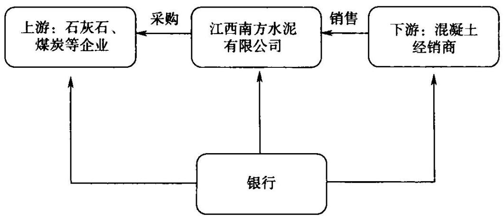
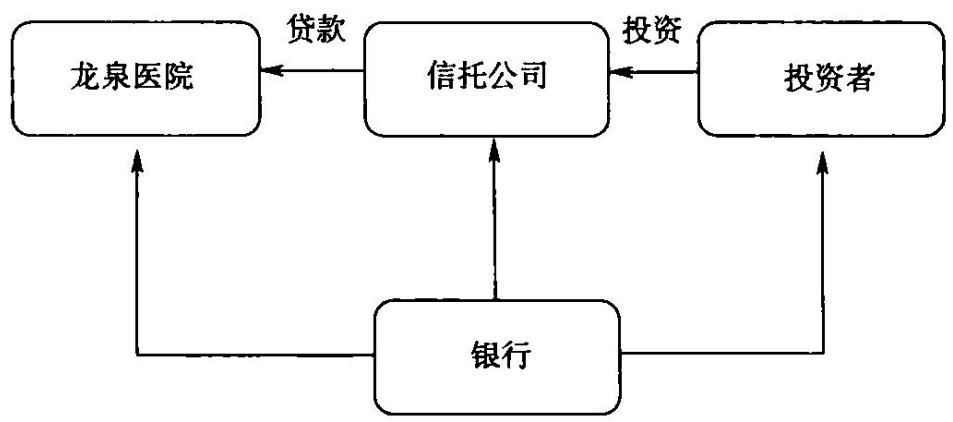

#

# 项目融资培训

立金银行培训中心著

透彻分析项目融资营销要点针对项目融资设计授信方案

项目融资嵌入票据及供应链融资最新、最全的营销项目融资产品

# 行长送银行客户经理的最好礼物

本书适合商业银行公司业务条线支行行长、客户经理学习使用

# 存款=正确使用产品+痛苦坚持

项目融资是银行客户经理必须掌握的银行授信工具，在银行营销公路、铁路、桥梁、电力、石化、航空等项目中有着突出的作用。

项目融资必须和票据产品、国内信用证、供应链、贸易以尽可能提高整体收益率。应当争取通过项目业主方

叉销售，业

在为客户设计项目融资方案时须兼

使客户和银行形成“双赢”。“单赢合作不可能持久。

报价过低，上级行不答应；报价过高，客户不接受。优秀的银行客户经理必须懂得平衡之道。

项目融资设计要点：纯粹的周转资金需要通过表外解决；授信资源尽可能让产业链两端企业使用；尽可能授信总量较大，资本消耗较小；多产品尽可能有机组合销售；尽可能将授信资源在集团客户内部落地。

# 本书提供最新颖各类项目融资案例：

一、项目融资业务 二、固定资产贷款三、项目搭桥贷款 四、项目前期贷款五、项目营运期贷款 六、并购贷款 七、过桥信托计划 八、信托计划九、项目组合融资业务十、BT贷款 十一、PPP融资 十二、租赁封闭贷款

十三、租赁保理

本书提供教练式培训，提供最真实的案例激发客户经理生生不息的奋斗精神和创造价值的活力

我们通过最详尽的案例培训，帮助您在最短时间内成为一名优秀的商业银行客户经理

# 银行项目融资培训

立金银行培训中心 著

责任编辑：贾真 责任校对：潘洁 责任印制：丁淮宾

# 图书在版编目（CIP）数据

银行项目融资培训（Yinhang Xiangmu Rongzi Peixun）/立金银行培训中心著．—北京：中国金融出版社，2012.1(立金银行培训系列丛书)ISBN 978 -7 - 5049 -6195 -2

1. $\textcircled{1}$ 银…Ⅱ. $\textcircled{1}$ 立…Ⅲ. $\textcircled{1}$ 商业银行—融资—中国—业务培训一教材N. $\textcircled{1}$ F832. 33

中国版本图书馆CIP数据核字（2011）第241973号

# 中国金融出版社

社址北京市丰台区益泽路2号  
市场开发部（010)63266347，63805472，63439533（传真）  
网上书店 http://www chinafph com(010)63286832，63365686（传真)

# 立金银行培训教材编写委员会

主 编：陈立金  
副主编：云晓晨 马翠微  
编写成员：索利 张的用 赵辉白彭江建伟唐娜李丹严硕翟丽

# 前 言

# 成就优秀的银行客户经理

要做个让客户刮目相看，颇为受人尊重的优秀客户经理。

立金银行培训中心团队集合了各家银行的总行专家，我们经常在一起研究项目，碰到过各类的项目贷款。很多项目贷款结构复杂，设计精妙，就像艺术品一样让人记忆深刻。我们愿意将项目贷款的设计要点给大家作一个总结，与大家分享项目贷款的智慧。

精通项目贷款是一个成熟客户经理必经的阶段。项目贷款远比流动资金贷款更加锻炼客户经理。怎样做好项目贷款呢？

第一，跑重点渠道。项目贷款的营销与流动资金贷款截然不同，流动资金贷款由企业自行决定，而项目贷款一定涉及项目，项目必须获得政府相关部门批准，而且涉及新场地的使用等，因此一定要和各类政府部门打交道。客户经理要从众多贷款项目中择优筛选，一定要全面掌握本地新项目情况，与本地发展改革委、招商局、金融工作办公室等部门保持密切对接，这些部门掌握着本地重大的项目信息。我们要率先掌握第一手有关项目资料，确定一批重点优质项目，为项目贷款营销打下坚实的基础。

第二，要精雕细琢。做好营销项目的前期准备，项目贷款的营销需要做大量艰苦细致的工作。项目拿到手，其他相关手续的完备还有大量的工作要做。客户经理专人盯项目、跑政府、跑企业完善手续，还要与上级行法律、授信审批部门积极有效地对接。对项目材料及相关细节精雕细琢，以提高上报材料的完整率、准确率，确保上报项目的质量，为营销成功铺好路、架好桥。项目贷款涉及较多的法律问题，合同文本复杂，需要客户经理精心准备，完成一个项目贷款非常锻炼人。

第三，设计授信方案。要认真了解项目的融资结构、现金流特点，了解客户需求；要彻底搞清楚“项目中嵌人什么银行产品更加合适”，根据项目需要，能够有能力设计个性化的金融服务方案。优质的项目贷款，是各家银行的竞争对象。项目贷款的竞争不是简单地比哪家银行提供的贷款利率低、期限长、担保要求低。今天，仅申报一笔简单项目贷款，对于像电力公司、电信公司、石油公司等优质客户而言，价值很低，很难有竞争力。

我们总结过，在项目贷款中嵌人各类票据、国内信用证等产品，在促进营销的过程中非常有效，而且在减小资本消耗、节省风险资产方面作用极大，非常值得客户经理深人学习。

现在面临的形势要求极高，商业银行经营要更加有智慧。监管机构要求银行注意资本充足率，要求有效使用风险资产，而“三个办法、一个指引”使以贷吸存受到限制，这时候要更加精心设计授信方案。

我们在很多股份制银行推广了在项目贷款中嵌入商业承兑汇票的创新产品，收到了非常好的效果。

每个优秀的银行客户经理必须清楚：银行真正拉存款靠什么，靠的是产品创新。要转变思路，不要去尝试“关系营销”，而要转向“专业营销”。项目贷款真正考量客户经理的智慧。

# 目 录

产品篇

【产品一】 项目融资 3  
【产品二】 固定资产贷款… 22  
【产品三】 项目搭桥贷款… 30  
【产品四】 项目前期贷款 35  
【产品五】 项目营运期贷款· 42  
【产品六】 并购贷款…… 49  
【产品七】 过桥信托计划（备用贷款） 64  
【产品八】 信托计划…… 69  
【产品九】 项目组合融资· 75  
【产品十】 BT贷款 86  
【产品十一】 PPP融资 111  
【产品十二】 租赁封闭贷款 116  
【产品十三】 租赁保理… 128

案例篇 133

【案例一】 包头经济适用房贷款案例 135  
【案例二】 交通行业供应链营销案例 141

融资业务案例 144【案例四】贵阳运动城项目人民币80亿元银团贷款案例…146【案例五】保障性住房融资案例 152

# 产品篇

项目融资□固定资产贷款项目搭桥贷款□项目前期贷款□项目营运期贷款并购贷款过桥信托计划（备用贷款）信托计划□项目组合融资BT贷款PPP融资□ 租赁封闭贷款□租赁保理

# 【产品一】 项目融资

# 【基本概念及原则】

项目融资是指同时符合以下特征的贷款：

1.贷款用途通常是用于建造一个或一组大型生产装置、基础设施或其他项目。2.借款人通常是为建设、经营该项目或为该项目融资而专门组建的企事业法人，也包括主要从事该项目建设、经营或融资的既有企事业法人。3.还款资金来源主要依赖该项目产生的销售收入、补贴收人或其他收入，一般不具备其他还款来源。

例如，为建设一条高速公路，成立专门的高速公路项目公司；为了建设体育馆，成立体育馆有限公司等。北京市政府在建设地铁的过程中，基本上都是设立独立的项目公司，独立建设、运营每条地铁。典型的项目，上海迪士尼项目，专门设立上海迪士尼有限公司，负责项目的建设及运营。

这样做的最大好处在于方便项目的独立核算，可以有效控制项目的建设成本。

# 【营销建议】

对于一些有政府背景、中央企业投资、世界500强企业投资的项目，往往融资很容易，但是如何提高银行收益率，却是一个最关键的问题。

单纯做项目融资，对客户提供金额超大、期限超长的贷款，对于银行而言，收益仅仅是贷款利息和一点资金沉淀，收益有限。项目融资一定要配套提供一些组合融资产品，例如，银行承兑汇票，捆绑买方付息票据和代理贴现；商业承兑汇票，捆绑商业承兑汇票保贴和商业承兑汇票保押产品；国内信用证，捆绑买方付息和代理议付产品。通过做客户的上游供应商提升银行的收益，一些特大型的项目，例如道路建设项目、电力建设项目、电网建设项目、石油化工项目、煤矿建设项目、飞机厂建设项目、体育场馆建设项目、地铁建设项目，需要大量的配套企业，例如水泥供应商、钢铁供应商、施工企业等，借助项目业主单位沿着产业链营销，效果远远强于单纯只盯住借款人本身。

例如，高速公路项目融资（见图1-1）。高速公路公司是典型的资金密集型客户，需要银行提供大额的信贷。层级较高的省交通厅、省交通集团、发达省份的高速公路公司是非常好的目标客户群体。

  
图1-1高速公路项目融资

高速公路公司主要支出是购买钢材和水泥、支付工程款，主要收人来源是高速公路通行费收人，这类客户收人非常稳定。银行借助高速公路公司营销上游施工企业和钢材供应商。

# 【行业经典客户】

高速公路公司：北京首发有限公司、浙江申嘉湖杭高速公路有限公司市级主体：青岛市公路局、太原市公路局

省级主体：广东省交通集团、浙江省交通集团、江苏省交通集团、山西省交通厅、黑龙江省交通厅、河北省交通厅

其他：重庆高速公路集团有限公司、海南高速公路股份有限公司、深圳高速公路股份有限公司、山东高速公路集团有限公司、浙江金丽温高速公路有限公司、山东高速公路股份有限公司、中策广明高速公路有限公司、山西高速公路集团、重庆渝涪高速公路有限公司等

高速公路公司重点选择省、发达市级政府投资的公司，这类客户很容易进入国家骨干网。

# 【银行授信思路】

1.省级主体提供大额贷款、银行承兑汇票、保贴商业承兑汇票。

2.地市级主体提供贷款。

3．高速公路公司提供综合授信。

大型高速公路经营企业实力非常强，属于各家银行追捧的对象，单纯提供流动资金贷款、项目贷款，只能比拼价格。银行应当设计组合授信方案，在授信方案中嵌入商业承兑汇票、银行承兑汇票、银行保理等产品，通过高速公路经营企业营销其上游施工企业、材料供应商等。

打通高速公路产业链，形成高速公路一施工企业一材料供应商的完整现金流，银行从整个产业链的现金流中寻找回报。

高速公路公司在与银行的合作过程中，议价能力较强，银行单纯提供流动资金贷款、项目贷款，营销效果往往不好，应当尽可能考虑营销上游供应商，综合设计授信方案：针对资金支付与管理要求，设计流动资金贷款、银行承兑汇票、买方付息票据贴现、保理、保函等多项融资产品和资金监管产品，降低客户的财务成本，提高银行的综合收益。

# 【授信方案模板】

表1-1 授信方案模板  

<table><tr><td rowspan=1 colspan=5>广东省交通集团有限公司</td></tr><tr><td rowspan=1 colspan=5>授信方案</td></tr><tr><td rowspan=1 colspan=1>额度类型</td><td rowspan=1 colspan=1>公开授信额度</td><td rowspan=1 colspan=2>授信方式</td><td rowspan=1 colspan=1>综合授信额度</td></tr><tr><td rowspan=1 colspan=2>总授信额度（万元）      300 000</td><td rowspan=1 colspan=3>期限（月）                                12</td></tr><tr><td rowspan=1 colspan=1>具体授信品种</td><td rowspan=1 colspan=1>在总授信额度中占比（%）</td><td rowspan=1 colspan=1>是否循环</td><td rowspan=1 colspan=1>用途</td><td rowspan=1 colspan=1>贡献分析</td></tr><tr><td rowspan=1 colspan=1>国内信用证（买方押汇）</td><td rowspan=1 colspan=1>10</td><td rowspan=1 colspan=1>是</td><td rowspan=1 colspan=1>用于一般性周转</td><td rowspan=1 colspan=1>利息收益，根据客户的等级情况适当上浮或下调</td></tr><tr><td rowspan=1 colspan=1>商业承兑汇票贴现（代理贴现）</td><td rowspan=1 colspan=1>50</td><td rowspan=1 colspan=1>是</td><td rowspan=1 colspan=1>用于向上游供应商支付货款</td><td rowspan=1 colspan=1>（1）保证金存款；（2）关联营销上游企业办理贴现，可以获得贴现利息收人</td></tr><tr><td rowspan=1 colspan=1>贷款承诺函</td><td rowspan=1 colspan=1>20</td><td rowspan=1 colspan=1>是</td><td rowspan=1 colspan=1>用于向国家发展改革委申请立项时使用</td><td rowspan=1 colspan=1>可以给银行提供可观的手续费收入</td></tr><tr><td rowspan=1 colspan=1>基本建设项目的固定资产贷款</td><td rowspan=1 colspan=1>10</td><td rowspan=1 colspan=1>是</td><td rowspan=1 colspan=1>用于项目建设使用，期限较长</td><td rowspan=1 colspan=1>利息收益</td></tr><tr><td rowspan=1 colspan=1>并购贷款</td><td rowspan=1 colspan=1>10</td><td rowspan=1 colspan=1>是</td><td rowspan=1 colspan=1>用于在省内、省外的高速公路公司股权收购，一般期限较长</td><td rowspan=1 colspan=1>（1）利息收益；（2）财务顾问收益</td></tr><tr><td rowspan=1 colspan=5>授信总口（万元）                                建议不超过300000</td></tr><tr><td rowspan=1 colspan=5>担保方式及内容   信用（各地交通集团、交通厅实力较强，通常都可以提供信用授信）</td></tr></table>

1.在公路产业链，对于银行而言，最有价值客户并不是高速公路公司，而是公路配套企业，如施工企业、钢材和水泥供应商等。公路公司实力非常强，对施工企业、材料供应商而言，其处于强势地位，所以可以向上游企业支付商业承兑汇票，银行可以营销交通集团保贴业务。借助高速公路公司，关联营销其配套企业，这样的回报远远高于单纯提供流动资金贷款。对于此类客户，银行要考虑的往往不是高速公路公司能够给我们多少存款，因为，银行对这类客户议价能力较差，所以，应着眼于其相关配套企业能够给银行带来的惊人存款。

2.国内信用证用于补充企业日常物资的采购，用于项目建设前期拆迁、建设原材料订购等资金周转，该品种授信在总授信中占比适中。

提供的融资工具允许在各产品之间串换使用，例如贷款串用为银票、银票串用为贷款等，提高授信产品使用效率。

3.应当提供大量的商业承兑汇票，借助公路公司关联营销其供应商、施工企业。通常公路公司有着非常畅通的融资渠道，尤其是层级较高的省交通集团、省交通厅，多在资本市场融资，因此，提供贷款较为困难，这类客户对降低财务费用需求迫切，最重要的融资品种应该是票据。

4．在授信产品结构中，配比较大金额的商业承兑汇票、少量的贷款，由于借助商业承兑汇票可以营销众多的施工企业、供应商，而提供流动资金贷款，通常存款沉淀很低，而且利率多是基准利率下浮 $10 \%$ ，银行收益很低。

5.公路公司固定资产建设投资金额较大，周期较长，在项目建设期有较多的工程款、材料费等支出，这部分支出银行可以提供银行承兑汇票或商业承兑汇票保贴等产品帮助企业完成支付，降低企业的融资成本。

6.公路行业的并购行为较多，尤其是政府主导下的高速公路投资集团，可以提供并购贷款，银行发放一笔期限较长的融资。

# 【案例1】海南高速公路股份有限公司授信方案

# 一、企业基本情况

海南高速公路股份有限公司是海南省国有控股企业，是在原海南省东线高速公路建设工程指挥部办公室的基础上，进行股份制规范化改制，以定向募集资金的方式而设立的，公司成立之初的主要任务是承担国家重点工程——海南环岛（东线）高速公路的建设和管理。

  
图1-2海南高速公路股份有限公司授信方案

# 二、银企合作情况

银行提供5亿元综合授信额度：

1.3亿元项目贷款，3年期，利率执行基准利率。

2.2亿元银行承兑汇票额度，用于向上游企业支付。

# 【项目融资遵循原则】

1.符合国家有关投资管理规定，落实项目资本金。项目的资本金为股东方投人的资金，是整个项目抵御风险的基础资金，必须足额到位。

2.审慎评估并全程关注、监控项目现金流和收益。

必须高度关注项目的经营现金流，在项目的建设期确保股东方的资金和银行的信贷资金都投人项目中，在项目的经营期，确保项目的经营现金流用于偿还贷款。

3.建立明确合理的项目建设期和经营期风险分担机制，风险与收益相匹配。

4．根据项目建设、生产经营进度做好贷款发放和分期还款安排。

银行应当根据项目的建设周期和项目的用款进度，合理安排信贷资金的发放，既可以降低项目业主方的资金成本，同时防止信贷资金被挪用。

# 【办理条件】

（一）借款人和项目应同时具备以下条件：

1．借款人依法经工商行政管理机关或主管机关核准登记。

2.借款人在银行开立基本存款账户或一般存款账户。

3.借款人及主要股东信用状况良好，在银行融资无不良信用记录，无其他重大不良记录。

4.国家对拟投资项目有投资主体资格和经营资质要求的，符合其要求。

5.项目符合国家产业、环境保护、土地使用、资源利用、城市规划、安全生产等方面政策和银行信贷政策。

6.项目符合国家有关投资项目资本金制度的规定。

7.项目已按照国家规定办理审批、核准或备案手续。

8．借款用途及还款来源明确、合法。

9.贷款行要求的其他条件。

# （二）借款人申请项目融资业务应提交以下书面材料

1.借款申请。

2.借款人公司章程、营业执照、组织机构代码证书、税务登记证明、贷款卡、验资报告、法定代表人身份证明等。对需年检的，还应有最新年检证明。

3.借款人及其主要股东近3年经审计的年度财务报告和最近一期月度财务报告；经营期不满3年的，依据实际经营期限提供财务报表。借款人为新设项目法人的，可只提供股东相关资料。

4.项目可行性研究报告。

5.国家有权部门对项目审批、核准或备案文件。

6.国家有权部门对项目在环境保护、土地使用、资源利用、城市规划、安全生产等方面的许可文件。

7.项目资本金和其他建设资金筹措方案及其落实情况证明资料。

8．与项目建设及生产经营相关的合同、协议或意向性文件，如总承包合同、特许经营权协议、购买协议、原材料供应合同等。

9.涉及担保的，还应提供贷款担保相关资料。

10.贷款行要求的其他资料。

尚未向国家有权部门履行完毕相关手续的，可暂不提供上述第5、第6项规定的文件，但应提供相关办理进展情况并在放款核准前提供相应文件。

# 【金额、期限、利率与相关管理要求】

（一）项目融资金额应综合考虑项目投资需求、资本金比例要求、预期现金流、项目风险水平以及自身风险承受能力等因素合理确定。

（二）项目融资期限应在审慎评估项目风险和偿债能力的基础上，根据项目预期现金流、投资回收期、银行融资金额等因素合理确定。

（三）项目融资利率应按照中国人民银行利率政策以及总行利率定价管理规定，根据风险收益匹配原则合理确定，利率水平需反映项目融资结构风险大小、各项风险缓释措施充足与否，并考虑其他各项成本、经济资本回报率等因素。

办理项目融资，可根据业务不同阶段的风险特征和水平，采用不同的贷款利率。

中长期固定利率贷款的审批权限，应严格执行总行有关规定。

（四）项目融资应在项目建设期结束或审批确定的宽限期期满后实行分期还款。还款计划应与项目预期现金流情况相匹配，不得集中在项目融资到期前偿还。对项目建造完成后，借款人直接将项目资产转让，并一次性获得转让对价的除外。

（五）有多家金融机构参与同一项目融资的，应尽可能采取银团贷款方式。

（六）办理项目融资业务，应尽可能争取由银行担任项目融资顾问，为项目设计综合金融服务方案，组合运用各种融资工具，拓宽项目资金来源渠道，有效分散风险。

# 【调查、评估、审查与审批】

（一）办理项目融资业务，应按照规定履行调查、评估、审查与审批流程。对符合调评合一、认同评估等项目贷款优化流程范围的，执行优化流程相关规定。

（二）调查人员应主要就以下内容履行尽职调查职责：

1．借款人提供的材料是否真实、完整、有效。

2.借款人、项目发起人或主要股东的基本情况，包括成立时间、注册资本、治理结构、经营范围、资金管理方式，信用状况、生产经营状况、财务状况、融资情况，主要股东的行业地位、资金实力、经营管理水平等。

3.贷款项目基本情况，包括项目建设内容、建设条件和可行性、建设进展情况，项目核准（或审批、备案）、土地审批、环境评价等行政审批情况，项目资本金、项目债务资金的来源渠道和方式以及项目未来现金流等情况。

4.项目产品市场情况，包括项目所属行业规划、市场环境、供求状况和未来变化趋势，同类产品市场波动与购销状况，项目生产所需的能源和原材料来源的持续稳定性，项目产品的竞争优势与劣势等。对于项目建成后即移

交或转让的，可简化对项目产品市场的调查，但应调查掌握借款人与项目受让方之间的协议以及受让方资金实力。

5.项目投资及筹资情况，包括项目投资构成、资本金比例、自筹资金来源、项目预期未来现金流等。

6.对涉及担保的，应按照贷款担保管理相关要求进行调查。

# 【风险控制】

银行应以偿债能力为核心对项目融资业务进行全面风险评价，审查内容重点包括：

1.借款人主体资格及项目建设、运营的依法合规性。

2.项目建设条件。项目建设用地及原材料、燃料、动力来源落实情况及其可靠性，交通、投资区域环境和其他配套条件适应情况；主要设备采购引进情况等。

3.项目可行性。项目所采用工艺、技术和主要设备的先进性、成熟性及适用性，项目产品市场前景、发展潜力、供求现状、销售渠道、竞争能力、盈利能力及其发展趋势等，项目生产所需的能源和原材料是否有长期稳定来源。

4.项目资金筹措。项目总投资及构成的合理性，各项投资来源的落实情况及可获得性；已到位项目资本金的真实性，以及未到位资本金到位的可靠性。

5.项目预期现金流。项目投入运营或销售、转让后产生的现金流量用于偿还到期债务的可靠性。

6.项目股东和项目管理者。项目股东的经济实力、风险承受能力和整体经营情况，项目对项目股东的重要程度及投资者全力支持项目的意愿；负责项目日常生产管理的公司或组织在项目领域的组织管理经验和能力。

7.项目风险分担。项目风险在借款人、出资人、项目承包方、施工方等相关项目参与方之间分配的合理性，是否使最有能力承担某种风险的一方承担该风险。项目是否建立相应机制，防止股东对项目产生重大不利影响。

8.其他风险。行业基本面、大宗商品价格风险、供应和成本风险、监管风险、外汇风险，以及该项目的竞争优势、潜在竞争对手或技术革新出现的可能性对该项目的影响。

9.项目融资方案。综合判定贷款金额、期限、还款计划等融资方案安排

的合理性和可行性。

# 【风险应对对策】

1．对能源和原材料的稳定供应依赖性大、能源和原材料成本在整个生产成本中占有很大比重的项目，应要求借款人提供长期能源和原材料供应协议，并对协议内容及供应方的履约能力和意愿进行审查。

2.为降低项目建设开发和试生产阶段的完工风险，应尽可能要求借款人或通过借款人要求项目相关方落实履约担保、完工保证金等完工担保措施，明确在项目建设延期、成本超支、项目不能按期达到完工标准、项目停建以致最终放弃等情况下项目完工担保人的担保责任。

3.项目资产、项目预期收益等依法可设定抵（质）押的，应要求借款人将项目在建工程及其形成的项目资产、项目收益权抵（质）押给银行。同时，可根据需要要求项目股东将所持有的借款人股权质押给银行。

符合银行信用贷款条件，或确因相关政府主管部门特殊要求等原因无法办理抵（质）押的，可不提供上述担保，但须签订账户监管协议。

4.审查审批项目融资业务，应根据项目及其在建设期、运营期等的不同特点，要求借款人或通过借款人要求项目相关方选择银行认可的保险公司投保相应商业保险，如建筑工程一切险、安装工程一切险、综合财产保险及其他有关险种，以转移项目相关风险。商业保险应尽可能由银行代理。

对所投保商业保险，贷款行应作为第一顺位保险金请求权人，或采取按贷款比例设定赔偿请求权等其他措施有效控制保险赔偿或给付赔偿金的权益。对不能办理商业保险的，应在贷款调查审查时说明理由。

5.审查审批项目融资业务，应要求借款人设定专门的项目收入账户，并明确进入账户中的项目收人资金比例不低于银行对该项目的融资占比。该账户资金对外支付需满足约定条件。

6.审查审批项目融资业务，应明确采用贷款人受托支付方式的起付金额标准，并可根据项目具体情况，合理设定贷款宽限期、关键财务指标控制线等要求。

# 【审批技巧】

审查审批项目融资，应将以下要求作为放款前提条件：

1.项目已按国家规定履行各项必备程序，并取得相应许可文件。银行在争夺优质固定资产项目的时候，往往需要在项目的相关核准文件下发前，提

前介人，这时候可以提供预置条件的审批批复。

2.与贷款同比例的资本金已足额到位。

银行要求项目的资本金足额到位，按照与银行贷款等同的比例发放。

3.项目实际建设进度与已投资额相匹配。

# 【贷款发放与支付】

（一）项目融资业务均须执行公司客户贷款发放与支付流程相关规定。

（二）贷款审批设定的前提条件和管理要求，需以法律文件形式落实的要全部在合同或其他相关法律文件中反映，防止合同对重要条款未约定、约定不明或约定无效。

（三）对经放款核准的业务，应根据项目的实际进度和资金需求，采用贷款人受托支付或借款人自主支付的方式对贷款资金进行管理与控制，监督贷款资金按约定用途使用。

（四）单笔金额超过500万元人民币，或超过项目总投资 $5 \%$ 且超过50万元人民币贷款资金支付，应采用贷款人受托支付方式。

（五）采用贷款人受托支付方式的，必要时可以要求借款人、独立中介机构和承包商等共同检查设备建造或者工程建设进度，出具共同签证单。银行凭符合合同约定条件的共同签证单进行贷款资金的发放和支付。

（六）采用借款人自主支付方式的，应要求借款人按月或按季报告贷款资金使用情况，并通过账户分析、凭证查验、现场调查等方式核查贷款资金支付是否符合合同约定。

（七）项目融资发放和支付过程中，借款人出现以下情形的，应与借款人协商补充贷款发放和支付条件，或根据合同约定停止贷款资金的发放和支付：

1.信用状况下降。  
2.不按合同约定支付贷款资金。  
3.项目进度落后于资金使用进度。  
4.违反合同约定，以化整为零方式规避受托支付。  
5.借款人指定的放款账户被有权机关冻结或止付。

# 【贷后管理】

（一）项目融资业务存续期内，应定期进行贷后检查分析。在项目的建设和运营各阶段，要跟踪检查借款人和项目发起人的履约情况及信用状况、项目环保合规情况以及宏观经济和市场波动情况等；要按规定对贷款担保情况进行检查并重新评估其担保能力；要关注借款人及项目是否触及借款合同约定的违约条款。

对分期投保商业保险的，还应督促投保人及时续保。借款人对项目相关保险保单的实质性改动及提前终止，应征得银行同意。

（二）在项目建设阶段，还要密切关注项目建设进度、建设质量及资本金到位情况，关注与项目相关的技术、市场、环保条件变化情况。在项目建设成本超支的情况下，对有完工担保或其他建设成本超支安排的，应要求完工担保人或有关责任方按协议约定支付项目建设成本超支款。

（三）对项目实际投资超过原定投资预算金额，借款人申请追加贷款的，应按照原审批金额与追加金额之和确定审批权限，并重新履行审查审批程序。对审批同意追加贷款的，应按照项目资本金比例要求追加资本金。涉及担保的，需追加相应担保。

在项目融资业务审批时效内，如项目追加投资额度不超过原定投资额度的 $20 \%$ ，对项目效益不产生实质影响，且项目不需经政府有权部门重新审批，同时借款合同金额与追加金额之和小于原审批金额的，可不再履行审批程序。

（四）在项目试生产阶段，还应密切监督项目试生产情况，确认实际的项目生产数据和技术指标是否达到融资文件规定的完工标准。

（五）在项目经营阶段，应重点关注项目所属行业市场环境、供求状况、项目经营及收入状况、项目经营活动现金流是否达到评估水平、项目经营收人是否按照约定按时、足额回笼银行，能否满足偿还银行债务的要求。项目收入账户资金流动出现异常时，应及时查明原因并采取相应措施。

（六）对借款人违反合同约定，借款人或项目发生重大事项变更并可能危及贷款安全的，应及时进行风险评判，并视情况采取停止发放贷款、提前收回部分或全部贷款、追加担保等各项措施有效化解风险。必要时应依法追究借款人的违约责任。

# 【其他规定】

（一）对文化创意、新技术开发等项目发放符合项目融资特征的贷款，可以参照以上的操作思路。

例如，北京银行、招商银行参与的华谊兄弟的电影项目贷款，其实和公路项目贷款一样，存在项目的完工风险、项目的运营风险等。电影项目也存在立项、组织人员实施、通过电影院线销售、收回投资的完整过程。

（二）办理项目融资业务，可根据项目建设的复杂性、专业性和技术性，委托或要求借款人委托具备相关资质的独立中介机构为项目提供法律、税务、保险、技术、环保和监理等方面的专业意见或服务。

对所委托的独立中介机构，应符合银行对中介机构资质准入的相关管理要求，并应通过书面合同明确其法律责任。

（三）项目融资业务适用《固定资产借款合同》。

（四）以银团贷款方式办理的项目融资业务，还应执行银团贷款管理规定及具体银团贷款协议约定。

（五）对银监会《固定资产贷款管理暂行办法》、《项目融资业务指引》实施前已签订借款合同但尚未按合同全部支付（即所余未拨付部分）的贷款，须严格执行上述文件规定的支付条件和方式，并应立即与相关当事人主动协商，采取有效措施落实监管要求。

  
【案例2】大连体育中心开发建设投资有限公司银团贷款方案  
图1-3大连体育中心开发建设投资有限公司银团贷款方案

# 一、银团贷款基本情况

# （一）借款人

大连体育中心开发建设投资有限公司。

# （二）借款项目

大连市体育中心建设项目（说明：大连市体育中心建设项目分为体育场馆建设和配套土地开发两部分，本银团贷款用于体育场馆建设部分）。

# （三）借款总金额

借款人申请贷款总金额为人民币380000万元（大写叁拾捌亿元整）。

（四）银团贷款的承担额分配情况

国家开发银行：人民币220000万元，贷款比例为 $5 7 . 8 9 \%$ 其他参加行：人民币160000万元，贷款比例为 $4 2 . 1 1 \%$

# （五）借款用途

用于大连市体育中心建设项目体育场馆建设部分。

（六）借款期限

本银团贷款的借款期限为10年。

# （七）贷款利率

贷款执行利率为人民银行公布的同期同档次人民币贷款基准利率，按季度结息，结息日为每年3月20日、6月20日、9月20日、12月20日。

本银团贷款利率随人民银行公布的利率即时调整。

（八）还款和提前还款

1.借款人应按照银团贷款合同约定的还款计划偿还贷款本金，将到期的贷款本金存人其在代理行开立的存款账户中，再由代理行按照银团贷款的承担份额划拨给各银团成员。借款人因特殊情况不能按照银团贷款合同约定的还款计划或还款期限偿还贷款本金的，可以通过代理行向全部银团成员申请调整还款计划或申请展期。经过全体银团成员召开银团会议通过之后，可以签订还款计划变更协议或贷款展期协议。

2.借款人如需提前还款，应在其拟还款日之前30日将提前还款日和还款金额以书面形式通知代理行，并征得银团同意。

一切提前偿还的款项将按本金到期的倒序清偿贷款余额。

# 二、借款人及借款项目概况

（一）借款人（包括借款人的法律地位、经营范围、财务状况、借款人股东单位等情况）

大连体育中心开发建设投资有限公司注册资金2000万元，企业类型为有限责任公司。公司主要负责体育中心项目的投资建设，其简要情况如表1-2所示。

表1-2大连体育中心项目的投资简要情况  

<table><tr><td rowspan=1 colspan=1>借款人名称</td><td rowspan=1 colspan=1>大连体育中心开发建设投资有限公司</td></tr><tr><td rowspan=1 colspan=1>法定地址</td><td rowspan=1 colspan=1>大连市沙河口区中山路576-18号</td></tr><tr><td rowspan=1 colspan=1>注册资本</td><td rowspan=1 colspan=1>注册资本2000万元</td></tr></table>

续表

<table><tr><td rowspan=1 colspan=1>经营范围和业务规划</td><td rowspan=1 colspan=4>体育场建设项目投资；土地整理</td></tr><tr><td rowspan=2 colspan=1>控股方和控股方式</td><td rowspan=1 colspan=1>股东</td><td rowspan=1 colspan=1>出资额</td><td rowspan=1 colspan=1>占比</td><td rowspan=1 colspan=1>方式</td></tr><tr><td rowspan=1 colspan=1>大连市星海湾开发建设管理中心</td><td rowspan=1 colspan=1>2000万元</td><td rowspan=1 colspan=1>100%</td><td rowspan=1 colspan=1>货币</td></tr></table>

大连体育中心开发建设投资有限公司的股东是大连市星海湾开发建设管理中心，出资占比 $100 \%$ 。大连市星海湾开发建设管理中心是大连市人民政府直属的局级事业单位，在市政府的领导下，负责对星海湾商务中心区实行统一开发建设和管理。其主要职能：负责编制中心区的总体规划和开发建设计划，按规定审定辖区内的土地出让和投资项目的前期工作；负责基础设施建设和物业管理；负责中心区内的国有资产管理和环境保护工作，并对中心区内企事业单位和其他经济组织依法监督管理；承办市委、市政府交办的其他事项。

股权关系如图1-4所示：

  
图1-4大连体育中心开发建设投资有限公司股权关系

# （二）借款项目

1．项目建设背景及必要性

大连是我国的体育名城，享有“足球城”、“田径之乡”、“游泳之乡”的美誉。但是目前大连市尚没有一个完整的、综合性的、高标准的体育训练中心。现有的大连市人民体育场修建于1997年，由于位于大连市市中心，占地面积较小，场地设施较为简单，早已无法满足城市发展和人民生活的需要，目前大连市政府已经着手该体育场的拆迁工作。

大连市体育中心建设项目位于大连市甘井子区，西临朱棋路，南临岭西路。该位置既是大连市规划的北部中心区域，又是朱棋路新区的中心位置。该项目的建设也纳人了大连市城市规划，与市政府“西拓北进”的发展方向相一致。将大连市体育中心的建设与大连市的城市建设紧密结合起来，形成一种联动发展的效应。以体育中心项目为主的组团式开发建设，可有力推动大连市北部城区的市政建设，促进北部新城市中心的形成，并且通过促进城市体育、文化等事业的发展，拓展城市的外延空间，提升城市的整体功能。此外，体育中心的建设以及对未来大型赛事的承办，将会进一步加快北部地区交通等基础设施的建设，缓解旧城中心基础设施不足的压力，从总体上推动城市新格局的形成。

# 2.项目总投资及其构成

依据该项目科研报告及项目审批文件，大连市体育中心建设项目上报总投资为88亿元（包括主场馆建设和配套土地开发），其中静态投资82亿元，动态投资6亿元。

# 3.项目地理状况及项目内容

# （1）项目所处区位

大连市体育中心建设项目位于大连市甘井子区，西临朱棋路，南临岭西路。

# （2）建设内容及规模

大连市体育中心建设项目分为体育场馆建设和配套土地开发两部分（本银团贷款用于体育场馆建设部分），其中体育场馆主要建设内容有中心体育场、棒球场、中心体育馆、网球馆、游泳馆、综合训练馆、媒体中心、S形商业服务区、地下车库，总占地面积81.99公顷，总建筑面积53.09万平方米。另外还有247.83公顷配套用地建设，建设内容为场地的“七通--平”和公共服务设施的建设，其中公共服务设施包括教育、文体、市政公用、社区服务项目的建设。项目主场馆建设期为3年，配套开发用地将视市场情况逐年开发。

# 4.项目的行政许可事项

# （1）规划及审批

项目建设符合《大连市城市总体规划》和《大连市国民经济和社会发展

第十一个五年规划》。项目主场馆建设已获得项目选址意见书，编号为规条字2007-120号。

（2）项目审核

大连市城乡建设管理委员会下发了《关于大连市体育中心项目可行性研究报告的批复》，同意项目开工建设。

# （3）用地审批

项目体育场馆建设用地已完成农用地转用手续，相关文件为《大连市人民政府关于同意调整甘井子区乡级土地利用总体规划的批复》，其中部分用地获得土地使用权证，使用权面积276160.5平方米，使用权类型为划拨。

# （4）环评审批

大连市环保局以《关于对大连市体育运动中心环境影响报告书的批复》，同意项目开工建设。

# （5）其他行政许可

大连市人民政府以《大连市人民政府办公厅关于市体育中心项目和胜利路拓宽改造项目融资有关事宜的通知》文件明确由大连市星海湾开发建设管理中心出资成立大连市体育中心开发建设投资有限公司作为项目的代建单位和融资借款人，同时明确市建委与其签订委托代建协议，由市财政局对体育中心项目建设资金进行监督管理。

# 5.项目的自筹资金情况

受大连市政府委托，大连市城乡建设管理委员会与大连体育中心开发建设投资有限公司签订了《大连市体育中心项目委托代建协议》，根据协议，大连市政府将在建设期内支付代建资金294258万元，可以满足全部项目资本金出资要求。

# 6.项目用款及还款计划（以银团借款合同为准）

表1-3大连市体育中心项目用款及还款计划  

<table><tr><td rowspan=2 colspan=1>项目名称</td><td rowspan=2 colspan=1>合计</td><td rowspan=1 colspan=3>宽限期</td><td rowspan=1 colspan=7>还款期</td></tr><tr><td rowspan=1 colspan=1>第1年</td><td rowspan=1 colspan=1>第2年第3年</td><td rowspan=1 colspan=1>第2年第3年</td><td rowspan=1 colspan=1>第4年</td><td rowspan=1 colspan=1>第5年</td><td rowspan=1 colspan=1>第6年</td><td rowspan=1 colspan=1>第7年</td><td rowspan=1 colspan=1>第8年</td><td rowspan=1 colspan=1>第9年</td><td rowspan=1 colspan=1>第10年</td></tr><tr><td rowspan=1 colspan=1>本年用款</td><td rowspan=1 colspan=1>380000</td><td rowspan=1 colspan=1>200000</td><td rowspan=1 colspan=1>100000</td><td rowspan=1 colspan=1>80000</td><td rowspan=1 colspan=1></td><td rowspan=1 colspan=1></td><td rowspan=1 colspan=1></td><td rowspan=1 colspan=1></td><td rowspan=1 colspan=1></td><td rowspan=1 colspan=1></td><td rowspan=1 colspan=1></td></tr><tr><td rowspan=1 colspan=1>本年还款</td><td rowspan=1 colspan=1>380000</td><td rowspan=1 colspan=1></td><td rowspan=1 colspan=1></td><td rowspan=1 colspan=1></td><td rowspan=1 colspan=1>80000</td><td rowspan=1 colspan=1>90000</td><td rowspan=1 colspan=1>40000</td><td rowspan=1 colspan=1>40 000</td><td rowspan=1 colspan=1>60 000</td><td rowspan=1 colspan=1>60 000</td><td rowspan=1 colspan=1>10000</td></tr></table>

# 7.项目还款资金的来源

大连市城乡建设管理委员会与大连体育中心开发建设投资有限公司签订的《大连市体育中心项目委托代建协议》项下的由大连市政府支付的代建资金。资金支付计划如表1-4所示：

表1-4大连市体育中心项目资金支付计划 单位：万元  

<table><tr><td rowspan=1 colspan=1>年份</td><td rowspan=1 colspan=1>合计</td></tr><tr><td rowspan=1 colspan=1>1</td><td rowspan=1 colspan=1>84 270</td></tr><tr><td rowspan=1 colspan=1>2</td><td rowspan=1 colspan=1>104 484</td></tr><tr><td rowspan=1 colspan=1>3</td><td rowspan=1 colspan=1>105 504</td></tr><tr><td rowspan=1 colspan=1>4</td><td rowspan=1 colspan=1>110 216</td></tr><tr><td rowspan=1 colspan=1>5</td><td rowspan=1 colspan=1>111285</td></tr><tr><td rowspan=1 colspan=1>6</td><td rowspan=1 colspan=1>112 402</td></tr><tr><td rowspan=1 colspan=1>7</td><td rowspan=1 colspan=1>117 259</td></tr><tr><td rowspan=1 colspan=1>8</td><td rowspan=1 colspan=1>118 425</td></tr><tr><td rowspan=1 colspan=1>9</td><td rowspan=1 colspan=1>119 591</td></tr><tr><td rowspan=1 colspan=1>10</td><td rowspan=1 colspan=1>120 757</td></tr><tr><td rowspan=1 colspan=1>合计</td><td rowspan=1 colspan=1>1 104193</td></tr></table>

# 三、担保条件

（一）担保人—大连体育中心开发建设投资有限公司以应收账款质押的方式提供担保，担保的范围为大连体育中心开发建设投资有限公司在《大连体育中心项目委托代建协议》项下的全部权益和收益为贷款作质押担保。

担保人大连体育中心开发建设投资有限公司以抵押的方式提供担保，担保的范围为体育中心项目建设用地使用权及地上在建工程（包括未来形成资产）。

（二）担保人应与银团及时签订合法、有效的担保合同。

# （三）担保人和担保标的的情况

# 1．质押担保

# （1）质押物基本情况

大连市建委与大连体育中心开发建设投资有限公司签订《大连体育中心项目委托代建协议》。大连体育中心开发建设投资有限公司承诺以其合法享有的应收账款，即在《大连体育中心项目委托代建协议》项下的全部权益和收益为贷款提供质押担保。根据协议，借款人协议项下的应收账款不低于

1104192万元，经过折现计算后，3年宽限期结束后净值为644786万元。由于上述应收账款包括土地平整项目在内，故按贷款比例将担保额度拆分，本银团贷款应收账款不低于645528万元，经过折现计算后，3年宽限期结束净值为376952万元。

（2）质押物的合法性和有效性

大连体育中心开发建设投资有限公司承诺以其合法享有的应收账款，即在《大连体育中心项目委托代建协议》项下的全部权益和收益作为项目贷款的质押担保，并将质押事项在中国人民银行征信中心应收账款质押登记公示系统办理应收账款质押登记手续。

（3）质押登记部门和时间

拟质押资产在借款合同和质押合同签订后办理抵（质）押登记手续，质押登记部门为中国人民银行征信中心应收账款质押登记公示系统，并在大连市建委办理质押备案手续。

# 2.抵押担保

以体育中心项目建设用地使用权及地上在建工程（包括未来形成资产）为项目贷款提供抵押担保。抵押物价值约为433523.51万元，按贷款比例分配，本银团抵押担保价值约为253445万元。

# （1）抵押人名称

大连体育中心开发建设投资有限公司（或大连市星海湾开发建设管理中心）。

# （2）抵押物基本情况

体育中心建设用地约82公顷，未来建成的体育场馆包括中心体育场、棒球场、中心体育馆、网球馆、游泳馆、综合训练馆、媒体中心、S形商业服务区、地下车库，总建筑面积53.09万平方米。

# （3）抵押物的合法有效性

大连市人民政府以《大连市人民政府办公厅关于市体育中心项目和胜利路拓宽改造项目融资有关事宜的通知》文件明确体育中心建设用地使用权及地上在建工程（包括形成的资产）为项目贷款提供抵押担保。

# （4）抵押登记部门和时间

借款合同签订后，贷款发放前，应先在大连市国土资源和房屋管理局办理已有手续的土地使用权及地上资产抵押；未来形成的资产抵押，由大连市

星海湾开发建设管理中心出具以未来形成的资产为银团贷款提供抵押担保的不可撤销担保函；贷款发放后，严格控制资金支用，待未来固定资产形成后及时办理抵押登记手续。

# （四）信用风险控制技术

# 1.资金监管

大连市人民政府以《大连市人民政府办公厅关于市体育中心项目和胜利路拓宽改造项目融资有关事宜的通知》文件明确由市财政局对体育中心项目建设资金和土地出让收益进行监督管理。

大连市财政局和大连市星海湾开发建设管理中心联合下发了《关于印发<大连市体育中心工程建设资金管理暂行办法〉的通知》，通知中明确，大连市财政局将参与市体育中心建设全过程管理，从概算审查、招标监管、有关合同的签订、资金申请与拨付的审核、工程结算等实行全过程监控，确保代建资金和银行贷款专款专用。

# 2．账户监管

借款人同意在国家开发银行或银团指定结算行开立项目偿债资金账户，用于归集财政支付的代建资金，账户接受银团监管，到账的委托代建资金将优先用于偿还银团贷款。在还本付息日，赋予银团直接从该账户扣收本息的权力。

# 3.保险

借款人按照银团要求，为项目资产投保建设期内必要的险种，并明确银团为第一受益人。

# 【产品二】固定资产贷款

# 【基本概念与原则】

固定资产贷款是指为满足借款人在生产经营过程中基于新建、扩建、开发、购买或更新改造等固定资产投资活动而产生的资金需求，以其未来综合效益作为还款来源而发放的贷款。

固定资产贷款应择优选择借款人和项目，审慎评价借款人综合偿债能力。

# 【营销建议】

固定资产贷款应当组合配套营销银行票据和现金管理等产品，从而提高银行的综合收益率。尤其是商业承兑汇票保贴产品和国内信用证产品。既然是固定资产建设，必然涉及购买材料、设备等，针对这部分支出，可以考虑提供商业承兑汇票和国内信用证产品。

# 【贷款办理条件】

（一）借款人应同时具备以下条件：

1.依法经工商行政管理机关或主管机关核准登记。

2.在银行开立基本存款账户或一般存款账户。

3.信用等级在A级（含）以上，在银行融资无不良信用记录，无其他重大不良记录。

4.生产经营正常，财务状况良好，有合法稳定的收入来源，具备按期还本付息能力。

5.国家对固定资产投资有投资主体资格和经营资质要求的，符合其要求。

6.借款用途及还款来源明确、合法。

7.贷款行要求的其他条件。

（二）固定资产投资项目应同时具备以下条件：

1.符合银行信贷政策。

2.涉及国家产业、环境保护、土地使用、资源利用、城市规划、安全生产等方面政策的，符合其要求。

3.需经国家有权部门审批、核准或备案的，完成相关手续。

4.国家对固定资产投资有资本金比例要求的，符合其要求。

5.贷款行要求的其他条件。

（三）借款人申请固定资产贷款应提交以下书面材料：

1.借款申请。

2.借款人公司章程、营业执照、组织机构代码证书、税务登记证明、贷款卡、验资报告、法定代表人身份证明等。对需年检的，还应有最新年检证明。

3.借款人近3年经审计的年度财务报表和最近一期月度财务报表。经营期不满3年的，依据实际经营期限提供财务报表。

贷款项目同时由借款人股东出资或承担还款责任的，股东应按上述要求提供财务资料。

4.项目可行性研究报告。

5.国家有权部门对项目的审批、核准或备案文件。

6.国家有权部门对项目在环境保护、土地使用、资源利用、城市规划、安全生产等方面的批文或核准文件。

7.项目资本金和其他建设资金筹措方案及其落实情况证明资料。

8.涉及担保的，还应提供贷款担保相关材料。

9.贷款行要求的其他资料。

尚未向国家有权部门履行完毕相关手续的，可暂不提供上述第5、第6项规定的文件，但应提供相关办理进展情况并在放款核准前提供相应文件。

固定资产投资活动如不涉及项目可行性研究报告，国家有权部门审批、核准或资本金要求，不提供上述第4至第7项规定的资料。

# 【金额、期限、利率与核算】

（一）贷款金额应根据固定资产投资的资金需求、资本金比例要求，结合借款人现有融资水平、经营活动现金流量、盈利能力、发展前景、银行同业占比等因素合理确定。

（二）贷款期限应根据借款人综合偿债能力、经营稳定性，以及固定资产投资回收期等因素合理确定，一般不超过固定资产建设期（含购置、安装期，下同）加上10年。

（三）贷款利率应在中国人民银行法定期限贷款利率基础上，根据银行利率定价政策，综合考虑各项成本、风险和经济资本回报率等因素合理确定。

中长期固定利率贷款的审批权限，应严格执行总行有关规定。

（四）中长期固定资产贷款应实行分期还款。分期还款的间隔期和额度应

与借款人经营现金流相匹配，不得集中在贷款到期前偿还。

# 【调查、评估、审查与审批】

（一）办理固定资产贷款业务，应按照规定履行调查、评估、审查与审批程序。符合项目贷款优化流程范围的，执行优化流程相关规定。

（二）调查人员应主要就以下内容履行尽职调查职责：

1．借款人提供的材料是否真实、完整、有效。

2.借款人及其股东等相关关系人的基本情况，包括但不限于成立时间、注册资本、股权结构、领导者素质、治理结构、经营范围、资产结构、经营管理水平、生产经营状况、财务核算及资金情况、融资情况、资信状况和财务状况等。

3.固定资产投资项目基本情况。对投资建设项目应重点调查项目建设内容、建设条件和可行性、建设进展情况和项目核准（或审批、备案）、土地审批、环境评价等行政审批情况，以及项目资本金、项目债务资金的来源渠道和方式、项目未来现金流等情况。对购买固定资产的，应关注借款人拟购设备、工具、器具等资产的范围、资金来源、交易安排、相关安装工程概况、实际需求与资产用途是否匹配等情况。

4.借款人在贷款期内拟实施的经营、融资计划和重大投资计划，未来预期现金流情况。

5.对涉及担保的，还应按照担保管理的有关要求对担保人、抵（质）押物（权）等进行调查。

（三）固定资产贷款的评估，按照总行中长期项目贷款评估管理有关规定执行。

（四）信贷审查人员除须对照办理条件进行审查外，还需重点做好以下工作：

1.分析评价固定资产投资活动的依法合规性、必要性、经济合理性、财务及技术可行性等情况，分析项目产品市场供求、竞争力及发展趋势，审慎判断项目投资风险。

2.审查固定资产投资的资金来源。分析投资所需资金构成的合理性与落实的真实性、合理性和可靠性，判断借款人资金缺口。涉及债务资金的，应关注其来源渠道、方式、构成及实际到位情况。

3.分析借款人整体偿债能力和信用状况。结合考虑因固定资产投资而增加的设计能力和工程效益，考察借款人在拟定融资条件下的盈利能力、偿债能力和财务生存能力，分析可用于偿还债务的借款人整体（包括拟投资项目）未来净现金流，审慎评价还款来源的保障程度。对不直接产生经营收入的固定资产投资项目，应主要考察借款人财务生存能力。

4.对涉及担保的，应按照贷款担保管理相关要求对抵（质）押物（权）进行审查。5.综合判定贷款金额、期限、还款计划等融资方案安排的合理性、可行性。（五）审查审批固定资产贷款业务，应尽可能根据业务实际风险状况，要求借款人或通过借款人要求项目相关方投保相应商业保险。商业保险应尽可能由银行代理。

对所投保商业保险，贷款行应作为第一顺位保险金请求权人，或采取按贷款比例设定赔偿请求权等其他措施有效控制保险赔偿或给付赔偿金的权益。对不能办理商业保险的，应在贷款调查审查时说明理由。

（六）审查审批固定资产贷款，应明确采用贷款人受托支付方式的起付金额标准，并可根据项目具体情况，合理设定贷款宽限期、关键财务指标控制线等管理要求。

（七）审查审批固定资产贷款，应根据借款人信用状况、项目收人状况、项目周期的季节性差异因素等情形判断是否需要设立还款准备金账户。对需设立还款准备金账户的，应对账户余额下限或借款人可用于偿债的资金流入比例等提出管理要求。必要时应与借款人签订账户监管协议。

（八）审查审批固定资产贷款，应将以下要求作为放款前提条件：

1.项目已按国家规定履行各项必备程序，并取得相应许可文件。  
2.与贷款同比例的资本金已足额到位。  
3.项目实际建设进度与已投资额相匹配。

# 【贷款发放与支付】

（一）贷款审批设定的前提条件和管理要求，需以法律文件形式落实的，要全部在合同或其他相关法律文件中反映，防止合同对重要条款未约定、约定不明或约定无效。

（二）对经放款核准的业务，应根据项目建设或资产购买交易的实际进度和资金需求，采用贷款人受托支付或借款人自主支付的方式对贷款资金进行管理与控制，监督贷款资金按约定用途使用。

（三）单笔金额超过500万元人民币，或超过项目总投资 $5 \%$ 且超过50万元人民币的贷款资金支付，应采用贷款人受托支付方式。

（四）采用借款人自主支付方式的，应要求借款人按月或按季报告贷款资金使用情况，并通过账户分析、凭证查验、现场调查等方式核查贷款资金支付是否符合合同约定。

（五）贷款发放和支付过程中，借款人出现以下情形的，应与借款人协商补充贷款发放和支付条件，或根据合同约定停止贷款资金的发放和支付：

1．信用状况下降。

2.不按合同约定支付贷款资金。

3.项目进度或交易安排落后于资金使用进度。

4.违反合同约定，以化整为零方式规避受托支付。

5.借款人指定的放款账户被有权机关冻结或止付。

# 【贷后管理】

（一）贷款发放后，要定期对借款人及贷款项目进行检查分析，重点包括以下内容：

1.借款人的履约情况及信用状况；借款人的高管人员、股东变动情况，分期还款计划执行情况。

2.固定资产投资项目各阶段的环保合规情况。

3．固定资产投资涉及建造的，应检查建造期间的建设、技术、市场、环保条件变化情况，项目建设质量状况，了解是否出现较大事故等。

4.固定资产投入使用或运营后的宏观经济、行业变化情况和市场波动情况，对贷款项目和借款人是否产生不利影响；借款人整体生产经营、财务状况、综合收益和偿债能力、变化趋势及原因。

5.借款人及项目是否触及借款合同中约定的违约条款。

6.贷款担保及其重估价值、担保能力变动情况。

7.对分期投保商业保险的，还应关注保险到期情况并督促投保人及时续保。借款人对项目相关保险保单的实质性改动及提前终止，应征得银行同意。

（二）项目实际投资超过原定投资预算金额，借款人申请追加贷款的，应按照原审批金额与追加金额之和确定审批权限，并重新履行审查审批程序。如审批同意追加贷款，涉及资本金要求的，应按照项目资本金比例要求追加相应资本金；涉及担保的，应追加相应担保。

在贷款审批时效内，如项目追加投资额度不超过原定投资额度的 $20 \%$ ，对项目效益不产生实质影响，且项目不需经政府有权部门重新审批，同时借款合同金额与追加金额之和小于原审批金额的，可不再履行审批程序。

（三）贷款期内，要对借款人的整体现金流以及固定资产投资项目的收入现金流进行动态监测，对自身无法直接产生现金流的固定资产投资项目，要跟踪项目投人使用或运营后借款人整体效益的变化情况。

对约定专门还款准备金账户的，要关注固定资产项目或借款人的账户余额下限或借款人可用于偿债的资金流人比例是否达到约定条件。

（四）对借款人违反合同约定的，或发生重大事项变更可能危及贷款安全的，应及时进行风险评判，并视情况及时采取停止发放贷款、提前收回部分或全部贷款、追加担保等各种措施有效化解风险，必要时应依法追究借款人的违约责任。

# 【其他规定】

1.为切实转移贷款项目风险，应要求借款人或通过借款人要求项目相关方选择投保相应商业保险。对不能办理商业保险的，应在贷款调查审查时说明理由。以银团贷款方式办理的固定资产贷款，还应执行银团贷款管理规定和具体银团贷款协议约定。

2.固定资产贷款适用《固定资产借款合同》。

应当严格按照银监会《固定资产贷款管理暂行办法》、《项目融资业务指引》的规定，贷款用于实际的交易用途。

【案例】华西市龙泉区国有资产投资经营有限公司营销方案营销方案详情见图1-5。

  
图1-5华西市龙泉区国有资产投资经营有限公司营销方案

# 一、企业基本情况

华西市龙泉区国有资产投资经营有限公司，是龙泉区委、区政府所属国有独资公司，首期注册资本2亿元，是区委、区政府最大的融资平台和政府性投资项目建设主体，主要承担全区安居工程、重大公益性、功能性项目、土地综合整治及委托拍卖等重大任务。

龙泉区政府委托龙泉国投公司拟建的“西河小区安居工程”，用于对困难居民集中安置，同时要求政府相关部门大力支持龙泉国投公司加快工程进度，使该项目尽快完工投人使用。

安置房项目建设工程占地103亩，绿地率 $33 \%$ ，总容积率3.3，总建筑密度 $2 6 . 6 \%$ 。总建筑面积约22.68万平方米，预计可安置受灾群众1600户，安置5000余人，总投资预计为4.65亿元。

项目资金来源分为资本金和银行贷款两部分，项目资本金筹措总额1.65亿元，约占投资的 $3 5 . 5 \%$ ，由龙泉区财政拨款投人；其余资金由银行贷款3亿元解决，约占总投资的 $6 4 . 5 \%$ 。项目建成后，由龙泉区政府对该项目按2200元/平方米的价格进行整体回购，回购资金列入区财政预算内支出。由于该工程性质特殊，时间要求较紧，为落实项目资金来源，龙泉区政府向银行来函，提出了贷款申请，希望银行能对该项目提供信贷支持。

# 二、银行切入点分析

在获得这个商机后，银行积极营销并做了非常细致的工作，尽可能全面收集能够全面反映该企业及项目的资料，详细地了解该项目情况以及龙泉区经济发展状况、财政收入状况，做到有备无患。

银行认为龙泉区经济较为发达，财政实力雄厚，且龙泉区政府对该项目按2200元/平方米的价格进行整体回购，回购资金列人区财政预算内支出，该项目的终极风险可控。可以提供融资，但是必须监控资金用途，同时提高项目的综合回报。

# 三、银行授信方案

华西分行提出以下授信方案：

1.给予龙泉国投公司基本建设固定资产贷款人民币3亿元，期限36个月，执行基准利率，由华西经济技术开发区建设发展有限公司提供连带责任担保以及出让的土地使用权抵押，还款计划为贷款后第二年归还贷款本金不少于5000万元，第三年归还贷款本金不少于10000万元，第四年结清全部

本息。

2.该项目封闭运行，资金封闭使用，开立项目资本金专户、贷款资金使用专户和政府回购资金的还款专户，监控资金流向；华西市龙泉区政府财政部门承诺项目建成后按每平方米不低于2200元的单价进行回购，并将回购款直接支付至银行还款专户，优先用于贷款偿还；该项目回购款项列入龙泉区财政预算内支出，并经人大批准。

3.按监管部门和银行相关规定办妥抵押物评估、登记、保险等相关手续。

4.不少于1.65亿元的资本金全部到位后方可发放本笔贷款，项目建设中尤先支用资本金，后使用贷款。

5.银行贷款按照工程建设进度分次发放，专项用于西河小区安置房项目建设，贷款资金只能支付给指定的建筑承包商等，严禁挪用。

6.为了更好地监控该项目的资金，要求该项目的一级承建企业在银行开立账户，严格按照项目工程进度划拨建设资金，对一级承建商的资金也严格监控，必须划付指定的分包商（根据一级承建商提供的分包合同）零星支出、工资支出以及税费支出才可划回基本结算户。

7.龙泉区财政在银行开立预算外结算账户，保证日均存款不低于5000万元。

该项授信申请很快获得了总行审批部门的批准，并办理启用及提款相关手续。

# 【点评】业务回报和营销心得

虽然该企业和项目并不是该银行总行信贷指引支持的范围，但通过方案的设计杜绝了项目资金挪作他用的可能性，保证项目顺利地完工，并且又通过该方案的设计使得银行通过该笔授信获得了最大收益：贷款发放至今，日均存款保持在4亿元左右。通过此笔授信项目的成功开发证明，只要能深入了解企业情况及资金用途并且设计最为合理的方案，把银行的风险尽可能控制到最低，收益尽可能最大，即使不是总行信贷政策指引支持的行业，通过产品维度的精心设计还是有可能获得成功的。

# 【产品三】项目搭桥贷款

# 【产品定义】

项目搭桥贷款是指为满足项目发起人或股东在非生产性项目建设过程中因财政拨款资金暂未到位而形成的阶段性资金需求，在各类风险可控及贷款回收安全的前提下，以财政拨款资金为还款来源而发放的过渡性贷款。

# 【产业链分析】

项目搭桥贷款产业链如图1-6所示。

  
图1-6项目搭桥贷款产业链

# 【基本规定】

项目搭桥贷款遵循“总量控制、定向发放、先行垫付、款到收回”的原则。所称非生产性项目包括铁路、公路、港口、电网、城建、城市轨道交通项目。

# 【风险控制】

项目搭桥贷款管理应遵循“审慎判断财政实力、合理控制贷款总量、严格锁定还款来源、密切关注拨款进度”的原则。

# 【办理条件】

办理项目搭桥贷款业务必须同时符合以下条件：

（一）借款人依法设立。  
（二）借款人及项目业主信用状况良好。  
（三）国家对投资项目有投资主体资格和经营资质要求的，符合其要求。（四）项目符合国家产业、环境保护、土地使用、资源利用、城市规划、

安全生产等方面政策和银行信贷政策。

（五）项目已列人国家发展改革委规划或相关政府部门已同意开展项目前期工作，或已按国家规定办理完成审批、核准手续。

（六）有稳定的财政拨款资金作为还款来源，偿债能力充足。

（七）贷款行要求的其他条件。

# 【贷款金额、期限与核算】

（一）项目搭桥贷款金额应根据政府财政收支状况、资金拨付计划、项目资金需求、借款人投资金额及综合偿债能力等因素审慎确定。

对单个项目发放的项目搭桥贷款金额应不超过贷款期内拟拨财政资金中实际可用于还款部分的 $70 \%$ 。

（二）项目搭桥贷款期限应根据项目投资计划、财政性资金预计实际到位时间、项目建设周期等因素合理确定，一般不超过1年，最长不超过3年且不超过项目建设期。

# 【贷款调查、审查与审批】

（一）项目搭桥贷款纳人统一授信管理。

（二）贷款调查人员应主要以核实未来拨款资金为核心，索取能证实未来拨款资金的相关证明文件，并就以下内容履行尽职调查职责：

1．借款人及项目是否符合规定条件。

2.借款人生产经营及财务状况，在项目中应承担的义务及享有的权利。

3.项目基本情况，包括项目建设时间、建设内容、建设条件、投资主管部门审批进度、项目投资性质等情况。

4.近年来政府财政（政府主管部门）收支结余情况、负债情况及拨款计划的执行情况；与还款来源相关的政府预算编制、执行及调整情况。

5.项目资金筹措方案及落实情况，包括投资构成、来源及资金性质，资金筹措方案、实际到位情况。

（三）办理项目搭桥贷款时，审查人员应重点做好以下工作：

1.贷款项目是否符合新开工项目条件，贷款用途是否合理。

2.结合财政收人及拨款政策的历史稳定性、发展前景、负债水平及偿债能力，对政府融资状况进行分析，关注政府过度融资风险，重点分析未来拨款资金的可靠性。

3.依据借款人资信状况、行业地位、资金实力、资金管理方式、经营管理水平等综合因素，分析其出资能力和融资能力。结合借款人获得财政拨款所需的前提条件，评价其履约能力。

4.严格项目资本金的审查与分析。审查项目资本金实际到位情况，防止对无资本金项目发放项目搭桥贷款；分析项目资本金来源构成，并判断相关资金对投资项目是否为债务性资金。

5.结合财政预算与资金拨付方案、项目年度投资计划、项目建设进度及资金投人状况，审慎判断贷款金额与期限是否与还款来源相匹配。

6.根据具体情况设定相应的贷款前提条件、管理要求，明确贷款人受托支付方式的起付标准。

（四）项目评估可在发放项目贷款（包括项目融资和固定资产贷款）前进行，但发放项目搭桥贷款前必须对借款人偿债能力进行审慎评价。

（五）审查审批项目搭桥贷款，可根据财政拨款资金到位的可靠性、项目整体融资状况等因素判断是否需要设定还款准备金账户。对设立还款准备金账户的，应要求财政拨款资金全部或按银行融资占比进人该账户。

（六）对尚未经政府有权投资管理部门审批或核准，但已列人国家发展改革委规划，或有权政府部门已同意开展前期工作的项目办理项目搭桥贷款，应按照政府（国家或地方）部门对固定资产投资项目审批或核准权限，分别由总行和一级（直属）分行核准。

要按照《国务院关于投资体制改革的决定》（国发［2004］20号）中政府核准的投资项目目录，组织对省（自治区、直辖市）级及以下政府有权部门审批或核准项目相关项目搭桥贷款核准工作，不得越权核准属于国家有权部门审批或核准范围的项目搭桥贷款。

# 【贷款发放支付与贷后管理】

（一）贷款审批设定的前提条件和管理要求，需以法律文件形式落实的要全部在合同或其他相关法律文件中反映，防止合同对重要条款未约定、约定不明或约定无效。

（二）对经放款核准的业务，应根据项目的实际进度和资金需求进行贷款资金发放与支付。单笔金额超过500万元人民币的贷款资金支付，或超过项目总投资 $5 \%$ 且超过50万元人民币的贷款资金支付，应采用贷款人受托支付方式。

（三）需要财政部门分年度拨付资金偿还银行贷款的，应督促借款人采取有效措施将还款资金纳人相关政府财政年度预算支出计划。

（四）项目搭桥贷款发放后，要密切跟踪投资建设项目资金到位情况。在贷款期内，应密切关注政府财政收支结余情况及拨款计划执行情况、跟踪掌握政府（平台）后续负债水平变化情况，必要时要重新评价贷款风险。

（五）财政拨款资金（含提前到位）到期后应及时收回，如财政拨款滞后期，但不影响全额到位的，可按照银行贷款展期有关规定办理展期。

# 【其他规定】

项目搭桥贷款不适用于房地产开发企业。

# 【案例】广西钦州临海工业投资有限责任公司项目搭桥贷款

  
图1-7广西钦州临海工业投资有限责任公司项目搭桥贷款

# 一、企业基本情况

广西钦州临海工业投资有限责任公司位于广西钦州市钦州港招商大厦，注册资本金为人民币陆仟零捌拾肆万元整（ $\yen 60$ ，钦州市政府批准成立钦州市开发投资集团有限公司（以下简称“开投集团”），公司作为开投集团的子公司，单一股东为开投集团，同时公司也是钦州港经济开发区管理委员会领导的国有企业。在开投集团和开发区管委会的双重领导下，公司主要负责钦州港基础设施和重大项目的建设。

# 二、银企合作情况

工行钦州分行将2亿元“搭桥贷款”发放到广西钦州临海投资有限责任公司钦州保税港区大型石化物流项目一、二期海域吹填项目中，大大地缓解了工程的资金紧张问题。

钦州保税港区大型石化物流项目一、二期海域吹填项目，是广西壮族自治区、钦州市临海工业园区大会战重点项目。2009年以来，工行钦州分行以支持地方经济发展为己任，争取总行对钦州保税港区大型石化物流项目一、二期海域吹填项目授信17.1亿元，解决了项目业主融资需求，加快了项目工程施工进度。为确保项目工程施工，工行钦州分行已按项目工程进度发放第一期贷款4.5亿元。到2009年4月18日止，工行钦州分行已投放钦州保税港区大型石化物流项目一、二期海域吹填项目贷款6.5亿元。

说明：本案例选自中国工商银行网站。

# 【点评】

对于非常优秀的项目，银行应当积极在前期介人，提供搭桥贷款，这类较早介入的融资收益远远高于后期提供的项目贷款。银行客户经理可以积极联系本地发展改革委、招商局等机关，主动寻找重点项目信息提早介人。

# 【产品四】项目前期贷款

# 【基本概念和原则】

项目前期贷款是指为满足借款人提前采购设备、建设物资或其他合理的项目建设费用等支出而产生的资金需求，以可预见的项目建设资金或其他合法可靠的资金作为还款来源而发放的贷款。

# 【营销建议】

项目前期贷款应多考虑提供表外融资工具，例如商业承兑汇票、国内信用证和银行承兑汇票等品种，同时配套一部分短期融资。一个项目，例如高速公路、地铁工程、电厂工程、汽车厂项目等，在项目的建设前期就需要提前购进一些物资设备，在这个环节，银行可以考虑提供贸易融资产品，便利企业的采购支付。商业承兑汇票、国内信用证和银行承兑汇票这类产品的融资成本远远低于项目贷款，对企业有利。

大企业的资金管理意识明显优于中小企业，对特大型企业介绍这种融资方式的营销，效果远远好于提供单纯的项目贷款。

# 【办理条件】

借款人和项目应同时具备以下条件：

（一）借款人依法设立。（二）借款人及控股股东信用状况良好，在银行融资无不良信用记录，无  
其他重大不良记录。（三）国家对投资项目有投资主体资格和经营资质要求的，符合其要求。（四）项目符合国家产业、环境保护、土地使用、资源利用、城市规划、  
安全生产等方面政策和银行信贷政策。（五）项目须符合国家有关投资项目资本金制度的规定，资本金应与贷款  
同比例到位或一次性到位。（六）项目已按国家规定办理审批、核准或备案手续。

# 【贷款金额、期限与相关管理要求】

（一）项目前期贷款金额应根据项目投资计划、建设进度、资本金到位情况、建设资金需求和还款来源可靠性等因素审慎确定，对单个项目发放的项

目前期贷款金额不超过项目总投资的 $30 \%$

（二）项目前期贷款期限应综合考虑借款人资信状况、项目建设进度和还款资金落实情况等因素合理确定，贷款期限一般不超过3年。根据需要贷款期限可放宽至项目建设期结束日。

（三）项目前期贷款应纳人统一授信管理。以银行对同一项目发放的贷款偿还项目前期贷款的，原项目前期贷款占用的授信额度可继续使用；以其他资金来源偿还的，贷款收回后相应调减占用的授信额度。

# 【贷款调查、审查和审批】

（一）办理项目前期贷款，调查人员应重点调查以下内容：

1．借款人及项目是否符合规定条件。

2.借款人的生产经营及财务状况。借款人为新建项目法人的，还应调查项目股东的出资金额和比例等情况。

3.银行对该项目发放项目贷款（包括项目融资、固定资产贷款，下同）的意向和进度等情况。

4.银行同业对贷款项目的融资意向和已有融资状况。

5.其他还款来源是否明确、合法。

6.建设项目手续在政府有权部门的办理情况。

7.项目年度投资计划，资本金到位情况、施工准备和建设情况。

8.对需要提供担保的，还应对贷款担保情况进行调查。

（二）办理项目前期贷款时，审查人员应重点做好以下工作：

1.贷款用途是否合理。

2.依据国家对投资项目的管理制度和规定，判断建设项目手续的依法合规性。

3.结合项目年度投资计划、项目建设进度、资金投人状况以及同业对该项目的竞争程度等，审慎判断贷款合理金额与期限。

4.分析项目资本金来源，判断到位资本金的合法性、真实性。

5．根据项目发起人或股东的出资实力、出资来源及融资能力，结合对后续贷款发放可能性的分析，判断还款资金来源的可靠性、贷款回收的保障程度。

（三）审查审批项目前期贷款业务应明确采用贷款人受托支付方式的起付金额标准。对单笔金额超过500万元人民币的贷款资金支付，或超过项目总投资 $5 \%$ 且超过50万元人民币的贷款资金支付，应采用贷款人受托支付方式。

（四）项目前期贷款一般可不进行评估，但审查人员认为需进一步对借款人、贷款项目和贷款方式等事项进行评价的，可提交评估。

（五）对已在银行完成项目贷款调查审查审批流程的项目，在办理项目前期贷款时，可适当简化贷款调查、审查内容，同时应重点关注是否存在对项目贷款不利的重大事项变更。

（六）项目前期贷款的业务审批权限按照年度授权文件规定执行。

# 【贷款发放支付与贷后管理】

（一）贷款审批设定的前提条件和管理要求，需以法律文件形式落实的要全部在合同或其他相关法律文件中反映，防止合同对重要条款未约定、约定不明或约定无效。

（二）对经放款核准的业务，应根据项目的实际进度和资金需求，采用贷款人受托支付或借款人自主支付的方式对贷款资金进行管理与控制，监督贷款资金按约定用途使用。

（三）项目前期贷款发放后，对项目贷款尚未通过银行审批的，要关注项目进展情况和贷款审批进度。

对项目贷款已经银行审批，但发放条件未完全满足的，应重点跟踪发放条件的落实进度。

（四）要与借款人约定，相关资金一旦到位，应及时收回原发放的项目前期贷款，并密切关注资金实际到位情况。

对同一项目办理项目贷款，应先收回银行已发放的项目前期贷款。

# 【其他规定】

项目前期贷款不适用于房地产开发企业。

  
【案例1】工行甘肃分行以项目前期贷款为切入点拓展新产品市场  
图1-8甘肃电投大容电力有限责任公司项目前期贷款

# 一、企业基本情况

甘肃电投大容电力有限责任公司是甘肃省电力投资集团公司下属的专业从事流域水电项目开发建设的电力生产企业。面对竞争激烈的水电开发市场，为了有效实现对省内水电资源的战略性开发，公司审时度势，确定重点依托白龙江、大通河、杂木河流域水电项目开发为主体的“江河开发战略”目标，组织专家及技术人员多次赴白龙江、大通河、杂木河流域进行电源点项目的考察论证，积极开展电源项目的争取运作，开拓进取，实现了业务拓展和规模发展的稳健提升，取得了电源项目开发建设的超常规发展。

# 二、银企合作情况

随着甘肃电投大容公司橙子沟项目前期贷款7000万元的顺利投放，首开工行省行营业部2009年公司金融业务新产品推广之先河，也为新公司贷款产品营销起到积极的示范带头作用，成为公司贷款业务持续增长的新亮点。2009 年上半年，大唐甘肃发电公司昌马第一风电场项目前期贷款已审批即将投放，有关兰州市城投基础建设营运期贷款已完成前期调查工作，已确定的有关项目营运期贷款也正紧锣密鼓地进行各项调查。在这些项目全面展开，快速推进，并取得实质性进展的过程中，该行采取了一系列得力措施：

一是领导重视，组织推动有力。2009年以来，营业部领导在支行长会议、公司专业会议等多种会议上多次强调公司金融业务新产品的营销，要求各支行2009年上半年必须至少实现一个新品种的突破，金额不低于3000万元，并要求各行“一把手”牵头，成立营销小组，全面推动新业务、新产品的营销。同时，公司业务部、信贷管理部根据贷款新品种的特点，制定各品种的推广应用方案、营销方案及策略，利用专业会及联动营销等时机，积极向各行推广。

二是分析市场，明确营销目标。结合总行新推出的项目前期贷款等五个新的品种的特点及优势，及时掌握政策精神，快速开展市场调查与分析，确定目标客户、项目与适用的贷款品种，按照“五定”工作要求，落实好各项营销任务，积极开展业务营销与推广。

三是快速出击，抢占市场先机。为在市场竞争中掌握主动权，营业部与支行两级联动，进行联动营销，领导亲自带队走访企业，及早做好企业工作，努力推介产品，既解决企业融资问题，增进银企合作，又加快全行业务发展，确保贷款早投放、早收益。

四是紧密配合，提高工作效率。为实现贷款快速投放，经办人员积极加强与企业联系，做好贷款调查等基础工作，并与省行相关部门进行沟通，尽快进行上报，大大缩短了业务受理时间，得到了企业的认可。

注：本案例摘自工商银行网站。

【案例2】工商银行河北廊坊分行成功向京台高速公路项目发放前期贷款5000万元

  
图1-9京台高速公路项目前期贷款

# 一、企业基本情况

京台高速公路廊坊段，是国家“7918”高速公路规划网中北京至台北高速公路（G3）的组成部分，也是河北省“五纵六横七条线”高速公路网规划中“纵2”的重要路段。2010年10月16日，京台（北京至台北）高速公路廊坊段开工奠基仪式在永清县燃气工业园区举行。

# 二、银企合作情况

继向密涿支线及廊沧高速发放2.8亿元搭桥贷款和2亿元高速公路项目贷款后，2009年7月6日，工商银行河北廊坊分行又成功向京台高速公路廊坊段项目发放前期贷款5000万元，2009年年内还将随工程进度向其发放2.5亿元贷款。至此，廊坊在建的所有高速公路项目都得到了该行的贷款支持。

注：本案例摘自工商银行网站。

# 【案例3】咸宁核电有限公司前期项目贷款案例

# 一、企业基本情况

咸宁核电有限公司是由中国广东核电集团有限公司和湖北能源集团股份有限公司共同投资组建的核电企业，作为项目业主负责湖北咸宁核电站的工程建设和生产运营，注册资金7亿元人民币。

  
图1-10咸宁核电有限公司前期项目贷款

咸宁核电站位于湖北省咸宁市通山县大畈镇大坳村附近的狮子岩、富水水库中段北岸，将采用目前世界上最先进的第三代核电技术—AP1000 非能动技术路线，规划建设4台AP1000型百万千瓦级压水堆核电机组。

按照国家核电发展统一部署，咸宁核电站各项前期准备工作按计划顺利推进。2010年，大件运输道路及重件码头工程开工，场平土石方工程按计划推进，设备采购与制造、项目申报等工作进展顺利。正式开工前的各项准备工作已全面铺开。-号机组核岛主体工程计划于2011年浇筑第一罐混凝土，2015年投入商业运行。

# 二、银企合作情况

工商银行通山分行以行内银团方式对咸宁核电有限公司投放了第一笔项目前期贷款，实现了工商银行通山分行在核电领域贷款零的突破，同时也是本地银行同业为该公司办理的首笔人民币贷款。目前，工商银行通山分行已连续对该公司投放了3笔项目前期贷款，极大地支持服务了咸宁核电站项目建设。

工商银行作为服务咸宁核电项目的牵头行已与咸宁核电有限公司就咸宁核电站项目签订了银团贷款包销协议，为其提供了存款、结算、银行卡、网上银行、票据融资等多项服务。核电项目前期贷款的投放，进一步拓宽了双方合作领域，巩固了工商银行作为咸宁核电项目融资业务主办行的地位，为后期巨额融资业务奠定了良好的基础。

工商银行通山分行作为咸宁核电站工程项目所在地的贷款经办行，想方设法，积极向上级行争取更多的行内银团贷款份额。一方面壮大了自身的资产业务实力，提升了银行经营效益；另一方面通过银团贷款发放，增加了工商银行通山分行利息收人营业税上缴金额，为通山本地税收拓展了新的渠道，为地方经济发展作出更大的贡献。

在发放核电项目前期贷款之前，工商银行通山分行对在本行开户的核电项目下游企业，积极提供优质高效的金融业务服务。一是设置贵宾窗口，在核电相关公司办理业务时，配备专人接待、引导、陪同，第一时间提供业务办理；二是定期上门，征询意见，听取建议，完善服务；三是开设企业网上银行，方便资金查询和转账，减少往返奔波次数，提高工作效率；四是在力所能及的范围内，帮助协调与有关部门的工作关系，解决实际问题，提高银企合作水平。

# 【产品五】项目营运期贷款

# 【基本概念和原则】

项目营运期贷款，是指在获得商业银行贷款支持的优质项目已经建成投产的前提下，为满足借款人灵活安排资金、降低融资成本等需求而替换项目现有银行融资，以项目运营产生的持续稳定的现金流为主要还款来源而发放的贷款。

# 【营销建议】

两类模式：

1.短贷置换长贷。为了建设固定资产项目，很多客户在银行申请的都是长期项目贷款，执行较高的贷款利率，在项目已经建成并产生经营现金流后，企业一般都希望申请较低利率的贷款置换前期的高成本的项目贷款，改善融资结构，这时候，都有相应营运期贷款的需要。这类贷款实际就是以短期的流动资金贷款置换前期的项目贷款。

2.长贷置换短贷。客户顾虑前期项目的资金为短期贷款资金，而项目原本需要的是长期资金、期限错配，因此采取以长期贷款置换短期贷款。

例如，一个电厂，8年期的建设项目，前3年，为项目建设期；后5年，为项目营运期。

第一种融资方式：整个项目周期都使用项目贷款，执行8年期长期贷款利率。

第二种融资方式：项目建设期使用长期项目贷款，执行8年期贷款利率；

项目营运期使用营运期贷款，执行1年期流动资金贷款利率。

通常都是银行提供项目营运期贷款用于置换其他银行的长期项目贷款，属于竞争性产品。

# 【适用客户】

可以营销的企业包括公路项目公司、电厂项目公司、各大石化项目公司、铁路项目公司等。

# 【适用情形】

项目营运期贷款用于置换借款人为建设该项目形成的银行融资，主要适用以下情形：

1.借款人已经从其他商业银行取得针对该项目的贷款，但希望通过项目营运期贷款置换原贷款以实现合理配置资金期限、降低融资成本的目的。2.为维护客户关系，应借款人申请，以项目营运期贷款置换优质项目在银行的中长期项目贷款，实现借款人合理配置资金期限、降低融资成本的要求。3.在贷款利率上升阶段，通过向目标客户发放中短期项目营运期贷款，实现提高银行贷款收益的目的。

4.其他符合项目营运期贷款定义规定的情形。

# 【管理原则】

项目营运期贷款管理应遵循“限定行业范围、选择优质项目、锁定贷款用途、监测项目营运、合理安排还款”的原则。

# 【业务办理条件】

申请项目营运期贷款的项目须同时满足以下条件：

1.项目属于电力、铁路、城建、公路、石油石化、港口、煤炭、钢铁和电信行业。项目的业主方实力较强，经营管理规范。

2.项目符合国家产业政策和银行行业信贷政策。

3.项目已建成，并已产生经营现金流。

4.借款人为建设该项目形成的银行借款尚未偿还完毕。

5.借款人的经营情况稳定，可以预见未来的项目经营前景良好。

6.贷款行要求的其他条件。

# 【两种置换方式】

（一）对项目仅从其他商业银行取得贷款的，借款人向银行申请项目营运期贷款应提交：

1.借款申请。

2.借款人公司章程、营业执照、组织机构代码证书、税务登记证明、贷款卡、验资报告、法定代表人身份证明等；对需年检的，还应有最新年检证明。

3.借款人及其主要股东近3年经审计的年度财务报表和最近一期月度财务报表，不足3年的，应提供自建成以来的各年度财务报表和最近一期月度财务报表。

4.项目可行性研究报告或评估报告。

5.借款人与其他商业银行签订的针对该项目的项目借款合同或相关文件。

6.项目自建成投产后的经营情况说明及相关证明材料。

7.贷款行要求的其他资料。

（二）银行前期针对该项目已审批同意发放项目贷款的，借款人申请项目营运期贷款应提交以下资料：

1.借款申请。

2.项目自建成投产以来的经营情况和还款情况。

3.借款人及其主要股东最近一期经审计的年度财务报表和最近一期月度财务报表。

4.贷款行要求的其他资料。

# 【金额、期限、利率和会计核算】

（一）项目营运期贷款金额应根据项目经营情况、现有融资水平、还款来源、借款人需求、同业占比等因素合理确定，且不得超过为建设该项目形成的银行融资余额。

（二）项目营运期贷款期限应根据项目经营情况、预期经营现金流量、未来发展前景、银行前期已审批项目贷款期限等因素合理确定。

（三）项目营运期贷款在贷款期内可采用循环方式办理。循环期限一般为1年或2年，最短不得短于半年，最长不得超过5年。贷款金额应在每次循环期限届满后递减。

（四）办理项目营运期贷款，应根据借款人还款能力、项目经营情况和预期收益等因素，灵活、合理确定还款安排。以循环方式办理项目营运期贷款的，可以在每个循环期内按固定期限分期还款，也可以在每次循环期限届满时按照还款计划偿还贷款。

（五）项目营运期贷款利率应根据业务风险状况在对应的人民银行同期限

档次贷款基准利率基础上合理确定。

（六）办理项目营运期贷款，可以与借款人协商收取一定的财务费用，适度平衡银行的融资收益。

# 【调查、审查和审批】

（一）办理项目营运期贷款，调查人员应主要调查分析以下内容：

1．项目经营情况，同时测算项目未来经营现金流情况，并对有关影响项目现金流量的市场环境、产品供求状况等主要因素进行敏感性分析。

2.项目在银行及其他商业银行的融资情况、银行同业融资意向及竞争情况；对在他行有融资的，应调查他行是否对借款人提前还款作出限制，借款人是否已与原贷款人就提前还款事宜达成一致。在银行有融资的，应调查借款人对银行原项目贷款的还款情况。

3．国家或当地政府针对项目所属行业制定的政策对项目未来经营可能产生的影响。

4.办理该笔业务是否会提高客户对银行的综合贡献度，提升银行市场占比。

（二）贷款审查人员应对项目营运期贷款进行全面风险评价，主要内容包括：

1.判断融资项目是否属于竞争性优质项目，分析办理项目营运期贷款的必要性。

2.审查调查报告中关于现金流及偿债能力的测算和敏感性分析是否合理，分析还款保障性，合理确定贷款金额和期限。

3.对贷款用于置换银行原以担保方式发放贷款的，还要关注原贷款担保变更为新贷款担保后银行所处的担保顺位情况，防止对项目营运期贷款还款产生不利影响。

4.分析还款计划是否与项目预期经营现金流匹配。对以循环方式贷款的，还应分析判断每一循环期满后设定的还款安排是否合理。

（三）办理项目营运期贷款无须评估，但审查人员应对项目经营现金流、偿债能力等进行审慎评价。

（四）办理项目营运期贷款，应合理设定提款前提条件和贷款管理要求，防范贷款风险。

（五）以循环方式办理项目营运期贷款的，应与借款人在借款合同中明确约定每个循环期的还款安排，并应约定如果借款人在一个循环期内不能按计划还款，银行有权不再继续发放贷款，终止借款合同。

（六）项目营运期贷款纳入统一授信管理，占用项目融资专项授信额度。

以项目营运期贷款替换银行原有针对同一项目发放的项目贷款的，原项目贷款占用的授信额度可继续使用。

项目营运期贷款到期后以银行对同一项目发放的贷款偿还的，原占用的授信额度可继续使用；以其他资金来源偿还的，贷款收回后相应调减占用的授信额度。

（七）项目营运期贷款审批权限按照年度授权文件规定执行。

# 【贷款发放和贷后管理】

（一）办理项目营运期贷款，要按照合同约定的方式直接将贷款资金用于偿还借款人原有贷款。

（二）对须提供抵（质）押担保的，可以在原贷款人释放抵（质）押担保后办理抵（质）押登记手续。

（三）办理项目营运期贷款，应重点关注项目所在行业风险情况，项目经营状况及收人状况，项目经营收入是否按照还款安排的约定按时、足额回笼银行等。

（四）以循环方式办理项目营运期贷款的，在每次循环期限到期、办理下一循环期贷款前，应对项目经营情况、现金流稳定性和还款情况进行深人分析检查，重点审核借款人还款是否正常，是否符合合同约定的提款前提条件，是否发生过合同中载明的违约事项，以决定是否允许借款人继续提款。

  
【案例1】晋州市机场股份有限公司项目营运期贷款  
图1-11晋州市机场股份有限公司项目营运期贷款

# 一、企业基本情况

晋州市机场股份有限公司注册资本5亿元，年营业额超过80亿元。晋州市机场股份有限公司为我国民航领域特大型企业，资产规模、经营实力在同行业中名列前茅。作为垄断性行业，公司主营业务收人稳定。随着我国加人WTO，对外交往范围不断扩大，晋州市凭借在经济、旅游等方面优势，始终保持着在国内机场行业内各项业绩排名靠前，年旅客吞吐量逐年递增。

晋州市机场股份有限公司总资产422亿元，年财务费用1.96亿元。近年来，进行持续的收购兼并，连续收购天津 $\times \times$ 机场、沈阳 $\times \times$ 机场等国内多家机场。为扩建机场设施，公司正在筹建晋州市机场三期工程。公司融资金额巨大，财务费用压力非常大。

# 二、银行切入点分析

晋州市机场股份有限公司面临的问题是如何降低财务费用。银行前期为该公司提供了超过10亿元的10年期固定资产贷款，在项目开工建设3年后，项目完工并已经开始商业运营，并且经营现金流状况较好。由于10年期项目贷款利率高达 $9 \%$ ，该公司认为成本较高，希望降低融资成本。

晋州市机场股份有限公司资产规模、经营实力在我国同行业中名列前茅。作为垄断性行业，其主营业务收人稳定。通过分析企业以往的财务数据，银行可以比照流动资金贷款提供2年期流动资金贷款，用于置换前期的项目贷款。

# 三、银企合作情况

银行为晋州市机场股份有限公司提供5亿元流动资金贷款，期限2年，用于置换前期的项目贷款。

# 【案例2】工商银行向川南发电厂贷款2.8亿元

  
图1-12川南发电厂项目营运期贷款

工商银行向川南发电厂发放四川省银行系统首笔项目营运期贷款2.8亿元。此举既支持了泸州重点企业发展，又为四川省银行系统发展创新型信贷产品积累了宝贵的经验。

该产品是2009年4月工商银行总行推出的五种创新型信贷产品之一，在降低企业融资成本、灵活安排资金等方面具有较强优势。银行为了提升信贷产品市场竞争力，大力发展创新型信贷产品业务，通过系统上下联动，密切配合，银行成功向川南发电厂发放全省首笔项目营运期贷款2.8亿元。据悉，该笔项目营运期贷款是工商银行总行信贷新产品推出后，在全省发放的第一单，该行在申报、审查、发放等流程处理中遇到了不少困难。通过工商银行总行、省分行积极配合，及时解决了系统设置、流程指导等问题，顺利实现了该营运期贷款按时成功投放。

# 【点评】

对于机场集团、大型交通厅等客户，银行必须保持高度的谨慎进行合作，这类客户属于各家银行追捧的高端客户，很多银行在想方设法“挖墙脚”，项目贷款的主办行必须非常谨慎，随时满足客户的需要。

这类客户有非常强大的“现金池”，日常经营现金流较为稳健，银行的流动资金贷款帮助客户解决前期的部分长期贷款，降低企业融资的加权成本。

# 【产品六】并购贷款

# 【基本概念和原则】

并购贷款是指为满足并购方或其专门子公司在并购交易中用于支付并购交易价款的需要，以并购后企业产生的现金流、并购方综合收益或其他合法收人为还款来源而发放的贷款（见图1-13）。

  
图1-13并购贷款

并购是指境内并购方企业通过受让现有股权、认购新增股权，或收购资产、承接债务等方式实现合并或实际控制已设立并持续经营的目标企业的交易行为。

并购可在并购方与目标企业（被并购公司）之间直接进行，也可由并购方通过其专门设立的无其他业务经营活动的全资子公司或控股子公司（以下简称专门子公司）间接进行。

L 对广大银行客户经理的提示：并购贷款在中国非常有前途，未来发展空间极其广阔，要高度重视。

# 【办理条件与贷款用途】

（一）申请并购贷款的并购方应符合以下基本条件

1．在银行开立基本存款账户或一般存款账户；

2.依法合规经营，信用状况良好，没有信贷违约、逃废银行债务等不良记录；

3.主业突出，经营稳健，财务状况良好，流动性及盈利能力较强，在行业或一定区域内具有明显的竞争优势和良好的发展潜力；

4.信用等级在AA-级（含）以上；

5.符合国家产业政策和银行行业信贷政策；

6.与目标企业之间具有较高的产业相关度或战略相关性，并购方通过并购能够获得目标企业研发能力、关键技术与工艺、商标、特许权、供应或分销网络等战略性资源以提高其核心竞争能力；

7.并购交易依法合规，涉及国家产业政策、行业准人、反垄断、国有资产转让等事项的，应按适用法律法规和政策要求，取得或即将取得有关方面的批准。

（二）借款人申请并购贷款，应根据《并购贷款尽职调查细则》（见本章附件）的要求提交相关资料。

（三）借款人为并购方专门子公司的，并购方需提供连带责任保证。

并购贷款用于受让、认购股权或收购资产的，对应的股权或资产应质押或抵押给银行，但按法律法规规定不得出质或转让的除外。

（四）并购贷款用于满足并购方企业以实现合并或实际控制目标企业为目的的融资需求，且仅限于并购方或其专门子公司支付并购交易价款，不得用于并购方或其专门子公司在并购协议下所支付的其他款项，也不得用于并购之外的其他用途。

并购贷款不得用于以短期投资收益为主要目的的财务性并购活动。

# 【金额、期限、利率与总量控制】

（一）并购贷款金额应综合考虑并购方融资需求、负债水平、经营能力、偿债能力、盈利能力、并购交易风险状况、并购后的整合情况预测，以及其他银行对该并购交易的融资情况等因素合理确定，银行与他行针对该项并购的贷款之和不得超过并购交易所需资金的 $50 \%$ 。

（二）并购贷款期限一般不超过5年。（三）并购贷款一般应按年、按半年或按季分期还款，按月或按季付息。（四）并购贷款执行银行利率政策，利率需反映并购交易复杂性、贷款风险情况等因素，一般应高于同期限项目贷款的利率水平。（五）对同一借款人的并购贷款余额占同期银行核心资本净额的比例不应超过 $5 \%$ 。

（六）全部并购贷款余额占同期银行核心资本净额的比例不应超过 $50 \%$ 。

# 【贷款调查】

（一）办理并购贷款业务，需按照本章规定条件和《并购贷款尽职调查细则》要求对并购双方和并购交易进行调查分析，包括但不限于以下内容：

1．并购双方基本情况、经营情况及财务状况。

2.并购双方是否具备并购交易主体资格，是否具备从事营业执照所确立的行业或经营项目的资质。

3．并购协议的基本内容、并购协议在双方内部审批情况和在有关政府机构及监管部门的审批情况及进度。

4.并购方与被并购方是否存在关联关系，双方是否由同一实际控制人控制。

5.并购目的是否真实、是否依法合规，并购是否存在投机性及相应风险控制对策。

6.并购交易涉及的交易资金总额、资金筹集计划、方式，以及并购交易涉及境外资金的过境风险。

7.并购后新的管理团队实现新战略目标的可能性。

8.并购交易的后续计划、整合计划及其前景和风险，并购后财务数据和主要财务指标预测。

9.并购交易涉及的股权是否存在质押、查封或冻结等权力限制情形，是否存在限制交易或转让的情形。

10.涉及国有股股权转让、上市公司并购、管理层收购或跨境并购的，还应调查分析相关交易的依法合规性和业务风险。

（二）对通过受让现有股权、认购新增股权方式合并或控制目标企业的并购贷款申请，还应由符合要求的具备并购从业经验的人员对股权并购交易的可行性和风险状况进行独立分析评估。

# 【审查和审批】

（一）审查人员应遵循审慎原则，根据本章要求进行审查，审查重点包括但不限于以下内容：

1．调查报告内容是否全面、清晰、准确，对并购后企业经营和财务预测是否审慎、合理，对各项风险的揭示是否全面、合理，所提出的风险防控措施是否完善、有效。

2.并购交易涉及国家产业政策、行业准人、反垄断、国有资产转让等事项的，是否已经或即将按适用法律法规和政策要求，取得有权部门的批准，并履行必要的登记、公告等手续。

3.并购交易目的是否符合本章规定，即通过并购交易实现合并或实际控制已设立并持续经营的目标企业。

4.对于并购方与目标企业存在关联关系，尤其是并购方与目标企业受同一实际控制人控制的情形，应重点审查并购交易的目的是否真实、依法合规，并购交易价格是否合理。

5.并购交易金额、期限、利率水平、抵（质）押率确定是否合理；并购方自有资金的来源、金额及支付方式是否合法、合规，及对并购贷款还款来源造成的影响。

6.并购双方是否有能力通过发展战略、组织、资产、业务、文化及人力资源等方面的整合实现协同效应。

7.并购后企业的竞争优势、治理结构、经营管理情况，是否有后续的重大投资计划。

8.并购方是否具有较强的综合偿债能力，并购交易是否有利于增加并购方或目标企业的未来收益，并购双方现金流量及其对并购贷款还款来源造成的影响，还款来源是否充足，与还款计划是否匹配，还款能力和还款意愿是否良好；如发生对贷款不利影响的情形，拟采取的应对措施或退出策略是否有效。

9.对于被并购企业或其控股股东在银行有贷款的，还应审查其出售股权或资产对银行原有贷款还款来源、还款能力和还款意愿的影响。

（二）并购贷款纳入统一授信管理，占用专项授信额度。

因并购交易导致相关客户关联关系改变的，应按新的关联关系进行统一授信。

（三）通过收购基础产业类资产实现合并或控制目标企业的并购贷款可由一级（直属）分行审批（不得转授)，其余一律报总行审批（低风险除外）。

# 【前提条件核准、贷款发放与会计核算】

（一）办理并购贷款业务，应与借款人和相关担保人订立书面并购借款合同、担保合同及其他相关法律文件。信贷业务审批书中提出的贷款发放前提条件和贷款管理要求需要以法律文件形式落实的，要全部在合同或其他相关

法律文件中反映，防止合同对重要条款未约定、约定不明或约定无效。

（二）办理并购贷款业务，应在借款合同中与借款人约定，如果最终没有按相关并购协议约定的标准完成并购交易，银行有权宣布贷款提前到期，借款人应立即偿还银行已发放贷款。

（三）办理并购贷款业务，要按照合同约定的方式对贷款资金的支付实施管理与控制。借款人应同时满足以下条件，方可向其发放贷款：

1．相关并购交易已按规定获得批准，并履行了必要的登记、公告等手续。

2.并购方自筹资金已足额到位，并已按期支付；分期支付交易价款的，并购方自筹资金至少与并购贷款同比例先期支付。

3.并购借款合同约定的其他提款条件。

# 【贷后管理】

（一）并购贷款发放后，客户经理等贷后管理人员应定期对并购方及并购后企业进行现场检查，检查重点内容主要包括但不限于以下方面：

1．并购交易的实施进度。

2.借款合同条款的履行情况。

3．国家或当地政府是否出台对并购方或并购后企业产生影响的相关政策，并分析其影响程度。

4.并购方及并购后企业公司治理结构、高级管理人员变动情况；品牌、客户、市场渠道等生产经营活动的变化情况；财务状况，以及分红策略等财务政策变化情况。

5.并购方后续重大投资计划进展及变动情况，是否对其经营产生不利影响。

6.并购方以及并购后企业还本付息情况，未来现金流的可预测性和稳定性。

7.被并购方或其控股股东在银行有贷款的，应检查其出售股权或资产后获得的收入是否按合同约定偿还银行贷款。

8.对于设立还款专户的，应关注是否达到合同约定余额下限，确保按期足额收回贷款本息。

9.按照有关规定对抵（质）押物定期进行价值评估，分析其对银行贷款的保障程度，以及处置、变现能力。

（二）以拟并购资产或股权抵（质）押的，在并购交易完成后，应及时

办理相关担保变更手续，保证银行担保权益连续、有效。对于不能办理相关手续的，应及时收回贷款或要求客户提供其他足额、有效、合法的担保。

（三）贷后管理人员应要求并购方及并购后企业按合同约定定期提供财务报表，并对其未来一年的经营及现金流情况进行预测。

（四）贷款期内，并购方出现借款合同约定的特定情形（如首次公开发行、资产出售等）获得额外现金流时，应督促借款人按照合同约定提前偿还银行贷款。

（五）贷款期内，如并购方或并购后企业出现重要财务指标（如资产负债率、EBITDA等）劣变等触及合同保护性条款的情形，应及时采取措施，保障银行贷款安全。

（六）并购贷款不良率上升时，应从以下方面加强检查和评估：

1．并购贷款担保的方式、构成和覆盖贷款本息的情况。

2.针对不良贷款所采取的清收和保全措施。

3.处置质押股权的情况。

4.并购贷款的呆账核销情况。

（七）各行应至少每年对辖内存量并购贷款业务进行检查，全面评估风险状况。当出现并购贷款集中度趋高、贷款质量恶化等情形时，应提高检查和评估的频率。

# 【其他要求】

（一）对办理并购贷款的并购交易，应由银行担任并购顾问或融资顾问，积极参与、监控并购交易，随时掌握风险变化情况。但并购交易不聘任并购顾问或融资顾问的除外。

（二）办理并购贷款，可根据并购交易的复杂性、专业性和技术性，聘请中介机构或独立顾问进行有关调查，并在贷款调查、风险评估或审查中使用该中介机构的调查结果。

对所聘请的中介机构或独立顾问，应通过书面合同明确其法律责任。

（三）对通过收购资产、承接债务等方式合并或实际控制目标企业的并购贷款申请，以及由部分特大型优质客户作为并购方、以其综合收益为主要还款来源的并购贷款申请，可适当简化调查、审查内容，主要分析并购资产的未来现金流量、所承接债务的未来还款来源情况，或并购方的经营财务状况及综合偿债能力。

# 【案例1】江西南方水泥有限公司并购贷款

  
图1-14江西南方水泥有限公司并购贷款

# 一、企业基本情况

江西南方水泥有限公司是由南方水泥有限公司和国家重点支持的60强水泥企业之一江西兰丰水泥集团有限公司共同出资组建的专业化水泥公司，首期注册资本人民币10亿元。江西南方水泥有限公司是为贯彻中国建材水泥业务发展战略在江西设立的大型专业化的水泥公司。截至目前，参控股企业和关联企业的新型干法水泥熟料生产线合计已达16条，水泥产能已超过2000万吨。

# 二、银企合作情况

工商银行向江西南方水泥有限公司（以下简称南方水泥）发放并购贷款6.93亿元，用于并购江西省内5家水泥集团公司下属的生产企业。这是江西省内银行业发放的第一笔并购贷款。

与以往传统贷款不同的是，并购贷款的目的是帮助企业实现兼并重组。除了贷款企业本身需要经营业绩良好外，还要考虑兼并后是否会出现“消化不良”，能不能在短期内整合形成生产力，最终实现盈利。因此，获得并购贷款支持的，大多是央企和行业龙头企业。

南方水泥此次并购涉及江西省内兰丰水泥、泰和玉华水泥、芦溪南方水泥、华厦建材、新华建材5家水泥集团的10家生产企业。并购交易标的总额14.11亿元，其中南方水泥自筹7.18亿元，银行提供并购贷款6.93亿元，期限为5年，占并购总金额的 $49 \%$ 。

注：本案例摘自工商银行网站。

【案例2】工商银行首笔并购贷款开闸，4亿元支持百联集团

  
图1-15百联集团并购贷款

工商银行与百联集团签署了《并购贷款协议》及《并购财务顾问协议》，根据协议，银行向百联集团提供4亿元并购贷款，用于收购上海实业联合集团商务网络发展有限公司 $100 \%$ 的股权。这是工商银行第一次直接与企业签订《并购贷款协议》。

这笔并购贷款是工商银行在银监会颁布《商业银行并购贷款风险管理指引》后的首笔并购贷款业务，标志着该行在运用并购贷款这一创新融资品种，加大金融扶持力度、拓展企业融资渠道，支持有实力的企业通过并购重组进行资源整合、做大做强方面已迈出实质性步伐。

此次并购贷款的并购收购方百联集团是上海市国资委全资大型流通产业集团，综合实力雄厚。通过此次并购，百联集团将通过协议收购上实商务网络 $100 \%$ 的股权，以间接获得联华超市 $2 1 . 1 7 \%$ 的内资股股权，成为联华超市第一大股东和实际控制人，有助于提高其对优质核心资产联华超市的实际控制力和收益权，加快推进旗下资产整合。

此次推出的并购贷款产品将以“顾问 $^ +$ 融资”的服务形式，面向具有并购融资需求的企业，为企业提供投资银行、审计以及资产评估等一系列前期服务。同时，首批试点的并购贷款最高杠杆比率为1:2，即企业申请的并购贷款额度不得高于并购资金的 $50 \%$ 。

注：本案例摘自工商银行网站。

# 【点评】

并购贷款并不是什么复杂的新品种，并购贷款用于股权收购，用途较为

新颖。并购贷款还是需要担保和抵押，如果企业本身实力偏弱，可以采取连接担保方式，以新购人的资产追加担保的方式提供授信。

# 附件：并购贷款尽职调查细则

为做好并购贷款业务尽职调查（含股权并购交易风险评估，下同）工作，提高尽职调查质量，识别并控制并购贷款风险，并购贷款尽职调查人员（含股权并购交易风险评估人员，下同）应根据本细则提示的内容，全面、准确、深入地调查分析并购双方和并购交易的相关情况和风险因素，形成调查报告（股权交易风险评估报告）。报告引用的数据应当提供资料来源，作出的判断应有充分客观、公正的依据。

# 一、并购双方应提交的资料

# （一）涉及并购双方的基本资料

主要包括但不限于：

1.并购双方的注册登记（或批准成立）、变更登记相关文件、营业执照、组织机构代码证书、税务登记证明、贷款卡、验资报告等。涉及外商投资企业，或属于需批准经营的特殊行业的，还应有相应的批准证书或许可证。上述资料需年检的，应有最新年检证明。

2.并购双方的公司章程、法定代表人身份证明。

3.并购双方近3年经审计的财务报告。成立不到3年的，提供自成立以来的财务报告。

4.说明并购双方企业类型、注册资金、股权结构、实际控制人、机构设置和人事结构、历史沿革、行业地位、竞争优势等的相关资料。

5.说明并购双方的产品特征、生产设备、生产技术、研发能力、生产能力、分销网络的资料。

6.并购方未来3\~5年的重大投资计划。

# （二）涉及并购交易的相关资料

主要包括但不限于：

1.有权部门对并购交易出具的批复文件或证明文件（如需要）。并购交易在有权部门的批准手续尚未完成的，申请贷款时可暂不提供，但应提供办理进展情况说明。

2.可行性研究报告、并购涉及资产的评估报告，被并购方出让资产的产

权证明、有经营特许权的经营许可证等。

3．涉及并购交易的有关文件，包括并购方案、合同或协议、原有债权债务的处理方案、股份制企业董事会或股东大会同意并购的决议原件及相关公告等。

# （三）能证明并购方投融资能力的有关材料

主要包括但不限于：

1.企业现有负债和所有者权益的来源及构成情况。

2.拟用于并购交易的非债务性资金的筹资方案和出资证明等。

3.并购方用于并购的资金来源中包含固定收益类工具的，应出具该工具的权属证明（如有）、与该工具估值有关的资料等。

4.并购交易的其他资金来源情况及相关证明材料。

# 二、尽职调查和风险评估分析内容

# （一）并购双方基本情况分析

1.并购双方基本情况分析，包括公司治理、组织结构情况，生产经营、主营业务、生产技术和产品情况等。

2.了解并购双方的合并及分立情况。应到管理部门核查企业设立批准文件、营业执照、章程、设立程序、合并及分立情况、变更登记、年度检验等事项，核查目标企业是否具备从事营业执照所确立的特定行业或经营项目的特定资质。对目标企业设立、存续的合法性作出判断。

3.调查分析并购双方是否具备并购交易主体资格以及并购双方是否具备从事营业执照所确立的行业或经营项目的资质。

# （二）并购双方财务和非财务因素分析

1.会计分析。通过查阅并购双方财务资料，并与相关财务人员和会计师沟通，核查目标企业会计政策和会计估计的合规性和稳健性。如并购双方在过去3年内存在会计政策或会计估计变更，重点核查变更内容、理由及对目标企业财务状况、经营成果的影响。

2.财务因素分析。应分析并购双方财务报表中各科目的构成情况和真实性。关注各科目之间是否匹配，会计信息与相关非会计信息之间是否相匹配。将财务分析与目标企业实际业务情况相结合，关注目标企业的业务发展、业务管理状况，对目标企业财务资料作出总体评价。

3.非财务因素分析。对并购双方的非财务因素进行调查，识别并购双方在公司治理、行业竞争和宏观经济环境等方面的风险。评价公司治理结构和内部控制情况。了解行业内主要企业及其市场份额情况，调查竞争对手情况，分析目标企业在行业中所处的竞争地位及变动情况。

4.主要资产分析。调查并购双方主要有形资产和无形资产权属的合法性。查阅并购双方生产经营设备及商标、专利、版权、特许经营权等有形资产和无形资产的权属凭证、相关合同等资料，并向固定资产管理、知识产权管理等部门核实是否存在担保或其他限制上述资产权力的情形。如果并购双方尚未取得对上述财产的所有权或使用权完备的权属证书，还需聘请相关中介机构对取得这些权属证书是否存在法律障碍作出判断。

# （三）战略风险调查分析

分析并购双方行业前景、市场结构、经营战略、管理团队、企业文化、股东支持等方面，判断并购的战略风险。

1.并购双方的产业相关度和战略相关性，以及可能形成的协同效应。

2.并购双方从战略、管理、技术和市场等方面取得额外回报的机会，能否通过并购获得研发能力、关键技术与工艺、商标、特许权、供应或分销网络等战略性资源以提高其核心竞争力。

3.并购后的预期战略成效及企业价值增长的动力来源。

4.并购后新的管理团队实现新战略目标的可能性。

5.并购的投机性及相应风险控制对策。

6.协同效应未能实现时，并购方可能采取的风险控制措施或退出策略。

（四）法律与合规风险调查分析

1．分析并初步判断并购交易是否依法合规，涉及国家产业政策、行业准人、反垄断、国有资产转让等事项的，是否已经或即将按适用法律法规和政策要求取得有关方面的批准，并履行必要的登记。

2.并购目的是否真实、是否依法合规；并购协议在双方内部审批情况。

3.法律法规对并购交易的资金来源是否有限制性规定。

4.担保的法律结构是否合法有效并履行了必要的法定程序；并购股权（资产）是否存在质（抵）押、查封或冻结等权力限制情况。

5.借款人对还款现金流的控制是否合法、合规。

6.贷款人权利能否获得有效的法律保障。

7.并购双方是否存在尚未了结的或可预见的重大诉讼、仲裁及行政处罚

案件。

8．与并购、并购融资法律结构有关的其他方面的合规性。

# （五）经营及财务风险分析

1．并购后企业经营的主要风险，如行业发展和市场份额是否能保持稳定或增长趋势，公司治理是否有效，管理团队是否稳定且具有足够能力，技术是否成熟并能提高企业竞争力，财务管理是否有效等。

2.并购双方的未来现金流及其稳定程度。

3.并购交易涉及的交易资金总额、资金筹集计划、方式，以及并购方的支付能力。

4．并购双方的分红策略及风险。

5．并购双方财务管理的有效性。

6.并购中使用的固定收益类工具价值及其风险。

7.汇率和利率风险。

（六）整合风险分析

调查并购交易的后续计划、整合计划，并对其前景和风险进行分析，包括：

1．是否拟在将来对双方的发展战略进行整合及具体内容，是否有重大的后续投资。

2.是否拟在未来对并购双方的主营业务作出整合及具体方案。

3.是否拟对目标企业的资产和组织结构进行整合及具体内容。

4.是否拟对并购双方现有员工聘用计划作重大变动及其具体内容。

5.其他对目标企业业务和组织结构有重大影响的整合计划。

通过上述分析，判断并购双方是否有能力通过发展战略、组织、资产、业务、人力资源及文化等方面的整合实现协同效应。

# （七）股权估值

对并购股权的价值进行独立、谨慎、客观、公正的评估，并对股权价值评估的依据、假设、过程和局限性进行说明，分析并购股权定价高于目标企业股权合理估值的风险。

股权价值评估方法主要包括收益法、市场法和成本法，其中，应优先选择收益法和市场法进行估算。

1.收益法是指通过预测目标公司未来各期收益，并选用适当的折现率将其折算到评估基准日，再累加求和的方法。收益法一般采用自由现金流量和股权现金流量两种口径计算。

（1）通过自由现金流量的口径评估目标公司价值。

目标公司股权价值 $\lneq$ 目标公司整体价值－目标公司债务价值目标公司整体价值=∑（1+WACC）。

式中，FCFF为自由现金流量；WACC为加权平均资本成本； $\pmb { n }$ 为收益期间。

自由现金流量是指企业在持续经营的基础上除了在资产上所需投入外，企业能够产生的额外现金流量，即

自由现金流量 ${ \bf \Xi } = \mathrm { E B I T } \ \times { \bf \Xi }$ （1－所得税税率） $^ +$ 折旧与摊销-CAPEX-营运资本净增加额

式中，EBIT为息税前盈余；CAPEX为资本性支出。

息税前盈余 $\simeq$ 净利润 $^ +$ 所得税 $^ +$ 利息支出资本性支出 $\asymp$ 固定资产支出 $^ +$ 其他长期资产支出营运资本净增加额 $\mathbf { \equiv } =$ 非现金流动资产增加－无息流动负债增加$\simeq$ 存货增加 $^ +$ 经营性应收项目增加 $^ +$ 待摊费用增加-经营性应付增加－预提费用增加

（2）通过股权现金流量评估目标公司价值。

目标公司股权价值=（1+KE）。

式中，FCFE为股权现金流量；KE为股权资本成本。

股权现金流量是指满足债务清偿、资本性支出和营运资本等需要之后所余的可作为发放股利的现金流量。股权现金流量是在自由现金流量的基础上再加上与债务相联系的现金流量，即

股权现金流量 $=$ 自由现金流量 $^ +$ （新增有息负债-偿还有息负债本金）

2.市场法是指利用市场上同样或类似企业股权的近期交易价格，经过直接比较或类比分析以估测股权价值的评估方法。

通过市场法进行股权价值评估需要满足两个最基本的前提条件：首先，要有活跃的股权交易市场；其次，市场上要有可比的同类企业股权交易活动。因此，市场法主要适用于上市公司。

市场法计算公式如下：

目标企业股权价值 $=$ 每股收益 $\times$ 市盈率

3.成本法指在合理评估目标企业各项资产和负债价值的基础上确定其股权价值的评估方法。

成本法适用于非上市公司的股权价值评估。

成本法计算公式如下：

目标企业股权价值 $\asymp$ 净资产评估值 $\times$ 溢价比率

此外，还可根据并购交易实际情况，选用其他的股权价值评估相对指标，如市净率、企业价值/息税折摊前盈余、企业价值/每单位产能等，作为股权价值评估方法的辅助。

（八）其他特定交易事项分析

1.国有股转让分析。国有产权转让履行国家规定程序的基本情况。并购交易中涉及国有股股份行政划转、变更、国有单位合并等情况时，应调查了解股权划出方及划人方（变更方、合并双方）的名称、划转（变更、合并）股份的数量、比例及性质、批准划转（变更、合并）的时间及机构。需要有关部门批准的，需调查和说明其批准情况。

2．上市公司。当并购交易涉及上市公司时，判断交易是否符合相关法律法规的规定，涉及上市公司要约收购或可能引发要约收购的，是否履行了合法、合规的要约程序。

3.管理层收购。当并购交易存在被收购方董事、监事、高级管理人员及员工或者其所控制或委托的法人或其他组织收购本公司股份并取得控制权的情况，或者通过投资关系、协议或其他安排收购被收购人公司的情况，应关注并购的定价依据、并购资金来源、融资安排、支付方式，以及关联交易是否存在违规情形，并重点调查了解并购方自有资金的来源和支付方式。

4.跨境并购。并购交易涉及国内企业购买境外企业股权的，还应分析目标企业投资环境及安全状况等国别风险，该并购是否违反我国及被并购企业所在国法律法规和政策，并调查目标企业所处行业及并购所需资金规模。需要有关部门批准的，需调查和说明其批准情况。此外，还需要分析其中的汇率风险、资金过境风险。

# 三、还款保障性分析

（一）贷款调查和评估人员应在全面分析与并购有关的各项风险的基础

上，建立审慎的财务模型，测算并购双方未来财务数据，以及对并购贷款风险有重要影响的关键财务杠杆和偿债能力指标。

（二）在财务模型测算的基础上，充分考虑各种不利情形对并购贷款风险的影响。所谓不利情形包括但不限于：

1.并购双方的经营业绩（包括现金流）在还款期内未能保持稳定或呈增长趋势。

2.并购双方的治理结构不健全，管理团队不稳定或不能胜任。

3．并购后，并购方与目标企业未能产生协同效应。

4.并购方与目标企业存在关联关系，尤其是并购方与目标企业受同一实际控制人控制的情形。

# 【产品七】过桥信托计划(备用贷款)

# 【产品定义】

项目用款人与信托公司合作，委托信托公司发行信托计划募集资金，然后采取信贷贷款的方式将资金提供给项目用款人，信托计划到期，银行提供贷款承诺，贷款用于信托公司偿付投资人的本金及收益的一种信托业务。

# 【说明】

通常银行提供对项目用款人的备贷承诺，贷款定向用于解付信托计划的一种融资模式。

提示：银行只是提供备用贷款承诺，但是如果监管部门出现新政策或银行当时贷款规模紧张，都可能影响贷款的发放，这类信托计划非常类似于过桥贷款。

对于银行已经核定贷款额度的授信项目，银行自己没有贷款规模，就可以引人信托公司，通过信托计划方式为借款人筹集资金，在信托提供融资期间，属于银行的表外业务，不占用自身的风险资产。在信托计划到期后，银行提供贷款置换信托计划。企业需要的长期融资项目，阶段性占用银行的信贷资产。

例如，对于一个2年期贷款项目有两种融资方式。

第一种融资方式：

整个项目周期都使用银行贷款，占用银行风险资产2年

第二种融资方式：

第一年：信托计划融资，不占用银行风险资产第二年：银行贷款融资，占用银行风险资产

相比较而言，第二种融资方式，占用银行风险资产在第二年，可以给银行节省宝贵的风险资产资源。

# 【产品分类】

银行通常需要根据本行信贷标准为拟发行信托计划的客户核定授信额度，即只有银行对这类客户核定了贷款额度，才会发行这类客户的信托计划。对于信托公司推荐的项目，一定要做好信贷审批手续，并与客户签订好《备用信贷协议》。一方面，保证严格筛选信托项目，对投资者负责；另一方面，可以作为备选信贷项目，一旦客户到期流动资金紧张，不能到期兑付信托，则由银行提供过桥贷款。银行承担发行的信托项目，一定不要出现兑付风险。

切记：对于本行信贷标准不能通过的项目，不要发行信托计划。

# 【产品优势】

通过信托计划可以突破很多对商业银行信贷投放的政策性限制。

1.商业银行本身的资本充足率决定其只能办理有限规模的贷款，或根据组合信贷管理，对部分行业不能超过确定的最高限额，如房地产行业，通过信托计划可以在商业银行不能放贷的时候为企业融通资金，维系客户关系。

2.可以获得利率的突破，针对一些优质的借款人，采取信托计划融资的利率可以低于贷款利率，使客户获得一定的财务利益。信托公司是非常重要的渠道类客户，银行应当非常重视，手中有一到两个信托公司客户作为备用资源。一方面，可以为因种种原因银行不能切入的优质贷款客户提供新的营销工具，信托计划有着突出的优势，融资成本可以大幅低于贷款；另一方面，通过发行信托计划，可以将其作为理财产品，营销高端客户。

3.银行可以获得大额、稳定的资金沉淀，同时可以获得不菲的手续费收人。

4.银行操作信托计划，对于银行而言属于表外业务，不占用银行的信贷资产，引人投资者的资金维护了需要资金的借款人。这对于规模较小的银行或在贷款规模较为紧张的时期都非常适用。其实，中国的大部分企业都需要信贷资金，满足企业的资金需要不一定都需要发放贷款，信托计划也是非常有效的手段。

# 【业务流程】

1．银行、信托公司、项目借款人三方商议信托计划的具体详情，包括融

资金额、期限、融资利率、担保等。

2.项目借款人与信托公司签订委托融资协议，信托公司与银行签订代理销售信托计划协议，项目借款人与信托公司、银行签订信托计划资金监管协议。通常商业银行负责信托计划的销售和信托资金的监管。

3.银行对信托计划的借款人进行授信审批，确定借款人符合银行的贷款标准后，同意代理发行信托计划。信托公司与商业银行合作，发行集合资金信托计划，向投资者（资金委托人）募集资金。

4.资金全部归集到信托公司账户后，请会计师事务所核数，出具书面报告。信托公司按照信托文件的要求，扣除必要的管理费用和其他税费后，银行将全部资金划给项目借款人，后者在银行监管下使用资金。

5.信托计划到期前，项目借款人筹措资金，划入信托公司在银行开立的指定账户。

6.银行协助信托公司兑付投资者的本金和收益。

过桥信托计划业务流程如图1－16所示。

  
图1-16过桥信托计划业务流程

# 【风险控制】

1.银行可以针对一些优质的借款人信托计划提供备用贷款承诺，在信托计划到期的时候，一旦借款人不能兑付信托计划，银行立即提供专项贷款，确定用于兑付信托计划。要求借款人提前签订好借据或贷款协议，一旦触发贷款条款，银行立即提供贷款专项用于兑付信托。

2.银行需要提前对借款人核定贷款额度，并落实好相应的抵押和担保，在确认可以控制风险后，代理销售信托计划。

【案例】西安（长安）龙泉医院过桥信托计划

  
图1-17西安（长安）龙泉医院过桥信托计划

# 一、企业基本情况

西安（长安）龙泉医院坐落在美丽的古城西安，系中国人民解放军第四军医大学第一附属医院西京医院长安分院，是一家集医疗、科研、预防、保健为一体的专业服务于广大军民的现代化医院。医院设有内科、外科、烧伤科、皮肤科、妇科、男科、耳鼻喉科、神经内科。医院多年来保持了艰苦奋斗的光荣革命传统并形成了严谨踏实的学术科研作风，常年与国内外各大医院和学术组织保持深人、长久的全面合作，医院用高品质的医疗质量、现代化的高端管理、人性化的医疗服务为广大患者精心打造治疗、康复、保健的“健康家园”。

医院深知医生是立足与发展的核心，在医生的团队建设上，特别重视专业医疗人才的培养和引进，会聚了全国癫痫领域副高职以上的医务人员30余名，硕士以上学历占 $40 \%$ 以上，部分专家同时承担了中国人民解放军第四军医大学、西安交通大学医学院、重庆医科大学、成都中医药大学等6所军地医学院校临床教学任务。为了保持诊疗水平的先进性，医院积极选派专家常年参加国内外各大专业学术交流活动和课题攻关，不断攻克癫痫治疗领域的诸多瓶颈，取得了非常突出的成就。医院尖端的设备、先进的诊疗水平，是患者康复的保障。

# 二、银行切入点分析

某国有商业银行希望给医院提供贷款，但是自身资金紧张，银行与某信托公司合作，发行信托计划，提供贷款给龙泉医院。龙泉医院提供担保和抵押给银行，银行引入单一投资者，对投资者提供承诺，在该信托计划到期日，

如借款人不能如期兑付信托计划，银行将发放贷款用于兑付信托计划。

# 三、银企合作情况

银行与信托公司合作发行2亿元信托计划，银行为西安（长安）龙泉医院核定2亿元备用贷款额度。

# 【产品八】信托计划

# 【产品定义】

项目用款人与信托公司合作，委托信托公司发行信托计划募集资金，然后采取信托贷款的方式将资金贷款给项目用款人，信托计划到期后，项目用款人偿还贷款本息，信托公司偿付投资人的本金及收益的一种信托业务。

# 【营销建议】

信托公司是非常重要的渠道类客户，银行应当非常重视，手中有一到两个信托公司客户作为备用资源。一方面，可以为因种种原因银行不能切入的优质贷款客户提供新的营销工具；另一方面，通过发行信托计划，可以将其作为理财产品，营销高端客户。

# 【产品分类】

信托计划主要有以下三种：

1．流动资金贷款资金信托。

流动资金贷款资金信托业务是指信托公司接受借款人的委托发行信托计划，信托公司将募集到的资金采取流动资金贷款方式贷款给借款人的一种信托业务方式。

2.房地产投资信托。

房地产投资信托业务是指委托人基于对信托投资公司的信任，将自己合法拥有的资金委托给信托投资公司，由信托投资公司按委托人的意愿以委托人的名义，为受益人的利益投资房地产开发和经营的一种信托方式。

廉租房信托计划、经济适用房信托计划属于此类信托计划。

3．土地信托业务。

土地信托业务是指在目前各地政府建立土地储备制度的情况下，城市土地储备机构以自己的名义，将储备的土地委托给信托公司，由信托公司作为受托人，负责信托土地开发的融资活动，并独立、委托或联合土地开发企业进行土地开发，最后通过土地公开交易市场拍卖土地取得现金回流支付给投资者投资收益的一种信托方式。

【点评】

政府最大的优势在于它是制定政策的部门，可以决定游戏规则。政府通过垄断土地的一级市场，将房地产行业最丰厚的利润收入囊中。大额长期的资金是盘活土地的最重要因素，而政府机构最大的问题也在于资金紧张，花钱的项目太多，“八个瓶子七个盖子”，资金总不够用。因此，土地信托大行其道。

银行通常需要根据本行的信贷标准为拟发行信托计划的客户核定授信额度。一方面，保证严格筛选信托项目，对投资者负责；另一方面，可以作为备选信贷项目，一旦客户到期流动资金紧张，不能到期兑付信托，则由银行提供过桥贷款。

切记：对于本行信贷标准不能通过的项目，不要发行信托计划。

# 【产品优势】

可以突破很多对商业银行信贷投放的政策性限制。

1．商业银行本身的资本充足率决定其只能办理有限规模的贷款，或根据组合信贷管理，对部分行业不能超过确定的最高限额，如房地产行业，通过信托计划可以在商业银行不能放贷的时候为企业融通资金，维系客户关系。

2.可以获得利率的突破，针对一些优质的借款人，采取信托计划融资的利率可以低于贷款利率，使客户获得一定的财务利益。

3.银行可以获得大额、稳定的资金沉淀，同时可以获得不菲的手续费收入。

4.银行操作信托计划，对于银行而言属于表外业务，不占用银行的信贷资产，引人投资者的资金维护了需要资金的借款人。这对于规模较小的银行或在贷款规模较为紧张的时期都非常适用。

# 【业务流程】

1．银行、信托公司、项目借款人三方商议信托计划的具体详情，包括融资金额、期限、融资利率、担保等。

2.项目借款人与信托公司签订委托融资协议，信托公司与银行签订代理销售信托计划协议，项目借款人与信托公司、银行签订信托计划资金监管协议。通常商业银行负责信托计划的销售和信托资金的监管。

3.银行对信托计划的借款人进行授信审批，确定借款人符合银行的贷款标准后，同意代理发行信托计划。信托公司与商业银行合作，发行集合资金信托计划，向投资者（资金委托人）募集资金。

4.资金全部归集到信托公司账户后，请会计师事务所核数，出具书面报告。信托公司按照信托文件的要求，扣除必要的管理费用和其他税费后，银行将全部资金划给项目借款人，后者在银行监管下使用资金。

5.信托计划到期前，项目借款人筹措资金，划入信托公司在银行开立的指定账户。6.银行协助信托公司兑付投资者的本金和收益。信托计划融资业务流程如图1-18所示。

  
图1-18信托计划融资业务流程

# 【风险控制】

1．信托计划规定，银行不可以提供担保，因此银行应当尽可能选择优质的借款人项目，并按照授信流程对客户进行筛选，切实控制风险。

2.银行可以针对一些优质的借款人信托计划提供备用贷款承诺，在信托计划到期的时候，一旦借款人不能兑付信托计划，银行立即提供专项贷款，确定用于兑付信托计划。要求借款人提前签订好借据或贷款协议，一旦触发贷款条款，银行立即提供贷款专项用于兑付信托。

3.银行提供确定交易承诺，在信托计划到期后，提供资金确定用于购买信托计划的标的物，以确保信托计划的兑付，从而控制风险。

# 【案例1】“北京长菁电力有限公司流动资金贷款”资金信托计划

# 一、企业基本情况

北京长菁电力有限公司实力较强，为本地特大型电力公司，资产超过200亿元，年销售收人超过120亿元。公司准备新上马北京高新桥电力二期项目，因而流动资金紧张。由于公司本身资质非常优良，多家银行纷纷争抢该项目。

# 二、银行切入点分析

某国有商业银行迫切希望可以切人该公司，经过分析，该行认为传统的方式很难切人该公司，因为该公司希望融资成本越低越好。由于政策限制，要想取得突破只能选择信托公司，因此，“曲线融资”就成为了选择。该行经过认真分析后认为：发行信托计划较为可行，按照银行贷款的标准审查企业，以低于基准贷款利率 $30 \%$ 左右的价格发行信托计划募集资金，借款人的财务费用将可以大大降低。而同期由于存款利率降低，再加之北京长菁电力有限公司在北京市场形象较好，信托计划应当可以发行成功。经过咨询北京市 $\times$ $\times$ 信托投资公司，该公司非常感兴趣。北京长菁电力有限公司与某国有商业银行北京分行、北京市 $\times ~ \times$ 信托投资公司协商，三方决定合作，通过信托计划募集资金。

# 三、银企合作情况

北京长菁电力有限公司、某国有商业银行北京分行和北京市 $\times ~ \times$ 信托投资公司三方达成合作协议，北京长菁电力有限公司作为项目借款人，北京市$\times ~ \times$ 信托投资公司组织发行信托计划，某国有商业银行北京分行负责信托计划的销售和信托资金的监管，成功发行信托计划2亿元。

# 【案例2】“古镇新城”经济适用住房开发建设项目资金信托计划

# 一、企业基本情况

永定群山房地产开发公司负责永定地区的经济适用住房开发建设，公司为永定当地最大的房地产开发企业之一，开复工面积超过100万平方米。公司准备开发“古镇新城”经济适用住房项目，但公司流动资金一直比较紧张。该公司土地储备丰富、本身资质优良，这是银行与之合作的前提。

# 二、银行切入点分析

某国有商业银行迫切需要扩大房地产按揭贷款业务量，经过分析，该行认为，必须能够为房地产开发公司提供用于开发的流动资金贷款，只有这样才可能换来配套的按揭贷款。

房地产公司切人的关键就是融资。由于宏观调控，监管部门要求商业银行严禁超规模对房地产开发公司的开发贷款，因此，“曲线融资”就成为了选择。某国有商业银行经过认真分析认为：贷款受到政策限制，发债受到行业限制，房地产行业发行债券受到限制，上市时间太长，“远水解不了近渴”。发行信托计划较为可行，只要按照传统的银行发放开发贷款的标准审查企业，同时适当提高信托计划的收益率，严格落实资金的封闭使用，资金安全应当有保证，信托计划应当可以发行成功。某国有商业银行永定分行、龙岩市 $\times$ $\times$ 信托投资公司、永定群山房地产开发公司协商，三方决定合作，通过信托计划募集资金，筹集项目开发建设所需的资金。

# 三、银企合作情况

某国有商业银行永定分行经过评审后认为，永定群山房地产开发公司是龙岩市的龙头房地产开发企业，具备良好的资信，有多年成功开发的市场运作经验。“古镇新城”经济适用住房项目属于包头市重点项目，能解决城市被拆迁居民的生活问题，项目的市场销售风险很小。永定群山房地产开发公司、某国有商业银行永定分行和龙岩市 $\times ~ \times$ 信托投资公司三方达成合作协议，永定群山房地产开发公司作为项目借款人，龙岩市 $\times ~ \times$ 信托投资公司组织发行信托计划，某国有商业银行永定分行负责信托计划的销售和信托资金的监管，由永定信远房地产建设集团为借款项目提供连带责任保证。永定群山房地产开发公司将现有的土地及地上建筑物抵押给银行，成功发行信托计划21亿元。

【点评】

资金紧张是房地产开发公司经常面临的问题，也是银行切入合作的关键。房地产公司必须优中选优，绝不可以因为是信托业务、银行不承担融资风险而放松标准。“己所不欲，勿施于人”，好名声对银行非常重要，必须珍视，一旦一个信托兑付失败，将会引起极大的负面效应。

# 【案例3】永城市土地整理与储备有限公司资金信托计划

# 一、企业基本情况

永城市土地整理与储备有限公司注册资本金6亿元人民币。公司经营范围包括城市土地的收购、一级土地开发销售、对外投资与管理等。公司收购了永城市毛纺厂办公用土地，准备在完成“三通一平”后公开挂牌出售。由于公司大量收购土地，造成流动资金紧张。永城市近几年经济发展较快，已经成为全国知名的钢材物流与交易的集散地，城市房地产市场交易活跃。

# 二、银行切入点分析

永城市最近几年经济发展较快，各地大型房地产公司纷纷抢滩市场。永城市土地整理与储备有限公司虽然资金较为紧张，但是某银行看出该公司属于重要的“渠道类客户”，该公司与政府有着极其深厚的联系，政府对其支持

力度极大，加上投资者都非常看好本地的房地产市场，因而资金风险可控。虽然银行由于政策限制，不能直接提供信贷资金用于土地的一级开发，但可以为该公司引人社会资金，银行可以在代理筹集资金过程中获取较大的利益。

# 三、银企合作情况

某国有商业银行永城分行得知项目、企业基本情况后，经过认真研究认为：永城市土地交易活跃，外地大型房地产公司一直在寻找机会收购土地。原永城市毛纺厂办公用土地位于市中心，地理位置优越，土地经过整理后，销售前景看好。永城市土地整理与储备有限公司实力较强、管理规范，并得到了市政府的强力支持，项目未来前景看好。但是由于土地储备公司不属于银行支持的重点行业，且贷款期限较长，不符合银行的信贷管理规定，因此某国有商业银行永城分行主动联系与中达信托投资有限公司合作，通过设计信托计划为客户解决融资问题。某国有商业银行永城分行与中达信托投资有限公司及永城市土地整理与储备有限公司合作，向社会发行了52亿元的资金信托计划，期限为3年，由某国有商业银行永城分行负责信托计划的销售和信托资金的托管。

# 【点评】

类似永城市土地整理与储备有限公司这样的客户很多，如各个区的土地一级开发商等，这类客户的一个共同特点就是银行因为政策限制不能介人，但是社会资金普遍追捧，只要搭建合适的资金渠道，社会资金就会源源不断地流向这些需要资金的客户。

银行需要提供方案，让资金供给方相信资金能非常安全地投人项目中而不被挪用，项目产生的现金回流被监控，安全地回到银行，整个资金的流动过程封闭，银行全程监管；让资金需要方相信，银行提供具体的资金供给方账务信息，资金前期归集及后期兑付工作全部由外部机构完成，需要方可以省心地使用即可，不用劳心劳力。对银行而言价值更大，可以在资金的运动过程中吸收沉淀资金，形成银行稳定的存款。只不过，这个搭建方案的过程比较复杂，涉及较多的法律文本，需要一定的报批工作，不像一般的贷款操作那样简单。

# 【产品九】项目组合融资

# 【产品定义】

银行根据客户的融资需要，为客户设计组合金融服务方案，满足客户项目综合融资需要的一种组合授信业务。

# 【项目组合融资应遵循的原则】

1．根据项目的不同采购需要，提供合适的授信品种。  
2.准确预测项目的现金流，合理控制项目授信风险。

# 【产品优势】

1.最大限度地降低借款人的融资成本，通过组合授信方案，可以降低借款人的融资成本。毫无疑问，纯粹通过项目贷款融资，属于最简单的融资方式，成本最高。

2.银行可以通过使用多种授信产品，深度挖掘客户的收益潜力。

# 【案例示范】

以下以公路行业产业链地图（见图1-19）为例（地图融资）。

公路行业产业链地图

银行目标：在项目进展的各个阶段，按顺序营销银行产品，关联营销公路行业的高速公路公司/交通厅、施工企业/材料供应商，形成结算资金的体内循环。

工目重 ：不工程不工程不工程不工 医 ③目重 用电 工车 ?目证 程工 ?目重 国 款 国 出口用用不工理 中士甲‘ 具回 G项目酒 不工理 不工 中中甲‘ 市海工 ??器公 目票 ?款不目器 目酒 记 Θ

以上就是将所有的主流保函品种，加上流行的其他授信工具串起来便于理解掌握，有一根主线，这根主线就是生产经营贸易链条中的交易。

在给这些公路局、交通厅申报授信的时候，通常是长期固定资产贷款。但是，建议银行客户经理一定要带着银行承兑汇票。劝这些强势客户的时候可以说，银行承兑汇票可以大幅降低财务费用，他们会欣然接受。当然，机智的客户经理还可以说，可以代理工程施工企业、材料供应商办理贴现，对方可以收取一些代理费，这些客户更会乐不可支，银行客户经理更可以展开说，如其这样，对方的财务部门将不再是成本中心，而成为利润中心了。

通过票据这种载体，很容易借助公路局、交通厅的力量营销到施工企业、材料供应商。然后，就是营销全额保证金保函、工程机械车按揭贷款、银行承兑汇票质押开立银票等，有了庞大的客户群，营销工作就可以一下子打开局面了。

# 【案例】某银行天津市津京高速公路项目一体化整体营销项目

第一步挑选客户。

某银行认真梳理本行提供固定资产贷款和长期贷款的客户（作为核心客户）名单，找到本地的大型客户：高速公路有限公司、电厂、地铁公司等近20个固定资产贷款项目，这些项目该行参与份额较大，话语权较重，基本可以要求业主方配合。

【点评】

银行必须成为某类工程项目的主导银行。要么不参与，参与就必须是份额较重的银行，能够主导这个项目的融资。如果是给其他银行拼缝，自己仅占很小的份额，仅仅是参与行就算了，没有话语权，仅仅就是收点利息，基本没有其他收人。如果是一个很大的项目，不能成为整个项目的主办行，就选择做其中的一小块项目贷款的主办行。比如，公路项目，可以选择一段提供授信。建议中小银行可以考虑集中全部力量，就参与几个项目就行，而不要“撒胡椒面”，哪个项目都参与了，哪个项目都不能主导。

最终确定目标客户：天津市津京高速公路有限公司。

该项目由分行公司业务部主导营销，主导授信方案。

天津市津京高速公路有限公司注册资金9.95亿元，负责高速公路建设，整个高速公路全长28.9公里。项目启动阶段，需要购置设备、选择合格的施工企业，支出金额较大，预计支出约39亿元，其余按照工程进度支付。

第二步确定方案。

该银行决定提供该项目全部65亿元融资中的35亿元。作为主办银行，该行要求客户将除了其他银行贷款之外的资本金及该行贷款资金全部在该行办理结算，在该行开立项目公司基本账户。

35亿元融资采取拼盘授信产品处理：15亿元银行承兑汇票，用于物资采购，主要是钢材、水泥和路灯等，项目第一年使用；5亿元商业承兑汇票用于工程款支付，项目第一年下半年以后使用；5亿元3年期项目贷款用于办理电汇、日常开支周转，项目第二年使用；3亿元进口信用证用于进口高品质沥青、道路控制设备，项目第一年使用；7亿元机动额度在以上额度之间灵活串用，项目全过程使用。

# 【点评】

银行融资必须注意的几点：

1.银行的融资必须捆绑企业的真实经营活动，融资最好避免泛泛的流动资金贷款或固定资产贷款，应当确定用途，仅仅伴随企业的物资采购、经营使用，哪怕是归还其他银行贷款都行。

2.分析清楚企业的用款时机，不要一次性申报一个笼统的授信，客户可以随意使用，一定要分析企业的项目建设周期，根据建设周期的不同项目采购支出，灵活提供授信品种。

3.提供固定资产贷款的同时，捆绑提供银行承兑汇票或商业承兑汇票额度，且这些票据必须买方付息代理贴现，能够保证银行很顺利地找到施工企业，从而轻松找到给施工企业开个户的机会。

第三步增值服务。

银行协助天津市津京高速公路设计固定资产工程施工企业及材料供应商招标方案，借此机会银行帮助嵌人需要的投标保函、履约保函格式。银行可以借此机会训练自己的客户经理真正成为工程建设行业咨询专家，积累足够丰富的经验。

第四步寻找客户。

要求天津市津京高速公路有限公司提供购买标书的工程施工企业及材料供应商的名单，银行按图索骥营销各类保函。

天津市津京高速公路有限公司提供购买各类标书的企业约130多家。其中，设计公司约7家；钢材物资材料供应商约25家；沥青供应商约10家；路灯供应商约8家；隔离障供应商约9家；施工企业约39家；其余为其他配套企业。

由于采取竞争性投标，因此，这类客户都需要银行保函。银行分析，这130多家企业中，在本地经营、可以由该行开立保函的客户有30多家。

首先针对全部对象营销投标保函。可以考虑提供全额保证金投标保函，由于投标保函标的一般不大，很容易获得全额保证金投标保函。对中标的企业提供履约保函，可以考虑提供全额保证金履约保函。

其次提供预付款保函，可以考虑后置保证金。

第五步提供授信。

银行选中其中规模较大的钢材物资供应商8家、路灯供应商3家、沥青供应商5家、施工企业15家，准备提供综合授信方案。

其中：

1．向钢材物资供应商提供投标保函、履约保函、银行承兑汇票。  
2.向路灯供应商提供投标保函、履约保函及应收账款保理融资。  
3．向沥青供应商提供投标保函、履约保函及进口信用证。  
4．向施工企业提供投标保函、履约保函及票据贴现服务。

充分考虑中标的工程金额，工程付款阶段，给工程施工企业及材料供应商提供确定期限的流动资金贷款及银行承兑汇票，最好封闭使用，以核心客户的付款作为归还贷款的主要来源。

如果需要从国外进口物资设备等，提供进口信用证，可以捆绑进口押汇。

如果需要租赁或购置施工机械，提供施工机械按揭贷款。

第六步工程结束，提供质量保函，工程施工企业及材料供应商收回合同尾款。

# 【申请项目融资需要提交的资料】

1.借款申请。

2.借款人公司章程、营业执照、组织机构代码证书、税务登记证明、贷款卡、验资报告、法定代表人身份证明等。对需年检的，还应有最新年检证明。

3.借款人及其主要股东近3年经审计的年度财务报告和最近一期月度财务报告；经营期不满3年的，依据实际经营期限提供财务报表。借款人为新设项目法人的，可只提供股东相关资料。

4.项目可行性研究报告。

5.国家有权部门对项目审批、核准或备案文件。

6.国家有权部门对项目在环境保护、土地使用、资源利用、城市规划、安全生产等方面的许可文件。

7.项目资本金和其他建设资金筹措方案及其落实情况证明资料。

8．与项目建设及生产经营相关的合同、协议或意向性文件，如总承包合同、特许经营权协议、购买协议、原材料供应合同等。

9.涉及担保的，还应提供贷款担保相关资料。

10.贷款行要求的其他资料。

尚未向国家有权部门履行完毕相关手续的，可暂不提供上述第5、第6项规定的文件，但应提供相关办理进展情况并在放款核准前提供相应文件。

# 【金额、期限、利率与相关管理要求】

（一）项目融资金额应综合考虑项目投资需求、资本金比例要求、预期现金流、项目风险水平以及自身风险承受能力等因素合理确定。

（二）项目融资期限应在审慎评估项目风险和偿债能力的基础上，根据项目预期现金流、投资回收期、银行融资金额等因素合理确定。

（三）项目融资利率应按照中国人民银行利率政策以及总行利率定价管理规定，根据风险收益匹配原则合理确定，利率水平需反映项目融资结构风险大小、各项风险缓释措施充足与否，并考虑其他各项成本、经济资本回报率等因素。

办理项目融资，可根据业务不同阶段的风险特征和水平，采用不同的贷款利率。

中长期固定利率贷款的审批权限，应严格执行总行有关规定。

（四）项目融资应在项目建设期结束或审批确定的宽限期期满后实行分期还款。还款计划应与项目预期现金流情况相匹配，不得集中在项目融资到期前偿还。对项目建造完成后，借款人直接将项目资产转让，并一次性获得转让对价的除外。

（五）有多家金融机构参与同一项目融资的，应尽可能采取银团贷款方式。

（六）办理项目融资业务，应尽可能争取由银行担任项目融资顾问，为项目设计综合金融服务方案，组合运用各种融资工具，拓宽项目资金来源渠道，有效分散风险。

# 【调查、评估、审查与审批】

（一）办理项目融资业务，应按照规定履行调查、评估、审查与审批流程。对符合调评合一、认同评估等项目贷款优化流程范围的，执行优化流程相关规定。

（二）调查人员应主要就以下内容履行尽职调查职责：

1．借款人提供的材料是否真实、完整、有效。

2.借款人、项目发起人或主要股东的基本情况，包括成立时间、注册资本、治理结构、经营范围、资金管理方式；信用状况、生产经营状况、财务状况、融资情况；主要股东的行业地位、资金实力、经营管理水平等。

3.贷款项目基本情况，包括项目建设内容、建设条件和可行性、建设进展情况，项目核准（或审批、备案）、土地审批、环境评价等行政审批情况，项目资本金、项目债务资金的来源渠道和方式以及项目未来现金流等情况。

4.项目产品市场情况，包括项目所属行业规划、市场环境、供求状况和未来变化趋势，同类产品市场波动与购销状况、项目生产所需的能源和原材料来源的持续稳定性，项目产品的竞争优势与劣势等。对于项目建成后即移交或转让的，可简化对项目产品市场的调查，但应调查掌握借款人与项目受让方之间的协议以及受让方资金实力。

5.项目投资及筹资情况，包括项目投资构成、资本金比例、自筹资金来源、项目预期未来现金流等。

6.对涉及担保的，应按照贷款担保管理相关要求进行调查。

（三）项目融资的评估，按照总行中长期项目贷款评估管理有关规定执行。

（四）审查人员应以偿债能力为核心对项目融资进行风险评价，审查内容重点包括：

1.借款人主体资格及项目建设、运营的依法合规性。

2.项目建设条件。项目建设用地及原材料、燃料、动力来源落实情况及其可靠性，交通、投资区域环境和其他配套条件适应情况；主要设备采购引进情况等。

3.项目可行性。项目所采用工艺、技术和主要设备的先进性、成熟性及适用性，项目产品市场前景、发展潜力、供求现状、销售渠道、竞争能力、盈利能力及其发展趋势等，项目生产所需的能源和原材料是否有长期稳定来源。

4.项目资金筹措。项目总投资及构成的合理性，各项投资来源的落实情况及可获得性；已到位项目资本金的真实性，以及未到位资本金到位的可靠性。

5.项目预期现金流。项目投入运营或销售、转让后产生的现金流量用于偿还到期债务的可靠性。

6.项目股东和项目管理者。项目股东的经济实力、风险承受能力和整体经营情况，项目对项目股东的重要程度及投资者全力支持项目的意愿；负责项目日常生产管理的公司或组织在项目领域的组织管理经验和能力。

7.项目风险分担。项目风险在借款人、出资人、项目承包方、施工方等相关项目参与方之间分配的合理性，是否使最有能力承担某种风险的一方承担该风险。项目是否建立相应机制，防止股东对项目产生重大不利影响。

8.其他风险。行业基本面、大宗商品价格风险、供应和成本风险、监管风险、外汇风险，以及该项目的竞争优势、潜在竞争对手或技术革新出现的可能性对该项目的影响。

9.项目融资方案。综合判定贷款金额、贷款期限、还款计划等融资方案安排的合理性和可行性。

（五）对能源和原材料的稳定供应依赖性大，能源和原材料成本在整个生产成本中占有很大比重的项目，应要求借款人提供长期能源和原材料供应协议，并对协议内容及供应方的履约能力和意愿进行审查。

（六）为降低项目建设开发和试生产阶段的完工风险，应尽可能要求借款人或通过借款人要求项目相关方落实履约担保、完工保证金等完工担保措施，明确在项目建设延期、成本超支、项目不能按期达到完工标准、项目停建以致最终放弃等情况下项目完工担保人的担保责任。

（七）项目资产、项目预期收益等依法可设定抵（质）押的，应要求借款人将项目在建工程及其形成的项目资产、项目收益权抵（质）押给银行。同时，可根据需要要求项目股东将所持有的借款人股权质押给银行。

符合银行信用贷款条件，或确因相关政府主管部门特殊要求等原因无法办理抵（质）押的，可不提供上述担保，但须签订账户监管协议。

（八）审查审批项目融资业务，应根据项目及其在建设期、运营期等的不同特点，要求借款人或通过借款人要求项目相关方选择银行认可的保险公司投保相应商业保险，如建筑工程一切险、安装工程一切险、综合财产保险及其他有关险种，以转移项目相关风险。商业保险应尽可能由银行代理。

对所投保商业保险，贷款行应作为第一顺位保险金请求权人，或采取按贷款比例设定赔偿请求权等其他措施有效控制保险赔偿或给付赔偿金的权益。对不能办理商业保险的，应在贷款调查审查时说明理由。

（九）审查审批项目融资业务，应要求借款人设定专门的项目收人账户，并明确进入账户中项目收人资金比例不低于银行对该项目融资占比。该账户资金对外支付需满足约定条件。

（十）审查审批项目融资业务，应明确采用贷款人受托支付方式的起付金额标准，并可根据项目具体情况，合理设定贷款宽限期、关键财务指标控制线等要求。

（十一）审查审批项目融资业务，应将以下要求作为放款前提条件：

1.项目已按国家规定履行各项必备程序，并取得相应许可文件。

2.与贷款同比例的资本金已足额到位。

3.项目实际建设进度与已投资额相匹配。

# 【贷款发放与支付】

（一）项目融资业务均须执行总行公司客户贷款发放与支付流程相关规定。

（二）贷款审批设定的前提条件和管理要求，需以法律文件形式落实的要全部在合同或其他相关法律文件中反映，防止合同对重要条款未约定、约定不明或约定无效。

（三）对经放款核准的业务，应根据项目的实际进度和资金需求，采用贷款人受托支付或借款人自主支付的方式对贷款资金进行管理与控制，监督贷款资金按约定用途使用。

（四）单笔金额超过500万元人民币，或超过项目总投资 $5 \%$ 且超过50万元人民币的贷款资金支付，应采用贷款人受托支付方式。

（五）采用贷款人受托支付方式的，必要时可以要求借款人、独立中介机构和承包商等共同检查设备建造或者工程建设进度；出具共同签证单。银行凭符合合同约定条件的共同签证单进行贷款资金的发放和支付。

（六）采用借款人自主支付方式的，应要求借款人按月或按季度报告贷款资金使用情况，并通过账户分析、凭证查验、现场调查等方式核查贷款资金支付是否符合合同约定。

（七）项目融资发放和支付过程中，借款人出现以下情形的，应与借款人协商补充贷款发放和支付条件，或根据合同约定停止贷款资金的发放和支付。

1.信用状况下降。  
2.不按合同约定支付贷款资金。  
3.项目进度落后于资金使用进度。  
4．违反合同约定，以化整为零方式规避受托支付。  
5.借款人指定的放款账户被有权机关冻结或止付。

# 【贷后管理】

（一）项目融资业务存续期内，应定期进行贷后检查分析。在项目的建设和运营各阶段，要跟踪检查借款人和项目发起人的履约情况及信用状况、项目环保合规情况以及宏观经济和市场波动情况等；要按规定对贷款担保情况进行检查并重新评估其担保能力；要关注借款人及项目是否触及借款合同约定的违约条款。

对分期投保商业保险的，还应督促投保人及时续保。借款人对项目相关保险保单的实质性改动及提前终止，应征得银行同意。

（二）在项目建设阶段，还要密切关注项目建设进度、建设质量及资本金到位情况，关注与项目相关的技术、市场、环保条件变化情况。在项目建设成本超支的情况下，对有完工担保或其他建设成本超支安排的，应要求完工担保人或有关责任方按协议约定支付项目建设成本超支款。

（三）项目实际投资超过原定投资预算金额，借款人申请追加贷款的，应按照原审批金额与追加金额之和确定审批权限，并重新履行审查审批程序。对审批同意追加贷款的，应按照项目资本金比例要求追加资本金。涉及担保的，需追加相应担保。

在项目融资业务审批时效内，如项目追加投资额度不超过原定投资额度的 $20 \%$ ，对项目效益不产生实质影响，且项目不需经政府有权部门重新审批，同时借款合同金额与追加金额之和小于原审批金额的，可不再履行审批程序。

（四）在项目试生产阶段，还应密切监督项目试生产情况，确认实际的项目生产数据和技术指标是否达到融资文件规定的完工标准。

（五）在项目经营阶段，应重点关注项目所属行业市场环境、供求状况、项目经营及收人状况，项目经营活动现金流是否达到评估水平，项目经营收人是否按照约定按时、足额回笼银行，能否满足偿还银行债务的要求。项目收入账户资金流动出现异常时，应及时查明原因并采取相应措施。

（六）对借款人违反合同约定，借款人或项目发生重大事项变更并可能危及贷款安全的，应及时进行风险评判，并视情况采取停止发放贷款、提前收回部分或全部贷款、追加担保等各项措施有效化解风险。必要时应依法追究借款人的违约责任。

# 【其他规定】

（一）对文化创意、新技术开发等项目发放符合项目融资特征的贷款，参照本产品项下的规定执行。

（二）办理项目融资业务，可根据项目建设的复杂性、专业性和技术性，委托或要求借款人委托具备相关资质的独立中介机构为项目提供法律、税务、保险、技术、环保和监理等方面的专业意见或服务。

# （三）项目融资业务适用《固定资产借款合同》。

# 【讨论题】

贵州兰达电力公司是银行的黄金客户，准备在四川建设一个大型火电厂，项目建设期2年，发电量预计70万千瓦，预计投资金额30亿元。公司主要支出：建设期，支付工程款、采购电力设备等；经营期，采购煤炭、支付工程维护费用等。公司邀请各家银行投标，请银行设计综合融资服务方案。

要求：能够有效降低企业的融资成本，同时能够实现银行的交叉营销。

根据上述要求，某银行设计的综合融资服务方案如下：

银行提供整体授信额度5亿元。在建设期，银行提供银行承兑汇票1亿元，用于采购电力设备物资；项目贷款4亿元，用于项目的建设需要。在经营期，银行提供银行承兑汇票2亿元，用于采购煤炭材料；项目贷款3亿元，用于项目的周转需要。

# 【产品十】BT贷款

# 【产品定义】

银行向承揽政府项目工程的项目公司提供的一种项目贷款，以政府回购该项目的资金作为还款来源的一种授信业务。

# 【具体概念】

BT（Build—Transfer）即建设一移交，是基础设施项目建设领域中采用的一种投资建设模式，是指根据项目发起人通过与投资者签订合同，由投资者负责项目的融资、建设，并在规定时限内将竣工后的项目移交项目发起人，项目发起人根据事先签订的回购协议分期向投资者支付项目总投资及确定的回报。

BT建设项目通常具备以下特点：

1.项目发起人多是政府部门。

2.投资者往往是具备一定融资能力的建筑商。

3.投资者投资BT项目的收益主要来自两个方面，即发起人向投资者支付的固定的资金成本以及实际建设总投资与回购基数间的差额。

4.BT项目涉及融资、投资、建设、转让等一系列活动，所涉及当事人的权利义务关系是通过合同确立的，其中通常包括投资建设合同、贷款合同、回购协议、回购资金担保、完工履约担保以及联合体协议等，是一系列合同的有机组合。

5.项目建设期间，投资者是项目资产的所有者，这也是BT模式有别于垫资承包的主要特点。

一些非盈利的项目，例如公路项目，特别是一些不具备收费条件的公路项目，由于自身无法产生稳定的现金流，很难通过项目融资的方式获得银行或其他金融机构的贷款支持，这时BT模式的引人就显得意义重大。它可以为项目发起人筹措建设资金，减轻发起人在项目建设期的资金压力。

简单地说，BT项目是由BT项目公司融资建设，整个项目建设过程中项目业主是不付款的，只在建成并验收合格后由项目业主回购。而一般工程项目是由业主根据工程进度情况或合同约定的付款方式分期、分批支付工程款。

以上是通俗的理解。

# 【基本规定】

BT模式是BOT模式的一种变换形式，指一个项目的运作通过项目公司总承包，融资、建设、验收合格后移交给最终的业主方，最终的业主方向投资方支付项目总投资加上合理回报的过程。目前采用BT模式筹集建设资金成了项目融资的一种新模式。

采用BT模式建设的项目，所有权是政府或政府下属的公司；政府将项目的融资和建设特许权转让给投资方；投资方是依法注册的国有建筑企业或私人企业；银行或其他金融机构根据项目的未来收益情况为项目提供融资贷款。政府（或项目筹备办）根据当地社会和经济发展的需要，对项目进行立项，进行项目建议书、可行性研究、筹划报批等前期准备工作，委托下属公司或咨询中介公司对项目进行BT招标；与中标人（投资方）签订BT投资合同（或投资协议）；中标人（投资方）组建BT项目公司，项目公司在项目建设期行使业主职能，负责项目的投融资、建设管理，并承担建设期间的风险。项目建成后，按照BT合同（或协议），投资方将完工的项目移交给政府（或政府下属的公司）。政府（或政府下属的公司）按约定总价（或完工后评估总价）分期偿还投资方的融资和建设费用。政府及管理部门在BT投资全过程中行使监管、指导职能，保证BT投资项目的顺利融资、建成、移交。

# 【BT项目的操作方法】

# （一）确定投资者

目前国内选择BT项目的投资者多采用招投标的方式。《中华人民共和国招标投标法》第三条规定：“在中华人民共和国境内进行下列工程建设项目包括项目的勘察、设计、施工、监理以及与工程建设有关的重要设备、材料等的采购，必须进行招标：大型基础设施、公用事业等关系社会公共利益、公众安全的项目；全部或者部分使用国有资金投资或者国家融资的项目；使用国际组织或者外国政府贷款、援助资金的项目。”确定投资者后，由发起人与该中选投资者签订合作协议，将各方权利、义务、回购基数、回购期、回购担保等合作条件加以固定。

# （二）组建项目公司

依据国家计委计建设［1996］673号《关于实行建设项目法人责任制的暂行规定》和国务院国发【1996」35号《国务院关于固定资产投资项目实行资本金制度的通知》，中选投资者按注册资本不少于回购基数的 $35 \%$ 的份额成立项目公司，履行项目法人责任。项目公司主要承担和负责以下事宜：

1．与项目发起人签订投资建设合同，明确建设期内各方权利、义务。  
2.与项目发起人签订回购协议。  
3.委托设计（通常与项目发起人共同参与）。  
4. 与项目发起人共同通过招标确定工程监理单位。  
5. 工程施工招投标，确定项目施工单位。  
6.筹措项目所需（资本金以外的）建设资金。  
7.项目建设管理。  
8.接受项目发起人和项目所在地方政府建设行政主管部门的监督。

# （三）建设管理

项目公司具体负责工程的投（融）资、建设和管理。与项目工程监理共同督促施工单位按图纸和施工规范进行施工，并确保建设工程项目按期、优质、安全地完成。

1.项目开工前，由项目公司组建招标机构（如需要也可以委托代理公司）对项目工程施工进行招投标，确定总承包（通常由本项目的投资者承担）和分包施工单位，签订相关施工承包合同。

2.组建成立工程项目部，实施项目施工。

# （四）竣工移交

项目施工完成后，项目发起人在收到项目公司的“工程竣工验收申请”后，应及时（在投资建设合同约定的时间内）组织相关单位对已完成工程进行竣工验收，投资者根据回购协议与项目发起人在工程竣工同期签订移交证书或移交协议，以确定工程进人质保期和回购期。

# 【公路BT项目的操作要点】

# （一）合理确定回购基数、回购期

1．回购基数的一般确定方式：工可估算、扩初概算、施工图预算加独立费用加预备费包干和施工图预算加现场签证等四种，目前国内主要以前两种为主。

2.回购期确定：一般BT项目为3～5年，公路BT项目视投资额大小可能适当延长，支付方式为每年一次。项目发起人在公路竣工验收合格后向投资者支付第一笔回购款项，以后几年中每年的同一时间由项目发起人分别向投资者支付回购款。

（二）项目发起人应在投资者组建项目公司实施工程建设期间监督其资金到位情况，同时参与监督工程进度，确保其按照施工图建设。

（三）项目发起人向投资者支付的建设资金利息一般为同期银行基准贷款利率，但一些大型BT项目回购期通常较长，为了规避回购期内的利率风险，投资者通常会要求在回购协议中加入利息浮动的条款，即在回购期内若遇到中国人民银行同期贷款利率调整超过一定限度（包括下调）时，项目发起人向投资者支付的利息做同步调整。

（四）为保证项目发起人按期足额支付回购款，项目发起人应向投资者提供不低于回购款总额的相应的担保，例如履约保函、土地抵押、第三方担保等。

公路 BT项目操作方法如图1-20所示。

  
图1-20公路BT项目操作方法示意图

【点评】

政府应当委托专业的咨询公司协助政府方完成项目招标文件的制订，在

招标文件中应当明确：

1.项目资金使用安排，都需要进行哪些项目建设和设备购置等，需要进行哪些土方建设等，方便投标企业合理预测项目的施工量。2.资金归还计划，并有当地人大或财政的回购资金安排文件，给投标的企业吃下定心丸，知道资金不会有问题。3.项目风险等。明确列出项目可能存在哪些风险，例如物资材料价格上涨、项目运营风险等，直接告诉自己的商业伙伴。

# 【适用客户】

污水处理项目、基础设施项目、道路工程、管网工程等，例如体育中心、城市快速路、排水、垃圾处理、燃气热力、发电、地铁、土地一级开发、新城、开发区以及大型综合开发项目。

经典客户：安徽水利开发股份有限公司、中冶置业有限公司、中国建筑集团有限公司，以及一些实力突出的民营企业。

# 【实施BT融资依据】

1．根据《中华人民共和国政府采购法》第二条“政府采购是指各级国家机关、事业单位和团体组织，使用财政性资金采购依法制定的集中采购目录以内的或者采购限额标准以上的货物、工程和服务的行为。”

2．根据中华人民共和国建设部建市［2003］30号《关于培育发展工程总承包和工程项目管理企业的指导意见》第四章第七条“鼓励有投融资能力的工程总承包企业，对具备条件的工程项目，根据业主的要求按照建设一转让（BT）、建设一经营一转让（BOT）、建设一拥有一经营（BOO）、建设一拥有一经营一转让（BOOT）等方式组织实施。”

银行客户经理在申报这类项目的时候，应当注意学习以上的文件规定，确保操作的时候合法合规。

# 【业务流程】

1．项目的确定阶段：政府对项目立项，完成项目建设书、可行性研究、筹划报批等工作。2.项目前期准备阶段：政府确定融资模式、贷款金额的时间及数量上的要求、偿还资金的计划安排等工作。3.项目的合同确定阶段：政府确定投资方，谈判商定双方的权利与义务等工作。

4.项目建设阶段：参与各方按BT合同要求，行使权利，履行义务。

5.项目移交阶段：竣工验收合格、合同期满，投资方有偿移交给政府，政府按约定总价，按比例分期偿还投资方的融资和建设费用。

# 【BT模式特点】

1.BT模式仅适用于政府基础设施非经营性项目建设。

2.政府利用的资金是非政府资金，是通过投资方融资的资金，融资的资金可以是银行的，也可以是其他金融机构或私有的，可以是外资的也可以是国内的。

3.BT模式仅是一种新的投资融资模式，BT模式的重点是B阶段。

4.投资方在项目建成后即进行移交，不进行经营，不获取经营收人。

5.政府按比例分期向投资方支付合同的约定总价。

# 【说明】

对城投企业直接贷款流程如图1-21所示。

  
图1-21对城投企业直接贷款流程

BT融资流程如图1-22所示。

  
图1-22BT融资流程

国内BT融资一般都是承债式回购（见图1-23）：

银行采取BT融资风险远远大于对政府融资平台公司的贷款。

  
图1-23承债式回购BT融资

政府融资平台贷款是银行与有政府背景的企业之间直接的债权债务关系，不因企业使用资金的效果而影响贷款债权。它属于刚性债务，到时必须偿还。

BT项目融资则是政府有条件回购，具体条件如下：

1.项目准时完工。

2.项目质量符合合同约定，经过监控审计。

3.政府当时有回购资金。BT项目融资属于政府的隐私债务，不显露，很容易出现过度融资，如同隐藏在冰山之下的地雷。

如果借款人到期无现金流兑付信托，而项目没有优势，则提供贷款置换信托，这等于给银行储备较好的固定资产贷款项目。银行的产品之间可以相互置换，就如同使用经营性物业抵押贷款归还商业房地产开发贷款、使用个人按揭贷款归还开发贷款、使用进口押汇解付进口 $\cal L / C$ 一样。

# 【两种模式】

1．回购具体的项目。

这类操作较为简单，适合实力强大的大型国有施工企业完成的项目，这类项目多为经济适用房、廉租房、开发区建设的标准厂房等。计价方式简单，且建设周期较短，操作简单。

2.回购项目公司的股权。

多为路、桥、电力、城市管网等设施，这类设施一般需要办理收费权，同时有政府的批文。

在实际运营中，这类模式被大量采用，项目公司本身承担大量的贷款，

同时项目建成后，项目权益直接记在项目公司名下，非常容易操作。

由政府背景的城投公司回购项目公司的股权，往往采取承债式的回购，城投公司按照公司的净资产溢价回购，同时承接未归还的银行贷款。

往往前期给项目公司提供贷款的银行还需评估参与回购项目公司股权的城投公司的实力，在确认承接的城投公司的实力非常强大时，才会配合办理股权交割手续。

# 【风险控制】

1．政府回购风险。这类项目风险较大，例如政治风险、自然风险、社会风险、技术风险，需增强风险管理的能力。这类项目最大的风险还是政府的债务偿还是否按合同约定，所以必须通盘考虑政府的负债及偿还能力，必要时，需要当地政府出具人大的安慰函，安排预算资金回购项目。

2.项目质量风险。必须监控施工企业的行为，施工企业必须做好项目法人责任制，做好项目资金筹措、建设实施。银行全过程监控，必要时，要求施工企业首先使用自有资金，自有资金使用完毕后，再使用银行贷款。

3.对参与BT模式的建筑企业，应注意企业对同类项目的施工能力，应深入分析相关招标文件以确定BT项目真伪，防范假BT模式可能带来的风险；积极开展对BT项目的调查，包括项目合法性以及项目运作前景预测等；重视对BT项目中招标单位回购担保的审查，以确保担保方案的有效性和可行性。

4.对政府的实力必须仔细考量。政府未来城市发展思路和计划对财政支出中的基建支出的安排影响较大，从而直接影响到项目的回购资金到位和贷款按期偿还。

5.项目风险。项目属于城市基础设施建设类项目，作为工程项目，可能存在投资超预算等项目风险。

6.项目法人将与政府签订《（BT）合作协议》，协议明确规定回购时间、回购金额以及双方责任。签署三方协议，明确该项目建成后，政府予以回购，回购资金列人财政预算，回购资金按授信占比归人银行，优先用于偿还贷款本息。

7.项目资本金与银行贷款同比例先期到位。借款人股东承诺：（1）在银行开立建设资金及还贷专户，项目建设资金通过银行结算比例不低于授信占比，并授权银行对账户进行监管；（2）项目超投资部分由出资人自筹解决；（3）在按约定偿还完当期银行贷款本息前不分红。

BT模式的风险要远远大于直接对有政府背景的城投公司贷款。

项目公司必须具备强大的施工履约能力，按照项目的要求完成项目，而项目在实施过程中存在原材料成本上升、贷款利率调整、施工人员变动、国家宏观政策变化导致投资预算增加，以及施工项目的环境发生变化直接导致项目的延迟等风险，银行必须充分考虑这些风险。

一般情况下，项目不能在政府规定的时间内完工、不能达到交付条件时，会直接影响政府的回购，同时会导致银行贷款的逾期。

# 【参与各方的优势】

# （一）政府优势

1.由于BT项目通常是固定回购价格，锁定工程造价和工期，这样可以有效控制甚至降低工程造价，节约投资。

2.项目融资的所有责任都转移给施工企业，减少了政府主权借债和还本付息的责任，政府可以避免大量的项目风险。

3．可以有效地控制成本，项目回报率明确，严格按中标价实施。通常政府直接实施基础设施项目的成本都高于民营企业。

4.在政府平台融资受到控制的情况下，或政府本身贷款规模已经较大，再度融资困难的情况下，政府可以通过实施BT模式，减轻政府资金压力，变相给政府融资，保证基础设施建设连续进行。

# （二）施工方优势

1.通过成立BT项目公司，可采用项目融资（即以发起人与投资者签订的回购协议、回购资金担保向银行或其他金融机构贷款）的方式实现表外融资，项目公司债务与施工企业母体切割。

2.可以帮助施工企业承担较大金额的工程，有利于承揽政府背景的项目，保证项目的实施。BT带动施工，能够进一步强化主业，加快主业发展步伐。可以为施工企业搭建更为宽阔的社会资源平台。

# （三）银行优势

可以通过政府的回购安排控制对施工企业的信贷风险，可以为银行关联营销政府和施工企业提供便利。

# 【产品优势】

与传统的投资建设方式相比，采用BT方式具有一定的优势：

1.采用BT方式可以为项目业主筹措建设资金，缓解建设期间的资金

压力。

2.采用BT方式可以降低工程实施难度，提高投资建设效率。BT项目由建设方负责工程全过程，包括工程前期准备、设计、施工及监理等建设环节，因而可以有效实现设计、施工的紧密衔接，减少建设管理和协调环节，实现工程建设的一体化优势和规模效益。

3.BT方式一般采用固定价格合同，通过锁定工程造价和工期，可有效降低工程造价，转移业主的投资建设风险。

4.BT项目回购资金有保证，投资风险小。BT方式通过设置回购承诺和回购担保的方式，可降低投资回收风险，其投资回收期限较短。对大型建筑企业而言，BT项目是一种良好的投资渠道，通过BT方式参与工程项目的投资建设，既有利于避免与中小建筑企业的恶性竞争，又能发挥企业自身技术和资金的综合优势。

# 【BT方式法律特征】

1.BT参与主体的特殊性。参与BT项目的主体为业主和工程建设方，这两方主体均具有特殊性。在基础设施项目建设中，业主为特殊主体，即政府、政府组成部门，或者政府投资设立并承担基础设施建设职能的国有企业。建设方主要为具备一定投融资能力和建设资质的投资公司、建筑企业等。

2.BT投资客体的特殊性。其特殊性在于：一是BT项目的客体大部分为基础设施和公用事业，如城市轨道交通、桥梁、公路等，不同于其他投资项目，属于社会公益事业，政府对其享有建设权和所有权；二是BT投资客体的所有权存在转移性，即业主通过合同方式把某一重大项目的投资、建设的权利和责任让给建设方，建设方在合同规定时间内，拥有该项目的所有权，项目竣工验收合格后，业主回购项目并获得项目所有权。

3.BT参与主体法律关系的复杂性。BT项目涉及融资、投资、建设、转让等一系列活动，参与人包括政府、项目业主、建设方、施工企业、原材料供应商、融资担保人、保险公司以及其他可能的参与人，从而形成了众多参与人的纷繁复杂的法律关系。

4.BT方式所涉及当事人的权利义务关系是通过合同确立的。其中包括贷款合同、建设合同、回购协议、回购资金担保、完工履约担保以及联合体协议等，是一系列合同的有机组合。

# 【BT方式与垫资承包的区别】

我们在培训的过程中，经常有学员说，BT就是“带资承包”。实际上，

BT方式与垫资承包有较大区别，主要表现在以下几个方面：

1.合法性。

建设部、国家计委、财政部早在1996年6月4日就作出《关于严格禁止在工程建设中带资承包的通知》，其中提到：“任何建设单位都不得以要求施工单位带资承包作为招标条件，更不得强行要求施工单位将此类内容写人工程承包合同，施工单位不得以带资承包作为竞争手段承揽工程。”国家发展改革委等7部委30号令《工程建设项目施工招标投标办法》中明确规定，“招标人不得擅自提高履约保证金，不得强制要求中标人垫付中标项目建设资金”。由此可以看出，垫资承包实质上违背了现行法律法规的规定，是一种违法违规行为。而在建设部2003年发布的《关于培育发展工程总承包和工程项目管理企业的指导意见》中提到，鼓励工程总承包企业按照BT方式组织实施具备条件的建设项目。

# 2.资产的隶属关系。

BT项目的回购实质上是一种资产转让行为。在建设期间，工程资产所有权归建设方所有，回购完成后，工程资产所有权转移给业主所有。而在垫资承包中，工程资产所有权均归业主所有，施工企业在建设期间不拥有项目所有权。

# 3.投资风险。

BT项目一般需由项目建设方或地方政府出具项目回购承诺函，以及第三方（一般为银行）提供项目回购担保函，因此，项目建设方的投资收回有保障，投资风险较小。而在垫资承包方式中，项目业主一般不能出具类似的担保，同时，由于工程资产所有权属于项目业主，一旦项目资产被银行清算，承包方所垫资金将很难收回，风险很大。

# 【BT项目的实施方式】

# （一）采用BT方式的前提条件

基础设施项目采用BT方式，应具备以下几个基本条件：

1．前期工作深入，设计方案稳定，建设标准明确。

2.工程建设难度适度，建设风险较小。

3．业主应具有充足的回购能力，能提供回购承诺函及相应担保。

4.工程规模适当，投资额度应在潜在投标人可承受的范围内。

5.项目成本应该能够较为准确地估算，以便于投标人估算和控制投资

成本。

# （二）BT的几种实施方式

在实践中，根据项目的具体情况，可采用以下几种BT实施方式：

1.完全BT方式。

完全BT方式是指通过招标确定项目建设方，建设方组建项目公司，由项目公司负责项目的融资、投资和建设，项目建成后由业主回购的形式。此种方式的特点：

（1）对建设方无特殊资质要求，只要其具有较强的投融资能力即可。（2）按照项目融资的方式进行融资。建设方采取成立项目公司的方式，以项目公司为主体筹措建设资金，项目建设方为项目公司的银行贷款提供担保，为便于项目公司融资，一般需业主出具回购承诺函及第三者回购担保。(3）在建设过程中，业主对工程的参与程度较小。在项目建设期间，项目公司履行业主职能，负责项目的建设管理，不直接参与项目施工。项目施工单位、设计单位以及监理单位由项目公司通过招标确定。业主的主要职责是确定项目建设标准、验收标准和支付回购款项。

完全BT方式适用于工程技术成熟、技术标准明确、投资规模较大，且业主无工程建设管理经验或能力的工程项目。

此方式的主要优点：一是有利于扩大投资者的选择范围；二是由BT项目公司作为主体进行融资，可降低投资者的投资风险，拓宽融资渠道；三是项目结构清晰，建设协调、管理的各个环节衔接紧密，业主进行工程管理的难度较小；四是建设风险全部转移给项目建设方承担，业主的建设风险较小，同时，建设方具有较大的自主权和利润空间。

2.BT工程总承包方式。

BT工程总承包方式是指通过招标确定项目建设方，建设方按照合同约定对工程项目的勘察、设计、采购、施工、竣工验收等实行全过程的承包，并承担项目的全部投资，由业主委托指派工程监理，项目建成后由业主回购的形式。此种方式的特点：

（1）工程施工直接由建设方承担，无须进行二次招标，项目建设方必须为同时具备投融资能力和相应建设资质的工程总承包企业或联合体。

（2）业主直接和建设方签署BT投资建设合同及工程总承包合同，一般不组建项目公司。

（3）业主通过聘请工程监理公司或设立工程监管机构等方式对建设方进行履约管理。

BT工程总承包方式适用于工程技术较为复杂、投资规模较大，且业主具有一定的工程建设管理经验或能力的工程项目。

BT工程总承包方式的优点与完全BT方式基本相同，主要区别在于项目建设方必须同时具备投融资能力和施工总承包资质，且一般不成立项目公司。

3.BT施工承包方式。

BT施工承包方式是指通过招标确定项目建设方，建设方按合同约定负责工程施工及投资，项目验收合格后由业主回购的形式。此种方式的特点：

（1）工程施工直接由建设方承担，项目建设方必须是同时具备投融资能力和相应资质的建筑施工企业。

（2）项目规模较大，通常一个项目拆分成若干标段实施。业主直接和若干个建设方签署BT投资建设合同。

（3）建设方只负责工程的施工，业主负责工程全过程管理，设计单位和监理单位的管理由业主直接负责。

此方式适用于工程技术难度较大、不确定因素多，且业主具备较强工程建设管理能力的项目。与传统建设方式相比，此方式的主要区别在于由项目建设方负责工程的资金筹措。

# 【BT项目招标规定】

1．应组建一个项目法人来代表政府行使业主的权利，履行业主的义务，这类机构通常都是有政府背景的城投公司。

2.对投标人的条件设置宜设定为具有融资能力且具备相应资质等级的施工企业。如果不是将BT项目交给施工企业而是交给单一的投资商，那么投资商势必将项目转包给施工企业，如此多一个环节，回购价格将会提高，且会延长建设周期。

3.资格预审时应有侧重点。BT核心在于B（建设），而B（建设）的重要内容之一在于建筑商要有较强的投融资能力，它要在规定的期限内用自己的资金将项目建成，没有较强的经济实力和融资能力是不行的。因此，资格预审文件在这方面一定要有严格的明确的规定，例如，投标人的财务状况、银行的资信等级、银行的授信额度等，必要时，还应当到该企业或者相关部门、相关银行进行考察。

4.评标办法可采用综合评估法，对投标人的资金实力、融资能力、施工能力、履约信用、投标报价让利、回购期限和各期回购支付比例的优惠等进行综合评定打分，依据评分确定中标人；也可以在对投标人的资金实力、类似业绩、回购款支付方式提出最低要求基础上，采用经评审的最低投标价法确定中标人。

# 【BT方式实施中应注意的几个问题】

（一）严格适用范围和条件，实行BT模式融资建设要量力而行

采用BT模式应量力而行，BT项目必须符合当地经济社会发展规划，属于政府应该承担的公益性、基础性项目，并纳人政府财力进行动态平衡，确保项目回购资金的支付，杜绝滥用BT模式，拖欠工程款。

# （二）选择合适的项目实施结构，兼顾参与各方利益

在确定项目实施结构前，首先要对建设项目的工程特点、前期工作情况、业主的需求和管理能力，以及潜在投资者进行深人分析，以选择对应的实施方式。同时，项目实施结构应把握“放而不乱，管而不死”的原则，做到既能保证项目建设方一定的建设自主权，又能最大限度地保证工程质量，维护项目业主的利益。

（三）严格投标人的资质标准，对投标联合体各方的关系要有明确的约定

根据建设项目的投资规模和建设特点，在项目招标时应对投标人的投融资能力和建设能力提出明确资质标准，投标人应具备承担BT项目投资建设的能力和经验。

同时，由于城市基础设施项目投资大，项目实施难度大，在项目投标时，投标人常以组成联合体的方式参与项目投标。但在项目实施时，由于各投标联合体的利益不一致，经常会出现联合体内部“扯皮”的问题，影响项目的顺利实施。为避免此类情况的发生，在项目招标时，应在招标文件的联合体协议中明确约定各联合体成员的权利义务关系，特别是对各联合体的出资额、负责的工程内容等情况要明确约定，避免“扯皮”情况的发生。此外，联合体成员的定位要明确，要尽量引导优势互补的企业组成联合体。

# （四）完善监管体系，杜绝分包、转包行为

在BT项目中，工程的分包和转包是影响项目工程质量的重要风险因素。为避免此类问题的发生，可采取以下措施：一是在招标文件中对项目的分包、转包情况进行详细和明确的约定，禁止随意分包和转包；二是建立健全监管体系，业主应组建监管机构，对工程分包情况进行严格管理。

（五）扎实做好前期工作，明确建设标准和工程接口

要成功实施BT项目，必须在项目提出、规划、可行性研究、投资者的选择、规划设计方案、开工建设等各个环节保持一致性和前瞻性，扎实做好项目前期工作，明确项目建设标准以及项目与外部工程的接口。项目前期工作特别是规划设计方案的稳定程度、设计深度对项目成功实施与否影响极大。如设计方案不稳定，就可能导致工程变更、洽商等一系列问题的出现，项目投资可能因此大幅度增加。此外，编制建设标准时要做到深度适当，可操作性强。

（六）重视专业中介机构的作用

在项目招标过程中，聘请中介咨询机构为项目融资结构设计、招标文件、合约起草谈判等方面提供专业化协助，可以更大限度地挖掘潜力，规避风险。

# 【案例1】北京地铁奥运支线BT项目

  
图1-24北京地铁奥运支线BT项目

北京地铁奥运支线起点为熊猫环岛站，终点为森林公园站，正线全长4.398公里，全部为地下线，由南向北设熊猫环岛站、奥体中心站、奥林匹克公园站、森林公园站4座车站。北京地铁奥运支线是远期地铁八号线的一段，是唯一直接进人奥运中心区的地铁线路。在初期将作为地铁十号线的支线运营，在安定路站与十号线接轨。北京地铁奥运支线BT工程主要包括奥运支线BT工程的投融资、建设及工程总承包。主要工程包括奥运支线站场及区间土建、轨道、供电、通风空调、自动扶梯及电梯、防灾报警、设备监控、给排水、消防等专业，由政府主管部门通过公开招标方式选择投资者负责投资和建设。北京地铁奥运支线BT项目是北京市建设管理方式改革的一次尝试，是北京市首次采用建设一移交模式进行投资建设的工程。

中国铁路工程总公司、中铁电化局、中铁三局集团联合体凭借多年以来在北京地铁工程建设领域丰富的经验、强大的技术实力、良好的信誉以及雄厚的企业实力，最终击败了众多强手，中标此工程。

# 【案例2】柳市人民政府BT融资

  
图1-25柳市人民政府BT融资

# 一、项目基本情况

# 1.项目概况

柳市人民政府报经省发展改革委、省交通厅批复同意，新建国道过境公路。项目前期工作基本完成，具备开工建设条件，经市人民政府批准同意采用BT方式建设。由柳市人民政府国道城区过境公路建设管理处公开招标。培云公司参加该项目投标及建设，并最终成功中标，组建项目法人柳市城区过境公路建设管理有限公司专门负责此项目筹资、建设。

项目建设总里程38.233公里，其中26.243公里均采用双向6车道一级公路标准建设，设计速度采用80公里/小时，路基宽度32米；11.99公里采用二级公路标准建设，设计速度采用80公里/小时，路基宽度12米。项目采用BT方式建设，项目为市政基础设施建设类项目，不收费，项目法人不参与经营，建成后由柳市政府回购。项目建设期拟定为2年，回购期拟定为5年。

# 2.项目投资和筹资

本次评估项目总投资为172566万元，其中企业自筹44566万元，占项

目总投资的 $2 5 . 8 3 \%$ ；申请银行贷款128000万元，占项目总投资的 $7 4 . 1 7 \%$ 。

项目筹资来源：

（1）项目资本金。项目法人已向柳市国道城区过境公路建设管理处缴纳建设资本金人民币2亿元，作为项目启动前期资金。

（2）银行贷款。该项目列人市政府重大建设工程项目，同时与市政府签订《回购协议》，明确银行融资由财政偿还，因此筹资能力强。

# 二、银行切入点分析

# 1.项目偿债能力

项目采用BT方式建设，项目法人不参与经营，建成后由柳市人民政府在财政预算内安排资金回购。根据市政府《国道城区过境公路采用BT方式融资建设信息公告》、市国道过境公路建设管理处的便函以及市政府出具的承诺函，明确该项目建成后，市政府予以回购，回购资金列人市财政预算。偿债能力评估重点在于评价柳市经济发展潜力、财政支付能力。

# 2.借款人基本情况

借款人柳市城区过境公路建设管理有限公司是由柳市路桥建筑工程有限公司控股人共同出资组建，公司实质为项目法人，主要负责国道城区过境公路BT项目建设管理。

# 3.风险提示和担保评价

评估认为该项目贷款主要存在以下风险：

（1）政策风险：国家和省对市财政相关政策、市政府城市建设的总体思路、政策及未来城市发展规划等变化，均对市财政的城建支出造成较大影响，从而直接影响到该项目的资本金到位和贷款偿还。

（2）项目风险：该项目属于城市基础设施建设类项目，作为工程项目，由于地质地形原因，可能存在投资超预算等风险。

（3）还贷来源风险：经济发展主要得益于丰富能源储量，已经探明的煤炭、天然气、石油、盐矿储量开采价值巨大，形成以能源为中心的“国家重化工能源基地”。国内、国际经济环境的变化对能源价格的影响较大，可能对经济造成一定冲击，从而影响财政收入。

# 三、银企合作情况

该项目由培云公司提供连带责任保证担保；由实际控制人提供个人无限连带责任保证担保。

银行对该公司提供人民币14.8亿元贷款授信总量，其中12.8亿元用于项目贷款和银行承兑汇票，贷款期限7年，含2年宽限期（银行承兑汇票期限3个月，保证金比例 $30 \%$ ），利率执行5年以上贷款基准利率即 $5 . 9 4 \%$ ，采取企业提供连带责任保证担保、个人提供无限责任担保方式；工程履约保函2亿元，免保证金方式。由于该公司与市政府签订《BT协议》，同时将回购资金列入市财政预算，贷款按时收回有保证。在贷款期内可为银行带来约2.5亿元的利息收人，日均5000万元存款，另外该项目所有参与建设公司均在银行开立结算账户，办理结算业务，派生承兑业务和保函业务，带来1000万元中间业务收入，经济效益较为可观。

# 【点评】

BT建设承包人的债务人基本上都是政府，而政府又通常有着极高的稳定性和较强的支付能力（财政收人）和影响力，当BT建设承包人拿着与政府签署的一系列BT项目合同向金融机构申请贷款时，金融机构基于对最终资金来源方政府的信任，在缺少有效抵押、担保的情况下，放出巨额借款，也就是说，BT建设承包人提供给金融机构的是“政府付款”这样的一个“信用担保”。

# 【案例3】天津市武清区BT项目

  
图1-26天津市武清区BT项目

天津市武清区为更好地解决建设当中基础设施投资难题，大胆创新，与中国水利水电建设股份有限公司实施武清BT项目，吸引“中水电”投资80亿元进行武清城区35.5平方公里土地的一级开发和130万平方米农民还迁安置房以及陈石路工程项目的实施，与该公司合作以来，各个工程项目进展

顺利。

截至2010年11月底，武清BT项目已完成投资13.68亿元，其中市政完成8.62亿元，房屋建设完成4.61亿元，其他完成0.45亿元。市政一期7平方公里的道路和配套设施建设提前完成，有力地配合了武清区招商引资工作。113栋72万平方米的两个农民还迁房小区建设进人主体施工。据武清区负责人介绍，武清BT项目全部完成后，预计可拉动当地投资上千亿元。

# 【案例4】太原南站BT项目

  
图1-27太原南站BT项目

2010年10月20日，太原市最大一笔城建BT项目正式启动。中国建筑股份有限公司中标太原南站站前西广场基础设施工程BT项目太原南站站房工程项目正式签约，项目总投资23亿元。

太原高铁南站项目建设曾计划依靠发行“城投债”融资。但国务院一纸文件（即《关于加强地方政府融资平台公司管理有关问题的通知》，以下简称“19 号文"），堵住了地方政府依靠地方融资平台搞城市建设融资之路。

太原南站项目建设资料显示，太原南站项目占地面积45公顷，建筑面积约20.06万平方米，设计年发送旅客量可达4000万人次以上。工程投资估算总额在30亿元以上。

地方政府开始寻求新的融资渠道。太原市找到一条出路：BT融资。该市有关部门仅用一个月时间即完成了融资方案的制定。中建国际等4家投资商参加了该项目的招标，最终，中建国际中标。

根据太原市同其签订的合作合同，太原南站广场基础设施建设等一些非

盈利项目，将通过BT的模式由中建国际先行投资建设，然后由政府财政进行回购，再开发广场的商业和房地产项目。

# 附件：福州市政府投资项目BT融资管理暂行办法

市重点项目建设管理办公室

（二〇一〇年十一月）

# 一、总则

第一条为完善政府投资体制，拓宽项目融资渠道，加快城市设施建设，根据《中华人民共和国招标投标法》、《中华人民共和国政府采购法》、《国务院关于投资体制改革的决定》、《福建省招标投标条例》等相关法律法规文件精神，结合我市实际，制定本办法。

第二条本办法所称BT（Build-Transfer，即建设—转让）融资是指政府授权的项目业主通过招标投标或竞争性谈判协议确定项目投资人（以下简称BT投资人），BT投资人承担项目的资金筹措和工程建设，项目建成竣（交）工验收后移交项目业主，由项目业主按合同约定支付对价、回购项目的一种项目融资模式。

第三条本办法BT融资方式适用于本市范围内由市政府投资的基础设施、公用事业项目以及市政府确定的其他项目。

第四条BT融资内容根据项目实际情况可包含建筑安装工程费、工程监理费用、前期工作费用等。

# 二、职责分工

# 第五条市直有关部门的职责

（一）市重点项目建设管理办公室（以下简称“市重点办”）根据市BT融资建设工作小组的部署要求，负责BT融资项目的协调、管理工作，会同相关单位督察项目建设、运作情况，做好指导、服务工作。

（二）市财政局负责BT融资项目的概算、竣（交）工财务决算的审核，制订（审核）资金偿还计划，拨付回购资金等工作。

（三）市发改委、建设、规划、国土、环保、审计等相关部门根据各自职责分工，协同做好BT融资项目的审批、管理、监督和服务工作。

# 第六条项目业主的职责

（一）按照政府投资项目基建程序开展项目建议书、规划、用地、环评等相关前期工作，负责项目涉及的征地、拆迁、补偿、安置工作。

（二）编制BT融资实施方案，并按程序报批。（三）编制项目概算和竣（交）工财务决算，送市财政投资评审中心审  
核，并经市财政局批复后，作为控制项目总投资和确定项目实际总投资的  
依据。（四）组织BT投资人招标投标和谈判活动，签订与项目相关的合同。（五）根据现行相关法律、法规或规章选择确定项目的监理单位。（六）监督BT投资人资金到位、资金使用和项目建设情况。（七）配合BT投资人按规定办理项目施工建设的各项手续。（八）按照项目合同约定需承担的其他工作。

# 第七条BT投资人的职责

（一）按照项目合同约定注册成立项目公司，负责项目投资建设资金足  
额、按时到位。（二）按规定办理项目施工建设的各项手续。（三）按照项目合同约定按期保质完成项目工程建设任务和项目移交等各  
项工作。（四）为项目投资建设提供履约保证金、保函或项目业主认可的其他履约  
担保形式，保证项目合同的正常履行。（五）对工程质量和安全文明施工负责，如有分包，承担总承包的职责。（六）接受项目业主、政府职能部门及相关监管、审计部门的财务审查及  
工程质量、安全等监督检查。（七）负责质量缺陷责任期内施工、设备材料供应商保修工作的管理。（八）按照项目合同约定承担其他的有关工作。

# 三、BT项目的实施

第八条由项目业主编制BT融资实施方案报市BT融资建设工作小组办公室审核后，报市政府审批；未经市政府审批同意的项目，不得采取BT方式建设。

第九条BT融资实施方案应包括但不限于下列内容：

（一）项目前期工作情况，包括项目审批（核准）、征地拆迁和项目使用  
土地的落实情况等。（二）项目融资建设的基本内容、范围和投资总额。（三）建设期（包括工期）和工程质量等要求。（四）招标方式（公开招标或邀请招标）、招标内容及范围、评标办法与  
主要标准等。（五）BT投资人基本资格条件。（六）BT招标主要边界条件（包括回购基数、投资回报率和利息等回购  
总价的计算方法，回购期限与方式，回购担保方式、项目移交方式等）。（七）BT合同的主要条款（包括拟给予的政策和条件）。（八）项目资金、进度、质量、安全的监管措施。（九）回购资金来源安排，支付合同对价计划。（十）招标投标及进度计划。

第十条BT融资实施方案经市政府批准后，项目业主应根据《中华人民共和国招标投标法》等有关规定，通过公开招标方式选择BT投资人。特殊建设项目，经市政府批准，可采用邀请招标或竞争性谈判后协议方式选择BT投资人。

第十一条BT投资人必须具备以下条件：

（一）依法成立、有效存续并具有相应资质的企业法人或联合体（优先鼓励央企、大型国有企业或上市公司独立承担项目融资建设。根据项目实际情况，也可接受具有投融资优势和相应资质、工程建设管理优势的不同独立法人组成联合体承担项目融资建设)。联合体必须签订联合体协议，明确各方承担的工作内容和权利义务。

（二）有良好的财务状况、银行资信和相应的融资能力。投人项目的自有资金不得低于该项目行业规定的项目资本金比例。

（三）项目招标文件或合同文件约定的其他条件。

（四）法律法规、规章规定的其他条件。

第十二条BT投资人确定后，应在我市注册成立项目公司，负责BT项目的投融资、建设管理、验收及项目移交等事项。项目公司的设立不改变BT投资人对项目业主承担的义务。BT投资人要负责筹集项目资本金并足额到位，保证项目公司取得银行贷款或其他来源的融资资金，划入专用资金账户。

第十三条项目业主应与BT投资人（项目公司）签订项目BT合同。项目BT合同应包括但不限于下列内容：

（一）相关名词定义与解释；  
（二）项目建设内容、投资规模、建设方式、工期、质量标准；  
（三）项目公司的经营范围、注册资本、股东出资方式等；  
（四）项目前期工作及费用的约定；  
（五）合同双方的权利和义务；  
（六）项目投资额预（决）算的构成与评审办法；  
（七）建设期和回购期利息计算办法；  
（八）回购期限与方式；  
（九）回购担保方式；  
（十）项目移交方式与程序；  
（十一）项目投融资建设的监管；  
（十二）项目合同履约保障；  
（十三）项目合同的终止；  
（十四）违约责任；  
（十五）争议解决方式；  
（十六）需要约定的其他事项。

第十四条BT投资人应按照现行的相关工程建设法律、法规和规章进行项目建设，并完成合同约定的工程质量、工期等要求。涉及项目规模、功能、标准的变更，BT投资人必须经项目业主同意，重大设计变更应履行审批程序。重要设备材料采购由BT投资人组织，参照政府投资项目的有关规定执行。

第十五条BT投资人不得将BT项目进行转包。因项目建设需要，经项目业主书面同意后，可对非主体专项工程一次分包，分包商的资质以及分包合同条件应当达到项目合同的原则要求。BT投资人不得以任何方式要求或接受分包商带资施工。

第十六条BT投资人未经项目业主书面同意，不得变更项目公司股东或股权结构。政府有关部门、项目业主不得为BT投资人对本BT项目的融资行为提供担保。当事各方均不得利用BT项目作为担保物为BT投资人的其他项目投融资行为提供担保。

第十七条项目建成后，由市财政投资评审中心对项目工程竣（交）工财务决算进行审核，并报市财政局批准后，作为确定BT投资人（或项目公司）实际总投资的依据。

第十八条BT项目自项目竣（交）工验收并具备正式交付使用条件后，项目业主会同相关单位，与BT投资人（项目公司）按照合同约定对回购条件逐项核查、认定（需中介机构作出结论的，由双方共同委托的机构作出结论）。

（一）符合回购条件的，项目业主应及时完整地予以接收，给予书面确认，并报市重点办和财政部门备案。

（二）不符合回购条件的，项目业主不得回购，由BT投资人组织整改，直至符合回购条件。经整改仍不符合回购条件的，双方应按合同约定的处置办法处理。

第十九条项目业主书面确认接收BT项目后，即进入项目的回购期，BT投资人进人保修期。项目业主按合同有关约定向BT投资方支付回购款。回购期内，BT投资人（项目公司）不得影响项目业主对该项目的正常使用。

# 四、BT项目的监管

第二十条BT融资项目实施过程中，市重点办会同有关行政管理部门依法对BT融资项目进行监督、检查、评估、审计，对BT投资人违反法律、法规、规章规定的行为责令改正并依法处罚。

第二十一条BT融资项目实施过程中，项目业主应按照项目合同和监理合同的约定对项目的投融资建设以及监理活动进行监管，对BT投资人（或项目公司）和监理机构违反合同的行为，项目业主应要求其予以纠正，并依据合同的约定作出相应处理。

第二十二条BT投资人（或项目公司）有下列情形之一的，项目业主有权终止项目合同：

（一）不按照项目合同的约定开展项目投融资建设的；（二）擅自转让项目合同项下的权利和义务的；（三）擅自停止、中断项目工程建设影响公共利益的；（四）因BT投资人（或项目公司）资不抵债或濒临破产等原因导致项目同不能履行的；

（五）其他严重影响项目合同履行的情形。

第二十三条在BT融资项目实施过程中，除本办法第二十二条规定的情形外，项目合同双方不得终止合同；确因公共利益需要，经市政府批准可以终止项目合同，但应给予BT投资人（或项目公司）相应补偿。

第二十四条项目合同被终止的，BT投资人（或项目公司）应当按照项目合同约定或者市政府的决定移交项目工程，项目业主应当组织对项目工程进行评估，对需要向BT投资人作出补偿的，依据项目合同的约定给予补偿。

第二十五条在BT融资项目的前期运作及实施过程中，各参与单位应当严格遵守法律法规。参与单位有下列情形的，应承担相应的责任：

（一）项目勘察设计单位、咨询中介单位、监理单位、原材料供应商等，在项目投融资建设过程中有违法或违约行为的，除依法追究法律责任或按照合同约定追究违约责任外，三年内不得参与本市行政区域内政府投资项目的相关专业活动。

（二）BT投资人（或项目公司）在项目投融资建设过程中有违法或严重违约行为的，除依法追究法律责任或按照合同约定追究违约责任外，该BT投资人今后不得参与本市行政区域内政府投资项目的建设。

（三）项目业主在项目投融资建设过程中有违法违纪行为的，由政府相关部门依法追究责任。

# 五、附则

第二十六条本市各县（市）区的BT融资项目，可参照本办法执行。

第二十七条特殊的在建项目，经市政府研究同意也可实行BT融资建设，相关运作流程和要求原则应参照本办法有关规定执行；施工单位选择、结算等具体事项可在BT合同中另行约定。

第二十八条本办法相关条款由市重点办负责解释。

第二十九条本办法自印发之日起施行。

# 【产品十一】PPP融资

# 【产品定义】

银行向承揽政府项目工程的项目公司提供的一种项目贷款，以政府回购该项目的资金作为还款来源的一种授信业务。该项目公司通常是由政府及施工企业组成的合资项目公司。

PPP 融资方式非常新颖，值得广大银行客户经理深入学习，在监管部门严控政府融资平台贷款的情况下，PPP融资和BOT融资成为了有效的选择。

PPP是指政府与民营机构签订长期合作协议，授权民营机构代替政府建设、运营或管理基础设施（如道路、桥梁、电厂、水厂等）或其他公共服务设施（如医院、学校、监狱、警岗等）并向公众提供公共服务，主要有垂直和水平两种方式；而BOT是指政府通过特许权协议，授权民营机构进行项目（主要是基础设施和自然资源开发）的融资、设计、建造、经营和维护、移交等。

PPP本质上和BOT差不多，都属于狭义项目融资，即“通过项目来融资——通过该项目的期望收益来融资的活动”，而非广义项目融资，即“为项目融资一为特定项目的建设、收购以及债务重组进行的融资活动”。

# 【基本认识】

PPP和BOT项目对民营机构的补偿都是通过授权民营机构在规定的特许期内向项目的使用者收取费用，由此回收项目的投资、经营和维护等成本，并获得合理的回报（即建成项目投人使用所产生的现金流量成为支付经营成本、偿还贷款和提供投资回报等的唯一来源)，特许期满后项目将移交回政府（也有不移交的，如BOO)。但PPP的含义更为广泛，反映更为广义的公私合伙/合作关系，除了基础设施和自然资源开发，还可包括公共服务设施和国营机构的私有化等，因此，近年来国际上越来越多地采用PPP这个词，以取代 $\mathbf { B 0 T }$ 。

BT属于BOT的一种演变形式，是指政府在项目建成后从民营机构中购回该项目（可一次支付也可分期支付)；与政府借贷不同，政府用于购买项目的资金往往是事后支付（可通过财政拨款，但更多的是通过运营项目收费来支付)；民营机构用于建设的资金可自己出，但更多的是获取银行的有限追索权

贷款。

政府在PPP和BOT中的责任本质上没有什么不同，但细节有区别，如PPP项目中，民营机构做不了的或不愿做的，由政府来做，其余全由民营机构来做，政府只起监管的作用；而BOT项目中，绝大多数工作由民营机构来做，政府则提供支持和担保。但无论什么方式，都要合理分担项目风险，从而提高项目的投资、建设、运营和管理效率，这是PPP或BOT的最重要目标。

# 【适用对象】

PPP 模式在公共基础设施领域，尤其是在大型、一次性的项目，如公路、铁路、地铁等的建设中扮演着重要角色。

# 【典型结构和实质】

PPP模式是一种优化的项目融资与实施模式，以各参与方的“双赢”或“多赢”作为合作的基本理念，其典型的结构：政府部门或地方政府通过政府采购的形式与中标单位组建的特殊目的公司签订特许合同（特殊目的公司一般是由中标的建筑公司、服务经营公司或对项目进行投资的第三方组成的股份有限公司），由特殊目的公司负责筹资、建设及经营。政府通常与提供贷款的金融机构达成一个直接协议，这个协议不是对项目进行担保的协议，而是一个向借贷机构承诺将按与特殊目的公司签订的合同支付有关费用的协定，这个协议使特殊目的公司能比较顺利地获得金融机构的贷款。采用这种融资形式的实质是政府通过给予私营公司长期的特许经营权和收益权来加快基础设施建设及实现有效运营。

# 【PPP模式的优势】

PPP模式主要有以下几方面优势：

第一，PPP融资是以项目为主体的融资活动，是项目融资的一种实现形式，主要根据项目的预期收益、资产以及政府扶持的力度而不是项目投资人或发起人的资信来安排融资。项目经营的直接收益和通过政府扶持所转化的效益是偿还贷款的资金来源，项目公司的资产和政府给予的有限承诺是贷款的安全保障。

第二，PPP融资模式可以使更多的外部资本参与到项目中，以提高效率，降低风险。这也正是现行项目融资模式所鼓励的。政府的公共部门与外部企业以特许权协议为基础进行全程合作，双方共同对项目运行的整个周期负责。

PPP融资模式的操作规则使外部企业能够参与到项目的确认、设计和可行性研究等前期工作中来，这不仅降低了企业的投资风险，而且能将外部企业的管理方法与技术引人项目中来，还能有效地实现对项目建设与运行的控制，从而有利于降低项目建设投资的风险，较好地保障国家与企业各方的利益。这对缩短项目建设周期、降低项目运作成本甚至资产负债率都有值得肯定的现实意义。

第三，PPP模式可以在一定程度上保证外部资本“有利可图”。外部企业的投资目标是寻求既能够还贷又有投资回报的项目，无利可图的基础设施项目是吸引不到外部资本的投人的。而采取PPP模式，政府可以给予投资者相应的政策扶持作为补偿，如税收优惠、贷款担保、给予外部企业沿线土地优先开发权等。通过实施这些政策可提高外部资本投资项目的积极性。

第四，PPP模式可以减轻政府初期建设投资负担和风险。在PPP模式下，公共部门和企业共同参与项目的建设和运营，由外部企业负责项目融资，有可能增加项目的资本金数量，进而降低资产负债率，这不但能节省政府的投资，还可以将项目的一部分风险转移给企业，从而减轻政府的风险。同时双方可以形成互利的长期目标，更好地为社会和公众提供服务。

PPP模式典型结构如图1-28所示。

  
图1-28PPP模式典型结构

# 【案例1】北京地铁4号线PPP模式

京投公司为北京地铁4号线成功引入了“香港地铁一首创集团”联合体的55亿元的建设投资，既为北京地铁4号线项目解决了融资难题，也为政府节省了巨额的项目后期运营补贴费用。与政府全额投资相比，北京地铁4号线为政府节省了55亿元的地铁B部分投资，同时京港地铁还承担了4号线建设投资增加的风险和2亿元的开通费用。此外，30年经营期内，不但32亿元的更新改造费由京港地铁承担，而且京港地铁每年还向政府上交4250万元租金。综合算来，4号线项目总体可节约政府财政支出100多亿元，这是国内基

# 础设施领域第一个公私合作（PPP）项目。

# 【案例2】包头地铁一号线南延线PPP项目

# 一、企业基本情况

中铁建电气化局集团有限公司是具有国家一级资质的大型企业。公司隶属于中国铁道建筑总公司，总部设在北京。主要从事铁路电气化、通信、信号、电力、城市轨道交通、公路交通、机电设备安装、水利水电、地方电信、送变电、建筑智能化及大型土石方等工程建设。具有承担时速200公里以上电气化铁路的科研、设计、施工、专业器材生产、物资供应、系统集成和运营维护能力。拥有承包境外工程、设备材料出口和对外派遣劳务等经营权。公司现有高级管理人员和专业技术人员2800余人，拥有国内外各类大中型电气化设备及进口精密仪器仪表4600多台（套），年综合施工能力50亿元以上。先后参建了我国50多条铁路新线和既有线扩能改造重点工程建设；担负了京秦沈客运通道建设；承建了我国第一条一次性建成时速达200公里的胶济线电气化铁路建设；修建了以北京地铁、天津轻轨为代表的20多项市政工程建设。在以京石高速公路通信工程、亚洲第一长隧乌鞘岭隧道电力工程、世界第一条高原铁路青藏线通信信号工程、苏丹麦罗维大坝500千伏输变电工程等为代表的国内外工程建设中，积极采用高科技施工技术和科学的管理手段，始终坚持精品立世、和谐自然、以人为本、创新发展的管理方针，努力追求产品质量和服务质量的完美结合，有100多项工程获国家、省部级和建设单位优质工程，其中荣获中国建筑工程鲁班奖和国优工程奖15项，省部级科技进步奖34项。

包头地铁一号线南延工程是地铁一号线正线的延伸线，由安德门站向南延伸至包头副中心江宁区，线路全长17.954公里，共设车站12座。整个工程包括供电系统、信号系统、通信系统、旅客资讯系统、自动售检票系统、电扶梯系统、环境监控系统、综合信息管理系统、火灾自动报警和气体灭火系统、通风空调给排水系统、车辆段工艺设备、12座车站设备安装和装修工程施工等12个专业。该项目由中铁建电气化局集团投资和建设管理，并对项目实施总承包，建设期费用中标价14.2亿元，加上回购期融资费，合同总价20亿元。

包头地铁一号线南延线PPP项目是中铁建电气化局继BT、BOT、系统集成、施工总承包等模式全面进人地铁市场后，首次中标PPP项目。在国内，由一个公司在PPP模式下对涵盖多专业的项目实施总承包实属罕见。

# 二、银行切入点分析

某银行成功介人该项目，为该项目提供了项目贷款。考虑到该项目回购方包头市政府财政实力较强，虽然该项目工期较长，投资金额较大，但是考虑项目为PPP形式，政府参与项目的投资，该项目需要的水、电等政策资源较容易得到满足，因此，银行认为该项目风险可控，因此愿意提供融资。

# 【产品十二】租赁封闭贷款

# 【产品定义】

租赁封闭贷款是指承租人选定机器设备，商业银行（出租人）根据承租人的申请并按照其确定的机器设备等，向供货商买人机器设备，承租人向商业银行租赁机器设备，以租金收入偿还银行贷款的一种融资方式。

# 【业务形式】

融资租赁封闭贷款的业务品种主要包括中长期封闭贷款、应收租赁款质押封闭贷款及应收租赁款买断封闭融资等三种形式。

1．租赁公司中长期封闭贷款。

银行向作为出租人的融资租赁公司提供贷款，由租赁公司专用于购买属于上列范畴的专业设备或大型项目工程，提供给承租人使用。贷款以设备或大型项目工程抵押作为担保，由设备供应商（或已购买大型项目工程）提供回购担保；或者由实力较强的设备供应商或第三方提供连带责任保证；或者提供其他银行认可的授信担保方式。还款来源为贷款项目租金收入。

适用对象：适用于直接租赁形式的项目；以企业业绩为基础，银行应当选择自身实力较强的融资租赁公司。

主要风险控制手段：银行为租赁标的物的抵押权人；以项目租金收人作为第一还款来源；要求承租人在银行开立还款专用账户，每月租金划付此账户内，委托银行直接办理还款手续，实现项目资金封闭运行；要求出租人提供其他有效的担保。

2.融资租赁应收租赁款质押封闭贷款。

以已经确认并可以按期足额收回的应收租赁款质押为担保条件，向融资租赁公司发放贷款。贷款的用途可以是独立于被质押应收租赁款项目以外的其他租赁项目。贷款的还款来源同时包含贷款项目租金收人和被质押应收租赁款项目的租金收入。

适用对象：适用于直接租赁或回租赁形式的项目；重点关注作为质押物的应收租赁款的质量，要求已确认的合同项下承租人具有较强的经营能力及还款能力，适用于融资租赁公司自身实力一般、合作承租人实力较强的项目。

主要风险控制手段：要求承租人在银行开立还款专用账户，每月租金划付此账户内，委托银行直接办理还款手续，实现项目资金封闭运行；贷款的还款来源同时包含贷款项目租金收人和被质押应收租赁款项目的租金收人；银行认可的质押率；银行为贷款项目租赁标的物的抵押权人；由专业保险机构提供保险。

3.融资租赁应收租赁款买断封闭融资。

以有追索权为前提，对租赁公司可以按期足额收回的应收租赁款开展买断融资业务，按租赁期限收取利息的同时向租赁公司收取手续费。

适用对象：适用于回租赁形式的项目；以与资产对应的现金流为基础，以风险和收益对称与否为轴心，以债权及资产回购为依托审查资产收益，以项目风险评估为主。适用于融资租赁公司自身实力一般、合作承租人实力较强的项目。

主要风险控制手段：银行认可的贷款金额；以该项目固定租金收入作为本息还款来源；保留对租赁公司的追索权；银行为所收购应收租赁款融资租赁项目项下租赁标的物的抵押权人；要求承租人在银行开立还款专用账户，每月租金划付此账户内，委托银行直接办理还款手续，实现项目资金封闭运行；由专业保险机构提供保险。

# 【说明】

银行通常与专业的金融租赁公司（或财务公司）合作，银行提供融资（收取贷款利息），租赁公司提供资格（收取租赁费），供货商提供设备（收取销售款），承租人租赁设备（支付租赁费），四方合作完成整个操作。

1.在不含专业租赁公司模式下，商业银行与设备供应商签订《设备供货合同》，商业银行与承租人签订《租赁合同》。2.在包括专业租赁公司模式下，商业银行与专业租赁公司签订《贷款合同》及《反担保合同》、专业租赁公司与供货人签订《设备供货合同》、专业租赁公司与承租人签订《租赁合同》。

# 【租赁的基本原理】

租赁是一种通过“融物”达到“融资”的交易。当企业（承租人）需要添置设备时，不是以自有资金或者向金融机构借款购买，而是由出租人根据承租人的需要、意愿和请求，通过自有资金或向金融机构融资，购人设备，再出租给承租人使用，承租人按照融资租赁合同规定，定期向出租人支付租金，租赁期满后，选择退租、续租或留购的一种交易行为。在同一宗租赁交易中，必定包含有设备货物的买卖和以该设备货物为租赁物的租赁这两类互为条件又相互独立的交易，它们分别由相关的买卖合同和租赁合同体现。通常把租赁描述为包含至少两类合同（买卖合同、租赁合同等）和至少三方当事人（承租人、出租人、出卖人等）的交易。

# 【点评】

在营销此类项目的时候建议可以考虑直接以租赁公司作为拓展目标，租赁公司的特点是缺资金，不缺项目。选择优质的租赁公司，间接进入一些优质的客户，不失为一种明智的选择。将租赁公司作为一类渠道类客户，为它提供一定的利益，通过它去开拓客户，比商业银行自己一家一家拓展容易得多。

# 【租赁优势】

# （一）对银行的益处

1．降低贷款占用的风险。

租赁公司掌握着大量租赁资产的所有权和租金收取权，而且“买卖不破租赁”，租赁公司具有明显的、安全的资产管理优势，能够使银行贷款“化零为整”，并降低银行的管理成本和金融风险。对于一些让银行不放心的借款人，如果设备非常有价值，为防止客户偷卖设备或被法院拍卖，可以提供融资租赁。例如，对于一些资产负债率较高的航空公司，这些航空公司最有价值的资产就是飞机，如果提供担保贷款，这类飞机很容易被扣划或拍卖，如果是租赁的，法院无法处置，可以较好地保护银行的利益。

# 2.通过租赁公司屏蔽一层风险。

# （二）对出租人的益处

以融资租赁带动的投资必然会带动该设备的生产、销售、使用，促进相关产业的发展和劳动就业增长。融资租赁是承租人通过融物获得融资，以融资促进投资的一个重要金融工具。

由于融资租赁业务中的出租人要先购买设备后出租，可以为供货人大部分或全部回笼货款，因而融资租赁对制造商或经销商而言具有强劲的促销作用。融资租赁是生产制造企业的一个非常重要的促销工具。

# （三）对承租人的益处

1.经营租赁对客户而言又是“表外融资”，即经营租赁的资产和负债均不体现在客户的资产负债表上，可以优化客户的资产负债率、收益率等财务指标。经营性租赁比较灵活，但税负较重，按租金全额纳税，由于其租金可在费用中全额列支，因而经营租赁在实质上更具有“加速折旧的功能”。承租人采用融资租赁，通过“融物”达到“融资”，改进企业装备；通过融资性的经营性租赁，还可实现表外融资。

2.节税功能。采用融资租赁，可以获得合理合法的节税效果。融资租赁业务的出租人可享受与银行一致的“按差额缴纳营业税及附加”的优惠政策，而传统租赁中的出租人则须按租金全额缴纳营业税。承租人采用融资租赁方式购置设备，如果按会计上融资租赁核算，则可享受加速折旧的优惠政策，可获得在所得税前提取折旧费用的好处；如果按会计上的经营租赁核算，则可在所得税前列支扣除租金全额，同样会获得“加速折旧”的好处。

3.理财功能。对于高端客户可以通过委托租赁、回租赁、经营性租赁保持或降低资产负债率，提高流动比率和速动比率，改善财务指标，优化财务结构，进行有效的理财服务。在为客户融资的同时辅以理财服务当属融资租赁的最高理念和境界。

# 【产品特点】

（一）融资租赁业务也有由租赁公司以自有资金支付全部设备款项，待项目起租并正常运行后，再将这些成熟租赁项目向银行申请贷款，用于置换已经投入的部分自有资金的操作方式。

返还式租赁特点：承租人与租赁物件供货人是一体，租赁物件不是外购，而是承租人在租赁合同签约前已经购买并正在使用的设备。承租人将设备卖给租赁公司，然后作为租赁物件返租回来，对物件仍有使用权，但没有所有权。设备的买卖是形式上的交易，承租企业需将固定资产转为融资租入固定资产。返还式租赁强调了租赁融资功能，失去了租赁的促销功能，类似于典当业务。企业在不影响生产的同时，扩大资金来源，是一种金融活动。

（二）融资租赁是一项非常有前途的业务，很多租赁公司最大优势在于有较强的特殊背景优势，如一些政府成立的租赁公司，可以拿到一些优质政府投资项目；一些特大型集团公司成立的租赁公司（包括财务公司，有租赁业务的经营范围），凭借近水楼台的优势，可以直接操作本集团的优质项目。如中国石油化工集团系统内有优质的石化租赁公司、中国国航集团系统内有国航财务公司、中国中化集团系统有远东租赁有限公司，海航集团系统有天津潮海租赁有限公司可以通过这些租赁公司（持有租赁资格的财务公司）间接切入优质的集团客户，顺藤摸瓜。

（三）供货合同、租赁合同两个合同相互制约。融资租赁的操作核心由《设备供货合同》和《租赁合同》组成，《设备供货合同》依据《租赁合同》。

（四）至少涉及三方当事人一出租人、承租人和供货商，构成自成一体类的三边交易，这三方当事人相互关联。

（五）银行只负责单据，实际货物的风险由承租人自担。拟租赁设备由承租人自行选定，出租人只负责根据承租人申请，提供购买设备融资，不负担设备缺陷、延迟交货等责任和设备维护的义务，承租人也不得以此为由拖欠或拒付租金。出租人对单据表面是否符合买卖合同及租赁合同的要求承担责任，而单据对应的实际货物质量，出租人不予负责。

（六）全额清偿。在租期内，出租人只将设备出租给一个特定用户，出租人从该用户收取的租金总额应等于出租人在该项租赁交易的全部资金投人及利润（即银行在租赁期内收回全部的贷款本息）。

（七）设备所有权与使用权分离。设备的所有权属于出租人，设备的使用权属于承租人，设备的保险、保养、维护等费用及过时风险均由承租人自行负担。

（八）不可解约性。对于承租人而言，租赁的设备是承租人根据其需要自行选定的，承租人不能以退还设备为条件而提前中止合同。对于出租人而言，因设备为已购进产品，也不能以市场涨价为由提高租金（因为汇率、贷款利率变化等原因除外)。总之，在一般情况下，租期内租赁双方无权中止合同。租期结束时，承租人一般对设备拥有留购、续租或退租三种选择权。

# 【业务流程】

（一）银行具备办理融资租赁业务资格模式下的业务流程：

1.承租人应就租赁引进的设备向银行（出租人）提出申请，商洽银行提供融资租赁的意向。

2.银行首先评估承租人履约风险，即确信承租人能够按期支付租金，银行按照一般授信业务标准审查承租人；在银行表示同意的情况下，承租人与供应商洽商供货事宜，并与银行洽商供货合同及融资租赁合同。银行其次对供货商进行评估，考察供货商能否按期供货以及货物质量风险。

3.银行对承租人及担保进行授信审批，并审查《设备供货合同》、《租赁

合同》等的条款。

4.审批通过后，银行与承租人签订《租赁合同》，与供应商签订《设备供货合同》。

5．承租人按时支付租金，银行收回贷款本息资金。

（二）有专业租赁公司参与模式下的业务流程与以上基本一致，可以参考操作。

# 【所需资料】

1.经国家有权部门批准的以租赁方式引进机器设备的文件。2.融资结构、租赁结构的有关描述文件（一般大型供货商都有成文的融资租赁操作规定等文件，银行需要根据本行的规定进行审查）。3.授信所需的常规资料。

# 【政策依据】

1．《关于调整金融租赁公司业务范围的通知》（银监发〔2005〕60号）。

2．《外商投资租赁业管理办法》。

3．《商务部、国家税务总局关于加强内资融资租赁试点监管工作的通知》。

以上规定为国内租赁公司开展业务的基本政策规定，银行从业人员应当认真研读，掌握政策精髓。

# 【营销建议】

（一）融资租赁的设备主要为大型电气设备、机械加工设备、医疗设备、通信设备、环保设备、航空飞行器、教学科研设备等。客户经理营销目标可以定位在各大航空公司、航空器材进出口公司、各大发电公司等客户。

（二）国内仅有几大商业银行投资设立了金融租赁公司，具备开办融资租赁的业务资格，直接作为融资租赁设备的所有权人操作融资租赁业务，而中小银行需要和这些大型金融租赁公司合作。中小银行在拓展这个业务的时候，可以与专业的金融租赁公司合作，中小银行作为融资方，货物所有权由金融租赁公司控制，以租赁的设备作为融资银行的反担保。

（三）融资租赁应当重点考察承租人的履约能力，这是防范风险的关键，因为银行的贷款融资最终是由承租人归还的。

（四）可以在国家民航总局、中国航空器材进出口总公司、各大发电公司、各大电站设备供应商的网站找寻业务信息。

另外，应当选择实力雄厚、经营规范、专业性较强的大型金融租赁公司为突破口，主动寻找租赁公司要求合作，对方提供项目，银行提供融资。

# 【风险控制】

银行操作融资租赁的风险控制要点：

1．选择合格的供货商。

要根据具体情况确定，若承租人足够强大，符合银行的授信标准，履约能力较强，供货商可以弱小并不承担回购担保责任，如在电信设备租赁交易中，四大电信运营商作为承租人。

若供货商足够强大，符合银行的授信标准，信誉较好，并承担回购担保责任，承租人可以实力弱小，如在工程机械租赁交易中，大型工程机械厂商作为供货商。

# 2.对承租人的选择。

选好项目及较好的项目公司（承租人）是关键。除电信类公司外，可考虑航空公司、三甲医院、中石油、中石化、电力行业、机械制造行业、大型印刷机构、金融机构、国家行政机关等。

承租人必须是因为希望表外融资、加速折旧、保存现金流等而办理融资租赁，而绝不可以是因为在银行办理不了贷款才选择租赁。

3.通过设计封闭还款、监管资金流，有效控制风险。

# 【点评】

# （一）租赁公司和银行之间合作的原因

1．租赁公司选择银行的原因。

众所周知，银行资金是最富裕而成本又是最低的，租赁公司对资金的极度渴求使其必须选择银行。

租赁保理在银行无追索的情况下，租赁公司也可以实现“表外融资”，改善财务报表，优化财务结构，用迅速收回的资金继续开展下一个项目，如此循环，租赁公司的资金获得倍增效应，租赁资产增大，效益也增大，最终实现银行与租赁公司、供货商、承租人四赢的局面。

2.银行选择租赁公司的原因。

租赁公司虽然资金量远小于银行，但却有银行不具有的独特功能，如表外融资、加速折旧、促进销售、安全度高于贷款、买卖不破租赁等功能。这样，在面对一些优质客户（如电信类公司、航空公司、GE公司、海尔公司等）的特殊需求时，银行需要借助租赁公司“搭桥过河”。

一些优质客户在大额设备采购的时候，有资金融通的需要。但这些客户出于不能对外贷款等因素（由于是上市公司或总公司对其限制)，银行欲突破这些优质客户很困难。租赁公司独特的表外融资功能、回租功能使得这些优质客户愿意采用租赁交易模式，但租赁公司资金不足，于是便催生出“租赁 $^ +$ 封闭贷款”、“租赁 $^ +$ 银行保理”等银租合作创新产品，从而实现银租合作共赢。

# （二）供应商与承租人参与租赁的原因

供应商一直非常积极参与融资租赁，有的甚至成立了专门的租赁公司，如飞机、大型工程机械等，它们要做的不是通过融资来赚钱，而是要把产品更多更快地卖出去，让资金更多更好地回流到企业，因为企业赚钱是靠不停的产业链运转来实现的。

  
【案例1】北京朝青体育大厦工程机械融资租赁项目  
图1-29北京朝青体育大厦工程机械融资租赁项目

# 一、企业基本情况

北京新兴建设机械租赁有限公司为一家专业工程机械设备租赁公司，公司资金紧张，希望能够得到银行融资。北京新领混凝土有限公司为北京大型混凝土供应商，由于中标北京朝青体育大厦等市重点项目，承租人北京新领混凝土有限公司通过融资租赁从北京新兴建设机械租赁有限公司租赁60台国际知名的日立混凝土搅拌车、7台混凝土输送泵车。

# 二、银行切入点分析

某国有商业银行北京分行经过分析认为，北京朝青体育大厦工程为市重点项目，工程回款有保障，北京新领混凝土有限公司具有按时还贷的能力。北京新兴建设机械租赁有限公司为一家实力雄厚的租赁公司，管理规范。日

立混凝土搅拌车、混凝土输送泵车有较好的市场口碑。本次贷款的风险控制点依托在北京新领混凝土有限公司风险可控。

# 三、银企合作情况

经过充分准备后，某国有商业银行北京分行发放2000万元贷款给北京新兴建设机械租赁有限公司，定向支付给日立工程机械在北京的经销商。北京新领混凝土有限公司按照计划将设备的租赁款汇人北京新兴建设机械租赁有限公司开立在融资银行的账户，银行直接扣收归还贷款。

租赁期限为3年，3年的租金全额覆盖银行融资的本息。租金交齐后，设备所有权归承租方。

银行为了降低风险，除了在合同签订前对北京新领混凝土有限公司进行详细的资信调查外，合同签订后，每月定时检查北京新领混凝土有限公司的财务报表、经营状况，并不时查看工程现场，以掌握项目的进展情况，了解公司的回款程度，对其还租能力作出评估。

# 【点评】

一个项目最重要的是资金风险可控，融资租赁业务银行风险控制的着力点在于承租人，因此，应当按照银行的贷款标准认真筛选承租人。融资租赁的优势在于解决期限较长、银行直接进人存在一定困难的项目或可能存在政策性风险的项目，如一些较好的飞机融资租赁项目等，没有租赁资格的银行不能介人，但是这些项目通常现金回流较好，资金风险不大。因此，商业银行可以采取与租赁公司合作的方式介人，分享项目的现金流。

  
【案例2】陕西煤业化工集团有限责任公司融资租赁业务  
图1-30陕西煤业化工集团有限责任公司融资租赁业务

根据陕西煤业化工集团有限责任公司15年资本运营规划，集团未来将形成以上市融资、与战略投资者合资、企业债券、融资租赁、商业银行贷款和政策性长期贷款等融资工具为主体，以企业短期融资券、资产证券化、信托等融资手段为辅的多渠道持续融资体系。其中融资租赁将作为该集团的一个重要的融资工具，融资租赁规模逐步稳定在当年投资总额的 $10 \%$ 。融资租赁业务对于搭建多渠道融资体系的作用来自两个方面：一方面，该集团未来投资中，设备投资占了较大的比重，可以通过融资租赁的方式融入所需要的资金；另一方面，通过租赁表外融资的特点，使得该集团未来的资产负债率动态保持 $70 \%$ 左右，为其他融资手段的顺利实施创造条件。

集团固定资产120亿元，拟拿出 $30 \%$ 的固定资产30多亿元开展融资租赁业务，品种分为直租、回租等。为更好地实施集团长远战略规划，该集团规定所有新引进的固定资产全部采用融资租赁的方式。目前已有建银租赁、工银租赁、深圳租赁、民生租赁等多家租赁公司以及工行、建行、兴业、招行等多家银行与该集团洽谈融资租赁业务，集团选择面较宽，允许银行从其下属需做融资租赁业务的子公司中挑选经营情况好、设备状况佳、发展前景好的公司作为承租人与银行开展该项融资租赁业务。

经银行筛选，最终确定下面5家公司作为本次授信的具体承租人与银行开展业务，授信品种为融资租赁封闭贷款，专项用于该集团下属子公司融资租赁业务项下应收租赁款买断业务，此业务由该集团提供连带责任保证担保。集团下属公司情况：

2007年末，陕西黄陵矿业集团有限责任公司总资产52.97亿元，全年实现销售收人18.7亿元，实现利润5亿元。该公司矿井年生产能力为1000万吨到1500万吨，固定资产总值为34.95亿元。该公司拟用自有设备开展不超过10亿元的回租业务。

陕西彬长矿区开发建设有限责任公司总资产30.78亿元，全年实现销售收人3.42亿元。该公司矿井年生产能力为1000万吨，固定资产总值为15亿元。该公司属正在建设中的企业，基本建设和生产经营并行，设备较新，该公司拟用自有设备开展5亿元的回租业务。

陕西红柠铁路有限责任公司是红柳林至神木西铁路专用线，主要承担该集团下属大型矿井及地方煤矿的煤外运任务，线路正线长度42.334公里，设计年通过能力3000万吨，按东西双向年运输能力6000万吨，项目总投资16亿元。该公司拟用自有设备开展2亿元的回租业务。

2007年末，铜川矿务局总资产53.5亿元，全年实现销售收人32.33亿元，实现利润2.48亿元。该公司矿井年生产能力为1000万吨到1500万吨，固定资产总值为27.85亿元。公司拟开展10亿元的回租业务。

陕西北元化工有限公司原生产能力为10万吨/年聚氯乙烯项目，总投资74.18亿元，项目建成后可直接转化原盐150万吨、电石150万吨，间接转化原煤600万吨，未来效益巨大，发展前景广阔。公司租赁设备规模为10亿元。

根据以上企业需求和总行融资租赁封闭贷款操作细则，银行将陕西煤业化工集团作为本次授信主体，拟对该集团授信15亿元，用于下属子公司融资租赁业务项下应收租赁款买断业务，此业务由该集团提供连带责任保证担保。具体额度分配如下：黄陵矿业有限责任公司2亿元，陕西彬长矿区开发建设有限责任公司5亿元，陕西红柠铁路有限责任公司2亿元，陕西北元化工有限公司2亿元，铜川矿务局及其子公司陕西神木柠条塔矿业有限公司各2亿元，下属子公司融资租赁额度实际操作时可相互串用，具体额度结合实际情况再确定，所有下属公司融资租赁业务均由集团提供连带责任保证。本次授信用途只能用于融资租赁相关业务，不得串用。通过该业务一方面加强了银行与该集团及下属公司的合作，拓展了双方合作的领域，另一方面可给银行带来稳定贷款利息收人和可观的中间业务收人，经初步测算，15亿元的融资租赁业务可给银行带来1000万元的中间收人。

# 【相关定义】

直接租赁：是指出租人根据承租人对出卖人、租赁物的选择，为出卖人购买租赁物件，提供给承租人使用，向承租人收取租金的交易，它以出租人保留租赁物的所有权和收取租金为条件，使承租人在租赁合同期内对租赁物取得占有、使用和受益的权利。

回租赁：是指承租人将自有物件出卖给出租人，同时与出租人签订一份融资租赁合同，再将该物件从出租人处租回的租赁形式。回租业务是承租人和供货人为同一人的特殊融资租赁方式。

租赁：按照我国租赁会计准则，“租赁是指在约定的期间内，出租人将资产使用权让与承租人以获取租金的协议”。租赁分为融资租赁和经营租赁，“融资租赁是指在实质上转移了与资产所有权有关的全部风险和报酬的一种租赁”，“经营租赁是指对已有物件出租收取租金的交易，是不完全偿付租赁，是除融资租赁以外的其他租赁”。

# 【国内典型的经营租赁业务形式】

中国联通有限公司与联通新时空移动通信有限公司签订了《CDMA租赁网络容量协议》，银行向联通新时空移动通信有限公司提供固定资产贷款。联通新时空移动通信有限公司所承担的业务实际为经营租赁业务。

# 【产品十三】租赁保理

# 【产品定义】

租赁保理业务就是由银行与租赁公司合作而将租赁业务与银行保理业务结合起来形成的创新金融产品，是指在出租人与承租人形成租赁关系的前提下，出租人将其对承租人应收租金转让给保理银行的一种融资业务形式。

银行通过与租赁公司合作，为需要长期资金的借款人提供大额资金。

# 【租赁保理分类】

# （一）有追索权保理

承租人未按期支付租金时，银行向租赁公司追索。银行同步考察租赁公司和承租人的实力。

# （二）无追索权保理

承租人未按期支付租金时，银行不得向租赁公司追索，只能向承租人追偿。在这种情况下，对租赁公司而言是“表外融资”。银行必须落实确认承租人实力非常强，有足够的履约能力。

# 【风险控制】

租赁保理比贷款的安全之处在于租赁公司在租赁期内始终拥有设备的所有权，当承租人违约时可以收回租赁资产，通过市场退出机制得到补偿，以挽回经济损失。

通俗地说，把租赁公司比做“有钱人”，把承租人比做“你”，比如你需要买一台设备，但没有足够的资金，于是可以找到“有钱人”，他们帮你购买你需要的设备，然后你需要支付一定的首付，并在规定的时间内还给“有钱人”一定的本金和利息，这期间，设备归你使用。当你们约定时间到期后，如果你想购买该设备，则需要和“有钱人”商量；不想购买，就将设备还给“有钱人”。由于这些设备都是你租的，千万别想着把它偷偷卖了，否则你就犯了诈骗罪，后果非常可怕。

# 【产品背景】

法规依据：2005年8月25日银监发［2005］60号《中国银监会关于调整金融租赁公司业务范围的通知》增加“向商业银行转让应收租赁款”业务的条款，保理银行为出租人提供综合性金融服务，包括融资、应收账款管理、应收账款催收和信用风险担保等。

租赁保理的实质是租金作为应收账款进行保理，满足了租金期限、金额可调的业务特点，突破了一般应收账款对应产品固定付款条件的限制，是现代商业银行的金融业务创新。在无追索的条件下，银行对租赁公司的应收租金保理是“表外融资”。

# 【产品功能】

# （一）租赁保理的功能

1．解决租赁公司和承租客户资金来源问题：租赁公司通过银行保理对应收租金提前一次性收取，解决资金难题，不受承租人付款资金约束。

2.扩大生产厂家和租赁公司业务规模：无追索权保理改善租赁公司资产负债表，解决资本充足率问题，租赁公司可依托客户优势实现小平台、大业务。同时，承租客户可取得租金优惠。

3.协助应收账款管理和催收工作：银行介人，规范出租人和承租人双方债权债务关系的执行。

# （二）租赁保理与银行贷款的比较

1.对租赁公司：保理第一还款人是承租人，融资额大于贷款；无追索条件下，不计人租赁公司报表。

2.对承租人：对租赁公司做保理不计人承租人报表，承租人承担还款责任但不增加负债。对于财务结构及成本支出，保理均优于贷款。

# 【租赁保理的不同操作模式】

（一）对“已形成租金”的保理融资，即“先付款，后保理”

在此模式中，租赁公司先支付购货款项，然后是银行对已形成的租金进行保理，用于解决“承租人（如中国电信）实力强大而供货商弱小”的租赁交易架构中的“收款”问题。

此模式的业务流程如图1-31所示。

（二）对“拟形成租金”的保理融资，即“先保理，后付款”

在此模式中，租赁当事人之间已形成附带条件的法律形式关系，但租赁公司尚未支付货款，即租赁公司与供货商（强大）已形成合同购买关系，租赁公司与承租人已形成合同租赁关系，供货人已承诺提供回购担保，租赁公司一旦支付货款，随即获得租金收益权。银行认可上述法律关系，并对“即将形成的租金”视同“已形成租金”进行先期保理，但要求租赁公司按照“封闭运行”的规则，在获得租赁保理款项的“同时”支付给供货商，以确保银行通过先期受让所获得的租金收益权的事实存在。此模式用于解决“供货商强大（如美国通用公司、海尔公司）而承租人弱小”的租赁交易架构中的“付款”问题，是租赁公司的优质租赁项目获得银行资金支持的一种重要融资方式。

  
图1-31 “先付款，后保理”业务流程

# 【案例】武汉市地铁集团成功融资租赁20亿元

# 一、武汉地铁集团介绍

武汉地铁集团有限公司是在原武汉市轨道交通有限公司的基础上，经武汉市委、市政府批准成立的大型国有独资企业，公司注册资金10亿元。

现已建设好轻轨一号线（东吴大道至堤角），二号线、四号线已开工建设。地铁集团的主体公司是武汉市地铁运营有限公司。

公司计划在2012年前建设完成一号线二期工程、二号线一期工程和四号线一期工程，总投资约273亿元，形成总长约70公里的轨道交通线网。目前该线网规划已获得国家发展改革委的立项批复，3条线路正在建设过程中。远期将建设轨道交通二号线二期、三号线、四号线二期、五号线、六号线、七号线工程。220公里轨道交通线网建成后将全面连接武汉三镇，以轨道交通为主体、其他交通方式为补充的城市公共交通体系将确立。

# 二、银行授信方案

为了筹集19.4亿元工程建设资金用于延伸至东西湖吴家山地区的轨道交通一号线二期工程，东西湖区拟提供5500亩土地融资。东西湖区提供5500亩土地并委托地铁集团整体整理储备，通过市土地交易中心挂牌出让后，土地出让收益用于轨道交通建设。

5500亩土地储备权的取得，为集团公司在轨道建设筹融资方面增添了后劲。

# 1．银团贷款。

2007年11月，武汉地铁集团获得209亿元银行贷款，这是武汉建市以来最大一笔银行贷款。这笔贷款包括48亿元政策性贷款及161亿元银团贷款，由国家开发银行牵头，中国工商银行、中国农业银行、中国邮政储蓄银行组团提供。

# 2．土地开发贷款。

2007年12月，中信银行武汉分行签订贷款协议，向武汉地铁及其配套项目提供8亿元信用贷款。

按照“地铁 $^ +$ 物业”的发展模式，地铁物业在轨道交通发展中占有举足轻重的地位。此次8亿元信用贷款，主要用于地铁及其配套项目建设。

# 3.融资租赁。

武汉地铁集团与中国工商银行金融租赁公司签订融资协议：将轻轨部分设备和车辆资产出让，融资20亿元。这是湖北首笔大额金融租赁业务，也是我国轨道交通建设中，首次使用金融租赁的方式融资。在租赁期内，租赁公司享有租赁物的名义所有权，而武汉地铁集团则享有资产的占有权、使用权和控制权。武汉市将轨道交通一号线部分设备和车辆资产出让给工行，3年内根据工程建设需要提款20亿元，然后再向工行租赁以上资产，付清全部租金并支付资产残余价值后，重新取得所有权。

武汉地铁集团融资租赁业务流程如图1-32所示。

  
图1-32武汉地铁集团融资租赁业务流程

讨论：最后一次融资，武汉地铁集团为什么不贷款，而选择融资租赁？

武汉市近期建设的轨道交通一号线二期、二号线一期和四号线一期等3个项目，财政资金缺口达41亿元。地铁项目资本金不足的问题急需解决，但如果银行直接对武汉地铁集团提供项目贷款，项目贷款不能用于企业的项目资本金的投人，因此，武汉地铁集团选择了融资租赁方式。

这对地铁、高速公路、铁路项目融资，会带来什么样的启示？

# 案例篇

□包头经济适用房贷款案例  
□交通行业供应链营销案例  
□杭州城市建设投资发展有限责任公司财政项目过桥融资业务案例  
□ 贵阳运动城项目人民币80亿元银团贷款案例  
□保障性住房融资案例

# 【案例一】包头经济适用房贷款案例

  
图2-1丰盛产业集团经济适用项目贷款

# 一、基本情况

包头市较早地建立了完善的住房保障政策体系，形成了一系列有关经济适用房和廉租房的政策制度。经济适用房建设方面，包头市实行“六个严控”，即严控建设规模、严控套型面积、严控销售价格、严控供应对象、严控上市交易、严控剩余房源，取得了良好的社会效应，建设部也在全国推广包头的先进经验。

包头市房产局召开全市金融机构支持保障房建设工作会议，会议上公布了包头拟建设的经济适用房项目，并承诺按贷款金额配比存款。某银行包头分行经过仔细研究和慎重考虑，选择了丰盛产业集团作为经济适用房开发贷款的合作对象。

# 二、案例分析

# （一）项目参与方

1．立项单位：包头市住房制度改革办公室（以下简称包头房改办）

2.授信主体（借款人、建设单位）：丰盛产业集团

3.项目参与单位：内蒙古建筑设计研究院有限公司（设计单位）、包头建工集团有限公司（施工单位）、包头公正工程监理有限公司（监理单位）

# 4.主办行：某银行包头分行

# （二）项目参与方基本情况

1．丰盛产业集团（借款人）。

包头丰盛产业控股集团注册资金10699万元，主营业务为房地产开发经营、实业投资、房屋设备出租、建筑材料、装饰材料销售等。集团总资产近10亿元，实现销售收入7.7亿元，净利润0.44亿元。集团经济适用房开发量位居包头市第一名。

2.内蒙古建筑设计研究院有限公司（设计单位）。

内蒙古建筑设计研究院有限公司拥有甲级建筑工程设计和甲级建筑智能专项设计资质，是国家综合甲级勘察设计单位、全国勘察设计综合实力百强单位、全国建筑设计单位综合指标十强单位，主要承接民用和工业建筑设计项目。

3.包头建工集团有限公司（施工单位）。

包头建工集团有限公司是一个具有四十余年历史的大型施工企业。该公司具有房屋建筑工程施工总承包特级资质；市政公用工程总承包一级资质；建筑装修装饰工程、钢结构工程、消防设施工程专业承包一级资质；商品砼一级资质以及对外承包工程资质。

4.包头公正工程监理有限公司（监理单位）。

包头公正工程监理有限公司是包头港口集团公司下属子公司，具有交通部水运工程甲级监理资质及住建部工民建工程监理乙级资质。近年来承担的主要工民建及市政公用工程监理项目有包头港国际海原俱乐部、港口医院住院楼、包头姜家园小区。

# （三）项目情况

该笔贷款专项用于丰盛集团承建的包头市翠岭银河经济适用房工程项目的建设和开发。

翠岭银河经济适用房项目是政府提供政策优惠，限定建设标准、供应对象和销售价格，具有保障性质的政策性住房。该项目主体是包头市政府主管政策性保障住房的职能部门包头市住房制度改革办公室，项目计划及方案纳入包头市新增经济适用房开发计划，运作流程按政府《经济适用房管理办法》实施。

项目建设采用委托代建方式，建设单位丰盛产业控股集团公司经过公开招标方式承接该项目的开发建设，项目业主单位与借款人签订委托代建合同，合同中明确：借款人（代建方）按项目业主单位提供的设计方案、质量标准施工，同时市房改办负责协调项目开发所涉及的各种审批工作，协调筹措项目建设资金，委托项目所在地的雨花区房产局对项目建设的各环节包括开发进度、工程质量、资金使用等实施全面监管，项目竣工后住宅部分由项目主体市房改办按核定价格安置长江三桥拆迁居民及面向符合国家相关政策的特殊群体销售，一年销售期满后未销售部分由市房改办的主管部门市房产局负责回购，整个流程市场化因素较少。

该项目是政府立项、企业建设，资金按工程进度和工程质量由政府全程封闭式监管，项目竣工后由项目主体支付代建方合理的利润 $( 3 \% )$ ，项目产品由政府托底包销（本项目已有特定的销售对象）。

# （四）授信方案

1．授信主体：包头丰盛产业控股集团公司

2.授信额度：人民币2.8亿元

3.授信期限：3年

4.利率：基准利率

5.授信用途：专项用于翠岭银河经济适用房项目的开发建设

6.还款来源：经济适用房销售回笼款

7.担保方式：该项目的国有土地使用权抵押（划拨土地）；包头市房产局出具承诺：一年销售期满后未销售部分由包头市房产局负责回购。

8．提款方式（放款及借款人资金使用）：

（1）该笔贷款为封闭式贷款，借款人在某银行包头分行设立支出监管账户和收入监管账户；支出监管账户专项用于项目资金的使用结算，收入监管账户专项用于销售资金的回笼和归还银行贷款及支付银行贷款利息。

（2）银行与丰盛产业集团、包头市房改办签订三方协议，协议中明确由银行、包头市房改办共同对房地产开发商贷款资金的使用和销售资金的回笼进行监督、审核和管理，确保资金封闭运行。借款人按照项目进度凭工程监理方出具的相关凭证经市房改办审核盖章确认后，到银行办理资金使用手续。

（3）销售资金回笼监管。在经济适用房项目进人销售期时，银行和市房改办共同对销售资金回笼进行监管，确保借款人在归还银行全部贷款本息前的所有项目销售资金必须回笼到银行设立的收入监管专项账户。

# （五）主要风险点及防范措施

1.商品房项目授信风险主要来自销售风险。

项目不能按期实现销售就没有还款来源，而经济适用房不进行市场化销售，价格较商品房低，购买对象为特定的中低收人群体，销售对象确定，一般不存在滞销现象，销售回笼有保障。

从供需关系来看，由于城市化的快速发展以及商品房价格的快速上涨，经济适用房一直处于供不应求的局面，所以经济适用房一般不存在销售风险。

2.开发商挪用贷款资金及回笼资金的风险。

为防范该风险，银行按照项目进度放款，贷款资金根据工程实际进度情况划入授信主体的相关支出监管账户，按工程实际进度支付贷款资金。

对贷款资金使用进行监管时，设计了严格的监管方案，并通过签订三方协议的方式进行约束，即由用款单位提供经市房改办审核盖章的用款材料，经客户经理审核、经营部门负责人、分行公司业务管理部负责人及分行主管行长批准后，方能执行对外支付。同时银行还按月会同房改办对项目现场进行检查，来确定资金的投人和项目进展是否相匹配。

3.开发商销（预）售款回笼风险。

（1）在项目进人预售期后，要求开发商定期提供销（预）售情况表，包括已签订的销（预）售合同编号、合同金额、序号、销（预）售款回笼情况；

（2）开发商必须将售楼所得款项全部划入在银行开立的收人监管账户用于归还银行贷款，银行也可安排人员定期上门收款；

（3）客户经理定期或不定期到项目售楼处、市房改办或市房产局核实开发商申报的销（预）售情况，确保项目资金回笼到监管账户；

（4）房改办在售楼（预售）结束后，将其审批的购房人和最终缴款人数相核对，来确保资金的安全回笼。

# （六）综合收益

通过该笔贷款，银行获得包头市房产局下属物业管理办公室的包头市物业维修基金存款超过3亿元，且该物业维修基金存款始终维持在3亿元左右，同时通过营销丰盛产业集团的上下游客户，派生了将近1亿元存款。

# 三、案例点评

（一）择优选择经济适用房的开发主体。承建经济适用房的开发主体规模大小不-一，开发资质、从业经验差别较大，风险相对较大。应择优选择开发主体，丰盛产业集团为包头最大的经济适用房建设企业，具有丰富的经济适用房开发经验。

（二）加强和政府的沟通，严守合规底线。该笔贷款提款前提条件为“四证”齐全，但由于经济适用房建设涉及划拨土地、规费减免等事项，“四证”办理时间较长，存在“边建设、边办证”的情况。借款人多次要求银行提前放款，银行按照人民银行、银监会《经济适用房住房开发贷款管理办法》的相关规定，耐心向客户解释，并向包头市政府报送《关于请求市政府协调尽快取得翠岭银河经济适用房项目“两证”的报告》，请求包头市政府协调，市政府随后批转银行请求，并迅速办妥相关手续，银行贷款得以顺利投放。

（三）落实抵押手续，与政府信誉挂钩，防范信贷风险。经济适用房的土地性质为国有划拨土地，抵押权实现难度较大，但通过土地抵押、政府回购等方式，与政府责任及信誉挂钩，发挥政府的监督职能，防范信贷风险。

（四）以保障房建设投入为契机，积极营销住房维修基金等优质存款，提高综合收益。保障房建设资金需求量较大，保障房建设主管部门一般会为提供资金的银行配比住房维修基金、廉租房回购基金等存款，营销中应以贷款资金投人为契机，通过持续营销，增加此类存款的沉淀，达到提高综合收益的目的。

# 解读《经济适用房住房开发贷款管理办法》

# 亮点1扩大贷款人范围

1999年人民银行曾颁布了《经济适用住房开发贷款管理暂行规定》（以下简称《暂行规定》），其中规定，经济适用房的贷款人包括国有商业银行和住房储蓄银行，而《办法》规定贷款人是指境内依法设立的商业银行和其他银行业金融机构，但未经批准的政策性银行不得从事经济适用住房开发贷款业务，明显扩大了经济适用房的贷款人范围。

亮点2贷款资本金不低于总投资 $30 \%$

相对于1999年人民银行颁布的《暂行规定》，新办法放宽了贷款申请条件，经济适用住房贷款项目的资本金不得低于项目总投资 $30 \%$ 的规定，一般商业性房地产项目不得低于 $35 \%$ 的规定，并在贷款使用前已投入项目建设。

此外，《办法》还对借款人提出了严格要求。《办法》中对借款人的规定是指具有法人资格，并取得房地产开发资质的房地产开发企业，借款人已取得贷款证（卡）并在贷款银行开立基本存款账户或一般存款账户。借款人产权清晰，法人治理结构健全，实收资本不低于人民币1000万元，信用良好，具有按期偿还贷款本息的能力。

“经济适用房项目 $30 \%$ 的规定显然是一种鼓励性的优惠政策。这样会激发开发商进行经济适用房开发的积极性。”1000万元的门槛并不算高，一般开发商都能达到这个标准。

亮点3贷款期限可延长至5年

《暂行规定》要求经济适用住房开发贷款期限最长不得超过3年，而新公布的《办法》放宽经济适用房开发贷款期限至最高5年。

人民银行和银监会有关负责人称，1999年人民银行颁布的《暂行规定》要求，经济适用住房开发贷款期限最长不得超过3年。

而新《办法》考虑到个别城市可能成片开发经济适用住房，所需开发时间较长的情况，因此做了特殊规定，贷款期限可放宽至5年。

亮点4贷款利率最多可下浮 $10 \%$

新《办法》中明确提出“贷款利率按人民银行利率政策执行，可以适当下浮，但下浮比例不超过 $10 \%$ ”的规定。人民银行和银监会有关负责人表示，此举有利于引导有关金融机构在风险可控的基础上支持政府主导的经济适用住房开发建设。

亮点5资金封闭管理

《办法》第十二条明确规定，经济适用住房开发贷款实行封闭管理，借贷双方应签订资金监管协议，设定资金监管账户。贷款人应对贷款使用情况进行有效监督和检查，借款人应定期向贷款人提供项目建设进度、贷款使用、项目销售等方面的信息以及财务会计报表等有关资料。确保资金专款专用。根据规定，严禁以流动资金贷款形式发放经济适用住房开发贷款。

# 【案例二】 交通行业供应链营销案例

  
图2-2山西省交通厅融资方案

# 一、基本情况

山西省交通厅负责山西省内高速公路的建设、施工、资金筹措、资金管理、收费等业务。山西省交通厅对山西省高速公路的建设和运营坚持实行集中统一的管理体制，即统一制定规划、统一组织建设、统一收费还贷、统一运营管理。2008年各项规费收人128亿元，累计利用贷款554亿元，累计偿还贷款77亿元，高速公路贷款余额477亿元。

山西省交通厅是某银行核心客户，除传统业务存款、贷款及结算外，双方在利率互换、信托理财及公路票据通业务方面均进行了合作。2009年，该客户在银行贷款规模约36亿元，日均存款19亿元，结算资金规模300亿元，办理票据通2.3亿元，办理信托理财50亿元，实现利率互换收益1228万元，单户全年净收益约9000万元。

# 二、案例分析

# （一）产业链条架构

上游客户：钢材供应商、水泥供应商、沥青供应商

核心客户：山西省交通厅、山西省高速公路管理局、山西省高速公路建设局

下游客户：各大施工企业、工程承包商

# （二）融资方案设计

1．上游客户融资方案。山西省交通厅为确保重要工程的质量，有选择地统一采购钢铁、水泥、沥青等原料。在采购过程中，针对施工企业材料供应商可应用保函、货押融资、应收账款质押、隐蔽型保理等金融产品。以沥青供应商为例，相关公司参与高速公路投标，需开具投标保函。中标后，授信品种主要是进口开证或开立国内信用证，可进行现货或进行未来货权质押（可采用到港监管再转至现货质押）。

2.核心客户融资方案。山西省交通厅为统贷统还式管理，贷款资金到账后，将划至山西省高速公路建设局，用于支付施工和材料费用。由于山西省交通厅在各家银行授信较多，传统贷款方式对其缺乏吸引力。为此，某银行认真分析交通厅需求，从降低财务费用的角度出发，设计了如下方案：

（1）中长期流动资金贷款。随着高速公路逐步竣工和运营，项目融资陆续到期，道路的养护日益重要，在此阶段，适合做中长期流动资金贷款。

（2）公路票据通。由于贷款规模加大，交通厅的财务负担沉重。因此，对于工程承包款项和劳务款项，可采用票据付款方式，降低财务成本。具体操作是以山西省交通厅作为授信主体，授权其下属单位山西省高速公路建设局使用其授信额度，办理银行承兑汇票及配套买方付息贴现业务，向供应商付款。目前，丹通线已经使用此类公路票据通业务。

（3）公路建设资金监管。由于建筑施工企业挪用项目建设资金、拖欠工人工资等现象时有发生，为此，银行可根据高速公路建设局的资金监管要求，协助监管相应建设资金。具体操作：银行为交通厅发放贷款，划入高速公路建设局专户，银行与高速公路建设局约定，委托银行对项目资金进行管理，银行与施工企业签订资金监管协议，对项目资金进行管理，对符合高速公路建设局规定的资金予以支付。

3.下游客户融资方案。建筑类施工企业在参与高速公路建设中可应用银行的产品较多，如开立信贷证明进行资格预审，缴纳投标保证金（可进行贷款）或开立投标保函，中标后开立履约保函和预付款保函并交纳履约保证金（可进行贷款)。在工程建设过程中，山西省高速公路建设局按工程进度拨付资金，银行可根据工程进度提供中短期流动资金贷款或保理。

# 三、案例点评

（一）某银行改变了传统的项目贷款融资方式，以交通厅为核心客户，成功拓展了上游材料供应商、下游施工单位，针对资金支付与管理要求，设计了流动资金贷款、银行承兑汇票、买方付息票据贴现、保理、保函等多项融资产品和资金监管产品，降低了客户的财务成本，提高了银行的综合收益，具有较好的示范效应。

（二）全行有多家分行与当地交通厅合作关系紧密，各分行应以某银行案例为参考，积极推动各地区的交通行业供应链营销。同时，高速公路建设涉及全国各地的大型建筑施工企业、材料供应企业。分行间可以积极配合，做好本地区企业的营销工作，形成资金在银行体系内的循环与沉淀。

# 【案例三】杭州城市建设投资发展有限责任公司财政项目过桥融资业务案例

  
图2-3杭州财政项目过桥融资业务

# 一、客户简介

杭州城市建设投资发展有限责任公司由杭州市国有（集体）资产管理委员会出资，是市最主要城建投融资平台，主要受市政府委托进行资本运作和资产经营，承担城建投融资职能。目前城投公司拥有杭州煤气、杭州港口、高速公路等股权。城投公司当前实收资本20亿元，资产规模334.87亿元。

城投公司自成立以来充分发挥投融资功能，几年来公司累计投资235.39亿元，其中投资建设的项目约达148.79亿元，长期股权投资86.60亿元。

# 二、融资业务操作

银行向城投公司提供中长期融资授信12亿元，可以循环使用，期限为5年。城投公司在银行开立监管账户，杭州市财政局按季度办理资金划拨至城投公司的监管账户。

该项目为杭州市政府委托城投公司建设，具有真实的业务背景，相关的立项批复文件等资料完整一致。该项目已经完成，并经杭州市审计局审计确认。

# 三、融资综合效益

一次一笔向杭州城市建设投资发展有限责任公司发放中长期融资12亿元。

杭州市财政局文件批复同意城投公司在银行开展融资业务，确认具体融资金额及还款资金拨付计划；市财政局按季拨付还款资金至城投公司开立在银行的监管账户。

该笔业务在执行对应期限基准利率基础上，每年收取融资管理费，年费率为5年以上贷款基准利率与3\~5年贷款基准利率之差。

银行要求城投公司在银行保持一定水平的存款日均余额，自叙做融资业务以来，城投公司在银行对公存款日均余额一直维持在2亿元以上。

# 【案例四】贵阳运动城项目人民币80亿元银团贷款案例

借款人：贵阳利合房地产开发有限公司

项目名称：贵阳运动城项目

一、贷款基本情况（金额、利率、贷款期限、担保方式等）

此次银团贷款由某银行贵阳分行作为牵头行，牵头行根据各参与行最终的批复情况及可投放款额度情况确认最终各行成员行参与份额，牵头行对于银团贷款额度采取兜底承接方式。

  
图2-4贵阳运动城项目银团贷款

# 授信方案：

1．借款单位：项目公司2.借款金额：80亿元（银行拟参与银团贷款额度10亿元人民币）3.期限：5年4.用途：用于贵阳运动城项目，归还股东已投人的部分资金5.担保方式：由股东按股权比例提供连带责任担保6.利率：按同期人民银行基准利率7.贷款方式：银团贷款8.还款计划：额度有效期1年，贷款期限5年（含宽限期1年），贷款按约定偿还，宽限期后每年还款额不低于20亿元。具体还款时间根据项目的销售进度按比例逐年归还，初定如下还款计划如表2-1所示。

表2-1还款计划  

<table><tr><td rowspan=1 colspan=1>年份</td><td rowspan=1 colspan=1>还款金额</td></tr><tr><td rowspan=1 colspan=1>贷款发放日计第2年</td><td rowspan=1 colspan=1>20亿元</td></tr><tr><td rowspan=1 colspan=1>贷款发放日计第3年</td><td rowspan=1 colspan=1>20亿元</td></tr><tr><td rowspan=1 colspan=1>贷款发放日计第4年</td><td rowspan=1 colspan=1>20亿元</td></tr><tr><td rowspan=1 colspan=1>贷款发放日计第5年</td><td rowspan=1 colspan=1>20亿元</td></tr></table>

二、借款人基本情况（开发经营能力综合分析、竞争优势分析、财务报表综合分析等）

# （一）借款人基本情况

借款人贵阳利合房地产开发有限公司。

# （二）借款人的核心竞争优势

1．强大的股东实力支持。

借款人股东实力雄厚，均为我国房地产行业中的强势企业，自身的经营状况及现金流充足，每年各个股东超过百亿元的销售收人及现金流完全可保证银团贷款的准时归还。项目公司的股东在各家银行的信用记录良好。项目公司因此在项目开发上不仅拥有充足的资金支持，还会聚了各优势房地产开发商的项目开发经验。

# 2.政策支持优势。

贵阳都会区空间布局的基本取向为南拓、北优、东进、西联。贵阳新城是“南拓”的重要组成部分。《贵阳城市发展规划》明确贵阳将全力构建“两心四城”的空间结构。“两心”是指天河新城市中心、贵阳新城中心；运动会后的贵阳新城将成为继天河区之后的另一个城市中心区域。因此，该项目在政策扶持上以及资金支持上不仅拥有得天独厚的优势，而且也具有良好的社会效益。

# （三）项目本身优势

1.交通便利。

（1）距市中心28公里，车程约半小时。

（2）地块周边路网已经比较成熟。

（3）地铁三号、四号线开通，基本保证了贵阳新城快捷通达市区；另外，规划中的多条地铁线路都经过该区域。将大大提高贵阳新城与贵阳中心区、

番禺区的快速便捷连通。

（4）清河路、京珠高速可连接南沙快线、华南干线等高速路网。

（5）便捷水路交通往来香港，每天10个航班，航程1小时50分。

（6）距贵阳新火车站约15分钟车程。

2．周边配套完善。

（1）按照规划完全可满足10万人口生活的需求，是贵阳地区少有的配套先行的大型住宅区。

（2）教育：幼儿园6个；小学4个；初中2个；高中1个（引进中学广铁一中，省一级中学）。

（3）医疗：医院1个，为贵阳医学院附属第四医院。

（4）休闲：公共绿地公园4个；体育馆2个；及其他亚运保留景点。

（5）商业购物：规划商业面积20万平方米，已建成6.58万平方米。（附注：不包括原有及番禺城区的配套设施）

3．周边环境优美、旅游资源丰富。

4.周边创意产业、体验经济、总部经济等的发展和成熟，产业人口进入和增加，亚运村成为成熟居住社区。

5.项目股东为国内房地产行业实力雄厚的开发商联合体，拥有充足的资金支持与多年经营房地产的经验。

（四）项目未来发展前景可观，可预测性收益强，还款能力有保障

首先，项目整体效益良好，预计销售收入和净利润分别为125.64亿元和9.09亿元，足以保障本笔银团贷款准时还本付息；其次，根据项目的现金流预测数据，项目每年的现金回笼量充足，可以保证借款人按照还款计划准时还本付息。

# 三、项目基本情况

# （一）项目简介

1.项目的取得方式及价格

现场竞价，竞价结果为：富力、雅居乐和碧桂园的联合体（以下简称“联合体”）中标，价格为255亿元，折合楼面地价为5822元/平方米。

综上所述，联合体经过拍卖获得了两项物业：

一是已经建成的亚运村约107万平方米物业（其中包含80万平方米住宅和6.6万平方米商业），联合体为此已经支付了102亿元人民币。

二是未来331万平方米的可建筑面积用地，并为此需要再支付153亿元人民币。

# 2.项目概况

（1）地理位置

项目位于贵阳市贵阳新城东部莲花山麓，距中信广场距离约28公里，30分钟内可到达市中心，地理位置优越。

# （2）项目具体技术指标

贵阳运动城此次整体出让的地块总用地面积为273.723万平方米，地上总建筑面积为438万平方米（赛时已建成物业约106.65万平方米）。其中，居住建筑面积384.88万平方米，商业建筑面积20.76万平方米，公建及其他配套设施建筑面积32.36万平方米（赛后建设的居住建筑面积304.54万平方米）。

运动城已建成物业的所有权及其占用地的国有建设用地使用权出让款，为运动城整体项目出让价款的 $40 \%$ ，即整体出让金的首付款102亿元；未开发土地：购买未开发用地国有建设用地使用权，占整体出让金的 $60 \%$ ，即153亿元，合计需支付255亿元人民币。

（3）项目规划及定位$\textcircled{1}$ 赛时规划

运动城位于贵阳新城东部莲花山麓，由运动员村、媒体村、技术官员村、国际广播中心和主新闻中心、公园等部分组成，将容纳约4.5万人。

$\textcircled{2}$ 赛后规划

赛后，运动城将成为“贵阳新城”的一部分，运动城内的运动员村、媒体村、技术官员村等，赛后将改为中高档居住小区出售；主媒体中心赛后将扩建为主题商城。综合体育馆将成为集体育、商业、公共服务等功能于一体的建筑综合体。

$\textcircled{3}$ 项目定位

（4）项目现状及四证情况

目前地块已经平整完毕，大部分道路及绿化已经完成。运动场馆、媒体村、运动员村、技术官员村及其配套已经基本完成土建工作。项目已建部分已取得四证。

# （二）项目效益预测

此项目是贵阳市标志项目，有力地支持了贵阳新城整体规划的落实。项目分为两部分：一部分是已建成物业部分，另一部分为未开发土地部分。其中主要利润集中在未开发土地部分，此笔授信用于归还已建成物业股东已投人的部分资金。

已建成物业部分。

（1）项目房产单价预测

鉴于上文中分析的各项优势，参考项目周边的房价以及项目本身自带高品质装修，对项目的销售价格预测如下：

$\textcircled{1}$ 住宅销售均价为1.4万元/平方米$\textcircled{2}$ 商业销售均价为2万元/平方米（2）项目销售收人预测

$\textcircled{1}$ 住宅部分销售收入 $= 1 . 4 \times 8 0 . 3 4 = 1 1 2 . 4 8$ （亿元）$\textcircled{2}$ 商业部分销售收入 $= 2 \times 6 . 5 8 = 1 3 . 1 6$ （亿元）$\textcircled{3}$ 项目总销售收入 $= 1 2 5 . 6 4 $ （亿元）

（3）项目预计成本

$\textcircled{1}$ 项目购人成本为102亿元，根据出让合同规定：运动城已建成物业的所有权及其占用地的国有建设用地使用权出让款为运动城整体项目出让价款的 $40 \%$ ，即整体出让金的首付款102亿元。

$\textcircled{2}$ 项目融资借款利息：11.52亿元（项目贷款80亿元，利率按 $5 . 7 6 \%$ ，由于贷款分期归还，期限假设为2.5年）。

$\textcircled{3}$ 项目总成本为：113.52亿元（4）项目预计利润

$\textcircled{1}$ 项目利润总额为： $1 2 5 . 6 4 - 1 1 3 . 5 2 = 1 2 . 1 2$ （亿元）

$\textcircled{2}$ 项目净利润为： $1 2 . 1 2 \times ( 1 - 2 5 \% ) = 9 . 0 9$ （亿元）

$\textcircled{3}$ 项目销售现金流预测表

表2-2项目销售现金流预测表  

<table><tr><td rowspan=1 colspan=1>年份</td><td rowspan=1 colspan=1>2010年</td><td rowspan=1 colspan=1>2011年</td><td rowspan=1 colspan=1>2012年</td><td rowspan=1 colspan=1>2013年</td><td rowspan=1 colspan=1>2014年</td><td rowspan=1 colspan=1>合计</td></tr><tr><td rowspan=1 colspan=1>预计销售进度（%）</td><td rowspan=1 colspan=1>10</td><td rowspan=1 colspan=1>40</td><td rowspan=1 colspan=1>30</td><td rowspan=1 colspan=1>15</td><td rowspan=1 colspan=1>5</td><td rowspan=1 colspan=1>100</td></tr><tr><td rowspan=1 colspan=1>销售收入（亿元）</td><td rowspan=1 colspan=1>125. 636</td><td rowspan=1 colspan=1>502.544</td><td rowspan=1 colspan=1>376.908</td><td rowspan=1 colspan=1>188. 454</td><td rowspan=1 colspan=1>62.818</td><td rowspan=1 colspan=1>1 256.360</td></tr></table>

综上所述，项目整体效益良好，预计销售收入和净利润分别为：125.64亿元和9.09亿元，足以保障本笔银团贷款准时还本付息。

四、合作方案基本情况（封闭运作方案、公私联动方案、银行效益测算及风险防范措施等）

该项目采用银团贷款授信，贷款金额为80亿元人民币，银行拟参与银团份额10亿元人民币。

# （一）银行综合收益预测

1．此笔贷款为人民银行基准利率，即年利率 $5 . 7 6 \%$ ，可带来约1.4亿元利息收人。

2.通过参与该银团项目，可以营销其上下游关联企业在银行开户，争取其工程款、材料采购款、设备采购款等支付款直接沉淀银行，可带来一定的存款沉淀。

3.通过此次合作，银行将积极给该项目配套个人按揭贷款业务，待项目建成后，在该项目内积极营销银行对私理财产品、个人网银等业务产品，有效拉动银行对私业务的快速发展。

4.贵阳运动城项目是贵阳市标志项目，其完成体现了贵阳新城整体规划的落实，通过参与该银团贷款有利于提高银行在当地乃至全国的品牌影响力。

# （二）风险防范措施

房地产行业利用银行贷款直接将最终产品制造出来，面向市场销售，一旦无法实现销售，那么企业的资金链就会面临断裂的风险，从而直接导致银行的坏账，具体到贵阳运动城项目上，由于开发商素质较高，直接依托强势股东和政府政策扶持，参考股东以往开发项目的销售状况，可以预见，该项目的销售前景较好，项目投入资金能够正常回笼，且能够带来可观的利润，风险属于可控范围。

# 【案例五】 保障性住房融资案例

# 【案例5-1】30亿元社保基金投资南京保障性住房项目

# 一、企业基本情况

南京市保障住房建设发展有限公司统一全市的政策性住房建设，这在全国尚属首例。该公司由四家市级单位共同构成：房地产管理局、国土资源局、交通集团和城建集团。公司的成立将形成统一平台，整合保障房的规划、融资、建设、管理等多个环节。2010年南京将新开工600万平方米，竣工300万平方米。而在此前，相关部门已经对南京保障性住房用地进行了一次“大摸底”，预计有1万亩左右，这些地块如果全部用来建设保障房，将有900万平方米的房源可以上市，其中经济适用房700多万平方米，加上目前在建的，预计2010年全市在建的保障房将达1000万平方米，相当于一个中等城市两年的商品房开发量。

# 二、授信方案

全国社会保障基金理事会委托江苏省国际信托有限责任公司向南京市保障房建设发展有限公司（以下简称“南保公司”）发放信托借款人民币30亿元，用于支持由南保公司主管的南京市保障房项目建设，中国民生银行股份有限公司南京分行（以下简称“民生银行南京分行"）为该信托借款提供保证担保。

根据约定，该项信托借款中的人民币3.2亿元将用于南京江宁上坊保障房项目，操作该项目的万科企业股份有限公司的全资子公司南京万晖置业有限公司（以下简称“万晖公司”）为3.2亿元人民币借款向民生银行南京分行提供反担保。

该反担保以万晖公司取得的3.2亿元人民币借款为限，担保期限为民生银行南京分行承担担保对外付款之日起至担保费支付期限届满之日止两年，如果民生银行南京分行未发生对外付款，则万晖公司不承担担保责任。

万晖公司为3.2亿元人民币借款向民生银行南京分行提供反担保，是为了促进上坊保障房项目的开发。该项目由南京市政府主导，是政府打造的年度重点工程之一。目前项目处于施工阶段，进展顺利，经营良好。万晖公司为有关借款向民生银行南京分行提供反担保，符合风险控制的规范要求。

# 【案例5-2】天津市保障性住房建设获30亿元信托贷款

# 一、企业基本情况

天津市保障住房建设投资有限公司注册资本25亿元人民币，是按照天津市保障性住房建设规划确定的目标，专门承担危陋房屋拆迁和安置房建设的投融资公司。主要负责对危陋房屋拆迁安置和保障住房建设项目投融资、资金使用情况监管，以及投资地块的拆迁、整理、委托出让。公司采取股权多元化方式构成，由市政府和市内六区、环城四区政府共同出资组建，采取货币和土地使用权作价等方式出资，通过增资方式逐步完成注入。

# 二、银行授信方案

全国社保基金理事会以信托产品的形式，为天津市提供30亿元人民币贷款，专项用于天津市公共租赁住房项目建设。

国家社保基金正式“涉水”保障房，将一共拿出150亿元投资全国多个城市的保障房建设，其中天津是继南京之后的“第二单”签约。此次全国社保基金“落地”天津市，将由浙商银行提供担保，天津市保障住房建设投资有限公司以土地使用权向浙商银行提供反担保，还款来源为公租房银团贷款或者是浙商银行发放的短期贷款。

# 【案例5-3】浙商银行保障性住房信贷业务

# 一、企业基本情况

浦东三林是上海市最大的保障性住房建设基地，建筑总量达209万平方米，轨道交通八号线将直通该基地，各项公建配套设施也已基本确定。该规划正是为了兑现此前宣布的2008年内保障性住房开工数将达400万平方米，未来5年内将建成2000万平方米的30万套经济适用房的政府承诺的行动之一。上海市住房保障和房屋管理局同时发布上海市5个保障性住房项目招标公告。第一批经济适用房由静安、黄浦、卢湾、浦东等房地产保障部门进行招标出让。

其中，土地面积7.591公顷的三林保障性住房基地七号地块，开发商即为有政府背景的上海静安地产（集团）有限公司。

# 二、银行授信方案

浙商银行与上海静安地产（集团）有限公司签订了信贷协议，为该公司提供超过5亿元人民币贷款。这批保障性住房用地出让价格在3000元/平方米（建筑面积）左右，按照出让合同，未来政府将以固定价格进行回购，回购价格确定为7200元/平方米。由于政府负责回购，大大降低了资金回笼的风险。

【点评】

保障性住房项目主要的风险点在于政府的财政实力和还款意愿。对于政府财力比较雄厚的地方，银行可以提供三方协议融资，银行提供融资，并要注意这些资金的封闭式运作，防止被挪用，由政府提供回购承诺，开发商提供完成项目的履约担保。

# 立金银行培训中心名言

1．一个银行客户经理应该看四大名著，读《三国演义》，你可以悟出人应该成就一番事业，人生要轰轰烈烈，没有雄心壮志，成不了优秀客户经理；读《水浒传》，你可以悟出如何与朋友相处，与客户成为兄弟，与客户真正做到感情相融；读《红楼梦》，你可以悟出如何关心你爱的人；读《西游记》，你可以悟出执著，不管这世界如何花红柳绿，如何充满诱惑，你都不要乱了分寸，银行客户经理经常接触形形色色的客户，要有足够的定力。如果你能够悟透这四本书的含义，你才有可能贏得整个天下。

2.产品维系与客户关系。银行现有公司系列产品较多，在营销过程中，结合企业行业特征、企业实际需求，以按需而做、量身定做为原则设计营销方案，尽可能以产品为主。营销口号：方便快捷、低成本。

3．银企共赢。银行为利润和存款而授信，而企业为商业利益而融资，客户经理设计授信方案要兼顾银企双方利益，银行与企业合作要维持双赢，平衡木的单方面倾斜是不长久的，只有保持共赢，客户才会对银行更加忠诚和依赖，而银行也才会源源不断地向客户提供支持。

4.产品就是银企合作支点，没有支点，根本无法撬动客户；感情就是推力，感情可以把支点不断向前推，扩大合作的效果。有了较好的感情，加上产品的深度合作，可以最大限度地挖掘客户的价值，达到四两拨千斤的目的。

5.银行客户经理用心与客户相处，就像追求你爱的人。不是你富有、你英俊、你才华横溢，你爱的人就会嫁给你，你爱的人只会嫁给最用心关心她的人。

6.送礼物绝对不在于贵贱，你要精心挑选，让客户觉得你很用心、很细心、很在意。每个客户都不会差那几千块钱，记得一个客户从山东调到北京，同样是给客户送礼物，一家银行给客户接风，花了几万块钱，而我们送客户被子、碗筷等，一共花了不到1000元。客户对我们连声表示感谢，一种是朋友方式的相处，一种是亲人的关怀。用心与客户相处，让客户感觉到你很用心。

7．“以利相交，利尽则散；以势相交，势去则倾；以权相交，权失则弃。唯有以心相交，方能成其久远。”用心与我们的客户相处。

8.庖丁解牛，步步为赢：

第一阶段，初识银行产品。客户通过银行客户经理介绍，对银行产品有了点认识，产生了点兴趣，为被动接受信息。

第二阶段，主动询问。客户主动联系客户经理，希望进一步了解产品详细信息。

第三阶段，初始合作。客户开始少量尝试银行业务，例如办理小金额贷款或贴现。

第四阶段，主动学习。客户若感觉银行产品效果较好，会投人更多时间关注、学习产品，且尝试更多产品。

第五阶段，答疑解惑。客户使用一段时间后，会遇到这样或那样的问题，希望客户经理进一步改进授信方案。

第六阶段，忠实客户。客户熟悉银行产品后，会主动介绍其他客户进行产品消费。

9.以专业服务培育客户。你必须非常了解你的客户，客户需要什么，客户有什么，你能给客户带来哪些价值，必须非常清楚。此外，还必须非常了解客户到底是做什么的，客户拿信贷资金到底做什么，靠什么还款。

10．只有在你这家银行做结算流水的客户，才是你的忠诚客户；简单给点存款、发放点贷款的客户，不是你的忠诚客户。

Document generated by Anna's Archive around 2023-2024 as part of the DuXiu collection (https://annas-blog.org/duxiu-exclusive.html).

Imageshavebeenlossessyembedded.InformationabouttheoriginalfilecanbefoundinPDFattachments.Somestats (moreinthe PDF attachments):

"filename": "MTMwODY2Mjguemlw",   
"filename_decoded":"13086628.zip",   
"filesize": 82169350,   
"md5": "22e72119cb34028d6e17cf6c967f7238",   
"header_md5": "fe3a523bfa446049410d0c02274d18d5",   
"sha1": "f432cc67a2e411694491601abdb206c7b4d4a437",   
"sha256": "475c018dd078b10062eed3a990b2c99e226b61ff9e9038c559a91e85e8cc6b3e",   
"crc32": 2345122851,   
"zip_password": "",   
"uncompressed_size": 93598618,   
"pdg_dir_name":   
"\u2565\u00b0\u2568\u2568\u2567\u03b5\u2500\u2510\u255a\u250c\u256b\u2569\u253c\u03b1\u2564\u2561_1308628",   
"pdg_main_pages_found":156,   
"pdg_main_pages_max":156,   
"total_pages": 164,   
"total_pixels": 806109696,   
"pdf_generation_missing_pages":false   
}